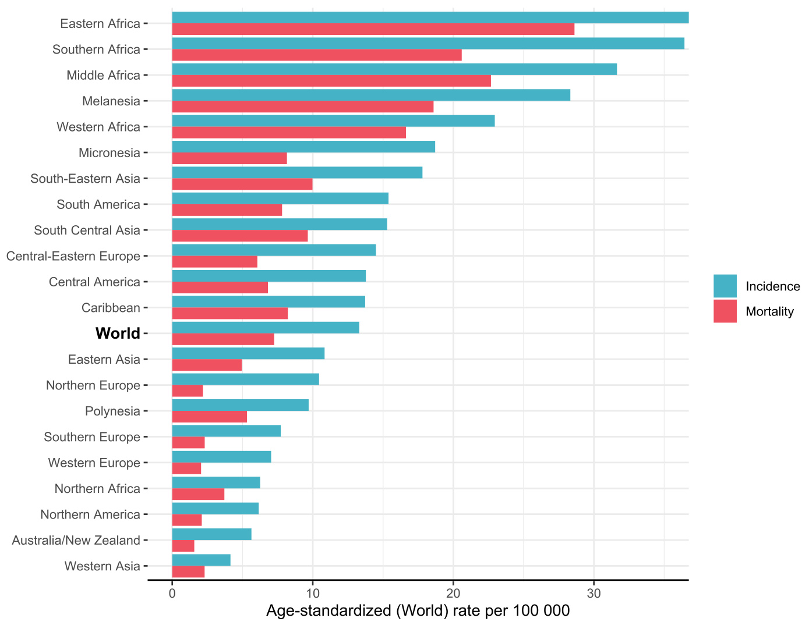

  

# 1.1 Global cervical cancer burden  

# 1.1.1	 Incidence  

Cervical cancer (International Statistical Classification of Diseases and Related Health Problems, 10th revision [ICD-10] code, C53 – Malignant neoplasm of cervix uteri) is the fourth most commonly diagnosed cancer type in women of all ages worldwide (Sung et al., 2021). In women of reproductive age (15–44 years), it is the second most common cancer type; cervical cancer is the most common cancer in 23 countries, most of which are in sub-Saharan Africa (Ferlay et al., 2020). In 2020, there were an estimated $6 0 4 0 0 0$ new cases worldwide, and cervical cancer repre­ sented about $6 . 5 \%$ of the global cancer burden in women; the proportions were higher for only breast cancer $( 2 4 . 2 \% )$ , colorectal cancer $( 9 . 4 \% )$ , and lung cancer $( 8 . 4 \% )$ . The highest proportion of new cases occurred in Asia $( 5 8 . 2 \% )$ , followed by Africa $( 1 9 . 4 \% )$ , Latin America and the Caribbean $( 9 . 8 \% )$ , Europe $( 9 . 6 \% )$ , Northern America $( 2 . 5 \% )$ , and Oceania $( 0 . 4 \% )$ (Ferlay et al., 2020; Sung et al., 2021).  

In 2020, the global age-standardized inci­ dence rate (ASIR) of cervical cancer was 13.3 per 100  000 women worldwide (Ferlay et al., 2020). The incidence rates of cervical cancer vary markedly across the world, with a 10-fold variation between the highest and lowest rates (Fig.  1.1 and Fig.  1.2). The estimated incidence rates (ASIR, per 100 000 women) are highest in Eastern Africa (40.1), Southern Africa (36.4), Middle Africa (31.6), Melanesia (28.3), and Western Africa (22.9), followed by the Federated States of Micronesia (18.7), South-Eastern Asia (17.8), South America (15.4), and South-Central Asia (15.3), and lowest in Western Asia (4.1) and Australia and New Zealand (5.6) (Ferlay et al., 2020; Sung et al., 2021). The incidence rates of cervical cancer are higher in countries that have a high prevalence of HIV infection and/or lack sustained cervical cancer screening programmes (Rohner et al., 2020).  

# 1.1.2	 Mortality  

Cervical cancer is the fourth most common cause of cancer death in women of all ages, after breast cancer, lung cancer, and colorectal cancer. In women of reproductive age (15–44 years), it is the second most common cause of cancer death (Arbyn et al., 2020). In 2020, there were an estimated 342 000 deaths worldwide due to cervical cancer; the proportion of deaths was highest in Asia $( 5 8 . 5 \% )$ and Africa $( 2 2 . 5 \% )$ , followed by Latin America and the Caribbean $( 9 . 2 \% )$ and Europe $( 7 . 6 \% )$ , and lowest in Northern America $( 1 . 9 \% )$ and Oceania $( 0 . 4 \% )$ (Ferlay et al., 2020; Sung et al., 2021).  

  
Fig. 1.1 Global distribution of estimated age-standardized (World) incidence rates (A) and  

  
Fig. 1.2 Estimated age-standardized (World) incidence and mortality rates per 100 000 for cervical cancer, by large world regions, 2020  

Adapted from Ferlay et al. (2020). Courtesy of Jérôme Vignat.  

In 2020, the age-standardized mortality rate (ASMR) for cervical cancer was 7.3 per 100 000 in women worldwide (Ferlay et al., 2020; Sung et al., 2021). The mortality rates of cervical cancer have a global pattern similar to that for the incidence rates, with a more than 15-fold variation between the highest and lowest rates (Fig.  1.1 and Fig.  1.2). The estimated mortality rates (ASMR, per 100  000 women) are highest in Eastern Africa (28.6), Middle Africa (22.7), Southern Africa (20.6), Melanesia (18.6), Western Africa (16.6), South-Eastern Asia (10.0), and  

South-Central Asia (9.6), and lowest in Australia and New Zealand (1.6) and Western Europe (2.0) (Ferlay et al., 2020; Sung et al., 2021).  

The highest cervical cancer incidence and mortality rates are generally observed in countries with the lowest levels of the Human Development Index (HDI) (Ginsburg et al., 2017) (Fig. 1.3). In countries with lower HDI, the inci­ dence and mortality rates span a wider range, suggesting that other factors besides HDI may account for the variability, such as exposure to human papillomavirus (HPV) or other cofactors or the coverage and type of screening (opportu­ nistic vs organized). In those countries with the highest HDI, both incidence rates and mortality rates are in a narrow range despite similar prev­ alences of HPV infection or other cofactors. The age-specific incidence rates of cervical cancer are presented in Fig. 1.4. Cervical cancer incidence rates start rising after age 25 years worldwide, but in countries with high and very high HDI, the peak of incidence is reached at about age 40 years, whereas in countries with medium and low HDI, the rate continues to rise until age 55–69 years (Arbyn et al., 2020).  

  
Fig. 1.3 Correlation between estimated age-standardized (World) cervical cancer incidence rates (A) and mortality rates (B) per 100 000 and Human Development Index (HDI), 2020   
The four tiers of HDI are: low $( < 0 . 5 5 )$ , medium $( \geq 0 . 5 5$ to $< 0 . 7$ ), high $( \geq 0 . 7$ to $< 0 . 8 \dot { }$ ), and very high $( \ge 0 . 8 )$ . Created using data from Ferlay et al. (2020) and UNDP (2020). Courtesy of Jérôme Vignat.  

  
Fig. 1.4 Age-specific incidence of cervical cancer worldwide and in terms of the four-tier Human Development Index (HDI), 2018   
The four tiers of HDI are: low $( < 0 . 5 5 )$ , medium $\geq 0 . 5 5$ to $< 0 . 7$ ), high $( \geq 0 . 7$ to $< 0 . 8 \dot { }$ ), and very high $( \ge 0 . 8 )$ . Reproduced from Arbyn et al. (2020).  

# 1.1.3	 Trends in incidence  

An analysis of trends in age-standardized cervical cancer incidence rates over time using the Cancer Incidence in Five Continents database (Ferlay et al., 2018) revealed variability in trends across countries and showed how these trends are influenced by a country’s context of policy, programmes, practice, and culture. Fig. 1.5 shows overall trends and trends in women younger than 40 years by country in all registries that provided data for the longest period. Trends for women older than 40  years are not presented, because they tend to be very similar to the overall trends. Also, trends in the registries that provided data for the longest period may not represent trends in the whole country. Three patterns emerge from these trends: (i) a decrease in rates over the years, (ii) an increase in overall rates, and (iii) an increase in rates in the younger age groups.  

  
Fig. 1.5 Trends in age-standardized (World) incidence rates for cervical cancer by country  

  
Fig. 1.5   (continued)  

In most countries, cervical cancer incidence rates have been decreasing over the past decades, although the magnitude of the decrease may vary. In many of these countries, the decrease can be attributed to sustained population-based screeningprogrammes;forexample,inDenmark, Finland, Norway, and Sweden, the introduction of screening programmes in the 1960s and 1970s resulted in an almost $5 0 \%$ reduction in cervical cancer incidence. In countries where there is no population-based screening, as for example in India, the decrease in cervical cancer incidence may reflect improved conditions, such as better education for girls and women, which lead to reduced exposure to HPV, among other factors (Dhillon et al., 2011).  

The second emerging pattern is a continued increase in incidence rates. In some countries (e.g. Belarus, Estonia, and Lithuania), incidence rates are increasing despite the introduction of screening programmes; this trend reflects weak opportunistic screening, poor coverage of screening, and poor quality (Vaccarella et al., 2016; Ojamaa et al., 2018). In Uganda, which has one of the longest-standing high-quality registries, there has been a continued increase in cervical cancer incidence rates. In a recent analysis of 10 African registries with 10–25 years of data, a similar pattern was seen and was attri­ buted to a high prevalence of HPV infection, a high prevalence of HIV infection, and a lack of well-attended population-based screening programmes (Jedy-Agba et al., 2020).  

In the third pattern, the overall trend is decreasing but incidence rates in women younger than 40 years are increasing. Such a pattern has been observed in China, most likely reflecting increased exposure to HPV in the youngest cohort of women (Li et al., 2017).  

Trends by histology cannot be provided at a global level, given the lack of histology data in many cancer registries. However, in selected countries the examination of incidence rates by histology provides insights into the impact of prevention strategies. For example, the reduc­ tion in the incidence of cervical cancer seen in the USA from the introduction of the Pap test in the 1960s until the early 2000s has been driven by reductions in the incidence rates of squamous cell carcinoma (SCC) of the cervix (Wang et al., 2004). In the past two decades, incidence rates of cervical SCC have stabilized in the USA (Islami et al., 2019), whereas incidence rates of cervical adenocarcinoma have increased both in the USA (especially in White women aged 40–60  years) (Islami et al., 2019) and in Europe (Bray et al., 2005). This trend may reflect changing sexual behaviours over time (Ryser et al., 2017), as well as an inability to detect cervical adenocarcinoma through cytology-based screening programmes (Castle et al., 2017).  

# 1.1.4	 Lifetime risk of cervical cancer  

The lifetime cumulative risk of cervical cancer for women aged 0–74 years is presented by region in Fig. 1.6. In Africa, the lifetime risk varies from $8 . 6 \%$ in Eswatini to $0 . 3 \%$ in Egypt. In Latin America and the Caribbean, women in the Plurinational State of Bolivia and in Guyana have a lifetime risk of $3 . 7 \%$ , whereas those in Martinique, France, have a lifetime risk of $0 . 6 \%$ . In Asia, the lifetime risk is highest in Maldives, Indonesia, and Mongolia and lowest in Iraq. Women in eastern Europe have consistently higher lifetime risk than those in western Europe (Ferlay et al., 2020; Sung et al., 2021).  

# 1.1.5	 Survival  

At the end of 2020, there were an estimated 1.5 million women alive who had been diagnosed with cervical cancer during the previous 5 years, representing about $5 . 8 \%$ of all people who were diagnosed with cancer within the previous 5 years (Ferlay et al., 2020).  

  
Fig. 1.6 Estimated cumulative risk (ages 0–74 years) of cervical cancer incidence by world region and country or territory, 2020  

The third cycle of the CONCORD pro­ gramme for global surveillance of cancer survival trends (CONCORD-3) included data for 660  744 women diagnosed with cervical cancer in 2000–2014 from 295 population-based cancer registries in 64 countries or territories. Population-based survival is estimated from data provided by population-based cancer regis­ tries that record all diagnoses of malignancy in the population of the country or region that they cover. It is a key measure of the overall effective­ ness of the health system in managing cancer in a given country or region (Allemani, 2017; Allemani et al., 2018).  

Population-based survival is a measure of the average survival of all patients with cancer. Population-based survival is usually presented as net survival (Perme et al., 2012), which is the probability of patients with cancer surviving until a given time since diagnosis, typically 5 years, after controlling for competing causes of death (background mortality).  

The global range in 5-year age-standard­ ized net survival for cervical cancer was wide $( 5 0 - 7 0 \% )$ in all three calendar periods $( 2 0 0 0 -$ 2004, 2005–2009, 2010–2014), reflecting ineq­ uity in access to diagnostic facilities and optimal treatment (Allemani et al., 2018). For women diagnosed in 2010–2014, 5-year age-standard­ ized net survival was $7 0 \%$ or higher in seven countries or territories (Cuba; Denmark; Japan; Norway; the Republic of Korea; Switzerland; and Taiwan, China), most of which have high HDI. Survival was in the range $6 0 - 6 9 \%$ in 29 coun­ tries or territories: Canada and the USA; Brazil and Puerto Rico; 5 countries or territories in Asia (China, Hong Kong Special Administrative Region, Israel, Singapore, and Turkey); 18 coun­ tries in Europe; and Australia and New Zealand. Survival was in the range $5 0 \text{‰}$ in 5 countries or territories in Central and South America (Argentina; Ecuador; Martinique, France; Peru; and Uruguay) and in 6 countries in Europe (Bulgaria, Latvia, Lithuania, Malta, Poland, and the Russian Federation), most of which have low or medium HDI. Between 2000 and 2014, 5-year survival increased by $4 \mathrm { - } 6 \%$ in Japan and in 11 European countries and by $10 \%$ in India. In China, it increased from $5 3 \%$ for women diagnosed in 2000–2004 to $6 8 \%$ for those diag­ nosed in 2010–2014. Survival trends could not be systematically assessed in Africa, because the data were incomplete (Allemani et al., 2018).  

# 1.1.6	 Prevalence of HPV infection in women  

Cervical cancer incidence often reflects expo­ sure to HPV, which is the central cause of cervical cancer (see Sections  1.2.1 and 1.2.2). A metaanalysis evaluated more than 500 studies that tested for HPV infection in 2.4 million women aged 15  years and older with normal cytology (Bruni et al., 2016), including population-based studies, screening studies, and representative control series in case–control studies. The global pooled prevalence was $1 5 . 3 \%$ for any HPV infec­ tion, $70 \%$ of which were with carcinogenic types. The age-standardized overall prevalence of HPV infection by world region is presented in Fig. 1.7. The Caribbean has the highest prevalence $( 5 0 . 7 \% )$ , and Southern Asia has the lowest $( 8 . 5 \% )$ . [Some estimates may be unstable for regions with few studies or with studies in subpopula­ tions.] The age-specific analysis (Fig. 1.8) shows that the prevalence of HPV infection is highest in younger women and lower in older women, and that the pattern appears flatter for Asia than for other regions. For some regions, such as Northern and Western Africa and Central America, there is a modest second peak of HPV prevalence in women older than 40  years. In studies with specific information on HPV type distribution, HPV16 was the most common type in all regions (standardized prevalence, $3 . 5 \%$ ; HPV18 $( 1 . 3 \% )$ , HPV52 $( 1 . 3 \% )$ , HPV58 $( 1 . 0 \% )$ , and HPV31 $( 0 . 9 \% )$  

  
Fig. 1.7 Standardized prevalence of human papillomavirus (HPV) infection by world region   
Squares represent the estimated adjusted HPV prevalence from the random-effects models for each corresponding region Courtesy of Laia Bruni, Bruni et al. (2016).  

were the other most common carcinogenic HPV types (Bruni et al., 2016).  

Most HPV prevalence surveys have been conducted in women, and very few popula tion-based data exist for men.  

number of new cases and a $4 0 . 8 \%$ increase in the number of deaths are projected by 2040. Numbers of deaths are projected to increase more rapidly in countries with lower HDI, and relatively large increases are projected in coun­ tries with medium and high HDI. These projec tions take into account only global demographic changes in population structure and growth according to United Nations estimates. The risk of developing or dying from cervical cancer is assumed to remain constant, and no allowance  

# 1.1.7	 Projections of global burden  

Table 1.1 shows the estimated global burden of cervical cancer incidence and mortality in 2020 and projected to 2040, overall and by HDI cate­ gory. Overall, a $3 2 . 0 \%$ increase in the estimated  

  
Fig. 1.8 Age-specific standardized prevalence of human papillomavirus (HPV) infection by world region  

The shaded area represents the $9 5 \%$ confidence interval for the global HPV prevalence.   
Courtesy of Laia Bruni, Bruni et al. (2016).  

is made for changes in increased detection or improvements in survival. Modelling studies have also projected that the number of new cases per year will increase from 600 000 in 2020 to 1.3  million in 2069; these projections also take into account changes in underlying demo­ graphics and exposure to risk factors (Simms et al., 2019). Widespread coverage of both HPV vaccination and screening has the potential to decrease the incidence of cervical cancer in the future (Brisson et al., 2020).  

# 1.2	 Cervical neoplasia  

# 1.2.1	 Biology of HPV and of the cervix relevant to carcinogenesis and screening  

HPVs are a group of circular, double-stranded DNA viruses of about 8000 base pairs that infect human skin and mucosal epithelia. The group includes more than 200 different geno­ types, which are numbered in order of discovery and characterization. The small genomes of the HPV types that cause cervical cancer consist of an upstream regulatory region and six early (E)  

Table 1.1 Global burden of cervical cancer: estimated annual numbers of incident cases and deaths, by HDI category and overall, in 2020 and projected to 2040   

<html><body><table><tr><td>HDI categorya</td><td colspan="2">Population in 2020</td><td colspan="2">Number of new cases (thousands)</td><td>Increase</td><td colspan="2">Number of deaths (thousands)</td><td>Increase</td></tr><tr><td></td><td>(millions)</td><td>(%)</td><td>2020</td><td>2040</td><td>(%)</td><td>2020</td><td>2040</td><td>(%)</td></tr><tr><td>Low HDI</td><td>494</td><td>12.8</td><td>82</td><td>162</td><td>97.3</td><td>56</td><td>112</td><td>99.9</td></tr><tr><td>Medium HDI</td><td>1136</td><td>29.4</td><td>183</td><td>292</td><td>59.6</td><td>113</td><td>189</td><td>66.8</td></tr><tr><td>High HDI</td><td>1442</td><td>37.3</td><td>240</td><td>297</td><td>23.5</td><td>129</td><td>182</td><td>40.6</td></tr><tr><td>Very high HDI</td><td>791</td><td>20.5</td><td>99</td><td>105</td><td>6.1</td><td>43</td><td>51</td><td>18.0</td></tr><tr><td>World</td><td>3863</td><td>100</td><td>604</td><td>798</td><td>32.0</td><td>342</td><td>481</td><td>40.8</td></tr></table></body></html>

HDI, Human Development Index. a The four tiers of HDI are: low $( < 0 . 5 5 )$ , medium $( \geq 0 . 5 5$ to $< 0 . 7$ ), high $( \geq 0 . 7$ to $\phantom { 0 } { < 0 . 8 \ ' }$ ), and very high $( \geq 0 . 8 )$ . Created using data from Ferlay et al. (2020) and UNDP (2020). Courtesy of Jérôme Vignat.  

and two late (L) genes on the positive coding strand. The early genes are involved in viral repli­ cation and maintenance within the host cell; L1 and L2 encode the self-assembling major and minor capsid proteins, respectively (Schiffman et al., 2016).  

Evolutionary taxonomy predicts the cells that specific HPV types infect and their carcinogen­ icity (Schiffman et al., 2005). The stable HPV genome has evolved very slowly in parallel with human evolution. The alpha genus contains 14 species, including more than 50 mucocutaneous types (Bzhalava et al., 2015); a single evolutionary branch includes the four species that contain the dozen or so HPV types that cause almost all cervical cancers (Fig. 1.9). The 12 types classified by IARC as carcinogenic to humans (Group  1) are HPV16, HPV31, HPV33, HPV35, HPV52, and HPV58 in alpha-9; HPV18, HPV39, HPV45, and HPV59 in alpha-7; HPV51 in alpha-5; and HPV56 in alpha-6 (Bouvard et al., 2009). In addi­ tion, HPV68 in alpha-7 is classified as probably carcinogenic to humans (Group 2A). The IARC classification refers to the carcinogenic poten­ tial based on prevalence in cervical cancers, not potency. Rarely, cervical cancers are found that contain only HPV types that are classified as possibly carcinogenic to humans (Group 2B), such as HPV73, but the attributable fraction and  

absolute risk are very low (Schiffman et al., 2009;   
de Sanjose et al., 2010) (Fig. 1.10).  

There is great variation in cervical carcinogenicity between the 12 HPV types that are classified by IARC in Group  1, and the impor­ tance of specific carcinogenic types may differ, depending upon the specific geographical popu­ lation (Guan et al., 2012; de Martel et al., 2017; de Sanjosé et al., 2018; Demarco et al., 2020). The etiological fractions of the types can best be determined by analysing cervical cancer case series, which now include tens of thousands of cases of (mainly squamous) invasive cancer (Fig. 1.10) (Combes et al., 2015). Five categories can be distinguished on the basis of cancer risk: HPV16 (in the alpha-9 species) is singularly carcinogenic and causes about $6 0 \%$ of cases of SCC. HPV18 and HPV45 (in the alpha-7 species) cause $1 5 \%$ and $5 \%$ of SCC cases, respectively. Other closely related alpha-9 types (HPV31, HPV33, HPV35, HPV52, and HPV58) together account, with some regional variation, for $1 5 \%$ of SCC cases. The remaining carcinogenic types (HPV39 and HPV59 in alpha-7, HPV51 in alpha-5, and HPV56 in alpha-6) are much less carcinogenic and together cause about $5 \%$ of SCC cases. HPV-associated cases of adeno­ carcinoma, which are an uncommon histolog­ ical group globally, are caused half by variants  

# Fig. 1.9 Phylogeny of the alpha human papillomavirus (HPV) types, with species groups and IARC classifications of the branch that contains carcinogenic types  

  
Note that almost all alpha-9 types (HPV16-associated) are carcinogenic. The other most important carcinogens are HPV18-associated, in alpha-7. There is no absolute division between carcinogenic and not carcinogenic; several of the types in this branch are classified as possibly carcinogenic to humans (Group 2B), because of genetic relatedness and because they have very rarely been associated with cancer cases. \* Carcinogenic to humans (Group 1); probably carcinogenic to humans (Group 2A); possibly carcinogenic to humans (Group 2B) (IARC, 2012). Reprinted from Schiffman et al. (2005). Copyright 2005, with permission from Elsevier.  

of HPV16 and half by HPV18 or HPV45 (and only uncommonly by other types, particularly in alpha-7) (Guan et al., 2013).  

This grouping is supported by a recent prospective study of large numbers of type-spe­ cific HPV infections and the absolute risk of cervical intraepithelial neoplasia grade 3 (CIN3) and adenocarcinoma in situ (AIS) (Demarco et al., 2020).  

To optimize cervical screening using HPV testing requires knowledge of the relative importance of the carcinogenic HPV types in a specific region. For the purposes of screening and vaccination, each type can be considered as a single invariant virus. Nonetheless, for deeper understanding, epidemiological study, and possible future applications, each HPV type can be further divided phylogenetically into several variants and subvariants, which in turn consist of many subtly varying genomes (Burk et al., 2013; Chen et al., 2018). These individual genome differences inform our understanding of evolu­ tion (García-Vallvé et al., 2005; Van Doorslaer & Burk, 2010), fine differences in carcinogenicity (Cullen et al., 2015), and racial differences in response to specific HPV types (e.g. the preva­ lence of particular variants of HPV35 explains the higher percentage of cancers in women of African ancestry) (Pinheiro et al., 2020).  

Fig. 1.10 Relative importance of the carcinogenic human papillomavirus (HPV) types   

<html><body><table><tr><td>HPV type</td><td>HPV species</td><td>IARC Groupa</td><td>% HPV type prevalence in cancer</td><td>% HPV type prevalence in normal</td><td>Odds ratio</td><td>% Attributable (etiological) fraction</td></tr><tr><td>HPV16</td><td>αx-9</td><td>Group 1</td><td>55.8</td><td>2.6</td><td>47.6</td><td>62.4</td></tr><tr><td>HPV18</td><td>α-7</td><td>Group 1</td><td>14.3</td><td>1</td><td>15.7</td><td>15.3</td></tr><tr><td>HPV45</td><td>α-7</td><td>Group 1</td><td>4.8</td><td>0.6</td><td>8.3</td><td>4.8</td></tr><tr><td>HPV33</td><td>α-9</td><td>Group 1</td><td>4</td><td>0.6</td><td>7.1</td><td>3.9</td></tr><tr><td>HPV58</td><td>α-9</td><td>Group 1</td><td>4</td><td>0.8</td><td>5.1</td><td>3.7</td></tr><tr><td>HPV31</td><td>α-9</td><td>Group 1</td><td>3.5</td><td>1</td><td>3.7</td><td>2.9</td></tr><tr><td>HPV52</td><td>α-9</td><td>Group 1</td><td>3.2</td><td>1</td><td>3.3</td><td>2.6</td></tr><tr><td>HPV35</td><td>α-9</td><td>Group 1</td><td>1.6</td><td>0.4</td><td>3.9</td><td>1.4</td></tr><tr><td>HPV59</td><td>α-7</td><td>Group 1</td><td>1.2</td><td>0.4</td><td>2.9</td><td>0.9</td></tr><tr><td>HPV39</td><td>αx-7</td><td>Group 1</td><td>1.3</td><td>0.6</td><td>2.0</td><td>0.8</td></tr><tr><td>HPV68</td><td>αx-7</td><td>Group 2A</td><td>0.6</td><td>0.4</td><td>1.5</td><td>0.2</td></tr><tr><td>HPV51</td><td>αx-5</td><td>Group 1</td><td>1</td><td>0.9</td><td>1.2</td><td>0.2</td></tr><tr><td>HPV56</td><td>α-6</td><td>Group 1</td><td>0.8</td><td>0.6 0.3</td><td>1.3 1.8</td><td>0.2 0.2</td></tr><tr><td>HPV73 HPV26</td><td>α-11 α-5</td><td>Group 2B Group 2B</td><td>0.5 0.2</td><td>0.1</td><td>4.1</td><td>0.2</td></tr><tr><td>HPV30</td><td>α-6</td><td>Group 2B</td><td>0.2</td><td>0.1</td><td>2.6</td><td>0.1</td></tr><tr><td>HPV69</td><td>α-5 </td><td>Group 2B</td><td>0.2</td><td>0.1</td><td>1.4</td><td>0.1</td></tr><tr><td>HPV67</td><td>α-9</td><td>Group 2B</td><td>0.3</td><td>0.2</td><td>1.2</td><td><0.1</td></tr><tr><td>HPV82</td><td>α-5</td><td>Group 2B</td><td>0.2</td><td>0.1</td><td>1.2</td><td><0.1</td></tr><tr><td>HPV34</td><td>α-11</td><td>Group 2B</td><td>0.1</td><td>0.1</td><td>1.0</td><td>Not attributable</td></tr><tr><td>HPV66</td><td>α-6</td><td>Group 2B</td><td>0.3</td><td>0.6</td><td>0.4</td><td>Not attributable</td></tr><tr><td>HPV70</td><td>α-7</td><td>Group 2B </td><td>0.2</td><td>0.8</td><td>0.3</td><td>Not attributable</td></tr><tr><td>HPV53</td><td>α-6</td><td>Group 2B</td><td>0.5</td><td>1.1</td><td>0.4</td><td>Not attributable</td></tr></table></body></html>

There is substantial variability in carcinogenicity between HPV types, including those classified by IARC in Group 1. However, for clinical use, commercial HPV screening assays often detect a pool of carcinogenic (or high-risk) HPV types; the 14 types most commonly included in current HPV tests are shown in bold here. The attributable fraction is the percentage of cancer caused by that type. For each type, a relative risk can be estimated by the odds ratio of positivity in invasive cervical cancer compared with cytologically normal controls. A worldwide pooled analysis of invasive cancers $( n = 1 3 7 6 3 - 4 0 7 0 6$ cases, depending on type) and normal controls $( n = 2 6 5 9 9 - 2 6 3 9 7 1$ , depending on type) reveals a five-level natural grouping in attributable fraction, shown by colour bands. (Attributable fractions are weighted to sum to $100 \%$ .) HPV16 is uniquely carcinogenic (red). HPV18 and HPV45 are relatively important for cancers (orange), especially adenocarcinomas, rather than precancers. Then follow other alpha-9 types related to HPV16 (yellow) and a group of less carcinogenic types (dark green), all classified by IARC in Group 1 or Group 2A. Last, there are types classified by IARC in Group 2B (light green), some of which contribute very small attributable fractions and some of which cannot be attributed at all. [For HPV66, which is more prevalent in normal cytology than in invasive cervical cancer and is sometimes mistakenly included in HPV screening tests, the attributable fraction is zero.] a Carcinogenic to humans (Group 1); probably carcinogenic to humans (Group 2A); possibly carcinogenic to humans (Group 2B) (IARC, 2012). Created by the Working Group using data from Combes et al. (2015). Courtesy of Gary Clifford.  

  
Fig. 1.11 Topology of human papillomavirus (HPV) infection of the cervix   
Most cervical cancers arise in a zone of uniquely susceptible tissue at the dynamic squamocolumnar junction. Multiple concurrent and asynchronous infections can cause clonal lesions of varying severity, which are difficult to distinguish visually. The cervical intraepithelial neoplasia (CIN) scale is found to be difficult to replicate either visually or microscopically. The available evidence suggests that a more reliable distinction can be made between signs of HPV infection and high-grade precursor lesions (precancer). From Schiffman et al. (2011).  

Another area of biology that affects screening strategies is the adequate definition of the cervix from a screening perspective. Anatomically, the cervix is defined as the terminal part of the uterus extending into the anterior aspect of the vagina, and it is composed of fibrous connective tissue, scant smooth muscle, and overlying epithelial components. However, from the perspective of carcinogenesis and screening, the cervix can be viewed as a ring of epithelium positioned at the junction between the glandular endocervix and the adjoining squamous ectocervix (Doorbar & Griffin, 2019). Multiple HPV infections and related clonal lesions of differing severity can be observed concurrently by cervical micro­ dissection studies (Fig. 1.11) (Quint et al., 2001; Wentzensen et al., 2009; van der Marel et al., 2014; Venetianer et al., 2020). Cervical lesions can collide and seemingly merge, but each clone contains a single driving HPV infection.  

Cervical cancers typically arise adjacent to the squamocolumnar junction (SCJ), which is subject to lifelong squamous metaplasia, the inward-moving gradual replacement of singlecell-thick columnar or glandular epithelium by the thicker squamous epithelium. Thus, the position of the SCJ moves centrally throughout a woman’s life, from its distal origin on the ecto­ cervix or vagina into the endocervical canal, until it has gradually moved out of the visible area in most older women. The ring of tissue between the early and eventual late SCJ positions, called the transformation zone (TZ), contains a compartment of immortal cells, which have an elevated risk of HPV-induced cervical cancer compared with the flanking tissues of the vagina or the deeper endocervix (Doorbar & Griffin,  

2019). Cell sample collection and destruction of the TZ are the basis of secondary prevention of cervical cancer (see Section 1.2.5). Depending on the position of the SCJ, the cells collected during cervical screening will be mainly glandular cells, a mixture of TZ cell types, or mature squamous cells (Castle et al., 2006).  

# 1.2.2	 Transmission and natural history of HPV infection and multistage cervical carcinogenesis  

Each individual case of cervical cancer arises from persistent infection with a specific carcino­ genic HPV genome (Schiffman et al., 2016). Although it is well researched, cervical carcino­ genesis has an unpredictable quality, because a woman may successfully control a large number of concurrent or asynchronous HPV infections but fail, for reasons that are still unexplained, to control the causal one. The whole process typi­ cally takes decades from acquisition of HPV infection to cancer diagnosis, although more rapid transitions are sometimes seen.  

There is a well-established set of necessary health states and transitions leading from the normal cervix to invasive cancer (Fig.  1.12) (Campos et al., 2021). The schema presents the necessary transition states that are currently measurable with reasonable international repro­ ducibility by a combination of HPV typing and expert gynaecological pathology: normal cervix (uninfected), HPV infection (type-spe­ cific carcinogenic), precancer, and cancer. The transition between normal cervix and HPV infection can be called appearance and disap­ pearance of HPV detection, to acknowledge the limitations of existing measurement assays and the potential for reactivation of latent infections. The transitions between infection and precancer are described as progression to and regression of precancer. Invasion is considered a typically irreversible transition when HPV-associated cells cross the basement membrane. Precancers and cancers are subdivided into the predom inant squamous pathway and the uncommon glandular pathway, not only because the histo­ logical types vary clinically but also because the observed transition probabilities from infection to precancer to cancer seem to differ (Schiffman et al., 2016). Fig. 1.13 shows the parallel between HPV infection and cervical carcinogenesis at the levels of molecular pathogenesis and clinical microscopic or visual diagnoses.  

As shown in Fig. 1.12, the cervix uninfected by carcinogenic HPV is considered normal from the point of view of cervical cancer risk, i.e. at extraordinarily low risk of prevalent or near-term incident cancer. Vertical transmis­ sion is not known to be an important factor in cervical carcinogenesis (Zahreddine et al., 2020). Anogenital HPV infections are very readily transmitted through direct physical, i.e. sexual (not necessarily intromissive), contact (Malagón et al., 2019). The average age at the start of sexual activity in a population determines the average starting time point of cervical carcinogenesis (Kjaer et al., 1992).  

For any given infection, the moment of acquisition is not precisely known. Detection (i.e. appearance) of HPV can represent primary acquisition or reappearance after one or more episodes of disappearance (the two are, in prac­ tical terms, indistinguishable) (González et al., 2010). The closer a woman is in age to the start of her sexual activity, the more likely it is that appearance represents a truly new acquisition (Ho et al., 1998; Maucort-Boulch et al., 2010).  

Following the general epidemiological principle, the prevalence odds of HPV infec­ tion $\mathbf { \Sigma } = \mathbf { \Sigma }$ incidence $\times$ duration (i.e. persistence); when prevalence is low, the equation reduces to prevalence $\mathbf { \Sigma } = \mathbf { \Sigma }$ incidence $\times$ duration. In women without evidence of prevalent precancer, the HPV types most commonly found on screening (i.e. prevalent infections) are also the most likely to appear during follow-up (i.e. incident infec­ tions). The strong correlation between HPV appearance and prevalence, which is seen in all age groups, holds because the pattern of disap­ pearance (often called clearance) is nearly the same for all HPV types (including non-carcino­ genic types) in immunocompetent women, irre­ spective of age (Plummer et al., 2007; Demarco et al., 2020). The clearance curve is very distinct, with extremely rapid disappearance of a high proportion of infections in the initial months, leading to median clearance by about 1 year in most screen-detected infections, with a large fraction undetectable within 2–3  years. Only a very small proportion of carcinogenic HPV infections are detectable for more than 5  years (without progression to precancer) (Ho et al. 1998; Demarco et al., 2020).  

  
Fig. 1.12 Human papillomavirus (HPV) infection and multistage development of cervical cancer   
Each box in the figure represents a necessary stage, or health state, on the path to cervical cancer. The arrows represent forward and backward transitions between health states. The transitional probabilities form a basis of epidemiological research and health decision models. ADC, adenocarcinoma; SCC, squamous cell carcinoma. Reproduced with permission from Campos et al. (2021).  

The disappearance of HPV can indicate immune control (resulting in latent infections, which replicate in the basal epithelial layer without a complete life-cycle and full virion production) or complete eradication from the cervix (Doorbar, 2018). The distinction cannot currently be measured; in any case, only persis­ tently apparent infections, detectable for years by HPV DNA assays, confer risk of precancer.  

Progression to precancer is a function of HPV type and time of persistence (Fig.  1.14) (Schiffman et al., 2005; Rodríguez et al., 2010). Compared with these major influences, progres­ sion is increased only slightly by etiological cofactors such as smoking, multiparity, or use of hormonal contraceptives (Perkins et al., 2020). Whereas viral clearance follows a curve that is initially very fast and then slows, progression is a more linear product of time spent as persistently detectable. HPV16 has the highest progression rate per time (Demarco et al., 2020). The lowestrisk carcinogenic types have considerably lower progression rates.  

The prevalence of HPV in adult women in a population is a critical determinant of cervical screening and triage strategies, because most infections are acquired in young adulthood and resolve; prevalently detected HPV infec­ tions in mid-adult and older women are more likely to be persistent infections that have not resolved. In screening, point prevalent infections are observed; if prevalence is high, it becomes impractical to treat all infected women by use of currently available destructive or excisional methods. International studies of prevalence of carcinogenic HPV types indicate that low prevalence in mid-adulthood is characteristic of immunocompetent, frequently screened popu­ lations (Fig.  1.15) (Bruni et al., 2010). However, a high prevalence throughout adulthood is observed in some important regions, such as sub-Saharan Africa, and may be linked to partial immunodeficiency (or, alternatively, to some unknown behavioural difference combined with lack of screening). The partial immuno­ deficiency hypothesis suggests that there is a tolerant immune response secondary to chronic parasitoses or gut helminth prevalence (Petry et al., 2003; Gravitt et al., 2016). Women living with HIV are an important special population; they have a high HPV prevalence, and screening and management require separate consideration (see Section 5.2.1).  

  
Fig. 1.13 Major steps in the development of cervical cancer   
Reprinted from Schiffman et al. (2007). Copyright 2007, with permission from Elsevier. Adapted from Schiffman & Castle (2005).  

Few studies of type-specific regression of precancer have been conducted, because of the ethical requirement for prompt treatment. However, it is well established that HPV type is a key determinant of the precancerous state and the risk of progression. The carcinogenic and non-carcinogenic HPV types found in precan­ cers, even when stringently defined as CIN3 or AIS, are more numerous (specifically for CIN3) than the types found in invasive cancer (Guan et al., 2012) (Fig.  1.10). This shows that current clinical definitions of precancer are not perfect surrogates of cancer risk. HPV31 and HPV51 are examples of HPV types whose role in causing precancers may lead to an exaggerated view of their importance for cancers. Similarly, HPV53 and HPV66, two types that are possibly carcino­ genic to humans (Group 2B), are frequent causes of precancer but almost never cause cancer (Schiffman & de Sanjose, 2019). Type-specific transition probabilities of invasion cannot be directly observed ethically (McCredie et al., 2008); however, they can be crudely ranked by the relative proportions of the individual types in cancers versus precancers in a given population (Guan et al., 2012) (Fig.  1.10). A higher relative proportion in cancers suggests an association with invasive potential, as exemplified by the predominance of HPV16 in invasive cancers.  

  
Fig. 1.14 Average clearance, persistence, and progression of carcinogenic human papillomavirus (HPV) infections   
This figure combines the early natural history of rapid clearance of HPV infection with slower progression to precancers, which can, in turn, eventually invade, as described by McCredie et al. (2008). CIN3, cervical intraepithelial neoplasia grade 3. Reproduced from Schiffman et al. (2011).  

The epidemiology of HPV natural history and multistage cervical carcinogenesis can also be viewed in molecular terms describing type-spe­ cific viral carcinogenicity. Viral genomes persist at low levels in the undifferentiated cells in the lowest layers of the epithelium, typically with only low (and regulated) levels of viral gene expression. This is the reservoir of infection that underlies viral latent persistence. As cells from this layer differentiate and migrate towards the epithelial surface, a pattern of gene expression is initiated, which leads to the production of virus particles; these are eventually shed from the epithelial surface (Doorbar, 2018). The cellular immune system, a combination of intraepithelial and stromal cellular surveillance and destruc­ tion of infected cell clones, plays an important role in controlling HPV infections in cervical tissue (Stanley et al., 1994). Sometimes, if cellular immune control weakens (e.g. due to immune senescence), infections persisting in a latent, non-infectious state may be reactivated and resume a full viral life-cycle, leading to virion production and release (Schiffman et al., 2016). The risk of subsequent precancer after reappear­ ance is equal to or lower than the risk after first acquisition (Rodríguez et al., 2012; Gage et al., 2014).  

  
Fig. 1.15 Factors that influence age-specific human papillomavirus (HPV) prevalence in women, and three patterns of HPV prevalence   
The prevalence of HPV and associated cellular and visual changes in mid-adulthood is a critical determinant of screening and management strategies. Prevalence patterns by age vary widely between settings, because of behavioural and immunological variables. Examples are given in (a), (b), and (c). (a) Age at first sexual intercourse determines the beginning of the curve. (b) Sequential and concurrent multiple sexual partnership (both sexes) determines the height. (c) Partner stability and/or immune response shape the curve descent, and cervical cancer screening practices determine the height at older ages. Three illustrative examples of age-specific HPV prevalence are given in (d), (e), and (f): (d) more-developed regions, (e) India, and (f) Africa. Adapted from Schiffman et al. (2016).  

The difference between productive HPV infection and precancer has been studied comprehensively at the molecular level, and there are important changes in both viral and cellular biology. HPV infections are very common, and even infections with carcinogenic types are usually benign. However, when they are persis­ tent, infections with carcinogenic types may shift from the usual and common productive state (i.e. the complete life-cycle designed to produce new virus particles). Instead, the virus can enter an abortive or transforming state characteristic of precancer. This occurs when the viral proteins used for cellular adaptation in the successful vegetative life-cycle disrupt cell differentia­ tion and, as an unintended consequence, are no longer able to generate infectious virus. The correlated visual, microscopic, and molecular signs or biomarkers of the shift from productive infection to transforming infection underlie almost all cervical screening, triage, and diag­ nostic tests designed to detect precancer.  

At the molecular level, viral gene expression changes from a productive infection character­ ized by expression of the E4, L2, and L1 viral genes to a strongly increased expression of the viral oncogenes E6 and E7 (Doorbar et al., 2012; Griffin et al., 2015). This deregulated expression of E6 and E7 in replicating basal cells leads to disturbances of cell-cycle regulation, disrupted differentiation and cell density regulation, and abrogation of apoptosis. The changes include disruption of the retinoblastoma protein (pRB) family regulatory pathway by E7, which results in accumulation of p16; detection by p16/Ki-67 dual staining provides accurate cytological and histological markers of precancer (Wentzensen et al., 2007, 2019). Deregulated expression of E6 and E7 oncoproteins also affects DNA methyl­ ation; in transformed cells, HPV genomes are highly methylated throughout $\mathrm { C p G }$ sites, espe­ cially in the capsid encoding the L1 and L2 genes (yielding a biomarker predictive of precancer) (Lorincz et al., 2013; von Knebel Doeberitz & Prigge, 2019; see also Section 4.6).  

Table 1.2 Summary of the current WHO classification of tumours of the uterine cervix   

<html><body><table><tr><td>Squamous cell tumours and precursors</td><td>Germ cell tumours</td></tr><tr><td>Squamous intraepithelial lesions</td><td>Neuroendocrine neoplasia</td></tr><tr><td> Squamous cell carcinoma, HPV-associated</td><td>Neuroendocrine tumour</td></tr><tr><td>Squamous cell carcinoma, HPV-independent</td><td>Neuroendocrine carcinoma</td></tr><tr><td>Squamous cell carcinoma NOS</td><td>Small cell neuroendocrine carcinoma</td></tr><tr><td>Glandular tumours and precursors</td><td>Large cell neuroendocrine carcinoma</td></tr><tr><td>Adenocarcinoma in situ, HPV-associated</td><td>Mixed neuroendocrine-non-neuroendocrine neoplasms</td></tr><tr><td>Adenocarcinoma, HPV-associated</td><td>Carcinoma admixed with neuroendocrine carcinoma</td></tr><tr><td>Adenocarcinoma in situ, HPV-independent</td><td>Mesenchymal tumours of thelower genital tract</td></tr><tr><td>Adenocarcinoma, HPV-independent, gastric type</td><td>Adipocytic tumours</td></tr><tr><td> Adenocarcinoma, HPV-independent, clear cell type</td><td>Fibroblastic and myofbroblastic tumours</td></tr><tr><td>Adenocarcinoma, HPV-independent, mesonephric type </td><td>Vascular tumours</td></tr><tr><td> Other adenocarcinomas of the uterine cervix</td><td>Smooth muscle tumours</td></tr><tr><td>Other epithelial tumours</td><td>Skeletal muscle tumours</td></tr><tr><td>Carcinosarcoma</td><td>Peripheral nerve sheath tumours</td></tr><tr><td>Adenosquamous and mucoepidermoid carcinomas</td><td>Tumours of uncertain differentiation</td></tr><tr><td> Adenoid basal carcinoma</td><td>Undifferentiated small round cell sarcomas</td></tr><tr><td>Carcinoma, unclassifiable</td><td>Melanocytic lesions</td></tr><tr><td>Mixed epithelial and mesenchymal tumours</td><td>Naevi</td></tr><tr><td>Adenomyoma</td><td> Melanoma</td></tr><tr><td>Adenosarcoma</td><td>Metastasis</td></tr></table></body></html>

HPV, human papillomavirus; NOS, not otherwise specified. Adapted from WHO Classification of Tumours Editorial Board (2020).  

# 1.2.3	Terminology for pathological classification  

This section provides an overview of the classification and pathology of cervical cancer. The current WHO classification is summarized in Table 1.2, and the text below focuses on the most common cervical cancer types: SCC and adenocarcinoma, which typically arise in the TZ. These two tumour types account for more than $9 5 \%$ of all cervical cancers. SCC is considerably more common than adenocarcinoma, which accounts for about $5 \%$ of all cervical carcinomas in non-screened populations, although more recently a higher proportion $( 1 0 - 2 5 \% )$ has been reported in screened populations (Smith et al., 2000; Adegoke et al., 2012). Other tumour types are rare, but screening programmes do identify appreciable numbers of them (Lei et al., 2019). The WHO classification of tumours of female genital tumours provides detailed information on all of the tumours and tumour-like lesions that arise in the uterine cervix (WHO Classification of Tumours Editorial Board, 2020).  

Most cervical cancers are HPV-associated carcinomas, but a small percentage of tumours are not associated with HPV infection. Moreover, there is accumulating evidence that HPV-independent cervical carcinomas are more aggressive than their HPV-associated counter­ parts (Nicolás et al., 2019; Stolnicu et al., 2019). To reflect this, the classification of cervical carcinomas has changed in the latest edition of the WHO classification, to separate tumours associated with HPV infection from those that arise independently of HPV (WHO Classification of Tumours Editorial Board, 2020).  

# (a) Etiology and pathogenesis  

The etiology and pathogenesis of epithelial tumours of the cervix are dominated by HPV infection, as discussed in detail in Sections 1.2.1 and 1.2.2.  

An important consequence of our improved understanding of the relationship between HPV infection and cervical cancer is that it has enabled reconsideration of the terminology of precursor lesions. HPV infections occur in two forms: productive and transforming. Productive HPV infection cannot occur in glandular epithe­ lium, because it is tightly linked to squamous differentiation. However, transforming infection can occur in glandular epithelium, and this leads to the development of HPV-associated AIS, the precursor of HPV-associated adenocarcinoma. This has led to increasing use of a two-tier classi­ fication for HPV-associated squamous precursor lesions (Table 1.2).  

# (b) Epithelial tumours  

# (i) Precursors of squamous cell carcinoma  

The histopathological classification of precursors of cervical SCC has changed over time (Fig.  1.16). Until the 1960s, non-invasive lesions were subdivided into carcinoma in situ and dysplasias, which were in turn subdivided into three grades (mild, moderate, and severe) of increasing cytological abnormality (Reagan et al., 1953). In 1967, Richart proposed the term cervical intraepithelial neoplasia (CIN) to encompass the spectrum of changes encountered in intraepithelial lesions of squamous epithelium (Richart, 1967). CIN lesions are identified on the basis of full-thickness nuclear abnormality, with the grades (CIN1, CIN2, and CIN3) determined traditionally by the position in the epithelium, in thirds, at which cytoplasmic maturation occurs; these features correlate with increasing risk of progression to invasive disease (Ostör, 1993; Cantor et al., 2005). Initially, carcinoma in situ (CIS) was separated from CIN3, but reproducible separation was problematic, and CIS was subse­ quently incorporated into the CIN3 category. The CIN system has been used widely, both for the diagnosis of cervical disease and, since the 1980s, in screening programmes, particularly in Europe (Fox et al., 1999; Hirschowitz et al., 2012). The alternative two-tier system (Lower Anogenital Squamous Terminology [LAST]), which recognizes low-grade and high-grade squamous intraepithelial lesions (SILs), has its origins in the Bethesda system for reporting cyto­ pathology, in the late 1980s (Solomon, 1989), and has been translated into histopathological use, particularly in North America (Tabbara et al., 1992; Stoler et al., 2001). Broadly, low-grade SIL corresponds to a combination of the categories of CIN1 and HPV-associated changes without CIN; and high-grade SIL corresponds to a combina­ tion of CIN2 and CIN3. A detailed review of clas­ sification systems, together with considerations of HPV biology, led to the recommendation in 2012 that the SIL terminology be used (Darragh et al., 2012); this was endorsed in 2014 in the WHO classification (Kurman et al., 2014) and has been retained in the 2020 classification (WHO Classification of Tumours Editorial Board, 2020). Both LAST and WHO recommend that the appropriate CIN term is provided in paren­ theses after the SIL designation, for example “high-grade SIL (CIN2)”. In cases where there is diagnostic uncertainty, p16 immunostaining, when available, is helpful (Darragh et al., 2012; Castle et al., 2020).  

For cytology, the Bethesda (SIL) system is widely used, but the Pap and WHO systems are also used in some areas. This variation is also true for histopathology; both the CIN and LAST (SIL) systems are used in different geographical regions. The relationship between the systems currently in use is shown in Fig.  1.16. This discussion relates to HPV-associated squamous precursor lesions. There are no validated reports of HPV-independent squamous precursor lesions, which are therefore not included in the WHO classification (WHO Classification of Tumours Editorial Board, 2020).  

Fig. 1.16 Classification systems currently used for squamous lesions of the cervix   

<html><body><table><tr><td colspan="2">Histology</td><td colspan="3">Cytology</td><td>Molecular</td></tr><tr><td>CIN</td><td>LAST</td><td>Pap</td><td>WHO</td><td>Bethesda</td><td></td></tr><tr><td>Normal</td><td>Normal</td><td></td><td>Negative</td><td>NILM</td><td>Normal cervix</td></tr><tr><td rowspan="3">CIN1</td><td rowspan="3">LSIL</td><td></td><td>Squamous atypia</td><td>ASC-US</td><td rowspan="3">HPV infection</td></tr><tr><td></td><td>Mild</td><td>LSIL</td></tr><tr><td>IID</td><td></td><td></td></tr><tr><td>CIN2 CIN3</td><td>HSIL</td><td>IV</td><td>Moderate Severe</td><td>HSIL</td><td>Precancer</td></tr><tr><td>Cancer</td><td>Cancer</td><td>V</td><td>Cancer</td><td>Cancer</td><td>Cancer</td></tr></table></body></html>

ASC-US, atypical squamous cells of undetermined significance; CIN, cervical intraepithelial neoplasia; HSIL, high-grade squamous intraepithelial lesion; LAST, Lower Anogenital Squamous Terminology; LSIL, low-grade squamous intraepithelial lesion; NILM, negative for intraepithelial lesion and malignancy; Pap, Papanicolaou; WHO, World Health Organization. Adapted from Schiffman et al. (2016).  

# (ii) Squamous cell carcinoma  

SCC is the most common type of cervical cancer, constituting $8 0 - 9 0 \%$ of cases (de Sanjose et al., 2010). SCC can be defined as a malignant tumour comprising invasive epithelium exhib­ iting squamous differentiation. This tumour can show several different histological patterns, for example keratinizing, non-keratinizing, basaloid, or papillary. These patterns aid diag nosis but do not influence clinical management. Most cervical SCCs (an estimated $9 3 - 9 5 \%$ ) are HPV-associated (de Sanjose et al., 2010; Rodríguez-Carunchio et al., 2015; Nicolás et al., 2019). The presence of HPV can be determined by molecular testing, but p16 immunohisto­ chemistry is an effective surrogate marker of HPV in most cases (Klaes et al., 2001, 2002; Darragh et al., 2012). Immunohistochemistry for p16 is available in many, but not all, diagnostic laboratories, and therefore the WHO classifica­ tion allows for a diagnosis of SCC not otherwise specified (NOS), in settings where the distinction between HPV-associated and HPV-independent tumours cannot be made by either p16 immu­ nostaining or HPV testing (WHO Classification of Tumours Editorial Board, 2020).  

# (iii) Precursors of adenocarcinoma  

In contrast to SILs, both HPV-associated and HPV-independent precursor lesions are recog­ nized for adenocarcinomas of the cervix. The HPV-associated lesions, termed AIS, constitute the majority of cases and can generally be iden­ tified by their typical morphological features and diffuse positivity for p16 (Kurman et al., 2014; Stolnicu et al., 2018, 2019). The HPV-independent lesions have been increasingly recognized in recent years, particularly as precursor lesions for HPV-independent adenocarcinoma of gastric type, which have been referred to histor­ ically as lobular endocervical glandular hyper­ plasia (LEGH) and atypical LEGH (Kawauchi et al., 2008; McCluggage, 2016; Mikami, 2020). Mesonephric remnant hyperplasia may be a precursor lesion for HPV-independent adeno­ carcinoma of mesonephric type (McCluggage, 2016).  

# (iv) Adenocarcinoma  

Adenocarcinomas are defined as malig­ nant tumours comprising invasive epithelium exhibiting glandular differentiation. They are also separated into HPV-associated and HPVindependent tumours (Stolnicu et al., 2018). Most cervical adenocarcinomas $( 7 5 - 9 0 \% )$ are HPV-associated, and typical cases of usual-type adenocarcinoma can be identified on the basis of haematoxylin and eosin morphology. p16 immu­ nostaining and/or high-risk HPV testing can be helpful in confirming the diagnosis (Stolnicu et al., 2018). HPV-independent adenocarcinomas are less common and include gastric-type adeno­ carcinomas (incorporating adenoma malignum) (Nishio et al., 2019; Mikami, 2020), clear cell carcinoma, and mesonephric carcinoma. Gastric-type adenocarcinomas comprise $1 0 \mathrm { - } 1 5 \%$ of all cervical adenocarcinomas worldwide (Stolnicu et al., 2018; Hodgson et al., 2019) and $2 0 \mathrm { - } 2 5 \%$ of cervical adenocarcinomas in Japan (Kojima et al., 2007; Kusanagi et al., 2010; Wada et al., 2017). There is accumulating evidence that HPV-independent cervical carcinomas, particu­ larly gastric-type adenocarcinomas, behave more aggressively than their HPV-associated counter­ parts (Nicolás et al., 2019; Stolnicu et al., 2019).  

[It is important to recognize that screening programmes traditionally are not as effective for the identification of adenocarcinomas or their precursors; however, HPV-associated AIS and adenocarcinomas are identified more effectively by HPV testing than by cytology.]  

# (v) Neuroendocrine tumours  

Low-grade neuroendocrine tumours (carci­ noid and atypical carcinoids) are very rare in the cervix. High-grade neuroendocrine carcinomas of small cell and large cell type occur much more frequently, are typically HPV-associated (small cell, $8 5 \%$ ; large cell, $8 8 \%$ ; Castle et al., 2018), and may be accompanied by an HPV-associated adenocarcinoma component. These tumours tend to present at an advanced stage and behave aggressively (Gibbs et al., 2019).  

# (vi) Other epithelial tumours  

This category includes adenosquamous carci­ noma, in which there is a mixture of both adeno­ carcinoma and SCC, and rare tumour types such as adenoid cystic carcinoma and adenoid basal carcinoma. True adenoid cystic carcinoma must be distinguished from an HPV-associated carcinoma with an adenoid cystic growth pattern. Carcinosarcomas occur as primary cervical tumours and are considered metaplastic carcinomas (WHO Classification of Tumours Editorial Board, 2020).  

# (c) Non-epithelial tumours  

Malignant non-epithelial tumours are rare in the cervix. An important tumour in this cate­ gory is embryonal rhabdomyosarcoma, which typically occurs in young children and may be associated with DICER1 syndrome, where it is associated with other syndromic tumours such as cystic nephroma, pleuropulmonary blastoma, and thyroid tumours (WHO Classification of Tumours Editorial Board, 2020).  

# 1.2.4	 Stage at diagnosis and survival  

Tumour staging assesses the extent of tumour spread, and for many tumours it is the most important determinant of clinical management, largely because it is strongly associated with patient outcome. Staging assesses spread within the organ of origin, spread to local structures, and spread to lymph nodes and distant sites; this forms the basis of the tumour–node–metastasis (TNM) staging system, which assigns separate categories to the tumour (T), lymph nodes (N), and metastases to distant sites (M) (Fig. 1.17).  

Gynaecological tumours are typically also staged using the International Federation of Gynecology and Obstetrics (FIGO) staging system, which, for cervical carcinomas, is tradi­ tionally based on the extent of local spread and is designed to be clinically (rather than patho­ logically or radiologically) assessable. Most of the recent literature is based on the 2009 FIGO classification, which separates clinically visible disease from microscopically detected disease and assesses spread on the basis of involvement of other pelvic structures (Pecorelli et al., 2009; Brierley et al., 2017). In 2018, the FIGO staging system was modified to include lymph node metastasis, based on either radiological or patho­ logical assessment (Table 1.3) (Bhatla et al., 2018, 2019; Anonymous, 2019). Patients with tumours confined to the cervix but with lymph node metastasis are now considered to have stage III rather than stage I disease. A second significant change in the 2018 system was the removal of lesion width assessment from the microinvasive disease categories. Thus, stage  IA and micro­ scopic stage IB disease are defined solely on the basis of depth of invasion.  

A comparison of the 2009 and 2018 FIGO staging systems in a study of 1282 patients at a centre in the USA demonstrated upward stage migration in more than $5 0 \%$ of patients, largely because of the inclusion of lymph node metastasis in the 2018 system. This resulted in improved stratification of outcome, but hetero­ geneity remained, particularly for patients with stage III disease. Overall, progression-free survival at 5  years by the 2009 FIGO system versus the 2018 FIGO system was: stage  I, $8 0 \%$ versus $8 7 \%$ $( P = 0 . 0 2 )$ ; stage II, $5 9 \%$ versus $7 1 \%$ $( P = 0 . 0 0 2 )$ ; stage III, $3 5 \%$ versus $5 5 \%$ $\mathit { \Omega } ^ { ' } P < 0 . 0 0 1 )$ ; and stage IV, $2 0 \%$ versus $1 6 \%$ $\cdot P = 0 . 4 1 \cdot$ ) (Grigsby et al., 2020). The differences for stages I, II, and III were statistically significant.  

Improved discrimination of survival groups was also shown in a study focusing on stage IB and stage III disease using retrospective data from the Surveillance, Epidemiology, and End Results (SEER) Program (Matsuo et al., 2019). These are early data after these significant changes to the FIGO staging system, but there does appear to be improved patient stratification using the 2018 system.  

Data from studies describing stage at diag­ nosis and stage-related survival are given in Table 1.4, Table 1.5, Table 1.6, and Table 1.7.  

# 1.2.5	 Treatment of cervical cancer and of precancerous lesions  

The successful reduction of cervical cancer incidence or mortality requires appropriate follow-up and treatment of screen-positive women. Women with precancerous lesions are treated in order to prevent invasive cervical cancer. Treatment of precancer can be carried out by biopsies performed during colposcopy or as part of a screen-and-treat approach. Two main categories of treatment techniques are available: destructive and excisional. These aim to effec­ tively eradicate precancerous lesions of the cervix, with minimal associated morbidity. For cervical cancer, treatment options rely mainly on radical surgery and radiotherapy. This section gives a short overview of the treatment options and refers mostly to the recent comprehensive IARC review (Prendiville & Sankaranarayanan, 2017) and WHO reports (WHO, 2014, 2019, 2020).  

# (a) Treatment of squamous precancerous lesions  

Comprehensive colposcopic examination before the treatment enables the provider to determine the type and size of the TZ of the cervix and to recognize or rule out cancer, microinva­ sive disease, or precancer (see Section 4.5). The  

Table 1.3 Staging of cervical carcinoma according to the 2018 FIGO staging systema   

<html><body><table><tr><td>FIGO stage (2018)</td><td>Definition</td></tr><tr><td></td><td>The carcinoma is strictly confined to the cervix uteri (extension to the corpus should be disregarded)</td></tr><tr><td>IA</td><td>Invasive carcinoma that can be diagnosed only by microscopy, with maximum depth of invasion < 5 mm (all</td></tr><tr><td>IA1</td><td>macroscopically visible lesions, even those with superficial invasion, are stage IB) Measured stromal invasion < 3 mm in depth</td></tr><tr><td>IA2</td><td>Measured stromal invasion ≥ 3 mm and < 5 mm in depth</td></tr><tr><td>IB</td><td>Clinically visible lesion confined to the cervix or invasive carcinoma with measured deepest invasion ≥ 5 mm (greater than stage IA); lesion limited to the cervix uteri with size measured by maximum tumour diameterb</td></tr><tr><td>IB1</td><td> Invasive carcinoma ≥ 5 mm depth of stromal invasion, and < 2 cm in greatest dimension</td></tr><tr><td>IB2</td><td>Invasive carcinoma ≥ 2 cm and < 4 cm in greatest dimension</td></tr><tr><td>IB3</td><td>Invasive carcinoma ≥ 4 cm in greatest dimension </td></tr><tr><td>II</td><td>The carcinoma invades beyond the uterus but has not extended onto the lower third of the vagina or to the pelvic wall</td></tr><tr><td>IIA</td><td>Involvement limited to the upper two thirds of the vagina without parametrial involvement</td></tr><tr><td>IIA1</td><td>Invasive carcinoma < 4 cm in greatest dimension</td></tr><tr><td>IIA2</td><td>Invasive carcinoma ≥ 4 cm in greatest dimension</td></tr><tr><td>IIB III</td><td>With parametrial involvement but not up to the pelvic wall</td></tr><tr><td></td><td>The carcinoma involves the lower third of the vagina and/or extends to the pelvic wall and/or causes hydronephrosis or non-functioning kidney and/or involves pelvic and/or para-aortic lymph nodes</td></tr><tr><td>IIIA IIIB</td><td>The carcinoma involves the lower third of the vagina, with no extension to the pelvic wall Extension to the pelvic wall and/or hydronephrosis or non-functioning kidney (unless known to be due to</td></tr><tr><td></td><td>another cause)</td></tr><tr><td>IIIC</td><td>Involvement of pelvic and/or para-aortic lymph nodes (including micrometastases), irrespective of tumour size and extent (with r and p notations)d</td></tr><tr><td>IIIC1 IIIC2</td><td>Pelvic lymph node metastasis only Para-aortic lymph node metastasis</td></tr><tr><td>IV</td><td>The carcinoma has extended beyond the true pelvis or has involved (biopsy proven) the mucosa of the bladder</td></tr><tr><td></td><td>or rectum (bullous oedema alone does not indicate stage IV)</td></tr><tr><td>IVA</td><td>Spread to adjacent pelvic organs</td></tr><tr><td>IVB</td><td>Spread to distant organs</td></tr></table></body></html>

FIGO, International Federation of Gynecology and Obstetrics. a Imaging and pathology can be used, where available, to supplement clinical findings with respect to tumour size and extent, in all stages. Pathological findings supersede imaging and clinical findings. b The involvement of vascular or lymphatic spaces does not change the staging. The lateral extent of the lesion is no longer considered. c Isolated tumour cells do not change the stage, but their presence should be recorded. d Add the notation r (imaging) or p (pathology) to indicate the findings that are used to allocate the case to stage IIIC. For example, if imaging indicates pelvic lymph node metastasis, the stage allocation would be stage IIIC1r, and if confirmed by pathological findings, it would be stage IIIC1p. The type of imaging modality or pathology technique should always be documented. When in doubt, the lower stage should be assigned Compiled from Bhatla et al. (2018, 2019) and Anonymous (2019).  

# FiCge. r1v.i1x7UTtuermi our–node–metastasis (TNM) staging of tumours of the cervix uteri  

(ICD-0-3 C53)  

The definitions of the T and M categories correspond to the FIGO stages. Both systems are included for comparison.  

# Rules for Classification  

The classification applies only to carcinomas. There should be histological confirmation of the disease.  

The following are the procedures for assessing T, N, and M categories:  

T categories Clinical examination and imaging\* N categories Clinical examination and imaging M categories Clinical examination and imaging  

# Note  

\* The use of diagnostic imaging techniques to assess the size of the primary tumour is encouraged but is not mandatory. Other investigations, e.g., examination under anaesthesia, cystoscopy, sigmoidoscopy, intravenous pyelography, are optional and no longer mandatory.  

The FIGO stages are based on clinical staging. For some Stage I subdivisions (IA-IB1) are mainly pathological, including the histological examination of the cervix. (TNM stages are based on clinical and/or pathological classification.)  

# Anatomical Subsites  

1. Endocervix (C53.0)   
2. Exocervix (C53.1)  

# Regional Lymph Nodes  

The regional lymph nodes are the paracervical, parametrial, hypogastric (internal iliac, obturator), common and external iliac, presacral, lateral sacral nodes, and para-aortic nodes.\*  

# Note  

\* In the 7th edition the para-aortic nodes were considered to be distant metastatic but to be consistent with advice from FIGO the para-aortic nodes are now classified as regional.  

# TNM Clinical Classification  

T - Primary Tumour  

<html><body><table><tr><td>Tategries</td><td>Fiages</td><td>Definition</td></tr><tr><td>TX</td><td></td><td>Primary tumour cannot be assessed</td></tr><tr><td>TO</td><td></td><td>No evidence of primary tumour</td></tr><tr><td>Tis</td><td></td><td>Carcinoma in situ (preinvasive carcinoma)</td></tr><tr><td>T1</td><td></td><td>Tumour confined to the cervixa</td></tr></table></body></html>  

<html><body><table><tr><td>TNM Categories</td><td>FIGO Stages</td><td>Definition</td></tr><tr><td>T1ab.c</td><td>IA</td><td>Invasivecarcinoma diagnosedonlyby microscopy. Stromal invasion with a maximal depth of 5.0 mm measured from the base of the epithelium and a horizontal spread of 7.0 mm or lessd</td></tr><tr><td>T1a1</td><td>IA1</td><td>Measured stromal invasion 3.0 mm or less in depth and 7.0 mm or less in horizontal spread</td></tr><tr><td>T1a2</td><td>IA2</td><td>Measured stromal invasionmore than 3.0 mm and not more than 5.0 mm with a horizontal spread of 7.0 mm or less</td></tr><tr><td>T1b</td><td>IB</td><td>Clinically visiblelesion confined to the cervix or microscopic lesion greater than T1a/IA2</td></tr><tr><td>T1b1</td><td>IB1</td><td>Clinically visible lesion 4.0 cm or less in greatestdimension</td></tr><tr><td>T1b2</td><td>IB2</td><td>Clinicallyvisiblelesion more than 4.0 cm in greatest dimension</td></tr><tr><td>T2</td><td></td><td>Tumour invades beyond uterus but not to pelvic wall or to lower third of vagina</td></tr><tr><td>T2a</td><td>IIA</td><td>Tumour without parametrial invasion</td></tr><tr><td>T2a1</td><td>IIA1</td><td>Clinically visible lesion 4.0 cm or less in greatestdimension</td></tr><tr><td>T2a2</td><td>IIA2</td><td>Clinically visiblelesion more than 4.0 cm in greatestdimension</td></tr><tr><td>T2b</td><td>IIB</td><td>Tumour with parametrial invasion</td></tr><tr><td>T3</td><td></td><td>Tumour involves lower third of vagina, or extends to pelvic wall,or causes hydronephrosis or non functioning kidney</td></tr><tr><td>T3a</td><td>IIIA</td><td>Tumour involves lower third of vagina</td></tr><tr><td>T3b</td><td>IIIB</td><td>Tumour extends to pelvic wall, or causes hydronephrosis or non functioning kidney</td></tr><tr><td>T4</td><td>IVA</td><td>Tumour invades mucosa of the bladder or rectum, or extends beyond true pelvise</td></tr></table></body></html>  

Notes   
• Extension to corpus uteri should be disregarded.   
b The depth of invasion should be taken from the base of the epithelium, either surface or glandular, from which it originates. The depth of invasion is defined as the measurement of the tumour from the epithelial-stromal junction of the adjacent most superficial papillae to the deepest point of invasion.   
c All macroscopically visible lesions even with superficial invasion are T1b/1B.   
d Vascular space involvement, venous or lymphatic, does not affect classification.   
• Bullous oedema is not sufficient to classify a tumour as T4.  

# Fig. 1.17   (continued)  

# N - Regional Lymph Nodes\*  

NX Regional lymphnodescannotbeassessed NO Noregionallymphnodemetastasis N1 Regional lymph node metastasis  

Note \*No FIGO equivalent.  

# M-Distant Metastasis  

MO No distantmetastasis   
M1 Distantmetastasis(includes inguinal lymphnodes and intraperitonealdisease).Itexcludesmetastasistovagina, pelvicserosa,andadnexa  

# pTNM Pathological Classification  

ThepTandpNcategoriescorrespond to theTandNcategories pNoHistologicalexaminationofapelviclymphadenectomy specimenwillordinarilyinclude10ormorelymphnodes. If thelymphnodes arenegative,but thenumberordinarily examined is notmet,classifyas pNo.  

# pM-DistantMetastasis\*  

pM1Distantmetastasismicroscopicallyconfirmed  

Note \*pMO and pMX are not valid categories.  

FIGO, International Federation of Gynecology and Obstetrics.   
Reproduced from Brierley et al. (2017).  

<html><body><table><tr><td colspan="4"></td></tr><tr><td>Stage Stage 0</td><td>Tis</td><td>No</td><td>MO</td></tr><tr><td>StageI</td><td>T1</td><td>No</td><td>MO</td></tr><tr><td>StageIA</td><td>T1a</td><td>No</td><td>Mo</td></tr><tr><td>Stage IA1</td><td>T1a1</td><td>No</td><td>Mo</td></tr><tr><td>Stage IA2</td><td>T1a2</td><td>No</td><td>MO</td></tr><tr><td>StageIB</td><td>T1b</td><td>No</td><td>MO</td></tr><tr><td>StageIB1</td><td>T1b1</td><td>No</td><td>MO</td></tr><tr><td>StageIB2</td><td>T1b2</td><td>No</td><td>Mo</td></tr><tr><td>StageIl</td><td>T2</td><td>No</td><td>MO</td></tr><tr><td>StageIIA</td><td>T2a</td><td>No</td><td>MO</td></tr><tr><td>StageIIA1</td><td>T2a1</td><td>No</td><td>MO</td></tr><tr><td>Stage IIA2</td><td>T2a2</td><td>No</td><td>MO</td></tr><tr><td>StageIIB</td><td>T2b</td><td>No</td><td>Mo</td></tr><tr><td>StageIll</td><td>T3</td><td>No</td><td>MO</td></tr><tr><td>StageIIA</td><td>T3a</td><td>No</td><td>Mo</td></tr><tr><td>StageIIB</td><td>T3b</td><td>Any N</td><td>Mo</td></tr><tr><td></td><td>T1,T2,T3</td><td>N1</td><td>Mo</td></tr><tr><td>Stage IVA</td><td>T4</td><td>Any N</td><td>MO</td></tr><tr><td>StageIVB</td><td>Any T</td><td>Any N</td><td>M1</td></tr></table></body></html>  

TZ varies in its size and its precise position on the cervix, and it may lie partially or completely in the endocervical canal. Determining whether the TZ is fully visible and where it is situated will enable determination of the TZ type (Fig. 1.18). A fully visible ectocervical and small TZ (type 1 TZ) is both easy to assess and simple to treat, either by destruction or by simple excision. In contrast, a large type 3 TZ cannot be assessed completely, and treatment will be associated with greater difficulty, a higher risk of morbidity (Khalid et al., 2011), and an increased risk of failure (Ghaem-Maghami et al., 2007).  

Because the TZ is where cervical SCC orig­ inates, treatment aims to accomplish eradica­ tion of the entire TZ and not only the lesion. Independently of the technique used, ablation to a depth of $7 \mathrm { m m }$ is considered optimal (Shafi et al., 2006); this gives a sufficient degree of safety, because gland crypts containing CIN can be as deep as $4 \mathrm { m m }$ (Anderson & Hartley, 1980).  

The choice of the technique to be used depends on the TZ type, the severity and nature of the cervicallesion,thelocalcircumstances,theequip­ ment and training available, and whether general anaesthesia is accessible. Table  1.8 summarizes the treatment options, and the different excision types are illustrated in Fig. 1.18.  

# (i) Destructive or ablative methods  

With ablative techniques, the TZ epithe­ lium is destroyed rather than preserved, thereby negating the opportunity for histopathological examination; these techniques should not be performed when suspicion of malignancy is high. The most common techniques currently used are cryosurgery (also known as cryocautery, cryo­ therapy, or cryo) and thermal coagulation (also called thermal ablation or misnamed as cold coagulation). Two other destructive methods are not presented here: radical diathermy, which is no longer used, and laser ablation, which is currently less often used (Monaghan, 1995).  

Table 1.4 Stage distribution of cervical cancer using FIGO staging at diagnosis, by country or region and period   

<html><body><table><tr><td rowspan="2">Country (territory or region)</td><td rowspan="2">Data source</td><td rowspan="2">Period of diagnosis</td><td colspan="4">FIGO stage at diagnosis (%)</td><td rowspan="2">Reference</td></tr><tr><td>1</td><td>I1</td><td>III IV</td><td>Unknown</td></tr><tr><td>Brazil</td><td>Hospital-based cancer registry</td><td>2005-2014</td><td>21.2</td><td>30.7</td><td>39.9</td><td>8.2</td><td>Vale et al. (2019)</td></tr><tr><td>Canada (Ontario)</td><td>Population-based cancer registry</td><td>2005-2009</td><td>39.8</td><td>16.6 14.5</td><td>7.0</td><td>22</td><td>Liu et al. (2016)</td></tr><tr><td>Colombia</td><td>Hospital-based cancer registry</td><td>2007-2012</td><td>24.3</td><td>21.0 35.2</td><td>4.5</td><td>15</td><td>Pardo & de Vries (2018)</td></tr><tr><td>Ethiopia</td><td>Hospital or oncology centre</td><td>2014-2016</td><td>9.9</td><td>24.9</td><td>40.2 24.9</td><td>一</td><td>Wassie et al. (2019)</td></tr><tr><td>France (Martinique)</td><td>Population-based cancer registry</td><td>2002-2011</td><td>66.7</td><td></td><td>33.3</td><td></td><td>Melan et al. (2017)</td></tr><tr><td>India (Mumbai)</td><td>Hospital</td><td>2010</td><td>13.0</td><td>32.0</td><td>33.5 6.0</td><td>14</td><td>Chopra et al. (2018)</td></tr><tr><td>Russian Federation (Arkhangelsk)</td><td>Population-based cancer registry</td><td>2005-2016</td><td>39.1</td><td>26.1</td><td>22.7 12.0</td><td></td><td>Roik et al. (2017)</td></tr></table></body></html>

FIGO, International Federation of Gynecology and Obstetrics.  

In the past decade, cryosurgery has become very popular as part of a screen-and-treat approach in many low- and middle-income coun­ tries (LMICs), but difficulties with maintaining a cheap and reliable supply of carbon dioxide $\mathrm { ( C O } _ { 2 } )$ have limited its popularity. Cryosurgery destroys tissue by freezing to below $- 2 0 { } ^ { \circ } \mathrm { C } .$ using a metal probe held in close contact with the TZ epithe­ lium. When the method is used for type 1 TZs that are small enough to be completely covered by the probe, success rates are likely to be high. Failure rates are high for lesions that extend to four quadrants of the TZ.  

Unlike cryosurgery, which uses cold temper­ atures to destroy tissue, thermal coagulation uses heat. The probe is heated electrically and reaches temperatures of $1 0 0 { \mathrm { - } } 1 2 0 \ \ ^ { \circ } \mathrm { C } .$ which causes intracellular boiling and cell necrosis. It achieves tissue destruction to a depth of $4 { \mathrm { - } } 7 { \mathrm { m m } }$ (Haddad et al., 1988). Thermal coagulation has success rates similar to those of cryosurgery, is quicker to perform, has low complication rates, and does not require refrigerated gas. The proce­ dure takes less than 2 minutes to complete and is usually performed without either general or local anaesthesia; it appears to be well tolerated. Newer thermal coagulation units are battery-op­ erated and can provide sufficient battery power for 30 procedures before recharging is necessary (Pinder et al., 2020). Subsequent pregnancy and fertility rates do not appear to be affected by thermal coagulation.  

# (ii) Excisional methods  

There are several ways of excising the TZ. These include hysterectomy, cold-knife exci­ sion (also known as cold-knife cone biopsy or cold-knife conization), laser cone biopsy, and large loop excision of the transformation zone (LLETZ)/loop electrosurgical excision proce­ dure (LEEP).  

Hysterectomy has been widely used to treat suspected or proven cervical precancer. However, hysterectomy should not be used as a treatment of CIN. For women with precancerous lesions, hysterectomy offers no advantage over local excision of the lesion, and for women in whom unsuspected invasive disease is revealed at hyster­ ectomy, the patient will have been poorly served.  

Table15Stagedistributionfcervicalcancerusing thretiered staging at diagnosis,bycountry oregionand perid   

<html><body><table><tr><td rowspan="2">Country (region or city)</td><td rowspan="2">Data source</td><td rowspan="2">Period of diagnosis</td><td colspan="4">Stage at diagnosis (%)a</td><td rowspan="2">Reference</td></tr><tr><td>Localized</td><td>Regional</td><td>Distant</td><td>Unknown</td></tr><tr><td>Australia (New South Wales)</td><td>Population-based cancer registry</td><td>2003-2012</td><td>41.5, 47.2b</td><td>34.2, 27.8b </td><td>17.1, 8.3b</td><td>7.3, 16.7b</td><td>Diaz et al. (2018)</td></tr><tr><td>Austria</td><td>Population-based cancer registry</td><td>2000-2007</td><td>56</td><td>21</td><td>7</td><td>17</td><td>Minicozzi et al. (2017)</td></tr><tr><td>Costa Rica</td><td>(EUROCARE5) Population-based cancer registry</td><td>1995-2000</td><td>22.4</td><td>40.5</td><td>4</td><td>33.1</td><td>Sankaranarayanan et al. (2011)</td></tr><tr><td>Cuba</td><td>Population-based cancer registry</td><td>1994-1995</td><td>41.3</td><td>34.3</td><td>1.7</td><td>22.7</td><td>Sankaranarayanan et al. (2011)</td></tr><tr><td>Czechia</td><td>Population-based cancer registry (EUROCARE5)</td><td>2000-2007</td><td>61</td><td>19</td><td>8</td><td>12</td><td>Minicozzi et al. (2017)</td></tr><tr><td>Estonia</td><td>Population-based cancer registry (EUROCARE5)</td><td>2000-2007</td><td>60</td><td>26</td><td>8</td><td>6</td><td>Minicozzi et al. (2017)</td></tr><tr><td> Finland</td><td>Population-based cancer registry (EUROCARE5)</td><td>2000-2007</td><td>43</td><td>5</td><td>24 </td><td>28</td><td>Minicozzi et al. (2017)</td></tr><tr><td> India (Bhopal)</td><td> Population-based cancer registry</td><td>1991-1995</td><td>28.3</td><td>70.5</td><td>0.3</td><td>0.9</td><td>Sankaranarayanan et al. (2011)</td></tr><tr><td> India (Chennai)</td><td> Population-based cancer registry</td><td>1990-1999</td><td>6.4</td><td>86.0</td><td>3.7</td><td>3.9</td><td>Sankaranarayanan et al. (2011)</td></tr><tr><td>India (Karunagappally)</td><td>Population-based cancer registry</td><td>1991-1997</td><td>15.3</td><td>60.6</td><td>8.8</td><td>15.3</td><td>Sankaranarayanan et al. (2011)</td></tr><tr><td> India (Mumbai)</td><td>Population-based cancer registry</td><td>1992-1999</td><td>27.9</td><td>56.8</td><td>8.6</td><td>6.7</td><td>Sankaranarayanan et al. (2011)</td></tr><tr><td> Japan (Osaka)</td><td> Population-based cancer registry</td><td>1976-2012</td><td>53</td><td>7, 10c</td><td>10</td><td>20</td><td>Yagi et al. (2019)</td></tr><tr><td>Kuwait</td><td>Population-based cancer registry</td><td>2000-2013</td><td>24.5</td><td>36.2</td><td>6.1</td><td>33.1</td><td>Alawadhi et al. (2019)</td></tr><tr><td>Norway</td><td> Population-based cancer registry</td><td>1990-2014</td><td>59.6</td><td>29.6</td><td>8.9</td><td>1.9</td><td>Thogersen et al. (2017)</td></tr><tr><td>Philippines (Manila)</td><td>Population-based cancer registry</td><td>1994-1995</td><td>21.5</td><td>30.5</td><td>10.3</td><td>37.7</td><td>Sankaranarayanan et al. (2011)</td></tr><tr><td>Republic of Korea</td><td>Nationwide, hospital-based cancer registry</td><td>2006-2010</td><td>56.4</td><td>25.2</td><td>6.1</td><td>12.4</td><td>Jung et al. (2013)</td></tr><tr><td> Singapore</td><td>Population-based cancer registry</td><td>1993-1997</td><td>45.5</td><td>5.7</td><td>5.0</td><td>43.8</td><td>Sankaranarayanan et al. (2011)</td></tr><tr><td>Spain (Basque Country)</td><td>Population-based cancer registry (EUROCARE5)</td><td>2000-2007</td><td>57</td><td>30</td><td>8</td><td>5</td><td>Minicozzi et al. (2017)</td></tr><tr><td> Spain (Cuenca)</td><td>Population-based cancer registry (EUROCARE5)</td><td>2000-2007</td><td>66</td><td>11</td><td>20</td><td>3</td><td>Minicozzi et al. (2017)</td></tr><tr><td>Switzerland (St Gallen)</td><td>Population-based cancer registry (EUROCARE5)</td><td>2000-2007</td><td>63</td><td>18</td><td>12</td><td>8</td><td>Minicozzi et al. (2017)</td></tr><tr><td>Thailand (Chiang Mai</td><td> Population-based cancer registry</td><td>1993-1997</td><td>26.1</td><td>69.7</td><td>3.7</td><td>0.5</td><td>Sankaranarayanan et al. (2011)</td></tr><tr><td>Thailand (Chang Mai)</td><td>Population-based cancer registry</td><td>2008-2012</td><td>48</td><td>46</td><td>5</td><td>1</td><td>Sripan et al. (2019)</td></tr></table></body></html>  

Table 1.5 (continued)   

<html><body><table><tr><td rowspan="2">Country (region or city)</td><td rowspan="2">Data source</td><td rowspan="2">Period of diagnosis</td><td colspan="4"> Stage at diagnosis (%)a</td><td rowspan="2">Reference</td></tr><tr><td>Localized</td><td> Regional</td><td>Distant</td><td>Unknown</td></tr><tr><td>Thailand (Khon Kaen)</td><td> Population-based cancer registry</td><td>1993-1997</td><td>17.3</td><td>53.8</td><td>6.3</td><td>22.6</td><td>Sankaranarayanan et al. (2011)</td></tr><tr><td>Thailand (Lampang)</td><td> Population-based cancer registry</td><td>1990-2000</td><td>31.2</td><td>53.9</td><td>5.8</td><td>9.2</td><td>Sankaranarayanan et al. (2011)</td></tr><tr><td>Thailand (Songkhla)</td><td> Population-based cancer registry</td><td>1990-1999</td><td>22.3</td><td>54.6</td><td>5.8</td><td>17.3</td><td>Sankaranarayanan et al. (2011)</td></tr><tr><td>Turkey (Izmir)</td><td>Population-based cancer registry</td><td>1995-1997</td><td>28.9</td><td>41.8</td><td>6.1</td><td>23.2</td><td>Sankaranarayanan et al. (2011)</td></tr><tr><td>USA</td><td>Population-based cancer registry (SEER)</td><td>2004-2009</td><td>44.7</td><td>35.5</td><td>11.5</td><td>8.4</td><td>Benard et al. (2017)</td></tr><tr><td>USA</td><td>Population-based cancer registry (SEER)</td><td>2014-2016</td><td>42</td><td>36</td><td>17</td><td>5</td><td>Benard et al. (2019)</td></tr></table></body></html>

EUROAisSl a sites (e.g. lung or bone) (ACS, 2020)) b Data are shown for Indigenous and non-Indigenous populations, respectively. c For regional lymph nodes reported separately from adjacent organs.  

able 1.6Stage-related survivalofcervical cancerusing FIGO staging at diagnosis,by country orregionand period   

<html><body><table><tr><td rowspan="2">Country (territory or region)</td><td rowspan="2">Data source</td><td rowspan="2">Period of diagnosis</td><td colspan="5">FIGO stage at diagnosis (%)</td><td rowspan="2">Follow-up</td><td rowspan="2">Reference</td></tr><tr><td>I</td><td>11</td><td>III</td><td>IV</td><td>Unknown</td></tr><tr><td> India (Mumbai)</td><td>Hospital</td><td>2010</td><td></td><td>62</td><td>45</td><td>4</td><td></td><td>5-yr disease-free survival (3-yr for</td><td>Chopra et al. (2018)</td></tr><tr><td> Ethiopia</td><td>Hospital or oncology centre</td><td>2014-2016</td><td>81.04</td><td>67.94</td><td>23.33</td><td>20.03</td><td>二</td><td>stage IV) 5-yr survival</td><td>Wassie et al. (2019)</td></tr><tr><td>Colombia</td><td>Hospital-based cancer registry</td><td>2007-2012</td><td>90.3</td><td>75.6</td><td>47.6</td><td>22.6</td><td>50.6</td><td> 2-yr survival</td><td>Pardo & de Vries (2018)</td></tr><tr><td>France (Martinique)</td><td>Population-based cancer registry</td><td>2002-2011</td><td></td><td>71</td><td></td><td>23</td><td>-</td><td> 5-yr survival</td><td>Melan et al. (2017)</td></tr><tr><td>Sub-Saharan Africa (excluding Mauritius</td><td>Population-based African Cancer Registry Network</td><td>2008-2014 (varies between</td><td>50.3</td><td></td><td></td><td>20.5</td><td></td><td> 5-yr survival</td><td>Sengayi-Muchengeti et al. (2020)</td></tr></table></body></html>

FIGO, International Federation of Gynecology and Obstetrics; yr, year.  

Table 1.tage-related suvivalfervicacancerusing thre-tiredstagingat diagnosisbycoutryorreginnd perid   

<html><body><table><tr><td rowspan="2">Country (region or city)</td><td rowspan="2">Period of diagnosis</td><td colspan="4">Stage at diagnosis (%)</td><td rowspan="2">Follow-up</td><td rowspan="2">Reference</td></tr><tr><td>Localized</td><td>Regional</td><td>Distant</td><td>Unknown</td></tr><tr><td>Costa Rica</td><td>1995-2000</td><td>89.5</td><td>43.1</td><td>11.3</td><td>43.2</td><td> 5-yr absolute survival</td><td>Sankaranarayanan et al. (2011)</td></tr><tr><td>Cuba</td><td>1994-1995</td><td>73.9</td><td>41.5</td><td>33.3</td><td>45.0</td><td> 5-yr absolute survival</td><td>Sankaranarayanan et al. (2011)</td></tr><tr><td> India (Bhopal)</td><td>1991-1995</td><td>60.6</td><td>22.7</td><td>0.0</td><td>0.0</td><td> 5-yr absolute survival</td><td>Sankaranarayanan et al. (2011)</td></tr><tr><td> India (Chennai)</td><td>1990-1999</td><td>69.1</td><td>55.3</td><td>12.4</td><td>43.4</td><td> 5-yr absolute survival</td><td>Sankaranarayanan et al. (2011)</td></tr><tr><td> India (Karunagappally)</td><td>1991-1997</td><td>72.1</td><td>43.5</td><td>23.1</td><td>44.3</td><td> 5-yr absolute survival</td><td>Sankaranarayanan et al. (2011)</td></tr><tr><td> India (Mumbai)</td><td>1992-1999</td><td>68.3</td><td>35.7</td><td>2.4</td><td>40.7</td><td> 5-yr absolute survival</td><td>Sankaranarayanan et al. (2011)</td></tr><tr><td>Japan (Osaka)</td><td>2003-2010</td><td>90.4</td><td>50.3, 59.6b</td><td>6.9</td><td></td><td> 5-yr relative survival</td><td>Yagi et al. (2019)</td></tr><tr><td>Kuwait</td><td>2005-2009</td><td>88.4</td><td>68.3</td><td>—</td><td>72.9</td><td> 5-yr unstandardized</td><td>Alawadhi et al. (2019)</td></tr><tr><td>Philippines (Manila)</td><td>1994-1995</td><td>63.1</td><td>29.9</td><td>7.1</td><td>28.2</td><td>net survival 5-yr absolute survival</td><td>Sankaranarayanan et al. (2011)</td></tr><tr><td> Republic of Koreac</td><td>2006-2010</td><td>91.1</td><td>70.9</td><td>25.8</td><td>75.1</td><td> 5-yr survival</td><td>Jung et al. (2013)</td></tr><tr><td> Singapore</td><td>1993-1997</td><td>69.7</td><td>48.0</td><td>20.4</td><td>55.7</td><td> 5-yr absolute survival</td><td>Sankaranarayanan et al. (2011)</td></tr><tr><td>Thailand (Chiang Mai)</td><td>1993-1997</td><td>81.2</td><td>52.7</td><td>12.2</td><td>75.0</td><td> 5-yr absolute survival</td><td> Sankaranarayanan et al. (2011)</td></tr><tr><td> Thailand (Khon Kaen)</td><td>1993-1997</td><td>65.1</td><td>48.7</td><td>30.6</td><td>57.0</td><td> 5-yr absolute survival</td><td>Sankaranarayanan et al. (2011)</td></tr><tr><td>Thailand (Lampang)</td><td>1990-2000</td><td>78.7</td><td>57.9</td><td>6.5</td><td>70.6</td><td> 5-yr absolute survival</td><td>Sankaranarayanan et al. (2011)</td></tr><tr><td>Thailand (Songkhla)</td><td>1990-1999</td><td>81.2</td><td>56.3</td><td>15.4</td><td>61.3</td><td> 5-yr absolute survival</td><td>Sankaranarayanan et al. (2011)</td></tr><tr><td>Turkey (Izmir)</td><td>1995-1997</td><td>67.7</td><td>54.6</td><td>9.3</td><td>69.1</td><td> 5-yr absolute survival</td><td>Sankaranarayanan et al. (2011)</td></tr><tr><td>USAd</td><td>2004-2009</td><td>85.9</td><td>55.8</td><td>16.3</td><td>56.2</td><td> 5-yr relative survival</td><td>Benard et al. (2017)</td></tr></table></body></html>

yr, year. a Unless otherwise specified, data are from population-based cancer registries. b For regional lymph nodes reported separately from adjacent organs. c Nationwide, hospital-based cancer registry. d Surveillance, Epidemiology, and End Results Program (SEER).  

Table 1.8 Treatment options for precancerous lesions of the cervix   

<html><body><table><tr><td rowspan="2">Severity and nature of lesion</td><td colspan="3">Treatment options</td></tr><tr><td>Type 1 TZ</td><td>Type 2 TZ</td><td>Type 3 TZ</td></tr><tr><td>No visible lesiona</td><td>Ablation</td><td>LLETZ Ablation when the TZ does not extend beyond 2 mm inside the endocervical canal</td><td>Type 3 excision by LLETZ</td></tr><tr><td>Low-grade or high-grade  Ablation (preferred in a squamous lesionsb</td><td>screen-and-treat setting or for low-grade lesions) LLETZ</td><td>LLETZ Ablation when the TZ does not extend beyond 2 mm inside the endocervical canal</td><td>Type 3 excision by LLETZ using a sufficiently long loop, or top- hat excision, SWETZ, or NETZ; CKC (only if the electrosurgical techniques are not feasible)</td></tr><tr><td>Glandular lesionse</td><td colspan="3">Type 3 excision with CKC, SWETZ or NETZ, followed by endocervical cureting LLETZ with a sufficiently long loop, if the other techniques are not feasible</td></tr><tr><td>Microinvasive cancerd</td><td colspan="3">Type 3 excision with CKC, SWETZ, or NETZ, followed by endocervical curetting CKC,colfizat;Hnpailaiushgadqusrapitll;relxif</td></tr><tr><td colspan="4">thraftifthrafoostaht wisotrft transformation zone; VIA, visual inspection with acetic acid. a HPV-positive women in a screen-and-treat setting; cytology suspecting HSIL or glandular abnormalities. b Abnormal VIA in a screen-and-treat setting, colposcopically suspected or histopathologically proved. Cytoloyuspetinglanlaiosuspicinfglandlarmaltionpy oraecarcinmnsituconmn histopathology.</td></tr></table></body></html>  

After a simple hysterectomy, it is not possible to offer the appropriate radiotherapy regime, and radical hysterectomy is also not possible.  

Cold-knife conization, the oldest method of local excision, is still widely used, especially where colposcopy facilities and/or expertise are not available. The technique leaves a relatively large cervical defect and often removes more tissue than is necessary. The procedure is usually performed under general anaesthesia. A suture or sutures are often used to achieve post-excision haemostasis. Cold-knife conization is associ­ ated with well-recognized short- and long-term complications, including primary and secondary haemorrhage, cervical stenosis, and cervical incompetence. It may be selected for glandular or microinvasive disease, but otherwise cold-knife conization has no advantages over LLETZ/LEEP or laser excision and is associated with greater morbidity and long-term pregnancy-related com­- plications (Jones et al., 1979; Kristensen et al., 1993; Arbyn et al., 2008).  

LLETZ/LEEP involves excision of the TZ using a low-voltage diathermy loop of thin wire, usually with blended diathermy under local anaesthesia. This technique is used for a type 1 excision (Fig.  1.18) and is appropriate for most women with CIN (i.e. for a small or medium-sized type 1 TZ). It leads to the excision of the entire TZ and only the TZ, to a depth of about $5 { - } 7 \mathrm { m m }$ , and the diathermy artefactual damage of the loop will cause necrosis for a further $2 { - } 3 ~ \mathrm { m m }$ . Short-term complications after LLETZ include light vaginal bleeding, mild discomfort, and a little discharge.  

Alternative electrosurgery techniques for an endocervical TZ. Although type 3 excisions, especially large ones, are known to be associ­ ated with an increase in the risk of subsequent pregnancy-related complications (primarily premature delivery) (Khalid et al., 2012), a type 3 excision is sometimes necessary, for example for a type $3 \mathrm { T Z }$ with suspected high-grade SIL, glan dular disease, or even suspected microinvasion. A type 3 excision may require general anaes­ thesia, depending on how large and how long the excision needs to be, access to the cervix, and patient compliance. Alternative techniques to LLETZ use a straight wire (SWETZ; Russomano et al., 2015) or a needle (NETZ). Top-hat LEEP involves two steps of loop excision: a conven­ tional LEEP followed by a second excision of the residual endocervix using a smaller-diameter loop. Given the greater extent of endocervical excision compared with conventional LEEP, top-hat LEEP may reduce the risk of incomplete endocervical excision in women with a type 3 TZ (Kietpeerakool et al., 2010).  

  
Fig. 1.18 Determination of the transformation zone (TZ) types of the cervix, and TZ excision types  

# (iii) Follow-up after treatment of squamous precancerous lesions  

Because treatment methods are not asso­ ciated with a $1 0 0 \%$ success rate, it is important to establish a follow-up protocol to identify the small percentage $( < 1 0 \% )$ of women treated who will have residual CIN. Women who have been treated for cervical precancer are much more likely to develop cervical cancer. This increased risk has been quantified as being 2–5 times the background risk, and much of it is a result of poor long-term follow-up (Soutter et al., 1997; Strander et al., 2007). Several case series of cervical cancer have demonstrated that more than $5 0 \%$ of cancers occur in women who are lost to follow-up (Ghaem-Maghami et al., 2007) and that this increase in risk lasts for 20 years or more.  

# (b) Treatment of adenocarcinoma in situ  

AIS is a precursor of invasive adenocarcinoma. Colposcopic assessment of glandular dysplasia is less reliable than that of squamous disease. Most glandular disease has an endocer­ vical component, and it is often not possible to determine the extent of endocervical involvement of dysplastic epithelium in the endocervical canal. Therefore, destructive techniques are contraindicated. The definitive management of glandular dysplasia is excision of the TZ and a proportion of full-thickness endocervical canal epithelium. It is crucial that the pathologist has sufficient undamaged tissue with which to make a diagnosis and assess margin involvement. A cylindrical type 3 excision should be performed using a straight wire, cold knife, or laser. Such conservative management of AIS is justified in a young woman who is assured of adequate follow-up until she has completed her family, when hysterectomy should be considered.  

# (c) Treatment of invasive cervical cancer  

In general, early cervical cancer (SCC or adenocarcinoma) is treated using surgical exci­ sion with simple or radical hysterectomy and pelvic lymph node evaluation, whereas advanced cervical cancer is treated with concurrent chemo­ therapy and radiation. Fertility-sparing surgical procedures such as conization or trachelectomy can also be offered to women who have not completed their family. Detailed information can be found elsewhere (e.g. WHO, 2014; Buchanan et al., 2017; Prendiville & Sankaranarayanan, 2017; Cancer Research UK, 2020; Nica et al., 2021).  

# References  

ACS (2020). Early detection, diagnosis, and staging. Survival rates for cervical cancer. Atlanta (GA), USA: American Cancer Society. Available from: https:// www.cancer.org/cancer/cervical-cancer/detectiondiagnosis-staging/survival.html. Adegoke O, Kulasingam S, Virnig B (2012). Cervical cancer trends in the United States: a 35-year population-based analysis. J Womens Health (Larchmt). 21(10):1031–7. doi:10.1089/jwh.2011.3385 PMID:22816437 Alawadhi E, Al-Awadi A, Elbasmi A, Coleman MP, Allemani C (2019). Cancer survival by stage at diagnosis in Kuwait: a population-based study.  

J Oncol. 2019:8463195. doi:10.1155/2019/8463195 PMID:31662756   
Allemani C (2017). The importance of global surveil­ lance of cancer survival for cancer control: the CONCORD programme. Cancer Control. 2017:19–22. Available from: http://www.cancercontrol.info/2017-3/ the-importance-of-global-surveillance-of-cancersurvival-for-cancer-control-the-concord-programme/.   
Allemani C, Matsuda T, Di Carlo V, Harewood R, Matz M, Nikšić M, et al.; CONCORD Working Group (2018). Global surveillance of trends in cancer survival 2000–14 (CONCORD-3): analysis of individual records for 37  513  025 patients diagnosed with one of 18 cancers from 322 population-based registries in 71 countries. Lancet. 391(10125):1023–75. doi:10.1016/ S0140-6736(17)33326-3 PMID:29395269   
Anderson MC, Hartley RB (1980). Cervical crypt involve­ ment by intraepithelial neoplasia. Obstet Gynecol. 55(5):546–50. PMID:7366912   
Anonymous (2019). Corrigendum to “Revised FIGO staging for carcinoma of the cervix uteri” [Int J Gynecol Obstet 145(2019) 129–135]. Int J Gynaecol Obstet. 147(2):279–80. doi:10.1002/ijgo.12969 PMID:31571232   
Arbyn M, Kyrgiou M, Simoens C, Raifu AO, Koliopoulos G, Martin-Hirsch P, et al. (2008). Perinatal mortality and other severe adverse pregnancy outcomes asso­ ciated with treatment of cervical intraepithelial neoplasia: meta-analysis. BMJ. 337:a1284. doi:10.1136/ bmj.a1284 PMID:18801868   
Arbyn M, Weiderpass E, Bruni L, de Sanjosé S, Saraiya M, Ferlay J, et al. (2020). Estimates of incidence and mortality of cervical cancer in 2018: a worldwide analysis. Lancet Glob Health. 8(2):e191–203. doi:10.1016/ S2214-109X(19)30482-6 PMID:31812369   
Benard VB, Greek A, Jackson JE, Senkomago V, Hsieh MC, Crosbie A, et al. (2019). Overview of Centers for Disease Control and Prevention’s Case Investigation of Cervical Cancer Study. J Womens Health (Larchmt). 28(7):890–6. doi:10.1089/jwh.2019.7849 PMID:31264934   
Benard VB, Watson M, Saraiya M, Harewood R, Townsend JS, Stroup AM, et al. (2017). Cervical cancer survival in the United States by race and stage (2001–2009): find­ ings from the CONCORD-2 study. Cancer. 123(Suppl 24):5119–37. doi:10.1002/cncr.30906 PMID:29205300   
Bhatla N, Aoki D, Sharma DN, Sankaranarayanan R (2018). Cancer of the cervix uteri. Int J Gynaecol Obstet. 143(Suppl 2):22–36. doi:10.1002/ijgo.12611 PMID:30306584   
Bhatla N, Berek JS, Cuello Fredes M, Denny LA, Grenman S, Karunaratne K, et al. (2019). Revised FIGO staging for carcinoma of the cervix uteri. Int J Gynaecol Obstet. 145(1):129–35. doi:10.1002/ijgo.12749 PMID:30656645   
Bouvard V, Baan R, Straif K, Grosse Y, Secretan B, El Ghissassi F, et al.; WHO International Agency for Research on Cancer Monograph Working Group (2009). A review of human carcinogens – Part B: biological agents. Lancet Oncol. 10(4):321–2. doi:10.1016/S1470- 2045(09)70096-8 PMID:19350698   
Bray F, Carstensen B, Møller H, Zappa M, Zakelj MP, Lawrence G, et al. (2005). Incidence trends of adeno­ carcinoma of the cervix in 13 European countries. Cancer Epidemiol Biomarkers Prev. 14(9):2191–9. doi:10.1158/1055-9965.EPI-05-0231 PMID:16172231   
Brierley JD, Gospodarowicz MK, Wittekind C, editors (2017). TNM classification of malignant tumours. 8th ed. Hoboken, NJ (USA): Wiley Blackwell.   
Brisson M, Kim JJ, Canfell K, Drolet M, Gingras G, Burger EA, et al. (2020). Impact of HPV vacci­ nation and cervical screening on cervical cancer elimination: a comparative modelling analysis in 78 low-income and lower-middle-income coun­ tries. Lancet. 395(10224):575–90. doi:10.1016/S0140- 6736(20)30068-4 PMID:32007141   
Bruni L, Serrano B, Diaz Sanchis M, Bosch José FX, de Sanjosé Llongueras S (2016). Update of global estimates of HPV prevalence: meta-analysis of 2.4 million women with normal cytology. Presented at International Papillomavirus Conference, Sydney, Australia.   
Bruni L, Diaz M, Castellsagué X, Ferrer E, Bosch FX, de Sanjosé S (2010). Cervical human papillomavirus prevalence in 5 continents: meta-analysis of 1 million women with normal cytological findings. J Infect Dis. 202(12):1789–99. doi:10.1086/657321 PMID:21067372   
Buchanan T, Pierce JY, Graybill W, Kohler M, Creasman W (2017). Why do we continue to overtreat stage Ia carci­ noma of the cervix? Am J Obstet Gynecol. 217(4):413–7. doi:10.1016/j.ajog.2017.05.020 PMID:28522321   
Burk RD, Harari A, Chen Z (2013). Human papilloma­ virus genome variants. Virology. 445(1–2):232–43. doi:10.1016/j.virol.2013.07.018 PMID:23998342   
Bzhalava D, Eklund C, Dillner J (2015). International standardization and classification of human papil­ lomavirus types. Virology. 476:341–4. doi:10.1016/j. virol.2014.12.028 PMID:25577151   
Campos NG, Demarco M, Bruni L, Desai KT, Gage JC, Adebamowo SN, et al. (2021). A proposed new gener­ ation of evidence-based microsimulation models to inform global control of cervical cancer. Prev Med. 144:106438. doi:10.1016/j.ypmed.2021.106438 PMID:33678235   
Cancer Research UK (2020). Treatment for cervical cancer. Oxford, UK: Cancer Research UK. Available from: https://www.cancerresearchuk.org/about-cancer/ cervical-cancer/treatment.   
Cantor SB, Atkinson EN, Cardenas-Turanzas M, Benedet JL, Follen M, MacAulay C (2005). Natural history of cervical intraepithelial neoplasia: a meta-analysis. Acta Cytol. 49(4):405–15. doi:10.1159/000326174 PMID: 16124170   
Castle PE, Adcock R, Cuzick J, Wentzensen N, TorrezMartinez NE, Torres SM, et al.; New Mexico HPV Pap Registry Steering Committee; p16 IHC Study Panel (2020). Relationships of p16 immunohistochem­ istry and other biomarkers with diagnoses of cervical abnormalities: implications for LAST terminology. Arch Pathol Lab Med. 144(6):725–34. doi:10.5858/ arpa.2019-0241-OA PMID:31718233   
Castle PE, Jeronimo J, Schiffman M, Herrero R, Rodríguez AC, Bratti MC, et al. (2006). Age-related changes of the cervix influence human papillomavirus type distri­ bution. Cancer Res. 66(2):1218–24. doi:10.1158/0008- 5472.CAN-05-3066 PMID:16424061   
Castle PE, Kinney WK, Cheung LC, Gage JC, Fetterman B, Poitras NE, et al. (2017). Why does cervical cancer occur in a state-of-the-art screening program? Gynecol Oncol. 146(3):546–53. doi:10.1016/j.ygyno.2017.06.003 PMID:28606721   
Castle PE, Pierz A, Stoler MH (2018). A systematic review and meta-analysis on the attribution of human papil­ lomavirus (HPV) in neuroendocrine cancers of the cervix. Gynecol Oncol. 148(2):422–9. doi:10.1016/j. ygyno.2017.12.001 PMID:29248196   
Chen Z, Schiffman M, Herrero R, DeSalle R, Anastos K, Segondy M, et al. (2018). Classification and evolu­ tion of human papillomavirus genome variants: Alpha-5 (HPV26, 51, 69, 82), Alpha-6 (HPV30, 53, 56, 66), Alpha-11 (HPV34, 73), Alpha-13 (HPV54) and Alpha-3 (HPV61). Virology. 516:86–101. doi:10.1016/j. virol.2018.01.002 PMID:29331867   
Chopra S, Gupta M, Mathew A, Mahantshetty U, Engineer R, Lavanya G, et al. (2018). Locally advanced cervical cancer: a study of 5-year outcomes. Indian J Cancer. 55(1):45–9. doi:10.4103/ijc.IJC_428_17 PMID:30147092   
Combes J-D, Guan P, Franceschi S, Clifford GM (2015). Judging the carcinogenicity of rare human papillo­ mavirus types. Int J Cancer. 136(3):740–2. doi:10.1002/ ijc.29019 PMID:24917192   
Cullen M, Boland JF, Schiffman M, Zhang X, Wentzensen N, Yang Q, et al. (2015). Deep sequencing of HPV16 genomes: a new high-throughput tool for exploring the carcinogenicity and natural history of HPV16 infection. Papillomavirus Res. 1:3–11. doi:10.1016/j. pvr.2015.05.004 PMID:26645052   
Darragh TM, Colgan TJ, Cox JT, Heller DS, Henry MR, Luff RD, et al.; Members of LAST Project Work Groups (2012). The Lower Anogenital Squamous Terminology Standardization Project for HPV-Associated Lesions: background and consensus recommendations from the College of American Pathologists and the American Society for Colposcopy and Cervical Pathology. [Erratum in: Arch Pathol Lab Med. 2013 137(6):738] Arch Pathol Lab Med. 136(10):1266–97. doi:10.5858/ arpa.LGT200570 PMID:22742517   
de Martel C, Plummer M, Vignat J, Franceschi S (2017). Worldwide burden of cancer attributable to HPV by site, country and HPV type. Int J Cancer. 141(4):664– 70. doi:10.1002/ijc.30716 PMID:28369882   
de Sanjose S, Quint WG, Alemany L, Geraets DT, Klaustermeier JE, Lloveras B, et al.; Retrospective International Survey and HPV Time Trends Study Group (2010). Human papillomavirus genotype attribution in invasive cervical cancer: a retrospec­ tive cross-sectional worldwide study. Lancet Oncol. 11(11):1048–56. doi:10.1016/S1470-2045(10)70230-8 PMID:20952254   
de Sanjosé S, Serrano B, Tous S, Alejo M, Lloveras B, Quirós B, et al.; RIS HPV TT, VVAP and Head and Neck study groups (2018). Burden of human papil­ lomavirus (HPV)-related cancers attributable to HPVs 6/11/16/18/31/33/45/52 and 58. JNCI Cancer Spectr. 2(4):pky045. doi:10.1093/jncics/pky045 PMID: 31360870   
Demarco M, Hyun N, Carter-Pokras O, Raine-Bennett TR, Cheung L, Chen X, et al. (2020). A study of type-specific HPV natural history and implica­ tions for contemporary cervical cancer screening programs. EClinicalMedicine. 22:100293. doi:10.1016/j. eclinm.2020.100293 PMID:32510043   
Dhillon PK, Yeole BB, Dikshit R, Kurkure AP, Bray F (2011). Trends in breast, ovarian and cervical cancer incidence in Mumbai, India over a 30-year period, 1976–2005: an age-period-cohort analysis. Br J Cancer. 105(5):723–30. doi:10.1038/bjc.2011.301 PMID:21829198   
Diaz A, Baade PD, Valery PC, Whop LJ, Moore SP, Cunningham J, et al. (2018). Comorbidity and cervical cancer survival of Indigenous and non-Indigenous Australian women: a semi-national registry-based cohort study (2003–2012). PLoS One. 13(5):e0196764. doi:10.1371/journal.pone.0196764 PMID:29738533   
Doorbar J (2018). Host control of human papilloma­ virus infection and disease. Best Pract Res Clin Obstet Gynaecol. 47:27–41. doi:10.1016/j.bpobgyn.2017.08.001 PMID:28919159   
Doorbar J, Griffin H (2019). Refining our under­ standing of cervical neoplasia and its cellular origins. Papillomavirus Res. 7:176–9. doi:10.1016/j. pvr.2019.04.005 PMID:30974183   
Doorbar J, Quint W, Banks L, Bravo IG, Stoler M, Broker TR, et al. (2012). The biology and life-cycle of human papillomaviruses. Vaccine. 30(Suppl 5):F55–70. doi:10.1016/j.vaccine.2012.06.083 PMID:23199966   
Ferlay J, Colombet M, Bray F (2018). Cancer incidence in five continents, CI5plus: IARC CancerBase No. 9 [Internet]. Lyon, France: International Agency for Research on Cancer. Available from: https://ci5.iarc.fr/ CI5plus.   
Ferlay J, Ervik M, Lam F, Colombet M, Mery L, Pineros M, et al. (2020). Global Cancer Observatory: Cancer Today. Lyon, France: International Agency for Research on Cancer. Available from: https://gco.iarc.fr/today.   
Fox H, Buckley H, Al-Nafussi A, et al. (1999). Histopathology reporting in cervical screening. 1st ed. efold   
Gage JC, Schiffman M, Katki HA, Castle PE, Fetterman B, Wentzensen N, et al. (2014). Reassurance against future risk of precancer and cancer conferred by a negative human papillomavirus test. J Natl Cancer Inst. 106(8):dju153. doi:10.1093/jnci/dju153 PMID:25038467   
García-Vallvé S, Alonso A, Bravo IG (2005). Papillomaviruses: different genes have different histo­ ries. Trends Microbiol. 13(11):514–21. doi:10.1016/j. tim.2005.09.003 PMID:16181783   
Ghaem-Maghami S, Sagi S, Majeed G, Soutter WP (2007). Incomplete excision of cervical intraepithe­ lial neoplasia and risk of treatment failure: a metaanalysis. Lancet Oncol. 8(11):985–93. doi:10.1016/ S1470-2045(07)70283-8 PMID:17928267   
Gibbs J, Mei S, Economos K, Lee YC, Kanis MJ (2019). Clinicopathologic features, incidence, and survival trends of gynecologic neuroendocrine tumors: a SEER database analysis. Am J Obstet Gynecol. 221(1):53.e1–6. doi:10.1016/j.ajog.2019.02.052 PMID:30849352   
Ginsburg O, Bray F, Coleman MP, Vanderpuye V, Eniu A, Kotha SR, et al. (2017). The global burden of women’s cancers: a grand challenge in global health. Lancet. 389(10071):847–60. doi:10.1016/S0140-6736(16)31392-7 PMID:27814965   
González P, Hildesheim A, Rodríguez AC, Schiffman M, Porras C, Wacholder S, et al. (2010). Behavioral/ lifestyle and immunologic factors associated with HPV infection among women older than 45 years. Cancer Epidemiol Biomarkers Prev. 19(12):3044–54. doi:10.1158/1055-9965.EPI-10-0645 PMID:20952561   
Gravitt PE, Marks M, Kosek M, Huang C, Cabrera L, Olortegui MP, et al. (2016). Soil-transmitted helminth infections are associated with an increase in human papillomavirusprevalenceandaT-helpertype2cytokine signature in cervical fluids. J Infect Dis. 213(5):723–30. doi:10.1093/infdis/jiv498 PMID:26486638   
Griffin H, Soneji Y, Van Baars R, Arora R, Jenkins D, van de Sandt M, et al. (2015). Stratification of HPV-induced cervical pathology using the virally encoded molecular marker E4 in combination with p16 or MCM. Mod Pathol. 28(7):977–93. doi:10.1038/modpathol.2015.52 PMID:25953390   
Grigsby PW, Massad LS, Mutch DG, Powell MA, Thaker PH, McCourt C, et al. (2020). FIGO 2018 staging criteria for cervical cancer: impact on stage migration and survival. Gynecol Oncol. 157(3):639–43. doi:10.1016/j. ygyno.2020.03.027 PMID:32248993   
Guan P, Clifford GM, Franceschi S (2013). Human papil­ lomavirus types in glandular lesions of the cervix: a meta-analysis of published studies. Int J Cancer. 132(1):248–50. doi:10.1002/ijc.27663 PMID:22684765   
Guan P, Howell-Jones R, Li N, Bruni L, de Sanjosé S, Franceschi S, et al. (2012). Human papillomavirus types in 115,789 HPV-positive women: a meta-analysis from cervical infection to cancer. Int J Cancer. 131(10):2349– 59. doi:10.1002/ijc.27485 PMID:22323075   
Haddad N, Hussein I, Blessing K, Kerr-Wilson R, Smart G (1988). Tissue destruction following cold coagulation of the cervix. J Gynecol Surg. 4(1):23–7. doi:10.1089/ gyn.1988.4.23   
Hirschowitz L, Albus A, Brown C, Das N, Ganesan R, Herrington CS, et al. (2012). Histopathology reporting in cervical screening – an integrated approach. 2nd ed. Sheffield, UK: NHS Cervical Screening Programme.   
Ho GY, Bierman R, Beardsley L, Chang CJ, Burk RD (1998). Natural history of cervicovaginal papillomavirus infection in young women. N Engl J Med. 338(7):423–8. doi:10.1056/NEJM199802123380703 PMID:9459645   
Hodgson A, Olkhov-Mitsel E, Howitt BE, Nucci MR, Parra-Herran C (2019). International Endocervical Adenocarcinoma Criteria and Classification (IECC): correlation with adverse clinicopathological features and patient outcome. J Clin Pathol. 72(5):347–53. doi:10.1136/jclinpath-2018-205632 PMID:30679193   
IARC (2012). Biological agents. IARC Monogr Eval Carcinog Risks Hum. 100B:1–475. Available from: https://publications.iarc.fr/119 PMID:23189750   
Islami F, Fedewa SA, Jemal A (2019). Trends in cervical cancer incidence rates by age, race/ethnicity, histolog­ ical subtype, and stage at diagnosis in the United States. Prev Med. 123:316–23. doi:10.1016/j.ypmed.2019.04.010 PMID:31002830   
Jedy-Agba E, Joko WY, Liu B, Buziba NG, Borok M, Korir A, et al. (2020). Trends in cervical cancer incidence in sub-Saharan Africa. Br J Cancer. 123(1):148–54. doi:10.1038/s41416-020-0831-9 PMID:32336751   
Jones JM, Sweetnam P, Hibbard BM (1979). The outcome of pregnancy after cone biopsy of the cervix: a case-control study. Br J Obstet Gynaecol. 86(12):913–6. doi:10.1111/j.1471-0528.1979.tb11237.x PMID:575050   
Jung KW, Won YJ, Kong HJ, Oh CM, Shin A, Lee JS (2013). Survival of Korean adult cancer patients by stage at diagnosis, 2006–2010: national cancer registry study. Cancer Res Treat. 45(3):162–71. doi:10.4143/ crt.2013.45.3.162 PMID:24155674   
Kawauchi S, Kusuda T, Liu XP, Suehiro Y, Kaku T, Mikami Y, et al. (2008). Is lobular endocervical glandular hyper­ plasia a cancerous precursor of minimal deviation adenocarcinoma?: a comparative molecular-genetic and immunohistochemical study. Am J Surg Pathol. 32(12):1807–15. doi:10.1097/PAS.0b013e3181883722 PMID:18779726   
Khalid S, Carcopino X, Michail G, Metchette S, Conroy R, Prendiville W (2011). Compliance with follow up cytology after discharge from the colposcopy clinic. Ir Med J. 104(6):167–70. PMID:22111391   
Khalid S, Dimitriou E, Conroy R, Paraskevaidis E, Kyrgiou M, Harrity C, et al. (2012). The thickness and volume of LLETZ specimens can predict the relative risk of pregnancy-related morbidity. BJOG. 119(6):685–91. doi:10.1111/j.1471-0528.2011.03252.x PMID:22329499   
Kietpeerakool C, Suprasert P, Khunamornpong S, Sukpan K, Settakorn J, Srisomboon J (2010). “ Top hat” versus conventional loop electrosurgical excision proce­ dure in women with a type 3 transformation zone. Int J Gynaecol Obstet. 109(1):59–62. doi:10.1016/j. ijgo.2009.11.005 PMID:20022598   
Kjaer SK, Dahl C, Engholm G, Bock JE, Lynge E, Jensen OM (1992). Case-control study of risk factors for cervical neoplasia in Denmark. II. Role of sexual activity, reproductive factors, and venereal infections. Cancer Causes Control. 3(4):339–48. doi:10.1007/ BF00146887 PMID:1617121   
Klaes R, Benner A, Friedrich T, Ridder R, Herrington S, Jenkins D, et al. (2002). p16INK4a immunohistochemistry improves interobserver agreement in the diagnosis of cervical intraepithelial neoplasia. Am J Surg Pathol. 26(11):1389–99. doi:10.1097/00000478-200211000- 00001 PMID:12409715   
Klaes R, Friedrich T, Spitkovsky D, Ridder R, Rudy W, Petry U, et al. (2001). Overexpression of p16INK4A as a specific marker for dysplastic and neoplastic epithelial cells of the cervix uteri. Int J Cancer. 92(2):276–84. doi:10.1002/ijc.1174 PMID:11291057   
Kojima A, Mikami Y, Sudo T, Yamaguchi S, Kusanagi Y, Ito M, et al. (2007). Gastric morphology and immu­ nophenotype predict poor outcome in mucinous adenocarcinoma of the uterine cervix. Am J Surg Pathol. 31(5):664–72. doi:10.1097/01.pas.0000213434.91868.b0 PMID:17460448   
Kristensen J, Langhoff-Roos J, Kristensen FB (1993). Increased risk of preterm birth in women with cervical conization. Obstet Gynecol. 81(6):1005–8. PMID:8497340   
Kurman RJ, Carcangiu ML, Herrington CS, Young RH, editors (2014). WHO classification of tumours of female reproductive organs. 4th ed. Lyon, France: International Agency for Research on Cancer.   
Kusanagi Y, Kojima A, Mikami Y, Kiyokawa T, Sudo T, Yamaguchi S, et al. (2010). Absence of high-risk human papillomavirus (HPV) detection in endocer­ vical adenocarcinoma with gastric morphology and phenotype. Am J Pathol. 177(5):2169–75. doi:10.2353/ ajpath.2010.100323 PMID:20829441   
Lei J, Andrae B, Ploner A, Lagheden C, Eklund C, Nordqvist Kleppe S, et al. (2019). Cervical screening and risk of adenosquamous and rare histological types of invasive cervical carcinoma: population based nested case-control study. BMJ. 365:l1207. doi:10.1136/ bmj.l1207 PMID:30944091   
Li X, Zheng R, Li X, Shan H, Wu Q, Wang Y, et al. (2017). Trends of incidence rate and age at diagnosis for cervical cancer in China, from 2000 to 2014. Chin J Cancer Res. 29(6):477–86. doi:10.21147/j.issn.1000- 9604.2017.06.02 PMID:29353970   
Liu N, Mittmann N, Coyte PC, Hancock-Howard R, Seung SJ, Earle CC (2016). Phase-specific healthcare costs of cervical cancer: estimates from a popula­ tion-based study. Am J Obstet Gynecol. 214(5):615. e1–11. doi:10.1016/j.ajog.2015.11.021 PMID:26627729   
Lorincz AT, Brentnall AR, Vasiljević N, ScibiorBentkowska D, Castanon A, Fiander A, et al. (2013). HPV16 L1 and L2 DNA methylation predicts highgrade cervical intraepithelial neoplasia in women with mildly abnormal cervical cytology. Int J Cancer. 133(3):637–44. doi:10.1002/ijc.28050 PMID:23335178   
Malagón T, Louvanto K, Wissing M, Burchell AN, Tellier PP, El-Zein M, et al. (2019). Hand-to-genital and genital-to-genital transmission of human papillo­ maviruses between male and female sexual partners (HITCH): a prospective cohort study. Lancet Infect Dis. 19(3):317–26. doi:10.1016/S1473-3099(18)30655-8 PMID:30745276   
Matsuo K, Machida H, Mandelbaum RS, Konishi I, Mikami M (2019). Validation of the 2018 FIGO cervical cancer staging system. Gynecol Oncol. 152(1):87–93. doi:10.1016/j.ygyno.2018.10.026 PMID:30389105   
Maucort-Boulch D, Plummer M, Castle PE, Demuth F, Safaeian M, Wheeler CM, et al. (2010). Predictors of human papillomavirus persistence among women with equivocal or mildly abnormal cytology. Int J Cancer. 126(3):684–91. doi:10.1002/ijc.24752 PMID:19609952   
McCluggage WG (2016). Recent developments in non-HPV-related adenocarcinomas of the lower female genital tract and their precursors. Adv Anat Pathol. 23(1):58–69. doi:10.1097/PAP.0000000000000095 PMID:26645463   
McCredie MRE, Sharples KJ, Paul C, Baranyai J, Medley G, Jones RW, et al. (2008). Natural history of cervical neoplasia and risk of invasive cancer in women with cervical intraepithelial neoplasia 3: a retrospective cohort study. Lancet Oncol. 9(5):425–34. doi:10.1016/ S1470-2045(08)70103-7 PMID:18407790   
Melan K, Janky E, Macni J, Ulric-Gervaise S, Dorival MJ, Veronique-Baudin J, et al. (2017). Epidemiology and survival of cervical cancer in the French West-Indies: data from the Martinique Cancer Registry (2002–2011). Glob Health Action. 10(1):1337341. doi:10.1080/1654971 6.2017.1337341 PMID:28649938   
Mikami Y (2020). Gastric-type mucinous carcinoma of the cervix and its precursors – historical overview. Histopathology. 76(1):102–11. doi:10.1111/his.13993 PMID:31846534   
Minicozzi P, Innos K, Sánchez MJ, Trama A, Walsh PM, Marcos-Gragera R, et al.; EUROCARE-5 Working Group (2017). Quality analysis of population-based information on cancer stage at diagnosis across Europe, with presentation of stage-specific cancer survival esti­ mates: a EUROCARE-5 study. Eur J Cancer. 84:335–53. doi:10.1016/j.ejca.2017.07.015 PMID:28865261   
Monaghan JM (1995). Laser vaporization and excisional techniques in the treatment of cervical intraepithelial neoplasia. Baillieres Clin Obstet Gynaecol. 9(1):173–87. doi:10.1016/S0950-3552(05)80365-7 PMID:7600726   
Nica A, Marchocki Z, Gien LT, Kupets R, Vicus D, Covens A (2021). Cervical conization and lymph node assess­ ment for early stage low-risk cervical cancer. Int J Gynecol Cancer. 31(3):447–51. doi:10.1136/ijgc-2020- 001785 PMID:33649012   
Nicolás I, Marimon L, Barnadas E, Saco A, RodríguezCarunchio L, Fusté P, et al. (2019). HPV-negative tumors of the uterine cervix. Mod Pathol. 32(8):1189– 96. doi:10.1038/s41379-019-0249-1 PMID:30911077   
Nishio S, Mikami Y, Tokunaga H, Yaegashi N, Satoh T, Saito M, et al. (2019). Analysis of gastric-type mucinous carcinoma of the uterine cervix – an aggres­ sive tumor with a poor prognosis: a multi-institu­ tional study. Gynecol Oncol. 153(1):13–9. doi:10.1016/j. ygyno.2019.01.022 PMID:30709650   
Ojamaa K, Innos K, Baburin A, Everaus H, Veerus P (2018). Trends in cervical cancer incidence and survival in Estonia from 1995 to 2014. BMC Cancer. 18(1):1075. doi:10.1186/s12885-018-5006-1 PMID:30404606   
Ostör AG (1993). Natural history of cervical intraepithe­ lial neoplasia: a critical review. Int J Gynecol Pathol. 12(2):186–92. doi:10.1097/00004347-199304000-00018 PMID:8463044   
Pardo C, de Vries E (2018). Breast and cervical cancer survival at Instituto Nacional de Cancerología, Colombia. Colomb Med (Cali). 49(1):102–8. doi:10.25100/cm.v49i1.2840 PMID:29983470   
Pecorelli S, Zigliani L, Odicino F (2009). Revised FIGO staging for carcinoma of the cervix. Int J Gynaecol Obstet. 105(2):107–8. doi:10.1016/j.ijgo.2009.02.009 PMID:19342051   
Perkins RB, Guido RS, Castle PE, Chelmow D, Einstein MH, Garcia F, et al.; 2019 ASCCP Risk-Based Management Consensus Guidelines Committee (2020). 2019 ASCCP Risk-Based Management Consensus Guidelines for Abnormal Cervical Cancer Screening Tests and Cancer Precursors. J Low Genit Tract Dis. 24(2):102–31. doi:10.1097/LGT.0000000000000525 PMID:32243307   
Perme MP, Stare J, Estève J (2012). On estimation in relative survival. Biometrics. 68(1):113–20. doi:10.1111/ j.1541-0420.2011.01640.x PMID:21689081   
Petry KU, Scholz U, Hollwitz B, Von Wasielewski R, Meijer CJ (2003). Human papillomavirus, coinfec­ tion with Schistosoma hematobium, and cervical neoplasia in rural Tanzania. Int J Gynecol Cancer. 13(4):505–9. doi:10.1136/ijgc-00009577-200307000- 00015 PMID:12911728   
Pinder LF, Parham GP, Basu P, Muwonge R, Lucas E, Nyambe N, et al. (2020). Thermal ablation versus cryotherapy or loop excision to treat women posi­ tive for cervical precancer on visual inspection with trial. Lancet Oncol. 21(1):175–84. doi:10.1016/S1470- 2045(19)30635-7 PMID:31734069   
Pinheiro M, Gage JC, Clifford GM, Demarco M, Cheung LC, Chen Z, et al. (2020). Association of HPV35 with cervical carcinogenesis among women of African ancestry: evidence of viral-host interaction with implications for disease intervention. Int J Cancer. 147(10):2677–86. doi:10.1002/ijc.33033 PMID:32363580   
Plummer M, Schiffman M, Castle PE, Maucort-Boulch D, Wheeler CM; ALTS Group (2007). A 2-year prospec­ tive study of human papillomavirus persistence among women with a cytological diagnosis of atyp­ ical squamous cells of undetermined significance or low-grade squamous intraepithelial lesion. J Infect Dis. 195(11):1582–9. doi:10.1086/516784 PMID:17471427   
Prendiville W, Sankaranarayanan R (2017). Colposcopy and treatment of cervical precancer (IARC Technical Publications, No. 45). Lyon, France: International Agency for Research on Cancer. Available from: https:// publications.iarc.fr/555.   
Quint WG, Scholte G, van Doorn LJ, Kleter B, Smits PH, Lindeman J (2001). Comparative analysis of human papillomavirus infections in cervical scrapes and biopsy specimens by general $\mathrm { { S P F } _ { 1 0 } }$ PCR and HPV genotyping. J Pathol. 194(1):51–8. doi:10.1002/path.855 PMID:11329141   
Reagan JW, Seidemann IL, Saracusa Y (1953). The cellular morphology of carcinoma in situ and dysplasia or atypical hyperplasia of the uterine cervix. Cancer. 6(2):224–34. doi:10.1002/1097-0142(195303)6:2<224:: AID-CNCR2820060203>3.0.CO;2-H PMID:13032911   
Richart RM (1967). Natural history of cervical intraepithelial neoplasia. Clin Obstet Gynecol. 10(4):748–84. doi:10.1097/00003081-196712000-00002 PMID:4172733   
Rodríguez AC, Schiffman M, Herrero R, Hildesheim A, Bratti C, Sherman ME, et al. (2010). Longitudinal study of human papillomavirus persistence and cervical intraepithelial neoplasia grade 2/3: critical role of duration of infection. J Natl Cancer Inst. 102(5):315–24. doi:10.1093/jnci/djq001 PMID:20157096   
Rodríguez AC, Schiffman M, Herrero R, Hildesheim A, Bratti C, Sherman ME, et al. (2012). Low risk of type-specific carcinogenic HPV re-appearance with subsequent cervical intraepithelial neoplasia grade 2/3. Int J Cancer. 131(8):1874–81. doi:10.1002/ijc.27418 PMID:22213126   
Rodríguez-Carunchio L, Soveral I, Steenbergen RD, Torné A, Martinez S, Fusté P, et al. (2015). HPV-negative carci­ noma of the uterine cervix: a distinct type of cervical cancer with poor prognosis. BJOG. 122(1):119–27. doi:10.1111/1471-0528.13071 PMID:25229645   
Rohner E, Bütikofer L, Schmidlin K, Sengayi M, Maskew M, Giddy J, et al. (2020). Cervical cancer risk in women living with HIV across four continents: a multicohort study. Int J Cancer. 146(3):601–9. doi:10.1002/ijc.32260 PMID:31215037   
Roik EE, Nieboer E, Kharkova OA, Grjibovski AM, Postoev VA, Odland JØ (2017). Do cervical cancer patients diagnosed with opportunistic screening live longer? An Arkhangelsk Cancer Registry study. Int J Environ Res Public Health. 14(12):1500. doi:10.3390/ ijerph14121500 PMID:29186874   
Russomano F, Tristao MA, Côrtes R, de Camargo MJ (2015). A comparison between type 3 excision of the transformation zone by straight wire excision of the transformation zone (SWETZ) and large loop excision of the transformation zone (LLETZ): a randomized study. BMC Womens Health. 15(1):12. doi:10.1186/ s12905-015-0174-5 PMID:25783647   
Ryser MD, Rositch A, Gravitt PE (2017). Modeling of US human papillomavirus (HPV) seroprevalence by age and sexual behavior indicates an increasing trend of HPV infection following the sexual revolution. J Infect Dis. 216(5):604–11. doi:10.1093/infdis/jix333 PMID:28931221   
Sankaranarayanan R, Swaminathan R, Lucas E (2011). Cancer survival in Africa, Asia, the Caribbean and Central America (IARC Scientific Publications, No. 162). Lyon, France: International Agency for Research on Cancer. Available from: https://publications.iarc. fr/317.   
Schiffman, Castle PE, Jeronimo J, Rodriguez AC, Wacholder S (2007). Human papillomavirus and cervical cancer. Lancet. 370(9590):890–907. doi:10.1016/ S0140-6736(07)61416-0 PMID:17826171   
Schiffman M, Castle PE (2005). The promise of glob­- al cervical-cancer prevention. N Engl J Med. 353(20): 2101–4. doi:10.1056/NEJMp058171 PMID:16291978   
Schiffman M, Clifford G, Buonaguro FM (2009). Classification of weakly carcinogenic human papil­ lomavirus types: addressing the limits of epidemi­ ology at the borderline. Infect Agent Cancer. 4(1):8. doi:10.1186/1750-9378-4-8 PMID:19486508   
Schiffman M, de Sanjose S (2019). False positive cervical HPV screening test results. Papillomavirus Res. 7:184–7. doi:10.1016/j.pvr.2019.04.012 PMID:31029852   
Schiffman M, Doorbar J, Wentzensen N, de Sanjosé S, Fakhry C, Monk BJ, et al. (2016). Carcinogenic human papillomavirus infection. Nat Rev Dis Primers. 2(1):16086. doi:10.1038/nrdp.2016.86 PMID:27905473   
Schiffman M, Herrero R, Desalle R, Hildesheim A, Wacholder S, Rodriguez AC, et al. (2005). The carci­ nogenicity of human papillomavirus types reflects viral evolution. Virology. 337(1):76–84. doi:10.1016/j. virol.2005.04.002 PMID:15914222   
Schiffman M, Wentzensen N, Wacholder S, Kinney W, Gage JC, Castle PE (2011). Human papillomavirus testing in the prevention of cervical cancer. J Natl Cancer Inst. 103(5):368–83. doi:10.1093/jnci/djq562 PMID:21282563   
Sengayi-Muchengeti M, Joko-Fru WY, Miranda-Filho A, Egue M, Akele-Akpo MT, N’da G, et al. (2020). Cervical cancer survival in sub-Saharan Africa by age, stage at diagnosis and Human Development Index: a popula­ tion-based registry study. Int J Cancer. 147(11):3037–48. doi:10.1002/ijc.33120 PMID:32449157   
Shafi MI, Jordan JA, Singer A (2006). The management of cervical intraepithelial neoplasia (squamous). In: Jordan JA, Singer A, editors. The cervix. 2nd ed. Oxford, UK: Blackwell Publishing; pp. 462–77. doi:10.1002/9781444312744.ch31   
Simms KT, Steinberg J, Caruana M, Smith MA, Lew JB, Soerjomataram I, et al. (2019). Impact of scaled up human papillomavirus vaccination and cervical screening and the potential for global elimination of cervical cancer in 181 countries, 2020–99: a modelling study. Lancet Oncol. 20(3):394–407. doi:10.1016/S1470- 2045(18)30836-2 PMID:30795950   
Smith HO, Tiffany MF, Qualls CR, Key CR (2000). The rising incidence of adenocarcinoma relative to squa­ mous cell carcinoma of the uterine cervix in the United States – a 24-year population-based study. Gynecol Oncol. 78(2):97–105. doi:10.1006/g yno.2000.5826 PMID:10926787   
Solomon D (1989). The 1988 Bethesda System for reporting cervical/vaginal cytologic diagnoses. Developed and approved at the National Cancer Institute Workshop, Bethesda, Maryland, U.S.A., December 12–13, 1988. Acta Cytol. 33(5):567–74. PMID:2781957   
Soutter WP, de Barros Lopes A, Fletcher A, Monaghan JM, Duncan ID, Paraskevaidis E, et al. (1997). Invasive cervical cancer after conservative therapy for cervical intraepithelial neoplasia. Lancet. 349(9057):978–80. doi:10.1016/S0140-6736(96)08295-5 PMID:9100623   
Sripan P, Chitapanarux I, Fidler-Benaoudia MM, Miranda-Filho A, Bardot A, Pongnikorn D, et al. (2019). Impact of universal health care and screening on incidence and survival of Thai women with cervical cancer: a population-based study of the Chiang Mai Province. Cancer Epidemiol. 63:101594. doi:10.1016/j. canep.2019.101594 PMID:31539716   
Stanley M, Coleman N, Chambers M (1994). The host response to lesions induced by human papilloma­ virus. Ciba Found Symp. 187:21–32, discussion 32–44. PMID:7796671   
Stoler MH, Schiffman M; Atypical Squamous Cells of Undetermined Significance-Low-grade Squamous Intraepithelial Lesion Triage Study (ALTS) Group (2001). Interobserver reproducibility of cervical cytologic and histologic interpretations: realistic estimates from the ASCUS-LSIL Triage Study. JAMA. 285(11):1500–5. doi:10.1001/jama.285.11.1500 PMID:11255427   
Stolnicu S, Barsan I, Hoang L, Patel P, Terinte C, Pesci A, et al. (2018). International Endocervical Adenocarcinoma Criteria and Classification (IECC): a new pathogenetic classification rcinomas endocervix. Am J Surg Pathol. 42(2):214–26. doi:10.1097/ PAS.0000000000000986 PMID:29135516   
Stolnicu S, Hoang L, Soslow RA (2019). Recent advances in invasive adenocarcinoma of the cervix. Virchows Arch. 475(5):537–49. doi:10.1007/s00428-019-02601-0 PMID:31209635   
Strander B, Andersson-Ellström A, Milsom I, Sparén P (2007). Long term risk of invasive cancer after treat­ ment for cervical intraepithelial neoplasia grade 3: population based cohort study. BMJ. 335(7629):1077. doi:10.1136/bmj.39363.471806.BE PMID:17959735   
Sung H, Ferlay J, Siegel RL, Laversanne M, Soerjomataram I, Jemal A, et al. (2021). Global cancer statistics 2020: GLOBOCAN estimates of incidence and mortality worldwide for 36 cancers in 185 countries. CA Cancer J Clin. 71(3):209–49. doi:10.3322/caac.21660 PMID:33538338   
Tabbara S, Saleh AD, Andersen WA, Barber SR, Taylor PT, Crum CP (1992). The Bethesda classification for squamous intraepithelial lesions: histologic, cytologic, and viral correlates. Obstet Gynecol. 79(3):338–46. doi:10.1097/00006250-199203000-00003 PMID:1738511   
Thøgersen H, Møller B, Robsahm TE, Aaserud S, Babigumira R, Larsen IK (2017). Comparison of cancer stage distribution in the immigrant and host popula­ tions of Norway, 1990–2014. Int J Cancer. 141(1):52–61. doi:10.1002/ijc.30713 PMID:28369751   
UNDP (2020). Human development reports. United Nations Development Programme. Available from: http://hdr.undp.org/en/2020-report.   
Vaccarella S, Franceschi S, Zaridze D, Poljak M, Veerus P, Plummer M, et al. (2016). Preventable fractions of cervical cancer via effective screening in six Baltic, central, and eastern European countries 2017–40: a population-based study. Lancet Oncol. 17(10):1445–52. doi:10.1016/S1470-2045(16)30275-3 PMID:27567054   
Vale DB, Sauvaget C, Muwonge R, Thuler LCS, Basu P, Zeferino LC, et al. (2019). Level of human development is associated with cervical cancer stage at diagnosis. J Obstet Gynaecol. 39(1):86–90. doi:10.1080/01443615.2 018.1463976 PMID:30229689   
van der Marel J, van Baars R, Alonso I, del Pino M, van de Sandt M, Lindeman J, et al. (2014). Oncogenic human papillomavirus-infected immature metaplastic cells and cervical neoplasia. Am J Surg Pathol. 38(4):470–9. doi:10.1097/PAS.0000000000000174 PMID:24503756   
Van Doorslaer K, Burk RD (2010). Evolution of human papillomavirus carcinogenicity. Adv Virus Res. 77:41–62. doi:10.1016/B978-0-12-385034-8.00002-8 PMID:20951869   
VenetianerR,ClarkeMA,vanderMarelJ,TotaJ,Schiffman M, Dunn ST, et al. (2020). Identification of HPV geno­ types causing cervical precancer using tissue-based genotyping. Int J Cancer. 146(10):2836–44. doi:10.1002/ ijc.32919 PMID:32037535   
von Knebel Doeberitz M, Prigge ES (2019). Role of DNA methylation in HPV associated lesions. Papillomavirus Res. 7:180–3. doi:10.1016/j.pvr.2019.03.005 PMID: 30978415   
Wada T, Ohishi Y, Kaku T, Aman M, Imamura H, Yasutake N, et al. (2017). Endocervical adenocarcinoma with morphologic features of both usual and gastric types: clinicopathologic and immunohistochemical analyses and high-risk HPV detection by in situ hybridiza­ tion. Am J Surg Pathol. 41(5):696–705. doi:10.1097/ PAS.0000000000000833 PMID:28296678   
Wang SS, Sherman ME, Hildesheim A, Lacey JV Jr, Devesa S (2004). Cervical adenocarcinoma and squa­ mous cell carcinoma incidence trends among white women and black women in the United States for 1976– 2000. Cancer. 100(5):1035–44. doi:10.1002/cncr.20064 PMID:14983500   
Wassie M, Argaw Z, Tsige Y, Abebe M, Kisa S (2019). Survival status and associated factors of death among cervical cancer patients attending at Tikur Anbesa Specialized Hospital, Addis Ababa, Ethiopia: a retrospective cohort study. BMC Cancer. 19(1):1221. doi:10.1186/s12885-019-6447-x PMID:31842805   
Wentzensen N, Bergeron C, Cas F, Vinokurova S, von Knebel Doeberitz M (2007). Triage of women with ASCUS and LSIL cytology: use of qualitative assess­ ment of p16INK4a positive cells to identify patients with high-grade cervical intraepithelial neoplasia. Cancer. 111(1):58–66. doi:10.1002/cncr.22420 PMID:17186505   
Wentzensen N, Clarke MA, Bremer R, Poitras N, Tokugawa D, Goldhoff PE, et al. (2019). Clinical evaluation of human papillomavirus screening with p16/Ki-67 dual stain triage in a large organized cervical cancer screening program. JAMA Intern Med. 179(7):881–8. doi:10.1001/jamainternmed.2019.0306 PMID:31081870   
Wentzensen N, Schiffman M, Dunn T, Zuna RE, Gold MA, Allen RA, et al. (2009). Multiple human papil­ lomavirus genotype infections in cervical cancer progression in the study to understand cervical cancer early endpoints and determinants. Int J Cancer. 125(9):2151–8. doi:10.1002/ijc.24528 PMID:19585494   
WHO (2014). Comprehensive cervical cancer control. A guide to essential practice. 2nd ed. Geneva, Switzerland: World Health Organization. Available from: https:// w w w.who.int/reproductivehealth/publications/ cancers/cervical-cancer-guide/en/.   
WHO (2019). WHO guidelines for the use of thermal ablation for cervical pre-cancer lesions. Geneva, Switzerland: World Health Organization. Available from: https://apps.who.int/iris/handle/10665/329299.   
WHO (2020). WHO technical guidance and specifi­ cations of medical devices for screening and treat­ ment of precancerous lesions in the prevention of cervical cancer. Geneva, Switzerland: World Health  

Organization. Available from: https://apps.who.int/ iris/handle/10665/331698. WHO Classification of Tumours Editorial Board (2020). Female genital tumours. 5th ed. Lyon, France: International Agency for Research on Cancer (WHO Classification of Tumours series, Vol. 4). Available from: https://publications.iarc.fr/592. Yagi A, Ueda Y, Kakuda M, Tanaka Y, Ikeda S, Matsuzaki S, et al. (2019). Epidemiologic and clinical analysis of cervical cancer using data from the population-based  

Osaka Cancer Registry. Cancer Res. 79(6):1252–9. doi:10.1158/0008-5472.CAN-18-3109 PMID:30635276 Zahreddine M, Mayrand MH, Therrien C, Trevisan A, Dagenais C, Monnier P, et al. (2020). Antibodies to human papillomavirus types 6, 11, 16 and 18: vertical transmission and clearance in children up to two years of age. EClinicalMedicine. 21:100334. doi:10.1016/j. eclinm.2020.100334 PMID:32382718  