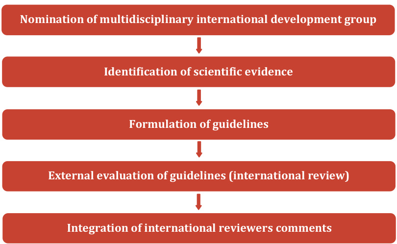

# CERVICAL CANCER  

GUIDELINES  

# TABLE OF CONTENTS  

# 1 Introduction .  

# 2 Acknowledgements .  

# 3 Method.  

3.1 Nomination of multidisciplinary international development group .   
3.2 Identification of scientific evidence ...   
3.3 Formulation of guidelines   
3.4 External evaluation of the guidelines - International review.... .8   
3.5 Integration of international reviewers comments   
4 Management of conflicts of interest .. 9   
5 Summary of guidelines 10   
5.1 General recommendations. 0   
5.2 Staging... .10   
5.3 Management of stage T1a 13   
5.4 Management of stages T1b1/T2a1 ...... ... 14   
5.5 Fertility sparing treatment. 16   
5.6 Clinically occult cervical cancer diagnosed after simple hysterectomy . 17   
5.7 Management of locally advanced cervical cancer.. .19   
5.8 Distant metastatic disease at presentation ... .20   
5.9 Recurrent disease. .. 20   
5.10 Follow-up. 23   
5.11 Cervical cancer in pregnancy .. .25   
6 Principles of radiotherapy 26   
6.1 Definitive chemoradiotherapy and brachytherapy: general aspects .. .. 26   
6.2 Definitive chemoradiotherapy .. .26   
6.3 Definitive brachytherapy .. .. 26   
6.4 Adjuvant radiotherapy or chemoradiotherapy based on intensity modulated radiotherapy and image guided   
radiotherapy... 27   
6.5 Definitive 3D conformal external beam radiotherapy or chemoradiotherapy and radiography-based   
brachytherapy...... .27   
6.6 Comment of the radiation oncology subgroup of the development group.. 28   
7 Principles of pathological evaluation.. ... 30   
7.1 Requirements for specimen submitted for pathological evaluation .. .. 30   
7.2 Specimen grossing and sampling... ...... 31   
7.3 Pathological analysis of sentinel lymph node ... 32   
7.4 Requirements for pathology report.. .. 33   
7.5 Items to be included on pathology report of carcinomas of the cervix .. 34   
8 Staging .... ... 35   
8.1 Summary of available scientific evidence... 35   
8.2 Previous initiatives ... 42   
8.3 Development group comments 42   
8.4 Guidelines... .43  

# 9 Management of stage T1a... 50  

9.1 Summary of available scientific evidence .... 50   
9.2 Previous initiatives ... .53   
9.3 Development group comments.. 53   
9.4 Guidelines.. 54  

# 10 Management of stages T1b1/T2a1 59  

10.1 Summary of available scientific evidence... .59   
10.2 Previous initiatives ... 73   
10.3 Development group comments... 74   
10.4 Guidelines.. 75  

# 11 Fertility sparing treatment.. 83  

11.1 Summary of available scientific evidence... .83   
11.2 Previous initiatives ... .94   
11.3 Development group comments.. .94   
11.4 Guidelines.. .95  

# 12 Clinically occult carcinoma diagnosed after simple hysterectomy 108  

12.1 Summary of available scientific evidence. 108   
12.2 Previous initiatives .. 109   
12.3 Development group comments... 109   
12.4 Guidelines... 110  

# 13 Management of locally advanced cervical cancer.. 112  

13.1 Summary of available scientific evidence .... 112   
13.2 Previous initiatives ... . 128   
13.3 Development group comments.. . 128   
13.4 Guidelines.. 129  

# 14 Distant metastatic disease at presentation & recurrent disease.. 140  

14.1 Summary of available scientific evidence... . 140   
14.2 Previous initiatives ... . 147   
14.3 Development group comments... . 148   
14.4 Guidelines.. 148  

# 15 Follow-up. 159  

15.1 Summary of available scientific evidence... . 159   
15.2 Previous initiatives ... . 168   
15.3 Development group comments.. . 168   
15.4 Guidelines.. . 168  

# 16 Cervical cancer in pregnancy 173  

16.1 Summary of available scientific evidence. 173   
16.2 Previous initiatives .... 177   
16.3 Development group comments.. 177   
16.4 Guidelines.. 178  

# 17 Acronyms and abbreviations . 184  

# 18 References. 187  

# 19 Appendices. 308  

19.1 Appendix 1 - People involved in the development of the guidelines.. 308   
19.2 Appendix 2 - List of evidence-based medicine websites consulted ... . 315   
19.3 Appendix 3 - Key to evidence statements and grades of recommendations .. . 316  

# 1 Introduction  

Cervical cancer is uncommon in Europe but still represents a major public health problem1. The estimated number of new cervical cancer cases in Europe in 2012 was 58 348 with 24 397 deaths2. Five-year relative survival for European women diagnosed with cervical cancer in 2000-2007 was $6 2 \%$ , ranging from $5 7 \%$ in Eastern Europe to $67 \%$ in Northern Europe. Survival was particularly low $( < 5 5 \% )$ in Bulgaria, Latvia and Poland and highest in Norway $( 7 1 \% ) ^ { 3 }$ . The large geographic variation in cervical cancer rates reflects differences in the availability of screening and in human papillomarivus (HPV) infection prevalence. In countries with a low incidence of cervical cancer, the prevalence of chronic HPV is approximately two folds lower than in high-incidence countries. Other epidemiologic risk factors associated with cervical cancer are notably a history of smoking, parity, oral contraceptive use, early age of onset of coitus, larger number of sexual partners, history of sexually transmitted disease, certain autoimmune diseases, and chronic immunosuppression. Squamous cell carcinomas account for approximately $8 0 \%$ of all cervical cancers and adenocarcinoma accounts for approximately $2 0 \%$ .  

The objectives of the guidelines are to improve and to homogenize the management of patients with cervical cancer within a multidisciplinary setting. These guidelines are intended for use by gynecologic oncologists, general gynaecologists, surgeons, radiation oncologists, pathologists, medical and clinical oncologists, radiologists, general practitioners, palliative care teams, and allied health professionals. The guidelines aim at covering comprehensively staging, management, and follow-up for patients with cervical cancer. Management includes fertility sparing treatment (FST); stage T1a, T1b1/T2a1, clinically occult cervical cancer diagnosed after simple hysterectomy; early and locally advanced cervical cancer (LACC); primary distant metastatic disease; cervical cancer in pregnancy (CCIP); and recurrent disease. Algorithms presenting guidelines for the management of patients with cervical cancer are available online at the Web sites of the European Society of Gynaecological Oncology, the European SocieTy for Radiotherapy and Oncology, and the European Society of Pathology. These guidelines exclude the management of neuroendocrine carcinomas, sarcomas, and other rare histologic subtypes. They also do not include any economic analysis of the strategies.  

Any clinician seeking to apply or consult these guidelines is expected to use independent medical judgment in the context of individual clinical circumstances to determine any patient’s care or treatment.  

# 2 Acknowledgements  

The European Society of Gynaecological Oncology (ESGO) would like to thank the European SocieTy for Radiotherapy and Oncology (ESTRO), the European Society of Pathology (ESP), and the international development group for their constant availability, work, and for making possible the development of these guidelines for the management of patients with cervical cancer. ESGO also wishes to express sincere gratitude to the Institut national du cancer (France) for providing the main funding for this work.  

# 3 Method  

The guidelines were developed using a five-step process (see Figure 1). The strengths of the process include creation of a multidisciplinary international development group, use of scientific evidence and/or international expert consensus to support the guidelines, and use of an international external review process (physicians and patients). This development process involved three meetings of the international development group, chaired by Professor David Cibula (Charles University Hospital, Prague, Czech Republic), Professor Richard Poetter (Vienna General Hospital, Vienna, Austria) and Professor Maria Rosaria Raspollini (University Hospital, Careggi - Florence, Italy).  

  
Figure 1. Development process  

# 3.1 Nomination of multidisciplinary international development group  

The ESGO/ESTRO/ESP nominated practicing clinicians that are involved in the management of cervical cancer patients and have demonstrated leadership in clinical management of patients through research, administrative responsibilities, and/or committee membership to serve on the expert panel. The objective was to assemble a multidisciplinary panel. It was therefore essential to include professionals from relevant disciplines (surgery, medical oncology, pathology, radiology, gynaecology, radiation oncology) to contribute to the validity and acceptability of the guidelines. The list of the development group is available in Appendix 1.  

# 3.2 Identification of scientific evidence  

To ensure that the statements were evidence based, the current literature was reviewed and critically appraised. A systematic literature review of relevant studies published between January 1997 and January 2017 was carried out using the MEDLINE database. This search used indexing terms as follows: 5- fluorouracil (5-FU), abdominal trachelectomy, abdominal radical trachelectomy, advanced cervical cancer, advanced cervical disease, advanced disease, advanced stage, biomarker, bleomycin, cancer antigen 125 (CA 125), cancer antigen 15-3 (CA 15-3), carboplatin, carcinoembryonic antigen (CEA), cervical cancer, cervix cancer, circulating immune complexes (CIC), cisplatin, cis-diamminedichloroplatinum, cis-platinum, clinical staging, clinically occult carcinoma, cold knife conisation (CKC), complications, computed tomography (CT), cone biopsy, cone resection, cone resection margins, conisation, cryopreservation, cytokeratin fragment 21-1 (CYFRA 21-1), destructive techniques, excisional techniques, external beam radiotherapy (EBRT), fertility, fertility outcome, fertility preservation, fertility sparing, fertility sparing management, fertility sparing surgery (FSS), Fédération Internationale de Gynecologie et d’Obstétrique (FIGO), FIGO staging system, follow-up, follow-up protocols, frozen sections, FST, gestation, high sensitivity C-reactive protein (hsCRP), HPV testing, hysterectomy, image guided adaptive brachytherapy (IGABT), image guided radiotherapy (IGRT), imaging, imaging modalities, immunosuppressive acidic protein (IAP), intensity modulated radiotherapy (IMRT), intensive care, intensive care unit, interleukin 6 (IL-6), LACC, laparoscopic staging, laparoscopy, laparotomy, large loop excision of the transformation zone (LLETZ), laser ablation, laser ablation-destruction, laser conisation, laser conisation-excision, laser destruction, length of stay, LACC, locally advanced cervical disease, locally advanced disease, locally advanced stage, loop electrosurgical excision procedure (LEEP), lymphadenectomy, lymph node (LN), LN assessment, LN dissection, LN staging, lymphovascular space involvement (LVSI), magnetic resonance imaging (MRI), metastatic disease, microinvasive cancer, microinvasive cervical cancer, mortality rate, mortality analysis, multivariate analysis, neoadjuvant chemotherapy (NACT), neonatal intensive care unit (NICU) admission, nerve-sparing radical surgery, nerve-sparing robotic radical hysterectomy, nodal involvement, obstetric outcomes, occult carcinoma, occult invasive carcinoma, occult invasive cervical cancer, oncologic outcome, ovarian preservation, ovarian transplantation, ovarian transposition (OT), oxaliplatin, paclitaxel, para-aortic lymphadenectomy, para-aortic lymph node (PALN) assessement, paraaortic lymph node dissection (PALND), pathology, pathology report, pathology report adequacy, pelvic lymph node (PLN) assessement, pelvic lymph node dissection (PLND), pelvic lymphadenectomy, perioperative care, physical examination, platinum, positron emission tomography (PET), positron emission tomography-computed tomography (PET-CT), postoperative care, postoperative complications, postoperative recurrence, pregnancy, preterm spontaneous rupture of membranes (pPROM), preoperative brachytherapy, pregnancy, pregnancy rate, pregnant patient, preoperative care, preoperative workup, prognosis, prognostic factor, quality of health care, quality of life, radical abdominal trachelectomy, radical surgery, radical trachelectomy, radical vaginal trachelectomy, recurrence, recurrent disease, reoperation, reproduction, reproductive techniques, residual disease, residual tumour, restaging, risk factors, robotic radical hysterectomy, sensitivity, sentinel lymph node (SLN), SLN procedure, sentinel node (SN), serum biomarker, serum marker, specificity, simple trachelectomy, squamous cell carcinoma antigen (SCC-Ag), staging, staging procedures, surgery, surgical management, surgical outcome, surgical outcome criteria, surgical procedures, surgical resection, surveillance, survival rate, survival analysis, tissue polypeptide antigen (TPA), TNM classification, total laparoscopic radical trachelectomy, trachelectomy, transplantation, transposition, treatment outcome, tumour-associated trypsin inhibitor (TATI), tumour necrosis factor alpha (TNF- $\cdot \alpha ^ { \cdot }$ ), ultrastaging, ultrasound (US), upstaging, uterine cervix cancer, uterine transplantation, vaginal radical trachelectomy, vaginal trachelectomy, vascular space involvement, vascular endothelial growth factor (VEGF), vincristine.  

The literature search was limited to publications in English. Priority was given to high-quality systematic reviews, meta-analyses, and randomized controlled trials (RCTs) but lower levels of evidence were also evaluated. The search strategy excluded editorials, letters, and in vitro studies. The reference list of each identified article was reviewed for other potentially relevant papers. The bibliography was also supplemented by additional references provided by the international development group. Another bibliographic search was carried out to identify previous initiatives using a systematic literature search in MEDLINE database (no restriction in the search period, indexing terms: clinical practice guidelines, evidence-based medicine, guidelines, methodology, recommendations, cervical cancer) and a bibliographic search using selected websites (see Appendix 2). After the selection and critical appraisal of the articles, a summary of the scientific evidence was developed.  

# 3.3 Formulation of guidelines  

The development group developed guidelines for staging, FST, management (stage T1a, T1b1/T2a1, clinically occult cervical cancer diagnosed after simple hysterectomy, LACC, primary distant metastatic disease, CCIP, and recurrent disease), and follow-up for patients with cervical cancer. The guidelines were retained if they were supported by sufficient high level scientific evidence and/or when a large consensus among experts was obtained. If an approach is judged to be acceptable but is not unanimously recognized as a criterion-standard clinical approach, indication is given that it is still subject to discussion and/or evaluation. In the absence of any clear scientific evidence, judgment was based on the professional experience and consensus of the development group (expert agreement). The reliability and quality of the evidence given throughout this document has been graded following the Scottish intercollegiate guidelines network (SIGN) grading system (see Appendix 3). Principles of radiotherapy and principles of pathological evaluation were also defined.  

# 3.4 External evaluation of the guidelines - International review  

The ESGO/ESTRO/ESP consulted a large panel of practicing clinicians that are involved in the management of cervical cancer patients. Cervical cancer patients were also included. The objective was to assemble a multidisciplinary panel. The 159 international reviewers were independent from the development group. International reviewers were asked to evaluate each guideline according to their relevance and feasibility in clinical practice (only physicians). Quantitative and qualitative evaluations of the guidelines were performed. Patients were asked to qualitatively evaluate each guideline (according their experience, preferences, feelings, etc.). The list of international reviewers is available in Appendix 1.  

# 3.5 Integration of international reviewers comments  

Responses of the 159 external reviewers were pooled and discussed by the development group to finalize the guidelines.  

# 4 Management of conflicts of interest  

The experts of the multidisciplinary international development group were required to complete a declaration of interest form, and to promptly inform the ESGO council if any change in the disclosed information occurred during the course of this work.  

# 5 Summary of guidelines  

# 5.1 General recommendations  

  

Treatment planning should be made on a multidisciplinary basis (generally at a tumor board meeting) and based on the comprehensive and precise knowledge of prognostic and predictive factors for oncological outcome, morbidity, and quality of life.  

Patients should be carefully counseled on the suggested treatment plan and potential alternatives, including risks and benefits of all options.  

Treatment should be undertaken by a dedicated team of specialists in the diagnosis and management of gynecologic cancers.  

# 5.2 Staging  

# 5.2.1 TNM classification and FIGO  

  

Patients with cervical cancer should be staged according to the TNM classification. Clinical staging (FIGO) should also be documented (Figure 2).  

  

TNM should be based on a correlation of various modalities (integrating physical examination, imaging and pathology) after discussion in a multidisciplinary forum.  

The method used to determine tumor status (T), lymph node status (N), and systemic status (M), that is, clinical (c), imaging (i), and/or pathological (p) should be recorded.  

LN metastases should be classified according to the TNM classification (see Principles of pathological evaluation).  

# 5.2.2 Prognostic factors  

Proper documentation of the following major tumorrelated prognostic factors is recommended:  

TNM and FIGO stage, including a maximum tumor size and detailed description of extracervical tumor extension and nodal involvement (number, size, location). Pathological tumor type. Depth of cervical stromal invasion and a minimum thickness of uninvolved cervical stroma Presence or absence of LVSI.  Presence or absence of distant metastases.  

# 5.2.3 Local clinical and radiological diagnostic workup  

Pelvic examination and biopsy $+ / -$ colposcopy are mandatory components to diagnose cervical cancer.  

#  

Mandatory initial workup for assessment of pelvic tumor extent and to guide treatment options is pelvic MRI.  

Endovaginal/transrectal US is an option if performed by a properly trained sonographer.  

Cystoscopy or rectoscopy may be considered to provide a biopsy if suspicious lesions in the urinary bladder or rectum are documented on MRI or US.  

# 5.2.4 Nodal/distant diagnostic workup  

# B  

In early stage (T1a, T1b1, T2a1), surgical/pathological staging of PLNs is the criterion standard to assess the prognosis and guide treatment (except of T1a1 and no LVSI).  

# B  

In LACC (T1b2 and higher (except T2a1)) or in early-stage disease with suspicious LNs on imaging, PET-CT, or chest/abdomen CT is recommended for assessment of nodal and distant disease.  

# B  

PET-CT is the preferred option for treatment planning before chemoradiotherapy with curative intent.  

#  

PALN dissection, at least up to inferior mesenteric artery, may be considered in LACC with negative PALNs on imaging for staging purposes.  

Equivocal extrauterine disease is to be considered for biopsy to confirm or rule out metastatic disease and to avoid inappropriate treatment. Tru-Cut (core-cut) biopsy is the preferred option than fine-needle aspiration biopsy because it allows histological assessment of the tissue.  

Figure 2. FIGO staging and TNM classification   

<html><body><table><tr><td>T category4</td><td> FIGO stage5-7</td><td>Definition</td></tr><tr><td>TX</td><td></td><td>Primary tumour cannot be assessed</td></tr><tr><td>TO</td><td></td><td>No evidence of primary tumour</td></tr><tr><td>T1</td><td>1</td><td>Cervical carcinoma confined to the uterus (extension to corpus should be disregarded)</td></tr><tr><td>T1a</td><td>IA</td><td>Invasive carcinoma diagnosed only by microscopy. Stromal invasion with a maximum depth of 5.0 mm measured from the base of the epithelium and a horizontal spread of 7.0 mm or less; vascular space involvement, venous or</td></tr><tr><td>T1a1</td><td>IA1</td><td>lymphatic, does not affect classification. Measured stromal invasion of 3.0 mm or less in depth and 7.0 mm or less in</td></tr><tr><td>T1a2</td><td>IA2</td><td>horizontal spread Measured stromal invasion of more than 3.0 mm and not more than 5.0</td></tr><tr><td>T1b</td><td>IB</td><td>mm, with a horizontal spread of 7.0 mm or less Clinically visible lesion confined to the cervix or microscopic lesion greater than T1a2/IA2. Includes all macroscopically visible lesions, even those with</td></tr><tr><td>T1b1</td><td>IB1</td><td>superficial invasion. Clinically visible lesion 4.0 cm or less in greatest dimension</td></tr><tr><td>T1b2</td><td>IB2</td><td>Clinically visible lesion more than 4.0 cm in greatest dimension</td></tr><tr><td>T2</td><td>11</td><td>Cervical carcinoma invading beyond the uterus but not to the pelvic wall or</td></tr><tr><td>T2a</td><td>IIA</td><td>to lower third of the vagina Tumour without parametrial invasion</td></tr><tr><td>T2a1</td><td>IIA1</td><td>Clinically visible lesion 4.0 cm or less in greatest dimension</td></tr><tr><td>T2a2</td><td>IIA2</td><td>Clinically visible lesion more than 4.0 cm in greatest dimension</td></tr><tr><td>T2b</td><td>IIB</td><td>Tumour with parametrial invasion</td></tr><tr><td>T3</td><td>III</td><td>Tumour extending to the pelvic sidewall* and/or involving the lower third of the vagina and/or causing hydronephrosis or nonfunctioning kidney</td></tr><tr><td>T3a</td><td>IIIA</td><td>Tumour involving the lower third of the vagina but not extending to the pelvic wall</td></tr><tr><td>T3b</td><td>IIIB</td><td>Tumour extending to the pelvic wall and/or causing hydronephrosis or nonfunctioning kidney</td></tr><tr><td>T4</td><td>IVA</td><td>Tumour invading the mucosa of the bladder or rectum and/or extending beyond the true pelvis (bullous edema is not sufficient to classify a tumour</td></tr><tr><td></td><td>IVB</td><td>as T4) Tumour invading distant organs</td></tr><tr><td></td><td></td><td>* the pelvic sidewallis defined as the muscle, fascia, neurovascular structures, and skeletal portions of the</td></tr></table></body></html>  

# 5.3 Management of stage T1a  

# 5.3.1 Diagnosis of stage T1a  disease  

Diagnosis of T1a cancer should be based on a conization (or excision) specimen examined by an expert pathologist. Management must be based on an expert pathology review, with accurate measurement of the maximum horizontal 2 dimensions, depth of invasion, margin status, coexisting pathology, and reliable assessment of LVSI.  

Loop or laser conization is preferable to CKC in women desiring fertility preservation. Maximum care should be taken to provide an intact (unfragmented) specimen with minimal thermal artifact. The cone specimen should be oriented for the pathologist.  

#  

Surgical margins of the cone specimen should be clear of both invasive and preinvasive disease (except for preinvasive disease in ectocervix).  

# 5.3.2 Management of stage T1a1 disease  

Management of patients with stage T1a1 disease should be individualized depending on the age, the desire for fertility preservation, and the presence or absence of LVSI.  

In case of positive margins (except for preinvasive disease in ectocervix), a repeat conization should be performed to rule out more extensive invasive disease.  

# B  

LN staging is not indicated in T1a1 LVSI-negative patients but can be considered in T1a1 LVSIpositive patients. SLN biopsy (without additional PLN dissection) is an acceptable method of LN staging.  

Conization can be considered a definitive treatment as hysterectomy does not improve the outcome.  

# C  

Radical surgical approaches such as radical hysterectomy or parametrectomy represent overtreatment for patients with T1a1 disease.  

# 5.3.3 Management of stage T1a2 disease  

In patients with stage T1a2 disease, conization alone or simple hysterectomy is an adequate treatment.  

Parametrial resection is not indicated.  

# B  

LN staging can be considered in LVSI-negative patients but should be performed in LVSI-positive patients. SLN biopsy alone (without additional PLN dissection) appears to be an acceptable method of LN staging.  

Routine completion of hysterectomy is not recommended after conservative management of stage T1a disease.  

# 5.4 Management of stages T1b1/T2a1  

# 5.4.1 General recommendation  

# B  

Treatment strategy should aim for the avoidance of combining radical surgery and radiotherapy because of the highest morbidity after combined treatment.  

# 5.4.2 Negative lymph nodes on radiological staging  

# Surgical treatment  

Radical surgery by a gynecologic oncologist is the preferred treatment modality. Minimally invasive approach is favored.  

The standard LN staging procedure is systematic pelvic lymphadenectomy. SN biopsy before pelvic lymphadenectomy is strongly recommended. Combination of blue dye with radiocolloid or use of indocyanine green alone is the recommended technique.  

LN assessment should be performed as the first step of surgical management. Intraoperative assessment of LN status (frozen section) is recommended. All SNs from both sides of the pelvis and/or any suspicious LNs should be sent for frozen section. If SN is not detected, intraoperative assessment of the PLNs should be considered.  

If intraoperative LN assessment is negative or not done, systematic PLN dissection should be performed. At present, SN biopsy alone cannot be recommended outside prospective clinical trials. Systematic LN dissection should include the removal of lymphatic tissue from regions with the most frequent occurrence of positive LNs (SNs) including obturator fossa, external iliac regions, common iliac regions bilaterally, and presacral region. Distal external iliac LNs (so-called circumflex iliac LNs) should be spared if they are not macroscopically suspicious.  

The type of radical hysterectomy (extent of parametrial resection, type A-C2) should be based on the presence of prognostic risk factors identified preoperatively (Figure 3). Major prognostic factors for oncological outcome as tumor size, maximum stromal invasion, and LVSI are used to categorize patients at high, intermediate, and low risk of treatment failure. Complete description of the template used for radical hysterectomy should be present in the surgical report. The 2017 modification of the Querleu-Morrow classification is recommended as a tool (Figure 4).  

Ovarian preservation should be offered to premenopausal patients with squamous cell carcinoma and usual-type (HPV-related) adenocarcinoma. Bilateral salpingectomy should be considered.  

If LN involvement is detected intraoperatively including macrometastases or micrometastases, further PLN dissection and radical hysterectomy should be avoided. Patients should be referred for definitive chemoradiotherapy. PALN dissection, at least up to inferior mesenteric artery, may be considered for staging purposes.  

If a combination of risk factors is known at diagnosis, which would require an adjuvant treatment, definitive radiochemotherapy and brachytherapy can be considered without previous radical pelvic surgery. PLN dissection should be avoided. PALN dissection, at least up to inferiormesenteric artery,may be considered in patients with negative PALN on imaging.  

Figure 3. Risk groups according to prognostic factors: suggested type(s) of radical hysterectomy   

<html><body><table><tr><td>Risk group</td><td>Tumour size</td><td>LVSI</td><td>Stromal invasion</td><td>Type of radical hysterectomy*</td></tr><tr><td>Low risk</td><td><2 cm</td><td>Negative</td><td>Inner 1/3</td><td>B1 (A)</td></tr><tr><td>Intermediate risk</td><td>≥2cm</td><td>Negative</td><td>Any</td><td>B2 (C1)</td></tr><tr><td></td><td><2 cm</td><td>Positive</td><td>Any</td><td></td></tr><tr><td>High risk</td><td>≥2 cm</td><td>Positive</td><td>Any</td><td>C1 (C2)</td></tr><tr><td colspan="5">* according to the Querleu-Morrow classification (see Figure 4)</td></tr></table></body></html>  

Figure 4. Querleu-Morrow classification8   

<html><body><table><tr><td>Type of radical hysterectomy</td><td>Paracervix or lateral parametrium</td><td>Ventral parametrium</td><td>Dorsal parametrium</td></tr><tr><td>Type A</td><td>Halfway between the cervix and  Minimal excision ureter (medial to the ureter-ureter identified but not mobilized)</td><td></td><td>Minimal excision</td></tr><tr><td>Type B1</td><td>At the ureter (at the level of the ureteral bed-ureter   mobilized from the cervix and lateral parametrium)</td><td>Partial vesicouterine ligament</td><td>excisionof the Partial resection of the rectouterine-rectovaginal ligament and uterosacral peritoneal fold</td></tr><tr><td>Type B2</td><td>Identical to B1 plus paracervical lymphadenectomy without resection of vascular/nerve structures</td><td>vesicouterine ligament</td><td>Partial excision of the Partial resection of  the rectouterine-rectovaginal ligament and uterosacral fold</td></tr><tr><td>Type C1</td><td>At the iliac vessels transversally, caudal part is preserved</td><td>Excision of the vesicouterine ligament (cranial to the ureter) at the bladder. Proximal part of the vesicovaginal ligament (bladder nerves are dissected and spared)</td><td>At the rectum (hypogastric nerve  is  dissected   and spared)</td></tr><tr><td>Type C2</td><td>At the level of the medial aspect of  At the bladder (bladder  At the sacrum (hypogastric iliac vessels completely (including the caudal part)</td><td>nerves are sacrificed)</td><td>nerve is sacrificed)</td></tr><tr><td>Type D</td><td>Atthe pelvic wall, including Atthe resection of the internal iliac vessels and/or components of the pelvic sidewall</td><td>bladder. Not applicable if part of exenteration</td><td>At the sacrum. applicable if part exenteration</td></tr></table></body></html>  

# 5.4.2.2 Alternative treatment options  

Definitive radiotherapy including brachytherapy represents effective alternative treatment (see Principles of radiotherapy). It can be considered in particular in case of unfavorable prognostic and predictive factors for oncological and morbidity outcome.  

For high risk and intermediate risk, preoperative brachytherapy followed by surgery (type A) is used in a limited number of centers. It is an acceptable alternative option only in teams experienced in this approach.  

NACT followed by surgery is not recommended.  

# 5.4.3 Positive pelvic lymph nodes on radiological staging  

#  

In patients with unequivocally involved PLNs on imaging, definitive chemoradiotherapy is recommended (see Principles of radiotherapy). PALN dissection, at least up to inferior mesenteric artery, may be considered in patients with negative PALNs on imaging.  

Debulking of suspicious PLNs may be considered.  

# 5.4.4 Adjuvant treatment  

# B  

Adjuvant radiotherapy should be considered in the presence of combination of risk factors at final pathology such as tumor size, LVSI, and depth of stromal invasion.  

When in these situations an adequate type of radical hysterectomy has been performed (Figure 3), observation is an alternative option, especially in teams experienced in this approach.  

After primary radical surgery, adjuvant chemoradiotherapy is indicated in the following groups of patients (see Principles of radiotherapy):  

metastatic involvement of PLNs, including the presence of macrometastases pN1 or micrometastases pN1(mi) in either SN or any other PLNs detected by intraoperative or final pathologic assessment $\Rightarrow$ chemoradiotherapy   
positive surgical margins (vagina/parametria) $\Rightarrow$ chemoradiotherapy, brachytherapy boost may be considered   
parametrial involvement $\Rightarrow$ chemoradiotherapy  

# 5.4.5 Cervical stump cancer  

Management of cervical stump cancer follows the recommendations for patients without previous subtotal hysterectomy. Adaptation of radiotherapy may be necessary, in particular for brachytherapy.  

# 5.5 Fertility sparing treatment  

Before starting FST, consultation at a fertility center is recommended.  

FST should exclusively be undertaken in gynecologic-oncological centers with comprehensive expertise in this kind of oncologic therapy.  

For patients who consider FST, prognostic factors, clinical staging, and preoperative workup do not differ from those who do not consider this (see above).  

Every woman with a desire to spare fertility and histologically proven squamous cell carcinoma or usual-type (HPV-related) adenocarcinoma equal to or less than $2 \ \mathrm { c m }$ of the largest diameter should be counseled about the possibility of FST. This consultation should encompass the risk of FST abandonment if there are positive margins or LN involvement and oncologic and obstetric risks related to this type of management.  

FST should not be recommended for rare histological subtypes of cervical cancer including neuroendocrine carcinomas and non-HPV-related adenocarcinomas (except for adenoid basal carcinoma), which tend to exhibit aggressive behavior.  

Expert sonography and/or pelvic MRI are recommended imaging tests to measure remaining (after cone biopsy) cervical length and noninvolved cervical length. However, no imaging system can exactly predict the extent of necessary local resection in order to reach sound margins with adequate safety distance.  

Negative PLN status is the precondition for any FST. Therefore, PLN (SLN) staging should always be the first step in each FST procedure. Identification of SLN and its ultrastaging is highly recommended because it increases staging accuracy, namely, the identification of micrometastases and small macrometastases. The involvement of suspicious LNs should be confirmed by histology. Intraoperative assessment of LN status is highly recommended. All SLNs from both sides of the pelvis or any suspicious LNs should be sent for frozen section. If bilateral SLN is not detectable, intraoperative assessment of PLNs should be considered (see Management of stages T1b1/T2a1). LN staging is not indicated in stage T1a1 LVSI negative.  

In case of intraoperatively proven lymph node involvement, fertility-sparing surgery should be abandoned, and the patient referred to definitive chemoradiotherapy (see above). The specific aim of fertility-sparing surgery must be the resection of invasive tumor with adequate free margins and preservation of the upper part of the cervix. Intraoperative frozen section is a reliable way of assessing the upper resection margin in trachelectomy specimen and should be considered.  

Conization and simple trachelectomy are adequate fertility sparing procedures for stages T1a1 and T1a2, LN-negative, LVSI-negative patients.  

Radical trachelectomy (type A) can be considered for stages T1a1 and T1a2, LN-negative, LVSIpositive patients. Conization or simple trachelectomy is an option.  

Radical trachelectomy (type B) should be performed for patients with cervical cancer stage T1b1 equal to or less than $2 \mathrm { c m }$ of the largest diameter, LN-negative, $\mathrm { \ L V S I \pm }$  

Intraoperative placement of permanent cerclage should be performed during simple or radical trachelectomy.  

FST in patients with tumors greater than $2 \mathrm { c m }$ cannot be recommended and is considered as an experimental approach.  

In more advanced cases, different propositions for fertility preservation should be discussed. The goal of the fertility preservation should be to offer the most efficient approach related to the legal aspects of the country while not increasing the oncological risk.  

Any pregnancy following FST should be considered as a high-risk pregnancy, and delivery should be performed in a perinatal center. Following simple or radical trachelectomy with its inherent placement of a permanent cerclage delivery can be performed only by cesarean section.  

Routine hysterectomy after finishing fertility plans is not necessary.  

# 5.6 Clinically occult cervical cancer diagnosed after simple hysterectomy  

# 5.6.1 General recommendations  

Management of occult disease should be based on expert pathology review and discussed in a multidisciplinary tumor board.  

Prior to making further management decisions, optimal imaging to evaluate the local and regional (nodal) disease status is necessary. Optimal imaging follows the same recommendations as that for nonoccult disease (see above).  

# B  

In general, management of occult disease follows the same principles as that of nonoccult disease. Treatment strategy should aim for the avoidance of combining radical surgery and radiotherapy because of the highest morbidity after combined treatment.  

# 5.6.2 Management of patients with pT1a1, LVSI $\pm$ and pT1a2 LVSI-negative, with clear margins  

In patients with tumor stage pT1a1 regardless of LVSI status and pT1a2 LVSI negative with clear margins in the hysterectomy specimen, no additional treatment is recommended.  

5.6.3 Management of patients with pT1a2 LVSI-positive or pT1b1 or pT2a1, with clear margins  

In patients with tumor stage pT1a2 LVSI positive or pT1b1 or pT2a1 after simple hysterectomy, potential disease in the parametria and LNs has to be addressed.  

Radiotherapy or chemoradiotherapy is recommended as an effective treatment option that avoids further surgery. In absence of residual tumor on imaging (including suspicious LNs), radiotherapy alone is recommended. In case of residual tumor on imaging, including suspicious LNs, chemoradiotherapy is recommended.  

PALN dissection, at least up to inferior mesenteric artery, may be considered in patients without suspicious para-aortic nodes on imaging for staging purposes.  

  

Debulking of suspicious PLNs may be considered.  

Radical surgery is an option in patients without LN involvement on imaging and in the absence of an upfront indication for adjuvant radiotherapy (combination of negative prognostic factors.  

PLN dissection should be performed as the first step of the surgery. Intraoperative assessment of PLNs may be considered. If intraoperative LN assessment is negative or is not performed, radical parametrectomy with the resection of the upper vagina should be performed preferably using minimally invasive techniques. The type of radical parametrectomy (extent of parametrial resection) should be tailored to the presence of prognostic risk factors of the primary tumor as described above (Figure 3).  

Complete description of the template used for radical parametrectomy should be present in the operative report.  

  

The 2017 modification of the Querleu-Morrow classification is recommended as a tool (Figure 4).  

If LN involvement, including macrometastases or micrometastases, is detected intraoperatively, further surgery (PLN dissection and radical parametrectomy) should be avoided, and chemoradiotherapy is recommended.  

PALN dissection, at least up to inferior mesenteric artery,may be considered for staging purposes.  

Debulking of suspicious nodes may be considered.  

# 5.6.4 Management of patients with stage pT1b2 and higher or involved surgical margins or residual tumour including involved lymph node on imaging  

In patients with stage pT1b2 and higher, involved surgical margins or in those with residual tumor including involved lymph node on imaging, chemoradiotherapy is recommended, and further surgery should be avoided.  

# C  

PALN dissection, at least up to inferior mesenteric artery, may be considered for staging purposes in patients with negative PALNs on imaging.  

Debulking of suspicious PLNs may be considered.  

# 5.7 Management of locally advanced cervical cancer  

# 5.7.1 Stage T1b2/T2a2 and negative lymph nodes on radiological staging  

#  

Treatment strategy should aim for avoiding the combination of radical surgery and postoperative external radiotherapy because of the significant increase in morbidity and no evident impact on survival.  

# A  

Definitive platinum-based chemoradiotherapy and brachytherapy are the preferred treatment (see Principles of radiotherapy).  

# C  

PALN dissection, at least up to inferior mesenteric artery, may be considered before chemoradiotherapy and brachytherapy. PLN dissection is not required.  

Radical surgery is an alternative option, in particular in patients without negative risk factors (combinations of tumor size, LVSI, and/or depth of stromal invasion). Quality of surgery, both parametrectomy and LN dissection, is, however, of key importance in the management of large tumors. Intraoperative assessment of LN status (frozen section) is recommended as the first step. If LN involvement is detected intraoperatively, including macrometastases or micrometastases, further PLN dissection and radical hysterectomy should be avoided, and patients should be referred for definitive chemoradiotherapy and brachytherapy. PALN dissection, at least up to inferior mesenteric artery, may be considered for staging purposes. If intraoperative LN assessment is negative or is not done, systematic PLN dissection should be performed. Type C2 radical hysterectomy is recommended.  

# C  

NACT followed by radical surgery is a controversial alternative. The benefit of tumor downsizing with regard to prognosis has not been proven.  

# 5.7.2 Stage T1b2/T2a2 and involved lymph nodes on radiological staging  

  

Definitive chemoradiotherapy and brachytherapy are recommended in patients with unequivocally involved PLNs on imaging (see Principles of radiotherapy).  

An additional radiation boost to the involved LNs should be applied (see Principles of radiotherapy).  

PALN dissection, at least up to inferior mesenteric artery, may be considered before treatment for staging purposes in patients with negative PALN on imaging.  

Debulking of suspicious PLNs may be considered.  

# 5.7.3 Stage T2b, T3a/b, T4a  

# A  

Definitive platinum-based chemoradiotherapy and brachytherapy are recommended (see Principles of radiotherapy).  

An additional radiation boost to the involved LNs should be applied (see Principles of radiotherapy).  

#  

PALN dissection, at least up to inferior mesenteric artery, may be considered before treatment in patients with negative PALNs on imaging.  

Debulking of suspicious PLNs may be considered. Pelvic exenteration is an option in selected cases with stage T4 N0 M0 disease.  

# 5.7.4 Cervical stump cancer  

Management of cervical stump cancer follows the recommendations for patients without previous subtotal hysterectomy. Adaptation of radiotherapy may be necessary, in particular for brachytherapy.  

# 5.8 Distant metastatic disease at presentation  

Patients with distant metastatic disease at presentation should have a full diagnostic workup (see Staging) to assess extent of disease, suitability for active treatment, and treatment modality including best supportive care.  

# B  

In medically fit patients with widespread distant metastatic disease at presentation (visceral $+ / \ l$ nodal), combination chemotherapy is recommended. Carboplatin/paclitaxel and cisplatin/paclitaxel are preferred regimens in the first-line treatment.  

#  

Addition of bevacizumab to standard chemotherapy is recommended in patients with good performance status and where the risk of significant gastrointestinal/genitourinary toxicity has been carefully assessed and discussed with the patient.  

Patients with limited distant metastatic disease at presentation, confined to the PALN region, should be treated with curative intent with definitive extended field chemoradiotherapy including brachytherapy. Treatment algorithm may also include surgical debulking of enlarged LN and additional chemotherapy.  

Patients with supraclavicular LN as the only site of distant disease can be considered for chemoradiotherapy with curative intent. Treatment algorithm may include additional chemotherapy.  

Adjuvant chemotherapy may be considered in cases carrying a high risk of recurrence such as positive margins, positive LN, or LVSI-positive tumors.  

The role of radiotherapy in palliating symptoms such as bleeding and pain must be considered especially in radiotherapy naive patients.  

# 5.9 Recurrent disease  

# 5.9.1 Curative intent treatment  

Treatment of recurrent disease with curative intent requires centralization and involvement of a broad multidisciplinary team including gynecologic oncologist, radiation oncologist, radiologist, pathologist, medical oncologist, urologist, and plastic surgeon. A structured program for multidisciplinary diagnostic workup, treatment, and follow-up must be present in centers responsible for the treatment.  

Each center involved in the primary treatment of cervical cancer should have an established network for discussion of difficult cases and willingness for referring patients with recurrence for treatment to highly specialized units.  

Participation in clinical trials is encouraged to improve the clinical evidence for the effect of curative treatment of recurrent disease.  

The aim of the diagnostic workup is to exclude distant metastases and locoregional tumor extension beyond curative treatment.  

The recurrence should be confirmed by histological examination.  

Patients with multiple nodal/distant metastases or multifocal local disease with extensive pelvic wall involvement are usually not considered candidates for curative treatment. The prognostic factors should be carefully evaluated and balanced in relation to the major morbidity caused by the treatment.  

  

A full diagnostic package consisting of relevant imaging is recommended to establish the status of the disease locally, regionally, and systemically (see Staging).  

Patient should be carefully counseled regarding not only treatment options but also the involved risks and consequences.  

# 5.9.1.2 Central pelvic recurrence after primary surgery  

Definitive chemoradiotherapy combined with image guided adaptive brachytherapy is the treatment of choice (see Principles of radiotherapy). The use of boost by external beam techniques to replace brachytherapy is not recommended.  

For brachytherapy, small superficial lesions (ie, $< 5 \mathrm { - m m }$ thickness) in the vagina may be treated using a vaginal cylinder, ovoids, or mold, whereas other lesions usually require combined intracavitary-interstitial techniques.  

5.9.1.3 Pelvic sidewall recurrence after primary surgery  

Definitive chemoradiotherapy is the preferred option.  

  

Extended pelvic surgery may be considered in highly selected patients provided that the tumor does not invade extensively into the pelvic sidewall.  

# D  

Combined operative-radiotherapy procedures using intraoperative radiotherapy or brachytherapy are an option if free surgical margins are not achievable.  

Definitive radiotherapy or chemoradiotherapy followed by a stereotactic ablative boost/imageguided interstitial brachytherapy/particle beam therapy is an emerging option.  

5.9.1.4 Central pelvic or pelvic sidewall recurrence after radiotherapy or chemoradiotherapy  

# D  

Pelvic exenteration is recommended for central pelvic recurrence where there is no involvement of the pelvic sidewall and extrapelvic nodes.  

Laterally extended endopelvic resection may be considered for a recurrence that extends close to or involves the pelvic sidewall.  

Reirradiation with image guided adaptive brachytherapy for central recurrences is an alternative option especially in patients unfit for or refusing exenteration surgery, which should be restricted to highly specialized centers.  

If further surgery or radiotherapy is considered, no more than 2 to 4 courses of combination chemotherapy should be given to avoid unnecessary long interval before definitive treatment. Locoregional recurrences, which at diagnosis appear incurable, should be reassessed for the possibility of radical treatment if major response is obtained.  

Suitable candidates for adjuvant chemotherapy are patients who recover well within 2 months after primary treatment for recurrence.  

# 5.9.1.6 Nodal and oligometastatic recurrences  

Localized para-aortic, mediastinal, and/or periclavicular recurrences above previously irradiated fields may be treated by radical EBRT if possible in combination with concomitant chemotherapy. It is recommended to electively irradiate the immediate regional nodal stations below and upstream.  

The therapeutic effect of nodal resection/debulking is unclear and should, if possible, always be followed by radiotherapy.  

The management of isolated organ metastases (lung, liver, etc) should be discussed in a multidisciplinary team involved in the treatment of the specific organ affected by the metastasis and should be treated according to the preferred method for that organ involving local resection, radiofrequency ablation, interventional brachytherapy, or stereotactic ablative radiotherapy according to size and anatomical position.  

# 5.9.2 Palliative treatment  

Recommendations for palliative treatment should be made only after a thorough review of the case by a specialist multidisciplinary team and taking into account the performance status, comorbidities, patient’s symptoms, and wishes of the patient. The palliative care specialist should be actively involved.  

Palliative taxane/platinum combination chemotherapy with/without bevacizumab is the preferred option.  

There is currently no standard second-line chemotherapy, and such patients should be considered for clinical trials.  

In symptomatic patients, palliative treatment should be tailored according to clinical situations.  

In patients with disseminated disease at presentation, radiotherapy (usually a fractionated course) should be considered for effective palliation.  

  

Palliative radiotherapy (single fraction/short course) to control bleeding, discharge, and pain due to pelvic disease or bone metastases should be considered.  

For spinal cord compression due to bone metastases, neurosurgical intervention or short-course fractionated radiotherapy schedule should be considered.  

Surgical interventions including diversion stoma and/or stenting should be considered as appropriate, for example, in case of obstructive symptomatic disease.  

# 5.10 Follow-up  

# 1 General recommendations  

Primary objectives of follow-up for patients with cervical cancer should include the following:  

 Early detection of recurrent disease.   
 Patient education and support.   
 Cancer rehabilitation with the goal to prevent and reduce psychosocial, physical, social, and existential consequences of cancer and its treatment starts at time of diagnosis. The efforts should optimize the physical abilities and quality of life of women affected by cervical cancer and include family members/care givers. Several professions for counseling should be available, for example, psychologist, sexual therapist, physiotherapist, and dietitian.   
 Assessment of long-term outcome of novel treatment strategies.   
 Quality control of care.  

Each visit should be composed of the following:  

Patient history (including elicitation of relevant symptoms)   
 Physical examination (including a speculum examination and bimanual pelvic examination)   
 Physician assessment of adverse events using validated scales (eg, Common Terminology Criteria for Adverse Events)   
 Prevention and management of cancer- and treatment-related adverse effects, for example, sexual dysfunction (eg, counseling, vaginal lubricants, local estrogen)  

In case of the appearance of treatment-related symptoms, a referral to a dedicated specialist (eg, gastroenterologist, urologist/gynecologist) should be considered.  

Patients should be educated about symptoms of potential recurrence and potential long-term and late effects of treatment. Patients should also be counseled on sexual health, lifestyle adaptation, nutrition, exercise, obesity, and cessation of smoking.  

Follow-up schemes may be individualized, taking into account prognostic factors, treatment modality, and estimated risk and/or occurrence of adverse effects. In general, follow-up intervals of 3 to 4 (6) months for the first 2 years and then 6 to 12 months up to 5 years are recommended.  

Prescription of hormonal replacement treatment to cervical cancer survivors with premature menopause is advocated and should be according to regular menopausal recommendation. Combined estrogen and progestin replacement therapy should be prescribed if uterus is in situ (including after definitive radiotherapy). Monotherapy with estrogen is recommended after hysterectomy.  

Imaging and laboratory tests should be performed based on symptoms or findings suggestive of recurrence or morbidity.  

In symptomatic women,MRI or CT should be considered to assess potential clinical recurrence. If positive, whole body PET-CT should be performed in patients in whom salvage therapy (surgery or radiotherapy) is being considered. Similarly, for suspected recurrence, PET-CT can be added when other imaging finding is equivocal.  

Pathologic confirmation of any persistent or recurrent tumor should be considered. If a lesion is located deeply in the endocervix (in case of conservative treatment or definitive chemoradiotherapy), ultrasound-guided Tru-Cut biopsy is the preferred method. For any disease beyond the primary tumor site, ultrasound or CT-guided methods can be used to achieve pathologic confirmation. In case of clinically or radiologically suspicious disease, a negative biopsy may not be conclusive.  

# 5.10.2 Follow-up after fertility sparing treatment  

All women remain at risk of tumor recurrence following FST and must be carefully followed up. Follow-up should be carried out by a provider with specific expertise in detection of lower genital tract dysplasia (eg, gynecologic oncologist, colposcopy expert).  

C  

Follow-up intervals should be 3 to 4 months for the first 2 years postoperatively, and then 6 to 12 months up to 5 years. Thereafter the patient may return to population-based screening. The duration of follow-up, however, may be individualized depending on the risk of recurrence or persistence of treatment-related complications.  

# C  

Follow-up should include HPV testing (with or without cytology). Colposcopy in combination with HPV testing in parallel performed by an experienced colposcopist is an option. The incorporation of high-risk HPV testing at 6, 12, and 24 months after treatment is advocated. If HPV testing is negative, then every 3 to 5 years as long as follow-up is indicated.  

# 5.10.3 Follow-up after simple or radical hysterectomy  

Follow-up should be carried out by physician experienced with follow-up care after surgery following the general recommendations (see above). The vaginal vault cytology is not recommended.  

# 5.10.4 Follow-up after definitive chemoradiotherapy  

The same imaging method should be used for evaluation of tumor response as was used at baseline.  

Imaging should be performed not earlier than 3 months following completion of treatment. In dubious cases, a reevaluation should be performed not before 8 weeks thereafter.  

# B  

For re-evaluation purposes, the optimal diagnostic workup for local extent is pelvic MRI, and for distant spread, it is chest/abdomen CT or PET-CT (preferred after definitive chemoradiotherapy or in high-risk patients).  

Follow-up should be performed by a physician experienced with follow-up care after radiotherapy. Cytology is not recommended in these patients.  

Providers should inform and educate on sexual and vaginal health because vaginal stenosis and dryness may occur. Vaginal dilation should be offered, as well as vaginal lubricants and local estrogen.  

# 5.11 Cervical cancer in pregnancy  

Every patient diagnosed with CCIP must be counseled by a multidisciplinary team. This team should consist of experts in the fields of gynecologic oncology, neonatology, obstetrics, anesthesiology, radiation oncology, medical oncology, psychooncology, and, if requested, theology or ethics.  

Given the large spectrum of described therapeutic options, the multidisciplinary team recommends an individual consensual treatment plan according to patient’s intention, tumor stage, and gestational age of pregnancy at cancer diagnosis. Primary aims of recommended treatment plan are oncological safety of the pregnant woman, as well as survival without additional morbidity of the fetus.  

Treatment of patients with CCIP should exclusively be done in gynecologic oncology centers associated with a highest level perinatal center with expertise in all aspects of oncologic therapy in pregnancy and intensive medical care of premature neonates. Because of the low incidence of CCIP, centralization in a few well-equiped facilities is compulsory.  

Besides clinical examination and histologic verification of invasive cervical cancer, preferred imaging modalities for clinical staging in patients with CCIP include MRI or expert ultrasound. Because of limited experience and inherent radioactivity PET-CT (PET-MRI) should be indicated only under very selected circumstances.  

Tumor involvement of suspicious nodes should be verified histologically because of its prognostic significance and the impact on the management up to $2 4 ^ { \mathrm { t h } }$ week of gestation (fetal viability), preferably by minimally invasive approach.  

Depending on tumor stage and gestational week of pregnancy, the following treatment options have to be discussed with the patient including risks and benefits of individual approaches:  

Adapted surgery including removal of the tumor: conization, trachelectomy, and lymph node staging (see above) according to the stage of the disease with the intent to preserve the pregnancy.   
 Radical surgery or definitive chemoradiation as recommended for the stage of the disease without preservation of the pregnancy, with or without previous pregnancy termination.   
 Delay of oncological treatment until fetal maturity (if possible $> 3 2$ weeks of gestation) and beginning of cancer-specific treatment immediately after delivery by cesarean section.   
 Chemotherapy until fetal maturity and beginning of cancer specific treatment immediately after delivery by cesarean section. Treatment after delivery must consider application of previous chemotherapy. In patients with locally advanced stage or with residual tumor after conization that cannot be completely excised (risk of premature rupture of membranes (PROM) and/or cervical insufficiency), platinum-based chemotherapy can be considered starting earliest at 14 weeks of gestation.  

Spontaneous delivery seems to have negative prognostic impact in patients with CCIP. Thus, cesarean section after the $3 2 ^ { \mathrm { n d } }$ week of gestation (if possible) is the recommended mode of delivery. At the time of or following casarean section, definitive stage-adjusted oncologic therapy has to be performed corresponding to that of nonpregnant women, taking into account therapy that has already been given during pregnancy.  

# 6 Principles of radiotherapy  

# 6.1 Definitive chemoradiotherapy and brachytherapy: general aspects  

Definitive management (without tumor related surgery) consists of concomitant pelvic chemoradiotherapy (platinum based) and brachytherapy or pelvic EBRT alone and brachytherapy.  

Overall treatment time for the definitive treatment should not exceed 7 to 8 weeks.  

Delay of treatment and/or treatment interruptions have to be avoided.  

# 6.2 Definitive chemoradiotherapy  

EBRT is recommended minimum as 3-dimensional (3D) conformal radiotherapy. The preferred treatment is IMRT because of the more conformal dose distribution that maximizes sparing of organs at risk9.  

EBRT can be applied as concomitant chemoradiotherapy with total dose of 45 to 50 Gy (1.8 Gy per fraction) and single-agent radiosensitizing chemotherapy, preferably cisplatin (weekly $4 0 ~ \mathrm { m g / m } ^ { 2 \cdot }$ ) so that definitive radiotherapy is not compromised. If cisplatin is not applicable, alternative treatment options are fluorouracil or carboplatin. EBRT may also be applied without concomitant chemotherapy according to treatment selection (ie, patients unfit for any chemotherapy). In such cases, regional hyperthermia may be considered.  

Tumor and LN-related target volume for IMRT includes the primary cervical tumor and the adjacent tissues such as parametria, uterine corpus, upper vagina, and the PLNs (obturator, internal, external and common iliac, presacral). In case of PLN involvement indicating an increased risk of PALN spread, EBRT may include the para-aortic region up to the renal vessels (45 Gy). In case of PALN involvement, target volume includes at a minimum the region up to the renal vessels.  

A reduced target volume for EBRT resulting in a small pelvic field not including the common iliac nodes may be considered in low- and intermediate-risk T1b1 patients with negative LNs on imaging and no LVSI.  

Boost treatment for involved LN(s) may be applied as simultaneous integrated boost within the IMRT treatment or as sequential boost. The total dose including the contribution from brachytherapy should be 55 to 60 Gy (equi-effective dose to 2 Gy per fraction (EQD2)). An alternative treatment option is surgical debulking of enlarged nodes.  

IGRT is recommended for IMRT to ensure safe dose application in the tumor-related targets, to account for motion uncertainties, to reduce margins, and to achieve reduced doses to organs at risk.  

Overall treatment time for EBRT should not exceed 5 to 6 weeks.  

# 6.3 Definitive brachytherapy  

IGABT is recommended, preferably using MRI at the time of brachytherapy. IGABT is delivered in large tumors toward the end of or after concomitant chemoradiotherapy. Repeated gynecologic examination is mandatory, and alternative imaging modalities such as CT and ultrasound may be used.  

The tumor-related targets for brachytherapy include the residual gross tumor volume (GTV- $\cdot \mathrm { T } _ { \mathrm { r e s . } } \cdot$ ) after chemoradiotherapy, the adaptive high-risk clinical target volume (CTV-THR) including the whole cervix and residual adjacent pathologic tissue, and the intermediate-risk clinical target volume (CTV- $\cdot \mathrm { T } _ { \mathrm { I R } }$ )10-12.  

Intracavitary and combined intracavitary/interstitial brachytherapy should be performed under anesthesia.  

The brachytherapy applicator should consist of a uterine tandem and avaginal component (ovoids/ring/mold/combined ring/ovoid). Combined intracavitary/interstitial brachytherapy for adjusting the application further to the individual target should be considered. The vaginal component carries holes for straight or oblique needle guidance into the parametria.  

In case of significant residual disease in the parametrium (as in any extracervical area, eg, vagina, uterine corpus, adjacent organ), this should become part of the CTV- $\cdot \mathrm { T } _ { \mathrm { H R } }$ . The brachytherapy application should be a combined intracavitary/interstitial approach in order to achieve a sufficiently high radiation dose in the whole CTV- $\cdot \mathrm { T } _ { \mathrm { H R } }$ .  

In IGABT, the planning aim should be to deliver a brachytherapy dose of 40 to 45 Gy (EQD2) to reach a total EBRT $^ +$ brachytherapy dose of equal to or greater than 85 to 90 Gy EQD2 (D90) (assuming 45 Gy through EBRT) to the CTV- $\cdot \mathrm { T } _ { \mathrm { H R } } ,$ equal to or greater than 60 Gy (D98) to the CTV- $\cdot \mathrm { T } _ { \mathrm { I R } } ,$ and equal to or greater than 90 Gy (D98) to the GTV- $\cdot \mathrm { T } _ { \mathrm { r e s } }$ . Three dimensional and 2D dose volume and point constraints for rectum, bladder, vagina, sigmoid, and bowel are recommended, and they have to be based on the published clinical evidence10-12.  

Point A dose normalization should be used as starting point for stepwise treatment plan optimization, although point A dose reporting and prescription have been extended by the volumetric approach10-12.  

Brachytherapy should be delivered in several fractions as high dose rate (usually 3-4) or in 1 to 2 fractions as pulse dose rate brachytherapy.  

In large tumors, brachytherapy should be delivered within 1 to 2 weeks toward the end of or after chemoradiotherapy. In limited-size tumors, brachytherapy may start earlier during chemoradiotherapy.  

For the tumor-related targets (GTV-Tres, CTV-THR,CTV-TIR), the use of external beam therapy for giving extra dose (eg, parametrial boost, cervix boost) is discouraged, even when using advanced EBRT technology such as stereotactic radiotherapy. The use of a midline block for boosting the parametrium is discouraged when applying advanced IGRT, in particular beyond 45 to 50 Gy.  

Care should be taken to optimize patient comfort during (fractionated) brachytherapy. Preferably this includes a multidisciplinary approach.  

# 6.4 Adjuvant radiotherapy or chemoradiotherapy based on intensity modulated radiotherapy and image guided radiotherapy  

Adjuvant radiotherapy or chemoradiotherapy follows analog principles for target selection and dose and fractionation as outlined for definitive treatment.  

The application of IMRT and IGRT is to be considered as treatment-related morbidity may be reduced.  

Adjuvant (additional) brachytherapy should be considered only if a well-defined limited area - accessible through a brachytherapy technique - is at high risk of local recurrence (eg, vagina, parametrium). Such adjuvant brachytherapy should follow the major principles outlined above for image-guided brachytherapy.  

# 6.5 Definitive 3D conformal external beam radiotherapy or chemoradiotherapy and radiography-based brachytherapy  

Three-dimensional conformal radiotherapy alone or as definitive concomitant chemoradiotherapy (platinum based) $\pm$ para-aortic radiotherapy and/or 2D radiography-based brachytherapy is recommended, if IMRT and/or IGABT are not available.  

In case of 3D conformal radiotherapy and/or radiography based brachytherapy, the recommendations for EBRT and IGABT as outlined above in regard to target, dose, fractionation, and overall treatment time have to be respected as much as possible.  

A sequential LN boost is applied as appropriate after completion of 3D EBRT  

Planning aim for brachytherapy should be based on point A. Dose to point A should be equal to or greater than 75 Gy (EQD2) in limited width adaptive CTV- $\cdot \mathrm { T } _ { \mathrm { H R } }$ $\left[ \leq 3 \mathrm { \ c m } \right]$ and should aim at higher doses in large width adaptive CTV- $\cdot \mathrm { T } _ { \mathrm { H R } }$ $\left[ > 4 \mathrm { c m } \right]$ . In addition, dose for the maximum width of the adaptive CTV- $\cdot \mathrm { T } _ { \mathrm { H R } }$ should be reported. Radiography based dose point constraints - plus 3D dose volume constraints as available - for rectum, bladder, vagina, sigmoid, and bowel are recommended, and they have to be based on the published clinical evidence10-12.  

# 6.6 Comment of the radiation oncology subgroup of the development group  

The radiation oncology subgroup of the multidisciplinary international development group designed this section on principles of radiotherapy. This chapter on principles of radiotherapy is mainly based on the progress achieved in chemoradiotherapy, brachytherapy and external beam radiotherapy during the last two decades. Progress in chemoradiotherapy has been driven through several phase III trials and metaanalyses providing level 1 evidence which resulted in grade A recommendations (see 13.1.5). The progress in brachytherapy and external beam radiotherapy has followed the classical pathways of technology innovations and developments in clinical settings and is ongoing.  

MRI image guidance, applicator development and adaptive treatment planning for brachytherapy have played a major role in the development of image guided adaptive brachytherapy and started from monoinstitutional innovations. Several mono-institutional evaluations at various clinical departments in Europe and beyond could prove the new method of image guided brachytherapy to be feasible, reproducible, reliable and clinically valuable. The European Gyn GEC ESTRO group has become the major driving force in this development, providing essential recommendations to guide this treatment as early as 2005 and 2006. This group also started large multi-center retrospective and prospective clinical trials and evaluations of image guided adaptive brachytherapy (RetroEMBRACE, EMBRACE I (2008-2015) and EMBRACE II (since 2016)) benchmarking these innovations in a multicentre clinical setting13. In parallel, the International Commission of Radiation Units finished a revision on their recommendations from 1985 (ICRU report 38) in 2016 (ICRU report 89) which was based on the Gyn GEC ESTRO Recommendations. Therefore, at present there is a methodology for image guided brachytherapy available, agreed upon on the international level, how to treat cervical cancer through an advanced adaptive approach. The method is comprehensively described in ICRU report 89 and additionally allows to integrate recent volumetric (3D/4D) and traditional (2D, point A) treatment approaches. In addition, there is major high quality clinical evidence coming up from scientific reports on large cohorts of the EMBRACE clinical trial experience in regard to patient, tumour and treatment parameters and oncological, morbidity and quality of life outcomes. This ongoing increasing evidence (see 13.1.4) makes image guided brachytherapy to become the new clinical standard of care in a large growing number of centers in Europe and in many centers and countries all over the world. Therefore, the radiotherapy subgroup decided - in agreement with a large amount of radiation oncology reviewers of this guideline - to make this new method and the clinical evidence achieved so far to become the backbone of these guidelines and to declare this new paradigm the new standard of care for cervix cancer brachytherapy in Europe.  

Image guided external beam radiotherapy using advanced imaging as well as advanced hard and software technology for radiation application (IMRT, IGRT) also has entered the field of gynaecologic radiation therapy for cervical cancer. IMRT and IGRT provide several advantages in dose distribution in regard to sparing of organs at risk without compromising clinical outcome compared to traditional 3D conformal radiotherapy. In addition, IMRT and IGRT are increasingly spread in Europe and all over the world. For these reasons advanced methodology for external beam radiotherapy application was selected to form the basis for these European guidelines, although there is at present much “work in progress” and the clinical evidence for dose and volume prescription for IMRT and IGRT including lymph node boosting is limited. The radiotherapy subgroup took the decision - again in agreement with a large amount of radiation oncology reviewers of this guideline - to allocate IMRT with IGRT including simultaneous lymph node boosting to represent the “preferred treatment” for external beam radiotherapy.  

# 7 Principles of pathological evaluation  

The pathology report represents a key component in the management of cancer patients. The completeness and accuracy of the pathology report derives from several factors. Pre-analytical steps must be carried out in an optimal way to allow for adequate pathological evaluation. The inclusion of informative clinical and surgical data on the pathology request form and accurate sampling and processing of the specimens are the basis for a correct histological diagnosis and the provision of information on tumour staging and prognosis.  

The pathology report should be comprehensive of all the features which allow a cervical carcinoma patient to be placed into a risk group which ensures the appropriate management. It should include all the parameters impinging on tumour staging and patient management. The histological subtype is important since some uncommon tumour types are associated with aggressive (e.g. high grade neuroendocrine carcinoma, small cell or large cell neuroendocrine carcinoma) or favourable (e.g. adenoid-basal carcinoma) behaviour and may be considered for different treatment. Histological tumour grade is generally reported in squamous cell carcinomas and adenocarcinomas but in general this does not affect the treatment and the prognosis, especially since there is no validated grading system for cervical squamous cell carcinomas or adenocarcinomas. Accurate tumour measurement, which often requires correlation of the gross and microscopic features, is important for substaging of tumours (for example IA1 versus IA2 versus IB1, IB1 versus IB2). The presence or absence of LVSI, the LN status (number of nodes retrieved, number involved, presence of extracapsular extension), involvement of extracervical tissues and the margin status, including the distance of tumour and preinvasive disease to various margins is also critical for patient management.  

The use of immunohistochemical markers in a prognostic and/or predictive role is not currently established but this may change in the future. However, pathologists often use immunohistochemical stains as a diagnostic tool.  

Intraoperative evaluation of a sentinel (or other) LN with obvious gross tumour may be done with a single section to confirm the presence of metastasis. Frozen section examination is optional for non-suspicious SNs. At frozen section, there is no evidence for the exact number of histological sections to be examined, but the number should be adequate to pick up macro- and micrometastasis since the presence of metastatic tumour within a LN changes the management with abandonment of surgery and instigation of chemoradiotherapy. Full pathological examination of SNs (outside of the intraoperative setting) involves serial sectioning of the LN(s) with multiple levels, sometimes with the performing of immunohistochemical staining with pancytokeratin antibodies (e.g. AE1/AE3) if tumour is not identified on examination of routinely stained sections. To rule out micrometastasis, which measure from greater than $0 . 2 \ \mathrm { m m }$ to $2 \ \mathrm { m m }$ it is useful to cut the node grossly into $2 \ \mathrm { m m }$ sections and to perform serial sectioning on each block at $2 0 0 ~ { \mu \mathrm { m } }$ levels. Immunohistochemistry with cytokeratin antibodies is useful to confirm metastasis which are uncertain on haematoxylin and eosin (H&E) stained sections. Immunohistochemistry also helps to detect isolated tumour cells (up to $0 . 2 ~ \mathrm { m m }$ in diameter). These are regarded as node negative and $\mathrm { \ p N { 0 } ( i { + } ) }$ but their clinical impact has not yet been determined.  

# 7.1 Requirements for specimen submitted for pathological evaluation  

Patient information, previous cervical cytology, histological specimens, clinical and radiological data, and colposcopic findings need to be included on the specimen request form.  

Details of cytology, biopsy, and surgical specimen (cone/loop specimen, trachelectomy, type of hysterectomy, presence of ovaries and fallopian tubes, presence of LNs and designation of the LN sites, presence of vaginal cuff, and presence of parametria) need to be itemized in the specimen request form.  

Biopsies and surgical specimens should be sent to the pathology department in a container with liquid fixative (‘‘clamping’’ of the specimen on cork may be done).  

Cytology specimens should be sent to the pathology department either as a smear preparation (exfoliative cytology on a clearly designated and identifiable slide with patient’s name and birth date) or as liquidbased cytology. The latter is necessary when an HPV test is requested.  

Cone/loop specimen should ideally be sent intact with a suture to identify the 12-o’clock position.  

# 7.2 Specimen grossing and sampling  

Small biopsy specimens should be enumerated and measured.  

The diameter (2 dimensions) and depth of cone/loop specimens should be measured. It should be recorded if the specimen is complete or fragmented. If more than 1 piece of tissue is received, every piece should be measured in 3 dimensions and entirely examined.  

Inking of the surgical margins of cone/loop specimens is optional.  

Dissection of cone/loop specimens should be performed in an appropriate fashion. All the pieces submitted should be in consecutive numerical order. This is important because if tumor is present in more than 1 piece, it needs to be known whether these are consecutive pieces and thus a single tumor or represents multifocal tumor. It is recommended to place only 1 piece of tissue in each cassette. There are also techniques that allow embedding of more than 1 piece in a cassette if they are small enough. In cases that do not comprise intact cone/loops, serial radial sectioning and placing of each slice of tissue in a single cassette should be performed.  

The description of the specimen (hysterectomy, trachelectomy, presence of ovaries and fallopian tubes, presence of LNs and indication of the LN sites, presence of vaginal cuff, presence of parametria) should be recorded and checked for consistency with the description given in the specimen request form.  

The presence of any gross abnormality in any organ should be documented.  

The dimensions of the uterus for a hysterectomy specimen and the cervix for a trachelectomy specimen should be documented.  

The minimum and maximal length of the vaginal cuff should be documented.  

The size of the parametria should be documented in 2 dimensions (vertical and horizontal).  

Gross tumor involvement of the parametrium, vagina, uterine corpus, or other organs should be documented. The relationship of the cervical tumor to the vaginal and parametrial margins (and upper margin in case of a trachelectomy specimen) should be measured and appropriate sections taken to demonstrate this.  

Parametrial and vaginal margins should be inked.  

Parametria should be submitted totally for histological examination.  

The upper surgical margin of a trachelectomy specimen should be inked.  

The upper margin of a trachelectomy specimen should be sampled in its entirety in away that demonstrates the distance of the tumor to the margin. The vaginal margin should be examined totally as radial sections if no tumor is seen grossly.  

When the tumor is small (or with tumors that cannot be identified macroscopically), the cervix should be separated from the corpus, opened and processed as for a cone/loop specimen.  

In the case of a large tumor, the hysterectomy or trachelectomy specimen should be opened in the sagittal plane.  

The description of the cervix and measurement of any gross tumor mass should be documented.  

Gross tumors should be measured in 3 dimensions, namely, 2 measurements of horizontal extent and the depth of invasion.  

The tumor site within the cervix should be documented.  

The cervical tumor should be sampled in order to demonstrate the maximum depth of invasion, the relationship of the tumor with the surgical borders, and the extension to other organs.  

If visible, the site of a previous cone biopsy should be documented.  

At least 1 block per centimeter of the greatest tumor dimension for large tumors should be taken.  

Additional blocks including the cervix adjacent to the tumor should be taken in order to demonstrate precursor lesions.  

The whole cervix should be sampled in the case of a small tumor or where no macroscopic tumor is identified.  

The uterine corpus, vagina, and adnexa should be sampled according to standard protocols if not involved by tumor. If the uterine corpus and/or adnexa are grossly involved, additional blocks should be sampled.  

The entire vaginal margin should be blocked.  

All the LNs should be submitted for histological examination. If the LNs are grossly involved, representative samples are sufficient. If grossly uninvolved, each node should be sliced at $2 \cdot \mathrm { m m }$ intervals and totally embedded. From each block, H&E sections should be taken. LNs should be submitted in separate cassettes according to the site recorded on the specimen request form.  

# 7.3 Pathological analysis of sentinel lymph node  

Intraoperative assessment should be performed on a grossly suspicious SN and may be performed on a “nonsuspicious” SLN(s) because the confirmation of tumor involvement will result in abandoning a hysterectomy or trachelectomy.  

For intraoperative evaluation, the SLN(s) needs to be sent to the pathology department in a container without liquid fixative.  

Intraoperative analysis requires gross dissection of the resected adipose tissue by the pathologist with the selection of the LN(s).  

For a LN with obvious gross tumor, a single section is adequate for frozen section.  

Frozen section may be combined with imprint cytology.  

Any nonsuspicious SN should be bisected (if small) or sliced at $2 \mathrm { - m m }$ thickness and entirely frozen.  

From each sample, histological sections should be cut and stained by H&E.  

After frozen section analysis, the tissue should be put into a cassette, fixed in liquid fixative and subsequently processed and embedded in paraffin.  

SLN(s) tissue blocks should be entirely analyzed by examining multiple serial sections at different levels with H&E stains. Cytokeratin stains should be performed on all blocks.  

The detection of micrometastases and isolated tumor cells should be improved by immunohistochemistry with pancytokeratinantibodies (e.g. AE1/AE3). Different procedures have been published, and there is no standard method. Cytokeratin-positive cells should always be correlated with themorphology.Müllerian inclusions (endosalpingiosis, endometriosis) and mesothelial cells may rarely be present in PLNs and PALNs and be cytokeratin positive.  

# 7.4 Requirements for pathology report  

Description of the specimen(s) submitted for histological evaluation.  

Macroscopic description of specimen(s) (biopsy, loop/cone, trachelectomy, hysterectomy) including specimen dimensions (3 dimensions), number of tissue pieces for loop/cones, and maximum and minimum length of vaginal cuff and the parametria in 2 dimensions.  

Macroscopic tumor site(s), if the tumor is visible grossly, in trachelectomy and hysterectomy specimens.  

Tumor dimensions including 2 measurements of horizontal extent and depth of invasion or thickness (tumor dimension should be based on a correlation of the gross and histological features).Whenmultifocal separate tumors are present, each should be described and measured separately, and the largest used for tumor staging. Specimens from prior conization and subsequent conization, trachelectomy, or hysterectomy should be correlated for estimation of the tumor size. This is of importance because different specimens may have been reported at different institutions. It should also be recognized that simply adding the maximum tumor size in separate specimens may significantly overestimate the maximum tumor dimension.  

Histological tumor type and tumor grade.  

The presence or absence of LVSI.  

Coexisting pathology (squamous intraepithelial lesion/cervical intraepithelial neoplasia, adenocarcinoma in situ, stratified mucin-producing intraepithelial lesion).  

Minimum distance of uninvolved cervical stroma.  

Margin status (invasive and preinvasive diseases). Specify the margin(s).  

LN status including SLN status, the total number of nodes found and the number of positive LNs, and the presence of extranodal extension (list for all separates sites). Micrometastasis ( $\mathrm { 9 0 . 2 ~ m m }$ and up to $2 ~ \mathrm { m m } ^ { \cdot }$ ) are reported as pN1(mi). Isolated tumor cells no greater than $0 . 2 \ \mathrm { m m }$ in regional nodes should be reported as pN0 $( \mathrm { i } + )$ .  

Pathologically confirmed distant metastases.  

Provisional pathological staging pretumor board/multidisciplinary teammeeting (American Joint Committee on Cancer, eighth edition).  

7.5 Items to be included on pathology report of carcinomas of the cervix   
\* Tumor dimension should be based on a correlation of the gross and histological features   

<html><body><table><tr><td>CLINICAL/SURGICAL</td><td>MACROSCOPIC</td><td>MICROSCOPIC</td></tr><tr><td>Specimen(s) submitted</td><td>Specimen dimensions Number of tissue pieces (for loops/cones). Tissus piece dimensions (for loops/cones). oDiameterofectocervix(two measurements). o Depth of specimen. Vaginal cuff. OMinimum length. 0Maximum length. Size of parametria in two dimensions (vertical and horizontal). Macroscopic tumor site(s)</td><td>Tumour dimensions* Horizontal extent (two measurements). Depth of invasion or thickness. Histological tumor type Histological tumor grade LVSI Coexistent pathology Squamous intraepithelial lesion/cervical intraepithelial neoplasia. Adenocarcinoma in situ. Stratified mucin-producing intraepithelial lesion. Minimum distance of uninvolved cervical stroma Margin status (invasive and preinvasive diseases). Specify the margin(s) LNs status (SLN status, number involved/number retrieved and presence of extranodal extension) Pathologically confirmed distant metastases</td></tr></table></body></html>  

# 8 Staging  

# 8.1 Summary of available scientific evidence  

# 8.1.1 Prognostic factors  

Many studies14-118 have pointed out since the last four decades the independent prognostic LoE $^ { 1 + }$ significance of LN involvement, stage, histological type, tumour size, LVSI, stromal invasion, parametrial invasion, grade, and/or age in patients with cervical cancer. The LN involvement appears as the most powerful prognostic factors14-53,83,86,87,93,96-102,105,108,109,112-114,118 influencing survival rate. An early stage is associated with an improvement of survival rates18,28,32,33,42,43,45,54-63,86,87,89,92,95-97,101,103-105,107,109,110,115. The presence of a large tumour (especially tumour size $>$ 4 cm)14,17-21,23,25,26,30,34,39,55,59,63-69,84,88,91,96,97,101,106,114-116,118, LVSI16,18,19,22,30,36,39,47,52,59,62,64,66,70-73,82,83,90,112, stromal invasion depth19,39,44,56,62,66,70,74-76, parametrial invasion19,22,36,39,40,44,47,62,77,78,90,94,99, and a high grade15,39,42,60,65,67,71,85,87,90,97,104 are independent factors in decreasing survival rates. Prognostic significance of age for survival remains controversial. The majority of identified studies23,46,54,55,57,65,68,73,79,80,83,85,89,109,116 reporting the prognostic significance of age in patients with cervical cancer reported that the young patient age at presentation is an independent factor in improving survival. But other identified studies20,45,48,60 observed that the young age is independently associated with a higher risk of death.  

# 8.1.2 Detection of  advanced disease (FIGO stage $\geq$ IIB)  

Using the technique of meta-analysis, Thomeer et al.119 assessed the diagnostic performance of LoE 1- clinical examination (sixteen studies120-135) and MRI (twenty studies121-123,127-143) in detecting advanced stage disease (FIGO stage $\geq$ IIB). Authors showed that MRI is significantly better than clinical examination in ruling out advanced disease in patients with cervical carcinoma (Table 1). It should be noted that (1) three included studies had a sensitivity of $0 \%$ and specificity of $1 0 0 \%$ , which was mainly because most patients were not operated on when advanced disease was clearly present during clinical examination, (2) different technical aspects of MRI influenced the summary results, (3) the prevalence of disease in the studies had a significant effect on the summary results on clinical examination, (4) the presence of verification bias had a negative effect on the summary results of MRI, (5) the use of anaesthesia had a positive effect on the summary results of clinical examination, and (6) the use of an fast spin echo sequence, higher magnetic field and an additional coil had a significant positive influence on the summary results of MRI.  

One study144 not included in the meta-analysis119 mentioned above was identified and presents LoE 2- consistent findings with those previously reported.  

# 8.1.3 Detection of  parametrial invasion  

Thomeer et al.119 assessed also the diagnostic performance of clinical examination (seven LoE 1 studies120,123,127,128,131,145,146) and MRI (twenty-nine studies122,123,127,128,131,135-142,145-160) in detecting parametrial invasion in patients with cervical carcinoma. Their analyses revealed that MRI has a higher sensitivity than clinical examination for staging cervical carcinoma and the both tests have comparably high specificity (Table 1). It should be noted that (1) details of the examination were often not reported in studies, with the exception of the three largest studies120,121,125 ( $6 2 \%$ of the patients) where most details were described, (2) in most of the studies it was not evident whether the results of MRI and clinical examination data influenced each other, (3) different technical aspects of MRI influenced the summary results, (4) the prevalence of disease in the included studies had a significant effect on the summary results of  

MRI concerning parametrial invasion, (5) the presence of verification bias has a negative effect on the summary results of MRI concerning parametrial invasion and advanced disease, (6) the use of an fast spin echo sequence, higher magnetic field and an additional coil had a significant positive influence on the summary results of MRI for both parametrial invasion and the detection of advanced disease, (7) the use of a slice thickness of $5 ~ \mathrm { m m }$ or smaller also had a significant positive effect on the evaluation of parametrial invasion with MRI, (8) other parameters were not significant or not interpretable because of the low number of studies included, and (9) even with inclusion of studies with old MRI sequences the data are significantly favourable for MRI in comparison to clinial examination.  

Six original studies161-166 not included in the meta-analysis119 mentioned above were identified. A study161 comparing these two techniques confirmed the superiority of MRI on clinical examination for detection of parametrial invasion. Three small studies162-164 confirmed the reliability of MRI in detecting parametrial invasion. In the fifth identified original study165, there was agreement between MRI and histopathology for parametrial infiltration in $7 5 \%$ of cases, with a tendency towards underestimation in $2 1 \%$ of cases. Discordant findings were reported in the sixth identified study166 indicating that the best diagnostic results in terms of sensitivity and specificity were achieved by clinical examination. Authors also evaluated CT and found that clinical examination was also better than CT. It should be noted that all patients included in this sixth identified study166 underwent clinical examination and then on the basis of these findings, arrangements were made for further diagnosis, including imaging, for a large proportion of patients. So, selection bias cannot reliably be ruled out in the comparison of clinical staging and cross-sectional imaging.  

Five original studies149,167-170 comparing notably the diagnostic performance of US and MRI for LoE 2- detection of parametrial invasion were also identified and found that US was at least as sensitive as MRI. Four149,167,169,170 of them showed that US was better than MRI in terms of specificity. The first of those studies149 employed a transrectal examination, while three reports167-169 used a transvaginal approach. Patients were examined either transvaginally or transrecally in the fifth study170.  

Prasad et al.171 found poor agreement between CT and clinical examination in the evaluation of LoE 3 parametrial invasion $( 4 1 . 5 \% )$ .  

Preliminary results concerning the value of integrated PET/MRI in the detection of the invasion of parametrium have been published by Grueneisen et al.172 and present a high diagnostic performance in terms of sensitivity and specificity ( $9 0 \%$ $( 9 5 \% \mathrm { ~ C I ~ } = 5 5 \ – 1 0 0 ]$ and $9 4 \%$ ( $9 5 \% \mathrm { C I } = 7 1  – 1 0 0 \mathrm { } )$ , respectively).  

PET-CT, MRI, and non-fused and fusion of PET and MRI for detecting parametrial invasion were investigated by Kitajima et al.173. The sensitivity for MRI, fused PET/MRI and non-fused PET/MRI was higher than that of PET-CT. However, none of the differences reached statistical significance. High diagnostic performance in terms of specificity was similar between them.  

# 8.1.4 Identification of tumour  

As part of a European multicenter trial170, the agreement between US and pathology was excellent for detecting tumours, correctly classifying bulky tumours $\left( > \ 4 \ \mathrm { c m } \right)$ and good for classifying small tumours $\left( < \ 2 \ \mathrm { c m } \right)$ (kappa values 0.84, 0.82, and 0.78, respectively). The agreement between MRI and histology was good for classifying tumour as $< 2$ cm or $> 4 \ \mathrm { c m }$ (kappa values 0.71 and 0.76, respectively). It was moderately accurate in tumour detection (kappa value 0.52). Authors found that cone biopsy prior to imaging did not affect the accuracy  

LoE 2-  

of US or MRI in detecting residual tumours.  

Using transrectal approach, Fischerova et al.149 also observed that US was more accurate to MRI in detection of residual tumours following conisation and evaluation of small tumour volume $\left[ \leq 1 \mathrm { c m } ^ { 3 } \right]$ in early-stage cervical cancers.  

A third study167 was identified and reported similar sensitivity and specificity with regard to the detection of the presence of the tumour mass.  

# 8.1.5 Detection of stromal invasion  

LoE 2-  

Three original studies167,168,170 showed comparable performances between US and MRI for detecting stromal invasion. Stromal infiltration, as document by MRI, agreed with the histopathological findings in $7 5 \%$ of cases, whereas it was underestimated in $2 1 \%$ of cases and overestimated in $4 \%$ of patients in the study published by Manfredi et al.165.  

Yang et al.174 reported a high performance of PET-CT in terms of sensitivity for detecting stromal invasion before operation in cervical cancer $( 9 8 . 4 \% )$ but a low specificity $( 5 9 . 2 \% )$ .  

# 8.1.6 Determination of the proximal extension of early stage to the internal os  

A systematic review175 of the literature assessing the value of MRI for detecting involvement of Lo the uterine internal os was identified. In the four included studies165,176-178 involvement of the internal os was present in $1 7 \%$ $( 1 3 - 2 4 \% )$ ) of the cases. For three studies165,176,178 summary estimates for specificity and sensitivity could be calculated and were $9 7 \%$ and $9 1 \% ,$ respectively.  

Sensitivity and specificity of MRI could not be studied in a small identified study179 not LoE 3 included in the systematic review published by de Boer et al.179, due to the extreme low prevalence of involvement in the study population $( 3 . 7 \% )$ . This study showed moderate to almost perfect interobserver values for MRI in visualization of the internal os (an agreement of $9 6 \%$ was achieved) and the distance between tumour and the internal os (intraclass correlation coefficient was 0.752 ${ \displaystyle [ 9 5 \% ~ } \mathrm { C I } = 0 . 4 0 6 { - } 0 . 9 0 9 ]$ ), in patients with early stage cervical carcinoma. The distance between tumour and the internal os measured on MRI was compared with pathological findings. For the two thresholds taken into account (5 mm or $1 \mathrm { c m }$ ), no falsenegative findings were observed. It should be noted that authors evaluated interobserver variability of two radiologists with similar experiences.  

# 8.1.7 Lymph node status assessment  

Choi et al.180 performed a meta-analysis including forty-one studies122,128,136,138,140- 142,145,146,151,158,159,178,181-210 to compare diagnostic performances of computed tomography (CT), MRI and PET or PET-CT, for detection of metastatic LNs. PET or PET-CT had an overall higher diagnostic performance (patient-based data analysis and region- or node-based data analysis) than did CT or MRI in detecting metastatic LNs (Table 2). It should be noted that (1) this may be because the criteria of the LN size were used differently in each study, and also CT and MRI cannot readily differentiate metastatic nodes from hyperplastic nodes of the similar size, (2) in some studies, the mean size of a metastatic LN was smaller than $1 \ \mathrm { c m }$ (largest short axis diameter), that may also explain the low performance of CT and MRI when the largest short axis diameter is the diagnostic size criterion, and (3) authors did not evaluate a region-based or node-based data analysis separately because only three studies178,197,204 had reported the findings from a node-based data analysis.  

As part of a subgroup analysis based on the type of CT scanner (per-patient based comparison), sensitivity was $3 9 \%$ ${ \mathrm { 9 5 \%  C I } } = 3 0 { \mathrm { - 4 9 } } ^ { \cdot }$ ) for helical CT and $6 1 \%$ ( $5 \% \mathrm { C I } = 5 2 – 7 1 \mathrm { \Omega }$ )  

for non-helical CT, while specificity was similar between them $( 9 2 \% ( 9 2 \% \mathrm { ~ C I } = 8 9 . 9 5 )$ and $9 2 \%$ $9 5 \% \mathrm { C I } = 8 8  – 9 5$ ), respectively). Authors did not evaluate diagnostic performances by type of MRI scanner because only four of thirty-two MRI studies142,146,181,182 did not use 1.5-tesla MR scanners.  

Nine original studies162,165,166,174,211-215 not included in the meta-analysis180 mentioned above were identified. In the study published by Manfredi et al.165, MRI accuracy in evaluating nodal metastasis was $8 9 \%$ , considering a cutoff of $1 \ \mathrm { c m }$ , and $8 3 \%$ with a cutoff value of $0 . 5 \ \mathrm { c m }$ . Lowering the cutoff value from $1 \ \mathrm { c m }$ to $0 . 5 ~ \mathrm { c m }$ led to a higher false positive rate, with consequent reduction in specificity ( $1 0 0 \%$ to $9 2 \%$ ) and a slight increase in sensitivity ( $2 8 \%$ to $3 3 \%$ ). In the second identified study162, accuracy of MRI in detecting LN involvement was $8 6 \%$ . Concordant findings with the meta-analysis180 mentioned above were described in five identified reports166,211-213,215 concerning the diagnostic performances of PET, PET-CT, CT and MRI for detecting LN involvement in terms of sensitivity and specificity.  

Yang et al.174 and Signorelli et $a l . ^ { 2 1 4 }$ reported consistent data with the meta-analysis180 mentioned above concerning the high diagnostic performance of PET-CT in terms of specificity ( $9 5 . 0 \%$ and $9 7 \% ,$ respectively). However, the authors reported a low sensitivity ( $5 3 . 8 \%$ and $3 2 \% ,$ respectively) to diagnose LN metastasis.  

Ospina et al.216 described that when PET-CT (seven studies196,207-209,217-219) and PET (thirteen studies195,205-207,210,220-227) are evaluated for staging purposes, positive results seem to be useful to detect the stage of the disease for both techniques, but negative results are not. Authors also described that there was no statistically significant difference of performance between PET-CT and PET in the overall staging of cervical cancer.  

PET-CT has limited sensitivity, but high specificity for predicting PLN metastasis in preoperative staging in two studies228,229 not included in the pooled analyses180,216 mentioned above.  

Preliminary results concerning the value of integrated PET/MRI in the detection of nodal positive patients have been published by Grueneisen et $a l . ^ { 1 7 2 }$ and present a high diagnostic performance in terms of sensitivity and specificity ( $91 \%$ $( 9 5 \% \mathrm { C I } = 5 9 - 1 0 0 )$ ) and $9 4 \%$ ( $9 5 \%$ CI $= 7 0 – 1 0 0 \dot s$ ), respectively). PET/MRI correctly identified regional metastatic disease (N1-stage) in $8 0 \%$ of patients and non-regional LN metastases in all patients.  

PET-CT, MRI, and non-fused and fusion of PET and MRI for detecting nodal metastasis were investigated by Kitajima et al.173. On a per-patient basis, similar sensitivities and specificities were found for both the fused PET/MRI and PET-CT protocols Lower sensitivies and higher specificities were reported for non-fused PET/MRI and MRI.  

A meta-analysis230 evaluating the accuracy of tests for LN status in cervical cancer and including seventy-two studies122,128,135,138,140-143,146,158,159,182-188,190-192,194,198,200,201,203,204,206,210,231- 273 was identified. SN biopsy was the most accurate test in determining LN status as compared to PET, MRI and CT (Table 3). The failure rate for the detection of the SN was $1 0 . 9 \%$ ( $9 5 \%$ CI = 1.5-27.4). The failure rates were $8 . 4 \%$ $( 9 5 \% \mathrm { C I } = 3 . 3 – 1 5 . 5 )$ for using blue dye alone and $4 . 4 \%$ ( $| 5 \% \mathrm { ~ C I } = 2 . 0 – 7 . 7 \$ for use of a combined technique (blue dye/technetium $1 9 9 \mathrm { m }$ colloid $\big ( \mathrm { 9 9 m T c } \big ) ]$ . No difference was find in accuracy between these different techniques or between open and laparoscopic surgery. Authors also showed that PET was more accurate than MRI or CT. It should be noted that multivariable analysis explorating reasons for heterogeneity showed that the differences in accuracy among included studies could not be explained by the site of LN (pelvic or para-aortic).  

Four other meta-analyses, published by Kadkhodayan et al.274, van de Lande et al.275, Wang et $a l . ^ { 2 7 6 }$ , and Tax et al.277 (including sixty-seven studies231,232,234,235,238,245,246,249,251,254,257-259,278-331, twenty-four studies231,234-236,238,239,242,244-246,249-252,254,255,257-259,287,323,332-334, forty-nine studies235,236,238,239,243-246,249-252,254,255,257-259,280,284,287,288,291,292,297,298,302,307,310,311,316,318,322,323,326- 331,333,335-343, and forty-seven studies236,243,257-259,278,280,284,286,288,291,297,298,300-302,306,307,309- 311,316,317,320,322,328,333,335,337-340,342,344-358 respectively), and reviewing the diagnostic performance of SN detection for assessing the nodal status were identified and confirmed the high success rate in terms of detection rate and sensibility. SN detection and sensitivity were related to the mapping material, being lower with blue dye alone and highest in the combined tracer/blue dye method. A subgroup analysis on technique within a bilateral sentinel LN approach performed by Tax et al.277 showed that bilateral detection rate was highest when a combined tracer was used (Table 4). No statistical significant difference in terms of detection rate or sensitivity between laparotomy, laparoscopy, and robot-assisted method was reported.  

According to subgroup analyses regarding other potential factors associated with diagnostic performance provided by Kadkhodayan et al.274, previous conisations did not impact on the detection rate of SN mapping for prediction of LN status (Table 5). SN mapping had excellent detection rate and sensitivity in the setting of fertility-sparing surgery. Immunohistochemistry (IHC) in addition to the traditional H&E pathological examination of the SN improved the sensitivity. Pooled SN detection rate in patients with a history of pre-operative treatments such as neoadjuvant chemotherapy or radiotherapy was low, however, pooled sensitivity remained high. Finally, larger tumour size $\mathrm { ( > 2 ~ c m ) }$ ) and a more advanced stage ( $\mathrm { \hat { ~ } } >$ FIGO stage Ib2) were associated with low detection rate and sensitivity.  

As part of subgroup analyses performed by Tax et al.277, ultrastaging resulted in higher sensitivity compared to frozen section and/or H&E analysis $9 4 \%$ $( 9 5 \% \mathrm { ~ C I ~ } = 8 0 { \cdot } 9 9 )$ versus $6 8 \%$ $9 \% \mathrm { C I } = 3 8 – 8 8 )$ ). This was due to correctly detecting metastases with ultrastaging in $8 0 \%$ of false negative patients on frozen section and/or H&E analysis. The risk of under treatment on ultrastaging, i.e. not detecting PLN metastases due to false negative sentinel LN results and leaving out a full PLN dissection, was $1 . 5 \%$ . Prerequisites such as early FIGO stage (IA2, IB1, IIA primary tumour size $< 4 0 ~ \mathrm { m m } \dot { }$ ), no suspicious pre-, and per-operative LNs, and bilateral negative sentinel LNs after ultra staging resulted in remaining false negative result in 0.08 of patients. The presence or absence of anaphylactic reactions due to a dye tracer was explicitly reported in ten studiesNA, with anaphylactic reaction in $0 . 6 \%$ . At least half of these reactions were serious leading to resuscitations and/or ICU admittance.  

One original study313 not included in the subgroup analyses mentioned above was identified and reported that patients with optimal bilateral SN detection were significantly more likely to have any metastasis detected ( $3 3 . 3 \%$ versus $1 9 . 2 \% , \mathrm { ~ p ~ < ~ } 0 . 0 0 1 )$ as well as micrometastasis detected in their SN $3 9 . 6 \%$ versus $1 1 . 4 \%$ ). In this study published by Cibula et al.313, SN ultrastaging resulted in a low overall false-negative rate of $2 . 8 \%$ and an even lower falsenegative rate of $1 . 3 \%$ for patients with optimal bilateral mapping. Sensitivity of SN ultrastaging was $91 \%$ ( $9 5 \% \mathrm { C I } = 8 6 { - } 9 5 \$ ) for the whole group and $9 7 \%$ $( 9 5 \% \mathrm { C I } = 9 1 . 9 9 \mathrm { \ : ) }$ ) in the subgroup with bilateral SN detection. As part of another original study359 not included in the subgroup analyses mentioned above, intraoperative SN assessment established the SN status correctly in as few as $56 \%$ of cases (or in $6 3 \%$ of cases if isolated tumour cells had been excluded). Ninetyfive per cent of metastases detected intraoperatively were macrometastases. Final ultrastaging of intraoperatively negative SN confirmed macrometastases, micrometastases and isolated tumour cells in additional $3 . 5 \%$ , $8 \%$ , and $3 . 5 \%$ of patients, respectively. The intraoperative examination of the SN (as compared with final SN ultrastaging) reached the sensitivity of $56 \%$ and specificity of $1 0 0 \%$ . In a larger study360, there were $6 0 \%$ of cases with micrometastases or isolated tumour cells in the SN, and none of them were detected intraoperatively. This study360 presented consistent results with those published by Slama et al.359 concerning inadequate intraoperative detection of micrometastases.  

One original study356 not included in the meta-analyses230,274-277 mentioned above was identified and presents consistent findings with those previously reported concerning the achievability and diagnostic performance of SLN biopsy.  

A small original study361 not included in the meta-analyses230,274-277 mentioned above was also LoE 3 identified and describes consistent findings with those previously reported.  

A systematic review362 evaluating the evidence regarding the technique and the effectiveness of indocyanine green (ICG) during sentinel LN biopsy was identified. Sentinel LN was evaluated for cervical cancer in four articles308,325,326,363; in two studies364,365, endometrial cancer and cevical cancer were studied. These two studies364,365 did not report results separately from the endometrial cancer patients included in the study. Thus, data on the efficacy of ICG in cervical sentinel LN detection specifically cannot be drawn from these studies364,365. Data in terms of sensitivity and specificity were available in three studies308,325,326. Sensitivity varied from $8 3 \%$ to $1 0 0 \%$ . All the three studies reported a specificity of $1 0 0 \%$ . No complications related to ICG administration were described.  

Four reports366-369 not included in the systematic review362 mentioned above and assessing the feasibility and mapping using ICG for sentinel LN mapping were identified. However, one366 of them did not report results separately from the endometrial cancer patients included in the study. Thus, here again data on the efficacy of ICG in cervical sentinel LN detection specifically cannot be drawn from this study366. Imboden et al.367 evaluated patients undergoing sentinel LN mapping for cervical cancer using ICG versus $^ { 9 9 \mathrm { m T C } }$ with blue dye. The authors reported significantly better bilateral detection rates with ICG (95.5 versus $6 1 \%$ , $\mathrm { ~ p ~ < ~ } 0 . 0 5 \$ ) as well as a non-significant trend towards better bilateral detection rates in tumours larger than $2 \ \mathrm { c m }$ . Consistent findings were descrived by Buda et al.369 with a bilateral mapping achieved in $9 8 . 5 \%$ for ICG and $7 6 . 3 \%$ for $^ { 9 9 \mathrm { m T C } }$ with blue dye $\mathrm { ( p < 0 . 0 0 0 1 } ^ { \cdot }$ ). In this study369, the detection rate of sentinel LN mapping was $9 6 \%$ and $1 0 0 \%$ for $9 9 \mathrm { m T C }$ with blue dye and ICG. Data from the study published by Beavis et al.368 confirmed a high side-specific $( 9 3 . 3 \% )$ and bilateral mapping rate $( 8 7 \% )$ with the use of ICG, and further demonstrated no difference in detection between small $: < 2 \mathrm { c m } ]$ and large $[ \geq 2 { \mathrm { ~ c m } } ]$ cervical tumours ( $8 8 . 2 \%$ versus $8 4 . 6 \% ,$ $\mathrm { { p } } = 1 . 0 \dot { }$ ).  

A multicenter trial370 assessed if PET combined with diagnostic CT improves diagnostic CT accuracy to detect LN metastases in advanced cervical cancer (FIGO stages IB2, $\mathrm { I I > 4 ~ c m } ,$ , and IIB-IVA) and concluded that addition of PET to diagnostic CT resulted in statistically borderline increase in sensitivity to detect LN metastasis in abdomen. This trial did not include any endpoints for recurrence or survival in these patients.  

LoE $^ { 2 + + }$  

As part of a systematic review371 including 22 articles20,21,141,145,182,192,196,199,203,218,372-395 and evaluating the preoperative imaging and surgical staging of PALNs in locally advanced cervical cancer (FIGO stages IB2-IVA), the proportions of PALNs that were positive on histological analysis when findings on imaging were abnormal were $2 0 \%$ to $6 6 \%$ for CT scan, $0 \%$ to $2 7 \%$ for MRI, $8 6 \%$ to $1 0 0 \%$ for PET, and $5 0 \%$ to $7 5 \%$ for PET-CT. Positive PALNs with normal findings on imaging was seen in $9 \%$ to $3 5 \%$ for CT scan and/or MRI, $4 \%$ to $1 1 \%$ for PET, and $6 \%$ to $1 5 \%$ for PET-CT. It should be noted that PALN metastases were present in $1 8 \%$ (range, $8 \% - 4 2 \%$ ) of all patients.  

Surgical staging led to a treatment modification in $7 \%$ to $5 8 \%$ of cases with a mean of $2 0 \%$ . The most common operation technique used for PALN dissection was laparoscopy $( 7 5 \% )$ with a conversion rate of less than $2 \%$ . Laparatomy and robot-assisted surgery were used as operating technique in $2 3 \%$ and $2 \%$ of the patients, respectively. The mean complication rate of PALNs was $4 \%$ to $1 8 \%$ in the laparoscopic approach. Laparotomy resulted in a complication rate of $6 \%$ to $2 4 \%$ . Lymphocysts were the most common complication in all approaches. The complication rate in studies with routinely performed PLNs was $4 \%$ to $2 4 \%$ . This rate was $4 \%$ to $1 3 \%$ when only PALN dissection was performed.  

A systematic review386 was performed to evaluate the effectiveness and safety of pretreatment surgical PALN assessment for women with locallly advanced cervical cancer (FIGO stages IB2- IVA) and concluded that there was insufficient evidence of its potential beneficial effect. It should be noted that this conclusion was based on analysis of a small single trial393 comparing clinical staging (CT or MRI) with surgical staging (laparoscopic or extraperitoneal surgical approach).  

Kang et al.396 revealed that PET or PET-CT is a highly specific diagnostic tool in detecting PALN metastasis in cervical cancer whatever the probability of PALN metastasis (pooled data from ten studies28,32,33,44,45,48,93,96-98). However, authors mentioned that the diagnostic performance of PET or PET-CT in terms of sensitivity is low when it is performed in the population with a low prevalence of PALN metastasis $( \leq 1 5 \% )$ (Table 6). Authors provided also the pooled comparison of diagnostic performance between PET-CT (five studies196,207,218,397,398) and PET (five studies198,199,206,210,272) and observed no statistical difference of specificity between the two techniques. ( $9 8 \%$ ( $9 5 \% \mathrm { C I } = 8 7 – 1 0 0$ ) and $9 7 \%$ $9 5 \% \mathrm { C I } = 9 0 { \cdot } 9 9 \%$ ), respectively). It should be noted that as part of this subgroup analysis PET was significantly better than PET-CT in terms of sensitivity ( $6 6 \%$ $( 9 5 \% \mathrm { C I } = 3 3  – 8 9 ]$ and $1 3 \%$ ( $9 5 \%$ $\overline { { 5 } } \% \mathrm { C I } = 2 { - } 5 6 \overline { { } }$ ), respectively). It should be also noted that (1) although there was no detectable contributor to the between-study heterogeneity in the regression meta-analysis, the small number of included studies might have provided insufficient power to accurately judge the cause of the heterogeneity, (2) none node-by-node or region-by-region comparion analyses are available, and (3) the frequencies of FIGO stages III-IV disease in most of the studies were less than $2 0 \%$ or more than $5 0 \%$ that also might have played a role as a bias.  

As part of a $\mathrm { R C T ^ { 3 9 9 } }$ not included in the systematic reviews371,396 mentioned above and adressing the question of the possible impact of PET on extrapelvic metastasis detection for patients with MRI-detected positive pelvic but negative para-aortic lymphadenectomy (pretreatment PET (study group) or not (control group)), PET detected PALN metastasis in $9 \%$ of patients. All PALNs detected by PET could be identified on the CT images taken for virtual simulation and theor transverse diameters were reordered.  

Another original study400 not included in the systematic reviews371,396 mentioned above was LoE 3 identified and confirmed the pooled results presented above concerning the diagnostic performance in terms of sensitivity and specificity of PET-CT and MRI.  

A meta-analysis401 assessing the diagnostic value of diffusion-weighted MRI for LoE 1- benign/malignant discrimination of PLNs was identified. Taking into account 15 articles402-416, authors concluded in a usefulness of diffusion-weighted imaging for differentiation between metastatic and benign LNs (pooled sensitivity and specificity were $8 6 \%$ ( $9 5 \% \mathrm { C I } = 8 4 { - } 8 9 \$ ) and $8 4 \%$ ( $9 5 \% \mathrm { C I } = 8 3  – 8 6$ , respectively). It should be noted that the results have to be interpreted with caution due to high heterogeneity between included studies.  

# 8.1.8 TNM classification and FIGO  

The TNM classification and the FIGO staging system classify cervical cancer on the basis of the size of the tumour (T), whether the cancer has spread to LNs (N), and whether it has spread to distant sites (M).  

An eighth edition of the TNM classification4 of malignant tumours as been published in december 2016. The FIGO staging system was last reviewed in 2009 by the FIGO Committee on gynecologic oncology5-7 in close collaboration with the American joint commission on cancer and the Union of international cancer control (Table 7). The FIGO has invited the Gynecologic Cancer Intergroup (GCIG) to make contributions for possible changes of the current FIGO staging system417. The current FIGO staging, proposed changes and classification by the GCIG are listed in table 7 and table 8. The GCIG recommended to continue to use a clinical staging in cervical cancer as many cervical cancers are not surgically staged or treated.  

A prospective study418 comparing the revised FIGO and TNM staging systems with regard to accuracy in pretreatment staging and their reliability in the prediction of prognosis has been identified. Among the 54 included patients, 17 of 19 patients with early-stage disease underwent upfront radical surgery; and in $5 9 \%$ of these, FIGO did not match with final histopathologic TNM (pTNM). Among these, 7 patients had nodal metastasis, 1 patient had microinvasion of the vaginal cuff, and 2 patients had microscopic invasion of parametria on histopathologic findings. When clinical TNM (cTNM) stage was considered, in 4 patients, pTNM was different and in 13 patients, the cTNM matched with pathological TNM compared with 7 patients $( 4 1 \% )$ in FIGO. The difference between FIGO and pTNM was significant $\mathrm { ( p = 0 . 0 2 ) }$ , but that between cTNM and pTNM was not $( \mathrm { p } = 0 . 6 2 )$ . Among the 35 patients with advanced FIGO stage, 13 patients had different cTNM stage $( 3 7 \% )$ . It was due to PLN involvement in FIGO stage IIB, where cTNM was upstaged to IIIB, and subjectively overestimated FIGO stage IIIB disease, which was actually T2 disease on imaging, thus downstaging to cTNM stage IIB.  

Comparison of the overall recurrence rates between patients in whom FIGO and cTNM had matched with those in whom FIGO and cTNM did not match was statistically insignificant ${ \mathrm { ( p > } }$ 0.05). Stagewise comparison of recurrence also was mostly insignificant except for recurrence rates in the patients with FIGO IIB disease $[ \mathrm { p } = 0 . 0 2 3 ]$ ). Similarly, comparison of mortality rates between the 2 groups was statistically insignificant $( \mathrm { p } ~ = ~ 0 . 8 4 )$ . Comparison of overall recurrence rates and mortality was done between patients in whom FIGO and cTNM had matched with those in whom cTNM was upstaged. Again, although the percentage of recurrence was more in the upstaged group, it failed to achieve statistical significance ${ \mathrm { ( p ~ ) } } =$ 0.19). Comparison of mortality rates between patients in whom FIGO and cTNM had matched with those in whom cTNM was upstaged did not reveal a significant result $\left( \mathrm { { p } = 0 . 8 } \right)$ .  

# 8.2 Previous initiatives  

Seven previous initiatives419-426 presenting guidelines for staging were identified.  

# 8.3 Development group comments  

The main purpose of cancer staging is to help clinicians to predict the prognosis for a cancer patient, to guide treatment planning, to evaluate and compare treatment results, to facilitate exchange of information between health professionals and to help in identifying clinical trials that may be appropriate for the patient.  

FIGO staging system is the first staging system developed to compare treatment results, however, it is subjective and mainly based on clinical findings by gynaecological examination. LN status is not taken into account. On the other hand, TNM classification is capable to include information to compare to historical results. TNM classification has not been extensively used, hence it is difficult to compare to historical results. It should be noted that TNM classification more accurately reflects the status of the primary tumour and LNs than the FIGO staging system. FIGO staging should also be documented, since both provide complementary information.  

As previously mentioned, the LN involvement appears the most powerful prognostic factor influencing survival rate. The presence of a large tumour (especially tumour size $> 4 ~ \mathrm { c m } \dot { }$ ), LVSI, deep stromal invasion and parametrial invasion are other independent factors decreasing survival rates. On the contrary, an early stage is associated with a improvement of survival rates.  

The nodal metastasis rate, paracervical invasion and 5-year cancer death rate are increased with a decrease in the thickness of the remaining intact cervical fibromuscular stroma. The minimum thickness of uninvolved stroma seems to be more useful and objective parameter than the depth of the cancer invasion, however, the threshold value of the thickness of cervical fibromuscular stroma sufficient as a barrier against extrauterine spread is not know. The prognosis of some rare tumours such as neuroendocrine carcinoma of the cervix is worse compared with cervical squamous cell carcinomas or adenocarcinomas. Non HPV-related adenocarcinomas or adenosquamous carcinomas have worse survival than squamous cell carcinomas. Grade has little direct influence on survival within any stage.  

The role of pelvic examination is to assess the presence ot tumour and provide a tumour biopsy. Clinical examination is insufficient to assess tumour size and rule out parametrial invasion and locally advanced disease. For local staging purposes, MRI or US performed by trained sonographer provide the highest diagnostic performance, therefore extensive clinical examination using general anesthesia should be omitted. CT is inferior to MRI to document local tumour extension, similarly the PET-CT has scan value in terms of detection of local spread because of limited spatial resolution. The implementation of MRI or US in preoperative workup make the use of cystoscopy, proctoscopy or intravenous urography redundant. Both imaging modalities can detect the depth of tumour invasion into bladder or rectosigmoid. Biopsy guided by endoscopy might be only required to exclude secondary cancer.  

The detection rate of imaging regarding LN and other distant spread depends on their prevalence regarding tumour stage and on size of metastasis. Imaging (US, MRI, CT or PET-CT) shows high specificity in detection of nodal metastases $( > 9 0 \% )$ but very low sensitivity in detection of micrometastases ( $\lg \lg$ mm) and small volume metastases $\mathrm { : } 5 \mathrm { m m }$ ). In early stage, the micrometastases are often undetected on imaging and surgical LN assessment is the gold standard for the diagnosis of LN node metastasis(es) in this patient population. Stage T1a1 with no LVSI is associated with extremely low incidence of lymphatic metastases and LN staging is abundant in this category. In LACC, the incidence of extrapelvic disease at the time of initial management is ranging from $1 0 \%$ to $3 0 \% ,$ particularly in PALNs and/or chest. The heterogenous data concerning the diagnostic performance of conventional and functional techniques in nodal staging makes any conclusion regarding the routine diagnostic method unreliable. PET-CT can detect PALN metastases only in patient populations with high probability for metastases. The novel imaging, whole-body diffusion weighted MRI or hybrid MRI-PET seem to be useful for differentiation between metastatic and benign LNs and may reduce false readings but their diagnostic performances will require to be evaluated in large, multicentre, prospective studies.  

# 8.4 Guidelines  

# 8.4.1 General recommendations  

  

Treatment planning should be made on a multidisciplinary basis (generally at a tumor board meeting) and based on the comprehensive and precise knowledge of prognostic and predictive factors for oncological outcome, morbidity, and quality of life.  

Patients should be carefully counseled on the suggested treatment plan and potential alternatives, including risks and benefits of all options.  

Treatment should be undertaken by a dedicated team of specialists in the diagnosis and management of gynecologic cancers.  

# 8.4.2 TNM classification and FIGO  

Patients with cervical cancer should be staged according to the TNM classification. Clinical staging (FIGO) should also be documented (Figure 2).  

TNM should be based on a correlation of various modalities (integrating physical examination, imaging and pathology) after discussion in a multidisciplinary forum.  

  

The method used to determine tumor status (T), lymph node status (N), and systemic status (M), that is, clinical (c), imaging (i), and/or pathological (p) should be recorded.  

LN metastases should be classified according to the TNM classification (see Principles of pathological evaluation).  

# 8.4.3 Prognostic factors  

Proper documentation of the following major tumorrelated prognostic factors is recommended:  

TNM and FIGO stage, including a maximum tumor size and detailed description of extracervical tumor extension and nodal involvement (number, size, location).   
Pathological tumor type.   
Depth of cervical stromal invasion and a minimum thickness of uninvolved cervical stroma Presence or absence of LVSI.   
Presence or absence of distant metastases.  

# 8.4.4 Local clinical and radiological diagnostic workup  

Pelvic examination and biopsy $+ / -$ colposcopy are mandatory components to diagnose cervical cancer.  

  

Mandatory initial workup for assessment of pelvic tumor extent and to guide treatment options is pelvic MRI.  

Endovaginal/transrectal US is an option if performed by a properly trained sonographer.  

Cystoscopy or rectoscopy may be considered to provide a biopsy if suspicious lesions in the urinary bladder or rectum are documented on MRI or US.  

# 8.4.5 Nodal/distant diagnostic workup  

In early stage (T1a, T1b1, T2a1), surgical/pathological staging of PLNs is the criterion standard to assess the prognosis and guide treatment (except of T1a1 and no LVSI).  

# B  

In LACC (T1b2 and higher (except T2a1)) or in early-stage disease with suspicious LNs on imaging, PET-CT, or chest/abdomen CT is recommended for assessment of nodal and distant disease.  

# B  

PET-CT is the preferred option for treatment planning before chemoradiotherapy with curative intent.  

#  

PALN dissection, at least up to inferior mesenteric artery, may be considered in LACC with negative PALNs on imaging for staging purposes.  

Equivocal extrauterine disease is to be considered for biopsy to confirm or rule out metastatic disease and to avoid inappropriate treatment. Tru-Cut (core-cut) biopsy is the preferred option than fine-needle aspiration biopsy because it allows histological assessment of the tissue.  

Figure 5. FIGO staging and TNM classification   

<html><body><table><tr><td>T category4</td><td> FIGO stage5-7</td><td>Definition</td></tr><tr><td>TX</td><td></td><td>Primary tumour cannot be assessed</td></tr><tr><td>TO</td><td></td><td>No evidence of primary tumour</td></tr><tr><td>T1</td><td></td><td>Cervical carcinoma confined to the uterus (extension to corpus should be disregarded)</td></tr><tr><td>T1a</td><td>IA</td><td>Invasive carcinoma diagnosed only by microscopy. Stromal invasion with a maximum depth of 5.0 mm measured from the base of the epithelium and a horizontal spread of 7.0 mm or less; vascular space involvement, venous or</td></tr><tr><td>T1a1</td><td>IA1</td><td>lymphatic, does not affect classification. Measured stromal invasion of 3.0 mm or less in depth and 7.0 mm or less in</td></tr><tr><td>T1a2</td><td>IA2</td><td>horizontal spread Measured stromal invasion of more than 3.0 mm and not more than 5.0</td></tr><tr><td>T1b</td><td>IB</td><td>mm, with a horizontal spread of 7.0 mm or less Clinically visible lesion confined to the cervix or microscopic lesion greater than T1a2/IA2. Includes all macroscopically visible lesions, even those with</td></tr><tr><td>T1b1</td><td>IB1</td><td>superficial invasion. Clinically visible lesion 4.0 cm or less in greatest dimension</td></tr><tr><td>T1b2</td><td>IB2</td><td>Clinically visible lesion more than 4.0 cm in greatest dimension</td></tr><tr><td>T2</td><td>11</td><td>Cervical carcinoma invading beyond the uterus but not to the pelvic wall or</td></tr><tr><td>T2a</td><td>IIA</td><td>to lower third of the vagina Tumour without parametrial invasion</td></tr><tr><td>T2a1</td><td>IIA1</td><td>Clinically visible lesion 4.0 cm or less in greatest dimension</td></tr><tr><td>T2a2</td><td>IIA2</td><td>Clinically visible lesion more than 4.0 cm in greatest dimension</td></tr><tr><td>T2b</td><td>IIB</td><td>Tumour with parametrial invasion</td></tr><tr><td>T3</td><td>III</td><td>Tumour extending to the pelvic sidewall* and/or involving the lower third of the vagina and/or causing hydronephrosis or nonfunctioning kidney</td></tr><tr><td>T3a</td><td>IIIA</td><td>Tumour involving the lower third of the vagina but not extending to the pelvic wall</td></tr><tr><td>T3b</td><td>IIIB</td><td>Tumour extending to the pelvic wall and/or causing hydronephrosis or nonfunctioning kidney</td></tr><tr><td>T4</td><td>IVA</td><td>Tumour invading the mucosa of the bladder or rectum and/or extending beyond the true pelvis (bullous edema is not sufficient to classify a tumour</td></tr><tr><td></td><td>IVB</td><td>as T4) Tumour invading distant organs</td></tr></table></body></html>  

Table 1. Pooled data published by Thomeer et $a l . ^ { 1 1 9 }$ on the performance of clinical examination and MRI for detection of parametrial invasion and advanced disease (FIGO stage $\geq$ IIB)   

<html><body><table><tr><td>Diagnostic test</td><td>Sensitivity</td><td>Specificity</td></tr><tr><td>Parametrial invasion</td><td></td><td></td></tr><tr><td>Clinical examination</td><td>40% (95% CI= 25-58)</td><td>93% (95% CI=83-89)</td></tr><tr><td>MRI</td><td>84% (95% CI= 76-90)</td><td>92% (95% CI= 90-95)</td></tr><tr><td>Advanced disease</td><td></td><td></td></tr><tr><td>Clinical examination</td><td>53% (95% CI= 41-66)</td><td>97% (95% CI = 91-99)</td></tr><tr><td>MRI</td><td>79% (95% CI= 64-89)</td><td>93% (95% CI= 88-96)</td></tr></table></body></html>

CI confidence interval, MRI magnetic resonance imaging  

Table 2. Pooled data published by Choi et al.180 on the performance of CT, MRI, and PET or PET-CT for detection of metastatic LNs   

<html><body><table><tr><td>Diagnostic test</td><td>Sensitivity</td><td>Specificity</td></tr><tr><td>Patient-based comparison</td><td></td><td></td></tr><tr><td>CT</td><td>50% (95% CI= 43-57)</td><td>92% (95% CI= 90-94)</td></tr><tr><td>MRI</td><td>56% (95% CI = 51-62)</td><td>91% (95% CI= 90-93)</td></tr><tr><td>PET or PET-CT</td><td>82% (95% CI= 75-87)</td><td>95% (95% CI = 93-97)</td></tr><tr><td>Region/node-based comparison</td><td></td><td></td></tr><tr><td>CT</td><td>52% (95% CI = 42-62)</td><td>92% (95% CI = 90-94)</td></tr><tr><td>MRI</td><td>38% (95% CI= 32-43)</td><td>97% (95% CI= 97-98)</td></tr><tr><td>PET or PET-CT</td><td>54% (95% CI = 46-61)</td><td>97% (95% CI = 96-98)</td></tr></table></body></html>

CI confidence interval, CT computed tomography, MRI magnetic resonance imaging, PET or PET-CT positron emission tomography or positron emission tomographycomputed tomography  

Table 3. Pooled data published by Selman et $a l . ^ { 2 3 0 }$ on the performance of sentinel node biopsy, PET, MRI and CT for prediction of LN status   

<html><body><table><tr><td>Diagnostic test</td><td>Sensitivity</td><td>Specificity</td></tr><tr><td>SN biopsy</td><td>91.4% (95% CI = 87.1-94.6)</td><td>100% (95% CI = 99.6-100)</td></tr><tr><td>PET or PET-CT</td><td>74.7% (95% CI = 63.3-84.0)</td><td>97.6% (95% CI = 95.4-98.9)</td></tr><tr><td>MRI</td><td>55.5% (95% CI = 49.2-61.7)</td><td>93.2% (95% CI = 91.4-94.0)</td></tr><tr><td>CT</td><td>57.5% (95% CI = 53.5-61.4)</td><td>92.3% (95% CI = 91.1-3.5)</td></tr><tr><td colspan="3">CI confidence interval, CT computed tomography, MRI magnetic resonance imaging, PET or PET-CT positron emission tomography or positron emission tomography-computed tomography,SN sentinel node</td></tr></table></body></html>  

Table 4. Pooled data regarding the potential impact of mapping method and type of surgery on diagnostic performance of SN biopsy for prediction of LN status   

<html><body><table><tr><td>Authorreference</td><td>Year</td><td>Detection rate</td><td>Sensitivity</td></tr><tr><td colspan="4">Mapping method</td></tr><tr><td colspan="4">Blue dye</td></tr><tr><td>Kadkhodayan et al.274</td><td>2015</td><td>80.9% (95% CI = 75.7-85.2)</td><td>86.3% (95% CI = 79.9-91.2)</td></tr><tr><td>Wang et al.276</td><td>2015</td><td>87% (95% CI= 84-90)</td><td>87% (95% CI= 79-93)</td></tr><tr><td>Tax et al.277,a</td><td>2015</td><td>85% (95% CI = 81-87)</td><td>NA</td></tr><tr><td>Tax et al.277,b</td><td>2015</td><td>56% (95% CI = 50-61)</td><td>NA</td></tr><tr><td>van de Lande et al.275</td><td>2007</td><td>84% (95% CI = 79-89)</td><td>81% (95% CI = 67-95)</td></tr><tr><td colspan="4">Radiotracer</td></tr><tr><td>Kadkhodayan et al.274</td><td>2015</td><td>90.9% (95% CI = 87.7-93.3)</td><td>92% (95% CI = 84.3-96.7)</td></tr><tr><td>van de Lande et al.275</td><td>2007</td><td>88% (95% CI = 83-92)</td><td>92% (95% CI= 79-98)</td></tr><tr><td>Wang et al.276</td><td>2015</td><td>90% (95% CI = 87-93)</td><td>87% (95% CI = 78-93)</td></tr><tr><td>Tax et al.277,a</td><td>2015</td><td>89% (95% CI = 85-92)</td><td>NA</td></tr><tr><td>Tax et al.277,b</td><td>2015</td><td>54% (95% CI = 48-60)</td><td>NA</td></tr><tr><td>van de Lande et al.275</td><td>2007</td><td>88% (95% CI = 83-92)</td><td>92% (95% CI= 79-98)</td></tr><tr><td colspan="4">Combined</td></tr><tr><td>Kadkhodayan et al.274</td><td>2015</td><td>92.3% (95% CI = 90.2-93.9)</td><td>91.3% (95% CI = 87.5-94.2)</td></tr><tr><td>Wang et al.276</td><td>2015</td><td>97% (95% CI = 96-98)</td><td>88% (95% CI = 84-91)</td></tr><tr><td>Tax et al.277,a</td><td>2015</td><td>94% (95% CI= 93-95)</td><td>NA</td></tr><tr><td>Tax et al.277,b</td><td>2015</td><td>72% (95% CI = 69-74)</td><td>NA</td></tr><tr><td>van de Lande et al.275</td><td>2007</td><td>97% (95%CI = 95-98)</td><td>92% (95% CI = 84-98)</td></tr><tr><td>Fluorescent imaging</td><td>2015</td><td></td><td></td></tr><tr><td colspan="4">Kadkhodayan et al.274</td></tr><tr><td>Type of surgery Open</td><td></td><td></td><td></td></tr><tr><td>Kadkhodayan et al.274</td><td>2015</td><td>88.5% (95% CI = 84.6-91.4)</td><td>91.7% (95% CI = 87.7-94.7)</td></tr><tr><td>Wang et al.276</td><td>2015</td><td>87% (95% CI = 83-90)</td><td>86% (95% CI = 80-90)</td></tr><tr><td>van de Lande et al.275</td><td>2007</td><td>93% (95% CI= 90-96)</td><td>90% (95% CI = 82-95)</td></tr><tr><td colspan="4">Laparoscopic</td></tr><tr><td>Kadkhodayan et al.274</td><td>2015</td><td>93.9% (95 % CI = 88.2-96.9)</td><td>93.2% (95% CI = 87-97)</td></tr><tr><td>Wang et al.276</td><td>2015</td><td>93% (95% CI = 90-96]</td><td>90% (95% CI = 86-94)</td></tr><tr><td>van de Lande et al.275</td><td>2007</td><td>92% (95% CI = 87-96)</td><td>81% (95% CI = 65-92)</td></tr><tr><td colspan="4">Robotic-assisted</td></tr><tr><td>Kadkhodayan et al.274</td><td>2015</td><td>90.8% (95% CI = 85.3-94.3)</td><td>NA</td></tr><tr><td>Wang et al.276</td><td>2015</td><td>92% (95% CI = 88-95]</td><td>84% (95% CI= 72-92)</td></tr></table></body></html>

at least one sentinel lymph node, b bilateral detection, CI confidence interval, NA not available,  

Table 5. Pooled data published by Kadkhodayan et $a l . ^ { 2 7 4 }$ regarding other potential factors associated with diagnostic performance of SN biopsy for prediction of LN status   

<html><body><table><tr><td>Factor</td><td>Detection rate</td><td>Sensitivity</td></tr><tr><td>History of conisation</td><td></td><td></td></tr><tr><td>Yes</td><td>90.9% (95% CI =84.3-94.9)</td><td>NA</td></tr><tr><td>No</td><td>91.7% (95% CI = 85.6-95.4)</td><td>NA</td></tr><tr><td>History of pre-surgical therapy</td><td>73.8% (95% CI = 65.8-80.4)</td><td>94.7% (95% CI = 74-99.9)</td></tr><tr><td>FIGO stage</td><td></td><td></td></tr><tr><td>≤Ib2</td><td>93.6% (95% CI = 88.8-96.5)</td><td>91.4% (95% CI = 87.3-94.4)</td></tr><tr><td>>Ib2</td><td>65.9% (95% CI = 59-72.3)</td><td>87% (95% CI = 66.4-97.2)</td></tr><tr><td>Tumour size</td><td></td><td></td></tr><tr><td>≤2 cm</td><td>93.4% (95% CI = 90.8-95.2)</td><td>94.7% (95% CI = 89.3-97.8)</td></tr><tr><td>>2 cm</td><td>73.9% (95% CI = 66.4-80.2)</td><td>81.7% (95% CI = 74.6-87.5)</td></tr><tr><td>Timing of radiotracer injection</td><td></td><td></td></tr><tr><td>The day before the surgery</td><td>90% (95% CI = 87.6-91.8)</td><td>90.2% (95% CI = 85.5-93.7)</td></tr><tr><td>The same day</td><td>93.4% (95% CI = 90.1-95.6)</td><td>92.5% (95% CI = 86.9-96.2)</td></tr><tr><td>IHC</td><td></td><td></td></tr><tr><td>Yes</td><td>NA</td><td>91.5% (95% CI = 88.3-94)</td></tr><tr><td>No</td><td>NA</td><td>88.6% (95% CI = 85.2-91.5)</td></tr><tr><td>Fertility sparing surgery</td><td>95.8% (95% CI = 91-98.1)</td><td>95.5% (77.2-99.9)</td></tr></table></body></html>

CI confidence interval, IHC immunohistochemistry, NA not available  

Table 6. Pooled data published by Kang et al.396 on the performance of PET or PET-CT for detection of PALN metastasis   

<html><body><table><tr><td>Prevalence of PALN metastasis</td><td>Sensitivity</td><td>Specificity</td></tr><tr><td>≤15%</td><td>5% (95% CI = 0.5.5)</td><td>99% (95% CI = 90-100)</td></tr><tr><td>>15%</td><td>73% (95% CI = 53-87)</td><td>93% (95% CI = 86-97)</td></tr><tr><td>No restriction</td><td>34% (95% CI = 10-72)</td><td>97% (95% CI = 93-99)</td></tr><tr><td colspan="3">CI confidence interval, PALN para-aortic lymph node</td></tr></table></body></html>  

Table 7. FIGO staging and TNM classification   

<html><body><table><tr><td>T category4</td><td>FIGO stage5-7</td><td>Definition</td></tr><tr><td>TX</td><td></td><td>Primary tumour cannot be assessed</td></tr><tr><td>TO</td><td></td><td> No evidence of primary tumour</td></tr><tr><td>T1</td><td></td><td>Cervical carcinoma confined to the uterus (extension to corpus should be disregarded)</td></tr><tr><td>T1a</td><td>IA</td><td>Invasive carcinoma diagnosed only by microscopy. Stromal invasion with a maximum depth of 5.0 mm measured from the base of the epithelium and a horizontal spread of 7.0 mm orless vascular space involvement, venous or lymphatic, does not affect classification.</td></tr><tr><td>T1a1</td><td>IA1</td><td>Measured stromal invasion of 3.0 mm or less in depth and 7.0 mm or less in horizontal spread</td></tr><tr><td>T1a2</td><td>IA2</td><td>Measured stromalinvasion of more than 3.0 mm and not more than 5.0 mm, witha horizontal spread of 7.0 mm or less</td></tr><tr><td>T1b</td><td>IB</td><td>Clinically visible lesion confined to the cervix or microscopic lesion greater than Tla/IA2. Includes all macroscopically visible lesions, even those with superficial invasion.</td></tr><tr><td>T1b1</td><td>IB1</td><td>Clinically visible lesion 4.0 cm or less in greatest dimension</td></tr><tr><td>T1b2</td><td>IB2</td><td>Clinically visible lesion more than 4.0 cm in greatest dimension</td></tr><tr><td>T2</td><td></td><td>Cervical carcinoma invading beyond the uterus but not to the pelvic wall or to lower third of the vagina</td></tr><tr><td>T2a</td><td>IIA</td><td> Tumour without parametrial invasion</td></tr><tr><td>T2a1</td><td>IIA1</td><td>Clinically visible lesion 4.0 cm or less in greatest dimension</td></tr><tr><td>T2a2</td><td>IIA2</td><td>Clinically visible lesion more than 4.0 cm in greatest dimension</td></tr><tr><td>T2b</td><td>IIB</td><td>Tumour with parametrial invasion</td></tr><tr><td>T3</td><td>II </td><td>Tumour extending to the pelvic sidewall* and/or involving the lower third of the vagina and/or causing hydronephrosis or nonfunctioning kidney</td></tr><tr><td>T3a</td><td>IIIA</td><td>Tumour involving the lower third of the vagina but not extending to the pelvic wall</td></tr><tr><td>T3b</td><td>IIIB</td><td>Tumour extending to te pelvic wall and/or causing hydronephrosis or nonfunctioning kidney</td></tr><tr><td>T4</td><td>IVA</td><td>Tumour invading the mucosa of the bladder or rectum and/or extending beyond the true pelvis (bullous edema is not sufficient to classify a tumour as T4)</td></tr><tr><td></td><td>IVB</td><td>Tumour invading distant organs</td></tr></table></body></html>

\* the pelvic sidewall is defined as the muscle, fascia, neurovascular structures, and skeletal portions of the bony pelvis.  

Table 8. The proposed changes and classification(s) by the GCIG417   

<html><body><table><tr><td>FIGO stage</td><td>Definition</td><td>Proposed staging</td><td>Proposed classification(s)</td></tr><tr><td>IB1</td><td>Clinically visible lesion ≤ 4.0 cm in greatest dimension</td><td>FIGO stage IB1-A</td><td>Tumour size ≤2 cm</td></tr><tr><td></td><td></td><td>FIGO stage IB1-B</td><td>Tumour size > 2 cm</td></tr><tr><td>IB2</td><td>Clinically visible lesion > 4.0 cm in greatest dimension</td><td>FIGO stage IB2-A</td><td>Tumour size >4 cm ≤6 cm</td></tr><tr><td></td><td></td><td>FIGO stage IB2-B</td><td>Tumour size >6 cm</td></tr><tr><td>IIB</td><td>With obvious parametrial invasion</td><td>FIGO stage IIB-1</td><td>Tumour size ≤ 6 cm</td></tr><tr><td></td><td></td><td>FIGO stage IIB-2</td><td>Tumour size > 6 cm</td></tr><tr><td>IIIB</td><td>Extension to the pelvic wall and/or hydronephrosis or non-functioning kidney</td><td>FIGO stage IIIB-1</td><td>Unilateral pelvic sidewall involvement/unilateral</td></tr><tr><td></td><td></td><td>FIGO stage IIB-2</td><td>hydronephrosis Bilateral pelvic sidewall involvement/bilateral</td></tr></table></body></html>  

# 9 Management of stage T1a  

<html><body><table><tr><td>9.1 Summary of available scientific evidence</td></tr><tr><td>9.1.1 Lymph-vascular space involvement</td></tr><tr><td>As part of a pooled analysis427 including 40 reports53,428-466, LVSI was identified in only 8 IA1 LoE 1- microinvasive cases (2.1%) where radical hysterectomy ± LN dissection, trachelectomy, or parametrectomy was performed. Although none of them had nodal involvement, it should be noted that two patients recurred.</td></tr><tr><td>Bisseling et al.454 reviewed the literature for LVSI status in relation to LN involvement (16 LoE2+ reports35,43446,44-452,454,46465 including ther own original data). LVSI was present in 25 of 458 (5.5%) IA1-IA2 cases, none having positive LNs; seven cases with an invasion depth ≤ 3.0 mm, five cases with an invasion depth ≤ 5 mm, ten cases with an invasion depth between 3.1 and 5.0 mm, and three cases with an invasion depth based on tumour volume. It should be noted that absence of LVSI does not exclude the LN involvement, as is illustrated by the 4 cases</td></tr><tr><td>(0.9%) without LVSI but with LN involvement; two cases with an invasion depth ≤ 3 mm and two cases with an invasion depth based on tumour volume. A meta-analysis published by Reynolds et al467 (13 reports435,44,445,446,449,450,454,460,461,464-46,48 LoE 1- including their own original data) was identified and presents concordant data with those previously mentioned (it should be noted that 10 reports435,44,446,449,450,454,460461,464,465 were also included in the review published by Bisseling et al.454). Of the 279 IA cases with reported LVSI, only 12 had positive LVSI (pooled proportion 5.1% (95% CI = 2.9-7.9)). There were 368 cases with known depth of invasion less than 5 mm but uncertain width of the tumour. For</td></tr><tr><td>these 368 cases with unknown lateral extent of tumour, the presence of LVSI was nearly double (pooled proportion 9.3% (95% CI = 5.1-14.4)). Twenty-five original studies82,469-492 not included in the studies427,454,467 mentioned above were | LoE 2- identified and present concordant data with those previously reported.</td></tr><tr><td>9.1.2 Lymph node involvement Of the 383-385 IA1 cases identified by Hou et al.427 and who underwent LN dissection, 4-5 LoE 1- (1.2%) were identified with one or more positive regional nodes. Only three patients have</td></tr><tr><td>been reported to have more than one LN involvement, and only one with bilateral pelvic nodal involvement. Compared with IA1 microinvasive adenocarcinoma, significantly more IA2 patients had one or more positive regional nodes (1.2% versus 3.7%, p = 0.002).</td></tr><tr><td>Fifteen original studies82,467,469-481 not included in the study published by Hou et al.427 and LoE 2- presenting data on LN involvement in IA1 and/or IA2 patients were identified (Table 9, Table 10). Of the 418 IA1 patients and the 343 IA2 patients who underwent LN dissection, only 8 and 13 were identified with one or more positive LNs (1.9% versus 3.8%, respectively).</td></tr><tr><td>PLN dissection was performed in more than half of the literature cases of microinvasive LoE2+ adenocarcinoma identified by Bisseling et al.454, with a similar low incidence of positives nodes (1.5%) in both FIGO stage IA1 and IA2 disease. Of the 210 IA patients who underwent lymphadenectomy identified by Reynolds et al.467, two LoE 1-</td></tr><tr><td>patients demonstrated LN metastasis (pooled proportion 2.2% (95% CI = 0.8-4.3). Authors reported that the rate of LN metastasis was not appreciably different from cases with known depth of invasion less than 5 mm but uncertain width of the tumour (pooled proportion 1.9%</td></tr></table></body></html>  

$[ 9 5 \% \mathrm { C I } = 0 . 6 \ – 4 . 0 ] \}$ .  

# 9.1.3 Parametrial invasion  

Hou et al.427 identified 373 cases (IA1 and IA2, $< 5 ~ \mathrm { m m }$ invasion) for whom the status of the LoE 1- parametrium was specifically addressed. Of these, parametrial invasion has been specifically identified in only one $( 0 . 2 7 \% )$ , a patient with FIGO stage IB1 adenocarcinoma diagnosed at one year after conisation for adenocarcinoma in situ.  

As part of their literature review (fifteen reports433,438,439,446,448,450-452,454,461-465,468 including their LoE $^ { 2 + + }$ own original data), Bisseling et al.454 identified a removal of parametria in 713 cases during radical surgery with comment on involvement in only half of these cases, none of which were involved.  

Reynolds et al.467 reported that there was no appreciably difference between the pooled rates LoE 1- of parametrial involvement between patients with known depth of invasion less than $5 \mathrm { m m }$ but uncertain width of the tumour and patients who met strict FIGO definition of IA adenocarcinoma of the cervix ( $1 . 6 \%$ $9 5 \%$ $_ { 0 } ^ { \prime } \mathrm { C I } \ = \ 0 . 3 \ – 4 . 0 \$ ) and $1 . 8 \%$ ( $9 5 \%$ $\mathrm { ~ \ ; ~ } \mathrm { C I } ~ = ~ 0 . 5 \substack { - 4 . 1 }$ ), respectively).  

Seventeen original studies82,469,470,474,475,479,481,482,489,493-500 not included in the studies427,454,467 LoE 2- mentioned above were also identified and all of them showed that less than $1 . 5 \%$ of patients had parametrial involvement.  

# 9.1.4 Cone margin status  

In a pooled analysis501 enrolling 962 patients with FIGO stage IA1 disease501-504, $8 8 . 5 \%$ of LoE 1- patients with a clear resection margin after conisation had no dysplasia in the repeat conisation/hysterectomy specimen; $4 5 . 2 \%$ and $1 0 . 9 \%$ of patients with cervical intraepithelial neoplasia (CIN) I-III at the conisation resection margin had residual CIN I-III and invasive cancer in the repeat conisation/hysterectomy specimen, respectively.  

Twenty-six identified studies82,432,433,460,465,468,469,471,474,487,488,505-519 have reported a relationship LoE 2- between cone margin status and the presence of residual disease in hysterectomy specimens after a LEEP or CKC. The frequencies of residual disease have been reported to be clearly higher in patients with positive margins than those with negative margins. It should be noted that the available data does not allow to known if the relatively high percentage of residual disease in case of free margins in some studies is due to inadequate sampling rather than to “skip lesions”.  

# 9.1.5 Recurrence  

Despite of significantly more IA2 patients having positive regional LNs ( $1 . 2 \%$ (IA1) versus LoE 1- $3 . 7 \%$ (IA2), $\mathrm { ~ p ~ } = \ 0 . 0 0 2 \$ , the recurrence rates between IA1 and IA2 patients were not significantly different in the pooled analysis published by Hou et al.427 ( $1 . 6 \%$ versus $2 . 8 \%$ ${ \bf p } = { \bf \Phi }$ 0.15, respectively). With respect to fertility-sparing surgery, of 102-138 managed by cone/LEEP/LLETZ, a recurrence has been observed in only four IA1 patients $( 3 . 4 \% ) ^ { 4 3 6 , 4 3 8 , 4 4 7 , 4 4 9 }$ . Three patients had either residual glandular and squamous dysplasia, close margin, or persistently abnormal cervical cytology436,447,449. No data was available with respect to margins for the fourth438. One case of recurrence has been observed in the 45 IA2 cases managed by local excision $( 2 . 2 \% ) ^ { 4 6 5 }$ .  

As part of their literature review, Bisseling et al.454 noted a recurrence in $2 . 4 \%$ of IA1-IA2 L patients. Recurrence was reported in 6 of the 383 patients $( 1 . 6 \% )$ with a known invasion depth $\leq 3 ~ \mathrm { m m } ,$ , and in 5 of the 336 patients $( 1 . 5 \% )$ with a known invasion depth between 3.1 and 5.0  

mm. No recurrences occurred in 59 FIGO stage IA1 cases with a known initial treatment of conisation alone.  

Of the 217 cases of FIGO stage IA1, 47 cases of FIGO stage IA2, and 103 cases defined as FIGO LoE 1- stage IA but were not further stratified, 7 cases of recurrences (2, 1, and 4, respectively) were identified by Reynolds et al.467. For the cases with known depth of invasion less than $5 \mathrm { m m }$ but uncertain width of the tumour, the pooled recurrence rate was more than double as compared with those for the cases that met criteria for FIGO stage IA ( $4 . 9 \%$ $( 9 5 \% \mathrm { C I } = 2 . 6 { - } 8 . 0 )$ and $2 . 2 \%$ $9 5 \% \mathrm { C I } = 0 . 8 – 4 . 2 ]$ , respectively).  

Thirty original studies82,469-471,473-487,489-492,509,520-525 not included in the studies427,454,467 LoE 2- mentioned above were identified and present concordant data with those previously reported concerning the low recurrence rates of the FIGO stage IA1 (1,594 cases82,469-471,473-476,482- 487,489,520,521,525, mean: $2 . 3 \%$ ) and IA2 patients (714 cases82,469,473,475,477-482,487,490-492,509,520,522-524, mean: $3 . 1 \%$ ) (Table 9, Table 10).  

# 9.1.6 Survival  

Of the 814-862 IA1 cases53,428-466 and the 487-493 IA2 cases53,429,432,434,435,437-439,441-444,446,449- LoE 1- 451,453,454,456,459,462-465,526,527 identified by Hou et al.427,  the overall survival (OS) rates were $9 9 \%$ and $9 8 \% ,$ respectively. Although comparable to IA1 microinvasive adenocarcinoma, the IA2 patients received more aggressive therapy. The number of IA1 and IA2 patients managed by conisation, SH, RH, or other procedures (that included trachelectomy, abdominal or vaginal, and parametrectomy, usually after hysterectomy or conisation as the initial procedure) was 102-138 $( 1 2 - 1 7 . 2 \% )$ , 159-205 (mean: $2 2 . 6 \%$ ), 343-389 $( 4 3 . 9 \% )$ , and 14-19 $( 2 . 0 \% )$ for IA1 patients (Table 9), and 49 $( 1 0 \% )$ , 142-162 $( 3 0 . 9 \% )$ , 265-276 $( 5 5 . 1 \% )$ , and 15 $( 3 . 1 \% )$ for IA2 patients, respectively (Table 10). More IA2 patients underwent radical surgeries (IA2, $5 5 . 1 \%$ versus IA1, $4 3 . 9 \%$ , $\mathrm { ~ p ~ } = 0 . 0 3 \mathrm { ~ . ~ }$ ). It should be noted that radiotherapy was employed more often for IA2 than IA1 patients $5 . 7 \%$ versus $1 . 9 \substack { - 2 . 0 \% }$ , $\mathrm { p } < 0 . 0 0 1 \$ ).  

Twenty-three original studies469,471-478,480-482,484-487,489-492,520-522 not included in the study published by Hou et al.427 were identified and present concordant data with those previously reported concerning the high survival rates of the FIGO stage IA1 (1,131 cases471,472,474- 476,482,484-486,489,520,521, mean OS rate: $9 9 . 6 \%$ ) and IA2 patients (617 cases469,472,473,475,477,478,480- 482,487,490-492,520,522, mean OS rate: $9 7 . 6 \%$ ) (Table 9, Table 10).  

Four identified studies46,82,438,528 have suggested that oncologic outcomes are equivalent for conisation and hysterectomy. As part of a large-scale study46 (3,987 patients from the Surveillance, Epidemiology, and End Results (SEER) database), survival was similar for conisation and hysterectomy for FIGO stages IA1 and IA2 adenocarcinoma (FIGO stage IA1: HR $= 1 . 8 4$ $9 5 \% \mathrm { ~ C I } = 0 . 6 6  – 5 . 1 7 .$ ) and FIGO stage IA2: $\mathrm { { H R = 0 . 8 7 } }$ ( $9 5 \% \mathrm { C I } = 0 . 3 3 { - 2 . 2 6 }$ )). Survival was also examined in a Cox proportional hazards model in a second large-scale study (1,409 women aged 40 years or younger with FIGO stage IA1 cervical cancer)528. Accounting for other prognostic variables, there was no difference in survival between conisation and hysterectomy $\mathrm { \tilde { H } R } = 0 . 6 5$ , $9 5 \%$ $\mathrm { C I } = 0 . 2 3$ -1.47). At 5 years, $9 8 \%$ $9 5 \% \mathrm { C I } = 9 6 { - } 9 9 \%$ ) of patients who underwent hysterectomy and $9 9 \%$ ( $9 5 \% \mathrm { C I } = 9 7 – 9 9$ ) of those who underwent conisation were alive.  

In the study published by Qian et al.82, there was no statistically significant difference in progression-free survival (PFS) between the FIGO stage IAI patients treated by conisation and hysterectomy ( $9 2 . 3 \%$ versus $9 8 . 8 \%$ , $\mathrm { p } = 0 . 0 7 \$ ).  

# 9.2 Previous initiatives  

Nine previous initiatives419,420,422-426,529-531 presenting guidelines for management of stage T1a were identified.  

# 9.3 Development group comments  

Diagnosis and management of T1a cervical cancer should be based on an accurate pathology examination by an expert pathologist. Histologic specimen should be intact on a conisation or excisional form. Fragmentation of the specimen and thermal artefacts should be avoided as they can adversely influence the pathology interpretation of the actual extent of the tumour and the marginal status. Loop or laser conisations is preferable to CKC for young women desiring fertility preservation. Orientation of the specimen is also necessary for the pathologist to determine the exact location of the tumour. A specialist pathology review should accurate measure the depth of invasion, the horizontal dimension, the marginal status and a reliable assessment of LVSI. Cone marging status represents a strong predictive factor of residual disease since it has been shown that patients with positive resection margins have a higher frequency of residual disease in hysterectomy specimens after a LEEP or CKC.  

The frequencies of residual disease have been reported to be clearly higher in patients with positive margins than those with negative margins. The reported relatively high percentage of residual disease in cases of free margins could be attributed to either inadequate sampling or to “skip lesions”. It should be noted that the available scientific data are inconclusive.  

Management of patients with stage T1a1 cervical cancer should be individualised. Management should depend on the age of the patient and the desire for fertility preservation. The presence or absence of LVSI should also be considered for treatment decision. LVSI has been reported as strong predictor of LN involvement for T1a1 cervical cancer patients. LN involvement is reported of low incidence for patients with T1a disease. Based on the available scientific evidence for T1a1 LVSI- patients, LN staging is not indicated. For $\mathrm { L V S I + }$ patients, LN staging can be considered. Management of T1a1 cervical cancer by conisation can be considered as definitive treatment as hysterectomy does not improve survival. Recurrence rates for patients with T1a1 cervical cancer were reported low with different treatment modalities either radical or conservative.  

In patients with stage T1a2 disease without LVSI, conisation alone or simple hysterectomy is an adequate treatment with an excellent local control. There is no need for parametrial resection since involvement of the parametria is not reported. LN staging for LVSI- patients can be considered since the negative LVSI status does not necessarily exclude LN involvement. In patients with stage T1a2 $\mathsf { L V S I + } ,$ it should be noted that even if parametrial involvement is rare, it can not be excluded. LN staging should be performed in $\mathsf { L V S I + }$ patients due to the possibility of LN involvement.  

SLN biopsy without additional PLND is an acceptable method of LN staging in experienced centers. There are no evidence to support routine completion surgery by hysterectomy after conservative management of stage T1a2.  

# 9.4 Guidelines  

# 9.4.1 Diagnosis of stage T1a  disease  

Diagnosis of T1a cancer should be based on a conization (or excision) specimen examined by an expert pathologist. Management must be based on an expert pathology review, with accurate measurement of the maximum horizontal 2 dimensions, depth of invasion, margin status, coexisting pathology, and reliable assessment of LVSI.  

Loop or laser conization is preferable to CKC in women desiring fertility preservation. Maximum care should be taken to provide an intact (unfragmented) specimen with minimal thermal artifact. The cone specimen should be oriented for the pathologist.  

#  

Surgical margins of the cone specimen should be clear of both invasive and preinvasive disease (except for preinvasive disease in ectocervix).  

# 9.4.2 Management of stage T1a1 disease  

Management of patients with stage T1a1 disease should be individualized depending on the age, the desire for fertility preservation, and the presence or absence of LVSI.  

In case of positive margins (except for preinvasive disease in ectocervix), a repeat conization should be performed to rule out more extensive invasive disease.  

# B  

LN staging is not indicated in T1a1 LVSI-negative patients but can be considered in T1a1 LVSIpositive patients. SLN biopsy (without additional PLN dissection) is an acceptable method of LN staging.  

Conization can be considered a definitive treatment as hysterectomy does not improve the outcome.  

# C  

Radical surgical approaches such as radical hysterectomy or parametrectomy represent overtreatment for patients with T1a1 disease.  

# 9.4.3 Management of stage T1a2 disease  

In patients with stage T1a2 disease, conization alone or simple hysterectomy is an adequate treatment.  

Parametrial resection is not indicated.  

# B  

LN staging can be considered in LVSI-negative patients but should be performed in LVSI-positive patients. SLN biopsy alone (without additional PLN dissection) appears to be an acceptable method of LN staging.  

Routine completion of hysterectomy is not recommended after conservative management of stage T1a disease.  

Table 9. Original studies presenting data for treatment modalities, involved parametria, lymph-vascular space and LNs, recurrences and survivals in FIGO stage IA1 patients   

<html><body><table><tr><td>Lee et al.472</td><td></td><td></td><td></td><td></td><td></td><td></td><td></td><td></td><td>Webb et al.439,b</td><td></td><td></td><td></td><td></td><td>Elliott et al.449.a</td><td></td><td></td><td></td><td></td><td>Ostor et al.432,a</td><td>Kaku et al.435.a</td><td></td><td></td><td>Ostor et al.482</td><td>Kaspar et al.459.a</td><td>Jones et al.440.a</td><td>Matthews et al.53a</td><td></td><td>Rollason et al.47.a</td><td>Matsukuma et al.445,c</td><td></td><td></td><td>Teshima et al.434a</td><td></td><td></td><td>Sachs et al.41.a</td><td></td><td></td></tr><tr><td></td><td></td><td></td><td></td><td></td><td></td><td></td><td></td><td></td><td></td><td></td><td></td><td></td><td></td><td></td><td></td><td></td><td></td><td></td><td></td><td></td><td></td><td></td><td></td><td></td><td></td><td></td><td></td><td></td><td></td><td></td><td></td><td></td><td></td><td></td><td></td><td></td><td></td></tr><tr><td>2006</td><td>2006</td><td>2006</td><td>2005</td><td>2004</td><td>2003</td><td>2002 2002</td><td>2002</td><td></td><td>2001 2001</td><td>2001</td><td>2000</td><td>2000</td><td>2000</td><td>2000</td><td>2000</td><td>1999</td><td>1999</td><td>1999</td><td>1999</td><td>1997</td><td>1997</td><td>1996 1995</td><td>1995</td><td>1994</td><td>1993</td><td>1993</td><td>1993</td><td>1992</td><td>1989 1989</td><td>1989</td><td>1987</td><td>1989</td><td>1985</td><td>1986</td><td>1985</td><td>1975</td><td>Year</td></tr><tr><td>174</td><td></td><td></td><td>9</td><td>0</td><td>0</td><td>6 200</td><td>亿9</td><td></td><td>131</td><td></td><td></td><td></td><td>9</td><td>L</td><td>6</td><td></td><td></td><td>7</td><td></td><td>43</td><td></td><td></td><td>L</td><td>109</td><td></td><td></td><td></td><td>6</td><td>W</td><td>乙</td><td></td><td></td><td>8</td><td>11</td><td>9 9</td><td>0</td><td>N</td></tr><tr><td></td><td>L</td><td></td><td>9</td><td></td><td></td><td></td><td>0</td><td></td><td></td><td>20</td><td></td><td></td><td></td><td>0</td><td></td><td>0</td><td>L</td><td>I</td><td>L</td><td>12</td><td></td><td>0</td><td></td><td>0</td><td>16 0</td><td></td><td>0</td><td>0</td><td>0</td><td>0</td><td>L</td><td></td><td>L</td><td>0</td><td>0 0</td><td>0</td><td>Cone</td></tr><tr><td>106</td><td>+</td><td></td><td>0</td><td>0</td><td>0 乙</td><td>nr 8</td><td></td><td></td><td></td><td></td><td></td><td></td><td></td><td>1</td><td></td><td>0</td><td></td><td></td><td></td><td></td><td></td><td></td><td>0</td><td></td><td>18</td><td></td><td>0 0</td><td>L</td><td>0</td><td>L</td><td></td><td>0</td><td>L</td><td>0</td><td>0 0</td><td>0 0</td><td>Type of surgical therapy</td></tr><tr><td></td><td></td><td>0</td><td>0 0</td><td>0</td><td>0</td><td>y nr 11</td><td>0</td><td></td><td>nr</td><td></td><td>0</td><td></td><td>0 0</td><td>0 0 0 0</td><td></td><td>0</td><td>0</td><td>0</td><td>0</td><td>10 0</td><td>0 0</td><td>0</td><td>0</td><td>0</td><td></td><td>2</td><td>0</td><td>L</td><td></td><td>L</td><td></td><td>0 0</td><td>0</td><td></td><td>0 9</td><td>0 0</td><td>SH　RH　other</td></tr><tr><td>9</td><td></td><td>0</td><td></td><td>0</td><td>0</td><td></td><td></td><td></td><td></td><td></td><td></td><td></td><td></td><td></td><td></td><td></td><td></td><td></td><td></td><td></td><td></td><td>0</td><td>0</td><td>0</td><td></td><td>0</td><td>0</td><td>0 L</td><td>0</td><td>0</td><td>0</td><td></td><td>0</td><td>0</td><td>0 0</td><td></td><td></td></tr><tr><td>L</td><td>0</td><td></td><td>50</td><td></td><td></td><td>nr</td><td></td><td></td><td></td><td></td><td></td><td></td><td>nr</td><td>0 L</td><td>0</td><td>L</td><td>0</td><td>0</td><td>0</td><td></td><td></td><td></td><td></td><td>0</td><td>0</td><td>0</td><td>0 0</td><td>0</td><td>0</td><td>0</td><td>0</td><td></td><td></td><td>0</td><td>0 nr</td><td>nr</td><td>LVSI</td></tr><tr><td>116</td><td>忆</td><td>切 0</td><td></td><td></td><td>0</td><td></td><td></td><td></td><td></td><td>50</td><td></td><td></td><td>0</td><td>0</td><td></td><td></td><td></td><td></td><td></td><td></td><td>0</td><td>0</td><td>0</td><td>L</td><td></td><td>9</td><td>24</td><td></td><td></td><td>L</td><td></td><td>0</td><td>0</td><td></td><td>9</td><td>0</td><td>LND　LN+</td></tr><tr><td>L</td><td></td><td>0</td><td>nr 9</td><td>0 0</td><td></td><td>nr 0 W</td><td>0</td><td></td><td></td><td></td><td>0</td><td></td><td>0</td><td></td><td></td><td>0</td><td>0</td><td>0</td><td>0</td><td>0</td><td>0</td><td></td><td>L</td><td>0</td><td>0</td><td>0</td><td>nr</td><td>0</td><td>0</td><td>0</td><td>0</td><td>0</td><td>0</td><td>0</td><td>0 0</td><td>0 0</td><td></td></tr><tr><td>ⅢL</td><td></td><td></td><td></td><td></td><td></td><td></td><td></td><td></td><td></td><td></td><td>0</td><td></td><td>0</td><td>0</td><td></td><td></td><td>0</td><td>0</td><td>0</td><td>0</td><td>0</td><td>0</td><td></td><td>I</td><td>0</td><td>0</td><td>0</td><td>0</td><td>0</td><td>0</td><td>0</td><td>3-6</td><td>0</td><td></td><td>0 0</td><td>0 0</td><td>Number of cases per parameter Recurr.</td></tr><tr><td>乙</td><td>L 0.25-18</td><td>0</td><td></td><td>0</td><td>0</td><td>0 W</td><td>L</td><td></td><td>0</td><td></td><td></td><td></td><td>0 0</td><td>0</td><td></td><td>0</td><td>0</td><td>0</td></table></body></html>

a study included in the review published by Hou et $a l . ^ { 4 2 7 }$ , b study included in the review published by Bisseling et al.454, c study included in the review published by Reade et al.532, Cone (cone, loop electrosurgical excision procedure, large loop excision of the transformation zone), DOD dead of disease, $\mathrm { L N } +$ positive lymph nodes, LND lymph node dissection, LVSI lymph-vascular space involvement, nr not reported, Recurr. recurrence, RH radical hysterectomy $\pm$ LND, SH simple hysterectomy (abdominal or vaginal ± LND)  

Original studies presenting data for treatment modalities, involved parametria, lymph-vascular space and LNs, recurrences and survivals in FIGO stage IA1 patients (continued)   

<html><body><table><tr><td rowspan="2">Authorreference</td><td rowspan="2">Year</td><td rowspan="2">N</td><td colspan="4">Type of surgical therapy</td><td colspan="5">Number of cases per parameter</td><td rowspan="2">Follow-up</td></tr><tr><td>Cone</td><td>SH</td><td>RH</td><td>other</td><td>LVSI</td><td>LND</td><td>LN+</td><td>Recurr.</td><td>DOD</td></tr><tr><td>Tseng et al.520</td><td>2006</td><td>41</td><td>41</td><td>0</td><td>0</td><td>0</td><td>nr</td><td>nr</td><td>nr</td><td>0</td><td>0</td><td>3.1</td></tr><tr><td>Bisseling et al.454,a,b,c</td><td>2007</td><td>29</td><td>16</td><td>9</td><td>4</td><td>0</td><td>2</td><td>10</td><td>0</td><td>0</td><td>0</td><td>6</td></tr><tr><td>Yahata et al.466,a.c</td><td>2008</td><td>16</td><td>4</td><td>0</td><td>3</td><td>nr</td><td>0</td><td>3</td><td>0</td><td>0</td><td>0</td><td>2-13</td></tr><tr><td>Singh et al.428,a</td><td>2008</td><td>1</td><td>1</td><td>0</td><td>0</td><td>0</td><td>0</td><td>0</td><td>0</td><td>1</td><td>1</td><td>4</td></tr><tr><td>Lee et al.485</td><td>2009</td><td>85</td><td>85</td><td>0</td><td>0</td><td>0</td><td>0</td><td>nr</td><td>nr</td><td>1</td><td>0</td><td>6.75</td></tr><tr><td>Lee et al.484</td><td>2009</td><td>75</td><td>22</td><td>27</td><td>26</td><td>0</td><td>29</td><td>nr</td><td>nr</td><td>0</td><td>0</td><td>3</td></tr><tr><td>Yahata et al.471</td><td>2010</td><td>27</td><td>10</td><td>0</td><td>17</td><td>0</td><td>0</td><td>17</td><td>0</td><td>0</td><td>0</td><td>6.25</td></tr><tr><td>Reynolds et al.467,c</td><td>2010</td><td>52</td><td>7</td><td>16</td><td>29</td><td>0</td><td>3</td><td>34</td><td>1</td><td>0</td><td>nr</td><td>6</td></tr><tr><td>Baalbergen et al.473,c</td><td>2011</td><td>33</td><td>15</td><td>14</td><td>4</td><td>0</td><td>2</td><td>4</td><td>0</td><td>1</td><td>nr</td><td>6</td></tr><tr><td>Yoshinaga et al.486</td><td>2011</td><td>84</td><td>19</td><td>4</td><td>61</td><td>0</td><td>5</td><td>0</td><td>0</td><td>6</td><td>0</td><td>nr</td></tr><tr><td>Haller et al.474</td><td>2011</td><td>276</td><td>152</td><td>112</td><td>12</td><td>0</td><td>11</td><td>52</td><td>0</td><td>12</td><td>3</td><td>5</td></tr><tr><td>Al-Kalbani et al.475,c</td><td>2012</td><td>36</td><td>23</td><td>5</td><td>8</td><td>0</td><td>1</td><td>11</td><td>0</td><td>0</td><td>0</td><td>3</td></tr><tr><td>Sopracordevole et al.487</td><td>2012</td><td>6</td><td>6</td><td>0</td><td>0</td><td>0</td><td>0</td><td>nr</td><td>nr</td><td>2</td><td>nr</td><td>nr</td></tr><tr><td>Chen et al.489</td><td>2013</td><td>81</td><td>0</td><td>60</td><td>21</td><td>0</td><td>7</td><td>nr</td><td>nr</td><td>0</td><td>0</td><td>nr</td></tr><tr><td>He et al.476</td><td>2014</td><td>108</td><td>25</td><td>78</td><td>5</td><td>0</td><td>5</td><td>19</td><td>0</td><td>0</td><td>0</td><td>≥1</td></tr><tr><td>Qian et al.82</td><td>2014</td><td>280</td><td>41</td><td>200</td><td>39</td><td>0</td><td>20</td><td>39</td><td>0</td><td>5</td><td>0</td><td>2.7</td></tr><tr><td>Sopracordevole et al.488</td><td>2014</td><td>60</td><td>16</td><td>37</td><td>6</td><td>1</td><td>2</td><td>nr</td><td>nr</td><td>nr</td><td>nr</td><td>nr</td></tr><tr><td>Lee et al.470</td><td>2014</td><td>169</td><td>18</td><td>55</td><td>96</td><td>0</td><td>3</td><td>116</td><td>0</td><td>2</td><td>nr</td><td>nr</td></tr><tr><td>Yoneda et al.469</td><td>2015</td><td>10</td><td>10</td><td>0</td><td>0</td><td>0</td><td>10</td><td>10</td><td>0</td><td>0</td><td>0</td><td>4.25</td></tr><tr><td>Day et al.521</td><td>2016</td><td>25</td><td>25</td><td>0</td><td>0</td><td>0</td><td>nr</td><td>nr</td><td>nr </td><td>0</td><td>0</td><td>7</td></tr></table></body></html>

a study included in the review published by Hou et $a l . 4 2 7 ,$ , b study included in the review published by Bisseling et al.454, c study included in the review published by Reade et al.532, Cone (cone, loop electrosurgical excision procedure, large loop excision of the transformation zone), DOD dead of disease, $\mathrm { L N } +$ positive lymph nodes, LND lymph node dissection, LVSI lymph-vascular space involvement, nr not reported, Recurr. recurrence, RH radical hysterectomy $\pm$ LND, SH simple hysterectomy (abdominal or vaginal ± LND)  

Table 10. Original studies presenting data for treatment modalities, involved parametria, lymph-vascular space and LNs, recurrences and survivals in FIGO stage IA2 patients   

<html><body><table><tr><td></td><td></td><td></td><td></td><td></td><td></td><td>Poyoe</td><td></td><td></td><td></td><td></td><td>Erzen et al.453.a Kasamatsu et al.45.ab,c</td><td>Smith et al.438.a.b</td><td>Webb et al.439,b</td><td>Lee et al.462,a</td><td></td><td>Covotstaet</td><td>Kuran ae.</td><td></td><td>Ostor et al.432,a</td><td></td><td></td><td>Wolf e al.429 a</td><td></td><td></td><td>Kaspar et al.459.a</td><td>Jones et al.527.a Sevvin et al.490</td><td></td><td></td><td></td><td>Burghardt et al.442.a</td><td></td><td>Sachs et al.441a</td><td></td><td></td></tr><tr><td>2011</td><td>2011</td><td>2003</td><td>2010</td><td>2009 2007</td><td>2006</td><td>2006</td><td>2006</td><td>2006</td><td>2004 2003</td><td>2003</td><td>2002</td><td>2002</td><td>2002</td><td>2001</td><td>2000</td><td>2000</td><td>1999</td><td>1999</td><td>1999</td><td>1997</td><td>1997</td><td></td><td>1996</td><td></td><td>1994</td><td></td><td></td><td></td><td></td><td></td><td></td><td></td><td>1985</td><td></td><td></td><td>1975</td></tr><tr><td></td><td>9</td><td></td><td></td><td>6 0</td><td>6</td><td>2</td><td></td><td></td><td></td><td>8</td><td>9 8</td><td>4</td><td>286</td><td>170</td><td></td><td></td><td>29 Z</td><td>+</td><td></td><td></td><td></td><td></td><td>1996 6</td><td>W</td><td>1996 L 16</td><td>1994</td><td>1993</td><td>1993</td><td>1992</td><td>1991</td><td>1991</td><td>1990</td><td>1989</td><td>1989</td><td>1983 6 L</td><td>Year N</td></tr><tr><td>+</td><td>L 9</td><td>L</td><td></td><td>W</td><td>6</td><td>0</td><td>0</td><td>L</td><td>0 0</td><td>0</td><td>8</td><td>0</td><td></td><td>6</td><td>0</td><td>0</td><td>0</td><td>0</td><td>0</td><td></td><td>8</td><td>0</td><td>0</td><td>0</td><td>8</td><td>L</td><td></td><td>0</td><td>0</td><td>0</td><td>6</td><td>0</td><td>L</td><td>0</td><td>0</td><td>0 0</td></tr><tr><td>0</td><td>9</td><td>0</td><td>6</td><td>+ S</td><td>0 0</td><td></td><td>0</td><td>0</td><td>0</td><td>0</td><td>0</td><td>0</td><td></td><td>116</td><td>9</td><td></td><td></td><td>0</td><td>0</td><td></td><td>14 L</td><td></td><td>0</td><td></td><td>L</td><td></td><td></td><td>0</td><td>0</td><td>0</td><td></td><td>0</td><td>0</td><td>L</td><td>0 0</td><td>Cone 0 SH</td></tr><tr><td>0</td><td>6 0</td><td></td><td>0</td><td>L</td><td>0</td><td>0</td><td>0</td><td></td><td>0</td><td>0</td><td>9 0</td><td>+</td><td>134 L</td><td></td><td>88</td><td>0</td><td></td><td></td><td>+</td><td>0</td><td></td><td></td><td>6</td><td>L</td><td>0</td><td></td><td></td><td></td><td></td><td></td><td>6</td><td></td><td></td><td>0</td><td>+</td><td></td></tr><tr><td>0</td><td>0 0</td><td></td><td></td><td>乙</td><td></td><td>+</td><td>0</td><td>L</td><td>+</td><td>L</td><td>0</td><td></td><td></td><td></td><td>S</td><td>0</td><td></td><td>0</td><td>0</td><td>0</td><td>0</td><td></td><td>0</td><td>0</td><td>0</td><td></td><td>0</td><td>W 0</td><td>0</td><td>0</td><td>0</td><td>0</td><td>0</td><td>0</td><td>0 0</td><td>Type of surgical therapy RH　other 0</td></tr><tr><td></td><td>0</td><td></td><td>+</td><td>L</td><td></td><td>乙</td><td></td><td></td><td></td><td></td><td>9</td><td>0</td><td></td><td></td><td></td><td>乙</td><td></td><td></td><td>0</td><td>0</td><td></td><td>L</td><td></td><td>0</td><td>0</td><td></td><td>0</td><td>0</td><td></td><td></td><td></td><td></td><td>0</td><td></td><td>0 0</td><td>0 LVSI</td></tr><tr><td></td><td>9</td><td>0</td><td>0</td><td>0</td><td></td><td></td><td>0</td><td>0</td><td>0</td><td>0</td><td>0</td><td></td><td></td><td></td><td></td><td>0</td><td></td><td></td><td>0</td><td>0</td><td></td><td></td><td>6</td><td>乙</td><td>0</td><td></td><td>0</td><td></td><td></td><td></td><td></td><td>mm</td><td></td><td></td><td>0</td><td>L</td></tr><tr><td>nr</td><td>0 0</td><td>0</td><td>0</td><td>0</td><td></td><td></td><td>0</td><td>0</td><td>0</td><td>0</td><td></td><td>0 0</td><td></td><td>L</td><td>L</td><td>0 0</td><td></td><td></td><td>0</td><td></td><td>0</td><td></td><td>L</td><td>0</td><td></td><td>0</td><td>1-10</td><td>0</td><td>0</td><td>nr</td><td></td><td></td><td>0</td><td>0</td><td>0 0</td><td>LND　LN+ 0</td></tr><tr><td>0</td><td>0 0</td><td></td><td></td><td></td><td></td><td></td><td></td><td></td><td></td><td></td><td></td><td></td><td></td><td></td><td></td><td></td><td></td><td></td><td>0</td><td>0</td><td></td><td></td><td></td><td>0</td><td>0</td><td>0</td><td></td><td>0</td><td>0</td><td></td><td>S</td><td></td><td>0</td><td>0</td><td>0</td><td>Number of cases per parameter 0 Recurr.</td></tr><tr><td></td><td>0</td><td></td><td></td><td>0</td><td></td><td>0</td><td>0</td><td>0</td><td>0</td><td>0</td><td>0</td><td></td><td>0</td><td></td><td></td><td>0</td><td></td><td></td><td>0</td><td>0</td><td>0</td><td></td><td></td><td>0</td><td>0</td><td></td><td>0</td><td></td><td>0</td><td></td><td></td><td>zm</td><td>0</td><td>0</td><td>0 0</td><td>0 DOD</td></tr><tr><td></td><td>9 +</td><td>9</td><td>5.75</td><td>9</td><td></td><td></td><td>0.42-13</td><td>C</td><td>0.5-10.3</td><td>+</td><td></td><td>3.59 ± 16.2</td><td>0.75-29</td><td>0.08-9.9</td><td></td><td>2.16</td><td></td><td></td><td>1/4-9.7</td><td></td><td>1/4-12</td><td>2-19.3</td><td></td><td>10</td><td>0.58-11</td><td>8</td><td></td><td></td><td></td><td></td><td>0.6-18</td><td></td></table></body></html>

a study included in the review published by Hou et al.427, b study included in the review published by Bisseling et al.454, c study included in the review published by Reade et al.532, Cone (cone, loop electrosurgical excision procedure, large loop excision of the transformation zone), DOD dead of disease, $\mathrm { L N } +$ positive lymph nodes, LND lymph node dissection, LVSI lymph-vascular space involvement, nr not reported, Recurr. recurrence, RH radical hysterectomy $\pm$ LND, SH simple hysterectomy (abdominal or vaginal ± LND)  

Original studies presenting data for treatment modalities, involved parametria, lymph-vascular space and LNs, recurrences and survivals in FIGO stage IA2 patients (continued)   

<html><body><table><tr><td rowspan="2">Authorreference</td><td rowspan="2">Year</td><td rowspan="2">N</td><td colspan="4">Type of surgical therapy</td><td colspan="5">Number of cases per parameter</td><td rowspan="2">Follow-up</td></tr><tr><td>Cone</td><td>SH</td><td>RH</td><td>other</td><td>LVSI</td><td>LND</td><td>LN+</td><td>Recurr.</td><td>DOD</td></tr><tr><td>Al-Kalbani et al.475,c</td><td>2012</td><td>9</td><td>1</td><td>0</td><td>8</td><td>0</td><td>1</td><td>9</td><td>0</td><td>0</td><td>0</td><td>3</td></tr><tr><td>Palaia et al.492</td><td>2012</td><td>5</td><td>0</td><td>5</td><td>0</td><td>0</td><td>0</td><td>5</td><td>nr</td><td>0</td><td>0</td><td>3.17</td></tr><tr><td>Raju et al.524</td><td>2012</td><td>7</td><td>0</td><td>5</td><td>2</td><td>0</td><td>nr</td><td>nr</td><td>nr</td><td>0</td><td>nr</td><td>8</td></tr><tr><td>Smrkolj et al.480</td><td>2012</td><td>89</td><td>66</td><td>15</td><td>8</td><td>0</td><td>12</td><td>46</td><td>0</td><td>1</td><td>1</td><td>18.78</td></tr><tr><td>Sopracordevole et al.487</td><td>2012</td><td>1</td><td>1</td><td>0</td><td>0</td><td>0</td><td>0</td><td>nr</td><td>nr</td><td>0</td><td>0</td><td>7.2</td></tr><tr><td>Mahawerawat et al.481</td><td>2013</td><td>58</td><td>0</td><td>0</td><td>58</td><td>0</td><td>6</td><td>58</td><td>2</td><td>1</td><td>1</td><td>6</td></tr><tr><td>Qian et al.82</td><td>2014</td><td>44</td><td>2</td><td>9</td><td>32</td><td>1</td><td>5</td><td>34</td><td>1</td><td>0</td><td>0</td><td>2.9</td></tr><tr><td>Sopracordevole et al.488</td><td>2014</td><td>9</td><td>0</td><td>2</td><td>7</td><td>0</td><td>3</td><td>nr</td><td>nr</td><td>nr</td><td>nr</td><td>nr</td></tr><tr><td>Yoneda et al.469</td><td>2015</td><td>40</td><td>40</td><td>0</td><td>0</td><td>0</td><td>5</td><td>40</td><td>2</td><td>1</td><td>0</td><td>4.25</td></tr></table></body></html>

c study included in the review published by Reade et al.532, Cone (cone, loop electrosurgical excision procedure, large loop excision of the transformation zone), DOD dead of disease, $\mathrm { L N } +$ positive lymph nodes, LND lymph node dissection, LVSI lymphvascular space involvement, nr not reported, Recurr. recurrence, RH radical hysterectomy $\pm$ LND, SH simple hysterectomy (abdominal or vaginal $\pm$ LND)  

# 10 Management of stages T1b1/T2a1  

# 10.1 Summary of available scientific evidence  

# 10.1.1 Primary radiotherapy  

A $\mathrm { R C T ^ { 8 4 } }$ comparing the effectiveness and safety of primary surgery for early stage cervical cancer (FIGO stages IB-IIA) with primary radiotherapy was identified. The median total dose of external pelvic irradiation was 47 (range 40-53) Gy during 3-5 weeks, depending on the tumour volume and nodal status. Radical surgery consisted of a radical hysterectomy and PLN dissection. Adjuvant radiotherapy was delivered after surgery for women with surgical stage pT2b or greater, less than $3 \ \mathrm { m m }$ of safe cervical stroma, cut-through, or positive nodes. The paraortic region was irradiated in case of metastases in the surgical specimen in common iliac or paraortic nodes. Fifty-four percent of patients with cervical diameter $\leq 4$ cm who underwent radical surgery also received adjuvant external pelvic irradiation (total dose : 50.4 Gy over 5-6 weeks).  

Among patients with cervical diameter $\leq 4 \ \mathrm { c m } ,$ pelvic or distant relapses were observed in $1 3 \%$ of patients who underwent radical surgery alone and in $1 8 \%$ of patients who received radiotherapy after a median follow-up of 87 months. Five-year actuarial survival stratified by cervical diameter for the surgery ( $\dot { \mathbf { \Sigma } } _ { \pm }$ radiotherapy) and radiotherapy groups was $8 7 \%$ and $9 0 \%$ , respectively. Five-year actuarial disease-free survival (DFS) for the surgery ( $\cdot \pm$ radiotherapy) and radiotherapy groups was $8 0 \%$ and $8 2 \%$ , respectively. The between-group differences were not significant. In the surgery alone group, $3 1 \%$ of patients with cervical diameter $\leq 4 \ \mathrm { c m }$ showed severe (grade 2-3) short-term or long-term morbidity that required medical or surgical treatment compared with $2 9 \%$ of patients in the surgery $^ +$ adjuvant radiotherapy, and $12 \%$ of patients in the radiotherapy group.  

A systematic review533 was identified but is not described because it contains only the $\mathrm { R C T ^ { 8 4 } }$ mentionned above.  

As part of a large-scale study (3,551 patients with tumour size $< 4 \mathrm { c m }$ from the SEER database), Bansal et al.85 performed a Cox proportional hazards model that was adjusted for other prognostic variables (age, race, SEER registry, marital status, histologic finding, tumour grade, adjuvant radiation, tumour size, and stage) and observed that performance of radical hysterectomy was associated with a $6 2 \%$ reduction in mortality compared with radiation for women with tumour size $< 4 ~ \mathrm { c m }$ $\mathrm { \Delta } \mathrm { \cdot } \mathrm { H R } = 0 . 3 8$ $9 5 \% \mathrm { C I } = 0 . 3 0 { - 0 . 4 8 } ]$ ). It should be noted that no information concerning the radiation therapy protocols evaluated is available.  

Another study534 was identified and present concordant data with those mentioned above. In this study, PFS, OS and disease-specific survival (DSS) were all longer for patients treated primarily with radical hysterectomy compared with patients treated primarily with radiotherapy $8 9 \%$ versus $7 0 \% ,$ $\mathrm { p } < 0 . 0 0 1$ ; $9 5 \%$ versus $7 0 \% ,$ $\cdot \mathrm { ~ p ~ } < 0 . 0 0 1$ ; $9 6 \%$ versus $7 8 \% ,$ p < 0.001; respectively). It should be noted that $2 2 \%$ of patients received postoperative radiation, (2) some patients treated primarily with radiotherapy also received chemotherapy, and (3) patients treated by primary radiotherapy were older, had larger tumours, and were more likely to have medical comorbidities than patients treated primarily with radical surgery.  

Derks et al.535 compared long-term morbidity and quality of life after primary surgery or primary radiotherapy for stage IB/II cervical cancer. Although global health scores were not significantly different, multivariate analysis showed that primary (chemo)radiotherapy had a negative impact on physocal and social functioning, financial problems and symptom experience and leads to more diarrhea, sexual/vaginal symptoms, and sexual worry.  

Lymphedema was significantly associated with radical hysterectomy with pelvic lymphadenectomy.  

# 10.1.2 Primary chemoradiotherapy  

Kong et al.536 compared treatment outcomes and treatment–related morbidities of radical hysterectomy followed by adjuvant therapy (radiotherapy or chemoradiotherapy) and primary chemoradiotherapy in patients with FIGO stages IB-IIA cervical cancer. Adjuvant chemoradiotherapy using a 5-FU and cisplatin regimen was given to patients who had one or more high-risk pathological features, including microscopic parametrial invasion, LN metastasis, or involvement of the resection margin. Postoperative radiotherapy was given as whole pelvix external-beam radiation therapy with or without brachytherapy with a total median pelvic dose of 49.30 Gy over 6 weeks. Brachytherapy boosts, in combination with external-beam radiotherapy, were considered for patients with tumour extension to the vaginal cuff margin. Primary chemoradiotherapy was administered with a total median pelvic dose 81.50 Gy.  

Both the local recurrence $5 . 6 \%$ in the primary chemoradiotherapy group versus $1 1 . 1 \%$ in the primary surgery group, $\mathrm { p } = 0 . 4 8 9 _ { . } ^ { \cdot }$ ) and distant metastasis ( $7 . 4 \%$ in both treatment groups, $\mathrm { \Delta p > \ }$ 0.999) was similar for both treatment groups ( $1 3 . 0 \%$ versus $2 0 . 4 \%$ , respectively, $\mathrm {  ~ p ~ } = 0 . 3 0 2$ ). No significant difference with respect to 5-year DFS was also reported ( $8 3 . 1 \%$ versus $7 7 . 4 \% ,$ respectively, $\mathrm { p } = 0 . 2 2 8 \mathrm { ^ { \prime } }$ ). The incidence rates of late grade 3 genitourinary adverse reactions were significantly higher in the primary surgery group ( $0 . 0 \%$ versus $1 4 . 8 \% ,$ $\mathrm { ~ p ~ } = \ 0 . 0 0 6 ^ { \cdot }$ . However, no differences were observed for grade 3 hematological complications $( 1 8 . 5 \%$ versus $2 2 . 2 \% ,$ $\mathrm { ~ p ~ } = \mathrm { ~ 0 . 6 3 3 ~ } .$ ), gastrointestinal complications ( $1 . 9 \%$ versus $5 . 6 \% ,$ $\mathrm { ~ p ~ = ~ } 0 . 6 1 8 \mathrm { ] }$ , and late grade 3 lower limb lymphedema ( $3 . 7 \%$ versus $1 3 . 0 \%$ , $\mathrm { ~ p ~ = ~ 0 . 1 6 1 } ^ { \cdot }$ ) between treatment groups.  

Derks et al.537 compared survival and toxicity after abandoned hysterectomy and primary treatment with chemoradiotherapy versus completed hysterectomy followed by adjuvant (chemo)radiotherapy for patients with FIGO stage IB/IIA LN-positive cervical cancer. Recurrences appeared to be more pelvic in the chemoradiotherapy group compared with the radical hysterectomy with pelvic lymphadenectomy group ( $1 6 \%$ versus $2 \%$ , ${ \mathrm { p } } = 0 . 0 1 4 { \mathrm { \ : } }$ ). Time to recurrence was longer after radical hysterectomy with pelvic lymphadenectomy group (18 months versus 11 months, ${ \mathrm { p } } = 0 . 0 1 1 { \mathrm { \Omega } }$ ). As part of a multivariate analysis, treatment modality, adjusted for LN characteristics, was not associated with DFS. In the abandoned hysterectomy and primary treatment with chemoradiotherapy group, more grades 3 and 4 toxicity was reported $5 9 \%$ versus $3 0 \% ,$ , $\mathrm { p } = 0 . 0 0 6 \$ ). It should be noted that (1) the groups are significantly unbalanced in terms of administration of chemotherapy and/or brachytherapy, number of removed nodes and the number of positive nodes and (2) the used techniques for applying radiotherapy might be somewhat outdated.  

# 10.1.3 Neoadjuvant chemotherapy  

Kim et al.538 performed a meta-analysis to determine the efficacy of NACT in patients with FIGO stages IB1 to IIA cervical cancer when compared with primary surgical treatment. There were no differences in OS, PFS, overall and loco-regional recurrences between the two treatments. However, NACT was associated with a lower rate of distant metastasis ( $\mathrm { \Delta O R } = 0 . 6 1 \$ ( $9 5 \%$ CI = 0.42-0.89). The authors also mentionned that NACT decreased the need for adjuvant radiotherapy when compared with primary surgical treatment ( $\mathrm { \Delta O R } \ : = \ : 0 . 5 7$ $( 9 5 \% \mathrm { C I } = 0 . 3 3 -$ 0.98). It should be noted that these results have to be interpreted cautiously due to (1) the heterogeneity of NACT regimens used in the nine included studies77,539-546, and (2) the heterogeneity in terms of indications for adjuvant radiotherapy after surgery among studies.  

Among the nine studies77,539-546 included in this meta-analysis538, two $\mathrm { R C T S } ^ { 7 7 , 5 4 0 }$ present data taking into account patients with FIGO stage IB1 cervical cancer specifically. In the first one, Sardi et $a l . ^ { 5 4 0 }$ assessed if NACT consisting of ciplatinum $\mathrm { ( 5 0 ~ m g / m ^ { 2 } }$ ), vincristine $( 1 ~ \mathrm { m g } / \mathrm { m } ^ { 2 } )$ ), and bleomycin $( 2 5 ~ \mathrm { m g } / \mathrm { m } ^ { 2 }$ , day 1-3) for 3 courses at 10-day intervals can improve survival before surgery $^ +$ adjuvant whole-pelvis external irradiation (50 Gy).  

A complete or partial response was observed in $9 0 . 2 \%$ of patients with FIGO stage IB1. No cases of grade 3 or 4 hematological or gastrointestinal toxicity were observed. After 8 years of follow-up, the OS was not statistically significant between the control group and the NACT group. Pelvic recurrences were almost the same in both groups ( $1 0 . 6 \%$ versus $9 . 8 \% ,$ respectively). It should be noted that DFS and OS rates between the control group and the chemotherapy responders in the NACT group were not significantly different. It should also be noted that (1) the operative rate was not increased by the use of NACT (all patients in both groups were treated surgically), and (2) LVSI and LN metastases were significantly more frequent in the control group $\mathrm { [ p < 0 . 0 0 7 }$ and $\mathrm { p } < 0 . 0 4$ , respectively).  

In the second one77, the NACT schedule was cisplatin $( 7 5 ~ \mathrm { m g } / \mathrm { m } ^ { 2 }$ on day 1) and 5-FU (24 $\mathrm { m g / k g / d }$ from day 1 to day 5). This treatment was repeated at 3-week intervals for two courses. After NACT, all patients underwent radical hysterectomy and PLN dissection. Within the NACT group, surgery was followed by pelvic radiation in $6 1 . 5 \%$ of patients. In the primary surgery group, $5 3 . 7 \%$ of patients received adjuvant whole pelvic radiation.  

The overall clinical response rate to NACT was $8 4 . 6 \%$ and included complete response in $7 . 7 \%$ of patients, partial response in $7 6 . 9 \%$ of patients, and stable disease in the remaining patients $( 1 5 . 4 \% )$ . None of the patients showed progressive disease. For patients whose cervical diameter was $4 ~ \mathrm { c m }$ or smaller, the 5-year actuarial survival for NACT and primary surgery groups was $8 5 . 7 \%$ and $7 5 . 0 \% ,$ respectively, with no significant difference between the groups $( \mathrm { p } = 0 . 1 7 )$ ).  

Results from the sixteen other identified studies547-562 are limited notably by the small number LoE 3 of patients evaluated and the heterogeneity of NACT regimens used.  

# 10.1.4 Neoadjuvant brachytherapy  

Preliminay results of a $\mathrm { R C T } ^ { 5 6 3 }$ comparing preoperative brachytherapy followed by surgery LoE 1- with surgery alone were identified. The study included patients with operable cervical carcinoma from FIGO stage IA2 to proximal IIB. The preoperative high-dose rate brachytherapy delivered two fractions of 8 Gy followed by Piver class III radical hysterectomy and pelvic lymphadenectomy. Concerning the IB1 subgroup ( $5 3 . 3 \%$ of the patients), pathologic complete response was $3 8 . 5 \%$ after brachytherapy versus $1 2 . 8 \%$ without brachytherapy (where the tumour was probably removed after preliminary excision or conisation) and $2 5 . 6 \%$ of the patients needed adjuvant therapy in the brachytherapy with surgery arm versus $3 4 . 6 \%$ in the surgery alone arm.  

A study564 comparing the oncologic outcomes in patients with early stage cervical carcinoma without PLN involvement, when treated by combined treatment associating an intracavitary brachytherapy followed by a simple hysterectomy or by a radical hysterectomy alone was identified. An extra fascial hysterectomy was performed 6-8 weeks after uterovaginal brachytherapy. In the other group, proximal radical hysterectomies have been performed. Tumour was classified as FIGO stage IB1 in $8 6 . 4 8 \%$ and $8 3 . 1 1 \%$ of patients, respectively. Tumour was classified as FIGO stages IA1-IIA in other patients.  

A complete response was observed in almost half of patients $( 4 7 . 3 \% )$ . One pelvic node recurrence and one local recurrence were reported $( 2 . 7 \% )$ . Concerning brachytherapy toxicity, only 2 grade 4 complications $( 2 . 7 \% )$ were found. The actuarial OS rate was $9 2 . 3 \%$ in patients treated with preoperative brachytherapy followed by simple hysterectomy and $1 0 0 \%$ in patients treated by a radical hysterectomy ${ \mathrm { ( p = 0 . 0 4 6 ) } }$ ) and the DFS rate was $9 2 . 3 \%$ and $9 8 . 7 \% ,$ respectively ${ \mathrm { ( p = 0 . 1 8 ) } }$ .  

Escande et al.565 examined the clinical results of a preoperative image-guided pulse-dose-rate brachytherapy in early stage cervical cancer. Tumour was classified as FIGO stage IB1 and IIA1 in $9 6 . 1 \%$ and $3 . 9 \%$ of patients, respectively. Brachytherapy procedure consisting of intracavitary uterovaginal implantation was followed, 6-8 weeks later, by a radical hysterectomy/bilateral salpingo-oophorectomy plus pelvic $\pm$ para-aortic LN dissection. Patients with positive LNs had postoperative chemoradiation.  

On hysterectomy specimen $7 0 . 1 \%$ presented a complete histological response. After median follow-up of 3.9 years, only one local recurrence $( 1 . 3 \% )$ was observed. Most radiation-related acute toxicities were mild to moderate. In a log rank analysis, time interval between brachytherapy and surgery longer than nine weeks was significantly associated with a worse OS and DFS (4.7 years versus 9.5 years, $\mathrm { ~ p ~ } = \ 0 . 0 2$ and 4.7 years versus 9.0 years, $\mathrm { ~ p ~ = ~ } 0 . 0 5 ,$ respectively). It should be noted that (1) $1 5 . 6 \%$ of patients received a postoperative external beam radiation therapy to the pelvis $\pm$ concurrent chemotherapy $\pm$ para-aortic irradiation, and (2) no multivariate analysis was performed given the low number of events.  

In another non-comparative study566, the patients with FIGO stage IB1 cervical cancer received preoperative uterovaginal brachytherapy followed by a radical hysterectomy with bilateral salpingo-oophorectomy $\pm$ lymphadenectomy about 6 weeks later. No patients received adjuvant treatment except for those with nodal involvement who were treated with chemoradiotherapy. A relapse of disease was observed in $5 . 5 \%$ of patients. It should be noted that no patient whose tumour size was $< 2 \ \mathrm { c m }$ experienced relapse. At 5 years, OS and DFS rates were $9 5 . 0 \%$ and $9 4 . 3 \%$ , respectively.  

Results from the other identified studies567,568 are limited notably by the small number of LoE 3 patients evaluated.  

# 10.1.5 Types of hysterectomy  

Many radical procedures that accord with different degrees of radicality have been described and done. To date, three classifications of radical hysterectomies wich are used for the simplification of the surgical protocols were idenfitied: Piver-Rutledge-Smith classification569 which is the oldest, the classification proposed by the European Organization for Research and Treatment of Cancer-Gynecological Cancer Group (EORTC-GCG)570,571, and Querleu-Morrow classification8 (Table 11, Table 12, Table 13). The last one is the most evolved and recent classification. Its techniques can be adapted for conservative operations and for different types of surgical approaches: abdominal, vaginal, laparoscopic or robotic.  

Two $\operatorname { R C T } s ^ { 3 8 , 9 1 }$ assessing the role of the primary surgical radicality in patients with FIGO stages LoE $^ { 1 + }$ IB1-IIA cervical carcinoma with respect to survival, pattern of relapse, and morbidity were identified. In the first one91, patients were randomized to receive either class II or class III radical hysterectomy. All operations were performed by the same surgical team according to the Piver-Rutledge-Smith classification569 (Table 11). Mean blood loss, number of patients requiring blood transfusions and mean postoperative length of stay were similar between patients undergoing class II hysterectomy compared to patients undergoing class III hysterectomy ( $\cdot 5 3 0 \mathrm { m l }$ versus $5 8 0 ~ \mathrm { m l }$ $( \mathrm { p } = 0 . 2 )$ , $3 5 \%$ versus $4 3 \%$ ${ \mathrm { ( p = 0 . 3 \mathrm { \cdot } } }$ ), and 9.1 versus 9.5 (p $\mathbf { \Psi } = \mathbf { \Psi } 0 . 4 \mathbf { \dot { \Psi } } _ { \mathcal { I } }$ ), respectively). The authors reported significantly shorter mean operative time in the group of patients undergoing class II hysterectomy ( $\dot { 1 } 3 5 \ \mathrm { m i n }$ versus $1 8 0 \ \mathrm { m i n } ,$ , $\mathrm { ~ p ~ = ~ 0 . 0 4 } ]$ .  

Positive surgical resection margins did not appear to be significantly related to the surgical procedure adopted.  

Intraoperative and early complications were similar between the two groups of patients ( $5 \%$ versus $4 \%$ ). The incidence of late morbidity differed between the two groups, affecting $2 8 \%$ of patients in the class II group compared with $3 8 \%$ in the class III group. However, the difference did not reach statistical significance. It should be noted that vesical complications were significantly more frequent in the class III group, as demonstrated by a longer selfcatheterization time $( \mathrm { p } = 0 . 0 2 )$ ) and a higher rate of bladder dysfunctions (atonic bladder, stress incontinence, low-complicance bladder, $\mathrm { p } = 0 . 0 2 \$ ).  

Concerning the pattern of recurrences and survival, the extension of the surgical dissection did not appear to significantly influence pelvic recurrences, as $3 4 \%$ of recurrences were observed inside the pelvis after a class II operation compared with $4 2 \%$ after a class III operation $[ { \mathfrak { p } } =$ 0.7). Similarly, sites of pelvic recurrences are equally shared between the two groups ( $7 0 \%$ versus $6 9 \%$ ). The recurrence rate in patients with small $[ \leq 4 \mathrm { c m } ]$ cervical diameter was $2 1 \%$ in the class II group and $2 4 \%$ in the class III group $\left( \mathrm { p } \ : = \ : 0 . 8 \right)$ . Patients with a large cervical diameter $\left( > 4 \mathrm { c m } \right)$ had a higher recurrence rate $3 4 \%$ in the class II group and $3 3 \%$ in the class III arm $[ \mathrm { p } = 0 . 8 ]$ . In both cases, however, no significant difference between the two classes could be found and survival within each group of cervical diameter did not depend on the type of surgery performed. Five-year OS was 81 and $7 7 \% ,$ and DFS was 75 and $7 3 \% ,$ respectively, in the group of patients submitted to class II and class III radical hysterectomy. These differences were not statistically significant. Multivariate was carried out and confirmed the lack of benefit of more radical surgery (class III hysterectomy) across all subgroups of patients.  

In the second identified RCT38, patients were randomized to receive either class I or class III radical hysterectomy. Both surgical treatments included bilateral pelvic lymphadenectomy and were performed according to the Piver-Rutledge-Smith classification569 by the same surgical team by means of laparotomy through a midline incision (Table 11). Recurrences were observed in $2 4 \%$ and $1 3 \%$ of patients in the class I group and class III group, respectively ${ \mathrm { ( p ~ ) } } =$ 0.11). Pelvic recurrences were equal in both groups. Seventy-three percent and $7 5 \%$ of the relapsed patients in class I and class III group respectively, were alive with no evidence of disease after salvage therapy after a minimum follow-up time of 280 months.  

Survival curves of tumours measuring $\leq 3 \ \mathrm { c m }$ did not show statistical differences, as the 15- year survival is $7 6 \%$ and $8 0 \%$ for the class I group and class III group, respectively $\left( \mathrm { { p } = 0 . 8 8 } \right)$ . A significant difference can be observed between the two treatment groups in patients with cervical size between 3.1 and $4 \ \mathrm { c m }$ (15-year OS: $7 4 \%$ versus $9 7 \%$ respectively, ${ \mathrm { ~ p ~ } } = 0 . 0 3 { \mathrm { ~ } }$ . A multivariate analysis confirmed that OS did not depend on the degree of surgical radicality. The type of surgery influenced deeply the rate of morbidity (double as much in the class III group compared to class I).  

# 10.1.6 Surgical approaches for hysterectomy  

Perioperative outcomes: using the technique of meta-analysis, Cao et al.572 (twenty-two studies14,320,573-592) and Wang et al.593 (eleven studies573,575,576,578,580-584,590,592,594) examined the effectiveness and safety of laparoscopic radical hysterectomy compared to abdominal radical hysterectomy. Laparoscopic radical hysterectomy was systematically associated with a significant reduction of intraoperative blood loss, a shorter length of hospital stay, and a longer operative time. It should be noted that ten573,575,576,578,580-584,590,592 of the eleven studies573,575,576,578,580-584,590,592,594 included in the pooled analyses performed by Wang et al.593 have also been taken into account by Cao et al.572. No significant differences in terms of need for blood transfusion (eight studies573,575,576,578,580,584,592,594) or number of total LNs (nine studies573,575,578,580-583,592,594), PLNs (sixteen studies14,320,573,575,577-583,585,586,589,590,592), or PALNs (two studies580,583) were described between the two surgical techniques (Table 14).  

Two original studies595,596 not included in the meta-analyses572,593 mentioned above and comparing laparoscopic and open hysterectomy were identified. Consistent findings were observed by the first one595 with respect to LNs. The second one596 describes consistent findings with the pooled data previously presented concerning the blood loss, and the hospital stay. However, the authors found significantly shorter operative time ( $2 7 0 . 8 \ \mathrm { m i n }$ versus 310.2 min), higher mean number of dissected LNs (20.5 versus 24.3, $\mathrm { ~ p ~ = ~ 0 . 0 0 8 } ^ { \cdot }$ ) and lower blood transfusion rate ( $1 3 . 2 \%$ versus $5 2 . 3 \%$ ) for patients in laparoscopy group compared with those in the laparotomy group.  

As part of another meta-analysis, Park et al.597 included ten studies3,4,7,15-17,20-23 reporting comparative data about perioperative outcomes between robotic-assisted laparoscopic and conventional laparoscopic hysterectomy. The pooled data showed significantly shorter length of stay (six studies594,598-602), and decreased transfusion rate (five studies594,598,599,603,604) with robotic-assisted laparoscopic hysterectomy than conventional laparoscopic hysterectomy. No significant differences in terms of operative time (seven studies594,598-602,605), estimated blood loss (six studies594,598-601,605) or number of total or PLNs (four studies594,598,602,605 and three studies599-601, respectively) were described between the two surgical techniques. Fully consistent data are provided with respect to duration of operation (four studies598,606-608), need for blood transfusion (two studies598,606), and the number of LNs resected (three studies598,606,607) by a second identified meta-analysis609. However, no significant difference in length of stay (three studies598,606,607) was found by the authors609 and the use of the robot was associated with reduced blood loss during surgery (three studies598,606,607) (Table 15). Shazly et al.610 reported also no differences in terms of operative time (thirteen studies594,598-600,603-608,611- 613), blood loss (twelve studies594,598-600,603-607,611-613), number of LNs (eleven studies594,598-600,603- 606,611-613), and length of stay (eleven studies594,598-600,604-607,611-613) between robotic-assisted laparoscopic and conventional laparoscopic hysterectomy.  

Another identified meta-analysis614, including sixteen studies594,598-601,603,605,607,612,613,615-620, reported consistent results with respect to operative time (thirteen studies594,598- 601,603,605,612,613,615,616,619,620) and number of LNs harvested (fourteen studies594,598- 601,603,605,607,612,613,615,616,618,619) with the three meta-analyses597,609,610 mentioned above (Table 15). As Park et al.597, Zhou et al.614 found that the use of robot was associated with a shorter length of stay (twelve studies594,598-601,607,612,613,615,616,618,619). But like Reza et al.609, this metaanalysis614 found that the use of the robot was associated with reduced blood loss during surgery (thirteen studies594,598-601,603,605,607,612,613,615,618). It should be noted that Zhou et al.614 and Shazly et al.610 reported no significant difference in need for blood transfusion between the two surgical techniques (Table 15).  

A systematic review published by Kruijdenberg et al.621 (twenty-seven studies576,578,587,598,606,607,622-638 including their own original data) was also identified and presents fully concordant data with the pooled findings mentioned above in terms of operative time ( $2 3 1 \mathrm { m i n }$ versus $2 0 2 \mathrm { m i n } .$ , $\mathrm { p } = 0 . 2 2 \$ ), and number of LNs retrieved (24 versus 21 $, \mathrm { { p } } = 0 . 2 8 { \dot { } }$ . The authors reported also a lower blood transfusion rate (17 versus 72, ${ \mathrm { p } } = 0 . 0 2 { \mathrm { \cdot } }$ ) and shorter length of hospital stay (3.3 days versus 6.2 days, $\mathrm { \Delta p = 0 . 0 4 \AA }$ with robotic-assisted laparoscopic hysterectomy.  

Fifteen studies594,598,600,602,603,627,633,635,639-645 reporting data about perioperative outcomes of LoE robotic-assisted laparoscopic and open hysterectomy were examined by Park et al.597. The pooled data showed significantly shorter length of stay (seven studies594,598,600,602,635,642,644),  

lower estimated blood loss (eight studies594,598,600,627,635,640,642,644), decreased transfusion rate (ten studies594,598,603,627,633,635,641-644), and lower number of retrieved PLNs (three studies600,603,640) with robotic-assisted laparoscopic hysterectomy than open hysterectomy. No significant differences in terms of operative time (twelve studies594,598,600,602,603,627,633,635,639,640,642,644) or number of total LNs (nine studies594,598,602,627,633,635,642,644,645) were described between the two surgical techniques. Fully consistent data are provided with respect to length of stay, operative time, blood loss, transfusion rate, and number of LNs by the meta-analysis published by Shazly et al.610 (Table 16). It should be noted that eleven594,598,600,602,603,627,633,635,639,642,644 of the thirteen studies594,598,600,602,603,606,627,633,635,639,642,644,646 from which these analyses are based on have also been taken into account by Park et al.597. Fully consistent data are also provided with respect to hospital stay, blood loss during surgery, need for blood transfusion, duration of operation, and number of LNs resected by another identified meta-analysis609 (Table 16). It should be noted that (1) all the studies598,606,627,633,635 from which these analyses are based on have also been taken into account by Shazly et al.610, and (2) four598,627,633,635 of these five studies598,606,627,633,635 have also been taken into account by Park et al.597.  

One original study647 not included in the meta-analyses597,609,610 mentioned above and comparing robotic-assisted laparoscopic and open hysterectomy was identified and presents consistent findings concerning the length of surgery, the number of LNs retrieved, the blood loss, and the transfusion rates. However, the authors found that the use of robot was associated with a longer mean operative time ( $2 2 0 \mathrm { m i n }$ versus $1 5 6 \mathrm { m i n }$ , $\mathrm { p } < 0 . 0 0 1 \$ ).  

As part of a systematic review including twenty-one studiesNA of laparoscopic radical hysterectomy, fourteen studiesNA of open radical hysterectomy and twelve studiesNA of robotic radical hysterectomy, Geetha et al.648 reported that mean blood loss is significantly higher in abdominal radical hysterectomy compared to both laparoscopic radical hysterectomy and robotic radical hysterectomy. This difference between laparoscopic and robotic radical hysterectomy was not statistically significant. Both laparoscopic and robotic radical hysterectomy had significantly lower proportion of patients with blood transfusion compared to open method. Although the robotic radical hysterectomy appeared to require less blood transfusion, the difference between laparoscopic and robotic radical hysterectomy was not big enough to be statistically significant. Though laparoscopic and robotic radical hysterectomy appeared to take more time compared to open radical hysterectomy, the difference was not big enough to be statistically significant. Duration of stay in hospital for robotic radical hysterectomy was significantly less than the other two methods. The mean numbers of LNs obtained across the three surgical techniques were similar.  

A health technology assessment report649 was identified but is not described because it presents only pooled data about endometrial and cervical cancers. No separate data, taking into account data about cervical cancers specifically, is available. Another identified systematic review650 is not described because it contains no additional studies beyond those already captured by the systematic reviews/meta-analyses mentioned above.  

Kim et al.651 performed a meta-analysis (twenty studies652-671) to compare notably perioperative outcomes between conventional radical surgery and nerve-sparing radical surgery in patients with cervical cancer. Crude analyses showed that blood loss and hospital stay were significantly less in patients treated with nerve-sparing radical surgery. The length of the resected vagina was significantly shorth in nerve-sparing radical surgery than in conventional radical surgery. However, there were no significant differences in operative time and the length of the resected parametrium between the two surgical techniques (Table 17). Fully concordant data by respect to hospital stay are provided by a second identified metaanalysis672 (twenty-seven studies656-661,665,666,668,669,673-689). However, nerve-sparing radical surgery was associated with a significantly longer operative time. Moreover, no differences of blood loss were found between the two surgical techniques (Table 17).  

Results of the three identified studies690-692 evaluating the feasibility of performing a nerve- LoE sparing radical hysterectomy robotically and assessing the oncological and functional outcomes associated with this surgery are limited notably by the very small number of patients evaluated (all studies have accrued less than 15 patients).  

LoE 2-  

One original study693 not included in the meta-analyses651,672 mentioned above and comparing conventional radical surgery and nerve-sparing radical surgery was identified and presents consistent findings with those reported by van Gent et al.672 concerning the blood loss and length of surgery.  

A study694 comparing vaginal-assisted laparoscopic radical hysterectomy (VALRH) and laparoscopic-assisted radical vaginal hysterectomy (LARVH) was also identified. The mean duration of the surgery was significantly shorter in the VALRH group than in the LARVH group $( 2 9 8 ~ \mathrm { \ m i n }$ versus $3 3 3 ~ \mathrm { \ m i n }$ , $\mathrm { ~ \textbf ~ { ~ p ~ } ~ } < \mathrm { ~ 0 . 0 0 1 } ]$ . No significant difference in terms of pelvic lymphadenectomy was reported between the groups (21 versus 22, $\mathrm { ~  ~ p ~ } = \mathrm { ~ 0 . 6 8 4 } )$ ). It should be noted that the significant difference in the paraortic LNs count is due to the learning curve of the surgeons. The mean blood loss and prevalence of blood transfusion due to surgery were significantly lower in the VALRH group (1.9 versus $3 . 2 ~ \mathrm { g / d l } ,$ p $< 0 . 0 0 1$ and 2 versus 39, $\mathrm { ~ p ~ } <$ 0.001, respectively). After VALRH, the matched patients were discharged after a median of 10 days that was significantly earlier than after the LARVH with a median hospital stay of 14 days $\mathrm { ( p < 0 . 0 0 1 } \dot { \mathrm { \Omega } }$ ).  

A study695 comparing LARVH and time-matched radical abdominal hysterectomy was also identified. The median operative time was significantly longer in the LARVH group (3.5h versus $2 . 5 \mathrm { h } .$ , $\mathrm { ~ p ~ < ~ } 0 . 0 0 1 \dot { \mathrm { ~ _ { \it ~ \cdot ~ } ~ } }$ . However, the median blood loss was significantly less in the LARVH group ( $3 0 0 \ \mathrm { m l }$ versus $5 0 0 \ \mathrm { m l }$ , $\mathrm { ~ p ~ < ~ } 0 . 0 0 1 \mathrm { ~ \AA ~ }$ . It should be noted that the incidence of blood transfusion was not statistically different between the groups $7 \%$ versus $8 \%$ , $\mathrm { \Delta p } > 0 . 0 5 \dot  \$ ). The median postoperative hospital stay was significantly shorter for the LARVH (1 day versus 5 days, $\mathrm { p } < 0 . 0 0 1 \dot  \$ ).  

Results from the nine other identified studies632,696-703 are limited notably by the number of LoE 3 patients evaluated.  

LoE 1-  

Complication rate/Quality of life: Park et al.597 provided also pooled data about the surgical safety in terms of intra- and post-operative major complications and postoperative minor complications of the three surgical techniques mentioned above. The pooled estimate demonstrated a significantly lower overall complication rate (seven studies594,602,603,627,633,643,645) with robotic-assisted laparoscopic hysterectomy compared to open hysterectomy $\mathrm { ( R R = 0 . 5 9 }$ $( 9 5 \% \mathrm { ~ C I } = 0 . 3 5 \ – 0 . 9 9 )$ )). No significant differences were reported in terms of intraoperative (nine studies594,598,600,602,633,639-641,644) or postoperative (six studies $5 9 4 , 5 9 8 , 6 0 2 , 6 3 3 , 6 3 9 , 6 4 1 \big )$ complications between these two surgical techniques $\mathrm { { R R } } = 1 . 1 8$ ( $9 5 \% \mathrm { C I } = 0 . 4 3  – 3 . 2 7$ ) and $\mathrm { R R } = 0 . 7 8$ ( $9 5 \% { \mathrm { C I } } = 0 . 4 2 { \mathrm { - } }$ 1.43), respectively). Among the individual complications, robotic-assisted hysterectomy showed a lower incidence of wound infection (five studies594,603,627,633,642), fever (four studies598,603,635,642), and urinary tract infection (three studies600,603,642) but a higher risk of vaginal cuff complications (six studies598,603,627,635,639,643) (Table 18). The conversion rate of robotic-assisted laparoscopic hysterectomy to open hysterectomy was reported in 9 studies594,602,603,627,633,635,640,642,643. Of these, eight reported zero conversion594,602,627,633,635,640,642,643. In only one study603, the conversion rate for this surgical technique was $2 . 9 \%$ . No significant differences were seen with respect to the proportion of patients with complications (five studies598,606,627,633,635, $\mathrm { O R } = 0 . 6 6$ (M-H: 0.36, FEM: 1.21)) or the need to resort to another type of surgery (two studies606,633, $\mathrm { R D } = 0 . 0 0$ (M-H: -0.05, FEM: 0.05)) in the second identified meta-analysis published by Reza et al.609.  

Fully consistent findings with respect to intraoperative complications were reported by Shazly et al.610 (ten studies594,598,600,602,603,606,617,633,635,644, $0 \mathrm { R } = 1 . 0 7 \$ $\mathopen { } \mathclose \bgroup \left( 9 5 \% \aftergroup \egroup \mathrm { C I } = 0 . 5 5 - 2 . 0 6 \aftergroup \egroup \right)$ )). Although it was not statistically significant, the pooled prevalence of aggregate complications was lower among women treated with robotic-assisted hysterectomy and the effect estimate was close to significance (fourteen studies594,598,600,602,603,606,617,627,633,639,642-644,646, $\mathrm { O R } = 0 . 5 6$ $\begin{array} { r } { [ 9 5 \% \mathrm { C I } = 0 . 3 0 \ \AA } \end{array}$ 1.03)). Both techniques were comparable with respect to pelvic infection and abscess formation, cardiopulmonary complications, cuff-related complications, intestinal obstruction/ileus, lymphovascular complications, thrombotic events, uretero-renal complications, urinary retention, readmission and reoperation. However, robotic-assisted hysterectomy was associated with significantly lower febrile morbidity and wound-related complications compared to abdominal radical hysterectomy (Table 19).  

In a original study647 not included in the meta-analyses597,609 mentioned above and comparing robotic-assisted laparoscopic and open hysterectomy, although overall complications were similar, the use of robot was associated with lower intra-operative complication rate $( 4 \%$ versus $1 0 \% , \mathrm { p } = 0 . 0 0 4 \$ ).  

There were no significant differences between robotic-assisted laparoscopic hysterectomy and conventional laparoscopic hysterectomy in the overall (three studies594,599,602, $\mathrm { R R } = 0 . 6 2$ ( $9 5 \%$ $\mathrm { C I } = 0 . 3 0 \ – 1 . 2 8 )$ ), intra-operative (nine studies594,598-604,607, $\mathrm { R R } = 0 . 8 7$ ( $9 5 \% \mathrm { C I } = 0 . 4 3 – 1 . 7 7 )$ ), and postoperative complications (seven studies594,598-600,602,604,607, $\mathrm { R R } = 0 . 7 8$ $9 5 \% { \mathrm { C I } } = 0 . 4 9 { - } 1 . 2 { \zeta }$ 3)). There were also no significant differences between these two surgical techniques in the rate of individual major or minor complications. The conversion rate of robotic-assisted laparoscopic hysterectomy to laparotomy was reported in five studies594,601,602,607,704 and the pooled analysis showed a lower trend with robotic-assisted laparoscopic hysterectomy than conventional laparoscopic hysterectomy $\mathrm { { R R } } = 0 . 2 3$ ( $9 5 \% \mathrm { C I } = 0 . 0 4 { - 1 . 2 9 }$ )). No significant differences in the proportion of patients with complication (four studies598,606-608, $0 \mathrm { R } = 1 . 0 7 \$ (M-H: 0.53, FEM: 2.15)) or the need for conversion to another type of surgery (three studies598,606,607, $\mathrm { R D } = - 0 . 0 2$ (M-H: -0.09, FEM: 0.05)) were reported in the second identified meta-analysis published by Reza et al.609.  

Fully consistent findings with respect to intraoperative complications were also reported by Shazly et al.610 (fourteen studies594,598-601,603,604,606-608,611-613,617, $0 \mathrm { R } = 1 . 0 5$ ( $9 5 \% { \mathrm { C I } } = 0 . 5 8 – 1 . { \mathrm { . } }$ 92)). No differences in aggregate complications were also observed (fourteen studies594,598- 601,603,604,606-608,611-613,617, $\begin{array} { r l r } { 0 \mathrm { R } } & { { } = } & { 0 . 9 6 } \end{array}$ $9 5 \%$ CI = 0.55-1.66)). Individual postoperative complications did not differ between both techniques (Table 19). The use of robot was associated with higher proportions of major postoperative complications $9 . 6 \%$ versus $5 . 5 \%$ , p $< 0 . 0 5 \vec { \mathrm { ] } }$ in the systematic review published by Kruijdenberg et al.621. The authors reported no significant difference in the proportion of reoperation after complications.  

Concerning the comparison of complications of laparoscopic radical hysterectomy and abdominal radical hysterectomy, Cao et al.572 and Wang et al.593 reported no difference with respect to intraoperative complication between the two surgical techniques (ten studies14,573,576,578,580,581,586,587,589,592, $\begin{array} { r l r } { 0 \mathrm { R } } & { { } = } & { 1 . 4 8 } \end{array}$ ( $9 5 \%$ $\begin{array} { r l r } { \mathrm { C I } } & { { } = } & { 0 . 7 5 \ – 2 . 9 1 } \end{array}$ ), and nine studies573,576,578,580,581,583,584,592,594, $0 \mathrm { R } \ = \ 1 . 3 6 \$ $( 9 5 \% \mathrm { ~ C I ~ = ~ } 0 . 8 6 { - 2 . 1 5 } )$ , respectively). However, laparoscopic radical hysterectomy was systematically associated with lower postoperative complications (eighteen studies14,573-582,584-587,589,591,592, $\mathrm { O R } = 0 . 7 5$ $9 5 \% \mathrm { C I } = 0 . 6 2 – 0 . 9 1$ ), and ten studies573,575,576,580-584,592,594, $\mathrm { O R } = 0 . 4 6$ ( $9 5 \% \mathrm { C I } = 0 . 3 4 – 0 . 6 3$ ), respectively). Laparoscopic radical hysterectomy was associated with lower perioperative complication rates (four studies14,584- 586, $\mathrm { O R } = 0 . 6$ $9 5 \% \mathrm { C I } = 0 . 3 6 \ – 0 . 9 0 )$ ). No significant differences were found for the recovery of bladder function (three studies580,587,588, WMD $) = - 2 . 4 8$ $( 9 5 \% \mathrm { C I } = - 5 . 1 6  – 0 . 1 9 )$ ), but a significant difference was found in the number of days for anorectal function recovery (three studies580,583,588, WMD $= - 0 . 8 0$ ( $9 5 \% \mathrm { C I } = - 1 . 1 6 \cdots 0 . 4 4 )$ ).  

One original study596 not included in the meta-analyses572,593 mentioned above and comparing LoE 2- laparoscopic and open hysterectomy was identified and presents consistent findings concerning the intraoperative and postoperative complications.  

LoE 1-  

Geetha et al.648 found that postoperative infectious morbidity was significantly higher among patients who underwent open radical hysterectomy compared to the other two surgical techniques and a higher rate of cystotomy in laparoscopic radical hysterectomy.  

As showed by Kim et al.651, nerve-sparing radical surgery was associated with less common intraoperative complications compared to conventional radical surgery. However there were no significant differences in postoperative complications between the two surgical techniques. In regard to urinary dysfunctions, crude analyses demonstrated that duration of postoperative catheterization was shorter and urinary frequency and abnormal sensation were less commen in nerve-sparing radical surgery. However, there were no significant differences in urinary incontinence, urinary retention, dysuria, and urinary urgerncy between the two surgical techniques. In terms of anorectal dysfunctions, there were also no significant differences in constipation, diarrhea, and fecal incontinence between the two treatments. Furthermore, a decrease in sexual interest, dyspareunia, a decrease in orgasm, or sexual satisfaction, and vaginal dryness were not significantly different between the two surgical techniques (Table 20). Van Gent et al.672 found that the time to micturition after surgery was significantly shorter in patients treated with nerve-sparing radical hysterectomy $( \mathrm { S D M } ~ = ~ - 0 . 8 4 ~ \$ ( $9 5 \%$ $\mathrm { C I } ~ = ~ - 1 . 0 7 \mathrm { - - }$ 0.60)).  

One original study693 not included in the meta-analyses651,672 mentioned above and comparing these two surgical methods was identified and presents consistent findings with those previously concerning the postoperative complications.  

In the identified study694 comparing VALRH and LARVH, no conversion to laparotomy due to intraoperative complication was reported. Bladder function was restored significantly earlier after VALRH with a mean of 8 postoperative days than after LARVH with a mean of 11 days (p $< 0 . 0 0 1 ]$ . In the VALRH group, no intraoperative injuries of bladder, ureter, blood vessel or bowel occurred. In the LARVH group, the most frequent intraoperative injuries occurred to the bladder while opening the cervico-vesical space in $7 . 0 \%$ of patients. Further intraoperative complications in the LARVH group were injury of the ureter $( 3 . 5 \% )$ , a blood vessel $( 2 . 0 \% )$ and of the bowel $( 0 . 5 \% )$ . The difference of complications during the surgery between the groups was significant $( \mathrm { p } < 0 . 0 0 1 \$ . The difference between the groups and the matched pairs among the groups concerning the rate of postoperative complications failed significance. Only a trend in favour of VALRH was reported.  

In the study695 comparing LARVH and time-matched radical abdominal hysterectomy, all laparoscopic procedures were completed successfully with no conversions to laparotomy. The intraoperative complication rate was greater for the LARVH patients ( $1 3 \%$ versus $4 \%$ , $\mathrm { ~ p ~ } <$ 0.03). Postoperative infectious and non-infectious morbidity was not significantly different between the groups $9 \%$ versus $5 \% ,$ $\mathrm { \Delta p > 0 . 0 5 }$ and $5 \%$ versus $2 \%$ $\mathrm { \Delta p } > 0 . 0 5 \mathrm { \Delta }$ , respectively). The median number of days to a urinary residual ${ < } 1 0 0 ~ \mathrm { m l }$ for the LARVH was significantly longer (10 days versus 5 days, $\mathrm { p } < 0 . 0 0 1 \dot { } _ { - }$ ).  

Oncologic outcomes : as part of the meta-analysis published by Park et al.597, no significant LoE 1- differences were found in survival outcomes between robot-assisted laparoscopic hysterectomy compared to conventional laparoscopy or laparotomy. Concerning the comparison of robotic-assisted laparoscopic hysterectomy versus open hysterectomy, the OS and DFS rates were examined in three studies598,602,639, though they provide no significant clinical meaning because the follow-up periods differed between the two treatment groups in the studies. Four studies598,600,603,633 reported a positive resection margin rate, and the pooled analysis showed no significant difference $[ \mathrm { R R } = 0 . 6 6$ ( $9 5 \%$ $\breve { 5 } ^ { 0 } / 0 ~ \mathrm { C I } = 0 . 2 2 \cdot 1$ .96)). Once again, fully consistent data are provided with respect to rate of positive margins by Reza et al.609 (two studies598,633, $\mathrm { O R } = 0 . 5 8$ (M-H: 0.14, FEM: 2.33)). It should be noted that the two studies598,633 from which this analysis is based on have also been taken into account by Park et al.597.  

One original study647 not included in the meta-analyses597,609 mentioned above and comparing LoE 2- robotic-assisted laparoscopic and open hysterectomy was identified and presents consistent findings.  

LoE 1-  

Concerning the comparison of robotic-assisted laparoscopic hysterectomy versus conventional laparoscopic hysterectomy, the OS and DFS rates were examined in two studies598,602 and four studies598,601,602,604 respectively, and no significant differences were observed between these two surgical approaches. Five studies598-600,607,704 reported a positive resection margin rate. The positive margin rate was also not significantly different between these surgical techniques (RR $= 0 . 8 7$ $9 5 \% \mathrm { C I } = 0 . 2 9 – 2 . 6 2$ )). Fully consistent data are provided with respect to rate of positive margins by Reza et al.609 (two studies598,607, $\mathrm { O R } = 0 . 8 4 \$ (M-H: 0.20, FEM: 3.42)). It should be noted that the two studies27,36 from which this analysis is based on have also been taken into account by Park et al.597. Both methods were similar in respect to recurrence rate ( $5 . 2 \%$ versus $5 . 6 \% , \mathrm { p } = 0 . 8 8$ ) in the systematic review published by Kruijdenberg et al.621.  

Concerning the comparison of laparoscopic radical hysterectomy versus abdominal radical hysterectomy, ten studies14,573,575,579,580,583-587, six studies14,573,575,584-586, and thirteen studies14,575,577,579-587,590 included in the meta-analysis published by Cao et al.572, assessed 5- year DFS, 5-year OS and recurrence rate, respectively. No significant differences were found between the two surgical techniques ( $\operatorname { T H R } = 0 . 0 1$ $9 5 \% \mathrm { C I } = - 0 . 1 0 { - 0 . 1 1 }$ ), $\mathrm { H R } = - 0 . 0 2$ $( 9 5 \% \thinspace \mathrm { C I } = -$ 0.14-0.10), and $\mathrm { O R } \ = \ 0 . 8 2$ ( $9 5 \%$ $, \mathrm { C I } ~ = ~ 0 . 6 1 \AA ^ { - }$ 1.11), respectively). Fully consistent data are provided in terms of DFS and OS by Wang et al.593 (five studies573,575,580,583,584, $\mathrm { { H R } } = 0 . 9 7$ ( $9 5 \%$ $\mathrm { C I } = 0 . 5 6 \ – 1 . 6 8 \$ ), and three studies573,575,584, $\mathrm { H R } = 0 . 9 1$ ( $5 \% \mathrm { ~ C I ~ } = 0 . 4 8 – 1 . 7 1$ ), respectively). It should be noted that all the studies573,575,580,583,584 from which these analyses are based on have also been taken into account by Cao et al.572. Wang et al.593 also pooled data relative to the positive resection margins (four studies576,578,584,590). Here again, no significant differences were reported ( $\mathrm { O R } = 1 . 2 4 \$ ( $9 5 \% \mathrm { C I } = 0 . 4 6 { - 3 . 3 5 } )$ ).  

Two original studies596,705 not included in the meta-analyses572,593 mentioned above and comparing laparoscopic and open hysterectomy were identified. In the first one596, consistent findings concerning the DFS, OS, and recurrence rates were reported. In the second one705, the authors found that the experienced surgeon was more likely to select patients with earlierstage disease and resect tumours with shorter vaginal tumour-free margin using laparoscopic radical hysterectomy the the inexperienced surgeons. After matching, which equalized stage and risk factors between the two surgeon groups, vaginal tumour-free margin of the laparoscopic radical hysterectomy approach was shorter than that of abdominal radical hysterectomy in the experienced surgeon group, while even longer than that of abdominal radical hysterectomy in the inexperienced surgeon group. Although PFS of laparoscopic radical hysterectomy in the experienced surgeon group was significantly better than that in the inexperienced surgeon group’s laparoscopic radical hysterectomy patients, statistical significance of the difference disappeared after matching.  

Mean positive margin and recurrence rate across the three types of radical hysterectomy LoE 1- studies were similar in the systematic review published by Geetha et al.648. The authors mentioned that positive margin was zero in all except one studyNA pertaining to robotic radical hysterectomy.  

According to the two identified meta-analyses651,672 comparing nerve-sparing radical surgery and conventional radical surgery, no significant differences in DFS or OS were found between the two surgical techniques (Table 21).  

One original study693 not included in these two meta-analyses651,672 was identified and presents LoE 2- fully consistent findings.  

In the study695 comparing LARVH and time-matched radical abdominal hysterectomy, there was no statistically significant difference in actuarial 2-year recurrence-free survival ( $9 4 \%$ for both groups, $\mathrm { \Delta p > 0 . 0 5 } ^ { \cdot }$ ). There were no port-site recurrence, nor was there a difference in the pattern of recurrences between the two procedures.  

In the identified study694 comparing VALRH and LARVH, no difference with respect to the 5- year recurrence-free survival rate and OS for FIGO stage IB1 cervical cancer were reported ( $9 2 . 8 \%$ versus $8 8 . 2 \%$ , $\mathrm { p } = 0 . 5 8 9$ and $9 5 . 2 \%$ versus $9 0 . 5 \% , \mathrm { p } = 0 . 7 4 0$ , respectively).  

# 10.1.7 Adjuvant radiotherapy  

Meta-analysis706 of two $\mathrm { R C T s ^ { 7 0 7 - 7 0 9 } }$ indicated no significant differences in survival at 5 years LoE 1- between women with FIGO stage IB cervical cancer who received radiation and those who received no further treatment after radical hysterectomy and PLN dissection ( $\mathrm { \ R R } = 0 . 8$ ( $9 5 \%$ CI $= 0 . 3 \ – 2 . 4 )$ ). Patients in the radiation therapy group received EBRT in doses between 46 Gy in 23 fractions to 50.4 Gy in 28 fractions, and no brachytherapy in the first included $\mathrm { R C T } ^ { 7 0 7 , 7 0 8 }$ . Women received 52 Gy of whole pelvic EBRT, at a rate of 2 Gy per day in the second trial709. Women who received radiation had a significantly lower risk of disease progression at 5 years $\mathrm { R R } = 0 . 6$ ( $9 5 \% \mathrm { C I } = 0 . 4 { - } 0 . 9 )$ ). In the first included $\mathrm { R C T } ^ { 7 0 7 , 7 0 8 }$ , only $9 \%$ of the patients with adenocarcinoma or adenosquamous tumours who received radiotherapy had disease recurrence, compared with $4 4 \%$ in those who did not, suggesting that radiotherapy may be beneficial for patients with non-squamous histology.  

Although the risk of serious adverse events was consistently higher if women received radiotherapy rather than no further treatment, these increased risks were not statistically significant, probably because the rate of adverse events was low. It should be noted that although the authors found no statistically significant difference in risk of grade 3 and 4 adverse events in women who did and did not receive radiotherapy, this might be because the trials reported very few side effects and so lacked the statistical power to detect any difference in risk that might be present.  

Fully consistant results are provided by Sandadi et al.710 with respect to the absence of impact of an adjuvant radiotherapy on OS ( $91 \%$ versus $9 6 \%$ , $\mathrm { p } = 0 . 3 3 2 \mathrm { \ : }$ ) and rate of grade 3 or higher complication rates ( $4 \%$ versus $5 \% ,$ $\mathrm { p = 0 . 9 9 9 }$ ). However, no significant difference in 5-year PFS was observed ( $9 0 \%$ versus $9 3 \%$ , $\mathrm { p } = 0 . 1 7 2 \mathrm { \cdot }$ ).  

As part of the large-scale study85 mentionned above, multivariate analysis showed that adjuvant radiation was associated with a reduction in mortality rate for women with tumour size $< 4 \ \mathrm { c m }$ ( $\mathrm { \cdot H R } = 0 . 4 5$ $( 9 5 \% \mathrm { ~ C I } = 0 . 3 8 – 0 . 5 4 )$ ) after controlling for age, race, SEER registry, marital status, histologic finding, tumour grade, adjuvant radiation, and stage. Adjuvant radiation therapy was also associated with improved OS $\mathrm { { \tilde { H } R } } = 0 . 1 7$ ( $9 5 \% \mathrm { C I } = 0 . 0 4 \ – 0 . 6 9$ , ${ \mathrm { ~ p ~ } = }$ 0.01) on multivariate analysis after adjustment for age, stage, histology, type of surgery, grade, tumour size, and LVSI in the study published by Fleming et al.711. However, it was not significantly associated with PFS. Discordent data were provided as part of a study published by Ayhan et al.64, mentioning that adjuvant radiotherapy was not found as independent prognostic factor in OS and DFS for women with FIGO stage IB cervical cancer.  

In a study712 evaluating extended-field irradiation in patients with stages FIGO IB-IIB after radical surgery, the 5-year DFS rates were significantly different between squamous cell carcinomas and nonsquamous cell carcinomas ( $7 2 \%$ versus $2 7 \%$ , $\mathrm { p } = 0 . 0 0 5 1 _ { . } ^ { \cdot }$ ). In the subset of pT1b cases with one or two risk factors on the surgical specimen (LVSI and/or stromal invasion $> 1 / 3$ of total cervical stroma) in the study published by Sartori et al.44, there was no difference in DFS between the patients treated or not with adjuvant pelvic radiotherapy (50.4 Gy).  

Richard et al.713 compared the 5-year surival rates for women with FIGO stage IB cervical cancer who had a completed versus abandoned RH with postoperative radiotherapy in the presence of positive LNs. No statistically significant differences were noted in terms of median survival, DFS, OS, mean number of LNs dissected, and mean number of positive LNs.  

Results from the six other identified studies714-719 are limited notably by the small number of LoE 3 patients evaluated.  

# 10.1.8 Adjuvant chemo(radio)therapy  

A systematic review720 of RCTs was performed to evaluate the effectiveness and safety of adjuvant platinum-based chemotherapy after radical hysterectomy, radiotherapy, or both in the treatment of early stage (FIGO stages IA2-IIA) cervical cancer. In this review, four small trials721-724 were analysed. All of them used chemotherapy regimens consisting of cisplatin alone or in combination with other agents and all included women underwent surgery first. Three721-723 of them compared chemotherapy combined with radiotherapy versus radiotherapy alone, and one trial724 compared chemotherapy (given sequentially) followed by radiotherapy versus radiotherapy alone. It should be noted that (1) no trials compared adjuvant platinum-based chemotherapy with no adjuvant chemotherapy after surgery for early cervical cancer with risk factors for recurrence, (2) the available results were based on an interim analysis of the data for one trial721, (3) another trial was closed early due to lack of accrual722, and (4) none of the included studies reported data on long-term toxicities or quality of life.  

Compared with adjuvant radiotherapy, chemotherapy combined with radiotherapy significantly reduced the risk of death (pooled $\mathrm { H R } = 0 . 5 6$ $\left( 9 5 \% \mathrm { C I } = 0 . 3 6  – 0 . 8 7 \right)$ ) and disease progression (pooled $\mathrm { H R } = 0 . 4 7$ $9 5 \% \mathrm { C I } = 0 . 3 0 – 0 . 7 4$ )). The combined therapy was associated with more severe side effects (grade 4) than radiotherapy alone (pooled $\mathrm { R R } = 6 . 2 6$ $9 5 \%$ CI = 2.50-15.67)). In the trial724 that compared adjuvant chemotherapy followed by radiotherapy with adjuvant radiotherapy alone there was no difference in disease recurrence between the groups $\mathrm { \tilde { H } R } = 1 . 3 4$ $9 5 \% \mathrm { C I } = 0 . 2 4 – 7 . 6 6 )$ ).  

It should be noted that these results have to be interpreted cautiously because since subgroup analyses according to stage and size were not possible, it is not clear that the survival benefits apply equally to all early stage lesions.  

Six $\mathrm { R C T s ^ { 8 3 , 7 2 5 - 7 2 9 } }$ not included in the systematic review720 mentionned above were also identified. In the first one725, women randomly received adjuvant chemotherapy $( 4 0 0 ~ \mathrm { m g / m ^ { 2 } }$ carboplatin, and $3 0 ~ \mathrm { m g }$ bleomycin), external pelvic radiation therapy (mean dose : 50 Gy), or no further treatment. After a median follow-up of 4.1 years there were no significant differences in rates of recurrence or death between in the three study arms. It should be noted that these results have to be interpreted cautiously notably due to the small number of patients in the three treatment arms and the ensuing statistical power.  

Patients with FIGO stages IB-IIA cevical cancer initially treated with radical hysterectomy and pelvic lymphadenectomy were randomized to receive single agent cisplatin and radiotherapy or docetaxel/cisplatin and radiotherapy in the second identified $\mathrm { R C T ^ { 7 2 6 } }$ . Radiotherapy in both groups was external radiation (46-54 Gy) followed by high-dose rate brachytherapy (12-24 Gy). Patients were given cisplatin $( 4 0 ~ \mathrm { m g / m ^ { 2 } }$ ) every week for 5 cycles of docetaxel $( 3 0 \mathrm { m g } / \mathrm { m } ^ { 2 } )$ and cisplatin $( 3 0 ~ \mathrm { m g / m ^ { 2 } }$ every week for 5 cycles. The addition of docetaxel did not increase OS $\mathrm { T H R } = 0 . 6 5$ ( $9 5 \% \mathrm { C I } = 0 . 3 9 – 1 . 0 9$ ), $\mathrm { \Delta p = 0 . 0 9 8 ) }$ but had the trend of increasing relapse-free survival (RFS) $\mathrm { ( H R ~ = ~ } 0 . 6 4$ ( $9 5 \%$ $5 \% \mathrm { ~ C I ~ } = \ 0 . 4 0 { - 1 . 0 3 }$ ), $\mathrm { ~ p ~ } = \ 0 . 0 6 1 ]$ . There were no significant differences in the seriousness of late grade 3-4 side effects between the treatment groups.  

A $\mathrm { R C T ^ { 8 3 } }$ was conducted to compare paclitaxel $( 1 7 5 ~ \mathrm { m g } / \mathrm { m } ^ { 2 \cdot }$ ) plus carboplatin (area under the curve 5) followed by radiation (50.4 Gy) versus simultaneous radiochemotherapy with cisplatin $( 4 0 ~ \mathrm { \ m g / m ^ { 2 } } )$ in patients with FIGO stages IB-IIB after surgery. Sequential chemotherapy and radiation could not show any significant survival benefit in terms of 2-year PFS and 5-year survival rates. The sequential arm appeared to have a significantly more favorable toxicity profile when compared with the simultaneous arm regarding the rate of overall hematological grade 3-4 toxicity ( $3 4 \%$ versus $4 8 \%$ , $\mathrm { \Delta p = 0 . 0 2 8 \mathrm { \Omega } }$ ). In terms of quality of life, no significant changes were recorded regarding the functional assessment of cancer therapy-anemia (FACT–An) scores.  

As part of a large $\mathrm { R C T ^ { 7 2 7 } }$ , patients with FIGO stage IB or FIGO stage II cervical cancer having surgery alone or surgery and radiotherapy (SR) were randomly assigned to receive or not oral 5-FU for one year. Patients who received surgery obtained no benefit from 5-FU $[ \mathrm { R R } = 0 . 8 2 6$ $[ 9 5 \% \mathrm { C I } = 0 . 4 2 1 \ – 1 . 5 9 6$ ), $\mathrm { p } = 0 . 5 7 5 \$ ), wheras 5-FU-treated SR patients had significantly better 5- year survival than those not receiving chemotherapy $\mathrm { \Delta R R } = 0 . 7 4 4$ $( 9 5 \% \mathrm { C I } = 0 . 5 5 8 – 0 . 9 9 1$ ), ${ \bf p } = { \bf \Phi }$ 0.043). The SR patients without nodal metastases had a better survival rate if they received 5- FU ( $\mathrm { R R } = 0 . 4 2 3$ $( 9 5 \% \mathrm { C I } = 0 . 2 7 3  – 0 . 6 5 6 )$ , $\mathrm { p } < 0 . 0 0 1 \dot { \mathrm { \Omega } } _ { \mathrm { \Omega } }$ ), wheras those with nodal metastases dit not $\mathrm { \mathrm { R R } } = 1 . 2 4 7$ ( $9 5 \% \mathrm { C I } = 0 . 8 3 1 { - 1 . 8 7 1 }$ ), $\mathrm { p } = 0 . 2 8 6 \$ ).  

It should be noted that the results reported by these three identified $\mathrm { R C T S ^ { 8 3 , 7 2 6 , 7 2 7 } }$ have also to be interpreted cautiously because since subgroup analyses according to stage and/or size were not possible, it is not clear if the data apply equally to all stage lesions.  

The fifth identified $\mathrm { R C T ^ { 7 2 8 } }$ , comparing concurrent chemoradiotherapy (CCRT) versus chemotherapy or radiotherapy alone after radical hysterectomy in FIGO stages IB-IIA cervical carcinoma patients, was prematurely closed due to suboptimal accrual and protocol violation. The sixth and last identified RCT729 comparing adjuvant chemotherapy alone versus chemotherapy plus whole pelvic radiation therapy in patients with FIGO stages IB-IIA who underwent radical hysterectomy and pelvic lymphadenectomy was also prematurely closed due to less than optimal accrual.  

Six non-randomized studies730-735 were also identified. Iwasaka et al.730 compared the efficacy of adjuvant chemotherapy (combination of $5 0 ~ \mathrm { m g }$ of cisplatin, $1 \mathrm { m g }$ of vincristine, $8 ~ \mathrm { m g / m } ^ { 2 }$ of mitomycin c, and $5 ~ \mathrm { m g }$ of peplomycin) after radical hysterectomy with that of adjuvant radiotherapy (41-50 Gy). The overall cumulative survival rate in the chemotherapy group was significantly higher than that in the radiotherapy group, which reflects different survival rates over the 5-year period. In the chemotherapy group, intra- and extrapelvic recurrences accounted for $8 5 \%$ and $2 3 \%$ of all recurrences, respectively, whereas recurrences were noted for $3 8 \%$ and $7 1 \%$ in the radiotherapy group, respectively $( \mathrm { p } < 0 . 0 1 )$ .  

As part of a comparison731 of adjuvant chemotherapy with two other therapeutic approaches (radiation and chemoirradiation), no significant differences among these three groups in the 5- year RFS rate and recurrence rates were reported. The authors observed that most of the recurrence in patients who had received pelvic radiation was at a distant site as compared to the patients who had received chemotherapy only.  

The adoption of adjuvant chemotherapy which included cisplatin, bleomycin and vinblastine did not produce statistically significant results in terms of OS and DFS in the study published by Mossa et al.732.  

Park et $a l . ^ { 7 3 3 }$ mentionned that postoperative adjuvant CCRT (cisplatin $( 1 0 0 ~ \mathrm { \ m g / m ^ { 2 } } )$ , or paraplatin $( 3 5 0 ~ \mathrm { \ m g / m ^ { 2 } } )$ , 5-FU $[ 1 , 0 0 0 ~ \mathrm { m g / m } ^ { 2 } ]$ , radiation therapy (45 Gy)) appears to be superior to postoperative radiotherapy or postoperative adjuvant chemotherapy alone in terms of survival rates in patients with histopathologic high-risk factors. However, due to the small numbers of patients included in the subgroups of each treament modality according to histopathologic high-risk factors, they were unable to prove statistical significance.  

It should be noted that the results reported by these two non-randomized studies732,733 have to be interpreted cautiously due to the small number of patients included.  

In a study evaluating CCRT according to the SWOG #87-97 (GOG #109) protocol721 in patients with high-risk factors who had underwent radical abdominal hysterectomy with pelvic lymphadenectomy and PALN dissection, Ryu et al.734 did not observe any statisically significant difference in the OS rate or PFS rate between these patients and patients who did not receive adjuvant therapy after surgery. It should be noted that significantly increased number of patients with lesion size, parametrial invasion, deep stromal invasion, PLN involvement, and LVSI was observed in the patients treated with adjuvant therapy.  

In the sixth non-randomized study735, chemotherapy was compared with CCRT after radical hysterectomy and lymphadenectomy in patients with FIGO stages IB1-IIB cervical cancer. CCRT consisted of radiotherapy, which was given as whole-pelvis external irradiation (50.4 Gy in 28 fractions), combined with 5-FU $( 7 0 0 ~ \mathrm { m g / m } ^ { 2 } )$ ) and cisplatin $\mathrm { ( 7 0 ~ m g / m ^ { 2 } }$ . No significant differences between the two arms in terms of recurrence and death rates were reported. The chemotherapy group contained significantly more patients with severe neutropenia than the CCRT group ( $6 6 . 7 \%$ versus $2 3 . 0 \%$ , respectively $\mathrm { ~ p ~ } < \ 0 . 0 0 1 \$ while this group contained significantly more patients with diarrhea than the chemotherapy group ( $1 0 . 8 \%$ versus $0 \% ,$ respectively, $\mathrm { p } = 0 . 0 4 \mathrm { \ : _ { \cdot } }$ ).  

Results from the fifteen other identified studies80,736-749 are limited notably by (1) the LoE 3 heterogeneity in the chemo(radio)therapy regimens, and (2) the small number of patients evaluated (only five studies741,742,744,748,749 have accrued in excess of 60 patients).  

# 10.2 Previous initiatives  

Eight previous initiatives419,420,422-426,529,531 presenting guidelines for management of stages T1b1/T2a1 were identified.  

# 10.3 Development group comments  

There was unanimous agreement with the overall statement that the treatment strategy should aim to avoid combining radical surgery and radiotherapy because of the highest morbidity.  

The majority of patients that present with T1b1/T2a1, determined by combined gynaecological examination and optimal imaging, will have no suspicious LNs on imaging (cN0) and will not have an indication for postoperative radiotherapy and can be managed effectively with lymphadenectomy (pN0) and radical hysterectomy alone, which is the preferred treatment approach. Small tumours without deep stromal invasion have a low incidence of LN metastasis and surgery alone provides excellent outcomes. In contrast, larger tumours with deep stromal invasion, and especially in the presence of LVSI, are associated with a higher incidence of nodal involvement and a higher risk of recurrence.  

In patients that are node negative on imaging, the first priority is to rule out nodal involvement and the standard surgical procedure is systematic lymphadenectomy. SN technique has the highest sensitivity and specificity in detecting nodal involvement compared to optimal imaging and has less morbidity compared to systematic lymphadenectomy. Therefore, SN technique is strongly recommended as a first step to rule out nodal involvement in patients that are node negative on imaging. SN technique has the advantage that in case of detection of an involved node, further more radical surgical procedures can be avoided since there is already an indication for radiotherapy.  

With regard to optimal type of radical hysterectomy for T1b1/T2a1 tumours there was more debate among the gynaecological oncologists. This resulted in the proposed tailored approach that takes tumour size, depth of stromal invasion and presence of LVSI into account, with less radical hysterectomy for favourable tumours. The excellent outcomes with surgery alone in small tumours and the risk of surgical morbidity after the standard radical hysterectomy, have inspired the development of less radical hysterectomy approaches. Several series find that less radical, nerve sparing, hysterectomy seem not to compromise oncological outcomes while associated with less post-surgical morbidity. This concept is currently a subject of research.On the other hand, despite the great improvement in modern imaging techniques for assessment of local tumour status (MRI, US) over the last decades, these techniques are not $1 0 0 \%$ accurate in ruling out adverse prognostic factors.  

Especially in larger T1b1/T2a1 tumours with deep stromal invasion, radical hysterectomy may unintentionally result, through histopathological examination, in the detection of involved parametria or surgical margins, or a combination of unfavourable risk factors (tumour size, deep stromal invasion, LVSI). Therefore, in these patients, less radical hysterectomy approaches should be avoided. A surgical approach can be recommended only in those centers that are experienced with surgery alone in the presence of a combination of risk factors (tumour size, deep stromal invasion, LVSI). Given the excellent oncological outcomes after definite chemoradiotherapy and brachytherapy for T1b1/T2a1 tumours this represents an alternative approach, especially if a combination of risk factors is known at diagnosis, which would require an adjuvant treatment. Another alternative option, which is used in a limited number of centers, is preoperative brachytherapy followed by surgery. This is an acceptable alternative option only in team experienced with this approach.  

Although there was unanimous agreement in favour of adjuvant (chemo)radiotherapy in case of involved LN(s), parametria or surgical margin, there was debate regarding the role of adjuvant radiotherapy in case of combinations of risk factors (tumour size, deep stromal invasion, LVSI). Despite evidence from a randomized trial in favour of adjuvant radiotherapy in these patients, good results with surgery alone were reported in selected centers, experienced with this strategy. This is, however, applicable using appropriately tailored surgery.  

# 10.4 Guidelines  

# 10.4.1 General recommendation  

# B  

Treatment strategy should aim for the avoidance of combining radical surgery and radiotherapy because of the highest morbidity after combined treatment.  

# 10.4.2 Negative lymph nodes on radiological staging  

# 10.4.2.1 Surgical treatment  

Radical surgery by a gynecologic oncologist is the preferred treatment modality. Minimally invasive approach is favored.  

The standard LN staging procedure is systematic pelvic lymphadenectomy. SN biopsy before pelvic lymphadenectomy is strongly recommended. Combination of blue dye with radiocolloid or use of indocyanine green alone is the recommended technique.  

LN assessment should be performed as the first step of surgical management. Intraoperative assessment of LN status (frozen section) is recommended. All SNs from both sides of the pelvis and/or any suspicious LNs should be sent for frozen section. If SN is not detected, intraoperative assessment of the PLNs should be considered.  

If intraoperative LN assessment is negative or not done, systematic PLN dissection should be performed. At present, SN biopsy alone cannot be recommended outside prospective clinical trials. Systematic LN dissection should include the removal of lymphatic tissue from regions with the most frequent occurrence of positive LNs (SNs) including obturator fossa, external iliac regions, common iliac regions bilaterally, and presacral region. Distal external iliac LNs (so-called circumflex iliac LNs) should be spared if they are not macroscopically suspicious.  

The type of radical hysterectomy (extent of parametrial resection, type A-C2) should be based on the presence of prognostic risk factors identified preoperatively (Figure 3). Major prognostic factors for oncological outcome as tumor size, maximum stromal invasion, and LVSI are used to categorize patients at high, intermediate, and low risk of treatment failure. Complete description of the template used for radical hysterectomy should be present in the surgical report. The 2017 modification of the Querleu-Morrow classification is recommended as a tool (Figure 4).  

Ovarian preservation should be offered to premenopausal patients with squamous cell carcinoma and usual-type (HPV-related) adenocarcinoma. Bilateral salpingectomy should be considered.  

If LN involvement is detected intraoperatively including macrometastases or micrometastases, further PLN dissection and radical hysterectomy should be avoided. Patients should be referred for definitive chemoradiotherapy. PALN dissection, at least up to inferior mesenteric artery, may be considered for staging purposes.  

If a combination of risk factors is known at diagnosis, which would require an adjuvant treatment, definitive radiochemotherapy and brachytherapy can be considered without previous radical pelvic surgery. PLN dissection should be avoided. PALN dissection, at least up to inferiormesenteric artery,may be considered in patients with negative PALN on imaging.  

Figure 6. Risk groups according to prognostic factors: suggested type(s) of radical hysterectomy   

<html><body><table><tr><td>Risk group</td><td>Tumour sizeLvSI</td><td></td><td>Stromal invasion</td><td>Type of radical hysterectomy*</td></tr><tr><td>Low risk</td><td><2 cm</td><td>Negative</td><td>Inner 1/3</td><td>B1 (A)</td></tr><tr><td>Intermediate risk</td><td>≥2 cm</td><td>Negative</td><td>Any</td><td>B2 (C1)</td></tr><tr><td></td><td><2 cm</td><td>Positive</td><td>Any</td><td></td></tr><tr><td>High risk</td><td>≥2 cm</td><td>Positive</td><td>Any</td><td>C1 (C2)</td></tr><tr><td colspan="5"> * according to the Querleu-Morrow classification (see Figure 4)</td></tr></table></body></html>  

Figure 7. Querleu-Morrow classification8   

<html><body><table><tr><td>Type of radical hysterectomy</td><td>Paracervix or lateral parametrium</td><td>Ventral parametrium</td><td>Dorsal parametrium</td></tr><tr><td>Type A</td><td>Halfway between the cervix and  Minimal excision ureter (medial to the ureter-ureter identified but not mobilized)</td><td></td><td>Minimal excision</td></tr><tr><td>Type B1</td><td>At the ureter (at the level of the ureteral  bed-ureter mobilized from the cervix and lateral parametrium)</td><td>Partial vesicouterine ligament</td><td>excision of thePartial  resection of  the rectouterine-rectovaginal ligament and uterosacral peritoneal fold</td></tr><tr><td>Type B2</td><td>Identical to B1 plus paracervical lymphadenectomy without resection of vascular/nerve structures</td><td>vesicouterine ligament</td><td>Partial excision of  the Partial resection of the rectouterine-rectovaginal ligament and uterosacral fold</td></tr><tr><td>Type C1</td><td>At the iliac vessels transversally, caudal part is preserved</td><td>Excision of the vesicouterine ligament (cranial to the ureter) at the bladder. Proximal part ofthe vesicovaginal ligament (bladder nerves are dissected and spared)</td><td>At the rectum (hypogastric nerve is dissected and spared)</td></tr><tr><td>Type C2</td><td>At the level of the medial aspect of  At the bladder (bladder  At the sacrum (hypogastric iliac vessels completely (including the caudal part)</td><td>nerves are sacrificed)</td><td>nerve is sacrificed)</td></tr><tr><td>Type D</td><td>Atthe pelvic wall, including Atthe resection of the internal iliac vessels and/or components of the pelvic sidewall</td><td>bladder. Not applicable if part of exenteration</td><td>the sacrum. Not applicable if part exenteration</td></tr></table></body></html>  

# C  

Definitive radiotherapy including brachytherapy represents effective alternative treatment (see Principles of radiotherapy). It can be considered in particular in case of unfavorable prognostic and predictive factors for oncological and morbidity outcome.  

For high risk and intermediate risk, preoperative brachytherapy followed by surgery (type A) is used in a limited number of centers. It is an acceptable alternative option only in teams experienced in this approach.  

# C  

NACT followed by surgery is not recommended.  

# 10.4.3 Positive pelvic lymph nodes on radiological staging  

In patients with unequivocally involved PLNs on imaging, definitive chemoradiotherapy is recommended (see Principles of radiotherapy). PALN dissection, at least up to inferior mesenteric artery, may be considered in patients with negative PALNs on imaging.  

Debulking of suspicious PLNs may be considered.  

# 10.4.4 Adjuvant treatment  

# B  

Adjuvant radiotherapy should be considered in the presence of combination of risk factors at final pathology such as tumor size, LVSI, and depth of stromal invasion.  

When in these situations an adequate type of radical hysterectomy has been performed (Figure 3), observation is an alternative option, especially in teams experienced in this approach.  

After primary radical surgery, adjuvant chemoradiotherapy is indicated in the following groups of patients (see Principles of radiotherapy):  

metastatic involvement of PLNs, including the presence of macrometastases pN1 or micrometastases pN1(mi) in either SN or any other PLNs detected by intraoperative or final pathologic assessment $\Rightarrow$ chemoradiotherapy   
positive surgical margins (vagina/parametria) $\Rightarrow$ chemoradiotherapy, brachytherapy boost may be considered   
parametrial involvement $\Rightarrow$ chemoradiotherapy  

# 10.4.5 Cervical stump cancer  

Management of cervical stump cancer follows the recommendations for patients without previous subtotal hysterectomy. Adaptation of radiotherapy may be necessary, in particular for brachytherapy.  

Table 11.Piver-Rutledge-Smith classification569   

<html><body><table><tr><td>Class I</td><td>Extrafascial hysterectomy: ·The identification of ureters through transparency and avoiding the ureters' injury by running them outside the operator field, without a dissection; The uterine artery is laterouterine sectioned and ligated;</td></tr><tr><td>Class II</td><td>·No vaginal portion is excised. Modified radical hysterectomy (Wertheim): ·Ureters are dissected in the paracervical region but are not resected from the pubovesical ligament; ·The uterine arteries are sectioned beside and medial the ureter; Uterosacral ligament are excised midway from their sacral insertion; Resection of the cardinal ligaments up to their medial half; Removal of the upper third of the vagina;</td></tr><tr><td>Class III</td><td>·Pelvic lymphadenectomy Classical radical hysterectomy (Meigs): Complete dissection of ureters pubovesical ligaments except for a small part where the umbilical bladder artery is situated to the level of their penetration into the bladder; Uterine arteries are cut off at the origin of a hypogastric region (a. umbilical bladder); Uterosacral ligaments are excised at their sacred insertion; Cardinal ligaments are resected as close to the pelvic wall; Removing the upper half of the vagina;</td></tr><tr><td>Class IV</td><td>Routine pelvic lymphadenectomy. It differs from the previous class according to the following aspects which give a higher radicality: Complete dissection of the ureter from the pubovesical ligament; Umbilical-vesical artery is sacrificed; · Removal of the 3/4 of the upper vagina.</td></tr><tr><td>Class V</td><td>It is more radical than the previous class with the addition of excision of a portion of the ureter or bladder which is invaded and then the reimplantation of the ureter into the bladder.</td></tr></table></body></html>  

Table 12. EORTC-GCG classification570,571   

<html><body><table><tr><td>Type I</td><td>Simple hysterctomy</td></tr><tr><td>Type II</td><td>Modified radical hysterectomy: · Ureters are dissected up to the point they enter the bladder; ·Uterine arteries are sectioned and ligated at the medial half of parameters; · Proximal uterosacral ligament resection; · The medial half of the cardinal ligament is excised; · 1-2 cm from the upper portion of the vagina is removed.</td></tr><tr><td>Type III</td><td>Radical hysterectomy: ·Removal as far as possible from the uterosacral ligaments; ·Parameter is resected as near as possible to the pelvic wall; · Uterine vessels are ligated at the origin; ·1/3 of the upper vagina is removed.</td></tr><tr><td>Type IV</td><td>Extended radical hysterectomy: ·Similar to type Ill with the removal of 3/4 of the vagina and paravaginal tissue counterpart.</td></tr><tr><td>Type V</td><td>Partial pelvectomy: · Terminal ureter or a portion of the bladder or rectum is resected together with the uterus and parameters (supralevatorial).</td></tr></table></body></html>  

Table 13. Querleu-Morrow classification8   

<html><body><table><tr><td>Type of radical hysterectomy</td><td>Paracervix or lateral parametrium</td><td>Ventral parametrium</td><td> Dorsal parametrium</td></tr><tr><td>Type A</td><td>Halfway between the cervix and ureter (medial to the ureter-ureter identified but not mobilized)</td><td>Minimal excision</td><td>Minimal excision</td></tr><tr><td>Type B1</td><td>At the ureter (at the level of the ureteral bed-ureter mobilized from the cervix and lateral parametrium)</td><td>Partial excision of the vesicouterine ligament</td><td>Partial resection of the rectouterine- rectovaginal ligament and uterosacral peritoneal fold</td></tr><tr><td>Type B2</td><td>Identical to　B1 plus paracervical lymphadenectomy without resection of vascular/nerve structures</td><td>Partial excision of the vesicouterine ligament</td><td>Partial resection of the rectouterine- rectovaginal ligament and uterosacral fold</td></tr><tr><td>Type C1</td><td>At the iliac vessels transversally, caudal part is preserved</td><td>Excision of the vesicouterine ligament at the bladder. Proximal part of the vesicovaginal ligament (bladder nerves are dissected and spared)</td><td>At the rectum (hypogastric nerve is dissected and spared)</td></tr><tr><td>Type C2</td><td>At the level of the medial aspect of iliac vessels completely (including the caudal part)</td><td>At the bladder (bladder nerves are sacrificed)</td><td>At the sacrum (hypogastric nerve is sacrificed)</td></tr><tr><td>Type D</td><td>At the pelvic wall,including resection of the internal iliac vessels and/or components of the pelvic sidewall</td><td>At the bladder. Not applicable if part of exenteration</td><td>At the sacrum. Not applicable if part of exenteration</td></tr></table></body></html>  

Table 14. Pooled data on the perioperative outcomes of laparoscopic radical hysterectomy compared to abdominal radical hysterectomy   

<html><body><table><tr><td>Authorreference</td><td>Year</td><td>LRH versus ARH</td></tr><tr><td>Length of stay</td><td></td><td></td></tr><tr><td>Cao et al.572</td><td>2015</td><td>WMD = -4.36 (95% CI = -5.38--3.34)</td></tr><tr><td>Wang et al.593</td><td>2015</td><td>MD = -3.22 (95% CI = -4.21--2.23)</td></tr><tr><td>Operative time</td><td></td><td></td></tr><tr><td>Cao et al.572</td><td>2015</td><td>WMD = 18.76 (95% CI = 2.13-35.39)</td></tr><tr><td>Wang et al.593</td><td>2015</td><td>MD = 26.95 (95% CI = 8.08-45.82)</td></tr><tr><td>Blood loss</td><td></td><td></td></tr><tr><td>Cao et al.572</td><td>2015</td><td>WMD = -193.61 (95% CI = -236.80--150.43)</td></tr><tr><td>Wang et al.593</td><td>2015</td><td>MD = -268.36 (95% CI = -361.60--175.11)</td></tr><tr><td>Transfusion</td><td></td><td></td></tr><tr><td>Wang et al.593</td><td>2015</td><td>OR = 0.11 (95% CI = 0.01-1.01)</td></tr><tr><td>Total LNs</td><td></td><td></td></tr><tr><td>Wang et al.593</td><td>2015</td><td>MD = -1.06 (95% CI = -4.03-1.91)</td></tr><tr><td>PALNs</td><td></td><td></td></tr><tr><td>Cao et al.572</td><td>2015</td><td>WMD = -1.79 (95% CI = -6.39-2.82)</td></tr><tr><td>PLNs</td><td></td><td></td></tr><tr><td>Cao et al.572</td><td>2015</td><td>WMD = -1.44 (95% CI = -4.14-1.27)</td></tr></table></body></html>

ARH abdominal radical hysterectomy, CI confidence interval, LN lymph node, LRH laparoscopic radical hysterectomy, MD mean difference, OR odds ratio, PALNs para-aortic lymph nodes, PLNs pelvic lymph nodes, WMD weighted mean difference  

Table 15. Pooled data on the perioperative outcomes of robotic-assisted laparoscopic hysterectomy compared to conventional laparoscopy   

<html><body><table><tr><td>Authorreference</td><td>Year</td><td>RH versus LH</td></tr><tr><td>Length of stay</td><td></td><td></td></tr><tr><td>Park et al.597</td><td>2016</td><td>WMD = -1.39 (95% CI = -2.44--0.35)</td></tr><tr><td>Zhou et al.614</td><td>2016</td><td>MD = -1.10 (95% CI = -1.71--0.48)</td></tr><tr><td>Shazly et al.610</td><td>2015</td><td>MD = -0.51 (95% CI = -1.57-0.55)</td></tr><tr><td>Reza et al.609</td><td>2010</td><td>MD = -0.52 (IV: -1.24, REM: 0.21)</td></tr><tr><td>Operative time</td><td></td><td></td></tr><tr><td>Park et al.597</td><td>2016</td><td>WMD = -24.90 (95% CI = -78.96-29.16)</td></tr><tr><td>Zhou et al.614</td><td>2016</td><td>MD = -13.30 (95% CI = -40.39-13.79)</td></tr><tr><td>Shazly et al.610</td><td>2015</td><td>WMD = -14.59 (95% CI = -41.30-12.13)</td></tr><tr><td>Reza et al.609</td><td>2010</td><td>MD = -14.01 (IV: -42.85, REM: 14.82)</td></tr><tr><td>Blood loss</td><td></td><td></td></tr><tr><td>Park et al.597</td><td>2016</td><td>WMD = -78.08 (95% CI = -192.08-35.92)</td></tr><tr><td>Zhou et al.614</td><td>2016</td><td>MD = -66.37 (95% CI = -115.45--17.30)</td></tr><tr><td>Shazly et al.610</td><td>2015</td><td>WMD = -44.31 (95% CI = -89.19-0.56)</td></tr><tr><td>Reza et al.609</td><td>2010</td><td>MD = -63.52 (IV: -100.49, FEM: -26.54)</td></tr><tr><td>Transfusion</td><td></td><td></td></tr><tr><td>Park et al.597</td><td>2016</td><td>RR = 0.32 (95% CI = 0.13-0.77)</td></tr><tr><td>Zhou et al.614</td><td>2016</td><td>OR = 0.57 (95% CI = 0.28-1.15)</td></tr><tr><td>Shazly et al.610</td><td>2015</td><td>OR = 0.61 (95% CI = 0.30-1.26)</td></tr><tr><td>Reza et al.609</td><td>2010</td><td>OR = 2.46 (M-H: 0.25, FEM: 24.36)</td></tr><tr><td>Total LNs</td><td></td><td></td></tr><tr><td>Park et al.597</td><td>2016</td><td>WMD = 2.81 (95% CI = -3.68-9.30)</td></tr><tr><td>Zhou et al.614</td><td>2016</td><td>MD = 1.33 (95% CI = -0.72-3.38)</td></tr><tr><td>Shazly et al.610</td><td>2015</td><td>MD = 2.62 (95% CI = -0.42-5.65)</td></tr><tr><td>Reza et al.609</td><td>2010</td><td>MD = 2.73 (IV: -8.39, REM: 13.85)</td></tr><tr><td>PLNs</td><td></td><td></td></tr><tr><td>Park et al.597</td><td>2016</td><td>WMD = 0.44 (95% CI = 3.46-4.35)</td></tr></table></body></html>

CI confidence interval, FEM fixed-effects method, IV inverse variance, LH conventional laparoscopic hysterectomy, LNs lymph nodes, MD mean difference, M-H Mantel- Haenszel, nr not reported, OR odds ratio, PLNs pelvic lymph nodes, REM random-effects method, RH robot-assisted laparoscopic hysterectomy, RR relative risk, WMD weighted mean difference  

Table 16. Pooled data on the perioperative outcomes of robotic-assisted laparoscopic hysterectomy compared to open hysterectomy   

<html><body><table><tr><td>Authorreference</td><td>Year</td><td>RH versus OH</td></tr><tr><td>Length of stay</td><td></td><td></td></tr><tr><td>Park et al.597</td><td>2016</td><td>WMD = -4.33 (95% CI = -5.96--2.70)</td></tr><tr><td>Shazly et al.610</td><td>2015</td><td>MD = -3.55 (95% CI = -5.00--2.10)</td></tr><tr><td>Reza et al.609</td><td>2010</td><td>MD = -2.05 (IV: -2.80, REM: -1.29)</td></tr><tr><td>Operative time</td><td></td><td></td></tr><tr><td>Park et al.597</td><td>2016</td><td>WMD = 16.76 (95% CI = -11.87-45.38)</td></tr><tr><td>Shazly et al.610</td><td>2015</td><td>MD = 28.79 (95% CI = -2.15-59.74)</td></tr><tr><td>Reza et al.609</td><td>2010</td><td>MD = 31.39 (IV: -10.33, REM: 73.11)</td></tr><tr><td>Blood loss</td><td></td><td></td></tr><tr><td>Park et al.597</td><td>2016</td><td>WMD = -409.04 (95% CI = -551.97--266.11)</td></tr><tr><td>Shazly et al.610</td><td>2015</td><td>WMD = -384.29 (95% CI = -534.84--233.73)</td></tr><tr><td>Reza et al.609</td><td>2010</td><td>MD = -334.17 (IV: -459.44, REM: -208.91)</td></tr><tr><td>Transfusion</td><td></td><td></td></tr><tr><td>Park et al.597</td><td>2016</td><td>RR = 0.12 (95% CI = 0.07-0.2)</td></tr><tr><td>Shazly et al.610</td><td>2015</td><td>OR = 0.12 (95% CI = 0.06-0.25)</td></tr><tr><td>Reza et al.609</td><td>2010</td><td>OR = 0.18 (M-H: 0.07, FEM: 0.44)</td></tr><tr><td>Total LNs</td><td></td><td></td></tr><tr><td>Park et al.597</td><td>2016</td><td>WMD = 0.56 (95% CI = -2.76-3.88)</td></tr><tr><td>Shazly et al.610</td><td>2015</td><td>MD = -0.69 (95% CI = -3.37-1.99)</td></tr><tr><td>Reza et al.609</td><td>2010</td><td>MD = 1.29 (IV: -4.16, REM: 6.73)</td></tr><tr><td>PLNs</td><td></td><td></td></tr><tr><td>Park et al.597</td><td>2016</td><td>WMD = -3.71 (95% CI = -5.88--1.53)</td></tr></table></body></html>

CI confidence interval, FEM fixed-effects method, IV inverse variance, LNs lymph nodes, MD mean difference, M-H Mantel- Haenszel, nr not reported, OH open hysterectomy, OR odds ratio, PLNs pelvic lymph nodes, REM random-effects method, RH robot-assisted laparoscopic hysterectomy, RR relative risk, WMD weighted mean difference  

Table 17. Pooled data on the perioperative outcomes of nervesparing radical surgery compared to conventional radical surgery   

<html><body><table><tr><td>Perioperative outcomes</td><td>Year</td><td>NSRSversusCRS</td></tr><tr><td>Length of stay</td><td></td><td></td></tr><tr><td>Van Gent et al.672</td><td>2016</td><td>SDM = -0.82 (95% CI = -1.50--0.15)</td></tr><tr><td>Kim et al.651</td><td>2015</td><td>SDM = -0.224 (95% CI = -0.400--0.047)</td></tr><tr><td>Operative time</td><td></td><td></td></tr><tr><td>Van Gent et al.672</td><td>2016</td><td>SDM = 0.48 (95% CI = 0.16-0.79)</td></tr><tr><td>Kim et al.651</td><td>2015</td><td>SDM = -0.047 (95% CI = -0.635-0.542)</td></tr><tr><td>Blood loss</td><td></td><td></td></tr><tr><td>Van Gent et al.672</td><td>2016</td><td>SDM = -0.30 (95% CI = -0.64-0.04)</td></tr><tr><td>Kim et al.651</td><td>2015</td><td>SDM = -0.251 (95% CI = -0.391--0.110)</td></tr><tr><td>Length of the resected vagina</td><td></td><td></td></tr><tr><td>Kim et al.651</td><td>2015</td><td>SDM = -0.498 (95% CI = -0.795--0.201)</td></tr><tr><td>Length of the parametrium</td><td></td><td></td></tr><tr><td>Kim et al.651</td><td>2015</td><td>SDM = -0.320 (95% CI = -0.707-0.064)</td></tr></table></body></html>

CI confidence interval, CRS conventional radical surgery, NSRS nerve-sparing radical surgery, SDM standard differences in means  

Table 18. Pooled data published by Park et al.597 about the complications relative to the robotic-assisted laparoscopic hysterectomy compared to conventional laparoscopy and laparotomy   

<html><body><table><tr><td>Complications</td><td>RH versus OH</td><td>RH versus LH</td></tr><tr><td>Intra-operative major complications</td><td></td><td></td></tr><tr><td>Bladder injury</td><td>RR = 0.14 (95% CI = 0.01-2.68)</td><td>RR = 0.14 (95% CI = 0.01-2.70)</td></tr><tr><td>Ureteral injury</td><td>RR = 1.03 (95% CI = 0.26-4.06)</td><td>RR = 0.91 (95% CI = 0.14-6.09)</td></tr><tr><td>Cystotomy</td><td>RR = 1.65 (95% CI = 0.36-7.61)</td><td>RR = 1.18 (95% CI = 0.48-2.89)</td></tr><tr><td>Post-operative major complications</td><td></td><td></td></tr><tr><td>Vaginal complications</td><td>RR = 3.16 (95% CI = 1.00-9.99)</td><td>RR = 1.48 (95% CI = 0.31-7.02)</td></tr><tr><td>Thromboembolism</td><td>RR = 0.74 (95% CI = 0.17-3.24)</td><td>RR = 0.43 (95% CI = 0.07-2.56)</td></tr><tr><td>Ileus/bowel obstruction</td><td>RR = 0.57 (95% CI = 0.25-1.31)</td><td>RR = 1.40 (95% CI = 0.34-5.81)</td></tr><tr><td>Wound infection</td><td>RR = 0.27 (95% CI = 0.08-0.90)</td><td>nr</td></tr><tr><td>Post-operative minor complications</td><td></td><td></td></tr><tr><td>Fever</td><td>RR = 0.28 (95% CI = 0.12-0.69)</td><td>RR = 0.45 (95% CI = 0.09-2.10)</td></tr><tr><td>Urinary tract infection</td><td>RR = 0.27 (95% CI= 0.09-0.82)</td><td>RR = 0.37 (95% CI = 0.09-1.48)</td></tr></table></body></html>

CI confidence interval, LH conventional laparoscopic hysterectomy, nr not reported, OH open hysterectomy, RH robot-assisted laparoscopic hysterectomy, RR relative risk  

Table 19. Pooled data published by Shazly et al.610 about the complications relative to the robotic-assisted laparoscopic hysterectomy compared to conventional laparoscopy and laparotomy   

<html><body><table><tr><td>Complications</td><td>RH versus OH</td><td>RH versus LH</td></tr><tr><td>Pelvic infection and abscess formation</td><td>OR = 1.58 (95% CI = 0.58-4.35)</td><td>OR = 1.09 (95% CI = 0.23-5.03)</td></tr><tr><td>Cardiopulmonary complications</td><td>OR = 0.84 (95% CI = 0.34-2.07)</td><td>OR = 1.83 (95% CI = 0.45-7.47)</td></tr><tr><td>Cuff related complications</td><td>OR = 1.79 (95% CI = 0.54-5.93)</td><td>OR = 0.79 (95% CI = 0.19-3.21)</td></tr><tr><td>Febrile morbidity</td><td>OR = 0.43 (95% CI = 0.20-0.89)</td><td>OR = 0.47 (95% CI = 0.20-1.09)</td></tr><tr><td>Intestinal obstruction</td><td>OR = 0.71 (95% CI = 0.29-1.71)</td><td>OR = 1.14 (95% CI = 0.28-4.61)</td></tr><tr><td>Lymphovascular complications</td><td>OR = 1.00 (95% CI = 0.41-2.46)</td><td>OR = 0.80 (95% CI = 0.36-1.74)</td></tr><tr><td>Thrombotic events</td><td>OR = 2.27 (95% CI = 0.76-6.82)</td><td>OR = 1.10 (95% CI = 0.30-1.26)</td></tr><tr><td>Readmission</td><td>OR = 1.11 (95% CI = 0.36-3.36)</td><td>OR = 1.26 (95% CI = 0.31-5.16)</td></tr><tr><td>Reoperation</td><td>OR = 0.62 (95% CI = 0.21-1.82)</td><td>nr</td></tr><tr><td>Uretero-renal complications</td><td>OR = 0.80 (95% CI = 0.24-2.68)</td><td>OR = 0.94 (95% CI = 042-2.12)</td></tr><tr><td>Urinary retention</td><td>OR = 1.35 (95% CI = 0.20-8.85)</td><td>OR = 0.62 (95% CI = 0.21-1.86)</td></tr><tr><td>Wound related complications</td><td>OR= 0.31 (95% CI = 0.13-0.73)</td><td>OR = 0.49 (95% CI = 0.13-1.80)</td></tr></table></body></html>

CI confidence interval, LH conventional laparoscopic hysterectomy, nr not reported, OH open hysterectomy, RH robot-assisted laparoscopic hysterectomy  

Table 20. Pooled data published by Kim et $a l . ^ { 6 5 1 }$ on the complication of nerve-sparing radical surgery compared to conventional radical surgery   

<html><body><table><tr><td>Complications</td><td>CRS versus NSRS</td></tr><tr><td>Postoperative complications</td><td>OR = 0.750 (95% CI = 0.527-1.068)</td></tr><tr><td>Duration of postoperative catheterization</td><td>SDM = -1.369 (95% CI = -1.865--0.873)</td></tr><tr><td>Urinary frequency</td><td>OR = 0.347 (95% CI = 0.183-0.658)</td></tr><tr><td>Urinary incontinence</td><td>SDM = 0.595 (95% CI = 0.294-1.207)</td></tr><tr><td>Urinary retention</td><td>OR = 0.130 (95% CI = 0.015-1.116)</td></tr><tr><td>Dyuria</td><td>SDM = 0.220 (95% CI = 0.012-4.145)</td></tr><tr><td>Urinary urgency</td><td>OR = 0.711 (95% CI = 0.377-1.341)</td></tr><tr><td>Abnormal sensation</td><td>OR = 0.067 (95% CI = 0.013-0.340)</td></tr><tr><td>Constipation</td><td>OR = 0.409 (95% CI = 0.150-1.113)</td></tr><tr><td>Diarrhea</td><td>OR = 0.407 (95% CI = 0.094-1.758)</td></tr><tr><td>Fecal incontinence</td><td>OR = 0.258 (95% CI = 0.030-2.199)</td></tr><tr><td>Decrease in sexual interest</td><td>OR = 0.525 (95% CI = 0.237-1.160)</td></tr><tr><td>Dyspareunia</td><td>OR = 0.683 (95% CI = 0.378-1.233)</td></tr><tr><td>Decrease in orgasm</td><td>OR = 0.846 (95% CI = 0.430-1.663)</td></tr><tr><td>Decrease in sexual satisfaction</td><td>OR = 0.666 (95% CI = 0.330-1.341)</td></tr><tr><td>Vaginal dryness</td><td>OR = 0.843 (95% CI = 0.264-2.689)</td></tr></table></body></html>

CI confidence interval, CRS conventional radical surgery, NSRS nerve-sparing radical surgery, OR odds ratio, SDM standard differences in means  

Table 21. Pooled data on the oncologic outcomes of nervesparing radical surgery compared to conventional radical surgery   

<html><body><table><tr><td>Oncologic outcomes</td><td>Year</td><td>NSRSversus CRS</td></tr><tr><td colspan="3">OS</td></tr><tr><td>Kim et al.651</td><td>2015</td><td>HR =1.030 (95% CI = 0.646-1.641)</td></tr><tr><td colspan="3">2-year OS</td></tr><tr><td>Van Gent et al.672</td><td>2016</td><td>RR = 1.02 (95% CI = 0.99-1.05)</td></tr><tr><td colspan="3">3-year OS</td></tr><tr><td>Van Gent et al.672</td><td>2016</td><td>RR = 1.01 (95% CI = 0.95-1.08)</td></tr><tr><td colspan="3">5-year OS</td></tr><tr><td>Van Gent et al.672</td><td>2016</td><td>RR= 1.03 (95% CI = 0.99-1.08)</td></tr><tr><td colspan="3">DFS</td></tr><tr><td>Kim et al.651</td><td>2015</td><td>HR = 1.056 (95% CI = 0.700-1.593)</td></tr><tr><td colspan="3">2-year DFS</td></tr><tr><td>Kim et al.651</td><td>2015</td><td>RR = 1.01 (95% CI = 0.95-1.05)</td></tr><tr><td colspan="3">3-year DFS</td></tr><tr><td>Kim et al.651</td><td>2015</td><td>RR = 0.99 (95% CI = 0.94-1.03)</td></tr><tr><td colspan="3">5-year DFS</td></tr><tr><td>Kim et al.651</td><td>2015</td><td>RR = 1.00 (95% CI = 0.95-1.06)</td></tr></table></body></html>

CI confidence interval, CRS conventional radical surgery, DFS diseasefree survival, HR hazard ratio, NSRS nerve-sparing radical surgery, OS overall survival, RR relative risk  

# 11 Fertility sparing treatment  

# 11.1 Summary of available scientific evidence  

# 11.1.1 Simple trachelectomy or conisation  

Fertility outcomes: Bentivegna et al.750 performed a systematic review of the literature to evaluate the fertility results, obstetric outcomes, and the managment of infertility in patients with FIGO stage IB submitted to FSS. Five different FSS procedures were studied (simple trachelectomy or conisation, vaginal radical trachelectomy, laparotomic radical trachelectomy, pure or robot-assisted laparoscopic radical trachelectomy, and NACT followed by conservative surgery).  

The authors reported fertility results and obstetric outcomes from ten included series285,350,492,510,523,524,751-757 evaluating simple trachelectomy285,350,524,751,752, cone resection (conisation, CKC, LEEP, LLETZ, or laser conisation)510,523,753-757, or extrafascial trachelectomy492 (Table 22). Exclusion for oncologic reasons (nodal involvement, involvement of the upper part of the trachelectomy specimen, inadequate margins, other histologic poor prognostic factors) depriving of FSS management was observed in $5 . 7 \%$ of patients. The rate of postoperative morbidity exerting an impact on subsequent fertility was low $( 3 \% ,$ only cervical stenoses). Only four492,523,524,754,757 of ten series285,350,492,510,523,524,751-757 mentioned the number of patients who attempted to become pregnant. This may explains why the overall pregnancy rate seems to be artificially low $( 5 6 \% )$ , even if the crude number of pregnancies per total number of procedures is high (Table 22). No discriminative fertility rates were described according to the type of cervical procedure used (cone resection versus simple trachelectomy). The prematurity rate was low compared with that observed after vaginal radical trachelectomy ( $1 5 \%$ versus $3 9 \%$ , $\mathrm { p } < 0 . 0 0 1 \dot { }$ ).  

Using the technique of meta-analysis, Kyrgiou et al.758 investigated the effect of excisional techniques (CKC (ten studies759-768), LLETZ (ten studies508,769-777), laser conisation (seven studies773,778-783)) and destructive techniques (laser ablation (four studies773,782-784)) on subsequent maternal and fetal outcomes. It should be noted that the authors included studies considering conservative methods of FIGO stage IA1 cervical cancer and/or cervical intraepithelial neoplasia and that no separate analyses taking into account only patients with FIGO stage IA1 cervical cancer is available.  

LLETZ and CKC were associated with a significant increase in the risk of preterm delivery. The association between laser conisation and preterm delivery was marginally non-significant (Table 23). Significant interstudy heterogeneity was observed for the laser conisation studies, which was due to one conflicting study783. The exclusion of this outlying study reduced the heterogeneity and resulted in a significant effect $\mathrm { { R R } } = 1 . 9 1 \$ $9 5 \% \mathrm { C I } = 1 . 0 3  – 3 . 5 5$ )). It should be noted that authors did not provide a clear reason for these outlying results. They mentioned that it could be possibly caused by the study design (the study selected controls matched for age and parity from the prelaser interval of the same women). Laser ablation was not significantly associated with this outcome.  

In three included studies773,774,778, the risk of preterm delivery associated with LLETZ or laser conisation was specified according to the depth of the excised cone (less versus more than 10 mm). In all three studies, authors recorded a significantly increased risk if the depth was more than $1 0 ~ \mathrm { m m }$ (pooled RR $= 2 . 6$ $( 9 5 \% \mathrm { ~ C I } = 1 . 3 – 5 . 3 )$ ). If the cone depth was less than $1 0 \ \mathrm { m m } ,$ results were heterogeneous; two studies773,778 did not identify a raised  risk, whereas one774 did not show a significant association, resulting in a non significant association (pooled RR $\mathbf { \Sigma } = \mathbf { \Sigma }$  

1.5 ( $9 5 \% \mathrm { C I } = 0 . 6 { - 3 . 9 } ) ]$ ).  

LLETZ and CKC were associated with a significant increase in the risk of low birthweight ( $\dot { } <$ $2 { , } 5 0 0 \ \mathrm { g } )$ . For laser conisation and laser ablation, the pooled estimates of relative risk did not reach statistical significance (Table 23). Among the four procedures (CKC, LLETZ, laser conisation, laser ablation), CKC was the only one for which an association with a significant increase in the risk of caesarean section was reported. Among the three procedures (LLETZ, laser conisation, laser ablation) investigated in the meta-analysis758 mentioned above, LLETZ was the only one for which an association with a significant increase in the risk of pPROM was reported. None association with a significant increase in the risk of perinatal mortality was reported for the four procedures. It should be noted that the association between laser conisation and perinatal mortality was marginally non-significant.  

Another meta-analysis785 examining the association of LEEP and subsequent pregnancy outcomes was identified but is not described because it contains no additional studies beyond those already captured by the meta-analysis758 mentioned above.  

Four original studies454,468,471,473 not included in the systematic reviews/meta-analyses750,758 L mentioned above and reporting data about childbearing after conservative treatment by conisation only were identified. Of the 30 patients with FIGO stage IA1 disease evaluated in three of them454,468,471, fifteen patients had twenty-one pregnancies resulting in sixteen live births, and the two patients with FIGO stage IA2 disease had together three successful pregnancies. Of the 22 patients treated by conisation in the fourth identified study473, fifteen had a FIGO stage IA1 and seven had FIGO stage IA2 disease. Eleven of these women had eighteen pregnancies with thirteen live births and four spontaneous abortions.  

As part of a large-scale study786, deliveries subsequent to LEEP had a significantly increased risk of subsequent spontaneous preterm delivery $\mathrm { { . O R } } = 2 . 0 7$ ( $9 5 \%$ $_ { 0 } ^ { \prime } \mathrm { C I } = 1 . 8 8 { - 2 . 2 7 }$ )). Comparing deliveries subsequent to LEEP with deliveries subsequent to biopsy only, the risk was still significantly increased $\mathrm { { O R } } = 1 . 6 6 \$ $9 5 \% \mathrm { C I } = 1 . 4 9 – 1 . 8 4 )$ ). Both ablation and biopsy before delivery were associated with significantly higher risks for spontaneous preterm delivery, compared with deliveries with no previous procedure $\operatorname { O R } = 1 . 4 0$ ( ${ \sf I } 5 \% { \sf C I } = 1 . 1 3 \cdot$ 1.73) and OR $= ~ 1 . 2 8$ $( 9 5 \% \mathrm { C I } = 1 . 2 0 – 1 . 3 5 )$ , respectively). The risk for spontaneous preterm delivery subsequent to a LEEP, compared with no LEEP, was significantly increased in all 3 categories of gestational age (moderately preterm (32-36 weeks): $0 \mathrm { R } = 1 . 8 9 \$ $( 9 5 \% \mathrm { C I } = 1 . 7 1 \cdot 2 . 0 9$ ), very preterm (28-31 weeks): $0 \mathrm { R } \ = \ 3 . 2 8$ $( 9 5 \% \mathrm { C I } = 2 . 5 6 { - 4 . 1 9 } )$ , and extremely preterm (21-27 weeks): $0 \mathrm { R } = 3 . 1 6$ ( $9 5 \% \mathrm { C I } = 2 . 2 7 – 4 . 4 0 ]$ ).  

When the deliveries of primiparous women were included, the increased risk for preterm delivery was attenuated only marginally for the LEEP group $\operatorname { \mathrm { { O R } } } = 1 . 9 8$ $( 9 5 \% \mathrm { C I } = 1 . 7 5 \ – 2 . 2 3$ )). When only the deliveries of women who had at least one delivery both before LEEP and after LEEP were included, the increase risk was still significant $\mathrm { \Delta } \mathrm { Q R } = 2 . 5 5$ $9 5 \% \mathrm { C I } = 1 . 4 2 – 4 . 5 7 \$ ). However, no significant association was observed when only the deliveries of women who had at least one delivery both before biopsy and after biopsy were included $\mathrm { \Delta O R } = 0 . 7 1 \$ $9 5 \%$ $\mathrm { C I } =$ 0.45-1.11)).  

# LoE 3  

Quality of life: only one small study787 analyzing the quality of life in terms of sexual and reproductive outcome in patients suffering from early stage cervical cancer, submitted to an excisional cone as fertility-sparing treatment, was identified. After surgery, all women had regular menstruation after a median time of 30 days. One patient $( 4 . 4 \% )$ had trouble in lubricating, 3 $( 1 3 \% )$ had anxiety about performance, 6 $( 2 6 . 1 \% )$ complained of dyspareunia which was resolved within 3 subsequent months. Overall, 11 $( 4 8 \% )$ showed concerns about a future pregnancy, of whom 7 $3 0 \% )$ had a fear of possible inability to conceive, 1 $( 4 . 4 \% )$ to maintain the pregnancy, 2 $( 8 . 7 \% )$ to have a recurrence during the pregnancy and 1 $( 4 . 4 \% )$ had the fear of possible negative impact of their cancer history on the baby. Sixteen women $( 7 0 \% )$ had an immediate psychological and physical recovery, 4 $( 1 7 \% )$ after 3 months and 2 $( 9 \% )$ after 12 months. No patient wrote to have concerns about choosing this fertility-sparing treatment.  

Oncologic outcomes: as part of another systematic review (13 series or case LoE 1- reports285,475,492,510,523,524,751,753,755-757,788,789), Bentivegna et al.790 covered the oncologic outcomes after such management in patients with FIGO stage IB1 tumours of $2 \ \mathrm { c m }$ or smaller (Table 24). All patients except four $( 9 8 \% )$ underwent PLN dissection (total pelvic lymphadenectomy or SN dissection). Five per cent of patients were excluded because of nodal involvement. Four patients (three local and one nodal) had recurrent disease $( 1 . 7 \% )$ . No invasive recurrence was seen in patients without LVSI. It should be noted that initial data are missing for one patient.  

# 11.1.2 Vaginal radical trachelectomy (Dargent’s operation)  

Fertility outcomes: nearly half of the FSS modalities identified by Bentivegna et al.750 were Lo performed using vaginal radical trachelectomy. The authors reported fertility result cases and obstetric outcomes from 19 series70,477,524,791-826 (Table 22). Oncologic reasons led to abandon the FSS procedure in $1 1 \%$ of patients. Seventeen70,477,524,791-823 of the nineteen teams70,477,524,791- 826 used a prophylactic cerclage at the end of the procedure. It should be noted that this information was not mentioned by three teams524,811,823. Cervical stenoses were the most common complication likely to impact fertility $( 8 \% )$ ). The infertility after the surgical procedure was related to cervical factors in at least $4 9 \%$ of cases (it should be noted that the cause of infertility was not reported in about one fifth of cases). Fifty-three per cent of these patients had achieved at least one pregnancy after management of infertility.  

Two other systematic reviews827,828 found are not described because they contain no additional studies beyond those already captured by the systematic review750 mentioned above.  

An original study829 not included in the systematic reviews750,827,828 mentioned above was LoE 2- identified and presents consistent findings with those previously reported.  

Two other original studies830,831 not included in the systematic reviews750,827,828 mentioned LoE 3 above were also identified but its results are limited notably by the very small number of patients evaluated.  

Perioperative outcomes: as part of a systematic review comparing the effects of vaginal radical L trachelectomy and radical hysterectomy (five studies799,801,803,808,832), Han et al.833 revealed that radical vaginal trachelectomy was associated with fewer blood transfusions, less blood loss, and a shortened hospital stay. It should be noted that need for blood transfusion is the only criterion for which pooled data are reported $\operatorname { R R } = 0 . 3 3$ $9 5 \% \mathrm { C I } = 0 . 1 2 – 0 . 9 0$ )). Blood loss was recorded in four studies799,801,803,832. The data from three studies799,801,803 showed a lower volume of blood loss in radical vaginal trachelectomy compared with radical hysterectomy. Statistical analysis was not performed in the remaining study832. Four of the included studies799,801,803,832 presented data on the duration of hospital stays. The overall collected data on hospital stay strongly favored radical vaginal trachelectomy. Lastly, data on the duration of the operation were available in the 5 included studies799,801,803,808,832. Two of these studies803,808 revealed that there was no significant difference in the duration of the operation, whereas two studies799,801 indicated that the duration of the operation for radical vaginal trachelectomy was longer than that for radical hysterectomy. The other study832 did not provide statistical results.  

Complication rate/Quality of life: pooled analyses, performed by Han et al.833, of radical vaginal LoE 1- trachelectomy in comparison with radical hysterectomy failed to detect significant differences in intraoperative (five studies799,801,803,808,832, RR $\mathbf { \Phi } = \mathbf { \Phi } 1 . 9 9$ $\big ( 9 5 \% \quad \mathrm { C I } \ = \ 0 . 6 1 { - 6 . 2 5 } \big )$ ) and postoperative complications (four studies801,803,808,832, $\mathrm { R R } \ = \ 0 . 3 6$ $[ 9 5 \% \mathrm { C I } = 0 . 1 0 { - } 1 . 2 7 ) ]$ ). Intraoperative complications included vascular injury resulting from LN dissection and injury to the bladder or ureter resulting from surgical manipulation of the vagina or abdominal cavity.  

In a study describing the quality of life after radical vaginal trachelectomy, Alenxander-Sefre et LoE 2- $a l . ^ { 7 9 9 }$ showed that there was a higher incidence of psychological problems ( $1 7 \%$ versus $1 0 \%$ ) and dyspareunia in patients after radical vaginal trachelectomy ( $2 0 \%$ versus $2 \%$ ).  

Oncologic outcomes: based on 21 series70,477,524,791-793,795-820,822-826,834-837, Bentivegna et $a l . ^ { 7 9 0 }$ LoE 1- reported positive or close margins $\cdot < 5 \mathrm { m m } )$ in $3 \%$ of patients. Among patients with FIGO stage IB1 tumours larger than $2 \ \mathrm { c m }$ , $1 7 \%$ of patients had recurrent disease, compared with $4 \%$ of patients with FIGO stage IB1 tumours $2 \mathrm { c m }$ or smaller $[ \mathrm { p } = 0 . 0 0 1 \$ ). None of the included studies provided the number, locations (inside the tumour or around it), and type (vascular or lymphatic) of LVSI foci. Five per cent of LVSI negative cases with tumours of $2 \ \mathrm { c m }$ or smaller had recurrent disease as compared to $7 \%$ of LVSI positive cases $[ \mathrm { p } = 0 . 1 5 ]$ ).  

Data from four trials801,803,808,832 included in the systematic review performed by Han et al.833 were available to calculate the relative risk for 5-year PFS rate. There was no significant difference in 5-year PFS rate between radical vaginal trachelectomy and radical hysterectomy $\operatorname { R R } = 0 . 9 9$ $( 9 5 \% \mathrm { ~ C I } = 0 . 9 5  – 1 . 0 2 )$ ). The 5-year OS rate, based on three studies803,808,832, did not differ between radical vaginal trachelectomy and radical hysterectomy ( $\mathrm { R R } = 0 . 9 7$ ( $9 5 \%$ $\mathrm { C I } =$ 0.93-1.02)).  

Six original studies477,798,809,810,814,838 not included in the systematic review published by Han et LoE 2- $a l . ^ { 8 3 3 }$ have also been identified and revealed that vaginal radical trachelectomy does not increase recurrence rate compared with radical hysterectomy.  

# 11.1.3 Abdominal radical trachelectomy  

Fertility outcomes: Bentivegna et al.750 provided also fertility results, obstetric outcomes, and the managment of infertility in patients with FIGO stage IB submitted to laparotomic radical trachelectomy from twenty-one series291,693,815,824,839-869 (Table 22). Exclusion for oncologic reasons depriving of FSS management was observed in $1 2 . 5 \%$ of patients. Cervical stenoses were the most common complication likely to impact fertility $( 8 \% )$ . Several cases of severe intra-abdominal sepsis were reported (tubo-ovarian abscess or intra-abdominal abscess/local peritonitis $\left( 1 . 7 \% \right)  .$ ), likely to impact on subsequent fertility, were reported with this surgical approach. The fertility rate in patients submitted to a laparotomic radical trachelectomy was $4 4 \%$ versus $5 7 \%$ and $6 5 \%$ $( \mathrm { p } < 0 . 0 0 1 \$ in patients treated with a vaginal or a minimally invasive radical trachelectomy (minimally invasive laparoscopy), respectively. Similar pregnancy rates in cases of preservation or ligation of uterine arteries were reported $45 \%$ versus $4 4 \%$ , $\mathrm { ~ p ~ } > 0 . 0 5 \dot { }$ ). Regarding the impact of uterine cerclage on the live birth rate, these rates were, respectively $6 1 \%$ and $7 0 \%$ in series mentioning the use or not of a prophylactic cerclage $\mathrm { ~ ( ~ p ~ > ~ } \ 0 . 0 5 )$ . The prematurity rate was higher in patients undergoing radical trachelectomy by laparotomy as compared to those undergoing vaginal or minimally invasive radical trachelectomy but without any difference on live birth rate (Table 22).  

Cervical stenoses $( 9 . 5 \% )$ were also the most common complication likely to impact fertility in the systematic review published by Pareja et al.870 (twelve reports of case series291,842,843,846,847,852,853,855,857,858,862,871 and seventeen case reportsNA). Eighty-five per cent of patients were able to maintain their fertility. Thirty-eight per cent attempted to get pregnant,  

and $5 9 . 3 \%$ of them were able to conceive.  

Concerning the minimally invasive radical trachelectomy, Bentivegna et al.750 included 10 series76,819,826,856,867,872-880 evaluating pure laparoscopic surgery and/or robot-assisted laparoscopic surgery. Exclusion for oncologic reasons depriving of FSS management was observed in $7 \%$ of patients. All the teams used a prophylactic cerclage at the end of the procedure. Eight teams preserved the uterine arteries. It should be noted that this information was not mentioned by one team. All but two teams856,873 preserved the uterine arteries (one team856 did not mention these data). Here again, cervical stenoses were the most common complication likely to impact fertility $( 5 \% )$ . Cervical erosion was the second most commom complication likely to impact fertility $( 3 . 8 \% )$ .  

Another systematic review881 was identified but is not described because (1) it contains no additional studies beyond those already described above and (2) no separate data taking into account the type of radical trachelectomy are described.  

An original study882 not included in the systematic reviews750,881 mentioned above was identified. Among the 34 patients who attempted to conceive after abdominal radical trachelectomy, eight patients achieved pregnancy $( 2 4 \% )$ . All infants were delivered by cesarean section.  

An original study883 not included in the systematic reviews750,881 mentioned above and LoE 3 evaluating the surgical and obstetrical outcomes of patients who underwent laparoscopic radical trachelectomy was also identified but its results are limited notably by the very small number of patients evaluated.  

Perioperative outcomes: a meta-analysis884 of three controlled clinical trials70,803,808 assessed LoE 1 the efficacy and safety of radical trachelectomy and radical hysterectomy for patients with early cervical cancer. No difference in blood transfusion ( $\mathrm { \Delta } \mathrm { \left[ O R \right] } = 0 . 2 9$ $9 5 \% \mathrm { C I } = 0 . 0 6 { - 1 . 3 6 } \$ )) was reported. The authors could not performed meta-analysis concerning the operative time, blood loss, LNs count, and hospital stay. In the first trial70, the operative time of radical trachelectomy was significantly longer, but this was not the case in the two other trials803,808. One trial803 provided data concerning the postoperative hospital stay and duration to normal urine residual volumes, both of which were significantly shorter for radical trachelectomy (1 day versus 6 days, $\mathrm { p } < 0 . 0 0 1$ for both). Discordant findings70,808 were observed with respect to the count of LNs removed.  

Consistent findings were reported in terms of blood transfusion by an original study published LoE 2- by Li et al.885 which is not included in the meta-analysis884 mentioned above. No differences with respect to the operative time, the estimated blood loss, and hospital stay were noted.  

Complication rate: the meta-analysis884 of three controlled clinical trials70,803,808 mentioned LoE 1- above showed also no significant between radical trachelectomy and radical hysterectomy in terms of intra- and post-operative overall complications ( $\operatorname { T O R } = 1 . 6 6$ $9 5 \% \mathrm { C I } = 0 . 1 1 { - 2 5 . 2 8 }$ ) and $0 \mathrm { R } = 0 . 5 2$ $( 9 5 \% \mathrm { C I } = 0 . 1 1 { - 2 . 4 8 } )$ , respectively). Compared with radical hysterectomy, radical trachelectomy neither increased nor decreased the risk of postoperative infectious and noninfestious complications $\mathrm { { ( 0 R = 0 . 4 6 } }$ ( $\begin{array} { r } { { 1 } 5 \% \mathrm { C I } = 0 . 1 6 { - 1 . 3 } \hat { \Omega } } \end{array}$ 3) and $\mathrm { O R } = 0 . 5 3 \$ ( $9 5 \% \%$ $\mathrm { C I } = 0 . 0 9 .$ - 3.03), respectively).  

Fully consistent findings were described by Li et al.885 in terms of intra- and post-operative LoE 2- complications.  

# LoE 3  

Quality of life: the quality of life after radical trachelectomy was described in four identified studies813,886-889. In the first one813,886, the authors reported that there was a reduction in the proportion of patients who were afraid to have sex, from $8 3 \%$ to $2 3 \%$ after surgery at the 12- month assessment. Dyspareunia decreased over time and lessened along with the fear of intercourse. The mean sexual activity of patients was found to rise from $3 7 \%$ to $7 0 \%$ by the 6- month follow-up assessment.  

The second one887 documented preoperative struggles faced by all young patients in the midst of considering treatment options (radical trachelectomy or radical hysterectomy), and their vulnerability during the immediate postoperative period. Women choosing radical hysterectomy and those choosing radical trachelectomy demonstrated scores suggestive of depression and distress preoperatively (based on the Center for epidemiologic studies depression scale (CES-D) and the Impact of events scale (IES), respectively). Measurements of mood, distress, sexual function and quality of life did not differ significantly by surgical type. Both groups had a decline in quality of life and sexual dysfunction postoperatively compared to preoperative baseline measures (as measured by the Functional assessment of cancer therapycervix (FACT-Cx), CES-D, IES, and Female sexual functioning index (FSFI)). However, both groups demonstrated adaptive processes over the next 2 years with improvement in scores from the initial postoperative decline.  

The third identified study888 used several validated questionnaires including the FSFI, the Sexual function-vaginal changes questionnaire, and the EORTC cervical cancer module. This study demonstrated that patients undergoing radical vaginal trachelectomy had a significant decline in secual dysfunction and global health status during the 12 months post-treatment. However, despite sexual activity increasing over the follow-up period, the scores never reached those of healthy controls. Using the FACT-Cx, FSFI, General health-related quality of life (SF-12), MD Anderson symptom inventory, and Satisfaction with decision scale the fourth identified study889 showed that several quality of life, sexual, and functional assessments decline immediately postoperatively after radical trachelectomy, however, most return to baseline measures by 6 months postoperatively. A persistent decline in emotional well-being was seen up to 4 years after the radical trachelectomy procedure.  

Oncologic outcomes: after a median follow-time of 31.6 months, the systematic review published by Pareja et al.870 (twelve reports of case series291,842,843,846,847,852,853,855,857,858,862,871 and seventeen case reportsNA) identified a recurrence in $3 . 8 \%$ of patients. Death from cervical cancer after abdominal radical trachelectomy was reported in $0 . 4 \%$ of patients.  

Bentivegna et al.790 (twenty-eight series291,693,700,824,839,843-847,849-852,855-858,860,862-869,871,890-895) observed a recurrent disease in $5 \%$ of cases, of which $2 9 \%$ died. Among at least 167 patients with FIGO stage IB1 tumours specified as measuring $2 { \cdot } 4 ~ \mathrm { c m } _ { \cdot }$ , eight $( 5 \% )$ had recurrent disease. The authors provided also data on pure laparoscopic radical trachelectomy (eighteen series76,826,856,867,872-874,877,878,896-902). All except four teams856,873,899,900 preserved the uterine artery, and four874,898,901,902 also used nerve-sparing surgery. Six per cent of patients had recurrent disease, of whom $1 7 \%$ had FIGO stage IB1 tumours larger than $2 \mathrm { c m }$ (Table 24). Only one819,879,880 from the nine series555,819,855,856,879,880,898,903-908 providing data on robot-assisted laparoscopic radical trachelectomy reported a follow-up longer than 24 months. Four905-908 of them did not report any follow-up. It should be noted that available data suggest that robotassisted laparoscopic radical trachelectomy is still in the feasibility stage with no clear data on specific outcomes or the usefulness of this procedure compared with pure laparoscopic radical trachelectomy.  

As part of the meta-analysis884 of three controlled clinical trials70,803,808 mentioned above, radical trachelectomy neither increased nor decreased the risk of recurrence ( $\operatorname { \mathrm { ~ \sc ~ O R } } = 1 . 3 8$ ( $9 5 \%$ $\mathrm { C I } = 0 . 5 8 \ – 3 . 2 8 )$ ), the risk of postoperative mortality ( $\mathrm { O R } = 1 . 1 4$ ( $9 5 \%$ $\mathrm { C I } = 0 . 4 2 \cdot 3$ .11)), the 5- year RFS ( $\mathrm { { O R } } = 1 . 1 7 \$ ( $9 5 \% \mathrm { C I } = 0 . 5 4 – 2 . 5 3 )$ ), and the 5-year OS $\mathrm { \Delta O R } = 0 . 8 6 \$ ( $9 5 \% \mathrm { C I } = 0 . 3 0 { - 2 . 4 3 } \$ ) compared with radical hysterectomy.  

Here again, Li et al.885 described fully consistent findings with those reported by the meta- LoE 2- analysis884 mentioned above. In the series published by Okugawa et al.882, the relapse rate after abdominal radical trachelectomy was $1 . 1 \%$ with no mortality.  

# 11.1.4 Neoadjuvant chemotherapy followed by conservative surgery  

Fertility outcomes: Bentivegna et al.750 reported fertility results and obstetric outcomes from 9 included series547,548,550-552,557-560,693,795,909-911 evaluating NACT followed by conservative surgery (Table 22). Two surgical procedures were used: a simple trachelectomy/cone resection $( 3 1 \% )$ and a radical trachelectomy $( 6 9 \% )$ . When a radical trachelectomy was performed after NACT, all the teams used a prophylactic cerclage at the end of the procedure. FSS procedure was abandoned or not retained for oncologic reasons in $8 \%$ of patients. Cervical stenoses were observed in $8 \%$ of patients.  

Among patients who had at least one pregnancy, $4 8 \%$ and $3 8 \%$ of patients had respectively undergone a simple cervical resection and a radical trachelectomy. The prematurity rate was lower compared with that observed after a vaginal or an abdominal radical trachelectomy ( $1 5 \%$ versus $3 9 \%$ and $5 7 \% ,$ , $\mathrm { p } < 0 . 0 0 1 \mathrm { ] }$ . Eighty-two per cent of preterm deliveries were related to pPROM. The reported fertility rate was high in patients who had received NACT before FSS, but it may be due to a very recent series911 that comprised nearly half of the NACT cases reported in the literature identified by Bentivegna et $a l . 7 5 0$ and included $8 6 \%$ of patients wishing to become pregnant who had achieved at least one pregnancy. The rate after excluding this recent series was similar to that obtained with the other radical trachelectomy techniques.  

As part of another systematic review, Pareja et al.912 identified 14 reports548-560,913 adressing the use of NACT in patients with early-stage (FIGO stages IB1-IIA) cervical cancer interested in future fertility. A total of 8 patients did not preserve fertility and among the remaining 65 patients $( 8 9 \% )$ who preserved fertility after NACT, 20 pregnancies were reported $( 3 0 . 7 \% ) ,$ with 16 deliveries (6 preterm and 10 at term), 2 ongoing pregnancies, 1 ectopic pregnancy, and 3 miscarriages (some women delivered more than one baby).  

It should be noted that the results described in the systematic reviews750,912 mentioned above have to be interpreted cautiously due to (1) the heterogeneity of NACT regimens used in the included studies, (2) the heterogeneity concerning the type of surgical procedures used after NACT, and (3) the number of patients evaluated (only one study911 has accrued at least 60 patients).  

Results from two identified studies914,915 not included in the systematic reviews750,912 mentioned above and evaluating outcomes of fertility and pregnancy in patients with cervical cancer after undergoing NACT are limited notably by the very small number of patients evaluated. In eight $( 6 7 \% )$ patients seeking pregnancy after the treatments, four pregancies occurred in three women.  

# LoE 3  

Oncologic outcomes: Bentivegna et al.790 included seventeen series or case reports547-549,551- 556,558-560,693,795,822,896,909,910,913,916,917 assessing NACT to promote fertility preservation in patients with invasive cervical cancer of whom $8 7 \%$ underwent uterine conservation. Among the patients with FIGO stage IB1 disease $( 7 5 \% )$ , $6 1 \%$ had tumours of $2 { \cdot } 4 ~ \mathrm { c m }$ . The most frequently used neoadjuvant regimen was three courses of platinum-based chemotherapy. Nineteen per  

LoE 1-  

cent of patients required adjuvant therapy, with $7 9 \%$ of them requiring hysterectomy. A recurrent disease was observed in $6 \%$ of patients who underwent uterine conservation, of whom one third died (Table 24). Two recurrences $( 3 3 \% )$ were seen in patients with initial FIGO stage IB2 disease (with residual disease measuring $3 \mathrm { m m }$ and $1 5 \mathrm { m m } ^ { \cdot }$ ), three $( 5 0 \% )$ in patients with initial FIGO stage IB1 tumours of $2 \mathrm { c m }$ or larger, and one $( 1 7 \% )$ in a patient with an initial FIGO stage IB1 tumour smaller than $2 \mathrm { c m }$ .  

The case of a patient with FIGO stage IB2 who exhibited pathological complete regression to LoE 3 NACT, published by Feng et al.915, did not show any recurrent disease 72 months after surgery.  

# 11.1.5 Other fertility sparing techniques  

LoE 1-  

Ovarian preservation: including 5 studies918-922, Jiao et al.923 evaluate the safety of ovarian preservation according to the histological type. The incidence of ovarian metastasis of patients with early-stage adenocarcinoma and squamous cell carcinoma were $2 \%$ and $0 . 4 \% ,$ respectively ( $\mathrm { { ( 0 R = 5 . 2 7 } }$ $( 9 5 \% \mathrm { C I } = 2 . 1 4 \ – 1 3 . 4 5$ ). In 1,427 patients with adenocarcinoma or squamous cell carcinoma of the cervix (FIGO stage IIA disease) who underwent hysterectomy, no ovarian recurrences were observed after unilateral or bilateral ovarian preservation in adenocarcinoma patients in the follow-up (30-68 months). However, it should be noted that 15 patients with squamous cell carcinoma developed pelvic recurrence.  

Based of data from six studies919,920,922,924-926, Touhami et al.927 observed that at least one of the following risk factors was present in $9 7 \%$ of patients with ovarian metastasis from adenocarcinoma of the cervix: age $> 4 5$ years, FIGO stage $> \mathrm { I B } .$ positive LNs, deep stromal invasion, LVSI, corpus invasion, parametrial invasion or tumour size $> 4$ cm. All included FIGO stage IB adenocarcinoma series919-922,925,928 report an incidence of ovarian metastasis under $4 \%$ ,  with an overall global incidence of $2 \%$ . In 119 patients with adenocarcinoma of the cervix (FIGO stage IIA) included by Touhami et al.927 (five studies919,929-932), none developed an ovarian relapse after ovarian preservation with a mean follow-up time of 56 months.  

An original study933 not included in the systematic review/meta-analysis923,927 mentioned LoE 2- above was also identified. As part of this study evaluating the impact of ovarian preservation on prognosis in women with cervical adenocarcinoma, no significant difference in DFS or OS between women with bilateral salpingo-oophorectomy and ovarian preservation was found.  

Ovarian transposition: the available data934-954 evaluating the OT for preserving ovarian function in cervical cancer patients are limited notably due to (1) the very small number of patients included in the majority of identified studies, (2) the wide variation in the type of ovarian transposition surgery performed (bilateral robotic OT, unilateral laparoscopic OT, unilateral laparoscopic OT with contralateral oophorectomy, bilateral laparoscopic OT, unilateral OT via laparotomy, bilateral OT via laparotomy), and (3) the absence of analysis taking into account the type of postoperative treatments performed (vaginal brachytherapy, external radiation therapy, external radiation therapy and vaginal brachytherapy). The available data investigating the potential risk factors related to the recurrence of cervical cancer following ovarian transposition are also too limited to define a pattern of particular risk factors.  

# LoE 3  

Uterine transplantation: to date, 11 uterine transplantations955-957 were performed worldwide in patients (only one patient had previously undergone radical hysterectomy for cervical cancer of an unspecified stage). Of these, seven maintained their reproductive potential, with viable transplanted uteri and regular menstrual cycles. All the women received immunosuppression to prevent rejection of the transplant. Their uterine artery blood flow was unchanged. In september 2014, Brännström et al.958 reported the first live birth (with normal weight for gestational age (31 weeks and 5 days)) after uterus transplantion, in a patient suffering from Rokytanski syndrome, after in vitro fertilization treatment of both the patient and her partner. Pregnancy had no complications, with a benign fetal evaluation and uneventful throughout pregnancy.  

# 11.1.6 Vaginal progesterone prophylaxis  

Past history of spontaneous preterm birth: as part of a systematic review959 assessing the benefits and harms of progesterone for the prevention of preterm birth for women considered to be at increased risk of preterm birth and including eleven $\operatorname { R C T s 9 6 0 - 9 9 4 }$ , there was a statistically significant reduction in perinatal mortality overall for women administered progesterone during pregnancy (Table 25). There were also significant differences in preterm birth less than 34 weeks’ gestation, infant birthweight less than $^ { 2 , 5 0 0 } \ \mathrm { g } ,$ use of assisted ventilation, necrotizing enterocolitis, neonatal death, NICU admission, and pregnancy prolongation in weeks between progesterone and placebo.  

However, for infant outcomes Apgar score $< 7$ at 5 minutes, respiratory distress syndrome, intrauterine fetal death, intraventricular haemorrhage (all grades, grade III or IV), periventricular leucomalacia, retinopathy of prematurity, neonatal sepsis, patent ductus arteriosus, intrauterine fetal death, neonatal length of hospital stay, threatened preterm labour, spontaneous vaginal birth, adverse drug reaction, caesarean birth, use of antenatal corticosteroids, the use of antenatal tocolysis, developmental delay, intellectual impairment, motor impairment, visual impairment, hearing impairment, cerebral palsy, learning difficulties, height less than $5 ^ { \mathrm { t h } }$ centile, weight les than the $5 ^ { \mathrm { t h } }$ centile, infant weight at 6, 12 and 24 months’ follow-up, ingant length at 6, 12, and 24 months’ follow-up, or infant head circumference at 6, 12 and 24 months’ follow-up, there were no statistically significant differences identified. It should be noted also that the authors found no differential effect on the majority of outcomes examined when considering route of administration of progesterone (intramuscular, vaginal or oral).  

Women with a short cervix identified on ultrasound: the systematic review959 mentioned above provided also data on the benefits and harms of progesterone for women with a short cervix identified on ultrasound (four $\mathrm { R C T s ^ { 9 9 5 - 1 0 0 0 } }$ ). Women administered progesterone were significantly less likely to have a preterm birth at less than 34 weeks’ gestation, less than 28 weeks’ gestation, and more likely to experience the adverse drug reaction urticaria (Table 26).  

For perinatal death, preterm less than 37 weeks’ gestation, infant birthweifht less than $2 { , } 5 0 0 \ \mathrm { g } ,$ respiratory distress syndrome, Apgar score less than 7 at 5 minutes, need for assisted ventilation, intraventricular haemorrhage (all grades, and grades III or IV), periventricular leucomalacia, retinopathy of prematurity, necrotizing enterocolitis, neonatal sepsis, intrauterine fetal death, neonatal death, NICU admission, threatened preterm labour, pPROM, adverse drug reactions (any, injection site, nausea), pregnancy prolongation, caesarean section, or antenatal tocolysis, there were no statistically significant differences identified.  

The authors found no differential effect on the outcomes examined (periventricular leucomalacia, retinopathy of prematurity, and necrotizing enterocolitis) when considering route of administration of progesterone (intramuscular versus vaginal) (Table 26). Subgroup analyses by total cumulative dose of progesterone $\mathrm { ~ \textbar { ~ } { ~ } ~ } 5 0 0 \mathrm { ~ m g }$ versus $> 5 0 0 ~ \mathrm { m g } )$ were also performed. No differential effect for the two outcomes examined was reported (periventricular leucomalacia: $\operatorname { R R } = 1 . 4 9$ ${ \displaystyle [ 9 5 \% ~ } \mathrm { C I } = 0 . 1 3 { - } 1 6 . 8 7$ ) and NICU admission: $\mathrm { R R } = 1 . 0 9 \$ ( $9 5 \% \mathrm { C I } = 0 . 7 2 \cdot$ 1.65)). It should be noted that the authors could not assess the effect of gestational age at commencing therapy.  

Women with multiple pregnancy: ten RCTs972,1001-1022 were included in the meta-analysis performed by Dodd et al.959. For women administered progesterone during pregnancy, perinatal death, preterm birth less than 34 weeks’ gestation, preterm birth less than 37 weeks’ or 28 weeks’ gestation, infant birthweight less than $_ { 2 , 5 0 0 \ \mathrm { g } , }$ Apgar score less than 7 at 5 minutes, respiratory distress syndrome, need for ventilation, intraventricular haemorrhage, periventricular leucomalacia, retinopathy of prematurity, chronic lung disease, necrotizing enterocolitis, neonatal death, NICU admission, pPROM, adverse drug reaction, caesarean section, spontaneous birth, assisted birth, satisfaction with the therapy, antenatal tocolysis or antenatal corticosteroids, there were no statistically significant differences identified when compared with placebo (Table 27, Table 28).  

No differential effect was found on the majority of outcomes examined when considering route of administration of progesterone (intramuscular versus vaginal). However, for spontaneous birth, infant birthweight less than $_ { 2 , 5 0 0 \mathrm { ~ g ~ } }$ and NICU admission, the subgroup analyses indicated a differential effect between the two routes of administration (Table 27). It should be noted that for two outcomes, some of the subgroups contained only one trial. No effect of time of commencement of supplementation (prior to 20 weeks’ gestation versus after 20 weeks’ gestation) on preterm birth less than 37 weeks’ gestation $\mathrm { { ( R R = 0 . 9 9 } }$ ( $9 5 \%$ $_ { 0 } ^ { \prime } ~ { \bf C I } = 0 . 8 2 \cdot$ 1.20)), neonatal death $\mathrm { ( R R = 0 . 9 5 }$ $\left( 9 5 \% \mathrm { ~ C I } = 0 . 4 7 – 1 . 9 3 \right)$ ), and NICU admission ( $\mathrm { R R } = 1 . 1 6$ ( $9 5 \%$ CI = 0.95-1.43)) was reported.  

Subgroup analyses by total weekly cumulative dose of progesterone ( $\leq 5 0 0 ~ \mathrm { m g }$ versus $> 5 0 0$ mg) were also performed. No differential effect was observed for the 8 outcomes examined (perinatal death, preterm birth less than 34 weeks’ gestation, antenatal tocolysis, preterm birth less than 37 weeks’ gestation, respiratory distress syndrome, fetal death, infant birthweight less than $2 { , } 5 0 0 \mathrm { g } ,$ and NICU admission).  

Women following presentation with threatened preterm labour: the systematic review959 mentioned above provided also data on the benefits and harms of progesterone for women following presentation with threatened preterm labour (five RCTs1023-1032). For women administered progesterone during pregnancy, when compared with placebo, there was a significant reduction in the risk of infant birthweight less than $2 { , } 5 0 0 \mathrm { g }$ .  

However, there were no statistically significant differences for any of the other outcomes analysed (perinatal death, preterm birth less than 34 weeks’ gestation, preterm birth less than 37 weeks’ gestation, respiratory distress syndrome, intraventricular haemorrhage (grades III or IV), periventricular leucomalacia, need for mechanical ventilation, necrotizing enterocolitis, neonatal sepsis, fetal death, neonatal death, neonatal length of hospital stay, pregnancy prolongation, spontaneous vaginal birth, caesarean section, and use of tocolysis) (Table 29). No differential effect on some of the outcomes examined was found when considering route of administration of progesterone (intramuscular versus vaginal). However, for pregnancy prolongation and preterm birth less than 37 weeks’ gestation, the subgroup analyses indicated a differential effect between the different routes of administration. It should be noted that in both analyses the subgroups contained only one trial.  

Subgroup analyses by total weekly cumulative dose of progesterone $\leq 5 0 0 ~ \mathrm { m g }$ versus $> 5 0 0$ mg) were also performed. No differential effect was observed for the 5 outcomes examined (pregnancy prolongation, preterm birth less than 37 weeks’ gestation, respiratory distress syndrome, neonatal sepsis, and neonatal death). It should be noted that the authors could not assess the effect of gestational age at commencing therapy.  

Women at risk of preterm birth: including women at risk of preterm birth (because of previous LoE 1- spontaneous birth (≤ 34 weeks and à days of gestation, or a cervical length $\leq 2 5 \ \mathrm { m m }$ , or  

because of a positive fetal fibronectin test combined with other clinical risk factors for preterm birth (any one of a history in a previous pregnancy of preterm delivery birth, second trimester loss, preterm premature fetal membrane rupture, or a history of a cervical procedure to treate abnormal smears)), a RCT1033 not included in the systematic review959 mentioned above revealed that vaginal progesterone was not associated with reduced risk of fetal death or birth before 34 weeks and 0 days gestation, or composite neonatal adverse outcomes (a composite of death, brain injury, or bronchopulmonary dysplasia) and had no long-term benefit or harm on outcomes in children at 2 years of age (Bayley-III cognitive composite score at 22-26 months of choronological age). It should be noted that no subgroup analyses taking into account the type of risk of preterm birth specifically are available.  

# 11.1.7 Cervical stitch (cerclage)  

Singleton pregnancy: Alfirevic et al.1034 assessed whether the use of cervical stitch in singleton pregnancy at high risk of pregnancy loss based on a woman’s history and/or ultrasound finding of “short cervix” improves subsequent obstetric care and fetal outcome.  

Compared with expectant management (no treatment, nine studies1035-1075), the cerclage was associated with a  significant reduction in preterm births consistent across all gestation time points and all clinical subgroups. The cerclage was also associated with higher caesarean section rates (elective and emergency), and higher rates of pyrexia. Although there is no conclusive evidence of a difference between cerclage and expectant management (no treatment), it should be noted that there were fewer perinatal deaths in the cerclage group (RR $= 0 . 7 8$ ( $9 5 \% \mathrm { C I } = 0 . 6 1 – 1 . 0 0$ )). No conclusive evidence of a difference between the two groups was also reported with respect to serious neonatal morbidity, stillbirths, neonatal deaths before discharge, miscarriages, serious intracranial pathology (intraventricular hemorrhage or periventricular leucomalacia), serious respiratory morbidity (respiratory distress syndrome or oxygen dependency after 28 days of life), necrotising enterocolitis, retinopathy of prematurity, maternal side effects (vaginal discharge, bleeding, pyrexia not requiring antibiotics), pPROM, and chorioamnionitis (Table 30). There was no evidence of any important differences across all prespecified clinical subgroups (history-indicated, ultrasound-indicated).  

The sole included study1076 comparing cerclage with weekly intramuscular injection of $1 7 \ \alpha \cdot$ hydroxyprogesterone caproate in women with a short cervix detected by transvaginal ultrasound scan  was interrupted after 3 years of recruitment because interim analysis did not reveal any obvious differences in obstetric and neonatal outcomes.  

Multiple pregnancy: Rafael et al.1077 assessed whether the use of cervical stitch in multiple pregnancy at high risk of pregnancy loss based on just the multiple gestation (history-indicated cerclage), or the ultrasound findings of “short cervix” improves subsequent obstetric and perinatal outcomes.  

Compared with expectant management (no treatment, five studies1035-1041,1043,1044,1047-1050,1068- 1070,1072-1074,1078-1080), there is no evidence that cerclage is an effective intervention for preventing preterm birth and reducing perinatal deaths or neonatal morbidity. No conclusive evidence of a difference between the two groups was also reported with respect to serious neonatal morbidity, stillbirths, neonatal deaths, mean gestational age at delivery, low birthweight $\left( < \ 2 , 5 0 0 \ \mathrm { g } \right)$ , very low birthweight $\mathrm { ( < ~ 1 , 5 0 0 ~ g ) }$ , respiratory distress syndrome, intraventricular hemorrhage, sepsis, NICU admission, caesarean section (elective and emergency), or maternal side-effects (vaginal discharge, bleeding, pyrexia not requiring antibiotics) (Table 31). Data relative to the differences between prespecified subgroups have to be interpreted caustiously due to the low number of trials and/or substantial heterogeneity and subgroup differences. It should also be noted that no study comparing cervical stitch versus any other preventative therapy (e.g. progesterone) in multiple gestations was included by the authors.  

# 11.2 Previous initiatives  

Nine previous initiatives419,420,422-424,529,531,1081-1083 presenting guidelines for fertility sparing treatment were identified.  

# 11.3 Development group comments  

In highly industrialized countries, FST is gaining more and more importance, since more than $4 0 \%$ of early stage invasive cervical carcinomas occur in patients under the age of 44 and women’s age at first pregnancy/delivery increases. Given the possible spectrum of FST patient’s councelling and treatment should only be done in centers, which can offer all kinds of FST (sentinel and full pelvic lymphadenectomy, conisation, simple trachelectomy, radical trachelectomy, FST following NACT, comprehensive staging in patients with necessity to abandone FST).  

Recurrence rate after conisation as FST ranges from $0 \%$ to $1 3 \%$ . However, in a considerable percentage of patients repeated conisation is necessary to reach aim of FST, sometimes 3 times. Of note conisation itself is associated with higher likelyhood of PROM and/or preterm delivery. To date, four different approaches are establised for radical trachelectomy. Most data with longest follow-up exist for radical vaginal trachelectomy, less for abdominal radical trachelectomy, few for total laparoscopic radical trachelectomy and only small series for robotic-assisted radical trachelectomy. Techniques for different approaches are standardized and permanent cerclage should be placed in all patients. However, best material for permanent cerclage is undecided. Coverage of residual tumour with adequate vaginal cuff and avoidance of uterine manipulator use seems to be advantageous.  

It is undecided which of primary radical trachelectomy or NACT followed by FST is superior to the other in women with proven cervical cancer $> 2 \ \mathrm { c m }$ . Rate of possible fertility preserving surgery and obstetrical outcomes seems superior after NACT compared to upfront radical trachelectomy. However, there is a couple of unclear issues in the concept of NACT:  

Should lymphadenectomy be performed as staging procedure before NACT? Is radical trachelectomy superior to simple trachelectomy after good response to NACT? Is radical trachelectomy superior to simple trachelectomy after good response to NACT?  What is the best management in suboptimal responders?  Which is the best NACT regimen?  

No recommendation can be provided for earliest possible realization of childbearing following FST. After finishing of wound healing pregnancy seems possible, also use of in vitro fertilisation techniques. Radical trachelectomy inherently has increased risk of premature delivery and second trimester miscarriage due to PROM and/or ascending infection. These problems are probably associated with shortened remaining cervix and/or permanent cerclage and represent major challenges in obstetrical management of women following trachelectomy. Various preventive methods can be discussed with the patient (e.g. regular measurement of vaginal pH- value, laparoscopic placement of cerclage, bed-rest and abstain from sexual intercourse, sick note, progesteron application, etc.).  

Routine hysterectomy following FST and finished family planning is not generally recommended because it does not seem to increase oncologic safety despite limited available data. Secondary hysterectomy should only applied in patients with recurrent clinical symptoms such as dysmenorrhoea, dyspareunia, vaginal discharge, irregular bleeding or repeated cevical stenosis. Repeated abnormal Pap test after FST is frequently observed with lower clinical relevance. Patient’s strong wish can be another reason for secondary hysterectomy.  

# 11.4 Guidelines  

Before starting FST, consultation at a fertility center is recommended.  

FST should exclusively be undertaken in gynecologic-oncological centers with comprehensive expertise in this kind of oncologic therapy.  

For patients who consider FST, prognostic factors, clinical staging, and preoperative workup do not differ from those who do not consider this (see above).  

Every woman with a desire to spare fertility and histologically proven squamous cell carcinoma or usual-type (HPV-related) adenocarcinoma equal to or less than $2 \ \mathrm { c m }$ of the largest diameter should be counseled about the possibility of FST. This consultation should encompass the risk of FST abandonment if there are positive margins or LN involvement and oncologic and obstetric risks related to this type of management.  

FST should not be recommended for rare histological subtypes of cervical cancer including neuroendocrine carcinomas and non-HPV-related adenocarcinomas (except for adenoid basal carcinoma), which tend to exhibit aggressive behavior.  

Expert sonography and/or pelvic MRI are recommended imaging tests to measure remaining (after cone biopsy) cervical length and noninvolved cervical length. However, no imaging system can exactly predict the extent of necessary local resection in order to reach sound margins with adequate safety distance.  

Negative PLN status is the precondition for any FST. Therefore, PLN (SLN) staging should always be the first step in each FST procedure. Identification of SLN and its ultrastaging is highly recommended because it increases staging accuracy, namely, the identification of micrometastases and small macrometastases. The involvement of suspicious LNs should be confirmed by histology. Intraoperative assessment of LN status is highly recommended. All SLNs from both sides of the pelvis or any suspicious LNs should be sent for frozen section. If bilateral SLN is not detectable, intraoperative assessment of PLNs should be considered (see Management of stages T1b1/T2a1). LN staging is not indicated in stage T1a1 LVSI negative.  

In case of intraoperatively proven lymph node involvement, fertility-sparing surgery should be abandoned, and the patient referred to definitive chemoradiotherapy (see above). The specific aim of fertility-sparing surgery must be the resection of invasive tumor with adequate free margins and preservation of the upper part of the cervix. Intraoperative frozen section is a reliable way of assessing the upper resection margin in trachelectomy specimen and should be considered.  

Conization and simple trachelectomy are adequate fertility sparing procedures for stages T1a1 and T1a2, LN-negative, LVSI-negative patients.  

Radical trachelectomy (type A) can be considered for stages T1a1 and T1a2, LN-negative, LVSIpositive patients. Conization or simple trachelectomy is an option.  

Radical trachelectomy (type B) should be performed for patients with cervical cancer stage T1b1 equal to or less than $2 \mathrm { c m }$ of the largest diameter, LN-negative, $\mathrm { \ L V S I \pm }$  

Intraoperative placement of permanent cerclage should be performed during simple or radical trachelectomy.  

FST in patients with tumors greater than $2 \mathrm { c m }$ cannot be recommended and is considered as an experimental approach.  

In more advanced cases, different propositions for fertility preservation should be discussed. The goal of the fertility preservation should be to offer the most efficient approach related to the legal aspects of the country while not increasing the oncological risk.  

Any pregnancy following FST should be considered as a high-risk pregnancy, and delivery should be performed in a perinatal center. Following simple or radical trachelectomy with its inherent placement of a permanent cerclage delivery can be performed only by cesarean section.  

Routine hysterectomy after finishing fertility plans is not necessary.  

Table 22. Fertility outcomes published by Bentivegna et $\mathbf { \Delta } _ { a l } 7 5 0$ according to fertility-sparing surgery procedures   

<html><body><table><tr><td>Parameter</td><td>Simple trachelectomy</td><td>Dargent</td><td colspan="2">Radical trachelectomy</td><td>NACT</td></tr><tr><td></td><td>/cone resection</td><td>procedure</td><td>Laparotomy</td><td>Mini invasive</td><td></td></tr><tr><td>N</td><td>200</td><td>1,205</td><td>643</td><td>292</td><td>148</td></tr><tr><td> Pregnancies</td><td>103</td><td>499</td><td>175</td><td>74</td><td>93</td></tr><tr><td>Fetal loss (1st trimester)</td><td>9</td><td>67</td><td>18</td><td>15</td><td>12</td></tr><tr><td>Fetal loss (2nd trimester)</td><td>5</td><td>34</td><td>8</td><td>2</td><td>5</td></tr><tr><td> Fetal loss (1st or 2nd trimester)</td><td>0</td><td>0</td><td>11</td><td>0</td><td>0</td></tr><tr><td>Interruption-abortion</td><td>2</td><td>21</td><td>1</td><td>0</td><td>0</td></tr><tr><td>Ectopic pregnancy</td><td>1</td><td>6</td><td>0</td><td>0</td><td>1</td></tr><tr><td> Ongoing pregnancy</td><td>14</td><td>18</td><td>17</td><td>7</td><td>4</td></tr><tr><td>Preterm delivery (< 36 WG)</td><td>8</td><td>120</td><td>59</td><td>25</td><td>11</td></tr><tr><td>between 22 and 28 WG</td><td>1</td><td>11</td><td>8</td><td>6</td><td>2</td></tr><tr><td>between 29 and 33 WG</td><td>3</td><td>25</td><td>15</td><td>5</td><td>5</td></tr><tr><td>between34 and 36 WG</td><td>0</td><td>24</td><td>26</td><td>12</td><td>2</td></tr><tr><td>undetermined or other cutoff</td><td>4</td><td>60</td><td>10</td><td>2</td><td>2</td></tr><tr><td>Pregnancy rate</td><td>22/39 (56%)</td><td>241/424 (57%)</td><td>135/310 (44%)</td><td>57/87 (65%)</td><td>60/78 (77%)</td></tr><tr><td>Live birth rate</td><td>51/69 (74%)</td><td>308/460 (67%)</td><td>120/175 (68%)</td><td>50/64 (78%)</td><td>71/93 (76%)</td></tr><tr><td>Prematurity rate</td><td>8/51 (15%)</td><td>113/285 (39%)</td><td>59/104 (57%)</td><td>25/50 (50%)</td><td>11/71 (15%)</td></tr></table></body></html>

NACT neoadjuvant chemotherapy, WG weeks gestation  

Table 23. Pooled data published by Kyrgiou et $\mathbf { \Delta } _ { a l . 7 5 8 }$ on the obstetric outcomes after LLETZ, laser conisation, laser ablation and CKC   

<html><body><table><tr><td>Obstetric outcomes</td><td colspan="2">LLETZ</td><td colspan="2">Laser conisation</td><td colspan="2">Laser ablation</td><td colspan="2">CKC</td></tr><tr><td></td><td>RR</td><td>95% CI</td><td>RR</td><td>95% CI</td><td>RR</td><td>95% CI</td><td>RR</td><td>95% CI</td></tr><tr><td>Preterm delivery (<37 weeks)</td><td>1.70</td><td>1.24-2.35</td><td>1.71</td><td>0.93-3.14</td><td>0.87</td><td>0.63-1.20</td><td>2.59</td><td>1.80-3.72</td></tr><tr><td>Low birthweight (< 2,500 g)</td><td>1.82</td><td>1.09-3.06</td><td>1.23</td><td>0.39-3.94</td><td>0.84</td><td>0.45-1.58</td><td>2.53</td><td>1.19-5.36</td></tr><tr><td>Caesarean delivery</td><td>0.88</td><td>0.71-1.09</td><td>1.16</td><td>0.64-2.09</td><td>0.79</td><td>0.49-1.25</td><td>3.17</td><td>1.07-9.40</td></tr><tr><td>Precipitous delivery (< 2 h)</td><td>1.26</td><td>0.75-2.11</td><td></td><td></td><td></td><td></td><td></td><td></td></tr><tr><td>pPROM</td><td>2.69</td><td>1.62-4.46</td><td>2.18</td><td>0.77-6.16</td><td>1.23</td><td>0.56-2.70</td><td></td><td></td></tr><tr><td>NICU admission</td><td>1.25</td><td>0.93-1.67</td><td></td><td></td><td></td><td></td><td></td><td></td></tr><tr><td> Perinatal mortality</td><td>3.40</td><td>0.62-18.63</td><td>8.00</td><td>0.91-70.14</td><td>0.67</td><td>0.11-3.96</td><td>1.89</td><td>0.77-4.65</td></tr></table></body></html>

CI confidence interval, CKC cold knife conisation, LLETZ large loop excision of the transformation zone, NICU neonatal intensive care unit, pPROM preterm spontaneous rupture of membranes, RR relative risk  

Table 24. Oncologic outcomes published by Bentivegna et al.790 according to fertility-sparing surgery procedures   

<html><body><table><tr><td>Parameter</td><td>Simple trachelectomy</td><td>Dargent</td><td colspan="3">Radical radical trachelectomy</td><td>NACT</td></tr><tr><td></td><td>/coneresection</td><td>procedure</td><td>Laparotomic</td><td>laparoscopic</td><td>Robot-assisted</td><td></td></tr><tr><td>N</td><td>230</td><td>1,364</td><td>660</td><td>238</td><td>89</td><td>99</td></tr><tr><td>FIGO stage</td><td></td><td></td><td></td><td></td><td></td><td></td></tr><tr><td>IA</td><td>not included</td><td>316</td><td>153</td><td>55</td><td>25</td><td>0</td></tr><tr><td> IB1 (all)</td><td>228</td><td>1,065</td><td>559</td><td>215</td><td>54</td><td>85</td></tr><tr><td>IB1 (> 2 cm)</td><td>0</td><td>≥84</td><td>≥167</td><td>≥42</td><td>unknown</td><td>≥52</td></tr><tr><td>IB2</td><td>0</td><td>3</td><td>19</td><td>2</td><td>1</td><td>25</td></tr><tr><td>IIA</td><td>0</td><td>9</td><td>4</td><td>1</td><td>0</td><td>3</td></tr><tr><td>Tumour type</td><td></td><td></td><td></td><td></td><td></td><td></td></tr><tr><td>Squamous-cell carcinoma</td><td>60</td><td>892</td><td>549</td><td>167</td><td>37</td><td>70</td></tr><tr><td>Adenocarcinoma</td><td>25</td><td>432</td><td>168</td><td>50</td><td>29</td><td>41</td></tr><tr><td> Other, mixed, or unknown</td><td>157</td><td>199</td><td>44</td><td>35</td><td>35</td><td>3</td></tr><tr><td>LVSI positive</td><td>≥71</td><td>401</td><td>≥198</td><td>≥52</td><td>≥5</td><td>nr</td></tr><tr><td>Recurrent disease</td><td>4</td><td>58</td><td>31</td><td>15</td><td>2</td><td>6-7</td></tr><tr><td>Died from disease</td><td>0</td><td>24</td><td>9</td><td>3</td><td>0</td><td>2</td></tr></table></body></html>

LVSI lymp-vascular space involvement, NACT neoadjuvant chemotherapy, nr not reported  

Table 25. Pooled data published by Dodd et $\mathbf { \Delta } _ { a l } . \mathbf  \{ \mathcal { I } \Xi ^ { 5 9 } \$ on the effectiveness and safety of progesterone for preventing preterm birth in women with a past history of spontaneous preterm birth compared to placebo/no treatment   

<html><body><table><tr><td>Parameter</td><td>Progesterone versus placebo</td><td>Parameter</td><td>Progesterone versus placebo</td></tr><tr><td> Perinatal mortality</td><td></td><td>Preterm birth (<34 weeks)</td><td></td></tr><tr><td>Intramuscular</td><td>RR = 0.41 (95% CI = 0.23-0.73)</td><td> Intramuscular</td><td>not estimable</td></tr><tr><td>Vaginal</td><td>RR = 0.67 (95% CI = 0.34-1.29)</td><td>Vaginal</td><td>RR = 0.21 (95% CI= 0.10-0.44)</td></tr><tr><td>Oral</td><td>RR = 0.43 (95% CI = 0.12-1.59)</td><td>Oral</td><td>RR = 0.59 (95% CI = 0.39-0.90)</td></tr><tr><td>Total</td><td>RR = 0.50 (95% CI = 0.33-0.75)</td><td>Total</td><td>RR = 0.31 (95% CI= 0.14-0.69)</td></tr><tr><td>Preterm birth (<37 weeks)</td><td></td><td> Threatened preterm labour</td><td></td></tr><tr><td> Intramuscular</td><td>RR = 0.62 (95% CI = 0.52-0.75)</td><td> Intramuscular</td><td>RR = 1.17 (95% CI = 0.73-1.87)</td></tr><tr><td>Vaginal</td><td>RR = 0.52 (95% CI = 0.29-0.92)</td><td>Vaginal</td><td>RR = 0.62 (95% CI = 0.35-1.11)</td></tr><tr><td>Oral</td><td>RR = 0.46 (95% CI = 0.19-1.11)</td><td>Oral</td><td>not estimable</td></tr><tr><td>Total </td><td>RR = 0.55 (95% CI = 0.42-0.74)</td><td>Total</td><td>RR = 0.87 (95% CI = 0.47-1.62)</td></tr><tr><td>Spontaneous vaginal delivery</td><td></td><td>Caesarean section</td><td></td></tr><tr><td> Intramuscular</td><td>Not estimable</td><td> Intramuscular</td><td>RR = 0.94 (95% CI= 0.68-1.30)</td></tr><tr><td>Vaginal</td><td>RR = 1.07 (95% CI = 0.97-1.18)</td><td>Vaginal</td><td>RR = 1.01 (95% CI = 0.79-1.30)</td></tr><tr><td>Oral</td><td> Not estimable</td><td>Oral</td><td>not estimable</td></tr><tr><td>Total</td><td>RR = 1.07 (95% CI = 0.97-1.18)</td><td>Total</td><td>RR = 0.98 (95% CI = 0.81-1.20)</td></tr><tr><td>Antenatal corticosteroids</td><td></td><td> Antenatal tocolysis</td><td></td></tr><tr><td>Intramuscular</td><td>RR = 0.87 (95% CI = 0.58-1.30)</td><td>Intramuscular</td><td>RR = 1.12 (95% CI = 0.73-1.72)</td></tr><tr><td>Vaginal</td><td>RR = 0.95 (95% CI = 0.72-1.26)</td><td>Vaginal</td><td>RR = 1.10 (95% CI = 0.70-1.74)</td></tr><tr><td>Oral</td><td>not estimable</td><td>Oral</td><td>RR = 0.75 (95% CI = 0.42-1.35)</td></tr><tr><td>Total</td><td>RR = 0.92 (95% CI = 0.73-1.16)</td><td>Total</td><td>RR = 1.03 (95% CI= 0.78-1.35)</td></tr><tr><td>Infant birthweight (< 2,500 g)</td><td></td><td>Respiratory distress syndrome</td><td></td></tr><tr><td> Intramuscular</td><td>RR = 0.63 (95% CI = 0.49-0.81)</td><td> Intramuscular</td><td>RR = 0.63 (95% CI = 0.38-1.04)</td></tr><tr><td>Vaginal</td><td>RR = 0.22 (95% CI = 0.07-0.74)</td><td>Vaginal</td><td>RR = 0.92 (95% CI = 0.59-1.43)</td></tr><tr><td>Oral</td><td>not estimable</td><td>Oral</td><td>RR = 0.10 (95% CI= 0.03-0.30)</td></tr><tr><td>Total</td><td>RR = 0.58 (95% CI = 0.42-0.79)</td><td>Total</td><td>RR = 0.45 (95% CI = 0.17-1.16)</td></tr><tr><td>Use of assisted ventilation</td><td></td><td>Preiventricular leucomalacia</td><td></td></tr><tr><td>Intramuscular</td><td>RR = 0.59 (95% CI = 0.35-1.01)</td><td>Intramuscular</td><td>not estimable</td></tr><tr><td>Vaginal</td><td>RR = 0.24 (95% CI = 0.07-0.81)</td><td>Vaginal</td><td>RR = 3.13 (95% CI = 0.13-75.52)</td></tr><tr><td> Oral</td><td>RR = 0.11 (95% CI = 0.01-1.92)</td><td>Oral</td><td>not estimable</td></tr><tr><td>Total</td><td>RR = 0.40 (95% CI = 0.18-0.90)</td><td>Total</td><td>RR = 3.13 (95% CI = 0.13-75.52)</td></tr><tr><td>Intraventricular haemorrhage (all grades)</td><td></td><td>Intraventricular haemorrhage (grades III or IV)</td><td></td></tr><tr><td> Intramuscular</td><td>RR = 0.25 (95% CI = 0.08-0.82)</td><td> Intramuscular</td><td>RR = 2.52 (95% CI = 0.12-52.09)</td></tr><tr><td>Vaginal</td><td>RR = 1.31 (95% CI = 0.46-3.77)</td><td>Vaginal</td><td>RR = 0.98 (95% CI = 0.06-15.55)</td></tr><tr><td>Oral</td><td>not estimable</td><td>Oral</td><td>not estimable</td></tr><tr><td>Total</td><td>RR = 0.70 (95% CI = 0.20-2.46)</td><td>Total</td><td>RR = 1.59 (95% CI = 0.21-11.75)</td></tr><tr><td> Retinopathy of prematurity</td><td></td><td>Necrotising enterocolitis</td><td></td></tr><tr><td>Intramuscular</td><td>RR = 0.50 (95%CI = 0.15-1.69)</td><td> Intramuscular</td><td>RR = 0.06 (95% CI= 0.00-1.03)</td></tr><tr><td>Vaginal</td><td>not estimable</td><td>Vaginal</td><td>RR = 0.53 (95% CI = 0.15-1.92)</td></tr><tr><td>Oral</td><td>not estimable</td><td>Oral</td><td>not estimable</td></tr><tr><td>Total</td><td>RR = 0.50 (95%CI = 0.15-1.69)</td><td>Total</td><td>RR = 0.30 (95% CI= 0.10-0.89)</td></tr><tr><td>Neonatal sepsis</td><td></td><td>Patent ductus arteriosus</td><td></td></tr><tr><td> Intramuscular</td><td>RR = 1.13 (95% CI= 0.35-3.59)</td><td> Intramuscular</td><td>RR = 0.44 (95% CI = 0.16-1.18)</td></tr><tr><td>Vaginal</td><td>RR = 0.13 (95% CI = 0.02-1.01)</td><td>Vaginal</td><td>not estimable</td></tr><tr><td>Oral</td><td>not estimable</td><td>Oral</td><td>not estimable</td></tr><tr><td>Total</td><td>RR = 0.42 (95% CI = 0.08-2.23)</td><td>Total</td><td>RR = 0.44 (95% CI = 0.16-1.18)</td></tr><tr><td>Intrauterine fetal death</td><td></td><td> Neonatal death</td><td></td></tr><tr><td> Intramuscular</td><td>RR = 0.49 (95% CI = 0.14-1.69)</td><td> Intramuscular</td><td>RR = 0.38 (95% CI = 0.17-0.87)</td></tr><tr><td>Vaginal</td><td>RR = 1.22 (95% CI = 0.33-4.51)</td><td>Vaginal</td><td>RR = 0.53 (95% CI = 0.24-1.18)</td></tr><tr><td> Oral</td><td>not estimable</td><td>Oral</td><td>RR = 0.43 (95% CI = 0.12-1.59)</td></tr><tr><td>Total</td><td>RR = 0.66 (95% CI = 0.26-1.69)</td><td>Total</td><td>RR = 0.45 (95% CI = 0.27-0.76)</td></tr></table></body></html>

CI confidence interval, RR risk ratio  

Pooled data published by Dodd et al.959 on the effectiveness and safety of progesterone for preventing preterm birth in women with a past history of spontaneous preterm birth compared to placebo/no treatment (continued)   

<html><body><table><tr><td>Parameter</td><td>Progesterone versus placebo</td><td>Parameter</td><td>Progesterone versus placebo</td></tr><tr><td> Development delay</td><td></td><td>Intellectual impairment</td><td></td></tr><tr><td> Intramuscular</td><td>RR = 0.85 (95% CI = 0.36-2.04)</td><td> Intramuscular</td><td>RR = 1.29 (95% CI = 0.05-31.34)</td></tr><tr><td>Vaginal</td><td>not estimable</td><td>Vaginal</td><td>not estimable</td></tr><tr><td>Oral</td><td>not estimable</td><td> Oral</td><td> not estimable</td></tr><tr><td>Total</td><td>RR = 0.85 (95% CI = 0.36-2.04)</td><td>Total</td><td>RR =1.29 (95% CI= 0.05-31.34)</td></tr><tr><td>Motor impairment</td><td></td><td>Visual impairment</td><td></td></tr><tr><td> Intramuscular</td><td>RR = 0.64 (95% CI= 0.11-3.76)</td><td> Intramuscular</td><td>RR = 0.85 (95% CI = 0.16-4.57)</td></tr><tr><td>Vaginal</td><td>not estimable</td><td>Vaginal</td><td>not estimable</td></tr><tr><td>Oral</td><td>not estimable</td><td> Oral</td><td>not estimable</td></tr><tr><td>Total</td><td>RR = 0.64 (95% CI = 0.11-3.76)</td><td>Total</td><td>RR = 0.85 (95% CI= 0.16-4.57)</td></tr><tr><td>Hearing impairment</td><td></td><td>Cerebral palsy</td><td></td></tr><tr><td> Intramuscular</td><td>RR = 0.34 (95% CI = 0.09-1.24)</td><td> Intramuscular</td><td>RR = 0.14 (95% CI = 0.01-3.48)</td></tr><tr><td>Vaginal</td><td>not estimable</td><td>Vaginal</td><td>not estimable</td></tr><tr><td> Oral</td><td>not estimable</td><td> Oral</td><td>not estimable</td></tr><tr><td>Total</td><td>RR = 0.34 (95% CI = 0.09-1.24)</td><td>Total</td><td>RR = 0.14 (95% CI = 0.01-3.48)</td></tr><tr><td>Learning difficulties</td><td></td><td>Height (< 5th centile)</td><td></td></tr><tr><td> Intramuscular</td><td>RR = 0.85 (95% CI = 0.38-1.92)</td><td> Intramuscular</td><td>RR = 0.75 (95% CI = 0.23-2.49)</td></tr><tr><td>Vaginal</td><td>not estimable</td><td>Vaginal</td><td>not estimable</td></tr><tr><td>Oral Total</td><td>not estimable</td><td>Oral</td><td> not estimable</td></tr><tr><td>Weight (< 5th centile)</td><td>RR = 0.85 (95% CI = 0.38-1.92)</td><td>Total</td><td>RR = 0.75 (95% CI = 0.23-2.49)</td></tr><tr><td></td><td></td><td>Adverse drug reactions</td><td></td></tr><tr><td>Intramuscular</td><td>RR = 0.79 (95% CI= 0.30-2.05)</td><td> Intramuscular</td><td>not estimable</td></tr><tr><td>Vaginal</td><td>not estimable</td><td>Vaginal</td><td>not estimable</td></tr><tr><td>Oral</td><td> not estimable</td><td> Oral</td><td>RR = 0.71 (95% CI = 0.24-2.15)</td></tr><tr><td>Total</td><td>RR = 0.79 (95% CI= 0.30-2.05)</td><td>Total</td><td>RR = 0.71 (95% CI = 0.24-2.15)</td></tr><tr><td> Pregnancy prolongation</td><td></td><td>Apgar score < 7</td><td></td></tr><tr><td> Intramuscular</td><td>not estimable</td><td> Intramuscular</td><td>RR = 0.55 (95% CI = 0.24-1.25)</td></tr><tr><td>Vaginal</td><td>not estimable</td><td>Vaginal</td><td>not estimable</td></tr><tr><td>Oral</td><td>RR = 4.47 (95% CI = 2.15-6.79)</td><td>Oral Total</td><td>not estimable</td></tr><tr><td>Total NICU admission</td><td>RR = 4.47 (95% CI = 2.15-6.79)</td><td></td><td>RR = 0.55 (95% CI = 0.24-1.25)</td></tr><tr><td></td><td></td><td> Neonatal length of hospital stay</td><td></td></tr><tr><td> Intramuscular</td><td>not estimable</td><td> Intramuscular</td><td>not estimable</td></tr><tr><td>Vaginal</td><td>RR = 0.21 (95% CI= 0.09-0.49)</td><td>Vaginal</td><td>not estimable</td></tr><tr><td> Oral</td><td>RR = 0.26 (95% CI= 0.14-0.49)</td><td> Oral</td><td>RR = -1.00 (95% CI = -7.67-5.67)</td></tr><tr><td>Total</td><td>RR = 0.24 (95% CI= 0.14-0.40)</td><td>Total</td><td>RR = -1.00 (95% CI = -7.67-5.67)</td></tr><tr><td>Infant weight (6 months follow-up)</td><td></td><td>Infant length (6 monthsfollow-up)</td><td></td></tr><tr><td> Intramuscular</td><td>not estimable</td><td> Intramuscular</td><td>not estimable</td></tr><tr><td>Vaginal</td><td>RR = 29.00 (95% CI = -209.62-267.62)</td><td>Vaginal</td><td>RR = 0.10 (95% CI = -0.59-0.79)</td></tr><tr><td>Oral</td><td>not estimable</td><td>Oral</td><td>not estimable</td></tr><tr><td>Total</td><td>RR = 29.00 (95% CI = -209.62-267.62)</td><td>Total</td><td>RR = 0.10 (95% CI= -0.59-0.79)</td></tr><tr><td> Infant weight</td><td></td><td> Infant length</td><td></td></tr><tr><td>(12 months follow-up)</td><td></td><td>(12 months follow-up)</td><td></td></tr><tr><td> Intramuscular</td><td>not estimable</td><td> Intramuscular</td><td>not estimable</td></tr><tr><td>Vaginal</td><td>RR = -88.00 (95% CI = -381.48-205.48)</td><td>Vaginal</td><td>RR = -0.10 (95% CI = -0.80-0.60)</td></tr><tr><td>Oral</td><td>not estimable</td><td>Oral</td><td>not estimable</td></tr><tr><td>Total</td><td>RR = -88.00 (95% CI = -381.48-205.48)</td><td>Total</td><td>RR = -0.10 (95% CI = -0.80-0.60)</td></tr><tr><td> Infant weight</td><td></td><td> Infant length</td><td></td></tr><tr><td>(24 months follow-up)</td><td></td><td>(24 months follow-up)</td><td></td></tr><tr><td> Intramuscular</td><td>not estimable</td><td> Intramuscular</td><td>not estimable</td></tr><tr><td>Vaginal</td><td>not estimable</td><td>Vaginal</td><td>RR = -0.20 (95% CI= -1.23-0.83)</td></tr><tr><td>Oral</td><td>RR = -40.00 (95% CI = -482.41-402.41)</td><td> Oral</td><td>not estimable</td></tr><tr><td>Total</td><td>RR = -40.00 (95% CI = -482.41-402.41)</td><td>Total</td><td>RR = -0.20 (95% CI = -1.23-0.83)</td></tr></table></body></html>

CI confidence interval, NICU neonatal intensive care unit, RR risk ratio  

Pooled data published by Dodd et $\mathbf { \Delta } _ { a l } \mathbf  \{ \mathcal { I } \Xi ^ { 5 9 } \$ on the effectiveness and safety of progesterone for preventing preterm birth in women with a past history of spontaneous preterm birth compared to placebo/no treatment (continued)   

<html><body><table><tr><td>Parameter</td><td>Progesterone versus placebo</td><td>Parameter</td><td>Progesterone versus placebo</td></tr><tr><td>Infant length (24 months follow-up)</td><td></td><td>Infant head circumference (6 months follow-up)</td><td></td></tr><tr><td>Intramuscular</td><td>not estimable</td><td>Intramuscular</td><td>not estimable</td></tr><tr><td>Vaginal</td><td>RR = -0.20 (95% CI = -1.23-0.83)</td><td>Vaginal</td><td>RR = 0.10 (95% CI = -0.23-0.43)</td></tr><tr><td>Oral</td><td>not estimable</td><td>Oral</td><td>not estimable</td></tr><tr><td>Total</td><td>RR = -0.20 (95% CI = -1.23-0.83)</td><td>Total</td><td>RR = 0.10 (95% CI = -0.23-0.43)</td></tr><tr><td>Infant head circumference (at 12 monthsfollow-up)</td><td></td><td>Infant head circumference (24 months follow-up)</td><td></td></tr><tr><td> Intramuscular</td><td>not estimable</td><td>Intramuscular</td><td>not estimable</td></tr><tr><td>Vaginal</td><td>RR = 0.10 (95% CI= -0.26-0.46)</td><td>Vaginal</td><td>RR = 0.20 (95% CI= -0.21-0.61)</td></tr><tr><td>Oral</td><td>not estimable</td><td>Oral</td><td>not estimable</td></tr><tr><td>Total</td><td>RR = 0.10 (95% CI = -0.26-0.46)</td><td>Total</td><td>RR = 0.20 (95% CI = -0.21-0.61)</td></tr></table></body></html>

CI confidence interval, RR risk ratio  

Table 26. Pooled data published by Dodd et $\mathbf { \Delta } _ { a l } \mathbf  \{ \mathcal { I } \Xi ^ { 5 9 } \$ on the effectiveness and safety of progesterone for preventing preterm birth in women with a short cervix identified on ultrasound compared to placebo/no treatment   

<html><body><table><tr><td>Parameter</td><td>Progesterone versus placebo</td><td>Parameter</td><td>Progesterone versus placebo</td></tr><tr><td> Perinatal death</td><td></td><td>Preterm birth (< 34 weeks)</td><td></td></tr><tr><td> Intramuscular</td><td>RR = 1.12 (95% CI = 0.46-2.72)</td><td> Intramuscular</td><td>RR = 0.79 (95% CI = 0.43-1.46)</td></tr><tr><td>Vaginal</td><td>RR = 0.56 (95% CI = 0.27-1.17)</td><td>Vaginal</td><td>RR = 0.58 (95% CI = 0.38-0.87)</td></tr><tr><td>Total</td><td>RR = 0.74 (95% CI = 0.42-1.29)</td><td>Total</td><td>RR = 0.64 (95% CI = 0.45-0.90)</td></tr><tr><td> Preterm labour</td><td></td><td> pPROM</td><td></td></tr><tr><td>Intramuscular</td><td>RR = 1.05 (95% CI = 0.63-1.74)</td><td>Intramuscular</td><td>RR = 1.33 (95% CI = 0.68-2.62)</td></tr><tr><td>Vaginal</td><td>not estimable</td><td>Vaginal</td><td>not estimable</td></tr><tr><td>Total</td><td>RR = 1.05 (95% CI= 0.63-1.74)</td><td>Total</td><td>RR = 1.33 (95% CI = 0.68-2.62)</td></tr><tr><td>Side effets (any)</td><td></td><td>Side effects (injection site)</td><td></td></tr><tr><td> Intramuscular</td><td>RR = 1.02 (95% CI = 0.92-1.13)</td><td> Intramuscular</td><td>RR = 1.04 (95% CI = 0.93-1.17)</td></tr><tr><td>Vaginal</td><td>not estimable</td><td>Vaginal</td><td>not estimable</td></tr><tr><td>Total</td><td>RR = 1.02 (95% CI = 0.92-1.13)</td><td>Total</td><td>RR = 1.04 (95% CI = 0.93-1.17)</td></tr><tr><td>Side effects (urticaria)</td><td></td><td>Side effects (nausea)</td><td></td></tr><tr><td> Intramuscular</td><td>RR = 5.03 (95% CI = 1.11-22.78)</td><td> Intramuscular</td><td>RR = 0.70 (95% CI = 0.27-1.83)</td></tr><tr><td>Vaginal</td><td>not estimable</td><td>Vaginal</td><td>not estimable</td></tr><tr><td>Total</td><td>RR = 5.03 (95% CI = 1.11-22.78)</td><td>Total</td><td>RR = 0.70 (95% CI= 0.27-1.83)</td></tr><tr><td>Pregnancy prolongation</td><td></td><td>Caesarean section</td><td></td></tr><tr><td>Intramuscular</td><td>RR = -2.00 (95% CI = -10.29-6.29)</td><td> Intramuscular</td><td>RR = 1.05 (95% CI = 0.79-1.40)</td></tr><tr><td>Vaginal</td><td>not estimable</td><td>Vaginal</td><td>not estimable</td></tr><tr><td>Total</td><td>RR = -2.00 (95% CI = -10.29-6.29)</td><td>Total</td><td>RR = 1.05 (95% CI = 0.79-1.40)</td></tr><tr><td>Antenatal tocolysis</td><td></td><td>Preterm birth (< 37 weeks)</td><td></td></tr><tr><td> Intramuscular</td><td>RR = 0.81 (95% CI = 0.60-1.11)</td><td>Intramuscular</td><td>RR = 1.03 (95% CI = 0.83-1.28)</td></tr><tr><td>Vaginal</td><td>not estimable</td><td>Vaginal</td><td>RR = 0.89 (95% CI = 0.68-1.16)</td></tr><tr><td>Total</td><td>RR = 0.81 (95% CI = 0.60-1.11)</td><td>Total</td><td>RR = 0.97 (95% CI = 0.82-1.15)</td></tr><tr><td>Preterm birth (< 28 weeks)</td><td></td><td> Infant birweight (< 2,500 g)</td><td></td></tr><tr><td>Intramuscular</td><td>RR = 0.69 (95% CI = 0.36-1.30)</td><td> Intramuscular</td><td>RR = 0.97 (95% CI = 0.73-1.30)</td></tr><tr><td>Vaginal</td><td>RR = 0.50 (95% CI = 0.25-0.97)</td><td>Vaginal</td><td>RR = 0.89 (95% CI = 0.73-1.09)</td></tr><tr><td>Total</td><td>RR = 0.59 (95% CI = 0.37-0.93)</td><td>Total</td><td>RR = 0.92 (95% CI = 0.78-1.09)</td></tr><tr><td>Respiratory distress syndrome</td><td></td><td>Apgar score < 7</td><td></td></tr><tr><td> Intramuscular</td><td>RR = 0.95 (95% CI = 0.58-1.58)</td><td> Intramuscular</td><td>RR = 0.80 (95% CI = 0.41-1.55)</td></tr><tr><td>Vaginal</td><td>RR = 0.49 (95% CI = 0.290.85)</td><td>Vaginal</td><td>not estimable</td></tr><tr><td>Total</td><td>RR = 0.69 (95% CI = 0.48-1.00)</td><td>Total</td><td>RR = 0.80 (95% CI = 0.41-1.55)</td></tr><tr><td> Need for assisted ventilation</td><td></td><td> Periventricular leucomalacia</td><td></td></tr><tr><td>Intramuscular</td><td>not estimable</td><td>Intramuscular</td><td>RR = 1.78 (95% CI = 0.38-8.24)</td></tr><tr><td>Vaginal</td><td>RR = 0.65 (95% CI = 0.36-1.16)</td><td>Vaginal</td><td>not estimable</td></tr><tr><td>Total</td><td>RR = 0.65 (95% CI = 0.36-1.16)</td><td>Total</td><td>RR = 1.78 (95% CI = 0.38-8.24)</td></tr><tr><td>Intraventricular haemorrhage</td><td></td><td> Intraventricular haemorrhage</td><td></td></tr><tr><td>(grades IIl or IV)</td><td></td><td>(all grades)</td><td></td></tr><tr><td> Intramuscular</td><td>RR = 2.01 (95% CI = 0.18-22.08)</td><td> Intramuscular</td><td>not estimable</td></tr><tr><td>Vaginal</td><td>RR = 0.32 (95% CI = 0.01-7.73)</td><td>Vaginal</td><td>RR = 0.51 (95% CI = 0.05-5.53)</td></tr><tr><td>Total</td><td>RR = 0.98 (95% CI= 0.17-5.60)</td><td>Total</td><td>RR = 0.51 (95% CI = 0.05-5.53)</td></tr><tr><td> Retinopathy of prematurity</td><td></td><td>Necrotising enterocolitis</td><td></td></tr><tr><td> Intramuscular</td><td>RR = 0.34 (95% CI = 0.04-3.21)</td><td> Intramuscular</td><td>RR = 0.40 (95% CI = 0.08-2.06)</td></tr><tr><td>Vaginal</td><td>RR = 5.07 (95% CI= 0.25-104.70)</td><td>Vaginal</td><td>RR = 0.96 (95% CI = 0.30-3.11)</td></tr><tr><td>Total</td><td>RR = 1.01 (95% CI = 0.23-4.42)</td><td>Total</td><td>RR = 0.70 (95% CI = 0.27-1.78)</td></tr><tr><td>Neonatal sepsis</td><td></td><td>Intrauterine fetal death</td><td></td></tr><tr><td> Intramuscular</td><td>RR = 0.27 (95% CI = 0.08-0.97)</td><td> Intramuscular</td><td>RR = 4.04 (95% CI = 0.45-35.92)</td></tr><tr><td>Vaginal</td><td>RR = 0.58 (95% CI = 0.15-2.25)</td><td>Vaginal</td><td>RR = 0.82 (95% CI = 0.28-2.42)</td></tr><tr><td>Total</td><td>RR = 0.46 (95% CI = 0.18-1.20)</td><td>Total</td><td>RR = 1.21 (95% CI = 0.48-3.04)</td></tr><tr><td> Neonatal death</td><td></td><td>NICU admission</td><td></td></tr><tr><td> Intramuscular</td><td>RR = 0.76 (95% CI = 0.27-2.16)</td><td> Intramuscular</td><td>RR = 0.76 (95% CI = 0.27-2.16)</td></tr><tr><td>Vaginal</td><td>RR = 0.41 (95% CI = 0.15-1.15)</td><td>Vaginal</td><td>RR = 0.41 (95% CI = 0.15-1.15)</td></tr><tr><td>Total</td><td>RR = 0.55 (95% CI= 0.26-1.13)</td><td>Total</td><td>RR = 0.55 (95% CI = 0.26-1.13)</td></tr></table></body></html>

CI confidence interval, NICU neonatal intensive care unit, pPROM preterm spontaneous rupture of membranes, RR risk ratio  

Table 27. Pooled data published by Dodd et $\mathbf { \Delta } _ { a l } \mathbf  \{ \mathcal { I } \Xi ^ { 5 9 } \$ on the effectiveness and safety of progesterone $\bf { [ 2 0 0 ~ m g ] }$ for preventing preterm birth in women with multiple pregnancy compared to placebo/no treatment   

<html><body><table><tr><td>Parameter</td><td>Progesterone versus placebo</td><td>Parameter</td><td>Progesterone versus placebo</td></tr><tr><td> Perinatal death</td><td></td><td>Preterm birth (< 34 weeks)</td><td></td></tr><tr><td> Intramuscular</td><td>RR = 1.06 (95% CI = 0.30-3.71)</td><td>Intramuscular</td><td>RR = 1.37(95% CI = 0.74-1.27)</td></tr><tr><td>Vaginal</td><td>RR = 0.75 (95% CI = 0.24-2.41)</td><td>Vaginal</td><td>RR = 0.92 (95% CI = 0.69-1.23)</td></tr><tr><td>Total pPROM</td><td>RR = 0.93 (95% CI = 0.45-1.94)</td><td>Total</td><td>RR = 0.97 (95% CI = 0.74-1.27)</td></tr><tr><td></td><td></td><td>Adverse drug reaction</td><td></td></tr><tr><td> Intramuscular</td><td>RR = 1.11 (95% CI = 0.72-1.71)</td><td> Intramuscular</td><td>RR = 0.74 (95% CI = 0.54-1.01)</td></tr><tr><td>Vaginal</td><td>RR = 1.32 (95% CI = 0.30-5.74)</td><td>Vaginal</td><td>RR = 0.98 (95% CI = 0.89-1.08)</td></tr><tr><td>Total</td><td>RR = 1.12 (95% CI = 0.74-1.70)</td><td>Total</td><td>RR = 0.88 (95% CI = 0.64-1.19)</td></tr><tr><td>Caesarean section</td><td></td><td>Spontaneous birth</td><td></td></tr><tr><td> Intramuscular</td><td>RR = 1.01 (95% CI= 0.94-1.09)</td><td> Intramuscular</td><td>RR = 0.88 (95% CI = 0.75-1.04)</td></tr><tr><td>Vaginal</td><td>RR = 0.91 (95% CI = 0.84-0.98)</td><td>Vaginal</td><td>RR = 1.74 (95% CI = 1.21-2.49)</td></tr><tr><td>Total Assisted birth</td><td>RR = 0.96 (95% CI = 0.91-1.02)</td><td>Total</td><td>RR = 1.22 (95% CI = 0.62-2.38)</td></tr><tr><td></td><td></td><td> Satisfaction with therapy</td><td></td></tr><tr><td>Intramuscular</td><td>RR = 1.31 (95% CI = 0.86-1.99)</td><td> Intramuscular</td><td>not estimable</td></tr><tr><td>Vaginal</td><td>RR = 0.73 (95% CI = 0.44-1.24)</td><td>Vaginal</td><td>RR = 0.0 (95% CI= -0.35-0.35)</td></tr><tr><td>Total</td><td>RR = 1.00 (95% CI = 0.57-1.76)</td><td>Total</td><td>RR = 0.0 (95% CI = -0.35-0.35)</td></tr><tr><td>Antenatal tocolysis</td><td></td><td>Antenatal corticosteroids</td><td></td></tr><tr><td>Intramuscular</td><td>RR = 0.98 (95% CI = 0.82-1.17)</td><td> Intramuscular</td><td>RR = 0.91 (95% CI = 0.70-1.17)</td></tr><tr><td>Vaginal</td><td>RR = 0.75 (95% CI = 0.55-1.03)</td><td>Vaginal</td><td>RR = 1.68 (95% CI = 0.81-3.49)</td></tr><tr><td>Total</td><td>RR = 0.94 (95% CI = 0.80-1.10)</td><td>Total</td><td>RR = 0.98 (95% CI = 0.77-1.26)</td></tr><tr><td>Preterm birth (<37weeks)</td><td></td><td>Preterm birth (< 28 weeks)</td><td></td></tr><tr><td> Intramuscular</td><td>RR = 1.09 (95% CI = 0.96-1.22)</td><td>Intramuscular</td><td>RR = 1.19 (95% CI = 0.68-2.07)</td></tr><tr><td>Vaginal</td><td>RR = 0.98 (95% CI = 0.85-1.13)</td><td>Vaginal</td><td>RR = 1.27 (95% CI = 0.51-3.19)</td></tr><tr><td>Total</td><td>RR = 1.04 (95% CI = 0.95-1.14)</td><td>Total</td><td>RR = 1.21 (95% CI = 0.75-1.95)</td></tr><tr><td>Infant birthweight (< 2,500 g)</td><td></td><td>Apgar score < 7 at 5 minutes</td><td></td></tr><tr><td> Intramuscular</td><td>RR = 1.02 (95% CI = 0.91-1.14)</td><td> Intramuscular</td><td>RR = 0.98 (95% CI = 0.70-1.38)</td></tr><tr><td>Vaginal</td><td>RR = 0.86 (95% CI = 0.80-0.94)</td><td>Vaginal</td><td>RR = 0.59 (95% CI = 0.28-1.23)</td></tr><tr><td>Total</td><td>RR = 0.95 (95% CI = 0.88-1.03)</td><td>Total</td><td>RR = 0.89 (95% CI = 0.66-1.21)</td></tr><tr><td> Respiratory distress syndrome</td><td></td><td>Use of assisted ventilation</td><td></td></tr><tr><td> Intramuscular</td><td>RR = 1.13 (95% CI = 0.91-1.42)</td><td> Intramuscular</td><td>RR = 0.99 (95% CI = 0.80-1.22)</td></tr><tr><td>Vaginal</td><td>RR = 1.08 (95% CI = 0.79-1.48)</td><td>Vaginal</td><td>RR = 0.78 (95% CI = 0.45-1.36)</td></tr><tr><td>Total</td><td>RR = 1.13 (95% CI = 0.94-1.35)</td><td>Total</td><td>RR = 0.95 (95% CI = 0.78-1.16)</td></tr><tr><td>Intraventricular haemorrhage</td><td></td><td>Intraventricular haemorrhage</td><td></td></tr><tr><td>(grades IIl or IV) Intramuscular</td><td>RR = 0.93 (95% CI = 0.45-1.92)</td><td>(all grades) Intramuscular</td><td>RR = 1.98 (95% CI = 0.36-10.77)</td></tr><tr><td>Vaginal</td><td>not estimable</td><td>Vaginal</td><td>RR = 1.70 (95% CI = 0.62-4.66)</td></tr><tr><td>Total</td><td>RR = 0.93 (95% CI = 0.45-1.92)</td><td>Total</td><td>RR =1.77 (95% CI = 0.75-4.21)</td></tr><tr><td>Periventricularleucomalacia</td><td></td><td>Retinopathy of prematurity</td><td></td></tr><tr><td> Intramuscular</td><td>RR = 0.37 (95% CI= 0.05-3.02)</td><td> Intramuscular</td><td>RR = 0.64 (95% CI = 0.20-2.06)</td></tr><tr><td>Vaginal</td><td>not estimable</td><td>Vaginal</td><td>RR = 1.02 (95% CI = 0.26-4.07)</td></tr><tr><td>Total</td><td>RR = 0.37 (95% CI= 0.05-3.02)</td><td>Total</td><td></td></tr><tr><td>Chronic lung disease</td><td></td><td>Necrotising enterocolitis</td><td>RR = 0.79 (95% CI = 0.32-1.91)</td></tr><tr><td> Intramuscular</td><td>RR = 1.91 (95% CI = 0.13-27.80)</td><td> Intramuscular</td><td>RR = 0.98 (95% CI = 0.52-1.88)</td></tr><tr><td>Vaginal</td><td>not estimable</td><td>Vaginal</td><td>RR = 0.51 (95% CI = 0.05-5.63)</td></tr><tr><td>Total</td><td>RR = 1.91 (95% CI= 0.13-27.80)</td><td>Total</td><td>RR = 0.94 (95% CI = 0.50-1.75)</td></tr><tr><td>Neonatal sepsis</td><td></td><td></td><td></td></tr><tr><td> Intramuscular</td><td></td><td>Fetal death</td><td></td></tr><tr><td>Vaginal</td><td>RR = 1.22 (95% CI = 0.87-1.72)</td><td> Intramuscular</td><td>RR = 1.55 (95% CI = 0.77-3.12)</td></tr><tr><td></td><td>RR = 1.14 (95% CI = 0.61-2.13)</td><td>Vaginal</td><td>RR = 0.83 (95% CI = 0.35-1.95)</td></tr><tr><td>Total</td><td>RR = 1.20 (95% CI = 0.89-1.62)</td><td>Total</td><td>RR = 1.22 (95% CI = 0.71-2.09)</td></tr><tr><td>Neonatal death</td><td></td><td>NICU admission</td><td></td></tr><tr><td> Intramuscular</td><td>RR = 0.81 (95% CI = 0.31-2.10)</td><td> Intramuscular</td><td>RR = 1.31 (95% CI = 1.05-1.62)</td></tr><tr><td>Vaginal</td><td>RR = 1.34 (95% CI = 0.36-4.95)</td><td>Vaginal</td><td>RR = 0.87 (95% CI= 0.71-1.07)</td></tr><tr><td>Total</td><td>RR = 1.01 (95% CI = 048-2.10)</td><td>Total</td><td>RR = 0.94 (95% CI = 1.05-1.62)</td></tr></table></body></html>

CI confidence interval, NICU neonatal intensive care unit, pPROM preterm spontaneous rupture of membranes, RR risk ratio  

Table 28. Pooled data published by Dodd et al.959 on the effectiveness and safety of progesterone $\bf { ( 4 0 0 ~ m g ) }$ for preventing preterm birth in women with multiple pregnancy compared to placebo/no treatment   

<html><body><table><tr><td>Parameter</td><td>Progesterone versus placebo</td><td>Parameter</td><td>Progesterone versus placebo</td></tr><tr><td> Perinatal death</td><td colspan="3">Preterm birth (<34 weeks)</td></tr><tr><td> Intramuscular</td><td>RR = 1.06 (95% CI= 0.30-3.71)</td><td> Intramuscular</td><td>RR = 1.37 (95% CI = 0.73-2.59)</td></tr><tr><td>Vaginal</td><td>RR = 1.25 (95% CI = 0.67-2.35)</td><td>Vaginal</td><td>RR = 0.88 (95% CI = 0.65-1.19)</td></tr><tr><td>Total</td><td>RR = 1.13 (95% CI = 0.61-2.08)</td><td>Total</td><td>RR = 0.94 (95% CI = 0.71-1.24)</td></tr><tr><td>pPROM</td><td colspan="3">Caesarean section</td></tr><tr><td> Intramuscular</td><td>RR = 1.11 (95% CI = 0.72-1.71)</td><td> Intramuscular</td><td>RR = 1.01 (95% CI = 0.94-1.09)</td></tr><tr><td>Vaginal</td><td>RR = 0.33 (95% CI = 0.03-3.12)</td><td>Vaginal</td><td>RR = 0.90 (95% CI= 0.84-0.98)</td></tr><tr><td>Total</td><td>RR = 1.05 (95% CI = 0.69-1.60)</td><td>Total</td><td>RR = 0.96 (95% CI= 0.91-1.01)</td></tr><tr><td>Antenatal tocolysis</td><td colspan="3">Antenatal corticosteroids</td></tr><tr><td> Intramuscular</td><td>RR = 0.98 (95% CI = 0.82-1.17)</td><td> Intramuscular</td><td>RR = 0.91 (95% CI = 0.70-1.17)</td></tr><tr><td>Vaginal</td><td>RR = 0.77 (95% CI = 0.56-1.05)</td><td>Vaginal</td><td>RR = 1.58 (95% CI = 0.76-3.31)</td></tr><tr><td>Total</td><td>RR = 0.94 (95% CI = 0.80-1.10)</td><td>Total</td><td>RR = 0.97 (95% CI = 0.76-1.24)</td></tr><tr><td>Pretermbirth (<37weeks)</td><td colspan="3">Preterm birth (< 28 weeks)</td></tr><tr><td> Intramuscular</td><td>RR = 1.09 (95% CI = 0.96-1.22)</td><td> Intramuscular</td><td>RR = 1.19 (95% CI = 0.68-2.07)</td></tr><tr><td>Vaginal</td><td>RR = 0.97 (95% CI = 0.84-1.11)</td><td>Vaginal</td><td>RR = 1.52 (95% CI = 0.63-3.69)</td></tr><tr><td>Total</td><td>RR = 1.04 (95% CI = 0.95-1.13)</td><td>Total</td><td>RR = 1.28 (95% CI = 0.80-2.04)</td></tr><tr><td>Infant birthweight (< 2,500g)</td><td colspan="3">Apgar score < 7 at 5 minutes</td></tr><tr><td>Intramuscular</td><td>RR = 1.02 (95% CI = 0.91-1.14)</td><td>Intramuscular</td><td>RR = 0.98 (95% CI = 0.70-1.38)</td></tr><tr><td>Vaginal</td><td>RR = 0.89 (95% CI = 0.82-0.96)</td><td>Vaginal</td><td>RR = 0.81 (95% CI = 0.41-1.58)</td></tr><tr><td>Total</td><td>RR = 0.96 (95% CI = 0.89-1.04)</td><td>Total</td><td>RR = 0.94 (95% CI = 0.70-1.27)</td></tr><tr><td>Use of assisted ventilation</td><td colspan="3">Fetal death</td></tr><tr><td>Intramuscular</td><td>RR = 0.99 (95% CI = 0.80-1.22)</td><td>Intramuscular</td><td>RR = 1.55 (95% CI = 0.77-3.12)</td></tr><tr><td>Vaginal</td><td>RR = 0.93 (95% CI = 0.55-1.59)</td><td>Vaginal</td><td>RR = 1.10 (95% CI = 0.49-2.48)</td></tr><tr><td>Total</td><td>RR = 0.98 (95% CI = 0.81-1.19)</td><td>Total</td><td>RR = 1.35 (95% CI = 0.79-2.29)</td></tr><tr><td>Neonatal death</td><td colspan="3">NICU admission</td></tr><tr><td> Intramuscular</td><td>RR = 0.81 (95% CI = 0.31-2.10)</td><td> Intramuscular</td><td>RR = 1.31 (95% CI = 1.05-1.62)</td></tr><tr><td>Vaginal</td><td>RR = 1.77 (95% CI = 0.84-3.72)</td><td>Vaginal</td><td>RR = 0.86 (95% CI = 0.70-1.07)</td></tr><tr><td>Total</td><td>RR = 1.17 (95% CI = 0.62-2.21)</td><td>Total</td><td>RR = 0.93 (95% CI = 0.75-1.17)</td></tr></table></body></html>

CI confidence interval, NICU neonatal intensive care unit, pPROM preterm spontaneous rupture of membranes, RR risk ratio  

Table 29. Pooled data published by Dodd et $a l . ^ { 9 5 9 }$ on the effectiveness and safety of progesterone for preventing preterm birth in women following presentation with threatened preterm labour compared to placebo/no treatment   

<html><body><table><tr><td>Parameter</td><td>Progesterone versus placebo</td><td>Parameter</td><td>Progesterone versus placebo</td></tr><tr><td> Perinatal death</td><td></td><td>Use of tocolysis</td><td></td></tr><tr><td> Intramuscular</td><td>RR = 2.00 (95% CI = 0.16-24.33)</td><td> Intramuscular</td><td>RR = 1.20 (95% CI = 0.55-2.62)</td></tr><tr><td>Vaginal</td><td>not estimable</td><td>Vaginal</td><td>RR = 0.93 (95% CI = 0.50-1.73)</td></tr><tr><td>Total Pregnancy prolongation</td><td>RR = 2.00 (95% CI = 0.16-24.33)</td><td>Total</td><td>RR = 0.98 (95% CI = 0.58-1.65)</td></tr><tr><td></td><td></td><td>Pregnancy prolongation (<1 week)</td><td></td></tr><tr><td>Intramuscular</td><td>RR = -3.30 (95% CI = -7.41-0.81)</td><td>Intramuscular</td><td>RR = 0.40 (95% CI = 0.07-2.37)</td></tr><tr><td>Vaginal</td><td>RR = 7.21 (95% CI = 2.39-12.03)</td><td>Vaginal</td><td>not estimable</td></tr><tr><td>Total</td><td>RR = 1.88 (95% CI = -8.42-12.17)</td><td>Total</td><td>RR = 0.40 (95% CI = 0.07-2.37)</td></tr><tr><td>Pregnancy prolongation (1.0 to 1.9 weeks)</td><td></td><td>Pregnancy prolongation (≥ 2 weeks)</td><td></td></tr><tr><td> Intramuscular</td><td>RR = 2.00 (95% CI = 0.16-24.33)</td><td>Intramuscular</td><td>RR = 2.00 (95% CI = 0.42-9.42)</td></tr><tr><td>Vaginal</td><td>not estimable</td><td>Vaginal</td><td>not estimable</td></tr><tr><td>Total</td><td>RR = 2.00 (95% CI = 0.16-24.33)</td><td>Total</td><td>RR = 2.00 (95% CI = 0.42-9.42)</td></tr><tr><td> Spontaneous birth</td><td></td><td>Caesarean section</td><td></td></tr><tr><td>Intramuscular</td><td>RR = 1.09 (95% CI = 0.80-1.49)</td><td>Intramuscular</td><td>RR = 0.90 (95% CI = 0.51-1.60)</td></tr><tr><td>Vaginal</td><td>not estimable</td><td>Vaginal</td><td>not estimable</td></tr><tr><td>Total</td><td>RR = 1.09 (95% CI = 0.80-1.49)</td><td>Total</td><td>RR = 0.90 (95% CI = 0.51-1.60)</td></tr><tr><td>Preterm birth (<34 weeks)</td><td></td><td>Preterm birth (< 37weeks)</td><td></td></tr><tr><td>Intramuscular</td><td>RR = 1.00 (95% CI = 0.72-1.39)</td><td>Intramuscular</td><td>RR = 0.29 (95% CI = 0.12-0.69)</td></tr><tr><td>Vaginal </td><td>RR = 0.92 (95% CI= 0.37-2.27)</td><td>Vaginal</td><td>RR = 0.76 (95% CI = 0.55-1.06)</td></tr><tr><td>Total</td><td>RR = 0.95 (95% CI = 0.55-1.65)</td><td>Total</td><td>RR = 0.51 (95% CI = 0.20-1.31)</td></tr><tr><td>Use of assisted ventilation</td><td></td><td>Respiratory distress syndrome</td><td></td></tr><tr><td> Intramuscular</td><td> not estimable</td><td>Intramuscular</td><td>RR = 0.86 (95% CI = 0.66-1.12)</td></tr><tr><td>Vaginal</td><td>RR = 0.30 (95% CI = 0.06-1.37)</td><td>Vaginal</td><td>RR = 10.48 (95% CI= 0.20-1.15)</td></tr><tr><td>Total</td><td>RR = 0.30 (95% CI = 0.06-1.37)</td><td>Total</td><td>RR = 0.74 (95% CI = 0.49-1.10)</td></tr><tr><td>Infant birthweight</td><td></td><td>Intraventricular haemorrhage</td><td></td></tr><tr><td>(<2,500 g) Intramuscular</td><td>not estimable</td><td>(grades III or IV) Intramuscular</td><td>RR = 9.00 (95% CI = 0.53-152.93)</td></tr><tr><td>Vaginal</td><td>RR = 0.52 (95% CI = 0.28-0.98)</td><td>Vaginal</td><td>not estimable</td></tr><tr><td>Total</td><td>RR = 0.52 (95% CI = 0.28-0.98)</td><td>Total</td><td>RR = 9.00 (95% CI = 0.53-152.93)</td></tr><tr><td> Necrotizing enterocolitis</td><td></td><td> Neonatal sepsis</td><td></td></tr><tr><td> Intramuscular</td><td>RR = 3.06 (95% CI = 0.50-18.69)</td><td>Intramuscular</td><td>RR = 1.09 (95% CI = 0.39-3.05)</td></tr><tr><td>Vaginal</td><td>not estimable</td><td>Vaginal</td><td>RR = 0.26 (95% CI = 0.07-1.00)</td></tr><tr><td>Total</td><td>RR = 3.06 (95% CI = 0.50-18.69)</td><td>Total</td><td>RR = 0.54 (95% CI = 0.17-1.68)</td></tr><tr><td>Fetal death</td><td></td><td>Neonatal death</td><td></td></tr><tr><td> Intramuscular</td><td>RR = 1.09 (95% CI = 0.07-16.75)</td><td>Intramuscular</td><td>RR = 2.00 (95% CI = 0.16-24.33)</td></tr><tr><td>Vaginal</td><td>not estimable</td><td>Vaginal</td><td>RR = 0.17(95% CI= 0.02-1.40)</td></tr><tr><td>Total</td><td>RR = 1.09 (95% CI = 0.07-16.75)</td><td>Total</td><td>RR = 0.54 (95% CI = 0.05-6.24)</td></tr><tr><td>Neonatal length of hospital stay</td><td></td><td>Apgar score < 7 at 5 minutes</td><td></td></tr><tr><td> Intramuscular</td><td>RR = -2.16 (95% CI = -15.84-11.53)</td><td>Intramuscular</td><td>not estimable</td></tr><tr><td>Vaginal</td><td>not estimable</td><td>Vaginal</td><td>RR = 0.26 (95% CI = 0.03-2.27)</td></tr><tr><td>Total</td><td>RR = -2.16 (95% CI = -15.84-11.53)</td><td>Total</td><td>RR = 0.26 (95% CI = 0.03-2.27)</td></tr><tr><td> pPROM</td><td></td><td>Preterm birth (< 28 weeks)</td><td></td></tr><tr><td>Intramuscular</td><td>not estimable</td><td>Intramuscular</td><td>not estimable</td></tr><tr><td>Vaginal</td><td>RR = 0.52 (95% CI = 0.19-1.45)</td><td>Vaginal</td><td>RR = 0.99 (95% CI = 0.06-15.60)</td></tr><tr><td>Total</td><td>RR = 0.52 (95% CI = 0.19-1.45)</td><td>Total</td><td>RR = 0.99 (95% CI = 0.06-15.60)</td></tr><tr><td>Apgar score <7 at 5 minutes</td><td></td><td>NICU admission</td><td></td></tr><tr><td> Intramuscular</td><td></td><td>Intramuscular</td><td>not estimable</td></tr><tr><td>Vaginal</td><td>not estimable RR = 0.26 (95% CI= 0.03-2.27)</td><td>Vaginal</td><td>RR = 1.56 (95% CI = 0.27-9.07)</td></tr><tr><td>Total</td><td>RR = 0.26 (95% CI = 0.03-2.27)</td><td>Total</td><td>RR = 1.56 (95% CI = 0.27-9.07)</td></tr></table></body></html>

CI confidence interval, NICU neonatal intensive care unit, pPROM preterm spontaneous rupture of membranes, RR risk ratio  

Table 30. Pooled data published by Alfirevic et al.1034 on the effectiveness and safety of cervical cerlage (stitch) for preventing birth in singleton pregnancy compared to expectant management (no treatment)   

<html><body><table><tr><td>Parameter</td><td>Cerclage versus no treatment</td><td>Parameter</td><td>Cerclage versus no treatment</td></tr><tr><td colspan="4">All peritoneal losses</td></tr><tr><td>History-indicated</td><td>RR = 0.80 (95% CI = 0.58-1.10)</td><td>History-indicated</td><td>not estimable</td></tr><tr><td>One-off ultrasound-indicated (high risk for PTL)</td><td>RR = 0.77 (95% CI = 0.14-4.25)</td><td>One-off ultrasound-indicated (high risk for PTL)</td><td>RR = 0.77 (95% CI = 0.14-4.25)</td></tr><tr><td>Serial ultrasound-indicated (high risk for PTL)</td><td>RR = 0.66 (95% CI = 0.41-1.06)</td><td>Serial ultrasound-indicated (high risk for PTL)</td><td>RR = 0.84 (95% CI = 0.51-1.37)</td></tr><tr><td>One-off ultrasound-indicated (low/unspecified riskfor PTL)</td><td>RR = 1.01 (95% CI = 0.46-2.22)</td><td>One-off ultrasound-indicated (low/unspecified risk for PTL)</td><td>RR = 1.40 (95% CI = 0.61-3.23)</td></tr><tr><td>Total</td><td>RR = 0.78 (95% CI = 0.61-1.00)</td><td>Total</td><td>RR = 0.95 (95% CI= 0.63-1.43)</td></tr><tr><td colspan="4">Stillbirths</td></tr><tr><td>History-indicated</td><td>RR = 1.00 (95% CI = 0.45-2.20)</td><td>Neonatal deaths before discharge History-indicated</td><td>RR = 0.67 (95% CI = 0.33-1.36)</td></tr><tr><td>One-off ultrasound-indicated (high risk for PTL)</td><td>RR = 0.23 (95% CI = 0.01-4.58)</td><td>One-off ultrasound-indicated (high risk for PTL)</td><td>RR = 2.31 (95% CI = 0.22-24.01)</td></tr><tr><td>Serial ultrasound-indicated (high risk for PTL)</td><td>not estimable</td><td>Serial ultrasound-indicated (high risk for PTL)</td><td>RR = 0.87 (95% CI= 0.13-5.89)</td></tr><tr><td>One-off ultrasound-indicated (low/unspecified risk for PTL)</td><td>RR = 0.95 (95% CI = 0.20-4.59)</td><td>One-off ultrasound-indicated</td><td>RR = 0.63 (95% CI= 0.18-2.18)</td></tr><tr><td>Total</td><td>RR = 0.89 (95% CI = 0.45-1.75)</td><td>(low/unspecified risk for PTL) Total</td><td>RR = 0.73 (95% CI = 0.42-1.28)</td></tr><tr><td colspan="4">Miscarriages</td></tr><tr><td>History-indicated</td><td>RR = 0.86 (95% CI = 0.57-1.30)</td><td>Preterm birth (<37 completed weeks) History-indicated</td><td>RR = 0.86 (95% CI = 0.59-1.27)</td></tr><tr><td>One-off ultrasound-indicated (high risk for PTL)</td><td>not estimable</td><td>One-off ultrasound-indicated (high risk for PTL)</td><td>RR = 0.55 (95% CI= 0.30-0.99)</td></tr><tr><td>Serial ultrasound-indicated (high risk for PTL)</td><td>RR = 0.65 (95% CI = 0.25-1.66)</td><td>Serial ultrasound-indicated (high risk for PTL)</td><td>RR = 0.78 (95% CI= 0.60-1.02)</td></tr><tr><td>One-off ultrasound-indicated (low/unspecified risk for PTL)</td><td>RR = 1.72 (95% CI = 0.16-18.22)</td><td>One-off ultrasound-indicated (low/unspecified risk for PTL)</td><td>RR = 0.80 (95% CI = 0.55-1.16)</td></tr><tr><td>Total</td><td>RR = 0.84 (95% CI = 0.58-1.22)</td><td>Total</td><td>RR = 0.80 (95% CI = 0.69-0.95)</td></tr><tr><td colspan="4">Preterm birth (<28 completed weeks)</td></tr><tr><td>History-indicated One-off ultrasound-indicated</td><td>RR = 0.82 (95% CI = 0.59-1.13)</td><td>Serious intracranial pathology History-indicated</td><td>RR = 1.02 (95% CI= 0.06-16.09)</td></tr><tr><td>(high risk for PTL)</td><td>RR = 0.69 (95% CI = 0.18-2.62)</td><td>One-off ultrasound-indicated (high risk for PTL)</td><td>RR = 0.38 (95% CI= 0.02-9.01)</td></tr><tr><td>Serial ultrasound-indicated (high risk for PTL)</td><td>RR = 0.71 (95% CI = 0.48-1.04)</td><td>Serial ultrasound-indicated (high risk for PTL)</td><td>RR = 0.96 (95% CI= 0.05-19.53)</td></tr><tr><td>One-off ultrasound-indicated (low/unspecified risk for PTL)</td><td>RR = 1.01 (95% CI = 0.55-1.83)</td><td>One-off ultrasound-indicated (low/unspecified risk for PTL)</td><td>RR = 0.95 (95% CI= 0.06-14.98)</td></tr><tr><td>Total Serious respiratory morbidity</td><td>RR = 0.80 (95% CI = 0.64-1.00)</td><td>Total Necrositing enterocolitis</td><td>RR = 0.83 (95% CI= 0.2-3.09)</td></tr><tr><td colspan="4"></td></tr><tr><td>History-indicated</td><td>RR = 3.06 (95% CI = 0.32-28.93)</td><td>History-indicated</td><td>not estimable</td></tr><tr><td>One-off ultrasound-indicated (high risk for PTL)</td><td>RR = 0.58 (95% CI = 0.06-6.00)</td><td>One-off ultrasound-indicated (high risk for PTL)</td><td>not estimable</td></tr><tr><td>Serial ultrasound-indicated (high risk for PTL)</td><td>RR = 0.98 (95% CI = 0.53-1.81)</td><td>Serial ultrasound-indicated (high risk for PTL)</td><td>RR = 0.81 (95% CI = 0.16-4.12)</td></tr><tr><td>One-off ultrasound-indicated (low/unspecified risk for PTL)</td><td>RR = 1.63 (95% CI = 0.39-6.86)</td><td>One-off ultrasound-indicated (low/unspecified risk for PTL)</td><td>not estimable</td></tr><tr><td>Total</td><td>RR = 1.11 (95% CI = 0.66-1.88)</td><td>Total</td><td>RR = 0.81 (95% CI= 0.16-4.12)</td></tr><tr><td colspan="4">Retinopathy of prematurity</td></tr><tr><td>History-indicated</td><td>not estimable</td><td>Caesarean section History-indicated</td><td>RR = 1.21 (95% CI= 0.96-1.52)</td></tr><tr><td>One-off ultrasound-indicated (high risk for PTL)</td><td>RR = 0.23 (95% CI = .01-4.58)</td><td>One-off ultrasound-indicated (high risk for PTL)</td><td>RR = 1.35 (95% CI = 0.52-3.50)</td></tr><tr><td>Serial ultrasound-indicated (high risk for PTL)</td><td>RR = 0.62 (95% CI = 0.15-2.53)</td><td>Serial ultrasound-indicated (high risk for PTL)</td><td>RR = 1.10 (95% CI = 0.82-1.46)</td></tr><tr><td>One-off ultrasound-indicated (low/unspecified risk for PTL)</td><td>RR = 0.32 (95% CI = 0.01-7.69)</td><td>One-off ultrasound-indicated</td><td>RR = 1.31 (95% CI = 0.84-2.04)</td></tr><tr><td>Total</td><td>RR = 0.46 (95% CI = 0.14-1.48)</td><td>(low/unspecified risk for PTL) Total</td><td>RR = 1.19 (95% CI = 1.01-1.40)</td></tr></table></body></html>

CI confidence interval, PTL preterm labour, RR risk ratio  

Pooled data published by Alfirevic et al.1034 on the effectiveness and safety of cervical cerlage (stitch) for preventing birth in singleton pregnancy compared to expectant management (no treatment) (continued)   

<html><body><table><tr><td>Parameter</td><td>Cerclage versus no treatment</td><td>Parameter</td><td>Cerclage versus no treatment</td></tr><tr><td>Preterm birth (<34 completed weeks)</td><td colspan="3">Pyrexia</td></tr><tr><td>History-indicated</td><td>RR = 0.76 (95% CI = 0.40-1.46)</td><td>History-indicated</td><td>RR = 2.22 (95% CI) 1.22-4.01)</td></tr><tr><td>One-off ultrasound-indicated (high risk for PTL)</td><td>RR = 0.63 (95% CI = 0.27-1.46)</td><td>One-off ultrasound-indicated (high risk for PTL)</td><td>RR = 3.44 (95% CI = 0.15-81.09)</td></tr><tr><td>Serial ultrasound-indicated (high riskforPTL)</td><td>RR = 0.77 (95% CI = 0.55-1.10)</td><td>Serial ultrasound-indicated (high riskfor PTL)</td><td>not estimable</td></tr><tr><td>One-off ultrasound-indicated (low/unspecified risk forPTL)</td><td>RR = 0.82 (95% CI = 0.55-1.22)</td><td>One-off ultrasound-indicated (low/unspecified risk forPTL)</td><td>RR = 6.66 (95% CI = 0.35- 127.20)</td></tr><tr><td>Total</td><td colspan="3">RR = 0.79 (95% CI = 0.68-0.93) Total</td></tr><tr><td>Chorioamnionitis History-indicated</td><td colspan="3">Maternal side effects</td></tr><tr><td>One-off ultrasound-indicated</td><td>RR = 2.97 (95% CI = 0.12-72.81) not estimable</td><td>History-indicated One-off ultrasound-indicated</td><td>RR = 1.57 (95% CI = 0.76-3.24) not estimable</td></tr><tr><td>(high risk for PTL) Serial ultrasound-indicated</td><td></td><td>(high risk for PTL) Serial ultrasound-indicated</td><td>not estimable</td></tr><tr><td>(high risk for PTL) One-off ultrasound-indicated</td><td>RR = 0.41 (95% CI = 0.03-6.21)</td><td>(high risk for PTL)</td><td></td></tr><tr><td>(low/unspecified risk forPTL)</td><td>RR = 1.29 (95% CI = 0.39-4.23)</td><td>One-off ultrasound-indicated (low/unspecified riskforPTL) Total</td><td>RR = 5.95 (95% CI = 1.36-26.06)</td></tr><tr><td>Total pPROM</td><td colspan="3">RR = 0.84 (95% CI = 0.26-2.72)</td></tr><tr><td>History-indicated</td><td colspan="3">RR = 1.63 (95% CI = 0.71-3.70)</td></tr><tr><td>One-off ultrasound-indicated</td><td>RR = 0.49 (95% CI = 0.14-1.72)</td><td></td><td></td></tr><tr><td>(high risk for PTL) Serial ultrasound-indicated</td><td>RR = 0.51 (95% CI = 0.18-1.45)</td><td></td><td></td></tr><tr><td>(high risk for PTL) One-off ultrasound-indicated</td><td>RR = 1.32 (95% CI = 0.78-2.23)</td><td></td><td></td></tr><tr><td>(low/unspecified risk forPTL)</td><td></td><td></td><td></td></tr><tr><td>Total</td><td>RR = 0.96 (95% CI = 0.62-1.48)</td><td></td><td></td></tr></table></body></html>

CI confidence interval, pPROM preterm spontaneous rupture of membranes, PTL preterm labour, RR risk ratio  

Table 31. Pooled data published by Rafael et al.1077 on the effectiveness and safety of cervical cerlage (stitch) for preventing birth in multiple pregnancy compared to expectant management (no treatment)   

<html><body><table><tr><td>Parameter</td><td>Cerclage versus no treatment</td><td>Parameter</td><td>Cerclage versus no treatment</td></tr><tr><td> All peritoneal losses</td><td></td><td> Serious neonatal morbidity</td><td></td></tr><tr><td>Twin only-indicated</td><td>RR = 1.19 (95% CI = 0.47-3.02)</td><td> Twin only-indicated</td><td> not estimable</td></tr><tr><td> Twin and history-indicated</td><td>RR = 1.33 (95% CI = 0.20-8.80)</td><td> Twin and history-indicated</td><td>not estimable</td></tr><tr><td> Ultrasound-indicated</td><td>RR = 2.66 (95% CI = 0.83-8.54)</td><td>Ultrasound-indicated</td><td>RR = 2.59 (95% CI= 0.85-7.86)</td></tr><tr><td>Triplets</td><td>RR = 3.00 (95% CI= 0.38-23.68)</td><td>Triplets</td><td>RR = 0.11 (95% CI= 0.01-1.80)</td></tr><tr><td>Total</td><td>RR = 1.74 (95% CI = 0.92-3.28)</td><td>Total</td><td>RR = 0.96 (95% CI = 0.13-7.10)</td></tr><tr><td> Stillbirths</td><td></td><td>Neonatal deaths</td><td></td></tr><tr><td>Twin only-indicated</td><td>not estimable</td><td>Twin only-indicated</td><td>RR = 1.19 (95% CI= 0.47-3.02)</td></tr><tr><td>Twin and history-indicated</td><td>RR = 0.26 (95% CI = 0.01-5.26)</td><td> Twin and history-indicated</td><td>not estimable</td></tr><tr><td>Ultrasound-indicated</td><td>not estimable</td><td>Ultrasound-indicated</td><td>RR = 5.57 (95% CI = 0.44-70.55)</td></tr><tr><td>Triplets</td><td>not estimable</td><td>Triplets</td><td>not estimable</td></tr><tr><td>Total</td><td>RR = 0.26 (95% CI = 0.01-5.26)</td><td>Total</td><td>RR = 1.60 (95% CI = 0.69-3.74)</td></tr><tr><td>Preterm birth (< 28 completed weeks)</td><td></td><td>Preterm birth (< 32 completed weeks)</td><td></td></tr><tr><td>Twin only-indicated</td><td>RR = 0.52 (95% CI = 0.05-5.36)</td><td>Twin only-indicated</td><td>not estimable</td></tr><tr><td>Twin and history-indicated</td><td>RR = 1.33 (95% CI = 0.09-19.23)</td><td> Twin and history-indicated</td><td>RR = 0.33 (95% CI=0.04-2.61)</td></tr><tr><td>Ultrasound-indicated</td><td>RR = 2.62 (95% CI = 0.72-9.51)</td><td>Ultrasound-indicated</td><td>RR = 2.48 (95% CI = 0.96-6.37)</td></tr><tr><td>Triplets</td><td>RR = 1.00 (95% CI = 0.10-9.61)</td><td>Triplets</td><td>RR = 1.00 (95% CI= 0.32-3.10)</td></tr><tr><td>Total</td><td>RR = 1.54 (95% CI = 0.63-3.81)</td><td>Total</td><td>RR = 1.43 (95% CI = 0.72-2.83)</td></tr><tr><td> Preterm birth (< 34 completed weeks)</td><td></td><td>Preterm birth (< 35 completed weeks)</td><td></td></tr><tr><td>Twin only-indicated</td><td>not estimable</td><td> Twin only-indicated</td><td> not estimable</td></tr><tr><td>Twin and history-indicated</td><td>RR = 0.27 (95% CI = 0.04-1.99)</td><td> Twin and history-indicated</td><td>RR = 0.22 (95% CI= 0.03-1.61)</td></tr><tr><td> Ultrasound-indicated</td><td>RR = 2.19 (95% CI = 0.72-6.63)</td><td>Utrasound-indicated</td><td>RR = 1.63 (95% CI= 0.88-3.02)</td></tr><tr><td>Triplets</td><td>RR = 0.71 (95% CI = 0.31-1.66)</td><td>Triplets</td><td>RR = 0.71 (95% CI = 0.31-1.66)</td></tr><tr><td>Total</td><td>RR = 1.16 (95% CI = 0.44-3.06)</td><td>Total</td><td>RR = 1.11 (95% CI = 0.58-2.14)</td></tr><tr><td>Preterm birth (< 37 completed weeks)</td><td></td><td>Mean gestational age at delivery</td><td></td></tr><tr><td>Twin only-indicated</td><td>RR = 0.95 (95% CI = 0.51-1.78)</td><td>Twin only-indicated</td><td>not estimable</td></tr><tr><td>Twin and history-indicated</td><td>RR = 1.33 (95% CI = 0.71-2.51)</td><td>Twin and history-indicated </td><td>RR = 0.70 (95% CI = -3.50-4.90)</td></tr><tr><td>Utrasound-indicated</td><td>RR = 1.18 (95% CI = 0.91-1.53)</td><td>Utrasound-indicated</td><td>RR = -1.24 (95% CI= -3.13-0.66)</td></tr><tr><td>Triplets</td><td>RR = 1.00 (95% CI = 0.59-1.69)</td><td>Triplets</td><td>RR = -2.00 (95% CI = 11.23-7.23)</td></tr><tr><td>Total</td><td>RR = 1.13 (95% CI = 0.89-1.43)</td><td>Total</td><td>RR = -0.95 (95% CI = -2.64-0.75)</td></tr><tr><td>Low birthweight (< 2,500 g)</td><td></td><td>Very low birthweight (< 1,500 g)</td><td></td></tr><tr><td>Twin only-indicated</td><td> not estimable</td><td>Twin only-indicated</td><td> not estimable</td></tr><tr><td> Twin and history-indicated</td><td>RR = 0.91 (95% CI = 0.62-1.34)</td><td> Twin and history-indicated</td><td>RR = 0.19 (95% CI= 0.03-1.45)</td></tr><tr><td> Ultrasound-indicated</td><td>RR = 1.39 (95% CI = 1.06-1.83)</td><td>Ultrasound-indicated</td><td>RR = 3.31 (95% CI = 1.58-6.91)</td></tr><tr><td>Triplets</td><td>RR = 0.79 (95% CI = 0.54-1.16)</td><td>Triplets</td><td>RR = 1.00 (95% CI= 0.52-1.92)</td></tr><tr><td>Total</td><td>RR = 1.10 (95% CI = 0.82-1.48)</td><td>Total</td><td>RR = 1.42 (95% CI = 0.52-3.85)</td></tr><tr><td> Respiratory distress syndrome</td><td></td><td> Intraventricular hemorrhage</td><td></td></tr><tr><td>Twin only-indicated</td><td>not estimable</td><td> Twin only-indicated</td><td>not estimable</td></tr><tr><td>Twin and history-indicated</td><td>not estimable</td><td>Twin and history-indicated</td><td>not estimable</td></tr><tr><td>Utrasound-indicated</td><td>RR = 5.07 (95% CI = 1.75-14.70)</td><td>Ultrasound-indicated</td><td>RR = 1.13 (95% CI = 0.27-4.74)</td></tr><tr><td>Triplets</td><td>RR = 0.11 (95% CI = 0.01-1.80)</td><td>Triplets</td><td>RR = 0.33 (95% CI= 0.02-7.24)</td></tr><tr><td>Total Sepsis</td><td>RR = 1.70 (95% CI = 0.15-18.77)</td><td>Total</td><td>RR = 0.88 (95% CI= 0.25-3.12)</td></tr><tr><td></td><td></td><td>NICU admission</td><td></td></tr><tr><td>Twin only-indicated</td><td>not estimable</td><td>Twin only-indicated</td><td>not estimable</td></tr><tr><td>Twin and history-indicated</td><td>not estimable</td><td>Twin and history-indicated </td><td>not estimable</td></tr><tr><td>Utrasound-indicated</td><td>RR = 0.23 (95% CI = 0.01-4.58)</td><td> Ultrasound-indicated</td><td>RR = 0.35 (95% CI = 0.06-2.12)</td></tr><tr><td>Triplets</td><td>RR = 0.33 (95% CI = 0.02-7.24)</td><td>Triplets</td><td>not estimable</td></tr><tr><td>Total</td><td>RR = 0.27 (95% CI = 0.03-2.31)</td><td>Total</td><td>RR = 0.35 (95% CI= 0.06-2.12)</td></tr><tr><td>Caesarian section</td><td></td><td>Maternal side-effects</td><td></td></tr><tr><td>Twin only-indicated</td><td>RR = 1.34 (95% CI = 0.61-2.98)</td><td> Twin only-indicated</td><td>not estimable</td></tr><tr><td>Twin and history-indicated</td><td>RR = 1.07 (95% CI = 0.36-3.14)</td><td> Twin and history-indicated</td><td>RR = 3.92 (95% CI = 0.17-88.67)</td></tr><tr><td>Ultrasound-indicated</td><td>not estimable</td><td>Ultrasound-indicated</td><td> not estimable</td></tr><tr><td>Triplets</td><td>not estimable</td><td>Triplets</td><td>not estimable</td></tr><tr><td>Total</td><td>RR = 1.24 (95% CI = 0.65-2.35)</td><td>Total</td><td>RR = 3.92 (95% CI = 0.17-88.67)</td></tr></table></body></html>

CI confidence interval, NICU neonatal intensive care unit, RR risk ratio  

# 12 Clinically occult carcinoma diagnosed after simple hysterectomy  

# 12.1 Summary of available scientific evidence  

# 12.1.1 Reoperation  

Three studies1084-1086 comparing reoperation with other therapeutic options in patients with occult invasive cervical cancer found after inadvertent simple hysterectomy were identified. In the first identified study1084, the treatment groups (radical parametrectomy, radiation therapy, and CCRT) were similar for age, body mass index (BMI), FIGO stage, tumour diameter, and LVSI. The decision regarding the type of treatment to be used was not made based on patient characteristics (BMI, age), or the disease status (tumour diameter, FIGO stage, pathology). In case of local residual macroscopic disease, concomitant chemoradiation were preferentially performed, if possible. Surgical reoperation effectively decreased the risk of local recurrence ( $0 \%$ versus $3 7 . 5 \%$ ), and secondarily, it significantly increased survival (5-year OS, $1 0 0 \%$ versus $7 7 \%$ ${ \mathrm { ( p } } = 0 . 0 4 { \mathrm { ) } } $ ), and 5-year DFS, $8 6 \%$ versus $3 7 \%$ $\left( \mathrm { p } = 0 . 0 2 \right)$ ). It should be noted that complementary treatment was necessary in $3 8 \%$ of the patients, and adjuvant external radiation therapy was required in $3 0 \%$ of the patients in the surgical group.  

The gain in terms of 10-year DFS and 10-year OS in favor of surgical group as compared to radiation therapy group (radiation therapy or CCRT therapy) and observation group (no definitive group) did not reached statistical significance in the second identified study1085 (10- year DFS: $1 0 0 \%$ , $9 3 \%$ and $6 3 \% ,$ respectively ${ \mathrm { ( p = 0 . 1 9 9 } } ^ { \prime } $ ); 10-year-OS: $1 0 0 \%$ , $9 4 \% ,$ and $8 4 \% ,$ respectively $( \mathrm { p } ~ = ~ 0 . 2 7 6 )$ ). The treatment groups were similar notably for age, FIGO stage, tumour diameter, and LVSI. It should be noted that in the study published by Narducci et al.1084, there were (1) bigger tumours $2 2 \AA - 3 1 ~ \mathrm { m m }$ versus $1 1 - 1 7 ~ \mathrm { m m } ^ { \cdot }$ ) and (2) more LVSI $5 5 \substack { - 6 0 \% }$ versus $3 . 8 \substack { - 2 2 . 7 \% }$ ). That might have explained the significance of the difference observed by Narducci et al.1084 with less follow-up. The survival differences reported by Park et al.1085 may have become significant for these smaller lesions with a longer follow-up period. After a median follow-up of 116 months, there was no recurrence in the surgical group, versus $6 . 8 \%$ in the radiation therapy group and $3 4 . 6 \%$ in the observation group.  

The third identified study1086 reported a higher 5-year OS rate in case of surgical treatment as compared to radiation therapy ( $6 1 \%$ versus $3 0 \%$ ). It should be noted that these results have to be interpreted cautiously notably due to the obsolescence of the radiation therapy used in this study published almost 50 years ago.  

# LoE 3  

Results from the eighteen other identified studies1087-1104 evaluating reoperation as therapeutic option are limited notably by the heterogeneity and the number of patients evaluated (seventeen studies1087,1088,1090-1104 have accrued less than 40 patients). Among these identified studies, eight reports1087-1094 provide data on survival after at least 5-year follow-up period. Five-year OS rates after radical parametrectomy for occult cervical cancer have been found to range from $3 2 \%$ to $1 0 0 \%$ . Taking into account the only four studies1087,1088,1093,1094 published in the last two decades, 5-year OS rates have been found to range from $8 8 . 9 \%$ to $1 0 0 \%$ . Seventeen identified studies described perioperative complications up to $4 0 \%$ of patients1084- 1088,1090-1093,1096-1100,1102-1104. It should be noted that most complications were easily managed, either intraoperatively or conservatively. The occurrence of long-term morbidity after radical parametrectomy was rare.  

# 12.1.2 Adjuvant treatment  

Eighteen studies37,1105-1121 using only a single modality were identified. Results from these LoE 3 studies are limited notably by the heterogeneity and the number of patients evaluated (seven studies1108,1109,1113,1115,1118-1120 have accrued less than 40 patients), and by the heterogeneity in the radiation therapy protocols used. Five-year OS rates after radiation therapy (EBRT with or without intracavitary radiotherapy or chemoradiation) for occult cervical cancer have been found to range from $5 4 \%$ to $1 0 0 \%$ . Taking into account the only ten studies37,1112-1120 published in the last two decades, 5-year OS rates have been found to range from $5 9 \%$ to $1 0 0 \%$ . Radioinduced complications were observed from $1 \%$ to $2 7 \%$ of patients in the identified studies published in the last two decades reporting such information. Treatment-related complications requiring hospitalization or surgical intervention were ranged from $1 \%$ to $6 \%$ of patients.  

# 12.1.3 No adjuvant treatment  

Based on the pathologic findings, Suh et al.1119 used the following criteria for risk scoring:  

one for depth of invasion is between $3 { \cdot } 5 ~ \mathrm { m m } ,$ and 2 for depth of invasion greater than 5 mm; one for longest diameter is between $0 . 7 { - } 2 0 ~ \mathrm { m m }$ , and 2 for longest diameter greater than 5 mm; one for lymphovascular space invasion positive  three each for parametrium, resection margin, and LN positive.  

The final score was calculated by summing up the risk scores. Patient whose score was 1 to 3, 4 to 5, and 6 or higher was classified into low-risk, intermediate-risk, and high-risk groups, respectively. After a median follow-up of 67 months, all included patients in the low-risk group did not recur without any adjuvant treatment. Among the eleven patients who did not receive any further treatment, no patient died of the disease. One recurrence was observed. Carcinoma in situ at resection margin was newly detected during the slide review, which made the score of the patient 4. However, resection margin had been initially negative on the pathology report after simple hysterectomy. That was the reason why the doctor did not consider any adjuvant treatment.  

After a mean follow-up period of 52.7 months, none of the patients with a tumour width $\leq 2 0$ LoE 3 mm and superficial stromal invasion developed recurrence or died of the disease in the study published by Bai et al.1120. Taking into account all the patients who did not receive adjuvant treatment, 5-year OS and 5-year PFS were $9 7 . 4 \%$ and $9 7 . 8 \%$ , respectively.  

# 12.2 Previous initiatives  

One previous initiative424 presenting guidelines for management of patients with clinically occult carcinoma diagnosed after simple hysterectomy was identified.  

# 12.3 Development group comments  

Occult cervical cancer lesions are generally asymptomatic small lesions found after simple hysterectomy (e.g. for myoma) and reported outcomes are therefore favourable. However, the few series reported in literature mainly consist of small retrospective series with heterogeneous cohorts consisting of mixed stages, histology and treatment, with inherent bias. The risk of potential disease in the parametria and LNs become relevant from tumour stage pT1a2 LVSI $^ +$ and beyond.  

Radiotherapy alone or combined with chemotherapy (usually applied in those with gross residual disease or involved LNs at time of radiotherapy) is an effective alternative for radical surgery followed by adjuvant therapy in patients with risk factors (avoiding morbidity of combined radical surgery and radiotherapy). Both treatment options have distinct profiles of treatment related morbidity and the limited literature in occult disease reflects the main findings from non-occult disease with highest morbidity rates in those with combined radical surgery and radiotherapy. Therefore, similar to non-occult disease, the treatment strategy should aim for the avoidance of combining radical surgery and radiotherapy. Established risk factors and indications for adjuvant radiotherapy based on combinations of tumour size, depth of invasion and the presence of LVSI should be taken into account. General recommendations regarding te workup and management follow the same principles to those of non-occult disease.  

# 12.4 Guidelines  

# 12.4.1 General recommendations  

Management of occult disease should be based on expert pathology review and discussed in a multidisciplinary tumor board.  

Prior to making further management decisions, optimal imaging to evaluate the local and regional (nodal) disease status is necessary. Optimal imaging follows the same recommendations as that for nonoccult disease (see above).  

#  

In general, management of occult disease follows the same principles as that of nonoccult disease. Treatment strategy should aim for the avoidance of combining radical surgery and radiotherapy because of the highest morbidity after combined treatment.  

# 12.4.2 Management of patients with pT1a1, LVSI $\pm$ and pT1a2 LVSI-negative, with clear margins  

  

In patients with tumor stage pT1a1 regardless of LVSI status and pT1a2 LVSI negative with clear margins in the hysterectomy specimen, no additional treatment is recommended.  

# 12.4.3 Management of patients with pT1a2 LVSI-positive or pT1b1 or pT2a1, with clear margins  

In patients with tumor stage pT1a2 LVSI positive or pT1b1 or pT2a1 after simple hysterectomy, potential disease in the parametria and LNs has to be addressed.  

Radiotherapy or chemoradiotherapy is recommended as an effective treatment option that avoids further surgery. In absence of residual tumor on imaging (including suspicious LNs), radiotherapy alone is recommended. In case of residual tumor on imaging, including suspicious LNs, chemoradiotherapy is recommended.  

PALN dissection, at least up to inferior mesenteric artery, may be considered in patients without suspicious para-aortic nodes on imaging for staging purposes.  

Debulking of suspicious PLNs may be considered.  

Radical surgery is an option in patients without LN involvement on imaging and in the absence of an upfront indication for adjuvant radiotherapy (combination of negative prognostic factors.  

PLN dissection should be performed as the first step of the surgery. Intraoperative assessment of PLNs may be considered. If intraoperative LN assessment is negative or is not performed, radical parametrectomy with the resection of the upper vagina should be performed preferably using minimally invasive techniques. The type of radical parametrectomy (extent of parametrial resection) should be tailored to the presence of prognostic risk factors of the primary tumor as described above (Figure 3).  

Complete description of the template used for radical parametrectomy should be present in the operative report.  

The 2017 modification of the Querleu-Morrow classification is recommended as a tool (Figure 4).  

If LN involvement, including macrometastases or micrometastases, is detected intraoperatively, further surgery (PLN dissection and radical parametrectomy) should be avoided, and chemoradiotherapy is recommended.  

#  

PALN dissection, at least up to inferior mesenteric artery, may be considered for staging purposes.  

Debulking of suspicious nodes may be considered.  

# 12.4.4 Management of patients with stage pT1b2 and higher or involved surgical margins or residual tumour including involved lymph node on imaging  

In patients with stage pT1b2 and higher, involved surgical margins or in those with residual tumor including involved lymph node on imaging, chemoradiotherapy is recommended, and further surgery should be avoided.  

# C  

PALN dissection, at least up to inferior mesenteric artery, may be considered for staging purposes in patients with negative PALNs on imaging.  

Debulking of suspicious PLNs may be considered.  

# 13 Management of locally advanced cervical cancer  

# 13.1 Summary of available scientific evidence  

# 13.1.1 Neoadjuvant chemotherapy  

A systematic review1122 of RCTs assessing the effect of NACT in two comparisons was identified. In the first comparison, NACT followed by radical radiotherapy was compared with the same radiotherapy alone (eighteen studies540,1123-1136 including three unpublished data). Cisplatin was the main drug in all the chemotherapy regimens. It should be noted that both the external beam radiation therapy dose and intracavitary radiotherapy dose varied (40-60.8 and 18-80 Gy, respectively), with a total dose in the range 55-80 Gy. Considering all trials together, there was no evidence of an effect of NACT on survival, or any of the other endpoints taken into account. However, there was a very high level of statistical heterogeneity, suggesting strongly that the results should not be combined in this way. A substantial proportion of heterogeneity was explained by prespecified analyses grouping trials according to the way they delivered the chemotherapy. Trials which gave more intensive chemotherapy in terms of shorter cycle length and/or a higher dose intensity tended to show an advantage for NACT, whereas those that delivered chemotherapy in a less intensive and more prolonged manner, with a longer cycle length or a lower dose intensity, tended to show a detrimental effect of chemotherapy. For trials giving cycles greater than 14 days, a detriment was observed in overall and locoregional DFS and metastases-free survival. In contrast, trials using shorter cycle lengths observed an improvement in 5-year OS. Results for overall and locoregional DFS and metastases-free survival similarly suggested a benefit for short-cycle chemotherapy. Trials using less than $2 5 \mathrm { \ m g } / \mathrm { m } ^ { 2 } ,$ /wk suggested a significant reduction in 5-year survival, with comparable reductions in overall and locoregional DFS and metastases-free survival. On the other hand, trials using dose intensities of cisplatin greater than $2 5 ~ \mathrm { m g / m ^ { 2 } / w k }$ suggested a potential improvement in 5-year survival, but this is not conventionally statistically significant. Similar improvements in overall, locoregional disease-free and metastases-free survival were found, but again these results were not conventionally significant.  

A RCT1137 not included in the systematic review1122 mentioned was also identified. Despite the high response rate of NACT (bleomycin, vincristine, mitomycin and cisplatin chemotherapy: $7 2 \%$ ), the combination (NACT plus radiotherapy) failed to improve the 5-year survival rates of patients with LACC when compared with radiotherapy alone. It was also noteworthy that the incidence of distant metastasis was not reduced by the use of NACT.  

In the second comparison described in the systematic review1122 mentioned above, NACT followed by surgery was compared with radical radiotherapy alone (five studies1125,1126,1138- 1140). Here again, cisplatin was the main drug in all of the chemotherapy regimens. But, contrary to the first comparison, external beam radiation therapy and intracavitary radiotherapy doses in the control arm were very similar across trials (45-60 and 25-40 Gy, respectively). Combining the results of all trials indicated a high significant reduction in the risk of death with NACT. The results for overall DFS and locoregional DFS are very similar to those for survival, although there was a greater degree of heterogeneity. There was no evidence to suggest that the effect of NACT on survival varied across groups of patients defined by age, stage, histology, grade or performance status. It should be noted that (1) there was a greater proportion of stage IB-II patients than in the first comparison, (2) intra-arterial chemotherapy and pelvic radiotherapy were used in the NACT plus surgery arm in one trial1138, (3) almost all patients received pelvic radiotherapy in two trials1125,1126, and (4) pelvic radiotherapy was given to approximately $3 0 \%$ of patients in another two trials1138,1139.  

A $\mathrm { R C T } ^ { 5 4 1 }$ comparing NACT followed by radical surgery or external-beam radiation therapy followed by brachytherapy in patients suffering from cervical cancer in stages IB-III was also identified. A 5-year DFS rate for the NACT arm and radiotherapy arm, respectively, of $7 7 . 1 \%$ and $6 4 . 3 \%$ in stages IB-IIA $\mathrm { ( p < 0 . 0 5 ) }$ ), $5 6 . 2 \%$ and $5 7 . 1 \%$ in stage IIB $\mathrm { ( p > 0 . 0 5 \vec { \bf { \sigma } } }$ ) was found. No significant differences in terms of 5-year OS rates were identified between the two treatment arms whatever the stages taken into account.  

A systematic review1141 assessing the effects of NACT in women with LACC compared with planned surgery alone was also identified (six RCTs77,540-542,1142,1143). Both OS and PFS were significantly improved with NACT $\mathrm { ( H R = 0 . 7 6 }$ ( $9 5 \%$ $\mathrm { C I } = 0 . 5 9 – 0 . 9 \mathrm { \ : } .$ 9), $\mathrm { ~ p ~ = ~ 0 . 0 4 ~ }$ and $\mathrm { H R } = 0 . 7 2$ ( $9 5 \% \mathrm { C I } = 0 . 5 5 – 0 . 9 5$ ), $\mathrm { \ p } = 0 . 0 2$ , respectively). A non-significant trend was observed in terms of local recurrence, distant recurrence and rates of radical resection in favour of NACT. There was also no significant differences in the effect of NACT on survival according to total cisplatin dose, chemotherapy cycle length or by cervical cancer stage.  

Yang et al.1144 performed a RCT to evaluate the toxicity and curative effect of NACT for stage IB2, IIA2, and IIB cervical cancer patients. Patients were randomly assigned to received NACT or to be treated directly with surgery. Survival analysis revealed no significant difference in DFS or OS between the two treatment groups. It should be noted that the LVSI and deep stromal invasion rates were significantly lower in the NACT group. Patients in the NACT group were then randomly assigned to be treated with irinotecan plus cisplatin followed by surgery or to be treated with paclitaxel plus cisplatin followed by surgery. Here again, no significant difference in DFS or OS between the two treatment groups were reported. No statistically significant difference in response rate between the two groups was also observed. The irinotecan/cisplatin regimen was associated with higher grade 3-4 neutropenia and grade 3-4 diarrhea compared to paclitaxel/cisplatin combination ( $1 6 . 3 \%$ versus $1 . 7 \% ,$ , $\mathrm { ~ p ~ } = \ 0 . 0 0 5$ and $1 2 . 2 \%$ versus $0 \%$ , ${ \mathrm { p } } = 0 . 0 0 8$ , respectively).  

# LoE 2-  

NACT did not significantly improve long-term PFS and/or OS of patients with LACC compared to primary surgery in seven other identified studies543,1145-1150. It should be noted that (1) when OS rates among patients with stage IB2 squamous cell carcinoma were specifically compared by Abou-Taleb et al.1145, patients treated with NACT followed by surgery had significantly higher OS rates than those treated with primary surgery ${ \mathrm { ( p = 0 } } . 0 3 4 { \cdot }$ ), and (2) the gain in OS did not reached statistical significance in the study published by Behtash et al.543 probably due to the very small number of patients who received NACT.  

Yamakawa et al.1151 found that neoadjuvant intraarterial chemotherapy was able to improve the prognosis of patients with LACC. The estimated 5-year OS rate was significantly higher for patients who received neoadjuvant intraarterial chemotherapy than for the patients who underwent conventional treatment ( $8 0 \%$ versus $5 9 . 6 \%$ $\mathrm { p } = 0 . 0 0 4 \mathrm { \AA }$ . In stage II and III, the 5- year survival rate for patients who received neoadjuvant intraarterial chemotherapy was significantly higher than that in the control group ( $8 3 . 3 \%$ versus $6 8 . 1 \%$ $\mathrm { p } = 0 . 0 2 9$ and $7 7 . 8 \%$ versus $4 9 . 8 \% ,$ $\mathrm { p } = 0 . 0 1 3$ , respectively).  

Two RCTs95,1152 comparing two NACT regimens were identified. The first one1152 compared a three-drug combination of paclitaxel, ifosfamide, and cisplatin versus paclitaxel and cisplatin followed by surgery. The three-drug combination confirmed its activity (optimal response rate: $4 3 \%$ versus $2 5 \%$ ) but was associated with higher grade 3-4 haematological toxicity than the paclitaxel/cisplatin regimen ( $78 \%$ versus $2 9 \%$ , $\mathrm { ~ p ~ } < 0 . 0 0 0 1 \$ ). The overall optimal response OR showed a significant benefit of three-drug combination over doublet in a logistic multivariate analysis which contained grade and age as covariates ( $\mathrm { \Delta O R } = 2 . 3$ ( $9 5 \% \mathrm { C I } = 1 . 1 { - } 4 . 7$ ), $\mathrm { p } = 0 . 0 2 7 \mathrm { . }$ ). It should be noted that the gain in failure rate and OS in favor of the three-drug combination  

did not reach statistical significance.  

In the second identified RCT95, the optimal pathologic response rate was higher with the paclitaxel/ifosfamide/cisplatin combination than with the ifosfamide/cisplatin doublet ( $\mathbf { \mathrm { { O R } = } }$ 3.22 ( $9 5 \%$ $\mathrm { ~ , ~ } \mathrm { C I } = 1 . 6 9 \mathrm { - } 5 . 8 \&$ ), $\mathrm { p } = 0 . 0 0 0 3 ^ { \cdot }$ ) but no difference in survival was observed. Moreover, the triplet was associated with significant higher rates of severe (grade 3-4) neutropenia, thrombocytopenia, and anemia than the ifosfamide/cisplatin schedule ( $5 5 \%$ versus $4 1 \%$ $[ { \mathfrak { p } } =$ 0.02), $1 3 \%$ versus $7 \%$ ${ \mathrm { ( p = 0 } } . 0 2 { \mathrm { ) } }$ , and $1 7 \%$ versus $1 1 \%$ ${ \mathrm {  ~ \sigma ~ } } _ { \mathrm { { p } } } = 0 . 0 5 { \mathrm {  ~ \sigma ~ } }$ ), respectively).  

Yin et al.1153 found that nedaplatin and paclitaxel followed by surgery offers a higer response LoE 2- rate $8 0 . 7 7 \%$ versus $6 8 . 2 4 \%$ , $\mathrm { p } = 0 . 0 2 6 7 \mathrm { . }$ ), lower incidence of grade 3-4 toxic reactions $( 3 2 . 6 9 \%$ versus $8 5 . 1 4 \%$ , $\mathrm { p } < 0 . 0 0 0 1 \dot { \mathrm { \Omega } }$ , and better 5-year DFS ( $8 1 . 4 1 \%$ versus $6 7 . 2 8 \%$ , $\mathrm { p } = 0 . 0 1 4 \mathrm { \cdot }$ ) and 5- year OS ( $9 3 . 8 9 \%$ versus $8 1 . 5 4 \%$ , $\mathrm { p } = 0 . 0 0 8 4 \dot { }$ ) for patients with LACC compared with the NACT regimen of paclitaxel and cisplatin followed by surgery.  

A third systematic review1154 (thirty studies77,540-542,545,1139,1140,1155-1177) evaluating the effectiveness of NACT for the management of LACC from stage IB2 to IIIB was identified. Twenty-nine studies77,540-542,545,1139,1140,1155-1175,1177 used chemotherapy doublets, or triplets. The most commonly used chemotherapy agents were platinum derivatives (cisplatin77,540- 542,545,1139,1140,1156,1159-1161,1163-1169,1171-1175,1177, carboplatin1155,1170, or nedaplatin1157). The authors reported an overall response rate of $8 4 \%$ . Trials that included platinum derivatives had an overall response rate of $7 9 \%$ . Trials based on cisplatin had an overall response rate of $7 6 \%$ , whereas studies that did not include cisplatin achieved an overall response rate of $78 \%$ ${ \mathrm { ( p ~ } } =$ 0.07). While included studies that did not include platinum derivatives had an overall response rate of $8 0 \%$ .  

Considering survival results (twenty-one studies77,541,542,1139,1140,1155,1157-1160,1162,1164- 1166,1168,1169,1171-1173,1175,1177), the mean 5-year PFS was $5 8 . 9 \% ,$ and the mean 5-year OS was $6 2 \%$ . For stage IB2-IIA, the mean 2-year PFS was $7 9 . 1 \%$ and the 2-year OS was $8 6 \%$ . The mean 5- year PFS was $7 2 \%$ and the mean 5-year OS was $8 3 . 4 \%$ . For stage IIB-III, the mean 2-year PFS was $6 9 \%$ and the mean 2-year OS was $7 5 \%$ . All the 21 studies that assessed survival reported relapse data. During the 2-year follow-up period, the locoregional pattern occurred in $6 0 \%$ of relapsed patients, whereas a disseminated relapse occurred in $4 0 \%$ of them. For the 5-year follow-up period, locoregional relapse occurred in $5 2 \%$ of the relapsed patients, whereas a disseminated relapse occurred in $2 8 \%$ of them. These 21 included studies also reported data about early toxicities. Leucopenia and neutropenia were the most common grade 3-4 early toxicities and occurred in $1 8 . 3 \%$ and $3 3 . 3 \%$ of chemotherapy cycles respectively. No grade 3-4 late toxicities were reported.  

A meta-analysis1178 (seven studies541,1139,1140,1164,1179-1181) was identified but is not described due to major methodological limitations.  

Twenty-nine other studies746,1182-1209 not included in the systematic reviews mentioned above, LoE 3 and evaluating combinations of drugs were also identified. Corresponding response rates and survival are summarized in table 32.  

# 13.1.2 Surgery  

Two $\operatorname { R C T S } ^ { 9 4 , 9 5 }$ comparing preoperative radiotherapy and radical hysterectomy versus LoE 1- radiotherapy alone, were identified. In the first one68, patients with “bulky” stage IB cervical cancer were randomized to either external and intracavitary irradiation or attenuated irradiation followed by extrafacial hysterectomy. The addition of extrafascial hysterectomy to standardized radiation therapy did not improve PFS or OS. It should be noted that (1) there  

was a lower cumulative incidence of local relapse at five years in the combined treatment regimen ( $2 7 \%$ versus $1 4 \%$ ) and (2) hysterectomy did not increase the frequency of reported grade 3-4 adverse effects. In the second one1210, patients with stage IB-IIA cervical cancer were randomized to either irradiation alone or irradiation and radical hysterectomy. No differences in terms of tumour-free actuarial survival at five years and severe complications were observed.  

Another identified RCT1211 compared hysterectomy (extrafascial or radical) with no hysterectomy in patients with a (clinical and radiological) complete response after chemoradiotherapy for stage IB2-II cervical cancer. There was no difference in OS or RFS at three years between treatment groups. It should be noted that adverse events and morbidity were not reported.  

The fourth identified RCT1212 found no difference in the risk of death, disease progression or severe late complications between women who received standard brachytherapy versus radical hysterectomy after both groups had received identical external beam chemoradiotherapy.  

A systematic review1213 was identified but is not described because it contains only the four RCTs68,1210-1212 mentionned above.  

# LoE 3  

As part of a small study, Okame et al.1214 compared radiotherapy and surgery as a primary treatment of LACC. Three-year locoregional control rates were significantly better in patients who underwent radical hysterectomy in comparison with patients treated with radiotherapy $( 7 9 . 0 \%$ versus $4 6 . 2 \%$ , $\mathrm { \Delta p = 0 . 0 3 } ^ { \cdot }$ ). The advantage in terms of 5-year OS rates in favour of radical hysterectomy did not reach statistical significance ( $7 0 . 7 \%$ versus $3 8 . 5 \%$ , ${ \mathrm { p } } = 0 . 0 9$ ). It should be noted that these results have to be interpreted cautiously notably because (1) NACT and/or adjuvant chemotherapy was conducted in most radical hysterectomy cases, and this might had contributed to the improved results in comparison with radiotherapy, and (2) adjuvant chemotherapy regimens varied between the two groups. As part of another small study, Sarraf et al.1215 compared patients treated with EBRT and brachytherapy with EBRT and extrafascial hysterectomy in LACC. There were no significant differences between the two groups in metastasis, recurrence, and survival rates.  

LoE 2-  

Comparing radical hysterectomy after CCRT versus CCRT alone, Fanfani et al.1216 observed no difference in terms of DFS or OS at 3 years between the two groups. Additionally, they observed no differences in terms of distant recurrence rate, and a significantly higher rate of local recurrences for patients treated with hysterectomy after CCRT than those treated with CCRT alone ( $2 2 . 1 \%$ versus $1 0 . 9 \%$ , $\mathrm { p } < 0 . 0 0 2 \$ ).  

In a study1217 comparing outcomes of patients with and without completion surgery after CCRT, survival was not statistically improved by completion surgery, although there was a trend to significance. The gain in terms of recurrence rate for patients who did have a completion surgery did also not reach statistical significance. It should be noted that completion surgery after CCRT improved local disease control in patients with a partial patholofic response, and enhanced survival in the study published by Sun et al.108. In this study108, the DFS rates among patients who underwent extrafascial hysterectomy, extended hysterectomy, ot no completion surgery were $8 3 . 2 \%$ $7 1 . 7 \% ,$ and $5 4 . 1 \% ,$ respectively, at three years, and $6 6 . 4 \% ,$ , $5 0 . 7 \%$ and $3 7 . 2 \%$ at five years ${ \mathrm { ( p } } < 0 . 0 5$ for all comparisons). The respective OS rates among patients who underwent  extrafascial hysterectomy, extended hysterectomy, or no completion surgery were $7 2 . 2 \% ,$ $6 0 . 1 \% ,$ and $4 5 . 9 \%$ at three years, and $5 3 . 5 \%$ , $4 0 . 7 \% ,$ and $3 2 . 2 \%$ at five years $\mathrm { { \bar { p } } } < 0 . 0 5$ for all comparisons).  

Comparing DFS and OS of two groups of patients, with or without additional surgery, Lèguevaque et al.116 reported a relative risk of disease progression or death in favor of completion surgery $[ \mathrm { R R } ~ = ~ 0 . 4 1$ ( $9 5 \% \mathrm { ~ C I ~ } = \ 0 . 2 0 { - 0 . 8 5 }$ ), $\mathrm { ~ p ~ } = \ 0 . 0 1 )$ . A significant benefit of completion surgery was seen in DFS ${ \mathrm { ( p = 0 . 0 1 } } { \cdot }$ ). However, completion surgery did not improve OS.  

Four studies1217-1220 evaluating the feasibility and safety of different types of hysterectomy in the management of patients affected by LACC were identified. In the first one1218, patients undergoing type C2 total extraperitoneal abdominal radical hysterectomy were compared with a historical control group of patients undergoing intraperitoneal radical hysterectomy. In all patients tumour resection with disease free margins was achieved. No significant differences in terms of surgical data (except concerning the mean operative time in favour of total extraperitoneal abdominal radical hysterectomy: $1 9 5 ~ \mathrm { { \ m i n } }$ versus $2 3 5 \ \mathrm { m i n }$ $\mathrm { ~ p ~ } < \ 0 . 0 5 ^ { \cdot }$ ) or complications were found. The second one1219 showed that the patients treated with type C2/III radical hysterectomy had same sexual activity and sexual enjoyment data compared with patients surgically treated for gynaecological benign disease. It should be noted that oncologic group patients had clinically worse problems with symptom experience, body image, and sexual/vaginal functioning than benign gynaecological disease group $\left( \mathrm { p } < 0 . 0 5 \right)$ . Oncologic group patients also reported more severe lymphedema, peripheral neuropathy, menopausal symptoms, and sexual worry. The third one1217 showed no significant differences in terms of recurrence, survival and late complication rates after radical hysterectomy than after extrafascial hysterectomy.  

Panici et al.1220 evaluated the feasibility and safety of type B radical hysterectomy in the management of patients affected by LACC with favorable prognostic factors (tumour diameter $< 4 ~ \mathrm { c m }$ , negative nodes, or LVSI). Patients were compared with historical cohort of patients undergoing type C radical hysterectomy. Type B radical hysterectomy was associated with reduced operative time ( $1 0 5 ~ \mathrm { m i n }$ versus $2 0 6 ~ \mathrm { { m i n } }$ , $\mathrm { ~ p ~ < ~ } 0 . 0 0 0 1 ^ { \cdot }$ ) and hospital stay (4.6 days versus 6.3 days, $\mathrm { ~ p ~ } \leq \ 0 . 0 0 0 1 _ { . } ^ { \cdot }$ ), without detrimental effect on survival or late postoperative morbidity.  

# LoE 3  

Vizza et $a l . ^ { 1 1 5 9 }$ evaluated the feasibility and morbidity of total laparoscopic radical hysterectomy with pelvic lymphadenectomy in LACC patients (stage IB2-IIB) with complete clinical response after NACT. A conversion to laparotomy was required in $1 0 \%$ of patients. No reoperation was noticed. Pathological evaluation showed complete response in $2 2 . 5 \%$ of patients, a partial response with microscopic tumour in $2 2 . 5 \%$ of patients, and a partial response with macroscopic tumour in $3 7 . 5 \%$ of patients. No response was observed in $7 . 5 \%$ of patients.  

Favero et al.1221 evaluated the feasibility and safety of laparoscopic extrafascial hysterectomy and bilateral salpingo-oophorectomy after primary chemoradiotherapy in patients with LACC without evidence of nodal metastasis. No casualty related to surgery, intraoperative complication, or conversion to laparotomy occurred. Significant complication occurred in $12 \%$ of the cases. All patients had free margins.  

Four studies577,1222-1224 assessing laparoscopic hysterectomy after NACT577,1222 or CCRT1223,1224 in LACC compared to laparotomy, were identified. Considering the two identified studies577,1222 assessing laparoscopic hysterectomy after $\mathsf { N A C T } ^ { 5 7 7 , 1 2 2 2 }$ compared to laparotomy, Cai et al.1222 reported that median operative time, number of harvested LNs, and rate of positive surgical margins did not differ significantly between the groups, but laparoscopic hysterectomy resulted in less median blood loss ( $3 0 0 ~ \mathrm { m l }$ versus $3 7 5 \ \mathrm { m l } .$ , $\mathrm { ~ p ~ } = \ 0 . 0 2 7 )$ . Laparoscopic radical hysterectomy offered less blood loss and lower transfusion rate in the study published by Ghezzi et al.577 ( $2 6 5 \ \mathrm { m l }$ versus $4 0 0 \ \mathrm { m l }$ $\mathrm { ( p < 0 . 0 0 0 1 } \AA \mathrm { ) }$ and $1 . 5 \%$ versus $1 1 . 3 \%$ $( \mathrm { p } = 0 . 0 0 9 ]$ , respectively). No difference was found between open surgery and laparoscopy in intra- or post-operative complications. No patient had her radical surgery converted to an open procedure in both identified studies577,1222.  

In the first identified study1223 assessing laparoscopic hysterectomy after CCRT, there was no difference in operative time, or intra- and post-operative complication rates between the two groups. Intraoperative transfusion and abdominal drain were significantly lower in the laparoscopy group, as well as the duration of hospital stay ( $0 \%$ versus $1 3 \%$ ${ \mathrm { ( p = 0 . 0 4 4 6 } } ^ { \cdot }$ ), $7 . 5 \%$ versus $7 8 . 3 \%$ $[ \mathrm { p } < 0 . 0 0 0 1 ]$ , and 5.7 days versus 7.3 days $\mathrm { ( p < 0 . 0 0 1 \dot { } }$ ), respectively). Assessment of quality of life using EORTC QLQ-C30 at one week after surgery was better for patients having undergone laparoscopy compared to laparotomy. At one month, global health and quality of life, physical functioning and role functioning were better in the laparoscopy group $\mathrm { { [ p = 0 . 0 1 } }$ , $\mathrm { p } = 0 . 0 1$ , and $\mathrm { p } = 0 . 0 5$ , respectively). At six months, the measurable benefits remained for patients who underwent laparoscopy, in particular ther experienced less fatigue than patients who underwent laparotomy $\mathrm { ~ ( ~ p ~ \ = ~ \ } 0 . 0 4 )$ . Using the specific cervical cancer questionnaire, CX24, only sexual activity was significantly better at six months for the laparoscopy group ${ \mathrm { ( p ~ = ~ } 0 . 0 1 \mathrm { ) } }$ . Consistent findings were described in the second identified study1224 in terms of duration of hospital stay (5 days versus 8 days, $\mathrm { { p < 0 . 0 1 } }$ ), operative time, blood transfusion ( $2 . 2 \%$ versus $7 . 1 \%$ , $\mathrm { ~ p ~ } = 0 . 0 2$ ). However, postoperative complications were significantly reduced in the laparoscopic group $2 8 . 3 \%$ versus $4 8 . 1 \%$ ${ \mathrm { ~ p ~ } = \mathrm { ~ 0 . 0 4 } }$ ). It should be noted that the average estimated blood loss was significantly lower in this group ( $\cdot 2 0 0 \ \mathrm { m l }$ versus $4 0 0 ~ \mathrm { { m l } }$ , $\mathrm { \Delta p } < 0 . 0 1 \dot { \mathrm { \Omega } }$ ) and the median duration of urinary catheterization was significantly shorter in this group (4 days versus 6 days, $\mathrm { \ p } < 0 . 0 1 \dot  \$ ).  

Four studies1225-1228 evaluating the feasibility and safety of robotic radical hysterectomy with pelvic lymphadenectomy for LACC after NACT1225-1227 or chemoradiotherapy1228 were also identified (Table 33). In two100,101 of them, surgical outcomes were compared to those achieved by women undergoing robotic surgery for an early stage disease during the same temporal interval. In the first one1225, all but one of the procedures were successfully completed with robotic surgery in patients with LACC. No intraoperative complications or conversion to emergency laparotomy occurred in this group. No differences were encoutered between groups in terms of operative time, blood loss, hospitalization, nodal yield, parametrial and vaginal cuff length, and early postoperative complications. Consistent findings were reported by Minig et al.1226 in terms of estimated blood loss, length of hospital stay, conversion to laparotomy, intra- and post-operative complications. However, the mean operative time was significantly longer in the robotic surgery group ( $3 0 7 . 8 ~ \mathrm { m i n }$ versus $2 7 7 . 4 ~ \mathrm { m i n }$ $\mathrm { ~ p ~ } { \leq } \ 0 . 0 0 1 \dot { }$ ). No conversion to laparotomy/laparoscopy was also necessary in the third identified study1227. The authors experienced one intra-operative complication $( 1 . 7 \% )$ and nineteen early postoperative complications $( 3 1 . 7 \% )$ , but no conversion to laparotomy were necessary to manage these complications. The surgical lateral margins of parametria were free of disease in all cases.  

As part of a small study, Gallotta et al.1228 reported a feasibility rate of robotic radical surgery in patients with LACC who received chemoradiotherapy of $9 7 . 5 \%$ . No intraoperative complications were recorded. During the observation period, $2 2 . 5 \%$ of patients experienced postoperative complications.  

A study613 comparing the surgical outcome of robotic radical hysterectomy versus laparoscopic radical hysterectomy for the treatment of LACC after NACT, was also identified. No differences in terms ot median operative time, median length, and intra- and post-operative complications were observed between the two groups. However, the median estimated blood loss was statistically significant in favour of robotic radical hysterectomy group ( $\mathrm { 1 6 0 ~ m l }$ versus $2 4 0 ~ \mathrm { m l } .$  

$\mathrm { p } \leq 0 . 0 5 )$ .  

Corrado et al.1229 compared the surgical and oncological results of robotic surgery with a historical cohort of patients undergoing laparoscopic or abdominal hysterectomy plus pelvic lymphadenectomy for LACC after NACT. Significant differences were found between the robotic surgery group and the two other groups in terms of operative time ( $\mathrm { 1 8 0 ~ m i n }$ versus $2 2 0 ~ \mathrm { { m i n } }$ versus $2 9 0 ~ \mathrm { { m i n } }$ , $\mathrm { ~ p ~ } < 0 . 0 0 1 \$ ), estimated blood loss ( $\mathrm { 1 5 0 ~ m l }$ versus $2 5 0 ~ \mathrm { m l }$ versus 480 ml, $\mathrm { p } < 0 . 0 0 1 \dot { }$ ), median hospital stay (4 days versus 6 days versus 8 days, $\mathrm { p } < 0 . 0 0 1 \$ ), and major late postoperative complications (5 versus 13 versus 28, $\mathrm { ~ p ~ } < \ 0 . 0 0 1 \dot { }$ ). No conversion to laparotomy in the robotic group was necessary. The median number of removed PLNs was statistically higher in the abdominal surgery group compared with the laparoscopic surgery group (25 versus 20, $\mathrm { ~ p ~ } { < } 0 . 0 5 \$ ), whereas no differences were observed between the abdominal surgery group and robotic surgery group and between the laparoscopic surgery group and the robotic surgery group. It should be noted that there were no significant differences between the 3-year OS and DFS rates in the minimally invasive groups.  

# 13.1.3 Radiotherapy  

Meta-analysis1213 of three RCTs1139,1140,1180 comparing NACT and hysterectomy versus radiotherapy alone, found that women who received NACT plus hysterectomy had less risk of death than those who received radiotherapy alone $[ \mathrm { H R } = 0 . 7 1$ ( $9 5 \% \mathrm { C I } = 0 . 5 5 \ – 0 . 9 3$ )). However, no difference in the risk of disease progression or recurrence between the two groups were reported. It should be noted that a significant number of the participants who received NACT plus hysterectomy had radiotherapy as well. In terms of acute toxicity, only one1139 of the three1139,1140,1180 included RCTs provided data, and described no significant difference between the two groups. None of the two1139,1140 included RCTs reporting data on long-term complications and toxicity described significant difference between the two treatment groups.  

A meta-analysis1230 evaluating the impact of the extension of the radiotherapy field cranially toward PALNs in LACC was also identified. All patients had undergone pelvic radiotherapy and the same systemic therapy (or not) in both treatment arms. The radiotherapy technique was conventional in three included $\mathrm { R C T s ^ { 1 2 3 1 - 1 2 3 4 } }$ and conformational in the last one399,1235. Extented-field irradiation significantly reduced the rate of para-aortic failure $\mathrm { ( H R = 0 } . 3 5$ ( $9 5 \ \%$ $\mathsf { C I } = 0 . 1 9 \ – 0 . 6 4 \$ ), $\mathrm {  ~ p ~ } < 0 . 0 1 \dot { \bf \mathrm {  ~ \Omega ~ } }$ ) and the incidence of other distant metastases $[ \mathrm { H R } = 0 . 6 9$ ( $9 5 \%$ CI = 0.50-0.96), $\mathrm { ~ p ~ } = \mathrm { ~ 0 . 0 3 ~ } \cdot$ ). Locoregional failure and cancer-related death were not significantly altered. The increase number of treatment-related death due to extended-field irradiation reported by two included $\mathrm { R C T s ^ { 1 2 3 1 - 1 2 3 3 } }$ did not statistically significant. More bone fractures were recorded in the extended-field irradiation arm of one $\mathrm { R C T ^ { 1 2 3 4 } }$ but not in the second $\mathsf { R C T } ^ { 1 2 3 1 }$ reporting such events. It should be noted (1) the absence of included RCTs that directly compared pelvic versus extended-field radiation with standard cisplatin chemotherapy in both treatment arms and (2) older radiotherapy techniques likely achieved the proximity to abdominal organs at risk, which might have caused the limiting high-grade toxicity events, such as bone fractures.  

Dobrowsky et al.1236 randomized patients with stage IIIA or IIIB cervical cancer to either radical radiotherapy alone or radical radiotherapy and additional administration of AK-2123. The addition of AK-2123 to radical radiotherapy significantly increased local tumour control ( $6 1 \%$ versus $4 6 \%$ $\mathrm { ~ p ~ } = \ : 0 . 0 0 6$ ) and 5-year actuarial survival ( $5 7 \%$ versus $4 1 \%$ $\mathrm {  ~ p ~ } = 0 . 0 1 \dot { \bf \Phi } .$ ). AK2123 did neither increase local toxicity nor was it attributed to haematological toxicity. A mild peripheral toxicity, usually completely reversible, was infrequently seen after AK-2123 administration.  

# 13.1.4 Brachytherapy  

A meta-analysis1237 (four studies1238-1241) showed no significant differences between high dose rate and low dose rate intracavity brachytherapy in combination with EBRT when considering OS, DSS, RFS, local control rate, recurrence, metastasis and treatment related complications for women with LACC. However, increased small bowel complications with high dose rate intracavity brachytherapy were described $[ \mathrm { R R } = 3 . 3 7$ $[ 9 5 \% \mathrm { C I } = 1 . 0 6 \ – 1 0 . 7 2 ]$ ), $\mathrm { ~ p ~ = ~ 0 . 0 4 ) }$ ). It should be noted that (1) there were broad differences in trial design, particularly with regard to the timing and total dose of EBRT and the fractionation schedules, (2) in one $\mathrm { R C T ^ { 1 2 4 0 } }$ the subgroup radiotherapy schedules were based on tumour volume and local cervical anatomy rather than on disease stage1238,1239,1241.  

One previously published meta-analysis1242 showed also no differences between high dose-rate and low dose-rate intracavity brachytherapy in the survival and complication rates. It should be noted that four1238-1241 of the five RCTs1238-1241,1243 included in this meta-analysis1242 were also included in the meta-analysis published by Liu et al.1237. The results mentioned above have been confirmed with a more recently published meta-analysis1244 including fifteen studies1240,1241,1245-1257, which also showed no difference in terms of OS, DFS, local recurrence, and complication rates.  

Investigating whether high dose-rate intracavitary brachytherapy dose ratios can predict treatment outcomes in patients with stage IIB cervical cancer, Cho et al.1258 found that the 5- year DSS and PFS rates were significantly lower in the group with low high-dose rate intracavitary brachytherapy ratio compared to the group with the high high-dose rate intracavitary brachytherapy ratio (5-year DSS: $7 8 . 3 \%$ versus $9 3 . 1 \%$ , $\mathrm { p } = 0 . 0 0 3$ and 5-year PFS: $7 2 . 7 \%$ versus $9 0 . 7 \% , \mathrm { ~ p ~ } \ = \ 0 . 0 0 7 .$ , respectively). A high high-dose rate intracavitary brachytherapy was confirmed as an independent prognostic factor for PFS $\mathrm { \tilde { H } R } = 0 . 2 5$ ( $9 5 \%$ CI $= \ 0 . 0 6 \substack { - 0 . 9 6 }$ ), $\mathrm { ~ p ~ = ~ } 0 . 0 4 3 \mathrm { ] }$ after controlling for age, pathological subtype, tumour size, PLN involvement, squamous cell carcinoma antign/haemoglobin levels, overall treatment durations, and total dose.  

Comparing radiotherapy with chemoradiotherapy with high-dose-rate brachytherapy, the pooled analysis published by Mayadev et al.1259 (eighty studies11,98,114,1238,1239,1246,1260-1335) reported an improvement in pelvic control and DFS in favour of chemoradiotherapy with highdose-rate brachytherapy whereas the OS of the groups were similar, whatever the study type taken into account:  

Prospective studies: pelvic control: $8 1 . 2 7 \%$ versus $7 3 . 4 9 \%$ , DFS: $6 5 . 4 4 \%$ versus 55.23, OS: $7 0 . 1 5 \%$ versus $6 6 . 0 6 \%$   
Retrospective studies: pelvic control: $8 0 . 5 1 \%$ versus $7 4 . 8 2 \%$ , DFS: $6 3 . 0 2 \%$ versus $5 5 . 7 2 \% ,$ OS: $6 6 . 1 9 \%$ versus $5 4 . 0 5 \%$  

Comparing patients receiving CCRT and image-based brachytherapy to traditional Point A dose specification, significant improvements in pelvic control ( $8 6 . 0 0 \%$ versus $8 3 . 8 4 \%$ , $\mathrm { { p } } < 0 . 0 1 \dot { }$ ) and DFS ( $7 2 . 4 6 \%$ versus $6 9 . 5 1 \%$ $\mathrm { \ p } < 0 . 0 1 \dot { }$ ) were described with image-based brachytherapy. The OS of the groups were statistically different, with the mean OS better in the Point A dose group versus the image-based brachytherapy group ( $7 3 . 3 6 \%$ versus $6 4 . 3 3 \%$ , $\mathrm { { p < 0 . 0 1 } }$ ).  

As part of a systematic review, Mendez et al.1336 evaluated local control and toxicities of perineal-based interstitial brachytherapy in patients treated with three-dimensional imagebased planning. All patients received EBRT $( 4 5 - 5 0 . 4 ~ \mathrm { G y } )$ as a first phase of treatment and $7 7 . 8 \%$ of patients that had chemotherapy information available received concomitant chemotherapy with EBRT. Sixty per cent of patients treated with perineal-based interstitial brachytherapy had stage IIIB disease or higher and yet a local control rate of $7 9 \%$ was found (eleven studies1270,1289,1309,1337-1344). Patients receiving equivalent 2 Gy dose $\geq 7 6$ Gy and $> 7 6$ Gy had local control of $8 4 \%$ and $67 \%$ , respectively (fifteen studies1289,1309,1337,1339-1341,1343,1345-1352). Only grade 3-4 gastro-intestinal, genitourany and vaginal late toxicities were described (eleven studies1270,1289,1309,1337-1344). Three quarters of these related to gastrointestinal toxicity. Genitourinary and vaginal late toxicities were $2 1 . 3 \%$ and $4 . 3 \% ,$ , respectively. It should be noted (1) that the majority of the included studies1270,1289,1309,1337-1340,1344-1346,1348-1350 based their treatment on computed tomography imaging, (2) an observed heterogeneity of the template types used (Syed-Neblett1289,1309,1340,1341,1344-1347,1350,1351, custom-made1342,1348,1349,1352, Martinez universal perineal interstitial template1270,1338, free hand1339, Benidorm template1343, unspecified template type1337), and (3) the small sample size of the majority of the enrolled studies1270,1289,1337-1342,1344,1346-1352.  

All the fourteen identified studies1260,1285,1353-1364 of image-guided adaptive brachytherapy reporting outcomes according to Groupe européen de curiethérapie - European society for radiotherapy and oncology (GEC-ESTRO) recommendations10,11 published in 2005 reported high local control rates with a low radiation-induced morbidity (Table 34). At the exception of the study published by Charra-Brunaud et al.1364 which reported the lowest doses, the local control rates at 2-3 years ranged between 86.4 and $1 0 0 \% ,$ whereas the severe morbidity rates remained below or close to $1 0 \%$ .  

Three1310,1355,1358 of the four identified studies1310,1355,1358,1364 describing comparisons with historical cohorts of patients treated with radiographs-based brachytherapy reported a significant improvement of OS rates with the use of image-guided adaptive brachytherapy at 3 years ( $6 4 \%$ versus $5 3 \%$ $( \mathrm { p } = 0 . 0 3 ) ^ { 1 3 1 0 }$ , $7 9 \%$ versus $6 3 \%$ $( \mathrm { p } = 0 . 0 0 5 ) ^ { 1 3 5 5 }$ , $8 6 \%$ versus $4 3 \%$ ( $\mathrm { ~ \widehat ~ { ~ p ~ } ~ } <$ 0.01)1358). In addition, the severe morbidity rates were decreased in the image-guided adaptive brachytherapy cohorts, by 8 to $1 8 \%$ $7 \%$ versus $1 5 \%$ ${ \mathrm { ( p = 0 . 0 0 2 } }$ )1355, $3 \%$ versus $2 1 . 4 \%$ ${ \mathrm { ( p ~ < ~ } }$ 0.01)1358, $2 . 6 \%$ versus $2 2 . 7 \%$ $( \mathrm { p } ~ = ~ 0 . 0 0 4 ) ^ { 1 3 6 4 } .$ ). It should be noted unbalanced uses of concomitant chemotherapy in the groups of these studies. Several identified studies1365-1370 have shown dose-effect relationships for the rectum1365-1369 and the bladder1365,1367,1370. It should be noted that they are based on limited samples of patients, and evaluations relied on heterogeneous methods (eligibility, endpoint, and scoring systems).  

# 13.1.5 Chemoradiotherapy  

LoE $^ { 1 + }$  

On the basis of thirteen RCTs67,1261,1266,1267,1269,1371-1378 that compared chemoradiotherapy versus the same radiotherapy, a meta-analysis1379 found that there was a $1 9 \%$ relative reduction in the risk of death with chemoradiotherapy and translated to an absolute survival benefit of $6 \%$ at five years. A larger survival benefit was seen for the two further $\mathrm { R C T s ^ { 7 2 1 , 1 3 8 0 } }$ in which chemotherapy was administered after chemoradiotherapy $[ \mathrm { H R } = 0 . 4 6$ $9 5 \% \mathrm { C I } = 0 . 3 2 \cdot$ 0.66)). The authors found no evidence of a difference in the size of the effect of chemoradiotherapy when RCTs were grouped according to the type of chemotherapy they had used (platinum based or non platinum based), the planned radiotherapy dose or the total planned duration of radiation. Similarly, for the ten RCTs67,1261,1266,1269,1372,1374-1378 that used cisplatin-based chemoradiotherapy, the authors found no evidence that the effect of chemoradiotherapy differed according to the cycle length or the dose intensity of cisplatin used (Table 35).  

An absolute DFS benefit of $8 \%$ at 5 years was also reported $\left( \mathrm { p } = 0 . 0 0 0 0 0 5 ^ { \cdot } \right)$ ). There were similar and significant absolute benefits of chemoradiotherapy on 5-year locoregional DFS $( 9 \% , \mathrm { ~ p ~ } <$ 0.001), time to locoregional recurrence/progression $( 6 \% , \mathrm { ~ p ~ = ~ } 0 . 0 0 0 0 9 )$ and metastase-free survival $7 \% , \mathrm { p } < 0 . 0 0 1 \mathrm { \Omega }$ ). A smaller improvement in time to metastases at five years was also described $( 4 \% , \texttt { p } = \ 0 . 0 4 )$ . There was a suggestion of trend in the relative effect of chemoradiotherapy by tumour stage $( \mathrm { p } ~ = ~ 0 . 0 1 7 )$ ), with the benefit of chemoradiotherapy decreasing with increasing stage (stage IB-IIA: $1 0 \%$ , stage IIB: $7 \% ,$ stage III-IVA: $3 \%$ ). It should be noted that there was no significant trend for the analysis of DFS by stage. This meta-analysis described no evidence to suggest that the effect of chemoradiotherapy differed in groups of women defined by age, histology, tumour grade or whether they had PLN involvement.  

A second identified meta-analysis1381 (eighteen $\operatorname { R C T } s ^ { 6 7 , 7 2 1 , 1 1 2 9 , 1 2 6 9 , 1 3 8 2 - 1 3 9 5 } )$ comparing the effectiveness and safety of chemoradiotherapy with radiotherapy alone in LACC reported significant differences in terms of response rate, 3-year OS rates, and 5-year OS rates in favour of patients in the chemoradiotherapy group ( $\mathrm { R R } = 1 . 1 7$ ( $9 5 \%$ $\% \mathrm { C I } = 1 . 1 1 { - } 1 . 2$ 3), $\mathrm { R R } = 1 . 1 3$ ( $9 5 \%$ $\mathsf { C I } = 1 . 0 4 \cdot 1 . 2 4 \rfloor$ , and $\mathrm { R R } = 1 . 2 2$ $9 5 \% \mathrm { C I } = 1 . 1 3 \ – 1 . 3 1$ ), respectively).  

Evaluating the efficacy and safety of cisplatin-based CCRT in patients with high-risk cervical carcinoma compared with exclusive radiotherapy, the meta-analysis published by Meng et $a l . ^ { 1 3 9 6 }$ revealed a statistically significant difference in OS in favor of cisplatin-based CCRT over exclusive radiotherapy (eight studies721,1269,1273,1279,1387,1388,1397,1398, $\mathrm { H R } = 0 . 6 8$ ( $9 5 \%$ $\mathrm { C I } = 0 . 5 7 \$ - 0.80)). Similar results were observed for PFS (six studies721,1269,1273,1388,1397,1398, $\mathrm { H R } = 0 . 6 3$ ( $9 5 \%$ $\mathrm { C I } = 0 . 5 0 \ – 0 . 7 6 ]$ ). It should be noted that a minor heterogeneity among the included six studies was observed. Their pooled analysis showed significantly enhanced treatment-related grade 3- 4 adverse events in the CCRT group compared with the exclusive radiotherapy group (five studies67,721,1387,1397,1398, $0 \mathrm { R } \ = \ 3 . 1 3$ ( $9 5 \% \mathrm { ~ C I ~ } = 2 . 3 7 – 4 . 1 3$ )). Data on tumour response (five studies1387,1397-1400) and treatment failures (five studies1273,1279,1387,1388,1397) were also reported. The pooled analysis showed that statistical significance was reached in none of the different comparisons.  

Fully consistent data are also provided by Uppal et al.1401 with respect to decreased OS rate LoE 2- with radiotherapy alone as compared to CCRT $\mathrm { { [ H R = 1 . 4 7 } }$ ( $9 5 \% \mathrm { C I } = 1 . 4 { - } 1 . 5 6 )$ ).  

A meta-analysis1402 of twenty-two randomized comparisons727,1123,1125-1130,1133- 1137,1261,1267,1269,1373,1397,1403-1406 of chemotherapy plus radiotherapy versus the same radiotherapy alone in advanced cervical cancer found no statistically significant overall benefit from chemotherapy. Analyses according to the type of regimen showed a significant benefit only for non-platinum regimens $\mathrm { { [ H R = 0 . 7 3 } }$ ( $9 5 \% \mathrm { C I } = 0 . 5 7 – 0 . 9 5$ )). There was no evidence for any survival benefit in trials of platinum monotherapy plus radiotherapy versus radiotherapy alone and in trials of combinations of platinum plus non-platinum agents plus radiotherapy versus radiotherapy alone. It should be noted that significant between-study heterogeneities were described.  

A marginally significant survival benefit was found in trials using cisplatin-based regimens with short length cycles $[ \mathrm { H R } ~ = ~ 0 . 8 0$ $( 9 5 \% \mathrm { ~ C I ~ } = \ 0 . 6 6 \ – 0 . 9 7 )$ ), while a marginally significant deterioration of survival was observed in trials using platinum-based regimens with longer cycles $\mathrm { { \tilde { H R } } } = 1 . 1 8$ $[ 9 5 \% \mathrm { ~ C I } = 1 . 0 2 – 1 . 3 8 )$ ). It should be noted that the survival benefit with short length cisplatin cycles was driven largely by a trial1125 that had reported only preliminary interim analysis results.  

CCRT did also not result in a significant improvement in pelvic control rate, response rate, LoE 2- and/or survival compared to standard conventional radiotherapy in two studies115,1407 not included in the meta-analyses1379,1381,1402 mentioned above.  

As part of another meta-analysis of RCTs67,721,1267,1269,1373,1374,1383,1397,1408-1421 comparing LoE $^ { 1 + }$ concomitant chemotherapy and radiation therapy for LACC, Green et al.1422 reported statistically significant increases in the rate of grade 1-2 haematological (unspecified), white blood cell, haemoglobin, platelet, gastrointestinal, skin and neurological toxicities with CCRT  

and grade 1-2 nausea and vomiting. These ranged from a $2 9 \%$ increase in the risk of white blood cell toxicity up to a freater than three-fold increase in the risk of nausea and vomiting on the CCRT arm compared with that on control. Rates of grade 3-4 haematological, white blood cell, haemoglobin, platelet and gastrointestinal toxicity and nausea and vomiting toxicity were also significantly increased with CCRT. These ranged from around a two-fold increase in gastrointestinal toxicity up to more than four times the risk of nausea and vomiting. Late effects of treatment were not well reported and so the impact of chemoradiotherapy on these effects could not be determined adequately (Table 36).  

Kirwan et al.1423 described fully consistent toxicity pooled data with those reported in the meta-analysis1422 mentioned above. It should be noted that thirteen67,721,1383,1397,1409- 1411,1413,1415,1416,1418,1420,1421 of the nineteen RCTs67,721,1371,1383,1397,1409- 1411,1413,1415,1416,1418,1420,1421,1424-1428 from which these analyses are based on have also been taken into account by Green et al.1422.  

A RCT1429 not included in the meta-analyses19,1379,1381,1402,1422,1423 mentioned above and comparing chemoradiotherapy versus radiotherapy, was also identified. Their results showed that compared with control group, the overall short-term outcomes, 1- and 3-year survival rates of experimental group were significantly higher ( $8 8 . 5 7 \%$ versus $7 0 . 7 7 \% , \mathrm { ~ p ~ < ~ } 0 . 0 5$ and $8 2 . 1 4 \%$ versus $5 7 . 6 9 \% ,$ $\mathrm { ~ p ~ } < 0 . 0 5$ , respectively), which was similar to the results presented above. Stage-based stratified analysis showed that in stage III patients, the differences in shortterm efficacy, 1-year survival and local control rates between experimental group and control group were significant ( $7 6 . 4 7 \%$ versus $4 5 . 4 5 \%$ , $\mathrm { { p < 0 . 0 5 } }$ and $6 1 . 7 6 \%$ versus $3 6 . 3 6 \%$ , $\mathrm { ~ p ~ < ~ } 0 . 0 5 ,$ respectively), whereas the differences in 3-year survival and local control rates were not significant. It should be noted that there was no significant difference on short-term efficacy in stage II patients between the two treatment groups. For the stage II patients who had followed up for over three years, the difference of 3-year survival and local control rates between the two groups were significant ( $9 3 . 7 5 \%$ versus $6 4 . 2 9 \%$ , $\mathrm { { p < 0 . 0 5 } }$ and $9 3 . 7 5 \%$ versus $6 4 . 2 9 \%$ $\mathrm { ~ p ~ } <$ 0.05, respectively). The quality of life of patients in both the control group and the experimental group was significantly improved after treatment $\mathrm { ( p < 0 . 0 5 ) }$ . However, it should be noted that the difference between the two groups was not significant.  

Using the technique of meta-analysis (nineteen studies1261,1265,1269,1273,1279,1371,1397,1399,1418,1420,1430-1438), Fu et al.1439 compared different CCRT regimens in the treatment of advanced cervical cancer (radiotherapy, CCRT (cisplatin), CCRT (vinorelbine), CCRT (paclitaxel), CCRT (hydroxyurea), CCRT (cisplatin $+ ~ 5$ fluorouracil), CCRT (cisplatin $^ +$ gemcitabine), CCRT (cisplatin $^ +$ docetaxel), CCRT (cisplatin $^ +$ paclitaxel), CCRT (cisplatin $^ +$ amifostine), CCRT (cisplatin $+ 5$ fluorouracil $^ +$ hydroxyurea), and CCRT (cisplatin $^ +$ vincristine $^ +$ bleomycin)). In terms of efficacy, pairwise meta-analyses showed that the 5-year OS rates of CCRT (cisplatin) and CCRT (cisplatin $+ ~ 5$ fluorouracil $^ +$ hydroxyurea) were higher than CCRT (hydroxyrea). There were no significant differences in (1) the 5-year OS rates among the other CCRT regimens tested and (2) the overall response rates and 5-year DFS rate among the evaluated CCRT regimens (Table 37). The network meta-analyses showed that the overall response rates of CCRT (cisplatin $^ +$ docetaxel) was higher than radiotherapy $\mathrm { { \bar { O } R = } }$ 23.63 $( 9 5 \% \mathrm { C I } = 1 . 2 9 – 4 3 3 . 0 2 )$ ). Compared with CCRT (hydroxyurea), the 5-year OS rate of CCRT (cisplatin $+ ~ 5$ fluorouracil $^ +$ hydroxyurea) was higher ( $\mathrm { \Delta } \mathrm { \stackrel { . } { O R } } = 2 . 3 6$ ( $9 5 \% \mathrm { C I } = 1 . 5 4 – 3 . 6 3$ )). Compared with radiotherapy and CCRT (cisplatin), the 5-year OS rate of CCRT (hydroxyurea) was lower $\mathrm { \Delta } \operatorname { \left[ O R \right] } = 0 . 4 9$ $9 5 \% \mathrm { C I } = 0 . 2 8 – 0 . 8 7 .$ ) and $\mathrm { O R } = 0 . 4 4$ $[ 9 5 \% \mathrm { C I } = 0 . 2 9 \ – 0 . 6 8 ]$ , respectively). It should be noted that there was no significant difference of 5-year DFS rate among the evaluated CCRT regimens).  

As for hematotoxicity, compared with CCRT (cisplatin), the incidences of anemia, neutropenia, and thrombocytopenia with CCRT (cisplatin $^ +$ gemcitabine) were higher (Table 38). The addition of 5 fluorouracil to CCRT (cisplatin) was associated with higher incidence of leucopenia. The same increase was reported in case of addition of cisplatin to radiotherapy. Compared with CCRT (cisplatin $\mathit { \Theta } + \mathit { \Theta } 5$ fluorouracil), the incidences of leucopenia with CCRT (hydroxyurea) and CCRT (cisplatin $^ +$ paclitaxel) were higher (Table 38). As far as gastrointestinal toxicity, compared with CCRT (cisplatin), the incidence of diarrhea with CCRT (cisplatin $^ +$ gemcitabine) was higher, and the incidence of nausea with CCRT (cisplatin $+ ~ 5$ fluorouracil) was higher. It should be noted that there was no significant difference of the incidence of vomiting among the evaluated CCRT regimens. The network meta-analyses showed that compared with CCRT (cisplatin), the incidences of leucopenia with CCRT (hydroxyurea), CCRT (cisplatin $+ ~ 5$ fluorouracil) and CCRT (cisplatin $^ +$ paclitaxel) were higher ( $\mathrm { { O R } } = 2 1 . 3 0 \$ ( $9 5 \% \mathrm { C I } = 6 . 4 4 – 7 0 . 4 5$ , $0 \mathrm { R } = 2 . 4 2$ $9 5 \% \mathrm { C I } = 1 . 0 8 – 5 . 4 4$ ), $\mathrm { O R } = 7 3 . 5 9 \$ ( $9 5 \%$ $\mathrm { C I } =$ 17.86-303.31), respectively), and the incidence of thrombocytopenia with CCRT (cisplatin $^ +$ gemcitabine) was higher $\mathrm { { O R } = 4 . 4 4 }$ $[ 9 5 \% \mathrm { C I } = 1 . 6 3 \ – 1 2 . 0 7 )$ ). In terms of gastrointestinal toxicity, the incidence of diarrhea and vomiting with CCRT (cisplatin $^ +$ gemcitabine) was higher than CCRT (cisplatin) $\mathrm { \Delta O R } = 3 . 8 0 \$ $9 5 \% \mathrm { C I } = 2 . 0 8 { - } 6 . 9 5$ 5, $0 \mathrm { R } = 2 . 9 4$ $9 5 \% \mathrm { C I } = 1 . 2 6 – 6 . 8 6$ ), respectively). Compared with radiotherapy, the incidence of nausea with CCRT (cisplatin $+ ~ 5$ fluorouracil) was higher $\mathrm { \cdot } 0 \mathrm { R } = 2 . 5 3$ $( 9 5 \% \mathrm { ~ C I } = 1 . 1 3  – 5 . 6 6 )$ ). It should be noted that ther was no significant difference among the evaluated CCRT regimens in terms of anemia and neutropenia.  

Another meta-analysis1440 (fifteen RCTs1266,1430,1431,1441-1452) comparing the efficacy and safety between different single-agent regimens (cisplatin, nedaplatin, docetaxel, paclitaxel, paclitaxel liposome, 5 fluorouracil, vinorelbine, and irinotecan) in the chemoradiation system was identified. When the research focused on OS or local recurrent rate, no significant advantage existed when the other single-agent regimen was used in the concurrent chemoradiotherapy compared with cisplatin. It should be noted that when aimed at distant metastasis rate, fluoropyrimidine showed a disadvantage to cisplatin, whereas others showed equal efficacy. With regard to the response rate, only nedaplatin showed a significant improvement compared with cisplatin. Docetaxel, fluoropyrimidine, paclitaxel, paclitaxel liposome, and irinotecan di not show any advantages. Nedaplatin, docetaxel, paclitaxel, and fluoropyrimidine showed a better effect on reducing chemotherapy toxicity than cisplatin (Table 39).  

Sebastiao et al.1453 and Nam et al.1454 found also that patients treated with CCRT (carboplatin) had survival and response rate when compared to CCRT (cisplatin). Similarly, with postoperative CCRT, Kagabu et al.1455 described no significant differences in recurrence rate, PFS, and OS between patients treated with CCRT (nedaplatin) compared with those treated with CCRT (cisplatin).  

Pooled survival rates published by Lukka et al.1456 from six RCTs1383,1397,1413,1416,1418,1420 that evaluated the role of cisplatin, alone or in combination with other chemotherapy agents, administered concurrently with EBRT, showed a statistically significant effect in favour of cisplatin-based chemoradiotherapy compared with radiotherapy without cisplatin $\mathrm { { R R = 0 . 7 8 } }$ $[ 9 5 \% \mathrm { C I } = 0 . 6 7 – 0 . 9 0 ]$ ).  

Petrelli et al.1457 evaluated whether cisplatin-based doublet therapy improved survival compared to weekly cisplatin plus radiotherapy in patients with cervical cancer. Meta-analysis of eight studies726,1265,1433,1437,1458-1461 showed that for LACC, CCRT and with cisplatin-based doublet chemotherapy significantly improved the OS ( $\mathrm { { O R } } = 0 . 6 5$ $\left[ 9 5 \% \mathrm { C I } = 0 . 5 1  – 0 . 8 1 \right]$ ), ${ \mathrm { ~ p ~ } = }$ 0.0002), PFS $\mathrm { \Delta O R } = 0 . 7 1 \$ $\left[ 9 5 \% \right. \mathrm { C I } = 0 . 5 5 \ – 0 . 9 1 \$ ), ${ \mathrm { p } } = 0 . 0 0 6 ]$ ), and rate of locoregional relapse (OR $= 0 . 6 4$ ( $9 5 \%$ $5 \% \mathrm { C I } = 0 . 4 7 – 0 . 8 9$ ), $\mathrm { ~ p ~ = ~ 0 . 0 0 8 } \mathrm { ^ \prime }$ , compared to radiotherapy with concurrent weekly cisplatin alone. However, the rate of distant metastases was similar between the study arms. It should be noted that toxicities were largely underreported in the included studies.  

Thrombocytopena and neutropenia were worse in the experimental arms $\mathrm { [ p = 0 . 0 1 }$ and ${ \bf p } = { \bf \Phi }$ 0.02, respectively). Acute gastrointestinal toxicity, including grade 3 or 4 vomiting or nausea plus diarrhea, occurred more frequently in the polychemotherapy arms ${ \mathrm { ( p = 0 } } . 0 1 6 { \mathrm { ) } }$ ).  

A systematic review1462 aiming to assess the effectiveness of concomitant radiation and hydroxyurea compared with radiotherapy alone in treating LACC was identified but is not described because the authors did not found studies meeting their inclusion criteria.  

Seven RCTs1463-1469 not included in the systematic reviews/metaanalyses1379,1381,1402,1422,1423,1439,1440,1456,1457,1462 mentioned above was also identified.  

Kim et al.1463 designed a RCT for prophylactic para-aortic irradiation on the basis of hypoxia marker, CA9, to test whether concomitant cisplatin and extended-field irradiation can reduce para-aortic recurrences and increase disease-free survival rate in LACC. Patients were randomized to either extended-field irradiation or pelvic radiotherapy in each CA9 group. Para-aortic recurrence-free survival was significantly higher for extended-field irradiation compared to pelvic radiotherapy in CA9-positive group ( $1 0 0 \%$ versus $8 1 . 7 \%$ , $\mathrm { p } = 0 . 0 0 7 \mathrm { \ : }$ ), while there was non such difference in CA9-negative group. There was no significant benefit in terms of DFS by extended-field irradiation in CA9-positive groups, while DFS was significantly higher in patients who received extended-field irradiation in CA9-negative groups ( $1 0 0 \%$ versus $7 0 . 7 \%$ , $\mathrm { { p = 0 . 0 1 8 } } ^ { \mathrm { { } } }$ ). It should be noted that the number of CA9-negative patients was too small to compare the effect of extended-field irradiation against the CA9-positive group.  

In the second one1464, patients were randomized to receive cisplatin with concurrent EBRT, followed by brachytherapy or gemcitabine with the same radiation therapy. Although it was observed more frequent complete pathological response in the study arm (gemcitabine) than in the control arm $9 6 \%$ versus $8 8 \%$ ), no difference in terms of DFS or OS was reported between the two treatment groups. Occurrence of toxicities were significantly high in the study group compared to the control group in the case of leucopenia $[ \mathrm { p } = 0 . 0 1 5 ]$ ), skin reaction $[ { \mathfrak { p } } =$ 0.03), and bleeding $\mathrm { { ( p = 0 . 0 1 9 } } ^ { \cdot }$ ).  

The third one1465 randomly assigned patients to receive weekly (cisplatin $4 0 ~ \mathrm { m g } / \mathrm { m } ^ { 2 }$ , six cycles) or triweekly (cisplatin $7 5 ~ \mathrm { m g } / \mathrm { m } ^ { 2 }$ , three cycles) chemotherapy during concurrent radiotherapy. The 5 year-OS rate was significantly higher in the triweekly arm than in the weekly arm $\mathrm { { \cdot H R } = }$ 0.375 $( 9 5 \% \mathrm { C I } = 0 . 1 5 4 – 0 . 9 1 4 )$ ), $\mathrm { ~ p ~ = ~ } 0 . 0 3 ]$ . In this trial, despite the survival difference, the recurrence rate and PFS were almost identical in both arms. Grade 3-4 neutropenia was more frequent in the weekly arm than in the triweekly arm ( $3 9 . 2 \%$ versus $2 2 . 6 \%$ ${ \mathrm { ~ p ~ } } = \ 0 . 0 3 ]$ . No statistical differences in gastrointestinal, renal, and neurosensory toxicities between the two arms.  

As part of another trial1466, FIGO stage IIB-IIIB cervical cancer patients were randomized to have tegafur-uracil plus carboplatin concurrent with radiotherapy or carboplatin alone concurrent with radiotherapy. CCRT by tegafur-uracil and carboplatin did not show any significant advantage in tumour response rate, PFS, OS or treatment toxicity over CCRT with carboplatin alone.  

The RCT1467 comparing, showed that treatment with interferon alpha-2b plus 13-cis-retinoic acid with radiation did not demonstrate survival or response rate advantage over cisplatin plus radiation despite being less toxic.  

In a small $\mathrm { R C T ^ { 1 4 6 8 } }$ aiming to compare three-dimensional conformal radiotherapy and intensitymodulated radiotherapy combined with concurrent chemotherapy, no significant difference was observed in OS and DFS in first, second, and third years in both groups.  

Another small identified RCT1469 concerned the feasibility of concurrent chemotherapy and interspacing brachytherapy during the course of external radiotherapy to reduce the overall treatment time and compare the normal tissue toxicity and locoregional control with a conventional schedule. Arm I treatment consisted of irradiation of the whole pelvis, and weekly cisplatin. High-dose intracavitary brachytherapy was performed after one week of completion of EBRT. Arm II treatment consisted of irradiation of the whole pelvis. Cisplatin was administered from day 1-5 and day 24-28. Overall treatment time was taken from first day of EBRT to last day of high-dose rate brachytherapy. In this RCT interspacing brachytherapy with EBRT and concurrent chemotherapy resulted in significantly shorter treatment duration as compared to the standard practice (48 days versus 65 days, $\mathrm { p } = 0 . 0 0 1 \mathrm { \Omega } .$ ). The response rates and toxicities were comparable.  

# LoE 3  

A study1470,1471 exploring the safety and efficacy of the addition of bevacizumab to standard CCRT in LACC was identified. This study included patients with stage FIGO IIB-IIIB, or with FIGO stage IB-IIA with biopsy-proven PLN metastases and/or tumour size $\geq 5 \ \mathrm { c m }$ (but with negative PALN). There were no treatment-related serious adverse events, and protocolspecified treatment related adverse events within 90 days of treatment start were reported in $3 1 \%$ of patients (most common were hematologic: $8 0 \%$ ). Two years later, the same authors published data concerning secondary efficacy endpoints. These were OS, locoregional failure, para-aortic failure, distant failure, and DFS in the same patients who participated in the trial. Three-year OS and DFS were $8 1 . 3 \%$ and $6 8 . 7 \% ,$ respectively. Three-year locoregional failure was $2 3 . 2 \%$ , while 3-year para-aortic node failure was $8 . 4 \%$ .  

# 13.1.6 Hyperthermia  

Using the technique of meta-analysis (six RCTs1374,1472-1476), Datta et al.1477 assessed whether adding hyperthermia to standard (chemo)radiotherapy had an impact on outcomes for patients with LACC. Patients treated with thermoradiotherapy had superior outcomes in terms of complete response $\mathrm { ( O R = 2 . 6 7 }$ (9 ${ \mathrm { 1 5 ~ C I } } = 1 . 5 7 { \mathrm { - 4 . 5 4 } }$ ), $\mathrm { ~ p ~ < ~ } 0 . 0 0 1 ^ { \cdot }$ ) and long-term locoregional control $\mathrm { { O R } } = 2 . 6 1 \$ $( 9 5 \% \mathrm { C I } = 1 . 5 5 \ – 4 . 3 9$ ), $\mathrm { ~ p ~ < ~ } 0 . 0 0 1 \$ ) when compared with radiotherapy for patients surviving at the end of follow-up without improvement of grade 3-4 acute and late toxicities. The survival advantage observed with thermoradiotherapy did not reach statistical significance.  

It should be noted that the outcomes of thermochemoradiotherapy compared to radiotherapy could only be computed from one small $\mathrm { R C T ^ { 1 3 7 4 } }$ . A total of $8 3 . 3 \%$ of the patients treated with thermochemoradiotherapy achieved a complete response compared with $4 6 . 7 \%$ of the patients treated with radiotherapy alone $_ { \mathrm { O R } } = 5 . 7 1$ ( $9 5 \%$ $\mathrm { C I } = 1 . 7 2$ -18.94), $\mathrm { ~ p ~ = ~ 0 . 0 0 4 \AA ~ }$ . No other parameters were reported in this study.  

Network meta-analyses, allowing both direct and indirect comparisons of various treatment approaches, were also performed for two endpoints (complete response and patients alive at the end of the study period). For the first one (thirteen $\mathrm { R C T s ^ { 1 3 7 4 , 1 4 7 2 - 1 4 7 4 , 1 4 7 8 , 1 4 7 9 } } \Big )$ , a significant advantage of thermochemoradiotherapy was found over radiotherapy $\mathrm { \Delta O R } = 4 . 5 2 \$ ( $9 5 \%$ CI = 1.93-11.78)) and over chemoradiotherapy $\begin{array} { r l r } { ( 0 \mathrm { R } } & { { } = } & { 2 . 9 1 } \end{array}$ $\begin{array} { r c l } { { \big ( 9 5 \% } } & { { \mathrm { C I } } } & { { = } } & { { 1 . 9 7 \mathrm { - } 4 . 3 1 \big ) } } \end{array}$ ). Thermoradiotherapy also demonstrated a significantly higher probably of a complete response over radiotherapy alone $\mathrm { { O R } \ = \ 2 . 8 5 }$ $( 9 5 \% \mathrm { C I } \ = \ 1 . 6 3  – 5 . 0 8 )$ ). There were no significant differences observed for the remaining three comparisons (thermochemoradiotherapy versus thermoradiotherapy, thermoradiotherapy versus chemoradiotherapy, and chemoradiotherapy versus radiotherapy). The network meta-analysis for patients remaining alive at the end of the study follow-up period was performed with data from twelve RCTs1472-1474,1476,1478,1479 showed that thermochemoradiotherapy provided a significant advantage over chemoradiotherapy (OR $= 2 . 6 5$ $( 9 5 \% \mathrm { ~ C I } = 1 . 5 1  – 4 . 8 7 )$ ) or radiotherapy ( $\mathrm { \Delta O R } = 5 . 5 7 \$ $[ 9 5 \% \mathrm { C I } = 1 . 2 2 \ – 2 3 . 4 2 )$ ). There were no significant differences for the remaining four comparisons between therapies (thermoradiotherapy versus radiotherapy, thermoradiotherapy versus chemoradiotherapy, thermochemoradiotherapy versus thermoradiotherapy, and chemoradiotherapy versus radiotherapy).  

Another identified meta-analysis1478 (nine $\mathrm { R C T } s ^ { \mathrm { N A } } .$ ) showed that, compared with the chemoradiotherapy alone, thermochemoradiotherapy had significant increased 1-year surival rates $\mathrm { \Delta O R } = 3 . 0 5 \$ $9 5 \% \mathrm { C I } = 1 . 7 0 – 6 . 6 8$ ), $\mathrm { p } = 0 . 0 0 5 \mathrm { \cdot }$ ), 2-year survival rates ( $\operatorname { \mathrm { ~ \sc ~ O R } } = 2 . 2 9$ $9 5 \%$ $\mathrm { C I } =$ 1.19-4.38), $\mathrm { { p = 0 . 0 1 j } }$ ), and overall effective rates ( $\mathrm { \Delta O R } = 3 . 6 6 \$ ( $9 5 \%$ $5 \% \mathrm { C I } = 2 . 3 1 { - } 5 . 8 1$ ), $\mathrm { p } < 0 . 0 0 0 0 1 \dot { \mathrm { \Omega } }$ ). The incidence of adverse reactions was no statistically significant between the two treatment groups. A third identified systematic review1480 is not described because it contains no additional studies beyond those already captured by the meta-analysis1477 mentioned above. It should be noted that Datta et al.1477 replaced (1) the original reports published by van der Zee et al.1481 and by Harima et al.1482 in 2001, included in this third identified systematic review1480, by updated reports published by Franckena et al.1472 and by Harima et al.1473 in 2009, respectively.  

A $\mathrm { R C T ^ { 1 4 8 3 } }$ not included in the systematic reviews/meta-analyses1477,1478,1480 mentioned above, and evaluating the effectiveness of hyperthermia added to standard chemoradiotherapy, was also identified. Consistently with the network meta-analyses’ results described by Datta et $a l . ^ { 1 4 7 7 }$ , complete response was significantly more likely to be achieved in patients treated with thermochemoradiotherapy than in the chemoradiotherapy group $\mathrm { { ( 0 R \ = \ 3 . 9 9 3 } }$ $9 5 \% \mathrm { C I } \ =$ 1.018-15.67), $\mathrm { p } = 0 . 0 4 7 \mathrm { \ : ] }$ ). It should be noted that (1) the advantages in terms of 5-year OS, DFS and local relapse-free survival in favor of patients treated with thermochemoradiotherapy compared to those who underwent chemoradiotherapy did not reach statistical significance and (2) the addition of hyperthermia was well tolerated and caused no additional acute or long-term toxicity compared with chemoradiotherapy alone.  

A recently reported RCT1484 comparing brachytherapy versus brachytherapy and hyperthermia following priori chemoradiotherapy in patients with stage II-III cervical cancer failed to demonstrate any therapeutic benefit in terms of DFS or local control with the addition of hyperthermia.  

In a single arm study1485,1486 including patients treated with thermochemoradiotherapy, $8 9 . 7 \%$ of patients achieved a complete response. A locoregional control was observed in $5 8 . 8 \%$ of patients while $6 9 . 1 \%$ of patients were surviving at the end of the study period (median followup: 81 months). A total of $3 3 \%$ of the patients experienced grade 3-4 acute toxicities in the form of leucopenia, fatigue, nausea, emesis and diarrhea but these did not result in withholding hyperthermia treatment.  

As part of a single arm study1487,1488, a complete response was achieved in $78 \%$ of patients treated with thermoradiotherapy. At five years, pelvic tumour control, DSS, and incidence of grade 3-4 acute and late hyperthermia-related toxicity were $6 5 \%$ , $4 7 \%$ , $1 1 \%$ and $1 2 \% ,$ respectively.  

Sreenivasa et al.1489 evaluated preoperative chemoradiotherapy combined with hyperthermia in patients with nonresectable stage $\geq$ IIB “bulky” cervical cancer. Preoperative thermochemoradiotherapy induced a response rate of $7 5 \%$ and enabled curative surgery in $6 2 . 5 \%$ of patients.  

# 13.1.7 Adjuvant/consolidation chemotherapy  

Two RCTs1267,1435,1490-1492 evaluating the effect of adjuvant chemotherapy after concurrent $|$ LoE 1- chemoradiotherapy on outcomes of women with LACC compared with concurrent chemoradiotherapy alone, were identified. In the first identified RCT1267, the patients were randomized into four arms (conventional radiotherapy, conventional radiotherapy and adjuvant chemotherapy, convention radiotherapy plus concurrent chemotherapy, conventional radiotherapy plus concurrent chemotherapy and adjuvant chemotherapy). Concurrent chemotherapy consisted of mitomycin C and 5-FU. Adjuvant chemotherapy consisted of 5-FU. There was no significant difference in survival when comparing radiotherapy alone with radiotherapy and adjuvant chemotherapy. There was also no significant difference in survival when comparing radiotherapy plus concurrent chemotherapy with conventional radiotherapy plus concurrent chemotherapy and adjuvant chemotherapy. Moreover, this RCT1267 did not demonstrated that the addition of chemotherapy could decrease total failure rate or locoregional or distant failure after concurrent chemoradiotherapy. It should be noted that at the time of analysis, there were no increases in late side effects.  

The second one1435,1490-1492 showed significant improvement in PFS and OS among those who received concurrent chemoradiotherapy plus adjuvant chemotherapy compared with those given concurrent chemoradiotherapy alone $\mathrm { \Delta } [ \mathrm { H R } = 0 . 6 8$ ( $9 5 \ \% \mathrm { C I } = 0 . 4 9  – 0 . 9 5$ ), $\mathrm { p } = 0 . 0 2 7$ and HR $= 0 . 6 8$ ( $9 5 \% \mathrm { C I } = 0 . 4 9 – 0 . 9 5$ ), $\mathrm { ~ p ~ } = \ 0 . 0 2 2 ,$ respectively). Subsequent analyses1492 showed that benefit from adjuvant chemotherapy, PFS in particular, was greater in women with more advanced disease, larger tumour size and age younger than 55 years. Respones rates and rates of local failure were similar. However, distant failure rate was lower in the study arm $8 . 1 \%$ versus $1 6 . 4 \%$ $\mathrm { p } = 0 . 0 0 5$ ). More women who had concurrent chemoradiotherapy plus adjuvant chemotherapy were hospitalised (30 versus 11, $\mathrm { p } = 0 . 0 0 3 \mathrm { \cdot }$ ), had a greater number of grade 3-4 overall toxicities ( $8 7 \%$ versus $4 6 \% ,$ $\mathrm { ~ p ~ } < \ 0 . 0 0 1 \$ , and/or received one or more blood transfusions ( $4 9 . 2 \%$ versus $2 7 . 5 \% ,$ $\mathrm { ~ p ~ } < \ 0 . 0 0 1 \$ ). It should be noted that chemotherapy used concurrently with radiotherapy included cisplatin plus gemcitabine in the study arm and only cisplatin in the control arm.  

A systematic review1493 was identified but is not described because it contains only the two RCTs1267,1435,1490-1492 mentionned above.  

A part of another $\mathrm { R C T ^ { 1 4 9 4 } } ,$ , incorporating adjuvant chemotherapy into chemoradiotherapy was associated with a signicantly longer disease-free, cumulative survival and long-term local tumour control but it should be noted that NACT was given along with additional chemotherapy after concurrent chemoradiotherapy.  

As the second identified RCT mentioned above, Choi et al.1495 found that (1) the complete response rate was similar between the two groups and (2) the addition of the adjuvant chemotherapy was associated with an increased OS after a median follow-up period of 35 months without significant additional toxicities ( $9 2 . 7 \%$ versus $6 9 . 9 \%$ $\mathrm { p } = 0 . 0 4 2 \cdot$ ). However, it should be noted that the difference in PFS did not reach statistical significance.  

Six other studies1496-1503 evaluating adjuvant chemotherapy after concurrent LoE 3 chemoradiotherapy were also identified. Corresponding response rates and survival are summarized in table 40.  

A RCT1504 comparing four versus six courses of adjuvant chemotherapy (cisplatin) after NACT LoE 1- plus radical surgery was identified. The two chemotherapy regimens showed similar results in terms of recurrence rate, OS and DFS, with a favorable toxicity profile in favour of the first one.  

# 13.2 Previous initiatives  

Eleven previous initiatives419,422-425,529,531,1505-1510 presenting guidelines on the management of LACC were identified.  

# 13.3 Development group comments  

There was uniform agreement in the development group based on level 1 evidence (meta-analyses and phase III chemoradiotherapy trials) that combined chemoradiotherapy and brachytherapy is the method of choice for the management of stage T2b-T4a cervical cancer and also for stage T1b2/T2a2 with involved LNs on radiological staging (iN1). Therefore the management recommendation in the guidelines has become a grade A recommendation.  

There was considerable discussion in the development group as to the management of stage T1b2/T2a2 with negative LNs on radiological staging (iN0), in particular in regard to the options of chemoradiotherapy and brachytherapy and of surgery. Finally, agreement was reached allocating chemoradiotherapy and brachytherapy to the “preferred treatment” whereas an “alternative option” was seen for radical surgery, in particular for patients with negative risk factors (tumor size, LVSI, stromal invasion) and in centers where high quality surgery is available in regard to parametrectomy and LN dissection. This statement has to be seen in comparison with the recommendations for the management of stage T1b1/T2a1 iN0 allocating radical surgery to the “preferred treatment” and whereas an “alternative option” was seen for radiotherapy, in particular in patients with risk factors (compare 10.3).  

There was unconfined agreement in the development group that for management of patients with localized cervical cancer combination of radical surgery and postoperative external beam radiotherapy has to be avoided as - according to widespread clinical evidence - this combination mainly contributes to a significant increase in morbidity and has no evident impact on survival. Such combination occurs in a considerable proportion of patients with stage T1b1/T2a1 iN0 and stage T1b2/T2a2 iN0 because risk factors detected in these stages during radical surgery often lead to the addition of postoperative external beam radiotherapy (based on evidence from multiple clinical trials). Therefore the development group discussed in depth the necessity of upfront multidisciplinary communication on tumour extent and staging using MRI - within a multidisciplinary tumour board - in order to reduce the amount of patients undergoing combined radical surgery and postoperative external beam radiotherapy (compare staging guidelines and 10.3).  

The discovery that cervical cancer cells were sensitive to chemotherapy led to the initiation of studies investigating the efficacy of NACT before surgery in patients with LACC over the past two decades. The potential advantage of NACT is to potentially decrease tumour volume, eliminate distant metastasis, to increase the tumour vascularization, reduce the number of hypoxic cells and to increase the possibility of obtaining a wider uninvolved resection margins, thereby avoiding adjuvant radiotherapy. On the opposite, the delay in surgery, the prolonged duration of treatment with potentially an accelerated repopulation of resistant cancer cells and the toxicity have been considered as disadvantages of NACT.  

But up to now there are no RCTs comparing NACT plus surgery versus primary chemoradiotherapy which is considered the standard of care for locally advanced cervical cancer all over the word. Two recently concluded phase III trials ((EORTC 55994) will hopefully delineate the impact of NACT followed by radical surgery versus chemoradiotherapy in women with LACC.  

Adjuvant chemotherapy may be beneficial because a significant proportion of patients experience disease progression after chemoradiotherapy. Although this is included in routine practice in some patients with cervical cancer at very high risk of recurrence, there are only limited data from controlled studies with small numbers of patients. Future large trials are therefore required to demonstrate its efficacy, toxicities and quality of life.  

# 13.4 Guidelines  

# 13.4.1 Stage T1b2/T2a2 and negative lymph nodes on radiological staging  

Treatment strategy should aim for avoiding the combination of radical surgery and postoperative external radiotherapy because of the significant increase in morbidity and no evident impact on survival.  

# A  

Definitive platinum-based chemoradiotherapy and brachytherapy are the preferred treatment (see Principles of radiotherapy).  

PALN dissection, at least up to inferior mesenteric artery, may be considered before chemoradiotherapy and brachytherapy. PLN dissection is not required.  

Radical surgery is an alternative option, in particular in patients without negative risk factors (combinations of tumor size, LVSI, and/or depth of stromal invasion). Quality of surgery, both parametrectomy and LN dissection, is, however, of key importance in the management of large tumors. Intraoperative assessment of LN status (frozen section) is recommended as the first step. If LN involvement is detected intraoperatively, including macrometastases or micrometastases, further PLN dissection and radical hysterectomy should be avoided, and patients should be referred for definitive chemoradiotherapy and brachytherapy. PALN dissection, at least up to inferior mesenteric artery, may be considered for staging purposes. If intraoperative LN assessment is negative or is not done, systematic PLN dissection should be performed. Type C2 radical hysterectomy is recommended.  

NACT followed by radical surgery is a controversial alternative. The benefit of tumor downsizing with regard to prognosis has not been proven.  

# 13.4.2 Stage T1b2/T2a2 and involved lymph nodes on radiological staging  

#  

Definitive chemoradiotherapy and brachytherapy are recommended in patients with unequivocally involved PLNs on imaging (see Principles of radiotherapy).  

C  

An additional radiation boost to the involved LNs should be applied (see Principles of radiotherapy).  

# C  

PALN dissection, at least up to inferior mesenteric artery, may be considered before treatment for staging purposes in patients with negative PALN on imaging.  

Debulking of suspicious PLNs may be considered.  

# 13.4.3 Stage T2b, T3a/b, T4a  

Definitive platinum-based chemoradiotherapy and brachytherapy are recommended (see Principles of radiotherapy).  

An additional radiation boost to the involved LNs should be applied (see Principles of radiotherapy).  

#  

PALN dissection, at least up to inferior mesenteric artery, may be considered before treatment in patients with negative PALNs on imaging.  

Debulking of suspicious PLNs may be considered. Pelvic exenteration is an option in selected cases with stage T4 N0 M0 disease.  

# 13.4.4 Cervical stump cancer  

Management of cervical stump cancer follows the recommendations for patients without previous subtotal hysterectomy. Adaptation of radiotherapy may be necessary, in particular for brachytherapy.  

Table 32. Original studies presenting survival and response rates data according to NACT regimens administered in patients with LACC   

<html><body><table><tr><td>Authorreference</td><td>Year</td><td>N</td><td></td><td>Response</td><td>Survival (%)</td><td></td></tr><tr><td>Abou-Taleb et al.1145</td><td>2016</td><td></td><td>Irinotecan/nedaplatin</td><td>rate (%) 75</td><td>PFS nr</td><td>OS nr</td></tr><tr><td> Shimada et al.1207</td><td>2016</td><td>48 52</td><td>Docetaxel/carboplatin</td><td>69</td><td>2-year: 67.9</td><td>2-year: 85.9</td></tr><tr><td>Yang et al.1144</td><td>2016</td><td>49</td><td>Irinotecan/cisplatin</td><td>67.3</td><td></td><td>3-year: 96</td></tr><tr><td>Yang et al.1144</td><td>2016</td><td>58</td><td> Paclitaxel/cisplatin</td><td>75.7</td><td>nr</td><td>3-year: 89.5</td></tr><tr><td>Benedetti Panici et al.1182</td><td>2015</td><td>22</td><td>Paclitaxel/cisplatin</td><td>52.6</td><td>nr nr</td><td>nr </td></tr><tr><td>Li et al.1183</td><td>2015</td><td>72</td><td>Paclitaxel/cisplatin</td><td>86.1</td><td>nr</td><td>nr </td></tr><tr><td>Yang et al.1148</td><td>2015</td><td>116</td><td> Paclitaxel/carboplatin</td><td>71.3</td><td> 5-year: 86</td><td>5-year: 85</td></tr><tr><td>Angioli et al.1184</td><td>2014</td><td>35</td><td>Carboplatin/paclitaxel</td><td>78.3</td><td>nr</td><td>nr</td></tr><tr><td>McCormack et al.1185</td><td>2013</td><td>46</td><td>Paclitaxel/carboplatin</td><td>70</td><td>5-year: 68</td><td>5-year: 67</td></tr><tr><td>Singh et al.1186</td><td>2013</td><td></td><td>Paclitaxel/carboplatin</td><td>67.8</td><td></td><td></td></tr><tr><td>Mousavia et al.1187</td><td></td><td>28</td><td> Paclitaxel/cisplatin</td><td></td><td>nr</td><td>nr</td></tr><tr><td></td><td>2013</td><td>19</td><td></td><td>79</td><td>nr</td><td>nr</td></tr><tr><td> Ferrandina et al1188</td><td>2013</td><td>75 18</td><td>Paclitaxel/epirubicin/cisplatin</td><td>56.1</td><td> 5-year: 51</td><td>5-year: 53</td></tr><tr><td>Shoji et al.155.a Heijkoop et al.189</td><td>2013 2012</td><td>43b</td><td>Carboplatin/paclitaxel/docetaxel Cisplatin/paclitaxel (N = 25) Cisplatin/etoposide (N = 8)</td><td>78.3 83.7</td><td>5-year: 60 5-year: 45</td><td>5-year: 68 5-year: 55</td></tr><tr><td></td><td></td><td></td><td>Carboplatin/paclitaxel (N = 6) Carboplatin/5 fluorouracil (N = 1) Methotrexate/vinblastin/doxorubicin/cisplatin (N = 3) Cisplatin/paclitaxel</td><td></td><td></td><td></td></tr><tr><td>Moioli et al.1190 Gong et al.147</td><td>2012 2012</td><td>14 202</td><td>Cisplatin/bleomycin (or pingyangmycin) (N = 159) 5 fluorouracil/cisplatin (N = 12) 5 fluorouracil/cisplatin/ifosfamide/mesna (N = 11)</td><td>85.7 90</td><td>nr 2-year: 93</td><td>nr 2-year: 95.5</td></tr><tr><td>Yamaguchi et al.1157.a</td><td></td><td></td><td>Paclitaxel/cisplatin/carboplatin (N = 9) Cisplatin/vincristine/bleomycin (N = 6) Nedaplatin/irinotecan</td><td></td><td></td><td></td></tr><tr><td>Yin et al.1153</td><td>2012 2012</td><td>66</td><td>Nedaplatin/paclitaxel</td><td>75.8 80.77%</td><td>2-year: 73.8</td><td>2-year: 76 5-year: 93.89</td></tr><tr><td>Yin et al.1153</td><td>2012</td><td>104 148</td><td>Paclitaxel/cisplatin</td><td>68.24%</td><td>nr nr </td><td>5-year: 81.54</td></tr><tr><td>Ren et al.1191</td><td>2011</td><td>52</td><td> Irinotecan/cisplatin</td><td>78.8</td><td>nr</td><td></td></tr><tr><td> Pinheiro et al.1158.a</td><td>2011</td><td>27</td><td>Mitomycin-C/methotrexate/bleomycin</td><td>81</td><td> 5-year: 59</td><td>nr 5-year: 67</td></tr><tr><td> Manci et al.1192</td><td>2011</td><td>46</td><td>Topotecan/cisplatin</td><td>89.5</td><td>2-year: 70</td><td>2-year: 81</td></tr><tr><td></td><td></td><td></td><td></td><td></td><td></td><td></td></tr><tr><td>Huang et al.1193</td><td>2011</td><td>52</td><td>Docetaxel/cisplatin</td><td>86.5</td><td>2-year: 87.2</td><td>2-year: 94.4</td></tr><tr><td>Vizza et al.1159,a McCaffrey et al.746</td><td>2011</td><td>40</td><td>Cisplatin/paclitaxel/ifosfamide</td><td>82.5</td><td>2-year: 87.5</td><td>2-year: 90</td></tr><tr><td>Raspagliesi et al.1194</td><td>2011</td><td>42</td><td>Cisplatin/bleomycin/methotrexate/5 fluorouracil</td><td>79%</td><td>nr</td><td>nr</td></tr><tr><td>Mori et al.1195</td><td>2010</td><td>71</td><td>Irinotecan/cisplatin</td><td>73.2 87</td><td>nr 5-year: 79.2</td><td>4-year: 87 5-year: 83.1</td></tr><tr><td>Mossa et al.1160,a</td><td>2010</td><td>30</td><td> Paclitaxel/carboplatin</td><td></td><td> 5-year: 65.4</td><td>5-year: 70.4</td></tr><tr><td>Kumar et al.1196</td><td>2010</td><td>153</td><td>Cisplatin/vincristine/bleomycin Paclitaxel/ifosfamide/cisplatin</td><td>nr</td><td></td><td>nr</td></tr><tr><td>Bae et al.1197</td><td>2009</td><td>56</td><td>Cisplatin/etoposide</td><td>87.5 69.7</td><td>nr 5-year: 60.5</td><td> 5-year: 88.1</td></tr><tr><td>Benedetti Panici et al.1198</td><td>2008</td><td>99</td><td> Paclitaxel/cisplatin</td><td>66.7</td><td>nr</td><td> 5-year: 31.6</td></tr><tr><td>Eddy et al.542.a</td><td>2007</td><td>18</td><td>Cisplatin/vincristine</td><td>52</td><td> 5-year: 71</td><td>5-year: 78</td></tr><tr><td>Kokawa et al.1162,a</td><td>2007 2007</td><td>145 33</td><td>Mitomycin-C/irinotecan</td><td>85.7</td><td>5-year: 69</td><td> 5-year: 72</td></tr><tr><td>Choi et al.1164.a</td><td>2006</td><td>94</td><td>Cisplatin/ 5 fluorouracil</td><td>66</td><td> 5-year: 71</td><td>5-year: 76.4</td></tr><tr><td>Cai et al.77,a</td><td>2006</td><td>52</td><td>Cisplatin/ 5 fluorouracil</td><td>84.6</td><td>5-year: 72.7</td><td>5-year: 84.7</td></tr><tr><td>Behtash et al.543</td><td>2006</td><td>22</td><td>Cisplatin/vincristine</td><td>nr </td><td>nr</td><td>5-year: 28</td></tr><tr><td> Termrungruanglert et al. 165.a</td><td>2005</td><td>27</td><td>Cisplatin/gemcitabine</td><td>88.9</td><td> 2-year: 81</td><td>2-year: 88.9</td></tr></table></body></html>

a study included in the systematic review published by Osman et al.1154 (2014), OS overall survival, nr not reported, PFS progression-free survival  

Original studies presenting survival and response rates data according to NACT regimens administered in patients with LACC (continued)   

<html><body><table><tr><td>Authorreference</td><td>Year</td><td>N</td><td>Drugs</td><td>Response</td><td colspan="2">Survival (%)</td></tr><tr><td></td><td></td><td></td><td></td><td>rate (%)</td><td>PFS</td><td>OS</td></tr><tr><td>Taneja et al.1166,a</td><td>2005</td><td>22</td><td>Cisplatin/bleomycin/vincristine</td><td>nr</td><td>5-year: 62</td><td>5-year: 69</td></tr><tr><td>Buda et al.95</td><td>2005</td><td>100</td><td>Ifosfamide/cisplatin</td><td>23</td><td>nr</td><td>nr</td></tr><tr><td>Buda et al.95</td><td>2005</td><td>89</td><td>Paclitaxel/ifosfamide/cisplatin</td><td>48</td><td>nr </td><td>nr</td></tr><tr><td>Motoyama et al.1199</td><td>2004</td><td>23</td><td>Cisplatin/mitomycin C/pepleomycin</td><td>87</td><td>5-year: 47</td><td>5-year: 74</td></tr><tr><td>Huang et al.117a</td><td>2003</td><td>102</td><td>Cisplatin/bleomycin/vincristine</td><td>nr</td><td>5-year: 65</td><td>5-year: 69</td></tr><tr><td>Napolitano et al.541,a</td><td>2003</td><td>106</td><td>Cisplatin/bleomycin/vincristine</td><td>nr</td><td>5-year: 71.7</td><td>5-year: 76.4</td></tr><tr><td>Kobayashi et al.1200</td><td>2003</td><td>34</td><td>Cisplatin/mitomycin C/bleomycin (N = 11) Cisplatin/doxorubin/5 fluorouracil/mitomycin C (or cyclophosphamide) (N = 23)</td><td>82</td><td>nr</td><td>nr</td></tr><tr><td>Di Vagno et al.1201</td><td>2003</td><td>58</td><td>Cisplatin/vinorelbine</td><td>85</td><td>nr</td><td>nr</td></tr><tr><td>D'Agostino et al.1169,a</td><td>2002</td><td>42</td><td>Cisplatin/epirubicin/paclitaxel</td><td>78.5</td><td>5-year: 85</td><td>5-year: 90</td></tr><tr><td>Benedetti Panici et al.1140.a</td><td>2002</td><td>152</td><td>Cisplatin/vincristine/bleomycin</td><td>nr</td><td>5-year: 56.5</td><td>5-year: 61</td></tr><tr><td>Duenas-Gonzalez et al.1171.a</td><td>2002</td><td>41</td><td>Cisplatin/gemcitabine</td><td>95</td><td>2-year: 65</td><td>2-year: 69</td></tr><tr><td>MacLeod et al.1173,a</td><td>2001</td><td>106</td><td>Cisplatin/vinblastine/bleomycin (N = 97) Cisplatin/epirubicin (N = 4)</td><td>58.5</td><td> 5-year: 54</td><td> 5-year: 60</td></tr><tr><td>Costa et al.1172,a</td><td>2001</td><td>16</td><td>Etoposide/vincristine/cyclophosphamide/adriamycin (N = 5) Cisplatin/epirubicine/etoposide/bleomycin</td><td>66.7</td><td>5-year: 67</td><td>5-year: 71</td></tr><tr><td>Hwang et al1168.a</td><td>2001</td><td></td><td>Cisplatin/vinblastine/bleomycin</td><td>93.7</td><td>5-year: 78.7</td><td>5-year: 82</td></tr><tr><td>Lopez-Graniel et al.1208</td><td>2001</td><td>80 41</td><td>Cisplatin/gemcitabine</td><td>95</td><td>nr</td><td>2-year: 91</td></tr><tr><td>Chang et al.1139.a</td><td>2000</td><td>68</td><td>Cisplatin/vincristine/bleomycin</td><td>82.4</td><td>5-year: 68</td><td>5-year: 70</td></tr><tr><td>Etcheverry et al.1202</td><td>2000</td><td>47</td><td>Cisplatin/5 fluorouracil/ifosfamide/mesna</td><td>85</td><td>nr</td><td></td></tr><tr><td>Yamakawa et al.1151</td><td>2000</td><td>26</td><td> Bleomycin/mitomycin C/cisplatin</td><td>73.1</td><td></td><td>nr</td></tr><tr><td>Sugiyama et al.1511</td><td>1999</td><td>23</td><td>Cisplatin/irinotecan</td><td>78</td><td>nr nr </td><td>5-year: 80</td></tr><tr><td>Zanetta et al.1175,a</td><td>1998</td><td>32</td><td>Cisplatin/paclitaxel/ifosfamide</td><td>84.2</td><td>2-year: 76</td><td>nr 2-year: 90</td></tr><tr><td>Sugiyama et al.1203</td><td>1998</td><td>48</td><td>Cisplatin (or carboplatin)/peplomycin (± doxorubicin)</td><td>77.1</td><td></td><td></td></tr><tr><td>Giardina et al.1204</td><td>1997</td><td></td><td>Cisplatin</td><td>85</td><td>nr nr</td><td>nr</td></tr><tr><td>Lai et al.1205,1512</td><td>1997</td><td>23</td><td>Cisplatin/vincristine/bleomycin</td><td>81.4</td><td></td><td>nr 5-year: 69.7</td></tr><tr><td>Toita et al.1209</td><td></td><td>59</td><td>Cisplatin</td><td>47.6</td><td>nr</td><td>5-year: 47.1</td></tr><tr><td>Eddy et al.1206</td><td>1997 1995</td><td>51 34</td><td>Cisplatin/vincristine</td><td>88</td><td>nr nr</td><td>nr</td></tr></table></body></html>

a study included in the systematic review published by Osman et al.1154 (2014), OS overall survival, nr not reported, PFS progression-free survival  

Table 33. Original data on the perioperative outcomes of laparoscopic or robotic radical hysterectomy after NACT or CCRT in patients with LACC   

<html><body><table><tr><td>Authorreference</td><td>Year</td><td>N</td><td>Previous treatment</td><td>Operative</td><td>Blood loss</td><td>Transfusion</td><td>Conversion to</td><td>Removed</td><td>Hospital</td></tr><tr><td>Laparoscopic surgery</td><td></td><td></td><td></td><td>time (min)</td><td>loss (ml)</td><td>(N)</td><td>laparotomy (N)</td><td>PLNs (N)</td><td>stay (d)</td></tr><tr><td>Corrado et al.1229</td><td>2016</td><td>41</td><td>NACT</td><td>Median: 220</td><td>Median: 250</td><td>2</td><td>2</td><td>Median: 20</td><td> Median: 6</td></tr><tr><td>Cai et al. 122</td><td>2016</td><td>99</td><td>NACT</td><td>Median: 240</td><td>Median: 300</td><td>nr </td><td>0</td><td>nr</td><td>nr</td></tr><tr><td>Vizza et al.613</td><td>2015</td><td>25</td><td>NACT</td><td>Median: 188</td><td>Median: 220</td><td>2</td><td>0</td><td>Median: 21</td><td> Median: 6</td></tr><tr><td>Ghezzi et al.577</td><td>2013</td><td>68</td><td>NACT</td><td>217</td><td>265</td><td>1</td><td>0</td><td>nr</td><td>nr</td></tr><tr><td>Vizza et al.1159</td><td>2011</td><td>40</td><td>NACT</td><td>Median: 305</td><td>Median: 250</td><td>4</td><td>4</td><td>Median: 25</td><td>Median: 6</td></tr><tr><td>Favero et al.1221</td><td>2014</td><td>33</td><td>CCRT</td><td>Mean: 104</td><td>Mean: 80</td><td>nr </td><td>0</td><td>nr</td><td>Mean: 1.7</td></tr><tr><td>Baffert et al.1223</td><td>2016</td><td>39</td><td>CCRT</td><td>Mean: 258</td><td>nr</td><td>0</td><td>3</td><td>nr </td><td>Mean: 5.7</td></tr><tr><td>Colombo et al.124</td><td>2009</td><td>46</td><td>CCRT</td><td>Mean: 157</td><td>Median: 200</td><td>1</td><td>7</td><td>Mean: 11</td><td>Mean: 5</td></tr><tr><td>Robotic surgery</td><td></td><td></td><td></td><td></td><td></td><td></td><td></td><td></td><td></td></tr><tr><td>Siesto et al.1513</td><td>2016</td><td>32</td><td>NACT</td><td>Median: 264</td><td>Median: 100</td><td>3</td><td>0</td><td>Median: 28</td><td> Median: 4</td></tr><tr><td>Corrado et al.1229</td><td>2016</td><td>41</td><td>NACT</td><td>Median: 180</td><td>Median: 150</td><td>3</td><td>0</td><td>Median: 23</td><td>Median: 4</td></tr><tr><td>Minig et al.1226</td><td>2016</td><td>30</td><td>NACT</td><td>Mean: 307.8</td><td>Mean: 111</td><td>3</td><td>0</td><td>Mean: 22.8</td><td>Mean: 4.1</td></tr><tr><td>Vizza et al.613</td><td>2015</td><td>25</td><td>NACT</td><td>Median: 190</td><td>Median: 160</td><td>3</td><td>0</td><td>Median: 23</td><td>Median: 4</td></tr><tr><td>Vizza et al.1227</td><td>2014</td><td>60</td><td>NACT</td><td>Median: 225</td><td>Median: 150</td><td>6</td><td>0</td><td>Median: 23</td><td>Median: 4</td></tr><tr><td>Vitobello et al.1225</td><td>2013</td><td>18</td><td>NACT</td><td>Median: 260</td><td>Median: 100</td><td>0</td><td>0</td><td>Median: 26</td><td>Median: 4</td></tr><tr><td>Gallotta et al.1228</td><td>2017</td><td>40</td><td>CCRT</td><td>Median: 185</td><td>Median: 100</td><td>0</td><td>1</td><td>Median: 21</td><td>Median: 2</td></tr></table></body></html>

CCRT concurrent chemoradiotherapy, NACT neoadjuvant chemotherapy, nr not reported, PLNs pelvic lymph nodes  

Table 34. Original studies of image-guided adaptive brachytherapy reporting outcomes according to GEC - ESTRO recommendations135,244   

<html><body><table><tr><td>Authorreference</td><td>Year</td><td>N</td><td>Dose</td><td>Image guidance</td><td>Median follow-up</td><td>Local control</td><td>OS</td><td>Actuarial grade 3-4</td></tr><tr><td></td><td></td><td></td><td>rate</td><td>Modality</td><td>(months)</td><td>rate (%)</td><td>(%)</td><td>Morbidity rate (%)</td></tr><tr><td>Ribeiro et al.1362</td><td>2016</td><td>154</td><td>PDR:100%</td><td>MRI: 100%</td><td>37</td><td>95.5</td><td>nr</td><td>11</td></tr><tr><td>Sturdza et al.1363</td><td>2016</td><td>731</td><td>HDR: 58.7% PDR: 40.4% LDR: 1%</td><td>MRI: 80.9% CT: 19.1%</td><td>43</td><td>91</td><td>74</td><td>11</td></tr><tr><td>Lakosi et al.1361</td><td>2015</td><td>85</td><td>PDR:100%</td><td>MRI: 100%</td><td>36</td><td>94</td><td>81</td><td>nr</td></tr><tr><td>Castelnau-Marchand et al.1360</td><td>2015</td><td>225</td><td>PDR:100%</td><td>MRI: 89.3% CT: 10.7%</td><td>38.8</td><td>86.4</td><td>76.1</td><td>6.6</td></tr><tr><td>Simpson et al.1359</td><td>2015</td><td>76</td><td>HDR: 100%</td><td>CT:100%</td><td>10</td><td>94.2</td><td>75</td><td>2.2</td></tr><tr><td>Gill et al.1285</td><td>2015</td><td>128</td><td>HDR: 100%</td><td>MRI: 100%</td><td>24.4</td><td>91.6</td><td>87.7</td><td>0.9</td></tr><tr><td>Rijkmans et al.1358</td><td>2014</td><td>83</td><td>HDR: 100%</td><td>MRI: 86.7% CT: 13.3%</td><td>42.3</td><td>93</td><td>86</td><td>8.4</td></tr><tr><td>Kharofa et al.1357</td><td>2014</td><td>18</td><td>HDR: 100%</td><td>MRI: 100%</td><td>20</td><td>100</td><td>93</td><td>11.1</td></tr><tr><td>Tharavichitkul et al.1356</td><td>2013</td><td>17</td><td>HDR: 100%</td><td>CT: 100%</td><td>19</td><td>100</td><td>94.1</td><td>11.8</td></tr><tr><td>Lindegaard et al.1355</td><td>2013</td><td>140</td><td>PDR:100%</td><td>MRI: 98% CT: 2%</td><td>36</td><td>91</td><td>79</td><td>７</td></tr><tr><td>Nomden et al.1354</td><td>2013</td><td>46</td><td>HDR: 10.9% PDR: 84.8% PDR + HDR: 4.3%</td><td>MRI: 100%</td><td>41</td><td>93</td><td>65</td><td>9.5</td></tr><tr><td>Mahantshetty et al.1353</td><td>2011</td><td>24</td><td>HDR: 100%</td><td>MRI: 100%</td><td>24</td><td>87.5</td><td>96</td><td>4.1</td></tr><tr><td>Potter et al.1260</td><td>2011</td><td>156</td><td>HDR: 100%</td><td>MRI: 100%</td><td>42</td><td>95</td><td>68</td><td>5.6</td></tr></table></body></html>

CT computed tomography, HDR high-dose rate, LDR low-dose rate, MRI magnetic resonance imaging, nr not reported, PDR pulsed-dose rate  

Table 35. Pooled data published by the chemoradiotherapy for cervical cancer meta-analysis collaboration1379 regarding the efficacy of chemoradiotherapy for patients with LACC   

<html><body><table><tr><td>Parameter</td><td>CCRT versus radiotherapy</td></tr><tr><td>Planned chemotherapy type</td><td></td></tr><tr><td>Platinum based</td><td>HR = 0.84 (95% CI= 0.72-0.98)</td></tr><tr><td>Non-platinum based</td><td>HR = 0.76 (95% CI = 0.62-0.94)</td></tr><tr><td>Planned radiotherapy dose</td><td></td></tr><tr><td>> 45 Gy + brachytherapy</td><td>HR = 0.78 (95% CI = 0.68-0.89)</td></tr><tr><td>< 45 Gy + brachytherapy</td><td>HR = 0.93 (95% CI = 0.70-1.24)</td></tr><tr><td>Planned chemotherapy cycle length</td><td></td></tr><tr><td><1 week</td><td>HR = 0.74 (95% CI = 0.60-0.92)</td></tr><tr><td>>1 week</td><td>HR = 0.95 (95% CI = 0.72-1.25)</td></tr><tr><td>Planned cisplatin dose intensity</td><td></td></tr><tr><td><25 mg/m²/week</td><td>HR = 0.93 (95% CI = 0.70-1.24)</td></tr><tr><td>> 25 mg/m²/week</td><td>HR = 0.76 (95% CI = 0.62-0.96)</td></tr><tr><td>Cisplatin regimen</td><td></td></tr><tr><td>Single agent</td><td>HR = 0.75 (95% CI = 0.63-0.88)</td></tr><tr><td>Combination</td><td>HR = 0.86 (95% CI = 0.71-1.04)</td></tr></table></body></html>

CCRT concurrent chemoradiotherapy, CI confidence interval, HR hazard ratio  

Table 36. Pooled data published by Green et al.1422 on the safety of chemoradiotherapy in patients with LACC   

<html><body><table><tr><td>Outcome</td><td>CCRT versus radiotherapy</td></tr><tr><td>Acute haematological toxicity</td><td></td></tr><tr><td>(non-specified)</td><td>OR = 1.60 (95% CI = 1.26-2.03)</td></tr><tr><td>Grade 1-2 Grade 3-4</td><td>OR = 3.42 (95% CI = 2.59-4.51)</td></tr><tr><td>Acute haemoglobin toxicity</td><td></td></tr><tr><td>Grade 1-2</td><td>OR = 1.71 (95% CI = 1.33-2.21)</td></tr><tr><td>Grade 3-4</td><td>OR = 3.66 (95% CI = 1.72-7.77)</td></tr><tr><td>Acute gastrointestinal toxicity</td><td></td></tr><tr><td></td><td>OR = 1.33 (95% CI = 1.11-1.58)</td></tr><tr><td>Grade 1-2 Grade 3-4</td><td>OR = 1.98 (95% CI = 1.49-2.63)</td></tr><tr><td>Acute genitourinary toxicity</td><td></td></tr><tr><td></td><td>OR = 1.14 (95% CI = 0.90-1.45)</td></tr><tr><td>Grade 1-2 Grade 3-4</td><td>OR = 1.08 (95% CI = 0.57-2.04)</td></tr><tr><td>Acute neurologic toxicity</td><td></td></tr><tr><td>Grade 1-2</td><td>OR = 1.82 (95% CI = 1.16-2.85)</td></tr><tr><td>Grade 3-4</td><td>OR = 0.95 (95% CI= 0.29-3.08)</td></tr><tr><td>Acute white blood cell toxicity</td><td></td></tr><tr><td>Grade 1-2</td><td>OR = 1.29 (95% CI= 1.08-1.53)</td></tr><tr><td>Grade 3-4</td><td>OR = 2.20 (95% CI = 1.72-2.80)</td></tr><tr><td>Acute platelet toxicity</td><td></td></tr><tr><td>Grade 1-2</td><td>OR = 2.30 (95% CI = 1.81-2.94)</td></tr><tr><td>Grade 3-4</td><td>OR = 2.44 (95% CI = 1.18-5.06)</td></tr><tr><td>Acute nausea/vomiting</td><td></td></tr><tr><td>Grade 1-2</td><td>OR = 3.09 (95% CI = 2.27-4.21)</td></tr><tr><td>Grade 3-4</td><td>OR = 4.09 (95% CI= 2.34-7.16)</td></tr><tr><td>Acute skin toxicity</td><td></td></tr><tr><td>Grade 1-2</td><td>OR = 1.37 (95% CI= 1.05-1.78)</td></tr><tr><td>Grade 3-4</td><td>OR = 1.36 (95% CI = 0.74-2.50)</td></tr></table></body></html>

CCRT concurrent chemoradiotherapy, CI confidence interval, OR odd ratio  

Table 37. Pooled data published by Fu et $\mathbf { \Delta } a l . ^ { 1 4 3 9 }$ regarding the efficacy of different concurrent chemoradiotherapy regimens in the treatment of advanced cervical cancer   

<html><body><table><tr><td>Authorreference</td><td>Year</td><td>Treatment 1</td><td>Treatment 2</td><td>Pairwise meta-analysis</td></tr><tr><td> Overall response rate</td><td></td><td></td><td></td><td></td></tr><tr><td>Ke et al.1399</td><td>2012</td><td>Radiotherapy</td><td>CCRT (cisplatin + docetaxel)</td><td>OR = 0.70 (95% CI= 0.33-1.55)</td></tr><tr><td>Sol et al.1436</td><td>2009</td><td>CCRT (cisplatin + 5 fluorouracil)</td><td>CCRT (cisplatin + paclitaxel)</td><td>OR = 1.00 (95% CI= 0.56-1.78)</td></tr><tr><td>Kim et al.1265</td><td>2008</td><td>CCRT (cisplatin)</td><td>CCRT (cisplatin + 5 fluorouracil)</td><td>OR = 1.00 (95% CI = 0.61-1.65)</td></tr><tr><td>Tseng et al.1397</td><td>1997</td><td>Radiotherapy</td><td> CCRT (cisplatin + vincristine + bleomycin)</td><td>OR = 0.84 (95% CI = 0.49-1.43)</td></tr><tr><td>Wong et al.1420</td><td>1989</td><td>Radiotherapy</td><td>CCRT (cisplatin)</td><td>OR = 0.84 (95% CI = 0.46-1.55)</td></tr><tr><td>5-year OS rate</td><td></td><td></td><td></td><td></td></tr><tr><td>Zuliani et al.1273</td><td>2014</td><td>Radiotherapy</td><td>CCRT (cisplatin)</td><td>OR = 0.95 (95% CI= 0.70-1.30)</td></tr><tr><td>Garipagaoglu et al.1261</td><td>2004</td><td>Radiotherapy</td><td>CCRT (cisplatin)</td><td></td></tr><tr><td>Pearcey et al.1269</td><td>2002</td><td>Radiotherapy</td><td>CCRT (cisplatin)</td><td></td></tr><tr><td>Kong et al.1434</td><td>2012</td><td>CCRT (cisplatin)</td><td>CCRT (cisplatin + 5 fluorouracil)</td><td>OR = 1.08 (95% CI= 0.73-1.58)</td></tr><tr><td>Geara et al.1430</td><td>2010</td><td>CCRT (cisplatin)</td><td>CCRT (paclitaxel)</td><td>OR = 1.41 (95% CI = 0.40-4.91)</td></tr><tr><td>Sol et al.1436</td><td>2009</td><td>CCRT (cisplatin + 5 fluorouracil)</td><td>CCRT (cisplatin + paclitaxel)</td><td>OR = 0.98 (95% CI = 0.54-1.81)</td></tr><tr><td>Rose et al.1437</td><td>2007</td><td>CCRT (cisplatin)</td><td>CCRT (hydroxyurea)</td><td>OR = 1.50 (95% CI = 1.04-2.16)</td></tr><tr><td>Rose et al.1437</td><td>2007</td><td>CCRT (cisplatin)</td><td>CCRT (cisplatin + 5 fluorouracil + hydroxyurea)</td><td>OR = 0.98 (95% CI = 0.70-1.38)</td></tr><tr><td>Rose et al.1437</td><td>2007</td><td>CCRT (hydroxyurea)</td><td>CCRT (cisplatin + 5 fluorouracil + hydroxyurea)</td><td>OR = 0.65 (95% CI= 0.45-0.94)</td></tr><tr><td> 5-year DFS rate</td><td></td><td></td><td></td><td></td></tr><tr><td>Zuliani et al.1273</td><td>2014</td><td>Radiotherapy</td><td>CCRT (cisplatin)</td><td>OR = 0.76 (95% CI= 0.48-1.19)</td></tr><tr><td>Garipagaoglu et al.1261</td><td>2004</td><td>Radiotherapy</td><td>CCRT (cisplatin)</td><td>OR = 0.76 (95% CI = 0.48-1.19)</td></tr><tr><td>Sol et al.1436</td><td>2009</td><td>CCRT (cisplatin + 5 fluorouracil)</td><td>CCRT (cisplatin + paclitaxel)</td><td>OR = 0.84 (95% CI = 0.45-1.58)</td></tr><tr><td>Thomas et al.1371</td><td>1998</td><td>Radiotherapy</td><td>CCRT (cisplatin + 5 fluorouracil)</td><td>OR = 0.68 (95% CI = 0.35-1.30)</td></tr></table></body></html>

CCRT concurrent chemoradiotherapy, CI confidence interval, DFS disease-free survival, OR odd ratio, OS overall survival  

Table 38. Pooled data published by Fu et al.1439 regarding the toxicity of different concurrent chemoradiotherapy regimens in the treatment of advanced cervical cancer   

<html><body><table><tr><td>Authorreference</td><td>Year</td><td>Treatment 1</td><td>Treatment 2</td><td>Pairwise meta-analysis</td></tr><tr><td>Anemia</td><td></td><td></td><td></td><td></td></tr><tr><td>Wang et al.1432</td><td>2015</td><td>CCRT (cisplatin)</td><td>CCRT (cisplatin + gemcitabine)</td><td>OR = 0.33 (95% CI = 0.15-0.75)</td></tr><tr><td>Duenas-Gonzalez et al.1435</td><td>2011</td><td>CCRT (cisplatin)</td><td>CCRT (cisplatin + gemcitabine)</td><td></td></tr><tr><td>Coronel et al.1431</td><td>2013</td><td>CCRT (cisplatin)</td><td>CCRT (vinorelbine)</td><td>OR = 0.95 (95% CI= 0.06-16.29)</td></tr><tr><td>Kong et al.1434</td><td>2012</td><td>CCRT (cisplatin)</td><td>CCRT (cisplatin + 5 fluorouracil)</td><td>OR = 0.29 (95% CI= 0.07-1.15)</td></tr><tr><td>Sol et al.1436</td><td>2009</td><td>CCRT (cisplatin + 5 fluorouracil)</td><td>CCRT (cisplatin + paclitaxel)</td><td>OR= 1.07 (95% CI = 0.20-5.56)</td></tr><tr><td>Gallardo et al.1438</td><td>1999</td><td>CCRT (cisplatin)</td><td>CCRT (cisplatin + amifostine)</td><td>OR = 2.00 (95% CI = 0.16-25.75)</td></tr><tr><td>Leucopenia</td><td></td><td></td><td></td><td></td></tr><tr><td>Wang et al.1432</td><td>2015</td><td>CCRT (cisplatin)</td><td>CCRT (cisplatin + gemcitabine)</td><td>OR = 0.73 (95% CI = 0.30-1.78)</td></tr><tr><td>Coronel et al.1431</td><td>2013</td><td>CCRT (cisplatin)</td><td>CCRT (vinorelbine)</td><td>OR = 0.19 (95% CI = 0.01-4.22)</td></tr><tr><td>Nedovic et al.1433</td><td>2012</td><td>CCRT (cisplatin)</td><td>CCRT (cisplatin + 5 fluorouracil)</td><td>OR = 0.44 (95% CI = 0.20-0.99)</td></tr><tr><td>Kong et al.1434</td><td>2012</td><td>CCRT (cisplatin)</td><td>CCRT (cisplatin + 5 fluorouracil)</td><td></td></tr><tr><td>Sol et al.1436</td><td>2009</td><td>CCRT (cisplatin + 5 fluorouracil)</td><td>CCRT (cisplatin + paclitaxel)</td><td>OR = 0.14 (95% CI= 0.05-0.39)</td></tr><tr><td>Whitney et al.1418</td><td>1999</td><td>CCRT (hydroxyurea)</td><td>CCRT (cisplatin + 5 fluorouracil)</td><td>OR = 6.89 (95% CI = 2.87-16.54)</td></tr><tr><td>Tseng et al.1397</td><td>1997</td><td>Radiotherapy</td><td>CCRT (cisplatin + vincristine + bleomycin)</td><td>OR = 0.70 (95% CI = 0.26-1.87)</td></tr><tr><td>Wong et al.1420</td><td>1989</td><td>Radiotherapy</td><td>CCRT (cisplatin)</td><td>OR = 0.06 (95% CI = 0.01-0.47)</td></tr><tr><td>Neutropenia</td><td></td><td></td><td></td><td></td></tr><tr><td>Wang et al.1432</td><td>2015</td><td>CCRT (cisplatin)</td><td>CCRT (cisplatin + gemcitabine)</td><td>OR= 0.15 (95% CI = 0.09-0.24)</td></tr><tr><td>Duenas-Gonzalez et al.1435</td><td>2011</td><td>CCRT (cisplatin)</td><td>CCRT (cisplatin + gemcitabine)</td><td></td></tr><tr><td>Coronel et al.1431</td><td>2013</td><td>CCRT (cisplatin)</td><td>CCRT (vinorelbine)</td><td>OR = 0.19 (95% CI = 0.01-4.22)</td></tr><tr><td>Gallardo et al.1438</td><td>1999</td><td>CCRT (cisplatin)</td><td>JCCRT (cisplatin + amifostine)</td><td>OR = 2.00 (95% CI= 0.30-13.51)</td></tr><tr><td>Thrombocytopenia</td><td></td><td></td><td></td><td></td></tr><tr><td>Wang et al.1432</td><td>2015</td><td>CCRT (cisplatin)</td><td>CCRT (cisplatin + gemcitabine)</td><td>OR= 0.24 (95% CI= 0.09-0.64)</td></tr><tr><td>Duenas-Gonzalez et al.1435</td><td>2011</td><td>CCRT (cisplatin)</td><td>CCRT (cisplatin + gemcitabine)</td><td></td></tr><tr><td>Coronel et al.1431</td><td>2013</td><td>CCRT (cisplatin)</td><td>CCRT (vinorelbine)</td><td>OR = 9.50 (95% CI= 0.41-217.61)</td></tr><tr><td>Nedovic et al.1433</td><td>2012</td><td>CCRT (cisplatin)</td><td>CCRT (cisplatin + 5 fluorouracil)</td><td>OR = 0.33 (95% CI = 0.07-1.50)</td></tr><tr><td>Kong et al.1434</td><td>2012</td><td>CCRT (cisplatin)</td><td>CCRT (cisplatin + 5 fluorouracil)</td><td></td></tr></table></body></html>

CCRT concurrent chemoradiotherapy, CI confidence interval, OR odd ratio  

Pooled data published by Fu et al.1439 regarding the toxicity of different concurrent chemoradiotherapy regimens in the treatment of advanced cervical cancer (continued)   

<html><body><table><tr><td>Authoreference</td><td>Year</td><td>Treatment 1</td><td>Treatment 2</td><td>Pairwise meta-analysis</td></tr><tr><td>Thrombocytopenia (continued)</td><td></td><td></td><td></td><td></td></tr><tr><td>Sol et al.1436</td><td>2009</td><td>CCRT (cisplatin + 5 fluorouracil)</td><td>CCRT (cisplatin + paclitaxel)</td><td>OR = 0.36 (95% CI = 0.01-8.95)</td></tr><tr><td>Whitney et al.1418</td><td>1999</td><td>CRT (hydroxyurea)</td><td>CCRT (cisplatin + 5 fluorouracil)</td><td>OR = 2.70 (95% CI = 0.11-66.67)</td></tr><tr><td>Gallardo et al.1438</td><td>1999</td><td>CCRT (cisplatin)</td><td>CCRT (cisplatin + amifostine)</td><td>OR = 1.00 (95% CI = 0.05-18.30)</td></tr><tr><td>Tseng et al.1397</td><td>1997</td><td>Radiotherapy</td><td>CCRT (cisplatin + vincristine + bleomycin)</td><td>OR = 0.48 (95% CI= 0.09-2.74)</td></tr><tr><td>Wong et al.1420</td><td>1989</td><td>Radiotherapy</td><td>CCRT (cisplatin)</td><td>OR = 0.77 (95% CI = 0.10-5.75)</td></tr><tr><td>Diarrhea</td><td></td><td></td><td></td><td></td></tr><tr><td>Wang et al.1432</td><td>2015</td><td>CCRT (cisplatin)</td><td>CCRT (cisplatin + gemcitabine)</td><td>OR = 0.30 (95%CI= 0.16-0.54)</td></tr><tr><td>Duenas-Gonzalez et al.1435</td><td>2011</td><td>CCRT (cisplatin)</td><td>CCRT (cisplatin + gemcitabine)</td><td></td></tr><tr><td>Coronel et al.1431</td><td>2013</td><td>CCRT (cisplatin)</td><td>CCRT (vinorelbine)</td><td>OR = 0.95 (95% CI = 0.06-16.29)</td></tr><tr><td>Nedovic et al.1433</td><td>2012</td><td>CCRT (cisplatin)</td><td>CCRT (cisplatin + 5 fluorouracil)</td><td>OR = 0.32 (95% CI= 0.10-1.04)</td></tr><tr><td>Kong et al.1434</td><td>2012</td><td>CCRT (cisplatin)</td><td>CCRT (cisplatin + 5 fluorouracil)</td><td></td></tr><tr><td>Geara et al.1430</td><td>2010</td><td>CCRT (cisplatin)</td><td>CCRT (paclitaxel)</td><td>OR = 0.70 (95% CI= 0.20-2.51)</td></tr><tr><td>Sol et al.1436</td><td>2009</td><td>CCRT (cisplatin + 5 fluorouracil)</td><td>CCRT (cisplatin + paclitaxel)</td><td>OR = 1.19 (95% CI = 0.44-3.18)</td></tr><tr><td>Tseng et al.1397</td><td>1997</td><td>Radiotherapy</td><td>CCRT (cisplatin + vincristine + bleomycin)</td><td>OR = 1.61 (95% CI = 0.55-4.71)</td></tr><tr><td>Wong et al.1420 Nausea</td><td>1989</td><td>Radiotherapy</td><td>CCRT (cisplatin)</td><td>OR = 0.77 (95% CI = 0.10-5.75)</td></tr><tr><td>Wang et al.1432</td><td>2015</td><td>CCRT (cisplatin)</td><td>CCRT (cisplatin + gemcitabine)</td><td>OR = 0.57 (95% CI = 0.23-1.42)</td></tr><tr><td>Duenas-Gonzalez et al.1435</td><td>2011</td><td>CCRT (cisplatin)</td><td>CCRT (cisplatin + gemcitabine)</td><td></td></tr><tr><td>Coronel et al.1431</td><td>2013</td><td>CCRT (cisplatin)</td><td>CCRT (vinorelbine)</td><td>OR = 2.85 (95% CI = 0.11-74.34)</td></tr><tr><td>Kong et al.1434</td><td>2012</td><td>CCRT (cisplatin)</td><td>CCRT (cisplatin + 5 fluorouracil)</td><td>OR = 0.44 (95% CI= 0.20-0.97)</td></tr><tr><td>Sol et al.1436</td><td>2009</td><td>CCRT (cisplatin + 5 fluorouracil)</td><td>CCRT (cisplatin + paclitaxel)</td><td>OR = 2.29 (95% CI = 0.85-6.12)</td></tr><tr><td>Vomiting</td><td></td><td></td><td></td><td></td></tr><tr><td>Wang et al.1432</td><td>2015</td><td>CCRT (cisplatin)</td><td>CCRT (cisplatin + gemcitabine)</td><td>OR = 0.36 (95% CI = 0.15-0.84)</td></tr><tr><td>Coronel et al.1431</td><td>2013</td><td>CCRT (cisplatin)</td><td>CCRT (vinorelbine)</td><td>OR = 1.90 (95% CI = 0.16-22.72)</td></tr><tr><td>Kong et al.1434</td><td>2012</td><td>CCRT (cisplatin)</td><td>CCRT (cisplatin + 5 fluorouracil)</td><td>OR = 0.43 (95% CI = 0.16-1.15)</td></tr><tr><td>Sol et al.1436</td><td>2009</td><td>CCRT (cisplatin + 5 fluorouracil)</td><td>CCRT (cisplatin + paclitaxel)</td><td>OR = 7.46 (95% CI = 0.37-148.48)</td></tr></table></body></html>

CCRT concurrent chemoradiotherapy, CI confidence interval, OR odd ratio  

Table 39. pooled data published by Zhang et al.1440 regarding the efficacy and toxicity of different concurrent single-agent chemotherapy and radiotherapy in the treatment of LACC   

<html><body><table><tr><td>Outcome</td><td> Pooled data</td></tr><tr><td colspan="2"> Nedaplatin versus cisplatin</td></tr><tr><td>OS</td><td>OR = 1.27 (95% CI = 0.73-2.22)</td></tr><tr><td> Response rate</td><td>OR = 3.71 (95% CI = 0.66-8.29)</td></tr><tr><td>Local recurrent rate</td><td>OR = 0.46 (95% CI = 0.20-1.06)</td></tr><tr><td>Distant metastasis rate</td><td>OR = 0.34 (95% CI = 0.12-1.01)</td></tr><tr><td>Nausea and vomiting</td><td>OR = 0.21 (95% CI = 0.13-0.36)</td></tr><tr><td>Leucopenia</td><td>OR = 0.84 (95% CI = 0.48-1.49)</td></tr><tr><td>Thrombocytopenia</td><td>OR = 1.84 (95% CI = 1.14-2.97)</td></tr><tr><td>Renal dysfunction</td><td>OR = 0.41 (95% CI= 0.23-0.74)</td></tr><tr><td>Liver dysfunction</td><td>OR = 0.40 (95% CI = 0.19-0.86)</td></tr><tr><td>Diarrhea</td><td>OR = 0.41 (95% CI = 0.19-0.91)</td></tr><tr><td colspan="2"> Docetaxel versus cisplatin</td></tr><tr><td>OS</td><td>OR = 2.142 (95% CI= 0.789-5.820)</td></tr><tr><td> Response rate</td><td>OR = 1.928 (95% CI= 0.396-9.379)</td></tr><tr><td>Local recurrent rate</td><td>OR = 0.602 (95% CI = 0.163-2.227)</td></tr><tr><td>Distant metastasis rate</td><td>OR = 0.783 (95% CI= 0.164-3.741)</td></tr><tr><td>Myelosuppression</td><td>OR = 0.21 (95% CI = 0.09-0.47)</td></tr><tr><td>Gastrointestinal toxicity</td><td>OR = 0.19 (95% CI = 0.08-0.44)</td></tr><tr><td>Renal dysfunction</td><td>OR = 0.46 (95% CI = 0.10-2.20)</td></tr><tr><td colspan="2"> Paclitaxel versus cisplatin</td></tr><tr><td>OS</td><td>OR = 0.653 (95% CI= 0.285-1.496]</td></tr><tr><td>Response rate</td><td>OR = 0.892 (95% CI = 0.290-2.743)</td></tr><tr><td>Local recurrent rate</td><td>OR = 0.850 (95% CI = 0.320-2.260)</td></tr><tr><td>Distant metastasis rate</td><td>OR =1.008 (95% CI= 0.335-3.033)</td></tr><tr><td>Myelosuppression</td><td>OR = 0.37 (95% CI = 0.17-0.81)</td></tr><tr><td>Nausea and vomiting</td><td>OR = 0.40 (95% CI = 0.17-0.92)</td></tr><tr><td>Diarrhea</td><td>OR = 1.07 (95% CI= 0.46-2.50)</td></tr><tr><td colspan="2"> 5 fluorouracil</td></tr><tr><td>OS</td><td>OR = 0705 (95% CI = 0.467-1.065)</td></tr><tr><td> Response rate</td><td>OR = 1.190 (95% CI = 0.242-5.844)</td></tr><tr><td>Local recurrent rate</td><td>OR = 0.873 (95% CI= 0.471-1.625)</td></tr><tr><td>Distant metastasis rate</td><td>OR = 1.858 (95% CI= 1.094-3.154)</td></tr><tr><td>Myelosuppression</td><td>OR = 0.24 (95% CI = 0.14-0.43)</td></tr><tr><td>Nausea and vomiting</td><td>OR = 0.70 (95% CI = 0.43-1.14)</td></tr><tr><td>Overall grade 3-4 toxicity Paclitaxel liposome versus cisplatin</td><td>OR = 0.34 (95% CI = 0.22-0.52)</td></tr><tr><td colspan="2">Response rate Vinorelbine versus cisplatin</td></tr><tr><td>OS</td><td>OR = 1.607 (95% CI = 0.373-6.919)</td></tr><tr><td colspan="2">Irinotecan versus cisplatin</td></tr><tr><td>Response rate</td><td>OR = 1.625 (95% CI = 0.408-6.469)</td></tr></table></body></html>

OR odd ratio, OS overall survival  

Table 40. Original studies presenting survival and response rates data according to adjuvant chemotherapy after chemoradiotherapy in patients with LACC   

<html><body><table><tr><td>Authorreference</td><td>Year</td><td>N</td><td>Adjuvant chemotherapy</td><td>Response</td><td>Survival (%)</td></tr><tr><td>Jelavic et al.1496,1497</td><td>2015</td><td>118</td><td>Cisplatin/ifosfamide</td><td>100</td><td>8-year 0s: 74.6</td></tr><tr><td>Angioli et al.1504</td><td>2015</td><td>95</td><td>Cisplatin (4 courses) Cisplatin (6 courses)</td><td></td><td>4-year 0S: 84.21 4-year 0S: 83.87 4-year DFS: 80</td></tr><tr><td>Duenas-Gonzalez et al.1435,1490-1492</td><td>2012</td><td>259</td><td>Cisplatin/gemcitabine</td><td>95.8</td><td>4-year DFS: 79.56 3-year 0S: 78 3-year PFS: 74.4</td></tr><tr><td>Tang et al.1494</td><td>2012</td><td>440</td><td>Cisplatin/paclitaxel</td><td>100</td><td>DFS: 71.4</td></tr><tr><td>Kim et al.1498</td><td>2012</td><td>19</td><td>Paclitaxel/carboplatin</td><td>77.8</td><td>3-year 0S :90.9 3-year PFS : 62.7</td></tr><tr><td>Choi et al.1495</td><td>2011</td><td>39</td><td>Cisplatin/5 fluorouracil</td><td>92.3</td><td>OS: 92.7 PFS: 70.1</td></tr><tr><td>Zhang et al.1499</td><td>2010</td><td>34</td><td>Paclitaxel/nedaplatin</td><td>100</td><td>2-year OS:93 2-year PFS: 82</td></tr><tr><td>Domingo et al.1500</td><td>2009</td><td>60</td><td>Capecitabine</td><td>88</td><td>1-year 0S: 95 1-year PFS: 86</td></tr><tr><td>Choi et al.1501</td><td>2007</td><td>30</td><td>Cisplatin/5 fluorouracil</td><td>87</td><td>3-year 0S: 91 3-year PFS:83</td></tr><tr><td>Vrdoljak et al.1502,1503</td><td>2006</td><td>62</td><td>Cisplatin/ifosfamide</td><td>100</td><td>0S:88.7 DFS: 88.7</td></tr><tr><td>Lorvidhaya et al.1267</td><td>2003</td><td>230</td><td>5 fluorouracil</td><td>nr</td><td>3-year 0S: 79 5-year 0s: 73.6 3-year PFS:63</td></tr></table></body></html>

DFS disease-free survival, nr not reported, OS overall survival, PFS progression-free survival  

# 14 Distant metastatic disease at presentation & recurrent disease  

# 14.1 Summary of available scientific evidence  

# 14.1.1 Neoadjuvant chemotherapy  

A study published by Landoni et al.1514 investigated the role of preoperative chemotherapy LoE 2- prior to pelvic exenteration in patients presenting with poor prognostic factors such as tumour size larger than $5 ~ \mathrm { c m } ,$ lateral pelvic extension of tumour and recurrence less than a year after initial treatment. The chemotherapy was prescribed as 3 cycles of paclitaxel, ifosfamide and cyclophosphamide. All patients had either pelvic radiotherapy or concurrent chemotherapy and pelvic radiotherapy prior to their exenteration or NACT followed by exenteration. Tumour shrinkage was observed in $6 1 \%$ of patients with a rate of uninvolved margins, complications, OS and DFS comparable to patients who initially presented with a better prognosis.  

As part of a small previous study1515, 17 patients with recurrent or persistent disease and no LoE 3 evidence of systemic disease, considered not be candidates for pelvic exenteration because of the extent of pelvic tumour, received courses of platinum-based chemotherapy for a maximum of 6 courses. Nine reponses to chemotherapy were observed, including 4 pathological complete responses. At a median follow-up of 11 months, the median survival for the whole group was 11 months, 3 months for those who did not responded to chemotherapy and 32 months for those who underwent exenteration.  

# 14.1.2 Pelvic exenteration  

As part of a systematic review, Sardain et al.1516,1517 reported that $7 . 3 6 \%$ of exenterations performed with a curative intent after preoperative radiation, were found to have tumour present at the surgical resection margin after thorough pathological evaluation (ten studies1518- 1527). The authors described a rate of early postoperative complications (within 30 days of the surgery) ranging from 16 to $8 3 \%$ (eight studies1519,1520,1522-1527). The most frequent complications were gastrointestinal fistulas with connections to the skin, urinary system or vagina, blood clots and leaking anastomoses. The rate of late postoperative complications (occuring more than 30 days after surgery) ranged from 36 to $6 1 \%$ including notably enterocutaneous and vaginal fistulas, ureteral obstruction, bowel obstruction and pyelonephritis (five studies1519,1520,1522,1523,1527). For patients where exenteraton was the final therapeutic option, the 5-year OS rate varied from 24.7 to $6 4 \%$ (seven studies1518,1522-1524,1527- 1529). It should be noted that these results have to be interpreted with caution notably because there is a large heterogeneity among included studies with respect to the type of procedure that was performed and the type of cancer that is being investigated (cervical, endometrial, vulvar or ovarian). Studies rarely focused uniquely on cervical cancer and even more rarely on cervical cancer recurrences. Moreover, the authors rarely explained how and/or why anterior, posterior, total, supra or infralevator exenterations with or without perineal resection were chosen.  

A systematic review1530 aiming to evaluate the effectiveness and safety of exenterative surgery versus other treatment modalities for women with recurrent gynaecological cancer was identified but is not described because the authors did not found studies meeting their inclusion criteria.  

The outcomes of patients who underwent pelvic exenteration for recurrent and/or persistent LoE 3 cervical cancer, assessed by the nine other identified studies93,1531-1538, are summarized in the table 41.  

# 14.1.3 Intraoperative radiotherapy  

Barney et al.1539 assessed the outcomes of women with recurrent cervical cancer who received intraoperative radiation therapy (IORT) as a component of therapy. Of the 86 patients who met criteria for inclusion in this study, 73 had locally recurrent cervical cancer. To date, this represents the largest series evaluating the role of IORT in the treatment of recurrent cervical carcinoma. For this group of patients, the 3-year cumulative incidences of central relapse, locoregional relapse and distant relapse were 23, 39 and $4 4 \%$ , respectively. The authors noted an OS of $2 5 \%$ at 3 years.  

LoE 2-  

Mahe et al.1540,1541 reported their experience with IORT in 70 patients with recurrent cervical carcinoma. Mean follow-up after IORT was 11 months. Treatment modalities consisted of IORT alone in 40 out of 70 patients. Thirty of the women also received external-beam radiation therapy. Additional chemotherapy in the form of 5-FU and cisplatin or a cisplatin-containing regimen was given to 20 of the patients. With a mean follow-up of 15 months, the authors found median survival to be 11 months and local control to be $2 1 \%$ . At 3 years, the reported OS was $8 \%$ . Local and distant relapses were seen in $7 5 \%$ and $3 3 \%$ of the women, respectively (Table 42). It should be noted that (1) 40 of these patients did not receive external-beam radiation therapy and 37 of them had gross residual tumour and (2) the results documented may be a reflection of inclusion of all patients without selecting for tumour volume and site of recurrence.  

The Mayo Clinic1542-1544 published data concerning a documented series that included 36 patients with recurrent cervical cancer. At five years, local relapse was seen in $5 0 \% ,$ central relapse in $4 0 \%$ , and distant relapse in $5 8 \%$ . Median survival was 15 months. Five-year survival was $2 5 \% ,$ with a reported DFS at 5 years of $2 1 \%$ .  

As part of another small studies10,11, 38 patients with recurrent cervical cancer were treated with both chemotherapy (cisplatin and 5-FU) and external-beam radiation therapy followed by surgery with or without IORT to high-risk areas for recurrence. Complete and quasi-complete response was documented pathologically in $7 4 \%$ of the surgical specimen. A partial response was noted in $2 6 \%$ . Median follow-up was 27 months, with an actuarial DFS of $8 0 \%$ and a locoregional control rate of $9 3 . 4 \%$ .  

Stelzer et al.1545 evaluated also the contribution of IORT in the management of recurrent cervical cancer. Twenty-two patients were treated with IORT for recurrent cervical cancers that were confined to the pelvis but were too extensive to be adequately treated by radical surgery alone. The 5-year disease-specific survival was $4 3 \% ,$ with a median survival of 26 months. The 5-year local control was $4 8 \%$ , with a median time to local failure of 22 months. Comparison of the 15 patients who received previous pelvic radiation with those who did not showed no difference in disease-specific survival $[ \mathrm { p } = 0 . 4 6 ]$ ). Likewise, there was no significant difference in disease-specific survival between those patients who underwent total pelvic exenteration and those who had less than exenterative surgery $\mathrm { ( p = 0 . 1 8 ) }$ .  

In an older small study1546, local relapse in the field of IORT was observed in $1 8 \%$ of patients. At 4 years, the authors reported an OS of $3 2 \%$ . Results of other identified studies1547-1558 are limited notably due to the very small number of patients evaluated, the heterogeneity in the IORT modality used (orthovoltage, high-dose rate brachytherapy, intraoperative electron beam radiation therapy), and/or the absence of data taking into account specifically patients with cervical cancer.  

# LoE 3  

# 14.1.4 Chemotherapy  

Single agent chemotherapy: Bonomi et al.1559 conducted a RCT comparing 3 cisplatin single agent chemotherapy regimens $\mathrm { 5 0 ~ m g / m ^ { 2 } }$ every 21 days, $1 0 0 \mathrm { m g / m } ^ { 2 }$ every 21 days, $2 0 ~ \mathrm { m g / m ^ { 2 } }$ for five consecutive days repeated every 21 days) in patients who where considerd incurable with surgery or radiation therapy. The regimen consisting of a $1 0 0 \mathrm { \ m g / m } ^ { 2 }$ single dose produced a statistically significant higher response rate than the $5 0 ~ \mathrm { m g } / \mathrm { m } ^ { 2 }$ regimen $( 3 1 . 4 \%$ versus $2 0 . 7 \%$ , $\mathrm { ~ p ~ = ~ } 0 . 0 1 5 \mathrm { \ : ] }$ ). However, higher dose produced no appreciable differences in complete remission rate, response duration, PDF or OS. In addition, the higher dose regimen was associated with greater myelosuppression and nephrotoxicity. As part of another ${ \mathrm { R C T } } ^ { 1 5 6 0 } ,$ the 24-hour continuous infusion of cisplatin $( 5 0 ~ \mathrm { m g / m ^ { 2 } } )$ offered an advantage over more rapid infusions $( 1 \mathrm { m g / m i n } )$ in terms of reduced gastrointestinal toxicity in patients with advanced or recurrent cervical cancer no longer amenable to control with surgery or radiation therapy. There were significantly more patients who experienced no nausea and vomiting on the continuous infusion regimen ( $3 4 \%$ versus $1 8 \%$ $\mathrm { p } = 0 . 0 0 2 \mathrm { \cdot }$ ). However, no differences in terms of response to treatment or survival were observed between the two treatment regimens.  

McGuire et al.1561 studied two alternative platinum agents (carboplatin, iproplatin) in patients with advanced or recurrent cervical cancer. Both platinum analogs were given every 28 days with starting doses of $4 0 0 ~ \mathrm { m g / m ^ { 2 } }$ for carboplatin $( 3 4 0 ~ \mathrm { m g / m ^ { 2 } }$ if the patient underwent prior radiation) and $2 7 0 ~ \mathrm { m g / m ^ { 2 } }$ for iproplatin $\mathrm { ( 2 3 0 ~ m g / m ^ { 2 } }$ if the patient underwent prior radiation). These doses were equivalent to cisplatin doses of 75 to $1 0 0 ~ \mathrm { m g / m ^ { 2 } }$ . Although this RCT was not designed to compare either analog with cisplatin, the authors noted that overall response rates and complete response rates for both carboplatin and iproplatin were not superior and possibly inferior to those previously reported for the parent, cisplatin.  

Many other single agent chemotherapies1562-1621 were also evaluated in patients with advanced, persistent, or recurrent cervical cancer during the last five decades. Corresponding response rates and survival are summarized in table 43. The identified studies evaluating single agents in patients who have progressed after first-line chemotherapy have reported rather modest efficacy. Overall, the responses were partial and had short duration, with a median OS not exceeding 16 months. It should be noted that higher response rates have been reported for lesions in previously unirradiated areas.  

As part of a subgroup meta-analysis (ten studies1568,1622-1631) Scatchard et al.1632 did not find statistically significant difference in response rate between women who received single-agent chemotherapy and those who received combination therapy $\mathrm { { R R } } = 0 . 9 4$ ( $9 5 \% \mathrm { C I } = 0 . 5 7 – 1 . 5$ 5)). It should be noted that (1) there was a wide variety of chemotherapy agents and doses used across trials and (2) many of the trials were from an era when activity of agents was not known and so included inactive agents. However, the authors found that the proportion of women who responded to treatment was significantly lower in the group who received chemotherapy as a single agent than in the group who received combination chemotherapy $[ \mathrm { R R } = 0 . 6 0$ $9 5 \%$ $\mathsf { C I } = 0 . 4 4 \mathsf { - } 0 . 8 1$ ), 5 studies1622,1624,1628-1630,1633-1635).  

Other subgroup analyses found that there was significantly less risk of severe neutropenia (four studies1622,1628-1630,1633-1635, $\mathrm { R R } = 0 . 0 4$ ( $9 5 \%$ $\mathrm { C I } = 0 . 0 2 – 0 . 1 2 )$ ), severe thrombocytopenia (three studies1622,1628-1630,1633-1635, $\mathrm { R R } = 0 . 1 6$ $( 9 5 \% \mathrm { ~ C I } = 0 . 0 5 \ – 0 . 4 8 )$ ), and severe infection (two studies1628,1629,1633-1635, $\mathrm { R R } = 0 . 4 2$ $9 5 \% \mathrm { C I } = 0 . 2 2 – 0 . 8 1$ )) in women who received chemotherapy as a single agent than those who received combination chemotherapy. However, they did not find any statistically significant difference in the risk of severe renal dysfunction (three studies1628-1630,1633-1635, RR $\mathrm { ~  ~ { ~ \ ? ~ } ~ } = \mathrm { ~ \ 0 . 8 1 }$ $( 9 5 \% \mathrm { C I } = 0 . 4 6 \ – 1 . 4 1 )$ ) and severe neuropathy (two studies1628,1629,1633-1635, $\operatorname { R R } = 1 . 3 9$ $9 5 \% \mathrm { C I } = 0 . 4 5  – 4 . 3 3$ ) between women who received singleagent chemotherapy and those who received combination chemotherapy.  

Combination chemotherapy: Scatchard et al.1632 did also not find any statistically significant difference in response rate between women who received platinum-based chemotherapy and those who received non-platinum chemotherapy (three studies1623,1633-1637, $\mathrm { R R } = 1 . 3 3$ ( $9 5 \%$ CI $= 0 . 5 0 { - 3 } . 5 4 )$ ). The authors found that the proportion of women who responded to treatment was statistically significantly lower in the group who received platinum plus paclitaxel than in the group who received combination platinum-containing regimens that did not included paclitaxel $\mathrm { { R R } } = 1 . 4 7$ $\left( 9 5 \% \mathrm { C I } = 1 . 0 1 { - 2 . 1 5 } \right)$ ). It should be noted that in one1638 of the two studies1638,1639 included in this subgroup analysis a paclitaxel triplet was compared with a nopaclitaxel doublet. The authors performed another subgroup meta-analysis to compare inradiotherapy-field versus out-of-field responses rates and found that the proportion of women who responded to treatment was significantly lower for recurrences within the pelvic field compared with disease outside of the pelvic radiotherapy field (six studies1561,1624,1628,1629,1640- 1642, $\mathrm { R R } = 0 . 6 2$ ( $9 5 \%$ $\mathsf { C I } = 0 . 4 6 \small { - 0 . 8 3 } ]$ ). Of note the majority of patients had not received prior chemotherapy $( 7 7 . 2 \% )$ with their radiotherapy. Where patients had had previous chemotherapy this was generally cisplatin as part of chemoradiotherapy, rather than chemotherapy alone with palliative intent.  

Lorusso et al.1643 performed a systematic review of the literature (seventeen studies1629,1638,1644- 1658) comparing cisplatin and carboplatin based chemotherapy for recurrent, persistent or metastatic cervical cancers. Objective response rates ranged from $3 3 \%$ to $6 7 . 9 \%$ for carboplatin studies and from $2 9 . 1 \%$ to $67 \%$ for cisplatin/paclitaxel studies, resulting in combined objective response rates of $4 8 . 5 \%$ $( 9 5 \% \mathrm { ~ C I } = 3 7 . 9 { - } 5 9 . 3 )$ for carboplatin and $4 9 . 3 \%$ $9 5 \% \mathrm { C I } = 4 1 . 1 { - } 5 7 . 5$ ) for cisplatin-based chemotherapy. After exclusion of studies that used a triple combination the results were slightly better for carboplatin combinations $( 5 0 . 3 \%$ versus $4 3 \%$ ) but it may be related to the greater number of patients exposed to chemotherapy in carboplatin-doublets arms (median: $5 5 \%$ versus $2 4 \%$ ). The response rates for patients previously treated with cisplatin-based chemoradiation were $4 2 . 3 \%$ and $4 3 . 9 \%$ in carboplatin and cisplatin arms respectively $\mathrm { ( p } = 0 . 5 4 )$ . In the same way, the response rates for patients not previously treated with cisplatin-based therapy were $6 8 . 3 \%$ and $5 9 . 1 \%$ for carboplatin-based chemotherapy and cisplatin-based chemotherapy, respectively ${ \mathrm { ( p = 0 . 7 3 } } ^ { \cdot }$ ).  

Twelve RCTs1629,1630,1633-1635,1640,1644,1659-1668 evaluating combination of drugs that have demonstrated single agent-activity in order to improve response rates and potentially survival were also identified.  

Following the demonstration of activity of ifosfamide and mitolactol, a $\mathrm { R C T ^ { 1 6 3 0 } }$ evaluated cisplatin alone or with each of these two agents. Including patients not suitable for curative treatment with surgery and/or radiotherapy, the addition of ifosfamide to cisplatin led to higher response rate ( $3 1 . 1 \%$ versus $1 7 . 8 \% ,$ $\mathrm { p } = 0 . 0 0 4 \mathrm { ] }$ and PFS (4.6 months versus 3.2 months, $\mathrm { ~ p ~ } = \mathrm { ~ 0 . 0 0 3 ~ } ^ { \cdot }$ ) compared with cisplatin alone. The addition of mitolactol to cisplatin showed no significant improvement in these parameteres compared with cisplatin alone. There was also no significant difference in OS between cisplatin and either of the combinations. Another identified RCT1640 reported that the addition of bleomycin to the cisplatin/ifosfamide combination in this category of patients had no benefit in term of response rate, PFS or OS compared with the cisplatin/ifosfamide regimen.  

As shown by Bloss et al.1640, the addition of bleomycin in the cisplatin/ifosfamide doublet did not improve outcome in terms of response rates, PFS and OS in patients with histologically confirmed, advanced (FIGO stage IVB), recurrent, or persistent squamous cell carcinoma of the cervix not suitable for curative treatment with surgery and/or radiotherapy.  

Moore et al.1629 assessed if adding paclitaxel to cisplatin improve outcomes of  patients with  

FIGO stage IVB, recurrent, or persistent cervical cancer compared with cisplatin alone. Objective reponses occurred in $1 9 \%$ of patients receiving cisplatin alone versus $3 6 \%$ receiving cisplatin $^ +$ paclitaxel ${ \mathrm { ( p } } = 0 . 0 0 2 { \mathrm { ) } }$ ). The median PFS was 2.8 and 4.8 months, respectively, for cisplatin versus combined regimen $\mathrm  ( p < 0 . 0 0 1 \} \$ ). However, no OS difference was noted.  

In a RCT1633,1635 enrolling patients with FIGO stage IVB, recurrent, or persistent cervical cancer, topotecan plus cisplatin was compared with cisplatin monotherapy. Median OS was 9.5 months in the combined regimen, compared to 6.5 months with cisplatin alone. The unadjusted HR for OS between treatments arms was 0.76 $9 5 \%$ $\mathrm { C I } ~ = ~ 0 . 5 9 \ – 0 . 9 8$ , $\mathrm { ~ p ~ } = \mathrm { ~ 0 . 0 3 3 }$ ) favoring the combination arm. It should be noted that there were no statistically significant differences in quality of life up to 9 months after randomization despite more hematologic toxicity in the combination arm.  

Long et al.1634 undertook a RCT comparing methotrexate, vinblastine, doxorubicin, and cisplatin or topotecan plus cisplatin versus cisplatin alone in patients with FIGO stage IVB recurrent or persistent cervical cancer who where unsuitable candidates for curative treatment with surgery and/or radiotherapy. Patients receiving cisplatin plus topotecan had statistically superior outcomes to those receiving cisplatin alone, with median OS of 9.4 and 6.5 months $[ \mathrm { p } = 0 . 0 1 7 ]$ , median PFS of 4.6 and 2.9 months ${ \mathrm { ( p = 0 } } . 0 1 4 { \mathrm { ) } }$ ), and response rates of $2 7 \%$ and $1 3 \%$ $( \mathrm { p } ~ = ~ 0 . 0 0 4 ^ { \cdot }$ ), respectively. It should be noted that the third arm (methotrexate, vinblastine, doxorubicin, and cisplatin) was closed after treatment-related deaths occurred among $6 \%$ of patients.  

Vermorken et al.1667 found that the addition of bleomycin, vindesine, and mitomycin C to cisplatin had no impact in survival as compared to cisplatin alone in patients who had histologically confirmed advanced (FIGO stage IVB) or recurrent cervical cancer not suitable for curative treatment woth surgery and/or radiotherapy even if the combination regimen induced a significantly higher response rate than cisplatin alone ( $4 2 \%$ versus $2 5 \%$ $\mathrm { p } = 0 . 0 0 6 \dot { }$ ).  

Based on these results, Monk et al.1644,1659 undertook a RCT comparing four cisplatincontaining doublet combinations in FIGO stage IVB, recurrent, or persistent cervical cancer (paclitaxel/cisplatin, vinorelbine/cisplatin, gemcitabine/cisplatin, topotecan/cisplatin). The different combinations were not superior to paclitaxel/cisplatin regimen in termes of OS. However, trends in favor of paclitaxel/cisplatin regimen were noted in terms of OR, PFS and response rate. Patients receiving experimental doublets did not report significant differences in health-related quality of life, neuropathy, or pain from those who received the control doublet (paclitaxel/cisplatin). Patients receiving paclitaxel/cisplatin doublet tended to report worse neuropathy during treatment than patients who received other doublets (especially gemcitabine/cisplatin and topotecan/cisplatin), but the differences were not statistically significant. It should be noted that this result was potentially compromised by reduced power due to earlier termination of study.  

Kitagawa et al.1660,1661 published results from a RCT evaluating the clinical benefits of carboplatin plus paclitaxel compared with cisplatin plus paclitaxel for patients with FIGO stage IVB, persistent or recurrent cervical cancer. After a median follow-up of 17.6 months, both PFS and OS were similar. It should be noted that the interim analysis demonstrated that the substitution of carboplatin for cisplatin did not result in inferior outcomes. Observed toxicities were similar in severity and frequency based on previous experiences with these compounds. In a secondary analysis of patients that had not received prior platinum, the cisplatin/paclitaxel doublet appeared to be superior to carboplatin/paclitaxel with a median OS of 23.2 versus 13.0 months $\mathrm { { [ H R = 1 . 5 7 } }$ $9 5 \% \mathrm { C I } = 1 . 0 6 { - 2 . 3 2 } )$ ).  

Using a 2-by-2 factorial design, Tewari et al.1662,1663 randomly assigned patients with recurrent, persistent, or metastatic cervical cancer to chemotherapy (cisplatin plus paclitaxel or topotecan plus paclitaxel) with or without bevacizumab. With the data for the two chemotherapy regimens combined, the addition of bevacizumab to chemotherapy was associated with an increased OS $\mathrm { { T H R } } = 0 . 7 1$ $[ 9 8 \% \mathrm { C I } = 0 . 5 4 – 0 . 9 5$ ), $\mathrm { p } = 0 . 0 0 4 \mathrm { \AA }$ , an increased PFS $\mathrm { ( H R = 0 . 6 7 }$ ( $9 5 \% \mathrm { C I } = 0 . 5 4 – 0 . 8 2$ ), $\mathrm { ~ p ~ } = \ 0 . 0 0 2 \$ ), and higher response rates ( $4 8 \%$ versus $3 6 \% ,$ relative probability of a response: 1.35 $9 5 \% \mathrm { ~ C I ~ } = \ 1 . 0 8 – 1 . 6 8$ ), $\mathrm { ~ p ~ = ~ 0 . 0 0 8 } ^ { \cdot }$ . Treatment with cisplatin/paclitaxel/bevacizumab, as compared with cisplatin/paclitaxel alone, was associated with a HR for death of 0.68 $9 5 \% \mathrm { C I } = 0 . 4 8 – 0 . 9 7 .$ $\mathrm { { p = 0 . 0 4 } } ]$ ). The response rates were $5 0 \%$ and $45 \%$ , respectively $\mathrm { ~ ( ~ p ~ \ = ~ \ } \ 0 . 5 1 )$ . Topotecan/paclitaxel/bevacizumab, as compared with topotecan/paclitaxel alone, was associated with a HR for death of 0.74 $9 5 ~ \mathrm { C I } = 0 . 5 3 \substack { - 1 . 0 5 }$ , ${ \bf p } = { \bf \Phi }$ 0.09). The response rates were $4 7 \%$ and $2 7 \% .$ , respectively $[ \mathrm { p } = 0 . 0 0 2 \AA$ . It should be noted that as compared with cisplatin/paclitaxel (either with or without bevacizumab) topotecan/paclitaxel was associated with (1) a significantly higher risk of progression $[ \mathrm { H R } =$ 1.39 $( 9 5 \ \% \ \mathrm { C I } = 1 . 0 9  – 1 . 7 7 )$ ) and (2) a non significant risk of death $\mathrm { { ( H R = 1 . 2 0 } }$ $( 9 9 \% \mathrm { ~ C I } = 0 . 8 2 \$ 1.76)). There was also no significant difference in mortality between the chemotherapy regimens in the subgroup of patients with previous exposure to platinum $\mathrm { { [ H R = 1 . 1 8 } }$ $9 5 \% \mathrm { C I } =$ 0.84-1.65)) and in the subgroup with no previous exposure to platinum $[ \mathrm { H R } = 1 . 3 5$ $9 5 \% \mathrm { C I } =$ 0.68-2.69)). In term of quality of life, FACT-Cx-TOI and Brief pain inventory scores indicated that the addition of bevacizumab did not adversly affect health-related quality of life. It should also be noted that hypertension of grade 2 or higher was significantly more common with bevacizumab containing regimens that with regimens that did not contain the anti-angiogenic drug ( $2 5 \%$ versus $2 \%$ , $\mathrm { ~ p ~ } < \ 0 . 0 0 1 \}$ , but no patients discontinued bevacizumab because of hypertension. Gastrointestinal or genitourinary fistulas of grade 3 or higher were significantly increased with the bevacizumab-containing regimens ( $6 \%$ versus $0 \%$ , $\mathrm { ~ p ~ } = \ 0 . 0 0 2 ^ { \cdot }$ ), as were thomboembolic events of grade 3 or higher ( $8 \%$ versus $1 \%$ , $\mathrm { p } = 0 . 0 0 1 \mathrm { \Omega }$ ).  

As part of another RCT, Symonds et al.1664 assessed the effect of the addition of cediranib to carboplatin and paclitaxel chemotherapy in patients with metastatic carcinoma or who subsequently developed metastatic disease or local pelvic recurrence after radical treatment that was not amenable to exenterative surgery. It should be noted that the trial closed prematurely owing to withdrawal of drug supply. After a median follow-up of 24.2 months, median PFS was longer in the cediranib group (8.1 months) than in the placebo group (6.7 months) with a HR of 0.58 ( $8 0 \%$ $\% \mathrm { C I } ~ = ~ 0 . 4 0 – 0 . 8 5$ , $\mathrm { ~ p ~ } = \ 0 . 0 3 2 \mathrm { ~ . ~ }$ ). Median OS did not differ significantly between the two treatment groups. The authors suggested that the effect of cediranib on OS might depend on disease site. Patients with extra-pelvic metatatic disease only had derive a greater benefit compared to those with local relapse (with or without metastatic disease). The proportion of patients with an overall response in the cediranib group was $6 4 \%$ compared with $45 \%$ in the placebo group. Using the EORTC QLQ-C30, the authors reported a significantly worse quality of life associated with diarrhoea in the cediranib group $\mathrm { ( p = 0 } . 0 3 0 \mathrm { ) }$ ). No other scales derived from the EORTC QLQ-C30 or EORTC QLQX24 questionnaires had significant differences between the study groups.  

Monk et al.1665,1666 reported on a head-to-head RCT comparing an oral multitargeted antivascular agent (pazopanib) with an oral dual anti-EGFR and anti-HER2/neu tyrosine kinase inhibitor (lapatinib) among women with advanced and recurrent cervical ancer. At the time of interim analysis, Pazopanib improved PFS $\mathrm { ( H R = 0 . 6 6 }$ ( $9 5 \% \mathrm { C I } = 0 . 4 8 – 0 . 9 1$ ), ${ \mathrm { p } } = 0 . 0 1 3 { \mathrm { \ : } }$ ) and OS $\mathrm { { [ H R = 0 . 6 7 } }$ ( $) 5 \% \mathrm { C I } = 0 . 4 6 { - 0 . 9 9 }$ ), $\mathrm { p } = 0 . 0 4 5 ^ { \cdot }$ ). It should be noted that (1) responses rates were $9 \%$ and $5 \%$ for pazopanib and lapatinib, respectively, and (2) the final analysis1666 confirmed the improvement in PFS with pazopanib compared with lapatinib but the improvement in OS lost its statistical significance $[ \mathrm { H R } = 0 . 9 6$ $9 5 \% \mathrm { C I } = 0 . 7 1 { - } 1 . 3 0$ ), $\mathrm { p } = 0 . 4 0 7 \mathrm { \cdot }$ ).  

Including women with histologically confirmed, advanced (FIGO stage IVB) recurrent or persistent carcinoma of the uterine cervix who were unsuitable candidates for curative treatment with surgery and/or radiotherapy, Coronel et al.1668 found a significant advantage in PFS (10 months versus 6 months, $\mathrm { ~ p ~ = ~ } 0 . 0 3 8 4 \dot { }$ ) for epigenetic therapy with hydralazine valproate over a combination chemotherapy (cisplatin plus topotecan). No significant differences in terms of response to treatment or incidence of grades 3-4 toxicity was described between the two treatment arms.  

Forty-one small studies1511,1669-1708 not included in the systematic reviews1632,1643 mentioned LoE 3 above, and evaluating combinations of drugs that have demonstrated single-agent activity were also identified. Corresponding response rates and survival are summarized in table 44 and table 45.  

# 14.1.5 (chemo)radiotherapy  

# LoE 3  

As part of a small study, Marnitz et al.1709 evaluated the use of extended-field chemoradiation with concomitant chemotherapy in patients with histologically confirmed para-aortic metastases after laparoscopic para-aortic and pelvic lymphadenectomy. In all, $9 3 \%$ of the patients underwent intensity-modulated radiotherapy-based treatment. All patients underwent brachytherapy based on MRI planning encompassing the residual tumour at the time of brachytherapy planning and received cisplatin-based chemotherapy, except for five patients $( 1 1 \% )$ who received carboplatin and one patient who received radiation only $( 2 \% )$ . There was no grade 4 or 5 acute radiation toxicity. In all, $1 1 \%$ of the patients had grade 3 gastrointestinal late toxicities, and $1 9 \%$ of the patients had grade 3 genitourinary late toxicities. Para-aortic control rate was $9 8 \%$ . The estimated distant metastases-free survival rates were 63.8 and $3 4 \%$ after 2 and 5 years and correspond to disease-free survival rates of 61.4 and $2 9 . 1 \%$ after 2 and 5 years, respectively. The 2 and 5 years OS rates were $6 8 . 4 \%$ and $5 4 . 1 \%$ , respectively.  

In a study published by Jeon et al.1710, 22 cervical cancer patients with LN recurrence who had previously undergone radical hysterectomy and PLN dissection were treated with salvage radiotherapy with or without chemotherapy. Various chemotherapy regimens were used (5- FU/cisplatin, paclitaxel/carboplatin). Treatment failure after salvage radiotherapy occurred in $6 3 . 6 \%$ of patients. A significant longer PFS was observed for patients treated with concurrent chemotherapy ( $6 4 . 8 \%$ versus $8 . 3 \%$ , $\mathrm { p } = 0 . 0 1$ ).  

$\mathrm { N g }$ et al.1711 reviewed the outcomes of extended field radiotherapy and concurrent chemotherapy with extended field radiotherapy in patients with positive PALN at diagnosis. Patients were treated with a combination of EBRT and intracavitary brachytherapy. Concurrent chemotherapy consisted of cisplatin. The 5-year OS were $4 0 \%$ for patients who underwent concurrent chemotherapy and extended field radiotherapy as compared to $1 8 \%$ for patients who had extended field radiotherapy alone, with median survival of 29 months and 13 months, respectively. The 5-year PFS for patients who underwent concurrent chemotherapy and extended field radiotherapy was $3 2 \%$ and $1 8 \%$ for those who had extended field radiotherapy alone. Acute toxicities were observed in $6 9 . 7 \%$ of patients who underwent extended field radiotherapy alone and $8 9 . 5 \%$ who underwent concurrent chemotherapy and extended field radiotherapy.  

Kim et al.1712 aimed to determine whether CCRT is efficient for improving prognosis compared to chemotherapy in patients with FIGO stage IVB cervical cancer who have distant lymphatic metastasis. Radiation therapy consisted of external-beam radiotherapy to the whole pelvis and intra-cavitary irradiation. Depending on the decision by radiation oncologists, additional radiation was applied to the parametrium, PALNs, and supraclavicular LNs. Chemotherapeutic regimens consisted of paclitaxel/carboplatin, 5-FU/cisplatin, cisplatin or carboplatin. Although no difference was observed in the overall response rate ( $8 0 \%$ versus $5 0 \%$ , $\mathrm { ~ p ~ } = \ 0 . 2 1 \mathrm { { \dot { \mathstrut } } }$ , the complete response rate was higher in patients treated with CCRT ( $6 0 \%$ versus $0 \%$ $\mathrm { p } < 0 . 0 1 \dot { }$ ). It should be noted that chemotherapy using paclitaxel/carboplatin was administered more frequently in patients who received CCRT than in those who received systemic chemotherapy ( $7 0 \%$ versus $2 8 . 6 \%$ , $\mathrm { p } = 0 . 0 4 \mathrm { ] }$ . Grade 3 or 4 leucopenia was more common in patients treated with CCRT ( $2 4 . 4 \%$ versus $9 . 1 \%$ , $\mathrm { ~ p ~ } = \ 0 . 0 3 \$ ), whereas grade 3 or 4 neutropenia was more frequent in those treated with systemic chemotherapy $( 2 8 . 4 \%$ versus $1 1 . 1 \% ,$ $\mathrm { ~ p ~ } = \ 0 . 0 3 \mathrm { ] }$ . However, no differences in grade 3 or 4 anemia and thrombocytopenia were observed between the two treatments. Concurrent chemotherapy was favorable prognostic factor for the improvement of PFS $[ \mathrm { H R } = 0 . 1 2$ ( $9 5 \% \mathrm { C I } = 0 . 0 3 – 0 . 6 1$ ), $\mathrm {  ~ p ~ } = 0 . 0 1 \$ ) and OS $\mathrm { \tilde { H } R } = 0 . 1 5$ ( $9 5 \%$ $\mathrm { C I } =$ 0.02-0.90), $\mathrm { ~ p ~ = ~ 0 . 0 4 \AA }$ ). It should be noted that no differences in the site and pattern of disease recurrence were observed between the two treatments.  

Another identified study1713 evaluated the efficacy of CCRT with curative intent in patients with FIGO stage IVB cervical cancer initially presenting with para-aortic and left supraclavicular LN metastases (groupe I) and compared these findings with those in patients with PALN without left supraclavicular LN metastases who received extended-field CCRT (group II). All patients were presribed external beam radiation therapy, high-dose rate brachytherapy and platinumbased chemotherapy (cisplatin, 5-FU/cisplatin, paclitaxel/cisplatin, or paclitaxel/carboplatin). The authors found that $5 2 \%$ of patients in group I and $78 \%$ of patients in group II achieved overall complete response $[ \mathrm { p } < 0 . 0 1 ]$ . The 3-year OS rates were similar for patients who achieved overall complete response in both groups ( $6 8 \%$ versus $7 6 \%$ , $\mathrm { {  ~ p ~ } } = 0 . 9 8 \dot { \mathrm { {  ~ \Omega ~ } } }$ ). Group II had significantly better 3-year local recurrence-free survival ( $5 3 \%$ versus $7 0 \% ,$ $\mathrm { ~ p ~ } = \ 0 . 0 3 \dot { }$ ) and distant metastasis-free survival ( $4 1 \%$ versus $7 3 \%$ , $\mathrm { { p < 0 . 0 1 } }$ ) rates than group I. The 3-year DFS rate was significantly higher in group II than in group I ( $3 3 \%$ versus $5 7 \% ,$ $\mathrm { \Delta p } < 0 . 0 1 \mathrm { \dot { \Omega } } .$ , but the difference in 3-year OS rate did not reach statistical significance ( $4 9 \%$ versus $6 9 \%$ , $\mathrm { p } = 0 . 2 4 \dot { }$ ).  

In a study1714 evaluating the role of paclitaxel and cisplatin chemotherapy concurrent with extended-field irradiation in women with cervical cancer metastatic to the PALNs, there were 27 patients evaluable for survival, of which fifteen were alive $( 5 6 \% )$ after a median follow-up of 46 months.  

Grigsby et al.1715 evaluated outcomes in 36 patients initially treated with a radical hysterectomy and LN dissection who developed a pelvic recurrence and were subsequently treated with irradiation (pelvic irradiation and brachytherapy). Ten patients developed recurrent disease after irradiation. The sites of failure in these patients were pelvis only in two, pelvis and distant metastases in five, and distant metastases only in three. Severe complications occurred in $1 1 \%$ of the patients. In this study, pelvic irradiation and brachytherapy resulted in a 5-year OS of $7 4 \%$ .  

As part of a study evaluating the efficacy of radiation therapy in patients treated for pelvic recurrence after hysterectomy, Ijaz et al.1716 reported a 5-year OS rate of $3 3 \%$ for all 50 enrolled patients, $3 9 \%$ for the patients treated with curative intent, and $2 5 \%$ for patients with isolated sidewall recurrences treated with curative intent. Only 3 patients had major, late, treatment complications. It should be noted that chemoradiation was used in $2 0 \%$ of patients.  

# 14.2 Previous initiatives  

Eight previous initiatives419,422-426,529,531,1717 presenting guidelines on the management of primary metastatic disease and/or recurrent disease were identified.  

# 14.3 Development group comments  

Many of the trials in advanced and metastatic disease were undertaken prior to the adoption of concomitant chemotherapy into radiotherapy protocols and therefore the response rates to single agent cisplatin may differ according to whether patients received prior chemoradiotherapy or not. Furthermore, there was considerable heterogeneity between the trials precluding meaningful analysis. Many of the drugs used in the older combinations (doublet/triplet) are more toxic than the current recommended regimens. Widespread use of the platinum/taxane combination in other gynaecological cancers means that there is considerable experience in both recognising and managing the associated toxicities. The outcome of curative treatment for recurrent disease depends on type of recurrence (central/lateral), primary treatment received, patient symptoms and performance, thorough workup and a multidisciplinary approach.  

Curative treatments especially surgical should be carried out in a super-specialty hospital and high volume centers for optimal oncological outcome and complications. In patients with central recurrence after primary surgery, definitive chemoradiotherapy including brachytherapy is offered. Although there are no RCTs reported in the literature, the understanding is that the recurrent tumours are still relatively radio-sensitivie and achieve good response rates and outcome. Also, brachytherapy allows for radiation dose escalation and improves the therapeutic ratio.  

Extended pelvic surgery in highly selected patients has been reported. Mono-institutional series have been reported for surgery, however, these series report a very high margin positivity rates and severe post operative complications. To improve the surgical margin positivity rates, preoperative radiotherapy or chemotherapy has been tried. Although the response rates were better, the oncological outcomes still remain dismal. Moreover, the early and late postoperative severe complications were very high.  

Intraoperative radiotherapy was also attempted in small mono-institutional series with limited success. Exenterative surgeries when performed result in optimal outcome. However, the severe complication rates still remain a concern. Hence, these should be restricted to a highly specialized and high volume centers. There are limited series reported on reirradiation for local recurrences after definitive radiation therapy or postoperative radiation scenarios. This is increasingly being explored in modern radiation era with possibility of reducing doses to critical organs and achieving reasonably adequate doses to the recurrent gross disease.  

Palliative care clinics and holistic approach plays a vital role in patients deemed for palliative treatment only. The role of specialist palliative care physicians (where available) in contributing to the overall management of the patient with recurrent and metastatic disease must be emphasized. Their involvement alongside the oncologist can contribute to overall excellent care and even enhance the potential benefits of radiotherapy /chemotherapy in this setting. The evidence for palliative radiotherapy schedules for effective palliation for pain and bleeding is robust and may not be specific for metastatic disease from cervical cancer.  

# 14.4 Guidelines  

# 14.4.1 Distant metastatic disease at presentation  

Patients with distant metastatic disease at presentation should have a full diagnostic workup (see Staging) to assess extent of disease, suitability for active treatment, and treatment modality including best supportive care.  

# B  

In medically fit patients with widespread distant metastatic disease at presentation (visceral $+ /$ nodal), combination chemotherapy is recommended. Carboplatin/paclitaxel and cisplatin/paclitaxel are preferred regimens in the first-line treatment.  

#  

Addition of bevacizumab to standard chemotherapy is recommended in patients with good performance status and where the risk of significant gastrointestinal/genitourinary toxicity has been carefully assessed and discussed with the patient.  

# D  

Patients with limited distant metastatic disease at presentation, confined to the PALN region, should be treated with curative intent with definitive extended field chemoradiotherapy including brachytherapy. Treatment algorithm may also include surgical debulking of enlarged LN and additional chemotherapy.  

Patients with supraclavicular LN as the only site of distant disease can be considered for chemoradiotherapy with curative intent. Treatment algorithm may include additional chemotherapy.  

C  

Adjuvant chemotherapy may be considered in cases carrying a high risk of recurrence such as positive margins, positive LN, or LVSI-positive tumors.  

The role of radiotherapy in palliating symptoms such as bleeding and pain must be considered especially in radiotherapy naive patients.  

# 14.4.2 Recurrent disease  

14.4.2.1 Curative intent treatment  

Treatment of recurrent disease with curative intent requires centralization and involvement of a broad multidisciplinary team including gynecologic oncologist, radiation oncologist, radiologist, pathologist, medical oncologist, urologist, and plastic surgeon. A structured program for multidisciplinary diagnostic workup, treatment, and follow-up must be present in centers responsible for the treatment.  

Each center involved in the primary treatment of cervical cancer should have an established network for discussion of difficult cases and willingness for referring patients with recurrence for treatment to highly specialized units.  

Participation in clinical trials is encouraged to improve the clinical evidence for the effect of curative treatment of recurrent disease.  

14.4.2.1.1 Diagnostic workup  

The aim of the diagnostic workup is to exclude distant metastases and locoregional tumor extension beyond curative treatment.  

  

The recurrence should be confirmed by histological examination.  

Patients with multiple nodal/distant metastases or multifocal local disease with extensive pelvic wall involvement are usually not considered candidates for curative treatment. The prognostic factors should be carefully evaluated and balanced in relation to the major morbidity caused by the treatment.  

  

A full diagnostic package consisting of relevant imaging is recommended to establish the status of the disease locally, regionally, and systemically (see Staging).  

Patient should be carefully counseled regarding not only treatment options but also the involved risks and consequences.  

14.4.2.1.2 Central pelvic recurrence after primary surgery  

# D  

Definitive chemoradiotherapy combined with image guided adaptive brachytherapy is the treatment of choice (see Principles of radiotherapy). The use of boost by external beam techniques to replace brachytherapy is not recommended.  

For brachytherapy, small superficial lesions (ie, $< 5 \mathrm { - m m }$ thickness) in the vagina may be treated using a vaginal cylinder, ovoids, or mold, whereas other lesions usually require combined intracavitary-interstitial techniques.  

14.4.2.1.3 Pelvic sidewall recurrence after primary surgery  

Definitive chemoradiotherapy is the preferred option.  

  

Extended pelvic surgery may be considered in highly selected patients provided that the tumor does not invade extensively into the pelvic sidewall.  

# D  

Combined operative-radiotherapy procedures using intraoperative radiotherapy or brachytherapy are an option if free surgical margins are not achievable.  

Definitive radiotherapy or chemoradiotherapy followed by a stereotactic ablative boost/imageguided interstitial brachytherapy/particle beam therapy is an emerging option.  

14.4.2.1.4 Central pelvic or pelvic sidewall recurrence after radiotherapy or chemoradiotherapy  

Pelvic exenteration is recommended for central pelvic recurrence where there is no involvement of the pelvic sidewall and extrapelvic nodes.  

  

Laterally extended endopelvic resection may be considered for a recurrence that extends close to or involves the pelvic sidewall.  

Reirradiation with image guided adaptive brachytherapy for central recurrences is an alternative option especially in patients unfit for or refusing exenteration surgery, which should be restricted to highly specialized centers.  

14.4.2.1.5 Role of chemotherapy  

If further surgery or radiotherapy is considered, no more than 2 to 4 courses of combination chemotherapy should be given to avoid unnecessary long interval before definitive treatment. Locoregional recurrences, which at diagnosis appear incurable, should be reassessed for the possibility of radical treatment if major response is obtained.  

Suitable candidates for adjuvant chemotherapy are patients who recover well within 2 months after primary treatment for recurrence.  

14.4.2.1.6 Nodal and oligometastatic recurrences  

Localized para-aortic, mediastinal, and/or periclavicular recurrences above previously irradiated fields may be treated by radical EBRT if possible in combination with concomitant chemotherapy. It is recommended to electively irradiate the immediate regional nodal stations below and upstream.  

The therapeutic effect of nodal resection/debulking is unclear and should, if possible, always be followed by radiotherapy.  

The management of isolated organ metastases (lung, liver, etc) should be discussed in a multidisciplinary team involved in the treatment of the specific organ affected by the metastasis and should be treated according to the preferred method for that organ involving local resection, radiofrequency ablation, interventional brachytherapy, or stereotactic ablative radiotherapy according to size and anatomical position.  

# 14.4.2.2 Palliative treatment  

Recommendations for palliative treatment should be made only after a thorough review of the case by a specialist multidisciplinary team and taking into account the performance status, comorbidities, patient’s symptoms, and wishes of the patient. The palliative care specialist should be actively involved.  

Palliative taxane/platinum combination chemotherapy with/without bevacizumab is the preferred option.  

There is currently no standard second-line chemotherapy, and such patients should be considered for clinical trials.  

In symptomatic patients, palliative treatment should be tailored according to clinical situations.  

In patients with disseminated disease at presentation, radiotherapy (usually a fractionated course) should be considered for effective palliation.  

Palliative radiotherapy (single fraction/short course) to control bleeding, discharge, and pain due to pelvic disease or bone metastases should be considered.  

For spinal cord compression due to bone metastases, neurosurgical intervention or short-course fractionated radiotherapy schedule should be considered.  

  

Surgical interventions including diversion stoma and/or stenting should be considered as appropriate, for example, in case of obstructive symptomatic disease.  

able 41. Original studies presenting data in oncologic outcomes in patients treated with pelvic exenteratio   

<html><body><table><tr><td rowspan="2">Authorreference</td><td rowspan="2">Year</td><td rowspan="2">N</td><td rowspan="2">Preop RT (%)</td><td colspan="2">Surgeries (%)</td><td rowspan="2">Recurrence before exenteration (months)</td><td rowspan="2">Types of exenteration (%)</td><td rowspan="2"> Positive surgical</td><td colspan="2">Complications (%)</td><td rowspan="2">Perioperative death (%)</td><td rowspan="2">Follow-up (months)</td><td rowspan="2"></td><td rowspan="2">Survival (%) </td></tr><tr><td>cur.</td><td>pal.</td><td>margins (%)</td><td>Early Late</td></tr><tr><td>Capilna et al.132</td><td>2015</td><td>Cervix: N = 9 Other: N = 6</td><td>nr</td><td>nr</td><td>nr</td><td>nr</td><td>Total: N = 6 Anterior: N = 4 Posterior: N = 5</td><td>nr</td><td>40</td><td>nr</td><td>13</td><td>nr</td><td></td><td>OS:53</td></tr><tr><td>Moreno-Palacios et al.1538</td><td>2015</td><td>Cervix: N =3 Other: N = 7</td><td>50</td><td>nr</td><td>nr</td><td>Average: 43.4</td><td></td><td>Total: 80 Anterior: 10 Posterior: 10</td><td>nr</td><td>80</td><td>80</td><td>0</td><td>Median: 14</td><td>OS:60</td></tr><tr><td>Tanaka et al.1525,*</td><td>2014</td><td>Cervix: N = 12</td><td>100</td><td>100</td><td>0</td><td>nr</td><td></td><td>Total: 25 Anterior:67 Posterior: 8</td><td>33</td><td>83</td><td>nr</td><td>0</td><td>Median: 22</td><td>nr </td></tr><tr><td>Chiantera et al.1526*</td><td>2014</td><td>Cervix: N = 177 Other: N = 53</td><td>70.3</td><td>97</td><td>3</td><td>Median: 14</td><td></td><td>Total: 57 Anterior: 29.6 Posterior:13.5</td><td>27.8</td><td>21.3</td><td>nr</td><td>3</td><td>Median: 68</td><td>nr</td></tr><tr><td> Chiantera et al.1534</td><td>2014</td><td>Cervix: N = 167</td><td>nr</td><td>nr</td><td>nr</td><td>nr</td><td></td><td>Total: 61.1 Anterior: 28.1 Posterior: 10.8</td><td>27.5</td><td>nr</td><td>nr</td><td>nr</td><td>Median: 68</td><td> 5-year OS: 38</td></tr><tr><td> Sardain et al1537</td><td>2014</td><td>Cervix: N = 13 Other: N = 3</td><td>nr</td><td>100</td><td>0</td><td>nr</td><td></td><td>Total: 68.75 Anterior: 12.5 Posterior:18.75</td><td>0</td><td>75</td><td>68.75</td><td>0</td><td>Median: 11.5</td><td>5-year OS: 34.1</td></tr><tr><td> Jager et al.1535</td><td>2013</td><td>Cervix: N = 10 Other: N =18</td><td>71</td><td>96</td><td>4</td><td>nr</td><td></td><td>Total: 39 Anterior: 7 Posterior: 54</td><td>18</td><td>100</td><td>79</td><td>0</td><td>Median: 27</td><td> 5-year OS: 70</td></tr><tr><td>Kaur et al.1527*</td><td>2012</td><td>Cervix: N = 18 Other: N =18</td><td>89</td><td>100</td><td>0</td><td>Median: 34.8</td><td></td><td>Total: 88 Anterior: 12</td><td>16</td><td>58</td><td>50</td><td>2</td><td>Median: 78</td><td> 5-year OS: 38</td></tr><tr><td>Baiocchi et al.1522*</td><td>2012</td><td>Cervix: N = 73 Other: N = 34 </td><td>nr</td><td>100</td><td>0</td><td>Median: 18.8</td><td></td><td>Total: 52.3 Anterior: 29.3 Posterior: 9.3</td><td>7.9</td><td>53.3</td><td>44.8</td><td>12</td><td>Median: 23.7</td><td>5-year OS: 24.7</td></tr><tr><td>Yoo et al.1523*</td><td>2012</td><td>Cervix: N = 61</td><td>98</td><td>100</td><td>0</td><td> Median: 34.1</td><td></td><td>Total: 69 Anterior: 28 Posterior: 3</td><td>14.7</td><td>16</td><td>36</td><td>0</td><td>Median: 22</td><td> 5-year OS: 56</td></tr><tr><td>Schmidt et al.1524*</td><td>2012</td><td>Cervix: N = 282</td><td>73.5</td><td>50</td><td>50</td><td></td><td>Median: 18</td><td>Total: 93 Anterior: 5 Posterior: 2</td><td>36</td><td>51</td><td>nr</td><td>5</td><td>Median: 17</td><td> 5-year OS: 64</td></tr></table></body></html>

\* study included in the systematic review published by Sardain et al.1516,1517 (2015), cur. curative, nr not reported, OS overall survival, pal. palliative, Preop RT preoperative radiation therapy  

Original studies presenting data in oncologic outcomes in patients treated with pelvic exenteration (continued)   

<html><body><table><tr><td>Authorreference</td><td>Year N</td><td></td><td>Preop</td><td></td><td>Surgeries (%)</td><td>Recurrence before</td><td>Types of</td><td> Positive surgical</td><td></td><td>Complications (%)</td><td>Perioperative</td><td>Follow-up</td><td>Survival</td></tr><tr><td></td><td>2011</td><td>Cervix: N = 40</td><td>RT (%)</td><td>cur. 96</td><td>pal. 4</td><td>exenteration (months) Median: 32</td><td>exenteration (%) Total: 67</td><td> margins (%)</td><td>Early</td><td>Late</td><td>death (%)</td><td>(months)</td><td>(%) </td></tr><tr><td>Benn et al.1520,*</td><td></td><td>Other: N = 14</td><td>87</td><td></td><td></td><td></td><td>Anterior: 25 Posterior:10</td><td>13</td><td>50</td><td>61</td><td>0</td><td>Median: 12.5</td><td>nr</td></tr><tr><td>McLean et al.1521,*</td><td>2011</td><td>Cervix: N = 29 Other: N = 15</td><td>100</td><td>100</td><td>0</td><td>Average: 74</td><td>Total: 77 Anterior:11.5 Posterior: 11.5</td><td>7</td><td>nr</td><td>nr</td><td>2</td><td>nr</td><td>nr</td></tr><tr><td>Jurado et al.1536</td><td>2010</td><td>Cervix: N = 48</td><td>100</td><td>nr</td><td>nr </td><td>Average: 16</td><td>nr</td><td>56.3</td><td>nr</td><td>nr</td><td>nr</td><td>Median: 114.6</td><td>10-year DSS: 20.5</td></tr><tr><td>Maggioni et l.1519*</td><td>2009</td><td>Cervix: N = 62 Other: N = 43</td><td>97</td><td>97</td><td>3</td><td>Median: 16.7</td><td>Total: 45 Anterior: 49 Posterior: 6</td><td>7</td><td>44.8</td><td>48.5</td><td>0</td><td>Median: 22.3</td><td>0S:52</td></tr><tr><td> Spahn et al.1531</td><td>2010</td><td>Cervix: N = 41 Other: N = 2 </td><td>51</td><td>nr</td><td>nr</td><td>Median: 16</td><td>Total: 14 Anterior: 86</td><td>21</td><td>51</td><td>35</td><td>0</td><td>Median: 30.5</td><td> 5-year DSS: 36.5</td></tr><tr><td>Park et al.93</td><td>2007</td><td>Cervix: N = 33 Other: N = 11</td><td>86.4</td><td>nr</td><td>nr</td><td>nr</td><td>Total:68.2 Anterior: 27.3 Posterior: 4.5</td><td>16</td><td>nr</td><td>nr</td><td>0</td><td>Median: 24</td><td>5-year OS: 54</td></tr><tr><td>Golberg et al1528,*</td><td>2006</td><td>Cervix: N = 97 Other: N = 8</td><td>95</td><td>95</td><td>0</td><td>nr</td><td>Total: 100</td><td>nr</td><td>nr</td><td>nr</td><td>0.9</td><td>nr</td><td> 5-year OS: 48</td></tr><tr><td>Teran-Porcayo et al.1533</td><td>2006</td><td>Cervix: N = 42</td><td>100</td><td>100</td><td>0</td><td>Average: 8.5</td><td>Total: 47.6 Anterior: 52.4</td><td>6.6</td><td>9.5</td><td>14.3</td><td>4.8</td><td>Average: 56.3</td><td> 5-year OS: 65.8</td></tr><tr><td>Berek et al.1518,*</td><td>2005</td><td>Cervix: N = 53 Other: N = 22</td><td>nr</td><td>100</td><td>0</td><td>Average: 45.5</td><td>Total: 61 Anterior: 31 Posterior: 8</td><td>12</td><td>nr</td><td>nr</td><td>4</td><td>Median: 50</td><td>5-year OS: 54 3-year OS : 57</td></tr><tr><td>Shingleton et al.1529,*</td><td>1989</td><td>Cervix: N = 143</td><td>nr</td><td>nr</td><td>nr</td><td>nr</td><td>Total: 54.5 Anterior: 44.1 Posterior: 1.4</td><td>nr</td><td>nr</td><td>nr</td><td>6.3</td><td>nr</td><td> 5-year OS: 50</td></tr></table></body></html>

\* study included in the systematic review published by Sardain et al.1516,1517 (2015), cur. curative, DSS disease-specific survival, nr not reported, OS overall survival, pal. palliative, Preop RT preoperative radiation therap  

Table 42. Original studies presenting data in oncologic outcomes in patients with recurrent cervical cancer treated with IORT   

<html><body><table><tr><td>Authorreference</td><td>Year</td><td>N</td><td>Local relapse</td><td>Central relapse</td><td>Distant relapse</td><td>Survival (months)</td></tr><tr><td>Barney et al.1539</td><td>2013</td><td>73</td><td> 3-year: 39%</td><td>3-year: 23%</td><td>3-year: 44%</td><td>Median: 17 3-year: 23%</td></tr><tr><td>Mahe et al.1540,1541</td><td>1997</td><td>70</td><td>3-year: 75%</td><td>nr</td><td>3-year: 33%</td><td>Median: 11 3-year: 8%</td></tr><tr><td>Garton et al.1542-1544</td><td>1997</td><td>36</td><td>5-year: 50%</td><td>5-year: 40%</td><td>5-year: 58%</td><td>Median: 15 5-year: 25%</td></tr><tr><td>Martinez Monge et al.1718,1719</td><td>1997</td><td>141 242</td><td>4-year: 60% 4-year: 16%</td><td>4-year: 22% 4-year: 5%</td><td>4-year: 20% 4-year: 11%</td><td>Median: 71, 382 4-year: 7%1, 47%2</td></tr><tr><td>Stelzer et al.1545</td><td>1995</td><td>22</td><td>5-year: 27%</td><td>nr</td><td>5-year: 9%</td><td>Median: 26 5-year: 43%</td></tr><tr><td>Gerard et al.1546</td><td>1994</td><td>34</td><td>4-year: 18%</td><td>nr</td><td>nr</td><td>Median: nr 4-year: 32%</td></tr></table></body></html>

1 prior external-beam radiation therapy, 2 no prior external-beam radiation therapy, nr not reported  

Table 43. Response rates and survival according to single agent chemotherapy administered in patients with advanced, persistent, or recurrent cervical cancer   

<html><body><table><tr><td>Authorreference</td><td>Year N</td><td></td><td>Drugs</td><td>Response</td><td>Survival</td></tr><tr><td></td><td></td><td></td><td></td><td>rate (%)</td><td>(months)</td></tr><tr><td> Platinum compounds</td><td></td><td></td><td></td><td></td><td></td></tr><tr><td>Long et al.1634</td><td>2005</td><td>146</td><td>Cisplatin</td><td>13</td><td>6.5</td></tr><tr><td>Moore et al.1629</td><td>2004</td><td>134</td><td>Cisplatin</td><td>19</td><td>8.8</td></tr><tr><td>Omura et al.1630</td><td>1997</td><td>140</td><td>Cisplatin</td><td>17.8</td><td>8.0</td></tr><tr><td>Thigpen et al. 1560</td><td>1989</td><td>164</td><td>Cisplatin1</td><td>17</td><td>6.2</td></tr><tr><td></td><td></td><td>156</td><td>Cisplatin2</td><td>18</td><td>6.4</td></tr><tr><td>Lele et al.1720</td><td>1989</td><td>67</td><td>Cisplatin</td><td>27</td><td>nr</td></tr><tr><td>Potter et al.1721</td><td>1989</td><td>74</td><td>Cisplatin Cisplatin1</td><td>40.2</td><td>nr</td></tr><tr><td> Bonomi et al.1559</td><td>1985</td><td>150 166</td><td>Cisplatin3</td><td>20.7 31.4</td><td>7.1 7.0</td></tr><tr><td></td><td></td><td>128</td><td>Cisplatin4</td><td>25</td><td>6.1</td></tr><tr><td>Thigpen et al.1722</td><td>1981</td><td>34</td><td>Cisplatin</td><td>38</td><td>nr </td></tr><tr><td>Weiss et al.1723</td><td>1990</td><td>41</td><td>Carboplatin</td><td>15</td><td>nr</td></tr><tr><td>McGuire et al.1561</td><td>1989 1986</td><td>175</td><td>Carboplatin</td><td>15.4</td><td>6.2</td></tr><tr><td>Arseneau et al.1724</td><td>1989</td><td>39</td><td> Carboplatin</td><td>28.2</td><td>nr</td></tr><tr><td>McGuire et al.1561</td><td>2003</td><td>177</td><td>Iproplatin</td><td>10.8</td><td>5.5</td></tr><tr><td>Fracasso et al.1562 Anthracyclines</td><td></td><td>28</td><td>Oxaliplatin</td><td>8.3</td><td>nr</td></tr><tr><td>Chauvergne et al.1572</td><td>1993</td><td>31</td><td>Pirarubicin</td><td>31</td><td>nr</td></tr><tr><td>Muss et al.1571</td><td>1985</td><td>25</td><td>Mitoxantrone</td><td>8</td><td>nr</td></tr><tr><td>van der Burg et al.1570</td><td>1992</td><td>24</td><td>Epidoxorubicin</td><td>4</td><td>nr</td></tr><tr><td>Hakes et al.1573</td><td>1986</td><td>18</td><td>Idarubicin</td><td>0</td><td>nr</td></tr><tr><td>McGuire et al.1574</td><td>1989</td><td>28</td><td>Esorubicin</td><td>0</td><td>nr</td></tr><tr><td>Rose et al.11</td><td>2006</td><td>26</td><td>Doxil</td><td>11</td><td>nr</td></tr><tr><td> Alkylating agents</td><td></td><td></td><td></td><td></td><td></td></tr><tr><td>Sutton et al.1565</td><td>1993</td><td>51</td><td>Ifosfamide</td><td>15.7</td><td>nr</td></tr><tr><td>Sutton et al.1566</td><td>1989</td><td>27</td><td>Ifosfamide</td><td>11.1</td><td>nr</td></tr><tr><td>Meanwell et al.1564</td><td>1986</td><td>30</td><td>Ifosfamide</td><td>33</td><td>nr</td></tr><tr><td>Omura et al.1568</td><td>1981</td><td>30</td><td>Cyclophosphamide</td><td>7</td><td>6.5</td></tr><tr><td>Smith et al.1567</td><td>1967</td><td>76</td><td> Cyclophosphamide</td><td>20</td><td>15</td></tr><tr><td> Stehman et al.1596</td><td>1989</td><td>60</td><td>Mitolactol</td><td>29</td><td>5.3</td></tr><tr><td>Rose et al.1612</td><td>1996</td><td>29</td><td>Altretamine</td><td>0</td><td>4.6</td></tr><tr><td>Camptothecins Lorusso et al.1621</td><td>2011</td><td>18</td><td>Topotecan</td><td>0</td><td>7</td></tr><tr><td>Coronel et al.1610</td><td>2009</td><td>18</td><td>Topotecan</td><td>nr</td><td>7.0</td></tr><tr><td>Fiorica et al.1595</td><td>2009</td><td>27</td><td>Topotecan</td><td>0</td><td>nr</td></tr><tr><td>Muderspach et al.1594</td><td>2001</td><td>43</td><td>Topotecan</td><td>18.6</td><td>6.4</td></tr><tr><td>Bookman et al.1593</td><td>2000</td><td>41</td><td>Topotecan</td><td>12.5</td><td>6.6</td></tr><tr><td>Abu-Rustum et al.1609</td><td>2000</td><td>12</td><td>Topotecan</td><td>17</td><td>nr</td></tr><tr><td>Lhomme et al.1600</td><td>1999</td><td>51</td><td>Irinotecan</td><td>15.7</td><td>8.2</td></tr><tr><td> Irvin et al.1597</td><td>1998</td><td></td><td>Irinotecan</td><td>0</td><td>nr</td></tr><tr><td>Look et al.1598</td><td>1998</td><td>16</td><td></td><td></td><td></td></tr><tr><td></td><td></td><td>54</td><td>Irinotecan</td><td>13.3</td><td>nr</td></tr><tr><td>Verschraegen et al.1599</td><td>1997</td><td>42</td><td>Irinotecan</td><td>21</td><td>nr</td></tr><tr><td>Takeuchi et al.1604</td><td>1991</td><td>55</td><td>Irinotecan</td><td>23.6</td><td>nr</td></tr></table></body></html>

1 50 mg/m²/ 3 wk, 2 50 mg/m²/24h/3 wk, $\mathrm { ~ \ i ~ } 1 0 0 \mathrm { m g / m } ^ { 2 } / 3$ wk , $^ 4 2 0 \mathrm { m g } / \mathrm { m } ^ { 2 } / \mathrm { d } \mathrm { x } 5 / 3$ wk, Doxil pegylated liposomal doxorubicin, nr not reported  

Response rates and survival according to single agent chemotherapy administered in patients with advanced, persistent, or recurrent cervical cancer (continued)   

<html><body><table><tr><td>Authorreference</td><td>Year</td><td>N</td><td>Drugs</td><td>Response</td><td>Survival</td></tr><tr><td></td><td></td><td></td><td></td><td>rate (%)</td><td>(months)</td></tr><tr><td>Epipodophylotoxins</td><td></td><td></td><td></td><td></td><td></td></tr><tr><td>Morris et al.1583</td><td>1998</td><td>44</td><td>Etoposide</td><td>9.1</td><td>7.7</td></tr><tr><td>Rose et al.1584</td><td>1998</td><td>17</td><td>Etoposide</td><td>11.8</td><td>nr</td></tr><tr><td>Pfeiffer et al.1585</td><td>1990</td><td>32</td><td>Teniposide</td><td>22</td><td>28</td></tr><tr><td>Vinca alkaloids</td><td></td><td></td><td></td><td></td><td></td></tr><tr><td>Muggia et al.1582</td><td>2005</td><td>30</td><td>Vinorelbine</td><td>7.1</td><td>nr </td></tr><tr><td>Muggia et al. 1581</td><td>2004</td><td>44</td><td>Vinorelbine</td><td>13.7</td><td>nr </td></tr><tr><td>Lhomme et al.1579</td><td>2000</td><td>41</td><td>Vinorelbine</td><td>17</td><td>nr</td></tr><tr><td>Morris et al.1580</td><td>1998</td><td>33</td><td>Vinorelbine</td><td>18.2</td><td>11</td></tr><tr><td>Sutton et al.1578</td><td>1990</td><td>30</td><td>Vinblastine</td><td>0</td><td>nr</td></tr><tr><td>Kavanagh et al.1577</td><td>1985</td><td>20</td><td>Vinblastine</td><td>10</td><td>nr</td></tr><tr><td>Rhomberg et al.1575</td><td>1986</td><td>20</td><td>Vindesine</td><td>30</td><td>7</td></tr><tr><td>Antimetabolites Lorusso et al.1602</td><td>2010</td><td>43</td><td> Pemetrexed</td><td>13.9</td><td>nr </td></tr><tr><td>Miller et al.1576</td><td>2008</td><td>29</td><td>Pemetrexed</td><td>15</td><td>7.4</td></tr><tr><td>Schilder et al.1587</td><td>2005</td><td>22</td><td>Gemcitabine</td><td>4.5</td><td>6.5</td></tr><tr><td>Schilder et al.1586</td><td>2000</td><td>24</td><td>Gemcitabine</td><td>8.4</td><td>4.9</td></tr><tr><td>de Palo et al.1588</td><td>1973</td><td>23</td><td>Methotrexate</td><td>16</td><td>nr</td></tr><tr><td>Lorvidhaya et al. 1603</td><td>2010</td><td>37</td><td>Capecitabine</td><td>13</td><td>9.3</td></tr><tr><td>Look et al.1608</td><td>2008</td><td>21</td><td>Capecitabine</td><td>0</td><td>nr</td></tr><tr><td>Garcia et al.1607</td><td>2007</td><td>26</td><td>Capecitabine</td><td>15.4</td><td>5.9</td></tr><tr><td>Katsumata et al.1606</td><td>2011</td><td>37</td><td>S-1</td><td>30.6</td><td>15.4</td></tr><tr><td>Vermorken et al.1613</td><td>1991</td><td>15</td><td>Decitabine</td><td>0</td><td>nr</td></tr><tr><td>Taxanes</td><td></td><td></td><td></td><td></td><td></td></tr><tr><td>Curtin et al.1590</td><td>2001</td><td>42</td><td> Paclitaxel</td><td>31</td><td>nr</td></tr><tr><td>Kudelka et al.1592</td><td>1997</td><td>32</td><td> Paclitaxel</td><td>26</td><td>nr</td></tr><tr><td>McGuire et al.1589</td><td>1996</td><td>43</td><td> Paclitaxel</td><td>17</td><td>nr</td></tr><tr><td>Kudelka et al.1591</td><td>1996</td><td>24</td><td> Paclitaxel</td><td>21</td><td>7.3</td></tr><tr><td>Minion et al.1620</td><td>2016</td><td>12</td><td> NAB-paclitaxel</td><td>nr</td><td>8.9</td></tr><tr><td>Garcia et al.1569</td><td>2007</td><td>27</td><td>Docetaxel</td><td>8.7</td><td>7</td></tr><tr><td>Angiogenesis inhibitors</td><td></td><td></td><td></td><td></td><td></td></tr><tr><td>Monk et al.1601</td><td>2009</td><td>46</td><td> Bevacizumab</td><td>10.9</td><td>7.3</td></tr><tr><td>Santin et al.1616</td><td>2011</td><td>38</td><td>Cetuximab</td><td>0</td><td>6.7</td></tr><tr><td>Hertlein et al.1617</td><td>2011</td><td>5</td><td>Cetuximab</td><td>0</td><td>8.6</td></tr><tr><td>Monk et al.1665,1666</td><td>2015</td><td>74</td><td> Pazopanib</td><td>9</td><td>13</td></tr><tr><td>Monk et al.1665,1666</td><td>2015</td><td>78</td><td>Lapatinib</td><td>5</td><td>10</td></tr><tr><td>Candelaria et al.1605</td><td>2009</td><td>12</td><td> Imatinib mesylate</td><td>0</td><td>6.4</td></tr><tr><td>Schilder et al.14</td><td>2009</td><td>28</td><td>Erlotinib</td><td>0</td><td>4.96</td></tr><tr><td>Goncalves et al.1615</td><td>2008</td><td>28</td><td> Gefitinib</td><td>0</td><td>3.56</td></tr><tr><td>Mackay et al.1618</td><td>2010</td><td>19</td><td> Sunitinib</td><td>0</td><td>nr</td></tr><tr><td>Tinker et al.1619</td><td>2013</td><td>38</td><td>Temsirolimus</td><td>3</td><td>nr</td></tr><tr><td>Mitomycins</td><td></td><td></td><td></td><td></td><td></td></tr><tr><td>Thigpen et al.1563</td><td>1995</td><td>56</td><td>Mitomycin-C</td><td>12</td><td>4.9</td></tr></table></body></html>

NAB-paclitaxel nano-particule albumin bound paclitaxel, nr not reported  

Table 44. Response rates and survival according to doublet combination chemotherapy administered in patients with advanced, persistent, or recurrent cervical cancer   

<html><body><table><tr><td>Authorreference</td><td>Year</td><td>N</td><td>Drugs</td><td>Response</td><td>Survival</td></tr><tr><td></td><td></td><td></td><td></td><td>rate (%)</td><td>(months)</td></tr><tr><td>Ghaemmaghami et al.1708,*</td><td>2003</td><td>10</td><td>Cisplatin/5 Fluorouracil</td><td>30</td><td>nr</td></tr><tr><td>Kaern et al.1671</td><td>1996</td><td>37</td><td>Cisplatin/5 Fluorouracil</td><td>49</td><td>16</td></tr><tr><td>Kaern et al.1670</td><td>1990</td><td>72</td><td>Cisplatin/5 Fluorouracil</td><td>68</td><td>18</td></tr><tr><td>Bonomi et al.1672</td><td>1989</td><td>55</td><td>Cisplatin/5 Fluorouracil</td><td>22</td><td>6.4</td></tr><tr><td>Daghestani et al.1673</td><td>1983</td><td>24</td><td>Cisplatin/bleomycin</td><td>54</td><td>６</td></tr><tr><td>Cervellino et al.1674</td><td>1995</td><td>30</td><td>Cisplatin/ifosfamide</td><td>50</td><td>25</td></tr><tr><td>Coleman et al.1675</td><td>1990</td><td>44</td><td>Cisplatin/ifosfamide</td><td>38</td><td>8</td></tr><tr><td>Omura et al.1630</td><td>1997</td><td>151</td><td>Cisplatin/ifosfamide</td><td>31.1</td><td>8.3</td></tr><tr><td>Bloss et al.1640</td><td>2002</td><td>146</td><td>Cisplatin/ifosfamide</td><td>32</td><td>8.5</td></tr><tr><td>Duenas-Gonzalez et al.1676</td><td>2001</td><td>40</td><td>Cisplatin/gemcitabine</td><td>57</td><td>nr</td></tr><tr><td>Duenas-Gonzalez et al.1677</td><td>2001</td><td>11</td><td>Cisplatin/gemcitabine</td><td>37</td><td>6</td></tr><tr><td>Burnett et al.1678</td><td>2000</td><td>17</td><td>Cisplatin/gemcitabine</td><td>41</td><td>nr</td></tr><tr><td>Monk et al.164,1659</td><td>2009</td><td>112</td><td>Cisplatin/gemcitabine</td><td>22.3</td><td>10.3</td></tr><tr><td>Pignata et al.1679</td><td>1999</td><td>50</td><td>Cisplatin/vinorelbine</td><td>64</td><td>nr</td></tr><tr><td>Morris et al.1680</td><td>2004</td><td>67</td><td>Cisplatin/vinorelbine</td><td>30</td><td>nr</td></tr><tr><td>Monk et al.1644,1659</td><td>2009</td><td>108</td><td>Cisplatin/vinorelbine</td><td>25.9</td><td>10.0</td></tr><tr><td>Rose et al.1655</td><td>1999</td><td>41</td><td>Cisplatin/paclitaxel</td><td>46.3</td><td>10</td></tr><tr><td>Papadimitriou et al.1654</td><td>1999</td><td>34</td><td>Cisplatin/paclitaxel</td><td>7</td><td>9</td></tr><tr><td>Piver et al.1681</td><td>1999</td><td>20</td><td>Cisplatin/paclitaxel</td><td>45</td><td>7</td></tr><tr><td>Moore et al.1629</td><td>2004</td><td>130</td><td>Cisplatin/paclitaxel</td><td>35</td><td>9.7</td></tr><tr><td>Monk et al.1644,1659</td><td>2009</td><td>103</td><td> Cisplatin/paclitaxel</td><td>29.1</td><td>12.9</td></tr><tr><td>Kitagawa et al.1660,161</td><td>2015</td><td>123</td><td>Cisplatin/paclitaxel</td><td>58.8</td><td>18.3</td></tr><tr><td>Tewari et al.1662,1663</td><td>2014</td><td>114</td><td>Cisplatin/paclitaxel</td><td>45</td><td>14.3</td></tr><tr><td>Suprasert et al.1706</td><td>2010</td><td>21</td><td>Cisplatin/topotecan</td><td>28.6</td><td>11</td></tr><tr><td>Fiorica et al.1685</td><td>2002</td><td>32</td><td>Cisplatin/topotecan</td><td>28</td><td>10</td></tr><tr><td>Monk et al.144,1659</td><td>2009</td><td>111</td><td>Cisplatin/topotecan</td><td>23.4</td><td>10.3</td></tr><tr><td>Long et al.1634</td><td>2005</td><td>147</td><td> Cisplatin/topotecan</td><td>26.7</td><td>9.4</td></tr><tr><td>Shimada et al.1669</td><td>2016</td><td>15</td><td>Cisplatin/topotecan</td><td>27</td><td>nr</td></tr><tr><td> Sugiyama et al.11</td><td>1999</td><td>23</td><td>Cisplatin/irinotecan</td><td>78</td><td>nr</td></tr><tr><td>Sugiyama et al.1686</td><td>2000</td><td>29</td><td>Cisplatin/irinotecan</td><td>59</td><td>nr</td></tr><tr><td>Chitapanarux et al.1695</td><td>2003</td><td>30</td><td>Cisplatin/irinotecan</td><td>66.7</td><td>16.9</td></tr><tr><td>Malviya et al.1687</td><td>1989</td><td>20</td><td>Cisplatin/mitomycin-C</td><td>35</td><td>10.3</td></tr><tr><td>Wagenaar et al.1688</td><td>2001</td><td>33</td><td>Cisplatin/mitomycin-C</td><td>42</td><td>11.2</td></tr><tr><td>Omura et al.1630</td><td>1997</td><td>147</td><td>Cisplatin/mitolactol</td><td>21.1</td><td>7.3</td></tr><tr><td>Mannel et al.1697</td><td>2000</td><td>44</td><td>Cisplatin/pentoxifylline</td><td>9</td><td>６</td></tr><tr><td>Farley et al.1698</td><td>2011</td><td>44</td><td>Cisplatin/cetuximab</td><td>9</td><td>nr</td></tr><tr><td>Nezhat et al.1703</td><td>2004</td><td>14</td><td>Cisplatin/bryostatin-1</td><td>0</td><td>nr</td></tr><tr><td>Maluf et al.1707</td><td>2006</td><td>36</td><td>Cisplatin/tirapazamine</td><td>27.8</td><td>nr</td></tr><tr><td>Takekuma et al.1704</td><td>2012</td><td>45</td><td> Paclitaxel/nedaplatin</td><td>44.4</td><td>15.7</td></tr><tr><td>Li et al.1682</td><td>2017</td><td>27</td><td>Nab-paclitaxel/nedaplatin</td><td>50</td><td>16.6</td></tr><tr><td>Tinker et al.1656</td><td>2005</td><td>25</td><td> Carboplatin/paclitaxel</td><td>40</td><td>21</td></tr></table></body></html>

\* two patients with impaired renal function were treated with carboplatin followed by 5 Fluorouracil, nab-paclitaxel nanoparticle albumin-bound paclitaxel, nr not reported  

Response rates and survival according to doublet combination chemotherapy administered in patients with advanced, persistent, or recurrent cervical cancer (continued)   

<html><body><table><tr><td>Authorreference</td><td>Year</td><td>N</td><td>Drugs</td><td>Response rate (%)</td><td>Survival (months)</td></tr><tr><td>Pectasides et al.1683</td><td>2009</td><td>51</td><td>Carboplatin/paclitaxel</td><td>53</td><td>13</td></tr><tr><td>Kitagawa et al.1702</td><td>2012</td><td>39</td><td>Carboplatin/paclitaxel</td><td>59</td><td>9.6</td></tr><tr><td>Kitagawa et al.1660,1661</td><td>2015</td><td>123</td><td>Carboplatin/paclitaxel</td><td>62.6</td><td>17.5</td></tr><tr><td>Hisamatsu et al.1705</td><td>2012</td><td>61</td><td>Carboplatin/paclitaxel</td><td>60.7</td><td>14</td></tr><tr><td>Nagao et al.1684</td><td>2005</td><td>17</td><td>Carboplatin/docetaxel</td><td>76</td><td>nr</td></tr><tr><td>Tewari et al.1662,1663</td><td>2014</td><td>111</td><td>Topotecan/paclitaxel</td><td>27</td><td>12.7</td></tr><tr><td>Look et al.1700</td><td>1996</td><td>45</td><td>5 Fluorouracil/leucovorin</td><td>9</td><td>nr</td></tr><tr><td>Look et al.1701</td><td>1998</td><td>34</td><td>Isotretinoin/ interferon alfa</td><td>3</td><td>3.9</td></tr></table></body></html>

nr not reported  

Table 45. Response rates and survival according to triplet combination chemotherapy administered in patients with advanced, persistent, or recurrent cervical cancer   

<html><body><table><tr><td>Authorreference</td><td>Year</td><td>N</td><td>Drugs</td><td>Response rate (%)</td><td>Survival (months)</td></tr><tr><td>Bloss et al.1640</td><td>2002</td><td>141</td><td>Cisplatin/ifosfamide/bleomycin</td><td>31.2</td><td>8.4</td></tr><tr><td>Ramm et al.1689</td><td>1992</td><td>20</td><td>Cisplatin/ifosfamide/bleomycin</td><td>15</td><td>9</td></tr><tr><td>Buxton et al.1690</td><td>1989</td><td>49</td><td>Cisplatin/ifosfamide/bleomycin</td><td>69</td><td>10.2</td></tr><tr><td>Murad et al.1691</td><td>1994</td><td>36</td><td>Carboplatin/ifosfamide/bleomycin</td><td>60</td><td>11</td></tr><tr><td>Fanning et al.1692</td><td>1995</td><td>30</td><td>Cisplatin/ifosfamide/5-Fluorouracil</td><td>53</td><td>12</td></tr><tr><td>Choi et al.1646</td><td>2006</td><td>45</td><td>Cisplatin/ifosfamide/paclitaxel</td><td>47</td><td>19</td></tr><tr><td>Dimopoulos et al.1647</td><td>2002</td><td>57</td><td>Cisplatin/ifosfamide/paclitaxel</td><td>46</td><td>18.6</td></tr><tr><td>Zanetta et al.1649</td><td>1999</td><td>45</td><td>Cisplatin/ifosfamide/paclitaxel</td><td>67</td><td>nr</td></tr><tr><td>Serkies et al.1693</td><td>2006</td><td>44</td><td>Cisplatin/ifosfamide/mitomycin-C</td><td>34</td><td>10</td></tr><tr><td>Tewari et al.1662,1663</td><td>2014</td><td>115</td><td>Cisplatin/paclitaxel/bevacizumab</td><td>50</td><td>17.5</td></tr><tr><td>Hainsworth et al.1694</td><td>2001</td><td>60</td><td>Carboplatin/paclitaxel/5-Fluorouracil</td><td>65</td><td>nr</td></tr><tr><td>Symonds et al.1664</td><td>2015</td><td>34</td><td>Carboplatin/paclitaxel/cediranib</td><td>64</td><td>13.6</td></tr><tr><td>Kurtz et al.1699</td><td>2009</td><td>19</td><td>Cisplatin/topotecan/cetuximab</td><td>32</td><td>7.3</td></tr><tr><td>Tewari et al.1662,1663</td><td>2014</td><td>112</td><td>Topotecan/paclitaxel/bevacizumab</td><td>47</td><td>16.2</td></tr><tr><td>Hsiao et al.1696</td><td>2008</td><td>21</td><td>Cisplatin/5-Fluorouracil/leucovorin</td><td>25</td><td>10.5</td></tr><tr><td colspan="6">nr not reported</td></tr></table></body></html>  

# 15 Follow-up  

# 15.1 Summary of available scientific evidence  

# 15.1.1 Timing and location of recurrence  

As part of a systematic review published by Elit et al.1725, $6 2 \%$ to $8 9 \%$ of cervical cancer LoE 1- recurrences were detected within 2 years of primary treatment. In year three, the proportion rose to $7 5 \%$ to $8 5 \%$ of cervical cancer recurrences detected, and by year five, $89 \%$ to $9 9 \%$ of recurrent disease had been detected by that time (Table 46). It should be noted that no subgroup analyses by stage is available. The location of recurrence was reported in $1 5 ^ { 1 7 2 6 - 1 7 4 0 }$ of the 17 included studies1726-1742. Overall, $1 5 \%$ to $6 1 \%$ of patient had recurrences that were distant or detected at multiple sites and $1 4 \%$ to $5 7 \%$ of patients had a central recurrence.  

# 15.1.2 Follow-up strategy  

Most studies included in the systematic review published by Elit et al.1725. followed similar L intervals: follow-up visits every 3 to 4 months within the first 2 years, every 6 months for the next 3 years, and then annually thereafter or until year 10 or discharge at the discretion of the treating physician (Table 47). Scheduled follow-up visits ranged from a low of nine visits over a 5-year period to a high of potentially 28 visits over a 5-year perriod. No discernable pattern emerged from the included studies for the most appropriate follow-up strategy for patients with cervical cancer who are clinically disease free after receiving primary treatment. All but one1742 of the included studies reported scheduled follow-up beyond year 5, but in the majority of studies the termination of specialized follow-up was not clearly reported. Two included studies1739,1740 reported that scheduled follow-up visits extended to year 10 after primary treatment.  

Two other systematic reviews1743,1744 were also identified:  

The first one1743 aimed to evaluate notably the benefits and harms of different follow-up protocols for women who have completed primary treatment for cervical cancer The second one1744 aimed to evaluated the effectiveness of patient-reported outcome measures as an alternative to routine follow-up of women after treatment for gynaecological cancers.  

The authors did not found studies meeting their inclusion criteria. Therefore no data were analyzed.  

# 15.1.3 Physical exam  

All seventeen trials1726-1742 included in the systematic review published by Elit et al.1725, LoE 1- reported that a physical exam (with or without patient histories) was performed at each follow-up visit (Table 48). Physical exam, with patient history, led to a sizable proportion of recurrences being detected in patients who were asymptomatic at follow-up. Upon exclusion of one study in which only two patients had an asymptomatic recurrence, asymptomatic recurrent disease was detected using physical exam in $2 9 - 7 1 \%$ of patients (median detection rate: $5 2 \%$ ).  

# 15.1.4 Vaginal vault cytology  

Vaginal vault cytology were the second most common follow-up surveillance method reported LoE 1- in the studies included in the systematic review published by Elit et al.1725 (thirteen1726-1728,1730- 1732,1734,1735,1737-1741 of the seventeen included studies1726-1742). The detection rates of asymptomatic recurrent disease with vaginal vault cytology ( $0 { - } 1 7 \%$ , median: $6 \%$ ) were  

considerably lower than those with physical exams (Table 48). It should be noted that the accuracy of the cervico-vaginal cytology may be compromised by anatomical and tissue changes from the radiation in post-radiated patients.  

Gupta et al.1745 assessed the utility of cervico-vaginal/vault cytology in the follow-up of women treated for cervical cancer and benign gynaecological conditions. Confirmatory biopsies were conducted for smears that were indicative of malignancy or were inconclusive. In 1,972 women who had previously been treated for gynaecological malignancies, 140 recurrences were detected. In all cases in which a biopsy was conducted based on a smear malignancy, the diagnosis was confirmed (specificity: $1 0 0 \%$ ). However, a confirmatory biopsy was conducted in $7 2 \%$ of positive smears. It should be noted that sensitivity and false-negative rates could not be calculated because negative smears were not followed up with biopsy. Of the 140 women who tested positive for recurrence with cytology, $6 5 . 7 \%$ presented with advanced disease, most within 2 years $( 9 2 . 1 \% )$ of initial treatment. In nearly $2 4 \%$ of cases, cytology testing was the method of detection.  

As part of an evaluation of the utility of liquid-based cytology in detecting recurrent cervical cancer, Rimel et al.1746 documented cancer recurrence in $1 5 . 8 \%$ of the women in their study population, with $8 . 1 \%$ being detecting by Pap test. When stratified notably by stage and compared with patients treated using radiation therapy, patients treated with surgery were less likely to have abnormal results ( $\mathrm { { O R } } = 0 . 4 1$ $( 9 5 \% \mathrm { ~ C I } = 0 . 2 9 \ – 0 . 5 9 )$ ), $\mathrm { p } < 0 . 0 0 1 \dot { }$ ). In this study, Pap surveillance appeared to have led to salvage for recurrence in $0 . 3 \%$ of patients. It should be noted that no data on recurrences detected by other methods were provided.  

Another study1747 not included in the systematic review mentioned above was identified and found a very low yield with continued cytology surveillance among women who had completed 5 years of post-treatment surveillance without recurrence. No cases of cancer were diagnosed in the study population.  

Of the 4,376 vaginal smears reviewed by Injumpa et al.1748, 5 $\left( 0 . 1 \% \right)$ showed abnormal cytology but only 1 had malignant cells and tumour recurrence. In this study, the sensitivity and specificity of vaginal vault cytology for detection of recurrence were $4 . 3 \%$ and $9 9 . 3 \% ,$ respectively.  

The results of the other identified studies1749-1753 are limited notably due to the very small LoE 3 number of patients evaluated.  

# 15.1.5 HPV DNA testing  

Despite the increasing interest in the clinical uses of HPV testing, only two follow-up LoE studies1754,1755 of patients conservatively treated for FIGO stage IA have been identified. In the first one1754, HPV was detected in $8 7 \%$ of the initial diagnostic specimens. HPV testing showed a sensitivity of $1 0 0 \%$ for recurrent disease. In the second one1755, the valued of HPV testing for residual disease and recurrence detection was higher than of cytology and colposcopy. HPV testing showed $1 0 0 \%$ sensitivity. In this study Hybrid Capture 2 test was more useful for residual disease and recurrence detection than PCR, showed higher specificity ( $9 6 \%$ versus $7 9 . 2 \%$ ). It should be noted that this second study assessed the performance of HPV DNA testing in follow-up after treatment of high-grade cervical lesions, adenocarcinoma in situ, and microinvasive carcinoma and no subgroup analysis taking into account specifically microinvasive carcinoma is available.  

A systematic review1756 assessing the performance of HPV DNA testing in follow-up after LoE 1- treatment of microinvasive carcinoma was identified but is not described because it contains  

no additional studies beyond those already described above.  

As part of another systematic review1757 (fifteen studies1758-1772) investigating notably the potential correlation of HPV LNs infection and cancer recurrence, was identified. The authors reported discordant results affected by the bias linked to the different techniques used and the non-homogeneous and comparable cohort of patients investigated. Large part of included reports1759,1761,1764-1767,1770-1772 noticed that the presence of HPV DNA in LNs increase the risk of recurrences and reduce the OS. Some authors1759,1761,1764-1767,1770-1772 confirmed the role of HPV LNs positivity in worsening the oncological prognosis demonstrating that both disease recurrence and OS resulted negatively affected by viral LNs spread (both in case of negative or positive histology).  

Singh et al.1773 suggested that in post-radiotherapy cervical cancer patients, high viral load in LoE 3 exfoliated cells and HPV DNA in plasma samples could be used to identified patients at increased risk for disease recurrence and progression. The recurrence of the disease was significantly associated with the presence of HPV in the exfoliated cell ${ \mathrm { ( p = 0 . 0 1 ) } }$ and plasma (p $\mathbf { \varepsilon } = 0 . 0 0 7 \mathbf { \vec { \mathbf { \varepsilon } } }$ ) as well as high viral load in the exfoliated cell $[ \mathrm { p } = 0 . 0 0 0 2 ]$ . The HPV prevalence in exfoliated cell and their high viral load had very high sensitivity $( 1 0 0 \% )$ in detecting recurence, but their specificities were low ( $2 9 \%$ and $3 7 \% ,$ respectively). Plasma samples have higher specificity $( 9 3 \% )$ than sensitivity $( 5 7 \% )$ .  

Song et al.1774 reported higher sensitivity and specificity at 3 months ater radiotherapy than at LoE 2- 1 month after radiotherapy, possibly as a result of the presence of cellular debris after radiotherapy. A patient’s HPV status at 24 months was significantly associated with local relapse after radiotherapy.  

Pornthanakasem et al.1775 have reported that the presence of plasma HPV DNA after complete LoE 3 treatment was an indicator to develop recurrence or to have distant metastasis. Fifty per cent of plasma HPV DNA positive patients but none of the other patients with HPV associated cancers had distant metastasis at the time of blood analysis $[ \mathrm { R R } = 1 5 . 6 7 \$ $[ 9 5 \% \mathrm { C I } = 5 . 2 4  – 4 6 . 8 3$ ), $\mathrm { p } < 0 . 0 0 1 \dot { \mathrm { \Omega } }$ ). The amount of plama HPV DNA from metastatic patients was three times more than other patients without metastases. The later cases had tendency to develop recurrence distant metastases within one year after complete treatment when compared with other HPV associated cervical cancer patietns with the same stage but without the presence of plasma HPV DNA.  

Another identified study1776 found that high-risk HPV status was predictive of 3-year survival rate and disease recurrence $( \mathrm { p } < 0 . 0 5 \$ ). Pelvic recurrence $\mathrm { ( p = 0 } . 0 1 8 \mathrm { ) }$ ), but not distant metastasis $\mathrm { ( p = 0 } . 2 3 2 \mathrm { ) }$ , was influenced by high-risk HPV status. The authors also found that high-risk HPV had a significant higher sensitivity $7 1 . 4 3 \%$ versus $6 2 . 8 6 \%$ , ${ \mathrm { p } } = 0 . 0 3 6 { \mathrm { \Omega } }$ ) and specificity $( 9 4 . 2 0 \%$ versus $7 8 . 2 6 \%$ , $\mathrm { p } = 0 . 0 . 2 8 \mathrm { ^ { \prime } }$ thanh cervical or vaginal vault cytology with respect to predicting recurrence. It should be noted that rates of abnormal cytology were found higher among those with positive high-risk HPV compared to those with negative high-risk HPV $( 8 7 . 8 8 \%$ versus $1 6 . 4 3 \%$ , $\mathrm { { p < 0 . 0 5 } }$ ). Regarding the correlation between high-risk HPV testing and prognosis, Yu et al.1777 studied the role of high-risk HPV testing in predicting cervical cancer recurrence and noticed that of patients whose disease recurred, $4 2 \%$ of patients had tested positive for highrisk HPV during their surveillance period, compared to $1 1 \%$ for whom disease did not recur (p $\mathbf { \epsilon } = \mathbf { \epsilon } _ { 0 . 0 0 2 } )$ . On mutivariate logistic regression, high-risk HPV status remained significantly predictive of disease recurrence $\mathrm { O R } \ = \ 1 2 . 3$ $( 9 5 \% \mathrm { ~ C I ~ } = 1 . 5 \ – 9 9 . 6 )$ , $\mathrm { ~ p ~ } = \ 0 . 0 2 )$ . In all cases, persistence of high-risk HPV preceded the diagnosis of recurrence by a range of 0 to 11 months with a mean of 2.8 months. The authors also found that while cervicovaginal cytology had limited specificity $5 . 7 \%$ ( $9 5 \% \mathrm { C I } = 2 . 4 \$ -11.6)), the combination of cytology with high-risk HPV testing increased the specificity of testing ( $8 9 . 3 \%$ ( $9 5 \%$ CI = 82.3-94.2).  

Badaracco et al.1778 suggested that the HPV DNA persistence may represent an indicator of risk LoE 3 of recurrence. Sixty per cent of patients for whom HPV DNA persisted, recurred whereas twothirds of patients for whom HPV DNA cleared had no recurrence of disease.  

# 15.1.6 Serum biomarkers  

SCC-Ag: a multivariate analysis, performed by Hoogendam et al.1779 indicated that elevated serum level of SCC-Ag was associated with increased odd of experiencing a disease recurrence in all histological types $( 0 \mathrm { R } = 1 . 1 4 0 \$ $( 9 5 \% \mathrm { C I } = 1 . 0 5 1  – 1 . 2 3 5 )$ ). The adjusted OR specific to the subgroup with only squamous cell carcinoma cases was highly similar $\mathrm { O R } = 1 . 1 5 0 \$ ( $9 5 \%$ CI ) 1.058-1.251)). As part of another multivariate analysis, performed by Shimura et al.1780, an elevated serum SCC-Ag level was also an independent prognostic factor for poor postrecurrence survival. In this study, serum SCC-Ag levels were elevated in $7 5 \%$ of patients when recurrence was diagnosed. Bonfrer et al.1781 and Yen et al.1782 observed that an elevated posttreatment serum SCC-Ag level was also associated with a poor survival rate. However, Juang et $a l . ^ { 1 7 8 3 }$ and Molina et al.1784 observed that SCC-Ag level was not a significant predictor of survival outcome.  

Oh et al.1785 reported that the first indicator of relapse was abnormal serum SCC-Ag level in $4 0 \%$ of patients. Adding SCC-Ag measurement to the basic follow-up protocol improved the sensitivity for detecting recurrence ( $8 8 . 7 \%$ versus $4 9 . 1 \%$ , $\mathrm { p } < 0 . 0 0 1 \dot { \mathrm { \Omega } }$ ). In the study published by Pras et al.1786, elevated SCC-Ag post-treatment indicated residual tumour in $9 2 \%$ of patients. At recurrence, $7 0 \%$ of patients developing recurrent disease during follow-up had a rise of SCCAg. Nineteen of 25 patients $( 7 6 \% )$ with a local recurrence only as the first sign of recurrent disease had elevated pretreatment SCC-Ag levels. Of 22/25 patients post-treatment SCC-Ag data were available: 17/22 $( 7 7 \% )$ had elevated SCC-Ag during follow-up. A raised SCC-Ag was observed before the clinical manifestation of recurrence in $4 3 \%$ of cases whereas in $1 5 \%$ of cases, the clinical recurrence preceded the SCC-Ag rise. Comparably, Forni et al.1787 published a $7 9 \%$ sensitivity for detection of recurrences (histological distribution unknown) with all of these cases showing SCC-Ag elevation prior to clinical symptoms by a mean lead time of 5 months. Equally in line with the data mentioned above, Yoon et al.1788 reported a sensitivity and specificity of $6 1 \%$ and $9 8 \%$ for the detection of 18 recurrences in their population, composed of all histological tumour types. Eleven recurrence case showed elevated SCC-Ag serum levels with a median of 2 months before clinical manifestation.  

Duk et al.1789 present also consistent findings with those previously reported. After treatment, the sensitivity was $7 9 \%$ and the specificity was $91 \%$ . During follow-up, the sensitivity of the assay was $8 5 . 5 \%$ in patients with recurrent disease. Bolli et al.1790 observed that in patients with recurrence, $8 1 \%$ had elevated values. SCC-Ag predicted recurrence an average of 6.9 months prior to detection of clinically evident disease. In another identified study1791, the authors showed that $9 0 . 0 \%$ of the patients whose disease recurred or progressed, had a significant increase of this marker compared to $1 3 . 9 \%$ of patients without evidence of disease.  

Only $2 7 \%$ of patients with nonsquamous carcinoma of the cervix enrolled in the report published by Rose et al.1792 had elevated SCC-Ag levels. SCC-Ag levels were elevated in $5 0 \%$ of patients with recurrent disease.  

The small study published by Meier et al.1793 presents also consistent findings with those previously reported. Roijer et al.1794 studied whether any of the SCC-Ag isoforms (SCC-Ag1 and SCC-Ag2) would provide additional and more specific/sensitive clinical information than SCCAg. Rising levels of SCC-Ag1 and SCC-Ag2 were seen in patients with recurrence or progressive disease. The rise in SCC-Ag2 was usually more prominent than in SCC-Ag1. However, SCC-Ag2 did not show improved tumour specificity as compared with SCC-Ag1 or total SCC-Ag.  

In the ten other identified studies1736,1795-1803, increasing serum SCC-Ag preceeded the clinical diagnosis of relapse in $4 6 \substack { - 9 2 \% }$ of the cases, with a mean lead time ranging from 2 to 7.8 months. Dodd et al.1801 found elevated SCC-Ag levels before the clinical evidence of recurrence in $5 0 \%$ of patients and at the time of recurrence in $2 5 \%$ of patients with fatal squamous cell cervical cancer. In the study published by Esajas et al.1736, recurrent disease occurred in $1 6 \%$ of patients and was preceded or accompanied by serum SCC-Ag elevation 26 times (sensitivity, $7 4 \%$ ). Increasing serum SCC-Ag was the first indicator of relapse in $1 4 \%$ of these patients. In $12 \%$ of the patients without recurrences, serum SCC-Ag values became falsely elevated. The repeat sample after 6 weeks showed a normal SCC-Ag in 7 out of 10 cases. Raised SCC levels were detected in $7 2 . 7 \%$ of patients with locoregional failures, $8 0 \%$ of patients with distant failures and $67 \%$ of patients with both locoregional and distant failures. Although the SCC-Ag level just at the end of radiation therapy was not correlated with local control, Abe et al.1798 observed that re-elevation of the SCC-Ag was highly associated with early relapse.  

CYFRA 21-1: eleven1779,1781,1784,1786,1797,1804-1809 of twelve1779,1781,1784,1786,1797,1804-1810 identified LoE 2- studies reported that CYFRA 21-1 was a less sensitive serum marker than SCC-Ag for detecting squamous cell cervical cancer and recognizing tumour progression or recurrence, as well as the absence of a relationship of CYFRA 21-1 with histological type. Moreover, the addition of CYFRA 21-1 did not significantly increase the sensitivity of SCC-Ag.  

CA 125: seven1779,1796,1811-1815 of the eight identified studies1779,1796,1801,1811-1815 suggested that LoE 2- rising serum CA 125 during follow-up may be coincident with or precede the clinical diagnosis or recurrent cervical cancer. In the study published by Duk et al.1811, rising CA 125 levels were measured in all patients with abdominal recurrence. Leminen et al.1812 reported that serum CA 125 levels increased in $7 1 \%$ of the patients with progressive disease. Borras et al.1815 detected all cases with recurrence or progression by elevation of CA 125. This biomarker showed an intermediate diagnostic accuracy with an AUC of 0.730 $9 5 \% \mathrm { ~ C I } = 0 . 6 4 2 – 0 . 8 1 8 )$ in the study published by Hoogendam et al.1779.  

Other biomarkers: fifteen studies1779,1781,1783,1784,1793,1798,1800-1802,1807,1812,1813,1815-1817 investigating LoE 2- the potential usefulness of other biomarkers (hsCRP, CA 15-3, CA 19-9, CA 125, CEA, CYFRA 21-1, IL-6, TNF- $\cdot \alpha ,$ VEGF, IAP, TPA, TATI, and CIC) aimed at identifying recurrence in cervical cancer patients, were also identified.  

As part of the multivariate analysis performed by Hoogendam et al.1779, elevated serum level of hsCRP was associated with increased odd of experiencing a disease recurrence in all histological types $[ 0 \mathrm { R } ~ = ~ 1 . 0 2 7 ~ \$ $( 9 5 \% \mathrm { C I } = 1 . 0 1 3 \ – 1 . 0 4 0 )$ ). The adjusted OR specific to the subgroup with only squamous cell carcinoma cases was highly similar $\mathrm { { O R } } = 1 . 0 2 5$ ( $9 5 \%$ CI = 1.010-1.039)). The diagnostic accuracy of hsCRP and $\operatorname { s c c } - \operatorname { A g }$ combined was 0.87 ( $9 5 \%$ $\mathrm { C I } =$ 0.805-0.935). Seven other biomarkers tested in the same study (CA 15-3, CA 125, CEA, CYFRA 21-1, IL-6, TNF- $\alpha$ and VEGF) did not add significantly to the ability to predict recurrence.  

In a small series1817, the median time to progression was 5 months in patients with LoE 3 pretreatment serum $\mathrm { V E G F } > 2 4 4 ~ \mathrm { p g / m l }$ compared to 19 months in those with lower antigen levels ${ \mathrm { ( p ~ = ~ } 0 . 0 0 3 \mathrm { ) } }$ ), and this serum marker retained a prognostic relevance at multivariate analysis.  

Juang et al.1783 built a multivariate Cox model by forward and backward selection with survival LoE 2- as the dependent variable including TPA, CEA, and SCC-Ag markers as covariates. In this model,  

TPA was the only significant predictor of survival outcome $\mathrm { { \ : { H R } = 2 2 . 3 } }$ ( $9 5 \% \mathrm { ~ C I } = 2 . 1 9 - 2 2 6 .$ 3), p $\mathbf { \tau } = 0 . 0 3 1 \dot { }$ ). A report published by Gaarenstroom et al.1807 indicated that the clinical performance of post-treatment SCC-Ag levels in predicting complete remission versus the presence of tumour during follow-up was better than TPA. For squamous cell carcinoma of the cervix, SCCAg was also better tumour marker than TPA in the study published by Ngan et al.1802. In this study, the addition of TPA to SCC-Ag in serial monitoring increased the sensitivity of detection of recurrence but decreased its specificity.  

Bonfrer et al.1781 observed also that SCC-Ag appeared to be a better parameter than TPA in LoE 3 predicting the presence of tumour during follow-up and survival of patients with cervical cancer. Dodd et al.1801 reported that the data for CIC, CA125, and CEA were not individually useful as a marker. Furthermore, combining the data from all analytes to give a panel of potential markers did not improve the prognosis already evident with SCC-Ag alone.  

As part of a multivariate analysis, Molina et al.1784 observed that CEA was not a significant LoE 2- predictor of survival outcome. Pectasides et al.1800 indicated that patients who has a renewed progression after a complete remission with normal marker levels, showed an increase in SCC$\mathrm { A g }$ in $9 5 \%$ and CEA in $2 5 \%$ . TATI did not vary in these patients. In patients whose disease did not respond to treatment, a change in serum marker levels cannot be evidenced with the available numbers.  

CEA levels increased in $3 6 \%$ of the patients with progressive disease, serum TATI levels in LoE 3 $4 6 \% ,$ and urine TATI levels in $2 0 \%$ of the patients in the study published by Leminen et al.1812. In all patients with regressive disease, the tumour markers levels decreased or stayed unchanged. Among patients with recurrent adenocarcinoma investigated by Tabata et al.1813, the positive rates were $6 2 \%$ for CA 19-9 and $2 9 \%$ for CEA. There were $7 1 \%$ of cases positive for CA 19-9 and/or CEA. In patients with recurrent adenosquamous carcinoma, the corresponding positive rates were $4 6 \%$ (CA 19-9) and $6 4 \%$ (CEA), with $1 0 0 \%$ positive for CA 19-9, CEA, and/or SCC-Ag.  

Abe et al.1798 suggested that follow-up of patients by periodical serum examination for CA 19-9 LoE 2- biomarker may be useful for the early detection of tumour relapse. Borras et al.1815 reported a specificity during follow-up of $9 2 \%$ for CEA and $9 2 . 6 \%$ for CA 19-9. Furthermore, CA 19-9 and/or CEA detected all mestastases.  

One study1816 investigating the potential usefulness of IAP in the follow-up of cervical cancer was identified. As for the monitoring of the disease, raised serum IAP was measured in all patients with recurrent cervical cancer compared with $1 7 \%$ of the patients who were free of recurrence.  

# 15.1.7 Imaging  

CT and/or MRI: as part of a meta-analysis, Meads et al.1818 evaluated notably the diagnostic accuracy of CT scan and MRI as surveillance in women with suspected recurrent or persistent cervical cancer and in asymptomatic women. Among the seven included studies1819-1825, four1819-1822 evaluated CT, two1823,1824 evaluated MRI, and one1825 evaluated both MRI and CT.  

The sensitivity and specificity for detection of cervical cancer recurrence with CT ranged between $78 \%$ and $9 3 \%$ and $5 0 \%$ and $1 0 0 \% ,$ , respectively. The summary estimate of the sensitivity of CT for detection of recurrence based on the bivariate hierarchical model was $8 9 . 6 4 \%$ $[ 9 5 \% \mathrm { C I } = 8 1 . 5 9 \ – 9 4 . 4 1$ ) and specificity was $7 6 \%$ $( 9 5 \% \mathrm { C I } = 4 3 . 6 8  – 9 2 . 8 2$ ). The authors could not performed meta-analysis for MRI test accuracy due to clinical heterogeneity. The sensitivity and specificity of MRI in pelvic recurrence varied between 82 and $1 0 0 \%$ and  

LoE 1-  

between $78 \%$ and $1 0 0 \%$ , respectively. It should be noted that (1) most included studies1820-1825 were published in 2000 or earlier and most did not use standard imaging methods, and (2) no subgroup analyses taking into account specifically asympatomatic or symptomatic women, is available.  

A health technology assessment1826 report published by the same team was identified but is not described because it contains no additional studies beyond those already captured by their meta-analysis1818 mentioned above.  

As part of a systematic review, Elit et al.1725 evaluated accuracy of several follow-up tests, including notably CT (four studies1738-1740,1742) and MRI (three studies1735,1738,1740), for detecting asymptomatic recurrences among patients with cervical cancer. Asymptomatic recurrent disease was detected using CT in $0 . 1 0 0 \%$ and MRI in $0 . 9 \%$ of patients. Of note, there were only two patients with asymptomatic recurrence in the study1742 were $1 0 0 \%$ of recurrence was detected using CT, and upon exclusion of this study1742 the range of recurrent disease detection with CT was $0 . 3 4 \%$ (Table 48).  

PET(-CT): among the nine studies217,226,1819,1827-1832 included in the meta-analysis published by Meads et al.1818, the sensitivitives and specificities of detection of local and distant recurrence combined with PET-CT ranged between 83 and $1 0 0 \%$ and between 50 and $1 0 0 \%$ respectively. For distant recurrence alone, the sensitivity of PET-CT was $8 6 \%$ and the specificty was $1 0 0 \%$ . The overall estimated of sensitivity was $9 4 . 8 \%$ $9 5 \% \mathrm { C I } = 9 1 . 2 – 9 6 . 9$ ), and the specificity, $8 6 . 9 \%$ $9 5 \% \mathrm { C I } = 8 2 . 2 – 9 0 . 5$ ). A sensitivity analysis omitting one study217 that reported accuracy for distant recurrence only did not affect accuracy estimates to any significant degree (sensitivity $= 9 5 . 0 \%$ $( 9 5 \% \ \mathrm { C I } = 9 1 . 4 – 9 7 . 2 )$ ), specificity $= 8 6 . 7 \%$ $( 9 5 \% \ \mathrm { C I } = 8 1 . 9 – 9 0 . 4 )$ ). It should be noted that (1) eight217,226,1819,1828-1832 of nine included studies217,226,1819,1827-1832 in the analysis included suspected and/or symptomatic patients and (2) no subgroup analyses taking into account specifically this population is available.  

Only three226,1819,1831 of the nine included studies provided results for both standard imaging alone and standard imaging with the addition of whole body PET-CT with the same reference standard of histology or clinical evidence of disease. The addition of PET-CT resulted systematically in improving sensitivity. However, there was no difference in specificity between the two imaging strategies. It should be noted that the numbers of women imaged in all three studies226,1819,1831 were small.  

The minimum important elicited increase in accuracy of the addition of PET-CT to CT and/or MRI considered necessary to warrant the introduction of PET-CT as a routine investigation in this sample of clinical experts was similar for asymptomatic women (a mean $8 . 7 \%$ reduction in false positives and $6 . 3 \%$ reduction in false negatives) and symptomatic women (a mean $7 . 7 \%$ reduction in false positives and $6 . 4 \%$ reduction in false negatives).  

Here again, the identified health technology assessment1826 report published by the same team is not described because it contains no additional studies beyond those already captured by their meta-analysis1818 mentioned above.  

A meta-analysis1833 comparing the overall value of PET and PET-CT in diagnosing recurrent cervical cancer (eighteen studies204,217,225,226,1782,1819,1820,1828-1830,1832,1834-1840) was also identified. No statistical differences between PET and PET-CT in terms of its pooled sensitivity $91 \%$ $9 5 \% \mathrm { C I } = 8 7 { - } 9 4 )$ versus $9 4 \%$ ( $9 5 \% \mathrm { C I } = 8 9 - 9 7 \mathrm { \Omega }$ ), $\mathrm { p } > 0 . 0 5 \$ ) or pooled specificity ( $9 2 \%$ $9 5 \% \mathrm { C I } =$ 91-94) versus $8 4 \%$ ( $9 5 \% \mathrm { C I } = 7 4  – 9 1 ]$ , $\mathrm { \Delta p > 0 . 0 5 \dot { 2 } \Omega }$ ) were observed. These results are consistent with the results of another identified meta-analysis1841 reporting pooled sensitivity and specificity of PET stand alone for diagnosing recurrent cervical cancer of $91 \%$ and $9 2 \% ,$ respectively, compared with $9 4 \%$ and $8 4 \%$ for PET-CT. This meta-analysis showed also that the pooled sensitivity and specificity of PET and PET-CT to detect distant metastasis in recurrent cervical cancer were $8 7 \%$ $9 5 \% \mathrm { C I } = 8 0 { - } 9 2 \$ and $9 7 \%$ $9 5 \% \mathrm { C I } = 9 6 { - } 9 8 \mathrm { \Omega }$ ), respectively. The pooled sensitivity and speciticity for local regional recurrence were $8 2 \%$ ( $9 5 \%$ $_ { 0 } ^ { \prime } \mathrm { C I } = 7 2 { \cdot } 9 0 _ { \cdot } \$ ) and $9 8 \%$ $9 5 \% \mathrm { C I } = 9 6 { - } 9 9 \mathrm { ) }$ , respectively.  

In one study1828 included in the meta-analyses mentioned above, PET-CT accurately detects LoE 2- lung metastasis, local recurrence, LN metastasis, and even peritoneal dissemination that may be missed by PET alone. The sensitivity and specificity were $9 2 \%$ and $9 2 . 6 \% ,$ respectively while for PET, the corresponding figures were $8 0 . 0 \%$ and $7 7 . 8 \%$ , respectively.  

As part of a small study published by Lai et al.225, the sensitivity of PET was greater than that of LoE 3 CT-MRI in terms of overall lesion detection ( $91 \%$ versus $67 \%$ $\mathrm { ~ p ~ } = \ 0 . 0 0 1 \dot { }$ ), and the difference was even greater for detection of metastatic lesions ( $9 2 \%$ versus $6 0 \%$ , $\mathrm { p } = 0 . 0 0 0 3 \mathrm { \cdot }$ ). It should be noted that the difference in terms of sensitivity for detection of recurrent/persistent local tumours did not reached statistical significance maybe due to the small number of patients enrolled in the study ( $9 0 \%$ versus $8 4 \%$ , $\mathrm { p } = 0 . 6 3 1 \mathrm { \ i }$ ).  

Thirteen studies219,1842-1853 not included in the meta-analyses mentioned above were also identified. Yen et al.1842 compared the diagnostic value of PET and CT-MRI in documented or suspected recurrence after primary treatment. Of the final diagnoses, there was additional benefit from PET over CT-MRI in $7 3 . 8 \% ,$ with PET correcting falsed-negatives on CT-MRI in $7 4 . 2 \%$ and correcting false-positives on CT-MRI in $2 5 . 8 \%$ . Among lesions confirmed by PET, $7 5 . 4 \%$ were extrapelvic.  

In the study published by Brooks et al.1843, PET findings indicative of recurrence (confirmed by tissue biopsy) were mentioned in $8 4 \%$ of symptomatic patients at the time of surveillance. Tumour recurrence detected by PET was described in $12 \%$ of asymptomatic patients. All recurrences were confirmed by biopsy or radiologic progression. Eighty percent of asymptomatic recurrences detected by PET were isolated to either the cervix, pelvic, or paraaortic nodes. There were 38 patients whose first surveillance PET scan was negative for recurrent disease who subsequently underwent a second surveillance PET study. The median time from the first surveillance PET to the second was 6.5 months. All of the patients with symptoms had evidence of tumour recurrence by PET. There were 28 asymptomatic patients of whom 24 had negative PET findings and 4 had evidence of recurrent tumour. Three of the four patients with asymptomatic recurrences had isolated sites disease recurrence.  

A study1844 investigating the detection of relapse with PET scan in patients treated with curative intent chemoradiotherapy, was also identified. After complete metabolic response, only $1 . 6 \%$ of patients relapsed without symptoms and were detected through physical examination. Patients with a partial metabolic response had a HR for distant failure 36 times $[ 9 5 \% \mathrm { C I } = 7 \mathrm { - } 1 9 1 ]$ ) the HR of patients with a complete metabolic response $[ \mathrm { p } < 0 . 0 0 0 1 \ ]$ . Patients with a partial metabolic response had a HR for nodal failure that was 51 times $( 9 5 \% \ \mathrm { C I } = 3 . $ - 846) the rate of patients with a complete metabolic response $\mathrm { ( p = 0 0 0 6 1 } \dot { }$ . A multivariate analysis performed by Schwarz et al.1845, demonstrated that the HR for risk of recurrence based on the post-therapy metalobic response showing progressive disease was 32.57 ( $9 5 \%$ $\mathrm { C I } =$ 10.22-103.82). The HR for a partial metabolic response on the 3-month post-therapy PET was 6.30 $( 9 5 \% \mathrm { C I } = 2 . 7 3  – 1 4 . 5 6 ,$ , $\mathrm { ~ p ~ } < 0 . 0 0 1 \dot { \mathrm { ~ } }$ ). The same team1846 found that a majority of failures within complete metabolic response patients were distant $( 8 5 \% )$ . Of failures within the partial metabolic response patients, $5 8 \%$ of them were isolated local failures, and $4 2 \%$ were distant. A Cox proportional hazards model of survival outcome, performed by Grigsby et al.1847, indicated that any abnormal post-therapy FDG uptake (persistent or new) was the most significant prognostic factor for developing metastastic disease and death from cervical cancer when compared with pretreatment and treatment-related prognostic factors $( \mathrm { p } < 0 . 0 0 0 1 )$ .  

Another identified study1848 evaluated the clinical impact of PET as a post-therapy surveillance of cervical cancer especially in asymptomatic patients who reached complete response after primary treatment. The PET scan detected $9 6 . 1 \%$ of patients with recurrent disease. The sensitivity and specificity of PET scan in assessment of recurrence were $9 6 . 1 \%$ and $8 4 . 4 \% ,$ respectively. PET scan detected recurrent lesions in $8 5 \%$ of asymptomatic patients.  

The results of the other identified studies219,1849-1853 are limited notably due to the very small LoE 3 number of patients evaluated.  

Chest radiography: Elit et al.1725 mentioned that the detection of asymptomatic recurrences LoE 1- with chest x-rays was effective in a sizable proportion of asymptomatic patients tested. Based on data from six studies1728,1730,1732,1734,1735,1738, chest x-ray detected asymptomatic recurrent disease in $1 9 . 4 7 \%$ of patients (Table 48).  

Of 817 patients with carcinoma of the uterine cervix that were followed-up by Imachi et al.1854, LoE 2- 50 $( 6 . 1 \% )$ developed pulmonary metastases. Of the patients in whom lung metastases were detected, $4 1 . 7 \%$ had no symptoms. Ninety-six per cent was diagnosed within 2 years from the initiation of treatment. All the patients had abnormal shadows in chest x-rays.  

US: US was not generally employed as a surveillance tool in the seventeen studies1726-1742 LoE 1- included in the systematic review published by Elit et al.1725 (Table 48), nor was it effective where it was used as a part of routine follow-up. US detected only 4 of the 179 asymptomatic recurrences observed ( $2 \%$ , three studies1734,1738,1740).  

Intravenous pyelography: the three studies1726,1728,1732 included in the systematic review LoE 1- published by Elit et al.1725, did not reported any asymptomatic recurrences with the routine use of intravenous pyelography (Table 48).  

# 15.1.8 Hormonal replacement therapy  

Ploch et al.1855 studied the use of HRT in cervical cancer survivors. All patients enrolled were younger than 45 years of age and had FIGO stage I/II disease treated with surgery or radiotherapy. After treatment, no significant difference in DFS or OS at 5 years was noted betweeen patients treated with HRT and controls. HRT resulted in significantly lower radiotherapy-related complications rates in those patients who required radiotherapy ( $1 7 \%$ versus $4 5 \% , \mathrm { p } \leq 0 . 0 1 \mathrm { \AA }$ ).  

Lacey et al.1856 reported that women with adenocarcinoma given unopposed oestrogen HRT had a significant increased risk of recurrence $\mathrm { \Delta } \mathrm { \stackrel { . } { O R } = 2 . 7 }$ $( 9 5 \% \mathrm { ~ C I } = 1 . 1 \ – 6 . 8 ) \$ ). It should be noted that this association lost its statistical significance in case of combined oestrogen and progesteron HRT and/or when analysis was restricted to the HPV positive controls. It should also be noted that no such association was reported for women with squamous cell carcinoma. Menopausal status was not associated with adenocarcinoma or squamous cell carcinomas and did not modify the other associations.  

After multivariate analysis, a longer duration of follow-up was significantly associated an increased likelihood of receiving counseling or a prescription for HRT ( $\operatorname { \mathrm { ~ \sc ~ O R } } = 1 . 0 1 1$ ( $9 5 \%$ CI = 1.001-1.020), $\mathrm { ~ p ~ } = 0 . 0 2 5 2$ ) in a study published more recently by Rauh et al.1857. Patients with recurrent disease showed a non significant trend towards reduced odds of being counseled and/or prescribed HRT ( $\mathrm { \Delta O R } = 0 . 4 5 0$ $( 9 5 \% \mathrm { C I } = 0 . 1 9 3  – 1 . 0 4 8 )$ ), $\mathrm { p } = 0 . 0 6 4 3 \AA$ ).  

# 15.2 Previous initiatives  

Eleven previous initiatives419,421-426,529,531,1858,1859 presenting guidelines for follow-up were identified.  

# 15.3 Development group comments  

There is no evidence for most appropriate follow-up strategy. The risk of recurrence and disease- and treatment-related morbidity is individual, and depends on prognostic factors, treatment modality and patients´ characteristics. Follow-up schemes for cervical cancer patients may therefore be individualized taken these aspects into account.The start off for further follow-up should be the treatment evaluation, with documentation of tumor response as well as disease- and treatment related morbidity. Since the majority of recurrences appear within 2-3 years after primary treatment, follow-up should be more intense within this period. With the exception of follow-up after fertility-sparing surgery, recurrence-free patients rarely need to be followed more than 5 years after primary treatment, unless treatment-related long-term or late side effect exists. Prospective studies adressing new follow-up strategies are warranted.  

Evidence suggest that patient-reported outcome measures are important to supplement physicianreported adverse events, improving the precision of capturing symptomatic adverse events concerning e.g. frequency, severity and interference with daily activities. The effectiveness of patient-reported outcome as an alternative to routine follow-up however needs to be explored in prospective trials.  

Follow-up visits should be conducted or coordinated by a physician experienced in the surveillance of gynecological cancer patients. The vaginal vault cytology has low positive predictive value to detect recurrence post chemoradiotherapy and post-surgery and is therefore not routinely recommended. Instead of use of vaginal cytology, HPV testing may be useful in identification of vaginal cancer precursors and tumor recurrence, but the robust evidence is still missing. The clinical relevance of tumor markers, such as SCC-Ag is controversial. Although the SCC-Ag may precede clinical diagnosis of recurrence in 46- $9 2 \%$ of cases (median lead time of 2-8 months)1860 there is no strong evidence that earlier detection of recurrence is associated with better survival in recurrent cervical cancer. Tumour markers, such as SCCAg, are therefore not recommended in a routine follow-up. Likewise imaging and laboratory tests are not routinely advocated in asymptomatic patients.Recurrences should be proven by biopsy before treatment planning.  

# 15.4 Guidelines  

# 15.4.1 General recommendations  

Primary objectives of follow-up for patients with cervical cancer should include the following:  

 Early detection of recurrent disease.   
 Patient education and support.   
 Cancer rehabilitation with the goal to prevent and reduce psychosocial, physical, social, and existential consequences of cancer and its treatment starts at time of diagnosis. The efforts should optimize the physical abilities and quality of life of women affected by cervical cancer and include family members/care givers. Several professions for counseling should be available, for example, psychologist, sexual therapist, physiotherapist, and dietitian. Assessment of long-term outcome of novel treatment strategies. Quality control of care.  

Each visit should be composed of the following:  

Patient history (including elicitation of relevant symptoms) Physical examination (including a speculum examination and bimanual pelvic examination)   
 Physician assessment of adverse events using validated scales (eg, Common Terminology Criteria for Adverse Events)   
 Prevention and management of cancer- and treatment-related adverse effects, for example, sexual dysfunction (eg, counseling, vaginal lubricants, local estrogen)  

In case of the appearance of treatment-related symptoms, a referral to a dedicated specialist (eg, gastroenterologist, urologist/gynecologist) should be considered.  

Patients should be educated about symptoms of potential recurrence and potential long-term and late effects of treatment. Patients should also be counseled on sexual health, lifestyle adaptation, nutrition, exercise, obesity, and cessation of smoking.  

Follow-up schemes may be individualized, taking into account prognostic factors, treatment modality, and estimated risk and/or occurrence of adverse effects. In general, follow-up intervals of 3 to 4 (6) months for the first 2 years and then 6 to 12 months up to 5 years are recommended.  

Prescription of hormonal replacement treatment to cervical cancer survivors with premature menopause is advocated and should be according to regular menopausal recommendation. Combined estrogen and progestin replacement therapy should be prescribed if uterus is in situ (including after definitive radiotherapy). Monotherapy with estrogen is recommended after hysterectomy.  

Imaging and laboratory tests should be performed based on symptoms or findings suggestive of recurrence or morbidity.  

In symptomatic women, MRI or CT should be considered to assess potential clinical recurrence. If positive, whole body PET-CT should be performed in patients in whom salvage therapy (surgery or radiotherapy) is being considered. Similarly, for suspected recurrence, PET-CT can be added when other imaging finding is equivocal.  

Pathologic confirmation of any persistent or recurrent tumor should be considered. If a lesion is located deeply in the endocervix (in case of conservative treatment or definitive chemoradiotherapy), ultrasound-guided Tru-Cut biopsy is the preferred method. For any disease beyond the primary tumor site, ultrasound or CT-guided methods can be used to achieve pathologic confirmation. In case of clinically or radiologically suspicious disease, a negative biopsy may not be conclusive.  

# 15.4.2 Follow-up after fertility sparing treatment  

All women remain at risk of tumor recurrence following FST and must be carefully followed up. Follow-up should be carried out by a provider with specific expertise in detection of lower genital tract dysplasia (eg, gynecologic oncologist, colposcopy expert).  

Follow-up intervals should be 3 to 4 months for the first 2 years postoperatively, and then 6 to 12 months up to 5 years. Thereafter the patient may return to population-based screening. The duration of follow-up, however, may be individualized depending on the risk of recurrence or persistence of treatment-related complications.  

Follow-up should include HPV testing (with or without cytology). Colposcopy in combination with HPV testing in parallel performed by an experienced colposcopist is an option. The incorporation of high-risk HPV testing at 6, 12, and 24 months after treatment is advocated. If HPV testing is negative, then every 3 to 5 years as long as follow-up is indicated.  

# 15.4.3 Follow-up after simple or radical hysterectomy  

Follow-up should be carried out by physician experienced with follow-up care after surgery following the general recommendations (see above). The vaginal vault cytology is not recommended.  

# 15.4.4 Follow-up after definitive chemoradiotherapy  

The same imaging method should be used for evaluation of tumor response as was used at baseline.  

Imaging should be performed not earlier than 3 months following completion of treatment. In dubious cases, a reevaluation should be performed not before 8 weeks thereafter.  

# B  

For re-evaluation purposes, the optimal diagnostic workup for local extent is pelvic MRI, and for distant spread, it is chest/abdomen CT or PET-CT (preferred after definitive chemoradiotherapy or in high-risk patients).  

  

Follow-up should be performed by a physician experienced with follow-up care after radiotherapy. Cytology is not recommended in these patients.  

Providers should inform and educate on sexual and vaginal health because vaginal stenosis and dryness may occur. Vaginal dilation should be offered, as well as vaginal lubricants and local estrogen.  

Table 46. Original studies presenting data on location and timing of recurrence for patients with cervical cancer after receiving primary treatment   

<html><body><table><tr><td>Authorreference</td><td>Year</td><td>N</td><td colspan="3">Recurrent disease</td><td colspan="3">Location of recurrence</td><td colspan="5">Timing of recurrence</td></tr><tr><td></td><td></td><td></td><td>Total</td><td>Sympt.</td><td>Asympt.</td><td>Central</td><td>Sidewall</td><td>Distant/multiple sites</td><td>2 years*</td><td>3 years*</td><td>5 years*</td><td>Sympt.**</td><td>Asympt.**</td></tr><tr><td>Krebs et al.1726</td><td>1982</td><td>312</td><td>327</td><td>164</td><td>163</td><td>187</td><td>31</td><td>109</td><td>nr</td><td>nr</td><td>nr</td><td>36</td><td>24</td></tr><tr><td>Muram et al.1727</td><td>1982</td><td>323</td><td>47</td><td>nr</td><td>nr </td><td>40</td><td>27</td><td>29</td><td>78%</td><td>nr</td><td>98%</td><td>19-24</td><td></td></tr><tr><td>Larson et al.1728</td><td>1988</td><td>249</td><td>27</td><td>17</td><td>10</td><td>6</td><td>10</td><td>11</td><td>89%</td><td>nr </td><td>96%</td><td>14</td><td>11</td></tr><tr><td>Rintala et al.1729</td><td>1989</td><td>89</td><td>44</td><td>nr</td><td>nr </td><td>17</td><td></td><td>27</td><td>nr</td><td>nr </td><td>nr</td><td>7</td><td></td></tr><tr><td> Soisson et al.1730</td><td>1990</td><td>203</td><td>31</td><td>22</td><td>9</td><td>13</td><td></td><td>18</td><td>71%</td><td>87%</td><td>97%</td><td>15</td><td></td></tr><tr><td>Look et al.1731</td><td>1990</td><td>96</td><td>21</td><td>14</td><td>7</td><td>3</td><td>9</td><td>9</td><td>81%</td><td>nr</td><td>nr</td><td>11</td><td>10</td></tr><tr><td>Tinga et al.1732</td><td>1992</td><td>367</td><td>71</td><td>55</td><td>16</td><td>17</td><td>15</td><td>39</td><td>nr</td><td>nr </td><td>nr</td><td>12</td><td>12</td></tr><tr><td>Gerdin et al.1733</td><td>1994</td><td>167</td><td>19</td><td>16</td><td>3</td><td>5</td><td>8</td><td>6</td><td>74%</td><td>nr</td><td>nr</td><td>15</td><td></td></tr><tr><td>Ansink et al.1741</td><td>1996</td><td>674</td><td>112</td><td>92</td><td>20</td><td>nr </td><td>nr</td><td>nr</td><td>62%</td><td>75%</td><td>nr</td><td>25</td><td></td></tr><tr><td>Samlal et al.1734</td><td>1998</td><td>271</td><td>27</td><td>18</td><td>9</td><td>5</td><td>9</td><td>13</td><td>nr</td><td>77%</td><td>nr</td><td>14</td><td></td></tr><tr><td>Bodurka-Bevers et al.1735</td><td>2000</td><td>993</td><td>133</td><td>114</td><td>19</td><td>37</td><td>21</td><td>75</td><td>nr</td><td>nr</td><td>nr</td><td>17</td><td>16</td></tr><tr><td>Esajas et al.1736</td><td>2001</td><td>225</td><td>35</td><td>16</td><td>19</td><td>22</td><td></td><td>13</td><td>nr</td><td>nr </td><td>nr</td><td>11</td><td></td></tr><tr><td>Duyn et al.1737</td><td>2002</td><td>277</td><td>47</td><td>41</td><td>６</td><td>16</td><td>7</td><td>24</td><td>nr</td><td>nr</td><td>nr</td><td>18</td><td></td></tr><tr><td>Lim et al.1742</td><td>2004</td><td>291</td><td>53</td><td>45</td><td>2</td><td>nr</td><td>nr</td><td>nr</td><td>63%</td><td>77%</td><td>98%</td><td>18</td><td></td></tr><tr><td>Morice et al.1738</td><td>2004</td><td>583</td><td>45</td><td>38</td><td>7</td><td>25</td><td>13</td><td>7</td><td>64%</td><td>78%</td><td>89%</td><td>16</td><td>13</td></tr><tr><td>Sartori et al.1739</td><td>2007</td><td>63</td><td>63</td><td>41</td><td>22</td><td>36</td><td></td><td>27</td><td>nr</td><td>87%</td><td>nr</td><td>28</td><td>23</td></tr><tr><td>Zola et al.1740</td><td>2007</td><td>327</td><td>327</td><td>164</td><td>163</td><td>187</td><td>31</td><td>109</td><td>nr</td><td>nr</td><td>nr</td><td>36</td><td>24</td></tr></table></body></html>

\* recurrences diagnosed yearly after primary treatment $( \% ) .$ , \*\* median timing to recurrence (months), Asympt. asymptomatic,  nr not reported, Sympt. symptomatic  

Table 47. Original studies presenting data on follow-up strategy for patients with cervical cancer who are clinically disease free after receiving primary treatment   

<html><body><table><tr><td>Authorreference</td><td>Year</td><td>N</td><td>Year</td><td>Year</td><td>Year</td><td>Year</td><td>Year</td><td>Total</td><td>Year</td></tr><tr><td>Krebs et al.1726</td><td></td><td></td><td>1</td><td>2</td><td>3</td><td>4</td><td>5</td><td>(years 1 to 5)</td><td>6+</td></tr><tr><td>Muram et al.1727</td><td>1982</td><td>312 323</td><td>12</td><td>3-4</td><td>3-4</td><td>3-4</td><td>3-4</td><td>24-28</td><td>2</td></tr><tr><td>Larson et al.1728</td><td>1982</td><td>249</td><td>nr 4</td><td>nr 3</td><td>nr 2</td><td>nr 2</td><td>nr</td><td>nr 13</td><td>nr</td></tr><tr><td>Rintala et al.1729</td><td>1988</td><td>89</td><td>4</td><td>4</td><td></td><td></td><td>2</td><td></td><td>1</td></tr><tr><td>Soisson et al.1730</td><td>1989 1990</td><td>203</td><td>4</td><td>3</td><td>2 2</td><td>2</td><td>2</td><td>14 13</td><td>2</td></tr><tr><td>Look et al.1731</td><td>1990</td><td>96</td><td>5</td><td>4</td><td>2</td><td>2 2</td><td>2</td><td>15</td><td>1</td></tr><tr><td>Tinga et al.1732</td><td>1992</td><td>367</td><td>4</td><td>3</td><td>2</td><td>2</td><td>2</td><td>13</td><td>1</td></tr><tr><td>Gerdin et al.1733</td><td>1994</td><td>167</td><td>4</td><td>3</td><td>2</td><td>2</td><td>2 2</td><td>13</td><td>1</td></tr><tr><td>Ansink et al.1741</td><td>1996</td><td>674</td><td>4</td><td>2</td><td>1</td><td>1</td><td>1</td><td>9</td><td>1</td></tr><tr><td>Samlal et al.1734</td><td>1998</td><td>271</td><td>4</td><td>2</td><td>2</td><td>1</td><td>1</td><td>10</td><td>1 1</td></tr><tr><td>Bodurka-Bevers et al.1735</td><td>2000</td><td>993</td><td>4</td><td>3</td><td>3</td><td>2</td><td>2</td><td>14</td><td>1</td></tr><tr><td>Esajas et al.1736</td><td>2001</td><td>225</td><td>6</td><td>4</td><td>3</td><td>2</td><td>2</td><td>17</td><td>2</td></tr><tr><td>Duyn et al.1737</td><td>2002</td><td>277</td><td>4</td><td>3</td><td>2</td><td>2</td><td>2</td><td>13</td><td>1</td></tr><tr><td>Lim et al.1742</td><td>2004</td><td>291</td><td>4</td><td>2</td><td>1</td><td>1</td><td>1</td><td>9</td><td>0</td></tr><tr><td>Morice et al.1738</td><td>2004</td><td>583</td><td>4</td><td>3</td><td>2</td><td>1</td><td>1</td><td>11</td><td></td></tr><tr><td>Sartori et al.1739</td><td>2007</td><td>63</td><td>4</td><td>3</td><td>2</td><td>2</td><td>2</td><td>13</td><td>1</td></tr><tr><td>Zola et al.1740</td><td></td><td></td><td>3-4</td><td>3-4</td><td>2</td><td>2</td><td>2</td><td></td><td>1</td></tr><tr><td></td><td>2007</td><td>327</td><td></td><td></td><td></td><td></td><td></td><td>12-14</td><td>1</td></tr></table></body></html>  

Table 48. Original studies included in the systematic review published by Elit et al.1725, presenting data on the detection of asymptomatic recurrences by type of follow-up test   

<html><body><table><tr><td>Authorreference</td><td>Year</td><td>N</td><td colspan="2">Disease recurrence</td><td>Physical</td><td>Vaginal vault</td><td>CT</td><td>MRI</td><td>Chest</td><td>US</td><td>Intravenous</td></tr><tr><td>Krebs et al.1726</td><td>1982</td><td>312</td><td>All 40</td><td>Asymptomatic 10</td><td>exam nr</td><td>cytology nr</td><td></td><td></td><td>x-ray</td><td></td><td>pyelography nr</td></tr><tr><td>Muram et al.1727</td><td>1982</td><td>323</td><td>47</td><td>nr</td><td>nr</td><td>3</td><td></td><td></td><td></td><td></td><td></td></tr><tr><td>Larson et al.1728</td><td>1988</td><td>249</td><td>27</td><td>10</td><td>7</td><td>1</td><td></td><td></td><td></td><td></td><td>0</td></tr><tr><td> Rintala et al.1729</td><td>1989</td><td>44</td><td></td><td>nr</td><td></td><td></td><td></td><td></td><td></td><td></td><td></td></tr><tr><td>Soisson et al.1730</td><td>1990</td><td>203</td><td>31</td><td>9</td><td>nr</td><td>nr</td><td></td><td></td><td></td><td></td><td></td></tr><tr><td>Look et al.1731</td><td>1990</td><td>96</td><td>21</td><td>7</td><td>5</td><td>0</td><td></td><td></td><td></td><td></td><td></td></tr><tr><td>Tinga et al.1732</td><td>1992</td><td>367</td><td>71</td><td>16</td><td>12</td><td>1</td><td></td><td></td><td>3</td><td></td><td>0</td></tr><tr><td>Gerdin et al.1733</td><td>1994</td><td>167</td><td>19</td><td>3</td><td>2</td><td></td><td></td><td></td><td></td><td></td><td></td></tr><tr><td>Ansink et al.1741</td><td>1996</td><td>674</td><td>112</td><td>29</td><td>nr</td><td>nr</td><td></td><td></td><td></td><td></td><td></td></tr><tr><td>Samlal et al.1734</td><td>1998</td><td>271</td><td>27</td><td>9</td><td>4</td><td>1</td><td></td><td></td><td>3</td><td>0</td><td></td></tr><tr><td>Bodurka-Bevers et al.1735</td><td>2000</td><td>993</td><td>133</td><td>19</td><td>8</td><td>0</td><td>0</td><td>0</td><td>9</td><td></td><td></td></tr><tr><td>Esajas et al.1736</td><td>2001</td><td>225</td><td>35</td><td>19</td><td>nr</td><td></td><td></td><td></td><td></td><td></td><td></td></tr><tr><td>Duyn et al.1737</td><td>2002</td><td>277</td><td>47</td><td>6</td><td>4</td><td>1</td><td></td><td></td><td></td><td></td><td></td></tr><tr><td>Lim et al.1742</td><td>2004</td><td>291</td><td>53</td><td>2</td><td>0</td><td></td><td>2</td><td></td><td></td><td>2</td><td></td></tr><tr><td>Morice et al.1738</td><td>2004</td><td>583</td><td>45</td><td>7</td><td>2</td><td>1</td><td>2</td><td>0</td><td>2</td><td>0</td><td></td></tr><tr><td>Sartori et al.1739</td><td>2007</td><td>63</td><td>63</td><td>22</td><td>9</td><td>0</td><td>10</td><td></td><td></td><td></td><td></td></tr><tr><td>Zola et al.1740</td><td>2007</td><td>327</td><td>327</td><td>163</td><td>85</td><td>5</td><td>55</td><td>15</td><td></td><td>4</td><td></td></tr></table></body></html>

CT computed tomography, MRI magnetic resonance imaging, nr not reported, US ultrasonography  

# 16 Cervical cancer in pregnancy  

# 16.1 Summary of available scientific evidence  

# 16.1.1 Imaging  

# LoE 3  

MRI: two small studies1861,1862 evaluating the possible usefulness of MRI (without injection of intravenous contrast agent) for the management of patients with cervical cancer during pregnancy were identified. In the first one1861, the six enrolled subjects underwent MRI at the time of first referral. Five patients underwent a second MRI examination before surgery. The final histopathological staging and the final MRI staging agreed in five cases. In one case, MRI suggested parametrial infiltration which was not confirmed in the surgical specimen, and the tumour volume suggested by MRI markedly exceeded the volume measured after the excision.  

In the second identified study, Balleyguier et al.1862 assessed the role of MRI in decision making regarding treatments options for twelve patients with uterine cervical cancer during pregnancy. The mean term of pregnancy at the time of the diagnosis was the early second trimester (9 to 28 weeks). In the five patients with localized disease discovered on the Pap smear during the first trimester of pregnancy, MRI was normal $( \Nu = 4 )$ ) or detected a small lesion (FIGO stage IB1, ${ \sf N } = 1 \dot { \sf \Phi } .$ ), and pregnancies were allowed to continue. In the seven patients with invasive disease revealed later, during the second or third trimester, MRI detected a lesion in every case, and positive LNs were depicted in 2 cases. the physical examination revealed four cases of parametrial extension (MRI, ${ \ N = 4 } \dot { }$ ) and two cases of vaginal extension (MRI, $\mathrm { ~ N ~ } = \mathrm { ~ 1 ~ } \dot { }$ ). Suspected bladder extension (MRI, $\mathrm { ~ N ~ } = \mathrm { ~ 1 ~ } \dot { }$ ) was confirmed by cystoscopy. MRI examination of cervical cancers during pregnancy helped the authors to decided upon adequate treatment in all cases and modified management in two cases $( 1 7 \% )$ .  

PET-CT: two studies1863,1864 assessing the fetal radiation exposure resulting from PET LoE 3 procedures performed in pregnant patients with cervical cancer were identified.  

The first one1863 enrolling 5 pregnant patients with malignancies including 2 patients with cervical cancer. All patients underwent PET studies with a reduced FDG dose (except for one patient who had a negative pregnancy test immediately before the FDG PET procedure but was conformed to be pregnant a few weeks later), including vigorous hydration and diuresis to minimize radiation exposure to the fetus. Six PET studies were analyzed. The PET scans were obtained in early pregnancy $( \Nu = 1 )$ , the second trimester $( \Nu = 2 )$ ), and the third trimester $\mathrm { \Delta N = }$ 3). In the patient who underwent PET early during pregnancy, the fetus was not clearly visualized, and only diffusely increased FDG activity was noted in the uterine region. In all other patients, the fetus was clearly delineated with FDG uptake. The fetal dose exposure from FDG PET studies was estimated to range from 1.1 to $2 . 4 3 \mathrm { \ m G y }$ for various trimesters in pregnancy (except for the patient in the early stage of pregnancy, in whom activity in the whole uterus was considered, and the fetal dose was estimated to be $9 . 0 4 \mathrm { m G y }$ ). All patients delivered healthy infants with no visible abnormalities al term.  

The second identified study1864 enrolled six pregnant patients including one patient with cervical cancer. Three patients were scanned during the first trimester (one with PET and 2 with PET-CT), two patients were scanned during the second trimester with PET-MRI, and one was scanned during the third trimester with PET. The fetus was clearly visible on the PET images from all patients except for one patient, for whom the whole uterus was used for dosimetric calculation. The two fetuses imaged with PET-MRI were visible in fine detail on the MRI. Therefore, fetal contours could be delineated precisely. The fetal absorbed doses from FDG injection were consistent with those published by Takalkar et al.1863, ranging from approximately 1.4 to $5 . 1 \ \mathrm { m G y } ,$ according to the activity administered, with the highest values generally being found in early pregnancy. The placenta concentrated $0 . 2 7 \%$ of the injected activity of FDG.  

# 16.1.2 Laparoscopic lymph node staging  

Feasibility and satefy of laparoscopic pelvic (± para-aortic) lymphadenectomy during LoE 3 pregnancy were assessed in a few pregnant patients1865-1872 with cervical cancer.  

Eighteen patients with cervical cancer who underwent laparoscopic pelvic lymphadenectomy during pregnancy (6 to 23 weeks of gestation) were analyzed by Favero et al.1865. All laparoscopic procedures were successfully completed without surgery-associated mortality, morbidity, or conversion to laparotomy. There were no complications for either mother of child related to the general anesthesia. Except for three patients, all women were diagnosed and operated in the second trimester of gestation. The three patients with LN involvement received immediate cancer treatment. One patient decided to interrupt the gestation before delivery despite negative LNs. Fourteen patients reached fetal maturity (32 to 36 weeks of gestation) and gave birth to healthy babies by cesarean section. All patients were alive without evidence of disease at a mean follow-up time of 38 months.  

Vercellino et al.1866 described successful laparoscopic pelvic lymphadenectomies performed in 32 pregnant women with cervical cancer (mean gestational week $= 1 7 . 5$ weeks). No maternal and neonatal complications related to anesthesia or directly to the surgical procedure arose. Of the 32 patients, 4 had LN metastases (FIGO stage IB1: ${ \ N } = 3$ , FIGO stage IIA: ${ \sf N } = 1 \dot { \sf \Phi }$ ). They all interrupted the pregnancy. All children born through cesarean delivery at a mean 34 gestational weeks were well and showed normal clinical neurological development.  

Alouini et al.1867 reported successful procedures for the eight patients undergoing laparoscopic pelvic ( $\cdot \pm$ para-aortic) lymphadenectomy during pregnancy (12 to 32 weeks of gestation), without maternal or fetal complications, or conversion. Here again, no complications for either mother or child related to the general anesthesia were also described. The three patients with LN involvement died from recurrence of the disease. Seven patients out of eight reached fetal maturity (28 to 36 weeks of gestation) and gave birth by cesarean section to healthy babies.  

All women presented in the idenfied case reports1868-1872 were also treated successfully during pregnancy (10 to 22 weeks of gestation). The authors did not reported any complications connected with the laparoscopic procedure.  

# 16.1.3 Sentinel node detection  

# LoE 3  

In 2006, Silva et al.1873 have reported the sole case of SN detection by technetium-labelled radiocolloid lymphoschintigraphy in a pregnant woman with cervical cancer (14 weeks’ gestation, FIGO stage IB2). Two unilateral positive SNs were detected during radical surgery, which included complete pelvic lymphadenectomy and radical hysterectomy with the fetus in situ (14 weeks’ gestation). The patient evolved well postoperatively without complications and was submitted to adjuvant treatment. She remains without evidence of disease at 30 months of follow-up.  

More recently, Papadia et al.1874 presented cases of two pregnant patients with early-stage cervical cancer who have undergone ICG sentinel LN mapping followed by laparoscopic sentinel LN biopsy, pelvic lymphadenectomy, and cervical conisation. Sentinel LNs were identified in both hemipelvises in both patients. In the final pathologic analysis, both sentinel LNs and non-sentinel LNs were negative for metastatic disease. No adverse events from ICG injection were recorded.  

# 16.1.4 Delayed treatment  

Twenty-seven studies1861,1865,1867,1868,1875-1897 presenting maternal outcome data in patients LoE 3 managed with delay before definitive treatment of the cervical tumour post-partum were identified (Table 49). Ninety-nine per cent of described patients had FIGO stage I-II disease, and most had very early-stage disease (FIGO stage IA and small FIGO stage IB1), for which the risk of clinical significant disease progression was small. It should be noted that data on treatment delay during pregnancy for patients with advanced-stage disease are very limited.  

Treatment of the identified patients with FIGO stages I-II was delayed for between 3 and 56 weeks. Of the 100 patients for whom the outcome is known, only 4 died of the disease. Eighteen studies1861,1865,1867,1868,1875,1879,1883-1892,1894,1896 described reports of delays in treatment exceeding 6 weeks in patients with FIGO stages I-II. Of the 70 patients for whom the outcome is known, only 2 $( 2 . 9 \% )$ died of the disease. It should be noted that 16 $( 2 3 \% )$ of these cases were diagnosed in first trimester.  

# 16.1.5 Neoadjuvant chemotherapy  

To date, less than 60 cases562,1205,1898-1924 of cervical cancer in pregnancy that have been treated LoE 3 with NACT, were identified. The stage at diagnosis during pregnancy was early (FIGO stages I and II) in $9 6 \%$ of women. The most commonly used drug was cisplatin administered either as monotherapy562,1898,1899,1903-1906,1909,1910,1919,1921,1924 or combined with vincristine1900,1904,1908,1916,1920,1922,1923, paclitaxel1901,1902,1904,1911,1912,1918, adriamycin1913, etoposide1914, bleomycin1917, vincristine $^ +$ bleomycin1205, or etoposide $^ +$ dactinomycin $^ +$ cyclophosphamide1915 (Table 50). The vast majority of the patients responded to chemotherapy, which prolonged the pregnancies. Fetal well-being was not compromised in any of the cases reported.  

Two systematic reviews1925,1926 were identified but are not described because they contain no additional studies beyond those already described above.  

# 16.1.6 Radical hysterectomy  

LoE 3  

In the small study published by Bigelow et al.1927, complication rates in pregnant women undergoing radical hysterectomy were similar to those outside of pregnancy. Time to treatment was significantly longer for pregnant women compared to nonpregnant patients (20.8 weeks versus 7.9 weeks, ${ \mathrm { ~ p ~ } } = \ 0 . 0 0 1 4 { \mathrm { ~ } }$ ) but there was no survival difference between groups. Women who underwent gravid radical hysterectomy had significantly higher estimated blood loss than those who had a radical hysterectomy in the postpartum period ( $2 0 3 3 \ \mathrm { m l }$ versus $4 2 5 \ \mathrm { m l } .$ , ${ \mathrm {  ~ p ~ } } = \ 0 . 0 0 6 4 ^ { \cdot }$ ), but operative characteristics were otherwise similar. None of the pregnant women who died delayed treatment due to pregnancy. Oncologic outcomes were similar between pregnant patients and nonpregnant control subjects.  

As part of another small study1886 enrolling thirteen patients treated with radical hysterectomy and bilateral PLND with the fetus in situ and eight others with cesarean delivery followed by radical hysterectomy and bilateral PLND, no perioperative deaths occurred. After documentation of maturity, seven healthy infants were delivered with no major morbidity. Twenty patients $( 9 5 \% )$ were alive and free of disease with a mean follow-up of 40 months. Except for the increased blood loss in conjunction with cesarean section, Monk et al.1886 reported that the outcome of radical hysterectomy with the fetus in situ or after cesarean delivery did not differ significantly from that of radical hysterectomy in the nonpregnant state.  

A study1893 evaluating the morbidity of radical hysterectomy and PLND or simple hysterectomy for patients with cervical cancer treated during pregnancy was also identified. No differences in operative morbidity and major complication rate between pregnant and nonpregnant  

patients were described.  

Results of the other identified studies1872,1875,1877,1928-1930 are limited notably by (1) the very small number of patients evaluated, (2) the inclusion of patients as much as 18 months’ postpartum, and/or (2) the absence of details regarding the surgical management.  

# 16.1.7 Abdominal radical trachelectomy  

In 2006, Ungar et al.1931 first published the use of abdominal radical trachelectomy in five LoE 3 pregnant patients with cervical cancer between 7 and 18 weeks’ gestation. All the patients were in FIGO stage IB1. Three of the cases resulted in miscarriage after surgery. Four case reports858,1932-1934 describing this procedure were also identified (Table 51).  

# 16.1.8 Radical vaginal trachelectomy  

In 2008, van de Nieuwenhof et al.1935 reported the first radical vaginal trachelectomy LoE 3 performed in a pregnant patient with cervical cancer. To date, eight identified reports1867,1870,1935-1940 described fifteen cervical cancer cases managed with vaginal radical trachelectomy during pregnancy. At the time of delivery, the gestational age ranged between 26 and 37 weeks (Table 51).  

# 16.1.9 Simple trachelectomy  

Two case reports1869,1941 presenting pregnant patients treated by a simple trachelectomy were LoE 3 identified. In the first published case1869, simple trachelectomy and cerclage were performed in the $2 2 ^ { \mathrm { n d } }$ week of pregnancy. Adjuvant chemotherapy with tree cycles of cisplatin was performed after surgery. Delivery was performed by cesarean section followed by radical hysterectomy in the $3 2 ^ { \mathrm { n d } }$ week of pregnancy. The newborn developed normally and showed no chemotherapically related side effects. Patient had no surgery related complications. No relapse of cancer has been diagnosed during the following 16 months.  

The second case1941 was a patient treated by a simple trachelectomy and cercalge during 24th week of pregnancy. The woman gave borth to a healthy baby at the end of her pregnancy. Definitive treatment was completed three months after giving birth. After 17 months of monitoring,  the patient showed no signs of recurrence.  

# 16.1.10 Radiotherapy  

# LoE 3  

Among the 26 pregnant patients with cervical carcinoma managed primarily with radiation therapy in the study published by Sood et al.1881, three patients were diagnosed in the first trimester, 6 in the second, and 17 in the third. All patients in the second trimester underwent hysterotomy prior to radiation, and in all cases the infant died. Among the 15 patients for whom there was not a planned delay in treatment, 2 infants born at 27 and 29 weeks died of complications related to prematurity. All other infants were 34 weeks at birth and had no significant morbidity or mortality. All the patients diagnosed during the first trimester were treated with radiation with the fetus in situ, and all had spontaneous abortions 20-24 days after the start of radiation (mean dose: 34 Gy). The authors reported no statistically significant differences in recurrence rates or survival between the pregnant group and the controls. Short term toxicity was comparable in pregnant and nonpregnant patients and easily controlled. Long term complications were more common in controls but the difference was not statistically significant.  

It should be noted that their observations of patients irradiated in the first trimester of pregnancy were consistent with two previous reports1883,1942. Another previous study reported that in the second trimester, fetal issues appear to be less sensitive to radiation, and spontaneous abortion is more delayed and occurs les reliably1875. It should be noted that the results of these previous reports1875,1883,1942 and those of the other previous identified studies1876,1877,1928,1943,1944 evaluating the radiotherapeutic management of cervical carcinoma diagnosed during pregnancy are limited notably by (1) the very small number of patients evaluated, (2) the inclusion of patients treated up to several months postpartum, and/or (2) the heterogeneity of radiotherapy protocols used.  

# 16.1.11 Chemoradiotherapy  

# LoE 3  

Very few cases1945,1946 of cervical cancer in pregnant patients treated with chemoradiation have been identified. The first published article1945 focused on the modalities of uterine evacuation and not on the impact on the outcomes of two patients (patients were followed up only 12 months after the end of treatment). In this report, women diagnosed with FIGO stage IB2 cervical cancer at approximately 15 weeks gestation, underwent radiotherapy with radiosensitizing chemotherapy. After intrauterine fetal demise was detected, both women underwent induction with misoprostol. Results included one complete abortion and one incomplete abortion withou complications or delays in treatment.  

In the second report1946, two patients were treated using chemoradiation therapy with fetus in utero for advanced-stage squamous cervical carcinoma diagnosed during the first trimester of pregnancy. The first patient with a FIGO stage IVA disease diagnosed at 12 weeks of gestation recurred 20 months after the end of the treatment and died of the disease. The second patient had a FIGO stage IIB disease diagnosed at 12 weeks of gestation and was treated by chemoradiation therapy followed by completion surgery (radical hysterectomy and para-aortic lymphadenectomy) due to the presence of a suspicous residual disease. This patient was alive and free of disease 24 months after surgery. In this report, the uterine evacuation occurred spontaneously in one case and was performed surgically in the other case.  

# 16.1.12 Mode of delivery  

As part of multivariate analysis, Sood et al.1947 reported that vaginal delivery was the most LoE 2- significant predictor of recurrence ( $\mathrm { \Delta } \operatorname { \left[ 0  R \right. } = 6 . 9 1$ ( $9 5 \%$ $5 \% \mathrm { C I } = 1 . 4 5 – 3 2 . 8 ]$ ), followed by high stage ( $\mathrm { \cdot } \mathrm { O R } = 4 . 6 6$ ( $9 5 \% \mathrm { C I } = 1 . 0 5 – 2 0 . 8 ]$ ).  

Survival after vaginal delivery appeared to be worse than after a cesarean section in two LoE 3 studies1948,1949, but it should be noted that (1) the p value was not specified and (2) seven other identified studies1883,1884,1892,1894,1928,1944,1950 did not report a significant difference in survival between vaginal delivery and abdominal delivery. Several case reports1943,1951-1954 have described tumour implantation in episiotomy sites with a poor prognosis. Only one identified report1955 described a recurrence where the cesarean section had been performed. It should be noted that two cases1956,1957 of placental metastasis of cervical cancer have been published.  

# 16.2 Previous initiatives  

Eight previous initiatives presenting guidelines423,424,426,529,531,1958-1960 on the management of cervical cancer in pregnancy were identified.  

# 16.3 Development group comments  

Today due to improved prenatal care, majority of cervical cancers coincidental diagnosed in pregnancy are detected in early stages. In the last century, oncologic therapy has predominantly focussed on women‘s outcome and radical hysterectomy (following cesarean section or primary with fetus in situ) was first recommendation undependent from week of pregnancy. Given the limited number of studies and case reports even today there is a low level of evidence for following recommendations.  

Nearly all women with histological proven lymph node metastases of cervical cancer in pregnancy recur or die post partum. Therefore and due to limited validity of imaging systems in pregnancy, surgical lymph node staging predominantly done by minimal-invasive approach can be safely performed. In pregnancies later than 24 weeks of gestation (fetal viability) lymph node dissection is not indicated.  

Conisation in pregnancy for diagnostic or therapeutic purposes can be associated with considerable bleeding and higher rates for non in sano resection of CIN III and invasive cancer. Vaginal, total laparoscopic or abdominal trachelectomy are challenching procedures in pregnancy. Especially abdominal radical trachelectomy can induce second trimester miscarriages or accompanied by live-threatening bleeding.  

Radical hysterectomy in graviditate following cesarean section or with fetus in situ is feasible without increased intra- or postoperative morbidity and does not worse oncologic outcome. Primary chemoradiotherapy in early pregnancy induces spontaneous abortion and use of misoprostol can simplify uterine evacuation. Depending on tumor stage and gestations age at diagnosis delay of oncologic therapy between 3-29 weeks does seems to have no negative effect on maternal outcome.  

Available data are inconsistent with respect to best regimen and maximal number of NACT cycles. In accordance to other gynecologic tumor entities in pregnancy different neoadjuvant combination schemata empirical do not cause permanent development delay of fetus/children. However, potential risks and benefits of cumulative chemotherapy have to be balanced with possible problems of fetal prematurity. MRT can be used to monitor effect of NACT in pregnant patients with proven cervical cancer.  

There are conflicting data with respect to mode of delivery. Occurrence of episiotomy scar recurrence can be associated with negative oncologic outcome. Until more valid data available, cesarean section should be preferred mode of delivery.  

# 16.4 Guidelines  

Every patient diagnosed with CCIP must be counseled by a multidisciplinary team. This team should consist of experts in the fields of gynecologic oncology, neonatology, obstetrics, anesthesiology, radiation oncology, medical oncology, psychooncology, and, if requested, theology or ethics.  

Given the large spectrum of described therapeutic options, the multidisciplinary team recommends an individual consensual treatment plan according to patient’s intention, tumor stage, and gestational age of pregnancy at cancer diagnosis. Primary aims of recommended treatment plan are oncological safety of the pregnant woman, as well as survival without additional morbidity of the fetus.  

Treatment of patients with CCIP should exclusively be done in gynecologic oncology centers associated with a highest level perinatal center with expertise in all aspects of oncologic therapy in pregnancy and intensive medical care of premature neonates. Because of the low incidence of CCIP, centralization in a few well-equiped facilities is compulsory.  

Besides clinical examination and histologic verification of invasive cervical cancer, preferred imaging modalities for clinical staging in patients with CCIP include MRI or expert ultrasound. Because of limited experience and inherent radioactivity PET-CT (PET-MRI) should be indicated only under very selected circumstances.  

Tumor involvement of suspicious nodes should be verified histologically because of its prognostic significance and the impact on the management up to $2 4 ^ { \mathrm { t h } }$ week of gestation (fetal viability), preferably by minimally invasive approach.  

Depending on tumor stage and gestational week of pregnancy, the following treatment options have to be discussed with the patient including risks and benefits of individual approaches:  

Adapted surgery including removal of the tumor: conization, trachelectomy, and lymph node staging (see above) according to the stage of the disease with the intent to preserve the pregnancy.   
 Radical surgery or definitive chemoradiation as recommended for the stage of the disease without preservation of the pregnancy, with or without previous pregnancy termination.   
 Delay of oncological treatment until fetal maturity (if possible $> 3 2$ weeks of gestation) and beginning of cancer-specific treatment immediately after delivery by cesarean section.   
 Chemotherapy until fetal maturity and beginning of cancer specific treatment immediately after delivery by cesarean section. Treatment after delivery must consider application of previous chemotherapy. In patients with locally advanced stage or with residual tumor after conization that cannot be completely excised (risk of premature rupture of membranes (PROM) and/or cervical insufficiency), platinum-based chemotherapy can be considered starting earliest at 14 weeks of gestation.  

Spontaneous delivery seems to have negative prognostic impact in patients with CCIP. Thus, cesarean section after the $3 2 ^ { \mathrm { n d } }$ week of gestation (if possible) is the recommended mode of delivery. At the time of or following casarean section, definitive stage-adjusted oncologic therapy has to be performed corresponding to that of nonpregnant women, taking into account therapy that has already been given during pregnancy.  

Table 49. Original studies presenting maternal outcome data in patients managed with delay before definitive treatment of the cervica tumour post-partum   

<html><body><table><tr><td>Authorreference</td><td>Year</td><td>N</td><td>Histologic subtype</td><td>Gestational age at</td><td>Delay</td><td>Follow-up</td><td>Progression</td><td>Status</td></tr><tr><td></td><td></td><td></td><td></td><td>diagnosis (weeks)</td><td>(weeks)</td><td>(months)</td><td> during delay</td><td></td></tr><tr><td>FIGO stage I</td><td></td><td></td><td></td><td></td><td></td><td></td><td></td><td></td></tr><tr><td>Prem et al. 1875</td><td>1966</td><td>5</td><td>nr </td><td>20-34</td><td>11-17</td><td>34-64</td><td>nr</td><td>NED</td></tr><tr><td>Dudan et al.1876</td><td>1973</td><td>2</td><td>nr</td><td>nr</td><td>8-16</td><td>nr</td><td>IIA,IIB</td><td>nr</td></tr><tr><td> FIGO stage IA</td><td></td><td></td><td></td><td></td><td></td><td></td><td></td><td></td></tr><tr><td>Thompson et al. 1877</td><td>1975</td><td>7</td><td>nr </td><td>nr</td><td>5-28</td><td>3-120</td><td>no</td><td>NED</td></tr><tr><td>FIGO stage IA1</td><td></td><td></td><td></td><td></td><td></td><td></td><td></td><td></td></tr><tr><td>Boutselis et al.1878</td><td>1972</td><td>5</td><td>nr </td><td>8-24</td><td>nr</td><td>72-180</td><td>no</td><td>NED</td></tr><tr><td>Lee et al.1879</td><td>2008</td><td>4</td><td>SCC (2),ACC (1),AM (1)</td><td>11, 6, 6, 18</td><td>27, 9, 34, 18</td><td>27, 9, 34, 18</td><td>nr</td><td>NED</td></tr><tr><td>Lin et al.1880</td><td>2013</td><td>1</td><td>SCC</td><td>10</td><td>nr</td><td>7</td><td>nr</td><td>NED</td></tr><tr><td> FIGO stage IA2</td><td></td><td></td><td></td><td></td><td></td><td></td><td></td><td></td></tr><tr><td>Sood etal.181</td><td>1997</td><td>2</td><td>SCC</td><td> 3rd trimester</td><td>3,3</td><td>nr</td><td>nr</td><td>NED</td></tr><tr><td>Ben-Arie et al.1882</td><td>2004</td><td>1</td><td>SCC</td><td>15</td><td>nr</td><td>24</td><td>nr</td><td>NED</td></tr><tr><td> FIGO stage IB</td><td></td><td></td><td></td><td></td><td></td><td></td><td></td><td></td></tr><tr><td>Lee et al.183</td><td>1981</td><td>1</td><td>SCC</td><td>24</td><td>12</td><td>120</td><td>no</td><td>NED</td></tr><tr><td>Nisker et al.1884</td><td>1983</td><td>1</td><td>nr</td><td> 2nd trimester</td><td>24</td><td>nr</td><td>nr</td><td>DOD</td></tr><tr><td>Greer et al.1885</td><td>1989</td><td>1 4</td><td>GCC SCC (4)</td><td>22 20, 21, 24, 24</td><td>6 17, 14, 10, 11</td><td>15 13, 26, 27,35</td><td>nr nr </td><td>DOD NED</td></tr><tr><td>Monk et al.1886</td><td>1992</td><td>3</td><td>nr</td><td>19-23</td><td>10-16</td><td>2-6</td><td>nr</td><td>NED</td></tr><tr><td>Duggan et al.1887</td><td>1993</td><td>5</td><td>nr </td><td>19, 15, 30, 28, 27</td><td>12, 21, 24, 19, 7</td><td>16, 34,10,30,34</td><td>nr</td><td>NED</td></tr><tr><td>Allen et al.1888</td><td>1995</td><td>2</td><td>SCC (2)</td><td>16, 16</td><td>18, 19</td><td>69,62</td><td>nr</td><td>NED</td></tr><tr><td>Sorosky et al.1889</td><td>1995</td><td>7</td><td>nr</td><td>18,8, 16,21, 28, 18, nr</td><td>15, 22,29, 16,7,19, 40</td><td>68, 60, 43,42,23,19,13</td><td>nr</td><td>NED</td></tr><tr><td>Sorosky et al.1890</td><td>1996</td><td>5</td><td>nr</td><td>18, 18, 32,16,8</td><td>15, 15, 9, 22, 28</td><td>67,12, 120, 52,48</td><td>nr </td><td>NED</td></tr><tr><td>Van Vliet et al.1891</td><td>1998</td><td>2</td><td></td><td>23, 26</td><td>6,10</td><td>16,106</td><td>nr</td><td>NED</td></tr><tr><td>Germann et al.1892</td><td>2005</td><td>4</td><td>nr nr</td><td> 2nd trimester</td><td>4-16</td><td>60</td><td>nr</td><td>NED</td></tr></table></body></html>

ACC adenocarcinoma, AM adenoma malignum, DOD dead of disease, GCC glassy cell carcinoma, NED no evidence of disease, nr not reported, SCC squamous cell carcinoma  

Original studies presenting maternal outcome data in patients managed with delay before definitive treatment of the cervical tumour postpartum (continued)   

<html><body><table><tr><td>Authorreference</td><td>Year</td><td>N</td><td>Histologic subtype</td><td>Gestational age at</td><td>Delay</td><td>Follow-up</td><td>Progression</td><td>Status</td></tr><tr><td></td><td></td><td></td><td></td><td>diagnosis (weeks)</td><td>(weeks)</td><td>(months)</td><td>during delay</td><td></td></tr><tr><td> FIGO stage IB1</td><td></td><td></td><td></td><td></td><td></td><td></td><td></td><td></td></tr><tr><td>Sood et al.1893</td><td>1996</td><td>3</td><td>SCC</td><td>nr</td><td>3-32</td><td>12-360</td><td>no</td><td>NED</td></tr><tr><td>Zanetta et al.1861</td><td>1998</td><td>3</td><td>ACC (3)</td><td>20,20, 25</td><td>18, 15, 13</td><td>49, 40, 55</td><td>no</td><td>NED</td></tr><tr><td>Takushi et al.1894</td><td>2002</td><td>2</td><td>SCC</td><td>18,17</td><td>13,15</td><td>97,108</td><td>nr</td><td>NED</td></tr><tr><td>Germann et al.1892</td><td>2005</td><td>5</td><td>nr</td><td>1st trimester</td><td>12-24</td><td>60</td><td>nr</td><td>NED</td></tr><tr><td>Traen et al.1895</td><td>2006</td><td>1</td><td>SCC</td><td>14</td><td>16</td><td>30</td><td>nr</td><td>NED</td></tr><tr><td>Lee et al.1879</td><td>2008</td><td>4 1</td><td>SCC (2), CC (1), SMC (1) ASqC (1)</td><td>11, 14, 23, 23 25</td><td>25, 18, 13, 14 6</td><td>58, 15, 22, 12 34</td><td>nr nr </td><td>NED (4) DOD (1)</td></tr><tr><td>Alouini et al.1867</td><td>2008</td><td>3</td><td>SCC (2), ACC (1)</td><td>15, 20, 2</td><td>9, 12, 15</td><td>14, 26, 84</td><td>nr</td><td>NED</td></tr><tr><td>Ishioka et al.1896</td><td>2009</td><td>2</td><td>SCC (2)</td><td>21, 25</td><td>6, 9</td><td>17,120</td><td></td><td>NED</td></tr><tr><td>Gurney et al.1897</td><td>2009</td><td>1</td><td>SCC</td><td>21</td><td>nr</td><td>10</td><td>no</td><td>NED</td></tr><tr><td>Favero et al.1865</td><td>2010</td><td>６</td><td>SCC (5), ACC (1)</td><td>12,14,14, 22, 23, 23</td><td>9,11, 13, 18, 26,28</td><td>9, 11, 13,18, 26, 28</td><td>nr </td><td>NED</td></tr><tr><td> FIGO stage IB2</td><td></td><td></td><td></td><td></td><td></td><td></td><td></td><td></td></tr><tr><td>Takushi et al.1894</td><td>2002</td><td>1</td><td>SCC</td><td>26</td><td>6</td><td>84</td><td>nr</td><td>NED</td></tr><tr><td>Stan et al.1868</td><td>2005</td><td>1</td><td>SCC</td><td>16</td><td>20</td><td>48</td><td>no</td><td>NED</td></tr><tr><td>Alouini et al.1867</td><td>2008</td><td>1</td><td>SCC</td><td>25</td><td>7</td><td>62</td><td>nr</td><td>NED</td></tr><tr><td></td><td></td><td>1</td><td>SCC</td><td>20</td><td>8</td><td>17</td><td>nr </td><td>DOD</td></tr><tr><td>Ishioka et al.1896</td><td>2009</td><td>1</td><td>SCC</td><td>11</td><td>19</td><td>111</td><td>no</td><td>NED</td></tr><tr><td>Favero et al.1865</td><td>2010</td><td>1</td><td>ACC</td><td>23</td><td>12</td><td>68</td><td>nr</td><td>NED</td></tr><tr><td> FIGO stage IIA</td><td></td><td></td><td></td><td></td><td></td><td></td><td></td><td></td></tr><tr><td>Allen et al.1888</td><td>1995</td><td>1</td><td>SCC</td><td>21</td><td>56</td><td>88</td><td>nr</td><td>NED</td></tr><tr><td>Lee et al.1879</td><td>2008</td><td>1</td><td>SCC</td><td>20</td><td>17</td><td>75</td><td>nr</td><td>NED</td></tr><tr><td>FIGO stage IIB</td><td></td><td></td><td></td><td></td><td></td><td></td><td></td><td></td></tr><tr><td>Ishioka et al.1896</td><td>2009</td><td>1</td><td>ACC</td><td>25</td><td>3</td><td>10</td><td>no</td><td>NED</td></tr><tr><td> FIGO stage IIIB</td><td></td><td></td><td></td><td></td><td></td><td></td><td></td><td></td></tr><tr><td>Lee et al.1879</td><td>2008</td><td>1</td><td>SCC</td><td>32</td><td>3</td><td>104</td><td>nr</td><td>NED</td></tr></table></body></html>

ACC adenocarcinoma, ASqC adenosquamous carcinoma, CC clear cell carcinoma, DOD dead of disease, NED no evidence of disease, nr not reported, SCC squamous cell carcinoma, SMC small cell carcinoma  

Table 50. Original studies presenting data in patients treated with NACT during pregnancy   

<html><body><table><tr><td>Authorreference</td><td>Year</td><td>N</td><td>NACT</td><td>Response</td><td>Treatment</td><td>Follow-up (months)</td><td>Status</td><td>Baby</td></tr><tr><td> FIGO stage IB1</td><td></td><td></td><td></td><td></td><td></td><td></td><td></td><td></td></tr><tr><td>Giacalone et al.1898</td><td>1996</td><td>1</td><td>CisP</td><td>CR</td><td>CS/RH/PLND/PALND</td><td>12</td><td>NED</td><td>well</td></tr><tr><td>Caluwaerts et al.1899</td><td>2006</td><td>1</td><td>CisP</td><td>PR</td><td>CS/RH/PLND/PALND</td><td>10</td><td>NED</td><td>well</td></tr><tr><td>de Lima et al.1900</td><td>2013</td><td>1</td><td>CisP, VinC</td><td>PR</td><td>CS/RH/PLND/CT</td><td>24</td><td>NED</td><td>well</td></tr><tr><td>Chun et al.1901</td><td>2010</td><td>1</td><td>CisP Tax</td><td> PR </td><td> CS/RH/PLND/PALND</td><td>49</td><td>DOD</td><td>well</td></tr><tr><td>Kong et al.1902</td><td>2014</td><td>2</td><td>CisP, Tax</td><td>PR</td><td>CS/RH/PLND/CT</td><td>24,104</td><td>NED</td><td>well</td></tr><tr><td>Favero et al.1903</td><td>2010</td><td>5</td><td>CisP</td><td>nr</td><td>nr </td><td>5, 10, 12</td><td>NED (3)</td><td>nr</td></tr><tr><td>Fruscio et al.1904</td><td>2010</td><td>4</td><td>CisP</td><td>PR (3), SD (1)</td><td>CS/RH (4)</td><td>41-65</td><td>nr (2) NED</td><td>well</td></tr><tr><td>Lanowska et al.1905</td><td>2011</td><td>7</td><td>CisP</td><td>nr</td><td>CS/RH (6) CS/RH/CT/RT (1)</td><td>1, 1, 3, 3,7, 12, 17</td><td>NED</td><td>well</td></tr><tr><td>Ayhan et al.1924</td><td>2012</td><td>1</td><td>CisP</td><td>CR</td><td> CS/RH/PLND</td><td>36</td><td>NED</td><td>well</td></tr><tr><td>Hecking et al.1906</td><td>2016</td><td>1</td><td>CisP</td><td>SD</td><td>CS/RH/CT/RT</td><td>26</td><td>NED</td><td>well</td></tr><tr><td>FIGO stage IB2</td><td></td><td></td><td></td><td></td><td></td><td></td><td></td><td></td></tr><tr><td>Lai et al.1205</td><td>1997</td><td>2</td><td>CisP, VinC, Bleo</td><td>SD (1), PR (1)</td><td>CS/RH (2) </td><td>52,59</td><td>DOD</td><td>nr </td></tr><tr><td>Tewari et al.1908</td><td>1998</td><td>1</td><td>CisP, VinC</td><td> PR</td><td> CS/RH/PLND</td><td>24</td><td>NED</td><td>well</td></tr><tr><td>Karam et al.1909</td><td>2007</td><td>1</td><td>CisP</td><td>nr </td><td>CS/RH/PLND/PALND</td><td>14</td><td>NED</td><td>well</td></tr><tr><td>Smyth et al.1907</td><td>2010</td><td>1</td><td>Adria, Cyclo</td><td>PR</td><td>CS</td><td>nr</td><td>NED</td><td>well</td></tr><tr><td>Chun et al.1901</td><td>2010</td><td>1</td><td>CisP, Tax</td><td>PR</td><td> CS/RH/PLND/PALND</td><td>60</td><td>NED</td><td>well</td></tr><tr><td> Rabaiotti et al.1910</td><td>2010</td><td>1</td><td>CisP</td><td>SD</td><td>CS/RT</td><td>24</td><td>DOD</td><td>well</td></tr><tr><td>Li et al.1911</td><td>2011</td><td>2</td><td>CisP, Tax</td><td>PR (2)</td><td>CS/RT (1), CS (1)</td><td>13, 21</td><td>NED</td><td>well</td></tr><tr><td>Lanowska et al.1905</td><td>2011</td><td>1</td><td>CisP</td><td>Nr</td><td>CS/RH/CT/RT</td><td>1</td><td>NED</td><td>well</td></tr><tr><td>Islam et al.562 Fruscio et al.1904</td><td>2011 2012</td><td>1</td><td>CisP Cisp, Vinc (1)</td><td>PR PR (3)</td><td>CS/RH/CT/RT/PLND</td><td>36</td><td>NED</td><td>well</td></tr><tr><td></td><td></td><td>5</td><td>CisP (2) CisP, Tax (2)</td><td>SD (2)</td><td>CS/RH/RT (2) CS/RH (3)</td><td>13,21, 27,113, 153</td><td>NED (4) DOD (1)</td><td>well</td></tr><tr><td>Yousefi et al.1912</td><td>2013</td><td>1</td><td>CisP, Tax</td><td>nr</td><td>CS/RH</td><td>nr</td><td>nr</td><td>well</td></tr><tr><td>Kong et al. 1902</td><td>2014</td><td>1</td><td>CisP, Tax</td><td>PR</td><td>CS/RH/PLND/CT</td><td>35</td><td>NED</td><td>well</td></tr><tr><td> Peculis et al.1913</td><td>2015</td><td>1</td><td>CisP, Adria</td><td>CR</td><td> CS/RH/PLND</td><td>20</td><td>NED</td><td>well</td></tr><tr><td>Wang et al.1914</td><td>2015</td><td>1</td><td>CisP, Eto</td><td>CR</td><td>RT/BT</td><td>8</td><td>NED</td><td>nr</td></tr><tr><td>FIGO stage IIA Tewari et al.1908</td><td>1998</td><td>1</td><td>CisP, VinC</td><td>PR</td><td>CS/RH/PLND</td><td>5</td><td>DOD</td><td>well</td></tr><tr><td>Balderston et al.1915</td><td>1998</td><td>1</td><td>CisP,Eto, Dac, Cyclo</td><td>PR</td><td>CS/CT/RT</td><td>66</td><td>NED</td><td>well</td></tr><tr><td>Bader et al.1916</td><td>2007</td><td>1</td><td>CisP, VinC</td><td> PR </td><td> CS/RH/PLND</td><td>80</td><td>NED</td><td>well</td></tr><tr><td>Chun et al.1901</td><td>2010</td><td>1</td><td>Carbo, Tax</td><td>PR</td><td> CS/RH/PLND/PALND</td><td>48</td><td>AWD</td><td>well</td></tr><tr><td> FIGO stage IIB</td><td></td><td></td><td></td><td></td><td></td><td></td><td></td><td></td></tr><tr><td> Marana et al.1917</td><td>2001</td><td>1</td><td>CisP, Bleo</td><td>nr</td><td>CS</td><td>13</td><td>DOD</td><td>well</td></tr><tr><td> Palaia et al.1918</td><td>2007</td><td>1</td><td>CisP, Tax</td><td> PR </td><td>RH/PLND</td><td>10</td><td>NED</td><td>well</td></tr><tr><td>Boyd et al.1919</td><td>2009</td><td>1</td><td>CisP</td><td>nr</td><td>RT</td><td>15</td><td>NED</td><td>well</td></tr><tr><td>Lanowska et al.1905</td><td>2011</td><td>1</td><td>CisP</td><td>nr</td><td>CS/RH/CT/RT</td><td>3</td><td>NED</td><td>well</td></tr><tr><td>da Fonseca et al.1920</td><td>2011</td><td>1</td><td>CisP, VinC</td><td>CR</td><td> CS/RH/PLND/PALND</td><td>12</td><td>NED</td><td>well</td></tr><tr><td> Dawood et al.1921</td><td>2013</td><td>1</td><td>CisP</td><td>PD</td><td>CS/CT/RT/BT</td><td>24</td><td>DOD</td><td>well</td></tr><tr><td>FIGO stage IIB</td><td></td><td></td><td></td><td></td><td></td><td></td><td></td><td></td></tr><tr><td>Benhaim et al.1922</td><td>2008</td><td>1</td><td>CisP, VinC</td><td>PD</td><td>CT/RT</td><td>10</td><td>DOD</td><td>well</td></tr><tr><td>Seamon et al.1923</td><td>2009</td><td>1</td><td>CisP, VinC</td><td>PR</td><td>RT</td><td>48</td><td>NED</td><td>well</td></tr></table></body></html>

Adria adriamycin, AWD alive with disease, Bleo bleomycin, BT brachytherapy, Carbo carboplatin, CisP cisplatin, CR complete response, CS cesarean section, CT chemotherapy, Cyclo cyclophosphamide, Dac dactinomycin, DOD dead of disease, Eto etoposide, NACT neoadjuvant chemotherapy, NED no evidence of disease, nr not reported, PALND para-aortic lymph node dissection, PLND pelvic lymph node dissection, PR partial response, RH radical hysterectomy, RT radiation therapy, SD stable disease, Tax paclitaxel, VinC vincristine  

Table 51. Original studies presenting data in patients treated with radical trachelectomy as a fertility-preserving alternative to radical hysterectomy   

<html><body><table><tr><td rowspan="2">Authoreference</td><td rowspan="2">Year</td><td rowspan="2">N</td><td rowspan="2">Age (years)</td><td colspan="2">Pre-trachelectomy</td><td rowspan="2">Intraop. compl.</td><td rowspan="2">Post-trachelectomy diagnosis</td><td rowspan="2">Tumour size</td><td rowspan="2">Cancer recur.</td><td rowspan="2">Follow-up (months)</td><td rowspan="2">Fetal demise</td><td rowspan="2">Gestational age (weeks) at trachelectomy</td><td rowspan="2"></td><td rowspan="2">Cesarean at delivery section</td></tr><tr><td>Type</td></tr><tr><td> Abdominal radical trachelectomy</td><td></td><td></td><td></td><td></td><td>FIGO stage</td><td></td><td></td><td></td><td></td><td></td><td></td><td></td><td></td><td></td></tr><tr><td>Ungar et al.1931</td><td>2006 5</td><td></td><td>25 (1) nr(4)</td><td>SCC(5)</td><td>IB1 (5)</td><td>none</td><td>no change</td><td>nr</td><td>none</td><td>40 (10-60)</td><td>yes (3) no (2)</td><td>7,8, 9, 13, 18</td><td>38, 39 NA (3)</td><td>yes (2) NA (3)</td></tr><tr><td>Mandic et al.1934</td><td>2009 1</td><td>27</td><td></td><td></td><td>IB1</td><td>none</td><td>no change</td><td>4 mm</td><td>none</td><td>12</td><td>no</td><td>19</td><td>36</td><td>yes</td></tr><tr><td>Karateke et al.858</td><td>2010 1</td><td>25</td><td></td><td></td><td></td><td>none</td><td>SCC, stage IB2</td><td>5 x5 cm</td><td>nr</td><td>nr</td><td>yes</td><td>22</td><td>22</td><td>NA</td></tr><tr><td>Abu-Rustum et al.132</td><td>2010 1</td><td>37</td><td></td><td>LE-like</td><td></td><td>nr </td><td>no change</td><td>12 mm</td><td>none</td><td>12</td><td>no</td><td>15</td><td>39</td><td>yes</td></tr><tr><td>Enomoto et al.1933</td><td>2011 1</td><td>27</td><td></td><td>SCC</td><td>IB1</td><td>nr</td><td>SCC, pT2a1, pNO, pMO</td><td>nr</td><td>none</td><td>6</td><td>no</td><td>15</td><td>37</td><td>yes</td></tr><tr><td>Radical vaginal trachelectomy Van de Nieuwenhof et al.1935</td><td>2008 1</td><td></td><td></td><td>SCC</td><td></td><td>none</td><td> Severe cervical dysplasia</td><td>8 x 2.3 mm</td><td>none</td><td></td><td>no</td><td>18</td><td>36</td><td>yes</td></tr><tr><td>Alouini et al.1867</td><td>2008 2</td><td>30 28</td><td></td><td>SCC</td><td></td><td>none</td><td>no change</td><td>20 mm</td><td>1</td><td>9 132</td><td>yes(1]</td><td>12</td><td>12</td><td>yes (1)</td></tr><tr><td></td><td></td><td>32</td><td></td><td>ACC</td><td></td><td></td><td></td><td>25 mm nr</td><td></td><td>36 14</td><td>no[1)</td><td>12 16</td><td>30 34</td><td>NA (1)</td></tr><tr><td>Iwami et al.1936 Sioutas et al.1870</td><td>2011 1 2011 3</td><td>32 34</td><td></td><td>ACC ASqC (1)</td><td>IB1 (2)</td><td>none none</td><td>no change SCCin situ</td><td>nr nr.</td><td>none</td><td>47 30</td><td>no no (3)</td><td>13+5</td><td>37 + 4 29 + 4 </td><td>yes yes (3)</td></tr><tr><td>Ferriaioli et al. 1937</td><td>2012 5</td><td>36 37 29 28</td><td></td><td>ACC (1) SCC (1) SCC (3) ACC (2)</td><td>IA2 (1) IB1 (3) 1A2(2)</td><td>none</td><td>Atypical glandular cells Mild cervical dysplasia no change</td><td>3.6 mm 12 x 7 mm 10 x 4 mm 4 x 2 mm</td><td>none 1</td><td>204 240</td><td>yes (2) no (3)</td><td>13+1 12+6</td><td>37 + 2 34 36</td><td>yes (3) NA (2)</td></tr><tr><td>Bravo et al138</td><td>2012</td><td>30 30 41</td><td></td><td>NK SCC</td><td>IB1</td><td>none</td><td>NK SCC with grade II CIN</td><td>27 x 18 mm 12 x 5 mm 35 x 30 x 30 mm</td><td>none</td><td>nro 200 40</td><td></td><td>6:220% 26 11</td><td>NA: N = 2 36</td><td>yes</td></tr><tr><td>Kolomainen et al.1939</td><td>2013</td><td>27</td><td></td><td>ACC</td><td>nr</td><td>none</td><td>ACC, IB2</td><td>42 mm</td><td>none</td><td>46</td><td>no no</td><td>16</td><td>26</td><td>yes</td></tr><tr><td>Saso et al.1940</td><td>2015</td><td>22</td><td></td><td>SCC</td><td>IB1</td><td>none</td><td> no change</td><td>nr</td><td>none</td><td>16</td><td>no</td><td>19</td><td>36</td><td> yes</td></tr></table></body></html>

ACC adenocarcinoma, ASqC adenosquamous carcinoma, CIN cervical intra-epithelial neoplasia, Intraop. compl. Intraoperative complications, LE Lymphoepithelioma, NA not applicable, NK non-keratinizing, nr not reported, PC planocellular carcinoma, recurr. recurrence, SCC squamous cell carcinoma  

# 17 Acronyms and abbreviations  

3D 3-dimensional  

5-FU 5-fluorouracil  

ACC adenocarcinoma  

ACPG alberta clinical practice guidelines  

AGDH australian government department of health  

AHRQ agency for healthcare research and quality  

AM adenoma malignum  

AQuAS agència de qualitat i avaluació sanitàries de Catalunya  

ARH abdominal radical hysterectomy  

ASqC adenosquamous carcinoma  

ASCO american society of clinical oncology  

AWD alive with disease  

BCCA british columbia cancer agency  

BMI body mass index  

BT brachytherapy  

CA 125 cancer antigen 125  

CA 15-3 cancer antigen 15-3  

CADTH canadian agency for drugs and technologies in health  

CCIP cervical cancer in pregnancy  

CCO cancer care ontario  

CCRT concurrent chemoradiotherapy  

CEA carcinoembryonic antigen  

CEPO comité de l’évolution des pratiques en oncologie  

CES-D epidemiologic studies depression scale  

CI confidence interval  

CIC circulating immune complexes  

CIN cervical intraepithelial neoplasia  

CKC cold knife conisation  

CoCanCPG coordination of cancer clinical practice guidelines  

COMPAQ-HPST coordination pour la mesure de la performance et l’amélioration de la qualité, hôpital, patient, sécurité, territoire  

CR complete response  

CRS conventional radical surgery  

CS cesarean section  

CT computed tomography  

CTV-THR high-risk clinical target volume  

CTV-TIR intermediate-risk clinical target volume  

CYFRA 21-1 cytokeratin fragment 21-1  

DFS disease-free survival  

DOD dead of disease  

DSS disease-specific survival  

EBRT external beam radiotherapy  

EORTC european organization for research and treatment of cancer  

EORTC-CGC european organization for research and treatment of cancer-gynecological cancer group  

EQD2 equi-effective dose to 2 Gy  

ESGO european society of gynaecological oncology  

ESMO european society of medical oncology  

ESP european society of pathology  

ESTRO european society for radiotherapy and oncology  

FACT- $. \mathrm { C x }$ functional assessment of cancer therapy-cervix  

FEM fixed-effects method  

<html><body><table><tr><td></td><td></td></tr><tr><td>FIGO fédération internationale de gynecologie et d'obstétrique</td><td>KCE centre fédéral d'expertise des soins de santé</td></tr><tr><td>FSFI female sexual functioning index</td><td>LACC locally advanced cervical cancer</td></tr><tr><td>FSS fertility sparing surgery</td><td>LARVH laparoscopic-assisted radical vaginal hysterectomy</td></tr><tr><td>FST fertility sparing treatment</td><td>LDR low-dose rate</td></tr><tr><td>GCC glassy cell carcinoma</td><td>LEEP loop electrosurgical excision procedure</td></tr><tr><td>GCIG gynecologic cancer intergroup</td><td>LH laparoscopic hysterectomy</td></tr><tr><td>GEC-ESTRO groupe européen de curiethérapie - european society for radiotherapy and oncology</td><td>LLETZ large loop excision of the transformation zone</td></tr><tr><td>GIN guidelines international network</td><td>LN lymph node</td></tr><tr><td>GTV-Tres residual gross tumor volume</td><td>LN+ positive lymph nodes</td></tr><tr><td>HAS haute autorité de santé</td><td>LND lymph node dissection</td></tr><tr><td>HDR high-dose rate</td><td>LVSI lymphovascular space involvement</td></tr><tr><td>H&E haematoxylin and eosin</td><td>M-H mantel- haenszel</td></tr><tr><td>HPV human papillomarivus</td><td>MD mean difference</td></tr><tr><td> HR hazard ratio</td><td> MRI magnetic resonance imaging</td></tr><tr><td>hsCRP high sensitivity C-reactive protein</td><td>MSAC medical services advisory committee</td></tr><tr><td> IAP immunosuppressive acidic protein</td><td> NA not available</td></tr><tr><td>ICG indocyanine green</td><td>NAB-paclitaxel nano-particule albumin bound paclitaxel</td></tr><tr><td>IES impact of events scale</td><td> NACT neoadjuvant chemotherapy</td></tr><tr><td>IGABT image guided adaptive brachytherapy</td><td>NCCN national comprehensive cancer network</td></tr><tr><td>IGRT image guided radiotherapy</td><td>NED no evidence of disease</td></tr><tr><td>IHC immunohistochemistry</td><td>NHMRC national health and medical research</td></tr><tr><td>IL-6 interleukin 6 IMRT intensity modulated radiotherapy</td><td>council</td></tr><tr><td>INAHTA international network of agencies for</td><td>NHS national health service NICE national institute for health and care</td></tr><tr><td>health technology assessment INCa institut national du cancer</td><td>excellence NICU neonatal intensive care unit</td></tr><tr><td>INESSS institut national d'excellence en sante et</td><td>nr not reported</td></tr><tr><td>en services sociaux IORT intraoperative radiation therapy</td><td>NSRS nerve-sparing radical surgery</td></tr><tr><td> IV inverse variance</td><td>NZGG new zealand guidelines group</td></tr></table></body></html>  

<html><body><table><tr><td>OH open hysterectomy</td><td>RR relative risk</td></tr><tr><td>OR odd ratio</td><td>RT radiation therapy</td></tr><tr><td>OS overall survival</td><td>SCC squamous cell carcinoma</td></tr><tr><td>OT ovarian transposition</td><td>SCC-Ag squamous cell carcinoma antigen</td></tr><tr><td>PALN para-aortic lymph node</td><td>SD stable disease</td></tr><tr><td>PALND para-aortic lymph node dissection</td><td>SDM standard differences in means</td></tr><tr><td>PDR pulsed-dose rate</td><td>SEER surveillance, epidemiology, and end results</td></tr><tr><td>PET positron emission tomography</td><td>SH simple hysterectomy</td></tr><tr><td>PET-CT positron emission tomography-</td><td> SIGN scottish intercollegiate guidelines network</td></tr><tr><td>computed tomography</td><td>SLN sentinel lymph node</td></tr><tr><td>PFS progression-free survival</td><td>SMC small cell carcinoma</td></tr><tr><td>PLN pelvic lymph node</td><td>SN sentinel node</td></tr><tr><td>PLND pelvic lymph node dissection</td><td> TATI tumour-associated trypsin inhibitor</td></tr><tr><td>pPROM preterm spontaneous rupture of membranes</td><td>TNF-α tumour necrosis factor alpha</td></tr><tr><td>PR partial response</td><td>TPA tissue polypeptide antigen</td></tr><tr><td>PROM premature rupture of membranes</td><td>US ultrasound</td></tr><tr><td>PTL preterm labour</td><td>VALRH  vaginal-assisted   laparoscopic  radical</td></tr><tr><td>RCT randomized controlled trial</td><td>hysterectomy</td></tr><tr><td>REM random-effects method</td><td>VEGF vascular endothelial growth factor</td></tr><tr><td>RFS relapse-free survival</td><td>WG weeks gestation</td></tr><tr><td>RH radical hysterectomy</td><td>WMD weighted mean difference</td></tr></table></body></html>  

18 References   
1. Ferlay, J., et al. Cancer incidence and mortality patterns in Europe: estimates for 40 countries in 2012. Eur J Cancer 49, 1374-1403 (2013).   
2. International Agency for Research on Cancer, EUCAN Cancer Factsheets: Cervical cancer. http://eco.iarc.fr/eucan/CancerOne. aspx?Cancer=25&Gender=2.   
3. Sant, M., et al. Survival of women with cancers of breast and genital organs in Europe 1999-2007: Results of the EUROCARE-5 study. Eur $J$ Cancer 51, 2191-2205 (2015).   
4. UICC. Union for International Cancer Control. 8th edition of the UICC TNM classification of malignant tumours. (2016).   
5. Pecorelli, S. Revised FIGO staging for carcinoma of the vulva, cervix, and endometrium. Int J Gynaecol Obstet 105, 103-104 (2009).   
6. Pecorelli, S., Zigliani, L. & Odicino, F. Revised FIGO staging for carcinoma of the cervix. Int $J$ Gynaecol Obstet 105, 107-108 (2009).   
7. Pecorelli, S. Corrigendum to "Revised FIGO staging for carcinoma of the vulva, cervix, and endometrium. Int J Gynaecol Obstet 108, 176 (2010).   
8. Querleu, D., Cibula, D. & Abu-Rustum, N.R. 2017 Update on the QuerleuMorrow Classification of Radical Hysterectomy. Ann Surg Oncol (2017).   
9. ICRU. International Commission on Radiation Units and Measurements “Prescribing, recording, and reporting photon-beam intensity-modulated Radiation therapy (IMRT),” ICRU Report 83. J. ICRU 10(2010).   
10. Haie-Meder, C., et al. Recommendations from Gynaecological (GYN) GEC-ESTRO Working Group (I): concepts and terms  

in 3D image based 3D treatment  

planning in cervix cancer brachytherapy with emphasis on MRI assessment of GTV and CTV. Radiother Oncol 74, 235-   
245 (2005).   
11. Potter, R., et al. Recommendations from gynaecological (GYN) GEC ESTRO working group (II): concepts and terms in 3D image-based treatment planning in cervix cancer brachytherapy-3D dose volume parameters and aspects of 3D image-based anatomy, radiation physics, radiobiology. Radiother Oncol   
78, 67-77 (2006).   
12. ICRU. International Commission on Radiation Units and Measurements “Prescribing, recording, and reporting brachytherapy for cancer of the cervix, ICRU Report 89. J. ICRU 13(2013).   
13. Potter, R., et al. The EMBRACE II study: The outcome and prospect of two decades of evolution within the GECESTRO GYN working group and the EMBRACE studies. Clin Transl Radiat Oncol 9, 48-60 (2018).   
14. Park, J.Y., et al. Laparoscopic versus open radical hysterectomy in patients with stage IB2 and IIA2 cervical cancer. J Surg Oncol 108, 63-69 (2013).   
15. Baalbergen, A., Ewing-Graham, P.C., Hop, W.C., Struijk, P. & Helmerhorst, T.J. Prognostic factors in adenocarcinoma of the uterine cervix. Gynecol Oncol 92,   
262-267 (2004).   
16. Alfsen, G.C., Kristensen, G.B., Skovlund, E., Pettersen, E.O. & Abeler, V.M. Histologic subtype has minor importance for overall survival in patients with adenocarcinoma of the uterine cervix: a population-based study of prognostic factors in 505 patients with nonsquamous cell carcinomas of the cervix. Cancer 92, 2471-2483 (2001).  

17. Grisaru, D., et al. Does histology influence prognosis in patients with early-stage cervical carcinoma? Cancer 92, 2999-3004 (2001).  

18. Ishikawa, H., Nakanishi, T., Inoue, T. & Kuzuya, K. Prognostic factors of adenocarcinoma of the uterine cervix. Gynecol Oncol 73, 42-46 (1999).   
19. Bai, H., et al. The potential for less radical surgery in women with stage IA2-IB1 cervical cancer. Int $J$ Gynaecol Obstet 130, 235-240 (2015).   
20. Stehman, F.B., et al. Carcinoma of the cervix treated with radiation therapy. I. A multi-variate analysis of prognostic variables in the Gynecologic Oncology Group. Cancer 67, 2776-2785 (1991).   
21. Leblanc, E., et al. Therapeutic value of pretherapeutic extraperitoneal laparoscopic staging of locally advanced cervical carcinoma. Gynecol Oncol 105, 304-311 (2007).   
22. Burghardt, E., Baltzer, J., Tulusan, A.H. & Haas, J. Results of surgical treatment of 1028 cervical cancers studied with volumetry. Cancer 70, 648-655 (1992).   
23. Alvarez, R.D., et al. Identification of prognostic factors and risk groups in patients found to have nodal metastasis at the time of radical hysterectomy for early-stage squamous carcinoma of the cervix. Gynecol Oncol 35, 130-135 (1989).   
24. Kodama, J., et al. Prognostic factors in node-positive patients with stage IB-IIB cervical cancer treated by radical hysterectomy and pelvic lymphadenectomy. Int J Gynaecol Obstet 93, 130-135 (2006).   
25. Kamura, T., et al. Multivariate analysis of the histopathologic prognostic factors of cervical cancer in patients undergoing radical hysterectomy. Cancer 69, 181- 186 (1992).  

26. van de Lande, J., von Mensdorff-Pouilly, S., Lettinga, R.G., Piek, J.M. & Verheijen, R.H. Open versus laparoscopic pelvic lymph node dissection in early stage cervical cancer: no difference in surgical or disease outcome. Int J Gynecol Cancer 22, 107-114 (2012).  

27. Ditto, A., et al. The role of lymphadenectomy in cervical cancer patients: the significance of the number and the status of lymph nodes removed in 526 cases treated in a single institution. Ann Surg Oncol 20, 3948- 3954 (2013).   
28. Grigsby, P.W., et al. Lack of effect of tumor size on the prognosis of carcinoma of the uterine cervix Stage IB and IIA treated with preoperative irradiation and surgery. Int $J$ Radiat Oncol Biol Phys 45, 645-651 (1999).   
29. Graflund, M., Sorbe, B., Hussein, A., Bryne, M. & Karlsson, M. The prognostic value of histopathologic grading parameters and microvessel density in patients with early squamous cell carcinoma of the uterine cervix. Int $J$ Gynecol Cancer 12, 32-41 (2002).   
30. Ho, C.M., et al. Multivariate analysis of the prognostic factors and outcomes in early cervical cancer patients undergoing radical hysterectomy. Gynecol Oncol 93, 458-464 (2004).   
31. Hopkins, M.P. & Morley, G.W. Prognostic factors in advanced stage squamous cell cancer of the cervix. Cancer 72, 2389- 2393 (1993).   
32. Horn, L.C., Hentschel, B., Fischer, U., Peter, D. & Bilek, K. Detection of micrometastases in pelvic lymph nodes in patients with carcinoma of the cervix uteri using step sectioning: Frequency, topographic distribution and prognostic impact. Gynecol Oncol 111, 276-281 (2008).   
33. Horn, L.C., Hentschel, B., Galle, D. & Bilek, K. Extracapsular extension of  

pelvic lymph node metastases is of  

prognostic value in carcinoma of the cervix uteri. Gynecol Oncol 108, 63-67 (2008).   
34. Horn, L.C., Bilek, K., Fischer, U., Einenkel, J. & Hentschel, B. A cut-off value of $2 ~ \mathrm { c m }$ in tumor size is of prognostic value in surgically treated FIGO stage IB cervical cancer. Gynecol Oncol 134, 42-46 (2014).   
35. Hosaka, M., et al. Survival and prognosticators of node-positive cervical cancer patients treated with radical hysterectomy and systematic lymphadenectomy. Int J Clin Oncol 16,   
33-38 (2011).   
36. Kato, T., et al. Multivariate prognostic analysis of adenocarcinoma of the uterine cervix treated with radical hysterectomy and systematic lymphadenectomy. J Gynecol Oncol 24,   
222-228 (2013).   
37. Koh, H.K., et al. Outcome analysis of salvage radiotherapy for occult cervical cancer found after simple hysterectomy. Jpn J Clin Oncol 43, 1226-1232 (2013).   
38. Landoni, F., Maneo, A., Zapardiel, I., Zanagnolo, V. & Mangioni, C. Class I versus class III radical hysterectomy in stage IB1-IIA cervical cancer. A prospective randomized study. Eur $J$ Surg Oncol 38, 203-209 (2012).   
39. Li, S., et al. Development and validation of a surgical-pathologic staging and scoring system for cervical cancer. Oncotarget 7, 21054-21063 (2016).   
40. Liu, M.T., et al. Prognostic factors affecting the outcome of early cervical cancer treated with radical hysterectomy and post-operative adjuvant therapy. Eur J Cancer Care (Engl) 17, 174-181 (2008).   
41. Mabuchi, S., et al. Impact of histological subtype on survival of patients with surgically-treated stage IA2-IIB cervical cancer: adenocarcinoma versus  

squamous cell carcinoma. Gynecol Oncol 127, 114-120 (2012).  

42. Metindir, J. & Bilir Dilek, G. Evaluation of prognostic significance in extracapsular spread of pelvic lymph node metastasis in patients with cervical cancer. Eur J Gynaecol Oncol 29, 476-478 (2008).  

43. Park, J.W. & Bae, J.W. Prognostic significance of positive lymph node number in early cervical cancer. Mol Clin Oncol 4, 1052-1056 (2016).  

44. Sartori, E., et al. Early stage cervical cancer: adjuvant treatment in negative lymph node cases. Gynecol Oncol 107, S170-174 (2007).  

45. Song, S., et al. The size of the metastatic lymph node is an independent prognostic factor for the patients with cervical cancer treated by definitive radiotherapy. Radiother Oncol 108, 168- 173 (2013).  

46. Spoozak, L., et al. Microinvasive adenocarcinoma of the cervix. Am $J$ Obstet Gynecol 206, 80 e81-86 (2012).  

47. Takeda, N., et al. Multivariate analysis of histopathologic prognostic factors for invasive cervical cancer treated with radical hysterectomy and systematic retroperitoneal lymphadenectomy. Acta Obstet Gynecol Scand 81, 1144-1151 (2002).  

48. Turan, T., Yildirim, B.A., Tulunay, G., Boran, N. & Kose, M.F. Prognostic effect of different cut-off values ( $2 0 \mathrm { m m } ,$ $3 0 \mathrm { m m }$ and $4 0 \mathrm { m m } )$ for clinical tumor size in FIGO stage IB cervical cancer. Surg Oncol 19, 106-113 (2010).  

49. Yan, M., Zhang, Y.N., He, J.H., Sun, J.R. & Sun, X.M. Influence of lymph vascular space invasion on prognosis of patients with early-stage cervical squamous cell carcinoma. Chin $J$ Cancer 29, 425-430 (2010).  

50. Yan, X., et al. Twelve-year experience with laparoscopic radical hysterectomy  

and pelvic lymphadenectomy in cervical cancer. Gynecol Oncol 120, 362-367 (2011).   
51. Yan, X., et al. Outcome and prognostic factors of laparoscopic radical hysterectomy and pelvic lymphadenectomy in 148 patients with stage IB1 cervical cancer. Int J Gynecol Cancer 22, 286-290 (2012).   
52. Obermair, A., et al. The influence of vascular space involvement on the prognosis of patients with stage IB cervical carcinoma: correlation of results from hematoxylin and eosin staining with results from immunostaining for factor VIII-related antigen. Cancer 82, 689-696 (1998).   
53. Matthews, C.M., et al. Stage I cervical adenocarcinoma: prognostic evaluation of surgically treated patients. Gynecol Oncol 49, 19-23 (1993).   
54. Attanoos, R., et al. Primary adenocarcinoma of the cervix. A clinicopathologic study of prognostic variables in 55 cases. Int $J$ Gynecol Cancer 5, 179-186 (1995).   
55. Shingleton, H.M., et al. Is there really a difference in survival of women with squamous cell carcinoma, adenocarcinoma, and adenosquamous cell carcinoma of the cervix? Cancer 76, 1948-1955 (1995).   
56. Behtash, N., Karimi Zarchi, M. & Deldar, M. Preoperative prognostic factors and effects of adjuvant therapy on outcomes of early stage cervical cancer in Iran. Asian Pac J Cancer Prev 10, 613-618 (2009).   
57. Cibula, D., et al. Prognostic significance of low volume sentinel lymph node disease in early-stage cervical cancer. Gynecol Oncol 124, 496-501 (2012).  

58. Landoni, F., et al. Is there a role for postoperative treatment in patients with stage Ib2-IIb cervical cancer treated with neo-adjuvant chemotherapy and radical surgery? An  

Italian multicenter retrospective study. Gynecol Oncol 132, 611-617 (2014).   
59. Lennox, G.K. & Covens, A. Can sentinel lymph node biopsy replace pelvic lymphadenectomy for early cervical cancer? Gynecol Oncol 144, 16-20 (2017).   
60. Monk, B.J., Tian, C., Rose, P.G. & Lanciano, R. Which clinical/pathologic factors matter in the era of chemoradiation as treatment for locally advanced cervical carcinoma? Analysis of two Gynecologic Oncology Group (GOG) trials. Gynecol Oncol 105, 427- 433 (2007).   
61. Perez, C.A., et al. Effect of tumor size on the prognosis of carcinoma of the uterine cervix treated with irradiation alone. Cancer 69, 2796-2806 (1992).   
62. Twu, N.F., et al. Prognostic factors and adjuvant therapy on survival in earlystage cervical adenocarcinoma/adenosquamous carcinoma after primary radical surgery: A Taiwanese Gynecologic Oncology Group (TGOG) study. Surg Oncol 25, 229-235 (2016).   
63. Nakano, T., Arai, T., Morita, S. & Oka, K. Radiation therapy alone for adenocarcinoma of the uterine cervix. Int J Radiat Oncol Biol Phys 32, 1331- 1336 (1995).   
64. Ayhan, A., Al, R.A., Baykal, C., Demirtas, E. & Yuce, K. Prognostic factors in FIGO stage IB cervical cancer without lymph node metastasis and the role of adjuvant radiotherapy after radical hysterectomy. Int J Gynecol Cancer 14, 286-292 (2004).   
65. Silver, D.F., Hempling, R.E., Piver, M.S., Recio, F.O. & Eltabbakh, G.H. Stage I adenocarcinoma of the cervix: does lesion size affect treatment options and prognosis? Am J Clin Oncol 21, 431-435 (1998).  

66. Delgado, G., et al. Prospective surgicalpathological study of disease-free interval in patients with stage IB squamous cell carcinoma of the cervix: a Gynecologic Oncology Group study. Gynecol Oncol 38, 352-357 (1990).  

67. Keys, H.M., et al. Cisplatin, radiation, and adjuvant hysterectomy compared with radiation and adjuvant hysterectomy for bulky stage IB cervical carcinoma. N Engl J Med 340, 1154-1161 (1999).   
68. Keys, H.M., et al. Radiation therapy with and without extrafascial hysterectomy for bulky stage IB cervical carcinoma: a randomized trial of the Gynecologic Oncology Group. Gynecol Oncol 89, 343- 353 (2003).   
69. Kim, H.J., et al. Clinical outcomes of adjuvant radiation therapy and prognostic factors in early stage uterine cervical cancer. Radiat Oncol J 33, 126- 133 (2015).   
70. Diaz, J.P., et al. Oncologic outcome of fertility-sparing radical trachelectomy versus radical hysterectomy for stage IB1 cervical carcinoma. Gynecol Oncol 111, 255-260 (2008).   
71. Pol, F.J., et al. Satellite lymphovascular space invasion: An independent risk factor in early stage cervical cancer. Gynecol Oncol 138, 579-584 (2015).   
72. Rutledge, T.L., et al. A comparison of stages IB1 and IB2 cervical cancers treated with radical hysterectomy. Is size the real difference? Gynecol Oncol 95, 70-76 (2004).   
73. Singh, P., Tripcony, L. & Nicklin, J. Analysis of prognostic variables, development of predictive models, and stratification of risk groups in surgically treated FIGO early-stage (IA-IIA) carcinoma cervix. Int $J$ Gynecol Cancer 22, 115-122 (2012).   
74. Chittithaworn, S., Hanprasertpong, J., Tungsinmunkong, K. & Geater, A. Association between prognostic factors  

and disease-free survival of cervical cancer stage IB1 patients undergoing radical hysterectomy. Asian Pac J Cancer Prev 8, 530-534 (2007).  

75. Martin-Loeches, M., Orti, R.M., Cazorla, E., Asins, E. & Llixiona, J. Multivariate analysis of the morphometric characteristics of tumours as prognostic factors in the survival of patients with uterine cervix cancer treated with radical surgery. Eur $J$ Obstet Gynecol Reprod Biol 105, 170-176 (2002).  

76. Park, J.Y., et al. Long-term outcomes after fertility-sparing laparoscopic radical trachelectomy in young women with early-stage cervical cancer: an Asan Gynecologic Cancer Group (AGCG) study. J Surg Oncol 110, 252-257 (2014).  

77. Cai, H.B., Chen, H.Z. & Yin, H.H. Randomized study of preoperative chemotherapy versus primary surgery for stage IB cervical cancer. J Obstet Gynaecol Res 32, 315-323 (2006).  

78. Jeon, H.W., Suh, D.H., Kim, K., No, J.H. & Kim, Y.B. Lymphadenectomy alone is a feasible option in managing incidentally-detected early-stage cervical cancer after simple hysterectomy without intermediate-risk factors: An application of the concept of less radical surgery. Anticancer Res 33, 5135-5141 (2013).  

79. Chen, R.J., et al. Influence of histologic type and age on survival rates for invasive cervical carcinoma in Taiwan. Gynecol Oncol 73, 184-190 (1999).  

80. Wakayama, A., et al. Concurrent chemoradiotherapy for non-bulky stage IB/II cervical cancer without pelvic node enlargement. Anticancer Res 33, 5123-5126 (2013).  

81. Vinh-Hung, V., et al. Prognostic value of histopathology and trends in cervical cancer: a SEER population study. BMC Cancer 7, 164 (2007).  

82. Qian, Q., et al. Analysis of treatment modalities and prognosis on microinvasive cervical cancer: a 10-year cohort study in China. J Gynecol Oncol 25, 293-300 (2014).   
83. Sehouli, J., et al. A randomized phase III adjuvant study in high-risk cervical cancer: simultaneous radiochemotherapy with cisplatin (SRC) versus systemic paclitaxel and carboplatin followed by percutaneous radiation (PC-R): a NOGGO-AGO Intergroup Study. Ann Oncol 23, 2259- 2264 (2012).   
84. Landoni, F., et al. Randomised study of radical surgery versus radiotherapy for stage Ib-IIa cervical cancer. Lancet 350, 535-540 (1997).   
85. Bansal, N., et al. Primary therapy for early-stage cervical cancer: radical hysterectomy vs radiation. Am J Obstet Gynecol 201, 485 e481-489 (2009).   
86. Chargui, R., et al. Prognostic factors and clinicopathologic characteristics of invasive adenocarcinoma of the uterine cervix. Am J Obstet Gynecol 194, 43-48 (2006).   
87. Chen, R.J., et al. Prognostic factors of primary adenocarcinoma of the uterine cervix. Gynecol Oncol 69, 157-164 (1998).   
88. Li, C., Liu, W. & Cheng, Y. Prognostic significance of metastatic lymph node ratio in squamous cell carcinoma of the cervix. Onco Targets Ther 9, 3791-3797 (2016).   
89. Fyles, A.W., et al. Prognostic factors in patients with cervix cancer treated by radiation therapy: results of a multiple regression analysis. Radiother Oncol 35, 107-117 (1995).   
90. Metindir, J. & Bilir, G. Prognostic factors affecting disease-free survival in earlystage cervical cancer patients undergoing radical hysterectomy and pelvic-paraaortic lymphadenectomy.   
Eur J Gynaecol Oncol 28, 28-32 (2007).  

91. Landoni, F., et al. Class II versus class III radical hysterectomy in stage IB-IIA cervical cancer: a prospective randomized study. Gynecol Oncol 80, 3- 12 (2001).  

92. Eralp, Y., et al. Prognostic factors and survival in patients with metastatic or recurrent carcinoma of the uterine cervix. Int J Gynecol Cancer 13, 497-504 (2003).  

93. Park, J.Y., et al. The role of pelvic exenteration and reconstruction for treatment of advanced or recurrent gynecologic malignancies: Analysis of risk factors predicting recurrence and survival. $J$ Surg Oncol 96, 560-568 (2007).  

94. Luvero, D., et al. Patients treated with neoadjuvant chemotherapy $^ +$ radical surgery $^ +$ adjuvant chemotherapy in locally advanced cervical cancer: longterm outcomes, survival and prognostic factors in a single-center 10-year followup. Med Oncol 33, 110 (2016).  

95. Buda, A., et al. Randomized trial of neoadjuvant chemotherapy comparing paclitaxel, ifosfamide, and cisplatin with ifosfamide and cisplatin followed by radical surgery in patients with locally advanced squamous cell cervical carcinoma: the SNAP01 (Studio NeoAdjuvante Portio) Italian Collaborative Study. J Clin Oncol 23, 4137-4145 (2005).  

96. Horn, L.C., Fischer, U., Raptis, G., Bilek, K. & Hentschel, B. Tumor size is of prognostic value in surgically treated FIGO stage II cervical cancer. Gynecol Oncol 107, 310-315 (2007).  

97. Rose, P.G., et al. Nomograms Predicting Progression-Free Survival, Overall Survival, and Pelvic Recurrence in Locally Advanced Cervical Cancer Developed From an Analysis of  

Identifiable Prognostic Factors in Patients From NRG Oncology/Gynecologic Oncology Group Randomized Trials of Chemoradiotherapy. $J$ Clin Oncol 33, 2136-2142 (2015).   
98. Chen, C.C., Wang, L., Lin, J.C. & Jan, J.S. The prognostic factors for locally advanced cervical cancer patients treated by intensity-modulated radiation therapy with concurrent chemotherapy. J Formos Med Assoc 114, 231-237 (2015).   
99. Li, J., et al. Pretreatment serum lactate dehydrogenase is an independent prognostic factor for patients receiving neoadjuvant chemotherapy for locally advanced cervical cancer. Cancer Med 5, 1863-1872 (2016).   
100. Kawaguchi, R., Furukawa, N., Kobayashi, H. & Asakawa, I. Posttreatment cut-off levels of squamous cell carcinoma antigen as a prognostic factor in patients with locally advanced cervical cancer treated with radiotherapy. $J$ Gynecol Oncol 24, 313-320 (2013).   
101. Kyung, M.S., et al. Tumor size and lymph node status determined by imaging are reliable factors for predicting advanced cervical cancer prognosis. Oncol Lett 9, 2218-2224 (2015).   
102. Touboul, C., et al. Prognostic factors and morbidities after completion surgery in patients undergoing initial chemoradiation therapy for locally advanced cervical cancer. Oncologist 15, 405-415 (2010).   
103. Klimek, M., et al. Clinico-morphological parameters affecting survival of patients with advanced cervical cancer. Pol $J$ Pathol 62, 250-256 (2011).   
104. Nugent, E.K., et al. Chemoradiation in locally advanced cervical carcinoma: an analysis of cisplatin dosing and other clinical prognostic factors. Gynecol Oncol 116, 438-441 (2010).  

105. Narayan, K., Fisher, R.J., Bernshaw, D., Shakher, R. & Hicks, R.J. Patterns of failure and prognostic factor analyses in locally advanced cervical cancer patients staged by positron emission tomography and treated with curative intent. Int J Gynecol Cancer 19, 912-918 (2009).  

106. Khalil, J., El Kacemi, H., Afif, M., Kebdani, T. & Benjaafar, N. Five years' experience treating locally advanced cervical cancer with concurrent chemoradiotherapy: results from a single institution. Arch Gynecol Obstet 292, 1091-1099 (2015).  

107. Showalter, T.N., Camacho, F., Cantrell, L.A. & Anderson, R.T. Determinants of Quality Care and Mortality for Patients With Locally Advanced Cervical Cancer in Virginia. Medicine (Baltimore) 95, e2913 (2016).  

108. Sun, L., et al. Surgical morbidity and oncologic results after concurrent chemoradiation therapy for advanced cervical cancer. Int $J$ Gynaecol Obstet 125, 111-115 (2014).  

109. Ferrandina, G., et al. Completion surgery after concomitant chemoradiation in locally advanced cervical cancer: a comprehensive analysis of pattern of postoperative complications. Ann Surg Oncol 21, 1692-1699 (2014).  

110. Christie, D.R., Bull, C.A., Gebski, V. & Langlands, A.O. Concurrent 5- fluorouracil, mitomycin C and irradiation in locally advanced cervix cancer. Radiother Oncol 37, 181-189 (1995).  

111. Yokoi, E., et al. Impact of histological subtype on survival in patients with locally advanced cervical cancer that were treated with definitive radiotherapy: adenocarcinoma/adenosquamous carcinoma versus squamous cell carcinoma. $J$ Gynecol Oncol 28, e19 (2017).  

112. Benito, V., et al. Should the Presence of Metastatic Para-Aortic Lymph Nodes in Locally Advanced Cervical Cancer Lead to More Aggressive Treatment Strategies? J Minim Invasive Gynecol 24, 609-616 (2017).   
113. Chereau, E., et al. The role of completion surgery after concurrent radiochemotherapy in locally advanced stages IB2-IIB cervical cancer. Anticancer Res 33, 1661-1666 (2013).   
114. Lee, H.J., et al. Long-term outcomes of concomitant chemoradiotherapy incorporating high-dose-rate brachytherapy to treat locally advanced cervical cancer. Tumori 98, 615-621 (2012).   
115. Park, J.H., et al. Concurrent chemoradiotherapy or radiotherapy alone for locally advanced cervical cancer in elderly women. Tumori 96, 959-965 (2010).   
116. Leguevaque, P., et al. Completion surgery or not after concurrent chemoradiotherapy for locally advanced cervical cancer? Eur $J$ Obstet Gynecol Reprod Biol 155, 188-192 (2011).   
117. Kamran, S.C., et al. Comparison of outcomes for MR-guided versus CTguided high-dose-rate interstitial brachytherapy in women with locally advanced carcinoma of the cervix. Gynecol Oncol 145, 284-290 (2017).   
118. Endo, D., et al. Prognostic factors for patients with cervical cancer treated with concurrent chemoradiotherapy: a retrospective analysis in a Japanese cohort. J Gynecol Oncol 26, 12-18 (2015).   
119. Thomeer, M.G., et al. Clinical examination versus magnetic resonance imaging in the pretreatment staging of cervical carcinoma: systematic review and meta-analysis. Eur Radiol 23, 2005- 2018 (2013).   
120. Qin, Y., et al. Discrepancies between clinical staging and pathological findings of operable cervical carcinoma with stage IB-IIB: a retrospective analysis of 818 patients. Aust N Z J Obstet Gynaecol 49, 542-544 (2009).   
121. Hricak, H., et al. Role of imaging in pretreatment evaluation of early invasive cervical cancer: results of the intergroup study American College of Radiology Imaging Network 6651- Gynecologic Oncology Group 183. J Clin Oncol 23, 9329-9337 (2005).   
122. Hricak, H., et al. Invasive cervical carcinoma: comparison of MR imaging and surgical findings. Radiology 166, 623-631 (1988).   
123. Yang, W.T., et al. Transrectal ultrasound in the evaluation of cervical carcinoma and comparison with spiral computed tomography and magnetic resonance imaging. Br J Radiol 69, 610-616 (1996).   
124. Averette, H.E., Dudan, R.C. & Ford, J.H., Jr. Exploratory celiotomy for surgical staging of cervical cancer. Am J Obstet Gynecol 113, 1090-1096 (1972).   
125. Sudarsanam, A., et al. Influence of exploratory celiotomy on the management of carcinoma of the cervix. A preliminary report. Cancer 41, 1049- 1053 (1978).   
126. Maggino, T., et al. Clinical staging versus operative staging in cervical cancer. Clin Exp Obstet Gynecol 10, 201-204 (1983).   
127. Togashi, K., et al. Uterine cervical cancer: assessment with high-field MR imaging. Radiology 160, 431-435 (1986).   
128. Waggenspack, G.A., Amparo, E.G. & Hannigan, E.V. MR imaging of uterine cervical carcinoma. J Comput Assist Tomogr 12, 409-414 (1988).   
129. Soeters, R.P., Beningfield, S.J., Dehaeck, K., Levin, W. & Bloch, B. The value of magnetic resonance imaging in patients with carcinoma of the cervix (a pilot study). Eur J Surg Oncol 17, 119-124 (1991).   
130. Preidler, K.W., Tamussino, K., Szolar, D.M., Ranner, G. & Ebner, F. Staging of cervical carcinomas. Comparison of body-coil magnetic resonance imaging and endorectal surface coil magnetic resonance imaging with histopathologic correlation. Invest Radiol 31, 458-462 (1996).   
131. Kim, M.J., Chung, J.J., Lee, Y.H., Lee, J.T. & Yoo, H.S. Comparison of the use of the transrectal surface coil and the pelvic phased-array coil in MR imaging for preoperative evaluation of uterine cervical carcinoma. AJR Am J Roentgenol   
168, 1215-1221 (1997).   
132. Van Vierzen, P.B., Massuger, L.F., Ruys, S.H. & Barentsz, J.O. Fast dynamic contrast enhanced MR imaging of cervical carcinoma. Clin Radiol 53, 183-   
192 (1998).   
133. Postema, S., et al. Effect of MRI on therapeutic decisions in invasive cervical carcinoma. Direct comparison with the pelvic examination as a preperative test. Gynecol Oncol 79, 485-   
489 (2000).   
134. Hansen, M.A., Pedersen, P.H., Andreasson, B., Bjerregaard, B. & Thomsen, H.S. Staging uterine cervical carcinoma with low-field MR imaging. Acta Radiol 41, 647-652 (2000).   
135. Wang, L.J., Wong, Y.C., Chen, C.J., Huang, K.G. & Hsueh, S. Cervical carcinoma: MR imaging with integrated endorectal/phased-array coils: a pilot study. Eur Radiol 11, 1822-1827 (2001).   
136. Choi, S.H., Kim, S.H., Choi, H.J., Park, B.K. & Lee, H.J. Preoperative magnetic resonance imaging staging of uterine cervical carcinoma: results of prospective study. J Comput Assist Tomogr 28, 620-627 (2004).  

137. Oberoi, R., Vohra, S., Jain, P. & Jena, A. Staging of carcinoma cervix with MRI and histopathological correlation in 105 cases. Asian Oceanian J Radiol 7, 88-94 (2002).  

138. Yu, K.K., Hricak, H., Subak, L.L., Zaloudek, C.J. & Powell, C.B. Preoperative staging of cervical carcinoma: phased array coil fast spinecho versus body coil spin-echo T2- weighted MR imaging. AJR Am J Roentgenol 171, 707-711 (1998).   
139. Ng, H.T., Chen, S.L., Wang, J.C. & Sheu, M.H. ¨Preoperative examination with CT, MRI and comparison of both to histopathologic findings in cervical carcinoma. CME J Gynecol Oncol 3, 256-   
257 (1998).   
140. Hawighorst, H., et al. Staging of invasive cervical carcinoma and of pelvic lymph nodes by high resolution MRI with a phased-array coil in comparison with pathological findings. J Comput Assist Tomogr 22, 75-81 (1998).   
141. Subak, L.L., Hricak, H., Powell, C.B., Azizi, L. & Stern, J.L. Cervical carcinoma: computed tomography and magnetic resonance imaging for preoperative staging. Obstet Gynecol 86, 43-50 (1995).   
142. Kim, S.H., et al. Preoperative staging of uterine cervical carcinoma: comparison of CT and MRI in 99 patients. J Comput Assist Tomogr 17, 633-640 (1993).   
143. Togashi, K., et al. Carcinoma of the cervix: staging with MR imaging. Radiology 171, 245-251 (1989).   
144. Dhoot, N.M., et al. Evaluation of carcinoma cervix using magnetic resonance imaging: correlation with clinical FIGO staging and impact on management. J Med Imaging Radiat Oncol 56, 58-65 (2012).   
145. Chung, H.H., et al. Can preoperative MRI accurately evaluate nodal and parametrial invasion in early stage cervical cancer? Jpn J Clin Oncol 37, 370- 375 (2007).   
146. Kim, S.H., et al. Uterine cervical carcinoma: comparison of CT and MR findings. Radiology 175, 45-51 (1990).   
147. Hori, M., et al. Uterine tumors: comparison of 3D versus 2D T2- weighted turbo spin-echo MR imaging at $3 . 0 \ \mathrm { T } \cdot$ -initial experience. Radiology 258, 154-163 (2011).   
148. Hori, M., et al. Uterine cervical carcinoma: preoperative staging with 3.0-T MR imaging--comparison with 1.5- T MR imaging. Radiology 251, 96-104 (2009).   
149. Fischerova, D., et al. Transrectal ultrasound and magnetic resonance imaging in staging of early cervical cancer. Int J Gynecol Cancer 18, 766-772 (2008).   
150. deSouza, N.M., Dina, R., McIndoe, G.A. & Soutter, W.P. Cervical cancer: value of an endovaginal coil magnetic resonance imaging technique in detecting small volume disease and assessing parametrial extension. Gynecol Oncol 102, 80-85 (2006).   
151. Sheu, M.H., Chang, C.Y., Wang, J.H. & Yen, M.S. Preoperative staging of cervical carcinoma with MR imaging: a reappraisal of diagnostic accuracy and pitfalls. Eur Radiol 11, 1828-1833 (2001).   
152. Shiraiwa, M., et al. Cervical carcinoma: efficacy of thin-section oblique axial T2- weighted images for evaluating parametrial invasion. Abdom Imaging 24, 514-519 (1999).   
153. Scheidler, J., Heuck, A.F., Steinborn, M., Kimmig, R. & Reiser, M.F. Parametrial invasion in cervical carcinoma: evaluation of detection at MR imaging with fat suppression. Radiology 206, 125-129 (1998).   
154. Hawighorst, H., et al. Cervical carcinoma: comparison of standard and pharmacokinetic MR imaging. Radiology 201, 531-539 (1996).   
155. Kaji, Y., Sugimura, K., Kitao, M. & Ishida, T. Histopathology of uterine cervical carcinoma: diagnostic comparison of endorectal surface coil and standard body coil MRI. J Comput Assist Tomogr 18, 785-792 (1994).   
156. Lien, H.H., et al. Clinical stage I carcinoma of the cervix. Value of MR imaging in determining invasion into the parametrium. Acta Radiol 34, 130- 132 (1993).   
157. Sironi, S., Belloni, C., Taccagni, G.L. & DelMaschio, A. Carcinoma of the cervix: value of MR imaging in detecting parametrial involvement. AJR Am J Roentgenol 156, 753-756 (1991).   
158. Greco, A., et al. Staging of carcinoma of the uterine cervix: MRI-surgical correlation. Clin Radiol 40, 401-405 (1989).   
159. Janus, C.L., et al. Staging of cervical carcinoma: accuracy of magnetic resonance imaging and computed tomography. Clin Imaging 13, 114-116 (1989).   
160. Javitt, M.C., Stein, H.L. & Lovecchio, J.L. MRI in staging of endometrial and cervical carcinoma. Magn Reson Imaging 5, 83-92 (1987).   
161. Bourgioti, C., et al. Incremental prognostic value of MRI in the staging of early cervical cancer: a prospective study and review of the literature. Clin Imaging 40, 72-78 (2016).   
162. Pakkal, M.V., Rudralingam, V., McCluggage, W.G. & Kelly, B.E. MR staging in carcinoma of the endometrium and carcinoma of the cervix. Ulster Med J 73, 20-24 (2004).   
163. Shirazi, A.S., et al. Diagnostic accuracy of magnetic resonance imaging versus  

clinical staging in cervical cancer. Asian Pac J Cancer Prev 15, 5729-5732 (2014).  

164. Shweel, M.A., Abdel-Gawad, E.A., Abdelghany, H.S., Abdel-Rahman, A.M. & Ibrahim, E.M. Uterine cervical malignancy: diagnostic accuracy of MRI with histopathologic correlation. J Clin Imaging Sci 2, 42 (2012).   
165. Manfredi, R., et al. Localized cervical cancer (stage <IIB): accuracy of MR imaging in planning less extensive surgery. Radiol Med 114, 960-975 (2009).   
166. Hancke, K., Heilmann, V., Straka, P., Kreienberg, R. & Kurzeder, C. Pretreatment staging of cervical cancer: is imaging better than palpation?: Role of CT and MRI in preoperative staging of cervical cancer: single institution results for 255 patients. Ann Surg Oncol 15, 2856-2861 (2008).   
167. Testa, A.C., et al. Transvaginal ultrasonography and magnetic resonance imaging for assessment of presence, size and extent of invasive cervical cancer. Ultrasound Obstet Gynecol 34, 335-344 (2009).   
168. Moloney, F., Ryan, D., Twomey, M., Hewitt, M. & Barry, J. Comparison of MRI and high-resolution transvaginal sonography for the local staging of cervical cancer. J Clin Ultrasound 44, 78- 84 (2016).   
169. Byun, J.M., et al. Three-dimensional transvaginal ultrasonography for locally advanced cervical cancer. Int J Gynecol Cancer 23, 1459-1464 (2013).   
170. Epstein, E., et al. Early-stage cervical cancer: tumor delineation by magnetic resonance imaging and ultrasound - a European multicenter trial. Gynecol Oncol 128, 449-453 (2013).   
171. Prasad, T.V., Thulkar, S., Hari, S., Sharma, D.N. & Kumar, S. Role of computed tomography (CT) scan in staging of  

cervical carcinoma. Indian $J$ Med Res  

139, 714-719 (2014).   
172. Grueneisen, J., et al. Integrated PET/MRI for whole-body staging of patients with primary cervical cancer: preliminary results. Eur J Nucl Med Mol Imaging 42,   
1814-1824 (2015).   
173. Kitajima, K., et al. Fusion of PET and MRI for staging of uterine cervical cancer: comparison with contrast-enhanced (18)F-FDG PET/CT and pelvic MRI. Clin Imaging 38, 464-469 (2014).   
174. Yang, Z., et al. (18)F-FDG PET/CT can correct the clinical stages and predict pathological parameters before operation in cervical cancer. Eur J Radiol   
85, 877-884 (2016).   
175. de Boer, P., et al. Role of MRI in detecting involvement of the uterine internal os in uterine cervical cancer: systematic review of diagnostic test accuracy. Eur $J$ Radiol 82, e422-428 (2013).   
176. Peppercorn, P.D., et al. Role of MR imaging in the selection of patients with early cervical carcinoma for fertilitypreserving surgery: initial experience. Radiology 212, 395-399 (1999).   
177. Mitchell, D.G., et al. Early invasive cervical cancer: tumor delineation by magnetic resonance imaging, computed tomography, and clinical examination, verified by pathologic results, in the ACRIN 6651/GOG 183 Intergroup Study. J Clin Oncol 24, 5687-5694 (2006).   
178. Sahdev, A., Sohaib, S.A., Wenaden, A.E., Shepherd, J.H. & Reznek, R.H. The performance of magnetic resonance imaging in early cervical carcinoma: a long-term experience. Int J Gynecol Cancer 17, 629-636 (2007).   
179. Bipat, S., van den Berg, R.A., van der Velden, J., Stoker, J. & Spijkerboer, A.M. The role of magnetic resonance imaging in determining the proximal extension of early stage cervical cancer to the internal os. Eur J Radiol 78, 60-64 (2011).   
180. Choi, H.J., Ju, W., Myung, S.K. & Kim, Y. Diagnostic performance of computer tomography, magnetic resonance imaging, and positron emission tomography or positron emission tomography/computer tomography for detection of metastatic lymph nodes in patients with cervical cancer: metaanalysis. Cancer Sci 101, 1471-1479 (2010).   
181. Bellomi, M., et al. Accuracy of computed tomography and magnetic resonance imaging in the detection of lymph node involvement in cervix carcinoma. Eur Radiol 15, 2469-2474 (2005).   
182. Hertel, H., et al. Laparoscopic staging compared with imaging techniques in the staging of advanced cervical cancer. Gynecol Oncol 87, 46-51 (2002).   
183. Vas, W., Wolverson, M., Freel, J., Salimi, Z. & Sundaram, M. Computed tomography in the pretreatment assessment of carcinoma of the cervix. $J$ Comput Tomogr 9, 359-368 (1985).   
184. Grumbine, F.C., Rosenshein, N.B., Zerhouni, E.A. & Siegelman, S.S. Abdominopelvic computed tomography in the preoperative evaluation of early cervical cancer. Gynecol Oncol 12, 286- 290 (1981).   
185. Walsh, J.W. & Goplerud, D.R. Prospective comparison between clinical and CT staging in primary cervical carcinoma. AJR Am J Roentgenol 137, 997-1003 (1981).   
186. Brenner, D.E., Whitley, N.O., Prempree, T. & Villasanta, U. An evaluation of the computed tomographic scanner for the staging of carcinoma of the cervix. Cancer 50, 2323-2328 (1982).   
187. Villasanta, U., Whitley, N.O., Haney, P.J. & Brenner, D. Computed tomography in invasive carcinoma of the cervix: an  

appraisal. Obstet Gynecol 62, 218-224 (1983).  

188. van Engelshoven, J.M., Versteege, C.W., Ruys, J.H., de Haan, J. & Sanches, H. Computed tomography in staging untreated patients with cervical cancer. Gynecol Obstet Invest 18, 289-295 (1984).   
189. Bandy, L.C., Clarke-Pearson, D.L., Silverman, P.M. & Creasman, W.T. Computed tomography in evaluation of extrapelvic lymphadenopathy in carcinoma of the cervix. Obstet Gynecol   
65, 73-76 (1985).   
190. Camilien, L., Gordon, D., Fruchter, R.G., Maiman, M. & Boyce, J.G. Predictive value of computerized tomography in the presurgical evaluation of primary carcinoma of the cervix. Gynecol Oncol   
30, 209-215 (1988).   
191. Matsukuma, K., Tsukamoto, N., Matsuyama, T., Ono, M. & Nakano, H. Preoperative CT study of lymph nodes in cervical cancer--its correlation with histological findings. Gynecol Oncol 33,   
168-171 (1989).   
192. Heller, P.B., Maletano, J.H., Bundy, B.N., Barnhill, D.R. & Okagaki, T. Clinicalpathologic study of stage IIB, III, and IVA carcinoma of the cervix: extended diagnostic evaluation for paraaortic node metastasis--a Gynecologic Oncology Group study. Gynecol Oncol   
38, 425-430 (1990).   
193. Chu, K.K., Chang, S.D., Chen, F.P. & Soong, Y.K. Laparoscopic surgical staging in cervical cancer--preliminary experience among Chinese. Gynecol Oncol 64, 49-53 (1997).   
194. Yang, W.T., Lam, W.W., Yu, M.Y., Cheung, T.H. & Metreweli, C. Comparison of dynamic helical CT and dynamic MR imaging in the evaluation of pelvic lymph nodes in cervical carcinoma. AJR Am J Roentgenol 175, 759-766 (2000).  

195. Park, W., et al. The usefulness of MRI and PET imaging for the detection of parametrial involvement and lymph node metastasis in patients with cervical cancer. Jpn J Clin Oncol 35, 260- 264 (2005).  

196. Choi, H.J., et al. Comparison of the accuracy of magnetic resonance imaging and positron emission tomography/computed tomography in the presurgical detection of lymph node metastases in patients with uterine cervical carcinoma: a prospective study. Cancer 106, 914-922 (2006).   
197. Choi, H.J., et al. MRI for pretreatment lymph node staging in uterine cervical cancer. AJR Am J Roentgenol 187, W538- 543 (2006).   
198. Reinhardt, M.J., et al. Metastatic lymph nodes in patients with cervical cancer: detection with MR imaging and FDG PET. Radiology 218, 776-782 (2001).   
199. Narayan, K., Hicks, R.J., Jobling, T., Bernshaw, D. & McKenzie, A.F. A comparison of MRI and PET scanning in surgically staged loco-regionally advanced cervical cancer: potential impact on treatment. Int J Gynecol Cancer 11, 263-271 (2001).   
200. Ho, C.M., et al. Staging of cervical cancer: comparison between magnetic resonance imaging, computed tomography and pelvic examination under anesthesia. J Formos Med Assoc 91, 982-990 (1992).   
201. Hawnaur, J.M., Johnson, R.J., Buckley, C.H., Tindall, V. & Isherwood, I. Staging, volume estimation and assessment of nodal status in carcinoma of the cervix: comparison of magnetic resonance imaging with surgical findings. Clin Radiol 49, 443-452 (1994).   
202. Kim, S.H., Kim, S.C., Choi, B.I. & Han, M.C. Uterine cervical carcinoma: evaluation of pelvic lymph node metastasis with  

MR imaging. Radiology 190, 807-811  

(1994).   
203. Yeh, L.S., et al. Detecting para-aortic lymph nodal metastasis by positron emission tomography of 18Ffluorodeoxyglucose in advanced cervical cancer with negative magnetic resonance imaging findings. Oncol Rep 9, 1289-1292 (2002).   
204. Belhocine, T., et al. Contribution of whole-body 18FDG PET imaging in the management of cervical cancer. Gynecol Oncol 87, 90-97 (2002).   
205. Ma, S.Y., et al. Delayed (18)F-FDG PET for detection of paraaortic lymph node metastases in cervical cancer patients. J Nucl Med 44, 1775-1783 (2003).   
206. Roh, J.W., et al. Role of positron emission tomography in pretreatment lymph node staging of uterine cervical cancer: a prospective surgicopathologic correlation study. Eur J Cancer 41, 2086- 2092 (2005).   
207. Wright, J.D., et al. Preoperative lymph node staging of early-stage cervical carcinoma by [18F]-fluoro-2-deoxy-Dglucose-positron emission tomography. Cancer 104, 2484-2491 (2005).   
208. Sironi, S., et al. Lymph node metastasis in patients with clinical early-stage cervical cancer: detection with integrated FDG PET/CT. Radiology 238, 272-279 (2006).   
209. Loft, A., et al. The diagnostic value of PET/CT scanning in patients with cervical cancer: a prospective study. Gynecol Oncol 106, 29-34 (2007).   
210. Lin, W.C., et al. Usefulness of (18)Ffluorodeoxyglucose positron emission tomography to detect para-aortic lymph nodal metastasis in advanced cervical cancer with negative computed tomography findings. Gynecol Oncol 89, 73-76 (2003).   
211. Zhang, W., et al. The role of magnetic resonance imaging in pretreatment evaluation of early-stage cervical cancer. Int $J$ Gynecol Cancer 24, 1292-1298 (2014).   
212. Klerkx, W.M., et al. The value of 3.0Tesla diffusion-weighted MRI for pelvic nodal staging in patients with early stage cervical cancer. Eur J Cancer 48, 3414- 3421 (2012).   
213. Kitajima, K., et al. Preoperative nodal staging of uterine cancer: is contrastenhanced PET/CT more accurate than non-enhanced PET/CT or enhanced CT alone? Ann Nucl Med 25, 511-519 (2011).   
214. Signorelli, M., et al. Preoperative staging of cervical cancer: is 18-FDG-PET/CT really effective in patients with early stage disease? Gynecol Oncol 123, 236- 240 (2011).   
215. Grigsby, P.W., Siegel, B.A. & Dehdashti, F. Lymph node staging by positron emission tomography in patients with carcinoma of the cervix. J Clin Oncol 19, 3745-3749 (2001).   
216. Ospina, M.B., et al. Positron Emission Tomography for Nine Cancers (Bladder, Brain, Cervical, Kidney, Ovarian, Pancreatic, Prostate, Small Cell Lung, Testicular) [Internet]. (2008).   
217. Amit, A., et al. The role of hybrid PET/CT in the evaluation of patients with cervical cancer. Gynecol Oncol 100, 65- 69 (2006).   
218. Yildirim, Y., et al. Integrated PET/CT for the evaluation of para-aortic nodal metastasis in locally advanced cervical cancer patients with negative conventional CT findings. Gynecol Oncol 108, 154-159 (2008).   
219. Bjurberg, M., Kjellen, E., Ohlsson, T., Ridderheim, M. & Brun, E. FDG-PET in cervical cancer: staging, re-staging and follow-up. Acta Obstet Gynecol Scand 86, 1385-1391 (2007).   
220. Chou, H.H., et al. Low value of [18F]- fluoro-2-deoxy-D-glucose positron emission tomography in primary staging of early-stage cervical cancer before radical hysterectomy. J Clin Oncol 24, 123-128 (2006).   
221. Hope, A.J., Saha, P. & Grigsby, P.W. FDGPET in carcinoma of the uterine cervix with endometrial extension. Cancer 106, 196-200 (2006).   
222. Tran, B.N., Grigsby, P.W., Dehdashti, F., Herzog, T.J. & Siegel, B.A. Occult supraclavicular lymph node metastasis identified by FDG-PET in patients with carcinoma of the uterine cervix. Gynecol Oncol 90, 572-576 (2003).   
223. Unger, J.B., Ivy, J.J., Ramaswamy, M.R., Charrier, A. & Connor, P. Whole-body [18F]fluoro-2-deoxyglucose positron emission tomography scan staging prior to planned radical hysterectomy and pelvic lymphadenectomy. Int $J$ Gynecol Cancer 15, 1060-1064 (2005).   
224. Yen, T.C., et al. Value of dual-phase 2- fluoro-2-deoxy-d-glucose positron emission tomography in cervical cancer. J Clin Oncol 21, 3651-3658 (2003).   
225. Lai, C.H., et al. Restaging of recurrent cervical carcinoma with dual-phase [18F]fluoro-2-deoxy-D-glucose positron emission tomography. Cancer 100, 544- 552 (2004).   
226. Grisaru, D., et al. The diagnostic accuracy of 18F-fluorodeoxyglucose PET/CT in patients with gynecological malignancies. Gynecol Oncol 94, 680- 684 (2004).   
227. Wong, T.Z., Jones, E.L. & Coleman, R.E. Positron emission tomography with 2- deoxy-2-[(18)F]fluoro-D-glucose for evaluating local and distant disease in patients with cervical cancer. Mol Imaging Biol 6, 55-62 (2004).   
228. Goyal, B.K., Singh, H., Kapur, K., Duggal, B.S. & Jacob, M.J. Value of PET-CT in avoiding multimodality therapy in  

operable cervical cancer. Int J Gynecol Cancer 20, 1041-1045 (2010).  

229. Chung, H.H., et al. Role of integrated PET-CT in pelvic lymph node staging of cervical cancer before radical hysterectomy. Gynecol Obstet Invest 67, 61-66 (2009).   
230. Selman, T.J., Mann, C., Zamora, J., Appleyard, T.L. & Khan, K. Diagnostic accuracy of tests for lymph node status in primary cervical cancer: a systematic review and meta-analysis. CMAJ 178, 855-862 (2008).   
231. Echt, M.L., et al. Detection of sentinel lymph nodes with lymphazurin in cervical, uterine, and vulvar malignancies. South Med J 92, 204-208 (1999).   
232. Dargent, D., Martin, X. & Mathevet, P. Laparoscopic assessment of the sentinel lymph node in early stage cervical cancer. Gynecol Oncol 79, 411-415 (2000).   
233. Kamprath, S., Possover, M. & Schneider, A. Laparoscopic sentinel lymph node detection in patients with cervical cancer. Am J Obstet Gynecol 182, 1648 (2000).   
234. O'Boyle, J.D., et al. Intraoperative lymphatic mapping in cervix cancer patients undergoing radical hysterectomy: A pilot study. Gynecol Oncol 79, 238-243 (2000).   
235. Lantzsch, T., et al. Sentinel node procedure in Ib cervical cancer: a preliminary series. Br J Cancer 85, 791- 794 (2001).   
236. Malur, S., Krause, N., Kohler, C. & Schneider, A. Sentinel lymph node detection in patients with cervical cancer. Gynecol Oncol 80, 254-257 (2001).   
237. Altgassen, C., Gottschild, D. & Durst, M. Sentinel lymph node detection in women with cervical cancers, a  

prospective multicentre study, Uters III (AGO). Geburtshilfe Frauenheilkd 62,  

358-362 (2002).   
238. Levenback, C., et al. Lymphatic mapping and sentinel node identification in patients with cervix cancer undergoing radical hysterectomy and pelvic lymphadenectomy. J Clin Oncol 20, 688- 693 (2002).   
239. Rhim, C.C., Park, J.S., Bae, S.N. & Namkoong, S.E. Sentinel node biopsy as an indicator for pelvic nodes dissection in early stage cervical cancer. J Korean Med Sci 17, 507-511 (2002).   
240. Barranger, E., et al. Laparoscopic sentinel lymph node procedure using a combination of patent blue and radioisotope in women with cervical carcinoma. Cancer 97, 3003-3009 (2003).   
241. Buist, M.R., et al. Laparoscopic detection of sentinel lymph nodes followed by lymph node dissection in patients with early stage cervical cancer. Gynecol Oncol 90, 290-296 (2003).   
242. Chung, Y.A., et al. Usefulness of lymphoscintigraphy and intraoperative gamma probe detection in the identification of sentinel nodes in cervical cancer. Eur J Nucl Med Mol Imaging 30, 1014-1017 (2003).   
243. Dargent, D. & Enria, R. Laparoscopic assessment of the sentinel lymph nodes in early cervical cancer. Technique-- preliminary results and future developments. Crit Rev Oncol Hematol 48, 305-310 (2003).   
244. Hubalewska, A., et al. Use of Tc99mnanocolloid for sentinel nodes identification in cervical cancer. Nucl Med Rev Cent East Eur 6, 127-130 (2003).   
245. Lambaudie, E., et al. Laparoscopic identification of sentinel lymph nodes in early stage cervical cancer: prospective study using a combination of patent  

blue dye injection and technetium radiocolloid injection. Gynecol Oncol 89,  

84-87 (2003).   
246. van Dam, P.A., et al. Intraoperative sentinel node identification with Technetium-99m-labeled nanocolloid in patients with cancer of the uterine cervix: a feasibility study. Int J Gynecol Cancer 13, 182-186 (2003).   
247. Barranger, E., et al. Histopathological validation of the sentinel node concept in cervical cancer. Ann Oncol 15, 870- 874 (2004).   
248. Li, B., Zhang, W.H., Liu, L. & Wu, L.Y. [A pilot study on the detection of sentinel lymph nodes in early stage cervical cancer]. Zhonghua Fu Chan Ke Za Zhi 39, 4-6 (2004).   
249. Marchiole, P., Buenerd, A., Scoazec, J.Y., Dargent, D. & Mathevet, P. Sentinel lymph node biopsy is not accurate in predicting lymph node status for patients with cervical carcinoma. Cancer 100, 2154-2159 (2004).   
250. Martinez-Palones, J.M., Gil-Moreno, A., Perez-Benavente, M.A., Roca, I. & Xercavins, J. Intraoperative sentinel node identification in early stage cervical cancer using a combination of radiolabeled albumin injection and isosulfan blue dye injection. Gynecol Oncol 92, 845-850 (2004).   
251. Niikura, H., et al. Sentinel lymph node detection in early cervical cancer with combination 99mTc phytate and patent blue. Gynecol Oncol 94, 528-532 (2004).   
252. Pijpers, R., et al. The sentinel node in cervical cancer: scintigraphy and laparoscopic gamma probe-guided biopsy. Eur J Nucl Med Mol Imaging 31, 1479-1486 (2004).   
253. Wang, H.Y., Sun, J.M. & Tang, J. [Sentinel lymph nodes detection in patients with cervical cancer undergoing radical hysterectomy]. Zhonghua Fu Chan Ke Za Zhi 39, 7-9 (2004).   
254. Angioli, R., et al. Role of sentinel lymph node biopsy procedure in cervical cancer: a critical point of view. Gynecol Oncol 96, 504-509 (2005).   
255. Gil-Moreno, A., et al. Total laparoscopic radical hysterectomy with intraoperative sentinel node identification in patients with early invasive cervical cancer. Gynecol Oncol 96, 187-193 (2005).   
256. Yin, S.Y., Tzeng, C.C. & Huang, K. Sentinel node detection with radiocolloid lymphatic mapping in early invasive cervical cancer. Int J Gynecol Cancer 15, 273-277 (2005).   
257. Rob, L., et al. Study of lymphatic mapping and sentinel node identification in early stage cervical cancer. Gynecol Oncol 98, 281-288 (2005).   
258. Di Stefano, A.B., et al. Lymph node mapping and sentinel node detection in patients with cervical carcinoma: a 2- year experience. Gynecol Oncol 99, 671- 679 (2005).   
259. Silva, L.B., et al. Sentinel node detection in cervical cancer with (99m)Tcphytate. Gynecol Oncol 97, 588-595 (2005).   
260. Jing, B., Wallace, S. & Zornoza, J. Metastases to retroperitoneal and pelvic lymph nodes: computed tomography and lymphangiography. Radiol Clin North Am 20, 511-530 (1982).   
261. Marincek, B., Devaud, M.C., Triller, J. & Fuchs, W.A. Value of computed tomography and lymphography in staging carcinoma of the uterine cervix. Eur J Radiol 4, 118-121 (1984).   
262. King, L.A., Talledo, O.E., Gallup, D.G. & el Gammal, T.A. Computed tomography in evaluation of gynecologic malignancies: a retrospective analysis. Am J Obstet Gynecol 155, 960-964 (1986).   
263. Raber, G., Luning, M., Potzschke, B. & Natho, W. [The place of lymphography and computed tomography in the determination of lymph node status in primary cancer of the cervix]. Radiol Diagn (Berl) 27, 449-459 (1986).   
264. Feigen, M., Crocker, E.F., Read, J. & Crandon, A.J. The value of lymphoscintigraphy, lymphangiography and computer tomography scanning in the preoperative assessment of lymph nodes involved by pelvic malignant conditions. Surg Gynecol Obstet 165, 107-110 (1987).   
265. Oellinger, J.J., et al. Pre-operative staging of cervical cancer: comparison of magnetic resonance imaging (MRI) and computed tomography (CT) with histologic results. Zentralbl Gynakol 122, 82-91 (2000).   
266. Vorgias, G., et al. Preoperative imaging of primary intra-abdominal gynaecological malignancies. Diagnostic accuracy of CT-scan and MRI. A Greek cohort study. Eur J Gynaecol Oncol 23, 139-144 (2002).   
267. Kokka, F., et al. Preoperative work-up of early cervical cancer (stages Ib-IIa). Eur J Gynaecol Oncol 24, 175-177 (2003).   
268. Ozsarlak, O., et al. The correlation of preoperative CT, MR imaging, and clinical staging (FIGO) with histopathology findings in primary cervical carcinoma. Eur Radiol 13, 2338- 2345 (2003).   
269. Heuck, A., et al. [Lymph node staging in cervix carcinomas: the results of highresolution magnetic resonance tomography (MRT) with a phased-array body coil]. Rofo 166, 210-214 (1997).   
270. Beyersdorff, D., Bahnsen, J. & Frischbier, H.J. Nodal involvement in cancer of the uterine cervix: value of lymphography and MRI. Eur J Gynaecol Oncol 16, 274- 277 (1995).   
271. Sheu, M.H., Chang, C.Y., Wang, J.H. & Yen, M.S. Cervical carcinoma: assessment of parametrial invasion and lymph node metastasis with magnetic resonance imaging. Zhonghua Yi Xue Za Zhi (Taipei) 63, 634-640 (2000).   
272. Rose, P.G., et al. Positron emission tomography for evaluating para-aortic nodal metastasis in locally advanced cervical cancer before surgical staging: a surgicopathologic study. J Clin Oncol 17, 41-45 (1999).   
273. Kuhnel, G., et al. [18F-FDG positronemission-tomography in cervical carcinoma: preliminary findings]. Zentralbl Gynakol 123, 229-235 (2001).   
274. Kadkhodayan, S., et al. Sentinel node biopsy for lymph nodal staging of uterine cervix cancer: a systematic review and meta-analysis of the pertinent literature. Eur J Surg Oncol 41, 1-20 (2015).   
275. van de Lande, J., et al. Sentinel lymph node detection in early stage uterine cervix carcinoma: a systematic review. Gynecol Oncol 106, 604-613 (2007).   
276. Wang, X.J., Fang, F. & Li, Y.F. Sentinellymph-node procedures in early stage cervical cancer: a systematic review and meta-analysis. Med Oncol 32, 385 (2015).   
277. Tax, C., Rovers, M.M., de Graaf, C., Zusterzeel, P.L. & Bekkers, R.L. The sentinel node procedure in early stage cervical cancer, taking the next step; a diagnostic review. Gynecol Oncol 139, 559-567 (2015).   
278. Schwendinger, V., Muller-Holzner, E., Zeimet, A.G. & Marth, C. Sentinel node detection with the blue dye technique in early cervical cancer. Eur $J$ Gynaecol Oncol 27, 359-362 (2006).   
279. dos Reis, R., Tavares, E.B. & Amaral, B. Sentinel lymph node identification in patients with stage IB1invasive cervical carcinoma. Curr Cancer Ther Rev 3, 209-   
214 (2007).   
280. Vieira, S.C., et al. Preoperative pelvic lymphoscintigraphy is of limited usefulness for sentinel lymph node detection in cervical cancer. Eur J Obstet Gynecol Reprod Biol 145, 96-99 (2009).   
281. Vieira, S.C., et al. [Sentinel node study with patent blue in cervical cancer]. Rev Assoc Med Bras (1992) 50, 302-304 (2004).   
282. Khinkova, N., Gorchev, G., Tsvetkov, C. & Tomov, S. [Sentinel lymph dissection in cervical cancer--prognostic factors]. Akush Ginekol (Sofiia) 44, 13-18 (2005).   
283. Belhocine, T.Z., et al. Added-value of SPECT/CT to lymphatic mapping and sentinel lymphadenectomy in gynaecological cancers. Am J Nucl Med Mol Imaging 3, 182-193 (2013).   
284. Roy, M., et al. Value of sentinel node mapping in cancer of the cervix. Gynecol Oncol 122, 269-274 (2011).   
285. Plante, M., et al. Simple vaginal trachelectomy in early-stage low-risk cervical cancer: a pilot study of 16 cases and review of the literature. Int $J$ Gynecol Cancer 23, 916-922 (2013).   
286. Hauspy, J., et al. Sentinel lymph nodes in early stage cervical cancer. Gynecol Oncol 105, 285-290 (2007).   
287. Li, B., et al. Sentinel lymph node identification in patients with early stage cervical cancer undergoing radical hysterectomy and pelvic lymphadenectomy. Chin Med J (Engl)   
117, 867-870 (2004).   
288. Yuan, S.H., et al. Sentinel lymph node detection using methylene blue in patients with early stage cervical cancer. Gynecol Oncol 106, 147-152 (2007).   
289. Zhu, T., Lou, H.M. & Yang, Z.Y. Sentinel lymph node detection in patients with  

early stage cervical cancer. Chin J Cancer  

Prev Treat 18, 805-807 (2011).   
290. Sheng, X.G., et al. [Clinical significance of sentinel lymph nodes detection in patients with early stage cervical cancer]. Zhonghua Fu Chan Ke Za Zhi 39, 10-13 (2004).   
291. Du, X.L., et al. Sentinel lymph node biopsy as guidance for radical trachelectomy in young patients with early stage cervical cancer. BMC Cancer 11, 157 (2011).   
292. Wang, H.Y., et al. Micrometastases detected by cytokeratin 19 expression in sentinel lymph nodes of patients with early-stage cervical cancer. Int J Gynecol Cancer 16, 643-648 (2006).   
293. Zhang, Z. & Chang, Q. Clinical analysis of sentinel lymph node identification in patients with cervical cancer. Eur $J$ Gynaecol Oncol 35, 26-31 (2014).   
294. Liu, K.J., et al. [Application of carbon nanoparticles in the laparoscopic sentinel lymph node detection in patients with cervical cancer]. Zhongguo Yi Xue Ke Xue Yuan Xue Bao 35, 150-154 (2013).   
295. Holub, Z., Jabor, A., Lukac, J. & Kliment, L. laparoscopic detection of sentinel lymph nodes using blue dye in women with cervical and endometrial cancer. Med Sci Monit 10, CR587-591 (2004).   
296. Bournaud, C., Le Bail-Carval, K., Scheiber, C., de Charry, C. & Mathevet, P. Value of SPECT/CT in lymphatic mapping in cervix and endometrial cancer. Med Nucl 37, 387-396 (2013).   
297. Lecuru, F., et al. Bilateral negative sentinel nodes accurately predict absence of lymph node metastasis in early cervical cancer: results of the SENTICOL study. J Clin Oncol 29, 1686- 1691 (2011).   
298. Bats, A.S., et al. Limits of day-before lymphoscintigraphy to localize sentinel nodes in women with cervical cancer. Ann Surg Oncol 15, 2173-2179 (2008).   
299. Lelievre, L., et al. Sentinel lymph node biopsy in cervix and corpus uteri cancers. Int J Gynecol Cancer 14, 271- 278 (2004).   
300. Klapdor, R., et al. Value and advantages of preoperative sentinel lymph node imaging with SPECT/CT in cervical cancer. Int J Gynecol Cancer 24, 295-302 (2014).   
301. Altgassen, C., et al. Multicenter validation study of the sentinel lymph node concept in cervical cancer: AGO Study Group. J Clin Oncol 26, 2943-2951 (2008).   
302. Fotiou, S., et al. Clinical value of preoperative lymphoscintigraphy in patients with early cervical cancer considered for intraoperative lymphatic mapping. Anticancer Res 30, 183-188 (2010).   
303. Somashekhar, S.P., Naikoo, Z.A., Zaveri, S.S., Parameswaran, R.V. & Jaka, R.C. Role of sentinel lymph node biopsy in early cervical cancer. Indian J Surg Oncol 3, 317-320 (2012).   
304. Rajaram, S., et al. Mapping the extent of disease by multislice computed tomography, magnetic resonance imaging and sentinel node evaluation in stage I and II cervical carcinoma. $J$ Cancer Res Ther 6, 267-271 (2010).   
305. Shiravani, Z., Hasanzadeh, M. & Yousefi, Z. The value of lateral lymphoscintigraphy images of the pelvis for gynecological cancers: are they necessary. Iran J Nucl Med 22, 46-50 (2014).   
306. Yamashita, T., et al. Management of pelvic lymph nodes by sentinel node navigation surgery in the treatment of invasive cervical cancer. Int $J$ Gynecol Cancer 19, 1113-1118 (2009).  

307. Ogawa, S., et al. Sentinel node detection with (99m)Tc phytate alone is satisfactory for cervical cancer patients undergoing radical hysterectomy and pelvic lymphadenectomy. Int J Clin Oncol 15, 52-58 (2010).  

308. Furukawa, N., et al. The usefulness of photodynamic eye for sentinel lymph node identification in patients with cervical cancer. Tumori 96, 936-940 (2010).   
309. Kato, H., et al. Previous conization on patient eligibility of sentinel lymph node detection for early invasive cervical cancer. Int J Gynecol Cancer 21, 1491- 1494 (2011).   
310. Seong, S.J., et al. Detection of sentinel lymph nodes in patients with early stage cervical cancer. $J$ Korean Med Sci 22, 105-109 (2007).   
311. Lee, Y.S., et al. HPV status in sentinel nodes might be a prognostic factor in cervical cancer. Gynecol Oncol 105, 351- 357 (2007).   
312. Maffuz, A., Quijano, F., Lopez, D. & Hernandez-Ramirez, D. [Laparoscopic radical hysterectomy with lymphatic mapping and sentinel lymph node biopsy in early cervical cancer]. Ginecol Obstet Mex 78, 345-351 (2010).   
313. Cibula, D., et al. Bilateral ultrastaging of sentinel lymph node in cervical cancer: Lowering the false-negative rate and improving the detection of micrometastasis. Gynecol Oncol 127, 462-466 (2012).   
314. Acharya, B.C. & Jihong, L. Sentinel lymph node detection in patients with early cervical cancer. JNMA J Nepal Med Assoc 48, 287-291 (2009).   
315. Sniadecki, M., Sawicki, S., Wojtylak, S., Liro, M. & Wydra, D. Clinical feasibility and diagnostic accuracy of detecting micrometastatic lymph node disease in sentinel and non-sentinel lyph nodes in cervical cancer: outcomes and implications. Ginekol Pol 85, 10-13 (2014).   
316. Wydra, D., Sawicki, S., Wojtylak, S., Bandurski, T. & Emerich, J. Sentinel node identification in cervical cancer patients undergoing transperitoneal radical hysterectomy: a study of 100 cases. Int J Gynecol Cancer 16, 649-654 (2006).   
317. Basta, A., et al. Sentinel node in gynaecological oncology. Pract Oncol Radiother 10, 91-94 (2005).   
318. Diaz-Feijoo, B., et al. Change in clinical management of sentinel lymph node location in early stage cervical cancer: the role of SPECT/CT. Gynecol Oncol   
120, 353-357 (2011).   
319. Fuste, P., et al. [Feasibility of the sentinel lymph node technique in cervical and vulvar cancers]. Med Clin (Barc) 128,   
569-571 (2007).   
320. Diaz-Feijoo, B., et al. Sentinel lymph node identification and radical hysterectomy with lymphadenectomy in early stage cervical cancer: laparoscopy versus laparotomy. $J$ Minim Invasive Gynecol 15, 531-537 (2008).   
321. Vidal-Sicart, S., et al. [Sentinel node in gynaecological cancers. Our experience]. Rev Esp Med Nucl 28, 221-228 (2009).   
322. Darlin, L., et al. The sentinel node concept in early cervical cancer performs well in tumors smaller than 2 cm. Gynecol Oncol 117, 266-269 (2010).   
323. Lin, Y.S., et al. Sentinel node detection with radiocolloid lymphatic mapping in early invasive cervical cancer. Int $J$ Gynecol Cancer 15, 273-277 (2005).   
324. Crane, L.M., et al. Intraoperative multispectral fluorescence imaging for the detection of the sentinel lymph node in cervical cancer: a novel concept. Mol Imaging Biol 13, 1043-1049 (2011).   
325. van der Vorst, J.R., et al. Optimization of near-infrared fluorescent sentinel lymph node mapping in cervical cancer patients. Int J Gynecol Cancer 21, 1472- 1478 (2011).   
326. Schaafsma, B.E., et al. Randomized comparison of near-infrared fluorescence lymphatic tracers for sentinel lymph node mapping of cervical cancer. Gynecol Oncol 127, 126-130 (2012).   
327. Kara, P.P., et al. Sentinel lymph node detection in early stage cervical cancer: a prospective study comparing preoperative lymphoscintigraphy, intraoperative gamma probe, and blue dye. Ann Nucl Med 22, 487-494 (2008).   
328. Devaja, O., et al. A prospective singlecenter study of sentinel lymph node detection in cervical carcinoma: is there a place in clinical practice? Int J Gynecol Cancer 22, 1044-1049 (2012).   
329. Fader, A.N., et al. Sentinel lymph node biopsy in early-stage cervical cancer: utility of intraoperative versus postoperative assessment. Gynecol Oncol 111, 13-17 (2008).   
330. Frumovitz, M., et al. "Triple injection" lymphatic mapping technique to determine if parametrial nodes are the true sentinel lymph nodes in women with cervical cancer. Gynecol Oncol 127, 467-471 (2012).   
331. Kushner, D.M., et al. Laparoscopic sentinel lymph node mapping for cervix cancer--a detailed evaluation and time analysis. Gynecol Oncol 106, 507-512 (2007).   
332. Barranger, E., Cortez, A., Uzan, S., Callard, P. & Darai, E. Value of intraoperative imprint cytology of sentinel nodes in patients with cervical cancer. Gynecol Oncol 94, 175-180 (2004).   
333. Roca, I., et al. Usefulness of sentinel lymph node detection in early stages of  

cervical cancer. Eur J Nucl Med Mol Imaging 32, 1210-1216 (2005).  

334. Yong, W.S., et al. Single institution's initial experience with sentinel lymph node biopsy in breast cancer patients. ANZ J Surg 73, 416-421 (2003).  

335. Altgassen, C., et al. Dilution of dye improves parametrial SLN detection in patients with cervical cancer. Gynecol Oncol 105, 329-334 (2007).   
336. Bats, A.S., et al. Sentinel lymph node biopsy improves staging in early cervical cancer. Gynecol Oncol 105, 189- 193 (2007).   
337. Darai, E., et al. Contribution of the sentinel node procedure to tailoring the radicality of hysterectomy for cervical cancer. Gynecol Oncol 106, 251-256 (2007).   
338. Pluta, M., et al. Less radical surgery than radical hysterectomy in early stage cervical cancer: a pilot study. Gynecol Oncol 113, 181-184 (2009).   
339. Gortzak-Uzan, L., et al. Sentinel lymph node biopsy vs. pelvic lymphadenectomy in early stage cervical cancer: is it time to change the gold standard? Gynecol Oncol 116, 28- 32 (2010).   
340. Cormier, B., et al. Establishing a sentinel lymph node mapping algorithm for the treatment of early cervical cancer. Gynecol Oncol 122, 275-280 (2011).   
341. Niikura, H., et al. Prospective study of sentinel lymph node biopsy without further pelvic lymphadenectomy in patients with sentinel lymph nodenegative cervical cancer. Int $J$ Gynecol Cancer 22, 1244-1250 (2012).   
342. Hoogendam, J.P., et al. Preoperative sentinel node mapping with $( 9 9 \mathrm { m } ) \mathrm { T c } .$ nanocolloid SPECT-CT significantly reduces the intraoperative sentinel node retrieval time in robot assisted laparoscopic cervical cancer surgery.   
Gynecol Oncol 129, 389-394 (2013).   
343. Verheijen, R.H., et al. Sentinel node detection in cervical cancer. Obstet Gynecol 96, 135-138 (2000).   
344. de Freitas, R.R., et al. Can a sentinel node mapping algorithm detect all positive lymph nodes in cervical cancer? Ann Surg Oncol 22, 1564-1569 (2015).   
345. Plante, M., Renaud, M.C., Tetu, B., Harel, F. & Roy, M. Laparoscopic sentinel node mapping in early-stage cervical cancer. Gynecol Oncol 91, 494-503 (2003).   
346. Frumovitz, M., et al. Usefulness of preoperative lymphoscintigraphy in patients who undergo radical hysterectomy and pelvic lymphadenectomy for cervical cancer. Am J Obstet Gynecol 194, 1186-1193; discussion 1193-1185 (2006).   
347. Marnitz, S., et al. Topographic distribution of sentinel lymph nodes in patients with cervical cancer. Gynecol Oncol 103, 35-44 (2006).   
348. Coutant, C., et al. Laparoscopic sentinel node biopsy in cervical cancer using a combined detection: 5-years experience. Ann Surg Oncol 14, 2392-2399 (2007).   
349. Euscher, E.D., et al. Ultrastaging improves detection of metastases in sentinel lymph nodes of uterine cervix squamous cell carcinoma. Am J Surg Pathol 32, 1336-1343 (2008).   
350. Rob, L., et al. A less radical treatment option to the fertility-sparing radical trachelectomy in patients with stage I cervical cancer. Gynecol Oncol 111, S116-120 (2008).   
351. Strnad, P., et al. A prospective study of sentinel lymph node status and parametrial involvement in patients with small tumour volume cervical cancer. Gynecol Oncol 109, 280-284 (2008).   
352. Cibula, D., et al. Sentinel node (SLN) biopsy in the management of locally advanced cervical cancer. Gynecol Oncol 115, 46-50 (2009).   
353. Pazin, V., et al. The value of sentinel lymphadenectomy in radical operative treatment of cervical cancer. Vojnosanit Pregl 66, 539-543 (2009).   
354. van de Lande, J., et al. SCC-Ag, lymph node metastases and sentinel node procedure in early stage squamous cell cervical cancer. Gynecol Oncol 112, 119- 125 (2009).   
355. Zarganis, P., et al. The sentinel node in cervical cancer patients: role of tumor size and invasion of lymphatic vascular space. In Vivo 23, 469-473 (2009).   
356. Diaz, J.P., et al. Sentinel lymph node biopsy in the management of early-stage cervical carcinoma. Gynecol Oncol 120, 347-352 (2011).   
357. Bats, A.S., et al. The sentinel node technique detects unexpected drainage pathways and allows nodal ultrastaging in early cervical cancer: insights from the multicenter prospective SENTICOL study. Ann Surg Oncol 20, 413-422 (2013).   
358. Klat, J., et al. What is the risk for parametrial involvement in women with early-stage cervical cancer with tumour $< 2 0 ~ \mathrm { ~ m m }$ and with negative sentinel lymph nodes? Aust N Z J Obstet Gynaecol 52, 540-544 (2012).   
359. Slama, J., Dundr, P., Dusek, L. & Cibula, D. High false negative rate of frozen section examination of sentinel lymph nodes in patients with cervical cancer. Gynecol Oncol 129, 384-388 (2013).   
360. Bats, A.S., et al. Diagnostic value of intraoperative examination of sentinel lymph node in early cervical cancer: a prospective, multicenter study. Gynecol Oncol 123, 230-235 (2011).   
361. Deng, X., et al. Abdominal radical trachelectomy guided by sentinel lymph node biopsy for stage IB1 cervical cancer with tumors $^ { > 2 }$ cm. Oncotarget (2016).   
362. Rocha, A., Dominguez, A.M., Lecuru, F. & Bourdel, N. Indocyanine green and infrared fluorescence in detection of sentinel lymph nodes in endometrial and cervical cancer staging - a systematic review. Eur J Obstet Gynecol Reprod Biol 206, 213-219 (2016).   
363. Crane, L.M., et al. Multispectral real-time fluorescence imaging for intraoperative detection of the sentinel lymph node in gynecologic oncology. J Vis Exp (2010).   
364. Jewell, E.L., et al. Detection of sentinel lymph nodes in minimally invasive surgery using indocyanine green and near-infrared fluorescence imaging for uterine and cervical malignancies. Gynecol Oncol 133, 274-277 (2014).   
365. Rossi, E.C., Ivanova, A. & Boggess, J.F. Robotically assisted fluorescenceguided lymph node mapping with ICG for gynecologic malignancies: a feasibility study. Gynecol Oncol 124, 78- 82 (2012).   
366. Buda, A., et al. Impact of Indocyanine Green for Sentinel Lymph Node Mapping in Early Stage Endometrial and Cervical Cancer: Comparison with Conventional Radiotracer (99m)Tc and/or Blue Dye. Ann Surg Oncol 23, 2183-2191 (2016).   
367. Imboden, S., et al. A Comparison of Radiocolloid and Indocyanine Green Fluorescence Imaging, Sentinel Lymph Node Mapping in Patients with Cervical Cancer Undergoing Laparoscopic Surgery. Ann Surg Oncol 22, 4198-4203 (2015).   
368. Beavis, A.L., et al. Sentinel lymph node detection rates using indocyanine green in women with early-stage cervical  

cancer. Gynecol Oncol 143, 302-306  

(2016).   
369. Buda, A., et al. From Conventional Radiotracer Tc-99(m) with Blue Dye to Indocyanine Green Fluorescence: A Comparison of Methods Towards Optimization of Sentinel Lymph Node Mapping in Early Stage Cervical Cancer for a Laparoscopic Approach. Ann Surg Oncol 23, 2959-2965 (2016).   
370. Atri, M., et al. Utility of PET-CT to evaluate retroperitoneal lymph node metastasis in advanced cervical cancer: Results of ACRIN6671/GOG0233 trial. Gynecol Oncol 142, 413-419 (2016).   
371. Smits, R.M., Zusterzeel, P.L. & Bekkers, R.L. Pretreatment retroperitoneal paraaortic lymph node staging in advanced cervical cancer: a review. Int J Gynecol Cancer 24, 973-983 (2014).   
372. Vidaurreta, J., Bermudez, A., di Paola, G. & Sardi, J. Laparoscopic staging in locally advanced cervical carcinoma: A new possible philosophy? Gynecol Oncol 75, 366-371 (1999).   
373. Odunsi, K.O., Lele, S., Ghamande, S., Seago, P. & Driscoll, D.L. The impact of pre-therapy extraperitoneal surgical staging on the evaluation and treatment of patients with locally advanced cervical cancer. Eur J Gynaecol Oncol 22, 325-330 (2001).   
374. Del Pino, M., et al. Laparoscopic lymphadenectomy in advanced cervical cancer: prognostic and therapeutic value. Int $J$ Gynecol Cancer 23, 1675- 1683 (2013).   
375. Mortier, D.G., et al. Laparoscopic paraaortic lymphadenectomy and positron emission tomography scan as staging procedures in patients with cervical carcinoma stage IB2-IIIB. Int J Gynecol Cancer 18, 723-729 (2008).   
376. Leblanc, E., et al. Accuracy of 18-fluoro2-deoxy-D-glucose positron emission  

tomography in the pretherapeutic detection of occult para-aortic node involvement in patients with a locally  

advanced cervical carcinoma. Ann Surg Oncol 18, 2302-2309 (2011).   
377. Ramirez, P.T., et al. Laparoscopic extraperitoneal para-aortic lymphadenectomy in locally advanced cervical cancer: a prospective correlation of surgical findings with positron emission tomography/computed tomography findings. Cancer 117, 1928-1934 (2011).   
378. Fastrez, M., et al. Multi-center experience of robot-assisted laparoscopic para-aortic lymphadenectomy for staging of locally advanced cervical carcinoma. Acta Obstet Gynecol Scand 92, 895-901 (2013).   
379. Marnitz, S., et al. Is there a benefit of pretreatment laparoscopic transperitoneal surgical staging in patients with advanced cervical cancer? Gynecol Oncol 99, 536-544 (2005).   
380. Berman, M.L., et al. Survival and patterns of recurrence in cervical cancer metastatic to periaortic lymph nodes (a Gynecologic Oncology Group study). Gynecol Oncol 19, 8-16 (1984).   
381. Chism, S.E., Park, R.C. & Keys, H.M. Prospects for para-aortic irradiation in treatment of cancer of the cervix. Cancer 35, 1505-1509 (1975).   
382. Gouy, S., et al. Nodal-staging surgery for locally advanced cervical cancer in the era of PET. Lancet Oncol 13, e212-220 (2012).   
383. Denschlag, D., et al. Evaluation of patients after extraperitoneal lymph node dissection for cervical cancer. Gynecol Oncol 96, 658-664 (2005).   
384. Hasenburg, A., et al. Evaluation of patients after extraperitoneal lymph node dissection and subsequent radiotherapy for cervical cancer.   
Gynecol Oncol 84, 321-326 (2002).   
385. Goff, B.A., et al. Impact of surgical staging in women with locally advanced cervical cancer. Gynecol Oncol 74, 436- 442 (1999).   
386. Brockbank, E., Kokka, F., Bryant, A., Pomel, C. & Reynolds, K. Pre-treatment surgical para-aortic lymph node assessment in locally advanced cervical cancer. Cochrane Database Syst Rev, CD008217 (2013).   
387. Gold, M.A., Tian, C., Whitney, C.W., Rose, P.G. & Lanciano, R. Surgical versus radiographic determination of paraaortic lymph node metastases before chemoradiation for locally advanced cervical carcinoma: a Gynecologic Oncology Group Study. Cancer 112, 1954-1963 (2008).   
388. Kim, S.K., et al. Additional value of MR/PET fusion compared with PET/CT in the detection of lymph node metastases in cervical cancer patients. Eur J Cancer 45, 2103-2109 (2009).   
389. Cosin, J.A., et al. Pretreatment surgical staging of patients with cervical carcinoma: the case for lymph node debulking. Cancer 82, 2241-2248 (1998).   
390. Piver, M.S. & Barlow, J.J. Para-aortic lymphadenectomy in staging patients with advanced local cervical cancer. Obstet Gynecol 43, 544-548 (1974).   
391. Cuschieri, A. Technology for minimal access surgery. Interview by Judy Jones. BMJ 319, 1304 (1999).   
392. Nagao, S., et al. Feasibility of extraperitoneal laparoscopic para-aortic and common iliac lymphadenectomy. Gynecol Oncol 103, 732-735 (2006).   
393. Lai, C.H., et al. Randomized trial of surgical staging (extraperitoneal or laparoscopic) versus clinical staging in  

locally advanced cervical cancer.  

Gynecol Oncol 89, 160-167 (2003).   
394. Gil-Moreno, A., et al. Pretherapeutic extraperitoneal laparoscopic staging of bulky or locally advanced cervical cancer. Ann Surg Oncol 18, 482-489 (2011).   
395. Worley Jr, M.J., et al. A pilot study of laparoscopic extraperitoneal lymph node dissection in patients with locally advanced cervical cancer: a trial design report. Clinical Ovarian Cancer 3, 113- 117 (2010).   
396. Kang, S., et al. Diagnostic value of (18)FFDG PET for evaluation of paraaortic nodal metastasis in patients with cervical carcinoma: a metaanalysis. $J$ Nucl Med 51, 360-367 (2010).   
397. Boughanim, M., et al. Histologic results of para-aortic lymphadenectomy in patients treated for stage IB2/II cervical cancer with negative [18F]fluorodeoxyglucose positron emission tomography scans in the paraaortic area. J Clin Oncol 26, 2558-2561 (2008).   
398. Vergote, I., et al. Value of positron emission tomography of the para-aortic lymph nodes in cervical carcinoma stage IB2-IIIB. $J$ Clin Oncol 26, 5654-5655; author reply 5655-5657 (2008).   
399. Tsai, C.S., et al. A prospective randomized trial to study the impact of pretreatment FDG-PET for cervical cancer patients with MRI-detected positive pelvic but negative para-aortic lymphadenopathy. Int $J$ Radiat Oncol Biol Phys 76, 477-484 (2010).   
400. Monteil, J., et al. Lymph node assessment with (18)F-FDG-PET and MRI in uterine cervical cancer. Anticancer Res 31, 3865-3871 (2011).   
401. Shen, G., Zhou, H., Jia, Z. & Deng, H. Diagnostic performance of diffusionweighted MRI for detection of pelvic metastatic lymph nodes in patients with  

cervical cancer: a systematic review and meta-analysis. Br J Radiol 88, 20150063  

(2015).   
402. Kim, J.K., Kim, K.A., Park, B.W., Kim, N. & Cho, K.S. Feasibility of diffusionweighted imaging in the differentiation of metastatic from nonmetastatic lymph nodes: early experience. J Magn Reson Imaging 28, 714-719 (2008).   
403. Kim, M.H., et al. Diagnosis of lymph node metastasis in uterine cervical cancer: usefulness of computer-aided diagnosis with comprehensive evaluation of MR images and clinical findings. Acta Radiol   
52, 1175-1183 (2011).   
404. Chen, Y.B., Hu, C.M., Chen, G.L., Hu, D. & Liao, J. Staging of uterine cervical carcinoma: whole-body diffusionweighted magnetic resonance imaging. Abdom Imaging 36, 619-626 (2011).   
405. Chen, Y.B., Liao, J., Xie, R., Chen, G.L. & Chen, G. Discrimination of metastatic from hyperplastic pelvic lymph nodes in patients with cervical cancer by diffusion-weighted magnetic resonance imaging. Abdom Imaging 36, 102-109 (2011).   
406. Choi, E.K., et al. Node-by-node correlation between MR and PET/CT in patients with uterine cervical cancer: diffusion-weighted imaging versus sizebased criteria on T2WI. Eur Radiol 19,   
2024-2032 (2009).   
407. Liu, Y., et al. Differentiation of metastatic from non-metastatic lymph nodes in patients with uterine cervical cancer using diffusion-weighted imaging. Gynecol Oncol 122, 19-24 (2011).   
408. Park, S.O., et al. Relative apparent diffusion coefficient: determination of reference site and validation of benefit for detecting metastatic lymph nodes in uterine cervical cancer. J Magn Reson Imaging 29, 383-390 (2009).   
409. Xue, H.D., et al. Clinical application of body diffusion weighted MR imaging in  

the diagnosis and preoperative N  

staging of cervical cancer. Chin Med Sci J 23, 133-137 (2008).   
410. Hu, C.M., Chen, Y.B. & Chen, J.L. Study of the application of whole body diffusion weighted magnetic resonance imaging in staging of uterine cervical carcinoma. MD thesis. Fujian: Fujian Medical University (2009).   
411. Liao, J. & Chen, Y.B. Study of diffusionweighted MR imaging for pelvic lymph node in patients with cervical carcinoma. MD thesis. Fujian: Fujian Medical University (2008).   
412. Ling, R.N., Gong, J.S., Wang, X.M., Yang, L. & Wu, M.X. The application of diffusion weighted imaging (DWI) in the diagnosis of lymph node metastases in patients with uterine cervical cancer. $J$ Qiqihar Univ Med 33, 441-443 (2012).   
413. Liu, L., et al. Diagnostic value of 3T diffusion-weighted MR imaging for metastatic pelvic lymph nodes in cervical cancer patients. J Sichuan Univ 45, 159-163 (2014).   
414. Liu, Y., Bai, R.J., Liu, H.D., Wang, D.H. & Ye, Z.X. Evaluation of metastatic lymph nodes in patients with uterine cervical cancer by DWI. J Clin Radiol 30, 834-838 (2011).   
415. Ren, C., Jin, Z.Y., Xue, H.D. & Shen, J. The application of DWI in preoperative evaluation and accessing therapeutic response to concurrent chemoradiotherapy in patients with cervical cancer.MD thesis. Beijing: Peking Union Medical College (2013).   
416. Zhang, J., et al. Value of diffusionweighted imaging in diagnosis of lymph node metastasis in patients with cervical cancer. Acta Academiae Med Sci 36, 73-78 (2014).  

417. Petru, E., et al. Gynecologic Cancer Intergroup (GCIG) proposals for changes of the current FIGO staging  

system. Eur J Obstet Gynecol Reprod Biol   
143, 69-74 (2009).   
418. Meva, J., et al. Lacunae in International Federation of Gynecology and Obstetrics (FIGO) classification for cervical carcinoma: observational study using TNM classification as comparator. Int $J$ Gynecol Cancer 23, 1071-1077 (2013).   
419. Chuang, L.T., Feldman, S., Nakisige, C., Temin, S. & Berek, J.S. Management and Care of Women With Invasive Cervical Cancer: ASCO Resource-Stratified Clinical Practice Guideline. J Clin Oncol   
34, 3354-3355 (2016).   
420. Chuang, L.T., Temin, S. & Berek, J.S. Management and Care of Women With Invasive Cervical Cancer: American Society of Clinical Oncology ResourceStratified Clinical Practice Guideline Summary. J Oncol Pract 12, 693-696 (2016).   
421. Balleyguier, C., et al. Staging of uterine cervical cancer with MRI: guidelines of the European Society of Urogenital Radiology. Eur Radiol 21, 1102-1110 (2011).   
422. Marth, C., et al. Cervical cancer: ESMO Clinical Practice Guidelines for diagnosis, treatment and follow-up. Ann Oncol 28, iv72-iv83 (2017).   
423. Vergote, I., et al. Recommandations de bonne pratique pour la prise en charge du cancer du col de l'utérus. Good Clinical Practice (GCP). Bruxelles: Centre fédéral d'expertise des soins de santé (KCE). KCE report 168B. (2011).   
424. NCCN. Cervical Cancer - NCCN Clinical Practice Guidelines in Oncology (version I. 2017 - October 10, 2016). https://www.nccn.org/professionals/phy sician_gls/pdf/cervical.pdf (2017).   
425. Oaknin, A., et al. SEOM guidelines for cervical cancer. Clin Transl Oncol 17,   
1036-1042 (2015).   
426. WHO. Comprehensive Cervical Cancer Control. A guide to essential practice. Second edition. http://www.who.int/reproductivehealth /publications/cancers/cervical-cancerguide/en/ (2014).   
427. Hou, J., et al. Risk factors for poor prognosis in microinvasive adenocarcinoma of the uterine cervix (IA1 and IA2): a pooled analysis. Gynecol Oncol 121, 135-142 (2011).   
428. Singh, P., Scurry, J. & Proietto, A. Lethal endometrial recurrence after cone biopsy for microinvasive cervical adenocarcinoma. J Obstet Gynaecol Res 34, 413-417 (2008).   
429. Wolf, J.K., et al. Adenocarcinoma in situ of the cervix: significance of cone biopsy margins. Obstet Gynecol 88, 82-86 (1996).   
430. Berek, J.S., et al. Adenocarcinoma of the uterine cervix: histologic variables associated with lymph node metastasis and survival. Obstet Gynecol 65, 46-52 (1985).   
431. Fu, Y.S., Berek, J.S. & Hilborne, L.H. Diagnostic problems of in situ and invasive adenocarcinomas of the uterine cervix. Appl Pathol 5, 47-56 (1987).   
432. Ostor, A., Rome, R. & Quinn, M. Microinvasive adenocarcinoma of the cervix: a clinicopathologic study of 77 women. Obstet Gynecol 89, 88-93 (1997).   
433. Ostor, A.G. Early invasive adenocarcinoma of the uterine cervix. Int J Gynecol Pathol 19, 29-38 (2000).   
434. Teshima, S., et al. Early stage adenocarcinoma of the uterine cervix. Histopathologic analysis with consideration of histogenesis. Cancer 56, 167-172 (1985).   
435. Kaku, T., et al. Early adenocarcinoma of the uterine cervix. Gynecol Oncol 65, 281-285 (1997).   
436. Van den Broek, N.R., Lopes, A.D., Ansink, A. & Monaghan, J.M. "Microinvasive" adenocarcinoma of the cervix implanting in an episiotomy scar. Gynecol Oncol 59, 297-299 (1995).   
437. Kurian, K. & al-Nafussi, A. Relation of cervical glandular intraepithelial neoplasia to microinvasive and invasive adenocarcinoma of the uterine cervix: a study of 121 cases. J Clin Pathol 52, 112-   
117 (1999).   
438. Smith, H.O., et al. Is there a difference in survival for IA1 and IA2 adenocarcinoma of the uterine cervix? Gynecol Oncol 85, 229-241 (2002).   
439. Webb, J.C., Key, C.R., Qualls, C.R. & Smith, H.O. Population-based study of microinvasive adenocarcinoma of the uterine cervix. Obstet Gynecol 97, 701-   
706 (2001).   
440. Jones, W.B., Mercer, G.O., Lewis, J.L., Jr., Rubin, S.C. & Hoskins, W.J. Early invasive carcinoma of the cervix. Gynecol Oncol   
51, 26-32 (1993).   
441. Sachs, H., Ikeda, J. & Brachetti, A.K. [Microinvasive adenocarcinoma and adenocarcinoma in situ of the cervix uteri]. Med Welt 26, 1181-1183 (1975).   
442. Burghardt, E. Pathology of preclinical invasive carcinoma of cervix. (Microinvasive and occult invasive carcinoma). In Fu, Y., Reagan, J.W., Bennington, J.L., editors. Pathology of the Uterine Cervix, Vagina, and Vulva. Philadelphia: Saunders. 447-449 (1989).   
443. Nicklin, J.L., Perrin, L.C., Crandon, A.J. & Ward, B.G. Microinvasive adenocarcinoma of the cervix. Aust N Z J Obstet Gynaecol 39, 411-413 (1999).   
444. Nakajima, H. Clinicopathological study on early adenocarcinoma. Nagasaki Med J 58, 218-233 (1983).   
445. Matsukuma, K., et al. Early adenocarcinoma of the uterine cervix--  

its histologic and immunohistologic study. Gynecol Oncol 35, 38-43 (1989).  

446. Ceballos, K.M., Shaw, D. & Daya, D. Microinvasive cervical adenocarcinoma (FIGO stage 1A tumors): results of surgical staging and outcome analysis. Am J Surg Pathol 30, 370-374 (2006).   
447. Kennedy, A.W., elTabbakh, G.H., Biscotti, C.V. & Wirth, S. Invasive adenocarcinoma of the cervix following LLETZ (large loop excision of the transformation zone) for adenocarcinoma in situ. Gynecol Oncol 58, 274-277 (1995).   
448. Nagarsheth, N.P., Maxwell, G.L., Bentley, R.C. & Rodriguez, G. Bilateral pelvic lymph node metastases in a case of FIGO stage IA(1) adenocarcinoma of the cervix. Gynecol Oncol 77, 467-470 (2000).   
449. Elliott, P., et al. Early invasive (FIGO stage IA) carcinoma of the cervix: a clinico-pathologic study of 476 cases. Int J Gynecol Cancer 10, 42-52 (2000).   
450. Kasamatsu, T., et al. Early invasive adenocarcinoma of the uterine cervix: criteria for nonradical surgical treatment. Gynecol Oncol 85, 327-332 (2002).   
451. Covens, A., Kirby, J., Shaw, P., Chapman, W. & Franseen, E. Prognostic factors for relapse and pelvic lymph node metastases in early stage I adenocarcinoma of the cervix. Gynecol Oncol 74, 423-427 (1999).   
452. Utsugi, K., Shimizu, Y., Akiyama, F. & Hasumi, K. Is the invasion depth in millimeters valid to determine the prognosis of early invasive cervical adenocarcinoma? A case of recurrent FIGO stage IA1 cervical adenocarcinoma. Gynecol Oncol 82, 205- 207 (2001).   
453. Erzen, M., Mozina, A., Bertole, J. & Syrjanen, K. Factors predicting disease outcome in early stage adenocarcinoma of the uterine cervix. Eur J Obstet Gynecol Reprod Biol 101, 185-191 (2002).   
454. Bisseling, K.C., Bekkers, R.L., Rome, R.M. & Quinn, M.A. Treatment of microinvasive adenocarcinoma of the uterine cervix: a retrospective study and review of the literature. Gynecol Oncol 107, 424-430 (2007).   
455. Simon, N.L., et al. Study of superficially invasive carcinoma of the cervix. Obstet Gynecol 68, 19-24 (1986).   
456. Andersen, E.S. & Arffmann, E. Adenocarcinoma in situ of the uterine cervix: a clinico-pathologic study of 36 cases. Gynecol Oncol 35, 1-7 (1989).   
457. Rollason, T.P., Cullimore, J. & Bradgate, M.G. A suggested columnar cell morphological equivalent of squamous carcinoma in situ with early stromal invasion. Int J Gynecol Pathol 8, 230-236 (1989).   
458. Angel, C., DuBeshter, B. & Lin, J.Y. Clinical presentation and management of stage I cervical adenocarcinoma: a 25 year experience. Gynecol Oncol 44, 71- 78 (1992).   
459. Kaspar, H.G., Dinh, T.V., Doherty, M.G., Hannigan, E.V. & Kumar, D. Clinical implications of tumor volume measurement in stage I adenocarcinoma of the cervix. Obstet Gynecol 81, 296-300 (1993).   
460. Schorge, J.O., Lee, K.R., Flynn, C.E., Goodman, A. & Sheets, E.E. Stage IA1 cervical adenocarcinoma: definition and treatment. Obstet Gynecol 93, 219-222 (1999).   
461. Schorge, J.O., Lee, K.R. & Sheets, E.E. Prospective management of stage IA(1) cervical adenocarcinoma by conization alone to preserve fertility: a preliminary report. Gynecol Oncol 78, 217-220 (2000).   
462. Lee, K.R. & Flynn, C.E. Early invasive adenocarcinoma of the cervix. Cancer 89, 1048-1055 (2000).   
463. Balega, J., et al. The risk of nodal metastasis in early adenocarcinoma of the uterine cervix. Int J Gynecol Cancer 14, 104-109 (2004).   
464. Hirai, Y., et al. Early invasive cervical adenocarcinoma: its potential for nodal metastasis or recurrence. BJOG 110, 241-246 (2003).   
465. Poynor, E.A., et al. Clinicopathologic features of early adenocarcinoma of the cervix initially managed with cervical conization. Gynecol Oncol 103, 960-965 (2006).   
466. Yahata, T., et al. Conservative treatment of stage IA1 adenocarcinoma of the cervix during pregnancy. Gynecol Oncol 109, 49-52 (2008).   
467. Reynolds, E.A., et al. Analysis of outcomes of microinvasive adenocarcinoma of the uterine cervix by treatment type. Obstet Gynecol 116, 1150-1157 (2010).   
468. McHale, M.T., et al. Fertility sparing treatment for in situ and early invasive adenocarcinoma of the cervix. Obstet Gynecol 98, 726-731 (2001).   
469. Yoneda, J.Y., et al. Surgical treatment of microinvasive cervical cancer: analysis of pathologic features with implications on radicality. Int J Gynecol Cancer 25, 694-698 (2015).   
470. Lee, J.Y., et al. Safety of less aggressive surgery for stage IA1 squamous cell carcinoma of the cervix. J Obstet Gynaecol Res 40, 1382-1388 (2014).   
471. Yahata, T., et al. Conservative treatment of stage IA1 adenocarcinoma of the uterine cervix with a long-term followup. Int J Gynecol Cancer 20, 1063-1066 (2010).   
472. Lee, K.B., Lee, J.M., Park, C.Y., Cho, H.Y. & Ha, S.Y. Lymph node metastasis and lymph vascular space invasion in microinvasive squamous cell carcinoma of the uterine cervix. Int $J$ Gynecol Cancer 16, 1184-1187 (2006).   
473. Baalbergen, A., Smedts, F. & Helmerhorst, T.J. Conservative therapy in microinvasive adenocarcinoma of the uterine cervix is justified: an analysis of 59 cases and a review of the literature. Int $J$ Gynecol Cancer 21, 1640-1645 (2011).   
474. Haller, H., et al. Treatment and outcome of stage Ia1 squamous cell carcinoma of the uterine cervix. Int J Gynaecol Obstet 113, 72-75 (2011).   
475. Al-Kalbani, M., McVeigh, G., Nagar, H. & McCluggage, W.G. Do FIGO stage IA and small $( < / = 2$ cm) IB1 cervical adenocarcinomas have a good prognosis and warrant less radical surgery? Int J Gynecol Cancer 22, 291-295 (2012).   
476. He, Y., et al. Clinical value of cold knife conization as conservative management in patients with microinvasive cervical squamous cell cancer (stage IA1). Int $J$ Gynecol Cancer 24, 1306-1311 (2014).   
477. Schlaerth, J.B., Spirtos, N.M. & Schlaerth, A.C. Radical trachelectomy and pelvic lymphadenectomy with uterine preservation in the treatment of cervical cancer. Am J Obstet Gynecol 188, 29-34 (2003).   
478. Buckley, S.L., et al. Lymph node metastases and prognosis in patients with stage IA2 cervical cancer. Gynecol Oncol 63, 4-9 (1996).   
479. van Meurs, H., Visser, O., Buist, M.R., Ten Kate, F.J. & van der Velden, J. Frequency of pelvic lymph node metastases and parametrial involvement in stage IA2 cervical cancer: a population-based study and literature review. Int J Gynecol Cancer 19, 21-26 (2009).   
480. Smrkolj, S., Pogacnik, R.K., Slabe, N. & Rakar, S. Clinical outcome of patients with FIGO stage IA2 squamous cell carcinoma of the uterine cervix. Gynecol Oncol 124, 68-71 (2012).   
481. Mahawerawat, S., et al. Surgical outcomes of patients with stage IA2 cervical cancer treated with radical hysterectomy. Asian Pac J Cancer Prev 14, 5375-5378 (2013).   
482. Ostor, A.G. & Rome, R.M. Micro-invasive squamous cell carcinoma of the cervix: a clinico-pathologic study of 200 cases with long-term follow-up. Int J Gynecol Cancer 4, 257-264 (1994).   
483. Raspagliesi, F., et al. Prognostic factors in microinvasive cervical squamous cell cancer: long-term results. Int J Gynecol Cancer 15, 88-93 (2005).   
484. Lee, S.W., et al. The efficacy of conservative management after conization in patients with stage IA1 microinvasive cervical carcinoma. Acta Obstet Gynecol Scand 88, 209-215 (2009).   
485. Lee, S.J., et al. Conization using electrosurgical conization and cold coagulation for international federation of gynecology and obstetrics stage IA1 squamous cell carcinomas of the uterine cervix. Int J Gynecol Cancer 19, 407-411 (2009).   
486. Yoshinaga, M., et al. Clinical outcome of stage Ia1 squamous cell carcinoma of the uterine cervix and pathological findings of initial conization. $J$ Obstet Gynaecol Res 37, 1645-1649 (2011).   
487. Sopracordevole, F., et al. Conservative treatment of microinvasive adenocarcinoma of uterine cervix: longterm follow-up. J Low Genit Tract Dis 16, 381-386 (2012).   
488. Sopracordevole, F., et al. Surgical approach and long-term clinical outcome in women with microinvasive cervical cancer. Anticancer Res 34, 4345-4349 (2014).   
489. Chen, J.R., et al. Is conization once following by simple hysterectomy sufficient for all clinical stage IA1 cervical squamous cell carcinoma? Taiwan $J$ Obstet Gynecol 52, 385-388 (2013).   
490. Sevin, B.U., et al. Microinvasive carcinoma of the cervix. Cancer 70, 2121-2128 (1992).   
491. Yaegashi, N., Sato, S., Inoue, Y., Noda, K. & Yajima, A. Conservative surgical treatment in cervical cancer with 3 to 5 mm stromal invasion in the absence of confluent invasion and lymph-vascular space involvement. Gynecol Oncol 54, 333-337 (1994).   
492. Palaia, I., et al. Simple extrafascial trachelectomy and pelvic bilateral lymphadenectomy in early stage cervical cancer. Gynecol Oncol 126, 78- 81 (2012).   
493. Covens, A., et al. How important is removal of the parametrium at surgery for carcinoma of the cervix? Gynecol Oncol 84, 145-149 (2002).   
494. Stegeman, M., et al. The incidence of parametrial tumor involvement in select patients with early cervix cancer is too low to justify parametrectomy. Gynecol Oncol 105, 475-480 (2007).   
495. Wright, J.D., et al. Utility of parametrectomy for early stage cervical cancer treated with radical hysterectomy. Cancer 110, 1281-1286 (2007).   
496. Frumovitz, M., et al. Parametrial involvement in radical hysterectomy specimens for women with early-stage cervical cancer. Obstet Gynecol 114, 93- 99 (2009).   
497. Smith, A.L., et al. Conservative surgery in early-stage cervical cancer: what percentage of patients may be eligible for conization and lymphadenectomy? Gynecol Oncol 119, 183-186 (2010).   
498. Steed, H., et al. Early cervical cancer and parametrial involvement: is it significant? Gynecol Oncol 103, 53-57 (2006).   
499. Hasumi, K., Sakamoto, A. & Sugano, H. Microinvasive carcinoma of the uterine cervix. Cancer 45, 928-931 (1980).   
500. Vranes, B., Milenkovic, S., Radojevic, M., Soldatovic, I. & Kesic, V. Risk of Parametrial Spread in Small Stage I Cervical Carcinoma: Pathology Review of 223 Cases With a Tumor Diameter of $2 0 ~ \mathrm { m m }$ or Less. Int J Gynecol Cancer 26, 416-421 (2016).   
501. Hefler, L.A., et al. Repeat surgery in patients with cervical cancer stage FIGO IA1: a series of 156 cases and a review of the literature. Anticancer Res 30, 565- 568 (2010).   
502. Mota, F. Microinvasive squamous carcinoma of the cervix: treatment modalities. Acta Obstet Gynecol Scand 82, 505-509 (2003).   
503. Chang, D.Y., Cheng, W.F., Torng, P.L., Chen, R.J. & Huang, S.C. Prediction of residual neoplasia based on histopathology and margin status of conization specimens. Gynecol Oncol 63, 53-56 (1996).   
504. Phongnarisorn, C., et al. The risk of residual neoplasia in women with microinvasive squamous cervical carcinoma and positive cone margins. Int J Gynecol Cancer 16, 655-659 (2006).   
505. Andersen, E.S., Nielsen, K. & Pedersen, B. Combination laser conization as treatment of microinvasive carcinoma of the uterine cervix. Eur $J$ Gynaecol Oncol 19, 352-355 (1998).   
506. Bertelsen, B., Tande, T., Sandvei, R. & Hartveit, F. Laser conization of cervical intraepithelial neoplasia grade 3: free resection margins indicative of lesion  

free survival. Acta Obstet Gynecol Scand 78, 54-59 (1999).  

507. Murdoch, J.B., Morgan, P.R., Lopes, A. & Monaghan, J.M. Histological incomplete excision of CIN after large loop excision of the transformation zone (LLETZ) merits careful follow up, not retreatment. Br $J$ Obstet Gynaecol 99, 990-993 (1992).   
508. Paraskevaidis, E., et al. Delivery outcomes following loop electrosurgical excision procedure for microinvasive (FIGO stage IA1) cervical cancer. Gynecol Oncol 86, 10-13 (2002).   
509. Greer, B.E., Figge, D.C., Tamimi, H.K., Cain, J.M. & Lee, R.B. Stage IA2 squamous carcinoma of the cervix: difficult diagnosis and therapeutic dilemma. Am J Obstet Gynecol 162, 1406-1409; discussion 1409-1411 (1990).   
510. Andikyan, V., et al. Cervical conization and sentinel lymph node mapping in the treatment of stage I cervical cancer: is less enough? Int $J$ Gynecol Cancer 24, 113-117 (2014).   
511. Bai, H., et al. Accuracy of conization procedure for predicting pathological parameters of radical hysterectomy in stage Ia2-Ib1 ( $\cdot < / { = } 2$ cm) cervical cancer. Sci Rep 6, 25992 (2016).   
512. Paterson-Brown, S., et al. The significance of cone biopsy resection margins. Gynecol Oncol 46, 182-185 (1992).   
513. Kim, W.Y., Chang, S.J., Chang, K.H., Yoo, S.C. & Ryu, H.S. Conservative management of stage IA1 squamous cell carcinoma of the cervix with positive resection margins after conization. Int J Gynaecol Obstet 109, 110-112 (2010).   
514. Creasman, W.T., Fetter, B.F., ClarkePearson, D.L., Kaufmann, L. & Parker, R.T. Management of stage IA carcinoma of the cervix. Am J Obstet Gynecol 153, 164-172 (1985).   
515. Felix, J.C., Muderspach, L.I., Duggan, B.D. & Roman, L.D. The significance of positive margins in loop electrosurgical cone biopsies. Obstet Gynecol 84, 996- 1000 (1994).   
516. Suri, A., Frumovitz, M., Milam, M.R., dos Reis, R. & Ramirez, P.T. Preoperative pathologic findings associated with residual disease at radical hysterectomy in women with stage IA2 cervical cancer. Gynecol Oncol 112, 110-113 (2009).   
517. Tamauchi, S., et al. Oncologic and obstetric outcomes of early stage cervical cancer with abdominal radical trachelectomy: Single-institution experience. J Obstet Gynaecol Res 42, 1796-1801 (2016).   
518. Wong, A.S., Li, W.H. & Cheung, T.H. Predictive factors for residual disease in hysterectomy specimens after conization in early-stage cervical cancer. Eur J Obstet Gynecol Reprod Biol 199, 21-26 (2016).   
519. Costa, S., et al. Outcome of conservatively treated microinvasive squamous cell carcinoma of the uterine cervix during a 10-year follow-up. Int J Gynecol Cancer 19, 33-38 (2009).   
520. Tseng, C.J., et al. Loop conization for the treatment of microinvasive carcinoma of the cervix. Int $J$ Gynecol Cancer 16, 1574-1578 (2006).   
521. Day, E., et al. Multifocal FIGO Stage IA1 Squamous Carcinoma of the Cervix: Criteria for Identification, Staging, and its Good Clinical Outcome. Int J Gynecol Pathol 35, 467-474 (2016).   
522. Burghardt, E., Girardi, F., Lahousen, M., Pickel, H. & Tamussino, K. Microinvasive carcinoma of the uterine cervix (International Federation of Gynecology and Obstetrics Stage IA). Cancer 67, 1037-1045 (1991).   
523. Fagotti, A., et al. Excisional cone as fertility-sparing treatment in early-stage  

cervical cancer. Fertil Steril 95, 1109-  

1112 (2011).   
524. Raju, S.K., et al. Fertility-sparing surgery for early cervical cancer-approach to less radical surgery. Int J Gynecol Cancer 22, 311-317 (2012).   
525. Bekkers, R.L., et al. The value of loop electrosurgical conization in the treatment of stage IA1 microinvasive carcinoma of the uterine cervix. Int $J$ Gynecol Cancer 12, 485-489 (2002).   
526. Piura, B., Dgani, R., Yanai-Inbar, I., Cohen, Y. & Glezerman, M. Adenocarcinoma of the uterine cervix: a study of 37 cases. J Surg Oncol 61, 249- 255 (1996).   
527. Jones, M.W., Silverberg, S.G. & Kurman, R.J. Well-differentiated villoglandular adenocarcinoma of the uterine cervix: a clinicopathological study of 24 cases. Int J Gynecol Pathol 12, 1-7 (1993).   
528. Wright, J.D., et al. Fertility-conserving surgery for young women with stage IA1 cervical cancer: safety and access. Obstet Gynecol 115, 585-590 (2010).   
529. Ebina, Y., et al. Japan Society of Gynecologic Oncology guidelines 2011 for the treatment of uterine cervical cancer. Int $J$ Clin Oncol 20, 240-248 (2015).   
530. NICE. Cervical Cancer. http://pathways.nice.org.uk/pathways/c ervical-cancer (2015).   
531. SIGN. Management of cervical cancer. http://www.sign.ac.uk/pdf/sign99.pdf (2008).   
532. Reade, C.J., Eiriksson, L.R. & Covens, A. Surgery for early stage cervical cancer: how radical should it be? Gynecol Oncol 131, 222-230 (2013).   
533. Baalbergen, A., Veenstra, Y. & Stalpers, L. Primary surgery versus primary radiotherapy with or without chemotherapy for early adenocarcinoma of the uterine cervix. Cochrane Database Syst Rev, CD006248 (2013).   
534. Doll, K.M., et al. Radical hysterectomy compared with primary radiation for treatment of stage IB1 cervix cancer. Am J Clin Oncol 37, 30-34 (2014).   
535. Derks, M., et al. Long-Term Morbidity and Quality of Life in Cervical Cancer Survivors: A Multicenter Comparison Between Surgery and Radiotherapy as Primary Treatment. Int J Gynecol Cancer   
27, 350-356 (2017).   
536. Kong, T.W., et al. Treatment outcomes in patients with FIGO stage IB-IIA cervical cancer and a focally disrupted cervical stromal ring on magnetic resonance imaging: A propensity score matching study. Gynecol Oncol 143, 77-82 (2016).   
537. Derks, M., et al. Completing or Abandoning Radical Hysterectomy in Early-Stage Lymph Node-Positive Cervical Cancer: Impact on Disease-Free Survival and Treatment-Related Toxicity. Int J Gynecol Cancer 27, 1015-   
1020 (2017).   
538. Kim, H.S., et al. Efficacy of neoadjuvant chemotherapy in patients with FIGO stage IB1 to IIA cervical cancer: an international collaborative metaanalysis. Eur J Surg Oncol 39, 115-124 (2013).   
539. Katsumata, N., Yoshikawa, H. & Kobayashi, H. Phase III randomized trial of neoadjuvant chemotherapy (NAC) followed by radical hysterectomy (RH) versus RH for bulky stage I/II cevical cancer: update of Japan Clinical Oncology Group (JCOG) protocol 0102. J Clin Oncol 28, 362-369 (2010).   
540. Sardi, J.E., et al. Long-term follow-up of the first randomized trial using neoadjuvant chemotherapy in stage Ib squamous carcinoma of the cervix: the final results. Gynecol Oncol 67, 61-69 (1997).  

541. Napolitano, U., et al. The role of neoadjuvant chemotherapy for squamous cell cervical cancer (Ib-IIIb): a long-term randomized trial. Eur $J$ Gynaecol Oncol 24, 51-59 (2003).  

542. Eddy, G.L., et al. Treatment of ("bulky") stage IB cervical cancer with or without neoadjuvant vincristine and cisplatin prior to radical hysterectomy and pelvic/para-aortic lymphadenectomy: a phase III trial of the gynecologic oncology group. Gynecol Oncol 106, 362- 369 (2007).  

543. Behtash, N., et al. Neoadjuvant chemotherapy and radical surgery compared to radical surgery alone in bulky stage IB-IIA cervical cancer. Eur J Surg Oncol 32, 1226-1230 (2006).  

544. Kim, H.S., et al. Matched-case comparison for the efficacy of neoadjuvant chemotherapy before surgery in FIGO stage IB1-IIA cervical cancer. Gynecol Oncol 119, 217-224 (2010).  

545. Cho, Y.H., et al. Comparative study of neoadjuvant chemotherapy before radical hysterectomy and radical surgery alone in stage IB2-IIA bulky cervical cancer. J Gynecol Oncol 20, 22- 27 (2009).  

546. Ryu, H.S., et al. Efficacy of different types of treatment in FIGO stage IB2 cervical cancer in Korea: results of a multicenter retrospective Korean study (KGOG1005). Int J Gynecol Cancer 17, 132-136 (2007).  

547. Lu, Q., et al. Neoadjuvant intra-arterial chemotherapy followed by total laparoscopic radical trachelectomy in stage IB1 cervical cancer. Fertil Steril 101, 812-817 (2014).  

548. Plante, M., et al. Neoadjuvant chemotherapy followed by vaginal radical trachelectomy in bulky stage IB1 cervical cancer: case report. Gynecol Oncol 101, 367-370 (2006).  

549. Liu, H., Peng, Z.L., Lou, J.Y. & Ping, W. Pregnancy after neoadjuvant chemotherapy followed by pelvic lymphadenectomy and radical trachelectomy in bulky stage IB1 cervical cancer: a case report. Aust N Z J Obstet Gynaecol 48, 517-518 (2008).  

550. Gottschalk, E., Mangler, M., Schneider, A., Koehler, C. & Lanowska, M. Pregnancy after lymphadenectomy and neoadjuvant chemotherapy followed by radical vaginal trachelectomy in FIGO stage IB1 cervical cancer. Fertil Steril 95, 2431 e2435-2437 (2011).  

551. Marchiole, P., et al. Neoadjuvant chemotherapy and vaginal radical trachelectomy for fertility-sparing treatment in women affected by cervical cancer (FIGO stage IB-IIA1). Gynecol Oncol 122, 484-490 (2011).  

552. Vercellino, G.F., et al. Laparoscopic lymph node dissection should be performed before fertility preserving treatment of patients with cervical cancer. Gynecol Oncol 126, 325-329 (2012).  

553. Kobayashi, Y., Akiyama, F. & Hasumi, K. A case of successful pregnancy after treatment of invasive cervical cancer with systemic chemotherapy and conization. Gynecol Oncol 100, 213-215 (2006).  

554. Singh, P., Nicklin, J. & Hassall, T. Neoadjuvant chemotherapy followed by radical vaginal trachelectomy and adjuvant chemotherapy for clear cell cancer of the cervix: a feasible approach and review. Int $J$ Gynecol Cancer 21, 137-140 (2011).  

555. Hamed, A.H., Shepard, M.K., Maglinte, D.D., Ding, S. & Del Priore, G. Neoadjuvant chemotherapy followed by simultaneous robotic radical trachelectomy and reversal of tubal sterilization in stage IB2 cervical cancer. JSLS 16, 650-653 (2012).  

556. Wang, D., Yang, J., Shen, K. & Xiang, Y. Neoadjuvant chemotherapy followed by fertility-sparing surgery for women with stage IB1 cervical cancer. J Gynecol Oncol 24, 287-290 (2013).  

557. Landoni, F., et al. Chemo-conization in early cervical cancer. Gynecol Oncol 107, S125-126 (2007).   
558. Maneo, A., Chiari, S., Bonazzi, C. & Mangioni, C. Neoadjuvant chemotherapy and conservative surgery for stage IB1 cervical cancer. Gynecol Oncol 111, 438- 443 (2008).   
559. Lanowska, M., et al. Radical vaginal trachelectomy after laparoscopic staging and neoadjuvant chemotherapy in women with early-stage cervical cancer over $2 \mathrm { c m }$ : oncologic, fertility, and neonatal outcome in a series of 20 patients. Int J Gynecol Cancer 24, 586- 593 (2014).   
560. Robova, H., et al. Oncological and pregnancy outcomes after high-dose density neoadjuvant chemotherapy and fertility-sparing surgery in cervical cancer. Gynecol Oncol 135, 213-216 (2014).   
561. Robova, H., et al. High-dose density neoadjuvant chemotherapy in bulky IB cervical cancer. Gynecol Oncol 128, 49- 53 (2013).   
562. Islam, S., Mukhopadhyay, L. & Howells, R. Neo-adjuvant chemotherapy and radical surgery for stage 1B cervical cancer in pregnancy. J Obstet Gynaecol 32, 191-192 (2012).   
563. Vizkeleti, J., et al. Pathologic complete remission after preoperative high-doserate brachytherapy in patients with operable cervical cancer: preliminary results of a prospective randomized multicenter study. Pathol Oncol Res 21, 247-256 (2015).   
564. Lacorre, A., et al. Early stage cervical cancer: Brachytherapy followed by type a hysterectomy versus type B radical  

hysterectomy alone, a retrospective evaluation. Eur J Surg Oncol 42, 376-382 (2016).  

565. Escande, A., et al. Preoperative imageguided brachytherapy in early stage cervical cancers. Radiother Oncol 120, 455-459 (2016).  

566. Uzan, C., et al. Laparoscopic radical hysterectomy after preoperative brachytherapy for stage IB1 cervical cancer: feasibility, results, and surgical implications in a large bicentric study of 162 consecutive cases. Ann Surg Oncol 20, 872-880 (2013).   
567. Hannoun-Levi, J.M., et al. Interstitial preoperative high-dose-rate brachytherapy for early stage cervical cancer: dose-volume histogram parameters, pathologic response and early clinical outcome. Brachytherapy 12, 148-155 (2013).   
568. Lamblin, G., et al. [Surgery alone or in association with preoperative uterovaginal brachytherapy for stage IB1 cervical cancer: Toxicities profiles]. Gynecol Obstet Fertil 43, 485-490 (2015).   
569. Piver, M.S., Rutledge, F. & Smith, J.P. Five classes of extended hysterectomy for women with cervical cancer. Obstet Gynecol 44, 265-272 (1974).   
570. Webb, M.J. Radical hysterectomy. Baillieres Clin Obstet Gynaecol 11, 149- 166 (1997).   
571. Verleye, L., Vergote, I., Reed, N. & Ottevanger, P.B. Quality assurance for radical hysterectomy for cervical cancer: the view of the European Organization for Research and Treatment of Cancer--Gynecological Cancer Group (EORTC-GCG). Ann Oncol 20, 1631-1638 (2009).   
572. Cao, T., Feng, Y., Huang, Q., Wan, T. & Liu, J. Prognostic and Safety Roles in Laparoscopic Versus Abdominal Radical  

Hysterectomy in Cervical Cancer: A  

Meta-analysis. J Laparoendosc Adv Surg Tech A 25, 990-998 (2015).  

573. Bogani, G., et al. Laparoscopic versus open abdominal management of cervical cancer: long-term results from a propensity-matched analysis. $J$ Minim Invasive Gynecol 21, 857-862 (2014).  

574. Campos, L.S., Limberger, L.F., Stein, A.T. & Kalil, A.N. Postoperative pain and perioperative outcomes after laparoscopic radical hysterectomy and abdominal radical hysterectomy in patients with early cervical cancer: a randomised controlled trial. Trials 14, 293 (2013).  

575. Ditto, A., et al. Implementation of laparoscopic approach for type B radical hysterectomy: a comparison with open surgical operations. Eur J Surg Oncol 41, 34-39 (2015).  

576. Frumovitz, M., et al. Comparison of total laparoscopic and abdominal radical hysterectomy for patients with earlystage cervical cancer. Obstet Gynecol 110, 96-102 (2007).  

577. Ghezzi, F., et al. Laparoscopic versus open radical hysterectomy for stage IB2-IIB cervical cancer in the setting of neoadjuvant chemotherapy: a multiinstitutional cohort study. Ann Surg Oncol 20, 2007-2015 (2013).  

578. Ghezzi, F., et al. Surgicopathologic outcome of laparoscopic versus open radical hysterectomy. Gynecol Oncol 106, 502-506 (2007).  

579. Kong, T.W., Chang, S.J., Lee, J., Paek, J. & Ryu, H.S. Comparison of laparoscopic versus abdominal radical hysterectomy for FIGO stage IB and IIA cervical cancer with tumor diameter of $3 \mathrm { c m }$ or greater. Int J Gynecol Cancer 24, 280-288 (2014).  

580. Lee, E.J., Kang, H. & Kim, D.H. A comparative study of laparoscopic radical hysterectomy with radical abdominal hysterectomy for early-stage cervical cancer: a long-term follow-up study. Eur J Obstet Gynecol Reprod Biol 156, 83-86 (2011).  

581. Li, G., et al. A comparison of laparoscopic radical hysterectomy and pelvic lymphadenectomy and laparotomy in the treatment of Ib-IIa cervical cancer. Gynecol Oncol 105, 176-180 (2007).   
582. Lim, Y.K., Chia, Y.N. & Yam, K.L. Total laparoscopic Wertheim's radical hysterectomy versus Wertheim's radical abdominal hysterectomy in the management of stage I cervical cancer in Singapore: a pilot study. Singapore Med J 54, 683-688 (2013).   
583. Malzoni, M., Tinelli, R., Cosentino, F., Fusco, A. & Malzoni, C. Total laparoscopic radical hysterectomy versus abdominal radical hysterectomy with lymphadenectomy in patients with early cervical cancer: our experience. Ann Surg Oncol 16, 1316-1323 (2009).   
584. Nam, J.H., et al. Laparoscopic versus open radical hysterectomy in earlystage cervical cancer: long-term survival outcomes in a matched cohort study. Ann Oncol 23, 903-911 (2012).   
585. Park, J.Y., et al. Laparoscopic compared with open radical hysterectomy in obese women with early-stage cervical cancer. Obstet Gynecol 119, 1201-1209 (2012).   
586. Park, J.Y., et al. Laparoscopic versus open radical hysterectomy for elderly patients with early-stage cervical cancer. Am J Obstet Gynecol 207, e1-e8 (2012).   
587. Sobiczewski, P., et al. Early cervical cancer managed by laparoscopy and conventional surgery: comparison of treatment results. Int J Gynecol Cancer 19, 1390-1395 (2009).   
588. Stanciu, P., et al. Laparoscopic radical hysterectomy vs. classical radical hysterectomy. Comparative study of complications and quality of life in patients with early stage cervical cancer. Obstet Ginecol 61, 221-225 (2013).   
589. Taylor, S.E., McBee, W.C., Jr., Richard, S.D. & Edwards, R.P. Radical hysterectomy for early stage cervical cancer: laparoscopy versus laparotomy. JSLS 15, 213-217 (2011).   
590. Toptas, T. & Simsek, T. Total laparoscopic versus open radical hysterectomy in stage IA2-IB1 cervical cancer: disease recurrence and survival comparison. J Laparoendosc Adv Surg Tech A 24, 373-378 (2014).   
591. Uccella, S., et al. A comparison of urinary complications following total laparoscopic radical hysterectomy and laparoscopic pelvic lymphadenectomy to open abdominal surgery. Gynecol Oncol 107, S147-149 (2007).   
592. Zakashansky, K., et al. A case-controlled study of total laparoscopic radical hysterectomy with pelvic lymphadenectomy versus radical abdominal hysterectomy in a fellowship training program. Int $J$ Gynecol Cancer 17, 1075-1082 (2007).   
593. Wang, Y.Z., Deng, L., Xu, H.C., Zhang, Y. & Liang, Z.Q. Laparoscopy versus laparotomy for the management of early stage cervical cancer. BMC Cancer 15, 928 (2015).   
594. Chen, C.H., et al. Comparing robotic surgery with conventional laparoscopy and laparotomy for cervical cancer management. Int J Gynecol Cancer 24, 1105-1111 (2014).   
595. Simsek, T., Ozekinci, M., Saruhan, Z., Sever, B. & Pestereli, E. Laparoscopic surgery compared to traditional abdominal surgery in the management of early stage cervical cancer. Eur $J$ Gynaecol Oncol 33, 395-398 (2012).   
596. Xiao, M. & Zhang, Z. Total Laparoscopic Versus Laparotomic Radical Hysterectomy and Lymphadenectomy in Cervical Cancer: An Observational Study of 13-Year Experience. Medicine (Baltimore) 94, e1264 (2015).  

597. Park, D.A., Yun, J.E., Kim, S.W. & Lee, S.H. Surgical and clinical safety and effectiveness of robot-assisted laparoscopic hysterectomy compared to conventional laparoscopy and laparotomy for cervical cancer: A systematic review and meta-analysis. Eur J Surg Oncol (2016).  

598. Estape, R., et al. A case matched analysis of robotic radical hysterectomy with lymphadenectomy compared with laparoscopy and laparotomy. Gynecol Oncol 113, 357-361 (2009).   
599. Chong, G.O., et al. Robot versus laparoscopic nerve-sparing radical hysterectomy for cervical cancer: a comparison of the intraoperative and perioperative results of a single surgeon's initial experience. Int $J$ Gynecol Cancer 23, 1145-1149 (2013).   
600. Sert, M.B. & Abeler, V. Robot-assisted laparoscopic radical hysterectomy: comparison with total laparoscopic hysterectomy and abdominal radical hysterectomy; one surgeon's experience at the Norwegian Radium Hospital. Gynecol Oncol 121, 600-604 (2011).   
601. Tinelli, R., et al. Robotics versus laparoscopic radical hysterectomy with lymphadenectomy in patients with early cervical cancer: a multicenter study. Ann Surg Oncol 18, 2622-2628 (2011).   
602. Gortchev, G., Tomov, S., Tantchev, L., Velkova, A. & Radionova, Z. Robotassisted radical hysterectomyperioperative and survival outcomes in patients with cervical cancer compared to laparoscopic and radical surgery. Gynecol Surg 9, 81-88 (2012).   
603. Soliman, P.T., et al. Radical hysterectomy: a comparison of surgical approaches after adoption of robotic surgery in gynecologic oncology. Gynecol Oncol 123, 333-336 (2011).   
604. Kim, T.H., et al. Robotic versus laparoscopic radical hysterectomy in  

cervical cancer patients: a matched-case  

comparative study. Int J Gynecol Cancer 24, 1466-1473 (2014).   
605. Desille-Gbaguidi, H., et al. Overall care cost comparison between robotic and laparoscopic surgery for endometrial and cervical cancer. Eur J Obstet Gynecol Reprod Biol 171, 348-352 (2013).   
606. Magrina, J.F., Kho, R.M., Weaver, A.L., Montero, R.P. & Magtibay, P.M. Robotic radical hysterectomy: comparison with laparoscopy and laparotomy. Gynecol Oncol 109, 86-91 (2008).   
607. Nezhat, F.R., Datta, M.S., Liu, C., Chuang, L. & Zakashansky, K. Robotic radical hysterectomy versus total laparoscopic radical hysterectomy with pelvic lymphadenectomy for treatment of early cervical cancer. JSLS 12, 227-237 (2008).   
608. Sert, B. & Abeler, V. Robotic radical hysterectomy in early-stage cervical carcinoma patients, comparing results with total laparoscopic radical hysterectomy cases. The future is now? Int J Med Robot 3, 224-228 (2007).   
609. Reza, M., Maeso, S., Blasco, J.A. & Andradas, E. Meta-analysis of observational studies on the safety and effectiveness of robotic gynaecological surgery. Br J Surg 97, 1772-1783 (2010).   
610. Shazly, S.A., Murad, M.H., Dowdy, S.C., Gostout, B.S. & Famuyide, A.O. Robotic radical hysterectomy in early stage cervical cancer: A systematic review and meta-analysis. Gynecol Oncol 138, 457- 471 (2015).   
611. Corrado, G., et al. Mini-laparoscopic versus robotic radical hysterectomy plus systematic pelvic lymphadenectomy in early cervical cancer patients. A multi-institutional study. Eur J Surg Oncol 41, 136-141 (2015).  

612. Yim, G.W., et al. Surgical outcomes of robotic radical hysterectomy using three robotic arms versus conventional multiport laparoscopy in patients with cervical cancer. Yonsei Med $J$ 55, 1222- 1230 (2014).  

613. Vizza, E., et al. Laparoscopic versus robotic radical hysterectomy after neoadjuvant chemotherapy in locally advanced cervical cancer: a case control study. Eur J Surg Oncol 41, 142-147 (2015).   
614. Zhou, J., et al. Robotic vs laparoscopic radical hysterectomy for cervical cancer: a meta-analysis. Int J Med Robot 12, 145-154 (2016).   
615. Goud, J.G., Gottapu, K. & Kumar, V.M.B. Robotic versus total laparoscopic radical hysterectomy with pelvic lymphadenectomy for the treatment of early cervical cancer. Int J Reprod Contracept Obstet Gynecol 3, 34-39 (2014).   
616. Diaz-Feijoo, B., et al. Comparison of robotic-assisted vs conventional laparoscopy for extraperitoneal paraaortic lymphadenectomy. Gynecol Oncol 132, 98-101 (2014).   
617. Wright, J.D., et al. Comparative effectiveness of minimally invasive and abdominal radical hysterectomy for cervical cancer. Gynecol Oncol 127, 11- 17 (2012).   
618. Lim, P.C. & Kang, E.Y. The learning curve and surgical outcome for robotic assisted radical hysterectomy with lymphadenectomy: a case-matched controlled comparison to laparoscopy and laparotomy for treatment of cervical cancer. J Minim Invasive Gynecol 18, S156-168 (2011).   
619. Lambaudie, E., et al. Role of robotassisted laparoscopy in adjuvant  

surgery for locally advanced cervical cancer. Eur J Surg Oncol 36, 409-413 (2010).  

620. Stroup, D.F., et al. Meta-analysis of observational studies in epidemiology: a proposal for reporting. Meta-analysis Of Observational Studies in Epidemiology (MOOSE) group. JAMA 283, 2008-2012 (2000).  

621. Kruijdenberg, C.B., van den Einden, L.C., Hendriks, J.C., Zusterzeel, P.L. & Bekkers, R.L. Robot-assisted versus total laparoscopic radical hysterectomy in early cervical cancer, a review. Gynecol Oncol 120, 334-339 (2011).   
622. Abu-Rustum, N.R., et al. Total laparoscopic radical hysterectomy with pelvic lymphadenectomy using the argon-beam coagulator: pilot data and comparison to laparotomy. Gynecol Oncol 91, 402-409 (2003).   
623. Chong, G.O., et al. Learning curve of laparoscopic radical hysterectomy with pelvic and/or para-aortic lymphadenectomy in the early and locally advanced cervical cancer: comparison of the first 50 and second 50 cases. Int J Gynecol Cancer 19, 1459- 1464 (2009).   
624. Pellegrino, A., et al. Total laparoscopic radical hysterectomy and pelvic lymphadenectomy in patients with Ib1 stage cervical cancer: analysis of surgical and oncological outcome. Eur J Surg Oncol 35, 98-103 (2009).   
625. Pomel, C., et al. Laparoscopic radical hysterectomy for invasive cervical cancer: 8-year experience of a pilot study. Gynecol Oncol 91, 534-539 (2003).   
626. Spirtos, N.M., Eisenkop, S.M., Schlaerth, J.B. & Ballon, S.C. Laparoscopic radical hysterectomy (type III) with aortic and pelvic lymphadenectomy in patients with stage I cervical cancer: surgical morbidity and intermediate follow-up. Am J Obstet Gynecol 187, 340-348 (2002).  

627. Boggess, J.F., et al. A case-control study of robot-assisted type III radical hysterectomy with pelvic lymph node dissection compared with open radical hysterectomy. Am J Obstet Gynecol 199, 357 e351-357 (2008).  

628. Puntambekar, S.P., et al. Laparoscopic total radical hysterectomy by the Pune technique: our experience of 248 cases. J Minim Invasive Gynecol 14, 682-689 (2007).   
629. Persson, J., et al. Robot assisted laparoscopic radical hysterectomy and pelvic lymphadenectomy with short and long term morbidity data. Gynecol Oncol 113, 185-190 (2009).   
630. Obermair, A., Ginbey, P. & McCartney, A.J. Feasibility and safety of total laparoscopic radical hysterectomy. $J A m$ Assoc Gynecol Laparosc 10, 345-349 (2003).   
631. Fanning, J., Fenton, B. & Purohit, M. Robotic radical hysterectomy. Am $J$ Obstet Gynecol 198, 649 e641-644 (2008).   
632. Kim, Y.T., et al. Robotic radical hysterectomy with pelvic lymphadenectomy for cervical carcinoma: a pilot study. Gynecol Oncol 108, 312-316 (2008).   
633. Ko, E.M., Muto, M.G., Berkowitz, R.S. & Feltmate, C.M. Robotic versus open radical hysterectomy: a comparative study at a single institution. Gynecol Oncol 111, 425-430 (2008).   
634. Lowe, M.P., Chamberlain, D.H., Kamelle, S.A., Johnson, P.R. & Tillmanns, T.D. A multi-institutional experience with robotic-assisted radical hysterectomy for early stage cervical cancer. Gynecol Oncol 113, 191-194 (2009).   
635. Maggioni, A., et al. Robotic approach for cervical cancer: comparison with laparotomy: a case control study. Gynecol Oncol 115, 60-64 (2009).   
636. Gil-Moreno, A., et al. Total laparoscopic radical hysterectomy (type II-III) with pelvic lymphadenectomy in early invasive cervical cancer. J Minim Invasive Gynecol 12, 113-120 (2005).   
637. Kim, D.H. & Moon, J.S. Laparoscopic radical hysterectomy with pelvic lymphadenectomy for early, invasive cervical carcinoma. J Am Assoc Gynecol Laparosc 5, 411-417 (1998).   
638. Lee, C.L., Huang, K.G., Wang, C.J., Lee, P.S. & Hwang, L.L. Laparoscopic radical hysterectomy using pulsed bipolar system: comparison with conventional bipolar electrosurgery. Gynecol Oncol   
105, 620-624 (2007).   
639. Cantrell, L.A., Mendivil, A., Gehrig, P.A. & Boggess, J.F. Survival outcomes for women undergoing type III robotic radical hysterectomy for cervical cancer: a 3-year experience. Gynecol Oncol 117, 260-265 (2010).   
640. Geisler, J.P., Orr, C.J., Khurshid, N., Phibbs, G. & Manahan, K.J. Robotically assisted laparoscopic radical hysterectomy compared with open radical hysterectomy. Int J Gynecol Cancer 20, 438-442 (2010).   
641. Gocmen, A., Sanlikan, F. & Ucar, M.G. Comparison of outcomes between laparotomy and robotic technique for cervical cancer. J Robot Surg 4, 123-128 (2010).   
642. Halliday, D., et al. Robotic radical hysterectomy: comparison of outcomes and cost. J Robot Surg 4, 211-216 (2010).   
643. Lowe, M.P., et al. A comparison of robotassisted and traditional radical hysterectomy for early-stage cervical cancer. J Robot Surg 3, 19 (2009).   
644. Nam, E.J., et al. A case-control study of robotic radical hysterectomy and pelvic lymphadenectomy using 3 robotic arms compared with abdominal radical  

hysterectomy in cervical cancer. Int $J$  

Gynecol Cancer 20, 1284-1289 (2010).   
645. Schreuder, H.W., et al. From open radical hysterectomy to robot-assisted laparoscopic radical hysterectomy for early stage cervical cancer: aspects of a single institution learning curve. Gynecol Surg 7, 253-258 (2010).   
646. Pilka, R., Marek, R., Dzvincuk, P., Kudela, M. & Neubert, D. ["Learning curve" robotic radical hysterectomy compared to standardized laparoscopy assisted radical vaginal and open radical hysterectomy]. Ceska Gynekol 78, 20-27 (2013).   
647. Sert, B.M., et al. Robot-assisted versus open radical hysterectomy: A multiinstitutional experience for early-stage cervical cancer. Eur J Surg Oncol 42, 513-522 (2016).   
648. Geetha, P. & Nair, M.K. Laparoscopic, robotic and open method of radical hysterectomy for cervical cancer: A systematic review. J Minim Access Surg 8, 67-73 (2012).   
649. Medical Advisory Secretariat. Roboticassisted minimally invasive surgery for gynecologic and urologic oncology: an evidence-based analysis. Ont Health Technol Assess Ser 10, 1-118 (2010).   
650. Kucukmetin, A., Biliatis, I., Naik, R. & Bryant, A. Laparoscopically assisted radical vaginal hysterectomy versus radical abdominal hysterectomy for the treatment of early cervical cancer. Cochrane Database Syst Rev, CD006651 (2013).   
651. Kim, H.S., et al. Conventional versus nerve-sparing radical surgery for cervical cancer: a meta-analysis. J Gynecol Oncol 26, 100-110 (2015).   
652. Trimbos, J.B., Maas, C.P., Deruiter, M.C., Peters, A.A. & Kenter, G.G. A nervesparing radical hysterectomy: guidelines and feasibility in Western patients. Int $J$ Gynecol Cancer 11, 180- 186 (2001).   
653. Pieterse, Q.D., et al. Vaginal blood flow after radical hysterectomy with and without nerve sparing. A preliminary report. Int J Gynecol Cancer 18, 576-583 (2008).   
654. Raspagliesi, F., et al. Type II versus Type III nerve-sparing radical hysterectomy: comparison of lower urinary tract dysfunctions. Gynecol Oncol 102, 256- 262 (2006).   
655. Li, B., et al. [A prospective study on nerve-sparing radical hysterectomy in patients with cervical cancer]. Zhonghua Fu Chan Ke Za Zhi 43, 606-610 (2008).   
656. Chen, C., et al. Classical and nervesparing radical hysterectomy: an evaluation of the nerve trauma in cardinal ligament. Gynecol Oncol 125, 245-251 (2012).   
657. Possover, M., Stober, S., Plaul, K. & Schneider, A. Identification and preservation of the motoric innervation of the bladder in radical hysterectomy type III. Gynecol Oncol 79, 154-157 (2000).   
658. van den Tillaart, S.A., et al. Nervesparing radical hysterectomy: local recurrence rate, feasibility, and safety in cervical cancer patients stage IA to IIA. Int J Gynecol Cancer 19, 39-45 (2009).   
659. Skret-Magierlo, J., et al. Radical hysterectomy during the transition period from traditional to nerve-sparing technique. Gynecol Oncol 116, 502-505 (2010).   
660. Tseng, C.J., Shen, H.P., Lin, Y.H., Lee, C.Y. & Wei-Cheng Chiu, W. A prospective study of nerve-sparing radical hysterectomy for uterine cervical carcinoma in Taiwan. Taiwan J Obstet Gynecol 51, 55-59 (2012).   
661. Bogani, G., et al. Nerve-sparing versus conventional laparoscopic radical hysterectomy: a minimum 12 months' follow-up study. Int J Gynecol Cancer 24, 787-793 (2014).   
662. Querleu, D., et al. Modified radical vaginal hysterectomy with or without laparoscopic nerve-sparing dissection: a comparative study. Gynecol Oncol 85, 154-158 (2002).   
663. Todo, Y., et al. Urodynamic study on postsurgical bladder function in cervical cancer treated with systematic nervesparing radical hysterectomy. Int $J$ Gynecol Cancer 16, 369-375 (2006).   
664. Cibula, D., et al. Factors affecting spontaneous voiding recovery after radical hysterectomy. Int $J$ Gynecol Cancer 20, 685-690 (2010).   
665. Espino-Strebel, E.E., Luna, J.T. & Domingo, E.J. A comparison of the feasibility and safety of nerve-sparing radical hysterectomy with the conventional radical hysterectomy. Int J Gynecol Cancer 20, 1274-1283 (2010).   
666. Liang, Z., Chen, Y., Xu, H., Li, Y. & Wang, D. Laparoscopic nerve-sparing radical hysterectomy with fascia space dissection technique for cervical cancer: description of technique and outcomes. Gynecol Oncol 119, 202-207 (2010).   
667. Cibula, D., et al. Local control after tailored surgical treatment of early cervical cancer. Int J Gynecol Cancer 21, 690-698 (2011).   
668. Ditto, A., et al. Class III nerve-sparing radical hysterectomy versus standard class III radical hysterectomy: an observational study. Ann Surg Oncol 18, 3469-3478 (2011).   
669. Ceccaroni, M., et al. Pelvic dysfunctions and quality of life after nerve-sparing radical hysterectomy: a multicenter comparative study. Anticancer Res 32, 581-588 (2012).   
670. Pieterse, Q.D., et al. Self-reported sexual, bowel and bladder function in cervical  

cancer patients following different treatment modalities: longitudinal prospective cohort study. Int J Gynecol Cancer 23, 1717-1725 (2013).  

671. Wang, W., et al. Evaluation of pelvic visceral functions after modified nervesparing radical hysterectomy. Chin Med J (Engl) 127, 696-701 (2014).   
672. van Gent, M.D., Romijn, L.M., van Santen, K.E., Trimbos, J.B. & de Kroon, C.D. Nerve-sparing radical hysterectomy versus conventional radical hysterectomy in early-stage cervical cancer. A systematic review and metaanalysis of survival and quality of life. Maturitas 94, 30-38 (2016).   
673. Wu, J., et al. Effect of nerve-sparing radical hysterectomy on bladder function recovery and quality of life in patients with cervical carcinoma. Int $J$ Gynecol Cancer 20, 905-909 (2010).   
674. Chen, L., Zhang, W.N., Zhang, S.M., Yang, Z.H. & Zhang, P. Effect of laparoscopic nerve-sparing radical hysterectomy on bladder function, intestinal function recovery and quality of sexual life in patients with cervical carcinoma. Asian Pac J Cancer Prev 15, 10971-10975 (2014).   
675. Roh, J.W., et al. Efficacy and oncologic safety of nerve-sparing radical hysterectomy for cervical cancer: a randomized controlled trial. J Gynecol Oncol 26, 90-99 (2015).   
676. Hockel, M., et al. Nerve-sparing radical hysterectomy: II. Results after three years [German]. Geburtshilfe Frauenheilkd 60, 320-325 (2000).   
677. Kuwabara, Y., et al. New method to prevent bladder dysfunction after radical hysterectomy for uterine cervical cancer. J Obstet Gynaecol Res 26,   
1-8 (2000).   
678. Sakuragi, N., Todo, Y., Kudo, M., Yamamoto, R. & Sato, T. A systematic nerve-sparing radical hysterectomy  

technique in invasive cervical cancer for preserving postsurgical bladder  

function. Int J Gynecol Cancer 15, 389- 397 (2005).   
679. Chen, Y., et al. [Laparoscopic anatomical nerve sparing radical hysterectomy for cervical cancer: a clinical analysis of 37 cases]. Zhonghua Fu Chan Ke Za Zhi 44, 359-363 (2009).   
680. Sun, L., et al. [Preliminary study of nerve sparing radical hysterectomy in patients with cervical cancer]. Zhonghua Zhong Liu Za Zhi 31, 607-611 (2009).   
681. Runnebaum, I.B., Camara, O. & Diebolder, H. Nerve-sparing vaginal assisted laparoscopic radical hysterectomy (VALRH): evaluation of type C1 radicality for low and high-risk early cervical cancer. Arch Gynecol Obstet, S170 (2010).   
682. Merlot, B., et al. Robotic nerve-sparing versus laparoscopic without nervesparing radical hysterectomy in early cervical cancer: urinary diseases. Int $J$ Gynecol Conf, S105 (2011).   
683. Prajwala, R., Tsang, J., Thangavelu, A. & Abu, J.I. Feasibility of laparoscopic nerve sparing radical hysterectomy in the management of early cervical cancer, International Journal of Gynecological Cancer Conference: 18th International Meeting of the European Society of Gynaecological Oncology: October 2013. (2013).   
684. Bogani, G., et al. Nerve-sparing approach reduces sexual dysfunction in patients undergoing laparoscopic radical hysterectomy. J Sex Med 11, 3012-3020 (2014).   
685. Kanao, H., et al. Various types of total laparoscopic nerve-sparing radical hysterectomies and their effects on bladder function. $J$ Gynecol Oncol 25, 198-205 (2014).   
686. Makowski, M., et al. Classical radical hysterectomy and nerve-sparing radical  

hysterectomy in the treatment of cervical cancer. Prz Menopauzalny 13,  

180-185 (2014).   
687. Rademaker, M., et al. Long-term followup after nerve sparing radical hysterectomy in patients with stage IAIIA cervical cancer. Int J Gynecol Cancer Conf., 3 (2014).   
688. Wenwen, W., et al. [Evaluation of postoperative bladder function and prognosis after modified nerve sparing radical hysterectomy]. Zhonghua Fu Chan Ke Za Zhi 49, 341-347 (2014).   
689. Shi, R., Wei, W. & Jiang, P. Laparoscopic Nerve-Sparing Radical Hysterectomy for Cervical Carcinoma: Emphasis on Nerve Content in Removed Cardinal Ligaments. Int J Gynecol Cancer 26, 192- 198 (2016).   
690. Puntambekar, S.P., et al. Nerve-sparing robotic radical hysterectomy: our technique. J Robot Surg 8, 43-47 (2014).   
691. Magrina, J.F., Pawlina, W., Kho, R.M. & Magtibay, P.M. Robotic nerve-sparing radical hysterectomy: feasibility and technique. Gynecol Oncol 121, 605-609 (2011).   
692. Gil-Ibanez, B., et al. Nerve sparing technique in robotic-assisted radical hysterectomy: results. Int J Med Robot 9, 339-344 (2013).   
693. van Gent, M.D., et al. Nerve-sparing radical abdominal trachelectomy versus nerve-sparing radical hysterectomy in early-stage (FIGO IA2-IB) cervical cancer: a comparative study on feasibility and outcome. Int $J$ Gynecol Cancer 24, 735-743 (2014).   
694. Lanowska, M., et al. Vaginal-assisted laparoscopic radical hysterectomy (VALRH) versus laparoscopic-assisted radical vaginal hysterectomy (LARVH) in the treatment of cervical cancer: surgical results and oncologic outcome. Arch Gynecol Obstet 289, 1293-1300 (2014).  

695. Steed, H., et al. A comparison of laparascopic-assisted radical vaginal hysterectomy and radical abdominal hysterectomy in the treatment of cervical cancer. Gynecol Oncol 93, 588- 593 (2004).  

696. Garabedian, C., et al. Minimally invasive surgical management of early-stage cervical cancer: an analysis of the risk factors of surgical complications and of oncologic outcomes. Int J Gynecol Cancer 25, 714-721 (2015).  

697. Oleszczuk, A., Kohler, C., Paulick, J., Schneider, A. & Lanowska, M. Vaginal robot-assisted radical hysterectomy (VRARH) after laparoscopic staging: feasibility and operative results. Int $J$ Med Robot 5, 38-44 (2009).  

698. Fagotti, A., et al. Minilaparoscopic radical hysterectomy (mLPS-RH) vs laparoendoscopic single-site radical hysterectomy (LESS-RH) in early stage cervical cancer: a multicenter retrospective study. J Minim Invasive Gynecol 21, 1005-1009 (2014).  

699. Chen, C.H., Wang, P.H., Chiu, L.H. & Chang, W.H. Comparing thermal welding instrument-assisted laparoscopic radical hysterectomy versus conventional radical hysterectomy in the management of FIGO IB1 squamous cell cervical carcinoma. Eur J Gynaecol Oncol 34, 442-445 (2013).  

700. Lim, Y.K., Chia, Y.N., Quek, S.C. & Yam, K.L. Radical abdominal trachelectomy for stage IB1 cervical cancer in Singapore. Singapore Med J 54, e204- 207 (2013).  

701. Chen, Y., et al. The outcome of laparoscopic radical hysterectomy and lymphadenectomy for cervical cancer: a prospective analysis of 295 patients. Ann Surg Oncol 15, 2847-2855 (2008).  

702. Segaert, A., et al. Robot-Assisted Radical Hysterectomy in Cervical Carcinoma:  

The Belgian Experience. Int $J$ Gynecol Cancer 25, 1690-1696 (2015).  

703. Yang, L., et al. Laparoscopic radical hysterectomy and pelvic lymphadenectomy can be routinely used for treatment of early-stage cervical cancer: a single-institute experience with 404 patients. $J$ Minim Invasive Gynecol 22, 199-204 (2015).   
704. Soliman, P.T., et al. Analgesic and antiemetic requirements after minimally invasive surgery for early cervical cancer: a comparison between laparoscopy and robotic surgery. Ann Surg Oncol 20, 1355-1359 (2013).   
705. Suh, D.H., Cho, H.Y., Kim, K., No, J.H. & Kim, Y.B. Matched-Case Comparisons in a Single Institution to Determine Critical Points for Inexperienced Surgeons' Successful Performances of Laparoscopic Radical Hysterectomy versus Abdominal Radical Hysterectomy in Stage IA2-IIA Cervical Cancer. PLoS One 10, e0131170 (2015).   
706. Rogers, L., Siu, S.S., Luesley, D., Bryant, A. & Dickinson, H.O. Radiotherapy and chemoradiation after surgery for early cervical cancer. Cochrane Database Syst Rev, CD007583 (2012).   
707. Rotman, M., et al. A phase III randomized trial of postoperative pelvic irradiation in Stage IB cervical carcinoma with poor prognostic features: follow-up of a gynecologic oncology group study. Int J Radiat Oncol Biol Phys 65, 169-176 (2006).   
708. Sedlis, A., et al. A randomized trial of pelvic radiation therapy versus no further therapy in selected patients with stage IB carcinoma of the cervix after radical hysterectomy and pelvic lymphadenectomy: A Gynecologic Oncology Group Study. Gynecol Oncol 73, 177-183 (1999).   
709. Bilek, K., Ebeling, K., Leitsmann, H. & Seidel, G. Radical pelvic surgery versus  

radical surgery plus radiotherapy for stage Ib carcinoma of the cervix uteri. Preliminary results of a prospective randomized clinical study. Arch Geschwulstforsch 52, 223-229 (1982).  

710. Sandadi, S., et al. Radical surgery with individualized postoperative radiation for stage IB cervical cancer: oncologic outcomes and severe complications. Int J Gynecol Cancer 23, 553-558 (2013).  

711. Fleming, N.D., et al. Significance of lymph node ratio in defining risk category in node-positive early stage cervical cancer. Gynecol Oncol 136, 48- 53 (2015).  

712. Inoue, T. & Morita, K. Long-term observation of patients treated by postoperative extended-field irradiation for nodal metastases from cervical carcinoma stages IB, IIA, and IIB. Gynecol Oncol 58, 4-10 (1995).  

713. Richard, S.D., et al. Survival for stage IB cervical cancer with positive lymph node involvement: a comparison of completed vs. abandoned radical hysterectomy. Gynecol Oncol 109, 43-48 (2008).  

714. Nakamura, K., et al. Analysis of the effect of adjuvant radiotherapy on outcomes and complications after radical hysterectomy in FIGO stage IB1 cervical cancer patients with intermediate risk factors (GOTIC Study). World J Surg Oncol 14, 173 (2016).  

715. Barter, J.F., Soong, S.J., Shingleton, H.M., Hatch, K.D. & Orr, J.W., Jr. Complications of combined radical hysterectomypostoperative radiation therapy in women with early stage cervical cancer. Gynecol Oncol 32, 292-296 (1989).  

716. Fiorica, J.V., et al. Morbidity and survival patterns in patients after radical hysterectomy and postoperative adjuvant pelvic radiotherapy. Gynecol Oncol 36, 343-347 (1990).  

717. Rushdan, M.N., et al. Tailoring the field and indication of adjuvant pelvic radiation for patients with FIGO stage Ib lymph nodes-negative cervical carcinoma following radical surgery based on the GOG score--a pilot study. Ann Acad Med Singapore 33, 467-472 (2004).  

718. Frigerio, L., Busci, L., Rabaiotti, E. & Mariani, A. Adjunctive radiotherapy after radical hysterectomy in high risk early stage cervical carcinoma. Assessment of morbidity and recurrences. Eur $J$ Gynaecol Oncol 15, 132-137 (1994).  

719. Uno, T., et al. Postoperative radiation therapy for stage IB-IIB carcinoma of the cervix with poor prognostic factors. Anticancer Res 20, 2235-2239 (2000).  

720. Falcetta, F.S., et al. Adjuvant platinumbased chemotherapy for early stage cervical cancer. Cochrane Database Syst Rev 11, CD005342 (2016).  

721. Peters, W.A., 3rd, et al. Concurrent chemotherapy and pelvic radiation therapy compared with pelvic radiation therapy alone as adjuvant therapy after radical surgery in high-risk early-stage cancer of the cervix. J Clin Oncol 18, 1606-1613 (2000).  

722. CE3005, P. Cancer Research UK. A prospective randomised trial of adjuvant chemotherapy in node positive early stage carcinoma of the cervix - Protocol CE3005. UK Clinical Trials Register. (2001).  

723. Sun, W., et al. Randomized phase III trial of radiotherapy or chemoradiotherapy with topotecan and cisplatin in intermediate-risk cervical cancer patients after radical hysterectomy. BMC Cancer 15, 353 (2015).  

724. Tattersall, M.H., Ramirez, C. & Coppleson, M. A randomized trial of adjuvant chemotherapy after radical hysterectomy in stage Ib-IIa cervical cancer patients with pelvic lymph node metastases. Gynecol Oncol 46, 176-181  

(1992).   
725. Lahousen, M., et al. Chemotherapy versus radiotherapy versus observation for high-risk cervical carcinoma after radical hysterectomy: A randomized, prospective, multicenter trial. Gynecol Oncol 73, 196-201 (1999).   
726. Pu, J., et al. A randomized controlled study of single-agent cisplatin and radiotherapy versus docetaxel/cisplatin and radiotherapy in high-risk earlystage cervical cancer after radical surgery. $J$ Cancer Res Clin Oncol 139, 703-708 (2013).   
727. Yamamoto, K., et al. Adjuvant oral 5- fluorouracil for cervical cancer: Japanese Gynecologic Oncology Group report. Int J Oncol 24, 1175-1179 (2004).   
728. Lai, C.H., et al. Implications of a failed prospective trial of adjuvant therapy after radical hysterectomy for stage IbIIa cervical carcinoma with pelvic node metastases. Changgeng Yi Xue Za Zhi 21, 291-299 (1998).   
729. Curtin, J.P., et al. Adjuvant chemotherapy versus chemotherapy plus pelvic irradiation for high-risk cervical cancer patients after radical hysterectomy and pelvic lymphadenectomy (RH-PLND): a randomized phase III trial. Gynecol Oncol 61, 3-10 (1996).   
730. Iwasaka, T., et al. Adjuvant chemotherapy after radical hysterectomy for cervical carcinoma: a comparison with effects of adjuvant radiotherapy. Obstet Gynecol 91, 977- 981 (1998).   
731. Lin, H., ChangChien, C.C., Chang, S.Y. & Leung, S.W. Survival advantages and complications of adjuvant therapy in early-stage cervical cancer with pelvic  

node metastasis. Changgeng Yi Xue Za  

Zhi 21, 383-390 (1998).   
732. Mossa, B., et al. Does adjuvant chemotherapy improve the prognosis of cervical carcinoma with lymph-node metastasis? A long-term follow-up. Eur J Gynaecol Oncol 24, 33-40 (2003).   
733. Park, T.K., Kim, S.N., Kwon, J.Y. & Mo, H.J. Postoperative adjuvant therapy in early invasive cervical cancer patients with histopathologic high-risk factors. Int $J$ Gynecol Cancer 11, 475-482 (2001).   
734. Ryu, H.S., Chun, M., Chang, K.H., Chang, H.J. & Lee, J.P. Postoperative adjuvant concurrent chemoradiotherapy improves survival rates for high-risk, early stage cervical cancer patients. Gynecol Oncol 96, 490-495 (2005).   
735. Takekuma, M., et al. Adjuvant chemotherapy versus concurrent chemoradiotherapy for high-risk cervical cancer after radical hysterectomy and systematic lymphadenectomy. Int $J$ Clin Oncol 21, 741-747 (2016).   
736. Wertheim, M.S., et al. A pilot study of adjuvant therapy in patients with cervical cancer at high risk of recurrence after radical hysterectomy and pelvic lymphadenectomy. J Clin Oncol 3, 912-916 (1985).   
737. Sivanesaratnam, V., Sen, D.K. & Jayalakshmi, P. Adjuvant cytotoxic chemotherapy following Wertheim radical hysterectomy for cervical cancer. Aust N Z J Obstet Gynaecol 27, 231-233 (1987).   
738. Sivanesaratnam, V. & Jayalakshmi, P. Mitomycin C adjuvant chemotherapy after Wertheim's hysterectomy for stage IB cervical cancer. Cancer 64, 798-800 (1989).   
739. Killackey, M.A., Boardman, L. & Carroll, D.S. Adjuvant chemotherapy and radiation in patients with poor prognostic stage Ib/IIa cervical cancer.   
Gynecol Oncol 49, 377-379 (1993).  

740. Zanetta, G., Colombo, A., Milani, R., Placa, F. & Mangioni, C. Long-term results of sequential postoperative treatment with vincristine, bleomycin, mitomycin c, cisplatin and radiotherapy after surgery for high-risk patients with cervical carcinoma stage IB-IIA. Int $J$ Gynecol Cancer 5, 40-44 (1995).  

741. Ng, H.T., et al. An evaluation of chemotherapy in patients with cancer of the cervix and lymph node metastases. Arch Gynecol Obstet 256, 1-4 (1995).   
742. Sivanesaratnam, V. Adjuvant chemotherapy in "high risk" patients after Wertheim hysterectomy--10-year survivals. Ann Acad Med Singapore 27, 622-626 (1998).   
743. Argenta, P.A., et al. Radiation therapy with concomitant and adjuvant cisplatin and paclitaxel in high-risk cervical cancer: long-term follow-up. Eur $J$ Gynaecol Oncol 27, 231-235 (2006).   
744. Takeshima, N., et al. Treatment results of adjuvant chemotherapy after radical hysterectomy for intermediate- and high-risk stage IB-IIA cervical cancer. Gynecol Oncol 103, 618-622 (2006).   
745. Fabrini, M.G., et al. Clinical outcome of tailored adjuvant postoperative chemoradiotherapy in IB FIGO stage cervical cancer. Anticancer Res 29, 4205-4210 (2009).   
746. McCaffrey, R., et al. Neoadjuvant and adjuvant chemotherapy of cervical cancer: mature results of the phase 2 PBM-PFU protocol. Int J Gynecol Cancer 21, 535-544 (2011).   
747. Folkert, M.R., et al. Postoperative pelvic intensity-modulated radiotherapy and concurrent chemotherapy in intermediate- and high-risk cervical cancer. Gynecol Oncol 128, 288-293 (2013).  

748. Lee, T.S., et al. Chemoradiation with paclitaxel and carboplatin in high-risk cervical cancer patients after radical hysterectomy: a Korean Gynecologic Oncology Group study. Int J Radiat Oncol Biol Phys 86, 304-310 (2013).  

749. Wang, X., et al. Adjuvant intensitymodulated radiotherapy (IMRT) with concurrent paclitaxel and cisplatin in cervical cancer patients with high risk factors: A phase II trial. Eur J Surg Oncol 41, 1082-1088 (2015).   
750. Bentivegna, E., et al. Fertility results and pregnancy outcomes after conservative treatment of cervical cancer: a systematic review of the literature. Fertil Steril 106, 1195-1211 e1195 (2016).   
751. Rob, L., Skapa, P. & Robova, H. Fertilitysparing surgery in patients with cervical cancer. Lancet Oncol 12, 192-200 (2011).   
752. Rob, L., et al. Less radical fertilitysparing surgery than radical trachelectomy in early cervical cancer. Int J Gynecol Cancer 17, 304-310 (2007).   
753. Maneo, A., et al. Simple conization and lymphadenectomy for the conservative treatment of stage IB1 cervical cancer. An Italian experience. Gynecol Oncol 123, 557-560 (2011).   
754. Ferrandina, G., Salutari, V., Petrillo, M., Carbone, A. & Scambia, G. Conservatively treated glassy cell carcinoma of the cervix. World J Surg Oncol 6, 92 (2008).   
755. Biliatis, I., et al. Small volume stage 1B1 cervical cancer: Is radical surgery still necessary? Gynecol Oncol 126, 73-77 (2012).   
756. Lindsay, R., et al. Fertility conserving management of early cervical cancer: our experience of LLETZ and pelvic lymph node dissection. Int $J$ Gynecol Cancer 24, 118-123 (2014).   
757. Ditto, A., et al. Fertility-sparing surgery in early-stage cervical cancer patients: oncologic and reproductive outcomes. Int J Gynecol Cancer 25, 493-497 (2015).   
758. Kyrgiou, M., et al. Obstetric outcomes after conservative treatment for intraepithelial or early invasive cervical lesions: systematic review and metaanalysis. Lancet 367, 489-498 (2006).   
759. Jones, J.M., Sweetnam, P. & Hibbard, B.M. The outcome of pregnancy after cone biopsy of the cervix: a case-control study. Br J Obstet Gynaecol 86, 913-916 (1979).   
760. Kuoppala, T. & Saarikoski, S. Pregnancy and delivery after cone biopsy of the cervix. Arch Gynecol 237, 149-154 (1986).   
761. Weber, T. & Obel, E.B. Pregnancy complications following conization of the uterine cervix (II). Acta Obstet Gynecol Scand 58, 347-351 (1979).   
762. Buller, R.E. & Jones, H.W., 3rd. Pregnancy following cervical conization. Am J Obstet Gynecol 142, 506-512 (1982).   
763. Kasum, M. & Kuvacic, I. [Pregnancy outcome after conization]. Jugosl Ginekol Perinatol 31, 31-34 (1991).   
764. Kristensen, G.B. The outcome of pregnancy and preterm delivery after conization of the cervix. Arch Gynecol 236, 127-130 (1985).   
765. Kristensen, J., Langhoff-Roos, J. & Kristensen, F.B. Increased risk of preterm birth in women with cervical conization. Obstet Gynecol 81, 1005- 1008 (1993).   
766. Larsson, G., Grundsell, H., Gullberg, B. & Svennerud, S. Outcome of pregnancy after conization. Acta Obstet Gynecol Scand 61, 461-466 (1982).   
767. Ludviksson, K. & Sandstrom, B. Outcome of pregnancy after cone biopsy--a casecontrol study. Eur J Obstet Gynecol Reprod Biol 14, 135-142 (1982).   
768. Praest, J. Conizatio cervicis uteri. Ugeskrift For Laeger 51, 3509-3511 (1979).   
769. Tan, L., Pepra, E. & Haloob, R.K. The outcome of pregnancy after large loop excision of the transformation zone of the cervix. J Obstet Gynaecol 24, 25-27 (2004).   
770. Braet, P.G., Peel, J.M. & Fenton, D.W. A case controlled study of the outcome of pregnancy following loop diathermy excision of the transformation zone. $J$ Obstet Gynecol 14, 79-82 (1994).   
771. Haffenden, D.K., Bigrigg, A., Codling, B.W. & Read, M.D. Pregnancy following large loop excision of the transformation zone. Br J Obstet Gynaecol 100, 1059-1060 (1993).   
772. Blomfield, P.I., Buxton, J., Dunn, J. & Luesley, D.M. Pregnancy outcome after large loop excision of the cervical transformation zone. Am J Obstet Gynecol 169, 620-625 (1993).   
773. Sadler, L., et al. Treatment for cervical intraepithelial neoplasia and risk of preterm delivery. JAMA 291, 2100-2106 (2004).   
774. Samson, S.L., Bentley, J.R., Fahey, T.J., McKay, D.J. & Gill, G.H. The effect of loop electrosurgical excision procedure on future pregnancy outcome. Obstet Gynecol 105, 325-332 (2005).   
775. Cruickshank, M.E., Flannelly, G., Campbell, D.M. & Kitchener, H.C. Fertility and pregnancy outcome following large loop excision of the cervical transformation zone. Br J Obstet Gynaecol 102, 467-470 (1995).   
776. Turlington, W.T., Wright, B.D. & Powell, J.L. Impact of the loop electrosurgical excision procedure on future fertility. $J$ Reprod Med 41, 815-818 (1996).   
777. Bigrigg, A., Haffenden, D.K., Sheehan, A.L., Codling, B.W. & Read, M.D. Efficacy and safety of large-loop excision of the transformation zone. Lancet 343, 32-34 (1994).   
778. Raio, L., Ghezzi, F., Di Naro, E., Gomez, R. & Luscher, K.P. Duration of pregnancy after carbon dioxide laser conization of the cervix: influence of cone height. Obstet Gynecol 90, 978-982 (1997).   
779. Bekassy, Z. & Iosif, C.S. Laser "miniconisation' and the outcome of subsequent pregnancy. Arch Gynecol Obstet 258, 75-79 (1996).   
780. Sagot, P., Caroit, Y., Winer, N., Lopes, P. & Boog, G. Obstetrical prognosis for carbon dioxide laser conisation of the uterine cervix. Eur $J$ Obstet Gynecol Reprod Biol 58, 53-58 (1995).   
781. Hagen, B. & Skjeldestad, F.E. The outcome of pregnancy after CO2 laser conisation of the cervix. Br J Obstet Gynaecol 100, 717-720 (1993).   
782. Forsmo, S., Hansen, M.H., Jacobsen, B.K. & Oian, P. Pregnancy outcome after laser surgery for cervical intraepithelial neoplasia. Acta Obstet Gynecol Scand 75, 139-143 (1996).   
783. Spitzer, M., Herman, J., Krumholz, B.A. & Lesser, M. The fertility of women after cervical laser surgery. Obstet Gynecol 86, 504-508 (1995).   
784. van Rooijen, M. & Persson, E. Pregnancy outcome after laser vaporization of the cervix. Acta Obstet Gynecol Scand 78, 346-348 (1999).   
785. Crane, J.M. Pregnancy outcome after loop electrosurgical excision procedure: a systematic review. Obstet Gynecol 102, 1058-1062 (2003).   
786. Noehr, B., Jensen, A., Frederiksen, K., Tabor, A. & Kjaer, S.K. Loop electrosurgical excision of the cervix and subsequent risk for spontaneous preterm delivery: a population-based study of singleton deliveries during a 9- year period. Am J Obstet Gynecol 201, 33 e31-36 (2009).   
787. Fanfani, F., et al. Sexual and Reproductive Outcomes in Early Stage Cervical Cancer Patients after Excisional Cone as a Fertility-sparing Surgery: An Italian Experience. J Reprod Infertil 15, 29-34 (2014).   
788. Dhar, K.K., Byrom, J., Todd, R.W. & Redman, C.W. In conisation with pelvic lymphadenectomy adequate for FIGO stage 1B1 cervical cancer? Case report and review of the literature. J Obstet Gynaecol 23, 81-83 (2003).   
789. Bouchard-Fortier, G., Reade, C.J. & Covens, A. Non-radical surgery for small early-stage cervical cancer. Is it time? Gynecol Oncol 132, 624-627 (2014).   
790. Bentivegna, E., et al. Oncological outcomes after fertility-sparing surgery for cervical cancer: a systematic review. Lancet Oncol 17, e240-253 (2016).   
791. Dargent, D., Martin, X., Sacchetoni, A. & Mathevet, P. Laparoscopic vaginal radical trachelectomy: a treatment to preserve the fertility of cervical carcinoma patients. Cancer 88, 1877- 1882 (2000).   
792. Roy, M. & Plante, M. Pregnancies after radical vaginal trachelectomy for earlystage cervical cancer. Am J Obstet Gynecol 179, 1491-1496 (1998).   
793. Tanguay, C., Plante, M., Renaud, M.C., Roy, M. & Tetu, B. Vaginal radical trachelectomy in the treatment of cervical cancer: the role of frozen section. Int J Gynecol Pathol 23, 170-175 (2004).   
794. Plante, M., Renaud, M.C., Hoskins, I.A. & Roy, M. Vaginal radical trachelectomy: a valuable fertility-preserving option in the management of early-stage cervical cancer. A series of 50 pregnancies and review of the literature. Gynecol Oncol 98, 3-10 (2005).   
795. Plante, M., Gregoire, J., Renaud, M.C. & Roy, M. The vaginal radical trachelectomy: an update of a series of 125 cases and 106 pregnancies. Gynecol Oncol 121, 290-297 (2011).   
796. Shepherd, J.H., Crawford, R.A. & Oram, D.H. Radical trachelectomy: a way to preserve fertility in the treatment of early cervical cancer. Br J Obstet Gynaecol 105, 912-916 (1998).   
797. Shepherd, J.H., Mould, T. & Oram, D.H. Radical trachelectomy in early stage carcinoma of the cervix: outcome as judged by recurrence and fertility rates. BJOG 108, 882-885 (2001).   
798. Shepherd, J.H., Spencer, C., Herod, J. & Ind, T.E. Radical vaginal trachelectomy as a fertility-sparing procedure in women with early-stage cervical cancercumulative pregnancy rate in a series of 123 women. BJOG 113, 719-724 (2006).   
799. Alexander-Sefre, F., Chee, N., Spencer, C., Menon, U. & Shepherd, J.H. Surgical morbidity associated with radical trachelectomy and radical hysterectomy. Gynecol Oncol 101, 450- 454 (2006).   
800. Knight, L.J., et al. Obstetric management following fertility-sparing radical vaginal trachelectomy for cervical cancer. J Obstet Gynaecol 30, 784-789 (2010).   
801. Covens, A., et al. Is radical trachelectomy a safe alternative to radical hysterectomy for patients with stage IAB carcinoma of the cervix? Cancer 86, 2273-2279 (1999).   
802. Bernardini, M., Barrett, J., Seaward, G. & Covens, A. Pregnancy outcomes in patients after radical trachelectomy. Am J Obstet Gynecol 189, 1378-1382 (2003).   
803. Beiner, M.E., et al. Radical vaginal trachelectomy vs. radical hysterectomy for small early stage cervical cancer: a matched case-control study. Gynecol Oncol 110, 168-171 (2008).   
804. Helpman, L., Grisaru, D. & Covens, A. Early adenocarcinoma of the cervix: is radical vaginal trachelectomy safe? Gynecol Oncol 123, 95-98 (2011).   
805. Dargent, D. [Radical trachelectomy: an operation that preserves the fertility of young women with invasive cervical cancer]. Bull Acad Natl Med 185, 1295- 1304; discussion 1305-1296 (2001).   
806. Martin, X.J., Golfier, F., Romestaing, P. & Raudrant, D. First case of pregnancy after radical trachelectomy and pelvic irradiation. Gynecol Oncol 74, 286-287 (1999).   
807. Mathevet, P., Laszlo de Kaszon, E. & Dargent, D. [Fertility preservation in early cervical cancer]. Gynecol Obstet Fertil 31, 706-712 (2003).   
808. Marchiole, P., et al. Oncological safety of laparoscopic-assisted vaginal radical trachelectomy (LARVT or Dargent's operation): a comparative study with laparoscopic-assisted vaginal radical hysterectomy (LARVH). Gynecol Oncol 106, 132-141 (2007).   
809. Burnett, A.F., Roman, L.D., O'Meara, A.T. & Morrow, C.P. Radical vaginal trachelectomy and pelvic lymphadenectomy for preservation of fertility in early cervical carcinoma. Gynecol Oncol 88, 419-423 (2003).   
810. Hertel, H., et al. Radical vaginal trachelectomy (RVT) combined with laparoscopic pelvic lymphadenectomy: prospective multicenter study of 100 patients with early cervical cancer. Gynecol Oncol 103, 506-511 (2006).   
811. Pahisa, J., Alonso, I. & Torne, A. Vaginal approaches to fertility-sparing surgery in invasive cervical cancer. Gynecol Oncol 110, S29-32 (2008).   
812. Chen, Y., et al. A fertility-preserving option in early cervical carcinoma: laparoscopy-assisted vaginal radical trachelectomy and pelvic lymphadenectomy. Eur J Obstet Gynecol Reprod Biol 136, 90-93 (2008).   
813. Carter, J., Sonoda, Y. & Abu-Rustum, N.R. Reproductive concerns of women treated with radical trachelectomy for cervical cancer. Gynecol Oncol 105, 13- 16 (2007).   
814. Sonoda, Y., Chi, D.S., Carter, J., Barakat, R.R. & Abu-Rustum, N.R. Initial experience with Dargent's operation: the radical vaginal trachelectomy. Gynecol Oncol 108, 214-219 (2008).   
815. Einstein, M.H., et al. Radical vaginal versus abdominal trachelectomy for stage IB1 cervical cancer: a comparison of surgical and pathologic outcomes. Gynecol Oncol 112, 73-77 (2009).   
816. Speiser, D., et al. Fertility outcome after radical vaginal trachelectomy: a prospective study of 212 patients. Int J Gynecol Cancer 21, 1635-1639 (2011).   
817. Lanowska, M., et al. Radical vaginal trachelectomy (RVT) combined with laparoscopic lymphadenectomy: prospective study of 225 patients with early-stage cervical cancer. Int J Gynecol Cancer 21, 1458-1464 (2011).   
818. Mangler, M., et al. Pattern of cancer recurrence in 320 patients after radical vaginal trachelectomy. Int J Gynecol Cancer 24, 130-134 (2014).   
819. Persson, J., et al. Reproducibility and accuracy of robot-assisted laparoscopic fertility sparing radical trachelectomy. Gynecol Oncol 127, 484-488 (2012).   
820. Uzan, C., et al. Analysis of a continuous series of 34 young patients with earlystage cervical cancer selected for a vaginal radical trachelectomy: should "staging" conization be systematically performed before this procedure? Int J Gynecol Cancer 23, 331-336 (2013).   
821. Kim, M., et al. Importance of uterine cervical cerclage to maintain a successful pregnancy for patients who undergo vaginal radical trachelectomy. Int J Clin Oncol 19, 906-911 (2014).   
822. Hauerberg, L., et al. Vaginal Radical Trachelectomy for early stage cervical cancer. Results of the Danish National Single Center Strategy. Gynecol Oncol 138, 304-310 (2015).   
823. Massa, L.A., et al. Vaginal radical trachelectomy. A 10 years experience of 3 centers in Chile: IGCS-0076 Cervical Cancer. Int J Gynecol Cancer 25 Suppl 1, 28 (2015).   
824. Cao, D.Y., et al. Comparisons of vaginal and abdominal radical trachelectomy for early-stage cervical cancer: preliminary results of a multi-center research in China. Br J Cancer 109, 2778-2782 (2013).   
825. Ma, L.K., et al. Pregnancy outcome and obstetric management after vaginal radical trachelectomy. Eur Rev Med Pharmacol Sci 18, 3019-3024 (2014).   
826. Yoon, A., et al. Perioperative Outcomes of Radical Trachelectomy in Early-Stage Cervical Cancer: Vaginal Versus Laparoscopic Approaches. Int J Gynecol Cancer 25, 1051-1057 (2015).   
827. Dursun, P., LeBlanc, E. & Nogueira, M.C. Radical vaginal trachelectomy (Dargent's operation): a critical review of the literature. Eur J Surg Oncol 33, 933-941 (2007).   
828. Schneider, A., et al. Clinical recommendation radical trachelectomy for fertility preservation in patients with early-stage cervical cancer. Int J Gynecol Cancer 22, 659-666 (2012).   
829. Zusterzeel, P.L., et al. Vaginal Radical Trachelectomy for Early-Stage Cervical Cancer: Increased Recurrence Risk for Adenocarcinoma. Int $J$ Gynecol Cancer 26, 1293-1299 (2016).   
830. Bratila, E., Bratila, C.P. & Coroleuca, C.B. Radical Vaginal Trachelectomy with Laparoscopic Pelvic Lymphadenectomy for Fertility Preservation in Young Women with Early-Stage Cervical Cancer. Indian $J$ Surg 78, 265-270 (2016).   
831. Faber-Swensson, A.P., Perrin, L.C. & Nicklin, J.L. Radical trachelectomy for early stage cervical cancer: the Queensland experience. Aust N Z J Obstet Gynaecol 54, 450-452 (2014).   
832. Renaud, M.C., Plante, M. & Roy, M. Combined laparoscopic and vaginal radical surgery in cervical cancer. Gynecol Oncol 79, 59-63 (2000).   
833. Han, L., et al. Systematic comparison of radical vaginal trachelectomy and radical hysterectomy in the treatment of early-stage cervical cancer. Int $J$ Gynaecol Obstet 112, 149-153 (2011).   
834. Ishioka, S., et al. Pregnancy-related complications after vaginal radical trachelectomy for early-stage invasive uterine cervical cancer. Int J Clin Oncol 12, 350-355 (2007).   
835. Jolley, J.A., Battista, L. & Wing, D.A. Management of pregnancy after radical trachelectomy: case reports and systematic review of the literature. Am J Perinatol 24, 531-539 (2007).   
836. Morice, P., Dargent, D., Haie-Meder, C., Duvillard, P. & Castaigne, D. First case of a centropelvic recurrence after radical trachelectomy: literature review and implications for the preoperative selection of patients. Gynecol Oncol 92, 1002-1005 (2004).   
837. Piketty, M., Barranger, E., Najat, M., Francois, P. & Darai, E. Ovarian recurrence after radical trachelectomy for adenocarcinoma of the cervix. Am J Obstet Gynecol 193, 1382-1383 (2005).   
838. Plante, M., Renaud, M.C., Francois, H. & Roy, M. Vaginal radical trachelectomy: an oncologically safe fertility-preserving surgery. An updated series of 72 cases and review of the literature. Gynecol Oncol 94, 614-623 (2004).   
839. Smith, J.R., et al. Abdominal radical trachelectomy: a new surgical technique for the conservative management of cervical carcinoma. Br J Obstet Gynaecol 104, 1196-1200 (1997).   
840. Palfalvi, L., Ungar, L., Boyle, D.C., Del Priore, G. & Smith, J.R. Announcement of healthy baby boy born following abdominal radical trachelectomy. Int $J$ Gynecol Cancer 13, 250 (2003).   
841. Del Priore, G., Ungar, L., Boyle, D. & Smith, R. Abdominal radical trachelectomy for fertility preservation in cervical cancer. Obstet Gynecol 101, S2-3 (2003).   
842. Ungar, L., et al. Abdominal radical trachelectomy: a fertility-preserving option for women with early cervical cancer. BJOG 112, 366-369 (2005).   
843. Saso, S., et al. Abdominal radical trachelectomy in West London. BJOG 119, 187-193 (2012).   
844. Lintner, B., et al. Use of abdominal radical trachelectomy to treat cervical cancer greater than $2 \ \mathrm { c m }$ in diameter. Int $J$ Gynecol Cancer 23, 1065-1070 (2013).   
845. Rodriguez, M., Guimares, O. & Rose, P.G. Radical abdominal trachelectomy and pelvic lymphadenectomy with uterine conservation and subsequent pregnancy in the treatment of early invasive cervical cancer. Am J Obstet Gynecol 185, 370-374 (2001).   
846. Pareja, F.R., Ramirez, P.T., Borrero, F.M. & Angel, C.G. Abdominal radical trachelectomy for invasive cervical cancer: a case series and literature review. Gynecol Oncol 111, 555-560 (2008).   
847. Nishio, H., et al. Abdominal radical trachelectomy as a fertility-sparing procedure in women with early-stage cervical cancer in a series of 61 women. Gynecol Oncol 115, 51-55 (2009).   
848. Nishio, H., et al. Reproductive and obstetric outcomes after radical abdominal trachelectomy for earlystage cervical cancer in a series of 31 pregnancies. Hum Reprod 28, 1793-   
1798 (2013).   
849. Kasuga, Y., et al. Pregnancy Outcomes After Abdominal Radical Trachelectomy for Early-Stage Cervical Cancer: A 13- Year Experience in a Single TertiaryCare Center. Int $J$ Gynecol Cancer 26,   
163-168 (2016).   
850. Olawaiye, A., et al. Abdominal radical trachelectomy: Success and pitfalls in a general gynecologic oncology practice. Gynecol Oncol 112, 506-510 (2009).   
851. Cibula, D., et al. Abdominal radical trachelectomy in fertility-sparing treatment of early-stage cervical cancer. Int $J$ Gynecol Cancer 19, 1407-1411 (2009).   
852. Yao, T., Mo, S. & Lin, Z. The functional reconstruction of fertility-sparing radical abdominal trachelectomy for early stage cervical carcinoma. Eur $J$ Obstet Gynecol Reprod Biol 151, 77-81 (2010).   
853. Li, J., et al. Radical abdominal trachelectomy for cervical malignancies: surgical, oncological and fertility outcomes in 62 patients. Gynecol Oncol   
121, 565-570 (2011).   
854. Li, J., Wu, X., Li, X. & Ju, X. Abdominal radical trachelectomy: Is it safe for IB1 cervical cancer with tumors $> / = \ : 2 \ : \ : \mathrm { c m ? }$ Gynecol Oncol 131, 87-92 (2013).   
855. Nick, A.M., Frumovitz, M.M., Soliman, P.T., Schmeler, K.M. & Ramirez, P.T. Fertility sparing surgery for treatment of early-stage cervical cancer: open vs. robotic radical trachelectomy. Gynecol Oncol 124, 276-280 (2012).   
856. Vieira, M.A., et al. Radical trachelectomy in early-stage cervical cancer: A comparison of laparotomy and  

minimally invasive surgery. Gynecol  

Oncol 138, 585-589 (2015).   
857. Muraji, M., et al. Type II versus type III fertility-sparing abdominal radical trachelectomy for early-stage cervical cancer: a comparison of feasibility of surgical outcomes. Int J Gynecol Cancer 22, 479-483 (2012).   
858. Karateke, A., et al. Radical trachelectomy in late pregnancy: is it an option? Eur J Obstet Gynecol Reprod Biol 152, 112-113 (2010).   
859. Abu-Rustum, N.R., et al. Fertility-sparing radical abdominal trachelectomy for cervical carcinoma: technique and review of the literature. Gynecol Oncol 103, 807-813 (2006).   
860. Abu-Rustum, N.R., et al. Surgical and pathologic outcomes of fertility-sparing radical abdominal trachelectomy for FIGO stage IB1 cervical cancer. Gynecol Oncol 111, 261-264 (2008).   
861. Kim, C.H., et al. Reproductive outcomes of patients undergoing radical trachelectomy for early-stage cervical cancer. Gynecol Oncol 125, 585-588 (2012).   
862. Wethington, S.L., et al. An international series on abdominal radical trachelectomy: 101 patients and 28 pregnancies. Int $J$ Gynecol Cancer 22, 1251-1257 (2012).   
863. Wethington, S.L., et al. Expanding the indications for radical trachelectomy: a report on 29 patients with stage IB1 tumors measuring 2 to 4 centimeters. Int $J$ Gynecol Cancer 23, 1092-1098 (2013).   
864. Demirkiran, F., et al. The surgical outcomes of abdominal radical trachelectomy: does transrectal ultrasonography determine the cervical incision site during surgery? Eur $J$ Gynaecol Oncol 35, 566-570 (2014).  

865. Testa, R., et al. Abdominal radical trachelectomy: a safe and feasible option for fertility preservation in developing countries. $J$ Low Genit Tract Dis 17, 378-384 (2013).  

866. Capilna, M.E., Rusu, S.C., Puiac, C.I., Daniilidis, A. & Szabo, B. Spontaneous intrauterine pregnancy following abdominal radical trachelectomy--a case report. Eur J Gynaecol Oncol 36, 229-230 (2015).  

867. Kucukmetin, A., et al. Laparoscopic radical trachelectomy is an alternative to laparotomy with improved perioperative outcomes in patients with early-stage cervical cancer. Int J Gynecol Cancer 24, 135-140 (2014).  

868. Soderini, A., et al. The abdominal radical trachelectomy sparing the uterine arteries (A.R.T.- S.U.A) & the pelvic autonomic plexus (P.P.A.P.) in cervical cancer (CC): oncological & fertility outcomes of this novel surgical technique: IGCS-0105 Cervical Cancer. Int J Gynecol Cancer 25 Suppl 1, 40-41 (2015).  

869. Tokunaga, H., et al. Outcomes of abdominal radical trachelectomy: results of a multicenter prospective cohort study in a Tohoku Gynecologic Cancer Unit. Int J Clin Oncol 20, 776-780 (2015).  

870. Pareja, R., Rendon, G.J., Sanz-Lomana, C.M., Monzon, O. & Ramirez, P.T. Surgical, oncological, and obstetrical outcomes after abdominal radical trachelectomy - a systematic literature review. Gynecol Oncol 131, 77-82 (2013).  

871. Jeremic, K., et al. Radical abdominal trachelectomy in managing early cervical invasion. Eur J Gynaecol Oncol 30, 309-312 (2009).  

872. Pomel, C., et al. Laparoscopic (type III Piver like) radical trachelectomy [updated in J Gynecol Obstet Biol  

Reprod 2006; 35:696-701]. Eur J Surg Oncol 28, 302 (2002).   
873. Park, N.Y., Chong, G.O., Cho, Y.L., Park, I.S. & Lee, Y.S. Total laparoscopic nervesparing radical trachelectomy. $J$ Laparoendosc Adv Surg Tech A 19, 53-58 (2009).   
874. Martin, A. & Torrent, A. Laparoscopic nerve-sparing radical trachelectomy: surgical technique and outcome. J Minim Invasive Gynecol 17, 37-41 (2010).   
875. Kim, J.H., et al. Fertility-sparing laparoscopic radical trachelectomy for young women with early stage cervical cancer. BJOG 117, 340-347 (2010).   
876. Park, J.Y., et al. Reproductive outcomes after laparoscopic radical trachelectomy for early-stage cervical cancer. J Gynecol Oncol 25, 9-13 (2014).   
877. Lu, Q., et al. Total laparoscopic radical trachelectomy in the treatment of early squamous cell cervical cancer: a retrospective study with 8-year followup. Gynecol Oncol 130, 275-279 (2013).   
878. Ebisawa, K., et al. Obstetric outcomes of patients undergoing total laparoscopic radical trachelectomy for early stage cervical cancer. Gynecol Oncol 131, 83- 86 (2013).   
879. Persson, J., Kannisto, P. & Bossmar, T. Robot-assisted abdominal laparoscopic radical trachelectomy. Gynecol Oncol 111, 564-567 (2008).   
880. Johansen, G., Lonnerfors, C., Falconer, H. & Persson, J. Reproductive and oncologic outcome following robotassisted laparoscopic radical trachelectomy for early stage cervical cancer. Gynecol Oncol 141, 160-165 (2016).   
881. Gizzo, S., et al. Radical trachelectomy: the first step of fertility preservation in young women with cervical cancer (Review). Oncol Rep 30, 2545-2554 (2013).   
882. Okugawa, K., et al. Oncologic and obstetric outcomes and complications during pregnancy after fertility-sparing abdominal trachelectomy for cervical cancer: a retrospective review. Int J Clin Oncol (2016).   
883. Yoo, S.E., et al. Surgical and obstetrical outcomes after laparoscopic radical trachelectomy and pelvic lymphadenectomy for early cervical cancer. Obstet Gynecol Sci 59, 373-378 (2016).   
884. Xu, L., Sun, F.Q. & Wang, Z.H. Radical trachelectomy versus radical hysterectomy for the treatment of early cervical cancer: a systematic review. Acta Obstet Gynecol Scand 90, 1200- 1209 (2011).   
885. Li, X., et al. The Survival Rate and Surgical Morbidity of Abdominal Radical Trachelectomy Versus Abdominal Radical Hysterectomy for Stage IB1 Cervical Cancer. Ann Surg Oncol 23, 2953-2958 (2016).   
886. Carter, J., Sonoda, Y., Chi, D.S., Raviv, L. & Abu-Rustum, N.R. Radical trachelectomy for cervical cancer: postoperative physical and emotional adjustment concerns. Gynecol Oncol 111, 151-157 (2008).   
887. Carter, J., et al. A 2-year prospective study assessing the emotional, sexual, and quality of life concerns of women undergoing radical trachelectomy versus radical hysterectomy for treatment of early-stage cervical cancer. Gynecol Oncol 119, 358-365 (2010).   
888. Froeding, L.P., et al. Sexual functioning and vaginal changes after radical vaginal trachelectomy in early stage cervical cancer patients: a longitudinal study. J Sex Med 11, 595-604 (2014).   
889. Fleming, N.D., et al. Quality of life after radical trachelectomy for early-stage cervical cancer: A 5-year prospective evaluation. Gynecol Oncol 143, 596-603 (2016).   
890. Bader, A.A., Tamussino, K.F., Moinfar, F., Bjelic-Radisic, V. & Winter, R. Isolated recurrence at the residual uterine cervix after abdominal radical trachelectomy for early cervical cancer. Gynecol Oncol 99, 785-787 (2005).   
891. Wan, X.P., Yan, Q., Xi, X.W. & Cai, B. Abdominal radical trachelectomy: two new surgical techniques for the conservation of uterine arteries. Int $J$ Gynecol Cancer 16, 1698-1704 (2006).   
892. Zhang, D., et al. Surgical and pathological outcomes of abdominal radical trachelectomy versus hysterectomy for early-stage cervical cancer. Int J Gynecol Cancer 24, 1312-1318 (2014).   
893. Karimi Zarchi, M., Mousavi, A.S. & Dehghani, A. Conservative surgery in cervical cancer: report of two radical abdominal trachelectomies and literature review. Eur J Gynaecol Oncol 32, 710-712 (2011).   
894. Singh, S., Redline, R. & Resnick, K.E. Fertility-sparing management of a stage IB1 small cell neuroendocrine cervical carcinoma with radical abdominal trachelectomy and adjuvant chemotherapy. Gynecol Oncol Rep 13, 5- 7 (2015).   
895. Salman, M.C., Ozgul, N. & Yuce, K. Widespread recurrence 7 years after radical abdominal trachelectomy for early cervical adenocarcinoma. Case Rep Obstet Gynecol 2015, 517496 (2015).   
896. Saadi, J.M., et al. Laparoscopic radical trachelectomy: technique, feasibility, and outcomes. JSLS 19, e2013 00248 (2015).   
897. Bafghi, A., Castaigne, D. & Pomel, C. [Radical trachelectomy: From the laparoscopic approach to the vaginal route]. J Gynecol Obstet Biol Reprod (Paris) 35, 696-701 (2006).   
898. Hong, D.G., et al. Robotic uterine artery preservation and nerve-sparing radical trachelectomy with bilateral pelvic lymphadenectomy in early-stage cervical cancer. Int J Gynecol Cancer 21, 391-396 (2011).   
899. Cibula, D., Ungar, L., Palfalvi, L., Bino, B. & Kuzel, D. Laparoscopic abdominal radical trachelectomy. Gynecol Oncol 97, 707-709 (2005).   
900. Rendon, G.J., Ramirez, P.T., Frumovitz, M., Schmeler, K.M. & Pareja, R. Laparoscopic radical trachelectomy. JSLS 16, 503-507 (2012).   
901. Wang, Y.F., Chen, G.W., Li, W.S., Weng, H.N. & Lu, X.G. Total laparoscopic radical trachelectomy with ascending branches of uterine arteries preservation. Chin Med J (Engl) 124, 469-471 (2011).   
902. Schneider, A. & Kohler, C. Locoregional recurrence after laparoscopic radical trachelectomy: the vaginal cuff must be closed to avoid tumor cell contamination of the peritoneal cavity. Int J Gynecol Cancer 25, 550 (2015).   
903. Burnett, A.F., Stone, P.J., Duckworth, L.A. & Roman, J.J. Robotic radical trachelectomy for preservation of fertility in early cervical cancer: case series and description of technique. J Minim Invasive Gynecol 16, 569-572 (2009).   
904. Ramirez, P.T., Schmeler, K.M., Malpica, A. & Soliman, P.T. Safety and feasibility of robotic radical trachelectomy in patients with early-stage cervical cancer. Gynecol Oncol 116, 512-515 (2010).   
905. Andou, M., Yamanaka, A., Kodama, K., Shirane, A. & Fukuta, M. RoboticallyAssisted Radical Trachelectomy. J Minim Invasive Gynecol 22, S11-S12 (2015).   
906. Geisler, J.P., Orr, C.J. & Manahan, K.J. Robotically assisted total laparoscopic radical trachelectomy for fertility sparing in stage IB1 adenosarcoma of  

the cervix. J Laparoendosc Adv Surg Tech A 18, 727-729 (2008).  

907. Chuang, L.T., Lerner, D.L., Liu, C.S. & Nezhat, F.R. Fertility-sparing roboticassisted radical trachelectomy and bilateral pelvic lymphadenectomy in early-stage cervical cancer. J Minim Invasive Gynecol 15, 767-770 (2008).  

908. Madhuri, T.K., Hamzawala, I., Tailor, A. & Butler-Manuel, S. Robot assisted surgery in gynaecologic oncology - starting a program and initial learning curve from a UK tertiary referral centre: the Guildford perspective. Int J Med Robot 8, 496-503 (2012).  

909. Landoni, F., et al. Conservative surgery associated with chemotherapy in early stage cervical cancer. Gynecol Oncol 125, S58-59 (2012).  

910. Salihi, R., et al. Neoadjuvant chemotherapy followed by large cone resection as fertility-sparing therapy in stage IB cervical cancer. Gynecol Oncol 139, 447-451 (2015).  

911. Yan, H., et al. Long-term outcomes of radical vaginal trachelectomy and laparoscopic pelvic lymphadenectomy after neoadjuvant chemotherapy for the IB1 cervical cancer: A series of 60 cases. Int J Surg 29, 38-42 (2016).  

912. Pareja, R., et al. Immediate radical trachelectomy versus neoadjuvant chemotherapy followed by conservative surgery for patients with stage IB1 cervical cancer with tumors 2cm or larger: A literature review and analysis of oncological and obstetrical outcomes. Gynecol Oncol 137, 574-580 (2015).  

913. Palaia, I., et al. Neoadjuvant chemotherapy plus fertility-sparing surgery in locally advanced cervical cancer: case report. $J$ Minim Invasive Gynecol 18, 121-122 (2011).  

914. Yao, Y.Y., Wang, Y., Wang, J.L., Zhao, C. & Wei, L.H. Outcomes of fertility and pregnancy in patients with early-stage cervical cancer after undergoing neoadjuvant chemotherapy. Eur J Gynaecol Oncol 37, 109-112 (2016).  

915. Feng, Y., et al. Neoadjuvant chemotherapy followed by conization to spare fertility in cases of locally advanced cervical cancer: A case report and review of the literature. Mol Clin Oncol 5, 411-416 (2016).  

916. Tsubamoto, H., et al. Fertility-sparing management for bulky cervical cancer using neoadjuvant transuterine arterial chemotherapy followed by vaginal trachelectomy. Int J Gynecol Cancer 22, 1057-1062 (2012).   
917. Tsuji, N., Butsuhara, Y., Yoshikawa, H., Terakawa, K. & Nagano, T. Pregnancy after neoadjuvant chemotherapy followed by abdominal radical trachelectomy in stage IB2 cervical cancer: A case report. Gynecol Oncol Case Rep 4, 13-15 (2012).   
918. Tabata, M., et al. Incidence of ovarian metastasis in patients with cancer of the uterine cervix. Gynecol Oncol 28, 255- 261 (1987).   
919. Sutton, G.P., et al. Ovarian metastases in stage IB carcinoma of the cervix: a Gynecologic Oncology Group study. Am J Obstet Gynecol 166, 50-53 (1992).   
920. Yamamoto, R., et al. A study of risk factors for ovarian metastases in stage Ib-IIIb cervical carcinoma and analysis of ovarian function after a transposition. Gynecol Oncol 82, 312-316 (2001).   
921. Kasamatsu, T., et al. Radical hysterectomy for FIGO stage I-IIB adenocarcinoma of the uterine cervix. Br J Cancer 100, 1400-1405 (2009).   
922. Hu, T., et al. Development of criteria for ovarian preservation in cervical cancer patients treated with radical surgery with or without neoadjuvant chemotherapy: a multicenter retrospective study and meta-analysis. Ann Surg Oncol 20, 881-890 (2013).  

923. Jiao, X.B., Hu, J. & Zhu, L.R. The Safety of Ovarian Preservation in Early-Stage Adenocarcinoma Compared With Squamous Cell Carcinoma of Uterine Cervix: A Systematic Review and MetaAnalysis of Observational Studies. Int $J$ Gynecol Cancer 26, 1510-1514 (2016).  

924. Toki, N., et al. Microscopic ovarian metastasis of the uterine cervical cancer. Gynecol Oncol 41, 46-51 (1991).   
925. Natsume, N., et al. Ovarian metastasis in stage IB and II cervical adenocarcinoma. Gynecol Oncol 74, 255-258 (1999).   
926. Wu, H.S., Yen, M.S., Lai, C.R. & Ng, H.T. Ovarian metastasis from cervical carcinoma. Int $J$ Gynaecol Obstet 57, 173-178 (1997).   
927. Touhami, O. & Plante, M. Should ovaries be removed or not in (early-stage) adenocarcinoma of the uterine cervix: a review. Gynecol Oncol 136, 384-388 (2015).   
928. Kjorstad, K.E. & Bond, B. Stage IB adenocarcinoma of the cervix: metastatic potential and patterns of dissemination. Am J Obstet Gynecol 150, 297-299 (1984).   
929. Landoni, F., et al. Ovarian metastases in early-stage cervical cancer (IA2-IIA): a multicenter retrospective study of 1965 patients (a Cooperative Task Force study). Int J Gynecol Cancer 17, 623-628 (2007).   
930. Webb, G.A. The role of ovarian conservation in the treatment of carcinoma of the cervix with radical surgery. Am J Obstet Gynecol 122, 476- 484 (1975).   
931. Windbichler, G.H., et al. Ovarian preservation in the surgical treatment of cervical carcinoma. Am J Obstet Gynecol 180, 963-969 (1999).   
932. Greer, B.E., Figge, D.C., Tamimi, H.K. & Cain, J.M. Stage IB adenocarcinoma of the cervix treated by radical hysterectomy and pelvic lymph node dissection. Am J Obstet Gynecol 160, 1509-1513; discussion 1513-1504 (1989).   
933. Chen, J., et al. Safety of ovarian preservation in women with stage I and II cervical adenocarcinoma: a retrospective study and meta-analysis. Am J Obstet Gynecol 215, 460 e461-460 e413 (2016).   
934. Morice, P., et al. Ovarian transposition for patients with cervical carcinoma treated by radiosurgical combination. Fertil Steril 74, 743-748 (2000).   
935. Feeney, D.D., Moore, D.H., Look, K.Y., Stehman, F.B. & Sutton, G.P. The fate of the ovaries after radical hysterectomy and ovarian transposition. Gynecol Oncol 56, 3-7 (1995).   
936. Anderson, B., LaPolla, J., Turner, D., Chapman, G. & Buller, R. Ovarian transposition in cervical cancer. Gynecol Oncol 49, 206-214 (1993).   
937. Owens, S., et al. Ovarian management at the time of radical hysterectomy for cancer of the cervix. Gynecol Oncol 35, 349-351 (1989).   
938. Chambers, S.K., Chambers, J.T., Kier, R. & Peschel, R.E. Sequelae of lateral ovarian transposition in irradiated cervical cancer patients. Int J Radiat Oncol Biol Phys 20, 1305-1308 (1991).   
939. Salih, S.M., et al. Diminished Utilization of in Vitro Fertilization Following Ovarian Transposition in Cervical Cancer Patients. J Reprod Med 60, 345- 353 (2015).   
940. Takahashi, N., et al. Five Cases of Cervical Cancer Where Laparoscopic Ovarian Transposition Was Performed Before Pelvic Radiotherapy. J Minim Invasive Gynecol 22, S203 (2015).   
941. Zhao, C., Wang, J.L., Wang, S.J., Zhao, L.J. & Wei, L.H. Analysis of the risk factors for the recurrence of cervical cancer following ovarian transposition. Eur J Gynaecol Oncol 34, 124-127 (2013).   
942. Sicam, R.V., Huang, K.G., Chang, Y.C. & Lee, C.L. Maintenance of ovarian function in end-of-life cervical cancer patient following primary surgicoradiotherapy and ovarian transposition. J Gynecol Oncol 24, 204-207 (2013).   
943. Turan, A.T., et al. Ovarian transposition for stage Ib squamous cell cervical cancer - lack of effects on survival rates? Asian Pac J Cancer Prev 14, 133-137 (2013).   
944. Winarto, H., Febia, E., Purwoto, G. & Nuranna, L. The need for laparoscopic ovarian transposition in young patients with cervical cancer undergoing radiotherapy. Int J Reprod Med 2013, 173568 (2013).   
945. Sicam, R.V., Huang, K.G., Lee, C.L., Chen, C.Y. & Ueng, S.H. Treatment of fallopian tube metastasis in cervical cancer after laparoscopic ovarian transposition. $J$ Minim Invasive Gynecol 19, 262-265 (2012).   
946. Bloemers, M.C., Portelance, L., Legler, C., Renaud, M.C. & Tan, S.L. Preservation of ovarian function by ovarian transposition prior to concurrent chemotherapy and pelvic radiation for cervical cancer. A case report and review of the literature. Eur J Gynaecol Oncol 31, 194-197 (2010).   
947. Salakos, N., et al. The role of ovarian transposition in patients with early stage cervical cancer--two case reports. Eur $J$ Gynaecol Oncol 29, 280-281 (2008).   
948. Zinger, M., Liu, J.H., Husseinzadeh, N. & Thomas, M.A. Successful surrogate pregnancy after ovarian transposition, pelvic irradiation and hysterectomy. $J$ Reprod Med 49, 573-574 (2004).   
949. Picone, O., Aucouturier, J.S., Louboutin, A., Coscas, Y. & Camus, E. Abdominal wall metastasis of a cervical adenocarcinoma at the laparoscopic trocar insertion site after ovarian transposition: case report and review of the literature. Gynecol Oncol 90, 446- 449 (2003).   
950. Giacalone, P.L., et al. [Surrogate mothers and ovarian transposition: two attitudes to be considered in young women with cervical carcinoma. A case report]. Gynecol Obstet Fertil 31, 139-140 (2003).   
951. Van Eijkeren, M.A., Van Der Wijk, I., El Sharouni, S.Y. & Heintz, A.P. Benefits and side effects of lateral ovarian transposition (LOT) performed during radical hysterectomy and pelvic lymphadenectomy for early stage cervical cancer. Int J Gynecol Cancer 9, 396-400 (1999).   
952. Husseinzadeh, N., van Aken, M.L. & Aron, B. Ovarian transposition in young patients with invasive cervical cancer receiving radiation therapy. Int J Gynecol Cancer 4, 61-65 (1994).   
953. Pahisa, J., et al. Laparoscopic ovarian transposition in patients with early cervical cancer. Int J Gynecol Cancer 18, 584-589 (2008).   
954. Agorastos, T., Zafrakas, M. & Mastrominas, M. Long-term follow-up after cervical cancer treatment and subsequent successful surrogate pregnancy. Reprod Biomed Online 19, 250-251 (2009).   
955. Brannstrom, M., et al. First clinical uterus transplantation trial: a six-month report. Fertil Steril 101, 1228-1236 (2014).   
956. Fageeh, W., Raffa, H., Jabbad, H. & Marzouki, A. Transplantation of the human uterus. Int J Gynaecol Obstet 76, 245-251 (2002).   
957. Erman Akar, M., et al. Clinical pregnancy after uterus transplantation. Fertil Steril  

100, 1358-1363 (2013).  

958. Brannstrom, M., et al. Livebirth after uterus transplantation. Lancet 385, 607- 616 (2015).  

959. Dodd, J.M., Jones, L., Flenady, V., Cincotta, R. & Crowther, C.A. Prenatal administration of progesterone for preventing preterm birth in women considered to be at risk of preterm birth. Cochrane Database Syst Rev, CD004947 (2013).  

960. Saghafi, N., Khadem, N., Mohajeri, T., Shakeri, M.T. & Amini, M. Efficacy of 17 alpha-hydroxyprogesterone caproate in preterm delivery prevention. Iran $J$ Obstet Gynecol Infertil 14, 28-33 (2011).  

961. Saghafi, N., Khadem, N., Mohajeri, T. & Shakeri, M.T. Efficacy of 17alphahydroxyprogesterone caproate in prevention of preterm delivery. J Obstet Gynaecol Res 37, 1342-1345 (2011).  

962. Rai, P., et al. Oral micronized progesterone for prevention of preterm birth. Int J Gynaecol Obstet 104, 40-43 (2009).  

963. O'Brien, J.M., Steichen, J.J., Phillips, J.A. & Creasy, G.W. Two year infant outcomes for children exposed to supplemental intravaginal progesterone gel in utero: secondary analysis of a multicenter, randomized, double-blind, placebocontrolled trial. Am J Obstet Gynecol 206, S223 (2012).  

964. O'Brien, J.M., et al. Effect of progesterone on cervical shortening in women at risk for preterm birth: secondary analysis from a multinational, randomized, double-blind, placebo-controlled trial. Ultrasound Obstet Gynecol 34, 653-659 (2010).  

965. O'Brien, J.M., et al. Progesterone vaginal gel for the reduction of recurrent preterm birth: primary results from a randomized, double-blind, placebocontrolled trial. Ultrasound Obstet Gynecol 30, 687-696 (2007).  

966. O'Brien, J., DeFranco, E., Hall, D., Phillips, J. & Creasy, G. Do other elements of the obstetrical history provide a possible indication for progesterone supplementation? Secondary analysis from the progesterone vaginal gel trial. Am J Obstet Gynecol 199, S42 (2008).  

967. O'Brien, J., DeFranco, E., Hall, D. & Creasy, G. Natural progesterone administration and the risk of medical complications of pregnancy: secondary analysis from a multinational, randomized, double blind, placebocontrolled trial. Am J Obstet Gynecol 199, S139 (2008).  

968. O'Brien, J., et al. Progesterone reduces the rate of cervical shortening in women at risk for preterm birth: secondary analysis from a randomized, doubleblind, placebo-controlled trial [abstract]. Am J Obstet Gynecol 197, S7 (2007).  

969. DeFranco, E., et al. Is there a racial disparity of progesterone to prevent preterm birth [abstract]. Am J Obstet Gynecol 197, S200 (2007).  

970. DeFranco, E.A., et al. Vaginal progesterone is associated with a decrease in risk for early preterm birth and improved neonatal outcome in women with a short cervix: a secondary analysis from a randomized, doubleblind, placebo-controlled trial. Ultrasound Obstet Gynecol 30, 697-705 (2007).  

971. Akbari, S., Birjandi, M. & Mohtasham, N. Evaluation of the effect of progesterone on prevention of preterm delivery and its complications. Scientific journal of kurdistan university of medical sciences 14, 11-19 (2009).  

972. Cetingoz, E., et al. Progesterone effects on preterm birth in high-risk pregnancies: a randomized placebocontrolled trial. Arch Gynecol Obstet 283, 423-429 (2011).  

973. da Fonseca, E.B., Bittar, R.E., Carvalho, M.H. & Zugaib, M. Prophylactic administration of progesterone by vaginal suppository to reduce the incidence of spontaneous preterm birth in women at increased risk: a randomized placebo-controlled doubleblind study. Am J Obstet Gynecol 188, 419-424 (2003).  

974. da Fonseca, E.B., Bittar, R.E., Carvalho, M.H.B., Martinelli, S. & Zugaib, M. Uterine contraction monitoring in pregnant women using vaginal natural progesterone. J Perinat Med 29 Suppl 1, 525 (2001).   
975. Glover, M., Croom, C.S., Sonek, J.D., Kovac, C. & McKenna, D. A randomized placebo controlled trial of oral micronized progesterone to prevent recurrent preterm birth. Am J Obstet Gynecol 201 S172 (2011).   
976. Glover, M.M., et al. A randomized trial of micronized progesterone for the prevention of recurrent preterm birth. Am J Perinatol 28, 377-381 (2011).   
977. Ibrahim, M. Progesterone supplementation for prevention of preterm labor: a randomized controlled trial. Middle East Fert Soc $J$ 15, 39-41 (2010).   
978. Johnson, J.W., Austin, K.L., Jones, G.S., Davis, G.H. & King, T.M. Efficacy of 17alpha-hydroxyprogesterone caproate in the prevention of premature labor. $N$ Engl J Med 293, 675-680 (1975).   
979. Klebanoff, M. Impact of 17alpha hydroxyprogesterone caproate administration on salivary progesterone and estriol [abstract]. Am J Obstet Gynecol 195, S140 (2006).   
980. Majhi, P., Bagga, R., Kalra, J. & Sharma, M. Intravaginal use of natural micronised progesterone to prevent pre-term birth: a randomised trial in India. J Obstet Gynaecol 29, 493-498 (2009).   
981. Gyamfi, C., et al. The effect of 17-alpha hydroxyprogesterone caproate on the risk of gestational diabetes in singleton or twin pregnancies. Am J Obstet Gynecol 201, 392 e391-395 (2009).   
982. Klebanoff, M.A., et al. Salivary progesterone and estriol among pregnant women treated with 17-alphahydroxyprogesterone caproate or placebo. Am J Obstet Gynecol 199, 506 e501-507 (2008).   
983. Koontz, G. Does gestational age at randomization affect the efficacy of alpha hydroxyprogesterone caproate (17-OHCP) in preventing recurrent preterm delivery? [abstract]. Am J Obstet Gynecol 193, S55 (2005).   
984. Manuck, T.A., et al. Progesterone receptor polymorphisms and clinical response to 17-alphahydroxyprogesterone caproate. Am $J$ Obstet Gynecol 205, 135 e131-139 (2011).   
985. Spong, C.Y., et al. Progesterone for prevention of recurrent preterm birth: impact of gestational age at previous delivery. Am J Obstet Gynecol 193, 1127- 1131 (2005).   
986. Meis, P. More than one previous preterm delivery and the risk of preterm birth in women treated wih 17 alpha-hydroxyprogesterone (17P) [abstract]. Am J Obstet Gynecol 189, S168 (2003).   
987. Meis, P.J., et al. Does progesterone treatment influence risk factors for recurrent preterm delivery? Obstet Gynecol 106, 557-561 (2005).   
988. Meis, P.J., et al. Prevention of recurrent preterm delivery by 17 alphahydroxyprogesterone caproate. N Engl J Med 348, 2379-2385 (2003).   
989. Meis, P.J. 17 alphahydroxprogesterone caproate prevents recurrent preterm birth [abstract]. Am J Obstet Gynecol 187, S54 (2002).   
990. Northen, A. 4-year follow-up of children exposed to 17 alpha hydroxyprogesterone caproate (17P) in utero. Am J Obstet Gynecol 195, S6 (2006).   
991. Northen, A.T., et al. Follow-up of children exposed in utero to 17 alphahydroxyprogesterone caproate compared  with placebo. Obstet Gynecol 110, 864-872 (2007).   
992. Sibai, B. Plasma CRH levels at 16-20 weeks do not predict preterm delivery in women at high-risk for preterm delivery [abstract]. Am J Obstet Gynecol 191, S114 (2004).   
993. Sibai, B., et al. Plasma CRH measurement at 16 to 20 weeks' gestation does not predict preterm delivery in women at high-risk for preterm delivery. Am $J$ Obstet Gynecol 193, 1181-1186 (2005).   
994. Spong, C.Y. Progesterone for prevention of recurrent preterm birth: impact of gestational age at prior delivery [abstract]. Am J Obstet Gynecol 191, S11 (2004).   
995. Fonseca, E.B., Celik, E., Parra, M., Singh, M. & Nicolaides, K.H. Progesterone and the risk of preterm birth among women with a short cervix. N Engl J Med 357, 462-469 (2007).   
996. Grobman, W. Randomized controlled trial of progesterone treatment for preterm birth prevention in nulliparous women with cervical length than 30 mm. Am $J$ Obstet Gynecol 206, S367 (2012).   
997. Grobman, W.A., et al. 17 alphahydroxyprogesterone caproate to prevent prematurity in nulliparas with cervical length less than $3 0 ~ \mathrm { m m }$ . Am J Obstet Gynecol 207, 390 e391-398 (2012).   
998. Hassan, S.S., et al. Vaginal progesterone reduces the rate of preterm birth in women with a sonographic short cervix: a multicenter, randomized, double  

blind, placebo-controlled trial. Ultrasound Obstet Gynecol 38, 18-31 (2011).  

999. Rozenberg, P., et al. Prevention of preterm delivery after successful tocolysis in preterm labor by 17 alphahydroxyprogesterone caproate: a randomized controlled trial. Am J Obstet Gynecol 206, 206 e201-209 (2012).   
1000. Rozenberg, P., et al. Prevention of preterm delivery after successful tocolysis in preterm labour by 17 alphahydroxyprogesterone caproate: a randomized controlled trial. Am J Obstet Gynecol 206, S2-S3 (2012).   
1001. Aboulghar, M.M., et al. The use of vaginal natural progesterone for prevention of preterm birth in IVF/ICSI pregnancies. Reprod Biomed Online 25, 133-138 (2012).   
1002. Caritis, S.N., et al. Prevention of preterm birth in triplets using 17 alphahydroxyprogesterone caproate: a randomized controlled trial. Obstet Gynecol 113, 285-292 (2009).   
1003. Combs, C.A., Garite, T., Maurel, K., Das, A. & Porto, M. Failure of 17- hydroxyprogesterone to reduce neonatal morbidity or prolong triplet pregnancy: a double-blind, randomized clinical trial. Am J Obstet Gynecol 203, 248 e241-249 (2010).   
1004. Combs, C.A., Garite, T. & Porto, M. 17- hydroxyprogesterone for triplet pregnancy does not reduce prematurity or neonatal morbidity, may increase midtrimester loss. Am J Obstet Gynecol 201, S168 (2009).   
1005. Heitmann, E., lu, G., Combs, C.A., Garite, T.J. & Maurel, K. The impact of maternal weight upon the effectiveness of 17- hydroxyprogesterone in preventing preterm birth among twin gestations. Am J Obstet Gynecol 206, S98 (2012).   
1006. Combs, C.A., Garite, T., Maurel, K., Das, A. & Porto, M. 17-hydroxyprogesterone  

caproate for twin pregnancy: a doubleblind, randomized clinical trial. Am $J$ Obstet Gynecol 204, 221 e221-228 (2011).  

1007. Combs, C.A., Maurel, K. & Garite, T. 17- hydroxyprogesterone caproate for women with history of preterm birth in a prior pregnancy and twins in the current pregnancy. Am J Obstet Gynecol 206, S213 (2012).  

1008. Combs, C.A., Maurel, K. & Garite, T. 17- hydroxyprogesterone for twin pregnancy: no reduction in prematurity or neonatal morbidity. Am J Obstet Gynecol 204, S7 (2011).  

1009. Hartikainen-Sorri, A.L., Kauppila, A. & Tuimala, R. Inefficacy of 17 alphahydroxyprogesterone caproate in the prevention of prematurity in twin pregnancy. Obstet Gynecol 56, 692-695 (1980).  

1010. Hartikainen-Sorri, A.L., Kauppila, A. & Tuimala, R. Management of twin pregnancy with 17 alphahydroxyprogesterone caproate [abstract]. 9th World Congress of Gynecology and Obstetrics 1979 October 26-31, Tokyo, Japan. 298-299 (1979).  

1011. Lim, A.C. The effect of 17-alpha hydroxyprogesterone caproate on cervical length in multiple pregnancies. Reprod Sci 17, 282A (2010).  

1012. Lim, A.C., et al. Progesterone for the prevention of preterm birth in women with multiple pregnancies: the AMPHIA trial. BMC Pregnancy Childbirth 7, 7 (2007).  

1013. Lim, A.C., et al. 17alphahydroxyprogesterone caproate for the prevention of adverse neonatal outcome in multiple pregnancies: a randomized controlled trial. Obstet Gynecol 118, 513-520 (2011).  

1014. Willekes, C., et al. Mid-pregnancy cervical length as a predictor of preterm birth in multiple pregnancies. Am J Obstet Gynecol 204, S54 (2011).  

1015. Eddama, O., et al. Study of progesterone for the prevention of preterm birth in twins (STOPPIT): findings from a trialbased cost-effectiveness analysis. Int $J$ Technol Assess Health Care 26, 141-148 (2010).  

1016. Norman, J.E., et al. Progesterone for the prevention of preterm birth in twin pregnancy (STOPPIT): a randomised, double-blind, placebo-controlled study and meta-analysis. Lancet 373, 2034- 2040 (2009).  

1017. Norman, J.E., et al. Effect of prolonged in vivo administration of progesterone in pregnancy on myometrial gene expression, peripheral blood leukocyte activation, and circulating steroid hormone levels. Reprod Sci 18, 435-446 (2011).  

1018. Klein, K., et al. Vaginal progesterone and the risk of preterm delivery in high-risk twin gestations - secondary analysis of a placebo-controlled randomized trial. Ultrasound Obstet Gynecol 38, 11 (2011).  

1019. Klein, K., Rode, L., Nicolaides, K.H., Krampl-Bettelheim, E. & Tabor, A. Vaginal micronized progesterone and risk of preterm delivery in high-risk twin pregnancies: secondary analysis of a placebo-controlled randomized trial and meta-analysis. Ultrasound Obstet Gynecol 38, 281-287 (2011).  

1020. Rode, L., et al. Prevention of preterm delivery in twin gestations (PREDICT): a multicentre randomised placebocontrolled trial on the effect of vaginal micronised progesterone. Ultrasound Obstet Gynecol 38, 1 (2011).  

1021. Rode, L., Klein, K., Nicolaides, K.H., Krampl-Bettelheim, E. & Tabor, A. Prevention of preterm delivery in twin gestations (PREDICT): a multicenter, randomized, placebo-controlled trial on the effect of vaginal micronized  

progesterone. Ultrasound Obstet Gynecol 38, 272-280 (2011).   
1022. Serra, V., et al. Increased doses of vaginal progesterone for the prevention of preterm birth in twin pregnancies: a randomised controlled double-blind multicentre trial. BJOG 120, 50-57 (2013).   
1023. Borna, S. & Sahabi, N. Progesterone for maintenance tocolytic therapy after threatened preterm labour: a randomised controlled trial. Aust N Z J Obstet Gynaecol 48, 58-63 (2008).   
1024. Borna, S., Shakoie, S. & Borna, H. Progesterone for maintenance tocolytic therapy after threatened preterm labor. Randomized controlled trial. Journal of Maternal-Fetal and Neonatal Medicine 21, 151-152 (2008).   
1025. Briery, C., et al. Women with prolonged premature rupture of the membrane do not benefit from weekly progesterone: a randomized clinical trial. Am J Obstet Gynecol 201, S189 (2009).   
1026. Briery, C.M., et al. Progesterone does not prevent preterm births in women with twins. South Med J 102, 900-904 (2009).   
1027. Briery, C.M., et al. Women with preterm premature rupture of the membranes do not benefit from weekly progesterone. Am J Obstet Gynecol 204, 54 e51-55 (2011).   
1028. Combs, C.A., et al. 17- Hydroxyprogesterone caproate to prolong pregnancy after preterm rupture of the membranes: early termination of a double-blind, randomized clinical trial. BMC Res Notes 4, 568 (2011).   
1029. Facchinetti, F., Dante, G., Venturini, P., Paganelli, S. & Volpe, A. 17alphahydroxy-progesterone effects on cervical proinflammatory agents in women at risk for preterm delivery. Am J Perinatol 25, 503-506 (2008).  

1030. Facchinetti, F., Paganelli, S., Comitini, G., Dante, G. & Volpe, A. Cervical length changes during preterm cervical ripening: effects of 17-alphahydroxyprogesterone caproate. Am $J$ Obstet Gynecol 196, 453 e451-454; discussion 421 (2007).  

1031. Facchinetti, F., Paganelli, S., Venturini, P. & Dante, G. 17 alpha hydroxyprogesterone caproate (17P) treatment reduced cervical shortening inhibiting cervical interleukin-1 secretion. Am J Obstet Gynecol 195, S5 (2006).   
1032. Sharami, S.H., Zahiri, Z., Shakiba, M. & Milani, F. Maintenance therapy by vaginal progesterone after threatened idiopathic preterm labor: a randomized placebo-controlled double-blind trial. Int J Fertil Steril 4, 45-50 (2010).   
1033. Norman, J.E., et al. Vaginal progesterone prophylaxis for preterm birth (the OPPTIMUM study): a multicentre, randomised, double-blind trial. Lancet 387, 2106-2116 (2016).   
1034. Alfirevic, Z., Stampalija, T., Roberts, D. & Jorgensen, A.L. Cervical stitch (cerclage) for preventing preterm birth in singleton pregnancy. Cochrane Database Syst Rev, CD008991 (2012).   
1035. Althuisius, S., et al. Cervical Incompetence Prevention Randomized Cerclage Trial (CIPRACT): effect of therapeutic cerclage with bed rest vs. bed rest only on cervical length. Ultrasound Obstet Gynecol 20, 163-167 (2002).   
1036. Althuisius, S., Dekker, G., Hummel, P., Bekedam, D. & Van Geijn, H. CIPRACT (cervical incompetence prevention randomized cerclage trial): final results [abstract]. Am J Obstet Gynecol 184, S2 (2001).   
1037. Althuisius, S., Dekker, G., Hummel, P. & Van Geijn, H. Cervical incompetence prevention randomized cerclage trial (cipract): emergency cerclage with bed  

rest versus bed rest alone [abstract]. Am J Obstet Gynecol 187, S86 (2002).  

1038. Althuisius, S.M., Dekker, G.A., Hummel, P., Bekedam, D.J. & van Geijn, H.P. Final results of the Cervical Incompetence Prevention Randomized Cerclage Trial (CIPRACT): therapeutic cerclage with bed rest versus bed rest alone. Am $J$ Obstet Gynecol 185, 1106-1112 (2001).  

1039. Althuisius, S.M., Dekker, G.A., Hummel, P. & van Geijn, H.P. Cervical incompetence prevention randomized cerclage trial: emergency cerclage with bed rest versus bed rest alone. Am $J$ Obstet Gynecol 189, 907-910 (2003).  

1040. Althuisius, S.M., Dekker, G.A., van Geijn, H.P., Bekedam, D.J. & Hummel, P. Cervical incompetence prevention randomized cerclage trial (CIPRACT): study design and preliminary results. Am J Obstet Gynecol 183, 823-829 (2000).  

1041. Bowes, W.A. Cervical incompetence prevention randomized cerclage trial (CIPRACT): effect of therapeutic cerclage with bed rest vs. bed rest only on cervical length. Obstet Gynecol Surv 58, 88-89 (2003).  

1042. Berghella, V., Figueroa, D. & Szychowski, J. 17-Alpha-hydroxyprogesterone caproate for the prevention of preterm birth in women with prior preterm birth and a short  cervical length. Am J Obstet Gynecol 201, S7 (2009).  

1043. Berghella, V., Odibo, A. & Tolosa, J. Cerclage for prevention of preterm birth with a short cervix on transvaginal ultrasound: a randomized trial [abstract]. Am J Obstet Gynecol 189, S167 (2003).  

1044. Berghella, V., Odibo, A.O. & Tolosa, J.E. Cerclage for prevention of preterm birth in women with a short cervix found on transvaginal ultrasound examination: a randomized trial. Am J Obstet Gynecol 191, 1311-1317 (2004).  

1045. Ezechi, O.C., Kalu, B.K. & Nwokoro, C.A. Prophylactic cerclage for the prevention of preterm delivery. Int $J$ Gynaecol Obstet 85, 283-284 (2004).  

1046. Lazar, P., et al. Multicentred controlled trial of cervical cerclage in women at moderate risk of preterm delivery. Br J Obstet Gynaecol 91, 731-735 (1984).  

1047. MRC/RCOG. Final report of the Medical Research Council/Royal College of Obstetricians and Gynaecologists multicentre randomised trial of cervical cerclage. MRC/RCOG Working Party on Cervical Cerclage. Br J Obstet Gynaecol 100, 516-523 (1993).  

1048. MRC/RCOG. Interim report of the Medical Research Council/Royal College of Obstetricians and Gynaecologists multicentre randomized trial of cervical cerclage. MRC/RCOG Working Party on Cervical Cerclage. Br J Obstet Gynaecol 95, 437-445 (1988).  

1049. MRC/RCOG. MRC/RCOG randomised trial of cervical cerclage. Proceedings of 23th British Congress of Obstetrics and Gynaecology, 1983 July 12-15, Birmingham, UK. (1983).  

1050. MRC/RCOG. MRC/RCOG randomised trial of cervical cerclage. Proceedings of the 24th British Congress of Ostetrics and Gynaecology; 1986 April 15-18; Cardiff, UK. (1986).  

1051. Szeverenyi, M., et al. [Surgical cerclage in the treatment of cervical incompetence during pregnancy (determining the legitimacy of the procedure)]. Orv Hetil 133, 1823-1826 (1992).  

1052. Farinelli, C., Wing, D., Owen, J. & Szychowski, J. Association between Body Mass Index (BMI) and pregnancy outcome in a randomized trial of cerclage for short cervix. Reprod Sci 18, 305A (2011).  

1053. Figueroa, D., Mancuso, M., Maddox Paden, M., Szychowski, J. & Owen, J.  

Does mid-trimester Nugent score or vaginal pH predict gestational age at delivery in women at risk for preterm birth. Am J Obstet Gynecol 199, S215 (2008).  

1054. Mancuso, M., Szychowski, J. & Owen, J. Cervical funneling: effect on gestational length and ultra-sound indicated cerclage in high-risk women. Am J Obstet Gynecol 201, S23 (2009).   
1055. Mancuso, M., Szychowski, J. & Owen, J. Dynamic cervical shortening in high-risk women: effect on gestational length and ultrasound-indicated cerclage. Am $J$ Obstet Gynecol 203, S130 (2009).   
1056. Mancuso, M.S., et al. Cervical funneling: effect on gestational length and ultrasound-indicated cerclage in highrisk women. Am J Obstet Gynecol 203, 259.e251-295.e255 (2010).   
1057. Owen, J. Multicenter randomized trial of cerclage for preterm birth prevention in high-risk women with shortened midtrimester cervical length. Am J Obstet Gynecol 199, S3 (2008).   
1058. Owen, J., et al. Multicenter randomized trial of cerclage for preterm birth prevention in high-risk women with shortened midtrimester cervical length. Am J Obstet Gynecol 201, 375 e371-378 (2009).   
1059. Owen, J. & Szychowski, J. Association between post-randomization sonographic cervical length and birth gestational age in a multicenter trial of ultrasound-indicated cerclage. Am $J$ Obstet Gynecol 201, S197 (2009).   
1060. Owen, J. & Szychowski, J. Can the optimal cervical length for placing ultrasound-indicated cerclage be identified? Am J Obstet Gynecol 204, S198-S199 (2011).  

1061. Owen, J. & Szychowski, J. Does midtrimester cervical length $2 5 ~ \mathrm { m m }$ predict preterm birth in high risk women? Am J Obstet Gynecol 201, S9-S10 (2009).  

1062. Owen, J. & Szychowski, J. Neonatal morbidities in a multicenter randomized trial of ultrasoundindicated cerclage for shortened cervical length (CL). Am J Obstet Gynecol 204, S17-S18 (2011).  

1063. Owen, J. & Szychowski, J. Scheduled timing of and patient compliance with longitudinal sonographic cervical length (CL) measurement in a multicenter randomized trial of ultrasoundindicated cerclage. Am J Obstet Gynecol 204, S98 (2011).   
1064. Szychowski, J.M., et al. Timing of midtrimester cervical length shortening in high-risk women. Ultrasound Obstet Gynecol 33, 70-75 (2009).   
1065. Wing, D. & Szychowski, J. Influence of earliest gestational age of prior spontaneous birth on subsequent midtrimester cervical length, pregnancy duration and cerclage efficacy. Am J Obstet Gynecol 201, S 190 (2009).   
1066. Rush, R.W. & Isaacs, S. Prophylactic cervical cerclage and gestational age at delivery. Proceedings of the 2nd Conference on Priorities in Perinatal Care, 1983; South Africa. 132-137 (1983).   
1067. Rush, R.W., et al. A randomized controlled trial of cervical cerclage in women at high risk of spontaneous preterm delivery. Br J Obstet Gynaecol 91, 724-730 (1984).   
1068. Rust, O., Atlas, R., Jones, K., Benham, B. & Balducci, J. A randomized trial of cerclage vs. no cerclage in patients with sonographically detected 2nd trimester premature dilation of the internal os. Am J Obstet Gynecol 182, S13 (2000).   
1069. Rust, O., Atlas, R., Reed, J., Van Gaalen, J. & Balducci, J. Regression analysis of perinatal morbidity for secondtrimester sonographic evidence of internal os dilation and shortening of the distal cervix [abstract]. Am J Obstet Gynecol 184, S26 (2001).   
1070. Rust, O., Atlas, R., Wells, M. & Kimmel, S. Does cerclage location influence perinatal outcome [abstract]. Am J Obstet Gynecol 185, S111 (2001).   
1071. Rust, O., et al. A randomized trial of cerclage versus 17- hydroxyprogesterone (17p) for the treatment of short cervix [abstract]. Am J Obstet Gynecol 195, S112 (2006).   
1072. Rust, O.A., Atlas, R.O., Jones, K.J., Benham, B.N. & Balducci, J. A randomized trial of cerclage versus no cerclage among patients with ultrasonographically detected secondtrimester preterm dilatation of the internal os. Am J Obstet Gynecol 183, 830-835 (2000).   
1073. Rust, O.A., Atlas, R.O., Reed, J., van Gaalen, J. & Balducci, J. Revisiting the short cervix detected by transvaginal ultrasound in the second trimester: why cerclage therapy may not help. Am $J$ Obstet Gynecol 185, 1098-1105 (2001).   
1074. Rust, O.A., Atlas, R.O., Wells, M. & Kimmel, S. Second trimester dilatation of the internal os and a history of prior preterm birth [abstract]. Obstet Gynecol 99, 14S (2002).   
1075. To, M.S., et al. Cervical cerclage for prevention of preterm delivery in women with short cervix: randomised controlled trial. Lancet 363, 1849-1853 (2004).   
1076. Keeler, S.M., et al. A randomized trial of cerclage vs. 17 alphahydroxyprogesterone caproate for treatment of short cervix. J Perinat Med 37, 473-479 (2009).   
1077. Rafael, T.J., Berghella, V. & Alfirevic, Z. Cervical stitch (cerclage) for preventing preterm birth in multiple pregnancy. Cochrane Database Syst Rev, CD009166 (2014).   
1078. Althuisius, S.M., Dekker, G.A., van Geijn, H.P., Bekedam, D.J. & Hummel, P. Cervical incompetence prevention randomized cerclage trial, preliminary results. Am J Obstet Gynecol 182, S20 (2000).   
1079. Dor, J., Shalev, J., Mashiach, S., Blankstein, J. & Serr, D.M. Elective cervical suture of twin pregnancies diagnosed ultrasonically in the first trimester following induced ovulation. Gynecol Obstet Invest 13, 55-60 (1982).   
1080. Rust, O., Atlas, R., Wells, M. & Rawlinson, K. Cerclage in multiple gestation with midtrimester dilatation of the internal os [abstract]. Am J Obstet Gynecol 185, S111 (2001).   
1081. PCASRM/SART. Mature oocyte cryopreservation: a guideline. Fertil Steril 99, 37-43 (2013).   
1082. PCASRM/ASRM. Ovarian tissue cryopreservation: a committee opinion. Fertil Steril 101, 1237-1243 (2014).   
1083. ACOG. Committee Opinion No. 584: oocyte cryopreservation. Obstet Gynecol   
123, 221-222 (2014).   
1084. Narducci, F., et al. Occult invasive cervical cancer found after inadvertent simple hysterectomy: is the ideal management: systematic parametrectomy with or without radiotherapy or radiotherapy only? Ann Surg Oncol 22, 1349-1352 (2015).   
1085. Park, J.Y., et al. Management of occult invasive cervical cancer found after simple hysterectomy. Ann Oncol 21,   
994-1000 (2010).   
1086. Green, T.H., Jr. & Morse, W.J., Jr. Management of invasive cervical cancer following inadvertent simple hysterectomy. Obstet Gynecol 33, 763-   
769 (1969).   
1087. Leath, C.A., 3rd, et al. The role of radical parametrectomy in the treatment of occult cervical carcinoma after  

extrafascial hysterectomy. Gynecol Oncol 92, 215-219 (2004).  

1088. Ayhan, A., Otegen, U., Guven, S. & Kucukali, T. Radical reoperation for invasive cervical cancer found in simple hysterectomy. J Surg Oncol 94, 28-34 (2006).   
1089. Barber, H.R., Pece, G.V. & Brunschwig, A. Operative management of patients previously operated upon for a benign lesion with cervical cancer as a suprise finding. Am J Obstet Gynecol 101, 959- 965 (1968).   
1090. Orr, J.W., Jr., et al. Surgical treatment of women found to have invasive cervix cancer at the time of total hysterectomy. Obstet Gynecol 68, 353-356 (1986).   
1091. Kinney, W.K., Egorshin, E.V., Ballard, D.J. & Podratz, K.C. Long-term survival and sequelae after surgical management of invasive cervical carcinoma diagnosed at the time of simple hysterectomy. Gynecol Oncol 44, 24-27 (1992).   
1092. Chapman, J.A., Mannel, R.S., DiSaia, P.J., Walker, J.L. & Berman, M.L. Surgical treatment of unexpected invasive cervical cancer found at total hysterectomy. Obstet Gynecol 80, 931- 934 (1992).   
1093. Lu, H.W., et al. Can radical parametrectomy be omitted in occult cervical cancer after extrafascial hysterectomy? Chin J Cancer 34, 413- 419 (2015).   
1094. Gori, J.R., Fritsches, H.G., Castanno, R., Toziano, M. & Habich, D. Radical parametrectomy for occult cervical carcinoma detected posthysterectomy. J Low Genit Tract Dis 8, 102-105 (2004).   
1095. Lee, Y.S., Lee, T.H., Koo, T.B., Cho, Y.L. & Park, I.S. Laparoscopic-assisted radical parametrectomy including pelvic and/or paraaortic lymphadenectomy in women after prior hysterectomy-three cases. Gynecol Oncol 91, 619-622 (2003).  

1096. Kohler, C., Tozzi, R., Klemm, P. & Schneider, A. "Schauta sine utero": technique and results of laparoscopicvaginal radical parametrectomy. Gynecol Oncol 91, 359-368 (2003).  

1097. Fleisch, M.C. & Hatch, K.D. Laparoscopic assisted parametrectomy/upper vaginectomy (LPUV)-technique, applications and results. Gynecol Oncol 98, 420-426 (2005).   
1098. Liang, Z., et al. Laparoscopic radical trachelectomy or parametrectomy and pelvic and para-aortic lymphadenectomy for cervical or vaginal stump carcinoma: report of six cases. Int $J$ Gynecol Cancer 16, 1713- 1716 (2006).   
1099. Ramirez, P.T., Schmeler, K.M., Wolf, J.K., Brown, J. & Soliman, P.T. Robotic radical parametrectomy and pelvic lymphadenectomy in patients with invasive cervical cancer. Gynecol Oncol 111, 18-21 (2008).   
1100. Vitobello, D., Siesto, G., Bulletti, C., Accardi, A. & Ieda, N. Robotic radical parametrectomy with pelvic lymphadenectomy: our experience and review of the literature. Eur J Surg Oncol 38, 548-554 (2012).   
1101. Kanao, H., et al. Total laparoscopic nerve-sparing radical parametrectomy for occult early-stage cervical cancer: surgical technique and postoperative bladder function. Gynecol Obstet Invest 80, 128-133 (2015).   
1102. Li, J., et al. Laparoscopic nerve-sparing radical parametrectomy for occult earlystage invasive cervical cancer after simple hysterectomy. Int $J$ Gynecol Cancer 22, 1383-1388 (2012).   
1103. Geisler, J.P., Orr, C. & Manahan, K.J. Robotically-assisted laparoscopic radical parametrectomy and radical vaginectomy. Eur J Gynaecol Oncol 32, 674-676 (2011).   
1104. Buda, A., et al. Total laparoscopic radical parametrectomy, partial colpectomy, and pelvic lymphadenectomy in patients with occult cervical cancer. Int $J$ Gynaecol Obstet 107, 73-76 (2009).   
1105. Cosbie, W.G. Radiotherapy following hysterectomy performed for or in the presence of cancer of the cervix. Am $J$ Obstet Gynecol 85, 332-337 (1963).   
1106. Andras, E.J., Fletcher, G.H. & Rutledge, F. Radiotherapy of carcinoma of the cervix following simple hysterectomy. Am $J$ Obstet Gynecol 115, 647-655 (1973).   
1107. Davy, M., Bentzen, H. & Jahren, R. Simple hysterectomy in the presence of invasive cervical cancer. Acta Obstet Gynecol Scand 56, 105-108 (1977).   
1108. Papavasiliou, C., Yiogarakis, D., Pappas, J. & Keramopoulos, A. Treatment of cervical carcinoma by total hysterectomy and postoperative external irradiation. Int J Radiat Oncol Biol Phys 6, 871-874 (1980).   
1109. Heller, P.B., et al. Cervical carcinoma found incidentally in a uterus removed for benign indications. Obstet Gynecol 67, 187-190 (1986).   
1110. Roman, L.D., et al. Prognostic factors for patients undergoing simple hysterectomy in the presence of invasive cancer of the cervix. Gynecol Oncol 50, 179-184 (1993).   
1111. Fang, F.M., Yeh, C.Y., Lai, Y.L., Chiou, J.F. & Chang, K.H. Radiotherapy following simple hysterectomy in patients with invasive carcinoma of the uterine cervix. J Formos Med Assoc 92, 420-425 (1993).   
1112. Choi, D.H., Huh, S.J. & Nam, K.H. Radiation therapy results for patients undergoing inappropriate surgery in the presence of invasive cervical carcinoma. Gynecol Oncol 65, 506-511 (1997).   
1113. Crane, C.H. & Schneider, B.F. Occult carcinoma discovered after simple hysterectomy treated with  

postoperative radiotherapy. Int J Radiat Oncol Biol Phys 43, 1049-1053 (1999).  

1114. Huerta Bahena, J., Labastida Almendaro, S., Cortez Arroyo, H. & Calva, A. [Postoperative radiotherapy in patients with invasive uterine cervix cancer treated previously with simple hysterectomy. Results from the Hospital de Oncologia, Centro Medico Nacional SXXI. ]. Ginecol Obstet Mex 71, 304-311 (2003).  

1115. Chen, S.W., Liang, J.A., Yang, S.N. & Lin, F.J. Postoperative radiotherapy for patients with invasive cervical cancer following treatment with simple hysterectomy. Jpn J Clin Oncol 33, 477- 481 (2003).   
1116. Munstedt, K., Johnson, P., von Georgi, R., Vahrson, H. & Tinneberg, H.R. Consequences of inadvertent, suboptimal primary surgery in carcinoma of the uterine cervix. Gynecol Oncol 94, 515-520 (2004).   
1117. Hsu, W.L., et al. Long-term treatment results of invasive cervical cancer patients undergoing inadvertent hysterectomy followed by salvage radiotherapy. Int $J$ Radiat Oncol Biol Phys 59, 521-527 (2004).   
1118. Smith, K.B., et al. Postoperative radiotherapy for cervix cancer incidentally discovered after a simple hysterectomy for either benign conditions or noninvasive pathology. Am J Clin Oncol 33, 229-232 (2010).   
1119. Suh, D.H., et al. An occult invasive cervical cancer found after a simple hysterectomy: a 10-year experience in a single institution. Int J Gynecol Cancer 21, 1646-1653 (2011).   
1120. Bai, H., et al. Occult invasive cervical cancer after simple hysterectomy: a multi-center retrospective study of 89 cases. BMC Cancer 16, 507 (2016).   
1121. Ampil, F., Datta, R. & Datta, S. Elective postoperative external radiotherapy  

after hysterectomy in early-stage carcinoma of the cervix. Is additional vaginal cuff irradiation necessary? Cancer 60, 280-288 (1987).  

1122. NCCCMC. Neoadjuvant chemotherapy for locally advanced cervical cancer: a systematic review and meta-analysis of individual patient data from 21 randomised trials. Neoadjuvant Chemotherapy for Cervical Cancer Metaanalysis Collaboration. Eur J Cancer 39, 2470-2486 (2003).  

1123. Tattersall, M.H., et al. Randomized trial of epirubicin and cisplatin chemotherapy followed by pelvic radiation in locally advanced cervical cancer. Cervical Cancer Study Group of the Asian Oceanian Clinical Oncology Association. J Clin Oncol 13, 444-451 (1995).  

1124. Kumar, L., et al. Neoadjuvant chemotherapy in locally advanced cervical cancer: two randomised studies. Aust N Z J Med 28, 387-390 (1998).  

1125. Sardi, J., et al. Randomized trial with neoadjuvant chemotherapy in stage IIIB squamous carcinoma cervix uteri: an unexpected therapeutic management. Int J Gynecol Cancer 6, 85-93 (1996).  

1126. Sardi, J.E., et al. Neoadjuvant chemotherapy in cervical carcinoma stage IIB: a randomized controlled trial. Int J Gynecol Cancer 8, 441-450 (1998).  

1127. Chauvergne, J., et al. [Neoadjuvant chemotherapy of stage IIb or III cancers of the uterine cervix. Long-term results of a multicenter randomized trial of 151 patients]. Bull Cancer 80, 1069-1079 (1993).  

1128. Souhami, L., et al. A randomized trial of chemotherapy followed by pelvic radiation therapy in stage IIIB carcinoma of the cervix. J Clin Oncol 9, 970-977 (1991).  

1129. Herod, J., et al. A randomised, prospective, phase III clinical trial of primary bleomycin, ifosfamide and cisplatin (BIP) chemotherapy followed by radiotherapy versus radiotherapy alone in inoperable cancer of the cervix. Ann Oncol 11, 1175-1181 (2000).  

1130. Tattersall, M.H., Ramirez, C. & Coppleson, M. A randomized trial comparing platinum-based chemotherapy followed by radiotherapy vs. radiotherapy alone in patients with locally advanced cervical cancer. Int $J$ Gynecol Cancer 2, 244-251 (1992).  

1131. Cardenas, J., et al. A randomized trial of chemotherapy (CT) followed by radiotherapy (RT) vs radiotherapy alone in stage IIIb cervical carcinoma: preliminary results. Fourth International Congress on Anti-Cancer Chemotherapy. 87(1993).  

1132. Cardenas, J., Olguin, A., Figueroa, F., Beccerra, F. & Huizar, R. Randomized neoadjuvant chemotherapy in cervical carcinoma stage IIb. PEC $^ +$ RT vs RT. Proceedings of the American Society of Clinical Oncology. 10, A620 (1991).  

1133. Chiara, S., et al. Randomized study comparing chemotherapy plus radiotherapy versus radiotherapy alone in FIGO stage IIB-III cervical carcinoma. GONO (North-West Oncologic Cooperative Group). Am J Clin Oncol 17, 294-297 (1994).  

1134. Sundfor, K., et al. Radiotherapy and neoadjuvant chemotherapy for cervical carcinoma. A randomized multicenter study of sequential cisplatin and 5- fluorouracil and radiotherapy in advanced cervical carcinoma stage 3B and 4A. Cancer 77, 2371-2378 (1996).  

1135. Symonds, R.P., et al. The Scottish and Manchester randomised trial of neoadjuvant chemotherapy for advanced cervical cancer. Eur J Cancer 36, 994- 1001 (2000).  

1136. Leborgne, F., et al. Induction chemotherapy and radiotherapy of advanced cancer of the cervix: a pilot study and phase III randomized trial. Int $J$ Radiat Oncol Biol Phys 37, 343-350 (1997).  

1137. Tabata, T., Takeshima, N., Nishida, H., Hirai, Y. & Hasumi, K. A randomized study of primary bleomycin, vincristine, mitomycin and cisplatin (BOMP) chemotherapy followed by radiotherapy versus radiotherapy alone in stage IIIB and IVA squamous cell carcinoma of the cervix. Anticancer Res 23, 2885-2890 (2003).  

1138. Kigawa, J., et al. The role of neoadjuvant intraarterial infusion chemotherapy with cisplatin and bleomycin for locally advanced cervical cancer. Am J Clin Oncol 19, 255-259 (1996).  

1139. Chang, T.C., et al. Randomized trial of neoadjuvant cisplatin, vincristine, bleomycin, and radical hysterectomy versus radiation therapy for bulky stage IB and IIA cervical cancer. J Clin Oncol 18, 1740-1747 (2000).  

1140. Benedetti-Panici, P., et al. Neoadjuvant chemotherapy and radical surgery versus exclusive radiotherapy in locally advanced squamous cell cervical cancer: results from the Italian multicenter randomized study. J Clin Oncol 20, 179- 188 (2002).  

1141. Rydzewska, L., Tierney, J., Vale, C.L. & Symonds, P.R. Neoadjuvant chemotherapy plus surgery versus surgery for cervical cancer. Cochrane Database Syst Rev 12, CD007406 (2012).  

1142. Chen, H., Liang, C., Zhang, L., Huang, S. & Wu, X. Clinical efficacy of modified preoperative neoadjuvant chemotherapy in the treatment of locally advanced (stage IB2 to IIB) cervical cancer: randomized study. Gynecol Oncol 110, 308-315 (2008).  

1143. Katsumata, N., et al. Phase III randomized trial of neoadjuvant chemotherapy (NAC) followed by radical hysterectomy (RH) versus RH for bulky stage I/II cervical cancer (JCOG 0102). 2006 ASCO Annual Meeting Proceedings (Post-Meeting Edition). J Clin Oncol 24, 5013 (2006).  

1144. Yang, Z., et al. The efficacy and safety of neoadjuvant chemotherapy in the treatment of locally advanced cervical cancer: A randomized multicenter study. Gynecol Oncol 141, 231-239 (2016).  

1145. Abou-Taleb, H.A., et al. Clinical efficacy of neoadjuvant chemotherapy with irinotecan (CPT-11) and nedaplatin followed by radical hysterectomy for locally advanced cervical cancer. $J$ Int Med Res 44, 346-356 (2016).  

1146. Gong, L., et al. Safety and Efficacy of Neoadjuvant Chemotherapy Followed by Radical Surgery Versus Radical Surgery Alone in Locally Advanced Cervical Cancer Patients. Int J Gynecol Cancer 26, 722-728 (2016).  

1147. Gong, L., et al. Clinical evaluation of neoadjuvant chemotherapy followed by radical surgery in the management of stage IB2-IIB cervical cancer. Int $J$ Gynaecol Obstet 117, 23-26 (2012).  

1148. Yang, L., et al. Clinical efficacy and safety of paclitaxel plus carboplatin as neoadjuvant chemotherapy prior to radical hysterectomy and pelvic lymphadenectomy for Stage IB2-IIB cervical cancer. Int $J$ Clin Exp Med 8, 13690-13698 (2015).  

1149. Xiong, Y., Liang, L.Z., Cao, L.P., Min, Z. & Liu, J.H. Clinical effects of irinotecan hydrochloride in combination with cisplatin as neoadjuvant chemotherapy in locally advanced cervical cancer. Gynecol Oncol 123, 99-104 (2011).  

1150. Musaev, A., et al. Assessment of primary radical hysterectomy and neoadjuvant chemotherapy followed by radical hysterectomy in Stage IB2, IIA bulky cervical cancer. Eur J Gynaecol Oncol 36, 579-584 (2015).  

1151. Yamakawa, Y., Fujimura, M., Hidaka, T., Hori, S. & Saito, S. Neoadjuvant intraarterial infusion chemotherapy in patients with stage IB2-IIIB cervical cancer. Gynecol Oncol 77, 264-270 (2000).  

1152. Lissoni, A.A., et al. A phase II, randomized trial of neo-adjuvant chemotherapy comparing a three-drug combination of paclitaxel, ifosfamide, and cisplatin (TIP) versus paclitaxel and cisplatin (TP) followed by radical surgery in patients with locally advanced squamous cell cervical carcinoma: the Snap-02 Italian Collaborative Study. Ann Oncol 20, 660- 665 (2009).  

1153. Yin, M., et al. The toxicity and long-term efficacy of nedaplatin and paclitaxel treatment as neoadjuvant chemotherapy for locally advanced cervical cancer. J Surg Oncol 105, 206- 211 (2012).  

1154. Osman, M. The role of neoadjuvant chemotherapy in the management of locally advanced cervix cancer: a systematic review. Oncol Rev 8, 250 (2014).  

1155. Shoji, T., et al. Neoadjuvant chemotherapy using platinum- and taxane-based regimens for bulky stage Ib2 to IIb non-squamous cell carcinoma of the uterine cervix. Cancer Chemother Pharmacol 71, 657-662 (2013).  

1156. Shen, Y., Yang, L. & Wang, Z. Treatment of early bulky cervical cancer with neoadjuvant paclitaxel, carboplatin and cisplatin prior to laparoscopical radical hysterectomy and pelvic lymphadenectomy. Oncol Lett 3, 641- 645 (2012).  

1157. Yamaguchi, S., et al. Phase II study of neoadjuvant chemotherapy with irinotecan hydrochloride and nedaplatin followed by radical hysterectomy for bulky stage Ib2 to IIb, cervical squamous cell carcinoma: Japanese Gynecologic Oncology Group study (JGOG 1065). Oncol Rep 28, 487-493 (2012).  

1158. Pinheiro, W., Pereira, A.K., Soares, J.M., Jr. & Baracat, E.C. Is the combination of mitomycin C, bleomycin and methotrexate effective as a neoadjuvant treatment for cervical cancer in women? Eur J Gynaecol Oncol 32, 37-39 (2011).   
1159. Vizza, E., et al. Total laparoscopic radical hysterectomy and pelvic lymphadenectomy in locally advanced stage IB2-IIB cervical cancer patients after neoadjuvant chemotherapy. Eur J Surg Oncol 37, 364-369 (2011).   
1160. Mossa, B., Mossa, S., Corosu, L. & Marziani, R. Follow-up in a long-term randomized trial with neoadjuvant chemotherapy for squamous cell cervical carcinoma. Eur J Gynaecol Oncol 31, 497-503 (2010).   
1161. Shoji, T., et al. Phase II study of triweekly cisplatin and irinotecan as neoadjuvant chemotherapy for locally advanced cervical cancer. Oncol Lett 1, 515-519 (2010).   
1162. Kokawa, K., Nishimura, R., Fujii, T. & Umesaki, N. Neoadjuvant chemotherapy with irinotecan and mitomycin-C for locally advanced squamous cell carcinoma of the uterine cervix. Anticancer Res 27, 2721-2727 (2007).   
1163. Slama, J., et al. [Contribution of neoadjuvant chemotherapy for operability of cancers of the uterine cervix]. Ceska Gynekol 72, 116-119 (2007).   
1164. Choi, Y.S., et al. Survival benefits of neoadjuvant chemotherapy followed by radical surgery versus radiotherapy in  

locally advanced chemoresistant cervical cancer. J Korean Med Sci 21, 683-689 (2006).  

1165. Termrungruanglert, W., et al. Neoadjuvant gemcitabine and cisplatin followed by radical surgery in (bulky) squamous cell carcinoma of cervix stage IB2. Gynecol Oncol 97, 576-581 (2005).  

1166. Taneja, A., Rajaram, S. & Agarwal, S. 'Quick Cycle' neoadjuvant chemotherapy in squamous cell carcinoma of cervix. Indian J Pharmacol 37, 320-324 (2005).  

1167. deSouza, N.M., et al. Use of neoadjuvant chemotherapy prior to radical hysterectomy in cervical cancer: monitoring tumour shrinkage and molecular profile on magnetic resonance and assessment of 3-year outcome. Br J Cancer 90, 2326-2331 (2004).  

1168. Hwang, Y.Y., et al. Ten-year survival of patients with locally advanced, stage ibiib cervical cancer after neoadjuvant chemotherapy and radical hysterectomy. Gynecol Oncol 82, 88-93 (2001).  

1169. D'Agostino, G., et al. Neoadjuvant treatment of locally advanced carcinoma of the uterine cervix with epirubicin, paclitaxel and cisplatin. Cancer Chemother Pharmacol 49, 256- 260 (2002).  

1170. Duenas-Gonzalez, A., et al. A phase II study of multimodality treatment for locally advanced cervical cancer: neoadjuvant carboplatin and paclitaxel followed by radical hysterectomy and adjuvant cisplatin chemoradiation. Ann Oncol 14, 1278-1284 (2003).  

1171. Duenas-Gonzalez, A., et al. Concomitant chemoradiation versus neoadjuvant chemotherapy in locally advanced cervical carcinoma: results from two consecutive phase II studies. Ann Oncol 13, 1212-1219 (2002).  

1172. Costa, S., et al. Neoadjuvant chemotherapy in cervical carcinoma: regulators of cell cycle, apoptosis, and proliferation as determinants of response to therapy and disease outcome. Am J Clin Pathol 116, 729-737 (2001).  

1173. MacLeod, C., O'Donnell, A., Tattersall, M.H., Dalrymple, C. & Firth, I. Locally advanced cervix cancer: chemotherapy prior to definitive surgery or radiotherapy. A single institutional experience. Australas Radiol 45, 491- 495 (2001).  

1174. Aoki, Y., et al. Neoadjuvant chemotherapy for patients younger than 50 years with high-risk squamous cell carcinoma of the cervix. Gynecol Oncol 83, 263-267 (2001).  

1175. Zanetta, G., et al. Neoadjuvant chemotherapy with cisplatin, ifosfamide and paclitaxel for locally advanced squamous-cell cervical cancer. Ann Oncol 9, 977-980 (1998).  

1176. Lacava, J.A., et al. Vinorelbine as neoadjuvant chemotherapy in advanced cervical carcinoma. J Clin Oncol 15, 604- 609 (1997).  

1177. Huang, H.J., et al. Prognostic value of age and histologic type in neoadjuvant chemotherapy plus radical surgery for bulky $( > / = 4$ cm) stage IB and IIA cervical carcinoma. Int J Gynecol Cancer 13, 204-211 (2003).  

1178. Osman, M.A. Defining the Role of Neoadjuvant Chemotherapy Followed by Surgery in Locally Advanced Cancer Cervix: A Meta-analysis of Phase III Trials. J Obstet Gynaecol India 66, 352- 357 (2016).  

1179. Kornovski, Y. & Gorchev, G. Neoadjuvant chemotherapy followed by radical surgery and radiotherapy vs. pelvic irradiation in patients with cervical cancer FIGO stage IIB - IVA. J BUON 11, 291-297 (2006).  

1180. Yamauchi, N., Sameshima, H., Fukushima, K., Nagai, K. & Ikenoue, T. A randomized trial of neoadjuvant chemotherapy followed by radical surgery versus radiotherapy alone in stage IIIb carcinoma of the uterine cervix. J Gynecol Surg 26, 105-113 (2010).  

1181. Yin, M., et al. The long-term efficacy of neoadjuvant chemotherapy followed by radical hysterectomy compared with radical surgery alone or concurrent chemoradiotherapy on locally advanced-stage cervical cancer. Int $J$ Gynecol Cancer 21, 92-99 (2011).  

1182. Benedetti Panici, P., et al. Dose-Dense Neoadjuvant Chemotherapy plus Radical Surgery in Locally Advanced Cervical Cancer: A Phase II Study. Oncology 89, 103-110 (2015).  

1183. Li, Y., Wang, X., Li, J. & Ding, W. Combination therapy of liposomal paclitaxel and cisplatin as neoadjuvant chemotherapy in locally advanced cervical cancer. Eur J Gynaecol Oncol 36, 54-58 (2015).  

1184. Angioli, R., et al. Feasibility and safety of carboplatin plus paclitaxel as neoadjuvant chemotherapy for locally advanced cervical cancer: a pilot study. Tumour Biol 35, 2741-2746 (2014).  

1185. McCormack, M., et al. A phase II study of weekly neoadjuvant chemotherapy followed by radical chemoradiation for locally advanced cervical cancer. Br J Cancer 108, 2464-2469 (2013).  

1186. Singh, R.B., et al. Neoadjuvant chemotherapy with weekly paclitaxel and carboplatin followed by chemoradiation in locally advanced cervical carcinoma: a pilot study. Gynecol Oncol 129, 124-128 (2013).  

1187. Mousavia, A.S., Vahidi, S., Karimi-Zarchi, M., Modarress-Gilania, M. & Ghaemmaghamia, F. Response to neoadjuvant chemotherapy with paclitaxel and cisplatin in locally advanced cervical cancer. Eur J Gynaecol Oncol 34, 527-531 (2013).  

1188. Ferrandina, G., et al. Paclitaxel, epirubicin, and cisplatin (TEP) regimen as neoadjuvant treatment in locally advanced cervical cancer: long-term results. Gynecol Oncol 128, 518-523 (2013).  

1189. Heijkoop, S.T., et al. Neoadjuvant chemotherapy followed by radiotherapy and concurrent hyperthermia in patients with advanced-stage cervical cancer: a retrospective study. Int $J$ Hyperthermia 28, 554-561 (2012).  

1190. Moioli, M., et al. Chemotherapy with cisplatin and paclitaxel in locally advanced cervical cancer: has this regimen still a role as neoadjuvant setting? Minerva Ginecol 64, 95-107 (2012).  

1191. Ren, Y., Li, Y. & Liu, J. A modified shortened administration schedule for neoadjuvant chemotherapy with irinotecan and cisplatin in locally advanced cervical cancer. Int J Gynecol Cancer 21, 685-689 (2011).  

1192. Manci, N., et al. A prospective phase II study of topotecan (Hycamtin(R)) and cisplatin as neoadjuvant chemotherapy in locally advanced cervical cancer. Gynecol Oncol 122, 285-290 (2011).  

1193. Huang, X., et al. Neoadjuvant docetaxel combined with cisplatin and followed by radical surgery for the treatment of locally advanced (stage IB2 - IIB) cervical cancer: preliminary results of a single-institution experience. Expert Opin Pharmacother 12, 165-173 (2011).  

1194. Raspagliesi, F., et al. A phase 2 multicenter study of irinotecan and cisplatinum as neoadjuvant treatment in patients with locally advanced cervical cancer. Int $J$ Gynecol Cancer 20, 1569- 1575 (2010).  

1195. Mori, T., et al. Neoadjuvant weekly carboplatin and paclitaxel followed by radical hysterectomy for locally advanced cervical cancer: long-term results. Int J Gynecol Cancer 20, 611-616 (2010).  

1196. Kumar, J.V., Doval, D.C., Rao, R. & Rawal, S. A retrospective study of patients with locally advanced cancer of the cervix treated with neoadjuvant chemotherapy followed by radical surgery. Int J Gynecol Cancer 19, 417-422 (2009).  

1197. Bae, J.H., et al. Neoadjuvant cisplatin and etoposide followed by radical hysterectomy for stage 1B-2B cervical cancer. Gynecol Oncol 111, 444-448 (2008).  

1198. Benedetti Panici, P., et al. Neoadjuvant chemotherapy followed by radical surgery in patients affected by FIGO stage IVA cervical cancer. Ann Surg Oncol 14, 2643-2648 (2007).  

1199. Motoyama, S., et al. Neoadjuvant highdose intraarterial infusion chemotherapy under percutaneous pelvic perfusion with extracorporeal chemofiltration in patients with stages IIIa-IVa cervical cancer. Gynecol Oncol 95, 576-582 (2004).  

1200. Kobayashi, K., Furukawa, A., Takahashi, M. & Murata, K. Neoadjuvant intraarterial chemotherapy for locally advanced uterine cervical cancer: clinical efficacy and factors influencing response. Cardiovasc Intervent Radiol 26, 234-241 (2003).  

1201. Di Vagno, G., et al. Cisplatin and vinorelbine as neoadjuvant chemotherapy in locally advanced cervical cancer: a phase II study. Int $J$ Gynecol Cancer 13, 308-312 (2003).  

1202. Etcheverry, M.G., et al. Neoadjuvant chemotherapy with cisplatin, ifosfamide and 5-fluorouracil in the treatment of locally advanced cervical cancer. Int $J$ Gynecol Cancer 10, 53-58 (2000).  

1203. Sugiyama, T., Nishida, T., Hasuo, Y., Fujiyoshi, K. & Yakushiji, M. Neoadjuvant intraarterial chemotherapy followed by radical hysterectomy and/or radiotherapy for locally advanced cervical cancer. Gynecol Oncol 69, 130-136 (1998).  

1204. Giardina, G., et al. Weekly cisplatin as neoadjuvant chemotherapy in locally advanced cervical cancer: a welltolerated alternative. Eur $J$ Gynaecol Oncol 18, 173-176 (1997).  

1205. Lai, C.H., et al. Prognostic factors in patients with bulky stage IB or IIA cervical carcinoma undergoing neoadjuvant chemotherapy and radical hysterectomy. Gynecol Oncol 64, 456- 462 (1997).  

1206. Eddy, G.L., Manetta, A., Alvarez, R.D., Williams, L. & Creasman, W.T. Neoadjuvant chemotherapy with vincristine and cisplatin followed by radical hysterectomy and pelvic lymphadenectomy for FIGO stage IB bulky cervical cancer: a Gynecologic Oncology Group pilot study. Gynecol Oncol 57, 412-416 (1995).  

1207. Shimada, M., et al. Neoadjuvant chemotherapy with docetaxel and carboplatin followed by radical hysterectomy for stage IB2, IIA2, and IIB patients with non-squamous cell carcinoma of the uterine cervix. Int J Clin Oncol 21, 1128-1135 (2016).  

1208. Lopez-Graniel, C., et al. Type III radical hysterectomy after induction chemotherapy for patients with locally advanced cervical carcinoma. Int $J$ Gynecol Cancer 11, 210-217 (2001).  

1209. Toita, T., et al. Therapeutic value of neoadjuvant intra-arterial chemotherapy (cisplatin) and irradiation for locally advanced uterine cervical cancer. Gynecol Oncol 65, 421- 424 (1997).  

1210. Perez, C.A., Camel, H.M., Kao, M.S. & Hederman, M.A. Randomized study of preoperative radiation and surgery or irradiation alone in the treatment of stage IB and IIA carcinoma of the uterine cervix: final report. Gynecol Oncol 27, 129-140 (1987).  

1211. Morice, P., et al. Results of the GYNECO 02 study, an FNCLCC phase III trial comparing hysterectomy with no hysterectomy in patients with a (clinical and radiological) complete response after chemoradiation therapy for stage IB2 or II cervical cancer. Oncologist 17, 64-71 (2012).  

1212. Cetina, L., et al. Brachytherapy versus radical hysterectomy after external beam chemoradiation with gemcitabine plus cisplatin: a randomized, phase III study in IB2-IIB cervical cancer patients. Ann Oncol 24, 2043-2047 (2013).  

1213. Kokka, F., Bryant, A., Brockbank, E., Powell, M. & Oram, D. Hysterectomy with radiotherapy or chemotherapy or both for women with locally advanced cervical cancer. Cochrane Database Syst Rev, CD010260 (2015).  

1214. Okame, S., et al. Type C2 radical hysterectomy may improve outcomes of locally advanced mucinous adenocarcinoma of the uterine cervix. Int J Clin Oncol 21, 723-729 (2016).  

1215. Sarraf, Z., et al. The Effect of Extrafascial Hysterectomy After Completion of External Beam Radiotherapy for Treatment of Locally Advanced Stages (IIB-III) of Cervical Cancer. Iran Red Crescent Med J 15, e10758 (2013).  

1216. Fanfani, F., et al. Radical hysterectomy after chemoradiation in FIGO stage III cervical cancer patients versus chemoradiation and brachytherapy: Complications and 3-years survival. Eur J Surg Oncol 42, 1519-1525 (2016).  

1217. Motton, S., et al. Results of surgery after concurrent chemoradiotherapy in advanced cervical cancer: comparison of extended hysterectomy and extrafascial hysterectomy. Int J Gynecol Cancer 20, 268-275 (2010).  

1218. Panici, P.B., et al. Feasibility and safety of type C2 total extraperitoneal abdominal radical hysterectomy (TEARH) for locally advanced cervical cancer. Gynecol Oncol 120, 423-429 (2011).  

1219. Plotti, F., et al. Quality of life and sexual function after type C2/type III radical hysterectomy for locally advanced cervical cancer: a prospective study. J Sex Med 8, 894-904 (2011).  

1220. Panici, P.B., et al. Type B versus Type C Radical Hysterectomy After Neoadjuvant Chemotherapy in Locally Advanced Cervical Carcinoma: A Propensity-Matched Analysis. Ann Surg Oncol 23, 2176-2182 (2016).  

1221. Favero, G., et al. Laparoscopic extrafascial hysterectomy (completion surgery) after primary chemoradiation in patients with locally advanced cervical cancer: technical aspects and operative outcomes. Int J Gynecol Cancer 24, 608-614 (2014).  

1222. Cai, J., et al. Retrospective comparison of laparoscopic versus open radical hysterectomy after neoadjuvant chemotherapy for locally advanced cervical cancer. Int $J$ Gynaecol Obstet 132, 29-33 (2016).  

1223. Baffert, S., et al. Laparoscopic hysterectomy after concurrent radiochemotherapy in locally advanced cervical cancer compared to laparotomy: A multi institutional prospective pilot study of cost, surgical outcome and quality of life. Eur J Surg Oncol 42, 391-399 (2016).  

1224. Colombo, P.E., et al. Total laparoscopic radical hysterectomy for locally advanced cervical carcinoma (stages IIB, IIA and bulky stages IB) after concurrent chemoradiation therapy: surgical morbidity and oncological results. Gynecol Oncol 114, 404-409 (2009).  

1225. Vitobello, D., Siesto, G., Pirovano, C. & Ieda, N. Surgical outcomes of robotic radical hysterectomy after neoadjuvant chemotherapy for locally advanced cervical cancer: comparison with early stage disease. Eur J Surg Oncol 39, 87-93 (2013).  

1226. Minig, L., Zanagnolo, V., CardenasRebollo, J.M., Colombo, N. & Maggioni, A. Feasibility of robotic radical hysterectomy after neoadjuvant chemotherapy in women with locally advanced cervical cancer. Eur J Surg Oncol 42, 1372-1377 (2016).  

1227. Vizza, E., et al. Neoadjuvant chemotherapy followed by robotic radical hysterectomy in locally advanced cervical cancer: a multiinstitution study. Gynecol Oncol 133, 180-185 (2014).  

1228. Gallotta, V., et al. Robotic Radical Hysterectomy After Concomitant Chemoradiation in Locally Advanced Cervical Cancer: A Prospective Phase II Study. J Minim Invasive Gynecol 24, 133- 139 (2017).  

1229. Corrado, G., et al. Surgical and Oncological Outcome of Robotic Surgery Compared With Laparoscopic and Abdominal Surgery in the Management of Locally Advanced Cervical Cancer After Neoadjuvant Chemotherapy. Int $J$ Gynecol Cancer 26, 539-546 (2016).  

1230. Sapienza, L.G., Gomes, M.J., Calsavara, V.F., Leitao, M.M., Jr. & Baiocchi, G. Does para-aortic irradiation reduce the risk of distant metastasis in advanced cervical cancer? A systematic review and metaanalysis of randomized clinical trials. Gynecol Oncol 144, 312-317 (2017).  

1231. Haie, C., et al. Is prophylactic para-aortic irradiation worthwhile in the treatment of advanced cervical carcinoma? Results of a controlled clinical trial of the EORTC radiotherapy group. Radiother Oncol 11, 101-112 (1988).  

1232. Rotman, M., et al. Prophylactic irradiation of the para-aortic lymph node chain in stage IIB and bulky stage IB carcinoma of the cervix, initial treatment results of RTOG 7920. Int J Radiat Oncol Biol Phys 19, 513-521 (1990).  

1233. Rotman, M., et al. Prophylactic extended-field irradiation of para-aortic lymph nodes in stages IIB and bulky IB and IIA cervical carcinomas. Ten-year treatment results of RTOG 79-20. JAMA 274, 387-393 (1995).  

1234. Chatani, M., et al. Prophylactic irradiation of para-aortic lymph nodes in carcinoma of the uterine cervix. A prospective randomized study. Strahlenther Onkol 171, 655-660 (1995).  

1235. Lin, S.Y., et al. The Role of Pretreatment FDG-PET in Treating Cervical Cancer Patients With Enlarged Pelvic Lymph Node(s) Shown on MRI: A Phase 3 Randomized Trial With Long-Term Follow-Up. Int J Radiat Oncol Biol Phys 92, 577-585 (2015).  

1236. Dobrowsky, W., et al. AK-2123 (Sanazol) as a radiation sensitizer in the treatment of stage III cervical cancer: results of an IAEA multicentre randomised trial. Radiother Oncol 82, 24-29 (2007).  

1237. Liu, R., et al. High dose rate versus low dose rate intracavity brachytherapy for locally advanced uterine cervix cancer. Cochrane Database Syst Rev, CD007563 (2014).  

1238. Hareyama, M., et al. High-dose-rate versus low-dose-rate intracavitary therapy for carcinoma of the uterine cervix: a randomized trial. Cancer 94, 117-124 (2002).  

1239. Lertsanguansinchai, P., et al. Phase III randomized trial comparing LDR and HDR brachytherapy in treatment of cervical carcinoma. Int J Radiat Oncol Biol Phys 59, 1424-1431 (2004).  

1240. Patel, F.D., Sharma, S.C., Negi, P.S., Ghoshal, S. & Gupta, B.D. Low dose rate vs. high dose rate brachytherapy in the treatment of carcinoma of the uterine cervix: a clinical trial. Int J Radiat Oncol Biol Phys 28, 335-341 (1994).  

1241. Teshima, T., et al. High-dose rate and low-dose rate intracavitary therapy for carcinoma of the uterine cervix. Final results of Osaka University Hospital. Cancer 72, 2409-2414 (1993).  

1242. Viani, G.A., Manta, G.B., Stefano, E.J. & de Fendi, L.I. Brachytherapy for cervix cancer: low-dose rate or high-dose rate brachytherapy - a meta-analysis of clinical trials. J Exp Clin Cancer Res 28, 47 (2009).  

1243. Shrivastava, S., et al. Comparing lowdose-rate and high-dose-rate intracavitary brachytherapy in carcinoma cervix: Results from a randomized controlled study. Int $J$ Radiat Biol Phys 66, S42 (2006).  

1244. Lee, K.K., Lee, J.Y., Nam, J.M., Kim, C.B. & Park, K.R. High-dose-rate vs. low-doserate intracavitary brachytherapy for carcinoma of the uterine cervix: Systematic review and meta-analysis. Brachytherapy 14, 449-457 (2015).  

1245. Hareyama, M., et al. A prospective, randomized trial comparing neoadjuvant chemotherapy with radiotherapy alone in patients with advanced nasopharyngeal carcinoma. Cancer 94, 2217-2223 (2002).  

1246. Ferrigno, R., et al. Comparison of low and high dose rate brachytherapy in the treatment of uterine cervix cancer. Retrospective analysis of two sequential series. Int J Radiat Oncol Biol Phys 62, 1108-1116 (2005).  

1247. Hsu, W.L., et al. Twice-per-day fractionated high versus continuous low dose rate intracavitary therapy in the radical treatment of cervical cancer: a nonrandomized comparison of treatment results. Int J Radiat Oncol Biol Phys 32, 1425-1431 (1995).  

1248. Arai, T., et al. High-dose-rate remote afterloading intracavitary radiation therapy for cancer of the uterine cervix. A 20-year experience. Cancer 69, 175- 180 (1992).   
1249. Orton, C.G., Seyedsadr, M. & Somnay, A. Comparison of high and low dose rate remote afterloading for cervix cancer and the importance of fractionation. Int J Radiat Oncol Biol Phys 21, 1425-1434 (1991).   
1250. Cai, S.M., Wang, X.E. & Wang, Q. High dose-rate afterloading in the treatment of cervical cancer of the uterus. Int $J$ Radiat Oncol Biol Phys 16, 335-338 (1989).   
1251. Vahrson, H. & Romer, G. 5-year results with HDR afterloading in cervix cancer: dependence on fractionation and dose. Sonderb Strahlenther Onkol 82, 139-146 (1988).   
1252. Cikaric, S. Radiation therapy of cervical carcinoma using either HDR or LDR afterloading: comparison of 5-year results and complications. Sonderb Strahlenther Onkol 82, 119-122 (1988).   
1253. Akine, Y., et al. High-dose-rate intracavitary irradiation in the treatment of carcinoma of the uterine cervix: early experience with 84 patients. Int J Radiat Oncol Biol Phys 14, 893-898 (1988).   
1254. Glaser, F.H. Comparison of HDR afterloading with 192Ir versus conventional radium therapy in cervix cancer: 5-year results and complications. Sonderb Strahlenther Onkol 82, 106-113 (1988).  

1255. Sato, S., Yajima, A. & Suzuki, M. Therapeutic results using high-doserate intracavitary irradiation in cases of cervical cancer. Gynecol Oncol 19, 143- 147 (1984).  

1256. Kuipers, T. High dose-rate intracavitary irradiation: Results of treatment. In Mould R, editor. Brachytherapy. Leersum. The Netherlands: Nucleotron Trading BV. 169-175 (1984).  

1257. Rotte, K. A randomized clinical trial comparing a high dose-rate with a conventional dose-rate technique. In: Bates TD, Berry RJ, editors. Hgh dose rate afterloading in the treatment of cancer of the uterus. Wurzberg, West Germany. 75-79 (1984).  

1258. Cho, O., Noh, O.K., Oh, Y.T., Chang, S.J. & Chun, M. Clinical Impact of Escalating Relative High-dose-rate Intracavitary Brachytherapy Dose in Stage IIB Cervical Cancer. Anticancer Res 37, 327- 334 (2017).  

1259. Mayadev, J., et al. American Brachytherapy Task Group Report: A pooled analysis of clinical outcomes for high-dose-rate brachytherapy for cervical cancer. Brachytherapy 16, 22- 43 (2017).  

1260. Potter, R., et al. Clinical outcome of protocol based image (MRI) guided adaptive brachytherapy combined with 3D conformal radiotherapy with or without chemotherapy in patients with locally advanced cervical cancer. Radiother Oncol 100, 116-123 (2011).  

1261. Garipagaoglu, M., et al. Adding concurrent low dose continuous infusion of cisplatin to radiotherapy in locally advanced cervical carcinoma: a prospective randomized pilot study. Br J Radiol 77, 581-587 (2004).  

1262. Huang, E.Y., et al. A prospective cohort study to compare treatment results between 2 fractionation schedules of high-dose-rate intracavitary brachytherapy (HDR-ICBT) in patients with cervical cancer. Int J Radiat Oncol Biol Phys 85, 123-128 (2013).  

1263. Kato, S., et al. Long-term follow-up results of a multi-institutional phase 2 study of concurrent chemoradiation therapy for locally advanced cervical cancer in east and southeast Asia. Int J Radiat Oncol Biol Phys 87, 100-105 (2013).  

1264. Kim, Y.S., et al. A preliminary results of a randomized trial comparing monthly 5- flourouracil and cisplatin to weekly cisplatin alone combined with concurrent radiotherapy for locally advanced cervical cancer. Cancer Res Treat 37, 37-43 (2005).  

1265. Kim, Y.S., et al. Prospective randomized comparison of monthly fluorouracil and cisplatin versus weekly cisplatin concurrent with pelvic radiotherapy and high-dose rate brachytherapy for locally advanced cervical cancer. Gynecol Oncol 108, 195-200 (2008).  

1266. Lanciano, R., et al. Randomized comparison of weekly cisplatin or protracted venous infusion of fluorouracil in combination with pelvic radiation in advanced cervix cancer: a gynecologic oncology group study. J Clin Oncol 23, 8289-8295 (2005).  

1267. Lorvidhaya, V., et al. Concurrent mitomycin C, 5-fluorouracil, and radiotherapy in the treatment of locally advanced carcinoma of the cervix: a randomized trial. Int J Radiat Oncol Biol Phys 55, 1226-1232 (2003).  

1268. Nam, T.K. & Ahn, S.J. A prospective randomized study on two dose fractionation regimens of high-dose-rate brachytherapy for carcinoma of the uterine cervix: comparison of efficacies and toxicities between two regimens. $J$ Korean Med Sci 19, 87-94 (2004).  

1269. Pearcey, R., et al. Phase III trial comparing radical radiotherapy with and without cisplatin chemotherapy in patients with advanced squamous cell cancer of the cervix. J Clin Oncol 20, 966- 972 (2002).  

1270. Sharma, D.N., et al. High-dose rate interstitial brachytherapy using two weekly sessions of 10 Gy each for patients with locally advanced cervical carcinoma. Brachytherapy 10, 242-248 (2011).  

1271. Toita, T., et al. Phase II study of concurrent chemoradiotherapy with high-dose-rate intracavitary brachytherapy in patients with locally advanced uterine cervical cancer: efficacy and toxicity of a low cumulative radiation dose schedule. Gynecol Oncol 126, 211-216 (2012).  

1272. Yoon, S.M., et al. Six fractions per week of external beam radiotherapy and highdose-rate brachytherapy for carcinoma of the uterine cervix: A phase I/II study. Int J Radiat Oncol Biol Phys 65, 1508- 1513 (2006).  

1273. Zuliani, A.C., et al. Concomitant cisplatin plus radiotherapy and high-dose-rate brachytherapy versus radiotherapy alone for stage IIIB epidermoid cervical cancer: a randomized controlled trial. $J$ Clin Oncol 32, 542-547 (2014).  

1274. Al Asiri, M., et al. Five-year outcome of concurrent radiotherapy and chemotherapy in Saudi women with locally advanced cervical cancer: singleinstitution experience. Ann Saudi Med 33, 327-333 (2013).  

1275. Atahan, I.L., et al. Long-term outcome and prognostic factors in patients with cervical carcinoma: a retrospective study. Int J Gynecol Cancer 17, 833-842 (2007).  

1276. Azad, S.K. & Choudhary, V. Treatment results of radical radiotherapy of carcinoma uterine cervix using external beam radiotherapy and high dose rate intracavitary radiotherapy. J Cancer Res Ther 6, 482-486 (2010).  

1277. Beriwal, S., et al. Three-dimensional high dose rate intracavitary imageguided brachytherapy for the treatment of cervical cancer using a hybrid magnetic resonance imaging/computed tomography approach: feasibility and early results. Clin Oncol (R Coll Radiol) 23, 685-690 (2011).   
1278. Chatani, M., Tsuboi, K., Yagi, M., Fujiwara, K. & Tachimoto, R. Radiation therapy for carcinoma of the uterine cervix: comparison of two brachytherapy schedules. $J$ Radiat Res 55, 748-753 (2014).   
1279. Chen, S.W., et al. Concurrent weekly cisplatin plus external beam radiotherapy and high-dose rate brachytherapy for advanced cervical cancer: a control cohort comparison with radiation alone on treatment outcome and complications. Int J Radiat Oncol Biol Phys 66, 1370-1377 (2006).   
1280. Das, D., et al. Treatment of cervical carcinoma with high-dose rate intracavitary brachytherapy: two years follow-up study. Asian Pac J Cancer Prev 12, 807-810 (2011).   
1281. Demanes, D.J., Rodriguez, R.R., Bendre, D.D. & Ewing, T.L. High dose rate transperineal interstitial brachytherapy for cervical cancer: high pelvic control and low complication rates. Int J Radiat Oncol Biol Phys 45, 105-112 (1999).   
1282. Falkenberg, E., Kim, R.Y., Meleth, S., De Los Santos, J. & Spencer, S. Low-doserate vs. high-dose-rate intracavitary brachytherapy for carcinoma of the cervix: The University of Alabama at Birmingham (UAB) experience. Brachytherapy 5, 49-55 (2006).   
1283. Ferrigno, R., et al. High-dose-rate brachytherapy in the treatment of uterine cervix cancer. Analysis of dose effectiveness and late complications. Int J Radiat Oncol Biol Phys 50, 1123-1135 (2001).   
1284. Gerszten, K., Gooding, W.E., Lin, Y., Heron, D.E. & Faul, C. A single institutional experience with definitive radiotherapy for cervical cancer using both high- and low-dose-rate brachytherapy. Gynecol Oncol 102, 500- 507 (2006).   
1285. Gill, B.S., et al. MRI-guided high-doserate intracavitary brachytherapy for treatment of cervical cancer: the University of Pittsburgh experience. Int J Radiat Oncol Biol Phys 91, 540-547 (2015).   
1286. Hama, Y., et al. Carcinoma of the uterine cervix: twice- versus once-weekly highdose-rate brachytherapy. Radiology 219, 207-212 (2001).   
1287. Jain, V.S., et al. Radical radiotherapy treatment (EBRT $^ +$ HDR-ICRT) of carcinoma of the uterine cervix: outcome in patients treated at a rural center in India. J Cancer Res Ther 3, 211- 217 (2007).   
1288. Kang, H.C., Shin, K.H., Park, S.Y. & Kim, J.Y. 3D CT-based high-dose-rate brachytherapy for cervical cancer: clinical impact on late rectal bleeding and local control. Radiother Oncol 97, 507-513 (2010).   
1289. Kannan, N., et al. High-dose-rate interstitial computed tomographybased brachytherapy for the treatment of cervical cancer: early results. Brachytherapy 11, 408-412 (2012).   
1290. Kato, S., et al. CT-based 3D dose-volume parameter of the rectum and late rectal complication in patients with cervical cancer treated with high-dose-rate intracavitary brachytherapy. J Radiat Res 51, 215-221 (2010).   
1291. Khor, T.H., Tuan, J.K., Hee, S.W. & Tham, I.W. Radical radiotherapy with highdose-rate brachytherapy for uterine  

cervix cancer long-term results.  

Australas Radiol 51, 570-577 (2007).   
1292. Kim, D.H., et al. High-dose rate brachytherapy using inverse planning simulated annealing for locoregionally advanced cervical cancer: a clinical report with 2-year follow-up. Int $J$ Radiat Oncol Biol Phys 75, 1329-1334 (2009).   
1293. Kim, T.E., et al. Outcomes and prognostic factors of cervical cancer after concurrent chemoradiation. J Obstet Gynaecol Res 38, 1315-1320 (2012).   
1294. Kucera, H., Potter, R., Knocke, T.H., Baldass, M. & Kucera, E. High-dose versus low-dose rate brachytherapy in definitive radiotherapy of cervical cancer. Wien Klin Wochenschr 113, 58- 62 (2001).   
1295. Kudaka, W., et al. Long-term results and prognostic factors in patients with stage III-IVA squamous cell carcinoma of the cervix treated with concurrent chemoradiotherapy from a single institution study. Int J Clin Oncol 18, 916-921 (2013).   
1296. Kuroda, Y., et al. Impact of concurrent chemotherapy on definitive radiotherapy for women with FIGO IIIb cervical cancer. J Radiat Res 53, 588-593 (2012).   
1297. Liang, J.A., et al. Risk stratification for failure in patients with advanced cervical cancer after concurrent chemoradiotherapy: another way to optimise treatment results. Clin Oncol (R Coll Radiol) 20, 683-690 (2008).   
1298. Lorvidhaya, V., et al. High-dose-rate afterloading brachytherapy in carcinoma of the cervix: an experience of 1992 patients. Int J Radiat Oncol Biol Phys 46, 1185-1191 (2000).   
1299. Mayer, A., et al. Primary radiotherapy of stage IIA/B-IIIB cervical carcinoma. A comparison of continuous versus  

sequential regimens. Strahlenther Onkol 180, 209-215 (2004).  

1300. Nakano, T., et al. Long-term results of high-dose rate intracavitary brachytherapy for squamous cell carcinoma of the uterine cervix. Cancer 103, 92-101 (2005).  

1301. Niibe, Y., et al. High-dose-rate intracavitary brachytherapy combined with external beam radiotherapy for stage IIIb adenocarcinoma of the uterine cervix in Japan: a multi-institutional study of Japanese Society of Therapeutic Radiology and Oncology 2006-2007 (study of JASTRO 2006-2007). Jpn J Clin Oncol 40, 795-799 (2010).  

1302. Novetsky, A.P., et al. Efficacy and toxicity of concomitant cisplatin with external beam pelvic radiotherapy and two highdose-rate brachytherapy insertions for the treatment of locally advanced cervical cancer. Gynecol Oncol 105, 635- 640 (2007).  

1303. Ogawa, Y., et al. Results of radiation therapy for uterine cervical cancer using high dose rate remote after loading system. Tohoku J Exp Med 199, 229-238 (2003).  

1304. Okkan, S., et al. Results and complications of high dose rate and low dose rate brachytherapy in carcinoma of the cervix: Cerrahpasa experience. Radiother Oncol 67, 97-105 (2003).  

1305. Okuda, T., et al. Long-term result of high dose-rate afterloading brachytherapy in squamous cell carcinoma of the cervix: relationship between facility structure and outcome. Jpn J Clin Oncol 34, 142- 148 (2004).  

1306. Ozsaran, Z., Kamer, S., Yalman, D., Akagunduz, O. & Aras, A. Treatment results and prognostic factors for cervical cancer patients treated by radiochemotherapy with weekly cisplatin. Eur J Gynaecol Oncol 28, 196- 200 (2007).  

1307. Parker, K., Gallop-Evans, E., Hanna, L. & Adams, M. Five years' experience treating locally advanced cervical cancer with concurrent chemoradiotherapy and high-dose-rate brachytherapy: results from a single institution. Int $J$ Radiat Oncol Biol Phys 74, 140-146 (2009).  

1308. Patel, F.D., Rai, B., Mallick, I. & Sharma, S.C. High-dose-rate brachytherapy in uterine cervical carcinoma. Int J Radiat Oncol Biol Phys 62, 125-130 (2005).  

1309. Pinn-Bingham, M., et al. Outcomes of high-dose-rate interstitial brachytherapy in the treatment of locally advanced cervical cancer: longterm results. Int J Radiat Oncol Biol Phys 85, 714-720 (2013).  

1310. Potter, R., et al. Clinical impact of MRI assisted dose volume adaptation and dose escalation in brachytherapy of locally advanced cervix cancer. Radiother Oncol 83, 148-155 (2007).  

1311. Potter, R., et al. Definitive radiotherapy based on HDR brachytherapy with iridium 192 in uterine cervix carcinoma: report on the Vienna University Hospital findings (1993-1997) compared to the preceding period in the context of ICRU 38 recommendations. Cancer Radiother 4, 159-172 (2000).  

1312. Sakata, K., et al. Results of concomitant chemoradiation for cervical cancer using high dose rate intracavitary brachytherapy: study of JROSG (Japan Radiation Oncology Study Group). Acta Oncol 47, 434-441 (2008).  

1313. Schmid, M.P., et al. Local recurrences in cervical cancer patients in the setting of image-guided brachytherapy: a comparison of spatial dose distribution within a matched-pair analysis. Radiother Oncol 100, 468-472 (2011).  

1314. Sood, B.M., et al. Extended-field radiotherapy and high-dose-rate brachytherapy in carcinoma of the uterine cervix: clinical experience with and without concomitant chemotherapy. Cancer 97, 1781-1788 (2003).  

1315. Sorbe, B., Bohr, L., Karlsson, L. & Bermark, B. Combined external and intracavitary irradiation in treatment of advanced cervical carcinomas: predictive factors for local tumor control and early recurrences. Int $J$ Oncol 36, 371-378 (2010).  

1316. Souhami, L., et al. Long-term results of high-dose rate brachytherapy in cervix cancer using a small number of fractions. Gynecol Oncol 97, 508-513 (2005).  

1317. Teh, J., et al. Concurrent chemoradiotherapy incorporating highdose rate brachytherapy for locally advanced cervical carcinoma: survival outcomes, patterns of failure, and prognostic factors. Int J Gynecol Cancer 20, 428-433 (2010).  

1318. Wong, F.C., et al. Treatment results of high-dose-rate remote afterloading brachytherapy for cervical cancer and retrospective comparison of two regimens. Int J Radiat Oncol Biol Phys 55, 1254-1264 (2003).  

1319. Yamashita, H., et al. High-dose-rate intra-cavitary brachytherapy combined with external beam radiation therapy for under 40-year-old patients with invasive uterine cervical carcinoma: clinical outcomes in 118 Patients in a Japanese multi-institutional study, JASTRO. Jpn J Clin Oncol 43, 547-552 (2013).  

1320. Zhang, G., et al. Definitive extended field intensity-modulated radiotherapy and concurrent cisplatin chemosensitization in the treatment of IB2-IIIB cervical cancer. J Gynecol Oncol 25, 14-21 (2014).  

1321. Zuliani, A.C., Cunha Mde, O., Esteves, S.C. & Teixeira, J.C. Brachytherapy for stage  

IIIB squamous cell carcinoma of the uterine cervix: survival and toxicity. Rev Assoc Med Bras (1992) 56, 37-40 (2010).  

1322. Lee, H.J., et al. Individualized prediction of overall survival after postoperative radiation therapy in patients with earlystage cervical cancer: a Korean Radiation Oncology Group study (KROG 13-03). Int J Radiat Oncol Biol Phys 87, 659-664 (2013).  

1323. Noda, S.E., et al. Late rectal complications evaluated by computed tomography-based dose calculations in patients with cervical carcinoma undergoing high-dose-rate brachytherapy. Int $J$ Radiat Oncol Biol Phys 69, 118-124 (2007).  

1324. Fujikawa, K., Miyamoto, T., Ihara, Y., Matsui, Y. & Takeuchi, H. High incidence of severe urologic complications following radiotherapy for cervical cancer in Japanese women. Gynecol Oncol 80, 21-23 (2001).  

1325. Huh, S.J., et al. Pelvic insufficiency fracture after pelvic irradiation in uterine cervix cancer. Gynecol Oncol 86, 264-268 (2002).  

1326. Cheng, J.C., et al. Unique role of proximal rectal dose in late rectal complications for patients with cervical cancer undergoing high-dose-rate intracavitary brachytherapy. Int $J$ Radiat Oncol Biol Phys 57, 1010-1018 (2003).  

1327. Chun, M., et al. Rectal bleeding and its management after irradiation for uterine cervical cancer. Int $J$ Radiat Oncol Biol Phys 58, 98-105 (2004).  

1328. Chen, S.W., et al. Late toxicities in concurrent chemoradiotherapy using high-dose-rate intracavitary brachytherapy plus weekly cisplatin for locally advanced cervical cancer: a historical cohort comparison against two previous different treatment schemes. Eur J Gynaecol Oncol 31, 504- 509 (2010).  

1329. Tokumaru, S., et al. Insufficiency fractures after pelvic radiation therapy for uterine cervical cancer: an analysis of subjects in a prospective multiinstitutional trial, and cooperative study of the Japan Radiation Oncology Group (JAROG) and Japanese Radiation Oncology Study Group (JROSG). Int $J$ Radiat Oncol Biol Phys 84, e195-200 (2012).  

1330. Trifiletti, D.M., Tyler Watkins, W., Duska, L., Libby, B.B. & Showalter, T.N. Severe gastrointestinal complications in the era of image-guided high-dose-rate intracavitary brachytherapy for cervical cancer. Clin Ther 37, 49-60 (2015).  

1331. Yang, L. & Lv, Y. Possible risk factors associated with radiation proctitis or radiation cystitis in patients with cervical carcinoma after radiotherapy. Asian Pac J Cancer Prev 13, 6251-6255 (2012).  

1332. Yoshida, K., et al. Role of vaginal pallor reaction in predicting late vaginal stenosis after high-dose-rate brachytherapy in treatment-naive patients with cervical cancer. J Gynecol Oncol 26, 179-184 (2015).  

1333. Kirchheiner, K., et al. Manifestation pattern of early-late vaginal morbidity after definitive radiation (chemo)therapy and image-guided adaptive brachytherapy for locally advanced cervical cancer: an analysis from the EMBRACE study. Int J Radiat Oncol Biol Phys 89, 88-95 (2014).  

1334. Bohr Mordhorst, L., Karlsson, L., Barmark, B. & Sorbe, B. Combined external and intracavitary irradiation in treatment of advanced cervical carcinomas: predictive factors for treatment outcome and early and late radiation reactions. Int J Gynecol Cancer 24, 1268-1275 (2014).  

1335. Georg, P., et al. Time course of late rectal- and urinary bladder side effects after MRI-guided adaptive brachytherapy for cervical cancer. Strahlenther Onkol 189, 535-540 (2013).  

1336. Mendez, L.C., et al. Three-dimensionalguided perineal-based interstitial brachytherapy in cervical cancer: A systematic review of technique, local control and toxicities. Radiother Oncol 123, 312-318 (2017).  

1337. Eisbruch, A., et al. Customized gynecologic interstitial implants: CTbased planning, dose evaluation, and optimization aided by laparotomy. Int J Radiat Oncol Biol Phys 40, 1087-1093 (1998).  

1338. Isohashi, F., et al. High-dose-rate interstitial brachytherapy for previously untreated cervical carcinoma. Brachytherapy 8, 234-239 (2009).  

1339. Wang, Y., Ye, W. & Du, L. Dose-volumes parameters and clinical outcome of CTguided free-hand high-dose-rate interstitial brachytherapy for cervical cancer. Chin J Cancer (2012).  

1340. Lee, L.J., Damato, A.L. & Viswanathan, A.N. Clinical outcomes of high-dose-rate interstitial gynecologic brachytherapy using real-time CT guidance. Brachytherapy 12, 303-310 (2013).  

1341. Viswanathan, A.N., Szymonifka, J., Tempany-Afdhal, C.M., O'Farrell, D.A. & Cormack, R.A. A prospective trial of realtime magnetic resonance-guided catheter placement in interstitial gynecologic brachytherapy. Brachytherapy 12, 240-247 (2013).  

1342. Yoshida, K., et al. Preliminary results of MRI-assisted high-dose-rate interstitial brachytherapy for uterine cervical cancer. Brachytherapy 14, 1-8 (2015).  

1343. Rodriguez Villalba, S., Richart Sancho, J., Otal Palacin, A., Perez-Calatayud, J. & Santos Ortega, M. Development and clinical implementation of a new template for MRI-based intracavitary/interstitial gynecologic brachytherapy for locally advanced cervical cancer: from CT-based MUPIT to the MRI compatible Template Benidorm. Ten years of experience. $J$ Contemp Brachytherapy 8, 404-414 (2016).  

1344. Murakami, N., et al. The role of interstitial brachytherapy in the management of primary radiation therapy for uterine cervical cancer. $J$ Contemp Brachytherapy 8, 391-398 (2016).  

1345. Fallon, J., et al. Long term results from a prospective database on high dose rate (HDR) interstitial brachytherapy for primary cervical carcinoma. Gynecol Oncol (2016).  

1346. Shah, A.P., Strauss, J.B., Gielda, B.T. & Zusag, T.W. Toxicity associated with bowel or bladder puncture during gynecologic interstitial brachytherapy. Int J Radiat Oncol Biol Phys 77, 171-179 (2010).  

1347. Thibault, I., Lavallee, M.C., Aubin, S., Laflamme, N. & Vigneault, E. Inverseplanned gynecologic high-dose-rate interstitial brachytherapy: clinical outcomes and dose--volume histogram analysis. Brachytherapy 11, 181-191 (2012).  

1348. D'Souza, D., et al. CT-based interstitial brachytherapy in advanced gynecologic malignancies: outcomes from a single institution experience. Brachytherapy 13, 225-232 (2014).  

1349. Dyk, P.T., et al. Outpatient-based highdose-rate interstitial brachytherapy for gynecologic malignancies. Brachytherapy 14, 231-237 (2015).  

1350. Amsbaugh, M.J., et al. Computed tomography-planned interstitial brachytherapy for locally advanced gynecologic cancer: Outcomes and dosimetric predictors of urinary toxicity. Brachytherapy 15, 49-56 (2016).  

1351. Aridgides, P., et al. Institutional experience using interstitial brachytherapy for the treatment of primary and recurrent pelvic malignancies. J Contemp Brachytherapy 8, 173-180 (2016).  

1352. Bailleux, C., et al. Concomitant cervical and transperineal parametrial highdose-rate brachytherapy boost for locally advanced cervical cancer. J Contemp Brachytherapy 8, 23-31 (2016).  

1353. Mahantshetty, U., et al. Reporting and validation of gynaecological Groupe Euopeen de Curietherapie European Society for Therapeutic Radiology and Oncology (ESTRO) brachytherapy recommendations for MR image-based dose volume parameters and clinical outcome with high dose-rate brachytherapy in cervical cancers: a single-institution initial experience. Int J Gynecol Cancer 21, 1110-1116 (2011).  

1354. Nomden, C.N., et al. Clinical outcome and dosimetric parameters of chemoradiation including MRI guided adaptive brachytherapy with tandem-ovoid applicators for cervical cancer patients: a single institution experience. Radiother Oncol 107, 69-74 (2013).  

1355. Lindegaard, J.C., Fokdal, L.U., Nielsen, S.K., Juul-Christensen, J. & Tanderup, K. MRI-guided adaptive radiotherapy in locally advanced cervical cancer from a Nordic perspective. Acta Oncol 52, 1510-1519 (2013).  

1356. Tharavichitkul, E., et al. Intermediateterm results of image-guided brachytherapy and high-technology external beam radiotherapy in cervical cancer: Chiang Mai University experience. Gynecol Oncol 130, 81-85 (2013).  

1357. Kharofa, J., et al. 3-T MRI-based adaptive brachytherapy for cervix cancer: treatment technique and initial clinical outcomes. Brachytherapy 13, 319-325 (2014).  

1358. Rijkmans, E.C., et al. Improved survival of patients with cervical cancer treated with image-guided brachytherapy compared with conventional brachytherapy. Gynecol Oncol 135, 231- 238 (2014).  

1359. Simpson, D.R., et al. Clinical Outcomes of Computed Tomography-Based Volumetric Brachytherapy Planning for Cervical Cancer. Int J Radiat Oncol Biol Phys 93, 150-157 (2015).  

1360. Castelnau-Marchand, P., et al. Clinical outcomes of definitive chemoradiation followed by intracavitary pulsed-dose rate image-guided adaptive brachytherapy in locally advanced cervical cancer. Gynecol Oncol 139, 288- 294 (2015).  

1361. Lakosi, F., et al. Clinical efficacy and toxicity of radio-chemotherapy and magnetic resonance imaging-guided brachytherapy for locally advanced cervical cancer patients: A monoinstitutional experience. Acta Oncol 54, 1558-1566 (2015).  

1362. Ribeiro, I., et al. Long term experience with 3D image guided brachytherapy and clinical outcome in cervical cancer patients. Radiother Oncol 120, 447-454 (2016).  

1363. Sturdza, A., et al. Image guided brachytherapy in locally advanced cervical cancer: Improved pelvic control and survival in RetroEMBRACE, a multicenter cohort study. Radiother Oncol 120, 428-433 (2016).  

1364. Charra-Brunaud, C., et al. Impact of 3D image-based PDR brachytherapy on outcome of patients treated for cervix carcinoma in France: results of the French STIC prospective study. Radiother Oncol 103, 305-313 (2012).  

1365. Georg, P., et al. Dose effect relationship for late side effects of the rectum and urinary bladder in magnetic resonance image-guided adaptive cervix cancer brachytherapy. Int $J$ Radiat Oncol Biol Phys 82, 653-657 (2012).  

1366. Lee, L.J. & Viswanathan, A.N. Predictors of toxicity after image-guided highdose-rate interstitial brachytherapy for gynecologic cancer. Int $J$ Radiat Oncol Biol Phys 84, 1192-1197 (2012).  

1367. Mazeron, R., et al. Pulsed-dose rate image-guided adaptive brachytherapy in cervical cancer: Dose-volume effect relationships for the rectum and bladder. Radiother Oncol 116, 226-232 (2015).  

1368. Chopra, S., et al. Late rectal toxicity after image-based high-dose-rate interstitial brachytherapy for postoperative recurrent and/or residual cervical cancers: EQD2 predictors for Grade $> / \mathrm { = } \mathrm { I I }$ toxicity. Brachytherapy 14, 881- 888 (2015).  

1369. Mazeron, R., et al. Dose-volume effect relationships for late rectal morbidity in patients treated with chemoradiation and MRI-guided adaptive brachytherapy for locally advanced cervical cancer: Results from the prospective multicenter EMBRACE study. Radiother Oncol 120, 412-419 (2016).  

1370. ICRU. Dose and volume specification for reporting intracavitary therapy in gynaecology. ICRU report 38. Bethesda, Maryland, USA. (1985).  

1371. Thomas, G., et al. A randomized trial of standard versus partially hyperfractionated radiation with or without concurrent 5-fluorouracil in locally advanced cervical cancer. Gynecol Oncol 69, 137-145 (1998).  

1372. Onishi, H., et al. Effect of concurrent intra-arterial infusion of platinum drugs for patients with stage III or IV uterine cervical cancer treated with radical radiation therapy. Cancer J Sci Am 6, 40- 45 (2000).  

1373. Roberts, K.B., et al. Interim results of a randomized trial of mitomycin C as an adjunct to radical radiotherapy in the treatment of locally advanced squamous-cell carcinoma of the cervix. Int J Cancer 90, 206-223 (2000).  

1374. Chen, H.W., Jei, J. & Wei, L. A randomized trial of hyperthermoradiochemotherapy for uterine cervix. Chin J Oncol 24, 249- 251 (1997).  

1375. Pras, E. Unpublished. (1995).  

1376. Cikaric, S., Petrovic-Stupar, S. & Marjanov, I. Radiotherapy vs. radiotherapy $^ +$ chemotherapy of advanced cervical cancer. Regression of tumour, early and late sequalaes, relapses of disease and 3 years survival (the third phase). Eur J Cancer 3, 266 (suppl) (2005).  

1377. Leborgne, F. Unpublished. (1995).  

1378. Lal, P., Saibish Kumar, E. & Tiwari, A. Chemoradiation versus radiotherapy alone in locally advanced carcinoma of the uterine cervix: An ongoing phase III trial. Presented at the 23th Annual Meeting of the European Society for Therapeutic Radiology and Oncology, Amsterdam, the Netherlands, October 24-28 (abstr 673). (2004).  

1379. Reducing uncertainties about the effects of chemoradiotherapy for cervical cancer: individual patient data metaanalysis. Cochrane Database Syst Rev, CD008285 (2010).  

1380. Kantardzic, N., Beslija, S. & Begic, D. Comparison of parameters of myelotoxicity in patients treated with concomitant chemotherapy and radiotherapy versus radiotherapy alone. Medicinska Arhiv 58, 19-22 (2004).  

1381. Wang, N., et al. Radiochemotherapy versus radiotherapy in locally advanced cervical cancer: a meta-analysis. Arch Gynecol Obstet 283, 103-108 (2011).  

1382. Yazigi, R., et al. Phase III randomized pilot study comparing interferon alpha2b in combination with radiation therapy versus radiation therapy alone in patients with stage III-B carcinoma of the cervix. Int J Gynecol Cancer 13, 164- 169 (2003).   
1383. Morris, M., et al. Pelvic radiation with concurrent chemotherapy compared with pelvic and para-aortic radiation for high-risk cervical cancer. N Engl J Med 340, 1137-1143 (1999).   
1384. Ma, A.P., Li, X.F. & Li, F. Clinical analysis of concurrent chemotherapy and radiotherapy for advanced cervical cancer. J Hainan Med Coll 15, 138-141 (2009).   
1385. Fu, H.X. Clinical analysis of BP chemotherapy plus radiotherapy for middle and advanced  cervical cancer. Med Inform 20, 1680-1681 (2007).   
1386. Monk, B.J., et al. Rethinking the use of radiation and chemotherapy after radical hysterectomy: a clinicalpathologic analysis of a Gynecologic Oncology Group/Southwest Oncology Group/Radiation Therapy Oncology Group trial. Gynecol Oncol 96, 721-728 (2005).   
1387. Nagy, V., et al. Radiotherapy versus concurrent 5-day cisplatin and radiotherapy in locally advanced cervical carcinoma. Long-term results of a phase III randomized trial. Strahlenther Onkol 185, 177-183 (2009).   
1388. Stehman, F.B., et al. Radiation therapy with or without weekly cisplatin for bulky stage 1B cervical carcinoma: follow-up of a Gynecologic Oncology Group trial. Am J Obstet Gynecol 197, 503 e501-506 (2007).   
1389. Yang, S.L. The analysis of radiotherapy alone with radiotherapy and chemotherapy in patients with advanced cervical cancer. Henan J Oncol 116, 135-136 (2003).   
1390. Fu, W.H., Chen, L.P., Huang, S.S. & Lin, L. Synchronous radiotherapy and chemotherapy for advanced  cervical cancers. Int Med Health Guid News 14, 23-25 (2008).   
1391. Wang, X., Zhang, L., Du , X.P., Zhang, L.Q. & Zhang, L.Z. Clinical study on concurrent chemoradiotherapy for locally advanced cervical cancer. Acta Acad Med Xuzhou 27, 387-388 (2007).   
1392. Chen, Y.J., Zhang, Y. & Zhou, W. Clinical analysis of concurrent chemoradiation in middle and advanced cervical cancer. J Yangtze Univ 5, 6-9 (2008).   
1393. Chen, Y.J. & Xu, Y.H. Clinical analysis of chemoradiation in advanced cervical cancer. Shandong Med J 48, 113 (2008).   
1394. Gao, Y., Liu, Z. & Chen, H.W. The study of concurrent chemoradiotherapy in medium-term and advanced cervical carcinoma of the uterine cervix. Chin $J$ Pract Gynecol Obstet 5, 46-48 (2009).   
1395. Lu, Y.F., et al. Concurrent chemotherapy plus radiotherapy for stage II-III cervical cancer. Chin J Oncol Rehabil 11, 438-439 (2004).   
1396. Meng, X.Y., et al. Concurrent cisplatinbased chemoradiotherapy versus exclusive radiotherapy in high-risk cervical cancer: a meta-analysis. Onco Targets Ther 9, 1875-1888 (2016).   
1397. Tseng, C.J., et al. A randomized trial of concurrent chemoradiotherapy versus radiotherapy in advanced carcinoma of the uterine cervix. Gynecol Oncol 66, 52- 58 (1997).   
1398. Torbe, B., Falco, M., Torbe, A., Ciepiela, P. & Kurzawa, R. Radiotherapy versus radiochemotherapy with cisplatin in treatment of cervical cancer. Med Oncol 27, 1-8 (2010).  

1399. Ke, Q.H., et al. Early efficacy of taxotere and cisplatin chemo-radiotherapy for advanced cervical cancer. Asian Pac J Cancer Prev 13, 617-619 (2012).  

1400. Han, C. & Kong, W.M. [Retrospective study of chemoradiotherapy based on cisplatin compared with radiotherapy alone for cervical cancer]. Zhonghua Fu Chan Ke Za Zhi 42, 723-726 (2007).   
1401. Uppal, S., et al. Variation in care in concurrent chemotherapy administration during radiation for locally advanced cervical cancer. Gynecol Oncol 142, 286-292 (2016).   
1402. Tzioras, S., Pavlidis, N., Paraskevaidis, E. & Ioannidis, J.P. Effects of different chemotherapy regimens on survival for advanced cervical cancer: systematic review and meta-analysis. Cancer Treat Rev 33, 24-38 (2007).   
1403. Kumar, L., et al. Chemotherapy followed by radiotherapy versus radiotherapy alone in locally advanced cervical cancer: a randomized study. Gynecol Oncol 54, 307-315 (1994).   
1404. Piver, M., Khalil, M. & Emrich, L.J. Hydroxyurea plus pelvic irradiation versus placebo plus pelvic irradiation in nonsurgically staged stage IIIB cervical cancer. J Surg Oncol 42, 120-125 (1989).   
1405. Piver, M.S., Barlow, J.J., Vongtama, V. & Blumenson, L. Hydroxyurea: a radiation potentiator in carcinoma of the uterine cervix. A randomized double-blind study. Am J Obstet Gynecol 147, 803-808 (1983).   
1406. Hreshchyshyn, M.M., et al. Hydroxyurea or placebo combined with radiation to treat stages IIIB and IV cervical cancer confined to the pelvis. Int J Radiat Oncol Biol Phys 5, 317-322 (1979).   
1407. Colombo, A., et al. Concurrent carboplatin/5FU and radiotherapy compared to radiotherapy alone in locally advanced cervical carcinoma: a  

case-control study. Tumori 83, 895-899 (1997).  

1408. Eifel, P.J., et al. Pelvic irradiation with concurrent chemotherapy versus pelvic and para-aortic irradiation for high-risk cervical cancer: an update of radiation therapy oncology group trial (RTOG) 90-01. J Clin Oncol 22, 872-880 (2004).  

1409. leborgne, F. Unpublished. (2000).  

1410. Lira Puerto, V., et al. Cisplatin (CDDP) plus radiotherapy (RT) vs radiotherapy alone in locally advanced cervical cancer.Proceedings of the Annual Meeting of the American Society of Clinical Oncology 9, A633 (1990).  

1411. Lorvidhaya, V., Tonusin, A., Sukthomya, W., Changwiwit, W. & Nimmolrat, A. Induction chemotherapy and irradiation in advanced carcinoma of the cervix. Gan To Kagaku Ryoho 22 Suppl 3, 244- 251 (1995).  

1412. Onishi, H., et al. Effect of concurrent intra-arterial infusion of platinum drugs for patients with stage III or IV uterine cervical treated with radical radiation therapy. The Cancer journal from Scientific American 5, 40-45 (1999).  

1413. Pearcey, R.G., et al. A clinical trial comparing concurrent cisplatin and radiation therapy versus radiation alone for locally advanced squamous cell carcinoma of the cervix carried out by the National Cancer Institute of Canada clinical trials group. Proceedings of the Annual Meeting of the American Society of Clinical Oncologists. 19, 378a (2000).  

1414. Peters, W.A., et al. Cisplatin, 5- fluorouracil plus radiation therapy are superior to radiation therapy as adjunctive therapy in high risk, early stage carcinoma of the cervix after radical hysterectomy and pelvic lymphadenectomy: Report of a Phase III inter group study. Society of Gynecologic Oncologists 30th Annual Meeting. 5-9 (1999).  

1415. Pras, E. Unpublished. (2000).  

1416. Rose, P.G., et al. Concurrent cisplatinbased radiotherapy and chemotherapy for locally advanced cervical cancer. N Engl J Med 340, 1144-1153 (1999).   
1417. Singh, T.T., Singh, I.Y., Sharma, D.T. & Singh, N.R. Role of chemoradiation in advanced cervical cancer. Indian J Cancer 40, 101-107 (2003).   
1418. Whitney, C.W., et al. Randomized comparison of fluorouracil plus cisplatin versus hydroxyurea as an adjunct to radiation therapy in stage IIB-IVA carcinoma of the cervix with negative para-aortic lymph nodes: a Gynecologic Oncology Group and Southwest Oncology Group study. J Clin Oncol 17, 1339-1348 (1999).   
1419. Choo, Y.C., Choy, T.K., Wong, L.C. & Ma, H.K. Potentiation of radiotherapy by cisdichlorodiammine platinum (II) in advanced cervical carcinoma. Gynecol Oncol 23, 94-100 (1986).   
1420. Wong, L.C., Choo, Y.C., Choy, D., Sham, J.S. & Ma, H.K. Long-term follow-up of potentiation of radiotherapy by cisplatinum in advanced cervical cancer. Gynecol Oncol 35, 159-163 (1989).   
1421. Wong, L.C., et al. Chemoradiation and adjuvant chemotherapy in cervical cancer. J Clin Oncol 17, 2055-2060 (1999).   
1422. Green, J., et al. Concomitant chemotherapy and radiation therapy for cancer of the uterine cervix. Cochrane Database Syst Rev, CD002225 (2005).   
1423. Kirwan, J.M., et al. A systematic review of acute and late toxicity of concomitant chemoradiation for cervical cancer. Radiother Oncol 68, 217-226 (2003).   
1424. Fernandez, D.J., Vidyasagar, M.S., Rao, K.K., Shenoy, A. & Kasturi, D.P. Synchronous 5-fluorouracil, mitomycinc and radiation therapy in the treatment of locally advanced carcinoma of the  

cervix. Radiotherapy and Oncology: Association of Radiation Oncologists of India, 16th Annual Meeting and Roentgen Centenary Celebration, 1995; February 2-4, 97-103 (1995).  

1425. Ayala Hernandez, J.R., de la Huerta Sanchez, R., Morales Canfield, F. & Fernandez Orozco, A. [Uterine cervix cancer. Clinical stage III. Combined radiotherapy and chemotherapy treatment]. Ginecol Obstet Mex 59, 238- 242 (1991).  

1426. Hongwei, C., Junjie, F. & Mingzhong, L. The effect of randomized trial of hyperthermo-radiochemotherapy for carcinoma of the cervix. Chin J Oncol 24, 249-251 (1997).  

1427. Roberts, K.B., Urdaneta, N. & Vera, P. Preliminary results of a randomised trial of mitomycin-C as an adjunct to radical radiotherapy in the treatment of locally advanced carcinoma of the cervix (Abstract). Gynecol Oncol 64, 347 (1997).  

1428. Singh, P., Dharmalingam, S.K., Tan, M.K. & Tan, C.K. Chemotherapy-radiotherapy combination in the treatment of carcinoma of the cervix. Southeast Asian J Trop Med Public Health 16, 665-668 (1985).  

1429. Wang, S., Zhang, D.S., Pan, T., Liu, S. & Wang, M.K. Efficacy of concurrent chemoradiotherapy plus adjuvant chemotherapy on advanced cervical cancer. Chin J Cancer 101498232, 959- 963 (2010).  

1430. Geara, F.B., et al. A phase II randomized trial comparing radiotherapy with concurrent weekly cisplatin or weekly paclitaxel in patients with advanced cervical cancer. Radiat Oncol 5, 84 (2010).  

1431. Coronel, J.A., et al. A randomized comparison of cisplatin and oral vinorelbine as radiosensitizers in aged or comorbid locally advanced cervical cancer patients. Int J Gynecol Cancer 23, 884-889 (2013).  

1432. Wang, C.C., et al. A randomized trial comparing concurrent chemoradiotherapy with single-agent cisplatin versus cisplatin plus gemcitabine in patients with advanced cervical cancer: An Asian Gynecologic Oncology Group study. Gynecol Oncol 137, 462-467 (2015).  

1433. Nedovic, J., et al. Cisplatin monotherapy with concurrent radiotherapy versus combination of cisplatin and 5- fluorouracil chemotherapy with concurrent radiotherapy in patients with locoregionally advanced cervical carcinoma. J BUON 17, 740-745 (2012).  

1434. Kong, T.W., et al. Comparison of concurrent chemoradiation therapy with weekly cisplatin versus monthly fluorouracil plus cisplatin in FIGO stage IIB-IVA cervical cancer. J Gynecol Oncol 23, 235-241 (2012).  

1435. Duenas-Gonzalez, A., et al. Phase III, open-label, randomized study comparing concurrent gemcitabine plus cisplatin and radiation followed by adjuvant gemcitabine and cisplatin versus concurrent cisplatin and radiation in patients with stage IIB to IVA carcinoma of the cervix. J Clin Oncol 29, 1678-1685 (2011).  

1436. Sol, E.S., et al. Comparison of concurrent chemoradiotherapy with cisplatin plus 5-fluorouracil versus cisplatin plus paclitaxel in patients with locally advanced cervical carcinoma. J Gynecol Oncol 20, 28-34 (2009).  

1437. Rose, P.G., et al. Long-term follow-up of a randomized trial comparing concurrent single agent cisplatin, cisplatin-based combination chemotherapy, or hydroxyurea during pelvic irradiation for locally advanced cervical cancer: a Gynecologic Oncology Group Study. J Clin Oncol 25, 2804-2810 (2007).  

1438. Gallardo, D., et al. Cisplatin, radiation, and amifostine in carcinoma of the uterine cervix. Int J Gynecol Cancer 9, 225-230 (1999).  

1439. Fu, Z.Z., et al. Efficacy and toxicity of different concurrent chemoradiotherapy regimens in the treatment of advanced cervical cancer: A network meta-analysis. Medicine (Baltimore) 96, e5853 (2017).   
1440. Zhang, Y., Yang, Z., Zhou, Y., Pan, J. & Liu, Y. Efficacy of concurrent single-agent chemotherapy using radiotherapy in patients with cervical cancer: a metaanalysis. Int J Clin Exp Med 8, 8661-8673 (2015).   
1441. Wang, H.R., Yu, C.H., Zhu, W.G. & Li, T. Comparison of the effect of nedaplatin and cisplatin in the concurrent chemoradiotherapy of cervical cancer. Chin J Pract Obstet Gyneco 27, 771-774 (2011).   
1442. Cheng, X.W., Yang, Y.X. & Yu, X.Y. A comparative study of concurrent chemo-radiotherapy with cisplatin versus nedaplatin for patients with middle-advanced stage uterine cervical cancer. Chin J Tumor 31, 662-664 (2011).   
1443. Lou, P.R., et al. Clinical study of concurrent cisplatin or nedaplatinbased chemoradiation for locally advanced cervical cancer. J Clin Oncol 17, 93-96 (2011).   
1444. Wang, C.X., Lv, H.Q., Zhu, S.M., Zhang, F.Q. & Shang, C.J. Comparison of the clinical efficacy between nedaplatin and cisplatin concurrent chemoradiotherapy in the treatment of advanced cervical carcinoma. Anti-tumor Pharm 4, 290- 293 (2014).   
1445. Li, L. Evaluation of curative effect of nedaplatin concurrent chemoradiotherapy in the treatment of 48 cases of cervical cancer. Chin J Med Front 6, 74-76 (2014).  

1446. Jiang, L., Hao, Q. & Wang, H.Y. Curative effect of three chemotherapy programs in concurrent with radiotherapy on medium and advanced stage cervical cancer. Chin J Pract Obstet Gyneco 25, 293-295 (2009).  

1447. Li, Q.F., Jin, G.W., Bai, X.J. & Jiang, C.H. Effect of cisplatin and docetaxel concurrent chemotherapy and radiotherapy in local advanced cervical cancer. Modern Oncol 19, 1827-1830 (2011).   
1448. Wan, Y.H., et al. Curative effect of cisplatin or paclitaxel in concurrent chemoradiotherapy for cervical cancer: a report of 58 cases. J Chin Tradit Chin Med Inform 3, 162 (2011).   
1449. Narayanan, V., Bista, B. & Sharma, S. External Beam Therapy in a Four-Field Box Technique with Paclitaxel versus a Two-Field Technique with Cisplatin in Locally Advanced Carcinoma Cervix: A Phase II Monocentric Trial. ISRN Oncol 2012, 390193 (2012).   
1450. Nagai, N., et al. Radiotherapy combined with transcatheter arterial infusion of cisplatin versus oral fluoropyrimidine anticancer agent for locally advanced carcinoma of the uterine cervix: a prospective follow-up study. Oncol Rep 8, 119-125 (2001).   
1451. Xin, S.B., Lin, B.H., Lin, S.F. & Li, H.J. Comparison of the effect between weekly paclitaxel liposome and weekly cisplatin in concurrent radiotherapy in advanced cervical cancer. J Guangdong Med 35, 761 (2014).   
1452. Wang, H.J. & Shu, C.R. Irinotecan combined with radiotherapy for locally advanced cervical carcinoma. $J$ Nanchang Univ (Med Sci) 52, 52-57 (2012).   
1453. Sebastiao, A.M., et al. Carboplatin-based chemoradiotherapy in advanced cervical cancer: an alternative to cisplatin-based regimen? Eur $J$ Obstet  

Gynecol Reprod Biol 201, 161-165 (2016).  

1454. Nam, E.J., et al. Comparison of carboplatin- and cisplatin-based concurrent chemoradiotherapy in locally advanced cervical cancer patients with morbidity risks. Oncologist 18, 843-849 (2013).  

1455. Kagabu, M., et al. Clinical efficacy of nedaplatin-based concurrent chemoradiotherapy for uterine cervical cancer: a Tohoku Gynecologic Cancer Unit Study. Int J Clin Oncol 21, 735-740 (2016).  

1456. Lukka, H., et al. Concurrent cisplatinbased chemotherapy plus radiotherapy for cervical cancer--a meta-analysis. Clin Oncol (R Coll Radiol) 14, 203-212 (2002).  

1457. Petrelli, F., De Stefani, A., Raspagliesi, F., Lorusso, D. & Barni, S. Radiotherapy with concurrent cisplatin-based doublet or weekly cisplatin for cervical cancer: a systematic review and meta-analysis. Gynecol Oncol 134, 166-171 (2014).  

1458. Lee, Y.Y., et al. Platinum-based combination chemotherapy vs. weekly cisplatin during adjuvant CCRT in early cervical cancer with pelvic LN metastasis. Anticancer Res 33, 4675- 4681 (2013).  

1459. Donnelly, E.D., et al. Evaluation of Outcomes in Patients With Carcinoma of the Cervix Treated With Concurrent Radiation and Cisplatin Versus Cisplatin/5-FU Compared With Radiation Alone. Am J Clin Oncol 38, 437-441 (2015).  

1460. Torres, M.A., et al. Comparison of treatment tolerance and outcomes in patients with cervical cancer treated with concurrent chemoradiotherapy in a prospective randomized trial or with standard treatment. Int J Radiat Oncol Biol Phys 70, 118-125 (2008).  

1461. Duenas-Gonzalez, A., et al. Pathologic response and toxicity assessment of chemoradiotherapy with cisplatin versus cisplatin plus gemcitabine in cervical cancer: a randomized Phase II study. Int J Radiat Oncol Biol Phys 61, 817-823 (2005).  

1462. Symonds, P., et al. Concomitant hydroxyurea plus radiotherapy versus radiotherapy for carcinoma of the uterine cervix. Cochrane Database Syst Rev, CD003918 (2004).  

1463. Kim, J.H., et al. Prophylactic irradiation of para-aortic lymph nodes for patients with locally advanced cervical cancers with and without high CA9 expression (KROG 07-01): A randomized, openlabel, multicenter, phase 2 trial. Radiother Oncol 120, 383-389 (2016).  

1464. Roy, S., et al. Addition of gemcitabine to standard therapy in locally advanced cervical cancer: A randomized comparative study. Indian J Med Paediatr Oncol 32, 133-138 (2011).  

1465. Ryu, S.Y., et al. Randomized clinical trial of weekly vs. triweekly cisplatin-based chemotherapy concurrent with radiotherapy in the treatment of locally advanced cervical cancer. Int $J$ Radiat Oncol Biol Phys 81, e577-581 (2011).  

1466. Veerasarn, V., et al. A randomized phase III trial of concurrent chemoradiotherapy in locally advanced cervical cancer: preliminary results. Gynecol Oncol 104, 15-23 (2007).  

1467. Basu, P., et al. Phase 2 Randomized Controlled Trial of Radiation Therapy Plus Concurrent Interferon-Alpha and Retinoic Acid Versus Cisplatin for Stage III Cervical Carcinoma. Int J Radiat Oncol Biol Phys 94, 102-110 (2016).  

1468. Yu, C., et al. A comparative study of intensity-modulated radiotherapy and standard radiation field with concurrent chemotherapy for local advanced cervical cancer. Eur J Gynaecol Oncol 36, 278-282 (2015).  

1469. Pathy, S., et al. Impact of Treatment Time on Chemoradiotherapy in Locally Advanced Cervical Carcinoma. Asian Pac J Cancer Prev 16, 5075-5079 (2015).  

1470. Schefter, T.E., et al. A phase II study of bevacizumab in combination with definitive radiotherapy and cisplatin chemotherapy in untreated patients with locally advanced cervical carcinoma: preliminary results of RTOG 0417. Int J Radiat Oncol Biol Phys 83, 1179-1184 (2012).  

1471. Schefter, T., et al. RTOG 0417: efficacy of bevacizumab in combination with definitive radiation therapy and cisplatin chemotherapy in untreated patients with locally advanced cervical carcinoma. Int J Radiat Oncol Biol Phys 88, 101-105 (2014).  

1472. Franckena, M., et al. Long-term improvement in treatment outcome after radiotherapy and hyperthermia in locoregionally advanced cervix cancer: an update of the Dutch Deep Hyperthermia Trial. Int J Radiat Oncol Biol Phys 70, 1176-1182 (2008).  

1473. Harima, Y., et al. A randomized clinical trial of radiation therapy versus thermoradiotherapy in stage IIIB cervical carcinoma. 2001. Int $J$ Hyperthermia 25, 338-343 (2009).  

1474. Datta, N.R., Bose, A.K. & Kapoor, N.K. Thermoradiotherapy in the management of carcinoma cervix (stage IIIB): a controlled clinical study. Ind Med Gazette 121, 68-71 (1987).  

1475. Vasanthan, A., et al. Regional hyperthermia combined with radiotherapy for uterine cervical cancers: a multi-institutional prospective randomized trial of the international atomic energy agency. Int J Radiat Oncol Biol Phys 61, 145-153 (2005).  

1476. Sharma, S., et al. Local thermoradiotherapy in carcinoma cervix: improved local control versus increased incidence of distant metastasis. Asia Oceania $J$ Obstet Gynaecol 17, 5-12 (1991).  

1477. Datta, N.R., et al. Hyperthermia and radiotherapy with or without chemotherapy in locally advanced cervical cancer: a systematic review with conventional and network metaanalyses. Int $J$ Hyperthermia 32, 809- 821 (2016).   
1478. Yan, X., Liu, W. & Yan, Z. Efficacy and safety radio-chemotherapy combined with thermotherapy for cervical cancer: a meta-analysis. Chin J Evid-based Med 14, 752-758 (2014).   
1479. Lutgens, L.C., et al. Radiation therapy combined with hyperthermia versus cisplatin for locally advanced cervical cancer: Results of the randomized RADCHOC trial. Radiother Oncol 120, 378-382 (2016).   
1480. Lutgens, L., et al. Combined use of hyperthermia and radiation therapy for treating locally advanced cervix carcinoma. Cochrane Database Syst Rev, CD006377 (2010).   
1481. van der Zee, J., et al. Comparison of radiotherapy alone with radiotherapy plus hyperthermia in locally advanced pelvic tumours: a prospective, randomised, multicentre trial. Dutch Deep Hyperthermia Group. Lancet 355, 1119-1125 (2000).   
1482. Harima, Y., et al. A randomized clinical trial of radiation therapy versus thermoradiotherapy in stage IIIB cervical carcinoma. Int $J$ Hyperthermia 17, 97-105 (2001).   
1483. Harima, Y., et al. A multicentre randomised clinical trial of chemoradiotherapy plus hyperthermia  

versus chemoradiotherapy alone in patients with locally advanced cervical cancer. Int J Hyperthermia 32, 801-808 (2016).  

1484. Zolciak-Siwinska, A., et al. HDR brachytherapy combined with interstitial hyperthermia in locally advanced cervical cancer patients initially treated with concomitant radiochemotherapy--a phase III study. Radiother Oncol 109, 194-199 (2013).  

1485. Westermann, A.M., et al. First results of triple-modality treatment combining radiotherapy, chemotherapy, and hyperthermia for the treatment of patients with stage IIB, III, and IVA cervical carcinoma. Cancer 104, 763- 770 (2005).  

1486. Westermann, A., et al. Long-term survival data of triple modality treatment of stage IIB-III-IVA cervical cancer with the combination of radiotherapy, chemotherapy and hyperthermia an update. Int $J$ Hyperthermia 28, 549-553 (2012).  

1487. Franckena, M., et al. Hyperthermia doseeffect relationship in 420 patients with cervical cancer treated with combined radiotherapy and hyperthermia. Eur $J$ Cancer 45, 1969-1978 (2009).  

1488. Franckena, M., et al. Radiotherapy and hyperthermia for treatment of primary locally advanced cervix cancer: results in 378 patients. Int J Radiat Oncol Biol Phys 73, 242-250 (2009).  

1489. Sreenivasa, G., et al. Radiochemotherapy combined with regional pelvic hyperthermia induces high response and resectability rates in patients with nonresectable cervical cancer $>$ or $\mathbf { \Sigma } = \mathbf { \Sigma }$ FIGO IIB "bulky". Int J Radiat Oncol Biol Phys 66, 1159-1167 (2006).  

1490. Duenas-Gonzalez, A., et al. A phase III study comparing concurrent gemcitabine (Gem) plus cisplatin (Cis) and radiation followed by adjuvant Gem plus Cis versus concurrent Cis and radiation in patients with stage IIB to  

IVA carcinoma of the cervix. Eur J Cancer Suppl 2-3, 7 (2009).  

1491. Duenas-Gonzalez, A., et al. A phase III study comparing concurrent gemcitabine (Gem) plus cisplatin (Cis) and radiation followed by adjuvant Gem plus Cis versus concurrent Cis and radiation in patients with stage IIB to IVA carcinoma of the cervix. J Clin Oncol 18, CRA5507 (2009).  

1492. Duenas-Gonzalez, A., Orlando, M., Zhou, Y., Quinlivan, M. & Barraclough, H. Efficacy in high burden locally advanced cervical cancer with concurrent gemcitabine and cisplatin chemoradiotherapy plus adjuvant gemcitabine and cisplatin: prognostic and predictive factors and the impact of disease stage on outcomes from a prospective randomized phase III trial. Gynecol Oncol 126, 334-340 (2012).  

1493. Tangjitgamol, S., et al. Adjuvant chemotherapy after concurrent chemoradiation for locally advanced cervical cancer. Cochrane Database Syst Rev, CD010401 (2014).  

1494. Tang, J., Tang, Y., Yang, J. & Huang, S. Chemoradiation and adjuvant chemotherapy in advanced cervical adenocarcinoma. Gynecol Oncol 125, 297-302 (2012).  

1495. Choi, C.H., et al. A matched-case comparison to explore the role of consolidation chemotherapy after concurrent chemoradiation in cervical cancer. Int J Radiat Oncol Biol Phys 81, 1252-1257 (2011).  

1496. Jelavic, T.B., Mise, B.P., Strikic, A., Ban, M. & Vrdoljak, E. Adjuvant Chemotherapy in Locally Advanced Cervical Cancer After Treatment with Concomitant Chemoradiotherapy--Room for Improvement? Anticancer Res 35, 4161- 4165 (2015).  

1497. Petric Mise, B., et al. Long follow-up of patients with locally advanced cervical cancer treated with concomitant chemobrachyradiotherapy with cisplatin and ifosfamide followed by consolidation chemotherapy. Int J Gynecol Cancer 25, 315-319 (2015).  

1498. Kim, H.S., Kim, M.K., Kim, H.J., Han, S.S. & Kim, J.W. Phase II Study of Consolidation Chemotherapy after Adjuvant or Primary Concurrent Chemoradiation Using Paclitaxel and Carboplatin to Treat High-Risk Early-Stage or Locally Advanced Cervical Cancer. Cancer Res Treat 44, 97-103 (2012).  

1499. Zhang, M.Q., Liu, S.P. & Wang, X.E. Concurrent chemoradiotherapy with paclitaxel and nedaplatin followed by consolidation chemotherapy in locally advanced squamous cell carcinoma of the uterine cervix: preliminary results of a phase II study. Int J Radiat Oncol Biol Phys 78, 821-827 (2010).  

1500. Domingo, E., et al. Capecitabine-based chemoradiotherapy with adjuvant capecitabine for locally advanced squamous carcinoma of the uterine cervix: phase II results. Oncologist 14, 828-834 (2009).  

1501. Choi, C.H., et al. Phase II study of consolidation chemotherapy after concurrent chemoradiation in cervical cancer: preliminary results. Int J Radiat Oncol Biol Phys 68, 817-822 (2007).  

1502. Vrdoljak, E., et al. Concomitant chemobrachyradiotherapy with ifosfamide and cisplatin followed by consolidation chemotherapy for women with locally advanced carcinoma of the uterine cervix--final results of a prospective phase II-study. Gynecol Oncol 103, 494-499 (2006).  

1503. Vrdoljak, E., et al. Concomitant chemobrachyradiotherapy with ifosfamide and cisplatin followed by consolidation chemotherapy in locally advanced squamous cell carcinoma of the uterine cervix: results of a phase II study. Int J Radiat Oncol Biol Phys 61, 824-829 (2005).  

1504. Angioli, R., et al. A randomized controlled trial comparing four versus six courses of adjuvant platinum-based chemotherapy in locally advanced cervical cancer patients previously treated with neo-adjuvant chemotherapy plus radical surgery. Gynecol Oncol 139, 433-438 (2015).  

1505. Viswanathan, A.N. & Thomadsen, B. American Brachytherapy Society consensus guidelines for locally advanced carcinoma of the cervix. Part I: general principles. Brachytherapy 11, 33-46 (2012).  

1506. Viswanathan, A.N., et al. American Brachytherapy Society consensus guidelines for locally advanced carcinoma of the cervix. Part II: highdose-rate brachytherapy. Brachytherapy 11, 47-52 (2012).  

1507. Lee, L.J., et al. American Brachytherapy Society consensus guidelines for locally advanced carcinoma of the cervix. Part III: low-dose-rate and pulsed-dose-rate brachytherapy. Brachytherapy 11, 53-57 (2012).  

1508. Small, W., Jr., et al. American Brachytherapy Society consensus guidelines for adjuvant vaginal cuff brachytherapy after hysterectomy. Brachytherapy 11, 58-67 (2012).  

1509. Suneja, G., et al. American Brachytherapy Society: Brachytherapy treatment recommendations for locally advanced cervix cancer for low-income and middle-income countries. Brachytherapy 16, 85-94 (2017).  

1510. Dimopoulos, J.C., et al. Recommendations from Gynaecological (GYN) GEC-ESTRO Working Group (IV): Basic principles and parameters for MR imaging within the frame of image based adaptive cervix cancer brachytherapy. Radiother Oncol 103, 113-122 (2012).  

1511. Sugiyama, T., et al. Combination therapy with irinotecan and cisplatin as neoadjuvant chemotherapy in locally advanced cervical cancer. Br J Cancer 81, 95-98 (1999).   
1512. Chang, H.C., et al. Neoadjuvant chemotherapy with cisplatin, vincristine, and bleomycin and radical surgery in early-stage bulky cervical carcinoma. Cancer Chemother Pharmacol 30, 281-285 (1992).   
1513. Siesto, G., et al. Robotic Surgery in Patients With Locally Advanced Cervical Cancer After Neoadjuvant Chemotherapy: Survival Outcomes. Int J Gynecol Cancer 26, 521-527 (2016).   
1514. Landoni, F., et al. Neoadjuvant chemotherapy prior to pelvic exenteration in patients with recurrent cervical cancer: single institution experience. Gynecol Oncol 130, 69-74 (2013).   
1515. Lopez-Graniel, C., et al. Pre-exenterative chemotherapy, a novel therapeutic approach for patients with persistent or recurrent cervical cancer. BMC Cancer 5, 118 (2005).   
1516. Sardain, H., et al. Curative pelvic exenteration for recurrent cervical carcinoma in the era of concurrent chemotherapy and radiation therapy. A systematic review. Eur J Surg Oncol 41, 975-985 (2015).   
1517. Sardain, H., Lavoue, V., Foucher, F. & Leveque, J. [Curative pelvic exenteration for recurrent cervical carcinoma in the era of concurrent chemotherapy and radiation therapy. A systematic review]. J Gynecol Obstet Biol Reprod (Paris) 45, 315-329 (2016).   
1518. Berek, J.S., Howe, C., Lagasse, L.D. & Hacker, N.F. Pelvic exenteration for recurrent gynecologic malignancy: survival and morbidity analysis of the  

45-year experience at UCLA. Gynecol  

Oncol 99, 153-159 (2005).   
1519. Maggioni, A., et al. Pelvic exenteration: ten-year experience at the European Institute of Oncology in Milan. Gynecol Oncol 114, 64-68 (2009).   
1520. Benn, T., et al. Pelvic exenteration in gynecologic oncology: a single institution study over 20 years. Gynecol Oncol 122, 14-18 (2011).   
1521. McLean, K.A., et al. Pelvic exenteration in the age of modern chemoradiation. Gynecol Oncol 121, 131-134 (2011).   
1522. Baiocchi, G., et al. Prognostic factors in pelvic exenteration for gynecological malignancies. Eur J Surg Oncol 38, 948- 954 (2012).   
1523. Yoo, H.J., et al. Pelvic exenteration for recurrent cervical cancer: ten-year experience at National Cancer Center in Korea. J Gynecol Oncol 23, 242-250 (2012).   
1524. Schmidt, A.M., Imesch, P., Fink, D. & Egger, H. Indications and long-term clinical outcomes in 282 patients with pelvic exenteration for advanced or recurrent cervical cancer. Gynecol Oncol 125, 604-609 (2012).   
1525. Tanaka, S., et al. Clinical outcome of pelvic exenteration in patients with advanced or recurrent uterine cervical cancer. Int J Clin Oncol 19, 133-138 (2014).   
1526. Chiantera, V., et al. Morbidity after pelvic exenteration for gynecological malignancies: a retrospective multicentric study of 230 patients. Int J Gynecol Cancer 24, 156-164 (2014).   
1527. Kaur, M., et al. Pelvic exenterations for gynecological malignancies: a study of 36 cases. Int J Gynecol Cancer 22, 889- 896 (2012).   
1528. Goldberg, G.L., et al. Total pelvic exenteration: the Albert Einstein College  

of Medicine/Montefiore Medical Center Experience (1987 to 2003). Gynecol Oncol 101, 261-268 (2006).  

1529. Shingleton, H.M., et al. Clinical and histopathologic factors predicting recurrence and survival after pelvic exenteration for cancer of the cervix. Obstet Gynecol 73, 1027-1034 (1989).  

1530. Ang, C., Bryant, A., Barton, D.P., Pomel, C. & Naik, R. Exenterative surgery for recurrent gynaecological malignancies. Cochrane Database Syst Rev, CD010449 (2014).   
1531. Spahn, M., et al. The role of exenterative surgery and urinary diversion in persistent or locally recurrent gynecological malignancy: complications and survival. Urol Int 85, 16-22 (2010).   
1532. Capilna, M.E., Moldovan, B. & Szabo, B. Pelvic exenteration--our initial experience in 15 cases. Eur J Gynaecol Oncol 36, 142-145 (2015).   
1533. Teran-Porcayo, M.A., Zeichner-Gancz, I., del-Castillo, R.A., Beltran-Ortega, A. & Solorza-Luna, G. Pelvic exenteration for recurrent or persistent cervical cancer: experience of five years at the National Cancer Institute in Mexico. Med Oncol 23, 219-223 (2006).   
1534. Chiantera, V., et al. Survival after curative pelvic exenteration for primary or recurrent cervical cancer: a retrospective multicentric study of 167 patients. Int J Gynecol Cancer 24, 916- 922 (2014).   
1535. Jager, L., Nilsson, P.J. & Radestad, A.F. Pelvic exenteration for recurrent gynecologic malignancy: a study of 28 consecutive patients at a single institution. Int J Gynecol Cancer 23, 755- 762 (2013).   
1536. Jurado, M., Alcazar, J.L. & MartinezMonge, R. Resectability rates of previously irradiated recurrent cervical cancer (PIRCC) treated with pelvic  

exenteration: is still the clinical involvement of the pelvis wall a real contraindication? a twenty-year experience. Gynecol Oncol 116, 38-43 (2010).  

1537. Sardain, H., et al. Prognostic factors for curative pelvic exenterations in patients with recurrent uterine cervical or vaginal cancer. Int J Gynecol Cancer 24, 1679-1685 (2014).   
1538. Moreno-Palacios, E., Diestro, M.D., De Santiago, J., Hernandez, A. & Zapardiel, I. Pelvic Exenteration in Gynecologic Cancer: La Paz University Hospital Experience. Int $J$ Gynecol Cancer 25, 1109-1114 (2015).   
1539. Barney, B.M., et al. Intraoperative Electron Beam Radiotherapy (IOERT) in the management of locally advanced or recurrent cervical cancer. Radiat Oncol 8, 80 (2013).   
1540. Mahe, M.A., et al. Intraoperative radiation therapy in recurrent carcinoma of the uterine cervix: report of the French intraoperative group on 70 patients. Int J Radiat Oncol Biol Phys 34, 21-26 (1996).   
1541. Mahe, M.A., et al. Prognostic factors for local control in recurrent cervical carcinoma treated with IORT: report of the French IORT Group. Front Radiat Ther Oncol 31, 267-270 (1997).   
1542. Garton, G.R., et al. Intraoperative radiation therapy in gynecologic cancer: the Mayo Clinic experience. Gynecol Oncol 48, 328-332 (1993).   
1543. Garton, G.R., et al. Intraoperative radiation therapy in gynecologic cancer: update of the experience at a single institution. Int J Radiat Oncol Biol Phys 37, 839-843 (1997).   
1544. Haddock, M.G., et al. IORT for locally advanced gynecological malignancies. Front Radiat Ther Oncol 31, 256-259 (1997).  

1545. Stelzer, K.J., et al. The use of intraoperative radiation therapy in radical salvage for recurrent cervical cancer: outcome and toxicity. Am $J$ Obstet Gynecol 172, 1881-1886; discussion 1886-1888 (1995).  

1546. Gerard, J.P., et al. [Role of peroperative radiotherapy in the treatment of uterine cancers. Preliminary experience in Lyon]. Bull Cancer Radiother 81, 186- 195 (1994).  

1547. Dosoretz, D.E., Tepper, J.E. & Shim, D.S. Intraoperative electronbeam irradiation in gynecologic malignant disease. Appl Radiol 13, 61-63 (1984).  

1548. Tran, P.T., et al. Long-term survivors using intraoperative radiotherapy for recurrent gynecologic malignancies. Int J Radiat Oncol Biol Phys 69, 504-511 (2007).  

1549. Gemignani, M.L., et al. Radical surgical resection and high-dose intraoperative radiation therapy (HDR-IORT) in patients with recurrent gynecologic cancers. Int J Radiat Oncol Biol Phys 50, 687-694 (2001).  

1550. Roth, T.M., Secord, A.A., Havrilesky, L.J., Jones, E. & Clarke-Pearson, D.L. High dose rate intraoperative radiotherapy for recurrent cervical cancer and nodal disease. Gynecol Oncol 91, 258-260 (2003).  

1551. Martinez-Monge, R., et al. Intraoperative electron beam radiotherapy during radical surgery for locally advanced and recurrent cervical cancer. Gynecol Oncol 82, 538-543 (2001).  

1552. del Carmen, M.G., McIntyre, J.F., Fuller, A.F., Nikrui, N. & Goodman, A. Intraoperative radiation therapy in the treatment of pelvic gynecologic malignancies: a review of fifteen cases. Gynecol Oncol 79, 457-462 (2000).  

1553. Hicks, M.L., et al. Intraoperative orthovoltage radiation therapy in the treatment of recurrent gynecologic malignancies. Am J Clin Oncol 16, 497- 500 (1993).  

1554. Konski, A., Neisler, J., Phibbs, G., Bronn, D. & Dobelbower, R.R., Jr. The use of intraoperative electron beam radiation therapy in the treatment of para-aortic metastases from gynecologic tumors: a pilot study. Am J Clin Oncol 16, 67-71 (1993).   
1555. Backes, F.J., et al. Does intra-operative radiation at the time of pelvic exenteration improve survival for patients with recurrent, previously irradiated cervical, vaginal, or vulvar cancer? Gynecol Oncol 135, 95-99 (2014).   
1556. Hockel, M. Laterally extended endopelvic resection. Novel surgical treatment of locally recurrent cervical carcinoma involving the pelvic side wall. Gynecol Oncol 91, 369-377 (2003).   
1557. Hockel, M., et al. Five-year experience with combined operative and radiotherapeutic treatment of recurrent gynecologic tumors infiltrating the pelvic wall. Cancer 77, 1918-1933 (1996).   
1558. Andikyan, V., et al. Extended pelvic resections for recurrent or persistent uterine and cervical malignancies: an update on out of the box surgery. Gynecol Oncol 125, 404-408 (2012).   
1559. Bonomi, P., et al. Randomized trial of three cisplatin dose schedules in squamous-cell carcinoma of the cervix: a Gynecologic Oncology Group study. J Clin Oncol 3, 1079-1085 (1985).   
1560. Thigpen, J.T., Blessing, J.A., DiSaia, P.J., Fowler, W.C., Jr. & Hatch, K.D. A randomized comparison of a rapid versus prolonged ( $( 2 4 \ \mathrm { \ h r } )$ infusion of cisplatin in therapy of squamous cell carcinoma of the uterine cervix: a Gynecologic Oncology Group study. Gynecol Oncol 32, 198-202 (1989).  

1561. McGuire, W.P., 3rd, et al. A randomized comparative trial of carboplatin and iproplatin in advanced squamous carcinoma of the uterine cervix: a Gynecologic Oncology Group study. $J$ Clin Oncol 7, 1462-1468 (1989).  

1562. Fracasso, P.M., et al. Phase II evaluation of oxaliplatin in previously treated squamous cell carcinoma of the cervix: a gynecologic oncology group study. Gynecol Oncol 90, 177-180 (2003).  

1563. Thigpen, T., Blessing, J.A., Gallup, D.G., Maiman, M. & Soper, J.T. Phase II trial of mitomycin-C in squamous cell carcinoma of the uterine cervix: a Gynecologic Oncology Group study. Gynecol Oncol 57, 376-379 (1995).  

1564. Meanwell, C.A., et al. Phase II study of ifosfamide in cervical cancer. Cancer Treat Rep 70, 727-730 (1986).  

1565. Sutton, G.P., Blessing, J.A., DiSaia, P.J. & McGuire, W.P. Phase II study of ifosfamide and mesna in nonsquamous carcinoma of the cervix: a Gynecologic Oncology Group study. Gynecol Oncol 49, 48-50 (1993).  

1566. Sutton, G.P., Blessing, J.A., Adcock, L., Webster, K.D. & DeEulis, T. Phase II study of ifosfamide and mesna in patients with previously-treated carcinoma of the cervix. A Gynecologic Oncology Group study. Invest New Drugs 7, 341-343 (1989).  

1567. Smith, J.P., Rutledge, F., Burns, B.C., Jr. & Soffar, S. Systemic chemotherapy for carcinoma of the cervix. Am J Obstet Gynecol 97, 800-807 (1967).  

1568. Omura, G.A., Velez-Garcia, E. & Birch, R. Phase II randomized study of doxorubicin, vincristine, and 5-FU versus cyclophosphamide in advanced squamous cell carcinoma of the cervix. Cancer Treat Rep 65, 901-903 (1981).  

1569. Garcia, A.A., Blessing, J.A., Vaccarello, L. & Roman, L.D. Phase II clinical trial of docetaxel in refractory squamous cell carcinoma of the cervix: a Gynecologic Oncology Group Study. Am J Clin Oncol 30, 428-431 (2007).  

1570. van der Burg, M.E., et al. Phase II study of weekly $4 ^ { \prime }$ -epidoxorubicin in patients with metastatic squamous cell cancer of the cervix: an EORTC Gynaecological Cancer Cooperative Group Study. Eur J Cancer 29A, 147-148 (1992).  

1571. Muss, H.B., Sutton, G.P., Bundy, B. & Hatch, K.D. Mitoxantrone (NSC 301739) in patients with advanced cervical carcinoma. A phase II study of the Gynecologic Oncology Group. Am J Clin Oncol 8, 312-315 (1985).  

1572. Chauvergne, J., et al. Phase II study of pirarubicin (THP) in patients with cervical, endometrial and ovarian cancer: study of the Clinical Screening Group of the European Organization for Research and Treatment of Cancer (EORTC). Eur J Cancer 29A, 350-354 (1993).  

1573. Hakes, T.B., Dougherty, J.B. & Raymond, V. Phase II study of idarubicin in advanced cervical carcinoma. Am J Clin Oncol 9, 262-263 (1986).  

1574. McGuire, W.P., Blessing, J.A., Yordan, E. & Beecham, J. Phase II study of esorubicin (4'-deoxydoxorubicin) in advanced or metastatic squamous carcinoma of the uterine cervix: a Gynecologic Oncology Group Study. Invest New Drugs 7, 235-238 (1989).  

1575. Rhomberg, W.U. Vindesine for recurrent and metastatic cancer of the uterine cervix: a phase II study. Cancer Treat Rep 70, 1455-1457 (1986).  

1576. Miller, D.S., Blessing, J.A., Bodurka, D.C., Bonebrake, A.J. & Schorge, J.O. Evaluation of pemetrexed (Alimta, LY231514) as second line chemotherapy in persistent or recurrent carcinoma of the cervix: a phase II study of the Gynecologic Oncology Group. Gynecol Oncol 110, 65-70 (2008).  

1577. Kavanagh, J.J., et al. Continuous-infusion vinblastine in refractory carcinoma of the cervix: a phase II trial. Gynecol Oncol 21, 211-214 (1985).   
1578. Sutton, G.P., Blessing, J.A., Barnes, W. & Ball, H. Phase II study of vinblastine in previously treated squamous carcinoma of the cervix. A Gynecologic Oncology Group study. Am J Clin Oncol 13, 470- 471 (1990).   
1579. Lhomme, C., et al. Phase II trial of vinorelbine in patients with advanced and/or recurrent cervical carcinoma: an EORTC Gynaecological Cancer Cooperative Group Study. Eur J Cancer 36, 194-199 (2000).   
1580. Morris, M., et al. Phase II study of vinorelbine in advanced and recurrent squamous cell carcinoma of the cervix. $J$ Clin Oncol 16, 1094-1098 (1998).   
1581. Muggia, F.M., et al. Evaluation of vinorelbine in persistent or recurrent squamous cell carcinoma of the cervix: a Gynecologic Oncology Group study. Gynecol Oncol 92, 639-643 (2004).   
1582. Muggia, F.M., et al. Evaluation of vinorelbine in persistent or recurrent nonsquamous carcinoma of the cervix: a Gynecologic Oncology Group Study. Gynecol Oncol 96, 108-111 (2005).   
1583. Morris, M., Brader, K.R., Burke, T.W., Levenback, C.F. & Gershenson, D.M. A phase II study of prolonged oral etoposide in advanced or recurrent carcinoma of the cervix. Gynecol Oncol 70, 215-218 (1998).   
1584. Rose, P.G., Blessing, J.A., Van Le, L. & Waggoner, S. Prolonged oral etoposide in recurrent or advanced squamous cell carcinoma of the cervix: a gynecologic oncology group study. Gynecol Oncol 70, 263-266 (1998).   
1585. Pfeiffer, P., et al. Teniposide in recurrent or advanced cervical carcinoma: a phase II trial in patients not previously treated  

with cytotoxic therapy. Gynecol Oncol 37, 230-233 (1990).  

1586. Schilder, R.J., Blessing, J.A., Morgan, M., Mangan, C.E. & Rader, J.S. Evaluation of gemcitabine in patients with squamous cell carcinoma of the cervix: a Phase II study of the gynecologic oncology group. Gynecol Oncol 76, 204-207 (2000).  

1587. Schilder, R.J., Blessing, J. & Cohn, D.E. Evaluation of gemcitabine in previously treated patients with non-squamous cell carcinoma of the cervix: a phase II study of the Gynecologic Oncology Group. Gynecol Oncol 96, 103-107 (2005).  

1588. de Palo, G.M., et al. Methotrexate (NSC740) and bleomycin (NSC-125066) in the treatment of advanced epidermoid carcinoma of the uterine cervix. Cancer Chemother Rep 57, 429-435 (1973).  

1589. McGuire, W.P., Blessing, J.A., Moore, D., Lentz, S.S. & Photopulos, G. Paclitaxel has moderate activity in squamous cervix cancer. A Gynecologic Oncology Group study. J Clin Oncol 14, 792-795 (1996).  

1590. Curtin, J.P., et al. Paclitaxel, an active agent in nonsquamous carcinomas of the uterine cervix: a Gynecologic Oncology Group Study. J Clin Oncol 19, 1275-1278 (2001).  

1591. Kudelka, A.P., et al. Activity of paclitaxel in advanced or recurrent squamous cell cancer of the cervix. Clin Cancer Res 2, 1285-1288 (1996).  

1592. Kudelka, A.P., et al. An update of a phase II study of paclitaxel in advanced or recurrent squamous cell cancer of the cervix. Anticancer Drugs 8, 657-661 (1997).  

1593. Bookman, M.A., Blessing, J.A., Hanjani, P., Herzog, T.J. & Andersen, W.A. Topotecan in squamous cell carcinoma of the cervix: A Phase II study of the Gynecologic Oncology Group. Gynecol Oncol 77, 446-449 (2000).  

1594. Muderspach, L.I., Blessing, J.A., Levenback, C. & Moore, J.L., Jr. A Phase II study of topotecan in patients with squamous cell carcinoma of the cervix: a gynecologic oncology group study. Gynecol Oncol 81, 213-215 (2001).  

1595. Fiorica, J.V., et al. A Phase II evaluation of weekly topotecan as a single agent second line therapy in persistent or recurrent carcinoma of the cervix: a Gynecologic Oncology Group study. Gynecol Oncol 115, 285-289 (2009).  

1596. Stehman, F.B., Blessing, J.A., McGehee, R. & Barrett, R.J. A phase II evaluation of mitolactol in patients with advanced squamous cell carcinoma of the cervix: a Gynecologic Oncology Group Study. $J$ Clin Oncol 7, 1892-1895 (1989).  

1597. Irvin, W.P., et al. A phase II study of irinotecan (CPT-11) in patients with advanced squamous cell carcinoma of the cervix. Cancer 82, 328-333 (1998).  

1598. Look, K.Y., et al. A phase II trial of CPT11 in recurrent squamous carcinoma of the cervix: a gynecologic oncology group study. Gynecol Oncol 70, 334-338 (1998).  

1599. Verschraegen, C.F., et al. Phase II study of irinotecan in prior chemotherapytreated squamous cell carcinoma of the cervix. J Clin Oncol 15, 625-631 (1997).  

1600. Lhomme, C., et al. Results of a European Organization for Research and Treatment of Cancer/Early Clinical Studies Group phase II trial of first-line irinotecan in patients with advanced or recurrent squamous cell carcinoma of the cervix. J Clin Oncol 17, 3136-3142 (1999).  

1601. Monk, B.J., et al. Phase II trial of bevacizumab in the treatment of persistent or recurrent squamous cell carcinoma of the cervix: a gynecologic oncology group study. J Clin Oncol 27, 1069-1074 (2009).  

1602. Lorusso, D., et al. Evaluation of pemetrexed (Alimta, LY231514) as second-line chemotherapy in persistent or recurrent carcinoma of the cervix: the CERVIX 1 study of the MITO (Multicentre Italian Trials in Ovarian Cancer and Gynecologic Malignancies) Group. Ann Oncol 21, 61-66 (2010).  

1603. Lorvidhaya, V., et al. Phase II study of capecitabine (Ro 09-1978) in patients who have failed first line treatment for locally advanced and/or metastatic cervical cancer. Gan To Kagaku Ryoho 37, 1271-1275 (2010).  

1604. Takeuchi, S., et al. [A late phase II study of CPT-11 on uterine cervical cancer and ovarian cancer. Research Groups of CPT11 in Gynecologic Cancers]. Gan To Kagaku Ryoho 18, 1681-1689 (1991).  

1605. Candelaria, M., et al. Lack in efficacy for imatinib mesylate as second-line treatment of recurrent or metastatic cervical cancer expressing plateletderived growth factor receptor alpha. Int $J$ Gynecol Cancer 19, 1632-1637 (2009).  

1606. Katsumata, N., et al. Phase II study of S1, an oral fluoropyrimidine, in patients with advanced or recurrent cervical cancer. Ann Oncol 22, 1353-1357 (2011).  

1607. Garcia, A.A., et al. Phase II clinical trial of capecitabine in the treatment of advanced, persistent or recurrent squamous cell carcinoma of the cervix with translational research: a gynecologic oncology group study. Gynecol Oncol 104, 572-579 (2007).  

1608. Look, K.Y., Blessing, J.A., Michener, C.M., Rubin, S. & Ramirez, P.T. Phase II evaluation of capecitabine in refractory nonsquamous cell carcinoma of the cervix: a Gynecologic Oncology Group study. Int J Gynecol Cancer 18, 773-778 (2008).  

1609. Abu-Rustum, N.R., Lee, S. & Massad, L.S. Topotecan for recurrent cervical cancer after platinum-based therapy. Int $J$ Gynecol Cancer 10, 285-288 (2000).  

1610. Coronel, J., et al. Weekly topotecan as second- or third-line treatment in patients with recurrent or metastatic cervical cancer. Med Oncol 26, 210-214 (2009).  

1611. Rose, P.G., Blessing, J.A., Lele, S. & Abulafia, O. Evaluation of pegylated liposomal doxorubicin (Doxil) as second-line chemotherapy of squamous cell carcinoma of the cervix: a phase II study of the Gynecologic Oncology Group. Gynecol Oncol 102, 210-213 (2006).  

1612. Rose, P.G., Blessing, J.A. & Arseneau, J. Phase II evaluation of altretamine for advanced or recurrent squamous cell carcinoma of the cervix: a Gynecologic Oncology Group Study. Gynecol Oncol 62, 100-102 (1996).  

1613. Vermorken, J.B., et al. 5-aza-2'- deoxycytidine in advanced or recurrent cancer of the uterine cervix. Eur J Cancer 27, 216-217 (1991).  

1614. Schilder, R.J., Sill, M.W., Lee, Y.C. & Mannel, R. A phase II trial of erlotinib in recurrent squamous cell carcinoma of the cervix: a Gynecologic Oncology Group Study. Int J Gynecol Cancer 19, 929-933 (2009).  

1615. Goncalves, A., et al. A phase II trial to evaluate gefitinib as second- or thirdline treatment in patients with recurring locoregionally advanced or metastatic cervical cancer. Gynecol Oncol 108, 42- 46 (2008).  

1616. Santin, A.D., et al. Phase II trial of cetuximab in the treatment of persistent or recurrent squamous or nonsquamous cell carcinoma of the cervix: a Gynecologic Oncology Group study. Gynecol Oncol 122, 495-500 (2011).  

1617. Hertlein, L., et al. Cetuximab monotherapy in advanced cervical cancer: a retrospective study with five patients. Arch Gynecol Obstet 283, 109- 113 (2011).  

1618. Mackay, H.J., et al. A phase II study of sunitinib in patients with locally advanced or metastatic cervical carcinoma: NCIC CTG Trial IND.184. Gynecol Oncol 116, 163-167 (2010).   
1619. Tinker, A.V., et al. Phase II study of temsirolimus (CCI-779) in women with recurrent, unresectable, locally advanced or metastatic carcinoma of the cervix. A trial of the NCIC Clinical Trials Group (NCIC CTG IND 199). Gynecol Oncol 130, 269-274 (2013).   
1620. Minion, L.E., Chase, D.M., Farley, J.H., Willmott, L.J. & Monk, B.J. Safety and efficacy of salvage nano-particle albumin bound paclitaxel in recurrent cervical cancer: a feasibility study. Gynecol Oncol Res Pract 3, 4 (2016).   
1621. Lorusso, D., et al. Phase II study on weekly bolus topotecan in advanced or recurrent cervical cancer. Oncology 80, 390-394 (2011).   
1622. Alberts, D.S., et al. Phase II randomized trial of cisplatin chemotherapy regimens in the treatment of recurrent or metastatic squamous cell cancer of the cervix: a Southwest Oncology Group Study. J Clin Oncol 5, 1791-1795 (1987).   
1623. Bezwoda, W.R., Nissenbaum, M. & Derman, D.P. Treatment of metastatic and recurrent cervix cancer with chemotherapy: a randomised trial comparing hydroxyurea with cisdiamminedichloro-platinum plus methotrexate. Med Pediatr Oncol 14, 17- 19 (1986).   
1624. Cadron, I., Jakobsen, A. & Vergote, I. Report of an early stopped randomized trial comparing cisplatin vs. cisplatin/ifosfamide/ 5-fluorouracil in  

recurrent cervical cancer. Gynecol Obstet Invest 59, 126-129 (2005).  

1625. Greenberg, B.R., Kardinal, C.G., Pajak, T.F. & Bateman, J.R. Adriamycin versus adriamycin and bleomycin in advanced epidermoid carcinoma of the cervix. Cancer Treat Rep 61, 1383-1384 (1977).  

1626. Long, H.J., 3rd, et al. Clinical results and quality of life analysis for the MVAC combination (methotrexate, vinblastine, doxorubicin, and cisplatin) in carcinoma of the uterine cervix: A Gynecologic Oncology Group study. Gynecol Oncol 100, 537-543 (2006).  

1627. Malkasian, G.D., Jr., et al. Treatment of recurrent and metastatic carcinoma of the cervix: comparison of doxorubicin with a combination of vincristine and 5- fluorouracil. Gynecol Oncol 11, 235-239 (1981).  

1628. McQuellon, R.P., Thaler, H.T., Cella, D. & Moore, D.H. Quality of life (QOL) outcomes from a randomized trial of cisplatin versus cisplatin plus paclitaxel in advanced cervical cancer: a Gynecologic Oncology Group study. Gynecol Oncol 101, 296-304 (2006).  

1629. Moore, D.H., et al. Phase III study of cisplatin with or without paclitaxel in stage IVB, recurrent, or persistent squamous cell carcinoma of the cervix: a gynecologic oncology group study. J Clin Oncol 22, 3113-3119 (2004).  

1630. Omura, G.A., et al. Randomized trial of cisplatin versus cisplatin plus mitolactol versus cisplatin plus ifosfamide in advanced squamous carcinoma of the cervix: a Gynecologic Oncology Group study. J Clin Oncol 15, 165-171 (1997).  

1631. Wallace, H.J., Jr., et al. Comparison of the therapeutic effects of adriamycin alone versus adriamycin plus vincristine versus adriamycin plus cyclophosphamide in the treatment of advanced carcinoma of the cervix. Cancer Treat Rep 62, 1435-1441 (1978).  

1632. Scatchard, K., Forrest, J.L., Flubacher, M., Cornes, P. & Williams, C. Chemotherapy for metastatic and recurrent cervical cancer. Cochrane Database Syst Rev 10, CD006469 (2012).  

1633. Brave, M., et al. Topotecan in combination with cisplatin for the treatment of stage IVB, recurrent, or persistent cervical cancer. Oncology (Williston Park) 20, 1401-1404, 1410; discussion 1410-1411, 1415-1406 (2006).  

1634. Long, H.J., 3rd, et al. Randomized phase III trial of cisplatin with or without topotecan in carcinoma of the uterine cervix: a Gynecologic Oncology Group Study. J Clin Oncol 23, 4626-4633 (2005).  

1635. Monk, B.J., Huang, H.Q., Cella, D. & Long, H.J., 3rd. Quality of life outcomes from a randomized phase III trial of cisplatin with or without topotecan in advanced carcinoma of the cervix: a Gynecologic Oncology Group Study. J Clin Oncol 23, 4617-4625 (2005).  

1636. Pfeiffer, P., Thomsen, K. & Bertelsen, K. Teniposide or carboplatin in patients with recurrent or advanced  cervical carcinoma. Int $J$ Gynecol Cancer 7, 1 (1997).  

1637. Thomsen, T.K., Pfeiffer, P. & Bertelsen, K. Teniposide or carboplatin in patients with recurrent or advanced cervical carcinoma: a randomized phase II trial. Int J Gynecol Cancer 8, 310-314 (1998).  

1638. Mountzios, G., et al. Randomized multicenter phase II trial of cisplatin and ifosfamide with or without paclitaxel in recurrent or metastatic carcinoma of the uterine cervix: a Hellenic Cooperative Oncology Group (HeCOG) study. Ann Oncol 20, 1362- 1368 (2009).  

1639. Monk, B.J. A randomised phase III trial of four cisplatin containing doublet combinations in stage IVB, recurrent or persistent cervical carcinoma: a GOG study. 01/06/2008. (2008).  

1640. Bloss, J.D., et al. Randomized trial of cisplatin and ifosfamide with or without bleomycin in squamous carcinoma of the cervix: a gynecologic oncology group study. J Clin Oncol 20, 1832-1837 (2002).  

1641. Edmonson, J.H., et al. Phase II studies of bleomycin, cyclophosphamide, doxorubicin and cisplatin, and bleomycin and cisplatin in advanced cervical carcinoma. Am J Clin Oncol 11, 149-151 (1988).  

1642. Lira-Puerto, V., et al. Phase II trial of carboplatin or iproplatin in cervical cancer. Cancer Chemother Pharmacol 28, 391-396 (1991).  

1643. Lorusso, D., Petrelli, F., Coinu, A., Raspagliesi, F. & Barni, S. A systematic review comparing cisplatin and carboplatin plus paclitaxel-based chemotherapy for recurrent or metastatic cervical cancer. Gynecol Oncol 133, 117-123 (2014).  

1644. Monk, B.J., et al. Phase III trial of four cisplatin-containing doublet combinations in stage IVB, recurrent, or persistent cervical carcinoma: a Gynecologic Oncology Group study. $J$ Clin Oncol 27, 4649-4655 (2009).  

1645. Kitagawa, R., et al. A randomized, phase III trial of paclitaxel plus carboplatin (TC) versus paclitaxel plus cisplatin (TP) in stage IVb, persistent or recurrent cervical cancer: Japan Clinical Oncology Group study (JCO0505). J Clin Oncol 30, [Abstr 5006] (2012).  

1646. Choi, C.H., et al. Salvage chemotherapy with a combination of paclitaxel, ifosfamide, and cisplatin for the patients with recurrent carcinoma of the uterine cervix. Int $J$ Gynecol Cancer 16, 1157- 1164 (2006).  

1647. Dimopoulos, M.A., et al. Combination of ifosfamide, paclitaxel, and cisplatin for the treatment of metastatic and recurrent carcinoma of the uterine cervix: a phase II study of the Hellenic Cooperative Oncology Group. Gynecol Oncol 85, 476-482 (2002).  

1648. Kosmas, C., et al. Evaluation of the paclitaxel-ifosfamide-cisplatin (TIP) combination in relapsed and/or metastatic cervical cancer. Br J Cancer 101, 1059-1065 (2009).   
1649. Zanetta, G., et al. Paclitaxel, ifosfamide and cisplatin (TIP) chemotherapy for recurrent or persistent squamous-cell cervical cancer. Ann Oncol 10, 1171- 1174 (1999).   
1650. Downs, L.S., Jr., et al. Ifosfamide, paclitaxel, and carboplatin, a novel triplet regimen for advanced, recurrent, or persistent carcinoma of the cervix: a phase II trial. Gynecol Oncol 120, 265- 269 (2011).   
1651. Mabuchi, S., et al. The activity of carboplatin and paclitaxel for recurrent cervical cancer after definitive radiotherapy. Gynecol Oncol 113, 200- 204 (2009).   
1652. Torfs, S., et al. Evaluation of paclitaxel/carboplatin in a dose dense or weekly regimen in 66 patients with recurrent or primary metastatic cervical cancer. Eur J Cancer 48, 1332-1340 (2012).   
1653. Garces, A.H., et al. First-line paclitaxel and carboplatin in persistent/recurrent or advanced cervical cancer: retrospective analysis of patients treated at Brazilian National Cancer Institute. Int J Gynecol Cancer 23, 743- 748 (2013).   
1654. Papadimitriou, C.A., et al. Phase II trial of paclitaxel and cisplatin in metastatic and recurrent carcinoma of the uterine cervix. J Clin Oncol 17, 761-766 (1999).   
1655. Rose, P.G., Blessing, J.A., Gershenson, D.M. & McGehee, R. Paclitaxel and cisplatin as first-line therapy in  

recurrent or advanced squamous cell carcinoma of the cervix: a gynecologic oncology group study. J Clin Oncol 17, 2676-2680 (1999).  

1656. Tinker, A.V., Bhagat, K., Swenerton, K.D. & Hoskins, P.J. Carboplatin and paclitaxel for advanced and recurrent cervical carcinoma: the British Columbia Cancer Agency experience. Gynecol Oncol 98, 54-58 (2005).  

1657. Kitagawa, R., et al. Phase II trial of paclitaxel and carboplatin in patients with recurrent or metastatic cervical carcinoma. Proc Am Soc Clin Oncol 23, 5048 (2004).  

1658. Moore, K.N., et al. A comparison of cisplatin/paclitaxel and carboplatin/paclitaxel in stage IVB, recurrent or persistent cervical cancer. Gynecol Oncol 105, 299-303 (2007).  

1659. Cella, D., et al. Health-related quality of life outcomes associated with four cisplatin-based doublet chemotherapy regimens for stage IVB recurrent or persistent cervical cancer: a Gynecologic Oncology Group study. Gynecol Oncol 119, 531-537 (2010).  

1660. Kitagawa, R., et al. Paclitaxel Plus Carboplatin Versus Paclitaxel Plus Cisplatin in Metastatic or Recurrent Cervical Cancer: The Open-Label Randomized Phase III Trial JCOG0505. J Clin Oncol 33, 2129-2135 (2015).  

1661. Saito, I., et al. A phase III trial of paclitaxel plus carboplatin versus paclitaxel plus cisplatin in stage IVB, persistent or recurrent cervical cancer: Gynecologic Cancer Study Group/Japan Clinical Oncology Group Study (JCOG0505). Jpn J Clin Oncol 40, 90-93 (2010).  

1662. Tewari, K.S., et al. Improved survival with bevacizumab in advanced cervical cancer. N Engl J Med 370, 734-743 (2014).  

1663. Penson, R.T., et al. Bevacizumab for advanced cervical cancer: patientreported outcomes of a randomised, phase 3 trial (NRG OncologyGynecologic Oncology Group protocol 240). Lancet Oncol 16, 301-311 (2015).  

1664. Symonds, R.P., et al. Cediranib combined with carboplatin and paclitaxel in patients with metastatic or recurrent cervical cancer (CIRCCa): a randomised, double-blind, placebo-controlled phase 2 trial. Lancet Oncol 16, 1515-1524 (2015).  

1665. Monk, B.J., et al. Phase II, open-label study of pazopanib or lapatinib monotherapy compared with pazopanib plus lapatinib combination therapy in patients with advanced and recurrent cervical cancer. J Clin Oncol 28, 3562- 3569 (2010).  

1666. Monk, B.J. & Pandite, L.N. Survival data from a phase II, open-label study of pazopanib or lapatinib monotherapy in patients with advanced and recurrent cervical cancer. J Clin Oncol 29, 4845 (2011).  

1667. Vermorken, J.B., et al. Randomized phase III trial of bleomycin, vindesine, mitomycin-C, and cisplatin (BEMP) versus cisplatin (P) in disseminated squamous-cell carcinoma of the uterine cervix: an EORTC Gynecological Cancer Cooperative Group study. Ann Oncol 12, 967-974 (2001).  

1668. Coronel, J., et al. A double-blind, placebo-controlled, randomized phase III trial of chemotherapy plus epigenetic therapy with hydralazine valproate for advanced cervical cancer. Preliminary results. Med Oncol 28 Suppl 1, S540- 546 (2011).  

1669. Shimada, M., et al. Feasibility study on combination chemotherapy using nogitecan hydrochloride (topotecan) and cisplatin for patients with metastatic, persistent, or recurrent uterine cervical cancer. Int J Clin Oncol  

21, 969-974 (2016).   
1670. Kaern, J., Trope, C., Abeler, V., Iversen, T. & Kjorstad, K. A phase II study of 5- fluorouracil/cisplatinum in recurrent cervical cancer. Acta Oncol 29, 25-28 (1990).   
1671. Kaern, J., Trope, C., Sundfoer, K. & Kristensen, G.B. Cisplatin/5-fluorouracil treatment of recurrent cervical carcinoma: a phase II study with longterm follow-up. Gynecol Oncol 60, 387- 392 (1996).   
1672. Bonomi, P., Blessing, J., Ball, H., Hanjani, P. & DiSaia, P.J. A phase II evaluation of cisplatin and 5-fluorouracil in patients with advanced squamous cell carcinoma of the cervix: a Gynecologic Oncology Group Study. Gynecol Oncol 34, 357-359 (1989).   
1673. Daghestani, A.N., Hakes, T.B., Lynch, G. & Lewis, J.L., Jr. Cervix carcinoma: treatment with combination cisplatin and bleomycin. Gynecol Oncol 16, 334- 339 (1983).   
1674. Cervellino, J.C., Araujo, C.E., Sanchez, O., Miles, H. & Nishihama, A. Cisplatin and ifosfamide in patients with advanced squamous cell carcinoma of the uterine cervix. A phase II trial. Acta Oncol 34, 257-259 (1995).   
1675. Coleman, R.E., et al. A phase II study of ifosfamide and cisplatin chemotherapy for metastatic or relapsed carcinoma of the cervix. Cancer Chemother Pharmacol 27, 52-54 (1990).   
1676. Duenas-Gonzalez, A., et al. A phase II study of gemcitabine and cisplatin combination as induction chemotherapy for untreated locally advanced cervical carcinoma. Ann Oncol 12, 541-547 (2001).   
1677. Duenas-Gonzalez, A., et al. Weekly cisplatin/low-dose gemcitabine combination for advanced and recurrent  

cervical carcinoma. Am J Clin Oncol 24, 201-203 (2001).  

1678. Burnett, A.F., et al. A phase II study of gemcitabine and cisplatin in patients with advanced, persistent, or recurrent squamous cell carcinoma of the cervix. Gynecol Oncol 76, 63-66 (2000).  

1679. Pignata, S., et al. Phase II study of cisplatin and vinorelbine as first-line chemotherapy in patients with carcinoma of the uterine cervix. $J$ Clin Oncol 17, 756-760 (1999).   
1680. Morris, M., Blessing, J.A., Monk, B.J., McGehee, R. & Moore, D.H. Phase II study of cisplatin and vinorelbine in squamous cell carcinoma of the cervix: a gynecologic oncology group study. J Clin Oncol 22, 3340-3344 (2004).   
1681. Piver, M.S., Ghamande, S.A., Eltabbakh, G.H. & O'Neill-Coppola, C. First-line chemotherapy with paclitaxel and platinum for advanced and recurrent cancer of the cervix--a phase II study. Gynecol Oncol 75, 334-337 (1999).   
1682. Li, Y., et al. A phase 2 study of nanoparticle albumin-bound paclitaxel plus nedaplatin for patients with advanced, recurrent, or metastatic cervical carcinoma. Cancer 123, 420- 425 (2017).   
1683. Pectasides, D., et al. Carboplatin and paclitaxel in metastatic or recurrent cervical cancer. Int J Gynecol Cancer 19, 777-781 (2009).   
1684. Nagao, S., et al. Combination chemotherapy of docetaxel and carboplatin in advanced or recurrent cervix cancer. A pilot study. Gynecol Oncol 96, 805-809 (2005).   
1685. Fiorica, J., et al. Phase II trial of topotecan and cisplatin in persistent or recurrent squamous and nonsquamous carcinomas of the cervix. Gynecol Oncol 85, 89-94 (2002).  

1686. Sugiyama, T., et al. Phase II study of irinotecan and cisplatin as first-line chemotherapy in advanced or recurrent cervical cancer. Oncology 58, 31-37 (2000).  

1687. Malviya, V.K., Deppe, G. & Schoenmaker, M. Treatment of recurrent cervical cancer with cis-platinum and mitomycin C: a phase II study. Am J Clin Oncol 12, 438-441 (1989).  

1688. Wagenaar, H.C., et al. Phase II study of mitomycin-C and cisplatin in disseminated, squamous cell carcinoma of the uterine cervix. A European Organization for Research and Treatment of Cancer (EORTC) Gynecological Cancer Group study. Eur J Cancer 37, 1624-1628 (2001).  

1689. Ramm, K., Vergote, I.B., Kaern, J. & Trope, C.G. Bleomycin-ifosfamide-cisplatinum (BIP) in pelvic recurrence of previously irradiated cervical carcinoma: a second look. Gynecol Oncol 46, 203-207 (1992).  

1690. Buxton, E.J., et al. Combination bleomycin, ifosfamide, and cisplatin chemotherapy in cervical cancer. J Natl Cancer Inst 81, 359-361 (1989).  

1691. Murad, A.M., Triginelli, S.A. & Ribalta, J.C. Phase II trial of bleomycin, ifosfamide, and carboplatin in metastatic cervical cancer. J Clin Oncol 12, 55-59 (1994).  

1692. Fanning, J., Ladd, C. & Hilgers, R.D. Cisplatin, 5-fluorouracil, and ifosfamide in the treatment of recurrent or advanced cervical cancer. Gynecol Oncol 56, 235-238 (1995).  

1693. Serkies, K., Jassem, J. & Dziadziuszko, R. Chemotherapy with mitomycin c, ifosfamide, and cisplatin for recurrent or persistent cervical cancer. Int $J$ Gynecol Cancer 16, 1152-1156 (2006).  

1694. Hainsworth, J.D., et al. Paclitaxel, carboplatin, and long-term continuous infusion of 5-fluorouracil in the treatment of advanced squamous and other selected carcinomas: results of a Phase II trial. Cancer 92, 642-649  

(2001).   
1695. Chitapanarux, I., et al. Phase II clinical study of irinotecan and cisplatin as firstline chemotherapy in metastatic or recurrent cervical cancer. Gynecol Oncol 89, 402-407 (2003).   
1696. Hsiao, S.M., et al. Weekly cisplatin, infusional high-dose 5-fluorouracil and leucovorin for advanced, recurrent and metastatic cervical carcinoma. Anticancer Res 28, 1887-1891 (2008).   
1697. Mannel, R.S., Blessing, J.A. & Boike, G. Cisplatin and pentoxifylline in advanced or recurrent squamous cell carcinoma of the cervix: a phase II trial of the Gynecologic Oncology Group. Gynecol Oncol 79, 64-66 (2000).   
1698. Farley, J., et al. Phase II study of cisplatin plus cetuximab in advanced, recurrent, and previously treated cancers of the cervix and evaluation of epidermal growth factor receptor immunohistochemical expression: a Gynecologic Oncology Group study. Gynecol Oncol 121, 303-308 (2011).   
1699. Kurtz, J.E., et al. Cetuximab, topotecan and cisplatin for the treatment of advanced cervical cancer: A phase II GINECO trial. Gynecol Oncol 113, 16-20 (2009).   
1700. Look, K.Y., Blessing, J.A., Gallup, D.G. & Lentz, S.S. A phase II trial of 5- fluorouracil and high-dose leucovorin in patients with recurrent squamous cell carcinoma of the cervix: a Gynecologic Oncology Group study. Am J Clin Oncol 19, 439-441 (1996).   
1701. Look, K.Y., et al. A phase II trial of isotretinoin and alpha interferon in patients with recurrent squamous cell carcinoma of the cervix: a Gynecologic Oncology Group study. Am J Clin Oncol 21, 591-594 (1998).  

1702. Kitagawa, R., et al. A multi-institutional phase II trial of paclitaxel and carboplatin in the treatment of advanced or recurrent cervical cancer. Gynecol Oncol 125, 307-311 (2012).  

1703. Nezhat, F., et al. Phase II trial of the combination of bryostatin-1 and cisplatin in advanced or recurrent carcinoma of the cervix: a New York Gynecologic Oncology Group study. Gynecol Oncol 93, 144-148 (2004).   
1704. Takekuma, M., et al. Phase II trial of paclitaxel and nedaplatin in patients with advanced/recurrent uterine cervical cancer: a Kansai Clinical Oncology Group study. Gynecol Oncol   
126, 341-345 (2012).   
1705. Hisamatsu, T., et al. Prediction of progression-free survival and response to paclitaxel plus carboplatin in patients with recurrent or advanced cervical cancer. Int J Gynecol Cancer 22, 623-629 (2012).   
1706. Suprasert, P., Charoenkwan, K. & Cheewakriangkrai, C. Outcomes of advanced and recurrent cervical cancer treated with cisplatin and generic topotecan: retrospective analysis in a tertiary care hospital in Thailand. $J$ Gynecol Oncol 21, 237-240 (2010).   
1707. Maluf, F.C., et al. Phase II study of tirapazamine plus cisplatin in patients with advanced or recurrent cervical cancer. Int J Gynecol Cancer 16, 1165-   
1171 (2006).   
1708. Ghaemmaghami, F., et al. First-line chemotherapy with 5-FU and platinum for advanced and recurrent cancer of the cervix: a phase II study. $J$ Obstet Gynaecol 23, 422-425 (2003).   
1709. Marnitz, S., et al. Extended field chemoradiation for cervical cancer patients with histologically proven paraaortic lymph node metastases after laparaoscopic lymphadenectomy.  

Strahlenther Onkol 191, 421-428 (2015).  

1710. Jeon, W., et al. Salvage radiotherapy for lymph node recurrence after radical surgery in cervical cancer. J Gynecol Oncol 23, 168-174 (2012).  

1711. Ng, B.H., Rozita, A., Adlinda, A., Lee, W.C. & Wan Zamaniah, W. Extended field radiotherapy with or without chemotherapy in patients with cervical cancer and positive para-aortic lymph nodes: a single institution retrospective review. Asian Pac J Cancer Prev 16, 3827-3833 (2015).  

1712. Kim, H.S., et al. Impact of Chemoradiation on Prognosis in Stage IVB Cervical Cancer with Distant Lymphatic Metastasis. Cancer Res Treat 45, 193-201 (2013).  

1713. Kim, J.Y., Kim, J.H., Yoon, M.S., Kim, J. & Kim, Y.S. Curative chemoradiotherapy in patients with stage IVB cervical cancer presenting with paraortic and left supraclavicular lymph node metastases. Int J Radiat Oncol Biol Phys 84, 741-747 (2012).  

1714. Walker, J.L., Morrison, A., DiSilvestro, P. & von Gruenigen, V.E. A phase I/II study of extended field radiation therapy with concomitant paclitaxel and cisplatin chemotherapy in patients with cervical carcinoma metastatic to the para-aortic lymph nodes: a Gynecologic Oncology Group study. Gynecol Oncol 112, 78-84 (2009).  

1715. Grigsby, P.W. Radiotherapy for pelvic recurrence after radical hysterectomy for cervical cancer. Radiat Med 23, 327- 330 (2005).  

1716. Ijaz, T., Eifel, P.J., Burke, T. & Oswald, M.J. Radiation therapy of pelvic recurrence after radical hysterectomy for cervical carcinoma. Gynecol Oncol 70, 241-246 (1998).  

1717. Hirte, H., Kennedy, E.B., Elit, L. & Fung Kee Fung, M. Systemic therapy for  

recurrent, persistent, or metastatic cervical cancer: a clinical practice guideline. Curr Oncol 22, 211-219 (2015).   
1718. Martinez Monge, R. IORT in the management of locally advanced or recurrent gynecologic cancer at high risk of locoregional relapse (doctoral thesis). University of Navarro (Spain). (1994).   
1719. Martinez Monge, R., et al. Preoperative chemoradiation and adjuvant surgery in locally advanced or recurrent cervical carcinoma. Rev Med Univ Navarra 41, 19-26 (1997).   
1720. Lele, S.B. & Piver, M.S. Weekly cisplatin induction chemotherapy in the treatment of recurrent cervical carcinoma. Gynecol Oncol 33, 6-8 (1989).   
1721. Potter, M.E., Hatch, K.D., Potter, M.Y., Shingleton, H.M. & Baker, V.V. Factors affecting the response of recurrent squamous cell carcinoma of the cervix to cisplatin. Cancer 63, 1283-1286 (1989).   
1722. Thigpen, T., Shingleton, H., Homesley, H., Lagasse, L. & Blessing, J. Cis-platinum in treatment of advanced or recurrent squamous cell carcinoma of the cervix: a phase II study of the Gynecologic Oncology Group. Cancer 48, 899-903 (1981).   
1723. Weiss, G.R., et al. A phase II trial of carboplatin for recurrent or metastatic squamous carcinoma of the uterine cervix: a Southwest Oncology Group study. Gynecol Oncol 39, 332-336 (1990).   
1724. Arseneau, J., Blessing, J.A., Stehman, F.B. & McGehee, R. A phase II study of carboplatin in advanced squamous cell carcinoma of the cervix (a Gynecologic Oncology Group Study). Invest New Drugs 4, 187-191 (1986).   
1725. Elit, L., Fyles, A.W., Devries, M.C., Oliver, T.K. & Fung-Kee-Fung, M. Follow-up for women after treatment for cervical cancer: a systematic review. Gynecol Oncol 114, 528-535 (2009).   
1726. Krebs, H.B., et al. Recurrent cancer of the cervix following radical hysterectomy and pelvic node dissection. Obstet Gynecol 59, 422-427 (1982).   
1727. Muram, D., Curry, R.H. & Drouin, P. Cytologic follow-up of patients with invasive cervical carcinoma treated by radiotherapy. Am J Obstet Gynecol 142, 350-354 (1982).   
1728. Larson, D.M., et al. Diagnosis of recurrent cervical carcinoma after radical hysterectomy. Obstet Gynecol 71, 6-9 (1988).   
1729. Rintala, M.A., Rantanen, V.T., Salmi, T.A., Klemi, P.J. & Grenman, S.E. PAP smear after radiation therapy for cervical carcinoma. Anticancer Res 17, 3747- 3750 (1997).   
1730. Soisson, A.P., Geszler, G., Soper, J.T., Berchuck, A. & Clarke-Pearson, D.L. A comparison of symptomatology, physical examination, and vaginal cytology in the detection of recurrent cervical carcinoma after radical hysterectomy. Obstet Gynecol 76, 106- 109 (1990).   
1731. Look, K.Y. & Rocereto, T.F. Relapse patterns in FIGO stage IB carcinoma of the cervix. Gynecol Oncol 38, 114-120 (1990).   
1732. Tinga, D.J., Bouma, J., Boonstra, H. & Aalders, J.G. Symptomatology, localization and treatment of recurrent cervical carcinoma. Int J Gynecol Cancer 2, 179-188 (1992).   
1733. Gerdin, E., Cnattingius, S., Johnson, P. & Pettersson, B. Prognostic factors and relapse patterns in early-stage cervical carcinoma after brachytherapy and radical hysterectomy. Gynecol Oncol 53, 314-319 (1994).   
1734. Samlal, R.A., et al. Recurrent cervical carcinoma after radical hysterectomy: an analysis of clinical aspects and prognosis. Int J Gynecol Cancer 8, 78-84 (1998).   
1735. Bodurka-Bevers, D., et al. Posttherapy surveillance of women with cervical cancer: an outcomes analysis. Gynecol Oncol 78, 187-193 (2000).   
1736. Esajas, M.D., et al. Clinical value of routine serum squamous cell carcinoma antigen in follow-up of patients with early-stage cervical cancer. J Clin Oncol 19, 3960-3966 (2001).   
1737. Duyn, A., Van Eijkeren, M., Kenter, G., Zwinderman, K. & Ansink, A. Recurrent cervical cancer: detection and prognosis. Acta Obstet Gynecol Scand 81, 759-763 (2002).   
1738. Morice, P., et al. Value of routine followup procedures for patients with stage I/II cervical cancer treated with combined surgery-radiation therapy. Ann Oncol 15, 218-223 (2004).   
1739. Sartori, E., et al. Pattern of failure and value of follow-up procedures in endometrial and cervical cancer patients. Gynecol Oncol 107, S241-247 (2007).   
1740. Zola, P., et al. Could follow-up different modalities play a role in asymptomatic cervical cancer relapses diagnosis? An Italian multicenter retrospective analysis. Gynecol Oncol 107, S150-154 (2007).   
1741. Ansink, A., de Barros Lopes, A., Naik, R. & Monaghan, J.M. Recurrent stage IB cervical carcinoma: evaluation of the effectiveness of routine follow up surveillance. Br J Obstet Gynaecol 103, 1156-1158 (1996).   
1742. Lim, K.C., Howells, R.E. & Evans, A.S. The role of clinical follow up in early stage cervical cancer in South Wales. BJOG 111, 1444-1448 (2004).   
1743. Lanceley, A., Fiander, A., McCormack, M. & Bryant, A. Follow-up protocols for women with cervical cancer after primary treatment. Cochrane Database Syst Rev, CD008767 (2013).   
1744. Nama, V., Nordin, A. & Bryant, A. Patient-reported outcome measures for follow-up after gynaecological cancer treatment. Cochrane Database Syst Rev, CD010299 (2013).   
1745. Gupta, S., Sodhani, P., Singh, V. & Sehgal, A. Role of vault cytology in follow-up of hysterectomized women: results and inferences from a low resource setting. Diagn Cytopathol 41, 762-766 (2013).   
1746. Rimel, B.J., et al. Cervicovaginal cytology in the detection of recurrence after cervical cancer treatment. Obstet Gynecol 118, 548-553 (2011).   
1747. Orr, J.M., Barnett, J.C. & Leath, C.A., 3rd. Incidence of subsequent abnormal cytology in cervical cancer patients completing five-years of post treatment surveillance without evidence of recurrence. Gynecol Oncol 122, 501-504 (2011).   
1748. Injumpa, N., et al. Limited value of vaginal cytology in detecting recurrent disease after radical hysterectomy for early stage cervical carcinoma. Asian Pac J Cancer Prev 7, 656-658 (2006).   
1749. Lara, L.A., de Andrade, J.M. & Dos Reis, F.J. Cytology for the detection of early recurrence of gynecologic cancer in the vaginal vault. Recent Pat Endocr Metab Immune Drug Discov 8, 135-139 (2014).   
1750. Chien, C.R., Ting, L.L., Hsieh, C.Y. & Lai, M.S. Post-radiation Pap smear for Chinese patients with cervical cancer: a ten-year follow-up. Eur J Gynaecol Oncol 26, 619-622 (2005).   
1751. Singh, N., et al. A review of posttrachelectomy isthmic and vaginal  

smear cytology. Cytopathology 15, 97- 103 (2004).  

1752. Feratovic, R., et al. Cytologic findings after fertility-sparing radical trachelectomy. Cancer 114, 1-6 (2008).   
1753. Slama, J., et al. Sensitivity of Follow-Up Methods in Patients After FertilitySparing Surgery for Cervical Cancers. Int J Gynecol Cancer 27, 147-153 (2017).   
1754. Cairns, M., Cuschieri, K.S., Cubie, H.A. & Cruickshank, M.E. High-risk HPV genotyping in the follow-up of women treated conservatively for microinvasive cervical cancer. Int J Gynecol Cancer 20,   
154-157 (2010).   
1755. Korolenkova, L.I. [Value of HPV (hybrid capture 2) testing for assessing the effectiveness of conservative surgical treatment in CIN2-3/carcinoma in situ and microinvasive cervical cancer]. Vopr Onkol 57, 322-326 (2011).   
1756. Costa, S., et al. Performance of HPV DNA testing in the follow-up after treatment of high-grade cervical lesions, adenocarcinoma in situ (AIS) and microinvasive carcinoma. Ecancermedicalscience 9, 528 (2015).   
1757. Noventa, M., et al. Usefulness, methods and rationale of lymph nodes HPV-DNA investigation in estimating risk of early stage cervical cancer recurrence: a systematic literature review. Clin Exp Metastasis 31, 853-867 (2014).   
1758. Fule, T., et al. Prognostic significance of high-risk HPV status in advanced cervical cancers and pelvic lymph nodes. Gynecol Oncol 100, 570-578 (2006).   
1759. Burnett, A.F., et al. Prognostic significance of polymerase chain reaction detected human papillomavirus of tumors and lymph nodes in surgically treated stage IB cervical cancer. Gynecol Oncol 47, 343-   
347 (1992).  

1760. Hording, U., Ravn, V., Knudsen, J. & Visfeldt, J. The use of polymerase chain reaction to detect metastatic cancer cells within lymph nodes in stage I cervical carcinoma. Int J Gynecol Pathol 14, 339-343 (1995).  

1761. Ikenberg, H., et al. Human papillomavirus DNA in tumor-free regional lymph nodes: a potential prognostic marker in cervical carcinoma. Cancer J Sci Am 2, 28-34 (1996).  

1762. Baay, M.F., et al. Detection of HPV-16 DNA by PCR in histologically cancer free lymph nodes from patients with cervical cancer. J Clin Pathol 50, 960-961 (1997).  

1763. Czegledy, J., Iosif, C., Forslund, O., Willen, R. & Hansson, B.G. Detection of human papilloma virus DNA in lymph nodes extirpated at radical surgery for cervical cancer is not predictive of recurrence. J Med Virol 54, 183-185 (1998).  

1764. Kobayashi, Y., et al. Presence of human papilloma virus DNA in pelvic lymph nodes can predict unexpected recurrence of cervical cancer in patients with histologically negative lymph nodes. Clin Cancer Res 4, 979-983 (1998).  

1765. Sapy, T., Hernadi, Z., Konya, J. & Lukacsko, L. Poor clinical outcome in early stage cervical cancer with human papillomavirus-18 positive lymph nodes. Eur J Obstet Gynecol Reprod Biol 90, 93-95 (2000).  

1766. Pilch, H., et al. The presence of HPV DNA in cervical cancer: correlation with clinico-pathologic parameters and prognostic significance: 10 years experience at the Department of Obstetrics and Gynecology of the Mainz University. Int J Gynecol Cancer 11, 39- 48 (2001).  

1767. Hernadi, Z., et al. The prognostic significance of HPV-16 genome status of the lymph nodes, the integration status and p53 genotype in HPV-16 positive cervical cancer: a long term follow up. BJOG 110, 205-209 (2003).  

1768. Chan, P.K., et al. Detection and quantitation of human papillomavirus DNA in primary tumour and lymph nodes of patients with early stage cervical carcinoma. J Clin Virol 33, 201- 205 (2005).   
1769. Landro, M.E., et al. Human papillomavirus and mutated H-ras oncogene in cervical carcinomas and pathological negative pelvic lymph nodes: a retrospective follow-up. J Med Virol 80, 694-701 (2008).   
1770. Park, J.S., et al. Presence of oncogenic HPV DNAs in cervical carcinoma tissues and pelvic lymph nodes associating with proliferating cell nuclear antigen expression. Gynecol Oncol 60, 418-423 (1996).   
1771. Nawa, A., et al. Detection of human papillomaviruses from histologically normal lymph nodes of Japanese cervical cancer patients by nested polymerase chain-reaction assay. Int $J$ Cancer 53, 932-937 (1993).   
1772. Lukaszuk, K., et al. Predictive value of HPV DNA in lymph nodes in surgically treated cervical carcinoma patients--a prospective study. Gynecol Oncol 104, 721-726 (2007).   
1773. Singh, R.K., et al. Human papillomavirus prevalence in postradiotherapy uterine cervical carcinoma patients: correlation with recurrence of the disease. Int $J$ Gynecol Cancer 16, 1048-1054 (2006).   
1774. Song, Y.J., et al. Persistent human papillomavirus DNA is associated with local recurrence after radiotherapy of uterine cervical cancer. Int J Cancer 129, 896-902 (2011).   
1775. Pornthanakasem, W., et al. Human papillomavirus DNA in plasma of patients with cervical cancer. BMC Cancer 1, 2-13 (2001).  

1776. Song, D., et al. The negative conversion of high-risk human papillomavirus and its performance in surveillance of cervical cancer after treatment: a retrospective study. Arch Gynecol Obstet 295, 197-203 (2017).  

1777. Yu, M.C., et al. The Role of High-Risk Human Papilloma Virus Testing in the Surveillance of Cervical Cancer After Treatment. Arch Pathol Lab Med 139, 1437-1440 (2015).  

1778. Badaracco, G., et al. Persistence of HPV after radio-chemotherapy in locally advanced cervical cancer. Oncol Rep 23, 1093-1099 (2010).  

1779. Hoogendam, J.P., et al. Detection of cervical cancer recurrence during follow-up: a multivariable comparison of 9 frequently investigated serum biomarkers. Gynecol Oncol 131, 655-660 (2013).  

1780. Shimura, $\mathrm { K } ,$ et al. Utility of serum squamous cell carcinoma antigen levels at the time of recurrent cervical cancer diagnosis in determining the optimal treatment choice. $J$ Gynecol Oncol 24, 321-329 (2013).  

1781. Bonfrer, J.M., Gaarenstroom, K.N., Korse, C.M., Van Bunningen, B.N. & Kenemans, P. Cyfra 21-1 in monitoring cervical cancer: a comparison with tissue polypeptide antigen and squamous cell carcinoma antigen. Anticancer Res 17, 2329-2334 (1997).  

1782. Yen, T.C., et al. Defining the priority of using 18F-FDG PET for recurrent cervical cancer. J Nucl Med 45, 1632- 1639 (2004).  

1783. Juang, C.M., et al. Application of tumor markers CEA, TPA, and SCC-Ag in patients with low-risk FIGO stage IB and IIA squamous cell carcinoma of the uterine cervix. Gynecol Oncol 76, 103- 106 (2000).  

1784. Molina, R., et al. CYFRA 21.1 in patients with cervical cancer: comparison with  

SCC and CEA. Anticancer Res 25, 1765- 1771 (2005).   
1785. Oh, J., et al. Clinical value of routine serum squamous cell carcinoma antigen in follow-up of patients with locally advanced cervical cancer treated with radiation or chemoradiation. Obstet Gynecol Sci 59, 269-278 (2016).   
1786. Pras, E., et al. Serum squamous cell carcinoma antigen and CYFRA 21-1 in cervical cancer treatment. Int J Radiat Oncol Biol Phys 52, 23-32 (2002).   
1787. Forni, F., et al. Squamous cell carcinoma antigen in follow-up of cervical cancer treated with radiotherapy: evaluation of cost-effectiveness. Int J Radiat Oncol Biol Phys 69, 1145-1149 (2007).   
1788. Yoon, S.M., et al. Use of serum squamous cell carcinoma antigen for follow-up monitoring of cervical cancer patients who were treated by concurrent chemoradiotherapy. Radiat Oncol 5, 78 (2010).   
1789. Duk, J.M., et al. Cancer of the uterine cervix: sensitivity and specificity of serum squamous cell carcinoma antigen determinations. Gynecol Oncol 39, 186- 194 (1990).   
1790. Bolli, J.A., et al. Squamous cell carcinoma antigen: clinical utility in squamous cell carcinoma of the uterine cervix. Gynecol Oncol 55, 169-173 (1994).   
1791. Brioschi, P.A., Bischof, P., Delafosse, C. & Krauer, F. Squamous-cell carcinoma antigen (SCC-A) values related to clinical outcome of pre-invasive and invasive cervical carcinoma. Int J Cancer 47, 376-379 (1991).   
1792. Rose, P.G., Baker, S., Fournier, L., Nelson, B.E. & Hunter, R.E. Serum squamous cell carcinoma antigen levels in invasive cervical cancer: prediction of response and recurrence. Am J Obstet Gynecol 168, 942-946 (1993).   
1793. Meier, W., et al. Squamous cell carcinoma antigen and carcinoembryonic antigen levels as prognostic factors for the response of cervical carcinoma to chemotherapy. Gynecol Oncol 38, 6-11 (1990).   
1794. Roijer, E., et al. Squamous cell carcinoma antigen isoforms in serum from cervical cancer patients. Tumour Biol 27, 142-   
152 (2006).   
1795. Scambia, G., et al. The value of squamous cell carcinoma antigen in patients with locally advanced cervical cancer undergoing neoadjuvant chemotherapy. Am J Obstet Gynecol 164, 631-636 (1991).   
1796. Gocze, P.M., Vahrson, H.W. & Freeman, D.A. Serum levels of squamous cell carcinoma antigen and ovarian carcinoma antigen (CA 125) in patients with benign and malignant diseases of the uterine cervix. Oncology 51, 430-434 (1994).   
1797. Kainz, C., et al. Cytokeratin subunit 19 measured by CYFRA 21-1 assay in follow-up of cervical cancer. Gynecol Oncol 56, 402-405 (1995).   
1798. Abe, A., Nakano, T., Morita, S. & Oka, K. Clinical evaluation of serum and immunohistochemical expression of SCC and CA19-9 in radiation therapy for cervical cancer. Anticancer Res 19, 829-   
836 (1999).   
1799. Micke, O., et al. The impact of squamous cell carcinoma (SCC) antigen in the follow-up after radiotherapy in patients with cervical cancer. Anticancer Res 20,   
5113-5115 (2000).   
1800. Pectasides, D., et al. Squamous cell carcinoma antigen, tumor-associated trypsin inhibitor, and carcinoembryonic antigen for monitoring cervical cancer. Am J Clin Oncol 17, 307-312 (1994).   
1801. Dodd, J.K., Henry, R.J., Tyler, J.P. &  

Houghton, C.R. Cervical carcinoma: a comparison of four potential  

biochemical tumor markers. Gynecol Oncol 32, 248-252 (1989).   
1802. Ngan, H.Y., Cheng, G.T., Yeung, W.S., Wong, L.C. & Ma, H.K. The prognostic value of TPA and SCC in squamous cell carcinoma of the cervix. Gynecol Oncol 52, 63-68 (1994).   
1803. Chan, Y.M., Ng, T.Y., Ngan, H.Y. & Wong, L.C. Monitoring of serum squamous cell carcinoma antigen levels in invasive cervical cancer: is it cost-effective? Gynecol Oncol 84, 7-11 (2002).   
1804. Ferdeghini, M., et al. Serum CYFRA 21-1 assay in squamous cell carcinoma of the cervix. Anticancer Res 13, 1841-1844 (1993).   
1805. Tsai, S.C., Kao, C.H. & Wang, S.J. Study of a new tumor marker, CYFRA 21-1, in squamous cell carcinoma of the cervix, and comparison with squamous cell carcinoma antigen. Neoplasma 43, 27- 29 (1996).   
1806. Suzuki, Y., et al. Serum CYFRA 21-1 in cervical cancer patients treated with radiation therapy. J Cancer Res Clin Oncol 126, 332-336 (2000).   
1807. Gaarenstroom, K.N., Bonfrer, J.M., Korse, C.M., Kenter, G.G. & Kenemans, P. Value of Cyfra 21-1, TPA, and SCC-Ag in predicting extracervical disease and prognosis in cervical cancer. Anticancer Res 17, 2955-2958 (1997).   
1808. Yazigi, R., et al. Cyfra 21-1 marker in carcinoma of the cervix. Int $J$ Gynecol Cancer 10, 203-206 (2000).   
1809. de Bruijn, H.W., et al. The clinical value of squamous cell carcinoma antigen in cancer of the uterine cervix. Tumour Biol 19, 505-516 (1998).   
1810. Callet, N., Cohen-Solal Le Nir, C.C., Berthelot, E. & Pichon, M.F. Cancer of the uterine cervix: sensitivity and specificity of serum Cyfra 21.1 determinations. Eur J Gynaecol Oncol 19, 50-56 (1998).   
1811. Duk, J.M., Aalders, J.G., Fleuren, G.J., Krans, M. & De Bruijn, H.W. Tumor markers CA 125, squamous cell carcinoma antigen, and carcinoembryonic antigen in patients with adenocarcinoma of the uterine cervix. Obstet Gynecol 73, 661-668 (1989).   
1812. Leminen, A. Tumor markers CA 125, carcinoembryonic antigen and tumorassociated trypsin inhibitor in patients with cervical adenocarcinoma. Gynecol Oncol 39, 358-363 (1990).   
1813. Tabata, T., Takeshima, N., Tanaka, N., Hirai, Y. & Hasumi, K. Clinical value of tumor markers for early detection of recurrence in patients with cervical adenocarcinoma and adenosquamous carcinoma. Tumour Biol 21, 375-380 (2000).   
1814. Niloff, J.M., et al. Elevation of serum CA125 in carcinomas of the fallopian tube, endometrium, and endocervix. Am J Obstet Gynecol 148, 1057-1058 (1984).   
1815. Borras, G., Molina, R., Xercavins, J., Ballesta, A. & Iglesias, J. Tumor antigens CA 19.9, CA 125, and CEA in carcinoma of the uterine cervix. Gynecol Oncol 57, 205-211 (1995).   
1816. Sawada, M., Okudaira, Y., Matsui, Y. & Shimizu, Y. Immunosuppressive acidic protein in patients with gynecologic cancer. Cancer 54, 652-656 (1984).   
1817. Bachtiary, B., Selzer, E., Knocke, T.H., Potter, R. & Obermair, A. Serum VEGF levels in patients undergoing primary radiotherapy for cervical cancer: impact on progression-free survival. Cancer Lett 179, 197-203 (2002).   
1818. Meads, C., et al. Evaluating PET-CT in the detection and management of recurrent cervical cancer: systematic reviews of diagnostic accuracy and subjective elicitation. BJOG 121, 398-407 (2014).   
1819. Cetina, L., et al. F18-FDG-PET/CT in the evaluation of patients with suspected recurrent or persistent locally advanced cervical carcinoma. Rev Invest Clin 63, 227-235 (2011).   
1820. Park, D.H., et al. Diagnosis of recurrent uterine cervical cancer: computed tomography versus positron emission tomography. Korean J Radiol 1, 51-55 (2000).   
1821. Heron, C.W., Husband, J.E., Williams, M.P., Dobbs, H.J. & Cosgrove, D.O. The value of CT in the diagnosis of recurrent carcinoma of the cervix. Clin Radiol 39, 496-501 (1988).   
1822. Walsh, J.W., Amendola, M.A., Hall, D.J., Tisnado, J. & Goplerud, D.R. Recurrent carcinoma of the cervix: CT diagnosis. AJR Am J Roentgenol 136, 117-122 (1981).   
1823. Weber, T.M., et al. Cervical carcinoma: determination of recurrent tumor extent versus radiation changes with MR imaging. Radiology 194, 135-139 (1995).   
1824. Hatano, K., et al. Evaluation of the therapeutic effect of radiotherapy on cervical cancer using magnetic resonance imaging. Int J Radiat Oncol Biol Phys 45, 639-644 (1999).   
1825. Williams, M.P., Husband, J.E., Heron, C.W., Cherryman, G.R. & Koslin, D.B. Magnetic resonance imaging in recurrent carcinoma of the cervix. Br J Radiol 62, 544-550 (1989).   
1826. Meads, C., et al. Positron emission tomography/computerised tomography imaging in detecting and managing recurrent cervical cancer: systematic review of evidence, elicitation of subjective probabilities and economic modelling. Health Technol Assess 17, 1- 323 (2013).   
1827. Chung, H.H., et al. Predictive role of post-treatment [18F]FDG PET/CT in patients with uterine cervical cancer. Eur J Radiol 81, e817-822 (2012).   
1828. Kitajima, K., et al. Performance of FDGPET/CT for diagnosis of recurrent uterine cervical cancer. Eur Radiol 18, 2040-2047 (2008).   
1829. Lee, M., Lee, Y., Hwang, K.H., Choe, W. & Park, C.Y. Usefulness of F-18 FDG PET/CT in assessment of recurrence of cervical cancer after treatment. Nucl Med Mol Imaging 45, 111-116 (2011).   
1830. Mittra, E., et al. Efficacy of 18F-FDG PET/CT in the evaluation of patients with recurrent cervical carcinoma. Eur J Nucl Med Mol Imaging 36, 1952-1959 (2009).   
1831. Pallardy, A., et al. Clinical and survival impact of FDG PET in patients with suspicion of recurrent cervical carcinoma. Eur J Nucl Med Mol Imaging 37, 1270-1278 (2010).   
1832. Sironi, S., et al. Post-therapy surveillance of patients with uterine cancers: value of integrated FDG PET/CT in the detection of recurrence. Eur J Nucl Med Mol Imaging 34, 472-479 (2007).   
1833. Ding, X.P., Feng, L. & Ma, L. Diagnosis of recurrent uterine cervical cancer: PET versus PET/CT: a systematic review and meta-analysis. Arch Gynecol Obstet 290, 741-747 (2014).   
1834. Sun, S.S., et al. Value of whole body 18Ffluoro-2-deoxyglucose positron emission tomography in the evaluation of recurrent cervical cancer. Anticancer Res 21, 2957-2961 (2001).   
1835. Nakamoto, Y., et al. Prognostic value of positron emission tomography using F18-fluorodeoxyglucose in patients with cervical cancer undergoing radiotherapy. Gynecol Oncol 84, 289- 295 (2002).   
1836. Ryu, S.Y., Kim, M.H., Choi, S.C., Choi, C.W. & Lee, K.H. Detection of early recurrence with 18F-FDG PET in patients with cervical cancer. J Nucl Med 44, 347-352 (2003).   
1837. Havrilesky, L.J., et al. The role of PET scanning in the detection of recurrent cervical cancer. Gynecol Oncol 90, 186- 190 (2003).   
1838. Chang, W.C., Hung, Y.C., Lin, C.C., Shen, Y.Y. & Kao, C.H. Usefulness of FDG-PET to detect recurrent cervical cancer based on asymptomatically elevated tumor marker serum levels--a preliminary report. Cancer Invest 22, 180-184 (2004).   
1839. van der Veldt, A.A., et al. Clarifying the diagnosis of clinically suspected recurrence of cervical cancer: impact of 18F-FDG PET. J Nucl Med 49, 1936-1943 (2008).   
1840. Chung, H.H., et al. Clinical impact of integrated PET/CT on the management of suspected cervical cancer recurrence. Gynecol Oncol 104, 529-534 (2007).   
1841. Chu, Y., et al. Diagnostic value of 18FFDG-PET or PET-CT in recurrent cervical cancer: a systematic review and meta-analysis. Nucl Med Commun 35, 144-150 (2014).   
1842. Yen, T.C., et al. Comparative benefits and limitations of 18F-FDG PET and CT-MRI in documented or suspected recurrent cervical cancer. Eur J Nucl Med Mol Imaging 33, 1399-1407 (2006).   
1843. Brooks, R.A., et al. Surveillance FDG-PET detection of asymptomatic recurrences in patients with cervical cancer. Gynecol Oncol 112, 104-109 (2009).   
1844. Siva, S., et al. Impact of post-therapy positron emission tomography on prognostic stratification and surveillance after chemoradiotherapy for cervical cancer. Cancer 117, 3981- 3988 (2011).   
1845. Schwarz, J.K., Siegel, B.A., Dehdashti, F. & Grigsby, P.W. Association of posttherapy positron emission tomography with tumor response and survival in cervical carcinoma. JAMA 298, 2289-2295 (2007).  

1846. Schwarz, J.K., Siegel, B.A., Dehdashti, F. & Grigsby, P.W. Metabolic response on post-therapy FDG-PET predicts patterns of failure after radiotherapy for cervical cancer. Int J Radiat Oncol Biol Phys 83, 185-190 (2012).  

1847. Grigsby, P.W., Siegel, B.A., Dehdashti, F., Rader, J. & Zoberi, I. Posttherapy [18F] fluorodeoxyglucose positron emission tomography in carcinoma of the cervix: response and outcome. J Clin Oncol 22, 2167-2171 (2004).   
1848. Chung, H.H., et al. Clinical impact of FDGPET imaging in post-therapy surveillance of uterine cervical cancer: from diagnosis to prognosis. Gynecol Oncol 103, 165-170 (2006).   
1849. Unger, J.B., et al. Detection of recurrent cervical cancer by whole-body FDG PET scan in asymptomatic and symptomatic women. Gynecol Oncol 94, 212-216 (2004).   
1850. Jao, M.S., et al. Long-term follow up of cervical cancer patients with unexplained squamous cell carcinoma antigen elevation after post-therapy surveillance using positron emission tomography. J Obstet Gynaecol Res 36, 1003-1008 (2010).   
1851. Lin, C.T., et al. Role of [18F]fluoro-2- deoxy-D-glucose positron emission tomography in re-recurrent cervical cancer. Int J Gynecol Cancer 16, 1994- 2003 (2006).   
1852. Chang, T.C., et al. Positron emission tomography for unexplained elevation of serum squamous cell carcinoma antigen levels during follow-up for patients with cervical malignancies: a phase II study. Cancer 101, 164-171 (2004).   
1853. Sakurai, H., et al. FDG-PET in the detection of recurrence of uterine cervical carcinoma following radiation therapy--tumor volume and FDG uptake value. Gynecol Oncol 100, 601-607 (2006).   
1854. Imachi, M., Tsukamoto, N., Matsuyama, T. & Nakano, H. Pulmonary metastasis from carcinoma of the uterine cervix. Gynecol Oncol 33, 189-192 (1989).   
1855. Ploch, E. Hormonal replacement therapy in patients after cervical cancer treatment. Gynecol Oncol 26, 169-177 (1987).   
1856. Lacey, J.V., Jr., et al. Use of hormone replacement therapy and adenocarcinomas and squamous cell carcinomas of the uterine cervix. Gynecol Oncol 77, 149-154 (2000).   
1857. Rauh, L.A., Pannone, A.F. & Cantrell, L.A. Hormone replacement therapy after treatment for cervical cancer: Are we adhering to standard of care? Gynecol Oncol (2017).   
1858. Salani, R., et al. Posttreatment surveillance and diagnosis of recurrence in women with gynecologic malignancies: Society of Gynecologic Oncologists recommendations. Am $J$ Obstet Gynecol 204, 466-478 (2011).   
1859. Elit, L., Kennedy, E.B., Fyles, A. & Metser, U. Follow-up for cervical cancer: a Program in Evidence-Based Care systematic review and clinical practice guideline update. Curr Oncol 23, 109- 118 (2016).   
1860. Gadducci, A., Tana, R., Cosio, S. & Genazzani, A.R. The serum assay of tumour markers in the prognostic evaluation, treatment monitoring and follow-up of patients with cervical cancer: a review of the literature. Crit Rev Oncol Hematol 66, 10-20 (2008).   
1861. Zanetta, G., et al. Magnetic resonance imaging of cervical cancer in pregnancy. Int J Gynecol Cancer 8, 265-269 (1998).   
1862. Balleyguier, C., et al. Management of cervical cancer detected during pregnancy: role of magnetic resonance imaging. Clin Imaging 37, 70-76 (2013).   
1863. Takalkar, A.M., Khandelwal, A., Lokitz, S., Lilien, D.L. & Stabin, M.G. 18F-FDG PET in pregnancy and fetal radiation dose estimates. J Nucl Med 52, 1035-1040 (2011).   
1864. Zanotti-Fregonara, P., Laforest, R. & Wallis, J.W. Fetal Radiation Dose from   
18F-FDG in Pregnant Patients Imaged with PET, PET/CT, and PET/MR. J Nucl Med 56, 1218-1222 (2015).   
1865. Favero, G., et al. Invasive cervical cancer during pregnancy: laparoscopic nodal evaluation before oncologic treatment delay. Gynecol Oncol 118, 123-127 (2010).   
1866. Vercellino, G.F., et al. Laparoscopic pelvic lymphadenectomy in 32 pregnant patients with cervical cancer: rationale, description of the technique, and outcome. Int J Gynecol Cancer 24, 364-   
371 (2014).   
1867. Alouini, S., Rida, K. & Mathevet, P. Cervical cancer complicating pregnancy: implications of laparoscopic lymphadenectomy. Gynecol Oncol 108,   
472-477 (2008).   
1868. Stan, C., et al. Cervical cancer in pregnant women: laparoscopic evaluation before delaying treatment. Eur J Gynaecol Oncol 26, 649-650 (2005).   
1869. Chvatal, R., Oppelt, P., Koehler, C., Habelsberger, A. & Yaman, C. Simple trachelectomy of early invasive cervix carcinoma in the second trimester. J Turk Ger Gynecol Assoc 12, 121-123 (2011).   
1870. Sioutas, A., Schedvins, K., Larson, B. & Gemzell-Danielsson, K. Three cases of vaginal radical trachelectomy during pregnancy. Gynecol Oncol 121, 420-421 (2011).   
1871. Herod, J.J., Decruze, S.B. & Patel, R.D. A report of two cases of the management of cervical cancer in pregnancy by cone biopsy and laparoscopic pelvic node dissection. BJOG 117, 1558-1561 (2010).   
1872. Hertel, H., Possover, M., Kuhne-Heid, R. & Schneider, A. Laparoscopic lymph node staging of cervical cancer in the 19th week of pregnancy. A case report. Surg Endosc 15, 324 (2001).   
1873. Silva, L.B., et al. Sentinel node mapping in a pregnant woman with cervical cancer: a case report. Int $J$ Gynecol Cancer 16, 1454-1457 (2006).   
1874. Papadia, A., et al. Laparoscopic Indocyanine Green Sentinel Lymph Node Mapping in Pregnant Cervical Cancer Patients. J Minim Invasive Gynecol 23, 270-273 (2016).   
1875. Prem, K.A., Makowski, E.L. & McKelvey, J.L. Carcinoma of the cervix associated with pregnancy. Am J Obstet Gynecol 95, 99-108 (1966).   
1876. Dudan, R.C., Yon, J.L., Ford, J.H. & Averette, H.E. Carcinoma of the cervix and pregnancy. Gynecol Oncol 1, 283- 289 (1973).   
1877. Thompson, J.D., Caputo, T.A., Franklin, E.W., 3rd & Dale, E. The surgical management of invasive cancer of the cervix in pregnancy. Am J Obstet Gynecol 121, 853-863 (1975).   
1878. Boutselis, J.G. Intraepithelial carcinoma of the cervix associated with pregnancy. Obstet Gynecol 40, 657-666 (1972).   
1879. Lee, J.M., et al. Cervical cancer associated with pregnancy: results of a multicenter retrospective Korean study (KGOG1006). Am J Obstet Gynecol 198, 92 e91- 96 (2008).   
1880. Lin, C.H., Hsieh, J.C., Li, Y.T. & Kuo, T.C. Successful conservative treatment of microinvasive cervical cancer during pregnancy. J Chin Med Assoc 76, 232- 234 (2013).   
1881. Sood, A.K., et al. Radiotherapeutic management of cervical carcinoma that complicates pregnancy. Cancer 80, 1073-1078 (1997).   
1882. Ben-Arie, A., Levy, R., Lavie, O., Edwards, C. & Kaplan, A. Conservative treatment of stage IA2 squamous cell carcinoma of the cervix during pregnancy. Obstet Gynecol 104, 1129-1131 (2004).   
1883. Lee, R.B., Neglia, W. & Park, R.C. Cervical carcinoma in pregnancy. Obstet Gynecol 58, 584-589 (1981).   
1884. Nisker, J.A. & Shubat, M. Stage IB cervical carcinoma and pregnancy: report of 49 cases. Am J Obstet Gynecol 145, 203-206 (1983).   
1885. Greer, B.E., et al. Fetal and maternal considerations in the management of stage I-B cervical cancer during pregnancy. Gynecol Oncol 34, 61-65 (1989).   
1886. Monk, B.J. & Montz, F.J. Invasive cervical cancer complicating intrauterine pregnancy: treatment with radical hysterectomy. Obstet Gynecol 80, 199- 203 (1992).   
1887. Duggan, B., et al. Cervical cancer in pregnancy: reporting on planned delay in therapy. Obstet Gynecol 82, 598-602 (1993).   
1888. Allen, D.G., Planner, R.S., Tang, P.T., Scurry, J.P. & Weerasiri, T. Invasive cervical cancer in pregnancy. Aust N Z J Obstet Gynaecol 35, 408-412 (1995).   
1889. Sorosky, J.I., et al. Stage I squamous cell cervical carcinoma in pregnancy: planned delay in therapy awaiting fetal maturity. Gynecol Oncol 59, 207-210 (1995).   
1890. Sorosky, J., Cherouny, P., Podczaski, E. & Hackett, T. Stage IB cervical carcinoma in pregnancy: awaiting fetal maturity. $J$   
Gynecol Tech 2, 155-158 (1996).  

1891. van Vliet, W., van Loon, A.J., ten Hoor, K.A. & Boonstra, H. Cervical carcinoma during pregnancy: outcome of planned delay in treatment. Eur J Obstet Gynecol Reprod Biol 79, 153-157 (1998).  

1892. Germann, N., et al. Management and clinical outcomes of pregnant patients with invasive cervical cancer. Ann Oncol 16, 397-402 (2005).   
1893. Sood, A.K., et al. Surgical management of cervical cancer complicating pregnancy: a case-control study. Gynecol Oncol 63, 294-298 (1996).   
1894. Takushi, M., Moromizato, H., Sakumoto, K. & Kanazawa, K. Management of invasive carcinoma of the uterine cervix associated with pregnancy: outcome of intentional delay in treatment. Gynecol Oncol 87, 185-189 (2002).   
1895. Traen, K., Svane, D., Kryger-Baggesen, N., Bertelsen, K. & Mogensen, O. Stage Ib cervical cancer during pregnancy: planned delay in treatment--case report. Eur $J$ Gynaecol Oncol 27, 615-617 (2006).   
1896. Ishioka, S., et al. Outcomes of planned delivery delay in pregnant patients with invasive gynecologic cancer. Int $J$ Clin Oncol 14, 321-325 (2009).   
1897. Gurney, E.P. & Blank, S.V. Postpartum radical trachelectomy for IB1 squamous cell carcinoma of the cervix diagnosed in pregnancy. Am J Obstet Gynecol 201, e8- e10 (2009).   
1898. Giacalone, P.L., Laffargue, F., Benos, P., Rousseau, O. & Hedon, B. Cis-platinum neoadjuvant chemotherapy in a pregnant woman with invasive carcinoma of the uterine cervix. Br $J$ Obstet Gynaecol 103, 932-934 (1996).   
1899. Caluwaerts, S., et al. Neoadjuvant chemotherapy followed by radical hysterectomy for invasive cervical  

cancer diagnosed during pregnancy: report of a case and review of the  

literature. Int J Gynecol Cancer 16, 905- 908 (2006).   
1900. de Lima, C.A., et al. Conservative treatment of uterine cervical adenocarcinoma in pregnancy. Case Rep Obstet Gynecol 2013, 692017 (2013).   
1901. Chun, K.C., et al. Neoadjuvant chemotherapy with paclitaxel plus platinum followed by radical surgery in early cervical cancer during pregnancy: three case reports. Jpn J Clin Oncol 40, 694-698 (2010).   
1902. Kong, T.W., et al. Neoadjuvant and postoperative chemotherapy with paclitaxel plus cisplatin for the treatment of FIGO stage IB cervical cancer in pregnancy. Obstet Gynecol Sci 57, 539-543 (2014).   
1903. Favero, G., Lanowska, M., Schneider, A., Marnitz, S. & Kohler, C. Laparoscopic pelvic lymphadenectomy in a patient with cervical cancer stage Ib1 complicated by a twin pregnancy. J Minim Invasive Gynecol 17, 118-120 (2010).   
1904. Fruscio, R., et al. Delivery delay with neoadjuvant chemotherapy for cervical cancer patients during pregnancy: a series of nine cases and literature review. Gynecol Oncol 126, 192-197 (2012).   
1905. Lanowska, M., et al. Addressing concerns about cisplatin application during pregnancy. J Perinat Med 39, 279-285 (2011).   
1906. Hecking, T., et al. Individual management of cervical cancer in pregnancy. Arch Gynecol Obstet 293, 931-939 (2016).   
1907. Smyth, E.C., Korpanty, G., McCaffrey, J.A., Mulligan, N. & Carney, D.N. Small-cell carcinoma of the cervix at 23 weeks gestation. J Clin Oncol 28, e295-297 (2010).  

1908. Tewari, K., et al. Neoadjuvant chemotherapy in the treatment of locally advanced cervical carcinoma in pregnancy: a report of two cases and review of issues specific to the management of cervical carcinoma in pregnancy including planned delay of therapy. Cancer 82, 1529-1534 (1998).  

1909. Karam, A., Feldman, N. & Holschneider, C.H. Neoadjuvant cisplatin and radical cesarean hysterectomy for cervical cancer in pregnancy. Nat Clin Pract Oncol 4, 375-380 (2007).   
1910. Rabaiotti, E., et al. Management of locally advanced cervical cancer in pregnancy: a case report. Tumori 96, 623-626 (2010).   
1911. Li, J., Wang, L.J., Zhang, B.Z., Peng, Y.P. & Lin, Z.Q. Neoadjuvant chemotherapy with paclitaxel plus platinum for invasive cervical cancer in pregnancy: two case report and literature review. Arch Gynecol Obstet 284, 779-783 (2011).   
1912. Yousefi, Z., et al. Neoadjuvant chemotherapy and radical surgery in locally advanced cervical cancer during pregnancy: case report and review of literature. Oman Med J 28, 60-62 (2013).   
1913. Peculis, L.D., Ius, Y., Campion, M., Friedlander, M. & Hacker, N. Stage IB2 adenosquamous cervical cancer diagnosed at 19-weeks' gestation. Aust N Z J Obstet Gynaecol 55, 94-97 (2015).   
1914. Wang, Q., Liu, Y.H., Xie, L., Hu, W.J. & Liu, B.R. Small cell carcinoma of the uterine cervix in pregnancy: A case report and review of the literature. Oncol Lett 9, 91- 95 (2015).   
1915. Balderston, K.D., Tewari, K., Gregory, W.T., Berman, M.L. & Kucera, P.R. Neuroendocrine small cell uterine cervix cancer in pregnancy: long-term survival following combined therapy. Gynecol Oncol 71, 128-132 (1998).  

1916. Bader, A.A., Petru, E. & Winter, R. Longterm follow-up after neoadjuvant chemotherapy for high-risk cervical cancer during pregnancy. Gynecol Oncol 105, 269-272 (2007).  

1917. Marana, H.R., et al. Chemotherapy in the treatment of locally advanced cervical cancer and pregnancy. Gynecol Oncol 80, 272-274 (2001).   
1918. Palaia, I., Pernice, M., Graziano, M., Bellati, F. & Panici, P.B. Neoadjuvant chemotherapy plus radical surgery in locally advanced cervical cancer during pregnancy: a case report. Am J Obstet Gynecol 197, e5-6 (2007).   
1919. Boyd, A., Cowie, V. & Gourley, C. The use of cisplatin to treat advanced-stage cervical cancer during pregnancy allows fetal development and prevents cancer progression: report of a case and review of the literature. Int J Gynecol Cancer 19, 273-276 (2009).   
1920. da Fonseca, A.J., Dalla-Benetta, A.C., Ferreira, L.P., Martins, C.R. & Lins, C.D. [Neoadjuvant chemotherapy followed by radical surgery in pregnant patient with invasive cervical cancer: case report and literature review]. Rev Bras Ginecol Obstet 33, 43-48 (2011).   
1921. Dawood, R., Instone, M. & Kehoe, S. Neoadjuvant chemotherapy for cervical cancer in pregnancy: a case report and literature review. Eur J Obstet Gynecol Reprod Biol 171, 205-208 (2013).   
1922. Benhaim, Y., et al. Neoadjuvant chemotherapy for advanced stage cervical cancer in a pregnant patient: report of one case with rapid tumor progression. Eur J Obstet Gynecol Reprod Biol 136, 267-268 (2008).   
1923. Seamon, L.G., Downey, G.O., Harrison, C.R., Doss, B. & Carlson, J.W. Neoadjuvant chemotherapy followed by post-partum chemoradiotherapy and chemoconsolidation for stage IIIB glassy cell cervical carcinoma during pregnancy. Gynecol Oncol 114, 540-541 (2009).   
1924. Ayhan, A., Dursun, P., Karakaya, B.K., Ozen, O. & Tarhan, C. Neoadjuvant chemotherapy followed by cesarean radical hysterectomy in a triplet pregnancy complicated by clear cell carcinoma of the cervix: a case presentation and literature review. Int J Gynecol Cancer 22, 1198-1202 (2012).   
1925. Azim, H.A., Jr., Peccatori, F.A. & Pavlidis, N. Treatment of the pregnant mother with cancer: a systematic review on the use of cytotoxic, endocrine, targeted agents and immunotherapy during pregnancy. Part I: Solid tumors. Cancer Treat Rev 36, 101-109 (2010).   
1926. Zagouri, F., Sergentanis, T.N., Chrysikos, D. & Bartsch, R. Platinum derivatives during pregnancy in cervical cancer: a systematic review and meta-analysis. Obstet Gynecol 121, 337-343 (2013).   
1927. Bigelow, C.A., et al. Management and outcome of cervical cancer diagnosed in pregnancy. Am J Obstet Gynecol 216, 276 e271-276 e276 (2017).   
1928. Zemlickis, D., et al. Maternal and fetal outcome after invasive cervical cancer in pregnancy. J Clin Oncol 9, 1956-1961 (1991).   
1929. Sall, S., Rini, S. & Pineda, A. Surgical management of invasive carcinoma of the cervix in pregnancy. Am J Obstet Gynecol 118, 1-5 (1974).   
1930. Watanabe, Y., et al. Radical hysterectomy for invasive cervical cancer during pregnancy: a retrospective analysis of a single institution experience. Eur $J$ Gynaecol Oncol 30, 79-81 (2009).   
1931. Ungar, L., Smith, J.R., Palfalvi, L. & Del Priore, G. Abdominal radical trachelectomy during pregnancy to preserve pregnancy and fertility. Obstet Gynecol 108, 811-814 (2006).   
1932. Abu-Rustum, N.R., Tal, M.N., DeLair, D., Shih, K. & Sonoda, Y. Radical abdominal trachelectomy for stage IB1 cervical cancer at 15-week gestation. Gynecol Oncol 116, 151-152 (2010).   
1933. Enomoto, T., et al. A successful case of abdominal radical trachelectomy for cervical cancer during pregnancy. Eur J Obstet Gynecol Reprod Biol 158, 365-366 (2011).   
1934. Mandic, A., Novakovic, P., Nincic, D., Zivaljevic, M. & Rajovic, J. Radical abdominal trachelectomy in the 19th gestation week in patients with early invasive cervical carcinoma: case study and overview of literature. Am J Obstet Gynecol 201, e6-8 (2009).   
1935. van de Nieuwenhof, H.P., van Ham, M.A., Lotgering, F.K. & Massuger, L.F. First case of vaginal radical trachelectomy in a pregnant patient. Int J Gynecol Cancer 18, 1381-1385 (2008).   
1936. Iwami, N., et al. First case of vaginal radical trachelectomy in a pregnant Japanese woman. Int J Clin Oncol 16, 737-740 (2011).   
1937. Ferriaoli, D., et al. Early invasive cervical cancer during pregnancy: different therapeutic options to preserve fertility. Int J Gynecol Cancer 22, 842-849 (2012).   
1938. Bravo, E., Parry, S., Alonso, C. & Rojas, S. Radical vaginal trachelectomy and laparoscopic pelvic lymphadenectomy in IB1 cervical cancer during pregnancy. Gynecol Oncol Case Rep 2, 78-79 (2012).   
1939. Kolomainen, D.F., Bradley, R.J., LarsenDisney, P. & Shepherd, J.H. Radical vaginal trachelectomy at 16 weeks' gestation: A case report. Gynecol Oncol Case Rep 5, 28-30 (2013).   
1940. Saso, S., et al. Trachelectomy during pregnancy: what has experience taught us? J Obstet Gynaecol Res 41, 640-645 (2015).   
1941. Moreno-Luna, E., Alonso, P., Santiago, J.D. & Zapardiel, I. Simple trachelectomy during pregnancy for cervical cancer. Ecancermedicalscience 10, 673 (2016).   
1942. Creasman, W.T., Rutledge, F.N. & Fletcher, G.H. Carcinoma of the cervix associated with pregnancy. Obstet Gynecol 36, 495-501 (1970).   
1943. Hopkins, M.P. & Morley, G.W. The prognosis and management of cervical cancer associated with pregnancy. Obstet Gynecol 80, 9-13 (1992).   
1944. van der Vange, N., et al. The prognosis of cervical cancer associated with pregnancy: a matched cohort study. Obstet Gynecol 85, 1022-1026 (1995).   
1945. Ostrom, K., et al. Uterine evacuation with misoprostol during radiotherapy for cervical cancer in pregnancy. Int $J$ Gynecol Cancer 13, 340-343 (2003).   
1946. Benhaim, Y., et al. Chemoradiation therapy in pregnant patients treated for advanced-stage cervical carcinoma during the first trimester of pregnancy: report of two cases. Int J Gynecol Cancer 17, 270-274 (2007).   
1947. Sood, A.K., et al. Cervical cancer diagnosed shortly after pregnancy: prognostic variables and delivery routes. Obstet Gynecol 95, 832-838 (2000).   
1948. Jones, W.B., et al. Cervical carcinoma and pregnancy. A national patterns of care study of the American College of Surgeons. Cancer 77, 1479-1488 (1996).   
1949. Manuel-Limson, G.A., Ladines-Llave, C.A., Sotto, L.S. & Manalo, A.M. Cancer of the cervix in pregnancy: a 31-year experience at the Philippine General Hospital. J Obstet Gynaecol Res 23, 503- 509 (1997).   
1950. Nevin, J., Soeters, R., Dehaeck, K., Bloch, B. & Van Wyk, L. Advanced cervical carcinoma associated with pregnancy. Int J Gynecol Cancer 3, 57-63 (1993).   
1951. Cliby, W.A., Dodson, M.K. & Podratz, K.C. Cervical cancer complicated by pregnancy: episiotomy site recurrences following vaginal delivery. Obstet Gynecol 84, 179-182 (1994).   
1952. Copeland, L.J., Saul, P.B. & Sneige, N. Cervical adenocarcinoma: tumor implantation in the episiotomy sites of two patients. Gynecol Oncol 28, 230-235 (1987).   
1953. Khalil, A.M., Khatib, R.A., Mufarrij, A.A., Tawil, A.N. & Issa, P.Y. Squamous cell carcinoma of the cervix implanting in the episiotomy site. Gynecol Oncol 51, 408-410 (1993).   
1954. Gordon, A.N., Jensen, R. & Jones, H.W., 3rd. Squamous carcinoma of the cervix complicating pregnancy: recurrence in episiotomy after vaginal delivery. Obstet Gynecol 73, 850-852 (1989).   
1955. Sivanesaratnam, V., Jayalakshmi, P. & Loo, C. Surgical management of early invasive cancer of the cervix associated with pregnancy. Gynecol Oncol 48, 68-75 (1993).   
1956. Cailliez, D., Moirot, M.H., Fessard, C., Hemet, J. & Philippe, E. [Placental localisation of cancer of the cervix (author's transl)]. J Gynecol Obstet Biol Reprod (Paris) 9, 461-463 (1980).   
1957. Can, N.T., Robertson, P., Zaloudek, C.J. & Gill, R.M. Cervical squamous cell carcinoma metastatic to placenta. Int J Gynecol Pathol 32, 516-519 (2013).   
1958. Amant, F., et al. Gynecologic cancers in pregnancy: guidelines of a second international consensus meeting. Int $J$ Gynecol Cancer 24, 394-403 (2014).   
1959. Peccatori, F.A., et al. Cancer, pregnancy and fertility: ESMO Clinical Practice Guidelines for diagnosis, treatment and follow-up. Ann Oncol 24 Suppl 6, vi160- 170 (2013).   
1960. Morice, P., et al. French recommendations on the management  

of invasive cervical cancer during pregnancy. Int $J$ Gynecol Cancer 19, 1638-1641 (2009).  

# 19 Appendices  

# 19.1 Appendix 1 - People involved in the development of the guidelines  

19.1.1 List of the international development group   

<html><body><table><tr><td>Name</td><td>Specialty</td><td>Affiliation</td></tr><tr><td>David Cibula</td><td>Surgeon (chair)</td><td>Gynecologic Oncology Center, Department of Obstetrics and Gynecology, First Faculty of Medicine, Charles University and General University Hospital, Prague (Czech Republic)</td></tr><tr><td>Richard Potter</td><td> Radiation oncologist (chair)</td><td> Medical University of Vienna, Vienna (Austria)</td></tr><tr><td>Maria Rosaria Raspollini</td><td>Pathologist (chair)</td><td> University Hospital, Careggi - Florence (Italy)</td></tr><tr><td>Francois Planchamp</td><td>Methodologist</td><td>Institut Bergonié, Bordeaux (France)</td></tr><tr><td> Elisabeth Avall-Lundqvist</td><td>Medical oncologist</td><td>Linkoping University, Linkoping (Sweden)</td></tr><tr><td>Daniela Fischerova</td><td>Radiologist</td><td>Gynecologic Oncology Center, Department of Obstetrics and Gynecology, First Faculty of Medicine, Charles University and General University Hospital, Prague (Czech Republic)</td></tr><tr><td>Christine Haie Meder</td><td>Radiation oncologist</td><td>Institut Gustave Roussy, Villejuif (France)</td></tr><tr><td>Christhardt Kohler</td><td>Surgeon</td><td>Asklepios Hambourg Altona and University of Cologne, Medical Faculty, Department of Gynecology (Germany)</td></tr><tr><td>Fabio Landoni</td><td>Surgeon</td><td> University of Milan Bicocca, Monza (Italy)</td></tr><tr><td>Sigurd Lax</td><td>Pathologist</td><td>General Hospital Graz Sued-West, Graz (Austria)</td></tr><tr><td>Jacob Christian Lindegaard</td><td>Radiation oncologist</td><td>Aarhus University, Aarhus (Denmark)</td></tr><tr><td>Umesh Mahantshetty</td><td>Radiation oncologist</td><td> Tata Memorial Hospital, Mumbai (India)</td></tr><tr><td>Patrice Mathevet</td><td>Surgeon</td><td>Lausanne University, Lausanne (Switzerland)</td></tr><tr><td>W Glenn McCluggage</td><td> Pathologist</td><td>Department of Pathology, Belfast Health And Social Care Trust,</td></tr><tr><td>Mary McCormack</td><td> Medical oncologist</td><td>Belfast (United Kingdom) University College Hospital London, London (United Kingdom)</td></tr><tr><td>Raj Naik</td><td>Surgeon</td><td>Queen Elizabeth Hospital, Gateshead (United Kingdom)</td></tr><tr><td>Remi Nout</td><td>Radiation oncologist</td><td>Leiden University, Leiden (Netherlands)</td></tr><tr><td>Sandro Pignata</td><td>Medical oncologist</td><td>Istituto Nazionale per lo Studio e la Cura dei Tumori “Fondazione G Pascale", IRCCS, Naples (Italy)</td></tr><tr><td>Jordi Ponce</td><td>Surgeon</td><td>University Hospital of Bellvitge (IDIBELL), Barcelona (Spain)</td></tr><tr><td>Denis Querleu</td><td>Surgeon</td><td>Institut Bergonié, Bordeaux (France)</td></tr><tr><td>Francesco Raspagliesi</td><td>Surgeon</td><td>Fondazione IRCCS Istituto Nazionale Tumori, Milan (Italy)</td></tr><tr><td>Alexandros Rodolakis</td><td>Surgeon</td><td>Athens University, Athens (Greece)</td></tr><tr><td></td><td></td><td>Medical University of Graz, Graz (Austria)</td></tr><tr><td>Karl Tamussino Pauline Wimberger</td><td>Surgeon Surgeon</td><td>Dresden University, TU Dresden, Dresden (Germany)</td></tr></table></body></html>  

19.1.2 List of external panel of physicians and patients (international reviewers)   

<html><body><table><tr><td>Name</td><td>Physician/Patient</td><td>Country</td></tr><tr><td> Jafaru Abu</td><td>Gynaecological oncology</td><td>United Kingdom</td></tr><tr><td>Patriciu Achimas-Cadariu</td><td>Obstetric & gynaecology</td><td>Romania</td></tr><tr><td>Stefan Aebi</td><td>Medical oncology</td><td>Switzerland</td></tr><tr><td>Anastazija Aleksandrova Stanojevic</td><td>Radiation oncology</td><td>Croatia</td></tr><tr><td>Igor Aluloski</td><td>Gynaecology</td><td> Republic of Macedonia</td></tr><tr><td>Frederic Amant</td><td>Gynaecological oncology</td><td> Belgium</td></tr><tr><td>Anonymous</td><td> Patient</td><td>United Kingdom</td></tr><tr><td>Natalia Artymuk</td><td>Obstetric & gynaecology</td><td>Russia</td></tr><tr><td>Syuzanna Babloyan</td><td>Obstetric & gynaecology</td><td>Armenia</td></tr><tr><td>Janos Balega</td><td>Gynaecological oncology</td><td>United Kingdom</td></tr><tr><td>Anne-Sophie Bats</td><td>Gynaecological oncology</td><td>France</td></tr><tr><td>Ergin Bengisu</td><td>Gynaecological oncology</td><td>Turkey</td></tr><tr><td>Virginia Benito</td><td>Gynaecological oncology</td><td> Spain</td></tr><tr><td>Margarida Bernardino</td><td>Gynaecological oncology</td><td> Portugal</td></tr><tr><td>Tatjana Bozanovic</td><td>Gynaecological oncology</td><td>Serbia</td></tr><tr><td>Maria Brito</td><td>Pathology</td><td> Portugal</td></tr><tr><td> Kjersti Bruheim</td><td>Clinical oncology</td><td>Norway</td></tr><tr><td>Katharina Buser</td><td>Medical oncology</td><td>Switzerland</td></tr><tr><td>Angelo Cagnacci</td><td>Obstetric & gynaecology</td><td>Italy</td></tr><tr><td>Rita Canas Marques</td><td>Pathology</td><td> Portugal</td></tr><tr><td>Cyrus Chargari</td><td>Radiation oncology</td><td>France</td></tr><tr><td>Annamaria Cerrotta</td><td>Radiation oncology</td><td>Italy</td></tr><tr><td>Karen Chatland-Svane</td><td>Patient</td><td>Denmark</td></tr><tr><td>Nicoletta Colombo</td><td>Gynaecological oncology</td><td>Italy</td></tr><tr><td> Ovidiu Florin Coza</td><td>Radiation oncology</td><td>Romania</td></tr><tr><td>Sabrina Croce</td><td> Pathology</td><td>France</td></tr><tr><td>Vasileia Damaskou</td><td>Pathology</td><td>Greece</td></tr><tr><td>Javier de Santiago Garcia</td><td>Gynaecological oncology</td><td> Spain</td></tr><tr><td>Suha Deen</td><td> Pathology</td><td>United Kingdom</td></tr></table></body></html>  

<html><body><table><tr><td>Name (continued)</td><td>Physician/Patient</td><td>Country</td></tr><tr><td>Hannelore Denys</td><td>Medical oncology</td><td>Belgium</td></tr><tr><td>Francois Desmons</td><td>Gynaecological oncology</td><td> France</td></tr><tr><td>Javier Diez Garcia</td><td>Gynaecological oncology</td><td>Spain</td></tr><tr><td> Johannes Dimopoulos</td><td> Radiation oncology</td><td>Greece</td></tr><tr><td>Geanina Dragnea</td><td>Obstetric & gynaecology</td><td>Romania</td></tr><tr><td>Andreas du Bois</td><td>Gynaecological oncology</td><td>Germany</td></tr><tr><td> Michael Eichbaum</td><td>Gynaecological oncology</td><td>Germany</td></tr><tr><td>Guenter Emons</td><td>Gynaecological oncology</td><td>Germany</td></tr><tr><td>Brynhildur Eyjolfsdottir</td><td>Gynaecological oncology</td><td>Norway</td></tr><tr><td>Henrik Falconer</td><td>Gynaecological oncology</td><td>Sweden</td></tr><tr><td>Daniela Fanni</td><td> Pathology</td><td>Italy</td></tr><tr><td>Afshin Fazel</td><td>Gynaecological oncology</td><td>France</td></tr><tr><td>Scott Fegan</td><td>Gynaecological oncology</td><td>United Kingdom</td></tr><tr><td>Tanja Fehm</td><td>Gynaecological oncology</td><td>Germany</td></tr><tr><td>Ana Felix</td><td> Pathology</td><td>Portugal</td></tr><tr><td>Elena Fidarova</td><td> Radiation oncology</td><td>Austria</td></tr><tr><td> Jose Fonseca-Moutinho</td><td>Gynaecological oncology</td><td> Portugal</td></tr><tr><td>Michael Friedrich</td><td>Gynaecological oncology</td><td>Germany</td></tr><tr><td> Raji Ganesan</td><td> Pathology</td><td>United Kingdom</td></tr><tr><td>Antonio Gil Moreno</td><td>Gynaecological oncology</td><td>Spain</td></tr><tr><td>Noreen Gleeson</td><td>Gynaecological oncology</td><td>Ireland</td></tr><tr><td>Frederic Goffin</td><td>Gynaecological oncology</td><td>Belgium</td></tr><tr><td>Marek Gogacz</td><td>Obstetric & gynaecology</td><td> Poland</td></tr><tr><td>Francois Golfier</td><td>Obstetric & gynaecology</td><td>France</td></tr><tr><td>Mikel Gorostidi</td><td>Gynaecological oncology</td><td>Spain</td></tr><tr><td>Bjorn Hagen</td><td>Gynaecological oncology</td><td>Norway</td></tr><tr><td>Michael Halaska</td><td>Gynaecology</td><td>Czech Republic</td></tr><tr><td>Herman Haller</td><td>Gynaecological oncology</td><td>Croatia</td></tr><tr><td>Sissi Hamnstrom Cole</td><td>Patient</td><td>Sweden</td></tr></table></body></html>  

<html><body><table><tr><td>Name (continued)</td><td>Physician/Patient</td><td>Country</td></tr><tr><td>Annette Hasenburg</td><td>Gynaecological oncology</td><td>Germany</td></tr><tr><td>Steffen Hauptmann</td><td> Pathology</td><td> Netherlands</td></tr><tr><td>Lukas Hefler</td><td>Gynaecological oncology</td><td>Germany</td></tr><tr><td>Gines Hernandez Cortes</td><td>Obstetric & gynaecology</td><td> Spain</td></tr><tr><td>Christoph Honegger</td><td>Gynaecological oncology</td><td>Switzerland</td></tr><tr><td>Lars-Christian Horn</td><td> Pathology</td><td>Germany</td></tr><tr><td>Peter Hoskin</td><td> Medical oncology</td><td>United Kingdom</td></tr><tr><td>Cem lyibozkurt</td><td>Gynaecological oncology</td><td>Turkey</td></tr><tr><td>Robert Jach</td><td>Gynaecological oncology</td><td> Poland</td></tr><tr><td>Matias Jurado</td><td>Gynaecological oncology</td><td> Spain</td></tr><tr><td> Ina-Maria Jurgenliemk-Schulz</td><td> Radiation oncology</td><td> Netherlands</td></tr><tr><td>loannis Kalogiannidis</td><td>Gynaecological oncology</td><td>Greece</td></tr><tr><td>Sean Kehoe</td><td>Gynaecological oncology</td><td>United Kingdom</td></tr><tr><td>Vesna Kesic</td><td>Gynaecological oncology</td><td>Serbia</td></tr><tr><td>Rainer Kimmig</td><td>Gynaecological oncology</td><td>Germany</td></tr><tr><td>Gurkan Kiran</td><td>Gynaecological oncology</td><td>Turkey</td></tr><tr><td>Christian Kirisits</td><td> Radiation oncology: Medical Physicist</td><td>Austra</td></tr><tr><td>Preben Kjolhede</td><td>Obstetric & gynaecology</td><td>Sweden</td></tr><tr><td>Maximilian Klar</td><td>Gynaecological oncology</td><td>Germany</td></tr><tr><td> Pawel Knapp</td><td>Gynaecological oncology</td><td> Poland</td></tr><tr><td> Jan Kotarski</td><td>Gynaecological oncology</td><td> Poland</td></tr><tr><td>Stefan Miladinov Kovachev</td><td>Gynaecological oncology</td><td>Bulgaria</td></tr><tr><td>Frederic Kridelka</td><td>Obstetric & gynaecology</td><td> Belgium</td></tr><tr><td>Gunnar Kristensen</td><td>Gynaecological oncology</td><td>Norway</td></tr><tr><td>Ali Kucukmetin</td><td>Gynaecological oncology</td><td>United Kingdom</td></tr><tr><td>Antonio Lagoa</td><td>Gynaecological oncology</td><td> Portugal</td></tr><tr><td>Luis Ignacio Lete Lasa</td><td>Gynaecological oncology</td><td> Spain</td></tr><tr><td>Fabrice Lécuru</td><td>Gynaecology</td><td>France</td></tr><tr><td>Tally Levy</td><td>Gynaecological oncology</td><td>Israel</td></tr></table></body></html>  

<html><body><table><tr><td>Name (continued)</td><td>Physician/Patient</td><td>Country</td></tr><tr><td>Kristina Lindemann</td><td>Gynaecological oncology</td><td>Norway</td></tr><tr><td>Kristina Loessl</td><td>Radiation oncology</td><td>Switzerland</td></tr><tr><td>Nunzia Simona Losito</td><td>Pathology</td><td>Italy</td></tr><tr><td>Tiziano Maggino</td><td>Gynaecological oncology</td><td>Italy</td></tr><tr><td> Aljosa Mandic</td><td>Gynaecological oncology</td><td>Serbia</td></tr><tr><td>Simone Marnitz</td><td> Radiation oncology</td><td>Germany</td></tr><tr><td> Christian Marth</td><td>Gynaecological oncology</td><td>Austria</td></tr><tr><td>Leon Massuger</td><td>Gynaecological oncology</td><td>Netherlands</td></tr><tr><td>Claudia Mateoiu</td><td>Pathology</td><td>Sweden</td></tr><tr><td>Xavier Matias-Guiu</td><td>Pathology</td><td> Spain</td></tr><tr><td>Mihai Meirovitz</td><td>Gynaecological oncology</td><td>Israel</td></tr><tr><td> Santosh Menon</td><td>Pathology</td><td> India</td></tr><tr><td>Milos Mlyncek</td><td>Gynaecological oncology</td><td> Slovakia</td></tr><tr><td>Rodolfo Montironi</td><td> Pathology</td><td>Italy</td></tr><tr><td>Bahar Muezzinoglu</td><td> Pathology</td><td>Turkey</td></tr><tr><td>Peter Niehoff</td><td> Radiation oncology</td><td>Germany</td></tr><tr><td>Zoltan Novak</td><td>Gynaecological oncology</td><td>Hungary</td></tr><tr><td>Ernst Oberlechner</td><td>Gynaecological oncology</td><td>Germany</td></tr><tr><td>Felipe Ojeda</td><td>Gynaecological oncology</td><td>Spain</td></tr><tr><td>Claudia Ordeanu</td><td>Radiation oncology</td><td>Romania</td></tr><tr><td>Theo Panoskaltsis</td><td>Gynaecological oncology</td><td>Greece</td></tr><tr><td>Anna Pesci</td><td>Pathology</td><td>Italy</td></tr><tr><td>Patrick Petignat</td><td>Gynaecological oncology</td><td>Switzerland</td></tr><tr><td>Primoz Petric</td><td>Radiation oncology</td><td>Qatar</td></tr><tr><td>Bradley Pieters</td><td>Radiation oncology</td><td>Netherlands</td></tr><tr><td>Radovan Pilka</td><td>Obstetric & gynaecology</td><td>Czech Republic</td></tr><tr><td>Eleonore Piot</td><td> Patient</td><td>France</td></tr><tr><td>Igor Pljesa</td><td>Gynaecology</td><td>Serbia</td></tr><tr><td>Robert Poka</td><td>Obstetric & gynaecology</td><td>Hungary</td></tr></table></body></html>  

<html><body><table><tr><td>Name (continued)</td><td>Physician/Patient</td><td>Country</td></tr><tr><td>Mario Preti</td><td>Gynecology</td><td>Italy </td></tr><tr><td>Anna Protasova</td><td>Gynaecological oncology</td><td>Russia</td></tr><tr><td>Athanasios Protopapas</td><td>Obstetric & gynaecology</td><td>Greece</td></tr><tr><td>Alin Cristian Rancea</td><td>Gynaecological oncology</td><td>Romania</td></tr><tr><td>Isabelle Ray-Coquard</td><td>Medical oncology</td><td>France</td></tr><tr><td> Nicholas Reed</td><td> Radiation oncology</td><td> United Kingdom</td></tr><tr><td>Alexader Reinthaller</td><td>Gynaecological oncology</td><td>Austria</td></tr><tr><td> Jose Ernesto Moro Rodriguez</td><td> Pathology</td><td> Spain</td></tr><tr><td>Angeles Rovirosa</td><td>Radiation oncology</td><td> Spain</td></tr><tr><td>Muzaffer Sancy</td><td>Gynaecological oncology</td><td>Turkey</td></tr><tr><td>Antonella Savio</td><td>Pathology</td><td>Italy</td></tr><tr><td>Wlodzimierz Sawicki</td><td>Gynaecological oncology</td><td> Poland</td></tr><tr><td>Sergio Schettini</td><td>Obstetric & gynaecology</td><td>Italy</td></tr><tr><td>Dietmar Schmidt</td><td>Pathology</td><td>Germany</td></tr><tr><td>Barbara Segedin</td><td> Radiation oncology</td><td> Slovenia</td></tr><tr><td>Cristiana Sessa</td><td>Medical oncology</td><td> Switzerland</td></tr><tr><td>Paul Sevelda</td><td>Gynaecological oncology</td><td>Austria</td></tr><tr><td>Alejandro Soderini</td><td>Gynaecological oncology</td><td>Argentina</td></tr><tr><td>Erik Soegard-Andersen</td><td>Gynaecological oncology</td><td>Denmark</td></tr><tr><td>Philippe Simon</td><td>Gynaecological oncology</td><td> Belgium</td></tr><tr><td>Tayup Simsek</td><td>Gynaecological oncology</td><td>Turkey</td></tr><tr><td>Naveena Singh</td><td>Pathology</td><td>United Kingdom</td></tr><tr><td> Piero Sismondi</td><td>Obstetric & gynaecology</td><td>Italy</td></tr><tr><td>Drago Sredanovic</td><td>Obstetric & gynaecology</td><td> Slovenia</td></tr><tr><td>Hana Stankusova</td><td>Radiation oncology</td><td>Czech Republic</td></tr><tr><td>Artem Stepanyan</td><td>Gynaecological oncology</td><td>Armenia</td></tr><tr><td>Simona Stolnicu</td><td> Pathology</td><td>Romania</td></tr><tr><td>Vratislav Strnad</td><td> Radiation oncology</td><td>Germany</td></tr><tr><td>Alina Sturdza</td><td> Radiation oncology</td><td>Austria</td></tr></table></body></html>  

<html><body><table><tr><td>Name (continued)</td><td>Physician/Patient</td><td>Country</td></tr><tr><td>Jacek Sznurkowski</td><td>Gynaecological oncology</td><td>Poland</td></tr><tr><td>Li Tee Tan</td><td>Clinical oncology</td><td>United Kingdom</td></tr><tr><td>Kari Tanderup</td><td>Radiation oncology: Medical Physicist</td><td>Denmark</td></tr><tr><td>Alexandra Taylor</td><td>Clinical oncology</td><td>United Kingdom</td></tr><tr><td>Ico Toth</td><td>Patient</td><td>Hungary</td></tr><tr><td>Jacobusvan der Velden</td><td>Gynaecological oncology</td><td>Netherlands</td></tr><tr><td>Rene Henricus Maria Verheijen</td><td>Gynaecological oncology</td><td>France</td></tr><tr><td>Elena Villafranca</td><td>Radiation oncology</td><td> Spain</td></tr><tr><td>Boris Vranes</td><td>Gynaecological oncology</td><td>Serbia</td></tr><tr><td>Jacek Wilczynski</td><td>Gynaecological oncology</td><td>Poland</td></tr><tr><td>Edward Wight</td><td>Epidemiology</td><td>Switzerland</td></tr><tr><td>Petronella Witteveen</td><td>Medical oncology</td><td>Netherlands</td></tr><tr><td>Gian Franco Zannoni</td><td> Pathology</td><td>Italy</td></tr><tr><td>Vanna Zanagnolo</td><td>Gynaecological oncology</td><td>Italy</td></tr></table></body></html>  

19.2 Appendix 2 - List of evidence-based medicine websites consulted   

<html><body><table><tr><td>Organism/agency</td><td>Website</td></tr><tr><td>ACPG</td><td>http://www.topalbertadoctors.org/home/</td></tr><tr><td>AGDH</td><td>http://www.health.gov.au/</td></tr><tr><td>AHRQ</td><td>http://www.guideline.gov/</td></tr><tr><td>AQuAS</td><td>http://aquas.gencat.cat/ca/</td></tr><tr><td>ASCO</td><td>http://www.asco.org/</td></tr><tr><td>BCCA</td><td>http://www.bccancer.bc.ca/default.htm</td></tr><tr><td>CADTH</td><td>http://www.cadth.ca/</td></tr><tr><td>CCO</td><td>https://www.cancercare.on.ca/</td></tr><tr><td>CEPO</td><td>http://www.msss.gouv.qc.ca/index.php</td></tr><tr><td>COMPAQ-HPST</td><td>http://www.compaqhpst.fr/fr/</td></tr><tr><td>CoCanCPG</td><td>http://www.cocancpg.eu/</td></tr><tr><td>ESMO</td><td>http://www.esmo.org/</td></tr><tr><td>GIN</td><td>http://www.g-i-n.net/</td></tr><tr><td>HAS</td><td>http://www.has-sante.fr/portail/jcms/fc_1249588/fr/accueil</td></tr><tr><td>INAHTA</td><td>http://www.inahta.org/</td></tr><tr><td>INESSS</td><td>http://www.inesss.qc.ca/</td></tr><tr><td>INCa</td><td>http://www.e-cancer.fr/</td></tr><tr><td>KCE</td><td>https://kce.fgov.be /fr</td></tr><tr><td>MSAC</td><td>http://www.msac.gov.au/</td></tr><tr><td>NCCN</td><td>http://www.nccn.org/</td></tr><tr><td>NHMRC</td><td>http://www.nhmrc.gov.au/</td></tr><tr><td>NHS</td><td>http://www.nhs.uk/Pages/HomePage.aspx</td></tr><tr><td>NICE</td><td>http://www.nice.org.uk/</td></tr><tr><td>NZGG</td><td>http://www.health.govt.nz/</td></tr><tr><td>SIGN</td><td>http://www.sign.ac.uk/</td></tr></table></body></html>

ACPG Alberta clinical practice guidelines, AGDH Australian government department of health, AHRQ agency for healthcare research and quality, AQuAS agència de qualitat i avaluació sanitàries de Catalunya, ASCO American society of clinical oncology, BCCA British Columbia cancer agency, CADTH Canadian agency for drugs and technologies in health, CCO cancer care Ontario, CEPO comité de l’évolution des pratiques en oncologie, CoCanCPG coordination of cancer clinical practice guidelines in Europe, COMPAQ-HPST coordination pour la mesure de la performance et l’amélioration de la qualité, hôpital, patient, sécurité, territoire, ESMO European society of medical oncology, GIN guidelines international network, HAS haute autorité de santé, INAHTA international network of agencies for health technology assessment, INCa institut national du cancer, INESSS institut national d’excellence en santé et en services sociaux, KCE centre fédéral d’expertise des soins de santé, MSAC medical services advisory committee, NCCN national comprehensive cancer network, NHMRC national health and medical research council, NHS national health service, NICE national institute for health and care excellence, NZGG New Zealand guidelines group, SIGN Scottish intercollegiate guidelines network.  

# LEVELS OF EVIDENCE  

<html><body><table><tr><td>1++</td><td>High quality meta-analyses, systematic reviews of randomized controlled trials (RCTs), or RCTs with a very low risk of bias</td></tr><tr><td>1+</td><td>Well conducted meta-analyses, systematic reviews, or RCTs with a low risk of bias</td></tr><tr><td>1-</td><td>Meta-analyses, systematic reviews, or RCTs with a high risk of bias</td></tr><tr><td>2++</td><td>High quality systematic reviews of case control or cohort studies</td></tr><tr><td>2+</td><td>High quality case control or cohort studies with a very low risk of confounding or bias and a high probability that the relationship is causal Well conducted case control or cohort studies with a low risk of confounding or bias and a</td></tr><tr><td>2-</td><td>moderate probability that the relationship is causal Case control or cohort studies with a high risk of confounding or bias and a significant risk that</td></tr><tr><td>3</td><td>the relationship is not causal Non-analytic studies, eg case reports, case series</td></tr><tr><td>4</td><td>Expert opinion</td></tr></table></body></html>  

# GRADES OF RECOMMENDATIONS  

A At least one meta-analysis, systematic review, or RCT rated as $^ { 1 + + , }$ and directly applicable to the target population; or A body of evidence consisting principally of studies rated as $^ { 1 + , }$ directly applicable to the target population, and demonstrating overall consistency of results   
B A body of evidence including studies rated as $^ { 2 + + , }$ directly applicable to the target population, and demonstrating overall consistency of results; or Extrapolated evidence from studies rated as $1 { + } +$ or $^ { 1 + }$   
C A body of evidence including studies rated as $^ { 2 + , }$ directly applicable to the target population and demonstrating overall consistency of results; or Extrapolated evidence from studies rates as $^ { 2 + + }$   
D Evidence level 3 or 4; or Extrapolated evidence from studies rated as $^ { 2 + }$  

# GOOD PRACTICE POINTS  

Recommended best practice based on the clinical experience of the guideline development group  

  