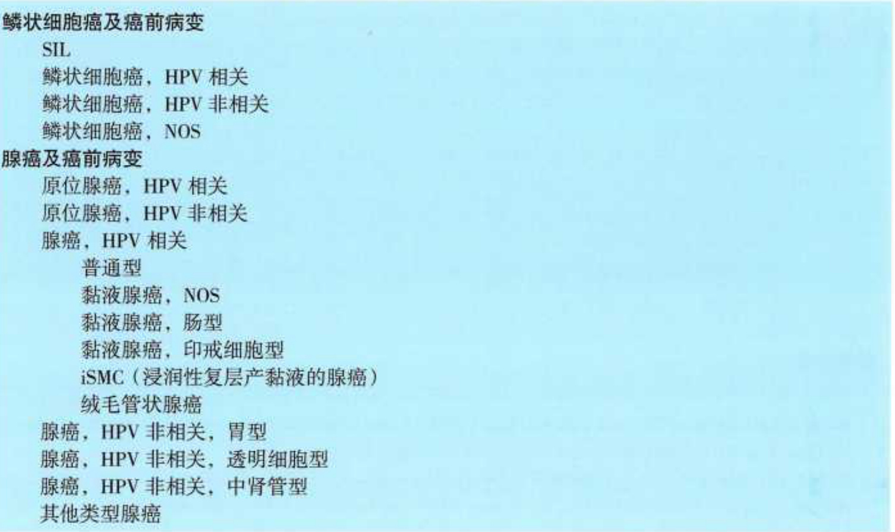

# 中国临床肿瘤学会（CSCO）宫颈癌诊疗指南2023  

GUIDELINES OF CHINESE SOCIETY OF CLINICAL ONCOLOGY (CSCO)  

# 版权所有，侵权必究！  

# 图书在版编目（CIP）数据  

中国临床肿瘤学会（CSCO）宫颈癌诊疗指南2023  
中国临床肿瘤学会指南工作委员会组织编写.一北京：  
人民卫生出版社，2023.8ISBN 978-7-117-35114-0  

I. $\textcircled{1}$ 中…·Ⅱ. $\textcircled{1}$ 中..：Ⅲ. $\textcircled{1}$ 子宫颈疾病－癌－诊疗 -指南IⅣ. $\textcircled{1}$ R737.33-62  

中国国家版本馆CIP数据核字（2023）第140372号人卫智网 www.ipmph.com医学教育、学术、考试、健康，购书智慧智能综合服务平台人卫官网 www.pmph.com人卫官方资讯发布平台  

中国临床肿瘤学会（CSCO）宫颈癌诊疗指南2023 Zhongguo Linchuang Zhongliu Xuehui ( CSCO) Gongjing Ai Zhenliao Zhinan 2023  

组织编写：中国临床肿瘤学会指南工作委员会  
出版发行：人民卫生出版社（中继线010-59780011）  
地址：北京市朝阳区潘家园南里19号  
邮　编：100021  
E - mail: pmph @ pmph.com  
购书热线：010-59787592 010-59787584 010-65264830  

印刷：三河市宏达印刷有限公司打击盗版举报电话：010-59787491 E-mail: WQ $@$ pmph.com质量问题联系电话：010-59787234 E-mail : zhiliang $@$ pmph.com数字融合服务电话：4001118166 E-mail : zengzhi $@$ pmph.com经开字版印坛 ：新华 1/32 印张：3数：80千字次：2023年8月第1版次：2023年8月第1次印刷标准书号：4N978-7-117-3511-0  

# 中国临床肿瘤学会指南工作委员会  

# 组长　徐瑞华 李进  

副组长 （以姓氏汉语拼音为序）  

程颖 樊嘉 郭军 江泽飞 梁军 梁后杰 马军 秦叔逵 王洁 吴令英 吴一龙 殷咏梅 于金明 朱军  

# 中国临床肿瘤学会（CSCO）宫颈癌诊疗指南  

组长吴令英李力  

# 副组长（以姓氏汉语拼音为序）  

黄曼妮 李贵玲 娄阁 吴小华 张师前 周琦  

# 专家组成员（以姓氏汉语拼音为序）（ $\mathbf { \widetilde { \Gamma } } ^ { 1 }$ 为执笔人）  

安菊生 中国医学科学院肿瘤医院妇瘤科陈建国 广东省人民医院妇产科范江涛 广西医科大学第一附属医院妇产科高琨 广西医科大学附属肿瘤医院妇科哈春芳 宁夏医科大学总医院妇科胡爱民 江西省肿瘤医院妇瘤科黄曼妮 中国医学科学院肿瘤医院妇瘤科黄向华 河北医科大学第二医院妇科  

江萍 北京大学第三医院放疗科  
居杏珠 复旦大学附属肿瘤医院妇瘤科  
李力 广西医科大学附属肿瘤医院妇科  
李莉 新疆医科大学附属肿瘤医院妇外一科  
李东红 陕西省肿瘤医院妇瘤科  
李贵玲 华中科技大学同济医学院附属协和医院肿瘤中心  
李魁秀 河北医科大学第四医院妇瘤科  
李艳芳 中山大学肿瘤防治中心妇科  
林安 福建省肿瘤医院妇科  
刘开江 上海交通大学医学院附属仁济医院妇瘤科  
刘乃富 山东第一医科大学附属肿瘤医院妇科  
娄阁 哈尔滨医科大学附属肿瘤医院妇科  
宋艳中国医学科学院肿瘤医院病理科  
孙志华 江苏省肿瘤医院妇瘤科  
王珂 天津医科大学肿瘤医院妇瘤科  
王建东 中华医学会北京分会  
王永军 北京大学第四临床医学院妇产科  
吴强 江苏省肿瘤医院妇瘤科  
吴令英 中国医学科学院肿瘤医院妇瘤科  
吴小华 复旦大学附属肿瘤医院妇科  
邢艳霞 青海省第五人民医院（青海省肿瘤医院）妇科  
熊慧华 华中科技大学同济医学院附属同济医院肿瘤科  
阳志军 广西医科大学附属肿瘤医院妇科  
杨兴升 山东大学齐鲁医院妇产科  
袁光文 中国医学科学院肿瘤医院妇瘤科  
袁建林 新疆医科大学附属肿瘤医院妇外三科  
张红平 云南省肿瘤医院妇科  
张师前 山东大学齐鲁医院妇产科  
张云艳 哈尔滨医科大学附属肿瘤医院放疗科  
郑爱文 浙江省肿瘤医院妇瘤科  
周琦 重庆大学附属肿瘤医院妇瘤科  
朱红 中南大学湘雅医院肿瘤科  
朱根海 海南省人民医院妇产科  
朱宽青 浙江省肿瘤医院妇瘤科  
邹文 中南大学湘雅二医院肿瘤中心  
邹冬玲 重庆大学附属肿瘤医院妇瘤科  

# 协助编写（以姓氏汉语拼音为序）  

李晓琦 复旦大学附属肿瘤医院妇科于浩 山东第一医科大学附属肿瘤医院妇科赵羽西 中国医学科学院肿瘤医院妇瘤科  

基于循证医学证据、兼顾诊疗产品的可及性、吸收精准医学新进展，制定中国常见肿瘤的诊断和治疗指南，是中国临床肿瘤学会（CSCO）的基本任务之一。近年来，临床诊疗指南的制定出现新的趋向，即基于诊疗资源的可及性，这尤其适合于发展中国家，以及地区差异性显著的国家和地区。中国是幅员辽阔、地区经济和学术发展不平衡的发展中国家，CSCO指南需要兼顾地区发展差异、药物和诊疗手段的可及性及肿瘤治疗的社会价值三个方面。因此，CSCO指南的制定，要求每一个临床问题的诊疗意见根据循证医学证据和专家共识度形成证据类别，同时结合产品的可及性和效价比形成推荐等级。证据类别高、可及性好的方案，作为一级推荐；证据类别较高、专家共识度稍低，或可及性较差的方案，作为I级推荐；临床实用，但证据类别不高的，作为Ⅲ级推荐。CSCO指南主要基于国内外临床研究成果和CSCO专家意见，确定推荐等级，以便于大家在临床实践中参考使用。CSCO指南工作委员会相信，基于证据、兼顾可及、结合意见的指南，更适合我国的临床实际。我们期待得到大家宝贵的反馈意见，并将在指南更新时认真考虑、积极采纳合理建议，保持CSCO指南的科学性、公正性和时效性。  

# 中国临床肿瘤学会指南工作委员会  

# CSCO诊疗指南证据类别 。  

# CSCO诊疗指南推荐等级 2  

1宫颈癌概述3  

# 2宫颈癌诊断及检查 5  

2.1 宫颈癌诊断基本原则6  
2.2 宫颈癌病理学诊断9  

# 3宫颈癌临床病理分期 15  

4 宫颈癌病理分类·21  
5 宫颈癌治疗原则 27  

# 6早期宫颈癌治疗（无保留生育要求） 29  

# 7宫颈癌保留生育功能手术 37  

7.1 适应证38  
7.2 诊断及术前评估40  
7.3 治疗42  

# 8中晚期宫颈癌的放（化）疗·47  

9早期宫颈癌根治术后辅助治疗·55  

# 10意外发现宫颈癌的处理 59  

# 目录  

# 11复发宫颈癌的治疗 63  

11.1 局部或区域复发宫颈癌的治疗64  
11.2 远处转移宫颈癌的治疗·68  
11.3 复发或转移性宫颈癌的系统治疗7011.3.1复发或转移性宫颈癌的系统治疗选择 7011.3.2常用晚期、复发转移宫颈癌化疗方案 74  

# 12 宫颈癌随访 79  

CSCO诊疗指南证据类别   

<html><body><table><tr><td colspan="3">证据特征</td><td rowspan="2">CSCO专家共识度</td></tr><tr><td>类别</td><td>水平</td><td>来源</td></tr><tr><td>1A</td><td>高</td><td>严谨的meta分析、大型随机对照研究</td><td>一致共识 （支持意见≥80%）</td></tr><tr><td>1B</td><td>高</td><td>严谨的meta分析、大型随机对照研究</td><td>基本一致共识 （支持意见60%~<80%）</td></tr><tr><td>2A</td><td>稍低</td><td>一般质量的meta分析、小型随机对照研究 设计良好的大型回顾性研究、病例-对照研究</td><td>一致共识 （支持意见≥80%）</td></tr><tr><td>2B</td><td>稍低</td><td>一般质量的meta分析、小型随机对照研究、 设计良好的大型回顾性研究、病例-对照研究</td><td>基本一致共识 （支持意见60%~<80%）</td></tr><tr><td></td><td>低</td><td>非对照的单臂临床研究、病例报告、专家观点</td><td>无共识，且争议大 （支持意见<60%）</td></tr></table></body></html>  

CSCO诊疗指南推荐等级  

<html><body><table><tr><td>推荐等级</td><td>标准</td></tr><tr><td>|级推荐</td><td>1A类证据和部分2A类证据 CSCO指南将1A类证据，以及部分专家共识度高且在中国可及性好的2A类 证据，作为1级推荐。具体为：适应证明确、可及性好、肿瘤治疗价值稳定 纳入《国家基本医疗保险、工伤保险和生育保险药品目录》的诊治措施</td></tr><tr><td>级推荐</td><td>1B类证据和部分2A类证据 CSCO指南将1B类证据，以及部分在中国可及性欠佳，但专家共识度较高的 2A类证据，作为I级推荐。具体为：国内外随机对照研究，提供高级别证据， 但可及性差或者效价比不高；对于临床获益明显但价格较贵的措施，考虑患者可 能获益，也可作为级推荐</td></tr><tr><td>级推荐</td><td>2B类证据和3类证据 对于某些临床上习惯使用，或有探索价值的诊治措施，虽然循证医学证据相对 不足，但专家组意见认为可以接受的，作为Ⅲ级推荐</td></tr></table></body></html>  

# 1 宫颈癌概述  

宫颈癌发病率居妇科三大恶性肿瘤之首，是导致女性癌症死亡的第四大原因。2020 年全世界约有 60.4万例宫颈癌新发病例和34.2万例死亡病例，其中我国新发病例10.97万例，死亡病例5.9万例。因此，规范宫颈癌的预防、诊断和治疗是提高我国女性身体健康水平的关键。人乳头瘤病毒（HPV)是宫颈癌的主要致病因素，规范化宫颈癌筛查至关重要。病理是诊断宫颈癌的“金标准”，盆腔磁共振成像（MRI）可用于评估局部病灶，复发转移宫颈癌推荐进行分子病理诊断。对于初治宫颈癌，以手术和放疗为主，辅以化疗、靶向治疗、免疫治疗等。随着“早期低危”宫颈癌的概念出现及相关研究进展，在保留生育的患者中可考虑采用保守性手术治疗。早期宫颈癌术后辅助放疗根据病理类型不同，放疗标准不一。放疗适用于各期宫颈癌，特别是局部晚期宫颈癌。复发转移宫颈癌以局部治疗、系统性治疗和免疫治疗为主。近年来，免疫检查点抑制剂在宫颈癌治疗中效果显著并且应用前移。宫颈癌治疗后的随诊和规范化的检查也是必不可少的。本指南参考美国国家综合癌症网络（National Comprehensive Cancer Network，NCCN）指南、国际妇产科联盟（Intermational Federation ofGynecology and Obstetrics，FIGO）指南、欧洲肿瘤内科学会（European Society for Medical Oncology，ESMO）指南，依据最新国内外临床研究结果及国内诊治共识，结合我国国情，为临床实践提供有价值的参考。  

# 2 宫颈癌诊断及检查  

# 2.1 宫颈癌诊断基本原则  

<html><body><table><tr><td></td><td>|级推荐</td><td>Ⅱ级推荐</td><td>Ⅲ级推荐</td></tr><tr><td>临床诊断</td><td>体格检查 妇科检查</td><td></td><td></td></tr><tr><td>病理诊断</td><td>子宫颈活检 宫颈细胞学b</td><td>宫颈锥切</td><td>穿刺细胞学d</td></tr><tr><td>实验室诊断</td><td>SCC、CEA、CA125、CA19-9 和NSE等肿瘤标志物e HPV检测</td><td></td><td></td></tr><tr><td rowspan="2">影像诊断</td><td>宫颈肿瘤 盆腔MRIf</td><td></td><td>盆腔CT</td></tr><tr><td>转移病灶 颈胸腹盆腔CT，必要时 PET/CTg</td><td>颈胸CT+盆腹腔MRI</td><td>其他相关检查</td></tr></table></body></html>  

# 【注释】  

a包括双合诊与三合诊检查，推荐2名及以上高年资医师进行妇科检查；必要时在麻醉状态下检查;分期判断有分歧时，推荐较早分期。  
b需注意子宫颈腺癌存在细胞学假阴性可能「。  
c子宫颈活检无法判断有无浸润、微小浸润癌，需明确浸润深度时，推荐诊断性宫颈锥切。如宫颈及阴道细胞学检查（TCT）结果与阴道镜下活检病理不符，如多次结果为高级别鳞状上皮内病变（high-grade squamous intraepithelial lesion，HSIL），而阴道镜活检病理学检查未予支持时,也推荐诊断性宫颈锥切。  
d腹股沟或颈部淋巴结可疑转移时，推荐活检或细针穿刺细胞学明确。  
e子宫颈鳞癌推荐检测 SCC[2，子宫颈腺癌推荐检测 $C \mathrm { A } 1 2 5 ^ { [ 3 ] }$ ，子宫颈胃型腺癌推荐检测 CEA、CA19-9[4]，子宫颈小细胞神经内分泌癌推荐检测 NSE[5}。  
f推荐盆腔 MRI 作为评估子宫颈局部肿瘤首选方法。MRI存在禁忌证时选择盆腔 CT[6-7]。  
g建议 I BI 期以上有条件者行 PET/CT 检查[8]。  
h可疑有骨转移时，推荐骨扫描检查；可疑有膀胱和/或直肠受累时，推荐膀胱镜和/或肠镜检查。  
[1ASIENSTANNAUICKngadaamaftCa093  
[2]CHARAKORNCTHADANIPONKCHAIJINDARATANAStalTheassciationbeweensrum squamoucellcarcinomaantigenandrecurrenceandsurvivalofpatientswitcervicalsquamouscelcacinomaAsytmatirevwand meta-analysis.Gynecol Oncol,2018,150 (1):190-200.  
[3]GADDUCCTANtlseumassayfumarnpgstivluonmentmonitoringandfolw-upofpatinswitcervicalcancerAreviewoftheliteratureCritRevOnclHmatol2008.66(1):10-20.  
4NISMMOKUNAGAalsisfgai-tucaaftiaggressivetumorwitapoorprognosi:Amult-nstiutional studyGyneclncol01953（1）:19  
[5]COHENGAPPHIalllarmaftrviTnndsuivmpatients.AmJ Obstet Gynecol,2010,203(4）:347.  
[6]MNGAKHMHRWltnndualusingMRIUpatdguidelinesoftheEuropeanSocietyofUrogenitalRadiologyaferrevisedFIGOstaging2018.Eur Radiol,2021,31(10):7802-7816.  
[7]ALCKALLGEEMANladdainntstratofwithgyecologicmalignancies:What theradiologistneeds toknow.Radiology013266(3）:717740  
8]TRIMHNGDEHDSTFaliltyfPETCTvurpriteallyhdetasadvancedcervicalcancer:ResultsofACRIN6671/GOG0233trial.GynecolOncol.2016,142(3）:413419.  

# 2.2 宫颈癌病理学诊断  

<html><body><table><tr><td></td><td colspan="2">|级推荐</td><td>级推荐</td><td>Ⅲ级推荐</td></tr><tr><td>标本类型</td><td>大体检查</td><td>镜下检查</td><td>免疫组化</td><td>生物标志物</td></tr><tr><td>活检标本</td><td>标本部位 标本数目 标本大小 标本性状</td><td>组织学分型 组织学分级 淋巴脉管间隙浸润</td><td>鉴别诊断免疫组织 化学相关指标</td><td>PD-L1h MMR或MSrh TMBh NTRKh</td></tr><tr><td>锥切标本</td><td>标本描述 标本完整性 标本数目 标本大小 标本性状</td><td>组织学分级 淋巴脉管间隙浸润 切缘情况 伴发病变 组织学分型b 浸润深度d，e</td><td>鉴别诊断免疫组织 化学相关指标</td><td></td></tr></table></body></html>  

宫颈癌病理学诊断（续）  

<html><body><table><tr><td></td><td>1级推荐</td><td></td><td>Ⅱ级推荐</td><td>级推荐</td></tr><tr><td rowspan="7">手术标本</td><td>宫颈肿瘤</td><td>组织学分型b</td><td>鉴别诊断免疫组织</td><td></td></tr><tr><td>部位</td><td>组织学分级</td><td>化学相关指标</td><td></td></tr><tr><td>大小</td><td>浸润深度de</td><td></td><td></td></tr><tr><td>性状</td><td>淋巴脉管间隙浸润</td><td></td><td></td></tr><tr><td>区域淋巴结</td><td>宫旁侵犯</td><td></td><td></td></tr><tr><td>部位</td><td>阴道侵犯</td><td></td><td></td></tr><tr><td>数目</td><td>淋巴结侵犯</td><td></td><td></td></tr><tr><td></td><td>其他器官：宫旁、 阴道、宫体、附件、 网膜和腹膜等</td><td>其他器官</td><td></td><td></td></tr></table></body></html>  

# 【注释】  

a标本离体后应尽快（1h内）以 $3 . 7 \%$ 甲醛溶液固定，固定液体积应为送检样本体积的4\~10倍。不同标本需遵循相应取材规范。活检标本：描述标本数目、大小、性状，分别取材、全部包理，如果标本最大径超过 $5 \mathrm { m m }$ ，应垂直于黏膜面对部、立埋。  

锥切标本：测量记录长度（锥高）宫颈外口（锥底）切缘最大径以及宫颈管内口直径。以锥顶为中心，垂直于管腔黏膜面间隔约 $3 \mathrm { m m }$ 、纵向连续切取管壁全层组织，确保每片组织均含有从宫颈内口至外口的全部黏膜。手术标本：记录病变部位、外观、切面、浸润间质深度、是否累及阴道壁，测量距阴道壁切缘的最短距离。肿瘤区域以 $3 \mathrm { m m }$ 间隔连续全层切开宫颈，测量肿瘤浸润的最大深度以及该部位宫颈管壁的厚度。垂直于宫颈管壁纵向切取两侧宫旁组织（含切缘）及附着的部分宫颈管壁组织各1\~2块。淋巴结应全部取材并标注。  
b组织学分型参考2020版WHO女性生殖系统肿瘤分类[21（见病理学部分）。  
c组织学分级见病理学部分。  
d早期浸润癌（IA期）应注明肿瘤间质浸润深度，测量值以mm计；IB期及以上浸润癌，应描述肿瘤浸润深度占宫颈管壁厚度的三分比，如浸润深度达管壁内1/3层、中1/3层或者外1/3层[]  
早期子宫颈腺癌深度判断存在争议。Silva分型以组织形态学为基础，采用“浸润方式”取代“传统的浸润深度”对宫颈腺癌进行分类{35）（见病理学部分）。  
伴发病变包括炎症性疾病、囊肿、良性肿瘤和子宫内膜异位症等。需警惕同时存在鳞状上皮和腺上皮病变的可能。  
g生物学标志只具有辅助诊断意义。子宫颈上皮内瘤变分级常用指标pl6和Ki67。子宫颈鳞癌和腺癌分为HPV相关型和非HPV相关型。p16基本可代替PCR检测、HPVDNA原位杂交、HPVmRNA原位杂交等技术。其他常用免疫组织化学标志物如CK7、CK20、CEA、ER、PR、  

MUC6、CD56 和 CgA等[1  

h复发、转移或持续性宫颈癌基于生物标志物为指导的全身治疗[6。宫颈癌免疫检查点抑制剂应用相关指标包括 PD-L1、MMR 或 $\mathbf { M S I } ^ { [ 7 ] }$ 和 TMB8]子宫颈肉瘤建议 NTRK 基因融合检测[9]。  

# 参考文献  

[1]中华医学会病理学分会女性生殖系统疾病学组.宫颈癌及癌前病变病理诊断规范。中华病理学杂 志，2019, 48 (4): 265-269.   
[2］ HOHN AK, BRAMBS CE, HILLER G, et al. 2020 WHO Claification of female genital tumors. Geburtshilfe Frauenheilkd, 2021, 81 (10): 1145-1153.   
[3］ DIAZ DE VIVAR A, ROMA AA, PARK KJ,et al. Invasive endocervical adenocarcinoma: Proposal for a new pattern-based classification system with signifcant clinical implications: A multi-institutional study Int J Gynecol Pathol, 2013, 32 (6): 592-601.   
[4］ ROMA AA, MISTRETTA TA, DIAZ DE VIVAR A, et al. New pattern-based personalized risk stratification system for endocervical adenocarcinoma with important clinical implications and surgical outcome. Gynecol Oncol, 2016, 141 (1): 36-42.   
[5］ SPAANS VM, SCHEUNHAGE DA, BARZAGHI B, et al. Independent validation of the prognostic significance of invasion patterns in endocervical adenocarcinoma: Pattern a predicts excellent survival. Gynecol Oncol, 2018, 151 (2): 196-201.   
[6］ National Comprehensive Cancer Network. Cervical Cancer (Version I. 2022).(2021-12-13)[2023-07-12] https:// www.nccn.org/professionals/physician_gls/pdf/cervical.pdf.   
[7]MINIONLETEWARIKS.Cervical cancer-Stateof the science：Fromangiogenesis blockadetocheckpointinib tion.GynecolOncol,2018,148(3):609-621.   
[8]MERINODMMCSHANELMFABRIZIODtal.Establishingguidelinestohamonizetmormutationalur den（MB）insiliassmentfvaiationMBquantifcationacrossdiagnostilatfomspasefteFrinds ofCancerResearchTMBHarmonization Project.JImmunother Cancer,2020,8（I):e000147.   
[9]RABBAJDEVINEANGOIRaTRKfsvilamorftreassi morpholgalandmhistochmicaldistintionfomthreriesarcmaludingadenosarcomaHisp thology,2020,77(1):100-111.  

# 3 宫颈癌临床病理分期  

宫颈癌分期系统包括国际抗癌联盟和美国癌症联合委员会（UICC/AJCC）的肿瘤、淋巴结、转移（TNM）系统（2021年第9版）I和国际妇产科学联盟（FIGO）系统（2018年更新版）【23  

<html><body><table><tr><td>TNM分期</td><td>FIGO分期</td><td>分期标准</td></tr><tr><td>T</td><td></td><td>原发肿瘤无法评估</td></tr><tr><td>T</td><td></td><td>无原发性肿瘤证据</td></tr><tr><td>T</td><td>I</td><td>肿瘤局限于子宫颈（忽略向子宫体的侵犯）</td></tr><tr><td>Ta</td><td>IA</td><td>显微镜下诊断的浸润癌，最大间质浸润深度≤5mm</td></tr><tr><td>Tiai</td><td>TAI</td><td>间质浸润深度≤3mm</td></tr><tr><td>Tia2</td><td>IA2</td><td>间质浸润深度>3mm，≤5mm</td></tr><tr><td>Tih.</td><td>IB</td><td>镜下最大间质浸润深度>5mm：肿瘤局限于子宫颈，测量肿瘤最大径</td></tr><tr><td>Ti</td><td>IBI</td><td>间质浸润深度>5mm，最大径≤2cm</td></tr><tr><td>Tin</td><td>1B2</td><td>最大径>2cm，≤4cm</td></tr><tr><td>Tiba</td><td>IB3</td><td>最大径>4cm</td></tr></table></body></html>  

宫颈癌临床病理分期（续）  

<html><body><table><tr><td>TNM分期</td><td>FIGO分期</td><td>分期标准</td></tr><tr><td>T</td><td>Ⅱ</td><td>肿瘤侵犯超出子宫，但未达阴道下1/3或盆壁</td></tr><tr><td>Ta</td><td>IIA</td><td>累及阴道上2/3，无宫旁浸润</td></tr><tr><td>Tai</td><td>IIA1</td><td>最大径≤4cm</td></tr><tr><td>T2</td><td>IA2</td><td>最大径>4cm</td></tr><tr><td>T2b</td><td>IIB</td><td>有宫旁浸润，但未达骨盆壁</td></tr><tr><td>T</td><td></td><td>肿瘤累及阴道下1/3，和/或扩散至盆壁，和/或导致肾积水或肾 无功能</td></tr><tr><td>T</td><td>IIA</td><td>肿瘤累及阴道下1/3，未扩散至盆壁</td></tr><tr><td>T36</td><td>IB</td><td>肿瘤扩散至盆壁，和/或导致肾孟积水或肾无功能（除外其他原因 所致）</td></tr><tr><td>T</td><td>IVA</td><td>肿瘤侵犯膀胱黏膜或直肠黏膜（活检证实）疱样水肿不属于IVA期</td></tr><tr><td>Nx</td><td></td><td>区域淋巴结无法评估</td></tr></table></body></html>  

宫颈癌临床病理分期（续）  

<html><body><table><tr><td>TNM分期</td><td>FIGO分期</td><td>分期标准</td></tr><tr><td>No</td><td></td><td>无区域淋巴结转移</td></tr><tr><td>Noti)</td><td></td><td>区域淋巴结的孤立肿瘤细胞（ITC）</td></tr><tr><td>N</td><td>IICI</td><td>区域淋巴结转移：局限于盆腔淋巴结</td></tr><tr><td>Niai</td><td>IIC1</td><td>盆腔区域淋巴结转移，最大径>0.2mm，≤2mm</td></tr><tr><td>Na</td><td>IIC1</td><td>盆腔区域淋巴结转移，最大径>2mm</td></tr><tr><td>N2 Nzmi</td><td>IIC2 IIC2</td><td>区域淋巴结转移：腹主动脉旁淋巴结转移 腹主动脉旁淋巴结转移，最大径>0.2mm，≤2mm</td></tr><tr><td>N2 Ma</td><td>IIC2</td><td>腹主动脉旁淋巴结转移，最大径>2mm 无远处转移</td></tr><tr><td>cM,</td><td>IVB</td><td>临床诊断的远处转移（包括转移至腹股沟淋巴结、腹膜、肺、肝、</td></tr><tr><td>pM,</td><td>IVB</td><td>骨等，不包括盆腔和腹主动脉旁淋巴结、阴道的转移） 病理确诊的远处转移（包括转移至腹股沟淋巴结、腹膜、肺、肝、 骨等，不包括盆腔和腹主动脉旁淋巴结、阴道的转移）</td></tr></table></body></html>  

# 【注释】  

a在获取所有影像学及病理学资料后确定最终分期，此后不再更改，例如肿瘤治疗或复发后分期不变。规定所有影像学检查手段（包括超声、CT、MRI、PET/CT等）均可用于分期，病理学检查对肿瘤大小的测量较妇科检查和影像学检查准确。细针抽吸、粗针穿刺、组织活检、组织切除检查、手术标本等病理学方法均可用于 $\mathbf { N }$ 、M分期。  
b淋巴脉管间隙浸润（LVSI）不改变肿瘤分期，镜下浸润宽度不再作为分期标准。  
c病理学对淋巴结转移的评估包括以下3个层面。 $\textcircled{1}$ 孤立肿瘤细胞（ITC)：淋巴结内肿瘤病灶直径 $< 0 . 2 \mathrm { m m }$ ，或单个淋巴结内的单个肿瘤细胞，或 $\leqslant 2 0 0$ 个成簇细胞。 $\textcircled{2}$ 微转移：淋巴结内肿瘤病灶最大径为 $0 . 2 { \sim } 2 \mathrm { m m }$ 。 $\textcircled{3}$ 宏转移：淋巴结内肿瘤病灶最大径 $> 2 \mathsf { m m }$ 。ITC 不影响分期，在TNM 分期中可记录为 $\Nu _ { 0 } { \bf \Gamma } _ { ( \mathrm { i + } ) }$ ，采用FIGO 分期时也应记录其存在。微转移（ $\Nu _ { \mathrm { { m i } } }$ ）和宏转移（ $\mathbf { N } _ { \mathrm { a } }$ ）被认为淋巴结受累，TNM分期中盆腔淋巴结受累为 ${ \bf N } _ { 1 }$ ，腹主动脉旁淋巴结受累为 ${ \bf N } _ { 2 }$ ；FIGO分期中则分别为ⅢC1和ⅢC2。对用于诊断FIGO ⅢC期的证据，需注明所采用的方法是 $\mathbf { r }$ （影像学）还是p（病理学)。例如，若影像学显示盆腔淋巴结转移，分期为ⅢClr；若经病理学证实，分期为ⅢClp。需记录所采用的影像学方法及病理学技术类型。若分期存在争议，应归于更早的期别。  
d TNM 分期系统中的前缀，c是临床分期，p是病理分期，如 cN 为临床诊断的淋巴结转移，pN为病理确诊的淋巴结转移，cM 为临床诊断的远处转移，pM 为病理确诊的远处转移。对确诊所用的病理学技术方法进行标注，如N（f）是指淋巴结转移通过细针抽吸或粗针穿刺确诊，N（sn）是指淋巴结转移是通过前哨淋巴结活检确诊。  

# 参考文献  

[1OLAWAIYEBAKERTPWASHINGTONMKtal.ThewVrsion9）AmericanJointCommittonCane tumor,nodemetastasisstagingforcervical cancer.CACancerJClin,2021,71（4）:287-298.   
[2]BHATLAEREKJSCUELLOFREDESMalevieFIGOstgingforcrimafthrviri Gynaecol Obstet,2019,145(1):129-135.   
[3]Coigendum toRevisedFIGOstaging forcarcinomaofthecervixuter[IntJGynecolObstet145(2019）129-135]. Int JGynaecolObstet,2019,147(2):279-280.  

# 4 宫颈癌病理分类  

2020版WHO肿瘤病理分类将宫颈鳞状细胞癌分为与HPV相关型与HPV不相关型两类（表4-1）。两者无法单独根据形态学标准区分，必须进行p16免疫染色或HPV检测。在没有条件区分HPV是否感染的情况下，可以不进行区分。目前尚未发现明确的HPV不相关型癌前病变，所以癌前病变鳞状上皮内病变（squamous intraepithelial lesion，SIL）被归为HPV相关的类别，仍分为HSIL（CIN3及CIN2）及LSIL（CIN1），需要强调的是，p16的染色不代表任何病变级别，仅在CIN2形态学鉴别困难时作为参考指征  

WHO分类中宫颈腺癌及癌前病变也相应分为HPV相关性腺癌及原位癌、HPV非相关性腺癌及原位癌。HPV相关性腺癌主要包括普通型腺癌、大部分黏液腺癌[非特异黏液腺癌、肠型黏液腺癌、印戒细胞癌、宫颈浸润性复层产黏液的癌（iSMC）]，宫颈HPV相关型腺癌，最常见的亚型为普通型；根据形态学及镜下特点，HPV相关型普通型腺癌可进行Silva分类。SilvaA型：边界清楚，预后相对较好；SilvaB型：边界清楚，小灶浸润型生长；SilvaC型：弥漫浸润型生长，预后相对较差。HPV非相关性腺癌包括胃型黏液腺癌、透明细胞癌和中肾管腺癌等。  

对于宫颈腺癌，HPV非相关型相对预后较差。但在宫颈鳞癌中，HPV对于预后的意义，有待进一步研究。需要强调的是无论宫颈腺癌或鳞癌，分期仍是最重要的临床预后因素[2-5]。  

宫颈神经内分泌肿瘤，分为神经内分泌瘤（NET：NET1/2）及神经内分泌癌（大细胞神经内分泌癌及小细胞神经内分泌癌）。宫颈中神经内分泌瘤非常罕见，宫颈常见的神经内分泌肿瘤多为神经内分泌癌。无论大细胞神经内分泌癌还是小细胞神经内分泌癌，均具有高度侵袭性，就诊时远处转移很常见。即使在早期诊断的患者中，死亡率也很高。在宫颈、子宫内膜和卵巢中，神经内分泌癌经常与其他肿瘤一起发生。  

  
表4-1WH0宫颈癌及癌前病变分类（第5版，2020年）  

# WH0宫颈癌及癌前病变分类（第5版，2020年）（续）  

  

# 参考文献  

[1]WHOClassificationofTumoursEditorialBoardWHOClassficationofTumours:Femalegenital tmouth ed.Lyon(France):International Agency for Research on Cancer,2020.   
[2]OMAAADIDEIVARAPARKJtalvasivnocericaladenocrcmawatt-basdla sificationsystemwithimortantlinical significance.AmJSurgPathol01539（5）:667-62.   
[3]STOLNICUSBARSANIHOANGLtal.Itenational EndocervicalAdenocarcnoma CriteriaandClas sification（IECC）Anewpathogeneticclassificationforinvasiveadenocarcinomasoftheendocervix.mJSurg Pathol,2018,42(2):214-226.   
[4]STICUANGHUDlnialumfVcidandciadvia nocarcinomascategorizedbytheInternationalEndocervicalAdenocarcinomaCriteriaandClassification（IECC）.Am JSurgPathol,2019,43(4):466-474.   
[5]PJicamgatfatpfanlgnlc ersinto classification.Histopathology,2020,76(1）:112-127.  

# 5 宫颈癌治疗原则  

宫颈癌的治疗手段包括手术、放疗、系统性治疗（包括化疗、免疫治疗和靶向治疗）。早期宫颈癌患者（ $\mathrm { ~ I ~ A ~ } { \sim } \mathrm { ~ I ~ B ~ } 2 \ \mathrm { ~ I ~ }$ 期以及ⅡA1期）可选择根治性手术治疗，然后根据术后病理是否存在危险因素来决定术后的辅助治疗；也可以选择直接行根治性放疗或个体化选择同步放化疗。早期宫颈癌的手术与根治性放疗两者的疗效相当，5年生存率、死亡率、并发症发生率相似。由于放疗可能导致相关并发症，对于未绝经患者，特别是年龄小于45岁且无手术禁忌证的患者可选择手术治疗。另外对于符合条件，有保留生育功能要求的患者采用保留生育功能的手术方式。对于局部晚期宫颈癌（IB3 期和ⅡA2期）首选同步放化疗，在放疗资源匮乏地区也可选择手术治疗。对于ⅡB期～IVA 期宫颈癌，治疗方式首选同步放化疗。对于IⅣB 期宫颈癌一般以系统性治疗为主，部分患者可联合个体化放疗。  

6 早期宫颈癌治疗（无保留生育要求）  

<html><body><table><tr><td>分层</td><td>级推荐</td><td>Ⅱ级推荐</td><td>Ⅲ级推荐</td></tr><tr><td>IA1期ab 且不伴淋巴脉宫颈锥切术 管间隙浸润</td><td>A型子宫切除12）</td><td></td><td></td></tr><tr><td>IAI期伴淋巴B型子宫切除+ 脉管间隙浸润</td><td colspan="3">盆腔淋巴结切除术 根治性放疗（体外放疗+ 阴道近距离放疗）</td></tr><tr><td>IA2期</td><td>B型子宫切除h+ 根治性放疗（体外放疗+ 阴道近距离放疗） 盆腔淋巴结切除术[22]</td><td>B型子宫切除ch+ 前哨淋巴结显影技 术5-16]</td><td></td></tr><tr><td>IB1期、 IB2期 IIA1期</td><td>根治性放疗（体外放疗+ 阴道近距离放疗）± 铂类为基础的同步化疗[21] C型子宫切除，h+ 盆腔淋巴结切除术（1类）d，e</td><td>C型子宫切除c，h+C型子宫切除h+ 盆腔淋巴结切除术+前哨淋巴结显影技术d 腹主动脉旁淋巴结 切除术d，ef</td><td></td></tr></table></body></html>  

早期宫颈癌治疗（无保留生育要求）（续）  

<html><body><table><tr><td>分层</td><td>I级推荐</td><td>Ⅱ级推荐</td><td>Ⅲ级推荐</td></tr><tr><td>IB3期、 IIA2期名</td><td>根治性放疗（体外放疗+ 阴道近距离放疗）± 铂类为基础的同步化疗</td><td>C型子宫切除+ 盆腔淋巴结切除术+ 腹主动脉旁淋巴结铂类为基础的同步化疗+ （1类）切除术d，e，f</td><td>根治性放疗（体外放疗+ 阴道近距离放疗） 全子宫切除腹主动脉旁± 根治性放疗（体外放疗+ 阴道近距离放疗） 铂类为基础的同步化疗 盆腔淋巴结分期手术（17-19）</td></tr></table></body></html>  

# 【注释】  

a分期按照FIGO2018版分期标准。  
bIA期需经宫颈锥切组织的病理方能确诊，不能单纯由宫颈活检组织病理来确诊。  
c子宫切除范围参照Q-M手术分型（表6-1）。  
d 对于C型子宫切除的手术方式首选为剖腹手术[34.20]。  
e盆腔淋巴结切除范围包括骼总淋巴结、骼外淋巴结、骼内淋巴结以及闭孔淋巴结。  

f腹主动脉旁淋巴结切除范围一般达肠系膜下动脉水平即可，但也可结合影像学以及术中冰冻病  

理结果个体化扩大切除范围。  

g对于IB3期、ⅡIA2期宫颈癌采用新辅助化疗加手术的治疗模式还存在争议，一般仅建议用于放 疗不可及区域或者临床研究。   
h近年有两项前瞻性、随机分组的Ⅲ期临床研究结果显示，对于早期低危宫颈癌（即满足所有以下 条件的患者：FIGO分期IA2\~IB1期（基于锥切病理分期）、无脉管瘤栓、锥切切缘阴性、鳞 状细胞癌（任何组织分级）或普通型腺癌（组分学分级1级或2级）、肿瘤最大径 $\leq 2 0 m$ 浸润 深度 $\leqslant 1 0 \mathrm { m m }$ 以及影像学检查未发现远处转移），采用单纯子宫切除与采用根治性子宫切除，生 存结果相当。这一结论尚有待更长时间的随访结果来验证[23-25]。   
[1QUEREUDMORRWCPClassifcationfradicalhysterctomyancetncol00893）:973   
[2]CIBULAD,ABU-RUSTUMNR,BENEDETTI-PANICIP,tal.Newclassification systemof radical hysterectomy:Ephassonathre-dmensonalanatmictmplatfrparametrialresectionGyecolOncol1 122(2):264-268.   
[3RAMIRETFRUMOVITZAREJARalMinallyvasiveerusabdominalradcalhytertmo cervicalcancer.N EnglJMed,2018,379 (20):1895-1904.   
[4]MEMDMRGUDJHENlivlallsiditmflst cervical cancer.NEngl JMed,2018,379(20):1905-1914.   
[5]ALGSECTEANDTADTltilidnyftl cept in cervical cancer:AGO Study Group.JClin Oncol,2008,26(18):2943-2951.   
[6]BATSTHETUENEDleidequtsxdna waysandallownodalulrastaginginearlycervicalcancer:IsightsfromthemulticenterprospectiveENTICOL study.Ann Surg Oncol,2013,20 (2):413-422.   
[7]EIRKSSONLRCOVENSA.entinellymphnodemappingincrvical cancer:Thefuture？BJOG012, 119(2):129-133.   
[8]CORMIEIAJHstblisingieanglgritt early cervical cancer.Gynecol Oncol,2011,122(2):275-280.   
[9]CIUADBUUTUMUEKLlsticifaflsnl di ease in early-stage cervical cancer.Gynecol Oncol,2012,124(3):496-501.   
[10]UUMTVETQUEREUilaraiviuraty lymphndmtastasisarycericlcaneultsftENTICLudlnl19136 1691.   
[11]ATSUNERDUEREUDaliaostiafraprtivexainonfntil nodeinearlcervicalcancer:Arospectiveulticentr study.GycolOncol01113（2）:23035.   
[12]CIBULADBU-USTUMNRDUEKLtalBiatralulastaingfentilymhnodnv calcancerLowering the false-negativerate andimproving the detection ofmicrometastasis.Gynecol Oncol,2012,127(3):462-466.   
13]ADEDWADTlnlbyeystvialctlt intraoperative versuspostoperativeassessmentGynecol Oncol,2008,111(1):1317.   
14]AMUNDRUEKLalHigfalsetivratffoestnxintnfn nodes in patients with cervical cancer.Gynecol Oncol,2013,129(2):384-388.   
[15]FRUMVIANTEPteafedfrefodetinfnl womenwiicnrit Oncol,2018,19（10):1394-1403.   
[16]ATSRATIATHETtalonrutonfyositigraphyttraprivseillh node detectioninearly cervical cancer:Analysisof theprospectivemulticenterSENTICOLcohort.Gynecol Oncol,2015,137(2):264-269.   
[17]GOLDATIANCWHTNEYCWtlSurgcaversusradographicdemnationfpara-aorilyh nodemetastasesbeforechemoradiationforlocallyadvancedcervical carcinoma:AGynecologicOncologyGroup Study.Cancer,2008,112(9):1954-1963.   
[18]GOUMICEARDUCalrstiveltyvungsuvivalfpn locallyadvancedcervicalcancerundergoinglaparosopicparaaorticlymphadenectomybeforechemoradiotherapy in theeraof positronemission tomographyimagingJClinOncol201331(24）:30263033.   
[19]FRUMOVITZMQUERLEUD,GIL-MORENOAetalLymhadenectmyilocallyadvancedcervicalcan study（LiLACS）haseIllinical trialcomparing surgicalwithradiologistaginginpatientswithstageIIA cervical cancer.JMinim Invasive Gynecol,2014,21(1):3-8.   
[20]MARGUJANGEAGLLalumeandcstfotindlaparospiradicalt ectomy forstageIB1 cervical cancer.JClin Oncol,2018,36（15_suppl):5502.   
[21]BAALBERGENAEENSTRATALERSLt alPrmary surgeryersusprimaryradiation apywithorwithoutchemotherapyforearlyadenocarcinomaof theuterinecervix.CochraneDatabaseSyst Rev,2010(1):CD006248.   
[22]OKKAFANTCKBANKElugialteaentfstageviclcaerCchraDat base Syst Rev,2014(5):CD010870.   
[23]CHMELERMAREJROPEZLANCOAalCoCevposetivetrilfconsevativeurfo low-risearl-stagevialaneJGyolCanr0110）:17-5.   
[24]PANTEWFEGUtalntationaramzedphastialcmarngadicalst tomyandplviodedissetionssmlehyerectmyandpelvinodedissetioninpatietswithlwiskerly stage cervical cancer.JClin Oncol,2023,41(suppl:abstrLBA5511.   
[25]NationalComprehensiveCancerNetwork.CervicalCancer(Version1.2022）(2021-12-13）[2023-07-12]htps:/ www.nccn.org/professionals/physician_gls/pdf/cervical.pdf.  

表6-1 宫颈癌子宫切除的Q-M分型  

<html><body><table><tr><td>分型</td><td>对应术式</td><td>输尿管 处理</td><td>子宫动脉 处理</td><td>侧方宫旁组织 切除</td><td>腹侧宫旁 组织切除</td><td>背侧宫旁组织 切除</td><td>阴道切除</td></tr><tr><td>A</td><td>介于筋膜外子 宫切除术和改 良根治术之间</td><td>识别但不 游离</td><td>于输尿管 内侧切断</td><td>输尿管与宫颈最小切除 之间</td><td></td><td>最小切除</td><td><lem</td></tr><tr><td></td><td>B1改良根治术</td><td>隧道”输尿管正输尿管水平 顶部打开上方切断 与侧推</td><td></td><td></td><td>韧带</td><td>部分切除子宫骶韧带在切除1cm 膀胱宫颈子宫直肠腹膜 反折处切除</td><td></td></tr></table></body></html>  

宫颈癌子宫切除的 $\mathbf { Q - M }$ 分型（续）  

<html><body><table><tr><td>分型</td><td>对应术式</td><td>输尿管 处理</td><td>子宫动脉 处理</td><td>侧方宫旁组织 切除</td><td>腹侧宫旁 组织切除</td><td>背侧宫旁组织 切除</td><td>阴道切除</td></tr><tr><td>B2</td><td>B1+宫旁淋巴同B1 结切除</td><td></td><td>同B1</td><td>同B1，再切同B1 除宫旁淋巴结</td><td></td><td>同B1</td><td>同B1</td></tr><tr><td>CI</td><td>NSRH</td><td>完全游离</td><td>骼内动脉</td><td>骼血管内侧水 平（保留盆腔（保留神经留腹下神经） 内脏神经）</td><td>膀胱支）</td><td>膀胱水平直肠水平（保切除2cm</td><td>（或根据实 际需要）</td></tr><tr><td>C2</td><td>经典的宫颈癌同CI 根治术</td><td></td><td>同C1</td><td>骼血管内侧水 平（不保留盆 腔内脏神经）</td><td>膀胱水平 （不保留膀 胱支）</td><td>骶骨水平（不保同C1 留腹下神经）</td><td></td></tr><tr><td>D1</td><td>侧盆扩大根完全游离 治术</td><td></td><td>血管切除</td><td>连同骼内盆壁血管切除膀胱水平</td><td></td><td>骶骨水平</td><td>根据需要</td></tr><tr><td>D2</td><td>侧盆廓清术</td><td>同D1</td><td>同D1</td><td>盆壁肌肉筋膜根据情况 切除</td><td></td><td>根据情况</td><td>根据需要</td></tr></table></body></html>

注：NSRH.C1型广泛性子宫切除术，又称保留神经的广泛性子宫切除术（nerve-sparingradical hysterectomy，  

7 宫颈癌保留生育功能手术  

# 7.1 适应证 [1-4 ]  

<html><body><table><tr><td>项目</td><td>|级推荐</td><td>Ⅱ级推荐</td></tr><tr><td>FIGO分期</td><td>IA1~IB2期</td><td></td></tr><tr><td>病理类型</td><td>宫颈鳞癌、腺癌和腺鳞癌，排除神经内 分泌癌、胃型腺癌</td><td>透明细胞癌[56]，腺肉瘤，胚胎横纹肌 肉瘤a[7]</td></tr><tr><td>影像评估</td><td>肿瘤局限于宫颈，病灶未侵犯宫颈内口， 无淋巴结转移及远处转移</td><td></td></tr><tr><td>生育力评估</td><td>年龄≤45岁 有强烈的生育愿望，无明确生育功能 障碍</td><td></td></tr></table></body></html>  

# 【注释】  

a复旦大学附属肿瘤医院于 2006—2019 年共对15 例宫颈腺肉瘤或胚胎横纹肌肉瘤的患者实施了腹式根治性宫颈切除术或宫颈锥切术，患者年龄中位数为19（11\~36）岁，肿瘤大小中位数为5（1.5\~20）cm。所有患者肿瘤均局限于宫颈，截至2023年5月，随访时间中位数为141（47\~201）个月，仅1例复发且死亡。  

[1]Jalogilreultsandurnrkfacrfollwingabdnlraicala tomy:Anupdated series of333patients.BJOG,2019,126(9):1169-1174.   
[2]lacaamalalmyfrvcaligcallogil tility outcomes in62patients.GynecolOncol,2011,121(3):565-570.   
[3]MARTHANDONIMAHNERtalCvicalcanESMOClncalPrtiGuielinrd sis,treatment and follow-up.Ann Oncol,2017,28(suppl_4）:iv72-iv83.   
[4]PREJENDONJUEdiatradiclratmyruseaduatr followedbyconservativesureryforpatientswithstageIIcrvicalcancerwithtmorsmorlarerAliteratur reviewand analysisofoncologicalandobstetricaloutcomesGynecolOncol2015137(3）574580.   
[5]BU-UTUMUEVINEAaridialamlaltmyrrvil cinoma:Anovel surgical approach.Gynecol Oncol,2005,97(1):296-300.   
[6]LESTERCFARMERDLABBANJTtaladicaltrahletmyforclercellcamaftcrvx 6-yearlartvinrnftgilqiau018）   
7]W.7Fetiltyspigryrdiic/dlsentpatntwihmavlvinr vix.Int J Gynecol Cancer,2019,29(Suppl4):A389.  

# 7.2 诊断及术前评估  

<html><body><table><tr><td>目的</td><td>级推荐</td><td>Ⅱ级推荐</td></tr><tr><td>诊断</td><td>妇科检查+宫颈活检</td><td></td></tr><tr><td>分期诊断</td><td>胸部CT+腹部增强CT+盆腔增强MRI2或PET/CT[34]</td><td>胸部、腹部、盆腔CT</td></tr><tr><td>生育能力评估</td><td>抗米勒管激素（AMH）或窦卵泡计数（AFC）a</td><td>年龄≤45岁 性激素检查b</td></tr></table></body></html>  

# 【注释】  

a为了更好地评估患者术前卵巢储备功能，建议在月经周期任意时期进行血抗米勒管激素（AMH）检查，或月经第1\~3天通过超声检查双侧卵巢窦卵泡计数（AFC）。  
b性激素检查包括卵泡刺激素、黄体生成素、雌二醇、孕酮、睾酮以及泌乳素，可于月经期第1-3天（卵泡期）抽血检查。  
[1]AKMANKINKtaltcviclcanlfrativMRmagngofpatients forfertility-sparingradical trachelectomy.Radiology,2013,269(1):149-158.  
[2UANaEalyvlmniltineas a toolinpatient selectionandafollow-upmodality.adiographics,2014,34（4）:1099-119  
[3]ADAMJA.VANDIEPENPR,MOMCH,et $\mathrm { a l . } [ { } ^ { 1 8 } \mathrm { F } ]$ FDG-PETorPET/CTin theevaluation of pelvic andpara-aorticlymphodenpatientswithlocallyadvancedcervicalcancerAsystematicreviwftheliteratureGyecolOncol,2020,159(2):588-596.  
[4]GUENWANCHstfDGTRlwivilnancy:a systematicreview of the literature.Front Oncol,2020,10:519440.  

# 7.3 治疗 [1]  

<html><body><table><tr><td>分期</td><td>|级推荐</td><td>Ⅱ级推荐</td><td>川级推荐</td></tr><tr><td>IAI,LVSI（-) IA1,LVSI（+)</td><td colspan="3">宫颈锥切或LEEP刀 根治性宫颈切除术b，e</td></tr><tr><td>IA2</td><td colspan="3">盆腔淋巴结切除术 （前哨淋巴结活检术）， 或宫颈锥切术 盆腔淋巴结切除术 （前哨淋巴结活检术[6-10]）</td></tr><tr><td>IB1</td><td>腹式或阴式根治性宫颈切除 术b盆腔淋巴结切除术 （前哨淋巴结活检术）</td><td>腹腔镜或机器人根治 盆腔淋巴结切除术（前 新辅助化疗+根治性 性宫颈切除术b，d 哨淋巴结活检术）1-12</td><td>宫颈锥切术+盆腔淋 巴结切除术（前哨淋巴 结活检术）h（13-15]</td></tr><tr><td>IB2</td><td colspan="3">腹式根治性宫颈切除术， 盆腔淋巴结切除术</td></tr></table></body></html>

注：LVSI.淋巴脉管间隙浸润（lymphovascularspaceinvasion）。  

# 【注释】  

a至少保证 $3 \mathrm { m m }$ 阴性宫颈切缘。  
b至少保证 $5 { \sim } 8 \mathrm { m m }$ 阴性宫颈切缘。  
c至少保证 $8 { \sim } 1 0 \mathrm { m m }$ 阴性宫颈切缘。  
d 经过锥切且切缘阴性需要补充手术的患者，实施腹腔镜或机器人根治性宫颈切除术更为安全["]。  
e 相当于Q-M B 型根治术的切除范围。  
f 相当于Q-M B 型或 C1 型根治术的切除范围。  
g 相当于 Q-M C1-C2 型根治术的切除范围。适用于部分早期低危宫颈癌，如肿瘤直径 $\leqslant 2 \mathrm { c m }$ ，肌层浸润深度 $\leqslant 1 0 \mathrm { m m }$ 或 $< 5 0 \%$ ，伴随/不伴随 LVSI。  
i盆腔淋巴结切除可在新辅助化疗前或新辅助化疗后实施，需确保盆腔淋巴结病理阴性才可实旅保留生育功能治疗。  

# 参考文献  

[1］ SERT BM, KRISTENSEN GB, KLEPPE A, et al. Long-term oncological outcomes and recurrence pattems in early stage cervical cancer treated with minimally invasive versus abdominal radical hysterectomy: The Norwegian Radium Hospital experience. Gynecol Oncol, 2021, 162 (2): 284-291.  

[2] SUPRASERT P, KHUNAMORNPONG S, PHUSONG A, et al. Accuracy of intra-operative frozen sections in the  

diagnosis of ovarian masses.Asian PacJ Cancer Prev,2008,9(4):737-740.   
[3]NationalComprehensiveCancerNetwork.CervicalCancer(Version1.202）2021-12-13）[2023-07-17]https:// www.nccn.org/professionals/physician_gls/pdf/cervical.pdf.   
[4]BENTIVEGNAMAULRDAPAUTIERtalFrtilityresultsndpenanyoomsaconsrtv treatmentfcervicalcancer:Asystematicreviewof theliterature.FertilStril2016106（5）1195-1211.   
[5]FRUMUNCHMEERMalPralmrdiayrmy women with early-stage cervical cancer.Obstet Gynecol,2009,114(1):93-99.   
[6]WCKntvilcpnt transperitonealradicalhysterectomy:Astudyof100caseIntJGynecolCancer200616(2）:649-654   
7]DOSTALEKIKANMFISCHERVADtalLNbiopsyncrvialcnepatintwittmorslarghn 2cm and4cm.GynecolOncol,2018,148 (3):456-460.   
[8]KADKHDAYAANADEEGLIGlnbpydlstgngf cervixcaytmatireiwand-analyisftnliaugcol5（0   
[9]ROBOBHALASKAMCre statfnldappinitanan vical cancer.Expert RevAnticancer Ther,2013,13(7):861-870.   
[10]ALVGMIEZPTEVENBACKCFtalsitivityandgivepditivvafsnl nodebiopsy inwomen withearly-stage cervical cancer.Gynecol Oncol,2017,145(1):96-101.   
[1]MUAJlallasiraayry cervical cancer.NEnglJMed,2018,379(20):1895-1904.   
[12]ALVGAMIEEAMtlnallyvaivradiclrayelysa cervicalcanerIntrationalRaicalTrachlctomyAssessmenttudy.mJObsttGyecol2022226（1）:97.   
[13]CHMELERMAREJAOPEZLANCOAtalConCervAprsectiveriafcnserativsrgry low-risk early-stage cervical cancer.Int J Gynecol Cancer,2021,31(10):1317-1325.   
[14]NTEFGUntnaranmizeaItalmandia tomyandpelvicdedissectionssmlehysterecomyandplvodedissctionpatientswithlowriskerly stage cervical cancer.J Clin Oncol,2023,41（suppl:abstrLBA5511.   
[15]XXIACHallecnizatnndvilhadetmyely-stecervicalcn spective analysis andreview oftheliterature.Gynecol Oncol.2020,158(2）:231-235.   
[16]Ualaduahtraywbadatsun radicaltraclmyforatntitFIG018stage2cervicalcanerGyecolncol316910112.  

8 中晚期宫颈癌的放（化）疗  

<html><body><table><tr><td>临床 分期</td><td>分期</td><td>分层</td><td>|级推荐</td><td>I级推荐</td><td>Ⅲ级推荐</td></tr><tr><td>IIB期 ⅢA期 IB期</td><td></td><td></td><td>盆腔EBRTd+ 近距离放疗 同步含铂化疗！ （1类）</td><td>盆腔EBRTd+ 近距离放疗</td><td></td></tr><tr><td rowspan="2">IIC期</td><td>IC1期影像学</td><td>检查</td><td>盆腔腹主动脉旁 EBRTd+ 近距离放疗+ 同步含铂化疗！</td><td>盆腔腹主动脉旁 EBRTd+ 近距离放疗e</td><td>新辅助化疗h 盆腔 腹主动脉旁EBRT+ 近距离放疗d+ 同步含铂化疗</td></tr><tr><td></td><td>病理细 胞学</td><td>盆腔EBRTd+ 近距离放疗+ 同步含铂化疗</td><td>盆腔EBRTd+ 近距离放疗</td><td>新辅助化疗h 盆腔± 腹主动脉旁EBRT+ 近距离放疗 同步含铂化疗</td></tr></table></body></html>  

中晚期宫颈癌的放（化）疗（续）  

<html><body><table><tr><td>临床 分期</td><td>分期</td><td>分层</td><td>|级推荐</td><td>I级推荐</td><td>I级推荐</td></tr><tr><td>IC期</td><td>IC2期</td><td>影像学 检查b 或病理 细胞学</td><td>盆腔+ 腹主动脉旁EBRT+ 近距离放疗+ 同步含铂化疗！</td><td>盆腔+ 腹主动脉旁EBRT+ 近距离放疗</td><td>新辅助化疗h 盆腔 腹主动脉旁EBRT+ 近距离放疗 同步含铂化疗</td></tr><tr><td rowspan="2"></td><td>IVA期无淋巴 结肿大</td><td></td><td>盆腔EBRT+ 近距离放疗+ 同步含铂化疗</td><td>盆腔EBRTd+ 近距离放疗</td><td>新辅助化疗 盆腔 腹主动脉旁EBRT+ 近距离放疗d+ 同步含铂化疗</td></tr><tr><td>淋巴结影像学 肿大</td><td>检查 或病理 细胞学</td><td>盆腔 腹主动脉旁EBRTd+ 近距离放疗 同步含铂化疗</td><td>盆腔 近距离放疗 腹主动脉旁EBRTd+</td><td>新辅助化疗h 盆腔士 腹主动脉旁EBRT+ 近距离放疗 同步含铂化疗</td></tr></table></body></html>

$\mathbb { N B }$ 期系统性治疗 $\pm$ 针对肿瘤局部放疗或同步放化疗  

# 【注释】  

a临床分期：2018年FIGO分期。  
b影像检查（r）：推荐MR、CT或PET/CT。  
c病理细胞学（p）：对可疑的影像学结果，可以考虑对异常病灶行穿刺活检，或选择手术分期（即腹膜外或腹腔镜淋巴结切除术）（3类）[1-2）]。由于穿刺活检或手术带来的损伤，专家组反对意见较多。更多一手肿瘤指南、专家共识、医学资料等，请关注”放瘤班”微信公众号！  
d体外放射治疗（EBRT）：推荐以影像引导（CT或MR）为基础的适形调强放疗技术。放疗范围包括已知及可疑的肿瘤侵犯部位，EBRT靶区为盆腔 $\pm$ 腹主动脉旁区域。剂量45（40\~50）Gy。不可切除的淋巴结可以通过高度适形的放疗技术，给予同步加量或后程推量10\~15Gy。对于图像引导的EBRT，高剂量区域必须注意避开正常组织或严格限制正常组织的照射剂量。  
e：近距离放疗：近距离放疗是所有不适合手术的初治宫颈癌根治性放疗的关键部分。通常采用宫腔管和阴道施源器。对于局部肿瘤巨大而且不对称的患者或者肿瘤退缩不足的患者，组织间插植可以提高靶区剂量并且最大限度减小正常组织剂量。推荐近距离放疗前或放疗中行MRI检查，有助于勾画残留肿瘤。A点或高危CTV（HR-CTV） $D _ { 9 0 }$ 的处方剂量为（5\~7） $\mathrm { G y } \times ( 4 - 6 )$ 次，总量20\~35Gy。联合EBRT，A点或高危CTV（HR-CTV） $D _ { 9 0 }$ 的 $\mathrm { E D Q } _ { 2 }$ 需达80\~85Gy；对于肿瘤体积大或退缩不佳的病灶，A点或高危CTV（HR-CTV） $D _ { 9 0 }$ 的 $\mathrm { E D Q } _ { 2 } \geqslant 8 7 \mathrm { G y }$ 。正常组织的限定剂量：直肠 $D _ { 2 \mathrm { c c } } \leqslant 6 5 \sim 7 5 \mathrm { G y }$ 乙状结肠 $D _ { 2 \mathrm { c c } } \leqslant 7 0 { \sim } 7 5 \mathrm { G y }$ ：膀胱 $D _ { 2 \mathrm { e } } \leqslant 8 0 { - } 9 0 \mathrm { G y }$ 如果达不到这些参数要求，应该考虑使用组织间插植技术作为补充 $[ 7 . 1 0$ 0  
f同步化疗：同步放化疗可降低宫颈癌患者复发风险和死亡风险。通过充分评估无远处转移者，推荐盆腔 $\pm$ 腹主动脉旁EBRT联合同步含顺铂化疗和近距离放疗（1类）【1-7]。同步放化疗，通常在盆腔EBRT时进行化疗。  
g同步化疗方案推荐：顺铂周疗（ $\mathrm { D D P } 4 0 \mathrm { m g / m } ^ { 2 }$ ，每周一次，46次）；如果不能耐受顺铂者，选择卡铂（AUC=2，每周一次，4\~6次）或含铂双药增敏化疗。  
h放疗前新辅助化疗在既往的研究中不获益，近期有少量文献报道，淋巴结转移者放疗前化疗可以获益。专家组意见不一，建议根据各个医院和患者具体情况慎重选择，推荐放疗前化疗方案紫杉醇 $^ +$ 顺铂或紫杉醇 $^ +$ 卡铂，少于2周期[18]  
i参见复发转移性宫颈癌治疗。  

# 参考文献  

[1]GFFAMUTZGPALlatfgalstgingmnwicallyaadcervia cer.Gynecol Oncol,1999,74(3):436-442.   
[2]riddafnf ingforpatientswithlocallyadvancedcervicalcancerResultsfaprosectiverandomizedtrialmJObsteGyecol,2015,213(4):503.   
[3]IMMALLJRRTELANCEtlonsnusguidelnesrelietionflincaltargel forintensity-modulatedpelvicradioterapyforthedefnitiveteatmentofcervixcancentJRadiatOncolBiol Phys,2011,79(2):348-355.   
[4]LOISELLECKOHWJ.Themerginguse ofIMRTortreatmentofervical cancerNatComprCan Netw,2010,8(12）:1425-1434.   
[5]CHENFSENGCENGCCllniclstystretmyicapinttat concurrentCisplatinandintensitymodulatedpelvicraditherapyComparisonwithconventionaraditherapy Radiat Oncol BiolPhys,2007,67(5):1438-1444.   
6]Mlnitft modulatdadatonrafrecoloicmalignaniIRaiatniolPhy00654）:11701176   
[7]HAIE-MEDERC,POTTERRVANLIMBERGENE,etal.Recommendations fromGynaecological（GYN）GEC ESTROWorkingGroup（I）:Conceptsandtermsin3Dmagebased3Dteatmentlanningincervixcancerbrachy therapywithemphasisonMRIassessment of GTVandCTV.RadiotherOncol2005,743）:235-245.   
[8POTTERGEOGIMPUOJCalnialmftclbasedmaMidda tivebrachytherapycombinedwith3Dconformalradiotherapywithrwithoutchmotherapyinpatientswithlocally advancedcervical cancer.Radiother Oncol,2011,100(1):116-123.   
[9]POTTERRHAIE-MEDERCVANLIMBERGENE,etalRecommendations fromgynaecological（GYN）GEC ESTROworkinggroup（I）:Conceptsandterms3Dimage-basedtreatmentplanningncervixcancerbrachytherapy3DlntfDbasdanyatnidilgi Oncol,2006,78(1):67-77.   
[10]VISWANATHANANERICKSONBAThredimensionalmagingngynecologicbrachytherapy:Asurveyoft AmericanBrachytherapy Society.Int J Radiat Oncol Biol Phys,2010,76(1):104-109.   
[11]GAFFNEYDKERICKSONWTTMANNBAHINGRANAtalCRAppropriateessCritriaonAva CervicalCancerExpertPanelnradiationncologgyeclogynadiatncolBilPhy01l13）:09 614.   
[12]MNKTEWARIOHWJMtdaltyterayflcallyadvancedeviclcanmaStft and future directions.JClin Oncol,2007,25(20):2952-2965.   
[13]OIIFELUlPviradiatnwiretchtraymaedwitvinda aortic radiation forhigh-riskcervical cancer.NEngl J Med,1999,340（15):1137-1143.   
[14]NWUEUDNtlamizdcmparisonfrouracillat sushydroxyureaasanadjuncttoradiationtherapyinstageB-IAcarcinomaof thecervixwithnegativeaa aorticlymphnodes:AGynecologicOncologyGroupandSouthwestOncologyGroup studyJClinOncol1999 17(5):1339-1348.   
[15]EGDTIBlrisnbasdaditrantrll advanced cervical cancer.NEnglJMed,1999,340（15):1144-1153.   
[16]THOMASGM.Improved treatmentforcervicalcancer:Concurrent chemotherapyandradiotherapy.NEng Med,1999,340(15):1198-1200.   
[17]ROSEPG.Combination therapy:New treatment paradigm forlocaly advanced cervical cancer?NatRevClin Oncol,2011,8（7):388-390.   
[18]GREENHMCOUNSELLNWARDAet alNeoaduvantchmotherapynlocallyadvanced cervical caci noma:Arolepatietswithpara-aortilymphodenvolvement？A10-yearinstittionalexperienceClinOncolR CollRadiol),2022,34（7):e281-e290.  

9 早期宫颈癌根治术后辅助治疗  

<html><body><table><tr><td>术后病理</td><td>分层</td><td>|级推荐</td><td>级推荐</td><td>川级推荐</td></tr><tr><td rowspan="2">腹主动脉淋 巴结阴性</td><td>高危 因素</td><td>盆腔体外放疗含铂同步化疗 近距离放疗d</td><td>序贯放化疗</td><td></td></tr><tr><td>中危 因素b</td><td>盆腔体外放疗 近距离放疗</td><td></td><td>盆腔体外放疗+ 含铂同步化疗近距离放疗</td></tr><tr><td rowspan="2">腹主动脉淋 巴结阳性</td><td>无远处 转移</td><td>影像学或活检提示阴性者行延 伸野放疗+含铂同步化疗±</td><td></td><td></td></tr><tr><td>有远处 转移</td><td>近距离放疗 影像学或活检提示阳性者进行 系统治疗加个体化外放疗</td><td></td><td></td></tr></table></body></html>  

# 【注释】  

a早期宫颈癌接受根治手术者术后辅助治疗取决于手术发现及病理分期。“高危因素”包括淋巴结阳性、切缘阳性和宫旁浸润。具备任何一个“高危因素”均推荐进一步影像学检查，以了解其他部位转移情况，如无腹主动脉旁淋巴结和其他部位转移，需补充盆腔体外放疗+含铂同期化疗（证据等级I）±阴道近距离放疗。同步放化疗一般采用顺铂单药，顺铂不良反应不耐受可用卡铂替换。  
b病理类型为鳞癌的患者中危因素（肿瘤大小、间质浸润、淋巴脉管间隙浸润）可参考“Sedis标准”[1（表9-1）。其他可能影响预后的因素还有病理类型（如腺癌和腺鳞癌），但目前仅有回顾  

性研究结果，尚无前瞻性研究支持将其纳入术后辅助治疗的危险因素中[24。浸润深度是鳞癌复发的重要危险因素。肿瘤大小是腺癌复发的重要危险因素，并且这种风险随着 LVSI 的存在而增加［。  

表 9-1 Sedlis 标准  

<html><body><table><tr><td>LVSI</td><td>间质浸润</td><td>肿瘤大小（cm</td></tr><tr><td>+</td><td>外 1/3 </td><td>任何大小</td></tr><tr><td>+</td><td>中 1/3 </td><td>≥2</td></tr><tr><td>+</td><td>内 1/3 </td><td>=5</td></tr><tr><td></td><td>中或外 1/3</td><td>W4</td></tr></table></body></html>  

c推荐调强放疗等放疗技术，放射野至少需包括阴道断端及上段阴道、宫旁组织和直接的淋巴结引流区（如骼内、骼外淋巴结区、闭孔和骶前）。如确定有淋巴结转移时，放射野的上界还需要相应延伸。通常建议常规分割的剂量 $4 5 { \sim } 5 0 \mathrm { G y }$ ，对于未切除的大淋巴结应该用高度适形的体外放疗推量 $1 0 { \sim } 2 0 \mathrm { G y }$ 。建议在术后 4\~6 周内开始放疗。  

d 某些患者特别是阴道切缘阳性或近切缘者，应增加后装近距离治疗作为剂量加量，降低阴道残端复发风险。推荐柱状施源器阴道黏膜下 0.5cm，5.5Gyx 2 次或阴道黏膜面 $6 . 0 \mathrm { G y } \times 3$ 次。  

é我国一项Ⅲ期研究一STARS研究，将 $\mathrm { ~ I ~ B 1 { \sim } ~ I I ~ A 2 }$ 期宫颈癌根治术后存在病理高危因素的患者随机分为3组：单纯放射治疗组、同步放化疗组和序贯放化疗组。结果显示前两组3\~4级不良反应发生率相似，而序贯放化疗组有较高的3 年无病生存（disease-free survival，DFS）率并能降低死亡风险，可用于放疗资源紧张的地区[6-7]。  

1]EDUDMrizdfviaitauf apyinselectedpatientswithstaeIBcarcinomaofthecervixaferradicalhysterectomyandpelviclymphadenec tomy:A GynecologicOncology Group study.Gynecol Oncol,1999,73(2):177-183.   
[2]ARKMtalmarinflniaumfacamandnqou nomainuterinecervicalcaceratientsrecivingsugicarectionfollowedbyradiotherapymultnterre spective study (KR0G13-10).GynecolOncol,2014,132(3):618-623.   
[3]ii ectomy:AKorean GynecologicOncologyGroup study.BrJ Cancer,2014,110(2）:278-285.   
[4]OYAMAQUINGAtalPdirfrsdlcmaasiayrm followingcervical conization with positivemargins.GynecolOncol,2014,132（1）:7680.   
[]EVIEAVILUalyndsisislgsmgrmdin vical cancerrecurrencerisk:AnNRG/GOG ancillaryanalysis.GynecolOncol2021,162(3）:532-538.   
[6]HUNGENGWNtlfftivnsfquelhmradtnornmradat radiationaloneinaduvanteamentafterhysterectomyforcervicalcancerTheTARSphase3randomizedclinical trial.JAMA Oncol,2021,7(3):361-369.   
[7]TRIITTIMWSHMCCLUHWALTERNPsertivhradiatnri riskcericaavaluaingtndingfglogclogyoupt9nlroulao-ad cohort.Int JRadiat Oncol Biol Phys,2015,93(5):1032-1044.  

# 10 意外发现宫颈癌的处理  

<html><body><table><tr><td>分期</td><td>分层</td><td>级推荐</td><td>级推荐</td><td>川级推荐</td></tr><tr><td rowspan="2">TAI</td><td>无淋巴脉管间隙随访观察 浸润</td><td></td><td></td><td></td></tr><tr><td>浸润</td><td>伴淋巴脉管间隙宫旁广泛切除加阴道上段切除+ 盆腔淋巴结切除b 盆腔体外放疗+近距离放疗 含铂同期化疗</td><td></td><td></td></tr><tr><td>或以上</td><td>查均阴性者</td><td>IA2、IB1切缘及影像学检宫旁广泛切除加阴道上段切除+ 盆腔淋巴结切除 或 盆腔体外放疗+近距离放疗± 含铂同期化疗 切缘为阳性，存盆腔体外放疗（若骼总和/或腹 在肉眼残留病灶、主动脉旁淋巴结阳性加腹主动</td><td></td><td>宫旁广泛切除加阴 道上段切除+ 盆腔淋巴结切除+ 主动脉旁淋巴结取样</td></tr></table></body></html>  

# 【注释】  

a意外发现宫颈癌是指因良性疾病进行单纯子宫切除术后病理学检查证实的子宫颈浸润癌（仅包括鳞癌、腺癌、腺鳞癌和子宫颈神经内分泌癌。对这一类患者首先需明确病理学诊断，确定分期、是否有LVSI阳性、切缘阳性等。其次，需进行全面检查评估，包括手术范围、查体、血生化检查和影像学检查。根据病理学、影像学检查结果，结合当地技术条件及患者具体情况选择最佳的治疗方案[-2]。  
b二次手术治疗的选择需考虑手术后病理学检查结果、患者对再次手术的耐受能力和当地医疗水平。二次手术适于部分早期年轻患者[9-14，手术后无须辅助放疗，可保留卵巢功能和阴道功能。对评估术后放疗概率大的病例，不推荐手术和放疗方式的叠加，建议选择盆腔放疗 $^ +$ 同期化疗[3-8]。  

# 参考文献  

[1] LU HW, LIJ, LIU YY, et al. Can radical parametrectomy be omitted in occult cervical cancer afer extrafascial hysteectomy?. Chin J Cancer, 2015, 34 (9): 413-419.   
[2]KOH HK, JEON W, KIM HJ, et al. Outcome analysis of salvage radiotherapy for occult cervical cancer found afer simple hysterectomy. Jpn J Clin Oncol, 2013, 43 (12): 1226-1232.   
[3］ CRANE CH, SCHNEIDER BF. OCcult carcinoma discovered after simple hysterectomy treated with postoperative radiotherapy. Int J Radiat Oncol Biol Phys, 1999, 43 (5): 1049-1053.   
[4] CHEN SW, LIANG JA, YANG SN, et al. Postoperative radiotherapy for patients with invasive cervical cancer following treatment with simple hysterectomy. Jpn J Clin Oncol, 2003, 33 (9): 477-481.   
[5]MDNGGlqfryu carcinoma oftheuterine cervix.Gynecol Oncol,2004,94(2):515-520.   
6Gnivi inadverenthystrectmyllwedbyalvageradiothrapyaditcolBilPhy004592）:27.   
7]AIIUMARPTDGHSHlutfaaitrayfaqutu invasivervicalcanmapatnt:AspctiveanalsisJaditcolBilPhy2005633）28833.   
[8MTHBMUUGlsrtvraitrvietllyied simpleyrtmyrtnindinrvasivalomll3）9   
[9]GORRRTCHESGASTANNtalaicalpamttmyfocculvicalcmadt posthysterectomy.JLow GenitTract Dis,2004,8(2):102-105.   
[10]EATHCATRAUGHNMHOLAMalholfrailpramctmye occultcervicalcarcinoma aferextrafascial hysterectomy.GynecolOncol,2004,92（1）:215-219.   
[11YHTEGENUVENtaladcalrrtionforvasivvialnoueh ectomy.J Surg Oncol,2006,94(1):28-34.   
12]Mfcaiviauf tomy.Ann Oncol,2010,21(5):994-1000.   
[13]RUENGKHACHORNIPHITHAKWATCHARANVIRIYAPAKB,tal.Comparisnofncologicoucomef unanticipatedcericalcarcinomainwomenundergonginadverentsmlehysterectomyandthoseundergoingurgical treatment afterpreoperative diagnosis.Gynecol Oncol,2019,153(2):248-254.   
[14]RDUEESlulvaiicauafe hysterectomyIsthidealmanagementSystematicparametrectomywithorwithoutradiotherapyrradiotherapy only？.Ann Surg Oncol,2015,22(4）:1349-1352.  

# 11 复发宫颈癌的治疗  

11.1 局部或区域复发宫颈癌的治疗  

<html><body><table><tr><td>局部或区域复发 （分层因素）</td><td>|级推荐</td><td>Ⅱ级推荐</td><td>Ⅲ级推荐</td></tr><tr><td>既往未接受过放 疗或在既往放疗 野之外复发</td><td>手术切除（充分评估可手术切除）至 术后个体化EBRT近距离放疗 系统治疗b 或 个体化EBRT±近距离放疗 系统治疗</td><td>系统治疗营养 与支持治疗、姑息 性治疗</td><td></td></tr><tr><td colspan="4">既往接受过放疗或者复发于放疗野内</td></tr><tr><td rowspan="2">中心性复发</td><td>手术治疗（盆腔廓清术）</td><td>系统治疗 营养与支持治疗、 姑息性治疗</td><td>术中放疗（1ORT）</td></tr><tr><td>病灶直径<2.0cm并经仔细评估者： 根治性子宫切除术 近距离放疗</td><td>系统治疗 营养与支持、姑息息性治疗 性治疗</td><td>营养与支持治疗、姑</td></tr><tr><td>非中心性复发</td><td>系统治疗营养与支持治疗、姑息系统治疗 性治疗</td><td>个体化EBRTa （可考虑SBRTf）</td><td>手术切除IORTd</td></tr></table></body></html>  

# 【注释】  

a放疗原则可参见“中晚期宫颈癌的放（化）疗中放疗”部分。放疗后复发而再次放疗时，放疗方式及放疗剂量需谨慎设计。如首次放疗后2年以上者，可以根据具体情况酌情给以全量放疗。但对首次放疗后短时间内复发者，再次常规放疗治愈肿瘤可能小，且有严重的放疗并发症，应防止盲目高剂量放疗。  
b不适合手术或放疗者，可首选系统性治疗，具体参见复发转移宫颈癌的系统治疗。  
c 放疗后盆腔中心复发或未控制的患者，盆腔廓清术是一种治疗的选择。需要术前评估，明确是否存在远处转移（术前PET/CT或胸腹盆 MRI或CT检查）。如果复发限于盆腔，可进行手术探查。术中肿瘤未侵犯盆壁及淋巴结者可行盆腔脏器切除。根据肿瘤的位置，选择前、后或全盆腔廓清术。若肿瘤部位可以保证足够的手术切缘，可保留盆底和肛门括约肌（表11-1）。建议在具有较高廓清术水平的医疗中心进行。需要指出的是，这类手术（之前没有盆腔放疗）很少用于初始治疗，仅用于不适合盆腔放疗或既往接受过盆腔放疗后局部进展且不适合进一步放疗的患者。  
d术中放疗（IORT）是指在剖腹手术时对有肿瘤残留风险的瘤床或无法切除的孤立残留病灶进行单次大剂量放疗。尤其适合放疗后复发的病例。IORT时，可将高危区域内的正常组织移开（如肠道或其他内脏）。通常使用电子线、近距离放疗或微型X射线源，可选择不同大小的施源器（与手术定义的高危区域匹配）来限制放疗的面积和深度，避免周围正常组织接受。  
e 难治性复发肿瘤患者需要根据个体情况，采取综合的治疗方法，包括临终关怀、疼痛咨询、情绪和精神支持。  

f立体定向放疗（SBRT）是一种允许实施少分次、高剂量分割的聚焦式EBRT的放疗方式，可用于某些孤立的转移灶，也可以考虑用于治疗再放疗区域内的局限性病变。  

表11-1 无远处转移的局部复发宫颈癌切除术分类]  

<html><body><table><tr><td colspan="4">肛提肌下型盆腔廓清除术类型比较</td><td colspan="2">肛提肌上型盆腔廓清除术类型比较</td></tr><tr><td></td><td>前盆腔</td><td>后盆腔</td><td>全盆腔</td><td>后盆腔</td><td>全盆腔</td></tr><tr><td>适应证</td><td colspan="5">盆腔中心复发 适用于部分经过筛选的不适合初始行放疗的FIGOIVA期患者</td></tr><tr><td>目的</td><td colspan="5">根治</td></tr><tr><td>子宫、输卵 管、卵巢</td><td>切除</td><td>在则切除</td><td>则切除</td><td>则切除</td><td>如果仍然存在则如果仍然存如果仍然存在如果仍然存在如果仍然存在则切 除</td></tr><tr><td>阴道</td><td>切除</td><td>切除</td><td>切除</td><td>切除</td><td>切除</td></tr><tr><td>膀胱和尿道</td><td>切除</td><td>切除</td><td>切除</td><td>切除</td><td>切除</td></tr><tr><td>直肠</td><td>切除</td><td>切除</td><td>切除</td><td>切除</td><td>切除</td></tr><tr><td>肛门括约肌</td><td>切除</td><td>切除</td><td>切除</td><td>保留，如果可 以，与结肠吻合</td><td>保留，如果可以， 与结肠吻合</td></tr></table></body></html>  

无远处转移的局部复发宫颈癌切除术分类（续）  

<html><body><table><tr><td colspan="4">肛提肌下型盆腔廊清除术类型比较</td><td colspan="2">肛提肌上型盆腔廊清除术类型比较</td></tr><tr><td></td><td>前盆腔</td><td>后盆腔</td><td>全盆腔</td><td>后盆腔</td><td>全盆腔</td></tr><tr><td>泌尿系统重 建方案</td><td>回肠代膀胱术 或可控性尿流 改道术</td><td>不适用</td><td>结肠双腔湿性 造口术[23] 回肠膀胱术或 可控性尿流改 道术</td><td>不适用</td><td>结肠双腔湿性造口 术[2-3、回肠膀胱 术或可控性尿流改 道术</td></tr><tr><td>胃肠系统重不适用 建方案</td><td></td><td>瘘术</td><td>结肠末端造结肠双腔湿性结肠末端造瘘结肠双腔湿性造口 肠末端造瘘术</td><td>联合暂时性回造瘘术，或吻合术 肠造口术</td><td>造口术2或结术或吻合术，术[23]、结肠末端 联合暂时性回肠造 口术</td></tr><tr><td colspan="8">阴道重建方案 肌皮瓣（腹直肌、股薄肌），或带网膜J-形瓣的中厚皮片移植</td></tr></table></body></html>  

# 11.2 远处转移宫颈癌的治疗  

<html><body><table><tr><td>远处转移（分层 因素）</td><td>|级推荐</td><td>Ⅱ级推荐</td><td>川级推荐</td></tr><tr><td>可考虑局部治疗</td><td></td><td></td><td rowspan="3">系统治疗 营养与支持治 疗、姑息性治 疗e</td></tr><tr><td>评估局部可手术 切除</td><td>局部手术切除±EBRT+ 系统治疗d</td><td>局部个体化EBRT67 近距离放疗+系统治疗</td></tr><tr><td>不可局部切除</td><td>局部个体化EBRT 近距离放疗系统治疗</td><td></td></tr><tr><td>不适宜局部治疗</td><td>系统治疗b.d±营养与支 持治疗、姑息性治疗</td><td>系统治疗（二线治疗）b，或 参加临床研究营养与支持治 疗、姑息性治疗</td><td>营养与支持治 疗、姑息性治 疗e</td></tr></table></body></html>  

# 【注释】  

a无论患者是初治还是复发时出现远处转移，都很难治愈。对于经过高度选择的、具有可局部治疗的孤立性远处转移的患者，采用局部方案的放疗或消融治疗，可能改善生存，例如淋巴结、肺、肝或骨寡转移可能受益于局部治疗。在局部治疗后，可以考虑联合系统治疗。  

b对于出现盆腔外复发或转移的患者，不适宜放疗或廓清术，推荐化疗或最佳支持治疗。对化疗有效的患者，其疼痛和其他症状可明显缓解。但是，对化疗的反应通常持续时间短，生存很少得到改善。更多一手肿瘤指南、专家共识、医学资料等，请关注”放瘤班”微信公众号！  
放疗原则可参见“中晚期宫颈癌的放（化）疗”及“局部或区域复发中放疗”相关注释。  
d见复发转移宫颈癌的系统治疗。  
e难治性转移性肿瘤患者需要根据个体情况，采取综合的治疗方法，包括临终关怀、疼痛咨询、情绪和精神支持。  
f经过一线系统治疗后失败的患者，无论手术或放疗，预后均不佳。这些患者可以接受系统治疗或最佳支持治疗，鼓励参与临床试验。  

# 11.3 复发或转移性宫颈癌的系统治疗  

11.3.1 复发或转移性宫颈癌的系统治疗选择  

<html><body><table><tr><td>系统治疗</td><td>级推荐</td><td>I级推荐</td><td>Ⅲ级推荐</td></tr><tr><td>一线</td><td>颜铂+紫杉醇+ 贝伐珠单抗a9 或 卡铂+紫杉醇+ 贝伐珠单抗 或 顺铂+紫杉醇 或 卡铂+紫杉醇 （先前用过顺铂）b</td><td>帕博利珠单抗+顺铂+紫杉醇± 贝伐珠单抗（适用于PD-L1阳性卡铂 肿瘤） 帕博利珠单抗+卡铂+紫杉醇± 贝伐珠单抗（适用于PD-LI阳性 肿瘤） 拓扑替康（托泊替康）+紫杉醇+ 贝伐珠单抗 拓扑替康+紫杉醇 顺铂+拓扑替康</td><td>顺铂 紫杉醇</td></tr></table></body></html>  

复发或转移性宫颈癌的系统治疗选择（续）  

<html><body><table><tr><td>系统治疗 二线</td><td>|级推荐</td><td>I级推荐</td><td>Ⅲ级推荐</td></tr><tr><td></td><td></td><td>白蛋白结合型紫杉醇d 多西他赛 培美曲塞 拓扑替康 帕博利珠单抗（适用于PD-L1阳 性或TMB-H或MSI-H/dMMR的 卡度尼利单抗（含铂化疗治 疗失败的复发或转移性宫颈癌） 赛帕利单抗 参加临床研究 吉西他滨d 肿瘤）k.m，a45.8.18-19]</td><td>异环磷酰胺d 伊立替康d 斯鲁利单抗（MSI-H实体瘤） 替雷利珠单抗g（MSHH或dMMR 实体瘤） 恩沃利单抗h（MSI-H或dMMR 实体瘤） 普特利单抗（MSI-H或dMMR 实体瘤） 纳武利尤单抗（适用于PD-L1阳 性的肿瘤）！ 丝裂霉素d 氟尿嘧啶d 长春瑞滨d Tisotumab vedotin-ttyp20)</td></tr><tr><td>其他</td><td></td><td></td><td>塞尔帕替尼（selpercatinib）用于 治疗转移性RET融合阳性肿瘤 Larotrectinib或Entrectinib（适用 于NTRK基因融合的肿瘤）</td></tr></table></body></html>  

# 【注释】  

a顺铂 $^ +$ 紫杉醇及卡铂 $^ +$ 紫杉醇是转移性或复发性宫颈癌应用较广泛的化疗方案。GOG-240研究比较了贝伐珠单抗联合两种化疗方案（顺铂 $^ +$ 紫杉醇 $^ +$ 贝伐珠单抗或拓扑替康 $^ +$ 紫杉醇 $^ +$ 贝伐珠单抗），结果显示接受贝伐珠单抗的患者总生存期有改善。根据此研究结果，2015年美国食品药品监督管理局（FDA）批准贝伐珠单抗作为紫杉醇和顺铂或拓扑替康联合紫杉醇用于治疗持续性、复发性或转移性宫颈癌。对于不能使用紫杉醇的患者，可采用顺铂 $^ +$ 拓扑替康替代。无铂方案拓扑替康联合紫杉醇可作为无法耐受铂类化疗的患者的选择。不耐受联合化疗者也可考虑单药化疗。  
b基于GOG240和JGOG0505研究的结果，卡铂 $^ +$ 紫杉醇 $^ +$ 贝伐珠单抗作为复发和转移性宫颈癌的另一治疗推荐方案。卡铂 $^ +$ 紫杉醇作为接受过顺铂治疗的患者首选，而既往未使用过顺铂的患者推荐顺铂联合紫杉醇。  
c2021年Keynote-826（NCT03635567）的结果发现在一线治疗的PD-L1阳性宫颈癌患者中，与化疗 $\pm$ 贝伐珠单抗相比，帕博利珠单抗联合化疗 $\pm$ 贝伐珠单抗将患者死亡风险降低了 $3 6 \%$ +显著延长总生存期（OS）和PFS。基于此，美国FDA批准了帕博利珠单抗 $^ +$ 化疗贝伐珠单抗在PD-L1阳性（ $\mathrm { C P S } \geqslant 1$ ）的复发或转移性宫颈癌的一线治疗。  
d单药治疗有一定缓解率或可以延长PFS、可以用作二线治疗的药物。  
国家药品监督管理局（NMPA）批准用于含铂化疗治疗失败的复发或转移性宫颈癌患者。  
fNMPA批准用于既往经治局部晚期不可切除或转移性高度微卫星不稳定型（MSI-H）或错配修  

复缺陷型（dMMR）实体瘤成人患者。  

gNMPA批准用于经标准治疗失败后、不可切除、转移性高度微卫星不稳定型（MSI-H）实体瘤患者。  
hNMPA批准用于标准治疗失败的MSI-H或dMMR晚期结直肠癌、胃癌及其他实体瘤。  
经过一线系统治疗后失败的患者，再次系统治疗缓解率低。这些患者可以接受系统治疗或最佳支持治疗，还可参与临床试验。鼓励癌症患者参加正规临床试验。  
j赛帕利单抗在Ⅱ期临床研究第一阶段中，41例复发转移宫颈癌患者的ORR达到 $2 6 . 8 3 \%$ 结果公布于2020年ASCO及IGCS会议，2023年NMPA批准用于既往接受含铂化疗治疗失败的复发或转移性且PD-L1表达阳性（ $\mathrm { C P S } \geqslant 1$ ）的宫颈癌。  
k基于研究Keynote-158宫颈癌队列结果，PD-L1阳性患者ORR为 $1 4 . 6 \%$ 2018年美国FDA批准了帕博利珠单抗在PD-L1阳性（ $\mathrm { C P S } \geqslant 1$ ）的复发或转移性宫颈癌的治疗。  
1Checkmate-358研究中，纳武利尤单抗单药在PD-L1阳性（ $\mathrm { C P S } \geqslant 1$ ）的20例复发或转移性宫颈癌患者中取得 $2 0 \%$ 的ORR。  
m适用于患有不可切除或转移性、高肿瘤突变负荷（TMB-H，≥10mut/Mb）（采用一种经验证的和/或美国FDA批准的方法检测）的肿瘤，既往治疗后疾病进展且无其他合适的治疗选择的患者。  
n复发或转移性宫颈肉瘤可考虑进行NTRK基因融合检测。  
0目前国内针对宫颈癌靶向药物及免疫检查点抑制剂有多项临床研究探索中，缺乏相关高级别研究数据，仍在不断探索。临床实际应用时，须结合患者的一般状况及耐受情况，对化疗及靶向、免疫治疗药物剂量进行适当调整。选择合适的治疗方案时应慎重考虑费用和不良反应。  
p基于一项关键的复发转移宫颈癌ⅡI期临床试验，tisotumabvedotin获得了 $2 4 \%$ 的客观缓解率（ORR），缓解持续时间（DOR）中位数为8.3个月，且安全可控。美国FDA已加速批准tisotumabvedotin-ttv用于治疗在化疗中或化疗后疾病进展的复发性或转移性宫颈癌成人患者。目前在全球开展宫颈癌二线治疗的Ⅲ期临床研究，中国有多家医院参加。  
q2020年5月获得美国FDA批准，2022年11月获NMPA批准，用于治疗晚期 $R E T$ 基因融合阳性甲状腺癌和非小细胞肺癌（NSCLC）成年患者。  
2022年7月22日，普特利单抗注射液正式获NMPA批准上市，适应证：用于既往接受一线及以上系统治疗失败的高度微卫星不稳定型（MSI-H）或错配修复缺陷型（dMMR）的晚期实体瘤患者的治疗。  

# 17.3.2 常用晚期、复发转移宫颈癌化疗方案  

DDP+紫杉醇【1-137]紫杉醇 $1 7 5 \mathrm { m g / m ^ { 2 } }$ ，静脉滴注 $3 \mathrm { h }$ 第1天DDP $5 0 \mathrm { m g / m } ^ { 2 }$ ，静脉滴注，第1天每3周重复  

拓扑替康+紫杉醇[10]紫杉醇 $1 7 5 m g / m ^ { 2 }$ 静脉滴注 $3 \mathrm { h }$ 第1天拓扑替康 $0 . 7 5 \mathrm { m g } / \mathrm { m } ^ { 2 }$ ，静脉滴注，第1\~3天每3周重复  

# 常用晚期、复发转移宫颈癌化疗方案（续）  

卡铂 $^ +$ 紫杉醇【 12-13、15-16 ]紫杉醇 $1 7 5 \mathrm { m g / m } ^ { 2 }$ ，静脉滴注 $3 \mathrm { h }$ ，第1天卡铂 ${ \mathrm { A U C } } = 5 { \sim } 6$ ，静脉滴注 1\~3h，第 1 天每3周重复  

顺铂 $^ +$ 拓扑替康{10.14]DDP $5 0 \mathrm { m g } / \mathrm { m } ^ { 2 }$ ，静脉滴注，第1天拓扑替康 $0 . 7 5 \mathrm { m g } / \mathrm { m } ^ { 2 }$ ，静脉滴注，第1\~3 天每3周重复  

注：常用的联合化疗方案如上，NCCN 推荐的一线系统治疗还包括化疗联合靶向治疗，GOG240 研究中贝伐珠单抗联合化疗时采用的是 $1 5 \mathrm { m g / k g }$ ，每3周一次，静脉给药。值得注意的是，目前尚无国内数据。临床实际应用时，须结合患者的一般状况及耐受情况，对化疗及靶向药物剂量进行适当调整。  

# 参考文献  

[1] CIBULA D, ABU-RUSTUM NR, BENEDETTI-PANICI P, et al. New classification system of radical hysterectomy: Emphasis on a three-dimensional anatomic template for parametrial resection. Gynecol  

Oncol,2011,122(2）:264-268.   
[2]BACKESFJIEREJEISENHAUEELlComlitionafdoublearledlostmycm toseparateurinaryandfecaldiversionduringpelvicexenteratonTmetochangeback？GyecolOncol013 128(1):60-64.   
[3]MCMdifdoulebaldwlostmyaftalvxertonatSur094）5 548.   
[4]RNEEUElfyandfliuba deathligand1-positive cervical cancerResultsfrom the phaseIbKEYNOTE-028trial.JClinOncol2017 35(36):4035-4041.   
5CGaydluousda cal cancer:Results fromthephaseIIKEYNOTE-158study.JClinOncol2019,37（17):1470-1478.   
[6]PEIEElrtnflvaonfstI cal cancer:A novel treatment strategy.Gynecol Oncol,2020,156（1):100-110.   
7]ALMALARltttiblivaiayustandardfpll treatmentpatientswtligomastaticanersSABRCOMET）:randomisease2pn-labtrialan cet,2019,393（10185):2051-2058.   
[8]MDlstrtvi cer.NEngl JMed,2021,385(20):1856-1867.   
[9]TEWARISLLWONG3rdalmrovedsurvivalwithevacizumabiadvancedcvialcan EnglJMed,2014,370 (8):734-743.   
[10]MONKJSILMWMCMEEKINDStalPhaseIItialf fourcislatin-contaningdoubletcomn tionsin stageBecurrentrpersistentcervicalcarcinoma:A GyecologicOncology GroupstudyJClin Oncol,2009,27(28):4649-4655.   
[1MREHSSGCQUELNhastrwioli stageecrntrrsistentquamousllcarnmaftcervigyclogicnclogygoupst ClinOncol,2004,22（15):3113-3119.   
[12]GEWlmarisnfcislapalaxlndcbp/alitxlst IVB,recurrent or persistentcervical cancer Gynecol Oncol,2007,105(2):299-303.   
[13]KITAGAWARATSUMATANHIBATATtalPlitaxllucaboplatinersuspalitaxel s platininmetastaticorrecurrent cervicalcancer:Theopen-labelrandomizedphaseItrialJCOG0505.J Clin Oncol,2015,33（19):2129-2135.   
14]NGDGENDClazehaIalatiwtrwtt incarinmaftrincrvixAGyecologicncologyroupStudyJlnncol00532）:462633   
[15]ISGRENNIGNVhasIlfcalaifrnrtatiq carcinomaoftheuterinecervix:SouthwestOncologyGroup study.GynecolOncol1990393）33-336.   
16]THGWEEDlaaindplixfvdr carcinoma:The British Columbia CancerAgencyexperience.Gynecol Oncol,2005,98(1):5458.   
[17]CGUIEEIGEDallitaadratativitnquica GynecologicOncology Group study.J Clin Oncol,1996,14(3):792-795.   
[18]MARABELLEDTCIERTOPAtlffcayfmbliuabipatintswithnolorecth microsatelltinstabilty/mismathrepair-deficentcancerResultsfrmthephaseIKEYNOTE8studyCin Oncol,2020,38（1）:1-10.   
[19]MERINODMCSHANEMABIZIDtl.Establisingilinestohanizeturuttonur den（TMB）InsilicoassesmentofvariationinMBquantificationacrossdianosticplatforms:PhaseIof t  

FriendsofCancerResearchTMBHarmonizationProject.JImmunotherCancer,2020.8（1):000147. [20]COLEMANRLLORUSSODGENNIGENSCtalEfficacyand saftyf tisotumabvedotininpreviousl treatedrecurrent ormetastaticcervical cancerinnovaTV204GOG-3023/ENGOT-cx6）:Amulticentreopen labelsinmhasstdLol025）099  

# 12 宫颈癌随访  

<html><body><table><tr><td rowspan="2" colspan="2">期别</td><td colspan="2">|级推荐</td><td>级推荐</td><td>Ⅲ级</td></tr><tr><td>频次</td><td>随访内容</td><td>随访内容及频次</td><td></td></tr><tr><td></td><td>保留生育功能 后2年内 每3-6个 月一次， 3-5年每 6~12个 不保留生育功能 月一次， 5年后每 年一次。</td><td>健康宣教 选择其他影像学检查 健康宣教</td><td>2.在手术后6个月进行一次盆腔MRI检次 查，然后每年一次盆腔MRI检查持续2~32.既往高危HPV阳性 年；根据复发转移的相关临床症状及体征者复诊时行HPV检测 1.病史询问、体格检查、血液学检测、 2.根据复发转移相关的临床症状及体征选</td><td>检查（TCT）：每年 3.宫颈和/或阴道细 胞学异常，或HPV16 （+）和/或HPV18（+） 者行阴道镜检查+活检 4.治疗前SCC-Ag、细</td><td></td></tr></table></body></html>  

宫颈癌随访（续）  

<html><body><table><tr><td rowspan="2">期别</td><td colspan="2">级推荐</td><td>川级推荐</td><td>川级 推荐</td></tr><tr><td>频次</td><td>随访内容</td><td>随访内容及频次</td><td></td></tr><tr><td>FIGOII~IVA (TNaMo)</td><td></td><td>1.病史询问、体格检查、血液学检测 健康宣教 2.治疗结束后3~6个月内进行一次胸、腹 盆腔CT/必要时PET/CT±盆腔MRI 3.根据复发转移的相关临床症状及体征选6.复查结果异常者可 择其他影像学检查</td><td rowspan="2">5.超声检查：双下肢 肿胀者可行双下肢静 脉超声检查排除静脉 血栓 增加复查频次</td></tr><tr><td>FIGO IVB （TNaM）或 复发患者</td><td></td><td>健康宣教 2.根据病情可选择CT/MR/必要时PET/ CT评估治疗疗效或决定进一步治疗方案： 3.可疑复发或转移：PET/CT+盆腔MRI 1.病史询问、体格检查、血液学检测b</td></tr><tr><td>小细胞神经内 分泌癌</td><td></td><td>健康宣教 2.胸、腹、盆腔CT检查±头颅MRI， 或PET/CT±头颅MRI 1.病史询问、体格检查、血液学检测b</td><td></td></tr></table></body></html>  

# 【注释】【1-9]  

a随访的频率基于患者的复发风险及个人意愿，治疗结束后2年内：高风险患者每3个月一次，低风险患者每6个月一次。风险因素包括淋巴结阳性、切缘阳性、宫旁阳性及LSVI、肿瘤大小、宫颈间质浸润深度达到建议盆腔体外放疗的 Sedlis 标准。  
b血液学检查：全血细胞学检测、肝肾功能等。  
c健康宣教 疾病可能复发的症状体征（异常阴道出血，消瘦，食欲下降，盆腔、臀部、腰、背、腿痛，持续咳嗽等症状，盆腔、腹部新增包块，异常增大淋巴结等体征），定期自我检查，健康生活方式，减肥，戒烟，营养咨询，体育锻炼，治疗后潜在远期并发症，性健康（阴道扩张器使用，阴道润滑剂，激素替代治疗)。  
d有条件者建议行增强 MRI、CT 检查。  

# 参考文献  

NatlComprCanc Netw,2006,4(5):463-469.   
[4]LAKHMANKINARKJtaltaervialcnerlefppativeMmagntn of patients forfertility-sparingradical trachelectomy.Radiology,2013,269(1):149-158.   
[5]ELITREADECJRecommendationsforfollow-upcare forgynecologiccancer survivorObstet Gye col,2015,126（6):1207-1214.   
[6]SALAECKALLGFREEMANladdrlMangentstratatonf withgynecologicmalignancie:What theradiologistneedstoknow.Radiology201366(3）:717740.   
[7]MANGANRAKMAHRWAltnrandfllwuuivi cerusingMRIUpdatedGuidelinesof theEuropeanSocietyofUrogenitalRadiologyaferrevisedFIGOstaging 2018.EurRadiol,2021,31（10):7802-7816.   
[8]AICGrystifviatan whole-bodyforodeoxygucosepositronemissontomography/cmputedtmographyinthepretreatmentaessment ofpatients with cervical cancer.Int JGynecol Cancer,2015,25(8):1461-1467.   
[9]BHATLAEREKJSUELLOFREDESMlvidFIGOstaigrmaftvixri Gynaecol Obstet,2019,145(1):129-135.  