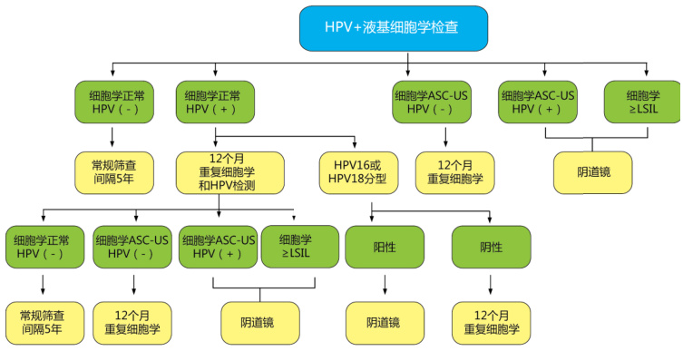

# 宫颈癌诊断发展与展望  

# HPV与宫颈癌  

人乳头瘤病毒（Human papilloma viruses，HPV）与宫颈癌关系的揭示，使宫颈癌成为了目前所有恶性肿瘤中唯一病因明确、唯一可以有效早期预防和治疗且唯一可以彻底根除的癌症。  

# 1. HPV发现与研究历程  

宫颈癌（cervical cancer），又称子宫颈癌，是常发生在子宫颈鳞状上皮细胞及宫颈管内膜柱状上皮细胞交界处的恶性肿瘤。早期常无任何症状，或仅在阴道检查时可见表浅糜烂或一般慢性炎症如少量白带等。中期常有白带增多、腥臭、阴道不规则出血、骶尾，臀部及大腿部持续性疼痛、且在膀胱和直肠浸润时可出现排尿和排便障碍等临床表现（见右图）。  

  

·宫颈癌是全球第三大女性恶性肿瘤，是中国女性第二大最常见恶性肿瘤。  
·根据世界卫生组织（WHO）估计，全球每年新增宫颈癌病例超过47万例，而中国占到了 $2 8 \% ^ { [ 1 ] }$ 。  
·近年来，我国每年新增宫颈癌病人13万多，每年约有5万人死于宫颈癌，且发病年龄明显趋于年轻化。  

  
宫颈癌发病率—亚洲  

  
宫颈癌死亡率—亚洲  

19世纪40年代，意大利医生Regoni Stern分析死亡登记资料发现，宫颈癌患者大多为已婚女性，未婚者很少，而修女几乎不患宫颈癌。据此，他最早提出了性行为与宫颈癌的发生可能有关。  

虽然科学家们很早就怀疑宫颈癌与某些感染因子有关，但长期以来各国科学家的大量研究工作都未能明确宫颈癌的直接病因。直到20世纪六七十年代，人们将主要的目光投向单纯疱疹病毒II型（HSV-2），但流行病学调查却不支持HSV与宫颈癌相关；而其他的因子如巨细胞病毒、EB病毒、衣原体等，至今未能发现其与宫颈癌相关的有力证据。  

认知HPV始于19世纪前半叶欧洲医师对喉部乳头瘤的认识。  

·20世纪初，滤过性实验证明乳头瘤的病原为病毒。·20世纪30年代,首次分离了乳头瘤病毒（棉尾兔）。·20世纪50年代，乳头瘤病毒在动物中的致癌性被证实。·1977年，美国科学家Lavertry在电镜中观察到宫颈癌活检组织中存在人乳头瘤病毒(HPV)颗粒，德国病毒学家Harald zur Hausen[2]等据此提出了HPV与宫颈癌发病可能有关的假设并在2008年10月6日获得诺贝尔生理医学奖。  

  

诺贝尔奖评审委员会发布的新闻公告中这样写道，“Zur Hausen敢于摒弃教条，他所做出的探索性工作，让人类了解了HPV与宫颈癌的关系，促进了针对HPV的疫苗开发”。目前HPV疫苗人类唯一能预防癌症的疫苗。  

1989年左右，Johns Hopkins大学教授Keerti Shah和他的同事经过多年的大规模流行病研究发现， $9 9 . 7 \%$ 的宫颈癌与HPV感染有关，证实了宫颈癌与HPV感染有直接关系。  

经过科学家们的几十年不懈努力，大量流行病学资料和实验室研究证据都强有力地支持HPV感染与宫颈癌之间的因果关系，其相对危险度或危险度比值高达250。HPV与宫颈癌高度相关，HPV感染是宫颈癌的主要流行因素且是宫颈癌发生的必要条件，已被全球科学界和医疗界普遍认同。  

# 2. HPV致癌机理研究  

病例-对照研究是检验病因假说的一种流行病学方法。在拉丁美洲采用FISH，PCR和HC-II等多项检测技术进行的大规模流行病学研究均显示HPV感染与宫颈癌有明显的相关性，尤其是HPV16型和18型。在哥伦比亚和西班牙（宫颈癌发病率前者比后者高8倍）进行病例-对照研究中，436例组织学确诊病例和随机抽取的387例相同地区的对照人群同时采用三种HPV DNA检测技术（ViraPap、SH和PCR）进行分析。这一研究避免了人群和地区的选择性偏移，同时又考虑到检测技术间的差异并排除了一些混杂因素干扰，三种检测方法都得出相同的结论：在上述两个国家中HPV16、18、31、33和35型与宫颈癌均呈强相关性，提示HPV与宫颈癌具有病因关系。另外，队列研究是用来验证疾病病因假说的另一种主要流行病学方法，能够直接体现HPV感染与宫颈癌发生的时序性，更有力地验证病因假说。Campion等对100 例轻度宫颈上皮内病变（Cervical IntraepithelialNeoplasia 1，CIN1）患者进行了两年多随访分析， $56 \%$ 的HPV16和18阳性受试者发展为重度宫颈上皮内病变（CIN3），而HPV6阳性受试者仅20%发生进展。  

Murthy通过原位杂交方法研究显示，63例宫颈不典型增生发展为原位癌，对组织标本检测HPV16/18发现阳性率为 $6 8 . 3 \%$ ，而44例非进展性不典型增生的阳性率仅为 $2 7 . 3 \%$ ，相对危险度为5.9（ $9 5 \% C I$ ：2.5-14.1）, 具有显著统计学意义。此外，细胞学和分子生物学研究也获得了人乳头状瘤病毒致癌的有力证据。1995年WHO及其下属的国际癌症研究署（IARC）将HPV确定为宫颈癌的病因。  

# 常见HPV生殖道感染型别  

生殖道感染HPV最常见的型别即16，18，6和11型。HPV6和11型常感染外阴、肛门和阴道等部位，属于低危型，在湿疣或宫颈上皮内低度病变妇女中多常见，与宫颈浸润癌无明显关联；而HPV 16和18型则属于高危型，对各国宫颈癌组织标本研究发现，HPV16和18型感染率最高，在检出的所有型别中，HPV16占 $50 \%$ ， $\mathsf { \Pi } _ { \mathsf { H P V 1 8 } }$ 占 $1 4 \%$ ，HPV45占 $8 \%$ ，HPV31占 $5 \%$ ，其它型HPV占 $2 3 \%$ 。中国医学科学院肿瘤医院陈汶等[3]2009年发表了一项对国内7个不同区域的630例宫颈鳞癌和569例CIN2/3宫颈组织HPV DNA感染情况的数据分析，其结果表明HPV16占 $7 6 . 7 \%$ ，HPV18占 $7 . 8 \%$ ，两者的感染率占宫颈鳞癌的 $8 4 . 5 \%$ ；其次是HPV31（ $3 . 2 \%$ ）、HPV52（ $2 . 2 \%$ ）和HPV58（ $2 . 2 \%$ ）。  

HPV的型别与宫颈癌的病理类型有关。在宫颈鳞状上皮细胞癌中HPV16占主要地位（51%的鳞状上皮细胞癌标本） 而在宫颈腺状上皮细胞癌（56%腺状上皮细胞癌标本）和宫颈腺鳞细胞癌（39%腺鳞细胞癌标本）中HPV18占主要地位。HPV16和18型感染很普遍，没有明显的地区差异，有些HPV型别有地理位置差异。我国HPV感染型别中，52和58型检出率较高。在台湾进行的一项研究也发现52和58型较常见。HPV45型在非洲西部宫颈癌组织中很常见，而HPV39和59型仅在美洲中部和南部宫颈癌患者组织中出现。  

# HPV感染致癌过程和协同因素  

HPV感染通常分为潜伏感染期、亚临床感染期、临床症状期和HPV相关肿瘤期。宫颈癌发生有一系列的癌前病变，能发展到浸润癌的宫颈病变称为宫颈不典型增生，在细胞学上称为鳞状上皮内病变（Squamous Intraepithelial Lesion ，SIL），而病理上称为宫颈上皮内瘤变（CIN）。  

  

并不是所有的HPV感染者和CIN患者都会发展为宫颈癌，这主要取决于三方面因素：病毒因素、宿主因素和环境协同因素。病毒因素主要在于HPV的型别。在宫颈低度病变女性中，高危型HPV感染者的宫颈癌病变危险性远大于低危型HPV感染或HPV阴性患者。除病毒型别外，体内HPV DNA含量水平与宫颈病变进展亦呈正相关。此外，HPV首次感染时间也很重要，因为细胞核不典型增生的程度随病毒持续感染而加重。与宫颈病变进展相关的最重要宿主因素是免疫功能，其次还有产次、激素和营养状况等。影响宫颈病变进展的环境协同因子与宫颈癌的危险因素基本一致，同时感染其它性传播病原体如衣原体等也可影响病变进展。  

  
HPV一过性感染 HPV持续性感染  

# HPV 疫苗：宫颈癌 一级防御  

2006年由Merck公司研制的首个宫颈癌预防性疫苗，Gardasil®（HPV6、11、16、18 四价疫苗），在经历长达十多年临床研究后，终获美国FDA批准上市，并获得了世界卫生组织（WHO）的认可。HPV疫苗的问世及其在宫颈癌预防中的应用，曾被视为人类在与癌症斗争中的里程碑式胜利。在人类与肿瘤的斗争中，HPV疫苗是第一个以预防癌症为目的的疫苗，已证明其能预防宫颈癌。  

2007年9月24日，欧盟委员会批准葛兰素史克公司的HPV16、18型二价疫苗（Cervarix®）上市。截止目前已有一百多个国家引进了宫颈癌疫苗，其中超过六十多个国家推行了疫苗接种项目。该疫苗在相当一部分国家中被称为“宫颈癌疫苗”，尽管不够严谨，但国际上普遍认定，HPV疫苗在9至45岁女性中对宫颈癌有预防效果。如果在首次性行为之前注射HPV疫苗，会降低 $8 0 \% - 9 0 \%$ 的宫颈癌及癌前病变发生。  

2014年12月10日，默克（Merck）宫颈癌九价疫苗（Gardasil® 9）获FDA批准上市。该疫苗被批准适用于9至26岁女性和9至15岁的男性，以预防HPV16、18、31、33、45、52和58型引起的宫颈癌、外阴癌、阴道癌和肛门癌，以及HPV 6和11型引起的生殖器疣。相较于第一代Gardasil® 4价疫苗，该疫苗的预防对象增加了31、33、45、52和58 五种病毒亚型，这5种病毒亚型引起了约 $2 0 \%$ 宫颈癌，这是此前其他获批的HPV疫苗所不能预防的。  

2016年7月18日，葛兰素史克（GSK）宫颈癌疫苗“希瑞适®”（人乳头状瘤病毒疫苗[16型和18型]）获得中国国家食药监总局（CFDA）上市许可而获准在中国上市，成为在中国首个获批用于预防宫颈癌的HPV疫苗。这就意味着，从2006年全球首次上市HPV疫苗到今天，经过10年之后中国女性终于可以通过注射疫苗的方式远离宫颈癌,这一目前侵扰女性最致命和最凶险的癌症。  

# HPV认识的误区  

误区一：“感染了HPV而已，又不是得癌了，怕什么！”  

这部分人对HPV感染重视不够。哲学家培根曾有一句名言：“时间可以治愈一切”，救命的是时间，致命的也是时间，关键看你怎样来把握。如果捉住时机对HPV感染早发现、早诊断、早处理，宫颈癌是完全可以预防、可以治疗的。因为正常宫颈一定会在高危型HPV感染后才会发生病变，很多人通过自身免疫可以把它清除掉，如果消除不掉就称为持续性感染，病变就会发生，首先发生宫颈癌前病变，从癌前病变到宫颈癌需经过差不多10年时间，而10年的时间足够我们进行治疗  

预防HPV感染就可以预防宫颈癌没有HPV感染就可以不患宫颈癌  

误区二：“感染HPV，怎么办？这回我逃不掉了！”认为得了HPV感染就是得了宫颈癌。其实不然，真正HPV感染到宫颈癌时间很长，你可以在这段时间进行治疗。据统计，HPV感染者中只有 $2 \% - 3 \%$ 会发展成宫颈癌。  

  

误区三：“接种HPV宫颈癌疫苗后就不需要定期检查! ”  

宫颈癌疫苗是预防性疫苗，它不是治疗性疫苗。目前上市的“宫颈癌疫苗”均达不到覆盖所有的致癌亚型（既：高危HPV）的效力。即使接种了覆盖面最广的宫颈癌九价疫苗（Gardasil® 9），亦不能$100 \%$ 预防宫颈癌。因此，定期筛查仍然是预防宫颈癌的最有效方法，且筛查建议和HPV疫苗的接种状态无关。  

# 宫颈癌检测：  

# 宫颈癌筛查：二级防御  

# 美国宫颈癌筛查方案推荐  

2015年1月12日，美国癌症学会（ACS）发布了《2015年美国癌症筛查指南》，并在线发表于《CA:临床医生癌症杂志》[4]。文章指出对于宫颈癌筛查应结合年龄、筛查史和其他危险因素选择合适的筛查方式，并推荐：1）21-29岁女性，应单独进行宫颈细胞学检查，每3年1次；2）30-65岁女性，优先推荐细胞学和HPV联合筛查，每5年1次,也可每3年1次细胞学筛查；3）对于前10年内细胞学检测连续3次阴性或细胞学和HPV联合筛查连续2次阴性且最后一次筛查在5年内的女性，65岁后应停止任何方式的筛查；4）任何年龄段都不需要通过任何方式每年筛查。  

2016年1月，美国妇产科医师学会（ACOG, American College ofObstetricians and Gynecologists）发布了宫颈癌筛查和预防实践指南（ACOG Practice Bulletin No. 157，ObstetGynecol.2016；127:185-7.)，以替代2012年11月发布的第131号实践指南。ACOG实践指南新版本强调了宫颈癌筛查和预防推荐中的最新改变，包括单一使用HPV测试筛查、HPV疫苗药效更新以及HIV阳性妇女的癌症筛查指南修改。  

# 一、新版本主要更新  

1、HPV检测：2014年4月美国食品和药品管理局（FDA）批准罗氏HPV检测可用于25岁及以上女性宫颈癌初筛。超过65岁的女性如果既往筛查结果为阴性，可以停止筛查。  

2、HPV疫苗：新版指南更新了疫苗使用，包括了九价HPV疫苗的使用指导，这样就覆盖了另外五种高风险的病毒株筛查。  

3、HIV感染女性的宫颈癌筛查策略：新指南指出，建议依据年龄行宫颈癌筛查，筛查应在有起始性生活开始，无论HIV病毒的传播方式，应不迟于21岁。HIV感染女性的宫颈癌筛查应持续终生，而不是到65岁就停止。小于30岁的HIV感染者，应在初次诊断HIV时进行宫颈细胞学检查。如果初始细胞学检查结果是正常的，下一次细胞学检查应该在12个月内。如果连续三年的宫颈细胞学检查结果是正常的，应该每3年随访宫颈细胞学检查。不推荐年龄小于30岁的HIV感染女性行联合筛查。30岁以上的HIV感染女性可行单独细胞学检查或联合筛查。单独细胞学检查的女性，如果连续3年每年的检查结果是正常的，可以每3年随访复查。HIV感染女性联合筛查结果正常（正常的细胞学和HPV阴性）可以3年内行下一次宫颈癌筛查。HIV感染女性，联合筛查细胞学结果阴性而HPV阳性，则按普通人群处理。HIV感染女性，细胞学结果为LSIL或更高级别病变时建议行阴道镜检查。细胞学结果为ASCUS的HIV感染女性，如果HPV阳性则建议行阴道镜检查。如果HPV检测结果无效，建议在6-12个月重复宫颈细胞学检查，如结果仍是ASCUS或更高级别病变，建议行阴道镜检查。  

# 二、筛查起止年龄、频率和方法  

筛查的起止年龄和频率遵循《2015年美国癌症筛查指南》。对于已行全子宫切除且既往没有CIN2或更高级别病变的女性，应停止常规的细胞学检查和HPV检测且无需重新开始检查。对有下列高危因素的女性，可进行比常规筛查指南推荐更频繁的筛查：  

1）HIV感染女性  
2）免疫缺陷女性（例如接受实体器官移植者）  
3）子宫内乙烯雌酚暴露女性  
4）既往因CIN2，CIN3或宫颈癌治疗女性。  

联合检查中细胞学ASCUS和HPV阴性女性，CIN3风险很低，但其风险仍略微高于联合筛查阴性女性，推荐3年内行联合筛查，该建议也是对2011年ACS、ASCCP和ASCP宫颈细胞学筛查指南的修订，对这些女性推荐常规筛查（见下图）。  

  

另外，宫颈癌疫苗是预防性疫苗，不是治疗性疫苗。即使接种了疫苗，定期筛查仍然很重要的。  

# 我国宫颈癌筛查方案推荐  

我国癌症筛查方案实施过程中根据不同地区经济水平推荐不同初筛方案。经济条件较好地区推荐医生取材HPV检测结合液基细胞学检测；中等发达地区推荐医生取材HPV检测结合细胞学检测；卫生资源缺乏地区可用肉眼观察法。  

# 1. 最佳筛查方案 （ $x \neq x \neq x \neq$ ）  

对于经济条件允许的人群，推荐采用高危型HPV检测联合宫颈液基细胞学检查（Liquid-Based Cytology，LBC or TCT），其灵敏度高，几乎没有漏诊病例，准确性高。对HPV阴性同时宫颈细胞学检查正常者，其发病风险很低，随访间隔可以延至5年；对HPV阳性但宫颈细胞学阴性者推荐12个月重复细胞学和HPV检测或者做HPV16或HPV18分型检测；对细胞学ASC-US和HPV阴性者推荐12个月重复细胞学检测；对HPV阳性和细胞学ASC-US或者细胞学阳性女性，应进行阴道镜检查，并在阴道镜指引下取一些组织做病理切片检查确诊（见下图）。  

  

# 2. 理想筛查方案 （★★★★）  

对经济条件欠佳者，可采用HPV检测联合传统宫颈巴氏细胞学检查；与常规的单纯传统宫颈巴氏细胞学检查相比，漏诊率可明显降低（见下图）。  

  

# 3. 经济筛查方案（★★★）  

如果采用单项检测方法，则应先进行HPV基因分型检测。对于高危型感染者，建议增加液基细胞学检测（TCT或LBC）。如果细胞学检测结果为阴性，说明宫颈上皮细胞尚未病变，应注意个人卫生和身体锻炼，一年后复查HPV和细胞学检查；如果细胞学检测结果仍是阳性，则需立即进行病理学检查，如阴道镜检查、活检和ECC（宫颈活刮术）。如果病理学结果为阴性，则六个月后复查HPV和细胞学检查，必要时进行阴道镜检查。若病理学结果为阳性，则需进行相应治疗，如激光治疗、冷冻、LEEP（高频电刀）、放疗和子宫切除等。  

  

# 中美筛查方案异同  

# 目前常用筛查方法  

我国目前采用的宫颈癌筛查指南与美国最新推荐指南存在如下主要异同：  

  

# 目前临床常用的宫颈癌筛查方法  

# 临床宫颈癌诊断“三阶梯”  

·细胞学检查·阴道镜检查·组织学检查  

我国卫生部于2011年7月发布的中华人民共和国卫生行业标准（WS334-2011）关于《子宫颈癌诊断Diagnosis criteria for cervicalcancer》[5]指出，对宫颈癌的早期诊断应采用“三阶梯”程序，即：子宫颈细胞学检测（巴氏涂片或液基细胞学）、阴道镜检查、组织病理学检查（见下图）。细胞学检测为“三阶梯”的第一步，是宫颈癌预防和筛查的关键环节。另外，宫颈病变程度的精准诊断是实现精准治疗的必要前提条件。  

  
宫颈癌诊断“三阶梯”  

# 细胞学检测常用方法  

# 传统的巴氏细胞学检测  

目前我国多数医院仍采用分级诊断，临床常用巴氏分级分类法分为：Ⅰ级：正常：未见异常细胞。  
Ⅱ级：炎症：发现异常细胞，但均为良性。  
Ⅲ级：可疑：发现可疑恶性细胞。  

（1）性质不明细胞。  

（2）细胞形态明显异常，难于确定其良性或恶性，需要近期复查核实。（3）未分化或退化的可疑恶性细胞与恶性裸核。Ⅳ级：高度：发现待证实的癌细胞（高度可疑的恶性细胞），具有恶性特征但不够典型；或更典型但数目太少，需要复核，例如高度可疑的未分化或退化癌细胞，或少数低分化癌细胞。Ⅴ级：恶性：发现癌细胞，其恶性特征明显或数目较多，可作互相比较以确定为恶性者，例如高分化的鳞癌或腺癌细胞；成群未分化或低分化癌细胞。优点：不需要特殊设备及试剂，易普及，费用经济。  

缺点：假阴性率（误诊率）高，主要原因如下:  

1）普通刮板取样，不易取到宫颈癌好发部位宫颈管的有效诊断细胞；2）涂片上存在大量的血液粘液等干扰成份，影响诊断；3）我国细胞病理医生不足，在短时间内须阅读大量筛查涂片，造成细胞病理医生的诊断质量下降。  

传统巴氏染色及分类法应用半个多世纪以来，为早期诊断宫颈癌及降低死亡率做出了重要贡献。但由于较高的假阴性率（文献报告为20％-50％）或假阳性率，该技术目前在多数发达国家已停止使用，取而代之的是更先进的液基细胞学新技术。  

# 液基薄层细胞涂片  

液基细胞学检测，例如新柏氏的TCT（Thinprep cytologic test）是基于液基细胞学的一种薄层细胞检测技术的简称。该方法采用了液基细胞固定技术，并结合薄层细胞制片技术，使得检测样本在切片上可以单层细胞呈现，染色后便于在显微镜下观察和检验。  

使用该检测系统时，对宫颈细胞分析采用TBS（The BethesdaSystem for Reporting Cervical Cytology，简称 TBS）细胞学分类诊断标准，包括以下几个部分：  

1）未见上皮内病变/恶性（细胞）[Negative for Intraepithelial  
lesion NILM]  
2）微生物（Organisms）  
3）其他非肿瘤性所见  
4）子宫内膜细胞 $\geqslant 4 0$ 岁（如果无鳞状上皮内病变则需说明）  
5）上皮细胞异常（Epithelial cell abnormalities）a) 非典型鳞状上皮细胞（Atypical squamous cell，ASC）  

I) 无明确诊断意义的非典型鳞状上皮细胞(Atypical Squamouscells of Undetermined Significance，ASC-US)I I )  非典型鳞状上皮细胞，不除外高度鳞状上皮内病变（Atypical Squamous cells-Cannot exclude HSIL，ASC-H）b）低度鳞状上皮内病变（Low-grade squamous Intraepitheliallesion，LSIL）c）高度鳞状上皮内病变（High-grade squamous Intraepitheliallesion，HSIL）d） 鳞状细胞癌（Squamous cell Carcinoma）e） 非典型腺上皮细胞（Atypical Glandular cells，AGC）f） 腺原位癌（Adenocarcinoma in Situ，AIS）g） 宫颈腺癌（Endocervical adenocarcinoma）h） 宫内膜腺癌（Endometrial adenocarcinoma）i） 宫外腺癌（Extrauterine adenocarcinoma）j） 癌细胞（不分类）  

6）恶性肿瘤细胞  

液基薄层细胞涂片是目前国际上最先进的一种宫颈癌细胞学检查技术。常规巴氏涂片由于血液、粘液、炎症等因素影响，常使样本模糊导致检测误差，与宫颈刮片巴氏涂片检查相比，TCT检查明显提高了标本的满意度及宫颈异常细胞检出率，并相应减少巴氏测试的重复次数，从而降低了患者因重做测试而引起的心里压力。检测误差的显著降低势必将宫颈癌检测工作提高到一个新阶段，使那早期癌变患者得到及时有效治疗。  

尽管如此，液基细胞学技术仍需通过显微镜肉眼读片判断。而计算机辅助细胞检测系统（CCT）则具有先进、准确、迅速和经济等诸多优点。以上两种技术是分别对制片和阅片方式的改良，若将两者结合起来则能达到更高水平的诊断效果。  

# HPV DNA  

目前用于临床样本检测 HPV病毒基因的产品技术主要基于多聚合酶链式反应（PCR）法和杂交捕获技术，可以检测和宫颈癌密切相关的HPV高危型，方法简便快速准确。  

# 优点  

1）筛查人群中通常 $8 0 { - } 9 0 \%$ 为HPV阴性者，对这大部份的健康人群可延长筛查间隔至每3-5年1次，可节省大量人力物力2）筛查人群中 $1 0 \%$ 为HPV检测阳性者，是宫颈癌高危人群，可针对性地进行液基细胞学检查或其他医学检查。  

目前，共有3种用于宫颈癌初筛的HPV DNA检测技术已通过美国FDA认证，即HC2、Cervista和Cobas HPV，分别于2003年、2009年和2011年获得美国FDA认证。而我国有国家药监局注册证的类似HPV分子检测产品约有六十余种之多。  

# 宫颈癌检测新探索与技术发展  

$\cdot \cdot$ HPV mRNA相关检测·替代性生物标志物检测·其他  

# HPV mRNA相关检测  

2011年美国FDA首次批准基于HPV E6/67mRNA的检测产品Aptima HPVAssay，用以检测14种高危HPV亚型的E6和E7mRNA片段（HPV16、18、31、33、35、39、45、51、52、56、58、59、66和68）。研究表明该方法有着与HC2等同的检测灵敏度，但对CIN2及CIN2+病例的检测显示出更高的特异性[6,7]。宫颈癌发生风险与HPV亚型种类有关，因此该检测产品仍面临着应用问题。对高致癌性HPV16，HPV18和HPV45三种高危亚型mRNA产品Aptima HPV 16 18/45 GenotypeAssay进行的研究表明，在宫颈癌筛查中HPV16 18/45mRNA检测将有较好的应用价值[8]。  

# 替代性生物标志物检测  

2012年7月，美国病理学家协会（CAP）和美国阴道镜和宫颈病理学会（ASCCP）指南推荐CINtec PLUS（p16/Ki-67 细胞学双染检测）用于改善宫颈癌筛查分流管理。抗p16（E6H4）/Ki-67（274-11AC3）单克隆抗体试剂盒（免疫细胞化学法）产品以p16 INK4a作为宫颈病变检测的替代性标志物（surrogate marker），采用细胞免疫化学染色法实现对p16INK4a与Ki-67的联合检测。p16 INK4a信号为棕色, Ki-67信号为红色，以同一细胞内同时出现胞浆的棕染和胞核的红染作为阳性结果的判断依据[9]。  

# 下一代测序技术的应用  

在子宫颈和阴道细胞学相关的宫颈癌进行预防和筛查中，目前普遍使用的HPV DNA检测多采用多重PCR技术，可以检测不同分组(致癌风险)HPV基因型的累积感染，但不能明确HPV基因型。而下一代测序技术(NGS)出现，可以对每个独立样品使用特殊标记的引物，以空前的速度对DNA进行测序。NGS一方面可以鉴定HPV累积感染，另一方面也可以明确微生物组信息。虽然有研究指出NGS具有很好的HPV检测和基因分型性能，但其实用性和成本仍是其广泛应用于临床实践的障碍[10]。  

# 表观遗传学与甲基化  

DNA是决定生命遗传的核心物质，但近些年来的研究显示表观遗传机制亦是非常重要，而DNA甲基化是表观遗传领域的重要一环。据文献报道基因甲基化与癌症发生有密切关联性，许多癌症抑制基因的表达是由基因甲基化来调控。目前一些甲基化基因已被推荐应用于宫颈癌的检测中，而与传统筛查方法联合应用，可能会提高癌症检测的灵敏度和特异性[11]。  

# 肿瘤特异性DNA突变检测  

肿瘤内存在的基因变异可以作为癌症生物标志物的想法在二十多年前就已经提出了。基因变异比传统生物标志物如癌胚抗原或前列腺特异性抗原更具有优势，其原因在于赘生细胞中基因的改变非常特殊。将遗传变异用作这一目的一项挑战是体液内的突变模板浓度通常很低。但在过去的几年中，技术的进步使检测这种突变成为可能，同时也使得在血浆、粪便、子宫颈抹片以及尿液内进行变异DNA序列的检测变得便利。Yuxuan Wang等人对93例头颈鳞状细胞癌(HNSCC)病例进行研究，评估肿瘤特异性DNA作为HNSCC生物标志物的潜力， 结果发现唾液和血浆两种体液的结合检测，可以使癌症的检测率达到96%。其中早期癌症病例的检出率达到100%（22名处于疾病早期）[12]。  

# 目前常用筛查方法总结  

宫颈癌筛查中，细胞学筛查仍是目前应用最广的筛查手段，但由于依赖主观的形态学判读，因此在筛查效率和准确性上都存在一定的问题。而HPV DNA分子检测虽可以有效的检测HPV病毒，却无法区分一过性感染和其他高度病变，因此特异性不高，且往往造成过多的阴道镜转诊（见下图）。目前，在宫颈癌临床诊断中迫切需要更优的检测靶标和手段。  

  

# 宫颈癌诊断革新技术  

# --宫颈癌特异性肿瘤标志物HPV E7蛋白  

# E7蛋白致癌机理  

宫颈癌特异性肿瘤蛋白标志物与癌症的发生和发展直接相关。早期宫颈鳞状细胞癌变的关键，在于细胞内高危型人乳头状瘤病毒（High risk human papillomavirus，HR-HPV）致癌基因E6，E7的转录，使得E6，E7致癌蛋白的表达水平不断增加[13]。高表达的E7蛋白与Rb结合使Rb-E2F复合物解离，E2F从pRb蛋白中释放，Rb通路失控，反馈刺激p16INK4a、Ki67、细胞周期蛋白A（CyclinA）和细胞周期蛋白E（CyclinE）等在内的众多细胞增殖相关基因的表达，使宫颈上皮细胞的细胞周期发生紊乱（见下图）。因此，E7蛋白能够通过对细胞周期调节机制的破坏而促进细胞转化，引起宫颈上皮内瘤变（CIN）、原位腺癌（AIS）和浸润性宫颈癌的发生，形态学上转化的细胞表现为细胞核/细胞质比例增大，细胞核异形，以及核深染。  

  

高危HPV E7高表达激活增殖信号通路，刺激增殖基因表达，促进细胞癌变转化。  

Middleton Kate等[14]关于肿瘤演变过程中分子靶点诊断标志物选择的研究中表明，HPV E7蛋白在高级别病变时大量表达，并与癌变程度呈正相关（见下图）。因此，研究数据表明E7蛋白可作为高度宫颈病变和宫颈癌检测的一个特异性肿瘤分子标志物，E7的细胞表达水平与细胞癌变发展程度之间存在线性的因果关系。  

  
E7蛋白表达与癌变程度呈正相关  

# E7 检测技术开发及临床应用  

基于E7癌蛋白的致癌机理及其高度特异性，艾托金生物医药（苏州）有限公司研制出一种E7-ICC免疫化学染色技术。该技术是针对宫颈上皮脱落细胞中HPV E7癌蛋白表达的临床检测新方法，通过使用E7单克隆抗体，能够特异性识别表达HPV E7蛋白的癌变细胞（见下图）。  

  

# 技术导航  

抗体与细胞中E7抗原靶点相结合形成的免疫复合物，再结合HRP酶联二抗，通过催化底物显色，E7蛋白表达定位于胞质中。检测结果在细胞样本中出现明显的棕色胞质染色，即可认为该细胞为E7-ICC阳性染色（见右图）。如果在细胞中检测到了E7蛋白的表达，提示细胞已经开始发生癌变。  

  

# 结束语：  

宫颈癌是最常见的妇科恶性肿瘤，近几十年来筛查技术的普遍应用使得发达国家宫颈癌的发病率和死亡率明显下降。虽然如此，我国每年新发的宫颈癌患者数目，死亡病例以及近年来的年轻化趋势提示宫颈癌早期筛查和诊断仍是我国未来宫颈癌防治中的重要策略。得益于科学研究和诊断技术的不断发展，提高临床检测特异性和灵敏度的新型诊断技术，如HPV E7蛋白标记物的临床应用研究，将有望为宫颈癌防治之战注入新的生力军。  

# E7-ICC与传统细胞形态学比较：  

E7-ICC与传统细胞形态学比较，E7免疫细胞学检测技术与传统细胞形态学相比，容易判读，结果更为客观（见下图，红色箭头为E7-ICC阳性结果），大大降低了工作量。  

  

同时，可以对同一例宫颈脱落细胞样本分别进行巴氏染色和E7-ICC检测。左下图为巴氏染色后的结果，右下图为E7-ICC检测结果，E7表达阳性细胞如红色箭头所示为胞质棕色。  

  

# E7检测技术在组织学上的应用  

艾托金生物医药（苏州）有限公司研发的E7检测技术的另一应用方向是针对宫颈组织切片细胞中HPV E7癌蛋白表达的检测，即E7-IHC。该技术通过E7单克隆抗体，特异性识别宫颈组织细胞中表达HPV E7蛋白的癌变细胞，为宫颈癌早期诊断提供辅助检测手段。其检测原理与E7-ICC相同，经抗体特异性结合E7抗原靶点，并在酶联二抗的催化作用下使底物显色，宫颈组织癌变细胞中出现明显的棕色颗粒状胞质染色（如下图），即可认为该细胞为E7-IHC阳性染色。  

与临床病理“金标准”组织细胞形态学方法相比较：该检测技术更为客观，一方面可以对宫颈癌前病变做到早期预警，另一方面也可以大大提高判读的一致性。  

  
  
  
  
病理诊断：宫颈慢性炎  
病理诊断：宫颈癌  

# 参考文献:  

[1]中华人民共和国国家卫生和计划生育委员会. 《宫颈癌及癌前病变规范 化诊疗指南（试行）》. 2013.   
[2] Zur Hausen H. Papillomaviruses in the causation of human cancers-a brief historical account.Virology, 2009,384(2):260-5。   
[3] Wen Chen, Xun Zhang,et.al.Human papillomavirus type-distribution in cervical cancer in China:the importance of HPV 16 and 18.Cancer Causes Control,2009.   
[4] Smith RA1, Manassaram-Baptiste D, Brooks D, Doroshenk M, Fedewa S, Saslow D, Brawley OW, Wender R. Cancer screening in the United States, 2015: a review of current American cancer society guidelines and current issues in cancer screening. CA Cancer J Clin,2015 JanFeb,65(1):30-54.   
[5] 中华人民共和国卫生部.《中华人民共和国卫生行业标准-子宫颈癌诊 断》2011-07-01.   
[6] Szarewski A, Mesher D, Cadman L, Austin J, Ashdown-Barr L, HoL,Terry G, Liddle S, Young M, Stoler M, McCarthy J, Wright C, Bergeron C, Soutter WP, Lyons D, Cuzick J. Comparison of seven tests for high-grade cervical intraepithelial neoplasia in women with abnormal smears. J Clin Microbiol,2012,50:1867-1873.   
[7] Iftner T, Becker S, Neis KJ, Castanon A, Iftner A, Holz B, Staebler A, Henes M, Rall K, Haedicke J, von Weyhern CH, Clad A,Brucker S, Sasieni Head-to-head comparison of the RNA-based aptima human papillomavirus (HPV) assay and the DNA-based hybrid capture 2 HPV test in a routine screening population of women aged 30 to 60 years in Germany. J Clin Microbiol,2015,53:2509-2516.   
[8] Partha Basu,Dipanwita Banerjee,Srabani Mittal,Sankhadeep Dutta, Ishita Ghosh,Nilarun Chowdhury,Priya Abraham,Puneet Chandna,and Sam Ratnam.Sensitivity of APTIMA HPV E6/E7 mRNA Test in Comparison With Hybrid Capture 2 HPV DNA Test for Detection of High Risk Oncogenic Human Papillomavirus in 396 Biopsy Confirmed Cervical Cancers. Journal of Medical Virology,2016,88:1271-1278.   
[9] Ordi J, Sagasta A, Munmany M, Rodríguez-Carunchio L, Torné A, del Pino M.Usefulness of p16 INK4a/Ki67 immunostaining in the triage of women referred to colposcopy. Cancer Cytopathol,2014 Mar,122(3):227-35. [10] Allex Jardim da Fonseca, et.al., Comparison of Three Human Papilloma DNA Detection Methods: Next Generation Sequencing, Multiplex Nested-PCR Followed by Sanger Based Sequencing. Journal 16,88:888-894.   
[11 Yung-Kai Huang, Yu-Ping Liao, Chang, Ya-Wen Lin, MuHsie Methylomics analysis identi and implies an activation of cer. International Journal of Cance   
somatic mutations and $\mathsf { H P V }$ in the lasm ients with head and neck squamous cell carcinomas ,2015,7(293):1-   
[13] Stephen . Smith，et.al.,Identification of host transcriptional networks showing concentration-dependent regulation by HPV16 E6 an E7 proteins in basal cervical squamous epithelial cells.Scientific Reports, 2016.   
[14] Middleton K, Peh W, Southern S, Griffin H, Sotlar K,et al.Organization of human papillomavirus productive cycle during neoplastic progression provides a basis for selection of diagnostic markers. J Virol,2003,77(19): 10186-201.  

病理诊断：CIN2  

常小迦、施丽君、韩凤丽、时成龙、胡济梁     供稿  