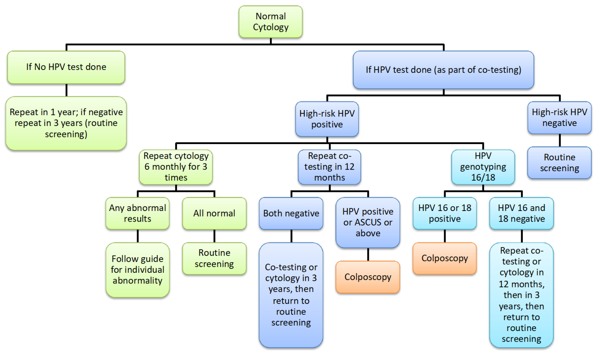
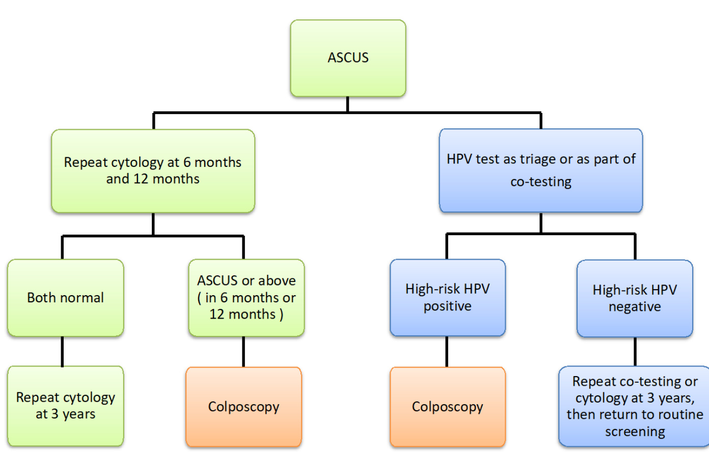
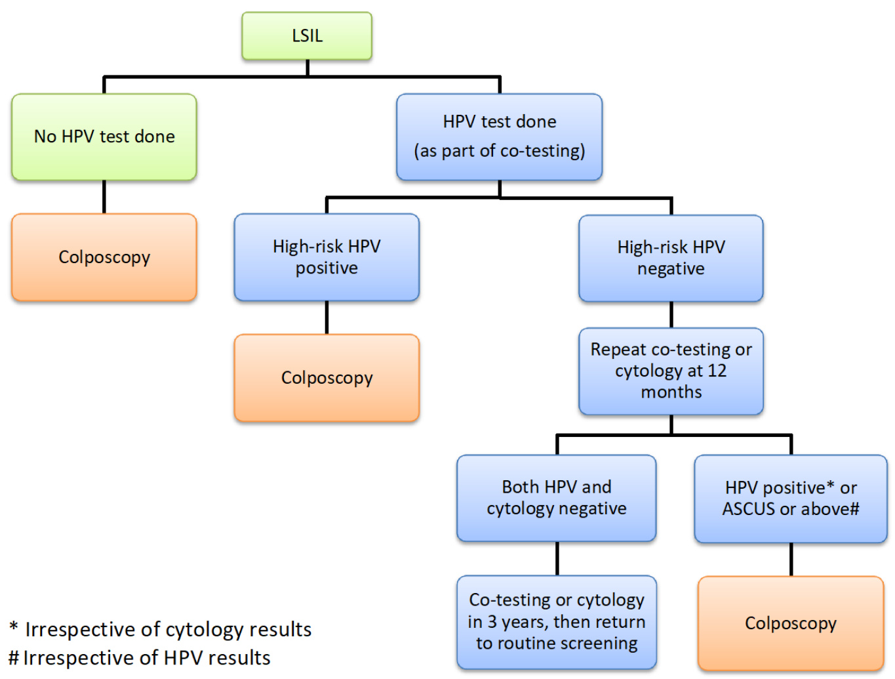
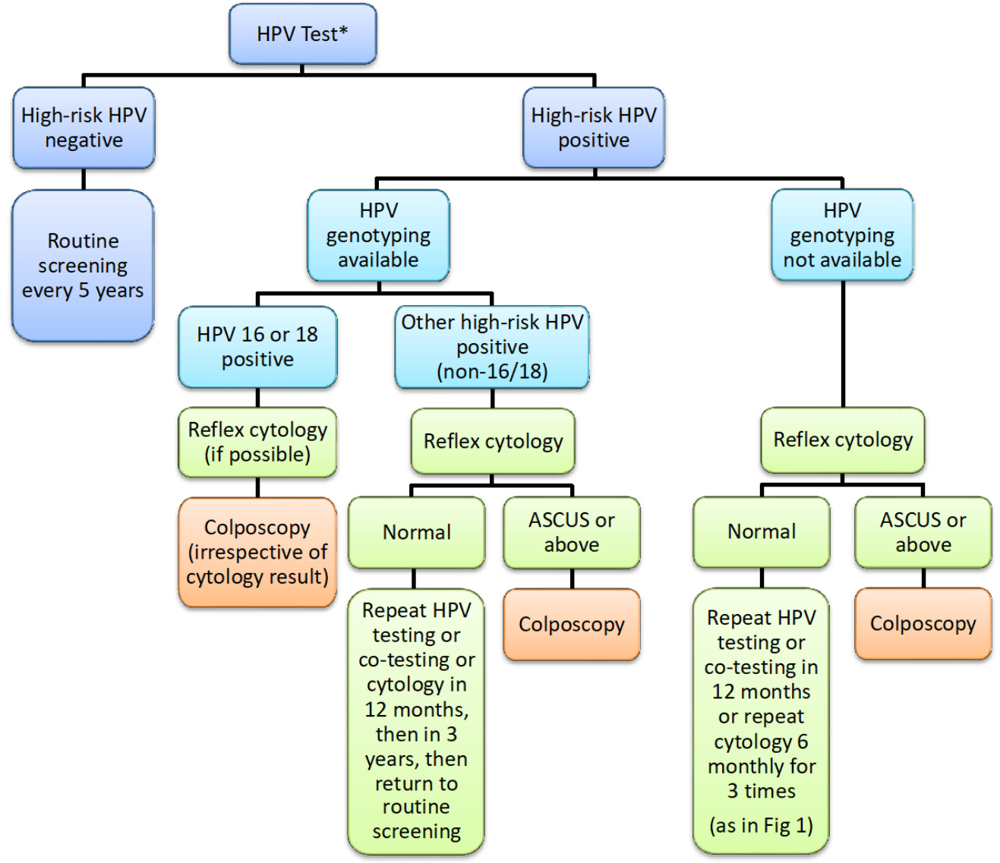
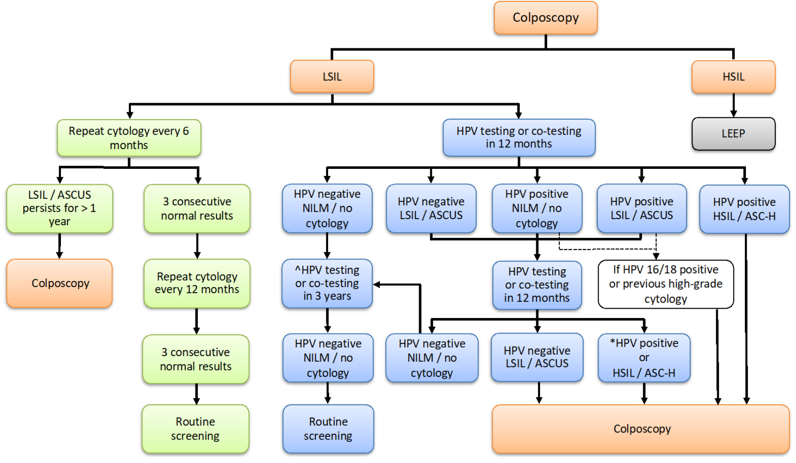
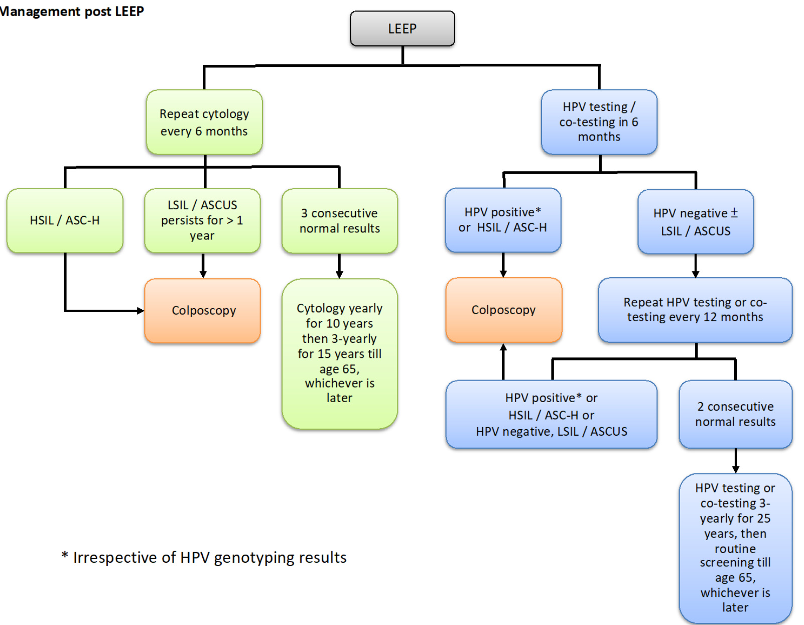
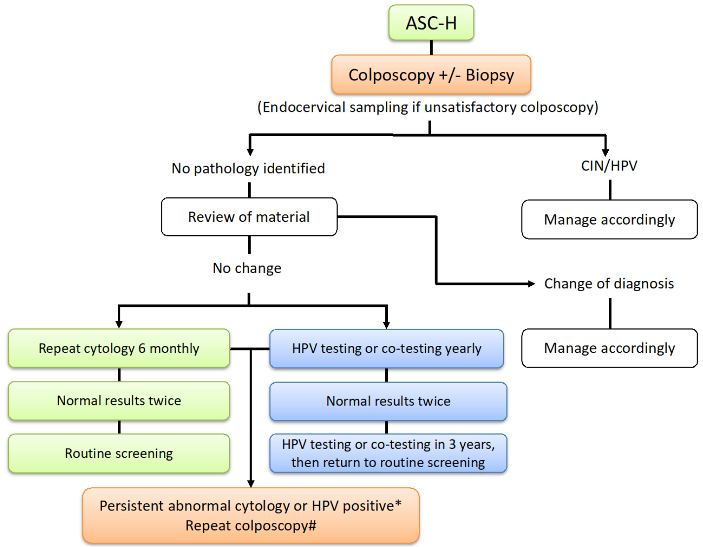
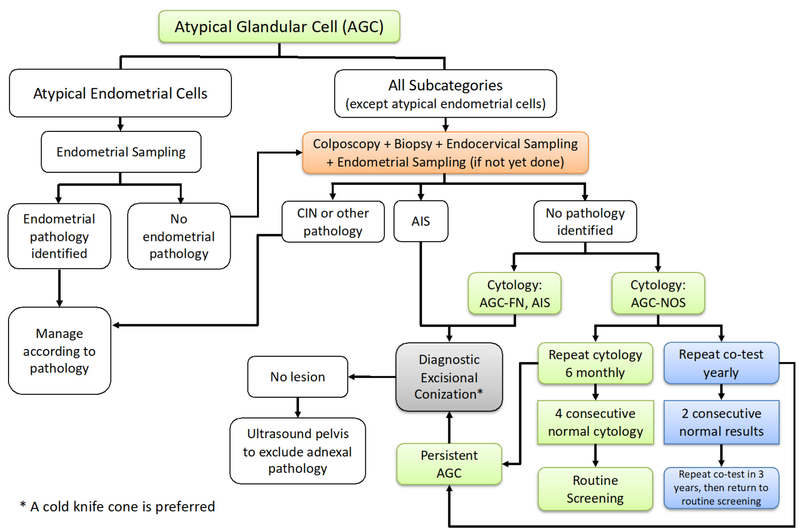

# Guidelines for Cervical Cancer Prevention and Screening  

published by The Hong Kong College of Obstetricians and Gynaecologists  

A Foundation College of Hong Kong Academy of Medicine  

# 1 INTRODUCTION  

The Guidelines for Cervical Cancer Prevention and Screening was last updated in 2016. Since then, there have been several important new developments including Human Papillomavirus (HPV) vaccines, the expanded role of HPV testing in screening, new technologies in HPV testing as well as new World Health Organization (WHO) nomenclature for histological classification of cervical cancer and glandular lesion. This current revision has incorporated these changes.  

In this revision, the main changes include new information on:  

i) Guidance on primary cervical cancer prevention by HPV vaccination   
ii) Guidance on the use of HPV testing as a stand-alone test or as part of co-testing with cytology for primary screening   
iii) WHO 2020 nomenclature   
vi) Details of different available HPV tests  

# 2 PRIMARY PREVENTION PROPHYLACTIC VACCINE  

Primary cervical cancer prevention is best achieved through vaccination of girls with prophylactic HPV vaccine before they become sexually active and exposed to HPV infection. All HPV vaccines contain virus-like particles (VLPs) against high-risk HPV types 16 and 18 that accounts for about $70 \%$ of cases of cervical cancer globally (1). The nonavalent vaccine contains additional VLPs against high-risk HPV types 31, 33, 45, 52 and 58. These 7 HPV types account for approximately $90 \%$ of the squamous cell carcinomas that are positive for HPV DNA (2). The quadrivalent and nonavalent vaccines also contain VLPs to protect against anogenital warts causally related to HPV types 6 and 11. HPV vaccines given intramuscularly are highly immunogenic with much stronger serological response (1–4 logs higher) than that after natural infection. There are vast amount of real-world data demonstrating the effectiveness of vaccines in reducing HPV infections, anogenital wart, and cervical intraepithelial neoplasia (CIN) grade 2 or worse $( \mathrm { C I N } 2 + )$ among women who are naive to high-risk HPV, as well as herd effects among boys and older women (3, 4). In Swedish database involving over 1 million females aged 10-30 years, after adjustment for age at follow-up, the risk of cervical cancer among participants who had received their first quadrivalent (Gardasil) vaccination before the age of 17 years was $8 8 \%$ lower than among unvaccinated participants $[ 9 5 \%$ confidence interval (CI) $6 6 \mathrm { - } 1 0 0 \% ]$ (5). In an observational study using population-based cancer registry data for women up to age 30, the introduction of a national bivalent (Cervarix) HPV immunisation programme resulted in near elimination of cervical cancer among women vaccinated at age 12-13 years (6). Despite the high efficacy of vaccines, cervical cancer screening is still relevant to vaccinees as current vaccines cannot offer full protection.  

The vaccines offer no effect on viral clearance in women with pre-existing infection (7). Several meta-analysis had suggested that adjuvant HPV vaccine might reduce the risk of developing subsequent disease irrespective of causal HPV type after an excisional procedure for CIN (8, 9, 10, 11, 12) but better quality studies are recommended.  

All HPV vaccines are indicated for use in females aged 9 years or older with high efficacy and excellent safety profiles. HPV vaccines were first licensed and marketed using a 3-dose vaccination schedule. WHO recommends girls aged 9-14 years as primary target population for HPV vaccination in 2-dose schedule at least 6 months apart, ideally to be completed within 12 months and be included in all national immunisation programmes to achieve $90 \%$ vaccination of all girls by age 15 by 2030 (13). Catchup vaccination of girls aged between 9 and 18 years is cost-effective due to direct and herd protection resulting in faster and greater population impact. Achieving over $80 \%$ coverage in girls also reduces the risk of HPV infection for boys. From a public health perspective, a single-dose schedule can be used in girls and boys aged 9–20 years as an off-label option with comparable efficacy and duration of protection as a 2-dose schedule and may offer programme advantages, be more efficient and affordable, and contribute to improved coverage especially in low resources setting. However, immunocompromised individuals should receive three doses where possible. HPV vaccine is not recommended in pregnant women. There is no evidence to support the need for booster dose.  

The nonavalent HPV vaccine has been incorporated to the Hong Kong Childhood Immunisation Programme since the 2019/20 school year in a 2-dose schedule with first dose in Primary Five and the second dose in Primary Six by outreach immunisation team to schools achieving a coverage of ${ > } 8 0 \%$ (14). A three-dose schedule would be offered to those who are immunocompromised. Catch-up HPV vaccination for secondary school female students or older age girls up to 18 years in a 2-dose schedule as an offlabel use is recommended based on local costsaving study (15).  

Strategies to reduce the risk of HPV acquisition, like practicing safer sex (reducing the number of sexual partners and the use of condom) and avoidance of smoking, would also help to prevent cervical cancer. Cigarette smoking including ecigarettes, either active or passive, is associated with an increased risk for cervical cancer in a dose-response manner (16, 17, 18). Quitting smoking was associated with a 2-fold reduced risk of CIN3 and cervical cancer (19).  

# 3 SECONDARY PREVENTION SCREENING  

(HSIL) histologically. Women over 65 years who have never had cervical cancer screening and have a history of being sexually active, should be screened (Table 1).  

Taking a cervical sample during pregnancy may induce bleeding and cause anxiety to the woman and hence this is not the best time to perform cervical cancer screening.  Nevertheless, this may be an opportunity to perform a screening test in pregnant women who have never been screened.  

Particular emphasis should be given to recruit those women at greatest risk of developing cervical cancer - those who have never had cervical cancer screening, and those who do not screen regularly or have not had one within the routine screening period.  

Women who have hysterectomy with removal of cervix for benign diseases and without a prior history of cervical dysplasia can discontinue screening.  

# 3.2 Screening Interval  

# 3.2.1 Screening Interval – Cervical Cytology  

Screening at 3-yearly intervals, after 2 consecutive normal annual cytology tests, is recommended. The percentage reduction in the cumulative incidence of cervical cancer is $93 \%$ with an annual or biennial screening interval, $91 \%$ if performed every 3 years, $84 \%$ if performed every 5 years and $64 \%$ if performed every 10 years.  Screening at 3-yearly intervals is less costly and does not significantly reduce the efficacy of preventing invasive cervical cancer compared to that achieved with annual screening (21). (See section 7 for management of special categories).  

# 3.1 Target population  

The target population encompasses all women from age 25 or the time of commencing sexual activity (whichever is later) until the age of 64. In view of the rarity of cervical carcinoma in women below 25 years of age in the local population (20) and the relatively high proportion of HPV infection and cytological abnormalities that spontaneously regress, screening before this age is less cost-effective and could result in unnecessary interventions. Nevertheless, women aged below 25 years with high-risk profile may be screened after assessment by doctor. Screening may be discontinued in women aged 65 or more if all routine screens within the last 10 years were normal and they were not previously diagnosed to have high-grade squamous intraepithelial lesion  

# 3.2.2 Screening Interval – HPV testing  

Screening at 5-yearly intervals with HPV-based testing (either HPV co-test with cytology or HPV stand-alone) is recommended. Women who tested negative for high-risk HPV are at very low risk of $\mathrm { C I N } 3 +$ for at least 5 years, supporting extension of screening interval to 5 years (22, 23, 24). (See section 7 for management of special categories).  

# 3.3 Methods of screening  

# 3.3.1 Methods of screening – Cervical Cytology  

With the current options of cervical cancer screening, cervical cytology may be used as a screening test [either cytology alone (if HPV testing is not available) or as part of a co-test with HPV] or a triage test (for high-risk HPV-positive cases in stand-alone primary HPV screening) (25).  

While both conventional smear and liquid based cytology (LBC) are acceptable methods for screening, LBC is being used by most laboratories with the advantages of lower unsatisfactory rate and allowing HPV tests and application of biomarkers to be performed (26, 27, 28). It should be noted that different LBC preparations should be collected according to their respective manufacturer’s instructions. Relevant clinical information should be provided on the cytology request form. The sample should also be properly labelled with attention to ensure correct identity.  

Cervical cytology service should be provided by an accredited laboratory with appropriate quality assurance procedures. Cytology reports should be issued by a qualified anatomical pathologist or (for negative results associated with absence of clinical findings) by a qualified cytotechnologist. The use of oestrogen in postmenopausal women and the treatment of a pre-existing infection may improve the quality of the cytology sample.  

# 3.3.1.1 The 2014 Bethesda system and 2020 WHO classification  

Reporting of cervical cytology should be based on the 2014 Bethesda System for Reporting Cervical Cytology (29). The report elements and diagnostic terminology used in cytology reports should adhere to the specifications of the 2014 Bethesda System. It may be noted that occasional cases of low-grade squamous intraepithelial lesion (LSIL) have atypical cells which are morphologically equivocal for HSIL and a variety of diagnostic terms have been used for such cases. While the 2014 Bethesda System recommended the concurrent use of LSIL and atypical squamous cells, cannot exclude HSIL (ASC-H) in the diagnosis for these cases, alternative reporting options (such as adopting the intermediate category of LSIL, cannot exclude HSIL, or LSILH) have been advocated by some authors (30, 31).  

The histopathological classification of cervical cancer and precursor lesions has been updated in the 2020 WHO classification (32). The diagnosis of cervical squamous intraepithelial lesions is essentially unchanged from the previous 2014 WHO classification. Squamous intraepithelial lesions are HPV-associated lesions that can be classified into low-grade (LSIL) and high-grade (HSIL). Alternatively, the traditional cervical intraepithelial neoplasia (CIN) terminology may be used, classifying cervical squamous lesions into  

CIN1, CIN2 or CIN3 respectively, with CIN1 equivalent to LSIL and CIN2/3 equivalent to HSIL. HPV-independent precancerous squamous intraepithelial lesion has not been recognized as a diagnostic entity by WHO 2020. Invasive squamous cell carcinomas should be classified into HPV-associated and HPV-independent based on p16 immunohistochemistry or HPV testing.  

There are substantial changes in the approach to classifying cervical glandular lesions by WHO 2020. As with squamous cell carcinomas, cervical adenocarcinomas are designated as HPVassociated or HPV-independent (gastric, clear cell or mesonephric type). Adenocarcinoma in-situ (AIS) of the cervix is also classified into HPVassociated and HPV-independent. Accurate typing of cervical adenocarcinoma and AIS can be challenging as this involves integration of morphological assessment with p16 interpretation and HPV testing for difficult cases, given that a subset of HPV-independent cervical glandular lesions are p16 positive (33). It is worth noting that the cytology diagnosis of endocervical adenocarcinoma and AIS are largely based on HPV-associated adenocarcinoma/AIS. Although there is some published data on the cytologic findings in HPV-independent (mostly gastric type) adenocarcinoma and AIS (34, 35), there is currently no systematic guidance on how these cases should be recognised or reported using the Bethesda system.  

# 3.3.1.2 Computer-assisted screening of cervical cytology  

Computer-assisted screening increases a laboratory’s productivity by replacing the labourintensive job of screening and also reduces the likelihood of human errors with manual screening. Computer-assisted cervical cancer screening devices may be broadly divided into two types: location-guided screening and risk-stratification devices. Currently, commonly used computerassisted devices in Hong Kong include the ThinPrep™ Imaging System and FocalPoint™ GS Imaging System which are both approved by FDA for use in primary screening. The laboratories which use these devices should have established quality control for rescreening methods. Irrespective of the type of device being used, cases with abnormal cells found and cases with significant clinical concerns have to be referred to pathologists for evaluation and reporting.  If a case is examined by a computer-assisted device, the 2014 Bethesda System for Reporting Cervical Cytology recommendation is to specify the device together with the findings in the cytology report.  

# 3.3.2 Methods of screening – HPV testing  

HPV tests are nucleic acid tests designed to detect specific DNA or RNA sequences of HPV. Currently HPV tests can be used as a screening test (either stand-alone in primary HPV screening or as part of a co-test with cytology), as a triage test (in cytology-based screening for cases reported as ASCUS, often described as reflex testing), or as a test of cure (for cases after treatment of HPV-associated lesions).  

The major advantage of HPV testing is its high sensitivity in detecting HPV-associated malignant and precursor lesions. Various studies (including recent prospective local data) have shown that HPV-based screening has greater sensitivity than cytology in detecting HSIL or worse lesions (25, 36). Being a more objective test than cytology, HPV testing has a higher reproducibility, less reliance on screener competency, and the test can be more automated. However, the lower specificity of a positive HPV test result signifies that a triage test is generally necessary (usually with cytology or genotyping), in particular among young women where HPV infection is usually transient. As with other laboratory tests, HPV testing also has its limitations with potential for false negative results due to various reasons which may include biological and technical factors (37). It should be emphasised that a negative HPV test should not be considered as definitively excluding cervical pathology, because there exists a variety of HPV-independent cervical neoplasms and the possibility of false negatives.  

HPV testing should only target at the high-risk types of HPV (i.e. 16, 18, 31, 33, 35, 39, 45, 51, 52, 56, 58, and 59; with 66 and 68 acceptable to be included) (38).  Testing for low-risk HPV types has no clinical role in cervical cancer screening or management of abnormal cytology.  

There is a wide variety of commercially available HPV testing devices which differ in their technologies and detection targets (39, 40). Although there is no local regulatory body governing which HPV testing devices are suitable for screening or non-screening purposes, one may take into account the overseas regulatory approval status (such as US FDA clearance or EU CE marked) when selecting between various HPV tests. The HPV tests should have been analytically and clinically validated and the reports issued by an accredited laboratory with participation in quality assurance programs (41).  

(See Appendix 1 for examples of commercially available HPV tests.)  

The use of self-collected specimens for HPV tests (also known as self-sampling) have been emerging as an alternative strategy to improve the coverage and compliance of cervical cancer screening. Selfcollected vaginal samples have been suggested by WHO as a method of screening (42) and has been introduced in some countries as an option for cervical cancer screening. Considerations specifically related to self-collected samples would include the validation of sampling devices for selfcollected vaginal specimens, as well as the performance and regulatory approval of HPV tests for self-collected specimens (43). Other selfcollected specimens such as urine and menstrual blood for HPV tests have been explored. Currently, these approaches are not recognized or recommended as a standard method for primary screening, although this may be subject to change when data from more definitive studies are available.  

# 3.3.3 Methods of screening – Biomarkers  

Apart from cytology and HPV testing, several cellular or molecular biomarkers have been evaluated for their potential applications in cervical cancer screening. Some of these biomarkers have been found to improve the detection and triage of women with positive screening tests, which may be used as adjuncts to screening (44). However, currently most biomarkers have not been specifically approved for clinical application in primary screening. Caution is needed when handling the laboratory test reports for these biomarkers as most of them do not yet have a clearly established clinical role in cervical cancer screening.  

The p16/Ki-67 dual stain is an immunocytochemistry-based technique to identify cells that co-express p16 and Ki-67 on a cytology slide. The coexistence of both markers is a relatively specific finding mostly encountered in HPV-associated dysplastic lesions, so this biomarker may be used as an adjunctive or triage test to improve the detection of HSIL, in the triage of ASCUS and LSIL cytology (45) or high-risk HPV positive women (46). It is recently approved by US FDA for triage of patients positive for highrisk HPV.  

Potential biomarkers currently under research include TOP2A, MCM2, HPV viral load, viral E4 protein, viral DNA methylation, host DNA methylation, 3q chromosomal gain, microRNAs, etc (44).  

# 3.4 Utilisation of HPV testing in screening  

# 3.4.1 HPV testing as a triage for ASCUS smears  

Patients with ASCUS who are positive for highrisk HPV are more likely to carry high-grade lesions (CIN2/3).  High-risk HPV can be found in around $50 \%$ of ASCUS (47). Reflex HPV testing in triaging patients with ASCUS is an alternative to repeat cytology at 6 months in decision for colposcopy referral (48), except in women aged 20 years or younger.  Colposcopy is indicated for women with ASCUS cytology and HPV-positive.  

Women with ASCUS cytology and HPV-negative can be followed up with co-testing or cytology alone at 3 years (49).  

Reflex HPV testing has limited role in triaging women with LSIL for colposcopy because over $80 \%$ of LSIL has high-risk HPV (50).  Even in older age groups, reflex HPV testing for LSIL to triage for colposcopy is not recommended since HPV positivity among women with LSIL decreased only slightly with age (30-34 years vs 60-64 years, $8 8 \%$ vs $72 \%$ ) (51).  

# 3.4.2 HPV testing as primary screening  

# Application of HPV testing in primary screening includes co-testing with cytology or HPV as a stand-alone test.  

Incorporating HPV testing into screening strategies has the potential to increase disease detection and increase the length of screening interval.  However, the improved sensitivity must be balanced against the potential risks of unnecessary testing, procedures, and treatment.  

HPV infection is highly prevalent below the age of 30 and most of them are transient. Detection of these transient infections can be harmful since this may cause anxiety, stigmatization, discomfort and bleeding during diagnostic and treatment procedures, and pregnancy complications such as preterm delivery due to unnecessary treatment. Taking into account of the high prevalence of HPV in young women and the median age of cervical cancer patients in Hong Kong, HPV testing is not preferred before the age of 30 for primary screening, either as a co-test or standalone test. In women who had previously received HPV vaccination, primary HPV screening can be considered in those younger than 30 years. In a population where high vaccine uptake was reported in women aged 25 to 33, primary HPV screening was associated with significantly increased detection of $\mathrm { C I N } 2 +$ compared to cytology, with no significant difference in colposcopy referral rate (52).  

# 3.4.2.1 HPV testing as a co-test with cytology for primary screening  

HPV and cytology co-testing can be considered as an alternative to cytology alone for cervical cancer screening.  In many studies, addition of HPV testing to cytology resulted in increased sensitivity for detecting CIN3 at the first round of screening and a decrease in CIN3 or cancer detected in subsequent rounds of screening (25, 49, 53).  

# HPV-Negative, Cytology-Negative Co-test (Fig. 1)  

Women who are co-tested negative have a low chance of having concurrent $\mathrm { C I N } 3 +$ (54) and cervical cancer (3.2/100,000 women per year over 5 years) (22).  These women should continue with routine screening. A 5-year screening interval is recommended after a negative co-test. The 5- year risk of $\mathrm { C I N } 3 +$ is less following a negative cotest $( 0 . 1 2 \% )$ compared to following a negative cytology alone (ranged from $0 . 3 3 \%$ to $0 . 5 2 \% )$ (49).  

HPV-Positive, Cytology-Negative Co-test (Fig. 1)  

Immediate colposcopy for HPV-positive, cytology-negative women is discouraged since the immediate risk of $\mathrm { C I N } 3 +$ in these women is low $( 2 . 1 \% )$ .  However, the 5-year risk of $\mathrm { C I N } 3 +$ is increased to about $4 . 8 \%$ (54).  

# Either repeat co-testing in 12 months or immediate HPV genotyping for HPV 16/18 is acceptable.  

Since most transient HPV infections (about $67 \%$ ) are cleared by 12 months (55), repeat co-testing at 12 months is one of the options.  If co-testing is repeated at 12 months, colposcopy is indicated if HPV positive or ASCUS or above.  Women can return to 3 yearly co-testing or 3 yearly cytology if HPV test and cytology are both negative.  

If immediate HPV genotyping is performed, colposcopy is indicated if HPV 16 or HPV 18 is positive.  The risk of developing CIN3 or cancer is found to be highly genotype dependent.  HPV 16 and HPV 18 account for two-thirds of all invasive cervical cancer. The short term (within 12 weeks) risk of $\mathrm { C I N } 3 +$ in these women is about $10 \%$ (56). The 10-year cumulative incidence rate of $\mathrm { C I N } 3 +$ were $17 \%$ among HPV 16-positive women, $14 \%$ among HPV18-positive women, but only $3 \%$ for those with other high-risk HPV infection (57).  

If HPV 16 or HPV 18 is negative, co-testing or cytology is repeated at 12 months.  Although the short term (within 12 weeks) risk of $\mathrm { C I N } 3 +$ for oncogenic HPV genotypes other than HPV 16/18 $( 2 . 4 \% )$ (56) do not warrant immediate colposcopy, they should be followed up at 12 months since the risk is higher than those co-tested negative. Colposcopy is indicated if HPV positive, cytology negative persists at 24 months.  

If HPV testing is not available, cytology should be repeated 6-monthly for 3 times before returning to routine screening.  If the repeat cytology is abnormal, then it should be managed according to the abnormality (eg. if cytology in 6 months is ASCUS, then the management for ASCUS should be followed, i.e. repeat cytology in 6 and 12 months and refer to colposcopy if there are two ASCUS smears).  

HPV-Negative, Cytology ASCUS Co-tests (Fig. 2)  

Women with negative HPV and ASCUS cytology will need repeat co-testing or cytology in 3 years.  

HPV-Negative, Cytology LSIL Co-tests (Fig. 3)  

Women with HPV-negative and LSIL cytology will need repeat co-testing or cytology in 12 months. The immediate risk of ${ \mathrm { C I N } } 3 +$ for these women is low $( 1 . 1 \% )$ and do not warrant immediate colposcopy, but the 5-year risk of $\mathrm { C I N } 3 +$ is higher than those co-tested negative $2 \%$ vs $0 . 1 2 \%$ ) (54). If co-testing is repeated at 12 months and both tests are negative, women can have co-test or cytology in 3 years before returning to routine screening. Otherwise, colposcopy is indicated for either HPV-positive or ASCUS or above.  

HPV-Positive, Cytology-Positive Co-tests  

Women with HPV-positive and ASCUS or above should be referred for colposcopy. (See also section 3.4.1).  

# 3.4.2.2 HPV testing as a stand-alone test for primary screening (Fig. 4)  

HPV and cytology co-testing can improve the sensitivity for detection of high-grade lesions (CIN2/3), but it means each woman will need 2 tests instead of 1, with significant resources and cost implications. HPV testing as a stand-alone test can be considered as an alternative to cytology alone for cervical cancer screening. In several studies, primary HPV screening resulted in a significant increased detection of $\mathrm { C I N } 3 +$ in the initial screening round compared to cytology (58). However, due to the lower specificity with the stand-alone HPV screening, a second triage test (with cytology or partial HPV genotyping) should be performed in HPV-positive women to identify those who have a higher risk in developing precancerous and cancerous lesions, and thus require referral for colposcopy.  

# Negative Stand-alone HPV test  

A negative HPV test has a high negative predictive value. The estimated 5-year $\mathrm { C I N } 3 +$ risk following a negative stand-alone HPV test $( 0 . 1 4 \% )$ is similar to that of negative co-test $( 0 . 1 2 \% )$ (49) (See also section 3.4.2.1 on co-testing).  A 5-year screening interval is recommended after a negative standalone HPV test.  

Positive Stand-alone HPV test  

Immediate referral of HPV-positive women to colposcopy without further triage tests is NOT recommended.  Due to the lower specificity of HPV stand-alone test, it is not appropriate to refer women with a positive HPV test directly to colposcopy because this will increase the colposcopy rate significantly (from $2 . 3 \%$ to $1 3 . 1 \%$ with HPV testing vs $1 . 9 \%$ to $4 . 7 \%$ with cytology in $< 3 0 . 3 5$ years; from $0 . 9 \%$ to $5 . 8 \%$ with HPV testing vs $1 . 0 \%$ to $2 . 5 \%$ with cytology in $> 3 0  – 3 5$ years) (58) and possible over-treatment of nonprogressive lesions leading to unnecessary complications.  

A second triage test should be done to better predict which of these women would be at high risk of developing CIN2 or above lesion and hence need referral for colposcopy.  It is still uncertain what the best triage test is. Literatures suggested a variety of different triage strategies, including the use of cytology, HPV 16/18 genotyping, and biomarkers (See section 3.3.3 on Methods of Screening – Biomarkers)  

Triage with cytology.  Reflex cytology is recommended for all women with positive stand-alone HPV test, regardless of HPV genotype (including HPV 16/18 positive). This will allow decision for colposcopy referral and subsequent management (see section 5 on colposcopy and treatment for CIN). The subsequent management would be the same as for cotest with HPV and cytology. Those with positive cytology (ASCUS or above) should be referred to colposcopy. Those with negative cytology should have co-testing at 12 months or repeat cytology 6-monthly for 3 times before returning to routine screening (See also section 3.4.2.1 on cotesting) (Fig. 1).  

Triage with genotyping for HPV 16/18. Women who are HPV 16/18 positive should be referred to colposcopy, regardless of cytology result (if reflex cytology is done) (see section 3.4.2.1 on co-testing with immediate HPV 16/18 genotyping). Those who are positive for other (non-16/18) high-risk HPV types should have a reflex cytology. Referral to colposcopy should be considered at the level of ASCUS or above.  Adding a further cytology triage test to those with HPV types not 16/18 could increase the sensitivity of the test by $14 \%$ at the expense of increasing the number of colposcopies performed (59).  

Triage with p16/Ki-67 dual stain.  Dual stain cytology may be considered in women who are HPV-positive, particularly those who are positive for other (non-16/18) highrisk HPV. For detection of $\mathrm { C I N } 3 +$ , the sensitivity of dual stain cytology is significantly higher compared to cytology $( 7 4 . 9 \%$ vs $5 1 . 9 \%$ ), with comparable specificity. With referral of all HPV 16/18 positive woman to colposcopy, triaging women who are positive for other (non16/18) high-risk HPV with dual stain cytology resulted in higher sensitivity for $\mathrm { C I N } 3 +$ compared to triage with cytology $8 6 . 8 \%$ vs $7 8 . 2 \%$ , with similar number of colposcopies required (60).  

# MANAGEMENT OF NORMAL AND ABNORMAL SMEARS  

Please refer to Fig. 1-3 for summary of management of normal and abnormal low-grade cytology.  

Patients with high-grade cytology should be referred to colposcopy. Review of cytology slides is recommended if no high-grade lesion can be found.  

Suggested actions for other cervical cytology results are shown in Table 2.1, 2.2 and 2.3.  

# 5 COLPOSCOPY AND TREATMENT FOR CIN  

The colposcopist’s role is to examine the transformation zone, define the extent of the lesion, and biopsy the most abnormal area for tissue diagnosis. In addition to the cervix, the vagina should also be examined.  

Histological confirmation of the colposcopic diagnosis is advisable before treatment. In patients with a colposcopic diagnosis of high-grade lesion, a “see and treat” approach, i.e. perform loop excision without a biopsy, is adopted by some colposcopists.  In women aged 25 years and above with HSIL cytology, immediate treatment is an option if the women are never or rarely screened before, especially if HPV 16 is positive. The immediate risk of $\mathrm { C I N } 3 +$ with HSIL cytology if the women is never or rarely screened ranges from $3 5 \%$ to $60 \%$ , being $60 \%$ if HPV 16 is positive (61). Although this practice decreases the need for another visit, it carries the risk of over-treating patients with low-grade lesions. The rate of over-treatment depends on the expertise of the colposcopist.  

Majority of low-grade lesions will regress spontaneously over 2 years and immediate treatment may not be necessary (62, 63).  About $1 5 \%$ of patients may progress to high-grade lesions and require treatment later.  

If a low-grade lesion is confirmed by colposcopy and biopsy, the patient can be followed up with HPV testing or co-testing at 12 months, irrespective of age. If the result is HSIL or ASC-H or HPV 16/18 positive, colposcopy should be repeated. In case of other HPV-positive (untyped, not HPV 16/18), colposcopy can be repeated if there is a preceding high-grade cytology. If the preceding cytology is low-grade and repeat cytology shows LSIL or less, a repeat HPV testing or co-testing 12 months later can be performed. If there is no cytology, colposcopy can be repeated. A 3 year follow up is adequate if HPV testing or co-testing is negative. A colposcopy with biopsies of histological CIN1 or less is associated with a lower 5-year $\mathrm { C I N } 3 +$ risk of $2 . 9 \%$ and a HPVpositive ASCUS at first 12 months follow up is associated with an immediate CIN3 risk of $3 . 1 \%$ (54). Patients can resume routine screening after having a normal HPV testing or co-testing result if there is no preceding high-grade cytology. A prospective cohort study showed the crude rate of CIN3 was $0 . 7 \%$ following a single follow up negative cytology, $0 . 2 \%$ following a single negative follow up HPV testing and $0 . 1 \%$ following a negative follow up co-testing in women with HPV-positive ASCUS or any LSIL and less than CIN2 on colposcopy or biopsy over a maximum of 7 years follow up (64). Since a negative cytology result does not reduce the subsequent risk of CIN3 as much as HPV testing or co-testing, cytology alone is less preferred for follow up after colposcopy. Cytology is acceptable if HPV testing is not available. Patient can be followed up with cytology every 6 months for 3 times, then yearly for 3 years before returning to routine screening. If ASCUS or LSIL persists for more than 1 year, colposcopy can be repeated (Fig. 5).  

In non-pregnant women with CIN3, treatment is recommended. In non-pregnant women with CIN2, treatment is recommended, and observation can be considered if the women have concerns on the effect of treatment on future pregnancies and the squamocolumnar junction is fully visualised. Treatment should be performed if CIN2 persisted for more than 24 months. The reason for treating HSIL (CIN2/3) is that these lesions could progress to invasive cancer if left untreated. The time of progression to cancer is variable and can take from months to years. The risk of CIN3 progressing to an invasive lesion is about $12 \%$ over a period of 10 years (63).  

The current recommended method is – Loop Electrosurgical Excision Procedure (LEEP). This has the advantage of providing a tissue specimen that is generally of sufficient quality for histological exclusion of occult invasion. Complications include intraoperative and postoperative bleeding $( 1 - 8 \% )$ , infection, cervical stenosis $( 1 \% )$ , cervical deformity and cervical incompetence and rarely injury to vagina, bladder and ureter. Reports showed an association with preterm delivery, low birth weight and premature rupture of membranes but there was no significant increase in neonatal morbidity (65).  

Treatment for CIN can be carried out under local anaesthesia on an outpatient basis in $90 \%$ of patients. Ablative methods including electrocoagulation diathermy, cryosurgery, cold coagulation and laser vaporization, are undesirable because they do not provide a specimen for histological examination.  

Hysterectomy is not recommended for the treatment of HSIL unless there are concomitant gynaecological problems that warrant a hysterectomy.  Hysterectomy should not be performed for cytological abnormality without proper colposcopy examination and biopsy.  

For those who had a high-grade cytology but colposcopic directed biopsy only showed a lowgrade lesion, review of material is recommended. If confirmed to be low-grade, HPV testing or cotesting in 12 months and 24 months should be done before returning to 3-yearly HPV testing or co-testing and subsequent routine screening. When $\mathrm { C I N } 2 +$ is not identified, HSIL cytology should be treated more aggressively than ASC-H cytology. In women with HSIL cytology, but biopsy shows histologic LSIL (CIN1) or less, an immediate diagnostic excisional procedure is acceptable. Alternatively, observation with HPV testing or cotesting and colposcopy at 1 year is an option, on condition that the squamocolumnar junction and the upper limit of any lesion is fully visualised at the initial colposcopic examination, and that the endocervical sampling, if collected, is less than CIN2. If HPV test is positive or high-grade cytology is found during the 24 months period, colposcopy is recommended (Fig 5). A diagnostic excisional procedure is recommended for cytologic HSIL at either 1- or 2-year visit or ASC$\mathrm { ~ H ~ }$ persisting at 2-year visit since with a preceding HSIL cytology, the 1 year risk of $\mathrm { C I N } 3 +$ is $3 . 9 \%$ even with a biopsy of low-grade lesion (54). The 1-year risk of $\mathrm { C I N } 3 +$ with histologic LSIL and preceding ASC-H smear is lower at $1 . 4 \%$ (54).  

In patients with LSIL involving more than 2 quadrants of the cervix or if the patient is unable or unwilling to return for follow-up, then treatment should be considered. If the lesion persists for more than 2 years, treatment is acceptable. If the final histology from treatment confirms low-grade lesions, the patient should be followed up similar to other patients with low-grade lesions on cervical biopsies.  

When treatment margins are positive for CIN2/3, there will be a higher incidence of recurrence, but not high enough to justify routine repeat excision (66). No statistically significant difference in residual CIN at 6 months post-treatment was found between completely and incompletely excised groups (67).  

HPV testing or co-testing is preferred than cytology in the follow up management after histologic HSIL treatment, as it provides the most accurate predictor of treatment outcome. Using HPV testing or co-testing, $91 \%$ ( $9 5 \%$ CI 82- $9 6 \%$ ) of residual or recurrent $\mathrm { C I N } 2 +$ was predicted, regardless of margins status (68). HPV testing or co-testing should be performed at 6 months, then annually until 2 consecutive normal results. After that, 3-yearly HPV testing or cotesting for 25 years, then return to routine screening until the age of 65, whichever is later.  

The 5-year cumulative risk of $\mathrm { C I N } 2 +$ was $1 . 0 \%$ ( $9 5 \%$ CI 0.2-4.6) and CIN3 was $0 \%$ ( $9 5 \%$ CI 0- 2.9) following a negative co-test at 6 and 24 months (69). Another study found that the 5-year $\mathrm { C I N } 3 +$ risk after treatment for CIN2/3 for 1, 2 and 3 negative HPV testing or co-testing were $2 . 0 \% / 1 . 7 \%$ , $0 . 9 1 \% / 0 . 6 8 \%$ and $0 . 4 4 \% / 0 . 3 5 \%$ respectively (54). The 5-year risk of $\mathrm { C I N } 3 +$ remains above $0 . 1 5 \%$ (54) and the 2-fold increase in cervical cancer risk persists for at least 25 years (70). In view of the lower sensitivity of cytology alone in predicting recurrent $\mathrm { C I N } 2 +$ , cytology only is less preferred for surveillance after treatment of histologic HSIL. Cytology is acceptable if HPV testing is not available. Patients should be followed up by cervical cytology for 3 times at 6- months intervals and then annually for 10 years, then return to 3 yearly cytology screening. Exit from routine screening may be considered after 15 years if all routine cytology screening is negative and the woman has reached the age of 65 (Fig. 6).  

If patient has ASCUS/LSIL on cervical cytology within 12 months, continue follow up with cervical cytology is acceptable. If the low-grade cytological abnormalities persist for more than one year, colposcopy should be repeated.  Colposcopy should be repeated any time when HSIL is found on cervical cytology.  

For patients who had hysterectomy for CIN with clear margin, vaginal smear for HPV testing or cotesting should be performed annually for 2 consecutive years. If both results are normal, no further vaginal smear is necessary. If HPV testing is not available, vaginal smear for cytology should be performed at 6, 12, and 24 months. No further vaginal smear is necessary after 3 consecutive normal cytology. If excision was incomplete or clearance of margin is uncertain on hysterectomy, or if the patients had VAIN, vaginal smear for HPV testing or co-testing should be performed at 12 and 24 months. If both are negative, vaginal smear for HPV testing or co-testing should be done 3-yearly for 25 years or until age 65, whichever is later. If HPV testing is not available, vaginal smear for cytology should be done at 6 and 12 months, then yearly for 10 years, then 3 yearly for 15 years or until age 65, whichever is later.  

# 6 MANAGEMENT OF GLANDULAR LESION  

For cytology results showing adenocarcinoma insitu (AIS) and all subcategories of atypical glandular cells (AGC), except where “atypical endometrial cells” is specified, colposcopy is recommended regardless of HPV test results.  

Reflex HPV testing is not recommended. Endocervical and endometrial sampling is recommended at initial colposcopy except in pregnancy.  

For AGC-favour neoplastic (AGC-FN) and AIS, if there is no significant pathology explaining the source of abnormal cells, a diagnostic excisional procedure is recommended. Cold knife conization is the preferred excision approach. Ablative procedure is not recommended.  

Management of glandular lesion is summarised in Table 2.2. and Fig. 8.  

# 6.1 Management of adenocarcinoma in-situ (AIS)  

A diagnostic excisional procedure is recommended for all patients with a diagnosis of AIS on cervical biopsy or cytology to rule out invasive adenocarcinoma, even when a definitive hysterectomy is planned.  

Excisional procedures should optimally remove an intact specimen to facilitate an accurate interpretation of margin status. The length of the excision specimen should have at least $1 0 \mathrm { m m }$ where feasible. Endocervical sampling above the excisional bed to evaluate for residual disease is advised. A “top hat” endocervical excision to achieve the desired specimen length is not recommended.  

When concomitant AIS and CIN are diagnosed, management should proceed as per the recommendation of AIS. Hysterectomy is the preferred management for all patients who have a histologically diagnosed AIS. For women with confirmed AIS with negative margins on excision specimen, simple hysterectomy is preferred. For patients with confirmed AIS with a positive margin on the excision specimen, re-excision to achieve a negative margin is preferred to rule out malignancy, even if hysterectomy is planned. If there is a positive margin on the re-excision specimen, or further excisional procedure is not feasible, a simple or modified radical hysterectomy is acceptable. Fertility-sparing management is not recommended in these patients.  

Fertility-sparing treatment with excisional procedure alone may be considered in selected women who have a negative margin achieved on the excisional specimen and are willing to adhere to surveillance recommendation.  

# MANAGEMENT OF SPECIAL CATEGORIES  

# 7.1 Young women including adolescents  

# 7.1.1 Adolescents (age 20 or less)  

In view of the low prevalence of high-grade cytological abnormalities in adolescents less than 21 years of age $( 0 . 2 \mathrm { - } 2 . 6 \% )$ with cervical cancer being extremely rare (71, 72, 73), cervical cancer screening is not recommended. Inadvertent screening could lead to unnecessary procedures and overtreatment which could compromise the psychological well-being and reproductive future of these young women (74).  

# 7.1.2 Women younger than 25 years  

High prevalence of HPV infections is found in young women and adolescents.  The cytological abnormalities are usually of minor-grade (ASCUS/LSIL) and the prevalence of cervical cancer is very low in this population.  

Because most HPV infections clear spontaneously within 2 years, immediate colposcopy for minor cytological abnormalities in adolescents is discouraged, as there could be potential harm due to over-investigation and over-treatment.  

For ASCUS/LSIL, repeat cervical cytology 12- monthly and return to routine screening after 2 consecutive negative cytology results.  If there is a high-grade cytology (ASC-H, HSIL, AGC, AIS) or persistent abnormal cytology for 2 years, colposcopy should be performed.  

If CIN3 is confirmed on biopsy, LEEP is indicated. If CIN2 is confirmed on biopsy, observation with cytology and colposcopy 6-monthly is suggested in view of the high regression rate of CIN2 in this age group $( 7 1 . 5 \ – 8 8 \% )$ (75, 76, 77, 78). However, treatment is recommended if CIN2 persists for 2 years. If no high-grade lesion is found on a satisfactory colposcopic examination, cytology should be repeated 6-monthly. If HSIL persists at 1 year, colposcopy should be repeated. If HSIL persists for 2 years, LEEP should be considered (49). For pathologists using the 2-tier system for histological diagnosis (LSIL/HSIL), the clinician could contact the pathologist to further classify the HSIL as CIN2 or CIN3. If HSIL is unspecified as CIN2 or CIN3, observation or treatment is acceptable.  

If colposcopy for HSIL is unsatisfactory, cytology and colposcopy should be repeated in 6 months.  If  

HSIL persists and colposcopy is still unsatisfactory at 1 year, LEEP should be offered.  

# 7.2 Pregnant women  

The aim of colposcopy in pregnant women is to exclude the presence of invasive cancer. Cancer risk is relatively low among pregnant women with ASCUS/LSIL, hence deferring colposcopy for ASCUS/LSIL is acceptable (at least beyond 6 weeks after delivery).  

Pregnant women with ASC-H, HSIL, AGC, AIS or positive oncogenic HPV 16/18 test result should have a colposcopic examination as non-pregnant women to rule out malignancy. Endocervical curettage is contraindicated.  Repeat colposcopy at early third trimester may be considered.  

Pregnancy does not seem to alter the risk for or rate of progression from cervical precancer to cancer. The only indication of therapy for cervical neoplasia is invasive cancer. Treatment for highgrade disease can be deferred to the postpartum period. Colposcopy guided biopsy or diagnostic excisional procedure is indicated only if malignant lesion is suspected.  

# 7.3 Chronically Immunocompromised  

Women who are chronically immunosuppressed, including those with human immunodeficiency virus (HIV), solid organ transplant, allogeneic haematopoietic stem cell transplant, and autoimmune diseases requiring current immunosuppressive agents, are at higher risk of persistent HPV infection, leading to progression to CIN and cervical cancer. They should be educated regarding the increased risk from HPV infection and encouraged to attend for regular screening. In view of the limited literature on cervical cancer screening for non-HIV immunocompromised women, screening and management guidelines generally follow those for women with HIV (79).  

# 7.3.1 Women with HIV  

A large study published in 2021 showed that cervical cancer rates among women with HIV were elevated across all age groups between ages 25 and 54 years but there were zero cases among ages less than 25 years (80). Although evidence on the benefit of cervical cancer screening for the younger age group is limited and inconsistent, there may be merit to screen women aged 21-24 to provide a few years’ window prior to age 25, when the risk of cervical cancer in women with HIV exceeds that of the general population (80).  

Annual screening was recommended in the previous 2016 guidelines, however, recent data suggests that screening intervals can be widened (81). A 3-year interval can be considered after two consecutive normal annual cytology results (82) or a negative HPV-based (HPV co-test or HPV standalone) screening test. Subsequent management for any screening abnormality should follow the guidelines for non-immunocompromised individuals. Treatment for high-grade abnormal cytology in this group should be the same as in immunocompetent women. Low-grade lesions should be observed as they respond poorly to treatment.  These should be monitored regularly for progression.  

# 8 LOCAL CERVICAL SCREENING PROGRAMME  

To reduce the local incidence and mortality of cervical cancer, the Government has been promulgating cervical screening in collaboration with the healthcare sector. In 2004, the Department of Health launched a territory-wide Cervical Screening Programme (CSP) together with the public, private and non-governmental sectors to facilitate and encourage women to have regular screening. To facilitate the sharing of information among healthcare providers, the Cervical Screening Information System (CSIS) was developed. It is a computerised registry for keeping and processing related data, including participants’ personal information, screening results and screening recommendations. After registering with the CSIS, the women can review their screening records, receive screening reminders and authorise service providers to review their screening records for more coordinated care (83).  

# REFERENCE LIST  

1. de Sanjose S, Quint WG, Alemany L, et al. Human papillomavirus genotype attribution in invasive cervical cancer: a retrospective cross-sectional worldwide study. Lancet Oncol. 2010;11(11):1048-56. 10.1016/S1470-   
2045(10)70230-8.   
2. Serrano B, de Sanjose S, Tous S, et al. Human papillomavirus genotype attribution for HPVs 6, 11, 16, 18, 31, 33, 45, 52 and 58 in female anogenital lesions. Eur J Cancer.   
2015;51(13):1732-41.   
10.1016/j.ejca.2015.06.001.   
3. Arbyn M, Xu L, Simoens C, Martin-Hirsch PP. Prophylactic vaccination against human papillomaviruses to prevent cervical cancer Rev. 2018;5(5):CD009069. 10.1002/14651858.CD009069.pub3.   
4. Drolet M, Benard E, Perez N, Brisson M, Group HPVVIS. Population-level impact and herd effects following the introduction of human papillomavirus vaccination programmes: updated systematic review and meta-analysis. Lancet. 2019;394(10197):497- 509. 10.1016/S0140-6736(19)30298-3.   
5. Lei J, Ploner A, Elfstrom KM, et al. HPV Vaccination and the Risk of Invasive Cervical Cancer. N Engl J Med. 2020;383(14):1340-8. 10.1056/NEJMoa1917338.   
6. Falcaro M, Castanon A, Ndlela B, et al. The effects of the national HPV vaccination programme in England, UK, on cervical cancer and grade 3 cervical intraepithelial neoplasia incidence: a register-based observational study. Lancet. 2021;398(10316):2084-92. 10.1016/S0140- 6736(21)02178-4.   
7. Hildesheim A, Herrero R, Wacholder S, et al. Effect of human papillomavirus 16/18 L1 viruslike particle vaccine among young women with preexisting infection: a randomized trial. JAMA. 2007;298(7):743-53. 10.1001/jama.298.7.743.   
8. Lichter K, Krause D, Xu J, et al. Adjuvant Human Papillomavirus Vaccine to Reduce Recurrent Cervical Dysplasia in Unvaccinated Women: A Systematic Review and Meta-analysis. Obstet Gynecol. 2020;135(5):1070-83. 10.1097/AOG.0000000000003833.   
9. Jentschke M, Kampers J, Becker J, Sibbertsen P, Hillemanns P. Prophylactic HPV vaccination after conization: A systematic review and meta-analysis. Vaccine. 2020;38(41):6402-9. 10.1016/j.vaccine.2020.07.055.   
10. Di Donato V, Caruso G, Petrillo M, et al. Adjuvant HPV Vaccination to Prevent Recurrent Cervical Dysplasia after Surgical Treatment: A Meta-Analysis. Vaccines (Basel). 2021;9(5). 10.3390/vaccines9050410.   
11. Bartels HC, Postle J, Rogers AC, Brennan D. Prophylactic human papillomavirus vaccination to prevent recurrence of cervical intraepithelial neoplasia: a meta-analysis. Int J Gynecol Cancer. 2020;30(6):777-82. 10.1136/ijgc-2020-001197.   
12. Kechagias KS, Kalliala I, Bowden SJ, et al. Role of human papillomavirus (HPV) vaccination on HPV infection and recurrence of HPV related disease after local surgical treatment: systematic review and metaanalysis. BMJ. 2022;378:e070135. 10.1136/bmj-2022-070135.   
13. World Health Organization. Human papillomavirus vaccines: WHO position paper (2022 update). Weekly Epidemiological Record, No 50. 2022(97):645-72.   
14. Scientific Committee on Vaccine Preventable Diseases. Updated Recommendations on the Use of 9-valent Human Papillomavirus Vaccine in Hong Kong (As of 30 November 2022). Centre for Health Protection, Department of Health, Hong Kong Special Administrative Region; 2022.  Contract No.: 8 August 2023.   
15. Cheung TH, Cheng SSY, Hsu DC, et al. The impact and cost-effectiveness of 9-valent human papillomavirus vaccine in adolescent females in Hong Kong. Cost Eff Resour Alloc. 2021;19(1):75. 10.1186/s12962-021-00328-x.   
16. Mzarico E, Gomez-Roig MD, Guirado L, Lorente N, Gonzalez-Bosquet E. Relationship between smoking, HPV infection, and risk of Cervical cancer. Eur J Gynaecol Oncol. 2015;36(6):677-80.   
17. Su B, Qin W, Xue F, et al. The relation of passive smoking with cervical cancer: A systematic review and meta-analysis. Medicine (Baltimore). 2018;97(46):e13061. 10.1097/MD.0000000000013061.   
18. Chidharla A, Agarwal K, Abdelwahed S, et al. Cancer Prevalence in E-Cigarette Users: A Retrospective Cross-Sectional NHANES Study. World J Oncol. 2022;13(1):20-6. 10.14740/wjon1438.   
19. Roura E, Castellsague X, Pawlita M, et al. Smoking as a major risk factor for cervical cancer and pre-cancer: results from the EPIC cohort. Int J Cancer. 2014;135(2):453-66. 10.1002/ijc.28666.   
20. Hong Kong Cancer Registry. Hong Kong Cancer Statistics - Cervical Cancer [Available from: https://www3.ha.org.hk/cancereg/default.asp#.   
21. Control of cancer of the cervix uteri. A WHO meeting. Bull World Health Organ. 1986;64(4):607-18.   
22. Katki HA, Kinney WK, Fetterman B, et al. Cervical cancer risk for women undergoing concurrent testing for human papillomavirus and cervical cytology: a population-based study in routine clinical practice. Lancet Oncol. 2011;12(7):663-72. 10.1016/S1470- 2045(11)70145-0.   
23. Elfstrom KM, Smelov V, Johansson AL, et al. Long term duration of protective effect for HPV negative women: follow-up of primary HPV screening randomised controlled trial. BMJ. 2014;348:g130. 10.1136/bmj.g130.   
24. Dijkstra MG, van Zummeren M, Rozendaal L, et al. Safety of extending screening intervals beyond five years in cervical screening programmes with testing for high risk human papillomavirus: 14 year follow-up of population based randomised cohort in the Netherlands. BMJ. 2016;355:i4924. 10.1136/bmj.i4924.   
25. Chan KKL, Liu SS, Wei N, et al. Primary HPV testing with cytology versus cytology alone in cervical screening-A prospective randomized controlled trial with two rounds of screening in a Chinese population. Int J Cancer. 2020;147(4):1152-62. 10.1002/ijc.32861.   
26. Cheung AN, Szeto EF, Leung BS, Khoo US, Ng AW. Liquid-based cytology and conventional cervical smears: a comparison study in an Asian screening population. Cancer. 2003;99(6):331-5. 10.1002/cncr.11786.   
27. Wong OGW, Tsun OKL, Tsui EY, Chow JNK, Ip PPC, Cheung ANY. HPV genotyping and E6/E7 transcript assays for cervical lesion detection in an Asian screening populationCobas and Aptima HPV tests. J Clin Virol. 2018;109:13-8. 10.1016/j.jcv.2018.10.004.   
28. Wong OGW, $\mathrm { N g }$ IFY, Tsun OKL, Pang HH, Ip PPC, Cheung ANY. Machine Learning Interpretation of Extended Human Papillomavirus Genotyping by Onclarity in an Asian Cervical Cancer Screening Population. J Clin Microbiol. 2019;57(12). 10.1128/JCM.00997-19.   
29. Nayar R, Wilbur DC. The Bethesda system for reporting cervical cytology : definitions, criteria, and explanatory notes. Cham: Springer; 2015.   
30. Chiaffarano JM, Alexander M, Rogers R, et al. "Low-grade squamous intraepithelial lesion, cannot exclude high-grade:" TBS says "Don't Use It!" should I really stop it? Cytojournal. 2017;14:13. 10.4103/cytojournal.cytojournal_48_16.   
31. Alrajjal A, Pansare V, Choudhury MSR, Khan MYA, Shidham VB. Squamous intraepithelial lesions (SIL: LSIL, HSIL, ASCUS, ASC-H, LSIL-H) of Uterine Cervix and Bethesda System. Cytojournal. 2021;18:16. 10.25259/Cytojournal_24_2021.   
32. World Health Organisation. Female genital tumours. 5th edition. Lyon: International Agency for Research on Cancer; 2020.   
33. Stolnicu S, Talia KL, McCluggage WG. The Evolving Spectrum of Precursor Lesions of Cervical Adenocarcinomas. Adv Anat Pathol. 2020;27(5):278-93. 10.1097/PAP.0000000000000266.   
34. Yuan CT, Lin MC, Kuo KT, Wang TH, Mao TL. Gastric-type adenocarcinoma in situ of uterine cervix: cytological and histopathological features of two cases Virchows Arch. 2016;469(3):351-6. 10.1007/s00428-016-1978-x.   
35. Schwock J, Starova B, Khan ZF, et al. Cytomorphologic Features of Gastric-Type Endocervical Adenocarcinoma in LiquidBased Preparations. Acta Cytol. 2021;65(1):56-66. 10.1159/000511003.   
36. Arbyn M, Ronco G, Anttila A, et al. Evidence Regarding Human Papillomavirus Testing in Secondary Prevention of Cervical Cancer. Vaccine. 2012;30:F88-F99. 10.1016/j.vaccine.2012.06.095.   
37. Petry KU, Cox JT, Johnson K, et al. Evaluating HPV-negative $\mathrm { C I N } 2 +$ in the ATHENA trial. Int J Cancer. 2016;138(12):2932-9. 10.1002/ijc.30032.   
38. World Health Organization. WHO technical guidance and specifications of medical devices for screening and treatment of precancerous lesions in the prevention of cervical cancer. Geneva: World Health Organization; 2020.  Contract No.: 978-92-4- 000263-0.   
39. Salazar KL, Duhon DJ, Olsen R, Thrall M. A review of the FDA-approved molecular testing platforms for human papillomavirus. J Am Soc Cytopathol. 2019;8(5):284-92. 10.1016/j.jasc.2019.06.001.   
40. Arbyn M, Simon M, Peeters E, et al. 2020 list of human papillomavirus assays suitable for primary cervical cancer screening. Clin Microbiol Infect. 2021;27(8):1083-95. 10.1016/j.cmi.2021.04.031.   
41. Meijer CJ, Berkhof J, Castle PE, et al. Guidelines for human papillomavirus DNA test requirements for primary cervical cancer screening in women 30 years and older. Int J Cancer. 2009;124(3):516-20. 10.1002/ijc.24010.   
42. World Health Organization. WHO guideline for screening and treatment of cervical precancer lesions for cervical cancer prevention, second edition. Geneva: World Health Organization; 2021.   
43. National Pathology Accreditation Advisory Council. Requirements for Validation of SelfCollected Vaginal Swabs for Use in the National Cervical Screening Program. Canberra: National Pathology Accreditation Advisory Council; 2019.   
44. Molina MA, Carosi Diatricch L, Castany Quintana M, Melchers WJ, Andralojc KM. Cervical cancer risk profiling: molecular biomarkers predicting the outcome of hrHPV infection. Expert Rev Mol Diagn. 2020;20(11):1099-120. 10.1080/14737159.2020.1835472.   
45. Peeters E, Wentzensen N, Bergeron C, Arbyn M. Meta-analysis of the accuracy of p16 or p16/Ki-67 immunocytochemistry versus HPV testing for the detection of $\mathrm { C I N } 2 { + } / \mathrm { C I N } 3 { + }$ in triage of women with minor abnormal cytology. Cancer Cytopathol. 2019;127(3):169-80. 10.1002/cncy.22103.   
46. Ebisch RM, van der Horst J, Hermsen M, et al. Evaluation of p16/Ki-67 dual-stained cytology as triage test for high-risk human papillomavirus-positive women. Mod Pathol. 2017;30(7):1021-31. 10.1038/modpathol.2017.16.   
47. Group A-LTS. Results of a randomized trial on the management of cytology interpretations of atypical squamous cells of undetermined significance. Am J Obstet Gynecol. 2003;188(6):1383-92. 10.1067/mob.2003.457.   
48. Solomon D, Schiffman M, Tarone R, group AS. Comparison of three management strategies for patients with atypical squamous cells of undetermined significance: baseline results from a randomized trial. J Natl Cancer Inst. 2001;93(4):293-9. 10.1093/jnci/93.4.293.   
49. Perkins RB, Guido RS, Castle PE, et al. 2019 ASCCP Risk-Based Management Consensus Guidelines for Abnormal Cervical Cancer Screening Tests and Cancer Precursors. J Low Genit Tract Dis. 2020;24(2):102-31. 10.1097/LGT.0000000000000525.   
50. Group A-LTS. A randomized trial on the management of low-grade squamous intraepithelial lesion cytology interpretations. Am J Obstet Gynecol. 2003;188(6):1393-400. 10.1067/mob.2003.462.   
51. Katki HA, Schiffman M, Castle PE, et al. Five-year risks of CIN $^ { 2 + }$ and CIN $^ { 3 + }$ among women with HPV-positive and HPV-negative LSIL Pap results. J Low Genit Tract Dis. 2013;17(5 Suppl 1):S43-9. 10.1097/LGT.0b013e3182854269.   
52. Lew JB, Simms KT, Smith MA, et al. Primary HPV testing versus cytology-based cervical screening in women in Australia vaccinated for HPV and unvaccinated: effectiveness and economic assessment for the National Cervical Screening Program. Lancet Public Health. 2017;2(2):e96-e107. 10.1016/S2468-2667(17)30007-5.   
53. Ronco G, Dillner J, Elfstrom KM, et al. Efficacy of HPV-based screening for prevention of invasive cervical cancer: follow-up of four European randomised controlled trials. Lancet. 2014;383(9916):524-32. 10.1016/S0140- 6736(13)62218-7.   
54. Egemen D, Cheung LC, Chen X, et al. Risk Estimates Supporting the 2019 ASCCP RiskBased Management Consensus Guidelines. J Low Genit Tract Dis. 2020;24(2):132-43. 10.1097/LGT.0000000000000529.   
55. Rodriguez AC, Schiffman M, Herrero R, et al. Rapid clearance of human papillomavirus and implications for clinical focus on persistent infections. J Natl Cancer Inst. 2008;100(7):513-7. 10.1093/jnci/djn044.   
56. Wright TC, Jr., Stoler MH, Sharma A, et al. Evaluation of HPV-16 and HPV-18 genotyping for the triage of women with high-risk $\mathrm { H P V + }$ cytology-negative results. Am J Clin Pathol. 2011;136(4):578-86. 10.1309/AJCPTUS5EXAS6DKZ.   
57. Khan MJ, Castle PE, Lorincz AT, et al. The elevated 10-year risk of cervical precancer and cancer in women with human papillomavirus (HPV) type 16 or 18 and the possible utility of type-specific HPV testing in clinical practice. J Natl Cancer Inst. 2005;97(14):1072-9. 10.1093/jnci/dji187.   
58. Melnikow J, Henderson JT, Burda BU, Senger CA, Durbin S, Weyrich MS. Screening for Cervical Cancer With HighRisk Human Papillomavirus Testing: Updated Evidence Report and Systematic Review for the US Preventive Services Task Force. JAMA. 2018;320(7):687-705. 10.1001/jama.2018.10400.   
59. Castle PE, Stoler MH, Wright TC, Jr., Sharma A, Wright TL, Behrens CM. Performance of carcinogenic human papillomavirus (HPV) testing and HPV16 or HPV18 genotyping for cervical cancer screening of women aged 25 years and older: a subanalysis of the ATHENA study. Lancet Oncol. 2011;12(9):880-90. 10.1016/S1470- 2045(11)70188-7.   
60. Wright TC, Jr., Behrens CM, Ranger-Moore J, et al. Triaging HPV-positive women with p16/Ki-67 dual-stained cytology: Results from a sub-study nested into the ATHENA trial. Gynecol Oncol. 2017;144(1):51-6. 10.1016/j.ygyno.2016.10.031.   
61. Demarco M, Egemen D, Raine-Bennett TR, et al. A Study of Partial Human Papillomavirus Genotyping in Support of the 2019 ASCCP Risk-Based Management Consensus Guidelines. J Low Genit Tract Dis. 2020;24(2):144-7. 10.1097/LGT.0000000000000530.   
62. Lee SS, Collins RJ, Pun TC, Cheng DK, Ngan HY. Conservative treatment of low grade squamous intraepithelial lesions (LSIL) of the cervix. Int J Gynaecol Obstet. 1998;60(1):35-40. 10.1016/s0020- 7292(97)00219-1.   
63. Ostor AG. Natural history of cervical intraepithelial neoplasia: a critical review. Int J Gynecol Pathol. 1993;12(2):186-92.   
64. Katki HA, Gage JC, Schiffman M, et al. Follow-up testing after colposcopy: five-year risk of CIN $^ { 2 + }$ after a colposcopic diagnosis of CIN 1 or less. J Low Genit Tract Dis. 2013;17(5 Suppl 1):S69-77. 10.1097/LGT.0b013e31828543b1.   
65. Kyrgiou M, Athanasiou A, Kalliala IEJ, et al. Obstetric outcomes after conservative treatment for cervical intraepithelial lesions and early invasive disease. Cochrane Database Syst Rev. 2017;11(11):CD012847. 10.1002/14651858.CD012847.   
66. Kwok ST, Chan KKL, Tse KY, et al. Outcome after loop electrosurgical excision procedure for cervical high-grade squamous intraepithelial lesion. Taiwan J Obstet Gynecol. 2023;62(1):45-9. 10.1016/j.tjog.2022.10.004.   
67. Palmer JE, Ravenscroft S, Ellis K, et al. Does LLETZ excision margin status predict residual disease in women who have undergone post-treatment cervical cytology and high-risk human papillomavirus testing? Cytopathology. 2016;27(3):210-7. 10.1111/cyt.12260.   
68. Arbyn M, Ronco G, Anttila A, et al. Evidence regarding human papillomavirus testing in secondary prevention of cervical cancer. Vaccine. 2012;30 Suppl 5:F88-99. 10.1016/j.vaccine.2012.06.095.   
69. Kocken M, Helmerhorst TJ, Berkhof J, et al. Risk of recurrent high-grade cervical intraepithelial neoplasia after successful treatment: a long-term multi-cohort study. Lancet Oncol. 2011;12(5):441-50. 10.1016/S1470-2045(11)70078-X.   
70. Strander B, Andersson-Ellstrom A, Milsom I, Sparen P. Long term risk of invasive cancer after treatment for cervical intraepithelial neoplasia grade 3: population based cohort study. BMJ. 2007;335(7629):1077. 10.1136/bmj.39363.471806.BE.   
71. Henrique LQ, Campaner AB, d'Avila FS. Cervical Cancer Screening of Adolescents Should Not Be Encouraged. J Low Genit Tract Dis. 2017;21(1):21-5. 10.1097/LGT.0000000000000273.   
72. Hosier H, Sheth SS, Oliveira CR, Perley LE, Vash-Margita A. Unindicated cervical cancer screening in adolescent females within a large healthcare system in the United States. Am J Obstet Gynecol. 2021;225(6):649 e1- e9. 10.1016/j.ajog.2021.07.005.   
73. Campaner AB, Fernandes GL. Cervical Cancer Screening of Adolescents and Young Women: Further Evidence Shows a Lack of Clinical Value. J Pediatr Adolesc Gynecol. 2021;34(1):6-11. 10.1016/j.jpag.2020.10.006.   
74. Moscicki AB, Cox JT. Practice improvement in cervical screening and management  

(PICSM): symposium on management of  

cervical abnormalities in adolescents and young women. J Low Genit Tract Dis. 2010;14(1):73-80. 10.1097/lgt.0b013e3181cec411.   
75. Loopik DL, Doucette S, Bekkers RL, Bentley JR. Regression and Progression Predictors of CIN2 in Women Younger Than 25 Years. J Low Genit Tract Dis. 2016;20(3):213-7. 10.1097/LGT.0000000000000215.   
76. Loopik DL, Bekkers RLM, Massuger L, Melchers WJG, Siebers AG, Bentley J. Justifying conservative management of CIN2 in women younger than 25 years - A population-based study. Gynecol Oncol. 2019;152(1):82-6. 10.1016/j.ygyno.2018.10.038.   
77. Lee MH, Finlayson SJ, Gukova K, Hanley G, Miller D, Sadownik LA. Outcomes of Conservative Management of High Grade Squamous Intraepithelial Lesions in Young Women. J Low Genit Tract Dis. 2018;22(3):212-8. 10.1097/LGT.0000000000000399.   
78. Ehret A, Bark VN, Mondal A, Fehm TN, Hampl M. Regression rate of high-grade cervical intraepithelial lesions in women younger than 25 years. Arch Gynecol Obstet. 2023;307(3):981-90. 10.1007/s00404-022- 06680-4.   
79. Moscicki AB, Flowers L, Huchko MJ, et al. Guidelines for Cervical Cancer Screening in Immunosuppressed Women Without HIV Infection. J Low Genit Tract Dis. 2019;23(2):87-101. 10.1097/LGT.0000000000000468.   
80. Stier EA, Engels E, Horner MJ, et al. Cervical cancer incidence stratified by age in women with HIV compared with the general population in the United States, 2002-2016. AIDS. 2021;35(11):1851-6. 10.1097/QAD.0000000000002962.   
81. Massad LS, D'Souza G, Tian F, et al. Negative predictive value of pap testing: implications for screening intervals for women with human immunodeficiency virus. Obstet Gynecol. 2012;120(4):791-7. 10.1097/AOG.0b013e31826a8bbd.   
82. Centre for Health Protection - Cancer Expert Working Group on Cancer Prevention and Screening (CEWG). Recommendations on Prevention and Screening for Cervical Cancer For Health Professionals 2021 [Available from: https://www.chp.gov.hk/files/pdf/cervical_can cer_professional_hp.pdf.   
83. Department of Health. Cervical Screening Programme [Available from: http://www.cervicalscreening.gov.hk.  

84. Panel of the Medical Devices Advisory Committee. FDA Executive Summary New Approaches in the Evaluation for High-Risk Human Papillomavirus Nucleic Acid Detection Devices. 2019.  

# ACKNOWLEDGEMENT:  

This document was revised by:-  

Dr CHAN Kar Loen Karen (Department of O&G,   
HKU)   
Prof CHEUNG Nga Yin Annie (Department of   
Pathology, HKU)   
Dr JONG Kwok Kwan (Department of Health,   
HKSAR)   
Dr LAW Jessica Yun Pui (Department of O&G,   
PYNEH)   
Dr LEE Ying Andrea (Department of Health,   
HKSAR)   
Dr LEE Ho Sze Jacqueline (Department of O&G,   
PWH)   
Dr LI Wai Hon (Department of O&G, QEH)   
Dr MA Vinci (Department of Health, HKSAR)   
Dr NGU Siew Fei (Department of O&G, HKU)   
Dr WONG Ching Yin Grace (Family Planning   
Association, HK)   
Dr WONG Wing Cheuk Richard (Department of   
Pathology, UCH)  

This guideline was produced by the Hong Kong College of Obstetricians and Gynaecologists as an educational aid and reference for obstetricians and gynaecologists practicing in Hong Kong.  The guideline does not define a standard of care, nor is it intended to dictate an exclusive course of management.  It presents recognized clinical methods and techniques for consideration by practitioners for incorporation into their practice. It is acknowledged that clinical management may vary and must always be responsive to the need of individual patients, resources, and limitations unique to the institution or type of practice. Particular attention is drawn to areas of clinical uncertainty where further research may be indicated.  

First version published December 1999   
Second version published November 2002   
Third version published November 2008   
Fourth version published November 2016  

Table 1. Routine screening recommendation   

<html><body><table><tr><td>Under 25</td><td> Screen as per physician's assessment of risk</td></tr><tr><td>25-29</td><td>Cytology annually for 2 consecutive years, then 3 yearly cytology HPV-based test (HPV stand-alone or HPV co-test with</td></tr><tr><td>30-64</td><td>vaccination Cytology annually for 2 consecutive years, then 3 yearly cytology OR</td></tr><tr><td></td><td>Co-test (HPV test + Cytology) every 5 years OR HPV stand-alone every 5 years</td></tr><tr><td>≥65 & previous negative screening</td><td>Can discontinue screening if routine screening results are negative within the last 10 years</td></tr><tr><td>≥ 65, never had cervical cancer screening and with history of being sexually active</td><td> Offer routine screening</td></tr><tr><td>Previous LSIL (histological findings)</td><td>Continue follow up as per guidelines</td></tr><tr><td></td><td>Exit from screening at the age ≥ 65 provided that all routine screening are negative for the last 10 years</td></tr><tr><td>Previous HSIL (histological findings)</td><td>Continue follow up as per guidelines</td></tr><tr><td></td><td>Exit from screening at the age ≥ 65 provided that all routine</td></tr><tr><td>Have hysterectomy with removal of</td><td> screening smears are negative for the last 25 years</td></tr><tr><td>cervix for benign diseases and without a prior history of cervical dysplasia</td><td>Can discontinue screening</td></tr><tr><td></td><td></td></tr><tr><td> Chronically immunosuppressed should be screened regardless of age when they have become sexually</td><td></td></tr></table></body></html>  

Table 2.1. Management of cytology results - Normal and squamous lesions   

<html><body><table><tr><td colspan="2">Cervical cytology Negative for Cytology alone: repeat cytology every 3 years (after 2 initial annual screen) intraepithelial lesion or Co-testing: malignancy If high-risk HPV (hrHPV) negative, repeat co-testing every 5 years (NILM) (normal</td></tr><tr><td>cytology)(Fig.1 ) Normal but</td><td>If hrHPV negative, but history of hrHPV positive or cytology abnormality in the last screening, repeat screening (co-testing or cytology) in 3 years If hrHPV positive, then 3 options: 0  Repeat cytology in 6 months for 3 times 0 Repeat co-testing in 12 months 0  Do genotyping for HPV16/18 If HPV 16/18 positive, refer colposcopy If HPV 16/18 negative, repeat co-testing or cytology in 1 year, then in 3 years, then routine screening</td></tr><tr><td>transformation zone absent ASCUS</td><td>If age <30 years: manage as normal smears If age ≥30 years: HPV testing (preferred) or manage as normal smears Cytology alone: repeat cytology in 6 months and 12 months </td></tr><tr><td>(Fig.2） LSIL（Fig.3）</td><td>HPV triage or co-testing : hrHPV positive, refer for colposcopy hrHPV negative, repeat screening (co-testing or cytology) in 3 years Cytology alone: refer for colposcopy</td></tr><tr><td>ASC-H (including cases with</td><td>Co-testing: hrHPV positive, refer for colposcopy hrHPV negative, repeat co-testing or cytology in 12 months o  If any result is abnormal, refer for colposcopy 0 If result is normal, repeat co-testing or cytology in 3 years, then routine screening Refer for colposcopy Obtain endocervical sampling if unsatisfactory colposcopy</td></tr><tr><td>HSIL</td><td>3 years, then return to routine screening Repeat colposcopy if persistent abnormal cytology or hrHPV positive Diagnostic excisional procedure is recommended if ASC-H persists at 2 years Refer for colposcopy If there is no significant pathology explaining the source of abnormal cells, review of material is recommended. If no change in diagnosis, diagnostic</td></tr><tr><td>Squamous cell carcinoma</td><td>excisional procedure is recommended Biopsy if frank growth, otherwise early referral for colposcopy and biopsy</td></tr></table></body></html>  

Table 2.2. Management of Cytology results - Glandular lesions (also refer Fig. 8)   

<html><body><table><tr><td>AGC-NOS (or atypical endocervical cells)</td><td>Refer for colposcopy, endometrial sampling and endocervical sampling For AGC-FN and AIS: if there is no significant pathology explaining the source of abnormal cells, a diagnostic excisional procedure is</td></tr><tr><td>AGC-favour neoplastic (AGC-FN)</td><td> recommended. Cold knife conisation is preferred.</td></tr><tr><td>Adenocarcinoma in-situ (AIS)</td><td></td></tr><tr><td>Atypical endometrial cells</td><td>Endometrial and endocervical sampling should be performed If no endometrial pathology is identified, refer for colposcopy</td></tr><tr><td>Adenocarcinoma</td><td>Biopsy if frank growth, otherwise early referral for colposcopy, endometrial sampling and endocervical sampling</td></tr><tr><td rowspan="2">Endometrial cells (in a woman ≥ 45 years of age)</td><td>Postmenopausal women: endometrial assessment is recommended Asymptomatic premenopausal women: no further investigation is required</td></tr><tr><td>Endometrial assessment may be offered to those who are at increased risk of endometrial pathology, such as presence of abnormal vaginal bleeding or obesity (BMI ≥ 25 kg/m?).</td></tr></table></body></html>  

Table 2.3. Management of Cytology results – others   

<html><body><table><tr><td>Unsatisfactory</td><td>Cytology alone: repeat cytology in 2-4 months. If 2 consecutive unsatisfactory cytology, refer for colposcopy Co-testing: If HPV 16/18 positive, refer for colposcopy - If other high-risk/untyped HPV positive, repeat cytology in 2-4 months or refer for colposcopy If HPV negative, repeat cytology in 2-4 months. If 2 consecutive unsatisfactory cytology, refer for colposcopy</td></tr><tr><td>Other malignant neoplasms</td><td>Biopsy if frank growth, otherwise early referral for colposcopy and biopsy</td></tr></table></body></html>  

Appendix 1.  Examples of commercially available HPV tests (39, 84)   

<html><body><table><tr><td>HPV test</td><td>Method and target</td><td>HPV genotypes detected</td><td>Genotyping capacity</td><td>FDA approval status</td></tr><tr><td>Hybrid Capture 2</td><td>DNA (non-PCR based)</td><td>16, 18,31, 33, 35,39,45, 51, 52, 56, 58, 59,68</td><td>No</td><td>Approved for reflex testing or co-testing (2001)</td></tr><tr><td>Cervista HPV HR test</td><td>DNA (non-PCR based)</td><td>16,18,31,33, 35,39,45,51, 52, 56,58, 59, 66, 68</td><td>Yes with additional test (16 and 18)</td><td>Approved for reflex testing or co-testing (2009)</td></tr><tr><td>Cobas 4800 or 6800/8800 HPV test</td><td>DNA (PCR based)</td><td>16, 18,31, 33, 35,39,45,51, 52,56,58,59, 66, 68</td><td>Yes (16 and 18)</td><td>Approved for reflex testing or co-testing (2011) Approved for primary screening (for ThinPrep, 2014; for</td></tr><tr><td>Aptima HPV Assay</td><td>RNA (PCR based)</td><td>16, 18,31, 33, 35,39,45,51, 52, 56, 58, 59, 66, 68</td><td>Yes with additional test (16 and 18/45)</td><td>SurePath, 2018) Approved for reflex testing or co-testing (2011)</td></tr><tr><td>Onclarity HPV Assay</td><td>DNA (PCR based)</td><td>16, 18,31, 33, 35,39,45,51, 52,56,58,59, 66, 68</td><td>Yes (16, 18, 31, 45,51, 52,33/58, 56/59/66, 35/39/68)</td><td>Approved for reflex testing or co-testing (2018) Approved for primary screening (for SurePath, 2018; for ThinPrep 2023)</td></tr></table></body></html>

FDA, U.S. Food and Drug Administration; PCR, polymerase chain reaction.  

# Remarks:  

It should be noted that examples of HPV tests listed in this table are NOT specifically endorsed or recommended by this guideline. The information on the testing platform, genotype coverage and regulatory status may be subject to changes and laboratory users are advised to verify the latest information regarding any specific products. Apart from the above examples, a broad range of HPV tests (such as HPV chips and PCR-sequencing using consensus primers) may also be used by clinical laboratories. Considerations should be given to the clinical purpose of HPV testing, analytical and clinical validation of the HPV test, laboratory accreditation and regulatory status.  

  
Fig. 1 Management of normal cytology with or without HPV test  

  
Fig. 2  Management of ASCUS smear (with or without HPV triage or co-testing)  

  
Fig. 3 Management of LSIL smears  

  
Fig. 4 Management options in HPV as a stand-alone test  

\* Only applies to specific tests approved for primary screening ( Refer to Appendix 1 )  

  
Fig. 5 Management after colposcopy  

^ For women who had low-grade cytology leading to colposcopy \* Irrespective of cytology results  

  

  
Fig. 7 Management of women with Atypical Squamous Cells-Cannot Exclude High grade SIL (ASC-H)  

\* Irrespective of HPV genotyping results # Diagnostic excisional procedure if AsC-H persists at 2 years  

  
Fig. 8 Management of women with Cytology showing Atypical Glandular Cells  