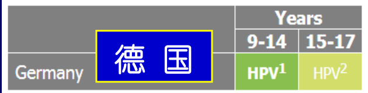
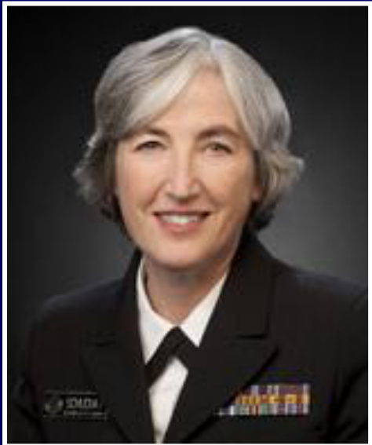

# HPV疫苗与宫颈癌  

HPV Vaccine and Cervical Cancer  

许锐恒  
xuruiheng@cdcp.org.cn  
广东省疾病预防控制中心  
2017.08 updated 2018.06  

# 内 容  

1. 基本情况  
2. 病原体  
3. 宫颈癌筛查  
4. HPV 疫苗  
5. 小结  

# 1. 基本情况  

# HPV疫苗与宫颈癌 HPV Vaccine and Cervical Cancer  

# 宫颈癌 7 个重要事实 (多亏有 HPV 疫苗)  

宫颈癌是欠发达地区的妇女第 2 常见癌症我国近年发病率呈上升趋势， 是政府高度关注的公共卫生问题宫颈癌是由性行为感染某些类型的 HPV 引起的（其他类型则可导致生殖器癌或疣）• 大部分 HPV 感染和大部分癌前病变会自行消退少数几型 HPV 持续感染则会发展为癌症  

需要采取综合措施预防控制 全民公平可及才能有效防控级预防： 健康促进、接种HPV疫苗（性生活开始之前接种效果最好）二级预防： 定期筛查，即使已接种 HPV 疫苗也要筛查！三级预防： 癌前病变和宫颈癌的治疗  

全球 80 国(41%)已将 HPV 疫苗纳入国家免疫规划 (至2018.05.15)• HPV 疫苗接种需要有国家指引 (疫苗、人群、剂次• 常规监测：HPV 疫苗、筛查和治疗的覆盖率， 宫颈癌的发病率和死亡率  

# 宫颈癌 Cervical Cancer  

估计全球有 >100万妇女患宫颈癌  
许多人无法获得预防、治疗或缓和医疗等保健服务  
宫颈癌是长期感染人乳头瘤病毒 （HPV） 的结果  
大多数宫颈癌病例（> 80 %）  
发生在低、中等收入国家  

  
李媛媛 41岁1961\~2002  

  
梅艳芳 40岁1963\~2003  

# 人乳头瘤病毒 （HPV） 与宫颈癌Human papillomavirus (HPV) and cervical cancer  

# 重要事实  

HPV是全球各地极为常见的一组病毒  
HPV 有 >100型， 至少13型可致癌症 （又称高危型）  
HPV主要通过性接触传播，大多数人在性活动开始不久便感染 HP  
宫颈癌是由性行为感染某些型的 HPV引起的  
两型HPV （16型和18型）引起 70% 的宫颈癌和宫颈癌前病变  
也有证据表明， HPV与肛门癌、外阴癌、阴道癌和阴茎癌有关  
宫颈癌是欠发达地区的妇女第 2 常见癌症估计2012年的新发病例有44.5万（占全球新发病例的 84%）  
2012年，约有27万妇女死于宫颈癌， >85%在低、 中收入国家  
预防 HPV16 型 和18 型的疫苗， 许多国家已批准使用  

# 宫颈癌 Cervical Cancer  

宫颈癌是高度可防 （大多数发达国家）  

有筛查试验• 有 HPV 疫苗宫颈癌早期发现， 高度可治可长期生存和有好的生活质量  

  

# HPV感染的自然史  

  

Figure 1.11: The timeline and natural history of cervical pre-cancer and cancer development  

  
宫颈前期癌和癌发展的时间轴和自然史  

Source: reproduced by permission of the first author from Schiffman M, Castle PE. The promise of global cervical-cancer prevention. N Engl J Med. 2005;353(20):2101-4.  

# 估计全球宫颈癌年龄标准化发病率 （/10 万）,2012 Estimated Cervical Cancer Incidence Worldwide in 2012  

  

# 估计全球宫颈癌年龄标准化死亡率 （/10 万）,2012 Estimated Cervical Cancer Mortality Worldwide in 2012  

  

  

  
Figure: Estimated ae-snecifc incidence ofcervicalcancer accordina tocountrv development status and Gavi eligibility 估计宫颈癌年龄别发病率，根据国家发展现状和 GAVI 评定  

# 中国大陆女性HPV流行率和宫颈癌发病率 specific HPV prevalence in women with normal cytology and incidence of cervical cancer in entire popula  

  

  
图32006年和2012年我国不同年龄女性子宫颈癌死亡率（/10万）  

  
29 911 例宫颈癌患者确诊年龄  
图4 宫颈癌年龄分布情况  

# 中国宫颈癌死亡率， 1987\~2014  

  
图1中国女性1987一2014年子宫颈癌中标死亡率及30\~59岁人群截缩死亡率  
Fig.1ge-standardized rates adtrucated rates 3059fcerical cancermortality forChnese women from 1987t201  

A:Age-standardized rates;B:Truncated rates  

# 宫颈癌的症状 Symptoms of Cervical Cancer  

宫颈细胞首次出现异常时， 几乎没有任何征兆随着癌症的进展， 症状可能包括  

阴道分泌物异常 月经期间阴道出血 绝经后出血 性交出血或疼痛  

  

# 宫颈癌的危险因素有哪些？ What Are the Risk Factors for Cervical Cancer?  

由于HPV很常见 （宫颈癌的主要病因）因此大多数人一生中都有机会感染 （性传播）  
感染HPV通常不会引起症状  
所以你不知道已感染了  

大多数感染妇女， HPV会自行消失但如不消失， HPV可随时间推移引起宫颈癌  

HPV   
is the   
main cause   
of cervical   
cancer  

$\textcircled{5}$ HPV is a very common virus, passed from one person to another during sex. $\textcircled{5}$ Most people get it, but it usually goes away on its own. $\textcircled{5}$ If HPV doesn't go away, it can cause cancer.  

  

# 增加患宫颈癌的其他风险 Other things can increase your risk of cervical cancer  

吸烟  
感染 HIV 或 免疫力下降  
长期服用避孕药 （≥ 5 年）  
• 生过 ≥ 3 个孩子  
有数个性伴首次性交早  

  

www.cdc.gov/cancer/cervical/basic_info/risk_factors.htm www.who.int/mediacentre/factsheets/fs380/en/  

# 能做些什么来降低宫颈癌的风险？  

What Can I Do to Reduce My Risk of Cervical Cancer?  

# 可有助降低宫颈癌风险的一些措施  

• 不吸烟  
• 性交时使用安全套限制性伴侣数  
安全性行为教育， 包括推迟开始性活动男性包皮环切术  

www.cdc.gov/cancer/cervical/basic_info/prevention.htm www.who.int/mediacentre/factsheets/fs380/en/  

# 2. 病原体  

# 宫颈癌的基本信息Basic Information About Cervical Cancer  

# 人乳头瘤病毒 （HPV） 是导致宫颈癌的主要原因  

HPV是常见的病毒， 有多种类型- 一些可引起宫颈变化， 导致宫颈癌- 而其他类型则可导致生殖器或皮肤疣  

经性行为 人传人  
至少有 1 / 2 性活跃者在生活的某时段会感染 HPV  
但只有很少女性会患宫颈癌  

www.cdc.gov/cancer/cervical/basic_info/ www.cdc.gov/cancer/cervical/basic_info/risk_factors.htm  

# 宫颈癌的主要原因： HPV  

Top Cause of Cervical Cancer: HPV  

HPV是一大类病毒  
大约有 40 种类型可以感染生殖器区  
有些是宫颈癌高危的  
全球 > 90% 的宫颈癌是由 HPV 感染引起的  

  

# 病原体  

Pathogen  

HPV属乳头瘤病毒科  
高度的组织特异性， 可感染皮肤和粘膜的上皮细胞  
HPV 有 > 200 型  
据其致癌力，分为 高危型 和 低危型  
国际癌症研究机构 （IARC） 目前已确定  

12 种与人类癌症相关的高危型 HPV16 18  31 33 35 39 45 51 52 56 58 59和 致癌性证据有限的 HPV ，68 73  

# 楚尔·豪森， 确认 HPV 是宫颈癌的病因  

楚尔·豪森早期工作就是病毒与肿瘤的关系  
1976年提出HPV是造成宫颈癌发生关键因素的假说  
1983年鉴定出 HPV-l6 亚型是宫颈癌发生的重要原因  
随后又发现 HPV-l8 也可造成宫颈癌从而使大家开始关注 HPV 与宫颈癌的关联  
2008年获诺贝尔生理学与医学奖另外1/2由 HIV 发现者吕克·蒙塔格尼尔和同事弗朗索瓦丝·巴尔-西诺西分享  

  

德国科学家哈拉尔德·楚尔·豪森(Harald zur Hausen)  

# 全球年HPV相关癌症的发病例数和可归因于HPV部位的比例  

Worldwide annual incidence of human papillomavirus (HPV)-associated cancers and fraction attributable to HPV infection  

  

# HPV相关癌症新发病例数，2009，美国  

  
Figure 1.Number of new human papillomavirus(HPV)-associated can- coverage of population-based registries in 2009 $( 9 3 \% )$ .HPV-associated cers overall,and by sex,in the United States,2009.Source:National cancers are defined as cancers at specific anatomic sites and with speProgram of CancerRegistries and Surveillance,Epidemiology,and End cificcellular types in which HPV DNA frequently is found.Some of these ResultsareasreportedbytheNorthAmericanAssociationofCentral cancersmaynot necessarilybeHPV-positivebecausenotestingwasconCancer Registries asmeetinghigh-qualityincidence data standards for ducted.Virtually all cervical cancers are due toHPV infection,along with thespecified timeperiod.Notethatthenumberofcancercasesunder- $9 0 \%$ of anal cancers,more than $6 0 \%$ of certain subsites of oropharyngeal estimatestheactualnumberofcasesoccurringbecauseofincomplete cancers,andapproximately $4 0 \%$ ofvagina,vulva,and penilecancers.  

# HPV基因型在侵袭性宫颈癌病例占的比例(%) Human papillomavirus (HPV) genotypes in cases of invasive cervical cancers that were positive for HPV DNA  

  

The seven high-risk HPV types included in Merck’s nonavalent vaccine Gardasil-9 are indicated in red. (Modified from data on 8977 cases worldwide as reported in de Sanjose S, Quint WG, Alemany L, et al. Human papillomavirus genotype attribution in invasive cervical cancer: a retrospective cross-sectional worldwide study. Lancet Oncol. 2010;11[11]:1048–1056.)  

# 中国宫颈癌患者10 型常见HPV， 1991\~2016  

  
10型HPV流行率的累积比例 Cumulative proportion of ICC associated Top 10 prevalent HPV types  

<html><body><table><tr><td>16</td><td>医院和人群 HPV % 62.5</td></tr><tr><td></td><td>18 12.4 58 8.6</td></tr><tr><td>52</td><td>5.7</td></tr><tr><td>3 31</td><td>4.6 3.5</td></tr><tr><td>55</td><td>2.4</td></tr><tr><td>68</td><td>2.4</td></tr><tr><td>53</td><td>2.2</td></tr><tr><td>45</td><td>2.0</td></tr></table></body></html>  

  

  
Figure1:Age-adjusted prevalenceof cervicalhuman papilomavirus DNA in sexually active women aged 15-69years Data are from IARC Prevalence Surveys, 1990-2012.4  

# 3. 宫颈癌筛查  

# 我国子宫颈癌的一、二、 三级预防［专家解读］  

  
王临虹教授  

  

# 一级预防  

# 健康教育  

目标人群  
青少年女孩  
适龄妇女  
专业技术人员  
社区领导人和员  
政策制定者  
卫生管理人员  
非政府组织  
社会团体和媒体  

- 接种HPV疫苗 二级预防  

适龄妇种女定期宫颈癌筛查 推荐筛查起始年龄 25\~30岁  

已接种HPV疫苗的女性到了筛查年龄仍需定期筛查  

筛查方法  

- 细胞学醋酸染色肉眼观察  
- HPV检查  

三级预防  

# 据临床分期  

适宜的手术  
- 放疗  
- 化疗  
姑息疗法  

我国 2015 年 宫颈癌新发病例数估计 9.89万死亡人数约 3.05万  

  

  
WHO宫颈癌综合防治指南：女孩和妇女更健康的未来，2013  
\*Tobacco use is an additional risk factor for cervical cancer. Scaling-up HPV vaccine introduction, WHO,2016.12  

# 宫颈癌的病因及预防方法 Cervical cancer aetiology and prevention approaches  

  

# 宫颈癌筛查 Screening for cervical cancer  

  

由于癌前病变需要多年才能形成因此建议 30\~49 岁的妇女一生至少做 1 次筛查，多次会好点只有大部分妇女参与， 筛查才能有效降低宫颈癌死亡率目前有 3 种类型的筛查  

• 传统涂片（Pap） 检查和液基细胞学检查 （LBC）醋酸染色肉眼观察法 （VIA）  
• 人乳头状瘤病毒 （HPV） 检测检查高危型 HPV  

# 能做些什么来降低宫颈癌的风险？What Can I Do to Reduce My Risk of Cervical Cancer?  

# 2 项检查可有助预防宫颈癌  

  

1. 巴氏试验 （Pap test， 巴氏涂片）检测宫颈细胞的癌前改变如未恰当处理， 可进展为宫颈癌因此应在 21岁开始接受巴氏试验  

2. HPV 检测寻找能引起这些细胞改变的病毒预防宫颈癌， 最重要的事情是从21岁开始定期进行筛查试验  

  

大多数女性不需每年做  
巴氏试验 （Pap）！  
21岁时  
就要做第 1 次  
如果结果正常  
3 年后再做下一次  

HPV检测< 30岁女性不推荐筛查  

30岁时  
你可选择  
如结果正常  
1. 每 3 年做 1 次 Pap  
或  
2.每 5 年做 1 次 Pap  
和 1 次 HPV 检测  

# Most women don't need a Pap test every year!  

Haveyour lst   
Pap test when you're   
21  

If your test results are normal, you can wait 3 years for your next Pap test.  

  

HPV tests aren't recommended for screening women under 30.  

  

你可以停止筛查，如  
1. 年龄 >65岁且 Pap 多年来一直正常  
2. 宫颈因非癌症已手术切除如肌瘤  

宫颈是子宫下端的狭窄部分连接子宫和阴道 （产道）  

# You can stop getting screened if:  

  

The cervix is the lower, narrow end of the uterus (womb) that connects the uterus to the vagina (birth canal).  

$\textcircled{4}$ You're older than 65 and have had normal Pap test results for many years.   
$\textcircled{1}$ Your cervix was removed during surgery for a non-cancerous condition like fibroids.  

  

# 5 级预防  

Five  Levels of Preventionn  

# 交叉 重叠 结合  

  

# 我国卫生工作方针  

# 新时期卫生与健康工作方针  

以基层为重点 (代替“农村”)  
以改革创新为动力 （代替“依靠科技与教育”)  
预防为主 (全世界卫生工作理念)  
中西医并重 (中国特色)  
将健康融入所有政策 (代替“动员全社会参与”  
人民共建共享 (公平可及)  

# 4. HPV 疫苗  

# HPV疫苗  

• 四价疫苗， 2006年获准上市• 两价疫苗， 2007年获准上市• 九价疫苗，2014年获准上市  

疫苗最好在性生活开始之前接种即在首次暴露于 HPV 感染前  

至 2017年 3 月 31日全球 71个国家 （37%） 将HPV疫苗纳入国家免疫计划为女孩接种11个国家 （6%） 也为男孩接种  

Human papillomavirus, WHO position paper ,May 2017  

# HPV 疫苗纳入国家免疫规划的国家 Countries with HPV vaccine in the national immunization programme  

  

Map production Immunization Vaccines and Biologicals (IVB), World Health Organization  

expression of any opinion whatsoever on the part of the World Health Organization concerning the legal status of any country, territory, city or area or of its authorities, or concerning the delimitation of its frontiers or boundaries.  Dotted lines on maps represent approximate border lines for which there may not yet be full agreement. ©WHO 2018. All rights reserved.  

# HPV vaccination is the best way to protect your children from cancers caused by HPV接种 HPV 疫苗是保护您的孩子免患 HPV 引起癌症的最佳方法  

  

CDC REC0MMENDS THE HPV VACCINE AT AGES 11-12 Talk to your child's doctor about HPV cancer prevention  

# HPV疫苗  

4价HPV疫苗 ，2006年HPV-6 HPV-11 （低危）HPV-16 HPV-18 （高危）  

2价HPV疫苗，2007年HPV-16 HPV-18  

  

9价HPV疫苗, 2014年HPV-6 HPV-11HPV-16 HPV-18HPV-31 HPV-33 HPV-45 HPV-52 HPV-58  

<html><body><table><tr><td>ATTRIBUTES HPV疫苗</td><td>BIVALENT (CERVARIX)</td><td>QUADRIVALENT (GARDASIL?/SILGARD)</td><td>9-VALENT (GARDASIL 9)</td></tr><tr><td>希瑞适，二价</td><td>Cervarix</td><td>佳达修，四价</td><td>佳达修，九价</td></tr><tr><td colspan="4">6,11,16,18 6,11,16,18, 31,33,45,52,58</td></tr><tr><td>预防病毒型 预防疾病</td><td>16,18 宫颈癌 肛门癌 (及宫颈、外阴、阴道</td><td>宫颈癌 肛门癌 (及宫颈、外阴、阴道</td><td>宫颈癌 肛门癌 (及宫颈、外阴、阴道 肛门癌前病变></td></tr><tr><td>肛门癌前病变) 接种剂次 2</td><td colspan="2">肛门癌前病变) 生殖器疣</td><td>生殖器疣 2</td></tr><tr><td>剂次间隔 0，6个月 (弹性） (无最长间隔</td><td></td><td>2 0，6个月 (无最长间隔</td><td>0，6个月 (无最长间隔</td></tr><tr><td>但建议12~15个月) 接种方式</td><td colspan="2">但建议12~15个月) 肌注</td><td>但建议12~15个月) 肌注</td></tr><tr><td>禁忌症</td><td>-第一次接种后</td><td>肌注 对疫苗任何成分</td><td></td></tr><tr><td>-第一次接种后 对疫苗任何成分 严重过敏反应</td><td colspan="2"></td><td>-第一次接种后 对疫苗任何成分</td></tr><tr><td colspan="2">-严重发热病 -怀孕</td><td>严重过敏反应 严重发热病 －怀孕</td><td>严重过敏反应 -严重发热病 -怀孕</td></tr></table></body></html>

Guide to introducing HPV vaccine into national immunization programmes, WHO,  2016.12  

# 能做些什么来降低宫颈癌的风险？What Can I Do to Reduce My Risk of Cervical Cancer?  

# 接种HPV疫苗  

该疫苗可预防最常见的 HPV 类型  
导致的宫颈癌、阴道癌和外阴癌  
建议青春期前的孩子 （男和女） 11\~12 岁，接种  
但 可早至 9 岁直到 26 岁  

接种剂次据年龄，可为 2\~3 剂特别要注意的是， 即使已接种 HPV 疫苗的妇女也要从 21 岁开始定期进行宫颈癌筛查  

# HPV疫苗不良反应 HPV Vaccine Adverse Reactions  

局部反应痛、红、肿20% \~ 90%  
发热 （ 100ºF / 37.7ºC）10% \~ 13% (类似于安慰剂接受者的报告)  
多种全身不良反应包括恶心、头晕、肌肉痛和不适但与安慰剂接受者的报告率同  

无严重的不良事件据美国 CDC 和 FDA 的监测  

# 中国科学家周健， 宫颈癌疫苗共同发明人  

1991年，周健和弗雷泽利用重组DNA技术  
人工合成了HPV的病毒样颗粒  
今天的宫颈癌疫苗不是用真正的病毒生产的  
而是用1991年他们 的病毒样颗粒生产的  
2006年，默克制药公司葛兰素史克制药公司生产的  
两种宫颈癌疫苗面世一年之内，美国、英国、加拿大和澳大利亚等80个国家先后批准了这种疫苗的使用  
2015年，周健和弗雷泽获欧洲发明奖“最受欢迎发明奖”周健遗孀孙小依和弗雷泽在巴黎共同捧起奖杯  

  

# 二价HPV疫苗  

# 世界卫生组织  

• 男孩和女孩,  9 \~14岁, 推荐 2 剂程序（0.5毫升， 0、5 \~13个月 ）  
• 如接种第 1 剂时年龄 ≥15岁， 推荐 3 剂程序（0.5毫升，0、1、6个月）第 2 剂与第 1 剂间隔 1\~2.5个月第 3 剂与第 1 剂间隔 5\~12个月  
• 在任何年龄，如第 2 剂与第 1 剂的间隔 <5个月应接种第 3 剂是否需要加强剂接种尚未确定  

# 四价HPV疫苗  

# 世界卫生组织  

男孩和女孩，9\~13 岁，可按 2 剂程序  
（0.5毫升，0、6个月）- 如果第 2 剂与第 1 剂间隔 < 6 个月，应接种第 3 剂  
- 也可按 3 剂程序（0.5毫升，0、2、 6个月）第 2 剂与第 1 剂间隔应至少 1 个月第 3 剂与第 2 剂间隔应至少 3 个月  

男孩和女孩，≥ 14岁，应按 3 剂程序（0.5毫升，0、2、6个月）第 2 剂与第 1 剂间隔至少 1 个月第 3 剂与第 2 剂间隔至少 3 个月是否需要加强剂接种尚未确定  

# 九价HPV疫苗  

# 世界卫生组织  

男孩和女孩，9\~14岁， 推荐 2 剂程序  
（0.5毫升，0、5\~13个月）  
- 如果第 2 剂与第 1 剂间隔 < 5 个月，应接种第 3 剂  
- 也可按 3 剂程序 （0.5毫升，0、2、6个月）第 2 剂与第 1 剂间隔应至少 1 个月第 3 剂与第 2 剂间隔应至少 3 个月  
≥ 15岁，应按 3 剂程序  
（0.5毫升，0、2、6个月）  

Human papillomavirus, WHO position paper ,May 2017  

# 美国疾控中心  

# HPV 疫苗  

（2017年5月起只用 9 价） （最小年龄为 9 岁）常规和初始强化免疫接种常规接种， 始于11\~12岁 的青少年 （可从 9 岁开始）至18岁 （如以前未完成接种疫苗）  

接种剂次取决于开始接种的年龄  
- 9 \~14岁 2 剂次程序，0、6\~12个月至少间隔 5 个月  
- ≥15岁 3 剂次程序，0、1\~2个月、6个月至少间隔：第 1 与第 2 剂，4 周第 2 与第 3 剂，12 周第 1 与第 3 剂，5 个月  

# 美国疾控中心  

# HPV 疫苗  

# 特别情况  

有性虐待或性侵犯史的儿童  
9 岁开始接种  
免疫力低下的者， 包括 HIV 感染9\~26岁，接种 3 剂，0、1\~2个月、6 个月  
妊娠不建议接种，尽管没有证据表明疫苗会造成危害  
▪ 如孕期无意中接种了1 剂HPV疫苗，不需干预余下剂次推迟到产后  
▪ 接种前不需妊娠测试  

# HPV vaccination is the best way to protect your children from cancers caused by HPV  

  
接种 HPV 疫苗是保护您的孩子免患 HPV 引起癌症的最佳方法  
Es  

# 英国卫生部  

# HPV 疫苗  

HPV程序改变  

从2014年9月开始， 女童接种 HPV疫苗剂次从 3 减为 2程序主要改变如下：  

第1剂， 可在校 8 年级的任何时候 （12\~13岁） 接种  
第1 剂与第 2 剂间隔至少 6 个月  
首剂接种年龄 <15岁  
第1 剂与第 2 剂间隔最长为 24个月  
实际上， 建议两剂的间隔约为 12个月≥15岁首次接种， 接种 3 剂， 0、1、6个月  

# 欧盟疾控中心  

# HPV 疫苗  

  

1：2剂次， （0、6个月），4 价或 2 价疫，或 9 价（11 / 14岁）  
2： 3剂次， 0、1 或 2、6 个月（女孩15\~19岁）  

  

1：仅女性接种，9\~13 岁 或 9\~14岁 （取决于所用的疫苗）2 剂次， 间隔 6个月， （请参见产品说明书）如 2 剂次间隔 < 6个月， 建议接种第 3 剂  
2：仅女性接种，如在 13岁 或 14 岁开始初始强化免疫接种， 需要 3 剂（根据决于所使用的疫苗），（请参见产品说明书）  

# 香港卫生署  

# HPV疫苗  

现时本港三款注册HPV疫苗的特性及建议接种剂量：  

<html><body><table><tr><td>疫苗</td><td>2价疫苗</td><td>4价疫苗</td><td>9价疫苗</td></tr><tr><td>可预防的HPV类型</td><td>HPV-16, 18</td><td>HPV-6, 11, 16, 18</td><td>HPV- 6, 11, 16, 18, 31, 33, 45, 52, 58</td></tr><tr><td>接种对象</td><td>9岁起 （只限女性）</td><td>9岁起 （女性及男性）</td><td>9岁起 （女性及男性）</td></tr><tr><td>可预防由PV感染引 起的疾病</td><td></td><td></td><td></td></tr><tr><td>.子宫颈癌 -性病疣</td><td>是 否</td><td>是 是</td><td>是 是</td></tr><tr><td>本港建议注射的剂 量及方式</td><td>9-14岁：2针 15岁或以上：3针</td><td>9-13岁：2针 14岁或以上：3针</td><td>9岁或以上：3针 （2016年10月31日前） *******米</td></tr><tr><td></td><td></td><td></td><td>9-14岁：2针 15岁或以上：3针 （2016年10月31日或以 后）</td></tr><tr><td></td><td colspan="3">卫生防护中心有关使用人类乳头瘤病毒疫苗于预防子宫颈癌的共识（2016年9月）（只备英</td></tr></table></body></html>  

  

# 双价重组人乳头瘤病毒疫苗商品名：希瑞适® （CERVARIX®  

# 推荐用于 9\~25 岁的女性  

适用于预防因高危型 HPV 16、18 型所致下列疾病  
- 宫颈癌  
- 2级、3级宫颈上皮内瘤样病变 （CIN2/3） 和原位腺癌  
- 1级宫颈上皮内瘤样病变 （CIN1）  

推荐于 0、1 和 6 月分别接种1剂次，共接种 3  剂，每剂 0.5ml根据国外研究数据，第 2 剂可在第 1 剂后 1～2.5 个月之间接种第 3 剂可在第 1 剂后 5～12 个月之间接种  

媒体  

〉媒体〉新闻稿列表〉GSKHPV疫苗希瑞适获批新接种人群，成为中国内地唯一获批可适用于所有9...  

# GSKHPV疫苗希瑞适获批新接种人群，成为中国内地唯一获批可适用于所有9-45岁女性人群的宫颈癌疫苗  

# 29五月2018  

希瑞适接种对象年龄获批延长至45岁，从而惠及更多中国女性  

希瑞适的接种对象年龄延长至45岁已获得批准，由此成为了中国内地目前唯一获批可适用于所有9至45岁女性人群的宫颈癌疫苗”。  

www.gsk-china.com/zh-cn/media/press-releases/2018/gsk-hpv-vaccine-cervarix-is-approved-for-new-vaccination-population-and-hasbecome-the-only-vaccine-for-cervical-cancer-prevention-in-female-population-aged-9-45-years-in-mainland-china/  

# 四阶人乳头瘤病毒疫苗 （酿酒酵母）商品名：佳达修® （GARDASIL®  

# 适用于 20\~45 岁女性  

国外已批准本品用于 9\~19 岁女孩接种， 但目前中国临床数据有限  
• 适用于预防因高危型 HPV 16/18 型 所致下列疾病宫颈癌- 2级、3级宫颈上皮内瘤样病变 （CIN2/3） 和原位腺癌- 1级宫颈上皮内瘤样病变 （CIN1）国内临床试验尚未证实本品对低危 HPV 6/11 型相关疾病的保护效果  

推荐于 0、2 和 6 月分别接种 1 剂次，共接种 3  剂，每剂 0.5ml根据国外临床研究数据，首剂与第 2 剂的接种间隔至少为 1个月而第 2 剂与第 3 剂的接种间隔至少为 3 个月，所有 3 剂应 1 年内完  

# 九价人乳头状瘤病毒疫苗有条件批准上市  

为加快新药进口注册进程，满足公众用药需求，按照中共中央办公厅、国务院办公厅《关于深化审评审批制度改革鼓励药品医疗器械创新的意见》有关要求，2018年4月28日，国家药品监督管理局有条件批准用于预防宫颈癌的九价人乳头状瘤病毒疫苗（以下简称HPV疫苗)上市。  

收到九价Pv疫苗进口注册申请后，国家药监局将其纳入优先审评程序，多次就产品在境外临床数据及上市后安全监测情况与企业沟通交流，并基于之前四价HPV疫苗获批数据的基础，有条件接受境外临床试验数据，与境外临床数据相桥接，在最短时间内，有条件批准了产品的进口注册。同时，国家药监局要求企业制定风险管控计划，按要求开展上市后研究工作。  

# 目前获准进入中国的HPV疫苗推荐接种年龄 （女性）二价, 9\~25（45）岁 四价,20\~45岁 九价, 16\~26岁  

cnda.cfda.gov.cn/WS04/CL2056/227881.html   2018.04.29  

  
不同组合的HPV疫苗的潜在保护  
Fig.5.Potential protection provided byvaccines or vaccinecandidateswith different HPVgenotype combinations.Protectionsof sixcombinationswith differentHPV  

# 接种四价HPV疫苗后，女性外阴/阴道疣的住院治疗病例明显减少12\~13岁女童初种、<26岁女性补种，2007\~2009, 澳大利亚  

  
Figure1Numbersofin-patienttreatmentsforvulval/vaginalwartsinwomenbyage-group,200-2011.  

# 9价HPV疫苗的效果  

一项14 ,215名 16 \~ 26 岁健康女性18国、105 个研究点的随机双盲研究2007.09.26 \~ 2009.12.18  

与HPV 31、33、45、52 和 58 相关的  
中、重度宫颈、外阴和阴道疾病发病率9 价HPV疫苗 0.5/万人年4 价HPV疫苗 19.0/万人年有效率，97.4% （95% CI， 85.0 \~ 99.9）  

# HPV疫苗的选择 The choice of HPV vaccine  

应根据当地相关资料的评估以及多种因素  

包括  

- 主要的HPV相关公共卫生问题的规模(宫颈癌、其他HPV相关癌症或生殖器疣)  
- 疫苗获准接种的人群  
- 决策者还应考虑疫苗产品各自的特性如价格和程序安排  

Human papillomavirus, WHO position paper , May 2017  

# 宫颈癌综合预防和控制规划清单 Checklist for a Comprehensive Cervical Cancer Prevention  and Control Programm  

1.  实用的多学科平台，促进部门合作，并纳入 国家议程  
2.  宫颈癌综合预防和控制的国家计划  
3.  宫颈癌综合预防和控制的国家医疗卫生人员指引  
4. 财政和技术资源，以执行政策/计划，并确保女童和妇女能得到 可供和可及的服务  
5. 传播策略，教育社区和支持国家政策  
6.  建立质量控制和方案保证的监督机制，并制定培训计划  
7. HPV疫苗作为群体策略， 9\~14岁女孩是适宜的目标年龄组  
8. 宫颈癌计划，30\~49岁的妇女一生中至少进行一次“筛查和治疗”  
9.  有效的转诊系统，将筛查服务与癌前病变和侵袭性癌症的治疗联接起来  
10. 运作正常的监测系统，追踪HPV疫苗、筛查和治疗的覆盖率  
11.  癌症登记，卫生信息系统的一部分，监测宫颈癌发病率和死亡率  

# 中国接种 HPV 疫苗更需成本效益  

有建议当妇女接种 1 剂次疫苗的价格> 50 美元( 333 元 )时  
• 这种疫苗就不具成本效益特别是对生活在农村地区的妇女  

在没有实施筛查方案的情况下应优先为中国农村地区的妇女接种疫苗  

HPV vaccination in China needs to be more cost-effective, The Lancet, 390, 10104, p1735–1736, 2017.10  

# 在没有起动或维持宫颈癌筛查 （二级预防） 的国家接种HPV疫苗可能是今后预防HPV相关疾病的唯一希望  

Nine-valent human papillomavirus vaccine great science, but will it save lives, The Lancet, 390,  10108, 11–17 November 2017,  2123-2124  

# 5. 小结  

# HPV疫苗与宫颈癌 HPV Vaccine and Cervical Cancer  

# 宫颈癌 7 个重要事实 (多亏有 HPV 疫苗)  

宫颈癌是欠发达地区的妇女第 2 常见癌症我国近年发病率呈上升趋势， 是政府高度关注的公共卫生问题宫颈癌是由性行为感染某些类型的 HPV 引起的（其他类型则可导致生殖器癌或疣）• 大部分 HPV 感染和大部分癌前病变会自行消退少数几型 HPV 持续感染则会发展为癌症  

需要采取综合措施预防控制 全民公平可及才能有效防控级预防： 健康促进、接种HPV疫苗（性生活开始之前接种效果最好）二级预防： 定期筛查，即使已接种HPV疫苗也要筛查！三级预防： 癌前病变和宫颈癌的治疗  

全球 80 国(41%)已将 HPV 疫苗纳入国家免疫规划 (至2018.05.15)• HPV 疫苗接种需要有国家指引 (疫苗、人群、剂次• 常规监测：HPV 疫苗、筛查和治疗的覆盖率， 宫颈癌的发病率和死亡率  

宫颈癌高度可预防健康促进 （生殖健康干预）筛查 （早发现， 早治疗）HPV疫苗 （长期保护，成本效益）  

所有12岁女孩都接种 HPV 疫苗  
在她们一生中，全球可以避免690,000 宫颈癌病例420,000 宫颈癌死亡  

# Cancer Prevention  

HPV vaccine protects againstcancer and other diseases causedbyhuman papillomavirus（HPV).Get yourpreteens and teens vaccinated  

Learn more  

  

HPV 疫苗是救命的疫苗预防人类乳头瘤病毒 （HPV） 引起的癌症和其他疾病让你的孩子在 11 或 12 岁时接种或如孩子已经 ≥13 岁 尽快接种  

HPV vaccine is a life-saving vaccine that protects against cancer and other diseases caused by Human Papillomavirus (HPV). Get your kids vaccinated at 11 or 12, or as soon as possible if they're already 13 or older.  

# 为家长提供多样的媒体产品  

# 要准备容易阅读的  

接种程序 接种跟踪随访 视频 单体文章（Listicles，报纸、杂志或网络的）信息图表 重要事实介绍 广播电视公共服务协议 印刷广告和海报等供家长参考  

# 将这些资料分享给你的读者：  

挂到网上  
社交媒体渠道分享 （微信公众号复制和分发传单和重要事实介绍印刷和悬挂海报  
在当地的杂志和报纸刊登广告  

  

# 14 种你几乎忘记的疾病(多亏有了疫苗)  

# 提高HPV疫苗覆盖率的 5 种方法 \~ 在日常工作中建立免疫文化  

1. 推荐HPV疫苗的方式和时间与其他青少年疫苗相同  
2. 科室建立免疫文化（全员沟通培训，一致性）  
3. 落实制度，确保您永不会错过接种疫苗的机会  
4. 已接种疫苗家庭分享体会  
5. 回答父母有关HPV疫苗的常见问题 （简洁易懂、精准移  

  

www.cdc.gov/hpv/hcp/vacc-coverage/5-ways-to-boost-hpv-vaccination-rates.html  

# 临床医生的推荐是提高疫苗覆盖率的好方法  

预防接种是临床医生日常诊疗中可同时采取的最简单的预防干预之一能为患者带来巨大的好处但在因其他健康问题就诊时预防接种往往被忽略  
患者 （家长）往往不了解需接种什么疫苗因而需要临床医生及医疗卫生人员的推介  

  

www.medscape.com/viewarticle/829132  2014.08.06  

# 美国＜5 岁儿童侵袭性肺炎球菌疾病发病率  

精 准 1 贫 扶  

发病率（十万  

  

# 2018年世界免疫周：接种疫苗， 共防疾病, 4月24\~30日  

World Immunization Week, : ―Protected Together, Vaccines Work‖‖ 24-30 April 2018  

免疫接种成功挽救无数生命  
是公认全球最成功和最具成本效益的卫生干预措施之一  
但全球仍有1900多万儿童未接种过疫苗或接种不足  
因而会面临这些可致死命疾病的严重风险  
其中1/10儿童从未接种疫苗， 而且很可能从未获得卫生服  

世界免疫周于每年4月最后一周举行  

# 目的是强调要采取联合行动， 确保人人获得保护  

Protected Together  

免得疫苗可预防疾病   
今年的主题是“接种疫苗， 共防疾病”   
为获得更大的效益， 努力提高免疫接种覆盖率 www.who.int/campaigns/immunization-week/2018/campaign-essentials/en/  

不仅在于宣扬疫苗接种的成绩, 而且呼吁要面对仍然存在的挑战  

# 习近平：把人民健康放在优先发展战略地位《全国卫生与健康大会，2016，8月19\~20日》  

平 等公 正  

  

全 民可 及  

# 要坚定不移贯彻预防为主方针  

  

没有全民健康，就没有全面小康  
将健康融入所有政策  
以基层为重点  
要坚持基本医疗卫生事业的公益性  
把以治病为中心转变为以人民健康为中心  
为人民群众提供全生命周期的健康服务  
努力为人民群众提供公平可及的卫生与健康服务  

  

http://news.xinhuanet.com/politics/2016-08/20/c_1119425802.htm我希望在未来的几十年我们将能告诉一代从未患过HPV相关癌症或癌前病变的成年人在他们年少时我们已给他们接种了疫苗美国疾控中心首席副主任Anne Schuchat, MD安妮 舒哈特  

  

I hope that in a few decades we will be able to tell a generation of adults who never had HPV-associated cancers or precancers that when they were teenagers, we had them covered.  

# 谢谢 Thanks  

  

请指正  