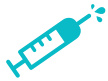
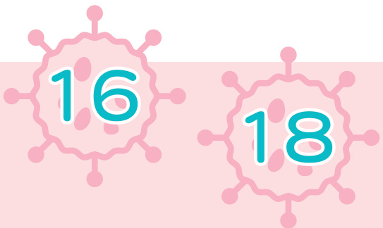
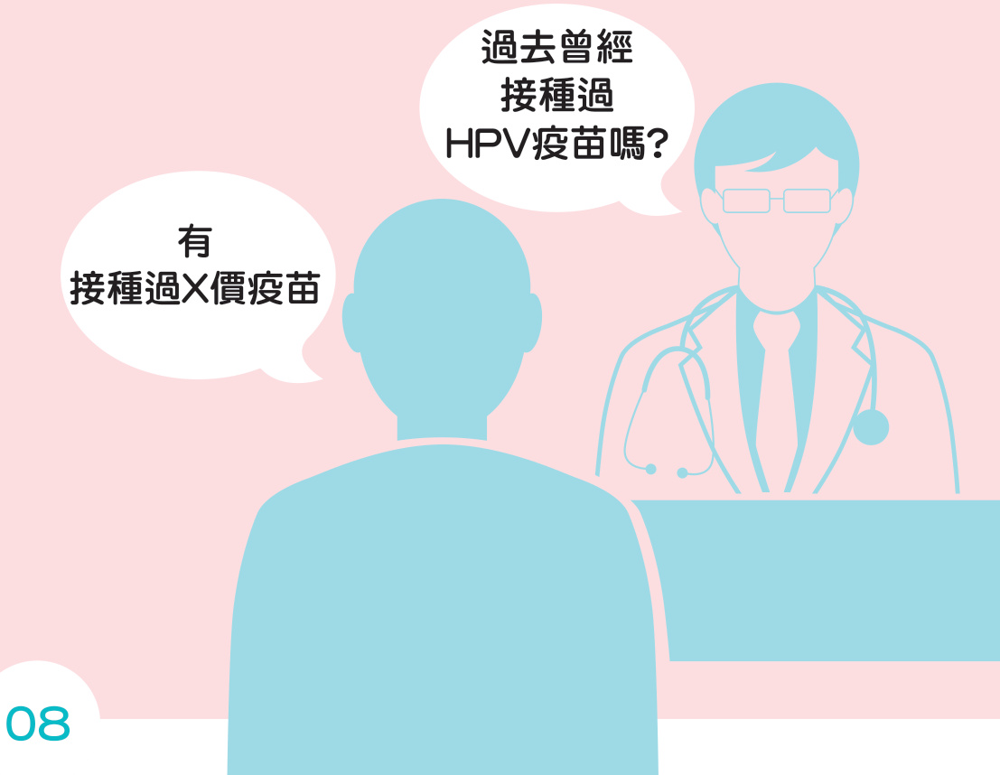
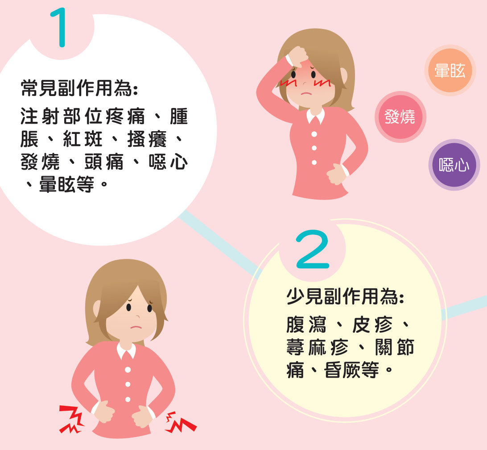
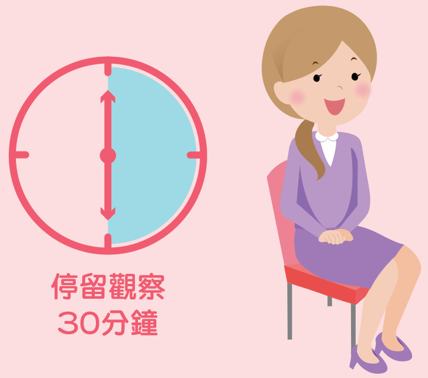
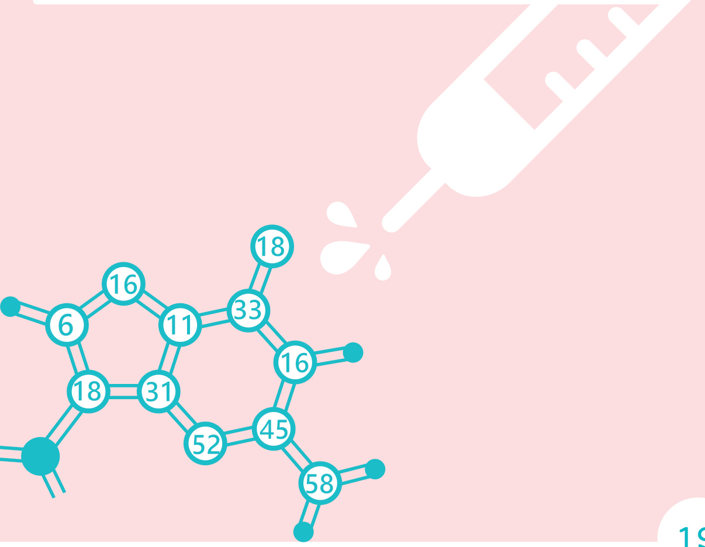

  

# HPV疫苗 衛教手册  

子宫頭癌每年約造成600人死亡·經醫學研究證實，感染高致癌性人類乳突病毒（HumanpapiIIomavi-rus，HPV)是導致子宫頭癌的主因’其中感染第16丶18型HPV比例占六至七成’人類乳突病毒(HPV)疫苗可防至少70%的子宫頭癌發生，因疫苗的涵蓋价數不同，可以预防60-90%的HPV感染，仍安全性行為丶定期子宫頭抹片查，以達早期發現早期治療目的·  

國民健康署参考世界衛生組織（WHO)建，對國中女學生提供接種HPV疫苗服務，經多次專家會及市會，邀請包含衛生福利部传染病防治询會预防接種組（ACIP)專家、相關民間團體及醫學會、衛生局等代表的努力，期望透過HPV疫苗接種，保護國民健康·  

这本手册助您對HPV疫苗的作用丶安全性丶保護力等有進一步的識，可您了解相關訊息，作最適宜的決定·  

# 目錄  

  

子宫頭癌發生原因  

  

識HPV疫苗篇  

疫苗保護力篇  

  

HPV疫苗安全篇  

  

HPV疫苗接種篇  

  

  

# 子宫頭癌發生原因篇  

# 什是HPV?  

人類乳突病毒(HPV)是一種DNA病毒’會感染人體的表皮與黏膜組織。它有雨百多型，可以分為低危型與高危型，是男性及女性重要的傅染病之一  

HPV第16丶18型是最常見的高危人類乳突病毒，與子宫癌前病變、子宫頭癌以及男女外生殖器癌的發生有關，子宫頭癌有超過 $70 \%$ 是由HPV第16丶18型所引起的；HPV第6丶11型是最常見的低危人類乳突病毒，感染可能會引起生殖器疣(俗菜花），致癌機率相對小°  

  

# HPV與子宫頭癌的關？  

女性子宫上皮細胞因感染高危型人類乳突病毒（HPV），受到病毒基因的作用之後，正常健康的子宫細胞會出現化生不良，之後就有可能變為子宫頭癌·  

# HPV傅染途径有那些？  

人類乳突病毒(HPV)主要經由性接觸傳染·在性行為過程中’透過接觸皮膚丶黏膜或體液而感染·有時，外部生殖器接觸带有HPV的物品’也可能造成HPV感染·  

1.男女生皆會感染HPV° 容易感染到 HPV?  

2.男性也會經由性行為感染HPV，感染後大多不會有明顯症狀或不適，所以不易發現·当感染到第6丶11型HPV，部分男性感染後會出現菜花或其他生殖器病變，建速至泌尿科就醫·  

3.目前研究資料顯示，不男女，每個人一生中約有5-9成的機會感染到HP√·女性開始有性行為後’感染HPV的機會將大幅增加·此外，伴侣性經较複雜丶長期免疫力低落等情况，均可能增加HPV的感染風·  

  

# 感染HPV會有什症狀？  

HPV感染者一般没有明顯症狀，通常9成的HPV感染會在1年丙消失·若感染者出現菜花或其他生殖器病燮，建速就醫·HPV感染超過1年不消失就為持續性感染，女性未來罹患子宫頭癌的機會高·另外，HPV感染也會造成男性陰萃癌丶男女雨性肛门丶扁桃腺丶口咽丶舌咽及舌頭等癌症·  

1.安全性行為及單一性伴侣可以减少感染HPV的機會·2.此外，藉由維持良好生活作息以及充足營養，可維持较佳的免疫力，可使身體自動清除病毒，避免反覆受到感染以及持續感染·  

如何减少或避免HPV感染的發生？  

# 感染HPV能狗治療？  

目前無特定藥物可治療HPV感染·子宫頭癌可以防？  

可以·近年研發之人類乳突病毒疫苗，因疫苗的涵盏價數不同，可以防 $60 - 9 0 \%$ 的HPV感染·但因為疫苗尚未涵蓋所有病毒型别，所以定期接受子宫抹片查是必的·子宫頭抹片可以早期發現子宫頭癌前病燮或子宫頭癌·定期律接受子宫頭抹片查，可降低 $60 - 9 0 \%$ 子宫癌發生率·若抹片報告巽常不代表一定有細胞病變或罹癌，應該接受進一步查（例如陰道鏡或子宫頭切片）才能確定病夔程度·  

# 3道防線预防子宫頭癌  

第一道防線  

# 安全性行為  

人類乳突病毒主要是透過性接觸傅染，正確使用保套，可以预防部分人類乳突病毒傅染，進而可降低子宫頭癌的發生·  

第二道防線  

# 接種HPV疫苗  

世界衛生組織(WHO)指出，接種HPV疫苗可以保護女性避免人類乳突病毒感染，亦能有效预防長期感染人類乳突病毒造成的子宫頭癌·目前食品藥物管理署已核准3種HPV疫苗，均可以预防至少7成造成子宫頭癌的高危型别人類乳突病毒（第16、18型），各疫苗適用對象可参考仿單。  

第三道防線  

# 定期做子宫頭抹片查  

子宫頭抹片查是經國際實證最佳的子宫頭癌工具，有助於早期發現子宫頭癌前病燮，早期治療，子宫頭病變不會進展到癌症·  

# 哪些人需要做子宫頭抹片？  

1.目前國民健康署建30以上的女，至少每3年做1次子宫頭抹片查，若是未满30崴但已有性行為3年以上的年輕女性，可考選選自費查，以確保健康·  

2.有些女為自己已經停經、很少或很久未有性行為就忽略或不接受抹片查，這是錯觀念，因遭HPV病毒感染後，若未能自行消除，將會造成持續感染可達數年，使感染區的基底細胞及基旁細胞層增殖，然後演燮成癌症，所以已無性生活或停經，仍定期做抹片查·未曾做過抹片查和長期未接受查的女，更應該快至醫療院所接受抹片查·  

# 接受HPV疫苗接種後，是否還需要定期做子宫頭抹片查？  

需要·因為人類乳突病毒(HPV)疫苗，因疫苗的涵盏价數不同，可以预防 $60 - 9 0 \%$ 的HPV感染，目前疫苗尚未涵蓋所有病毒型别·所以接受HPV疫苗接種後，仍有安全性行為及定期接受子宫頭抹片，以提供更完整的保護·  

# 識HPV疫苗篇  

# 目前政府核准有哪種HPV疫苗廠牌？  

目前我國食品藥物管理署已核准3種HPV疫苗上市，分别為荷商葛蘭素史克藥廠的疫苗「保蓓Cervarix?」及美商默沙東藥廠的疫苗「嘉喜(四价)Gardasil $\stackrel { \triangledown } { \mathbf { \scriptscriptstyle \mathcal { B } } } _ { \mathbf { \textnormal { \scriptsize d } } }$ 與「嘉喜(九價)Gardasil9」以下表格详述各家疫苗的接種建·  

<html><body><table><tr><td>疫苗名</td><td colspan="2">保蓓Cervarix</td><td colspan="2">嘉喜（四價）Gardasil</td><td colspan="2">嘉喜（九價）Gardasil9</td></tr><tr><td>適用對象</td><td>9-14； 女性</td><td>15以上； 女性</td><td>9-13； 女性</td><td>14-45女性 9-26男性</td><td>9-14 男女性</td><td>15-45崴 男、女性</td></tr><tr><td>接種劑數</td><td>2劑*</td><td>3劑</td><td>2劑*</td><td>3劑</td><td>2劑*</td><td>3劑</td></tr><tr><td>第1劑</td><td colspan="2">第0個月</td><td colspan="2">第0個月</td><td colspan="2">第0個月</td></tr><tr><td>第2劑</td><td>第1劑後 6個月</td><td>第1劑後 1个月</td><td>第1劑後 6個月</td><td>第1劑後 2個月</td><td>第1劑後 6個月</td><td>第1劑後 2個月</td></tr><tr><td>第3劑</td><td>X</td><td>第1劑後 6個月</td><td>X</td><td>第2劑後 4個月</td><td>X</td><td>第2劑後 4個月</td></tr><tr><td>適應症 预防型别</td><td colspan="2">HPV第16丶18型</td><td colspan="2">HPV第6丶11丶16丶18型</td><td colspan="2">HPV第6丶11丶16丶18 31丶3345丶52和58型</td></tr></table></body></html>  

\*若第2劑接種時間距離第1劑小於5個月，则需再接種第3劑°疫苗資訊均記载於仿單中，最新仿單資訊請查询食品藥物管理署網站http://www.fda.gov.tw/TC/index.aspx  

我國已核准3種HPV疫苗可交替接種？  

依據世界衛生組織建，不同的HPV疫苗具有不同的特性丶成分及適應症，應可能使用相同疫苗進行接種，也就是第1劑開始到最後1劑疫苗皆應皆種相同价數的HPV疫苗·建羲您接種疫苗前，告醫師您過去的接種經，俾利醫師估·  

  

# 疫苗保護力篇  

HPV疫苗對子宫頭癌的保護力是百分之百？  

1.接種疫苗只能预防部份型别的HPV感染·因疫苗的涵盏價數不同，理上可以预防 $60 - 9 0 \%$ 的HPV感染’無法百分之百防子宫頭癌·  

2.即使接種疫苗，仍一定要做定期接受子宫頭抹片查·同時，應有安全性行為丶戴保套，這也是预防子宫頭癌的保護措施·  

# HPV疫苗的效力能延續多久?  

因目前追受試者的時限約12年，所以尚無法證實接種HPV疫苗後可維持多長的保護效期·最新資料顯示「保蓓Cervarix」保護力至少11年，「嘉喜(四價)Gardasil」保護力至少12年，「嘉喜(九價)Gardasil」保護力至少8年，但長期保護力仍持續觀察方能確定·  

保蓓」疫苗(保蓓Cervarix疫苗)至少11年嘉喜」疫苗(嘉喜(四價)Gardasil疫苗)至少12年嘉喜9」疫苗（嘉喜（九价）Gardasil9疫苗）至少8年  

HPV疫苗是否可以治療子宫癌、子宫頭癌前病缦和生殖器疣（俗菜花）？  

HPV疫苗不能治療疾病·  
HPV疫苗是预防性疫苗，主要是  
藉由”预防HPV病毒感染來预防子  
宫頭癌及其他相關病燮”，疫苗本身不具治療功效·  

# HPV疫苗安全篇  

# 接種HPV疫苗可能有什副作用？  

  

其他被報告過的罕見副作用包括癫丶免疫系統疾病丶神經系統疾病等，相關資訊均記載於仿單中，最新仿單資訊請進入食品藥物管理署網站查询“保蓓”或“嘉喜”等關键字https://www.fda.gov.tw/TC/index.aspx  

# 3  

國際间曾有接受HPV疫苗後出現复合局部疼痛症候群(Complex Regional Pain Syndrome ,CRPS)及姿势體位性心搏過速症候群（PosturalOrthostatic Tachycardia Syndrome, POTS) 現象，但疫苗組發生CRPS及POTS的機率不會比對照組高·在日本出現慢性疼痛或其他症狀的事件，但經专家委會確與疫苗無關·2016年世界衛生組織全球疫苗安全委會（GACVS）估後為HPV疫苗是安全的，無科學證據證明重不良事件與接種HPV疫苗有關·  

：CRPS：-通常都是因組織受傷後所引起的病症或某些神經受傷而誘發的病症，醫學上没有謹定義·POTS：-交感神經巽常且合供因改變站立姿勢後所產生巽常心跳過速的病理現象·  

# 4  

國民健康署於2018年起提供國中女生施打疫苗·對於接受補助之施打者設有通報機制，截至2023年5月底，接種約61.7萬劑·共接獲通報491件不良事件（約千分之0.8）最常出現的症狀為注射部位睡痛，其次是發燒、量眩、頭痛·多属輕微至中等程度且為時短暂  

# 有可能因為接種HPV疫苗感染HPV?  

不會·HPV疫苗是由病毒的一部分蛋白空殼成，不含病毒基因，所以不會因為接種疫苗而感染HPV病毒·  

# 接種HPV疫苗後，可否馬上離開接種地點 $\ ?$  

不可以·接種HPV疫苗不可以馬上離開接種地點，至少應停留觀察30分鐘，觀察接種後是否有需要立即處理的副作用·接種疫苗後，如有任何不適症狀或發生重或非期之副作用.請速前往醫療機構诊治，告知醫師您的疫苗接種史；亦可打HPV疫苗0800-88-3513(寶貝，守一生)服務專線，将有專人為您服務  

  

如有發生任何不適症狀，請至食品藥物管理署不良反應通報系統(http://adr.fda.gov.tw)通報或發打02-23960100進行通報°  

# 如果接種HPV疫苗后出現不適症默該怎瓣？  

# HPV疫苗接種後注意事頂？  

HPV疫苗接種後應注意注射部位是否有重紅熱痛丶發燒丶心跳加速或血壓下降等身體不適症狀，若有上述症狀應速前往醫療院所寻求醫療協助·  

# HELP  

# 符合接種條件之對象，接種HPV疫苗之後出現副作用，可以寻求救湾 $\ ?$  

重的副作用可以申請救濟。發生疑似重不良反應之情形，請即刻就醫，於病情穩定後繁當地衛生局(所)，依傅染病防治法第30條规定，申請预防接種受害救濟·相關规定由衛生福利部疾病管制署(http://www.cdc.gov.tw)管道方式寻求救濟。  

# HPV疫苗接種篇  

# HPV疫苗的接種對象？  

HPV疫苗對於性行為尚未活耀或未受到HPV感染者最有效；但有性行為經者仍可接種·  

世界衛生組織建針對9-14蕨女性接種HPV疫苗较具效益·因此’政府遵循世界衛生組織建提供疫苗接種服務·  

非公費補助對象接種前可依仿單明或至食品藥物管理署網站查詢°  

# HPV疫苗要接種劑？  

依衛生福利部食品藥物管理署核准疫苗仿單，疫苗品、接種對象不同，可接種2劑或3劑（請参第7真各家疫苗的接種内容表格）。  

以國中女生為例:  

1.接種保蓓HPV疫苗，第1劑接種時年龄在9-14需接種2劑，满15则接種3劑°  

  

2.接種嘉喜（四价)HPV疫苗者，第1劑接種時年龄在9-13者可接種2劑，满14则接種3劑·男性第1劑接種時年在9-26者接種3劑°  

  

3.接種嘉喜(九价)HPV疫苗者，第1劑接種時年懿在9-14需接種2劑，满15则接種3劑°  

  

\*請依仿單建時程完成所有劑次接種，以具有完整保護力。  

# 那些人不建接種HPV疫苗？  

1.接種HPV疫苗後出現過敏症狀者。  
2.已懷孕者（目前為止’尚未發生HPV疫苗對母親或胎兒造成任何妊娠不良事件）。  
3.有計画懷孕者（在接種疫苗的6個月期間應避免懷孕）。  
4.本身有特殊疾病史者(如：凝血性問題疾病丶免疫功能巽常或正服用免疫抑制劑）  
5.接種當天有發燒或感染症狀丶或正在服藥等，接種前應告知醫生以進行估·  
HPV疫苗可否  
和其他疫苗，  
如COVID-19疫苗  
同時接種？  

  

因為HPV疫苗是非活性疫苗，故可以舆其他非活性或活性疫苗如A型肝炎，B型肝炎’白喉，破傷風，無細胞百日咳，非活動性小兒麻，腦膜炎雙球菌等疫苗一同接種·建應經醫師估後接種，但最好接種部位要分開·另，依疾病管制署111年5月2日公告，接種COVID-19疫苗可與其他疫苗可同時分開不同手臂接種，亦可間隔任何時間接種，以利接種後反應之判别·舆COVID-19疫苗之接種間隔，請依疾病管制署最新公告為主。  

  

為避免接種疫苗可能發生的不良反應：接種HPV疫苗前應先告知醫師那些事？  

如同其他疫苗的接種，接種HPV疫苗前應事先告知醫師：  

1.已經懷孕或計画懷孕·  
2.過敏史：包括藥物和食物°  
3.凝血功能障問題：因肌肉接種可能會造成出血的情况發生。  
4.免疫功能巽常：包括免疫功能缺乏或正服用免疫抑制劑°  
5.任何身體的不適：如發燒丶感染丶正在服藥丶皮膚傷口等·  

# 接種HPV疫苗期間可以懷孕？  

接種HPV疫苗期間是不建懷孕的，然至目前為止，尚未發生HPV疫苗對母親或胎兒造成任何妊娠不良事件，但是目前尚不完全清楚HPV疫苗對懷孕會造成何種影響，所以不建接種疫苗期間懷孕·  

接種HPV疫苗期间懷孕了怎辦？  

目前無證據顯示HPV疫苗對母親或胎兒造成任何妊娠不良事件，若接種HPV疫苗期間意外懷孕，可續懷孕，但直至懷孕結束前，應暂缓HPV疫苗的種。  

# 過敏體質可以打HPV疫苗?  

過敏體質建應經醫師估後接種HPV疫苗，且接種後應至少停留於接種地點觀察30分鐘再離開。  

若未能按期程接種該怎辦？  

為達到期之保護力，建依期程將疫苗接種完，倘若未能按期程接種疫苗，應询醫師是否續完成接種·  

書名 HPV疫苗衛教手册（民版）  
著者 衛生福利部國民健康署  
出版機關 衛生福利部國民健康署  
地址 10341臺北市大同區塔城街36號  
址 https://www.hpa.gov.tw/  
電話 （02）2522-0888  
出版年月 民國112年9月  
版次 第七版  
定價 新毫29元  

# 展售處  

臺北 國家書店   
地址10485台北市松江路209號1丶2楼電話（02）2518-0207   
臺中五南文化廣場   
地址40042台中市中區中山路6號 電话（04）2226-0330   
GPN:1011201020   
ISBN :978-626-7260-46-3 著作财產權人：衛生福利部國民健康署   
本書保留所有權利·欲利用本書全部或部分内容者，微求著作财產權人衛生福利部國 民健康署同意或書面授權·請洽衛生福利部國民健康署（電話：02-29978616）。 $\circledcirc$ All rights reserved. Any forms of using or quotation, part or all should be authorized by copyright holder Health Promotion Administration, Ministry of Health and Welfare. Please contact with Health Promotion Administration, Ministry of Health and Welfare. (TEL : 886-2-29978616)   
本出版品經費由國民健康署害防制及衛生保健基金支應。   
This publication is funded by the Tobacco Hazards Prevention and Health Protection Funds of Health Promotion Administration.  