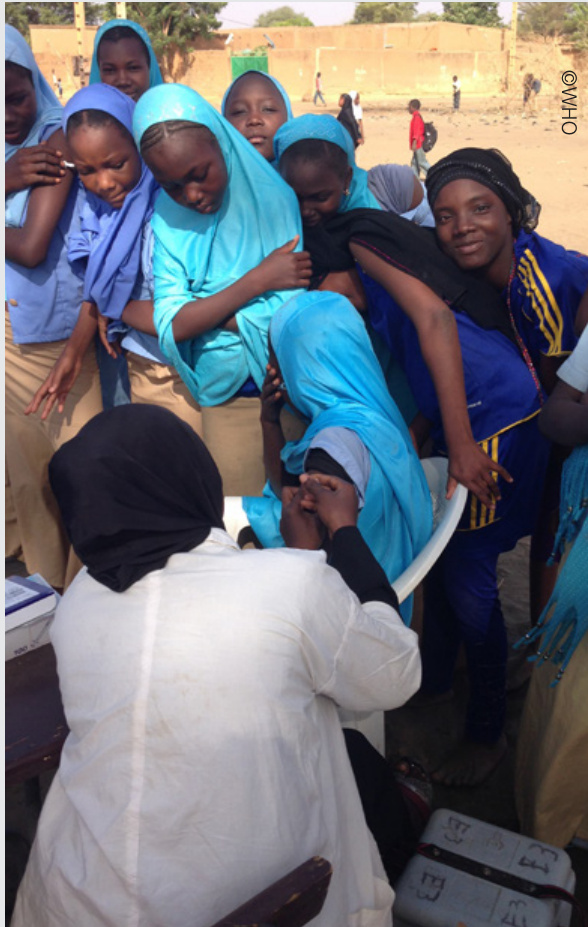

# IA  

# Human Papillomavirus (HPV) Vaccine Coverage Monitoring Manual  

World Health Organization Department of Immunization, Vaccines and Biologicals  

# Human Papillomavirus (HPV) Vaccine Coverage Monitoring Manual  

World Health Organization Department of Immunization, Vaccines and Biologicals  

Human papillomavirus (HPV) vaccine coverage monitoring manua  

ISBN 978-92-4-000274-6 (electronic version) ISBN 978-92-4-000275-3 (print version)  

$\circledcirc$ World Health Organization 2020  

Some rights reserved. This work is available under the Creative Commons Attribution-NonCommercial-Share­ Alike 3.0 IGO licence (CC BY-NC-SA 3.0 IGO; https://creativecommons.org/licenses/by-nc-sa/3.0/igo).  

Under the terms of this licence, you may copy, redistribute and adapt the work for non-commercial purposes, provided the work is appropriately cited, as indicated below. In any use of this work, there should be no suggestion that WHO endorses any specific organization, products or services. The use of the WHO logo is not permitted. If you adapt the work, then you must license your work under the same or equivalent Creative Commons licence. If you create a translation of this work, you should add the following disclaimer along with the suggested citation: “This translation was not created by the World Health Organization (WHO). WHO is not responsible for the content or accuracy of this translation. The original English edition shall be the binding and authentic edition”.  

Any mediation relating to disputes arising under the licence shall be conducted in accordance with the mediation rules of the World Intellectual Property Organization.  

Suggested citation. Human papillomavirus (HPV) vaccine coverage monitoring manual. Geneva: World Health Organization; 2020. Licence: CC BY-NC-SA 3.0 IGO.  

Cataloguing-in-Publication (CIP) data. CIP data are available at http://apps.who.int/iris.  

Sales, rights and licensing. To purchase WHO publications, see http://apps.who.int/bookorders. To submit requests for commercial use and queries on rights and licensing, see http://www.who.int/about/licensing.  

Third-party materials. If you wish to reuse material from this work that is attributed to a third party, such as tables, figures or images, it is your responsibility to determine whether permission is needed for that reuse and to obtain permission from the copyright holder. The risk of claims resulting from infringement of any third-party-owned component in the work rests solely with the user.  

General disclaimers. The designations employed and the presentation of the material in this publication do not imply the expression of any opinion whatsoever on the part of WHO concerning the legal status of any country, territory, city or area or of its authorities, or concerning the delimitation of its frontiers or boundaries. Dotted and dashed lines on maps represent approximate border lines for which there may not yet be full agreement.  

The mention of specific companies or of certain manufacturers’ products does not imply that they are endorsed or recommended by WHO in preference to others of a similar nature that are not mentioned. Errors and omissions excepted, the names of proprietary products are distinguished by initial capital letters. All reasonable precautions have been taken by WHO to verify the information contained in this publication. However, the published material is being distributed without warranty of any kind, either expressed or implied. The responsibility for the interpretation and use of the material lies with the reader. In no event shall WHO be liable for damages arising from its use.  

Printed in Switzerland  

# Contents  

Preface 1 .	 Introduction 2  

1.1	 Background on HPV vaccination 3  

1.2	 Monitoring HPV vaccination coverage: Objectives, data needs and challenges 4 ...Objectives for monitoring HPV vaccination coverage 4 ...Data required to meet these objectives 5  

1.3	 Considerations for school-based vaccination 6 1.4	 Considerations for continuous (routine) versus periodic (campaign-style) HPV vaccination 8 1.5	 Determining denominators for monitoring HPV vaccination 10  

# Tools for recording and reporting HPV vaccination 11  

2.1	 Types of data and reporting tools needed 12   
...Required tools 12   
...Data to collect 13   
2.2	 Tally sheets 14   
2.3	 Immunization registers 16   
2.4	 Home-based records 18   
2.5	 Stock records and wastage monitoring 21   
2.6 	Monthly Summary Reports 22   
...Data to include 22   
...Flow of data up the health system 24   
2.7	 Tracking doses and defaulters 25  

3. 	 Monitoring Coverage 26  

3.1	 Administrative coverage 27   
3.2	 Coverage surveys 32   
3.3	 Monitoring drop-out from HPV1 to HPV2 33  

4.	 Final observations 34  

Appendix 1. Data collection for HPV vaccination included in the WHO/UNICEF Join Reporting Form (JRF) 37  

Appendix 2. Use of a summary indicator of HPV vaccine coverage 38  

Appendix 3. Generating estimates of the target population for HPV vaccination 39  

  

# Preface  

The World Health Organization (WHO) recommends the introduction of the Human Papillomavirus (HPV) vaccine into national immunization schedules as a means to address cervical cancer and other HPV-related diseases. The current recommendation is for two doses of HPV vaccine, targeted primarily towards girls aged 9 to 14 years in countries where the prevention of cervical cancer is a public health priority, and the introduction of the vaccine is programmatically and economically feasible.  

All countries should make efforts to monitor and evaluate HPV vaccine delivery, as well as the prevalence of cervical cancer; some countries may also be able to monitor type-specific HPV prevalence. Vaccine coverage information is of utmost importance to guide HPV vaccine strategies and to correctly interpret data on vaccine impact measures. However, assessing HPV vaccine coverage presents unique challenges given the different age groups being targeted and the variety of vaccine delivery strategies.  

This manual focuses on the routine monitoring of HPV vaccine coverage, discussing challenges and options for estimating coverage; which can be done effectively with good technical support and a clear understanding of potential caveats. HPV coverage monitoring by survey is discussed briefly as more details are covered in another WHO manual1. Similarly, further guidance on HPV vaccination impact monitoring is available in a separate WHO document2. Note that, due to potential complexity and resource implications, HPV disease monitoring should not be considered a prerequisite or an essential requirement for an HPV vaccination programme.  

This manual is most useful when planning to introduce HPV vaccination into a country’s immunization schedule and in the event difficulties are experienced during monitoring its use and estimating coverage. It provides generic instructions and guidance on how to approach the routine monitoring of HPV vaccine coverage by vaccine dose and by age, from the vaccine delivery site up to the national level. It outlines the processes of data recording, aggregation and reporting and flags key issues to consider and clarify for this reporting. Three reporting levels are highlighted for demonstration purposes (i.e., service delivery, district and national). The Manual highlights some of the most common challenges and presents possible solutions. The tally sheets, reporting forms, summary tables and other forms presented in this document are for illustration purposes only and should be adapted to suit local needs. Countries that have monitoring systems in place for HPV vaccination do not need to introduce the reporting instruments found in this document but should ensure that their current systems and tools can generate the data required to effectively monitor HPV vaccine coverage.  

Introduction  

  

# Background on HPV vaccination  

Persistent infection with Human Papillomavirus (HPV) is the main cause of cervical cancer, with HPV types 16 and 18 accounting for $70 \%$ of all cases worldwide. The disease burden of cervical cancer is highest among women in low-resource countries. In 2009, the World Health Organization (WHO) recommended that routine HPV vaccination be included in national immunization programmes in countries wherein the prevention of cervical cancer and/or other HPV-related diseases constitutes a public health priority. Consideration should be given to vaccination cost-effectiveness, programmatic feasibility and sustainable financing.  

For the prevention of cervical cancer, the primary WHO recommended target group for HPV vaccination is girls aged 9-14 years, prior to becoming sexually active. Since 2017, WHO also recommends that when HPV vaccine is first introduced, multiple cohorts of girls 9-14 years should be vaccinated. Vaccination of secondary target populations, such as older adolescent females or young women, is recommended only if feasible, affordable, cost-effective, and when resources are not diverted from vaccinating the primary target population or from effective cervical cancer screening programmes. HPV vaccination of males is currently not recommended as a priority.3,4  

Initially, the recommended schedule included three HPV vaccine doses. This was changed in 2014 to two doses for children who are less than 15 years of age when they receive their first dose. The recommended minimum interval between the two doses is six months, and ideally no more than 12 to 15 months, though there is no maximum interval between doses for persons aged 9-14 years. The three-dose schedule is still recommended for HIV positive and immunocompromised persons and for those aged 15 years or more. This document focuses on HPV vaccination targeting girls 9-14 years using a two-dose schedule; some of the monitoring tools presented here could be adapted for other target groups and schedules.  

As of 2020, more than 100 countries had introduced HPV vaccine into their national immunization schedules. The most recent data on HPV vaccine use is available at: http://www.who.int/immunization/monitoring_surveillance/en/.  

While several examples of monitoring tools for HPV vaccination are presented in this manual, additional examples of monitoring tools from countries that have introduced HPV vaccine are available in the HPV section of the TechNet-21 website.  

# Monitoring HPV vaccination coverage: Objectives, data needs and challenges  

# Objectives for monitoring HPV vaccination coverage  

The primary purpose for monitoring HPV vaccination coverage at the country level is to monitor the performance of the vaccine programme, track vaccine uptake, and ensure that coverage is maximized and maintained. Secondary purposes are to estimate the long-term impact of HPV vaccination on morbidity and mortality, demonstrate the vaccine’s effectiveness in real world settings, and understand epidemiologic changes in disease patterns after the vaccine’s introduction. This can include identifying changes in the age distribution of the disease or changes in disease-causing strains, as well as assessing herd immunity and long-term immunity. Coverage data are of paramount importance to correctly interpret measures of the vaccine’s impact, especially given that a reduction in cervical cancer incidence cannot be detected for many years after the vaccine has been introduced in a country.  

Monitoring HPV vaccine coverage requires a different approach from the one used to monitor routine infant vaccines that are included in the Expanded Programme on Immunization (EPI) and, as such, it presents unique challenges. HPV vaccine can target a wide age range and there are several delivery strategies that can be used including school-, community- and health facility-based delivery. In addition, HPV vaccine doses administered in special settings, such as factories, hospitals and in the private sector, may not be routinely captured in the national immunization coverage data.  

The regional and global levels of WHO and other international agencies also need coverage data to assess the performance of country programmes and the impact of the vaccine, as well as to compare and monitor vaccine coverage across geographical areas and trends over time. Since 2010, the WHO/UNICEF Joint Reporting Form (JRF) on immunization systematically collects information on HPV vaccine doses administered by age and by dose for a given calendar year.5  The JRF spread sheet, which includes female as well as male vaccination (for 2018 data) is shown in Appendix 1.  

# Data required to meet these objectives  

HPV vaccine coverage monitoring by dose and by age or year of birth is needed for country and international reporting. Date of birth (or an approximation), date of vaccine administration, and dose number should be recorded for every dose administered. One rationale for monitoring HPV vaccine by dose and by age or year of birth, as opposed to a broader age group, is that the vaccination targeting or eligibility criteria may change, resulting in challenges to monitor and compare coverage over time. This may include situations where catch-up vaccination of older age groups is done in the early years of vaccine introduction. It may also result from revising the eligibility criteria (age or school grade) for vaccination.  

One challenge that may arise in calculating coverage is when eligibility criteria include an age range, for example, when a school grade (class) is being targeted with girls who range in age from 9 to 12 years old. This may make it difficult to estimate and interpret coverage levels for the different ages separately. In this case, a school grade may be assigned a single age as a proxy for a single age cohort, though this is not preferred. For example, if vaccination is done in $6 ^ { \mathrm { { t h } } }$ grade, for practical reasons, the data can be attributed to girls aged 11 years, even if in $6 ^ { \mathrm { { t h } } }$ grade there are also girls who are 10, 12 and above.  

A summary indicator (the proportion of girls vaccinated with the complete series of HPV doses by age 15) to resolve this issue is presented in Appendix 2. As per WHO recommendations, this is the age by which all girls should have received the HPV vaccine. This summary indicator – similar to DPT3 coverage for infants – can be used to calculate in-country coverage when eligibility criteria include multiple age cohorts within a school grade-based vaccination approach, or when HPV vaccine introduction targets multiple age cohorts.  

Countries may also want to monitor HPV vaccine coverage by delivery strategy in order to guide programme strategies. In this case, data on the delivery strategy (e.g., schoolbased outreach, community-based outreach, periodic campaigns, health facility-based) should also be collected.  

Finally, as it will be discussed later in the document, the denominator to calculate coverage should be the total number of girls in a given geographic region by age. For example, a denominator based on the number of girls enrolled in school would not provide coverage data for the entire target population in a given community as it may exclude girls not attending school.  

“Date of birth, date of vaccine administration, and dose number should be recorded for every dose administered.”  

# Considerations for school-based vaccination  

There are special considerations and potential challenges for monitoring HPV vaccine coverage when a school-based vaccination strategy is used. While school grades are often used as a proxy for age for school-based immunization programmes, it is strongly recommended that vaccination data be recorded by year of birth or age, and dose, even when the vaccine is delivered by school grade.  

Compared to age, the year of birth for each girl vaccinated can result in more accurate data, since it accounts for the following:  

The range of ages present in a single school grade which could include ages for which the HPV vaccine is not licenced (e.g., girls in fourth grade who are less than 9 years old);   
In that girls can begin and complete the vaccination series over an age range, it is easier to follow a given birth cohort over time and estimate its cumulative coverage;   
Changes in the recommended school grade to target for HPV vaccination,   
especially if older girls tend to be in the grade initially targeted;   
To produce coverage data for the entire targeted population of girls, the ability to combine the number of girls vaccinated in schools and the number of girls absent from or not enrolled in school vaccinated through other delivery strategies (e.g., outreach, health centres).  

Of note: alternative strategies should be considered in cases wherein accurate dates of birth and age may be difficult to obtain, may not be well documented or culturally unimportant (see Section 2.1).  

“It is strongly recommended that vaccination data be recorded by year of birth or age, and dose, even when the vaccine is delivered by school grade.”  

Other challenges and special considerations for monitoring school-based vaccination coverage include:  

School year crosses over the reporting year. The school year may not align with the calendar reporting year. For example, the school year may start in September while the reporting year for immunization programmes usually begins in January. This can lead to variations in reporting HPV coverage. Immunization programmes should consider this at the start of HPV vaccination and decide how the data will be collected. However, over time, given the similar size of age cohorts, the estimate of HPV coverage should become an adequate approximation, as for other infant vaccines.6  

Deciding what to use for the denominators. Even when the main delivery strategy is school-based, monitoring HPV vaccine coverage should include vulnerable populations that may not attend school. The denominator, therefore, should include all girls eligible for HPV vaccination. See Section 1.5.  

  

# Challenges in correctly recording school-based HPV vaccination  

When vaccination takes place in schools, countries may target girls either by age or by grade. A coun­ try may establish a defined age for starting the HPV vaccination series, but the next dose may be given when the girl has already had her next birthday (e.g., HPV1 at 11 years and HPV2 at 12 years). Similarly, when the school year stretches over two calendar years, the first dose may be given during one calendar year and the second during the next (e.g., HPV1 in 2014 and HPV2 in 2015). Thus the doses reported for a calendar year may reflect the vaccination of different cohorts of girls. Without a clear definition or guidance on how to collect and report HPV vaccine data, the resulting “number of doses administered” may be difficult to interpret. These challenges in reporting the numerators (number of doses) are in addition to the challenges discussed in this guide in accurately quantifying the population to be used as denominator for HPV vaccination.7  

# Considerations for continuous (routine) versus periodic (campaign-style) HPV vaccination  

Different ways of delivering HPV vaccine may affect the design of the HPV vaccination reporting system.  

HPV vaccines delivered on a continuous basis (“routinely”) throughout the year like other childhood vaccines. Girls who reach the defined eligible age (e.g., 12 years) go to the health facility and receive the first dose (HPV1). This strategy results in HPV vaccine being available and delivered throughout the year. In this situation, data on HPV vaccination flow through the country’s reporting system on a continuous basis, making it easier to integrate HPV monitoring with the monitoring of other routine vaccines or other health interventions. With contin­ uous vaccination, as for other vaccines, the annual target for HPV can be divided in 12 monthly targets to monitor the cumulative vaccination coverage by dose and by month.  

HPV vaccines delivered periodically in rounds, or “pulse campaign” style. In this scenario, a given period is established for delivering and receiving the first and second vaccine doses as separate “rounds”. When schools are used to deliver HPV vaccine, the timing often coincides with appropriate moments in the school calendar year, and the same period is used to vaccinate girls who do not attend school.  For example, the first dose may be scheduled for the beginning of the school year (e.g., September or October in many countries), and the second dose towards the end of the school year (e.g., April or May).  In this case, the flow of HPV vaccination data will not be continuous. It will instead take place only during the months in which first and second dose are delivered, and the two vaccination “rounds” may fall in different reporting years. Immunization registers and home-based records to track individual vaccination status become very important to determine who is due for a second dose in each round (see Sections 2.3 and 2.4). Also, it is important to note that the total target population will be used as the denominator to calculate coverage for each round.  

“While recognizing that a mix of delivery strategies for HPV vaccination exists, the rest of this document focuses on the design and use of a monitoring system that is based on the routine delivery of the vaccine in health facilities, given than several developing countries are using this strategy.”  

  

A note about reporting by round instead of by calendar year:  A monitoring system that reports HPV vaccination by round has advantages and disadvantages. One advantage is that it may align the reporting of HPV vaccination with that of other vaccines targeting school-aged children, such as tetanus-diphtheria-containing vaccines, or other school-based health interventions such as deworming. In this case, reporting can be integrated with these other vaccines and health interventions. Among the disadvantages, creating HPV vaccination forms that record and report by round may introduce a parallel reporting system (e.g., a new tally or reporting sheet), making it harder to integrate HPV vaccination data into the monitoring system for other childhood vaccines. It is important not to equate the first round of vaccination with the first dose of HPV vaccine. Every round of vaccination is an opportunity for girls to receive a first or a second dose of HPV vaccine, and should thus be considered an opportunity to vaccinate any girl who was missed earlier or has not yet been fully vaccinated. Monitoring forms should be designed to enable the delivery and recording of both HPV1 and HPV2.  

# Determining denominators for monitoring HPV vaccination  

As noted earlier, identifying accurate denominators for HPV vaccination poses challenges. The denominator for HPV vaccination differs from the one used for infant and childhood vaccination, being dependent on the eligibility criteria for the HPV vaccine.  

A country that chooses “all 12 year-old girls or girls born in year $\mathsf { X } ^ { \prime \prime }$ to be eligible for vaccination may be able to obtain an estimate from the National Statistics Office for that single age cohort or use available United Nations population estimates or will have to estimate them (see appendix 3).  

When the eligibility criteria include a population attending a specific class or grade, such as “Primary Grade $5 , "$ then the Statistics Office may not be an adequate source for this information and data will need to be collected from the Ministry of Education. Experiences from several countries, especially from low-income countries with rapidly improving enrol­ ment rates for girls, indicate the need to verify enrolment data with actual attendance in school through enumeration, i.e., head-counts. Challenges that have arisen include the fact that some schools, often private schools, have not yet been registered with the Ministry of Education, and enrolment numbers do not always match actual school attendance, among others. Several countries have used field identification of every school and pre-registration of each eligible girl during the weeks preceding the vaccination as a way to establish more accurate denominators, especially when the vaccination has just been introduced.  

Estimating the denominator can be particularly challenging when a country uses eligibility criteria that combine a grade with an age target for out-of-school girls.  For example, “All girls in school attending Primary Grade 5 and 10 year-old girls not attending school” can be used as a proxy for the denominator of a single age cohort.  In these cases, establishing the size of the out-of-school target population can be difficult. In some settings, Ministries of Education may be a good source of information on the size of the out-of-school population. Also, some countries have conducted pre-registration activities to identify and count eligible girls not attending school, using village health workers or community organizations. WHO, in collaboration with UNESCO, has developed reports for Gavi-eligible countries8  that provide estimates on out-of-school populations.9  

Experience in several countries has shown that denominator data for HPV coverage calculation are often less readily available and sometimes less accurate than data for younger children. The accuracy of target population estimates at the subnational level can be problematic. For example, they can be affected by population movements, including migration of adolescents from rural to urban areas for work or education (e.g., boarding at secondary and private schools). While no good solutions exist for better estimating target populations for HPV vaccination, having these challenges in mind will help better interpret coverage data.  

  

Tools for   
recording and   
reporting HPV   
vaccination  

  

# Types of data and reporting tools needed  

# Required tools  

When introducing HPV vaccine, the existing recording tools used for immunization activities should be either adapted to include HPV vaccination, or new forms and data flows may be needed. The latter may be the case in settings where other vaccines or interventions targeting the same or a similar age group (e.g., young girls) do not exist. If a country uses an electronic aggregated information system, such as a health management information system (HMIS), or and electronic immunization registry that captures individual immunization data, it will be important to update these to include HPV vaccination.  

The main recording and reporting tools that will need to be adapted or created for HPV vaccination include:  

  

  

  

Tally sheets  

Immunization registers  

Home-based records10  

  

  

  

# Stock records for vaccines and related supplies  

Monthly summary reports  

Monitoring charts  

The tools will need to be designed based on the vaccination strategy in the country. For example, different tools will be needed if vaccination is done at health facilities continuously, or periodically at schools.  

# Data to collect  

Decisions must be made about the types of information and performance indicators that will be used to monitor HPV vaccination performance and guide action. This will serve as the basis for determining the data requirements.  In this manual we focus on the minimum requirements needed to calculate HPV vaccination coverage and drop-out rates, i.e., sex, date/year of birth or age, date of vaccine administration, and dose number.  

The immunization records should be modified to include a space for entering the date of HPV vaccine administration and to allow disaggregation by sex, if HPV vaccination is offered to females and males, by age and dose.  In settings where age is not always known, the country may have to decide whether to create an age category of “unknown” to record, and then report and aggregate, doses given to girls whose exact age is not known, but which likely is within the target age group for HPV vaccination. It may be preferable to instruct vaccinators to estimate, based on available information, the girls likely age, as doses reported in an unknown age category are likely to be disregarded in national reporting and in estimating global coverage data, since as no denominator can be assigned to this category. In some of the examples below the “unknown” category is not used. For school vaccination, the name of the school and grade level should also be routinely recorded to ensure that all eligible schools have been enumerated and included in the aggregated reports.  

In settings where other interventions or other vaccines, such as tetanus-diphtheria (Td), are already targeting a similar age group, HPV vaccine should be added to the existing data collection forms to reduce the reporting burden of health workers. Forms should be designed with the vaccinator in mind (using user-centered design approaches11) and piloted before their printing and widespread use. Finally, it is good practice to always include the date or version of the data recording and reporting tools on the form, in order to monitor and avoid the use of outdated forms, which can create problems for monitoring.  

  

It may be preferable to instruct vaccinator to estimate the girls’ likely age, based on available information, than to report these doses in the category “unknown age”  

  

# Tally sheets  

Tally sheets or tally booklets are the forms that health workers use to document an immunization session by making a record of every dose of vaccine administered. They are used to enumerate doses administered at the time of vaccination, and each vaccination should therefore be marked (“tallied”) immediately following its administration. Tally sheets are often completed at the same time as the immuni­ zation register (see Section 2.3 below).  

Tally sheets can be kept by session or by month. They are useful because, unlike an immunization register, they make it easy to rapidly sum up the doses administered for preparing summary reports or monthly reports (see Section 2.6 below).  

Tally sheets should be used for all HPV vaccinations, whether at the health centre, fixed outreach site, school, or when conducted by mobile teams.  It is recommended that the HPV vaccine tally sheet track the doses given by school and grade, dose number (1 or 2), age (which is particularly important if using a school class or grade as the target population), and sex (in case males and females are targeted or when the tally is integrated with other vaccines such as Td).  

There are a variety of tally sheet designs (with   , IIII, zeros or circles as tally marks), most of them are preprinted. If preprinted sheets are not used, all vaccinators in a health facility should use the same type of tally mark to make it easier to count the totals. Tally sheets can also be useful in tracking vaccine doses that are wasted.  

# Completing the tally sheets  

1.	 Fill out one sheet for each vaccination day.   
2.	 Write the date.   
3.	 Write down the geographical/ administrative area and the service delivery site (which can also be the school and grade).   
4.	 Mark the tally sheet for each dose received in the appropriate category (and sex, if vaccine is also offered to boys), right after the dose is given.   
5.	 At the end of each immunization session, add up the number of marks recorded during the session. This gives the total number of immunizations given for each dose, i.e., HPV1 and HPV2.   
6.	 At the end of the reporting period (usually month), total all doses given by age to complete the monthly report. Note that this step does not apply for HPV vaccines given in vaccination rounds.   
7.	 Keep the tally sheets for the supervisor to review. Archive them safely and in an orderly manner and keep for as long as required in the country (usually 3-5 years).   
Avoid these common mistakes in tallying   
the vaccine doses: Tallying before the vaccination is given, as the person may not receive the vaccination (if, for example, the vaccine runs out or the person or parent/caregiver refuses); Filling out the sheet at the end of a session based on the number of doses contained in the used vials, since wasted doses may be counted; Marking vaccinations under the wrong dose or age (or birth year). This will result in inaccurate coverage data.  

As this process might be new for some national immunization programmes, it is advised that standard operating procedures (SOPs) be developed and that health worker trainings conducted prior to the introduction of HPV vaccine carefully review the proper method for using the HPV vaccine tally sheet. It is also worthwhile for supervisors to routinely spend time reviewing tally sheets with staff, in order to improve the quality of reporting.  

Below are two examples of tally sheets for HPV vaccination – one using the child’s age and the other, the year of birth.  

District: Town/Village Service Delivery Site:  

Example 1: Tally sheet, using age in years   

<html><body><table><tr><td>Age (years)</td><td colspan="2">No. of HPV1 doses given</td><td colspan="2">No. of HPV2 doses given</td><td>Optional Check Column (sum up rows)</td></tr><tr><td>9</td><td>00000 00 0 00000</td><td>9yrHPV1= 8</td><td>00000 00000 0 00 00000 00000</td><td>9yrHPV2= 10</td><td></td></tr><tr><td>10</td><td>00000 00000 00000 00000 00000 00000 00000</td><td>10yrHPV1= 0</td><td>00000 00000 00000 00000 00000 00000</td><td>10yrHPV2= 15 </td><td></td></tr><tr><td>11</td><td>00000 00000 00000 00000 00000 00000 00000</td><td>11yrHPV1=</td><td>00000 00000 00000 00000 00000 00000 00000</td><td>11yrHPV2=</td><td></td></tr><tr><td>12</td><td>00000 00000 00000 00000 00000 00000 00000 00000</td><td>12yrHPV1=</td><td>00000 00000 00000 00000 00000 00000 00000</td><td>12yrHPV2=</td><td></td></tr><tr><td>13</td><td>00000 00000 00000 00000 00000 00000 00000</td><td>13yrHPV1=</td><td>00000 0000 00000 00000 00000 00000 00000 00000</td><td>13yrHPV2=</td><td></td></tr><tr><td>14</td><td>00000 00000 00000 00000 00000 00000</td><td>14yrHPV1=</td><td>00000 00000 00000 00000 00000 00000</td><td>14yrHPV2=</td><td></td></tr><tr><td>≥15</td><td>00000 00000 00000 00000 00000 00000 00000 00000</td><td>15yrHPV1=</td><td>00000 00000 00000 00000 00000 00000 00000 00000</td><td>15yrHPV2=</td><td></td></tr><tr><td colspan="2">Optional Check row (sum up columns)</td><td></td><td></td><td>=</td><td>Grand total=</td></tr></table></body></html>  

District: Town/Village Service Delivery Site:  

Example 2: Tally sheet, using birth year   

<html><body><table><tr><td>Birth year</td><td colspan="2">No. of HPV1 doses given</td><td colspan="2">No. of HPV2 doses given</td><td>Optional Check Column (sum up rows)</td></tr><tr><td>2009</td><td>00000 00000 00 00000 00000</td><td>9yrHPV1= 8</td><td>00000 00000 00 0.0 00000 00000</td><td>9yrHPV2= 10</td><td></td></tr><tr><td>2008</td><td>00000 00000 00 00000 00000</td><td>10yrHPV1= 0</td><td>0000 00000 09 00000 00000</td><td>10yrHPV2= 15 </td><td></td></tr><tr><td>2007</td><td>00000 0000 00000 00000 00000 00000 00000 00000</td><td>11yrHPV1=</td><td>0000 0000 00000 00000 00000 00000 00000</td><td>11yrHPV2=</td><td></td></tr><tr><td>.. (add years)</td><td>00000 00000 00 00</td><td>(.) yrHPV1=</td><td>00000 00000 00 0 00000</td><td>(..) yrHPV2=</td><td></td></tr><tr><td>2003</td><td>0000 00000 00000 00000 00000 00000 00000</td><td>15yrHPV1=</td><td>00000 0000 00000 00000 00000 00000 00000</td><td>15yrHPV2=</td><td></td></tr><tr><td colspan="2">Optional Check row (sum up columns)</td><td></td><td></td><td></td><td>Grand total=</td></tr></table></body></html>  

# Immunization registers  

# 2.3  

Immunization registers record doses given to an individual and help health workers keep track of each dose that has been administered to each person. It is the basis for determining a person’s immunization status, if, for example, her home-based record, such as an immuni­ zation card, is lost, as well as for tracking defaulters.12 Most often immunization registers are organized as books in which individuals are registered in a line listing according to date of birth, some identifier (e.g., national ID number, health ID) or even barcodes linked to the home-based record, or the date of the person’s first visit for an immunization included in the register. In well-organized registers, when the person comes back, it is usually quite easy to locate and update her record with the next vaccine dose. In paperbased registers, it is unlikely that the same register that is available for early childhood vaccination is available for vaccinations given to older children and adolescents and thus, new registers for older persons may need to be established.  

# Completing the immunization register for HPV  

If the register includes addresses and/ or other contact information, such as a mobile phone number, then it can be used to actively find individuals who are overdue for their vaccinations.  

1.	 Identify the geographical/administrative area and the service delivery site or school, where appropriate.   
2.	 Register the person’s name, sex (in case males and females are targeted or when the registry is integrated with other vaccines such as Td), address and phone number, and date of birth.   
3.	 Write the date for each vaccine adminis­ tered in the column corresponding to the dose number (HPV1 or HPV2), as well as the age of the person at the time the vaccine is given. Enter the age that is reported by the person, the parent/ caregiver or teacher)13.   
4.	 Write down any other data of relevance to the immunization programme, such as adverse events or a vaccine contraindica­ tion in the Comment column).   
5.	 When a girl returns for the second dose of HPV, ask for the home-based record (e.g., immunization card) and look for a corresponding entry in the register. If the home-based record is not available, ask for the person’s name, age and the month and/or other details of the first immunization, then locate her line in the register. Once the information is located in the immunization register, verify her eligibility for HPV2.   
6.	 Keep the immunization registers safe and stored in an orderly manner and for as long as required by the country (usually 3-5 years).  

Please note that  a new entry in the register should not be created each time a girl comes to a clinic for the immunization or a session is held in the school, unless the girl received the first dose in another facility. In such cases, the register can be updated based on the infor­ mation available in the home-based record.  

For school vaccination, establishing school registers, which may or may not be by grade or age, may be useful.  Such registers should be similar in content to immunization registers used by health facilities, but they are organized by school instead of by health facility. Since there will always be girls who miss the second dose, even if given in the same school year, the registers or other similar tools should allow their easy identification to ensure follow-up. An example, is to check for unvaccinated girls in higher grades to see if mop-up vaccination is needed.  

# Example 1: Immunization register for HPV  

District: Town/Village Service Delivery Site:  

<html><body><table><tr><td>ID</td><td>Name</td><td>Address and phone number</td><td>Date of birth (dd/mm/yyy) Date given</td><td>HPV1</td><td>Age of girl</td><td>HPV2</td><td>Comments Age of girl</td></tr><tr><td></td><td></td><td></td><td></td><td>(dd/mm/yyy) (years)</td><td></td><td>Date given (dd/mm/yy) (years)</td><td></td></tr><tr><td></td><td></td><td></td><td></td><td></td><td></td><td></td><td></td></tr></table></body></html>  

  
Example 2: Human Papillomavirus vaccination register  

South Africa uses a written consent form that pupils have signed at home before vaccination hence the register includes a column to register whether consent is provided.  According to the WHO guidance note on consent, consenting practices differ between countries and many counties use implicit consent approaches in which case this column would not be needed. WHO recommends that the consent procedure for HPV vaccination follows the same process as for other vaccines as a way to encourage uptake.  

Link: https://www.who.int/immunization/programmes_systems/policies_strategies/consent_note/en/)  

  

# Home-based records  

Home-based immunization or health records are cards or booklets that are given to the child or her parent or caregiver. Home-based records (HBRs), which are easily modified to include HPV vaccination, keep track of all vaccinations provided and often other health interventions as well.  

There a several uses and advantages of HBRs, including that they:  

Enable health workers to determine which doses are due;   
Serve as a reminder for the next   
visit/dose;   
Facilitate coverage surveys;   
Serve as documented proof of immu­ nization status if required for school enrolment or for other reasons e.g., for cervical cancer screening later in life); Serve as a communication tool with the child and parents, if the card includes information about the vaccines and   
their recommended schedule, including when to go back for a subsequent dose.  

The style and functionality of home-based records differ from country to country. Examples of vaccination cards for HPV are shown below and included in the WHO guidance document on home-based records (See Key Resource box below). In addition, a repository with samples from around the world can be found online14 and specific examples of HBRs, including ones for HPV, are available on the TechNet-21 website (https://www.technet-21.org/en/topics/hpv).  

# Completing home-based records for HPV vaccination  

  

1.	 Clearly write the name of the girl and all other general information required in the card.   
2.	 Clearly write the date for each vaccine administered in its corre­ sponding section on the card.   
3.	 After HPV1, indicate the date for the second dose of HPV on the card, following the country schedule, and ensure that the girl and/or parent/ caregiver understands when and where to return for HPV2.   
4.	 Use the HBR to identify the girl in the immunization register, or to update the register if needed (see Section 2.3 above).   
5.	 Return the immunization card to the girl or parent/caregiver. A copy may also be kept in the school.   
6.	 Explain that the immunization card must be kept in good condition, safe and in a dry place, and that it should be brought for future health care visits, particularly to receive the second HPV dose.   
7.	 Remind the caregiver or the girl herself that the card should be taken to all of health care visits for review.  

# Example 1: comprehensive adolescent health card, including information on other health interventions (eg. Nutrition) and other vaccines besides HPV — Mexico  

  

# Example 2: a dedicated HPV card including messages on cervical cancer and vaccination HP—V Zccinatimon Cbarda_HbPVwVaccein ti2on0Car1d  287/  

  

  

  
Cervical Cancer Prevention is everyone's responsibility. Get girls vaccinated against HPV!!!  

  

# LEARNER INFORMATION FOR OFFICIAL USE ONLY  

continued   

<html><body><table><tr><td>In the past, did the girl have:</td><td>Yes / No</td><td></td></tr><tr><td>An allergic reaction to a vaccine?</td><td></td><td>NO</td></tr><tr><td>A severe illness in the last 7 days?</td><td></td><td>NO</td></tr><tr><td rowspan="3">Completed by vaccinator</td><td colspan="2">Dose1</td></tr><tr><td>YES No</td><td></td></tr><tr><td>Dose2</td><td></td></tr><tr><td></td><td>YESNO</td><td></td></tr></table></body></html>  

<html><body><table><tr><td>Dose</td><td>Batch No.</td><td>Date</td><td>Signature of vaccinator</td></tr><tr><td>HPV1</td><td></td><td></td><td></td></tr><tr><td>HPV 2</td><td></td><td></td><td></td></tr></table></body></html>  

<html><body><table><tr><td colspan="2">Date of the next HPV vaccination</td></tr><tr><td></td><td>HPV2</td></tr></table></body></html>  

Notes  

  

# KEY RESOURCE  

Practical guide for the design, use and promotion of home-based records in immunization programmes This document provides guidance to national immunization programmes on how to improve the design of home-based records and how to promote their use among health workers and caregivers.  

http://www.who.int/immunization/monitoring_ surveillance/routine/homebasedrecords/en/  

To avoid missing any opportunity to vaccinate with HPV, health workers should get in the habit of asking for and reviewing home-based records for adolescent girls at each visit, regardless of the reason for coming.  

In some cases when HPV is delivered through schools, the vaccination card will be kept at school and given to take home only after both doses have been administered. In other cases, a separate school health record will be maintained serving a similar function as the immunization record kept at health facilities. Nevertheless, as girls may change school or seek vaccination elsewhere the home-based record should always be given so that the person can carry her record.  

While it is always desirable to have an immunization card that includes vaccinations over a lifetime, following the “life-course” approach towards immunization, it is recognized that many countries use vaccination cards only for childhood vaccinations.  In these cases, it will be necessary to create a new vaccination card for adolescent vaccinations that includes HPV.  Even if HPV is the only vaccine currently administered to this age group, it may make sense to include options for other vaccines that can be added (e.g. Td).  

# Stock records and wastage monitoring  

Stock records or ledgers are books used to record all stock transactions (receipts, dispatches, physical stock counts, and spoilage) for all vaccines, including HPV, and related supplies (e.g., syringes) and to keep a running balance of the number of available doses by product and lot number (see the vaccine stock manage­ ment guidelines).15  Monthly stock reports are needed to ensure adequate supplies and avoid stock-outs. The same function is performed by bin cards or inventory control cards, which are often kept at the refrigerator or cold room.  

Below is a sample a health centre stock report, which provides an estimated monthly consumption requirement based on expected vaccination activities.  

The vaccine consumption figures in these records should correlate with the total number of doses used at immunization sessions held during the month. Each health centre should then report these figures according to national guidelines. Stock report data may also be added to the monthly summary report (see Section 2.6 below)  

Example: Vaccine and Injection Materials Stock Register   

<html><body><table><tr><td>Received</td><td></td><td></td><td></td></tr><tr><td>Date</td><td></td><td></td><td></td></tr><tr><td>Name in Unit</td><td></td><td></td><td></td></tr><tr><td>Stock at hand</td><td></td><td></td><td></td></tr><tr><td>Doses received</td><td></td><td></td><td></td></tr><tr><td>Batch number</td><td></td><td></td><td></td></tr><tr><td>Expiry Date</td><td></td><td></td><td></td></tr></table></body></html>  

<html><body><table><tr><td>Issued</td><td></td><td></td><td></td></tr><tr><td>Doses issued</td><td></td><td></td><td></td></tr><tr><td>Batch number</td><td></td><td></td><td></td></tr><tr><td>Expiry date</td><td></td><td></td><td></td></tr><tr><td>Doses used</td><td></td><td></td><td></td></tr><tr><td>Doses wasted</td><td></td><td></td><td></td></tr><tr><td>Doses returned</td><td></td><td></td><td></td></tr><tr><td>Total balance</td><td></td><td></td><td></td></tr></table></body></html>  

<html><body><table><tr><td>Remarks</td></tr><tr><td></td></tr><tr><td></td></tr></table></body></html>  

# Monthly Summary Reports  

# Data to include  

The monthly immunization report contains critical data on most of the components of the immunization system in summary format for both easy recording and easy tracking. It is a valuable tool for managing the programme’s achievements and to monitor progress throughout the year.  

In general, an integrated monthly report that contains summary data on all immu­ nization, should contain the following elements with regards to HPV vaccination:  

The number of HPV1 and HPV2 doses by age or year of birth administered in the month (and by sex if males are also targeted); Stocks received and used, including vaccines and injection equipment, and wastage; The number of adverse events following immunization (AEFI) reported or identified.  

Below are examples of the HPV section of monthly reports – it should be decided if the report will be by age or by year of birth.  

  

# Quality checking of the reports  

Quality checking of reporting needs to happen at all levels of the health system, starting with health workers, and then up the chain to supervisors, district managers up to national immunization programme staff.  

# Reports should be:  

1.	 Complete. All sections of the summary reports should be filled in and no parts left blank. All reports due from different services and/or outreach sites should be received and their data included in the summary report.   
2.	 Submitted in a timely fashion. All summary reports should be submitted to the next level by the assigned deadline. A standard procedure must be defined to deal with delayed reporting.   
3.	 Accurate. All summary reports should contain figures that correspond to the actual figures from health facilities. These figures should be double-checked to ensure that the calculations and totals are correct.  

# Example 1: Monthly report by age in years  

District: Town/Village:   
Service delivery site:   
Vaccination strategy:  

<html><body><table><tr><td>Year of birth/ Age</td><td colspan="6">No. of HPV1 doses given</td><td colspan="5">No. of HPV2 doses given</td><td rowspan="2">Comments</td></tr><tr><td rowspan="2">2009/ 9 years</td><td colspan="6">9yrHPV1:</td><td colspan="5">9yrHPV2:</td></tr><tr><td>8</td><td></td><td></td><td></td><td></td><td>Total </td><td>10</td><td></td><td></td><td></td><td></td><td>Total </td></tr><tr><td></td><td></td><td></td><td></td><td></td><td></td><td></td><td></td><td></td><td></td><td></td><td></td><td></td></tr><tr><td rowspan="3">2008/ 10 years</td><td colspan="6"></td><td colspan="5">10yrHPV2:</td><td></td></tr><tr><td>10yrHPV1:</td><td></td><td></td><td></td><td></td><td></td><td>15</td><td></td><td></td><td></td><td></td><td rowspan="2"></td></tr><tr><td>0</td><td></td><td></td><td></td><td></td><td></td><td></td><td></td><td></td><td></td><td></td></tr><tr><td rowspan="2">2007/ 11 years</td><td colspan="6"></td><td colspan="5">11yrHPV2:</td><td></td><td rowspan="2"></td></tr><tr><td>11yrHPV1:</td><td></td><td></td><td></td><td></td><td></td><td></td><td></td><td></td><td></td><td></td><td></td></tr><tr><td rowspan="2">2006/</td><td></td><td></td><td></td><td></td><td></td><td></td><td></td><td></td><td></td><td></td><td></td><td></td><td rowspan="2"></td></tr><tr><td>12yrHPV1:</td><td></td><td></td><td></td><td></td><td></td><td>12yrHPV2:</td><td></td><td></td><td></td><td></td><td></td></tr><tr><td rowspan="2">12 years</td><td></td><td></td><td></td><td></td><td></td><td></td><td></td><td></td><td></td><td></td><td></td><td></td><td></td></tr><tr><td></td><td></td><td></td><td></td><td></td><td></td><td></td><td></td><td></td><td></td><td></td><td></td><td></td></tr><tr><td rowspan="2">2005/ 13 years</td><td>13yrHPV1:</td><td></td><td></td><td></td><td></td><td></td><td>13yrHPV2:</td><td></td><td></td><td></td><td></td><td></td><td></td></tr><tr><td></td><td></td><td></td><td></td><td></td><td></td><td></td><td></td><td></td><td></td><td></td><td></td><td></td></tr><tr><td rowspan="3">2004/ 14 years</td><td>14yrHPV1:</td><td></td><td></td><td></td><td></td><td></td><td></td><td>14yrHPV2:</td><td></td><td></td><td></td><td></td><td></td><td rowspan="3"></td></tr><tr><td></td><td></td><td></td><td></td><td></td><td></td><td></td><td></td><td></td><td></td><td></td><td></td><td></td></tr><tr><td></td><td></td><td></td><td></td><td></td><td></td><td></td><td></td><td></td><td></td><td></td><td></td><td></td></tr><tr><td rowspan="3">2003 or earlier/ 15 + years</td><td>15yrHPV1:</td><td></td><td></td><td></td><td></td><td></td><td></td><td>15yrHPV2:</td><td></td><td></td><td></td><td></td><td></td><td rowspan="3"></td></tr><tr><td></td><td></td><td></td><td></td><td></td><td></td><td></td><td></td><td></td><td></td><td></td><td></td><td></td></tr><tr><td></td><td></td><td></td><td></td><td></td><td></td><td></td><td></td><td></td><td></td><td></td><td></td><td></td></tr></table></body></html>  

Completeness and timeliness of reporting refer to (1) the level to which facility data is aggregated (i.e., usually a district); (2) receiving all reports expected and by a set date; (3) and whether HPV vaccines were administered or not. These can be useful indicators for measuring the performance of the information system. Completeness requires mecha­ nisms to ensure that all providers who administer HPV vaccines report all doses given.  

As with tally sheets and registers, supervisors must carefully check monthly report forms systematically.  

If the HPV vaccine delivery strategy is periodic vaccination only, for example every 6 months or annually and not continuously throughout the year, then “zero” reporting will be necessary for the months when HPV vaccine is not given. Alternatively, summary reports may be used to quantify HPV doses by age or birth year (and by school and grade, where appropriate) for only those months when the vaccine is provided.  

# Flow of data up the health system  

Monthly reports should be submitted by all health facilities providing HPV vaccination, noting the delivery strategy used (health facility, school, outreach). Health facilities will follow their normal reporting procedures. Copies of reports with dates and signatures are usually sent to the next level (e.g., district, province) and the originals stored at the health facility (Figure 1). The reports should be archived in an orderly manner for as long as required by the country (usually 3-5 years). It will be important to ensure that private and other non-public providers are integrated into the existing reporting structure and data flow.  

  
Figure 1. Examples of vaccination data flow using health management information systems.  

The exception to this type of data flow is the Electronic Immunization Registry (EIR)16. In these systems, the immunization records of each person are maintained in an electronic database, and all the data needed for monitoring can be extracted from this database at any time, including monthly reports if they are set to do so.  

# Tracking doses and defaulters  

As with other vaccinations, it is important to follow-up eligible girls who fail to present for either the first or second dose of HPV vaccine. A system to track dropouts is an integral part of the Reach Every District (RED) or Reach Every Community (REC) strategy.17  

There are a number of tools to identify, track and follow up persons due for vaccination or “drop outs”. These include:  

  

(i) The immunization register. Regularly review the immunization register to identify girls who may have failed to receive their second dose of HPV vaccine when due.  

(ii) Reminder cards or “tickler boxes”. Make copies of the vaccination card for HPV vaccine and file the copies in a box with dividers by month as shown below. The reminder card is placed in the month that the missed dose of vaccine is due.  

(iii) Electronic immunization registries (EIRs). More and more countries will be developing and implementing computerized registries that include records for each person with personal information as well as vaccination data. EIRs allow auto­ mating the generation of lists of persons who are due for a vaccine  

or who have missed a dose. These lists can be used to  send recall/ reminders by phone, email or letter. Some systems can also send auto­ matic reminders directly from the EIR to consenting users.18  

Once defaulters are identified through these tools, health workers can use com­ munity messaging, reminders to parents, mobile phone texts, or other mechanisms to send reminders of the need to come back to the vaccination site to receive the missed vaccine dose. Tracking on a monthly basis will provide consistency and make the exercise a regular part of the work of the health centre staff. The use of recall/reminders, for example via SMS, has also proven to be a good tool to improve compliance and completion of the vaccination series.  

  

# Monitoring Coverage  

Calculating HPV vaccine coverage is necessary: 1) to evaluate the performance of a vaccine programme towards meetings its objectives and 2) to monitor the impact of vaccine on a population. As with other EPI vaccines, administrative coverage can be supplemented by coverage surveys.  

# Administrative coverage  

In this method, the number of targeted persons (for HPV, often girls of a certain age) that have been vaccinated with a certain dose of vaccine (in this case HPV2) over a certain time (usually 1 calendar year) is obtained from facility reports. This number (the numerator), is then divided by an estimate of the target population in that same time period (the denominator).  

In many cases, aggregated data is entered into an electronic information system either at the level of district (or another intermediate administrative level) or at the level of health facility (at least in large ones). These systems allow the automated aggregation of numerator data by health facility and/or district, and then province/state and finally at the national level. In some systems, denominators are fed to the system and the coverage calculation is done automatically, this should include calculation of HPV vaccination coverage by age.  

To calculate annual coverage, the consolidated number of HPV doses given, by age and dose, during the year is used as the numerator. Estimates of the target population19  are used as the denominator.  

As mentioned earlier, single-age estimates of the target population by district can usually be obtained from the National Statistics Office or when better options are not available derived from population estimates of five-year age groups. An alternative to estimate denominators is included in Appendix 3. WHO has a guide for the assessment of target population that can help assess the “quality” of available target population estimates.20  

Grade-based estimates of the target population often cover multiple age cohorts (i.e. 9-12 year olds). These numbers – including estimates of the out of school population – can be obtained from the Ministry of Education. To obtain potentially more accurate denominators to calculate coverage by school and grades, during the planning phase of a school vaccination activity, the target numbers can be verified with the schools in the relevant catchments areas when registers are developed (see see Section 2.3).  

# Example: Summary Table for a Year.  

Both birth year and age are presented in this example. Choose one of the other when preparing a summary table.  

Month/Year District: Town/Village:   
of report: Service delivery site:  

<html><body><table><tr><td rowspan="3">Year of birth/ Age</td><td colspan="11"></td></tr><tr><td rowspan="2">No. of HPV1 doses given</td><td></td><td>Mar</td><td>Apr</td><td>May</td><td>Jun</td><td></td><td></td><td></td><td></td><td></td><td></td><td>Annual total</td></tr><tr><td>Jan </td><td>Feb </td><td></td><td></td><td></td><td>Jul </td><td>Aug </td><td>Sep </td><td>Oct</td><td>Nov</td><td>Dec</td><td>(by age, sum</td></tr><tr><td>2009/ 9 years</td><td></td><td></td><td></td><td></td><td></td><td></td><td></td><td></td><td></td><td></td><td></td><td></td><td>across months)</td></tr><tr><td>2008/ 10 years 2007/</td><td></td><td></td><td></td><td></td><td></td><td></td><td></td><td></td><td></td><td></td><td></td><td></td><td></td></tr><tr><td>11 years 2006/</td><td></td><td></td><td></td><td></td><td></td><td></td><td></td><td></td><td></td><td></td><td></td><td></td><td></td></tr><tr><td>12 years 2005/</td><td></td><td></td><td></td><td></td><td></td><td></td><td></td><td></td><td></td><td></td><td></td><td></td><td></td></tr><tr><td>13 years 2004/</td><td></td><td></td><td></td><td></td><td></td><td></td><td></td><td></td><td></td><td></td><td></td><td></td><td></td></tr><tr><td>14 years 2003 or</td><td></td><td></td><td></td><td></td><td></td><td></td><td></td><td></td><td></td><td></td><td></td><td></td><td></td></tr><tr><td>earlier/ 15 + years Total num-</td><td></td><td></td><td>(by mpnth, sum across ages)</td><td></td><td></td><td></td><td></td><td></td><td></td><td></td><td></td><td></td><td></td></tr><tr><td>ber of HPV1 doses given to all girls</td><td></td><td></td><td></td><td></td><td></td><td></td><td></td><td></td><td></td><td></td><td></td><td></td><td></td></tr><tr><td colspan="12"></td></tr><tr><td rowspan="2">Year of birth/ Age</td><td colspan="4">No. of HPV2 doses given</td><td></td><td></td><td></td><td></td><td></td><td></td><td></td><td></td><td></td></tr><tr><td>Jan </td><td>Feb</td><td>Mar</td><td>Apr</td><td>May</td><td>Jun </td><td>Jul</td><td>Aug</td><td>Sep </td><td>Oct</td><td>Nov</td><td>Dec</td><td>Annual total</td></tr><tr><td>2009/ 9 years</td><td></td><td></td><td></td><td></td><td></td><td></td><td></td><td></td><td></td><td></td><td></td><td></td><td></td></tr><tr><td>2008/ 10 years</td><td></td><td></td><td></td><td></td><td></td><td></td><td></td><td></td><td></td><td></td><td></td><td></td><td></td></tr><tr><td>2007/ 11 years</td><td></td><td></td><td></td><td></td><td></td><td></td><td></td><td></td><td></td><td></td><td></td><td></td><td></td></tr><tr><td>2006/ 12 years</td><td></td><td></td><td></td><td></td><td></td><td></td><td></td><td></td><td></td><td></td><td></td><td></td><td></td></tr><tr><td>2005/ 13 years</td><td></td><td></td><td></td><td></td><td></td><td></td><td></td><td></td><td></td><td></td><td></td><td></td><td></td></tr><tr><td>2004/ 14 years 2003 or</td><td></td><td></td><td></td><td></td><td></td><td></td><td></td><td></td><td></td><td></td><td></td><td></td><td></td></tr><tr><td>earlier/ 15 + years</td><td></td><td></td><td></td><td></td><td></td><td></td><td></td><td></td><td></td><td></td><td></td><td></td><td></td></tr><tr><td></td><td></td><td></td><td></td><td></td><td></td><td></td><td></td><td></td><td></td><td></td><td></td><td></td><td></td></tr></table></body></html>

\*Total annual No. of HPV1 doses given to all girls. $\star \star$ Total annual No. of HPV2 doses given to all girls  

Obtaining an accurate estimate of HPV vaccination coverage by age may be difficult for the year of vaccine introduction, particularly if multiple age cohorts are initially targeted. One option to calculate the annual age-specific HPV vaccine coverage rates21 is presented below. The number of doses given by the age-specific population is divided by the estimates target population (Columns 4-5 below).  

Table: Calculating annual coverage by HPV dose   

<html><body><table><tr><td colspan="6">Year of report (YYYY): Country:</td></tr><tr><td rowspan="2">Age (years)</td><td rowspan="2">Column 1 Total annual no. of HPV1 doses given</td><td rowspan="2">Column 2 Total annual no.of HPV2 doses given</td><td rowspan="2">Column 3 Estimated size of target population</td><td colspan="2">Coverage (%)</td></tr><tr><td>HPV1 (Column 1÷ Column 3)*100</td><td>HPV2 (Column 2÷ Column 3)*100</td></tr><tr><td>9</td><td></td><td></td><td></td><td></td><td></td></tr><tr><td>10</td><td></td><td></td><td></td><td></td><td></td></tr><tr><td>11</td><td></td><td></td><td></td><td></td><td></td></tr><tr><td>12</td><td></td><td></td><td></td><td></td><td></td></tr><tr><td>13</td><td></td><td></td><td></td><td></td><td></td></tr><tr><td>14</td><td></td><td></td><td></td><td></td><td></td></tr><tr><td>Total doses by <15 yrs (Sum of previous rows)</td><td></td><td></td><td></td><td></td><td></td></tr><tr><td>≥15</td><td></td><td></td><td colspan="4" rowspan="2"></td></tr><tr><td>Total no. of doses (all girls)</td><td></td><td></td></tr></table></body></html>  

Table A:  Example District Health Office Annual Reporting Form for a country vaccinating a single age cohort – eligible girls 10 years old. (filled out)   

<html><body><table><tr><td colspan="4">Year of report (YYYY): _ 2014 Country:</td><td colspan="3"></td></tr><tr><td>Age (years)</td><td>Column 1 Total annual no. of HPV1</td><td>Column 2 Total annual no. of HPV2</td><td>Column 3 Estimated size of target</td><td colspan="3">Coverage (%) HPV1 HPV2</td></tr><tr><td></td><td>doses given</td><td>doses given</td><td>population</td><td>(Column 1÷ Column 3)*100</td><td></td><td>(Column 2÷ Column 3)*100</td></tr><tr><td>10</td><td>13.529</td><td>11.872</td><td>15.200</td><td>89%</td><td>78%</td><td></td></tr><tr><td>11</td><td>876</td><td>799</td><td></td><td></td><td></td><td></td></tr><tr><td>Other</td><td>2</td><td></td><td></td><td></td><td>No data here</td><td></td></tr><tr><td>Total doses by <15 yrs (Sum of previous rows)</td><td></td><td></td><td></td><td></td><td></td><td></td></tr></table></body></html>

Note 1:  coverage level is only calculated for the eligible age group (10 years old). Note 2:  Eligibility can be based on actual age (on day of vaccination) or year of birth (any girl that will become age 10 in 2018).   The choice for one or the other will have implications for the programme delivery and the best approach needs to be identified in the country and clearly com­ municated to each health worker during the training  

Table B:  Example District Health Office Annual Reporting Form for a country vaccinating a combination of age cohorts – girls in a grade VI (filled out)   

<html><body><table><tr><td colspan="6">Country:</td></tr><tr><td colspan="2">Year of report (YYYY):</td><td colspan="4">Column3 Coverage (%)</td></tr><tr><td>Age (years)</td><td>Column 1 Total annual no. of HPV1 doses given</td><td>Column 2 Total annual no. of HPV2 doses given</td><td>Estimated size of target population</td><td>HPV1 (Column 1÷ Column 3)*100</td><td>HPV2 (Column 2÷ Column3)*100</td></tr><tr><td>9</td><td>20</td><td>18</td><td></td><td colspan="2"></td></tr><tr><td>10 11</td><td>1000</td><td>900</td><td colspan="2"></td><td></td></tr><tr><td>12</td><td>800</td><td>700</td><td rowspan="2"></td><td colspan="2" rowspan="2">No data to be entered here, Calculation of coverage rates challenging if accurate target population by age is not available</td></tr><tr><td></td><td>200</td><td>200</td></tr><tr><td>13</td><td>２</td><td>1</td><td></td><td colspan="2"></td></tr><tr><td>(.)</td><td></td><td></td><td></td><td colspan="2">83%</td></tr><tr><td>Total nal girls</td><td>2022</td><td>1819</td><td colspan="2">2430</td><td>75%</td></tr></table></body></html>  

The examples above illustrate how to calculate cumulative coverage levels by cohorts over a several years in order to have an estimated coverage by age 15. Nevertheless, over time, a country will likely be targeting one cohort per year and as such the estimated denominator will become relatively stable, thus allowing for simplifying the calculation to number of doses given divided by the average size of a cohort of girls aged between 9 and 14.  

A coverage monitoring wall chart for HPV vaccination could be maintained and displayed in the health facility and/or at the district level. This chart should include the target population of girls at the health facility or catchment area, and record the number of girls vaccinated per month, per dose, over time, until the target is reached. If periodic or campaign-style delivery is used, e.g., concentrated usually in two periods a year, then setting up the charts showing two time points, with full denominators, can be used to provide a visual record of the administrative coverage (per outreach per dose).  

  

“A coverage monitoring wall chart for HPV vaccination could be maintained and displayed in the health facility and/or at the district level.”  

# Coverage surveys  

Coverage surveys estimate vaccine coverage based on the vaccination status of individuals in a randomly selected and representative sample, according to their vaccination record or recall. For the HPV vaccination, recall can be provided by the girl or her parents/ caregiver. It provides actual vaccination coverage; it is not an estimate. Surveys usually complement the administrative vaccination coverage estimates and provide an independent assessment of HPV vaccination.  

Periodic immunization coverage surveys can assess HPV vaccination coverage, administration (completeness and timeliness), drop-out rates and knowledge, attitudes, practices and barriers related to HPV vaccination. They can also help differentiate immunization coverage by strategy (school, health facility, outreach) and provider (public, private, other). Ascertaining whether vaccination occurred may be an important challenge. Traditionally, for infant vaccination, mothers or caregivers provide the card and/or recall on the doses received by their child. For pre-adolescents and adolescents, the interview may have to include the mother or caregiver, plus the girl, as the latter may provide better recall information. It may be useful to include more than one age group to monitor vaccine uptake over time, but interpretation must be careful as HBR availability and recall may vary depending on time since vaccination. If the survey is interviewing girls aged 15, to ascertain “vaccination with one and two HPV doses by age $1 5 "$ , the availability of cards may be low, and recall of vaccination that took place up to 5 years before may not be reliable. Furthermore, if the archiving of records is not good, going to health facilities to trace those doses may prove futile.  

The 2018 WHO Vaccination Coverage Cluster Survey Reference Manual includes provisions to estimate HPV coverage22 and both the Demographic and Health Surveys (DHS)23 and the Multiple Indicator Cluster Surveys $( { \mathsf { M } } { \mathsf { I C S } } ) ^ { 2 4 }$ are also starting to assess HPV coverage. It is important to ensure alignment between the year of vaccine introduction and target age groups, and the survey eligibility criteria and questionnaire.  

  

# Monitoring drop-out from HPV1 to HPV2  

Monitoring HPV drop-out rates, i.e., girls that received the first but not the second HPV dose, is important to flag potential problems. High levels of drop-out or defaulting could indicate systemic problems in the community, such as lack of confidence or trust in the vaccine, a negative experience with the first dose, problems in service delivery, such as stock outs, or a failure to convey the need to receive two doses to be fully vaccinated against HPV.  

The drop-out monitoring system in a district or higher level could resemble the standard wall monitoring chart that tracks DTP1 to DTP3 drop out with the important difference that it would likely refer to different birth cohorts. Practical concerns such as printing of such monitoring charts – a new recurrent cost – and the added workload for health workers, as well as the usefulness of this method to monitor drop-out must be considered in deciding whether to do introduce such a chart. Other approaches include exploring drop-out through surveys or using EIRs.  

“High levels of drop-out – or defaulting – could be an indication of more systemic problems with HPV vaccination in the community.”  

  

# Final observations  

  

“Information about coverage levels when collected, analysed and disseminated in a timely manner can be a powerful tool to assess the overall performance of the HPV vaccination programme.”  

This Manual provides guidance to immunization managers, mid-level managers, sub-national and national health officers on how to develop tools and SOPs to collect and record information on HPV vaccine coverage.  

Countries need to adapt the coverage forms and reporting sheets to reflect national recommendations for the target population, vaccination schedule and administrative levels etc. As data is aggregated up, it is important to ensure coverage data is consistently reported by age and dose. This will enable the calculation of immunization coverage by birth cohort regardless of the age at vaccination. Collecting HPV vaccine coverage information by age and dose is therefore even more important when the vaccine is targeting multiple age cohorts and when all girls in a particular school grade are eligible for vaccination.  

In order to monitor trends in vaccine coverage among vulnerable populations, such as girls not attending school or girls in nomadic populations, and girls who are at increased risk of cervical cancer, specific adaptations in the monitoring system can be made to allow clear identification of these populations – particularly at the services delivery level. Similarly, surveys will need to take these populations into consideration when designing the sampling strategy.  

Information about coverage levels when collected, analysed and disseminated in a timely manner can be a powerful tool to assess the overall performance of the HPV vaccination programme. First dose coverage at different ages indicates how well HPV is accepted in the community and how well the particular delivery strategy is reaching the eligible population. High dropout rates between first and second dose may indicate poor performance in one or several components of the vaccination programme or in case of HPV vaccination it can indicate problems with chosen delivery strategy (e.g. school absenteeism and drop-out during school year).  In order for this information to influence future performance, timely feedback on the reported coverage from the national to district level and from the district to service delivery level is essential.  

Supportive supervision is essential for establishing and maintaining a well-functioning HPV coverage monitoring system. This should include careful supervision of HPV coverage monitoring, particularly during the first year(s) after HPV vaccine’s introduction.  

Key indicators on HPV vaccination coverage should be included in graphs and vaccination dashboards such as the annual charts at the various levels. This will help ensure HPV vaccination is successfully integrated as part of the routine vaccination programme. It is crucial to explain any changes in scheduling, delivery strategy or data collection, and to present metadata (i.e., a set of data describing the variables collected).  

HBRs play an important role in the delivery and monitoring of vaccination programmes. They are also essential for ensuring data quality in the recommended, periodical country-based coverage surveys. In addition, they also serve to document an individual’s vaccination status.  In many countries the HPV vaccine is not included in HBRs that focus on childhood vaccines. A HRB for adolescents is often produced at the time of HPV vaccine introduction, or adapted if a HBR already exists for other vaccines. WHO guidance exists on how to develop practical HRBs.25  

“Indicators on HPV vaccination cover­age should be included in coverage graphs and vaccination dashboards such as the annual charts at the various levels. This will be a step to ensure HPV vaccine successfully integrated as part of the routine vaccination system.”  

Appendix 1.  

# Data collection for HPV vaccination included in the WHO/UNICEF Join Reporting Form (JRF)  

HPVVaccineDosesadministered:2o18 [Tahle instructions)   

<html><body><table><tr><td rowspan="2"></td><td colspan="4">Females</td><td colspan="3">Males</td></tr><tr><td>Vaccine administered (age in years)</td><td>A. 1stdose</td><td>B. 2d dose</td><td>c. 3ddose*</td><td>A. 1stdose</td><td>B. 2ddose</td><td>c. 3ddose</td></tr><tr><td>4440</td><td>9</td><td></td><td></td><td>NR </td><td>NR </td><td>NR</td><td>NR</td></tr><tr><td>4450</td><td>10</td><td></td><td></td><td>NR </td><td>NR</td><td>NR </td><td>NR </td></tr><tr><td>4460</td><td>11</td><td></td><td></td><td>NR </td><td>NR </td><td>NR </td><td>NR </td></tr><tr><td>4470</td><td>12</td><td></td><td></td><td>NR</td><td>NR</td><td>NR</td><td>NR</td></tr><tr><td>4480</td><td>13</td><td></td><td></td><td>NR </td><td>NR</td><td>NR </td><td>NR</td></tr><tr><td>4490</td><td>14</td><td></td><td></td><td>NR</td><td>NR</td><td>NR</td><td>NR</td></tr><tr><td>4500</td><td>15+</td><td></td><td></td><td>NR </td><td>NR </td><td>NR </td><td>NR </td></tr><tr><td>4510</td><td>unknown age</td><td></td><td></td><td>NR</td><td>NR</td><td>NR</td><td>NR</td></tr></table></body></html>

WHrendhffPsblhdluse  

  

# Appendix 2.  

# Use of a summary indicator of HPV vaccine coverage  

One of the indicators used by the World Health Organization to monitor HPV vaccine coverage is a summary indicator that measures the proportion of females vaccinated with a complete series of HPV vaccine doses or “fully vaccinated” by 15 years of age. This summary indicator may be used to compare coverage estimates across countries, as well as within countries over time, particularly if the target population changes from year to year. It is also useful for monitoring the vaccine impact by comparing incidence rates of cervical cancer and other HPV disease outcomes to HPV vaccine coverage rates. This approach can be used at an earlier age, depending on a country’s recommendations of target age for the HPV vaccine.  

Information from national annual reporting forms from previous years are needed to calculate this indicator. The number of girls vaccinated with complete doses of HPV vaccine by age 15 in the current reporting year is calculated as:  

$^ +$ the number of HPV2 doses given to 14-year-old girls in the current reporting year $^ +$ the number of HPV2 doses given to 13-year-old girls in the previous reporting year $^ +$ the number of HPV2 doses given to 12-year-old girls 2 years prior to the current reporting year,  etc.  

If recording is done by year of birth, the aggregation by 15 years of age becomes more intuitive. For example, if the reporting year is 2018, add the number of girls born in 2003 and vaccinated in 2017, 2016 and 2015 to obtain the numerator.  

The proportion of girls vaccinated with two doses of HPV vaccine by age 15 in the current reporting year (e.g., 2018) would be this total divided by the estimated number of 15-yearolds in the current reporting year (e.g., 2018).  

Note that all data collection tools need to be adapted and aggregation processes revised if more than one age group is targeted and/or if changes occur over time.  

Appendix 3.  

# Generating estimates of the target population for HPV vaccination  

# Estimating the target population or the denominator for coverage calculations  

The target population is the total number of girls of each age for whom the HPV vaccine is recommended. This is also the denominator for calculating vaccine coverage for either of the two doses in the vaccine series. The number of girls vaccinated with the previous dose of HPV should not be used as the denominator for calculating the coverage for the next dose; i.e., the proportion completing dose 2 after dose 1 is the completion rate and NOT the population coverage rate.  

A potential resource available are the WHO Projected national annual population 9-14 years of age by sex and single year of age, 2019-203026  

# Estimating population by single year of age  

Calculating age-specific coverage requires estimates of the population of females by single year of age. In many instances, these data are available from the National Statistical Office and they should be used whenever possible. In some instances, particularly at lower sub-national levels, estimates may be available only by five-year age groups. The following describes a simple method for roughly estimating population by single year of age from five-year age groups. Assume that the true, but unknown, population of females 0-24 years of age is given in Table A1.  

Table A1: Females, 0-24 years of age   

<html><body><table><tr><td>Age</td><td>Females</td><td>Age</td><td>Females</td></tr><tr><td>0</td><td>3,829</td><td>13</td><td>3,175</td></tr><tr><td>1</td><td>3,687</td><td>14</td><td>3,079</td></tr><tr><td>2</td><td>3,817</td><td>15</td><td>2,435</td></tr><tr><td>3</td><td>3,512</td><td>16</td><td>2,607</td></tr><tr><td>4</td><td>3,694</td><td>17</td><td>2,445</td></tr><tr><td>5</td><td>3,575</td><td>18</td><td>1,626</td></tr><tr><td>6</td><td>3,769</td><td>19</td><td>1,888</td></tr><tr><td>7</td><td>3,666</td><td>20</td><td>1,375</td></tr><tr><td>8</td><td>3,270</td><td>21</td><td>1,834</td></tr><tr><td>9</td><td>2,810</td><td>22</td><td>1,673</td></tr><tr><td>10</td><td>2,597</td><td>23</td><td>1,866</td></tr><tr><td>11</td><td>3,354</td><td>24</td><td>1,773</td></tr><tr><td>12</td><td>2,937</td><td></td><td></td></tr></table></body></html>  

However, suppose we only have available population estimates of females by five-year age groups as shown in Table A2.  

Table A2: Females, 0-24 years of age   

<html><body><table><tr><td>Age Group</td><td>Females</td></tr><tr><td>0-4</td><td>18,539</td></tr><tr><td>5-9</td><td>17,090</td></tr><tr><td>10-14</td><td>15,142</td></tr><tr><td>15-19</td><td>11,001</td></tr><tr><td>20-24</td><td>8,521</td></tr></table></body></html>  

Because there are five years of age in the 15-19 age group, it seems reasonable to simply divide the number of females 15-19 by 5 to estimate the number of girls who are 15 years old ( $1 1 , 0 1 1 / 5 = 2 , 2 0 0 )$ . We see from Table A1 that the actual number of 15-year old girls is 2,435, so we have underestimated the number by 235.  

A method that provides more accurate estimates is to add the number of females in the age group that includes the single year of age being estimated (in this case, the group 15-19 years) to the number of females in the next younger age group (10-14 years) and the next older age group (20-24 years), then divide the resulting total by the total number of years included in these three age groups (fifteen in this case).  

Thus, to estimate the number of girls fifteen years of age:  

(females $1 5 - 1 9 +$ females $1 0 - 1 4 +$ females 20-24) / number of years in the three groups,  

or  

( $1 1 , 0 0 1 + 1 5 , 1 4 2 + 8 , 5 2 1 ) / 1 5 = 2 , 3 1 \$ females age 15.  

The difference between the estimated 2,311 females and the actual number, 2,435 is 124, much closer to the actual number than first estimate above.  

One important drawback to this method is that the single-year age estimate will be the same for each year of age in the five-year age group. In the example above, the estimate for the number 15-year old girls will be the same for 16-year old girls, 17-year old girls and so forth. More sophisticated methods such as the Sprague fifth-difference, Karup-King third-difference and other interpolation methods provide more realistic estimates.27  

# Summary:  

1. If available, use single year of age population estimates from the National Statis­ tical Office.   
2. If these data are not available, seek assistance from the National Statistical Office, the Ministry of Planning, or the statistics, demography or sociology departments of a university to produce such estimates. Or use the WHO population estimates cited above.   
3. If estimates of the number of females are only available by five-year age groups, use the method described above to estimate the number of females by single years of age.   
4. If necessary, use more sophisticated methods such as the Sprague fifth-difference, Karup-King third-difference or other interpolation methods. In most instances, the accuracy of the initial estimates or projections does not warrant this addi­ tional complexity.  

This document was published by the Department of Immunization, Vaccines and Biologicals.  

Copies of this document, as well as additional materials on immunization, vaccines and biologicals may be requested from:  

World Health Organization   
Department of Immunization,   
Vaccines and Biologicals   
CH-1211 Geneva 27   
Switzerland   
Email: 	 vaccines@who.int   
Web: www.who.int/immunization/en  