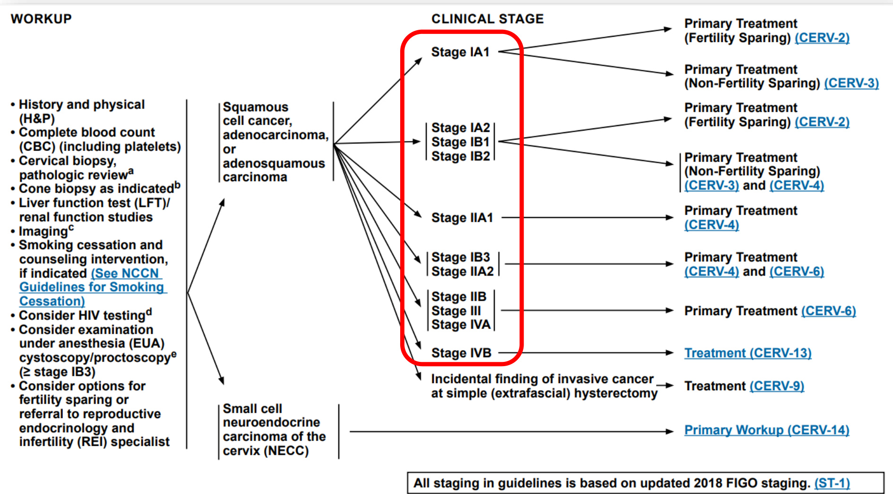

# 医学信息速递Medical Information Express  

# 《NCCN肿瘤学临床实践指南： 宫颈癌2024.V3》  

产品战略&医学与信息部2024-7  

  

# 01 文献简介  

文献基本信息NCCN分类标准  

# 02 文献重点内容  

更新概况  
分期  
分期治疗  
病理学原则  
影像学原则  
评估与手术分期原则  
放射治疗原则  
宫颈癌的全身治疗 （药物治疗）  

# NCCN Clinical Practice Guidelines in Oncology (NCCN Guidelines $\textcircled{8}$ )：Cervical Cancer Version 3.2024  

NCCN肿瘤学临床实践指南(NCCN指南 $\textcircled{8}$ )： 宫颈癌2024.V3  

  

发表机构美国国立综合癌症网络 （NCCN）  

发表时间2024年5月  

# NCCN分类标准  

<html><body><table><tr><td colspan="2">NCCN对证据和共识的分类</td></tr><tr><td>1类</td><td>基于高水平证据，NCCN一致认为此项治疗合理。</td></tr><tr><td>2A类</td><td>基于低水平证据，NCCN一致认为此项治疗合理。</td></tr><tr><td>2B类</td><td>基于低水平证据，NCCN基本认为此项治疗合理。</td></tr><tr><td>3类</td><td>基于任何水平证据，NCCN 对此项治疗是否合理存在重大分歧。</td></tr></table></body></html>  

<html><body><table><tr><td colspan="2">NCCN优先使用分类</td></tr><tr><td>首选干预方法</td><td>若适当、可负担，则基于疗效、安全性和证据更优的干预方法。</td></tr><tr><td>推荐的其他干预方法</td><td>其他干预方法可能疗效较低、毒性更多，或依据的数据不太成熟；或者具有相似疗效，但费用明显较高。</td></tr><tr><td>某些情况下有用</td><td>其他干预方法可能会用于选定的患者人群（根据推荐类型定义）。</td></tr></table></body></html>  

所有推荐均为 2 A 类，除非另有说明。  

  

# 01 文献简介  

文献基本信息NCCN分类标准  

# 02 文献重点内容  

更新概况  
分期  
分期治疗  
病理学原则  
影像学原则  
评估与手术分期原则  
放射治疗原则  
宫颈癌的全身治疗 （药物治疗）  

# 指南重点内容  

  

# NCCN宫颈癌指南2024.V3版较2024.V2版更新内容  

# National Comprehensive NCCN Guidelines Version 3.2024 Cancer Cervical Cancer Network?  

<html><body><table><tr><td>This discussion corresponds to the NCCN Guidelines for Cervical Table of Contents Cancer (V3.2024). Last updated on May 06, 2024</td><td>Locoregional Recurrence.</td></tr><tr><td>Overview..</td><td>MS-23 Therapy for MetastaticDisease.. ...MS-24 MS-2</td></tr><tr><td> Guidelines Update Methodology...</td><td>.MS-3</td></tr><tr><td>Literature Search Criteria...</td><td>ChemoradiationforLocallyAdvancedCervical Cancer MS-25 ...MS-3</td></tr><tr><td>Sensitive/lnclusive Language Usage .</td><td>SystemicTherapyforRecurrent orMetastaticCervical Cancer....MS-26 ..MS-3</td></tr><tr><td>Diagnosis and Workup.</td><td>First-Line Systemic Therapy Options for Recurrent or Metastatic Disease... MS-26 MS-4</td></tr><tr><td> Principles of Staging and Surgery..</td><td>Second-line/SubsequentSystemicTherapy OptionsforRecurrent orMetastatic ..MS-4</td></tr><tr><td> Clinical Staging ..</td><td>Cervical Cancer.... MS-29 ..MS-4</td></tr><tr><td>Surgical Staging.</td><td>Principles of Radiation Therapy... .MS-32 MS-5</td></tr><tr><td></td><td>Radiation Treatment Planning.. ..MS-32</td></tr><tr><td></td><td>Normal TissueConsiderations MS-35</td></tr><tr><td>Non-Fertility-SparingApproaches...... ...-.</td><td>Incidental Cervical Cancer. ..MS-36</td></tr><tr><td>Lym.p. NodeMaing and. Ddissection. ..MS-7</td><td>Sm.a. . NeuroendocrineC.arcinom.of.theC.ervix..S.3.</td></tr><tr><td>Principles ofPathology.. .MS-9</td><td></td></tr><tr><td>PathologicAssessment... ......MS-9</td><td>Primary Workup... .MS-37</td></tr><tr><td></td><td>Principlesof Pathology..... .....MS-38</td></tr><tr><td>HPV-IndependentAdenocarcinoma. MS-15</td><td>Syte.icT.......8</td></tr><tr><td>Primary Treatment. ..MS-16</td><td>Cervical Cancer andPregnancy.. MS-39</td></tr><tr><td>Important Phase Ill Clinical Trials Underpinning Treatment Recommendations...MS-16</td><td>Drug Reactions.. ...MS-39</td></tr><tr><td>Early-Stage Disease. .MS-17</td><td>Gynecologic Survivorship. MS-40</td></tr><tr><td>Adjuvant Treatment.. .MS-21</td><td>Best Supportive Care MS-40</td></tr><tr><td>Surveillance.. ..MS-22</td><td>Summary. MS-40</td></tr><tr><td>Therapy for Relapse .. .MS-23</td><td></td></tr><tr><td>Version3.2024 2024National Comprehensive Cancer Network (NCCN), Allrights reserved.NCCN Guidelines and this illustration may not be reproduced in any form without the express wrilten permission of NcCN.</td><td>References ... MS-42 MS-1</td></tr></table></body></html>  

# MS-1  

❖新增病理性原则板块：新增宫颈癌预后及预测性生物标记物目录及相关内容详细介绍了PD1/PD-L1、MSI/dMMR、TMB、NTPK融合基因、HER2、RET融合基因、HPV状态/p16等标记物及相关药物试验研究进行详细的叙述和讨论。这些相关的新型药物在前一版本己加入到治疗流程图。  

❖增加了宫颈神经内分泌小细胞癌的综述：该部分介绍了宫颈神经内分泌小细胞癌的来源、病理学特征以及系统治疗。  

# NCCN宫颈癌指南2024.V2版较2024.V1版更新内容  

  

CERV-6  

❖脚注t修订：同步含铂化疗联合EBRT，推荐使用顺铂作为单一药物（顺铂不耐受情况下，可改用卡铂）。仅对于FIGO 2014分期III-IVA期宫颈癌患者，可在放化疗中加用帕博利珠单抗。  

# NCCN宫颈癌指南2024.V2版较2024.V1版更新内容  

# SYSTEMICTHERAPYFORCERVICALCANCERa FOONOTESFORCERV-F1OF3  

aCila l sdt   
onureaa CROsyurraci aet FGOaduddiaont   
Prescribinginformation:https://www.accessdata.fda.gov/drugsatfdadocs/label/2024/125514s147lbl.pdf   
hkiar maintenancetherapydosingschedules   
e These agents may be considered when cisplatin and carboplatin are unavailable.   
flfnotsedprevoustheseagentscanbesedasecond-ineoruequnt thrapyaslnicalyappropriat   
gAnFDA-approvedbiosimilaris an appropriatesubstitute forbevacizumab.   
h NCCN Guidelines for the Management of Immunotherapy-Related Toxicities.   
Redseaaayv laboratory.   
J Additional references for second-line therapy are provided in the Discussion   
Fothat aa alternative treatment options.  

# CERV-F 1/3 宫颈癌的全身治疗  

❖放化疗；首选方案：在“顺铂”和“对顺铂不耐受的患者使用卡铂”的推荐中增加了以下脚注。  

❖脚注c新增：同步含铂化疗联合EBRT，推荐使用顺铂作为单一药物（顺铂不耐受情况下，可改用卡铂）。指南推荐对于FIGO2014分期III-IVA期宫颈癌患者，可在放化疗中加用帕博利珠单抗。依据为KEYNOTE-A18（NCT04221945）是一项多中心、 随机、双盲、安慰剂对照的III期临床试验，针对未曾接受过根治性手术、放疗或系统治疗的596名FIGO 2014分期III-IVA期宫颈癌患者，评价了使用顺铂作为单一药物化疗及EBRT联合帕博利珠单抗治疗的疗效，主要终点为无进展生存期（PFS）和总生存期（OS），次要终点包括完全缓解率、 客观缓解率和安全性。  

❖脚注d：本方案中包含的检查点抑制剂和/或单克隆抗体可作为维持治疗继续使用。关于维持治疗给药方案，请参阅原始研究方案。  

# NCCN宫颈癌指南2024.V2版较2024.V1版更新内容  

SYSTEMICTHERAPYFORCERVICALCANCERa   

<html><body><table><tr><td>NCCN</td><td>NCCNGuiline Version 32024</td><td></td></tr></table></body></html>  

<html><body><table><tr><td colspan="3">Small Cell NECC</td></tr><tr><td rowspan="2">Chemoradiationm</td><td colspan="2">RecurrentorMetastaticDisease</td></tr><tr><td>First-line Therapy Preferred Regimens</td><td>Second-lineorSubsequentTherapy</td></tr><tr><td>Preferred Regimens Other Recommended Regimens ·Carboplatin+etoposideif patient is cisplatinintolerant ·Cisplatin +etoposidel22</td><td>·Cisplatin/etoposide ·Carboplatin/etoposide OtherRecommended Regimens ·Cisplatin/etoposide+atezolizumab (or durvalumab)d,h,23,24</td><td>Other Recommended Regimens ·Bevacizumab9 ·Albumin-bound paclitaxel ·Docetaxel ·Topotecan ·Topotecan/paclitaxel ·Cisplatin/topotecan</td></tr></table></body></html>  

# CERV-F 2/3 宫颈癌的全身治疗  

❖新增脚注a：顺铂、卡铂、多西他赛和紫杉醇可能会引起药物反应。  

❖新增脚注d：本方案中包含的检查点抑制剂和/或单克隆抗体可作为维持治疗继续使用。关于维持治疗给药方案，请参阅原始研究方案。  

删除脚注：顺铂或卡铂可能会引起药物反应。  

# NCCN宫颈癌指南2024.V1版较2023.V1版更新内容  

CERV-ESystemicTherapyforCervical Cancer   
CERV-F 1'of 3 Squamous Cell Carcinoma, Adenocarcinoma, or Adenosquamous Carcinoma   
· Chemoradiation   
Newsectionadded: Other Recommended Regimens (if cisplatin and carboplatin are unavailable) Capecitabine/mitomycin Gemcitabine -Paclitaxel  

# ·RecurrentorMetastaticDisease  

# First-line Therapy: Section reformatted to denote PD-L1-positive tumors as a separate bullet  

Second-line or Subsequent Therapy Preferred Regimens: Cemiplimab added Other Recommended Regimens: lrinotecan changed from category 2B to category 2A Useful in Certain Circumstances Sectionrevised toseparateout regimensby mutationtype Fam-trastuzumab deruxtecan-nxki added for HER2-positive tumors (IHC $^ { 3 + }$ or $^ { 2 + }$ ） NTRK gene fusion-positive tumors: Single agent Larotrectinib and Entrectinib changed fromcategory 2Btocategory 2A  

  

# NCCN Guidelines Version 3.2024 Cervical Cancer  

# Updates in Version 1.2024 of the NCCN Guidelines for Cervical Cancer from Version 1.2023 include:  

CERV-ESystemicTherapyfor Cervical Cancer-continued CERV-F 1A of 3  

·Footnterevised:standtoxicityeciallywheningextendedfiedshoulbecarfullycnsidered.   
New footnote c added: These agents may be considered when cisplatin and carboplatin are unavailable.   
FototrevisenddrxpedeindnAaDaovd or a validated test performed in a CLIA-certified laboratory.   
Fotknlndiide original study protocol for maintenance therapy dosing schedules.   
Fotaaav laboratorythathaveprogressdfollwingpriotreatmentandwhhavesatisfatoryalnativetreatmentptins.  

# NCCN宫颈癌指南2024.V1版较2023.V1版更新内容（续）  

CERV-F 1/3 宫颈癌的全身治疗 鳞状细胞癌、腺癌或腺鳞癌  

  

# NCCN宫颈癌指南2024.V1版较2023.V1版更新内容（续）  

CERV-F 1/3 宫颈癌的全身治疗——宫颈小细胞神经内分泌癌  

# CERV-F 2 of 3  

Small Cell NECC   
↓ Recurrent or Metastatic Disease Second-line orSubsequent Therapy; OtherRecommended Regimens:lrinotecanchanged fromcategory 2Btocategory A Footnote f added: NCCN Guidelines for the Management of Immunotherapy-Related Toxicities.  

# SYSTEMIC THERAPYFOR CERVICALCANCERa  

<html><body><table><tr><td colspan="3">Small Cell NECC!</td></tr><tr><td rowspan="2">Chemoradiationm</td><td colspan="2">Recurrent or Metastatic Disease</td></tr><tr><td>First-line Therapyf Preferred Regimens</td><td>Second-line or Subsequent Therapy Other Recommended Regimens</td></tr><tr><td>Preferred Regimens Other Recommended Regimens · Carboplatin + etoposide if patient is cisplatin intolerant' ·Cisplatin + etoposidel222</td><td>· Cisplatin/etoposide · Carboplatin/etoposide Other Recommended Regimens ·Cisplatin/etoposide+atezolizumab</td><td>·Bevacizumab9 · Albumin-bound paclitaxel · Docetaxel · Topotecan ·Topotecan/paclitaxel</td></tr></table></body></html>  

# 指南重点内容  

  

# 宫颈癌分期 （FIGO 2018）  

# Ⅰ期 癌变局限于宫颈 （扩散至宫体应忽略）  

• ⅠA——仅在显微镜下可见浸润癌，最大浸润深度＜5mm  

ⅠA1  

  

ⅠA1：间质浸润深度 $< 3 ~ \mathsf { m m }$ ⅠA2：间质浸润深度 $> 3 \ \mathsf { m m } ,$ ≤5 mm  

# 宫颈癌分期 （FIGO 2018）  

# Ⅰ期 癌变局限于宫颈 （扩散至宫体应忽略）  

ⅠB——浸润癌浸润深度＞5 mm(超过ⅠA)  

ⅠB1  

  

  

间质浸润深度 $>$ 5mm, 病灶最大径线≤2cm  

病灶最大径线＞2 cm, ≤4 cm  

# 宫颈癌分期 （FIGO 2018）  

Ⅱ期 癌灶超越子宫， 但未达阴道下1/3 或未达骨盆壁  

ⅡA— 一 侵犯上2/3阴道，无宫旁浸润  

  

ⅡA1：病灶最大径线≤4cmⅡA2：病灶最大径线 $>$ 4cm  

# 宫颈癌分期 （FIGO 2018）  

Ⅱ期 癌灶超越子宫， 但未达阴道下1/3 或未达骨盆壁  

  

有宫旁浸润，未达盆壁  

# 宫颈癌分期 （FIGO 2018）  

Ⅲ期 癌灶累及阴道下1/3和(或)扩展到骨盆壁和(或)引起肾盂积水或肾无功能和(或)累及盆腔和(或)主动脉旁淋巴结  

ⅢB  

  

  

癌灶累及阴道下1/3，没有扩展到骨盆壁  

# 宫颈癌分期 （FIGO 2018）  

Ⅲ期 癌灶累及阴道下1/3和(或)扩展到骨盆壁和(或)引起肾盂积水或肾无功能和(或)累及盆腔和(或)主动脉旁淋巴结  

ⅢC— —不论肿瘤大小和扩散程度，累及盆腔和（或）主动脉旁淋巴结  

ⅢC  

  

ⅢC1：仅累及盆腔淋巴结 ⅢC2：主动脉旁淋巴结转移  

# 宫颈癌分期 （FIGO 2018）  

Ⅳ期 肿瘤侵犯膀胱黏膜或直肠黏膜(活检证实)和(或)超出真骨盆（泡状水肿不分为Ⅳ期）  

  

# 指南重点内容  

  

# 临床分期治疗选择  

  
指南中的所有分期标准均基于FIGO 2018版发布的分期  

# IA1期  

考虑再次锥切活检，更好的评估浸润深度，$+$ 切缘肿瘤阳性行盆腔淋巴结切除术（可行SLN）  

  
LVSI：淋巴管间隙浸润  

# IA2、IB1、IB2期  

  

切缘阴性的锥切活检 $^ +$ 盆腔淋巴结清扫术或SLN显影  

同IA1期 LVSI（+）  

根治性宫颈切除术 $^ +$ 盆腔淋巴结清扫术±主动脉淋巴结清扫术（可行SLN）  

筋膜外子宫切除术 $+$ 盆腔淋巴结清扫术（或SLN）  

改良根治性子宫切除术+盆腔淋巴结清扫术（可行SLN）  

盆腔EBRT+近距离放射治疗 （不可手术者）  

根治性子宫切除术+盆腔淋巴结清扫术（考虑SLN） ±主动脉旁淋巴结清扫术（考虑SLN）  

盆腔EBRT+近距离放疗政府同步含铂化疗（不可手术者）  

# IB3、IIA1、IIA2  

  

# IIB期、III期、 IVA期  

  

指南推荐对于FIGO 2014分期III-IVA期宫颈癌患者，可在放化疗中加用帕博利珠单抗。依据为KEYNOTE-A18（NCT04221945）是一项多中心、随机、双盲、安慰剂对照的III期临床试验，针对未曾接受过根治性手术、放疗或系统治疗的596名FIGO 2014分期III-IVA期宫颈癌患者，评价了使用顺铂作为单一药物化疗及EBRT联合帕博利珠单抗治疗的疗效，主要终点为无进展生存期（PFS）和总生存期（OS），次要终点包括完全缓解率、客观缓解率和安全性。  

局部消融治疗±个体化EBRT 个体化EBRT±同步含铂化疗  

  

# 传递最有价值的医学信息  

# 手术分期  

# 手术结果  

# 辅助治疗  

  

# 影像学分期  

# 辅助治疗  

  
影像结果  

# 指南重点内容  

  

# 病理学原则— 鳞状细胞癌、腺癌或腺鳞癌  

<html><body><table><tr><td>手术</td><td colspan="2">根治性子宫切除术</td></tr><tr><td rowspan="7">病理解析</td><td rowspan="10"></td><td>子宫切除术类型 (适时)</td></tr><tr><td>肿瘤部位</td></tr><tr><td>肿瘤大小，包括最大径和其他两个径向</td></tr><tr><td>组织学类型</td></tr><tr><td>组织学分级</td></tr><tr><td>间质浸润 (浸润深度[单位：mm]/宫颈壁厚度[单位：mm])</td></tr><tr><td>肿瘤扩散宽度(单位：mm) 手术切缘状态</td></tr><tr><td>如果切缘阴性，包括最近的切缘和距最近切缘的距离 (单位：mm) √如果切缘阳性，包括阳性切缘的位置</td></tr><tr><td colspan="2">LVSI (不影响 FIGO 2018分期) 其他组织／器官受累(宫旁、阴道断端、输卵管、卵巢、腹膜、大网膜、其他)</td></tr></table></body></html>  

# 病理学原则 鳞状细胞癌、腺癌或腺鳞癌 （续）  

<html><body><table><tr><td rowspan="7"></td><td rowspan="4">淋巴结 (已切除标本)</td><td>应对前哨淋巴结（SLN）进行超分期以检测是否有微小转移</td></tr><tr><td>非-SLNs不需要超分期，可按照常规程序进行处理</td></tr><tr><td>包括肿瘤细胞分离、微转移和宏转移的淋巴结数目</td></tr><tr><td>分离的肿瘤细胞分期记为pNO(i+)</td></tr><tr><td>对于复发、进展或转移性疾病患者</td><td>推荐行 PD-L1检测</td></tr><tr><td>病理解析 对于复发、进展或转移性宫颈癌患者</td><td>建议进行错配修复（MMR）/微卫星不稳定性（MSI）检测；对于宫颈肉瘤患者，建议进 行 NTRK基因融合检测。</td></tr><tr><td>建议对所有宫颈腺癌患者</td><td>进行人乳头瘤病毒（HPV）状态检测。首选HPV原位杂交（ISH）或分子测试，但如果 HPV检测不可用，可进行p16免疫标记。</td></tr><tr><td>对于晚期、转移性或复发性宫颈癌</td><td>建议进行HER2免疫组织化学（IHC）检测（对于IHC结果不明确的，建议进行HER2变光 原位杂交[FISH]作为补充）。</td></tr><tr><td>对于局部晚期或转移性宫颈癌患者 考虑采用FDA批</td><td>建议进行RET基因融合测试</td></tr><tr><td colspan="2">分子谱分析</td></tr></table></body></html>  

# 一般原则  

# 鳞状细胞癌  

# 宫颈内膜腺癌  

# 腺鳞癌  

# 宫颈神经内分泌癌  

宫颈鳞状细胞癌 （SCC） 是一种鳞状上皮肿瘤， 具有间质浸润和/或外生性浸润。  
约占全球宫颈癌的80% -90%。大多数宫颈鳞状细胞癌（ $\Xi ^ { ( 9 ) } { } ^ { ( 9 ) }$ 与人乳头瘤病毒 （HPV） 相关，其中高危型HPV 16和18是最常见的类型。  
非HPV相关的宫颈鳞状细胞癌是近来才发现的疾病类型，据报道5%-7%的宫颈鳞状细胞癌HPV呈阴性。通常在生命后期 （第七个十年）才被发现，且处于晚期阶段。  

• 宫颈内膜腺癌是一种形成腺体的肿瘤，通常起源于移行带，表现出间质浸润和/或膨胀型浸润。  

• 推荐确定HPV状态，因为与HPV相关的宫颈内膜腺癌相比HPV无关的腺癌具有更好的临床预后。  

• 宫颈腺癌可能与HPV相关（最常见的高危HPV类型18、16和45），也可能与HPV无关。  

• 宫颈内膜腺癌极其可能表现为溃疡、外生性肿块，或当存在内生性生长时呈桶状宫颈。  

具有鳞状和腺状分化的上皮肿瘤 。  

约占所有宫颈癌的5%-6%临床预后与宫颈腺癌相似• 尽管罕见，仅占不到宫颈癌的$5 \%$ ，但在女性生殖道中，宫颈是高级别神经内分泌癌（如小细胞和大细胞神经内分泌癌）最常见的发生部位。  

• 在临床上常具有高侵袭性、转移快及预后不良的特点。  

• 多与 HPV-相关，其中16型和18型最为常见（18 型比16更常见）。  

• 该肿瘤形态上与肺部的神经内分泌癌相似  

# 指南重点内容  

  

# 初始检查  

# I期  

不保留生育功能  

考虑行盆腔MRI含造影剂扫描以评估局部病灶范围 （首推推荐用于FIGO IB1-IB3期患者）。  

• FIGO IB1-IB3期患者，行颈/胸/腹/盆腔/腹股沟FDG-PET/CT（首选）或胸/腹/盆腔CT 或 FDG-PET/MRI。  

全子宫切除术后意外发现的宫颈癌，考虑行颈/胸/腹/盆腔/腹股沟PET/CT或胸/腹/盆腔CT以评估转移情况，行盆腔MRI以评估盆腔残留病  

其他影像学检查应根据症状和临床对疾病转移的关注而进行。  

保留生育能力  

• 进行骨盆MRI（首选）以评估局部病变程度及肿瘤与宫颈内口的距离；若有MRI禁忌，则行经阴道盆腔超声检查。  

处于FIGO IB1-IB3期的患者，进行颈/胸//腹/盆腔/腹股沟FDG-PET/CT（首选）或胸/腹/盆腔CT。  

考虑行胸部CT（有无造影剂均可）  

其他影像学检查应根据症状和临床对疾病转移的关注而进行。  

# II-IVA期  

行含造影剂的盆腔 MRI 以评估局部病灶范围 （首选）。  

• 行颈/胸/腹/盆腔/腹股沟FDG-PET/CT（首选）或胸/腹/盆腔CT以评估疾病转移情况。其他影像学检查应根据据症状和临床对疾病转移的关注而进行。全子宫切除术后意外发现的宫颈癌，考虑行颈/胸/腹/盆腔/腹股沟PET/CT或胸/腹/盆腔CT以评估转移情况，行盆腔MRI以评估盆腔残留病灶。如果首次治疗后的FDG-PET/CT结果不明确，考虑3个月后重复检查。  

# 随访/监测  

# I期  

不保留生育能力  

• 影像学检查应基于症状和临床对疾病复发/转移的关注而进行。  
• 对于FIGO分期为IB3或因高危因素而需要术后辅助放疗或放化疗的患者，可在治疗结束后3\~6个月内进行颈/胸/腹/盆腔/腹股沟的FDG-PET/CT检查。  

保留生育能力  

• 考虑在术后6个月进行盆腔增强MRI检查，然后在接下来的2-3年中每年进行一次。  
• 其他影像学检查应根据症状和临床对复发/转移性疾病的关注而进行。  

# II-IV期  

• 在治疗结束后 $3 \sim 6$ 个月内，行颈/胸/腹/盆腔/腹股沟的FDG-PET/CT（首选）或胸/腹/盆腔增强CT检查。  
• 在完成治疗后的 $3 \sim 6$ 个月后，考虑行盆腔增强 MRI检查。  
• 其他影像学检查应根据症状和临床对复发/转移性疾病的关注而进行。  

# IVB期或复发  

• 酌情行影像学检查（CT、MRI或FDG-PET/CT）以评估疗效或决定下一步治疗。• 如果首次治疗后的FDG-PET/CT结果不确定，那么考虑在3个月后再次进行检查  

# 怀疑复发或转移  

颈/胸/腹/盆腔/腹股沟 FDG-PET/CT。  
考虑行盆腔MRI。  

# 影像学原则 ——小细胞NECC  

# 附加影像学  

颈/胸/腹/盆腔/腹股沟PET/CT $^ +$ 脑MRI（首选） 胸/腹/盆腔 CT $^ +$ 脑MRI  

# 治疗效果评估  

如果初级治疗是放化疗，行颈/胸/腹/盆腔/腹股沟PET/CT±脑MRI（首选）或胸/腹/盆腔CT±脑MRI  
如果采用新辅助化疗，考虑在放化疗和近距离放疗前再次评估以排除转移性疾病  
颈/胸/腹/盆腔/腹股沟PET/CT $^ +$ 脑MRI（首选）  
胸/腹/盆腔 CT $^ +$ 脑MRI  

# 监测  

# 指南重点内容  

  

# 评估与手术分期原则  

# 宫颈癌前哨淋巴结显影  

在全球广泛用于妇科肿瘤医治实践中，SLN显影作为特定I期宫颈癌手术治疗的一部分。尽管这项技术已被用于最大直径达4cm的肿瘤，但在小于2cm的肿瘤中，检测率和显影结果最佳。此技术操作简单，直接在宫颈注射染料或放射性胶体锝-99（99Tc），通常在2或4个点注射，如图1（下方）所示。在手术时，通过直接观察有色染料来识别SLN；如果使用了吲哚菁绿（ICG）染料，则采用荧光摄像显影；如果使用了99Tc，则使用Y探针探测。宫颈注射后的SLN通常位于外髂血管内侧，髂血管腹侧，或闭孔空间的上部（图2）。SLN通常经过病理医师的超分期处理，这有助于检测更多的微转移，这些微转移可能会改变术后管理。  

  
图1.前哨淋巴结宫颈注射部位的选择  

  
图2.宫颈注射显影剂后，前哨淋巴结（蓝色，箭头所指）通常在髂外血管内侧，髂内血管的自公测或闭孔窝的表面显影  

# 采用SLN显影时，评估与手术分期原则  

• SLN显影成功显影的关键在于遵守前哨淋巴结的检测流程，当一侧淋巴结显影失败时，切除该侧的淋巴结，以及切除任何可疑或增大的淋巴结，无论其是否显影。  

H&E：苏木精-伊红染色法 LND：淋巴结切除术 SLN：前哨淋巴结  

  

宫颈癌切缘切除术作为初始治疗  

<html><body><table><tr><td rowspan="2"></td><td colspan="3">子宫切除术类型比较（不保留子宫）</td><td colspan="2">子宫切除术类型比较（保留子宫）</td></tr><tr><td>筋膜外子宫切除术 (A型)</td><td>筋膜外子宫切除术 (A型)</td><td>根治性子宫切除术 （C1型）</td><td>单纯宫颈切除</td><td>根治性颈切除</td></tr><tr><td>适应证</td><td>IA1期</td><td>IA1期伴LVSI和IA2</td><td>IB1-IIB期 部分IB3-IIIA1期</td><td>原位癌和IA1期</td><td>IA2-IB1期 部分IB2期</td></tr><tr><td>目的</td><td>微浸润根治</td><td>小病灶根治</td><td>大病灶根治</td><td>微浸润根治 保留生育功能</td><td>部分 IA2-IB2 期根治 保留生育功能</td></tr><tr><td>子宫</td><td>切除</td><td>切除</td><td>切除</td><td>保留</td><td>保留</td></tr><tr><td>卵巢</td><td>选择性切除</td><td>选择性切除</td><td>选择性切除</td><td>保留</td><td>保留</td></tr><tr><td>宫颈</td><td>完全切除</td><td>完全切除</td><td>选择性切除</td><td>大部分切除（距离宫颈 头侧方约5mm，通常留 作环扎)</td><td>大部分切除（距离宫颈 头侧方约5mm，通常留 作环扎）</td></tr><tr><td>阴道切缘</td><td>极小切缘</td><td>1-2cm切缘</td><td>阴道上1/4-1/3</td><td>极小切缘</td><td>1-2cm切缘</td></tr></table></body></html>  

宫颈癌切缘切除术作为初始治疗 （续）  
传递最有价值的医学信息  

<html><body><table><tr><td rowspan="2"></td><td colspan="3">子宫切除术类型比较（不保留子宫）</td><td colspan="2">子宫切除术类型比较（保留子宫）</td></tr><tr><td>筋膜外子宫切除术 (A型)</td><td>筋膜外子宫切除术 (A型)</td><td>根治性子宫切除术 （C1型）</td><td>单纯宫颈切除</td><td>根治性颈切除</td></tr><tr><td>游离输尿管</td><td>未涉及</td><td>将输卵管从宫颈分离</td><td>将输卵管从宫颈和宫旁侧方 分离</td><td>未涉及</td><td>将输卵管从宫颈分离</td></tr><tr><td>切除宫颈旁/宫 旁组织</td><td>不切除</td><td>在输卵管床水平切除（水 平切除1-2cm)</td><td>在骼内血管内侧方分离，深 切缘是子宫静脉</td><td>在宫颈边缘处切除</td><td>在输卵管床水平切除 (水平切除1-2cm)</td></tr><tr><td>直肠-子宫（宫 骶韧带)</td><td>宫颈边缘处分离</td><td>宫颈背侧1-2cm（保留腹 下神经丛)</td><td>C1型保留神经，在宫颈背 侧至少2cm处分离</td><td>宫颈边缘处分离</td><td>宫颈背侧1-2cm（保留 腹下神经丛)</td></tr><tr><td>膀胱</td><td>分离至宫颈外口</td><td>分离至阴道上部</td><td>分离至阴道中部</td><td>分离至腹膜反折</td><td>分离至阴道上部</td></tr><tr><td>直肠</td><td>未涉及</td><td>分离至宫颈下方</td><td>分离至阴道中部下</td><td>分离至腹膜反折</td><td>分离至宫颈下方</td></tr><tr><td>手术途径</td><td>经阴道或开腹或微创</td><td>开腹</td><td>开腹</td><td>经阴道或开腹或微创</td><td>经阴道或开腹或微创 (微创手术是2B类推荐)</td></tr></table></body></html>  

无远端转移的局部复发性宫颈癌切除  
传递最有价值的医学信息  

<html><body><table><tr><td rowspan="2"></td><td colspan="3">肛提肌下廓清术类型比较</td><td colspan="2">肛提肌上廓清术类型比较</td></tr><tr><td>前盆腔</td><td>后盆腔</td><td>全盆腔</td><td>后盆腔</td><td>全盆腔</td></tr><tr><td>适应症</td><td colspan="5">盆腔中心复发，适用于经筛选的FIGOIVA期患者的初级治疗（当初放疗不可行时)</td></tr><tr><td>目的</td><td colspan="5">根治</td></tr><tr><td>子宫、输卵管、卵巢</td><td colspan="5">如果仍然存在则切除</td></tr><tr><td>阴道</td><td></td><td></td><td>切除</td><td></td><td></td></tr><tr><td>膀胱和尿道</td><td>切除</td><td>保留</td><td>切除</td><td>保留</td><td>切除</td></tr><tr><td>直肠</td><td>保留</td><td>切除</td><td>切除</td><td>切除</td><td>切除</td></tr><tr><td>肛门括约肌</td><td>保留</td><td>切除</td><td>切除</td><td>保留，如果可以，则与结肠吻合</td><td></td></tr><tr><td>泌尿系统重建方案</td><td>回肠代膀胱术或可控 性 流道术</td><td>N/A</td><td>双管湿性结肠造口术， 回肠代膀胱术或可控性 尿流改道术</td><td>N/A</td><td>双管湿性结肠造口术, 回肠代膀胱术或可控性 尿流改道术</td></tr><tr><td>胃肠道系统重建方案</td><td>N/A</td><td>末端结肠造口术</td><td>双管湿性结肠造口术或 末端 结肠造口术</td><td>末端结肠造口术或吻合 术联合临时回肠造口术</td><td>双管湿性结肠造口术， 末端结肠造口术或吻合 术联合临时回肠造口术</td></tr><tr><td>阴道重建方案</td><td colspan="5">肌皮瓣（腹直肌、股薄肌等），或带大网膜瓣中厚皮片移植</td></tr></table></body></html>  

# 指南重点内容  

  

# 放射治疗原则  

# 一般原则  

• 基于CT的治疗计划和适形技术是外照射放疗（EBRT）的标准治疗方法。MRI是确定晚期肿瘤患者软组织和宫旁组织受累的最佳成像方式。对于未进行手术分期的患者，FDG-PET成像有助于确定淋巴结覆盖范围，并可能在术后用于确认异常淋巴结的切除。  
• 放疗针对已知或疑似肿瘤浸润的部位。EBRT针对骨盆区域，可包括或不包括主动脉旁区域。  
• 为减少骨盆区域（无论是否包括主动脉旁区域）根治性治疗中的毒性，首选采用IMRT技术。在治疗过程中常规使用图像引导放射治疗（IGRT），包括正交成像和/或常规体积成像（如锥形束CT），以确保靶区得到适当覆盖，同时保护正常组织。  
• 对于所有接受原发性宫颈癌根治性放疗的患者，腔内放疗和/或间质放疗是根治性放疗的关键组成部分。  
• 对于大多数接受宫颈癌EBRT的患者，在放疗期间给予含铂类的同时化疗。  

在8周内完成治疗可获得最佳结果。  

# 放射治疗原则  

# 般治疗信息  

靶区  

在适形放疗中，特别是强度调控放疗（IMRT）中，定义了关于肿瘤靶区（GTV）、临床靶区（CTV）、计划靶区（PTV）、风险器官（OARs）、内部器官运动和剂量体积直方图（DVH）的概念。  

EBRT的照射范围应覆盖肿瘤原发灶（如果存在）、宫旁组织、子宫骶骨韧带、从肿瘤原发灶延伸至阴道的足够边界（至少3厘米）、骶前淋巴结和其他,有风险的淋巴结区域。  

对于手术或放射影像学显示淋巴结阴性的患者，放疗范围应包括整个外骼、内骼、闭孔和骶前淋巴结区域。  

对于被认为淋巴结受,累风险较高的患者（例如，体积较大的肿瘤；疑似或确诊的局限于下真骨盆的淋巴结），应扩大放疗范围以覆盖骼总淋巴结。  

对于已证实有骼总和/或,主动脉旁淋巴结受累的患者，建议进行扩展野的盆腔和主动脉旁放疗，直至肾血管水平（或根据受累淋巴结的分布情况，甚至更高）。  
对于阴道下1/3,受累的患者，还应覆盖双侧腹股沟区。  

# 剂量处方方案-外照射  

为覆盖显微镜下淋巴结病变，需要大约40-45Gy的EBRT剂量（在每天1.8-2.0Gy的常规分割中，如果使用IMRT则可能包括SIB），并且可以考虑对有限,体积的未切除的粗大淋巴结进行高度适形的额外10-20Gy的加强照射，同时考虑近距离放射治疗的剂量。对于大多数接受宫颈癌EBRT治疗的患者，在,EBRT治疗期间会同时给予含铂的化疗。  

# 放射治疗原则  

# 一般治疗信息-续  

对于完整子宫的根治性RT  

• 对于宫颈完好的患者（即未接受手术的患者），通常给予其原发肿瘤及有转移风险的区域淋巴结根治性外照射放疗（EBRT），剂量大约45Gy（40,50Gy）。EBRT的靶区范围取决于通过手术或影像学确定的淋巴结状态（如前文所述）。  
• 然后，使用近距离疗法对原发宫颈肿瘤进行推量照射，使用图像，引导（首选）推量30\~40Gy或至A点（在低剂量率[LDR]等效剂量中），使宫颈小肿瘤的A点总剂量达到80Gy，或者大肿瘤的A点总剂量285Gy（根据,指南中的建议）。  
• 对于非常小的肿瘤（医学上不可切除的IA1或IA2期）等效剂量（EQD2）D90的剂量可考虑为75-80Gy。  
• 对不可切除的淋巴结进行评,估，可以通过高度适形的（或者减少照射区域的）EBRT给予额外推量10-15Gy。  

# 子宫切除术后的辅助放疗  

在原发性子宫切除术后，存在一个或多个病理风险因素时需行辅助放疗。放射野至少需要包括如下范围：阴道断端上3-4cm、宫旁组织、以及紧邻的淋,巴结引流区（如内、外淋巴结区、闭孔和骶前）。对于已确定的淋巴结转移，放射野的上界还需要相应延伸（如前所述）。通常建议标准分割的IMRT,剂量为45-50Gy。对于未切除的大转移淋巴结，采用高度适形的外照射技术（并且缩野）推量10-20Gy。对于阴道切缘阳性或接近阳性的情况，可以考虑使用阴道断端近距离放疗。  

# 放射治疗原则  

# 一般治疗信息-续  

治疗信息-近距离放疗  

• 近距离放疗是所有不适合手术的初治宫颈癌根治性放疗的关键部分。对于更加晚期的患者或者肿瘤退缩不理想的患,者，组织间插植可以提高靶区剂量并且最大限度减小正常组织受量。近距离放疗前或放疗中行MRI检查有助于勾画残留肿瘤形状。如果联合EBRT，近距离放疗通常安排在EBRT后，因为原发肿瘤退缩理想可以更好地放置近距离放疗施源器。对于经过仔细筛选的非常早期的患者（例如IA2期），单纯近距离放,疗（不联合EBRT）也是一种选择。对于少数由于解剖学或肿瘤形状不能实施腔内近距离放疗的患者，最好采用组织间插植的方式进行治疗；但是，组织间插植近距离放疗只能在有条件,的医疗机构由有经验的专家来施行，否则，应尽早转诊、及时接受这种专业治疗，这至关重要。对于部分经过筛选的子宫切除术后患者（尤其是阴道黏膜切缘阳性或切缘靠近病灶者），EBRT后可使用阴道柱状施源器进行推量近距离放射治疗。通,常在阴道粘膜表面或阴道粘膜表面下5mm位置施用处方。典型的分割方案是5.5Gyx2次（阴道粘膜下5mm）或者 $6 \mathsf { G y } \times 3$ 次（阴道表面）。SBRT不适合作为近距离放疗的常规替代治疗。  
• 在为完整的宫颈癌放置近距离放疗施药器时，请考虑使用术中成像技术。  

# 放射治疗原则— 宫颈癌的正常组织剂量限制指南  

<html><body><table><tr><td rowspan="2">风险器官</td><td colspan="2">剂量推荐</td></tr><tr><td>软约束</td><td>硬约束</td></tr><tr><td rowspan="3">肠道</td><td>高达30%的组织接收到了40Gy的剂量</td><td>不超过70%的组织接收到了40Gy的剂量</td></tr><tr><td>V45≤ 200 cc</td><td>V45< 250 cc</td></tr><tr><td>针对淋巴结的加强剂量：V55<5cc</td><td>针对淋巴结的加强剂量：V55<15cc</td></tr><tr><td>膀胱</td><td>V45< 50%</td><td>Dmax < 115%</td></tr><tr><td>直肠</td><td>V45< 50% V30 < 60%</td><td>Dmax < 115%</td></tr><tr><td>股骨头</td><td>V30< 15%</td><td>Dmax < 115%</td></tr><tr><td rowspan="2">骨髓 (可选的)</td><td>V10 < 80%</td><td>V10 < 90%</td></tr><tr><td>V20 < 66%</td><td>V20 < 75%</td></tr><tr><td>脊髓</td><td>Dmax 45 Gy</td><td></td></tr><tr><td>肾脏</td><td>Dmean < 10 Gy</td><td>Dmean <15 Gy</td></tr><tr><td>十二指肠</td><td>V55<5 cc</td><td>V55<15 cc</td></tr></table></body></html>  

# 放射治疗原则 宫颈癌的正常组织剂量限制指南  

<html><body><table><tr><td colspan="2">风险器官</td><td>剂量推荐</td></tr><tr><td>宫颈术后</td><td>软约束</td><td>硬约束</td></tr><tr><td>肠道</td><td>高达30%的组织收到了40Gy的剂量</td><td>不超过70%的组织收到了40Gy的剂量</td></tr><tr><td>膀胱</td><td>高达35%的组织收到了45Gy的剂量</td><td>不超过70%的组织收到了45Gy的剂量</td></tr><tr><td>直肠</td><td>高达80%的组织收到了40Gy的剂量</td><td>不是100%都收到了40Gy的剂量</td></tr><tr><td>股骨头</td><td>高达15%的组织收到了30Gy的剂量</td><td>最多有20%的组织收到的剂量达到或超过30Gy</td></tr><tr><td>骨髓 (可选的)</td><td>高达90%的组织收到了10Gy的剂量</td><td>90%的组织)收到的剂量不超过25Gy</td></tr><tr><td>骨髓 (可选的)</td><td>高达37%的组织收到了40Gy的剂量</td><td>不超过60%的组织收到了40Gy的剂量</td></tr><tr><td>脊髓</td><td>Dmax 45 Gy</td><td></td></tr><tr><td>肾脏</td><td>Dmean < 10 Gy</td><td>Dmean < 15 Gy</td></tr><tr><td>十二指肠</td><td>V55<5 cc</td><td>V55<15 cc</td></tr></table></body></html>  

临床医生必须在正常组织毒性的风险与肿瘤控制之间取得平衡，并会提供建议的剂量限制。研究表明，20%至30%的病例可能无法满足所有限制条件。  

<html><body><table><tr><td>风险器官</td><td>剂量推荐</td></tr><tr><td>外阴</td><td>仅软约束 硬约束</td></tr><tr><td>肛直肠</td><td>Dmax < 65 Gy</td></tr><tr><td>股骨头</td><td>Dmax < 55 Gy</td></tr><tr><td>膀胱</td><td>Dmax < 65 Gy</td></tr></table></body></html>  

# 放射治疗原则— 宫颈癌的正常组织剂量限制指南  

<html><body><table><tr><td colspan="4">近距离放疗</td></tr><tr><td>器官风险</td><td>理想剂量限制(cGy)(EQD2_3)</td><td>最大剂量限制(cGy)(EQD2_3)</td><td>ICRU点(cGy)(EQD2_3)</td></tr><tr><td>直肠</td><td><6500 D2cc</td><td><7500 D2cc</td><td><6500点剂量</td></tr><tr><td>膀胱</td><td>7500-8000</td><td>D2cc<9000</td><td>D2cc<7500 点剂量</td></tr><tr><td>阴道(阴道-直肠点)</td><td><6500点剂量</td><td><7500点剂量</td><td></td></tr><tr><td>乙状结肠</td><td>< 7000 D2cc</td><td>< 7500 D2cc</td><td></td></tr><tr><td>肠道</td><td><7000 D2cc</td><td><7500 D2cc</td><td></td></tr></table></body></html>  

# 术后辅助治疗：Sedlis标准  

对于淋巴结、 切缘、 宫旁组织均阴性的病例，在根治性子宫切除术后进行外照射盆腔放疗的Sedlis标准。  

<html><body><table><tr><td>LVSI</td><td>间质浸润</td><td>肿瘤尺寸 （临床查体）</td></tr><tr><td>+</td><td>深1/3</td><td>任何</td></tr><tr><td>+</td><td>中1/3</td><td>≥2</td></tr><tr><td>+</td><td>浅1/3</td><td>≥5</td></tr><tr><td></td><td>中或深1/3</td><td>≥4</td></tr></table></body></html>

LVSI：淋巴管间隙浸润  

• Sedlis 标准主要是针对鳞状细胞癌制定的。鳞状细胞癌和腺瘤病变的组织学特异性列线图可能提供了更现代的工具来模拟复发的风险，并基于这些风险给出辅助治疗建议。• 浸润深度是鳞状细胞癌复发的重要风险因素。肿瘤大小是宫颈腺癌的重要风险因素，而且在有LVSI的情况下，这种风险变得更加明显。  

# 指南重点内容  

  

# 宫颈癌的全身治疗 鳞状细胞癌、腺癌或鳞腺癌  

# 首选方案  

顺铂  

#  

吉西他滨紫杉醇  

<html><body><table><tr><td colspan="5"></td></tr><tr><td colspan="5">复发或转移性疾病</td></tr><tr><td>放化疗</td><td>一线治疗 首选方案 首选方案</td><td colspan="3">二线治疗</td></tr><tr><td>(如果不能耐受顺铂) 方案（如果顺铂和卡铂不可用） 他滨/丝裂霉素 他滨 醇</td><td>PD-L1-阳性肿瘤 ■帕博利珠单抗+顺铂/紫杉醇+贝伐 珠单抗 (1类) ■帕博利珠单抗+卡铂/紫杉醇+贝伐 珠单抗 (1类) 顺铂/紫杉醇/贝伐珠单抗 卡铂/紫杉醇/贝伐珠单抗 其他推荐方案 顺铂/紫杉醇 (1类) 卡铂/紫杉醇 (对于之前接受过顺铂 治疗的患者为1类推荐) 托泊替康/紫杉醇/贝伐珠单抗 (1类) 托泊替康/紫杉醇 顺铂/托泊替康 顺铂 卡铂</td><td colspan="3">帕博利珠单抗适用于TMB-H肿瘤或PD-L1-阳性或MSI-H/dMMR肿瘤 维替索妥单抗 西米普利单抗 其他推荐方案 贝伐珠单抗 氟尿嘧啶 托泊替康 紫杉醇 吉西他滨 长春瑞滨 白蛋白结合型紫杉醇 · 培美曲塞二钠 伊立替康 多西他赛 某些情况下有用 PD-L1-阳性肿瘤 RET 基因融合-阳性肿瘤 ■纳武利尤单抗 ■塞普替尼 HER2-阳性肿瘤 ·NTRK基因融合-阳性肿瘤 德曲妥珠单抗 ■拉罗替尼、恩曲替你</td></tr></table></body></html>  

# 宫颈癌的全身治疗——宫颈小细胞NECC  

<html><body><table><tr><td rowspan="2">放化疗</td><td colspan="2">复发或转移性疾病</td></tr><tr><td>一线治疗</td><td>二线或后续治疗</td></tr><tr><td>首选方案 顺铂+依托泊苷</td><td>首选方案 ·顺铂/依托泊苷 ·卡铂/依托泊苷</td><td>其他推荐方案 · 贝伐珠单抗</td></tr><tr><td>其他推荐方案</td><td>·其他推荐方案 顺铂/依托泊苷+阿替利珠单抗（或度伐</td><td>白蛋白结合型紫杉醇 多西他赛 · 托泊替康 · 托泊替康/紫杉醇</td></tr><tr><td>卡铂+依托泊苷 (如果不耐受顺铂)</td><td>利尤单抗) ·卡铂/依托泊苷+阿替利珠单抗（或度伐 利尤单抗) 托泊替康/紫杉醇/贝伐珠单抗 ）顺铂/紫杉醇 卡铂/紫杉醇(对于之前接受过顺铂治疗 的患者)</td><td>顺铂/托泊替康 ·顺铂 卡铂 紫杉醇 伊立替康</td></tr></table></body></html>  

# 妇科肿瘤患者的生存原则  

# 躯体影响  

妇科肿瘤的治疗通常包括手术、化疗、激素治疗、放疗和/或免疫治疗。这些治疗会引起急性、短期和长期毒性。• 外科手术范围大、风险高，例如：形成粘连（可引起疼痛和小肠梗阻）、尿路或胃肠道并发症（如尿失禁、腹泻）、盆底功能障碍（表现为排尿、排便和/或性功能问题）以及淋巴水肿。• 化疗药物多种多样，常用的方案可能增加神经毒性、心脏毒性、继发血液系统恶性肿瘤以及认知功能障碍等疾病风险。• 长期雌激素剥夺可能会引起潮热、阴道干燥和骨质流失等症状。• 放疗可能会引起长期并发症（例如纤维化、外阴萎缩），还可能导致诱发临近放射野的皮下组织和/或下层器官的继发肿瘤。• 既往盆腔放疗可能导致骨质流失并增加骨盆骨折的风险。考虑进行骨密度检查和预防性使用双膦酸盐，尤其对于骨质疏松患者。• 免疫治疗是新兴的治疗方法，迄今为止，免疫疗法的长期作用尚不可知。  

# 社会心理影响  

• 患癌后患者的社会心理影响表现为：心理层面的（例如，抑郁、焦虑、对复发及身体形象改变的恐惧）；经济层面（例如，重返工作、保险问题）和/或人际层面（例如，人际交往、性生活、亲密感）。  

# 妇科肿瘤患者的生存原则  

# 临床方法  

肿瘤的生存者应常规接受全科医疗护理，重点管理慢性疾病、监测心血管疾病危险因素、建议接种疫苗并鼓励养成健康的生活方式。  

科肿瘤的远期和长期影响，临床医生应全面记录患者的病史，进行全面体检，并提供任何必要的影像学和/或实验室检查。  

• 对于所有患者（无论患者是否有性行为），均应询问关于泌尿生殖系统症状（包括外阴阴道干燥的问题）。建议转诊至合适专业医护人士（例如，物理治疗、盆底治 疗、性疗法、心理治疗）。  

• 由于大多数妇科肿瘤的治疗方法都会导致性功能障碍、早期停经和不孕，因此需要特别关注由此产生的医疗和社会心理影响。  

对于治疗相关出现更年期症状的患者，应考虑激素替代治疗。  

• 参与肿瘤生存者治疗的所有临床医生（包括初级保健临床医生）的沟通和合作是至关重要的。建议向肿瘤生存者提供其治疗的总结，并提供随访建议。  

# 谢谢关注！  

thanks for your attention.  