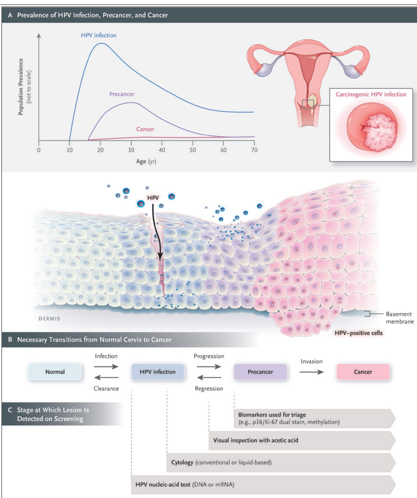

  

In May 2018, the World Health Organization (WHO) called for a global initiative to eliminate cervical cancer as a public health problem. To achieve this goal, global scale-up of effective vaccination against the human papillomavirus (HPV) as well as screening for and treatment of cervical cancer are required. Cervical cancer screening was evaluated in 2005 by the International Agency for Research on Cancer (IARC) Handbooks program,1 and a reevaluation was deemed to be timely given the major advances in the field since then. The new handbook provides updated evaluations of the effectiveness of screening methods, which were used as a basis for the update of the WHO Guideline for Screening and Treatment of Cervical Pre-cancer Lesions for Cervical Cancer Prevention.2 We convened an IARC Working Group of 27 scientists from 20 countries to assess the evidence on the current approaches to and technologies used in cervical cancer screening with the use of the newly updated Handbooks Preamble3 (Fig. 1) and Table 1).  

Cervical cancer is the second most common cancer and the second most common cause of death from cancer in women of reproductive age worldwide.4 The highest incidence and mortality rates are generally observed in countries with the lowest values on the Human Development Index5; these rates also correlate with a high prevalence of infection with the human immunodeficiency virus (HIV).6  

The natural history of cervical cancer is well understood, and a multistep carcinogenesis model is widely accepted, with HPV infection, progression to precancer, and invasion to cancer viewed as critical steps (Fig. 2). Cervical cancer is largely preventable through both vaccination and screening for precursor lesions, with appropriate follow-up and treatment.7 As a secondary objective, screening may lead to early detection of cancer, which may allow for earlier treatment and a reduction in the risk of death from cervical cancer. The prevention of cervical cancer and death through screening typically relies on a multistep process that includes screening, triage of patients with positive results on screening, confirmation on biopsy, and treatment of patients with precancerous lesions. Delivery of screening and treatment is available in many countries through programs that are population based (organized) or nonpopulation based (unorganized) or through opportunistic screening; settings with limited resources may adopt a screen-and-treat approach (testing immediately followed by treatment, without confirmation on biopsy). Participation rates and coverage vary widely across countries and settings.8 The main determinants of participation are socioeconomic status, ethnic group,  

<html><body><table><tr><td colspan="3">Participants</td></tr><tr><td>Category</td><td>Description</td><td>Role</td></tr><tr><td>IARCSecretariat</td><td>Scientistswho aredesignatedby IARCorWHOandwho haverelevantexpertise</td><td>Providescientificguidanceandsupportwithadministration documentation,and publication Coordinatellaspectsfreparatonevelopmentand publicationof Handbook</td></tr><tr><td>WorkingGroupmembers</td><td>Independentinternationalinterdisciplinaryscientistsselected onpublicationrecordsandwithoutconflictofinterest</td><td>Writestudysummaries,reviewbodyofevidence,and develop evaluations</td></tr><tr><td>InvitedSpecialists</td><td>Scientistswithexpertknowledgebutconflictinginterest; providetechnicalexpertiseonspecificaspectsof topic</td><td>Writetextnotpertainingtoevaluations;donotparticipate in evaluations</td></tr><tr><td>Representatives</td><td>Scientistsofnationalandinternationalhealthagencies</td><td>Donot draftext orparticipateinevaluations</td></tr><tr><td>Observers</td><td>Scientistswithcompetinginterest</td><td>Donot draftext orparticipateinevaluations</td></tr></table></body></html>  

  

The New England Journal of Medicine is produced by NEJM Group, a division of the Massachusetts Medical Society. Downloaded from nejm.org on April 28, 2025. For personal use only. No other uses without permission. Copyright $\circledcirc$ 2021 Massachusetts Medical Society. All rights reserved.  

<html><body><table><tr><td colspan="3">Table1.EvaluationCriteriafortheIARCHandbooks.</td></tr><tr><td>Group</td><td>Method The cancer screening method</td><td>Comment A causal preventive association between the use of screening method and cancer incidence or</td></tr><tr><td>A</td><td>is established to reduce the incidence of cancer of the target organ or to reduce mor- talityfromcancer of thetarget organ.</td><td>mortality is established — that is, a preventive association has been observed consistently in the body ofevidence onuse ofthe screening method or methods and cancerincidence ormortality, and chance, bias, and confounding have been ruled out with reasonable confidence as explana- tions for the association. When the evidence is classified in Group A, the evaluation is followed by separate statements as to the screening regimen to which each evaluation of a screening method applies or applies most strongly; as to whether the effectiveness of that screening method has been established; as to the magnitudes ofthe benefits and the harms ofthe screening method, in as nearly comparable terms as possible, for people adhering fully to the screening approach most commonly implemented in practice; and as to whether the benefits outweigh the harms.</td></tr><tr><td>B</td><td>The cancer screening method may reduce the incidence of cancer of the target organ or mayreducemortalityfrom cancer of the target organ.</td><td>A causal preventive association between use ofthe screening method and cancer incidence or mortality is credible,but chance, bias, or confounding could not be ruled out with reasonable confidence as explanations for the association, or a causal preventive association between use of the screening method and the incidence of precancer or clinically advanced cancer has been es- tablished in the absence of an established association for cancer incidence or mortality, respec- tively. When the evidence is classified in Group B, a sentence is included that states the screen- ing regimen to which each evaluation of a screening method applies or applies most strongly.</td></tr><tr><td>C</td><td>The cancer screening method is not classifiable as to its ca- pacity toreduce the incidence of cancer of the target organ or of the target organ.</td><td>Either the available studies are of insuffcient quality, consistency, or statistical precision to en- able a conclusion to be drawn about the presence or absence of a causal preventive association between the screening method or methods and cancer incidence or mortality, or there is some evidence that the screening method or methods have a preventive effect, based on precancer or toreducemortalityfrcancer clnicallyadvancedcancerasoutcoes,but ntenughevidencetoqualiffortheGrouplas sification.The first of the above conditions indicates that relevant studies are available but all are of poor quality or uninformative or that there are relevant studies available of sufficient quality, but their results are inconsistent or otherwise inconclusive.</td></tr></table></body></html>

\*	IARC denotes International Agency for Research on Cancer.  

health insurance status, and education level; access to services may also be a problem for some women owing to a lack of power, authority, or control,9,10 which in some settings represent major barriers to participation.  

Although we remain cognizant that successful reduction in the incidence of cancer can occur only with appropriate follow-up and treatment of screen-positive women, the aim of this evidence review is to evaluate primary screening tests for their effectiveness in reducing the incidence of cervical cancer and the risk of death associated with cervical cancer. Postscreening components of care (i.e., management, including colposcopy, and treatment) and issues related to implementation have not been assessed; these topics are considered in the updated WHO Guideline for Screening and Treatment of Cervical Precancer Lesions for Cervical Cancer Prevention.2 Here, we briefly summarize the scientific evidence reviewed by the Working Group and discuss the rationale and considerations that underlie the evaluations (Table 2) and the comparative statements (see Table 3). The full report will be published as part of the IARC series of handbooks on cancer prevention.11  

# Effec tiveness of Screening  

The Working Group reviewed and evaluated the evidence relative to the efficacy and effectiveness of screening by conventional cytology, liquidbased cytology, visual inspection with acetic acid, nucleic acid testing, and cytology based on Romanovsky–Giemsa staining. A summary of the evidence is presented below.  

# Conventional Cytology  

Cervical cytologic analysis (Papanicolaou testing) was widely introduced as a screening test during the 20th century without having been assessed in randomized, controlled trials. The previous IARC Handbook on cervical cancer screening (2005)1 identified 7 cohort studies and 20 case–control studies conducted in multiple countries and concluded that there was sufficient evidence that screening by conventional cytology had reduced the incidence of and mortality associated with cervical cancer. Since then, a randomized, controlled trial12,13 and numerous population-based observational studies (5 cohort studies and 20 case–control studies) conducted in multiple countries and settings have compared the incidence of cervical cancer and mortality among women who were screened with those among women who were not screened.14 This body of evidence is supported by ecologic data on the incidence of cervical cancer and on the mortality associated with cervical cancer from population-based registries obtained after the introduction or expansion of cytologic screening. The aggregate evidence from all sources shows that the use of conventional cytologic analysis consistently reduces the incidence of and mortality associated with cervical cancer, with greater effects observed in organized screening programs. On the basis of these results, the Working Group confirmed the previous evaluation and concluded that screening with cytology is established to reduce the incidence of and mortality from cervical cancer (Group A). The Working Group, recognizing the subjective nature of the test and the strong need for appropriate training and systems to ensure and maintain high quality, noted that this evaluation applies to conventional cytologic screening performed within a quality-assured laboratory system with appropriate follow-up and treatment.  

# Liquid-Based Cytology  

Eight randomized, controlled trials15-22 and numerous observational studies in a populationbased, nationwide program have compared the accuracy of liquid-based and conventional cytologic analysis. The studies were conducted in settings that use cytologic analysis as a stand-alone, first-level test, with different strategies of referral for colposcopy. Overall, as compared with conventional cytologic analysis, liquid-based cytologic analysis had a similar or higher sensitivity for the detection of cervical intraepithelial neoplasia (CIN) of grade 2 or higher $( \mathrm { C I N } 2 + )$ and grade 3 or higher $( \mathrm { C I N } 3 + )$ , a similar or lower specificity and positive predictive value, and a lower proportion of unsatisfactory slides. In addition, one randomized, controlled trial18 and two observational studies in which the longitudinal outcomes of liquidbased cytologic analysis were assessed showed that there was a good correlation between the baseline detection rate and reduced incidence of CIN2, CIN3, and invasive cancers in subsequent screening rounds. On the basis of the similar performance of liquid-based cytologic analysis and conventional cytologic analysis, the Working Group extended the previous evaluation and concluded that screening with liquid-based cytology reduces the incidence of and the mortality associated with cervical cancer (Group A).  

# Visual Inspection with Acetic Acid  

Three population-based, cluster-randomized intervention trials conducted in India assessed the effectiveness of visual inspection with acetic acid (VIA) as compared with no screening in reducing the incidence of or mortality associated with cervical cancer.13,23,24 In two of the three trials, there was a consistent and significant reduction in mortality as compared with no screening after a single round13,23 or multiple rounds24 of VIA screening. A reduction in mortality may have resulted from the detection and treatment of precancerous lesions, the downstaging of invasive cervical cancer (i.e., a shifting of the stage distribution of cancers detected toward a lower stage), or both. The reduction in the incidence of cervical cancer after VIA screening was observed in only one of the three randomized trials.23 In addition, a smaller randomized, controlled trial conducted in a “screen-and-treat” setting in South Africa showed a reduction in the detection of $\mathrm { C I N } 2 + 6$ months after VIA screening as compared with the control (standard care).25 On the basis of these results, the Working Group updated the previous evaluation and concluded that VIA is established to reduce the mortality associated with cervical cancer (Group A) and may reduce the incidence of cervical cancer (Group B). The Working Group, recognizing the subjective nature of the test, noted that this evaluation applies to VIA screening implemented with the use of quality assurance, performed by welltrained health care workers, and conducted with appropriate follow-up and treatment.  

# HPV Nucleic Acid Testing  

A single randomized, controlled trial conducted in India13 evaluated thebeneficial effects among women of nucleic acid testing for high-risk HPV genotypes as compared with no screening on the mortality associated with cervical cancer and showed that a single round of screening reduced mortality by nearly half. All other available studies relied on the comparison of HPV testing with cytologic analysis, VIA, or both. In a pooled analysis of four European randomized trials, HPV testing led to a greater reduction in the incidence of cervical cancer than did cytologic analysis.26 Furthermore, numerous cohort studies conducted in screening settings, as well as diagnostic-test accuracy studies that compared HPV testing (including HPV DNA and mRNA testing) with cytologic analysis, VIA, or both, showed that HPV testing is more effective in detecting cervical precancers and in subsequently reducing the incidence of cervical cancer as compared with other screening approaches. On the basis of these results, the Working Group extended a previous evaluation and concluded that HPV nucleic acid testing is established to reduce the incidence of and mortality associated with cervical cancer (Group A).  

  

Cytology Based on Romanowsky–Giemsa Staining Romanowsky–Giemsa staining has been used for a long time to stain many types of cytologic  

The age at onset of human papillomavirus (HPV) infections is roughly the average societal age of first intercourse (Panel A). HPV infections are very common, and infections — even with carcinogenic types — are usually benign. A high proportion of infections disappear within a few months, with a median clearance of most screen-detected infections of about 1 year and a large fraction undetectable within 2 to 3 years. Only a very small proportion of carcinogenic HPV infections are detectable after more than 5 years (without progression to precancer). Pro‑ gression to precancer depends on the HPV type and time of persistence; most precancers will regress with time. Only a very small proportion of precancers will evolve into cancer, again depending on HPV type and the duration of persistent infection. The whole process from HPV acquisition to cancer diagnosis typically takes decades, although more rapid transitions have also been observed. The measurable transitions between the normal cervix and HPV infection can be named simply appearance and disappearance of HPV detection, to acknowledge the limitations of existing measurement assays and the potential for reactivation of latent infections. The transitions between infection and pre‑ cancer can be described as progression to and regression of precancer (Panel B). Invasion is considered a typically irreversible natural history transition when HPV-positive cells cross the basement membrane. The currently available tests for cervical cancer screening detect lesions at different stages in the process of carcinogenesis (Panel C). HPV tests (DNA or mRNA) detect the presence of the virus immediately after infection. The abnormal cells that are observed with conventional or liquid-based cytologic screening typically appear at a later stage after in‑ fection. Lesions that are further advanced may be detected on visual inspection with acetic acid, but the performance of this test is highly variable. The tests used for triage of screen-positive women are more specific molecular biomarkers of carcinogenesis.  

<html><body><table><tr><td colspan="4">Table 2.Evaluation of the Effectiveness of Cervical Cancer Screening Methods.*</td></tr><tr><td colspan="2">Screening Method Body of Evidence</td><td colspan="2">Group</td></tr><tr><td colspan="2"></td><td>Reduction in Mortality</td><td>Reduction in Incidence</td></tr><tr><td>Conventional cytology 7 cohort studies</td><td></td><td>A</td><td>A</td></tr><tr><td>Data from Cervix Cancer Screening (2005) 1</td><td> 20 case-control studies</td><td></td><td></td></tr><tr><td>Additional data</td><td>1 RCT 5 cohort studies 20 case-control studies Numerous ecologic studies</td><td></td><td></td></tr><tr><td>Liquid-based cytology</td><td></td><td>A</td><td>A</td></tr><tr><td>Liquid-based cytology alone Comparison of liquid-based</td><td>1 RCT 2 observational studies 8 RCTs</td><td></td><td></td></tr><tr><td colspan="2">cytology with conventional Numerous observational studies cytology</td><td></td><td></td></tr><tr><td colspan="2">HPV nucleic acid testing</td><td>A</td><td>A</td></tr><tr><td>HPV alone 1 RCT Comparison of HPV testing with cytology (conventional or liquid-based), with vi-</td><td>1 pooled analysis of 4 European RCTs (vs. cytology) 4 additional RCTs (vs. cytology) 10 cohort studies (vs. cytology) 1 pooled analysis of 7 cohort studies (cotesting vs. cytology)</td><td></td><td></td></tr><tr><td>Visual inspection with acetic acid</td><td>6 additional cohort studies (cotesting vs. cytology) Numerous studies of diagnostic-test accuracy 3 cluster-randomized trials (cancer incidence or mortality)</td><td>A</td><td>B</td></tr><tr><td>Cytology based on Romanowsky-  Trend studies Giemsa staining</td><td> 1 RCT (precancerous lesion detection rate)</td><td>C</td><td>C</td></tr></table></body></html>

\*	HPV denotes human papilloma virus, and RCT randomized, controlled trial.  

specimens. It remains in use in some states of the former Soviet Union in screening for cervical cancer because of the lower costs of a single examination and the wider availability of materials as compared with Papanicolaou staining. However, no comparative study on the accuracy, efficacy, or effectiveness of the technique in cervical cancer screening was available to the Working Group. Furthermore, data on the screening performance of programs adopting this method suggest low reproducibility and low specificity.27-29 On the basis of this information, the Working Group con  

The New England Journal of Medicine is produced by NEJM Group, a division of the Massachusetts Medical Society. Downloaded from nejm.org on April 28, 2025. For personal use only. No other uses without permission. Copyright $\circledcirc$ 2021 Massachusetts Medical Society. All rights reserved.  

<html><body><table><tr><td colspan="2">Table 3. Comparative Effectiveness ofthe Established Cervical Cancer Screening Methods."</td></tr><tr><td>Methods Compared</td><td>Comparison ofBenefit-to-HarmBalances</td></tr><tr><td>HPV DNA testing vs. VIA</td><td>HPV DNA testing >> VIA</td></tr><tr><td>HPVDNA testing vs.cytology</td><td>HPV DNA testing > cytology</td></tr><tr><td>HPV DNA testing vs.cotestingt</td><td>HPV DNA testing ≥ cotesting</td></tr></table></body></html>

\*	The symbol $\gg$ indicates that the benefits of testing clearly outweigh the harms, the symbol $>$ that the benefits outweigh the harms, and the symbol $\geq$ that the ben‑ efits do not outweigh the harms. VIA denotes visual inspection with acetic acid. †	Cotesting involves screening and cytologic analysis combined.  

cluded that screening with cytology based on Romanowsky–Giemsa staining is not classifiable as to its capacity to reduce the incidence of or the mortality from cervical cancer (Group C).  

# Bal ance of Benefits and Harms  

The benefits of cervical cancer screening outlined above need to be balanced against possible harms. All the screening methods reviewed may cause pain or discomfort during examination or sample collection30; self-sampling (collection of the sample by the woman herself) for HPV testing may reduce discomfort.31 Screening for cervical cancer may also generate anxiety related to the screening procedure itself, the receipt of results, and any subsequent diagnostic and treatment pathways. A positive result is associated with increased levels of anxiety and distress and may arouse concerns about cancer; it may also trigger feelings of stigma and shame, particularly after a positive HPV test result.32 Potential physical harms associated with subsequent diagnostic procedures and treatment include risks of bleeding, infection, and adverse obstetric outcomes.33 A common measure of harm is the rate of referral to colposcopy and treatment. Tests with higher proportions of false positive or unsatisfactory results are associated with additional potential harms, such as increased costs to patients, loss to followup, and loss of confidence in the service.  

Overall, the Working Group concluded that the benefits of screening with HPV nucleic acid testing or with cytologic analysis outweigh the harms for women 30 years of age or older. There is less certainty regarding the value of either technique for women younger than 30 years of age, especially when triage testing of HPV-positive women is not in place. With VIA, the benefits in terms of reduction in the incidence of and mortality associated with cervical cancer, as well as the harms related to false positive test results, are highly variable and observer-dependent; therefore, whether the benefits of VIA will consistently outweigh its harms is unclear.34  

# Comparison of Screening Methods  

In addition to evaluating these screening methods separately, for each comparison for which evidence was available, the Working Group assessed the comparative effectiveness. The relative benefits and harms as well as the balance of benefits and harms were considered.  

HPV DNA Testing as Compared with Cytology The effectiveness of HPV DNA testing has been compared with that of cytologic analysis (conventional or liquid based) in eight randomized, controlled trials involving routine settings in which screening for cervical cancer was provided35-44 (one of the trials involved a previously unscreened population13); in 10 cohort studies that used results from regional, national, and pilot primary HPV DNA screening programs; in six cohort studies in which cotesting (HPV DNA screening and cytologic analysis combined) was compared with cytologic analysis alone; in one pooled analysis of seven other such cohorts; and in numerous studies of the accuracy of diagnostic tests. Overall, HPV DNA testing is more sensitive than cytologic analysis for the detection of $\mathrm { C I N } 2 +$ and is associated with reduced detection rates of $\mathrm { C I N } 2 +$ in subsequent screening rounds and with a greater reduction in the incidence of cervical cancer than cytologic analysis when the same screening interval is used. The risk of $\mathrm { C I N } 3 +$ over a period of 3 to 10 years is lower after a negative HPV DNA test result than after a negative cytologic test result. Overall, the benefits of the greater reduction in the incidence of and mortality associated with cervical cancer outweigh the harms related to the increase (mainly in the first round) in positive results and colposcopy referrals and the potential increase in psychological harms observed with HPV DNA testing. With the infrastructure permitting, the use of adequate triage tests can greatly reduce colposcopy referral rates while ensuring a high sensitivity for the detection of precancerous lesions.45 The balance is expected to be even more favorable after several rounds of HPV DNA–based screening, since HPV DNA testing allows for longer intervals between screenings than cytologic analysis.  

# HPV DNA Testing as Compared with VIA  

Two randomized, controlled trials, three crosssectional studies, and a pooled analysis of two cohorts have been conducted to assess the effectiveness of HPV DNA testing as compared with that of VIA in cervical cancer screening.12,13,25,46-50 Overall, a greater number of high-grade cervical lesions $\mathrm { ( C I N } 2 \cdot$ , $\mathrm { C I N } 3 + ;$ , or both) were detected with HPV DNA testing. In randomized trials, as compared with VIA, HPV DNA testing led to a greater reduction in detection rates of $\mathrm { C I N } 2 +$ at both 6 months25 and 36 months46 and to a greater reduction in cervical cancer of stage II or higher and in mortality associated with cervical cancer.12,51 Because of the high variability of VIA, the test positivity was inconsistent across studies, and the respective harms associated with the methods could not be compared. Thus, HPV DNA testing results in greater benefits than VIA, and these benefits outweigh the potential increase in both true and false positive results. VIA has other substantial limitations, such as subjectivity, heterogeneity, and potential misclassification of outcomes.  

# HPV DNA Testing Alone as Compared with Cotesting  

Cotesting is defined as simultaneous HPV DNA testing and cytologic testing conducted with the use of the same sample. The comparative effectiveness of HPV DNA testing alone and cotesting has been assessed in numerous studies, including a meta-analysis52 of three randomized, controlled trials.53-55 The studies spanned nearly 15 years and differed regarding the referral strategies used, the follow-up time established, and the outcomes examined $( \mathrm { C I N } 2 + ,$ , $\mathrm { C I N } 3 + ,$ and invasive cancer). As compared with HPV DNA testing alone, there is a minimal increase in sensitivity and a lower specificity for the detection of $\mathrm { C I N } 2 +$ and $\mathrm { C I N } 3 +$ with cotesting, which has led to an increase in referrals for colposcopy and possibly treatment and a decrease in positive predictive value in referred women (increased detection of regressive lesions). The difference in sensitivity affects very few cases, which suggests that the effect of the cytologic component of cotesting is very limited and that the effect on cancer incidence is unclear.56 Furthermore, over a longer follow-up period, the cumulative risks of $\mathrm { C I N } 2 +$ and $\mathrm { C I N } 3 +$ differ minimally between women with cotest-negative results and women with HPV-negative results.57 The benefits of cotesting do not outweigh the harms.  

# Consider ations Regarding the Evaluation  

Several approaches to cervical cancer screening were classified in Group A. Considerations as to which technology to implement include test performance and factors such as reproducibility, barriers to implementation, scalability, and cost, among others.2  

Cytology is effective and is still widely used. However, it is prone to subjective assessment and lacks reproducibility. Conventional cytologic analysis may result in a large proportion of unsatisfactory slides; in contrast, liquid-based cytologic analysis overcomes some of these quality issues and provides the opportunity to perform both molecular and cytologic tests with a single sample (e.g., both when HPV testing is used for triage of atypical or mildly abnormal cytologic analysis and when cytologic analysis is used for triage of HPV-positive women). As compared with HPV-based screening, cytologic screening requires more frequent testing and thus a greater number of tests over a lifetime to achieve the same reduction in cancer incidence. In addition, cytologic analysis cannot be conducted on patient-collected specimens.  

Thus far, owing to its low cost, low infrastructure requirements, and potential to reduce loss to follow-up in screen-and-treat approaches, VIA has been implemented in resource-constrained settings and countries with limited access to health care. However, the evidence that VIA reduces the incidence of cervical cancer is weak. In addition, proper training is needed to implement VIA screening, and harmonized interpretation criteria still need to be defined. In settings that have implemented VIA-based screening, the transition to HPV testing will accelerate the reduction in the cancer burden.  

HPV detection involves an objective molecular test. As mentioned, HPV testing allows for longer intervals between screenings than cytologic analysis. HPV DNA testing can also be performed on vaginal samples that women collect themselves, an approach that extends access to screening to underserved populations. A systematic review and meta-analysis of 56 studies of diagnostictest accuracy58 and several additional, more recent studies59-62 have shown that as compared with tests performed with the use of cervical samples collected by a clinician, tests performed with the use of vaginal samples collected by women them  

The New England Journal of Medicine is produced by NEJM Group, a division of the Massachusetts Medical Society. Downloaded from nejm.org on April 28, 2025. For personal use only. No other uses without permission. Copyright $\circledcirc$ 2021 Massachusetts Medical Society. All rights reserved.  

selves can achieve a similar sensitivity and specificity for the detection of $\mathrm { C I N } 2 +$ or $\mathrm { C I N } 3 +$ when polymerase-chain-reaction assays are used for the detection of HPV but not when signal amplification or HPV mRNA tests are used.  

HPV mRNA testing has been shown to have similar cross-sectional sensitivity and higher specificity than HPV DNA testing for the detection of $\mathrm { C I N } 3 + ,$ , but evidence regarding longitudinal outcomes is limited. Although a negative HPV mRNA test indicates a lower risk of $\mathrm { C I N } 2 +$ over a period of 3 years than a negative result on cytologic analysis,63-66 it is not clear whether the beneficial effect is equivalent to that of a negative result on an HPV DNA test.  

It is important to use triage when determining which HPV-positive women need colposcopy, which need treatment, and which need both. Triage helps to maximize the benefits of cervical screening and to limit the harms, and it can have a substantial effect on the performance of a screening program. There are several triage strategies, each of which is associated with different performance characteristics. They include the use of genotyping for HPV16/18, cytologic analysis, p16/Ki67 dual staining, colposcopy, VIA, and combinations thereof.2,45  

The age at which screening is started or stopped varies in programs around the world. The Working Group did not evaluate the best age at which screening should be started or stopped. The appropriate starting age may depend on the natural history of HPV infections in a population, the duration and coverage of the vaccination program, and other factors. The Working Group noted that the screening of older women (i.e., $\geq 6 5$ years of age) with the use of cytologic (conventional or liquid-based) analysis or HPV testing may continue to be effective, particularly in women without a history of regular normal screens.67  

Special consideration is required when screening women living with HIV, since they are at increased risk for HPV infection, precancerous cervical lesions, and cancer, particularly women who have a history of immunosuppression.6,68,69 Therefore, in settings in which there is a high prevalence of HIV (e.g., in sub-Saharan Africa), a screen-and-treat approach based on the results of an HPV test may lead to substantial overtreatment. On the basis of the scant evidence available on screening in this population, the WHO suggests using an HPV DNA primary screening test, with triage of HPV-positive women; triage may reduce the proportion of test-positive women for whom referral and treatment are warranted.70-72 Both overtreatment and undertreatment may occur when VIA is used to screen women living with HIV. Whereas there can be many false positive results, VIA may not detect precancerous lesions that are at high risk for progression.  

Although several methods currently used in screening are effective in reducing the incidence of and the mortality associated with cervical cancer, HPV testing alone is the most effective given its balance of benefits and harms. It is noteworthy that most of the evidence used to inform these evaluations comes from high-income settings, whereas the burden of disease and death is highest in low-resource settings, where data are scant.  

Even when interventions that have been established to be effective are used, successful prevention of cervical cancer requires quality-assured health systems that can provide adequate follow-up, including triage when necessary, and appropriate treatment for women with positive screens, all of which can pose major challenges in resourcelimited settings.73 Alongside the scaling up of HPV vaccination and cancer treatment, increasing global levels of screening and treatment will bring the elimination of cervical cancer as a public health problem within reach.  

Although the authors are identified as personnel of the International Agency for Research on Cancer and the World Health Organization, the authors alone are responsible for the views expressed in this article, and they do not necessarily represent the decisions, policies, or views of these organizations.  

Supported by the United Kingdom Medical Research Council, the American Cancer Society, and the Canadian Partnership Against Cancer.  

Disclosure forms provided by the authors are available with the full text of this article at NEJM.org.  

From the International Agency for Research on Cancer, Lyon (V.B., W.P., B.I.I.R., I.M.M., B.L.-S.), and the National Public Health Agency, Saint-Maurice (F.F.H.) — both in France; the Na‑ tional Cancer Institute, Rockville, MD (N.W., M. Schiffman); Pub‑ lic Health England and Screening, London (A.M.); Amsterdam University Medical Centers, Amsterdam (J. Berkhof); VCS Foun‑ dation, Melbourne, VIC (J. Brotherton), Australia; Azienda Unità Sanitaria Locale — IRCCS Reggio Emilia, Reggio Emilia, Italy (P.G.R.); the University of Toronto, Toronto (R.K.); the American Cancer Society (R. Smith), Emory University (M.H.C.), and the Centers for Disease Control and Prevention (M. Saraiya) — all in Atlanta; the Center for the Study of the State and Society, and the National Scientific and Technical Research Council — both in Buenos Aires (S.A.); the Casablanca Cancer Registry, Casablan‑ ca, Morocco (K.B.); The Daffodil Centre, a joint venture between the Cancer Council NSW and the University of Sydney, King’s Cross, NSW, Australia (K.C.); the University of Zimbabwe College of Health Sciences, Harare, Zimbabwe (Z.M.C.); Hospital Clínic de Barcelona, Barcelona (M.P.); PATH, Seattle (S. de Sanjosé); Karolinska Institutet, Stockholm (M.E.); McGill University, Mon‑ treal (E.F.); Teikyo University, and the National Cancer Center — both in Tokyo (C.H.); the University of Edinburgh, Edinburgh (C.S.H.); Hospital Universitario San Ignacio, Bogota, Colombia (R.M.); the National Cancer Institute, Bangkok, Thailand (S. San‑ grajrang); Research Triangle Institute International, New Delhi, India (R. Sankaranarayanan); Chinese Academy of Medical Sci‑ ences, Beijing (F.Z.); and Sciensano, Brussels (M.A.). Dr. LaubySecretan can be reached at secretanb@iarc.fr or at the Interna‑ tional Agency for Research on Cancer, Evidence Synthesis and Classification Branch, IARC Handbooks Program, 150 Cours Al‑ bert Thomas, 69372 Lyon CEDEX 8, France.  

1.	 Cervix cancer screening. IARC handbooks of cancer prevention. Vol. 10. Lyon, France: International Agency for Research on Cancer, 2005 (https://publications.​i­arc.​­fr/​­380).   
2.	 WHO guideline for screening and treatment of cervical precancer lesions for cervical cancer prevention. Geneva:​ World Health Organization, 2021.   
3.	 Preamble for secondary prevention. IARC handbooks of cancer prevention. Lyon, France:​International Agency for Research on Cancer, 2019 (https://handbooks.​i­arc.​­fr/​­docs/​­HB​-­Preamble -­Secondary​-­Prevention.​­pdf).   
4.	 Arbyn M, Weiderpass E, Bruni L, et al. Estimates of incidence and mortality of cervical cancer in 2018: a worldwide analysis. Lancet Glob Health 2020;​8(2):​e191-e203.   
5.	 Global cancer observatory. Lyon, France:​ International Agency for Research on Cancer, 2018 (https://gco.​i­arc.​­fr/​­). 6.	 Stelzle D, Tanaka LF, Lee KK, et al. Estimates of the global burden of cervical cancer associated with HIV. Lancet Glob Health 2021;​9(2):​e161-e169.   
7.	 Schiffman M, Doorbar J, Wentzensen N, et al. Carcinogenic human papillomavirus infection. Nat Rev Dis Primers 2016;​2:​16086. 8.	 Serrano B, Roura E, Guijarro P, et al. National cervical cancer screening programs and coverage worldwide. Presented at the 33rd International Papillomavirus Conference, virtual, July 20–24, 2020.   
9.	 Gakidou E, Nordhagen S, Obermeyer Z. Coverage of cervical cancer screening in 57 countries: low average levels and large inequalities. PLoS Med 2008;​5(6):​e132.   
10.	 Arrossi S, Thouyaret L, Herrero R, et al. Effect of self-collection of HPV DNA offered by community health workers at home visits on uptake of screening for cervical cancer (the EMA study): a population-based cluster-randomised trial. Lancet Glob Health 2015;​3(2):​e85-e94.   
11.	 Cervical cancer screening. IARC handbooks of cancer prevention. Vol. 18. Lyon, France:​International Agency for Research on Cancer (in press).   
12.	 Sankaranarayanan R, Nene BM, Dinshaw KA, et al. A cluster randomized controlled trial of visual, cytology and human papillomavirus screening for cancer of the cervix in rural India. Int J Cancer 2005;​116:​617-23.   
13.	 Sankaranarayanan $\begin{array} { r } { \mathbb { R } , } \end{array}$ Nene BM, Shastri SS, et al. HPV screening for cervical cancer in rural India. N Engl J Med 2009; 360:​1385-94.   
14.	 Peirson L, Fitzpatrick-Lewis D, Ciliska D, Warren R. Screening for cervical cancer: a systematic review and meta-analysis. Syst Rev 2013;​2:​35.   
15.	 Obwegeser JH, Brack S. Does liquid-based technology really improve detection of cervical neoplasia? A prospective, randomized trial comparing the ThinPrep Pap Test with the conventional Pap Test, including follow-up of HSIL cases. Acta Cytol 2001;​45:​709-14.   
16.	 Taylor S, Kuhn L, Dupree W, Denny L, De Souza M, Wright TC Jr. Direct comparison of liquid-based and conventional cytology in a South African screening trial. Int J Cancer 2006;​118:​957-62. 17.	 Ronco G, Cuzick J, Pierotti P, et al. Accuracy of liquid based versus conventional cytology: overall results of new technologies for cervical cancer screening: randomised controlled trial. BMJ 2007;​335:​28.   
18.	 Strander B, Andersson-Ellström A, Milsom I, Rådberg T, Ryd W. Liquid-based cytology versus conventional Papanicolaou smear in an organized screening program: a prospective randomized study. Cancer 2007;​111:​285-91. 19.	 Maccallini V, Angeloni C, Caraceni D, et al. Comparison of the conventional cervical smear and liquid-based cytology: results of a controlled, prospective study in the Abruzzo Region of Italy. Acta Cytol 2008;​52:​568-74.   
20.	 Sykes PH, Harker DY, Miller A, et al. A randomised comparison of SurePath liquid-based cytology and conventional smear cytology in a colposcopy clinic setting. BJOG 2008;​115:​ 1375-81.   
21.	 Siebers AG, Klinkhamer PJ, Grefte JM, et al. Comparison of liquid-based cytology with conventional cytology for detection of cervical cancer precursors: a randomized controlled trial. JAMA 2009;​302:​1757-64.   
22.	 Klug SJ, Neis KJ, Harlfinger W, et al. A randomized trial comparing conventional cytology to liquid-based cytology and computer assistance. Int J Cancer 2013;​132:​2849-57.   
23.	 Sankaranarayanan $\begin{array} { r } { \mathbb { R } , } \end{array}$ Esmy PO, Rajkumar R, et al. Effect of visual screening on cervical cancer incidence and mortality in Tamil Nadu, India: a cluster-randomised trial. Lancet 2007;​370: 398-406.   
24.	 Shastri SS, Mittra I, Mishra GA, et al. Effect of VIA screening by primary health workers: randomized controlled study in Mumbai, India. J Natl Cancer Inst 2014;​106(3):​dju009.   
25.	 Denny L, Kuhn L, De Souza M, Pollack AE, Dupree W, Wright TC Jr. Screen-and-treat approaches for cervical cancer prevention in low-resource settings: a randomized controlled trial. JAMA 2005;​294:​2173-81.   
26.	 Ronco G, Dillner J, Elfström KM, et al. Efficacy of HPV-based screening for prevention of invasive cervical cancer: follow-up of four European randomised controlled trials. Lancet 2014;​383:​524- 32.   
27.	 Ferlay J, Colombet M, Soerjomataram I, et al. Cancer incidence and mortality patterns in Europe: estimates for 40 countries and 25 major cancers in 2018. Eur J Cancer 2018;​103:​356-87. 28.	 La Vecchia C, Bosetti C, Lucchini F, et al. Cancer mortality in Europe, 2000-2004, and an overview of trends since 1975. Ann Oncol 2010;​21:​1323-60.   
29.	 Bruni L, Albero G, Serrano B, et al. Human papillomavirus and related diseases report. Summary report 17 June 2019. Barcelona:​L’Hospitalet de Llobregat, 2019   
30.	 Korfage IJ, van Ballegooijen M, Wauben B, Looman CW, Habbema JD, Essink-Bot ML. Having a Pap smear, quality of life before and after cervical screening: a questionnaire study. BJOG 2012;​119:​936-44.   
31.	 Nelson EJ, Maynard BR, Loux T, Fatla J, Gordon $\begin{array} { r } { \mathbb { R } , } \end{array}$ Arnold LD. The acceptability of self-sampled screening for HPV DNA: a systematic review and meta-analysis. Sex Transm Infect 2017;​ 93:​56-61.   
32.	 Arrossi S, Almonte M, Herrero R, et al. Psycho-social impact of positive human papillomavirus testing in Jujuy, Argentina results from the Psycho-Estampa study. Prev Med Rep 2020;​18: 101070.   
33.	 Kyrgiou M, Athanasiou A, Kalliala IEJ, et al. Obstetric outcomes after conservative treatment for cervical intraepithelial lesions and early invasive disease. Cochrane Database Syst Rev 2017;​11(11):​CD012847.   
34.	 Monitoring national cervical cancer prevention and control programmes:​ quality control and quality assurance for visual inspection with acetic acid (VIA)-based programmes. Geneva: World Health Organization, 2013 (https://apps.​­who.​i­nt/i​­ris/​ ­handle/​­10665/​­79316).   
35.	 Ronco G, Segnan N, Giorgi-Rossi P, et al. Human papillomavirus testing and liquid-based cytology: results at recruitment from the new technologies for cervical cancer randomized controlled trial. J Natl Cancer Inst 2006;​98:​765-74.   
36.	 Ronco G, Giorgi-Rossi P, Carozzi F, et al. Results at recruitment from a randomized controlled trial comparing human papillomavirus testing alone with conventional cytology as the primary cervical cancer screening test. J Natl Cancer Inst 2008;​ 100:​492-501.   
37.	 Ronco G, Giorgi-Rossi P, Carozzi F, et al. Efficacy of human papillomavirus testing for the detection of invasive cervical can  

The New England Journal of Medicine is produced by NEJM Group, a division of the Massachusetts Medical Society. Downloaded from nejm.org on April 28, 2025. For personal use only. No other uses without permission. Copyright $\circledcirc$ 2021 Massachusetts Medical Society. All rights reserved.  

cers and cervical intraepithelial neoplasia: a randomised controlled trial. Lancet Oncol 2010;​11:​249-57.   
38.	 Ogilvie GS, van Niekerk D, Krajden M, et al. Effect of screening with primary cervical HPV testing vs cytology testing on high-grade cervical intraepithelial neoplasia at 48 months: the HPV FOCAL randomized clinical trial. JAMA 2018;​320:​43-52. 39.	 Leinonen MK, Nieminen P, Lönnberg S, et al. Detection rates of precancerous and cancerous cervical lesions within one screening round of primary human papillomavirus DNA testing: prospective randomised trial in Finland. BMJ 2012;​345:​e7789. 40.	 Canfell K, Caruana M, Gebski V, et al. Cervical screening with primary HPV testing or cytology in a population of women in which those aged 33 years or younger had previously been offered HPV vaccination: results of the Compass pilot randomised trial. PLoS Med 2017;​14(9):​e1002388.   
41.	 Rijkaart DC, Berkhof J, Rozendaal L, et al. Human papillomavirus testing for the detection of high-grade cervical intraepithelial neoplasia and cancer: final results of the POBASCAM randomised controlled trial. Lancet Oncol 2012;​13:​78-88.   
42.	 Naucler P, Ryd W, Törnberg S, et al. Human papillomavirus and Papanicolaou tests to screen for cervical cancer. N Engl J Med 2007;​357:​1589-97.   
43.	 Kitchener HC, Almonte M, Gilham C, et al. ARTISTIC: a randomised trial of human papillomavirus (HPV) testing in primary cervical screening. Health Technol Assess 2009;​13:​1-150. 44.	 Chan KKL, Liu SS, Wei N, et al. Primary HPV testing with cytology versus cytology alone in cervical screening — a prospective randomized controlled trial with two rounds of screening in a Chinese population. Int J Cancer 2020;​147:​1152-62. 45.	 Wentzensen N, Schiffman M, Palmer T, Arbyn M. Triage of HPV positive women in cervical cancer screening. J Clin Virol 2016;​76:​Suppl 1:​S49-S55.   
46.	Denny L, Kuhn L, Hu C-C, Tsai W-Y, Wright TC Jr. Human papillomavirus-based cervical cancer prevention: long-term results of a randomized screening trial. J Natl Cancer Inst 2010;​102:​1557-67. 47.	 Sarian LO, Derchain S, Shabalova I, et al. Optional screening strategies for cervical cancer using standalone tests and their combinations among low- and medium-income populations in Latin America and Eastern Europe. J Med Screen 2010;​17:​195-203. 48.	 Asthana S, Labani S. Adjunct screening of cervical or vaginal samples using careHPV testing with Pap and aided visual inspection for detecting high-grade cervical intraepithelial neoplasia. Cancer Epidemiol 2015;​39:​104-8.   
49.	 Basu P, Mittal S, Banerjee D, et al. Diagnostic accuracy of VIA and HPV detection as primary and sequential screening tests in a cervical cancer screening demonstration project in India. Int J Cancer 2015;​137:​859-67.   
50.	 Zhao YQ, Dai Y, Dang L, et al. Real-world research on cervical cancer screening program and effect evaluation for Chinese population. Zhonghua Zhong Liu Za Zhi 2018;​40:​764-71. (In Chinese.) 51.	 Bhatla N, Gulati A, Mathur SR, et al. Evaluation of cervical screening in rural North India. Int J Gynaecol Obstet 2009;​105:​145-9. 52.	 Arbyn M, Ronco G, Anttila A, et al. Evidence regarding human papillomavirus testing in secondary prevention of cervical cancer. Vaccine 2012;​30:​Suppl 5:​F88-F99.   
53.	 Elfström KM, Smelov V, Johansson AL, et al. Long term duration of protective effect for HPV negative women: follow-up of primary HPV screening randomised controlled trial. BMJ 2014;​ 348:​g130.   
54.	 Dijkstra MG, van Zummeren M, Rozendaal L, et al. Safety of extending screening intervals beyond five years in cervical screening programmes with testing for high risk human papillomavirus: 14 year follow-up of population based randomised cohort in the Netherlands. BMJ 2016;​355:i​4924.   
55.	 Han L, Chang X, Song P, et al. An on-going study of three different cervical cancer screening strategies based on primary healthcare facilities in Beijing China. J Infect Public Health 2020;​13:​577-83.   
56.	 Schiffman M, Kinney WK, Cheung LC, et al. Relative performance of HPV and cytology components of cotesting in cervical screening. J Natl Cancer Inst 2018;​110:​501-8. future risk of precancer and cancer conferred by a negative human papillomavirus test. J Natl Cancer Inst 2014;​106(8):​dju153. 58.	 Arbyn M, Smith SB, Temin S, Sultana F, Castle P. Detecting cervical precancer and reaching underscreened women by using HPV testing on self samples: updated meta-analyses. BMJ 2018;​ 363:​k4823.   
59.	 El-Zein M, Bouten S, Louvanto K, et al. Validation of a new HPV self-sampling device for cervical cancer screening: the Cervical and Self-Sample In Screening (CASSIS) study. Gynecol Oncol 2018;​149:​491-7.   
60.	 Polman NJ, Ebisch RMF, Heideman DAM, et al. Performance of human papillomavirus testing on self-collected versus clinician-collected samples for the detection of cervical intraepithelial neoplasia of grade 2 or worse: a randomised, paired screenpositive, non-inferiority trial. Lancet Oncol 2019;​20:​229-38. 61.	 Sargent A, Fletcher S, Bray K, Kitchener HC, Crosbie EJ. Cross-sectional study of HPV testing in self-sampled urine and comparison with matched vaginal and cervical samples in women attending colposcopy for the management of abnormal cervical screening. BMJ Open 2019;​9(4):​e025388.   
62.	 Zhang L, Xu X-Q, Hu S-Y, et al. Durability of clinical performance afforded by self-collected HPV testing: a 15-year cohort study in China. Gynecol Oncol 2018;​151:​221-8.   
63.	 Cook DA, Smith LW, Law JH, et al. Comparative performance of human papillomavirus messenger RNA versus DNA screening tests at baseline and 48 months in the HPV FOCAL trial. J Clin Virol 2018;​108:​32-7.   
64.	 Forslund O, Miriam Elfström K, Lamin H, Dillner J. HPVmRNA and HPV-DNA detection in samples taken up to seven years before severe dysplasia of cervix uteri. Int J Cancer 2019;​ 144:​1073-81.   
65.	 Iftner T, Neis K-J, Castanon A, et al. Longitudinal clinical performance of the RNA-based Aptima human papillomavirus (AHPV) assay in comparison to the DNA-based Hybrid Capture 2 HPV test in two consecutive screening rounds with a 6-year interval in Germany. J Clin Microbiol 2019;​57(1):​e01177-18. 66.	 Zorzi M, Del Mistro A, Giorgi-Rossi P, et al. Risk of CIN2 or more severe lesions after negative HPV-mRNA E6/E7 overexpression assay and after negative HPV-DNA test: concurrent cohorts with a 5-year follow-up. Int J Cancer 2020;​146:​3114-23.   
67.	 Pankakoski M, Anttila A, Sarkeala T, Heinävaara S. Effectiveness of cervical cancer screening at age 65 — a registerbased cohort study. PLoS One 2019;​14(3):​e0214486.   
68.	 Kelly H, Weiss HA, Benavente Y, de Sanjose S, Mayaud P. Association of antiretroviral therapy with high-risk human papillomavirus, cervical intraepithelial neoplasia, and invasive cervical cancer in women living with HIV: a systematic review and meta-analysis. Lancet HIV 2018;​5(1):​e45-e58.   
69.	 Rohner E, Bütikofer L, Schmidlin K, et al. Cervical cancer risk in women living with HIV across four continents: a multicohort study. Int J Cancer 2020;​146:​601-9.   
70.	 Kelly HA, Chikandiwa A, Sawadogo B, et al. Diagnostic accuracy of cervical cancer screening and screening-triage strategies among women living with HIV-1 in Burkina Faso and South Africa: a cohort study. PLoS Med 2021;​18(3):​e1003528.   
71.	 Luckett R, Mogowa N, Li HJ, et al. Performance of two-stage cervical cancer screening with primary high-risk human papillomavirus testing in women living with human immunodeficiency virus. Obstet Gynecol 2019;​134:​840-9.   
72.	 Firnhaber C, Mayisela N, Mao L, et al. Validation of cervical cancer screening methods in HIV positive women from Johannesburg South Africa. PLoS One 2013;​8(1):​e53494.   
73.	 Arrossi S, Paolino M, Laudi R, et al. Programmatic human papillomavirus testing in cervical cancer prevention in the Jujuy Demonstration Project in Argentina: a population-based, before-and-after retrospective cohort study. Lancet Glob Health 2019;​7(6):​e772-e783.  

The New England Journal of Medicine is produced by NEJM Group, a division of the Massachusetts Medical Society. Downloaded from nejm.org on April 28, 2025. For personal use only. No other uses without permission. Copyright $\circledcirc$ 2021 Massachusetts Medical Society. All rights reserved.  