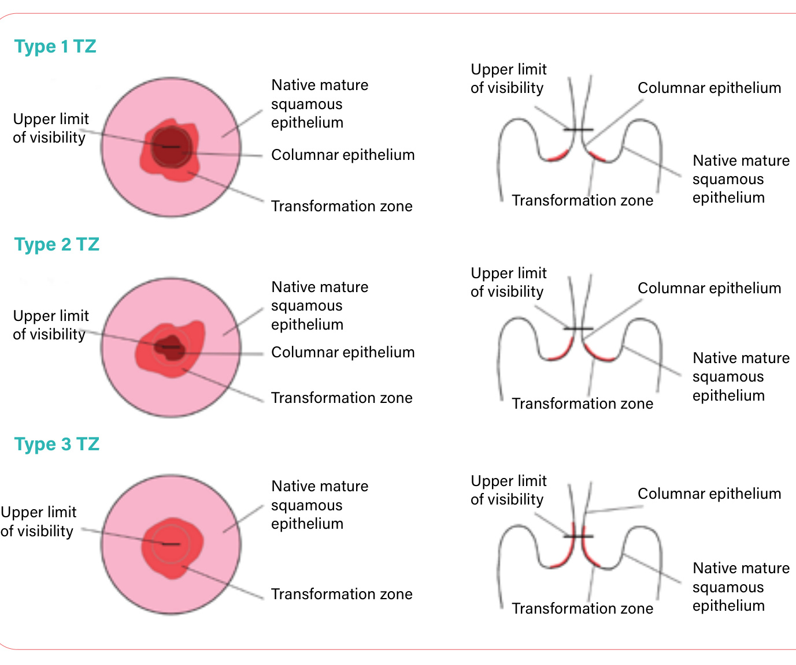

# WHO guideline for screening and treatment of cervical pre-cancer lesions for cervical cancer prevention, second edition  

  

# WHO guideline for screening and treatment of cervical pre-cancer lesions for cervical cancer prevention, second edition  

# WHO guideline for screening and treatment of cervical pre-cancer lesions for cervical cancer prevention, second edition  

ISBN 978-92-4-003082-4 (electronic version)  

ISBN 978-92-4-003083-1 (print version)  

$\circledcirc$ World Health Organization 2021  

Some rights reserved. This work is available under the Creative Commons Attribution-NonCommercial-ShareAlike 3.0 IGO licence (CC BY-NC-SA 3.0 IGO; https://creativecommons.org/licenses/by-nc-sa/3.0/igo).  

Under the terms of this licence, you may copy, redistribute and adapt the work for non-commercial purposes, provided the work is appropriately cited, as indicated below. In any use of this work, there should be no suggestion that WHO endorses any specific organization, products or services. The use of the WHO logo is not permitted. If you adapt the work, then you must license your work under the same or equivalent Creative Commons licence. If you create a translation of this work, you should add the following disclaimer along with the suggested citation: “This translation was not created by the World Health Organization (WHO). WHO is not responsible for the content or accuracy of this translation. The original English edition shall be the binding and authentic edition”.  

Any mediation relating to disputes arising under the licence shall be conducted in accordance with the mediation rules of the World Intellectual Property Organization (http://www.wipo.int/amc/en/mediation/rules/).  

Suggested citation. WHO guideline for screening and treatment of cervical pre-cancer lesions for cervical cancer prevention, second edition. Geneva: World Health Organization; 2021. Licence: CC BY-NC-SA 3.0 IGO.  

Cataloguing-in-Publication (CIP) data. CIP data are available at http://apps.who.int/iris.  

Sales, rights and licensing. To purchase WHO publications, see http://apps.who.int/bookorders. To submit requests for commercial use and queries on rights and licensing, see http://www.who.int/about/licensing.  

Third-party materials. If you wish to reuse material from this work that is attributed to a third party, such as tables, figures or images, it is your responsibility to determine whether permission is needed for that reuse and to obtain permission from the copyright holder. The risk of claims resulting from infringement of any third-party-owned component in the work rests solely with the user.  

General disclaimers. The designations employed and the presentation of the material in this publication do not imply the expression of any opinion whatsoever on the part of WHO concerning the legal status of any country, territory, city or area or of its authorities, or concerning the delimitation of its frontiers or boundaries. Dotted and dashed lines on maps represent approximate border lines for which there may not yet be full agreement.  

The mention of specific companies or of certain manufacturers’ products does not imply that they are endorsed or recommended by WHO in preference to others of a similar nature that are not mentioned. Errors and omissions excepted, the names of proprietary products are distinguished by initial capital letters.  

All reasonable precautions have been taken by WHO to verify the information contained in this publication. However, the published material is being distributed without warranty of any kind, either expressed or implied. The responsibility for the interpretation and use of the material lies with the reader. In no event shall WHO be liable for damages arising from its use.  

Layout and design: Studio FFFOG.  

# Contents  

  

Acknowledgements v   
Acronyms and abbreviations vii   
Executive summary viii Background viii Methods	 viii Summary of screening and treatment recommendations to prevent cervical cancer x  

# . Introduction 1  

1.1 Background 1   
1.2 Approaches to screening and treatment 3   
1.3 Rationale for this new edition of recommendations 4   
1.4 Phased approach for the development of the recommendations 5   
1.5 Target audience 6  

# 2. Methods  

7  

2.1 Groups contributing to the guideline development process 7   
2.2 Scoping review and appraisal of the existing recommendations 9   
2.3 Priority questions for review of evidence 10   
2.4 Priority algorithms 11   
2.5 Outcomes 11   
2.6 Syntheses of evidence 12   
2.7 Development of the recommendations 18   
2.8 Management of the external peer review 19  

  

3. Important considerations for the recommendations 20  

3.1 Programme considerations 20   
3.2 Screening and triage tests considered in this guideline 21   
3.3 Treatment considerations 23  

  

# 4. Recommendations and good practice statements on screening and treatment to prevent cervical cancer  

4.1 Recommendations and good practice statements: 24 general population of women  

  

4.2 Recommendations and good practice statements: women living with HIV 31  

4.3 Additional recommendation and good practice statement 38 for treatment not covered in previous guidelines for the general population of women and women living with HIV  

5. Research gaps and further considerations 39  

6. Dissemination and updating of the guideline 41  

6.1 Guideline dissemination and impact 41   
6.2 Guideline update 42  

References 43  

Annexes 47  

Annex 1: Guideline groups 48   
Annex 2: Evidence-gathering teams and guideline task groups 58   
Annex 3: Declarations of interests 60   
Annex 4: Seven algorithms prioritized for Phase 1 of the guideline update 63   
Annex 5: Standardized definitions used in this guideline 73   
Annex 6: Additional information for screening and treatment 95   
recommendations  

# ADDITIONAL SUPPORTING MATERIALS AVAILABLE ONLINE:  

# Web annex A: Syntheses of the evidence  

Available at: https://www.who.int/publications/i/item/9789240030824 (Includes IARC handbook materials and Supplementary materials 1–13)  

Web annex B: Evidence-to-decision (EtD) tables  

Available at: https://www.who.int/publications/i/item/9789240030824 (Includes EtD for PICO questions 1–10)  

# Acknowledgements  

The Department of Sexual and Reproductive Health and Research and the Department of Global HIV, Hepatitis and Sexually Transmitted Infections Programmes at the World Health Organization (WHO) would like to thank members of the Guideline Development Group (GDG) for their consistent availability and commitment to making this guideline possible, and the members of the External Review Group (ERG) and all other external contributors for their work. The Departments are also grateful to the International Agency for Research on Cancer (IARC) for the literature reviews performed in the context of the updating of the IARC handbooks of cancer prevention: cervical cancer screening, Vol. 18 (2021), which were extremely useful for this guideline development process. Special thanks to Nancy Santesso, the guideline methodologist from McMaster University, who also led the systematic review process, and thank you to all the members of the systematic reviews teams, coordinated by Nancy Santesso. The names of the members of the GDG, ERG and of the other contributors, in particular systematic reviewers, modellers and costing teams, are listed below, with full details provided in Annex 1. We appreciate the overall support of the WHO Guidelines Review Committee Secretariat during the guideline development process, with grateful thanks to Rebekah Thomas Bosco who is leading the GRC Secretariat.  

The WHO Steering Group was composed of Nathalie Broutet, Shona Dalal, Linda Eckert (who also supported the GDG, the workgroups, and the WHO Secretariat), Morkor Newman and Ajay Rangaraj. This group was assisted by Myriam Cortes and Jane Werunga-Ndanareh. Nathalie Broutet and Shona Dalal also led the guideline development process.  

The members of the GDG were Claire Achieng, Silvina Arrossi, Muhammad Atif Waqar, Ruth Awori, Ruanne Barnabas, Itamar Bento Claro, Neerja Bhatla, Marie-Claude Boily, Laia Bruni, Joanna Cain, Lameck Chinula, Mike Chirenje (GDG Co-Chair), Michael Chung, Flavia Miranda Correa, Miriam Cremer, Teresa Darragh, Lynette Denny, Silvia de Sanjose, Mamadou Diop, Wachara Eamratsameekool, Danielle Engel, Julia Gage, Ali Ghanbari-Motlagh, Patti Gravitt, Margaret Happy, Tarek Hashem, Rolando Herrero, Priscilla Ingbian, Ebony Johnson, Sharon Kapambwe, Bayarsaikhan Luvsandorj, Anne Mackie, Mauricio Maza, Sebitloane Motshedisi, Nelly Mugo, Raul Murillo, Laura Muzingwani, Ashrafun Nessa, Dorcas Obiri-Yeboah, Gina Ogilvie, Patrick Petignat, Maria Alejandra Picconi, Leeya Pinder, Walter Prendiville, Veronica Reis, Gracia Violetta Ross Quiroga, Vikrant Sahasrabuddhe, Pete Sasieni, Anna Shakarishvili, Netsanet Shiferaw, Petra Tenhoope-Bender, Myint Myint Thinn, Julie Torode (GDG Co-Chair), Nicolas Wentzensen and Fanghui Zhao.  

The members of the ERG were Raveena Chowdhury, Heather Cubie, Suzanne Garland, Sarita Ghimire, Zaki El Hanchi, Ha Hyeong In, Oh Jin-Kyoung, Alejandra Meglioli, Mohammed Moawia, Lim Myong Cheol, Angélica Nogueira, Mark Schiffman, Saritha Shamsunder, Vanita Suri, Carolina Teran, Ted Trimble, Gino Venegas and Heather White.  

External contributors to the evidence profiles were Marc Arbyn, Ruanne Barnabas, Iacopo Baussano, Marie-Claude Boily, Veronique Bouvard, Karen Canfell, Michael Caruana, Ian Cree, Owen Demke, Cindy Gauvreau, Michaela Hall, Eva Herweijer, Iciar Indave, Adam Keane, Helen Kelly,  

James Killen, Gigi Lui, Diep Nguyen, Bernardo Nuche, Catherine Sauvaget, Holger Schünemann, Kate Simms, Ronaldo Silva, Karin Sundström, Katayoun Thaghavi, Cari van Schalkwyk and Brian Williams.  

The following individuals acted as observers at the GDG meeting: Benjamin Anderson, J. (Hans) Berkhof, Smiljka de Lussigny, Eduardo Franco, Lisa Pei-Ching Huang, Krishna Jafa, Jose Jeronimo, Somesh Kumar, Ilana Lapidos-Salaiz, David Mesher, Jasantha Odayar, Groesbeck Parham, Carmen Pérez Casas, Felipe Roitberg and Heather Watts.  

The WHO Secretariat included Maribel Almonte Pacheco, Prebo Barango, Partha Basu, Paul Bloem, Nathalie Broutet, Gary Clifford, Marilys Corbex, Myriam Cortes, Shona Dalal, Jean-Marie Dangou, Maeve De Mello, Gampo Dorji, Linda Eckert, Fayad El Sheikh, Elena Fidarova, Massimo Ghidinelli, Karima Gholbzouri, Rodolfo Gomez Ponce de Leon, Sami Gottlieb, Joumana George Hermez, Raymond Hutubessy, Andre Ilbawi, Naoko Ishikawa, Chandani Anoma Jayathilaka, Rajat Khosla, Warrick Junsuk Kim, Stephanie Yetunde Kuku, Hugues Lago, Beatrice Lauby-Secretan, Silvana Luciani, Priya Mannava, Dara Masoud, Manjulaa Narasimhan, Morkor Newman, Leopold Ouedraogo, Tina Purnat, Neena Raina, Ajay Rangaraj, Leanne Margaret Riley, Anita Sands, Tshidi Sebitloane, Mukta Sharma, Hai-rim Shin, Slim Slama, Vitaly Smelov, Howard Sobel, Ute Ströher, Adriana Velazquez Berumen, Lara Vojnov and Hongyi Xu.  

Funding for the preparation, development and printing of the guideline was provided mainly by the UNDP-UNFPA-UNICEF-WHO-World Bank Special Programme of Research, Development and Research Training in Human Reproduction (HRP), with the support of the United States President’s Emergency Plan for AIDS Relief (PEPFAR) through the United States Agency for International Development (USAID), and Unitaid.  

This guideline was edited and proofread by Green Ink.  

# Acronyms and abbreviations  

AIS adenocarcinoma in situ   
ART antiretroviral therapy   
CIN cervical intraepithelial neoplasia   
CKC cold knife conization   
DOI declaration of interest   
ERG External Review Group   
EtD evidence-to-decision   
GDG Guideline Development Group   
GRC Guidelines Review Committee   
GRADE Grading of Recommendations Assessment, Development and Evaluation   
HPV human papillomavirus   
HRP UNDP-UNFPA-UNICEF-WHO-World Bank Special Programme of Research, Development and Research Training in Human Reproduction   
IARC International Agency for Research on Cancer   
IPD-MA individual patient data meta-analysis   
LEEP loop electrosurgical excision procedure (also known as LLETZ)   
LLETZ large-loop excision of the transformation zone (also known as LEEP)   
NAAT nucleic acid amplification test   
PEPFAR The United States President’s Emergency Plan for AIDS Relief   
PICO population (P), intervention (I), comparator (C), outcome (O)   
SDG Sustainable Development Goal   
UNAIDS Joint United Nations Programme on HIV/AIDS   
UNDP United Nations Development Programme   
UNFPA United Nations Population Fund   
UNICEF United Nations Children’s Fund   
USAID United States Agency for International Development   
VIA visual inspection with acetic acid   
WHO World Health Organization  

# Executive summary  

# Background  

Cervical cancer is a leading cause of mortality among women. In 2020, an estimated 604 000 women were diagnosed with cervical cancer worldwide and about 342 000 women died from the disease. Cervical cancer is the most commonly diagnosed cancer in 23 countries and is the leading cause of cancer death in 36 countries. The vast majority of these countries are in sub-Saharan Africa, Melanesia, South America, and South-Eastern Asia.  

In May 2018, Dr Tedros Adhanom Ghebreyesus, World Health Organization (WHO) Director-General, issued a call to action for the elimination of cervical cancer. In November 2020, the Director-General launched the Global strategy to accelerate the elimination of cervical cancer, including the following targets for each of the three pillars for $2 0 3 0 \colon 9 0 \%$ human papillomavirus (HPV) vaccination coverage of eligible girls, $70 \%$ screening coverage with a high-performance test and $90 \%$ of women with a positive screening test or a cervical lesion managed appropriately. Following the launch of the global strategy, a large panel of experts met to define the key areas of focus to increase access to screening and treatment to reach the 2030 targets. One of the agreed areas of focus was to update the existing WHO recommendations for screening and treatment to prevent cervical cancer, and to simplify the algorithms.  

# Methods  

This updated guideline for screening and treatment to prevent cervical cancer was developed in three steps:  

Review the current guidelines and identify recommendations to update or to develop de novo.   
2. Develop questions based on population (P), intervention (I), comparator (C) and outcomes (O) (PICO questions) for the recommendations and conduct new systematic reviews or update those conducted for the previous guideline, and model outcomes when primary research was not available.   
3. Apply the Grading of Recommendations Assessment, Development and Evaluation (GRADE) methodology to assess the certainty of evidence and to develop recommendations using evidence-to-decision (EtD) tables.  

The Guideline Development Group (GDG) for this guideline was formed in early 2019, and the GDG, WHO Secretariat, methodologists and technical groups (see Annex 1) met several times to establish the PICO questions, methodology and timeline. The WHO Secretariat led and coordinated the whole process to ensure recommendations were developed in line with the WHO handbook for guideline development, second edition (2014). The methods for evidence synthesis and mathematical modelling were used as applied in the previous edition of the guideline, WHO guidelines for screening and treatment of precancerous lesions for cervical cancer prevention. Based on clinical expertise, research and knowledge of tests in development, the Guideline Development Group (GDG) initially identified the screening tests and clinical algorithms for screening and treatment that could be evaluated. The GDG prioritized seven algorithms for evaluation, and these informed the systematic reviews. In 2020, the systematic review teams performed the systematic reviews for each of the PICO questions and, in parallel, the systematic reviews that had been prepared for the International Agency for Research on Cancer’s IARC handbooks of cancer prevention: cervical cancer screening, Vol. 18 (2021) were integrated for the development of these recommendations.  

When relevant evidence was not available in primary research, a mathematical model was used to estimate the risk of important outcomes (e.g. recurrence of high-grade cervical intraepithelial neoplasia [CIN], cervical cancer) associated with the use of different screening and treatment strategies. In addition, a modelling group was created to evaluate the impact and cost–effectiveness of the different screening and treatment algorithms. Furthermore, we searched the published literature for studies providing information on acceptability, feasibility and costing aspects of these algorithms, and conducted a survey on feasibility and values and preferences of people using these services. GDG meetings took place on a weekly basis between August 2020 and November 2020 to review and assess the evidence and agree on the final new and updated recommendations and good practice statements presented in this guideline.  

# Screening and treatment approaches  

In the “screen-and-treat approach”, the decision to treat is based on a positive primary screening test only.  

In the “screen, triage and treat approach”, the decision to treat is based on a positive primary screening test followed by a positive second test (a “triage” test), with or without histologically confirmed diagnosis.  

# Summary of screening and treatment recommendations to prevent cervical cancer  

In this present publication, there is a total of 23 recommendations and 7 good practice statements.  

Among the 23 recommendations, 6 are identical for both the general population of women and for women living with HIV and 12 are different and specific for each population. Among the 7 good practice statements, 3 are identical for both the general population of women and for women living with HIV and 2 are different and specific for each population.  

In Table 1 below we have grouped the recommendations and good practice statements in two columns for the general population of women (left column, nos. 1–14) and for women living with HIV (right column, nos. 21–34), while in Table 2, the populations are not separated (nos. 41 and 42).1  

There are currently 11 recommendations and 3 good practice statements for each population in Table 1, and an additional recommendation and good practice statement for both populations in Table 2.  

creening and treatmentrecommendations andgod practicestatements forthegeneral populationofwmenandwmenliving with   

<html><body><table><tr><td>Recommendations for the general population of women?</td><td>Strength of recommendation and level of evidence</td><td> Recommendations for women living with Hiva</td><td>Strength of recommendation and level of evidence</td></tr><tr><td>1. WHO recommends using HPV DNA detection as the primary screening test rather than VIA or cytology in screening and treatment approaches among both the general population of women and women living with HIV. Remarks: Existing programmes with quality-assured cytology as the primary screening test should be continued until HPV DNA testing is operational; existing programmes using VIA as the primary screening test should transition rapidly because of the inherent </td><td>Strong recommendation, moderate- certainty evidence </td><td>21. WHO recommends using HPV DNA detection as the primary screening test rather than VIA or cytology in screening and treatment approaches among both the general population of women and women living with HIV. Remarks: Existing programmes with quality-assured cytology as the primary screening test should be continued until HPV DNA testing is operational; existing programmes using VIA as the primary screening test should transition rapidly because of the inherent challenges with quality assurance.</td><td>Strong recommendation, moderate certainty of evidence</td></tr><tr><td>2. WHO suggests using an HPV DNA primary screening test either with triage or without triage to prevent cervical cancer among the general population of women.</td><td>Conditional recommendation, moderate- certainty evidence</td><td>22. WHO suggests using an HPV DNA primary screening test with triage rather than without triage to prevent cervical cancer among women living with HIV.</td><td>Conditional recommendation, moderate certainty of evidence</td></tr></table></body></html>

o wording of the recommendations difers for each population.  

<html><body><table><tr><td>Recommendations for the general population of womena</td><td>Strength of recommendation and level of evidence</td><td> Recommendations for women living with Hiva</td><td>Strength of recommendation and level of evidence</td></tr><tr><td>3a. In a screen-and-treat approach using HPV DNA detection as the primary screening test, WHO suggests treating women who test positive for HPV DNA among the general population of women. 3b. In a screen, triage and treat approach using HPV DNA detection as the primary screening test among the general population of women, WHO suggests using partial genotyping, colposcopy, VIA or </td><td>Conditional recommendation, moderate- certainty evidence</td><td>23. In a screen, triage and treat approach using HPV DNA detection as the primary screening test among women living with HIV, WHO suggests using partial genotyping, colposcopy, VIA or cytology to triage women after a positive HPV DNA test (Annex 4)</td><td>Conditional recommendation, moderate- certainty evidence</td></tr><tr><td>cytology to triage women after a positive HPV DNA test (Annex 4). Remarks: The benefits, harms and programmatic costs of the triage options are similar; therefore, the choice of triage method will be dependent on feasibility, training, programme quality assurance and resources in countries. HPV16/18 genotyping could be integrated into the HPV DNA test (refer to Annex 4 for specific</td><td></td><td>Remarks: The benefits, harms and programmatic costs of the triage options are similar; therefore, the choice of triage method will be dependent on feasibility, training, programme quality assurance and resources in countries. HPV16/18 genotyping could be integrated into the HPV DNA test (refer to Annex 4 for specific details of the algorithms).</td><td></td></tr><tr><td>details of the algorithms). 4. When providing HPV DNA testing, WHO suggests using either samples taken by a health-care provider or self-collected samples among both the general population of women and women living with HIV. </td><td>Conditional recommendation, low-certainty evidence</td><td>24. When providing HPV DNA testing, WHO suggests using either samples taken by a health-care provider or self-collected samples among both the general population of women and women living with HIV.</td><td>Conditional recommendation, low-certainty evidence </td></tr><tr><td>5. WHO recommends starting regular cervical cancer screening at the age of 30 years among the general population of women.</td><td>Strong recommendation, moderate- certainty evidence</td><td>25. WHO suggests starting regular cervical cancer screening at the age of 25 years among women living with HIV. Remarks: Low-certainty evidence found that there are likely to be small numbers of women living with HIV with cervical cancer who are below the age of 25. This recommendation applies to women living with HIV regardless of when they first tested positive for HIV.</td><td>Conditional recommendation, low-certainty evidence</td></tr></table></body></html>  

<html><body><table><tr><td>Recommendations for the general population of womena</td><td>Strength of recommendation and level of evidence</td><td> Recommendations for women living with HIva</td><td>Strength of recommendation and level of evidence</td></tr><tr><td>6. After the age of 50 years, WHO suggests screening is stopped after two consecutive negative screening results consistent with the recommended regular screening intervals among both the general population of women and women living with HIV.</td><td>Conditional recommendation, low-certainty evidence </td><td>26. After the age of 50 years, WHO suggests screening is stopped after two consecutive negative screening results consistent with the recommended regular screening intervals among both the general population of women and women living with HIV.</td><td>Conditional recommendation, very low-certainty evidence </td></tr><tr><td>Remarks: Neither VIA nor ablative treatment are suitable for screening or treatment of women in whom the transformation zone is not visible. Inadequate visualization is typical after the menopause.</td><td></td><td>Remarks: Neither VIA nor ablative treatment are suitable for screening or treatment of women in whom the transformation zone is not visible. Inadequate visualization is typical after the menopause.</td><td></td></tr><tr><td>7. Priority should be given to screening women aged 30-49 years in the general population of women. When tools are available to manage women aged 50-65 years, those in that age bracket who have never been screened should also be prioritized.</td><td>Good practice statement</td><td>27. Priority should be given to screening women living with HIV aged 25-49 years. When tools are available to manage women living with HIV aged 50-65 years, those in that age bracket who have never been screened should also be prioritized.</td><td>Good practice statement</td></tr><tr><td>8. WHO suggests a regular screening interval of every 5 to 10 years when using HPV DNA detection as the primary screening test among the general population of women.</td><td>Conditional recommendation, low-certainty evidence</td><td>28. WHO suggests a regular screening interval of every 3 to 5 years when using HPV DNA detection as the primary screening test among women living with HIV.</td><td>Conditional recommendation, low-certainty evidence</td></tr><tr><td>9. Where HPV DNA testing is not yet operational, WHO suggests a regular screening interval of every 3 years when using VIA or cytology as the primary screening test, among both the general population of women and women living with HIV.</td><td>Conditional recommendation, low-certainty evidence </td><td>29. Where HPV DNA testing is not yet operational, WHO suggests a regular screening interval of every 3 years when using VIA or cytology as the primary screening test, among both the general population of women and women living with HIV.</td><td>Conditional recommendation, low-certainty evidence </td></tr></table></body></html>

Rowhad wording of the recommendations differs for each population.  

<html><body><table><tr><td>Recommendations for the general population of womena</td><td>Strength of recommendation and level of evidence</td><td>Recommendations for women living with Hiva</td><td>Strength of recommendation and level of evidence</td></tr><tr><td>10. While transitioning to a programme with a recommended regular screening interval, screening even just twice in a lifetime is beneficial among both the general population of women and women living with HIV.</td><td>Good practice statement </td><td>30. While transitioning to a programme with a recommended regular screening interval, screening even just twice in a lifetime is beneficial among both the general population of women and women living with HIV.</td><td>Good practice statement</td></tr><tr><td>11. WHO suggests that the general population of women who have screened positive on an HPV DNA primary screening test and then negative on a triage test are retested with HPV DNA testing at 24 months and, if negative, move to the recommended regular screening interval.</td><td>Conditional recommendation, low-certainty evidence</td><td>31. WHO suggests that women living with HIV who have screened positive on an HPV DNA primary screening test and then negative on a triage test, are retested with HPV DNA testing at 12 months and, if negative, move to the recommended regular screening interval.</td><td>Conditional recommendation, low-certainty evidence</td></tr><tr><td>12. WHO suggests that women from the general population and women living with HIV who have screened positive on a cytology primary screening test and then have normal results on colposcopy are retested with HPV DNA testing at 12 months and, if negative, move to the recommended regular screening interval.</td><td>Conditional recommendation, low-certainty evidence</td><td>32. WHO suggests that women from the general population and women living with HIV who have screened positive on a cytology primary screening test and then have normal results on colposcopy are retested with HPV DNA testing at 12 months and, if negative, move to the recommended regular screening interval.</td><td>Conditional recommendation, low-certainty evidence</td></tr><tr><td>13. WHO suggests that women from the general population who have been treated for histologically confirmed CIN2/3 or adenocarcinoma in situ (AIS), or treated as a result of a positive screening test are retested at 12 months with HPV DNA testing when available, rather than with cytology or VlA or co-testing, and, if negative, move to the recommended regular screening interval.</td><td>Conditional recommendation, low-certainty evidence</td><td>33. WHO suggests that women living with HIV who have been treated for histologically confirmed CIN2/3 or adenocarcinoma in situ (AlS), or treated as a result of a positive screening test are retested at 12 months with HPV DNA testing when available, rather than with cytology or VlA or co-testing, and, if negative, are retested again at 12 months and, if negative again, move to the recommended regular screening interval.</td><td>Conditional recommendation, low-certainty evidence</td></tr></table></body></html>

oar wording of the recommendations differs for each population.  

<html><body><table><tr><td>Recommendations for the general population of womena</td><td>Strength of recommendation and level of evidence</td><td>Recommendations for women living with Hiva</td><td>Strength of recommendation and level of evidence</td></tr><tr><td>14. As programmes introduce HPV DNA testing, use this test at the woman's next routine screening date regardless of the test that was used at prior screening. In existing programmes with cytology or VlA as the primary screening test, rescreening with the same test should be continued until HPV DNA testing is operational among both the general population of women and women living with HIV.</td><td>Good practice statement</td><td>34. As programmes introduce HPV DNA testing, use this test at the woman's next routine screening date regardless of the test that was used at prior screening. In existing programmes with cytology or VIA as the primary screening test, rescreening with the same test should be continued until HPV DNA testing is operational among both the general population of women and women living with HIV.</td><td>Good practice statement </td></tr></table></body></html>  

Table 2. Recommendation and good practice statement for treatment not covered in previous guidelines   

<html><body><table><tr><td>For both the general population and women living with HIv</td><td>Strengthof recommendation and certainty of evidence</td></tr><tr><td>41. Once a decision to treat a woman is made - whether from the general population of women or women living with HIV - it is good practice to treat as soon as posible within six months to reduce the risk of loss to follow-up. However, in women who are pregnant, good practice includes deferral until after pregnancy.</td><td> Good practice statement </td></tr><tr><td>In circumstances when treatment is not provided within this time frame,itis good practice to re-evaluate the woman before treatment. 42. WHO suggests large-loop excision of the transformation zone (LLETZ) or cold knife conization (CKC)</td><td>Conditional recommendation,</td></tr><tr><td>for women from the general population and women living with HIV who have histologically confirmed adenocarcinoma in situ (AIS). Remarks: Loop excision maybe preferred in women of reproductive age, in settings with greater availabilityof LLETZandby providers with greater expertise performing LETZ.CKC maybe preferred when interpretationof the</td><td>low-certainty evidence </td></tr></table></body></html>  

HPV: human papillomavirus; VIA: visual inspection with acetic acid.  

# Summary recommendation for the general population of women  

WHO suggests using either of the following strategies for cervical cancer prevention among the general population of women:  

HPV DNA detection in a screen-and-treat approach starting at the age of 30 years with regular screening every 5 to 10 years.  

HPV DNA detection in a screen, triage and treat approach starting at the age of 30 years with regular screening every 5 to 10 years.  

Summary recommendation for women living with HIV  

WHO suggests using the following strategy for cervical cancer prevention among women living with HIV:  

HPV DNA detection in a screen, triage and treat approach starting at the age of 25 years with regular screening every 3 to 5 years.  

  

# Introduction  

# 1.1 Background  

Cervical cancer is a leading cause of mortality among women. In 2020, an estimated 604 000 women were diagnosed with cervical cancer worldwide and about 342 000 women died from the disease. Cervical cancer is the most commonly diagnosed cancer in 23 countries and is the leading cause of cancer death in 36 countries. The vast majority of these countries are in sub-Saharan Africa, Melanesia, South America, and South-Eastern Asia $( 7 ) .$ .  

In May 2018, Dr Tedros Adhanom Ghebreyesus, Director-General of the World Health Organization (WHO), issued a call to action for the elimination of cervical cancer. A WHO global strategy to accelerate the elimination of cervical cancer as a public health problem was presented and unanimously endorsed by the Seventy-third World Health Assembly in August 2020. Subsequently, WHO officially launched the Global strategy to accelerate the elimination of cervical cancer on 17 November 2020.2  

The targets of the global strategy are, by 2030:  

to vaccinate $90 \%$ of eligible girls against HPV;   
to screen $70 \%$ of eligible women at least twice in their lifetimes; and   
to effectively treat $90 \%$ of those with a positive screening test or a cervical lesion, including palliative care when needed $( 2 )$ .  

In the context of this global strategy, countries are updating their protocols for the prevention of cervical cancer and for the care and treatment of affected women. Cervical cancer prevention also plays an integral role in reaching the Sustainable Development Goals (SDGs), both for health (SDG 3) and gender equality (SDG 5).  

To prevent cervical cancer, women can be screened using various tests to identify those who have or are at risk of cervical pre-cancer (see Table 1.1). Cervical intraepithelial neoplasia (CIN) is characterized by cellular changes in the transformation zone of the cervix. CIN is typically caused by infections with human papillomavirus (HPV), especially the high-risk HPV types such as strains 16 and 18 (these two strains cause more than $70 \%$ of cervical cancers) (3,4). CIN1 lesions – also referred to as low-grade squamous intraepithelial lesions– are morphological correlates of HPV infections. CIN2/3 lesions – also referred to as high-grade squamous intraepithelial lesions – are correlates of cervical pre-cancers that, if left untreated, may progress into cervical cancer (for further details, refer to Chapter 1 of WHO’s Comprehensive cervical cancer control guidance [5]).  

Table 1.1 Three approaches to cervical cancer screening and future tests   

<html><body><table><tr><td>Molecular</td><td>Cytologic</td><td>Visual inspection</td></tr><tr><td>Nucleic acid amplification tests (NAAT)a</td><td>Conventional Pap smeara Liquid-based cytology</td><td>Visual inspection with acetic acid or with Lugol's</td></tr><tr><td>》 high-risk HPV DNA/ NAAT 》 mRNA</td><td>(LBC)a</td><td>iodine (VIA/VILI)a naked eye 》 magnified by 》</td></tr><tr><td>DNA methylationb</td><td>Dual staining to identify p16</td><td>colposcope or camera</td></tr><tr><td></td><td>and Ki-67a</td><td>Automated visual</td></tr><tr><td>Protein biomarkersb 》 HPV antibodies</td><td></td><td>evaluation of digital imagesb</td></tr></table></body></html>

a Current tests b Tests under evaluation (future tests).  

The traditional method to screen women for cervical cancer has been cytology (the Papanicolaou test, also known as the Pap smear or smear test). When cytology results are positive, the diagnosis is confirmed by colposcopy, and appropriate treatment is informed by biopsy of suspicious lesions for histological diagnosis. In countries with effective cytology-based cervical cancer screening and treatment programmes, the mortality from cervical cancer has been reduced fivefold over the past 50 years $\underline { { ( 6 ) } } .$ This screening approach has not been as successful in low- and middle-income countries $( 7 )$ .  

Newer screening tests introduced in the last 15 years include visual inspection with acetic acid (VIA), and molecular tests, mainly high-risk HPV DNA-based tests,3 which are suitable for use in all settings (Table 1.1). More recently, even newer tests and techniques have been developed: (i) other molecular tests such as those based on HPV mRNA, oncoprotein detection or DNA methylation; (ii) more objective tests performed on cytological samples such as p16/Ki-67 dual staining; and (iii) more advanced visual inspection tests based on artificial intelligence/machine learning platforms (e.g. automated visual evaluation of digital images) (8–11).  

# 1.2 Approaches to screening and treatment  

In this document, two approaches to screening and treatment are distinguished: the screen-and-treat approach and the screen, triage and treat approach.  

Screening and treatment approaches  

In the “screen-and-treat approach”, the decision to treat is based on a positive primary screening test only.  

  

In the “screen, triage and treat approach”, the decision to treat is based on a positive primary screening test followed by a positive second test (a “triage” test), with or without histologically confirmed diagnosis.  

  

In a screen-and-treat approach, treatment is provided based on a positive primary screening test alone, without triage (i.e. no second screening test and no histopathological diagnosis).  

When the patient is eligible for ablative treatment, this should ideally be done immediately, at the same visit as the screening test (the single-visit approach). At some facilities, this is not feasible and a second visit is needed (the multiple-visit approach).   
Women who are not eligible for ablation can have excisional treatment on the same day if the clinic has the capacity for large-loop excision of the transformation zone (LLETZ).4 If LLETZ is not available on-site, women need to be referred for the excisional treatment or for further evaluation.  

In a screen, triage and treat approach, the triage test is done if the primary screening test is positive, and the decision to treat is made when both the primary test and the triage test are positive.  

A positive triage test can lead to colposcopy with biopsy and histopathological examination for diagnosis to determine the appropriate treatment. The implementation of colposcopy and biopsy can be challenging, however, so this guideline also considers triage strategies that are not dependent on the availability of colposcopy. When the primary screening test is positive, and the triage test is negative, women need appropriate follow-up evaluation at a specified date according to the recommendations.  

# 1.3 Rationale for this new edition of recommendations  

Recommendations for screening and treatment to prevent cervical cancer, including for women living with HIV, can be found in four existing WHO guidelines – on screening and treatment of pre-cancer lesions, treatment for CIN2/3 and AIS, cryotherapy for CIN, and thermal ablation for pre-cancer lesions (12–15). These recommendations (except for those on thermal ablation, published later in 2019) were consolidated in the 2014 second edition of Comprehensive cervical cancer control: a guide to essential practice $( 5 ) ,$ which also includes the WHO recommendations for HPV vaccination, treatment of cervical cancer and palliative care. In 2020, WHO published guidance documents to support the introduction and scale-up of screening and treatment interventions, specifically relating to HPV testing and relevant medical devices (16,17).  

Guidelines should be updated when new knowledge or developments could materially influence existing recommendations. They should also be updated when the publication date, presentation, background text, evidence synthesis methods, or evidence-to-decision (EtD) considerations might threaten their credibility. In addition, end-user feedback might highlight recommendations that are conflicting, ambiguous, out-of-date or difficult to implement, thus also necessitating an update.  

The overwhelming approval of the WHO global strategy to accelerate the elimination of cervical cancer by Member States during the World Health Assembly in 2020 underlined the urgent need to provide up-to-date WHO guidance on screening and treatment to prevent cervical cancer. The WHO guidance on the recommended algorithms and treatments for use in screening and treatment programmes for cervical cancer prevention, previously published in 2013, was assessed as in need of an update, to effectively guide and facilitate country-level decision-making for starting and scaling up programmes. The updating of this guideline began in 2019 and was informed by implementation experience and research findings, while ensuring that the new and updated recommendations are feasible and acceptable for both the health workers providing the screening and treatment services, and for the end-users of those services (see Chapter 2: Methods). This guideline will support efforts to reach the 2030 targets of the global strategy.  

# Guideline objective:  

To improve national strategies for screening and treatment to prevent cervical cancer in all women, including women living with HIV.  

  

Since the publication of the previous edition of this guideline in 2013 $( 1 2 )$ HPV screening tests have been pre-qualified by WHO, and thermal ablation and cryotherapy have been added as recommended ablative treatment methods. Some interventions described in the 2013 guideline, such as cytology or the need for histological diagnosis, may no longer be relevant or commonly used in the screening and treatment protocols of many countries. Several high-quality studies have been published in the intervening years evaluating new tests, comparative recurrence rates after treatments and appropriate screening intervals. New information is also available concerning women living with HIV, on the type of screening and treatment and the age at which to start screening. This guideline also aims to clarify the optimal number of lifetime screens and, for countries with routine screening programmes, the recommended age for the first screening and the recommended frequency of subsequent screening following negative screening results and following treatment for signs of pre-cancer lesions.  

# 1.4 Phased approach for the development of the recommendations  

The following are the four phases of the updates to WHO’s cervical cancer screening and treatment recommendations. This guideline delivers the output of Phase 1.  

# Phase 1  

Update the recommendations on screening and treatment and the clinical algorithms for the most commonly used screening and triage strategies for both women in general and those living with HIV.  

Phase 2 pErviaolruitaiztedthien ePvhiadseenc1.e for the clinical algorithms that were not  

Phase 3 sDcerveelnoipn greacnodmtrmeantdmaetinotnstrfaotretghiesi.mplementation of these  

Establish a “living guideline” for screening and treatment tests Phase 4 and algorithms which will allow the recommendations to be updated as new evidence becomes available and is evaluated.  

# 1.5 Target audience  

This document is intended primarily for policy-makers, programme managers, programme officers and other professionals in the health sector who have responsibility for choosing strategies for cervical cancer prevention, at country, regional and district levels. Health-care professionals – such as doctors, nurses and community health workers working in reproductive health programmes, antenatal and postnatal services, family planning services, HIV/AIDS control programmes and in clinics that care for women at the district and primary health care levels – may also consult this document to understand how recommendations are developed and why it is vitally important to select and implement evidence-based strategies to prevent cervical cancer.  

This document will also be informative in an adapted form for women, girls and their families in making decisions about cervical cancer screening and treatment.  

All individuals have the right to equality and non-discrimination in sexual and reproductive health care. In this guideline, we recognize that most of the available evidence on cervical cancer is based on study populations of cisgender women, and we also recognize that cisgender women, transgender men, non-binary, gender fluid and intersex individuals born with a female reproductive system require cervical cancer prevention services. However, to be concise and facilitate readability, we use the term “women” to refer to all gender diverse people at risk for cervical cancer. Sexual and reproductive health service providers and cervical cancer prevention services must consider the needs of – and provide equal care to – all individuals independently of gender identity or its expression.  

# 2. Methods  

This updated guideline was developed in accordance with the methods described in the WHO handbook for guideline development, second edition (18). A summary of the process is provided here.  

# 2.1 Groups contributing to the guideline development process  

Lists of all members of the Guideline Development Group (GDG), External Review Group (ERG), systematic review teams, modelling teams and other contributors are provided in Annex 1, with details of their expertise and affiliations. The WHO Secretariat consisted of staff from various relevant WHO departments, and staff from the International Agency for Research on Cancer (IARC). The Steering Group of the WHO Secretariat led the coordination of the development of this guideline. Members of the Secretariat who were not part of the Steering Group were kept informed of the guideline development process and participated in the discussions, in particular during meetings of the various teams.  

The GDG was established during the first half of 2019 to appraise the recommendations in the previous 2013 edition of the guideline $( 1 2 ) ,$ prioritize the key PICO questions for which systematic reviews needed to be updated or developed, provide feedback on the evidence reviews, and make recommendations to be presented in the final guideline. There were 52 GDG members (34 women, 18 men), representing all six WHO regions as well as civil society organizations and women’s groups, and women living with HIV. The members brought varied expertise on cervical screening and treatment. Two members acted as co-chairs and moderated the GDG meetings. The WHO Steering Group met regularly with the GDG chairs, the guideline methodologists, and the systematic review and modelling teams to review progress and to ensure evidence presentations and discussions were standardized.  

An External Review Group (ERG) was also established. Its 18 members, none of whom was also a member of the GDG, had expertise in research, policy development, programme implementation and clinical care. Once the GDG had agreed on the recommendations, the ERG reviewed the full draft of the guideline and provided feedback.  

There were multiple teams preparing evidence:  

five teams did the evidence reviews   
one team developed two mathematical models   
one team ran a survey about the feasibility of screening approaches one team surveyed women about their values and preferences (Annex 2).  

The teams were based at different institutions and worked independently to prepare and present evidence during the GDG meetings. A guideline methodologist with experience of using the Grading of Recommendations Assessment, Development and Evaluation (GRADE) approach (19) coordinated the presentation of evidence and decision-making processes that facilitated the development of the recommendations, as stipulated in the WHO handbook for guideline development (18).  

The WHO Steering Group maintained close communication with the GDG and systematic review teams using multiple platforms:  

Zoom Meetings;   
email;   
surveys and voting on the summaries of the evidence and recommendations using GRADEpro software;   
a SharePoint site for access to meeting materials, including slides and evidence summaries, and live documents for comment;   
a chat feature in SharePoint to encourage discussion among the GDG members.  

# 2.1.1 Declarations and management of conflicts of interest  

After being invited to join the GDG by the WHO Secretariat at the beginning of the guideline development process, and in accordance with the WHO handbook for guideline development (18), each prospective GDG member completed a written declaration of interest (DOI) form. The DOIs were reviewed by two members of the WHO Secretariat and no conflicts of interest were identified (Annex 3). The GDG members’ names and curriculum vitae were subsequently published on the WHO website for the Department of Sexual and Reproductive Health and Research and approved by the WHO Guidelines Review Committee (GRC) in advance of participation in the process. At the beginning of every GDG meeting, members were asked to update the WHO Steering Group and other GDG members about any potential new conflicts of interest.  

# 2.1.2 Confidentiality  

Each GDG member also signed a confidentiality agreement at the beginning of the GDG process, and the WHO Secretariat restated at the start of each GDG meeting that all discussions and draft recommendations were to remain confidential until publication.  

# 2.2 Scoping review and appraisal of the existing recommendations  

In October 2019, a subgroup of the GDG met in Geneva to review the previously published recommendations and decide which should be removed, validated, edited or updated based on new evidence, and whether any new recommendations should be made for new interventions. This process was informed by a scoping review of the literature and an assessment of changes in disease burden, practice and policy. These decisions were circulated to all members of the GDG for feedback, and agreement on which recommendations to keep, update and add was reached after additional virtual meetings and electronic correspondence.  

The scoping document was initially split between screening and treatment recommendations for women living with HIV (approved by the GRC in September 2019) and the general population of women (approved by the GRC in January 2020). The two scoping documents were then merged and subsequently approved by the GRC in August 2020.  

# 2.3 Priority questions for review of evidence  

The GDG identified 14 overarching questions, framed using the population (P), intervention (I), comparator (C), outcomes (O) (PICO) format, as a starting point for formulating recommendations applying to the general population of women and women living with HIV (Table 2.1).  

  
Table 2.1 PICO questions for the recommendations in women (the general population of women and women living with HIV)  

# 2.4 Priority algorithms  

Since screening and treatment can be done using different primary screening and triage tests, there are numerous possible combinations or algorithms. In December 2019, GDG members were surveyed to prioritize the screening and/or triage tests and the treatments that should be evaluated. Following this prioritization exercise, a subgroup of GDG members met to review the results from the survey and to agree on the algorithms to be prioritized. They reached a consensus to address seven priority algorithms in this first phase of the guideline update (Table 2.2; for detailed algorithms please refer to Annex 4).  

Table 2.2. The seven algorithms considered   

<html><body><table><tr><td>Screen-and-treat approaches:</td></tr><tr><td>1 VIA as the primary screening test, followed by treatment</td></tr><tr><td>2 HPV DNA detection (self- or clinician-collected) as the primary screening test, followed by treatment </td></tr><tr><td>Screen, triage and treat approaches:</td></tr><tr><td>3 Cytology as the primary screening test, followed by colposcopy triage, followed by treatment 4 HPV DNA detection as the primary screening test, followed by HPV16/18 triage (when already part of the HPV test), followed by treatment, and using VIA triage for</td></tr><tr><td>those who screen negative for HPV16/18 5 HPV DNA detection as the primary screening test, followed by VIA triage, followed by treatment</td></tr><tr><td>6 HPV DNA detection as the primary screening test, followed by colposcopy triage, followed by treatment </td></tr><tr><td>7 HPV DNA detection as the primary screening test, followed by cytology triage, followed by colposcopy and treatment</td></tr></table></body></html>

HPV: human papillomavirus; VIA: visual inspection with acetic acid.  

# 2.5 Outcomes  

The GDG agreed that the outcomes previously identified in the 2013 screening and treatment guideline $( 7 2 )$ would also be the critical outcomes for the new PICO questions; the critical outcomes are listed in Table 2.3. To ensure coherence in the systematic reviews and modelling, a working group (subgroup of the GDG) developed standardized definitions for these outcomes (see Annex 5). After reviewing the evidence and modelling a limited number of outcomes, the GDG agreed to consider all outcomes together. Adverse events were defined as outcomes that were a direct consequence of pre-cancer treatment and were grouped as one category, with the exception of preterm birth, which was considered a critical outcome (see Table 2.3).  

Table 2.3 Critical outcomes for the screening and treatment recommendations   

<html><body><table><tr><td>Critical outcomes</td></tr><tr><td>Cervical cancer</td></tr><tr><td>Mortality</td></tr><tr><td>High-grade cervical intraepithelial neoplasia or worse (CIN2+)</td></tr><tr><td>HPV infection</td></tr><tr><td>Preterm birth</td></tr><tr><td>Acceptability</td></tr><tr><td>Pre-cancer treatments</td></tr><tr><td>Adverse events (direct consequence of pre-cancer treatment):</td></tr><tr><td> major infections or bleeding</td></tr><tr><td>procedure-associated pain</td></tr><tr><td>cervical stenosis</td></tr><tr><td>infertility</td></tr><tr><td>spontaneous abortion</td></tr><tr><td>perinatal deaths</td></tr><tr><td> premature rupture of membrane</td></tr><tr><td>unnecessary interventions</td></tr><tr><td>increased viral shedding in women living with HIV</td></tr><tr><td>Costs</td></tr><tr><td>Feasibility</td></tr><tr><td>Equity</td></tr></table></body></html>

See Annex 5 for additional details.  

# 2.6 Syntheses of evidence  

Evidence was synthesized for each PICO question according to the methods in the WHO handbook for guideline development and the Cochrane handbook for systematic reviews of interventions (18,20). The literature review performed for the development of the IARC handbooks of cancer prevention: cervical cancer screening, Vol. 18 (to be published in 2021; referred to in brief throughout this guideline as “IARC handbook”) $( 2 7 )$ was also part of the evidence synthesized for the development of this guideline. We used a hierarchical approach to avoid the duplication of reviews that had been previously published. First, we searched for pre-existing systematic reviews to update (including the systematic reviews published at the time of the previous guideline), and then searched for primary studies (including randomized and non-randomized studies) when no systematic reviews were available.  

New systematic reviews or updates of systematic reviews were conducted to determine the effects of interventions (including screening tests) on outcomes, and the accuracy of screening tests in the general population of women and in women living with HIV. These systematic reviews and associated details are listed in Table 2.4.  

Table 2.4 PICO questions with corresponding systematic reviews and reports, evidence-to-decision (EtD) tables and recommendations or good-practice state   

<html><body><table><tr><td>PICO questions</td><td>List of systematic reviews</td><td>Syntheses of the evidence (Web annex A)a</td><td>Evidence- to-decision tables (Web annex B)b</td><td>Recommendation or good practice statement (as numbered in this guideline)c</td></tr><tr><td rowspan="3">1, 2, 8ii</td><td>Evidence reviews for interventions for the general population of women Evidence reviews of</td><td>IARC handbook materials Supplementary material (SM) 1</td><td>EtD PICO 1 and 2 for the general population of women</td><td>1, 2, 3, 4, 8, 9, 10</td></tr><tr><td>accuracy of triage tests for the general population of women Evidence reviews for interventions and accuracy of tests for</td><td>SM 2</td><td>EtD PICO 1 and 2 for women living with HIV</td><td>21, 22, 23, 24, 28, 29, 30</td></tr><tr><td>women living with HIV 3, 4, 5, 6, 7 Review of reviews of follow-up strategies after screening or treatment</td><td>SM 3</td><td>EtD PICO 3, 4,5, 6, 7</td><td>11, 12, 13, 14, 31, 32, 33,34</td></tr></table></body></html>

AIS: adenocarcinoma in situ; CIN: cervical intraepithelial neoplasia; EtD: evidence-to-decision; IARC: International Agency for Research on Cancer; PICO: population (P), intervention (I), comparator (C), outcome (O). a Web annex A is available at: https://www.who.int/publications/i/item/9789240030824 b Web annex B is available at: https://www.who.int/publications/i/item/9789240030824 c Number as listed in Tables 1 and 2 in the Executive Summary and as used throughout this guideline.  

Table 2.4 (continued)   

<html><body><table><tr><td>PICO questions</td><td>List of systematic reviews</td><td>Syntheses of the evidence (Web annex A)a</td><td>Evidence- to-decision tables (Web annex B)b</td><td>Recommendation or good practice statement (as numbered in this guideline)c</td></tr><tr><td rowspan="2">8i</td><td>Review of reviews of age to start and end screening in the general population of women A systematic literature review and narrative</td><td>SM 4 SM 5 </td><td>EtD PICO 8 age at initiation for the general population of women </td><td>5</td></tr><tr><td>synthesis: age at initiation and frequency of cervical cancer screening in women living with HIV Individual patient data meta-analysis (IPD-MA): age at initiation and end</td><td>SM 6</td><td>EtD PICO 8 age at initiation for women living with HIV EtD PICO 8 age to end</td><td>25 6,7, 26, 27</td></tr><tr><td>9</td><td>of screening in women living with HIV Systematic review for treatment within 6 to 12</td><td>SM 7</td><td>screening</td><td>41</td></tr><tr><td>10</td><td>months Reviews for treatment of histologically confirmed</td><td>SM 8</td><td>EtD PICO 10</td><td>42</td></tr><tr><td>11, 12, 13</td><td>CIN2/3 and AIS Next phase of guideline development </td><td></td><td></td><td></td></tr><tr><td>All</td><td>Understanding acceptability and client preferences for screening and treating cervical pre-cancer lesions: preliminary results of a WHO online survey Report on values, preferences, acceptability and feasibility: results of a systematic review of qualitative literature</td><td>SM 9 SM 10</td><td></td><td></td></tr></table></body></html>

AIS: adenocarcinoma in situ; CIN: cervical intraepithelial neoplasia; EtD: evidence-to-decision; IARC: International Agency for Research on Cancer; PICO: population (P), intervention (I), comparator (C), outcome (O). a Web annex A is available at: https://www.who.int/publications/i/item/9789240030824 b Web annex B is available at: https://www.who.int/publications/i/item/9789240030824 c Number as listed in Tables 1 and 2 in the Executive Summary and as used throughout this guideline.  

Table 2.4 (continued)   

<html><body><table><tr><td>PICO questions</td><td>List of systematic reviews</td><td>Syntheses of the evidence (Web annex A)a</td><td>Evidence- to-decision tables (Web annex B)b</td><td>Recommendation or good practice statement (as numbered in this guideline)c</td></tr><tr><td>All</td><td>Survey report: feasibility concerns with priority algorithms Review of reviews of acceptability, feasibility, resources and equity</td><td>SM 11 SM 12</td><td></td><td></td></tr><tr><td>1, 2, 3, 4, 5, 6, 7, 8 </td><td>Report of modelling</td><td>SM 13</td><td></td><td></td></tr></table></body></html>

AIS: adenocarcinoma in situ; CIN: cervical intraepithelial neoplasia; EtD: evidence-to-decision; IARC: International Agency for Research on Cancer; PICO: population (P), intervention (I), comparator (C), outcome (O). a Web annex A is available at: https://www.who.int/publications/i/item/9789240030824 b Web annex B is available at: https://www.who.int/publications/i/item/9789240030824 c Number as listed in Tables 1 and 2 in the Executive Summary and as used throughout this guideline.  

# 2.6.1 Methods used for systematic literature reviews  

The detailed methods for each review are reported in the Annex A, Supplementary Materials (Table 2.4). In brief, the systematic review teams applied the following key methods across all systematic reviews for this guideline:  

develop a systematic review protocol with inclusion and exclusion criteria for studies based on the finalized PICO questions;   
search multiple databases (including MEDLINE, Embase and the Cochrane Library   
Epistemonikos) and clinical trial registries, contact investigators in the field for potentially relevant systematic reviews, and look at randomized and non-randomized trials to identify studies for new reviews or to update existing reviews;   
select literature reviews or studies based on inclusion and exclusion criteria (in duplicate or by one reviewer and verified by a second);   
extract data (in duplicate or by one reviewer and verified by another) on the benefits and harms (effects) of screening and treatment, the accuracy of screening tests used, end-user values and preferences, equity, feasibility, resources and acceptability; contact study authors for missing data or individual patient data when appropriate;   
assess the risk of bias in individual studies when available (in duplicate or by one reviewer and verified by another) using an appropriate risk-of-bias tool (e.g. Cochrane Risk of Bias for randomized controlled trials, ROBINS-I tools for non-randomized studies and QUADAS for diagnostic studies);   
synthesize the results (narratively or quantitatively) or analyse individual patient data when available;   
assess the certainty of the evidence using GRADE methodology (19); the levels of certainty used are summarized in Table 2.5.  

  
Source: GRADE handbook, GRADEpro, 2021 (19).  

# 2.6.2 Individual patient data meta-analysis  

We conducted an individual patient data meta-analysis (IPD-MA) to analyse age-specific data for cervical cancer and CIN in women living with HIV. We contacted the authors of the studies identified in the systematic review of screening-initiation age (Web annex A, Supplementary material 5) that included at least 40 women living with HIV with CIN2+. All the data sets they provided were first reviewed individually, then discrepancies were resolved with investigators, and the aligned data sets were then combined. The IPD-MA used one-stage $( 2 2 )$ random study intercept models to take into account heterogeneity among studies. Generalized linear mixed models were fitted for binomial or multinomial cervical screening test responses using SAS version 9.4 (SAS Institute, Inc., United States). Random effects models were used to calculate predicted probabilities for cervical screening results by age categories, HIV status and other factors of interest (see Web annex A, Supplementary material 6).  

# 2.6.3 Mathematical modelling  

We used the Policy1-Cervix platform, an extensively validated dynamic model of HPV transmission, vaccination, type-specific natural history, cancer survival, screening, diagnosis and treatment (23–31), to predict outcomes in women across all 78 low- and middle-income countries. The Policy-Cervix HIV-HPV model for cervical cancer among women living with HIV was used to evaluate outcomes for women living with HIV in the United Republic of Tanzania $( 3 2 ) ,$ as there was sufficient local data available on cervical cancer control activities and HIV disease burden and control activities (including historical data). The United Republic of Tanzania has endemic HIV and is a suitable example country for evaluating optimal screening strategies for women living with HIV. The Policy1-Cervix model was one of three models used by the Cervical Cancer Elimination Modelling Consortium (CCEMC) to evaluate the impact of cervical cancer prevention interventions in 78 low- and middle-income countries (23,24). We evaluated the impact of the seven algorithms considering different ages and screening intervals, as informed by the GDG (see Table 2.2). For the baseline analysis, we assumed that $70 \%$ of women attended screening at each routine screening event and $90 \%$ of women complied with follow-up. Outcomes were assessed over the lifetime of birth cohorts eligible for screening in 2030 onwards and included cervical cancer incidence and mortality, pre-cancer treatments, additional preterm deliveries as a result of pre-cancer treatment and cost-effectiveness. A range of sensitivity analyses were considered, including probabilistic sensitivity analysis for cost-effectiveness. The detailed methods and results of the modelling work are available in Web annex A, Supplementary material 13.  

# 2.6.4 Values and preferences  

A search for studies and systematic reviews was conducted that addressed, among other considerations, the values and preferences of end-users, health-care providers and other stakeholders. The literature was organized by study design and methodology, location and population, and presented to the GDG.  

For primary data, all women and girls aged 15 years and older, regardless of their prior cervical cancer screening or treatment status, were eligible to participate in an anonymous, voluntary survey distributed via SurveyMonkey. The survey received approval from the WHO Ethics Review Committee and was run in English and French from 22 June to 18 September 2020. Awareness of the survey had been raised among a wide range of civil society groups through a webinar. The survey was also promoted through the Union for International Cancer Control and the WHO advisory group of women living with HIV, and shared through WHO regional focal points for the Cervical Cancer Elimination Initiative. The survey responses from the 561 respondents, including their qualitative responses to open-ended questions, were analysed. The detailed methods and results are available in Web annex A, Supplementary materials 9 and 10.  

# 2.6.5 Feasibility, acceptability, resources and equity considerations  

A survey of the GDG members was administered via SurveyMonkey to assess the implementation considerations for each priority algorithm. The survey was developed using the context and implementation of complex interventions (CICI) framework (33). Each GDG member was asked about their level of concern about each algorithm being able to sustainably meet the large-scale goal of cervical cancer elimination. The following components of cervical cancer screening and management service delivery were queried separately according to the priority algorithm: demand generation, access to screening and the follow-up management of positives, workforce training, infrastructure development and maintenance, development and maintenance of the screening registry, and cost and integration with other priority health services. The considerations of the GDG members were assessed for the following eight stakeholder groups: health authorities at the national level, health authorities at the regional level, professional societies, providers at both the hospital and primary care levels, community health workers, clients (screened women) and the community. The detailed methods and results of the survey from the 29 respondents are provided in Web annex A, Supplementary materials 11 and 12.  

# 2.7 Development of the recommendations  

All the GDG meetings that focused on formulation of recommendations were held virtually. Tables to facilitate decision-making for recommendations – evidence-to-decision (EtD) tables – were produced by the guideline methodologist for each recommendation and circulated to the GDG members before each meeting. These tables included a summary of the evidence (benefits and harms), relevant values and preferences information, and other issues, including use of resources and cost, feasibility, equity and acceptability.  

During the meeting, the EtD tables and evidence were discussed with the GDG. Following the meeting, all GDG members received an email through GRADEpro that solicited direct individual input. Each GDG member saw the EtD tables several times and had opportunities to ask questions and to comment both during and after the meeting. The methodologist, systematic reviewers, modellers and the WHO Steering Group assessed the GDG input and used it to write the recommendations.  

Agreement on the recommendations was made by consensus during the GDG meetings, and the final written recommendations were then approved electronically. The responses solicited via email were either to approve, approve “with the following remarks” or not approve. The GDG had agreed that, if consensus could not be reached, a majority vote of $5 1 \%$ would have been accepted to make recommendations – yet the group did reach a consensus on all the recommendations.  

Strong recommendations (worded as “WHO recommends”) were made when all the desirable consequences of the intervention clearly outweighed the undesirable consequences in most settings.  

Conditional recommendations (worded as “WHO suggests”) were made when the desirable consequences of the intervention probably outweighed the undesirable consequences in most settings.  

Table 2.6 describes how strong and conditional recommendations should be interpreted.  

Additionally, the GDG provided good practice statements when it agreed that this guidance was needed, but a review of the literature was not warranted because the balance of desirable and undesirable consequences of an intervention was unequivocal, and no other criteria needed to be considered.  

Table 2.6 Interpretation of strong and conditional recommendations   

<html><body><table><tr><td>Implications</td><td>Strong recommendation (WHO recommends...)</td><td>Conditional recommendation (WHO suggests...)</td></tr><tr><td>For individuals For</td><td>Most individuals in this situation would want the recommended course of action, and only a small proportion would not. Formal decision aids are not likely to be needed to help individuals make decisions consistent with their values and preferences.</td><td>The majority of individuals in this situation would want the suggested course of action, but some may not. Clinicians should recognize that</td></tr><tr><td>health-care providers</td><td>Most individuals should receive the recommended course of action. Adherence to this recommendation (when it aligns with national guidelines) could be used as a quality criterion or performance indicator.</td><td>different choices may be appropriate for different individuals and that clinicians must help each individual arrive at a management decision consistent with the individual's values and preferences. Decision aids may be useful to help individuals make decisions consistent with their values and preferences.</td></tr><tr><td>For policy- makers</td><td>The recommendation can be adopted as policy in most situations.</td><td>Policy-making will require discussion and involvement of various stakeholders.</td></tr></table></body></html>

Source: GRADE Handbook, GRADEpro, 2021 (19).  

# 2.8 Management of the external peer review  

The draft guideline document was circulated to the External Review Group (ERG) for comment. The WHO Secretariat prepared a summary table with all ERG responses and sorted the comments by topic or section. The WHO Secretariat then identified comments for discussion and presented these to the GDG, and when these issues had been resolved via email correspondence, the guideline document was finalized.  

# 3.		Important considerations for the recommendations  

The WHO recommendations presented in this guideline are intended to support countries to improve the coverage and outcomes of cervical cancer screening. Additionally, they are designed to set standards and targets to improve the quality of services and reduce cervical cancer deaths. In many settings, bridging strategies will be needed to move from any existing screening infrastructure to the infrastructure needed to achieve implementation of the recommendations. This transition may take time and, as a first step, providing at least one or two screens over a woman’s lifetime will have an important impact on cervical cancer mortality in settings without a routine screening programme. In the near future, WHO will develop and publish stepwise implementation guidelines to support the selection of algorithms, adaptation and scale-up of the recommendations.  

# 3.1 Programme considerations  

It is appropriate that a multidisciplinary health ministry team, which can consider different factors and make informed decisions, chooses which algorithm (or algorithms) to include in a national programme. The choice will vary by country – and in different settings within country programmes – and will depend on available resources, feasibility and acceptability.  

Decisions are also needed about when and who to contact for follow-up care. This guideline makes recommendations that distinguish between three clinical scenarios in routine screening programmes:  

  

Regular screening intervals: This applies to women who either had negative screening results or have completed the recommended additional follow-up after treatment and who are thus eligible to return to regular screening intervals.  

  

Follow-up of women with a positive primary screening test but a negative triage test.  

  

# Follow-up of women after treatment.  

A key requirement for any programme for screening and treatment to prevent cervical cancer is that the screening approach and the tests used should be of the highest quality and standards to produce accurate and reliable results and beneficial outcomes. Only screening tests approved by regulatory agencies (34) should be considered for introduction.  

To prevent and treat cervical cancer and reduce mortality, programmes are encouraged to implement population-based screening and treatment strategies. All programmes should ensure that women who have screened positive are treated or managed adequately. Screening registries and call-and-recall efforts are important aspects of appropriate management to ensure that women are coming back to the service for treatment and follow-up. For the continuity and completeness of care, strong links need to be established between the multiple levels of the health service (primary and secondary care) and individual patients. A further description of quality assurance and more detailed programmatic guidance can be found in Annex 6 and in other published documents (5,35,36).  

Cervical cancer screening and treatment should be provided to transgender men, and non-binary and intersex individuals who have a cervix. More data on cervical cancer screening and treatment are needed for these populations, including people living with HIV. WHO recognizes the need for health-care systems, including screening and treatment services for cervical pre-cancer and cancer, to be more inclusive of transgender, intersex and non-binary people, which may require additional training and sensitization of health workers. Public health authorities should also prioritize these groups of people for better awareness of and access to cervical cancer screening and treatment.  

# 3.2 Screening and triage tests considered in this guideline  

  

High-risk HPV DNA tests: These tests identify a group of high-risk carcinogenic HPV genotypes, typically including up to 14 types (HPV16, 18, 31, 33, 35, 39, 45, 51, 52, 56, 58 and 59, which are Group 1 carcinogens, and HPV66 and 68) (37). HPV16 and 18 are the highest-risk genotypes and are the most common in cancers. Some of the tests on the market provide information about specific HPV genotypes, such as HPV16 and 18. We refer to HPV tests with partial genotyping when they report HPV16 and 18 (including HPV45 in some cases) and other carcinogenic types separately. Other HPV tests may provide extended genotyping, when they report additional types, or groups of types, such as HPV31, 33, 35, 45, 52 and 56. This guideline specifically refers to partial genotyping (i.e. the detection of HPV16 and 18 versus other carcinogenic types) to identify women at the highest risk of cervical cancer among those testing positive for HPV (Annex 4). Self-sampling or provider sampling can be used for HPV DNA testing. In this guideline, an HPV DNA test means a high-risk HPV DNA test, which is a nucleic acid amplification test (NAAT).  

Cytology: Cytology tests (including the Papanicolaou smear test and liquid-based cytology [LBC]) identify atypical cells on the cervix through the preparation and interpretation of slides using microscopy by a trained expert. LBC requires sophisticated processing to create slides from liquid specimens. The threshold used in this guideline to identify the need for further evaluation or treatment is a cytological result of atypical squamous cells of undetermined significance (ASCUS) combined with the presence of high-risk HPV.  

Visual inspection with acetic acid (VIA): VIA testing uses dilute acetic acid (vinegar) on the cervix without magnification to identify aceto-white lesions that need treatment (e.g. ablation or excision) or further evaluation. VIA is not appropriate for use in women when the transformation zone is no longer visible or after menopause. This guideline  

makes a distinction between using VIA as a screening or triage test, and assessing eligibility for treatment (after positive screening) using acetic acid and visual evaluation (see Box 3.1 below; for further information, refer to Annex 5, section 5.1).  

Colposcopy: Colposcopy is used to assess the epithelium of the transformation zone to determine its type (Annex 5, section 5.4), whether or not there is evidence of abnormality, and, where indicated, to facilitate a biopsy or treatment. It is not commonly used as a screening tool. Colposcopy may also be used after a primary positive screening test, to assess whether ablative or excisional therapy is appropriate.  

  

Triage tests: The triage tests considered in this guideline include high-risk HPV DNA partial genotyping, cytology, VIA and colposcopy that may or may not include a biopsy for histological diagnosis. Some of these triage tests may be conducted sequentially (e.g. cytology followed by colposcopy with biopsy). Other triage tests are currently undergoing clinical evaluation and may be added to this guideline later as part of the “living guidelines” process.  

Further information on these tests is available in Annex 6.  

Box 3.1:	Visual evaluation to assess eligibility for treatment versus visual inspection with acetic acid (VIA) as a screening test  

  

There is a distinction in these recommendations between (a) using visual evaluation to assess eligibility for ablative treatment (Annex 5, section 5.1), and (b) using VIA as a screening test as part of an algorithm to determine whether or not to treat (Annex 4). This distinction is illustrated in the following scenarios:  

a.	 In the HPV test screen-and-treat strategy (i.e. algorithm 2 in Table 2.2), women who are HPV-negative are not treated, nor evaluated further. Women who are HPV-positive should all be treated but first eligibility for ablative treatment must be assessed with application of acetic acid and visual evaluation using the naked eye or with a colposcope. Those who are ineligible for ablative treatment should be referred for excisional treatment or further evaluation.  

b.	 In the HPV test screen, triage and treat strategy (i.e. algorithms 4 to 7 in Table 2.2), women who are HPV negative are not treated, nor evaluated further. Women who are HPV-positive undergo VIA as a triage test (i.e. algorithm 5 in Table 2.2) to determine whether they should be treated. Women who are HPV-positive and VIA-positive will be treated with ablation if adequate, or referred for excisional treatment or further evaluation, while women who are HPV-positive and VIA-negative will not be treated but followed-up as indicated in the algorithm.  

# 3.3 Treatment considerations  

In a screen-and-treat approach, women who screen positive are treated without histological diagnosis. The treatment aims to destroy or remove the transformation zone of the cervix, or remove areas of the cervix that have been identified as abnormal by screening.  

The methods of treatment may be ablative (destroying abnormal tissue by heating it with thermal coagulation or freezing it with cryotherapy) or excisional (surgically removing abnormal tissue with LLETZ or CKC) (Annex 5, section 5.4). Ablative treatments do not result in a tissue specimen for histological evaluation.  

In this guideline, the term LLETZ is used to refer to excision of the transformation zone. LLETZ uses local anaesthesia, is done in an outpatient setting and yields a tissue specimen for pathology. In some countries, this terminology was changed to LEEP (loop electrosurgical excision procedure), and the two terms are often used interchangeably (Annex 5, section 5.4).  

WHO has published technical specifications for ablative therapy and LLETZ (36). For further summary comparisons of the treatment methods, refer to the WHO Comprehensive cervical cancer control: a guide to essential practice $( 5 )$ and the thermal ablation treatment guidance (15).  

Before treatment, all women who have screened positive with any test other than VIA should be visually inspected with acetic acid by a trained health worker to determine the transformation zone type (Annex 5, section 5.4), rule out suspected cervical cancer and determine eligibility for ablative therapy.  

Refer to Annex 5 for the definition of eligibility for ablative treatment (section 5.1 of the annex) and for further description of the transformation zone (section 5.4 of the annex).  

# 4. Recommendations and good practice statements on screening and treatment to prevent cervical cancer  

In this present publication, there is a total of 23 recommendations and 7 good practice statements.  

  

Among the 23 recommendations, 6 are identical for both the general population of women and for women living with HIV, and 12 are different and specific for each population.  

  

Among the 7 good practice statements, 3 are identical for both the general population of women and for women living with HIV, and 2 are different and specific for each population.  

The recommendations and good practice statements are presented first for the general population of women (section 4.1, nos. 1–14) and then for women living with HIV (section 4.2, nos. 21–34), and finally an additional recommendation and good practice statement regarding treatment for all women are presented (section 4.3, nos. 41 and 42).5  

# 4.1 Recommendations and good practice statements: general population of women6  

All screening algorithms are in Annex 4.  

1.	 WHO recommends using HPV DNA detection as the primary screening test rather than VIA or cytology in screening and treatment approaches among both the general population of women and women living with HIV.\* [Strong recommendation, moderate-certainty evidence]  

Remarks: Existing programmes with quality-assured cytology as the primary screening test should be continued until HPV DNA testing is operational; existing programmes using VIA as the primary screening test should transition rapidly because of the inherent challenges with quality assurance.  

2.	 WHO suggests using an HPV DNA primary screening test either with triage or without triage to prevent cervical cancer among the general population of women. [Conditional recommendation, moderate-certainty evidence]  

3.	 3a. In a screen-and-treat approach using HPV DNA detection as the primary screening test, WHO suggests treating women who test positive for HPV DNA among the general population of women.  

3b. In a screen, triage and treat approach using HPV DNA detection as the primary screening test among the general population of women, WHO suggests using partial genotyping, colposcopy, VIA or cytology to triage women after a positive HPV DNA test (Annex 4). [Conditional recommendation, moderate-certainty evidence]  

Remarks: The benefits, harms and programmatic costs of the triage options are similar; therefore, the choice of triage method will be dependent on feasibility, training, programme quality assurance and resources in countries. HPV16/18 genotyping could be integrated into the HPV DNA test (refer to Annex 4 for specific details of the algorithms).  

4.	 When providing HPV DNA testing, WHO suggests using either samples taken by a health-care provider or self-collected samples among both the general population of women and women living with HIV.\* [Conditional recommendation, low-certainty evidence]  

5.	 WHO recommends starting regular cervical cancer screening at the age of 30 years among the general population of women. [Strong recommendation, moderate-certainty evidence]  

6.	 After the age of 50 years, WHO suggests screening is stopped after two consecutive negative screening results consistent with the recommended regular screening intervals among both the general population of women and women living with HIV.\* [Conditional recommendation, low-certainty evidence]  

Remarks: Neither VIA nor ablative treatment are suitable for screening or treatment of women in whom the transformation zone is not visible. Inadequate visualization is typical after the menopause.  

7.	 Priority should be given to screening women aged 30–49 years in the general population of women. When tools are available to manage women aged 50–65 years, those in that age bracket who have never been screened should also be prioritized. [Good practice statement]  

8.	 WHO suggests a regular screening interval of every 5 to 10 years when using HPV DNA detection as the primary screening test among the general population of women. [Conditional recommendation, low-certainty evidence]  

9.	 Where HPV DNA testing is not yet operational, WHO suggests a regular screening interval of every 3 years when using VIA or cytology as the primary screening test among both the general population of women and women living with HIV.\* [Conditional recommendation, low-certainty evidence]  

10.	 While transitioning to a programme with a recommended regular screening interval, screening even just twice in a lifetime is beneficial among both the general population of women and women living with HIV.\* [Good practice statement]  

11.	 WHO suggests that the general population of women who have screened positive on an HPV DNA primary screening test and then negative on a triage test are retested with HPV DNA testing at 24 months and, if negative, move to the recommended regular screening interval. [Conditional recommendation, low-certainty evidence]  

12.	 WHO suggests that women from the general population and women living with HIV who have screened positive on a cytology primary screening test and then have normal results on colposcopy are retested with HPV DNA testing at 12 months and, if negative, move to the recommended regular screening interval.\* [Conditional recommendation, low-certainty evidence]  

13.	 WHO suggests that women from the general population who have been treated for histologically confirmed CIN2/3 or adenocarcinoma in situ (AIS), or treated as a result of a positive screening test are retested at 12 months with HPV DNA testing when available, rather than with cytology or VIA or co-testing and, if negative, move to the recommended regular screening interval.  

[Conditional recommendation, low-certainty evidence]  

14.	 As programmes introduce HPV DNA testing, use this test at the woman’s next routine screening date regardless of the test that was used at prior screening. In existing programmes with cytology or VIA as the primary screening test, rescreening with the same test should be continued until HPV DNA testing is operational among both the general population of women and women living with HIV.\* [Good practice statement]  

Summary recommendations for women in the general population  

  

WHO suggests using either of the following strategies for cervical cancer prevention among the general population of women:  

HPV DNA detection in a screen-and-treat approach starting at the age of 30 years with regular screening every 5 to 10 years.  

HPV DNA detection in a screen, triage and treat approach starting at the age of 30 years with regular screening every 5 to 10 years.  

# 4.1.1 Justification  

A strong recommendation was made for using HPV DNA detection as a primary screening test when part of a screen-and-treat approach or a screen, triage and treat approach because a higher value was placed on the greater reductions in cervical cancer and deaths that are likely with HPV DNA detection compared with using VIA or cytology as a primary screening test (moderatecertainty evidence). There may also be fewer harms, such as preterm deliveries, when screening with an HPV DNA test compared with VIA. HPV DNA testing by the provider or by self-sampling may have similar effects, so either method of testing was suggested (low-certainty evidence). HPV DNA testing is largely acceptable to women and providers, is feasible and is more likely to lead to more equitable access to screening.  

A conditional recommendation was made to use either HPV DNA detection followed by treatment or HPV DNA detection with a triage test because the balance of benefits and harms may be similar for either approach (moderate-certainty evidence). The benefits and harms may also be similar with any of the triage tests considered (moderate-certainty evidence), but the choice of approach should be made depending on context, because the feasibility and the resources needed for triage tests vary across settings.  

On the age at which to start screening, there is evidence from modelling and large databases measuring the incidence of cervical cancer and CIN that supports the initiation of screening at the age of 30 years (moderate-certainty evidence). Starting screening at this age is likely to be acceptable to stakeholders, is feasible and needs fewer resources than starting at an earlier age. There is low-certainty evidence from longitudinal studies of the benefits of screening and of the continued risk of CIN and cervical cancer after the age of 50 years; the evidence suggests there are benefits of continued screening, following regular screening intervals until there have been two consecutive negative screening results after the age of 50. Conditional recommendations were made on the screening intervals and the age at which to stop screening based on modelled evidence showing greater benefits and fewer harms with 5- to 10-year screening intervals with HPV DNA testing, compared with more frequent screening or similar intervals using cytology or VIA (low-certainty evidence).  

Conditional recommendations were made for HPV DNA testing 12 months after treatment and 24 months after a negative triage test, if screened initially with an HPV DNA test, or 12 months after a positive cytology test (but negative colposcopy); this is because there may be greater benefits and fewer harms compared with alternative follow-up times (low-certainty evidence based on modelling).  

# 4.1.2 Summary of the evidence  

For further details on the following, refer to the summaries in Web annex A (Syntheses of the evidence) and Web annex B (EtD tables) – web links provided at the end of the Table of Contents.  

Primary screening tests (Recommendations 1, 3 and 4): The GDG considered evidence for the effects of different primary screening tests and found moderate-certainty evidence from a synthesis of two randomized controlled trials and modelling that HPV DNA testing followed by treatment is more likely to lead to greater reductions in $C | \mathsf { N } 2 +$ lesions, advanced (stage $| | + \rangle$ ) cervical cancer and cervical cancer deaths at follow-up, compared with VIA testing (Web annex A, IARC handbook materials and Supplementary material 13). VIA has limitations, such as subjectivity and wide variation in accuracy. The modelling also showed that primary HPV DNA testing followed by treatment may result in fewer treatments overall and fewer preterm deliveries in the screened population compared with primary VIA testing, even when assuming favourable VIA test performance.  

Evidence from randomized controlled trials and cohort studies indicated a substantially lower 3- to 10-year $\mathsf { C l N 3 + }$ risk and a lower cancer risk (up to $70 \%$ lower) after a negative HPV DNA test compared with the risk after negative cytology (IARC handbook materials).  

The modelling showed that discounted costs were similar to HPV DNA testing and VIA testing, and lower compared with cytology (followed by colposcopy). HPV DNA testing was most cost-effective. Although it was not modelled, the sensitivity and specificity of self-collected upper vaginal samples for HPV testing may be similar to those of cervical samples taken by health-care providers for the detection of $C | \mathsf { N } 2 +$ using clinically validated polymerase chain reaction (PCR)-based high-risk HPV DNA tests. The effects of the HPV screening algorithms may therefore be similar using different sampling methods (low-certainty evidence) (Web annex A, IARC handbook materials and Supplementary material 1).  

Screen-and-treat versus screen, triage and treat (Recommendations 2 and 3): Studies measuring outcomes from the published literature did not directly compare screen-and-treat algorithms with screen, triage and treat algorithms. The longitudinal studies assessing HPV DNA screening did, however, include strategies with HPV DNA alone, and with cytology and/ or colposcopy as triage, and found that there are likely to be similar benefits across the strategies (moderate-certainty evidence). We also mathematically modelled outcomes. The modelling found that there may be similar reductions in cervical cancer and related deaths with HPV DNA detection as the primary screening test in either a screen-and-treat approach or a screen, triage and treat approach, but there may be slightly more treatments and preterm deliveries with a screen-and-treat approach. When comparing the effects of different triage tests after HPV DNA primary screening, there may be slightly fewer cervical cancers and related deaths when HPV16/18 genotyping is used as a triage compared with the use of colposcopy, VIA or cytology as a triage test.  

Age to initiate or stop screening (Recommendations 5, 6 and 7): Evidence to determine the ages at which to start and stop screening was reviewed from both the published literature and from mathematical modelling. Moderate-certainty evidence found that there are likely to be small numbers of women with cervical cancer before the age of 30 years (3/100 000 at age 20; 5/100 000 at age 25; and 12/100 000 at age 30), and a small proportion of women between the ages of 15 and 29 years with CIN2 or $\mathsf { C l N 3 + }$ (1400/100 000 and 700/100 000, respectively; Web annex A, Supplementary materia 4).  

Another review found that a greater proportion $( 6 0 \% )$ of women younger than 30 with CIN2 may regress back to CIN1 or normal after 24 months of surveillance, compared with $4 4 \%$ of women older than 30. Low-certainty evidence from modelling also found that when screening is started at the age of 30 years using strategies with HPV DNA screening, there are greater reductions in cervical cancer and deaths compared with starting at the age of 35 years, but there may be slightly more harms, such as more treatments and a higher risk of preterm deliveries. There were also greater costs associated with starting at 30 years of age (compared with starting at age 35) since more resources are needed for screening and treatment (Web annex A, Supplementary material 13). Starting screening at 30 or 35 years of age is likely to be acceptable to women.  

Moderate-certainty evidence found that, in countries where screening was available, there were fewer women aged 50 years and older with cervical cancer (30/100 000), and in countries where screening was not available, there were more (80/100 000) (Web annex A, Supplementary material 4). Longitudinal studies showed the proportion of women with cervical cancer was similar between the age groups under and over 65 years (and that cervical cancer was primarily in women who had not been screened in the preceding interval); the risk of death from cervical cancer was also similar between age groups under and over 55 years (IARC handbook materials). This provided indirect evidence for screening strategies after the age of 50 years (low-certainty evidence). The GDG agreed that in countries where cervical cancer screening may not have been widely available, women who were older than 50 years would be at greater risk of CIN2/3 and cervical cancer. However, the age to stop screening was dependent on the population risk, the resources available and the frequency of screening between the ages of 30 and 49 years, when the risk is greatest. Barriers to screening for older women may include embarrassment, lack of knowledge about the need for screening (in particular when they have no symptoms) and fear of discomfort (Web annex A, Supplementary material 4).  

Screening intervals (Recommendations 7, 8, 9 and 10): Screening intervals were also modelled (low-certainty evidence). A 5-year screening interval may result in greater benefits, fewer harms and lower costs than a 10-year one when providing HPV DNA testing with or without triage. These effects may be similar to those with cytology testing (followed by colposcopy) every three years, but better than those with cytology every five years, and better than VIA every five years (Web annex A, Supplementary material 13). Based on previous modelling to evaluate the impact of the WHO Global strategy to accelerate the elimination of cervical cancer, which demonstrated greater benefit with screening a woman twice in her lifetime compared with once (23,24), the GDG agreed that, at a minimum, twice-in-a-lifetime screening would be feasible and provide benefits, and therefore made it a good practice statement.  

Acceptability, equity, feasibility, resources (all recommendations): Studies have identified potential provider perceptions that may impact the acceptability and implementation of recommendations for different screening and treatment approaches (Web annex A, Supplementary material 12). Some providers perceive that screening approaches using HPV DNA detection will increase uptake, lead to more treatment and be more sensitive in detecting lesions, whereas VIA may require more standardized training since it is subjective and dependent on expertise. Some providers also perceive that self-sampling could reduce their opportunities to provide other care for the person. Overall, it may be challenging for providers during the shift from cytology and/or VIA to HPV DNA testing as new infrastructure (e.g. a laboratory) and training are needed. A survey of women found that multiple visits can be difficult for them, and immediate treatment may be  

preferred (Web annex A, Supplementary material 9). A systematic review of the literature, primarily in high-income countries, found that HPV DNA testing by self-sampling is likely to improve screening uptake and may improve follow-up care slightly (Web annex A, Supplementary material 12).  

A survey of GDG members identified concerns that were generally more serious when considering VIA- or cytology-based screening programmes compared with HPV DNA-based screening programmes – these concerns related to maintaining a trained workforce, generating demand for screening and ensuring high compliance with management following a positive screening test (Web annex A, Supplementary material 11). There were greater concerns about cost with HPV DNA and cytology than with VIA-based programmes. Screen-and-treat algorithms were generally more acceptable to stakeholders involved in ongoing service delivery, while screen, triage and treat algorithms were perceived to be more acceptable to health authorities, policy-makers and experts on cervical cancer. When choosing a triage test, providing cytology or colposcopy would be a challenge where it is not currently available and quality controlled and assured. However, if the HPV DNA primary screening test also gave HPV16/18 genotype information (see algorithm 4 in Table 2.2, Chapter 2), there would be no additional test to do, making it important for a self-sampling strategy. HPV DNA testing by self-sampling also has the potential to reduce cultural, socioeconomic and gender barriers to screening, which is likely to increase equity.  

Follow-up after negative triage test or after treatment (Recommendations 11, 12, 13 and 14): The evidence for screening after a positive HPV DNA primary screening test and negative triage test was based on modelling of follow-up screening at 12 or 24 months, or both (Web annex A, Supplementary material 13). The modelling found that results may be dependent on the triage test. There is low-certainty evidence showing that after a negative triage test using HPV16/18 genotyping or colposcopy, follow-up screening at 24 months or at 12 months may result in similar benefits, but there may be fewer cancer treatments and lower costs at 24 months. After a negative triage test with VIA or cytology, screening at 24 months leads to slightly fewer benefits than at 12 months, but there may be fewer cancer treatments and lower costs with follow-up at 12 months. For screening at both 12 and 24 months after a negative result with any triage test, there may be slightly better reductions in cervical cancer and deaths, compared with screening at one time point only (12 or 24 months), but there may be greater harms due to more treatments and greater cost. The GDG agreed that the harms outweighed the benefits for screening at both 12 and 24 months, and although the benefits and harms at 12 months and 24 months varied slightly by triage test, a conditional recommendation was made to retest after 24 months.  

The evidence on which screening test to use for follow-up after treatment following a positive screening test or after treatment for histologically confirmed CIN2/3 came from literature comparing cures and failures after treatment and on the accuracy of tests to measure failure. It also came from modelling the use of HPV DNA testing at 12 or 24 months follow-up, or co-testing with HPV DNA and cytology at 12 months (Web annex A, IARC handbook materials and Supplementary materials 3 and 13), Systematic reviews providing moderate- and low-certainty evidence on treatment failure in the general population of women suggests it may be around $10 \%$ after ablative treatments, and lower after excisional treatment. There is high-certainty evidence from reviews of the accuracy of different tests to predict recurrence or persistence after treatment in women with histologically confirmed CIN2/3 or positive screening results; this evidence indicates that the HPV DNA test is more sensitive and slightly less specific than cytology alone or co-testing with HPV DNA and cytology. High-certainty evidence also shows that positive margin status of an excised cone was  

less sensitive than the HPV DNA test as a predictor of failure. There is very low-certainty evidence for the sensitivity and specificity of HPV genotyping due to inconsistent results.  

Low-certainty evidence from modelling studies showed that retesting women after treatment with an HPV DNA test at 12 or 24 months follow-up, or with HPV DNA/cytology co-testing at 12 months may result in similar reductions in cervical cancer and deaths; using co-testing is likely to increase treatments and costs (Web annex A, Supplementary material 13). Recommendations to extend the length of time before follow-up testing may be of some concern to practitioners, as shorter durations (e.g. 12 months) may be practised in some settings. There may also be a challenging period for a programme when transitioning from VIA or cytology to HPV DNA testing, when women may be screened with VIA or cytology but retested at follow-up with HPV DNA testing.  

# 4.2 Recommendations and good practice statements: women living with HIV7  

21.	 WHO recommends using HPV DNA detection as the primary screening test rather than VIA or cytology in screening and treatment approaches among both the general population of women and women living with HIV.\* [Strong recommendation, moderate-certainty evidence]  

Remarks: Existing programmes with quality-assured cytology as the primary screening test should be continued until HPV DNA testing is operational; existing programmes using VIA as the primary screening test should transition rapidly because of inherent challenges with quality assurance.  

22.	 WHO suggests using an HPV DNA primary screening test with triage rather than without triage to prevent cervical cancer among women living with HIV. [Conditional recommendation, moderate-certainty evidence]  

23.	In a screen, triage and treat approach using HPV DNA detection as the primary screening test among women living with HIV, WHO suggests using partial genotyping, colposcopy, VIA or cytology to triage women after a positive HPV DNA test (Annex 4). [Conditional recommendation, moderate-certainty evidence]  

Remarks: The benefits, harms and programmatic costs of the triage options are similar; therefore, the choice of triage method will be dependent on feasibility, training, programme quality assurance and resources in countries. HPV16/18 genotyping could be integrated into the HPV DNA test (refer to Annex 4 for specific details of the algorithms).  

24.	 When providing HPV DNA testing, WHO suggests using either samples taken by a health-care provider or self-collected samples among both the general population of women and women living with HIV.\* [Conditional recommendation, low-certainty evidence]  

25.	WHO suggests starting regular cervical cancer screening at the age of 25 years among women living with HIV. [Conditional recommendation, low-certainty evidence]  

Remarks: Low-certainty evidence found that there are likely to be small numbers of women living with HIV with cervical cancer who are below the age of 25. This recommendation applies to women living with HIV regardless of when they first tested positive for HIV.  

26.	After the age of 50 years, WHO suggests screening is stopped after two consecutive negative screening results consistent with the recommended regular screening intervals among both the general population of women and women living with HIV.\* [Conditional recommendation, very low-certainty evidence]  

Remarks: Neither VIA nor ablative treatment are suitable for screening or treatment of women in whom the transformation zone is not visible. Inadequate visualization is typical after the menopause.  

27.	 Priority should be given to screening women living with HIV aged 25–49 years. When tools are available to manage women living with HIV aged 50–65 years, those in that age bracket who have never been screened should also be prioritized. [Good practice statement]  

28.	WHO suggests a regular screening interval of every 3 to 5 years when using HPV DNA detection as the primary screening test among women living with HIV. [Conditional recommendation, low-certainty evidence]  

29.	 Where HPV DNA testing is not yet operational, WHO suggests a regular screening interval of every 3 years when using VIA or cytology as the primary screening test among both the general population of women and women living with HIV.\* [Conditional recommendation, low-certainty evidence]  

30.	While transitioning to a programme with a recommended regular screening interval, screening even just twice in a lifetime is beneficial among both the general population of women and women living with HIV.\* [Good practice statement]  

31.	 WHO suggests that women living with HIV who have screened positive on an HPV DNA primary screening test and then negative on a triage test, are retested with HPV DNA testing at 12 months and, if negative, move to the recommended regular screening interval. [Conditional recommendation, low-certainty evidence]  

32.	WHO suggests that women from the general population and women living with HIV who have screened positive on a cytology primary screening test and then have normal results on colposcopy are retested with HPV DNA testing at 12 months and, if negative, move to the recommended regular screening interval.\* [Conditional recommendation, low-certainty evidence]  

33.	WHO suggests that women living with HIV who have been treated for histologically confirmed  

CIN2/3 or adenocarcinoma in situ (AIS), or treated as a result of a positive screening test are retested at 12 months with HPV DNA testing when available, rather than with cytology or VIA or co-testing, and, if negative, are retested again at 12 months and, if negative again, move to the recommended regular screening interval.   
[Conditional recommendation, low-certainty evidence]  

34.	As programmes introduce HPV DNA testing, use this test at the woman’s next routine screening date regardless of the test that was used at prior screening. In existing programmes with cytology or VIA as the primary screening test, rescreening with the same test should be continued until HPV DNA testing is operational among both the general population of women and women living with HIV.\* [Good practice statement]  

# Summary recommendation for women living with HIV  

  

WHO suggests using the following strategy for cervical cancer prevention among women living with HIV:  

HPV DNA detection in a screen, triage and treat approach starting at the age of 25 years with regular screening every 3 to 5 years.  

# 4.2.1 Justification  

For women living with HIV, a strong recommendation was made for using HPV DNA testing as a primary screening test because a higher value was placed on the reductions in cervical cancer and deaths that are likely with this approach than on the potential harm that may occur, such as preterm deliveries (moderate-certainty evidence). When compared with VIA or cytology as a primary screening test, greater benefits are also more likely with HPV DNA testing. HPV DNA testing is acceptable to women and providers, is feasible and is not likely to lead to inequities. In some settings, HPV DNA testing is not yet available, though, and there will be a period when existing quality-assured programmes will need to remain until HPV DNA testing becomes operational.  

A conditional recommendation was made to use HPV DNA testing with a triage test rather than HPV DNA testing followed by treatment because providing a triage test may lead to reduced potential harms, with minimal change in benefits (moderate-certainty evidence). The feasibility and resources needed to provide different triage tests vary across settings, thus influencing which test is chosen.  

Overall, with all screening and treatment strategies, there are greater reductions in cervical cancer, deaths and CIN2/3 lesions for women living with HIV compared with the general population of women. For women living with HIV on antiretroviral therapy (ART), there were few data regarding the impact of ART on HPV-associated lesions, although the evidence is growing; therefore, recommendations based on use of antiretrovirals were not made.  

For the age at which to start screening, there was low-certainty evidence from an individual patient data meta-analysis (IPD-MA), mathematical modelling and studies about cervical cancer incidence and CIN by age that supported the initiation of screening at 25 years of age rather than at age 20 or 30. Starting at this age is likely to be acceptable to stakeholders, is feasible and needs fewer resources than starting screening at an earlier age. There was very low-certainty evidence from the studies mentioned above (given the small numbers of women followed and reporting cervical cancer or CIN lesions) that found that the risk of cervical cancer and lesions may continue after the age of 50 years. Screening was therefore suggested to continue at regular screening intervals, until there have been two consecutive negative screening results after the age of 50. Conditional recommendations were made for screening intervals based on modelled evidence showing greater benefits may occur with three- to five-year screening intervals with HPV DNA testing (or cytology or VIA), though there may be more treatments and therefore harms compared with a longer interval (low-certainty evidence).  

Conditional recommendations were made for HPV DNA testing 12 months after treatment and after a negative triage test, regardless of initial screening test, as there may be greater benefits and fewer harms (low-certainty evidence based on modelling).  

# 4.2.2 Summary of the evidence  

For further details on the following, refer to the summaries in Web annex A (Syntheses of the evidence) and Web annex B (EtD tables) – web links provided at the end of the Table of Contents.  

Primary screening tests (Recommendations 21, 23 and 24): Moderate-certainty evidence from a randomized controlled trial, longitudinal studies and modelling found that HPV DNA as the primary screening test in screening and treatment services is likely to result in greater reductions in $C | \mathsf { N } 2 +$ than VIA, but may result in similar reductions to cytology (followed by colposcopy). There may be similar harms (including harms from treatments and preterm deliveries) when using either HPV DNA testing or VIA as the primary screening test, but fewer harms with cytology followed by colposcopy. The costs, however, may be greater when using cytology followed by colposcopy (Web annex A, IARC handbook materials and Supplementary materials 2 and 13).  

# Screen-and-treat versus screen, triage and treat (Recommendations 22, 23, 28, 29 and 30):  

Studies measuring outcomes found in the published literature did not directly compare different screen-and-treat algorithms against screen, triage and treat algorithms. The longitudinal studies assessing HPV DNA-based screening did, however, include strategies with HPV DNA alone, and with cytology and/or colposcopy as triage, and found that there are likely to be similar benefits across the strategies (moderate-certainty evidence). Outcomes were also mathematically modelled, showing that there may be similar benefits from using HPV DNA screening with or without triage testing, but that harms may be reduced with triage due to fewer treatments for pre-cancer (Web annex A, Supplementary material 13). When screening is provided every five years, HPV DNA without triage may result in slightly greater harm (including more treatments and preterm deliveries) than with triage; and the harms may be similar across different triage tests. Modelled evidence also found that greater benefits may occur with three- to five-year screening intervals with HPV DNA testing (or cytology or VIA) although there may be more treatments and therefore harms when compared with a longer interval (low-certainty evidence). In addition, HPV DNA testing followed by triage at five-years intervals may have similar benefits and harms when compared with cytology (followed by colposcopy) every three years, but it is more cost-effective than cytology and colposcopy at any interval.  

Although data were not available for women living with HIV, and this evidence was not modelled, the sensitivity and specificity of clinically validated PCR-based high-risk HPV DNA testing for the detection of $C | \mathsf { N } 2 +$ on self-collected upper vaginal samples versus cervical samples taken by health-care providers may be similar for women in the general population (Web annex A, IARC handbook materials and Supplementary material 1) and for women living with HIV (low-certainty evidence). Based on previous modelling in 78 low- and middle-income countries (including some with a high burden of HIV) to evaluate the impact of the WHO Global strategy to accelerate the elimination of cervical cancer (23,24), the GDG agreed that, at a minimum, twice-in-a-lifetime screening would be feasible and provide benefits, because the modelling demonstrated benefits with screening twice in a lifetime compared with once. The GDG thus made a good-practice statement to screen twice.  

Age to initiate or stop screening (Recommendations 25, 26 and 27): Low-certainty evidence from an IPD-MA found that there may be a substantially lower risk (6 per 100) of histologically confirmed CIN2 or CIN3 among girls aged between 15 and 19 years compared with older age groups. In young adult women aged 20–24 years, the risk may be 32 per 100, and in women aged  

45–49 years, 58 per 100. There is low-certainty evidence from modelling that screening starting at 20 years of age in women living with HIV, using strategies with HPV DNA testing, may lead to slightly more reductions in cervical cancer incidence and deaths compared with starting at 25 or 30 years of age. There may be more harms, however, from substantially more pre-cancer treatments and therefore a greater risk of preterm deliveries. There may also be higher costs since more resources are needed for screening and treatment when started at an earlier age (Web annex A, Supplementary material 13). Starting screening at the age of 20, 25 or 30 is likely to be acceptable to women living with HIV.  

Only sparse data were available for cervical cancer and CIN2/3 or HPV incidence in women living with HIV after the age of 50. A large database of cervical cancer cases indicated that of all cases of cervical cancer, $20 \%$ were diagnosed in women in their 50s and $1 \%$ of them were diagnosed in women in their 70s (Web annex A, Supplementary material 5). This very low-certainty evidence provides indirect support for screening strategies continuing after the age of 50. Literature on the general population of women found that barriers for older women included embarrassment, lack of knowledge about the need for screening (in particular when they have no symptoms) and fear of discomfort (Web annex A, Supplementary material 4).  

Acceptability, equity, feasibility, resources (all recommendations): Some studies have identified provider perceptions that may impact the acceptability of recommendations for different screening and treatment approaches (Web annex A, Supplementary material 12). Some providers perceive that screening approaches with HPV DNA detection may increase uptake, lead to more treatment and be more sensitive in detecting lesions, whereas VIA may require more standardized training since it is subjective and dependent on expertise. Providers may also perceive that self-sampling could reduce opportunities to provide the person with other care. Overall, it may be challenging for providers during a transition from cytology or VIA-based screening to HPV DNA testing as new infrastructure (e.g. laboratory) and training are needed. A global online survey of women found that multiple visits may be difficult, particularly for those living with HIV, and immediate treatment may be preferred (Web annex A, Supplementary material 9). A systematic review of the literature, primarily in high-income countries, found that HPV DNA testing by self-sampling is likely to improve screening uptake and may improve follow-up care slightly (Web annex A, Supplementary material 12).  

A survey of GDG members identified concerns that were generally more serious when considering VIA- or cytology-based screening programmes compared with HPV DNA-based screening programmes – these concerns related to maintaining a trained workforce, generating demand for screening and ensuring high compliance with management following a positive screening test (Web annex A, Supplementary material 11). There were greater cost concerns with HPV DNA and cytology than with VIA-based programmes. Screen-and-treat algorithms were generally more acceptable to stakeholders involved in ongoing service delivery, while screen, triage and treat algorithms were perceived to be more acceptable to health authorities, policy-makers and experts in cervical cancer. When choosing a triage test, providing cytology or colposcopy would be a challenge where it is not currently available and quality controlled and assured. However, if the HPV DNA primary screening test also gave HPV16/18 genotyping information (see algorithm 4 in Table 2.2), there would be no additional test to perform, making it important for a self-sampling strategy. HPV DNA testing by self-sampling also has the potential to reduce cultural, socioeconomic and gender barriers to screening, which is likely to increase equity.  

Follow-up after negative triage test or after treatment (Recommendations 31, 32, 33 and 34): The evidence for follow-up screening after a positive HPV DNA primary screening test and negative triage test was based on modelling of follow-up screening at 12 or 24 months, or both (Web annex A, Supplementary material 13). There is low-certainty evidence showing that after a negative triage test, there are greater benefits when retesting at 12 months compared with 24 months, but similar harms; and similar benefits and harms at 12 months compared with retesting at both 12 and 24 months. Therefore, screening at 12 months is suggested.  

The evidence on which screening test to use for follow-up after treatment following a positive screening test or after treatment for histologically confirmed CIN2/3 came from literature comparing cures and failures after treatment and literature on the accuracy of tests to measure failure. It also came from modelling the use of HPV DNA testing at 12 or 24 months follow-up or co-testing with HPV DNA and cytology at 12 months (Web annex A, Supplementary materials 2 and 13). Systematic reviews providing moderate- and low-certainty evidence on treatment failure in women living with HIV suggest it may be around $30 \%$ after ablative treatment, and lower after excisional treatment. There is high-certainty evidence from reviews of the accuracy, in the general population, of different tests to predict recurrence or persistence after treatment; this evidence indicates that the HPV DNA test is more sensitive and slightly less specific than cytology alone or co-testing with HPV DNA and cytology. High-certainty evidence also shows that positive margin status of an excised cone was less sensitive than the HPV DNA test as a predictor of failure. There is very low-certainty evidence for the sensitivity and specificity of HPV genotyping due to the few studies and inconsistent results.  

Low-certainty evidence from modelling studies showed that retesting women with an HPV DNA test at 12 or 24 months after treatment or with HPV DNA and cytology co-testing at 12 months follow-up may result in similar reductions in cervical cancer and deaths; but using co-testing is likely to increase treatments and costs. For women living with HIV, however, there is low-certainty evidence from two studies that the specificity of HPV DNA testing may be lower than for the general population of women, meaning there is less certainty in the applicability of the results from the general population of women. Additional follow-up visits were therefore suggested by the GDG. Recommendations to extend the interval before follow-up may concern some practitioners working in settings that use shorter durations (e.g. 12 months). There may also be a challenging time for programmes when transitioning from VIA or cytology to HPV DNA testing, when women may be screened with VIA or cytology but retested with HPV DNA testing at follow-up.  

# 4.3 	Additional recommendation and good practice statement for treatment not covered in previous guidelines for the general population of women and women living with HIV  

41.	 Once a decision to treat a woman is made – whether from the general population of women or women living with HIV – it is good practice to treat as soon as possible within six months to reduce the risk of loss to follow-up. However, in women who are pregnant, good practice includes deferral until after pregnancy.  

In circumstances when treatment is not provided within this time frame, it is good practice to re-evaluate the woman before treatment.   
[Good practice statement]  

42.	 WHO suggests large-loop excision of the transformation zone (LLETZ) or cold knife conization (CKC) for women from the general population or women living with HIV who have histologically confirmed adenocarcinoma in situ (AIS). [Conditional recommendation, low-certainty evidence]  

Remarks: Loop excision may be preferred in women of reproductive age, in settings with greater availability of LLETZ and by providers with greater expertise performing LLETZ. CKC may be preferred when interpretation of the margins of the histological specimen is imperative.  

# 4.3.1 Justification and evidence summary  

Low-certainty evidence from a systematic review of the literature found that there may be little to no difference in the recurrence rate of AIS with CKC or electrosurgical excision, or in the incidence of complications such as major infection and bleeding, and found that more women may have premature deliveries in subsequent pregnancies following a CKC compared with electrosurgical excision. The studies included in the systematic review did not confirm HIV status, but the GDG agreed that the data could be extrapolated to women living with HIV and applied directly. CKC is performed in the operating theatre, so access to CKC may be limited in some settings, more costly and less preferred by women compared with LLETZ. In addition, greater expertise may be needed for successful electrosurgical excision.  

# 5. 		 Research gaps and further considerations  

# Selection of one strategy over another (PICOs 1 and 2)8  

Regarding the screening tests, it would be useful to have data on using different genotypes of HPV in both the general population of women and women living with HIV to see if specificity could be improved without losing too much sensitivity. Additionally, the GDG noted that more data are needed about the specificity and sensitivity of tests among women living with HIV, including those taking ART.  

Another special population needing research is transgender men, non-binary and intersex individuals who have a cervix, to determine the prevalence of cervical pre-cancer and the appropriate screening frequency and approach. Special implementation considerations and successful interventions for overcoming barriers to screening are also needed for these groups of people. Whether there is an upper age cut-off for self-sampling for screening was another area noted for more research.  

# Different duration of follow-up with the same or a different screening test (PICO 3–7)  

The GDG would like to expand studies that evaluate the best follow-up interval after treatment. The group noted that a comparison of two negative screens (at either 12 or 24 months follow-up) versus one negative screen (at 12 months) before returning to regular screening would be important, as the evidence is currently based on modelled data. This would be potentially more important in women living with HIV due to the high recurrence rate. The GDG would like better longitudinal data on the recurrence of HPV after treatment. Given the debate about progression in women living with HIV compared with that in women in the general population, and about progression by age, more research is needed in these groups to quantify the differences in progression, over 3, 6 and 12 months, of CIN2/3 to invasive cancer.  

# Age at first screening, and minimum number of lifetime screenings (PICO 8i and 8ii)  

We have suggested to start screening at the age of 25 years for women living with HIV. The GDG would like data that could identify whether there are subgroups of women who could be screened later (e.g. those on ART with well controlled disease) or earlier (e.g. those with perinatally acquired HIV). The GDG would also like better data on histologically confirmed cervical pre-cancer and cancer occurring before 25 years of age in women living with HIV, as the evidence from empirical studies and programmes in this age group is sparse.  

# Timing of treatment after positive screening or diagnosis (PICO 9 and 10)  

The GDG noted that in women living with HIV, more research is needed about the efficacy of CKC and LLETZ in the treatment of AIS. Evidence is needed for the costs and cost-effectiveness of CKC versus LLETZ for AIS in both the general population of women and in women living with HIV.  

For the future implementation recommendations (Phase 3; see section 1.4), the GDG also discussed some research gaps to be addressed. One would be the integration of screening to prevent cervical cancer into HIV treatment programmes: will the screening be overlooked, or will this integrated approach lead to increased uptake of screening? The GDG mentioned that more research would be important into why women who screen positive are subsequently lost to follow up and do not get treatment. For initiating or transitioning to HPV DNA screening, it would be beneficial to have research on the training and retraining costs (e.g. transitioning from VIA to HPV DNA screening).  

# 6. 	 Dissemination and updating of the guideline  

# 6.1 Guideline dissemination and impact  

The final published guideline document will be disseminated using WHO's worldwide network to make sure that the guideline reaches health-care providers and programme managers so that the most recent evidence is integrated and accessible for clinical decision-making to prevent cervical cancer. A link to download the guideline will be available at the WHO website and in HRP News,9 and printed copies, if requested, will be disseminated to health ministries, WHO country and regional offices, WHO collaborating centres on cervical cancer, and other cervical cancer collaborators and partners.  

The print and electronic copies will be disseminated at high-level meetings for advocacy, and at international conferences to reach a large audience, especially through special sessions, seminars and satellite sessions. Policy briefs for women living with HIV and for sexual and reproductive health programmes will also be developed.  

The new recommendations regarding women living with HIV will be included in the forthcoming third edition of the WHO consolidated guideline on HIV (38). This represents an opportunity for dissemination through other WHO department networks and to ensure that the community of people living with HIV is aware of and implements the relevant recommendations.  

These dissemination plans also include partners involved in the implementation and roll-out of cervical cancer screening and treatment. These include other United Nations agencies, the United States President’s Emergency Fund for AIDS Relief (PEPFAR), the Global Fund and Unitaid. Lastly, an app will be developed to make the guideline interactive and accessible on smartphones.  

In the context of the Global strategy to accelerate the elimination of cervical cancer, launched in November 2020, this guideline is particularly important in shaping national plans to meet the 2030 targets. These recommendations will inform programme development, and WHO and partners will make every effort to support countries to update their national cervical cancer guidelines. The guideline will be translated into the six WHO official languages.  

WHO headquarters will work with WHO regional offices and country offices to ensure that countries will be supported in the adaptation, implementation and monitoring of the guideline. For this purpose, regional workshops and webinars in different languages will be organized to present, discuss and plan guideline adaptation and implementation, as well as to update current national guidelines. At all levels (headquarters, regional offices and countries), WHO will work with regional and national partners, as well as other United Nations agencies such as the United Nations Population Fund (UNFPA), the United Nations Children’s Fund (UNICEF), the International Atomic  

Energy Agency (IAEA) and the Joint United Nations Programme on HIV/AIDS (UNAIDS) (39). The guideline will be disseminated at upcoming major conferences related to sexual and reproductive health and rights, HPV, HIV and public health. Other WHO guidance is available to support impact evaluation, national programme reviews, planning, implementation and scale-up (40,41,42).  

In addition, impact will be measured by developing and disseminating surveys for both health workers and clients, as was done during the guideline development for values and preferences. This will be done a year after release to assess any changes in country policies and national guidelines. This will also assess the reach of the guideline and ultimately its impact in changing practice.  

Over the next year, WHO’s Comprehensive cervical cancer control: a guide to essential practice, which was last published in 2014 $( 5 ) ,$ will be revised to provide an up-to-date and global consolidation of all recommendations to prevent cervical cancer.  

# 6.2 Guideline update  

In this guideline, the GDG prioritized seven algorithms. Additional algorithms that will be covered in a future version of this guideline will include the use of HPV mRNA detection, DNA methylation, p16/Ki-67 dual-staining cytology and automated visual evaluation. Evidence for the sensitivity and specificity of these tests and the impact on important outcomes of using them in programmes is accumulating, and syntheses of this evidence are needed. These syntheses will be used in a continual process to develop new recommendations, as “living recommendations” in Phase 4 of the guideline update.  

The GDG will continue to work with the WHO Secretariat in an ad hoc manner, so that the research gaps identified during the process can be addressed. Additionally, Phase 4 of this guideline update process is to establish living recommendations (43) for screening and treatment tests and algorithms. The GDG anticipates that as data and experience with new screening tests and modalities advance, new recommendations will be needed through a living guideline process that is able to rapidly respond and evolve.  

# References  

1.	 Sung H, Ferlay J, Siegel RL, Laversanne M, Soerjomataram I, Jemal A, et al. Global cancer statistics 2020: GLOBOCAN estimates of incidence and mortality worldwide for 36 cancers in 185 countries. CA Cancer J Clin. 2021:71:209–49. doi:10.3322/caac.21660.  

2.	 Global strategy to accelerate the elimination of cervical cancer as a public health problem. Geneva: World Heatlh Organization; 2020 (https://www.who.int/publications/i/ item/9789240014107).  

3.	 Human papillomaviruses. IARC monographs on the evaluation of carcinogenic risks to humans, Vol. 90. Lyon: International Agency for Research on Cancer; 2007 (https://publications.iarc.fr/ Book-And-Report-Series/Iarc-Monographs-On-The-Identification-Of-Carcinogenic-Hazards-ToHumans/Human-Papillomaviruses-2007).  

4.	 de Martel C, Plummer M, Vignat J, Franceschi S. Worldwide burden of cancer attributable to HPV by site, country and HPV type. Int J Cancer. 2017;141(4):664–70. doi:10.1002/ijc.30716.  

5.	 Comprehensive cervical cancer control: a guide to essential practice, second edition. Geneva: World Health Organization; 2014 (https://www.who.int/reproductivehealth/publications/cancers/ cervical-cancer-guide/en/).  

6.	 Habbema D, De Kok IM, Brown ML. Cervical cancer screening in the United States and the Netherlands: a tale of two countries. Milbank Quarterly. 2012;90(1):5–37. doi:10.1111/j.1468- 0009.2011.00652.x.  

7.	 Denny L, Kuhn L, Hu CC, Tsai WY, Wright TC, Jr. Human papillomavirus-based cervical cancer prevention: long-term results of a randomized screening trial. J Natl Cancer Inst. 2010;102(20):1557-67. doi:10.1093/jnci/djq342.  

8.	 Clarke MA, Gradissimo A, Schiffman M, Lam J, Sollecito CC, Fetterman B, et al. Human papillomavirus DNA methylation as a biomarker for cervical precancer: consistency across 12 genotypes and potential impact on management of HPV-positive women. Clin Cancer Res. 2018;24(9):2194–202. doi:10.1158/1078-0432.CCR-17-3251.  

9.	 Hu L, Bell D, Antani $\mathsf { S } , \mathsf { X u e } \mathsf { Z } , \mathsf { Y u } \mathsf { K } ,$ Horning MP, et al. An observational study of deep learning and automated evaluation of cervical images for cancer screening. J Natl Cancer Inst. 2019;111(9):923–32. doi:10.1093/jnci/djy225.  

10.	 Lie AK, Kristensen G. Human papillomavirus E6/E7 mRNA testing as a predictive marker for cervical carcinoma. Expert Rev Mol Diagn. 2008;8(4):405–15. doi:10.1586/14737159.8.4.405.  

11.	 Sorbye SW, Fismen S, Gutteberg TJ, Mortensen ES, Skjeldestad FE. Primary cervical cancer screening with an HPV mRNA test: a prospective cohort study. BMJ Open. 2016;6(8):e011981. doi:10.1136/bmjopen-2016-011981.  

12.	 WHO guidelines for screening and treatment of precancerous lesions for cervical cancer prevention. Geneva: World Health Organization; 2013 (https://www.who.int/reproductivehealth/ publications/cancers/screening_and_treatment_of_precancerous_lesions/en/).  

13.	 WHO guidelines for treatment of cervical intraepithelial neoplasia 2–3 and adenocarcinoma in situ: cryotherapy, large loop excision of the transformation zone, and cold knife conization. Geneva: World Health Organization; 2014 (https://www.who.int/reproductivehealth/publications/ cancers/treatment_CIN_2-3/en/).  

14.	 WHO guidelines: use of cryotherapy for cervical intraepithelial neoplasia. Geneva: World Health Organization; 2011 (http://www.who.int/reproductivehealth/publications/cancers/9789241502856/ en/).  

15.	 WHO guidelines for the use of thermal ablation for cervical pre-cancer lesions. Geneva: World Health Organization; 2019 (https://apps.who.int/iris/bitstream/ handle/10665/329299/9789241550598-eng.pdf).  

16.	 Introducing and scaling up testing for human papillomavirus as part of a comprehensive programme for prevention and control of cervical cancer: a step by step guide. Geneva: World Health Organization; 2020 (https://www.who.int/publications/i/item/9789240015166).  

17.	 WHO technical guidance and specifications of medical devices for screening and treatment of precancerous lesions in the prevention of cervical cancer. Geneva: World Health Organization; 2020 (https://apps.who.int/iris/bitstream/handle/10665/331698/9789240002630-eng.pdf).  

18.	 WHO handbook for guideline development, second edition. Geneva: World Health Organization; 2014 (https://apps.who.int/iris/handle/10665/145714).  

19.	 Schünemann H, Brożek J, Guyatt G, Oxman A. GRADE handbook: handbook for grading the quality of evidence and the strength of recommendations using the GRADE approach [website]. GRADEpro; updated October 2013 (https://gdt.gradepro.org/app/handbook/handbook.html).  

20.	Cochrane handbook for systematic reviews of interventions. The Cochrane Collaboration; 2021 (https://training.cochrane.org/handbook).  

21.	 International Agency for Research on Cancer. IARC handbooks of cancer prevention: cervical cancer screening, Vol. 18. Lyon, France: IARC Press; 2021 (in press).  

22.	 Kontopantelis E. A comparison of one-stage vs two-stage individual patient data meta-analysis methods: a simulation study. Res Synth Methods. 2018;9(3):417–30. doi:10.1002/jrsm.1303.  

23.	Canfell K, Kim JJ, Brisson M, Adam Keane, Kate T Simms, Michael Caruana, et al. Mortality impact of achieving WHO cervical cancer elimination targets: a comparative modelling analysis in 78 low-income and lower-middle-income countries. Lancet. 2020;395(10224):591–603. doi:10.1016/S0140-6736(20)30157-4.  

24.	 Brisson M, Kim JJ, Canfell K, Drolet M, Gingras G, Burger EA, et al. Impact of HPV vaccination and cervical screening on cervical cancer elimination: a comparative modelling analysis in 78 low-income and lower-middle-income countries. Lancet. 2020;395(10224):575–90. doi:10.1016/ S0140-6736(20)30068-4.  

25.	 Burger EA, Smith MA, Killen J, Sy S, Simms KT, Canfell K, Kim JJ. Projected time to elimination of cervical cancer in the USA: a comparative modelling study. Lancet Public Health. 2020. 5(4):e213–e222. doi:10.1016/S2468-2667(20)30006-2.  

26.	 Hall MT, Simms KT, Lew JB, Smith MA, Brotherton JML, Saville M, et al. The projected timeframe until cervical cancer elimination in Australia: a modelling study. Lancet Public Health. 2018;4(1):e19–e27. doi:10.1016/S2468-2667(18)30183-X.  

27.	 Kitchener HC, Canfell K, Gilham C, Sargent A, Roberts C, Desai M, Peto J. The clinical effectiveness and cost-effectiveness of primary human papillomavirus cervical screening in England: extended follow-up of the ARTISTIC randomised trial cohort through three screening rounds. Health Technol Assess. 2014;18(23):1–196. doi:10.3310/hta18230.  

28.	Lew J-B, Simms K, Smith M, Lewis H, Neal H, Canfell K. Effectiveness modelling and economic evaluation of primary HPV screening for cervical cancer prevention in New Zealand. PLoS ONE. 2016;11(5):e0151619. doi:10.1371/journal.pone.0151619.  

29.	 Lew J-B, Simms KT, Smith MA, Hall M, Kang YJ, Xu XM, et al. Primary HPV testing versus cytology-based cervical screening in women in Australia vaccinated for HPV and unvaccinated: effectiveness and economic assessment for the National Cervical Screening Program. Lancet Public Health. 2017;2(2):e96-e107. doi:10.1016/S2468-2667(17)30007-5.  

30.	Shi JF, Canfell K, Lew JB, Zhao F-H, Legood R, Ning Y, et al. Evaluation of primary HPV-DNA testing in relation to visual inspection methods for cervical cancer screening in rural China: an epidemiologic and cost-effectiveness modelling study. BMC Cancer. 2011;11:239. doi:10.1186/1471- 2407-11-239.  

31.	 Simms KT, Steinberg J, Caruana M, Smith MA, Lew J-B, Soerjomataram I, et al. Impact of scaled up human papillomavirus vaccination and cervical screening and the potential for global elimination of cervical cancer in 181 countries, 2020–99: a modelling study. Lancet Oncol. 2019;20:394–407. doi:10.1016/S1470-2045(18)30836-2.  

32.	Hall MT, Smith MA, Simms KT, Barnabas $\mathsf { R } ,$ Canfell K, Murray JM. The past, present and future impact of HIV prevention and control on HPV and cervical disease in Tanzania: a modelling study. PLoS One. 2020;15(5):e0231388. doi:10.1371/journal.pone.0231388.  

33.	Pfadenhauer LM, Gerhardus A, Mozygemba K, Bakke Lysdahl K, Booth A, Hofmann B, et al. Making sense of complexity in context and implementation: the context and implementation of complex interventions (CICI) framework. Implement Sci. 2017;12(1):1–17. doi:10.1186/s13012-017- 0552-5.  

34.	Public reports of WHO prequalified IVDs. Geneva: World Health Organization; 2021 (https:// www.who.int/diagnostics_laboratory/evaluations/pq-list/public_report_hpv/en/).  

35.	Cervical cancer: screening and treatment of pre-cancerous lesions for secondary prevention of cervical cancer. Technology Landscape. Geneva: World Health Organization; 2019 (https:// unitaid.org/assets/Cervical_Cancer_Technology-landscape-2019.pdf).  

36.	WHO technical guidance and specifications of medical devices for screening and treatment of precancerous lesions in the prevention of cervical cancer. Geneva: World Health Organization; 2020 (Chapters 5–7 and Annexes 5–7) (https://apps.who.int/iris/bitstream/ handle/10665/331698/9789240002630-eng.pdf).  

37.	 IARC monographs on the evaluation of carcinogenic risks to humans, Vol. 100B: Biological agents. Lyon, France: International Agency for Research on Cancer; 2012.  

38.	WHO consolidated guideline on HIV prevention, testing, treatment and service delivery: recommendation on a public health approach, third edition. Geneva: World Health Organization; 2021.  

39.	UN Joint Global Programme on Cervical Cancer Prevention. WHO, IAEA, IARC, UNAIDS, UNFPA, UNICEF and UNWomen. Geneva: World Health Organization; 2016 (WHO/NMH/ NMA/16.96; https://www.who.int/ncds/un-task-force/un-joint-action-cervical-cancer-leaflet.pdf).  

40.	Nine steps for developing a scaling-up strategy. Geneva: World Health Organization; 2010 (https://www.who.int/reproductivehealth/publications/strategic_approach/9789241500319/en/).  

41.	 Beginning with the end in mind: planning pilot projects and other programmatic research for successful scaling up. Geneva: World Health Organization; 2011 (https://www.who.int/ reproductivehealth/publications/strategic_approach/9789241502320/en/).  

42.	 Practical guidance for scaling up health service innovations. Geneva: World Health Organization; 2009 (https://www.who.int/reproductivehealth/publications/strategic_approach/9789241598521/ en/).  

43.	Keeping global recommendations up-to-date: a “living guidelines” approach to maternal and perinatal health. BMJ Glob Health. 2019;4(4):e001683. doi:10.1136/bmjgh-2019-001683.  

  

# ANNEX 1: GUIDELINE GROUPS  

Guideline Development Group (GDG) members  

GDG Co-Chairs: Julie Torode and Mike Chirenje  

<html><body><table><tr><td>WHO region</td><td>Last name</td><td>First name</td><td>Institution</td><td>Country</td></tr><tr><td> African </td><td>Achieng</td><td>Claire Judith Ikate </td><td>Uganda Cancer Society</td><td>Uganda</td></tr><tr><td>African </td><td>Awori</td><td>Ruth</td><td>Representative from communities of women living with HIV </td><td>Uganda</td></tr><tr><td>African </td><td>Chinula</td><td>Lameck</td><td>Kamuzu Central Hospital</td><td>Malawi</td></tr><tr><td> African </td><td>Chirenje</td><td>Mike</td><td>University of Zimbabwe</td><td>Zimbabwe</td></tr><tr><td>African </td><td>Chung </td><td> Michael</td><td>Aga Khan University</td><td>Kenya </td></tr><tr><td> African </td><td>Denny</td><td>Lynette</td><td>University of Cape Town </td><td>South Africa</td></tr><tr><td>African </td><td>Diop</td><td>Mamadou</td><td>Joliot Curie Cancer Institute </td><td>Senegal </td></tr><tr><td>African </td><td>Happy</td><td>Margaret </td><td>Advocacy for Quality Health Uganda</td><td>Uganda</td></tr><tr><td>African </td><td>Ingbian </td><td> Priscilla</td><td>Community health support and empowerment initiative </td><td>Nigeria</td></tr><tr><td>African </td><td>Kapambwe</td><td> Sharon </td><td>Department of Health Promotion, Environment and Social Determinants,</td><td>Zambia </td></tr><tr><td>African </td><td>Motshedisi</td><td>Sebitloane</td><td>Ministry of Health University of Kwazulu-Natal </td><td>South Africa</td></tr><tr><td>African </td><td>Mugo</td><td>Nelly</td><td>Kenya Medical Research</td><td>Kenya </td></tr><tr><td> African </td><td>Muzingwani</td><td>Laura S.</td><td>Institute I-TECH Namibia</td><td> Namibia</td></tr><tr><td>African </td><td>Obiri-Yeboah</td><td>Dorcas </td><td>University of Cape Coast</td><td>Ghana </td></tr><tr><td>African </td><td> Shiferaw</td><td>Netsanet </td><td>Pathfinder International</td><td>Ethiopia</td></tr><tr><td>The Americas</td><td>Arrossi</td><td>Silvina</td><td>Centro de Estudios</td><td>Argentina</td></tr><tr><td>The Americas</td><td>Barnabas</td><td>Ruanne</td><td>de Estado y Sociedad (CEDES) University of Washington</td><td>United </td></tr><tr><td></td><td></td><td></td><td></td><td>States of America (USA)</td></tr></table></body></html>  

<html><body><table><tr><td>WHO region</td><td>Last name</td><td>First name</td><td>Institution</td><td>Country</td></tr><tr><td>The Americas</td><td>Bento Claro</td><td>Itamar </td><td>National Cancer Institute José Alencar Gomes da Silva (INCA)</td><td> Brazil</td></tr><tr><td>The Americas </td><td>Correa </td><td>Flavia Miranda</td><td>Brazilian National Cancer Institute</td><td> Brazil</td></tr><tr><td>The Americas</td><td>Cremer </td><td>Miriam</td><td>Basic Health International</td><td>USA</td></tr><tr><td>The Americas</td><td>Darragh</td><td>Teresa</td><td>University of California San Francisco</td><td>USA</td></tr><tr><td>The Americas</td><td>Gage</td><td>Julia</td><td>National Cancer Institute </td><td>USA</td></tr><tr><td>The Americas </td><td>Gravitt </td><td> Patti</td><td>University of Maryland School of Medicine</td><td>USA</td></tr><tr><td>The Americas</td><td>Herrero</td><td> Rolando </td><td>Costa Rican Agency for Biomedical Research</td><td>USA</td></tr><tr><td>The Americas</td><td>Johnson </td><td>Ebony</td><td>Representative from communities of women living with HIV </td><td>USA</td></tr><tr><td>The Americas</td><td>Maza</td><td>Mauricio</td><td> Basic Health International</td><td> El Salvador</td></tr><tr><td>The Americas</td><td>Murillo</td><td>Raul</td><td>Hospital Universitario San Ignacio</td><td>Colombia</td></tr><tr><td>The Americas</td><td> Ogilvie</td><td>Gina</td><td>BC Women's Hospital and Health Centre</td><td>Canada</td></tr><tr><td>The Americas</td><td>Picconi</td><td>Maria Alejandra </td><td>HPV Reference Laboratory, National Institute for Infectious Diseases -</td><td>Argentina</td></tr><tr><td>The Americas</td><td> Pinder </td><td>Leeya</td><td>ANLIS Dr Malbran University of Washington</td><td>USA</td></tr><tr><td>The Americas</td><td>Reis</td><td>Veronica</td><td>Jhpiego</td><td>USA</td></tr><tr><td>The Americas</td><td>Ross Quiroga</td><td>Gracia Violetta </td><td>Bolivian Network of People Living with HIV/AIDS</td><td>Bolivia</td></tr><tr><td>The Americas</td><td>Sahasrabuddhe</td><td>Vikrant </td><td>National Cancer Institute</td><td>USA</td></tr><tr><td>The Americas</td><td>Wentzensen </td><td>Nicolas</td><td>National Cancer Institute</td><td>USA</td></tr><tr><td>Eastern Mediterranean </td><td> Atif Waqar </td><td>Muhammad </td><td>Aga Khan University Hospital</td><td> Pakistan </td></tr><tr><td>Eastern Mediterranean </td><td>Ghanbari-Motlagh </td><td>Ali</td><td> Ministry of Health </td><td>Iran </td></tr><tr><td>Eastern Mediterranean </td><td>Hashem </td><td>Tarek </td><td>Menofyia University</td><td>Egypt</td></tr></table></body></html>  

<html><body><table><tr><td>WHO region</td><td>Last name</td><td>First name</td><td>Institution</td><td>Country</td></tr><tr><td>European</td><td>Bruni</td><td>Laia </td><td>Catalan Institute of Oncology</td><td> Spain </td></tr><tr><td>European </td><td>Boily</td><td>Marie-Claude</td><td>Imperial College London</td><td>United Kingdom of Great Britain and Northern Ireland (United </td></tr><tr><td>European</td><td>Cain </td><td>Joanna</td><td>International Federation of Obstetrics and Gynecology</td><td>Kingdom) United Kingdom</td></tr><tr><td>European </td><td>de Sanjose</td><td> Silvia</td><td>(FIGO) PATH</td><td> Spain</td></tr><tr><td>European </td><td>Mackie</td><td>Anne</td><td>Public Health England Screening and Screening Quality Assurance Service</td><td>United Kingdom</td></tr><tr><td>European</td><td> Petignat </td><td> Patrick </td><td>Hopitaux Universitaires de Geneve</td><td>Switzerland</td></tr><tr><td>European</td><td> Prendiville </td><td>Walter</td><td>International Agency for Research on Cancer (IARC)</td><td>France</td></tr><tr><td>European</td><td>Sasieni</td><td>Peter</td><td>King's College London</td><td>United Kingdom</td></tr><tr><td>European </td><td>Torode </td><td>Julie</td><td>Union for International Cancer Control (UICC)</td><td> Switzerland </td></tr><tr><td>South-East Asia</td><td>Bhatla </td><td>Neerja</td><td>All India Institute of Medical Sciences</td><td>India</td></tr><tr><td>South-East Asia</td><td>Eamratsameekool</td><td>Wachara</td><td>Phanomphrai Community Hospital</td><td>Thailand </td></tr><tr><td>South-East Asia</td><td>Nessa</td><td> Ashrafun </td><td>Bangabandhu Sheikh Mujib Medical University</td><td>Bangladesh</td></tr><tr><td>South-East Asia</td><td>Thinn </td><td>Myint Myint</td><td> Central Women's Hospital</td><td>Myanmar </td></tr><tr><td>Western Pacific</td><td>Luvsandorj </td><td> Bayarsaikhan</td><td>National Cancer Center of Mongolia </td><td>Mongolia</td></tr><tr><td>Western Pacific</td><td>Zhao</td><td>Fanghui</td><td> China Cancer Institute</td><td>China</td></tr></table></body></html>  

# Representatives from United Nations agencies  

<html><body><table><tr><td>WHO region</td><td>Last name</td><td>First name</td><td>Institution</td><td>Country</td></tr><tr><td>The Americas</td><td> Engel</td><td> Danielle</td><td>United Nations Population Fund (UNFPA)</td><td>USA</td></tr><tr><td>European</td><td>Shakarishvili</td><td>Anna</td><td>Joint United Nations Programme on HIV/AIDS (UNAIDS)</td><td>Switzerland</td></tr><tr><td>European</td><td>Tenhoope- Bender</td><td> Petra</td><td>UNFPA Switzerland</td><td>Switzerland</td></tr></table></body></html>  

# External Review Group (ERG) members  

<html><body><table><tr><td>WHO region</td><td>Last name</td><td>First name</td><td>Institution</td><td>Country</td></tr><tr><td>The Americas</td><td>Meglioli</td><td> Alejandra</td><td>Parenthood Federation/ Western Hemisphere Region</td><td>United Kingdom</td></tr><tr><td>The Americas</td><td>Nogueira</td><td>Angelica</td><td>Federal University of Mina Gerais, Brazilian Society of Medical Oncology</td><td>Brazil</td></tr><tr><td>The Americas</td><td>Schiffman</td><td>Mark </td><td>National Cancer Institute</td><td>USA</td></tr><tr><td>The Americas</td><td>Teran</td><td>Carolina</td><td>Universidad Mayor, Real y Pontificia de San Francisco Xavier de Chuquisaca</td><td>Bolivia</td></tr><tr><td>The Americas</td><td>Trimble</td><td>Ted</td><td>National Cancer Institute</td><td>USA</td></tr><tr><td>The Americas</td><td>Venegas</td><td>Gino</td><td>Facultad de Medicina, Universidad de Piura</td><td> Peru</td></tr><tr><td>The Americas</td><td>White</td><td>Heather</td><td>Population Services International (PSI)</td><td>USA</td></tr><tr><td>Eastern Mediterranean </td><td>Moawia</td><td>Mohammed</td><td>National Cancer Institute, University of Gezira</td><td> Sudan</td></tr><tr><td>Eastern Mediterranean</td><td>El Hanchi</td><td> Zaki</td><td>National Institute of Oncology, CHU</td><td>Morocco</td></tr><tr><td>European</td><td>Chowdhury</td><td>Raveena</td><td>MSI Reproductive Choices UK</td><td>United Kingdom</td></tr><tr><td>European</td><td>Cubie</td><td>Heather</td><td>University of Edinburgh</td><td>United Kingdom</td></tr></table></body></html>  

<html><body><table><tr><td>WHO region</td><td>Last name</td><td>First name</td><td>Institution</td><td>Country</td></tr><tr><td>South-East Asia</td><td>Ghimire</td><td> Sarita </td><td>Nepal Cancer Care Foundation</td><td>Nepal</td></tr><tr><td>South-East Asia</td><td>Shamsunder</td><td> Saritha</td><td>Safdarjung Hospital</td><td>India</td></tr><tr><td>South-East Asia</td><td>Suri</td><td>Vanita</td><td>Department of Obstetrics and Gynecology, Postgraduate Institute of Medical Education and Research</td><td>India</td></tr><tr><td>Western Pacific</td><td>Garland</td><td>Suzanne</td><td>University of Melbourne</td><td>Australia</td></tr><tr><td>Western Pacific</td><td>In</td><td>Ha Hyeong</td><td>Center for Gynecologic Cancer, National Cancer Center</td><td>Republic of Korea</td></tr><tr><td>Western Pacific</td><td>Jin-Kyoung</td><td>Oh</td><td>Department of Cancer Control and Population Health Research, National</td><td>Republic of Korea</td></tr><tr><td>Western Pacific</td><td>Myong Cheol</td><td>Lim</td><td>Cancer Center Center for Gynecologic Cancer, National Cancer Center</td><td>Republic of Korea</td></tr></table></body></html>  

# Grading of Recommendations Assessment, Development and Evaluation (GRADE) methodologist supporting guideline development  

Nancy Santesso   
Department of Health Research Methods, Evidence and Impact   
McMaster University, Toronto, Canada   
Area of expertise: guideline development, systematic reviews, clinical epidemiology  

# Systematic review teams  

<html><body><table><tr><td>Last name</td><td>First name</td><td>Institution</td><td>Country</td></tr><tr><td>Arbyn</td><td>Marc</td><td>Unit Cancer Epidemiology - Belgian Cancer Centre - Sciensano</td><td>Belgium</td></tr><tr><td>Bouvard</td><td>Veronique</td><td>International Agency for Research on Cancer (IARC)</td><td>France</td></tr><tr><td>Herweijer</td><td>Eva</td><td>Karolinska Institutet</td><td>Sweden</td></tr><tr><td>Indave</td><td>Iciar </td><td>IARC</td><td>France</td></tr><tr><td>Kelly</td><td>Helen</td><td>London School of Hygiene and Tropical Medicine</td><td>United Kingdom</td></tr><tr><td>Lauby- Secretan</td><td>Beatrice</td><td>IARC</td><td>France</td></tr><tr><td>Sauvaget Silva</td><td>Catherine Ronaldo</td><td>IARC Department of Infectious, Tropical</td><td>France Italy </td></tr><tr><td></td><td></td><td>Diseases and Microbiology, IRCCS Sacro Cuore Don Calabria Hospital, Negrar di Valpolicella</td><td></td></tr><tr><td>Sundstrom</td><td> Karin</td><td>Karolinska Institutet</td><td>Sweden</td></tr><tr><td>Thaghavi</td><td>Katayoun</td><td>University of Bern</td><td>Switzerland</td></tr></table></body></html>  

# Modelling team  

The modelling team supported the development of these guidelines for women in the general population and women living with HIV. The modelling work was performed by the team led by Karen Canfell at Cancer Council NSW, Sydney, Australia (now the Daffodil Centre, a joint venture between the University of Sydney and Cancer Council NSW) using the Policy1-Cervix platform. The team members are listed in the table below.  

The modelling team gratefully acknowledges: John Murray from the University of New South Wales, Sydney, who was also involved in the development of the HIV/HPV model used for the evaluation of screening in women living with HIV; Megan Smith from Cancer Council NSW, who contributed to past model development and discussions about model validation for newly emergent technologies; and Susan Yuill from Cancer Council NSW, who contributed to the systematic review of the evidence on HPV triage strategies led by Marc Arbyn of the Belgian Cancer Centre (see Systematic review teams above), which was used to inform the modelling.  

<html><body><table><tr><td>Last name</td><td>First name</td><td>Institution</td><td>Country</td></tr><tr><td>Canfell</td><td> Karen</td><td>The Daffodil Centre, a joint venture between the University of Sydney and Cancer Council NSW</td><td>Australia</td></tr><tr><td>Caruana</td><td>Michael</td><td>The Daffodil Centre</td><td> Australia</td></tr><tr><td>Hall</td><td>Michaela</td><td>The Daffodil Centre</td><td>Australia</td></tr><tr><td>Keane</td><td>Adam</td><td>The Daffodil Centre</td><td>Australia</td></tr><tr><td>Killen</td><td>James</td><td>The Daffodil Centre</td><td>Australia</td></tr><tr><td>Lui</td><td>Gigi</td><td>The Daffodil Centre</td><td> Australia</td></tr><tr><td>Nguyen</td><td>Diep</td><td>The Daffodil Centre</td><td>Australia</td></tr><tr><td>Simms</td><td>Kate</td><td>The Daffodil Centre</td><td>Australia</td></tr></table></body></html>  

# Costing expertise  

<html><body><table><tr><td>Last name</td><td>First name</td><td>Institution</td><td>Country</td></tr><tr><td>Demke</td><td>Owen</td><td>Clinton Health Access Initiative</td><td>Rwanda</td></tr><tr><td>Gauvreau</td><td>Cindy</td><td>Hospital for Sick Children/ University of Toronto</td><td>Canada</td></tr></table></body></html>  

# Observers  

<html><body><table><tr><td>Last name</td><td>First name</td><td>Institution</td><td>Country</td></tr><tr><td>Anderson</td><td>Benjamin</td><td>University of Washington</td><td>USA</td></tr><tr><td>Berkhof</td><td>J. (Hans)</td><td>Vrije Universiteit</td><td>Netherlands</td></tr><tr><td>de Lussigny</td><td>Smiljka</td><td>Unitaid</td><td>Switzerland</td></tr><tr><td>Franco</td><td>Eduardo</td><td>Division of Cancer Epidemiology, McGill University</td><td>Canada</td></tr><tr><td>Huang</td><td>Lisa Pei-Ching</td><td>Expertise France</td><td>France</td></tr><tr><td>Jafa</td><td>Krishna</td><td>Bill & Melinda Gates Foundation</td><td>USA</td></tr><tr><td>Jerónimo</td><td>José</td><td>Cancer Consulting</td><td>USA</td></tr><tr><td>Kumar </td><td>Somesh</td><td>Jhpiego</td><td>USA</td></tr><tr><td>Lapidos-Salaiz Mesher</td><td>llana David</td><td>United States Agency for International Development (USAID) Public Health England, International Agency</td><td>USA United</td></tr><tr><td>Odayar</td><td>Jasantha</td><td>for Research on Cancer (IARC) University of Cape Town</td><td>Kingdom South Africa</td></tr><tr><td>Parham</td><td>Groesbeck</td><td>University of North Carolina</td><td>USA</td></tr><tr><td>Pérez Casas</td><td>Carmen</td><td>Unitaid</td><td>Switzerland</td></tr><tr><td>Roitberg</td><td>Felipe</td><td>WHO</td><td>Switzerland</td></tr><tr><td>Watts</td><td>Heather</td><td>President's Emergency Plan for AIDS Relief (PEPFAR)</td><td>USA</td></tr></table></body></html>  

# WHO Secretariat – headquarters members (Geneva, Switzerland)  

<html><body><table><tr><td>Last name</td><td>First name</td><td>Departments</td></tr><tr><td>Anderson</td><td>Benjamin </td><td>Department of Noncommunicable Diseases </td></tr><tr><td>Bloem</td><td>Paul</td><td>Department of Immunization, Vaccines and Biologicals</td></tr><tr><td>Broutet </td><td>Nathalie</td><td> Department of Sexual and Reproductive Health and Research</td></tr><tr><td>Cortes</td><td>Myriam </td><td>Department of Sexual and Reproductive Health and Research</td></tr><tr><td>Dalal</td><td>Shona </td><td>Department of Global HIV, Hepatitis and Sexually Transmitted Infections Programmes </td></tr><tr><td>Eckert </td><td>Linda </td><td> Department of Sexual and Reproductive Health and Research</td></tr><tr><td>El Sheikh </td><td>Fayad </td><td> Department of Immunization, Vaccines and Biologicals</td></tr><tr><td>Fidarova</td><td>Elena</td><td>Department of Noncommunicable Diseases </td></tr><tr><td>Gottlieb</td><td> Sami</td><td>Department of Sexual and Reproductive Health and Research</td></tr><tr><td>Hutubessy </td><td>Raymond</td><td> Department of Immunization, Vaccines and Biologicals</td></tr><tr><td>lbawi</td><td>Andre</td><td>Department of Noncommunicable Diseases </td></tr><tr><td>Khosla</td><td>Rajat </td><td>Department of Sexual and Reproductive Health and Research</td></tr><tr><td>Kuku </td><td>Stephanie Yetunde</td><td>Department of Digital Health and Innovation</td></tr><tr><td>Narasimhan </td><td>Manjulaa </td><td>Department of Sexual and Reproductive Health and Research</td></tr><tr><td>Newman</td><td>Morkor</td><td>Department of Global HIV, Hepatitis and Sexually Transmitted Infections Programmes</td></tr><tr><td> Purnat </td><td>Tina</td><td>Department of Digital Health and Innovation </td></tr><tr><td>Rangaraj </td><td>Ajay</td><td>Department of Global HIV, Hepatitis and Sexually Transmitted Infections Programmes </td></tr><tr><td>Riley</td><td>Leanne </td><td>Department of Noncommunicable Diseases</td></tr><tr><td> Sands</td><td>Margaret Anita</td><td> Department of Regulation and Prequalification</td></tr><tr><td>Strher</td><td>Ute</td><td>Department of Regulation and Prequalification</td></tr><tr><td>Velazquez</td><td> Adriana </td><td>Department of Health Product Policy and Standards</td></tr><tr><td>Berumen Vojnov</td><td>Lara </td><td>Department of Global HIV, Hepatitis and Sexually Transmitted Infections Programmes</td></tr><tr><td>Xu</td><td>Hongyi</td><td>Department of Noncommunicable Diseases </td></tr></table></body></html>  

WHO Secretariat – regional advisers and International Agency for Research on Cancer (IARC) staff   

<html><body><table><tr><td>WHO region</td><td>Last name</td><td>First name</td></tr><tr><td>African </td><td>Barango</td><td> Prebo</td></tr><tr><td>African </td><td>Dangou</td><td>Jean-Marie</td></tr><tr><td>African </td><td>Lago</td><td>Hugues</td></tr><tr><td>African </td><td> Ouedraogo</td><td>Leopold</td></tr><tr><td>African </td><td>Sebitloane</td><td>Tshidi</td></tr><tr><td>The Americas</td><td> Ghidinelli </td><td> Massimo</td></tr><tr><td>The Americas</td><td>Gomez Ponce de Leon </td><td>Rodolfo </td></tr><tr><td>The Americas</td><td>Luciani </td><td>Silvana</td></tr><tr><td>Eastern Mediterranean</td><td> Gholbzouri</td><td>Karima</td></tr><tr><td>Eastern Mediterranean </td><td>Hermez</td><td>Joumana George</td></tr><tr><td>Eastern Mediterranean </td><td>Slama </td><td>Slim</td></tr><tr><td>European </td><td>Corbex</td><td>Marilys</td></tr><tr><td>European </td><td>Masoud</td><td>Dara</td></tr><tr><td>European </td><td>Smelov </td><td>Vitaly</td></tr><tr><td>South-East Asia</td><td>Dorji</td><td>Gampo</td></tr><tr><td>South-East Asia</td><td>Jayathilaka</td><td> Chandani Anoma</td></tr><tr><td>South-East Asia</td><td>Raina </td><td>Neena</td></tr><tr><td>South-East Asia</td><td>Sharma</td><td>Mukta</td></tr><tr><td>Western Pacific</td><td>Ishikawa</td><td>Naoko</td></tr><tr><td>Western Pacific</td><td>Mannava</td><td> Priya</td></tr><tr><td>Western Pacific</td><td>Shin </td><td>Hai-rim </td></tr><tr><td>Western Pacific</td><td>Sobel </td><td>Howard </td></tr><tr><td>IARC</td><td>Almonte Pacheco</td><td>Maribel </td></tr><tr><td>IARC</td><td>Basu</td><td> Partha</td></tr><tr><td>IARC</td><td>Clifford </td><td>Gary</td></tr><tr><td>IARC</td><td>Lauby-Secretan</td><td>Beatrice</td></tr><tr><td>IARC</td><td>Sauvaget </td><td>Catherine</td></tr></table></body></html>  

# ANNEX 2. EVIDENCE-GATHERING TEAMS AND GUIDELINE TASK GROUPS  

<html><body><table><tr><td>PICO 1and 2</td><td>PICO 1and 2</td><td>PICO 3, 4, 5, 6, 7,8</td><td>PIC0 3, 4, 7, 8</td><td>PIC0 9, 10</td></tr><tr><td>Screen- and-treat Screen, triage and treat (follow-up studies)</td><td>Screen- and-treat Screen, triage and treat (diagnostic studies)</td><td>Follow-up after positive or negative tests</td><td>Follow-up after positive or negative tests in women living with HIV</td><td>Duration between test and treatment Treatment of cervical intraepithelial neoplasia</td></tr><tr><td>Lead: Beatrice Lauby-Secretan</td><td>Lead: Marc Arbyn and Helen Kelly </td><td>Lead: Nancy Santesso</td><td>Lead: Karin Sundstrom</td><td>(severity) Lead: Catherine Sauvaget</td></tr><tr><td>Véronique Bouvard Iciar Indave Isabel Mosquera Nicolas Wentzensen IARC handbook Working Group: Marc Arbyn Hans Berkhof</td><td>Karen Canfell Nancy Santesso European Risk group, European Society of Gynaecological Oncology: Partha Basu Paolo Rossi Fanghui Zhao</td><td>Jasantha Odayar Karin Sundstrom Ronaldo Silva</td><td>Eva Herweijer Nancy Santesso Katayoun Taghavi Ronaldo Silva</td><td>Partha Basu Isabel Mosquera Li Zhang</td></tr></table></body></html>

PICO: population (P), intervention (I), comparator (C), outcome (O).  

<html><body><table><tr><td>Modelling PIC0 1, 2, 3, 4, 5, 6, 7, 8</td><td>Values and preferences</td><td>Feasibility and implementation</td></tr><tr><td>Lead: Karen Canfell</td><td>Lead: Ajay Rangaraj Advisory group of women living with HIV</td><td>Leads: Patti Gravitt and Nancy Santesso</td></tr><tr><td>Maribel Almonte Ruanne Barnabas Partha Basu lacopo Baussano Marie-Claude Boily Marc Brisson Jane Kim Peter Sasieni Cari VanSchalkwik Brian Williams</td><td>Nathalie Broutet Shona Dalal Linda Eckert Morkor Newman Nancy Santesso Julie Torod</td><td>Case experiences: Prajakta Adsul Maribel Almonte André Carballo Lisa Huang José Jeronimo Somesh Kumar Najat Lahmi</td></tr></table></body></html>

PICO: population (P), intervention (I), comparator (C), outcome (O).  

<html><body><table><tr><td>Outcome definitions</td><td>Eligibility for ablation or referral</td><td>Clinical algorithms</td><td>Terminology</td></tr><tr><td>Lead: Partha Basu Maribel Almonte</td><td>Lead: Jose Jeronimo Neerja Bhatla Miriam Cremer Lynette Denny Silvia de Sanjose</td><td>Lead: Partha Basu Maribel Almonte Silvina Arrossi Neerja Bhatla Nathalie Broutet Karen Canfell Z Mike Chirenje Miriam Cremer Shona Dalal</td><td>Lead: Lynette Denny Partha Basu Neerja Bhatla Nathalie Broutet Joanna Cain Lameck Chinula Mike Chirenje Teresa Darragh Linda Eckert Jose Jeronimo Mauricio Maza Raul Murillo</td></tr></table></body></html>  

# ANNEX 3. DECLARATIONS OF INTERESTS  

<html><body><table><tr><td>WHO region</td><td>Last name</td><td>First name</td><td>Declaration of interests</td><td>Confidentiality agreement</td></tr><tr><td>African </td><td>Achieng </td><td>Claire Judith Ikate </td><td>No interests declared </td><td>Received</td></tr><tr><td>African </td><td>Awori</td><td>Ruth</td><td>No interests declared </td><td>Received</td></tr><tr><td>African </td><td> Chinula </td><td>Lameck </td><td>No interests declared </td><td>Received</td></tr><tr><td>African </td><td> Chirenje</td><td>Mike</td><td>No interests declared </td><td> Received</td></tr><tr><td>African </td><td>Chung </td><td>Michael</td><td>No interests declared </td><td>Received</td></tr><tr><td>African </td><td>Denny </td><td>Lynette </td><td>No interests declared </td><td>Received </td></tr><tr><td>African </td><td>Diop</td><td>Mamadou</td><td>No interests declared </td><td>Received</td></tr><tr><td>African </td><td>Happy </td><td>Margaret</td><td>No interests declared </td><td>Received </td></tr><tr><td>African </td><td>Ingbian</td><td> Priscilla</td><td>No interests declared </td><td>Received</td></tr><tr><td>African </td><td>Kapambwe</td><td>Sharon</td><td>No interests declared </td><td>Received</td></tr><tr><td>African </td><td>Motshedisi</td><td>Sebitloane</td><td>No interests declared </td><td>Received</td></tr><tr><td>African </td><td>Mugo</td><td>Nelly </td><td>No interests declared </td><td>Received</td></tr><tr><td>African </td><td>Muzingwani</td><td>Laura </td><td>No interests declared </td><td>Received </td></tr><tr><td>African </td><td>Obiri-Yeboah</td><td>Dorcas </td><td>No interests declared </td><td>Received </td></tr><tr><td>African </td><td> Shiferaw </td><td>Netsanet</td><td>No interests declared </td><td>Received </td></tr><tr><td>The Americas</td><td>Arrossi</td><td>Silvina</td><td>No interests declared</td><td>Received </td></tr><tr><td>The Americas</td><td>Barnabas</td><td>Ruanne </td><td>No interests declared</td><td>Received</td></tr><tr><td>The Americas</td><td>Bento Claro</td><td>Itamar </td><td>No interests declared </td><td>Received </td></tr></table></body></html>  

<html><body><table><tr><td>WHO region</td><td>Last name</td><td>First name</td><td>Declaration of interests</td><td>Confidentiality agreement</td></tr><tr><td>The Americas </td><td>Correa </td><td> Flavia Miranda</td><td>No interests declared </td><td>Received </td></tr><tr><td>The Americas</td><td>Cremer </td><td>Miriam </td><td>No interests declared </td><td> Received</td></tr><tr><td>The Americas</td><td>Darragh </td><td>Teresa </td><td>No interests declared</td><td>Received </td></tr><tr><td>The Americas</td><td>Gage</td><td>Julia</td><td>No interests declared </td><td>Received </td></tr><tr><td>The Americas</td><td>Gravitt </td><td> Patti</td><td>No interests declared </td><td>Received </td></tr><tr><td>The Americas</td><td>Herrero </td><td>Rolando </td><td>No interests declared</td><td>Received </td></tr><tr><td>The Americas</td><td> Johnson</td><td>Ebony</td><td>No interests declared </td><td>Received</td></tr><tr><td>The Americas</td><td>Maza</td><td>Mauricio</td><td>No interests declared </td><td>Received </td></tr><tr><td>The Americas</td><td>Murillo</td><td>Raul</td><td>No interests declared </td><td>Received</td></tr><tr><td>The Americas</td><td> Ogilvie</td><td>Gina </td><td>No interests declared </td><td>Received </td></tr><tr><td>The Americas</td><td> Picconi</td><td>Maria Alejandra</td><td>No interests declared </td><td>Received </td></tr><tr><td>The Americas</td><td> Pinder </td><td>Leeya</td><td>No interests declared </td><td>Received </td></tr><tr><td>The Americas</td><td>Reis</td><td>Veronica</td><td>No interests declared </td><td>Received </td></tr><tr><td>The Americas</td><td>Ross Quiroga</td><td>Gracia Violetta</td><td>No interests declared </td><td> Received</td></tr><tr><td>The Americas</td><td>Sahasrabuddhe</td><td>Vikrant</td><td>No interests declared </td><td>Received </td></tr><tr><td>The Americas</td><td>Wentzensen</td><td>Nicolas</td><td>No interests declared </td><td>Received </td></tr><tr><td>Eastern Mediterranean</td><td>Atif Waqar </td><td>Muhammad</td><td>No interests declared </td><td>Received </td></tr><tr><td>Eastern Mediterranean </td><td>Ghanbari-Motlagh</td><td>Ali</td><td>No interests declared </td><td>Received </td></tr><tr><td>Eastern Mediterranean</td><td>Hashem</td><td>Tarek </td><td>No interests declared </td><td>Received </td></tr><tr><td>European </td><td>Bruni</td><td>Laia</td><td>No interests declared </td><td>Received </td></tr></table></body></html>  

<html><body><table><tr><td>WHO region</td><td>Last name</td><td>First name</td><td>Declaration of interests</td><td>Confidentiality agreement</td></tr><tr><td>European</td><td>Boily</td><td>Marie-Claude</td><td>No interests declared</td><td>Received</td></tr><tr><td>European</td><td>Cain</td><td>Joanna </td><td>No interests declared</td><td>Received</td></tr><tr><td>European</td><td>de Sanjose</td><td> Silvia</td><td>No interests declared</td><td>Received</td></tr><tr><td>European</td><td>Mackie</td><td>Anne</td><td>No interests declared</td><td>Received</td></tr><tr><td>European</td><td>Petignat </td><td>Patrick</td><td>No interests declared</td><td>Received</td></tr><tr><td>European</td><td> Prendiville</td><td>Walter</td><td>No interests declared</td><td>Received</td></tr><tr><td>European</td><td> Sasieni</td><td> Peter</td><td>No interests declared</td><td>Received</td></tr><tr><td>European</td><td>Torode</td><td>Julie</td><td>No interests declared</td><td>Received</td></tr><tr><td>South-East Asia</td><td>Bhatla</td><td>Neerja</td><td>No interests declared</td><td>Received</td></tr><tr><td>South-East Asia</td><td>Eamratsameekool </td><td>Wachara</td><td>No interests declared</td><td> Received</td></tr><tr><td>South-East Asia</td><td>Nessa</td><td> Ashrafun</td><td>No interests declared</td><td>Received</td></tr><tr><td>South-East Asia</td><td>Thinn</td><td>Myint Myint</td><td>No interests declared</td><td>Received</td></tr><tr><td>Western Pacific Western Pacific</td><td>Luvsandorj Zhao</td><td>Bayarsaikhan Fanghui</td><td>No interests declared No interests declared</td><td>Received Received</td></tr></table></body></html>  

# ANNEX 4. SEVEN ALGORITHMSPRIORITIZED FOR PHASE 1 OF THEGUIDELINE UPDATE  

Screening and treatment approaches  

In the “screen-and-treat approach”, the decision to treat is based on a positive primary screening test only.  

  

In the “screen, triage and treat approach”, the decision to treat is based on a positive primary screening test followed by a positive second test (a “triage” test), with or without histologically confirmed diagnosis.  

  

# Screen-and-treat approaches:  

1.	 Visual inspection with acetic acid (VIA) as the primary screening test, followed by treatment  

2.	 HPV DNA (self- or clinician-collected) as the primary screening test, followed by treatment  

# Screen, triage and treat approaches:  

3.	 Cytology as the primary screening test, followed by colposcopy triage, followed by treatment  

4.	 HPV DNA as the primary screening test, followed by HPV16/18 triage (when already part of the HPV test), followed by treatment, and using VIA triage for those who screen negative for HPV16/18  

5.	 HPV DNA as the primary screening test, followed by VIA triage, followed by treatment  

6.	 High-risk HPV DNA as the primary screening test, followed by colposcopy triage, followed by treatment  

7.	 HPV DNA as the primary screening test, followed by cytology triage, followed by colposcopy and treatment  

# ALGORITHM 1. PRIMARY VIA SCREENING (SCREEN-ANDTREAT APPROACH)  

For both the general population of women and women living with HIV  

  

# ALGORITHM 2. PRIMARY HPV DNA TEST SCREENING(SCREEN-AND-TREAT APPROACH)  

For the general population of women  

  
a Ablative treatment includes cryotherapy and thermal ablation. b Cold knife conization (CKC) if LLETZ not available. c LLETZ and LEEP (loop electrosurgical excision procedure) indicate the same procedure. d Histology may not be available in certain settings; women should be advised to attend follow-up after 1 year or to report earlier, if they have any of the symptoms of cervical cancer. AIS: adenocarcinoma in situ; CIN: cervical intraepithelial neoplasia; HPV: human papillomavirus; LLETZ: large-loop excision of the transformation zone.  

# ALGORITHM 3. PRIMARY CYTOLOGY SCREENING AND COLPOSCOPY TRIAGE (SCREEN, TRIAGE AND TREAT APPROACH)  

For both the general population of women and women living with HIV  

  

# ALGORITHM 4. HPV DNA SCREENING AND HPV16/18 TRIAGE (SCREEN, TRIAGE AND TREAT APPROACH)  

For both the general population of women and women living with HIV  

  

# ALGORITHM 5. PRIMARY HPV DNA SCREENING AND VIA TRIAGE (SCREEN, TRIAGE AND TREAT APPROACH)  

For both the general population of women and women living with HIV  

  
a Ablative treatment includes cryotherapy and thermal ablation. b Cold knife conization (CKC) if LLETZ not available. c LLETZ and LEEP (loop electrosurgical excision procedure) indicate the same procedure. d Histology may not be available in certain settings; women should be advised to attend follow-up after 1 year or to report earlier, if they have any of the symptoms of cervical cancer. AIS: adenocarcinoma in situ; CIN: cervical intraepithelial neoplasia; HPV: human papillomavirus; LLETZ: large-loop excision of the transformation zone; VIA: visual inspection with acetic acid.  

# ALGORITHM 6. PRIMARY HPV DNA SCREENING AND COLPOSCOPY TRIAGE (SCREEN, TRIAGE AND TREAT APPROACH)  

For both the general population of women and women living with HIV  

  

# ALGORITHM 7. PRIMARY HPV SCREENING AND CYTOLOGY TRIAGE FOLLOWED BY COLPOSCOPY (SCREEN, TRIAGE AND TREAT APPROACH)  

For both the general population of women and women living with HIV  

  

# FOLLOW-UP TESTS AT 12 MONTHS POST-TREATMENT FOR THE GENERAL POPULATION OF WOMEN  

If treated with ablation or LLETZ without histopathology  

  

# FOLLOW-UP TESTS AT 12 MONTHS POST-TREATMENT FOR WOMEN LIVING WITH HIV  

  

# ANNEX 5. STANDARDIZED DEFINITIONS USED IN THIS GUIDELINE  

# 5.1. Eligibility for ablative treatment  

Women who screen positive with a human papillomavirus (HPV) nucleic acid amplification test (NAAT) are assessed for eligibility for ablative treatment so that women with or without a visible lesion (or lesions), who are eligible for ablation, can receive an ablative treatment (see section 5.1.2).  

An assessment of eligibility for ablative treatment is done by identifying the transformation zone type (i.e. the visibility and position of the transformation zone) (see section 5.1.1), and the location and size of the lesion if the patient has a visible lesion. To assess eligibility, visualization of the cervix with magnified or naked-eye view after application of $3 - 5 \%$ acetic acid is required; histological diagnosis is not required.  

  
Algorithm to determine eligibility for ablative treatment  

# 5.1.1. Types of transformation zone (section 5.5)1  

On evaluation, the visibility and position of the transformation zone can be described as:  

Type 1: The entire transformation zone is visible. The transformation zone is entirely visible and only ectocervical.   
Type 2: The entire transformation zone is visible. The transformation zone is entirely visible and has an endocervical component.   
Type 3: The transformation zone is not entirely visible. The transformation zone extends into the endocervical canal and is not fully visible.  

# 5.1.2. Criteria for eligibility for ablative treatment1  

There is no suspicion of invasive cancer or glandular disease (i.e. adenocarcinoma or   
adenocarcinoma in situ, AIS).   
The transformation zone is fully visible, the whole lesion is visible, and it does not extend into the endocervix.   
The lesion is type 1 transformation zone.  

Interventions may be constrained by feasibility, training, programme quality-assurance and resources. In the absence of certain infrastructure, such as the availability of large-loop excision of the transformation zone (LLETZ) or of safe surgical settings, bridging strategies may be considered in carefully selected circumstances, to extend access to treatment rather than provide no treatment. For example, ablation may be an option for a carefully chosen, small type 2 transformation zone where the probe tip will achieve complete ablation of the squamocolumnar junction epithelium – that is, where it can reach the full extent, depth and upper limit of the transformation zone – and where adequate training for selection and follow-up is available.  

# 5.1.3. Criteria for referral1  

There is any suspicion of invasive cancer or glandular disease (i.e. adenocarcinoma or AIS). The transformation zone is not fully visible because it is endocervical (type 2 or 3 transformation zone).  

# 5.2. Outcome definitions  

# 5.2.1 Persistent, residual or recurrent disease (histopathologically verified)  

Definition: Persistent or residual disease is the detection of a histopathological high-grade lesion – including histological high-grade squamous intraepithelial lesions (HSIL) as per LAST terminology2 (HSIL-cervical intraepithelial neoplasia grade 2 [CIN2] and HSIL-CIN3); high-grade CIN as per CIN terminology (CIN2 and CIN3); HSIL not specified; and AIS – diagnosed from a punch biopsy or a subsequent surgical specimen (including hysterectomy, cold knife conization [CKC] and LLETZ) at any time interval after the initial treatment was performed with no intervening documented absence of disease. Persistent or residual disease excludes cancers that have been confirmed after diagnosis with surgical specimen.  

Recurrent disease is defined as detection of a histopathological high-grade lesion (as described above) that was diagnosed from a biopsy or a subsequent surgical specimen (including hysterectomy, CKC and LLETZ) following a documented absence of high-grade lesions at any time interval after the initial treatment was performed.  

Caveats: Studies have used the terms “persistent/residual disease” and “recurrence” to indicate the detection of disease post-treatment without making any distinction between them. Sub-analysis may be considered to distinguish between them. However, both conditions are treatment failures. Some studies use the terms “cure” or “treatment success” to indicate the absence of persistent/ residual/recurrent disease following initial treatment and have estimated the rates. The specific location of the lesion on the cervix detected at follow-up is not important since the aim of the treatment of cervical pre-cancer is to treat the entire transformation zone and not any particular lesion. Any lesion detected at follow-up should be considered as representing treatment failure. The final diagnosis is the worst outcome found on histopathology.  

Symptoms: Non-specific.  

Consequences: Patient needs retreatment for high-grade lesions; adverse psychological impact;   
resource implications (including cost, human resources, hospital services).  

Assessed by: Different studies may use different assessment protocols at follow-up. Some studies may take random punch biopsies from all the treated women undergoing follow-up. Other studies may have considered negative HPV test, cytology, VIA or normal colposcopy as evidence of absence or persistent/residual/recurrent disease. Such studies do biopsies only on selected patients who are positive on HPV test, cytology, VIA and/or colposcopy. These different methods of assessment should not exclude any studies, but a sensitivity analysis should then be conducted. Diagnosis of cancer at follow-up should ideally be excluded from verification of treatment outcome, as cancer should have been ruled out at baseline diagnosis.  

Threshold: HSIL-CIN2 and HSIL-CIN3; high-grade CIN as per CIN terminology (CIN2 and CIN3); HSIL not specified; AIS. Some studies may consider low-grade squamous intraepithelial lesions (LSIL) or CIN1 as the threshold. Data that use ${ \mathsf { L S l L } } +$ or ${ \mathsf { C l N 1 + } }$ as the threshold should not be included but, if presented separately, data for HSIL-CIN2+ should be used.  

Treatment: Treatment of recurrent or persistent HSIL/CIN2/CIN3 includes LLETZ or ablation (depending on the eligibility for ablation and the availability of treatment techniques). AIS is treated by LLETZ or CKC. Such treatment may be administered by a colposcopist, a general practitioner or a nurse.  

Time horizon: In assessing research, the presence of disease should be measured beyond six months after treatment – and 1–3 years is preferred. A sensitivity analysis should exclude six months. Recurrence may be detected several years after treatment.  

5.2.2 Persistent, residual or recurrent disease (not histopathologically verified)  

Definition: Persistence or residual disease may be defined as a positive follow-up screening test (e.g. VIA, HPV test or cytology) at any time after the initial treatment. The women with positive tests were not further verified by histopathology. This is usually applicable in settings that use screen-and-treat approaches.  

Recurrent disease may be defined as a positive follow-up screening test (e.g. VIA, HPV test or cytology) following a documented negative test at any time after the initial treatment in a screen-and-treat approach setting. There was no histopathological verification after a positive follow-up screening test.  

Caveats: Studies have used the terms “persistent/residual disease” and “recurrence” to indicate the detection of disease post-treatment without making any distinction between them. Sub-analysis may be considered to distinguish between them. However, both conditions are treatment failures.  

Symptoms: Non-specific.  

Consequences: Patient needs retreatment, or verification with colposcopy and/or histopathology; adverse psychological impact; resource implications (including cost, human resources, hospital services).  

Assessed by: Usually the same screening test at baseline is used to detect persistent/residual/ recurrent disease at follow-up. HPV type-specific persistence/recurrence (detection of same HPV genotype at different time points) may be studied with an appropriate HPV detection test.  

Threshold: The cytology threshold may vary between atypical squamous cells of uncertain significance (ASCUS), LSIL and HSIL. Ideally, HSIL should be used (LSIL could be used if identified). Other thresholds: VIA-positive and HPV-positive tests (any high-risk type detected by a validated HPV test).  

Treatment: Treatment may include ablation or excision. Such treatment may be administered by a colposcopist, a general practitioner or a nurse.  

Time horizon: In assessing research, the presence of disease should be measured beyond six months of treatment – and 1–3 years is preferred. There should be a sensitivity analysis to exclude six months. Recurrence may be detected several years after treatment.  

# 5.2.3 Incidence of histopathological high-grade lesions and cancers  

Definition: New (incident) cases of histopathological high-grade lesions and cancers $\mathrm { \langle H S | L + }$ or $C \mathsf { I N } 2 + \mathsf { ) }$ detected following treatment. This includes histological HSIL as per LAST terminology (HSIL-CIN2 and HSIL-CIN3); high-grade CIN as per CIN terminology (CIN2 and CIN3); HSIL not specified; AIS, invasive squamous cell cancer, adenocarcinoma, carcinoma unspecified. All categories are combined together as HSIL $\cdot +$ or $\mathsf { C l N } 2 +$ .  

Symptoms: Non-specific.  

Consequences: Patient needs treatment for high-grade lesions or invasive cancer; adverse psychological consequences; resource implications (including cost, human resources, hospital services).  

Assessed by: New cases are detected either through linkage with the screening registry or by active follow-up of the screening cohort. The treated women without any disease at first follow-up are advised to attend regular screening. Further evaluation and histopathology are performed if the screening test is positive (any screening tests at any follow-up visit).  

Rates of ${ \mathsf { H S I L } } +$ or $\mathsf { C l N } 2 +$ may be computed by each year since the index treatment on the basis of the number of women under active surveillance, with the number of women in active surveillance diagnosed with CIN2/3 in that year divided by the number in active surveillance screened in that year.  

The cumulative rates of $\mathsf { H S I L + }$ or $\mathsf { C l N } 2 +$ or of invasive cancer alone may be estimated as number per 100 000 person-years of observation.  

Threshold: The studies may have used $H S l L + / C | N 2 +$ or $\mathsf { C l N 3 + }$ (HSIL-CIN3/CIN3, AIS, invasive cancer) or only invasive cancer as the end point. The studies should be analysed separately.  

Treatment: The treatment of high-grade lesions requires ablation or excision depending on eligibility. AIS/microinvasive cancer requires excision (CKC or LLETZ). Such treatment may be administered by a colposcopist, a general practitioner or a nurse. Invasive cancer needs radical surgery or radiation therapy in a specialized setting. Additional testing for metastasis may be needed in patients with invasive cancers.  

Time horizon: Incident CIN/cancer may be detected between six months and several years after treatment.  

5.2.4 Incidence of cervical cancer (includes squamous cell carcinoma, adenocarcinoma or invasive cancer unspecified)  

Definition: Newly diagnosed cases of invasive cervical cancer in the population under consideration within a defined time period, typically at least six months after screening and treatment.  

Symptoms: Symptoms such as vaginal discharge, irregular bleeding, pain.  

Consequences: Needs further investigations and treatment; adverse psychological consequences; disability; may be fatal, depending on stage at diagnosis; resource implications (including cost, human resources, hospital services).  

Assessed by: The new cases of cancers are histopathologically diagnosed through active follow-up and/or linkage to the screening registry and/or population-based cancer registry. The incidence is usually documented as number per 100 000 person-years of observation.  

Thresholds: Not applicable.  

Treatment: Surgery or radiation therapy with concomitant chemotherapy, depending on stage.  

Time horizon: Any time after initial treatment of premalignant lesions.  

5.2.5 Mortality from cervical cancer (includes squamous cell carcinoma, adenocarcinoma or unspecified invasive cancer)  

Definition: Deaths reported from cervical cancer in the population under consideration following treatment within a defined time period.  

Symptoms: Not applicable.  

Consequences: Not applicable.  

Assessed by: Linkage with the population-based cancer registry and mortality databases, active follow-up.  

Thresholds: Not applicable.  

Treatment: Not applicable.  

Time horizon: Any time following treatment.  

# 5.2.6 Coverage of treatment  

# a. Treatment coverage  

Definition: The proportion of eligible women treated in a population. The number of women completing treatment in a defined time frame divided by the total number of screen-positive women who were eligible to be treated in the same time frame and multiplied by 100; the time frame is not usually more than 12 months.  

Symptoms: Not applicable.  

Consequences: A low proportion of treatment will increase the risk of individual women detected with invasive cancer dying from the disease; low coverage will also prevent the screening programme from having the desired impact on cervical cancer incidence and mortality.  

Assessed by: Data collected through an information system/screening registry, with linkage between screening and treatment services.  

Thresholds: None; the higher the value, the better the impact.  

Treatment: Not applicable.  

Time horizon: 12 months.  

# b. Treatment rate  

Definition: The proportion of eligible women treated in a study. The number of women who were treated divided by the number of women who were eligible to be treated.  

Symptoms: Not applicable.  

Consequences: Higher rates of treatment will increase the chances that the programme will have the desired impact on cervical cancer incidence and mortality.  

Assessed by: Data will be recorded during the study.  

Thresholds: Not applicable.  

Treatment: Cryotherapy, thermal ablation, LLETZ, referral.  

Time horizon: Duration of the study.  

# 5.2.7 Same-day treatment rate  

# a. Population-level same-day treatment rate  

Definition: Same-day treatment rate in a screen-and-treat approach setting is the number of eligible women treated on the same day of screening in a defined time frame divided by the total number of screen-positive women who are eligible for treatment on the same day during the same time frame and multiplied by 100.  

Symptoms: Not applicable.  

Consequences: Low compliance will increase the risk of being detected with invasive cancer, and of death from invasive cancer; low compliance will also prevent the screening programme from having the desired impact on cervical cancer incidence and mortality.  

Assessed by: Systematic data collection; health information system.  

Thresholds: Not applicable.  

Treatment: Not applicable.  

Time horizon: Same day or same visit.  

# b. Study-level same-day treatment rate  

Definition: The proportion of eligible women treated in a study on the same day in a screen-and-treat approach setting. This is the number of women who were treated on the same day divided by the number of women who were eligible to be treated on the same day.  

Symptoms: Not applicable.  

Consequences: Higher rates of treatment will increase the chances that the programme will have the desired impact on cervical cancer incidence and mortality.  

Assessed by: Data will be recorded during the study.  

Thresholds: Not applicable.  

Treatment: Cryotherapy, thermal ablation, LLETZ, referral.  

Time horizon: Duration of the study.  

# 5.2.8 Coverage of screening  

# a. Screening coverage  

Definition: At the population level, the cervical cancer screening coverage is the number of screening-eligible women undergoing screening in a defined time frame divided by the total number of screening-eligible women during the same time frame and multiplied by $1 0 0 ;$ the time frame is equal to the defined screening interval or the reporting period.  

Symptoms: Not applicable.  

Consequences: Low screening coverage will increase the risk of individual women detected with invasive cancer, and dying from invasive cancer; low coverage will also prevent the screening programme from having the desired impact on cervical cancer incidence and mortality.  

Assessed by: Data may be collected through an information system/screening registry or a survey. As population-based denominators are difficult to compare across studies, these data should be abstracted.  

Thresholds: Not applicable.  

Treatment: Not applicable.  

Time horizon: Each programme has its own cycle of estimating coverage, ranging from one year to five years, but calculating annually is preferable.  

# b. Rate of participation in screening  

Definition: At the study level, the rate of participation in screening is the number of screeningeligible women who were screened divided by the number of women who were invited to participate in a screening programme and multiplied by 100.  

Symptoms: Not applicable.  

Consequences: Higher rates of participation will increase the chances that a screening programme will have the desired impact on cervical cancer incidence and mortality.  

Assessed by: Data will be recorded during the study.  

Thresholds: Not applicable.  

Treatment: Not applicable.  

Time horizon: Duration of the study.  

# 5.2.9 Treatment side-effects and complications  

Definition: A complication is a condition or an event unfavourable to the patient’s health, causing irreversible damage or needing a change in therapeutic approach, including prolonged hospital stay. Side-effects are unwanted symptoms due to treatment that are mostly temporary and resolve spontaneously. These two terms are often used interchangeably.  

Complications are graded as grade I (no pharmacological treatment or surgical intervention other than mild analgesics, antipyretics or antiemetics needed), grade II (needing pharmacological treatment, including intravenous fluid or blood transfusion), grade III (needing surgical intervention, e.g. cervical stiches), grade IV (life-threatening) and grade V (death). Most studies evaluating cervical pre-cancer treatment do not use such systematic classification or distinguish clearly between side-effects and complications. The most commonly evaluated significant treatment complications are described below. The proportion of treated women having one or several of these complications is assessed.  

# a. Major infections (grade II+)  

Definition: Post-operative infection of the genital tract needing antibiotics and/or hospital admission.  

Symptoms: Systemic: fever, nausea, vomiting, dehydration; local: foul-smelling discharge, pain.  

Consequences: Hospitalization, antibiotic therapy, loss of workdays, psychological harm, long-term sequelae such as infertility, chronic pelvic inflammatory disease.  

Assessed by: The diagnosis of major infection is mostly based on history and clinical assessment during follow-up. Acute pelvic inflammatory disease (presence of fever and/or lower abdominal pain and/or foul-smelling purulent vaginal discharge and/or adnexal tenderness and/or pain during cervical movement) is included in major infection. The diagnosis of major infection can also require blood tests, ultrasound and/or culture/sensitivity testing to adjust treatment.  

Thresholds: Minor infections causing vaginal discharge and mild pain are often indistinguishable from side-effects and are not usually considered. Major infections can be distinguished from minor infections as they may include foul-smelling discharge plus other signs such as fever, tenderness on examination or severe pain.  

Treatment: Hospitalization, antibiotics and rehydration, depending on the severity of the condition.  

Time horizon: Usually 3–4 days after treatment and within one month; may take a few days to a few weeks to recover.  

# b. Major bleeding (grade II+)  

Definition: Post-operative bleeding needing intervention (vaginal packing, cervical sutures), with or without hospitalization, with or without intravenous fluid or blood transfusion.  

Symptoms: Vaginal bleeding, usually with the passage of clots, with or without pain. May have symptoms due to hypotension and shock (weakness, giddiness, vomiting, loss of consciousness).  

Consequences: Shock, death in severe cases; may lead to anaemia; psychological harms; loss of workdays.  

Assessed by: History and clinical examination, routine blood tests.  

Thresholds: Major bleeding may be distinguished from minor bleeding as major bleeding may be accompanied by the passage of clots, a fall in blood pressure and/or significant drop in haemoglobin levels, or it may require intervention, such as vaginal packing or cervical sutures.  

Treatment: Hospitalization followed by vaginal packing and antibiotics, and treatment of any shock;   
stitches may sometimes be needed under anaesthesia, and very rarely hysterectomy will be needed.  

Time horizon: During the treatment and within one month of treatment. Recovery depends on severity – bleeding usually stops within a few days.  

c. Procedure-associated pain  

Symptoms: Pain, lower abdominal cramps during and/or immediately after the procedure.  

Consequences: Medications; psychological harm; loss of workdays.  

Assessed by: Feedback from the patient using a visual assessment scale; assessment by the treatment provider.  

Thresholds: Exceeds pain that is mild and tolerable or the pain experienced during normal menstrual cycles.  

Treatment: Analgesics advised depending on the severity of the pain.  

Time horizon: During the procedure and up to one week after.  

# d. Cervical stenosis  

Definition: Narrowing of the endocervical canal of the cervix to the extent that a cotton bud/swab or a uterine sound (diameter 3 mm) cannot be introduced.  

Symptoms: May lead to dysmenorrhoea (rare) and/or haematocolpos.  

Consequences: Dysmenorrhoea, decreased fertility (no consistent evidence), difficulty in obtaining endocervical samples during screening, difficulty in VIA or colposcopic assessment.  

Assessed by: Clinical examination  

Thresholds: Not applicable.  

Treatment: May need dilatation of cervix.  

Time horizon: Up to three years.  

# e. Spontaneous abortions  

Definition: Clinically recognized spontaneous pregnancy loss before 20 weeks of gestation, or spontaneous expulsion of an embryo or fetus weighing 500 g or less. Also referred to as miscarriage.  

Symptoms: In pregnant women, spotting, bleeding, pain, passage of fleshy mass through the vagina.  

Consequences: Loss of pregnancy, hospitalization, psychological harm, loss of workdays.  

Assessed by: History, clinical examination and ultrasound, or as reported by the patient, which may be less reliable.  

Thresholds: Pregnancy may or may not be confirmed.  

Treatment: Bed rest, hospitalization, tocolytic medications, evacuation in the case of incomplete abortion.  

Time horizon: Not applicable.  

f. Premature rupture of membranes  

Definition: Rupture of membrane before the onset of labour at any gestational age (also known as pre-labour rupture of membranes).  

Symptoms: Watery vaginal discharge in later gestational ages not associated with other signs of labour.  

Consequences: Preterm labour, low birthweight, perinatal death, hospitalization, caesarean section, psychological harms.  

Assessed by: Clinical examination, ultrasound, tests to detect amniotic fluid.  

Thresholds: Not applicable.  

Treatment: Bed rest, fetal monitoring, induction of labour, caesarean section.  

Time horizon: Not applicable.  

g. Preterm birth (early/late)  

Definition: Delivery of fetus before 37 weeks of pregnancy. Early preterm birth is delivery before completion of 32 weeks of gestation.  

Symptoms: Not applicable.  

Consequences: Hospitalization, tocolytics, caesarean section, low birthweight, perinatal loss, psychological harms.  

Assessed by: Gestational age is not always accurately determined; the best accuracy is obtained by ultrasound, but gestation could be clinically assessed or self-reported.  

Thresholds: Not applicable.  

Treatment: Vaginal delivery or caesarean section.  

Time horizon: Not applicable.  

# h. Perinatal deaths  

Definition: Death during the perinatal period between 22 completed weeks (154 days) of gestation and 7 days after birth.  

Symptoms: Not applicable.  

Consequences: Not applicable.  

Assessed by: Standard definition as available from medical provider, but may be assessed by individual report, which is not confirmed by a medical provider.  

Thresholds: Not applicable.  

Treatment: Not applicable.  

Time horizon: Not applicable.  

# i. Infertility  

Definition: Women of reproductive age (15–49 years) at risk of becoming pregnant (not pregnant, sexually active, not using contraception and not lactating) who report trying unsuccessfully for a pregnancy for 12 months or more of regular unprotected sexual intercourse.  

Symptoms: Not applicable.  

Consequences: No pregnancy.  

Assessed by: Self-reported.  

Thresholds: Unsuccessful in becoming pregnant at 12 months.  

Treatment: Various treatments can be provided to improve the chance of conception.  

Time horizon: After treatment but before the first pregnancy following treatment.  

# $j _ { \ast }$ Stigmatization  

Definition: Stigma is a mark of disgrace associated with a particular circumstance or quality. Stereotypes, prejudice and discrimination are the main components of any type of stigma. Also, as defined by study authors.  

Symptoms: Experience of fear, avoidance, depression, and so on.  

Consequences: Stigma generally causes social and psychological harms, and may cause physical harm to the individual. The consequences include social isolation, intimate partner abuse, negative personal image, altered health-seeking behaviour.  

Assessed by: There is no standardized tool. Assessment may be qualitative, by questionnaire surveys or the use of scales to measure stigma, which could be continuous or dichotomous.  

Thresholds: To be determined.  

Treatment: Community education and support for the individual experiencing stigma.  

Time horizon: Any time after the receipt of screening results or after treatment.  

k. Increased viral shedding in women living with HIV  

Definition: Detection of HIV RNA in the genital tract of women living with HIV with or without detectable plasma viral loads.  

Symptoms: Not applicable.  

Consequences: Infection of non-infected partner.  

Assessed by: mRNA-based viral load detection from vaginal fluid.  

Thresholds: Vary from 40–200 copies per sample.  

Treatment: None.  

Time horizon: Usually estimated at baseline and then at 2 to 14 weeks at variable intervals.  

# 5.2.10 Acceptability by women, providers or programme managers  

Definition: The extent to which women receiving a screening test and/or treatment intervention consider it to be appropriate, based on anticipated or experienced cognitive and emotional responses to the intervention. This is a multicomponent construct based on an individual’s experience with side-effects, convenience, and perceived satisfaction with treatment and with services. It is also the extent to which providers and programme managers providing a screening test and/or treatment intervention consider it to be appropriate. Authors’ definitions of acceptability may also be used.  

Symptoms: Not applicable.  

Consequences: Better compliance with future screening and treatment, better community acceptance, better provision of screening and treatment interventions.  

Assessed by: Questionnaires assessing the intensity of side-effects and complications, the level of satisfaction with the procedure and the services, and whether the treated person would recommend the services to others; visual scales are often used.  

Thresholds: Scales may be dichotomized into acceptable or not acceptable.  

Treatment: Not applicable.  

Time horizon: May be immediately after treatment and/or during follow-up visits.  

# 5.2.11 Screening test performance  

# a. Positive predictive value (PPV) to detect HSIL $^ { , + , }$ CIN2+ or CIN3+  

Screen-and-treat studies usually report the outcomes only in the screen-positive women. Some of these studies may include cervical biopsy prior to administering ablative treatment. Such studies will allow an estimation of the PPV of the screening test to detect HSIL+, CIN2+ or $\mathsf { C l N 3 + }$ .  

The PPV to detect $\mathsf { H S I L + }$ or $\mathsf { C l N } 2 +$ is the number of histopathological high-grade lesions – includes histological HSIL as per LAST terminology (HSIL-CIN2 and HSIL-CIN3); high-grade CIN as per CIN terminology (CIN2 and CIN3); HSIL not specified; AIS – divided by the total number of women who tested positive and had satisfactory histopathology results and multiplied by 100.  

The PPV is directly related to overtreatment.  

Overtreatment rate: The number of treated women without any CIN or AIS, on histopathology report made available after treatment, divided by the total number of women treated and with histopathology report available after treatment and multiplied by 100.  

b. Sensitivity, specificity and negative predictive value (NPV) to detect HSIL+, CIN2+ or CIN3+  

Screen-and-treat studies will rarely have these accuracy statistics because the screen-negative populations are not further evaluated, but it is ideal if sensitivity, specificity and the NPV are provided.  

# 5.3 Outcome definitions: outcomes that required modelling  

5.3.1 Modelled number of true positives, false positives, true negatives and false negatives to detect histopathologically verified HSIL+, CIN2+ or CIN3+  

For example, screening with HPV test at a three-year interval compared with a five-year interval may detect few true positives, and at the cost of detecting a larger number of false positives.  

# 5.3.2 Reduction in incidence of cervical cancer (squamous cell carcinoma or adenocarcinoma or cancer unspecified) over time  

Definition: Reduction in the rate of newly diagnosed cases of cervical cancer in the population under consideration over a defined time period.  

Symptoms: Not applicable.  

Consequences: Not applicable.  

Assessed by: The new cancer cases are histopathologically diagnosed through active follow-up and/or linkage to the screening registry and/or the population-based cancer registry.  

Thresholds: Not applicable.  

Treatment: Not applicable.  

Time horizon: Reduction in incidence may be observed over 5–10 years.  

# 5.3.3 Reduction in mortality from cervical cancer over time  

Definition: Reduction in the rate of deaths from cervical cancer following treatment, within a defined time period, reported in the population under consideration.  

Symptoms: Not applicable.  

Consequences: Not applicable.  

Assessed by/with: Linkage with the population-based cancer registry or the mortality databases, active follow-up.  

Thresholds: Not applicable.  

Treatment: Not applicable.  

Time horizon: Reduction in mortality may be observed over 5–10 years.  

# 5.3.4 Cervical cancer and death from the disease  

The biggest negative impact of extending the interval between routine screening tests is cervical cancer and possible deaths from cervical cancer occurring in the interval. The most important consideration for defining an appropriate screening interval is to prevent such cancers and/or deaths. This kind of evidence can come only from modelling studies.  

# 5.3.5 Cost and resource implications (load on services)  

Every round of screening has its cost. Too-frequent screening will have a cost not only in the screening services, but also the associated false-positive diagnoses, overtreatment, and so on.  

# 5.3.6 Number of screening tests provided  

Likely calculated from modelling.  

5.3.7 Coverage of screening As above (see section 5.2.8a).  

# 5.3.8 Coverage of treatment  

As above (see section 5.2.6a).  

5.3.9 Acceptability by the women, providers or programme managers As above (see section 5.2.10).  

# 5.3.10 Unnecessary interventions or overtreatment  

Definition: Every round of screening is associated with unnecessary interventions such as colposcopy and biopsy (on women who received false-positive results) and overtreatment (treated but no CIN detected on histopathology; treated for CIN, many of which will not progress).  

Symptoms: Not applicable.  

Consequences: Side-effects and complications of biopsy and treatment, including psychological harms and resource implications.  

Assessed by: To be estimated based on the false-positive rate of the screening test and colposcopy (since it is unlikely to be measured in studies); rate of progression of different grades of CIN are available from some of the natural history studies.  

Threshold: Not applicable.  

Treatment: Not applicable.  

Time horizon: Depends on the interval being considered.  

# 5.3.11 Consequential harms  

See harms as above (see section 5.2.9).  

# 5.4 Treatment definition  

# 5.4.1 Treatment coverage  

Definition: The proportion of eligible women treated in a population. The number of women completing treatment in a defined time frame divided by the total number of screen-positive women who were eligible to be treated in the same time frame and multiplied by 100; the time frame is not usually more than 12 months.  

Symptoms: Not applicable.  

Consequences: A low proportion of treatment will increase the risk of individual women being detected with invasive cancer, and of death from invasive cancer; low coverage will also prevent the screening programme from having the desired impact on cervical cancer incidence and mortality.  

Assessed by: Data collected through an information system/screening registry with linkage between screening and treatment services.  

Thresholds: None; the higher the value, the better the impact.  

Treatment: Not applicable.  

Time horizon: 12 months.  

# 5.4.2 Treatment rate  

Definition: The proportion of eligible women treated in a study. The number of women who were treated divided by the number of women who were eligible to be treated.  

Symptoms: Not applicable.  

Consequences: Higher rates of treatment will increase the chances that the programme will have the desired impact on cervical cancer incidence and mortality.  

Assessed by: Data will be recorded during the study.  

Thresholds: Not applicable.  

Treatment: Cryotherapy, thermal ablation, LLETZ, referral.  

Time horizon: Duration of the study.  

# 5.4.3 Treatment intervention  

Therapeutic intervention: A treatment for a diagnosed cervical lesion with the intention of completely removing the transformation zone either through ablation or excision. This is when there are no contraindications to ablation or local excision.  

Diagnostic intervention: A procedure intended to obtain more tissue for analysis to guide further therapy.  

# 5.4.4 Cervical anatomical description for treatment  

Transformation zone: The region of the cervix where the columnar epithelium has been replaced and/or is being replaced by metaplastic squamous epithelium (squamous metaplasia). This corresponds to the area of the cervix bound by the original squamocolumnar junction, and proximally by the furthest extent that squamous metaplasia has occurred, as defined by the new squamocolumnar junction.  

Types of transformation zone: On evaluation, the visibility and position of the transformation zone can be described as:  

Type 1: The entire transformation zone is visible. The transformation zone is entirely visible and only ectocervical.   
Type 2: The entire transformation zone is visible. The transformation zone is entirely visible and has an endocervical component.   
Type 3: The transformation zone is not entirely visible. The transformation zone extends into the endocervical canal and is not fully visible.  

Squamocolumnar junction (SCJ): the region of the cervix where the surface squamous epithelium is in continuity with the surface columnar epithelium. This varies over a woman’s lifetime. The zone between the original SCJ and the new SCJ undergoes squamous metaplasia, creating a transformation zone. The new SCJ defines the proximal border of the transformation zone.  

# Figure: Transformation zone (TZ) types  

  

Source: Colposcopy and treatment of cervical precancer. IARC Technical Publication No. 45. Lyon: International Agency for Research on Cancer; 2017. Annex 1, p. 157 (https://publications.iarc.fr/555). Shared with permission.  

# 5.4.5 Methods of treatment for preinvasive cervical disease  

Large-loop excision of the transformation zone (LLETZ): An excisional method for the treatment of CIN. A wire loop electrode powered by an electrosurgical unit (ESU) is used to resect the transformation zone along with the lesion. It removes the entire transformation zone (not just the lesion) along with an adequate extent of normal adjacent epithelium, to ensure there is a disease-free margin of at least $2 \div 3 = \mathsf { m m }$ and the full depths of the crypts in the transformation zone have been removed. LLETZ is used for both diagnostic and therapeutic interventions.  

Loop electrosurgical excision procedure (LEEP): See definition for LLETZ above. This terminology has commonly been replaced by the more specific and original term LLETZ for therapeutic interventions.  

Small-loop electrosurgical biopsy: A small loop $3 \mathrm { - } 5 ~ \mathsf { m m }$ diameter) excision as a directed diagnostic biopsy, as an alternative to punch biopsy, especially where cancer, microinvasive cancer or glandular disease is suspected.  

Thermal ablation: Refers to the destruction of abnormal cervical tissue by extreme temperature, commonly used for hyperthermia (elevated tissue temperatures of at least $1 0 0 ^ { \circ } \mathrm { C } )$ .  

Cryotherapy: The application of extreme hypothermia to the cervix by applying a highly cooled metal disc (cryoprobe) to the cervix and freezing the abnormal areas (along with normal areas) covered by it. This is another form of ablative treatment.  

Cold knife conization (CKC): The surgical removal of the central cervix, including portions of the outer (ectocervix) and inner cervix (endocervix) using a scalpel. It is usually performed with anaesthesia in a hospital. The amount of tissue removed will depend on the size and site of the transformation zone and the likelihood of finding invasive cancer. Excision treatments have been subdivided by type.3  

# ANNEX 6. ADDITIONAL INFORMATION FOR SCREENING AND TREATMENT RECOMMENDATIONS  

Quality assurance: A quality-assured programme is one that is monitored to give assurance that the results consistently achieve the highest level of accuracy and reliability for the detection and treatment of cervical abnormalities by the modality chosen.  

Other programme information: Screening registries, and call-and-recall efforts to ensure that women are managed appropriately are essential for both organized and opportunistic programmes. Strong links need to be established between individual patients and the multiple levels of health services (primary care level, hospital level) to ensure the continuity and completion of care.  

Self-collected samples: When a patient obtains the swab from their vagina for the screening test (high-risk human papillomavirus, HPV, DNA test). The majority of current laboratory-based HPV screening tests rely on cervical specimen collection by a clinician. However, self-collected samples for HPV testing provide an additional strategy to overcome cultural and logistical barriers towards accessing the health system and the reference laboratory or hospital screening programme.  

There are many products for the self-collection of cervical specimens designed as kits with a single-use swab or cervical brush and a tube containing the collection/transport medium.  

The self-collection process follows similar steps for most products: (i) insert the swab/brush into the vagina and gently rotate for 10–30 seconds; (ii) remove the swab/brush and transfer it into the collection tube; (iii) snap off the swab/brush shaft and cap the collection tube; (iv) discard the shaft; and (v) label the collection tube and send the sample to a laboratory. Specimens are stable at room temperature for at least 24 hours (and for some kits, for more than 30 days). For the most part, the self-collection process is acceptable to women and perceived as discreet, private and time-saving. The process is described by participants as female-friendly, painless and quick.4  

HPV tests: The nucleic acid amplification testing (NAAT) technologies have led to the development of HPV in vitro diagnostic medical devices for screening that focus on the qualitative detection of the high-risk genotypes of HPV. Several in vitro diagnostic medical devices for HPV NAAT have been developed to specifically detect the most common oncogenic genotypes, HPV types 16/18, and in turn to identify those women at the highest risk of developing cervical cancer. Molecular HPV testing is based on the detection of HPV DNA from high-risk HPV types in vaginal and/or cervical samples, and most laboratory tests can detect up to 15 HPV types. HPV tests can either detect the high-risk HPV genotypes in bulk without distinguishing the individual types or can detect separate HPV types via genotyping capacity. See WHO technical guidance and specifications of medical devices for screening and treatment of precancerous lesions in the prevention of cervical cancer.5  

There are a large number of HPV tests available in different formats, and new ones continue to become available; clinicians and public health decision-makers should be very careful when selecting one technique from the broad variety available in the market, using analysis on the basis of documented information about the clinical validation for the required purpose.  

See Introducing and scaling up testing for human papillomavirus as part of a comprehensive programme for prevention and control of cervical cancer: a step-by-step guide.6  

The effect of the HPV vaccination effort to reduce the prevalence of HPV will affect the characteristic positive and negative predictive values of HPV tests. Recommendations will soon be re-evaluated to take this into consideration as more women who have been previously vaccinated move into the age ranges for cervical cancer screening.  

Visual inspection with acetic acid (VIA): VIA is a direct visual assessment of the cervix using a $3 - 5 \%$ acetic acid solution to visibly whiten cervical lesions, which temporarily produces what is known as an acetowhite lesion. This appears after 1 minute and may last 3–5 minutes in the case of CIN2/3 and invasive cancer. VIA is appropriate to use in women whose transformation zone is visible (typically in those younger than 50 years). This is because once menopause occurs, the transformation zone, where most pre-cancer lesions occur, frequently recedes into the endocervical canal and prevents it from being fully visible.  

It is difficult to establish and maintain quality assurance with VIA programmes. This can make the sensitivity and specificity of VIA testing quite variable. See WHO technical guidance and specifications of medical devices for screening and treatment of precancerous lesions in the prevention of cervical cancer.7  

Cytology: The Papanicolaou (Pap smear) or liquid-based smear test checks whether cells in the cervix are abnormal. Cells are collected via speculum examination with a brush and swab, and placed either directly onto a slide to which a fixative is added (conventional cytology) or placed in a bottle with a liquid storage media (liquid-based cytology). Abnormal cervical cells testing as “atypical squamous cells of uncertain significance (ASCUS), low grade to high grade” may mean that there are pre-cancer changes in the cervix that may lead to cervical cancer.  

In this guideline, ASCUS in the presence of high-risk HPV DNA was used as the cut-off for an abnormal test that would need further evaluation. If a cytology test is positive, a woman may need to have the cervix examined or may need a further test (such as an HPV DNA test), or could receive ablative or excisional treatment to have the pre-cancer lesion removed.8  

Colposcopy: A colposcope is a low-magnification, light-illuminated visualization instrument primarily used alongside screening tools for screening, diagnosing and managing cervical pre-cancer lesions. It allows the examiner to view the epithelial tissues of the cervix and anogenital areas. For the purposes of cervical pre-cancer assessment, it helps to determine the transformation zone type and the grade of suspected epithelial abnormality. In addition, colposcopy facilitates and optimizes biopsy and excisional treatment. Training and supervision are needed to acquire colposcopy proficiency.  

Traditionally, a colposcope is a free-standing machine held on a stand or legs, with magnification. Newer types of colposcopes are portable, and some can even attach to a typical mobile phone. This has made colposcopy much more accessible to all resource settings. See WHO technical guidance and specifications of medical devices for screening and treatment of precancerous lesions in the prevention of cervical cancer.9  

Histology: The diagnosis of CIN is established by a histopathological examination of tissue such as obtained through cervical punch biopsy or endocervical curettage or excision. The accuracy of the histological diagnosis of CIN is dependent on the quality of the sample, the site of the biopsy, its preparation in the laboratory and its interpretation.10  

For more information, please contact:  

Department of Sexual and Reproductive Health and Research  

World Health Organization   
20, avenue Appia   
1211 Geneva 27   
Switzerland  

Email: srhhrp@who.int Website: www.who.int/teams/sexual-and-reproductive-health-and-research  

Department of Global HIV, Hepatitis and STIs Programmes  

World Health Organization   
20, avenue Appia   
1211 Geneva 27   
Switzerland  

E-mail: hiv-aids@who.int Website: www.who.int/hiv  