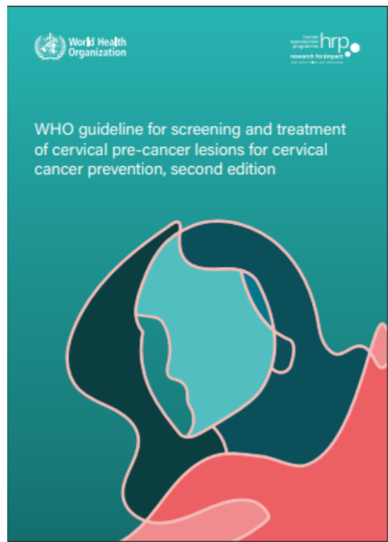
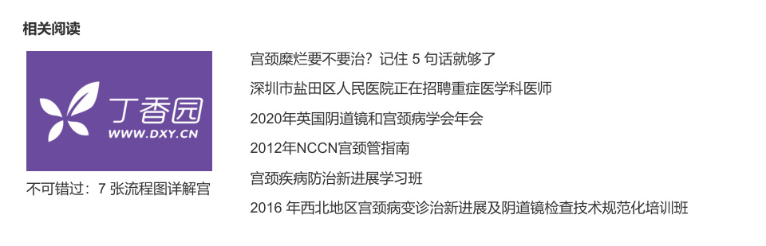

WHO 发布筛查和治疗预防宫颈癌的新指南 - 丁香园  

  
2021-08-16 19:19 来源：微信公众号 - oncolatdxy 作者：肿瘤时间  

# WHO 发布筛查和治疗预防宫颈癌的新指南  

字体大小  

当地时间 7 月 6 日，世界卫生组织（WHO）和联合国人类生殖特别规划处（HRP；联合国系统内人类生殖研究的主要组织，汇集了决策者、科学家、卫生护理提供者、临床医生、消费者和社区代表确定和解决研究的优先事项，以改善性健康和生殖健康）共同发布宫颈癌防治新版指南。  

  

# 宫颈癌发病现状  

子宫颈癌是造成妇女死亡率的主要原因。2020 年，全球约有 60.4 万名妇女被诊断出患有子宫颈癌，约有 34.2 万名妇女死于子宫颈癌。宫颈癌是 23 个国家最常见的癌症，也是 36 个国家导致癌症死亡的主要原因。这些国家中的绝大多数分布在撒哈拉以南非洲、美拉尼西亚、南美洲和东南亚。  

快速准确的筛查计划至关重要，这样每个患有宫颈疾病的女性都能得到她需要的治疗，并避免相关的死亡。  

WHO 全球消除宫颈癌战略 —— 由世界卫生大会于 2020 年批准 —— 呼吁全球 $70 \%$ 的女性定期接受宫颈疾病筛查并进行高效检测，并要求 $90 \%$ 的女性接受适当的治疗。除了为女孩接种人类乳头瘤病毒（HPV）疫苗外，实施这一全球战略可以在未来 100 年内防止超过 6200万人死于宫颈癌。相关组织将在 2021 年底发布世界各国目前在宫颈癌负担和筛查和治疗覆盖率方面的状况的数据。这些国家概况可以帮助卫生部门确定其计划需要加强和衡量实现 2030年目标的进展情况。  

为了使宫颈癌预防和控制计划产生影响，加强患者保留率并确保对 HPV 或宫颈癌前期筛查呈阳性的女性进行快速治疗是一个基本的优先事项。  

这一新的世卫组织指南将指导公共卫生投资，以提供更好的诊断工具、更强大的实施过程和更可接受的筛查选择，以覆盖更多女性并挽救更多生命。  

  

  

关注频道微信 纵览临床新进展 关注频道微博 快速获悉最新信息  

这份 WHO 和 HRP 指南旨在帮助各国在宫颈癌筛查和治疗方面取得更快、更公平的进展。它包括世卫组织推荐的宫颈癌筛查方法的一些重要转变，共包括 23 项建议和 7 项良好做法声明。  

在 23 条建议中，有 6 条对一般妇女和感染 HIV 的妇女是相同的，12 条是不同的，并且针对每个人群都有针对性。  

在 7 项良好做法声明中，3 项对于一般妇女群体和感染 HIV 的妇女是相同的，2 项针对每个群体是不同的和具体的。  

这一最新的预防宫颈癌筛查和治疗指南分三步制定：  

审查当前的指导方针，并确定更新或重新制定的建议。  

根据人群（P）、干预（I）、比较（C）和结果（O）（PICO 问题）为建议制定问题，并进行新的系统性审查或更新为先前指南进行的审查，以及在无法进行初步研究时模拟结果。  

应用建议分级评估、开发和评估（GRADE）方法来评估证据的确定性和利用证据决策表（EtD）制定建议。  

<html><body><table><tr><td>WHO对一般女性群体建议：</td><td>WHO对感染HIV的女性群体建议：</td></tr><tr><td>从30岁开始采用筛查-治疗方法，检测 HPVDNA，每5至10年定期筛查1次</td><td>从25岁开始采用筛查-分诊-治疗方法进</td></tr><tr><td>检测HPVDNA，每5至10年进行1次定次 期筛检</td><td>从 30岁开始采用筛检-分诊-治疗方法，行HPV DNA检测，每3至5年定期筛查1</td></tr></table></body></html>  

# Summary recommendation for the general population of women  

  

WHO suggests using either of the following strategies for cervical cancer prevention among the general population of women:  

HPV DNA detection in a screen-and-treat approach starting at the age of 30 years with regular screening every 5 to 10 years  

HPV DNA detection in a screen, triage and treat approach starting at the age of 30 years with regularscreeningevery5to10years  

Summary recommendation for women living withHIV  

WHO suggests using the following strategy for cervical cancer prevention among women living with HIV:  

HPV DNA detection in a screen, triage and treat approach starting at the age of 25 years with regular screening every 3 to 5 years  

  

# 相关的 Q & A  

1.  使用 「 筛查和治疗 」 方法的建议是什么？  

A.  HPV 作为初步筛查试验呈阳性，在宫颈上放置醋酸确定治疗是否合格时，未见病变，但转化区（TZ）不完全可视化？（类型 3 TZ）  

当转化区由于是宫颈内膜（2 型或 3 型转化区）而不完全可见时，应转诊患者进行阴道镜检查并进一步评估，以下标准有必要接受消融治疗：  

不怀疑侵袭性癌症或腺体疾病（即腺癌或原位腺癌，AIS）。  

转化区完全可见，整个病灶可见，不延伸到宫颈内。  

病变为 1 型转化区。  

当患者不符合消融条件且阴道镜检查不可用时该怎么办？  

干预措施可能受到可行性、培训、项目质量保证和资源的限制。在缺乏某些基础设施的情况下，例如阴道镜、转化区大环切除术（LLETZ）或安全的手术环境，可以在精心选择的情况下考虑桥接策略，以扩大获得治疗的机会，而不是不提供治疗。例如，对于选择的小型 2 型转化区，消融可能是一种选择，其中探针尖端将实现鳞柱交界上皮的完全消融，在那里它可以达到转化区的全部范围、深度和上限，以及提供足够的选择和后续随访。  

# B. VIA 作为初步筛查试验，未见病变，但转化区（TZ）不完全可视化？（类型 3 TZ）  

如上所述，在 VIA 阳性筛选测试后，需要评估消融治疗的资格。当转化区由于是宫颈内膜（2型或 3 型转化区）而不完全可见时，应转诊患者进行阴道镜检查和进一步评估。请注意上述（问题 1A）使患者有资格接受消融治疗的标准，以及当患者不具备消融资格和阴道镜检查服务不可用时该怎么办。  

2.  使用 「 筛选 - 分类 - 治疗 」 方法的建议是什么？  

# A. HPV 作为初步筛查试验呈阳性，VIA 分流试验未显示病变，但转化区不完全可视化？（类型 3 TZ）  

与上述相同的答案将适用。无论是筛查还是分诊，当转化区不完全可见时，应将患者转诊进行阴道镜检查并进一步评估。如果主要筛查测试是 VIA 而不是 HPV，同样适用，并且 VIA 测试由于 3 型 TZ 而不确定。  

请注意上述（问题 1A）使患者有资格接受消融治疗的标准，以及当患者不具备消融资格和阴道镜检查服务不可用时该怎么办。  

3.  上述问题的答案在 HIV 感染的女性群体中会有所不同吗？  

否（基于目前可用的证据）。  

# 4.  HPV 检测呈阳性后，我们应该何时进行分诊治疗？  

在筛查和治疗策略中单独使用 HPV 检测与在筛查、分诊和治疗策略中使用 HPV 检测，然后进行分诊的效果类似；两种策略分别使宫颈癌发病率减少了 $4 6 \%$ 和 $45 \%$ ，死亡率分别减少了$5 1 \%$ 和 $4 9 \%$ 。  

# $\frac { x } { 2 5 }$ 本文仅供医疗卫生等专业人士参考  

策划：GoEun，梅浙  

投稿及合作：yinqihang@dxy.cn  

题图来源：站酷海洛 PLUS  

WHO guideline for screening and treatment of cervical pre-cancer lesions for cervical cancer prevention, second edition. World Health Organization; 2021.  

编辑： 张佳钰  

  

  

# 版权声明  

本网站所有注明“来源：丁香园”的文字、图片和音视频资料，版权均属于丁香园所有，非经授权，任何媒体、网站或个人不得转载，授权转载时须注明“来源：丁香园”。本网所有转载文章系出于传递更多信息之目的，且明确注明来源和作者，不希望被转载的媒体或个人可与我们联系，我们将立即进行删除处理。同时转载内容不代表本站立场。  

<html><body><table><tr><td colspan="4"></td><td colspan="2">关于丁香园</td><td>官方链接</td></tr><tr><td>丁香园旗下网站 丁香园</td><td>用药助手</td><td>丁香医生</td><td>丁香通</td><td>关于我们 友情链接</td><td></td><td>丁香医生</td></tr><tr><td>文献求助</td><td>Insight数据库</td><td>丁香人才</td><td>丁香导航</td><td>联系我们</td><td>加入丁香园</td><td>丁香园新浪微博</td></tr><tr><td>合作案例</td><td>丁香会议</td><td>丁香无线</td><td>丁当商城</td><td>网站声明</td><td>资料下载</td><td></td></tr><tr><td>调查派</td><td>丁香搜索</td><td>丁香云管家</td><td>丁香播咖</td><td>资格证书</td><td></td><td></td></tr><tr><td>智能皮肤</td><td>医院汇</td><td></td><td></td><td></td><td></td><td></td></tr></table></body></html>  

# WHO 发布筛查和治疗预防宫颈癌的新指南 - 丁香园  

Copyright $\circledcirc$ 2000-2025 DXY All Rights Reserved浙B2-20070219(含BBS) | (浙) -经营性-2022-0030 | 浙公网备案 33010802004314 号 | 出版物经营许可证：新出发滨字第0064号网络文化经营许可证：浙网文 [2018]11330-875 号 | 食品许可证：JY13301080010985 号 | 人力资源许可证编号：330108202110270036 号第二类医疗器械经营备案凭证：浙杭食药监械经营备20153170号 | 医疗器械网络销售备案：(浙杭)网械企备字[2018]第00246号违法和不良信息举报电话：0571-28291519 举报邮箱：lawyer@dxy.cn  涉未成年人违法和不良信息举报专区本网站用字经北京北大方正电子有限公司授权许可  