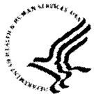

（人類乳突病毒）  

# 疫苗  

# 您需要了解的知識  

# 什磨是HPV?  

生殖器人類乳突病毒（HPV）在美國是最常见的性傅播病毒。  

約有40種HPV。美國約有2000萬人受到感染，每年新增被感染者約有620萬人。HPV透过性接傅播。  

大多數HPV感染不會引起任何症狀，而且會自行消失。但HPV之所以重主要是因為它會引發女性子宫癌。在美國每年約有10,000名婦女患上子宫癌，3,700人死於此病。它是全世界女性患癌死亡的第2大主因。  

HPV舆發生在男性和女性身上的個不太常见的癌症類型也有關。它遥會導致生殖器疣和上呼吸道疣。  

超過 $50 \%$ 的有性生活的男性和女性在其一生中的某個時候會感染上HPV。  

我們無法治療HPV感染，但可治療其引I起的疾病。  

# 2 HPV疫苗- -為什要接種疫苗？  

HPV疫苗是一種非活性（不是活的）疫苗，能抵4種主要類型的HPV。  

這4種類型包括2種會導致約 $70 \%$ 的子宫癌的類型，以及2種導致約 $90 \%$ 的生殖器疣的類型。HPV疫苗可以预防大多數生殖器疣和大多數子宫甄癌病例。  

HPV疫苗應可提供持久的保護。但是已接種疫苗的女性還是需要接受子宫癌，因為疫苗不能抵所有會引起子宫頭癌的HPV類型，  

# 3 應該接種HPV疫苗，何時接種？  

# 常规接種疫苗  

·通常建11至12崴的女孩接種HPV疫苗。醫生可以為年龄小到9崴的女孩注射該疫苗。  

# 為什磨女孩在這個年龄接種HPV疫苗？  

女孩在初次性接之前接種HPV疫苗十分重要，因為那時她们尚未接觸到HPV。對於這些女孩，該疫苗能预防其針對的4種HPV所引起的乎所有疾病。  

但是，如果女孩或成年女子已感染某種HPV，则疫苗将不能预防該種HPV引I起的疾病。  

# 補種疫苗  

·如果13至26崴的女孩及成年女子没有在年龄更小的時候接種過此疫苗，我們也建她們接種疫苗。  

# HPV疫苗分3劑注射：  

第1劑：現在第2劑：第1劑2個月之後第3劑：第1劑6个月之後  

不建注射補充（加強）劑量。  

HPV疫苗可舆其他疫苗同時注射。  

# 有些女孩或成年女子不應接種HPV疫苗或應时不要接種  

·任何曾對酵母、HPV疫苗的任何其他成分或之前注射的HPV疫苗針劑有过危及生命的過敏反應的人都不應注射疫苗。如果注射疫苗的人有任何重過敏現象，請告您的醫生。  

# HPV疫苗  

2/2/2007  

HPV Vaccine - Chinese 2/2/07·孕婦不應注射疫苗。看起來疫苗對孕婦和胎兒都是安全的，但這方面的研究仍在進行當中。不必因在懷孕期間接種了HPV疫苗而考虑終止妊娠。哺乳期婦女可以安全地注射疫苗。  

鼓任何得知在注射HPV疫苗時已經懷孕  
的女性致電  
孕期注射HPV疫苗登記處，  
電话是800-986-8999。  
該登記處的資訊可以助我們了解孕婦對  
疫苗會有什磨反應。  

·在按計劃接種疫苗的日子裹患有輕微疾病的人依然可以注射HPV疫苗。有中度或重疾病的人應等到康復後再注射。  

# 5|HPV疫苗有什風险?  

HPV疫苗未表現出會引起任何重副作用。但是，疫苗和任何藥物一樣，都有可能導致重問題，例如重過敏反應。任何疫苗導致重傷害或死亡的風都是微乎其微的。  

HPV疫苗可能會導致一些輕微間題：  

·注射部位疼痛（10人中約有8人）  
·注射部位發紅或大 (4人中約有1人)  
·輕度發熱（ $1 0 0 ^ { \circ } \mathrm { ~ F ~ } )$ ）（10人中約有1人）  
·注射部位發 （30人中約有1人)  
·中度發熱（ $1 0 2 ^ { \circ } \mathrm { ~ F ~ } )$ ：(65人中約有1人)這些症狀不會持續很久，可自行消失。疫苗引起的危及生命的过敏反應極為少见。如果有過敏反應，则會在接種疫苗後分鐘至小時内出现。和所有疫苗一樣，HPV疫苗將續得到监控，以觀察其是否引起巽常或重問題。  

# 6 如果出現了重反應該怎瓣?  

# 我應該注意什？  

·任何巽常情况，例如高燒或行為巽常。重過敏反應的象包括呼吸困、喉嘶或氣喘、麻疹、白、虚弱、心跳加快或頭量眼花。  

# 我該怎瓣？  

·給醫生打電話，或立刻送病人就醫。  
·告醫生發生了什情况，發生的日期和時間，以及何時注射的疫苗。  
·要求醫生、士或衛生部门交一份疫苗不良事件報告系統（VaccineAdverseEventReportingSystem，簡VAERS）表格，将過敏反應上報。您也可以透过VAERS網站www.vaers.hhs.gov遁交這份報告，或致電1-800-822-7967。VAERS不提供醫療建。  

# 7|我怎樣了解更多相關知識？  

·詢問您的醫生或護士。他們會給您看疫苗明書，或推其他的資訊來源。  
·給您所在地或所在州的衛生部門打電話。  
·聯絡疾病控制舆预防中心（Centers for DiseaseControl and Prevention，簡CDC）:- 致電800-232-4636 (1-800-CDC-INFO)-CDC的網站www.cdc.gov/std/hpv和www.cdc.goy/nip.  

  

  

衛生和人類服務部疾病控制舆预防中心國家免疫和呼吸道疾病中心  

<html><body><table><tr><td>疫苗資訓聲明（時）</td></tr><tr><td>人類乳突病毒（HPV）疫苗-Chinese 2/2/07</td></tr></table></body></html>  

Translation provided by NYC Dept. of Education and NYC Dept. of Health and Mental Hygiene.  