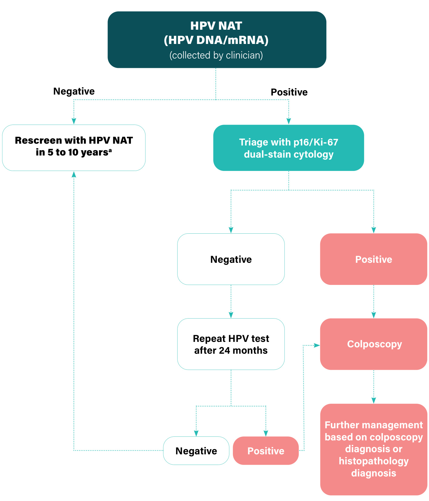
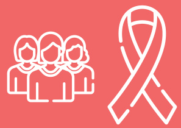

# WHO guideline for screening and treatment of cervical pre-cancer lesions for cervical cancer prevention Use of dual-stain cytology to triage women after a positive test for human papillomavirus (HPV)  

  

# WHO guideline for screening and treatment of cervical pre-cancer lesions for cervical cancer prevention  

Use of dual-stain cytology to triage women after a positive test for human papillomavirus (HPV)  

# WHO guideline for screening and treatment of cervical pre-cancer lesions for cervical cancer prevention: use of dual-stain cytology to triage women after a positive test for human papillomavirus (HPV)  

(WHO guideline for screening and treatment of cervical pre-cancer lesions for cervical cancer prevention, second edition)  

ISBN 978-92-4-009165-8 (electronic version) ISBN 978-92-4-009166-5 (print version)  

# $\circledcirc$ World Health Organization 2024  

Some rights reserved. This work is available under the Creative Commons Attribution-NonCommercial-ShareAlike 3.0 IGO licence (CC BY-NC-SA 3.0 IGO; https://creativecommons.org/licenses/by-nc-sa/3.0/igo).  

Under the terms of this licence, you may copy, redistribute and adapt the work for non-commercial purposes, provided the work is appropriately cited, as indicated below. In any use of this work, there should be no suggestion that WHO endorses any specific organization, products or services. The use of the WHO logo is not permitted. If you adapt the work, then you must license your work under the same or equivalent Creative Commons licence. If you create a translation of this work, you should add the following disclaimer along with the suggested citation: “This translation was not created by the World Health Organization (WHO). WHO is not responsible for the content or accuracy of this translation. The original English edition shall be the binding and authentic edition”.  

Any mediation relating to disputes arising under the licence shall be conducted in accordance with the mediation rules of the World Intellectual Property Organization (http://www.wipo.int/amc/en/mediation/rules/).  

Suggested citation. WHO guideline for screening and treatment of cervical pre-cancer lesions for cervical cancer prevention: use of dual-stain cytology to triage women after a positive test for human papillomavirus (HPV). Geneva: World Health Organization; 2024 (WHO guideline for screening and treatment of cervical pre-cancer lesions for cervical cancer prevention, second edition). Licence: CC BY-NC-SA 3.0 IGO.  

ataloguing-in-Publication (CIP) data. CIP data are available at https://iris.who.int/.  

Sales, rights and licensing. To purchase WHO publications, see https://www.who.int/publications/book-orders. To submit requests for commercial use and queries on rights and licensing, see https://www.who.int/copyright.  

Third-party materials. If you wish to reuse material from this work that is attributed to a third party, such as tables, figures or images, it is your responsibility to determine whether permission is needed for that reuse and to obtain permission from the copyright holder. The risk of claims resulting from infringement of any third-party-owned component in the work rests solely with the user.  

General disclaimers. The designations employed and the presentation of the material in this publication do not imply the expression of any opinion whatsoever on the part of WHO concerning the legal status of any country, territory, city or area or of its authorities, or concerning the delimitation of its frontiers or boundaries. Dotted and dashed lines on maps represent approximate border lines for which there may not yet be full agreement.  

The mention of specific companies or of certain manufacturers’ products does not imply that they are endorsed or recommended by WHO in preference to others of a similar nature that are not mentioned. Errors and omissions excepted, the names of proprietary products are distinguished by initial capital letters.  

All reasonable precautions have been taken by WHO to verify the information contained in this publication. However, the published material is being distributed without warranty of any kind, either expressed or implied. The responsibility for the interpretation and use of the material lies with the reader. In no event shall WHO be liable for damages arising from its use.  

Design: Studio FFFOG Layout: Green Ink Publishing Services Ltd  

# Contents  

Acknowledgements v  

Abbreviations vii  

Executive summary viii  

  

1.	 Introduction 1  

1.1	 Background 1   
1.2 	 Dual-stain cytology and interpretation of test results 3   
1.3 	 Phased approach for development of updated recommendations and purpose of this guideline 3   
1.4 	 Previous and existing WHO recommendations for screening and treatment to prevent cervical cancer, and definitions 5   
1.5 	 Target audience 8  

# 2.	 Methods for development of recommendations on HPV mRNA testing 9  

2.1 	 Groups contributing to the guideline development process 9   
2.2 	Priority questions for review of evidence 10   
2.3 	Priority algorithms 11   
2.4 	Outcomes 12   
2.5 	Syntheses of evidence 13   
2.6 	Development of the recommendations 16   
2.7 	Management of the external peer review 17  

  

3.	 Recommendations on dual-stain cytology to triage women after a positive HPV nucleic acid test (NAT) result 18  

4.	 Research gaps and further considerations for dual-stain cytology 22  

5.	 Dissemination and updating of the guideline 23  

5.1 Guideline dissemination and impact 23   
5.2 Guideline update 24  

  

References 25  

Annexes 28  

Annex 1. 	Guideline groups 29  

Annex 2. 	Evidence-gathering teams and guideline task groups 37   
Annex 3. 	Declarations of interests 38   
Annex 4. 	Algorithms for use of dual-stain cytology as a triage test in the general population of women 40   
Annex 5.	 Recommendations for the use of HPV DNA tests and HPV mRNA tests and other cervical screening methods 43  

Web Annex A. Syntheses of evidence. Available at: https://iris.who.int/handle/10665/342366 (includes IARC handbook materials and Supplementary materials 1–13)  

Web Annex B. Evidence summaries. Available at: https://iris.who.int/handle/10665/376493  

Web Annex C. Evidence-to-decision framework for dual-stain cytology to triage women after a positive test for human papillomavirus (HPV). Available at: https://iris.who.int/ handle/10665/376494  

# Acknowledgements  

The Department of Sexual and Reproductive Health and Research, the Department of Global HIV, Hepatitis and Sexually Transmitted Infections Programmes and the Department of Noncommunicable Diseases, Rehabilitation and Disability at the World Health Organization (WHO) would like to thank members of the Guideline Development Group (GDG) for their consistent availability and commitment to making this guideline possible, and the members of the External Review Group (ERG) and all other external contributors for their work. The Departments are also grateful to the International Agency for Research on Cancer (IARC) for the literature reviews performed in the context of the updating of the IARC handbooks of cancer prevention: cervical cancer screening, Vol. 18 (2021), which were extremely useful for this guideline development process. Special thanks go to Nancy Santesso, the guideline methodologist from McMaster University. The names of the members of the GDG and the ERG and those of the other contributors, in particular systematic reviewers, modellers and costing teams, are listed below, with full details provided in Annexes 1–3. We appreciate the overall support of the WHO Guidelines Review Committee (GRC) Secretariat during the guideline development process, with grateful thanks to Rebekah Thomas Bosco, who is leading the GRC Secretariat.  

The WHO Steering Group was composed of Nathalie Broutet, Shona Dalal, Linda Eckert (who also supported the GDG, the working groups for specific aspects of the guideline, and the WHO Secretariat), Morkor Newman and Ajay Rangaraj. This group was assisted by Myriam Cortes and Jane Werunga-Ndanareh. Nathalie Broutet and Shona Dalal also led the guideline development process.  

The members of the GDG were Claire Achieng, Silvina Arrossi, Muhammad Atif Waqar, Ruth Awori, Ruanne Barnabas, Itamar Bento Claro, Neerja Bhatla, Marie-Claude Boily, Laia Bruni, Joanna Cain, Lameck Chinula, Z. Mike Chirenje (GDG Co-Chair), Michael Chung, Flavia Miranda Correa, Miriam Cremer, Teresa Darragh, Lynette Denny, Silvia de Sanjosé, Mamadou Diop, Wachara Eamratsameekool, Julia Gage, Ali Ghanbari-Motlagh, Patti Gravitt, Margaret Happy, Tarek Hashem, Rolando Herrero, Priscilla Ingbian, Ebony Johnson, Bayarsaikhan Luvsandorj, Anne Mackie, Mauricio Maza, Kelle Moley, Sebitloane Motshedisi, Nelly Mugo, Raul Murillo, Laura Muzingwani, Ashrafun Nessa, Dorcas Obiri-Yeboah, Gina Ogilvie, Patrick Petignat, Maria Alejandra Picconi, Leeya Pinder, Walter Prendiville, Veronica Reis, Gracia Violetta Ross Quiroga, Vikrant Sahasrabuddhe, Pete Sasieni, Netsanet Shiferaw, Rose Slavkovsky, Myint Myint Thinn, Kerry Thomson, Julie Torode (GDG Co-Chair), Nicolas Wentzensen and Fanghui Zhao.  

The members of the ERG were Raveena Chowdhury, Heather Cubie, Suzanne Garland, Sarita Ghimire, Zaki El Hanchi, Ha Hyeong In, Oh Jin Kyoung, Alejandra Meglioli, Mohammed Moawia, Lim Myong Cheol, Angélica Nogueira, Mark Schiffman, Saritha Shamsunder, Vanita Suri, Carolina Teran, Ted Trimble, Gino Venegas and Heather White.  

External contributors to the evidence profiles were Marc Arbyn, Karen Canfell, Michael Caruana, Owen Demke, Cindy Gavreau, Michaela Hall, Adam Keane, James Killen, Beatrice Lauby-Secretan, Gigi Lui, Diep Nguyen and Kate Simms.  

The following individuals acted as observers at the GDG meeting: Benjamin Anderson, Danielle Engel, J. (Hans) Berkhof, Michelle Chevalier, Smiljka de Lussigny, Eduardo Franco, Lisa Pei-Ching Huang, Krishna Jafa, Jose Jeronimo, Somesh Kumar, Ilana Lapidos-Salaiz, David Mesher, Jasantha Odayar, Groesbeck Parham, Carmen Perez Casas and Felipe Roitberg, Anna Shakarishvili and Petra ten Hoope-Bender.  

The WHO Secretariat included Maribel Almonte Pacheco, Prebo Barango, Partha Basu, Paul Bloem, Nathalie Broutet, Gary Clifford, Marilys Corbex, Myriam Cortes, Shona Dalal, Jean-Marie Dangou, Maeve De Mello, Gampo Dorji, Linda Eckert, Fayad El Sheikh, Elena Fidarova, Massimo Ghidinelli, Karima Gholbzouri, Rodolfo Gómez Ponce de León, Sami Gottlieb, Joumana George Hermez, Raymond Hutubessy, Andre Ilbawi, Naoko Ishikawa, Chandani Anoma Jayathilaka, Sharon Kapambwe, Rajat Khosla, Stephanie Yetunde Kuku, Hugues Lago, Beatrice Lauby-Secretan, Silvana Luciani, Priya Mannava, Dara Masoud, Manjulaa Narasimhan, Elick Narayan, Morkor Newman, Leopold Ouedraogo, Tina Purnat, Neena Raina, Ajay Rangaraj, Leanne Margaret Riley, Anita Sands, Catherine Sauvaget, Tshidi Sebitloane, Mukta Sharma, Hai-rim Shin, Slim Slama, Vitaly Smelov, Howard Sobel, Ute Ströher, Josaia Tiko, Huong Tran, Adriana Velazquez Berumen, Lara Vojnov and Hongyi Xu.  

Funding for the preparation, development and printing of the guideline was provided by the UNDP-UNFPA-UNICEF-WHO-World Bank Special Programme of Research, Development and Research Training in Human Reproduction (HRP), with the support of the United States President’s Emergency Plan for AIDS Relief (PEPFAR) through the United States Agency for International Development (USAID), and Unitaid.  

# Abbreviations  

AIS adenocarcinoma in situ   
CIN cervical intraepithelial neoplasia   
CKC cold knife conization   
DOI declaration of interest   
ERG External Review Group   
EtD evidence-to-decision   
GDG Guideline Development Group   
GRC Guidelines Review Committee   
GRADE Grading of Recommendations Assessment, Development and Evaluation   
HPV human papillomavirus   
HRP UNDP-UNFPA-UNICEF-WHO-World Bank Special Programme of Research, Development and Research Training in Human Reproduction   
IARC International Agency for Research on Cancer   
LBC liquid-based cytology   
LEEP loop electrosurgical excision procedure (also known as LLETZ)   
LLETZ large-loop excision of the transformation zone (also known as LEEP)   
mRNA messenger ribonucleic acid (referring to HPV E6/E7 messenger RNA)   
NAAT nucleic acid amplification test   
NAT nucleic acid test1   
PEPFAR The United States President’s Emergency Plan for AIDS Relief   
PICO population (P), intervention (I), comparator (C), outcome (O)   
SDG Sustainable Development Goal   
UNDP United Nations Development Programme   
UNFPA United Nations Population Fund   
UNICEF United Nations Children’s Fund   
USAID United States Agency for International Development   
VIA visual inspection with acetic acid   
WHO World Health Organization  

# Executive summary  

# Background  

In 2022, cervical cancer was the fourth most commonly occurring cancer among women globally and also the fourth leading cause of cancer deaths among women, accounting for around 662 000 new cases and around 349 000 deaths. It is the most common cancer in women in 25 countries, many of which are in sub-Saharan Africa. Even while recognizing varying incidence levels, cervical cancer can be eliminated as a public health problem, through the scale-up of the World Health Organization (WHO) Cervical Cancer Elimination Initiative.  

In May 2018, Dr Tedros Adhanom Ghebreyesus, Director-General of WHO, issued a call to action for the elimination of cervical cancer. In November 2020, the Director-General launched the Global Strategy to accelerate the elimination of cervical cancer.  

The targets of the Global Strategy are to achieve by 2030:  

• $90 \%$ of girls fully vaccinated with human papillomavirus (HPV) vaccine by age 15 years; $70 \%$ of women screened with a high-performance test by 35 years of age and again by 45 years of age; and $90 \%$ of women identified with cervical disease receive treatment.  

Following the launch of the Global Strategy, a large panel of experts met to define the key areas of focus to increase access to screening and treatment to reach the 2030 targets. One of the agreed areas of focus was to update the existing 2013 WHO guidelines for screening and treatment of precancerous lesions for cervical cancer prevention, and to simplify the algorithms.  

It was decided that WHO’s updated cervical cancer screening and treatment guidance would be developed in four phases. The output of the first phase was a large set of recommendations and good practice statements on screening and treatment, with a primary focus on the use of HPV DNA tests, and key clinical algorithms for screening and triage strategies (primary screening with HPV DNA-based tests, VIA or cytology, and triage tests after a positive primary screen, including partial genotyping, colposcopy, VIA or cytology) for both the general population of women (i.e. women who are presumed or confirmed to be HIV-negative) and those living with HIV. This output was published in July 2021.1  

# Two approaches to screening and treatment are distinguished:  

In the “screen-and-treat approach”, the decision to treat is based on a positive primary screening test only.  

In the “screen, triage and treat approach”, the decision to treat is based on a positive primary screening test followed by a positive second test (a “triage” test), with or without histologically confirmed diagnosis.  

The second phase was to develop recommendations for the use of HPV mRNA (messenger ribonucleic acid) tests as a primary screening test and dual-stain cytology as a triage test to detect cervical pre-cancer and prevent cervical cancer. The recommendations for the use of HPV mRNA tests were published in December 2021.2 This current guideline presents the recommendations for dual-stain cytology as a triage test, thus completing the second phase.  

Dual-stain cytology can be used as a triage test in the “screen, triage and treat approach” to cervical cancer prevention. It is performed on liquid-based cytology (LBC) slides (not on conventional Pap smears) to detect the presence of two proteins: p16 and Ki-67. These two proteins are co-expressed in cells that have been transformed by high-risk HPV. When both proteins are detected in the same cell(s), this is interpreted as a positive dual-stain cytology result, meaning that there is an increased risk that cervical intraepithelial neoplasia 2/3 (CIN 2/3) lesions, also referred to as high-grade squamous intraepithelial lesions, are present.  

# Methods  

The guideline has been developed according to the WHO handbook for guideline development, second edition (2014). The Guideline Development Group (GDG) for this guideline was formed in early 2019 and, based on their clinical expertise, research and knowledge of tests in development, identified 13 clinical algorithms (involving several different screening tests) for screening and treatment that could be evaluated. Seven of these algorithms were addressed in the July 2021 edition of the updated guideline and another four were addressed in the December 2021 edition, while the final two algorithms are addressed in this current guideline publication.  

The GDG, WHO Steering Group and WHO Secretariat, methodologists and technical groups (see Annex 1) met several times to discuss the evidence pertaining to the previously established PICO (population, intervention, comparator, outcome) questions related to the algorithms using dual-stain cytology as a triage test. A review of published and unpublished data from cross-sectional and longitudinal studies, and a systematic review and meta-analysis of the accuracy of dual-stain cytology as a triage test were conducted. A natural-history-based population simulation model was used to estimate the risk of important outcomes (e.g. primary and recurrent high-grade CIN and cervical cancer) with the use of different triage tests used in screening and treatment strategies. In addition, modelling evaluated the number of treatments and the cost-effectiveness of the different strategies. Due to the paucity of data for the acceptability, feasibility, resources and equity aspects of the use of dual-stain cytology as a triage test, the views of the GDG were used to inform decisions. During the GDG meetings, the GDG members reviewed the evidence and made the recommendations presented in this guideline, applying the Grading of Recommendations Assessment, Development and Evaluation (GRADE) methodology.  

# Summary of recommendations for the use of dual-stain cytology as a triage test to prevent cervical cancer  

In this publication, only recommendations for the use of dual-stain cytology as a triage test are presented. Please refer to the previous edition of the guidelines for recommendations on screening and treatment to prevent cervical cancer with a focus on HPV DNA testing published in July 2021, and for recommendations with a focus on HPV mRNA testing published in December 2021. When using the term HPV NATs, we are referring to molecular nucleic acid tests (NATs) for the detection of high-risk (i.e. cancer-causing or oncogenic) HPV types, including the two types of tests, such as HPV DNA-based molecular NATs or HPV mRNA-based molecular NATs.3  

# Recommendation for the general population of women:  

In a screen, triage and treat approach using HPV NATs as the primary screening test among the general population of women, WHO suggests using partial genotyping, colposcopy, VIA, cytology or dual-stain cytology to triage women after a positive HPV NAT result.  

  

When providing dual-stain cytology to triage women after a positive HPV NAT, WHO suggests:  

using samples collected by the health worker; and   
retesting with HPV NAT 24 months after a negative dual-stain cytology result.  

These are conditional recommendations based on low-certainty evidence for dual-stain cytology as a triage test.  

# Remarks:  

The benefits and harms of the triage options are similar; therefore, the choice of triage method will be dependent on feasibility, training, programme quality assurance, capacity for follow-up testing and resources in countries.  

Dual-stain cytology and the other triage options are used in the context of screening algorithms using HPV NATs as the primary screening test, which recommend screening intervals of 5–10 years for HPV DNA tests and 5 years for HPV mRNA tests.  

# Recommendation for women living with HIV:  

No recommendation was made for using dual-stain cytology to triage women living with HIV after a positive HPV DNA test, because evidence on the outcomes of using dual-stain cytology applicable to this population was minimal. Therefore, the following recommendation remains current for the use of triage tests for this population.  

In a screen, triage and treat approach using HPV DNA detection as the primary screening test among women living with HIV, WHO suggests using partial genotyping, colposcopy, VIA or cytology to triage women after a positive HPV DNA test.  

# Programme implementation considerations  

Considering the implications for programme implementation, dual-stain cytology is most similar to LBC, among existing screening and triage options. Dual-stain cytology has been developed and validated for LBC slides, not for conventional Pap smears. Hence, dual-stain cytology requires an LBC infrastructure. Dual-stain cytology also requires infrastructure for immunostaining, which may include an autostainer, and training is required for correct interpretation of dual-stain slides. Proficiency in reading dual-stain cytology can be achieved faster than for Pap cytology, and reproducibility of dual-stain cytology results is higher than that of cytology. Being a cytological method needing specific laboratory infrastructure, dual-stain cytology cannot be implemented as a point-of-care test, but can be implemented in centralized, high-standard laboratories that serve multiple screening sites. Experience implementing this technology in low-resource settings is lacking. Dual-stain cytology has not yet been validated in self-collected samples. It is critically important that dual-stain cytology is implemented within a health system that ensures adequate laboratory infrastructure, quality assurance, management and monitoring of follow-up testing for those women referred to 24-month follow-up surveillance after a negative dual-stain result.  

# Introduction  

# 1.1 Background  

In 2022, cervical cancer was the fourth most commonly occurring cancer among women globally and also the fourth leading cause of cancer deaths among women, accounting for around 662 000 new cases and around 349 000 deaths. It is the most common cancer in women in 25 countries, many of which are in sub-Saharan Africa $( 7 )$ . Even while recognizing varying incidence levels, cervical cancer can be eliminated as a public health problem, through the scale-up of the World Health Organization (WHO) Cervical Cancer Elimination Initiative.  

In May 2018, Dr Tedros Adhanom Ghebreyesus, Director-General of WHO, issued a call to action for the elimination of cervical cancer. A WHO Global Strategy to accelerate the elimination of cervical cancer as a public health problem was presented and unanimously endorsed by the Seventy-third World Health Assembly in August 2020. Subsequently, WHO officially launched the Global Strategy to accelerate the elimination of cervical cancer on 17 November 2020 (2).  

The targets of the Global Strategy are to achieve, by 2030:  

90% of girls fully vaccinated with human papillomavirus (HPV) vaccine by age 15 years; $70 \%$ of women screened with a high-performance test by 35 years of age and again by 45 years of age; and $90 \%$ of women identified with cervical disease receive treatment ( $90 \%$ of women with pre-cancer treated, and $90 \%$ of women with invasive cancer managed) $( 2 )$  

In the context of this Global Strategy, countries are updating their protocols for the prevention of cervical cancer and for the care and treatment of affected women. Cervical cancer prevention also plays an integral role in reaching the Sustainable Development Goals (SDGs), both for health (SDG 3) and gender equality (SDG 5).  

To prevent cervical cancer, women can be screened using various tests to identify those who have or are at risk of cervical pre-cancer (see Table 1.1). Cervical intraepithelial neoplasia (CIN) is characterized by cellular changes in the transformation zone of the cervix. CIN is typically caused by infections with HPV, especially the high-risk HPV types such as types 16 and 18 (these two types cause more than $70 \%$ of cervical cancers) $( 3 ,$ 4). CIN1 lesions – also referred to as low-grade squamous intraepithelial lesions – are morphological correlates of HPV infections. CIN2/3 lesions – also referred to as high-grade squamous intraepithelial lesions – are correlates of cervical pre-cancers that, if left untreated, may progress to cervical cancer (for further details, refer to Chapter 1 of WHO’s Comprehensive cervical cancer control guidance $[ 5 ]$ ).  

  

Table 1.1 Three approaches to cervical cancer screening and future tests   

<html><body><table><tr><td>Molecular</td><td>Cytologic</td><td>Visual inspection</td></tr><tr><td>Nucleic acid tests (NAT)a 》 HPV DNA</td><td>Conventional Pap smeara</td><td>Visual inspection with acetic acid (VIA)a or with</td></tr><tr><td rowspan="3">》 HPV mRNA</td><td>Liquid-based cytology</td><td>Lugol's iodine (VILI)</td></tr><tr><td>(LBC)a</td><td>》 naked eye</td></tr><tr><td>Dual-stain cytology to</td><td>》 magnified by colposcope or camera</td></tr><tr><td>Protein biomarkersb</td><td>identify p16 and Ki-67a</td><td>Automated visual</td></tr><tr><td>》 HPV antibodies</td><td></td><td>evaluation of digital</td></tr><tr><td>》 oncoproteins</td><td></td><td>imagesb</td></tr></table></body></html>

a Current tests b Tests under evaluation (future tests).  

The traditional method to screen women for cervical cancer has been cytology. The Papanicolaou (Pap) smear or liquid-based cytology (LBC) smear test checks whether cells in the cervix are abnormal. Cells are collected via speculum examination with a brush and swab, and placed either directly onto a slide to which a fixative is added (conventional cytology) or in a bottle with a liquid storage medium (LBC). Abnormal cervical cells testing as “atypical squamous cells of undetermined significance (ASCUS), low grade to high grade” may mean that there are pre-cancer changes in the cervix that may lead to cervical cancer. When cytology results are positive, the diagnosis is confirmed by colposcopy, and appropriate treatment is informed by biopsy of suspicious lesions for histological diagnosis. In this guideline, “cytology” refers to either conventional cytology or LBC.  

Newer screening tests introduced in the last 15 years include visual inspection with acetic acid (VIA) and molecular tests – mainly high-risk HPV DNA-based tests,4 which are suitable for use in all settings (Table 1.1). More recently, additional tests and techniques have been developed: (i) molecular tests such as those based on HPV mRNA (messenger ribonucleic acid), oncoprotein detection or DNA methylation; (ii) tests performed on cytological samples, such as p16/Ki-67 dual-stain cytology; and (iii) visual tests based on artificial intelligence/machine learning platforms (e.g. automated visual evaluation of digital images) (6–9).  

# 1.2 Dual-stain cytology and interpretation of test results  

The focus of this edition of the updated guideline is the use of dual-stain cytology as a triage test. Dual-stain cytology is performed on liquid-based cytology (LBC) slides (not on conventional Pap smears) to detect the presence of two proteins: p16 and Ki-67. p16 protein is expressed in cells that have been transformed by high-risk HPV due to actions of the HPV oncoprotein E7. p16 overexpression is shown in most cervical pre-cancer lesions and cancers, but it is rarely observed in normal tissue. Co-expression of the antiproliferative p16 protein and the proliferation marker Ki-67 within the same cervical epithelial cell can be used as a surrogate marker of cell-cycle deregulation mediated by HPV oncoproteins. When dual-stain cytology slides show cervical epithelial cells with brown cytoplasmic p16 immunostaining and red nuclear Ki-67 immunostaining in the same cell(s), this is interpreted as a positive dual-stain cytology result, meaning there is an increased risk that CIN2/3 lesions are present.  

# 1.3 Phased approach for development of updated recommendations and purpose of this guideline  

Following the 2020 launch of the Global Strategy to accelerate the elimination of cervical cancer as a public health problem $( 2 ) ,$ a large panel of experts met to define the key areas of focus to increase access to screening and treatment to reach the 2030 targets. One of the agreed areas of focus was to update the existing 2013 WHO guidelines for screening and treatment of precancerous lesions for cervical cancer prevention (10), and to simplify the algorithms.  

# Guideline objective:  

To improve national strategies for screening and treatment to prevent cervical cancer in all women, including women living with HIV.  

  

It was decided that WHO’s updated cervical cancer screening and treatment guidance would be developed in four phases:  

# Phase 1  

Updated recommendations on screening and treatment and the clinical algorithms for the most commonly used primary screening tests (HPV DNA tests, VIA and cytology) and triage strategies (partial genotyping, colposcopy, VIA and cytology) for both women in general (i.e. women who are presumed or confirmed to be HIV-negative) and those living with HIV. Phase 1 also addresses routine screening programmes, the ages at which to initiate and stop screening, and the frequency of screening.  

# Phase 2  

Evaluate the evidence and develop recommendations for the clinical algorithms using (a) HPV mRNA tests and (b) dual-stain cytology as a triage test in women testing HPV-NAT positive for the general population of women and for women living with HIV.  

Phase 3 Develop recommendations for the implementation of these screening and treatment strategies.  

# Phase 4  

Establish a consolidated “living guideline” for screening and treatment tests and algorithms (combining all the output from Phases 1–3), which will allow the recommendations to be updated as new evidence becomes available and is evaluated.  

The output of Phase 1 was a guideline that was published and launched in July 2021, WHO guideline for screening and treatment of cervical pre-cancer lesions for cervical cancer prevention, second edition, presenting a large set of recommendations and good practice statements on screening and treatment, with a primary focus on the use of HPV DNA tests, and key clinical algorithms for screening and triage strategies for both the general population of women (i.e. women who are presumed or confirmed to be HIV-negative) and those living with HIV. For the rationale for the development of the new edition of recommendations for screening and treatment to prevent cervical cancer, please refer to section 1.3 of that guideline (11).  

In December 2021, recommendations for the use of HPV mRNA tests as a primary screening test were published as part of the output of Phase 2, in WHO guideline for screening and treatment of cervical pre-cancer lesions for cervical cancer prevention: use of mRNA tests for human papillomavirus (HPV) (12). A policy brief summarizing the use of HPV DNA and HPV mRNA tests to screen for cervical pre-cancer was also published in 2022 (13).  

Summary tables of the July/HPV DNA and December/HPV mRNA 2021 recommendations are provided in Annex 5.  

The objective of this second part of Phase 2 was to develop recommendations for the use of dual-stain cytology as a triage test for cervical cancer prevention – both in the general population of women and in women living with HIV. In addition to evidence gathered for the first two sets of recommendations, this guideline is also supported by evidence compiled in the IARC handbooks of cancer prevention: cervical cancer screening, Vol. 18, and by Bouvard et al. in a special report in the New England Journal of Medicine (14, 15).  

The clinical flowcharts for the algorithms presented in this guideline include strategies using dual-stain cytology as a triage test in women who have received a positive HPV NAT result (HPV DNA or mRNA test). In the near future, the recommendations in this guideline will be integrated with the recommendations recently published in the two 2021 guidelines mentioned above, on the use of HPV DNA tests $( 7 7 )$ and the use of HPV mRNA tests $( 7 2 ) .$ along with the forthcoming recommendations on the implementation of screening and treatment strategies (Phase 3), to develop a full consolidated “living guidelines” version of this guidance (Phase 4).  

# 1.4 Previous and existing WHO recommendations for screening and treatment to prevent cervical cancer, and definitions  

In 2006, WHO published Comprehensive cervical cancer control: a guide to essential practice (C4GEP), which was updated in a second edition in 2014 $( 5 ) ,$ consolidating all the recommendations for screening and treatment to prevent and treat cervical cancer up to that year. The consolidated C4GEP included the WHO recommendations for HPV vaccination, treatment of cervical cancer and pre-cancer lesions, and palliative care, as well as the recommendations from the previous edition (2013) of this guideline, then titled WHO guidelines for screening and treatment of precancerous lesions for cervical cancer prevention (10). In 2019, WHO published guidance on the use of thermal ablation for treatment of cervical pre-cancer lesions (16) and in 2020, WHO published guidance documents to support the introduction and scale-up of screening and treatment interventions, specifically relating to HPV testing and relevant medical devices $( 7 7 )$ .  

In the updated second edition of the recommendations on screening and treatment for cervical cancer prevention, two populations of women are referred to: women living with HIV and the general population of women, which refers to women who are presumed or confirmed to be HIV-negative, or whose HIV status may be unknown. In addition, two approaches to screening and treatment are distinguished, the “screen-and-treat approach” and the “screen, triage and treat approach”.  

# Screening and treatment approaches  

In the “screen-and-treat approach”, the decision to treat is based on a positive primary screening test only.  

  

In the “screen, triage and treat approach”, the decision to treat is based on a positive primary screening test followed by a positive second test (a “triage” test), with or without histologically confirmed diagnosis.  

  

In a screen-and-treat approach, treatment is provided based on a positive primary screening test alone, without triage (i.e. no second screening test and no histopathological diagnosis).  

•	 When the patient is eligible for ablative treatment, this should ideally be done immediately, at the same visit as the screening test (the single-visit approach). At some facilities, this is not feasible and a second visit is needed (the two-visit approach). Women who are not eligible for ablation can have excisional treatment on the same day if the clinic has the capacity for large-loop excision of the transformation zone (LLETZ).5  If LLETZ is not available on-site, women need to be referred for the excisional treatment or for further evaluation.  

In a screen, triage and treat approach, the triage test is done if the primary screening test is positive, and the decision to treat is made when both the primary test and the triage test are positive.  

•	 A positive triage test can lead to colposcopy with biopsy and histopathological examination for diagnosis to determine the appropriate treatment. The implementation of colposcopy and biopsy can be challenging, however, so this guideline also considers triage strategies that are not dependent on the availability of colposcopy.   
•	 When the primary screening test is positive, and the triage test is negative, women need appropriate follow-up evaluation at a specified interval in accordance with the recommendations.   
If the triage test is visual, a single visit combining screening, triage and treatment is also feasible.  

The publication of the output of Phase 1 of the update of the recommendations for screening and treatment to prevent cervical cancer (in July 2021) presented 23 recommendations and 7 good practice statements (11). Those recommendations focused mainly on the use of HPV DNA testing as the primary screening test. In addition, one recommendation addressed the types of triage tests that could be used after a positive primary screening test. Later, in December 2021, the output of the first part of Phase 2 was published, presenting one recommendation on the use of HPV mRNA testing as the primary screening test (12). Table 1.2 provides a summary of those recommendations.  

Table 1.2 Summary recommendations from the WHO guideline for screening and treatment of cervical pre-cancer lesions for cervical cancer prevention, second edition: (i) HPV DNA tests and (ii) HPV mRNA tests  

<html><body><table><tr><td>General population of women</td><td>Women living with HIV</td></tr><tr><td>WHO suggests using either of the following strategies for cervical cancer prevention among the general population of women: 》 HPV DNA detection in a screen-and-treat approach starting at the age of 30 years</td><td>WHO suggests using the following strategy for cervical cancer prevention among women living with HIV: 》 HPV DNA detection in a screen, triage</td></tr><tr><td>with regular screening every 5 to 10 years. 》 HPV DNA detection in a screen, triage and treat approach starting at the age of 30 years with regular screening every 5 to 10 years.</td><td>and treat approach starting at the age of 25 years with regular screening every 3 to 5 years.</td></tr><tr><td>WHO suggests that HPV mRNA detection using samples taken by the health worker may be used as a primary screening test, either with or without triage, to prevent cervical cancer in the general population of women with regular screening every 5 years.</td><td>No recommendation was made for using HPV mRNA in women living with HIV.</td></tr><tr><td>In a screen, triage and treat approach using NATs for HPV detection as the primary screening test among the general population of women, WHO suggests using partial genotyping, colposcopy, VlA or cytology to triage women after a positive HPV test.</td><td>In a screen, triage and treat approach using HPV DNA detection as the primary screening test among women living with HIv, WHO suggests using partial genotyping, colposcopy, VlA or cytology to triage women after a positive HPV DNA test.</td></tr></table></body></html>  

Sources: WHO, 2021 (11), WHO, 2021 $( 1 2 )$ .  

The full set of recommendations, along with relevant remarks, is provided in the guidance published in 2021 focused on the use of HPV DNA tests and the use of HPV mRNA tests (11, 12), and also in Annex 5 of this guideline.  

# 1.5 Target audience  

This document is intended primarily for policy-makers, programme managers, programme officers and other professionals in the health sector who have responsibility for choosing strategies for cervical cancer prevention, at country, regional and district levels. Health workers – such as doctors, nurses and community health workers working in reproductive health programmes, antenatal and postnatal services, family planning services, HIV/AIDS control programmes and in clinics that care for women at the district and primary health care levels – may also consult this document to understand how recommendations are developed and why it is vitally important to select and implement evidence-based strategies to prevent cervical cancer.  

This document could be used as the basis for developing an adapted publication for women and their families to support them in making decisions about cervical cancer screening and treatment.  

All individuals have the right to equality and non-discrimination in sexual and reproductive health care. In this guideline, we recognize that most of the available evidence on cervical cancer is based on study populations of cisgender women, and we also recognize that cisgender women, transgender men, non-binary, gender fluid and intersex individuals born with a female reproductive system require cervical cancer prevention services. However, to be concise and facilitate readability, we use the term “women” to refer to all gender diverse people at risk for cervical cancer. Sexual and reproductive health service providers and cervical cancer prevention services must consider the needs of – and provide equal care to – all individuals independently of gender identity or its expression.  

# 2. Methods for development of recommendations on HPV mRNA testing  

This updated guideline has been developed in accordance with the methods described in the WHO handbook for guideline development, second edition (18). More detailed methods are described in the recent publication of the outputs of the first phase of the guideline update (11). Information in this section focuses on methods specific to this phase of the guideline update: dual-stain cytology as a triage test.  

# 2.1 Groups contributing to the guideline development process  

Lists of all members of the Guideline Development Group (GDG), External Review Group (ERG), systematic review teams, modelling teams and other contributors are provided in Annex 1, with details of their expertise and affiliations. The WHO Secretariat consisted of staff from various relevant WHO departments, and staff from the International Agency for Research on Cancer (IARC). The Steering Group of the WHO Secretariat led the coordination of the development of this guideline. Members of the Secretariat who were not part of the Steering Group were kept informed of the guideline development process and participated in the discussions, in particular during meetings of the various teams.  

For the evaluation of the evidence and formulation of recommendations relating to dual-stain cytology, the GDG comprised 53 members (35 women, 18 men), from across all six WHO regions, including representatives from civil society organizations and women’s groups, and women living with HIV. The members brought to the table their varied expertise on cervical screening and treatment. Two members acted as co-chairs and moderated the GDG meetings. Observers who attended the GDG meetings did not participate in the GDG discussions or vote on recommendations. The ERG provided peer review for the guideline document. Its 18 members, none of whom was also a member of the GDG, had expertise in research, policy development, programme implementation and clinical care. Once the GDG had agreed on the recommendations, the ERG reviewed the full draft of the guideline and provided feedback.  

Multiple teams prepared evidence relevant to dual-stain cytology (see details in Annex 2).  

Two teams conducted evidence reviews relevant to dual-stain cytology – one on test accuracy of dual-stain cytology as a triage test to detect $\mathsf { C l N } 2 +$ and ${ \mathsf { C l N } } 3 + ,$ and one on longitudinal evidence for the use of dual-stain cytology. One team adapted a pre-existing comprehensive natural history microsimulation model to simulate the use of dual-stain cytology in the general population of women.  

A guideline methodologist with experience of using the Grading of Recommendations Assessment, Development and Evaluation (GRADE) approach (19) coordinated the presentation of evidence and decision-making processes that facilitated the development of the recommendations, as stipulated in the WHO handbook for guideline development, second edition (18).  

# 2.1.1 Declarations and management of conflicts of interest  

Each invited GDG member completed a written declaration of interest (DOI) form (including those who had completed them prior to participation in the first phase of the guideline update). The DOIs were reviewed by two members of the WHO Secretariat and no conflicts of interest were identified (see Annex 3). At the beginning of every GDG meeting, members were asked to declare any potential new conflicts of interest.  

# 2.1.2 Confidentiality  

Each GDG member also signed a confidentiality agreement at the beginning of the guideline development process, and the WHO Secretariat restated at the start of each GDG meeting that all discussions and draft recommendations were to remain confidential until publication.  

# 2.2 Priority questions for review of evidence  

The questions for dual-stain cytology are based on the scoping review and the prioritization of research questions and algorithms for screening and treatment, which were performed by GDG members in 2019 at the start of the process of updating the WHO recommendations on this topic. The key questions relating to dual-stain cytology (see Table 2.1) followed a similar format to those assessed for the first phase of the guideline update (11), referring to both the general population of women and women living with HIV.  

Table 2.1 PICO questions for the recommendations in women   

<html><body><table><tr><td>PICO1</td><td>After a positive HPV NAT result, should dual-stain cytology be used as a triage test versus the use of partial genotyping, colposcopy, VIA or cytology as a triage test?</td></tr><tr><td>PICO2</td><td>Should women be followed up after 12 or 24 months after a positive HPV NAT and a negative dual-stain cytology result?</td></tr></table></body></html>

NAT: nucleic acid test; VIA: visual inspection with acetic acid.  

# 2.3 Priority algorithms  

Since screening and treatment can be done using different primary screening and triage tests, there are numerous possible combinations or algorithms. In December 2019, GDG members were surveyed to prioritize the screening and/or triage tests and the treatments that should be evaluated. Following this prioritization exercise, a subgroup of GDG members met to review the results from the survey and to agree on the algorithms to be prioritized. They reached a consensus to address seven priority algorithms in the first phase of the guideline update (see Annex 4 in that publication) (11), and to address four algorithms relevant to HPV mRNA testing as part of the second phase of the guideline update (see Annex 4 in that publication) (12). It was also decided to address two algorithms for this continuation of the second phase of the guideline update, related to triage testing using dual-stain cytology after a positive result on primary screening using an HPV DNA or HPV mRNA nucleic acid test (NAT). A positive dual-stain cytology result is followed by colposcopy to determine further management; a negative dual-stain cytology result is followed by a repeat HPV test after 24 months, as presented in Table 2.2. Post-treatment follow-up remains as in the first phase of the guideline update (11); the algorithm for this follow-up is presented in Annex 4, along with a combined algorithm flow chart for the two algorithms relating to triage using dual-stain cytology.  

Table 2.2 The two algorithms considered   

<html><body><table><tr><td colspan="2">Screen, triage and treat approachesa</td></tr><tr><td>1</td><td>HPV DNA as the primary screening test, followed by triage using dual-stain cytology, then further followed by colposcopy to determine further management </td></tr><tr><td>2</td><td>HPV mRNA as the primary screening test, followed by triage using dual-stain cytology, then further followed by colposcopy to determine further management</td></tr></table></body></html>  

# 2.4 Outcomes  

The GDG agreed that the critical outcomes previously identified for the 2013 first edition of this guideline (10) and for the 2021 guideline which presented the output of the first phase of the guideline update $( 7 7 )$ continued to be the critical outcomes for the new PICO questions; they are listed below.  

# Critical outcomes for the screening and treatment recommendations  

cervical cancer   
mortality   
high-grade cervical intraepithelial neoplasia or worse $( C l N 2 + )$   
HPV infection   
preterm birth   
pre-cancer treatments   
adverse events (direct consequence of pre-cancer treatment):   
– major infections or bleeding procedure-associated pain cervical stenosis infertility spontaneous abortion perinatal deaths premature rupture of membrane unnecessary interventions   
– increased viral shedding in women living with HIV   
costs   
equity   
acceptability   
feasibility.  

Adverse events were defined as outcomes that were a direct consequence of pre-cancer treatment and were grouped as one category, with the exception of preterm birth, which was considered a critical outcome. For additional details and definitions, see Annex 5 in the previous 2021 edition of the guideline providing the output of the first phase of the guideline update $( 7 7 )$ .  

# 2.5 Syntheses of evidence  

Evidence was synthesized according to the methods in the WHO handbook for guideline development (18), and the Cochrane handbook for systematic reviews of interventions (20). The literature review performed for the development of the IARC handbooks of cancer prevention: cervical cancer screening, Vol. 18 (14) was also part of the evidence synthesized for the development of this guideline – details of this review and its methods were published in a special report in 2021 (15). It should be noted that both published and unpublished data from studies were included in the literature review. Many longitudinal studies are currently under way. Unpublished longitudinal studies were identified as expansions of previously published cross-sectional studies. Additional unpublished longitudinal studies were identified through presentations at scientific meetings. Primary data from longitudinal studies were analysed individually using prevalence–incidence mixture models that can account for undiagnosed prevalent disease and interval censoring. Triage testing using dual-stain cytology was evaluated alone or in combination with partial HPV genotyping.  

A systematic review of the relative diagnostic accuracy of dual-stain cytology compared with cytology as a triage test for detecting $\mathsf { C l N } 2 +$ and $\mathsf { C l N 3 + }$ was also performed. The literature search was conducted from 1994 up to December 2021 in PubMed/MEDLINE, Embase and Scopus, and the references of included studies were also searched for additional sources of evidence. Random effects meta-analyses were conducted on the absolute clinical sensitivity and specificity of dual-stain cytology and of the relative sensitivity and specificity of dual-stain cytology compared with conventionally stained cytology, considering cytology at the cut-off of or exceeding atypical squamous cells of undetermined significance (ASCUS) and considering $\mathsf { C l N } 2 +$ or $\mathsf { C l N 3 + }$ as disease outcome. Further details about the methods are provided in Web Annex B. Evidence summaries.  

The certainty of the evidence from the systematic reviews and modelling was assessed using the GRADE methodology. The four levels of certainty of evidence are summarized in Table 2.3.  

  
Table 2.3 Interpretation of the GRADE levels of certainty of evidence   
Source: Schünemann et al., GRADE handbook (GRADEpro, 2013) (19)  

# 2.5.1 Mathematical modelling  

We used the Policy1-Cervix platform (developed by the Daffodil Centre, a joint venture between the University of Sydney and Cancer Council NSW, Australia), an extensively validated dynamic model of HPV transmission, vaccination, type-specific natural history, cancer survival, screening, diagnosis and treatment (21–29) to predict outcomes in the general population of women across 78 low- and lower-middle-income countries. The Policy1-Cervix model was one of three models used by the Cervical Cancer Elimination Modelling Consortium (CCEMC) to evaluate the impact of cervical cancer prevention interventions in the 78 countries (21, 23). For the baseline analysis, we assumed that $70 \%$ of women attended screening at each routine screening event and $90 \%$ of women complied with follow-up at 12 months. Outcomes were assessed over the lifetime of birth cohorts eligible for screening starting in 2030, and included cervical cancer incidence and mortality, pre-cancer treatments, additional preterm deliveries as a result of pre-cancer treatment and costeffectiveness.  

The cost of dual-stain cytology used as a triage test was assumed to be equivalent to cytology as a triage test in the baseline. In the sensitivity analysis, we varied the performance of dual-stain cytology, considered a higher cost, and considered the impact of rescreening women 24 months after a negative dual-stain cytology result with a $70 \%$ compliance rate for returning instead of the base-case assumption of 12 months with a $90 \%$ compliance rate for returning. For the analysis of dual-stain cytology, a specific validation exercise was performed to demonstrate that the Policy1-Cervix model predictions matched the available longitudinal information on the performance of dual-stain cytology as a triage test in HPV-positive women. We also performed a validation against emerging unpublished data on longitudinal outcomes of dual-stain cytology as a triage test for HPV-positive women stratified by 16/18 positivity. Detailed methods for the simulation modelling are presented in Supplementary material 13a, in Web Annex A (pp. 173–190), which accompanied the publication of the outputs of the first phase of the guideline update (11).  

# 2.5.2 Values and preferences  

A systematic review was performed for the first phase of the guideline update to address, among other considerations, the values and preferences of end-users, health workers and other stakeholders for cervical cancer screening and treatment strategies. The results of the literature review were compiled according to study design and methodology, location and population, and presented to the GDG. The evidence was assessed using the GRADE-CERQual approach (Confidence in the Evidence from Reviews of Qualitative Research)6 and confidence in the evidence was rated from very low to high in the summary of findings. A summary is presented in the evidence-to-decision (EtD) framework, which informed the development of the recommendations by the GDG (see Web Annex C), and the evidence tables are presented in Supplementary material 10, in Web Annex A (pp. 131–144), which accompanied the publication of the outputs of the first phase of the guideline update (11).  

We also collected primary data from a voluntary and anonymous survey distributed via SurveyMonkey during the first phase of the guideline update. The survey was open to all women and girls aged 15 years and older, regardless of their prior cervical cancer screening or treatment status. The survey received approval from the WHO Ethics Review Committee and was run in  

English and French from 22 June to 18 September 2020. Awareness of the survey had been raised among a wide range of civil society groups through a webinar. The survey was also promoted through the Union for International Cancer Control and the WHO advisory group of women living with HIV, and shared through WHO regional focal points for the WHO Cervical Cancer Elimination Initiative.7 The responses from the 561 respondents, including their qualitative responses to open-ended questions, were analysed. The detailed methods and results are available in Supplementary material 9, in Web Annex A (pp. 119–130), which accompanied the publication of the outputs of the first phase of the guideline update (11).  

Both the systematic review and the survey considered screening with cytology, VIA and HPV testing. There were, however, no data specific to the values and preferences specifically related to different triage tests, and therefore the views of the GDG were used to inform the criteria for values and preferences.  

# 2.5.3 Feasibility, acceptability, resources and equity considerations  

Evidence came from a review of systematic reviews (as presented in Web Annex A), and a survey of the GDG members.  

A review of systematic reviews of the acceptability, feasibility, resources and equity considerations for the use of different screening tests included systematic reviews published since 2010 that synthesized results from studies with quantitative or qualitative designs. Evidence about the use of cytology as a triage test was used to inform decisions about the use of dual-stain cytology as a triage test. Further information about the methods and findings are provided in Supplementary material 12, in Web Annex A (pp. 165–172), which accompanied the publication of the outputs of the first phase of the guideline update (11).  

The survey of GDG members was administered via SurveyMonkey to assess the implementation feasibility considerations for all of the priority algorithms – this included an algorithm for triage using cytology and this was used to inform the assessment of the feasibility of using dual-stain cytology for triage testing. The survey was developed using the context and implementation of complex interventions (CICI) framework (30). Each GDG member was asked about their level of concern about each algorithm being able to sustainably meet the large-scale goal of cervical cancer elimination. The following components of cervical cancer screening and management service delivery were queried separately according to the priority algorithm: demand generation, access to screening and the follow-up management of positives, workforce training, infrastructure development and maintenance, development and maintenance of the screening registry, and cost and integration with other priority health services. The considerations of the GDG members were assessed for the following eight stakeholder groups: health authorities at the national level, health authorities at the regional level, professional societies, health workers at both the hospital and primary care levels, community health workers, clients (screened women) and the community. The detailed methods and results of the survey are provided in Supplementary material 11, in Web Annex A (pp. 145–164), which accompanied the publication of the outputs of the first phase of the guideline update (11).  

During GDG meetings, the views of the members were gathered to complement the data specific to the use of dual-stain cytology, as there were very limited data specific to dual-stain cytology in the survey and the reviews.  

# 2.6 Development of the recommendations  

All the GDG meetings that focused on formulation of recommendations were held virtually. Tables to facilitate decision-making for recommendations – EtD frameworks – were produced by the guideline methodologist for each recommendation. These tables included a summary of the evidence (benefits and harms), information on relevant values and preferences, and information on other issues, including use of resources, cost, feasibility, equity and acceptability.  

During the meeting, the evidence was discussed with the GDG. Following the meeting, the methodologist, systematic reviewers, modellers and WHO Steering Group assessed the GDG input and used it to write the recommendations.  

Agreement on the recommendations was made by consensus during the GDG meetings, and the final written recommendations were then approved electronically. The responses solicited via email were either to approve, approve “with the following remarks” or not approve. The GDG had agreed that, if consensus could not be reached, a majority vote of $5 1 \%$ would have been accepted to make recommendations – yet the group did reach a consensus on all the recommendations.  

Strong recommendations (worded as “WHO recommends”) were made when all the desirable consequences of the intervention clearly outweighed the undesirable consequences in most settings.  

Conditional recommendations (worded as “WHO suggests”) were made when the desirable consequences of the intervention probably outweighed the undesirable consequences in most settings.  

Table 2.4 describes how strong and conditional recommendations should be interpreted.  

Table 2.4 Interpretation of strong and conditional recommendations   

<html><body><table><tr><td>Implications</td><td>Strong recommendation (WHO recommends...)</td><td>Conditional recommendation (WHO suggests..)</td></tr><tr><td>For individuals</td><td>Most individuals in this situation would want the recommended course of action, and only a small proportion would not. Formal decision aids are not likely to be needed to help individuals make</td><td>The majority of individuals in this situation would want the suggested course of action, but some may not.</td></tr><tr><td rowspan="2">For health workers</td><td>and preferences. Most individuals should receive the recommended course of action. Adherence to this recommendation</td><td>Clinicians should recognize that different choices may be appropriate for different individuals and that clinicians must help each individual</td></tr><tr><td>(when it aligns with national guidelines) could be used as a quality criterion or performance indicator.</td><td>arrive at a management decision consistent with the individual's values and preferences. Decision aids may be useful to help individuals make decisions consistent</td></tr><tr><td>For policy- makers</td><td>The recommendation can be adopted as policy in most situations.</td><td>with their values and preferences. Policy-making will require discussion and involvement of various stakeholders.</td></tr></table></body></html>

Source: Schünemann et al., GRADE handbook (GRADEpro, 2013) (19).  

For information on important considerations for the recommendations, please refer to Chapter 3 of the published guideline that delivered the outputs of the first phase of the guideline update (11).  

# 2.7 Management of the external peer review  

The draft guideline document was circulated to the External Review Group (ERG) for comment. The WHO Secretariat prepared a summary table with all ERG responses and sorted the comments by topic or section. The WHO Secretariat then reviewed the comments, which were minor wording changes, without any implications for the substance of the recommendations themselves, and the guideline document was finalized.  

# 3. Recommendations on dual-stain cytology to triage women after a positive HPV nucleic acid test (NAT) result  

In this present publication, only recommendations for the use of dual-stain cytology as a triage test are presented. Please refer to the July 2021 edition of the guideline for recommendations on screening and treatment to prevent cervical cancer, with a focus on HPV DNA testing (11). For recommendations with a focus on HPV mRNA, refer to the recommendations published in the December 2021 edition (12). Summary tables of the 2021 recommendations are provided in Annex 5.  

# Recommendations for the general population of women:  

In a screen, triage and treat approach using HPV NATs as the primary screening test among the general population of women, WHO suggests using partial genotyping, colposcopy, VIA, cytology or dual-stain cytology to triage women after a positive HPV NAT result.  

  

When providing dual-stain cytology to triage women after a positive HPV NAT, WHO suggests:  

using samples collected by the health worker; and retesting with HPV NAT 24 months after a negative dual-stain cytology result.  

These are conditional recommendations based on low-certainty evidence for dual-stain cytology as a triage test.  

# Remarks:  

The benefits and harms of the triage options are similar; therefore, the choice of triage method will be dependent on feasibility, training, programme quality assurance, capacity for follow-up testing, and resources in countries.  

Dual-stain cytology and the other triage options are used in the context of screening algorithms using HPV NATs as the primary screening test, which recommend screening intervals of 5–10 years for HPV DNA tests and 5 years for HPV mRNA tests.  

See Annex 4 for detailed algorithms.  

# Recommendation for women living with HIV:  

No recommendation was made for using dual-stain cytology to triage women living with HIV after a positive HPV DNA test, because evidence on the outcomes of using dual-stain cytology applicable to this population was minimal. Therefore, the following recommendation remains current for the use of triage tests for this population.  

  

In a screen, triage and treat approach using HPV DNA detection as the primary screening test among women living with HIV, WHO suggests using partial genotyping, colposcopy, VIA or cytology to triage women after a positive HPV DNA test.  

# Programme implementation considerations  

Considering the implications for programme implementation, dual-stain cytology is most similar to LBC, among existing screening and triage options. Dual-stain cytology has been developed and validated for LBC slides, not for conventional Pap smears. Hence, dual-stain cytology requires an LBC infrastructure. Dual-stain cytology also requires infrastructure for immunostaining, which may include an autostainer, and training is required for correct interpretation of dual-stain slides. Proficiency in reading dual-stain cytology can be achieved faster than for Pap cytology, and reproducibility of dual-stain cytology results is higher than that of cytology. Being a cytological method needing specific laboratory infrastructure, dual-stain cytology cannot be implemented as a point-of-care test, but can be implemented in centralized, high-standard laboratories that serve multiple screening sites. Experience implementing this technology in low-resource settings is lacking. Dual-stain cytology has not yet been validated in self-collected samples. It is critically important that dual-stain cytology is implemented within a health system that ensures adequate laboratory infrastructure, quality assurance, management and monitoring of follow-up testing for those women referred for 24-month follow-up surveillance after a negative dual-stain result.  

# Justification  

Overall, there is low-certainty evidence for the balance of the benefits, harms and cost-effectiveness of using dual-stain cytology as a triage test after positive HPV NAT testing. The longitudinal evidence for the benefits of dual-stain cytology found that, compared with cytology, the risk of pre-cancers after 3–5 years may be lower in women with a negative result on dual-stain cytology, and higher in women who are dual-stain positive. Evidence on the sensitivity and specificity of dual-stain cytology is likely non-inferior to evidence on cytology. Sensitivity and specificity results were used for modelling. Modelling data suggest that, at a “whole-of-population” level, and when considered over a lifetime of screening, there may be similar reductions in cervical cancer cases and deaths when using dual-stain cytology as a triage test for HPV-positive women compared  

with other triage tests (partial genotyping, colposcopy, VIA or cytology). At a whole-of-population level, modelling also predicted similar cost-effectiveness outcomes when using dual-stain cytology as a triage test, if it is assumed that the dual-stain cytology costs would be similar to the costs of cytology. Use of dual-stain cytology as a triage test requires similar infrastructure to LBC, with the additional need for staining kits and equipment. Implementing dual-stain cytology in a programme that does not currently use quality-assured LBC may be challenging. The cost to perform dual-stain cytology will to a large extent depend on manufacturer pricing, which will likely vary across settings – and the actual price will impact cost-effectiveness. Using dual-stain assays approved by a regulatory agency is appropriate.  

There is a paucity of evidence available on dual-stain cytology in women living with HIV, and data from the general population of women are not applicable to that population. Therefore, no recommendation was made for women living with HIV.  

# Summary of the evidence  

The GDG considered evidence from cross-sectional and longitudinal studies, and from simulation modelling of long-term outcomes (refer to Web Annex B for the evidence summaries and Web Annex C for the EtD framework). Data from 11 cross-sectional studies at low-to-moderate risk of bias were pooled in a meta-analysis to calculate the sensitivity and specificity of p16 detection alone or dual-stain cytology (for p16 and Ki-67 detection) as a triage test after women test positive for HPV DNA. The studies were conducted in Australia, China, Italy, Mexico and the United States of America (USA), among the general population of women. There is some heterogeneity among the studies, but the range of variation was narrow for sensitivity and moderate for specificity. Few studies measured longitudinal outcomes after the use of dual-stain cytology as a triage test: data were used from published and unpublished studies from Italy and the USA that reported longitudinal outcomes. The follow-up data suggest that women who test negative on dual-stain cytology have a lower risk of pre-cancer after 3–5 years $( 2 - 4 \% )$ when compared with women who test positive using dual-stain cytology $( 1 2 - 1 5 \% )$ . These predictors of risk may be better than with cytology as a triage test. There are currently no data from longitudinal studies from low- and middle-income countries (LMICs), and there is a paucity of data for women living with HIV.  

The simulation used data extracted from the cross-sectional studies included in the analysis of the 11 cross-sectional studies on sensitivity and specificity (see Web Annexes B and C). For the purposes of the model, the costs of dual-stain triage testing were assumed to be equivalent to those of LBC as a triage, and the model was validated against the available longitudinal evidence. Real-life costs of dual-stain cytology are currently higher than LBC due to immunostaining, but they may vary across settings, within the high range. Sensitivity analyses were conducted assuming higher cost, and under those conditions the results showed dual-stain cytology to be far less cost-effective than other triage methods (partial genotyping, colposcopy, cytology and VIA). Long-term outcomes using HPV NATs for primary screening and using VIA, cytology, HPV 16/18 testing (partial genotyping), colposcopy or dual-stain cytology for triage were modelled. Two principal algorithms using dual-stain cytology for triage were considered: primary HPV DNA testing followed by triage using dual-stain cytology; and primary HPV mRNA testing followed by triage using dual-stain cytology. Both algorithms assumed 12-month follow-up testing for women with negative results on dual-stain cytology used for triage; 24-month follow-up was also explored in the analyses.  

The findings, which are based on low-certainty evidence, suggest that when comparing the long-term effects of repeated rounds of testing – when implemented programmatically at 5-year screening intervals – algorithms using dual-stain cytology as a triage test for HPV DNA-positive women reduced cervical cancer incidence and mortality by $6 4 \%$ compared with no screening, and algorithms using dual-stain cytology as a triage test for HPV mRNA-positive women reduced cervical cancer incidence and mortality by $6 0 . 3 \%$ compared with no screening. These ranges are similar to what was reported in earlier analyses involving either primary HPV DNA $( 7 7 )$ or primary HPV mRNA testing $( 7 2 )$ . Compared with cytology triage, algorithms involving dual-stain triage resulted in a $1 \%$ greater reduction in long-term cervical cancer incidence and mortality (for detailed results, see Web Annex C).  

The modelling evidence also suggests that the number of treatments for pre-cancer lesions may be slightly higher using algorithms with dual-stain cytology for triage versus algorithms with cytology for triage, but lower compared with algorithms that use other triage tests. The lifetime discounted costs of algorithms using dual-stain cytology for triage are similar to algorithms using cytology for triage (if dual-stain cytology costs are assumed to be similar to cytology costs), and higher than algorithms using other triage tests. Overall, given these cost assumptions, the cost-effectiveness may be similar when using dual-stain cytology for triage compared with other triage tests. When assuming 24-month follow-up for women with a negative result on dual-stain triage, and assuming that compliance with follow-up at the 24-month visit is reduced from $90 \%$ to $70 \%$ , the modelling predicted that the reduction in cervical cancer mortality is $6 2 . 7 \%$ compared with no screening, which is less of a reduction $1 . 5 \%$ smaller) than the scenario of 12-month follow-up with $90 \%$ compliance. Much of this loss in effectiveness was because of the assumption that compliance with follow-up at the 24-month visit was reduced from $90 \%$ to $70 \%$ .  

In most studies, samples were taken by health workers and therefore the recommendations are for this sampling method.  

Because of the paucity of data on dual-stain cytology in women living with HIV, a separate analysis could not be performed. The GDG agreed that the recommendation presented here does not apply to women living with HIV.  

The GDG also considered whether there are advantages to using dual-stain cytology for triage rather than other triage tests. The findings of the surveys and systematic reviews for values and preferences, acceptability, feasibility and equity that were performed for the first phase of the guideline (see Web Annex A) were considered when formulating this recommendation by applying the findings for cytology to dual-stain cytology. There was little evidence specific to the use of dual-stain cytology for triage testing, but from the survey and views of the GDG, it was agreed that there could be challenges providing dual-stain cytology as a triage test where LBC services are not currently available, quality controlled and quality assured. If available and affordable, dual-stain cytology as a triage test would probably outperform triage with cytology.  

# 4. Research gaps and further considerations for dual-stain cytology  

Although cross-sectional accuracy data (e.g. sensitivity and specificity of the tests) were available for the general population of women, and were used to inform the evidence on dual-stain cytology presented in this guideline, the GDG noted that longitudinal data, with follow-up for more than 5 years, are needed regarding the impact of dual-stain cytology when used within cervical screening programmes. The majority of studies have been conducted in high-income settings, and therefore data generation in LMIC settings, where diagnostic and treatment capacities may be different from high-income settings, is needed. More studies comparing the accuracy of testing using self-collected samples versus health provider-collected samples are needed.  

Among women living with HIV, trials assessing the test performance of dual-stain cytology, and trials comparing the screen, triage and treat approach using dual-stain cytology as a triage test versus other triage tests are urgently needed. It is also important to conduct studies among this population in LMIC settings, where diagnostic and treatment capacities may be different from high-income settings. Furthermore, longitudinal studies that assess outcomes among women living with HIV over longer periods of time (e.g. 3–5 years), including with different screening intervals and collection techniques, will be important to ascertain the long-term benefits and risks of different screening tests and strategies.  

Studies evaluating the implementation of screening and treatment strategies using dual-stain cytology for triage testing are also needed. The studies should address the feasibility (including training, infrastructure needs and quality assurance) of dual-stain cytology, the acceptability by different stakeholders (including women and health workers) and the effect on accessibility and equity.  

# 5. Dissemination and updating of the guideline  

# 5.1 Guideline dissemination and impact  

This recommendation will be integrated into a full consolidated version of WHO guideline for screening and treatment of cervical pre-cancer lesions for cervical cancer prevention, along with the outputs of the previous and next phases of the guideline update, in the near future.  

In brief, the outputs of each phase and the final consolidated guideline will be disseminated using WHO’s worldwide network to make sure that the guideline reaches health workers and programme managers so that the most recent evidence is integrated and accessible for clinical decision-making to prevent cervical cancer. The full dissemination strategy was approved for the second edition and includes dissemination on the WHO website and in the next edition of HRP News, and printed copies will be disseminated upon request to health ministries, WHO country and regional offices, WHO collaborating centres on cervical cancer, and other cervical cancer collaborators and partners. Policy briefs and an app will also be produced. The guideline will be translated into the six WHO official languages.  

Dissemination plans also include partners involved in the implementation and roll-out of cervical cancer screening and treatment programmes. These include other United Nations agencies, the United States President’s Emergency Fund for AIDS Relief (PEPFAR), the Global Fund and Unitaid.  

WHO headquarters will work with WHO regional offices and country offices to ensure that countries will be supported in the adoption, implementation and monitoring of the guideline. For this purpose, regional workshops and webinars in different languages will be organized to present, discuss and plan guideline adaptation and implementation, as well as to update current national guidelines.  

In addition, impact of the fully updated and consolidated guideline will be measured by developing and disseminating surveys for both health workers and clients, as was done during the guideline development on the topic of values and preferences. This will be done a year after release to assess any changes in country policies and national guidelines. This will also assess the reach of the guideline and ultimately its impact in changing practice.  

Over the next year, WHO’s Comprehensive cervical cancer control: a guide to essential practice, which was last published in 2014 $( 5 )$ , will be revised to provide an up-to-date and global consolidation of all recommendations to prevent cervical cancer.  

# 5.2 Guideline update  

Evidence for the sensitivity and specificity of the different tests addressed in the full updated guideline (including in this present guidance, focusing on dual-stain cytology) and evidence on the impact of these tests on important outcomes is accumulating, and syntheses of this evidence are needed. These syntheses will be used in a continual process to develop new recommendations – as part of the “living guidelines” approach – in the final phase of the guideline update (31).  

The GDG will continue to work with the WHO Secretariat in an ad hoc manner, so that the research gaps identified during the process can be addressed. The GDG anticipates that as data and experience with new screening tests and modalities advance, new recommendations will be needed through a living guideline process that is able to rapidly respond and evolve.  

#  

References   
1.	 Ferlay J, Ervik M, Lam F, Laversanne M, Colombet M, Mery L et al. Global Cancer Observatory: Cancer Today [website]. Lyon: International Agency for Research on Cancer; 2024 (https://gco. iarc.fr/today, accessed 8 March 2024).   
2.	 Global strategy to accelerate the elimination of cervical cancer as a public health problem. Geneva: World Health Organization; 2020 (https://iris.who.int/handle/10665/336583).   
3.	 Human papillomaviruses. IARC monographs on the evaluation of carcinogenic risks to humans, Vol. 90. Lyon: International Agency for Research on Cancer; 2007 (https://publications.iarc.fr/ Book-And-Report-Series/Iarc-Monographs-On-The-Identification-Of-Carcinogenic-HazardsTo-Humans/Human-Papillomaviruses-2007).   
4.	 de Martel C, Plummer M, Vignat J, Franceschi S. Worldwide burden of cancer attributable to HPV by site, country and HPV type. Int J Cancer. 2017;141(4):664–70. doi:10.1002/ijc.30716.   
5.	 Comprehensive cervical cancer control: a guide to essential practice, second edition. Geneva: World Health Organization; 2014 (https://apps.who.int/iris/handle/10665/144785).   
6.	 Clarke MA, Gradissimo A, Schiffman M, Lam J, Sollecito CC, Fetterman B et al. Human papillomavirus DNA methylation as a biomarker for cervical precancer: consistency across 12 genotypes and potential impact on management of HPV-positive women. Clin Cancer Res. 2018;24(9):2194–202. doi:10.1158/1078-0432.CCR-17-3251.   
7.	 Hu L, Bell D, Antani $\mathsf { S } , \mathsf { X u e } \mathsf { Z } , \mathsf { Y u } \mathsf { K } ,$ Horning MP et al. An observational study of deep learning and automated evaluation of cervical images for cancer screening. J Natl Cancer Inst. 2019;111(9):923–32. doi:10.1093/jnci/djy225.   
8.	 Lie AK, Kristensen G. Human papillomavirus E6/E7 mRNA testing as a predictive marker for cervical carcinoma. Expert Rev Mol Diagn. 2008;8(4):405–15. doi:10.1586/14737159.8.4.405.   
9.	 Sorbye SW, Fismen S, Gutteberg TJ, Mortensen ES, Skjeldestad FE. Primary cervical cancer screening with an HPV mRNA test: a prospective cohort study. BMJ Open. 2016;6(8):e011981. doi:10.1136/bmjopen-2016-011981.   
10.	 WHO guidelines for screening and treatment of precancerous lesions for cervical cancer prevention. Geneva: World Health Organization; 2013 (https://apps.who.int/iris/ handle/10665/94830).   
11.	 WHO guideline for screening and treatment of cervical pre-cancer lesions for cervical cancer prevention, second edition. Geneva: World Health Organization; 2021 (https://apps.who.int/iris/ handle/10665/342365).   
12.	 WHO guideline for screening and treatment of cervical pre-cancer lesions for cervical cancer prevention, second edition: use of mRNA tests for human papillomavirus (HPV). Geneva: World Health Organization; 2021 (https://apps.who.int/iris/handle/10665/350652).  

13.	 Human papillomavirus (HPV) nucleic acid amplification tests (NAATs) to screen for cervical pre-cancer lesions and prevent cervical cancer: policy brief. Geneva: World Health Organization; 2022 (https://apps.who.int/iris/handle/10665/352495).  

14.	 International Agency for Research on Cancer. IARC handbooks of cancer prevention: cervical cancer screening, Vol. 18. Lyon, France: IARC Press; 2021 (https://publications.iarc.fr/Book-AndReport-Series/Iarc-Handbooks-Of-Cancer-Prevention/Cervical-Cancer-Screening-2022).  

15.	 Bouvard V, Wentzensen N, Mackie A, Berkhof J, Brotherton J, Giorgi-Rossi P et al. The IARC perspective on cervical cancer screening. Special report. N Engl J Med. 2021;385:1908–18. doi:10.1056/NEJMsr2030640.  

16.	 WHO guidelines for the use of thermal ablation for cervical pre-cancer lesions. Geneva: World Health Organization; 2019 (https://apps.who.int/iris/handle/10665/329299).  

17.	 Introducing and scaling up testing for human papillomavirus as part of a comprehensive programme for prevention and control of cervical cancer: a step-by-step guide. Geneva: World Health Organization: 2020 (https://apps.who.int/iris/handle/10665/336668).  

18.	 WHO handbook for guideline development, second edition. Geneva: World Health Organization; 2014 (https://apps.who.int/iris/handle/10665/145714).  

19.	 Schünemann H, Brożek J, Guyatt G, Oxman A. GRADE handbook: handbook for grading the quality of evidence and the strength of recommendations using the GRADE approach. GRADEpro; updated October 2013 (https://gdt.gradepro.org/app/handbook/handbook.html).  

20.	 Higgins JPT, Thomas J, Chandler J, Cumpston M, Li T, Page MJ et al., editors. Cochrane handbook for systematic reviews of interventions, version 6.4 (updated August 2023). Cochrane; 2023 (www.training.cochrane.org/handbook).  

21.	 Brisson M, Kim JJ, Canfell K, Drolet M, Gingras G, Burger EA et al. Impact of HPV vaccination and cervical screening on cervical cancer elimination: a comparative modelling analysis in 78 low-income and lower-middle-income countries. Lancet. 2020;395(10224):575–90. doi:10.1016/ S0140-6736(20)30068-4.  

22.	 Burger EA, Smith MA, Killen J, Sy S, Simms KT, Canfell K, Kim JJ. Projected time to elimination of cervical cancer in the USA: a comparative modelling study. Lancet Public Health. 2020. 5(4):e213–e222. doi:10.1016/S2468-2667(20)30006-2.  

23.	Canfell K, Kim JJ, Brisson M, Keane A, Simms KT, Caruana M et al. Mortality impact of achieving WHO cervical cancer elimination targets: a comparative modelling analysis in 78 low-income and lower-middle-income countries. Lancet. 2020;395(10224):591–603. doi:10.1016/S0140- 6736(20)30157-4.  

24.	 Hall MT, Simms KT, Lew JB, Smith MA, Brotherton JML, Saville M et al. The projected timeframe until cervical cancer elimination in Australia: a modelling study. Lancet Public Health. 2019;4(1):e19–e27. doi:10.1016/S2468-2667(18)30183-X.  

25.	 Kitchener HC, Canfell K, Gilham C, Sargent A, Roberts C, Desai M, Peto J. The clinical effectiveness and cost-effectiveness of primary human papillomavirus cervical screening in England: extended follow-up of the ARTISTIC randomised trial cohort through three screening rounds. Health Technol Assess. 2014;18(23):1–196. doi:10.3310/hta18230.  

26.	Lew J-B, Simms K, Smith M, Lewis H, Neal H, Canfell K. Effectiveness modelling and economic evaluation of primary HPV screening for cervical cancer prevention in New Zealand. PLoS ONE. 2016;11(5):e0151619. doi:10.1371/journal.pone.0151619.   
27.	 Lew J-B, Simms KT, Smith MA, Hall M, Kang YJ, Xu XM et al. Primary HPV testing versus cytology-based cervical screening in women in Australia vaccinated for HPV and unvaccinated: effectiveness and economic assessment for the National Cervical Screening Program. Lancet Public Health. 2017;2(2):e96–e107. doi:10.1016/S2468-2667(17)30007-5.   
28.	Shi JF, Canfell K, Lew JB, Zhao F-H, Legood R, Ning Y et al. Evaluation of primary HPV-DNA testing in relation to visual inspection methods for cervical cancer screening in rural China: an epidemiologic and cost-effectiveness modelling study. BMC Cancer. 2011;11:239. doi:10.1186/1471- 2407-11-239.   
29.	 Simms KT, Steinberg J, Caruana M, Smith MA, Lew J-B, Soerjomataram I et al. Impact of scaled up human papillomavirus vaccination and cervical screening and the potential for global elimination of cervical cancer in 181 countries, 2020–99: a modelling study. Lancet Oncol. 2019;20:394–407. doi:10.1016/S1470-2045(18)30836-2.   
30.	Pfadenhauer LM, Gerhardus A, Mozygemba K, Lysdahl KB, Booth A, Hofmann B et al. Making sense of complexity in context and implementation: the Context and Implementation of Complex Interventions (CICI) framework. Implement Sci. 2017;12(1):21. doi:10.1186/s13012-017-0552-5.   
31.	 Vogel J, Dowswell T, Lewin S, Bonet M, Hampson L, Kellie F et al. Developing and applying a “living guidelines” approach to WHO recommendations on maternal and perinatal health. BMJ Glob Health. 2019;4(4):e001683. doi:10.1136/bmjgh-2019-001683.  

  

# Annex 1. Guideline groups  

  

Guideline Development Group (GDG) members  

<html><body><table><tr><td>WHO region</td><td>Last name</td><td>First name</td><td>Institution</td><td>Country</td></tr><tr><td>Africa</td><td>Achieng </td><td>Claire Judith Ikate</td><td>Uganda Cancer Society</td><td>Uganda</td></tr><tr><td>Africa </td><td>Awori</td><td>Ruth</td><td>Representative from communities of women living with HIV</td><td>Uganda </td></tr><tr><td>Africa</td><td> Chinula</td><td>Lameck </td><td>Kamuzu Central Hospital </td><td> Malawi</td></tr><tr><td>Africa</td><td>Chirenje</td><td>Z. Mike </td><td>University of Zimbabwe</td><td>Zimbabwe </td></tr><tr><td>Africa</td><td>Denny </td><td>Lynette </td><td>University of Cape Town</td><td> South Africa</td></tr><tr><td>Africa</td><td>Diop</td><td>Mamadou</td><td>Joliot Curie Cancer Institute</td><td>Senegal</td></tr><tr><td>Africa</td><td>Happy </td><td>Margaret</td><td>Advocacy for Quality Health Uganda</td><td> Uganda</td></tr><tr><td>Africa </td><td>Ingbian</td><td> Priscilla</td><td>Community health support and empowerment initiative </td><td>Nigeria</td></tr><tr><td>Africa</td><td>Motshedisi</td><td>Sebitloane</td><td>University of Kwazulu-Natal</td><td>South Africa</td></tr><tr><td>Africa</td><td>Mugo</td><td>Nelly </td><td>Kenya Medical Research Institute</td><td>Kenya </td></tr><tr><td>Africa</td><td> Muzingwani</td><td>Laura </td><td>I-TECH Namibia</td><td>Namibia</td></tr><tr><td>Africa</td><td>Obiri-Yeboah</td><td>Dorcas</td><td>University of Cape Coast </td><td>Ghana</td></tr><tr><td>Africa</td><td> Shiferaw</td><td>Netsanet </td><td> Pathfinder International </td><td>Ethiopia</td></tr><tr><td>The Americas</td><td>Arrossi</td><td>Silvina</td><td>Centro de Estudios de Estado y Sociedad (CEDES)</td><td>Argentina</td></tr><tr><td>The Americas</td><td>Barnabas</td><td>Ruanne </td><td>University of Washington</td><td>United States of America (USA)</td></tr><tr><td>The Americas</td><td>Bento Claro</td><td>Itamar</td><td>National Cancer Institute José Alencar Gomes da Silva (INCA)</td><td>Brazil</td></tr><tr><td>The Americas</td><td>Chung</td><td>Michael</td><td>Emory University</td><td>USA</td></tr><tr><td>The Americas</td><td>Correa</td><td></td><td>Flavia Miranda  Brazilian National Cancer Institute </td><td> Brazil</td></tr><tr><td>The Americas</td><td>Cremer </td><td>Miriam</td><td>Basic Health International</td><td>USA</td></tr></table></body></html>  

<html><body><table><tr><td></td><td></td><td></td><td></td><td>Country</td></tr><tr><td>The Americas</td><td>Darragh</td><td>Teresa </td><td>Urniersty ofCalfona san</td><td>USA</td></tr><tr><td>The Americas</td><td>de Sanjosé</td><td> Silvia</td><td>National Cancer Institute </td><td>USA</td></tr><tr><td>The Americas</td><td>Gage</td><td>Julia</td><td>National Cancer Institute</td><td>USA</td></tr><tr><td>The Americas</td><td> Gravitt </td><td>Patti</td><td>fortinaar stute ener</td><td>USA</td></tr><tr><td>The Americas</td><td></td><td>Rolando</td><td> Costa Rican Agency for</td><td>USA</td></tr><tr><td>The Americas</td><td></td><td></td><td>Biomedical Research Representatvfrm muniies</td><td></td></tr><tr><td></td><td>Johnson </td><td>Ebony</td><td></td><td>USA</td></tr><tr><td>The Americas The Americas</td><td>Maza Murillo</td><td>Mauricio Raul </td><td>Basic Health International Hospital Universitario San Ignacio</td><td>El Salvador Colombia</td></tr><tr><td>The Americas</td><td>Moley</td><td>Kelle</td><td>BiMein Gete Fuates</td><td>USA</td></tr><tr><td>The Americas</td><td> Ogilvie</td><td></td><td>BC Women's Hospital and Health </td><td></td></tr><tr><td>The Americas</td><td></td><td></td><td>Centre HPV Reference Laboratory. Maria Alejandra National Institute for Infectious </td><td></td></tr><tr><td>The Americas</td><td></td><td></td><td>Diseases - ANLIS "Dr Malbran"</td><td></td></tr><tr><td>The Americas</td><td> Pinder </td><td>Leeya Veronica</td><td>University of Washington Jhpiego</td><td>USA USA</td></tr><tr><td></td><td>Reis</td><td></td><td> Bolivian Network of People Living</td><td></td></tr><tr><td>The Americas</td><td>Ross Quiroga</td><td>Gracia Violetta</td><td>with HIV/AIDS</td><td>Bolivia</td></tr><tr><td>The Americas The Americas</td><td>Sahasrabuddhe</td><td>Vikrant </td><td>National Cancer Institute PATH</td><td>USA USA</td></tr><tr><td>The Americas </td><td>Slavkovsky</td><td>Rose</td><td>PATH</td><td>USA</td></tr><tr><td>The Americas</td><td>Thomson Wentzensen </td><td>Kerry Nicolas</td><td>National Cancer Institute</td><td>USA</td></tr><tr><td>Eastern </td><td>Atif Waqar </td><td>Muhammad</td><td>Aga Khan University Hospital</td><td> Pakistan </td></tr><tr><td>Mediterranean Eastern </td><td>Ghanbari-Motlagh  Ali </td><td></td><td>Ministry of Health </td><td>Iran </td></tr><tr><td>Eastern Mediterranean </td><td>Hashem </td><td>Tarek </td><td>Menofyia University</td><td>Egypt </td></tr></table></body></html>  

<html><body><table><tr><td>WHO region</td><td>Last name</td><td>First name</td><td>Institution</td><td>Country</td></tr><tr><td>Europe</td><td>Bruni</td><td>Laia</td><td>Catalan Institute of Oncology</td><td>Spain</td></tr><tr><td>Europe</td><td>Boily</td><td>Marie-Claude </td><td>Imperial College London</td><td>United Kingdom of Great Britain and Northern Ireland</td></tr><tr><td>Europe</td><td>Cain</td><td>Joanna</td><td>International Federation of Obstetrics and Gynecology (FIGO)</td><td>United Kingdom</td></tr><tr><td>Europe</td><td>Kelly</td><td>Helen </td><td>Trndien SchlofHygie and</td><td>United Kingdom</td></tr><tr><td>Europe</td><td>Mackie</td><td>Anne</td><td>Public Health England Screening and Screening Quality Assurance Service</td><td>United Kingdom</td></tr><tr><td>Europe</td><td>Petignat</td><td> Patrick</td><td>Hopitaux Universitaires de Geneve </td><td>Switzerland</td></tr><tr><td>Europe</td><td>Prendiville</td><td>Walter</td><td>International Agency for Research on Cancer (IARC)</td><td>France </td></tr><tr><td>Europe</td><td>Sasieni</td><td> Peter </td><td>King's College London</td><td>United Kingdom</td></tr><tr><td>Europe</td><td>Torode</td><td>Julie</td><td>King's College London</td><td>United Kingdom</td></tr><tr><td>South-East Asia</td><td>Bhatla</td><td>Neerja</td><td>All India Institute of Medical Sciences</td><td>India</td></tr><tr><td>South-East Asia</td><td>Eamratsameekool </td><td>Wachara</td><td>Phanomphrai Community Hospital  Thailand </td><td></td></tr><tr><td>South-East Asia</td><td>Nessa</td><td>Ashrafun</td><td>Bangabandhu shih Mujib</td><td>Bangladesh</td></tr><tr><td>South-East Asia</td><td>Thinn </td><td>Myint Myint </td><td>Central Women's Hospital</td><td>Myanmar </td></tr><tr><td>Western Pacific</td><td>Luvsandorj</td><td>Bayarsaikhan</td><td>National Cancer Center of Mongolia</td><td>Mongolia</td></tr><tr><td>Western Pacific</td><td>Zhao</td><td> Fanghui</td><td>China Cancer Institute</td><td>China</td></tr></table></body></html>  

# External Review Group (ERG) members  

<html><body><table><tr><td>WHO region</td><td>Last name</td><td>First name</td><td>Institution</td><td>Country</td></tr><tr><td>The Americas</td><td>Meglioli</td><td>Alejandra</td><td>International Planned Parenthood Federation/Western Hemisphere Region </td><td>USA</td></tr><tr><td>The Americas</td><td>Nogueira</td><td>Angélica</td><td>Federal University of Mina Gerais, Brazilian Society of Medical Oncology</td><td>Brazil</td></tr><tr><td>The Americas</td><td>Schiffman </td><td>Mark</td><td>National Cancer Institute</td><td>USA</td></tr><tr><td>The Americas</td><td>Teran </td><td>Carolina</td><td>Universidad Mayor, Real y Pontificia de San Francisco Xavier de Chuquisaca</td><td>Bolivia</td></tr><tr><td>The Americas</td><td>Trimble</td><td>Ted </td><td>National Cancer Institute</td><td>USA</td></tr><tr><td>The Americas</td><td>Venegas</td><td>Gino</td><td>Facultad de Medicina, Universidad de Piura</td><td>Peru </td></tr><tr><td>The Americas</td><td>White</td><td>Heather</td><td>TogetHER for Health</td><td>USA</td></tr><tr><td>Eastern Mediterranean</td><td>El Hanchi</td><td>Zaki</td><td>National Institute of Oncology, CHU</td><td>Morocco</td></tr><tr><td>Eastern Mediterranean</td><td>Moawia</td><td>Mohammed</td><td>National Cancer Institute, University of Gezira</td><td>Sudan </td></tr><tr><td>Europe</td><td>Chowdhury</td><td>Raveena</td><td>MSI Reproductive Choices UK</td><td>United Kingdom</td></tr><tr><td>Europe</td><td>Cubie</td><td>Heather</td><td>University of Edinburgh</td><td>United Kingdom</td></tr><tr><td>South-East Asia</td><td>Ghimire </td><td> Sarita </td><td>Nepal Cancer Care Foundation</td><td>Nepal </td></tr><tr><td>South-East Asia</td><td>Shamsunder </td><td>Saritha </td><td>Safdarjung Hospital </td><td>India </td></tr><tr><td>South-East Asia</td><td>Suri </td><td>Vanita </td><td>Department of Obstetrics and Gynecology, Postgraduate Institute of Medical Education and Research</td><td>India</td></tr><tr><td>Western Pacific</td><td>Garland </td><td>Suzanne</td><td>University of Melbourne</td><td> Australia</td></tr><tr><td>Western Pacific</td><td>In </td><td>Ha Hyeong</td><td>Center for Gynecologic Cancer, National Cancer Center</td><td>Republic of Korea</td></tr><tr><td>Western Pacific</td><td> Jin-Kyoung</td><td>Oh</td><td>Department of Cancer Control and Population Health Research, National Cancer Center</td><td>Republic of Korea</td></tr><tr><td>Western Pacific</td><td>Myong Cheol </td><td>Lim</td><td>Center for Gynecologic Cancer, National Cancer Center</td><td>Republic of Korea</td></tr></table></body></html>  

# Grading of Recommendations Assessment, Development and Evaluation (GRADE) methodologist supporting guideline development  

Nancy Santesso   
Department of Health Research Methods, Evidence and Impact   
McMaster University, Hamilton, Canada   
Area of expertise: guideline development, systematic reviews, clinical epidemiology  

# Systematic review teams  

<html><body><table><tr><td>Last name</td><td>Firstname</td><td>Institution</td><td>Country</td></tr><tr><td>Arbyn</td><td>Marc</td><td>Unit Cancer Epidemiology - Belgian Cancer Centre - Sciensano</td><td>Belgium</td></tr><tr><td>Lauby-Secretan</td><td>Beatrice</td><td>IARC</td><td>France</td></tr><tr><td>Wentzensen</td><td>Nicolas</td><td>National Cancer Institute</td><td>USA</td></tr></table></body></html>  

# Modelling team  

The modelling team supported the development of these guidelines for women in the general population and women living with HIV. The modelling work was performed by the team led by Karen Canfell at Cancer Council NSW, Sydney, Australia (now the Daffodil Centre, a joint venture between the University of Sydney and Cancer Council NSW) using the Policy1-Cervix platform. The team members are listed in the table below.  

The modelling team gratefully acknowledges: John Murray from the University of New South Wales, Sydney, who was also involved in the development of the HIV/HPV model used for the evaluation of screening in women living with HIV; Megan Smith from Cancer Council NSW, who contributed to past model development and discussions about model validation for newly emergent technologies; and Susan Yuill from Cancer Council NSW, who contributed to the systematic review of the evidence on HPV triage strategies led by Marc Arbyn of the Belgian Cancer Centre, which was used to inform the modelling.  

<html><body><table><tr><td>Last name</td><td>First name</td><td>Institution</td><td>Country</td></tr><tr><td>Canfell</td><td>Karen </td><td>The Daffodil Centre, a joint venture between the University of Sydney and Cancer Council NSW</td><td>Australia</td></tr><tr><td>Caruana</td><td>Michael </td><td>The Daffodil Centre</td><td>Australia</td></tr><tr><td>Hall</td><td>Michaela</td><td>The Daffodil Centre</td><td>Australia</td></tr><tr><td>Keane</td><td>Adam</td><td>The Daffodil Centre</td><td>Australia</td></tr><tr><td>Killen</td><td>James </td><td>The Daffodil Centre</td><td>Australia</td></tr><tr><td>Lui</td><td>Gigi</td><td>The Daffodil Centre</td><td>Australia</td></tr><tr><td>Nguyen</td><td>Diep </td><td>The Daffodil Centre</td><td>Australia</td></tr><tr><td>Simms</td><td>Kate</td><td>The Daffodil Centre</td><td>Australia</td></tr></table></body></html>  

# Costing expertise  

<html><body><table><tr><td>Last name</td><td>First name</td><td>Institution</td><td>Country</td></tr><tr><td>Demke</td><td>Owen</td><td>Clinton Health Access Initiative</td><td>Rwanda</td></tr><tr><td>Gauvreau</td><td>Cindy </td><td>Hospital for Sick Children/University of Toronto</td><td>Canada</td></tr></table></body></html>  

# Observers  

<html><body><table><tr><td>Last name</td><td>First name</td><td>Institution</td><td>Country</td></tr><tr><td>Anderson</td><td>Benjamin</td><td>University of Washington</td><td>USA</td></tr><tr><td>Berkhof</td><td>J. (Hans)</td><td>Vrije Universiteit</td><td>Kingdom of the Netherlands</td></tr><tr><td>Chevalier</td><td>Michelle</td><td>President's Emergency Plan for AIDS Relief (PEPFAR)</td><td>USA</td></tr><tr><td>de Lussigny</td><td> Smiljka</td><td>Unitaid </td><td>Switzerland </td></tr><tr><td>Engel </td><td>Danielle </td><td>United Nations Population Fund (UNFPA)</td><td>USA</td></tr><tr><td>Franco</td><td>Eduardo</td><td>Division of Cancer Epidemiology, McGill University</td><td>Canada</td></tr><tr><td>Huang</td><td>Lisa Pei-Ching</td><td>Expertise France</td><td>France </td></tr><tr><td>Jafa</td><td>Krishna</td><td>Bill & Melinda Gates Foundation</td><td>USA</td></tr><tr><td>Jeronimo</td><td>Jose</td><td>Cancer Consulting</td><td>USA</td></tr><tr><td>Kumar </td><td>Somesh</td><td>Jhpiego</td><td>USA</td></tr><tr><td>Lapidos-Salaiz</td><td>Illana </td><td>United States Agency for International Development (USAID)</td><td>USA</td></tr><tr><td>Mesher</td><td>David</td><td>Public Health England, International Agency for Research on Cancer (IARC)</td><td>United Kingdom</td></tr><tr><td> Odayar</td><td>Jasantha</td><td>University of Cape Town</td><td>South Africa</td></tr><tr><td> Parham</td><td>Groesbeck</td><td>University of North Carolina</td><td>USA</td></tr><tr><td>Perez Casas</td><td>Carmen </td><td>Unitaid</td><td>Switzerland</td></tr><tr><td>Roitberg</td><td>Felipe</td><td>WHO</td><td>Switzerland </td></tr><tr><td>Shakarishvili</td><td>Anna </td><td>Joint United Nations Programme on HIV/AIDS (UNAIDS)</td><td>Switzerland</td></tr><tr><td>ten Hoope-Bender</td><td>Petra</td><td>UNFPA</td><td>Switzerland</td></tr></table></body></html>  

WHO Secretariat – headquarters members (Geneva, Switzerland)   

<html><body><table><tr><td>Last name</td><td>First name</td><td>Departments</td></tr><tr><td>Almnte</td><td>Maribel </td><td>Deatment ofNoncommunicableDiseases eabitation and</td></tr><tr><td>Bloem</td><td> Paul</td><td>Department of Immunization, Vaccines and Biologicals </td></tr><tr><td>Broutet </td><td>Nathalie</td><td>Department of Sexual and Reproductive Health and Research</td></tr><tr><td>Cortes </td><td>Myriam </td><td>Department of Sexual and Reproductive Health and Research </td></tr><tr><td> Dalal</td><td> Shona</td><td>Department of Global HIV, Hepatitis and Sexually Transmitted Infections Programmes </td></tr><tr><td> De Mello</td><td>Maeve</td><td>Department of Global HIV, Hepatitis and Sexually Transmitted Infections Programmes </td></tr><tr><td>Eckert </td><td>Linda </td><td>Department of Sexual and Reproductive Health and Research</td></tr><tr><td> El Sheikh </td><td>Fayad </td><td>Department of Immunization, Vaccines and Biologicals </td></tr><tr><td>Fidarova </td><td>Elena </td><td>Deasblt</td></tr><tr><td>Gottlieb</td><td> Sami</td><td>Department of Sexual and Reproductive Health and Research</td></tr><tr><td>Hutubessy</td><td>Raymond </td><td>Department of Immunization, Vaccines and Biologicals </td></tr><tr><td>lbawi</td><td>Andre</td><td>Department of Noncommunicable Diseases, Rehabilitation and Disability</td></tr><tr><td>Khosla</td><td>Rajat </td><td>Department of Sexual and Reproductive Health and Research </td></tr><tr><td>Kuku </td><td>Stephanie Yetunde</td><td>Department of Digital Health and Innovation</td></tr><tr><td>Narasimhan </td><td>Manjulaa </td><td>Department of Sexual and Reproductive Health and Research</td></tr><tr><td>Newman </td><td>Morkor</td><td>Department of Global HIV, Hepatitis and Sexually Transmitted Infections Programmes</td></tr><tr><td> Purnat </td><td>Tina</td><td>Department of Digital Health and Innovation</td></tr><tr><td>Rangaraj</td><td>Ajay</td><td>Deertmsn ogGobal HIV epatis and eoual Transmited</td></tr><tr><td>Riley</td><td>Lanaret</td><td>Deartmen o loncom uniableDisases ehbitaton andl</td></tr><tr><td>Sands </td><td> Anita</td><td>Department of Regulation and Prequalification</td></tr><tr><td>Stroher</td><td>Ute</td><td>Department of Regulation and Prequalification</td></tr><tr><td>Velazquez Berumen </td><td>Adriana </td><td> Department of Health Product Policy and Standards</td></tr><tr><td>Vojnov</td><td>Lara </td><td>Dptl</td></tr><tr><td>Xu</td><td>Hongyi</td><td>Demenicaiseabit</td></tr></table></body></html>  

WHO Secretariat – regional advisers and International Agency for Research on Cancer (IARC) staff   

<html><body><table><tr><td>WHO region</td><td>Last name</td><td>First name</td></tr><tr><td>Africa</td><td>Barango</td><td> Prebo</td></tr><tr><td>Africa</td><td>Dangou </td><td>Jean-Marie</td></tr><tr><td>Africa</td><td>Kapambwe </td><td>Sharon </td></tr><tr><td>Africa </td><td>Lago</td><td>Hugues</td></tr><tr><td>Africa </td><td> Ouedraogo</td><td>Leopold </td></tr><tr><td>Africa</td><td>Sebitloane</td><td>Tshidi</td></tr><tr><td>The Americas</td><td>Ghidinelli </td><td>Massimo</td></tr><tr><td>The Americas</td><td>Gomez Ponce de Leon</td><td>Rodolfo</td></tr><tr><td>The Americas</td><td>Luciani </td><td>Silvana</td></tr><tr><td>Eastern Mediterranean</td><td>Gholbzouri</td><td>Karima</td></tr><tr><td>Eastern Mediterranean </td><td>Hermez </td><td>Joumana George</td></tr><tr><td> Eastern Mediterranean </td><td> Slama</td><td>Slim</td></tr><tr><td>Europe</td><td>Corbex </td><td>Marilys </td></tr><tr><td>Europe</td><td>Masoud</td><td>Dara </td></tr><tr><td>Europe</td><td> Smelov </td><td>Vitaly</td></tr><tr><td>South-East Asia</td><td>Dorji</td><td>Gampo </td></tr><tr><td>South-East Asia</td><td>Jayathilaka</td><td>Chandani Anoma</td></tr><tr><td>South-East Asia</td><td> Raina </td><td>Neena</td></tr><tr><td>South-East Asia</td><td> Sharma</td><td>Mukta</td></tr><tr><td>Western Pacific</td><td>Ishikawa</td><td>Naoko</td></tr><tr><td>Western Pacific</td><td>Mannava</td><td>Priya </td></tr><tr><td>Western Pacific</td><td> Narayan </td><td>Elick </td></tr><tr><td>Western Pacific</td><td>Shin </td><td>Hai-rim </td></tr><tr><td>Western Pacific</td><td>Sobel </td><td>Howard </td></tr><tr><td>Western Pacific</td><td>Tiko</td><td> Josaia</td></tr><tr><td>Western Pacific</td><td>Tran </td><td>Huong</td></tr><tr><td>IARC</td><td>Almonte Pacheco</td><td>Maribel </td></tr><tr><td>IARC</td><td>Basu</td><td> Partha</td></tr><tr><td>IARC</td><td>Clifford </td><td>Gary</td></tr><tr><td>IARC</td><td>Lauby-Secretan</td><td>Beatrice</td></tr><tr><td>IARC</td><td>Sauvaget </td><td>Catherine</td></tr></table></body></html>  

# Annex 2. Evidence-gathering teams and guideline task groups  

<html><body><table><tr><td>Screen-and-treat Screen, triage and treat (follow-up studies)</td><td>Screen-and-treat Screen, triage and treat (diagnostic studies)</td></tr><tr><td>Lead: Nicolas Wentzensen</td><td>Lead: Marc Arbyn</td></tr><tr><td>Nicolas Wentzensen</td><td>Karen Canfell</td></tr><tr><td>IARC handbook Working Group (Lead: Beatrice Lauby-Secretan):</td><td>Silvia de Sanjosé</td></tr><tr><td>Julia Brotherton</td><td>Nicolas Wentzensen</td></tr><tr><td>Marta del Pino Chisato Hamashima</td><td></td></tr><tr><td>Anne Mackie</td><td></td></tr><tr><td>Walter Prendiville</td><td></td></tr><tr><td>Paolo Giorgi Rossi</td><td></td></tr><tr><td>Rengaswamy Sankaranarayanan</td><td></td></tr><tr><td></td><td></td></tr></table></body></html>  

<html><body><table><tr><td>Values and preferences</td><td>Feasibility and implementation</td><td>Clinical algorithms</td></tr><tr><td>Lead: Ajay Rangaraj</td><td>Leads: Patti Gravitt and</td><td>Lead: Partha Basu</td></tr><tr><td>WHO Advisory Group of Women</td><td>Nancy Santesso</td><td>Maribel Almonte</td></tr><tr><td>Living with HIV </td><td> Prajakta Adsul</td><td>Silvina Arrossi</td></tr><tr><td>Nathalie Broutet</td><td>Maribel Almonte</td><td>Neerja Bhatla</td></tr><tr><td>Shona Dalal</td><td>André Carvalho</td><td>Nathalie Broutet</td></tr><tr><td>Linda Eckert</td><td>Lisa Huang</td><td>Karen Canfell</td></tr><tr><td>Morkor Newman</td><td>José Jeronimo</td><td>Z. Mike Chirenje</td></tr><tr><td>Nancy Santesso</td><td>Somesh Kumar</td><td>Miriam Cremer</td></tr><tr><td>Julie Torode</td><td>Najat Lahmi</td><td>Shona Dalal</td></tr><tr><td></td><td>Kelly McCrystal</td><td>Lynette Denny</td></tr><tr><td></td><td>Raul Murillo</td><td>Linda Eckert</td></tr><tr><td></td><td>Jasantha Odayar</td><td>Jose Jeronimo</td></tr><tr><td></td><td>Katayoun Taghavi</td><td>Beatrice Lauby</td></tr><tr><td></td><td></td><td>Raul Murillo</td></tr><tr><td></td><td></td><td>Laura Muzingwani </td></tr><tr><td></td><td></td><td>Groesbeck Parham</td></tr><tr><td></td><td></td><td>Walter Prendiville</td></tr><tr><td></td><td></td><td>Nancy Santesso</td></tr><tr><td></td><td></td><td>Nicolas Wentzensen</td></tr></table></body></html>  

# Annex 3. Declarations of interests  

<html><body><table><tr><td>WHO region</td><td>Last name</td><td>First name</td><td>Declaration of interests</td><td>Confidentiality agreement</td></tr><tr><td>Africa</td><td>Achieng </td><td>Claire Judith Ikate</td><td>None </td><td>Received </td></tr><tr><td>Africa</td><td>Awori</td><td>Ruth </td><td>None </td><td>Received </td></tr><tr><td>Africa</td><td>Chinula</td><td>Lameck </td><td>None </td><td> Received </td></tr><tr><td>Africa</td><td>Chirenje</td><td>Z. Mike </td><td>None </td><td> Received </td></tr><tr><td>Africa</td><td>Denny</td><td>Lynette</td><td>None </td><td>Received </td></tr><tr><td>Africa </td><td>Diop</td><td>Mamadou</td><td>None </td><td> Received </td></tr><tr><td>Africa</td><td>Happy</td><td>Margaret </td><td>None </td><td>Received </td></tr><tr><td>Africa</td><td>Ingbian </td><td>Priscilla</td><td>None </td><td>Received </td></tr><tr><td>Africa</td><td> Motshedisi</td><td>Sebitloane</td><td>None </td><td>Received </td></tr><tr><td>Africa</td><td>Mugo</td><td>Nelly</td><td>None </td><td>Received </td></tr><tr><td>Africa</td><td>Muzingwani</td><td>Laura </td><td>None </td><td>Received </td></tr><tr><td>Africa</td><td> Obiri-Yeboah</td><td>Dorcas</td><td>None </td><td>Received </td></tr><tr><td>Africa</td><td> Shiferaw</td><td>Netsanet </td><td>None</td><td>Received</td></tr><tr><td>The Americas</td><td>Arrossi</td><td>Silvina</td><td>None </td><td> Received</td></tr><tr><td>The Americas</td><td>Barnabas</td><td>Ruanne</td><td>None</td><td>Received </td></tr><tr><td>The Americas</td><td>Bento Claro</td><td>Itamar </td><td>None </td><td> Received </td></tr><tr><td>The Americas</td><td>Chung</td><td>Michael </td><td>None </td><td>Received </td></tr><tr><td>The Americas</td><td>Correa</td><td>Flavia Miranda</td><td>None </td><td>Received </td></tr><tr><td>The Americas</td><td>Cremer</td><td>Miriam</td><td>None </td><td>Received </td></tr><tr><td>The Americas</td><td>Darragh</td><td>Teresa </td><td>None </td><td>Received </td></tr><tr><td>The Americas</td><td>Gage</td><td>Julia</td><td>None</td><td>Received </td></tr><tr><td>The Americas</td><td>Gravitt </td><td> Patti</td><td>None </td><td>Received </td></tr><tr><td>The Americas</td><td>Herrero</td><td> Rolando</td><td>None</td><td>Received </td></tr><tr><td>The Americas</td><td>Johnson</td><td>Ebony</td><td>None</td><td>Received </td></tr><tr><td>The Americas</td><td>Maza</td><td>Mauricio</td><td>None </td><td>Received </td></tr><tr><td>The Americas</td><td>Murillo</td><td>Raul</td><td>None</td><td>Received </td></tr></table></body></html>  

<html><body><table><tr><td>WHO region</td><td>Last name</td><td>First name</td><td>Declaration of interests</td><td>Confidentiality agreement</td></tr><tr><td>The Americas</td><td>Moley</td><td>Kelle</td><td>None </td><td>Received</td></tr><tr><td>The Americas</td><td>Ogilvie</td><td>Gina </td><td>None</td><td>Received </td></tr><tr><td>The Americas </td><td> Picconi</td><td> Maria Alejandra </td><td>None </td><td>Received </td></tr><tr><td>The Americas</td><td> Pinder </td><td>Leeya</td><td>None</td><td>Received </td></tr><tr><td>The Americas</td><td>Reis</td><td>Veronica</td><td>None </td><td> Received </td></tr><tr><td>The Americas</td><td>Ross Quiroga</td><td>Gracia Violetta</td><td>None</td><td>Received </td></tr><tr><td>The Americas</td><td>Sahasrabuddhe</td><td>Vikrant </td><td>None</td><td>Received</td></tr><tr><td>The Americas</td><td> Slavkovsky</td><td>Rose</td><td>None </td><td>Received </td></tr><tr><td>The Americas</td><td>Thomson</td><td>Kerry</td><td>None</td><td> Received</td></tr><tr><td>The Americas</td><td>Wentzensen</td><td>Nicolas </td><td>None</td><td>Received </td></tr><tr><td>Eastern Mediterranean</td><td>Atif Waqar </td><td>Muhammad</td><td>None </td><td>Received </td></tr><tr><td>Eastern Mediterranean</td><td>Ghanbari-Motlagh</td><td>Ali</td><td>None </td><td>Received </td></tr><tr><td>Eastern Mediterranean </td><td>Hashem </td><td>Tarek </td><td>None</td><td> Received </td></tr><tr><td>Europe</td><td>Bruni</td><td>Laia </td><td>None</td><td>Received </td></tr><tr><td>Europe</td><td>Boily</td><td>Marie-Claude</td><td>None</td><td>Received </td></tr><tr><td>Europe</td><td>Cain </td><td>Joanna</td><td>None </td><td>Received</td></tr><tr><td>Europe</td><td>de Sanjosé </td><td> Silvia</td><td>None </td><td>Received</td></tr><tr><td>Europe</td><td>Kelly</td><td>Helen </td><td>None</td><td>Received</td></tr><tr><td>Europe</td><td>Mackie</td><td>Anne</td><td>None </td><td>Received </td></tr><tr><td>Europe</td><td> Petignat</td><td>Patrick</td><td>None</td><td>Received </td></tr><tr><td>Europe</td><td> Prendiville</td><td>Walter</td><td>None</td><td>Received </td></tr><tr><td>Europe</td><td>Sasieni</td><td> Peter </td><td>None </td><td> Received </td></tr><tr><td>Europe</td><td>Torode</td><td>Julie</td><td>None </td><td>Received </td></tr><tr><td> South-East Asia</td><td>Bhatla </td><td>Neerja </td><td>None </td><td>Received </td></tr><tr><td> South-East Asia</td><td> Eamratsameekool </td><td>Wachara</td><td>None </td><td>Received </td></tr><tr><td>South-East Asia </td><td>Nessa</td><td> Ashrafun </td><td>None</td><td> Received </td></tr><tr><td>South-East Asia </td><td>Thinn </td><td>Myint Myint </td><td>None </td><td> Received </td></tr><tr><td>Western Pacific</td><td>Luvsandorj</td><td>Bayarsaikhan</td><td>None</td><td>Received </td></tr><tr><td>Western Pacific</td><td>Zhao</td><td>Fanghui</td><td>None</td><td>Received </td></tr></table></body></html>  

# Annex 4. Algorithms for use of dual-stain cytology as a triage test in the general population of women  

Screening and treatment approaches  

In the “screen-and-treat approach”, the decision to treat is based on a positive primary screening test only.  

  

In the “screen, triage and treat approach”, the decision to treat is based on a positive primary screening test followed by a positive second test (a “triage” test), with or without histologically confirmed diagnosis.  

  

# Screen-and-treat approach:  

Dual-stain cytology was not assessed as part of a screen-and-treat approach.  

# Two algorithms for screen, triage and treat approach:  

1.	 HPV DNA as the primary screening test, followed by triage using dual-stain cytology, then further followed by colposcopy to determine further management   
2.	 HPV mRNA as the primary screening test, followed by triage using dual-stain cytology, then further followed by colposcopy to determine further management These two algorithms have been combined into one flow chart as presented on the next page.   
In addition, on p. 42, an algorithm is presented for follow-up testing at 12 months post-treatment.  

# Algorithm for primary HPV DNA or HPV mRNA screening and dual-stain cytology as a triage test (screen, triage and treat approach) For the general population of women  

This flow chart combines the two algorithms that were assessed (see Table 2.2).  

  
a	 If using an HPV DNA nucleic acid test (NAT), rescreen in 5–10 years. If using an HPV mRNA NAT, rescreen in 5 years.  

# Algorithm for follow-up testing at 12 months post-treatment For the general population of women  

  

# Annex 5. Recommendations for the use of HPV DNA tests and HPV mRNA tests and other cervical screening methods1  

<html><body><table><tr><td>Recommendations for the general population of womena</td><td>Strength of recommendation and certainty of evidence</td><td>Recommendations for women living with HiVa</td><td>Strength of recommendat and certainty evidence</td></tr><tr><td>1. WHO recommends using HPV DNA detection as the primary screening test rather than VIA or cytology in screening and treatment approaches among both the general population of women and women living with HIV. Remarks: Existing programmes with quality-assured cytology as the primary screening test should be continued until HPV DNA testing is operational; existing programmes using VIA as the primary screening test should transition rapidly</td><td>Strong recommendation, moderate-certainty evidence </td><td>21. WHO recommends using HPV DNA detection as the primary screening test rather than VIA or cytology in screening and treatment approaches among both the general population of women and women living with HIV. Remarks: Existing programmes with quality-assured cytology as the primary screening test should be continued until HPV DNA testing is operational; existing programmes using VIA as the primary screening test should transition rapidly</td><td>Strong recommendatic moderate certa of evidence </td></tr><tr><td>2. WHO suggests using an HPV DNA primary screening test either with triage or without triage to prevent cervical cancer among the general population of women.</td><td>Conditional recommendation, moderate-certainty evidence</td><td>22. WHO suggests using an HPV DNA primary screening test with triage rather than without triage to prevent cervical cancer among women living with HIV.</td><td>Conditional recommendatic moderate certa of evidence</td></tr></table></body></html>

a 	Rows shaded in pink indicate that the recommendation or good practice statement is identical for both the general population of women (left column) and women living with HIV (right column). In other rows, the wording of the recommendations differs for each population. 四  

<html><body><table><tr><td>Recommendations for the general population of women a</td><td>Strength of recommendation and certainty of evidence Conditional</td><td> Recommendations for women living with HIVa</td><td>Strength recomme and certa evidence Condition</td></tr><tr><td>3a. In a screen-and-treat approach using HPV DNA detection as the primary screening test, WHO suggests treating women who test positive for HPV DNA among the general population of women. 3b. In a screen, triage and treat approach using HPV DNA detection as the primary screening test among the general population of women, WHO suggests using partial genotyping, colposcopy, VIA</td><td>recommendation, moderate-certainty evidence </td><td>23. In a screen, triage and treat approach using HPV DNA detection as the primary screening test among women living with HIV, WHO suggests using partial genotyping, colposcopy, VIA or cytology to triage women after a positive HPV DNA test (Annex 4). Remarks: The benefits, harms and programmatic</td><td>recommel moderate evidence </td></tr><tr><td>feasibility, training, programme quality assurance and resources in countries. HPV16/18 genotyping could be integrated into the HPV DNA test (refer to Annex 4 for specific details of the algorithms). 4. When providing HPV DNA testing, WHO suggests using either samples taken by a health-care provider or self-collected samples among both the general population of women and women living with HIV.</td><td>Conditional recommendation, low-certainty evidence</td><td>feasibility, training, programme quality assurance and resources in countries. HPV16/18 genotyping could be integrated into the HPV DNA test (refer to Annex 4 for specific details of the algorithms). 24. When providing HPV DNA testing, WHO suggests using either samples taken by a health-care provider or self-collected samples among both the general population of women and women living with HIV.</td><td>Condition recommei low-certai evidence </td></tr></table></body></html>

a 	Rows shaded in pink indicate that the recommendation or good practice statement is identical for both the general population of women (left column) and women living with HIV (right column). In other rows, the wording of the recommendations differs for each population.  

<html><body><table><tr><td>Recommendations for the general population of womena</td><td>Strength of recommendation and certainty of evidence</td><td> Recommendations for women living with HIVa</td><td>Strength of recommendati and certainty evidence</td></tr><tr><td>5. WHO recommends starting regular cervical cancer screening at the age of 30 years among the general population of women.</td><td>Strong recommendation, moderate-certainty evidence</td><td>25. WHO suggests starting regular cervical cancer screening at the age of 25 years among women living with HIV. Remarks: Low-certainty evidence found that there are likely to be small numbers of women living with HIV with cervical cancer who are below the age of 25. This recommendation applies to women living with HIV regardless of when they first tested positive for HIV.</td><td>Conditional recommendatic low-certainty evidence</td></tr><tr><td>6. After the age of 50 years, WHO suggests screening is stopped after two consecutive negative screening results consistent with the recommended regular screening intervals among both the general population of women and women living with HIV. Remarks: Neither VIA nor ablative treatment are suitable for screening or treatment of women in whom the transformation zone is not visible.</td><td>Conditional recommendation, low-certainty evidence </td><td>26. After the age of 50 years, WHO suggests screening is stopped after two consecutive negative screening results consistent with the recommended regular screening intervals among both the general population of women and women living with HIV. Remarks: Neither VIA nor ablative treatment are suitable for screening or treatment of women in whom the transformation zone is not visible.</td><td>Conditional recommendatic very low-certair evidence </td></tr><tr><td>Inadequate visualization is typical after the menopause. 7. Priority should be given to screening women aged 30-49 years in the general population of women. When tools are available to manage women aged 50-65 years, those in that age bracket who have never been screened should also be prioritized.</td><td>Good practice statement</td><td>Inadequate visualization is typical after the menopause. 27. Priority should be given to screening women living with HIV aged 25-49 years. When tools are available to manage women living with HIV aged 50-65 years, those in that age bracket who have never been screened should also be prioritized.</td><td>Good practice statement </td></tr></table></body></html>

a 	Rows shaded in pink indicate that the recommendation or good practice statement is identical for both the general population of women (left column) and women living with HIV (right column). In other rows, the wording of the recommendations differs for each population.  

<html><body><table><tr><td>Recommendations for the general population of womena</td><td>Strength of recommendation and certainty of evidence</td><td>Recommendations for women living with Hiva</td><td>Strength of recommendation and certainty of evidence</td></tr><tr><td>8. WHO suggests a regular screening interval of every 5 to 10 years when using HPV DNA detection as the primary screening test among the general population of women.</td><td>Conditional recommendation, low-certainty evidence</td><td>28. WHO suggests a regular screening interval of every 3 to 5 years when using HPV DNA detection as the primary screening test among women living with HIV. </td><td>Conditional recommendation, low-certainty evidence</td></tr><tr><td>9. Where HPV DNA testing is not yet operational, WHO suggests a regular screening interval of every 3 years when using VIA or cytology as the primary screening test, among both the general population of women and women living with HIV.</td><td>Conditional recommendation, low-certainty evidence </td><td>29. Where HPV DNA testing is not yet operational, WHO suggests a regular screening interval of every 3 years when using VIA or cytology as the primary screening test, among both the general population of women and women living with HIV.</td><td>Conditional recommendation, low-certainty evidence</td></tr><tr><td>10. While transitioning to a programme with a recommended regular screening interval, screening even just twice in a lifetime is beneficial among both the general population of women and women living with HIV.</td><td>Good practice statement </td><td>30. While transitioning to a programme with a recommended regular screening interval, screening even just twice in a lifetime is beneficial among both the general population of women and women living with HIV.</td><td>Good practice statement </td></tr><tr><td>11. WHO suggests that the general population of women who have screened positive on an HPV DNA primary screening test and then negative on a triage test are retested with HPV DNA testing at 24 months and, if negative, move to the recommended regular screening interval.</td><td>Conditional recommendation, low-certainty evidence</td><td>31. WHO suggests that women living with HIV who have screened positive on an HPV DNA primary screening test and then negative on a triage test, are retested with HPV DNA testing at 12 months and, if negative, move to the recommended regular screening interval.</td><td>Conditional recommendation, low-certainty evidence</td></tr></table></body></html>

a 	Rows shaded in pink indicate that the recommendation or good practice statement is identical for both the general population of women (left column) and women living with HIV (right column). In other rows, the wording of the recommendations differs for each population.  

HPV: human papillomavirus; VIA: visual inspection with acetic acid.   

<html><body><table><tr><td>Recommendations for the general population of womena</td><td>Strength of recommendation and certainty of evidence</td><td> Recommendations for women living with HIVa</td><td>Strength of recommendatio and certainty of evidence</td></tr><tr><td>12. WHO suggests that women from the general population and women living with HIV who have screened positive on a cytology primary screening test and then have normal results on colposcopy are retested with HPV DNA testing at 12 months and, if negative, move to the recommended regular screening interval.</td><td>Conditional recommendation, low-certainty evidence</td><td>32. WHO suggests that women from the general population and women living with HIV who have screened positive on a cytology primary screening test and then have normal results on colposcopy are retested with HPV DNA testing at 12 months and, if negative, move to the recommended regular screening interval.</td><td>Conditional recommendation low-certainty evidence </td></tr><tr><td>13. WHO suggests that women from the general population who have been treated for histologically confirmed CIN2/3 or adenocarcinoma in situ (AIS), or treated as a result of a positive screening test are retested at 12 months with HPV DNA testing when available, rather than with cytology or VlA or co-testing, and, if negative, move to the recommended regular screening interval.</td><td>Conditional recommendation, low-certainty evidence </td><td>33. WHO suggests that women living with HIV who have been treated for histologically confirmed CIN2/3 or adenocarcinoma in situ (AlS), or treated as a result of a positive screening test are retested at 12 months with HPV DNA testing when available, rather than with cytology or VIA or co-testing, and, if negative, are retested again at 12 months and, if negative again, move to the recommended regular screening interval.</td><td>Conditional recommendation low-certainty evidence </td></tr><tr><td>14. As programmes introduce HPV DNA testing, use this test at the woman's next routine screening date regardless of the test that was used at prior screening. In existing programmes with cytology or VIA as the primary screening test, rescreening with the same test should be continued until HPV DNA testing is operational among both the general population of women and women living with HIV.</td><td>Good practice statement </td><td>34. As programmes introduce HPV DNA testing, use this test at the woman's next routine screening date regardless of the test that was used at prior screening. In existing programmes with cytology or VIA as the primary screening test, rescreening with the same test should be continued until HPV DNA testing is operational among both the general population of women and women living with HIV.</td><td>Good practice statement </td></tr></table></body></html>

Source: WHO guideline for screening and treatment of cervical pre-cancer lesions for cervical cancer prevention, second edition. Geneva: World Health Organization; 2021  

<html><body><table><tr><td>For both the general population and women living with Hiv</td><td>Strengthofrecommendation and certainty of evidence</td></tr><tr><td>41. Once a decision to treat a woman is made - whether from the general population of women or women living with HIV - it is good practice to treat as soon as possible within six months to reduce the risk of los to follow-up. However, in women who are pregnant, good practice includes deferral until after pregnancy. In circumstances when treatmentis not provided within this time frame,it is good practice to re-evaluate the woman before treatment.</td><td>Good practice statement </td></tr><tr><td>42. WHO suggests large-loop excision of the transformation zone (LLETZ) or cold knife conization (CKC) for women from the general population and women living with HiV who have histologically confirmed adenocarcinoma in situ (AIS).</td><td>Conditional recommendation, low-certainty evidence </td></tr><tr><td>Remarks: Loop excision may be preferred in women of reproductive age, in setings with greater availability of LLETZ and by providers with greater expertise performing LLETZ. CKC may be prefeed when interpretation of the margins of the histological specimen is imperative.</td><td></td></tr></table></body></html>  

# Summary recommendation for the general population of women  

WHO suggests using either of the following strategies for cervical cancer prevention among the general population of women:  

HPV DNA detection in a screen-and-treat approach starting at the age of 30 years with regular screening every 5 to 10 years.  

HPV DNA detection in a screen, triage and treat approach starting at the age of 30 years with regular screening every 5 to 10 years.  

  

Summary recommendation for women living with HIV  

WHO suggests using the following strategy for cervical cancer prevention among women living with HIV:  

HPV DNA detection in a screen, triage and treat approach starting at the age of 25 years with regular screening every 3 to 5 years.  

  

Table 3. Recommendation on HPV mRNA testing   

<html><body><table><tr><td>Recommendation for the general population of women</td><td>Strength of recommendation and certainty of evidence</td></tr><tr><td>WHO suggests that HPV mRNA detection using samples taken by the health worker may be used as a primary screening test, either with or without triage, to prevent cervical cancer in the general population of women with regular screening every 5 years. Remarks: HPV DNA is the recommended screening test. Choosing the alternative option of HPV mRNA testing implies having the capacity to provide follow-up screening at 5-year intervals.</td><td>Conditional recommendation, low-certainty evidence</td></tr></table></body></html>  

Recommendation for women living with HIV: No recommendation was made for using HPV mRNA in women living with HIV because evidence on the outcomes of using HPV mRNA detection applicable to this population was not identified.  

For more information, please contact:  

World Health Organization   
Department of Noncommunicable Diseases, Rehabilitation and Disability   
20 Avenue Appia   
1211 Geneva 27   
Switzerland   
Email: NCDdepartment@who.int   
Website: https://www.who.int/teams/surveillance-of-noncommunicable-diseases/about/ncds   
www.who.int  