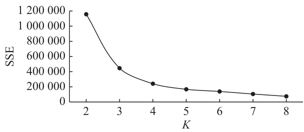

# • 调查报告与分析 •  

# “一带一路”沿线国家宫颈癌流行病学负担现状分析  

徐婷婷1,2，詹行天3，贺小宁1，吴晶1  

1. 天津大学药物科学与技术学院，天津 300072；2. 天津医科大学肿瘤医院，天津 300060；3. 中国人民大学公共管理学院，北京 100872通信作者：吴晶，Email：jingwu@tju.edu.cn  

【摘    要】目的   了解和掌握“一带一路”沿线国家宫颈癌流行病学负担现状。方法  对照2018 年世界卫生组织（WHO）癌症登记数据库，从“一带一路”政务网中选取 127 个宫颈癌流行病学数据较为完整的“一带一路”沿线国家作为研究对象。按照WHO 划分的世界区域标准，对127 个“一带一路”沿线国家进行归类。运用统计学参数检验法，比较分析不同WHO 区域2018 年“一带一路”沿线国家宫颈癌流行病学负担差异，应用聚类分析法分析不同 WHO 区域国家的宫颈癌流行程度。结果  不同 WHO 区域“一带一路”沿线国家宫颈癌的流行病学负担差异性显著。WHO 非洲区域国家的宫颈癌平均标化发病率和标化死亡率最高，分别是 32.4/10 万和21.9/10 万；相反，东地中海地区国家的平均标化发病率为4.4/10 万，标化死亡率为2.9/10 万，位居六大WHO区域最低。WHO 美洲区域的伤残调整寿命年（DALYs）最高（458.2/10 万），东地中海地区最低（69/10 万）。聚类分析结果表明，WHO 非洲区域国家的宫颈癌多为中、高度流行；低度流行国家主要分布在 WHO 欧洲、西太平洋和东地中海地区。讨论  地理区域是影响“一带一路”沿线国家宫颈癌流病负担的主要因素，但并不是唯一因素，未来将综合考虑国家社会经济发展水平、自然和社会环境等因素，并纳入研究范畴。  

【关键词】 宫颈癌；流行病学；负担；"一带一路"沿线国家  

# Disease burden of cervical cancer in Belt and Road surrounding countries in 2018  

XU  Tingting1,2,  ZHAN  Xingtian3,  HE  Xiaoning1,  WU  Jing1  (1. School  of  Pharmaceutical  Science  and Technology, Tianjin  University, Tianjin 300072, China;  2. Tianjin  Medical  University  Cancer  Institute  and  Hospital, Tianjin 300060, China;  3. School  of  Public  Administration  and  Policy, Renmin  University  of  China, Beijing 100872, China)   
Corresponding author: WU Jing, E-mail: jingwu@tju.edu.cn  

【Abstract】 Objective   To examine the disease burden of cervical cancer in 127 countries along the Belt and Road. Methods    The  127  countries  involved  in  the  analysis  were  determined  based  on  the  information  from  the  website  of China's Belt and Road Initiative and the countries were assigned into one of the 6 World Health Organization (WHO) regions. The country-specific data of 2018 on world population based age standardized incidence and mortality rate and disability-adjusted  life  years  (DALYs)  of  cervical  cancer  were  extracted  from  WHO  cancer  registry  database  for analyzing  and  comparing  between  country  disparities  in  disease  burden  of  cervical  cancer  using  descriptive  statistics. Cluster analysis was used to assess prevalence intensity of cervical cancer among the countries in different WHO regions. Results   The disease burden of cervical cancer in 2018 was significantly different among the 127 countries in various WHO  regions  along  the  Belt  and  Road.  The  mean  age-standardized  incidence  rate $( 3 2 . 4 / 1 0 0 \ 0 0 0 )$ and  mortality  rate (21.9/100  000)  of  cervical  cancer  were  the  highest  for  the  countries  in  the  WHO  African  region;  while,  those  for  the countries in the WHO Mediterranean region were the lowest (age-standardized incidence and mortality rate: $4 . 4 / 1 0 0 \ 0 0 0$ and 2.9/100 000). The mean DALYs of cervical cancer was the highest (458.2/100 000) for the countries in the WHO region of America but the lowest $( 6 9 / 1 0 0 0 0 0 )$ for countries in the WHO Eastern Mediterranean region. The results of cluster analysis showed that the prevalence of cervical cancer was at medium-high level for countries in WHO African region  and  at  low  level  for  countries  in  the  WHO  European,  Western  Pacific  and  Eastern  Mediterranean  regions. Conclusion   Geographical region is the main, but not the only factor affecting the disease burden of cervical cancer for countries along the Belt and Road and the influences of country-specific social and economic development, natural and social environment should be considered in cervical cancer control.  

【Keywords】 cervical cancer; epidemiology; disease burden; the Belt and Road surrounding countries  

宫颈癌是严重威胁女性健康的恶性肿瘤，主要致病原因是高危型人乳头瘤状病毒（HumanPapilloma Virus，简称 HPV）持续感染[1]。宫颈癌的发病和死亡也有不平等特征，2018 年全球癌症登记报告数据显示，大约 $8 5 \%$ 的宫颈癌新发病例发生在中低收入国家，而中低收入国家的宫颈癌发病率几乎是高收入国家的2 倍，死亡率则是3 倍[2]。预计在不采取任何干预措施的情况下，未来50 年中、低收入国家将有超过 4 400 万妇女被诊断为宫颈癌[3]。中国是“一带一路”倡议发起国，着眼于与沿线国家共建人类健康命运共同体，高度关注女性的健康与权益[4]。“一带一路”沿线国家中，中、低收入国家占比较大，女性宫颈癌流行病学负担形势更为严峻。鉴于此，本研究从“一带一路”政务网中选取 127 个宫颈癌流行病学数据较为完整的沿线国家作为研究对象，按照 WHO 区域标准进行划分和归类，分析各地区间世界年龄标化发病率（简称标化发病率）、世界年龄标化死亡率（简称标化死亡率）和伤残调整寿命年（disabilityadjusted life years，简称 DALYs）存在的差异，并探析不同地理区域对宫颈癌流行程度的影响。  

# 1   资料与方法  

1.1    资料来源　对照 WHO 发布的 2020 癌症登记数据库，从“中国一带一路网”中选取 127 个参与“一带一路”倡议国家的 2018 年女性宫颈癌标化发病率、标化死亡率和 DALYs 的流行病学数据，依据WHO 六大地理区域的划分标准，即非洲、东南亚、美洲、西太平洋、欧洲和东地中海地区，对127 个“一带一路”沿线国家进行分类，其中，WHO非洲区域国家 29 个，WHO 东南亚区域国家 9 个，WHO 美洲区域国家 16 个，WHO 西太平洋区域国家 17 个，WHO 欧洲区域国家 34 个，以及 WHO东地中海区域国家 22 个[5 – 6]。  

# 1.2    分析方法  

1.2.1   统计学参数检验法　本研究采用 GraphpadPrism 8.3.0 软件对不同 WHO 区域国家宫颈癌的标化发病率、标化死亡率和 DALYs 数据进行统计学参数检验分析，重点参考各指标的中位数及其$9 5 \% C I _ { \setminus }$ 上四分位数、下四分位数，分析不同 WHO区域“一带一路”沿线国家宫颈癌流行病学负担现状的差异。中位数反映了各区域国家的宫颈癌标化发病率、标化死亡率和 DALYs 的集中趋势，四分位距（inter quartile range，简称 IQR）反映其离散趋势。  

1.2.2   聚类分析　K-means 聚类算法通过迭代（设置最大迭代次数为 50 次）将样本划分到 k 个类别中，使得每个样本与其所属类的中心或均值最近，从而得到 $\mathbf { k }$ 个层次化的类别[7]。K-means 聚类时一般使用“手肘法”或者“轮廓系数法”选取最优$\mathbf { k }$ 值。SSE（Sum of the Squared Errors，误差平方和）是手肘法的核心指标：  

$$
S S E = \sum _ { i = 1 } ^ { k } \sum _ { p \in C _ { i } } | p - m _ { i } | ^ { 2 }
$$  

其中， $C _ { i }$ 是第 $i$ 个簇， $p$ 是 $C _ { i }$ 中的样本点， $m _ { i }$ 是 $C _ { i }$ 中所有样本的均值， $S S E$ 为所有聚类样本的聚类误差，代表聚类效果的好坏程度。聚类数 $\mathbf { k }$ 的增大，使样本划分更加精细，每个簇的聚合程度逐渐提高，误差平方和 SSE 会逐渐变小。当 $\mathbf { k }$ 值增加到一定程度时，SSE 的下降幅度会骤减，并逐渐趋于平缓，从而出现一个拐点，即最优的 $\mathbf { k }$ 。依次设置 ${ \bf k } = ( 2 , 3 , 4 ^ { \dots } 8 )$ ，本研究发现当 $\mathbf { k } = 3$ 时，SSE 与k 之间的变化曲线开始变得平缓，因此在后续的分析中，k 值设置为 3，如图 1 所示。  

  
图 1  SSE 随分类数变化曲线 Fig. 1   The curve of K-value dependent sum of the squared errors in K-means clustering algorithm  

# 2   结　果  

2.1    宫颈癌流病负担现状分析（表 1）　WHO 非洲区域国家的宫颈癌标化发病率中位数水平最高（32.4/10 万），而东地中海区域国家水平最低（4.4/10 万）。WHO 六个区域中非洲区域国家标化死亡率中位数水平最高（21.9/10 万），东地中海区域最低（2.9/10 万）。DALYs 的中位数水平以美洲区域国家最高（458.2/10 万），其次是非洲区域（371.3/10 万），东地中海区域最低（69.0/10 万）。非洲区域国家标化发病率 IQR 达 21.2，该区域国家间的标化发病率波动较大；东地中海区域的 IQR仅为 4.0，该区域国家间标化发病率波动较小。标化死亡率 IQR 以非洲区域较高（17.0），该区域国家间标化死亡率波动较大；东地中海区域标化死亡率 IQR 最低（3.4），该区域国家间标化死亡率波动较小。DALYs 的 IQR 以美洲区域最高（233.8），其次为西太平洋区域（184.8），东地中海区域最低（66.5）。  

<html><body><table><tr><td rowspan="2">WHO区域</td><td colspan="3">标化发病率(1/10万)</td><td colspan="3">标化死亡率(1/10万)</td><td colspan="3">DALYs(1/10万)</td></tr><tr><td>范围</td><td>M</td><td>IQR</td><td>范围</td><td>M</td><td>IQR</td><td>范围</td><td>M</td><td>IQR</td></tr><tr><td>非洲</td><td>7.9~65.5</td><td>32.4</td><td>21.2</td><td>4.5~43.4 </td><td>21.9</td><td>17.0</td><td>54.5~633.5</td><td>371.3</td><td>117.6</td></tr><tr><td>东南亚</td><td>9.2~24.5</td><td>15.8 a</td><td>9.9</td><td>4.9~14.4</td><td>8.6 d</td><td>7.0</td><td>93.5~299.9</td><td>197.1 bc</td><td>79.8</td></tr><tr><td>美洲</td><td>11.1~36.6</td><td>17.0 a</td><td>8.9</td><td>5.2~18.0</td><td>10.3 a</td><td>6.3</td><td>252.9~660.8</td><td>458.2 a</td><td>233.8</td></tr><tr><td>西太平洋</td><td>5.6~29.8</td><td>12.2 bd</td><td>12.2</td><td>1.8~20.7</td><td>6.3 b</td><td>9.1</td><td>99.7~669.6</td><td>296.1 b</td><td>184.8</td></tr><tr><td>欧洲</td><td>3.7~26.2</td><td>11.4 bd</td><td>9.1</td><td>1.1~9.4</td><td>5.2 bc</td><td>3.6</td><td>72.6~552.2</td><td>253.3 bcd</td><td>133.4</td></tr><tr><td>东地中海</td><td>2.2~25.1</td><td>4.4 b</td><td>4.0</td><td>1.5~18.7</td><td>2.9 b</td><td>3.4</td><td>32.5~529.4</td><td>69.0 b</td><td>66.5</td></tr></table></body></html>

注：与东地中海区域比较，a $P < 0 . 0 1$ ，d $P < 0 . 0 5$ ；与非洲区域比较，b $P < 0 . 0 0 1$ ；与美洲比较，c $P < 0 . 0 0 1$ 。  

2.2    聚类分析结果及流行强度的划分（表 2）　根据聚类分析的结果，可得出 3 个类别的宫颈癌标化发病率、标化死亡率和 DALYs 的均值，根据每个类别中 3 个指标均值的大小进行排序，并以此作为划分宫颈癌流行强度的标准。本研究根据指标均值大小将宫颈癌流行程度分成中度流行、低度流行以及高度流行 3 档。III 类为高度流行国家，标化发病率、标化死亡率和 DALYs 的均值最高。II 类为低度流行国家，3 个指标的均值最低。I 类为中度流行国家，3 个指标的均值较其他两个类别处于中间位置。具体数值详见表 2。分析结果显示，在标化发病率、标化死亡率和伤残调整寿命年 3 个指标中，三类流行程度之间存在显著差异，说明此分类结果具有一定合理性。  

表 1    不同WHO 区域国家宫颈癌标化发病率、标化死亡率和DALYs Tbl. 1    WHO region-specific age-standardized (world population) incidence, mortality, DALYs of cervical cancer in 127 Belt and Road surrounding countries in 2018   
表 2    聚类分析结果（均值）（1/10 万）  

<html><body><table><tr><td>流行强度</td><td>标化发病率</td><td>标化死亡率</td><td>DALYs</td></tr><tr><td>I中度流行</td><td>20.45</td><td>12.18</td><td>302.81</td></tr><tr><td>Ⅱ低度流行</td><td>7.24</td><td>3.87</td><td>104.18</td></tr><tr><td>III高度流行</td><td>31.47</td><td>20.67</td><td>534.18</td></tr><tr><td>F值</td><td>42.76</td><td>32.09</td><td>419.34</td></tr><tr><td>P值</td><td>0.00</td><td>0.00</td><td>0.00</td></tr></table></body></html>  

2.3    不同 WHO 区域分布“一带一路”沿线国家宫颈癌流行程度分布（表3）　127 个“一带一路”沿线国家中，第I 类中度流行国家共计63 个，占 $4 9 . 6 1 \%$ ，其中非洲区域国家20 个，欧洲22 个，占比较多；第II类低度流行国家41 个，占 $3 2 . 5 6 \%$ ，东地中海区域国家占 $5 3 . 7 \%$ ，欧洲占比 $2 2 \%$ ，除美洲没有代表性国家之外，非洲、东南亚和西太平洋区域国家合计占比$2 4 . 3 \%$ ；第 III 类“高度流行”国家有 23 个，占 $1 7 . 8 3 \%$ $6 0 . 9 \%$ 的国家分布于非洲区域，其他 $3 9 . 1 \%$ 位于美洲地区。整体而言，WHO 非洲区域国家多是宫颈癌中、高度流行国家；而分布于 WHO 欧洲区域国家的宫颈癌流行程度整体较低，特别是西欧地区国家，例如葡萄牙、意大利、卢森堡等国家的宫颈癌流行程度低，而东欧地区包括爱沙尼亚、波兰、捷克共和国、拉脱维亚等国家的宫颈癌则呈中度流行趋势。WHO 美洲区域国家宫颈癌流行程度较高，例如多米尼加、委内瑞拉宫颈癌的流病负担指标相对较高。WHO 东南亚和东地中海区域国家的宫颈癌流行程度则较低，特别是阿联酋、阿曼等经济较发达的中东地区国家。WHO西太平洋区域整体向好，诸如新西兰、韩国和新加坡，只有斐济是唯一一个宫颈癌高度流行的“一带一路”沿线国家。  

Tbl. 2    Prevalence intensity category of cervical cancer based on mean age-standardized incidence and mortality rate (1/100 000) and DALYs in 127 Belt and Road surrounding countries – clustering analysis   
表 3    不同WHO 区域分布“一带一路”沿线国家宫颈癌流行程度分布 Tbl. 3    WHO region-specific number (ratio) of countries with moderate, low, and high prevalence intensity of cervical cancer in 2018 in 127 Belt and Road surrounding countries   

<html><body><table><tr><td rowspan="2">WHO区域</td><td colspan="2">I中度流行</td><td colspan="2">Ⅱ低度流行</td><td colspan="2">ⅢI高度流行</td></tr><tr><td>国家数</td><td>占比(%)</td><td>国家数</td><td>占比(%)</td><td>国家数</td><td>占比(%)</td></tr><tr><td>非洲</td><td>20</td><td>31.7</td><td>2</td><td>4.9</td><td>14</td><td>60.9</td></tr><tr><td>欧洲</td><td>22</td><td>34.9</td><td>9</td><td>22.0</td><td>一</td><td>一</td></tr><tr><td>西太平洋</td><td>9</td><td>14.3</td><td>4</td><td>9.7</td><td>一</td><td>一</td></tr><tr><td>美洲</td><td>7</td><td>11.1</td><td>一</td><td>一</td><td>9</td><td>39.1</td></tr><tr><td>东南亚</td><td>4</td><td>6.4</td><td>4</td><td>9.7</td><td>一</td><td>一</td></tr><tr><td>东地中海</td><td>1</td><td>1.6</td><td>22</td><td>53.7</td><td>一</td><td>一</td></tr><tr><td>合计</td><td>63</td><td>100.0</td><td>41</td><td>100.0</td><td>23</td><td>100.0</td></tr></table></body></html>

注：“—”代表此区域无研究国家，数据为零。  

# 3   讨　论  

2018 年全球癌症报告数据显示，世界平均标化发病率为 13.3/10 万，平均标化死亡率为 7.3/10 万[8]。与之相比，本研究计算得出的WHO 非洲地区国家宫颈癌平均标化发病率和平均标化死亡率是世界平均水平的 3 倍，而东地中海地区国家的平均发病和死亡率均是 6 个 WHO 区域中最低，且低于世界平均水平。WHO 非洲区域国家宫颈癌标化死亡率中位数水平高于东南亚、西太平洋、欧洲地区国家中位数近 3 倍，是美洲中位数水平的2 倍。WHO 美洲地区国家宫颈癌 DALYs 的中位数水平最高，而东地中海地区 DALYs 则最低。聚类分析结果也表明，WHO 非洲区域主要是宫颈癌中、高度流行国家，而低度流行国家分布在欧洲、西太平洋和东地中海地区。  

不同地理区域国家的宫颈癌流行程度不同，可能与多种因素有关，例如风土人情、饮食文化、生活习惯、遗传基因等，但是能够影响其病因发展的主要因素是与近年来 WHO 在全球范围内推广实施的三级预防策略。三级预防策略通过干预疾病诱因，大大降低了宫颈的癌前病变和恶性发展。例如，韩国实施了基于人群的癌症登记和国家宫颈癌筛查计划，1999 — 2017 年的宫颈癌发病率和死亡率变化趋势显示，韩国发病率趋势先是急剧下降 $[ 1 9 9 9 - 2 0 0 7$ 年的年度百分比变化（annualpercentage change，简称 $\mathrm { A P C } ) = - 4 . 5 3 \% ]$ ，然后稳步下降（2007 — 2017 年的 $\mathrm { A P C } = - 2 . 7 1 \% )$ 。死亡率也显著下降（2003 — 2008 年 $\mathrm { A P C } = - 6 . 6 3 \% )$ ，然后保持稳定下降 $( 2 0 0 8 - 2 0 1 7$ 年 $\mathrm { A P C } = - 3 . 7 8 \% ) ^ { [ 9 ] }$ 。2005 年，泰国卫生部与国家卫生保障办公室合作，开展了全国76 个省的宫颈癌普查工作，对 $3 0 { \sim } 6 0$ 岁和 $3 5 { \sim } 4 5$ 岁的妇女每隔5 年分别进行一次巴氏涂片检查和醋酸目视检查（Visual Inspection withAcetic Acid，简称 VIA）的筛查。2005 — 2014 年，共计筛查妇女 10 762 081 人，10 年间宫颈癌发病情况有所改善，2014 年宫颈癌发病率降至 11.7/10 万[10]。  

但并不是所有国家的宫颈癌预防干预效果都比较理想，这可能与国家经济发展水平、卫生资源配置的情况有关[11]。以中国为例，近年来尽管在宫颈癌二级和三级预防工作方面做了很多努力，但是由于推广 HPV 疫苗起步较晚，疫苗成本高等原因，使得接种人群数量相对较少，因此我国目前的宫颈癌疾病负担还未有较大幅度的改善。相反，在经济发展水平较高的欧洲和西太平洋地区国家，由于高卫生资源的投入，全民 HPV 疫苗接种的普及和推广，女性宫颈癌的流行程度明显得到改善。例如，新西兰在执行 $\langle \langle 2 0 0 5 - 2 0 1 0$ 新西兰癌症防控战略》后，2009 — 2013 年宫颈癌的发病率较20 年前下降了 $5 6 \% ^ { [ 1 2 ] }$ 。2018 年统计数据显示，新西兰 15 岁少女 HPV 疫苗接种覆盖率已达到 $6 8 \% ^ { [ 1 2 ] }$ 。近20 年来，新西兰已有30 万女性接种了 HPV 疫苗，这是新西兰宫颈癌发病率和死亡率稳步下降的主要原因[12]。奥地利、新加坡、韩国等“一带一路”沿线国家还相继批准 HPV 疫苗应用于男性计划免疫的政策，这从根本上有助于遏制女性宫颈的感染，从而降低患病的概率。  

本研究聚焦“一带一路”沿线国家的宫颈癌流行病学负担研究，提出地理区域是影响宫颈癌流行病学负担的主要因素这一假设，并运用统计学参数检验法和聚类分析法分别验证假设的合理性。研究结果显示，不同 WHO 地理区域的大多数“一带一路”沿线国家的宫颈癌流行病学负担确实存在显著性差异，但是地理区域应该不是唯一影响因素，未来将综合考虑国家社会经济发展水平、自然和社会环境等因素，并纳入研究范畴。  

# 参考文献  

[ 1 ] 李玉兰, 刘晓, 韩逢皎, 等. 高危型人乳头瘤病毒阴性宫颈癌的研 究进展 [J]. 国际生殖健康/计划生育杂志, 2022, 41(4): 342 – 346.   
[ 2 ] Ginsburg  O,  Bray  F,  Coleman  MP,  et  al.  The  global  burden  of women's cancers: a grand challenge in global health[J]. The Lancet, 2017, 389(10071): 847 – 860.   
[ 3 ] 刘宗超, 李哲轩, 张阳, 等. 2020 全球癌症统计报告解读 [J]. 肿瘤 综合治疗电子杂志, 2021, 7(2): 1 – 13.   
[ 4 ] 张宇薇, 李辉, 孙晓丽, 等. “一带一路”沿线 66 国全民健康覆盖 现状与预测 [J]. 中国公共卫生, 2019, 35(10): 1388 – 1392.   
[ 5 ] International  Agency  for  Research  on  Cancer,  World  Health Organization.  Global  cancer  observatory:  cancer  today[DB/OL]. [2023 – 03 – 20]. http://gco.iarc.fr/today.   
[ 6 ] 中国一带一路网. “一带一路”大数据指数 [DB/OL]. [2022 – 01 – 11]. https://www.yidaiyilu.gov.cn/dataChart   
[ 7 ] 伍信怡, 汪璐, 史富存. 基于 K-means 聚类分析法的三峡货物分 类研究 [J]. 中国水运, 2021(6): 97 – 99.   
[ 8 ] World  Health  Organization.  Global  strategy  to  accelerate  the elimination of cervical cancer as a public health problem[EB/OL]. (2020 – 11 – 17)[2023 – 04 – 06]. http://www.wgo.int/publications/ i/item/9789240014107.   
[ 9 ] Tran  KN,  Park  Y,  Kim  BW,  et  al.  Incidence  and  mortality  of cervical cancer in Vietnam and Korea (1999 – 2017)[J]. Epidemiology and Health, 2020, 42: e2020075.   
[ 10 ] Ploysawang P, Rojanamatin J, Prapakorn S, et al. National cervical cancer  screening  in  Thailand[J].  Asian  Pac  J  Cancer  Prev,  2021, 22(1): 25 – 30.   
[ 11 ] 邱增辉, 蒋祎, 刘娅莉, 等. “一带一路”国家公共卫生与卫生服务 现况 [J]. 中国公共卫生, 2020, 36(12): 1755 – 1758.   
[ 12 ] Ministry of Health, New Zealand. New Zealand cancer plan: better, faster  cancer  care  2015 –2018[EB/OL].  [2023   –  04   –  28].  https:// www.health.govt.nz/publication/new-zealand-cancer-plan-betterfaster-cancer-care-2015–2018.  