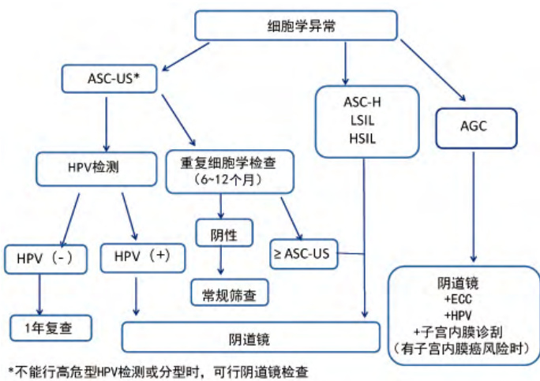

· 临床指南·  

# 中国子宫颈癌筛查及异常管理相关问题专家共识 ( 一 )  

中国优生科学协会阴道镜和宫颈病理学分会专家委员会  

子宫颈癌仍然是当代严重威胁女性健康的妇科恶性肿瘤。2014 年末我国人口 13.7 亿，其中女性约 6.67 亿（http: //data. stats. gov. cn/search. htm），35\~64 岁女性约 2.93 亿，子宫颈癌的防治工作任重而道远。2015 年我国成立了由妇科、妇科肿瘤、病理学、妇幼保健、流行病学及基础研究多学科组成的中国优生科学协会阴道镜和宫颈病理学分会（Chinese Society for Colposcopy and Cervical Pathology of ChinaHealthy Birth Science Association，CSCCP），旨在推动我国子宫颈癌的防治水平。  

自2009 年我国政府开始推行子宫颈癌筛查试点项目，已经进行了 7 年多的探索，至今尚无基于中国数据的子宫颈癌筛查及异常结果管理指南。为了提高子宫颈癌筛查防治效力，有必要提出现阶段的我国子宫颈癌防治专家共识以规范化指导临床工作。这将为积累中国子宫颈癌防治数据，制定符合中国国情的指南提供证据。围绕这一目标，结合我国经验 [1- 2] 和国外文献，经过四轮专家讨论，形成CSCCP 中国子宫颈癌筛查及异常管理相关问题专家共识，重点包括筛查中细胞病理学的质控管理，筛查结果异常者的管理、阴道镜的规范化检查，以及组织学确诊的子宫颈上皮内瘤变（CIN）和原位腺癌（AIS）的处理建议。  

根据我国子宫颈癌防治现状，CSCCP 与中华医学会病理学分会、国家卫生计生委病理质控中心专家组多次讨论，对于细胞病理学质控管理及筛查结果异常者的管理达成以下共识。在此刊登部分内容供相关人员在子宫颈癌筛查和防治的临床工作中参考（由于篇幅有限，阴道镜规范化检查及组织学确诊的CIN 处理详见下期）。  

# 一、中国子宫颈癌的疾病负担和筛查管理现状  

世界卫生组织/国际癌症研究机构（WHO/IARC）发布的数据显示，2012 年我国子宫颈癌新发病例约为 62 000例，占全球新发病例的 $12 \%$ ，死亡病例约为30 000 例，占全球死亡病例的 $1 1 \% ^ { \left[ 3 \right] }$ 。根据中国国家癌症中心公布的最新数据估计，2015 年我国子宫颈癌新发病例约为98 900 例，死亡病例约为 $3 0 5 0 0$ 例 [4]。目前总体人群筛查率处于低水平，2010 年，全国城市平均子宫颈癌筛查率为 $2 9 . 1 \%$ ，东部经济发达地区约为 $3 1 . 3 \%$ ，农村约为 $1 6 . 9 \% ^ { [ 5 ] } \cdot$ 。我国面临着严峻的子宫颈癌防治形势。  

目前我国拥有国际上常用的子宫颈癌筛查、分流、转诊技术，例如子宫颈脱落细胞学、人乳头瘤病毒（HPV）检测、肉眼观察（VIA/VILI）、p16/ki- 67 双染和阴道镜检查等，还有一些我国自主研发的技术方法 [6]。我国子宫颈癌筛查面临的主要问题是覆盖率不足，无全国性子宫颈癌筛查指南和管理规范，筛查诊治不规范，过度医疗、诊疗不足或缺乏随访等情况屡有发生。中国地域辽阔、资源分布不均，更需要采取多元化的筛查策略。目前适宜中国的筛查技术和策略缺乏数据支撑；HPV 检测产品众多，缺乏充分的临床验证数据；细胞学、组织病理学、阴道镜医师缺乏规范化培训。现有条件下，子宫颈癌筛查及病变的临床管理多参考欧美国家的指南进行[7- 10]。  

# 二、子宫颈癌筛查中细胞病理学的质控管理  

1. 关于设立筛查机构的原则：子宫颈细胞病理学实验室应隶属于医疗机构的病理科或在国家认定的独立实验室。尚未具备条件或未设立独立细胞病理学实验室的医疗机构，其细胞病理学诊断任务应由具备相应资质的病理科医师，或二级以上医院或独立医学实验室的相关部门承担完成。工作中按医疗管理条例规定签订协议，确保送检资料安全，诊断报告正确及时。  

2. 宫颈细胞及组织病理学相关人员：诊断医师应由具有医师执业资质、接受过细胞及组织病理学专门培训，且考试合格，并取得岗位培训合格证书者担任。筛查员应由具有医学大专及以上学历，且经过细胞病理学培训基地专业培训 6 个月以上，考试合格后获得细胞病理学筛查合格证者担任。细胞及组织病理学技术员由具备医学大专及以上学历，从事相应技术者担任。  

3. 筛查工作量及人员配比：每位细胞病理学工作人员（包括诊断医师和筛查员）每工作日（8 h）妇科细胞学涂片阅片量不超过100 张；采用电脑辅助阅片的部门允许每人每工作日（8 h）阅片量不超过 200 张。原则上每位技术人员每天制片量不超过250 张。  

4. 细胞学及组织病理人员培训：采用现场和网络培训相结合方式，设置国家及省市培训基地和网络培训机构。CSCCP 联合中华医学会病理学分会细胞学组、卫计委临床病理质控中心及各省级临床病理质控中心建立培训基地。拥有高级职称细胞病理学专科医师、具备教研工作能力和条件、年细胞学检查量 $> 1 0 0 0 0$ 例、已开展传统巴氏涂片（Pap smear）、液基细胞学、细胞蜡块制作、HPV 检测等项目的三级甲等医院病理科和（或）独立医学实验检测机构，具备申请培训基地的资格，经专家评审确定诊断质量和质控优秀的单位可以被认定具有培训基地资格并给予授牌，行使培训任务。已授牌基地接受CSCCP 每两年一次的基地考核，对不能达到要求的单位，取消基地资格。  

5. 质量控制及方案：质量控制方案包括实验室标准、人员资质、整体诊治流程质控、SOP 文件、室内质控及室间质控记录等一系列评价体系。通过数据库及相关文档回顾性评价以下指标。 $\textcircled{1}$ TBS 各级判读的阳性检出率 $c > 5$ 000 例样本统计量）； $\textcircled{2}$ 非典型鳞状上皮细胞/鳞状上皮内病变（ASC/SIL）比值； $\textcircled{3}$ TBS 分级判读为不能明确诊断意义的非典型鳞状上皮细胞（ASC- US）、非典型鳞状上皮细胞不除外高度鳞状上皮内病变（ASC- H）、低度鳞状上皮内病变（LSIL）、高度鳞状上皮内病变（HSIL）、鳞状细胞癌（SCC）的高危型HPV 阳性率等。以上各项指标应达到相应检查要求； $\textcircled { 4 } > 1 0 0$ 例细胞学阳性标本，包括ASC- US、ASC- H、LSIL、HSIL、SCC、非典型腺细胞（AGC）、腺癌（AC），组织学最终确认结果（即宫颈切除术或子宫切除术后的子宫颈组织病理学诊断）的符合率； $\textcircled{5}$ 阳性病例的随访登记制度和随访比例； $\textcircled{6}$ 现场督察随机抽取连续10\~20例阳性病例、20\~30 例阴性病例、20 例室间质控标准片作现场考核。  

# 三、子宫颈癌筛查结果异常的管理  

子宫颈癌筛查结果异常包括子宫颈细胞学异常、高危型HPV 阳性（包括HPV16、18 型阳性及其他12 型阳性）。  

1. 高危型HPV 阳性作为初筛时的处理：高危型HPV阳性处理见图1。  

  
图1 高危型HPV 阳性的处理流程  

因年轻女性是HPV 感染的高峰年龄，建议高危型HPV 检测用于30 岁以上女性。  

2. 子宫颈细胞学异常的处理：子宫颈细胞学是以形态学的变化评估肿瘤的发生发展。子宫颈涂片取材自子宫颈鳞柱交接部位的脱落细胞，脱落细胞的特征与活体细胞的特征不完全相同，且无组织结构。因此，子宫颈细胞学结果作为筛查结果，不能作为疾病的确定诊断，不能以此作为临床处理的依据。子宫颈细胞学异常的处理是指以细胞学作为初筛方法的异常细胞学的处理，见图 $2 .$  

（1）细胞学ASC- US 处理：在异常细胞涂片中，ASC-US 占 $5 0 \%$ 以上，是最常见的细胞学异常类型。人群中ASC- US 的发病率为 $5 \%$ 左右。ASC- US 女性中 HR- HPV 感染率为 $3 1 \% \sim 6 0 \%$ ，可反映不同病理变化过程，包括高危型HPV 感染、CIN、癌、炎症及萎缩等。ASC- US 的可重复性差。细胞学ASC- US 中经子宫颈活检诊断CIN2/3 的概率在 $1 0 \%$ 以下，浸润癌风险低，为 $0 . 1 \% \sim 0 . 2 \%$ 。由于造成ASC- US 的原因诸多，容易发生诊断不足或过度诊断是临床处理中的难题。  

  
图2 宫颈细胞学异常的处理流程  

特殊人群的ASC- US 处理：妊娠期可以按照图2 处理，也可以延迟至产后处理。21\~24 岁女性可选择细胞学随访。  

（2）细胞学ASC- H 的处理：ASC- H 在人群中的平均检 出 率 为 $0 . 4 2 \%$ 。 在 ASC 中 ASC- US 约 占 $9 0 \%$ ，ASC- H约占 $1 0 \%$ 。ASC- H 的细胞改变具有HSIL 的特征，但诊断HSIL 的证据不足，多与高危型HPV 感染有关。子宫颈活检诊断 CIN2/3 的概率为 $2 4 \% \sim 9 4 \%$ ，不同医疗机构或医师之间变化较大。对于细胞学ASC- H，不论HR- HPV 是阳性或阴性，均应直接转诊阴道镜检查。  

（3）细胞学LSIL 处理：LSIL 在人群中平均检出率为$0 . 9 \%$ ，LSIL 大多预示 HPV 感染。Meta分析显示，LSIL 的高危型HPV 阳性率为 $8 3 \% _ { \textmd o }$ 。初次阴道镜发现 $\geq$ CIN2 的概率为 $1 2 \% \sim 1 6 \%$ 。  

特殊人群的LSIL 处理： $\textcircled{1}$ 妊娠期 LSIL 可以按照图 2处理，若孕妇不接受阴道镜检查，也可以延迟至产后处理；$\textcircled{2}$ 21\~24 岁：可选择细胞学随访，如随访中细胞学异常则转诊阴道镜； $\textcircled{3}$ 老年妇女，若年龄 $> 6 0$ 岁，建议选择高危型HPV 检测，也可按照图2 处理。  

（4）细胞学 HSIL 处理：细胞学HSIL 并不常见，国外有报道细胞学 HSIL 在人群中平均检出率为 $0 . 4 5 \% _ { s }$ 。阴道镜指导下子宫颈活检诊断 $\geq$ CIN2 的概率为 $7 0 \% \sim 7 5 \%$ ，宫颈环形电切除术（LEEP）切除标本诊断 $\geq$ CIN2 的概率为$8 4 \% \sim 9 7 \%$ ，浸润癌为 $1 \% \sim 2 \% .$ 。当细胞学为 HSIL 应立即转诊阴道镜检查。  

（5）细胞学 AGC 处理：细胞学AGC 约占受检人群的$0 . 5 \%$ ，其中高危型 HPV 感染率约为 $2 0 \%$ 。细胞学 AGC 往往与子宫颈癌、子宫内膜癌、卵巢癌、输卵管腺癌等一系列肿瘤性病变相关，但也可由反应性细胞改变、息肉等良性病变造成。有研究报道细胞学AGC 经组织病理学诊断CIN2/3 的概率为 $9 \% \sim 5 4 \%$ ，AIS 为 $0 \sim 8 \%$ ，宫颈浸润癌为$1 \% \sim 9 \%$ ，不同医疗机构和医师之间差别较大。如果细胞学考虑为子宫内膜来源的 AGC，可以选择先做分段诊刮，如未见异常，再做阴道镜检查。  

3. 细胞学联合高危型HPV 检测进行联合筛查结果异常的处理：近50 年来，子宫颈细胞学对于降低子宫颈癌发病率和死亡率的有效性得到了时间的检验。国际上子宫颈癌筛查和管理指南主要基于单独细胞学筛查结果所提示的风险而定。随着 HPV 检测技术的出现，数据显示其可以显著提高细胞学的敏感性，细胞学和高危型HPV 联合检测成为宫颈癌筛查的策略之一 [11]。对于联合筛查结果异常者的管理以单独细胞学筛查发生 ${ \mathsf { C I N } } 3 +$ 的风险为参考依据，采用同等风险同等管理的方案指导临床。  

美国凯撒健康机构（KPNC）2014 年的一项汇总研究发现，对于 $3 0 \sim 6 4$ 岁 965 360 例女性，细胞学 LSIL 的 5 年$\mathsf { C I N 3 + }$ 的累积风险为 $5 . 2 \%$ ，临床处理为直接转诊阴道镜。高 危 型 HPV 阳 性 /ASC- US 的 5 年 $\mathsf { C I N 3 + }$ 的累积风险为$6 . 8 \%$ ，高于LSIL 风险，依据同等风险同等管理，支持直接转诊阴道镜。单独细胞学阴性者的风险为 $0 . 2 6 \%$ ，3 年重复宫颈癌筛查。高危型 HPV 阴性/细胞学阴性风险为 $0 . 0 8 \%$ ，远低于 $0 . 2 6 \%$ 的阈值，提示可以选择更长时间的筛查间隔（例如5 年）[12]。结合我国目前HPV 检测现状及细胞学质量参差不齐的实际情况，提出图3 所示流程。  

  
图3 宫颈细胞学 $^ +$ 高危型HPV 联合检测结果异常的处理流程  

4. 子宫颈癌筛查结果异常处理中应注意的问题：在子宫颈癌筛查结果异常的处理中要遵循规范化的原则，但规范化不能覆盖全部女性的具体情况，应在规范化的基础上进行个体化处理，可以参考患者年龄、临床表现、细胞学检查质量、HPV 检测、患者意愿、随访依从性经济条件、医疗资源、大夫经验、医疗水平，以及妇科医师、细胞学医师、组织病理学医师的水平等因素进行个体化处理，其目的是最大限度地避免漏诊和处理过度的问题。  

# 四、结语  

在子宫颈癌筛查异常管理方案中，该共识意见适用于健康筛查人群，并不一定完全适合临床患者的管理。前者是健康人群，而后者是有症状的个体。前者是在无症状人群中寻找可能的患者，后者是在有症状个体中明确疾病来源。不同人群的检查目标不同，选择的方法不尽相同。对于医院就诊的有症状患者，推荐采用细胞学和HPV 联合筛查。目前全国范围内细胞学检查质量有限，高危型 HPV 检测方法众多，在没有获得中国国内临床验证数据之前，建议参考既往有充分临床数据验证研究的文献报道。建议临床医师根据该共识意见进行管理的同时，一定结合当地实际情况对患者进行诊疗，以免漏诊。  

执笔者：魏丽惠、赵昀、沈丹华、赵方辉、耿力、毕 蕙、徐海苗、李静然；秘书：李明珠  

致谢：感谢CSCCP 专家委员会全体成员在共识编写过程中付出的努力。  

# 参 考 文 献  

[ 1] 魏丽惠，吴久玲 . 子宫颈癌检查质量保障及质量控制指 南. 北京: 人民卫生出版社，2015.   
[ 2] 毕蕙，赵更力. 子宫颈癌综合防控技术培训教程. 北京: 人 民卫生出版社，2015.   
[ 3] Fer l ay J ,  Soer j omat ar am I ,  Er vi k M,  et  al .  GLOBOCAN 2012 v1. 0,  Cancer i nci dence and mort al i t y worl dwi de:  I ARC CancerBase No.  11. Lyon,  France:  I nt ernat i onal  Agency f or Research on Cancer;  2013[ EB/ OL] . [ 2014- 11- 20] . ht t p: / / gl obocan. i ar c. f r .   
[ 4] 陈万青,  郑荣寿,  张思维,  等.  2012 年中国恶性肿瘤发病和 死亡分析 . 中国肿瘤 ,  2016,  5：1- 8.   
[ 5] Wang B, He M, ChaoA, et al .  Cervi cal  cancer screeni ng among adul t  women i n Chi na. Oncol ogi st , 2015, 20：627- 634.   
[ 6] 王临虹，魏丽惠. 妇女常见病筛查技术指南.  北京：人民卫 生出版社，2013.   
[ 7] Wri ght TC J r,  Massad LS,  Dunt on CJ ,  et al . 2006 consensus gui del i nes f or t he management  of  women wi t h cervi cal i ntraepi thel i al neopl asi a or adenocarci noma i n si tu. AmJ Obstet Gynecol ,  2007,  197：340- 345.   
[ 8] Apgar BS,  Ki ttendorf AL, Bettcher CM, et al .  Update on ASC P consensus gui del i nes for abnormal  cervi cal  screeni ng tests and cervi cal  hi st ol ogy.  AmFamPhysi ci an, 2009 , 80：147- 155.   
[ 9] Massad LS,  Ei nst ei n MH,  Huh WK,  et  al . 2012 updat ed consensus gui del i nes for the management of abnormal  cervi cal cancer screeni ng tests and cancer precursors. J LowGeni t Tract Di s,  2013, 17：S1- S27.   
[ 10]  Ameri can Col l ege of Obstetri ci ans and Gynecol ogi sts. Practi ce Bul l eti n No.  157:  Cervi cal  cancer screeni ng and preventi on. Obst et  Gynecol ,  2016, 127：e1- e20.   
[ 11]  Kat ki  HA,  Schi f f man M,  Cast l e PE,  et al .  Benchmarki ng $\square N B +$ ri sk as the basi s for i ncorporati ng HPV and Pap cotesti ng i nto cervi cal  screeni ng and management gui del i nes.  J  Low Geni t Tract  Di s,  2013 , 17：S28- 35.   
[ 12]  Gage J C, Schi f f man M,  Kat ki  HA,  et al .  Reassurance agai nst future ri sk of precancer and cancer conferred by a negati ve human papi l l omavi rus t est .  J  Nat l  Cancer I nst , 2014, 106.  

（待续）  