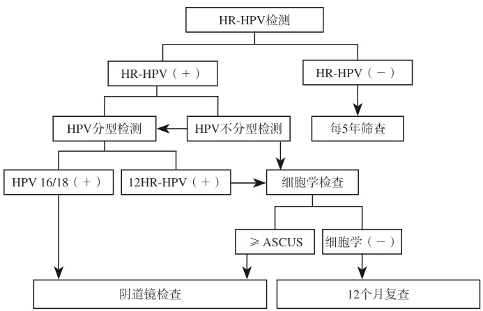
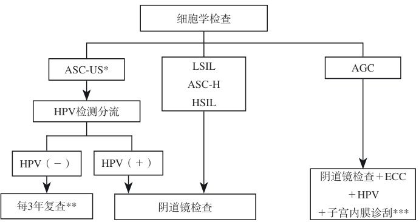
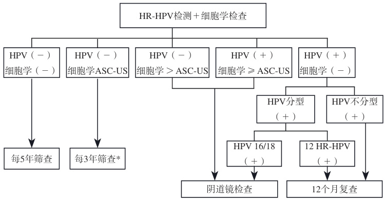
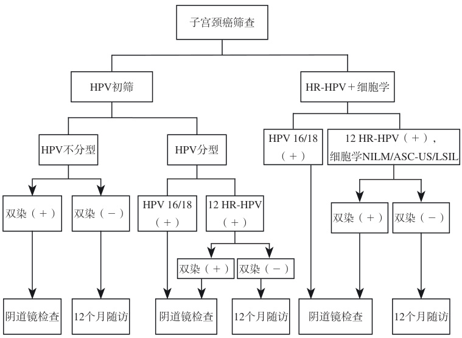

·临床指南·  

# 中国子宫颈癌筛查指南（二）  

中国优生科学协会阴道镜和宫颈病理学分会 中华医学会妇科肿瘤学分会中国抗癌协会宫颈癌专业委员会 中国医疗保健国际交流促进会妇产健康医学分会中国癌症基金会全国宫颈癌防治协作组 中华预防医学会肿瘤预防与控制专业委员会中国妇幼健康研究会宫颈癌防控研究专业委员会  

【摘要】 结合我国子宫颈癌前病变和子宫颈癌发病情况以及全球子宫颈癌筛查策略，为实现消除子宫颈癌的目标，我国七个学（协）会专家共同制定了子宫颈癌筛查指南（二）。本指南重点在于规范子宫颈癌筛查结果异常的分流方法，其目的是通过精细化管理，避免过度诊断与漏诊。高危型人乳头瘤病毒（high-risk humanpapillomavirus, HR-HPV）检测初筛阳性人群以子宫颈细胞学检查为主要分流方法；子宫颈细胞学初筛阳性人群以其结果的不同风险进行管理。此外，p16/Ki-67 双重染色用于HR-HPV 初筛不分型检测阳性或非HPV 16/18的其他 12 种HR-HPV 检测（简称 12 HR-HPV）阳性的分流，也可用于联合筛查中 HR-HPV 不分型检测阳性或12 HR-HPV 阳性，同时细胞学检查为未见上皮内病变或恶性细胞（negative for intraepithelial lesion or malignancy,NILM）；未明确诊断意义的不典型鳞状细胞（atypical squamous cells of undetermined significance, ASC-US）和低级别鳞状上皮内病变（low-grade squamous intraepithelial lesion, LSIL）的分流；甲基化检测可用于 12 HR-HPV 阳性人群的分流。根据目前我国研究结果，HPV 基因整合检测也可用于 HR-HPV 初筛阳性的分流。以上新的检测方法均需选择经国内外权威机构认可、临床试验验证有相关适应证的试剂。HPV 拓展分型或HPV 载量等其他方法还需积累更多的临床证据。  

【关键词】 子宫颈癌；筛查；分流；方法；指南  

# Guidelines for cervical cancer screening in China Ⅱ  

ChineseSocietyforColposcopyandCervicalPathologyofChinaHealthyBirthScienceAsociation;ChineseSociety   
ofGynecologicaloncology,ChineseMedicalAsociation;ChineseCervicalCancerSociety;BranchofWomen’sHealth   
MedicineofChinaInternationalExchangeandPromotiveAsociationforMedicalandHeaIthCare;NationalCervicalCancer   
PreventionConsortiumofCancerFoundationofChina;BranchofCancerPreventionandControl,ChinesePreventive MedicineAsociation;ChineseAsociationforMaternalandChildHealthStudies Corespondingauthors:SUILong,Email:suilong@fudan.edu.cn KONGBeihua,Email:kongbeihua@yaho.com.cn MADing,Email:dma@tjh.tjmu.edu.cn WEILihui,Email:weilhpku@163.com  

【Abstract】 In response to the incidence of cervical intraepithelial neoplasia and cervical cancer in China and global screening strategies, a collaborative effort was undertaken by seven Chinese medical societies to develop this guideline Ⅱ for cervical cancer screening. This guide focuses on standardizing methods for triaging abnormal cervical cancer screening results, with the aim of reducing overdiagnosis and missed diagnosis through refined management. Cervical cytology is currently the main triage method for individuals with positive high-risk human papillomavirus (HR-HPV) detection. Primary screening with cytology  

doi:10.13390/j.issn.1672-1861.2025.01.030  

基金项目：国家重点研发计划（2021YFC2701202；2021YFC2701203；2021YFC2701204）  

通信作者：隋 龙 Email: suilong@fudan.edu.cn孔北华 Email: kongbeihua@yahoo.com.cn马 丁 Email: dma@tjh.tjmu.edu.cn魏丽惠 Email: weilhpku@163.com  

is managed based on the different risks of their results. In addition, p16/Ki-67 dual stain (DS) is acceptable for triage HPV-positive test results without genotyping or those positive for other (non-16/18) HR-HPV types (12 HR-HPV). It can also be used for triage in co-testing with HPV-positive results (no genotyping or 12HR-HPV) when the cytology result shows NILM, ASC-US and LSIL. Methylation is acceptable for triage of individuals testing 12 HR-HPV-positive. HPV gene integration testing could be used for the triage of HR-HPV positive individuals based on current research results in China. All these new testing methods must utilize reagents that have been approved by authoritative institutions and clinically validated for relevant indications. Additional clinical evidence is required for other methods such as HPV extended genotyping or HPV viral load, etc.  

【Key words】 cervical cancer; screening; triage; method; guideline  

子宫颈癌是严重威胁女性健康的常见恶性肿瘤，已成为全球重大公共卫生问题。2020 年11 月，世界卫生组织（World Health Organization, WHO）发布了《加速消除子宫颈癌全球战略》，得到了全球包括中国在内的194 个国家的积极响应和承诺。我国也积极推动全国的子宫颈癌防治工作。2023 年1 月国家卫生健康委员会等十部门印发《加速消除子宫颈癌行动计划（2023—2030 年）》，要求进一步完善子宫颈癌防治服务体系，提高综合防治能力，加快我国子宫颈癌的消除进程。在子宫颈癌防治的三级预防中，开展子宫颈癌筛查和对筛查异常者进行分流检查和精准管理，是重要的管理环节。为实现WHO 消除子宫颈癌的战略目标，在我国已制定的《中国子宫颈癌筛查指南（一）》[1] 的基础上，结合国内外研究证据和实践经验，中国优生科学协会阴道镜和宫颈病理学分会、中华医学会妇科肿瘤学分会等七个学（协）会专家共同制定中国子宫颈癌筛查指南（二）。本指南重点在于规范子宫颈癌筛查异常分流的方法，其目的是精细化管理，避免过度诊断的同时减少漏诊。  

# 一、 概述  

子宫颈癌是全球女性中第四大最常见癌症。我国也面临着严峻的子宫颈癌疾病负担。2022 年我国子宫颈癌新发病例15.07 万，死亡病例5.57 万，分别约占全球发病和死亡总数的 $2 2 . 7 \%$ 和 $1 6 . 0 \%$ ；且近 20 年来我国发病率和死亡率呈现上升趋势，到2022 年世标发病率和世标死亡率分别为 13.83/10 万和 4.54/10 万 [2]。同时，发病年龄呈年轻化趋势，2000—2014 年间子宫颈癌发病率的峰值年龄段由70 岁以上逐渐降为 40\~49 岁，农村地区标化平均发病年龄下降5.18 岁，降幅明显大于城市地区[3]。  

高 危 型 人 乳 头 瘤 病 毒（high-risk human papillomavirus,HR-HPV）持续感染是引起子宫颈癌及子宫颈上皮内病变的主要病因。我国 $\geqslant 2 0$ 岁普通女性人群的HPV 总感染率为 $1 5 . 0 \%$ ，常见的 HPV 型别为 HPV 52、58、16、51、56、39等 [4]；有两个感染高峰，分别为 17\~24 岁和 40\~44 岁 [5]。关于不同级别子宫颈病变的HPV 型别分布，我国一项基于17 311 例人群的研究显示，子宫颈上皮内瘤变（cervicalintraepithelial neoplasia, CIN）中，CIN 1 常见型别为 HPV16、58、33、52、51 等，CIN2 及 $\mathrm { C I N } 3 +$ 常见型别均为HPV16、58、52、33、31 等[6]。我国以医院为基础的大样本多中心研究显示，子宫颈鳞癌患者HR-HPV 的感染率为 $9 7 . 6 \%$ ，其中HPV 16 型最常见（ $7 6 . 6 \%$ ），其次是 HPV 18（ $7 . 9 \%$ ）、HPV 31（ $3 . 2 \%$ ）、HPV 52（ $2 . 2 \%$ ）和 $\mathrm { { H P V 5 8 } }$ （ $2 . 2 \%$ ）等[7]；子宫颈腺癌患者的HPV 感染率为 $7 4 . 5 \%$ ，其中 $\mathrm { H P V } 1 6$ 和18 型依然是最常见的型别，其阳性率分别为 $3 5 . 1 \%$ 和 $3 0 . 6 \% ^ { [ 8 ] }$ 。  

女性生殖道HPV 感染较为常见，有正常性行为的女性一生中至少感染一种型别的概率达 $8 0 \%$ ，多达一半的女性在6 个月内清除，绝大多数在感染后几年内可自然清除[9]，大约 $10 \%$ 的女性会持续HPV 感染[10]，约 $0 . 0 3 \%$ 的 CIN1 和$0 . 3 \%$ 的CIN2 会进展为子宫颈浸润癌[11]。因此，为避免过度诊断和治疗，对筛查异常，特别对HR-HPV 阳性女性进行风险分层，提出适宜的“同等风险，同等管理”的分流管理策略具有重要的临床意义。本指南推荐级别及代表意义见表1。本指南针对的人群是一般风险人群，特殊人群不包括在内。  

表1  证据级别与推荐类别  

<html><body><table><tr><td>推荐级别</td><td>代表意义</td></tr><tr><td>1类</td><td>基于高级别临床研究，专家意见高度一致</td></tr><tr><td>2A类</td><td>基于高级别证据，专家意见基本一致；基于低级别 证据，专家意见高度一致</td></tr><tr><td>2B类</td><td>基于低级别证据，专家意见基本一致；基于高级别 证据，专家意见存在争议</td></tr><tr><td>3类</td><td>不论基于何种级别临床证据，专家意见明显分歧</td></tr></table></body></html>  

# 二、 中国子宫颈癌筛查方案  

在《中国子宫颈癌筛查指南（一）》中，对子宫颈癌筛查方法和子宫颈癌筛查年龄的选择如下：  

推荐 HR-HPV 核酸检测作为初筛的首选方法，并采用经国内外权威机构认可、经临床验证可用于初筛的HPV 核酸检测方法和试剂。不具备 HR-HPV 核酸检测条件的地区可采用细胞学检查，当条件成熟后，采用基于HR-HPV 核酸检测的筛查方法。HR-HPV 核酸检测与细胞学联合筛查用于医疗卫生资源充足地区、机会性筛查人群以及部分特殊人群 [1]。  

推荐子宫颈癌筛查年龄：25\~64 岁女性，采用每5 年一次的HR-HPV 核酸单独检测/HR-HPV 核酸检测与细胞学联合筛查；或每3 年一次细胞学检查。筛查终止年龄为65 岁以上女性，需既往有充分的阴性筛查记录（即10 年内有连续3 次细胞学筛查，或连续2 次的HPV 筛查或联合筛查，且最近一次筛查在5 年内，筛查结果均正常），并且无$\mathrm { C I N } 2 +$ 病史及相关治疗史等高危因素，可终止筛查。对65岁以上女性，如从未接受过筛查、或65 岁前10 年无充分阴性筛查记录、或有临床指征者，仍应进行子宫颈癌筛查[1]。  

# 三、 子宫颈癌筛查异常的管理策略  

子宫颈癌筛查结果异常包括HR-HPV 初筛异常、细胞学筛查异常及联合筛查异常。结合美国阴道镜与子宫颈病理学 会（American Society of Colposcopy and Cervical Pathology,ASCCP）“同等风险，同等管理”的原则[12]，本指南推荐以CIN 3 及以上病变（ $\mathrm { C I N } 3 +$ ）作为主要临床终点。原因如下： $\textcircled{1}$ CIN 2 在进行组织病理学判读时更容易出现诊断不一致的现象； $\textcircled{2}$ 大部分CIN 2 可逐渐自然消退； $\textcircled { 3 } \thinspace \mathrm { C I N } \thinspace 3 +$ 人群中的HR-HPV 型别分布特征更接近子宫颈癌。  

# 1. HR-HPV 初筛异常的管理策略  

HR-HPV 核酸检测分为不分型和分型 HPV 核酸检测，主要包括 HPV 16/18 型及非 HPV 16/18 其他 12 种 HR-HPV检测（简称 12 HR-HPV），12 HR-HPV 包括 HPV 31, 33,35,39, 45, 51, 52, 56, 58, 59, 66, 68。  

如 HR-HPV 初筛结果为 HPV 16、18 型，其致癌风险较高，可直接转诊阴道镜。2019 ASCCP 建议，可通过细胞学进行风险分层，如HPV 16 阳性且细胞学为高级别鳞状上皮 内 病 变（high-grade squamous intraepithelial lesion, HSIL），${ \mathrm { C I N } } 3 +$ 即时风险 $6 0 \%$ ，可考虑即刻治疗[13]。国内一项横断面研究显示，HPV 16 阳性、细胞学HSIL $+$ ， $\mathrm { C I N } 3 +$ 即时风险为 $89 . 9 \%$ ； $\mathrm { \Delta  H P V \ 1 8 }$ 阳性，细胞学 $\mathrm { { H S I L + } }$ ， ${ \mathrm { C I N } } 3 +$ 即时风险为 $8 2 . 3 \% ^ { [ 1 4 ] }$ 。对于高风险人群，推荐在规范阴道镜检查的基础上，进行更仔细的全面评估。对于即刻治疗的问题，鉴于我国国家药品监督管理局目前仅批准个别HPV 试剂用于筛查，其他多个HPV 试剂尚未获批，结合我国细胞学现状，对于以上高风险人群，目前仍建议以阴道镜下活检组织病理学为诊断依据，再进行相应的管理；对于阴道镜下活检未检出$\mathrm { C I N } 3 +$ 的高风险患者，应密切随访或行诊断性子宫颈锥切术。  

如 HR-HPV 初筛结果为 12 HR-HPV 阳性，其致癌风险存在差异，建议进行细胞学检查分流，如细胞学检查结果 $\geqslant$ 未明确诊断意义的不典型鳞状细胞（atypical squamouscells of undetermined significance, ASC-US）， 建 议 转 诊 阴道镜检查；如细胞学结果阴性（细胞学质量有保障的前提下）， $\mathrm { C I N } 3 +$ 即时风险 $< 4 \%$ 者，推荐1 年内重复HR-HPV 检测或 HR-HPV 和细胞学联合检测 [10, 15]，如复查 HR-HPV 仍阳性，建议转诊阴道镜检查。  

细胞学作为传统的检查方法，除了用于子宫颈癌初筛和联合筛查[16-17] 外，也作为HR-HPV 初筛阳性人群的主要分流方法。细胞学对于HR-HPV 阳性人群进行不同风险的分流，如HR-HPV 阳性，细胞学为ASC-US/ 低级别鳞状上皮内病变（low-grade squamous intraepithelial lesion, LSIL）的$\mathrm { C I N } 3 +$ 的即时风险 $\geqslant 4 \%$ ，推荐转诊阴道镜检查；而HPV阳性，细胞学不能排除高级别鳞状上皮内病变的不典型鳞状细 胞（atypical squamous cells-cannot exclude HSIL, ASC-H）、不典型腺细胞 (atypical glandular cell, AGC）、HSIL 及以上，$\mathrm { C I N } 3 +$ 的即时风险 $> 2 5 \%$ ，具有更高的风险[12]。我国一项多中心大样本随机对照临床研究显示，HR-HPV 阳性患者经细胞学检查分流后，阴道镜转诊率从理论上的 $1 2 . 7 \%$ 降低至$2 . 8 \% ^ { [ 1 8 ] }$ 。电脑辅助阅片及人工智能系统的应用，可以提高子宫颈细胞学检查的客观性、准确性及效率[19]。  

推荐意见： $\textcircled{1}$ HPV 初筛结果为不分型阳性：可选择细胞学检查分流；或 HR-HPV 分型检测，按照分流结果进行管理。 $\textcircled{2}$ HR-HPV 初筛结果为部分分型阳性：如 HPV16、18 阳性，建议直接转诊阴道镜检查（必要时进行细胞学检查）；如12 HR-HPV 阳性者，建议进行细胞学检查分流（推荐类别：1 类），见图1。  

  
图1  HPV 初筛异常的管理流程  

# 2. 细胞学初筛异常的管理策略  

细 胞 学 筛 查 结 果 按 照 TBS（the Bethesda system） 报告系统分为：未见上皮内病变或恶性细胞（negative forintraepithelial lesion or malignancy, NILM）；不典型鳞状细胞（atypical squamouscell, ASC）， 包 括 ASC-US 和 ASC-H； 鳞状上皮内病变包括 LSIL 和 HSIL，鳞状细胞癌（squamouscell carcinoma, SCC）；腺细胞异常分类根据细胞来源不同有所不同。子宫颈及不能明确来源的异常腺细胞分为4 类： 不 典 型 腺 细 胞 无 具 体 指 定（atypical glandular cell-not otherwise specified, AGC-NOS）、 不 典 型 腺 细 胞 倾 向 瘤变（atypical glandular cell-favor neoplastic, AGC-FN）、 原位 腺 癌（endocervical adenocarcinoma in situ, AIS） 和 腺 癌（adenocarcinoma）。子宫内膜来源的异常腺细胞分为两类：AGC-NOS 和子宫内膜腺癌。对于25 岁或以上的非妊娠妇女，细胞学检查作为初筛方法的异常细胞学的处理，见图2。  

  
图2  细胞学初筛异常的管理流程  

$*$ 不能进行HPV 检测时，可6 个月复查细胞学或可行阴道镜检查$\ast \ast$ 质控不足，可每12 个月复查\*\*\* 年龄 $\geqslant 3 5$ 岁，或 $< 3 5$ 岁，但有子宫内膜癌风险者  

（1） 细胞学 ASC-US 的管理：ASC-US 是最常见的细胞学异常类型，可反映不同细胞病理变化，包括HR-HPV 感染、CIN、癌、炎症及萎缩等，不同观察者之间重复性较差 [20]。美国 ATHENA 临床试验显示，ASC-US 患者 HR-HPV的阳性率为 $3 2 . 6 \%$ ，其中 $14 \%$ 经组织学证实为 $\mathrm { C I N } 2 / \mathrm { C I N } 3 ^ { [ 2 1 ] }$ 。来自我国两个大型医院的临床研究显示：ASC-US 女性的HR-HPV 阳性率分别为 $6 1 . 8 \%$ 和 $6 6 . 9 \%$ ，在这些女性中，CIN2 和 CIN3 的检出率分别为 $7 . 5 \%$ 和 $1 9 . 5 \% ^ { [ 2 1 - 2 3 ] }$ 。鉴于造成ASC-US 的原因诸多，容易发生诊断不足或过度诊断，是临床处理中的难题。因此需要进行分流检查。故对于细胞学初筛结果为 ASC-US： $\textcircled{1}$ 首选 HR-HPV 检测分流，如 HR-HPV检测阳性，转诊阴道镜检查；如HR-HPV 检测阴性，3 年后复查[15]（质控不足时，可每12 个月复查）； $\textcircled{2}$ 6 个月复查细胞学检查； $\textcircled{3}$ 无随访条件时，可直接转诊阴道镜检查[10]。  

（2） 细胞学ASC-H 的管理：ASC-H 是细胞学提示HSIL，但又不具备 HSIL 判读标准的 ASC。在 ASC 判读中的比例低于 $10 \%$ ，ASC-H 与 ASC-US 的比例低于 1:9。基于美国凯撒（KPNC）研究显示，HPV 阳性ASC-H 女性即时$\mathrm { C I N } 3 +$ 风险为 $2 6 \%$ ，即时浸润癌风险为 $0 . 9 2 \%$ ，而 HPV 阴性的 ASC-H 即时 $\mathrm { C I N } 3 +$ 风险为 $3 . 4 \%$ ，即时浸润癌风险为$0 . 6 9 \% ^ { [ 1 2 , 2 4 ] }$ 。我国一项大样本研究显示，ASC-H 女性中HR-HPV 阳性率为 $8 4 . 4 \%$ ，HR-HPV 阳性女性中 $\mathrm { C I N } 2 +$ 的检出率为 $5 8 \%$ ，而 HR-HPV 阴性女性中 $\mathrm { C I N } 2 +$ 的检出率为 $1 4 . 3 \%$ ，包括 $3 . 9 \%$ 的子宫颈癌[25]。所以，对于细胞学ASC-H 女性，不论HR-HPV 如何，均推荐直接转诊阴道镜检查。  

（3） 细胞学LSIL 的管理：国外研究显示， $7 3 . 6 \% \sim 8 5 \%$ 细胞学为 LSIL 女性中 HR-HPV 检测为阳性 [26-27]，细胞学判读为LSIL 的病例中， $7 \% \sim 2 0 \%$ 的患者即时阴道镜检查组织学证实为 $\mathrm { C I N } 2 / \mathrm { C I N } 3 ^ { [ 2 6 , 2 8 ] }$ 。最近中国的一项大样本研究表明， $8 4 \% \mathrm { S I L }$ 女性 HR-HPV 阳性，其中 $7 . 2 \%$ 即时阴道镜检查组织学证实为 $\mathrm { C I N } 2 / \mathrm { C I N } 3 ^ { [ 2 9 ] }$ 。考虑我国细胞学质控情况，对于细胞学LSIL，建议转诊阴道镜检查[10]。  

（4）细 胞 学 HSIL 的 管 理：KPNC 研 究 显 示，HR-HPV 阳性细胞学 HSIL 的 $\mathrm { C I N } 3 +$ 和 $\mathrm { C I N } 2 +$ 即时风险分别为 $4 9 \%$ 和 $7 7 \%$ ，HR-HPV 阴 性 细 胞 学 HSIL 的 $\mathrm { C I N } 2 +$ 和 $\mathrm { C I N } 3 +$ 即时风险分别是 $47 \%$ 和 $2 5 \%$ ，其中 HPV16 阳性且细胞学HSIL 的即时 $\mathrm { C I N } 3 +$ 风险为 $6 0 \%$ ， $\mathrm { C I N } \ 2 +$ 风险为 $7 7 \%$ ，即时浸润癌风险为 $8 . 1 \% ^ { [ 1 2 , 2 4 ] }$ 。故对于细胞学为HSIL，不论HR-HPV 如何，应立即转诊阴道镜检查。  

（5） 细胞学AGC 的管理：细胞学AGC 可能与子宫颈癌、子宫内膜癌、卵巢癌、输卵管腺癌等恶性肿瘤相关，但也可由反应性细胞改变、息肉等良性病变造成。细胞学AGC 与 $3 \% \sim 4 \%$ 的组织学AIS， $9 \%$ 的 $\mathrm { C I N } 2 +$ 和 $2 \% \sim 3 \%$ 的子宫颈浸润性癌相关 [12, 24]。KPNC 研究显示，HR-HPV阳性的AGC 女性即时 $\mathrm { C I N } \ 3 +$ 风险为 $2 6 \%$ ，HR-HPV 阴性AGC 即时 CIN $^ { 3 + }$ 风险为 $1 . 1 \%$ 。联合筛查结果为HR-HPV阳性合并 AGC-FN 或 AIS 的即时 $\mathrm { C I N } \ 3 +$ 风险为 $5 5 \%$ ，而HR-HPV 阳 性 合 并 AGC-NOS 的 即 时 $\mathrm { C I N } \ 3 +$ 风险约为$2 0 \% ^ { [ 2 4 ] }$ 。对于年龄 $\geqslant 3 5$ 岁，或小于35 岁，但有子宫内膜癌风险者，如异常子宫出血、肥胖和不排卵女性等，除了阴道镜检查和子宫颈管搔刮术（endocervical curettage, ECC）外，还应进行子宫内膜活检 [10]。  

# 3. HR-HPV 和细胞学联合筛查异常的管理  

细胞学和 HR-HPV 联合检测作为子宫颈癌筛查的策略之一，对于筛查结果异常者，2019 ASCCP 推荐根据既往筛查史和当前筛查结果的风险评估进行分层管理 [15]，见表 2。结合我国目前 HPV 检测和细胞学检查现状，其管理流程见图 3[10]。  

表2  联合筛查中，根据既往筛查史、当前筛查结果评估当前及未来5年风险的推荐方案  

<html><body><table><tr><td>当前筛查结果</td><td>5年内筛查史</td><td>当前CIN3+风险</td><td>5年CIN3+风险</td><td>管理方案</td></tr><tr><td>HR-HPV阳性/NILM</td><td>未知或HPV阴性</td><td>0.74% ~2.1%</td><td>2.3% ~ 4.8%</td><td>1年后HPV或联合检测*</td></tr><tr><td>HR-HPV阴性/ASC-US</td><td>未知或HPV阴性</td><td>0.01% ~0.04%</td><td>0.36% ~0.4%</td><td>3年后HPV或联合检测*</td></tr><tr><td>HR-HPV阴性/LSIL</td><td>未知或HPV阴性</td><td>0.44% ~1.1%</td><td>0.79%~2.0%</td><td>1年后HPV或联合检测*</td></tr><tr><td>HR-HPV阳性/ASC-US、LSIL</td><td>HPV阴性</td><td>2.0% ~2.1%</td><td>3.8%</td><td>1年后HPV或联合检测*</td></tr><tr><td>HR-HPV阳性/ASC-US、LSIL</td><td>未知或HPV阳性</td><td>4.4% ~5.4%</td><td>6.9% ~ 9.5%</td><td>转诊阴道镜检查</td></tr><tr><td>HR-HPV阳性/ASC-H+</td><td>既往病史未知</td><td>26% +</td><td>33% +</td><td>转诊阴道镜检查</td></tr></table></body></html>

$*$ 联合检测：HR-HPV 检测联合细胞学检查  

  
图3  HR-HPV 和细胞学联合筛查结果异常的管理  

\* 质控不足，可每12 个月复查  

# 四、 子宫颈癌筛查异常新的分流方法  

当前的子宫颈癌筛查的分流管理策略存在的问题：$\textcircled{1}$ 细胞学检查作为HR-HPV 阳性的主要分流方法，需要有一定的质量保证。报道显示，细胞学检查检出 $\mathrm { C I N } 2 +$ 的特异度可以达到 $9 0 \%$ 以上，灵敏度 $5 3 \% \sim 9 0 \% ^ { [ 1 0 , 1 6 ] }$ 。细胞学阳性检出率因不同筛查人群、不同地区医务人员水平而存在差别，特别需要加强对相关人员进行细胞学技术培训； $\textcircled{2}$ 细胞学初筛异常ASC-US 人群的分流，即使采用HR-HPV 检测进行分流，特异度只有 $7 0 \% ^ { [ 3 0 ] }$ ； $\textcircled{3}$ 由于国内阴道镜检查质量与水平参差不齐[31]，假阴性率高达 $1 3 \% \sim 6 9 \% ^ { [ 3 2 ] }$ 。现有阴道镜检查质量和能力难以满足临床上大量子宫颈癌筛查后转诊阴道镜检查的需求，并可能漏诊高风险人群。因此，需要对筛查异常者进行分流，其目的是提高癌前病变检出率，降低阴道镜转诊率。近年来国内外出现一批新的检测技术，包括p16/Ki-67 双重染色、宿主基因和（或）HPV 基因甲基化检测、HPV 拓展分型、HPV 基因整合检测等已展示出良好的临床应用前景。目前推荐HR-HPV 检测作为子宫颈癌的首选初筛方法。另外，因ASC-US 人群分流的数据有限，以下提到的分流方法主要针对的是HPV 初筛阳性人群。  

1. p16/Ki-67 双重染色检测：简称 p16/Ki-67 双染（dualstain, DS），一种基于免疫细胞化学的检测方法。其中p16 蛋白（一种抑癌基因蛋白）参与细胞周期调控，通常发挥抗细胞增殖效应，Ki-67 蛋白则是细胞增殖的标志物。全球多项研究表明，p16 和Ki-67 蛋白在同一细胞中同时表达与HR-HPV 持续感染及 CIN2/CIN3 的发生高度相关 [33-34]。一项随访5 年的前瞻性队列研究显示，双染在HR-HPV 阳性女性的分流中，具有比细胞学更精准的风险辨别能力[34]。KPNC2012、2015 和 IMPACT 队列研究结果显示 [33-35]，对于 HPV 初筛不分型或 12 HR-HPV 阳性人群以及联合筛查中 HR-HPV 不分型或 12 HR-HPV 阳性，同时细胞学为 NILM 或 ASC-US 或LSIL 女性，双染阳性者发生病变风险高于阴道镜检查转诊阈值；双染阴性者低于1 年随访阈值。2024 年3 月，ASCCP推荐双染用于HR-HPV 初筛或联合筛查中HPV 阳性人群的分流管理[36]。另外，一项Meta 分析结果显示，双染对于细胞学结果为 ASC-US/LSIL 人群进行分流，较 HR-HPV 检出CIN2/CIN3 的敏感性低，但特异度更高[37]。但临床上是否采用双染进一步分流细胞学异常人群，尚需大样本、前瞻性，具有长期随访数据的研究证据支持。  

国内研究显示，p16 免疫细胞染色单独或与HPV 基因分型相结合可用于HPV 阳性人群的分流 [38]。另外作为ASC-US 分流方案，p16 染色阳性联合细胞核改变对$\mathrm { C I N } 2 +$ 的灵敏度、特异度分别为 $9 5 . 1 8 \%$ 和 $8 5 . 0 3 \%$ ，且该技术操作简单、容易判读 [39]，具有临床应用前景。  

推荐意见： $\textcircled{1}$ HR-HPV 初筛时，当 HR-HPV（不分型）检测或 12 HR-HPV 阳性时，可采用双染分流，如果双染阳性，建议直接转诊阴道镜，如果双染阴性，建议 1 年随访。 $\textcircled{2}$ 联合筛查时，双染可用于 HR-HPV 阳性结果的分流。当 HR-HPV 不分型检测阳性或 12 HR-HPV 阳性，同时细胞学检测为 NILM 或 ASC-US 或 LSIL，可采用双染分流。如果双染阳性，建议直接转诊阴道镜检查；如果双染阴性，建议 1 年后随访。推荐使用经国内外权威机构认可、临床试验验证可用于 HR-HPV 阳性人群分流的 p16/Ki-67 双染试剂。（推荐类别：2A 类），见图 4。  

2. DNA 甲基化检测：DNA 的甲基化是一种表观遗传学改变，在 DNA 甲基转移酶的催化下，将甲基转移到特定的胞嘧啶上，生成 5- 甲基胞嘧啶（5mC）过程，从而影响 DNA 的转录 [40]，其中与肿瘤发生相关主要是启动子中CpG 岛甲基化所致抑癌基因转录失活，或基因组的去甲基化从而导致肿瘤发生 [41]。因此，关键基因的甲基化检测可以用于子宫颈癌的筛查分流。  

  
图4  p16Ki-67 双染在子宫颈癌筛查异常的分流管理  

已证实多个基因高甲基化水平与子宫颈高级别鳞状上皮内病变和子宫颈癌具有高度关联性 [42-43]。 $P A X I$ 甲基化在中国女性中有大量的临床研究证据，其检出 $\mathrm { C I N } 3 +$ 的准确度高 [44]，对于 $\mathrm { C I N } 2 +$ 的敏感性高于细胞学和 HPV16/18 型 [45]。PAX1、ZNF582、SOX1、JAM3、ASTN1、DLX1、ITGA4、RXFP3、SOX17、ZNF671 单 独 或 联 合甲基化检测在 HPV 阳性人群中检出 $\mathrm { C I N } 3 +$ 具有较好的特异度，可降低阴道镜转诊率，避免了过度治疗和造成患者不必要的焦虑 [45-49]。子宫颈癌甲基化研究的基因还包 括FAM19A4/miR1242甲 基 化 [50] 和 S5 分 类 器（HPV16/18/31/33 甲基化和人EPB41L3）[51] 等，同样在检出高级别病变上具有很好的灵敏度和特异度。  

对于细胞学 ASC-US 人群分流的研究显示 , 与HR-HPV 检测相比，DNA 甲基化特异度更高 [52-54]。但目前关于细胞学检查结果为ASC-US 分流的研究临床意义较为局限。  

推荐意见：HR-HPV 初筛时，甲基化检测可用于12 HR-HPV 检测阳性人群的分流，从而降低阴道镜的转诊率，但需选择经国内外权威机构认可、临床试验验证可用于 12 HR-HPV 阳性人群分流的甲基化检测试剂（推荐类别：2B 类）。  

3. HPV 拓展分型检测：HPV 拓展分型检测指除HPV16 和 18 分型检测外，对其他 HR-HPV 型别进行单一型别或相关型别分组检测。大量循证医学证据显示，不同 HPV 型别的子宫颈癌前病变和浸润癌致病风险各不相同，并且同一 HPV 型别的致病风险在不同国家和地区也存在差异 [55]。国际癌症研究机构（International Agency forResearch on Cancer, IRAC） 根 据 HR-HPV 在 子 宫 颈 癌 中的 占 比 和 $\mathrm { C I N } 3 +$ 的 9 年 累 积 风 险， 将 其 致 癌 性 分为 四 组：HPV 16 为 最 高 风 险，HPV 18/45 为 高 风险，HPV 33/31/52/58/35 为 中 风 险， 其 余 为 较 低 风 险（39/51/59/56/68）[56-57]。拓展分型可提供额外的风险分层，使用经国内外权威机构认可、临床试验验证的方法，可以对12 HR-HPV 进一步风险分层，从而指导临床管理。据此，ASCCP 根据已有的临床队列数据，发布了HPV 拓展分型应用共识草案，将HR-HPV 进行新的分组： $\textcircled{1}$ 高风险：HPV 16、18，推荐直接转诊阴道镜； $\textcircled{2}$ 中等风险：HPV 45、33/58、31、52/35/39/68、51，需要进行分流，决定是否转诊阴道镜； $\textcircled{3}$ 低风险：HPV 56/59/66，1 年后随访。我国一项随机效应模型显示，HPV 16/18/58/33/31 阳性，具有较高的 $\mathrm { C I N } 3 +$ 风险，达到阴道镜转诊阈值[6]。另外一项前瞻性多中心队列研究结果显示，HPV 31/33/56/68 为较高风险组，细胞学 ASC-US 时建议转诊阴道镜，HPV 35/59为低风险组，细胞学为 NILM/ASC-US/LSIL 时，可选择随访[58]。比较上述国内外临床研究的数据，发现关于 HPV拓展分型的风险分组在不同研究不一致，可能与其研究人群的国家和地区来源不一等有关[57]。  

我国的一项研究结果显示，与 HR-HPV 初筛细胞学分流策略相比，拓展分型不仅对 $\mathrm { C I N } 3 +$ 具有更高的特异度（ $9 9 . 1 3 \%$ vs. $9 8 . 4 1 \%$ ）和阳性预测值（ $2 6 . 8 0 \%$ vs. $1 5 . 6 9 \%$ ），阴道镜转诊率减少了 $4 1 \% ^ { [ 5 8 ] }$ 。我国另一项横断面研究提示，对 HR-HPV 阳性女性采用 $\mathrm { H P V ~ } 1 6 / 1 8 / 3 1 / 3 3 / 4 5$ 拓展分型分流对 $\mathrm { C I N } 3 +$ 检出的敏感性和特异度与细胞学相当 [59]。同样，对于细胞学 ASC-US 人群，采用 HPV 16/18/31/33/58分型检测可显著提高 $\mathrm { C I N } 2 +$ 检出的特异度，并显著减少阴道镜转诊率 [60]。  

以上结果提示，拓展分型检测技术为精准评估不同HPV 型别的致病风险提供可能，可以更有效地指导 HPV阳性女性的分层管理，降低漏诊率，同时减少过度诊断和过度治疗。但基于我国人群的临床研究有限，需积累更多的证据。  

4. HPV 基因整合检测：HPV 基因整合是指 HPV 感染人体后，包含病毒致病基因 E6/E7 片段嵌入到宿主子宫颈上皮细胞基因组 DNA 序列中的过程，是 HPV 持续感染导致子宫颈癌演变的关键分子基础 [61-64]。从子宫颈癌前病变进展至浸润性子宫颈癌的过程中，HPV 基因整合的发生率显著升高 [65-68]。利用液相捕获技术富集 HPV 病毒基因及相关整合位点的 DNA 片段，再通过高通量测序技术对这些片段进行大规模平行测序，从而精确检测 HPV 病毒的整合状态及具体整合位点。  

一项纳入1.2 万例前瞻性人群的队列研究，4 611 例完成5 年随访显示，与细胞学检查分流相比，HPV 基因整合对 $\mathrm { C I N } 3 +$ 检出的敏感性和阴性预测值相似，但特异度更高，且阴道镜转诊率更低[69]。一项纳入了1 393 例HPV 感染的医院机会性筛查人群的队列研究也显示，与传统的细胞学检查对比，HPV 基因整合对于 $\mathrm { C I N } 3 +$ 的检出具有相似的敏感性和更高的特异度。值得注意的是，HPV 基因整合阴性的女性（ $9 0 . 1 \%$ ）即时风险为 $2 . 2 \%$ （2019 年 ASCCP 风险评估参数），不仅低于阴道镜转诊阈值，还低于细胞学正常的女性（ $3 . 3 \%$ ），而且在一年随访中疾病进展风险远低于HPV 基因整合阳性的女性[70]。HPV 基因整合阳性（ $9 . 9 \%$ ）  

发生 $\mathrm { C I N } 3 +$ 即时风险 $> 2 5 \%$ （ $4 8 . 6 \%$ ），其中 $\mathrm { H P V ~ } 1 6 / 1 8$ 型整合阳性者的 $\mathrm { C I N } 3 +$ 即时风险为 $5 6 . 5 \% ^ { [ 7 0 ] }$ 。故对于HPV 基因整合阳性尤其是HPV 16/18 型的高风险人群，应高度重视，进行更仔细的阴道镜检查及组织学评估，必要时行诊断性锥切以明确诊断，减少阴道镜漏诊。因此，HPV 基因整合检测在HPV 初筛阳性人群中具有重要的风险分层价值，对于HPV 16/18 人群中可筛选出风险更高的患者，同时对于低风险人群，可降低不必要的阴道镜转诊。  

推荐意见：HPV 基因整合检测可用于HR-HPV 初筛阳性的分流，无论HR-HPV 分型或不分型，整合阳性者可推荐转诊阴道镜检查；整合阴性者建议1 年后随访。HPV 基因整合检测可用于风险分层，整合阳性者，应视为高风险人群，特别是HPV 16/18 阳性者，给予全面的阴道镜及组织学评估，必要时行诊断性锥切以明确诊断。需选择经国内外权威机构认可、临床试验验证可用于HR-HPV 阳性人群分流的基因整合试剂（推荐类别：2B 类）。  

5. HPV 载量检测：HPV 载量检测可以在一定程度上量化其病毒的感染程度。2019 年美国 FDA 官方文件提出了 HR-HPV 的病毒载量与子宫颈癌前病变相关性，尤其是 HPV 16 相关的 A9 组家族的基因型，包括 HPV16/31/33/52/58 型 [71]；研究显示，HR-HPV 载量在 $\mathrm { C I N } 2 +$ 及 CIN1 中存在显著差异，HPV 31/33/52/58 型结合 HPV载量提升了筛查的特异度 [72]。另一项研究也发现，基于PCR 和等温扩增的 HR-HPV 在 HPV 阳性人群中具有很好的分流性能 [73]。法国《国家子宫颈癌筛查指南》[74] 和欧洲《子宫颈癌筛查立场》[75] 中也指出，HPV 特定型别病毒载量是一个风险量化指标，有助于对 HPV 阳性患者进行分流，但仍需进一步研究验证，以确保病毒载量是根据样本中的细胞数量进行校正后的测定数值。因缺乏统一的国际定量标准和病毒载量与临床表现间复杂多变的关系，进一步增加了定量检测的复杂度。目前关于 HPV 载量检测在分流管理中的确切价值尚存争议 [75-76]，需要未来积累更多的临床证据。  

6. 其他分流方法：其他检测方法如子宫颈病变实时检测系统[77-78]、固有荧光子宫颈病变诊断仪 [79] 以及子宫颈癌检测仪 [80] 等目前多在临床研究阶段，尚需要在临床实践中积累更多的证据。  

总之，中国子宫颈癌筛查指南（二）主要评价了子宫颈癌筛查异常的分流方法，特别是结合目前已有的国内外数据，根据循证医学证据，提出了各种分流方案以及对各种分流手段的推荐意见和推荐类别，但未来仍需要更多大样本、多中心数据的积累，为子宫颈癌异常筛查管理提供更有利的证据。  

# 执笔专家：  

李明珠（北京大学人民医院）、李静然（北京大学人民医院）、李晓（浙江大学医学院附属妇产科医院）、王新宇（浙江大学医学院附属第一医院）、孔令华（北京协和医院）、陈飞（北京协和医院）、丛青（复旦大学附属妇产科医院）、吴鹏（华中科技大学同济医学院附属协和医院）、黄晓园（华中科技大学同济医学院附属同济医院）、赵方辉（中国医学科学院肿瘤医院）、王临虹（中国疾病预防控制中心）、张瑜（中南大学湘雅医院）、孙蓬明（福建省妇幼保健院）、隋龙（复旦大学附属妇产科医院）、孔北华（山东大学齐鲁医院）、马丁（华中科技大学同济医学院附属同济医院）、魏丽惠（北京大学人民医院）  

# 评审专家（按姓氏汉语拼音排序）：  

毕蕙（北京大学第一医院）、陈汶（中国医学科学院肿瘤医院）、陈小军（复旦大学附属肿瘤医院）、耿力（北京大学第三医院）、胡尚英（中国医学科学院肿瘤医院）、姜桦（复旦大学附属妇产科医院）、李双（华中科技大学同济医学院附属同济医院）、李长忠（北京大学深圳医院）、梁志清（重庆医科大学附属妇女儿童医院）、林仲秋（中山大学孙逸仙纪念医院）、刘军（首都医科大学附属北京朝阳医院）、刘继红（中山大学肿瘤防治中心）、乔友林（北京协和医学院群医学及公共卫生学院）、沈丹华（北京大学人民医院）、宋坤（山东大学齐鲁医院）、汪辉（浙江大学医学院附属妇产科医院）、王建丽（山东大学齐鲁医院）、王建六（北京大学人民医院）、王晓黎（海南省妇女儿童医学中心）、吴琪俊（中国医科大学盛京医院临床流行病学）、吴瑞芳（北京大学深圳医院）、吴小华（复旦大学附属肿瘤医院）、向阳（北京协和医院）、徐海苗（浙江省肿瘤医院）、尤志学（南京医科大学第一附属医院）、张瑜（中南大学湘雅医院）、张国楠（四川省肿瘤医院）、张友忠（山东大学齐鲁医院）、赵超（北京大学人民医院）、赵昀（北京大学人民医院）、赵澄泉（美国匹斯堡大学）、赵更力（北京大学第一医院）、郑文新（美国西南医学中心）、周琦（重庆大学附属肿瘤医院）  

致谢：感谢各学（协）会专家给予的大力支持。  

利益冲突：所有作者均声明不存在利益冲突。  

# 参 考 文 献  

[1] 李明珠, 魏丽惠, 隋龙, 等. 中国子宫颈癌筛查指南( 一)[J]. 中国妇产科临床杂志 , 2023, 24(4): 437-442. DOI: 10.13390/j. issn.1672-1861.2023.04.029 [2] Han B, Zheng R, Zeng H, et al. Cancer incidence and mortality in China, 2022[J]. J Natl Cancer Cent, 2024, 4(1): 47-53. DOI:   
10.1016/j.jncc.2024.01.006 [3] Li X, Zheng R, Li X, et al. Trends of incidence rate and age at diagnosis for cervical cancer in China, from 2000 to 2014[J]. Chin J Cancer Res, 2017, 29(6): 477-486. DOI: 10.21147/j.issn.   
1000-9604.2017.06.02 [4] Bao HL, Jin C, Wang S, et al. Prevalence of cervicovaginal human papillomavirus infection and genotypes in the pre-vaccine era in China: A nationwide population-based study[J]. J Infect,   
2021, 82(4): 75-83. DOI: 10.1016/j.jinf.2021.02.017 [5] Zhao FH, Lewkowitz AK, Hu SY, et al. Prevalence of human papillomavirus and cervical intraepithelial neoplasia in  China: A pooled analysis of 17 population-based studies[J]. Int J Cancer,   
2012, 131(12): 2929-2938. DOI: 10.1002/ijc.27571 human papillomavirus (HPV) testing with extended  HPV genotyping triage for cervical cancer screening: A pooled analysis of individual patient data from nine population-based cervical cancer screening studies from China[J]. Cancer Med, 2024, 13(11): e7316. DOI: 10.1002/cam4.7316   
[7] Chen W, Zhang X, Molijn A, et al. Human papillomavirus typedistribution in cervical cancer in China: The importance of HPV 16 and 18[J]. Cancer Causes Control, 2009, 20(9): 1705-1713. DOI: 10.1007/s10552-009-9422-z   
[8] Chen W, Molijn A, Enqi W, et al. The variable clinicopathological categories and role of human papillomavirus in cervical adenocarcinoma: A hospital based nation-wide multi-center retrospective study across China[J]. Int J Cancer, 2016, 139(12): 2687-2697. DOI: 10.1002/ijc.30401   
[9] Moscicki AB, Schiffman M, Burchell A, et al. Updating the natural history of human papillomavirus and anogenital cancers[J]. Vaccine, 2012, 30 Suppl 5(5): F24-33. DOI: 10.1016/j.vaccine.2012.05.089   
[10] 中华预防医学会妇女保健分会, 中国妇幼健康研究会宫颈癌 防控研究专业委员会. 子宫颈癌综合防控指南第2 版[M]. 北 京 : 人民卫生出版社 , 2023.   
[11] Loopik DL, Bentley HA, Eijgenraam MN, et al. The natural history of cervical intraepithelial neoplasia grades 1, 2, and 3: A systematic review and Meta-analysis[J]. J Low Genit Tract Dis, 2021, 25(3): 221-231. DOI: 10.1097/LGT.0000000000000604   
[12] Perkins RB, Guido RS, Castle PE, et al. 2019 ASCCP risk-based management consensus guidelines for abnormal cervical cancer screening tests and cancer precursors[J]. J Low Genit Tract Dis, 2020, 24(2): 102-131. DOI: 10.1097/LGT.0000000000000525   
[13] Demarco M, Egemen D, Raine-Bennett TR, et al. A study of partial human papillomavirus genotyping in support of the 2019 ASCCP risk-based management consensus guidelines[J]. J Low Genit Tract Dis, 2020, 24(2): 144-147. DOI: 10.1097/LGT.0000000000000530   
[14] Ao M, Yao X, Zheng D, et al. Risk of cervical intraepithelial neoplasia grade 3 or more diagnoses for human papillomavirus16/18-positive women by cytology and co-infection status[J]. Infect Agent Cancer, 2023, 18(1): 57. DOI: 10.1186/s13027-023-00540-9   
[15] Egemen D, Cheung LC, Chen X, et al. Risk estimates supporting the 2019 ASCCP risk-based management consensus guidelines[J]. J Low Genit Tract Dis, 2020, 24(2): 132-143. DOI: 10.1097/ LGT.0000000000000529   
[16] Pan  J, Hu SY, Guo HQ, et al. Liquid-based cytology and human papillomavirus testing: A pooled analysis using the data from 13 population-based cervical cancer screening studies from China[J]. Gynecol Oncol, 2014, 133(2): 172-179. DOI: 10.1016/j.ygyno.2014.03.008   
[17] Austin RM, Onisko A, Zhao C. Enhanced detection of cervical cancer and precancer through use of imaged liquid-based cytology in routine cytology and HPV cotesting[J]. Am J Clin Pathol, 2018, 150(5): 385-392. DOI: 10.1093/ajcp/aqy114   
[18] Dang L, Kong L, Zhao Y, et al. Evaluation of triage strategies for high-risk human papillomavirus-positive women in cervical cancer screening: A multicenter randomized controlled trial in different resource settings in China[J]. Chin J Cancer Res, 2022, 34(5): 496-509. DOI: 10.21147/j.issn.1000-9604.2022.05.09   
[19] Xue P, Xu HM, Tang HP, et al. Improving the accuracy and efficiency of abnormal cervical squamous cell detection with cytologist-in-theloop artificial intelligence[J]. Mod Pathol, 2023, 36(8): 100186. DOI: 10.1016/j.modpat.2023.100186   
[20] Geisinger KR, Vrbin C, Grzybicki DM, et al. Interobserver variability in human papillomavirus test results in cervicovaginal cytologic specimens interpreted as atypical squamous cells[J]. Am J Clin Pathol, 2007, 128(6): 1010-1014. DOI: 10.1309/J086T2UB1WDL1LQU   
[21] Stoler MH, Wright TC Jr, Sharma A, et al. The interplay of age stratification and HPV testing on the predictive value of ASC-US cytology. Results from the ATHENA HPV study[J]. Am J Clin Pathol, 2012, 137(2): 295-303. DOI: 10.1309/AJCPGW1V2BBWMOCX   
[22] Tao X, Austin RM, Yu T, et al. Risk stratification for cervical neoplasia using extended high-risk HPV genotyping in women with ASCUS cytology: A large retrospective study from China[J]. Cancer Cytopathol, 2022, 130(4): 248-258. DOI: 10.1002/cncy.22536   
[23] Jiang W, Austin RM, Zhang H, et al. The clinical utility of extended high-risk HPV genotyping in women with ASC-US cytology[J]. Am J Clin Pathol, 2022; 158(4): 472-479. DOI: 10.1093/ajcp/aqac073   
[24] Katki HA, Schiffman M, Castle PE, et al. Benchmarking $\mathrm { C I N } 3 +$ risk as the basis for incorporating HPV and Pap cotesting into cervical screening and management guidelines[J]. J Low Genit Tract Dis, 2013, 17(5 Suppl 1): S28-35. DOI: 10.1097/LGT.0b013e318285423c   
[25] Sun Y, Wang T, Zhong F, et al. Genotype profile of HPV in ASC-H cytology and histologic follow-up-prevalence, distribution, and risk: A retrospective study of 1414 cases[J]. Cancer Cytopathol, 2024, 132(9): 588-598. DOI: 10.1002/cncy.22877.   
[26] Ye Y, Jones T, Wang T, et al. Comprehensive overview of genotype distribution and prevalence of human papillomavirus in cervical lesions[J]. Gynecol Obstet Clin Med, 2024, 4(1): e000005. DOI: 10.1136/gocm-2024-000005   
[27] Zhang H, Varma KR, Han M, et al. Immediate histopathologic follow-up of cervista and aptima high-risk HPV assays in women with LSIL cytology[J]. Cancer Cytopathol, 2018, 126(8): 525- 532. DOI: 10.1002/cncy.22017   
[28] Cox JT, Schiffman M, Solomon D. Prospective follow-up suggests similar risk of subsequent cervical  intraepithelial neoplasia grade 2 or 3 among women with cervical intraepithelial neoplasia grade 1 or negative colposcopy and directed biopsy[J]. Am J Obstet Gynecol, 2003, 188(6): 1406-1412. DOI: 10.1067/mob.2003.461   
[29] Tao X, Zhang H, Zhang H, et al. The clinical utility of extended highrisk HPV genotyping in risk-stratifying women with L-SIL cytology: A retrospective study of 8726 cases[J]. Cancer Cytopathol, 2022, 130(7): 542-550. DOI: 10.1002/cncy.22573.   
[30] Stoler MH, Wright TC Jr, Sharma A, et al. High-risk human papillomavirus testing in women with ASC-US cytology: Results from the ATHENA HPV study[J]. Am J Clin Pathol, 2011, 135(3): 468-475. DOI: 10.1309/AJCPZ5JY6FCVNMOT   
[31] 赵昀, 魏丽惠. 我国阴道镜技术培训何去何从[J]. 中国妇产科临 床杂志 , 2019, 20(1): 1-2. DOI: 10.13390/j.issn.1672-1861.2019.01.001   
[32] 王瑾晖, 陈飞, 沈铿. 子宫颈癌筛查中如何正确及准确运用阴 道镜检查 [J]. 实用妇产科杂志 , 2020, 36(10): 729-731.   
[33] Wentzensen N, Clarke MA, Bremer R, et al. Clinical evaluation of human papillomavirus screening with p16/Ki-67 dual stain triage in a large organized cervical cancer screening program[J]. JAMA Intern Med, 2019, 179(7): 881-888. DOI: 10.1001/jamainternmed.2019.0306   
[34] Clarke MA, Cheung LC, Castle PE, et al. Five-year risk of cervical precancer following p16/Ki-67 dual-stain triage of HPVpositive women[J]. JAMA Oncol, 2019, 5(2): 181-186. DOI: 10.1001/jamaoncol.2018.4270   
[35] Wright TC Jr, Stoler MH, Ranger-Moore J, et al. Clinical validation of p16/Ki-67 dual-stained cytology triage of HPV-positive  women: Results from the IMPACT trial[J]. Int J Cancer, 2022, 150(3): 461- 471. DOI: 10.1002/ijc.33812   
[36] Clarke MA, Wentzensen N, Perkins RB, et al. Recommendations for use of p16/Ki67 dual stain for management of individuals  testing positive for human papillomavirus[J]. J Low Genit Tract Dis, 2024, 28(2): 124-130. DOI: 10.1097/LGT.0000000000000802   
[37] Peeters E, Wentzensen N, Bergeron C, et al. Meta-analysis of the accuracy of p16 or p16/Ki-67 immunocytochemistry versus HPV testing for the detection of $\mathrm { C I N } 2 + / \mathrm { C I N } 3 +$ in triage of women with minor abnormal cytology[J]. Cancer Cytopathol, 2019, 127(3): 169- 180. DOI: 10.1002/cncy.22103   
[38] Song F, Yan P, Huang X, et al. Triaging HPV-positive, cytologynegative cervical cancer screening results with extended HPV genotyping and $\mathrm { p } 1 6 ^ { \mathrm { I N K 4 a } }$ immunostaining in China[J]. BMC Infect Dis, 2021, 30, 21(1): 400. DOI: 10.1186/s12879-021-06109-4   
[39] 肖雪莲 , 訾聃 , 江恩利 , 等 . TCT 联合 $\mathrm { p } 1 6 ^ { \mathrm { I N K 4 a } }$ 蛋白检测进行子 宫颈癌筛查的临床效果研究[J]. 中国妇产科临床杂志, 2023, 24(4): 367-370. DOI: 10.13390/j.issn.1672-1861.2023.04.008   
[40] Bert SA, Robinson MD, Strbenac D, et al. Regional activation of the cancer genome by long-range epigenetic remodeling[J]. Cancer Cell, 2013, 23(1): 9-22. DOI: 10.1016/j.ccr.2012.11.006   
[41] Schlesinger Y, Straussman R, Keshet I, et al. Polycomb-mediated methylation on Lys27 of histone H3 pre-marks genes for de novo methylation in cancer[J]. Nat Genet, 2007, 39(2): 232-236. DOI: 10.1038/ng1950   
[42] Su PH, Lai HC, Huang RL, et al. Paired box-1 (PAX1) activates multiple phosphatases and inhibits kinase cascades in cervical cancer[J]. Sci Rep, 2019, 9(1): 9195. DOI: 10.1038/ s41598-019-45477-5   
[43] Wentzensen N, Sherman ME, Schiffman M, et al. Utility of methylation markers in cervical cancer early detection: Appraisal of the state-of-the-science[J]. Gynecol Oncol, 2009, 112(2): 293- 299. DOI: 10.1016/j.ygyno.2008.10.012   
[44] Lai HC, Lin YW, Huang RL, et al. Quantitative DNA methylation analysis detects cervical intraepithelial neoplasms type 3 and worse[J]. Cancer, 2010, 116(18): 4266-4274. DOI: 10.1002/cncr.25252   
[45] Chan K, Liu SS, Lau L, et al. PAX1/SOX1 DNA methylation versus cytology and HPV 16/18 genotyping for the triage of high-risk HPV-positive women in cervical cancer screening: Retrospective analysis of archival samples[J]. BJOG, 2025, 132(2): 197-204. DOI: 10.1111/1471-0528.17965   
[46] Tian Y, Yuan WN, Liou YL, et al. Utility of gene methylation analysis, cytological examination, and HPV-16/18 genotyping in triage of high-risk human papilloma virus-positive women[J]. Oncotarget, 2017, 8(37): 62274-62285. DOI: 10.18632/oncotarget.19459   
[47] Kong L, Xiao X, Wu H, et al. Triage performance of DNA methylation for women with high-risk human papillomavirus infection[J]. Oncologist, 2024: oyae324. DOI: 10.1093/oncolo/oyae324   
[48] Chang CL, Ho SC, Su YF, et al. DNA methylation marker for the triage of hrHPV positive women in cervical cancer  screening: Real-world evidence in Taiwan[J]. Gynecol Oncol, 2021, 161(2): 429-435. DOI: 10.1016/j.ygyno.2021.02.011   
[49] Schmitz M, Wunsch K, Hoyer H, et al. Performance of a methylation specific real-time PCR assay as a triage test for HPV-positive women[J]. Clin Epigenetics, 2017, 9: 118. DOI: 10.1186/ s13148-017-0419-2   
[50] De Strooper LMA, Berkhof J, Steenbergen RDM, et al. Cervical cancer risk in HPV-positive women after a negative FAM19A4/ mir124-2 methylation test: A post hoc analysis in the POBASCAM trial with 14 year follow-up[J]. Int J Cancer, 2018, 143(6): 1541-1548. DOI: 10.1002/ijc.31539   
[51] Hernandez-Lopez R, Lorincz AT, Torres-Ibarra L, et al. Methylation estimates the risk of precancer in HPV-infected women with discrepant results between cytology and HPV16/18 genotyping[J]. Clin Epigenetics, 2019, 11(1): 140. DOI: 10.1186/s13148-019-0743-9   
[52] Lin CJ, Lai HC, Wang KH, et al. Testing for methylated PCDH10 or WT1 is superior to the HPV test in detecting severe neoplasms (CIN3 or greater) in the triage of ASC-US smear results[J]. Am J Obstet Gynecol,  2011, 204(1): 21.e1-7. DOI: 10.1016/j.ajog.2010.07.036   
[53] Liou YL, Zhang Y, Liu Y, et al. Comparison of HPV genotyping and methylated ZNF582 as triage for women with equivocal liquid-based cytology results[J]. Clin Epigenetics, 2015, 7(1): 50. DOI: 10.1186/s13148-015-0084-2   
[54] Li SR, Wang ZM, Wang YH, et al. Value of PAX1 methylation analysis by MS-HRM in the triage of atypical squamous cells of undetermined significance[J]. Asian Pac J Cancer Prev, 2015, 16(14): 5843-5846. DOI: 10.7314/apjcp.2015.16.14.5843   
[55] Demarco M, Hyun N, Carter-Pokras O, et al. A study of typespecific HPV natural history and implications for contemporary cervical cancer screening programs[J]. EClinicalMedicine, 2020, 22: 100293. DOI: 10.1016/j.eclinm.2020.100293   
[56] IARC. Cervical Cancer Screening[EB/OL]. [2024-08-26]. https:// publications.iarc.fr/Book-And-Report-Series/Iarc-HandbooksOf-Cancer-Prevention/Cervical-Cancer-Screening-2022.   
[57] Perkins RB, Wentzensen N, Guido RS, et al. Cervical cancer screening: A review[J]. JAMA, 2023, 330(6): 547-558. DOI: 10. 1001/jama.2023.13174   
[58] Li X, Rao X, Wei M J, et al. Extended HPV genotyping for risk assessment of cervical intraepithelial neoplasia grade 2/3 or worse in a cohort study[J]. J Natl Compr Canc Netw, 2022, 20(8): 906-914.e10. DOI: 10.6004/jnccn.2022.7032   
[59] Rezhake R, Chen F, Hu SY, et al. Triage options to manage highrisk human papillomavirus-positive women: A  population-based cross-sectional study from rural China[J]. Int J Cancer, 2020, 147(8): 2053-2064. DOI: 10.1002/ijc.33001   
[60] Wang W, Zhang H, Lin L, et al. Efficient combination of human papillomavirus genotyping for the triage of women with atypical squamous cells of undetermined significance in Chinese rural population: A population-based study[J]. J Cancer, 2021, 12(10): 2815-2824. DOI: 10.7150/jca.55771   
[61] Zhou L, Qiu Q, Zhou Q, et al. Long-read sequencing unveils high-resolution HPV integration and its oncogenic progression in cervical cancer[J]. Nat Commun, 2022, 13(1): 2563. DOI: 10.1038/s41467-022-30190-1   
[62] Cao C, Xu Q, Zhu Z, et al. Three-dimensional chromatin analysis reveals Sp1 as a mediator to program and reprogram HPVhost epigenetic architecture in cervical cancer[J]. Cancer Lett, 2024, 588: 216809. DOI: 10.1016/j.canlet.2024.216809   
[63] Hu Z, Zhu D, Wang W, et al. Genome-wide profiling of HPV integration in cervical cancer identifies clustered genomic hot spots and a potential microhomology-mediated integration mechanism[J]. Nat Genet, 2015, 47(2): 158-163. DOI: 10.1038/ng.3178   
[64] Huang J, Qian Z, Gong Y, et al. Comprehensive genomic variation profiling of cervical intraepithelial neoplasia and cervical cancer identifies potential targets for cervical cancer early warning[J]. J Med Genet, 2019, 56(3): 186-194. DOI: 10.1136/jmedgenet-2018-105745   
[65] Wu P, Ma D, Wu P. Oncogenic virus integration: Moving toward clinical applications[J]. Med, 2023, 4(6): 347-352. DOI: 10. 1016/j.medj.2023.04.007   
[66] Bi Y, Hu J, Zeng L, et al. Characteristics of HPV integration in cervical adenocarcinoma and squamous carcinoma[J]. J Cancer Res Clin Oncol, 2023, 149(20): 17973-17986. DOI: 10.1007/ s00432-023-05494-4   
[67] Fan J, Fu Y, Peng W, et al. Multi-omics characterization of silent and productive HPV integration in cervical cancer[J]. Cell Genom, 2023, 3(1): 100211. DOI: 10.1016/j.xgen.2022.100211   
[68] Integrated genomic and molecular characterization of cervical cancer[J]. Nature, 2017, 543(7645): 378-384. DOI: 10. 1038/nature21386   
[69] Tian X, Weng D, Chen Y, et al. Risk assessment and triage strategy of cervical cancer primary screening on HPV integration status: 5-year follow-up of a prospective cohort study[J]. J Natl Cancer Cent, 2024, 4(4): 311-317. DOI: 10.1016/j.jncc.2024.08.001   
[70] Hu T, Li K, He L, et al. Testing for viral DNA integration among HPV-positive women to detect cervical precancer: An observational cohort study[J]. BJOG, 2024, 131(3): 309-318. DOI: 10.1111/1471-0528.17597   
[71] Food and Drug Administration. New Approaches in the evaluation for high-risk human papillomavirus nucleic acid detection devices[EB/OL]. [2019-03-08].https://www.fda.gov/media/122799/download.   
[72] Dong B, Sun P, Ruan G, et al. Type-specific high-risk human papillomavirus viral load as a viable triage indicator for highgrade squamous intraepithelial lesion: A nested case- control study[J]. Cancer Manag Res, 2018, 10: 4839-4851. DOI: 10. 2147/CMAR.S179724   
[73] Zhang Y, Zhang W, Du H, et al. A comparative analysis of cycle threshold (Ct) values from Cobas4800 and AmpFire HPV assay for triage of women with positive hrHPV results[J]. BMC Infect Dis, 2023, 23(1): 783. DOI: 10.1186/s12879-023-08737-4   
[74] Baraquin A, Pépin L, Floerchinger P, et al. [New recommendations for cervical cancer screening in France][J]. Ann Pharm Fr, 2023, 81(2): 202-209. DOI: 10.1016/j.pharma.2022.09.006   
[75] Kyrgiou M, Arbyn M, Bergeron C, et al. Cervical screening: ESGO-EFC position paper of the European Society of Gynaecologic Oncology (ESGO) and the European Federation of Colposcopy (EFC)[J]. Br J Cancer, 2020, 123(4): 510-517. DOI: 10. 1038/s41416-020-0920-9   
[76] Fobian SF, Mei X, Crezee J, et al. Increased human papillomavirus viral load is correlated to higher severity of cervical disease and poorer clinical outcome: A systematic review[J]. J Med Virol, 2024, 96(6): e29741. DOI: 10.1002/jmv.29741   
[77] Wei Y, Wang W, Cheng M, et al. Clinical evaluation of a real-time optoelectronic device in cervical cancer screening[J]. Eur J Obstet Gynecol Reprod Biol, 2021, 266: 182-186. DOI: 10.1016/j.ejogrb. 2021.09.027   
[78] 陈飞 , 赵宇倩 , 李婷媛 , 等 . TruScreen 检查用于子宫颈癌及癌 前病变早期诊断的临床价值——以医院为基础的多中心研究 [J]. 中国实用妇科与产科杂志 , 2021, 37(3): 348-352. DOI: 10. 19538/j.fk2021030118   
[79] 汪燕, 康俭, 刘建华. 新型固有荧光灰阶图像诊断技术与阴 道镜诊断子宫颈疾病的比较研究[J]. 中国实用妇科与产科杂 志 , 2020, 36(8): 747-751. DOI: 10.19538/j.fk2020080117   
[80] Ebisch RMF, Hermens M, van den Akker PAJ, et al. Multimodal hyperspectroscopic imaging for detection of high-grade cervical intraepithelial neoplasia[J]. J Low Genit Tract Dis, 2017, 21(3): 166-170. DOI: 10.1097/LGT.0000000000000309  