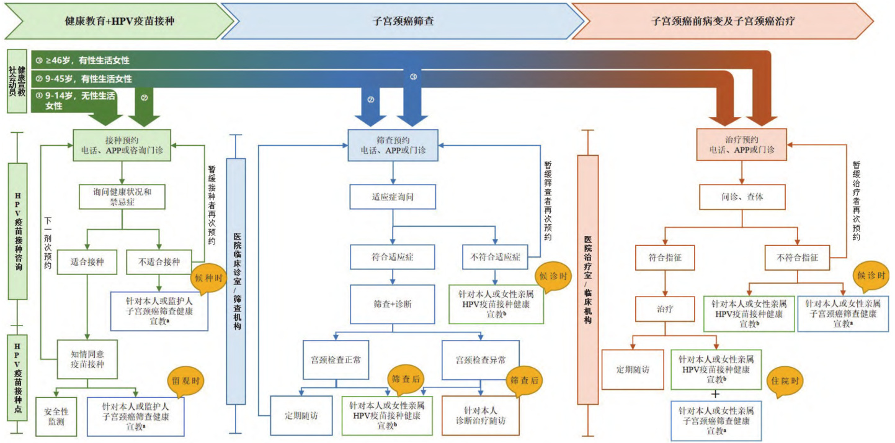

DOI:10.16506/j.109-639.202.10.01  

# ·一切为了人民健康 我们这十年 专家共识·  

# 中国子宫颈癌综合防控路径建设专家共识  

中国子宫颈癌综合防控路径建设专家共识编写组中华预防医学会肿瘤预防与控制专业委员会  

摘要:子宫颈癌是威胁我国乃至全球女性健康的常见恶性肿瘤之一,防控形势严峻。立足全球消除子宫颈癌的战略背景以及后疫情时代对完善肿瘤防控体系的迫切需求下,亟需建立适宜我国国情且高效可行的子宫颈癌综合防控路径,为不同卫生资源地区落实子宫颈癌三级预防工作提供参考。本专家共识参考国内外子宫颈癌综合防控指南及最新研究进展,系统总结三级预防核心要素的最新证据,结合我国实际情况,从服务连通、多部门协同及信息系统互联互通三个维度构建子宫颈癌综合防控路径的建设框架,以期推动子宫颈癌不同防控措施融合,为促进我国不同地区子宫颈癌综合防控体系的建设及有效运行提供兼具科学性和实用性的指导意见。  

关键词:子宫颈癌;综合防控;路径;专家共识中图分类号:R737.3 文献标识码: 文章编号：1009-6639（2022）10-0721-06  

# Expertconsensusonthepathconstructiontowardacomprehensive preventionandcontrolforcervicalcancerinChina  

Writinggroupoftheexpertconsensusonthepathconstructiontowardcomprehensivepreventionand controlforcervicalcancerinChinaSecializedCommite ofCancerPreventionandControl, ChinesePreventiveMedicineAsociation  

Corespondingauthors:ZHAOFang-hui,DepartmentofEpidemiology,NationalCancerCenter/National ClinicalResenchCenterforCancer/ConcerHospitol,ChineseAcademyofMedicalSciencesandPekingUnion MedicalColege,E-mail:zhaofangh $\textcircled { \omega }$ cicams.ac.cn;WANG Hua-qing,NationalImmunizationProgram Center,ChineseCenterforDiseaseControlandPrevention,Beijing, $E$ -mail:wanghq@chinacdc.cn;WANGLinhong,NationalCenterforChronicandNoncommunicableDiseaseControlandPrevention,ChineseCenterfor DiseaseControlandPrevention, $E$ -mail:linhong $_ - \ w a n g ( \textcircled { \alpha } 1 2 6$ .com  

Abstract:Cervicalcancerisoneofthemostcommonmalinanttumorsthatthreatenwomen'shealthinChina andworldwide,anditscontrolfacesa reatchalene.Inthecontextofthe lobalstrate toeliminatecervical cancerandtheurentnedtoimrovethecancer reventionandcontrolssteminthe ost-eidemicera,itis necesarytoestablishaneficientandfeasiblecomprehensivepreventionandcontrolpathwayforcervical cancersuitableforourowncountr ,inorderto rovidereferencefortheimlementationofcervicalcancer tertiar revention roram indiferenthealthresourceareas.Basedonthedomesticandinternational guidelinesandthelatestresearchprogres onintegratedpreventionandcontrolofcervicalcancer,thisexpert consensussystematicalysummarizedthelatestevidenceonthecoreelementsoftertiaryprevention,andbuilt aframeworkfortheconstructionofaninterated reventionandcontrol athwa forcervicalcancerfromthe folowingthre dimensions:serviceconectivity, multi-sectoralcolaboration,andinformation system interconection,withtheaimofpromotingtheintegrationofdiferentpreventionandcontrolmeasures,and providingscientificandpracticalguidancefortheconstructionandefectiveoperationoftheintegratedcervical cancer reventionandcontrolsstemindiferentreionsofChina. Keywords:Uterinecervicalneoplasm;Comprehensivepreventionandcontrol;Pathway;Expertconsensus  

子宫颈癌是全球面临的重要公共卫生议题,同时也是严重威胁全球女性健康的常见恶性肿瘤之一。2020年全球估计有60.4 万子宫颈癌新发病例, 万死亡病例,其中 $8 8 . 1 \%$ 的新发病例和$91 . 4 \%$ 的死亡病例发生在中、低收入国家[1]。为降低全球子宫颈癌疾病负担,世界卫生组织 (WorldHealthOranization,WHO)于2018年发起全球消除子宫颈癌的行动号召,并于 年发布 《加速消除子宫颈癌全球战略》[2],确立了 年需达到的包括 “ 疫苗接种、子宫颈癌筛查及治疗”三大关键措施的 “90-70-90”阶段性目标,该项战略在第 届世界卫生大会上得以批准通过,并获得全球194个国家的全力支持。中国作为全球子宫颈癌负担大国, 年子宫颈癌新增病例和死亡病例分别达到10.9万例和5.9万例,分别占全球的 $1 8 . 2 \%$ 和 $1 7 . 3 \% ^ { [ 2 ] }$ 。同时,近20年来我国子宫颈癌的发病率和死亡率仍呈现不同程度的上升[4],且发病年龄趋于年轻化,子宫颈癌防控形势严峻。  

人 乳 头 瘤 病 毒 (human ailomavirus,)疫苗接种、筛查和治疗三级预防策略的有效衔接和互联互通,是推动子宫颈癌疾病全周期管理、提升综合防控服务能力的关键举措。当前,我国子宫颈癌三级预防服务实施层面仍面临适龄女性疫苗接种和筛查覆盖率低、筛查诊治能力参差不齐等现实问题,加之综合防控服务体系的整合仍受限于不同分管部门缺乏高效沟通机制、医疗保健人员对子宫颈癌综合防控理念重视不足、多途径子宫颈癌防控信息交流共享存在壁垒等诸多挑战[5-7]。在全球加速消除子宫颈癌的战略背景以及后疫情时代对完善肿瘤防控体系的紧迫需求下,亟需建立适宜我国国情且高效可行的子宫颈癌综合防控路径,为不同卫生资源地区分阶段、分步骤推动防控工作落地实施提供参考。因此,本专家共识系统梳理了国内外子宫颈癌防控经验及最新进展,立足子宫颈癌综合防控核心环节,结合我国实际情况提出了子宫颈癌综合防控路径建设框架,旨在推动不同地区子宫颈癌综合防控服务体系的建设及有效运行,加速推动我国消除子宫颈癌进程。  

# 1 子宫颈癌三级预防核心要素  

围绕子宫颈癌三级预防服务措施,立足消除子宫颈癌战略确立的三个阶段性目标包括疫苗接种、筛查和早期干预宫颈癌前病变以及对宫颈癌患者进行规范化治疗的服务内容,通过在上述预防全流程中融入健康教育行动,可促进子宫颈癌综合防控路径得以建立并有效运行,是实现子宫颈癌疾病全周期全方位管理的关键措施。  

1.1 健康教育及 HPV 疫苗接种 健康宣教是贯穿子宫颈癌疾病全周期综合防控策略的重要组成部分。其旨在基于卫生机构、社区、公共场所、学校及家庭等不同场所,分别从服务供方及服务需方出发,有针对性地应用大众传播、人际传播和组织传播等形式开展子宫颈癌防控知识的政策倡导及健康宣教,最终实现提高大众健康素养、降低危险因素暴露风险的目标,使其自觉采取有益于健康的行为生活方式。针对子宫颈癌健康教育行动传播的核心知识应紧密围绕子宫颈癌三级预防措施,涵盖子宫颈癌的可防可治性、常见的危险因素、HPV 疫苗接种 (如目标人群、接种程序、禁忌证、预约接种流程及异常反应处置)、筛查 (如目标人群、筛查流程、禁忌证)及宫颈病变的诊断治疗 (如常见症状和体征、手术及放化疗注意事项、随访管理的重要性及心理疏导)等内容。  

在发生性行为前接种 疫苗能够有效阻断感染,是预防子宫颈癌最根本且最有效的手段。WHO立场文件推荐将 $9 \sim 1 4$ 岁女孩作为首要接种对象,且采用 剂次接种程序,男性或 $\geqslant 1 5$ 岁女性为次要接种人群[8]。目前,我国已获批上市种 疫苗,其中进口双价疫苗 (希瑞适)、四价疫苗 (佳达修)及九价疫苗 (佳达修 )分别于 年、 年及 年获得我国药品监督管理局批准得以在中国大陆上市,3种疫苗分别能够预防2 种 (HPV16/18)、4 种 $\mathrm { H P V 6 } / 1 1 / 1 6 /$ ) 和 种 $\mathrm { H P V 6 / 1 1 / 1 6 / 1 8 / 3 1 / 3 3 / 4 5 / 5 2 / 5 8 ) }$ 基因型别引起的 HPV 相关疾病[9-11] 。此外,我国自主研发的两种双价疫苗 (馨可宁和沃泽惠)也分别于2019年及202 年在中国上市[12-13] 。双价、四价及九价疫苗均适用于 $9 \sim 4 5$ 岁女性 (其中国产沃泽惠双价疫苗适用人群为 $9 \sim 3 0$ 岁)。现阶段我国医疗场所开展 疫苗接种流程主要参照 《中华人民共和国疫苗管理法》[14]及 《预防接种工作规范》[15]等规范化文件执行。  

1.2 子宫颈癌筛查 子宫颈癌筛查是早发现、早诊断、早治疗宫颈病变的重要防控手段。在预防性HPV 疫苗尚未纳入国家免疫规划的背景下,子宫颈癌筛查仍是我国子宫颈癌防控的核心手段,其中子宫颈细胞学检查和 HPVDNA 检测是目前最主要的两种筛查方法。  

在 年 《世界卫生组织子宫颈癌前病变筛查和治疗指南》[16]中推荐筛查起始年龄为 岁,岁以上女性若连续两次筛查结果为阴性则可停止筛查,并优先推荐用 检测作为初筛方法,以 $5 \sim 1 0$ 年作为筛查周期。  

我国在2017年 《子宫颈癌综合防控指南》[17]中推荐筛查起始年龄为 $2 5 \sim 3 0$ 岁, 岁以上女性若过去 年筛查结果阴性 (每 年 次连续 次细胞学检查无异常或每 年 次连续 次联合筛查结果阴 性), 且 无 子 宫 颈 上 皮 内 瘤 变 (intraepithelialneoplasia，CIN）病史，则可以终止筛查,推荐的筛查方案包括 3 种: 细胞学筛查(3年1次)、HPV 筛查 (5 年1 次)、HPV 和细胞学联合筛查 ( 年 次)。同时,针对包括免疫缺陷人群在内的高危人群,推荐提前筛查起始年龄并缩短筛查间隔。  

我国组织性子宫颈癌筛查工作参考 《宫颈癌筛查工作方案 ( 版)》[18]实施,筛查服务对象为$3 5 \sim 6 4$ 周岁女性,推荐每3年1次的细胞学筛查或每 年 次的高危型 检测为初筛技术的筛查流程。  

1.3 子宫颈癌及癌前病变诊断与治疗 对检出的子宫颈癌前病变及早期浸润癌进行及时有效的诊治和管理,是降低晚期子宫颈癌发病率及提高生存率的重要措施。其作为疾病全周期路径建设多源流防控的终点,在各级预防措施标准化路径实施之后,可以有效减轻疾病负担和经济负担。  

目前,子宫颈癌及癌前病变诊断主要通过宫颈活检、宫颈管搔刮或宫颈锥切组织样本进行病理诊断确诊。病理学诊断为鳞状上皮低级别病变 (radesuamousintraeitheliallesion,LSIL/CIN1)者通常不需要接受治疗, 建议 $6 \sim 1 2$ 个月复查细胞学和 HPV 检测, 任一异常均需转诊阴道镜。子宫颈癌前病变, 包括阴道镜下活检病理证 实 为 鳞 状 上 皮 高 级 别 病 变 (hih radesuamousintraeitheliallesion, HSIL/CIN2,3)和原位腺癌 (adenocarcinomainsitu,AIS)。子宫颈癌前病变的治疗方法包括宫颈切除性治疗 [冷刀锥切 和 宫 颈 电 圈 环 切 术 (lopelectrosurgicalexcision rocedure,LEEP)]和消融治疗 (又称物理治疗,包括冷冻、热凝、激光等组织破坏性治疗)。具体处理原则参考 《子宫颈癌综合防控指南》[17]及 《中国子宫颈癌筛查及异常管理相关问题专家共识》[19-20]。  

目前,临床操作中针对浸润癌诊断原则主要依据国际妇产科联盟（theinternationalfederationofnecolo andobstetrics,FIGO)2018年发布的最新子宫颈癌分期规定[21-22] ,并参考相应的规范化诊疗指南执行。其中手术治疗主要适用于早期子宫颈癌,手术方式的选择需综合考虑患者的生育要求等诸多要素。对于中晚期子宫颈癌及复发的患者应首选同步放化疗或者免疫治疗,总体治疗原则参考《中国妇科恶性肿瘤临床实践指南第 版》[23]。对于局部晚期子宫颈癌及复发或转移的患者需直接转诊至有资质的上级医院进行诊治。  

# 2 子宫颈癌综合防控路径建设框架  

子宫颈癌综合防控路径的建设需探索将子宫颈癌综合防控核心环节有效整合的创新机制,建设框架涵盖连通三级预防服务、建立多部门协同机制以及加强信息系统互联互通,为疾病全周期管理提供医疗服务基础,同时为路径建设提供保障平台和技术支持,最终形成全链条防控体系。  

2.1 连通三级预防服务 针对不同服务对象建立的标准化路径应紧密围绕健康教育、 疫苗接种、筛查及诊疗等核心要素。具体预防控制措施应对大众人群广泛适用,且又能基于服务对象个体基本特征和特殊健康需求兼顾针对性。三级预防服务作为综合路径建设的核心要素各自并非独立存在,通过有效整合和融会贯通将产生 $1 + 1 + 1 > 3 ^ { , }$ ”的健康收益和社会效益。  

2.1.1 健康教育在三级预防服务中的作用及实现路径 健康教育渗透在子宫颈癌三级预防服务的各个层面。从健康教育服务的供需双方出发,医务人员应接受健康教育相关规范化培训并通过业务能力考核,能够开展同质化、规范化和标准化的健康教育工作,除了掌握所提供的预防措施的核心知识外,同时应该熟悉其他各级预防措施的关键要点,主动为服务对象提供综合性的三级预防措施宣教;普通大众作为健康教育服务的终端,在接受子宫颈癌防控健康教育服务后,能够自觉采纳有益于健康的行为和生活方式 (如戒烟、安全性行为和疫苗接种等),形成自我健康管理模式。  

# 2.1.2 三级预防服务及其相互连通  

# 2.1.2.1 三级预防核心服务内容  

(1)HPV 疫苗接种:针对 $9 \sim 4 5$ 岁女性,通过接种预约,接种门诊工作者对其健康状况和禁忌证进行综合评估后判断是否适合接种,对适宜接种者签署知情同意,进而按照规范化流程实施 HPV疫苗接种并完成安全性监测。同时,在接种留观期间,关注其女性亲属 疫苗接种需求,对于符合年龄适宜接种且尚未接种者,推荐其进行 HPV疫苗预约接种。 ()子宫颈癌筛查:针对 $2 5 \sim 6 4$ 岁常规筛查人群,通过子宫颈癌筛查预约,筛查人员对其适应症进行综合判断,适宜筛查者应按照规范化流程进行筛查,筛查正常者进行定期随访,异常者推荐在本级妇科门诊或转诊至上级临床机构接受后续诊疗服务。同时,在筛查候诊期间,关注其女性亲属既往子宫颈癌筛查情况,对于满足筛查条件但既往未接受筛查者,推荐其进入常规筛查路径。(3)子宫颈癌前病变和子宫颈癌诊断与治疗:患者通过临床诊疗机构进行预约,医务人员对其症状和体征进行综合评估后确定临床诊断,按照规范化子宫颈癌前病变和子宫颈癌临床治疗指南进行诊疗和随访管理。同时,在治疗期间,关注其女性亲属是否有宫颈病变且未得到及时规范治疗的情况,符合相关症状和体征者,推荐其进入临床诊疗服务路径。  

2.1.2.2 三级预防服务互联互通 在子宫颈癌防控不同服务场所中,依托开展各级预防核心服务内容的同时,对不同年龄段及不同健康需求的服务对象及其女性亲属提供针对性的其他预防服务相关的健康教育,以此作为纽带引导服务人群参与子宫颈癌其他各级预防服务内容,进一步实现以女性为中心的子宫颈癌全疾病周期预防服务全覆盖,保障不同服务类型和不同机构所提供服务之间的紧密衔接。具体服务流程详见图1。  

2.2 建立多部门协同机制 子宫颈癌综合防控联动路径需联合卫生服务体系内疾病预防控制中心、妇幼保健机构、综合医疗机构和基层社区卫生服务中心等核心机构以及卫生系统外涉及卫生职能的相关部门形成整合型多部门协同机制,共同建立组织保障机制和医疗服务体系,为子宫颈癌综合防控服务的实施提供平台支撑。  

2.2.1 组织保障机制 组织保障机制的建立应在政府主导下,由卫生健康部门及卫生系统外相关协作机构 (包括宣传、财政、医保、教育、妇联、民政和慈善等)联动构成。通过将子宫颈癌防控作为政府部门的优先事项,出台并落实相关政策,可推动子宫颈癌综合防控工作高效可持续开展。各地区应根据实际情况明确卫生系统外相关协作机构的职能定位,提供的保障措施应围绕子宫颈癌综合防控关键环节,包括参与制定社会公众健康宣教的标准化材料,协助开展针对不同受众的健康宣教;组织开展基于学校或社区的适龄女孩 疫苗接种;协同筹集和提供相关医疗服务的专项经费;制定针对子宫颈癌患者的治疗补助制度等。  

2.2.2 医疗服务体系 通过建立各级各类医疗机构组成的医疗服务体系,可实现子宫颈癌分层、分级和分流管理。目前,我国 疫苗接种工作由注:a为其中 $2 5 \sim 6 4$ 岁宫颈癌筛查告知和预约;b为其中 $9 \sim 4 5$ 岁者 HPV 疫苗接种告知和预约。疫苗接种候种留观时,针对其监护人,HPV 疫苗接种告知和预约;筛查候诊时或筛查后,针对其同性女性亲属,筛查告知和预约;治疗候诊或者住院时,针对患者本人及陪护女性亲属;HPV 疫苗接种及筛查及筛查告知和预约。  

  
图1 三级预防服务及其互联互通示意图  

疾病预防控制中心分管,筛查主要由妇幼保健机构及部分体检或医疗机构负责,诊治主要由临床医疗机构统一管理,不同医疗卫生机构的碎片化服务和分散式管理影响女性子宫颈癌全疾病周期服务的连贯性。因此,综合考虑不同地区医疗资源分布及不同医疗机构权责分工现状,推荐采用的服务体系建设路径包括:()建设区域子宫颈癌综合防控中心或一站式服务门诊:协同提供 疫苗接种、子宫颈癌筛查及宫颈病变治疗管理等综合防控全周期的服务。 ()搭建各级各类医疗机构间的合作机制:可通过建立机构间绿色通道转诊机制的形式实现,如在筛查机构及治疗机构之间建立双向或多向转诊救治绿色通道,对筛查阳性病例经绿色通道及时转诊至上级医疗机构进行规范治疗,再将诊断明确和治疗后病情稳定的患者及时转送基层医疗机构进行随访管理[24]。此外,还可建立或扩充医疗联合体,即整合区域内的医疗资源成立医疗机构联盟,采取人员进修、技术帮扶及转诊等多种形式的合作途径,最终形成综合防控协同网络[25]。  

2.3 实现信息系统互联互通 结合国家或地方卫生健康部门对于信息化建设的相关标准和要求,依托各地实际需求建设并逐步完善联动互通的子宫颈癌综合防控的区域化信息网络,可实现对妇女健康状态和疾病周期进行个体化的评估和管理,同时为规范子宫颈癌综合防控全链条服务质量以及评价各级预防措施的长期效果提供数据支撑。  

2.3.1 信息网络涵盖功能 子宫颈癌综合防控信息网络可涵盖的功能包括:()基本功能:基于个案的 疫苗接种、子宫颈癌筛查、诊断、治疗与随访全疾病周期信息的收集和管理。()服务实施及管理功能:针对子宫颈癌防控信息平台不同使用对象设置相应权限的功能端,支持实现健康宣教、 疫苗接种预约及不良反应监测、子宫颈癌筛查预约及异常人群管理、疾病诊疗意见决策及各级医疗机构绿色通道定向转诊机制等功能。 (3)科学评价功能:数据分类汇总、数理统计和分析,依托大数据建设科学评估指标体系等。  

2.3.2 互联互通实现路径 实现子宫颈癌综合防控信息网络的上述功能,可采用建设或完善区域内子宫颈癌防控综合信息平台和促进相关医疗机构已有信息系统的数据共享和交互两种方法。(1)建立整合子宫颈癌综合防控信息平台:实现特定区域内适龄女性子宫颈癌综合防控全周期信息的采集、整合、分析、反馈和管理。()基于现有各级各类医疗机构信息系统进行数据共享和交互:联通疾病预防控制中心、妇幼保健机构、临床医疗机构及社区卫生服务中心等机构的现有信息平台,实现机构间的数据互联互通。不同机构的数据链接可依托信息系统外部接口实现,并基于目标人群的唯一识别码(如身份证号码)进行个案信息的联系。应建立统一的数据交互服务技术规范,统一各机构信息系统中涉及个人信息、预防接种、疾病报卡、门诊摘要和随访报告等接口的建设规范,保障数据通过接口进行共享和交互的安全性、及时性、有效性和一致性[26]。上述两种策略的实现均需涉及的目标人群全疾病周期防控的关键变量,包括基础信息 (一般人口学特征和危险因素等)、 疫苗接种信息(疫苗采购、接种疫苗类型、剂次、接种时间和不良反应监测等)、子宫颈癌筛查信息 (筛查时间、方法、结果及随访管理等)和临床诊疗信息 (诊疗时间、方法效果及随访监测)等,同时应注意其收集方法和质量要求标准 (包括编码标准和数据核查标准等)以确保数据质量。  

# 3 展 望  

整合子宫颈癌综合防控全链条要素,构建适宜我国国情的子宫颈癌综合路径对促进全社会多部门形成合力、多措并举推动实现消除子宫颈癌阶段性目标至关重要。未来我国仍需在以下几方面加强建设以推动不同资源地区子宫颈癌综合防控路径的落地实施:搭建子宫颈癌综合防控路径实施的示范基地,积累适宜不同资源地区的防控经验;制定可行易行的资源保障机制,确保供给侧的卫生服务设施、人员、 疫苗及检测试剂等医疗产品的可及性和公平性,保障子宫颈癌防控服务的可持续性实施;及时评估并总结试点地区子宫颈癌防控服务效果与卫生经济学效益,了解综合防控路径的实施成效并助力优化防治策略;注重整合统筹医疗系统内部及外部资源,协同开展围绕女性全生命周期的健康服务,实现卫生资源投入的最大化收益。基于我国真实世界积累的子宫颈癌防控示范经验,可为健康中国癌症防治行动其他癌肿的防控工作树立典范,同时也通过传递中国经验助力全球实现加速消除子宫颈癌目标。  

# 编写顾问 (按姓氏拼音排序):  

郎景和 (北京协和医院);乔友林 (中国医学科学院北京协和医学院群医学及公共卫生学院);魏丽惠 (北京大学人民医院);张勇 (国家癌症中心)编写专家名单 (按姓氏拼音排序):  

陈飞 (北京协和医院);胡尚英 (中国医学科学院肿瘤医院);李燕 (中国疾病预防控制中心免疫规划中心);刘晓强 (云南省疾病预防控制中心);马兰 (中国疾病预防控制中心妇幼保健中心);热米拉·热扎克 (新疆医科大学附属肿瘤医院);苏小游 (中国医学科学院北京协和医学院群医学及公共卫生学院);王华庆 (中国疾病预防控制中心免疫规划中心);王岩 (新疆医科大学附属肿瘤医院);吴久玲 (中国疾病预防控制中心妇幼保健中心);许天敏 (吉林大学第二医院);余艳琴 (内蒙古科技大学包头医学院第一附属医院);张延炀 (河南省疾病预防控制中心);赵方辉、赵雪莲 (中国医学科学院肿瘤医院);赵昀 (北京大学人民医院)  

# 审校专家名单 (按姓氏拼音排序):  

毕蕙 (北京大学第一医院);陈汶 (中国医学科学院肿瘤医院);韩历丽 (北京市妇幼保健院);吕敏(北京市疾病预防控制中心免疫所);乔友林 (中国医学科学院北京协和医学院群医学及公共卫生学院);王华庆 (中国疾病预防控制中心免疫规划中心);王临虹 (中国疾病预防控制中心慢性非传染性疾病预防控制中心);魏丽惠 (北京大学人民医院);吴久玲 (中国疾病预防控制中心妇幼保健中心);章文华 (中国医学科学院肿瘤医院);赵更力(北京大学第一医院)  

# 编写组秘书  

任文辉、文天萌 (中国医学科学院肿瘤医院);陈号 (厦门大学公共卫生学院);司明玉 (中国医学科学院北京协和医学院群医学及公共卫生学院)  

# 参考文献  

[1] SungH,FerlayJ,SiegelRL,etal. GlobalCancerStatistics2020 : GLOBOCAN estimates of incidence and mortalityworldwidefor36cancersin185countries [J]. CACancerJClin,2021,71 (3):209-249.  
[2] World Health Organization.Global strategy to acelerate theelimination of cervical cancer as a ublic health roblem[Z].2020.  
[3] FerlayJEMLF.Globalcancerobservatory:cancertoday[EB/OL]. [202-8-25].htps:/gco.iarc.fr/today.  
[4] 赵方辉,陈号,夏昌发,等 中国女性宫颈癌负担快速上升的原因及其应对措施 [] 中华流行病学杂志, ,(5)：761-765.  
[5] 韩雨廷,吕筠,余灿清,等 数字公共卫生的进展与应用[] 中华流行病学杂志, , ():  
[6] 朱碧帆,李芬,陈多,等 整合医疗卫生服务体系筹资激励机制现状、问题和优化策略 [J]. 中国卫生资源,2019,2 (6):410-414.[7] Xu X ,Wang Y ,Liu Y,et al. A nationwide post-marketingsurvey of knowledge ,atitudes and recommendations towardshumanpapilomavirusvacinesamonghealthcareprovidersinChina [J].PrevMed,2021,146:106484.[8] 胡尚英,乔友林.2017年 WHOHPV 疫苗立场文件的解读[J]. 中华预防医学杂志,2018,52 (5):464-468.[9] 上海葛兰素史克中国投资有限公司. 双价人乳头瘤病毒吸附疫苗说明书 [Z]. 2018.  
[10] 上海默沙东中国有限公司. 九价人乳头瘤病毒疫苗 (酿酒酵母)说明书 [Z].2018.  
[1] 上海默沙东中国有限公司. 四价人乳头瘤病毒疫苗说明书(酿酒酵母)[Z].2020.  
[12] 厦门万泰沧海生物技术有限公司厦门. 双价人乳头瘤病毒疫苗 (大肠杆菌)说明书 [Z]. 2020.  
[13] 玉溪泽润生物技术有限公司. 双价人乳头瘤病毒疫苗 (毕赤酵母)[Z].202.  
[14] 全国人民代表大会. 《中华人民共和国疫苗管理法》(国家主席令30号)[S]. 北京:全国人民代表大会,2019.  
[15] 国家卫生健康委员会. 《预防接种异常反应鉴定办法》(卫生部令第60号)[S]. 北京:国家卫生健康委员会,208.  
[16] World HealthOrganization.WHOguidelineforscreningandtreatmentofcervicalpre-cancerlesionsforcervicalcancerprevention,secondedition [S]. Generva: WorldHealthOrgaization,2021.  
[17] 中华预防医学会妇女保健分会. 子宫颈癌综合防控指南[M]. 北京:人民卫生出版社,2017.  
[18] 国家卫生健康委员会. 国家卫生健康委员会办公厅关于印发宫颈癌筛查工作方案和乳腺癌筛查工作方案的通知 (国卫办妇幼函 [2021]635号)[S]. 北京:国家卫生健康委员会,2021.  
[19] 魏丽惠,赵昀,沈丹华,等. 中国子宫颈癌筛查及异常管理相关 问 题 专 家 共 识 (一) [J]. 中 国 妇 产 科 临 床 杂 志,2017,18 (2):190-192.  
[20] 魏丽惠,沈丹华,赵方辉,等. 中国子宫颈癌筛查及异常管理相关问题专家共识 (二) [J]. 中国妇产科临床杂志,2017,18 (3):286-28.  
[21] BhatlaN,DenyL.FIGOCancerReport2018 [J].IntJGynaecolObstet,2018,143Supl2:2-3.  
[2 ] 李静,索红燕,孔为民. 《国际妇产科联盟 (FIGO)2018癌症报告:宫颈癌新分期及诊治指南》解读 [J]. 中国临床医生杂志,2019,47 (6):646-649.  
[23] 中华医学会妇科肿瘤学分会. 中国妇科恶性肿瘤临床实践指南 (第6版)[M]. 北京:人民卫生出版社,2015.  
[24] 曹红英,刘力松. 发挥综合医院优势 畅通双向转诊绿色通道 [J]. 中华现代护理杂志,2012 (34):4182-4184.  
[25] 刘元杰,刘葭,宁静,等. 妇幼专科联盟及分级诊疗模式实践探索 [J]. 中国妇幼卫生杂志,202 ,13 (1):75-78.  
[26] 吴亚, 顾嘉奇, 陈天逸, 等. 苏州市公共卫生平台技术架构设计的实践 [J]. 中国公共卫生管理,2021,37 (4):560-563.  

收稿日期:202-08-23 修回日期:202-08-31 本文编辑:孙玉婷  