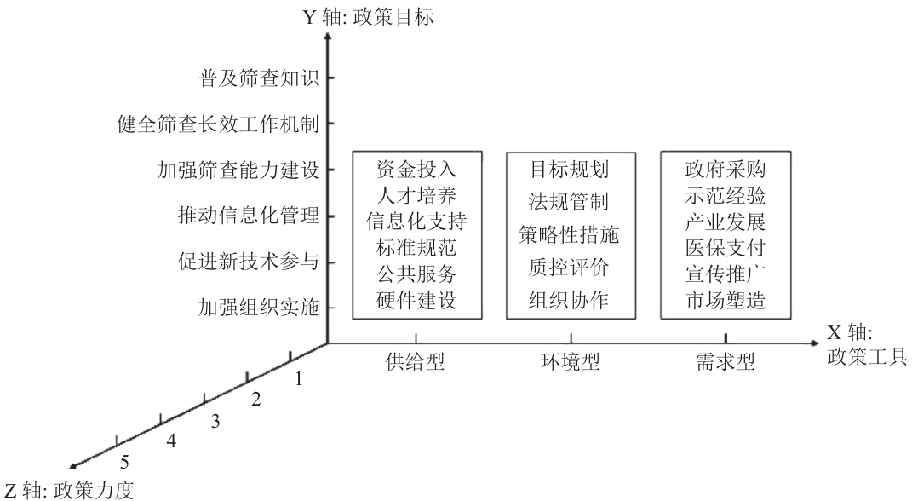

# • 专题报道 —— 综合施策，科学防癌 •  

# 中国宫颈癌筛查服务政策量化分析  

张晓晗，胡尚英，赵方辉，周彩虹  

国家癌症中心 国家肿瘤临床医学研究中心 中国医学科学院北京协和医学院肿瘤医院流行病学研究室，  
北京 100021  
通信作者：周彩虹，E-mail：13521290838@126.com  

【摘    要】目的  分析中国宫颈癌筛查服务政策的内容与不足，为后续优化宫颈癌筛查服务政策体系提供建议。方法  收集中国政府网、国家卫生健康委、中国疾病预防控制中心等官网以及北大法宝数据库等平台2006 年1 月 1 日 — 2023 年 5 月 31 日发布的宫颈癌筛查服务相关政策文件，采用内容分析法构建“政策工具 – 政策目标 – 政策力度”三维框架对国家层面颁布的宫颈癌筛查服务政策文件进行量化分析。结果  本研究共纳入37 份宫颈癌筛查服务相关政策文件，政策工具维度编码 174 条，其中环境型政策工具使用最多 $( 5 0 . 5 7 \% )$ ，需求型政策工具使用最少（ $1 4 . 9 5 \%$ ），无政府采购和医保支付等子工具；政策目标维度编码 149 条，其中健全筛查长效工作机制占比最大 $5 2 . 3 4 \%$ ）；政策力度平均分数为 2.54 分，我国现行宫颈癌筛查服务相关政策文件基本以“通知”等非立法性文件形式发布， $\geqslant 4$ 分的政策文件仅占 $2 1 . 6 2 \%$ 且条款较少涉及宫颈癌筛查服务。政策工具、目标和力度的交叉分析结果显示，在政策工具维度中，环境型政策工具政策力度最大（2.83 分），需求型和供给型政策工具分别为 2.47 分和 2.33 分；在政策目标维度中，除推动信息化管理的政策力度最低（2.00 分）外，其他目标的政策力度分布相对均衡，均在 2.59 分上下浮动。结论  中国宫颈癌筛查服务政策工具内部结构不均衡，政策目标结构有待优化，不同政策主体对宫颈癌筛查服务政策使用工具和关注点侧重不同，部门间协作不足，应进一步加强政策顶层设计以推进我国宫颈癌筛查服务政策的落地实施。  

【关键词】 宫颈癌；筛查服务；政策；量化分析  

# Cervical  cancer  screening  service  policies  in  China,  2006  –  2023:  a quantitative analysis of government documents  

ZHANG  Xiaohan,  HU  Shangying,  ZHAO  Fanghui,  ZHOU  Caihong  (National  Cancer  Center/National Clinical Research Center for Cancer/Cancer Hospital, Chinese Academy of Medical Sciences and Peking Union Medical College, Beijing 100021, China)   
Corresponding author: ZHOU Caihong, E-mail: 13521290838@126.com  

【 Abstract】   Objective  To  analyze  the  content  and  shortcomings  of  policy  documents  for  cervical  cancer  screening service issued by government agencies in China and to provide suggestions for optimizing policies for cervical cancer screening service in the future. Methods  We retrieved policy documents on cervical cancer screening services issued by government agencies from 2006 to 2023 through official websites such as the Chinese Government Network, the National Health Commission of China, the Chinese Center for Disease Control and Prevention, and platforms such as the PKU Law database. Content analysis was used to construct a three-dimensional policy instrument – policy objective – policy strength framework for quantitative analysis of national-level cervical cancer screening policy documents. Results  This study included 37 policy documents related to cervical cancer screening services, with 174 policy items coded. Among them,  the  policy  items  for  cervical  cancer  screening  service  environment  were  mentioned  most $( 5 0 . 5 7 \%$ of  all  coded items), and the items for government objective were mentioned least $( 1 4 . 9 5 \% )$ , and no items were mentioned for cancer screening  service-related  government  procurement  and  medical  insurance  payment.  A  total  of  149  items  for  cancer screening service-related administrative objective were coded, among which the proportion of items for optimizing the long-term operation mechanism of screening is the highest $( 5 2 . 3 4 \% )$ . The average policy strength score for all retrieved documents is 2.54. The analyzed policy documents are mainly issued in the form of non-legislative documents, such as notices. Policy documents with a strength score of $\geqslant 4$ points account for only $2 1 . 6 2 \%$ of all documents, and there are few items related to cervical cancer screening services in the documents. In terms of the three dimensions of the documents, the mean strength score (2.83) was highest for policies on the operating environment of screening services, followed by 2.47 for those on government objective and 2.33 for those on provision; on the aspect of government objective, the lowest strength  score  (2.00)  was  for  policies  on  promoting  relevant  information  management;  the  strength  scores  fluctuated around  2.59  for  policies  on  other  aspects  related  to  screening  services.  Conclusion  The  internal  structure  of  policy instruments for cervical cancer screening services in China is uneven, and the structure of policy objectives needs to be optimized. Different policy units have different focuses on the implementation and concern for cervical cancer screening services, and there is insufficient cooperation among different departments. Therefore, it is necessary to further strengthen the top-level policy design to promote the implementation of cervical cancer screening services in China.  

【Keywords】 cervical cancer; screening service; policy; quantitative analysis  

宫颈癌是女性癌症死亡的第四大原因，研究显示，中国宫颈癌的发病率和死亡率在世界中均处于较高水平，疾病负担较重[1 – 3]。目前以筛查为主的二级预防措施仍是宫颈癌预防的主要方法，但我国尚未建立全覆盖的宫颈癌筛查体系，且存在部分地区筛查方法较单一[4]、基层卫生服务人员能力建设不足[5]、信息系统不互通[6] 等问题。近年来，我国政府出台了一系列政策措施规范宫颈癌筛查服务以促进筛查的长效化发展，但目前关于宫颈癌筛查服务政策文件量化分析的研究较少，无法全面了解宫颈癌筛查政策的现状和进展。因此，本研究收集中国政府网、国家卫生健康委、中国疾病预防控制中心等官网以及北大法宝数据库等平台 2006 年 1 月 1 日 — 2023 年 5 月31 日发布的宫颈癌筛查服务相关政策文件，采用内容分析法构建“政策工具 – 政策目标 – 政策力度”三维框架对国家层面颁布的宫颈癌筛查服务政策文件进行了量化分析，旨在分析中国宫颈癌筛查服务政策的内容与不足，为后续优化宫颈癌筛查服务政策体系提供建议。结果报告如下。  

# 1   资料与方法  

1.1    资料来源　收集中国政府网、国家卫生健康委、中国疾病预防控制中心等官网以及北大法宝数 据 库 等 平 台 2006 年 1 月 1 日   —  2023 年 5 月31 日发布的宫颈癌筛查服务相关政策文件。所纳入政策文件均为国家层面颁布的政策内容明确提到宫颈癌筛查的规范政策文件，政策文本形式主要为法律法规、意见、通知等，排除不属于原政策的文件（如政策解读等）以及政策内容仅出现关键词而无实质性具体内容的文件。  

1.2    统计分析（图 1、表 1）　应用 Excel 2019 软件进行统计分析。采用内容分析法，以政策文件中各项条目为分析单元，按照“政策文件编号 – 章节 –条目”进行编码。例如，将第 1 份政策文件《关于印发加速消除宫颈癌行动计划（2023 — 2030 年）的通知》的“五、完善宫颈癌综合防治体系，提高防治能力”中的“（二）推动宫颈癌防治信息化管理”编码为“1 – 5 – 2”。若同一条目表达不同意义，则进行第四级编码；若同一条目对应不同指标，则重复编码。研究表明，政策工具、政策目标和政策力度三者之间的协调运用有助于产生最佳的政策协同效应[7]，政策工具、目标、力度三维分析框架近年来亦被应用于癌症防治政策分析的研究中[8]，因此本研究以政策工具为 X 轴、政策目标为Y 轴、政策力度为Z 轴，从3 个维度构建宫颈癌筛查服务政策分析框架（见图 1）对国家层面颁布的宫颈癌筛查服务政策文件进行了量化分析。（1）政策工具（X 维度）：政策工具是实现政策目标的具体手段和方法[9]，Rothwell 等[10] 提出将政策工具分为供给型、环境型和需求型 3 类。其中，供给型政策工具对宫颈癌筛查服务起直接推动作用，指政府主动提供人才、资金、信息和技术等支持；需求型政策工具对宫颈癌筛查服务起直接拉动作用，指政府通过政府采购、示范经验、医保支付和宣传推广等措施释放宫颈癌筛查的需求；环境型政策工具是通过规划目标和实施法律等方法为政策实施提供基本条件，间接影响宫颈癌筛查服务。政策工具名称及含义具体见表 1。（2）政策目标（Y 维度）：政策目标代表政策制定和实施的预期结果[11]，通过对所纳入政策文件中涉及宫颈癌筛查的全部条目进行阅读思考，最终本研究将政策目标归纳为普及筛查知识、健全筛查长效工作机制、加强筛查能力建设、推动信息化管理、促进新技术参与和加强组织实施 6 个方面。（3）政策力度（Z 维度）：政策力度是衡量政策法律效力和重要程度的指标[12]，本研究以国务院 《 规 章 制 定 程 序 条 例 》 [13] 和 相 关 研 究 [7 – 8, 14]中政策力度量化标准为依据，按照政策颁布机构层级和数量将政策力度分为以下 5 级：全国人大及常委会颁布的法律法规或中共中央、国务院颁布的纲要评分为 5 分；国务院颁布的规划、规定和意见评分为 4 分；国务院颁布的方案、办法以及各部委颁布的规定、意见或 3 个及以上部委联合发文评分为 3 分；国务院颁布的通知、公告以及各部委颁布的方案、办法或 2 个部委联合发文评分为 2 分；各部委单独颁布的通知和公告评分为1 分。  

  
图 1    宫颈癌筛查服务政策三维分析框架 Fig. 1   Framework for three-dimensional analysis of cervical cancer screening service policy in China (X, Y,and Z axes denote policy instruments, objective, and strength)  

表 1   宫颈癌筛查服务各类政策工具含义 Table 1   Definitions for 17 terms of policy instruments for cervical cancer screening service in China in three aspects of service provision, environment and administrative intention   

<html><body><table><tr><td>政策工具</td><td>项目</td><td>含义</td></tr><tr><td>供给型</td><td>资金投入</td><td>政府为宫颈癌筛查服务提供资金支持，如专项资金和经费补助等</td></tr><tr><td></td><td>人才培养</td><td>政府通过教育培训和技术指导等建设宫颈癌筛查人才队伍</td></tr><tr><td></td><td>信息化支持</td><td>政府通过构建信息化系统为宫颈癌筛查服务提供信息化支持</td></tr><tr><td></td><td>标准规范</td><td>政府为宫颈癌筛查服务制定指导方案、技术方案和筛查指南等</td></tr><tr><td></td><td>公共服务</td><td>向妇女提供包括妇科检查、宫颈癌初筛、阴道镜检查还未异常或可疑病例随访等在内的宫颈癌筛查相关公共服务</td></tr><tr><td></td><td>硬件建设</td><td>包括宫颈癌筛查机构与培训基地的建设和筛查相关设施的配备等</td></tr><tr><td>环境型</td><td>目标规划</td><td>政府为宫颈癌筛查服务设定总体目标和未来规划</td></tr><tr><td></td><td>法规管制</td><td>政府通过落实法律和法规等强制措施加强对宫颈癌筛查服务的监督管理</td></tr><tr><td></td><td>策略性措施</td><td>政府为宫颈癌筛查水平的提升而制定的系列措施，如鼓励创新和技术引进等</td></tr><tr><td></td><td>质控评价</td><td>政府针对宫颈癌筛查具体内容制定监督指标，完善考核方法，加强对宫颈癌筛查服务的数据监测及考核评估与质量控制</td></tr><tr><td></td><td>组织协作</td><td>政府强化相关工作的组织实施，加强各部门沟通协调，提高工作效率</td></tr><tr><td>需求型</td><td>政府采购</td><td>政府直接或委托其他组织利用经济手段降低采购成本,如检测试剂集采和服务项目价格谈判等</td></tr><tr><td></td><td>示范经验</td><td>开展宫颈癌筛查服务试点工作并总结推广试点经验</td></tr><tr><td></td><td>产业发展</td><td>政府推动宫颈癌筛查新技术发展，促进其与多领域的对接与融合</td></tr><tr><td></td><td>医保支付</td><td>政府通过提高报销比例和扩大报销范围等方式提高宫颈癌筛查服务利用</td></tr><tr><td></td><td>宣传推广</td><td>政府对宫颈癌筛查相关工作进行宣传教育，对高风险妇女进行筛查和早诊早治</td></tr><tr><td></td><td>市场塑造</td><td>政府鼓励社会力量参与宫颈癌筛查服务，集中各方力量推动宫颈癌防治事业</td></tr></table></body></html>  

# 2   结　果  

2.1    中国宫颈癌筛查服务政策基本情况（表 2）  

本研究共纳入中国宫颈癌筛查服务相关政策文件37 份 ，其 中 2006、 2007、 2018 和 2023 年 各 1 份 ，2015、 2016、 2020 和 2022 年 各 2 份 ，2011 和 2012年各 3 份，2009、2010 和 2019 年各 4 份，2021 年纳入最多为 7 份，2008、2013、2014 和 2017 年均未纳入相关政策文件，具体见表 2；发文部门主要包括国家卫生健康委（包括原国家卫生计生委、原卫生部）、国务院、财政部、健康中国行动推进委员会等，其中 27 份为单独发文 $( 7 2 . 9 7 \% )$ ），10 份为联合发文 $( 2 7 . 0 3 \% )$ 。  

表 2   宫颈癌筛查服务政策文件文本示例 Table 2   Year of issue, document name header, issuing agency, and document number for 37 policy documents on cervical cancer screening services in China published from 2006 to 2023 in descending order   

<html><body><table><tr><td>序号</td><td>年份</td><td>政策名称</td><td>发文机构</td><td>政策文号</td></tr><tr><td>1</td><td></td><td>2023关于印发加速消除宫颈癌行动计划(2023－2030年)的通知</td><td>国家卫生健康委、教育部、 民政部等10个部门</td><td>国卫妇幼发（2023）1号</td></tr><tr><td>2</td><td></td><td>2022国家卫生健康委关于印发贯彻2021－2030年中国妇女儿童发展纲要 实施方案的通知</td><td>国家卫生健康委</td><td>国卫妇幼函（2022）56号</td></tr><tr><td>3</td><td></td><td>2022健康中国行动推进委员会办公室关于印发健康中国行动2022年工作要点健康中国行动推进委员会 的通知</td><td>办公室</td><td>国健推委办发（2022）2号</td></tr><tr><td>4</td><td></td><td>2021国家卫生健康委办公厅关于印发宫颈癌筛查工作方案和乳腺癌筛查工作国家卫生健康委办公厅 方案的通知</td><td></td><td>国卫办妇幼函（2021）635号</td></tr><tr><td>5</td><td></td><td>2021国务院关于印发中国妇女发展纲要和中国儿童发展纲要的通知（2021一 2030年）</td><td>国务院</td><td>国发（2021）16号</td></tr><tr><td>6</td><td></td><td>2021关于印发《健康城市建设推动健康中国行动创新模式试点工作方案》的 通知</td><td>公室、健康中国行动推进委</td><td>全国爱国卫生运动委员会办全爱卫办函（2021）5号</td></tr><tr><td>7</td><td></td><td>2021健康中国行动推进委员会办公室关于印发健康中国行动2021年工作</td><td>员会办公室 健康中国行动推进委员会</td><td>国健推委办发（2021）1号</td></tr><tr><td>8</td><td></td><td>要点的通知 2021　健康中国行动推进委员会关于印发健康中国行动2019－2020年试考核</td><td>办公室 健康中国行动推进委员会</td><td>国健推委发（2021）2号</td></tr><tr><td>9</td><td></td><td>实施方案的通知 2021健康中国行动推进委员会关于印发健康中国行动监测评估实施方案和健健康中国行动推进委员会</td><td></td><td>国健推委发（2021）1号</td></tr><tr><td>10</td><td></td><td>康中国行动监测评估指标体系(试行)的通知 2021中华人民共和国国民经济和社会发展第十四个五年规划和2035年远景</td><td>全国人民代表大会</td><td></td></tr><tr><td>11</td><td></td><td>目标纲要 2020国家卫生健康委办公厅关于通报"云上妇幼"典型经验做法的通知</td><td>国家卫生健康委办公厅</td><td>国卫办妇幼函（2020）966号</td></tr><tr><td>12</td><td></td><td>2020关于开展健康城市建设推动健康中国行动创新模式试点工作的通知</td><td>全国爱国卫生运动委员会办 公室、健康中国行动推进委</td><td></td></tr><tr><td>13</td><td></td><td>2019国家卫生健康委、国家发展改革委、教育部等关于印发健康中国</td><td>员会办公室 国家卫生健康委员会、 财政部、教育部等</td><td>国卫疾控发（2019）57号</td></tr><tr><td>14</td><td></td><td>行动—癌症防治实施方案(2019—2022年)的通知 2019关于做好2019年基本公共卫生服务项目工作的通知（新划入基本公共</td><td>10个部门 国家卫生健康委、财政部、</td><td>国卫基层发（2019）52号</td></tr><tr><td>15</td><td></td><td>卫生服务工作规范（2019年版)） 2019健康中国行动(2019－2030年)</td><td>国家中医药局 健康中国行动推进委员会</td><td></td></tr><tr><td>16</td><td></td><td>2019关于印发全国基层医疗卫生机构信息化建设标准与规范(试行)的通知</td><td></td><td>国家卫生健康委、中医药局国卫规划函（2019）87号</td></tr><tr><td>17</td><td></td><td>2018关于印发健康扶贫三年攻坚行动实施方案的通知</td><td>改革委、财政部、国家医疗</td><td>国家卫生健康委、国家发展国卫财务发（2018）38号</td></tr><tr><td></td><td></td><td></td><td>保障局、国务院扶贫办</td><td></td></tr><tr><td>18</td><td></td><td>2016关于发布《远程医疗信息系统基本功能规范》等7项卫生行业标准的通告国家卫生计生委</td><td></td><td>国卫通（2016）21号</td></tr><tr><td>19 20</td><td></td><td>2016国务院关于印发"十三五"脱贫攻坚规划的通知 2015关于印发中国癌症防治三年行动计划(2015－2017年)的通知</td><td>国务院 国家卫生计生委、国家发展国卫疾控发（2015）78号</td><td>国发（2016）64号</td></tr><tr><td></td><td></td><td></td><td>改革委等16个部门</td><td></td></tr><tr><td>21</td><td></td><td>2015国家卫生计生委妇幼司关于印发农村妇女两癌检查项目管理方案 (2015年版)的通知</td><td>国家卫生计生委</td><td>国卫妇幼妇卫便函（2015） 71号</td></tr><tr><td>22</td><td></td><td>2012国务院关于落实《政府工作报告》重点工作部门分工的意见</td><td>国务院</td><td>国发（2012）13号</td></tr><tr><td>23</td><td></td><td></td><td></td><td></td></tr><tr><td></td><td></td><td></td><td></td><td></td></tr><tr><td></td><td></td><td></td><td></td><td></td></tr><tr><td>24</td><td></td><td>2012关于印发贯彻2011－2020年中国妇女儿童发展纲要实施方案的通知</td><td>卫生部</td><td>卫妇社发（2012）12号</td></tr><tr><td></td><td></td><td></td><td></td><td></td></tr><tr><td></td><td></td><td></td><td></td><td></td></tr><tr><td></td><td></td><td>计划执行情况与2012年国民经济和社会发展计划的决议</td><td></td><td></td></tr><tr><td></td><td></td><td></td><td></td><td></td></tr><tr><td></td><td></td><td></td><td></td><td></td></tr><tr><td></td><td></td><td>2012第十一届全国人民代表大会第五次会议关于2011年国民经济和社会发展全国人民代表大会</td><td></td><td></td></tr><tr><td></td><td></td><td></td><td></td><td></td></tr><tr><td></td><td></td><td></td><td></td><td></td></tr><tr><td></td><td></td><td></td><td></td><td></td></tr><tr><td></td><td></td><td></td><td></td><td></td></tr><tr><td></td><td></td><td></td><td></td><td></td></tr><tr><td></td><td></td><td></td><td></td><td></td></tr><tr><td></td><td></td><td></td><td></td><td></td></tr><tr><td></td><td></td><td></td><td></td><td></td></tr><tr><td></td><td></td><td></td><td></td><td></td></tr><tr><td></td><td></td><td></td><td></td><td></td></tr><tr><td></td><td></td><td></td><td></td><td></td></tr><tr><td></td><td></td><td></td><td></td><td></td></tr><tr><td></td><td></td><td></td><td></td><td></td></tr><tr><td></td><td></td><td></td><td></td><td></td></tr><tr><td></td><td></td><td></td><td></td><td></td></tr><tr><td></td><td></td><td></td><td></td><td></td></tr><tr><td></td><td></td><td></td><td></td><td></td></tr><tr><td></td><td></td><td></td><td></td><td></td></tr><tr><td></td><td></td><td></td><td></td><td></td></tr><tr><td></td><td></td><td></td><td></td><td></td></tr><tr><td></td><td></td><td></td><td></td><td></td></tr><tr><td></td><td></td><td></td><td></td><td></td></tr><tr><td></td><td></td><td></td><td></td><td></td></tr><tr><td></td><td></td><td></td><td></td><td></td></tr><tr><td></td><td></td><td></td><td></td><td></td></tr><tr><td></td><td></td><td></td><td></td><td></td></tr><tr><td></td><td></td><td></td><td></td><td></td></tr><tr><td></td><td></td><td></td><td></td><td></td></tr><tr><td></td><td></td><td></td><td></td><td></td></tr><tr><td></td><td></td><td></td><td></td><td></td></tr><tr><td></td><td></td><td></td><td></td><td></td></tr><tr><td></td><td></td><td></td><td></td><td></td></tr><tr><td></td><td></td><td></td><td></td><td></td></tr><tr><td></td><td></td><td></td><td></td><td></td></tr><tr><td></td><td></td><td></td><td></td><td></td></tr><tr><td></td><td></td><td></td><td></td><td></td></tr><tr><td></td><td></td><td></td><td></td><td></td></tr><tr></table></body></html>  

续表 2 Table 2 Continued   

<html><body><table><tr><td>序号</td><td>年份</td><td>政策名称</td><td>发文机构</td><td>政策文号</td></tr><tr><td>26</td><td>2011</td><td>国务院关于落实《政府工作报告》重点工作部门分工的意见</td><td>国务院</td><td>国发（2011）7号</td></tr><tr><td>27</td><td>2011</td><td>第十一届全国人民代表大会第四次会议关于2010年国民经济和社会发展全国人民代表大会 计划执行情况与2011年国民经济和社会发展计划的决议</td><td></td><td></td></tr><tr><td>28</td><td>2010</td><td>国务院关于深化医药卫生体制改革工作情况的报告</td><td>国务院</td><td></td></tr><tr><td>29</td><td>2010</td><td>卫生部办公厅关于落实2010年医改任务做好农村卫生服务有关工作的</td><td>卫生部办公厅</td><td>卫办农卫发（2010）120号</td></tr><tr><td>30</td><td>2010</td><td>通知 卫生部、全国妇联关于印发《2010年农村妇女“两癌"检查项目管理方案》</td><td>卫生部、全国妇联</td><td></td></tr><tr><td>31</td><td>2010</td><td>的通知 国务院办公厅关于印发医药卫生体制五项重点改革2010年度主要工作安国务院办公厅</td><td></td><td>国办函（2010）67号</td></tr><tr><td>32</td><td>2009</td><td>排的通知 卫生部办公厅关于印发《农村妇女宫颈癌检查项目技术方案(试行)》的</td><td>卫生部办公厅</td><td>卫办妇社发（2009）135号</td></tr><tr><td></td><td></td><td>通知</td><td></td><td></td></tr><tr><td>33 34</td><td>2009 2009</td><td>关于印发《农村妇女"两癌"检查项目管理方案》的通知 国务院办公厅关于印发医药卫生体制五项重点改革2009年工作安排的</td><td>卫生部、全国妇联 国务院办公厅</td><td>卫妇社发（2009）61号 国办函（2009）75号</td></tr><tr><td>35</td><td></td><td>通知 卫生部办公厅关于印发《2009年中西部地区农村卫生人员培训项目管理</td><td>卫生部办公厅</td><td>卫办农卫发（2009）163号</td></tr><tr><td>36</td><td></td><td>方案》的通知 卫生部办公厅关于印发《癌症早诊早治项目管理办法》试行)及部分癌症 卫生部办公厅</td><td></td><td>卫办疾控发（2007）12号</td></tr><tr><td>37</td><td></td><td>早诊早治技术方案的通知 卫生部疾病控制司关于下发2006年疾病预防控制(爱国卫生)工作要点的卫生部疾病控制司</td><td></td><td></td></tr></table></body></html>  

2.2    政策工具维度分析（表3）　政策工具维度共编码 174 条，其中使用频率最高的为环境型政策工具，编码 88 条，占 $5 0 . 5 7 \%$ ；其次为供给型政策工具，编码 60 条，占 $3 4 . 4 8 \%$ ；需求型政策工具使用频率最低，编码 26 条，占 $1 4 . 9 5 \%$ 。环境型政策工具使用策略性措施最多，其次为目标规划、质控评价和组织协作，法规管制关注较少；供给型政策工具运用最多的为标准规范，公共服务和人才培养运用相对较多；需求型政策工具整体使用最少，仅宣传推广占 $6 . 9 0 \%$ ，且缺乏政府采购和医保支付等子工具。  

表 3   宫颈癌筛查服务政策工具分布 Table 3   Number and proportion of policy items grouped by three aspects of service delivery, environment, and administrative intent in 37 documents on cervical cancer screening services issued by government agencies in China from 2006 to 2023   

<html><body><table><tr><td>工具类型</td><td>项目</td><td>编码数</td><td>比例(%)</td></tr><tr><td>供给型</td><td>资金投入</td><td>5</td><td>2.87</td></tr><tr><td></td><td>人才培养</td><td>11</td><td>6.32</td></tr><tr><td></td><td>信息化支持</td><td>5</td><td>2.87</td></tr><tr><td></td><td>标准规范</td><td>23</td><td>13.22</td></tr><tr><td></td><td>公共服务</td><td>14</td><td>8.05</td></tr><tr><td>环境型</td><td>硬件建设</td><td>2</td><td>1.15</td></tr><tr><td rowspan="5"></td><td>目标规划</td><td>25</td><td>14.37</td></tr><tr><td>法规管制</td><td>1</td><td>0.57</td></tr><tr><td>策略性措施</td><td>34</td><td>19.54</td></tr><tr><td>质控评价</td><td>15</td><td>8.62</td></tr><tr><td>组织协作</td><td>13</td><td>7.47</td></tr><tr><td rowspan="6">需求型</td><td>政府采购</td><td>0</td><td>0.00</td></tr><tr><td>示范经验</td><td>6</td><td>3.45</td></tr><tr><td>产业发展</td><td>6</td><td>3.45</td></tr><tr><td>医保支付</td><td>0</td><td>0.00</td></tr><tr><td>宣传推广</td><td>12</td><td>6.90</td></tr><tr><td>市场塑造</td><td>2</td><td>1.15</td></tr></table></body></html>  

2.3    政策目标维度分析　政策目标维度共编码149 条，其中国家政策最为重视健全筛查长效工作机制共编码 78 条，占 $5 2 . 3 4 \%$ ；其次为加强组织实施、普及筛查知识和加强筛查能力建设，分别编码 30 条、16 条和 14 条，分别占 $2 0 . 1 3 \%$ 、 $1 0 . 7 4 \%$ 和 $9 . 4 0 \%$ ；而促进新技术参与和推动信息化管理的关注度较低，分别编码 6 条和 5 条，分别占 $4 . 0 3 \%$ 和 $3 . 3 6 \%$ 。  

# 2.4    政策力度维度分析（表 4） 根据政策力度量  

化标准对 37 份政策文件的效力进行计算，得出政策力度的平均分数为 2.54 分。我国现行宫颈癌筛查服务相关政策文件基本以“通知”等非立法性文件形式发布，政策力度 $\geqslant 4$ 分的政策文件仅占$2 1 . 6 2 \% ( 8 / 3 7 )$ ，且条款较少涉及宫颈癌筛查服务；另外 $7 8 . 3 8 \% ( 2 9 / 3 7 )$ 政策力度 $\leqslant 3$ 分的政策文件虽有国务院单独发布或国家卫生健康委、全国妇联、财政部等联合发布的政策文件，但多为通知，政策效力较低。  

表 4   中国宫颈癌筛查服务政策力度得分情况 Table 4   Year-specific number and mean score of documents rated by five levels of administrative strength for 37 documents on cervical cancer screening services issued by government agencies in China from 2006 to 2023   

<html><body><table><tr><td rowspan="2">年份</td><td colspan="5">不同政策力度下政策分布频数(n)</td><td rowspan="2">力度平均分(分)</td></tr><tr><td>1</td><td>2</td><td>3</td><td>4</td><td>５</td></tr><tr><td>2006</td><td>1</td><td>0</td><td>0</td><td>0</td><td>0</td><td>1.00</td></tr><tr><td>2007</td><td>0</td><td>1</td><td>0</td><td>0</td><td>0</td><td>2.00</td></tr><tr><td>2009</td><td>0</td><td>4</td><td>0</td><td>0</td><td>0</td><td>2.00</td></tr><tr><td>2010</td><td>1</td><td>3</td><td>0</td><td>0</td><td>0</td><td>1.75</td></tr><tr><td>2011</td><td>0</td><td>0</td><td>0</td><td>1</td><td>2</td><td>4.67</td></tr><tr><td>2012</td><td>0</td><td>1</td><td>0</td><td>1</td><td>1</td><td>3.67</td></tr><tr><td>2015</td><td>0</td><td>1</td><td>1</td><td>0</td><td>0</td><td>2.50</td></tr><tr><td>2016</td><td>1</td><td>0</td><td>0</td><td>1</td><td>0</td><td>2.50</td></tr><tr><td>2018</td><td>0</td><td>0</td><td>1</td><td>0</td><td>0</td><td>3.00</td></tr><tr><td>2019</td><td>0</td><td>2</td><td>2</td><td>0</td><td>0</td><td>2.50</td></tr><tr><td>2020</td><td>1</td><td>1</td><td>0</td><td>0</td><td>0</td><td>1.50</td></tr><tr><td>2021</td><td>1</td><td>4</td><td>0</td><td>0</td><td>2</td><td>2.71</td></tr><tr><td>2022</td><td>1</td><td>1</td><td>0</td><td>0</td><td>0</td><td>1.50</td></tr><tr><td>2023</td><td>0</td><td>0</td><td>1</td><td>0</td><td>0</td><td>3.00</td></tr><tr><td>合计</td><td>6</td><td>18</td><td>5</td><td>3</td><td>5</td><td>2.54</td></tr></table></body></html>  

2.5    政策工具、目标和力度的交叉分析　政策工具、目标和力度的三维分析结果显示，供给型政策工具在健全筛查长效工作机制中使用最多，环境型政策工具的使用集中在健全筛查长效工作机制和加强组织实施 2 个方面，需求型政策工具在 3 种政策目标中使用比较均衡。在政策工具维度，环境型政策工具政策力度最大（2.83 分），需求型和供给型政策工具分别为 2.47 和 2.33 分；在政策目标维度，除推动信息化管理的政策力度最低（2.00 分）外，其他目标的政策力度分布相对均衡，均在 2.59 分上下浮动。  

# 3   讨　论  

中国宫颈癌筛查服务政策对环境型政策工具依赖较大，内部组合待调整。随着健康中国行动的落地实施，带动了全国的癌症防控工作[15]，而宫颈癌消除需要综合施策，故应采取系列措施优化其筛查策略。完善宫颈癌防控体系的前提是提高政策保障，其中新西兰和英国在上位法中已有宫颈癌筛查的相关规定，美国亦为宫颈癌筛查专门立法[4]，但我国在妇女健康的法律法规中未涵盖预防宫颈癌的具体规定 [4]，法规管制政策工具占 $0 . 5 7 \%$ ，仅涉及推动落实女职工宫颈癌筛查工作，低于我国肿瘤防治和慢性病健康促进政策工具中的法规管制水平[8, 16 – 17]，政策落实保障力不足。  

本研究结果显示，供给型政策工具使用较为均衡，部分环节有待加强。在标准规范制定方面，我国通过制定宫颈癌筛查、早诊早治、综合防治指南和技术方案等保障了筛查工作的顺利推进，但基层医疗人员技术能力依然不足，现有服务网络不足以支撑更大规模的妇女筛查[18]。目前资金投入、信息化支持和硬件建设等工具作为筛查的必备要素，使用稍有不足，我国大部分地区未注重信息化平台发展，癌症防治信息化平台建设尚无相关专项经费支持[6]，因此各类医疗机构信息系统大多不互通，全过程信息管理无法实现[4]。需求型政策工具使用不足，部分工具缺失。  

其中，市场塑造政策工具使用最少，当前政府积极鼓励社会资本投入宫颈癌防治，但尚未明确具体路径和举措，反映出该工具尚处于发展阶段，有待进一步完善。目前美国和英国等国家主要采用医疗保险筹资模式进行宫颈癌筛查[19 – 20]，而我国则采用政府出资的单一筹资模式，包括政府出资为城乡适龄妇女提供“两癌”筛查项目、城镇单位女职工体检和科研团队开展的筛查项目等；且国家层面未发布政府采购相关政策文件，多为地方政府自行采购，弱化了国家统筹计划下对地方政府宫颈癌筛查服务的拉动作用。  

本研究结果还显示，政策目标结构有待进一步优化。健全筛查长效工作机制主要包括提高筛查精度、关注未筛人群和优化筛查策略等，该目标贯彻筛查政策的始终。但我国在促进新技术参与方面存在一些不足，如人工智能阴道镜辅助诊断技术中数据集相对较少，研究单一[21 – 23]；“互联网 $^ +$ 医疗健康”技术内部管理混乱，缺乏合理监管机制等问题[24]。同时，我国近年来开始关注宫颈癌防控信息化平台的建设，但信息系统依然存在“孤岛”效应，因此应加大前沿技术和信息化平台建设的政策支持力度，对政策目标结构进一步优化。  

此外，政策力度有待提高，政策工具、政策目标与政策力度之间匹配性较差。政策力度的高低反映出不同政策主体对宫颈癌筛查政策使用工具和关注点均有所侧重，近年来政府主要把重心放在环境型工具的使用上，供给型和需求型政策工具则多在通知中出现。不同的政策目标也需要不同的政策手段实施，目前国家信息化建设较为滞后，政策文件少且多部门协作不足，因此政策力度较低。为优化宫颈癌筛查服务政策内部结构，需协调使用不同类型的政策工具并加强薄弱环节。在供给型政策工具方面，可通过增加专项资金和向医疗保险筹资模式转变等方式加强经费保障；在环境型政策工具方面，要积极推动如女职工劳动保护等相关立法，提高政策保障；在需求型政策工具方面，鼓励民营资本和社会力量参与宫颈癌筛查服务，并通过国家层面价格谈判和集中采购等政府采购措施共同推动宫颈癌防治。与此同时，还应构建宫颈癌筛查服务信息平台，开发适宜不同地区使用的筛查技术；实现数据标准化，推动细胞学和组织病理学数字化平台建设；推动普及以高危型人乳头瘤状病毒检测技术为初筛方法，鼓励开发使用更低成本、简便与快捷的即时检测系统，使“即筛即治”成为可能。此外，建议相关部门从长效筹资、法律保障、医疗保障等方面完善政策顶层设计，形成政府主导、部门协同、机构支持、社会共担的宫颈癌防治工作模式，不断推进宫颈癌筛查服务政策的落地实施。  

# 参考文献  

[ 1 ] International Agency for Research on Cancer. GLOBOCAN 2022 [EB/OL]. (2024 – 02 – 08)[2024 – 02 – 08]. https://gco.iarc.fr/.   
[ 2 ] 徐婷婷, 詹行天, 贺小宁, 等. "一带一路"沿线国家宫颈癌流行病 学负担现状分析 [J]. 中国公共卫生, 2023, 39(10): 1311 – 1314.   
[ 3 ] 于洗河, 张景茹, 降海蕊, 等. 中国女性 1990 — 2019 年宫颈癌和 乳腺癌疾病负担分析 [J]. 中国公共卫生, 2022, 38(5): 534 – 538.   
[ 4 ] 包鹤龄, 方利文, 王临虹. 全球建立子宫颈癌防控体系的现况及 策略思考 [J]. 中华预防医学杂志, 2017, 51(1): 96 – 100.   
[ 5 ] 马兰, 宋波, 吴久玲, 等. 中国农村妇女两癌检查项目服务能力现 状分析 [J]. 中国公共卫生, 2018, 34(9): 1250 – 1253.   
[ 6 ] 薛鹏, 唐朝, 江宇, 等. 数字化时代建设宫颈癌防治信息化平台的 必要性 [J]. 中国医学科学院学报, 2021, 43(4): 649 – 652.   
[ 7 ] 石敏, 徐梦丹, 许星莹, 等. 我国医联体政策量化研究: 基于政策 目标、工具和力度的内容分析 [J]. 中国卫生事业管理, 2021, 38(5): 352 – 356,374.   
[ 8 ] 李悦, 许星莹, 赖云锋, 等. 基于政策工具视角的我国癌症防治政 策分析 [J]. 医学与社会, 2022, 35(8): 32 – 38.   
[ 9 ] 陈振明. 政策科学: 公共政策分析导论 [M]. 2 版. 北京: 中国人民 大学出版社, 2003.   
[ 10 ] Rothwell  R,  Zegveld  W.  Reindustrialization  and  technology[M]. Armonk: M. E. Sharpe, 1985.   
[ 11 ] 李浩, 戴遥, 陶红兵. 我国 DRG 政策的文本量化分析 — 基于 政策目标、政策工具和政策力度的三维框架 [J]. 中国卫生政策 研究, 2021, 14(12): 16 – 25.   
[ 12 ] 张娜, 马续补, 张玉振, 等. 基于文本内容分析法的我国公共信息 资 源 开 放 政 策 协 同 分 析 [J].  情 报 理 论 与 实 践 ,  2020,  43(4): 115 – 122.   
[ 13 ]  中华人民共和国国务院. 规章制定程序条例 [EB/OL]. (2017 – 12 – 22)[2024 – 02 – 08]. https://www.gov.cn/zhengce/202203/content_ 3338199.htm.   
[ 14 ] 彭纪生, 仲为国, 孙文祥. 政策测量、政策协同演变与经济绩效: 基于创新政策的实证研究 [J]. 管理世界, 2008(9): 25 – 36.   
[ 15 ] 魏文强, 沈洪兵. 中国癌症防控历史、现状与展望 [J]. 中华疾病 控制杂志, 2019, 23(10): 1165 – 1168, 1180.   
[ 16 ] 刘军军, 王高玲. 基于政策工具的慢性病健康促进政策文本量化 研究 [J]. 中国卫生经济, 2019, 38(2): 12 – 16.   
[ 17 ] 邓清文, 郑炆苅, 魏艳, 等. 政策工具视角下我国肿瘤防治领域政 策文本研究 [J]. 中国卫生政策研究, 2022, 15(7): 16 – 23.   
[ 18 ] 罗晓敏, 宋莉, 吴久玲, 等. 中国农村妇女宫颈癌检查项目 2012 和 2013 年上报数据结果分析 [J]. 中华预防医学杂志, 2016, 50(4): 346 – 350.   
[ 19 ] Centers  for  Disease  Control  and  Prevention.  National  breast  and cervical  cancer  early  detection  program  (NBCCEDP)[EB/OL]. (2023  –  03  –  29)[2023  –  06  –  02].  https://www.cdc.gov/cancer/ nbccedp/.   
[ 20 ] National Health Service. Your choices in the NHS[EB/OL]. (2023 – 05 – 10)[2023 – 06 – 02]. https://www.nhs.uk/using-the-nhs/aboutthe-nhs/your-choices-in-the-nhs/.   
[ 21 ]  Aramendía-Vidaurreta V, Cabeza R, Villanueva A, et al. Ultrasound image discrimination between benign and malignant adnexal masses based on a neural network approach[J]. Ultrasound in Medicine and Biology, 2016, 42(3): 742 – 752.   
[ 22 ] Pergialiotis V, Pouliakis A, Parthenis C, et al. The utility of artificial neural networks and classification and regression trees for the prediction  of  endometrial  cancer  in  postmenopausal  women[J].  Public Health, 2018, 164: 1 – 6.   
[ 23 ]  Shen WC, Chen SW, Wu KC, et al. Prediction of local relapse and distant  metastasis  in  patients  with  definitive  chemoradiotherapytreated  cervical  cancer  by  deep  learning  from  [18F]-fluorodeoxyglucose  positron  emission  tomography/computed  tomography[J]. European Radiology, 2019, 29(12): 6741 – 6749.   
[ 24 ]  周元元, 陈大方. “互联网 $^ +$ 医疗健康”中法律与政策保障现状分 析与建议 [J]. 中国癌症防治杂志, 2020, 12(6): 606 – 610.  