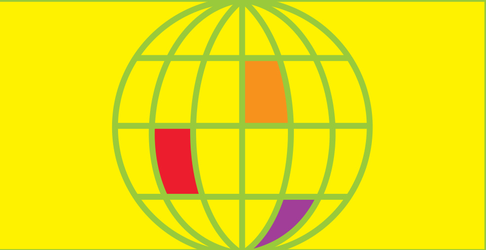
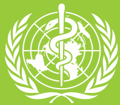
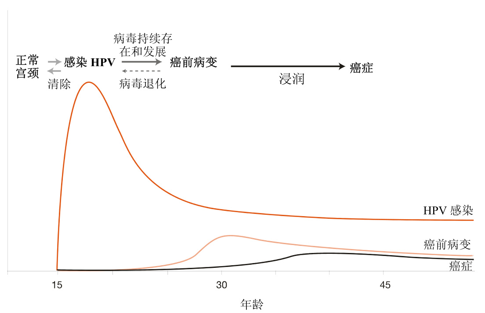
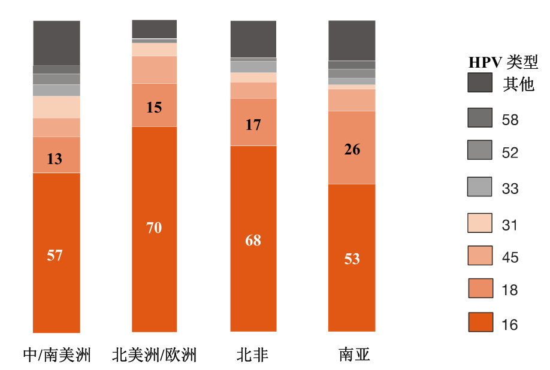

# 为引|进HPV 疫苗做准备  

  

对国家政策和规划的指导  

  

  

  

世界卫生组织  

# 为引进 HPV疫苗做准备：对国家政策和规划的指导  

# 为引进 HPV 疫苗做准备：对国家政策和规划的指导  

# $\circledcirc$ 世界卫生组织 2006  

版权所有。世界卫生组织出版物可从世界卫生组织出版办公室获取。地址：WHO Press, WorldHealth Organization, 20 Avenue Appia, 1211 Geneva 27, Switzerland (电话： $+ 4 1 2 2 7 9 1 3 2 6 4$ ；传真： $+ 4 1 2 2 7 9 1 4 8 5 7$ ；电子邮件：bookorders@who.int)。欲获得复制或翻译世界卫生组织出版物的许可，无论是用于出售或非商业性分发，应向出版部提出申请，地址同上(传真： $+ 4 1 \ 2 2 \ 7 9 1$ 4806；电子邮件：permissions@who.int).  

本出版物采用的名称和陈述的材料并不代表世界卫生组织对任何国家、领地、城市或地区或其当局的合法地位，或有关边界或分界线的规定有任何意见。地图上的虚线表示可能尚未完全达成一致意见的大致边界线。  

凡提及某些公司或某些制造商的产品时，并不意味着他们已为世界卫生组织所认可或推荐，或比其它未提及的同类公司或产品更好。除差错和疏漏外，凡专利产品名称第一个字母均用大写字母，以示区别。  

世界卫生组织已采取了一切合理的预防措施来核实本出版物中所含信息。但是，对已出版发行的材料无任何明确或含蓄的保证。解释和使用这些材料的责任应由读者自行承担。世界卫生组织对因使用这些信息造成的任何损失概不负责。  

本出版物反映了国际专家小组的集体意见，但不一定代表世界卫生组织的决定或声明的政策。  

印刷地：  

# 目录  

<html><body><table><tr><td>引言 1</td></tr><tr><td>宫颈癌和HPV感染 1</td></tr><tr><td>HPV疫苗 3</td></tr><tr><td>HPV疫苗的目标人群 4</td></tr><tr><td>HPV疫苗的创新特征 6</td></tr><tr><td>独特的机遇 ６</td></tr><tr><td>昂贵的产品 8</td></tr><tr><td>引进疫苗所面临的挑战 8</td></tr><tr><td>非同寻常 9</td></tr><tr><td>宣传动员、信息和传播 10</td></tr><tr><td>行动要点 11</td></tr><tr><td>服务的提供 13</td></tr><tr><td>达及目标人群 13</td></tr><tr><td>不同规划之间的合作 14</td></tr><tr><td>监测与评估 15</td></tr><tr><td>行动要点 15</td></tr><tr><td>管理和筹资 17</td></tr><tr><td>行动要点 18</td></tr><tr><td>结束语 20</td></tr><tr><td>其他资源 21</td></tr></table></body></html>  

  

# 致谢  

本文件的内容是在参加“性和生殖健康规划与人乳头瘤病毒疫苗技术咨询会议”的专家组成员仔细商议的基础上形成的。该会议于 2006 年3 月14 至 16 日在瑞士蒙特勒举行。专家名单如下：  

Rebecca Affolder, Sebolelo Amos, Gayane Avakyan, Miranda Balkin, Emily Bass, Robin Biellik, Paul Blumenthal, Janet Bradley, Dirk Campens, Xavier Castellsagué, Christina Chan, Mike Chirenje, Patricia Claeys, Gray Davis, Soledad Diaz, Tesfamicael Ghebrehiwet, Peter Hall, Elisabete Inglesi, David Jenkins, Leila Joudane, Judith Justice, Khunying Kobchitt Limpaphayom, Supon Limwattananon, Iara Linhares, Julian Lob-Levyt, Sandra MacDonagh, David Maenaut, Lauri Markowitz, Lilly Márquez, Anthony Mbonye, André Meheus, Tina Miller, Jennifer Moodley, Nguyen Duy Khe, Barbara O’Hanlon, Amy Pollack, Eduardo Lazcano Ponce, Helen Rees,  Susan Rosenthal, Alfred Saah, Harshad Sanghvi, Jacqueline Sherris, Nono Simelela, Jane Soepardi, Cecilia Solís-Rosas García, Lisa Thomas, Johannes van Dam, Sunayana Walia, You-Lin Qiao, Barbara De Zalduondo.  

以下联合国人口基金（UNFPA） 和 世界卫生组织（WHO ）工作人员参加了会议：  

UNFPA – Lindsay Edouard, Esther Muia, Arletty Pinel   
WHO – Teresa Aguado, Nathalie Broutet, Djamila Cabral, Alexander Capron, Thomas Cherian, Felicity Cutts, Catherine d’Arcangues, Peter Fajans, Tim Farley, Dale Huntington, Patrick Kadama, Ardi Kaptiningsih, Marie-Paule Kieny, Gloria Lamptey, Gunta Lazdane, Merle Lewis, Mario Merialdi, Alexis Ntabona, Sonia Pagliusi, Andreas Ullrich, Paul Van Look, Peter Weis.  

本文件由 Nathalie Broutet, Dale Huntington, Felicity Cutts, 和 Peter Hall (WHO顾问) 起草。  

本文件由 UNFPA 和下述 WHO 司局联合制订：  

生殖卫生和研究司（Reproductive Health and Research, RHR）   
免疫、疫苗和生物制品司（Immunization, Vaccines and Biologicals, IVB)   
儿童和青少年卫生与发育司（Child and Adolescent Health and Development,   
CAH)   
慢性病和健康促进司（Chronic Diseases and Health Promotion, CHP)   
卫生政策、发展和服务司（Health Policy, Development and Services, HDS)   
伦理、贸易、人权和卫生法司（Ethics, Trade, Human Rights and Health Law,   
ETH)  

# 引言  

本指导文件是根据 2006 年 3 月联合国人口基金（UNFPA）/世界卫生组织（WHO）在瑞士蒙特勒（Montreux）召开的 HPV 疫苗、性和生殖健康技术咨询会议的基础上编写的，旨在提请各利益相关方（如性和生殖健康、疫苗免疫、儿童和青少年卫生、癌症控制规划等）重视与即将引进的用于预防宫颈癌的 HPV 疫苗有关的一些关键问题。尤其强调了在《全球免疫远景和战略》框架下，国家免疫规划、性和生殖健康规划以及癌症控制规划在国家准备引进 HPV 疫苗工作中可以发挥的作用。  

“低危型”人乳头瘤病毒（HPV 6 和HPV 11）可引起相当比例的仅在查体时发现的轻度宫颈上皮不典型增生（如细胞畸形）和超过 $90 \%$ 的生殖器疣。HPV 感染的高发年龄通常在 16到 20 岁之间，一般会自愈，但也可能持续感染，随后出现宫颈癌前病变。如不治疗，可能会在 $2 0 { \sim } 3 0$ 年后发展成为宫颈癌。在 HPV 持续感染阶段，宫颈部位有可能检测到癌前病变，癌前病变的早期发现是预防宫颈癌的有效策略(图 1)。  

# 宫颈癌和 HPV 感染  

宫颈癌是妇女第二常见的恶性肿瘤，全世界每年大约有 500,000 新发病例，死亡 250,000 人。其中约 $80 \%$ 的病例发生在低收入国家，宫颈癌是这些国家妇女最为常见的恶性肿瘤。  

几乎所有的宫颈癌病例（ $99 \%$ ）都与生殖系统的人乳头瘤病毒（HPV）感染有关。HPV 感染是生殖道最常见的病毒性感染，有 40 种不同基因型别的 HPV 病毒能够感染男女生殖道，感染部位包括阴茎皮肤、外阴、肛门、阴道、宫颈和直肠。在世界范围内，两种“高危型”人乳头瘤病毒（HPV16 和 HPV 18）的感染与大多数 HPV相关的宫颈、外阴、阴道、肛门及阴茎恶性肿瘤发病相关。而另外两种  

预防控制宫颈癌的综合措施就是进行全程干预，从一级预防到早期发现、治疗和对症医疗护理。在高收入国家，通过大规模的以细胞学为基础的宫颈癌筛查规划可早期发现癌前病变并进行及时的治疗，从而大大降低了宫颈癌所导致的死亡。目前一种简单的、适用于低收入国家的、通过肉眼检查宫颈癌前病变的检测方法已取得进展。研究表明由于这种方法可由中级医务人员完成，不需要实验室工作或训练有素的工作人员，在医疗资源匮乏的地方有可能据此降低宫颈癌的发生。需要时，采用乙酸的宫颈肉眼检查方法(VIA)和冷冻疗法，一次就诊就可同时完成对宫颈癌的筛查和治疗。但这种方法对宫颈癌的发病率和死亡率的实际影响仍需更多的文献资料证明。即使宫颈癌发展到早期浸润癌才被发现，仍能通过手术和放疗进行治疗，并且有很高的治愈率。  

# 世界卫生大会癌症预防控制决议  

在 WHO  加强抗癌行动的背景下，2005  年第58  届世界卫生大会上，WHO 各成员国通过了一项癌症预防控制决议（WHA58..22 号决议）。该决议强调控制宫颈癌将有助于实现有关生殖健康的国际发展目标，同时敦促各成员国在各自的癌症控制规划中关注那些通过避免暴露于危险因素，特别是一些感染性因子即可预防的恶性肿瘤。会议也要求总干事“促进预防宫颈癌疫苗的研发”。  

  
图 1. 不同年龄妇女 HPV感染、癌前病变和宫颈癌的患病率  

来源： Schiffman M, Castle PE. The promise of global cervical-cancer prevention. New England Journal of Medicine, 2005, 353(20): 2101–2103. ( $\copyright$ 2005 Massachusetts Medical Society. Adapted with permission.)  

# HPV 疫苗  

HPV 疫苗含 HPV 病毒的主要衣壳蛋白 L1，它能自我组装成类似 HPV 的病毒样颗粒（VLP）。这种颗粒不含病毒遗传性物质，因此不能够增殖，也就意味着不具有感染性。研究表明有两种预防性 HPV 疫苗用于从未感染 HPV 的 $1 6 { \sim } 2 4$ 岁妇女，可有效地预防 HPV 持续感染和相关宫颈疾病的发生。  

这两种 HPV 疫苗均针对 HPV 16 和HPV 18，全世界约 $70 \%$ 的宫颈癌与这两种型别的 HPV 感染有关。另外有一种疫苗是针对 HPV 6 和 HPV 11的，这两种型别的 HPV 可引起低度的宫颈异常，绝大多数的生殖器部位疣症也是由这两种型别HPV引起的。几项随访 $2 { \sim } 5$ 年的大规模研究显示，HPV 疫苗对疫苗病毒型别相关的宫颈癌前病变的保护效率几乎可达 $100 \%$ 。四价疫苗对生殖器疣的保护效率为  

  
图 2. 宫颈癌患者不同地区分型别的 HPV 患病率（%）  

资料来源：Muñoz N et al. Against which human papillomavirus type shall we vaccinate and screen? The international perspective. International Journal of Cancer, 2004, 111:278–285.  

$9 5 \% \sim 9 9 \%$ 。然而，由于世界不同地区感染 HPV 基因型别不同（图 2），这两种候选疫苗的保护效果会因地区差异而有所不同。不过这些疫苗预期可以预防 $70 \%$ 的未感染 HPV 女性发生宫颈癌 1。  

结合疫苗的免疫原性和安全性研究，对参与大规模多中心的三期临床试验的妇女正在继续进行追踪调查，以明确这两种候选疫苗的一些关键问题。研究的问题还有与免疫规划和疫苗使用策略相关的问题，包括长期效力、免疫持久性、是否需要进行加强免疫以及对特殊人群（如孕期妇女和免疫缺陷病人）的免疫原性、安全性和效力。  

要获取这两种 HPV 疫苗的更多技术资料，请访问以下网站：  
http:// www.who.  
int/vaccine_research/documents $8 1 6 \%$ 20%20HPV%20meeting.pdf  

# HPV 疫苗的目标人群  

在确定 HPV 疫苗免疫目标人群时，主要的考虑是 HPV 感染是通过性传播的，通常在初次性行为开始后的最初几年感染。因此理想情况下，疫苗应该在首次性行为（即暴露于 HPV感染危险）之前给予。  

现有资料提示，HPV 疫苗最先将被允许应用于 $9 \sim 2 6$ 岁的女孩和妇女。研究结果虽然显示免疫接种在所有年龄组中均可产生很高的血清阳转率，但这两种疫苗的免疫原性研究证实低龄青少年的血清阳转率比年龄大于 15 岁的女性更高。国家疫苗审批标准将对免疫人群的年龄范围进行界定，同时需要制定恰当的疫苗使用策略以保障主要目标人群（青年人群）的使用。另外，可能还要为次主要目标人群准备免疫策略。（见第 13页“服务的提供”）。  

其他人群也可能从 HPV 疫苗获益，但在疫苗使用许可范围扩大之前还需得到更多的临床研究资料。这些人群包括：  

 男性   这两种 HPV 疫苗可能直接预防HPV 16/18 相关的肛门与生殖器恶性肿瘤。给男性接种疫苗理论上可降低 HPV 传播给妇女的机会，但在芬兰进行的模型研究的初步结果提示，在女性疫苗接种率高的情况下，就降低宫颈癌的发生而言，同时对男性接种的效果是否好于仅对女性进行接种还不是很明显。但在女性疫苗接种率为中等的地区，对男性开展 HPV 疫苗接种是否有益的模型研究仍在继续进行。  

 小年龄人群（小于9 岁）  小年龄人群的免疫接种可能比大年龄人群（ $\cdot 9 { \sim } 2 6$ 岁）的免疫接种更容易纳入现有的国家免疫规划。但目前尚未开展针对小于9 岁儿童的疫苗免疫研究。  

 HIV 感染者  疫苗对 HIV 感染者的有效性和安全性目前还不清楚。对女性 HIV 感染者的疫苗试验还在进行之中。  

孕妇 疫苗对孕妇的安全性目前还不清楚。  

疫苗对大于 25 岁的妇女和感染或曾经感染HPV 16/18 的妇女的效果评价试验还在进行之中。将这些人群纳入免疫规划是否符合成本效益原则还不能下结论。  

# HPV 疫苗的创新特征  

2004 年经 WHO 各成员国通过(世界卫生大会 WHA57..12 决议)的全球生殖健康战略（Reproductive health strategy to accelerate progresstowards the attainment of international development goals and targets,Geneva, World Health Organization, 2005）确定了在性和生殖健康领域的五项主要内容：改善产前、分娩、产后和新生儿护理；为计划生育工作提供高质量服务，包括绝育服务；消除不安全的流产；抗击性传播感染，包括 HIV、生殖道感染、宫颈癌和其他妇科疾病；促进性健康。全球战略指出“由于生殖和性健康在多方面密切相关，对一个领域的干预也会对另一领域产生积极影响。对各国来说，十分重要的是应加强现有的公共服务并以此作为新的干预措施的切入点，以寻求最好的协同效果。  

HPV 疫苗的使用有利于加强不同卫生服务机构间的相互联系，为大规模地预防常见癌症、降低分布更广的宫颈上皮不典型增生和生殖器疣所造成的疾病负担提供了新的途径。下文将对疫苗的一些重要特征进行讨论。  

风疫苗。HPV 疫苗纳入国家免疫规划将使年轻女孩并可能对男孩的性健康、性行为和性传播感染问题得到社会和政治的高度关注。其他方面的挑战与增加扩大免疫规划（EPI）的工作范围有关，即从以往主要针对婴儿和儿童扩展到大年龄人群 2。  

# 独特的机遇  

预防 HPV 的疫苗有一些特征需要给予特别注意。HPV 免疫规划的实施需要新的措施；它的目标人群不同于通常的国家免疫规划的目标人群；在宣传动员和社会交流方面需要多个利益相关方参与；目前对如何使免疫接种和宫颈癌筛查规划达到最佳结合还不清楚。性及生殖健康领域将首次面对这种特殊的、可直接预防与常见生殖系统肿瘤发病相关的性传播感染，由此出现的问题完全不同于从其它疫苗所得到的经验，如风疹和破伤  

# UNICEF/WHO 《全球免疫远景和战略》 （GIVS）  

在58 届世界卫生大会上通过了一项新的全球免疫远景，即由WHO和联合国儿童基金会（UNICEF）共同制定的《全球免疫远景和战略》。该战略的目标是全世界到2015 年时：  

免疫接种得到高度重视。  
所有儿童、青少年和成人都能平等获得由国家免疫规划提供的服务。  
保护更多的人，预防更多的疾病。  
在各种情况下，无论是社会价值观的差异、人口和经济状况的变化、疾病的演变，免疫接种和相关干预措施都能得到落实。  
认识到免疫接种对加强卫生系统至关重要，是实现《千年发展目标》的一项主要措施。  
最佳地使用疫苗以促进全球的卫生和安全。  
全球社会团结一致，确保所有人能公平地获得所需的疫苗。  

实际上在由 WHO 和联合国儿童基金会（UNICEF）共同制定的《全球免疫远景和战略》（GIVS）中已经预见到了这种扩展。同时，这种扩展被2005 年举行的世界卫生大会所采纳，这次大会旨在探索将EPI 范围扩展到其他领域和包括婴儿在内的其他年龄人群 3。国家癌症控制规划在确定一级预防（免疫接种）、二级预防（筛查和治疗癌前病变）、癌症治疗、对症护理方面的工作重点，以及在目前几乎未开展预防和控制宫颈癌工作的地区，从何处着手实施控制工作也面临着艰难的抉择。  

引进 HPV 疫苗的经验可以为人类免疫缺陷病毒（HIV）疫苗的最终使用提供模式，同时 HIV 工作团体也关心如何在女性免疫缺陷人群中开展宫颈癌的预防和诊治。这符合纽约宣言中将 HIV 与性和生殖健康联系起来的承诺，并提出需要将 HPV 疫苗置于人权议程中的优先地位。HIV 工作团体对引进 HPV 疫苗有着重要的作用。  

引进 HPV 疫苗对在 2006 年 5 月召开的第59 届世界卫生大会通过的“2006－2015 年WHO 预防和控制性传播感染全球战略”的实施来说也是一个重要的结合点和切入点。提供 HPV 疫苗是预防 HPV 感染和宫颈癌工作的重要组成部分，同时也提供了另外的机会，以教育青少年通过推迟首次性行为和使用避孕套来加强预防性传播感染的措施。  

HPV 疫苗的这些重要性和可能的创新提供了许多前所未有的机会。此外HPV 疫苗的引进是否成功将依赖于不同部门之间紧密而有效的合作。  

# 昂贵的产品  

尽管目前对发展中国家的 HPV 疫苗价格还不清楚，但即便发展中国家和发达国家HPV 疫苗的价格有所不同，至少在初期它很可能要比传统的 EPI疫苗价格高很多。如何建立国际筹资机制（如通过全球疫苗和免疫联盟，GAVI）正在讨论之中，国际资金可能补助低收入地区使用疫苗，直到实现稳定的、可承受的疫苗价格。将HPV 疫苗纳入国家免疫规划所需的额外费用也会影响决策，但这不应是唯一的决策标准。还应考虑疫苗接种所带来的间接效益（见第 10 页，宣传动员、信息和传播）。在引进 HPV疫苗的准备阶段，宣传动员对政策制定和决策、形成公众舆论、纠正错误认识及调动资源等有着重要的影响。在高收入和中等收入国家，独立于公共部门决策以外的私营部门引进疫苗可能主要针对富裕人群。因此 HPV疫苗的引进有增加人群中卫生方面的不公平性的风险。为避免出现这种情况，需要建立全方位的公立部门和私营部门的合作伙伴关系。  

# 引进疫苗所面临的挑战  

HPV 疫苗的免疫服务策略和宣传促进需要根据不同国家的具体情况来考虑，如经济方面是否可以承受，是否可行以及是否可以被本国文化所接受。在某些国家和文化背景，对年轻女孩采用疫苗接种来预防性传播感染所引起的癌症和其他生殖系统疾病是一个敏感的问题。必须避免由此产生的针对“性和生殖健康以及青少年卫生规划”的负面不良影响（见第 10 页，宣传动员、信息和传播），并确保在引进疫苗的过程中清楚地宣传和评估有关推迟性行为、使用避孕套、降低 HIV 感染的风险、宫颈癌筛查和治疗等各种互为补充的信息。国家宫颈癌控制策略需要进一步更新，要与新疫苗相结合。希望由 HPV疫苗所产生的益处将成为促进因素，在那些到目前为止进展还十分有限的地区建立起宫颈癌筛查和治疗服务。  

接种 HPV 疫苗可能增加疫苗免疫、癌症控制以及性和生殖健康规划（包括青少年）之间的协同作用。在这方面，疫苗接种使卫生保健工作人员有机会鼓励青少年采取负责任的行为。  

就世界范围而言，应立即建立合作机制，以缩短在发达国家中从疫苗正式注册到可以获得和使用之间所需的时间，确定 HPV 疫苗的协议价格和足够的生产能力以供应给发展中国家使用。  

# 非同寻常  

HPV 疫苗独有的特征意味着每个国家都面临着挑战，即如何使所有相关的规划以新的形式一起工作。此外如上所述，公共规划和私营部门的行动需要协调一致。  

# 宣传动员、信息和传播  

针对利益相关各方和大众制定关于HPV 疫苗的宣传动员、信息和传播计划是特殊的挑战和机遇。挑战之一是要提供内容全面、信息丰富的关于HPV、宫颈癌以及其他 HPV 相关肿瘤和疾患的公众教育和传播计划，充分说明疫苗的益处和局限性。另一可能的挑战是要满足利益相关各方的期望和解释他们所关注的问题。需要政策指导的问题包括：HPV 疫苗如何与现有的免疫规划结合；如何为 HPV疫苗、性和生殖健康以及 HIV 预防控制活动提供互补的信息；如何制定规划以平衡那些在以往可能没有广泛合作关系的各参与方的作用和责任。  

机遇与挑战密切相关，只有将疫苗作为预防宫颈癌死亡及促进性和生殖健康战略的组成部分，HPV 疫苗的最大优势才能被人们认识。如果采用这种方式引进 HPV 疫苗接种将会为利益相关各方和从事不同工作的卫生服务方（如国家免疫规划、家庭援助、HIV 预防、性和生殖健康、妇女卫生、癌症控制、青少年生活技能与福利等）提供合作机会。  

首先需要考虑的一个问题是如何宣传这些新疫苗。每个国家都应非常认真地考虑其特殊的社会文化和宗教背景，宣传的要点如下：  

 已经证明 $9 9 \%$ 的宫颈癌是由 HPV引起的，HPV 还与其它癌症和疾病有关。  

 HPV 是最为常见的感染人类的病毒之一，是一种性传播病毒并具有很强的传染性，其传播速度要比其他一些性传播微生物高几个数量级，比如 HIV。在性生活活跃期的男女中有相当比例受到感染，通常在初次性行为后不久就会被感染。但是 HPV 感染不一定表明有性行为或性行为混乱，病毒的传播并不需要完全插入的性交或者具有多个性伴。  

 大多数 HPV 感染无任何症状和体征，大多数被感染者并不知道自己已被感染，他们可以继续将病毒传播给性伴。  

预防性HPV疫苗在16-26岁未曾感染 HPV 的妇女中有很高的保护效力，预计在接种人群中对宫颈癌的预防效率可达 $70 \%$ 。  

$\bullet$ 如果在初次性行为之前给予 HPV疫苗免疫，效果可能最大。  

 HPV 疫苗还可预防外阴、阴道癌，其中的一种疫苗还可以预防生殖器疣。  

 HPV 疫苗仅用于预防特定基因型别的 HPV，不能保护其他性传播感染，包括 HIV。  

 约有 $30 \%$ 的宫颈癌不能通过接种现有 HPV 疫苗预防，所以仍然需要开展筛查工作，应鼓励妇女继续接受筛查。  

# 行动要点  

关于宣传动员、信息和传播的主要行动要点如下：  

关于上述信息的宣传应非常清晰，不引起混淆，而且要考虑到当地的社会文化背景，这对各国来说具有相当的挑战性。特别是 HPV 是经性传播的，必须注意不要引发对 HPV 疫苗接种或性和生殖健康工作的负面反应，尤其是在对青少年开展免疫接种时。还要避免对女孩关注过多，即使是仅仅对女孩接种疫苗，信息宣传对象也应包括男孩。有几项研究表明，通过了解疫苗接种的好处，可以打消父母最初对性传播感染问题的疑虑。  

 在负责宣传动员、服务提供、管理工作的各部门之间开展互动合作十分重要，特别是制定和支持政策和规划（见第 17 页，管理和筹资）所需的依据和各国特有的信息，如宫颈癌疾病负担、国家 HPV 流行型别、初次性行为开始年龄等。  
 关于宫颈癌控制、特别是 HPV 疫苗的信息传播战略，应针对主要的利益相关方和决策者，以及卫生保健专业人员、妇女和相关团体。提供的信息在时间上应与国家政策制定进程和疫苗引进规划的不同阶段同步。  
与引进 HPV 疫苗有关的健康促进策略应考虑各国的特殊国情，也应考虑各方的需求和意见。  
 各国应改编 UNFPA、WHO 和其他重要国际组织的出版物以适合于本国使用。国家规划需要确定的对各主要宣传对象传达的信息分述如下：  

制定策略以清楚解释疫苗的作用也很重要。应该在事先使公众理解疫苗不是百分之百有效的（因为疫苗不能预防所有型别的 HPV，而且对已经感染了疫苗型别 HPV 的妇女，疫苗可能也不能预防其癌症的发生）。  

HPV 疫苗是个实实在在的产品，是对通常提供的有关年轻人生活方式和行为的信息服务的补充。  

国家政策制定者、规划管理者和服务提供者 针对这一群体的信息包括：HPV 疫苗所针对的宫颈癌的疾病负担；引进疫苗对国家免疫规划、性和生殖健康规划、癌症控制规划、儿童和青少年卫生规划所带来的益处；如何与现有的临床干预规划的计划和实施相结合，包括采用乙酸直接宫颈目测检查方法(VIA)、HPV 检测、细胞学检查等宫颈癌筛查；如何建立和维持各国家规划之间及与私营机构的合作关系；为何在疫苗推广使用后仍然需要进行宫颈癌筛查；疫苗以及免疫规划实施的预期效果，如何评价其短期、中期和长期效果；以及由谁来负担疫苗引进所发生的免疫规划相关费用。  

 青少年和家庭 针对青少年和家庭的信息包括：什么是 HPV，HPV与宫颈癌的关系，疫苗免疫的重要性；为什么特定年龄的女孩是目标人群；疫苗对男孩、大龄女孩和成年妇女的作用和关系；家长的作用；疫苗相关的基本信息，包括疫苗接种的好处、安全性和局限性。  

 民间社会组织、专业学会和专门利益宣传团体   针对这些组织的信息包括：疫苗有何作用；疫苗的安全性和副作用，并附有清晰的试验时间和数据；为何HPV疫苗适用于特定的目标人群；为何目标人群的设定与耻辱和性行为无关；关于疫苗有哪些方面尚不清楚，如在 HIV感染妇女、怀孕妇女和未能接受全程免疫妇女中的使用效果；为何疫苗在一般团体和特殊团体中都十分重要，如家庭援助团体、癌症预防倡导团体、艾滋病工作组织、体育界和青年团体，以及宗教信仰团体；哪种卫生保健人员能够获得疫苗，其价格如何； 如何培训疫苗接种工作人员，他们在门诊和工作中提供疫苗接种服务后的报酬和得到的支持如何等；健康保险（以税收为基础的或社会保险计划）是否包括疫苗免疫的费用。  

 HPV 疫苗是在女孩初次性行为之前或即将开始时接种，这为解决这一很难涉及的人群的其他需要提供了难得的机会。因此，应利用HPV 疫苗接种，加强现有的针对青少年的各种项目和行动，如基于学校的性和生殖健康的教育项目、营养与饮食、控烟以及 HIV/AIDS 预防等。  

# 服务的提供  

# 达及目标人群  

疫苗获准使用的目标人群年龄范围可能是 9-26 岁。需要进一步将该年龄段分为 2 类：主要目标人群和次主要目标人群。  

# 主要目标人群  

这一人群主要是 $9 { \sim } 1 3$ 岁的女孩，目的是在她们首次性行为开始之前接种疫苗。每个国家都需要确定最方便有效的达及青少年的方法，以便在他们开始性行为之前能接种疫苗。  

如果在现有的学校为基础的免疫规划中引进新疫苗，那么有关 9\~13 岁女孩的入学情况的信息是很重要的。在一些国家，大部分青年女孩很早就辍学，因此基于学校的免疫规划的主要目标人群的接种率将非常低。扩大免疫规划的大规模突击接种提供了另一种免疫策略。但大规模突击接种一般针对婴儿和 5 岁以下儿童，要再加入 HPV 疫苗难度很大。可以考虑在破伤风疫苗接种时，同时接种 HPV疫苗。美洲地区破伤风和风疹疫苗的接种经验表明，在青少年和成年人中进行大规模疫苗接种是可行的，并且为预防这两种感染而同时进行免疫接种也是可以接受的。性和生殖健康规划有开展学校健康生活方式项目的经验，同时对敏感问题有信息、教育和交流(IEC)策略，因此它可以帮助以学校为基础的或以扩大免疫规划为基础的 HPV 免疫规划的实施。  

为使没有上学的青少年能得到免疫，需要非校园服务策略和社区卫生专业人员的参与。在很多国家，青少年性和生殖健康规划在以社区为基础的卫生和教育活动方面有丰富的经验。这些规划旨在为性行为和性卫生提供咨询，重点是延迟初次性行为时间、预防怀孕和包括 HIV 在内的性传播感染。因此这些规划可以提供有关HPV 疫苗的重要信息，在某些情况下也可以直接提供疫苗接种服务。然而，这些规划通常缺乏如何提供服务的经验，最常见的工作只是分发避孕套和开展有关安全性行为的教育，且主要对象是 10\~13 岁以上的年轻人。要扩大国家疫苗冷链系统使 HPV 疫苗成为社区青少年规划组成部分可能较困难。另外，这些规划的实施人员不一定具有提供疫苗免疫服务所需的技能。但是，校外青年规划能够有效提高青年对 HPV 的免疫接种认识，并向他们介绍提供疫苗接种服务的公共部门或私营机构。可能需要探索创新性的转送介绍机制，如发放凭证以获得疫苗。这样的策略要求在实施青年规划的卫生保健专业人员中，开展有关 HPV 疫苗的益处和目标人群的教育并建立激励机制。其中一些活动需要和教育部门密切联系。在发现和达及校外青年方面，民间团体、与青少年有关的社区卫生和福利倡议行动可以发挥重要作用。  

# 次主要目标人群  

务的信息，同时可转送介绍这些服务。  

这类人群为没有接种过 HPV 疫苗的14\~26 岁年龄段年轻女性。对这组人群接种疫苗能够显著加快疫苗对疾病发生影响，并可能增加 HPV 疫苗免疫的效果。然而，对此部分人群的服务策略和准备投入多大力量为之开展服务取决于国家资源的多少、疫苗免疫的规划和可行性。关于在这类人群和年轻男性中为预防宫颈癌和其它肛门生殖器癌症进行疫苗接种的成本效益问题还需要更多的资料。就接种所产生的健康方面的影响来说，这组人群要明显小于主要目标人群，而且重要的是不要挤占用于主要目标人群的资源。  

# 扩大服务对象  

性和生殖健康服务系统在对 26 岁以上的妇女进行宫颈癌筛查时，向她们宣传对她们的孩子、其他年轻女性家庭成员和她们社区中的其他女孩进行 HPV 疫苗接种的必要性，有助于HPV 疫苗信息的传播并提高疫苗接种的覆盖率。这些女性会使她们所居住社区对HPV 疫苗的事宜更为敏感，并影响当地领导者的观念。对寻求有关性传播感染或艾滋病服务的妇女，尤其是那些自愿咨询和检测者或预防 HIV 母婴传播的妇女，也可以提供有关宫颈癌、HPV 疫苗和癌症筛查服  

HPV 疫苗注册后会针对目标人群设定年龄上下限。因此，需要注意保证大龄妇女获得综合的宫颈癌筛查、诊断和治疗服务。那些接种了 HPV 疫苗的妇女和女孩需要在国家宫颈癌筛查规划所建议的时间接受筛查，即通常情况下，在青春期早期接种疫苗的妇女在10\~15 年后接受筛查。同样，对于一些年龄太大不适合接种疫苗或是可能已经感染 HPV 的妇女，应该根据国家的指导方针接受筛查。  

总的考虑是HPV 疫苗免疫的重要性，并将其作为综合性的、基于人权和证据告知的卫生服务的一部分。应避免单一的 HPV 疫苗免疫策略，不同项目或规划之间的合作关系应该得到加强。  

# 不同规划之间的合作  

对规划或项目实施途径需要很好地加以计划和组织，应最经济有效地利用已有的服务系统，或者必要时予以加强。HPV 疫苗的接种服务应该基于已有的国家疫苗体系，例如疫苗冷链系统。这将使成本效益最大化，避免国家无法承受的浪费和重复建设。  

在许多国家，国家免疫规划很可能会对引进 HPV 疫苗起到引领作用，但仍然需要与性和生殖健康服务、青少年卫生、癌症控制和 HIV/AIDS 规划或项目建立合作关系。同时也应该与教育部门、家庭援助团体和为主要目标人群和次主要目标人群和全体妇女提供服务的其他组织建立密切的工作联系。这些包括民间社会组织、社区卫生和福利倡议行动以及私营部门。新的 HPV 疫苗的接种为创建新规划和建立新合作伙伴关系带来了多种机会。  

# 监测与评估  

虽然建立有效的监测和评价系统是“下游”工作，但是在准备阶段就考虑怎样进行过程评估和效果评估是很重要的。过程评估的指标必须通过常规的国家免疫规划监测体系获得。与对宫颈癌的效果相比，(四价疫苗)对生殖器疣或对筛查出的异常情况(如:I 或 II 期宫颈上皮内瘤样病变)的效果可能会更早观察到。在试点研究中对这些结果进行监测，可能有助于疫苗效果的早期评价和可能成为成功的案例。从这些试点研究得到的资料可用于制定疾病监测方案。另外，不良反应监测系统应该尽可能获得 HIV 感染和怀孕状况，因为到目前为止还没有关于HIV 感染者使用疫苗的资料，同时尽管到目前为止疫苗用于孕妇资料是安全的，但还需要通过进一步的监测来证实。  

关于 HPV 接种对于宫颈癌和与 HPV相关的其他癌症的发病率或死亡率的长期影响，至少要在引进 HPV 疫苗 10 年后，甚至可能在 30 多年之后才会显示出来。在有癌症登记的地方，收集宫颈癌前病变的资料是很重要的，它可以替代浸润癌用于监测。在没有癌症登记或登记质量很差的地方，建议这些国家监测疫苗覆盖率和注意在其他国家疫苗上市后监测的结果。将来如果有合适的检测方法并且经济方面可负担得起时，采用分子标记物方法进行 HPV 感染监测可能是最好的。特别应指出的是，不良反应的报告十分重要，而这项工作的开展需要与私营机构合作。  

# 行动要点  

国家规划需要开展如下工作：  

 在许多不同的执行部门之间建立联系。明确主要的目标人群，考虑最方便的服务途径和发生初次性行为的最小年龄。  
 处理低年龄青少年免疫接种的社会文化障碍问题。确定 9-13 岁年龄组人群的就学率。更新国家宫颈癌控制策略，加入新的 HPV 疫苗。  
 为 HPV 疫苗设计服务实施策略：  

引进 HPV 疫苗后所提供的服务应基于各国不同的情况，考虑可行性和文化方面的接受性以及社会各方的需求和看法。  

扩展EPI 服务范围到其他的领域和婴儿以外的其他年龄组。  

与学校免疫规划和 EPI 服务合作，制定与国家宫颈癌控制规划、青少年性和生殖健康服务和HIV 预防规划相一致的信息材料。  

－ 将 HPV 疫苗与转送介绍的信息纳入以社区为基础的青少年性和生殖健康规划。  

为性和生殖健康的服务对象开发信息、教育和交流（IEC）材料，阐述 HPV 疫苗对于年轻人的益处，宫颈癌筛查对于较大年龄妇女的益处。  

培训卫生保健人员，向他们所遇到的所有目标人群中未免疫的人推荐或提供 HPV 疫苗接种。  

制定预防宫颈癌的综合方案：  

根据资金多少和国家决策，应用细胞学，VIA 或 HPV 检测筛查和治疗癌前病变，确保实施二级预防计划。  

对于浸润性癌症病人，有适当的治疗选择和合适的转诊机制。  
适当时，提供 HPV 疫苗。  
监测疫苗效果。  
教育卫生专业人员，使之重视一级预防。  

$\bullet$ 确定监测和评估的主要过程指标和结果指标。  

# 管理和筹资  

通过国际途径和国内卫生预算动员资源、加强卫生系统和采购 HPV 疫苗必须作为优先重点。为引进 HPV疫苗筹措资金，应考虑将其作为涉及许多合作者（包括全球和在每个国家内部）的总体战略的一部分，并视作按比例增加资源、加强卫生系统的一个部分。一些必要的筹资决定将由全球讨论会或在比国家规划管理者更高的政府间的层面上做出。这些决定对最终引进HPV 疫苗是非常重要的，而政策制定者和规划管理者在准备阶段应密切跟踪进展情况。  

根据疫苗引进规划所选择的服务策略，需要采取不同的组织政策和监督行动。由于性和生殖健康规划熟悉青少年卫生、性传播感染和宫颈癌控制工作，因而尤其适合为这些政策决定提供建议和帮助。  

在所有情况下，由于 HPV 疫苗的费用和在优先重点方面的竞争（包括与其他研制中的疫苗），政府在决定 HPV疫苗是否在国家免疫规划中具有相对重要性时总是面临着挑战。关于引进HPV 疫苗的某些决定可以借鉴国家引进其他疫苗（特别是乙肝疫苗）所获得的经验。在市场较小或不确定时，疫苗生产商对投资申请疫苗的许可证可能缺少热情。在准备阶段，性和生殖健康规划管理人员需要讨论这些和其他一些问题，依靠与宫颈癌有关的专业学会和宣传倡导团体为决策者提供所需的证据。要有基本流行病学信息来阐明卫生保健的需求及 HPV 疫苗在短期方面（对早期疾病和筛查的影响）和在长期方面（对癌症和妇女及生殖的影响）可能产生的效果。在国家层面应建立需求预测模型，用以指导财务和项目计划分析。此外，在国家政策制定过程中，要有主要的利益相关方的参与，确保引进 HPV 疫苗的利益不只是仅仅限于卫生领域，同时还要考虑进行费用分析。  

确保国际资金承诺用于 HPV 疫苗也极其重要，如争取全球疫苗免疫联盟（GAVI ），联合国儿童基金会（UNICEF）和泛美卫生组织（PAHO）周转基金支持。其原因有两个，第一，可以说服疫苗生产商投资以扩大生产能力，保证有足够的新疫苗供应市场，而不仅仅限于高收入或中等收入国家；第二，有助于保证低收入地区获得协议价格的疫苗，这在私营部门期望得到 HPV 疫苗高价格的情况下是必需的。获得 HPV 疫苗资金支持也可以促进低收入国家的各利益相关方采取行动。在缺少外来资助的情况下，要支付疫苗费用，需注重公共部门的资源配置或利用捐赠供应。在有些情况，与私营部门合作的纯商业化引进 HPV 疫苗也是很必要的（最可能是在中等收入国家的高端消费市场）。  

应该在国家免疫规划的多年计划的背景下讨论国家层面的 HPV 疫苗资源动员问题，应使之适合进入更广的卫生部门的计划过程，例如全部门方法（SWAps）和中期财务支出框架。这对于使 HPV 疫苗获得长期政府支持，并且列入国家规划（例如，不作为“预算外资金”）来说都是很重要的。低收入国家在进行这些计划过程的同时，可以向全球疫苗免疫联盟（GAVI）申请资助，特别是向 GAVI第二期项目基金申请新疫苗资助（疫苗项目）和加强卫生体系资助（HSS项目）。国家免疫规划在申请 HSS项目时，需要有性和生殖健康规划和癌症控制规划，以反映 HPV 疫苗在多方面的作用。  

在公共部门的项目或规划支持有限，而通过商业市场完全由私营部门引进疫苗可行的情况下，有不同的方案需要政府监督。中心问题是要建立不同的公共—私营合作模式，并保证与国家的性和生殖健康、免疫和癌症控制规划相一致。在中等和低收入国家，政府可能坚持开展有益的疫苗注册后的工作，包括私人部门不良反应事件报告，疫苗上市后监测，为服务提供者和消费者提供含有合适信息的产品说明书。  

# 行动要点  

在管理和资金筹措方面，需要采取如下行动。  

 利益相关各方都应参与制定综合性的可操作的引进HPV疫苗战略。各国都应建立国家 HPV 疫苗工作组，并建立在卫生项目或规划、民间组织及私营部门之间的协调机制。它可以是国家免疫规划的机构间协调委员会下的一个分工作组，由来自性和生殖健康、癌症控制、HIV、青年项目或规划的代表，以及当地的 HPV 和宫颈癌的专家组成。  

 国家应建立模型来预测需求，并估计如要对人群中疾病产生影响所需的资金和覆盖率（只包括妇女或包括男女两性）。根据宫颈癌和其他肛门生殖器癌症疾病负担（发病率、患病率、住院率和死亡率）的最新预测，并根据不同 HPV 型别流行资料、疫苗免疫所节省的资源以及对预算的总的影响，为公共基金投入和可能的私人合作伙伴建立成功案例。  

 国家的性和生殖健康规划应参与向 GAVI 申请资助的准备工作，尤其是通过：  

参与GAVI 所需要的卫生部门分析；  

针对引进 HPV 疫苗所涉及的财政问题和不同情况下财政可持续发展情况，参与制定全面的多年计划。  

 不符合条件申请 GAVI 资助的国家，可以向世界卫生组织（WHO）和联合国人口基金（UNFPA）申请有关筹资和规划制定的技术支持。  

# 结束语  

最后，决定是否引进和什么时间引进HPV 疫苗取决于各国的政策。全面考虑 HPV 疫苗在综合的、一体化的服务体系中的定位十分重要。因为 HPV疫苗涉及若干不同的卫生规划，建立有效的合作关系是使引进规划成功的关键。此外，在大规模实施 HPV疫苗规划之前（特别是在发展中国家），还需要解决一些知识方面的问题。另外，应该制定和分发有关 HPV疫苗接种服务的综合性指南和方案，以实施本文件提到的行动要点建议。  

HPV 疫苗针对着重要的公共卫生需求，并且是宫颈癌综合控制战略的一个部分。确保人群普遍获得宫颈癌预防、筛查和治疗服务是降低全球宫颈癌疾病负担的关键。需要解决与引进新疫苗相关的一些重要的公平性问题。如果我们没有给予贫困妇女应有的关注，引进新疫苗将会增加卫生方面的不公平性，而不会有助于实现普遍享有性和生殖卫生服务的目标。  

# 附注  

2006 年 6 月8 日，美国食品药品监督管理局（FDA）批准了 4 价人乳头瘤病毒（6、11、16、18 型）重组疫苗（Gardasil $\textsuperscript { \textregistered }$ ）。此疫苗适用于 9\~26 岁女孩和妇女，可预防由6、11、16、18 型 HPV 所引起的如下疾病：  

宫颈癌  

$\circ$ 生殖器疣（尖锐湿疣）以及下述的癌前病变或异常增生：宫颈原位腺癌（AIS）  
$\cdot$ 宫颈上皮内瘤变（CIN）2 级和3 级  
$\cdot$ 外阴上皮内瘤变（VIN）2 级和3 级  
$\bullet$ 阴道上皮内瘤变（ValN）2 级和3 级  
$\bullet$ 宫颈上皮内瘤变（CIN）1 级  

其他信息，请参见 FDA 网页：http://www.fda.gov/cber/products/hpvmer060806.htm  

# 其他资源  

联合国人口基金（UNFPA）http://www.unfpa.org/  

# 世界卫生组织  

（WHO） http://www.who.int/en/http://www.who.int/reproductive-healthhttp://www.who.int/cancer/en/http://www.who.int/reproductive- health/pages_resources/listing_cancer.en.html全球免疫远景和战略（GIVS） http://www.who.int/immunization/givs/en/index.html全球疫苗与免疫联盟（GAVI） http://www.gavialliance.org/  