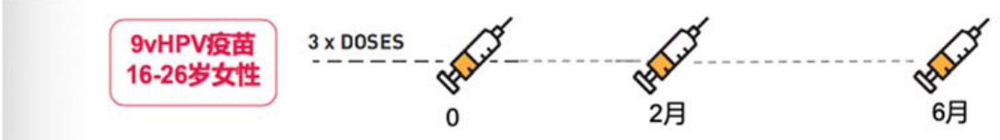

# 九价人乳头瘤病毒疫苗接种须知  

【接种对象】适用于 16 岁至 26 岁的女性（特别说明：全程 3 针均需要在 27 周岁前完成接种）  

【作用与用途】适用于预防由本品所含的 HPV 型别引起的下列疾病：HPV16 型、18 型、31 型、33 型、45 型、52 型、58 型引起的宫颈癌。  

以及由 HPV6 型、11 型、16 型、18 型、31 型、33 型、45 型、52 型、58 型引起的下列癌前病变或不典型病变：  

宫颈上皮内瘤样病变（CIN）2/3 级，以及宫颈原位腺癌（AIS）。  

宫颈上皮内瘤样病变（CIN）1 级。  

以及 HPV6 型、11 型、16 型、18 型、31 型、33 型、45 型、52 型、58 型引起的感染。  

【接种部位】肌肉注射，首选上臂三角肌。  

【免疫程序和剂量】每剂接种 $0 . 5 \mathsf { m l }$ ，按照 0、2、6 月的免疫程序接种 3 剂。  

根据临床研究数据，第 2 剂与首剂的接种间隔至少为 1 个月，而第 3 剂与第 2 剂的接种间隔至少为 3 个月，所有 3 剂应在一年内完成。  

  

# 【禁忌】  

对本品或四价 HPV 疫苗的活性成份或任何辅料成份有超敏反应者禁用。  
注射本品或四价 HPV 疫苗后有超敏反应症状者，不应再次接种本品。  

# 【孕妇及哺乳期妇女用药】  

妊娠期间应避免接种本品。若女性已经或准备妊娠，建议推迟或中断接种，妊娠期结束后再进行接种。  

# 【药物相互作用】  

接种本品前三个月内避免使用免疫球蛋白或血液制品。  

尚无临床证据显示雌激素类避孕药会影响 HPV 疫苗的预防效果。  

HPV 疫苗禁止与其他医药产品混合注射。  

目前尚无临床数据支持本品与其他 HPV 疫苗互换使用。如果完成 3 剂四价 HPV 疫苗接种后需要接种本品，则至少间隔 12 个月后才能开始接种本品，且接种剂次为 3 剂。  

# 【全身不良反应】 （接种后 1-15 天）  

常见：发热、恶心、头晕、疲乏、肌痛。  

偶见：蜂窝组织炎、原发性血小板减少性紫癜、急性播散性脑脊髓炎、头晕、格林巴利综合征、晕厥（有时伴有强直-阵挛性发作）；呕吐、皮疹、荨麻疹、消化不良、上腹痛、腹痛、口渴、流感样症状；上呼吸道感染、肢端疼痛、肌肉骨骼强直、肌无力、肌肉骨骼疼痛、肢体不适、关节痛、嗜睡、偏头痛、感觉减退、睡眠过度、子宫不规则出血、痛经、口咽疼痛、玫瑰糠疹、眼睑水肿、淋巴结病、眩晕、发热感、潮热、呼吸困难。  

# 【接种部位不良反应】 （接种后 1-5 天）  

十分常见：疼痛、肿胀、红斑。  

常见：瘙痒、瘀青、出血、感觉减退、肿块、发热。  

偶见：硬结、皮疹、血肿、活动障碍、感觉异常、疤痕。  

# 关于 HPV 病毒  

人乳头瘤病毒（Human Papillomavirus），又称 HPV 病毒，是导致宫颈癌的元凶，宫颈癌成为目前人类所有恶性肿瘤中唯一病因明确的肿瘤。  

HPV 病毒可根据致癌性被分为高危型和低危型，不同型别 HPV 病毒可导致的疾病不尽相同  

  

中国 HPV 感染率高，平均感染率为 $1 9 . 0 \%$ ，相当于约 5 名中国女性中，就有一人感染高危型 HPV 病毒。宫颈癌已成为中国 14-55 岁女性癌症死亡的第二大原因。  

# 接种HPV疫苗是子宫颈癌综合防控策略中的重要组成部分  

  

# 关于 HPV 疫苗接种常见问题  

1、接种前是否需要进行 HPV 检测？  

包括 WHO、美国 ACIP、中华预防医学会妇女保健分会在内的境内外卫生机构指出，HPV 疫苗接种前无需进行 HPV DNA 检测。  

美国 CDC 指出，即使已经感染了某种型别的 HPV，接种 HPV 疫苗仍能够获得其他型别的保护作用。  

# 2、有性生活后接种 HPV 疫苗是否仍能够预防宫颈癌？  

HPV 疫苗的理想接种时间是在有性行为之前，即：首次暴露于 HPV 感染之前，但有过性生活的女性同样能够通过接种 HPV 疫苗获益。  

有过性生活的女性都有患宫颈癌的潜在危险，高危型 HPV 持续感染的女性患宫颈癌的风险会更高。另外，过早性生活、多性伴侣、多孕多产、患有其他性传播疾病、HIV 感染、吸烟或吸毒、免疫功能低下等都为宫颈癌的高危人群。  

# 3、已经感染 HPV 或宫颈细胞学检查异常者，推荐接种 HPV 疫苗吗？  

美国 ACIP 指南指出，无论接种者其 HPV 感染状态、宫颈涂片结果是否异常、是否已有 HPV 相关的癌前病变，都推荐接种 HPV 疫苗，但疫苗对已经存在的疫苗型 HPV 感染及相关病变不会产生任何治疗效果。  

说明书指出，本品仅用于预防用途，不适用于治疗已经发生的 HPV 相关病变，也不能防止疾病的进展。  

# 4、月经期间是否可以接种 HPV 疫苗？  

如果没有发热、贫血、感染等特殊情况，生理期可以注射 HPV 疫苗，但是由于生理期女性抵抗力普遍下降，需要注意防护，避免出现感冒、感染等症状。  

# 5、怀孕或哺乳期间能接种 HPV 疫苗吗？  

目前尚未评估 HPV 疫苗对妊娠期妇女的影响，在妊娠妇女中收集到的有限数据尚不足以判断 9vHPV 疫苗是否导致不良妊娠（包括自然流产）的风险，妊娠期间应避免接种本品。若女性已经或准备妊娠，建议推迟或中断接种，妊娠期结束后再进行接种。  

在临床试验中，尚未观察 HPV 疫苗诱导的抗体经母乳分泌情况，由于许多药物可经母乳分泌，因此，哺乳期妇女应慎用。  

# 6、接种过四价 HPV 疫苗后，还想接种九价 HPV 疫苗，应该如何接种？  

目前尚无临床数据支持 HPV 疫苗互换使用。如果完成 3 剂四价 HPV 疫苗接种后，需要接种九价 HPV 疫苗，则至少间隔 12 个月后才能开始接种九价，且接种剂次为 3 剂。  

# 7、接种 HPV 疫苗后还需要进行宫颈癌筛查吗？  

需要，HPV 疫苗接种不能取代常规宫颈癌筛查。  

中国仍有约 7%的宫颈癌暂时不能通过接种 HPV 疫苗预防，对于已经接受 HPV 疫苗的女性，如果已经到了筛查年龄，仍然需要定期进行筛查。  

# 8、我会不会因为接种 HPV 疫苗感染 HPV 病毒？  

目前已上市的三种进口 HPV 疫苗都是基于 HPV 的类病毒蛋白颗粒（VLPs）为抗原的疫苗，不含病毒 DNA，因此不具有感染性。  

# 9、HPV 疫苗的保护效力能持续多久？  

根据说明书，9vHPV 对14215 名 16-26 岁女性受试者的随访研究显示，随访 7.6 年，发现 0 例 HPV 6/11/16/18/31/33/45/52/58 相关的宫颈高度上皮内瘤样病变的病例。且各项研究的延长研究仍在进行中，目前尚未完全确定 HPV 疫苗的保护时限。  

# 10、哪些人群/时期不适宜 HPV 疫苗接种？  

备孕人群、孕妇或哺乳期妇女。备孕人群、孕妇和哺乳期的妇女都不适合接种 hpv 疫苗，因为在接种疫苗后，身体在一段时间内会发生一定的免疫反应，从而导致内分泌系统发生改变，很容易对胎儿或婴儿造成不良的反应。  

发烧感冒的人群。避免发烧、感冒、体质虚弱或急性感染时期接种。  

易过敏人群。身体属于过敏体质，对蛋类、蛋白、酵母及疫苗等有过敏反应的人群。  