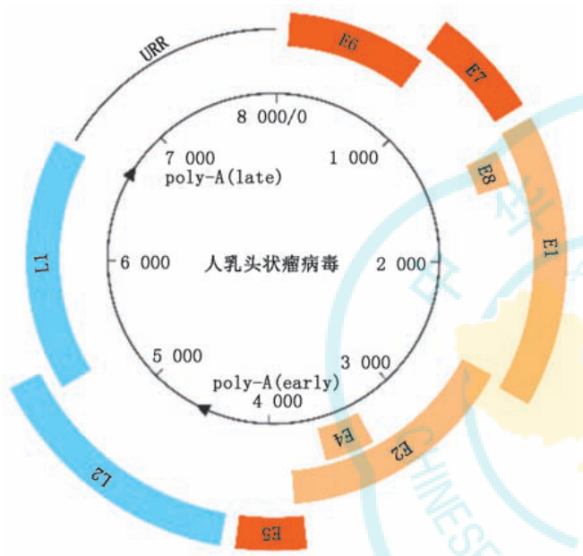

·标准与规范·  

# 人乳头状瘤病毒核酸检测用于宫颈癌筛查中国专家共识（2022）  

中华预防医学会肿瘤预防与控制专业委员会 中国医师协会妇产科医师分会阴道镜与宫颈病变专业委员会 中国优生科学协会阴道镜和子宫颈病理学分会 北京医师协会医学检验专科医师（技师）分会  

通信作者：赵方辉， 国家癌症中心 国家肿瘤临床医学研究中心 中国医学科学院北京协和医学院肿瘤医院流行病学研究室，北京 100021，Email：zhaofangh@cicams.ac.cn；崔巍， 国家癌症中心 国家肿瘤临床医学研究中心 中国医学科学院北京协和医学院肿瘤医院检验科，北京 100021，Email：wendycuiwei@sina.cn；毕蕙，北京大学第一医院妇产科，北京 100034，Email：00999@pkufh.com  

【摘要】　我国正处于加速消除宫颈癌的关键时期，使用高质量筛查方法提高筛查覆盖率是消除宫颈癌的主要手段之一。人乳头状瘤病毒（HPV）核酸检测是WHO推荐用于宫颈癌初筛的首选方法，但我国尚无将其用于宫颈癌筛查实践的指导性文件。因此，中华预防医学会肿瘤预防与控制专业委员会、中国医师协会妇产科医师分会阴道镜与宫颈病变专业委员会、中国优生科学协会阴道镜和子宫颈病理学分会、北京医师协会医学检验专科医师（技师）分会与中华医学杂志编辑委员会邀请国内50 余名公共卫生、妇产科、检验医学、病理学等多学科专家结合国内外指南、医学循证证据及我国实际情况形成专家共识，推荐将HPV 核酸检测作为我国宫颈癌筛查的主要方法，并针对其应用于宫颈癌筛查实践前评估和准备、具体用途和适用人群、实验室操作流程以及实施后监测和评估等方面提出了科学建议，以推动我国HPV 核酸检测全面、深入、规范、有序地高质量发展，为实现我国宫颈癌消除目标提供有力保障。  

【关键词】　人乳头状瘤病毒；　核酸检测；　宫颈癌；　筛查基金项目：中国医学科学院医学与健康科技创新工程项目（2021‑I2M‑1‑004）  

# Chinese expert consensus on the use of human papillomavirus nucleic acid testing for cervical cancer screening (2022)  

Branch of Cancer Prevention and Control, Chinese Preventive Medicine Association; Chinese Obstetrics and Gynecology Association Colposcopy and Cervical Neoplasia Committee; Chinese Society of Colposcopy and Cervical Pathology of China Health Birth Science Association; Beijing Medical Doctor (Technician) Society of Laboratory Medicine Corresponding authors: Zhao Fanghui, Department of Cancer Epidemiology, National Cancer Center/ National Clinical Research Center for Cancer/Cancer Hospital, Chinese Academy of Medical Sciences and Peking Union Medical College, Beijing 100021, China, Email: zhaofangh@cicams. ac. cn; Cui Wei, Department of Clinical Laboratory, National Cancer Center/National Clinical Research Center for Cancer/Cancer Hospital, Chinese Academy of Medical Sciences and Peking Union Medical College,  

收稿日期   2023-01-17 本文编辑   梁明修  

引用本文：中华预防医学会肿瘤预防与控制专业委员会，中国医师协会妇产科医师分会阴道镜与宫颈病变专业委员会，中国优生科学协会阴道镜和子宫颈病理学分会，等. 人乳头状瘤病毒核酸检测用于宫颈癌 筛 查 中 国 专 家 共 识（2022）[J]. 中 华 医 学 杂 志 , 2023, 103(16): 1184-1195. DOI: $1 0 . 3 7 6 0 / \mathrm { c m a } .$ j.cn112137-20230117-00096.  

Beijing 100021, China, Email: wendycuiwei@sina.cn; Bi Hui, Department of Obstetrics and Gynecology, First Hospital of Peking University, Beijing 100034, Email: 00999@pkufh.com  

【Abstract】 China is currently in a critical period of accelerating the elimination of cervical cancer, and scaling up screening coverage with high‑quality methods is one of the main approaches to achieve this goal. World Health Organization (WHO) recommended human papillomavirus (HPV) nucleic acid testing as the preferred primary screening method of cervical cancer. However, no guidelines exist for its use in cervical cancer screening in China. Therefore, Branch of Cancer Prevention and Control, Chinese Preventive Medicine Association, Chinese Obstetrics and Gynecology Association Colposcopy and Cervical Neoplasia Committee, Chinese Society of Colposcopy and Cervical Pathology of China Health Birth Science Association, Beijing Medical Doctor (Technician) Society of Laboratory Medicine, and the editorial board of the National Medical Journal of China convened more than 50 domestic experts from multiple disciplines, including public health, obstetrics and gynecology, laboratory medicine, and pathology, to form a consensus based on domestic and international guidelines, medical evidence, and China′s actual situation. These experts recommend HPV nucleic acid testing as the primary method for cervical cancer screening in China, and provide scientific suggestions on the pre‑implementation assessment and preparation, specific applications and target populations, laboratory operating procedures, and post‑implementation monitoring and assessment for the cervical cancer screening. These recommendations aim to promote a comprehensive, in‑depth, standardized, orderly and high-quality development of HPV nucleic acid testing in China, for providing a strong support for accelerating cervical cancer elimination in China.  

【Key words】 Human papillomavirus; Nucleic acid testing; Cervical cancer; Screening Fund program: Chinese Academy of Medical Sciences Innovation Fund for Medical Sciences (2021‑I2M‑1‑004)  

宫颈癌病因明确，几乎 $100 \%$ 的宫颈癌由人乳头状瘤病毒（HPV）感染引起［1‑2］。2020 年全球宫颈癌新发60.4 万例，死亡约34.2 万例，是全球女性常见的第四大恶性肿瘤［3］。我国宫颈癌发病和死亡例数在全球处于较高水平，2020年新发10.97万例，死亡5.91万例，发病和死亡例数已占到全球近 $1 8 \% ^ { [ 4 ] }$ 。  

消除宫颈癌是全球范围内的一项重大公共卫生议题。2020 年世界卫生组织（WHO）发布了《加速消除子宫颈癌全球战略》，强调到2030 年实现“90‑70‑90”目标： $9 0 \%$ 的适龄女孩在15 岁之前接种HPV 疫苗， $70 \%$ 的女性在35 和45 岁之前各接受一次高效的宫颈癌筛查， $9 0 \%$ 确诊为宫颈癌前病变或宫颈癌的女性接受规范治疗和管理［5‑6］。我国政府表示全力支持这一全球战略并制定了系列规划：2019 年 国 务 院 发 布《健 康 中 国 行 动（2019—2030 年）》，明确提出宫颈癌筛查县区覆盖率在2030 年达到 $9 0 \%$ 以上［7］；2021 年 12 月 31 日国家卫生健康委员会（简称卫健委）印发《宫颈癌筛查工作方案》，提出到2025 年底实现适龄妇女宫颈癌筛查率达到 $5 0 \%$ 以上、早诊率达到 $9 0 \%$ 以上的目标，并强调要将宫颈癌核心知识知晓率、筛查率、早诊率纳入绩效考核［8］。  

2021 年WHO 发布第二版《预防宫颈癌：宫颈癌前病变筛查和治疗指南》，推荐以HPV DNA 检测作为宫颈癌筛查的首选方法［9‑10］。欧盟及美国、澳大利亚、法国、英国等发达国家和印度、巴西等部分发展中国家已颁布指南，推荐使用HPV 核酸检测作为宫颈癌的初筛方法［11‑17］。我国最新的《宫颈癌筛查工作方案》也将HPV 核酸检测列为初筛方法之一［8］。然而在这样的战略背景下，我国的宫颈癌筛查仍面临以下主要问题：（1）宫颈癌筛查覆盖率较低，2018—2019 年我国 35\~44 岁女性筛查率为$4 3 . 4 \%$ ，低于 WHO 提出的 $70 \%$ 筛查率目标［18］；（2）细胞学检查存在灵敏度低、结果具有主观性、质量难以保证等问题，但目前仍是宫颈癌筛查的主要方法［19］；（3）HPV核酸检测技术具有灵敏度高、可重复性高等特点，相较于细胞学检查可检出更多的宫颈癌和癌前病变［20］，但尚未在我国宫颈癌筛查项目中广泛使用［21‑24］。  

基于此，中华预防医学会肿瘤预防与控制等专业委员会和《中华医学杂志》组织公共卫生、妇产、检验、病理等多学科专家共同撰写该共识，面向参与宫颈癌筛查的公共卫生人员、妇幼保健人员、妇产科临床医师、实验室检验人员等，旨在规范HPV核酸检测用于宫颈癌筛查的相关实践，制定符合我国国情、指导基层的共识意见，推动我国HPV 核酸检测全面、深入、规范、有序地高质量发展，为实现我国宫颈癌消除目标提供有力保障。  

# 第一部分 HPV型别和核酸检测概况  

# 一、HPV型别与宫颈癌的关系  

HPV 是一种嗜上皮组织的无包膜双链环状小DNA 病毒，病毒基因组约 $8 ~ \mathrm { k b }$ ，可分为3 个区域：早期基因（包含开放阅读框E6、E7、E1、E8、E2、E4、E5）、晚期基因（包含开放阅读框L2 和L1），以及非编码上游调节区（URR）又称为长控制区（LCR）（图1），各基因的功能和特点见表1［25‑30］。  

  
图1　人乳头状瘤病毒基因组图谱  

HPV 基因组序列存在 $10 \%$ 以上的不同，即为不同的基因型别［31］。目前已发现并分离鉴定出200 多种HPV 型别，并按其诱发癌症的潜力，分为高危型与低危型［31‑32］。我国2015年发布的《人乳头瘤病毒（HPV）核酸检测及基因分型、试剂技术审查指导原则》中将 HPV16、18、31、33、35、39、45、51、52、56、58、59、68 等 13 种基因型列为高危型 HPV（HR‑HPV）［33］。WHO 在 2021 年发布的《预防宫颈癌：宫颈癌前病变筛查和治疗指南》中指出HR‑HPV 检测通常包括 14 种型别：HPV16、18、31、33、35、39、45、51、52、56、58、59、66、68 型［9］HR‑HPV持续感染过程中病毒的E6和E7基因可能与宿主DNA 发生整合，导致宫颈上皮内瘤样病变（CIN）甚至宫颈癌［25‑27］。低危型 HPV（LR‑HPV）主要包括HPV6、11、42、43、44 等，可能引起生殖器疣或其他良性病变。  

# 二、HPV分型检测对宫颈癌筛查的临床意义  

女性生殖道HPV 感染较常见，但 $70 \% { \sim } 9 0 \%$ 的感染无症状并可在1\~2 年内消失， $5 \% \mathrm { \sim } 1 0 \%$ 感染女性会发生持续性HPV 感染，并有可能进一步进展为宫颈癌前病变甚至浸润癌。HPV 感染宫颈上皮后，因其基因型别不同、是否持续感染及持续感染时间不同，其致病风险也显著不同［34‑36］。因此，对HPV 进行分型检测并明确是否存在持续感染具有重要的临床意义。  

# （一）明确HR‑HPV 感染型别 进行风险分层管理  

HR‑HPV 感染与宫颈癌发生密切相关，几乎所有宫颈癌中可检测到HR‑HPV。加泰罗尼亚肿瘤研究所和国际癌症研究署（ICO/IARC）2021 年发布的全球HPV 和相关疾病报告显示，宫颈癌中最常见的 HR‑HPV 型别为 HPV16（ $5 5 . 2 \%$ ）、 $. 1 8 ( 1 4 . 2 \% )$ 、$4 5 ( 5 . 0 \%$ ）、 $. 3 3 ( 4 . 2 \% )$ ）和 $5 8 ( 3 . 9 \% )$ ），其中 $\mathrm { { H P V 1 6 / 1 8 } }$ 占比约 $7 0 \% ^ { [ 1 ] }$ 。我国宫颈癌最常见HR‑HPV 型别为HPV16（ $5 9 . 5 \%$ ）、 $1 8 ( 9 . 6 \%$ ）、 $. 5 8 ( 8 . 2 \% )$ ）、 $. 5 2 ( 6 . 5 \% )$ ）和33（ $3 . 5 \%$ ）， $_ \mathrm { H P V 1 6 / 1 8 }$ 占比与全球类似，但 HPV52/58 占比较高［4］。  

HR‑HPV 感染是宫颈高级别鳞状上皮内及以上病变（ ${ \mathrm { . H S I L } } +$ ）发生的必要条件。通常以发生HSIL $^ +$ 的风险作为衡量指标，遵循“同等风险，同等管理”的原则对HR‑HPV 感染者进行进一步的分流或随访管理［12，37］。HPV16/18 型别导致 HSIL $. +$ 的风险最高，对HPV16/18 阳性感染者直接进行阴道镜转诊。除 HPV16/18 以外的其他 12 种 HR‑HPV 型别发生 HSIL $^ +$ 风险存在差异。HPV31、33、45、52、58 与 HPV18 感 染 者 发 生 CIN3 的 风 险 近 似 ，但HPV18 在浸润癌中占比更大而且致癌风险明显增加；而 HPV35、39、51、56、59、66、68 发生 $\mathrm { C I N } 3 +$ 的风险较低，考虑可采取不同于高致病风险HR‑HPV 感染人群的管理措施［36，38‑40］。而HR‑HPV 阴性者发生HSIL $^ +$ 的风险极低，通常只需定期随访即可［35，41］。  

HR‑HPV 单一型别与多重型别感染对致癌性的影响，尚未形成统一结论。几项大型宫颈癌筛查研究提示多重感染特别是HR‑HPV 多重感染可能与细胞学异常或 ${ \mathrm { H S I L } } +$ 发生风险更密切相关，但也有筛查研究显示多重感染对宫颈病变发生风险没有累加或协同作用［42‑45］。因此，目前对于多重感染者仍采用与单一型别感染者相同的管理模式。  

# （二）明确是否存在HPV 持续感染 采取更积极的管理措施  

根据文献研究和临床经验，HPV持续感染可定义为：间隔6\~12 个月的相邻2 次检测中，同一个体的宫颈检测样品显示为同种型别HPV 阳性［45‑48］。  

表1 HPV各基因的功能和特点［25‑30］  

<html><body><table><tr><td>HPV基因</td><td>功能和特点</td></tr><tr><td>E6</td><td>可与E7蛋白协同驱动细胞周期进入S期以提供适合病毒DNA复制的环境,降解p53蛋白避免细胞凋亡,是与宫颈癌关联最紧密 的致癌基因之一</td></tr><tr><td>E7</td><td>可与E6蛋白协同驱动细胞周期进人S期以提供适合病毒DNA 复制的环境,靶向多个细胞周期调节通路蛋白引起细胞增殖失 调，是与宫颈癌关联最紧密的致癌基因之一</td></tr><tr><td>E8</td><td>功能尚未完全明确，可能参与控制HPV病毒复制和转录的相关机制</td></tr><tr><td>E1</td><td>编码ATP酶依赖的解旋酶，与病毒复制起点结合后参与病毒基因组复制</td></tr><tr><td>E2</td><td>编码E2蛋白可调控病毒基因转录,招募E1到病毒复制起点后增加病毒 DNA复制,并在宿主细胞分裂过程中将病毒基因组转移 到子细胞</td></tr><tr><td>E4</td><td>编码E4蛋白，调控病毒颗粒的组装及释放</td></tr><tr><td>E5</td><td>编码小跨膜蛋白E5,与生长因子信号通路的调节和免疫逃逸密切相关,与E6和E7协同驱动细胞的恶性进展,是HPV持续感染 的重要因素之一</td></tr><tr><td>L2 L1</td><td>编码次要衣壳蛋白L2,参与病毒DNA包埋，促进病毒入侵和传输，可诱发产生较长保护作用的中和抗体</td></tr><tr><td></td><td>编码主要衣壳蛋白L1,组装成五聚体衣壳形成二十面体病毒粒子,具有明显抗原性且是免疫细胞清除HPV的主要攻击位点，是 预防性疫苗的重要靶抗原</td></tr><tr><td>URR</td><td>包含调控元件,调控早期、晚期基因蛋白表达,对决定HPV宿主特异性范围具有重要意义</td></tr></table></body></html>

注：HPV为人乳头状瘤病毒；ATP为腺苷三磷酸；URR为非编码上游调节区  

HR‑HPV 持续感染是发生宫颈高级别病变和宫颈癌的主要原因［26，35，46‑47］。研究显示 HR‑HPV 持续感染平均2\~3 年可发生宫颈癌前病变，平均10\~12 年可发展为宫颈癌［49］，并且HR‑HPV 持续感染者相较于不同型别的反复感染者，宫颈癌发病风险高出约4倍［50］。HR‑HPV 持续感染还可能影响宫颈病变治疗后女性的预后。如锥切术后发生与术前相同型别HPV 持续感染者，其残留或复发的风险更高，需更密切地关注存在治疗失败的可能性，并进行更严格的管理［51‑52］。因此，HR‑HPV 分型检测可明确是否存在同一型别持续感染，有助于采取更积极的干预治疗措施和更严格的随访管理。  

推荐意见1：（1）对HR‑HPV核酸检测阳性者遵循“同等风险，同等管理”的原则进行分层管理。HPV16/18 是致癌风险最高的型别，需及时转诊阴道镜以进一步评估。针对其他HR‑HPV 感染者，需积累更多致病风险的证据，并进行分流有效性的评估，从而提出适宜的分流策略。（2）HR‑HPV 持续感染者发生宫颈癌前病变及宫颈癌的风险增加，建议采取更加积极的管理策略。  

# 三、HPV核酸检测技术的分类和发展  

根据是否对目的基因进行扩增，HPV核酸检测方法可以分为扩增法和非扩增法［53‑56］。（1）核酸扩增法：根据扩增的目的基因片段不同，可分为DNA扩增和RNA 扩增；根据扩增的方法不同，可分为聚合酶链反应（PCR）法和恒温扩增法等。（2）非扩增法：主要基于HPV 全片段基因利用检测信号放大的原理进行检测，包括杂交捕获、酶切信号放大法等。  

目前，我国HPV 核酸检测常用技术多以核酸扩增法及其衍生技术为主，包括：恒温扩增法、荧光PCR（PCR‑荧光探针法）、PCR‑毛细管电泳法、PCR‑微流控芯片法、PCR‑熔解曲线法、PCR‑反向点杂交/流式荧光杂交法等［55，57‑58］。总体而言，HPV 核酸检测向着更多分型、更高灵敏度、更高特异度、更加自动化方向发展（常用方法学见表2）。  

推荐意见2：HPV 核酸检测方法可以分为非扩增法和扩增法，这些方法可对HPV 全基因组或某一片段（例如：以 L1 DNA、E6/E7 DNA 或 mRNA 等为检测靶点）进行有效检测。  

# 第二部分 HPV核酸检测用于宫颈癌防治的实践指导  

在加速消除宫颈癌全球战略背景下，我国宫颈癌初筛方法正在从以细胞学为主向以HPV 核酸检测为首选转变。当前阶段需要通过认真梳理现有供给系统，建立完善的实验室运行机制和监督管理体系，开展基于HPV 核酸检测筛查项目的同时建立高效的异常人群转诊路径，并为健康服务提供者提供规范化培训，为受众人群提供健康教育等，以建立 HPV 核酸检测所需的相关配套系统，加快HPV 核酸检测作为我国宫颈癌初筛方法的推广使用。  

一、宫颈癌防治中 HPV 核酸检测实施前的评估和准备  

# （一）实验室质量保证  

1. 基本要求：HPV检测实验室应当根据各自条件，制定环境、安全、人员、仪器设备及试剂耗材等方面相关文件及管理制度，应建立包含检测全过程的标准操作程序，包括但不限于样品采集、运送、保存、样品前处理、核酸提取、核酸检测、结果报告和解释、仪器设备维护、质量控制、复检流程及防污染措施等。  

表2 人乳头状瘤病毒核酸检测常用方法学  

<html><body><table><tr><td>方法学</td><td>检测原理</td><td>检测靶点</td></tr><tr><td>非扩增法</td><td></td><td></td></tr><tr><td>杂交捕获</td><td>采用RNA探针进行靶标杂交捕获,利用抗体和酶进行信号放大,荧光信号检测或化学发光全基因组 检测</td><td></td></tr><tr><td>扩增法</td><td></td><td></td></tr><tr><td></td><td>荧光PCR法(PCR-荧光探针法）使用特异引物和荧光标记探针,利用荧光信号实时监测病毒DNA序列扩增</td><td>L1 DNA</td></tr><tr><td>PCR-毛细管电泳法</td><td>采用多重PCR技术同时对多个靶点进行特异性扩增，通过毛细电泳，根据扩增片段长度的E6/E7DNA 不同对型别进行区分</td><td></td></tr><tr><td>PCR-微流控芯片法</td><td>在密闭芯片内全程全自动进行目的DNA提取纯化、多重PCR扩增和反向斑点杂交型别检测L1 DNA</td><td></td></tr><tr><td>荧光PCR-熔解曲线法</td><td>采用实时荧光PCR实时监测扩增曲线,并采用熔解曲线对应的溶解峰温度判定PCR产物L1DNA 的基因型信息</td><td></td></tr><tr><td>PCR-反向点杂交法</td><td>PCR扩增后将生物素标记的特异性PCR扩增产物与固定于膜上的探针杂交显色,进行基因L1 DNA 分型检测</td><td></td></tr><tr><td>PCR-流式荧光杂交法</td><td>PCR扩增产物和微球上交联的探针进行杂交,加入荧光标记反应后在流式荧光检测仪读取L1 DNA 荧光信号</td><td></td></tr><tr><td>恒温扩增-荧光法</td><td>恒定温度下，使用酶和特异引物进行快速核酸扩增</td><td>E6/E7 mRNA</td></tr></table></body></html>

注：PCR为聚合酶链反应  

基于非基因扩增技术开展HPV 核酸检测的医疗机构和第三方检测机构需依据《病原微生物实验室生物安全管理条例》（国务院令第424 号）有关规定，具备经过卫生健康行政部门审核备案的生物安全二级及以上实验室条件。独立设置的医学检验实验室还应当符合《医学检验实验室基本标准（试行）》《医学检验实验室管理规范（试行）》等要求，在卫生行政部门进行相应技术审核和登记备案，才能开展检测。  

基于基因扩增技术开展HPV 核酸检测的医疗机构和第三方检测机构在满足如上要求的基础上，还需符合《医疗机构临床基因扩增实验室管理办法》（卫办医政发〔2010〕194 号）的有关规定，具备临床基因扩增检验实验室条件。  

2. 性能验证：HPV核酸检测实验室应建立标准操作流程，并在开展临床检测前及检测过程中发现与检测系统可能相关的影响检测结果的问题时，均应对检测系统进行性能验证。目前HPV 检测性能验证按照定性检测项目的性能验证要求进行，包括测量精密度、符合率、检出下限、抗干扰能力、交叉反应等。建议针对中国人群常见型别进行性能验证，至少包括HPV16、18、52、58等。  

3. 质量控制：基于基因扩增技术开展HPV 核酸检测的实验室应按照《医疗机构临床基因扩增检验工作导则》建立质量控制程序。  

（1）室内质控：每批检测至少应包含1 份阴性质控品和1 份阳性质控品。阳性质控应包含常见的 HPV 高危型别（如 HPV16、18、52、58 等）中的一种或多种。阴性和阳性质控均应参与从提取到扩增检测的全过程。  

（2）室间质评：实验室应参加国家级或省市级临床检验中心组织的室间质评，每年至少2次。  

# （二）HPV核酸检测试剂/检测系统的选择  

1. 分析性能：选择国家药品监督管理局（NMPA）批准的且通过实验室分析性能验证的试剂或检测系统，具体要求可参见《人乳头瘤病毒（HPV）核酸检测及基因分型、试剂技术审查指导原则》［33］。  

2. 临床性能：HPV核酸检测试剂或检测系统应用于临床宫颈癌筛查时需验证临床性能，评估临床灵敏度、特异度、阴性预测值、阳性预测值等指标是否满足临床预期用途（如，初筛、ASC‑US人群分流、或与细胞学联合筛查等）。对于HPV 检测来说，要求有高度的临床灵敏度和阴性预测值，并且在保证较高检出率的同时尽量降低假阳性率。假阳性的HPV 检测结果，及对结果的误判和误导，都会引起公共卫生损害风险，导致治疗不当、频繁检查和侵袭性处置等过度诊断或治疗［33，59］。而假阴性的结果又会导致漏诊的情况。HPV 核酸检测对中度及以上宫颈上皮内瘤样病变和宫颈癌（ $\mathrm { C I N } 2 +$ ）及高度及以上宫颈上皮内瘤样病变和宫颈癌（ $\mathrm { \ C I N } 3 +$ ）诊断的灵敏度应 $9 0 \%$ 。临床性能验证指标的具体要求可参见WHO 筛查指南和我国《人乳头瘤病毒（HPV）核酸检测及基因分型、试剂技术审查指导原则》［9，33］。  

3. 其他：根据国家制定的宫颈癌防治策略、当地的卫生资源与条件、实验室要求、目标人群和可用资源等因素，考虑方法学、检测靶点和分型的不同、自动化程度以及可及性等问题，选择合适的HPV核酸检测试剂/检测系统。  

推荐意见3：（1）HPV 核酸检测实验室应当制定环境、安全、人员、仪器设备及试剂耗材等方面相关文件及管理制度，建立包含检测全过程的标准操作程序以及完善的质量控制程序；（2）建议选择NMPA 批准且通过实验室分析性能验证的HPV 核酸检测试剂或检测系统；（3）HPV 核酸检测试剂或检测系统应用于临床宫颈癌筛查时需验证临床性能，评估是否满足临床预期用途。  

# （三）HPV核酸检测的相关支持要求  

1. 构建完善的随访管理体系：（1）完善宫颈癌筛查与随访信息管理系统，建立信息管理制度，加强筛查数据的标准化和规范化，搭建宫颈癌防治信息共享服务平台，实现筛查、诊断、治疗各环节数据的互联互通。（2）建立个人健康档案，记录妇女基本信息及检查、诊断、治疗情况，实现对定期筛查及后续随访的动态管理。（3）加大筛查、诊断、治疗数据的数字化投入，降低信息系统对接及信息共享的差异化。（4）做好宫颈癌筛查数据信息上报、审核、汇总和数据分析与评价工作，逐步实现区域内宫颈癌筛查人群的社会人口学和行为学因素、疫苗接种史、筛查与早诊早治等内容的动态信息联接、共享和管理［60‑61］。  

2. 公众教育：（1）开展宫颈癌防治的社会动员，加强大众健康教育，促进广大妇女正确理解和提高对宫颈癌筛查、随访以及癌前病变治疗的意识，主动自觉接受宫颈癌筛查和随访、治疗服务。（2）采用多层次、多途径和适宜的方法进行相关知识的宣传和教育，使妇女掌握正确的知识：首先了解定期开展宫颈癌筛查的重要性，但无需频繁进行HPV 检测，其意义有限并造成医疗资源的浪费；降低妇女对HPV 检测异常的恐慌，使其了解筛查检测结果为HR‑HPV 阳性仅提示高风险，只要进行及时有效的随访和必要治疗，即可预防宫颈癌。（3）向公众强调自我管理的重要性，需明确个人是自身健康的首要负责人，要坚持定期进行宫颈癌筛查和随访。（4）医疗机构和医务工作者应在筛查和诊疗的同时为妇女提供相应的健康教育，并与各地妇联加强合作，辅助基层医务人员进行宣传教育。  

# 二、宫颈癌防治中HPV核酸检测的实施  

# （一）HPV核酸检测在宫颈癌防治中的应用  

1. HPV核酸检测用于宫颈癌初筛：中国在宫颈癌筛查策略方面与国际共识/指南的方向一致：推荐使用 HR‑HPV 核酸检测作为宫颈癌的初筛方法［8，11‑17，62‑63］。2021 年发布的我国多中心大样本宫颈癌筛查随机对照临床研究和大规模真实世界研究均已证实HR‑HPV DNA 检测用于宫颈癌初筛的有效性［64‑65］。同时模型研究进一步指出，采用基于“HPV 疫苗接种 $^ +$ 基于HPV 核酸检测的宫颈癌筛查”的优化路径可加速我国实现消除宫颈癌目标［66］。  

HPV 筛查的年龄和频次可参考WHO 发布的《预防宫颈癌：宫颈癌前病变筛查和治疗指南》和我国《宫颈癌筛查工作方案》《中国子宫颈癌综合防控指南》。鉴于我国人口基数大、卫生资源分布不均、宫颈癌筛查覆盖率和疫苗接种率仍比较低等现实问题，考虑在借鉴国际指南的基础上，依据我国医疗资源配置现状及宫颈癌前病变筛查和治疗相关证据的更新，探索更符合中国国情的HPV筛查方案。  

推荐意见4：（1）筛查人群： $\textcircled{1}$ 优先对 35‑64 岁女性进行筛查； $\textcircled{2}$ 条件允许可纳入常规体检；单位组织的体检中也建议遵循这一建议。（2）筛查方法：推荐将HR‑HPV 检测作为人群宫颈癌筛查的首选方法，筛查间隔为5 年。（3）HPV 检测方法的选择：$\textcircled{1}$ 至少检测 13 种 HR‑HPV（HPV16、18、31、33、35、39、45、51、52、56、58、59、68）； $\textcircled{2}$ 有条件时建议至少进行 HPV16/18 分型检测； $\textcircled{3}$ 采用NMPA 批准且通过实验室分析性能验证和临床性能验证的HPV 检测方法。（4）对于筛查中检出的HPV 阳性者，应根据其发生 ${ \mathrm { H S I L } } +$ 风险确定进一步管理建议：$\textcircled { 1 } \mathrm { H P V } 1 6 / 1 8$ 阳性者直接转诊阴道镜检查； $\textcircled{2}$ 非HPV16/18 阳性者建议进行分流检测（细胞学检查或其他方法），分流检测阳性者转诊阴道镜检查；$\textcircled{3}$ HR‑HPV持续感染者建议直接转诊阴道镜检查。  

2. HPV 核酸检测用于分流：ASC‑US 是最常见的细胞学异常类型［21］。目前临床对ASC‑US的分流建议首选HPV 检测，HPV 阳性建议转诊阴道镜检查，HPV 阴性者建议复查，以减少不必要的阴道镜转诊。有研究显示，HPV 分型检测可减少约 $4 0 \%$ HPV 阳性ASC‑US 者的阴道镜转诊，且不会造成CIN3 $+$ 病变的延迟诊断［67］。  

推荐意见5：细胞学ASC‑US 者建议首选HPV核酸检测分流，并根据分流结果决定是否需要进行阴道镜转诊：（1）HPV 检测阴性者，3 年后复查，对于细胞学医生诊断水平及细胞学质控相对不足地区，复查间隔可为12 个月；（2）HPV 阳性者直接转诊阴道镜。  

3. HPV 核酸检测用于 ${ \mathrm { H S I L } } +$ ［包括中度宫颈上皮内瘤样病变（CIN2）、高度宫颈上皮内瘤样病变（CIN3）、原位腺癌（AIS）及浸润癌］切除性治疗后的风险评估［29］：HPV 核酸检测可明显提高在 ${ \mathrm { H S I L } } +$ 子宫颈切除性治疗后人群中识别复发病变的敏感性，并可忽略HSIL 者的切缘状况。对于全子宫切除的患者，若既往存在 ${ \mathrm { H S I L } } +$ ，全子宫切除术后仍应定期进行细胞学联合HPV 检测，可及时发现下生殖道其他部位的HPV相关病变。  

推荐意见6：（1）HSIL 治疗后6 个月，采用基于HPV 核酸的单独检测或联合细胞学检测进行第一次监测，结果阴性者其后3年每年进行基于HPV 核酸检测的复查，结果均阴性者可将随访间隔延长至每3 年1 次，持续25 年。（2）AIS 患者宫颈切除性治疗后切缘阴性且有保留生育意愿者可行保留生育管理，建议术后前3 年每6 个月行细胞学联合HPV检测及子宫颈管评估；结果均阴性者，后2 年可每年行细胞学联合HPV 检测及子宫颈管评估；5 年内结果均阴性者，可将随访间隔继续延长至每3 年1次，长期随访。（3）全子宫切除者既往存在HSIL+，建议术后前3年每年行细胞学联合HPV 核酸检测，结果均阴性者可将随访间隔延长至每3 年一次，持续25年。  

4. HPV 筛查流程图：对适龄女性采用HPV 核酸检测进行初筛，阴性者间隔5 年后再次进行检测。对HPV 初筛阳性者采用HPV 基因分型和细胞学检测联合分流方法：HPV16/18 阳性者及HPV 持续感染者直接转诊阴道镜，非HPV16/18 阳性者采用细胞学检测进一步分流。细胞学阴性者12 个月后再次进行HPV 核酸检测，细胞学阳性者直接转诊阴道镜。对阴道镜检查结果为低度及以上病变者行病理检查，病理结果为宫颈正常或低级别鳞状上皮内病变者（≤LSIL）12 个月后再次进行HPV 核酸检测，病理结果为HSIL $. +$ 者进行治疗，并在 $6 \sim$ 12 个月后采用HPV 核酸及细胞学联合检测进行随访，结果阳性者转诊阴道镜，阴性者每年进行1 次随访，连续3 年阴性则转为每3 年1 次随访，持续25年。流程见图2。  

接种人群：预防性 HPV 疫苗不能治疗已存在的HPV 感染及相关疾病，不能预防所有HPV 型别感染，也不能阻止HPV 感染进展至疾病。因此，接种过疫苗的女性，仍应定期进行HPV 检测，以预防宫颈癌的发生发展［66，68］。目前对于接种过HPV 疫苗人群仍建议采用与未接种HPV 疫苗人群相同的筛查策略。  

（2）免疫缺陷人群：免疫缺陷人群临床可包括：$\textcircled{1}$ 免疫系统疾病：包括免疫缺陷性疾病、免疫增殖性疾病、自身免疫病3 种类型的患者； $\textcircled{2}$ 因各种疾病应用免疫抑制剂者（包括器官移植患者）； $\textcircled{3}$ 其他原因引起免疫缺陷的人群等。相较于免疫正常者，免疫缺陷人群发生HPV 感染、宫颈癌及癌前病变治疗失败风险更高［69‑72］。建议对免疫缺陷人群采用更早的起始筛查年龄，并缩短筛查间隔。目前针对免疫缺陷人群的筛查策略主要为人类免疫缺陷病毒（HIV）感染人群制定，其他类型免疫抑制人群则可遵循与HIV感染人群相同的筛查策略［9，73‑75］。  

（3）备孕期及孕期女性：妊娠妇女筛查措施的选择与一般风险人群相同。针对筛查阳性的妊娠期妇女，美国 ASCCP［12］、加拿大［76］和德国［77］发布的指南均建议采用与未妊娠妇女相同的原则进行管理，但需注意： $\textcircled{1}$ 不能行宫颈管检查或子宫内膜搔刮/活检； $\textcircled{2}$ 只有在怀疑宫颈癌时才建议进行切除性检查； $\textcircled{3}$ 若相关检查排除了 ${ \mathrm { H S I L } } +$ ，建议推迟到产后进行复查； $\textcircled{4}$ 若相关检测怀疑或诊断为CIN2 或CIN3，建议持续监测并推迟到产后进行再评估或治疗。我国指南建议既往未规律筛查或从未筛查过的有妊娠意愿女性应在孕前检查或第一次产检时行宫颈癌筛查［73］。  

（4） ${ \geqslant } 6 5$ 岁女性：既往未规律筛查，且近10年无3 次连续常规细胞学筛查阴性或连续两次常规HPV核酸检测阴性史者建议继续进行筛查。  

推荐意见7：（1）预防性HPV 疫苗接种人群：建议采用与未接种HPV 疫苗人群相同的筛查策略。（2）免疫缺陷人群： $\textcircled { 1 } \mathrm { H I V }$ 人群：建议25岁或有性生活的女性1 年内开始筛查［9，12］，每3\~5 年定期筛查1 次，筛查结果为阳性或宫颈病变治疗后，应缩短筛查间隔；具体筛查时间应与专科医生讨论确定，通常筛查频次为一般人群的2 倍； $\textcircled{2}$ 其他免疫缺陷人群：可遵循与HIV 感染人群相同的筛查策略。（3）备孕期及孕期女性建议采用与未妊娠女性相同的原则进行筛查与管理： $\textcircled{1}$ 有妊娠意愿的女性应在孕前检查时询问近1 年内是否进行过宫颈癌筛查；  

  
图2　HPV检测用于宫颈癌筛查流程图  

注：HPV 为人乳头状瘤病毒；≤LSIL 为宫颈正常或低级别鳞状上皮内病变； ${ \mathrm { H S I L } } +$ 为宫颈高级别鳞状上皮内或以上病变［包括中度宫颈上皮内瘤样病变（CIN2）、高度宫颈上皮内瘤样病变（CIN3）、宫颈原位腺癌（AIS）及浸润癌］  

$\textcircled{2}$ 对于既往没有筛查过或未定期筛查的女性，在孕前检查或第一次产检时进行筛查； $\textcircled{3}$ 针对筛查阳性的妊娠期妇女，需注意：不能行宫颈管检查或子宫内膜搔刮/活检；只有在怀疑宫颈癌时才建议进行切除性检查；若相关检查排除了 ${ \mathrm { H S I L } } +$ ，建议推迟到产后进行复查；若相关检测怀疑或诊断CIN2 或CIN3，建议持续监测并推迟到产后进行再评估或治疗。 $( 4 ) { \geqslant } 6 5$ 岁女性： $\textcircled{1}$ 既往10年未进行过规律筛查者，应继续进行筛查； $\textcircled{2} 1 0$ 年内连续3 次常规细胞学检查无异常结果或连续2 次常规HPV 筛查为阴性结果，且既往无CIN病史者，可停止筛查。  

# （二）HPV核酸检测的操作流程  

HPV核酸检测可分为分析前、分析中以及分析后三个阶段，规范HPV 核酸检测操作流程有助于提升检测的质量，保证诊断的准确性。  

1. 检测分析前：（1）取样： $\textcircled{1}$ 取样前患者须知：需避开月经期进行采样；检查前 $4 8 \mathrm { { h } }$ 内避免性生活、阴道冲洗和阴道内用药。 $\textcircled{2}$ 样品类型：宫颈脱落细胞、阴道脱落细胞（针对自采样）。 $\textcircled{3}$ 取样工具：宫颈刷。应获得NMPA 医疗器械注册证，建议结合检测试剂，选择配套或试剂盒推荐的取样工具。 $\textcircled{4}$ 取样步骤：根据说明书进行取样。 $\textcircled{5}$ 对于难以到医疗机构取样的女性，可按照自采样说明书自行取样。  

（2）样品的保存和运输：分析前样品应尽快送至实验室并以适当方式储存，以尽可能减少核酸降解。根据说明书要求进行样品保存。一般分析前样品在 $2 { \sim } 8 \mathrm { ~ } ^ { \circ } \mathrm { C }$ 条件下可保存$7 \ \mathrm { d } , \leqslant - 2 0 \ \mathrm { ~ \overset ~ { ~ } { ~ C ~ } ~ }$ 条件下可长期保存，应避免反复冻融。超长期储存后的样品，使用前应再次评估样品的完整性。如需长时间、长距离运输样品，应采用冰壶加冰或泡沫盒加冰密封运输。  

2. 检测分析中：（1）样品前处理：样品送到实验室接收时，需审核样品状态，核实申请项目内容与所送检样品要求是否一致，核实采集容器及样品外观状态等是否合格。  

（2）样品检测过程：按照标准操作程序进行试剂准备、样品处理及检测。在PCR 检测过程中，应注意核酸提取需在生物安全柜内进行，也可使用自动核酸提取设备提取核酸，并按照要求进行室内质控。  

3. 检测分析后：（1）结果判读：检测结果判读前，应确保阴性和阳性质控均在控，样品内参应在说明书要求的检测范围内，HPV靶标基因检测信号应正常；结果判读应根据说明书要求进行。以定性检测结果为例，HPV靶标基因检测值介于阴性和阳性判定值之间时，建议进行复检，复检时应对样品重新提取及扩增，复检后检测值仍介于阴性和阳性判定值之间，检测信号正常，可判定为阳性；复检后检测值为阴性或无检测信号则判定为阴性。  

（2）HPV 核酸检测报告：检测报告的内容包括但不限于： $\textcircled{1}$ 患者基本信息，包括姓名、性别、年龄/出生日期、临床诊断等； $\textcircled{2}$ 样品信息，包括样品类型、编号、申请时间、采集时间、送检时间、检测时间、报告时间等； $\textcircled{3}$ 检测信息，包括试剂和仪器来源、检测方法、检测靶点、参考范围、操作者、审核者、实验室电话/地址等； $\textcircled{4}$ 结果报告，包括是否存在 HPV 感染（阴性或阳性；可报告CT 值）、HPV 基因型状态（是否感染）等； $\textcircled{5}$ 结果解释，包括HR‑HPV 感染的临床意义等； $\textcircled{6}$ 备注信息，包括检测下限、检测靶点、检出HPV 型别范围，或对检测局限性的说明、检测过程中异常情况的说明等。  

（3）检测后样品保存：原始样品、核酸提取物/核酸扩增产物应规定保存期，便于复查。  

# 三、HPV核酸检测实施后的监测和评估  

对 HPV 筛查工作进行长期的监测和评估。（1）建立数据库和信息处理系统，完善长期监测，持续改进相应质量评估指标，如假阴性结果、假阳性结果、脱落病例比例等；（2）定期进行实验室质量管理体系的风险评估；（3）注重人员资质与能力建设，进行定期的培训、考核和记录，储备充足的人力资源，保障大规模开展宫颈癌筛查的能力；（4）定期对HPV 感染率、宫颈癌前病变的检出率、宫颈癌的发病率和死亡率进行追踪和评估。  

# 第三部分 展望  

# 一、HPV核酸检测创新技术发展  

医疗卫生工作者可充分利用新型冠状病毒肺炎疫情期间我国积累的核酸检测硬件设施与软件能力，进一步推动HPV 核酸检测的常规化、规范化和普及化。同时，为适应我国庞大人口基数、复杂社会经济情况，一方面需要开发更加自动化、智能化、标准化的核酸检测一体机，更好地满足宫颈癌国家筛查计划对于大批量样品检测的需求；另一方面需要开发操作更便捷、更低成本、更省时的便携式、小型化即时检测（POCT）系统，满足对结果的及时性需求。探索将HPV 自采样方法应用于筛查实践的实施策略，以保障包括医疗资源相对不足地区在内的女性宫颈癌筛查的可及性。鼓励开展宫颈癌防控服务模式的实践应用与真实世界研究，应用模型预测宫颈癌防治效果和成本效益，为优化宫颈癌防控策略提供证据。  

# 二、HPV核酸检测的信息化管理  

推动大数据、互联网等新一代信息技术与HPV核酸检测和宫颈癌筛查服务深度融合，推进电子病历、智慧服务、智慧管理的信息标准化建设。搭建宫颈癌防控信息共享服务平台，通过加强肿瘤登记系统、疫苗预防接种服务系统和癌症筛查管理服务系统等数据库的对接交换，不仅有助于开展HPV疫苗接种和宫颈癌筛查的实时动态监测，实现筛查、分流、治疗、随访的全程统一管理，避免重复筛查，而且通过监测HPV 感染和宫颈癌负担的变化趋势，科学评估 HPV 疫苗接种和宫颈癌筛查的效果。  

三、HPV 核酸检测在HPV 疫苗接种后时代的应用  

随着HPV 疫苗接种的普及，我国将逐步进入后HPV 疫苗时代，HPV 疫苗覆盖型别感染及相关HSIL $^ { + }$ 发生率将下降，但是归因于非疫苗保护型别的宫颈病变问题将会日渐凸显，因此探索适合该阶段的基于HPV 核酸检测的筛查策略成为亟待解决的问题。国家相关部门、企业以及医疗机构应注意监测中国人群HPV 感染型别的变化趋势，因时制宜开展高质量的人群筛查研究，为更新相关风险分层和管理指南积累可靠证据。  

四、HPV 核酸检测在其他HPV 相关疾病防控中的应用  

除宫颈病变外，HR‑HPV 感染还与肛门、阴茎、头颈等部位的癌前病变和浸润性癌相关，LR‑HPV感染可引起肛门‑生殖器疣和复发性呼吸道乳头状瘤等疾病。HPV 检测对于以上非宫颈部位的HPV相关疾病防控也具有重要意义。但对于相关人群如何选择采样方法、检测技术和试剂设备等问题，还需开展大规模人群研究获得更多高质量证据，以指导未来的临床实践。  

# 第四部分 总结  

本共识是多学科专家团队基于国内外相关指南、最新研究进展及我国宫颈癌筛查实际情况形成的一致意见。随着技术的发展和循证证据的增加，共识或指南有必要不断更新和补充。将高质量HPV 核酸检测用于宫颈癌筛查将加快实现我国宫颈癌筛查临床实践从形态学向分子生物学检测转化的进程，为扩大我国宫颈癌筛查覆盖率、提高筛查质量提供技术支撑，加速推进我国宫颈癌消除进程。  

编写顾问：郎景和（中国医学科学院北京协和医院妇产科）；乔友林（北京协和医学院群医学及公共卫生学院 全球健康学系）；魏丽惠（北京大学人民医院妇产科）；李金明（国家卫生健康委临床检验中心）；王临虹（中国疾病预防控制中心）；王传新（山东大学第二医院检验科）  

执笔人：赵方辉（国家癌症中心 国家肿瘤临床医学研究中心 中国医学科学院北京协和医学院肿瘤医院流行病学研究室）；崔巍（国家癌症中心 国家肿瘤临床医学研究中心中国医学科学院北京协和医学院肿瘤医院检验科）；毕蕙（北京大学第一医院妇产科）  

编写委员会（按姓氏汉语拼音排序）：陈飞（中国医学科学院北京协和医院妇产科）；陈罡（广西医科大学第一附属医院病理科）；陈汶（中国医学科学院肿瘤医院流行病学研究室）；程文俊（南京医科大学第一附属医院妇科）；丁海涛（内蒙古自治区人民医院检验科）；杜彬（上海市第一妇婴保健院 病理科）；段仙芝（首都医科大学附属北京同仁医院妇产科）；郭凌川（苏州大学附属第一医院病理科）；韩历丽（首都医科大学附属北京妇产医院保健部）；韩莉莉（新疆维吾尔自治区人民医院妇科）；洪颖（南京大学医学院附属鼓楼医院妇产科）；侯英勇（复旦大学附属中山医院病理科）；金木兰（首都医科大学附属北京朝阳医院病理科）；孔北华（山东大学齐鲁医院妇产科）；李斌（中国医学科学院肿瘤医院妇科）；李华（首都医科大学附属北京朝阳医院妇产科）；罗喜平（广东省妇幼保健院妇科）；吕卫国（浙江大学医学院附属妇产科医院）；欧阳能太（中山大学孙逸仙纪念医院细胞分子诊断中心）；潘秦镜（中国医学科学院肿瘤医院病理科）；宋建东（内蒙古医科大学附属医院妇科）；宋坤（山东大学齐鲁医院妇产科）；宋晓婕（武汉市妇幼保健院妇科）；孙蓬明（福建省妇幼保健院妇科）；孙青（山东第一医科大学第一附属医院病理科）；谭文华（哈尔滨医科大学附属第二医院妇科）；唐均英（重庆医科大学附属第一医院妇科）；王烈宏（青海红十字医院妇科）；王平（四川大学华西第二医院妇科）；王巍（四川大学华西第二医院病理科）；王新宇（浙江大学医学院附属第一医院妇科）；王学锋（上海交通大学医学院附属瑞金医院检验科）；王沂峰（南方医科大学珠江医院妇科）；向阳（中国医学科学院北京协和医院妇产科）；徐国兵（北京大学肿瘤医院检验科）；徐英春（中国医学科学院北京协和医院检验科）；徐志坚（中国医学科学院肿瘤医院防癌科）；薛凤霞（天津医科大学总医院妇产科）；尹如铁（四川大学华西第二医院妇科）；翟建军（首都医科大学附属北京同仁医院妇产科）；张瑞（国家卫生健康委临床检验中心）；张询（中国医学科学院肿瘤医院病理科）；张瑜（中南大学湘雅医院妇科）；赵昀（北京大学人民医院妇科）；周怀君（南京大学医学院附属鼓楼医院妇科）  

编写秘书（按姓氏汉语拼音排序）：胡尚英（中国医学科学院肿瘤医院流行病学研究室）；王国婧（中国医学科学院肿瘤医院检验科）；赵雪莲（中国医学科学院肿瘤医院流行病学研究室）  

利益冲突 所有作者均声明不存在利益冲突  

# 参 考 文 献  

[1] ICO/IARC Information Centre on HPV and Cancer (HPV Information Centre). Human Papillomavirus and Related Diseases in the World. [EB/OL]. [2021‑10‑22]. https:// hpvcentre.net/statistics/reports/XWX.pdf?t=1678773236590.   
[2] de Martel C, Georges D, Bray F, et al. Global burden of cancer attributable to infections in 2018: a worldwide incidence analysis[J]. Lancet Glob Health, 2020, 8(2): e180‑e190. DOI: 10.1016/S2214‑109X(19)30488‑7.   
[3] Sung H, Ferlay J, Siegel RL, et al. Global Cancer Statistics 2020: GLOBOCAN Estimates of Incidence and Mortality Worldwide for 36 Cancers in 185 Countries[J]. CA Cancer J Clin, 2021, 71(3):209‑249. DOI: 10.3322/caac.21660. [4] ICO/IARC Information Centre on HPV and Cancer (HPV Information Centre). Human Papillomavirus and Related Diseases in China [EB/OL]. [2021‑10‑22]. https://hpvcentre. net/statistics/reports/CHN.pdf?t=1678773276663. [5] World Health Organization. Global strategy to accelerate the elimination of cervical cancer as a public health problem [EB/OL]. [2022‑11‑22]. https://www. who. int/ publications/i/item/9789240014107. [6] WHO. Cervical Cancer: An NCD We Can Overcome[EB/OL]. [2022‑11‑22]. https://www. who. int/director‑general/ speeches/detail/cervical‑cancer‑an‑ncd‑we‑can‑overcome. [7] 健康中国行动推进委员会. 健康中国行动(2019‑2030 年) [EB/OL]. [2022‑11‑22]. http://www. gov. cn/xinwen/ 2019‑07/15/content_5409694.htm.   
[8] 国家卫生健康委员会. 《宫颈癌筛查工作方案》[EB/OL]. [2022‑11‑22]. http://www. nhc. gov. cn/fys/s3581/ 202201/cad44d88acca4ae49e12dab9176ae21c.shtml. [9] WHO. WHO guideline for screening and treatment of cervical pre‑cancer lesions for cervical cancer prevention [EB/OL]. [2022‑11‑22]. https://www. who. int/ publications/i/item/9789240030824.   
[10] World Health Organization. WHO guideline for screening and treatment of cervical pre‑cancer lesions for cervical cancer prevention: use of mRNA tests for human papillomavirus (HPV) [EB/OL]. [2022‑11‑22]. https:// www.who.int/publications/i/item/9789240040434.   
[11] Ciavattini A, Delli Carpini G, Giannella L, et al. European Federation for Colposcopy (EFC) and European Society of Gynaecological Oncology (ESGO) joint considerations about human papillomavirus (HPV) vaccination, screening programs, colposcopy, and surgery during and after the COVID‑19 pandemic[J]. Int J Gynecol Cancer, 2020, 30(8):1097‑1100. DOI: 10.1136/ijgc‑2020‑001617.   
[12] Perkins RB, Guido RS, Castle PE, et al. 2019 ASCCP Risk‑Based Management Consensus Guidelines for Abnormal Cervical Cancer Screening Tests and Cancer Precursors[J]. J Low Genit Tract Dis, 2020, 24(2):102‑131. DOI: 10.1097/LGT.0000000000000525.   
[13] Hamers FF, Poullié AI, Arbyn M. Updated evidence‑based recommendations for cervical cancer screening in France [J]. Eur J Cancer Prev, 2022, 31(3):279‑286. DOI: 10.1097/ CEJ.0000000000000701.   
[14] Fontham E, Wolf A, Church TR, et al. Cervical cancer screening for individuals at average risk: 2020 guideline update from the American Cancer Society[J]. CA Cancer J Clin, 2020, 70(5):321‑346. DOI: 10.3322/caac.21628.   
[15] UK National Screening Committee. Guidance Cervical screening: programme overview[EB/OL]. [2022‑11‑22]. https://www.gov. uk/guidance/cervical‑screening‑programme‑overview.   
[16] Bhatla N, Singhal S, Saraiya U, et al. Screening and management of preinvasive lesions of the cervix: good clinical practice recommendations from the Federation of Obstetrics and Gynaecologic Societies of India (FOGSI)[J]. J Obstet Gynaecol Res, 2020, 46(2): 201‑214. DOI: 10.1111/jog.14168.   
[17] Zeferino LC, Bastos JB, Vale D, et al. Guidelines for HPV‑DNA Testing for Cervical Cancer Screening in Brazil [J]. Rev Bras Ginecol Obstet, 2018, 40(6): 360‑368. DOI: 10.1055/s‑0038‑1657754.   
[18] Zhang M, Zhong Y, Wang L, et al. Cervical Cancer Screening Coverage‑China, 2018‑2019[J]. China CDC Wkly, 2022, 4(48): 1077‑1082. DOI: 10.46234/ccdcw2022.217.   
[19] 张梅, 包鹤龄, 王丽敏, 等. 2015 年中国宫颈癌筛查现况及 相关因素分析[J]. 中华医学杂志, 2021, 101(24):1869‑1874. DOI: 10.3760/cma.j.cn112137‑20210108‑00054.   
[20] 赵艳霞, 马兰, 任文辉, 等. 2009—2018 年中国农村妇女宫 颈癌检查项目数据分析[J]. 中华医学杂志, 2021, 101(24): 1863‑1868. DOI: 10.3760/cma.j.cn112137‑20210111‑00075.   
[21] 中国优生科学协会阴道镜和宫颈病理学分会专家委员会. 中国子宫颈癌筛查及异常管理相关问题专家共识(一)[J]. 中 国 妇 产 科 临 床 杂 志 , 2017, 18(2): 190‑192. DOI: 10.13390/j.issn.1672‑1861.2017.02.032.   
[22] 中国优生科学协会阴道镜和宫颈病理学分会(CSCCP)专家 委员会. 中国子宫颈癌筛查及异常管理相关问题专家共识 (二)[J]. 中国妇产科临床杂志, 2017, 18(3):286‑288. DOI: 10.13390/j.issn.1672‑1861.2017.03.041.   
[23] 中国医师协会全科医师分会, 北京妇产学会社区与基层分 会. 子宫颈癌筛查结果异常人群社区管理专家建议[J]. 中 国 全 科 医 学 , 2021, 24(17): 2117‑2121, 2126. DOI: 10.12114/j.issn.1007‑9572.2021.00.531.   
[24] 中华预防医学会疫苗与免疫分会. 子宫颈癌等人乳头瘤病 毒相关疾病免疫预防专家共识(简版)[J]. 中华预防医学 杂 志 , 2019, 53(12): 1218‑1235. DOI: 10.3760/cma. j. issn.0253‑9624.2019.12.006.   
[25] Burley M, Roberts S, Parish JL. Epigenetic regulation of human papillomavirus transcription in the productive virus life cycle[J]. Semin Immunopathol, 2020, 42(2): 159‑171. DOI: 10.1007/s00281‑019‑00773‑0.   
[26] Della Fera AN, Warburton A, Coursey TL, et al. Persistent Human Papillomavirus Infection[J]. Viruses, 2021, 13(2). DOI: 10.3390/v13020321.   
[27] Doorbar J, Egawa N, Griffin H, et al. Human papillomavirus molecular biology and disease association [J]. Rev Med Virol, 2015, 25Suppl 1(Suppl Suppl 1):2‑23. DOI: 10.1002/rmv.1822.   
[28] Harden ME, Munger K. Human papillomavirus molecular biology[J]. Mutat Res Rev Mutat Res, 2017, 772:3‑12. DOI: 10.1016/j.mrrev.2016.07.002.   
[29] Tommasino M. The human papillomavirus family and its role in carcinogenesis[J]. Semin Cancer Biol, 2014, 26: 13‑21. DOI: 10.1016/j.semcancer.2013.11.002.   
[30] IARC Working Group on the Evaluation of Carcinogenic Risks to Humans. Biological agents. Volume 100 B. A review of human carcinogens[J]. IARC Monogr Eval Carcinog Risks Hum, 2012, 100(Part B): 1‑441.   
[31] de Villiers EM, Fauquet C, Broker TR, et al. Classification of papillomaviruses[J]. Virology, 2004, 324(1):17‑27. DOI: 10.1016/j.virol.2004.03.033.   
[32] International Human Papillomavirus Reference Center. Human papillomavirus reference clones[EB/OL]. [2022‑11‑22]. https: //www.hpvcenter.se/human_reference_clones/.   
[33] 国家食品药品监督管理总局医疗器械技术审评中心. 人乳 头瘤病毒(HPV)核酸检测及基因分型、试剂技术审查指导 原 则 (2015 年 第 93 号) [EB/OL]. [2022‑11‑22]. https:// view. officeapps. live. com/op/view. aspx? sr $: =$ https% $3 A \%$ $2 \mathrm { F \% }$ 2Fwww. nmpa. gov. $c n \%$ 2Fdirectory% 2Fweb% 2Fnmpa% 2Fimages% 2FMjAxNcTqtdo5M7rFzai45ri9vP 4zLmRvY3g%3D.docx&wdOrigin $\vDash$ BROWSELINK.   
[34] Li M, Liu T, Luo G, et al. Incidence, persistence and ill women in Guangdong, China 2007‑2018: a retrospective cohort study[J]. J Infect Public Health, 2021, 14(1):42‑49. DOI: 10.1016/j.jiph.2020.11.011.   
[35] Bonde J, Bottari F, Iacobone AD, et al. Human Papillomavirus Same Genotype Persistence and Risk: a Systematic Review[J]. J Low Genit Tract Dis, 2021, 25(1): 27‑37. DOI: 10.1097/LGT.0000000000000573.   
[36] Bonde JH, Sandri MT, Gary DS, et al. Clinical Utility of Human Papillomavirus Genotyping in Cervical Cancer Screening: a Systematic Review[J]. J Low Genit Tract Dis, 2020, 24(1):1‑13. DOI: 10.1097/LGT.0000000000000494.   
[37] Katki HA, Schiffman M, Castle PE, et al. Benchmarking CIN3+risk as the basis for incorporating HPV and Pap cotesting into cervical screening and management guidelines[J]. J Low Genit Tract Dis, 2013, 17(5 Suppl 1): S28‑S35. DOI: 10.1097/LGT.0b013e318285423c.   
[38] Cuzick J, Wheeler C. Need for expanded HPV genotyping for cervical screening[J]. Papillomavirus Res, 2016, 2: 112‑115. DOI: 10.1016/j.pvr.2016.05.004.   
[39] Dong $\mathrm { L , }$ Hu SY, Zhang Q, et al. Risk Prediction of Cervical Cancer and Precancers by Type‑Specific Human Papillomavirus: Evidence from a Population‑Based Cohort Study in China[J]. Cancer Prev Res (Phila), 2017, 10(12): 745‑751. DOI: 10.1158/1940‑6207.CAPR‑17‑0088.   
[40] 罗红学, 杜辉, 刘志红, 等. 不同亚型人乳头状瘤病毒感染 合并细胞学异常者宫颈上皮内瘤变2级或3级及以上病变 的患病风险评估[J]. 中华肿瘤杂志, 2018, 40(3):232‑238. DOI: 10.3760/cma.j.issn.0253‑3766.2018.03.015.   
[41] 由婷婷, 夏昌发, 陈猛, 等. 宫颈不同疾病状态年转归概率 的荟萃分析[J]. 中华医学杂志, 2021, 101(24):1899‑1907. DOI: 10.3760/cma.j.cn112137‑20201216‑03372.   
[42] Salazar KL, Zhou HS, Xu J, et al. Multiple Human Papilloma Virus Infections and Their Impact on the Development of High‑Risk Cervical Lesions[J]. Acta Cytol, 2015, 59(5): 391‑398. DOI: 10.1159/000442512.   
[43] Dickson EL, Vogel RI, Geller MA, et al. Cervical cytology and multiple type HPV infection: a study of 8182 women ages 31‑65[J]. Gynecol Oncol, 2014, 133(3):405‑408. DOI: 10.1016/j.ygyno.2014.03.552.   
[44] Adcock R, Cuzick J, Hunt WC, et al. Role of HPV Genotype, Multiple Infections, and Viral Load on the Risk of High‑Grade Cervical Neoplasia[J]. Cancer Epidemiol Biomarkers Prev, 2019, 28(11):1816‑1824. DOI: 10.1158/ 1055‑9965.EPI‑19‑0239.   
[45] Kim M, Park NJ, Jeong JY, et al. Multiple Human Papilloma Virus (HPV) Infections Are Associated with HSIL and Persistent HPV Infection Status in Korean Patients[J]. Viruses, 2021, 13(7). DOI: 10.3390/v13071342.   
[46] Koshiol J, Lindsay L, Pimenta JM, et al. Persistent human papillomavirus infection and cervical neoplasia: a systematic review and meta‑analysis[J]. Am J Epidemiol, 2008, 168(2):123‑137. DOI: 10.1093/aje/kwn036.   
[47] Rositch AF, Koshiol J, Hudgens MG, et al. Patterns of persistent genital human papillomavirus infection among women worldwide: a literature review and meta‑analysis [J]. Int J Cancer, 2013, 133(6):1271‑1285. DOI: 10.1002/ ijc.27828.   
[48] Stanley M. Host defence and persistent human papillomavirus infection[J]. Curr Opin Virol, 2021, 51: 106‑110. DOI: 10.1016/j.coviro.2021.09.010.   
[49] Snijders PJ, Steenbergen RD, Heideman DA, et al. HPV‑mediated cervical carcinogenesis: concepts and clinical implications[J]. J Pathol, 2006, 208(2): 152‑164. DOI: 10.1002/path.1866.   
[50] Kjaer SK, van den Brule AJ, Paull G, et al. Type specific persistence of high risk human papillomavirus (HPV) as indicator of high grade cervical squamous intraepithelial lesions in young women: population based prospective follow up study[J]. BMJ, 2002, 325(7364): 572. DOI: 10.1136/bmj.325.7364.572.   
[51] Chua B, Ma VY, Alcántar‑Fernández J, et al. Is It Time to Genotype Beyond HPV16 and HPV18 for Cervical Cancer Screening?[J]. Int J Public Health, 2022, 67:1604621. DOI: 10.3389/ijph.2022.1604621.   
[52] Huang HJ, Tung HJ, Yang LY, et al. Role of human papillomavirus status after conization for high‑grade cervical intraepithelial neoplasia[J]. Int J Cancer, 2021, 148(3):665‑672. DOI: 10.1002/ijc.33251.   
[53] Cubie HA, Cuschieri K. Understanding HPV tests and their appropriate applications[J]. Cytopathology, 2013, 24(5): 289‑308. DOI: 10.1111/cyt.12083.   
[54] Chrysostomou AC, Kostrikis LG. Methodologies of Primary HPV Testing Currently Applied for Cervical Cancer Screening[J]. Life (Basel), 2020, 10(11). DOI: 10.3390/life10110290.   
[55] 田亚宾, 张春涛. 人乳头状瘤病毒核酸分型检测试剂的研 究 进 展 [J]. 中 华 肿 瘤 杂 志 , 2018, 40(10): 729‑735. DOI: 10.3760/cma.j.issn.0253‑3766.2018.10.003.   
[56] Shah SS, Senapati S, Klacsmann F, et al. Current Technologies and Recent Developments for Screening of HPV‑Associated Cervical and Oropharyngeal Cancers[J]. Cancers (Basel), 2016, 8(9). DOI: 10.3390/cancers8090085.   
[57] Wei B, Mei P, Huang S, et al. Evaluation of the SureX HPV genotyping test for the detection of high‑risk HPV in cervical cancer screening[J]. Virol J, 2020, 17(1):171. DOI: 10.1186/s12985‑020‑01417‑8.   
[58] Wang R, Wu J, He X, et al. A Sample‑In‑Answer‑Out Microfluidic System for the Molecular Diagnostics of 24 HPV Genotypes Using Palm‑Sized Cartridge[J]. Micromachines (Basel), 2021, 12(3). DOI: 10.3390/mi12030263.   
[59] 郎景和院士谈子宫颈癌的防治策略[J]. 中国实用妇科与产 科杂志, 2021, 37(1):1‑6. DOI: 10.19538/j.fk2021010101.   
[60] 包鹤龄, 方利文, 王临虹. 全球建立子宫颈癌防控体系的现 况及策略思考[J]. 中华预防医学杂志, 2017, 51(1):96‑100. DOI: 10.3760/cma.j.issn.0253‑9624.2017.01.019.   
[61] 薛鹏, 唐朝, 江宇, 等. 数字化时代建设宫颈癌防治信息化 平 台 的 必 要 性 [J]. 中 国 医 学 科 学 院 学 报 , 2021, 43(4): 649‑652. DOI: 10.3881/j.issn.1000‑503X.13372.   
[62] 中华医学会妇产科学分会感染性疾病协作组. 高危型人乳 头瘤病毒与女性下生殖道感染联合检测专家共识[J]. 中国 实 用 妇 科 与 产 科 杂 志 , 2022, 38(5): 524‑528. DOI: 10.19538/j.fk2022050111.   
[63] 中国医师协会妇产科分会阴道镜及子宫颈病变专业委员 会, 《中华健康管理学杂志》编辑委员会. HPV DNA 检测应 用于健康体检人群子宫颈癌初筛的专家共识[J]. 中华健康 管理学杂志, 2022, 16(10):665‑672. DOI: 10.3760/cma.j. cn115624‑20220810‑00599.   
[64] Zhang J, Zhao Y, Dai Y, et al. Effectiveness of High‑risk Human Papillomavirus Testing for Cervical Cancer Screening in China: a Multicenter, Open‑label, Randomized Clinical Trial[J]. JAMA Oncol, 2021, 7(2): 263‑270. DOI: 10.1001/jamaoncol.2020.6575.   
[65] Zhao Y, Bao H, Ma L, et al. Real‑world effectiveness of primary screening with high‑risk human papillomavirus testing in the cervical cancer screening programme in China: a nationwide, population‑based study[J]. BMC Med, 2021, 19(1):164. DOI: 10.1186/s12916‑021‑02026‑0.   
[66] Xia C, Xu X, Zhao X, et al. Effectiveness and cost‑effectiveness of eliminating cervical cancer through a tailored optimal pathway: a modeling study[J]. BMC Med, 2021, 19(1):62. DOI: 10.1186/s12916‑021‑01930‑9.   
[67] Schiffman M, Vaughan LM, Raine‑Bennett TR, et al. A study of HPV typing for the management of HPV‑positive ASC‑US cervical cytologic results[J]. Gynecol Oncol, 2015, 138(3):573‑578. DOI: 10.1016/j.ygyno.2015.06.040.   
[68] 中华医学会妇科肿瘤学分会, 中国优生科学协会阴道镜和 宫颈病理学分会. 人乳头瘤病毒疫苗临床应用中国专家共 识[J]. 中国医学前沿杂志(电子版), 2021, 13(2):1‑12. DOI: 10.12037/YXQY.2021.02-01.   
[69] Liu G, Sharma M, Tan N, et al. HIV‑positive women have higher risk of human papilloma virus infection, precancerous lesions, and cervical cancer[J]. AIDS, 2018, 32(6):795‑808. DOI: 10.1097/QAD.0000000000001765.   
[70] Reusser NM, Downing C, Guidry J, et al. HPV Carcinomas in Immunocompromised Patients[J]. J Clin Med, 2015, 4(2):260‑281. DOI: 10.3390/jcm4020260.   
[71] Gravitt PE. The known unknowns of HPV natural history [J]. J Clin Invest, 2011, 121(12):4593‑4599. DOI: 10.1172/ JCI57149.   
[72] Debeaudrap P, Sobngwi J, Tebeu PM, et al. Residual or Recurrent Precancerous Lesions After Treatment of Cervical Lesions in Human Immunodeficiency Virus‑infected Women: a Systematic Review and Meta‑analysis of Treatment Failure[J]. Clin Infect Dis, 2019, 69(9):1555‑1565. DOI: 10.1093/cid/ciy1123.   
[73] 任文辉, 赵雪莲, 赵方辉. 全球宫颈癌筛查指南制定现状的 系统综述[J]. 中华医学杂志, 2021, 101(24):1882‑1889. DOI: 10.3760/cma.j.cn112137‑20210115‑00134.   
[74] 谢文娟, 刘玉林, 范爱萍, 等. 免疫缺陷人群宫颈癌筛查进 展[J]. 现代妇产科进展, 2020, 29(5):392‑396, 399. DOI: 10.13283/j.cnki.xdfckjz.2020.05.032.   
[75] Chin‑Hong PV, Reid GE. Human papillomavirus infection in solid organ transplant recipients: guidelines from the American Society of Transplantation Infectious Diseases Community of Practice[J]. Clin Transplant, 2019, 33(9): e13590. DOI: 10.1111/ctr.13590.   
[76] Bentley J. Colposcopic management of abnormal cervical cytology and histology[J]. J Obstet Gynaecol Can, 2012, 34(12): 1188‑1202. DOI: 10.1016/S1701‑2163(16) 35468‑8.   
[77] Hillemanns P, Friese K, Dannecker C, et al. Prevention of Cervical Cancer: Guideline of the DGGG and the DKG (S3 Level, AWMF Register Number 015/027OL, December 2017)‑Part 1 with Introduction, Screening and the Pathology of Cervical Dysplasia[J]. Geburtshilfe Frauenheilkd, 2019, 79(2): 148‑159. DOI: 10.1055/ a‑0818‑5440.  