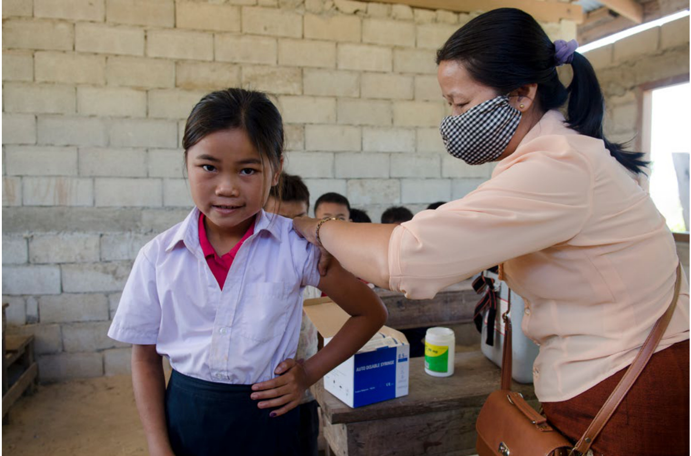

# 作为一个公共卫生问题加速消除宫颈癌全球战略  

  

“通过采取具有成本效益、基于证据的干预措施，包括为女童接种人乳头瘤病毒疫苗、对癌症前期病变进行筛查和治疗以及加强对扩散性癌症的诊断和治疗，我们可以消除宫颈癌这个公共卫生问题，并使它成为一种历史疾病”。  

世界卫生组织总干事谭德塞博士  

# 作为一个公共卫生问题 加速消除宫颈癌全球战略  [Global strategy to accelerate theelimination of cervical cancer as a public health problem]  

ISBN 978-92-4-004863-8（网络版）ISBN 978-92-4-004864-5（印刷版）  

# $\circledcirc$ 世界卫生组织 2022年  

保留部分版权。本作品可在知识共享署名——非商业性使用——相同方式共享3.0政府间组织（CC BY-NC-SA 3.0 IGO;  
https://creativecommons.org/licenses/by-nc-sa/3.0/igo）许可协议下使用。  

根据该许可协议条款，可为非商业目的复制、重新分发和改写本作品，但须按以下说明妥善引用。在对本作品进行任何使用时，均不得暗示世卫组织认可任何特定组织、产品或服务。不允许使用世卫组织的标识。如果改写本作品，则必须根据相同或同等的知识共享许可协议对改写后的作品发放许可。如果对本作品进行翻译，则应与建议的引用格式一道添加下述免责声明：“本译文不由世界卫生组织（世卫组织）翻译，世卫组织不对此译文的内容或准确性负责。原始英文版本为应遵守的正本”。  

与许可协议下出现的争端有关的任何调解应根据世界知识产权组织调解规则进行 （http://www.wipo.int/amc/en/mediation/rules/）。  

建议的引用格式。作为一个公共卫生问题 加速消除宫颈癌全球战略  [Global strategy to accelerate the eliminationof cervical cancer as a public health problem]。日内瓦：世界卫生组织；2022年。许可协议：CC BY-NC-SA 3.0 IGO。  

在版编目（CIP）数据。在版编目数据可查阅http://apps.who.int/iris/。  

销售、版权和许可。购买世卫组织出版物，参见http://apps.who.int/bookorders。提交商业使用请求和查询版权及许可情况，参见https://www.who.int/zh/copyright。  

第三方材料。如果希望重新使用本作品中属于第三方的材料，如表格、图形或图像等，应自行决定这种重新使用是否需要获得许可，并相应从版权所有方获取这一许可。因侵犯本作品中任何属于第三方所有的内容而导致的索赔风险完全由使用者承担。  

一般免责声明。本出版物采用的名称和陈述的材料并不代表世卫组织对任何国家、领地、城市或地区或其当局的合法地位，或关于边界或分界线的规定有任何意见。地图上的虚线表示可能尚未完全达成一致的大致边界线。  

凡提及某些公司或某些制造商的产品时，并不意味着它们已为世卫组织所认可或推荐，或比其它未提及的同类公司或产品更好。除差错和疏忽外，凡专利产品名称均冠以大写字母，以示区别。  

世卫组织已采取一切合理的预防措施来核实本出版物中包含的信息。但是，已出版材料的分发无任何明确或含蓄的保证。解释和使用材料的责任取决于读者。世卫组织对于因使用这些材料造成的损失不承担责任。  

# 妇女证言  

我的女儿年纪不大—— 还是个十几岁的孩子——但她不得不照顾我，为我包扎伤口，这些伤口使我的皮肤破损。很长一段时间里我不得不忍受全身疼痛，特别是后背和下半身。我们家里没有吗啡，所以我的情况很糟糕。……我从小家境贫寒，不了解艾滋病毒和癌症。……人们去看医生的时候往往已经太晚了，大多数人甚至不知道这些症状。如果有机会我希望能参加这样的活动，告诉人们[这些信息]。……诊所需要帮助我们更多地了解这些知识，特别是关于宫颈癌——我们需要更多的检测。  

Ubuhle在一家乳品厂工作，曾是家中主要经济来源，因宫颈癌症状严重而被解雇（南非）。1  

我的事业刚刚起步就被中断……被迫为生命而战……诊断为IV-A期宫颈癌。……一大堆问题涌上心头——怎么会这样？宫颈癌扩散到我的膀胱？扩散到下身淋巴结？还有可能扩散到卵巢？我可能无法受孕和/或怀胎？而且可能在31岁时进入更年期？身体似乎背叛了我……我看到一篇文章中的惊人之论：“宫颈癌已经成为少数没有受过教育的穷人疾病”。什么？作为拉丁裔，这几个大字似乎从屏幕上升起，化作手指指向我。但是……有数据表明，黑人妇女……和拉丁裔发病率最高，这令人心碎。这曾经是，现在也仍然是确诊后我面对的许多艰难事实之一，我将继续作为一个倡导者宣传这些事实。法律事务专员.  

# Jeanette是宫颈癌抗癌宣传员，确诊一年后去世（美国）。  

我的肚子开始发胀。……走路时，我觉得自己随时都会摔倒。我的腿会痛，无法忍受。……我去了医院。医院扫描后说，有三个小纤维瘤。我没有做任何治疗。我的生活一团糟，丈夫和别的女人出轨了……我搬到父母家。我的侄子把我的扫描报告拿去[医院]。……医院说我患有宫颈癌。但医院说病情严重，无法手术。我们四处求医，所有结论都是这样……最后，一位女医生……说我的病情有风险，但既然我坚持做手术切除子宫，她愿意接手。…我失去了生命中的一切——婚姻、工作。我的头发掉光了，不愿意见人。一天……一位护士……带我去了一家心理咨询中心。……我学会了抓住生活中的正能量。……我有所好转，生活继续。  

匿名宫颈癌幸存者，丈夫在她失去生育能力后再婚。如今她有了自己的土地，成为农村企业家，自给自足（印度）。2  

我开始感到疼痛，主要是卵巢……随着时间推移，疼痛越来越严重……非常严重……几乎无法忍受。直到有一天晚上，我尖叫着醒来，因为我无法再忍受这种疼痛……我被诊断为宫颈癌，[并]得知必须接受子宫切除术，同时切除左侧卵巢……我的身体确实在手术后康复，但我仍然深受打击，我将永远不能怀孕生产……失去希望，不可能有自己的孩子，这种痛苦你能想象吗？……我或许再无希望怀孕，但我仍然希望有一天我们有能力不让其他女性发生这样的事情。  

# 女性艾滋病携带者区域互助小组匿名成员（埃及）。  

我有个伤口，无法愈合。伤口很疼。当我得到治疗时已经太晚了。我的儿子非常好。他为我做饭，努力照顾我，但对他来说这太难了。他对我十分体贴，让我心酸。现在他和父亲住在一起，自生病以来，我和他的父亲没有什么联系。……年轻人必须了解癌症和艾滋病，尽早去医院检测。我原本不知道这些事情。  

艾滋病毒携带者Nonjabulo在37岁时患宫颈癌，被送入一家非政府组织诊所接受姑息治疗之前只有16岁的儿子独自照顾她。3  

医生提前打来电话。这可不是个好兆头。她告诉我情况不妙，我得了宫颈癌。……女儿要我答应她，我不会死，我没法这样答应她。我不想撒谎。我去专科医院做了一些检查，他们告诉我可以做手术。我真的松了一口气，马上打电话告诉孩子们。从那时起，我有了希望。……放射治疗损伤了膀胱和肠胃，我还很快绝经了。……现在，我周围的人已忘记我曾生过病。这当然很正常，每个人都需要往前走。但对于得过癌症的人来说，实际上很难往前走。……当然，我很高兴还活着。我尽情享受与孩子们一道生活的美好时光。我对自己的生活感到庆幸和满足。  

Kim是癌症幸存者，患者权益倡导者。她在39岁时确诊患有宫颈癌。Kim是单身母亲，有个9岁的儿子和13岁的女儿(荷兰)。  

阴道有很多白色分泌物，还大量出血。这往往持续15到20天，然后隔10天后又会来一次。我无法干农活或做家务。我手腿发颤，感到很虚弱。我去看了当地医生。……这花了我5000多卢比。但情况并无好转。医生将我转诊到医学院附属医院。我去了那里。……根本没用。……我和儿子最后去了钦奈癌症医院。……后来到医院取检测结果时，他们告诉我，我有初期宫颈癌。我被送入医院。他们给我吃了药，还进行了放射治疗。……我现在身体正常，可以做家务，也可以在我们的农场做一些工作。宫颈癌幸存者  

“L”是四个孩子的母亲，来自农村家庭，她前往医院治疗单程需要3-4小时（印度）。4  

我是一名来自西澳大利亚皮尔巴拉地区的卡里亚拉族妇女，在珀斯（Boorloo）确诊并接受治疗，那里的土地属于Whadjuk Noon-gar人。我已结婚生育，有三个孩子，是一名癌症幸存者。我当时想，对，好吧。……我的孩子怎么办？我并不太担心自己，也不担心生病对我的影响，我担心的是这场病对家人的意义，以及对家人的影响。根据治疗计划我要接受35轮放疗和四次体内近接放射治疗。整个过程极其模糊，我一生中从来没有感到过如此疲惫，努力避免情绪化，可怕的是想到我甚至不能为孩子们买食物，而这是作为母亲理所当然的小事。我做的筛查救了我的命。宫颈癌幸存者.  

Natasha（澳大利亚皮尔巴拉地区）。  

一系列事件导致我的丈夫和两个孩子因艾滋病相关疾病而丧生。就在我以为伤害和痛苦已结束的时候，我被确诊为II期宫颈癌。从此开始了一段漫长、艰难的旅程，其间常常前途未卜。医院病房和走廊的景象和声音变得司空见惯，受到那些我本以为可以依赖的人羞辱，这种痛苦如同在我未愈的伤口上撒盐，我已经走投无路。我战胜疾病的经历说明，宫颈癌是可以治愈的。然而伤疤会伴我余生。…我平时活动必须使用......收集粪便的结肠造瘘袋……，一天用两个，每个需要600到1000肯尼亚先令。…… 尽早确诊、治疗设施的便利渠道以及许多宫颈癌患者的互助小组可以实现。我是抗癌宣传员，向世界宣告，女性不应死于宫颈癌，让我们携手消灭宫颈癌!  

宫颈癌幸存者、抗癌宣传员Sally自称“全球希望之星”（肯尼亚）。  

# 目录  

前言. 5  
1.	 背景：为什么需要全球战略？... 7  
2.	 来龙去脉.. .10  
3.	 宫颈癌的全球负担：一种不平等的表现形式... ..12  
3.1 宫颈癌发病率和死亡率. .12  
3.2 人乳头瘤病毒和宫颈癌... ..13  
3.3 艾滋病毒和宫颈癌... ..13  
4.	 宫颈癌控制干预措施: 当前获得人乳头瘤病毒疫苗、筛查和治疗的机会. ..15  
5.	 消除宫颈癌的途径.. .... 19  
5.1 原则和消除目标... ..19  
5.2 消除前的中期目标（90–70–90） ..20  
5.3 为什么90-70-90目标是成功的关键.... ... 20  
5.4 实现2030年目标对高负担国家发病率和死亡率的影响... ..21  
5.5 高负担国家消除宫颈癌的投资方案...... ..23  
6.	 实现2030年目标的战略行动.. ..25  
6.1 初级预防：接种人乳头瘤病毒疫苗.. ..26  
6.2 实现 $9 0 \%$ 人乳头瘤病毒疫苗接种覆盖率的战略行动... ..27  
6.3 二级预防：筛查和治疗癌症前期病变... ..28  
6.4 实现癌症前期病变 $7 0 \%$ 的筛查覆盖率和 $9 0 \%$ 的治疗覆盖率的战略行动..... .. 29  
6.5 浸润性癌症治疗和姑息治疗.. ..30  
6.6 实现为 $9 0 \%$ 的宫颈癌病例提供治疗和护理的战略行动... .31  
7.	 卫生系统促进因素.. .34  
7.1 加强卫生系统促进因素... ..34  
7.2 加强卫生系统的重点行动.. ..35  
8.	 伙伴关系、宣传和沟通... ..... 37  
8.1 伙伴关系.. ... 37  
8.2 多部门协作.. ..37  
8.3 宣传和沟通.. ..38  
9.	 监控、监测和评价.. ..40  
9.1 监控和监测的关键战略.. ..40  
9.2 基于人口的监控.. ..41  
9.3 基于人口的癌症登记系统.. ..41  
9.4 生命登记系统.. ..41  
9.5 规划监测. ..42  
9.6 监测和评价的战略行动.. ..42  
9.7 影响问责.. ..43  
9.8 实施.. .43  
参考文献. .44  
附件1. 成本核算、融资和投资方案.. 49  
图1. 2018年年龄标准化宫颈癌发病率估计 12  
图2. Estimated age-standardized cervical cancer mortality, 2018.. 13  
图3. 2020年按世界银行收入类别分列的已将人乳头瘤病毒疫苗纳入国家免疫工作计划的  
国家百分比 15  
图4. 2019年按世界银行收入类别分列的已实施国家宫颈癌筛查规划的国家百分比.. .16  
图5. 2019年按世界银行收入类别分列的公共部门普遍提供癌症诊断和治疗服务的国家百分比.. .. 17  
图6. 2020、2070和2100年78个低收入和中等偏下收入国家在实施消除战略后的年龄标准化宫颈癌发病率...... 21  
图7. 2020-2120年78个低收入和中等偏下收入国家按消除战略及现状分列的宫颈癌  
发病率和宫颈癌病例预测.. 22  
图8. 2020-2120年78个低收入和中等偏下收入国家按消除战略及现状分列的宫颈癌死亡率（年龄标准化）和宫颈.  
癌死亡数量预测.. 22  
图9. 采用生命全程方法实施消除宫颈癌干预措施.. .25  
图10. 世卫组织卫生系统框架的愿景.. .34  
图11. 对消除行动的监控和监测.. .40  
图A1. 2019-2030年成本细目（总额 $= 1 0 5$ 亿美元）.. .50  
图A2. 2020-2030年消除宫颈癌人均需要筹集资金总额. 51  

  

# 专栏  

专栏1.	 消除宫颈癌有助于实现若干可持续发展目标和具体目标.. .10  
专栏2.	 实现消除宫颈癌的2030年目标.. 20  

# 前言  

消除宫颈癌的努力能否成功，取决于有没有政治意愿、国家主导的行动和投资、全球团结以及可持续的和有适应能力的伙伴关系。会员国致力于实现全民健康覆盖和可持续发展目标，不让任何一个人掉队。  

  

  

作为一个公共卫生问题消除宫颈癌是兑现这一承诺的一部分，也是与解决不平等问题以及维护妇女和少女包括其性健康权利和生殖健康权在内的整个一生的健康权有关的众多其他承诺的一部分。  

尽管COVID19大流行 使世界各地的卫生系统遭受了重创， 但确保妇女和青少年继续 获得所需卫生服务， 是道义上的的责任。  

世界卫生组织总干事谭德塞博士  

世界卫生组织副总干事Zsuzsanna Jakab 博士  

我们拥有阻止妇女遭受这种可预防疾病的痛苦和死亡的知识和工具。现在，该是所有会员国和发展伙伴团结一致、支持这一战略以便作为一个公共卫生问题消除宫颈癌的时候了。  

我们可以一起创造历史，这是我们力所能及的任务！  

消除宫颈癌是所有国家力所能及的任务。  

如果抓住当下力所能及的机会，我们都可以留下伟大的遗产，让今天出生的女童有生之年能够看到一个没有宫颈癌的世界。  

“每两分钟就有一名妇女死于宫颈癌……每个病例都是一场悲剧，我们可以避免悲剧。”  

行动呼吁——2018年5月：《宫颈癌：我们能够克服的非传染性疾病》世界卫生组织总干事  

谭德塞博士  

  

# 1. 背景:为什么需要全球战略？  

宫颈癌是一种可以预防的疾病。如果早发现并进行适当的治疗，也是一种可以治愈的疾病。不过，它仍然是最常见的癌症之一，也是全球妇女癌症相关死亡原因之一。在2018年至2030年期间，每年新增宫颈癌病例数量预计将从57万例增加到70万例，每年死亡人数预计从31.1万人增加到40万人。超过 $8 5 \%$ 的受影响者是生活在世界上最贫穷国家受教育程度低的青年妇女。很多人也是幼儿的母亲，这些幼儿随后的存活会因为其母亲的早亡而受到极大的影响(1)。  

很少有疾病像宫颈癌一样反映全球的不平等。中低收入国家的发病率几乎是高收入国家的两倍，死亡率几乎是高收入国家的三倍。  

已有行之有效且具有成本效益的宫颈癌消除措施，但迄今为止尚未在世界上此种疾病负担最重的地区广泛实施。为了取得最佳效果，必须将这些措施扩大到国家一级，必须利用对妇女需求、妇女的社会环境以及阻碍妇女获得卫生服务的个人、文化、社会、结构和经济障碍有敏感认识的卫生服务平台来实施这些措施。以人为本且尊重和维护妇女权利与尊严的综合卫生服务至关重要。  

作为一种公共卫生问题消除宫颈癌需要采取紧急和大胆的行动来推广和持续实施循证干预措施(接种人乳头瘤病毒疫苗、实行宫颈癌筛查、对已发现的疾病进行管理），但这种行动必须具有战略性。  

# 这一消除宫颈癌全球战略提出了：  

•	 作为一个公共卫生问题消除宫颈癌的世界愿景；•	 作为一个公共卫生问题消除宫颈癌的最低目标是每年每10万名妇女的发病人数在4人以下；•	 各国要想实现消除宫颈癌的目标，必须在2030年之前实现以下90–70–90目标：  

  

一个数学模型说明，到2030年，低收入和中等偏下收入国家实现90–70–90目标将获得以下中期效益：•	 到2030年，宫颈癌发病率中位数预计下降 $1 0 \%$ ，到2045年预期下降 $7 0 \%$ ,到2120年预期下降 $9 0 \%$ 以上，避免新增7000多万例宫颈癌病例；•	 到2030年，避免宫颈癌累计死亡人数为30万，到2050年为450万，到2120年约为6200万。  

# 作为一个公共卫生问题 加速消除宫颈癌全球战略  

作为一个公共卫生问题消除宫颈癌全球战略将需要：(a)国际和地方领导人的政治支持；(b)跨部门伙伴之间的协调合作；(c)对公平获得全民健康覆盖的广泛支持；(d)有效的资源调动；(e)加强卫生系统；(f)在各级大力促进健康。必须将性别与健康的相互关联性作为干预措施的战略核心。  

该战略还必须对探索和利用新的想法和机会持开放态度，包括在研制和开发新药、疫苗、诊断和治疗方式方面的进步。为实现其目标，战略必须包含具有创新意义的服务提供模式及计算机数据和信息系统，并且要有新的和扩展培训方法（例如，利用虚拟现实模拟技术）以及根据人口规模扩大干预措施（例如，筛查和治疗宫颈癌的群众运动、外科手术营地）。在提供服务方面，必须全面采用管理科学和现代通信技术。必须重塑市场，消除世界上最贫穷国家在预防和治疗宫颈癌方面面临的成本障碍。  

现在，该是制定一项雄心勃勃、协调一致和包容各方的战略的时候了，以加速实现作为一个公共卫生问题消除宫颈癌的目标。所有国家都有能力实现消除宫颈癌的目标。我们知道什么措施有效。我们拥有这样的技术和工具。我们知道预防、早诊断和早治疗具有很高的成本效益。2019年9月的联合国大会(2)证明了当前国际社会对全民健康覆盖的关注，这为各国加强干预措施以期对扩散性宫颈癌进行管理提供了一个难得的机会。  

半途而废的措施和渐进的方法不够。现在应当在全世界范围内大规模落实行动。现在，宫颈癌被认为是世界上最大的公共卫生失败之一，但这种疾病是可以被消除的。  

  
享受生活的莫斯科少女——俄罗斯  

史上首次，全世界致力于消灭一种癌症。  

  

# 2. 来龙去脉  

这是第一个作为公共卫生问题消除癌症的全球卫生战略。它借鉴了总干事在2018年5月发出的行动呼吁，即呼吁各国采取行动，帮助结束由宫颈癌引起的痛苦；他要求各国再次拿出实现消除的政治意愿，敦促所有利益攸关方团结一致，支持实现这一共同目标(3)。这一全球努力与有关将维护健康作为一项人权的人权文书(4)以及《2030年可持续发展议程》及其“不让任何一个人掉队”的总原则保持一致。这一努力有助于实现若干可持续发展目标和具体目标（专栏1）(5)，是联合国秘书长《全球妇女、儿童和青少年健康战略（2016-2030年）》的一部分(6)。  

专栏1. 消除宫颈癌有助于实现若干可持续发展目标和具体目标  

<html><body><table><tr><td>目标1：</td><td>在全世界消除一切形式的贫穷</td></tr><tr><td>目标3：</td><td>让不同年龄段的所有人都过上健康的生活，促进他们的福祉 目标3具体目标3.4:到2030年,通过预防、治疗及促进身心健康，将非传染性疾病导致的过早死亡减少三分之一 目标3具体目标3.7:到2030年，确保普及性健康和生殖健康保健服务，包括计划生育、信息获取和教育，将生殖 健康纳入国家战略和方案</td></tr><tr><td></td><td>目标3具体目标3.8：实现全民健康保障，包括提供金融风险保护，人人享有优质的基本保健服务，人人获得安全、 有效、优质和负担得起的基本药品和疫苗</td></tr><tr><td>目标5：</td><td>实现性别平等，增强所有妇女和女童的权能</td></tr><tr><td>目标10：</td><td>减少国家内部和国家之间的不平等</td></tr></table></body></html>  

世界卫生组织的《2013-2020年预防和控制非传染性疾病全球行动计划》称接种人乳头瘤病毒疫苗和实行宫颈癌筛查和治疗是最值得采取的措施(7)。世卫组织已将其列入建议会员国纳入国家卫生计划的干预措施清单。  

另外，联合国大会2016年通过的《关于艾滋病毒和艾滋病的政治宣言》(8)旨在到2030年终结艾滋病流行，并强调需要提供综合服务，以应对包括病毒性肝炎和宫颈癌预防、筛查和治疗在内的合并感染和共病问题以及其他性传播感染，保证艾滋病毒预防、治疗、护理和支助服务的可持续性。  

全世界每十例宫颈癌死亡病例中有九例发生在中低收入国家。  

与艾滋病毒检测阴性的妇女相比，感染艾滋病毒的妇女患宫颈癌的可能性是其六倍。  

  

# 3. 宫颈癌的全球负担：一种不平等的表现形式  

# 3.1 宫颈癌发病率和死亡率  

宫颈癌是全球女性第四大常见癌症，据估计，2018年新增病例57万人(9)。所有国家都受到影响，但中低收入国家的发病率更高（图1）。年龄标准化发病率各不相同，从高风险国家的每10万名妇女75例到低风险国家的每10万名妇女不到10例(9)。  

2018年，在全球31.1万例死亡病例中，近 $9 0 \%$ 发生在中低收入国家（图2）。另外，在很多中低收入国家，死于宫颈癌的女性宫颈癌患者比例超过 $6 0 \%$ ，是很多高收入国家的两倍多，而高收入国家的这一比例低至$3 0 \% ( 1 0 )$ 。  

宫颈癌的全球负担预计会继续增长，到2030年将上升到70万例病例和40万例死亡，预计在未来几年也会有类似的增长(11)。这些上升意味着自2018年以来的仅仅12年里，病例数增加了 $2 1 \%$ ，死亡人数增加了$2 7 \%$ 。这些增长中的绝大多数将出现在中低收入国家的妇女当中，这反映了全球宫颈癌发病率和死亡率差距的严重性。  

  
图1. 2018年年龄标准化宫颈癌发病率估计  

# 作为一个公共卫生问题 加速消除宫颈癌全球战略  

  
图2. 2018年年龄标准化宫颈癌死亡率估计  

# 3.2 人乳头瘤病毒和宫颈癌  

感染高危型或致癌性人乳头瘤病毒是宫颈癌前期病变和癌病变的主要原因(12)。人乳头瘤病毒是一组在世界范围内极其常见的病毒，有100多种，其中至少有14种具有致癌性。几乎所有宫颈癌病例都是由一种亚型人乳头瘤病毒引起的。人乳头瘤病毒16型和18型是最具致癌性的类型，这两种病毒共同导致全世界约$7 0 \%$ 的宫颈癌。性传播感染是宫颈人乳头瘤病毒最常见的传播形式。宫颈癌的发病机制在全世界都是一样的。中低收入国家宫颈癌发病率和死亡率较高的原因不是因为宫颈感染的致癌性人乳头瘤病毒类型的差异。而是主要因为这些国家相对缺乏高质量的宫颈癌筛查以及对扩散性宫颈癌的广泛高质量的治疗。感染某些类型的人乳头瘤病毒还会导致一定比例的肛门、外阴、阴道、阴茎和口咽癌症，而这些癌症可以通过类似于宫颈癌的初级预防策略来加以预防(13)。  

# 3.3 艾滋病毒和宫颈癌  

在感染艾滋病毒的妇女当中，宫颈癌是一种最常见的癌症。与艾滋病毒呈阴性的女性相比，感染艾滋病毒的女性持续感染人乳头瘤病毒的风险要高出好几倍，患宫颈癌的可能性是前者的六倍(14)，并且更有可能在较年轻的时候患上宫颈癌(15,16)。  

在受艾滋病毒疫情影响最严重的国家，尽管因获得艾滋病毒护理和治疗而致使期望寿命有所增加，但感染艾滋病毒的女性的宫颈癌问题没有受到关注，也没有获得预防和治疗宫颈癌所需的资源，筛查覆盖率往往很低。要想帮助易患宫颈癌和感染艾滋病毒的弱势妇女，就需要优先重视这两种疾病的综合预防、筛查和治疗服务，以提高防治效率和最大限度地发挥防治作用。  

2006年至2017年期间，有1亿名少女至少接种一剂人乳头瘤病毒疫苗——高收入国家占$9 5 \%$ 。  

大约 $3 0 \%$ 的低收入国家报告，其公共部门普遍提供病理服务、癌症手术、化疗和放疗，而高收入国家有 $9 0 \%$ 以上可以做到这一点。  

不到 $2 5 \%$ 的低收入国家已将人乳头瘤病毒疫苗纳入国家免疫计划。\*  

  

# 4. 宫颈癌控制干预措施: 当前获得人乳头瘤病毒疫苗、筛查和治疗的 机会  

从2006年第一种人乳头瘤病毒疫苗获得批准到2017年，全球有超过1亿名少女接受了至少一剂人乳头瘤病毒疫苗接种，其中 $9 5 \%$ 在高收入国家(17)。接种人乳头瘤病毒疫苗的机会正在增加，到2019年，全球每年接种疫苗的女童中有 $6 5 \%$ 以上生活在中低收入国家5。  

截至2020年，不到 $2 5 \%$ 的低收入国家和不到 $3 0 \%$ 的中等偏下收入国家已将人乳头瘤病毒疫苗纳入其国家免疫工作计划，而超过 $8 5 \%$ 的高收入国家已经这样做了（图3）。在按照收入水平对各国进行分析和研究时，人们注意到在实施宫颈癌筛查规划方面也有类似的详细数字（图4）。  

  
图3. 2020年按世界银行收入类别分列的已将人乳头瘤病毒疫苗纳入国家免疫工作计划的国家百分比  

# 作为一个公共卫生问题 加速消除宫颈癌全球战略  

  
图4. 2019年按世界银行收入类别分列的已实施国家宫颈癌筛查规划的国家百分比  

# 作为一个公共卫生问题 加速消除宫颈癌全球战略  

各国在提供癌症管理服务方面的差距同样惊人（图5）(18)。约 $3 0 \%$ 的低收入国家报告说，它们在公共部门普遍提供病理学服务、癌症手术、化疗和放疗服务，而在高收入国家，这一比例超过 $9 0 \%$ 。  

  
图5. 2019年按世界银行收入类别分列的公共部门普遍提供癌症诊断和治疗服务的国家百分比  
资料来源：世卫组织2019年国家能力调查(18)。  

2030年若能实现90–70–90目标，预期到2120年可避免6200万宫颈癌死亡病例。  

  

# 5. 消除宫颈癌的途径  

与宫颈癌相关的巨大死亡率负担是全球卫生界几十年来忽视的结果。不过，随着近期全球对妇女健康的宣传增加、预防性疫苗商业供应能力提高、采取低成本方法进行筛查和治疗前期宫颈癌、制定资源适当的管理指南、采取新的方法进行外科培训以及增加全球获得抗癌药物的行动的增加，情况可能会发生改变。  

为实现消除宫颈癌的目标扫清道路需要采取大胆的战略行动，以期提高社会意识；迅速扩大人力能力；加强卫生系统；塑造市场以降低救命产品的价格；加快引进可负担得起的筛查技术和治疗方法；以及在全国范围内拓建组织完善、基于人口的预防和治疗平台。为了确保取得最佳效果，必须与一线医疗政策制定者和医疗服务提供者、倡导者以及妇女自身一起共同制定战略行动。  

# 5.1 原则和消除目标  

“作为一个公共卫生问题消除宫颈癌”这一术语的定义是基于人口数据实现世卫组织针对特定疾病制定的可衡量的全球目标。为了确定作为一个公共卫生问题消除宫颈癌的最低目标，世卫组织在2018至2019年对各国的流行病学数据以及发病率分布情况进行了评估(19)，考虑了罕见癌症(20)的既有定义，并进行了一次专家咨询。为了在全球范围内作为一个公共卫生问题消除宫颈癌，所有国家都必须努力将发病率控制在每年每10万名妇女的发病人数在4人以下。为了实现这一目标，必须在2030年之前实现人乳头瘤病毒疫苗接种、癌症前期病变筛查和治疗以及对癌症进行管理的高覆盖目标，并在几十年内保持这一高水平（专栏2）。  

世卫组织建议的所有干预措施、服务和政策都有循证依据，都应该在实现全民健康覆盖的国家工作框架内实施，重点是提供初级卫生保健、公共卫生方法6、生命全程卫生方法(21)和以人为本的综合卫生服务(22)。  

在绝大多数国家，包括78个疾病负担最重的低收入和中等偏下收入国家，最低消除目标是可以实现的(23)。一旦实现消除目标，必须坚持采取干预措施，以便将发病率保持在最低目标以下，并保持低死亡率。需要有更多突破性的技术、有效的干预措施和良好做法，才能进一步降低宫颈癌的发病率。  

# 5.2 消除前的中期目标（90-70-90）  

一些国家在实现必要的疫苗接种方面面临潜在的障碍（例如，可接受性、成本、规划基础设施和反疫苗运动），因此，在这些国家找到解决办法之前，先前已经感染致癌性人乳头瘤病毒的妇女还将继续面临宫颈癌及其后遗症的风险。因此，增加二级和三级预防干预措施必须仍然是消除宫颈癌全球战略的重中之重。一成不变的做法是不可接受的，因为每年都会有越来越多的妇女患上这种本可以预防的疾病并因此而死亡。  

专栏2提出了一套基于消除原则和消除战略的2030年目标或阶段性目标。  

# 专栏2. 实现消除宫颈癌的2030年目标  

到2030年实现以下90-70-90目标将使所有国家走上消除宫颈癌的道路(24)：  

• $9 0 \%$ 的女童在15岁前完全接种人乳头瘤病毒疫  
苗3；  
• $70 \%$ 的女性在35岁前接受高效检测方法筛查8，45岁前再次筛查(25)；  
• $9 0 \%$ 的确诊患有宫颈疾病的妇女得到治疗一 发生癌前病变的妇女有 $9 0 \%$ 得到治疗一 患浸润性癌症的妇女有 $9 0 \%$ 病情得到控制。  

# 5.3 为什么90-70-90目标是成功的关键  

为了发挥最大影响，旨在实现以上三个目标的干预措施必须同时大规模实施。  

实施这一战略的全部三个支柱将有助于立即和加速降低因治疗扩散性宫颈癌而导致的死亡率。大规模实施群众筛查和治疗服务将使发病率逐步下降，接种人乳头瘤病毒疫苗能够为女童及其后代预防宫颈癌提供保护(26)。  

  

宫颈癌幸存者Kim Hulscher及其家人，当时她在荷兰阿尔默勒刚刚确诊。  

# 5.4 实现2030年目标对高负担国家发病率和死亡率的影响  

秘书处对78个低收入和中等偏下收入国家到2030年实现90-70-90目标对健康和社会经济的影响进行了建模分析（建模的详细情况见附件1）。目前，发病率方面的差异将会导致各国宫颈癌发病率和实现消除宫颈癌的时间表存在持续变化（图6）。  

  
图6. 2020、2070和2100年78个低收入和中等偏下收入国家在实施消除战略后的年龄标准化宫颈癌发病率  

# 作为一个公共卫生问题 加速消除宫颈癌全球战略  

到2030年实现90-70-90目标将意味着到2030、2045和2120年宫颈癌发病率中值将分别下降 $1 0 \% . 7 0 \%$ 和 $9 0 \%$ ，从而避免增加7000万例病例（图7）。相应地，到2040、2050和2120年，累计避免因宫颈癌死亡的人数将分别约为200万、450万和 6200万（图8）。由于一些宫颈癌发病率最高的地方就在当前艾滋病毒流行率高的地区，因此，这些地区可能需要在实现消除目标方面做出更大的努力。  

  
图7. 2020-2120年78个低收入和中等偏下收入国家按消除战略及现状分列的宫颈癌发病率和宫颈癌病例预测  

  
8. 2020-2120年78个低收入和中等偏下收入国家按消除战略及现状分列的宫颈癌死亡率（年龄标准化）和宫颈癌死亡数量预测  

# 5.5 高负担国家消除宫颈癌的投资方案  

对实现90-70-90目标的干预措施进行投资会带来巨大的经济和社会效益。到2050年，由于妇女劳动力参与率的提高，估计每投资1美元将会得到3.2美元的经济回报，如果将社会福利考虑在内，这一数字将会上升到26.00美元(27)。  

据估计，约有25万名妇女将是劳动力中仍然具有生产能力的成员，这将为世界经济增加约280亿美元：7亿美元直接来自劳动力参与率的提高，近273亿美元来自健康带来的间接社会经济效益。如果78个低收入和中等偏下收入国家到2030年实现90-70-90目标，通过在2018至2030年期间调动和支出推广宫颈癌预防和治疗干预措施所需的约105亿美元的资金，那么将会产生巨大的社会经济效益(26)。  

  

宫颈癌幸存者、抗癌宣传员Sally Kwenda自称“全球希望之星”。  

“通过采取具有成本效益、基于证据的干预措施，我们可以消灭宫颈癌这个公共卫生问题。半途而废的措施和渐进的方法不够。现在应当在全世界范围内大规模落实行动”  

世界卫生组织总干事谭德塞博士  

  

# 6. 实现2030年目标的战略行动  

实现90-70-90目标的战略行动应该在消除宫颈癌国家政策框架内进行。应该将推广行动纳入各国的国家战略卫生计划之中，以便实现全民健康覆盖。高级别的政治承诺和管理应在协作伙伴关系支持下，推动和指导战略行动的实施。  

每一种基于证据的宫颈癌消除干预措施都有其自身的实施要求，每一种干预措施都会面临自己特有的挑战。光靠生物医学和临床干预不足以实现目标，因为很多实施挑战都与通常困扰着疾病负担最重的中低收入国家的卫生保健系统的弱点有关。每个国家都必须根据本国的国情定制战略行动，要考虑到本国独特的结构性缺陷、实施的准备程度以及导致宫颈癌发生率、发病率和死亡率的其他保健障碍（例如，社会文化或性别因素、对这种疾病及其预防和治疗的传言和误解）。在城市地区推广干预措施的方法可能与偏远和农村地区不同。包括女性艾滋病毒感染者在内的弱势群体或医疗条件薄弱地区的人口的健康结果不平等要求采取有针对性的方法。  

《全球消除战略》呼吁各国政府与包括私营部门和民间社会在内的主要伙伴进行合作，并与受影响人口进行有效接触和增强他们的权能。可以利用私营部门的管理效率来完善公共部门的工作流程和提高产出效率。民间社会可以倡导提供可获得的、可负担得起的、可接受的卫生产品和服务，并且可以提高社会对宫颈癌预防和控制的认识，特别是这种疾病的高风险人群。宫颈癌幸存者可以进行现身说法，教育妇女和女童了解疫苗接种、筛查和治疗的好处，并倡导消除污名化。世卫组织建议各国采取生命全程方法来实施消除宫颈癌综合战略，以确保终生受益（图9）。  

  
图9. 采用生命全程方法实施消除宫颈癌干预措施  

# 初级预防  

# 二级预防  

# 三级预防  

# 9-14岁女童  

接种人乳头瘤病毒疫苗  

# 女童和男童，视情况接种  

针对使用烟草的卫生信息和警告  
针对特定年龄和文化的  
性教育  
倡导性工作者使用/提供  
安全套  
男性包皮切除  
Male circumcision  

30岁以上妇女用相当于或优于人乳头瘤病毒检测工具的高效检测工具进行筛查接着立即或尽快对癌症前期病变进行治疗  

所有妇女视情况需要进行  
预防  
对任何年龄的妇女的扩散性  
病症进行治疗手术放疗化疗姑息治疗  

# 6.1 初级预防：接种人乳头瘤病毒疫苗  

少女接种疫苗是降低患宫颈癌风险最有效的长期干预措施。接种人乳头瘤病毒疫苗会有巨大的长期好处，这使在所有国家启动和坚持这种方法变得非常重要。也有强有力的证据表明，如果人乳头瘤病毒疫苗接种覆盖率很高，那么将会通过群体免疫方式导致未接种疫苗的个人得到保护，从而进一步增强对社会的保护效果(28)。为了得到充分保护，世卫组织现行指南建议9至14岁少女接种两剂疫苗。数据表明，接种一剂疫苗就能产生保护作用，有人就此开展了一些试验，试验的结果将为今后安排优化接种时间提供证据(29,30)。  

随着高收入国家实现更高的疫苗覆盖率，人乳头瘤病毒疫苗覆盖率在地理环境和收入上存在分布不均的问题。疫苗价格高昂加上近期存在供应困难的问题已经大大限制了很多国家将人乳头瘤病毒疫苗纳入国家免疫规划和确保当前规划的可持续性的能力(31)。为了确保接受程度高和维持高覆盖率，将人乳头瘤病毒疫苗纳入疫苗规划必须有强有力的宣传战略，以便进行宣传和社会动员，以确保人们了解疫苗的功效、安全性和好处。根据具体情况制定有关应对不断上升的反疫苗运动的策略至关重要。  

除了接种人乳头瘤病毒疫苗之外，全面的预防战略还必须包括与年龄相适应的关于性健康和生殖健康、更安全性行为（例如，推迟初次性行为、减少性伴侣数量、使用安全套、酌情进行男性包皮环切手术等）和停止使用烟草的信息。为促进青少年（男孩和女童）采取健康的生活方式做出协调一致的努力对于加强群众健康以促进可持续发展至关重要。  

  
多部门提供平台，如学校免疫计划，可以发挥作用，提高女童人乳头瘤病毒疫苗接种率。——老挝人民民主共和国  

6.2 实现 $9 0 \%$ 人乳头瘤病毒疫苗接种覆盖率的战略行动  

<html><body><table><tr><td>确保有充足的和可负担 得起的人乳头瘤病毒 疫苗</td><td>合作伙伴和私营部门需要一致努力,解决疫苗供应短缺的难题。此外,还可 通过适当的市场塑造干预措施，在确保形成健康的人乳头瘤病毒疫苗市场 的同时，实现更可承受的价格。</td></tr><tr><td>提高疫苗质量和扩大疫 苗接种覆盖率</td><td>扩大人乳头瘤病毒疫苗接种的覆盖面需要有高效和可持续的多部门交付平 台 (如校内免疫规划)和具有创新的社区方法，以便接触到弱势群体(如校外 少女等)。应该利用监测或登记系统跟踪，提高覆盖面和质量。</td></tr><tr><td>加强宣传和社会动员</td><td>随着人乳头瘤病毒疫苗接种规划的引l入和扩大,需要在全国范围内进行循 证宣传和社会动员。了解可能影响接受和使用疫苗的社会、文化和其他障碍 至关重要。一些社区需要额外的宣传和动员，以消除对疫苗的犹豫和误解。</td></tr><tr><td>开展创新，提高疫苗接 种效率</td><td>随着关于更好和更有效的人乳头瘤病毒疫苗接种方法的新证据和创新的出 现，应对国家指南、政策和战略进行更新。</td></tr></table></body></html>  

  
宫颈癌幸存者及抗癌宣传员Karen Nakawala——赞比亚卢萨卡  

# 6.3 二级预防：筛查和治疗癌症前期病变  

二级预防的主要目标是通过发现和治疗患有癌症前期病变的妇女，降低宫颈癌的发病率和死亡率。作为在疫苗接种覆盖率高的国家实施疫苗规划的一部分，在有资源可以用于进行患者随访、附加诊断检测（阴道镜检查和病理学检查）和疾病管理的地方，已经成功地利用基于细胞学的筛查方法来实现这些目标。在中低收入国家，基于细胞学的规划难以实施，而且实行筛查的覆盖率也低。利用乙酸对宫颈进行目视检查，然后进行治疗（筛查和治疗），这是在资源有限的地方实施二级预防的一种替代方法。尽管相对容易建立，但这种目视检查的质量严重取决于供应商，而且其灵敏度也参差不齐。  

人乳头瘤病毒检测具有极高的明确性，明确的阴性预测值意味着检测结果呈阴性的女性至少五年内不需要再次检测。为妇女提供自己取样的选择有助于提高对这种检测的接受度，并有助于获取样本。各国用于检测艾滋病毒、结核病和其他感染的现有技术平台也可用于进行人乳头瘤病毒检测，有利于迅速扩大检测规模。由于人乳头瘤病毒检测非常高效，各国应该先采取过渡方式，最好先将人乳头瘤病毒检测作为宫颈癌筛查的主要方法。对于人乳头瘤病毒检测呈阳性的妇女而言，目前已有循证战略可用于对其进行评估和管理。  

宫颈癌筛查需要相应地提高对已发现病变的治疗能力，因为仅为妇女提供筛查而不提供治疗是不道德的。世卫组织最近对其治疗指南进行了扩充，将热消融术作为符合消融条件的癌症前期病变妇女的一种治疗方式(32)。  

那些确保提供可负担得起的高质量诊断工具和相关用品的市场塑造措施将会受到优先考虑。对基于人工智能的诊断技术和简单的手持消融治疗设备的研究将为消除宫颈癌提供巨大的机会，使世界离消除宫颈癌的愿景更近(33)。  

  
妇科健康门诊部候诊室——尼泊尔  

# 6.4 实现癌症前期病变 $70 \%$ 的筛查覆盖率和 $9 0 \%$ 的治疗覆盖率的战略行动  

<html><body><table><tr><td>了解获得服务的障碍并为 获得服务创造有利的环境 将筛查和治疗服务纳入 初级保健方案</td><td>充分了解在获得服务方面面临的社会、文化和结构障碍至关重要。这种知识 将有助于制定符合本地实际情况和满足适当文化需求的战略，并且有助于 设计出可接受的、无障碍的服务供应平台。必须让本地社区(特别是妇女)参 与进来并增强其权能,以便领导这些重要规划的制定工作,发挥盟友作用, 抵制错误信息或污名化，并为那些需要更复杂治疗的人提供支持。提高健康 素养以及增加对权利和宫颈癌预防和控制知识的了解将有助于动员和增强 社区和民间社会的权能，增加它们以及妇女参与的多样性。 让筛查和治疗服务成为现有性健康和生殖健康服务、艾滋病毒护理和治疗</td></tr><tr><td>推广“筛查和治疗”方法</td><td>诊所、产前护理、健康妇女诊所和校内卫生外展服务的一部分是与妇女和女 童接触的切入点。以人为本的转诊机制应最大限度减少为患者带来的不便, 并降低机会成本。 各国需要增加一次就诊就能完成筛查和治疗的医疗机构的数量。现在还没</td></tr><tr><td>确保供应可负担得起</td><td>有任何地方能够提供一次就诊就能完成筛查和治疗的可行方法；不过，应该 酌情推广和实施这种方法。 宫颈癌诊断工具和治疗设备的及时注册和市场塑造将会提高检测和治疗设</td></tr><tr><td>的、质量有保证的高效 检测和治疗设备</td><td>备的可得性和可负担性。世卫组织将酌情加强其资格预认证能力,以跟上新 兴技术的发展潮流。包括体外诊断工具在内的所有医疗器械都要在上市后 进行监测，以确保随着规划规模的扩大,安全监测也要到位。</td></tr><tr><td>加强实验室能力和质量 保证</td><td>协调一致的高效实验室服务网络将会最大限度地发挥有限人力和财力的影 响。强有力的质量保证规划对于确保服务满足必要的标准至关重要。培训和 监督必须成为提供服务的一个组成部分。</td></tr></table></body></html>  

# 6.5 浸润性癌症治疗和姑息治疗  

对宫颈癌疑似或确诊妇女进行及时评估和转诊对于挽救生命和预防残疾至关重要。对浸润性宫颈癌进行综合管理需要有设备完善、具有适当资质的医疗服务提供者，而且需要能够提供外科手术、放疗和化疗服务。  

每个病例的管理都要按疾病分期进行。目前，已有指南可用于疾病分期和肿瘤淋巴结转移(34,35)，治疗方案以适当的分期为依据。早期宫颈癌治愈率很高，通过手术和（或）放疗方式治疗，可以有长期生存和（或）治愈机会(36)。在能够提供及时诊断和高质量治疗的国家，早期癌症的五年生存率超过 $8 0 \%$ 。不管有没有化疗，手术和放疗都是世卫组织推荐的具有成本效益的早期宫颈癌干预措施(36)。甚至一些局部的晚期宫颈癌也可以通过高质量的放疗和化疗治愈(37)。  

应将姑息治疗纳入治疗计划，并在整个疾病过程中予以提供(38)。目前，很少有中低收入国家制定了姑息规划。鼓励各国扩大姑息治疗服务的使用范围，这种服务可以很容易地扩展到其他形式的晚期癌症和非恶性衰竭性疾病。  

长期宫颈癌幸存者遇到的与治疗有关且影响到生活质量的常见后果包括膀胱功能障碍、肠道功能障碍、性功能障碍、淋巴水肿和社会心理问题。缺少社会支持（最重要的是来自配偶的支持）对撒哈拉以南非洲患癌妇女的生存质量产生的不利影响最大。除了对疼痛和其他导致痛苦的症状进行控制之外，护理还应包括为妇女及其家人提供社会心理和精神支持(39,40)。  

  
放射治疗团队，国家癌症研究所——马来西亚  

6.6 实现为 $9 0 \%$ 的宫颈癌病例提供治疗和护理的战略行动  

<html><body><table><tr><td>执行宫颈癌管理指南</td><td>制定和执行适合国情的国家宫颈癌管理指南是确保为宫颈癌患者提供高质 量护理的核心(41)。</td></tr><tr><td>在整个医疗体系建立转 诊途径和以人为本的联 系机制</td><td>简化护理路径和联系各级护理机构的转诊网络将确保能够对患者进行及时 管理。</td></tr><tr><td>加强病理学服务</td><td>能否获得高质量的病理学服务对于扩散性癌症的管理至关重要。对于解释 样本能力有限或没有解释样本能力的国家来说,可以发展区域病理学中心, 以便利用可负担得起的远程病理学平台。在已经利用远程病理学网络对复 杂病例进行诊断的国家，也可以将其用于常规病例(42)。</td></tr><tr><td>扩大手术能力</td><td>如果在早期诊断和治疗，宫颈癌通常只通过手术就可以治愈。不过,在世界 上最贫穷国家的癌症患者中，只有不到5%的人能够接受安全、有效和及时 的癌症手术(43)。在高收入国家,肿瘤外科学研究生教育的主要模式包括在 官方认可的课程内接受多年的专业培训，由经验丰富且具有专业医师资格 的肿瘤外科医生提供指导,并且要有功能强大的精密外科基础设施,即有 现成的麻醉服务、加护病房、似乎无处不在的血库和现代化的实验室平台。 在大多数中低收入国家，肿瘤手术的医疗服务提供者是没有经过正规认证 的专科培训的多面手(普通外科医生、妇科医生、全科医生和医务人员),他 们是在不得已的时候提供癌症治疗服务。利用目标明确的、基于能力的培训 (44)和南北结对伙伴关系(45)来扩大这些医疗机构的外科手术能力的新型 尝试取得了成功,应该予以推广。</td></tr><tr><td>增加获取放疗和化疗服 务的机会</td><td>在中低收入国家,大部分宫颈癌患者处于需要放射治疗的阶段,因此,具有 可持续的治疗性放射治疗(外照射和近距离放射治疗)的能力至关重要。</td></tr><tr><td>加强并融合姑息治疗 服务</td><td>治疗计划不仅应该包括对患者的临终关怀和缓解疼痛,而且从一开始就应 该包括心理支持、家庭支持和其他服务。在可能的情况下，应该将居家模式 的姑息治疗纳入初级卫生保健。</td></tr><tr><td>优化整个连续医疗服务 过程中卫生人力的能力</td><td>国家卫生人力教育和培训、招聘和留用的长期战略是确保可持续的多学科 团队护理的关键。世卫组织《卫生人力资源全球战略:卫生人力2030》(46)为 各国应对劳动力挑战提供了蓝图。此外，一系列的区域卫生系统人力资源观 察站也为规划和政策制定提供了宝贵的资源。更多的选择包括结对规划、设 在卓越中心内的区域培训中心、远程指导(47)、电子学习(48)、移动学习和低 成本虚拟现实手术模拟(49)。远程培训可能适合于外科学、放射学、病理学 和患者咨询等领域。</td></tr><tr><td>减少癌症污名化</td><td>患者认识、健康素养和教育倡议(特别是通过幸存者团体)有助于应对与癌 症相关的污名化问题。</td></tr></table></body></html>  

作为一个公共卫生问题 加速消除宫颈癌全球战略  

<html><body><table><tr><td>为提高幸存者的生活质 量以及应对其面临的精 神卫生和性健康挑战提 供全面支持</td><td>此类规划最好在当地制定，适合受影响社区的社会文化背景，并让性健康和 生殖健康以及权利的倡导者参与其中。</td></tr></table></body></html>  

  
匈牙利宫颈癌幸存者及妇女互助小组创始人Icó Tóth  

初级卫生保健方法是最有效的方法，可以通过可持续的方式解决当今健康和卫生系统面临的挑战。  

  

# 7. 卫生系统促进因素  

# 7.1 加强卫生系统促进因素  

初级卫生保健方法是可持续解决当今卫生和卫生系统挑战的最有效方法，也是实现全民健康覆盖共同全球目标和与卫生相关的可持续发展目标的根本。国际社会再次承诺将初级卫生保健作为所有国家实现全民健康覆盖的途径。在初级卫生保健全球会议（2018年10月25日和26日，阿斯塔纳）(50)上通过的《阿斯塔纳宣言》(2)和联合国全民健康覆盖问题高级别会议（2019年9月23日，纽约）的政治宣言重申了世界各国在1978年《阿拉木图宣言》和《2030年可持续发展议程》中作出的承诺 。  

  
图10. 世卫组织卫生系统框架的愿景  
世卫组织卫生系统框架  
资料来源：WHO,207.  

宫颈癌规划应采用以人为本的整体卫生系统方法，并应满足妇女整个生命周期的需求（见图10）。虽然初级保健仍应是宫颈癌预防干预措施的首选切入点，但服务结构需要在系统中的任何一点都能适应妇女的出现。这些努力应该相辅相成，有利于将宫颈癌服务与其他具体规划结合起来。例如，在卫生部门，干预措施应超越免疫规划、青少年卫生服务、艾滋病毒和性健康及生殖健康服务、以及传染病和非传染病规划之间的共同分界线，包括癌症预防和控制。  

7.2 加强卫生系统的重点行动  

<html><body><table><tr><td>加强面向初级卫生保健 的保健模式</td><td>国家规划应加强推广在整个生命周期内促进以人为本的高质量初级卫生保 健的保健模式。</td></tr><tr><td>对初级卫生保健人力进 行投入</td><td>一支规模足够庞大的卫生人力要拥有最佳技能组合且分布公平的合格工作 人员，这样才能够有助于提供新的宫颈癌预防和治疗干预措施以及姑息治 疗服务。</td></tr><tr><td>增加获得药品和其他卫 生产品的机会</td><td>有没有适当、安全、有效、优质药品和其他卫生产品以及价格能否承受是消 除目标的核心。</td></tr><tr><td>与私营部门提供者接触</td><td>公共和私营部门服务提供者需要在提供综合卫生保健服务方面建立良好的 伙伴关系，以确保这些服务的广泛覆盖和人人都能负担得起。</td></tr><tr><td>全民健康覆盖和避免发 生灾难性的医疗费用</td><td>必须将宫颈癌规划全面纳入全民健康覆盖。应该通过调动国内资源、提高卫 生系统的效率和确保不向最贫困人口收取使用费的方式,确保有可持续的 资金支持，从而保证最贫困人口受到财政保护。卫生筹资和保护系统以及在 更靠近妇女生活和工作的地方提供保健服务是实现消除的核心。</td></tr><tr><td>利用创新和数字技术促 进健康</td><td>利用数字技术促进健康可以有利于获得宫颈癌保健服务，提高保健服务的 有效性和效率，并促进问责。</td></tr><tr><td>提高卫生保健质量的 制度</td><td>地方、国家以下各级和国家一级持续评估和提高综合卫生服务质量的系统 非常重要。</td></tr><tr><td>数据系统、监测和评价</td><td>通过运行良好的卫生信息系统进行监测和评价，产生关于实现消除宫颈癌 目标进展情况的可靠数据，这样就可以支持地方、国家和全球行为者提高决 策效率和加强学习。</td></tr></table></body></html>  

民间社会、妇女团体、非政府组织及各类地方网络组织对于社区层面服务的成功开展起到至关重要的作用。  

  

# 8. 伙伴关系、宣传和沟通  

# 8.1 伙伴关系  

世卫组织将利用其召集会议的职权，与各部门合作伙伴建立密切联系，让它们为实施这一战略贡献知识和技术专长。世卫组织已与研究机构和执行伙伴建立强大的合作关系，利用它们的广泛经验向不同人群和地区推广筛查和治疗规划。与全球机构和发展伙伴的伙伴关系以及双边和多边机构将尤其在资源调动和战略政策对话方面发挥至关重要的作用。与联合国艾滋病毒/艾滋病联合规划署、联合国儿童基金会、联合国人口基金、国际药品采购机制、国际原子能机构、国际癌症研究机构、联合国开发计划署等联合国系统其他组织以及国际癌症控制联盟、疫苗和免疫全球联盟、全球抗击艾滋病、结核病和疟疾基金等其他机构之间的持续合作将会得到加强。  

与专业协会和学术机构的伙伴关系也将有助于能力建设、技能转让、加强发达国家与发展中国家之间以及发展中国家之间的现有合作。  

民间社会、妇女团体、非政府组织和广泛的地方网络的作用对于在社区一级成功获得服务至关重要。必须找到创新方式，确保为这些伙伴关系获得可持续的资源。  

# 8.2 多部门协作  

多部门协作对于“调动和分享知识、专门知识、技术和财政资源以支持在所有国家实现可持续发展目标”十分重要(51)。协作必须使多个部门能够最大限度地发挥比较优势，从而达成一致并实现一个共同的愿景。强有力的国家领导和致力于开展包容性多部门协作(52)将使政府不同部门（例如，卫生、教育、金融和劳动部门）能够与妇女、社区、民间社会、青年、媒体、私营部门、发展伙伴、卫生专业协会、患者团体和其他利益攸关方密切合作，以实现消除宫颈癌的目标。要想确保促进健康和保护妇女和女童的人权，那就需要有超越卫生部门的包容性国家、区域和全球战略伙伴关系。  

在区域一级，国家之间可以建立新的伙伴关系以便进行知识交流和技能建设，现有伙伴关系应该予以培育和加强。应该确保民间社会在各种协作论坛中的代表性和伙伴关系。《人人享有健康生活和福祉的全球行动计划》为支持国家牵头实施各种旨在实现可持续发展目标3以及其他与卫生相关的可持续发展目标的具体目标的战略提供了一个很好的平台(53)。  

# 8.3 宣传和沟通  

在全球一级，宣传工作需要侧重于确保可持续的卫生筹资，确认卫生与发展之间不可分割的联系，同时确保与妇女和女童健康有关的问题仍是这些高级别会议审议的核心议题。  

在区域一级，特别是在疾病负担最重的地方，宣传工作需要以《亚的斯亚贝巴行动议程》(54)等宣言和行动计划为基础，以确保妇女和女童的健康和生计得到保障。  

在国家和地方两级，政府需要为在需求创造战略方面拥有经验的各种非政府组织、民间社会和妇女团体创造有利环境，以帮助社区减少保健障碍。  

随着数据技术的大量出现，第四次工业革命极大地改变了信息传播格局，例如社交媒体的激增使得与消费者交换信息的范围扩大，速度提升。这一加速消除宫颈癌战略的顺利实施需要有灵活和反应敏捷的系统，能够推动全面、有力和积极的沟通，促进采取适当的干预措施，反击错误信息，以及消除对疫苗的犹豫态度和应对不断上升的反疫苗运动。  

如果制定出与文化相关且符合具体背景的宣传和沟通内容，有效的宣传和沟通策略可以克服很多阻碍获取和使用宫颈癌预防和护理的挑战。这种策略应该反映国家政策，并且应该纳入各级卫生系统。  

应该从战略角度发挥各种媒体平台、意见领袖、有影响力的人士、传统领袖、宗教领袖、患者权益倡导者的作用，以增加获取信息的机会。关于宫颈癌预防和治疗的社区动员、教育和咨询的世卫组织指导 可用于提高健康素养(55)。  

  

# “目前仅有三分之一的国家能够提供优质报告[癌症发病率数据]”  

全球癌症登记系统开发计划（GICR）  

  

# 9. 监控、监测和评价  

# 9.1 监控和监测的关键战略  

如果没有评估和评价消除宫颈癌进展的框架和工具，推广宫颈癌预防活动就无法进行。在国家或国家以下一级建立强有力的监控和监测系统以确定影响基线、监测和评价作为消除宫颈癌战略一部分实施的广泛干预措施和活动的影响至关重要。  

监测和评价还使规划管理人员能够找出差距，采取具体行动来扩大覆盖面、提高质量和扩大成果。图11说明了数据收集和指标制定框架以及获取此类信息所需的不同战略，并分为两个主要组成部分：基于人口的监控和规划监测。  

  
图11. 对消除行动的监控和监测"  

# 9.2 基于人口的监控  

在人口层面，三种补充措施至关重要：(a)宫颈癌发病率（新增病例）；(b)宫颈癌存活率（诊断日期后存活n年的患者百分比）；(c)死亡率（宫颈癌死亡人数）。除了人乳头瘤病毒流行率（如果有衡量它们的方式）之外，这些指标也是通过调查、基于人口的癌症登记系统和生命统计系统获得的。要想评估宫颈癌是否为本年度或将成为未来几年的本地公共卫生问题，需要使用这些指标对宫颈癌负担程度进行持续评估。根据利用基于人口的癌症登记系统计算的发病率数据，消除宫颈癌的最终标准是每年每10万名妇女最多有4人发病。  

# 9.3 基于人口的癌症登记系统  

基于人口的癌症登记系统是收集、存储、验证和分析数据的连续系统，使人们能够传播每种主要癌症在各个诊断分期的发病率和存活率信息。它们是制定癌症预防活动计划及评价、为制定癌症服务计划提供参考以及通过比较癌症患者存活率来衡量不同区域和国家癌症护理服务有效性的重要基础。如同任何其他公共卫生监控战略一样，数据的记录和报告均以标准方式进行，以确保最大的可比性5。  

# 9.4 生命登记系统  

死因数据是评估人口宫颈癌死亡率的一项关键指标。监测宫颈癌死亡率趋势的变化对监测筛查规划的有效性十分重要。在没有全国性死亡登记的国家，政府应该优先建立生命登记系统，首先从明确的地理区域或人口开始。运行良好的民事登记和生命统计系统对所有出生和死亡进行登记，发放出生证和死亡证明，汇编和传播生命统计数据，包括关于死因的信息。死亡人数是衡量癌症后果或影响的一项指标。  

# 9.5 规划监测  

监测消除战略的执行情况需要密切评估不同预防干预措施的质量和覆盖面。疫苗接种覆盖面、筛查覆盖面、筛查和诊断服务的质量以及及时和有效治疗方式的程度将有助于监测规划在减少疾病负担方面的有效性。  

如图11所示，宫颈癌预防规划带来了特有的监测和评价挑战。信息系统需要横跨初级到三级预防措施，这就需要在整个保健过程中在多个实际接触点对每个妇女的数据进行记录和跟踪。鼓励各国按照推荐的系列程序和结果指标使用这一监测和监控框架。总体而言，世卫组织建议对以下关键指标进行监测(56)：  

# 绩效指标  

•	 按接种年龄和剂量分列的人乳头瘤病毒疫苗接种覆盖率；  
•	 目标人群（30-49岁妇女）的筛查率：30-49岁妇女在过去12个月期间首次接受筛查的百分比；  
•	 阳性率：30-49岁妇女在过去12个月期间筛查检测结果呈阳性的百分比；  
•	 治疗率：在过去12个月期间筛查检测呈阳性妇女接受治疗的百分比。  

# 结果指标  

•	 覆盖率指标：30-49岁妇女在30-49岁之间至少接受过一次高效检测的百分比，以及至少接受过两次筛查的百分比。  

# 影响指标  

•	 年龄别宫颈癌发病率。  
•	 年龄别宫颈癌死亡率。  

# 9.6 监测和评价的战略行动  

# 以下行动是开展监测和评价工作的基础：  

•	 加强（与宫颈癌有关的规划的）治理和问责以及开展定期审查有助于确保国家战略、计划和资源分配能够反映国家的实际需求；•	 为国家消除宫颈癌规划制定具体的监测和评价目标、阶段性目标和指标——应该利用这些目标的进展数据定期报告在国内实施的各种干预措施的影响，并在必要时对规划干预措施进行相应的调整；•	 建立或改善基于人口的癌症登记系统，为国家宫颈癌消除规划提供信息，帮助跟踪消除目标的进展情况；•	 在整个服务过程中对患者进行追踪，以确保有需要的妇女和女童得到成功的治疗；•	 致力于按公平性别组对数据进行分类，以便能够发现不同人口分组之间的差异，并制定注重公平的目标。  

# 9.7 影响问责  

世卫组织的《2019-2023年第十三个工作总规划》为世卫组织的工作提供了战略愿景。本宫颈癌战略涵盖六个双年度。本战略具有跨组织性，这一性质将有助于确保为规划执行工作提供更加一致的支持。《工作总规划》的影响框架将加强影响问责。  

秘书处将与会员国密切合作，汇集不同的支持者、部门、相关组织和本地执行伙伴，以确保保持一致和提供协调一致的支持。它将继续与包括以下在内的利益攸关方开展密切合作：多边和双边发展机构、基金会、慈善机构、民间社会组织、私营部门、研究界、学术机构、卫生专业协会以及与世卫组织保持官方联系的各种非国家行为者。将努力建设新的、战略性和创新伙伴关系，以支持和维持战略的实施工作。秘书处将建立透明的问责机制，以增强势头和维护责任。  

实施工作将侧重于加强现有规划，与当前为宫颈癌预防、筛查、治疗和管理提供技术援助的合作伙伴和联合国系统各组织开展更加密切的合作。  

# 9.8 实施  

世卫组织全部6个区域都有宫颈癌控制战略或计划，这些战略或计划反映了各区域所面临挑战的多样性，提供机会扩大从预防到医疗整个过程的全部三个支柱。每个区域都有一系列的战略伙伴关系、机构以及具有特定专门知识背景的机构来支持该全球战略的实施。为确保与该全球战略保持一致，秘书处将按照世界卫生大会在批准这一战略时赋予的任务，支持会员国实施这一战略。  

  
这座消灭天花30周年纪念雕像位于世卫组织主楼前。  

参考文献   
1.	 Mailhot Vega RB, Balogun OD, Ishaq OF, Bray F, Ginsburg O, Formenti SC. Estimating child mortality associated with maternal mortality from breast and cervical cancer. Cancer. 2019;125(1):109–17. doi:10.1002/cncr.31780. . Resolution adopted by the General Assembly on 10 October 2019. Resolution 74/2: Political declaration of the high-level meeting on universal health coverage. New York: United Nations General Assembly, Seventy-fourth session; 2019 (https://undocs.org/en/A/RES/74/2, accessed 2 October 2020).   
3.  宫颈癌：我们能够克服的非传染性疾病》。世卫组织总干事发言，2018年5月18日。日内瓦：世界卫生组织；2018 年（https://www.who.int/dg/speeches/detail/cervical-cancer-an-ncd-we-can-overcome，2020年10月2日 访问）。   
4.	 Resolution adopted by the Human Rights Council on 26 September 2019. Resolution 42/16: The right of everyone to the enjoyment of the highest attainable standard of physical and mental health. New York: United Nations Human Rights Council, Forty-second session; 2019 (https://undocs.org/en/A/HRC/ RES/42/16, accessed 2 October 2020).   
5.	 Resolution adopted by the General Assembly on 25 September 2015. Resolution 70.1: Transforming our world: the 2030 Agenda for Sustainable Development. New York: United Nations General Assembly, Seventieth session; 2015 (http://www.un.org/ga/search/view_doc.asp?symbol=A/RES/70/1&Lang=E, accessed 2 October 2020).   
6.	 Global Strategy for Women’s, Children’s and Adolescents’Health (2016–2030): survive, thrive, transform. New York: United Nations; 2016 (https://www.who.int/pmnch/media/events/2015/ gs_2016_30.pdf?ua=1, accessed 2 October 2020). 7.  2013-2020年预防和控制非传染性疾病全球行动计划》。日内瓦：世界卫生组织；2013年（https://apps.who. int/iris/handle/10665/94384，2020年10月2日访问）。   
8. Resolution adopted by the General Assembly on 8 June 2016. Resolution 70/266: Political Declaration on HIV and AIDS: on the fast track to accelerating the fight against HIV and to ending the AIDS epidemic by 2030. New York: United Nations General Assembly, Seventieth session; 2016 (https://undocs.org/ en/A/RES/70/266, accessed 2 October 2020).   
9. 全球癌症观察站。2018年全球癌症发病率、死亡率和流行率估计：宫颈癌。国际癌症研究机构、世界卫生组 织；2018年（https://gco.iarc.fr/today/data/factsheets/cancers/23-Cervix-uteri-fact-sheet.pdf，2020年10月 2日访问）。   
10.	 Bray F, Ferlay J, Soerjomataram I, Siegel RL, Torre LA, Jemal A. Global cancer statistics 2018: GLOBOCAN estimates of incidence and mortality worldwide for 36 cancers in 185 countries. CA: A Cancer Journal for Clinicians. 2018;68(6):394–424. doi:10.3322/caac.21492.   
11.	 全球癌症观察站。癌症明日：根据2018年当前估计数据预测全球到2040年的未来癌症发病率和死亡率负担的工 具。国际癌症研究机构、世界卫生组织；2018年（http://gco.iarc.fr/tomorrow，2020年10月2日访问）。   
12.	 Wardak S. Human papillomavirus (HPV) and cervical cancer. Medycyna Doświadczalna i Mikrobiologia. 2016;68:73.   
13.	 de Martel C, Plummer M, Vignat J, Franceschi S. Worldwide burden of cancer attributable to HPV by site, country and HPV type. International Journal of Cancer. 2017;141(4):664–70. doi:10.1002/ijc.30716.   
14.	 Stelzle D, Tanaka LF, Lee KK, Shah ASV, McAllister DA, Gottlieb SL et al. WHO internal analysis.   
15.	 Abraham A, D’Souza G, Jing Y, Gange S, Sterling T, Silverberg M et al. Invasive cervical cancer risk among HIV-infected women: a North American multicohort collaboration prospective study. Journal of Acquired Immune Deficiency Syndromes. 2013;62(4):405–13. doi:10.1097/QAI.0b013e31828177d7.  

# 作为一个公共卫生问题 加速消除宫颈癌全球战略  

16.	 Mohammed DY, Shukla P, Babayants Y, Sison R, Slim J. Increased proportions of HIV-infected women met cervical cancer screening guideline in 2016. International Journal of Women’s Health. 2018;10:83– 7. doi:10.2147/IJWH.S153003.  

17.	 Bruni L. Global vaccine uptake and projected cervical cancer disease reductions. HPV World Newsletter No. 24. HPV World; 2020 (https://www.hpvworld.com/articles/global-vaccine-uptake-and-projectedcervical-cancer-disease-reductions/, accessed 2 October 2020).  

18.	 评估各国预防和控制非传染性疾病的能力：2019年全球调查的报告。日内瓦：世界卫生组织；2020年（https://apps.who.int/iris/handle/10665/331452，2020年10月2日访问）。  

19.	 Simms KT, Steinberg J, Caruana M, Smith MA, Lew JB, Soerjomataram I et al. Impact of scaled up human papillomavirus vaccination and cervical screening and the potential for global elimination of cervical cancer in 181 countries, 2020–99: a modelling study. Lancet Oncology. 2019;20(3):394–407.  

20.	 Gatta G, Capocaccia R, Botta L, Mallone S, De Angelis R, Ardanaz E et al. Burden and centralised treatment in Europe of rare tumours: results of RARECAREnet – a population-based study. Lancet Oncology. 2017;18(8):1022–39.  

21.	 Kuruvilla S, Sadana R, Villar Montesinos, Beard J, Vasdeki JF, Araujo de Carvalho I et al. A life-course approach to health: synergy with Sustainable Development Goals. Bulletin of the World Health Organization. 2018;96:42–50. doi:10.2471/BLT.17.198358.  

22.	 执行委员会，第一三八届会议《。以人为本的综合卫生服务框架：秘书处报告》。日内瓦：世界卫生组织； 2016年（https://apps.who.int/iris/handle/10665/250704，2020年10月3日访问）。  

23.	 Brisson M, Kim JJ, Canfell K, Drolet M, Gingras G, Burger EA et al. Impact of HPV vaccination and cervical screening on cervical cancer elimination: a comparative modelling analysis in 78 low-income and lowermiddle-income countries. Lancet. 2020;395(10224):575–90. doi:10.1016/S0140-6736(20)30068-4.  

24.	 Canfell K,Kim JJ, Brisson M, Keane A, Simms KT, Caruana M et al. Mortality impact of achieving WHO cervical cancer elimination targets: a comparative modelling analysis in 78 low-income and lowermiddle-income countries. Lancet. 2020;395(10224):591–603. doi:10.1016/S0140-6736(20)30157-4.  

25.	  综合控制宫颈癌：一项基本实践指南》。第二版。日内瓦：世界卫生组织；2014年（https://apps.who.int/iris/bitstream/handle/10665/144785/9789241548953_eng.pdf;jsessionid=FA0F96A503CFCD640DB469C813969CD6?sequence=1，2020年10月3日访问）。  

26.	 Vorsters A, Arbyn M, Baay M, Bosch X, de Sanjose S, Hanley S et al. Overcoming barriers in HPV vaccination and screening programs. Papillomavirus Research. 2017;4:45–53.  

27.	 Bertram M, Gauvreau C. The investment case of the cervical cancer elimination strategy in low and lower-middle income countries. In publication.  

28.	 Drolet M, Bénard E, Pérez N, Brisson M, on behalf of the HPV Vaccination Impact Study Group. Population-level impact and herd effects following the introduction of human papillomavirus vaccination programmes: updated systematic review and meta-analysis. Lancet. 2019;394(10197):497– 509. doi:10.1016/S0140-6736(19)30298-3.  

29.	 Brotherton JM, Budd A, Rompotis C, Bartlett N, Malloy NJ, Andersen RL et al. Is one dose of human papillomavirus vaccine as effective as three? A national cohort analysis. Papillomavirus Research. 2019;8:100177. doi:10.1016/j.pvr.2019.100177.  

30.	 Stanley M, Dull P. HPV single-dose vaccination: impact potential, evidence base and further evaluation. Vaccine. 2018;36(32 Pt A):4759–60. doi:10.1016/j.vaccine.2018.02.076.  

31.	  全球人乳头瘤病毒疫苗市场研究》。市场信息促进疫苗获得。日内瓦：世界卫生组织；2018年（https://apps.who.int/iris/handle/10665/311275，2020年10月5日访问）。  

32.	  世卫组织宫颈癌前期病变热消融治疗指南》。日内瓦：世界卫生组织；2019年（https://apps.who.int/iris/handle/10665/329299，2020年10月5日访问）。  

# 作为一个公共卫生问题 加速消除宫颈癌全球战略  

33.	 国际药品采购机制《。宫颈癌二级预防的癌症前期病变的筛查和治疗：技术情形》。日内瓦：世界卫生组织；2019年 （https://unitaid.org/assets/Cervical_Cancer_Technology-landscape-2019.pdf，2020年10月5日访问）。   
34.	 Bhatla N, Berek JS, Cuello Fredes M, Denny LA, Grenman S, Karunaratne K et al. Revised FIGO staging for carcinoma of the cervix uteri. International Journal of Gynecology and Obstetrics. 2019;145:129–35. doi:10.1002/ijgo.12749.   
35.	 International Agency for Research on Cancer, WHO. Histopathology of the uterine cervix: digital atlas. Classification TNM/FIGO. Lyon, France: International Agency for Research on Cancer; 2019 (https:// screening.iarc.fr/atlasclassiftnm.php, accessed 5 October 2020).   
36.	 Cohen PA, Jhingran A, Oaknin A, Denny L. Cervical cancer. Lancet. 2019;393(10167):169–82. doi:10.1016/ S0140-6736(18)32470-X.   
37.	 Eifel PJ, Winter K, Morris M, Levenback C, Grigsby PW, Cooper J et al. Pelvic irradiation with concurrent chemotherapy versus pelvic and para-aortic irradiation for high-risk cervical cancer: an update of radiation therapy oncology group trial (RTOG) 90-01. Journal of Clinical Oncology. 2004;22(5):872–80. doi:10.1200/JCO.2004.07.197.   
38.	 姑息治疗《。综合控制宫颈癌：一项基本实践指南》。第二版。日内瓦：世界卫生组织；2014年（https://apps.who. int/iris/handle/10665/144785，2020年10月5日访问）。   
39.	 Pfaendler KS, Wenzel L, Mechanic MB, Penner KR. Cervical cancer survivorship: long-term quality of life and social support. Clinical Therapeutics. 2015;37(1):39–48. doi:10.1016/j.clinthera.2014.11.013.   
40.	 Muliira RS, Salas AS, O’Brien B. Quality of life among female cancer survivors in Africa: an integrative literature review. Asia-Pacific Journal of Oncology Nursing. 2017;4(1):6–17. doi:10.4103/2347- 5625.199078.   
41.	 Chuang LT, Feldman S, Nakisige C, Temin S, Berek JS. Management and care of women with invasive cervical cancer: ASCO Resource-Stratified Clinical Practice Guideline. Journal of Clinical Oncology. 2016;34(27):3354–5. doi:3310.1200/JCO.2016.3368.3789.   
42.	 Montgomery ND, Tomoka T, Krysiak R, Powers E, Mulenga M, Kampani C et al. Practical successes in telepathology experiences in Africa. Clinics in Laboratory Medicine. 2018;38(1):141–50. doi:10.1016/j. cll.2017.10.011.   
43.	 Sullivan R, Alatise O, Anderson B, Audicio R, Autier P. Delivering safe and affordable cancer surgery to all. Lancet Oncology Commission on Global Cancer Surgery. Lancet Oncology. 2015;16(11):1193–224.   
44.	 Chinula L, Hicks M, Chiudzu M, Tang J, Gopal S, Tomoka T et al. A tailored approach to building specialized surgical oncology capacity: early experiences and outcomes in Malawi. Gynecologic Oncology Reports. 2018;26:60–5.   
45.	 Changule D, Rangeiro R, Daud S, Ribeiro M, Luis E, Mabota F et al. IGCS gynecology oncology global curriculum and mentorship program in Mozambique: challenges and results of an overseas surgical training program. International Journal of Gynecological Cancer. 2019;29(Suppl. 3):A41.2.   
46.	  卫生人力资源全球战略：卫生人力2030》。日内瓦：世界卫生组织；2016年（https://apps.who.int/iris/ handle/10665/250368，2020年10月5日访问）。   
47.	 Moretti-Marques R, Salcedo MP, Callegaro Filho D, Lopes A, Vieira M, Fontes Cintra G et al. Telementoring in gynecologic oncology training: changing lives in Mozambique. International Journal of Gynecological Cancer. 2019;30(1).doi:10.1136/ijgc-2019-000653.   
48.	 Domgue JF, Baker E, Manjuh F, Lopez M, Welty T, Schmeler KM, Cameroon Cervical Cancer Prevention ECHO collaborative group. Connecting frontline providers in Africa with distant experts to improve patients’outcomes through Project ECHO: a successful experience in Cameroon. International Journal of Gynecological Cancer. 2019;29(9):1446–7. doi:10.1136/ijgc-2019-000405.   
49.	 Bing EG, Parham GP, Cuevas A, Fisher B, Skinner J, Mwanahamuntu M et al. Using low-cost virtual reality simulation to build surgical capacity for cervical cancer treatment. Journal of Global Oncology. 2019;5:1–7.doi:10.1200/JGO.18.00263.  

# 作为一个公共卫生问题 加速消除宫颈癌全球战略  

50.	  阿斯塔纳宣言》：全球初级卫生保健会议：2018年10月25日至26日，哈萨克斯坦阿斯塔纳。日内瓦：世界卫生组织；2019年（https://apps.who.int/iris/handle/10665/328123，2020年10月5日访问）。  
51.	 United Nations Department of Economic and Social Affairs. Partnerships for the SustainableDevelopment Goals: a legacy review towards realizing the 2030 Agenda. New York: United Nations; 2015(https://sustainabledevelopment.un.org/content/documents/2257Partnerships%20for%20SDGs%20-%20a%20review%20web.pdf, accessed 5 October 2020).  
52.	 Graham WJ, Kuruvilla S, Hinton R, Veitch E, Simpson J. Multisectoral collaboration for health andsustainable development: learning together, from success and from failure. BMJ. 2018;363:k4868.  
53.	  加强合作，增进健康：人人享有健康生活和福祉的全球行动计划：加强多边组织之间的合作以加快国家在卫生相关可持续发展目标方面的进展》。日内瓦：世界卫生组织；2019年（https://apps.who.int/iris/handle/10665/327841，2020年10月5日访问）。  
54.	 Resolution adopted by the General Assembly on 27 July 2015. Resolution 69/313: Addis Ababa ActionAgenda of the Third International Conference on Financing for Development (Addis Ababa ActionAgenda). New York: United Nations General Assembly, Sixty-ninth session; 2015 (https://undocs.org/en/A/RES/69/313, accessed 5 October 2020).  
55.	 社区动员、教育和咨询。见《综合控制宫颈癌：一项基本实践指南》。第二版。日内瓦：世界卫生组织；2014年（https://apps.who.int/iris/handle/10665/ 144785，2020年10月5日访问）。  
56.	 世界卫生组织、美国疾病控制和预防中心、美国疾病控制和预防中心基金会、乔治·W·布什研究所《。改进决策数据：宫颈癌预防和控制规划工具包》。日内瓦：世界卫生组织；2018年（https://apps.who.int/iris/handle/10665/279420，2020年10月5日访问）。  

  

# 附件1. 成本核算、融资和投资方案  

评估加速战略对经济的影响和可能涉及的问题将有助于阐明该战略的好处和需要的全球投资。  

# 国家宫颈癌预防和消除计划的成本核算  

为了使中低收入国家走上消除宫颈癌的道路，需要为早期阶段的预防和消除计划投入财政资源。从2020年到2030年的初期投资对于宫颈癌发病率曲线开始下行是必要的。为了调动资源以实现90-70-90目标，秘书处已在几个国家为其卫生部制定有关推广人乳头瘤病毒疫苗接种、宫颈癌筛查、癌症前期病变治疗和浸润性宫颈癌管理的国家成本核算计划提供了支持(1)。  

成本预测的推导工作涉及到与多个利益攸关方的协商以及它们提供的验证，包括来自学术机构、民间社会、发展伙伴和联合国伙伴的成员。推广国家计划的总成本按活动以及服务费用和人均费用进行估算。  

每个国家推广干预措施的成本各不相同，取决于现有卫生系统基础设施、人口和流行病学特点以及每个国家的国家宫颈癌计划的覆盖目标等具体特征。一旦完成，成本预测可以用于规划和实施根据国家需要定制的国家宫颈癌预防和消除规划。世卫组织将利用这些详细的初步成本核算案例研究，为各国开展资源调动工作制定全球指导。  

# 消除战略的全球成本效益  

世卫组织《2013-2020年预防和控制非传染性疾病全球行动计划》为预防和控制这些疾病的干预措施的成本效益提供了指导(2)。接种人乳头瘤病毒疫苗和宫颈癌筛查和治疗已被确定为最划算的投资，因此，已经成为世卫组织推荐的国家实施干预措施清单的一部分。为了确定不同干预情景的资金价值，对消除宫颈癌的轨迹进行了额外的全球成本效益分析。  

影响建模表明，全球在下个世纪实现消除宫颈癌的目标是有可能的，在被研究的78个低收入和中等偏下收入国家中，预防的宫颈癌病例数量可能相当可观（见第2节）。但是，由于各国面临预算困难，秘书处利用影响建模的结果对各国的成本效益和资源使用情况进行了评估。  

成本效益是通过比较不同干预方案在不同时期的成本、健康效益和经济效益来进行评估的。  

利用未来100年（2020-2120年）内的干预措施成本信息以及关于所需干预措施的推广信息，使用同样的影响模型对成本效益进行了分析，并确定90-70-90目标是在78个宫颈癌负担最重的低收入和中等偏下收入国家实现消除宫颈癌目标的最佳战略。对于这些国家中的74个国家（ $( 9 5 \% )$ ）而言，分析发现，消除战略能够顺利实现消除目标，并且在三个模型中至少有两个在2020-2120年期间是具有成本效益的。  

# 消除宫颈癌的投资方案  

在总额105亿美元的估计融资需求（见上文第5.5节）中， $5 9 \%$ 用于疫苗接种规划， $4 1 \%$ 用于癌症预防规划（图A1）。到目前为止，癌症预防规划的最大需求与加强卫生系统有关，主要是基础设施需求。主要由药品和诊断工具组成的消费品约占癌症预防规划费用的四分之一。包括药物治疗和病理检查在内的医疗费用应由政府支出支付，以确保最贫穷的妇女能够获得她们需要的服务，并防止所有公民因不得不自费支付高昂的治疗费用而可能陷入灾难性的支出境地。  

  
图A1. 2019-2030年成本细目（总额=105亿美元）  

在低收入国家，本地生产的商品价格最低，但目前疫苗接种和治疗覆盖率也最低，平均每人每年需要为消除宫颈癌筹集0.40美元的资金，而中等偏下收入国家每人每年需要筹集0.2美元。在这些费用中，最主要部分是实施战略第一年里的支出，即为  

10至14岁需要接种人群接种疫苗。成本在第二年会有所下降，但在2030年会有所上升，因为癌症预防规划覆盖面扩大，疫苗接种成本随着接种规模而变化（图A2）。  

# 作为一个公共卫生问题 加速消除宫颈癌全球战略  

  
图A2. 2020-2030年消除宫颈癌人均需要筹集资金总额  

# 参考文献  

1.	 世卫组织宫颈癌预防控制成本核算（C4P）工具。日内瓦：世界卫生组织（https://www.who.int/tools/who-cervicacancer-prevention-and-control-costing-(c4p)-tool，2020年10月6日访问）。  

2.	 《2013-2020年预防和控制非传染性疾病全球行动计划》。日内瓦：世界卫生组织；2013年（https://apps.who.int/iris/handle/10665/94384，2020年10月6日访问）。  