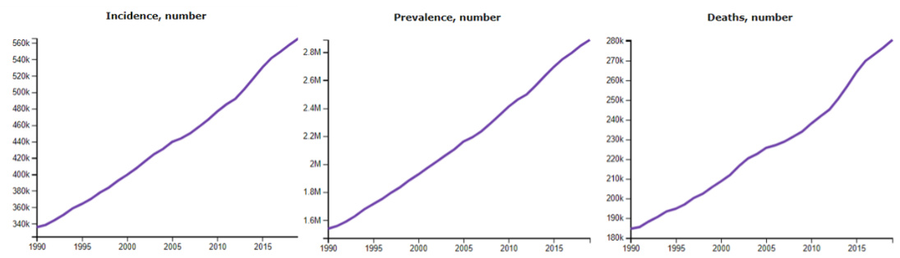
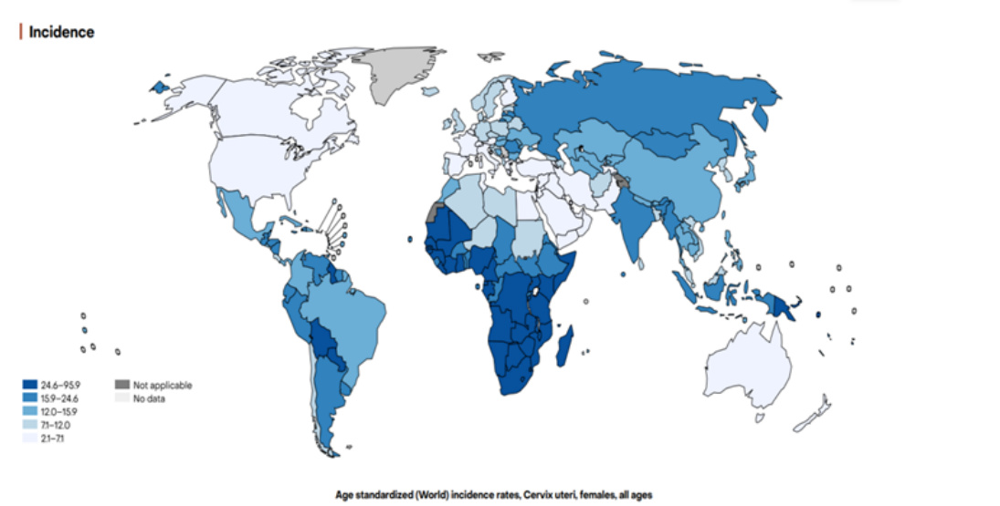
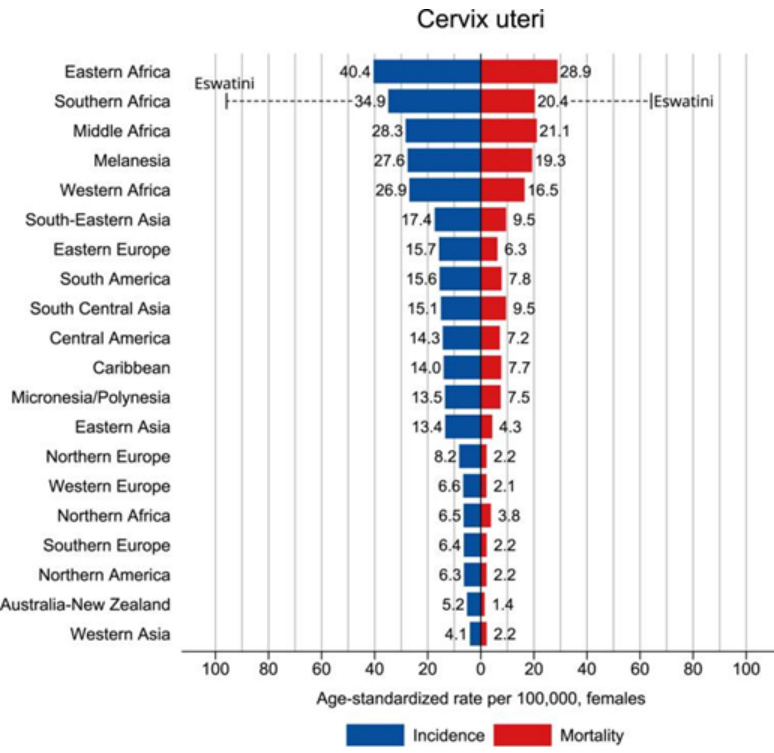
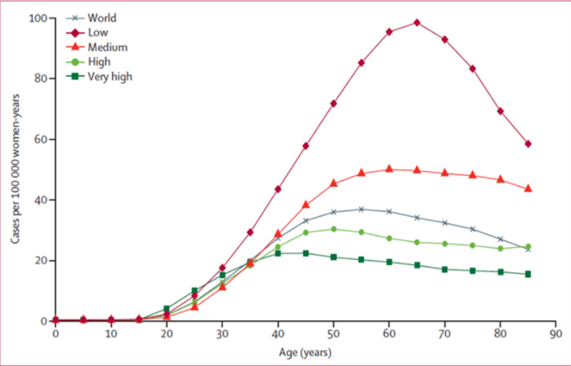
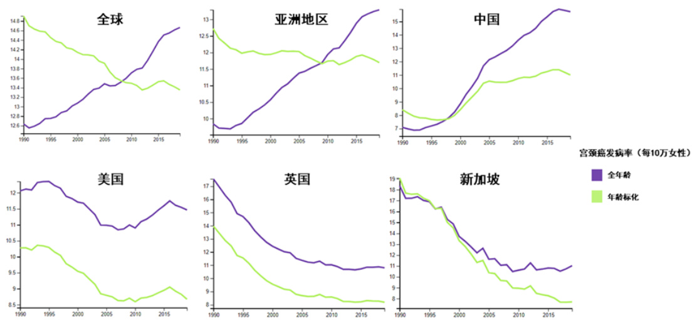
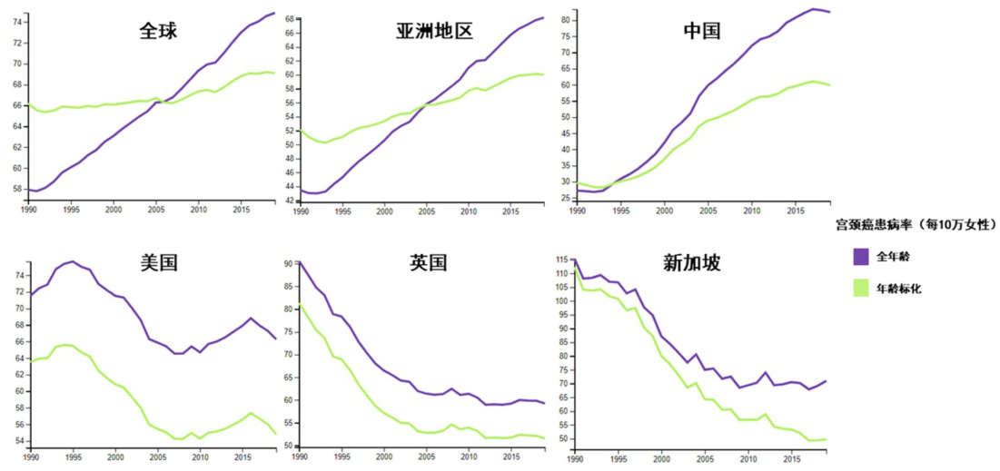
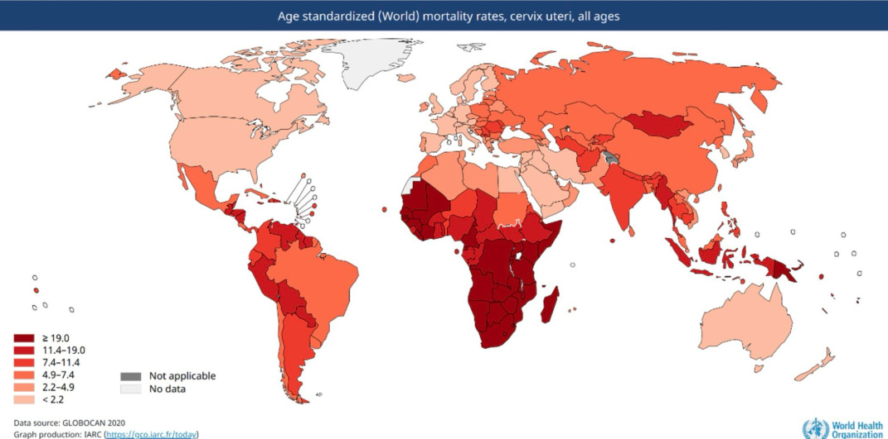
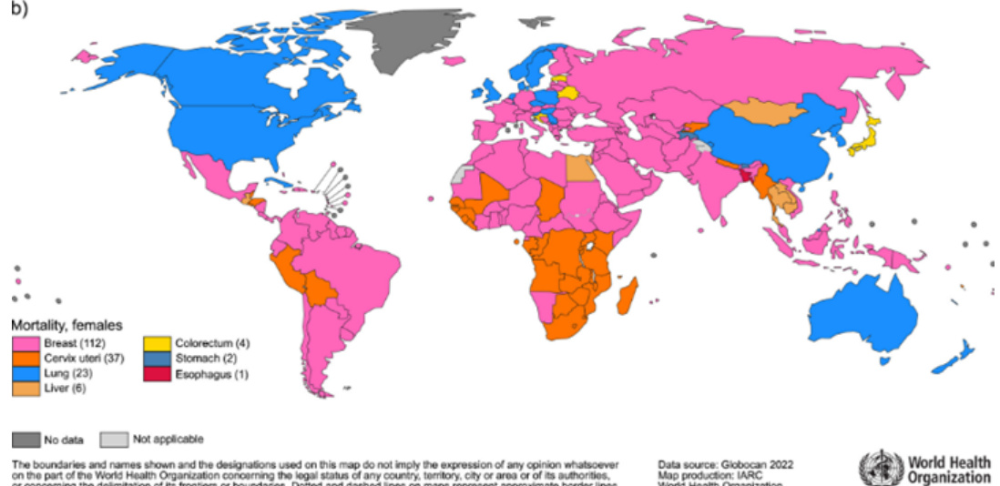
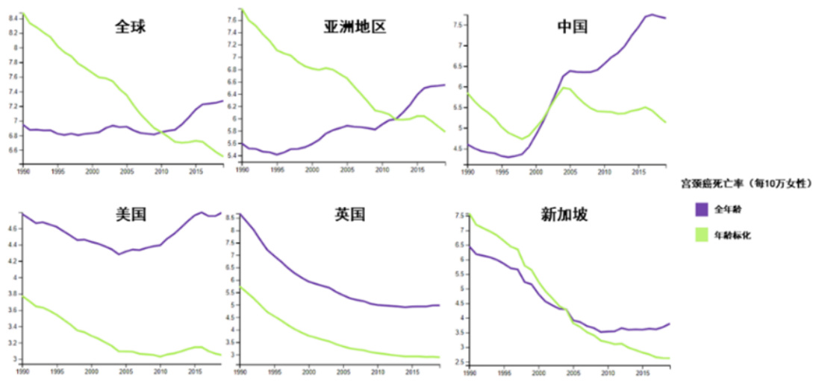

# 全球宫颈癌疾病负担  

# 全球宫颈癌疾病负担  

2023-12  

宫颈癌是全球女性第四常见癌症。在过去的20年间，全球宫颈癌新发病例和死亡病例数在不断增加（图1）。据国际癌症研究机构（IARC）2022年全球癌症负担（涵盖全球185个国家/地区的36种癌症）数据显示，宫颈癌在全球25个国家女性中成为首位发病肿瘤，在37个国家女性中成为首位癌症致死病因[1]。宫颈癌发病率和死亡率最高的地区是撒哈拉以南非洲、中美洲和东南亚[2]。宫颈癌的疾病负担在全球分布不均衡，其中发展中国家的发病和死亡率分别是发达国家的1.7和2.4倍[3]。根据IARC的数据预测，若不采取进一步行动，全球宫颈癌疾病负担将进一步增加，其中2018年至2030年期间每年新增宫颈癌病例将从57万例增加到70万例，而每年死亡人数预计将从31.1万例增加到40万例[3, 4]。  

  
图1. 1990-2020年间全球宫颈癌新发、患病和死亡病例数量  

(数据来源：全球疾病负担研究(http://ghdx.healthdata.org/gbd-results-tool))  

# 发病率  

宫颈癌是全球女性第四常见癌症，仅次于乳腺癌、结直肠癌和肺癌。根据全球癌症观察站来自185个国家的数据表明，2022年全球宫颈癌新发病例近66.0万例，占全球总癌症病例的$3 . 3 \% [ 2$ ]。宫颈癌的发病率差异较大，新发病例主要来自于中低收入国家（图2）。根据2022年全球癌症数据报告，西亚地区的年龄标化发病率最低(约为4.1/10万女性)，东非地区的年龄标化发病率最高（约为40.4/10万女性）[1](图3)。  

  
图2. 2022年全球各国宫颈癌年龄标化发病率  

（图片来源：The Global Cancer Observatory(https://gco.iarc.who.int/media/globocan/factsheets/cancers/23-cervix-uteri-fact-sheet.pdf)）  

  
图3. 2022年各地区宫颈癌发病率和死亡率年龄标准化率柱状图  

（资料来源: GLOBOCAN 2022,https://acsjournals.onlinelibrary.wiley.com/doi/10.3322/caac.21834 (https://acsjournals.onlinelibrary.wiley.com/doi/10.3322/caac.21834)）  

人群宫颈癌发病率也随着国家人类发展指数（Human Development Index, HDI）的降低而升高。在极高HDI（不低于0.8）的国家，平均每10万女性中每年有9.6例新发病例，而在较低HDI的国家，发病率上升到每10万女性中每年有26.7例新发病例[3]。  

不同年龄段女性的宫颈癌发病率有所差异，通常发病率在25岁后开始上升，在HDL很高的国家，发病率在40岁左右达到最大值，而在HDI低的国家发病率持续显著上升直到60岁左右达到最大值[3]（图4）。  

  
全球宫颈癌疾病负担 – Innovation Lab for Vaccine Delivery Research | Duke Kunshan Univers  

（HDL四个等级：极高：0.8≤HDL；高：0.7≤HDL $< 0 . 8$ ；中：0.55≤HDL $\mathbf { < 0 . 7 }$ ；低：HDL＜0.55）  

（图片来源Arbyn, M., et al.(2020) Estimates of incidence and mortality of cervical cancerin 2018: a worldwide analysis. The Lancet Global Health, 8(2), e191-e203. ）  

虽然宫颈癌的发病数在过去的20年间不断增加，但得益于经济社会发展、卫生条件改善、消除性传播感染的倡导和行动，全球宫颈癌年龄标化发病率呈现下降趋势（图5）。通过开展HPV疫苗接种、宫颈癌筛查等干预，美国、英国、澳大利亚、新加坡、丹麦、日本等发达国家宫颈癌发病率呈逐年下降趋势，这也进一步说明了宫颈癌能被有效预防。  

  
图4. 不同人类发展指数国家宫颈癌年龄标化发病率随年龄变化趋势  
图5. 全球及部分国家、地区女性宫颈癌发病率  

(数据来源：全球疾病负担研究 (http://ghdx.healthdata.org/gbd-results-tool))  

# 患病率  

全球宫颈癌的绝对病例数在增加，但年龄标化患病率的增长趋势在近些年间放缓（图5）。据全球疾病负担项目统计，全球全年龄女性中约有288.7万妇女患有宫颈癌，宫颈癌的年龄标化患病率约为每10万女性中有74.9人患病，其中三分之一的宫颈癌患者来自中国和印度[1]。  

  
全球宫颈癌疾病负担 – Innovation Lab for Vaccine Delivery Research | Duke Kunshan Univers  

(数据来源：全球疾病负担研究) (http://ghdx.healthdata.org/gbd-results-tool)  

# 死亡率  

宫颈癌是妇女癌症死亡的第四大原因，仅次于乳腺癌、肺癌和结直肠癌。据估计，2022年全球有35.0万女性因宫颈癌而死亡，占全球癌症死亡病例的 $1 3 . 6 \%$ （图7A）。  

  
图6. 全球及部分国家、地区女性宫颈癌患病率  
  
图7A. 2020年全球各国宫颈癌年龄标化病死率（图片来源：The Global Cancer Observatory (https://gco.iarc.fr/today/data/factsheets/cancers/23-Cervix-uteri-fact-sheet.pdf) ）  

据WHO估计，全球约 $9 4 . 0 \%$ 的宫颈癌死亡发生在中、低收入国家[2]，在这些国家中，约 $1 . 3 \%$ 的女性在75岁前因宫颈癌而死亡。在全球37个国家中，宫颈癌是导致女性癌症死亡的最主要原因（图7B）。宫颈癌的死亡率存在地区差异，地区差异既表现在国家之间，也存在于国家内部。在HDI很高的国家，平均每10万妇女中有3人因宫颈癌死亡，而在较低HDI的国家该数字可上升至每10万妇女中有20人因宫颈癌死亡[3]。在国家内部，宫颈癌的死亡率也有所差异。以美国为例，收入较低的地区的宫颈癌死亡率是经济较发达地区的两倍[4]。这种显著的地区差异主要来源于危险因素暴露的程度、医疗水平及获得筛查和有效治疗干预的不平等。在中低收入国家预防措施有限，往往在病程发展到晚期出现病症后被诊断，获得晚期疾病治疗的机会也可能非常有限，导致资源匮乏地区的宫颈癌死亡率更高。  

  
oringdftroundoadddinpnpbr for which there may not yet be full agreement.  

# 图7B. 2022年不同国家女性癌症死亡率的首要类型  

(图片及数据来源：GLOBOCAN2022/WHO IARC)  

虽然宫颈癌死亡人数在女性所有癌症中一直处于第四位，但宫颈癌总死亡人数占所有癌症总死亡人数的比例由2008年的 $1 8 . 2 \%$ 下降到2020年的 $7 . 7 \% ^ { [ 4 ] }$ 。年龄标化死亡率也在过去30年间持续降低（图8）。  

  
图8. 全球及部分国家、地区女性宫颈癌死亡率  

# 内容导航  

国宫颈癌疾病负担 (https://vaxlab.dukekunshan.edu.cn/evidence-db-expert/hpv-vaccine-policy-advocacy-evidence-(数据来源：全球疾病负担研究 (http://ghdx.hrepaoltsihtodrya/thae.-obrurgd/egnb-odf-crervsicual-tcsa-ntcoero-li)n)-china/)  

消除宫颈癌的全球行动计划 (https://vaxlab.dukekunshan.edu.cn/evidence-db-expert/hpv-vaccine-policy-advocacyeviden·ce-repository·/global-action·-plan-for-the-elimination-of-cervical-cancer/)   
审核校对人：乳陈头瘤姝病，毒（邓H添PV艺） (，htt祖ps:/嘉/va琦xla，b.d李uk周eku蓉nshan.edu.cn/evidence-db-expert/hpv-vaccine-policy-advocacy  
文献编辑：张翯昱 全球HPV感染负担 (https://vaxlab.dukekunshan.edu.cn/evidence-db-expert/hpv-vaccine-policy-advocacy-evidencerepository/global-hpv-infection-burden/)  

# 参考文献:  

我国HPV感染的流行情况 (https://vaxlab.dukekunshan.edu.cn/evidence-db-expert/hpv-vaccine-policy-advocacyevidence-repository/the-prevalence-of-hpv-infection-in-our-country/) . Bray, F., Jemal, A., Soerjomataram, I., Siegel, R. L., Ferlay, J., Sung, H., & Laversanne,  

HPVM疫:苗G的lo主b要a类l 型ca(hnttcpes:/r/vsatxlatbi.dsutkiecksun2s0h2an2.:edGu.lcon/bevoicdeance-edsb-teixmpeart/hepsv-ovafcicinec-ipdoleicny-cadevoacnacdy-evidencerepository/the-main-types-of-hpv-vaccines/) mortality worldwide for 36 cancers in 185 countries – bray – CA: A cancer 疫苗的免疫原性、保护效力及安 性 (https://vaxlab.dukekunshan.edu.cn/evidence-db-expert/hpv-vaccine-policyjournal for Clinicians – WaidlveoycacOy-nelviindencLei-brerpaorsiyt.ory/immunogenicity-efficacy-and-safety-of-vaccines/) https://acsjournals.onlinelibrary.wiley.com/doi/10.3322/caac.21834 HPV疫苗接种成本效果 (https://vaxlab.dukekunshan.edu.cn/evidence-db-expert/hpv-vaccine-policy-advocacy(https://acsjournals.onlinelibrary.wileviyd.ecnocem-r/edposit/o1ry0/.t3he3-c2o2s/t-ceaffaect.iv2e1ne8s3s-4o)f-hpv-vaccination/)  

2. World Health Organization. (n.d.-a). Cervical cancer. World Health Organization. HPV疫苗筹资模式 (https://vaxlab.dukekunshan.edu.cn/evidence-db-expert/hpv-vaccine-policy-advocacy-evidencehttps://www.who.int/news-room/fact-sheets/detraeilp/ocsietorrvyi/cfuanl-dicnag-nmcoedre ls-for-hpv-vaccines/)  

3. Ar影b响y疫n苗M接,种W意e愿id和e行rp为a的s主s要E,因B素r(uhtntipsL:/,/vdaxelaSb.adnujkoeksuénsSh,anS.aedrua.icyn/aeviMd,enFce-rdlab-yexJ,peBrtr/ahpyv-Fv:accine-policyEstimates of inacidvdoecanccy-eviadendce-mreoporstitaolriyt/ymaoinf- cacetorrvsi-icnaflulecnacingc-vearccine-2wi0lli1n8g:neass-wanodr-lbedhwaviidore/) analysis. The Lancet Global Health 2020, 8(2):e191-e203.  

全球宫颈癌疾病负担 – Innovation Lab for Vaccine Delivery Research | Duke Kunshan Univers  

4. F我e国rl人a群yHJ,PVC疫ol苗o的m知b晓e率t、M接, 种So意e愿rj(hottmpsa:/t/varxalamb.dIu,kPekaurnksihnanD.edMu,.cPni/eñveidreonsce-Mdb, eZxnpearot/rhpAv,-vBacrcainye-Fp:olicyCadnvcocearcys-etvaidteinsctei-crespfosoitrortyh/tehe-yaewaren2e0ss2-r0a:teA-and-ovacecirnvaitieonw-.wiIllnintgenrenssa-toifo-tnhea-lhJpovp-uvoarpcnucliantlieo-oanfmiCno-ancghn-itcnhae/r-)  

2021. 提高HPV疫苗覆盖率的主要干预策略 (https://vaxlab.dukekunshan.edu.cn/evidence-db-expert/hpv-vaccine-policyadvocacy-evidence-repository/main-intervention-strategies-to-improve-hpv-vaccine-coverage/)  

干预的实施成本及成本效果 (https://vaxlab.dukekunshan.edu.cn/evidence-db-expert/hpv-vaccine-policy-advocacyevidence-repository/implementation-cost-and-cost-effectiveness-of-the-intervention/)  

在我国开展的推广HPV疫苗覆盖的干预性研究 (https://vaxlab.dukekunshan.edu.cn/evidence-db-expert/hpv-vaccinepolicy-advocacy-evidence-repository/interventional-research-on-the-promotion-of-hpv-vaccine-coverage-conductedin-china/)  

纳入国家免疫规划的国家情况 (https://vaxlab.dukekunshan.edu.cn/evidence-db-expert/hpv-vaccine-policy-advocacyevidence-repository/national-situation-regarding-inclusion-in-the-national-immunization-schedule/)  

全球疫苗接种情况 (https://vaxlab.dukekunshan.edu.cn/evidence-db-expert/hpv-vaccine-policy-advocacy-evidencerepository/global-vaccine-administration-situation/)  

疫苗纳入人群免疫项目的效果 (https://vaxlab.dukekunshan.edu.cn/evidence-db-expert/hpv-vaccine-policy-advocacyevidence-repository/the-effectiveness-of-including-vaccines-in-population-immunization-programs/)  

我国开展HPV疫苗试点 (https://vaxlab.dukekunshan.edu.cn/evidence-db-expert/hpv-vaccine-policy-advocacy evidence-repository/chinas-pilot-program-for-hpv-vaccine/)  

# 联系方式  

江苏省昆山市杜克大道8号   
vaxlab@dukekunshan.edu.cn(mailto:vaxlab@dukekunshan.edu.cn?subject=VaxLab)   
$+ 8 6$ (512) 3665 7529  

# 快捷导航  

科研(/research-teams) 新闻(https://vaxlab.dukekunshan.edu.cn/news/) 资源(https://vaxlab.dukekunshan.edu.cn/evidence-academic-resources/) 活动(https://vaxlab.dukekunshan.edu.cn/events/) 关于实验室(https://vaxlab.dukekunshan.edu.cn/about/) 隐私条款(https://vaxlab.dukekunshan.edu.cn/privacy_statement/)  