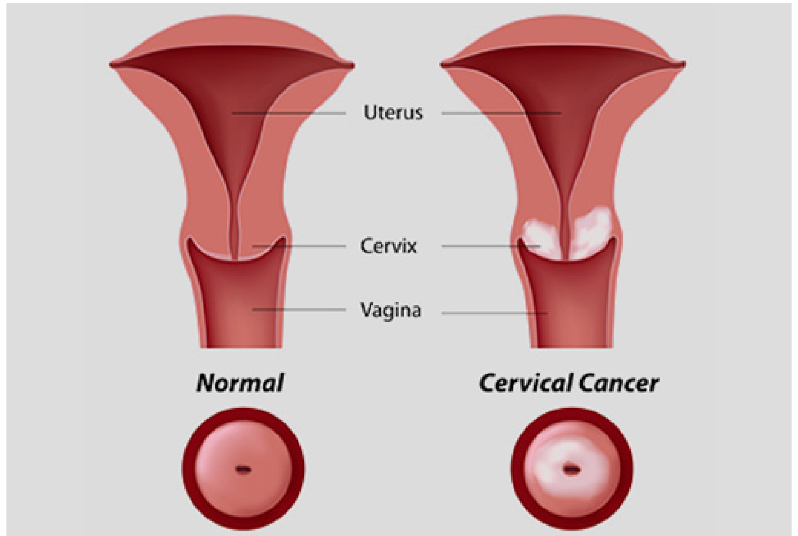
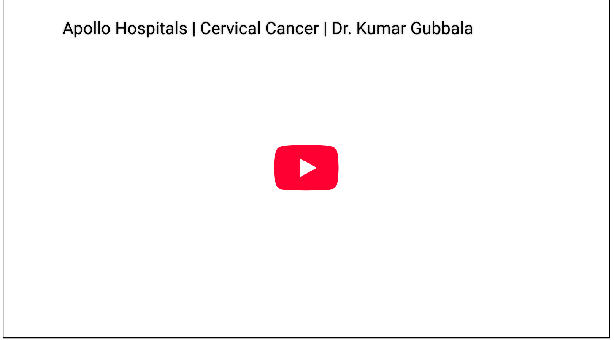
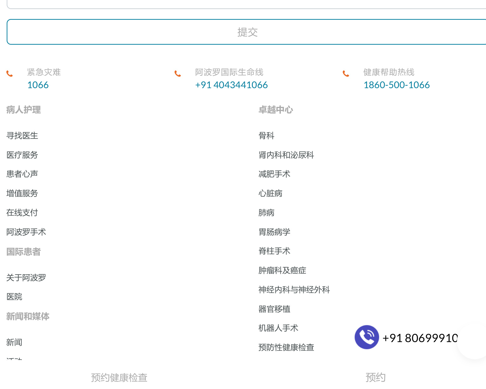

首页  癌症护理  关于宫颈癌的全部内容——类型、原因、症状、阶段、诊断、治疗和预防。  

关于宫颈癌的全部内容——类型、原因、症状、阶段、诊断、治疗和预防。  

经 Apollo Hospitals 验证，1 年 2024 月 XNUMX 日  

癌症护理 子宫颈癌  

  

  

宫颈癌是全球女性中最常见的癌症之一，也是重大的健康问题。早期发现和预防对于降低患上这种疾病的风险至关重要。本指南深入了解了宫颈癌，包括其病因、症状、分期、诊断、治疗、预防和常见问题。  

# 什么是宫颈癌？  

宫颈癌是一种发生在宫颈（子宫下部，与阴道相连）的癌症。宫颈是女性生殖系统的关键部位，是经血、精子和分娩的通道。当宫颈内的健康细胞发生异常变化，导致不受控制的生长，最终形成肿瘤时，就会引发宫颈癌。  

宫颈癌的主要病因是持续感染高危型人乳头瘤病毒 (HPV)，这是一种性传播病毒。虽然大多数HPV 感染可被人体免疫系统清除，但某些高危菌株（如 HPV-16 和 HPV-18）可导致宫颈细胞发生长期变化，随着时间的推移增加患癌风险。通过定期筛查（如巴氏涂片和 HPV 检测）进行早期发现，对预防宫颈癌和改善治疗效果至关重要。  

# 宫颈癌的类型  

根据癌症起源细胞的类型，宫颈癌可分为不同类型。了解这些类型对预后至关重要。  

# 1. 鳞状细胞癌  

鳞状细胞癌是最常见的宫颈癌类型，约占 $70 - 9 0 \%$ 。鳞状细胞癌发生于鳞状细胞，鳞状细胞是构成宫颈外层（宫颈外口）的薄而扁平的细胞。这种类型的宫颈癌通常发生在鳞状细胞与腺细胞相遇的转化区。定期筛查有助于在早期发现鳞状细胞癌。  

# 2. 腺癌  

腺癌起源于宫颈腺细胞，负责产生粘液。这些细胞位于宫颈管内，即宫颈管的内层。尽管腺癌比鳞状细胞癌少见，但约占宫颈癌病例的 $10 \%$ 。这种类型的宫颈癌有时很难通过常规巴氏涂片检测出来，因为它发生在宫颈管内。  

# 3. 混合癌 （腺鳞癌）  

混合癌又称腺鳞癌，是一种罕见的宫颈癌，既有鳞状细胞癌也有腺细胞癌。这种类型的宫颈癌比鳞状细胞癌或腺癌少见，但可能兼具两者的特征。  

无论何种类型，早期发现和治疗对于提高患者存活率和生活质量都至关重要。定期进行宫颈癌筛查，包括巴氏涂片和 HPV 检测，在早期发现和治疗这些癌症方面发挥着关键作用。  

# 宫颈癌的原因  

宫颈癌主要由持续感染高危型人乳头瘤病毒 (HPV)（一种性传播病毒）引起。然而，其他一些因素也会增加患宫颈癌的风险。了解这些原因和风险因素对于预防和早期发现至关重要。  

# 1. 持续性 HPV 感染  

HPV 高危菌株，尤其是 HPV-16 和 HPV-18，是大多数宫颈癌病例的罪魁祸首。这些菌株会干扰正常细胞功能，导致癌前病变，随着时间的推移，这些病变可能会发展为癌症。  

# 2. 吸烟  

吸烟会削弱免疫系统，使身体更难清除 HPV 感染此外，烟草中的致癌化学物质会损害宫颈细胞，进一步增加患癌症的风险。  

# 3. 免疫系统减弱  

损害免疫系统的疾病，例如 艾滋病毒 或长期使用免疫抑制药物（例如移植后治疗），会降低身体抵抗 HPV 感染的能力，从而增加持续感染和随后患宫颈癌的可能性。  

# 4. 长期服用口服避孕药  

研究表明，服用口服避孕药五年或五年以上的女性罹患宫颈癌的风险可能增加。这种关联的确切原因尚不清楚，但可能与影响宫颈的激素变化有关。  

# 5. 多次怀孕  

有过三次或三次以上足月妊娠的妇女患宫颈癌的风险可能更高。分娩期间的荷尔蒙变化和宫颈创伤可能会增加这种风险。  

# 6. 早期性行为  

年纪较小时发生性行为会增加接触 HPV 的可能性，因为青春期时宫  

虽然这些因素会增加罹患宫颈癌的风险，但定期进行巴氏涂片和HPV检测、接种HPV疫苗以及采取健康的生活方式可以显著降低罹患该疾病的可能性。  

# 宫颈癌的症状  

在早期阶段，宫颈癌通常没有明显的症状，因此定期筛查对于早期发现至关重要。然而，随着癌症的进展，可能会出现某些症状，表明存在疾病。了解这些症状及其进展对于及时就医至关重要。  

# 宫颈癌的常见症状  

随着宫颈癌的进展，可能出现以下症状：  

# 1. 阴道异常出血  

异常 阴道出血 是宫颈癌最常见的症状之一。包括月经间期出血、性交后出血或绝经后出血。  
任何异常出血都应由医疗保健提供者进行评估。  

# 2. 月经量过多或经期延长  

患有宫颈癌的女性可能会出现月经量异常多或月经延长的情况，持续时间比正常情况更长或月经量更大。  

# 3. 不寻常的阴道分泌物  

宫颈癌的另一个症状是异常 白带 流出的液体可能呈水状、有异味或带血。这可能是宫颈感染或癌症相关变化的征兆。  

# 4. 性交疼痛  

性交疼痛，被称为 性交困难，当肿瘤生长并影响宫颈时，就会出现疼痛。这种不适可能是由于癌症对附近组织的影响引起的。  

# 5. 骨盆或下背部疼痛  

随着宫颈癌的进展，它会引起骨盆区域或下背部持续疼痛，这通常表明癌症已经扩散到附近的器官。  

# 宫颈癌的早期症状  

虽然宫颈癌在早期阶段通常无症状，但一些早期症状可能包括：  

# 1. 性活动后出现少量点滴出血或流血  

性交后可能会出现少量出血或点滴出血，这通常与疾病引起的宫颈变化有关。  

# . 阴道分泌物轻微变化  

+91 80699910阴道分泌物的早期变化，例如量增加或质地改变，可能预示着宫颈  

在晚期阶段，宫颈癌可能会出现更明显的症状，例如：  

# 1. 显着减肥  

在癌症晚期，常常会出现不明原因的体重快速下降。  

# 2. 排尿困难  

如果癌症扩散到膀胱或泌尿道，可能会导致疼痛或排尿困难。  

# 3. 腿部肿胀  

由于淋巴阻塞或癌症扩散到盆腔区域，可能会出现腿部肿胀。  

# 4. 持续性骨盆疼痛  

骨盆区域持续疼痛且没有改善可能预示着癌症的进展。  

# 什么时候去看医生  

如果您发现任何宫颈癌症状，尤其是异常出血或分泌物变化，请务必及时就医。通过定期进行子宫颈抹片检查和 HPV 检测，可以尽早发现宫颈癌，从而尽早接受治疗并获得更好的治疗效果，从而大大降低患宫颈癌的风险。  

# 宫颈癌的阶段  

根据宫颈癌的扩散程度，宫颈癌可分为不同阶段。分期对于确定最合适的治疗方案和评估预后至关重要。分期范围从早期癌症（局限于宫颈）到晚期癌症（癌症可能已扩散到附近器官）。  

# 宫颈癌 0 期：原位癌 (CIS)  

0 期也称为原位癌，癌细胞局限于宫颈表层。这是宫颈癌的早期形式，在许多情况下，这种癌症是可以治愈的。在这个阶段，癌症尚未扩散到更深的组织或宫颈的其他部位。  

# 宫颈癌 I 期：癌症局限于宫颈  

在第一阶段，癌症仍然局限于宫颈，尚未扩散到周围组织或器官。此阶段进一步分为两个子阶段：  

第一阶段： 仅在显微镜下才可检测到的微观癌症。  

IB阶段： 可通过影像学检查或体检发现的可见病变或较大的肿瘤。  

在 II 期，癌症已扩散至宫颈和子宫以外，但尚未到达盆壁或阴道下部。此阶段进一步分为两个子阶段：  

第二阶段： 癌症已扩散至阴道上三分之二或宫旁组织（子宫周围的组织），但尚未扩散至盆壁。  

第二阶段： 癌症涉及宫旁组织但不涉及盆壁。  

# 宫颈癌 III 期：癌症扩散至盆壁和阴道下部  

在第三期，癌症已扩散至盆壁或阴道下部。它还可能导致输尿管阻塞，从而导致肾脏问题和泌尿问题。此阶段分为：  

阶段 IIIA： 癌症已扩散至阴道下三分之一，但尚未扩散至盆壁。  

IIIB阶段： 癌症扩散到盆壁并可能导致输尿管阻塞，从而损害肾功能。  

# 宫颈癌 IV 期：晚期宫颈癌  

第四期是宫颈癌的最晚期阶段，癌症已扩散至附近器官（如膀胱或直肠）或身体的远处部位。此阶段分为两个子阶段：  

IVA阶段： 癌症已扩散至附近的器官，例如膀胱、直肠或骨盆的其他部位。  

IVB阶段： 癌症已扩散至远处器官，如肺或肝。  

# 宫颈癌诊断和筛查  

早期发现宫颈癌可显著改善治疗效果，而定期筛查是发现异常情况，防止其发展为癌症的关键。筛查宫颈癌有多种诊断方法，每种方法在发现早期症状或确认诊断方面都有独特的用途。  

# 巴氏涂片测试  

- 子宫颈抹片检查 宫颈抹片检查（也称为巴氏试验）是检测宫颈细胞异常变化（在它们转变为癌症之前）的最常见和最有效的方法之一。在这项检查中，医生会从宫 +91 80699910下检查是否有任何异常情况，这些异常情况可能预示着癌前病变或早期癌症。  

频率： 建议 21 至 65 岁的女性每 3 年进行一次巴氏涂片检查。  

目的： 检测宫颈癌的癌前病变或早期迹象。  

# HPV检测  

- HPV测试 用于检测高危型人乳头瘤病毒 (HPV)，尤其是 HPV-16 和 HPV-18，这两种病毒是大多数宫颈癌的罪魁祸首。该检测通常与巴氏涂片检查相结合，以进行更全面的筛查，尤其是针对 30 岁以上的女性。  

频率： 建议 30 岁以上的女性进行，可以与巴氏涂片检查同时进行，也可以单独进行。  

目的： 识别可能导致宫颈癌的高危HPV毒株。  

# 阴道镜检查  

A 阴道镜 是使用一种称为阴道镜的特殊放大仪器对宫颈进行的详细检查。该程序通常在巴氏涂片或 HPV 检测结果异常后进行。它允许医生仔细检查宫颈是否有任何可能需要进一步检查或活检的异常区域。  

频率： 当巴氏涂片检查或 HPV 检测结果异常时进行。  

目的： 识别宫颈异常区域，以便进行进一步检查或治疗。  

# 活检  

A 活检 是确认癌症存在的最终检查。在此过程中，会从子宫颈取出一小块组织样本，并在显微镜下检查以检查癌细胞。如果发现任何异常组织，可在阴道镜检查期间进行活检。  

频率： 当存在可疑区域或异常情况需要确认时完成。  
目的： 通过在显微镜下检查组织来确认癌症的存在。  

# 女性应该多久进行一次宫颈癌筛查？  

宫颈癌筛查的频率取决于年龄、健康史和所进行的检查类型：  

巴氏涂片： 3 至 21 岁的女性每 65 年一次。  

咨询医生： 女性应该遵循医疗保健提供者的建议，特别是当她们有诸如巴氏涂片异常或HPV 感染史等风险因素时。  

# 宫颈癌筛查建议  

定期进行宫颈癌筛查对于早期发现至关重要，可以大大降低罹患晚期宫颈癌的风险。女性应根据自己的年龄、性史和风险因素，与医疗保健提供者讨论最适合自己的筛查计划。  

# 预防宫颈癌  

虽然宫颈癌可能是一个严重的健康问题，但通过积极措施可以在很大程度上预防。预防策略主要侧重于降低 HPV感染 并检测 癌前病变 尽早发现。通过采取正确的措施，女性可以显著降低罹患宫颈癌的风险。  

# HPV疫苗接种  

预防宫颈癌最有效的方法是 宫颈癌疫苗可预防人乳头瘤病毒 (HPV)。某些高危 HPV 毒株是大多数宫颈癌的病因，而 Gardasil、Gardasil 9 和 Cervarix 等疫苗专门用于预防这些类型的病毒。  

推荐年龄： 接种疫苗对两者都是理想的 9 至 26 岁的男孩和女孩，最好在性活动开始前进行，以最大限度地提高疗效。  

优点： HPV疫苗可以预防高危HPV毒株的感染，显著降低宫颈癌的风险。  

# 定期筛查  

常规筛查 巴氏涂片 和 HPV 检测 是关键的预防措施。这些测试有助于检测 癌前病变 宫颈癌变之前，及时发现异常细胞变化，可以治疗和管理这些变化，防止其发展为癌症。  

巴氏涂片检查： 通过识别宫颈上的异常细胞变化来检测宫颈癌的早期迹象。  

HPV 检测： 识别可能导致宫颈癌的高危 HPV 毒株的存在。  

# 生活方式修改  

采取健康的生活方式可以进一步降低患宫颈癌的风险：  

预约健康检查  

进行安全性行为： 运用 避孕套 在性活动期间持续接种疫苗有助于降低 HPV 感染风险，尽管这并不能提供 $100 \%$ 的保护。  

避免吸烟： 吸烟会削弱免疫系统，使人体更难抵抗 HPV 感染。吸烟还会增加罹患 HPV 相关癌症（包括宫颈癌）的风险。  

维持健康的免疫系统： 均衡饮食、规律锻炼和控制压力有助于增强免疫系统，提高身体抵抗HPV 等感染的能力。  

# 宫颈癌可以预防吗？  

是的，宫颈癌可以通过疫苗接种、定期筛查和健康的生活方式来预防。通过采取这些积极措施，女性可以降低风险并增加早期发现的机会，从而改善整体健康状况。  

# 宫颈癌的治疗  

宫颈癌的治疗方法取决于 阶段 癌症、患者年龄、整体健康状况和其他个人因素。一般来说，治疗旨在去除或摧毁癌细胞并防止癌症进一步扩散。主要治疗方案包括手术、放射疗法、化疗以及靶向疗法和免疫疗法等较新的方法。  

# 早期治疗  

当宫颈癌在早期被发现时，治疗方案通常更加局部化，成功率也更高。  

# 手术  

早期宫颈癌通常采用手术治疗，以切除癌组织并防止进一步扩散。手术类型包括：  

锥切术： 也称为 锥形活检，该手术仅切除宫颈癌组织，保留周围健康组织。该手术通常推荐用于极早期癌症（0 期或 IA 期）。  

子宫切除术： 如果癌症已经扩散至宫颈以外但仍局限于子宫内， 子宫切除术 （切除子宫和宫颈）可能是必要的。在某些情况下，如果担心癌症扩散，卵巢也可能被切除。  

# 放射治疗  

外部光束辐射： 从体外攻击癌症。  

近距离放射治疗： 将放射源直接放置在肿瘤内部或附近。  

# 晚期治疗  

当宫颈癌扩散到宫颈以外的身体部位时，治疗会变得更积极，并且可能涉及多种疗法。  

# 化疗  

化疗 使用强效药物摧毁或缩小全身癌细胞。它通常用于晚期宫颈癌或癌症已扩散到其他器官的情况。化疗药物可以静脉注射或口服。  

化疗药物： 治疗宫颈癌的常用药物包括 顺铂, 紫杉醇及 拓扑替康.  

联合疗法： 化疗通常与放射疗法相结合，以便在晚期患者身上取得更好的效果。  

# 靶向治疗  

靶向治疗 是一种较新的治疗方法，主要针对与癌症生长相关的特定分子。这些疗法旨在通过针对促进癌症进展的特定蛋白质或基因来阻止癌细胞的生长。靶向疗法通常与化疗或放射疗法结合使用。  

贝伐单抗（阿瓦斯丁）： 一种常见的靶向疗法，用于阻断肿瘤的血液供应，抑制肿瘤的生长。  

# 免疫治疗  

免疫治疗 增强人体免疫系统识别和攻击癌细胞的能力。这种疗法对于对传统疗法反应不佳的癌症越来越受欢迎。免疫疗法通常用于对化疗或放射疗法没有反应的晚期宫颈癌。  

检查点抑制剂： 药物像 派姆单抗（Keytruda） 和 纳武单抗（Opdivo） 通过阻断某些阻止免疫细胞识别癌细胞的蛋白质，帮助免疫系统更有效地攻击癌细胞。  

# 宫颈癌可以治愈吗？  

预约健康检查  

是的，宫颈癌是可以治愈的，如果及早发现，就有可能治愈。宫颈癌早期的存活率明显较高，因此 早期检测 和 定期检查 对于成功的治疗结果至关重要。接受定期筛查检查的女性，例如 巴氏涂片 和 HPV检测，在可治疗阶段发现癌症的机会更高，从而增加了完全康复的可能性。  

# 宫颈癌认知  

提高对宫颈癌的认识对于减少其影响至关重要。重点关注领域包括：  

促进疫苗接种和筛查： 鼓励接种 HPV 疫苗并定期 巴氏涂片 or HPV 检测 有助于预防宫颈癌并及早发现癌前病变。  

向女性普及症状和风险因素： 向女性告知 症状 （例如异常出血、盆腔疼痛）和 风险因素（如 HPV 感染和吸烟）使他们能够采取预防措施。  

鼓励定期健康检查： 定期检查有助于女性保持健康，确保及早发现和治疗宫颈癌。  

  

# 常见问题解答 (FAQs)  

1. 接种宫颈癌疫苗的推荐年龄是多少？  

HPV 疫苗建议 9 至 26 岁之间的人接种。最好在开始任何性活动之前接种疫苗，因为这样可以最好地预防 HPV 感染。早期接种疫苗可显著降低成年后患宫颈癌的风险。  

# 2. 吸烟会增加宫颈癌的风险吗？  

是的，吸烟是导致宫颈癌的重要风险因素。吸烟会削弱免疫系统， $+ 9 1$ 难80抵69抗9H91P0V染。慢性 HPV 感染是导致宫颈癌的主要原因，而吸烟会导致感染持续存在， 从而增加宫颈癌  

# 3. 没有 HPV 的情况下也会发生宫颈癌吗？  

虽然 HPV 是导致宫颈癌的主要原因，但吸烟、免疫系统减弱（例如 HIV 或免疫抑制治疗）和多次怀孕等其他风险因素也可能导致宫颈癌的发生。然而，没有 HPV 感染的宫颈癌很少见，而且通常与其他潜在健康状况有关。  

# 4. 宫颈癌是如何检测出来的？  

宫颈癌通常通过巴氏涂片检查（检查宫颈细胞异常变化）、HPV 检测（检查高危 HPV 菌株）、阴道镜检查（对宫颈的详细检查）和活检（采集组织样本以确认癌症）检测出来。定期筛查有助于及早发现癌前病变，提高成功治疗的机会。  

# 5. 宫颈癌可以预防吗？  

是的，宫颈癌可以通过 HPV 疫苗接种、定期筛查（如巴氏涂片和 HPV 检测）和健康的生活方式来预防。在接触 HPV 之前接种疫苗，结合定期筛查，有助于识别癌前病变，并在其发展为癌症之前进行治疗。不吸烟等健康习惯也可以降低风险。  

# 6. HPV 感染总是与宫颈癌有关吗？  

不会，大多数 HPV 感染会自行痊愈，不会造成伤害。但是，持续感染高危型 HPV 会随着时间的推移导致宫颈癌。这些感染的慢性性质是最大的风险。定期筛查有助于及早发现这些感染并预防癌症发展。  

# 7. 如何诊断宫颈癌？  

宫颈癌的诊断需要综合筛查和诊断程序。这些检查包括巴氏涂片检查、HPV 检测、阴道镜检查（使用放大镜检查宫颈）和活检（组织样本分析）。在某些情况下，影像学检查（如 CT 扫描或 MRI）可用于确定癌症扩散的程度。  

# 8. HPV疫苗在预防宫颈癌方面起什么作用？  

HPV 疫苗在预防宫颈癌方面发挥着至关重要的作用，它可以预防最常见的高危 HPV 毒株，尤其是 16 型和 18 型，这两种毒株是造成大量宫颈癌病例的元凶。接种疫苗可显著降低罹患宫颈癌的风险，还可降低宫颈癌前病变的风险。  

# 9. 宫颈癌是如何发生的？  

宫颈癌主要由高危型 HPV（人乳头瘤病毒）持续感染引起。这些感染可导致宫颈细胞异常，久而久之，可能发展为癌症。吸烟、免疫系统减弱和多次怀孕等其他风险因素也可能导致宫颈癌的发生。  

# 结语  

宫颈癌是一种可预防和治疗的疾病，只要及早发现即可。定期筛查、接种疫苗和提高认识对于降低其患病率至关重要。女性应将自己的健康放在首位，及时了解信息并安排常规妇科检查，以确保及早发现和干预。通过采取积极措施，可以大大减少宫颈癌的影响。  

# 相关文章  

宫颈癌 - 类型、症状、治疗和预防  

  

2024 年 10 月 1 日  

  

2024 年 10 月 1 日  

# 订阅我们  

输入您的电子邮件ID  

  
https://www.apollohospitals.com/zh-CN/corporate/diseases-and-conditions/all-you-need-to-know-about-cervical-cancer/  

<html><body><table><tr><td>观看我们的视频</td><td>合项癌-吴至、症伙、治疗 急救护理</td></tr><tr><td>媒体联系</td><td>耳鼻喉</td></tr><tr><td>阿波罗医院评论</td><td>血管外科</td></tr><tr><td></td><td>儿科</td></tr><tr><td></td><td>皮肤科</td></tr><tr><td></td><td>妇产科</td></tr><tr><td></td><td>基因组医学</td></tr><tr><td>医疗程序</td><td>公司</td></tr><tr><td>质子疗法治疗癌症</td><td>公司介绍</td></tr><tr><td>美容和整形外科</td><td>我们的医生取得</td></tr><tr><td>骨髓移植</td><td>阿波罗精神</td></tr><tr><td>口腔颌面外科</td><td>阿波罗的故事</td></tr><tr><td>手部显微外科</td><td>投资者关系</td></tr><tr><td>G扫描-开放式站立式MRI扫描</td><td>投资者介绍</td></tr><tr><td>髋关节镜检查</td><td>倡议</td></tr><tr><td>微创心脏外科</td><td>奖项和荣誉</td></tr><tr><td>膝关节置换术</td><td>加入我们</td></tr><tr><td>耳蜗植入手术</td><td>医院</td></tr><tr><td>博客文章</td><td></td></tr><tr><td>卫生图书馆</td><td>印度的医院</td></tr><tr><td>Covid 19更新</td><td>国际医院</td></tr><tr><td>Covid19常见问题解答</td><td>阿波罗诊所</td></tr><tr><td>COVID-19疫苗接种</td><td>到达医院</td></tr><tr><td>COVID-19新症状</td><td>阿波罗摇篮</td></tr><tr><td></td><td>阿波罗生育力</td></tr><tr><td></td><td>阿波罗癌症中心</td></tr><tr><td></td><td>阿波罗质子中心</td></tr></table></body></html>  

# 学术与研究  

课程  
学术概况  
临床研究  
荣誉榜单  
阿波罗火炬：校友网络  
网络广播  
合作论坛  
什么是新的发布查询  
在线咨询医生预约体检  
提供您的反馈阿波罗生命线  
我们的支架定价 点击此处  
招聘免责声明  
全膝关节置换植入物定价 点击此处  
Covid-19 RT-PCR 检测  
移植免责声明  

# 阿波罗的医疗保健触手可及  

下载的应用程序  

Apple Store  

Play商店  