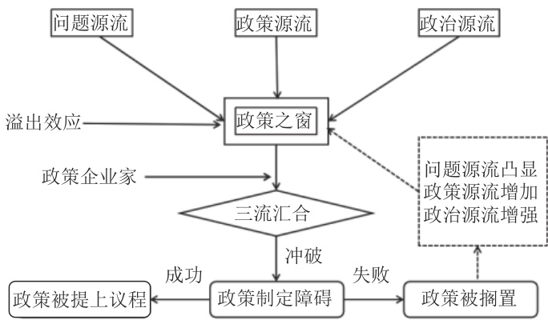

# • 专题报道 — HPV 疫苗相关研究 •  

# 多源流理论视角下HPV 疫苗纳入免疫规划政策分析\*  

刘书君1，乔友林2，周彩虹1  

【摘    要】人乳头瘤病毒（human papillomavirus，HPV）的持续感染可引起包括宫颈癌在内的多种威胁人类健康的疾病，造成沉重的疾病经济负担。研究表明，HPV 疫苗可有效预防 HPV 感染和降低宫颈癌的发病率，但在国家层面我国目前尚未将 HPV 疫苗纳入免疫规划。多源流理论是由美国学者金登提出用以分析公共政策议程的重要理论工具，该理论框架也适用于免疫项目决策过程的分析。本文基于多源流理论，从问题源流、政策源流、政治源流、试点地区项目的政策外溢效应及政策倡导者的推动等方面分析我国 HPV 疫苗纳入免疫规划决策的主要影响因素，并提出可行性对策和建议，为国家和地区将 HPV 疫苗纳入免疫规划相关政策的制定、最终达到消除宫颈癌的目的提供决策依据。  

【关键词】 人乳头瘤病毒；多源流理论；疫苗；免疫规划中图分类号:R 197；R 186    文献标识码:A    文章编号:1001-0580(2023)03-0273-06    DOI:10.11847/zgggws1139392  

# Decision  making  for  government-funded  HPV  vaccination  programs  in China: a multiple streams framework-based analysis  

LIU Shu-jun\*, QIAO You-lin, ZHOU Cai-hong (\*Department of Cancer Epidemiology, National Cancer Center/National Clinical Research Center for Cancer/Cancer Hospital, Chinese Academy of Medical Sciences and Peking Union Medical College, Beijing 100021, China)  

【Abstract】 Persistent infection of human papillomavirus (HPV) can cause a variety of diseases including cervical cancer, which  affects  human  health  and  leads  to  a  huge  socio-economic  burden.  Although  it  has  shown  that  HPV  vaccines  could effectively prevent HPV infection and reduce cervical cancer incidence, China hasn′t introduced HPV vaccination into the national  immunization  program.  The  multiple  streams  framework  proposed  by  Kindon  is  an  essential  theoretical  tool  for analyzing public policy agendas and is suitable for analyzing decision-making processes of immunization programs. In this study, we adopted multiple streams framework to assess main influencing factors of introducing HPV vaccination into the immunization programs by examining the problem stream, policy stream, politics stream, the policy spillover effect of pilot cities, and the role of policy entrepreneurs. And we also give some suggestions to promote the inclusion of HPV vaccines in the immunization programs at regional and national levels, and finally achieve the purpose of ‘eliminating cervical cancer′.  

【Key words】 human papillomavirus; multiple streams framework; vaccine; immunization program  

2020 年 11 月，世界卫生组织（World Health Orga-nization, WHO）发布了《加速消除宫颈癌全球战略》[1]，提出到 2030 年各成员国要实现 $9 0 - 7 0 - 9 0 ^ { , }$ 的阶段目标，其中第一个90 目标是指 $90 \%$ 的女孩在15 岁前 完 成 人 乳 头 瘤 病 毒 （ human papillomavirus, HPV）疫苗接种。HPV 疫苗可有效预防 HPV 感染和降低宫颈癌的发病率，截至 2022 年 3 月，WHO 所属194 个成员国中已有 122 个国家和地区将 HPV 疫苗纳入免疫规划[2]。自 2016 年首个 HPV 疫苗在我国获批上市至今，在国家层面我国尚未将该疫苗纳入免疫规划，但鄂尔多斯市准格尔旗[3]、厦门[4] 等多地已先行先试相继提出并实施为适龄女性免费接种 HPV 疫苗，起到了示范和带动作用。政府制定和出台一项政策涉及诸多领域，是一项复杂而庞大的工程，而针对决策出台过程的研究相对较少[5]。多源 流 理 论 （ multiple-streams framework） 是 西 方 公 共政策分析中应用较为广泛的工具，本文拟应用该理论从问题源流、政策源流、政治源流、政策倡导者的推动等方面分析我国 HPV 疫苗纳入免疫规划的主要影响因素，并对国家和地区将 HPV 疫苗纳入免疫规划提出可行性对策和建议。  

# 1   多源流理论分析框架  

多源流理论阐释了影响政策议程和方案选择的 3 种源流：（1）问题源流（problem stream），即社会中亟待解决并引起政策制定者关注的问题；（2）政策源流（policy stream），即某一特定领域的专业人员组成的政策共同体（包括官员、智囊团、学者等）提出的技术可行、经济可行、公众可接受的意见、主张和解决方案；（3）政治源流（politics stream），即影响政策议程设置的所有与政治有关的背景、因素的总和[6]，包括政府政策理念、国民情绪、利益集团的相互作用等[7]。在适当的时机，如政策之窗（policy window）开启、政策企业家（policy entrepreneurs）的推动下，各条源流实现汇合。“政策之窗”指提出政策问题并解决的时机[8]；“政策企业家”指愿意投入人力、财力、物力等资源及其社会和政治资本，以推动自身政策理念纳入政府方案中的个人或团体，是政策的倡导者或建议者[9]（中国情境下将其译为政策倡导者更为适用），其主要包括政府官员、基层公务员、专家和学者、公众人物、非政府组织等[10]。如果政策窗口为某种政策议题打开，那么与此相似的政策议题的政策窗口被打开的概率会大幅提高，即所谓的“政策溢出”效应（policy spillover effect）[11]，最终促进政策建议成为政策（图 1）。多源流理论是分析免疫项目决策过程[12] 的良好工具，因此本文基于该理论分析我国 HPV 疫苗纳入免疫规划决策的主要影响因素。  

  
图 1  多源流理论分析框架图  

# 2   基于多源流理论 HPV 疫苗纳入免疫规划决策的主要影响因素  

2.1    问题源流　HPV 感染可导致男性和女性的生殖器疣或恶性肿瘤[13]。生殖器疣是 HPV 感染的常见疾病，中国性病监测点数据显示 2008 — 2016 年生殖器疣的发病率为 $2 4 . 2 6 / 1 0$ 万 ～ 29.47/10 万 [14]。HPV 感染引起的恶性肿瘤主要为宫颈癌及相关的肛门生殖器（肛门、外阴、阴道、阴茎）癌、头颈部（口咽、口腔及喉部）癌症。据统计，2015 年中国因HPV 感染所致的新发癌症达 11 万例，其中宫颈癌占 $8 5 . 6 \% [ 1 5 ]$ ，且宫颈癌发病率呈上升趋势，1990 —2019 年中国女性宫颈癌年龄标化发病率由9.21/10 万上升至 $1 2 . 0 6 / 1 0$ 万[16]。2015 年一项基于全国 14 个省（直辖市）23 家临床医院的调查结果显示，子宫颈癌患者直接经济负担为 $2 9 2 7 4 . 6 \sim 7 5 7 1 6 . 4$ 元/例[17]。宫颈癌给患者及家庭造成了沉重的经济负担，我国子宫颈癌的防治现况不容乐观。  

HPV 疫苗是有效预防宫颈癌的重要手段之一，2019 年全球 $13 \%$ 的15 岁女孩完成了HPV 疫苗全程接种[18]。根据国家免疫规划信息管理系统统计数据，我国 $2 0 1 8 \mathrm { ~ - ~ } 2 0 2 0$ 年 9～45 岁女性 HPV 疫苗累计全程接种率仅为 $2 . 2 4 \ \% ^ { [ 1 9 ] }$ ，通过自我报告调查，我国一般人群、大学生群体 HPV 疫苗接种率为 $3 \%$ ～$1 1 \ \% ^ { [ 2 0 - 2 2 ] }$ ，与全球相比，我国适龄女性 HPV 疫苗接种率总体较低。  

2.2    政策源流　HPV 疫苗接种的适用性（安全性与有效性）、可接受性（公众接种意愿与政府推广态度）、卫生经济学评价 3 个方面是将 HPV 疫苗纳入免疫规划涉及的主要政策源流。  

2.2.1   HPV 疫苗接种的适用性　临床试验及真实世界证据均表明接种 HPV 疫苗安全有效。多项临床试验已证实在中国大陆获批上市的英国葛兰素史克 公 司 （ Glaxo Smith Kline， GSK） 的 Cervari $\textsuperscript { \textregistered }$ （二价HPV 疫苗）、我国厦门万泰沧海生物技术有限公司的馨可宁（二价HPV 疫苗）、我国沃森生物股份有限公司的沃泽惠（二价HPV 疫苗）、美国默克公司（Merck）的 Gardasil $\textsuperscript { \textregistered }$ （ 四 价 HPV 疫 苗 ） 及 Gardasil $^ { \textregistered 9 }$ （九价HPV 疫苗）疫苗均安全有效[23 – 27]。真实世界中基于全国疑似预防接种异常反应（adverse event followingimmunization，AEFI）监测信息管理系统开展的疫苗安全性监测数据显示，2019 年全国二价、四价、九价HPV 疫苗接种后，AEFI 发生率分别为 28.35/10 万剂、23.14/10 万剂、41.97/10 万剂，不良反应发生率在预期范围内[28]。目前我国尚缺乏真实世界中 HPV 疫苗有效性的研究数据，但 Drolet 等[29] 对全球 14 个高收入国家发表的 65 篇 HPV 疫苗有效性相关文献的系统评价和荟萃分析结果显示，HPV 疫苗接种后5～9 年，2 级及以上宫颈上皮内瘤变（ $\left( \mathrm { C I N } 2 + \right)$ 的发生率在 15～19 岁和 20～24 岁接受筛查的女性中分别降低 $51 \%$ 和 $31 \%$ ，不同年龄组 $\mathrm { C I N } 2 +$ 的发生率显著下降，为真实世界中 HPV 疫苗可安全、有效预防宫颈癌提供了强有力的证据。  

2.2.2   HPV 疫苗接种的可接受性　自 2016 年首个HPV 疫苗在中国大陆获批上市以来，普通人群接种该疫苗的意愿大幅提升，政府人员推广意愿强烈。Zhang 等[30] 对 2006 — 2015 年中国大陆的 58 项 HPV疫苗认知及接种意愿研究进行的荟萃分析显示，女性接种意愿为 $69 \%$ ； $\mathrm { H u }$ 等[22] 于 2019 年对中国大陆除西藏自治区外其余的 30 个省（自治区、直辖市）$1 8 \sim 4 5$ 岁人群进行的HPV 疫苗知信行调查发现， $79 \%$ 女性愿意接种HPV 疫苗，女性HPV 疫苗接种意愿有所增加。中国《子宫颈癌综合防控指南》[31] 将 $1 3 \sim$ 15 岁女性青少年作为HPV 疫苗的重点接种对象，父母为 HPV 疫苗接种的主要决策者，2011 年 11 月 —2012 年5 月对全国7 个大区七至九年级学生家长HPV疫苗可接受性进行调查，结果只有 $3 1 . 8 \%$ 的母亲愿意为子女接种 HPV 疫苗[32]；但 2020 年 12 月 — 2021年 4 月对全国 7 个大区一般人群进行的调查结果显示， $8 2 \% \big ( 3 4 1 / 4 1 6 \big )$ 有女儿的调查对象愿意为女儿接种 HPV 疫苗，接种意愿明显升高；同时该研究调查了政府官员推广 HPV 疫苗的态度，结果显示，政府及机构管理者中有 $9 7 . 7 \ \% ( \ 4 2 8 / 4 3 8 )$ 的人认为政府应该促进接种 HPV 疫苗的推广、 $7 4 . 3 \ \% ( \ 3 1 8 / 4 2 8 )$ 的人认为可通过将 HPV 疫苗纳入免疫规划实现其接种普及[33]。  

2.2.3   HPV 疫苗接种的卫生经济学评价　推广接种HPV 疫苗对预防 HPV 所致疾病具有显著的社会效益和经济效益，但是不同地区需结合当地实际情况进行最佳免疫策略的研究。郭建铭等[34] 对 HPV 疫苗预防中国女性宫颈癌的经济学研究进行了系统评价（纳入文献至2020 年2 月），结果显示，疫苗接种合并筛查比仅筛查更具有经济效益。Xia 等[35] 从社会视角出发，应用动态模型及疾病自然史模型评估消除宫颈癌不同策略的成本和效益，为中国提供了实现消除宫颈癌的最优路径。但是中国各省经济发展、人口特征等差异较大，各地区应探索适合当地的 HPV 疫苗接种方案。广东省对 13 岁女孩分别接种已上市的 4 种 HPV 疫苗（分别为厦门万泰二价、英国 GSK 二价、美国 Merck 四价和九价 HPV 疫苗）进行本地化经济学评估，结果显示国产二价HPV疫苗在 4 种 HPV 疫苗中具有最优经济学表现[36]；浙江省评估了当地 12 岁女孩 2 剂次与 3 剂次进口二价 HPV 疫苗接种的成本效益，结果显示 2 剂次 HPV疫苗接种是高性价比的预防接种策略[37]，但我国其他多数省份目前尚缺乏公开的 HPV 疫苗接种的成本效益分析结果。  

2.3    政治源流　政治源流是影响政策议程设置的所有与政治有关的背景、因素的总和[6]。党的十八大以来，党和政府大力推进“以治病为中心”向“以人民健康为中心”转变，坚持预防为主，把预防摆在更加突出的位置，采取有效干预措施，细化落实《“健康中国 2030”规划纲要》。2019 年 9 月国家卫生健康委等10 部门联合制定的《健康中国行动 —— 癌症防治实施方案（2019 — 2022 年）》[38] 中提出，通过加强 HPV 疫苗的科普宣传、加快国产 HPV 疫苗审评审批流程、合理制定价格等多种方式促进和提高HPV 疫苗的接种，进一步强化宫颈癌的预防措施和HPV 疫苗的推广。2021 年 2 月国家卫健委提出要在科学论证的基础上，对 HPV 疫苗纳入国家免疫规划进行统筹研究[39]；同年 4 月国家卫健委表示将以消除宫颈癌的行动为切入点，启动健康城市建设，推动健康中国行动创新模式试点工作，其包括推进宫颈癌疫苗应用[40]；2021 年 9 月，健康城市建设推动健康中国行动创新模式试点工作在山东济南启动，全国首批 15 个试点城市（区）推动落实宫颈癌综合防控策略工作也正式启动[41]，这是中国政府对WHO 全球消除宫颈癌战略的积极响应。  

2.4    政策外溢效应　来自相似政策的外溢效应助推政策议程设置的输入变量发挥了更大作用[11]，部分地区率先开展的 HPV 疫苗免费接种试点项目形成溢出型窗口，为其他地区 HPV 疫苗免费接种议题进入政策议程提供了范例。2020 年 8 月内蒙古自治区鄂尔多斯市准格尔旗试点免费为 13～18 周岁女性接种 HPV 疫苗[3]，在旗政府、相关部门及专家和学者的合力推进下，截至 2021 年 9 月，准格尔旗已为全旗 8 360 名适龄在校女生接种了第 1 剂 HPV疫苗，接种率为 $8 4 . 5 3 \ \% ^ { [ 4 2 ] }$ 。该项目的实施引起公众及其他省市的广泛关注和积极肯定，2020 年准格尔旗当地1 044 名女性自费进行了HPV 疫苗接种[42]。此外，福建省厦门市、山东省济南市、四川省成都市等多地也陆续开展了 HPV 疫苗的免费接种（表 1），试点地区经验和成果对其他地区起到了良好的示范和带动作用。  

表 1    我国 HPV 疫苗免费或补贴接种试点情况（截至 2022 年 3 月 25 日）  

<html><body><table><tr><td>地区</td><td>开始时间</td><td>接种对象及年龄</td><td>疫苗类型</td></tr><tr><td></td><td>2021年(全市)</td><td>内蒙古自治区鄂尔多斯[3】2020年8月（准格尔旗）当地户籍13～18周岁女性（第2年开始为当年新满13周岁的女性）进口二价</td><td></td></tr><tr><td>福建省厦门市[4]</td><td>2020—2022年</td><td>13～14.5周岁在校女生</td><td>国产二价</td></tr><tr><td>山东省济南市[43]</td><td>2021年11月</td><td>15周岁以下七年级女生</td><td>国产二价</td></tr><tr><td>四川省成都市[44]</td><td>2021年11月</td><td>13～14岁在校女生</td><td>国产/进口二价和进口四价</td></tr><tr><td>江苏省无锡市[45]</td><td>2021年12月</td><td>初二学段女生</td><td>国产二价</td></tr><tr><td>江苏省连云港市[45]</td><td>2021年12月中旬</td><td>初二学段女生</td><td>国产二价</td></tr><tr><td>海南省[46]</td><td>2022年2月</td><td>13～14.5周岁</td><td>国产二价</td></tr><tr><td>浙江省宁波市鄞州区[4]</td><td>2022年2月</td><td>未公布</td><td>未公布</td></tr><tr><td>河南省郑州新密市[48]</td><td>2022年2月</td><td>12～14岁女生</td><td>未公布</td></tr><tr><td>河北省石家庄市[49]</td><td>2022年3月</td><td>14周岁女生</td><td>国产二价</td></tr><tr><td>重庆市[50]</td><td>2022年</td><td>未公布</td><td>未公布</td></tr><tr><td>广东省[51]</td><td>2022年9月</td><td>14周岁以下初一女生</td><td>国产二价</td></tr></table></body></html>  

2.5    政策倡导者的推动　在HPV 疫苗政策变迁过程中，相关专家和学者、人大代表等政策倡导者推动政策议程的设置，如：一位身兼制药公司顾问、非政府组织成员等多重身份的宫颈癌预防专家，通过在非政府组织中支持项目提案、与其他学者共同制定宫颈癌综合防控指南、开展科普宣教提高公众对宫颈癌预防认知等方式，推动 HPV 疫苗的普及[52]；在全国及地方各级人民代表大会和政治协商会议召开期间，人大代表、政协委员等政策倡导者提出提案或建议，成为推动政策变迁[9] 的关键窗口期。2020 年全国人民代表大会和中国人民政治协商会议（两会）期间，政协委员提出将 HPV 疫苗纳入国家免疫规划的建议，直接推动了 HPV 疫苗的试点免费接种[39],鄂尔多斯市准格尔旗人大代表在评选民生实事项目时适时推出“关爱女生进校园”项目，推动当地成为中国首个免费接种HPV 疫苗的地区。  

# 3   对策和建议  

目前，虽然我国多地开始或即将开始政府资助的 HPV 疫苗接种项目，但将 HPV 疫苗纳入国家免疫规划政策议程还存在一定的困难，因此本文从“多源流理论”视角对 HPV 疫苗纳入免疫规划提出如下几点可行性对策和建议。  

3.1    锁定问题源流　在制定宏观政策的过程中需全面考虑 HPV 相关肿瘤和生殖器疣疾病负担，因此需开展全面的疾病负担监测和评价工作。至 2020年底，我国肿瘤登记网络已覆盖 59 800 万人，为宫颈癌及其他 HPV 相关癌症负担的评估提供了重要依据[53]，但与欧美国家几乎覆盖全部人口的肿瘤登记相比仍有差距[54]。HPV 感染导致的生殖器疣等为非强制报告疾病，目前基于国家监测系统报告的数据存在低估了 HPV 感染疾病负担的可能性[55]。HPV 相关疾病经济负担研究多以宫颈癌直接经济负担研究为主，非直接医疗费用、间接费用、无形经济负担[56 – 57] 及 HPV 相关非宫颈疾病负担的研究很少[58]，因此，需继续扩大肿瘤登记人群覆盖范围、健全性病监测报告系统，利用医保大数据监测 HPV相关疾病负担情况，在此基础上，实时开展 HPV相关疾病经济负担评价工作，为政府制定 HPV 疫苗接种政策提供更加精准的大数据支撑。  

3.2    改进政策源流　经济考虑是影响 HPV 疫苗纳入免疫规划政策的重要因素。除各地区依据本地区实际情况开展成本效益分析以探索适宜的 HPV疫苗接种策略外，还可参照相关研究[59]，通过采取多种筹资机制增加资助 HPV 疫苗接种的可行性，如在地方财政预算有限的情况下，可采取个人 – 中央 –地方财政多方分担的机制增强项目的可行性；如地方财政预算允许，采取中央 – 地方财政分担机制以增加人群 HPV 疫苗的接种率；如地方财政状况较好，则鼓励当地结合本地疾病负担情况及目标人群数量制定惠民政策，开展由地方财政支付的适龄女性HPV 疫苗免费接种项目。  

3.3    运用政治源流　采取利于提高 HPV 疫苗覆盖率的措施，营造将 HPV 疫苗纳入免疫规划的氛围。（1） 强化政府职责。试点地区政府应发挥组织优势，健全政府主导、部门协作、专业机构支持、全社会参与的工作机制；非试点地区在参考试点地区方案设计和组织管理的经验基础上，主动开展示范项目，由点到面，逐步推广。（2）完善人财物等配套保障。各地区财政部门应继续加大对 HPV 疫苗预防接种的支持力度，对冷链设备、接种门诊建设等方面给予资金保障；教育和人社部门继续加强公共卫生、预防接种等相关人才的培训与考核；药品监督管理部门鼓励医药企业创新型 HPV 疫苗的研发、健全疫苗全程溯源管理系统，为 HPV 疫苗免疫规划工作提供保障。（3）注重宣传引导。充分发挥媒体作用，持续开展对 HPV 疫苗流通和预防接种知识的普及宣传，提升群众对预防接种HPV 疫苗的认识。3.4    发挥政策倡导者作用　我国 HPV 疫苗纳入免疫规划采用“试点”示范效应逐步推广的渐进式政策议程设置思路。截至 2022 年 3 月全国已有多地开展 HPV 疫苗免费接种工作，并已初见成效[60]。各地 HPV 疫苗接种方案不同，如鄂尔多斯市、济南市等地采用“政府采购，免费接种”的实施方案；而成都市则采用“自主选择，政府补贴”模式。不同地区经验不同，模式不同，各地需结合自身实际，借鉴试点地区项目实施方案和实践经验，探索适合当地的 HPV 疫苗接种方案；同时政策倡导者可借助“两会”等重要关键时机，适时提出利于推进 HPV 疫苗尽快惠及适龄人群的可行性提案，引起政府、社会对 HPV 疫苗接种重要性的高度关注和认同，积极推动HPV 疫苗纳入免疫规划政策的落地实施。利益冲突　所有作者声明不存在利益冲突  

出版授权 作者同意以纸质版和网络版的形式同时出版  

# 参考文献  

[ 1 ] World  Health  Organization.  Global  strategy  to  accelerate  the elimination of cervical cancer as a public health problem[EB/OL]. (2020 – 11 – 17)[2021 – 08 – 15].https://www.who.int/publications/ i/item/9789240014107.   
[ 2 ] PATH. Global HPV vaccine introduction overview[EB/OL]. (2022 – 03   –  17)[2022   –  05   –  09].https://www.path.org/resources/globalhpv-vaccine-introduction-overview/.   
[ 3 ] 鄂尔多斯市人民政府. 中国首针免费 HPV 疫苗在鄂尔多斯市准 格尔旗开打 [EB/OL]. (2020 – 08 – 18)[2021 – 08 – 16]. http:// www.ordos.gov.cn/gk_128120/wsjkly/zccs_2/202008/t20200818_ 2735841.html.  

[ 4 ] 南方都市报. 厦门将为适龄女生免费打 HPV 疫苗, 系国内首个 大城市 [EB/OL]. (2020 – 09 – 09)[2021 – 08 – 15]. https://www. sohu.com/a/417246317_161795.  

[ 5 ] Burchett  HED,  Mounier-Jack  S,  Griffiths  UK,  et  al.  National decision-making on adopting new vaccines: a systematic review[J]. Health Policy and Planning, 2012, 27(S2): ii62 – ii76.  

[ 6 ] 文宏, 崔铁. 中国决策情境下的多源流模型及其优化研究 [J]. 电 子科技大学学报 (社科版), 2014, 16(5): 12 – 19.   
[ 7 ] 约翰·W·金登. 议程、备选方案与公共政策 [M]. 丁煌, 方兴, 译. 2 版. 北京: 中国人民大学出版社, 2004: 119.   
[ 8 ] 江永清. 基于多源流模型的我国双创政策之窗开启分析 [J]. 中 国行政管理, 2019(12): 96 – 102.   
[ 9 ] 王玲玲. 多源流理论视域下的政策议程设置研究 —— 以全面两 孩政策为例 [D]. 长春: 吉林大学, 2017.   
[ 10 ] 俞瑞雪. 中国情景下的政策企业家: 形成、类型与功能 [J]. 统计 与管理, 2021, 36(6): 61 – 66.   
[ 11 ] 李燕, 朱春奎. “政策之窗”的关闭与重启 — 基于劳教制度终 结的经验研究 [J]. 武汉大学学报(哲学社会科学版), 2017, 70(5): 117 – 130.   
[ 12 ] De  Wals  P,  Espinoza-Moya  ME,  Béland  D.  Kingdon's  multiple streams framework and the analysis of decision-making processes regarding  publicly-funded  immunization  programs[J].  Expert Review of Vaccines, 2019, 18(6): 575 – 585.   
[ 13 ] Nyitray AG, Iannacone MR. The epidemiology of human papillomaviruses[J]. Current Problems in Dermatology, 2014, 45: 75 – 91.   
[ 14 ] 岳晓丽, 龚向东, 李婧, 等. 2008 – 2016 年中国性病监测点尖锐 湿疣流行特征分析 [J]. 中华皮肤科杂志, 2017, 50(5): 321 – 325.   
[ 15 ] Lu  Y,  Li  PY,  Luo  GF,  et  al.  Cancer  attributable  to  human papillomavirus  infection  in  China:  burden  and  trends[J].  Cancer, 2020, 126(16): 3719 – 3732.   
[ 16 ] 孟令昊, 胥秋艳, 李科, 等. 1990 — 2019 年中国女性宫颈癌疾病 负担变化的分析 [J]. 中国循证医学杂志, 2021, 21(6): 648 – 653.   
[ 17 ] 陶思源, 彭介入, 王英, 等. 子宫颈癌及癌前病变患者直接经济负 担及其影响因素研究 [J]. 中华预防医学杂志, 2018, 52(12): 1281 – 1286.   
[ 18 ] Bruni  L,  Saura-Lázaro  A,  Montoliu  A,  et  al.  HPV  vaccination introduction  worldwide  and  WHO  and  UNICEF  estimates  of national  HPV  immunization  coverage  2010   –  2019[J].  Preventive Medicine, 2021, 144: 106399.   
[ 19 ] 宋祎凡, 刘晓雪, 尹遵栋, 等. 2018 — 2020 年中国 9～45 岁女性 人乳头瘤病毒疫苗估算接种率 [J]. 中国疫苗和免疫, 2021, 27(5): 570 – 575.   
[ 20 ] You  DY,  Han  LY,  Li  L,  et  al.  Human  papillomavirus  (HPV) vaccine uptake and the willingness to receive the HPV vaccination among  female  college  students  in  China:  a  multicenter  study[J]. Vaccines, 2020, 8(1): 31.   
[ 21 ] 徐颖, 王铁英, 魏晓雨, 等. 2014 — 2019 年我国成人四类疫苗接 种现状及其影响因素 [J]. 中国初级卫生保健, 2020, 34(10): 83 – 86.   
[ 22 ] Hu  SY,  Xu  XQ,  Zhang  YY,  et  al.  A  nationwide  post-marketing survey  of  knowledge,  attitude  and  practice  toward  human  

papillomavirus  vaccine  in  general  population:  Implications  for vaccine  roll-out  in  mainland  China[J].  Vaccine,  2021,  39(1): 35 – 44.  

[ 23 ] Qiao YL, Wu T, Li RC, et al. Efficacy, safety, and immunogenicity of  an  Escherichia  coli-produced  bivalent  human  papillomavirus vaccine: an interim analysis of a randomized clinical trial[J]. JNCI: Journal of the National Cancer Institute, 2020, 112(2): 145 – 153.  

[ 24 ] Zhu  FC,  Chen  W,  Hu  YM,  et  al.  Efficacy,  immunogenicity  and safety  of  the  HPV-16/18  AS04-adjuvanted  vaccine  in  healthy Chinese  women  aged  18   –  25  years:  results  from  a  randomized controlled  trial[J].  International  Journal  of  Cancer,  2014,  135(11): 2612 – 2622.   
[ 25 ] Chen  W,  Zhao  Y,  Xie  X,  et  al.  Safety  of  a  quadrivalent  human papillomavirus  vaccine  in  a  phase  3,  randomized,  double-blind, placebo-controlled  clinical  trial  among  Chinese  women  during 90 months of follow-up[J]. Vaccine, 2019, 37(6): 889 – 897.   
[ 26 ] Li  RC,  Li  YP,  Radley  D,  et  al.  Safety  and  immunogenicity  of  a vaccine targeting human papillomavirus types 6, 11, 16 and 18: a randomized,  double-blind,  placebo-controlled  trial  in  Chinese males and females[J]. Vaccine, 2012, 30(28): 4284 – 4291.   
[ 27 ] Garland  SM,  Pitisuttithum  P,  Ngan  HYS,  et  al.  Efficacy, immunogenicity,  and  safety  of  a  9-valent  human  papillomavirus vaccine: subgroup analysis of participants from Asian countries[J]. The Journal of Infectious Diseases, 2018, 218(1): 95 – 108.   
[ 28 ] 张丽娜, 李克莉, 杜雯, 等. 2019 年中国疑似预防接种异常反应 监测 [J]. 中国疫苗和免疫, 2021, 27(4): 438 – 445.   
[ 29 ] Drolet  M,  Bénard  É,  Pérez  N,  et  al.  Population-level  impact  and herd  effects  following  the  introduction  of  human  papillomavirus vaccination  programmes:  updated  systematic  review  and  metaanalysis[J]. The Lancet, 2019, 394(10197): 497 – 509.   
[ 30 ] Zhang YR, Wang Y, Liu L, et al. Awareness and knowledge about human  papillomavirus  vaccination  and  its  acceptance  in  China:  a meta-analysis  of  58  observational  studies[J].  BMC  Public  Health, 2016, 16: 216.   
[ 31 ] 中华预防医学会妇女保健分会. 子宫颈癌综合防控指南 [M]. 北 京: 人民卫生出版社, 2017: 37 – 40.   
[ 32 ] Zhang SK, Pan XF, Wang SM, et al. Perceptions and acceptability of  HPV  vaccination  among  parents  of  young  adolescents:  a multicenter  national  survey  in  China[J].  Vaccine,  2013,  31(32): 3244 – 3249.   
[ 33 ] 闫慧姣, 苏征, 刘书君, 等. 新冠疫情后中国 HPV 疫苗认知及推 广态度调查 [J]. 中国公共卫生, 2021, 37(12): 1731 – 1736.   
[ 34 ] 郭建铭, 郑斌, 李娜, 等. 人乳头瘤病毒疫苗预防中国女性宫颈癌 药物经济学研究的系统评价 [J]. 中国现代应用药学, 2021, 383(4): 445 – 452.   
[ 35 ] Xia  CF,  Xu  XQ,  Zhao  XL,  et  al.  Effectiveness  and  costeffectiveness  of  eliminating  cervical  cancer  through  a  tailored optimal  pathway:  a  modeling  study[J].  BMC  Medicine,  2021, 19(1): 62.   
[ 36 ] 许晓君, 唐娴, 李小毛, 等. 广东省适龄人群 HPV 疫苗不同免疫 策略的卫生经济学评价 [J]. 中国肿瘤, 2022, 31(2): 139 – 145.   
[ 37 ] Luo  Y,  He  HQ,  Tang  XW,  et  al.  Cost-effectiveness  of  2-dose human papillomavirus vaccination for 12-year-old girls in Zhejiang province: implications for China′s expanded program on immunization[J].  Human  Vaccines  and  Immunotherapeutics,  2020,  16(7): 1623 – 1629.   
[ 38 ] 国家卫生健康委, 国家发展改革委, 教育部, 等. 健康中国行动 — 癌 症 防 治 实 施 方 案 (2019   —  2022 年 )[J].  中 国 肿 瘤 ,  2019, 28(11): 803 – 806.   
[ 39 ] 潇湘晨报. 国家卫健委: 将逐步推广 HPV 疫苗适龄人群免费接 种 [EB/OL]. (2021 – 02 – 24)[2021 – 09 – 10].https://www.163. com/dy/article/G3K8JT690534P59R.html.   
[ 40 ] 新华社. 国家卫生健康委将启动试点推进宫颈癌疫苗应用 [EB/OL]. (2021 – 04 – 30)[2021 – 11 – 20]. http://www.gov.cn/ xinwen/2021–04/30/content_5604244.htm.   
[ 41 ] 中国家庭报. 健康中国行动| 健康城市建设推动健康中国行动创 新模式试点工作在山东济南启动 [EB/OL]. (2021 – 09 – 22) [2021 – 12 – 29].https://www.cfnews.org.cn/newsinfo/1933768.html.   
[ 42 ] 鄂尔多斯市准格尔旗卫生健康委. “关爱女生健康进校园” — 政府免费接种宫颈癌疫苗助推健康准格尔建设 [EB/OL]. (2021 – 09 – 22)[2021 – 12 – 20]. http://wjw.ordos.gov.cn/zdzt/ jkeedsxd/202109/t20210922_2999401.html.   
[ 43 ] 济南日报. 15 周岁以下在校七年级女孩免费接种 HPV 疫苗方 案确定 [EB/OL]. (2021 – 10 – 14)[2021 – 12 – 20]. http://www. jinan.gov.cn/art/2021/10/14/art_1861_4893262.html.   
[ 44 ] 四川在线. 西部首个!成都将为 13～14 岁在校女孩普遍接种 HPV 疫苗 [EB/OL]. (2021 – 11 – 19)[2021 – 12 – 20]. http://edu. sc.gov.cn/scedu/c100494/2021/11/19/19b304d4d875457ea3151069 a3cdc5b8.shtml.   
[ 45 ] 江苏广电总台·融媒体新闻中心. 江苏无锡、连云港已启动 HPV 疫苗免费接种 [EB/OL]. (2021 – 12 – 12)[2021 – 12 – 29]. http://news.jstv.com/a/20211212/1639287034633.shtml.   
[ 46 ] 海南省卫生健康委员会, 海南省教育厅. 关于印发《2022 年海 南省适龄女生 HPV 疫苗接种项目实施方案》的通知 [EB/OL]. (2022 – 02 – 23)[2022 – 03 – 25]. http://wst.hainan.gov.cn/swjw/ ywdt/tzgg/202202/t20220223_3146323.html.   
[ 47 ] 宁波晚报. 鄞州区适龄人群将免费接种 HPV 疫苗 [EB/OL]. (2022 – 02 – 20)[2022 – 03 – 25]. http://www.ningbo.gov.cn/art/ 2022/2/20/art_1229099768_59044055.html.  

[ 48 ] 河南新闻广播.  郑州新密市免费试点开展 12～14 岁女孩 HPV 疫苗接种 疾控专家提醒及早预防有必要 [EB/OL]. (2022 –  

02 – 24)[2022 – 03 – 25]. http://news.hnr.cn/djn/article/1/14966258 42446610434.   
[ 49 ] 石家庄新闻网. 国产 2 价 HPV 疫苗免费接种全面展开 [EB/OL]. (2022 – 03 – 15)[2022 – 03 – 25].https://www.sjz.gov.cn/col/164143 7541200/2022/03/15/1647307255909.html.   
[ 50 ] 重庆发布. 免费接种宫颈癌疫苗, 重庆年内将启动 [EB/OL]. (2022 – 02 – 14)[2022 – 03 – 25]. http://www.cq.gov.cn/zwgk/zfx xgkzl/fdzdgknr/zdmsxx/yl/yl_ssqk/202202/t20220214_10390736.html.   
[ 51 ] 南方日报. 广东符合条件的 14 周岁以下女生 —— 明年起可免 费接种 HPV 疫苗 [EB/OL]. (2021 – 10 – 27)[2021 – 11 – 20]. http://czt.gd.gov.cn/mtgz/content/post_3586032.html.   
[ 52 ] Chen  RR,  Wong  E.  The  feasibility  of  universal  HPV  vaccination program  in  Shenzhen  of  China:  a  health  policy  analysis[J].  BMC Public Health, 2019, 19(1): 781.   
[ 53 ] 魏文强, 张思维, 李敏娟. 中国肿瘤登记发展历程 [J]. 中国肿瘤, 2021, 30(9): 641 – 647.   
[ 54 ] Piñeros  M,  Znaor  A,  Mery  L,  et  al.  A  global  cancer  surveillance framework  within  noncommunicable  disease  surveillance:  making the  case  for  population-based  cancer  registries[J].  Epidemiologic Reviews, 2017, 39(1): 161 – 169.   
[ 55 ] Wei  FX,  Sheng  W,  Wu  X,  et  al.  Incidence  of  anogenital  warts  in Liuzhou,  south  China:  a  comparison  of  data  from  a  prospective study  and  from  the  national  surveillance  system[J].  Emerging Microbes and Infections, 2017, 6(1): 1 – 8.   
[ 56 ] 石菊芳, 石春雷, 岳馨培, 等. 1996 — 2014 年中国恶性肿瘤经济 负担的系统评价 [J]. 中华肿瘤杂志, 2016, 38(12): 929 – 941.   
[ 57 ] 牛艺臻, 尹如铁, 冯海欢, 等. 子宫颈癌直接经济负担系统综 述 [J]. 现代预防医学, 2017, 44(24): 4447 – 4453.   
[ 58 ] Ding  WP,  Ma  Y,  Ma  C,  et  al.  The  lifetime  cost  estimation  of human  papillomavirus-related  diseases  in  China:  a  modeling study[J].  Journal  of  Translational  Internal  Medicine,  2021,  9(3): 200 – 211.   
[ 59 ] 来晓真, 彭质斌, 秦颖, 等. 中国老年人群流感疫苗接种筹资 共付机制探索与费用测算 [J]. 中华医学杂志, 2021, 101(26): 2029 – 2036.   
[ 60 ] 中国新闻网. 多地开展 HPV 疫苗免费接种工作 接种应尽早尽 小 [EB/OL]. (2022 – 03 – 04)[2022 – 03 – 25].https://politics.gmw. cn/2022–03/04/content_35561885.htm. （任志霞编校）  