子宫癌子宫内膜癌子宫肉瘤  

  

# 关于患者 NCCN Guidelines®  

National Comprehensive NCCN Cancer Network  

您知道全美的顶级癌症中心在共同努力改善癌症治疗吗？这个由领先的癌症中心组成的联盟称为 NationalComprehensive Cancer Network® (NCCN®)。  

癌症护理一直在变化。NCCN 制定了循证癌症护理建议，  
供全球医护人员使用。这些经常更新的建议就是 NCCN  
Clinical Practice Guidelines in Oncology (NCCN Guidelines®)。患者 NCCNGuidelines 清楚地解释了这些针对癌症患者和护理人员的专家建议。  

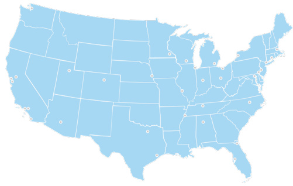  

这些患者 NCCN Guidelines 基于子宫肿瘤 NCCN ClinicalPractice Guidelines in Oncology (NCCN Guidelines®) 2023 年第 1 版 — 2022 年 12 月 22 日。  

# 资助单位  

# 患者 NCCN Guidelines 由 NCCN Foundation® 资助  

# NCCN Foundation 衷心感谢以下企业支持者对患者 NCCNGuidelines 发布的协助：Eisai, Inc. 和 GSK。  

NCCN 独立改编、更新和管理患者 NCCN Guidelines。企业支持者不参与患者 NCCN Guidelines 的制定，也不对其中包含的内容和建议负责。  

要制作礼物或了解更多信息，请在线访问或发送电子邮件  

# 目录  

#  

4 子宫癌基础知识  
10 子宫癌检查  
16 子宫癌的治疗  
30 子宫内膜癌的治疗  
45 子宫肉瘤的治疗  
56 生存状况  
62 做出治疗决定  
71 词汇表  
74 NCCN 编著者  
75	 NCCN 癌症中心  
76 索引  

NCCN Foundation 旨在通过资助和分发患者 NCCN Guidelines 来支持数百万受癌症诊断影响的患者及其家人。NCCN Foundation 还致力于通过资助国内位于癌症研究创新中心的有前途的医生以推进癌症治疗。如需更多详细信息以及完整的患者和护理者资源库，请访问NCCN.org/patients。  

# 1 子宫癌基础知识  

5 子宫  
6 子宫癌的两种主要类型  
9 关键点  

# 子宫癌基础知识  » 子宫  

子宫癌有两种主要类型。子宫内膜癌很常见，通常可以通过治疗治愈。子宫肉瘤很罕见，而且很难治疗。这两种疾病最常在绝经后被诊断出来。子宫癌最有效的治疗方法是手术。对您的癌症护理感到舒适很重要。要知道，您有权选择治疗方法。  

# 子宫  

子宫，有时也称为母胎，是生殖系统的一部分。这是怀孕期间婴儿生长发育的地方。子宫的大小和形状通常类似于梨，中间是空的。女性生殖系统的其他部分包括卵巢、输卵管、子宫颈和阴道。  

子宫两侧各有一个卵巢和一个输卵管。输卵管连接到子宫的顶部。子宫的下部称为子宫颈。子宫颈连接子宫和阴道。尽管子宫颈是子宫的一部分，但子宫颈癌（宫颈癌）的诊断和治疗与子宫癌不同。本指南不涉及宫颈癌。  

# 女性生殖系统  

女性生殖系统由子宫、子宫颈、阴道、输卵管和卵巢构成。子宫是怀孕期间婴儿生长发育的地方。  

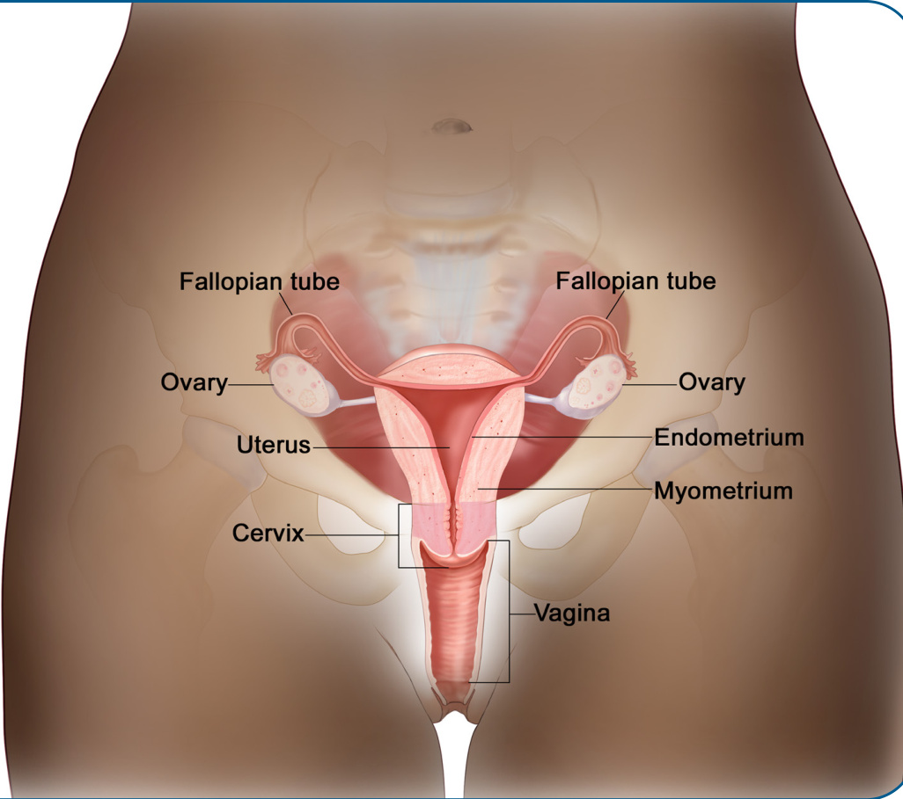  

子宫分为三个主层：  

h	 子宫内膜是排列在子宫内部的薄层组织。  
h	 子宫肌层是子宫壁的中间肌肉层。  
h	 子宫外膜或浆膜是子宫的薄外层。  

  

# 我应该接受子宫癌检查吗？  

不。在没有任何症状的情况下进行疾病检测称为“筛查”。例如，宫颈涂片检查用于筛查宫颈癌，乳房 X 光片用于筛查乳腺癌。目前还没有针对子宫内膜癌或子宫肉瘤的筛查测试。  

# 子宫癌的两种主要类型  

有两种主要类型的癌症原发于子宫：  

子宫内膜癌h	 子宫肉瘤  

下面将介绍这些子宫癌类型之间的差异。  

# 子宫内膜癌  

子宫内膜癌很常见，通常在扩散到子宫外之前就会被发现。它被称为子宫内膜癌是因为它原发于子宫内膜，即子宫内层。  

子宫内膜癌最常见的症状是阴道异常出血。通常，这意味着绝经期间或绝经后出血。绝经前患者可能会出现异常长和/或大量的月经（经期）出血。对于绝经后患者，任何阴道出血都是不正常的，应进行检查，以确保它不是癌症的体征。  

子宫内膜癌分为不同类型。最常见的类型称为子宫内膜样癌。本书和其他地方有关子宫内膜癌的大部分信息均适用于子宫内膜样癌。  

还有其他不太常见的子宫内膜癌类型。它们生长得更快，  

# 子宫癌基础知识  » 子宫癌的两种主要类型  

也更难治疗。这些高危子宫内膜癌包括：  

浆液性癌透明细胞癌未分化/去分化癌h	 癌肉瘤，也称为恶性苗勒管混合瘤 (MMMT)  

由于这些癌症更具侵袭性，因此其治疗方法与大多数子宫内膜样癌不同。这些类型将在第4部分：子宫内膜癌的治疗中单独讨论。  

# 风险因素  

确诊患有癌症后，想知道癌症为什么会发生是很正常的。有些癌症是遗传性的。这意味着您的父母通过基因将更高的风险遗传给了您。对于其他癌症，生活方式比基因起着更大的作用。对于许多类型的癌症来说，基因和生活方式都在您是否患上这种癌症方面发挥着作用。医学术语将增加患病几率的东西称为风险因素。下图显示了一些子宫内膜癌的风险因素。许多风险因素与体内雌激素过多有关。  

# 子宫内膜癌的风险因素  

子宫内膜癌的许多风险因素都与体内雌激素过多有关。肥胖是一个主要风险因素，因为体内的脂肪组织可以将体内的天然类固醇转化为雌激素。  

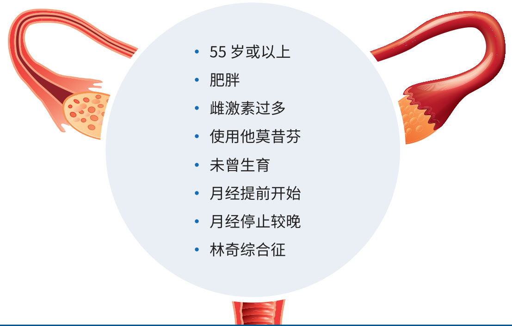  

# 子宫癌基础知识  » 子宫癌的两种主要类型  

# 子宫肉瘤  

子宫肉瘤原发于子宫的结缔组织细胞。它通常形成于子宫的肌肉层（子宫肌层）或子宫内膜的结缔组织细胞中。子宫肉瘤很罕见，可能比子宫内膜癌更难治疗。它们也被称为恶性间叶瘤。与子宫内膜癌一样，子宫肉瘤也有不同类型。  

本指南讨论了下面列出的肿瘤类型和其他类型h	 子宫内膜间质肉瘤 (ESS)腺肉瘤子宫平滑肌肉瘤 (uLMS)未分化子宫肉瘤 (UUS)血管周上皮样细胞瘤 (PEComa)h	 炎性肌纤维母细胞瘤 (IMT)  

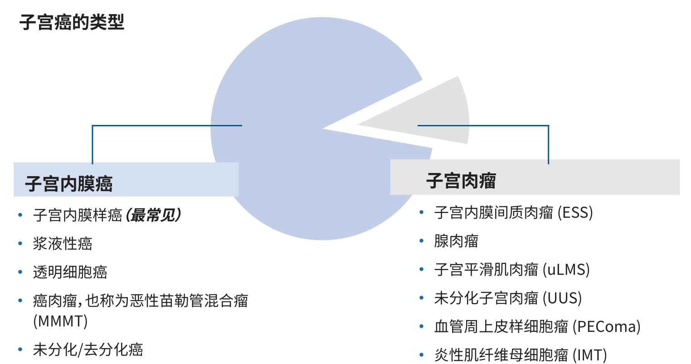  

# 关键点  

# 子宫  

h	 子宫是生殖系统的一部分。怀孕期间，婴儿在子宫内生长发育。  
h	 子宫分为三个主层。从内到外，这些层包括子宫内膜、子宫肌层和子宫外膜（浆膜）。  
有两种主要类型的癌症原发于子宫：子宫内膜癌和子宫肉瘤。  

# 子宫内膜癌  

h	 子宫内膜癌很常见，通常发现得很早。最常见的症状是阴道异常出血。  
h	 子宫内膜样瘤是最常见的子宫内膜肿瘤类型。  
h	 高危子宫内膜癌包括浆液性癌、透明细胞癌、未分化/去分化癌和癌肉瘤。  
h	 这些不太常见的类型生长得更快，且更难治疗。  

# 子宫肉瘤  

h	 子宫肉瘤原发于子宫壁或子宫肌肉。h	 这种类型的子宫癌比子宫内膜癌更罕见，且更具侵袭性。h	 子宫肉瘤通常在子宫切除术后发现。  

与您的护理团队建立个人关系。相信他们的技能和奉献精神可以帮助您！他们是您最大的财富。  

  

# 2子宫癌检查  

11 活检  
11 血液检查  
12 影像学检查  
14 家族史和基因检测  
14 肿瘤组织检查  
15 关键点  

医生会为您制定一个治疗计划。首先，他们需要收集关于癌症和您总体健康状况的信息。本章介绍了您可能需要的检查，以及制定治疗计划所需的其他步骤。  

对于疑似或确诊子宫癌，医生会进行全面身体检查。这通常包括用于检查子宫大小和活动能力的骨盆检查。医生会想了解有关您过去和当前健康状况的很多信息。他们还会询问您可能与子宫癌有关的症状，例如阴道出血。  

# 活检  

# 子宫内膜活检  

如果有阴道出血或其他可能的子宫癌症状，通常会进行子宫内膜活检。这通常可以在妇科医生办公室完成。子宫内膜活检涉及从子宫内膜（子宫内膜）取出组织样本。取出的组织由称为病理学家的专业医生进行检查。如果可能，病理学家会确定癌症类型和亚型。子宫内膜活检在诊断子宫内膜癌方面比诊断子宫肉瘤要好得多。  

# 宫颈活检  

如果医生认为癌症可能已经扩散到子宫颈，可能还需要做宫颈活检。宫颈活检与子宫内膜活检类似，但细胞是取自子宫颈而不是子宫内膜。  

# 血液检查  

全血细胞计数 (CBC) 是一种常见的血液检查。它提供了血液样本中红细胞、白细胞和血小板数量的信息。红细胞将氧气输送到全身。白细胞能够抵抗感染。血小板有助于控制出血。血细胞计数可能会因为癌症或其他问题而偏高或偏低。  

可能还会做一个称为化学概况的血液检查。它测量血液中某些物质的含量，例如代谢物、电解质、脂肪和蛋白质。这项检查提供了有关肾脏、肝脏和其他器官工作状况的信息。  

# 影像学检查  

# 超声检查  

超声检查利用声波拍摄体内照片。它能很好地显示子宫的大小、形状和位置。  

有两种类型的超声检查可用于评估子宫癌。在经腹超声检查中，会在腹部和髋骨之间的区域涂一种凝胶。凝胶有助于增强图像的清晰度。医生或技术人员会将探头放在皮肤上，并在凝胶中来回导引。  

对于经阴道超声检查，会将探头插入阴道。这可以帮助医生更清楚地看到子宫和附近区域。超声检查一般是无痛的。插入探头时可能会感到有些不适。  

# 胸部 X 线检查  

对于疑似或确诊子宫内膜癌，可能需要做胸部 X线检查。目的是寻找胸部及其周围的疾病体征。X线检查是无痛的，使用的辐射量非常小。如果发现任何异常或可疑区域，可能会要求做胸部计算机断层 (CT) 扫描，以便更好地查看。接下来介绍 CT。  

# CT  

可能会对胸部、腹部和骨盆进行 CT 扫描。医生正在寻找癌症在这些区域扩散的体征，尤其是高危肿瘤。  

CT 扫描是一种更详细的 X 线检查。它会从不同角度拍摄许多图像。计算机将这些图像组合起来制成三维 (3D) 图像。  

CT 扫描是一种更详细的 X 线检查。它是无痛且非侵入性的。CT 从不同角度拍摄许多图像。计算机将这些图像组合起来制成 3D 图像。  

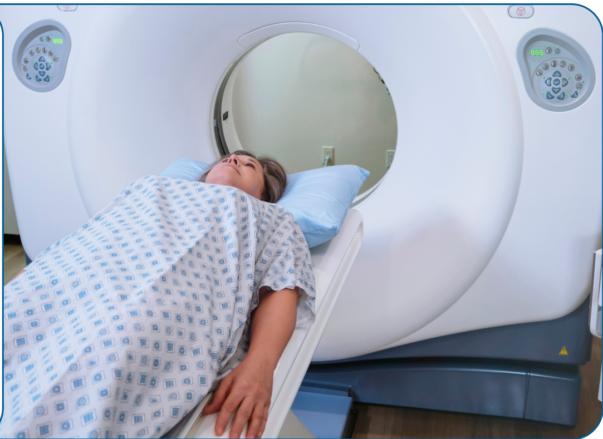  

在扫描过程中，患者面朝上躺在扫描台上，扫描台会穿过一个像隧道一样的大机器。为了看得更清楚，可能会在静脉中注射一种称为造影剂的物质。也可能会要求您喝液体造影剂以突显肠道。造影剂会使 CT 图像更清晰。造影剂可能会引起皮肤潮红或荨麻疹。扫描期间您将是独自一人，但技术人员会在附近。您能够随时听到技术人员的声音，并与之交谈。扫描期间可能会听到嗡嗡声或咔哒声。  

# PET/CT 扫描  

如果医生怀疑癌症已扩散到骨盆以外（转移），可能会将 CT 与另一种称为正电子发射断层扫描(PET) 的影像学检查结合使用。PET 会使用少量称为放射性示踪剂的放射性物质。大约在扫描前一小时，会给您一种注射糖放射性示踪剂。放射性示踪剂会释放出少量能量，可以通过影像机看到。癌症在图像中显得更明亮，因为癌细胞消耗糖的速度比正常细胞更快。  

# 骨盆 MRI  

可能需要对骨盆进行磁共振成像 (MRI)。MRI 可以清晰地显示子宫和子宫颈的组织。MRI 可以显示癌症是否已经扩散到子宫颈或其他附近的器官。MRI 使用强磁场和无线电波对人体内部区域进行成像。它特别擅长拍摄软组织区域的清晰图像。与 CT 扫描或胸部 X 线检查不同，MRI 不使用辐射。如果您在狭小的空间内感到紧张，请告诉医生。  

MRI 在不使用辐射的情况下拍摄身体内部区域的图像。MRI 可以清晰地显示子宫和子宫颈的组织。如果您在狭小的空间内感到紧张，请告诉护理团队。  

  

# 家族史和基因检测  

大多数子宫内膜癌是由 DNA 的随机（非遗传性）突变引起的。只有大约 $5 \%$ 是由遗传风险引起的。然而，医生会想知道您是否有癌症家族史，或者可能会增加患癌症风险的其他疾病。林奇综合征，也称为遗传性非息肉病性结直肠癌 (HNPCC)，是一种遗传性癌症综合征。  

林奇综合征与结直肠癌、子宫内膜癌、卵巢癌和其他癌症密切相关。与没有遗传风险的患者相比，患有林奇综合征的人患子宫内膜癌的发病时间往往要早 10 到 20 年。李-佛美尼症候群 (LFS)是另一种遗传性癌症风险综合征。LFS 患者患子宫肉瘤的风险更高。为了确定哪些人应该接受林奇综合征检测，需要检测肿瘤的错配修复 (MMR)蛋白表达。  

# 错配修复 (MMR)  

在正常细胞中，一种称为 MMR 的过程可以修复DNA 分裂及其自我复制时发生的错误。细胞的MMR 系统不能正常工作时，错误会累积，并导致DNA 变得不稳定。这称为微卫星不稳定性 (MSI)。  

有两种实验室检查来检测这种生物标志物。根据所使用的方法，异常结果称为高度微卫星不稳定性 (MSI-H) 或错配修复缺陷 (dMMR)。非 dMMR/MSI-H 肿瘤被称为微卫星稳定 (MSS) 或错配修复正常 (pMMR)。建议每个诊断为子宫内膜癌的人都要进行 MMR/MSI 检测，子宫肉瘤也可能需要进行 MMR/MSI 检测。使用活检样本或手术期间切除的肿瘤进行检测。如果癌症是 dMMR/MSI-H，可能还需要做林奇综合征检测。  

如果肿瘤没有异常 MMR 结果，但有子宫内膜癌和/或结直肠癌的持久家族史，建议进行遗传咨询和遗传（种系）突变检测。如果您患有林奇综合征或 LFS，我们将对您进行密切监测，并就如何降低患其他癌症的风险提供建议。  

# 肿瘤组织检查  

# 激素受体检测  

一些癌细胞含有雌激素和孕激素可以附着的蛋白质。这些蛋白质称为受体。一旦附着，激素可能会帮助肿瘤生长或抑制肿瘤生长。了解肿瘤细胞是否具有激素受体可能会影响治疗计划。  

检测包括在实验室分析一小块肿瘤。如果肿瘤细胞具有激素受体，则这种癌症称为雌激素和/或孕激素受体“阳性”。建议对大多数子宫肉瘤以及复发性或晚期子宫内膜癌进行激素受体检测。  

# HER2  

HER2 是一种存在于细胞表面的蛋白质。一些子宫内膜癌含有过多的 HER2 蛋白。这会导致癌症快速生长和扩散。建议对某些晚期或复发性高危子宫内膜肿瘤进行 HER2 检测。  

# 关键点  

# 活检  

h	 子宫内膜癌通常通过子宫内膜活检来诊断。这涉及从子宫内膜取出组织样本。  
h	 子宫内膜活检通常可以很好地诊断子宫内膜癌，但对子宫肉瘤的诊断并不可靠。  

# 其他检查  

h	 治疗前的其他检查包括体检、健康史和血液检查。  
h	 也可能建议做影像学检查，包括超声检查、胸部 X 线检查、CT、骨盆 MRI，可能还有PET/CT。  

# 家族史和基因检测  

h	 大多数子宫内膜癌是由 DNA 的随机（非遗传性）突变引起的。  
h	 林奇综合征是一种遗传综合征，与结直肠癌、子宫内膜癌、卵巢癌和其他癌症密切相关。  
h	 如果您有癌症家族史或可能增加患癌症风险的其他疾病，请告诉医生。  
h	 为了确定哪些人应该接受林奇综合征检测，需要检测肿瘤的 MMR 蛋白表达。  
h	 建议每位确诊患有子宫内膜癌的人做MMR/MSI 检测。  

# 肿瘤组织检查  

h	 建议对大多数子宫肉瘤和晚期（III 期或 IV期）或复发性子宫内膜癌进行激素受体检测。  
h	 激素受体检测是在手术后使用切除的肿瘤进行的。  

# 3 子宫癌的治疗  

17 手术  
18 手术分期  
24 放疗  
26 全身性治疗  
27 临床试验  
29 关键点  

# 子宫癌的治疗  » 手术  

本章介绍了子宫癌的主要治疗方法。您的治疗方案将取决于您是否适合手术，以及其他因素。  

# 手术  

如果可能，手术是子宫癌的首选治疗方法。最常见的手术是全子宫切除术和双侧输卵管卵巢切除术 (BSO)。全子宫切除术切除子宫，包括子宫颈。BSO 切除双侧卵巢和双侧输卵管。  

子宫切除术后不可能再怀孕。如果您愿意，保留生育能力疗法可能是一种选择。有关保留生育力疗法的更多信息，请参见第4部分：子宫内膜癌的治疗。  

不太常用的子宫癌手术包括：  

h	 根治性子宫切除术：子宫、子宫颈、子宫颈附近的一些组织和部分阴道都会被切除。  
h	 全子宫切除术和单侧输卵管卵巢切除术(USO)：子宫、子宫颈、一个卵巢和一根输卵管被切除。  
h	 全子宫切除术和双侧输卵管切除术 (BS)：子宫、子宫颈和两根输卵管均被切除。卵巢留在体内。  

# 全子宫切除术和 BSO  

子宫癌最常用的手术，包括切除子宫（包括子宫颈）、双侧卵巢和双侧输卵管。  

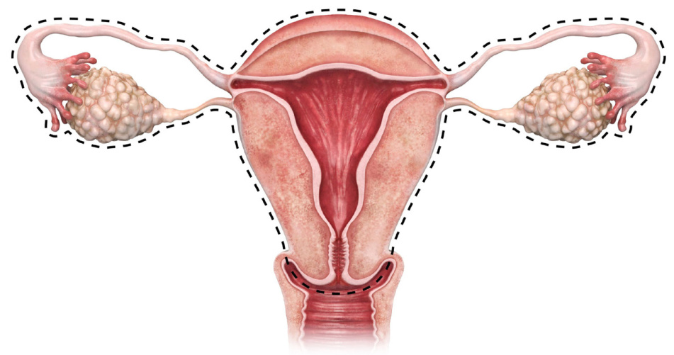  

微创手术只需在身体上做几个小切口即可进行。微创手术通常会减少疼痛和疤痕。此外，与腹部切口较大的手术相比，恢复所需的时间通常更短。根据子宫癌的类型和程度，微创手术可能是一种选择。  

有时，肿瘤最终会比预期的要大，或者扩散到其他部位。在这种情况下，肿瘤减积手术可能是一种合适的治疗方法。  

在肿瘤减积手术中，外科医生尝试切除所有看得见或摸得着的肿瘤。如果所有肿瘤都被切除，或者除了直径不超过 1 厘米的植入物之外的所有肿瘤都被切除（理想减积手术），则认为肿瘤减积手术是成功的。  

在安全情况下，减积手术对于子宫内膜癌来说是一个好主意，因为这可能意味着其他治疗方法有更好的机会杀死残留的肿瘤细胞。  

# 手术分期  

在手术过程中，外科医生会非常仔细地观察最靠近骨盆的组织和器官是否有癌症体征，并对任何可疑区域取样进行检测。  

外科医生可能会将液体注入腹部的开放空间，然后将其取出，查看是否有癌细胞。这就是所谓的腹腔灌洗。通常会切除淋巴结并进行癌症检查。这可以通过称为前哨淋巴结活检的程序来完成。  

手术期间获得的第一手信息与手术前进行的检查一起用于确定癌症的分期（程度）。这个过程称为手术分期。癌症分期有助于医生决定手术后是否需要进一步治疗。  

有两个系统用于子宫癌分期：国际妇产科联合会(FIGO) 系统和美国癌症联合委员会 (AJCC) 肿瘤、淋巴结、转移 (TNM) 系统。两个系统都使用以下有关癌症的关键信息进行分期：  

h	 肿瘤大小或程度/深度  
h	 淋巴结是否有癌变  
h	 癌症是否已扩散到身体的其他部位（转移）  

子宫内膜癌和子宫肉瘤有四个主要分期。接下来将更详细地介绍每个分期。一般来说，处于较早癌症分期的患者会有更好的预后，但并非总是如此。有些患者在他们的分期中会好于预期，而有些患者则会比预期更差。  

# 子宫内膜癌的分期  

在 FIGO 分期系统中，子宫内膜癌有四个主要分期：I 期、II 期、III 期和 IV 期。有些分期又分为子分期，子分期可能标有字母，也可能还标有数字。例如 IIIB 期和 IIIC2 期。以下几页的插图显示了这些分期。  

# I 期子宫内膜癌  

肿瘤位于子宫主体。  
还没有长到子宫颈。  

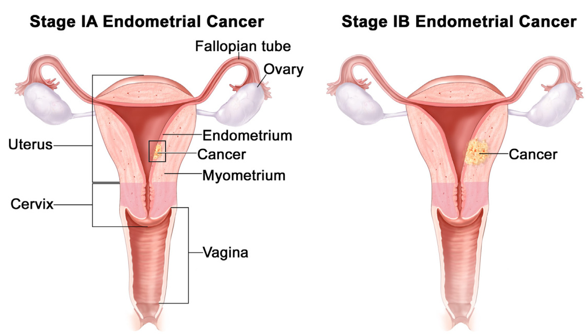  

II 期子宫内膜癌肿瘤已长入子宫颈。  

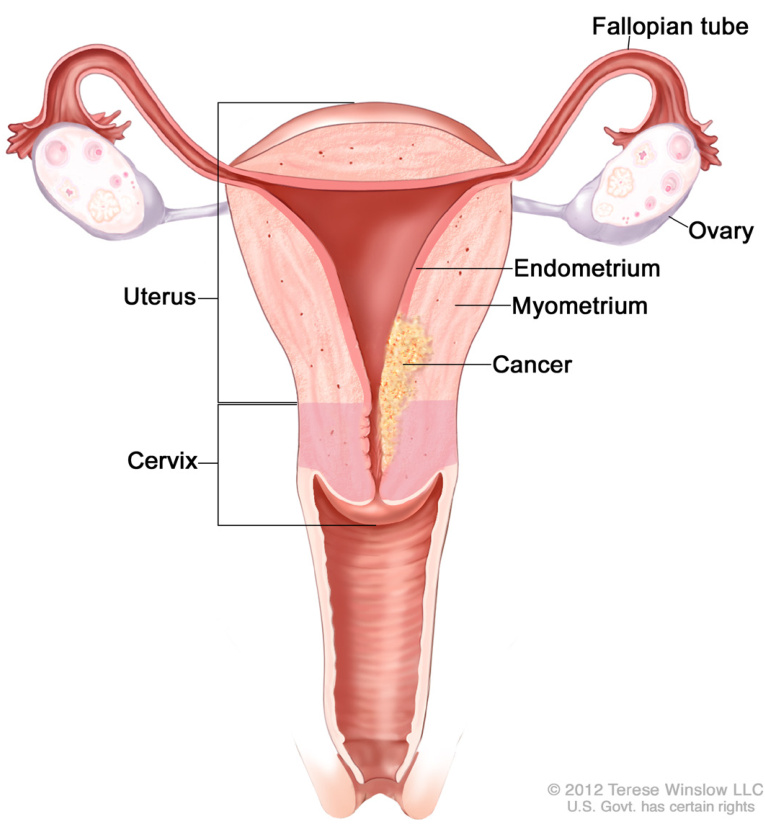  

# IIIA 期子宫内膜癌  

肿瘤已生长到子宫外层、卵巢或输卵管。  

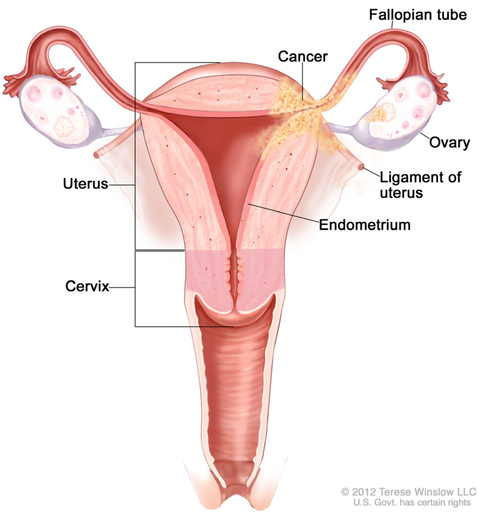  

# IIIB 期子宫内膜癌  

阴道或子宫周围的脂肪和结缔组织中有癌症。  

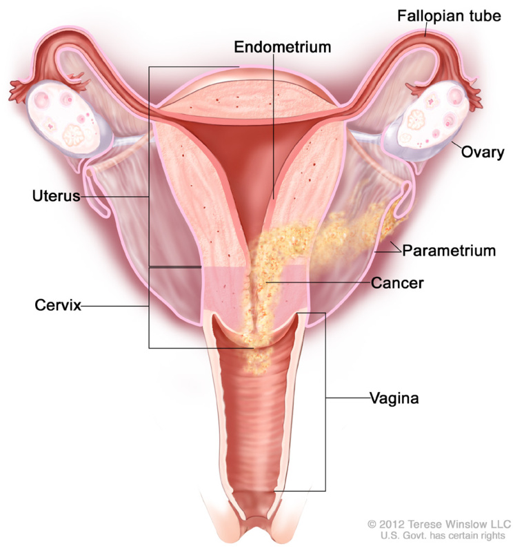  

# IIIC 期子宫内膜癌  

最靠近子宫的淋巴结（称为骨盆淋巴结，IIIC1 期）或靠近脊柱底部的淋巴结（称为主动脉旁淋巴结，IIIC2 期）中有癌症。  

# IVA 期子宫内膜癌  

癌症已经扩散到膀胱或肠道的内层。  

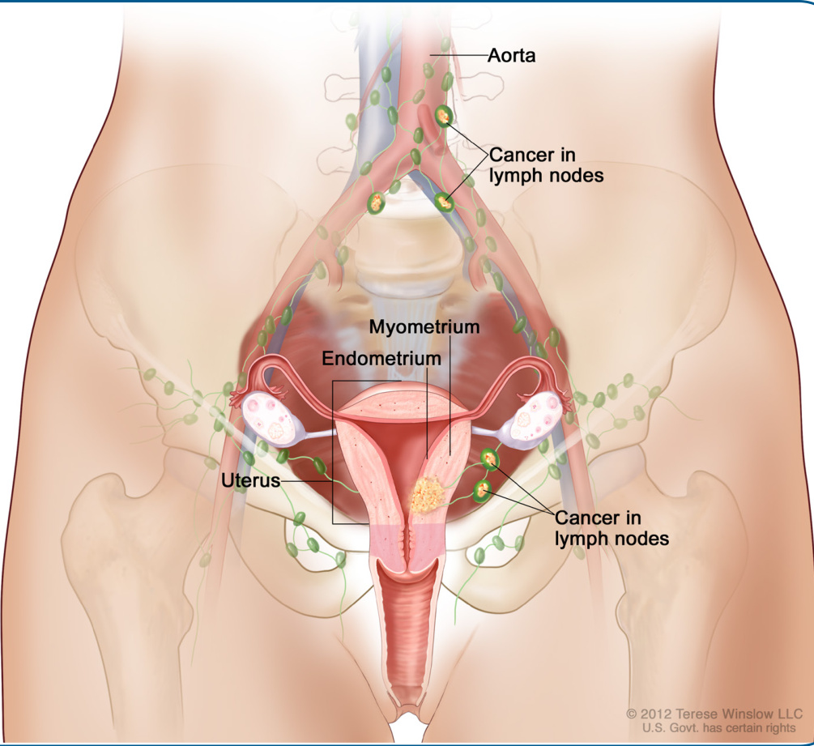  

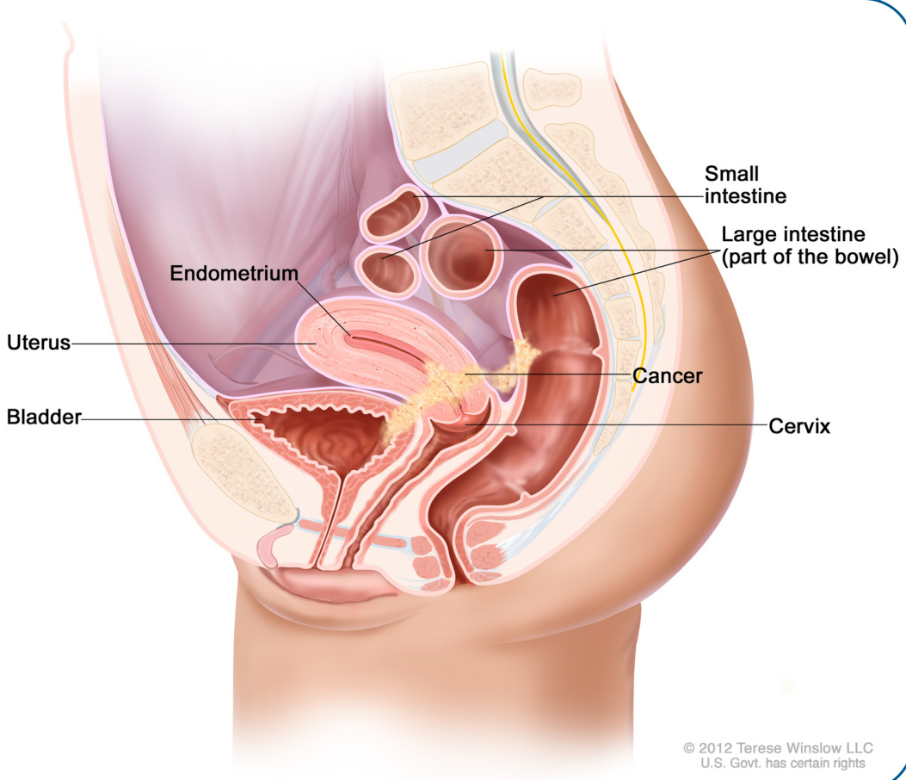  

# IVB 期子宫内膜癌  

癌症已扩散到远离子宫的区域，例如腹部、骨骼或肺部。腹部包括胰腺、胃、肠、肝脏和胆囊。  

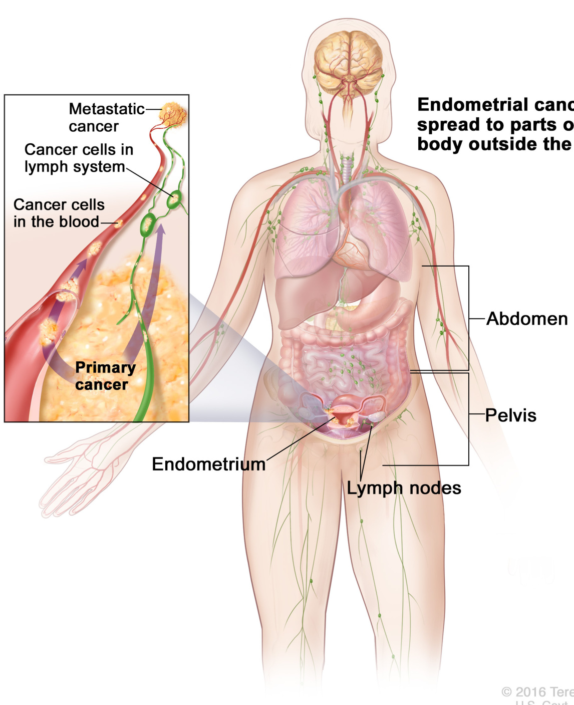  

# 子宫肉瘤的分期  

在 FIGO 分期系统中，子宫肉瘤有四个主要分期：I 期、II 期、III 期和 IV 期。所有分期又分为标有字母的子分期。请参见指南 1。  

# 指南 1平滑肌肉瘤 (LMS)、子宫内膜间质肉瘤 (ESS) 和腺肉瘤的分期  

<html><body><table><tr><td colspan="2">1期－肿瘤很小且仅位于子宫内。</td></tr><tr><td>IA期</td><td>对于 LMS和 ESS:肿瘤为5厘米(约 2英寸)或更小 对于腺肉瘤：肿瘤仅存在于子宫内膜中。</td></tr><tr><td>IB期</td><td>对于LMS和 ESS:肿瘤大于5 厘米。 对于腺肉瘤：肿瘤生长到子宫肌层的一半以下。</td></tr><tr><td>IC期</td><td>腺肉瘤:肿瘤生长到子宫肌层的一半以上。</td></tr><tr><td colspan="2">ⅡI期－肿瘤已扩散到子宫外，但仍在骨盆内。</td></tr><tr><td>IIA期</td><td>肿瘤已长入卵巢或输卵管。</td></tr><tr><td>IIB期</td><td>肿瘤也已经生长到骨盆的其他组织中。</td></tr><tr><td colspan="2">川I期-腹部有癌症，附近的淋巴结也可能有癌症。</td></tr><tr><td>IIA期</td><td>肿瘤已生长到腹部的一个区域。</td></tr><tr><td>IIIB期</td><td>肿瘤已生长到腹部的两个区域。</td></tr><tr><td>IIIC期</td><td>附近的淋巴结有癌症。</td></tr><tr><td colspan="2">IV期－膀胱或直肠有癌症，远离子宫的区域也可能有癌症。</td></tr><tr><td>IVA期</td><td>肿瘤已长入膀胱或直肠。</td></tr><tr><td>IVB期</td><td>癌症已扩散到远离子宫的区域，例如肺部。</td></tr></table></body></html>  

# 放疗  

放疗使用类似于 X 射线的高能波来杀死癌细胞。这是子宫内膜癌和子宫肉瘤的常用治疗方法。接下来介绍可用于治疗子宫癌的放疗类型。您可能会接受不止一种类型的治疗。  

# 外照射放疗  

在外照射放疗 (EBRT) 中，一台大型机器将射线瞄准癌症灶。射线穿过皮肤和其他组织到达肿瘤。EBRT 以小剂量给药，称为分次给药。对于子宫癌的治疗，EBRT 通常每周进行 5 天，持续 5 至6 周。  

在治疗开始前需要进行疗程规划，称为模拟。您首先要摆好治疗体位。将要求您仰卧并保持不动。可能会给您放一个支撑物，帮助您在放射疗程期间保持不动。将通过 CT 扫描获取癌症灶的图像。放射肿瘤医生将使用 CT 扫描图像和复杂的计算机软件制定一个治疗计划，将放射束瞄准肿瘤和附近的淋巴结。这个计划阐述了适用于您的最佳放射剂量，以及所需的疗程次数。  

治疗过程中，您将像模拟时一样躺在治疗台上。可能会使用阻止您移动的装置。这有助于瞄准肿瘤。皮肤上的墨迹有助于您在日常治疗中准确摆好体位。您独自一人待在治疗室。技术人员在旁边的房间里操作机器。技术人员能够随时看到、听到您，并能够与您交谈。进行治疗时，您可能会听到噪音。您不会看到、听到或感觉到辐射。一次疗程大约需要 20 分钟，光束开启时间大约为两分钟。  

# 外照射放疗 (EBRT)  

一台大型机器将射线瞄准肿瘤，穿过皮肤和其他组织到达肿瘤。  

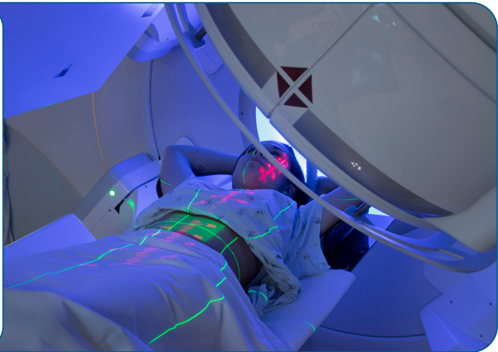  

# IMRT  

有一种先进类型的 EBRT，称为调强放疗 (IMRT)，可用于治疗子宫癌。IMRT 使用许多不同强度的小射束。这使得高剂量辐射能够瞄准肿瘤，同时限制了对周围正常组织的辐射量。通过 IMRT，可以减少对附近重要器官和结构的辐射，例如肠道和膀胱。这有助于减少与治疗相关的副作用。  

# SBRT  

立体定向放疗 (SBRT) 是一种高度专业化的EBRT 类型。它可用于治疗已扩散到肝脏、肺部或骨骼的子宫内膜癌。使用非常精确的射束将高剂量辐射传递到一个或多个转移灶。SBRT 通常需要 5 次或更少的疗程。  

# 立体定向放射外科 (SRS)  

SRS 是一种非手术高精度放疗。它可用于治疗小型脑瘤或脊椎肿瘤。  

# 副作用  

在 5 至 6 周的体外照射治疗期间，治疗部位的常见副作用包括皮肤刺激、压痛和发红。放疗的其他短期副作用包括疲劳、腹泻、尿频或排尿时疼痛、以及恶心。治疗结束后，这些副作用大多数会随时间推移而减轻。放疗的副作用可能不会马上感觉到。它们可能会在治疗周期后期，甚至在治疗结束后出现并恶化。  

子宫癌的放疗还可能对生育能力、性健康、以及肠道和膀胱功能产生长期且可能严重的副作用。请参见第 ${ \pmb 6 }$ 部分：生存状况，了解有关帮助预防、限制或管理这些副作用的方法的信息。  

# 近距离放疗  

另一种用于子宫癌的放疗称为近距离放疗或体内照射。之所以称为体内治疗，是因为会将抗癌放射性物质放入患者体内，要么直接进入肿瘤，要么靠近肿瘤。通过放置在阴道或子宫内的空心管，可以将小辐射颗粒递送到肿瘤区域。这样就可以进行多次递送安全剂量。  

# 全身性治疗  

全身性治疗是使用能够在血液中流动、到达并影响全身细胞的物质进行的治疗。全身性治疗的类型包括化疗、靶向治疗、免疫治疗和内分泌治疗。  

# 化疗、靶向治疗和免疫治疗  

化疗是子宫癌最常用的全身性治疗类型。它通过杀死细胞或阻止癌细胞分裂来阻止癌细胞的生长。大多数化疗药物通过输注给药。这意味着它们是通过静脉缓慢注入血液的液体。  

靶向治疗和免疫治疗是较新类型的全身性治疗。它们可能是对化疗无缓解、化疗后复发（复发性）、或扩散到骨盆以外（转移性）的子宫癌的治疗选择。与化疗不同，靶向治疗和免疫治疗对于治疗具有特定特征（称为生物标志物）的癌症最有效。  

化疗、靶向治疗和免疫治疗除了杀死癌细胞外，还可以杀死健康细胞。对健康细胞的损害会导致潜在的严重副作用，例如脱发、皮肤皲裂和口腔溃疡。  

这些类型的全身性治疗通常以治疗日加休息日为疗程进行。这样能让身体充分恢复，然后再接受下一个疗程的治疗。例如，您可能连续 1 周每天接受化疗，然后 3 周不接受化疗。这 4 周构成一个疗程。疗程的长短取决于所使用的药物。  

# 内分泌治疗  

雌激素和孕激素都是激素。它们会影响子宫中癌细胞的生长。内分泌治疗是一种改变体内某些激素水平的癌症治疗方法。它与可用于控制更年期症状的激素治疗不同，后者称为激素替代疗法(HRT)。  

接下来介绍可用于治疗子宫癌的内分泌治疗类型。  

孕激素是激素孕酮的实验室制造版本。它们有助于减缓子宫内膜癌细胞的生长。用于治疗某些子宫癌的孕激素包括：  

醋酸甲羟孕酮（安宫黄体酮）（口服）  
醋酸甲地孕酮（口服）  
左炔诺孕酮（曼月乐）（一种释放孕激素的宫内节育器 (IUD)）  

芳香化酶抑制剂是口服药物。它们可以阻止体内脂肪组织产生雌激素。结果，体内雌激素的总量降低。芳香化酶抑制剂包括：  

阿纳托唑（瑞宁得）来曲唑（弗隆）依西美坦（阿诺新）  

他莫昔芬是一种用于降低体内雌激素含量的药物。它是口服药。他莫昔芬不用于子宫肉瘤。  

氟维司群（芙仕得）阻断可导致癌细胞生长的雌激素受体。氟维司群通过注射（推注）给药。  

促性腺激素释放激素 (GnRH) 激动剂通过降低卵巢功能正常患者的雌激素水平发挥作用。  

# 副作用  

内分泌治疗可能会引起副作用。更年期症状很常见。这些症状包括潮热、情绪变化、阴道干燥、睡眠困难和盗汗。内分泌治疗的其他常见副作用包括阴道分泌物、体重增加、手脚肿胀、疲劳和性欲降低。血栓是他莫昔芬的一种罕见但严重的副作用。芳香化酶抑制剂会削弱骨骼，还可能导致关节和肌肉疼痛。  

向治疗团队索要您正在接受的每种全身性治疗的常见和罕见副作用的完整列表。  

# 临床试验  

临床试验是医学研究的一种。在开发出潜在抗癌新方法并经过实验室测试后，需要在人体内进行研究。如果在临床试验中发现药物、设备或治疗方法安全有效，则可能会获得美国食品和药物管理局 (FDA) 的批准。  

所有癌症患者都应仔细考虑所有适用于其癌症类型的治疗方案，包括标准治疗和临床试验。请与医生讨论临床试验是否对您有意义。  

# 分期  

大多数癌症临床试验都侧重于治疗。治疗试验分期进行。  

h	 I 期试验研究试验性药物或治疗方法的安全性和副作用。他们还寻找药物或治疗方法可以起作用的早期体征。  
h	 II 期试验研究药物或方法针对特定类型癌症的疗效。  
h	 III 期试验将药物或方法与标准治疗进行对比。若结果良好，就可能获得 FDA 的批准。  
h	 IV 期试验研究 FDA 批准治疗的长期安全性和获益。  

# 谁能入选？  

每项临床试验都有参加的规则，这叫做入排标准。规则可能与年龄、癌症类型和分期、治疗史或一般健康状况有关。这些要求确保受试者在特定方面相似，并且试验对受试者尽可能安全。  

# 知情同意  

临床试验由一组称为研究团队的专家管理。研究团队将与您详细审查研究，包括其目的以及加入的风险和获益。还将以知情同意书的形式提供所有这些信息。请仔细阅读同意书，并在签署前提出问题。花些时间与家人、朋友或您信任的其他人讨论。请记住，您可以随时离开，寻求临床试验之外的治疗。  

# 开始对话  

不要等医生提出临床试验。由您开始对话，了解所有治疗方案。如果您发现一项可能有资格参加的研究，请询问治疗团队您是否符合要求。如果无法加入，请不要气馁。总会有可用的新临床试验。  

# 常见问题  

围绕临床试验存在许多谬见和误解。许多癌症患者并不清楚可能的获益和风险。  

# 我会不会服用安慰剂？  

几乎不会进行仅使用安慰剂（真正药物的非活性版本）的癌症临床试验。但接受标准治疗联合安慰剂或标准治疗联合新药的情况很常见。如果安慰剂是临床试验的一部分，将会在您入组前通过口头和书面形式通知您  

# 我必须付费才能参加临床试验吗？  

这种情况很少。这取决于研究、您的健康保险和您的居住地。您的治疗团队和研究团队可以帮助确定您是否需要承担任何费用。  

670 寻找临床试验  

# 在美国  

GOG Foundation gog.org  

NCCN 癌症中心NCCN.org/cancercenters  

国家癌症研究所 (NCI)cancer.gov/about-cancer/treatment/clinical-trials/search  

NRG 肿瘤学会 nrgoncology.org  

# 全球  

美国国家医学图书馆 (NLM)clinicaltrials.gov  

# 在寻找临床试验方面需要帮助？  

NCI 的癌症信息服务 (CIS)1.800.4.CANCER (1.800.422.6237)cancer.gov/contact  

# 关键点  

# 手术和分期  

h	 全子宫切除术联合双侧输卵管卵巢切除术(BSO) 是治疗子宫癌最常用的手术。手术和检查结果用于对癌症进行分期。这称为手术分期。  
h	 手术分期描述了体内癌症灶的数量及其扩散的部位。  
h	 子宫内膜癌和子宫肉瘤的分期不同。每种类型都有四个主要分期。  

# 放疗  

h	 放疗使用高能射线杀死癌细胞或阻止产生新的癌细胞。  
h	 外照射放疗 (EBRT) 和阴道近距离放疗通常用于治疗子宫癌。  

# 全身性治疗  

h	 全身性治疗是使用能够在血液中流动、到达并影响全身细胞的物质进行的治疗。  
h	 化疗、内分泌治疗、靶向治疗和免疫治疗都是全身性治疗的类型。  

# 临床试验  

h	 临床试验给人们提供了试验性测试和治疗的机会，这些测试和治疗可能会及时得到FDA 的批准。  

# 4 子宫内膜癌的治疗  

31 子宫内膜样癌  
37 高危子宫内膜癌  
40 治疗结束后  
41 复发  
44 关键点  

本章介绍子宫内膜癌的推荐治疗方案。首先讨论最常见类型子宫内膜肿瘤（子宫内膜样肿瘤）的治疗，然后讨论高危类型的治疗。  

在开始治疗前，了解癌症是否已经扩散非常重要。它在如何治疗方面（以及在多大程度上）是否发挥了作用。主要有以下三种可能性：  

h	 癌症仅发生在子宫的主要部分（而不是子宫颈）。h	 癌症已经生长到子宫颈。h	 癌症已从子宫扩散到身体的其他部位。接下来讨论每种情况下的治疗方法。  

# 子宫内膜样癌  

# 癌症只存在于子宫内  

子宫内膜癌通常在扩散到子宫体以外之前就被发现。在这种情况下，最有效的治疗方法是手术。如果您愿意并且能够进行手术，建议做全子宫切除术 (TH) 和双侧输卵管卵巢切除术 (BSO)。TH切除子宫和子宫颈。有必要切除子宫颈，因为子宫癌可以扩散到子宫颈。BSO 切除卵巢和输卵管。也许可以保留卵巢。卵巢保留将在下面详细讨论。  

子宫切除术后不可能再怀孕。如果还有可能怀孕且希望如此，保留生育能力的治疗可能是一种选择。请参阅下一页了解更多信息。  

如果可能，对于尚未扩散到子宫体以外的子宫内膜样癌，首选微创手术。在手术过程中，外科医生将评估癌症的程度，并切除组织和淋巴结进行检查。手术和检查结果用于对癌症进行分期。这称为手术分期。这个分期用于确定手术后所需的治疗。请参阅第 36 页上的术后治疗了解后续步骤。  

# 卵巢保留  

绝经前，卵巢会产生雌激素和孕激素。切除卵巢会导致雌激素突然丧失。这称为手术绝经。手术绝经的副作用包括潮热、睡眠问题、情绪变化和阴道萎缩。阴道萎缩是一种阴道内壁变薄、干燥和发炎的病症。  

雌激素不足还存在长期风险。这些风险包括心脏或血管问题（心血管疾病）和骨质流失（骨质疏松症）。  

如果您处于绝经前，保留卵巢可能是安全的。这称为卵巢保留。在以下情况下，这可能是一个选择：  

h	 癌症处于 I 期影像学检查显示卵巢正常  
h	 没有乳腺癌、卵巢癌或林奇综合征的家族史  

如果能够保留卵巢，仍然建议将输卵管随子宫一起切除。  

# 拒绝或不能先做手术  

如果不想做手术或因其他健康原因不能做手术，则首选放疗。可以使用外照射放疗 (EBRT)、近距离放疗（内照射），或两者联合治疗。  

另一种选择是内分泌（激素）治疗。激素治疗通常仅考虑用于小型或生长缓慢的子宫内膜样肿瘤。优选口服孕激素，例如醋酸甲羟孕酮（安宫黄体酮）和醋酸甲地孕酮。在某些情况下，释放孕激素的宫内节育器 (IUD) 可能是更好的选择。曼月乐就是一个例子。它含有孕激素左炔诺孕酮。  

# 保留生育能力疗法  

切除子宫、子宫颈、输卵管和卵巢的手术是尚未扩散到子宫外的子宫内膜癌的标准治疗方法。没有子宫就不可能怀孕。对于一些确诊为子宫内膜癌的人来说，这可能很难接受。  

如果您患有低风险子宫内膜癌，想要治疗癌症，但也希望尝试在未来有一个孩子，保留生育能力疗法可能是一种选择。它包括推迟手术，并首先采用激素治疗来治疗癌症。如果激素治疗效果良好，杀死了所有癌症，您可以尝试怀孕。  

保留生育能力疗法只是某些低风险子宫内膜癌的一种选择。在以下情况下，这可能是一种选择：  

h	 肿瘤为子宫内膜样瘤（最常见的类型）。  
h	 影像学检查显示癌症并没有超出子宫内膜。  
h	 癌细胞为 1 级。这意味着它们在显微镜下看起来与健康细胞相似。  
h	 没有任何医学原因证明您不能（或不应该）怀孕。  
h	 没有任何医学原因证明您不能或不应该接受激素治疗。激素治疗的禁忌症包括中风、心肌梗塞、肺栓塞、深静脉血栓形成和吸烟。  
h	 您完全了解保留生育能力疗法不是子宫内膜癌的标准治疗方法。  
h	 您同意定期进行子宫内膜活检，以检查治疗是否有效。  

在开始保留生育能力疗法治疗之前，建议咨询生育专家。您可能还需要进行遗传咨询和检测。  

# 子宫内膜癌的治疗 » 子宫内膜样癌  

在保留生育能力疗法治疗期间，保持健康的体重和生活方式非常重要。它可能会带来更好的治疗效果。预期医生会询问您的饮食、活动水平和其他与生活方式相关的因素。  

激素治疗有 3 种选择。全部使用人造孕激素：  

醋酸甲羟孕酮（安宫黄体酮）（口服）醋酸甲地孕酮（口服）h	 孕激素宫内节育器 (IUD)（例如曼月乐）  

为了了解激素治疗是否有效，每 3 至 6 个月会从子宫内膜取组织样本进行检测。这通过子宫内膜活检或扩张和刮宫术（“D&C”）来完成。  

如果激素治疗效果良好并且癌症在 6 个月后消失，则可以停止激素治疗并开始尝试怀孕。尝试怀孕期间，将继续每 6 个月检测一次子宫内膜。  

如果激素治疗成功，但您没有立即开始尝试怀孕，医生可能会建议您继续接受基于孕激素的激素治疗，以保持良好效果。如果在尝试怀孕期间癌症复发，医生会建议您做手术。  

如果激素治疗无效且 6 至 12 个月后癌症仍然存在，则建议做手术。保留卵巢可能是一种选择。  

# 宫内节育器 (IUD)  

释放左炔诺孕酮的宫内节育器是保留生育能力疗法中使用的激素治疗方法之一。  

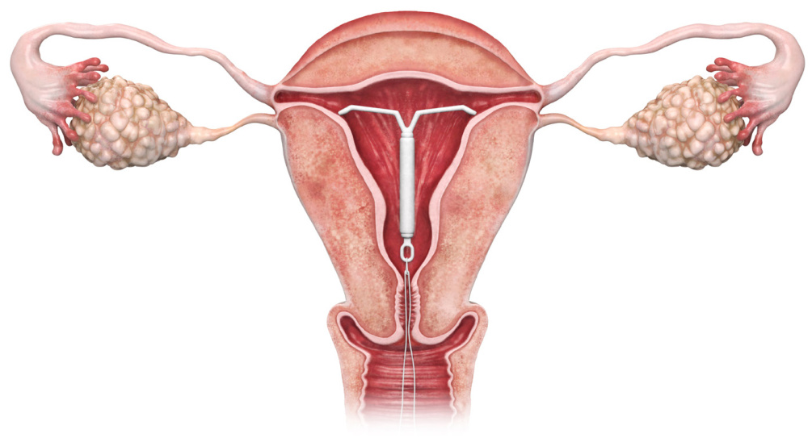  

# 癌症已扩散至子宫颈  

如果宫颈活检或骨盆磁共振成像 (MRI) 显示癌症已生长到子宫颈，治疗方案取决于是否可以先做手术。如果可能，最好先做手术。  

如果您同意手术并且身体健康，建议做全子宫切除术或根治性子宫切除术，并结合 BSO 切除输卵管和卵巢。  

外科医生将在手术过程中评估癌症的程度，并取出组织和淋巴结进行检测。病理学家将检查取出的组织并确定癌症分期。这称为手术分期。这个分期用于确定手术后所需的治疗。请参阅第 36页上的术后治疗了解后续步骤。  

在某些情况下，可能会在手术前先采用 EBRT 联合近距离放疗来尝试缩小癌症。然而，如果可能，通常建议直接进行手术。如果术前做了放疗，术后就不会再做了。请参阅第 40 页上的治疗结束后了解后续步骤。  

# 拒绝或不能先做手术  

如果您不想做手术或因其他健康原因不能做手术，还有其他治疗选择。最常见的是，首先采用放疗尝试缩小肿瘤。做 EBRT 联合近距离放疗。除放疗外，还可做铂基化疗。当与放疗联合时，化疗可以使放疗更容易杀死癌细胞。这些治疗的联合使用称为放化疗。如果放疗（和化疗（如果做）效果良好且您同意，则做手术可能是一种选择。  

对于不能先做手术的人来说，另一种选择是单独化疗来尝试缩小癌细胞。此时，首选方案是卡铂联合紫杉醇。如果效果良好，做手术可能是一种选择。如果仍然不能做手术，推荐 EBRT 联合近距离放疗。  

# 癌症已扩散到子宫外  

对于已经扩散到子宫外的癌症的治疗，取决于癌症扩散的程度以及是否可以先通过手术切除。  

# 您愿意且有能力先做手术  

如果癌症尚未扩散到骨盆或腹部之外，建议做全子宫切除术和 BSO。外科医生会尝试尽可能多地切除肿瘤。有些人会在术前接受化疗，尝试缩小肿瘤。  

在手术过程中，外科医生将评估癌症的程度，并切除组织和淋巴结进行检查。病理学家将检查取出的组织并确定癌症分期。这称为手术分期。这个分期用于确定手术后所需的治疗。已扩散到子宫外的子宫内膜癌为 III 期或 IV 期。请参阅第 36页上的术后治疗。  

如果癌症已扩散到远离骨盆的区域（已转移），建议进行全身性治疗。此时，首选方案是卡铂联合紫杉醇。除化疗外还可使用 EBRT。也可以考虑手术（全子宫切除术和 BSO），但目的不是治愈癌症。目的是缓解癌症引起的症状并进一步限制其扩散。这称为姑息性手术。如果计划做手术，立体  

定向放疗 (SBRT) 可用于摧毁小的转移性肿瘤。  
请参阅第 40 页上的治疗结束后了解后续步骤。  

# 拒绝或不能先做手术  

如果不想手术或因其他健康原因不能做手术，治疗方案取决于癌症扩散的程度。如果癌症尚未扩散到骨盆或腹部之外，建议 EBRT。除体外照射外，还可以做近距离放疗、全身性治疗，或两者联合治疗。如果治疗效果良好且您愿意，也可以做手术。  

如果癌症已发生转移，建议全身性治疗。如果效果良好且您愿意，也可以做手术。否则，放疗可能是一种选择。  

  

# 子宫内膜癌会遗传吗？  

通常不会。大多数子宫内膜癌病例是由DNA 随机（非遗传性）突变引起的。只有大约 $5 \%$ 的子宫内膜癌是由遗传风险引起的。这包括患有称为林奇综合征的遗传性疾病患者。林奇综合征患者一生中患子宫内膜癌的风险很高（约 $6 0 \%$ ）。林奇综合征患者应受到密切监测，并就如何降低患子宫内膜癌和其他癌症的风险为其提供建议。  

# 术后治疗  

接下来将根据分期介绍手术后的治疗方法。此信息仅适用于子宫内膜样癌。  

# I 期  

对于某些 I 期子宫内膜样癌，建议进行术后治疗。医生会考虑下面列出的因素，以确定更多治疗是否有助于降低癌症复发的风险。  

h	 癌症分期（IA 期或 IB 期）  
h	 癌症等级（显微镜下肿瘤细胞的异常程度）年龄肿瘤向子宫肌肉层延伸了多远（如果有）主肿瘤以外的血管或淋巴管内是否有肿瘤细胞，称为淋巴管间隙侵犯 (LVSI)。如果有，则意味着癌症更有可能已经扩散到淋巴结。  

权衡这些因素后，医生可能会决定您不需要更多的治疗。在这种情况下，采用观察和等待的方法。将开始监测。  

如果您确实需要更多治疗，I 期子宫内膜癌术后使用的主要治疗方法有：  

阴道近距离放疗 EBRT  

对于一些高等级、IB 期子宫内膜样肿瘤，除了上述一种或两种治疗外，还可以做化疗。在术后做任何治疗后，开始随访护理。  

# II 期  

对于所有 II 期子宫内膜癌，建议术后进行放疗。首选 EBRT。阴道近距离放疗也是一种选择，可以单独进行，也可以与 EBRT 一起进行。对于极低危 II 期癌症，可以考虑单独进行阴道近距离放疗。在某些情况下，除了 EBRT 和/或阴道近距离放疗外，还会做化疗或激素治疗。激素治疗通常仅考虑用于小型或生长缓慢的子宫内膜样肿瘤。术后治疗后，开始随访护理。  

# III 期和 $\boldsymbol { \mathsf { I V } }$ 期  

III 期和 IV 期子宫内膜样癌的术后主要治疗方法是全身性治疗。也可以采用化疗或激素治疗。激素治疗通常仅考虑用于小型或生长缓慢的子宫内膜样肿瘤。除了全身性治疗外，还可以接受EBRT 和/或阴道近距离放疗。全身性治疗（和放疗（如果做）后，开始随访护理  

# 高危子宫内膜癌  

大多数子宫内膜癌都是早期发现的，并且对治疗反应良好。其他不太常见的类型可以迅速扩散，并且更难治疗。在确诊时，这些高危子宫内膜癌可能已经扩散到子宫以外。  

高危子宫内膜癌包括：  

h	 浆液性癌透明细胞癌癌肉瘤  
h	 未分化/去分化癌  

癌肉瘤在显微镜下表现为部分子宫内膜癌和部分子宫肉瘤。它们也称为恶性中胚叶混合瘤或恶性苗勒管混合瘤 (MMMT)。  

与子宫内膜样肿瘤一样，高危子宫内膜肿瘤的第一体征是阴道出血。然而，这些类型的子宫内膜癌也会引起以下体征和症状：  

h	 骨盆区域有肿块h	 宫颈涂片检查结果异常h	 腹部积液或肿胀（也称为腹水）  

检查有助于确定癌症是否已经扩散到子宫以外。如果您尚未做影像学检查，请在治疗前做一次。医生也可能要求做癌症抗原 125 (CA-125) 血液检测。血液中这种物质含量高可能意味着癌症已扩散到子宫以外。如果有，CA-125 检测也可用来观察治疗是否有效。  

对于晚期或转移性浆液性癌或癌肉瘤，还建议做 HER2 检测。  

高危子宫内膜癌最有效的治疗方法是手术。建议做全子宫切除术和 BSO。将进行手术分期，以了解癌症的程度，并确定分期。如果可能，首选微创手术。  

不建议将保留生育能力疗法用于这些肿瘤类型。  
如果您不适合做手术，请参阅第 39 页。  

# 术后治疗  

高危子宫内膜癌术后几乎都需要治疗。推荐的治疗方案取决于肿瘤类型和分期。  

# 浆液性癌和透明细胞癌  

如果手术期间所有肿瘤均被切除，则无需进一步治疗。建议观察。  

对于非浸润性 IA 期疾病，术后治疗取决于腹腔灌洗（“洗液”）的结果。外科医生可能会将液体注入腹部的开放空间，然后将其取出，查看是否有癌细胞。如果没有发现癌细胞，则称为“洗液阴性”。阴道近距离放疗是一种推荐方案。如果计划做近距离放疗，有时也会做化疗。如果洗液呈阴性，观察也是一种选择。  

如果洗液中含有癌细胞，则称为“洗液阳性”。建议术后做化疗联合阴道近距离放疗。  

对于患有浸润性 IA 期、IB 期或 II 期疾病的患者，化疗是手术后的一种选择。可以增加 EBRT 和/或近距离放疗。这些分期的术后第二选择是 EBRT。可以增加近距离放疗。  

对于 III 期或 IV 浆液性癌或透明细胞癌患者，术后的主要治疗方法是化疗。除化疗外，医生也可能建议做体外照射和/或近距离放疗。  

刚刚介绍的选项见指南 2。  

# 癌肉瘤  

对于 IA 期癌肉瘤，建议术后做化疗联合阴道近距离放疗。在某些情况下，还会做 EBRT。  

对于 IB 期、II 期、III 期和 IV 期，建议术后化疗。可以增加体外照射治疗、阴道近距离放疗，或两者联合治疗。  

无论分期如何，化疗最早可在术后 3 至 6 周开始。从术后 6 周开始，近距离放疗可以增加到化疗中。  

指南 2浆液性癌和透明细胞癌：术后治疗选择  

<html><body><table><tr><td>分期</td><td>术后治疗选择</td><td>可以增加的治疗方法</td></tr><tr><td rowspan="2">非浸润性IA期</td><td>如果洗液阴性: 阴道近距离放疗或观察</td><td>可近距离放疗的基础 是增加化疗</td></tr><tr><td>如果洗液阳性: 化疗加阴道近距离放疗</td><td></td></tr><tr><td>·浸润性IA期</td><td>化疗</td><td>体外照射 阴道近距离放疗</td></tr><tr><td>·IB期 ·I期</td><td>体外放疗</td><td>阴道近距离放疗</td></tr><tr><td>川I期或IV期</td><td>化疗</td><td>体外照射 阴道近距离放疗</td></tr></table></body></html>  

# 未分化/去分化癌  

对于未分化/去分化癌，建议术后进行化疗。除化疗外，还可做体外放疗和/或阴道近距离放疗。  

# 高危子宫内膜癌的全身性治疗  

如果高危子宫内膜癌手术后计划做化疗，首选方案是卡铂联合紫杉醇。对于 III 期或 IV 期 HER2阳性浆液性癌或癌肉瘤肿瘤，可以在化疗的同时做一种称为曲妥珠单抗的靶向治疗。  

# 如果不能先做手术  

可能由于一个或多个原因而没有计划做手术。手术切除肿瘤可能不可行。或者，可能因其他健康问题而无法做手术。或者，可能不想做手术。在任何这些情况下，大多数高危子宫内膜癌都有两种主要治疗选择。  

首选体外放疗。除放疗外，还可做阴道近距离放疗、化疗，或两者联合治疗。治疗后，医生会检查肿瘤的大小，以确定是否可以手术。  

第二种选择是单独全身性治疗。通常会做化疗。全身性治疗的目标是将肿瘤缩小到足以通过手术切除的程度。治疗后，医生将检查肿瘤的大小，以确定是否可以做手术和/或放疗。  

  

参与调查，让患者 NCCNGuidelines 变得更好，让每位患者受益！  

NCCN.org/patients/comments  

# 治疗结束后  

治疗后再无癌症体征时，便可开始监测。监测用于发现癌症复发的早期体征。请参阅指南 3。  

# 体检  

体检是监测子宫内膜癌的主要方法。预计会定期做体检。在治疗后的前 2 至 3 年内，建议每 3 至 6个月做一次体检。然后每隔 6 至 12 个月做一次检查，直至治疗后的第 5 年。第 5 年后，建议每年做一次体检。  

# 其他监测检查  

如果 CA-125 水平在治疗前较高，则可以作为监测检查的一部分进行测量。子宫内膜癌治疗后，  

根据需要进行影像学检查。如果出现症状或怀疑癌症复发或扩散，可能需要做影像学检查。  

# 其他护理  

除监测检查外，一系列其他护理对于子宫癌幸存者也很重要。这包括学习如何发现复发的症状。请参见第6部分：生存状况了解更多信息。  

<html><body><table><tr><td colspan="3">指南3 子宫内膜癌复发的监测</td></tr><tr><td>体检</td><td></td><td>前2至3年：每3至6个月检查一次 接下来的2至3年(直至第5年)：每6至12个月检查一次 5年后：每年检查一次</td></tr><tr><td rowspan="2">其他监测检查</td><td></td><td>如果怀疑复发，则根据需要安排影像学检查。</td></tr><tr><td></td><td>如果治疗前测量了 CA-125 水平且较高,则可以将其作为监测检查 的一部分进行测量。</td></tr></table></body></html>  

# 复发  

癌症的再次发病称为复发或重新恶化。如果根据症状或体检结果怀疑复发，则需要做影像学检查。可能需要做以下一项或多项影像学检查。  

h	 使用造影剂对腹部、骨盆和/或胸部进行 CT扫描  
全身 PET/CT  
对腹部和骨盆进行 MRI 检查  

对于复发的治疗，部分取决于新肿瘤生长的位置。全子宫切除术和 BSO 后，子宫内膜癌可能会在阴道再次发病。治疗取决于癌症是仅存在于阴道内，还是也存在于附近区域或器官中。  

还会考虑既往受过的治疗。例如，体外放疗通常不会多次用于治疗同一区域。  

如果确认复发且尚未做生物标志物检测，则建议此时做。  

# 生物标志物  

生物标志物是癌症的特定特征。检测这些特征，寻找有针对性的改变，以帮助指导您的护理。生物标志物通常是特定基因的突变（改变）。它们也可以是对癌症做出反应的蛋白质。  

生物标志物检测不同于血液遗传（种系）突变的基因检测。肿瘤或癌症本身的突变称为体细胞突变、获得性突变、或简称为肿瘤突变。如果发现有任何突变，可以选择特定的靶向治疗或免疫治疗。生物标志物的检测结果还可用于确定您是否符合参加某些临床试验的标准。  

生物标志物检测包括在实验室中分析一块肿瘤组织或检测血液样本。生物标志物的检测可以单独进行，也可以作为一个更大板（组）的一部分进行。一次检测多种生物标志物称为二代基因测序(NGS)。  

生物标志物检测的其他名称包括分子检测、肿瘤分析、基因组检测、肿瘤基因检测、体细胞基因组检测和突变检测。  

# dMMR/MSI-H  

所有子宫内膜癌都应该检测错配修复缺陷(dMMR)/高微卫星不稳定性 (MSI-H)。如果肿瘤具有这种生物标志物，可能还需要做称为林奇综合征的遗传性癌症综合征检测。非 dMMR/MSI-H肿瘤称为微卫星稳定 (MSS) 或错配修复正常(pMMR)。有关这种生物标志物的更多信息，请参见第 14 页。  

# 不太常见的生物标志物  

可能还需要检测下面列出的不太常见的生物标志物。  

h	 肿瘤突变负荷高 (TMB-H)h	 NTRK 基因融合  

# 局部复发  

如果子宫内膜癌再次出现在阴道、骨盆或腹部，则属于“局部”复发。治疗选择将取决于是否接受过癌症灶放疗。如果癌症灶尚未接受 EBRT 治疗，这将是一种推荐方案。除 EBRT 外，还可做近距离放疗和/或全身性治疗。  

对于以前没有做过复发灶体外照射治疗的患者，另一个选择是探查性手术。这包括打开腹部，了解癌症扩散的程度，并通过手术将其切除。如果手术发现癌症仅存在于阴道或已扩散至附近淋巴结，建议术后做 EBRT。除 EBRT 外，还可做全身性治疗。如果新肿瘤的生长仅限于阴道，将考虑近距离放疗。  

然而，如果肿瘤已扩散到上腹部，建议进行全身性治疗。如果肿瘤非常小，除全身性治疗外，还可以做 EBRT。如果上腹部有大量肿瘤，请参阅本页的远处复发。  

如果新肿瘤生长区域已经接受过 EBRT 治疗，则不应再次使用 EBRT 来治愈癌症。治疗方案可能包括：  

h	 探查性手术，旨在了解癌症是否已扩散到阴道以外，并切除新生长的肿瘤  
h	 全身性治疗伴或不伴姑息性 EBRT（低剂量EBRT 用于缓解症状）  
h	 近距离放疗联合或不联合全身性治疗  

# 远处复发  

如果子宫内膜癌在初步治疗后复发，并在身体其他部位发现，则称为远处复发。癌症是转移性的。新的癌症生长或肿瘤称为转移。  

如果只有少量转移，则可以使用下面列出的一种或多种局部疗法来切除或破坏肿瘤。  

手术（如果肿瘤足够小）  
EBRT  
立体定向放疗 (SBRT) 适用于转移  

如果只有少量转移，也可以考虑全身性治疗。如果有多个新癌症生长区域，建议进行全身性治疗。也可以做以缓解症状为目的的放疗。这称为姑息性放疗。  

目前，复发性和/或转移性子宫内膜癌的首选化疗方案是卡铂和紫杉醇。对于 HER2 阳性浆液性或癌肉瘤肿瘤，可以增加一种称为曲妥珠单抗的靶向治疗。如果不能服用紫杉醇，可以用多西他赛代替。  

如果癌症对一线全身性治疗无缓解或缓解停止，还有其他选择。如果肿瘤具有某些生物标志物，免疫治疗或靶向治疗可能是一种选择。这些较新的全身性治疗通常仅考虑用于化疗后复发或扩散且没有其他治疗选择的癌症。接下来列出了推荐方案。  

# 错配修复正常 (pMMR) 肿瘤：  

h	 乐伐替尼 (Lenvima) 加帕博利珠单抗（可瑞达）MSI-H 或 dMMR 肿瘤：帕博利珠单抗（可瑞达）（首选）  

纳武单抗（欧狄沃）Dostarlimab-gxly (Jemperli)h	 阿维鲁单抗 (Bavencio)  

TMB-H 肿瘤：  

帕博利珠单抗（可瑞达）NTRK 基因融合阳性肿瘤：拉罗替尼 (Vitrakvi)恩曲替尼 (Rozlytrek)  

如果计划进行免疫治疗，请参阅患者NCNGuidelines：免疫治疗的副作用–免疫检查点抑制剂，载于 NCCN.org/patientguidelines 和应用程序 NCCN 癌症患者指南  

# 内分泌治疗  

下面列出了针对复发性或转移性子宫内膜癌的推荐内分泌治疗方案。内分泌治疗通常用于小型或生长缓慢的子宫内膜样肿瘤。此时，首选方案包括：  

h	 醋酸甲地孕酮（美可治）与他莫昔芬交替使用依维莫司 (Afinitor) 和来曲唑（弗隆）  

# 支持治疗  

如果癌症在全身性治疗期间有所进展，或者如果您不想接受癌症治疗，则支持治疗是一种选择。由于癌症无法治愈，支持治疗的目标是让您感到更舒适，并帮助控制癌症。支持治疗还有助于延长寿命，使总体感觉更好。当用于晚期癌症时，支持治疗通常称为姑息性治疗。  

# 临床试验  

参加临床试验可能是一种选择。请向治疗团队咨询是否有开放性临床试验可以参与。临床试验将在第3部分：子宫癌的治疗的末尾进行更详细的讨论。  

  

# 关键点  

h	 在可能情况下，手术是大多数子宫内膜癌的首选治疗方法。  

# 子宫内膜样癌  

h	 保留生育能力疗法可能是一些绝经前子宫内膜样肿瘤患者的一种选择。它包括推迟手术，并首先进行激素治疗。  
h	 建议对所有 II 期、III 期和 IV 期子宫内膜样肿瘤进行术后治疗。一些 I 期子宫内膜样肿瘤患者可能会从术后治疗中获益。  

# 高危子宫内膜癌  

h	 高危子宫内膜癌类型包括浆液性癌、透明细胞癌、未分化/去分化癌和癌肉瘤。  
h	 癌肉瘤也称为恶性中胚叶混合瘤或恶性苗勒管混合瘤。  
h	 高危子宫内膜癌最有效的治疗方法是手术。通常需要术后治疗。  

# 监测  

随访护理包括定期体检，并对复发症状保持警惕。  

# 复发  

h	 癌症的再次发病称为复发或重新恶化。h	 复发性子宫内膜癌的治疗取决于新肿瘤生长的位置和治疗史。  

  

# 期盼您的回复！  

我们的目标是提供有帮助且通俗易懂的癌症信息。  

请参与我们的调查，帮助我们了解做得正确的方面和可以改进的方面。  

NCCN.org/patients/feedback  

# 5 子宫肉瘤的治疗  

46 初步阶段  
47 治疗  
51 监测  
52	 复发  
55	 关键点  

本章介绍了一种罕见子宫癌（称为子宫肉瘤）的推荐治疗方案。解释了检测、治疗和随访护理。  

子宫肉瘤原发于子宫的支持结缔组织或肌肉。这种类型通常比子宫内膜癌具有更高的扩散机会，并且可能更难治疗。  

子宫肉瘤与子宫内膜癌的不同之处在于，它们通常在子宫切除术后被发现。这是因为在子宫切除术之前诊断子宫肉瘤的方法有限。  

子宫肉瘤有不同类型。本书讨论了以下类型：  

h	 子宫内膜间质肉瘤 (ESS)腺肉瘤子宫平滑肌肉瘤 (uLMS)未分化子宫肉瘤 (UUS)血管周上皮样细胞瘤 (PEComa)炎性肌纤维母细胞瘤 (IMT)  

# 初步阶段  

# 影像学检查  

开始治疗前需要进行影像学检查。建议对胸部、腹部和骨盆（使用造影剂）进行计算机断层 (CT)扫描。还可能对骨盆、腹部或两者进行磁共振成像 (MRI) 检查。  

其他可用于评估癌症扩散的影像学检查包括对颈部、胸部、腹部、骨盆和腹股沟进行正电子发射断层 (PET)/CT 联合扫描。是否需要其他影像学检查将取决于症状以及医生是否认为癌症已经扩散（转移）。  

# 激素受体检测  

卵巢产生激素。如果肉瘤呈激素受体阳性，则意味着激素可能有助于肿瘤生长。激素受体检测有助于决定是否应该切除卵巢。这是根据育龄期患者的具体情况决定的。激素受体检测通常考虑用于 ESS、uLMS 和腺肉瘤。使用活检样本或手术期间切除的肿瘤组织进行检测。  

# 治疗  

子宫肉瘤的治疗取决于它是如何被发现的。它们通常在子宫切除术后被发现。有时，病理学家能够通过检测组织样本（活检）来诊断子宫肉瘤。但是，活检在鉴别子宫肉瘤方面并不像鉴别子宫内膜癌那样可靠。这是因为肉瘤通常位于子宫肌壁深处。发现子宫肉瘤的第三种方式是在手术中切除纤维瘤。纤维瘤是一种非癌性肿瘤，可以在子宫中生长并引起症状。  

对于有子宫的患者，全子宫切除术和可能的双侧输卵管卵巢切除术 (BSO) 是治疗子宫肉瘤的最有效方法。如果癌症不能通过手术切除，治疗选择包括放疗和全身性治疗。  

# 通过活检或纤维瘤切除发现肉瘤 癌症只存在于子宫内  

如果癌症只存在于子宫内，建议做全子宫切除术。卵巢和输卵管也可能被切除（做 BSO）。这是根据育龄期患者的具体情况决定的。如果癌症呈激素受体阳性，医生可能会建议切除它们。如果是绝经期患者，建议做 BSO。如果在手术过程中发现癌症已扩散到子宫以外，则可能需要做更多手术来切除它。这一决定也是根据具体情况做出的。请参阅下一页的术后治疗。  

# 可能扩散到子宫以外  

如果癌症已经（或可能已经）扩散到子宫以外，将考虑手术。外科医生会考虑癌症的程度、症状以及通过手术切除癌症的效果。如果计划手术，建议做全子宫切除术。如果可能，已经扩散到子宫外的癌症也将被切除。卵巢和输卵管也可能被切除。这是根据育龄期患者的具体情况决定的。如果癌症呈激素受体阳性，医生可能会建议切除它们。请参阅下一页的术后治疗。  

# 先做手术不是一种选择  

如果您不想或不能做手术，建议进行全身性治疗、姑息性体外放疗，或两者联合治疗。除了这些治疗中的一种或两种之外，还可以使用近距离放疗。  

全身性治疗通常需要先做化疗。对于具有某些生物标志物的肿瘤，可以代之以针对该生物标志物的其他全身性治疗。对于不能手术的肉瘤，推荐的一线全身性治疗方案列于第 50 页上的指南 5。  

# 先前子宫切除术期间发现的肉瘤  

如果在部分或全部子宫切除术后发现肿瘤，治疗将取决于最初子宫切除术的结果，以及是否切除了卵巢和输卵管。  

如果肿瘤没有完整切除或者没有切除子宫颈，可能需要做另一次手术来切除肿瘤和剩余的子宫颈。  

如果手术期间没有切除卵巢和输卵管，现在可能会切除。如果最初仅切除了一个卵巢及其输卵管，则可以切除剩余的卵巢和输卵管。这可能是低级别 ESS 肿瘤、腺肉瘤和雌激素受体阳性肿瘤的最佳选择。  

# 术后治疗  

术后治疗取决于肿瘤类型。  

# 低级别 ESS 或低风险腺肉瘤  

如果仍然有卵巢和输卵管，建议对 I 期肿瘤进行手术切除（做 BSO）。如果已经做了 BSO，或者正处于绝经期，建议观察（不治疗）。  

还建议对 II 期、III 期、IVA 期和 IVB 期低级别ESS 肿瘤和低风险腺肉瘤做 BSO。除手术外，还可以做以下一种或两种治疗：  

h	 抗雌激素治疗h	 体外放疗  

芳香化酶抑制剂是低级别 ESS 和低风险腺肉瘤的首选抗雌激素治疗。指南 $4$ 中列出了所有推荐的抗雌激素治疗方案。  

如果放疗用于 IVB 期癌症，则被认为是姑息性治疗。这意味着目标不是治疗癌症，而是控制或预防肿瘤引起的症状。  

# 指南 4低级别 ESS、低风险腺肉瘤或激素受体阳性子宫肉瘤的抗雌激素治疗  

芳香化酶抑制剂（首选用于低级别 ESS 和低风险腺肉瘤）  
氟维司群  
醋酸甲地孕酮  
醋酸甲羟孕酮  
GnRH 类似物（适用于至少具有一个功能性卵巢的人）  

# 高危腺肉瘤  

如果仍然有卵巢和输卵管，建议对 I 期高危腺肉瘤进行手术切除（做 BSO）。如果已经做了 BSO，或者正处于绝经期，建议观察（不治疗）。  

还建议对 II 期、III 期、IVA 期和 IVB 期高危腺肉瘤做 BSO。医生会考虑术后全身性治疗。通常会给予化疗或靶向治疗药物。或者，如果癌症呈激素受体阳性，医生可能会建议抗雌激素治疗。  

如果计划做全身性治疗，还可以增加姑息性体外放疗。  

# 其他肿瘤类型  

以下信息适用于以下肿瘤类型：  

高级别 ESS  
uLMS  
UUS  
其他肉瘤（例如 PEComa）  
炎性肌纤维母细胞瘤 (IMT)  

这些肿瘤类型的术后推荐治疗是根据分期提出的。如果癌症处于 I 期，术后无需进一步治疗。将对肿瘤进行观察。可以开始监测和随访护理  

对于 II 期和 III 期癌症，有些人会在术后接受更多治疗。医生会考虑全身性治疗和/或体外放疗。如果手术结果非常好，观察（不治疗）可能是一种选择。  

如果癌症处于 IV 期，则术后需要更多治疗。对于IVA 期疾病，建议采用全身性治疗、体外放疗、或两者联合治疗。对于 IVB 期疾病，主要采用全身性治疗。姑息性放疗可用于预防或控制癌症引起的症状。  

如果需要全身性治疗，通常会给予化疗或靶向治疗药物。或者，如果癌症呈激素受体阳性，医生可能会建议抗雌激素治疗。  

# 关于术后全身性治疗  

术后最常采用的全身性治疗是化疗。如果计划做化疗，有几种首选方案。大多数包括多柔比星（阿霉素）。医生在推荐化疗方案时会考虑几个因素。请参见指南 5。  

如果肿瘤具有某些生物标志物（特征），酪氨酸激酶抑制剂 (TKI) 靶向治疗可能是比化疗更好的选择。少数子宫肉瘤具有称为NTRK 基因融合的生物标志物（特征）。这些肿瘤术后将考虑 TKI 治疗。对于伴有 ALK 易位的炎性肌纤维母细胞肿瘤(IMT)，也会考虑这种疗法。  

<html><body><table><tr><td colspan="2">指南5 晚期、复发性/转移性或不能手术的子宫肉瘤的一线药物治疗</td></tr><tr><td rowspan="6">首选方案</td><td>多柔比星</td></tr><tr><td>多西他赛+吉西他滨</td></tr><tr><td>多柔比星+异环磷酰胺</td></tr><tr><td>多柔比星+达卡巴嗪</td></tr><tr><td>多柔比星+曲贝替定(适用于uLMS)</td></tr><tr><td></td></tr><tr><td rowspan="10"></td><td>对于NTRK基因融合阳性肿瘤：</td></tr><tr><td>拉罗替尼(Vitrakvi)或恩曲替尼(Rozlytrek)</td></tr><tr><td>对于伴有ALK易位的炎性肌纤维母细胞肿瘤（IMT)：</td></tr><tr><td>克唑替尼 (Xalkori)</td></tr><tr><td>色瑞替尼 (Zykadia)</td></tr><tr><td></td></tr><tr><td>布加替尼 (Alunbrig) 劳拉替尼 (Lorbrena)</td></tr><tr><td>艾乐替尼 (Alecensa)</td></tr><tr><td></td></tr><tr><td>对于 PEComas: 白蛋白结合型西罗莫司</td></tr></table></body></html>  

# 监测  

治疗后再无癌症体征时，便可开始监测。监测用于发现癌症复发的早期体征。体检和影像学检查用于监测子宫肉瘤的复发。请参见指南 6。  

如果出现以下情况，可能需要做指南 6 中未列出的其他影像学检查：  

出现症状医生怀疑癌症可能已经转移h	 体检结果有异常  

除监测检查外，一系列其他护理对于癌症幸存者也很重要。这包括对癌症症状保持警惕。请参见第 ${ \pmb 6 }$ 部分：生存状况了解更多信息。  

<html><body><table><tr><td colspan="3">指南6 子宫肉瘤复发的监测</td></tr><tr><td>体检</td><td></td><td>前2至3年：每3至4个月检查一次 此后：每年体检一到两次。</td></tr><tr><td>建议：</td><td></td><td>前3年：每3至6个月做一次影像学检查</td></tr><tr><td>使用造影剂对胸部、腹部和骨盆进 行CT扫描</td><td></td><td>第4年和第5年：每6至12个月做一次影像学检查</td></tr><tr><td>可选：</td><td></td><td>也可以每1到2年做一次影像学检查，持续5年以上。医生将 根据癌症特征(肿瘤类型、分期、分级)决定是否继续做影像学</td></tr><tr><td>对腹部和骨盆进行MRI检查以及不 使用造影剂对胸部进行CT扫描</td><td>检查</td><td></td></tr></table></body></html>  

# 复发  

无癌期后的癌症再次发病称为复发。如果怀疑复发，可能需要做影像学检查。如果怀疑癌症已扩散到远离骨盆的区域（已转移），影像学检查可能包括对颈部、胸部、腹部、骨盆和腹股沟进行 PET/CT 扫描。  

复发的治疗部分取决于新肿瘤生长的位置。在切除子宫、卵巢和输卵管的手术后，癌症可能会在阴道、靠近阴道的区域或远离骨盆的区域复发。  

复发性子宫肉瘤的治疗还取决于是否接受过外照射放疗 (EBRT)。EBRT 通常不会多次用于同一区域的治疗，因此在决定如何治疗复发性癌症时，这一点非常重要。  

# 癌症在阴道或骨盆复发  

# 既往体外照射  

如果之前接受过 EBRT 治疗，以下方法之一可用于治疗在阴道或骨盆复发的癌症：  

h	 手术，伴或不伴全身性治疗  
h	 全身性治疗  
h	 使用 EBRT 对选定区域进行仔细的再治疗h	 近距离放疗，伴或不伴选定区域的 EBRT  

如果计划做全身性治疗（单独或联合手术），则低级别 ESS 和低风险腺肉瘤首选抗雌激素治疗。  

# 无既往体外照射  

如果没有做过 EBRT，治疗再次发病于骨盆的子宫肉瘤的选择包括手术和 EBRT。  

如果计划做手术，可以先做 EBRT（伴或不伴全身性治疗），以尝试缩小肿瘤。如果手术期间没有切除全部肿瘤，则可在术后使用 EBRT 来治疗残留灶。但是，如果在术前使用过，则不会再次使用。如果在术后使用，除 EBRT 外，还可做近距离放疗和/或全身性治疗。  

如果计划做 EBRT 代替手术治疗，也可以使用近距离放疗和/或全身性治疗。对于低级别 ESS 和低危腺肉瘤，全身性治疗首选抗雌激素治疗。  

# 远处复发  

如果子宫肉瘤复发并扩散到身体的其他部位，例如肝脏或肺部，则称为远处复发。癌症是转移性的。新的癌症生长或肿瘤称为转移。  

# 生物标志物检测  

如果尚未做生物标志物检测，则建议此时做。生物标志物是癌症的可靶向特征。它们通常是特定基因的突变（改变）。对这些突变的检测有助于指导复发性转移性子宫肉瘤的治疗。检测结果还可用于确定您是否符合参加某些临床试验的标准。  

生物标志物检测包括在实验室中分析一块肿瘤组织或检测血液样本。建议检测以下生物标志物：  

h	 微卫星不稳定性 (MSI)肿瘤突变负荷高 (TMB-H)h	 NTRK 基因融合h	 携带 ALK 重排的 IMT  

炎性肌纤维母细胞瘤 (IMT) 是一种罕见的子宫肉瘤。大多数 IMT 都携带一种称为 ALK 易位或重排的生物标志物。具有这种生物标志物的肿瘤称为 ALK 阳性或 $A L K +$ 。  

生物标志物的检测可以单独进行，也可以作为一个更大板（组）的一部分进行。一次检测多种生物标志物称为二代基因测序 (NGS)。NGS 可能会发现可以进行靶向治疗的其他基因突变。  

# 微小转移  

如果只有少量转移，通过手术切除或消融疗法摧毁它们可能是一种选择。消融疗法包括图像引导消融和立体定向放疗 (SBRT)。消融使用热、冷或光激活药物来破坏癌细胞。SBRT 是一种高度专业化的体外照射，需要 5 次或更少的疗程。  

如果可以手术，则可在术后使用全身性治疗和/或 EBRT 来杀死任何残留的癌细胞。如果不能通过手术切除转移灶，建议采用全身性治疗和/或局部治疗。局部治疗包括 EBRT 和消融。如果全身性治疗效果良好，手术可能成为一种选择。  

# 广泛转移  

如果骨盆外有许多新肿瘤生长区域，建议进行全身性治疗。对于复发性、转移性疾病，通常先做化疗。有几种首选的一线方案。大多数包括多柔比星（阿霉素）。请参见指南 5。  

如果肿瘤具有某些生物标志物，酪氨酸激酶抑制剂 (TKI) 靶向治疗可能是比化疗更好的选择。少数子宫肉瘤具有称为 NTRK 基因融合的生物标志物。这些肿瘤将考虑 TKI 治疗。对于伴有 ALK易位的 IMT，也会考虑这种疗法。  

除全身性治疗外，还可使用姑息性 EBRT。目标是缩小肿瘤以缓解或预防症状。在此分期进行的任何治疗的另一种选择是开始支持（也称为姑息性）治疗。  

由于癌症无法治愈，支持治疗的目标是让您感到更舒适，并帮助控制癌症。支持治疗还有助于延长寿命、改善饮食，让患者整体感觉良好。当用于晚期癌症时，支持治疗通常称为姑息性治疗。  

参加临床试验也可能是一种选择。请向治疗团队咨询是否有开放性临床试验可以参与。临床试验将在第3部分：子宫癌的治疗的末尾进行更详细的讨论。  

# 二线及以上全身性治疗  

如果癌症对一线全身性治疗无缓解或缓解停止，还有其他选择。可以尝试 指南 $\pmb { 5 }$ 中的其他一线治疗方案。否则，指南 $\mathbf { 7 }$ 中列出了接下来可以尝试的方案（二线方案）。如果肿瘤具有某些生物标志物，免疫治疗或靶向治疗可能是一种选择。  

# 指南 7晚期、复发性/转移性或不能手术的疾病的二线治疗或全身性治疗后  

<html><body><table><tr><td rowspan="7">推荐治疗方案</td><td colspan="2"></td></tr><tr><td>曲贝替定(仅适用于uLMS)</td><td>·异环磷酰胺</td></tr><tr><td>·吉西他滨+达卡巴嗪</td><td>·多柔比星脂质体</td></tr><tr><td>·吉西他滨+长春瑞滨</td><td>·帕唑帕尼</td></tr><tr><td>·达卡巴嗪</td><td></td></tr><tr><td>·吉西他滨</td><td>·替莫唑胺</td></tr><tr><td>表柔比星</td><td>艾日布林</td></tr><tr><td rowspan="9">在某些情况下可能使用的治 疗方案</td><td></td><td></td></tr><tr><td>对于PEComas:</td><td></td></tr><tr><td>·西罗莫司</td><td></td></tr><tr><td>·依维莫司</td><td></td></tr><tr><td>·替西罗莫司</td><td></td></tr><tr><td>对于TMB-H肿瘤：</td><td></td></tr><tr><td>帕博利珠单抗</td><td></td></tr><tr><td>对于BRCA2改变的uLMS:</td><td></td></tr><tr><td>·奥拉帕尼</td><td></td></tr><tr><td>·鲁卡帕尼</td><td></td></tr><tr><td>·尼拉帕利</td><td></td></tr></table></body></html>  

# 关键点  

h	 子宫肉瘤很罕见。它们原发于子宫壁或子宫肌肉。  
子宫肉瘤可以迅速扩散并且难以治疗。它们通常是在因其他原因进行子宫切除术后或在手术过程中切除纤维瘤时发现的。  

# 检查  

h	 开始治疗前需要进行影像学检查。建议使用造影剂对胸部、腹部和骨盆进行 CT 扫描。还可能对骨盆、腹部或两者进行 MRI 检查。  
h	 如果这些检查查不清楚，可以安排 PET/CT扫描。其他影像学检查因人而异。  
h	 将考虑对 ESS、uLMS 和腺肉瘤进行激素受体检测。这有助于决定育龄期患者是否应该切除卵巢。  

# 通过活检或纤维瘤切除发现肉瘤  

h	 如果可能，建议做全子宫切除术。对于育龄期患者，是否做 BSO 的决定因人而异。如果癌症呈激素受体阳性，通常建议做 BSO。  
如果您不想或不能做手术，建议进行全身性治疗、体外放疗，或两者联合治疗。  

# 先前子宫切除术期间发现的肉瘤  

h	 如果肿瘤没有完整切除或者没有切除子宫颈，可能需要做另一次手术来切除肿瘤和剩余的子宫颈。  
h	 如果子宫切除术期间没有切除卵巢和输卵管，现在可能会切除。这可能是低级别 ESS、腺肉瘤或雌激素受体阳性肿瘤的最佳选择。  

# 监测  

h	 建议在治疗后的前 2 至 3 年，每 3 至 4 个月做一次体检。此后，每年体检一到两次。  
建议在治疗后的前 3 年，每 3 至 6 个月做一次影像学检查。在第 4 年和第 5 年，建议每6 至 12 个月做一次影像学检查。  
h	 也可以每 1 到 2 年做一次影像学检查，持续5 年以上。这因人而异。  

# 复发  

h	 子宫切除术和 BSO 后，癌症可能会在阴道、靠近阴道的区域或远离骨盆的区域复发。  
h	 复发的治疗取决于新肿瘤生长的位置，以及是否接受过体外放疗。  

# 6 生存状况  

57 保持警惕以防复发或扩散  
58 早发、迟发和长期副作用  
60 健康习惯  
61 更多信息  

# 生存状况  » 保持警惕以防复发或扩散  

生存状况关注癌症幸存者特有的身体、情绪和经济问题。管理癌症及其治疗的长期副作用、与初级保健医生保持联系并保持健康的生活方式是生存状况的重要组成部分。  

完成癌症治疗后，初级保健医生，也称为全科医生(GP) 或主治医生 (PCP)，将在患者护理中发挥关键作用。肿瘤科医生（肿瘤医生）和 PCP 应共同努力，确保患者获得所需的随访护理。为此，请向肿瘤科医生索要一份书面生存护理计划，其中包括：  

h	 癌症治疗史摘要（包括手术、放疗和/或化疗）h	 对可能的早发、迟发和长期副作用的描述对监测癌症复发的建议h	 何时将护理转移至 PCP 的相关信息h	 明确癌症护理团队和 PCP 的角色和职责h	 关于患者总体健康和福祉的建议  

# 保持警惕以防复发或扩散  

癌症治疗团队和 PCP 将共同努力，确保患者获得建议的随访检查。但是，患者也有一项任务，即密切关注自己的身体状况。  

有些癌症可能会在身体没有任何感觉的情况下复发。如果子宫癌确实复发，它通常会以可以感觉到或注意到的方式影响身体（症状）。医生会告诉您可能意味着子宫癌复发或扩散的症状。他们包括：  

阴道出血  
尿液或粪便中带血  
食欲不振  
体重下降  
胃部、腹部、臀部或背部疼痛  
咳嗽  
呼吸急促  
腹部或腿部肿胀  

如果发现任何这些症状，请立即联系医生。不要等到下次预定的访视。  

# 早发、迟发和长期副作用  

子宫癌治疗的一些副作用可能会提前出现，并且持续时间比预期更长。另一些副作用可能要等到治疗结束后很长时间才会出现。许多子宫癌幸存者会经历肠道、泌尿系统和性功能的变化。  

# 过早绝经  

如果还没有进入更年期，切除双侧卵巢的手术（或全骨盆放疗）会导致过早绝经。这称为手术绝经。这是由于体内雌激素突然下降引起的。这种下降可能会导致更年期症状，包括：  

潮热  
睡眠问题  
盗汗  
体重增加  
情绪变化  
阴道内膜变薄、干燥和刺激（阴道萎缩）  

当由手术引起时，更年期症状可能是突然的，且更严重。雌激素不足还存在长期风险。它们风险包括心脏或血管问题（心血管疾病）和骨质流失（骨质疏松症）。  

# 激素替代疗法  

如果有手术绝经的症状，医生可能会建议激素替代疗法 (HRT)。一种选择是全身性 HRT。雌激素以口服药丸或皮肤贴剂形式给药。HRT 的另一种选择是阴道雌激素霜或片剂。对于主要影响阴道的症状（例如干燥），这种类型可能是最佳选择。建议与更年期症状小组讨论，以确定这种治疗方法是否适合您。  

# 肠道和膀胱的变化  

子宫癌手术或放疗后，膀胱内憋尿可能会更困难。这称为尿失禁。也可能会感到尿急，即突然强烈地需要小便。也可能出现水样便和/或频繁排便（腹泻）。  

# 盆底理疗  

盆底是一组支撑骨盆器官的肌肉。这些肌肉在肠道和膀胱控制以及性功能和性唤起方面发挥着关键作用。在治疗前后都有一些方法可以增强这些肌肉。这称为盆底理疗，有专门从事这方面的保健专业人士。盆底治疗可以包括收紧和放松阴道和肛门肌肉的家庭练习（凯格尔练习），还有理疗师的实际操作技巧。请治疗团队帮助寻找您所在地区的盆底专家。  

# 性和阴道健康  

子宫癌治疗后可能会出现性副作用，包括：  

性欲（力比多）降低  
阴道干燥  
性交时疼痛  
阴道变窄和缩短（阴道狭窄）  

# 阴道保湿霜  

年龄较大、更年期和一些子宫癌治疗可能会导致阴道变得干燥且缺乏弹性。为了抵消这种副作用，鼓励使用水基阴道保湿霜。阴道保湿霜可恢复阴道水分，有助于保持阴道组织健康。它们可以每天使用，许多都配有涂抹器，使用更方便。  

# 阴道扩张器治疗  

骨盆区域的放疗可能会导致阴道变得更短、更窄。这称为阴道狭窄。阴道狭窄会使性生活或接受阴道检查时感到不舒服，甚至疼痛。阴道扩张器治疗可能有所帮助。阴道扩张器是一种用于逐渐拉伸或扩宽阴道的装置。可以在放疗结束后 2至 4 周内开始使用扩张器，并且可以根据需要继续使用。阴道扩张器不是万能的。有不同尺寸可供选择，包含不同尺寸装置的扩张器套件也是如此。随着阴道的延长和变宽，扩张器的尺寸可以随时间推移而增加。  

# 性健康治疗师  

虽然谈论性健康可能会让人感到不舒服，但请记住，这些副作用很常见，并且通常可以控制或减轻。考虑去看性健康治疗师。这些医疗保健专业人员专门帮助癌症幸存者和其他人克服和管理癌症治疗的性副作用。许多癌症治疗中心都有专门针对癌症治疗后性健康的项目。向医生咨询您所在癌症中心可以提供的资源，这些资源有助于最大限度地减少癌症治疗对性健康的影响。  

# 其他生理副作用  

除了对肠道、膀胱和性功能的影响外，疲劳、呼吸困难和睡眠困难等更常见的影响也很常见。  

骨盆放疗会削弱骨盆中的骨骼。这会增加骨折风险。医生可能会开始监测您的骨密度。  

化疗会损害感觉神经。这称为神经病变。这种损害会导致身体不同部位的疼痛、麻木、刺痛、肿胀或肌肉无力。它通常从手或脚开始，随着时间推移会变得更糟。神经性疼痛通常被描述为刺痛或灼痛。  

子宫癌的治疗通常涉及在手术中切除淋巴结。淋巴结切除后，淋巴可能无法正常排出。这可能会导致淋巴水肿。淋巴水肿是由淋巴液在组织中积聚引起的肿胀。对于子宫癌幸存者来说，它最常发生在下半身。  

向治疗团队索取一份可能的迟发和长期副作用的完整列表。  

# 心理健康  

子宫癌及其治疗的影响可能难以应对。许多幸存者报告癌症治疗后总体生活质量下降。抑郁、焦虑、害怕复发以及难以适应身体的变化都是可能的。许多人还面临经济压力，例如对重返工作岗位的担忧或犹豫以及保险范围问题。人际关系、性行为和亲密关系也可能受到癌症诊断或癌症治疗的影响。  

如果您感到焦虑、苦恼、抑郁，或者只是在应对癌症后的生活方面遇到困难，那么您并不孤单。告诉治疗团队这些症状。期待治疗团队询问您的心理健康状况。如果他们没有这样做，就大声说出来。有许多可用资源可以改善癌症幸存者的心理健康。治疗中心的社会工作者通常是帮助您联系心理健康和经济资源的绝佳资源。  

更多信息请参阅患者NCNGuidelines：癌症治疗期间的痛苦，载于 NCCN.org/patientguidelines和应用程序 NCCN 癌症患者指南  

  

# 健康习惯  

治疗结束后，监测子宫癌的复发至关重要。同时保持其他方面的健康也很重要。以下介绍了一些帮助预防其他健康问题和改善生活质量的措施。  

# 癌症筛查  

接受其他类型癌症的筛查，例如乳腺癌、皮肤癌和结直肠癌。初级保健医生可以根据您的年龄和风险级别告知您推荐的筛查测试。如果子宫颈和/或卵巢没有作为治疗的一部分被切除，请咨询医生有关这些癌症类型的筛查。  

# 其他医疗保健  

接受针对您年龄的其他推荐的医疗保健，例如血压筛查、丙型肝炎筛查和免疫接种（如流感疫苗）。  

# 饮食和运动  

引领健康的生活方式包括保持健康体重。尝试每周进行至少 150 分钟的中等强度锻炼。所有患者在开始新的锻炼方案之前都应与医生讨论。  

健康饮食，多吃植物性食物。酒精可能会增加患某些癌症的风险。少喝酒或不喝酒。  

# 戒烟  

如果您吸烟，请戒掉它！医生会向您提供戒烟咨询或将您转诊给其他医生。  

# 更多信息  

有关癌症幸存者的更多信息，请访问 NCCN.org/patientguidelines 和应用程序 NCCN 癌症患者指南：  

h	以健康生活为目标的生存护理h	针对癌症相关晚期和长期影响的生存护理这些资源涉及与子宫癌幸存者相关的主题，包括：  

焦虑、抑郁和痛苦  
疲劳  
疼痛  
性问题  
睡眠问题  
健康生活方式  
免疫接种  
就业、保险和残疾  

  

  

# 我需要第二意见吗？  

子宫癌是一个严重的诊断。考虑与不同的医生进行一次面对面会谈，看看他们是否同意您的诊断和治疗计划。下一章将提供更多有关寻求第二意见的信息。  

# 7做出治疗决定  

63 这是您自己的选择  
63 要问的问题  
69 资源  

# 做出治疗决定 » 这是您自己的选择  

对自己选择的治疗方案感到满意很重要。要进行选择，首先要与医护团队进行公开和诚实的对话。  

# 这是您自己的选择  

在共享决策中，您和医护团队需要共享信息、讨论选项并就治疗计划达成一致。这要从您和医护团队之间公开和诚实的对话开始。  

治疗决定是一件非常私人的事。对您来说重要的事情对其他人来说可能并不重要。有些事情可能会影响您的决策：  

h	 您想要什么，以及它与其他人想要的有何不同您的宗教和精神信仰您对某些治疗的感受  
您对疼痛或副作用的感受  
治疗费用、前往治疗中心的旅费，以及辍学和停工的时间  
h	 生活质量和寿命  
h	 您的活动程度以及对您很重要的活动  

请考虑您想从治疗中获得的内容。公开讨论特定治疗和程序的风险和获益。权衡选择并与您的医生分享疑虑。如果您花时间与团队建立关系，将有助于在考虑选择和做出治疗决定时感受到支持。  

# 第二意见  

希望尽早开始治疗很正常。虽然癌症不容忽视，但还是有时间让另一位癌症护理人员复查您的检查结果，并提出一个治疗计划。这称为征求第二意见，这是癌症治疗的正常组成部分。甚至医生也要获取第二意见！  

您可以做的准备工作：  

h	 与您的保险公司核实关于第二意见的规则。在您的保险计划之外的医生处就诊可能需要自付费用。  
h	 计划将您所有结果的副本发送给提供第二意见的医生。  

# 支持小组  

许多癌症确诊患者发现支持小组很有帮助。支持小组通常包括处于不同治疗阶段的患者。有些人可能是新诊断患者，而另一些人可能已经完成了治疗。如果您所在的医院或社区没有癌症患者支持小组，请查看本书中列出的网站。  

# 要问的问题  

以下几页列出了可以询问癌症护理团队的问题。可以随意使用这些问题，或提出自己的问题。请明确您的治疗目标，并了解对治疗的期望。  

# 关于癌症检测的问题  

1.	 我将进行哪些检查？  
2.	 这些检查有任何风险吗？  
3.	 我的保险会支付我的癌症检测费用吗？  
4.	 我需要为检测做些什么准备吗？  
5.	 我需要找人陪同去检测吗？  
6.	 我应该去哪里做检测，需要多长时间？  
7.	 如果有的检测项目会带来伤害，您会采取什么措施来让我感到舒适？  
8.	 我多久会知道结果，由谁向我解释结果？  
9.	 我如何获得病理报告和其他检查结果的副本？  
10.	有没有一个在线门户网站显示我的检查结果？  

# 有关治疗选择的问题  

1.	 我有什么治疗选择？  
2.	 有没有适合我的临床试验？  
3.	 如果我什么都不做会怎样？  
4.	 除 NCCN 建议之外，您还有其他建议吗？如果有，为什么？  
5.	 我的年龄、性别、总体健康状况和其他因素对我的选择有什么影响？  
6.	 如果我怀孕了，或者打算怀孕，该怎么办？  
7.	 是否有任何选择能治愈或长期控制癌症？  
8.	 这种治疗有哪些副作用？  
9.	 我如何获得第二意见？  
10.	我有多长时间来决定治疗选择，有没有社工或其他人可以帮我做出决定？  

# 有关预期结果的问题  

1.	 这家医院或癌症中心能为我提供最好的治疗吗？  
2.	 我可以选择何时开始治疗吗？  
3.	 治疗会持续多长时间？  
4.	 我的保险能报销您推荐的治疗吗？  
5.	 有什么项目可以帮助支付治疗费用吗？  
6.	 我和我的护理者可以获得哪些支持治疗和服务？  
7.	 如果办公室关门了，我应该联系谁解决问题或疑虑？  
8.	 您如何知道治疗是否有效？  
9.	 癌症恶化或复发的可能性有多大？  
10.	治疗后需要哪些随访护理？  

# 关于副作用的问题  

1.	 治疗可能出现哪些并发症和副作用？  
2.	 癌症本身会引起什么副作用吗？  
3.	 哪些副作用最常见，通常持续多长时间？  
4.	 哪些副作用是严重的或危及生命的？  
5.	 有什么长期或永久性副作用吗？  
6.	 我应该立即报告哪些症状，我应该联系谁？  
7.	 我能做些什么来预防或减轻治疗的副作用？  
8.	 有什么药物会加重副作用吗？  
9.	 副作用会随着时间推移减轻或加重吗？  
10.	如果出现严重副作用，您会停止或改变治疗吗  

# 关于临床试验的问题  

1.	 您建议我考虑参见临床试验来治疗吗？  
2.	 如何找到我可以参加的临床试验？  
3.	 这项临床试验使用了什么治疗方法？  
4.	 这种疗法是否已用于其他类型的癌症？  
5.	 这种治疗的风险和获益是什么？  
6.	 我应该预期哪些副作用，如何控制它们？  
7.	 我将参加临床试验多长时间？  
8.	 如果试验无效，我还能接受其他治疗吗？  
9.	 您如何知道治疗是否有效？  
10.	我需要为临床试验缴费吗？  

# 资源  

American Association for Cancer Research   
(AACR)   
aacr.org  

American Cancer Society (ACS) cancer.org/cancer/endometrial-cancer.html  

cancer.org/cancer/uterine-sarcoma.html  

CancerCare cancercare.org  

Cancer.Net cancer.net/cancer-types/uterine-cancer  

Cancer Support Community cancersupportcommunity.org  

ECANA: Endometrial Cancer Action Network for African-Americans ecanawomen.org  

FORCE: Facing Our Risk of Cancer   
Empowered   
facingourrisk.org  

Foundation for Women’s Cancer foundationforwomenscancer.org  

Go Girls gogirlssupport.org  

GOG Foundation gog.org  

National Cancer Institute (NCI) cancer.gov/types/uterine  

National Coalition for Cancer Survivorship canceradvocacy.org  

NCCN Patient and Caregiver Resources nccn.org/patientresources  

NRG Oncology nrgoncology.org  

Ovarian Cancer Research Alliance (OCRA) ocrahope.org  

PAN Foundation panfoundation.org  

SHARE sharecancersupport.org  

U.S. National Library of Medicine Clinical   
Trials Database   
clinicaltrials.gov  

# 词汇表  

# 腹部  

胸部和骨盆之间的肚腹部位。  

# 腺癌  

排列器官并产生液体的细胞发生的癌症。大多数子宫内膜癌是腺癌。  

腹水腹部或骨盆内的异常积液。  

# 活检  

取一小部分组织或液体以检查是否有疾病。  

# 双侧输卵管卵巢切除术 (BSO)  

切除双侧卵巢和双侧输卵管的手术。  

# 近距离放疗  

一种放疗，将密封在针、种状物、线、筒或导管中的放射性物质直接放入肿瘤内或肿瘤附近。也称为体内放疗。  

# 癌症抗原 125 (CA-125)  

血液中这种物质含量高可能意味着子宫内膜癌已扩散到子宫以外。  

# 癌症等级  

对异常癌细胞在显微镜下的外观进行的评级。  

# 癌症分期  

根据癌症的生长和扩散对癌症的前景进行的评级。  

# 癌肉瘤  

子宫内膜癌的一种高危类型。也称为恶性苗勒管混合瘤 (MMMT)。  

# 子宫颈  

连接阴道（产道）的子宫下部。  

# 透明细胞癌  

子宫内膜癌的一种高危类型。  

临床试验  

一种涉及人的研究，用于评估试验性测试或药物。  

# 计算机断层扫描 (CT)  

一种使用 X 射线从多个角度拍摄身体内部区域图像的成像检查。  

# 造影剂  

置入体内以在影像学检查时拍摄更加清晰图像的制剂。  

# 减积手术  

尽可能多地切除肿瘤的手术。也称为细胞减灭术。  

# 内分泌治疗  

停止体内激素的产生或作用的治疗方法。也称为激素治疗。  

# 子宫内膜样癌  

最常见的子宫内膜癌类型。  

子宫内膜子宫内衬的组织层。  

# 外照射放疗 (EBRT)  

使用体外机器接受辐射来治疗癌症。  

输卵管卵子从卵巢进入子宫的细管。  

# 遗传咨询师  

接受过特殊培训的健康专家，可以帮助患者了解与疾病相关的基因变化。  

# 妇科肿瘤专科医生  

外科医生，是女性生殖器官癌症的专家。许多妇科肿瘤专科医生也是肿瘤内科医生。  

# 人表皮生长因子受体 2 (HER2)  

一种参与正常细胞生长的蛋白质。某些类型的癌细胞可能会产生比正常数量更多的癌细胞。这可能会导致癌症生长得更快。  

# 输液  

一种将药物通过针头缓慢注入静脉的方法。  

# 淋巴液  

一种富含可抵抗感染和疾病的白细胞的透明液体。  

# 淋巴结  

由特殊抗病细胞所组成的小集群并且遍及全身。  

# 林奇综合征  

基因内的异常变化会增加患结肠癌、直肠癌、子宫内膜癌、卵巢癌和其他癌症的机会。它也称为遗传性非息肉病性结直肠癌 (HNPCC) 综合征。  

# 医学肿瘤学家  

擅长使用药物（例如化疗）治疗癌症的医生。许多肿瘤医学专家专门研究特定癌症，例如妇科癌症或肉瘤。  

# 更年期  

生命中卵巢停止产生激素且月经停止的时期。  

# 转移  

癌细胞从首个肿瘤扩散至身体其他部位的转移过程。  

# 微转移  

癌细胞已从第一个肿瘤扩散到身体的另一个部位，并且太小而无法用肉眼看到。  

# 神经病变  

导致手脚疼痛、刺痛和麻木的神经问题。  

# 观察  

观察和等待癌症生长或复发的一段时期。  

# 卵巢  

产生用于繁殖的卵子和产生激素的一对器官之一。  

# 病理学家  

擅长评估细胞和组织以诊断疾病的医生。  

# 骨盆检查  

对阴道、子宫颈、子宫、输卵管和卵巢进行体检。  

骨盆髋骨之间的身体部位。  

# 腹膜腔  

腹部（腹腔）内的空间，包含肠、胃和肝脏等腹部器官。  

# 腹腔灌洗  

使用特殊液体清洗腹部（腹膜腔）内部以检查癌细胞的检测。  

# 腹膜  

排列在腹部（腹腔）和骨盆内部的组织层，覆盖了该区域的大部分器官。  

# 铂基化疗  

使用两种或两种以上化疗药物进行治疗，主要药物是铂。此类药物包括顺铂和卡铂。  

# 正电子发射断层扫描 (PET)  

一种使用糖放射性示踪剂（一种糖的形式，它被放入体内，释放出少量能量，这些能量被活跃细胞吸收）进行的检测，来观察体内器官和组织的形状和功能。  

# 放射科医生  

擅长解释影像学检查的医生。  

# 复发  

癌症治疗后的再次发病。也称为重新恶化。  

# 治疗方案  

指定药物、剂量、时间表和治疗时长的治疗计划。  

# 生殖系统  

协同工作进行有性生殖的一组器官。女性生殖系统包括卵巢、输卵管、子宫、子宫颈和阴道。  

# 浆液性癌  

子宫内膜癌的一种高危类型。  

# 支持治疗  

改善癌症患者生活质量的护理。有助于预防或缓解癌症或癌症治疗引起的症状。也称为姑息性治疗。  

# 手术绝经  

卵巢切除手术引起的月经停止。  

# 手术分期  

在切除癌症的手术过程中确定癌症阶段（程度）的过程。  

# 靶向治疗  

利用药物对癌细胞的某项特定或唯一特征开展的治疗。  

# 肿瘤  

因细胞过度生长而形成的异常肿块。  

# 未分化/去分化癌  

子宫内膜癌的一种高危类型。  

# 单侧输卵管卵巢切除术 (USO)  

切除一侧卵巢和附属输卵管的手术。  

子宫 怀孕期间胎儿生长和发育的器官。也叫母胎。  

阴道婴儿出生时通过的肌肉管道。  

# 洗液  

“清洗”腹腔（腹膜腔）的液体样本，用于检测癌细胞。  

# NCCN 编著者  

本患者指南根据子宫肿瘤 NCCN Clinical Practice Guidelines in Oncology (NCCN Guidelines®) 2023 年第 1 版编著。由下列人士协助改编、修订和发表：  

Dorothy A. Shead, MS SeniorDirector PatientInformationOperations  

Erin Vidic, MA SeniorMedicalWriter,PatientInformation  

Susan Kidney SeniorGraphicDesignSpecialist  

子宫肿瘤 NCCN Guidelines® 2023 年第 1 版由以下 NCCN 专家组成员编制：  

Nadeem R. Abu-Rustum, MD/Chair MemorialSloanKeteringCancerCenter  

Catheryn M. Yashar, MD/Vice Chair UCSanDiegoMoresCancerCenter  

\*Rebecca Arend, MD O'NealComprehensiveCancerCenteratUAB \*Emma Barber, MD RobertH.LurieComprehensiveCancer CenterofNorthwesternUniversity  

Kristin Bradley, MD UniversityofWisconsin CarboneCancerCenter  

Rebecca Brooks, MD UCDavisComprehensiveCancerCenter \*Susana M. Campos, MD, MPH, MS Dana-Farber/BrighamandWomen’s CancerCenter  

Junzo Chino, MD DukeCancerInstitute  

Hye Sook Chon, MD MofitCancerCenter  

Christina Chu, MDFoxChaseCancerCenter  

Marta Ann Crispens, MD Vanderbilt-IngramCancerCenter  

Shari Damast, MD YaleCancerCenter/SmilowCancerHospital  

Christine M. Fisher, MD, MPH UniversityofColoradoCancerCenter  

Peter Frederick, MD RoswelParkComprehensiveCancerInstitute  

David K. Gaffney, MD, PhD HuntsmanCancerInstitute atheUniversityofUtah  

Robert Giuntoli II, MD AbramsonCancerCenter atheUniversityofPensylvania  

Ernest Han, MD, PhD CityofHopeNationalMedicalCenter  

Jordan Holmes, MD, MPH IndianaUniversityMelvinandBrenSimon ComprehensiveCancerCenter  

Brooke E. Howitt, MD StanfordCancerInstitute  

Jayanthi Lea, MD UTSouthwesternSim ons ComprehensiveCancerCenter \*Andrea Mariani, MD MayoClinicComprehensiveCancerCenter  

David Mutch, MD SitemanCancerCenteratBarnesJewishHospitalandWashington UniversityScholofMedicine  

Christa Nagel, MD TheOhioStateUniversityComprehensive CancerCenter-JamesCancerHospital andSoloveResearchInstitute  

Larissa Nekhlyudov, MD, MPH Dana-Farber/BrighamandWomen’s CancerCenter  

Mirna Podoll, MD Vanderbilt-IngramCancerCenter  

Ritu Salani, MD, MBA UCLAJonson ComprehensiveCancerCenter  

\*John Schorge, MD   
St.JudeChildren'sResearchHospital/   
TheUniversityofTenese   
HealthScienceCenter  

\*Scott Schuetze, MD, PhD UniversityofMichiganRogelCancerCenter  

Jean Siedel, DO, MS UniversityofMichiganRogelCancerCenter  

Rachel Sisodia, MD MasachusetsGeneralHospital CancerCenter  

Pamela Soliman, MD, MPH TheUniversityofTexas MDAndersonCancerCenter  

Stefanie Ueda, MD UCSFHelenDilerFamily ComprehensiveCancerCenter  

Renata Urban, MD FredHutchinsonCancerResearchCenter/ SeatleCancerCareAliance  

Stephanie L. Wethington, MD, MSc TheSidneyKim elComprehensive CancerCenteratJohnsHopkins  

\*Emily Wyse PatientAdvocate  

Kristine Zanotti, MD CaseComprehensiveCancerCenter/ UniversityHospitalsSeidmanCancer CenterandClevelandClinicTausig CancerInstitute  

# NCCN 工作人员  

Nicole McMillian, MS SeniorGuidelinesCordinator  

Shaili Aggarwal, PhD OncologyScientist/MedicalWriter  

\* 审核本患者指南。关于公开性原则，请访问 NCCN.org/disclosures。  

# NCCN 癌症中心  

Abramson Cancer Center at the University of Pennsylvania Philadelphia,Pensylvania 80.789.736•penmedicine.org/cancer  

Case Comprehensive Cancer Center/ University Hospitals Seidman Cancer Center and Cleveland Clinic Taussig Cancer Institute   
Cleveland,Ohio   
80.641.242•UHSeidmanCancerCenter uhospitals.org/services/cancer-services 86.23.810•CTausigCancerInstitute my.clevelandclinic.org/departments/cancer 216.84.8797•CaseC   
case.edu/cancer  

City of Hope National Medical Center Duarte,California 80.826.4673•cityofhope.org  

Dana-Farber/Brigham and Women’s   
Cancer Center | Massachusetts   
General Hospital Cancer Center   
Boston,Masachusets   
617.732.50•youhaveus.org   
617.726.5130   
masgeneral.org/cancer-center   
Duke Cancer Institute   
Durham,NorthCarolina   
88.275.3853•dukecancerinstitute.org  

Fox Chase Cancer Center Philadelphia,Pensylvania 88.369.2427•foxchase.org  

Fred & Pamela Buffett Cancer Center Omaha,Nebraska 402.59.560•unmc.edu/cancercenter  

Fred Hutchinson Cancer Center Seatle,Washington 206.67.500•fredhutch.org  

Huntsman Cancer Institute at the University of Utah SaltLakeCity,Utah 80.824.2073•huntsmancancer.org  

Indiana University   
Melvin and Bren Simon   
Comprehensive Cancer Center   
Indianapolis,Indiana   
88.60.482•ww.cancer.iu.edu  

患者 NCCN Guidelines子宫癌，2023  

Mayo Clinic   
Comprehensive Cancer Center   
Phoenix/Scotsdale,Arizona   
Jacksonvile,Florida   
Rochester,Minesota   
480.301.800•Arizona   
904.953.0853•Florida   
507.538.3270•Minesota   
mayoclinic.org/cancercenter  

Memorial Sloan Kettering Cancer Center NewYork,NewYork 80.525.225•mskc.org  

Moffitt Cancer Center Tampa,Florida 88.63.348•mofit.org  

O’Neal Comprehensive   
Cancer Center at UAB   
Birmingham,Alabama   
80.82.093•uab.edu/onealcancercenter  

Robert H. Lurie Comprehensive Cancer Center of Northwestern University Chicago,Ilinois 86.587.432•cancer.northwestern.edu  

Roswell Park Comprehensive Cancer Center   
Bufalo,NewYork   
87.275.724•roswelpark.org  

Siteman Cancer Center at BarnesJewish Hospital and Washington University School of Medicine St.Louis,Misouri 80.60.3606•siteman.wustl.edu  

St. Jude Children’s   
Research Hospital/The University of   
Tennessee Health Science Center   
Memphis,Tenese   
86.278.583•stjude.org   
901.48.50•uthsc.edu  

Stanford Cancer Institute Stanford,California 87.68.7535•cancer.stanford.edu  

The Ohio State University Comprehensive Cancer Center - James Cancer Hospital and Solove Research Institute Columbus,Ohio 80.293.506•cancer.osu.edu  

The Sidney Kimmel Comprehensive   
Cancer Center at Johns Hopkins   
Baltimore,Maryland   
410.95.8964   
ww.hopkinskim elcancercenter.org  

The University of Texas MD Anderson Cancer Center Houston,Texas 84.269.592•mdanderson.org  

UC Davis Comprehensive Cancer Center   
Sacramento,California   
916.734.5959•80.70.9261   
health.ucdavis.edu/cancer  

UC San Diego Moores Cancer Center LaJola,California 858.82.610•cancer.ucsd.edu  

UCLA Jonsson Comprehensive Cancer Center LosAngeles,California 310.825.5268•cancer.ucla.edu  

UCSF Helen Diller Family Comprehensive Cancer Center SanFrancisco,California 80.689.8273•cancer.ucsf.edu  

University of Colorado Cancer Center Aurora,Colorado 720.848.030•coloradocancercenter.org  

University of Michigan   
Rogel Cancer Center   
AnArbor,Michigan   
80.865.125•rogelcancercenter.org  

University of Wisconsin Carbone Cancer Center Madison,Wisconsin 608.265.170•uwhealth.org/cancer  

UT Southwestern Simmons   
Comprehensive Cancer Center   
Dalas,Texas   
214.648.311•utsouthwestern.edu/   
sim ons  

Vanderbilt-Ingram Cancer Center Nashvile,Tenese 87.936.842•vic.org  

Yale Cancer Center/ Smilow Cancer Hospital NewHaven,Conecticut 85.4.SMILOW•yalecancercenter.org  

# 索引  

腺肉瘤 8, 23, 46, 48–49, 52, 55  
ALK重排 50, 53  
生物标志物 14, 26, 41–43, 47, 50, 52–53, 55  
CA-125 37, 40  
癌肉瘤 7–9, 37–39, 42, 44  
透明细胞癌 7–9, 37–38, 44  
临床试验 27–29, 41, 43, 52–53  
子宫内膜活检 11, 15, 33  
子宫内膜间质肉瘤 (ESS) 8, 23, 46, 48–49, 52, 55  
家族史 14–15, 32  
保留生育能力疗法 17, 32–33, 37, 44  
基因检测 14–15, 41  
HER2 14, 37, 39, 42  
激素受体检测 14–15, 41, 46, 54  
激素替代疗法 (HRT) 26, 58  
免疫治疗 26, 28, 42–43, 54  
炎性肌纤维母细胞瘤 (IMT) 8, 46, 49–50, 53  
林奇综合征 7,14–15, 32, 35, 41  
错配修复 (MMR) 14–15, 41, 43  
NTRK基因融合 41, 43, 50, 53  
根治性子宫切除术 17, 35  
前哨淋巴结活检 18  
浆液性癌 7–9, 37–39, 42, 44  
性健康 25, 59  
立体定向放疗 (SBRT) 25, 35, 42  
立体定向放射外科 (SRS) 25  
支持治疗 43, 53  
生存状况 57–61  
肿瘤突变负荷 (TMB) 41, 43, 53–54  
未分化子宫肉瘤 (UUS) 8, 46, 49  
子宫平滑肌肉瘤 (uLMS) 8, 23, 46, 49, 50, 54–55  

# 子宫癌子宫内膜癌子宫肉瘤  

要资助患者 NCCN Guidelines，请访问  

NCCNFoundation.org/Donate  

本患者 NCCN Guidelines 的语言翻译由 Eisai, Inc 资助。  