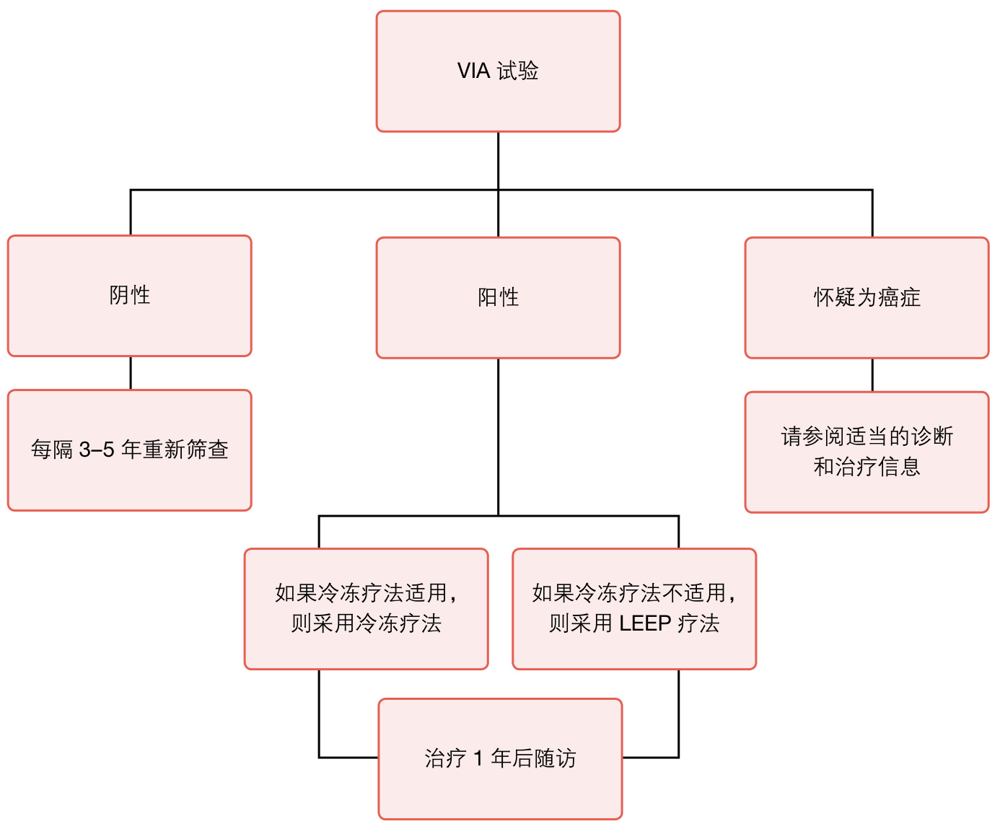
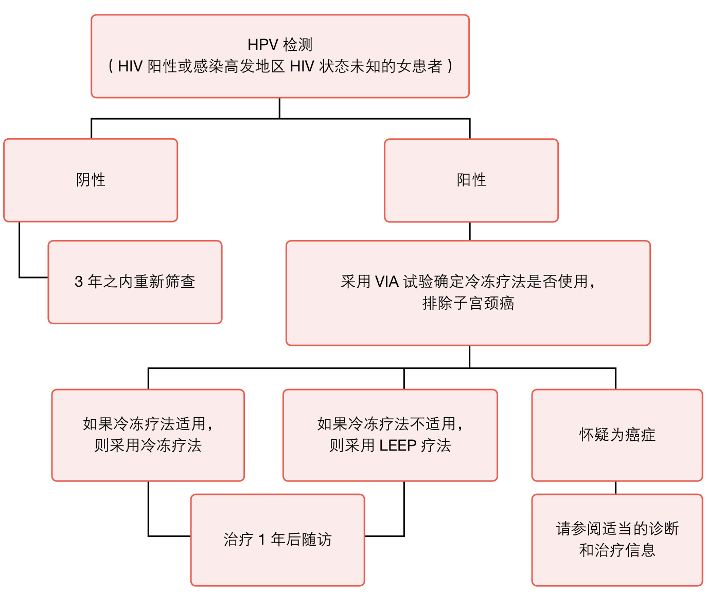

世界卫生组织（WHO）指南子宫颈癌前病变筛查和管理  

  

# 世界卫生组织（WHO)指南：子宫颈癌前病变筛查和管理  

# 目录  

缩略词 >指南制定概述 vi“即筛即治”策略推荐摘要 vii  

目标人群 2   
目的 2  

# 2.方法 4  

指南制定小组 4  
问题阐述和结果确定 4  
证据合成和资料准备 5  
健康结果建模 6  
指南推荐方案的制定 7  
指南评价及审批流程 8  

# 3.推荐方案 9  

适用于所有“即筛即治”策略的重要注意事项 9  
“即筛即治”推荐方案 10  

# 4.研究不足与思考 16  

5.指南应用 18  

指南发布 18  
指南评估 18  
指南更新 19  

参考文献 20  

# 附件  

附件1.“即筛即治”策略决策流程图 22  

附件2.“即筛即治”策略流程图（HIV 阴性或 HIV 状态未知） 23通过 $\mathsf { H P V }$ 检测进行筛查，并采用冷冻疗法治疗，或冷冻疗法不可用时采用LEEP。 23通过 $\mathsf { H P V }$ 检测 $+ \mathsf { V } | \mathsf { A }$ 试验进行筛查，并采用冷冻疗法治疗，或冷冻疗法不可用时采用LEEP。 24通过VIA 试验进行筛查，并采用冷冻疗法治疗，或冷冻疗法不可用时采用LEEP。 25通过 $\mathsf { H P V }$ 检测 $^ +$ 阴道镜检查（有或无活检）进行筛查，并采用冷冻疗法治疗，或冷冻疗法不可用时采用LEEP。 26通过细胞学检查 $^ +$ 阴道镜检查（有或无活检），并采用冷冻疗法治疗，或冷冻疗法不可用时采用LEEP。 27  
附件3．“即筛即治”策略流程图（HIV阳性或感染高发地区 HIV 状态未知的  
女患者) 28通过 $\mathsf { H P V }$ 检测进行筛查，并采用冷冻疗法治疗，或冷冻疗法不可用时采用LEEP。 28通过 $\mathsf { H P V }$ 检测 $+ \mathsf { V } | \mathsf { A }$ 试验进行筛查，并采用冷冻疗法治疗，或冷冻疗法不可用时采用LEEP。 29通过VIA 试验进行筛查，并采用冷冻疗法治疗，或冷冻疗法不可用时采用LEEP。 30通过 $\mathsf { H P V }$ 检测 $^ +$ 阴道镜检查（有或无活检）进行筛查，并采用冷冻疗法治疗，或冷冻疗法不可用时采用LEEP。 31通过细胞学检查 $^ +$ 阴道镜检查（有或无活检）进行筛查，并采用冷冻疗法治疗，或冷冻疗法不可用时采用LEEP。 32  
附件 4.策略证据搜索 33  
附件5.PRISMA 流程图，用于纳入和排除研究，进行证据评价 35  

# 缩略词  

ASCUS 意义不明的非典型性鳞状细胞  
CIN 宫颈上皮内瘤变  
CKC 冷刀锥切术  
ERG 外部评价小组  
FICA 弗兰德斯国际合作署  
GAVI Alliance 前全球疫苗免疫联盟  
GDG 指南制定小组  
GRADE 推荐、评估、制订与评价的分级体系  
HPV 人乳头瘤病毒  
IARC 国际癌症研究机构  
INCa 法国国家癌症研究所  
LEEP 环形电切术（也称为LLETZ）  
LLETZ 子宫颈移行带大环切除术（也称为LEEP）  
MG 方法小组  
NCI 美国癌症研究所  
NIH 美国国立卫生研究院  
PAHO 泛美健康组织  
Pap test 巴氏试验（基于细胞学试验的子宫颈癌筛查方法）  
PICO 研究对象、干预措施、对照类型及研究结局（循证医学证据）  
PRISMA 系统综述和荟萃分析优先报告的条目  
QUADAS 诊断准确性研究质量评价  
VIA 醋酸着色肉眼观察  
WHO 世界卫生组织  

# 指南制定概述  

宫颈上皮内瘤变(CIN)是一种癌前病变，根据具体情况可分为三个阶段，分别是CIN1、CIN2或CIN3。如果不及时治疗，CIN2或CIN3(亦统称为 $\mathsf { C l N } 2 +$ 河能会进一步发展为子宫颈癌。与以往通过细胞学检查、阴道镜检查、活检和组织病理学检查的常规流程进行CIN筛查和管理不同，另一种“即筛即治”管理模式，即针对初筛结果阳性的人群，及时有效地进行干预处理。该模式中初筛可采用的检测方法有人乳头瘤病毒 (HPV)检测、醋酸染色肉眼观察(VIA)以及细胞学检查（巴氏试验)。干预处理方法包括冷冻疗法、子宫颈移行带大环切除术(LEEP/LLETZ)和冷刀锥切术（CKC）。  

在已有世界卫生组织指南《使用冷冻疗法治疗宫颈上皮内瘤变》（2011年发布）和《2-3度宫颈上皮内瘤变和原位腺癌治疗》（与现有指南同时发布）的基础上，本指南针对各种“即筛即治”管理模式进行评估推荐，帮助卫生健康部门相关的政策制定者，管理人员、项目负责人和其他业内人士，结合不同国家和区域情况，正确合理的选择适宜的宫颈癌筛查管理策略。  

对于已经开展子宫颈癌筛查项目的国家，本指南提供的推荐策略可帮助决策者决定是选择根据第一步初筛结果继而立即采用不同干预处理方法的策略，还是选择通过一系列常规流程检测后再选择必须的治疗方案？对于目前尚未开展子宫颈癌筛查项目的国家，本指南可帮助决策者决定采用何种筛查和管理模式。除推荐策略方法之外，附件2还提供了相应策略的流程图，帮助项目负责人根据国家或地区具体情况选择最合适的筛查管理模式。  

对于每一种策略，本指南都提供了相应的“即筛即治”流程图，请参见附件3（特别是HIV阴性或HIV状态未知的女患者）和附件 4（针对 HIV 阳性或感染高发地区 HIV 状态未知的女患者)。  

本指南根据第2章所述《世界卫生组织指南制定手册》制定，指南制定小组(GDG)成员包括子宫颈癌防治方面的专家学者、临床医生、研究人员以及健康项目负责人和方法学专家。制定过程中，所有的利益冲突均按照世界卫生组织准则解决。在世界卫生组织的合作中心，一支独立的科学家团队对所有筛查方法的准确性和不同CIN治疗方法的效果进行系统性评价（请参见附件5-7），并将评价结果用于模拟和比较针对HIV状态未知、HIV阳性和HIV阴性女患者的不同“即筛即治”策略，最终结果根据GRADE（推荐、评估、制订与评价的分级体系）进行评估，以证据概要表形式报送指南制定小组。每一项推荐的 GRADE循证医学证据概要表和证据－建议表均可在线获得（补充材料：A、B节）。  

本指南针对子宫颈癌的“即筛即治”策略提供了9项推荐筛查管理模式，摘要请参见下一页,完整建议（带备注和证据摘要）请参见本指南第3章。  

尽管评估“即筛即治”策略的最佳证据都来自随机对照试验，但鲜有随机对照试验来评估报道这些策略中患者重要预后情况。因此，未来研究焦点包括各种采用有序的“即筛即治”策略（例如HPV检测后采用VIA进行分流管理）；针对HIV阳性女患者的“即筛即治”策略；以及“即筛即治”策略后进行患者重要的预后评估。  

# “即筛即治” 策略推荐摘要  

这些推荐适用于所有女性患者，不受HIV状态约束，对于已感染HIV的女患者，本指南也提供了特殊建议。  

专家小组反对将CKC应用于“即筛即治”策略。因此，下述所有策略中建议采用冷冻疗法，患者不适用冷冻疗法时建议采用LEEP治疗。  

# 专家小组建议：  

采用 HPV 检测进行宫颈癌初筛，优于VIA 初筛。但在资源有限地区，如用HPV 检测难以开展，可考虑采用VIA作为初筛方法。  

采用HPV检测进行宫颈癌初筛，优于细胞学 $^ +$ 阴道镜检查（伴或不伴组织活检）做初筛。如某些地区已有完善且准确的细胞学 $^ +$ 阴道镜检查初筛策略，那么HPV检测或细胞学 $^ +$ 阴道镜检查均可作为宫颈癌初筛选择。  

采用VIA进行宫颈癌初筛，优于细胞学 $^ +$ 阴道镜检查（伴或不伴组织活检）做初筛。若某地区VIA和细胞学 $^ +$ 阴道镜检查均可选择时，即可参考此项推荐。  

采用HPV检测进行宫颈癌初筛，优于HPV检测 $^ +$ 阴道镜检查（伴或不伴组织活检）做初筛。  

采用 HPV 检测或 HPV 检测 $+ \mathsf { V I A }$ 进行宫颈癌初筛皆可。  

采用HPV检测 $+ V I A$ 进行宫颈癌初筛，优于VIA 初筛。  

采用HPV检测 $+ V I A$ 进行宫颈癌初筛，优于细胞学 $^ +$ 阴道镜检查(伴或不伴组织活检)做初筛。  

采用 HPV检测 $+ V I A$ 进行宫颈癌初筛，优于 HPV检测 $^ +$ 阴道镜检查（伴或不伴组织活检）做初筛。  

如下图所示，本指南的制定决策流程图可帮助项目负责人根据具体情况选择最佳策略（请参见附件 $2 1 0$ 附件3（适用于 HIV阴性或 HIV状态未知的女患者）和附件4（适用于 HIV阳性或感染高发地区HIV 状态未知的女患者）的流程图为每一种策略都提供了详细信息。  

  
项目制定决策流程图  

注意：每个浅粉色气泡框都代表附件3（适用于HIV阴性或状态未知的女患者）或附件4（适用于HIV阳性或感染高发地区HIV状态未知的女患者）中的一个推荐策略。  

# 1.简介  

宫颈上皮内瘤样病变（CIN）是一种癌前病变，根据具体情况可分为三个阶段，分别是CIN1、CIN2或 $\mathsf { C l N } 3 ^ { 2 }$ 。如果不及时治疗，CIN2或CIN3（亦统称为 $\mathsf { C l N } 2 +$ ）可能会进一步发展为子宫颈癌。据估计，每年大约有 $1 - 2 \%$ 的女性患有 $\mathsf { C l N } 2 +$ ，而据报道这个数字在HIV阳性女患者中更高，达到了 $10 \%$ (1-5)。目前，传统流程是运用细胞学检查（巴氏试验）对妇女进行筛查，当筛查结果为阳性时，可依据后续阴道镜检查和活检结果进行CIN诊断，且只有当 $\mathsf { C l N } 2 +$ 获得组织病理学证实后才能进行治疗。这一传统筛查方法需要训练有素的医护人员和大量实验室设备。但是，在低收入和中等收入国家，由于通过细胞学检查进行筛查的成本较高，因此筛查覆盖率非常低，亟需新的筛查方法。此外，在许多国家，针对细胞学阳性结果进行阴道镜检查和活检，所需要的资源和医护人员都极为匮乏。基于细胞学检查进行筛查的其他瓶颈还包括：需要到较远的医疗机构进行诊断和治疗，以及细胞学检查结果出来之前需要长时间等待。解决上述问题的最好方法是“即筛即治”，即基于筛查结果而不是组织学证实的 $\mathsf { C l N } 2 +$ 诊断得出治疗决策，筛查后很快就可以治疗一一理想情况下，筛查结果呈阳性就可以立即开始治疗。  

子宫颈癌“即筛即治”项目的目的是降低子宫颈癌发病率和死亡率，同时减少其他不良影响。这一项目必须包括筛查检测方法，筛查策略（即检测顺序）和适当的CIN治疗，以及为患者治疗浸润性子宫颈癌提供转诊服务。目前已得到广泛应用的筛查检测包括人乳头瘤病毒（HPV)检测、细胞学检查（巴氏试验）以及醋酸着色肉眼观察VIA)。这些检测既可以单独进行，也可以按一定顺序依次进行。单独检测时，检测结果为阳性则表明需要进行治疗。按顺序检测时，第一次检测结果为阳性的患者需要接受另一检测，只有第二次试验结果为阳性的患者才需要接受治疗。如果第一次检测结果为阳性而第二次结果为阴性，则需对患者进行随访。治疗方法包括冷冻疗法、子宫颈移行区大环切除术(LEEP/LLETZ)和冷刀锥切术 (CKC)。  

本指南旨在为“即筛即治”项目提供推荐策略，以现有的世界卫生组织指南《使用冷冻疗法治疗宫颈上皮内瘤变》（2011年发布）和《2-3度宫颈上皮内瘤变和原位腺癌治疗》（与现有指南同时发布）为基础。在指南制定过程中，指南制定小组(GDG)考虑到目前一些可以提供“即筛即治”项目的国家可能还不确定应使用何种策略，因此对各种“即筛即治”策略的利弊进行了详细的比较。对于已经启动子宫颈癌防治项目的国家，本指南可以帮助决策者可帮助决策者决定是选择根据第一步初筛结果继而立即采用不同干预处理方法的策略，还是选择通过一系列常规流程检测后试验再选择必须的治疗方案？对于目前尚未设立子宫颈癌防治项目的国家，本指南可帮助决策者决定采用采用何种筛查和管理方案。此外，附件2还提供了一张决策流程图，帮助项目负责人员根据国家或地区具体情况选择最合适的策略。  

最新版《子宫颈癌综合防治：基本实践指南（C4-GEP)(10)》还包括适用于各种筛查检测和管理的建议与背景信息。C4-GEP最初由世界卫生组织(WHO）于2006年发布，用于协助临床医师和项目管理人员诊断和治疗CIN，为子宫颈癌防控提供支持。2009年，世界卫生组织承诺对C4-GEP进行必要的更新，增加一些新推荐方案。因此，制定了《使用冷冻疗法治疗CIN的新证据》（新指南于2011年制定完成[7]）；《组织学结果为 $\mathsf { C l N } 2 +$ 的治疗》（随现在新版指南发布[8]);《宫颈癌前病变的筛查和管理指南》（本指南主题）。此外，在制定各项筛查管理策略推荐方案时，本指南还考虑到了对筛查结果阳性或阴性女患者进行治疗或不治疗的预后和追踪。查检测的准确性由其灵敏度和特异性确定本指南中的推荐方案均基于此来制定，但不能通过灵敏度和特异性来确定筛查管理的预后和追踪随访策略。因此，在制定“即筛即治”策略时，必须考虑筛查管理的预后情况（筛查呈阳性时）或不治疗的追踪随访（筛查呈阴性时），包括子宫颈癌发病率和死亡率、$\mathsf { C l N } 2 +$ 复发率、治疗后的副作用（和过度治疗）以及医疗资源的合理利用。所以，本指南中的推荐方案是结合了每种筛查方法的准确性和后续管理方案利弊因素分析来共同制定的。  

# 目标人群  

本指南旨在帮助卫生健康部门相关的政策制定者，管理人员、项目负责人和其他业内人士，结合不同国家和区域情况，正确合理的选择适宜的宫颈癌筛查管理策略。生殖保健项目工作人员，尤其是性传播感染疾病(STI，例如人类免疫缺陷病毒／艾滋病）预防和计划生育项目工作人员，以及社区水平和初级卫生保健工作人员也应参考这些指南，了解指南的制定过程以及选择并实施具有循证医学证据的子宫颈癌预防策略的重要性。  

# 目的  

本指南为子宫颈癌“即筛即治”策略提供建议（第3章），此外，还提出了一个决策流程图（附件2）用于选择最佳“即筛即治”策略（附件2），并为所有策略都提供了流程图，包括专门为HIV阴性或HIV状态未知的女患者提供的流程图(附件3);HIV阳性或HIV高感染区内HIV状态未知的女性提供的流程图（附件4）。本指南还介绍了世界卫生组织制定建议的方法（第2章，以及附件5-7)，并提供了GRADE证据概要表°和证据－建议表4（可在线获得：补充材料A和B节）。本指南还为C4-GEP（10）中的实践信息提供了科学的背景知识和依据。  

# 2.方法  

遵循《世界卫生组织指南制定手册(11，12)》(WHO handbook for guideline development (11,12))制定指南。  

# 指南制定小组  

WHO成立了一个由JoannaCain领导，共拥有17名成员的指南制定小组(GDG)，负责制定用于子宫颈癌防治的“即筛即治”策略。该小组在整个指南制定过程中提供了专业的临床指导和支持。同时，WHO还选择了33位专业人士组成外部评价小组(ERG)，包括拥有丰富的宫颈上皮内瘤变筛查和管理经验的医护人员、病理学家、子宫颈癌预防和治疗研究人员、项目负责人、健康教育工作者、流行病学家、公共卫生官员、护士和方法学家。此外，来自麦克马斯特大学MacGRADE中心（WHO合作中心）的一个方法小组(MG)也在数据综合以及指南制定过程中提供了专业的意见。  

# 问题阐述和结果确定  

为了将新证据纳入指南，2011年2月，指南制定小组(GDG)召开会议对本指南“即筛即治”策略章节中需要解决的在问题和结果确定进行了讨论。GDG提出了15个待选问题，为宫颈原位癌筛查和治疗策略的证据评价提供指导。方法小组(MG）使用SurveyMonkey对GDG成员进行了在线匿名调查，以确定问题优先级，决定哪些问题和临床相关并在实践中使用。GDG17个成员中有14名成员参与了调查，在15个问题中确定了7个问题，是关于标准“即筛即治”策略与未广泛应用的策略（例如HPV试验 $^ +$ 细胞学检查)对比有关，因此排除了这7个问题，在剩余8个问题的基础上制定筛查策略（请参见Box1）。  

在此次会议上，GDG制定了为“即筛即治”策略制定决策和建议时应当考虑的结果列表。这些结果最早在编制世界卫生组织指南《使用冷冻疗法治疗宫颈上皮内瘤变(7)》就已确定。会议之后，MG使用SurveyMonkey对GDG 和ERG小组成员进行了在线调查，确定了关键结果并对结果进行排序。两个小组50个成员中30名成员参与  

# Box1：用于子宫颈癌前病变筛查的问题（按优先顺序排列）  

1．筛查中是否应该进行HPV检测或VIA？  
2.筛查中是否应该进行HPV检测，或细胞学检查 $^ +$ 阴道镜检查（有或无活检）？  
3.筛查中是否应该进行VIA，或细胞学检查 $^ +$ 阴道镜检查（有或无活检）？  
4.筛查中是否应该进行HPV检测，或HPV检测 $^ +$ 阴道镜检查(有或无活检)?  
5.筛查中是否应该进行HPV检测 $+ \mathsf { V I A }$ ，或单独进行HPV检测？  
6.筛查中是否应该进行HPV检测 $+ \mathsf { V I A }$ ，或单独进行VIA？  
7.筛查中是否应该进行HPV检测 $+ \mathsf { V I A }$ ，或细胞学检查 $^ +$ 阴道镜检查（有或无活检）?  
8．筛查中是否应该进行HPV检测 $+ V I A$ ，或HPV检测 $^ +$ 阴道镜检查（有或无活检）？  

了调查，根据对决策的重要性，对结果进行了排序（分为7级，1为完全不重要，7为至关重要）。最终，根据计算，平均重要性在4或以上的结果应该纳入证据评价，并在制定建议时加以考虑（请参见Box2）  

女后续追踪研究，这些恰恰对于子宫颈癌前病变筛查非常重要。因此，被指南在制定“即筛即治”策略时不是单以随机对照试验的证据为基础。而是结合了筛查检测方法的准确性以及各种CIN治疗方案的效果预后模型来共同完成的。  

# 证据合成和资料准备  

一个“即筛即治”策略由两部分组成：筛查检测和后续的CIN治疗。制定“即筛即治”建议的最佳途径是随机对照试验，将妇女随机分成两组，分别依据“即筛即治”策略A和“即筛即治”策略B进行检测，并对所有妇女的健康结果进行评估和报告（包括那些筛查结果呈假阴性且从未接受治疗的女患者）。但是目前为止鲜有此类研究，且大多数研究都没有将筛查策略和治疗以及治疗预后联系起来。相反，已进行一系列用于CIN诊断的检测准确性研究（但没有对治疗进行研究）和一些仅对筛查结果呈阳性的女患者治疗之后的预后结果的研究。但目前还没有针对筛查结果呈阴性或假阴性的妇女的随访结果进行检测和评估，以及针对筛查后接受治疗或未接受治疗的妇  

# Box2：对制定建议而言非常重要的“即筛即治” 策略的健康结果（按重要性顺序）  

1．子宫颈癌死亡率  
2.子宫颈癌发病率  
3．检测到 CIN2、CIN3  
4.主要的感染（需要入院治疗或使用抗生  
素，例如盆腔炎)  
5．产妇出血  
6．早产  
7.生育率  
8．性传播感染(STI)的确定（受益）  
9．轻微感染（仅需要门诊治疗）  

MG搜索了截止到2012年2月的MEDLINE和EMBASE在线数据库中的筛查策略，这些策略比较了HPV检测与VIA试验，或比较了VIA试验和细胞学检查；单独进行了一项搜索以更新CochraneReview，这项报告截止到2012年11月一直在对HPV检测与细胞学检查进行比较；进行了另外一项调查，调查了截止2012年9月的阴道镜检查信息（搜索策略请参见附件5）。MG将收集到的CIN治疗证据用于制定世界卫生组织指南《宫颈上皮内瘤变2-3和原位腺癌治疗》。搜索没有限制语言和研究设计，以避免遗漏这一领域里的重要研究或以前发表的系统性评价。MG还审查了相关研究的参考文献列表，并联系了WHO GDG小组以便获得其它参考文献°。  

MG中至少有两名成员独立筛选了相关文献的标题、摘要和全文，并由第三方审查员解决分歧问题。对检测方法的准确性研究，MG则以较低偏倚风险进行观察研究。例如，研究中的所有妇女必须接受两种筛查测试，并且所有测试结果呈阳性或阴性（或者测试结果呈阴性的妇女中随机抽取 $10 \%$ ）的妇女都必须接受“金标准”检测进行确诊。研究还必须包含18岁以上的非怀孕女性，并且要求她们之前没有接受过CIN治疗一既可以是HIV阳性或阴性，也可以是HIV状态未知。依据系统综述和荟萃分析优先报告的条目(PRISMA)列表制定实验流程，以包括或排除某些研究（附件6）。诊断试验准确性评价中的所有研究列表请参见附件7。  

MG两名成员使用一个预先测试的数据摘要表，对患者特征、检测设置和准确度进行数据汇总，同时还使用QUADAS工具（QUalityAssessment for Diagnostic Accuracy Studies ,诊断准确性研究质量评价）收集相关数据用于研究质量评价(13)。我们使用Stata12数据分析和统计软件汇总了所有的检测准确性数据。  

MG研发了一套数学模型，用以计算对于HIV状态未知或阳性女患者，每一项“即筛即治”策略相对于其他策略的利弊。该模型全面考虑了$\mathsf { C l N } 2 +$ 患病率、疾病自然发展、检测方法准确性以及治疗预后效果和并发症等数据（请参见附件7，了解该模型采用的参考文献）。对于HIV阴性或HIV状态未知和HIV阳性（可在线获得：补充材料A和B节）以及不同年龄段的女性，证据概要表中详细说明了绝对预后评估信息和模型假设概要。  

MG两名成员均使用GRADE方法（14、15）评估证据质量，并使用GRADE证据概要表对证据及其质量进行报告。证据概要表中针对每一个建议的检测方法准确性都提供了筛查检测确性证据（请参见补充材料A和B节；建议参考2.1节）证据概要表中也还提供了源自模型（例如一项“即筛即治”策略的结果）的证据（请参见补充材料A和B节；针对每一年龄段的建议请参见2.2和2.3节）。证据质量或疗效评估的可靠性则依据GRADE标准进行评价，分为高、中、低 或非常低。我们也为每一推荐方案专门制作了表格（证据一建议表）以帮助作出决策。：这些表格包含了证据摘要（利弊利害）证据质量评估、患者价值观和偏好以及任何资源和可行性方面的提示（补充材料：A和B节）  

# 健康结果建模  

过于精确的检测方法并不一定适用于临床筛查。向患者推荐一项筛查检测时需要依据该检测对患者后续重要健康预后(PIO)的影响来进行判断。决策分析是一项有力的工具，在仅已知中间结果的情况下，例如检测方法灵敏性和特异性，要基于能否对患者祈祷长期的保护作用来判断。当建议患者进行一项诊断或筛查检测时，一个专门小组会评估此项检测的后续管理措施，例如干预假阳性(FP)和假阴性(FN)的健康风险应该与干预真阴性 (TN)和真阳性(TP)的健康效益相比较。  

我们使用TreeAgePro2012软件建立了一个数学模型，在设定的检测准确性评估数据和CIN 患病率前提下，通过该模型为每个筛查检测（VIA、HPV及细胞学检查）计算TP、TN、FP和FN的比例。然后，我们基于对这些患者的管理方案，以及不同治疗方法（冷冻疗法、CKC和LEEP）的疗效和潜在并发症的综合数据，计算了重要健康结果的概率，以帮助医师进行决策（参见Box2）。为了对健康预后进行全面的计算评估，我们为采取相同筛查检测和治疗方法的4组（TP、TN、FP、FN）患者分别提供了某一健康结果的概率数据。我们的假设为先验假设，在线补充材料A和B节中包含了这些假设的概述（在每一个GRADE证据表下方，这些表格列举了不同“即筛即治“策略后患者的重要健康结果）。我们也为基于HIV状态（HIV阳性与HIV状态未知比较）和不同年龄段的灵敏度分析进行了先验性假定。  

# 指南推荐方案的制定  

在2012年4月26-28日，GDG、ERG和MG召开会议，讨论方案的制定。GDG和MG各自派出一个成员主持会议，还有来自世界各地的公共卫生和医疗学科专家出席了会议。为了扩展GDG 的地理代表性，在会议期间ERG将参与建议制定过程。MG成员展示了包含利证据、价值观和偏好、资源和可行性的证据概要表和证据一建议表。  

在加入对患者价值观和偏好的因素之后，GDG同意将得到的证据应用于所有的方案当中(16-18)。：定性研究的证据显示女患者可能会对筛查检测心怀恐惧，对阴道镜检查活检抱有疑虑，后续管理治疗对她们而言也是一个负担。不过，女患者一旦决定进行筛查，便能够立即接受筛查检测和即时处理治疗。系统性评价的证据表明，筛查结果为阳性的女患者具有更为频繁的CIN1筛查和积极治疗倾向。此外，对照试验的证据显示，女患者们认为冷冻疗法和LEEP可以接受，对“即筛即治”的治疗也十分满意（19)  

世界卫生组织近来研发了一套《子宫颈癌防控成本核算工具》（WHO cervical cancer preventionandcontrolcosting tool）（20）。该工具包含两个模块：一个模块负责HPV疫苗接种成本，另一个负责即筛即治流程成本。这一工具的目的主要是为帮助项目负责人制定预算方案。为了研发这一工具，世界卫生组织从多个国家收集了每种干预方法的成本，并专门定制了计算表。这一工具加上ERG 成员的经验，对于探讨针对每种治疗策略的资源要求十分有益。  

指南推荐方案由GDG和ERG共同制定，他们从整体角度权衡了“即筛即治”策略可能存在的正面和负面结果，包括重要健康结果、价值观和偏好、资源和可行性，也涵盖了相关信息的确定性。专家小组成员基于匿名投票，做出了相关决定。讨论结果收录在每一个建议的证据一建议表中，详细信息请参见在线补充材料A和B节。GDG和ERG还就关键研究空白达成了共识。所有的相关讨论和决定都在2012年4月达成，期间未发生重大分歧。  

根据世界卫生组织指南制定手册（11，12）要求，建议分为“强烈推荐”或“有条件推荐建议”。凡用辞为“我们推荐”的内容均为“强烈推荐”，用辞为“我们建议”的则为“有条件推荐安”。“强烈推荐”表示专家小组十分确定该策略所产生的期望结果优于其他备选策略，而“有条件推荐”则指专家小组不确定该策略是否优于其他备选策略。本指南中介绍了多种“有条件推荐”，具体信息请参见表1。  

# 指南评价及审批流程  

世界卫生组织用于子宫颈癌防治的“即筛即治”策略在制定前经历了以下同行评价：  

■ 指南制定过程中产生的问题会在世界卫生组织指导小组中传阅，然后指导小组与GDG讨论。当GDG与WHO指导小组达成共识后，这些问题会提交给ERG。  

1系统评价草案会在GDG中传阅，同时在EGR会议中进行讨论（除了GDG和MG之外，欧洲指南制定小组和世界卫生组织指导小组也参加此次会议）。该会议将讨论已经确定的证据和未确定的证据概要草案。  

世界卫生组织指导小组与GDG将定期举行讨论会和电话会议，以讨论来自文献评价和模型的数据和包含在模型及结果中的预估参数。  

在世界卫生组织定稿之前，带有建议的最终版指南将在GDG成员中传阅并进行评价。  

表1：关于强烈建议和有条件建议的解释  

<html><body><table><tr><td>影响</td><td>强烈推荐表述为：我们推荐</td><td>有条件推荐表述为：我们建议</td></tr><tr><td>患者</td><td>该情况下绝大多数患者希望采纳推荐方 案，而只有一小部分患者不会。 不需要正式的决策辅助，患者就可以做 出符合其价值观和偏好的决定。</td><td>该情况下大多数患者希望采用有条件推 荐方案，而很多患者则相反。</td></tr><tr><td>临床医师</td><td>大多数医师应该接受这种干预。是否遵 守指南中的推荐应该被视为一个质量标 准或绩效指标。</td><td>临床医师应该认识到对每个患者采取不 同的建议，而且还必须帮助患者制定与 其价值观和偏好一致的决策。这种情况 下，患者需要借助决策辅助来做出决定。</td></tr><tr><td>决策者</td><td>大多数情况下指南中的强烈推荐可以确 立为一项政策。</td><td>决策需要进行大量的争论及多种利益相 关者的介入。</td></tr></table></body></html>  

# 3.推荐方案  

为辅助项目管理人员制定方案，选择最合适的“即筛即治”策略，本指南提供了一个决策流程图或算法（请参见附件2）。一旦选择了合适的策略，应遵守该策略的流程图一一请参见附件3（HIV阴性或HIV状态未知的女患者）和附件4（HIV阳性或感染高发地区HIV状态未知的女患者）算法和流程图基于本章中的推荐方案制定。  

# 适用于所有 “即筛即治” 策略的重要注意事项  

# 目标人群  

本指南所述建议适用于30岁（推荐的年龄）及以上的女性一这一年龄范围的女性罹患子宫颈癌的风险较高。但是，不同年龄段的期望结果不同，并且与她们的 $\mathsf { C l N } 2 +$ 的基线风险有关。建议对30-49岁之间的女性优先进行筛选，而不是增加筛选次数，甚至一生只筛选一次更佳。筛选频率应根据经济情况、基础结构和其他资源酌情确定。  

对于HIV阳性或感染高发地区HIV状态未知的女性来说，应注意以下事项：虽然有关HIV阳性女患者筛查和治疗宫颈癌的证据质量比HIV阴性或HIV状态未知的女患者低，但是子宫颈癌筛查仍应在性行为活跃的女性群体中进行，尤其是女性确诊是HIV阳性时。  

补充材料：A节（HIV阴性或HIV状态未知）和B节（HIV阳性或感染高发地区HIV状态未知）为每一项推荐方案都提供了证据和依据（该材料可在线访问)  

# 筛查结果注意事项  

建议包括基于三种筛查结果的策略：HPV检测（检测阈值 $\geq 1 . 0 \ p g / \mathsf { m l } )$ ，细胞学检查（阳性阈值${ \mathsf { A S C U S + } }$ ，意义不明的非典型性鳞状细胞）和VIA试验。VIA试验适用于移行区可见的妇女（通常是年龄小于50岁的女性），这是因为一旦进入更年期，多数癌前病变发生的移行区经常会退回到子宫颈管中而不可见。  

# 治疗注意事项  

在所有的“即筛即治”建议中，对于筛查结果呈阳性并适合冷冻疗法的女患者来说，冷冻疗法是第一选择。不适用冷冻疗法的女患者可选择LEEP疗法。女患者是否适用冷冻疗法应根据C4-GEP(10)中的指南确定：如果整个病变和鳞柱交界部可见且病变没有覆盖子宫颈外口 $7 5 \%$ 以上，则筛查结果呈阳性的女患者适用冷冻治疗。如果病变超出了冷冻探针范围或进入子宫颈管内，则不适用冷冻疗法，应采用LEEP疗法。  

治疗前，使用任何一种检测方法（尤其是HPV检测）进行筛查，结果呈阳性的女患者应进行VIA试验以确定是否适用冷冻疗法，排除大病变或疑似宫颈癌一VIA试验应由训练有素的医护人员进行。  

请注意使用VIA试验确定治疗方案适用性（如选择冷冻疗法还是LEEP疗法）的建议(a)，与使用VIA试验进行筛查后确定妇女是否进行后续治疗的建议 (b)，两者之间是有区别的。  

a.在采用HPV检测的“即筛即治”策略中，HPV阴性女患者将不会接受治疗，HPV阳性女患者将全部接受治疗，VIA试验通常用于确定患者接受冷冻疗法还是LEEP疗法。  

b．在 HPV检测 $+ V I A$ 试验策略中，HPV阴性女患者将不会接受治疗，而HPV阳性女患者将全部接受VIA试验，以确定治疗方案。HPV和VIA试验结果都呈阳性的女患者将全部接受治疗，而HPV试验结果为阳性，VIA试验结果为阴性的女患者将不会接受治疗。  

# 筛查间隔及随访  

下文列举了最佳筛查间隔，关于全部“即筛即治”策略的筛查间隔时间请参见附件3和4。  

VIA试验或细胞学检查（子宫颈抹片检查）结果为阴性的女性筛查间隔时间应为每3至5年，HPV检测结果阴性的女性的筛查间隔时间为至少5年。对于已接受治疗的女性，可于一年后进行随访复，以确保治疗的有效性。对于HIV阴性或HIV状态未知的女性，请参考附件3的流程图，了解所有策略的流程图。  

HIV阳性或HIV感染高发区内HIV状态未知的女性如果筛查结果为阴性，则重新筛查的间隔时间应为3年。对于已接受治疗的女性，可于一年后进行随访复查，以确保治疗的有效性。对于HIV阳性或HIV感染高发区内HIV状态未知的女性，请参考附录4的流程图，了解所有策略的流程图。  

# “即筛即治' 推荐方案  

# 建议1.在“即筛即治”策略中，专家小组不建议采用CKC治疗（强烈建议，证据）  

备注：专家小组所考虑的不建议CKC治疗的“即筛即治”策略包括HPV检测、VIA试验，或HPV检测 $+ V I A$ 试验筛查。尽管在所有“即筛即治”策略中使用CKC治疗的好处与冷冻疗法或LEEP相似，但CKC治疗的副作用更大。本项建议适用于任何HIV状态的女性。请参见补充材料：A和B节。  

证据概要：联合观察性研究中的低质量证据显示，使用冷刀锥切术（CKC）进行治疗后的宫颈上皮内瘤样病变（CIN）复发率比使用冷冻治疗或环形电切术（LEEP）低 $3 \%$ 。但两种情况下宫颈癌发生率及相关的死亡率则相差不大，仅 $0 . 0 8 \%$ o与此形成鲜明对比的是，两种情况下导致需要住院或进行输血治疗的大出血的可能性差别很大（在大多数“即筛即治”的治疗策略下，使用CKC治疗的大出血发生率为 $1 / 1 0 0 0$ ，而冷冻疗法或LEEP则为1/10000），且使用CKC治疗后早产的风险也高于冷冻疗法或LEEP法（风险率3.41比2.00）。对所有女性患者而言，无论她们是否被正确归类为 $\mathsf { C l N } 2 +$ 型病变，或是无需治疗但接受了治疗的假阳性患者，上述并发症风险差异都适用，并且这些差异与在对HIV阳性女患者群体进行同样研究得到的利弊关系结果类似。  

推荐方案2.在资源允许的条件下，专家小组更建议使用HPV检测初筛和冷冻疗法（冷冻疗法不适用时可采用LEEP疗法）治疗，而不是使用VIA试验初筛和冷冻疗法（冷冻疗法不可用时可采用LEEP疗法）治疗方案（有条件建议，证据）  

7/10000）。两者在如大出血或感染一类并发症方面的差异很小或没有（例如VIA策略中概率低于1/100000）。这些差异与在对HIV阳性女患者群体进行同样研究得到的利害关系结果类似。  

但在资源有限而无法进行HPV检测的情况下，专家小组还是建议使用VIA试验初筛和冷冻疗法（冷冻疗法不可用时可采用LEEP疗法）治疗，而不是使用HPV检测初筛和冷冻疗法（冷冻疗法不可用时可采用LEEP疗法）的治疗方案（有条件建议，证据）  

备注：采用HPV检测或VIA试验初筛的“即筛即治”策略与无筛查策略相比，利均大于弊。但HPV检测用于初筛在降低癌症发病率和死亡率方面比VIA试验效果更佳。，因此，在资源充足、经济和医疗条件允许的前提下，专家推荐尽可能采用HPV检测进行宫颈癌初筛而非VIA试验。本建议适用于任何HIV状态的女性。请参见补充材料：A和B节。  

建议3.专家小组推荐使用HPV检测初筛和冷冻疗法（冷冻疗法不可用时可采用LEEP疗法）治疗，而非使用细胞学检查 $^ +$ 阴道镜检查（有或无活检）和冷冻疗法（冷冻疗法不可用时可采用LEEP疗法）治疗（有条件推荐，证据）。  

备注：HPV检测进行宫颈癌初筛在降低癌症发病率及死亡率方面，略优于使用细胞学检查 $^ +$ 阴道镜检查。尽管可能存在对HPV高发群体过度治疗导致更多伤害，且HPV检测作为初筛检出的癌症比例更低，但细胞学检查的质控、培训和等待时间都使其资源需求极大一一额外的阴道镜检查还需要二次预约。不过，某些国家已经通过细胞学检查（截断值为ASCUS或更高的女性） $^ +$ 阴道镜检查建立起高质量的筛查策略，在这种情况下，HPV检测或细胞学 $^ +$ 阴道镜检查均可使用。请参见补充材料：A和B节。  

证据概要：低质量或极低质量证据显示，使用包含HPV检测的“即筛即治”策略筛查后治疗的 $\mathsf { C l N } 2 +$ 复发率（低于3/1000）宫颈癌发病率（低于1/10000）和死亡率（低于6/100000）均低于使用VIA筛查后的治疗策略，这些差别可能是由于HPV检测初筛策略与VIA试验策略相比，$\mathsf { C l N } 2 +$ 误诊病例更少（即更少的假阴性结果)两者在过度治疗方面差异相对较小（每1000000位妇女中，HPV试验有157,000名患者为过度处理，VIA试验则为127,000名）。另外，采用VIA试验初筛查得到的癌症患病数略高（高于证据概要：由于在细胞学检查 $^ +$ 阴道镜检查和HPV检测初筛的诊断准确性方面还没有相关的比较研究，因此只能综合细胞学检查和阴道镜检查的诊断数据，以计算系列试验的效果，得到较低质量的证据。对于细胞学检查 $^ +$ 阴道镜检查（有或无活检）策略，我们分为两种情况进行数据分析： (1)细胞学检查结果为阳性的女性接受阴道镜检查,即基于阴道镜检查结果确定治疗方案；(2)细胞学检查结果为阳性的女性接受阴道镜检查，阴道镜检查结果为阳性的女性接受活检，即基于活检结果确定治疗方案。有证据显示采用HPV检测初筛策略的 $\mathsf { C l N } 2 +$ 复发率（低于3/1000）宫颈癌发病率（低于1/10000）和死亡率（低于6/100000）均低于细胞学检查 $^ +$ 阴道镜检查策略。这些差别可能是由于HPV检测初筛策略的 $\mathsf { C l N } 2 +$ 误诊病例更少（即更少的假阴性结果）。不过，当采用HPV检测时，过度治疗的情况会略高于使用细胞学检查 $^ +$ 阴道镜检查（不含活检时高于7/100，含活检时高于10/100），这可能会导致HPV检测初筛策略略高的并发症概率，而使用细胞学检查 $^ +$ 阴道镜检查策略则会在第一次筛查时测出更多的癌症（多于 $1 / 1 0 0 0 \mathrm { ~ ‰ ~ }$  

建议4.专家小组建议采用VIA筛查初筛和冷冻治疗的策略（冷冻疗法不可用时可采用LEEP疗法），而不是使用细胞学检查 $^ +$ 阴道镜检查（有或无活检）和冷冻治疗（冷冻疗法不可用时可采用LEEP疗法）。（强烈建议，证据）  

备注：这两种“即筛即治”策略的利弊相似，但有证据显示细胞学检查 $^ +$ 阴道镜检查（有组织活检）的伤害较小。尽管使用VIA试验可能存在过度治疗的问题，且第一次筛查时检出的癌症患者更少，但细胞学检查 $^ +$ 阴道镜检查（有或无活检）策略的质控、培训、等待时间和二次预约都使其资源需求极大。建议使用VIA试验初筛而非细胞学检查 $^ +$ 阴道镜检查既适用于正考虑在两种策略中进行选择的国家，也适合已兼有两种策略的国家。  

证据概要：由于在细胞学检查 $^ +$ 阴道镜检查和VIA试验初筛的诊断准确性方面还没有相关的比较研究，因此只能综合细胞学检查和阴道镜检查的诊断数据，以评估系列试验的效果，得到较低质量的证据。对于细胞学检查 $^ +$ 阴道镜检查（有或无活检）策略，我们分为两种情况进行数据分析： (1)细胞学检查结果为阳性的女性接受阴道镜检查，即基于阴道镜检查结果确定治疗方案；(2)细胞学检查结果为阳性的女性接受阴道镜检查，阴道镜检查结果为阳性的女性接受活检，即基于活检结果确定治疗方案。有证据显示采用上述两种策略的 $\mathsf { C l N } 2 +$ 复发率、子宫颈癌发病率和死亡率差别不大，甚至没有差异。不过，当采用VIA试验初筛时，过度治疗的情况会略高于使用细胞学检查 $^ +$ 阴道镜检查（不含活检时高于11/100，含活检时高于18/100），这可能会导致HIV试验初筛策略略高的伤害，而使用细胞学检查 $^ +$ 阴道镜检查策略则会在第一次筛查时测出更多的癌症（多于2/1000）。  

建议5.专家小组更建议使用单独HPV检测初筛和冷冻疗法（冷冻疗法不可用时可采用LEEP疗法）治疗方案，而非使用HPV检测 $^ +$ 阴道镜检查（有或无活检）和冷冻疗法（冷冻疗法不可用时可采用LEEP疗法）治疗方案。（条件性建议，④○证据）  

备注：这两种策略对于降低癌症发病率和相关死亡率的作用与无筛查策略相比，利皆大于弊成本也显著降低，且利弊相似。虽然阴道镜检查（有或无活检）降低了过度治疗情况以及随之而来的伤害，但由于需要更多的医师培训、质量控制和等待时间，以及可能需要对更多的女性进行随访，该策略的资源需求更高。对于没有确立筛查策略的国家，不建议使用HPV检测初筛 $^ +$ 阴道镜检查策略。本建议适用于任何HIV状态的女性。请参见补充材料：A和B节。  

证据概要：由于在HPV检测 $^ +$ 阴道镜检查的诊断准确性方面还没有相关的研究，因此只能综合HPV检测和阴道镜检查的诊断数据，以评估系列检测的效果，得到较低质量的证据。对于HPV检测 $^ +$ 阴道镜检查（有或无活检）策略，我们分为两种情况进行数据分析：(1)HPV检测结果为阳性的女性接受阴道镜检查，即基于阴道镜检查结果确定治疗方案；(2)HPV检测结果为阳性的女性接受阴道镜检查，阴道镜检查结果为阳性的女性接受活检，即基于活检结果确定治疗方案。有证据显示采用上述两种策略的 $\mathsf { C l N } 2 +$ 复发率、子宫颈癌发病率和死亡率差别不大，甚至没有差异。不过，当采用单独HPV检测初筛时，过度治疗的情况会略高于使用HPV检测 $^ +$ 阴道镜检查（不含活检时高于5/100，含活检时高于12/100），这可能会导致HIV检测策略略高的伤害，而使用HPV检测 $^ +$ 阴道镜检查策略则会在第一次筛查时测出更多的癌症（大于1/1000）。  

建议6.专家小组建议使用HPV检测 $+ v \vert A$ 试验和冷冻疗法（冷冻疗法不可用时可采用LEEP疗法）的策略，同时也建议使用单独HPV检测和冷冻疗法（冷冻疗法不可用时可采用LEEP疗法）策略（有条件建议， $\circledast$ 证据）  

备注：在降低癌症发病率和相关死亡率方面，使用单一的HPV检测要比使用HPV检测 $+ V I A$ 试验策略更有效，这一点在HIV阳性女患者身上更为显著。然而，采用单一HPV检测的“即筛即治”策略很容易导致过度治疗，进而导致更大的伤害。而HPV检测 $+ V I A$ 试验策略的效果仍存在一些不确定性，且HPV检测结果呈阳性时，VIA试验的作用也不确定，缺乏直接证据。此外，对HPV检测结果呈阳性的女患者进行后续VIA试验也需要更多的资源支持：进行二次随访执行VIA试验；需要对医师进行更多的培训工作。基于上述原因，建议医师视具体情况选择HPV检测 $+ V I A$ 试验或单独使用HPV检测，但对于HIV阳性女性患者而言，单独使用HPV检测的优势明显大于劣势。请参见补充材料：A和B节。  

证据概要：由于在HPV检测 $+ V I A$ 试验的诊断准确性方面还没有相关的研究，因此只能综合HPV检测和VIA试验的诊断数据，以评估系列试验的效果，得到较低质量的证据。有证据显示HPV 检测 $+ V I A$ 试验策略的 $\mathsf { C l N } 2 +$ 复发率（大于4/1000）、子宫颈癌发病率（大于1/10000）和死亡率（大于7/100000）略高。这一差别可能源自于HPV检测 $+ V I A$ 试验策略相比单独的HPV检测策略， $\mathsf { C l N } 2 +$ 误诊率更高（大于6/1000）。当采用HPV检测 $+ V I A$ 试验策略时，第一次筛查时检出癌症数量略高（大于7/10000），而且由于该策略的假阳性率更低，所以过度治疗的比例也可能降低（低于1/10），进而对资源的需求也就更少，并发症也会相应降低。  

在对HIV阳性女患者进行相同研究时，这些结果更加明显，利害关系的差异更大。关于HIV阳性女患者的证据显示，与单一的HPV检测策略相比，采用HPV检测 $+ V I A$ 试验策略的HIV阳性女患者的 $\mathsf { C l N } 2 +$ 复发率（大于22/1000）、子宫颈癌发病率（大于17/10000）以及死亡率（大于12/10000）更高。但是，使用HPV检测 $+ V I A$ 试验策略时，过度治疗的比例也有所降低（低于1/10），进而进行必要治疗的资源需求也就更少，并发症也会相应降低。  

建议7.专家小组建议使用HPV检测 $+ v \vert A$ 试验和冷冻治疗（冷冻疗法不可用时可采用LEEP疗法）策略，而不是VIA试验和冷冻治疗（冷冻疗法不可用时可采用LEEP疗法）策略。（有条件建议，证据）  

备注：HPV检测 $+ V I A$ 试验策略和单一的VIA试验策略在降低癌症和相关死亡率方面的作用都超过了可能造成的伤害。但是，单一VIA试验策略在第一次筛查时可以检测出更多的癌症，因此由于过度治疗可能造成的伤害也略高。由于系列试验（指HPV检测 $+ V I A$ 试验）相对于单一VIA试验的成本问题尚不确定，因此本建议是有条件建议。本建议适用于任何HIV状态的女性。请参见补充材料：A和B节。  

证据概要：由于在HPV检测 $+ V I A$ 试验的诊断准确性方面还没有相关的研究，因此只能综合HPV检测和VIA试验的诊断数据，以评估系列试验的效果，得到较低质量的证据。有证据显示HPV检测 $+ V I A$ 试验策略和单一的VIA试验策略在$\mathsf { C l N } 2 +$ 复发率、癌症发病率和相关死亡率方面差异极小，甚至没有差异，原因可能是这两种策略的 $\mathsf { C l N } 2 +$ 误诊率都相对较低。尽管单一VIA试验策略第一次筛查时检测出的癌症数量略高（大于7/10000），但由于假阳性概率很高，所以过度治疗的概率也更大（大于1/10），进而导致更高的并发症概率，产生更高的资源需求。这些差异与在对HIV阳性女患者群体进行同样研究得到的利害关系结果类似。  

建议8.专家小组建议使用HPV检测 $+ v \vert A$ 试验和冷冻疗法（冷冻疗法不可用时可采用LEEP疗法）策略，而不是细胞学检查 $^ +$ 阴道镜检查（有或无活检）和冷冻疗法（冷冻疗法不可用时可采用LEEP疗法）策略。（有条件建议， $\circledast$ 证据）  

备注：上述两种“即筛即治”策略的优势相似，但由于质量控制、培训和等待时间等原因，细胞学检查需要更多的资源，阴道镜检查也需要进行二次随访。本建议适用于任何HIV状态的女性。请参见补充材料：A和B节。  

证据概要：由于在细胞学检查 $^ +$ 阴道镜检查和HPV检测 $+ V I A$ 试验策略的诊断准确性方面还没有相关的比较研究，因此只能综合诊断数据，以评估系列试验的效果，得到较低质量的证据。对于细胞学检查 $^ +$ 阴道镜检查（有或无活检）策略，我们分为两种情况进行数据分析：(1)细胞学检查结果为阳性的女性接受阴道镜检查，即基于阴道镜检查结果确定治疗方案； (2)细胞学检查结果为阳性的女性接受阴道镜检查，阴道镜检查结果为阳性的女性接受活检，即基于活检结果确定治疗方案。有证据显示采用上述两种策略的 $\mathsf { C l N } 2 +$ 复发率、子宫颈癌发病率和死亡率差别不大，甚至没有差异。此外，两种策略在过度治疗方面也相差无几。但是，细胞学检查 $^ +$ 阴道镜检查策略在第一次筛查时检测出的癌症数量略高（大于2/1000 )。  

建议9.专家小组建议使用HPV检测 $+ v \vert A$ 试验和冷冻疗法（冷冻疗法不可用时可采用LEEP疗法）策略，而不是HPV检测 $^ +$ 阴道镜检查和冷冻疗法（冷冻疗法不可用时可采用LEEP疗法）策略。（有条件建议， $\circledast$ 证据）  

备注：HPV检测 $^ +$ 阴道镜检查策略（有或无活检）在降低癌症和相关死亡率方面的作用和HPV检测 $+ V I A$ 试验策略相比略高。尽管专家小组确定两种策略的优势都大于所造成的伤害和成本，但是两种策略之间的成本差异尚无定论。此外，阴道镜检查需要更多的医师培训、质量控制和等待时间，以及可能需要对更多的女性进行随访。与此同时，女患者是否会感受到VIA试验和阴道镜检查之间的差异也不确定，但是女患者不大会接受在阴道镜检查中进行活检。本建议适用于任何HIV状态的女性。请参见补充材料：A和B节。  

证据概要：由于对两种筛查策略的诊断准确性还没有相关的研究，因此只能综合诊断数据，以评估系列试验的效果，得到较低质量的证据。对于HPV检测 $^ +$ 阴道镜检查（有或无活检）策略，我们分为两种情况进行数据分析：(1)HPV检测结果为阳性的女性接受阴道镜检查，即基于阴道镜检查结果确定治疗方案； $( 2 ) { \mathsf { H P V } }$ 检测结果为阳性的女性接受阴道镜检查，阴道镜检查结果为阳性的女性接受活检，即基于活检结果确定治疗方案。有证据显示与HPV检测 $+ V I A$ 试验策略相比,HPV 检测 $^ +$ 阴道镜检查的 $\mathsf { C l N } 2 +$ 复发率（无活检时低于 $3 / 1 0 0 0$ ，有活检时低于4/1000）、子宫颈癌发病率（有／无活检时均低于1/10000）和死亡率（有／无活检时均低于6/10000）更低。这些差别可能是由于HPV试验检测 $^ +$ 阴道镜检查策略的 $\mathsf { C l N } 2 +$ 误诊病例更少（例即更少的假阴性结果 $) _ { \circ }$ 不过，当采用HPV检测 $^ +$ 阴道镜检查策略时，过度治疗的情况会略高于使用HPV检测 $+ V I A$ 试验策略（大于7/100）。两种策略在第一次筛查时检测出的癌症数量相差无几，几乎没有差异。  

# 4.研究不足与思考  

评价“即筛即治”策略效果的最佳证据来自于随机对照试验：试验中，女性随机接受一种或另外一种“即筛即治”策略，然后追踪所有接受筛查的女性，检测重要指标的变化，例如CIN复发率、子宫颈癌发病率以及并发症等。但是，我们基本找不到符合要求的随机对照试验以评价“即筛即治”策略效果，以及患者的健康结果。此外，由GDG确认的可用于评价“即筛即治”策略效果的临床研究也是少之又少（例如HPV检测 $+ V I A$ 试验）。事实上，无论是随机对照试验还是其他试验，很少有研究可以评价联合检测，例如HPV检测 $+ V I A$ 试验。另外，也鲜有研究通过随机对照试验来评价联合检测的准确性，或评价HIV阳性或HIV阳性高危女性的治疗效果。  

在卫生系统尚不健全、资源有限或质量控制不达标的地区，细胞学检查的应用还存在一些问题。一直以来，为了确保获得准确、可重复的细胞学检查结果，需要投入很大的人力及经济资源；由于细胞检查后不能立即得到结果，因此很可能无法对大量患者进行后续随访，从而削弱细胞学检查的优势。因此，在中低收入地区实施细胞学检测项目是比较困难的。与其他筛查策略相比，细胞学检查 $^ +$ 阴道镜检查（有或无活检）策略在子宫颈癌防控上的优势没有在本指南中列出。其它筛查测试如细胞学检查之前的HPV检测也没有在证据评价中述及，也没有根据建议进行类似研究。  

虽然以HPV检测联合细胞学检查为重要内容的“即筛即治”策略对该领域的工作者具有重大潜在价值，但是专家小组认为这一策略的价值并不能让它列入指南制定过程中需要解决的PICO问题列表（人群、干预、比较、结果）。这在很大程度上是因为专家小组认为细胞学检查与项目指南的关系，与HPV试验、VIA试验和冷冻疗法相比并不密切。另外，专家小组也已经达成共识：细胞学检查会影响试验和治疗之间的衔接。因此，本指南没有包括基于HPV检测 $^ +$ 细胞学检查的证据和建议。一旦有研究可以实现更为严密的比较，例如HPV检测/细胞学检查与HPV检测/VIA试验策略（反之亦然），那么这可能会成为下一步GRADE分析的重点，进而得出基于循证医学证据的推荐方案。  

这些推荐方案对利用VIA试验确定使用冰冻疗法还是LEEP疗法和利用VIA试验确定是否进行治疗进行了区分（请参见第3章解释，“治疗注意事项”副标题下）。当HPV状态呈阳性时，只有VIA结果呈阳性的女性才可以进行治疗。但是，很少有研究会评价系列筛查试验的整体诊断准确性，或评估患者的重要健康结果。另外当采用VIA方法确定是否适用冷冻疗法时，也没有研究对患者的健康结果进行比较。  

GDG还介绍了采用阴道镜检查与“阴道镜影像$^ +$ 活检”之间的区别。对于前者，只对阴道镜检查结果呈阳性，能看到病变的女患者进行治疗。但是对于后者，阴道镜检查结果呈阳性的女患者还要接受活检，活检结果呈阳性才可以治疗，因此本质上而言不属于“即筛即治”策略。在随机对照试验中，没对系列试验进行评估或比较，诊断准确性观察研究也没有得出可用证据。因此目前只用模拟方法来确定不进行活检时是否仍会产生类似结果，节约资源。  

由于对“即筛即治”策略的评估缺乏足够的随机对照试验结果，MG引I入了一个模型并因此需要疾病基础风险和自然病史的相关数据。但是，以前完全没有不同年龄段女性及HIV呈阳性的女性患者的 $\mathsf { C l N } 2 +$ 的自然发展与消退数据，因此在规避道德方面问题的同时，仍然需要长期跟踪调查女性进行研究。在实际操作上，确定筛查起止时间、筛查频率非常困难，关于特定年龄段（25-35岁、50岁以上）的女性，以及治疗后的最佳随访时间，有许多疑问需要解答。然而，本手册仍然通过情景建模提出了相关推荐方案，包括筛查年龄段、筛查频率，多长的随访期对宫颈癌的死亡率影响最大。  

最后，GDG确定了“即筛即治”策略的健康预后结果，并确定了各种健康预后结果的优先级，以为决策提供重要辅助。对于很多健康预后结果来说，只有低质量或极低质量甚至间接证据。GDG特别将有关生育和生殖的健康预后结果作为很多女患者关心的重点问题，另外一个问题是HIV传染，但是很少有研究会评估这个结果。GDG也确定了筛查的其他优势，例如性传播感染检测或子宫颈癌检测等一一取决于采用的筛查试验（例如HPV检测或VIA试验）。但是，到目前为止研究并没有对这些优势进行评估。  

# 5.指南应用  

# 指南发布  

请访问世界卫生组织文库数据库，或点击世界卫生组织网站“性与生殖健康”和电子评论杂志“世界卫生组织生殖健康文库(RHL)”7中的链接获得指南。本指南也将在UNDP（联合国开发计划署）／UNFPA（联合国人口活动基金）／UNICEF（联合国儿童基金会）WHO（世界卫生组织）和世界银行人类生殖（HRP）研究、发展和研究培训特别规划署的WHO生殖健康研究的进展°上发布—WHO生殖健康研究的进展拥有超过2000名订阅用户和众多合作机构。许多机构也将在他们的新闻通讯中发布各种讯息。  

该指南将以出版物形式分发给世界卫生组织出版物订阅用户，或通过WHO邮件列表免费发放给国家健康主管、卫生部长或健康总干事、WHO出版物文库、WHO代表／联络官、WHO／HQ文库、WHO地区办公室和非现场办公室文库；其他免费收件人，包括国家性与生殖健康主管部门、癌症防控项目、国家生殖健康研究中心和WHO合作中心；位于WHO总部、地区和国家办公室及其他地方的工作人员；相关的非政府组织；关注癌症防控和/或性健康和生殖健康的医学会；科学期刊（包括一般医学期刊和性与生殖健康或癌症专业杂志）；国际组织和捐赠者以及潜在的捐赠者；潜在的出版物译本出版商；以及为该文件编写作出贡献的所有人。  

我们接受关于指南介绍与讨论的会议邀请。  

我们已经计划在美洲和非洲举行地区会议，为参与2013年国家项目规划的众多利益相关者提供新的推荐策略。其他地区会议将在2014年举行。  

如果地区办公室提出要求，我们将支持相关国家依据其国情改编指南并且将这些材料与现行国家指南相整合。改编将通过组织地区、亚地区和国家级工作组对每条建议进行讨论，使指南符合所在国家流行病学、文化和社会经济背景。  

最初，该指南将只提供英文版本，翻译版本将视获得的资金情况酌情推出。我们鼓励由第三方将该指南翻译成非联合国语言并进行出版。  

# 指南评估  

本指南在WHO网站（总部和区域网站）的下载量将被视为用户对指南的兴趣指标。  

我们正与WHO地区办公室合作监控由相关国家提出的关于指南使用的技术协助请求。为此，国内将组织利益相关者会议，并记录建议的清晰度、可行性和有效性反馈。  

我们还会与各地区办公室一起密切关注有多少国家基于本指南推荐的筛查管理方法来改进其“即筛即治”策略。  

# 指南更新  

GDG将继续与WHO以一种特殊的方式开展合作，从而使研究空白可以得到解决。此外，我们还将追踪新出版的“即筛即治”策略的证据，以  

便快速进行更新。我们预计指南出版约五年后将获得足够的新证据以更新现有建议推荐方案，并可能加入新的建议。  

# 参考文献  

1. Arbyn M et al. Evidence regarding human papillomavirus testing in secondary prevention of cervical cancer. Vaccine, 2012, 30 Suppl 5: F88-99.  

2. De Vuyst H et al. Prevalence and determinants of human papillomavirus infection and cervical lesions in HIV-positive women in Kenya. British Journal of Cancer, 2012, 107(9):1624-1630.   
3. Denny L et al. Human papillomavirus infection and cervical disease in human immunodeficiency virus-1-infected women. Obstetrics & Gynecology, 2008, 111(6):1380-1387.   
4. Joshi S et al. Screening of cervical neoplasia in HIV-infected women in India. AIDS, 2013, 27(4):607-615.   
5. Zhang HY et al. HPV prevalence and cervical intraepithelial neoplasia among HIV-infected women in Yunnan Province, China: a pilot study. Asian Pacific Journal of Cancer Prevention, 2012, 13(1):91-96.   
6. Santesso N et al.; World Health Organization Steering Committee for Recommendations on Use of Cryotherapy for Cervical Cancer Prevention. World Health Organization Guidelines: use of cryotherapy for cervical intraepithelial neoplasia. International Journal of Gynecology & Obstetrics, 2012, 118(2):97-102.   
7. WHO guidelines: use of cryotherapy for cervical intraepithelial neoplasia. Geneva, World Health Organization, Department of Reproductive Health and Research, 2011 (http://www.who.int/ reproductivehealth/publications/cancers/9789241502856/en/, accessed 24 October 2013).   
8.  WHO guidelines for treatment of cervical intraepithelial neoplasia 2-3 and glandular adenocarcinoma in situ: Cryotherapy, large loop excision of the transformation zone (LEEP/ LLETZ), and cold knife conization. Geneva, World Health Organization (in process).   
9. Sellors JW, Sankaranarayanan R. Colposcopy and treatment of cervical intraepithelial neoplasia: a beginner's manual. France, International Agency for Research on Cancer, World Health Organization, 2003 (http://screening.iarc.fr/doc/Colposcopymanual.pdf, accessed 24 October 2013).   
10. Comprehensive cervical cancer control: a guide to essential practice (C4-GEP). Geneva, World Health Organization, Department of Reproductive Health and Research and Department of Chronic Diseases and Health Promotion, 2006 (http://www.who.int/reproductivehealth/ publications/cancers/9241547006/en/, accessed 20 August 2013).   
11. WHO handbook for guideline development. Geneva, World Health Organization, 2010 (http:// www.who.int/hiv/topics/mtct/grc_handbook_mar2010_1.pdf, accessed 6 August 2013).   
12. WHO handbook for guideline development. Geneva, World Health Organization, 2012 (http:/ apps.who.int/iris/bitstream/10665/75146/1/9789241548441_eng.pdf, accessed 6 August 2013).   
13. Higgins JPT, Green S, eds. Cochrane handbook for systematic reviews of interventions Version 5.1.0. The Cochrane Collaboration, updated March 2011 (www.cochrane-handbook.org, accessed 6 August 2013).   
14. Guyatt GH et al.; GRADE Working Group. GRADE: an emerging consensus on rating quality of evidence and strength of recommendations. BMJ, 2008, 336:924-926.   
15. Schunemann HJ et al.; GRADE Working Group. Grading quality of evidence and strength of recommendations for diagnostic tests and strategies. BMJ, 2008, 336:1106-1110.   
16. Bradley J et al. Women's perspectives on cervical screening and treatment in developing countries: experiences with new technologies and service delivery strategies. Women and Health, 2006, 43(3):103-121.   
17. Melnikow J et al. Management of the low-grade abnormal Pap smear: what are women's preferences? Journal of Family Practice, 2002, 51(10):849-855.   
18. Frederiksen ME, Lynge E, Rebolj M. What women want. Women's preferences for the management of low-grade abnormal cervical screening tests: a systematic review. BJOG: An International Journal of Obstetrics and Gynaecology, 2012, 119(1):7-19.   
19. Chirenje ZM et al. A randomised clinical trial of loop electrosurgical excision procedure (LEEP) versus cryotherapy in the treatment of cervical intraepithelial neoplasia. Journal of Obstetrics and Gynaecology, 2001, 21(6):617-621.   
20. WHO cervical cancer prevention and control costing tool (C4P). Geneva, World Health Organization, 2012 (http://www.who.int/nuvi/hpv/cervical_cancer_costing_tool/en/index.html, accessed 24 October 2013).  

# 附件1.“即筛即治” 策略决策流程图  

这个决策流程图提供了一个决策树，可以在选择“即筛即治”策略时提供快速参考。项目管理人员和决策者可以从顶部开始，回答相应的问题，以确定各项“即筛即治”策略最适合哪些地区。决策流程图突出了与资源相关的选择，其中包括成本、人员和培训。然而，项目负责人员还需要考虑其他因素，例如在涉及多项筛查测试策略中无法随访的女性数量。请参阅本指南第3章中的“即筛即治”策略建议以获取所推荐的策略更详细信息，以及在选择策略时需要考虑的具体因素。关于每个“即筛即治”策略（例如HPV检测 $+ V I A$ 试验）的详细流程信息，请参见附件3流程图（HIV阴性或HIV状态未知的女患者）和附件 4流程图（HIV阳性或感染高发地区 HIV状态未知的女患者）。  

  

备注：每个浅粉色气泡框对应附件3（HIV阴性或HIV状态未知的女患者）或附件4（HIV阳性或感染高发地区HIV状态未知的女患者）中的一种策略。  

# 附件2.“即筛即治”策略流程图（HIV阴性或HIV状态未知）  

以下流程图介绍了每个可用的“即筛即治”策略的实施步骤，但没有说明哪些策略是首选。请参阅本指南第3章“即筛即治”策略建议了解推荐的策略，以及附件2中的决策流程。请参见每一项建议的证据-建议表，了解指南制定专家小组制定建议时考虑因素的详细信息（补充材料：A和B节）  

# 通过HPV检测进行筛查，并采用冷冻疗法治疗，或冷冻疗法不可用时采用LEEP。  

当 HPV 检测结果呈阳性时提供治疗。采用该策略时，可通过VIA 试验确定是否适用于冷冻疗法。  

  

# 通过HPV检测 $+ V I A$ 试验进行筛查，并采用冷冻疗法治疗，或冷冻疗法不可用时采用LEEP。  

当 HPV 检测结果呈阳性时，进行VIA试验以确定是否需要提供治疗。只有当 HPV 检测和VIA 试验结果都呈阳性时才进行治疗。  

  

注意：请参阅本指南第3章“即筛即治”策略建议了解推荐的策略，以及选择策略时应考虑的注意事项。  

通过VIA试验进行筛查，并采用冷冻疗法治疗，或冷冻疗法不可用时采用LEEP。  

  

备注：请参阅本指南第3章“即筛即治”策略建议了解推荐的策略，以及选择策略时应考虑的注意事项。  

通过HPV检测 $^ +$ 阴道镜检查（有或无活检）「进行筛查，并采用冷冻疗法治疗，或冷冻疗法不可用时采用LEEP。  

  

通过细胞学检查 $^ +$ 阴道镜检查（有或无活检）’，并采用冷冻疗法治疗，或冷冻疗法不可用时采用LEEP。  

  

备注：请参阅本指南第3章“即筛即治”策略建议了解推荐的策略，以及选择策略时应考虑的注意事项。  

# 附件3．“即筛即治 策略流程图（HIV阳性或感染高发地区HIV状态未知的女患者）  

以下流程图介绍了每个可用的“即筛即治”策略的实施步骤，但没有说明哪些策略是首选。请参阅本指南第3章“即筛即治”策略建议了解推荐的策略，以及附件2中的决策流程。请参见每一项建议的证据-建议表，了解指南制定专家小组制定建议时考虑因素的详细信息（补充材料：A和B节）。  

# 通过HPV检测进行筛查，并采用冷冻疗法治疗，或冷冻疗法不可用时采用LEEP。  

当 HPV 检测结果呈阳性时提供治疗。采用该策略时，可通过VIA 试验确定是否适用于冷冻疗法。  

  

备注：请参阅本指南第3章“即筛即治”策略建议了解推荐的策略，以及选择策略时应考虑的注意事项。  

通过HPV检测 $+ V I A$ 试验进行筛查，并采用冷冻疗法治疗，或冷冻疗法不可用时采用LEEP.  

当 HPV 检测结果呈阳性时，进行VIA试验以确定是否需要提供治疗。只有当 HPV 检测和VIA 试验结果都呈阳性时才进行治疗。  

  

备注：请参阅本指南第3章“即筛即治”策略建议了解推荐的策略，以及选择策略时应考虑的注意事项。  

通过VIA试验进行筛查，并采用冷冻疗法治疗，或冷冻疗法不可用时采用LEEP。  

  

备注：请参阅本指南第3章“即筛即治”策略建议了解推荐的策略，以及选择策略时应考虑的注意事项。  

通过 HPV 检测 $^ +$ 阴道镜检查（有或无活检）’进行筛查，并采用冷冻疗法治疗，或冷冻疗法不可用时采用LEEP。  

  

备注：请参阅本指南第3章“即筛即治”策略建议了解推荐的策略，以及选择策略时应考虑的注意事项。  

通过细胞学检查 $^ +$ 阴道镜检查（有或无活检）「进行筛查，并采用冷冻疗法治疗，或冷冻疗法不可用时采用LEEP。  

  
备注：请参阅本指南第3章“即筛即治”策略建议了解推荐的策略，以及选择策略时应考虑的注意事项。  

# 附件4.策略证据搜索  

HPV（人乳头瘤病毒）检测、VIA（醋酸着色肉眼观察）试验、巴氏试验（细胞学检查）和阴道镜检查的诊断准确性  

# VIA试验相对于其他试验：  

# 在OVIDMEDLINE数据库中检索（截至2012年1月）  

1 宫颈上皮内瘤变/  
2 宫颈非典型增生/  
3 宫颈肿瘤/  
4 (（\*癌前病变或癌前＊或肿瘤转移＊或增生或病变＊或癌前病变＊或原代肿瘤＊或＊癌症或肿瘤\*）  
adj3 宫颈\*）tw.  
5 （ cin或cin $2 ^ { \star }$ 或 $\sin 3 ^ { \star }$ 或cin1）tw.  
6 1或2或3或4或5  
7 醋酸/或醋酸.tw.  
8 （VIA和肉眼观察）tw.  
9 （肉眼检查）tw.  
10 AAT.tw.  
11 或/7-10  
12 HPV.tw.  
13 （乳头状瘤或（乳头瘤病毒））tw.  
14 EXP乳头瘤病毒科/  
15 （或/12-14）和（＊试验或检测\*）tw.  
16 阴道涂片/  
17 （巴氏\*adj（\*涂片或试验\*））tw.  
18 细胞学\*tw.  
19 或/16-18  
20 11和15  
21 11和19  
22 15和19  
23 15或20或21或22  
24 6和23  
25 灵敏度：mp.  
26 预测值：mp.  
27 准确性：tw.  
28 筛查：tw.  
29 大规模筛查/  
30 诊断比值比 \*tw.  
31 似然比\*.tw.  
32 （受试者工作特性或受试者工作特性或受试者工作特性或受试者工作特性或 ROC或ROC 曲线）tw.  
33 （阳性\*adj3 结果\*）tw.  
34 或/25-33  
35 24和34  

# 在荷兰医学文摘数据库、麦克兰图书馆和LILACS中进行搜索  

OVIDMEDLINE检索词被改编为适合每个数据库的主题词  

# 阴道镜检查：  

# 在OVIDMEDLINE数据库和荷兰医学文摘数据库中搜索（截至2012年1月）  

1 exp 子宫颈疾病/di  
2 宫颈上皮内瘤变/  
3 宫宫颈非典型增生/  
4 宫颈肿瘤/  
5 (（＊癌前病变或癌前＊或肿瘤转移＊或增生或病变＊或癌前病变＊或原代肿瘤＊或\*癌或恶性肿瘤＊）  
adj3宫颈\*）tw.  
6 （CIN或CIN2\*或CIN3\*或CIN1）tw.  
7 或/1-6  
8 （阴道镜检查和（敏感性或特异性受试者工作特性或受试者工作特性或受试者工作特性或受试者工  
作特性或ROC，或ROC曲线或预测值或似然比或精确度＊或诊断法或诊断））.tw.  
9 7和8  

# 附件5.PRISMA流程图，用于纳入和排除研究，进行证据评价  

HPV（人乳头瘤病毒）检测、VIA（醋酸着色肉眼观察）试验、巴氏试验（细胞学检查）和阴道镜检查的诊断准确性  

  