# 美国国家综合癌症网络肿瘤学临床实践指南（NCCN Guidelines®）  

# 宫颈癌  

中文版  

2022.V1——2021.10.26  

NCCN.org  

# NCCN Guidelines Version 1.2022 宫颈癌  

\*Nadeem R. Abu-Rustum, MD Ω/Chair   
Memorial Sloan Kettering Cancer Center   
\*Catheryn M. Yashar, MD §/Vice Chair   
UC San Diego Moores Cancer Center   
Kristin Bradley, MD $\ S$   
University of Wisconsin Carbone Cancer Center   
Rebecca Broks, MD  Ω   
UC Davis Comprehensive Cancer Center   
Susana M. Campos, MD, MPH, MS †   
Dana-Farber/Brigham and Women’s Cancer Center   
Junzo Chino, MD $\ S$   
Duke Cancer Institute   
Hye Sook Chon, MD Ω   
Moffitt Cancer Center   
Christina Chu, MD Ω   
Fox Chase Cancer Center   
David Cohn, MD Ω   
The Ohio State University Comprehensive Cancer   
Center - James Cancer Hospital and Solove   
Research Institute   
Marta Ann Crispens, MD Ω   
Vanderbilt-Ingram Cancer Center   
Shari Damast, MD $\ S$   
Yale Cancer Center/ Smilow Cancer Hospital   
Elisabeth Diver, MD Ω   
Stanford Cancer Institute   
Christine M. Fisher, MD, MPH $\ S$   
University of Colorado Cancer Center   
Peter Frederick, MD Ω   
Roswell Park Cancer Institute   
David K. Gaffney, MD, PhD $\ S$   
Huntsman Cancer Institute at the University of Utah   
Robert Giuntoli II, MD Ω Abramson   
Cancer Center at the University of Pennsylvania   
Ernest Han, MD, PhD Ω   
City of Hope   
National Medical Center   
Brooke E. Howitt, $M D \neq$   
Stanford Cancer Institute   
Warner K. Huh, MD Ω   
O'Neal Comprehensive Cancer Center at UAB   
Jayanthi Lea, MD Ω   
UT Southwestern Simmons Comprehensive Cancer   
Center   
Andrea Mariani, MD Ω   
Mayo Clinic Cancer Center   
David Mutch, MD Ω   
Siteman Cancer Center at Barnes- Jewish Hospital   
and Washington University School of Medicine   
Larissa Nekhlyudov, MD, MPH Þ   
Dana-Farber/Brigham and Women’s Cancer Center   
Mirna Podoll, MD ≠   
Vanderbilt-Ingram Cancer Center   
Ω 妇科肿瘤学   
Þ 内科学   
† 医学肿瘤学   
§ 放射治疗/放射肿瘤学   
≠ 病理学   
¥ 患者宣教 讨论部分撰写委员会   
Steven W. Remmenga, MD Ω   
Fred & Pamela Buffett Cancer Center   
R. Kevin Reynolds, MD Ω   
University of Michigan Rogel Cancer Center   
Ritu Salani, MD, MBA Ω   
UCLA Jonsson Comprehensive Cancer Center   
Rachel Sisodia, MD Ω   
Massachusetts General Hospital Cancer Center   
Pamela Soliman, MD, MPH Ω   
The University of Texas MD Anderson Cancer Center   
Edward Tannder, MD   
Robert H. Lurie Comprehensive Cancer Center of   
Northwestern University   
Stefanie Ueda, MD Ω   
UCSF Helen Diller Family Comprehensive Cancer   
Center   
Renata Urban, MD Ω   
Fred Hutchinson Cancer Research Center/Seattle   
Cancer Care Alliance   
Stephanie L. Wethington, MD MSc Ω   
The Sidney Kimmel Comprehensive Cancer Venter at   
Johns Hopkins   
Emily Wyse ¥   
Patient Advocat   
Kristine Zanotti, MD Ω   
Case Comprehensive Cancer Center/University   
Hospitals Seidman Cancer Center and Cleveland   
Clinic Taussig Cancer Insititute  

NCCN Nicole McMillian, MS Angela Motter, PhD  

# NCCN特别鸣谢美国国家综合癌症网络肿瘤学临床实践指南（NCCN Guidelines®）宫颈癌中文版专家组  

<html><body><table><tr><td colspan="2">主编：</td><td colspan="2">副主编：</td><td rowspan="2"></td></tr><tr><td>周琦</td><td>王丹波 辽宁省肿瘤医院</td><td>李力 广西医科大学附属肿瘤医院</td><td>盛修贵 中国医学科学院肿瘤医院深圳医院</td></tr><tr><td>重庆大学附属肿瘤医院</td><td></td><td></td><td></td><td></td></tr><tr><td>编委：</td><td></td><td></td><td></td><td></td></tr><tr><td>蔡红兵 武汉大学中南医院妇瘤科</td><td>陈锐</td><td>郭红燕 北京大学第三医院</td><td>古扎丽努尔·阿不力孜 新疆医科大学附属肿瘤医院</td><td></td></tr><tr><td></td><td>重庆大学附属肿瘤医院</td><td></td><td></td><td></td></tr><tr><td>黄鹤</td><td>黄曼妮</td><td>黄欣</td><td>黄奕 湖北省肿瘤医院</td><td></td></tr><tr><td>中山大学肿瘤防治中心</td><td>中国医学科学院肿瘤医院</td><td>中山大学肿瘤防治中心</td><td></td><td></td></tr><tr><td>柯桂好</td><td>康山</td><td>娄阁</td><td>李</td><td>复旦大学附属肿瘤医院</td></tr><tr><td>复旦大学附属肿瘤医院</td><td>河北医科大学第四医院</td><td>哈尔滨医科大学附属肿瘤医院</td><td></td><td></td></tr><tr><td>刘开江</td><td>刘乃富</td><td>刘淑娟</td><td>龙行涛</td><td>重庆大学附属肿瘤医院</td></tr><tr><td>上海交通大学医学院附属仁济医院 山东省肿瘤医院</td><td></td><td>空军军医大学西京医院</td><td></td><td></td></tr><tr><td>沈丹华</td><td>沈杨</td><td>佟锐</td><td>田小飞</td><td></td></tr><tr><td>北京大学人民医院</td><td>东南大学附属中大医院</td><td>辽宁省肿瘤医院</td><td></td><td>陕西省肿瘤医院</td></tr><tr><td>王莉</td><td>邹冬玲</td><td>张国楠</td><td>张新</td><td></td></tr><tr><td>河南省肿瘤医院</td><td>重庆大学附属肿瘤医院</td><td>四川省肿瘤医院/电子科技大学 医学院附属肿瘤医院</td><td>辽宁省肿瘤医院</td><td></td></tr></table></body></html>  

# 学术秘书（兼）：  

龙行涛 佟 锐重庆大学附属肿瘤医院 辽宁省肿瘤医院  

# NCCN宫颈癌委员会成员名单指南更新摘要  

临床试验：NCCN认为对任何癌症患者的最佳治疗方法是参加临床试验。特别鼓励癌症患者参加临床试验。  
查找NCCN会员机构：  
http://www.nccn.org/home/member-institutions.  
临床分期（CERV-1）  
IA1期（无LVSI）、IA1期（伴LVSI）、IA2期、IB1期和选择性IB2期（保留生育能力）（CERV-2）  
IA1期（无LVSI）， IA1期（伴LVSI）和IA2期（不保留生育能力）（CERV-3）  
IB1期、IB2期和IIA1期（不保留生育能力）（CERV-4）  
IB3期、IIA2期（不保留生育能力）（CERV-4）  
IB3期、IIA2期、IIB期、III期和IVA期（CERV-6）  
单纯子宫切除术后意外发现浸润性癌（CERV-9）  
监测（CERV-10）  
局部/区域复发（CERV-11）  
IVB期或远端转移（CERV-12）  
宫颈小细胞神经内分泌癌（NECC）（CERV-13）  

NCCN证据和共识类别：除非另有说明，所有建议均为2A类。参见NCCN证据和共识类别。  

NCCN的倾向性类别：所有建议都被认为是适当的。参见NCCN倾向性类别。  

病理学原则（CERV-A）  
影像学原则（CERV-B）  
评估和手术分期原则（CERV-C）  
放疗原则（CERV-D）  
根治性子宫切除术后淋巴结阴性、切缘阴性、宫旁阴性病例盆腔外放射的Sedlis标准（CERV-E）  
宫颈癌的全身性治疗（CERV-F）  
妇科肿瘤患者生存原则（CERV-G）  

分期 （ST-1）  

# 宫颈癌的NCCN指南包括宫颈鳞状细胞癌、腺鳞癌、腺癌和小细胞神经内分泌癌的管理。  

NCCN指南®包含证据声明和作者对目前公认的治疗方法的观点的共识。任何寻求应用或查询NCCN指南的临床医生都应根据个体临床情况使用独立的医疗判断来决定患者的护理或治疗措施。国家癌症综合网络®(NCCN®)对其内容、使用或应用不作任何形式的陈述或保证，并对其以任何方式使用或应用不承担任何责任。NCCN指南由国家综合癌症网络®版权所有，并保留所有权利。未经NCCN明确书面许可，不得以任何形式复制NCCN指南和其中的插图。 $\mathbb { O } 2 0 2 1$ 。  

权所有， 2022第一版，国家综合癌症网®（NCCN $\circledast$ ） $\circledcirc$ 2021 ， 10/26/2021发布。未经明确的书面许可，不得翻印任何形式的NCCN指南®及其解读。  

# NCCN Guidelines Version 1.2022 宫颈癌  

NCCN宫颈癌指南2022.V1较2021.V1的更新包括:CERV-3  

删除以下脚注（CERV-4的也删除）  

基于常规外照射分割和低剂量率（40-70cGy/h）近距离放疗当量的总和，推荐大多数患者使用这些剂量。根据正常组织的耐受性、放疗分割方法和靶区大小调整方案。（见讨论）。  

A点总剂量一般为70-80Gy。  

# CERV-10  

 疾病持续或复发；在“检查”项下方增加两个新的条目：  
 考虑使用经验证的和/或FDA批准的检测方法进行全面的基因组分析（CGP）  
 如果转移灶组织活检不可行或无法获取组织，可考虑使用经验证的血浆ctDNA检测进行CGP  

# CERV-A 病理学原则  

# 第1页/共3页  

病理学评估  

 增加新的次条目：推荐对复发、进展或转移性疾病患者进行PD-L1检测  
 修订次级条目：推荐对复发、进展或转移性疾病患者进行MMR/MSI，PD-L1和（或）NTRK基因融合检测；和（或）对宫颈肉瘤患者进行NRTK基因融合检测  

# 第2页/共3页  

宫颈神经内分泌癌  

 组织学描述；修订第4个次级条目：与肺神经内分泌癌相似该肿瘤类型在形态学上与肺神经内分泌癌相似。免疫组织化学  
 小细胞NECC中嗜铬颗粒、CD56、突触素和PGP9.5呈不同程度阳性。  

# CERV-B 影像学原则  

# 第1页/共4页  

初始检查 Ⅰ期：该部分被大幅度修订。  

# CERV-B 影像学原则（续）  

 初始检查；II-IVA期  
 修订第1个次级条目：考虑行盆腔MRI增强扫描以评估局部病灶范围（首选）。  
 删除次级条目：考虑行盆腔MRI增强扫描以评估局部病灶范围。  

# 第3页/共4页  

小细胞NECC：该部分被大幅度修订。  

# CERV-D 放疗原则  

# 第3页/共6页  

 术中放疗：“……IORT通常使用电子线、近距离放疗或微型X射线源，可选择不同大小的施源器……”  

# 第4页/共6页  

治疗信息-近距离放疗；修订第1个条目：“……近距离放疗前或近距离放疗期间行MRI检查，有助于勾画残留肿瘤形状……”  

# 第5页/共6页  

剂量处方方案-近距离放疗  

修订第1个条目：“……单个肿瘤与正常组织结构没有相关性。传统的A点剂量是基于经广泛验证的LDR近距离放疗的剂量分割所给出的。采用LDR的A点剂量为40-70cGy/h。传统LDR A点处方剂量为70-80Gy。通常，A点的处方剂量为早期病变5.5Gy×5次，肿瘤较大或退缩不佳时6Gy×5次。另一个合理选择是28Gy，分4次完成，该方案作为高危CTV的腔内照射剂量在欧洲的临床试验中被充分研究。”  

新增条目：“对于联合EBRT的近距离放疗，外照射剂量为每日1.8-2.0Gy。如果采用高剂量率（HDR）近距离放疗，临床医生应当依据线性二次方程将标称HDR剂量转化成生物等效的LDR剂量（http://www.americanbrachytherapy.org/guidelines/）。HDR分割剂量（标称剂量6Gy×5次）的总标称剂量为30Gy，分5次完成，相当于采用LDR近距离放疗时A点的等效剂量为40Gy（肿瘤等效剂量）。”  

更新  

版权所有， 2022第一版，国家综合癌症网®（NCCN $\circledast$ ） $\circledcirc$ 2021 ， 10/26/2021发布。未经明确的书面许可，不得翻印任何形式的NCCN指南®及其解读。  

# NCCN Guidelines Version 1.2022 宫颈癌  

# CERV-D 放疗原则（续）  

# 第5页/共6页  

删除条目：“NCCN指南中A点剂量推荐是基于传统的并已经广泛证实的剂量分割及低剂量率(LDR)近距离放疗所给出的。在这些剂量推荐中，对EBRT而言，剂量分割为每日1.8-2.0Gy。对于近距离放疗，采用LDR的A点剂量为40-70cGy/h。如果采用高剂量率（HDR）近距离放疗，临床医生应当依据线性二次方程将标称HDR剂量转化成生物等效的LDR剂量（http://www.americanbrachytherapy.org/guidelines/）。当与EBRT联合时，近距离放疗有多种方案。但是，较为常用的其中一种HDR方法是5次置入放射源串联的宫腔管和阴道模具，每次6Gy。这个方案的标称HDR总剂量为30Gy，分5次完成，相当于采用LDR近距离放疗时A点的等效剂量为40Gy（肿瘤等效剂量）。另一个合理的选择是给予总剂量28Gy，分4次完成，该方案作为高危CTV的腔内照射剂量在欧洲的临床试验中被充分研究。  

# CERV-F 宫颈癌的系统治疗  

# 第1页/共3页  

 鳞状细胞癌、腺癌或腺鳞癌 一线联合治疗；首选方案；新增以下方案：  

◇帕博利珠单抗＋顺铂/紫杉醇±贝伐珠单抗（适用于PD-L1阳性肿瘤）（1类）  
◇帕博利珠单抗+卡铂/紫杉醇±贝伐珠单抗（适用于PD-L1阳性肿瘤）（1类）  
列标题修改为“二线或后续治疗”（CERV-F 第2页/共3页同时修  
改）◇首选方案：增加纳武利尤单抗为PD-L1阳性肿瘤的2A类推荐。◇ 其他推荐方案：增加Tisotumab vedotin-tftv为2A类推荐。  

 修订脚注c：这些药物若先前未使用过，可根据临床适用情况作为二线或后续治疗。  

修订脚注e：推荐用于在化疗中或化疗后疾病进展的肿瘤表达PD-L1（CPS≥1，经FDA批准的检测方法确定）的患者。修订脚注f：二线治疗的更多参考文献见讨论章节。修订脚注h：“……（采用一种经验证的和/或FDA批准的方法检测）的肿瘤，既往治疗后疾病进展且没有其它合适的治疗选择的患者。”  

# 第2页/共3页  

修订脚注k：“……（如果既往没有使用过）可用作小细胞神经内分泌癌的二线或后续治疗”。  

# 第3页/共3页  

更新了参考文献  

CERV-G 妇科肿瘤患者生存原则  

修订社会心理影响：患癌后的社会心理变化可包括心理方面（例如抑郁、焦虑、对复发和身体形象改变的恐惧）、经济影响方面（例如重返工作、保险问题）和/或人际关系影响方面的（例如亲朋关系、性、亲密行为）。临床方法 第1个条目：“（……侧重慢性疾病管理，监测心血管疾病危险因素，建议接种疫苗……” 第2个条目：“……体检，并实施提供必要的影像学和/或实验室检查。对于所有女性患者（无论是否处于性活跃状态），均应询问关于泌尿生殖系统症状（包括外阴阴道干燥）的问题……” 新增条目：对于绝经前患者，应考虑激素替代治疗。  

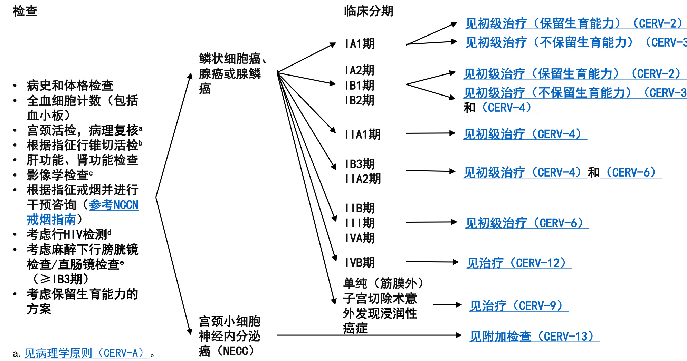  
指南中的所有分期均根据FIGO 2018版分期.（请见ST-1）  

d.考虑行HIV检查（特别是年轻患者）。携带HIV的宫颈癌患者应转诊给HIV专家，并按照指南治疗宫颈癌。不应仅因为HIV状态而调整肿瘤治疗方案。  
e.若怀疑膀胱/肠道受侵，需要行膀胱镜/直肠镜下活检。注：除非另有说明，所有建议均为2A类。  
临床试验： NCCN认为任何癌症患者最好的处理方式是参与临床研究。尤其鼓励癌症患者参加临床试验。f.IB期保留生育能力手术多数应用在肿瘤≤2cm的患者。小细胞神经内分泌癌（既往患有）和胃型腺癌被认为不适用此种手术。g.见评估和手术分期原则（CERV-C）。  
h.没有数据能够支持保留生育能力的手术可以用于小细胞神经内分泌肿瘤、胃型腺癌或恶性腺瘤。对于已生育的女性是否行全子宫切除术，患者和医生可权衡利弊斟酌决定，但强烈建议宫颈涂片结果持续异常或慢性持续性HPV感染的女性接受该手术。  
i.建议请生殖内分泌专家会诊  
j.冷刀锥切术（CKC）是首选的诊断切除方法，环形电刀切除术（LEEP）只要可获得充分的切缘和适宜的定位也可选择。应根据临床需要加做宫颈搔刮术（ECC）。  
k.应保证切缘无浸润性病变或组织学高级别鳞状细胞上皮内病变（HSIL）。  
l.SLN显影在肿瘤＜2cm的患者中可以获得最佳的检测率和显影结果。  
注：除非另有说明，所有建议均为2A类。  
临床试验： NCCN认为对任何癌症患者最好的处理方法是参与临床研究。尤其鼓励癌症患者参加临床试验。c.见影像学原则（CERV-B）。  
g.见评估和手术分期原则（CERV-C）。  
j.冷刀锥切术（CKC）是首选的诊断切除方法，环形电刀切除术（LEEP）只要可获得充分的切缘和适宜的定位也可选择。应根据临床需要加做宫颈搔刮术（ECC）。  
m.医学原因无法手术或拒绝手术者可选择放疗。  
n.见放疗原则（CERV-D）。  
o.对于较高危的患者（例如IA2伴LVSI），可以考虑行EBRT联合同步含铂化疗（使用顺铂单药；如果顺铂不耐受，使用卡铂）。注：除非另有说明，所有建议均为2A类。  
临床试验： NCCN认为对任何癌症患者最好的处理方法是参与临床研究。尤其鼓励癌症患者参加临床试验。c.见影像学原则（CERV-B）。  
g.见评估和手术分期原则（CERV-C）。  
l.SLN显影在肿瘤＜2cm的患者中可以获得最佳的检测率和显影结果。  
m.医学上无法手术或拒绝手术者可选择放疗。  
n.见放疗原则（CERV-D）。  
p.EBRT联合同步含铂化疗使用顺铂单药，如果顺铂不耐受，使用卡铂。  
q.对于因肿瘤范围广、外照射 (EBRT) 有效，或子宫解剖结构使近距离放疗无法充分覆盖病灶的患者可以考虑这一治疗。注：除非另有说明，所有建议均为2A类。  
临床试验： NCCN认为对所有癌症患者最好的处理方法是参与临床研究。尤其鼓励癌症患者参加临床试验。r.危险因素不仅限于Sedlis标准。见Sedlis标准（CERV-E）。  
s.见宫颈癌的系统治疗（CERV-F）。注：除非另有说明，所有建议均为2A类。  
临床试验： NCCN认为对任何癌症患者最好的处理方法是参与临床研究。尤其鼓励癌症患者参加临床试验。c.见影像学原则（CERV-B）。  
g.见评估和手术分期原则（CERV-C）。  
n.见放疗原则（CERV-D）。  
p.EBRT联合同步含铂化疗使用顺铂单药，如果顺铂不耐受，使用卡铂。注：除非另有说明，所有建议均为2A类。  
临床试验： NCCN认为对所有癌症患者最好的处理方法是参与临床研究。尤其鼓励癌症患者参加临床试验。注：除非另有说明，所有建议均为2A类。  
临床试验： NCCN认为对所有癌症患者最好的处理方法是参与临床研究。尤其鼓励癌症患者参加临床试验。注：除非另有说明，所有建议均为2A类。  
临床试验： NCCN认为对所有癌症患者最好的处理方法是参与临床研究。尤其鼓励癌症患者参加临床试验。注：除非另有说明，所有建议均为2A类。  
临床试验： NCCN认为对所有癌症患者最好的处理方法是参与临床研究。尤其鼓励癌症患者参加临床试验。  

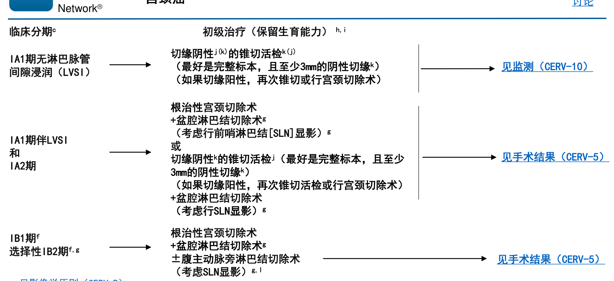  

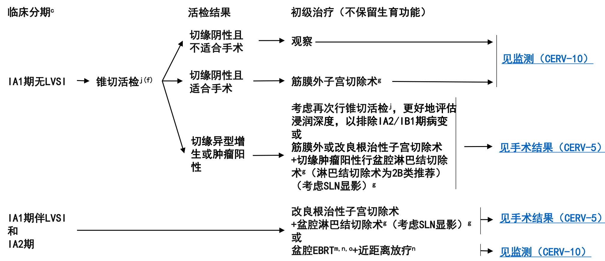  

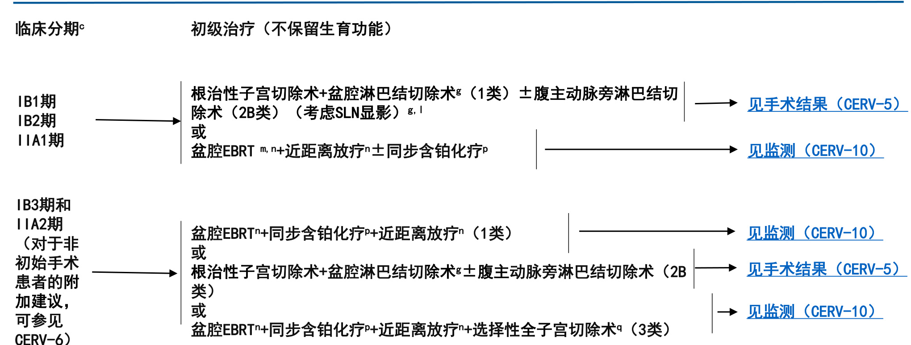  

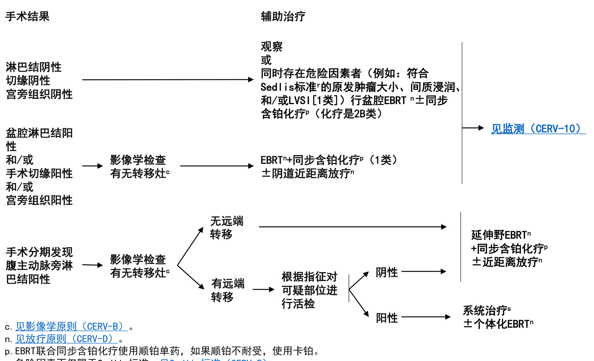  

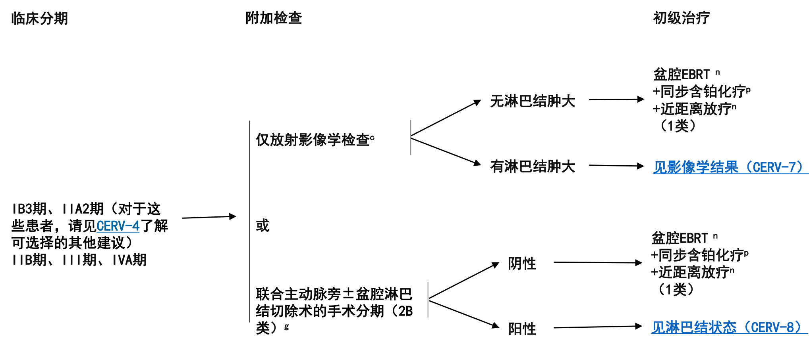  

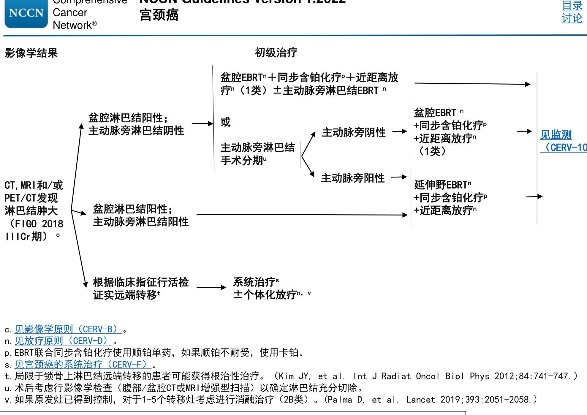  

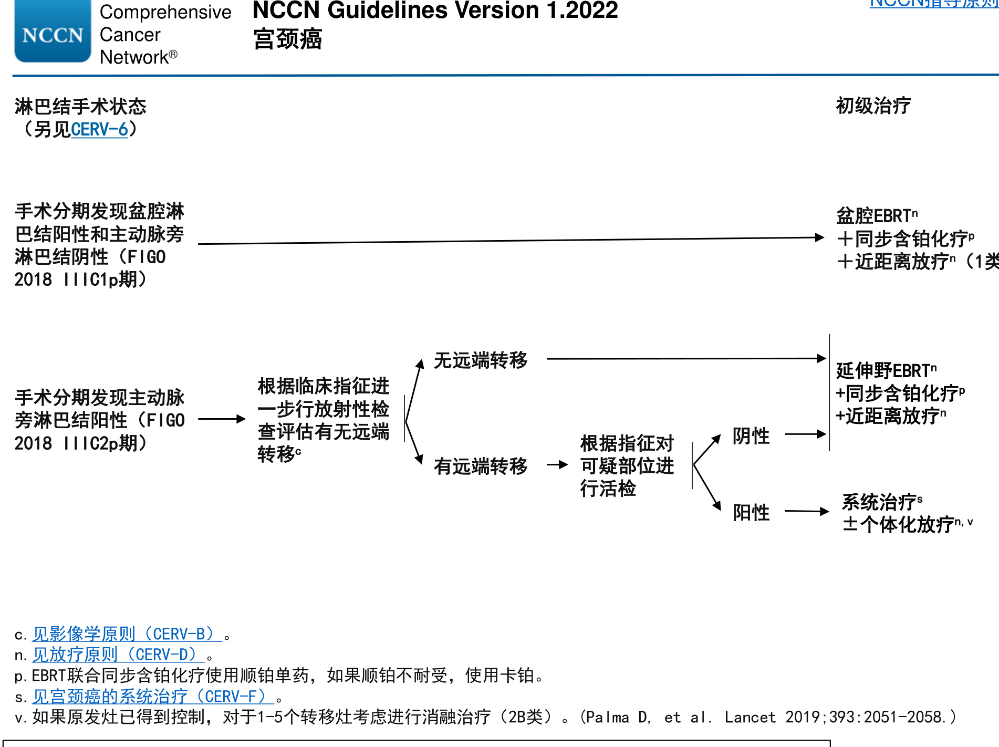  

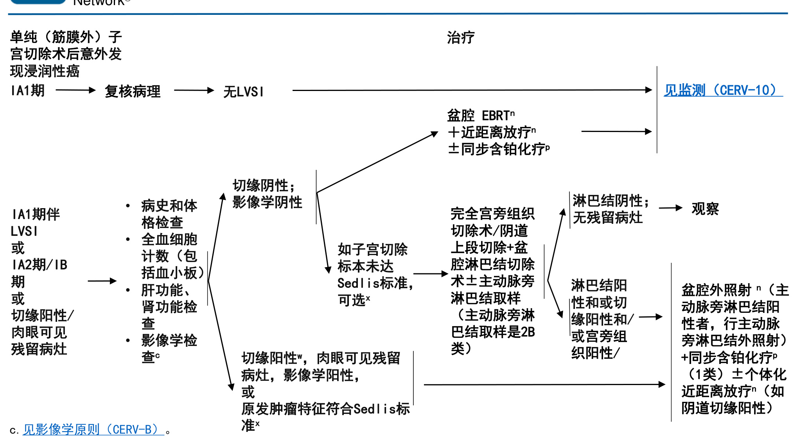  

# 监测y  

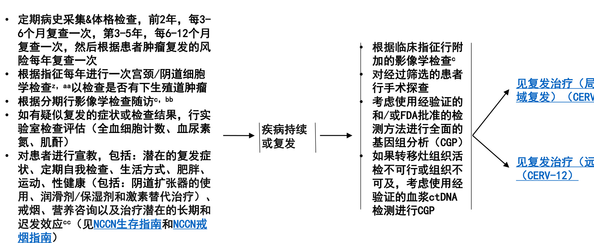  

# c.见影像学原则（CERV-B）  

y.Salani R et al. Gynecol Oncol 2017;146:3-10.  

z.尽管常规细胞学检查在监测宫颈癌复发方面的价值有限，但是可以考虑用于检测下生殖道异型增生和用于免疫功能低下的患者。单用细胞学检查检出无症状复发的可能性很低。  
aa.对于接受过盆腔放疗的患者，细胞学检査结果的准确性可能会受到影响。  
bb.在制定治疗计划前，应通过活检确认肿瘤复发。  
cc.见妇科肿瘤患者生存原则（CERV-G）。  

注：除非另有说明，所有建议均为2A类。  
临床试验： NCCN认为对所有癌症患者最好的处理方法是参与临床研究。尤其鼓励癌症患者参加临床试验。注：除非另有说明，所有建议均为2A类。  
临床试验： NCCN认为对任何癌症患者最好的处理方法是参与临床研究。尤其鼓励癌症患者参加临床试验。n.见放射治疗原则（CERV-D）。  
s.见宫颈癌的系统治疗（CERV-F）。  
dd.由经过验证和/或FDA批准的方法确定，考虑采用肿瘤突变负荷（TMB）检验。  
ee.Perkins V, Gynecol Oncol 2020 Jan;156(1):100-106.  

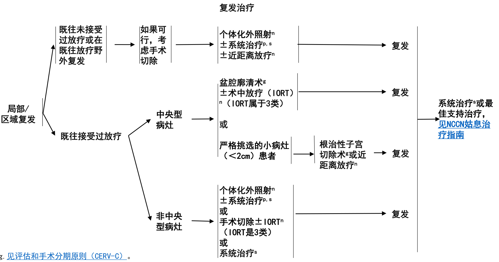  
n.见放疗原则（CERV-D）p.EBRT联合同步含铂化疗使用顺铂单药，如果顺铂不耐受，使用卡铂。s.见宫颈癌的系统治疗（CERV-F）。  

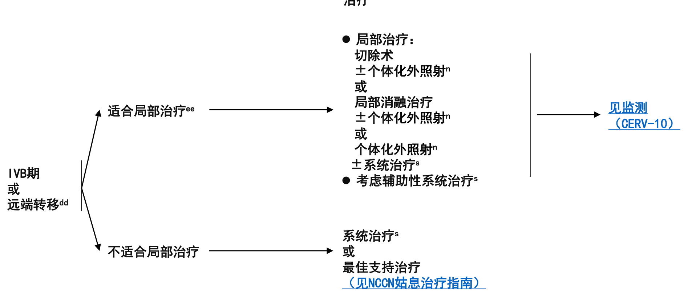  

注：除非另有说明，否则所有建议均为2A类。临床试验： NCCN认为对任何癌症患者最好的处理方法是参与临床研究。尤其鼓励癌症患者参加临床试验  

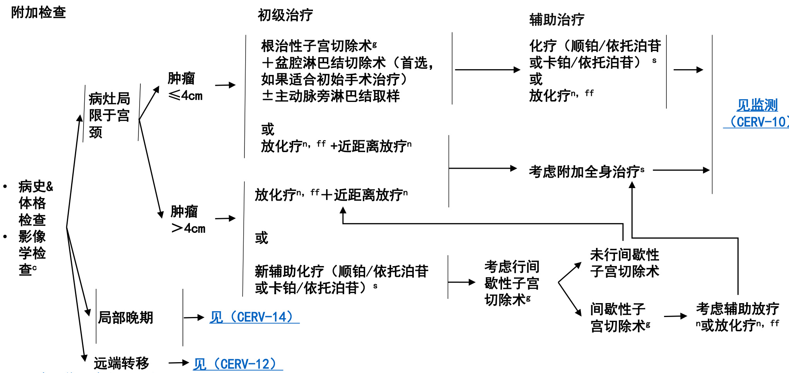  
宫颈小细胞神经内分泌癌a  

a.见病理学原则（CERV-A）。  
c.见影像学原则（CERV-B）。  
g.见评估和手术分期原则（CERV-C）。  
n.见放疗原则（CERV-D）。  
s.见宫颈癌的系统治疗（CERV-F）。  
ff,外照射联合同步含铂方案化疗使用顺铂（如果顺铂不耐受，使用卡铂） $^ +$ 依托泊苷。注：除非另有说明，否则所有建议均为2A类。  
临床试验： NCCN认为对所有癌症患者最好的处理方法是参与临床研究。尤其鼓励癌症患者参加临床试验。c.见影像学原则（CERV-B）。  
g.见评估和手术分期原则（CERV-C）。  
n.见放射治疗原则（CERV-D）。  
s.见宫颈癌的系统治疗（CERV-F）。  
ff,外照射联合同步含铂化疗使用顺铂（如果顺铂不耐受，使用卡铂） $^ +$ 依托泊苷。注：除非另有说明，否则所有建议均为2A类。  
临床试验： NCCN认为对所有癌症患者最好的处理方法是参与临床研究。尤其鼓励癌症患者参加临床试验。  

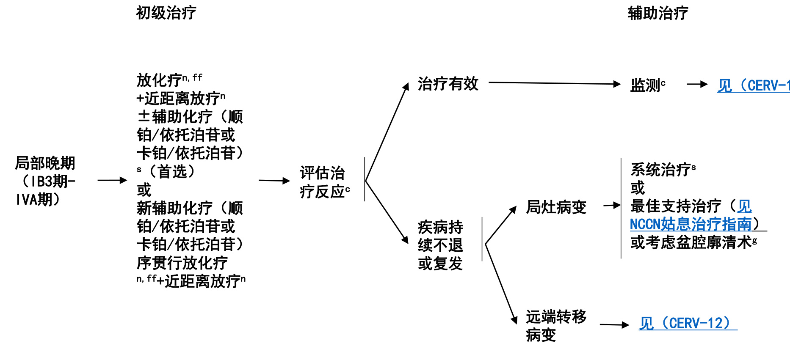  
宫颈小细胞神经内分泌癌  

# 鳞状细胞癌、腺癌或腺鳞癌  

# 病理学原则1  

手术根治性子宫切除术病理学评估: 子宫$\diamondsuit$ 子宫切除术类型（适用时）$\diamondsuit$ 肿瘤部位$\diamondsuit$ 肿瘤大小，包括最大径和其他两个径向$\diamondsuit$ 组织学类型a$\diamondsuit$ 组织学分级$\diamondsuit$ 间质浸润(浸润深度[单位：mm]/宫颈壁厚度[单位：mm]) b$\diamondsuit$ 肿瘤扩散宽度（单位：mm）$\diamondsuit$ 手术切缘情况-如果切缘阴性，包括最近的切缘和距最近切缘的距离(单位-如果切缘阳性，包括阳性切缘的位置c  

$\diamondsuit$ 脉管间隙是否受累（不会影响FIGO 2018版分期2）其他组织/器官受累(宫旁、阴道断端、输卵管、卵巢、腹膜、大网膜、其他)淋巴结(已切除标本)  

应对前哨淋巴结（SLN）进行超分期以检测是否有微小转移非SLN不需要超分期，可按照常规程序进行处理包括肿瘤细胞分离、微转移和宏转移的淋巴结数目分离的肿瘤细胞分期记为pN0(i+)  

对复发、进展或转移患者推荐行PD-L1检测对复发、进展或转移患者推荐行MMR/MSI检测；和/或对宫颈肉瘤患者进行NTRK基因融合检测3，4考虑采用经过验证和/或FDA批准的方法进行肿瘤突变负荷（TMB）检测5  

a.根据2018年国际宫颈腺癌标准和分类(IECC) 6，形态学特征(管腔面可见核分裂象和凋亡)可以用于区分人类乳头瘤病毒(HPV)相关性宫颈管腺癌和非HPV相关性腺癌。可根据形态学特征对肿瘤进一步分型。  
b.评估宫颈管腺癌浸润的组织学模式是一个新近提出的概念7，8，9。目前已经描述了三种有临床意义的宫颈腺癌浸润的组织学模式。A型浸润的肿瘤(腺体边界清楚、圆形轮廓、无单个细胞、无促纤维增生性间质反应、无淋巴管血管侵袭)生存率高，无淋巴结转移或复发7。  
c.这些信息虽然不是必需提供，但了解这些信息有助于制定多学科治疗计划。  
d.超分期通常需要对SLN进行连续切片，并对多张经 HE 染色的切片进行复核，针对所有SLN组织块行细胞角蛋白免疫组化染色可有可无。目前尚缺乏淋巴结超分  

期的标准流程。  

注：除非另有说明，所有建议均为2A类。  
临床试验： NCCN认为对所有癌症患者最好的处理方法是参与临床研究。尤其鼓励癌症患者参加临床试验。  

# 病理学原则10-13  

# 宫颈神经内分泌癌（NECC）  

组织学描述  

尽管非常少见，仅占不到宫颈癌的5%，但在女性生殖道中，宫颈是高级别神经内分泌癌(如小细胞和大细胞神经内分泌癌)最常见的发生部位。  
临床上具有高侵袭性、转移快的特点，大多数预后不良。  
通常与HPV相关，16型和18型最为常见（18型比16型更常见）。  
该类肿瘤在形态学上与肺神经内分泌癌相似。  
小细胞NECC是一种形态学诊断，无论其免疫组化染色结果如何。  
主要呈弥漫性生长。其他的生长模式包括岛状(实性细胞巢/细胞岛，周围细胞呈栅栏状，伴有间质退缩改变)，也可围绕血管周围或呈宽的梁状波浪状生长。可伴有假腺管状和玫瑰形团样结构。  
细胞学特征包括形态一致的细胞，边界不清，细胞质稀少，细胞核深染，染色质呈细颗粒状。常见大量核分裂现象和凋亡碎片。其他特征包括细胞核成型及核仁不明显。常见坏死。  
可伴发宫颈腺性病变(癌前病变或明确恶性)。视情况而定，考虑将其诊断为腺癌伴神经内分泌癌。  
区分小细胞和大细胞NECC较为困难或不可能；在这些情况下宜使用“高级别NECC”一词。  

免疫组织化学  

 小细胞NECC中嗜铬粒蛋白、CD56和突触素呈不同程度阳性。◇CD56和突触素是最敏感的神经内分泌标志物，但CD56缺乏特异性。◇嗜铬粒蛋白是最特异的神经内分泌标志物，但缺乏敏感性，只有约50%-60%的小细胞NECC呈阳性。14-15◇神经元特异性烯醇化酶(NSE)和突触素是另外的神经内分泌肿瘤标志物，阳性率分别为80%和70%。14-15  
 如果肿瘤呈现小细胞NECC的典型形态学特征，则可在缺乏神经内分泌标志物免疫组化染色阳性的情况下作出诊断(不适用于大细胞NECC的诊断)。  
 小细胞NECC对于广谱细胞角蛋白可能仅局灶性阳性(常为点状胞浆染色)，甚至可能是阴性。  
 原发性高级别NECC中TTF1阳性的比例较高，部分呈弥漫性免疫反应性，该标志物在与肺转移性癌进行鉴别区分中没有价值。  
 由于存在高危HPV，大多数高级别NECC呈p16弥漫阳性。 然而，p16阳性不能用来确定肿瘤来源部位；其他部位的神经内分泌癌可强表达p16，但其是非HPV相关性机制所致。  
 已在一些高级别NECC中发现肽激素，包括促肾上腺皮质激素、血清素、生长抑素、降钙素、胰高血糖素和胃泌素等。注：除非另有说明，所有建议均为2A类。  
临床试验： NCCN认为对所有癌症患者最好的处理方法是参与临床研究。尤其鼓励癌症患者参加临床试验。  

# 病理学原则参考文献  

1 Krishnamurti U, Movahedi-Lankarani S, Bell DA, et al. Protocol for the Examination of Specimens from Patients with Primary Carcinoma of the Uterine Cervix. College of American Pathologists 2018.   
2 Bhatla N, Berek JS, Fredes MC, et al. Revised FIGO Staging for carcinoma of the cervix uteri. Int J Gynecol Obstet 2019;145:129-135 and Corrigendum to "Revised FIGO Staging for carcinoma of the cervix uteri” [Int J Gynecol Obstet 2019;145:129-135] Int J Gynecol Obstet 2019;147:279-280.   
3 Minion LE, Tewari KS. Cervical cancer - State of science: From angiogenesis blockade to checkpoint inhibition. Gynecol Oncol 2018; Mar;148(3):609-621. 4 Chung HC, Schellens JH, Delord J-P, et al. Pembrolizumab treatment of advanced cervical cancer: Updated results from the phase 2 KEYNOTE-158 study. J Clin Oncol 2018:36; (suppl; abstr 5522).   
5 Merino DM, McShane LM, Fabrizio D, et al. Establishing guidelines to harmonize tumor mutational burden (TMB): in silico assessment of variation in TMB quantification across diagnostic platforms: phase I of the Friends of Cancer Research TMB Harmonization Project. J Immunother Cancer 2020;8:e000147. doi:10.1136/jitc-2019-000147.   
6 Stolnicu S, Barsan I, Hoang L, et al. International Endocervical Adenocarcinoma Criteria and Classification (IECC): A New Pathogenetic Classification for Invasive Adenocarcinomas of the Endocervix. Am J Surg Pathol 2018 Feb;42(2):214-226.   
7 Diaz De Vivar A, Roma AA, Park KJ, et al. Invasive endocervical adenocarcinoma: proposal for a new pattern-based classification system with significant clinical implications: a multi-institutional study.  Int J Gynecol Pathol 2013 Nov;32(6):592-601.   
8 Roma AA, Mistretta TA, Diaz De Vivar A, et al. New pattern-based personalized risk stratification system for endocervical adenocarcinoma with important clinical implications and surgical outcome. Gynecol Oncol 2016 Apr;141(1):36-42.   
9 Spaans VM, Scheunhage DA, Barzaghi B, et al. Independent validation of the prognostic significance of invasion patterns in endocervical adenocarcinoma: Pattern A predicts excellent survival. Gynecol Oncol 2018;151:196-201.   
10 Rindi G, Klimstra DS, Abedi-Ardekani B, et al. A common classification framework for neuroendocrine neoplasms: an International Agency for Research on Cancer (IARC) and World Health Organization (WHO) expert consensus proposal. Mod Pathol 2018;31(12):1770-1786.   
11 Howitt BE, Kelly P, McCluggage WG. Pathology of neuroendocrine tumours of the female genital tract. Curr Oncol Rep 2017 Sep;19(9):59.   
12 Ganesan R, Hirschowitz L, Dawson P, et al. Neuroendocrine carcinoma of the cervix: Review of a series of cases and correlation with outcome. Int J Surg Pathol. 2016;24(6):490-496.   
13 Perunovic B, Sunassee A. Small cell (neuroendocrine / undifferentiated) carcinoma. PathologyOutlines.com website (http://www.pathologyoutlines.com/topic/ cervixsmallcell.html).   
14 Wang HL, Lu DW. Detection of human papillomavirus DNA and expression of p16, Rb, and p53 proteins in small cell carcinomas of the uterine cervix. Am J Surg Pathol 2004 Jul;28(7):901-908.   
15 Masumoto N, Fujii T, Ishikawa M, et al. P16 overexpression and human papillomavirus infection in small cell carcinoma of the uterine cervix. Hum Pathol 2003 Aug;34(8):778-783.  

# 影像学原则a，1-9  

# 初始检查  

I期  

不保留生育功能  

◇考虑行盆腔MRI增强扫描以评估局部病灶范围（对于FIGO IB1-IB3期是首选推荐）。  
◇ 对于FIGO分期IB1-IB3期，行颈/胸/腹/盆腔/腹股沟PET/CT（首选）或胸/腹/盆腔CT或PET/MRI检查。  
◇全子宫切除术后意外发现的宫颈癌，考虑行颈/胸/腹/盆腔/腹股沟PET/CT或胸/腹/盆腔CT以评估转移情况，行盆腔MRI以评估盆腔残留病灶。  
◇对于有转移的疾病，应根据症状及临床体征，酌情行其他影像学检查b。  

保留生育功能  

◇行盆腔MRI检查（首选）以评估局部病灶范围以及肿瘤与宫颈内口的距离；不适合行MRI检查者行经阴道超声检查。  
◇对于FIGO分期IB1-IB3期患者，行颈/胸/腹/盆腔/腹股沟PET/CT（首选）或胸/腹/盆腔CT。  

考虑行胸部CT平扫和/或增强检查。  

对于有转移的疾病，应根据症状及临床体征，酌情行其他影像学检查b。  

II-IVA期  

 行盆腔MRI增强扫描以评估局部病灶范围（首选）。  
 颈/胸/腹/盆腔/腹股沟PET/CT（首选）或胸/腹/盆腔CT检查以评估转移情况。  
 对于有转移的疾病，应根据症状及临床体征，酌情行其他初始的影像学检查c。  
 全子宫切除术后意外发现的宫颈癌，考虑行颈/胸/腹/盆腔/腹股沟PET/CT或胸/腹/盆腔CT以评估转移情况，行盆腔MRI增强以评估盆腔残留病灶。a.整个指南中提及的MRI和CT检查（实施时）均应使用造影剂增强，除非存在禁忌。胸部CT筛查不要求造影剂增强。  
b.这些因素可能包括异常体格检查结果或盆腔、腹部或肺部症状。  
c.这些因素可能包括异常体格检查结果、盆腔大肿块（＞4cm）、诊治延迟及盆腔、腹部或肺部症状。注：除非另有说明，所有建议均为2A类。  
临床试验： NCCN认为对所有癌症患者最好的处理方法是参与临床研究。尤其特别鼓励癌症患者参加临床试验。  

# 影像学原则a，1-9  

# 随访/监测  

I期  

不保留生育功能  

对于疾病复发/转移，应根据症状及临床体征，酌情行其它影像学检查b 。  

◇对于FIGO IB3期患者，或由于高危因素需要行术后行辅助放疗或放化疗的患者d，在完成治疗后3-6个月需行颈/胸/腹/盆腔/腹股沟PET/CT检查。  

保留生育功能  

◇考虑术后6个月行盆腔MRI增强扫描，此后2-3年每年复查。对于疾病复发/转移，应根据症状及临床体征，酌情行其它影像学检查b。  

II-IV期  

 在完成治疗后的3-6个月内行颈/胸/腹/盆腔/腹股沟PET/CT（首选）或胸/腹/盆腔CT增强扫描检查。 在完成治疗后的3-6个月时考虑行盆腔MRI增强扫描。 对于疾病复发/转移，应根据症状及临床体征，酌情行其它影像学检查。e  

IVB期或复发  

 酌情行影像学检查（CT，MRI或PET/CT）以评估疗效或决定进一步治疗。  

# 怀疑复发或转移  

$\bullet$ 颈/胸/腹/盆腔/腹股沟PET/CT。考虑行盆腔MRI检查。  

a.整个指南中提及的MRI和CT检查（实施时）均应使用造影剂增强。胸部CT筛查不要求造影剂增强。b.这些因素可能包括异常体格检查结果或盆腔、腹部或肺部症状。d.危险因素可能包括淋巴结阳性、宫旁组织阳性、切缘阳性或宫颈局部因素（见Sedlis标准CERV-E）。e.这些因素可能包括异常体格检查结果，如可触及的肿块或肿大淋巴结，以及盆腔、腹部或肺部的新发症状  

注：除非另有说明，所有建议均为2A类。  
临床试验： NCCN认为对所有癌症患者最好的处理方法是参与临床研究。尤其特别鼓励癌症患者参加临床试验。  

影像学原则a，1-9  

# 小细胞NECC  

附加检查  颈/胸/腹/盆腔/腹股沟PET/CT+脑MRI(首选) 或  胸/腹/盆腔CT+脑MRI  

 治疗效果评估 如果初级治疗是放化疗，行颈/胸/腹/盆腔/腹股沟PET/CT±脑MRI（首选）或胸/腹/盆腔CT±脑MRI 如果采用新辅助化疗，考虑在放化疗和近距离放疗前再次评估以排除转移性疾病  

$\bullet$ 监测   
 颈/胸/腹/盆腔/腹股沟PET/CT±脑MRI（首选）   
或   
 胸/腹/盆腔CT±脑MRI  

a.整个指南中提及的MRI和CT检查（实施时）均应使用造影剂增强，除非存在禁忌。胸部CT筛查不要求造影剂增强。  

注：除非另有说明，所有建议均为2A类。  
临床试验： NCCN认为对所有癌症患者最好的处理方法是参与临床研究。尤其鼓励癌症患者参加临床试验。  

# 影像学原则参考文献  

1 Salani R, Khanna N, Frimer M, et al. An update on post-treatment surveillance and diagnosis of recurrence in women with gynecologic malignancies: Society of Gynecologic Oncology (SGO) recommendations. Gynecol Oncol 2017;146:3-10.   
2 Atri M, Zhang Z, Dehdashti F, et al. Utility of PET/CT to evaluate retroperitoneal lymph node metastasis in advanced cervical cancer: Results of ACRIN6671/GOG0233 trial. Gynecol Oncol 2016;142:413-419.   
3 Rajendran JG, Greer BE. Expanding role of positron emission tomography in cancer of the uterine cervix. J Natl Compr Canc Netw 2006;4:463-469. 4 Lakhman Y, Akin O, Park KJ, et al. Stage IB1 cervical cancer: role of preoperative MR imaging in selection of patients for fertility-sparing radical trachelectomy. Radiology 2013;269:149-158.   
5 Elit L, Reade CJ. Recommendations for follow-up care for gynecologic cancer survivors. Obstet Gynecol 2015;126:1207-1214.   
6 Sala E, Rockall AG, Freeman SJ, et al. The added role of MR imaging in treatment stratification of patients with gynecologic malignancies: what the radiologist needs to know. Radiology 2013;266:717-740.   
7 Balleyguier C, Sala E, Da Cunha T, et al. Staging of uterine cervical cancer with MRI: guidelines of the European Society of Urogenital Radiology. Eur Radiol 2011;21:1102-1110.   
8 Sala E, Micco M, Burger IA, et al. Complementary prognostic value of pelvic MRI and whole-body FDG PET/CT in the pretreatment assessment of patients with cervical cancer. Int J Gynecol Cancer 2015;25:1461-1467.   
9 Bhatla N, Berek JS, Fredes MC, et al. Revised FIGO Staging for carcinoma of the cervix uteri. Int J Gynecol Obstet 2019;145:129-135 and Corrigendum to "Revised FIGO Staging for carcinoma of the cervix uteri” [Int J Gynecol Obstet 2019;145:129-135] Int J Gynecol Obstet 2019;147:279-280.  

# 注：除非另有说明，所有建议均为2A类。临床试验： NCCN认为对所有癌症患者最好的处理方法是参与临床研究。尤其鼓励癌症患者参加临床试验。  

权所有， 2022第一版，国家综合癌症网®（NCCN $\circledast$ ） $\circledcirc$ 2021 ， 10/26/2021发布。未经明确的书面许可，不得翻印任何形式的NCCN指南®及其解读。  

# 评估和手术分期原则a  

# 宫颈癌治疗的切除术类型和适宜性  

• 微浸润癌被定义为FIGO IA1期无脉管间隙受累，其发生淋巴转移的几率小于1%，可行保守治疗：采用锥切活检，手术切缘阴性者可保留生育功能；对于保留生育力没有要求或不相关的患者也可行单纯子宫切除术。锥切活检的目的要求用手术刀完整切除宫颈及颈管。这样可为病理医生提供一个完整的、非碎片型的标本，无电切器械对手术切缘的影响，有利于评估切缘状态。如果选择环形电切术（LEEP）进行治疗，则应确保标本的完整性，并且小心操作，尽量减少电切器械对手术切缘的影响。锥切活检的形状和深度可以根据肿瘤病灶的大小、类型和位置进行调整。例如，位于宫颈管内可疑的浸润性腺癌或原位腺癌，锥切活检应设计成一个可深入宫颈内口的狭长锥形，以免遗漏宫颈管内可能存在的浸润性癌组织。冷刀锥切的长度最好至少达10mm，对于已经生育的患者，可以增加到18-20mm1。建议在锥顶上方进行宫颈管内取样以评估是否存在残留病灶。锥切活检适用于小肿瘤的分诊和治疗，肿瘤体积小则不太可能会径直切割到整个肿瘤。对于IA1期伴脉管间隙受累的患者，锥切术（切缘阴性）并盆腔SLN显影/淋巴结切除术是一个合理的策略。  
• 不要求保留生育功能时，根治性子宫切除术+双侧盆腔淋巴结切除术（无论是否行SLN显影）是FIGO IA2期、IB1期、IB2期和选择性IB3-IIA1 病变的首选治疗方法。与单纯子宫切除术相比，根治性子宫切除术切除的切缘范围更广，包括切除部分主韧带和宫骶韧带以及阴道上部1-2厘米; 此外，还要切除盆腔淋巴结，有时还包括切除主动脉旁淋巴结。Querleu和Morrow分类系统2是一种现代化的手术分类系统，它在三维平面上描述了切除范围和神经保护的情况3。最常用的子宫切除术的手术步骤详情如表1所示(见CERV-C 第5页[共7页])。  
• 根治性子宫切除术的标准和推荐方法是开腹入路(1类)。一项前瞻性随机试验4显示，与开腹根治性子宫切除术相比，微创根治性子宫切除术与无病生存率(DFS)和总生存率较低相关。此外，最近的两项流行病学研究也表明，在IA2-IB1期宫颈癌患者中，微创根治性子宫切除术的总生存期较开放性手术短5。更多细节请参阅讨论章节。  

a.按疾病分期提供的推荐方法是基于修订后的FIGO 2018分期（Bhatla N, Berek JS, Fredes MC, et al.Revised FIGO Staging for carcinoma ofthe cervix uteri. Int J Gynecol Obstet 2019;145:129-135，勘误为“Revised FIGO Staging for carcinoma of the cervix uteri” [Int JGynecol Obstet 2019;145:129-135] Int J Gynecol Obstet 2019;147:279-280）。然而，本节引用的研究数据使用的是2009年FIGO分级系统。  

注：除非另有说明，所有建议均为2A类。  
临床试验： NCCN认为对所有癌症患者最好的处理方法是参与临床研究。尤其鼓励癌症患者参加临床试验。  

# 评估和手术分期原则a  

# 宫颈癌手术治疗的类型和适应证（续）  

• 用于分期的主动脉旁淋巴结切除术通常在肠系膜下动脉（IMA）水平进行，向上清扫的范围可以根据临床和影像学检查结果调整。  
• 经阴道根治性宫颈切除术+腹腔镜下淋巴结切除术（±SLN显影）可实现保留生育功能，这种治疗方案适用于经严格选择的ⅠA2或ⅠB1期患者（病灶直径≤2cm）。与B型根治性子宫切除术一样，切除宫颈、阴道上段和支撑韧带，但保留宫体。在目前报告的300多例术后妊娠患者中，妊娠中期流产的可能性为10%，但72%的患者妊娠至37周或以上6。经腹根治性宫颈切除术是一种合理的保留生育功能的策略。与经阴道术式相比，这种术式宫旁可切除的范围更大7，适用于经过选择的ⅠB1-ⅠB2期患者，并且已经在病灶直径2-4cm的患者中实施。该手术类似于C型根治性子宫切除术b，2，3，7-10。  
• 如指南所述，FIGO ⅡB期及以上的晚期患者通常不采用子宫切除术治疗。在美国，大多数晚期患者采用根治性放化疗。在一些国家，部分经过选择的ⅡB期患者可先行根治性子宫切除术或新辅助化疗后行根治性子宫切除术。  
• 对放疗后盆腔中心中疾病复发或未控制的患者，实施盆腔廓清术可能有治愈的机会。廓清术的术前评估是旨在明确或排除远端转移。如果复发限于盆腔，可进行手术探查。如果术中切缘和淋巴结评估为阴性，则可行盆腔脏器切除。根据肿瘤的位置，可以采用前、后或全盆腔廓清术。若肿瘤部位可以保证足够的手术切缘，则盆底和肛门括约肌可保留作为上提肌廓清术。表2汇总了不同类型盆腔廓清术中通常会切除的组织（见CERV-C，第6页/共7页）。这些都是极复杂的术式，应当在具有较高廓清术水平的医疗中心进行。盆腔廓清术（之前未接受盆腔放疗）很少用于初始治疗，仅限于有盆腔放疗禁忌或既往接受过盆腔放疗治疗另外的适应症后发展为继发性、局部晚期宫颈癌并且不适合进一步放疗的少数病例。  

a.按疾病分期提供的推荐方法是基于修订后的FIGO 2018分期（Bhatla N, Berek JS, Fredes MC, et al. Revised FIGO Staging for carcinoma ofthe cervix uteri. Int J Gynecol Obstet 2019;145:129-135，勘误为“Revised FIGO Staging for carcinoma of the cervix uteri” [Int JGynecol Obstet 2019;145:129-135] Int J Gynecol Obstet 2019;147:279-280）。然而，本节引用的研究数据使用的是2009年FIGO分期系统。b.关于C型根治性子宫切除术的描述，见表1（CERV-C,第5页/共7页）。  

注：除非另有说明，所有建议均为2A类。  
临床试验： NCCN认为对所有癌症患者最好的处理方法是参与临床研究。尤其鼓励癌症患者参加临床试验。  

# 评估和手术分期原则a  

# 宫颈癌前哨淋巴结显影  

• 前哨淋巴结显影作为经筛选的I期宫颈癌的手术治疗方案的一部分，在全球广泛用于妇科肿瘤医治实践中。虽然这项技术已被用于肿瘤直径达4cm的患者，但其在直径＜2cm 的前哨淋巴结显影已经被广泛用于经过选择的Ⅰ期宫颈癌患者的手术中。虽然这项技术已被用于治疗直径达4cm的肿瘤，但其在直径＜2cm 的肿瘤中检出率和显影效果最好11-15。此技术操作简单，直接在宫颈的2个点位或4个点位注射染料c或放射性胶体锝-99（99Tc），如下方图1所示。前哨淋巴结在手术中通过直接观察有色染料来识别，如果使用吲哚菁绿（ICG）16作为染料则采用荧光摄像头显影，如果使用99Tc则采用γ探测仪探测。宫颈注射显影剂后，前哨淋巴结通常在髂外血管内侧、髂内血管的子宫侧或闭孔窝的表面显影（图2）。前哨淋巴结通常由病理科医生进行超分期，以提高微转移的检出率，进而改变术后处理。4，a.按疾病分期提供的推荐方法是基于修订后的FIGO 2018分期（Bhatla N, Berek JS, F noma ofthe cervix uteri. Int J Gynecol Obstet 2019;145:129-135，勘误为“Revised FIGO Staging for carcinoma of the cervix uteri” [Int JGynecol Obstet 2019;145:129-135] Int J Gynecol Obstet 2019;147:279-280）。然而，本节引用的研究数据使用的是2009年FIGO分级系统。c.III期随机FILM研究显示，吲哚菁绿（ICG）非劣效于异硫蓝染料。(Frumovitz M, Plante M, Lee PS et al. Near-infrared fluorescence fordetection of sentinel lymph nodes in women with cervical and uterine cancers (FILM): a randomised, phase 3, multicentre, non-inferiority trial. Lancet Oncol 2018;19:1394-1403)  

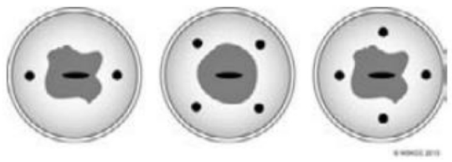  
图1：前哨淋巴结宫颈注射部位的选择  

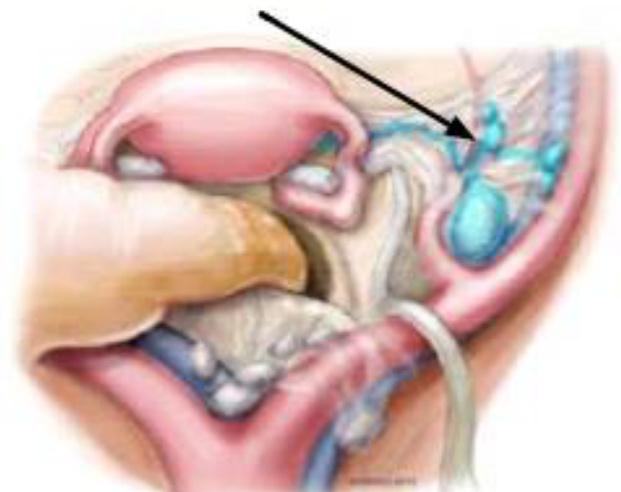  
图2：宫颈注射显影剂后，前哨淋巴结（蓝色，箭头所指）通常在髂外血管内侧、髂内血管的子宫侧或闭孔窝的表面显影d  

d.图1和图2经纪念斯隆-凯特琳癌症中心许可转载。 $\circledcirc$ 2013 Memorial Sloan Kettering Cancer Center.  

注：除非另有说明，所有建议均为2A类。  
临床试验：NCCN认为对所有癌症患者最好的处理方法是参与临床研究。尤其鼓励癌症患者参加临床试验。  

# 评估和手术分期原则（采用SLN显影时）  

前哨淋巴结成功显影的关键在于遵守前哨淋巴结的检测流程，当一侧淋巴结显影失败时，切除该侧的淋巴结，以及切除任何可疑或增大的淋巴结，无论其是否显影（图3）  

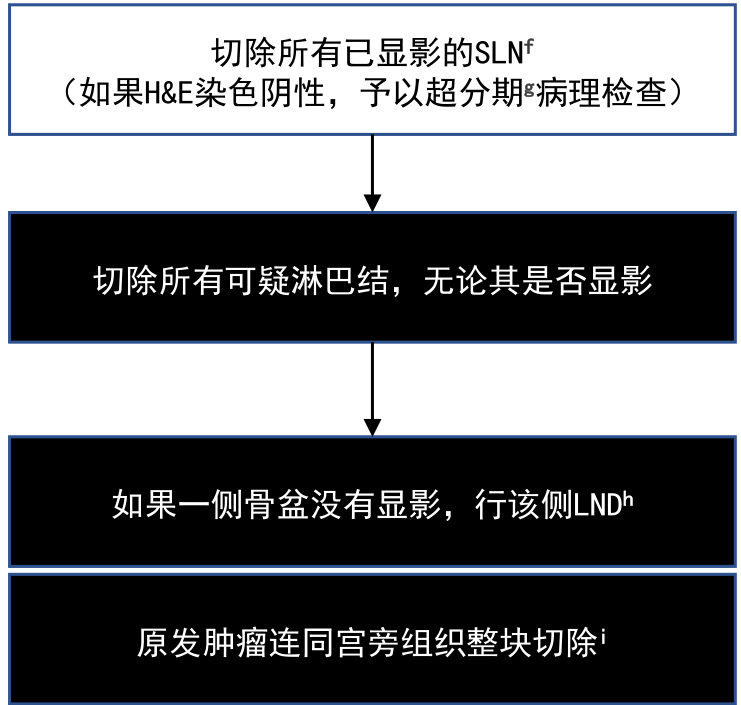  
图3：早期宫颈癌的手术/前哨淋巴结显影流程e  

H&E：苏木精-伊红染色法 LND：淋巴结切除术 SLN：前哨淋巴结  

e.经许可转载自Cormier B，Diaz JP，Shih K，et al.Establishing a sentinel lymph node mapping algorithm for the treatment of early cervical cancer.Gynecol Oncol.2011 Aug;122:275-280.  

f.宫颈内注射染料、99Tc，或注射两者。  

g.目前尚缺乏超分期的标准流程。超分期通常包括对大体淋巴结进行连续切片，并进行H＆E染色读片（±细胞角蛋白免疫组化染色）。见病理学检查原则（CERV-A）。  
h.包括髂间/主动脉下淋巴结。  
i.特定患者做另外处理（见 CERV-C,1/7）。注：除非另有说明，所有建议均为2A类。  
临床试验： NCCN认为对所有癌症患者最好的处理方法是参与临床研究。尤其鼓励癌症患者参加临床试验。  

# NCCN Guidelines Version 1.2022 宫颈癌  

# 评估和手术分期原则  

表1：宫颈癌切除术作为初级治疗  

<html><body><table><tr><td colspan="4">子宫切除术类型比较</td><td colspan="2">宫颈切除术类型比较（保留子宫）</td></tr><tr><td></td><td>筋膜外子宫切除术（A型）k</td><td>改良根治性子宫切除术</td><td>根治性子宫切除术（C1型）k</td><td>单纯宫颈切除</td><td>根治性宫颈切除!</td></tr><tr><td>适应证</td><td>IA1期</td><td>IA1期伴LVSI和IA2期</td><td>激有照显转移的局部病灶，包括：</td><td>原位癌和IA1期</td><td>部分经过筛选的 1B2期</td></tr><tr><td>目的</td><td>微浸润根治</td><td>小病灶根治</td><td>大病灶根治</td><td>微浸润根治 保留生育功能</td><td>用一些选择性的 IA2-1B2 保留生育功能</td></tr><tr><td>子宫</td><td>切除</td><td>切除</td><td>切除</td><td>保留</td><td>保留</td></tr><tr><td>卵巢</td><td>选择性切除</td><td>选择性切除</td><td>选择性切除</td><td>保留</td><td>保留</td></tr><tr><td>宫颈</td><td>完全切除</td><td>完全切除</td><td>完全切除</td><td>大部分切除（官颈头侧</td><td>大部分切除（距窗信头侧</td></tr><tr><td>阴道切缘</td><td>极小切缘</td><td>1-2cm切缘</td><td>阴道上1/4至1/3</td><td>极小切缘</td><td>1-2cm切缘</td></tr><tr><td>游离输尿管</td><td>未涉及</td><td>将输尿管从宫颈分离</td><td>将输尿管从宫颈和宫旁侧方分离</td><td>未涉及</td><td>将输尿管从宫颈分离</td></tr><tr><td>切除宫颈旁/ 宫旁组织</td><td>不切除</td><td>在输尿管床水平切除 (水平切除1-2cm）</td><td>在骼内血管内侧方分离，深切缘是子宫深 静脉</td><td>在宫颈边缘处切除</td><td>在输尿管床水平切除（水平 切除1-2cm）</td></tr><tr><td>直富带）</td><td>宫颈边缘处分离</td><td>官辆侧1-2m（保留腹</td><td>1型保留神经，在宫颈背侧至少2cm处分</td><td>宫颈边缘处分离</td><td>富经貨侧1-2cm（保留腹下</td></tr><tr><td>膀胱</td><td>分离至宫颈外口</td><td>分离至阴道上部</td><td>分离至阴道中部</td><td>分离至腹膜反折</td><td>分离至阴道上部</td></tr><tr><td>直肠</td><td>未涉及</td><td>分离至宫颈下</td><td>分离至阴道中部下</td><td>分离至腹膜反折</td><td>分离至宫颈下方</td></tr><tr><td>手术途径</td><td>经阴道或开腹或微创</td><td>开腹</td><td>开腹</td><td>经阴道或开腹或微创"</td><td>经阴是或开摧减微创（微创</td></tr></table></body></html>

j.Cibula D, Abu-Rustum NR, Benedetti-Panici P, et al. New classification system of radical hysterectomy $\because$ Emphasis on a three-dimensional anatomic template foparametrial resection. Gynecol Oncol 2011;122:264-268.k.Querleu和Morrow手术分类系统在三位平面中描述了根治性子宫切除术的切除范围和神经保留的情况，并更新了过去使用的Piver-Rutledge分类法。（Querleu D, Morrow CP.Classification of radical hysterectomy. Lancet Oncol 2008;9:297-303.）l.保留生育功能的根治性宫颈切除术在直径≤2cm的病灶中得到最佳验证。目前不认为此术式适合小细胞神经内分泌组织和胃恶性腺瘤。m.目前尚缺乏关于微创根治性宫颈切除术的肿瘤学结局数据。  

注：除非另有说明，所有建议均为2A类。  
临床试验： NCCN认为对所有癌症患者最好的处理方法是参与临床研究。尤其鼓励癌症患者参加临床试验。  

# 评估和手术分期原则  

表2：无远端转移的局部复发性宫颈癌切除j  

<html><body><table><tr><td colspan="4">肛提肌下廓清术类型比较</td><td colspan="2">肛提肌上廓清术类型比较</td></tr><tr><td></td><td>前盆腔</td><td>后盆腔</td><td>全盆腔</td><td>后盆腔</td><td>全盆腔</td></tr><tr><td>适应证</td><td colspan="5">适用于经筛选的FICOIVA期患瞻的心复溶疗(当初始放疗不可行时)</td></tr><tr><td>目的</td><td colspan="5">根治</td></tr><tr><td>子宫、输卵管、卵巢</td><td>如果仍然存在则切除</td><td>如果仍然存在则切除</td><td>如果仍然存在则切除</td><td>如果仍然存在则切除</td><td>如果仍然存在则切除</td></tr><tr><td>阴道</td><td>切除</td><td>切除</td><td>切除</td><td>切除</td><td></td></tr><tr><td>膀胱和尿道</td><td>切除</td><td>切除</td><td>切除</td><td>切除</td><td>切除</td></tr><tr><td>直肠</td><td>切除</td><td>切除</td><td>切除</td><td>切除</td><td>切除</td></tr><tr><td>肛门括约肌</td><td>切除</td><td>切除</td><td>切除</td><td>偶留，如果可以，与结</td><td>偶留，如果可以，与结</td></tr><tr><td>泌尿系统重建方案</td><td>回肠代膀胱术或可控性 尿流改道术</td><td>不适用</td><td>双管湿性结肠造口术"、 原肠代术或可控性</td><td>不适用</td><td>双管湿性结肠造口术、 原肠代腾胱术或可控性</td></tr><tr><td>胃肠系统重建方案</td><td>不适用</td><td>末端结肠造口术</td><td>双管湿性结肠造口术或 末端结肠造口术</td><td>末端结肠造口术或吻合 术联合临时性回肠造口</td><td>双管湿性结肠造口术n、 末结肠口吻合</td></tr><tr><td>阴道重建方案</td><td colspan="5">肌皮瓣（腹直肌、股薄肌等），或带大网膜J瓣中厚皮片移植</td></tr></table></body></html>

注：除非另有说明，所有建议均为2A类。临床试验： NCCN认为对所有癌症患者最好的处理方法是参与临床研究。尤其鼓励癌症患者参加临床试验。  

j.Cibula D, Abu-Rustum NR, Benedetti-Panici P, et al. New classification system of radical hysterectomy: Emphasis on a three-dimensional anatomic template for parametrial resection. Gynecol Oncol 2011;122:264-268.   
n.Backes FJ, Tierney BJ, Eisenhauer EL t al. Complications after double-barreled wet colostomy compared to separate urinary and fecal diversion during pelvic exenteration: time to change back? Gynecol Oncol 2013 Jan;128:60-64.  

# 评估和手术分期原则 参考文献  

1 Teoh D, Musa F, Salani R, et al. Diagnosis and management of adenocarcinoma in situ: A Society of Gynecologic Oncology Evidence-Based Review and Recommendations. Obstet Gynecol 2020;135(4):869-878.   
2 Querleu D, Morrow CP. Classification of radical hysterectomy. Lancet Oncol 2008;9:297-303.   
3 Cibula D, Abu-Rustum NR, Benedetti-Panici P, et al. New classification system of radical hysterectomy: emphasis on a three-dimensional anatomic template for parametrial resection. Gynecol Oncol 2011;122:264-268.   
4 Ramirez PT, Frumovitz M, Pareja R, et al. Minimally invasive versus abdominal radical hysterectomy for cervical cancer. N Engl J Med 2018;379:1895-1904. 5 Melamed A, Margul DJ, Chen L, et al. Survival after minimally invasive radical hysterectomy for early-stage cervical cancer. N Engl J Med 2018;379:1905-1914. 6 Plante M, Gregoire J, Renaud MC, Roy M. The vaginal radical trachelectomy: an update of a series of 125 cases and 106 pregnancies. Gynecol Oncol 2011;121:290-297.   
7 Einstein MH, Park KJ, Sonoda Y, et al. Radical vaginal versus abdominal trachelectomy for stage IB1 cervical cancer: a comparison of surgical and pathologic outcomes. Gynecol Oncol 2009;112:73-77.   
8 Piver MS, Rutledge F, Smith JP. Five classes of extended hysterectomy for women with cervical cancer. Obstet Gynecol 1974;44:265-272.   
9 Wethington SL, Sonoda Y, Park KJ, et al. Expanding the indications for radical trachelectomy: a report on 29 patients with stage IB1 tumors measuring 2 to 4 centimeters. Int J Gynecol Cancer 2013;23:1092-1098.   
10 Wethington SL, Cibula D, Duska LR, et al. An international series on abdominal radical trachelectomy: 101 patients and 28 pregnancies. Int J Gynecol Cancer 2012;22:1251-1257.   
11 Lintner B, Saso S, Tarnai L, et al. Use of abdominal radical trachelectomy to treat cervical cancer greater than 2 cm in diameter. Int J Gynecol Cancer 2013;23:1065-1070.   
12 Bats AS, Mathevet P, Buenerd A, et al. The sentinel node technique detects unexpected drainage pathways and allows nodal ultrastaging in early cervical cancer: insights from the multicenter prospective SENTICOL study. Ann Surg Oncol 2013;20:413-422.   
13 Eiriksson LR, Covens A. Sentinel lymph node mapping in cervical cancer: the future? BJOG 2012 Jan;119:129-133.   
14 Cormier B, Diaz JP, Shih K, et al. Establishing a 10/02/20 lymph node mapping algorithm for the treatment of early cervical cancer. Gynecol Oncol 2011;122:275- 280.   
15 Altgassen C, Hertel H, Brandstädt A, et al. Multicenter validation study of the sentinel lymph node concept in cervical cancer: AGO Study Group. J Clin Oncol 2008;26:2943-2951.   
16 Frumovitz M, Plante M, Lee PS, et al. Near-infrared fluorescence for detection of sentinel lymph nodes in women with cervical and uterine cancers (FILM): a randomised, phase 3, multicentre, non-inferiority trial. Lancet Oncol 2018;19:1394-1403.   
17 Cibula D, Abu-Rustum NR, Dusek L, et al. Prognostic significance of low volume sentinel lymph node disease in early-stage cervical cancer. Gynecol Oncol 2012;124:496-501. 注：除非另有说明，所有建议均为2A类。   
临床试验： NCCN认为对所有癌症患者最好的处理方法是参与临床研究。尤其鼓励癌症患者参加临床试验。  

# 放疗原则  

# 一般原则  

 以CT为基础的治疗计划和适形技术是外照射放疗（EBRT）的标准治疗。MRI是判断晚期肿瘤患者软组织和宫旁浸润的最佳影像学检查方法。对于没有手术分期的患者，PET成像有助于判断淋巴结转移范围，对于术后患者， PET有助于判断异常淋巴结是否已切除。  
 放疗靶向于已知或可疑的肿瘤侵犯部位。EBRT靶区为盆腔±主动脉旁区域。  
 对于不适合手术的所有初治宫颈癌患者，近距离放疗是根治性治疗的关键部分，通过腔内和/或间质内的方式实施。  
 对于接受EBRT治疗宫颈癌的大多数患者，EBRT期间予同步含铂方案化疗。  
 8周内完成治疗者效果最佳。  

# 一般治疗信息  

靶区：  

 肿瘤靶区（GTV）、临床靶区（CTV）、计划靶区（PTV） 、危及器官（OARs）、内部器官运动，以及剂量体积直方图（DVH）等概念已被明确定义用于适形放疗、特别是调强放疗（IMRT）中。  
 需要特别注意细节和可重复性（包括考虑靶区和正常组织界定、患者和内部器官运动、软组织变形以及严格的剂量学和物理质量保证），这些对于正确地实施IMRT和相关的高度适形技术是必要的。常规的图像引导，如锥形束CT（CBCT），应该用于判断日常的内部软组织定位。  
 EBRT的范围应该包括大体肿瘤（如果存在）、宫旁、宫骶韧带以及距大体肿瘤足够的阴道范围（至少3cm）、骶前淋巴结以及其他危险的淋巴结区域。对于接受手术性及放射性成像的淋巴结阴性患者，照射范围应该包括髂内外、闭孔和骶前淋巴结区域。对于更高危的淋巴结转移的患者（如：大肿瘤；可疑或确定为限于低位真骨盆区域淋巴结转移），放射野需升高到包括髂总淋巴结区域。对于确定为髂总和/或主动脉旁区域淋巴结转移的患者，建议行包括盆腔+主动脉旁淋巴结区域的延伸野放射，直到肾血管水平，或者根据累及的淋巴结分布范围向头侧扩展。对于阴道下1/3有肿瘤侵袭的患者，照射范围需要包括双侧腹股沟区域。注：除非另有说明，所有建议均为2A类。  
临床试验： NCCN认为对所有癌症患者最好的处理方法是参与临床研究。尤其鼓励癌症患者参加临床试验。  

# 放疗原则  

# 一般治疗信息（续）  

# 治疗信息-外照射  

 运用多个适形照射野或者容积调强技术实施 EBRT，例如 IMRT/适型调强/容积旋转调强/螺旋断层放疗。  
 在子宫切除术后放疗1以及有必要行主动脉旁淋巴结区域照射时，IMRT有助于减少肠道和其他关键部位结构所需的剂量。在需要高剂量治疗区域淋巴结中的大体病变时，这些技术也有用。但是，适形外照射疗法（如IMRT或者SBRT）不能作为近距离放疗的常规替代疗法，用于治疗宫颈完好的患者的中心病变。  
 在完成初始的全盆腔照射后，对于有宫旁/盆壁大范围侵袭的筛选合适病例可考虑宫旁加量照射5-10Gy 。  
 调强放疗可计划给予大的淋巴结病变更高的剂量，同时给予较低的剂量来控制其他靶位的微小病变，称为同时补量照射（SIB）。IMRT 联合SIB使用可在更短时间内给予大的阳性淋巴结病变更高剂量，同时避开正常组织。总的来说，取决于靶区及OAR的体积，SIB靶区可以加量至约2.1～2.2Gy/次。外照射加量有时是必要的。淋巴结靶区剂量可以给到54-63Gy，在淋巴结加量时，应特别考虑近距离放疗所产生的作用，谨慎对待正常组织的剂量，同时注意邻近正常组织的剂量。  
 立体定向放疗（SBRT）是一种允许实施1-5次非常高剂量的聚焦式EBRT的放疗方式，可用于孤立的转移灶，也可以考虑用于局限性复发病灶的再程放疗2,3。  

# 剂量处方方案-外照射  

 覆盖微小淋巴结病变需要的外照射剂量为约40-45Gy（按传统分割每天1.8-2.0Gy，如果采用IMRT则可能需要 SIB），可给予未切除的淋巴结肿大的有限病变高度适形的额外加量10-20Gy，但需考虑近距离放疗贡献的剂量。对于大多数接受EBRT的宫颈癌患者，在EBRT期间给予同步含铂方案化疗。  

注：除非另有说明，所有建议均为2A类。  
临床试验： NCCN认为对所有癌症患者最好的处理方法是参与临床研究。尤其鼓励癌症患者参加临床试验。  

# 放疗原则  

# 一般治疗信息（续）  

# 根治性放疗（有完整子宫）  

 对于未接受手术有完整子宫的患者，通常给予其原发肿瘤及有转移风险的区域淋巴结根治性外照射放疗（EBRT），剂量大约45Gy（40-50Gy）。外照射放疗的靶区范围取决于手术或影像学提示的淋巴结状态（如前所述）。然后使用近距离放疗对原发宫颈肿瘤进行推量照射，使用图像引导（首选）推量30-40Gy或者至A点（低剂量率[LDR]等效剂量），使宫颈小肿瘤的A点总剂量达到80Gy，或者大肿瘤的A点总剂量≥85Gy（根据指南中建议）。对于非常小的肿瘤（无法手术的IA1或IA2期），等效剂量（EQD2）D90的剂量可考虑为75-80Gy。对不可切除的淋巴结进行评估，可以通过高度适形的（或者减少照射区域的）EBRT给予额外推量10-15Gy。使用图像引导的EBRT时，必须注意避开高剂量区域中的正常组织或严格限制正常组织的受量(见讨论章节）。  

# 子宫切除术后的辅助放疗  

 子宫切除术后，病理学检查发现1个或多个危险因素时需行辅助放疗。放射野至少需要包括如下范围：阴道断端上3-4cm、宫旁组织、以及紧邻的淋巴结引流区（如髂内、外淋巴结区、闭孔和骶前）。如果有明确的淋巴结转移，放射野的上界还需要相应延伸（如前所述）。通常建议标准分割的IMRT剂量为45-50Gy4。对于未切除的大转移淋巴结，采用高度适形的外照射技术（并且缩野）推量10-20Gy。当使用更高剂量时，特别是EBRT时，高剂量区域必须注意避开正常组织或严格限制正常组织的照射剂量(见讨论章节）。  

# 术中放疗  

 术中放疗（IORT）是一项专门技术，在开腹手术中对有风险的瘤床或无法切除的孤立残留病灶给予单次高度集中的放射剂量5。尤其适合放疗后复发的病例。IORT时，可将高危区域内覆盖的的正常组织（例如肠道或其他内脏）移开。IORT通常使用电子线、近距离放疗或微型X射线源，可选择不同大小的施源器（与手术定义的高危区域匹配），这可进一步限制照射的面积和深度，避免周围正常组织受到照射。  

# 放疗原则  

# 一般治疗信息（续）  

# 治疗信息-近距离放疗  

 近距离放疗是所有不适合手术的初治宫颈癌根治性放疗的关键部分。通常在腔内进行，采用串联放射源的宫腔管与阴道模具。根据患者及肿瘤解剖情况，有完整子宫颈的患者近距离放疗的阴道部分使用卵圆形、环状或者圆柱状施源器（结合宫腔内施源器）。对于更加晚期的患者或者肿瘤退缩不理想的患者，组织间插植可以提高靶区剂量并且最大限度减小正常组织受量。近距离放疗前或放疗中行MRI检查有助于勾画残留肿瘤形状。如果联合EBRT，近距离放疗通常安排在EBRT后，因为原发肿瘤退缩理想可以更好地放置近距离放疗施源器。对于经过仔细筛选的非常早期的患者（例如IA2期），单纯近距离放疗（不联合EBRT）也是一种选择。  
 对于少数由于解剖学或肿瘤形状不能实施腔内近距离放疗的患者，最好采用组织间插植的方式进行治疗；但是，组织间插植近距离放疗只能在有条件的医疗机构由有经验的专家来施行，否则，应尽早转诊、及时接受这种专业治疗，这至关重要。  
 对于部分经过筛选的子宫切除术后患者（尤其是阴道黏膜切缘阳性或切缘靠近病灶者），EBRT后可使用阴道柱状施源器进行推量近距离放射治疗。通常在阴道粘膜表面或阴道粘膜表面下5mm位置施用处方。典型的分割方案是5.5Gy×2次（阴道粘膜下5mm）或者6Gy×3次（阴道表面）。  
 SBRT不适合作为近距离放疗的常规替代治疗。注：除非另有说明，所有建议均为2A类。  
临床试验： NCCN认为对所有癌症患者最好的处理方法是参与临床研究。尤其鼓励癌症患者参加临床试验。  

# 放疗原则  

# 剂量处方方案-近距离放疗  

 A点，代表宫旁参考点，是迄今最为广泛使用的施用剂量参考点。但A点施用剂量没有考虑到肿瘤的三维形状及个体肿瘤与正常组织结构的关系，具有一定局限性。在传统层面上，A点剂量是基于已被广泛验证的LDR近距离放疗的剂量分割所给出的。假定采用LDR的A点剂量为40-70cGy/h。传统LDR A点处方剂量为70-80Gy。通常，A点的处方剂量为早期病变5.5Gy×5次，肿瘤较大或退缩不佳时6Gy×5次。另一个合理选择是28Gy，分4次完成，该方案作为高危CTV的腔内照射剂量在欧洲的临床试验中被广泛研究。  
 组织间近距离放疗是一种先进的技术，将多个针/导管植入到大体病灶/靶区中。对于不能进行腔内近距离放疗或解剖学层面上有利于组织间插植的病例，组织间近距离放疗可能是优选方案，可以使靶区照射剂量最大化并使OAR受量最小化。3D治疗计划可以在CT和/或MRI（含 DVH）上对靶区和OAR进行体积勾画。剂量和分割取决于既往放疗的剂量、靶区和OAR受量。  
 已有证据表明，图像引导的近距离放疗可以改善治疗结局并减少毒性。MRI是最佳的软组织成像方式，可提供残余肿瘤的图像，而最好是在设备就位的情况下行MRI检查，近距离治疗前行MRI检查有助于指导治疗。没有MRI设备时也可以使用CT，但CT在确定残余病灶方面不如 MRI而且勾画靶区也没有那么准确。治疗目标包括给予高危CTV（HR-CTV）的等效剂量为2Gy(EQD2),D90达80-85Gy；但是，对于肿瘤体积大或退缩不佳时，剂量目标为HR-CTV D90≥87Gy。根据已公布的指南，正常组织的限定剂量为：2-cc直肠≤65-75 Gy；2-cc乙状结肠≤70-75Gy；2-cc膀胱≤80-90 Gy。如果达不到这些参数要求，应该考虑使用组织间插植技术作为补充6-9。  
 对于联合EBRT的近距离放疗，外照射剂量为每日1.8-2.0Gy。如果采用高剂量率（HDR）近距离放疗，临床医生应当依据线性二次方程将标称HDR剂量转化成生物等效的LDR剂量来给予（http://www.americanbrachytherapy.org/guidelines/）。HDR分割剂量方案（标称剂量6Gy×5次）的总剂量为30Gy，分5次完成，相当于采用LDR近距离放疗时A点的等效剂量为40Gy（肿瘤等效剂量）。注：除非另有说明，所有建议均为2A类。  
临床试验： NCCN认为对所有癌症患者最好的处理方法是参与临床研究。尤其鼓励癌症患者参加临床试验。  

# 放疗原则 参考文献  

1 Klopp, AH, Yeung AR, Deshmukh S, et al. A phase III randomized trial comparing patient-reported toxicity and quality of life (QOL) during pelvic intensity modulated radiation therapy as compared to conventional radiation therapy. Int J Radiat Oncol Biol Phys 2016;96:S3.   
2 Choi CW, Cho CK, Yoo SY, et al. Image-guided stereotactic body radiation therapy in patients with isolated para-aortic lymph node metastases from uterine cervical and corpus cancer. Int J Radiat Oncol Biol Phys 2009;74:147-153.   
3 Higginson DS, Morris DE, Jones EL, et al. Stereotactic body radiotherapy (SBRT): Technological innovation and application in gynecologic oncology. Gynecol Oncol 2011;120:404-412.   
4 Klopp AH, Yeung AR, Deshmukh SW et al. Patient-reported toxicity during pelvic intensity-modulated radiation therapy: NRG Oncology-RTOG 1203. J Clin Oncol 2018;36(24):2538-2544.   
5 del Carmen MG, McIntyre JF, Goodman A. The role of radiation therapy (IORT) in the treatment of locally advanced gynecologic malignancies. Oncologist 2000;5:18-25.   
6 Haie-Meder C, R Potter, E Van Limbergen E, et al. Recommendations from Gynaecological (GYN) GEC-ESTRO Working Group (I): concepts and terms in 3D image based 3D treatment planning in cervix cancer brachytherapy with emphasis on MRI assessment of GTV and CTV. Radiother Oncol 2005;74:235-245. 7 Pötter R, Georg P, Dimopoulos JC, et al. Clinical outcome of protocol based image (MRI) guided adaptive brachytherapy combined with 3D conformal radiotherapy with or without chemotherapy in patients with locally advanced cervical cancer. Radiother Oncol 2011;100:116-123.   
8 Pötter R, Haie-Meder C, Van Limbergen E, et al. Recommendations from gynaecological (GYN) GEC ESTRO working group (II): concepts and terms in 3D imagebased treatment planning in cervix cancer brachytherapy-3D dose volume parameters and aspects of 3D image-based anatomy, radiation physics, radiobiology. Radiother Oncol 2006;78:67-77.   
9 Viswanathan AN, Erickson BA. Three-dimensional imaging in gynecologic brachytherapy: a survey of the American Brachytherapy Society. Int J Radiat Oncol Biol Phys 2010;76:104-109. 注：除非另有说明，所有建议均为2A类。   
临床试验： NCCN认为对所有癌症患者最好的处理方法是参与临床研究。尤其鼓励癌症患者参加临床试验。  

根治性子宫切除术后淋巴结阴性、切缘阴性和宫旁阴性病例行盆腔外放疗的Sedlis标准1-4  

LVSI：淋巴脉管间隙浸润   

<html><body><table><tr><td>LVSI</td><td>基质浸润</td><td>肿瘤大小(cm) （经临床触诊决定）</td></tr><tr><td>+</td><td>深1/3</td><td>任何</td></tr><tr><td>+</td><td>中1/3</td><td>22</td></tr><tr><td>+</td><td>浅1/3</td><td>25</td></tr><tr><td>-</td><td>中或深1/3</td><td>≥4</td></tr></table></body></html>  

1.经许可改编自Sedlis A, Bundy BN, Rotman MZ, et al. A randomized trial of pelvic radiation therapy versus no further therapy in selected patients with stage IB carcinoma of the cervix after radical hysterectomy and pelvic lymphadenectomy: a gynecologic oncology study group. Gynecol Oncol 1999;73:177-183.   
2.Delgado G, Bundy B, Zaino R, et al. Prospective surgical-pathological study of disease-free interval in patients with stage IB squamous cell carcinoma of the cervix: a gynecologic oncology group study. Gynecol Oncol 1990;38:352-357.   
3.Rotman M, Sedlis A, Piedmont MR, et al. A phase III randomized trial of postoperative pelvic irradiation in stage IB cervical carcinoma with poor prognostic features:follow-up of a gynecologic oncology group study. Int J Radiat Oncol Biol Phys 2006;65:169-176.  

# 注：除非另有说明，所有建议均为2A类。临床试验： NCCN认为对所有癌症患者最好的处理方法是参与临床研究。尤其鼓励癌症患者参加临床试验  

CERV-E  

权所有， 2022第一版，国家综合癌症网®（NCCN $\circledast$ ） $\circledcirc$ 2021 ， 10/26/2021发布。未经明确的书面许可，不得翻印任何形式的NCCN指南®及其解读。  

# NCCN Guidelines Version 1.2022 宫颈癌  

宫颈癌的系统治疗a  

<html><body><table><tr><td colspan="4">鳞状细胞癌、腺癌或腺鳞癌</td></tr><tr><td>放化疗</td><td colspan="3">复发或转移性疾病</td></tr><tr><td>首选方案</td><td>一线联合治疗b， 首选方案</td><td>可选的一线单药治疗c 首选方案</td><td>二线或后续治疗： 首选方案</td></tr><tr><td rowspan="4">·顺铂 ·卡铂（如果不能 耐受顺铂)</td><td rowspan="4">·帕博利珠单抗+顺铂/紫杉醇土贝伐珠单抗 （适用于PD-L1阳性肿瘤）（1类）d,e,f.1 ·帕博利珠单抗+卡铂/紫杉醇土贝伐珠单抗 （适用于PD-L1阳性肿瘤）（1类）d,e,f,1 ·顺铂/紫杉醇/贝伐珠单抗，2 (1类) ·卡铂/紫杉醇/贝伐珠单抗d</td><td>·顺铂4</td><td>帕博利珠单抗（适用于PD-L1阳性f或MSI-H/dMMR的肿瘤） e, f, 11 ·纳武利尤单抗(适用于PD-L1阳性肿瘤）é,f.12 其他推荐方案</td></tr><tr><td>其他推荐方案 卡铂 ·紫杉醇9，10</td><td>(除非另有说明，这里列出的所有药物均为2B类推荐) ·贝伐珠单抗d ·白蛋白结合型紫杉醇</td></tr><tr><td></td><td></td></tr><tr><td></td><td>多西他赛 氟尿嘧啶 吉西他滨 异环磷酰胺 伊立替康 ·丝裂霉素</td></tr><tr><td>其他推荐方案</td><td></td><td></td><td>·培美曲塞</td></tr><tr><td></td><td></td><td></td><td></td></tr><tr><td></td><td></td><td></td><td>·拓扑替康 ·长春瑞滨</td></tr><tr><td></td><td>·顺铂/紫杉醇（1类）3，4</td><td></td><td></td></tr><tr><td></td><td>·卡铂/紫杉醇5，6（对于先前用过顺铂治疗的</td><td></td><td>·Tisotumab vedotin-tftv（2A类）13</td></tr><tr><td></td><td>患者是1类推荐)</td><td></td><td></td></tr><tr><td></td><td></td><td></td><td></td></tr><tr><td></td><td>·拓扑替康/紫杉醇/贝伐珠单抗，2（1类) ·拓扑替康/紫杉醇2 ·顺铂/拓扑替康7</td><td></td><td>用于特定情况的方案 帕博利珠单抗（适用于TMB-H的肿瘤）é,h ·拉罗替尼或恩曲替尼（适用于NTRK基因融合的肿瘤）（2B类）</td></tr></table></body></html>  

a.顺铂、卡铂、多西他赛和紫杉醇可能引发药物反应（见NCCN卵巢癌指南——药物反应处理[OV-D]）。  
b.选择合适的治疗方案时应慎重考虑费用和毒性。  
c.这些药物若先前未使用过，可根据临床适用情况作为二线或后续治疗。  
d.FDA批准的生物类似药可以用于替代贝伐珠单抗。  
e.参见NCCN指南了解免疫治疗相关毒性管理。  
f.推荐用于肿瘤表达PD-L1（CPS≥1）的患者（经FDA批准的检测方法确定）。  
g.更多二线治疗的参考文献见讨论章节。  
h.适用于患有不可切除或转移性、高肿瘤突变负荷（TMB-H， ≥10mut/Mb）（采用经验证的和/或FDA批准的检测方法确定）的肿瘤，患者既往治疗后发生疾病进展且没有其它合适治疗选择。注：除非另有说明，所有建议均为2A类。  
临床试验： NCCN认为任何癌症患者最好的处理方式是参与临床研究。尤其鼓励癌症患者参加临床试验。  

# NCCN Guidelines Version 1.2022 宫颈癌  

NCCN指导原则索引  

宫颈癌的系统治疗  

<html><body><table><tr><td colspan="3">小细胞NECCj</td></tr><tr><td rowspan="2">放化疗</td><td colspan="2">新辅助治疗、辅助治疗、复发或转移性疾病的治疗</td></tr><tr><td>一线治疗</td><td>二线或以上治疗</td></tr><tr><td>首选方案 · 顺铂+依托泊苷j 其他推荐方案 卡铂+依托泊苷（如果不能耐受顺铂）」</td><td>首选方案 ·顺铂/依托泊苷 ·卡铂/依托泊苷</td><td>·见CERV-F第1页（共3页）的一线治疗或二线治疗</td></tr></table></body></html>  

i.顺铂、卡铂可能引发药物反应（见NCCN卵巢癌指南——药物反应处理[OV-D]）。  
j.给药剂量和计划，见NCCN指南中的小细胞肺癌——系统治疗原则（SCL-E）。  
k.CERV-F 第1页（共3页）推荐的一线或二线治疗方案（如果既往没有使用过）可用作小细胞神经内分泌癌的二线或后续治疗。注：除非另有说明，所有建议均为2A类。  
临床试验：NCCN认为对所有癌症患者最好的管理是在临床试验中。特别鼓励癌症患者参加临床试验。  

权所有， 2022第一版，国家综合癌症网®（NCCN $\circledast$ ） $\circledcirc$ 2021 ， 10/26/2021发布。未经明确的书面许可，不得翻印任何形式的NCCN指南®及其解读。  

# 宫颈癌的系统治疗参考文献  

Colombo N, Dubot C, Lorusso D, et al. Pembrolizumab for Persistent, Recurrent, or Metastatic Cervical Cancer. N Engl J Med. 2021.   
Tewari KS1, Sill MW, Long HJ 3rd, et al. Improved survival with bevacizumab in advanced cervical cancer. N Engl J Med 2014 Feb 20;370:734-743. 3 Monk BJ, Sill MW, McMeekin DS, et al. Phase III trial of four cisplatin-containing doublet combinations in stage IVB, recurrent, or persistent cervical carcinoma: a Gynecologic Oncology Group study. J Clin Oncol 2009;27:4649-4655.   
4 Moore DH, Blessing JA, McQuellon RP, et al. Phase III study of cisplatin with or without paclitaxel in stage IVB, recurrent, or persistent squamous cell carcinoma of the cervix: a gynecologic oncology group study. J Clin Oncol 2004;22:3113-3119.   
5 Moore KN, Herzog TJ, Lewin S, et al. A comparison of cisplatin/paclitaxel and carboplatin/paclitaxel in stage IVB, recurrent or persistent cervical cancer. Gynecol Oncol 2007;105:299-303.   
6 Kitagawa R, Katsumata N, Shibata T, et al. Paclitaxel plus carboplatin versus paclitaxel plus cisplatin in metastatic or recurrent cervical cancer: the open-label randomized phase III trial JCOG0505. J Clin Oncol 2015;33:2129-2135.   
Long HJ 3rd, Bundy BN, Grendys EC Jr., et al. Randomized phase III trial of cisplatin with or without topotecan in carcinoma of the uterine cervix: a Gynecologic Oncology Group Study. J Clin Oncol 2005;23:4626-4633.   
8 Weiss GR, Green S, Hannigan EV, et al. A phase II trial of carboplatin for recurrent or metastatic squamous carcinoma of the uterine cervix: a Southwest Oncology Group study. Gynecol Oncol 1990;39:332-336.   
9 Tinker AV, Bhagat K, Swenerton KD, Hoskins PJ. Carboplatin and paclitaxel for advanced and recurrent cervical carcinoma: the British Columbia Cancer Agency experience. Gynecol Oncol 2005;98:54-58.   
10 McGuire WP, Blessing JA, Moore D, et al. Paclitaxel has moderate activity in squamous cervix cancer. A Gynecologic Oncology Group study. J Clin Oncol 996;14:792-795.   
1 Marabelle A, Le DT, Ascierto PA, et al. Efficacy of pembrolizumab in patients with noncolorectal high microsatellite instability/mismatch repair-deficient cancer: esults from the phase 2 KEYNOTE-158 study. J Clin Oncol 2020;38:1-10.   
2 Naumann RW, Hollebecque A, Meyer T, et al. Safety and Efficacy of Nivolumab Monotherapy in Recurrent or Metastatic Cervical, Vaginal, or Vulvar Carcinoma: Results From the Phase I/II CheckMate 358 Trial. J Clin Oncol. 2019;37:2825-2834.   
13 Coleman RL, Lorusso D, Gennigens C, et al. Efficacy and safety of tisotumab vedotin in previously treated recurrent or metastatic cervical cancer (innovaTV 204/ GOG-3023/ENGOT-cx6): a multicentre, open-label, single-arm, phase 2 study. Lancet Oncol. 2021;22:609-619.  

# 注：除非另有说明，所有建议均为2A类。临床试验： NCCN认为任何癌症患者最好的处理方式是参与临床研究。尤其鼓励癌症患者参加临床试验。  

# NCCN Guidelines Version 1.2022 宫颈癌  

# 妇科肿瘤患者生存原则  

# 躯体影响  

• 妇科肿瘤的治疗通常包括手术、化疗、激素治疗、放疗和（或）免疫治疗。这些治疗会引起急性、短期和长期毒性。  
• 外科手术范围大、风险高，例如：形成粘连（可引起疼痛和小肠梗阻）、尿路或胃肠道并发症（如尿失禁、腹泻）、盆功能障碍（表现为排尿、排便和（或）性功能等多种影响）和淋巴水肿。  
• 化疗药物多种多样，常用的方案可能会引起神经毒性、心脏毒性、继发血液系统恶性肿瘤以及认知功能障碍等风险。  
• 长期缺乏雌激素可能会引起潮热、阴道干燥和骨质流失等症状。  
• 放疗可能会引起长期并发症（例如纤维化、外阴萎缩），还可能诱发临近放射野的皮下组织和/或下层器官的继发肿瘤。  
• 免疫治疗是新的治疗方法，迄今为止，免疫疗法的长期作用尚不清楚。  

# 社会心理影响  

• 癌症对患者社会心理的影响表现为；心理方面（例如：抑郁、焦虑、对复发和身体形象改变的恐惧）、经济方面（例如返回工作、保险问题）和/或人际关系方面的（例如人际关系、性、亲密感）。  

# 临床方法  

• 所有妇科肿瘤的生存者应定期接受全科医疗照护，侧重慢性疾病、监测心血管疾病危险因素、建议接种疫苗并鼓励采用健康的生活方式。  
• 为了评估妇科肿瘤的远期和长期影响，临床医生应全面记录患者的病史，进行全面的体检，并提供必要的影像学和（或）实验室检查。对于所有患者（无论是否处于性活跃状态），均应询问关于泌尿生殖系统症状（包括外阴阴道干燥）的问题。建议转诊至合适专业医护人士（例如，物理治疗、盆底治疗、性治疗、心理治疗）。由于大多数妇科肿瘤的治疗方法都会导致性功能障碍、早期停经和不孕，因此需要特别注意由此产生的医疗和社会心理影响。  
• 建议在放疗后使用阴道扩张器和润滑剂。  
• 对于绝经前患者，应考虑激素替代治疗。  
• 与参与肿瘤生存者治疗的所有临床医生（包括初级保健临床医生）的沟通和合作是至关重要的。建议向肿瘤生存者提供其治疗的总结，并提供随访建议。  

# 其它指南  

NCCN心理痛苦管理指南NCCN戒烟指南NCCN癌症生存者指南  

注：除非另有说明，所有建议均为2A类。  
临床试验： NCCN认为任何癌症患者最好的处理方式是参与临床研究。尤其鼓励癌症患者参加临床试验。  

表1：国际妇产科联盟（FIGO）子宫颈癌手术分期（2018）  

<html><body><table><tr><td>分期</td><td></td><td>描述</td></tr><tr><td>IA</td><td></td><td>癌变局限于宫颈（扩散至宫体应忽略）</td></tr><tr><td></td><td></td><td>仅在显微镜下诊断的浸润癌，最大浸润深度≤5mma</td></tr><tr><td></td><td>IA1</td><td>测得间质浸润深度≤3mm</td></tr><tr><td></td><td>1A2</td><td>测得间质浸润深度>3mm，且≤5mm</td></tr><tr><td></td><td></td><td>最大浸润深度>5mm的浸润癌（超过IA期）；病变局限于宫颈，病变大小为肿瘤最大径</td></tr><tr><td></td><td>IB1</td><td>间质浸润深度>5mm及最大径≤2cm的浸润癌</td></tr><tr><td></td><td>IB2</td><td>浸润癌最大径>2cm且≤4cm</td></tr><tr><td></td><td>IB3</td><td>浸润癌最大径>4cm</td></tr><tr><td></td><td></td><td>宫颈癌侵犯至子宫外，但未累及至阴道下1/3或盆壁</td></tr><tr><td>I1A</td><td></td><td>累及阴道上2/3，且无宫旁浸润</td></tr><tr><td></td><td>IIA1</td><td>最大径≤4cm的浸润癌</td></tr><tr><td></td><td>11A2</td><td>最大径>4cm的浸润癌</td></tr><tr><td></td><td></td><td>宫旁浸润，但未达盆壁</td></tr><tr><td></td><td>I11A</td><td>肿瘤累及阴道下1/3和（或）侵犯到盆壁和（或）导致肾孟积水或肾无功能和（或）累及盆腔和（或）主动脉旁淋巴结</td></tr><tr><td></td><td></td><td>肿瘤累及阴道下1/3，但未达盆壁</td></tr><tr><td></td><td>II1B</td><td>肿瘤侵犯到盆壁和（或）导致肾孟积水或肾无功能（排除其他原因所致）</td></tr><tr><td>IIIC</td><td></td><td>累及盆腔和（或）主动脉旁淋巴结（包括微转移），不论肿瘤大小与范围［标注r（影像学）或p（病理）］d</td></tr><tr><td></td><td>I1I1C1</td><td>仅盆腔淋巴结转移</td></tr><tr><td></td><td>111C2</td><td>主动脉旁淋巴结转移</td></tr><tr><td>IV</td><td></td><td>肿瘤扩散至真骨盆外，或已累及膀胱或直肠黏膜（活检证实）。泡状水肿不诊断为IV期。</td></tr><tr><td>IVA</td><td></td><td>扩散至邻近器官</td></tr><tr><td>IVB</td><td></td><td>转移至远端器官</td></tr></table></body></html>

a.在所有疾病阶段中，均可利用影像学和病理学（如果可用）补充关于肿瘤大小和侵袭范围的临床结果。病理学结果优于影像学和临床结果。b.淋巴脉管间隙浸润不改变分期，不再考虑病变浸润宽度。c.孤立肿瘤细胞不改变分期，但应在记录中写清楚。d.添加“r（影像）”和“p（病理）”的标注，用于表明将患者诊断为IIIC期的依据。例如：影像学提示盆腔淋巴结转移时，则分期划分为IIIC1r期，如果经病理检查证实，则分期划分为IIIC1p期，所用的影像学检查方式或病理诊断技术均应记录在案。经国际妇产科联盟授权许可转载自：Bhatla N, Berek JS, Fredes MC, et al. Revised FIGO Staging for carcinoma of the cervix uteri. Int J Gynecol Obstet 2019;145:129-135 及 Corrigendum  to "Revised FIGO Staging for carcinoma ofthe cervix uteri” [Int J Gynecol Obstet 2019;145:129-135] Int J Gynecol Obstet 2019;147:279-280. Copyright 2019,  
权所有， 2022第一版，国家综合癌症网®（NCCN $\circledast$ ） $\circledcirc$ 2021 ， 10/26/2021发布。未经明确的书面许可，不得翻印任何形式的NCCN指南®及其解读。  

<html><body><table><tr><td colspan="2">NCCN证据及共识类别</td></tr><tr><td>1类</td><td>基于高级别证据，NCCN专家组一致认为干预措施是适当的。</td></tr><tr><td>2A类</td><td>基于较低级别证据，NCCN专家组一致认为干预措施是适当的。</td></tr><tr><td>2B类</td><td>基于较低级别证据，NCCN专家组认为干预措施是适当的。</td></tr><tr><td>3类</td><td>基于任何级别证据，NCCN专家组对于干预措施是否适当存在重大分歧。</td></tr></table></body></html>

所有建议均为2A类，除非另有说明。  

<html><body><table><tr><td colspan="2">NCCN倾向性类别</td></tr><tr><td>推荐的干预措 施</td><td>基于更优的疗效、安全性和证据的干预措施；且在适用时，花费较低。</td></tr><tr><td>其他推荐的干 预措施</td><td>可能疗效较差、毒性较大或基于不太成熟数据的其他干预措施；或者疗效类似但花费 较高。</td></tr><tr><td>的干特猜情况</td><td>可用于经过筛选的患者群体的其他干预措施（由建议定义）。</td></tr></table></body></html>

所有建议都被认为是适当的。  

# 讨论  

# 讨论部分与NCCN宫颈癌指南一致。最近一次（部分）更新于2019.03.29。  

# 目录  

# 概述 …MS-2  

文献检索标准及指南更新方法 …MS-2  
诊断和检查… MS-3  
分期和手术原则… …MS-3临床分期… …MS-3手术分期 …MS-4  
初级治疗… MS-7支持治疗推荐的重要Ⅲ期临床试验 …MS-8早期疾病 …MS-8  
辅助治疗 …MS-12  
监测… …MS-13  
复发的治疗 MS-14局部/区域治疗 …MS-14转移性疾病的治疗 MS-15  
药物反应… …MS-17  
最佳支持治疗 …MS-18  
意外发现的宫颈癌 MS-18  

# 放疗… …MS-18  

放疗计划 MS-19保护正常组织的注意事项… …MS-20宫颈癌与妊娠… …MS-20总结… MS-21表1 MS-22参考文献 MS-23  

# 概述  

据估计，美国在2019年将诊断出13,170例新发宫颈癌，4250人将死于宫颈癌1。尽管美国妇女宫颈癌的发病率不断下降，但在西班牙/拉丁裔、黑人和亚洲妇女中，宫颈癌的发病率仍然很高2-5。然而，宫颈癌是全球女性面临的重要健康问题。2012年，全球大约有528,000例新发的宫颈癌病例，年死亡率为266,000例6。宫颈癌是全球女性第四大常见的癌症7，8，85％的病例发生于发展中国家——在这些国家宫颈癌是女性癌症死亡的主要原因6，9。  

持续的人乳头瘤病毒（HPV）感染是宫颈癌的最重要发病因素10，11。宫颈癌的发病率与人群中HPV感染情况有关。在宫颈癌发病率高的国家，慢性HPV的感染率为10％-20％，而发病率低的国家感染率为5%-10%7。针对HPV的免疫接种可以预防疫苗所针对的HPV型别的感染，有望预防女性患特定HPV癌症12-16。其他与宫颈癌相关的流行病学危险因素包括吸烟史、分娩、口服避孕药、性交过早、多个性伴侣、性传播疾病史、某些自身免疫性疾病和慢性免疫抑制17，18。建议吸烟者戒烟，已戒烟者应继续避免吸烟（见NCCN戒烟指南和  
http://smokefree.gov/）。  

鳞状细胞癌约占所有宫颈癌的80％，腺癌约占20％。尽管存在种族、民族和地域差异，据推测，发达国家宫颈鳞状细胞癌发病率和死亡率大幅下降是得益于有效的筛查2，3，19，20。然而，在过去三十年中，宫颈腺癌有所增加，可能是因为宫颈细胞学筛查方法对腺癌不太有效21-24。利用HPV检测的筛选方法可以提高对腺癌的检出率，HPV疫苗接种也可以降低鳞状细胞癌和腺癌的发病率23，25。  

显然，NCCN指南不能包含所有可能的临床变化，并且并不旨在取代良好的临床判断或治疗的个体化。在制定这些指南的过程中，宫颈癌专家组成员也讨论了“许多规则之外的情况”。  

# 文献检索标准及指南更新方法  

在此版本的 NCCN 宫颈癌指南®更新之前，使用以下检索词对 PubMed 数据库进行了电子搜索，以获取自上次指南更新以来发表的宫颈癌的关键文献：cervical cancer或cervicalcarcinoma或carcinoma of the cervix。选择 PubMed 数据库是因为它一直是最广泛应用的医学文献资源库，并且仅索引经同行评议的生物医学文献。  

通过选择以英文发表的人体研究来缩小搜索范围。 结果仅限于以下文章类型：II 期临床试验；III期临床试验；IV 期临床试验； 指南； 随机对照试验; 荟萃分析； 系统评价；和验证研究。  

专家组在指南更新期间讨论的关键的PubMed 文章以及其他来源的被认为与指南相关的文章已被包含在此版本的讨论部分中。缺乏高级别证据的建议是基于专家组对低级别证据的审查和专家意见给出的。  

有关 NCCN 指南制定和更新的完整详细信息，请访问www.NCCN.org。  

# 诊断和检查  

# 分期和手术原则  

NCCN指南讨论了宫颈鳞状细胞癌、腺鳞癌、腺癌和小细胞神经内分泌癌。毛玻璃样细胞癌、肉瘤和其他组织学类型不在本指南的范围内。  

宫颈癌的早期阶段可能是无症状的，或有阴道排液、性交后出血或间歇性阴道流血的情况。这些早期症状通常不会被患者识别。由于宫颈的可及性，宫颈细胞学、巴氏涂片和宫颈活检通常可以明确诊断。如果宫颈活检不足以确定是否有浸润性疾病或需要准确的评估微浸润病灶，建议进行锥切活检（即锥形切除术）。然而，宫颈细胞学筛查对于诊断腺癌不太有效，因为原位腺癌侵犯的部位通常难以取样（如宫颈管内）5，24。美国病理学协会（CAP）发布的宫颈癌检测流程是较好的指南（https://cap.objects.frb.io/protocols/cp-femalereproductive-uterine-cervix-18protocol-4100.pdf）。该指南于2018年8月修订，并体现了AJCC分期的最新更新（即，第8版AJCC 癌症分期手册）。  

对于有可疑症状的患者，检查包括病史和体格检查，全血细胞计数（CBC，包括血小板）以及肝肾功能检查。推荐放射性影像学检查，包括：胸部X线，CT或结合PET/CT，有指征者行MRI检查（如排除位于宫颈内较高位置的病变） 26，27。关于按照分期和治疗计划进行的影像学检查建议，见NCCN宫颈癌指南——影像学原则。建议患者戒烟，接受戒烟咨询，进行HIV检测（尤其是年轻患者）。仅在怀疑膀胱或直肠侵犯时才建议进行膀胱镜检查和直肠镜检查（例如对于≥IB3期）。应考虑保留患者生育功能的方案。  

# 临床分期  

根据修订后的2018版FIGO分期系统28，专家组对指南进行了更新。修订了I期病灶大小和微浸润的定义。IA期，病变浸润的宽度不再影响分期。IB期，目前分为了3个亚组：IB1期，间质浸润深度≥5mm且最大径＜2cm；IB2期，包含大小在2-4cm之间的肿瘤；IB3期，肿瘤大小≥4cm。对淋巴结转移的考虑也进行了修订；放射影像学（r）或病理学（p）结果可以用于评估腹膜后淋巴结受累情况，作为诊断 IIIC 期的依据。淋巴结受累目前被认定为IIIC 期，它被细分为仅有盆腔淋巴结转移的IIIC1期和主动脉旁淋巴结转移的 IIIC2期。重要的是，淋巴脉管间隙浸润 (LVSI)不会改变 FIGO分期。FIGO分期未包含LVSI因素，因为病理学家对于组织样本中是否存在LVSI的意见时常不一致。一些专家组成员认为，具有广泛LVSI的IA1期患者应根据IB1期指南进行治疗28 。  

尽管分期和根据分期给出的治疗建议已根据2018版FIGO修订，本部分（讨论部分）大量引用的数据仍采用的是之前的2009版FIGO分期系统29，30。  

# NCCN Guidelines Version 1.2022 宫颈癌  

# 手术分期  

# 病理评估  

手术病理因素可用于指导手术分期和治疗决策。应仔细记录手术标本的病理评估结果。评估原发肿瘤的重要因素包括：肿瘤部位、原发肿瘤体积（多种肿瘤大小）、组织学类型和分级、间质浸润、手术切缘状态和淋巴脉管浸润情况。 对于切除的淋巴结，应记录孤立肿瘤转移、微转移和宏转移的淋巴结数量。采用前哨淋巴结（SLN）显影时，SLN应进行超分期以检测微小转移，非SLN不需要超分期。其他重要因素包括组织/器官的肿瘤受累情况，例如宫旁、阴道断端、输卵管、卵巢、腹膜、网膜等。  

“Sedlis 标准”是用于指导辅助治疗决策的中等风险因素，包括：1) 大于1/3的间质浸润； 2) 毛细血管淋巴间隙受累；或 3) 宫颈肿瘤直径超过 4 厘米31。然而，潜在的重要复发风险因素可能不仅限于 Sedlis 标准。需要考虑的其他风险因素包括肿瘤组织学（例如，腺癌成分）32，33和手术切缘阳性或临近肿瘤34，35。  

最近研究结果表明，宫颈腺癌淋巴结转移的预后因素可能与鳞状细胞癌不同。回顾性研究的数据表明，宫颈腺癌间质浸润和毛细血管淋巴间隙受累，可以预测淋巴结转移的风险，而原发肿瘤的大小则不可以。已经针对腺癌提出了包含间质浸润模式的替代分类系统36，38。这些系统仍有待临床验证。  

# 保守/保留生育能力的方法  

若经慎重选择的患者已经通过咨询充分了解疾病风险以及产前和围产期可能会出现的问题，则可以考虑保留生育能力的治疗方案39。推荐与生殖内分泌专家进行讨论。  

微浸润疾病（FIGO IA1期无LVSI）淋巴转移发生率极低40-43，对于没有LVSI证据的患者，推荐采用锥切保守治疗（2A类推荐）。明确有LVSI的IA1期患者，推荐锥切（切缘阴性）联合前哨淋巴结显影或盆腔淋巴结切除术。  

锥切需完整切除宫颈及颈管；锥体的形状取决于病变的大小、类型和位置（例如，疑似浸润性腺癌，应为窄长形锥体）。专家组建议将冷刀锥切作为锥切的首选方法。然而，当可以获得切缘充足、定位正确、且未受电外科影响的非破碎样本时，也可采用环形电切术（LEEP）44-49。应根据临床指征行宫颈管搔刮术。  

部分经过筛选的IA2期或IB1期宫颈癌患者，尤其是肿瘤直径小于2cm的患者，适合行保守性手术50，51。IA2期、IB1期和部分经过筛选的IB2期（病灶直径≤2cm）患者，推荐性保留生育能力的根治性宫颈切除术52-54。根治性宫颈切除术中，宫颈、阴道边缘和支撑韧带都被切除，留下完整的宫体和宫底55。腹腔镜下盆腔淋巴结切除术可以结合宫颈切除术进行，伴或不伴SLN显影均可（参见下述淋巴结显影和切除）。由于其侵袭性，小细胞神经内分泌癌被认为不适合根治性宫颈切除术56。鉴于诊断上的挑战和潜在的侵袭性，宫颈切除术也不适用于治疗胃型宫颈腺癌和恶性腺瘤（微偏腺癌）57。  

# NCCN Guidelines Version 1.2022 宫颈癌  

经阴道根治性宫颈切除术（VRT）适用于经过仔细筛选的病变直径2cm或以下的患者58-60。经腹根治性宫颈切除术（ART）能够更加广泛地切除宫旁组织52，60，比阴式入路更常用于IB1期患者。多个病例系列研究评估了经阴道与经腹行根治性宫颈切除术的安全性和预后58，61-63，包括对VRT64和ART65的系统综述。少数专项研究研究了ART手术在肿瘤直径2-4厘米患者中的应用，并报告了安全的肿瘤结局；但是，正如预期的那样，这个亚组中的较多患者需要接受对生育功能有影响的辅助治疗66-68。  

各项研究中接受根治性宫颈切除术的妇女后续妊娠的成功率有所不同。一项包含125例接受VRT治疗的宫颈癌患者的病例系列研究显示：58例女性中有106个妊娠事件59。在一项包含413例接受ART治疗的女性患者的系统综述中，113例女性患者尝试怀孕，67例（59%）成功怀孕62。然而，在接受根治性宫颈切除术的妇女中，流产、早产的发生率较高59，69-71。  

# 不保留生育功能的方法  

Querleu和Morrow外科分类系统72，73在三维平面上描述了根治性子宫切除术的切除范围和神经保留情况，并更新了先前使用的Piver-Rutledge分类74。子宫切除术的方法包括单纯/筋膜外子宫切除术（A型）、改良根治术（B型）和根治性子宫切除术（C型） 75，76。  

对于IA1期宫颈癌患者，可选择锥切术、单纯/筋膜外子宫切除术和改良根治性子宫切除术。根治性子宫切除术联合双侧盆腔淋巴结清扫切除术（±SLN显影）是FIGO IA2、IB1、IB2和IIA1期宫颈癌患者的首选治疗方法。根治性子宫切除术优于单纯子宫切除术，因为其宫颈旁切除的范围较广，包括主韧带和宫骶韧带，阴道上端，盆腔淋巴结，有时还包括主动脉旁淋巴结。在美国，对于部分经过筛选的FIGO IB3期患者和绝大多数FIGO IIA2期及以上的宫颈癌患者，根治性放化疗通常优于根治性手术。国际上，部分FIGO IB3-IIB期患者也有接受根治性子宫切除术或新辅助化疗后行根治性子宫切除术的情况。  

对于局限于盆腔中央的（即无远端转移的）复发性或持续性宫颈癌患者，盆腔廓清术可能是潜在的有效的手术选择77，78。Chi和同事讨论了多种盆腔廓清术的手术方式75，参见美国妇科肿瘤学组（GOG）外科手册76。  

# 淋巴结显影和切除  

前哨淋巴结显影  

最近的数据表明，SLN活检有助于减少早期宫颈癌患者对于盆腔淋巴结切除术的需要79，80。  

前瞻性研究普遍支持SLN显影在早期宫颈癌患者中的可行性，并且表明大部分早期病例可以通过SLN活检安全地避免盆腔淋巴结系统性切除79-90。  

# National Comprehensive NCCN Guidelines Version 1.2022 Cancer 宫颈癌 Network®  

SLN显影研究的荟萃分析表明，SLN的检出率为89-92％，灵敏度为89％-90％91-92。SLN检测的重要因素包括：腹腔镜检查、双蓝染料/放射性胶体示踪法，免疫组化的病理学检查。然而，最近的荟萃分析表明，吲哚菁绿（ICG）示踪剂与标准双蓝染料/99Tc的总体和双侧检出率类似93。III期随机FILM研究表明，ICG较蓝染可以检出更多的SLN（总体和双侧）94。  

研究数据还强调了SLN方法的灵敏度有限，术中评估（冷冻切片或印迹细胞学）可能漏诊SLN微转移和孤立肿瘤细胞82，86，88。在肿瘤直径≤2cm的患者中，这种方法的敏感性似乎更好79，81，83，95。已检出SLN的超分期可以更好地检测微转移84，85。  

SENTICOL长期研究表明，SLN显影的应用揭示了异常的淋巴引流模式83，96。它还强调了淋巴结造影和术中SLN显像的一致性有限96。此外，这项研究揭示了双侧SLN的检测和活检提供了更可靠的SLN转移评估，与单侧SLN活检相比假阴性更少见80。一般来说，在给定的一侧骨盆没有检出前哨淋巴结（如SLN显影流程所示），研究表明，，应切除该侧的盆腔淋巴结79，80，97。  

综合上述资料，专家组建议考虑采用SLN显影流程，并强调SLN显影最适于直径小于2cm的肿瘤。严格遵守SLN显影流程是非常重要的；当一侧淋巴结显影失败时，应切除该侧的淋巴结；应切除任何可疑或增大的淋巴结，无论其是否显影79。  

主动脉旁淋巴结检测  

对IB-IIB期宫颈癌患者淋巴结转移的发生率和分布的研究表明，主动脉旁淋巴结受累与盆腔淋巴结转移、原发肿瘤较大（＞2cm）、髂总淋巴结转移高度相关98，99。  

对参与 GOG 试验（GOG 85、GOG 120 和 GOG 165）的 555例女性的结局分析显示，接受手术排除主动脉旁淋巴结转移的患者与通过影像判断的患者相比，预后更好100。 一项研究评估了在主动脉旁淋巴结受累的患者中将放疗野延伸到主动脉旁淋巴结的疗效，结果显示出了治疗获益，尤其是淋巴结病灶体积小的患者101。 一项比较手术和放射影像学用于判断主动脉旁淋巴结受累的分期和治疗的随机对照试验正在进行中102。  

专家组建议对IB1期及以上的患者进行主动脉旁淋巴结切除。  

# 微创手术  

根治性子宫切除术的标准和传统方式是开腹手术。  

旧版指南表明根治性子宫切除术可以通过开腹手术或微创手术 (MIS) 腹腔镜（使用传统或机器人技术）的方式进行。既往的回顾性研究和前瞻性观察研究的数据表明，经过3-6年的随访，传统腹腔镜根治性子宫切除术的肿瘤结局与开腹手术相当103-106。同样，多中心回顾性研究和匹配的队列研究显示了，经过3-5年的随访，开腹和机器人根治性子宫切除术在疾病复发率和生存率方面结果相当106-109。此外，一项纳入26项研究的系统回顾和荟萃分析发现，腹腔镜和机器人根治性子宫切除术的术中和短期术后结果相当110  
C  

# NCCN Guidelines Version 1.2022 宫颈癌  

然而，一些关键的同期报告质疑了开腹手术与微创手术的假定的治疗等效性。最近发表的一项前瞻性随机试验表明，与开腹根治性子宫切除术相比，微创根治性子宫切除术的DFS和OS较差111。III期LACC试验(NCT00614211)旨在提供早期宫颈癌患者接受经腹根治性子宫切除术 (TARH) 与腹腔镜根治性子宫切除术/全机器人根治性子宫切除术比较的确切证据。研究终止时，319例患者接受了 MIS（84%腹腔镜，16%机器人），312例患者接受了TARH。两组均有92%的患者为IB1期。与开腹手术相比，MIS与较差的DFS相关（3年DFS率，91.2%vs.97.1%；HR 3.74；95% CI，1.63-8.58），OS也较差（3年OS率，93.8%vs.99.0%；HR 6.00；95% CI，1.77-20.30）111。与标准开腹手术相比，MIS没有达到预设的非劣效性标准 (P = 0.88)。  

最近另有两项流行病学研究表明，IA2-IB1期宫颈癌患者接受微创根治性子宫切除术较开腹手术与更短的OS相关112，113。Melamed等人报告了一项基于SEER的队列研究，该研究比较了IA2或IB1期宫颈癌患者接受开腹手术(n = 1236)或MIS(n = 1225)的结局112。接受MIS的患者较开腹手术的患者4年死亡率更高（9.1%vs.5.3%，P = 0.002）。  

在采用MIS技术之前（2000-2006 年），宫颈癌患者的相对存活率是稳定的，但在采用MIS后的几年中出现了显著下降。Margul等人分析了2010-2013年的国家癌症数据库数据，以比较接受开腹与MIS方法进行根治性子宫切除术的IB1期宫颈癌患者的结局114。尽管MIS与降低手术并发症和成本有关，但肿瘤≥2cm的患者接受MIS较开放性根治性子宫切除术的5年生存率更低（81.3%vs.90.8%，P < .001）114。  

早期的系列参考文献表明MIS与开腹手术相比具有治疗等效性，以及 MIS 相关的潜在优势，即减少住院时间和更快的患者康复106，107，109，110，115-118。最新发现与早期研究相矛盾。  

鉴于最近发表的研究结果表明MIS较开腹手术的肿瘤结局和生存较差，应详尽告知患者不同手术方法的肿瘤风险和潜在的短期获益。  

# 初始治疗  

注：根据分期给出的建议基于2018版FIGO分期（Bhatla etal.） 28。但是，本章节引用的研究数据主要采用的是2009版FIGO分期系统。  

早期宫颈癌的主要治疗方法是手术或放疗。手术通常用于早期病变，保留生育功能和小范围病变如IA、IB1、IB2及部分经过筛选的IIA1期119。专家组一致认为，基于5项随机临床研究的结果，同步放化疗通常是IB3至IVA期患者的初始治疗方案120，121。放化疗也可用于不适合子宫切除术的患者。尽管很少有研究探索针对腺癌的治疗方法，通常采用治疗鳞状细胞癌类似的治疗方案进行治疗122-124。  

# NCCN Guidelines Version 1.2022 宫颈癌  

盆腔放疗或者放化疗将会导致绝经前患者卵巢功能衰竭125。为保留卵巢功能，对于部分45岁以下的鳞状细胞癌患者，可考虑在盆腔放疗前行卵巢移位。  

# 支撑治疗推荐的重要的III期临床研究  

一项意大利的随机研究比较了单纯放疗与根治性子宫切除及淋巴结切除术在临床早期患者（IB-IIA 期）中的结局128。对宫旁浸润、宫颈间质受累3cm以上、切缘阳性或淋巴结阳性的患者进行辅助放疗。放疗与手术治疗（±术后放疗）的结局相同，但手术联合放疗的并发症发生率更高。  

根据随机临床试验的结果，同步含铂化疗（单药顺铂 [首选] 或顺铂/氟尿嘧啶）是IB3、II、III和IVA期患者的治疗选择129-134。这些试验已经表明，与单独放疗相比，同步放化疗死亡风险降低30%-50%。尽管与放疗一起应用的最佳同步化疗方案需要进一步研究，但临床试验明确确立了含顺铂化疗方案在同步放化疗中的地位。基于这些数据，NCI发出警告，指出对于浸润性宫颈癌，应强烈考虑使用放化疗而不是单纯放疗134。其中 3 项试验的长期随访证实，与放疗±羟基脲相比，同步含顺铂的放化疗可改善无进展生存期 (PFS) 和总生存期135-137。近期的一项荟萃分析称，放化疗可将 5 年生存率提高6%（HR 0.81；P < .001）138。加拿大的一项基于人群的大型分析 (n = 4069) 证实，与单独放疗相比，放化疗改善了治疗结局139。  

虽然放化疗是可以耐受的，但是目前已有急性和长期副作用的报道138，140，141。由于毒性较小，同步单药顺铂放化疗可能优于顺铂/氟尿嘧啶放化疗121，142。对于可能不能耐受含顺铂放化疗的患者，可以选择同步卡铂（如果顺铂不耐受则为首选）或非含铂放化疗方案138，143-148。卡铂已被添加到指南中，作为不耐受顺铂患者首选的放疗增敏剂。  

需要注意的是，当使用同步放化疗时，通常在盆腔EBRT时进行化疗121。专家组认为使用“全身巩固治疗”（即在放化疗后加用化疗）应仅在临床试验中使用（例如：  
OUTBACK[ANZGOG-0902/GOG 274, NCT01414608] 和 RTOG 724[NCT00980954]) 149。  

# 早期疾病  

经过仔细的临床评估和分期，早期宫颈癌的初始治疗是手术或放疗。使用FIGO分期系统对治疗方案进行分层。对于IA、IB1和部分IB2期患者，可以采用保护生育功能的治疗方式。对于患有小细胞神经内分泌肿瘤、胃型腺癌、恶性腺瘤(微偏腺癌)的患者，因为存在高风险性且缺乏数据支持，通常不推荐保留生育功能的手术。  

# NCCN Guidelines Version 1.2022 宫颈癌  

# IA1期  

IA1期患者的推荐治疗方案取决于宫颈锥切术的结果，并考虑是否：1）患者想要保留生育能力；2）医学可以实现；3）有LVSI。淋巴结切除的范围取决于是否存在盆腔淋巴结转移和（或）LVSI以及肿瘤的大小。可以考虑SLN显影。  

保留生育功能  

对于希望保留生育功能的患者，建议进行宫颈锥切术±盆腔淋巴结切除90，150，151。  

宫颈锥切术的目标是获取阴性切缘（浸润癌和高级别鳞状上皮内病变[HSIL]均为阴性）。对于宫颈锥切术后切缘为阴性且无LVSI的患者，如果具有强烈保留生育器官和功能的愿望，可以选择观察。对于宫颈锥切术后切缘阳性的患者，可选择重复宫颈锥切术以判断浸润深度（排除IA2/IB期病变）、或根治性宫颈切除术。关于宫颈锥切术后切缘阳性患者的研究表明，残留肿瘤的预测因素包括宫颈管诊刮阳性、宫颈管切缘联合宫颈管诊刮±宫颈内切缘阳性、以及肿瘤大小34，152，153。  

对于IA1期伴LVSI的患者，建议采用锥切术（切缘阴性）联合腹腔镜下盆腔SLN显影/淋巴结切除术。此外，也可采用根治性宫颈切除术联合SLN显影/盆腔淋巴结切除术63，154-157。  

完成生育后，建议有以下情况的接受过根治性宫颈切除术或锥切活检的早期患者采取子宫切除术治疗：1）慢性、持续性HPV感染，2）持续异常的宫颈涂片检测结果，3）患者希望进行该手术。  

对于选择保留卵巢（即仅行子宫切除术）的年轻（ $< 4 5$ 岁）绝经前早期鳞状细胞癌患者，其卵巢转移的发生率低158,159。  

不保留生育功能  

对于在医学和技术上可手术的不需要保留生育功能的IA1期患者，推荐无LVSI且锥切活检切缘阴性或切缘见不典型增生的患者采取单纯筋膜外子宫切除术。对于切缘肿瘤阳性的患者，推荐采用改良根治性子宫切除术联合SLN显影/盆腔淋巴结切除（淋巴结清扫为2B类推荐）。可以考虑SLN显影。医师还可以考虑再次行宫颈锥切术以更好地评估浸润深度。如果存在LVSI，则推荐采用改良根治性子宫切除术联合SLN显影/盆腔淋巴结切除。对于宫颈锥切术切缘阴性的患者，如果在医学上不可手术或患者拒绝手术，建议观察。  

# IA2期  

IA2期的推荐取决于患者是否希望保留生育功能以及在医学上是否可手术。  

保留生育功能  

对于要求保留生育功能的患者，建议采用根治性宫颈切除术联合盆腔淋巴结切除。也可以考虑SLN显影。如果切缘阴性且盆腔淋巴结切除也为阴性，可以考虑锥切活检后继续观察。  

# 不保留生育功能  

对于在医学上可手术的不要求保留生育功能的患者，推荐的治疗包括手术或放疗。推荐术式包括根治性子宫切除术和双侧盆腔淋巴结切除术。可以考虑SLN显影。对于已知或怀疑盆腔淋巴结转移的患者，应行主动脉旁淋巴结切除。对于IA2期患者，目前正在探索非根治性手术的创伤更小的治疗方案是否可行153，160。  

对于不可手术或拒绝手术的患者，可以选择盆腔EBRT联合近距离放疗（传统的A点总剂量为70-80Gy）161。推荐剂量是基于常规外照射分割和低剂量率（40-70cGy/h）近距离放疗等效的总剂量，适用于大多数患者。放疗计划应根据正常组织耐受性、剂量分割、靶区体积大小、使用高剂量率近距离放疗时重新计算的生物等效剂量进行调整。  

# IB1期：保留生育功能  

对于希望保留生育功能的患者，推荐IB1期和经过筛选的IB2期患者行根治性宫颈切除术和盆腔淋巴结切除术±主动脉旁淋巴结切除术，NCCN宫颈癌指南仅推荐此方案用于直径≤2cm的肿瘤52，154-157，162。可以考虑SLN显影。对于肿瘤直径2-4cm的患者应谨慎采取保留生育功能的治疗方案，因为这些患者由于病理风险因素的存在（例如，Sedlis标准或阳性淋巴结）大多需要术后辅助治疗。然而，一些外科医生认为2cm可以作为采用经阴道宫颈切除术的截断值，4cm可以作为经腹宫颈切除术的截断值163。在一项研究中，4年随访表明IB1期宫颈癌患者接受根治性宫颈切除术和根治性子宫切除术的肿瘤学结局是相当的52。IB1或IB2期小细胞神经内分泌癌、胃型腺癌和恶性腺瘤不适合保留生育功能的手术。  

# IB期和IA期  

根据分期和肿瘤大小，IB或IIA期患者可以通过手术、放疗或同步放化疗来治疗。保留生育功能的手术仅适用于IB1期和部分经过筛选的IB2期患者（见下一节）。在确定治疗方案前，可以联合PET/CT扫描以排除盆腔外转移。GOG认为晚期宫颈癌患者可以选择手术分期。推荐IB3期和IIA2期患者采用影像学分期（见NCN宫颈癌指南影像学原则）。  

# IB期和IIA期：不保留生育功能  

对于IB1、IB2和IIA1期患者，初始手术包括根治性子宫切除术联合双侧盆腔淋巴结切除（1类）±主动脉旁淋巴结切除（主动脉旁淋巴结切除为2B类推荐）128，164。SLN显影也可考虑用于IB1、IB2和IIA1期患者。专家组认为，基于随机研究的结果，手术是IB1、IB2或IIA1期患者最合适的选择，而同步放化疗是IB3或IIA2期患者的最佳选择128-130，132，133。因此，初始手术治疗是IB1、IB2或IIA1期患者的1类推荐；然而，初始放化疗是IB3或IIA2期患者的1类推荐。对于肿瘤体积较大且疑似或已知盆腔淋巴结转移的患者，可进行主动脉旁淋巴结切除。一些专家组成员认为应首先进行盆腔淋巴结清扫，如果是阴性，则应行根治性子宫切除术；如果盆腔淋巴结阳性，则应放弃子宫切除术，行放化疗。  

# NCCN Guidelines Version 1.2022 宫颈癌  

对于IB1、IB2或IIA期肿瘤患者（包括不适合子宫切除术的患者），也可推荐盆腔EBRT和近距离放疗±同步含铂化疗。首选的放疗增敏方案包括顺铂或卡铂（用于不能耐受顺铂的患者），备选同步化疗方案为顺铂/氟尿嘧啶。尽管已经证实同步放化疗在分期较晚的肿瘤患者中是有效的，但这种治疗方案尚未在IB1、IB2或IIA1期患者中进行专门的研究。如果将此方案应用于肿瘤较小的患者，应充分考虑其风险/获益比。  

对于接受根治性放疗的IB3或IIA2期患者，已证实同步含顺铂化疗可显着改善患者生存。专家组推荐根治性EBRT联合同步含铂化疗和近距离放疗（传统的A点总剂量为75-80Gy）。同样，应根据正常组织耐受性，剂量分割和靶区体积大小调整放疗方案。初始放化疗有1类推荐129，130。  

对于IB3或IIA2期肿瘤，专家组对于初始放化疗后推荐辅助子宫切除术（3类）（也称为全切除术）存在重大分歧129。放疗后辅助子宫切除术可以提高盆腔控制率，但不能改善总体生存，且可能增加患者的死亡率165。近期一项Cochrane回顾性研究探索了在标准非手术治疗基础上联合子宫切除术是否有益于局部晚期宫颈癌患者，目前尚缺乏证实手术有生存获益的证据166。行全切除术治疗的患者死亡率增加，但这可能可以通过腹腔镜技术改善167-170。虽然子宫切除术不是常规进行的，但是这种治疗方法适用于肿瘤范围较大或子宫在解剖上不适合采取近距离放疗的患者。  

# 晚期疾病  

晚期宫颈癌传统上包括IIB-IVA期患者（即局部晚期肿瘤）。然而，目前许多肿瘤学家将IB3期和IIA2期也列为晚期宫颈癌。对于正在接受初始放化疗的分期较晚的肿瘤患者，放疗的靶区至关重要，应根据盆腔和主动脉旁淋巴结的累及情况而定。推荐对IB2期及以上患者进行影像学评估（包括PET/CT），重点评估有无淋巴结转移或盆腔外转移（参见NCN宫颈癌指南— 影像学原则）。MRI有助于描述局部肿瘤的范围并有助于制定放疗计划。然而，对于可疑的影像学结果，可以考虑对宫外异常病灶行活检。这些患者也可以选择手术分期（即腹膜外或腹腔镜淋巴结切除术）（2B类）171。手术分期也可以检测到影像学无法识别的淋巴结镜下转移172。  

对于通过手术分期判定无淋巴结转移或病灶局限于盆腔的患者，治疗方案包括盆腔EBRT联合同步含铂化疗和近距离放疗（1类）120，121，130，132-134，173。目前，可接受的同步含铂方案包括放疗期间顺铂周疗（首选）、卡铂（如果不能耐受顺铂）或每3-4周一次顺铂/氟尿嘧啶。一项国际III期随机试验显示，与标准方案（盆腔EBRT联合同步顺铂化疗）相比，EBRT联合同步顺铂/吉西他滨化疗后，再辅助2个疗程顺铂/吉西他滨化疗，可改善患者的PFS和OS174。但是，这项研究存在争议，因为其统计学设计发生了变更，且报道的优效方案EBRT联合同步顺铂/吉西他滨化疗出现了未解决的毒性反应174-177。  

# NCCN Guidelines Version 1.2022 宫颈癌  

但是，对于影像学检查发现主动脉旁淋巴结和盆腔淋巴结阳性的患者，建议进一步针对肿瘤转移行影像学检查。推荐行延伸野EBRT、同步含铂化疗和近距离放疗。主动脉旁淋巴结阳性且存在远端转移的患者推荐行全身化疗±个体化EBRT178。  

随机试验（GOG 92）探索了淋巴结阴性的IB期宫颈癌患者在全子宮切除术和盆腔淋巴结切除术后行辅助盆腔放疗（对比无辅助治疗）的疗效31。参与此研究的患者被界定为“中风险”，入组患者需满足以下至少2个危险因素（通常称为“Sedlis标准”）：1）超过1/3的间质浸润；2）淋巴脉管受累；3）宫颈肿瘤直径超过4厘米。排除淋巴结阳性或手术切缘阳性的患者。随访2年时，辅助放疗的无复发率为88％，无辅助治疗组为79％。经过12年的长期随访，更新的结果证实辅助盆腔放疗可延长PFS；观察到OS的获益趋势（P=0.07）179。国际III期随机试验（GOG 263，NCT01101451）正在进行，旨在评估放疗联合同步顺铂化疗在中风险患者中的作用。  

# 远端转移  

对于存在远端转移（即IVB期）的患者，初始治疗通常为含铂化疗（见讨论部分转移性疾病的治疗章节）。在这些情况下，可考虑采用个体化EBRT控制盆腔病灶和其他症状178。  

# 辅助治疗  

根治性子宫切除术后，根据手术结果和肿瘤分期，决定是否需要行辅助治疗。对于IA2、IB或IIA1期患者，如果根治性子宫切除术后淋巴结阴性、切缘阴性、宫旁阴性且无宫颈癌危险因素（Sedlis标准），建议观察。然而，如果发现病理危险因素，应在根治性子宫切除术后行辅助治疗。  

对于IA2、IB或IIA1期患者，如果手术后淋巴结阴性，但原发肿瘤较大、间质浸润较深或伴LVSI，推荐行盆腔EBRT（1类推荐）±同步含铂化疗（化疗为2B类推荐）31，179-182。推荐的放疗增敏方案包括顺铂（首选）、卡铂（如果不能耐受顺铂）或顺铂/氟尿嘧啶。  

潜在的肿瘤复发的重要风险因素可能不限于“Sedlis标准”（即＞1/3间质浸润，LVSI，肿瘤大小）。还需要考虑的其他风险因素包括肿瘤组织学（例如，腺癌成分）32，33、手术切缘阳性或肿瘤临近切缘34，35。  

对于盆腔淋巴结阳性、手术切缘阳性和（或）宫旁组织阳性的患者（这些患者被界定为“高风险”），建议术后行盆腔EBRT联合同步含铂化疗（1类）131±阴道近距离放疗。阴道近距离放疗对阴道粘膜切缘阳性的患者可能是有用的补充治疗。对于接受根治性子宫切除术和盆腔淋巴结切除术的高风险早期患者（盆腔淋巴结阳性、宫旁浸润和（或）切缘阳性），辅助性同步放化疗可显著改善OS131。0107/GOG109研究表明，对于术中发现淋巴结阳性、切缘阳性和（或）宫颈镜下浸润的IA2，IB或IIA期患者，辅助盆腔放疗联合同步顺铂和氟尿嘧啶化疗获益显著131。近期一项研究重新评估了GOG 109的研究结果，利用国家癌症数据库在基于人群的队列（n=3053）中证实了辅助放化疗的生存获益，但提示这种获益可能在淋巴结阳性患者中最明显183。  

# NCCN Guidelines Version 1.2022 宫颈癌  

根据初始手术的结果，可建议行影像学检查以确定是否存在远端转移。对于存在远端转移的患者，应根据指征行可疑病灶的活检。对于无远端转移的患者，推荐行延伸野的EBRT（包括盆腔和主动脉旁淋巴结）联合同步含铂化疗±阴道近距离放疗。推荐的放疗增敏方案包括顺铂（首选）、卡铂（如果不能耐受顺铂，则为首选）或顺铂/氟尿嘧啶。对于存在远端转移的患者，推荐行全身化疗±个体化EBRT178。  

在无法行放疗的地区，新辅助化疗后序贯手术的治疗方案已经得以应用，但是数据显示，对于早期184-186或局部晚期187，188宫颈癌患者，该方案与单纯手术相比未能改善患者生存。一项针对IB1-IIA期宫颈癌患者的荟萃分析表明，新辅助化疗可能通过减少肿瘤大小和转移来减少对辅助放疗的需求，但OS无获益188。然而，另一项荟萃分析表明新辅助化疗的疗效是PFS和OS的重要预后因素189，190。在临床试验之外，专家组不建议使用新辅助化疗。  

# 监测  

专家组同意SGO关于治疗后监测的推荐意见191。所推荐的监测是基于患者的复发风险和个人偏好。建议前2年每3-6个月进行病史询问和体格检查，此后3-5年每6-12个月进行，随后每年进行。高风险患者随访的频率（例如，前2年每3个月）应该比低风险患者（例如，每6个月）更高。  

建议每年行宫颈/阴道细胞学检查，以确定下生殖道上皮的不典型增生（上皮内瘤变）（例如，保留生育功能的患者）。一些临床医生认为，严格的细胞学随访是不合理的，因为有研究表明，对于治疗后无症状的I期或II期宫颈癌患者，宫颈涂片检查没有检测出疾病复发191-193。应注意到这些患者与一般筛查人群之间存在固有差异，专家组不建议对监测期间发现的低级别鳞状上皮不典型增生进行检查，但建议患者至该领域专家处随访。强调良好的临床随访和保持高度怀疑是非常重要的，因为单纯使用宫颈和阴道细胞学检查，宫颈癌复发的检出率很低194。  

对于I期患者，应基于症状和对复发/转移的临床考虑进行影像学随访，例如异常的体格检查结果或新发的盆腔、腹部或肺部症状。如果接受了保留生育功能的治疗，应考虑在术后6个月行盆腔MRI检查，此后2-3年每年行盆腔MRI检查。如果怀疑转移，考虑行PET/CT检查195。对于II期或以上患者，完成治疗后的3-6个月内，应该行PET/CT（首选）或CT检查，也可选择盆腔MRI检查。其他影像学检查应基于复发/转移的症状及临床指征。影像学监测的特定适应证和推荐详见NCN宫颈癌指南— 影像学原则191，196-204。  

可基于临床指征选择其他检查，例如每半年一次全血细胞计数，血尿素氮和血清肌酐。疾病持续或复发的患者需根据临床指征行额外的影像学检查，或在经过筛选的患者中行手术探查，并进行复发后的治疗（见下一节）205。  

推荐对患者进行肿瘤复发症状的教育（例如，阴道分泌物；体重减轻；厌食症；盆腔、臀部、背部或腿部疼痛；持续咳嗽）。还应就健康的生活方式、肥胖、营养、运动、性健康、激素替代治疗以及潜在的长期和远期的治疗影响向患者提供咨询。应鼓励患者戒烟、脱瘾191。（见NCCN癌症生存者指南和NCCN戒烟指南，http://www.cancer.org/treatment/survivorship）  

接受放疗的患者可能会出现阴道狭窄和干燥，应接受有关性健康和阴道健康的教育。应告知患者规律阴道性交和（或）阴道扩张器的使用以及阴道保湿剂/润滑剂（例如雌激素乳膏）的使用。有证据表明，阴道扩张器可用于防治阴道狭窄206。扩张器的使用可在放疗完成后2-4周开始，并可无限期进行。  

宫颈癌生存者有患第二肿瘤的风险。数据表明，接受盆腔放疗的患者有发生放疗诱发第二肿瘤的风险，特别是靠近宫颈的辐射部位(例如，结肠、直肠/肛门、膀胱)，因此，应对这些患者进行仔细的监测208，209。  

# 复发治疗  

在复发的治疗前，应行活检明确是否复发。  

局部治疗  

初始治疗后宫颈癌局部复发的患者可能适合行根治性治疗，方案包括：1）放疗和（或）化疗；2）手术120，210。在某些情况下，复发后治疗的长期DFS率约为40％ 211。  

对于经历过局部复发且既往未接受过放疗或在先前放疗野之外复发的患者，复发的治疗包括肿瘤EBRT±化疗和（或）近距离放疗；如果可行，可考虑手术切除。通常，复发肿瘤的放化疗使用单药顺铂或卡铂治疗，或顺铂联合氟尿嘧啶212，213。然而，对于完成初始放化疗后不久就复发的患者，可选用替代的化疗药物（例如卡铂、紫杉醇和吉西他滨）进行同步化疗。  

放疗后盆腔中心性复发的患者应行盆腔廓清术±术中放疗（IORT），尽管IORT为3类推荐214-221。手术死亡率一般为5％或更低，在经过仔细筛选的患者中生存率接近50％217。在实施这些根治性手术时，还应同时制定相应的其他措施，包括适当的康复计划（解决患者的社会心理和性心理问题）和重建手术216，222-224。  

# NCCN Guidelines Version 1.2022 宫颈癌  

尽管廓清术是孤立的盆腔中心性复发患者的常见手术方式，但中央性小病灶（＜2cm）的患者也可选择根治性子宫切除术或近距离放疗。  

对于患有非中心性复发的患者，可以选择EBRT±化疗，手术切除±IORT（IORT为3类推荐），化疗（见NCCN姑息治疗指南）或参与临床试验。经过二线根治性治疗后出现复发的患者，无论手术或放疗，预后均不佳。这些患者可以接受系统治疗或最佳支持治疗，也可以参加临床试验。  

# 转移病灶的治疗  

无论是初治还是复发时出现远端转移的患者，都很难治愈。对于经过高度选择的、具有可局部治疗的孤立性远端转移的患者，少数研究报道了采用以下方案治疗的长期存活率：1）手术切除±EBRT；2）局部消融治疗±EBRT；3）化疗±EBRT。可以考虑全身辅助化疗。例如，淋巴结、肺、肝或骨寡转移的患者可能受益于局部介入性治疗225，226。在局部治疗后，可以考虑辅助化疗。对于大多数远端转移的患者，可选择临床试验、化疗或最佳支持治疗（见NCCN姑息治疗指南）。  

对于不适合局部疼痛控制技术或手术切除的盆腔重点照射部位复发的患者，其姑息治疗十分困难。这些部位通常对化疗没有反应。充分缓解复发引起的疼痛和瘘管等并发症在临床上非常具有挑战性。（http://emedicine.medscape.com/article/270646-overview).然而，短程放疗可缓解骨转移、痛性主动脉旁淋巴结或锁骨上淋巴结转移的症状178,227,228。  

对于出现盆腔外复发或转移的患者，不适宜放疗或廓清术，通常推荐化疗。对化疗有反应的患者，其疼痛和其他症状可明显缓解。基于几项随机III期试验，如果之前治疗中使用过顺铂作为放疗增敏剂，在转移性疾病的治疗中，含铂的联合治疗方案优于单一药物化疗（见下节）229，230。但是，对化疗的反应通常持续时间短，生存很少得到改善。  

# 一线联合化疗  

顺铂被认为是治疗转移性宫颈癌最有效的药物231。然而，大多数转移性宫颈癌患者同时接受顺铂和放疗作为初始治疗，对单药铂类治疗的敏感性可能有所降低229，230。含顺铂的联合化疗方案已在临床研究中得到广泛探索，例如顺铂/紫杉醇/贝伐珠单抗（首选方案，1类推荐）、顺铂/紫杉醇（首选方案，1类推荐）和顺铂/拓扑替康（2A类推荐） 229，230，232-235。随机III期研究（GOG 169）在264例患者中比较了顺铂联合紫杉醇和单药顺铂治疗转移性、复发性或持续性宫颈癌的效果。接受两药联合治疗的患者与接受单药顺铂的患者相比，尽管中位生存未见改善，但缓解率更高（36%vs.19%），PFS更长（4.8个月vs.2.8个月，P＞0.001 ）229。对顺铂/紫杉醇有反应的患者在生活质量方面有显著改善。  

# NCCN Guidelines Version 1.2022 宫颈癌  

另一项随机III期研究（GOG 179）在294例患者中对比了顺铂联合拓扑替康和单药顺铂治疗复发性或持续性宫颈癌的结局。拓扑替康联合方案在总缓解率（27% vs.13%，P=0.004)、PFS（4.6个月 vs. 2.9个月，P=0.014）、中位生存期（9.4个月 vs. 6.5个月，P=0.017）方面优于单药顺铂230。FDA（美国食品和药物管理局）已经批准顺铂/拓扑替康方案用于晚期宫颈癌。然而，与顺铂/拓扑替康相比，顺铂/紫杉醇、卡铂/紫杉醇方案毒性更小、给药也更容易236。  

III期试验（GOG 204）在513例晚期转移性或复发性宫颈癌患者中比较了4种含顺铂的双药联合方案（顺铂／紫杉醇、顺铂／拓扑替康、顺铂／吉西他滨、顺铂／长春瑞滨）234。试验在无效性分析的基础上提前结束，因为顺铂/拓扑替康、顺铂/吉西他滨和顺铂/长春瑞滨方案并不优于对照组顺铂/紫杉醇。未观察到总体生存率的明显差异，但缓解率、PFS和OS（12.9个月vs.10个月）的趋势表明顺铂/紫杉醇优于其他方案。与其他方案相比，顺铂/紫杉醇引起的血小板减少和贫血较少（但恶心、呕吐、感染和脱发较多）。  

近期一项随机III期试验（GOG 240)在452例一线治疗的转移性、持续性或复发性宫颈癌患者中探索了在联合化疗的基础上加用贝伐珠单抗(顺铂/紫杉醇/贝伐珠单抗或拓扑替康/紫杉醇/贝伐珠单抗)的疗效。对两种化疗方案汇总数据的分析表明，接受贝伐珠单抗治疗的患者OS显著提高（16.8个月 vs.13.3个月，P=0.007）235。虽然拓扑替康/紫杉醇(2A类推荐)没有显示出优于顺铂/紫杉醇，但对于不适合用顺铂的患者来说，它是可以考虑的替代方案235。  

虽然贝伐珠单抗导致更高的毒性（如高血压、血栓栓塞事件和胃肠瘘），但与患者报告生活质量的统计学显著下降无相关性（P=0.27）237。一项2017年的系统综述和纳入19项探索复发性、持续性或转移性宫颈癌系统治疗的研究的荟萃分析显示，与所有其他不含贝伐珠单抗的化疗方案相比，在顺铂/紫杉醇或拓扑替康/紫杉醇的基础上加用贝伐珠单抗具有改善OS的趋势238。两个含贝伐珠单抗的方案均纳入为治疗持续性、复发性或转移性宫颈癌的首选1类推荐。  

近期公布的一项III期随机试验(JCOG0505）表明，在253例转移或复发的宫颈癌中，卡铂/紫杉醇不劣于顺铂/紫杉醇239。许多医生使用卡铂/紫杉醇，因为给药方便且耐受性好240。JCOG0505的结果显示卡铂/紫杉醇（TC）方案的中位OS不劣于顺铂/紫杉醇（TP） （TP 18.3个月vs.TC 17.5个月，HR0.994[90%CI 0.79-1.25]，P=0.032） ，且TC患者的非住院时间明显延长239。然而，在既往未接受过顺铂治疗的患者中，TC和TP的OS分别为13.0和23.2个月（HR 1.571，95%CI 1.06-2.32）239。基于这些数据，专家组推荐卡铂/紫杉醇作为既往接受过顺铂治疗的患者的首选1类推荐方案（对于其他适应证患者为2A类推荐）。  

近期一项针对顺铂/紫杉醇和卡铂/紫杉醇的系统综述表明，以卡铂为基础的方案毒性较低，可以作为含顺铂方案治疗复发性或转移性宫颈癌的等效的替代方案241。基于GOG 240和JGOG0505的共同发现，专家组将卡铂/紫杉醇/贝伐珠单抗纳入治疗复发性或转移性宫颈癌的其他推荐方案（2A类推荐）。基于以往的研究，顺铂/紫杉醇和卡铂/紫杉醇已成为转移性或复发性宫颈癌最为广泛应用的系统治疗方案。然而，对于不适合紫杉醇治疗的患者，顺铂/拓扑替康仍然是合理的替代方案230。2019年，专家组通过投票将顺铂/吉西他滨从一线联合治疗选择中移除。非含铂方案也正在研究中，可考虑用于不能耐受以铂类为基础的化疗的患者242。  

# 单药化疗  

# 其它药物  

顺铂是公认的最有效的药物，被推荐作为复发或转移性宫颈癌一线单药化疗的首选方案；据报道，顺铂的缓解率约为20％-30％，有时可出现完全缓解229，231，243，244。顺铂治疗的OS约为6-9个月。据报道，卡铂和紫杉醇都是可耐受且有效的药物，可以作为一线单药化疗的选择245-248。因此，单药（顺铂、卡铂或紫杉醇）姑息治疗对于不适宜手术或放疗的复发患者是合理的治疗方案。  

帕博利珠单抗已被列为PD-L1阳性或MSI-H/dMMR宫颈癌二线治疗的首选推荐（2A类推荐）249-251。其他有一定缓解率或可以延长PFS，可以用作二线治疗的可推荐药物（均为2B类推荐）包括：贝伐珠单抗252、白蛋白结合型紫杉醇253、多西他赛254、氟尿嘧啶255、吉西他滨256、异环磷酰胺257，258、伊利替康259、丝裂霉素260、培美曲塞261、拓扑替康262，263和长春瑞滨264。  

靶向治疗和生物制剂在部分经过筛选的宫颈癌患者中有一定的作用。帕博利珠单抗和贝伐珠单抗已经被纳入复发或转移性疾病的治疗指南。使用这些药物和其他靶向药物或生物制剂仍是研究的热点领域。  

# 药物反应  

几乎所有药物在输注期间或输注后都可能引起不良反应265。在宫颈癌的治疗中，常引起不良反应的药物包括卡铂、顺铂、多西他赛、脂质体多柔比星和紫杉醇。大多数药物反应是轻微的输液反应（即皮肤反应，心血管反应，呼吸或喉咙发紧），但也有更为严重的过敏反应（即危及生命的过敏反应）发生266，267。此外，患者可能有严重的输液反应和轻微的过敏反应。输液反应更常见于紫杉醇268。过敏反应（即真正的药物过敏）更常见于铂类药物（如顺铂）268，269。  

NCCN卵巢癌指南讨论了药物反应的管理。重要的是，经历过严重的危及生命的药物反应的患者不应再次接受所涉及的药物，除非经过过敏症专家或药物脱敏专家的评估。如果先前发生过轻微过敏反应且适合再次使用该药物时，推荐采用脱敏方案，即使症状已经消退。多种不同的脱敏方案已经公布，应该严格遵循269-271。如果患者之前出现过药物反应，每次输液都必须进行脱敏治疗。几乎所有患者都可以脱敏265。为了最大限度地保证安全性，患者应该在重症监护病房进行脱敏治疗265。  

# NCCN Guidelines Version 1.2022 宫颈癌  

# 最佳支持治疗  

难治性全身性肿瘤患者需要根据个体情况，采取综合的治疗方法，包括临终关怀、疼痛咨询、情感和精神支持(见NCCN姑息护理指南)。  

# 意外发现的宫颈癌  

浸润性宫颈癌有时会在筋膜外子宫切除术后意外发现。这些患者应该进行以下检查，包括病史询问和体格检查，全血细胞计数（包括血小板）和肝肾功能检查。推荐的放射性影像学检查包括胸部X线，CT或联合PET/CT检查；如有临床指征，可行MRI以排除大体残留肿瘤。然而，对于IB1期或更小的肿瘤患者，影像学检查是可选择的方案。  

尚无明确证据支持可用于指导这些患者进行适当的辅助治疗。对于IA1期无LVSI的患者，建议进行随访。对于IA1期伴LVSI、IA2或IB期、或切缘阳性/大体残留病灶的患者，专家组认为合理的治疗方案应基于手术切缘的状态。如果切缘阳性且影像学淋巴结阴性，推荐盆腔放疗联合同步含铂化疗±个体化近距离放疗。推荐的放疗增敏方案包括顺铂（首选）、卡铂（如果不能耐受顺铂，则为首选）或顺铂/氟尿嘧啶。  

对于IA2期或更大的肿瘤，如果切缘或影像学检查为阴性，可选方案包括：1) 盆腔放疗联合近距离放疗±同步含铂化疗；或2)如果子宫切除标本不符合Sedlis标准，考虑根治性宫旁组织切除术+阴道上段切除术+盆腔淋巴结清扫术±腹主动脉旁淋巴结取样（主动脉旁淋巴结取样为2B类推荐）。通常，对于淋巴结阴性且无残留病灶的患者，推荐进行观察。然而，对于后续发现淋巴结、手术切缘和（或）宫旁组织阳性的患者，建议行放化疗±阴道近距离放疗。  

对于子宫切除标本切缘阳性、存在大体残留病灶、影像学阳性或原发肿瘤特征符合Sedlis标准者，推荐盆腔 EBRT 联合同步含铂化疗（阴道切缘阳性者行个体化近距离放疗）31。  

# 放疗  

放疗通常用于治疗以下宫颈癌患者：1）作为局部晚期患者或不适宜手术的患者的根治性治疗；2）作为根治性子宫切除术后具有一种或多种病理危险因素（例如，淋巴结阳性，宫旁浸润，手术切缘阳性，肿瘤直径大，深间质侵犯，LVSI）的患者的辅助治疗。  

该指南提供了放疗剂量的常规建议，但该建议不应被解释为一个单独的推荐方案，因为放疗技术和临床判断是制定合适的治疗方案的必要环节。  

对于IB2期、IIA2期或晚期肿瘤患者，建议对肿瘤进行最佳分期，包括腹盆腔放射学检查（CT、MRI或联合PET/CT扫描），以精确描述原发肿瘤体积和引流区淋巴结。影像学检查必须结合对临床发现进行仔细的评估，以明确肿瘤范围，尤其是阴道或宫旁的累及情况。  

# 放疗计划  

成像技术、计算机治疗计划系统和直线加速器的技术进步，使盆腔放疗的剂量更加精确。然而，要想在物理学上准确地递送放疗剂量，必须清楚地了解肿瘤范围、潜在的扩散途径以及局部/区域复发的模式，以免遗漏放射野。  

以CT为基础的治疗计划辅以适形挡块和剂量测定是EBRT的标准。近距离放疗是不适合手术的宫颈癌患者（也就是说，这些患者有完整的宫颈）根治性治疗的关键部分；近距离放疗也可以用作辅助治疗。近距离放疗通常联合EBRT，作为一个综合的治疗计划。近距离放疗前立即行MRI成像可能有助于描绘残余肿瘤的几何形状。立体定向放疗（SBRT）可实现高剂量的聚焦式外照射，可应用于孤立的转移病灶272，273。  

常规图像引导，例如锥形束CT（CBCT），可能有助于确定常规的内部软组织的位置。GTV、CTV、PTV、OAR和DVH等概念已被明确定义用于适形放疗、尤其是IMRT中274-276。  

A点，代表宫旁参考点，是迄今最为广泛使用、最有效和可重复的剂量参考点。但是，A点没有考虑到肿瘤的三维形状及肿瘤与正常组织结构的关系，因而具有一定局限性。人们正在努力应用以成像（MR、CT或超声）为基础的容积近距离放疗并使其标准化。国际化的验证工作正在进行中(EMBRACE，NCT00920920) 277-280。  

对于局部晚期患者，通常需要对整个盆腔进行40-45Gy的初始放疗，以使肿瘤体积缩小，进而实现最理想的腔内放置。随着低剂量率腔内放射的应用，目前推荐对于小肿瘤，近距离放疗和EBRT至A点的放射总剂量至少80Gy，对于较大的肿瘤，建议剂量为85Gy或以上  
（http://www.americanbrachytherapy.org/guidelines/cervical_cancer_taskgroup.pdf） 120。  

对于侵犯阴道下1/3的病变，必须照射腹股沟淋巴结。使用扩大野放疗治疗隐匿的或肉眼可见的主动脉旁淋巴结必须仔细计划，以确保在不超过肠道、脊髓或肾脏耐受性的情况下获得足够的剂量（对于微小病变，剂量为45Gy）281。关于放疗区域和剂量的一般建议见流程图。  

调强放疗（IMRT）的应用越来越广泛，然而，关于靶区定义，患者和靶区固定，组织变形，毒性和可重复性的问题仍有待验证282-289。来自RTOG418的初始II期血液学毒性数据表明，对于接受同步化疗的患者，限制骨髓照射体积（用IMRT进行治疗）是重要的考量因素290。近期报道的TIME-C试验（RTOG1203，NCT01672892）在子宫切除术后的患者中比较了辅助IMRT或标准四野放疗，以确定IMRT是否可以降低急性毒性。分析纳入了278例宫颈癌和子宫内膜癌患者，结果显示，与标准放疗相比，接受盆腔IMRT的患者胃肠道和泌尿系毒性评分显著较低291。  

# NCCN Guidelines Version 1.2022 宫颈癌  

几项回顾性分析表明，延长放疗持续时间对结局有不利影响292-296。整体治疗时间延长至超过6-8周可导致盆腔控制率和疾病特异生存率降低，总体治疗时间每增加一天，盆腔控制率和疾病特异生存率减少约0.5％-1％。因此，虽然没有开展过前瞻性随机试验，但普遍认为整个放疗过程（包括EBRT和近距离放疗）应及时完成（8周内）；应尽可能避免放疗延误或中断。  

# 正常组织注意事项  

宫颈癌的放疗计划必须考虑到对周围关键结构的潜在影响，例如直肠，膀胱，乙状结肠，小肠和骨。大多数接受放疗的患者会发生不同程度的急性反应（即腹泻，膀胱刺激，疲劳），同步化疗的患者通常反应更大。然而，急性反应通常可以通过药物和支持性治疗来控制，并且通常在完成放疗后很快得以解决。为了避免与治疗有关的绝经，对于经过筛选的年轻患者（＜45岁的早期患者），可以考虑在盆腔放疗前行卵巢移位术125-127。  

宫颈癌放疗后，远期副作用可能包括对膀胱、直肠、肠道和骨盆骨骼结构的潜在损伤297。主要并发症（如梗阻、纤维化/坏死和瘘管）的风险与靶区、总剂量、每次照射剂量和照射的正常组织特异的放射敏感性相关281，298，299。在保证覆盖肿瘤区域的同时，小心避开正常组织以减少正常组织暴露是获得最佳治疗结局的关键。此外，患者的相关疾病（炎症性肠病，胶原血管病，多次腹部/盆腔手术，盆腔炎性疾病史，糖尿病）影响放疗剂量和靶区的确定。  

对于大多数患者，通常认为整个盆腔可以耐受40-50Gy的EBRT剂量。宫旁大体病灶或未切除的淋巴结可以通过高度适形的EBRT推量至60-65Gy。实施腔内近距离推量照射时，需要注意将施源器放置在子宫内紧贴子宫颈和阴道顶端的适当位置，并适当的填充以最大程度地避开膀胱和直肠。SBRT不能常规替代近距离放疗。  

# 宫颈癌与妊娠  

宫颈癌是妊娠期妇女最常被诊断出的妇科恶性肿瘤；不过，大多数为I期宫颈癌300-303。妊娠期间发现的浸润性宫颈癌造成了临床上的困境，需要多学科治疗300，304。患者必须做出艰难的决定，要么延迟治疗直至证实胎儿已成熟，要么根据疾病分期立即接受治疗301，304。延迟治疗直至胎儿成熟的患者应该通过剖宫产分娩303，305，306。保留妊娠的根治性宫颈切除术已在少数患早期宫颈癌的妊娠患者中得以成功实施53，307-309。  

早期宫颈癌患者可能选择采用根治性子宫切除术和淋巴结清扫术，而不是放疗，以避免放疗后纤维化以及保护卵巢。延迟治疗直至胎儿成熟的I期宫颈癌患者可以在剖宫产的同时接受根治性子宫切除术和盆腔淋巴结清扫术。对于选择放疗的患者，传统的放疗±化疗的方案（如前所述）可能需要调整303  
C  

# 总结  

由于筛查的广泛使用，美国的宫颈癌正在减少；然而，发展中国家的宫颈癌仍在增加（每年约275,000人死亡），因为许多妇女未能接受筛查。宫颈癌的有效治疗（包括手术和同步放化疗）可以使80％的早期（I-II期）患者和60％的III期患者得以治愈。  

希望针对HPV进行免疫接种（使用疫苗）可以预防疫苗所针对的HPV型别的持续性感染，从而预防女性患特定HPV相关的癌症15，16，310。  

表1：5项同步放化疗临床试验中死亡相对风险度的估计值  

<html><body><table><tr><td>试验*</td><td>FIGO分期</td><td>对照组</td><td>对比组</td><td>树风死亡</td></tr><tr><td>Keys et al.t</td><td>IB2</td><td>放疗</td><td>放疗+顺铂周疗</td><td>0.54</td></tr><tr><td rowspan="2">Rose, Bundy, Watkins et al.t</td><td rowspan="2">IIB-IVA</td><td rowspan="2">放疗+羟基脲</td><td>放疗+顺铂周疗</td><td>0.61</td></tr><tr><td>放疗+顺铂，氟尿嘧啶和羟基脲</td><td>0.58</td></tr><tr><td>Morris et al.t</td><td>IB2-IVA</td><td>扩大野放疗</td><td>放疗+顺铂和氟尿嘧啶</td><td>0.52</td></tr><tr><td>Whitney et al.</td><td>IIB-IVA</td><td>放疗+羟基脲</td><td>放疗+顺铂和氟尿嘧啶</td><td>0.72</td></tr><tr><td>Peters et al.</td><td>的患经过筛选</td><td>放疗</td><td>放疗+顺铂和氟尿嘧啶</td><td>0.50</td></tr></table></body></html>  

经Thomas GM.许可后使用，Improved treatment for cervical cancer concurrent chemotherapy and radiotherapy. N Engl J Med 1999;340(15):1198-1200。Copyright© 1999 Massachusetts Medical Society.保留所有权利。  

# 参考文献  

1. Siegel RL, Miller KD, Jemal A. Cancer statistics, 2019. CA Cancer J Clin 2019;69:7-34. Available at:   
https://www.ncbi.nlm.nih.gov/pubmed/30620402.   
2. Barnholtz-Sloan J, Patel N, Rollison D, et al. Incidence trends of invasive cervical cancer in the United States by combined race and ethnicity. Cancer Causes Control 2009;20:1129-1138. Available at:   
http://www.ncbi.nlm.nih.gov/pubmed/19253025.   
3. Wang SS, Carreon JD, Gomez SL, Devesa SS. Cervical cancer incidence among 6 asian ethnic groups in the United States, 1996 through 2004. Cancer 2010;116:949-956. Available at:   
http://www.ncbi.nlm.nih.gov/pubmed/20029972.   
4. Howe HL, Wu X, Ries LAG, et al. Annual report to the nation on the status of cancer, 1975-2003, featuring cancer among U.S. Hispanic/Latino populations. Cancer 2006;107:1711-1742. Available at:   
http://www.ncbi.nlm.nih.gov/pubmed/16958083.   
5. Sherman ME, Wang SS, Carreon J, Devesa SS. Mortality trends for cervical squamous and adenocarcinoma in the United States. Relation to incidence and survival. Cancer 2005;103:1258-1264. Available at:   
http://www.ncbi.nlm.nih.gov/pubmed/15693030.   
6. Cervical Cancer: Estimated Incidence, Mortality and Prevalence Worldwide in 2012. International Agency for Research on Cancer and World Health Organization; 2012. Available at:   
http://globocan.iarc.fr/Pages/fact_sheets_cancer.aspx.  Accessed January 26, 2015.   
7. Parkin DM, Bray F, Ferlay J, Pisani P. Global cancer statistics, 2002. CA Cancer J Clin 2005;55:74-7108. Available at:   
http://www.ncbi.nlm.nih.gov/pubmed/15761078.   
8. Kamangar F, Dores GM, Anderson WF. Patterns of cancer incidence, mortality, and prevalence across five continents: defining priorities to reduce  

cancer disparities in different geographic regions of the world. J  

Clin Oncol 2006;24:2137-2150. Available at:   
http://www.ncbi.nlm.nih.gov/pubmed/16682732.   
9. Jemal A, Bray F, Center MM, et al. Global cancer statistics. CA Cancer J Clin 2011;61:69-90. Available at:   
http://www.ncbi.nlm.nih.gov/pubmed/21296855.   
10. Kjaer SK, Frederiksen K, Munk C, Iftner T. Long-term absolute risk of cervical intraepithelial neoplasia grade 3 or worse following human   
papillomavirus infection: role of persistence. J Natl Cancer Inst   
2010;102:1478-1488. Available at:   
http://www.ncbi.nlm.nih.gov/pubmed/20841605.   
11. Rodriguez AC, Schiffman M, Herrero R, et al. Longitudinal study of human papillomavirus persistence and cervical intraepithelial neoplasia grade 2/3: critical role of duration of infection. J Natl Cancer Inst   
2010;102:315-324. Available at:   
http://www.ncbi.nlm.nih.gov/pubmed/20157096.   
12. Villa LL, Costa RL, Petta CA, et al. Prophylactic quadrivalent human papillomavirus (types 6, 11, 16, and 18) L1 virus-like particle vaccine in young women: a randomised double-blind placebo-controlled multicentre phase II efficacy trial. Lancet Oncol 2005;6:271-278. Available at:   
http://www.ncbi.nlm.nih.gov/pubmed/15863374.   
13. Ault KA. Effect of prophylactic human papillomavirus L1 virus-likeparticle vaccine on risk of cervical intraepithelial neoplasia grade 2, grade 3, and adenocarcinoma in situ: a combined analysis of four randomised clinical trials. Lancet 2007;369:1861-1868. Available at:   
http://www.ncbi.nlm.nih.gov/pubmed/17544766.   
14. Quadrivalent vaccine against human papillomavirus to prevent highgrade cervical lesions. N Engl J Med 2007;356:1915-1927. Available at: http://www.ncbi.nlm.nih.gov/pubmed/17494925.   
15. Arbyn M, Dillner J. Review of current knowledge on HPV vaccination: an appendix to the European Guidelines for Quality Assurance in Cervical Cancer Screening. J Clin Virol 2007;38:189-197. Available at:   
http://www.ncbi.nlm.nih.gov/pubmed/17258503.  

16. Rambout L, Hopkins L, Hutton B, Fergusson D. Prophylactic vaccination against human papillomavirus infection and disease in women: a systematic review of randomized controlled trials. CMAJ 2007;177:469- 479. Available at: http://www.ncbi.nlm.nih.gov/pubmed/17671238.  

17. Comparison of risk factors for invasive squamous cell carcinoma and adenocarcinoma of the cervix: collaborative reanalysis of individual data on 8,097 women with squamous cell carcinoma and 1,374 women with   
adenocarcinoma from 12 epidemiological studies. Int J Cancer   
2007;120:885-891. Available at:   
http://www.ncbi.nlm.nih.gov/pubmed/17131323.   
18. Dugue PA, Rebolj M, Garred P, Lynge E. Immunosuppression and risk of cervical cancer. Expert Rev Anticancer Ther 2013;13:29-42. Available at: http://www.ncbi.nlm.nih.gov/pubmed/23259425.   
19. Bray F, Loos AH, McCarron P, et al. Trends in cervical squamous cell carcinoma incidence in 13 European countries: changing risk and the effects of screening. Cancer Epidemiol Biomarkers Prev 2005;14:677-686.   
Available at: http://www.ncbi.nlm.nih.gov/pubmed/15767349.   
20. Watson M, Saraiya M, Benard V, et al. Burden of cervical cancer in the United States, 1998-2003. Cancer 2008;113:2855-2864. Available at: http://www.ncbi.nlm.nih.gov/pubmed/18980204.   
21. Bray F, Carstensen B, Moller H, et al. Incidence trends of   
adenocarcinoma of the cervix in 13 European countries. Cancer Epidemiol Biomarkers Prev 2005;14:2191-2199. Available at:   
http://www.ncbi.nlm.nih.gov/pubmed/16172231.   
22. Wang SS, Sherman ME, Hildesheim A, et al. Cervical   
adenocarcinoma and squamous cell carcinoma incidence trends among white women and black women in the United States for 1976-2000. Cancer 2004;100:1035- 1044. Available at:   
http://www.ncbi.nlm.nih.gov/pubmed/14983500.   
23. Castellsague X, Diaz M, de Sanjose S, et al. Worldwide human papillomavirus etiology of cervical adenocarcinoma and its cofactors: implications for screening and prevention. J Natl Cancer Inst 2006;98:303- 315. Available at: http://www.ncbi.nlm.nih.gov/pubmed/16507827. 24. Sasieni P, Castanon A, Cuzick J. Screening and adenocarcinoma of the cervix. Int J Cancer 2009;125:525-529. Available at:   
http://www.ncbi.nlm.nih.gov/pubmed/19449379.   
25. Dahlstrom LA, Ylitalo N, Sundstrom K, et al. Prospective study of human papillomavirus and risk of cervical adenocarcinoma. Int J Cancer 2010;127:1923-1930. Available at:   
http://www.ncbi.nlm.nih.gov/pubmed/20473898.   
26. Siegel CL, Andreotti RF, Cardenes HR, et al. ACR Appropriateness Criteria(R) pretreatment planning of invasive cancer of the cervix. J Am Coll Radiol 2012;9:395-402. Available at:   
http://www.ncbi.nlm.nih.gov/pubmed/22632665.   
27. Patel S, Liyanage SH, Sahdev A, et al. Imaging of endometrial and cervical cancer. Insights Imaging 2010;1:309-328. Available at:   
http://www.ncbi.nlm.nih.gov/pubmed/22347925.   
28. Bhatla N, Berek JS, Cuello Fredes M, et al. Revised FIGO staging for carcinoma of the cervix uteri. Int J Gynaecol Obstet 2019;145:129-135. Available at: https://www.ncbi.nlm.nih.gov/pubmed/30656645.   
29. Pecorelli S. Revised FIGO staging for carcinoma of the vulva, cervix, and endometrium. Int J Gynaecol Obstet 2009;105:103-104. Available at: http://www.ncbi.nlm.nih.gov/pubmed/19367689.   
30. Pecorelli S, Zigliani L, Odicino F. Revised FIGO staging for carcinoma of the cervix. Int J Gynaecol Obstet 2009;105:107-108. Available at:   
http://www.ncbi.nlm.nih.gov/pubmed/19342051.   
31. Sedlis A, Bundy BN, Rotman MZ, et al. A randomized trial of pelvic radiation therapy versus no further therapy in selected patients with stage IB carcinoma of the cervix after radical hysterectomy and pelvic   
lymphadenectomy: A Gynecologic Oncology Group Study. Gynecol Oncol 1999;73:177-183. Available at:   
http://www.ncbi.nlm.nih.gov/pubmed/10329031.   
32. Ryu SY, Kim MH, Nam BH, et al. Intermediate-risk grouping of cervical  

cancer patients treated with radical hysterectomy: a Korean Gynecologic  

# NCCN Guidelines Version 1.2022 宫颈癌  

Oncology Group study. Br J Cancer 2014;110:278-285. Available at: http://www.ncbi.nlm.nih.gov/pubmed/24357798.  

33. Noh JM, Park W, Kim YS, et al. Comparison of clinical outcomes of adenocarcinoma and adenosquamous carcinoma in uterine cervical cancer patients receiving surgical resection followed by radiotherapy: a multicenter retrospective study (KROG 13-10). Gynecol Oncol 2014;132:618-623. Available at: http://www.ncbi.nlm.nih.gov/pubmed/24486605.  

34. Diaz ES, Aoyama C, Baquing MA, et al. Predictors of residual carcinoma or carcinoma-in-situ at hysterectomy following cervical conization with positive margins. Gynecol Oncol 2014;132:76-80. Available at: http://www.ncbi.nlm.nih.gov/pubmed/24262876.  

35. Estape RE, Angioli R, Madrigal M, et al. Close vaginal margins as a prognostic factor after radical hysterectomy. Gynecol Oncol 1998;68:229- 232. Available at: http://www.ncbi.nlm.nih.gov/pubmed/9570971.  

36. Parra-Herran C, Taljaard M, Djordjevic B, et al. Pattern-based classification of invasive endocervical adenocarcinoma, depth of invasion measurement and distinction from adenocarcinoma in situ: interobserver variation among gynecologic pathologists. Mod Pathol 2016;29:879-892. Available at: https://www.ncbi.nlm.nih.gov/pubmed/27174588.  

37. Roma AA, Mistretta TA, Diaz De Vivar A, et al. New pattern-based personalized risk stratification system for endocervical adenocarcinoma with important clinical implications and surgical outcome. Gynecol Oncol 2016;141:36-42. Available at: https://www.ncbi.nlm.nih.gov/pubmed/27016227.  

38. Rutgers JK, Roma AA, Park KJ, et al. Pattern classification of endocervical adenocarcinoma: reproducibility and review of criteria. Mod Pathol 2016;29:1083-1094. Available at: https://www.ncbi.nlm.nih.gov/pubmed/27255163.  

39. Bentivegna E, Gouy S, Maulard A, et al. Oncological outcomes after fertility-sparing surgery for cervical cancer: a systematic review. Lancet  

Oncol 2016;17:e240-253. Available at: https://www.ncbi.nlm.nih.gov/pubmed/27299280.  

40. Ueki M, Okamoto Y, Misaki O, et al. Conservative therapy for microinvasive carcinoma of the uterine cervix. Gynecol Oncol 1994;53:109- 113. Available at: http://www.ncbi.nlm.nih.gov/pubmed/8175008.  

41. Al-Kalbani M, McVeigh G, Nagar H, McCluggage WG. Do FIGO stage IA and small $( < / { = } 2$ cm) IB1 cervical adenocarcinomas have a good   
prognosis and warrant less radical surgery? Int J Gynecol Cancer   
2012;22:291-295. Available at:   
http://www.ncbi.nlm.nih.gov/pubmed/22080884.  

42. Webb JC, Key CR, Qualls CR, Smith HO. Population-based study of microinvasive adenocarcinoma of the uterine cervix. Obstet Gynecol 2001;97:701-706. Available at: http://www.ncbi.nlm.nih.gov/pubmed/11339919.  

43. Sevin BU, Nadji M, Averette HE, et al. Microinvasive carcinoma of the cervix. Cancer 1992;70:2121-2128. Available at: http://www.ncbi.nlm.nih.gov/pubmed/1394041.  

44. Huang LW, Hwang JL. A comparison between loop electrosurgical excision procedure and cold knife conization for treatment of cervical dysplasia: residual disease in a subsequent hysterectomy specimen. Gynecol Oncol 1999;73:12-15. Available at: http://www.ncbi.nlm.nih.gov/pubmed/10094873.  

45. Miroshnichenko GG, Parva M, Holtz DO, et al. Interpretability of excisional biopsies of the cervix: cone biopsy and loop excision. J Low Genit Tract Dis 2009;13:10-12. Available at:   
http://www.ncbi.nlm.nih.gov/pubmed/19098600. 46. Greenspan DL, Faubion M, Coonrod DV, et al. Compliance after loop electrosurgical excision procedure or cold knife cone biopsy. Obstet Gynecol 2007;110:675-680. Available at:   
http://www.ncbi.nlm.nih.gov/pubmed/17766617.  

47. Fanning J, Padratzik J. Cold knife conization vs. LEEP. Are they the same procedure? J Reprod Med 2002;47:33-35. Available at: http://www.ncbi.nlm.nih.gov/pubmed/11838307.  

48. Simmons JR, Anderson L, Hernandez E, Heller PB. Evaluating cervical neoplasia. LEEP as an alternative to cold knife conization. J Reprod Med 1998;43:1007-1013. Available at:   
http://www.ncbi.nlm.nih.gov/pubmed/9883402.  

49. Kim MK, Kim MA, Kim JW, et al. Loop electrosurgical excision procedure findings for identification of patients with early-stage cervical cancer suitable for less radical surgery. Int J Gynecol Cancer 2012;22:1214- 1219. Available at: http://www.ncbi.nlm.nih.gov/pubmed/22801033.  

50. Bouchard-Fortier G, Reade CJ, Covens A. Non-radical surgery for small early-stage cervical cancer. Is it time? Gynecol Oncol 2014;132:624- 627. Available at: http://www.ncbi.nlm.nih.gov/pubmed/24480237.  

51. Kato T, Takashima A, Kasamatsu T, et al. Clinical tumor diameter and prognosis of patients with FIGO stage IB1 cervical cancer (JCOG0806-A). Gynecol Oncol 2015;137:34-39. Available at:   
http://www.ncbi.nlm.nih.gov/pubmed/25662625.  

52. Diaz JP, Sonoda Y, Leitao MM, et al. Oncologic outcome of fertilitysparing radical trachelectomy versus radical hysterectomy for stage IB1 cervical carcinoma. Gynecol Oncol 2008;111:255-260. Available at: http://www.ncbi.nlm.nih.gov/pubmed/18755500.  

53. Abu-Rustum NR, Tal MN, DeLair D, et al. Radical abdominal   
trachelectomy for stage IB1 cervical cancer at 15-week gestation. Gynecol Oncol 2010;116:151-152. Available at:   
http://www.ncbi.nlm.nih.gov/pubmed/19878979.  

54. Ramirez PT, Pareja R, Rendon GJ, et al. Management of low-risk early-stage cervical cancer: should conization, simple trachelectomy, or simple hysterectomy replace radical surgery as the new standard of care? Gynecol Oncol 2014;132:254-259. Available at: http://www.ncbi.nlm.nih.gov/pubmed/24041877.  

55. Dargent D, Martin X, Sacchetoni A, Mathevet P. Laparoscopic vaginal radical trachelectomy: a treatment to preserve the fertility of cervical   
carcinoma patients. Cancer 2000;88:1877-1882. Available at:   
http://www.ncbi.nlm.nih.gov/pubmed/10760765.   
56. Viswanathan AN, Deavers MT, Jhingran A, et al. Small cell   
neuroendocrine carcinoma of the cervix: outcome and patterns of   
recurrence. Gynecol Oncol 2004;93:27-33. Available at:   
http://www.ncbi.nlm.nih.gov/pubmed/15047210.   
57. Young RH, Clement PB. Endocervical adenocarcinoma and its variants: their morphology and differential diagnosis. Histopathology 2002;41:185-207. Available at:   
http://www.ncbi.nlm.nih.gov/pubmed/12207781.   
58. Cao DY, Yang JX, Wu XH, et al. Comparisons of vaginal and   
abdominal radical trachelectomy for early-stage cervical cancer: preliminary results of a multi-center research in China. Br J Cancer 2013;109:2778- 2782. Available at: http://www.ncbi.nlm.nih.gov/pubmed/24169350.   
59. Plante M, Gregoire J, Renaud MC, Roy M. The vaginal radical trachelectomy: an update of a series of 125 cases and 106 pregnancies. Gynecol Oncol 2011;121:290-297. Available at:   
http://www.ncbi.nlm.nih.gov/pubmed/21255824.   
60. Abu-Rustum NR, Sonoda Y, Black D, et al. Fertility-sparing radical abdominal trachelectomy for cervical carcinoma: technique and review of the literature. Gynecol Oncol 2006;103:807-813. Available at:   
http://www.ncbi.nlm.nih.gov/pubmed/16837027.   
61. Einstein MH, Park KJ, Sonoda Y, et al. Radical vaginal versus abdominal trachelectomy for stage IB1 cervical cancer: a comparison of surgical and pathologic outcomes. Gynecol Oncol 2009;112:73-77.   
Available at: http://www.ncbi.nlm.nih.gov/pubmed/18973933.   
62. Wethington SL, Cibula D, Duska LR, et al. An international series on abdominal radical trachelectomy: 101 patients and 28 pregnancies. Int J  

Gynecol Cancer 2012;22:1251-1257. Available at: http://www.ncbi.nlm.nih.gov/pubmed/22914213.  

63. Abu-Rustum NR, Sonoda Y. Fertility-sparing surgery in early-stage cervical cancer: indications and applications. J Natl Compr Canc Netw 2010;8:1435-1438. Available at: http://www.ncbi.nlm.nih.gov/pubmed/21147906.  

64. Beiner ME, Covens A. Surgery insight: radical vaginal trachelectomy as a method of fertility preservation for cervical cancer. Nat Clin Pract Oncol 2007;4:353-361. Available at:   
http://www.ncbi.nlm.nih.gov/pubmed/17534391.  

65. Pareja R, Rendon GJ, Sanz-Lomana CM, et al. Surgical, oncological, and obstetrical outcomes after abdominal radical trachelectomy - a systematic literature review. Gynecol Oncol 2013;131:77-82. Available at: http://www.ncbi.nlm.nih.gov/pubmed/23769758.  

66. Lintner B, Saso S, Tarnai L, et al. Use of abdominal radical trachelectomy to treat cervical cancer greater than 2 cm in diameter. Int J Gynecol Cancer 2013;23:1065-1070. Available at: http://www.ncbi.nlm.nih.gov/pubmed/23722476.  

67. Wethington SL, Sonoda Y, Park KJ, et al. Expanding the indications for radical trachelectomy: a report on 29 patients with stage IB1 tumors measuring 2 to 4 centimeters. Int J Gynecol Cancer 2013;23:1092-1098. Available at: http://www.ncbi.nlm.nih.gov/pubmed/23714706.  

68. Lanowska M, Mangler M, Speiser D, et al. Radical vaginal   
trachelectomy after laparoscopic staging and neoadjuvant chemotherapy in women with early-stage cervical cancer over 2 cm: oncologic, fertility, and neonatal outcome in a series of 20 patients. Int J Gynecol Cancer   
2014;24:586-593. Available at:   
http://www.ncbi.nlm.nih.gov/pubmed/24469326.  

69. Shepherd JH, Spencer C, Herod J, Ind TEJ. Radical vaginal trachelectomy as a fertility-sparing procedure in women with early-stage cervical cancer-cumulative pregnancy rate in a series of 123 women.  

BJOG 2006;113:719-724. Available at:   
http://www.ncbi.nlm.nih.gov/pubmed/16709216.   
70. Park JY, Kim DY, Suh DS, et al. Reproductive outcomes after   
laparoscopic radical trachelectomy for early-stage cervical cancer. J Gynecol Oncol 2014;25:9-13. Available at:   
http://www.ncbi.nlm.nih.gov/pubmed/24459575.   
71. Gizzo S, Ancona E, Saccardi C, et al. Radical trachelectomy: the first step of fertility preservation in young women with cervical cancer (Review). Oncol Rep 2013;30:2545-2554. Available at:   
http://www.ncbi.nlm.nih.gov/pubmed/24065029.   
72. Cibula D, Abu-Rustum NR, Benedetti-Panici P, et al. New   
classification system of radical hysterectomy: emphasis on a three  
dimensional anatomic template for parametrial resection. Gynecol Oncol 2011;122:264-268. Available at:   
http://www.ncbi.nlm.nih.gov/pubmed/21592548.   
73. Querleu D, Morrow CP. Classification of radical hysterectomy. Lancet Oncol 2008;9:297-303. Available at:   
http://www.ncbi.nlm.nih.gov/pubmed/18308255.   
74. Piver MS, Rutledge F, Smith JP. Five classes of extended   
hysterectomy for women with cervical cancer. Obstet Gynecol 1974;44:265- 272. Available at: http://www.ncbi.nlm.nih.gov/pubmed/4417035.   
75. Chi DS, Abu-Rustum NR, Plante M, Roy M. Cancer of the cervix. In: Rock JA, Jones HW, eds, eds. TeLinde’s Operative Gynecology, 10th ed. Philadelphia: Lippincott Williams and Wilkins; 2008:1227.   
76. Whitney CW, Spirtos NM. Gynecologic Oncology Group Surgical Procedures Manual. Philadelphia: Gynecologic Oncology Group; 2009. Available at: https://gogmember.gog.org/manuals/pdf/surgman.pdf.   
Accessed April 18, 2014.   
77. Sardain H, Lavoue V, Redpath M, et al. Curative pelvic exenteration for recurrent cervical carcinoma in the era of concurrent chemotherapy and radiation therapy. A systematic review. Eur J Surg Oncol 2015;41:975- 985. Available at: http://www.ncbi.nlm.nih.gov/pubmed/25922209.   
78. Chiantera V, Rossi M, De Iaco P, et al. Morbidity after pelvic   
exenteration for gynecological malignancies: a retrospective multicentric study of 230 patients. Int J Gynecol Cancer 2014;24:156-164. Available at: http://www.ncbi.nlm.nih.gov/pubmed/24362721.   
79. Cormier B, Diaz JP, Shih K, et al. Establishing a sentinel lymph node mapping algorithm for the treatment of early cervical cancer. Gynecol Oncol 2011;122:275-280. Available at:   
http://www.ncbi.nlm.nih.gov/pubmed/21570713.   
80. Lecuru F, Mathevet P, Querleu D, et al. Bilateral negative sentinel nodes accurately predict absence of lymph node metastasis in early cervical cancer: results of the SENTICOL study. J Clin Oncol 2011;29:1686-1691. Available at: http://www.ncbi.nlm.nih.gov/pubmed/21444878.   
81. Altgassen C, Hertel H, Brandstadt A, et al. Multicenter validation study of the sentinel lymph node concept in cervical cancer: AGO Study Group. J Clin Oncol 2008;26:2943-2951. Available at:   
http://www.ncbi.nlm.nih.gov/pubmed/18565880.   
82. Bats AS, Buenerd A, Querleu D, et al. Diagnostic value of   
intraoperative examination of sentinel lymph node in early cervical cancer: a prospective, multicenter study. Gynecol Oncol 2011;123:230-235. Available at: http://www.ncbi.nlm.nih.gov/pubmed/21893335.   
83. Bats AS, Mathevet P, Buenerd A, et al. The sentinel node technique detects unexpected drainage pathways and allows nodal ultrastaging in early cervical cancer: insights from the multicenter prospective SENTICOL study. Ann Surg Oncol 2013;20:413-422. Available at:   
http://www.ncbi.nlm.nih.gov/pubmed/22911367.   
84. Cibula D, Abu-Rustum NR, Dusek L, et al. Bilateral ultrastaging of sentinel lymph node in cervical cancer: Lowering the false-negative rate and improving the detection of micrometastasis. Gynecol Oncol 2012;127:462-466. Available at:   
http://www.ncbi.nlm.nih.gov/pubmed/22943880.   
85. Cibula D, Abu-Rustum NR, Dusek L, et al. Prognostic significance of low volume sentinel lymph node disease in early-stage cervical cancer. Gynecol Oncol 2012;124:496-501. Available at:   
http://www.ncbi.nlm.nih.gov/pubmed/22120175.   
86. Fader AN, Edwards RP, Cost M, et al. Sentinel lymph node biopsy in early-stage cervical cancer: utility of intraoperative versus postoperative assessment. Gynecol Oncol 2008;111:13-17. Available at:   
http://www.ncbi.nlm.nih.gov/pubmed/18684499.   
87. Lecuru F, Bats A, Mathevet P, et al. Impact of sentinel lymph node biopsy on staging of early cervical cancer: Results of a prospective,   
multicenter study [abstract]. J Clin Oncol 2009;27(Suppl 18):Abstract CRA5506. Available at:   
http://meeting.ascopubs.org/cgi/content/abstract/27/18S/CRA5506.   
88. Slama J, Dundr P, Dusek L, Cibula D. High false negative rate of frozen section examination of sentinel lymph nodes in patients with cervical cancer. Gynecol Oncol 2013;129:384-388. Available at:   
http://www.ncbi.nlm.nih.gov/pubmed/23395889.   
89. van de Lande J, Torrenga B, Raijmakers PGHM, et al. Sentinel lymph node detection in early stage uterine cervix carcinoma: a systematic review. Gynecol Oncol 2007;106:604-613. Available at:   
http://www.ncbi.nlm.nih.gov/pubmed/17628644.   
90. Andikyan V, Khoury-Collado F, Denesopolis J, et al. Cervical   
conization and sentinel lymph node mapping in the treatment of stage I cervical cancer: is less enough? Int J Gynecol Cancer 2014;24:113-117. Available at: http://www.ncbi.nlm.nih.gov/pubmed/24335661.   
91. Wu Y, Li Z, Wu H, Yu J. Sentinel lymph node biopsy in cervical cancer: A meta-analysis. Mol Clin Oncol 2013;1:1025-1030. Available at:   
http://www.ncbi.nlm.nih.gov/pubmed/24649288.  

92. Kadkhodayan S, Hasanzadeh M, Treglia G, et al. Sentinel node biopsy for lymph nodal staging of uterine cervix cancer: a systematic review and meta-analysis of the pertinent literature. Eur J Surg Oncol 2015;41:1-20. Available at: http://www.ncbi.nlm.nih.gov/pubmed/25454828.  

93. Ruscito I, Gasparri ML, Braicu EI, et al. Sentinel Node Mapping in Cervical and Endometrial Cancer: Indocyanine Green Versus Other Conventional Dyes-A Meta-Analysis. Ann Surg Oncol 2016;23:3749-3756. Available at: https://www.ncbi.nlm.nih.gov/pubmed/27160526.  

94. Frumovitz M, Plante M, Lee PS, et al. The FILM Trial: A randomized phase III multicenter study assessing near infrared fluorescence in the identification of sentinel lymph nodes (SLN) [Abstract]. Gynecologic Oncology 2018;149:7. Available at:   
https://doi.org/10.1016/j.ygyno.2018.04.023.  

95. Eiriksson LR, Covens A. Sentinel lymph node mapping in cervical cancer: the future? BJOG 2012;119:129-133. Available at: http://www.ncbi.nlm.nih.gov/pubmed/21917113.  

96. Bats AS, Frati A, Mathevet P, et al. Contribution of lymphoscintigraphy to intraoperative sentinel lymph node detection in early cervical cancer: Analysis of the prospective multicenter SENTICOL cohort. Gynecol Oncol 2015;137:264-269. Available at:   
http://www.ncbi.nlm.nih.gov/pubmed/25727652.  

97. Darlin L, Persson J, Bossmar T, et al. The sentinel node concept in early cervical cancer performs well in tumors smaller than 2 cm. Gynecol Oncol 2010;117:266-269. Available at: http://www.ncbi.nlm.nih.gov/pubmed/20167355.  

98. Sakuragi N, Satoh C, Takeda N, et al. Incidence and distribution pattern of pelvic and paraaortic lymph node metastasis in patients with Stages IB, IIA, and IIB cervical carcinoma treated with radical hysterectomy. Cancer 1999;85:1547-1554. Available at:   
http://www.ncbi.nlm.nih.gov/pubmed/10193945.  

99. Huang H, Liu J, Li Y, et al. Metastasis to deep obturator and paraaortic lymph nodes in 649 patients with cervical carcinoma. Eur J Surg  

Oncol 2011;37:978-983. Available at:http://www.ncbi.nlm.nih.gov/pubmed/21907530.  

100. Gold MA, Tian C, Whitney CW, et al. Surgical versus radiographic determination of para-aortic lymph node metastases before chemoradiation for locally advanced cervical carcinoma: a Gynecologic Oncology Group Study. Cancer 2008;112:1954-1963. Available at: http://www.ncbi.nlm.nih.gov/pubmed/18338811.  

101. Gouy S, Morice P, Narducci F, et al. Prospective multicenter study evaluating the survival of patients with locally advanced cervical cancer undergoing laparoscopic para-aortic lymphadenectomy before chemoradiotherapy in the era of positron emission tomography imaging. J Clin Oncol 2013;31:3026-3033. Available at: http://www.ncbi.nlm.nih.gov/pubmed/23857967.  

102. Frumovitz M, Querleu D, Gil-Moreno A, et al. Lymphadenectomy in locally advanced cervical cancer study (LiLACS): Phase III clinical trial comparing surgical with radiologic staging in patients with stages IB2-IVA cervical cancer. J Minim Invasive Gynecol 2014;21:3-8. Available at: http://www.ncbi.nlm.nih.gov/pubmed/23911560.  

103. Chen Y, Xu H, Li Y, et al. The outcome of laparoscopic radical hysterectomy and lymphadenectomy for cervical cancer: a prospective analysis of 295 patients. Ann Surg Oncol 2008;15:2847-2855. Available at: http://www.ncbi.nlm.nih.gov/pubmed/18649105.  

104. Puntambekar SP, Palep RJ, Puntambekar SS, et al. Laparoscopic total radical hysterectomy by the Pune technique: our experience of 248 cases. J Minim Invasive Gynecol 2007;14:682-689. Available at: http://www.ncbi.nlm.nih.gov/pubmed/17980327.  

105. Nam JH, Park JY, Kim DY, et al. Laparoscopic versus open radical hysterectomy in early-stage cervical cancer: long-term survival outcomes in a matched cohort study. Ann Oncol 2012;23:903-911. Available at: http://www.ncbi.nlm.nih.gov/pubmed/21841155.  

106. Wang YZ, Deng L, Xu HC, et al. Laparoscopy versus laparotomy for the management of early stage cervical cancer. BMC Cancer 2015;15:928. Available at: http://www.ncbi.nlm.nih.gov/pubmed/26596955.  

107. Sert BM, Boggess JF, Ahmad S, et al. Robot-assisted versus open radical hysterectomy: A multi-institutional experience for early-stage cervical cancer. Eur J Surg Oncol 2016;42:513-522. Available at: http://www.ncbi.nlm.nih.gov/pubmed/26843445.  

108. Mendivil AA, Rettenmaier MA, Abaid LN, et al. Survival rate   
comparisons amongst cervical cancer patients treated with an open, roboticassisted or laparoscopic radical hysterectomy: A five year experience. Surg Oncol 2016;25:66-71. Available at:   
http://www.ncbi.nlm.nih.gov/pubmed/26409687.  

109. Park DA, Yun JE, Kim SW, Lee SH. Surgical and clinical safety and effectiveness of robot-assisted laparoscopic hysterectomy compared to conventional laparoscopy and laparotomy for cervical cancer: A systematic review and meta-analysis. Eur J Surg Oncol 2017;43:994- 1002. Available at: https://www.ncbi.nlm.nih.gov/pubmed/27546015.  

110. Shazly SA, Murad MH, Dowdy SC, et al. Robotic radical hysterectomy in early stage cervical cancer: A systematic review and meta-analysis. Gynecol Oncol 2015;138:457-471. Available at:   
http://www.ncbi.nlm.nih.gov/pubmed/26056752.  

111. Ramirez PT, Frumovitz M, Pareja R, et al. Minimally Invasive versus Abdominal Radical Hysterectomy for Cervical Cancer. N Engl J Med 2018. Available at: https://www.ncbi.nlm.nih.gov/pubmed/30380365.  

112. Melamed A, Margul DJ, Chen L, et al. Survival after Minimally Invasive Radical Hysterectomy for Early-Stage Cervical Cancer. N Engl J Med 2018. Available at: https://www.ncbi.nlm.nih.gov/pubmed/30379613.  

113. Margul DJ, Yang J, Seagle BL, et al. Outcomes and costs of open, robotic, and laparoscopic radical hysterectomy for stage IB1 cervical cancer. Journal of Clinical Oncology 2018;36:5502-5502. Available at: http://ascopubs.org/doi/abs/10.1200/JCO.2018.36.15_suppl.5502.  

114. Margul DJ, Yang J, Seagle BL, et al. Outcomes and costs of open, robotic, and laparoscopic radical hysterectomy for stage IB1 cervical cancer [Abstract]. Journal of Clinical Oncology 2018;36:5502-5502. Available at: http://ascopubs.org/doi/abs/10.1200/JCO.2018.36.15_suppl.5502.   
115. Nevis IF, Vali B, Higgins C, et al. Robot-assisted hysterectomy for endometrial and cervical cancers: a systematic review. J Robot Surg 2016. Available at: https://www.ncbi.nlm.nih.gov/pubmed/27424111.   
116. Lowe MP, Chamberlain DH, Kamelle SA, et al. A multi-institutional experience with robotic-assisted radical hysterectomy for early stage   
cervical cancer. Gynecol Oncol 2009;113:191-194. Available at:   
http://www.ncbi.nlm.nih.gov/pubmed/19249082.   
117. Nezhat FR, Datta MS, Liu C, et al. Robotic radical hysterectomy versus total laparoscopic radical hysterectomy with pelvic lymphadenectomy for treatment of early cervical cancer. JSLS 2008;12:227-237. Available at: http://www.ncbi.nlm.nih.gov/pubmed/18765043.   
118. Cantrell LA, Mendivil A, Gehrig PA, Boggess JF. Survival outcomes for women undergoing type III robotic radical hysterectomy for cervical cancer: a 3-year experience. Gynecol Oncol 2010;117:260-265. Available at: http://www.ncbi.nlm.nih.gov/pubmed/20153886.   
119. ACOG practice bulletin. Diagnosis and treatment of cervical   
carcinomas. Number 35, May 2002. American College of Obstetricians and Gynecologists. Int J Gynaecol Obstet 2002;78:79-91. Available at:   
http://www.ncbi.nlm.nih.gov/pubmed/12197489.   
120. Gaffney DK, Erickson-Wittmann BA, Jhingran A, et al. ACR   
Appropriateness Criteria(R) on Advanced Cervical Cancer Expert Panel on Radiation Oncology-Gynecology. Int J Radiat Oncol Biol Phys 2011;81:609- 614. Available at: http://www.ncbi.nlm.nih.gov/pubmed/21215531.   
121. Monk BJ, Tewari KS, Koh W-J. Multimodality therapy for locally   
advanced cervical carcinoma: state of the art and future directions. J Clin  

Oncol 2007;25:2952-2965. Available at: http://www.ncbi.nlm.nih.gov/pubmed/17617527.  

122. Gien LT, Beauchemin MC, Thomas G. Adenocarcinoma: a unique cervical cancer. Gynecol Oncol 2010;116:140-146. Available at: http://www.ncbi.nlm.nih.gov/pubmed/19880165.  

123. Baalbergen A, Veenstra Y, Stalpers LL, Ansink AC. Primary surgery versus primary radiation therapy with or without chemotherapy for early adenocarcinoma of the uterine cervix. Cochrane Database Syst Rev 2010:CD006248. Available at: http://www.ncbi.nlm.nih.gov/pubmed/20091590.  

124. Park JY, Kim DY, Kim JH, et al. Outcomes after radical hysterectomy in patients with early-stage adenocarcinoma of uterine cervix. Br J Cancer 2010;102:1692-1698. Available at:   
http://www.ncbi.nlm.nih.gov/pubmed/20531414. 125. Wo JY, Viswanathan AN. Impact of radiotherapy on fertility, pregnancy, and neonatal outcomes in female cancer patients. Int J Radiat Oncol Biol Phys 2009;73:1304-1312. Available at:   
http://www.ncbi.nlm.nih.gov/pubmed/19306747.  

126. Pahisa J, Martinez-Roman S, Martinez-Zamora MA, et al. Laparoscopic ovarian transposition in patients with early cervical cancer. Int J Gynecol Cancer 2008;18:584-589. Available at: http://www.ncbi.nlm.nih.gov/pubmed/18476952.  

127. Morice P, Juncker L, Rey A, et al. Ovarian transposition for patients with cervical carcinoma treated by radiosurgical combination. Fertil Steril 2000;74:743-748. Available at: http://www.ncbi.nlm.nih.gov/pubmed/11020517.  

128. Landoni F, Maneo A, Colombo A, et al. Randomised study of radical surgery versus radiotherapy for stage Ib-IIa cervical cancer. Lancet 1997;350:535-540. Available at:   
http://www.ncbi.nlm.nih.gov/pubmed/9284774. 129. Keys HM, Bundy BN, Stehman FB, et al. Cisplatin, radiation, and adjuvant hysterectomy compared with radiation and adjuvant hysterectomy for bulky stage IB cervical carcinoma. N Engl J Med 1999;340:1154-1161. Available at: http://www.ncbi.nlm.nih.gov/pubmed/10202166.   
130. Morris M, Eifel PJ, Lu J, et al. Pelvic radiation with concurrent   
chemotherapy compared with pelvic and para-aortic radiation for high-risk cervical cancer. N Engl J Med 1999;340:1137-1143. Available at:   
http://www.ncbi.nlm.nih.gov/pubmed/10202164.   
131. Peters WA, Liu PY, Barrett RJ, et al. Concurrent chemotherapy and pelvic radiation therapy compared with pelvic radiation therapy alone as adjuvant therapy after radical surgery in high-risk early-stage cancer of the cervix. J Clin Oncol 2000;18:1606-1613. Available at:   
http://www.ncbi.nlm.nih.gov/pubmed/10764420.   
132. Whitney CW, Sause W, Bundy BN, et al. Randomized comparison of fluorouracil plus cisplatin versus hydroxyurea as an adjunct to radiation therapy in stage IIB-IVA carcinoma of the cervix with negative para-aortic lymph nodes: a Gynecologic Oncology Group and Southwest Oncology Group study. J Clin Oncol 1999;17:1339-1348. Available at:   
http://www.ncbi.nlm.nih.gov/pubmed/10334517.   
133. Rose PG, Bundy BN, Watkins EB, et al. Concurrent cisplatin-based radiotherapy and chemotherapy for locally advanced cervical cancer. N Engl J Med 1999;340:1144-1153. Available at:   
http://www.ncbi.nlm.nih.gov/pubmed/10202165.   
134. Thomas GM. Improved treatment for cervical cancer--concurrent chemotherapy and radiotherapy. N Engl J Med 1999;340:1198-1200. Available at: http://www.ncbi.nlm.nih.gov/pubmed/10202172.   
135. Rose PG, Ali S, Watkins E, et al. Long-term follow-up of a randomized trial comparing concurrent single agent cisplatin, cisplatin- based   
combination chemotherapy, or hydroxyurea during pelvic irradiation for locally advanced cervical cancer: a Gynecologic Oncology Group Study. J Clin Oncol 2007;25:2804-2810. Available at:   
http://www.ncbi.nlm.nih.gov/pubmed/17502627. 136. Eifel PJ, Winter K, Morris M, et al. Pelvic irradiation with concurrent chemotherapy versus pelvic and para-aortic irradiation for high-risk cervical cancer: an update of radiation therapy oncology group trial (RTOG) 90-01. J Clin Oncol 2004;22:872-880. Available at:   
http://www.ncbi.nlm.nih.gov/pubmed/14990643.  

137. Stehman FB, Ali S, Keys HM, et al. Radiation therapy with or without weekly cisplatin for bulky stage 1B cervical carcinoma: follow-up of a Gynecologic Oncology Group trial. Am J Obstet Gynecol 2007;197:1-6. Available at: http://www.ncbi.nlm.nih.gov/pubmed/17980189.  

138. Chemoradiotherapy for Cervical Cancer Meta-Analysis C. Reducing uncertainties about the effects of chemoradiotherapy for cervical cancer: a systematic review and meta-analysis of individual patient data from 18 randomized trials. J Clin Oncol 2008;26:5802-5812. Available at: https://www.ncbi.nlm.nih.gov/pubmed/19001332.  

139. Pearcey R, Miao Q, Kong W, et al. Impact of adoption of chemoradiotherapy on the outcome of cervical cancer in Ontario: results of a population-based cohort study. J Clin Oncol 2007;25:2383-2388. Available at: http://www.ncbi.nlm.nih.gov/pubmed/17557951.  

140. King M, McConkey C, Latief TN, et al. Improved survival after concurrent weekly cisplatin and radiotherapy for cervical carcinoma with assessment of acute and late side-effects. Clin Oncol (R Coll Radiol) 2006;18:38-45. Available at: http://www.ncbi.nlm.nih.gov/pubmed/16477918.  

141. Tan LT, Zahra M. Long-term survival and late toxicity after chemoradiotherapy for cervical cancer--the Addenbrooke's experience. Clin Oncol (R Coll Radiol) 2008;20:358-364. Available at: http://www.ncbi.nlm.nih.gov/pubmed/18395427.  

142. Gaffney DK, Du Bois A, Narayan K, et al. Practice patterns of radiotherapy in cervical cancer among member groups of the Gynecologic Cancer Intergroup (GCIG). Int J Radiat Oncol Biol Phys 2007;68:485-490. Available at: http://www.ncbi.nlm.nih.gov/pubmed/17336465.  

143. Cetina L, Garcia-Arias A, Uribe MdJ, et al. Concurrent chemoradiation with carboplatin for elderly, diabetic and hypertensive patients with locally advanced cervical cancer. Eur J Gynaecol Oncol 2008;29:608-612. Available at: http://www.ncbi.nlm.nih.gov/pubmed/19115688.  

144. Dubay RA, Rose PG, O'Malley DM, et al. Evaluation of concurrent and adjuvant carboplatin with radiation therapy for locally advanced cervical cancer. Gynecol Oncol 2004;94:121-124. Available at: http://www.ncbi.nlm.nih.gov/pubmed/15262129.  

145. Higgins RV, Naumann WR, Hall JB, Haake M. Concurrent carboplatin with pelvic radiation therapy in the primary treatment of cervix cancer. Gynecol Oncol 2003;89:499-503. Available at:   
http://www.ncbi.nlm.nih.gov/pubmed/12798718.  

146. Lorvidhaya V, Chitapanarux I, Sangruchi S, et al. Concurrent mitomycin C, 5-fluorouracil, and radiotherapy in the treatment of locally advanced carcinoma of the cervix: a randomized trial. Int J Radiat Oncol Biol Phys 2003;55:1226-1232. Available at: http://www.ncbi.nlm.nih.gov/pubmed/12654431.  

147. Wong LC, Ngan HY, Cheung AN, et al. Chemoradiation and adjuvant chemotherapy in cervical cancer. J Clin Oncol 1999;17:2055-2060. Available at: http://www.ncbi.nlm.nih.gov/pubmed/10561258.  

148. Tharavichitkul E, Lorvidhaya V, Kamnerdsupaphon P, et al. Combined chemoradiation of cisplatin versus carboplatin in cervical carcinoma: a single institution experience from Thailand. BMC Cancer 2016;16:501. Available at: https://www.ncbi.nlm.nih.gov/pubmed/27435245.  

149. Mileshkin LR, Narayan K, Moore KN, et al. A phase III trial of adjuvant chemotherapy following chemoradiation as primary treatment for locally advanced cervical cancer compared to chemoradiation alone: Outback (ANZGOG0902/GOG0274/RTOG1174) [abstract]. Journal of Clinical Oncology 2014 32:abstract TPS5632. Available at: http://abstracts.asco.org/144/AbstView_144_132544.html.  

150. Koliopoulos G, Sotiriadis A, Kyrgiou M, et al. Conservative surgical methods for FIGO stage IA2 squamous cervical carcinoma and their role in preserving women's fertility. Gynecol Oncol 2004;93:469-473. Available at: http://www.ncbi.nlm.nih.gov/pubmed/15099964.   
151. Wright JD, NathavithArana R, Lewin SN, et al. Fertility-conserving surgery for young women with stage IA1 cervical cancer: safety and access. Obstet Gynecol 2010;115:585-590. Available at:   
http://www.ncbi.nlm.nih.gov/pubmed/20177290.   
152. Tierney KE, Lin PS, Amezcua C, et al. Cervical conization of   
adenocarcinoma in situ: a predicting model of residual disease. Am J Obstet Gynecol 2014;210:366 e361-365. Available at:   
http://www.ncbi.nlm.nih.gov/pubmed/24370689.   
153. Yoneda JY, Braganca JF, Sarian LO, et al. Surgical treatment of microinvasive cervical cancer: analysis of pathologic features with   
implications on radicality. Int J Gynecol Cancer 2015;25:694-698. Available at: http://www.ncbi.nlm.nih.gov/pubmed/25742569.   
154. Bernardini M, Barrett J, Seaward G, Covens A. Pregnancy outcomes in patients after radical trachelectomy. Am J Obstet Gynecol   
2003;189:1378-1382. Available at:   
http://www.ncbi.nlm.nih.gov/pubmed/14634572.   
155. Boss EA, van Golde RJT, Beerendonk CCM, Massuger LFAG.   
Pregnancy after radical trachelectomy: a real option? Gynecol Oncol 2005;99:152-156. Available at:   
http://www.ncbi.nlm.nih.gov/pubmed/16140367.   
156. Plante M, Renaud M-C, Hoskins IA, Roy M. Vaginal radical   
trachelectomy: a valuable fertility-preserving option in the management of early-stage cervical cancer. A series of 50 pregnancies and review of the literature. Gynecol Oncol 2005;98:3-10. Available at:   
http://www.ncbi.nlm.nih.gov/pubmed/15936061.   
157. Marchiole P, Benchaib M, Buenerd A, et al. Oncological safety of laparoscopic-assisted vaginal radical trachelectomy (LARVT or Dargent's  

operation): a comparative study with laparoscopic-assisted vaginal radical  

hysterectomy (LARVH). Gynecol Oncol 2007;106:132-141. Available at: http://www.ncbi.nlm.nih.gov/pubmed/17493666.   
158. Landoni F, Zanagnolo V, Lovato-Diaz L, et al. Ovarian metastases in early-stage cervical cancer (IA2-IIA): a multicenter retrospective study of 1965 patients (a Cooperative Task Force study). Int J Gynecol Cancer 2007;17:623-628. Available at:   
http://www.ncbi.nlm.nih.gov/pubmed/17309669.   
159. Shimada M, Kigawa J, Nishimura R, et al. Ovarian metastasis in carcinoma of the uterine cervix. Gynecol Oncol 2006;101:234-237. Available at: http://www.ncbi.nlm.nih.gov/pubmed/16300819.   
160. Kokka F, Bryant A, Brockbank E, Jeyarajah A. Surgical treatment of stage IA2 cervical cancer. Cochrane Database Syst Rev 2014:CD010870. Available at: http://www.ncbi.nlm.nih.gov/pubmed/24874726.   
161. Small W, Jr., Strauss JB, Jhingran A, et al. ACR Appropriateness Criteria(R) definitive therapy for early-stage cervical cancer. Am J Clin Oncol 2012;35:399-405. Available at:   
http://www.ncbi.nlm.nih.gov/pubmed/22810416.   
162. Raju SK, Papadopoulos AJ, Montalto SA, et al. Fertility-sparing surgery for early cervical cancer-approach to less radical surgery. Int J Gynecol Cancer 2012;22:311-317. Available at:   
http://www.ncbi.nlm.nih.gov/pubmed/22237381.   
163. Li J, Wu X, Li X, Ju X. Abdominal radical trachelectomy: Is it safe for IB1 cervical cancer with tumors $> / = 2$ cm? Gynecol Oncol 2013;131:87-92. Available at: http://www.ncbi.nlm.nih.gov/pubmed/23872192.   
164. Landoni F, Maneo A, Cormio G, et al. Class II versus class III radical hysterectomy in stage IB-IIA cervical cancer: a prospective randomized study. Gynecol Oncol 2001;80:3-12. Available at:   
http://www.ncbi.nlm.nih.gov/pubmed/11136561.   
165. Keys HM, Bundy BN, Stehman FB, et al. Radiation therapy with and without extrafascial hysterectomy for bulky stage IB cervical carcinoma: a randomized trial of the Gynecologic Oncology Group. Gynecol Oncol  

2003;89:343-353. Available at: http://www.ncbi.nlm.nih.gov/pubmed/12798694.  

166. Kokka F, Bryant A, Brockbank E, et al. Hysterectomy with radiotherapy or chemotherapy or both for women with locally advanced cervical cancer. Cochrane Database Syst Rev 2015;4:CD010260. Available at: http://www.ncbi.nlm.nih.gov/pubmed/25847525.  

167. Colombo PE, Bertrand MM, Gutowski M, et al. Total laparoscopic radical hysterectomy for locally advanced cervical carcinoma (stages IIB, IIA and bulky stages IB) after concurrent chemoradiation therapy: surgical morbidity and oncological results. Gynecol Oncol 2009;114:404-409. Available at: http://www.ncbi.nlm.nih.gov/pubmed/19555996.  

168. Touboul C, Uzan C, Mauguen A, et al. Prognostic factors and morbidities after completion surgery in patients undergoing initial chemoradiation therapy for locally advanced cervical cancer. Oncologist 2010;15:405-415. Available at: http://www.ncbi.nlm.nih.gov/pubmed/20332143.  

169. Huguet F, Cojocariu OM, Levy P, et al. Preoperative concurrent radiation therapy and chemotherapy for bulky stage IB2, IIA, and IIB carcinoma of the uterine cervix with proximal parametrial invasion. Int J Radiat Oncol Biol Phys 2008;72:1508-1515. Available at: http://www.ncbi.nlm.nih.gov/pubmed/18676093.  

170. Cetina L, Gonzalez-Enciso A, Cantu D, et al. Brachytherapy versus radical hysterectomy after external beam chemoradiation with gemcitabine plus cisplatin: a randomized, phase III study in IB2-IIB cervical cancer patients. Ann Oncol 2013;24:2043-2047. Available at: http://www.ncbi.nlm.nih.gov/pubmed/23609186.  

171. Kohler C, Mustea A, Marnitz S, et al. Perioperative morbidity and rate of upstaging after laparoscopic staging for patients with locally advanced cervical cancer: results of a prospective randomized trial. Am J Obstet Gynecol 2015;213:503 e501-507. Available at:   
http://www.ncbi.nlm.nih.gov/pubmed/25986030.  

172. Goff BA, Muntz HG, Paley PJ, et al. Impact of surgical staging in women with locally advanced cervical cancer. Gynecol Oncol 1999;74:436- 442. Available at: http://www.ncbi.nlm.nih.gov/pubmed/10479506.  

173. Rose PG. Combination therapy: New treatment paradigm for locally advanced cervical cancer? Nat Rev Clin Oncol 2011;8:388-390. Available at: http://www.ncbi.nlm.nih.gov/pubmed/21629215.  

174. Duenas-Gonzalez A, Zarba JJ, Patel F, et al. Phase III, open-label, randomized study comparing concurrent gemcitabine plus cisplatin and radiation followed by adjuvant gemcitabine and cisplatin versus concurrent cisplatin and radiation in patients with stage IIB to IVA carcinoma of the cervix. J Clin Oncol 2011;29:1678-1685. Available at: http://www.ncbi.nlm.nih.gov/pubmed/21444871.  

175. Thomas G. Are we making progress in curing advanced cervical cancer? J Clin Oncol 2011;29:1654-1656. Available at: http://www.ncbi.nlm.nih.gov/pubmed/21444860.  

176. Swisher EM, Swensen RE, Greer B, et al. Weekly gemcitabine and cisplatin in combination with pelvic radiation in the primary therapy of cervical cancer: a phase I trial of the Puget Sound Oncology Consortium. Gynecol Oncol 2006;101:429-435. Available at: http://www.ncbi.nlm.nih.gov/pubmed/16337995.  

177. Rose PG, Degeest K, McMeekin S, Fusco N. A phase I study of gemcitabine followed by cisplatin concurrent with whole pelvic radiation therapy in locally advanced cervical cancer: a Gynecologic Oncology Group study. Gynecol Oncol 2007;107:274-279. Available at: http://www.ncbi.nlm.nih.gov/pubmed/17688925.  

178. Lutz ST, Chow EL, Hartsell WF, Konski AA. A review of hypofractionated palliative radiotherapy. Cancer 2007;109:1462-1470. Available at: http://www.ncbi.nlm.nih.gov/pubmed/17330854.  

179. Rotman M, Sedlis A, Piedmonte MR, et al. A phase III randomized trial of postoperative pelvic irradiation in Stage IB cervical carcinoma with poor prognostic features: follow-up of a gynecologic oncology group study.  

Int J Radiat Oncol Biol Phys 2006;65:169-176. Available at: http://www.ncbi.nlm.nih.gov/pubmed/16427212.  

180. Monk BJ, Wang J, Im S, et al. Rethinking the use of radiation and chemotherapy after radical hysterectomy: a clinical-pathologic analysis of a Gynecologic Oncology Group/Southwest Oncology Group/Radiation Therapy Oncology Group trial. Gynecol Oncol 2005;96:721-728. Available at: http://www.ncbi.nlm.nih.gov/pubmed/15721417.  

181. Chernofsky MR, Felix JC, Muderspach LI, et al. Influence of quantity of lymph vascular space invasion on time to recurrence in women with earlystage squamous cancer of the cervix. Gynecol Oncol 2006;100:288-293. Available at: http://www.ncbi.nlm.nih.gov/pubmed/16182347.  

182. Marchiole P, Buenerd A, Benchaib M, et al. Clinical significance of lympho vascular space involvement and lymph node micrometastases in early-stage cervical cancer: a retrospective case-control surgicopathological study. Gynecol Oncol 2005;97:727-732. Available at: http://www.ncbi.nlm.nih.gov/pubmed/15943983.  

183. Trifiletti DM, Swisher-McClure S, Showalter TN, et al. Postoperative Chemoradiation Therapy in High-Risk Cervical Cancer: Re-evaluating the Findings of Gynecologic Oncology Group Study 109 in a Large, PopulationBased Cohort. Int J Radiat Oncol Biol Phys 2015;93:1032- 1044. Available at:  

184. Gong L, Lou JY, Wang P, et al. Clinical evaluation of neoadjuvant chemotherapy followed by radical surgery in the management of stage IB2- IIB cervical cancer. Int J Gynaecol Obstet 2012;117:23-26. Available at: http://www.ncbi.nlm.nih.gov/pubmed/22265255.  

185. Eddy GL, Bundy BN, Creasman WT, et al. Treatment of ("bulky") stage IB cervical cancer with or without neoadjuvant vincristine and cisplatin prior to radical hysterectomy and pelvic/para-aortic lymphadenectomy: a phase III trial of the gynecologic oncology group. Gynecol Oncol   
2007;106:362-369. Available at:   
http://www.ncbi.nlm.nih.gov/pubmed/17493669.  

186. Rydzewska L, Tierney J, Vale CL, Symonds PR. Neoadjuvant chemotherapy plus surgery versus surgery for cervical cancer. Cochrane Database Syst Rev 2010:CD007406. Available at: http://www.ncbi.nlm.nih.gov/pubmed/20091632.  

187. Katsumata N, Yoshikawa H, Kobayashi H, et al. Phase III randomised controlled trial of neoadjuvant chemotherapy plus radical surgery vs radical surgery alone for stages IB2, IIA2, and IIB cervical cancer: a Japan Clinical Oncology Group trial (JCOG 0102). Br J Cancer 2013;108:1957-1963. Available at: http://www.ncbi.nlm.nih.gov/pubmed/23640393.  

188. Kim HS, Sardi JE, Katsumata N, et al. Efficacy of neoadjuvant chemotherapy in patients with FIGO stage IB1 to IIA cervical cancer: an international collaborative meta-analysis. Eur J Surg Oncol 2013;39:115-124. Available at: http://www.ncbi.nlm.nih.gov/pubmed/23084091.  

189. Landoni F, Sartori E, Maggino T, et al. Is there a role for postoperative treatment in patients with stage Ib2-IIb cervical cancer treated with neoadjuvant chemotherapy and radical surgery? An Italian multicenter retrospective study. Gynecol Oncol 2014;132:611-617. Available at: http://www.ncbi.nlm.nih.gov/pubmed/24342439.  

190. Ye Q, Yuan HX, Chen HL. Responsiveness of neoadjuvant chemotherapy before surgery predicts favorable prognosis for cervical cancer patients: a meta-analysis. J Cancer Res Clin Oncol 2013;139:1887- 1898. Available at: http://www.ncbi.nlm.nih.gov/pubmed/24022086.  

191. Salani R, Khanna N, Frimer M, et al. An update on post-treatment surveillance and diagnosis of recurrence in women with gynecologic malignancies: Society of Gynecologic Oncology (SGO) recommendations. Gynecol Oncol 2017;146:3-10. Available at: https://www.ncbi.nlm.nih.gov/pubmed/28372871.  

192. Bodurka-Bevers D, Morris M, Eifel PJ, et al. Posttherapy surveillance of women with cervical cancer: an outcomes analysis. Gynecol Oncol 2000;78:187-193. Available at: http://www.ncbi.nlm.nih.gov/pubmed/10926801.  

193. Morice P, Deyrolle C, Rey A, et al. Value of routine follow-up   
procedures for patients with stage I/II cervical cancer treated with combined surgery-radiation therapy. Ann Oncol 2004;15:218-223. Available at: http://www.ncbi.nlm.nih.gov/pubmed/14760112.   
194. Elit L, Fyles AW, Devries MC, et al. Follow-up for women after   
treatment for cervical cancer: a systematic review. Gynecol Oncol   
2009;114:528-535. Available at:   
http://www.ncbi.nlm.nih.gov/pubmed/19560188.   
195. Gee MS, Atri M, Bandos AI, et al. Identification of Distant Metastatic Disease in Uterine Cervical and Endometrial Cancers with FDG PET/CT: Analysis from the ACRIN 6671/GOG 0233 Multicenter Trial. Radiology 2018;287:176-184. Available at:   
https://www.ncbi.nlm.nih.gov/pubmed/29185901.   
196. Sala E, Micco M, Burger IA, et al. Complementary Prognostic Value of Pelvic Magnetic Resonance Imaging and Whole-Body Fluorodeoxyglucose Positron Emission Tomography/Computed Tomography in the Pretreatment Assessment of Patients With Cervical Cancer. Int J Gynecol Cancer   
2015;25:1461-1467. Available at:   
http://www.ncbi.nlm.nih.gov/pubmed/26397068.   
197. Balleyguier C, Sala E, Da Cunha T, et al. Staging of uterine cervical cancer with MRI: guidelines of the European Society of Urogenital   
Radiology. Eur Radiol 2011;21:1102-1110. Available at:   
http://www.ncbi.nlm.nih.gov/pubmed/21063710.   
198. Sala E, Rockall AG, Freeman SJ, et al. The added role of MR imaging in treatment stratification of patients with gynecologic malignancies: what the radiologist needs to know. Radiology 2013;266:717-740. Available at: http://www.ncbi.nlm.nih.gov/pubmed/23431227.   
199. Elit L, Reade CJ. Recommendations for Follow-up Care for   
Gynecologic Cancer Survivors. Obstet Gynecol 2015;126:1207-1214. Available at: http://www.ncbi.nlm.nih.gov/pubmed/26551194. 200. Rajendran JG, Greer BE. Expanding role of positron emission   
tomography in cancer of the uterine cervix. J Natl Compr Canc Netw   
2006;4:463-469. Available at:   
http://www.ncbi.nlm.nih.gov/pubmed/16687094.   
201. Atri M, Zhang Z, Dehdashti F, et al. Utility of PET/CT to evaluate retroperitoneal lymph node metastasis in advanced cervical cancer: Results of ACRIN6671/GOG0233 trial. Gynecol Oncol 2016;142:413-419. Available at: http://www.ncbi.nlm.nih.gov/pubmed/27178725.   
202. Brooks RA, Rader JS, Dehdashti F, et al. Surveillance FDG-PET detection of asymptomatic recurrences in patients with cervical cancer. Gynecol Oncol 2009;112:104-109. Available at:   
http://www.ncbi.nlm.nih.gov/pubmed/18929403.   
203. Schwarz JK, Siegel BA, Dehdashti F, Grigsby PW. Association of posttherapy positron emission tomography with tumor response and survival in cervical carcinoma. JAMA 2007;298:2289-2295. Available at:   
http://www.ncbi.nlm.nih.gov/pubmed/18029833.   
204. Sironi S, Picchio M, Landoni C, et al. Post-therapy surveillance of patients with uterine cancers: value of integrated FDG PET/CT in the   
detection of recurrence. Eur J Nucl Med Mol Imaging 2007;34:472-479. Available at: http://www.ncbi.nlm.nih.gov/pubmed/17106701.   
205. Chung HH, Jo H, Kang WJ, et al. Clinical impact of integrated PET/CT on the management of suspected cervical cancer recurrence. Gynecol Oncol 2007;104:529-534. Available at:   
http://www.ncbi.nlm.nih.gov/pubmed/17049971.   
206. Wolfson AH, Varia MA, Moore D, et al. ACR Appropriateness   
Criteria(R) role of adjuvant therapy in the management of early stage cervical cancer. Gynecol Oncol 2012;125:256-262. Available at:   
http://www.ncbi.nlm.nih.gov/pubmed/22155418.   
207. Chaturvedi AK, Kleinerman RA, Hildesheim A, et al. Second cancers after squamous cell carcinoma and adenocarcinoma of the cervix. J Clin Oncol 2009;27:967-973. Available at:   
http://www.ncbi.nlm.nih.gov/pubmed/19114696. 208. Chaturvedi AK, Engels EA, Gilbert ES, et al. Second cancers among 104,760 survivors of cervical cancer: evaluation of long-term risk. J Natl Cancer Inst 2007;99:1634-1643. Available at:   
http://www.ncbi.nlm.nih.gov/pubmed/17971527.   
209. Kumar S, Shah JP, Bryant CS, et al. Radiation-associated endometrial cancer. Obstet Gynecol 2009;113:319-325. Available at:   
http://www.ncbi.nlm.nih.gov/pubmed/19155901.   
210. Hong JH, Tsai CS, Lai CH, et al. Recurrent squamous cell carcinoma of cervix after definitive radiotherapy. Int J Radiat Oncol Biol Phys   
2004;60:249-257. Available at:   
http://www.ncbi.nlm.nih.gov/pubmed/15337563.   
211. Thomas GM, Dembo AJ, Myhr T, et al. Long-term results of   
concurrent radiation and chemotherapy for carcinoma of the cervix recurrent after surgery. Int J Gynecol Cancer 1993;3:193-198. Available at:   
http://www.ncbi.nlm.nih.gov/pubmed/11578344.   
212. Kim JS, Kim SY, Kim KH, Cho MJ. Hyperfractionated radiotherapy with concurrent chemotherapy for para-aortic lymph node recurrence in carcinoma of the cervix. Int J Radiat Oncol Biol Phys 2003;55:1247-1253. Available at: http://www.ncbi.nlm.nih.gov/pubmed/12654434.   
213. Chung YL, Jian JJ, Cheng SH, et al. Extended-field radiotherapy and high-dose-rate brachytherapy with concurrent and adjuvant cisplatin- based chemotherapy for locally advanced cervical cancer: a phase I/II study. Gynecol Oncol 2005;97:126-135. Available at:   
http://www.ncbi.nlm.nih.gov/pubmed/15790448.   
214. Marnitz S, Dowdy S, Lanowska M, et al. Exenterations 60 years after first description: results of a survey among US and German Gynecologic Oncology Centers. Int J Gynecol Cancer 2009;19:974-977. Available at: http://www.ncbi.nlm.nih.gov/pubmed/19574795.   
215. Berek JS, Howe C, Lagasse LD, Hacker NF. Pelvic exenteration for recurrent gynecologic malignancy: survival and morbidity analysis of the 45- year experience at UCLA. Gynecol Oncol 2005;99:153-159. Available at: http://www.ncbi.nlm.nih.gov/pubmed/16054678. 216. Goldberg GL, Sukumvanich P, Einstein MH, et al. Total pelvic   
exenteration: the Albert Einstein College of Medicine/Montefiore Medical Center Experience (1987 to 2003). Gynecol Oncol 2006;101:261-268. Available at: http://www.ncbi.nlm.nih.gov/pubmed/16426668.   
217. Morley GW, Hopkins MP, Lindenauer SM, Roberts JA. Pelvic   
exenteration, University of Michigan: 100 patients at 5 years. Obstet   
Gynecol 1989;74:934-943. Available at:   
http://www.ncbi.nlm.nih.gov/pubmed/2586960.   
218. Fleisch MC, Pantke P, Beckmann MW, et al. Predictors for long-term survival after interdisciplinary salvage surgery for advanced or recurrent gynecologic cancers. J Surg Oncol 2007;95:476-484. Available at:   
http://www.ncbi.nlm.nih.gov/pubmed/17192947.   
219. Tran PT, Su Z, Hara W, et al. Long-term survivors using intraoperative radiotherapy for recurrent gynecologic malignancies. Int J Radiat Oncol Biol Phys 2007;69:504-511. Available at:   
http://www.ncbi.nlm.nih.gov/pubmed/17560736.   
220. Rutledge FN, Smith JP, Wharton JT, O'Quinn AG. Pelvic exenteration: analysis of 296 patients. Am J Obstet Gynecol 1977;129:881-892. Available at: http://www.ncbi.nlm.nih.gov/pubmed/930972.   
221. Symmonds RE, Pratt JH, Webb MJ. Exenterative operations:   
experience with 198 patients. Am J Obstet Gynecol 1975;121:907-918. Available at: http://www.ncbi.nlm.nih.gov/pubmed/1115180.   
222. Soper JT, Secord AA, Havrilesky LJ, et al. Comparison of gracilis and rectus abdominis myocutaneous flap neovaginal reconstruction performed during radical pelvic surgery: flap-specific morbidity. Int J Gynecol Cancer 2007;17:298-303. Available at:   
http://www.ncbi.nlm.nih.gov/pubmed/17291272.   
223. Mirhashemi R, Averette HE, Lambrou N, et al. Vaginal reconstruction at the time of pelvic exenteration: a surgical and psychosexual analysis of techniques. Gynecol Oncol 2002;87:39-45. Available at:   
http://www.ncbi.nlm.nih.gov/pubmed/12468340. 224. Turns D. Psychosocial issues: pelvic exenterative surgery. J Surg Oncol 2001;76:224-236. Available at:   
http://www.ncbi.nlm.nih.gov/pubmed/11276026.   
225. Im JH, Yoon HI, Kim S, et al. Tailored radiotherapeutic strategies for disseminated uterine cervical cancer patients. Radiat Oncol 2015;10:77. Available at: https://www.ncbi.nlm.nih.gov/pubmed/25884833.   
226. Kim JY, Kim JY, Kim JH, et al. Curative chemoradiotherapy in patients with stage IVB cervical cancer presenting with paraortic and left   
supraclavicular lymph node metastases. Int J Radiat Oncol Biol Phys 2012;84:741-747. Available at:   
https://www.ncbi.nlm.nih.gov/pubmed/22898382.   
227. Smith SC, Koh WJ. Palliative radiation therapy for gynaecological malignancies. Best Pract Res Clin Obstet Gynaecol 2001;15:265-278. Available at: http://www.ncbi.nlm.nih.gov/pubmed/11358401.   
228. Spanos WJ, Jr., Perez CA, Marcus S, et al. Effect of rest interval on tumor and normal tissue response--a report of phase III study of accelerated split course palliative radiation for advanced pelvic malignancies (RTOG8502). Int J Radiat Oncol Biol Phys 1993;25:399-403. Available at:   
http://www.ncbi.nlm.nih.gov/pubmed/7679668.   
229. Moore DH, Blessing JA, McQuellon RP, et al. Phase III study of cisplatin with or without paclitaxel in stage IVB, recurrent, or persistent squamous cell carcinoma of the cervix: a gynecologic oncology group study. J Clin Oncol 2004;22:3113-3119. Available at:   
http://www.ncbi.nlm.nih.gov/pubmed/15284262.   
230. Long HJ, 3rd, Bundy BN, Grendys EC, Jr., et al. Randomized phase III trial of cisplatin with or without topotecan in carcinoma of the uterine cervix: a Gynecologic Oncology Group Study. J Clin Oncol 2005;23:4626- 4633. Available at: http://www.ncbi.nlm.nih.gov/pubmed/15911865.   
231. Thigpen T, Shingleton H, Homesley H, et al. Cis-platinum in treatment of advanced or recurrent squamous cell carcinoma of the cervix: a phase II study of the Gynecologic Oncology Group. Cancer  

1981;48:899-903. Available at: http://www.ncbi.nlm.nih.gov/pubmed/7196794.  

232. Moore DH. Chemotherapy for advanced, recurrent, and metastatic cervical cancer. J Natl Compr Canc Netw 2008;6:53-57. Available at: http://www.ncbi.nlm.nih.gov/pubmed/18267059.   
233. Tao X, Hu W, Ramirez PT, Kavanagh JJ. Chemotherapy for recurrent and metastatic cervical cancer. Gynecol Oncol 2008;110:67-71. Available at: http://www.ncbi.nlm.nih.gov/pubmed/18533239.   
234. Monk BJ, Sill MW, McMeekin DS, et al. Phase III trial of four cisplatincontaining doublet combinations in stage IVB, recurrent, or persistent cervical carcinoma: a Gynecologic Oncology Group study. J Clin Oncol 2009;27:4649-4655. Available at:   
http://www.ncbi.nlm.nih.gov/pubmed/19720909.   
235. Tewari KS, Sill MW, Penson RT, et al. Bevacizumab for advanced cervical cancer: final overall survival and adverse event analysis of a   
randomised, controlled, open-label, phase 3 trial (Gynecologic Oncology Group 240). Lancet 2017;390:1654-1663. Available at:   
https://www.ncbi.nlm.nih.gov/pubmed/28756902.   
236. Zighelboim I, Wright JD, Gao F, et al. Multicenter phase II trial of topotecan, cisplatin and bevacizumab for recurrent or persistent cervical cancer. Gynecol Oncol 2013;130:64-68. Available at:   
http://www.ncbi.nlm.nih.gov/pubmed/23591400.   
237. Penson RT, Huang HQ, Wenzel LB, et al. Bevacizumab for advanced cervical cancer: patient-reported outcomes of a randomised, phase 3 trial (NRG Oncology-Gynecologic Oncology Group protocol 240). Lancet Oncol 2015;16:301-311. Available at:   
http://www.ncbi.nlm.nih.gov/pubmed/25638326.   
238. Rosen VM, Guerra I, McCormack M, et al. Systematic Review and Network Meta-Analysis of Bevacizumab Plus First-Line Topotecan  
Paclitaxel or Cisplatin-Paclitaxel Versus Non-Bevacizumab-Containing  

Therapies in Persistent, Recurrent, or Metastatic Cervical Cancer. Int J  

# NCCN Guidelines Version 1.2022 宫颈癌  

Gynecol Cancer 2017;27:1237-1246. Available at: https://www.ncbi.nlm.nih.gov/pubmed/28448304.  

239. Kitagawa R, Katsumata N, Shibata T, et al. Paclitaxel Plus Carboplatin Versus Paclitaxel Plus Cisplatin in Metastatic or Recurrent Cervical Cancer: The Open-Label Randomized Phase III Trial JCOG0505. J Clin Oncol 2015;33:2129-2135. Available at:   
http://www.ncbi.nlm.nih.gov/pubmed/25732161.  

240. Moore KN, Herzog TJ, Lewin S, et al. A comparison of cisplatin/paclitaxel and carboplatin/paclitaxel in stage IVB, recurrent or persistent cervical cancer. Gynecol Oncol 2007;105:299-303. Available at: http://www.ncbi.nlm.nih.gov/pubmed/17303230.  

241. Lorusso D, Petrelli F, Coinu A, et al. A systematic review comparing cisplatin and carboplatin plus paclitaxel-based chemotherapy for recurrent or metastatic cervical cancer. Gynecol Oncol 2014;133:117-123. Available at: http://www.ncbi.nlm.nih.gov/pubmed/24486604.  

242. Leath CA, 3rd, Straughn JM, Jr. Chemotherapy for advanced and recurrent cervical carcinoma: results from cooperative group trials. Gynecol Oncol 2013;129:251-257. Available at:   
http://www.ncbi.nlm.nih.gov/pubmed/23280089.  

243. Thigpen JT, Blessing JA, DiSaia PJ, et al. A randomized comparison of a rapid versus prolonged (24 hr) infusion of cisplatin in therapy of squamous cell carcinoma of the uterine cervix: a Gynecologic Oncology Group study. Gynecol Oncol 1989;32:198-202. Available at: http://www.ncbi.nlm.nih.gov/pubmed/2910782.  

244. Pectasides D, Kamposioras K, Papaxoinis G, Pectasides E. Chemotherapy for recurrent cervical cancer. Cancer Treat Rev 2008;34:603-613. Available at: http://www.ncbi.nlm.nih.gov/pubmed/18657909.  

245. McGuire WP, Arseneau J, Blessing JA, et al. A randomized comparative trial of carboplatin and iproplatin in advanced squamous carcinoma of the uterine cervix: a Gynecologic Oncology Group study.  

Clin Oncol 1989;7:1462-1468. Available at: http://www.ncbi.nlm.nih.gov/pubmed/2674333.  

246. Weiss GR, Green S, Hannigan EV, et al. A phase II trial of carboplatin for recurrent or metastatic squamous carcinoma of the uterine cervix: a Southwest Oncology Group study. Gynecol Oncol 1990;39:332-336. Available at: http://www.ncbi.nlm.nih.gov/pubmed/2258080.  

247. Kudelka AP, Winn R, Edwards CL, et al. An update of a phase II study of paclitaxel in advanced or recurrent squamous cell cancer of the cervix. Anticancer Drugs 1997;8:657-661. Available at:   
http://www.ncbi.nlm.nih.gov/pubmed/9311440. 248. McGuire WP, Blessing JA, Moore D, et al. Paclitaxel has moderate activity in squamous cervix cancer. A Gynecologic Oncology Group study. J Clin Oncol 1996;14:792-795. Available at:   
http://www.ncbi.nlm.nih.gov/pubmed/8622025.  

249. Le DT, Durham JN, Smith KN, et al. Mismatch repair deficiency predicts response of solid tumors to PD-1 blockade. Science 2017;357:409- 413. Available at: https://www.ncbi.nlm.nih.gov/pubmed/28596308.  

250. Frenel JS, Le Tourneau C, O'Neil B, et al. Safety and Efficacy of Pembrolizumab in Advanced, Programmed Death Ligand 1-Positive Cervical Cancer: Results From the Phase Ib KEYNOTE-028 Trial. J Clin Oncol 2017;35:4035-4041. Available at: https://www.ncbi.nlm.nih.gov/pubmed/29095678.  

251. Chung HC, Schellens JH, Delord J-P, et al. Pembrolizumab treatment of advanced cervical cancer: Updated results from the phase 2 KEYNOTE158 study [abstract]. J Clin Oncol 2018 36. Available at: https://meetinglibrary.asco.org/record/160523/abstract.  

252. Monk BJ, Sill MW, Burger RA, et al. Phase II trial of bevacizumab in the treatment of persistent or recurrent squamous cell carcinoma of the cervix: a gynecologic oncology group study. J Clin Oncol 2009;27:1069- 1074. Available at: http://www.ncbi.nlm.nih.gov/pubmed/19139430.  

253. Alberts DS, Blessing JA, Landrum LM, et al. Phase II trial of nabpaclitaxel in the treatment of recurrent or persistent advanced cervix cancer: A gynecologic oncology group study. Gynecol Oncol 2012;127:451-455. Available at: http://www.ncbi.nlm.nih.gov/pubmed/22986144.  

254. Garcia AA, Blessing JA, Vaccarello L, Roman LD. Phase II clinical trial of docetaxel in refractory squamous cell carcinoma of the cervix: a Gynecologic Oncology Group Study. Am J Clin Oncol 2007;30:428-431. Available at: http://www.ncbi.nlm.nih.gov/pubmed/17762444.  

255. Look KY, Blessing JA, Gallup DG, Lentz SS. A phase II trial of 5- fluorouracil and high-dose leucovorin in patients with recurrent squamous cell carcinoma of the cervix: a Gynecologic Oncology Group study. Am J Clin Oncol 1996;19:439-441. Available at:   
http://www.ncbi.nlm.nih.gov/pubmed/8823469. 256. Schilder RJ, Blessing J, Cohn DE. Evaluation of gemcitabine in previously treated patients with non-squamous cell carcinoma of the cervix: a phase II study of the Gynecologic Oncology Group. Gynecol Oncol 2005;96:103-107. Available at:   
http://www.ncbi.nlm.nih.gov/pubmed/15589587.  

257. Coleman RE, Harper PG, Gallagher C, et al. A phase II study of ifosfamide in advanced and relapsed carcinoma of the cervix. Cancer Chemother Pharmacol 1986;18:280-283. Available at: http://www.ncbi.nlm.nih.gov/pubmed/3802384.  

258. Sutton GP, Blessing JA, McGuire WP, et al. Phase II trial of ifosfamide and mesna in patients with advanced or recurrent squamous carcinoma of the cervix who had never received chemotherapy: a Gynecologic Oncology Group study. Am J Obstet Gynecol 1993;168:805- 807. Available at: http://www.ncbi.nlm.nih.gov/pubmed/8456884.  

259. Verschraegen CF, Levy T, Kudelka AP, et al. Phase II study of irinotecan in prior chemotherapy-treated squamous cell carcinoma of the cervix. J Clin Oncol 1997;15:625-631. Available at: http://www.ncbi.nlm.nih.gov/pubmed/9053486.  

260. Wagenaar HC, Pecorelli S, Mangioni C, et al. Phase II study of mitomycin-C and cisplatin in disseminated, squamous cell carcinoma of the uterine cervix. A European Organization for Research and Treatment of Cancer (EORTC) Gynecological Cancer Group study. Eur J Cancer 2001;37:1624-1628. Available at:   
http://www.ncbi.nlm.nih.gov/pubmed/11527687.  

261. Miller DS, Blessing JA, Bodurka DC, et al. Evaluation of pemetrexed (Alimta, LY231514) as second line chemotherapy in persistent or recurrent carcinoma of the cervix: a phase II study of the Gynecologic Oncology Group. Gynecol Oncol 2008;110:65-70. Available at: http://www.ncbi.nlm.nih.gov/pubmed/18455781.  

262. Bookman MA, Blessing JA, Hanjani P, et al. Topotecan in squamous cell carcinoma of the cervix: A Phase II study of the Gynecologic Oncology Group. Gynecol Oncol 2000;77:446-449. Available at: http://www.ncbi.nlm.nih.gov/pubmed/10831357.  

263. Muderspach LI, Blessing JA, Levenback C, Moore JL. A Phase II study of topotecan in patients with squamous cell carcinoma of the cervix: a gynecologic oncology group study. Gynecol Oncol 2001;81:213-215. Available at: http://www.ncbi.nlm.nih.gov/pubmed/11354055.  

264. Muggia FM, Blessing JA, Method M, et al. Evaluation of vinorelbine in persistent or recurrent squamous cell carcinoma of the cervix: a Gynecologic Oncology Group study. Gynecol Oncol 2004;92:639-643. Available at: http://www.ncbi.nlm.nih.gov/pubmed/14766259.  

265. Castells MC, Tennant NM, Sloane DE, et al. Hypersensitivity reactions to chemotherapy: outcomes and safety of rapid desensitization in 413 cases. J Allergy Clin Immunol 2008;122:574-580. Available at: http://www.ncbi.nlm.nih.gov/pubmed/18502492.  

266. Sampson HA, Munoz-Furlong A, Campbell RL, et al. Second symposium on the definition and management of anaphylaxis: summary report--second National Institute of Allergy and Infectious Disease/Food Allergy and Anaphylaxis Network symposium. Ann Emerg Med 2006;47:373-380. Available at: http://www.ncbi.nlm.nih.gov/pubmed/16546624.  

267. Manivannan V, Decker WW, Stead LG, et al. Visual representation of National Institute of Allergy and Infectious Disease and Food Allergy and Anaphylaxis Network criteria for anaphylaxis. Int J Emerg Med 2009;2:3-5. Available at: http://www.ncbi.nlm.nih.gov/pubmed/19390910.  

268. Lenz HJ. Management and preparedness for infusion and hypersensitivity reactions. Oncologist 2007;12:601-609. Available at: http://www.ncbi.nlm.nih.gov/pubmed/17522249.  

269. Markman M, Zanotti K, Peterson G, et al. Expanded experience with an intradermal skin test to predict for the presence or absence of carboplatin hypersensitivity. J Clin Oncol 2003;21:4611-4614. Available at: http://www.ncbi.nlm.nih.gov/pubmed/14673050.  

270. Lee CW, Matulonis UA, Castells MC. Rapid inpatient/outpatient desensitization for chemotherapy hypersensitivity: standard protocol effective in 57 patients for 255 courses. Gynecol Oncol 2005;99:393-399. Available at: http://www.ncbi.nlm.nih.gov/pubmed/16054201.  

271. Lee CW, Matulonis UA, Castells MC. Carboplatin hypersensitivity: a 6- h 12-step protocol effective in 35 desensitizations in patients with   
gynecological malignancies and mast cell/IgE-mediated reactions. Gynecol Oncol 2004;95:370-376. Available at:   
http://www.ncbi.nlm.nih.gov/pubmed/15491759.  

272. Higginson DS, Morris DE, Jones EL, et al. Stereotactic body radiotherapy (SBRT): Technological innovation and application in gynecologic oncology. Gynecol Oncol 2011;120:404-412. Available at: http://www.ncbi.nlm.nih.gov/pubmed/21194733.  

273. Choi CW, Cho CK, Yoo SY, et al. Image-guided stereotactic body radiation therapy in patients with isolated para-aortic lymph node   
metastases from uterine cervical and corpus cancer. Int J Radiat Oncol Biol Phys 2009;74:147-153. Available at:   
http://www.ncbi.nlm.nih.gov/pubmed/18990511.  

274. Jadon R, Pembroke CA, Hanna CL, et al. A systematic review of organ motion and image-guided strategies in external beam radiotherapy for cervical cancer. Clin Oncol (R Coll Radiol) 2014;26:185-196. Available at: http://www.ncbi.nlm.nih.gov/pubmed/24566332.  

275. Eminowicz G, Hall-Craggs M, Diez P, McCormack M. Improving target volume delineation in intact cervical carcinoma: Literature review and stepby-step pictorial atlas to aid contouring. Pract Radiat Oncol 2016;6:e203- 213. Available at: https://www.ncbi.nlm.nih.gov/pubmed/27032573.  

276. Klopp AH, Yeung AR, Deshmukh S, et al. A Phase III Randomized Trial Comparing Patient-Reported Toxicity and Quality of Life (QOL) During Pelvic Intensity Modulated Radiation Therapy as Compared to Conventional Radiation Therapy. Int J Radiat Oncol Biol Phys 2016;96:S3. Available at: https://www.ncbi.nlm.nih.gov/pubmed/27675895.  

277. Potter R, Georg P, Dimopoulos JC, et al. Clinical outcome of protocol based image (MRI) guided adaptive brachytherapy combined with 3D conformal radiotherapy with or without chemotherapy in patients with locally advanced cervical cancer. Radiother Oncol 2011;100:116-123. Available at: http://www.ncbi.nlm.nih.gov/pubmed/21821305.  

278. Haie-Meder C, Potter R, Van Limbergen E, et al. Recommendations from Gynaecological (GYN) GEC-ESTRO Working Group (I): concepts and terms in 3D image based 3D treatment planning in cervix cancer   
brachytherapy with emphasis on MRI assessment of GTV and CTV. Radiother Oncol 2005;74:235-245. Available at:   
http://www.ncbi.nlm.nih.gov/pubmed/15763303. 279. Yoshida K, Jastaniyah N, Sturdza A, et al. Assessment of Parametrial Response by Growth Pattern in Patients With International Federation of Gynecology and Obstetrics Stage IIB and IIIB Cervical Cancer: Analysis of Patients From a Prospective, Multicenter Trial (EMBRACE). Int J Radiat Oncol Biol Phys 2015;93:788-796. Available at:   
http://www.ncbi.nlm.nih.gov/pubmed/26530747.  

280. Viswanathan AN, Erickson BA. Three-dimensional imaging in gynecologic brachytherapy: a survey of the American Brachytherapy Society. Int J Radiat Oncol Biol Phys 2010;76:104-109. Available at: http://www.ncbi.nlm.nih.gov/pubmed/19619956.  

281. Erickson-Whitmann B, Rownd J, Khater K. Biologic and physical aspects of radiation oncology. In: Barakat R, Markman M, Randall M, eds. Principles and Practice of Gynecology Oncology, 5th ed. Philadelphia: Lippincott Williams & Wilkins; 2009:325-380.  

282. Lim K, Small W, Jr., Portelance L, et al. Consensus guidelines for delineation of clinical target volume for intensity-modulated pelvic   
radiotherapy for the definitive treatment of cervix cancer. Int J Radiat Oncol Biol Phys 2011;79:348-355. Available at:   
http://www.ncbi.nlm.nih.gov/pubmed/20472347.  

283. Loiselle C, Koh WJ. The emerging use of IMRT for treatment of cervical cancer. J Natl Compr Canc Netw 2010;8:1425-1434. Available at: http://www.ncbi.nlm.nih.gov/pubmed/21147905.  

284. Beriwal S, Gan GN, Heron DE, et al. Early clinical outcome with concurrent chemotherapy and extended-field, intensity-modulated radiotherapy for cervical cancer. Int J Radiat Oncol Biol Phys 2007;68:166- 171. Available at: http://www.ncbi.nlm.nih.gov/pubmed/17321070.  

285. Chen M-F, Tseng C-J, Tseng C-C, et al. Clinical outcome in posthysterectomy cervical cancer patients treated with concurrent Cisplatin and intensity-modulated pelvic radiotherapy: comparison with conventional radiotherapy. Int J Radiat Oncol Biol Phys 2007;67:1438- 1444. Available at: http://www.ncbi.nlm.nih.gov/pubmed/17394944.  

286. Chen M-F, Tseng C-J, Tseng C-C, et al. Adjuvant concurrent chemoradiotherapy with intensity-modulated pelvic radiotherapy after surgery for high-risk, early stage cervical cancer patients. Cancer J 2008;14:200-206. Available at: http://www.ncbi.nlm.nih.gov/pubmed/18536561.  

287. Salama JK, Mundt AJ, Roeske J, Mehta N. Preliminary outcome and toxicity report of extended-field, intensity-modulated radiation therapy for gynecologic malignancies. Int J Radiat Oncol Biol Phys 2006;65:1170- 1176. Available at: http://www.ncbi.nlm.nih.gov/pubmed/16730136.  

288. Small W, Mell LK, Anderson P, et al. Consensus guidelines for delineation of clinical target volume for intensity-modulated pelvic radiotherapy in postoperative treatment of endometrial and cervical cancer. Int J Radiat Oncol Biol Phys 2008;71:428-434. Available at: http://www.ncbi.nlm.nih.gov/pubmed/18037584.  

289. Erpolat OP, Alco G, Caglar HB, et al. Comparison of hematologic toxicity between 3DCRT and IMRT planning in cervical cancer patients after concurrent chemoradiotherapy: a national multi-center study. Eur J   
Gynaecol Oncol 2014;35:62-66. Available at:   
http://www.ncbi.nlm.nih.gov/pubmed/24654465.  

290. Klopp AH, Moughan J, Portelance L, et al. Hematologic toxicity in RTOG 0418: a phase 2 study of postoperative IMRT for gynecologic cancer. Int J Radiat Oncol Biol Phys 2013;86:83-90. Available at: http://www.ncbi.nlm.nih.gov/pubmed/23582248.  

291. Klopp AH, Yeung AR, Deshmukh S, et al. Patient-Reported Toxicity During Pelvic Intensity-Modulated Radiation Therapy: NRG OncologyRTOG 1203. J Clin Oncol 2018;36:2538-2544. Available at: https://www.ncbi.nlm.nih.gov/pubmed/29989857.  

292. Fyles A, Keane TJ, Barton M, Simm J. The effect of treatment duration in the local control of cervix cancer. Radiother Oncol 1992;25:273-279. Available at: http://www.ncbi.nlm.nih.gov/pubmed/1480773.  

293. Girinsky T, Rey A, Roche B, et al. Overall treatment time in advanced cervical carcinomas: a critical parameter in treatment outcome. Int J Radiat Oncol Biol Phys 1993;27:1051-1056. Available at: http://www.ncbi.nlm.nih.gov/pubmed/8262826.  

294. Lanciano RM, Pajak TF, Martz K, Hanks GE. The influence of   
treatment time on outcome for squamous cell cancer of the uterine cervix treated with radiation: a patterns-of-care study. Int J Radiat Oncol Biol Phys 1993;25:391-397. Available at:   
http://www.ncbi.nlm.nih.gov/pubmed/8436516. 295. Perez CA, Grigsby PW, Castro-Vita H, Lockett MA. Carcinoma of the uterine cervix. I. Impact of prolongation of overall treatment time and timing of brachytherapy on outcome of radiation therapy. Int J Radiat Oncol Biol Phys 1995;32:1275-1288. Available at:   
http://www.ncbi.nlm.nih.gov/pubmed/7635767.   
296. Petereit DG, Sarkaria JN, Chappell R, et al. The adverse effect of treatment prolongation in cervical carcinoma. Int J Radiat Oncol Biol Phys 1995;32:1301-1307. Available at:   
http://www.ncbi.nlm.nih.gov/pubmed/7635769.   
297. Eifel PJ, Levenback C, Wharton JT, Oswald MJ. Time course and incidence of late complications in patients treated with radiation therapy for FIGO stage IB carcinoma of the uterine cervix. Int J Radiat Oncol Biol Phys 1995;32:1289-1300. Available at:   
http://www.ncbi.nlm.nih.gov/pubmed/7635768.   
298. Forrest JL, Ackerman I, Barbera L, et al. Patient outcome study of concurrent chemoradiation, external beam radiotherapy, and high-dose rate brachytherapy in locally advanced carcinoma of the cervix. Int J Gynecol Cancer 2010;20:1074-1078. Available at:   
http://www.ncbi.nlm.nih.gov/pubmed/20683420.   
299. Perez CA, Grigsby PW, Lockett MA, et al. Radiation therapy morbidity in carcinoma of the uterine cervix: dosimetric and clinical correlation. Int J Radiat Oncol Biol Phys 1999;44:855-866. Available at:   
http://www.ncbi.nlm.nih.gov/pubmed/10386643.   
300. Van Calsteren K, Heyns L, De Smet F, et al. Cancer during pregnancy: an analysis of 215 patients emphasizing the obstetrical and the neonatal outcomes. J Clin Oncol 2010;28:683-689. Available at:   
http://www.ncbi.nlm.nih.gov/pubmed/19841323.   
301. Fukushima K, Ogawa S, Tsukimori K, et al. Can we diagnose invasive cervical cancer during pregnancy as precise as in nonpregnant women?: maternal and perinatal outcome in pregnancies complicated with cervical cancers. Int J Gynecol Cancer 2009;19:1439-1445. Available at:   
http://www.ncbi.nlm.nih.gov/pubmed/20009904. 302. Smith LH, Danielsen B, Allen ME, Cress R. Cancer associated with obstetric delivery: results of linkage with the California cancer registry. Am J Obstet Gynecol 2003;189:1128-1135. Available at:   
http://www.ncbi.nlm.nih.gov/pubmed/14586366.   
303. Swenson RE, Goff BA, Koh W-J, et al. Cancer in the pregnant patient. In: Hoskins WJ, Perez CA, Young RC, eds. Principles and Practice of Gynecologic Oncology, 4th ed. Philadelphia: Lippincott Williams & Wilkins; 2004 1279-1311.   
304. Sadler L, Sykes P. How little is known about cervical cancer in   
pregnancy? Ann Oncol 2005;16:341-343. Available at:   
http://www.ncbi.nlm.nih.gov/pubmed/15722461.   
305. Morice P, Narducci F, Mathevet P, et al. French recommendations on the management of invasive cervical cancer during pregnancy. Int J   
Gynecol Cancer 2009;19:1638-1641. Available at:   
http://www.ncbi.nlm.nih.gov/pubmed/19955951.   
306. Sood AK, Sorosky JI. Invasive cervical cancer complicating pregnancy. How to manage the dilemma. Obstet Gynecol Clin North Am 1998;25:343- 352. Available at: http://www.ncbi.nlm.nih.gov/pubmed/9629575.   
307. van de Nieuwenhof HP, van Ham MAPC, Lotgering FK, Massuger LFAG. First case of vaginal radical trachelectomy in a pregnant patient. Int J Gynecol Cancer 2008;18:1381-1385. Available at:   
http://www.ncbi.nlm.nih.gov/pubmed/18298565.   
308. Ben-Arie A, Levy R, Lavie O, et al. Conservative treatment of stage IA2 squamous cell carcinoma of the cervix during pregnancy. Obstet Gynecol 2004;104:1129-1131. Available at:   
http://www.ncbi.nlm.nih.gov/pubmed/15516424.   
309. Gurney EP, Blank SV. Postpartum radical trachelectomy for IB1 squamous cell carcinoma of the cervix diagnosed in pregnancy. Am J Obstet Gynecol 2009;201:e8-e10. Available at:   
http://www.ncbi.nlm.nih.gov/pubmed/19695559.  