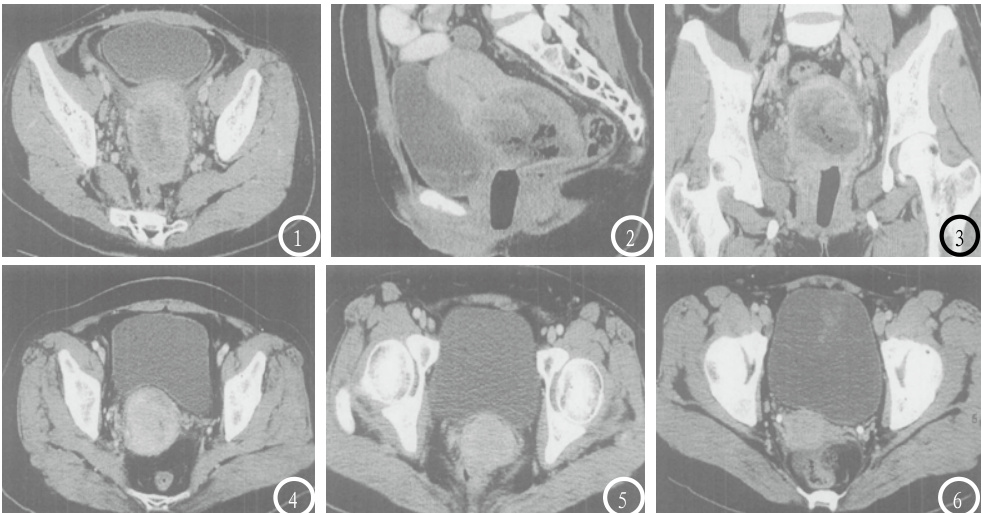

# Contrast Analysis of CT Perfusion Imaging Staging and FIGO Staging and Pathological Staging of Cervical Carcinoma  

论  著  

# 宫颈癌CT灌注成像分期与FIGO分期及病理分期的对照分析  

CHEN Hui, HUANG Wen-qi, ZHU Ai-peng. Department of Radiology, Shangqiu First People's Hospital, Shangqiu 476100, Henan Province, China  

# 河南省商丘市第一人民医院放射科(河南 商丘 476100)  

陈  辉   黄文起 褚爱鹏【摘要】目的 研究宫颈癌CT灌注成像分期与FIGO分期及病理分期的比较。方法 采用GE Lightspeed UItra 16排多层螺旋CT扫描仪对我院148例宫颈癌患者进行增强扫描，图像传输至PACE系统并进行多平面重建(MPR)，得到冠状位、矢状位、斜冠状位图像，比较CT分期、FIGO分期及术后病理分期的差异。结果 148例宫颈癌患者CT分期诊断Ⅰa期27例、Ⅰb期41例、Ⅱa期28例、Ⅱb期18例、Ⅲa期6例，分期正确120例，占81.08%，其中7例CT、FIGO分期显示无病变，漏诊率4.73%，后经术后脱落细胞学检出，CT诊断过低分期8例，占5.41%，过高分期20例，占13.51%，FIGO分期过低分期31例，过高分期28例，诊断准确率60.14%。结论 CT灌注成像分期准确率高于FIGO分期，并可提供更多的病理信息，可作为FIGO分期后的纠错检查措施，CT对术前分期、手术方案选择及预后有重要的指导意义。  

【关键词】宫颈癌；CT灌注成像；FIGO分期；病理分期  
【中图分类号】R711.74  
【文献标识码】A  
D O I : 1 0 . 3 9 6 9 / j . i s s n . 1 6 7 2 -  
5131.2017.04.035  

通讯作者：陈  辉  

[Abstract] Objective To compare CT perfusion imaging staging and FIGO staging and pathological staging of cervical carcinoma. Methods 148 patients with cervical carcinoma were scanned with GE Lightspeed UItra 16 slice spiral CT scanner. The images were transmitted to the PACE system and were processed by multi planar reconstruction (MPR) to obtain coronal, sagittal and oblique coronal images. The differences of CT staging, FIGO staging and postoperative pathological staging were compared. Results CT staging diagnosis of 148 patients with cervical carcinoma showed 27 cases of stageⅠa, 41 cases of stageⅠb, 28 cases of stageⅡa, 18 cases of stage $\mathbb { I } \mathrm { b }$ and 6 cases of stageⅢa. Staging was correct in 120 cases, accounting for $8 1 . 0 8 \%$ , in which CT and FIGO staging showing no lesions in7 cases. The rate of missed diagnosis was $4 . 7 3 \%$ which was detected by postoperative exfoliative cytology. CT diagnosed excessive low staging in 8 cases, accounting for $5 . 4 1 \%$ and excessive high staging in 20 cases, accounting for $1 3 . 5 1 \%$ . For FIGO staging, there was excessive low staging in 31 cases and excessive high staging in 28 cases. The diagnostic accuracy was $60 . 1 4 \%$ .Conclusion The accurate rate of CT perfusion imaging staging is higher than that of FIGO staging and it can provide more information. It can be used as an error correction test after FIGO staging. CT is of important guiding significance in preoperative staging, the selection of operation scheme and prognosis.  

[Key words] Cervical Carcinoma; CT Perfusion Imaging; FIGO Staging; Pathological Staging  

宫颈癌在妇科恶性肿瘤中排名第三，在我国发病率仅次于乳腺癌，宫颈癌术前分期是治疗方案疗效保障的基本前提，国际妇产科联合会(FIGO)将宫颈癌分为四期，并认为Ⅱa期以下患者适用放疗及根治性手术治疗，而Ⅱb期或Ⅱ期以上患者则采取放疗[1]。目前术前分期方式主要包括影像学分期及FIGO分期，但FIGO为单纯临床诊断，主要通过触诊、阴道镜、子宫镜或X线检查，准确率较低[2]，有研究调查发现，FIGO对Ⅰa期-Ⅱa期、Ⅱb期或更晚期的检出率分别为 $5 4 . 7 \%$ 、$2 1 \%$ ，均处于较低水平[3]。而随着CT诊断技术的不断成熟，其用于宫颈癌术前诊断具有可能性，尤其是多层螺旋CT有较高的空间分辨率及强大的图像后处理技术，有利于提高分期准确性，但目前有关CT术前分期与FIGO分期、病理分期比较的研究较少，本次研究选取我院148例经病理证实为宫颈癌的患者为研究对象，观察CT灌注成像技术在宫颈癌术前分期中的应用价值，结果如下。  

# 1  资料与方法  

1.1 患者资料  选取我院2009年11月至2014年12月148例病理确诊为宫颈癌的患者为研究对象，均拟进行手术治疗，年龄 $2 6 \sim 7 1$ 岁，平均( $( 4 3 . 1 6 \pm 4 . 4 9 )$ )岁，入院时阴道分泌物增多73例，阴道出血或接触性出血55例，20例同时伴有阴道出血及分泌物增多。  

1.2 方法  收集所有患者FIGO分期结果，FIGO分期参照2009年19届国际妇产科联盟(International Federation of Gynecology and  

Obstetrics，FIGO)[1]制定的分期标准，并记录术后病理分期结果，以手术病理学检查为金标准。行CT扫描，检测仪器为GE Lightspeed UItra 16排多层螺旋CT扫描仪，扫描时指导患者摒气，148例患者均进行增强扫描，电胍: $1 2 0 \mathrm { k V }$ ，电流: $5 0 \mathrm { m A }$ ，矩阵 $5 1 2 \times 5 1 2$ ，高压注射器注入非离子造影剂碘海醇(国药准字H20084434，生产单位：江苏晨牌药业有限公司) $3 0 0 \mathrm { { m g i / m l } }$ ，剂量视患者体重，约 $2 \mathrm { m l / k g }$ ，3ml/s速率，延迟1min进行扫描，后进行薄层重建，阴道内放置阴道栓，1周后进行手术。增强扫描图像传输至PACE系统并进行MPR重建，包括冠状位、矢状位、斜冠状位(长轴与宫体长轴、阴道长轴相同的平面)，阅片由我院2名高资历影像科医师共同阅片，阅片前不知FIGO分期结果，进行CT分期判断。  

1.3 统计学分析  比较CT分期与FIGO分期、术后病理分期结果，以术后分期为金标准，观察  

表1 CT灌注成像分期与FIGO分期、术后病理分期结果对照  

<html><body><table><tr><td>分期方式</td><td>0期</td><td>Ia期</td><td>Ib期</td><td>ⅡIa期</td><td>ⅡIb期</td><td>Ⅲla期</td><td>总数</td></tr><tr><td>CT分期</td><td>0</td><td>27</td><td>41</td><td>28</td><td>18</td><td>6</td><td>120</td></tr><tr><td>FIGO分期</td><td>0</td><td>22</td><td>35</td><td>16</td><td>13</td><td>3</td><td>89</td></tr><tr><td>术后分期</td><td>7</td><td>34</td><td>48</td><td>33</td><td>20</td><td>6</td><td>148</td></tr></table></body></html>  

CT、FIGO分期的准确性。  

# 2  结   果  

  
图1-3为同一患者的轴位、矢状位、冠状位图像，轴位可见子宫颈处有较大的软组织肿物，约7×4cm，且有不均匀坏死，子宫颈癌确诊。矢状位对病灶体积、边界的显像更清晰，可见不均匀坏死，冠状位同可观察处以上信息；图4可见子宫颈处有不均匀低密度影，且边界模糊，子宫颈癌；图5轴位可见子宫颈处不均匀低密度影，边界模糊，确诊为子宫颈癌；图6是非图5患者的轴位图像，同可见子宫颈处有低密度软组织肿物，且边界模糊。  

2.1 CT灌注成像结果与术后病理分期结果对照  CT分期诊断Ⅰa期27例、Ⅰb期41例、Ⅱa期28例、Ⅱb期18例、Ⅲa期6例，分期正确120例，占 $8 1 . 0 8 \%$ ，其中 7 例 C T 、 F I G O 分 期 显 示 无 病变，漏诊率 $4 . 7 3 \%$ ，后经术后脱落细胞学检出，CT诊断过低分期8例，占 $5 . 4 1 \%$ ，过高分期20例，占 $1 3 . 5 1 \%$ ，FIGO分期过低分期31例，过高分期28例，诊断准确率$6 0 . \ 1 4 \%$ ，各分期诊断准确率见表1。  

# 2.2 CT图像观察 见图1-6。  

# 3  讨   论  

目前临床的宫颈癌患者大多采取化疗干预，尚未采取手术病理分期，因此需统一的分期标准，FIGO是术前分期的一种，最早应用1989年，需在一切治疗前完成判断，如治疗导致分期改变，则仍保留最初诊断结果，如无法做出分期判断，则以最早1级分期确定[4]，此种分期对医师技术、经验的要求较高，如操作不当则容易误判，众多研究均认为其判断分期的准确性较低[5]。本次研究中FIGO准确率为 $6 0 . 1 4 \%$ ，明显低于CT分期，其原因是FIGO仅可分析病理表象，无法观察病灶大小、对周围组织的侵犯情况。  

本次研究显示CT对Ⅰa期、Ⅰb期的分期准确例数分别为27例、41例，尽管高于FIGO分期，但仍不够满意，考虑CT对早期子宫颈癌的显示不佳，主要因病灶多呈等密度，尽管可通多平面重建提高图像质量，但子宫颈增粗仍为主要征象，而对体积较大的肿瘤CT则检出率明显较高，因病灶呈低血供，且病变处可见溃疡、坏死，且病灶边界清晰，可通过上述征象完成确诊[6]。同时CT可判断宫旁侵袭，这是FIGO无法做到的，且病变越晚，则检出率越高，如宫旁侵袭仅局限在宫旁组织、子宫韧带等处，CT则可能出现误诊。另外多排螺旋CT可实现阴道侵犯的观察，假阳性常见外生性子宫颈瘤，因此可作为FIGO的补充措施。  

宫颈癌有相对特殊C T 征象 ， 成 人 正 常 宫 颈 长 度 约$2 . 3 { \sim } 3 . 0 \mathrm { c m }$ ，而宫颈处于子宫下部[7]，CT通过扫描双侧股骨水平可完成宫颈的扫描，增强扫描后子宫体与宫颈的强化程度基本一致，且强化扫描后血管因强化可清晰显像。CT主要通过肿瘤体积、宫旁侵袭、阴道侵犯实现分期判断[8]。CT对肿瘤体积的判断相对较差，主要因为与正常宫颈组织比较，肿瘤组织无较大的差异性，病灶多呈等密度变化，增强扫描后可见差异，本次研究中患者病灶大多为等、低密度，等密度时仅可依靠宫颈管增粗判断，对肿瘤大小判断较困难，而低密度时则提示病变坏死、血供减少等因素导致，但部分患者增强扫描后出现明显强化，病灶边缘清晰，对病灶的显像效果提高，对肿瘤体积的判断良好[9]。宫旁侵袭程度的判断主要用于鉴别Ⅱa、Ⅱb期[10]，CT诊断后如见宫颈边缘毛躁、不规则，条纹不规则形影或周围脂肪间隙消失则需考虑为出现宫旁侵袭，而冠状位图像的表现更为明确，总的来说，CT通过宫旁侵袭进行分期判断的价值较高。阴道侵犯可区分Ⅲ、Ⅱ期，如侵犯至阴道下1/3处则为Ⅲ期，反之则为Ⅱ期，阴道侵袭的判断需在检查前放置阴道栓使阴道形态更加明确，从而提高阴道侵袭判断的准确性[11]。CT多平面重建可避免单纯横断面检测的局限性，本次研究后期进行冠状位、矢状位、斜冠状位的图像重建，可全面显示阴道和子宫颈的空间关系，显示肿瘤对阴道的侵袭程度，具有高度的准确性，肿瘤侵袭阴道的CT征象主要包括阴道上段可见软组织肿物，且肿物边缘和阴道壁贴合密切无分界限，阴道壁增厚且不规则[12]。  

综上，通过与术后病理分期及FIGO分期的比较可知，CT分期准确性高于FIGO分期，可作为FIGO分期的补充措施完善治疗依据，可作为宫颈癌手术、放化疗前的常规检测方式进行推广。  

# 参考文献  

[ 1 ] P e c o r e l l i S . R e v i s e d F I G Os t a g i n g f o r c a r c i n o m a o ft h e  v u l v a ,  c e r v i x ,  a n dendometrium [J].Int J GynaecolObstet,2009,105(2):103-104.  
[2]邱书珺,陆晓兰,蒋小平，等.MSCT和M R I 对浸润性宫颈癌术前分期 的 价 值 对 比 [ J ] . 放 射 学 实践,2012,27(1):77-80.  
[3]郭强蕊.CT诊断在卵巢癌和宫颈癌放射治疗前后的临床运用价值[J].西部中医药,2015,19(1):125-128.  
[4]靳宏星,张建新,杜笑松，等.MSCT与 多 平 面 重 组 诊 断 不 同 分 期宫 颈 癌 [ J ] . 中 国 医 学 影 像 技术,2012,28(3):543-547.  
[5]张海燕,宋迪.多层螺旋CT与MRI对 宫 颈 癌 术 前 分 期 的 诊 断 价值 比 较 [ J ] . 中 国 妇 幼 健 康 研究,2014,25(1):111-113.  
[6]姚铭,刘桂锋,王永亮,等.多排螺旋CT对宫颈癌影像诊断的价值[J].中国老年学杂志,2012,32(10):2169-2170.  
[ 7 ] P a r k  J M , C h a r n s a n g a v eC,Yoshimitsu K,et al.Pathwayo f  n o d a l  m e t a s t a s i sf r o m  p e l v i c  t u m o r s : C Td e m o n s t r a t i o n [ J ] . R a d i o g -raphics,1994,16(14):1309-1321.  
[8]叶斌强,孙鹏飞.宫颈癌诊断及疗效评价的影像学研究进展[J].中国CT和MRI杂志,2014,14(2):109-112.  
[9]邱书珺,陆晓兰,蒋小平，等.16层 螺 旋 C T 在 宫 颈 癌 临 床 分 期中 的 价 值 [ J ] . 实 用 放 射 学 杂志,2010,26(7):990-992.  
[10]孙瑞瑞,胡尔西旦·尼牙孜,赵化荣，等.早期宫颈癌FIGO分期与手术病理分期的差异性及淋巴结转移危险因素的分析[J].临床肿瘤学杂志,2015,21(8):704-708.  
[11]孟建超,李宇光,刘玉虎,等.宫颈癌CT影像分析[J].中国美容医学,2012,21(z2):347.  
[12]钱跃龙.螺旋CT多期增强扫描及三维重建在宫颈癌诊断中的临床研究[J].河北医学,2012,18(9):1209-1211.  

(本文编辑: 刘龙平)  

# （上接第 105 页）  

[ 4 ] H a n s - J o r g W i t t s a c k , R i t z l A,Gereon Retal．MR Imaging in Acute Stroke: Diffusionw e i g h t e d  a n d  P e r f u s i o n I m a g i n g  P a r a m e t e r s  f o r Predicting Infarct Size1[J]. Radiology,2002,222(2):397-403.   
[5]靳瑞娟,马强华,杨晓萍,等.卵巢 良恶性病变的磁共振扩散加权成 像分析及应用[J].实用放射学杂 志,2009,25(6):825-828.   
[6]梁长松,陈忠,李伟峰.磁共振扩散加 权成像在卵巢囊腺癌与囊腺瘤鉴别 诊断中的价值[J].中国CT和MRI杂 志,2015(3):83-86   
[ 7 ] S i e g e l m a n E S , O u t w a t e r E K.Tissue characterization i n t h e f e m a l e p e l v i s b y m e a n s o f  M R  i m a g i n g [ J ] . Radiology,1999,212(1):5-18   
[ 8 ] T h o m a s s i n - Naggara,IToussaint,NPerrot， et al.Characterization of complex adnexal masses:value o f  a d d i n g  p e r f u s i o n  a n d diffusion-weighted MR imaging to conventional MR Imaging[J]. Radiology,2011,258(3):793-803.   
[9]Shu H Z，Jin W Q，Guo F Z， et al.Diffusion-weighted MR imaging for differentiating borderline from malignant e p i t h e l i a l  t u m o u r s  o f t h e  o v a r y ： p a t h o l o g i c a l c o r r e l a t i o n [ J ] . E u r o p e a n Radiology,2014,24(9):2292- 2299.   
[10]Thomassin-Naggara I,Bazot M E，Callard P，et al.Epithelial o v a r i a n  t u m o r s : v a l u e  o f  

dynamic contrast-enhanced MR imaging and correlation with tumor angiogenesis[J]. Radiology,2008,248(1):148-159. [11]Sohaib S A,Mills T D,Sahdev A，et al．The role of magnetic r e s o n a n c e  i m a g i n g  a n d ultrasound in patients with adnexal masses[J].Clinical Radiology,2005,60(3):340-348.  

(本文编辑: 刘龙平)  