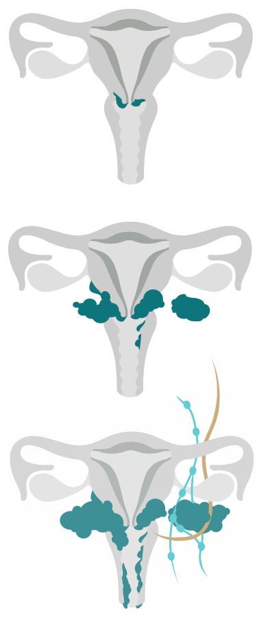
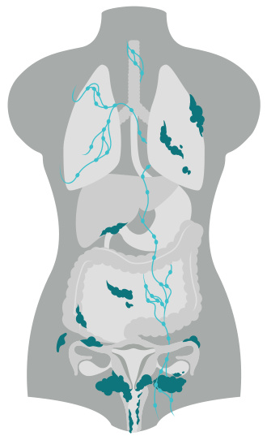

  

# 宫颈癌患者指南  

研究 · 宣传 · 推广 · 教育  

  

# 引言  

您和您的家属已经知道了宫颈癌诊断结果  

在诊断时，您收到的信息量可能会让您感到不知所措。一刹那，您可能会觉得有许多未回答的问题，要做的决定，以及有太多的信息需要了解。在讨论您的诊断和治疗时，让朋友和家属陪着您可能会好些。  

在整个治疗过程中，专业的医护团队将配合您和您的家属。团队中每个人都有重要的分工，但团队中最重要的成员是您自己。为了在治疗过程中发挥积极作用，您应该尽可能多地了解宫颈癌。  

这本小册子将带您了解有关宫颈癌的基本知识。它将向您介绍谁可能会加入您的治疗团队。此外，它还将确定宫颈癌不同类型的治疗方法。希望这些信息能帮助您做好准备，与您的治疗团队对接，并对您的治疗计划感到更有把握。  

  

# 宫颈癌： 概述  

当身体某个部位的细胞异常生长时就会发生癌症。宫颈癌是一种原发于子宫颈的癌症，子宫颈是子宫的一部分，开口于阴道。作为子宫的一部分，当子宫颈扩张，开口完全打开时，婴儿可顺式通过产道。正常的子宫颈有两种主要类型的细胞：鳞状（或平状）细胞，保护宫颈的外部，和腺体细胞，主要在宫颈内部，产生排卵时常见的液体和粘液。  

宫颈癌是由宫颈中这两种细胞类型的异常变化引起的，它是唯一可以通过定期筛查和预防性接种来预防的妇科癌症。  

# 预防、筛查、早期发现  

几乎所有的宫颈癌都是由持续感染高危型人类乳突病毒（HPV）引起的。HPV 疫苗是一种预防癌症的疫苗，可以预防许多与 HPV 有关的癌症，包括宫颈癌。男孩和女孩最好在 11-12 岁性行为活跃之前接种疫苗，可以最大限度地预防癌前病变和癌症的发生。建议所有 9-26 岁的年轻人都接种 HPV 疫苗来预防癌症。HPV疫苗适用于 45 岁以下的男性和女性接种。  

即使接种了疫苗，定期的巴氏涂片检查和 HPV 检测也是预防宫颈癌或及早发现宫颈癌并获得最佳治疗的重要方法。异常检测后的随访和了解您的结果是您对自己负责的一个重要方式。  

# 症状  

宫颈癌前期病变通常没有症状。因此一定要做巴氏和/或 HPV 检测。患者可能没有任何症状，直到细胞癌变并侵入宫颈或其他盆腔器官的最深处。  

# 这些症状包括：  

阴道分泌物 异常阴道出血 阴道异味 •	疼痛  

这些症状可能是由癌症或其他健康问题引起的。如果女性有任何这些症状，一定要去看医生，这一点很重要。宫颈癌患者年龄通常在 30 至 55 岁，但切记，任何长期未接受筛查或宫颈有症状的女性也可能发展成宫颈癌。要确保您的检测是最新的，并鼓励其他人也这样做。  

# 医疗评估  

当女性出现相关症状时，应进行盆腔检查，包括直肠阴道检查，并进行全身体检。如果检查结果异常，可能会建议女性接受额外的检查，如更具体的 HPV检查、阴道镜检查（通过放大镜观察宫颈），以及根据阴道镜检查的结果进行活检。  

如果怀疑或诊断出宫颈癌，首先一定要咨询妇科肿瘤专家了解治疗。  

想要了解您所在地区的妇科肿瘤专家，请登录妇女癌症基金会网站  
(foundationforwomenscancer.org),输入您的邮政编码。  

  

  

# 配合您的治疗团队  

在您的治疗过程中，您将会接触到许多医护人员。他们都是您的治疗团队成员。他们相互合作，为您提供所需的特殊护理。您的治疗团队可能包括以下一些专业医护人员：  

妇科肿瘤医生，是拥有医师资格，且在美国妇产科委员会批准的研究项目中接受过三到四年妇科癌症治疗专门培训的妇产科医生。妇科肿瘤医生，负责管理您从诊断到完成治疗期间的治疗工作。  

# 为您治疗的医生还可能包括：  

医学肿瘤医师，专业使用药物疗法（化疗）来治疗癌症。  

放射肿瘤医师，专业使用放射疗法来治疗癌症。  

肿瘤科护士，专门提供癌症护理。肿瘤科护士可以在护理的各个方面配合您，从帮助您了解您的诊断和治疗到提供情感和社会支持。  

在咨询和实际援助、社区支持计划、家庭护理、交通、医疗援助、保险和权利计划方面受过专业培训的社会工作者。尤其是在您刚被诊断出来，  

不确定下一步该怎么做的时候，他们都会挺身而出。  

患者导航员，他们对患者进行疾病教育，并在整个癌症治疗过程中充当患者和其照顾者的代言人。  

营养师或注册营养师，他们帮助您保持或开始养成健康的饮食习惯。而这在康复过程中很重要。这些专业人士可以帮助您克服治疗的潜在副作用，如食欲不佳、恶心或口腔溃疡。需要注意的是，自然疗法和补充剂只能在自然疗法医生的指导下与妇科肿瘤医生的协商后服用。  

# 与您的治疗团队沟通  

应该得到您的治疗团队的专业建议和治疗。一定要与您的团队成员敞开谈论您的担忧。让他们知道什么对您来说是重要的。如果您自己沟通不便，这些提示可能会有所帮助：  

在就诊前列一个问题清单。先问最重要的问题。  
•	做笔记或询问是否可以记录科室就诊和电话沟通内容。  
•	如果您有不明白的地方，请治疗团队成员用不同的方式再解释一遍。  
•	如果可能的话，当您与治疗团队成员见面讨论检测结果和治疗方案时，请带一名陪诊人员。  

当诊断出宫颈癌时，确定癌症是否已经扩散至关重要。您的治疗团队可能会做更多的检测来确定这一点。此外，在手术过程中可以进行特定的程序来确定疾病的程度。这个过程被称为分期。分期有助于确定您的癌症的确切程度以及适合您的最佳治疗方案。  

癌症分期可划分为 I 期、II 期、III 期或IV 期，如下页所示。如果您能够进行手术，手术的结果可能有助于确定分期。如果因为肿瘤的大小或位置而没有计划进行手术，可以通过 CT、PET-CT 或MRI 等放射检查来确定分期。癌症分期将帮助您的团队决定采取适合您的最佳治疗方案。还会对癌症进行分级。癌症等级指的是细胞在显微镜下显示的异常程度。低级别肿瘤，也被称为 1 级，其特征类似于正常的宫颈细胞。相比之下，在高级别肿瘤（3 级）中，显微镜下的外观与正常情况有很大的变化。  

一旦被诊断为宫颈癌，您的医疗团队可能会建议进行影像学检查（放射学检查），如 MRI、CAT（CT）扫描或PET 扫描，以帮助确定癌症的确切位置并设计最佳方案。  

重要的是，您的手术要由在治疗女性生殖系统癌症方面受过专门培训的妇科肿瘤医生来做。研究表明，治疗中心患者容量越高，经其妇科肿瘤专家治疗后，患者的预后改善越好。  

# 癌症分期  

# 宫颈癌分期  

# I 期  

只在宫颈中发现这种癌症。  

# IV 期  

癌症已经扩散到盆腔内或盆腔外的其他身体部位。 膀胱、直肠、腹部、肝脏、肠道或肺部可见癌细胞。  

癌症已经从子宫颈扩散到阴道上部或子宫周围的组织，  

  

# II 期  

癌症已扩散到阴道下部或盆壁。它可能会阻碍尿液流向膀胱。在盆腔的淋巴结中也可能发现癌细胞。  

但没有扩散到盆壁。（盆壁是指排列在盆腔内侧的肌肉和结缔组织。）在盆腔的淋巴结中也可能发现癌细胞。  

# III 期  

  

  

# 治疗类型和副作用  

宫颈癌的治疗手段包括手术、放疗和/或化疗。根据一系列因素，您的治疗团队可能建议使用综合疗法来治疗您的癌症。  

# 了解治疗的目标  

当您开始接受治疗时，请确保您明白会发生什么。该治疗是为了治愈吗？治愈的机会有多大？治愈的机会有多大？ 使我活得更好或更长久？ 非常重要的是，一定要了解治疗的真相——以及副作用、费用等潜在成本——这样您才能为自己和想要的生活做出最好的决定。  

宫颈癌的治疗有副作用。多数副作用可以得到控制或最小化。常见的副作用可能会影响肠道或膀胱功能、性功能或生育能力，所以您一定要优先考虑从治疗团队处获得所需信息。  

在开始治疗之前，重要的是了解可能的副作用，并与您的治疗团队成员讨论您的感受或担忧。他们可以让您做好准备，告诉您出现哪些副作用时应立即向他们报告。他们还可以帮助您找到控制副作用的方法。  

# 手术  

手术是早期宫颈癌最常见的治疗方法，尽管也可以使用放射线，而且通常效果等同。可以进行几种类型的手术，但您最终的选择将取决于您的妇科肿瘤医生考虑的几个因素，特别是您的癌症的分期和大小，以及您的年龄、一般健康状况和保留生育能力的选择。  

# 宫颈锥切术  

锥切是指通过手术只切除子宫颈的癌变部分（或在许多病例中切除的是癌前病变部分）。锥切术只适用于最早期的癌症，即那些微小的癌症。这是患有非常小的癌症并希望保留生育能力的女性的首选治疗方法。  

# 简单的子宫切除术  

在简单的腹部子宫切除术中，子宫和宫颈通过腹部的一个切口被切除。在不太常见的阴道子宫切除术中，这些器官通过阴道被切除。这些类型的子宫切除术适合于对那些不希望保留子宫的最早期癌症患者。  

# 根治性子宫颈切除术  

在这种手术中，您的子宫颈和周围组织被切除，但子宫上部被保留下来，以便将来妊娠。这种手术只适用于经过仔细筛选的女性，并取决于多种因素，如年龄、生育能力、肿瘤大小、影像学结果或肿瘤类型。  

# 根治性子宫切除术  

这是一种更复杂的手术，用于切除子宫/宫颈和其他组织。这种手术通常是通过一个开放的腹部切口进行的。根治一词意味着要切除子宫和子宫与盆壁之间的额外组织，以及部分阴道上部。  

虽然有很多方法能够进行这类手术，比如开腹（腹部）或微创（腹腔镜或机器人），但较新的数据表明，传统腹部切口的效果可能更好。虽然在某些临床情况下存在一些争议，但重要的是要了解您的手术入路，并与您的外科医生讨论风险、益处和期望。  

# 淋巴结评估  

在这些手术中，会切除盆腔内的淋巴结进行检查，以确定癌症是否已经扩散。完整的淋巴结清扫术（盆腔淋巴结切除术）是指沿血管切除标准区域内的淋巴结。使用染色技术定位并只切除选定的淋巴结，这被称为前哨淋巴结定位，可以最大限度地减少淋巴结切除的副作用，如淋巴水肿（腿部肿胀）。  

  

  

# 切除输卵管和卵巢  

在一些病例中，必须切除两个卵巢和两个输卵管，这种手术被称为双侧输卵管卵巢切除术。但通常对于年轻的女性来说，卵巢可能不动。向您的外科医生了解卵巢切除的风险和益处是了解您的手术方案的重要部分。  

# 手术的副作用  

术后常见疼痛和不适。疼痛可以用药物控制。如果您的疼痛超过了轻度，请告诉您的治疗团队。  

# 其他早期副作用  

# （术后数天至数周）：  

切口周围腹部酸痛恶心或食欲下降排尿困难，因此可能需要在膀胱内留置几天至几周的 Foley 导尿管  
•	痉挛和胀痛  
•	少量分泌物或出血  
•	疲乏  

# 后期副作用  

排尿困难  
便秘  
阴道缩短 （取决于手术的程度）  

在您手术时可能会采取一些措施，以尽量减少这些副作用（如在您的膀胱内放置一根临时引流管）。做了子宫切除术的女性将停经，且不再有生育能力。如果保留卵巢，激素水平将保持不变，如果切除卵巢，激素水平可能下降到绝经水平。如果卵巢被切除，通常可以选择激素疗法来治疗更年期症状。  

# 放射治疗  

放射治疗（也叫放疗）是使用高能量的辐射来杀死癌细胞或阻止其生长。放射治疗是治疗早期宫颈癌的有效手段。然而，在早期宫颈癌中，它更多地是作为术后的额外治疗，用于癌症复发风险最高的患者（例如当肿瘤可能已经扩散到宫颈之外）。放疗和化疗最常用于治疗较大或较晚期的癌症，因为那时它比手术更有效。将根据您的分期检测、检查和手术（如果在您评估时根据检查结果进行了手术）的信息来确定您是否需要进行放射治疗。  

有两种类型的放射疗法可用于治疗宫颈癌。 宫颈癌的放射治疗最常与化疗联合进行。  

外部放射治疗是使用一台机器，将辐射指向身体的一个精确区域。该疗法通常每天进行一次，从周一到周五，持续约六周。在治疗过程中，放射线不会造成伤害，每天只需要几分钟的时间。您可以在诊所、医院或放射肿瘤科科室接受治疗，通常都是当日来当日回。  

内部放射治疗（也称为近距离放射治疗）包括在阴道内或宫颈附近放置一个含有放射性物质的小胶囊。这种手术有时可以在门诊进行，其他时候需要住院一晚或两晚。可服用药物来缓解这些手术带来的不适。在放射性胶囊置入期间，您的家属只允许陪您一小会儿，不过在您回家前，就会取出放射性胶囊。  

# 放射治疗的副作用  

放射治疗的副作用取决于使用的剂量和接受治疗的身体部位。宫颈癌患者的常见副作用如下。  

# 早期副作用  

（发生在治疗期间）：  

治疗部位皮肤干燥、发红   
疲乏   
贫血   
腹泻和恶心   
排尿时的不适感  

这些副作用大多是暂时的。不是每个人都会经历所有这些副作用。一定要与您的治疗团队成员讨论您所经历的任何副作用。他们可以帮您找一些控制副作用的办法。  

# 后期副作用：  

阴道变窄，不再润滑尿频（放射性膀胱炎）•	腹泻（放射性结肠炎）过早或突然绝经（如果卵巢停止工作）皮肤增厚和刺激盆腔疼痛淋巴水肿（腿部肿胀）  

一定要与您的医疗保健团队讨论，您可以做什么来减少辐射带来的长期副作用的风险。一些长期的并发症，例如阴道变窄，一旦严重，预防比治疗更好。  

  

# 化疗  

化疗是使用药物来杀死癌细胞。宫颈癌化疗通常是通过静脉注射（注入静脉）进行的。您可以在医生办公室或门诊部接受治疗。这些药物通过血液到达身体的各个部位。这就是为什么化疗可以有效地治疗已经扩散到宫颈以外的宫颈癌。然而，杀死癌细胞的药物也可能损害健康细胞。为了限制对健康细胞的损害，化疗通常是分周期进行的。化疗期与休息期交替进行，休息期间不进行化疗。通常也会发生副作用，但可以控制。免疫疗法，包括通过静脉注射的药物，可能是治疗复发性宫颈癌的另一种手段。  

# 化疗的副作用  

副作用因使用的化疗药物类型和使用的药物数量而异。此外，化疗可用于初始治疗或在癌症复发时使用。每个人对化疗的反应不同。有些人的副作用可能很少，而有些人则会有几种副作用。大多数副作用是暂时的。了解您将接受哪种特定的化疗手段以及特定的副作用是很重要的。化疗的一般副作用可能包括：  

恶心或呕吐   
食欲不振   
口疮   
感染机会升高   
易出血或瘀伤   
脱发   
疲乏   
便秘  

# 参加临床试验的重要性  

目前有许多正在进行的临床试验，研究治疗宫颈癌的新方法和更好的方法。因为被诊断为妇科癌症的女性愿意参加先前的临床试验，所以得出了目前许多可行的治疗方案。  

临床试验旨在检测一些最新和最有希望的宫颈癌治疗方案。妇女癌基金会与 NRG肿瘤学（原妇科肿瘤学小组）以及其他机构合作，提供有关当前临床试验的信息。其中，NRC 肿瘤学是唯一一个专门从事妇科癌症临床试验的国家癌症研究所合作小组的一部分。所有患者，无论其种族、民族、语言、社会经济地位或年龄，都有可能符合试验条件，参加的人越多，试验效果会越好。  

欲了解更多关于可供注册的临床试验的信息，请访问 www.clinicaltrials.gov。  

  

# 癌症治疗与生活  

被诊断为妇科癌症并接受癌症治疗的经历可能会改变您对自己身体的感觉，并将在许多方面影响您的生活。您可能会经历许多或相对较少的副作用。了解可能的治疗效果可能有助于您预测副作用并计划应对方法。  

# 疲乏  

无论医生开出什么样的治疗方案，您都可能会经历疲乏、频繁就医，以及感觉不够好而无法顾及家务的情况。您将需要依靠家属和朋友帮您做您平常做的一些事情。您可能会考虑雇人帮忙做家务，直到您感觉自己足够良好，可以重新自己打理。  

如果您知道家里无人帮忙，应尽早与您的医疗团队坦诚沟通，以便探讨其他方案。饮食一定要有营养，如果需要的话，一定要请求帮助，在家里保持健康的饮食和零食选择。  

治疗疲乏方面，务必检查您的血细胞计数，以排除贫血可能。也可以服用缓解疲乏的药物。  

# 面对世界  

癌症的影响和癌症治疗可能会改变您的样貌。您可能会出现疲乏、脸色苍白、行动迟缓，还可能不得不面对暂时的脱发。您可能会因为这些变化而感到难为情。这时，您可以想象一下，如果您有一个朋友或姐妹看起来跟您一样，您会有什么感受，这可能会对您有所帮助。记住，许多人在注意到这些变化时，是在爱您而不是在评判您。  

# 工作便利  

在治疗的头一两个月，您可能需要离开工作岗位较长一段时间。与您的单位主管和您的医疗护理团队讨论，制定一个现实的缺勤和重返工作岗位的计划。记得告诉您的单位主管，任何计划都需要灵活制定，因为您的需求可能随着治疗的进展而改变。《家庭医疗休假法》（FMLA）为因健康原因必须离开工作的员工和家庭成员提供了某些保护。  

# 家庭、友谊和乐趣  

无论您接受哪种类型的治疗，您都可能会经历副作用，而这些副作用可能影响您与朋友和家属一起参加社交活动。如果有特殊事件发生，如婚礼或毕业典礼，请先行与您的医疗保健团队沟通。您的治疗时间可能会作出调整，以使您在这些特殊的日子里尽可能地感觉良好。制定喜欢的活动计划时，千万不要犹豫不决。有时候，可能会因无奈而取消计划，也可能提前离开活动，但是美好的时光会帮助您在艰难的日子里找到生的希望。  

年幼的孩子往往很难理解您所经历的事情。疏导人员可以帮助您回答问题并帮助您的孩子应对您的变化。请家属和朋友帮助您维持孩子的正常生活也是一个好主意。  

# 开车  

对许多人来说，开车是成人生活中几乎不可缺少的一部分。如果您正在服用会导致嗜睡的药物，如麻醉性止痛药和一些恶心药物，请勿开车。大多数患者可以在手术后几周内恢复开车，且通常患者在化疗和放疗期间大部分时间都是可以开车的。一定要向您的医疗保健团队询问有关开车的问题。  

  

# 锻炼身体  

在治疗过程中，您可能发现，即使是去卧室，那几阶楼梯对您来说都是挑战，哪怕您在成年后都在努力运动保持身材。不得不减少或中断健身活动令人沮丧，但也是正常的。如果您做过手术，请咨询医生关于锻炼的具体指导。在化疗或放疗期间，根据您的感觉来调整锻炼计划。  

应避免过度劳累或脱水。在结束癌症治疗后的几周和几个月内，您可以恢复到以前的体能水平。  

  

# 性行为和亲密关系  

一些治疗宫颈癌的方法可能会引起副作用，可能会改变您对自己身体的感觉，或使您难以享受亲密关系或性关系。您会经历哪些副作用取决于您的治疗过程。可能会有副作用，也可能完全没有副作用。了解可能的副作用有助于您预测副作用并学习如何应对。  

# 可能的副作用包括：  

脱发。作为化疗的常见副作用，脱发通常是暂时的。但也是难以接受的。如果您出现脱发，您可以选择戴上漂亮的假发、围巾或其他头饰。  

阴道变化。某些形式的治疗，如子宫切除术和放射治疗，可能导致阴道干燥、缩短和变窄。这些变化会让性行为变得不舒服。使用非处方的阴道润滑剂可以让您感到更舒适。您的治疗团队也可能会建议使用阴道扩张器。  

性欲减退。在癌症治疗期间，您所经历的压力和疲乏可能导致您在一段时间内失去性欲。  

# 应对技巧  

与您的治疗团队沟通。他们可以根据您的个人情况提出相应建议，所以一定要对她们坦承。您可能想问：  

我的治疗将如何影响我的性生活？这些影响是暂时的吗？是否有其他治疗方案可以减轻这些影响？  
•	关于我该如何处理治疗对我性生活的影响，您有什么建议？  

向您的医疗团队报告您的症状，并寻求性功能方面的治疗。  

不要害怕向您的医疗护理团队提及您对性功能的任何担忧。性生活对许多患者来说是生活质量的重要组成部分，即使您的癌症得到了控制，也不应该被忽视。针对盆底和性功能的物理治疗，包括夫妇性治疗，以及包括激素和非激素的药物治疗，都可以帮助缓解症状。  

与您的伴侣进行沟通。癌症会给伴侣双方都带来压力。谈论癌症对您伴侣关系中的性和情感影响可能有些困难。但是，如果您谈论这些困难，可能会发现反而更容易解决。准备好分享您自己的感受，并倾听您的伴侣说什么。  

将您的注意力转移到亲密关系上。性交只是亲密关系的一个部分。您会发现，抚摸、亲吻和拥抱同样能让人感到充实。  

对自己要有耐心。要理解恢复性关系需要时间。您的治疗团队会告诉您治疗后能否性生活，以及需要多久才能开始性生活。可能在您情感上做好准备之前，需要很久。给自己留足时间。  

心态放开。对改善性生活的方法放开心态，保持幽默，可能有助于您和您的伴侣找到最适合你们的方法。  

# 为您带来希望的信息  

在您经历癌症治疗时，对自己要有耐心。  
要理解恢复到完整的生活需要时间。  
如果您的治疗团队知道您的困扰，他们可以指导您解决即将面临的困难。  
敞开心扉，谈论困扰您的事情。  
给自己留足时间。  

培养希望。即使面对癌症，茫然不知所措时，也要靠您自己来掌控自己的反应。希望能帮助您看到生活的积极方面。  

如果您有内在的精神信仰，请联系您的宗教团体，给您额外的支持来面对每天的生活。  

寻求支持。有许多资源可以帮助您处理因癌症及其治疗而产生的身体、性或情感问题。经过专门培训的疏导人员可以帮助您处理癌症对您生活的影响。  

支持小组是另一个良好的资源。与您有类似经历的人可聚集在一起，互相分享经验，相互给予建议和情感支持。想要了解您所在地区的支持服务，请咨询您的治疗团队成员，或联系下一页所示资源。请记住，我们是敬业的医疗护理团队，我们时刻与您在一起。  

预先医疗指示是一款实用的工具，可以澄清您的医疗护理愿望。我们鼓励患者和家属都填写一份。这样，您的医疗护理团队就可以根据该指示开展治疗。  

# 要分享的事实  

•	大多数宫颈癌病例是可以预防的。•	在性行为活跃之前为少年儿童接种疫苗可以预防宫颈癌前病变和癌症。•	在建议的时间间隔内定期进行巴氏检查和 HPV 检测对预防宫颈癌同样重要。  

# 症状  

性交后出血   
经期间分泌物过多和异常出血   
阴道异味   
疼痛  

这些症状可能是由癌症或其他健康问题引起的。如果女性有任何这些症状，一定要去看医生，这一点很重要。大多数女性不会有任何症状，因此接种疫苗和在建议时间内定期进行巴氏检查和 HPV检测，是预防宫颈癌的关键。  

# 风险因素  

•	几乎所有的宫颈癌都是由人类乳突病毒，即 HPV 的持续感染引起的。宫颈癌多发生于 30 至 50 岁女性，但年轻女性也有患病风险。吸烟会削弱免疫系统，进而导致持续的 HPV 感染。  

# 减少风险  

•	按照为您提供治疗服务的医疗机构的建议定期进行巴氏检查和 HPV 检测，了解自己的检查结果，并询问后续方案。  
接种 HPV 疫苗，并向其他人包括青少年推荐 HPV 疫苗，以便将来预防癌症。  
•	HPV 疫苗可以帮助预防由某些高危人乳突病毒（HPV）类型引起的癌前病变和宫颈癌、外阴癌、阴道癌、肛门癌、口咽癌和其他头颈部癌症。男孩和女孩应该在青春期前或 9-26 岁之间接种疫苗。HPV 疫苗适用于 45 岁以下的男性和女性接种。  

如果您的检查结果是宫颈癌前病变或癌症阳性，请寻求妇科肿瘤医生进行治疗。  

# 您可以提供哪些帮助  

提高大众对妇科癌症的认识。在线为妇女癌症基金会捐款。个人或与基金会合作举办筹款活动。通过您的雇主向基金会提供等额捐赠。向基金会捐赠股票或证券。向基金会指定一份有计划的捐赠  

妇女癌症基金会为患者、组织工作者和公众提供许多资源，包括美国各地的幸存者课程、网络研讨会和在线教育系列课程。  

如要捐赠或了解更多信息，请给基金会发电子邮件至  
info@foundationforwomenscancer.org或致电 312.578.1439。  

捐赠和了解更多 foundationforwomenscancer.org  

妇女癌症基金会（The Foundation for Women’s Cancer，FWC）是一个按照美国第 501(c)3 条规定成立的非营利组织，致力于支持妇科癌症的研究、教育和提高公众意识。  

foundationforwomencancer.org   
info@foundationforwomenscancer.org   
电话：312.578.1439   
传真：312.235.4059  

妇女癌症基金会地址：230 W. Monroe, Suite 710Chicago, IL 60606–4703  

FWC 是妇科肿瘤协会的官方基金会。  

本手册的印刷得到了卫材、葛兰素史克、默克和 Seagen/Genmab 的慷慨教育赞助。  
赞助不包括编辑方面的投入。  

内容由妇女癌症基金会（FWC）开发。  