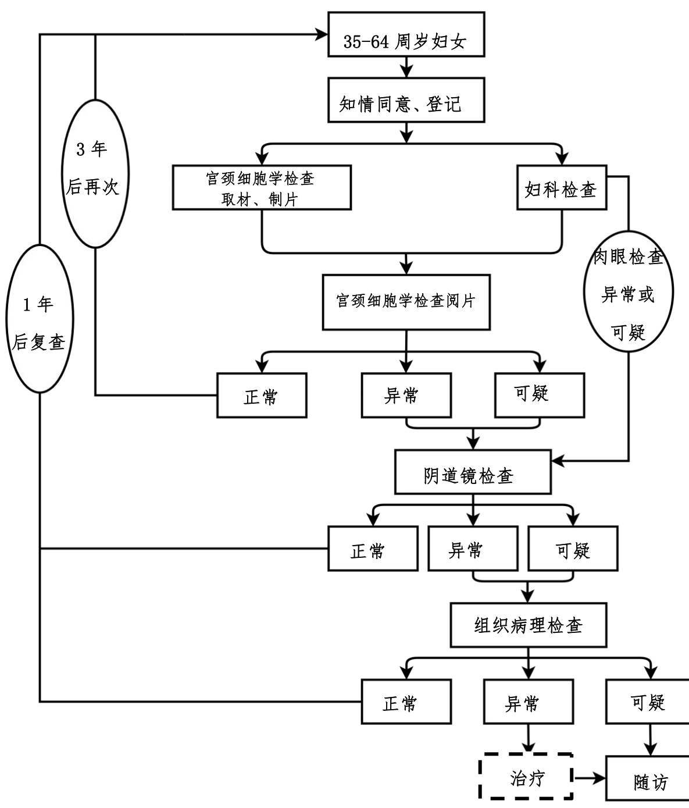

# 附件 1  

# 宫颈癌筛查工作方案  

# 一、工作目标  

（一）总目标。坚持预防为主、防治结合、综合施策，以农村妇女、城镇低保妇女为重点，为适龄妇女提供宫颈癌筛查服务，促进宫颈癌早诊早治，提高妇女健康水平。  

# （二）具体目标。  

到2025 年底，实现以下目标：  

1.逐步提高宫颈癌筛查覆盖率，适龄妇女宫颈癌筛查率达到 $5 0 \%$ 以上。  

2.普及宫颈癌防治知识，提高妇女宫颈癌防治意识。适龄妇女宫颈癌防治核心知识知晓率达到 $8 0 \%$ 以上。  

3.创新宫颈癌筛查模式，提高筛查质量和效率，宫颈癌筛查早诊率达到 $9 0 \%$ 以上。  

绩效考核指标及其计算方法见附件1。  

# 二、服务对象  

35-64 周岁妇女，优先保障农村妇女、城镇低保妇女。  

# 三、工作内容  

# （一）宫颈癌筛查。  

各地应当对辖区内适龄妇女进行摸底调查，结合实际制  

定年度筛查计划。积极动员目标人群到相关医疗机构接受宫颈癌筛查。  

1.妇科检查。包括询问病史、外阴及阴道检查、盆腔检查及阴道分泌物检查。  

# 2.宫颈癌初筛。可采用以下方法：  

（1）宫颈细胞学检查。包括取材、制片及阅片，采用子宫颈/阴道细胞学 TBS（The Bethesda System）报告系统对宫颈细胞进行评价。原则上每 3 年筛查一次。  

（2）高危型 HPV 检测。包括取材、保存、实验室检测及报告。HPV 检测所采用的技术平台及其产品至少要包含世界卫生组织明确确认的 14 种高危型别，包括：HPV16、18、31、33、35、39、45、51、52、56、58、59、66、68 等亚型。原则上每 5 年筛查一次。  

3.阴道镜检查。对宫颈细胞学检查初筛结果异常或可疑者、HPV 高危分型检测结果为 16/18 型阳性者、其他高危型阳性且细胞学结果异常或可疑者以及肉眼检查异常者进行阴道镜检查。  

4.组织病理学检查。对阴道镜检查结果异常或可疑者进行组织病理学检查。  

宫颈癌筛查流程见附件2-3。  

# （二）异常或可疑病例随访管理。  

宫颈癌筛查异常或可疑病例主要包括宫颈细胞学检查TBS 报告结果为未明确意义的不典型鳞状上皮细胞（以下简称 ASC-US）及以上者、高危型HPV 检测结果阳性者、肉眼检查异常或可疑者，阴道镜检查异常或可疑者以及组织病理学检查结果为宫颈高级别病变及以上者。对宫颈癌筛查异常或可疑病例进行追踪随访，督促其尽早接受进一步诊断及治疗，并及时记录病例相关情况。  

# （三）社会宣传和健康教育。  

充分利用电视、网络等媒体，广泛开展妇女宫颈癌防治相关政策和核心信息的宣传教育，形成全社会关心支持宫颈癌防治的良好氛围。充分发挥基层医疗机构和妇联等部门宣传教育、组织发动及追踪随访的作用，深入开展社会宣传和健康教育，增强妇女是自身健康第一责任人意识。科学指导广大妇女开展自我健康管理，组织动员适龄妇女接受宫颈癌筛查，指导宫颈癌高风险人群主动到医疗机构接受筛查。  

# （四）组织实施。  

及时掌握辖区35-64 周岁适龄妇女人数，有计划、有组织地安排其定期接受筛查。遴选具有筛查设施设备和专业技术人员的医疗机构承担宫颈癌筛查工作。加强组织管理，优化服务模式，方便妇女接受筛查服务，不断提高筛查效率和质量。  

# 四、保障措施  

# （一）服务能力建设。  

各地要进一步健全宫颈癌综合防治网络，完善工作规范和服务流程，加强区域间、机构间转诊和协作。鼓励建立多种形式的宫颈癌防治联合体。提高各级特别是县级医疗机构在宫颈癌防治宣传教育、咨询指导、筛查及治疗等方面的能力。健全宫颈癌筛查专家队伍，加强对管理和专业技术人员的培训。积极运用互联网、人工智能等技术，提高基层宫颈癌防治能力。  

# （二）质量控制。  

各级卫生健康行政部门要制定宫颈癌筛查质量控制方案及年度工作计划。定期对参与宫颈癌筛查工作的医疗机构及外送检测机构开展全流程质量控制，及时反馈质控结果，指导改进服务质量。相关机构要完善自我检查和整改机制，定期开展自查，保证服务质量。宫颈癌筛查质量控制具体要求详见《宫颈癌筛查质量评估手册》。  

# （三）经费保障与管理。  

各地要落实主体责任，推动将宫颈癌筛查纳入政府民生工程，统筹协调多方资源，加强经费保障，不断扩大宫颈癌筛查覆盖面，合理提高筛查经费补助标准，积极推动宫颈癌筛查、宣传动员、随访管理、人员培训等各项工作。强化资金监管，规范经费使用，保障宫颈癌筛查工作顺利实施。  

# （四）信息管理。  

妥善保存宫颈癌筛查原始资料，推动建立个案信息管理系统，避免重复筛查。收集多种来源的宫颈癌筛查和治疗信息数据，实现信息数据的互联共享。应有专人负责信息管理工作，及时收集、汇总、整理、报送相关数据信息。宫颈癌筛查信息管理具体要求详见《两癌筛查信息管理手册》。  

# （五）考核评估。  

各级卫生健康行政部门定期开展考核评估，确保宫颈癌筛查工作落实。考核内容包括：具体目标完成情况、组织管理、筛查流程及服务质量、异常病例随访管理、质量控制、信息上报等。考核评估对象包括：宫颈癌筛查技术指导部门、初筛机构、转诊机构（含外送检测机构）等。  

# 五、职责分工  

（一）卫生健康行政部门。国家卫生健康委妇幼司负责全国宫颈癌筛查工作的组织管理，制发工作方案和筛查质量评估手册。省级、地市级卫生健康行政部门负责本辖区宫颈癌筛查工作的组织、实施和监督管理，完善工作机制，开展质量控制。县级卫生健康行政部门负责辖区内宫颈癌筛查工作的具体组织实施，明确初筛机构和转诊机构，开展质量控制。各级卫生健康行政部门成立宫颈癌筛查专家组，组织开展业务指导、人员培训、健康教育、质量控制和评估等工作。  

（二）承担宫颈癌筛查技术指导工作的妇幼保健机构。受卫生健康行政部门委托，对辖区宫颈癌筛查工作进行业务管理和技术指导。掌握辖区妇女宫颈癌防治服务现状；为辖区宫颈癌初筛机构、转诊机构提供技术指导；开展宫颈癌筛查服务相关业务培训；对辖区宫颈癌筛查相关信息进行收集、汇总及分析上报；配合卫生健康行政部门开展宫颈癌筛查质控工作；推广宫颈癌防治适宜技术等。  

# （三）医疗机构。  

承担宫颈癌筛查服务的医疗机构应当配备与开展筛查服务相适应的场所、设施、设备和专业技术人员，建立健全内部管理制度，明确筛查服务流程，不断提高筛查质量和效率。  

1.初筛机构。主要负责采集病史、妇科检查、初筛取材等，针对筛查结果异常或可疑的妇女督促其接受进一步检查和治疗，做好追踪随访，并将相关信息及时上报。在转诊时应当提供转诊对象的基本信息及相关检查资料，填写转诊单。初筛机构获得转诊机构反馈的结果后，应当在 5 个工作日内通知异常或可疑病例进一步检查或治疗。  

2.转诊机构。负责接收初筛机构转诊的标本及异常或可疑病例，提供宫颈细胞学阅片、HPV 检测、阴道镜检查及组织病理学检查等相关服务。转诊机构应当在出结果后 5 个工作日内反馈初筛机构。  

附：1.宫颈癌筛查绩效考核指标表2.细胞学检查流程图3.高危型HPV 检测流程图4.宫颈癌防治健康教育核心知识  

附 1  

# 宫颈癌筛查绩效考核指标表  

<html><body><table><tr><td>指标名称</td><td>指标定义</td><td>计算公式</td><td>指标评价 评分标准</td></tr><tr><td>宫颈癌 防治核心 知识知晓率</td><td>熟悉宫颈癌防治 核心知识的适龄 妇女所占比例</td><td>抽样调查妇女中能正 确回答80%及以上宫 颈癌防治健康教育核 心信息的人数/参与宫 颈癌防治健康教育核 心信息抽样调查的 35-64周岁妇女人数</td><td>≥80%</td></tr><tr><td>适龄妇女 宫颈癌 筛查率</td><td>35-64周岁妇女中 接受宫颈癌筛查 服务的妇女所占 比例</td><td>×100% 该地区在推荐间隔期 间接受宫颈癌筛查的 35-64周岁妇女人数/该 地区 35-64周岁妇女总 数×100%</td><td>≥50%</td></tr><tr><td>宫颈癌筛查 早诊率</td><td>宫颈癌筛查人群 中早期诊断比例</td><td>该地区统计年度内实 际进行宫颈癌筛查的 35-64周岁妇女中宫颈 组织病理检查结果为 高级别病变、原位腺癌 和微小浸润癌的人数/ 该地区统计年度内实 际进行宫颈癌筛查的 35-64周岁妇女中宫颈 组织病理检查结果为 高级别病变、原位腺 癌、微小浸润癌及浸润 癌的人数×100%</td><td>≥90%</td></tr></table></body></html>  

附 2  

# 细胞学检查流程图  

  

附 3  

# 高危型 HPV 检测流程图  

  

# 附 4  

# 宫颈癌防治健康教育核心知识  

# 一、什么是宫颈癌？  

宫颈癌是发生于宫颈部上皮组织的恶性肿瘤，高危型人乳头瘤病毒（HPV）持续感染是导致宫颈癌的主要原因。  

# 二、 宫颈癌有什么症状？  

宫颈癌早期常常没有明显症状，随着病情进展，逐渐出现阴道不规则出血、阴道排液等症状。  

# 三、哪些危险因素与宫颈病变相关？  

宫颈癌主要致病因素为高危型HPV 持续感染，其他高危因素还包括：1.有宫颈癌等疾病相关家族史；2.性生活过早；3.过早生育(18 周岁以前)；4.正在接受免疫抑制剂治疗；5.多个性伴或性伴有多个性伴；6.HIV 感染；7.患有其他性传播疾病；8.吸烟、吸毒者。  

# 四、生活中怎样预防 HPV 感染？  

树立自我保护意识。安全性行为，正确使用避孕套，避免性传播疾病发生。提倡健康生活方式。  

# 五、接种 HPV 疫苗可以预防宫颈癌吗？  

可以。9-45 周岁女性均可接种HPV 疫苗，在此年龄段越早接种保护效果越好，其中 9-15 周岁女性是重点人群。  

# 六、定期宫颈癌筛查有必要吗？  

有必要。35-64 周岁妇女应定期接受宫颈癌筛查，并在发现癌前病变时及时治疗，可以阻断病情向宫颈癌发展。  

# 七、女性间隔多长时间做一次宫颈癌筛查？  

适龄妇女每 3-5 年进行一次宫颈癌筛查。  

八、接种HPV 疫苗后，是否还需要接受宫颈癌筛查？  

需要。无论是否接种HPV 疫苗，均需定期接受宫颈癌筛查。  

# 九、国家宫颈癌筛查项目包括哪些内容？  

包括妇科检查、宫颈癌初筛（宫颈细胞学检查或高危型HPV 检测），初筛结果异常还需要接受阴道镜检查，并根据检查结果确定是否需要进行组织病理学检查。  

# 十、细胞学检查或 HPV 检测结果异常需要治疗吗？  

细胞学检查或HPV 检测结果异常都不能作为疾病的最后诊断，应由专业人员结合检查结果和个体情况进行综合评估，再确定进一步检查或治疗方案。  