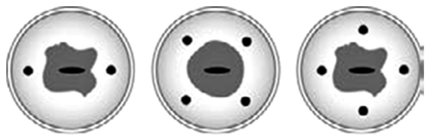

DOI：10.19538/j.fk2018060111  

【编者按】由中国抗癌协会妇科肿瘤专业委员会发布的常见妇科恶性肿瘤（宫颈癌、卵巢恶性肿瘤、子宫内膜癌、滋养细胞肿瘤、子宫肉瘤、外阴癌、阴道癌）诊治指南，将自本期开始连续刊登。1990年由原国家卫生部委托全国肿瘤防治办公室和中国抗癌协会编写了第一版妇科恶性肿瘤诊治指南，中国抗癌协会妇科肿瘤专业委员会又分别于1999年和2005年编写了第二版和第三版指南。本指南是由国内妇科肿瘤学家以循证医学为依据，结合目前国内诊治现状，并借鉴国外相关指南共同讨论制定的第四版，其意义在于规范妇科恶性肿瘤的诊断标准和治疗原则，指导临床实践，以提高我国妇科临床肿瘤医师的诊治水平。  

# 宫颈癌诊断与治疗指南（第四版）  

中国抗癌协会妇科肿瘤专业委员会关键词：宫颈肿瘤；指南Keywords: cervical cancer；guideline中图分类号：R737.3 文献标志码：C  

宫颈癌是女性恶性肿瘤发病率第2位的肿瘤，根据世界卫生组织（WHO）的数据，每年有新增病例53 万，约25 万女性因宫颈癌死亡，其中发展中国家占全球的 $80 \%$ 。西方发达国家由于宫颈癌筛查的普及，宫颈癌发病率缓慢下降。在中国，每年新增宫颈癌病例约14万，死亡约3.7万。  

本指南适用于宫颈鳞癌、腺癌及腺鳞癌，其他特殊病理类型，如小细胞癌、透明细胞癌、肉瘤等发病率低，国际、国内尚未达成共识，本指南不包括这些少见病理类型，但可以参照本指南。在临床实践中，根据医院的设备和技术条件以及患者的病情，国际上推荐采用最适合的符合指南的方法诊治患者。对于病情复杂的宫颈癌，临床医师应灵活应用指南，不适用于本指南的情况下建议参加临床试验。  

# 1 分期  

1.1 分期规则 宫颈癌分期采用国际上统一使用的FIGO 分期（见表1），其他分期作为参考。FI⁃GO 2009宫颈癌分期与原有分期相比，主要有以下两点不同：（1）取消了宫颈癌0 期，即原位癌，将宫颈原位癌归为CINⅢ（宫颈上皮内高度病变）。（2）将宫颈癌ⅡA 期根据宫颈病灶大小分为：直径≤$4 \mathrm { c m }$ 为ⅡA1期，直径 $> 4 \mathrm { c m }$ 为ⅡA2期。  

FIGO 2009 宫颈癌分期为临床分期，2009 年FIGO 临床分期委员会再次强调分期原则：（1）需2名以上高年资医师共同查体，明确分期，有条件时最好在麻醉状态下行盆腔检查。（2）分期有分歧时以分期较早的为准。（3）分期以治疗前盆腔检查为准，治疗后和术后病理结果不能改变分期。（4）微小浸润癌的诊断必须根据宫颈锥切标本由有经验的病理医师做出诊断。（5）输尿管梗阻和无功能肾（排除其他原因）应确定为ⅢB 期。（6）分期以临床分期为主，影像学检查可以辅助分期。  

表1 FIGO 2009宫颈癌分期  

<html><body><table><tr><td>期别</td><td>肿瘤范围</td></tr><tr><td>I期</td><td>宫颈癌局限在宫颈(扩散至宫体将被忽略)</td></tr><tr><td>IA期</td><td>镜下浸润癌。所有肉眼可见的病灶，包括表浅浸</td></tr><tr><td></td><td>润，均为IB期</td></tr><tr><td></td><td>IA1期间质浸润深度≤3mm,水平扩散≤7mm</td></tr><tr><td></td><td>IA2期间质浸润深度>3mm～≤5mm,水平扩散≤7mm</td></tr><tr><td>IB期</td><td>肉眼可见癌灶局限于宫颈，或者镜下病灶>IA2期</td></tr><tr><td></td><td>IB1期肉眼可见癌灶最大径线≤4cm</td></tr><tr><td></td><td>IB2期肉眼可见癌灶最大径线>4cm</td></tr><tr><td>Ⅱ期</td><td>肿瘤超越子宫，但未达骨盆壁或未达阴道下1/3</td></tr><tr><td>ⅡA期</td><td>无宫旁浸润</td></tr><tr><td></td><td>ⅡA1期肉眼可见癌灶最大径线≤4cm</td></tr><tr><td></td><td>ⅡA2期肉眼可见癌灶最大径线>4cm</td></tr><tr><td>ⅡB期</td><td>有明显宫旁组织浸润</td></tr><tr><td>Ⅲ期</td><td>肿瘤扩展到骨盆壁和(或)累及阴道下1/3和(或)引</td></tr><tr><td>ⅢA期</td><td>起肾孟积水或肾无功能 肿瘤累及阴道下1/3，没有扩展到骨盆壁</td></tr><tr><td>ⅢB期</td><td>肿瘤扩展到骨盆壁和(或)引起肾孟积水或肾无功能</td></tr><tr><td>IV期</td><td>肿瘤浸润膀胱黏膜或直肠黏膜（活检证实 )和(或）</td></tr><tr><td></td><td>超出真骨盆</td></tr><tr><td>IVA期</td><td>肿瘤侵犯邻近器官</td></tr><tr><td>IVB期</td><td>肿瘤扩散到远处器官</td></tr></table></body></html>  

1.2 临床分期前检查 宫颈癌治疗前分期很重要，应全面检查及评估患者的病情及身体状态，避免遗漏转移病灶，以下检查应作为常规：（1）宫颈活检。镜下浸润必要时行宫颈锥切及宫颈管刮术以明确组织病理诊断及病变范围。（2）妇科检查仍然是临床分期的主要依据。（3）分期为ⅡB 期以上或有相关的临床症状或必要时，需行肾图、膀胱镜、肠镜检查。（4）血鳞状上皮细胞癌抗原（SCC，对于宫颈鳞癌）、CA125（对于宫颈腺癌）检查。（5）上下腹、盆腔超声和胸片、心电图、盆腔及上下腹（含腹主动脉旁）MRI 或CT，建议ⅠB1 期以上有条件者行PET-CT 检查。（6）宫颈HPV 定性或定量检测。（7）肿瘤相关基因检测可选择。  

1.3 手术分期 对于ⅠB2、ⅡA2\~ⅣA期的患者可采用手术分期（2b 级证据），经腹膜外或腹腔内盆腔淋巴结切除 $+$ 腹主动脉旁淋巴结取样，根据淋巴结阳性情况决定放疗方案。  

# 2 治疗  

2.1 治疗基本原则 宫颈癌治疗主要有手术治疗和放疗，化疗广泛应用于与手术、放疗配合的综合治疗和晚期复发性宫颈癌的治疗。  

宫颈癌综合治疗不是几种方法的盲目叠加，而是有计划的分步骤实施，治疗中根据手术结果和放疗后肿瘤消退情况予以调整，原则上早期宫颈癌以手术治疗为主，中晚期宫颈癌以放疗为主，  

化疗为辅。  

放疗适用于各期宫颈癌，外照射可采用前后对穿野、盆腔四野、三维适形、调强放疗，适形放疗和调强放疗已应用于临床，由于宫颈癌后装腔内放疗的剂量学特点，具有不可替代性。  

手术治疗适用于分期早于ⅡB 期（不含ⅡB期）的患者。  

对于未绝经的患者，特别是年轻患者，放疗容易引起盆腔纤维化和阴道萎缩狭窄，早于ⅡB 期、无手术禁忌证者应选择手术治疗。手术入路可选择开腹、腹腔镜、机器人或经阴道联合腹腔镜等，应该根据手术者方法熟悉程度、手术资质和手术准入综合考虑予以选择。  

化疗目前广泛适用于宫颈癌治疗，采用以铂类（主要是顺铂）为基础的单药或联合化疗。治疗方式的选择应取决于本地区现有的设备、妇科肿瘤医师的技术水平以及患者的一般状况、年龄、肿瘤分期和患者愿望，治疗前应进行充分医患沟通。  

# 2.2 宫颈癌的手术治疗  

2.2.1 手术分型 可采用 Querleu-Morrow（QM）分型（见表2）和Piver分型（见表3），腹腔镜手术已广泛应用于宫颈癌手术。其中C 型手术又可以分为保留膀胱神经型（C1）和不保留膀胱神经型（C2）。手术切除范围推荐水平切断膀胱宫颈韧带、距肿瘤或宫颈下缘 $1 5 \mathrm { { \sim } } 2 0 \mathrm { { m m } }$ ，切除阴道及相应的阴道旁组织，输尿管完全游离。  

表 2 Querleu-Morrow 分型  

<html><body><table><tr><td>QM分型 术式</td><td></td></tr><tr><td></td><td>A型亦称筋膜外子宫切除术，在输尿管和宫颈之间切断宫颈旁组织，宫韧带和膀胱宫颈韧带不切除，切除阴道<10mm,病灶< 20mm、盆腔淋巴结阴性、无脉管受浸者，为实施缩小手术的安全性评价的临床试验而设计;也适用于晚期癌放疗和（或）</td></tr><tr><td></td><td>化疗后患者 B型亦称改良式广泛性子宫切除术,在输尿管隧道处切断宫颈旁组织,不切除子宫深静脉后方的膀胱神经，切除阴道10mm或距 肿瘤10mm，也称B1型手术；B2型手术是B1+宫颈旁淋巴结切除</td></tr><tr><td>C型</td><td>是经典的广泛性子宫切除术，切除宫颈旁组织至与骼内血管系统交界处;直肠旁切断宫骶韧带、近膀胱切断宫颈膀胱韧带</td></tr><tr><td>D型</td><td>超广泛性子宫切除术,D1型近盆侧壁血管切除宫颈旁、下腹部血管及邻近的筋膜;D2型即盆腔器官廓清术(LEER术）</td></tr></table></body></html>  

表 3 Piver 分型  

<html><body><table><tr><td rowspan="2">分型</td><td colspan="5">手术范围</td><td rowspan="2">适应证</td></tr><tr><td>子宫动脉</td><td>主韧带</td><td>宫骶韧带</td><td>阴道</td><td>淋巴结</td></tr><tr><td></td><td>I型宫颈筋膜外侧缘</td><td></td><td>宫颈筋膜外侧缘宫颈筋膜外侧缘宫颈外侧缘不切除</td><td></td><td></td><td>宫颈癌IA1期</td></tr><tr><td>Ⅱ型</td><td>与输卵管交汇处结扎</td><td>从中间切断</td><td>靠近子宫切断</td><td>切除上1/3</td><td>选择性切除增大的淋巴结宫颈癌IA2期</td><td></td></tr><tr><td></td><td>Ⅲ型骼内动脉起始处结扎</td><td>全部切除</td><td>近骶骨处切断</td><td>切除上1/2</td><td>常规行盆腔淋巴结切除术宫颈癌IB1期</td><td></td></tr><tr><td>IV型</td><td>必要时于盆壁结扎骼内动脉全部切除</td><td></td><td>近骶骨处切断</td><td>切除3/4</td><td>常规行盆腔淋巴结切除术宫颈癌中央型复发</td><td></td></tr><tr><td>V型结扎骼内动脉</td><td></td><td>全部切除</td><td>近骶骨处切断</td><td>切除3/4</td><td>常规行盆腔淋巴结切除术 宫颈癌中央型复发,累</td><td>及远端输尿管或膀胱</td></tr></table></body></html>  

2.2.2 前哨淋巴结切除术 前哨淋巴结（SLN）定位与切除（2a级证据）作为部分Ⅰ期宫颈癌患者手术时使用，肿瘤直径 $< 2 \mathrm { c m }$ 的检出率和定位效果最好。采用宫颈局部注射染料或放射性胶体锝-99，如图1 所示。宫颈注射后，SLN 取样经病理诊断，识别微转移。SLN 注射染料采用直观观察有色染料来识别，放射性胶体锝-99采用γ探测器，使用吲哚菁绿（ICG）则采用荧光摄像，切除任何可疑或肿大的淋巴结以及将原发肿瘤和宫旁组织整块切除。宫颈癌手术治疗记录见表4。  

  
图1 宫颈染料及标记注射点示意图  

表4 宫颈癌手术治疗记录  

<html><body><table><tr><td colspan="2">姓名</td><td colspan="4"></td><td colspan="4">年龄</td></tr><tr><td colspan="2">手术方案</td><td colspan="4"></td><td colspan="2">手术者</td><td colspan="2"></td></tr><tr><td colspan="2">手术方案</td><td colspan="4"></td><td colspan="2">抗生素类型、剂量、时间</td><td colspan="2"></td></tr><tr><td rowspan="8">术 中 所 见</td><td colspan="5">上腹部：肝脾肾</td><td colspan="2">腹主动脉淋巴结</td><td colspan="3">盆腔</td></tr><tr><td colspan="5">腹膜</td><td colspan="5">大网膜</td></tr><tr><td colspan="5">子宫</td><td colspan="5">宫旁组织左 右</td></tr><tr><td colspan="5">卵巢左 右</td><td colspan="5">输卵管左 右</td></tr><tr><td colspan="5">膀胱</td><td colspan="5">输尿管左 右</td></tr><tr><td colspan="5">主韧带左 cm右 cm 阴道旁组织 左 右</td><td colspan="5">宫骶韧带左 右</td></tr><tr><td colspan="9">淋巴结（增大、变硬、粘连，部位）</td></tr><tr><td colspan="9"></td></tr><tr><td rowspan="6">手 术 切 除 范</td><td>阴道前壁 cm</td><td colspan="2">阴道后壁 cm</td><td></td><td>宫旁组织左cm右</td><td>cm</td><td colspan="2"></td></tr><tr><td colspan="2">主韧带左 cm右</td><td colspan="2">cm</td><td>宫骶韧带左cm右</td><td colspan="2">cm</td><td colspan="2"></td></tr><tr><td colspan="2">卵巢左去留 淋巴结：腹主</td><td colspan="2"></td><td colspan="5">卵巢右去留（标记情况</td></tr><tr><td colspan="5">盆腔左 左卵巢：去 留（标记） 右卵巢：</td><td colspan="5">右 去 留(标记）</td></tr><tr><td colspan="9">围 其 阴道残端处理：1.缝合无引流，2.开放无引流，3.开放引流</td></tr><tr><td colspan="2">他 术中其他说明：</td><td colspan="5"></td><td colspan="2"></td></tr><tr><td rowspan="5">术中并发症</td><td>损伤</td><td></td><td>发生时间/部位</td><td colspan="2">原因</td><td></td><td>程度/持续时间 处理</td><td></td></tr><tr><td>出血</td><td colspan="2"></td><td></td><td colspan="2"></td><td></td><td></td></tr><tr><td>休克</td><td colspan="2"></td><td></td><td colspan="2"></td><td></td><td></td></tr><tr><td>死亡</td><td colspan="2"></td><td></td><td colspan="2"></td><td></td><td></td></tr><tr><td></td><td></td><td></td><td colspan="2"></td><td></td><td></td><td></td></tr></table></body></html>  

2.3 宫颈癌放疗 各期宫颈癌都适合放疗，包括各种病理类型，特殊原因不能手术的CINⅢ也可以选择单纯腔内放疗。但对于年轻的早期宫颈癌患者，考虑对卵巢功能的保护，主要采用手术治疗或卵巢移位以后的盆腔放疗。  

2.3.1 宫颈癌放疗一般性原则 宫颈癌放疗包括远距离体外照射（体外照射）和近距离腔内照射（后装治疗），两者针对的靶区不同，外照射主要针对宫颈癌原发灶和盆腔蔓延及淋巴转移区域，后装治疗主要照射宫颈癌的原发病灶区域。应有足够的剂量以保证疗效，与此同时也需要最大限度地保护邻近正常组织，提高生存质量。需要根据患者一般状况、肿瘤范围以及治疗单位放疗设备条件、患者经济能力来选择。体外放疗可选择前后二野或四野照射的二维等中心照射，或精确放疗技术如三维适形放疗（3D-CRT）、调强放疗（IMRT）或螺旋断层放疗系统（TOMO）。腔内照射可选择二维或三维技术。  

宫颈癌的放疗剂量根据分期不同而有差别。A 点总剂量为盆腔体外照射联合后装治疗换算后的总的生物等效剂量，对于早期（Ⅰ、ⅡA 期）宫颈局部肿瘤小的患者，A 点总剂量75\~80Gy，局部肿瘤大或晚期（Ⅲ期以上）患者A 点总剂量 $\geqslant 8 5 \mathrm { G y }$ 。治疗剂量应根据治疗过程中的患者症状、盆腔检查及影像学检查等获得的肿瘤变化及时调整，采用个体化放疗方案。  

2.3.2 体外照射 主要针对宫颈癌原发灶和盆腔蔓延及淋巴转移区域，要求在5\~6 周内完成，尽量避免照射时间延长。强调不能以任何体外照射方式替代后装放疗。  

2.3.2.1 体外照射靶区设定 宫颈癌放疗靶区的设定应根据妇科检查情况和影像学检查（如CT、MRI、PET-CT）确认，应包括子宫、宫颈、宫旁和上1/3阴道（或距阴道受侵最低点下 $2 \mathrm { c m }$ ，ⅢA期患者包括全部阴道）以及盆腔淋巴引流区如闭孔、髂内、髂外、髂总、骶前；如果腹股沟区淋巴结、腹主动脉旁淋巴结转移或可疑转移，应包括在照射野内。2.3.2.2 照射野设定 采用X 线模拟定位机或CT、MRI模拟定位机定位。（1）盆腔等中心照射：包括下腹及盆腔，设前后野等中心垂直照射。上界在 $\mathrm { L } _ { 4 } { \sim } \mathrm { L } _ { 5 }$ 间隙，下界在闭孔下缘或肿瘤下界以下至少 $2 \mathrm { c m }$ ，侧界在真骨盆最宽处向外 $1 . 5 { \sim } 2 \mathrm { c m }$ 。同时，应用铅块或多叶光栅技术（MLC）遮挡正常器官。每次盆腔中平面处方剂量 $1 . 8 { \sim } 2 . 0 \mathrm { G y }$ ，每周 4\~5次。盆腔等中心照射可分两阶段完成：第1 阶段：全盆腔等中心照射，DT 量： $2 0 { \sim } 3 0 \mathrm { G y } , 2 { \sim } 3$ 周完成；第2 阶段：中间遮挡照射，全盆中间遮挡 $4 \mathrm { { c m } \times ( 8 \sim }$ $1 2 ) \mathrm { c m }$ ，以降低危及器官膀胱和直肠的受量，给后装治疗提供剂量空间，DT 量：20\~25Gy，2\~3 周完成。（2）四野箱式照射：即盆腔前后两野照射加两个侧野照射，主要适用于特别肥胖的患者拟增加宫旁或淋巴引流区的剂量。上界在 ${ \mathrm { L } } _ { 4 } { \sim } { \mathrm { L } } _ { 5 }$ 间隙，下界在闭孔下缘或肿瘤下界以下至少 $2 \mathrm { c m }$ ，侧界在真骨盆最宽处向外 $1 . 5 { \sim } 2 \mathrm { c m }$ 。两侧野前缘达耻骨联合（包括髂外淋巴引流区），后缘在 ${ \bf S } _ { 2 } { \sim } { \bf S } _ { 3 }$ 骶椎交界水平（包括骶前淋巴引流区），如宫颈原发灶大，宫骶韧带受侵，后缘可达 $\mathrm { S } _ { 3 } { \sim } \mathrm { S } _ { 4 }$ 骶椎水平，应用铅块或MLC 技术遮挡正常器官。每日四野同时照射，一般给予B点DT量45\~50Gy，4\~5周完成。（3）腹主动脉旁野（延伸野）照射：髂总或主动脉旁淋巴结转移时需行延伸野照射，照射野的宽度一般 $6 { \sim } 8 \mathrm { c m }$ ，长度依据淋巴结转移的范围给予个体化设计。建议 DT 量 40\~45Gy，4\~5 周，每日 1 次 $1 . 8 { \sim } 2 . 0 \mathrm { G y }$ ，照射时要注意保护肾脏和脊髓。对腹主动脉旁淋巴引流区的照射，建议采用适形或调强精确放疗技术。  

2.3.2.3 射线选择 根据采用的放疗技术、照射野数以及医疗机构的设备、防护条件而定。射线能量越高，其穿透能力越强，需要的防护条件越高，前后二野照射选择10\~15MV X 射线，多野照射可以选择6\~10MV X射线。  

2.3.2.4 精确放疗 任何精确放疗技术的成功实施均基于靶区的精确定位，包括靶区准确定义、针对治疗中靶区变化和器官移动的应对、摆位及质量控制，其中合理的靶区勾画不仅是治疗成败的重要因素，也直接影响到放疗并发症的发生。建议应用MRI 或PET-CT 以保证照射靶区覆盖受侵宫旁及转移淋巴结组织，同时最大限度保护直肠、小肠、膀胱等危及器官。  

宫颈癌的靶区包括大体肿瘤区（GTV）、临床靶区（CTV）和计划靶区（PTV）。2.3.2.4.1 GTV 指临床可见的肿瘤灶，为一般的诊断手段（包括妇科检查和CT、MRI、PET-CT）能够确定的、具有一定形状和大小的病变范围，包括原发病灶、转移淋巴结和其他转移的病灶。理论上，宫颈癌行广泛性子宫切除术 $^ +$ 淋巴清扫术后没有GTV。未行手术切除者，GTV 包括宫颈和受累的阴道、宫体、宫旁、转移淋巴结及其他转移病灶。2.3.2.4.2 CTV 包括肿瘤临床灶、亚临床灶以及肿瘤可能侵犯的范围。宫颈癌临床靶区主要包括盆腔原发肿瘤区和淋巴引流区。  

盆腔原发肿瘤区指未行子宫切除者包括肿瘤、全子宫（宫颈 $^ +$ 宫体）、部分阴道、宫旁或阴道旁软组织；已行子宫切除者包括残存肿瘤、阴道残端、上段阴道（ $3 0 { \sim } 4 0 \mathrm { m m }$ ）、阴道旁或瘤床软组织。  

淋巴引流区包括闭孔、髂内、髂外、髂总 $\pm$ 腹主动脉旁淋巴结引流区。对于宫颈影像学诊断宫颈间质受侵的患者，应包括骶前淋巴引流区；如果髂总淋巴结、腹主动脉旁淋巴结有转移则需行腹主动脉旁淋巴引流区照射，其靶区上界要求达肾血管水平；如果转移淋巴结超过肾血管水平，靶区应包括整个腹主动脉旁淋巴引流区；肿瘤侵及达阴道下1/3时，靶区需包括全阴道及双腹股沟淋巴引流区。特别指出，应建立考虑膀胱体积变化的内靶区（ITV），若在制订计划时发现直肠过度扩张，则应考虑再次行CT、MRI模拟定位。  

2.3.2.4.3 PTV 确定计划靶区的目的是确保临床靶区得到规定的治疗剂量。计划靶区应包括临床靶区、照射中患者器官运动和由于日常摆位、治疗中靶位置和靶体积变化等因素引起的扩大照射的范围。宫颈癌体外照射由CTV外放一定距离形成PTV，目前没有统一标准。  

2.3.3 后装治疗 主要照射宫颈癌的原发区域。以传统二维后装系统为主，探索图像引导的三维后装治疗。  

2.3.3.1 剂量率 根据后装治疗时放射源对A 点剂量的贡献速率分为低剂量率（LDR）、中剂量率和高剂量率（HDR）。目前，国内多使用高剂量率后装治疗机。  

A 点剂量是以传统剂量分割及LDR 近距离治疗为依据。对于近距离放疗，设定为一个4\~7Gy/h的LDR。应用HDR近距离放疗应当依据线性二次型方程定义HDR 的A 点剂量，即转化成生物等效LDR的 A点剂量。如30Gy的HDR A点剂量被分割为5次照射，普遍认可为等同于采用LDR的A点的40Gy剂量（剂量率换算参考《肿瘤放射治疗学》）。2.3.3.2 腔内放疗剂量 应与体外照射剂量结合考虑，采用二维高剂量率后装治疗，A 点剂量 $4 0 \sim$ 45Gy，每次5\~6Gy，每周1次，腔内后装治疗当天不进行体外照射。体外照射联合腔内治疗A点的总剂量以期别而异，ⅠA2 期应达到75\~80Gy，ⅠB1期和ⅡA1 期达 80\~85Gy，ⅠB2、ⅡA2 和ⅡB\~ⅣA期 $\geqslant 8 5 \mathrm { G y }$ ，采用不同剂量率后装机治疗时，应进行生物剂量转换（腔内剂量以体外常规分割等效生物剂量换算），同时注意对膀胱及直肠剂量的监测，避免膀胱及直肠的过高受量。  

2.3.3.3 后装治疗时机 通常在外照射开始后、宫颈口便于暴露时进行，在宫颈条件允许原则下应尽早进行，最好与体外照射同步进行，以缩短总放疗时间。最常用的传统二维后装治疗采用剂量参数系统包括A、B点及膀胱和直肠点的剂量。  

2.3.3.4 三维后装治疗 三维后装系统计划时间及治疗时间较长，应重视施源器的固定，避免移位。目前的三维影像技术引导下的后装治疗寻求对肿瘤的最佳剂量覆盖，可减少对邻近的膀胱、直肠和小肠的受量，但目前临床实践均基于 A 点剂量系统。由于可造成肿瘤受量不足，通过影像技术引导下的后装治疗来改进剂量设定需要谨慎。可采用欧洲妇科放射肿瘤协会（GEC-ESTRO）推荐的三维后装治疗的GTV、CTV 概念，应用MRI 图像勾画靶区，以 T2WI 序列所示的肿瘤范围为GTV。将CTV 按照肿瘤负荷和复发的危险程度分  

3 类：高危CTV（HR-CTV）包括宫颈和肉眼可见的肿瘤侵犯的范围；中危CTV（IR-CTV）表示明显的显微镜下肿瘤区，推荐包括外照射开始前的肿瘤范围；低危CTV（LR-CTV）指可能的显微镜下播散区，一般用手术或外照射处理。根据肿瘤消退定义IR-CTV，如肿瘤完全消退或消退直径 $> 1 0 \mathrm { m m }$ ，则IR-CTV 应包括HR-CTV 和最初诊断时肉眼可见肿瘤区，不增设安全边缘；若肿瘤消退直径 $\angle { \bf \Phi } < \mathbf { \Phi }$ $1 0 \mathrm { m m }$ ，则IR-CTV 应包括超过宫颈的残存病灶并向可能扩散的方向外放 $1 0 \mathrm { m m }$ 的安全边界；如肿瘤无明显消退，则IR-CTV 应包括最初肿瘤范围加$1 0 \mathrm { m m }$ 的安全边界。建议以 $\mathrm { D } _ { 9 0 } \setminus \mathrm { D } _ { 1 0 0 }$ 评估GTV、HR-CTV 和 IR-CTV 的剂量，以 $\mathrm { V } _ { 1 5 0 } , \mathrm { V } _ { 2 0 0 }$ 评估高剂量体积；以 $\mathrm { D } _ { \mathrm { 1 c c } } \setminus \mathrm { D } _ { \mathrm { 2 c c } }$ 评估危及器官（OaR）受量。对于传统剂量点是否可沿用，2009 年美国近距离放疗协会（abS）的调查显示，目前A点剂量常与剂量-体积直方图（DVH）参数一起报告，便于与传统的二维近距离放疗相比较；传统的膀胱剂量点并不能代表膀胱的最高受量，通常膀胱接受最高剂量的点位于参考点上方 $2 \mathrm { c m }$ 左右；直肠参考点剂量尚能基本代表直肠的最高受量，可以沿用。  

2.3.3.5 特殊情况后装治疗 对于子宫切除术后患者（尤其是阴道切缘阳性或肿瘤近切缘者），可采用阴道施源器后装治疗作为体外放疗的补充。以阴道表面或距阴道容器内放射源 $5 { \sim } 1 0 \mathrm { m m }$ 处为参照点，高剂量率 $^ { 1 9 2 } \mathrm { I r }$ 剂量为 $2 0 { \sim } 2 4 \mathrm { G y }$ 。对于宫颈外生型大肿瘤，特别是出血较多者，体外放疗前可先给予后装治疗消瘤止血，以源旁 $1 \mathrm { c m }$ 为参考点，一般给予10\~20Gy/1\~2次，可不计入A点量。宫颈癌腔内治疗及三维后装计划总结记录单见表5。  

表5-1 宫颈癌腔内治疗记录单  

<html><body><table><tr><td>姓名</td><td colspan="3">年龄</td><td>科室病区</td><td>床号</td><td></td><td></td></tr><tr><td>诊断</td><td colspan="3"></td><td colspan="3">拟腔内治疗次数</td><td colspan="2"></td></tr></table></body></html>  

住院号  

<html><body><table><tr><td>次数</td><td colspan="4">日期</td><td colspan="2">备注</td></tr><tr><td>医师</td><td colspan="2">物理师</td><td colspan="2"></td><td colspan="2">技术员</td></tr><tr><td>A点</td><td colspan="2">B点</td><td></td><td>黏膜下表面剂量</td><td colspan="2">(球塞）</td><td>子宫位置、宫深</td></tr><tr><td colspan="2"></td><td colspan="2"></td><td colspan="2"></td><td colspan="2"></td></tr></table></body></html>  

<html><body><table><tr><td>次数</td><td></td><td>日期</td><td colspan="2"></td><td>备注</td><td colspan="2"></td></tr><tr><td colspan="2">医师</td><td colspan="3">物理师</td><td colspan="2">技术员</td></tr><tr><td>A点</td><td colspan="2">B点</td><td>黏膜下表面剂量</td><td colspan="3">(球塞)</td><td>子宫位置、宫深</td></tr><tr><td></td><td colspan="2"></td><td></td><td></td><td colspan="2"></td><td></td></tr></table></body></html>

注：治疗记录单可依治疗次数而增加  

表5-2 二维腔内治疗小结  

<html><body><table><tr><td rowspan="2">诊断</td><td rowspan="2">累计A点剂量</td><td rowspan="2">累计B点剂量</td><td rowspan="2">累计阴道黏膜下0.5cm</td><td rowspan="2">累计阴道黏膜表面剂量</td><td rowspan="2">备注（阴道壁有无挡铅）</td></tr><tr><td></td></tr><tr><td></td><td></td><td>月</td><td></td><td></td><td></td></tr><tr><td colspan="6">治疗起止时间： 年 日一年月日</td></tr></table></body></html>  

表5-3 三维后装计划记录单  

<html><body><table><tr><td colspan="3">次数</td><td colspan="4">放射源Ir Ci</td><td colspan="2">治疗时间</td><td colspan="2">分 秒</td></tr><tr><td rowspan="2">HRCTV</td><td colspan="2">Vol(cc)</td><td colspan="2">D90(cGv)</td><td colspan="3">V200(%) V150(%)</td><td colspan="2">EQD2(cGv)</td><td></td></tr><tr><td colspan="2"></td><td colspan="3"></td><td colspan="2"></td><td colspan="2"></td><td></td></tr><tr><td rowspan="2">IRCTV</td><td colspan="2">Vol(cc)</td><td colspan="2">D90(cGv)</td><td colspan="2">EQD2(cGv)</td><td colspan="2">D98(cGv) EQD2(cGv)</td><td colspan="2"></td></tr><tr><td colspan="2"></td><td colspan="2"></td><td colspan="2"></td><td colspan="3"></td><td></td></tr><tr><td>COIN</td><td colspan="9">Vref(cc) Index</td></tr><tr><td colspan="2">医生</td><td colspan="3">物理师 技术号</td><td colspan="3"></td><td colspan="2">治疗日期</td></tr><tr><td>姓名</td><td colspan="2"></td><td colspan="3">年龄</td><td colspan="2">科室病区</td><td>住院号</td><td></td></tr><tr><td>诊断</td><td colspan="4"></td><td colspan="2">腔疗方式</td><td colspan="3"></td></tr></table></body></html>  

表5-4 三维后装总结单  

<html><body><table><tr><td>EBRT BT BT2 BT3 BT4 BTs</td></tr><tr><td>HRCTV D90(cGy)</td></tr><tr><td></td></tr><tr><td>IRCTV D90(cGy)</td></tr><tr><td>膀胱D2cc(cGy)</td></tr><tr><td>直肠 D2cc(cGy) 乙状结肠D2cc(cGy)</td></tr></table></body></html>  

2.3.4 危及器官的耐受剂量 宫颈癌放疗邻近器官的耐受剂量：宫颈癌放疗的危及器官包括膀胱、直肠、结肠、骨髓、皮肤、小肠、输尿管等，一般用$\mathrm { T D } _ { 5 / 5 }$ 表示最小放射耐受量，表示在治疗后5 年内，也预计严重并发症发生率不超过 $5 \%$ 。  

# 2.3.5 各期宫颈癌的放疗  

2.3.5.1 ⅠA1期宫颈癌的放疗 主要以后装腔内治疗为主，如果宫颈锥切标本无淋巴脉管受侵，可单独行后装治疗，宫颈锥切标本有淋巴脉管受侵，后装治疗 $\dot { \bf \Phi } _ { \pm }$ 盆腔外照射，A点总剂量 $7 5 { \sim } 8 0 \mathrm { G y }$ 。  

2.3.5.2 ⅠA2、ⅠB1、ⅡA1期宫颈癌的放疗 采用盆腔外照射 $^ { \cdot } + ,$ 后装治疗，盆腔外照射40\~50Gy，后装治疗 $\dot { } + \dot { }$ 外照射给予A点剂量75\~80Gy。  

2.3.5.3 ⅠB2、ⅡA2、ⅡB\~ⅣA 期宫颈癌的放疗  

放疗前必须进行盆腔淋巴结情况的评估，建议用影像评估或手术评估确定放射野，盆腔 $4 0 { \sim } 5 0 \mathrm { G y }$ 的体外放射剂量，局部病灶可以在图像引导下加量5\~10Gy。如腹主动脉旁淋巴引流区需加量，应在影像引导下予以40\~50Gy照射，局部病灶可缩野加量5\~10Gy。对于宫颈局部病灶，后装治疗 $^ +$ 外照射给予A 点总剂量80Gy 以上。放疗中应该有2\~3次临床和影像疗效评估，必要时重新定位，以确定个体化治疗剂量。  

2.3.5.4 ⅣB期宫颈癌的放疗 ⅣB期宫颈癌的放疗为姑息性治疗，剂量基本同ⅣA 期宫颈癌，但由于有直肠或膀胱侵犯，应尽量采用个体化原则进行治疗。  

2.3.6 术前放疗 通常采用：（1）后装治疗。剂量一般为全程腔内放疗剂量的1/3\~1/2。（2）全程后装治疗和（或）体外照射剂量的1/2。术前后装治疗可以缩小局部病灶，提高手术切除率，但对盆腔淋巴转移无显著改善。  

2.3.7 术中放疗（IORT） 是指在开放性手术过程中，针对高危瘤床或孤立无法切除残余病灶给予单次、精确定位的放疗技术，尤其适用于在既往放疗体积内发生复发病灶的患者。在IORT 过程中，可以把所覆盖的正常组织（如肠或其他器官）人工移离风险区域。IORT 通常通过不同尺寸（匹配手术确定的风险区）的限光筒引入的电子束完成，以避开周围正常组织器官。  

2.3.8 术后放疗 主要针对有术后高危或中危因素的患者。但由于术后粘连，术后肠管的活动度变差，容易导致肠道局部剂量过大，建议术后放疗在图像引导下进行，给予适形或调强等立体放疗技术，放射野的确定可根据术后病理确定。无腹主动脉旁淋巴结转移，行盆腔照射；有腹主动脉旁淋巴结转移，则需进一步检查有无远处转移。照射野需包括腹主动脉旁淋巴结，如采用调强等立体照射技术，盆腔剂量可以给予50\~55Gy，腹主动脉旁淋巴引流区也应在 $( 5 0 { \pm } 5 ) \mathrm { G y }$ 。  

2.4 宫颈癌的化疗 宫颈癌化疗以顺铂（DDP）为基础的联合化疗或单用DDP化疗为主。目前主要适用于：同步放化疗、姑息化疗和新辅助化疗。  

宫颈癌初治病例首选紫杉醇 $\cdot + .$ 顺铂（TP 方案）或顺铂单药方案，也可选用氟尿嘧啶 $^ +$ 顺铂（FP 方案）、紫杉醇 $\cdot +$ 卡铂（TC方案）、拓普替康 $^ +$ 顺铂、博莱霉素 $^ +$ 长春新碱 $^ + ,$ 顺铂（BVP方案）。  

复发性宫颈癌既往未化疗者首选TP 方案；曾使用过顺铂者首选TC或拓普替康 $^ + ,$ 顺铂方案。  

宫颈癌新辅助化疗主要用于ⅠB2或ⅡA2期，即肿瘤直径 $> 4 \mathrm { c m }$ 的局部晚期宫颈癌术前化疗，一般2\~3 个疗程。宫颈癌的新辅助化疗可以提高局部控制率和手术切净率，但不能改善宫颈癌的预后。宫颈癌的靶向治疗可采用联合贝伐单抗，用于初期同步放化疗患者及复发转移患者。体外化疗药物敏感实验和基因检测药物选用仅用于研究和临床试验。  

# 2.5 各期宫颈癌的治疗  

2.5.1 ⅠA1 期宫颈癌治疗 ⅠA1 期宫颈癌治疗根据患者是否有生育要求选择治疗方法。  

有生育要求者可采用宫颈锥切，宫颈锥切标本无脉管浸润，切缘达 $3 \mathrm { m m }$ 阴性距离为适应证；有脉管浸润时，采用广泛性宫颈切除术 $^ +$ 盆腔淋巴结切除术，手术先行盆腔淋巴结切除，送冰冻检查或快速石蜡切片。有转移者，改行改良广泛性子宫切除术（Ⅱ型子宫切除术） $\pm$ 腹主动脉旁淋巴结取样；无转移者，行广泛性宫颈切除术。  

无生育要求者行筋膜外全子宫切除。如果患者伴有淋巴血管受侵，行改良广泛性子宫切除术（Ⅱ型子宫切除术） $^ +$ 盆腔淋巴结切除术。  

有手术禁忌者行后装腔内放疗，剂量参考点选择A点剂量 $7 5 { \sim } 8 0 \mathrm { G y }$ 。2.5.2 ⅠA2 期宫颈癌治疗 ⅠA2 期宫颈癌治疗仍可以按照是否有生育要求选择。  

有生育要求者行广泛性宫颈切除术 $^ +$ 盆腔淋巴结切除 $\pm$ 腹主动脉旁淋巴结取样。手术先行盆腔淋巴结切除，送冰冻或快速石蜡切片检查，有转移者，改行广泛性子宫切除术（Ⅲ型） $\pm$ 腹主动脉旁淋巴结取样（当髂总淋巴结阳性或疑有腹主动脉旁淋巴结转移者）；无转移者，再行广泛性宫颈切除术。  

无生育要求者行广泛性子宫切除术（Ⅲ型子宫切除术） $^ +$ 盆腔淋巴结切除术，年龄小于45 岁者可切除输卵管、保留双侧卵巢。  

有手术禁忌、无生育要求者可选择根治性放疗。腔内放疗±盆腔放疗A 点总剂量75\~80GY，B点剂量40Gy，放疗前可根据需要行卵巢移位，并银夹标记。  

2.5.3 ⅠB1 期及ⅡA1 期宫颈癌 有生育要求者可行广泛性宫颈切除术，肿瘤直径小于 $2 \mathrm { c m }$ 者可经阴道联合腹腔镜进行。肿瘤直径 $2 { \sim } 4 \mathrm { c m }$ 者，采用经腹或腹腔镜手术。术中先行盆腔淋巴结切除，送冰冻检查，如有转移，改行广泛性子宫切除术（Ⅲ型） $+$ 盆腔淋巴结切除术；如无转移，再行广泛性宫颈切除术 $^ +$ 盆腔淋巴结切除 $\pm$ 腹主动脉旁淋巴结取样（当髂总淋巴结阳性或疑有腹主动脉旁淋巴结转移者）。  

无生育要求者行广泛性子宫切除术（Ⅲ型子宫切除术） $^ +$ 盆腔淋巴结切除术 $\pm$ 主动脉旁淋巴结取样（当髂总淋巴结阳性或疑有腹主动脉旁淋巴结转移者）。  

有手术禁忌者采用根治性放疗，对于阴道明显侵犯者，加用阴道塞或阴道膜，给予黏膜下$0 . 5 \mathrm { c m }$ 处 $2 0 { \sim } 3 0 \mathrm { G y }$ 。2.5.4 ⅠB2 期及ⅡA2 期宫颈癌 （1）盆腔放疗 $^ +$ 铂类为主的同步化疗 $^ +$ 近距离放疗（A 点总剂量75\~80Gy，B点剂量 $4 0 { \sim } 5 0 \mathrm { G y }$ ）。对于阴道侵犯明显的患者，必要时可予加用阴道塞进行后装腔内放疗，给予黏膜下 $0 . 5 \mathrm { c m }$ 处 $2 0 { \sim } 3 0 \mathrm { G y }$ ，需根据病情适当调整（首选）。（2）广泛性子宫切除术（Ⅲ型） $^ +$ 盆腔淋巴结切除 $+$ 腹主动脉旁淋巴结取样，术前可行铂类为基础的新辅助化疗，术后根据病理高危因素选择术后放疗或术后同步放化疗。（3）根治性放疗后宫颈病灶残存行辅助性全子宫切除术。  

2.5.5 $\mathrm { { I I B } \sim \mathrm { { I V A } } }$ 期宫颈癌 采用铂类为基础同步放化疗，可选择周化疗或3 周化疗。常规放疗剂量：肿瘤直径 $\geqslant 4 \mathrm { c m }$ ，A 点剂量应达到 $8 5 \mathrm { G y }$ ，ⅢB 期患者B 点剂量应达到 $4 5 { \sim } 5 0 \mathrm { G y }$ 。对于盆壁受侵明显的患者，必要时可高适形缩野局部盆腔加量 $5 \sim$ $1 0 \mathrm { G y }$ 。对于阴道侵犯明显的患者，必要时可加用阴道塞进行后装腔内放疗阴道补量，治疗剂量一般采用给予黏膜下 $0 . 5 \mathrm { c m }$ 处20\~30Gy，需根据病情个体化调整。  

2.5.6 ⅣB期宫颈癌 盆腔局部放疗同时，应加强铂类为基础的联合化疗，并针对转移灶进行个体化治疗，加强对症治疗、营养治疗、止痛治疗，控制病情进展，改善生存质量。  

2.6 关于“手术分期” 对于ⅠB2、ⅡA2\~ⅣA期的宫颈癌患者可以采用手术分期（2b 级证据），行腹膜外或腹腔镜的盆腔淋巴结切除 $^ +$ 腹主动脉旁淋巴结取样。根据淋巴结有无转移决定下一步治疗方案：（1）盆腔淋巴结及腹主动脉旁淋巴结阴性者行盆腔放疗 $^ { \circ } +$ 同步化疗。（2）盆腔淋巴结阳性、腹主动脉旁淋巴结阴性者行盆腔同步放化疗。（3）腹主动脉旁淋巴结阳性者行影像学检查，无远处转移，或有远处转移但活检阴性者行盆腔同步放化疗 $^ +$ 腹主动脉旁淋巴结放疗。影像学检查有远处转移、活检阳性行全身治疗 $^ +$ 个体化放疗。  

2.7 关于宫颈癌术前影像学评估 对于ⅠB2、$\mathbb { I } \mathrm { A } 2 { \sim } \mathbb { N } \mathrm { A }$ 期的宫颈癌患者，推荐采用影像学评估，根据影像学评估的淋巴结有否转移决定下一步治疗方案：（1）影像学评估无阳性淋巴结者行盆腔同步放化疗。（2）影像学评估有阳性盆腔淋巴结、腹主动脉旁淋巴结阴性者行盆腔同步放化疗 $\pm$ 腹主动脉旁淋巴结放疗；或经腹膜外或经腹腔镜的淋巴结切除，如腹主动脉旁淋巴结阳性行盆腔同步放化疗 $^ +$ 腹主动脉旁淋巴结放疗。如腹主动脉旁淋巴结阴性行盆腔同步放化疗。（3）影像学评估盆腔淋巴结阳性、腹主动脉旁淋巴结阳性者考虑先行经腹膜外或腹腔镜的盆腔及腹主动脉旁淋巴结切除后再行盆腔同步放化疗 $^ +$ 腹主动脉旁引流区放疗。（4）影像学评估有远处转移且活检证实者行全身治疗 $^ { + }$ 个体化放疗。  

2.8 宫颈癌术后补充治疗 宫颈癌初始手术治疗的患者，应根据术后病理决定是否需要补充治疗。2.8.1 高危因素 存在以下任何一个高危因素术后均需补充放疗：盆腔淋巴结阳性、切缘阳性或宫旁组织阳性。术后补充盆腔放疗 $^ +$ 铂类同步化疗（1类证据） $\pm$ 阴道近距离放疗。  

2.8.2 中危因素 推荐按照Sedlis 标准补充盆腔放疗 $\dot { \bf { \underline { { \mathbf { \Pi } } } } } _ { \bf { \underline { { \mathbf { \Pi } } } } } \mathbf { \Psi } _ { \pm }$ 铂类同步化疗。  

采用Sedlis标准的同时，还需考虑肿瘤的组织学类型（腺癌、腺鳞癌等）和病灶是否靠近切缘这两个因素。符合中危因素标准，术后辅助放疗体外放疗 $\dot { \bf \Phi } _ { \pm }$ 含铂类的同步化疗 $\dot { \bf { \varepsilon } } _ { \pm }$ 阴道腔内放疗。因国内病理连续切片数与NCCN 指南相关合作医院尚有差距，对于Sedlis标准需个体化考虑。  

2.8.3 腹主动脉旁淋巴结阳性 行PET-CT 检查明确有无其他转移。对于有远处转移的患者，只要有指征就应在可疑部位取活检以明确诊断，活检阴性者应接受针对腹主动脉旁淋巴结放疗 $^ +$ 以铂类为基础的同步化疗 $^ +$ 盆腔放疗 $\dot { \bf { \underline { { \mathbf { \Pi } } } } } _ { \bf { \underline { { \mathbf { \Pi } } } } } ( { \bf { \underline { { \mathbf { \Pi } } } } } _ { \bf { \underline { { \mathbf { \Pi } } } } } )$ 近距离放疗，活检阳性者应接受全身化疗和个体化放疗。  

2.9 单纯子宫切除术意外发现浸润性宫颈癌 应对患者进行全面的评估，并进行临床分期，视分期决定处理方法：（1）ⅠA1期无淋巴血管腔隙浸润可随访。（2）ⅠA1 期有淋巴血管腔隙浸润或ⅠA2 期患者需要先进行全面评估： $\textcircled{1}$ 切缘阴性且影像学检查未发现病灶，可选择盆腔放疗 $^ +$ 近距离放疗 $\pm$ 铂类同期化疗或宫旁广泛切除 $^ +$ 阴道上段切除 $^ +$ 盆腔淋巴结切除 $\pm$ 主动脉旁淋巴结取样，术后淋巴结阴性者，可随访；切缘阴性，淋巴结阴性，但原发肿瘤大和（或）发现深层间质浸润和（或）淋巴血管腔隙侵犯时，补充盆腔放疗 $\dot { \bf \Phi } _ { \pm }$ 阴道近距离放疗。 $\textcircled{2}$ 术后盆腔淋巴结阳性和（或）切缘受累和（或）宫旁阳性时，术后补充盆腔放疗（若主动脉旁淋巴结阳性，还需行主动脉旁放疗） $^ +$ 铂类同期化疗。 $\textcircled{3}$ 阴道切缘阳性，需行个体化经阴道近距离放疗。  

# 2.10 复发性宫颈癌的治疗  

2.10.1 局部复发的治疗 既往无放疗史或复发灶位于既往放疗野外，可手术切除病灶，再行放疗 $\mathrm { ^ { + } }$ 含铂方案化疗 $\dot { \bf \Phi } _ { \pm }$ 近距离放疗。  

治疗后再复发者，可化疗、支持治疗和参加临床试验。  

针对既往有放疗史或病灶位于既往放疗野内，中心性复发可选择：（1）盆腔器官切除术（前盆腔、后盆腔、全盆腔） $\pm$ 放化疗。（2）病灶直径 $< 2 \mathrm { c m }$ 并经仔细评估的病例，行广泛性子宫切除术或近距离放疗。治疗后再复发者可采用化疗、支持治疗和参加临床试验。非中心性复发可选择：（1）切除肿瘤并对切缘临近肿瘤或切缘阳性者给予术中放疗。（2）针对肿瘤局部的放疗 $\pm$ 化疗。（3）化疗。（4）支持治疗。（5）参加临床试验。  

2.10.2 远处复发的治疗 复发灶为多病灶或无法切除者，选择化疗和支持治疗。病灶可切除者，选择：病灶切除，依术中情况进行放疗；化疗；参加临床试验。  

2.11 妊娠期宫颈癌的处理 其诊断方法同非妊娠期宫颈癌，重视结合组织类型、FIGO 分期、影像学检查（超声或 MRI）诊断有无淋巴结转移和肿瘤标志物（SCC），对宫颈癌恶性程度的评估和对胎儿的评估。  

治疗方案采取多学科管理模式，综合宫颈癌的恶性程度、孕周以及胎儿发育情况，严密监测患者病情发展及产科情况。患者及家属对妊娠的期望是非常重要的治疗方案选择因素，在决定治疗方案前，患者及家属有充分的知情权，应结合对肿瘤评估，选择是否保留胎儿和治疗方式，并取得知情同意。  

目前对各妊娠期的宫颈癌尚没有成熟的方案，国际妇科肿瘤协会（IGCS）和欧洲妇科肿瘤协会（ESGO）2014 年提出专家共识：不保留胎儿和生育功能，处理同非妊娠期宫颈癌。  

按照不同分期和孕期的治疗建议：（1）妊娠早期（20 周以内），除宫颈癌ⅠA1 期外，不建议患者继续妊娠。ⅠA1期患者应严密监测，每8周行1次阴道镜检查，必要时宫颈活检，直至妊娠结束开始治疗。（2）妊娠中期（20\~28周）诊断宫颈癌、要求继续妊娠、ⅡB 期以内者，可继续妊娠。ⅡB 期以上者，不建议继续妊娠。对于妊娠中期的处理目前争议较大，应充分评估风险和尊重患者选择权。（3）妊娠晚期（28周以上）诊断宫颈癌，无论患者期别，患者要求继续妊娠者在孕34周、胎儿肺成熟后采用剖宫产结束妊娠为宜。然后根据分期制定相应治疗方案，小于ⅡB期者行剖宫产同时可行根治性手术，放疗可在切口愈合后进行。  

ⅡB期以上的宫颈癌，结束妊娠后按分期选择同期放化疗。  

# 2.12 随访  

2.12.1 随访间隔 治疗结束6个月内，每2个月1次；第1\~2 年，每3 个月1 次；第3\~5 年，每6 个月1次；第5年以后，每年1次。  

2.12.2 随访内容 包括全身体格检查、妇科检查及鳞癌抗原、细胞角蛋白等肿瘤标志物检测和宫颈或阴道残端细胞学、人乳头瘤病毒检查，必要时行阴道镜检查和病理活检，胸片、胸部CT，盆腔MRI、超声，全身浅表淋巴结超声检查。  

执笔者：周琦（重庆市肿瘤医院/重庆大学附属肿瘤医院）、吴小华（复旦大学肿瘤医院）、刘继红（中山大学附属肿瘤医院）、李力（广西医科大学附属肿瘤医院）、朱笕青（浙江省肿瘤医院）、白萍（中国医学科学院肿瘤医院）、盛修贵（山东省肿瘤医院）  

指南编写专家（排名不分先后）：蔡红兵（武汉大学中南医院）、高国兰（北京航空总医院）、高雨农（北京大学肿瘤医院）、郝敏（山西医科大学附属第二医院）、黄曼尼（中国医学科学院肿瘤医院）、柯桂好（复旦大学附属肿瘤医院）、孔为民（首都医科大学附属北京妇产医院）、李广太（北京煤炭总医院）、李隆玉（江西省妇幼保健院）、林仲秋（中山大学孙逸仙纪念医院）、娄阁（哈尔滨医科大学肿瘤医院）、曲芃芃（天津市中心妇产科医院）、王珂（天津市肿瘤医院）、王莉（河南省肿瘤医院）、王丹波（辽宁省肿瘤医院）、王建六（北京大学人民医院）、王淑珍（首都医科大学附属北京朝阳医院）、吴强（江苏省肿瘤医院）、吴令英（中国医学科学院肿瘤医院）、吴绪峰（湖北省妇幼保健院）、向阳（北京协和医院）、谢幸（浙江大学医学院附属妇产科医院）、杨宏英（云南省肿瘤医院）、张国楠（四川省肿瘤医院）、张师前（山东大学齐鲁医院）  

秘书：邹冬玲（重庆市肿瘤医院/重庆大学附属肿瘤医院）、刘芳容（重庆市肿瘤医院/重庆大学附属肿瘤医院）  

# 主 要 参 考 文 献  

［1］ Torre LA，Bray F，Siegel RL，et al.Global cancer statistics，2012［J］.CA Cancer J Clin，2015，65：87-108.  
［2］ 陈万青，郑荣寿，张思维，等.2012 年中国恶性肿瘤发病和死亡分析［J］.中国肿瘤，2016，5：1-8.  
［3］ 李琎，吴小华.宫颈癌保留生育功能的腹式根治性宫颈切除术— —一项潜在获益人群的研究［J］.中国癌症杂志，2012，22（6）：407-412.  
［4］ NCCN clinical practice guidelines in Oncology：cervical cancer（2017.V1）.  
［5］ Jemal A，Bray F，Center MM，et al.Global cancer statistics［J］.CA Cancer J Clin，2011，61：69-90.  
［6］ Patel S，Liyanage SH，Sahdev A，et al.Imaging of endometrialand cervical cancer［J］.Insights Imaging，2010，1：309-328.  
［7］ Pecorelli S，Zigliani L，Odicino F.Revised FIGO staging for car⁃cinoma of the cervix［J］.Int J Gynaecol Obstet，2009，105：107-108.  
［8］ Downey K，Jafar M，Attygalle AD，et al. Influencing surgicalmanagement in patients with carcinoma of the cervix using a T2-and ZOOM-diffusion-weighted endovaginal MRI technique［J］.Br J Cancer，2013，109：615-622.  
［9］ Lakhman Y，Akin O，Park KJ，et al.StageⅠB1 cervical cancer：role of preoperative MR imaging in selection of patients for fertil⁃ity- sparing radical trachelectomy［J］.Radiology，2013，269：149-158.  
［10］ Woo S，Kim HS，Chung HH，et al.Early stage cervical cancer：role of magnetic resonance imaging after conization in deter⁃mining residual tumor［J］.Acta Radiol，2016，57：1268-1276.  
［11］ Kato T，Takashima A，Kasamatsu T，et al.Clinical tumor diame⁃ter and prognosis of patients with FIGO stage Ⅰ B1 cervicalcancer（JCOG0806-A）［J］.Gynecol Oncol，2015，137：34-39.  
［12］ Cormier B，Diaz JP，Shih K，et al.Establishing a sentinel lymphnode mapping algorithm for the treatment of early cervical can⁃cer［J］.Gynecol Oncol，2011，122：275-280.  
［13］ Wu Y，Li Z，Wu H，et al.Sentinel lymph node biopsy in cervi⁃cal cancer：A meta- analysis［J］.Mol Clin Oncol，2013，1：1025-1030.  
［14］ Taylor A，Rockall AG，Reznek RH，et al.Mapping pelvic lymphnodes：guidelines for delineation in intensity-modulated radio⁃therapy［J］.Int J Radiat Oncol Biol Phys，2005，63（5）：1604-1612.  
［15］ Lim K，Small W Jr，Portelance L，et al.Consensus guidelinesfor delineation of clinical target volume for intensity-modulat⁃ed pelvic radiotherapy for the definitive treatment of cervix can⁃cer［J］.Int J Radiat Oncol Biol Phys，2011，79（2）：348-355.  
［16］ Haie-Meder C，Potter R，Van Limbergen E，et al.Recommenda⁃tions from Gynaecological（GYN） GEC- ESTRO WorkingGroup（I）：concepts and terms in 3D image based 3D treatmentplanning in cervix cancer brachytherapy with emphasis onMRI assessment of GTV and CTV［J］.Radiother Oncol，2005，74（3）：235-245.  
［17］ 龙行涛，周琦.局部晚期宫颈癌治疗现状与进展［J］.中国实用妇科与产科杂志，2017，33（11）：1206-1209.  
［18］ Dimopoulos JC，Petrow P，Tanderup K，et al.Recommendationsfrom Gynaecological（GYN） GEC- ESTRO Working Group（Ⅳ）：Basic principles and parameters for MR imaging withinthe frame of image based adaptive cervix cancer brachythera⁃py［J］.Radiother Oncol，2012，103（1）：113-122.  
［19］ Wo JY，Viswanathan AN.Impact of radiotherapy on fertility，pregnancy，and neonatal outcomes in female cancer pa⁃tients［J］.Int J Radiat Oncol Biol Phys，2009，73：1304-1312.  
［20］ Kadkhodayan S，Hasanzadeh M，Treglia G，et al.Sentinel nodebiopsy for lymph nodal staging of uterine cervix cancer：a sys⁃tematic review and meta-analysis of the pertinent literature［J］.Eur J Surg Oncol，2015，41：1-20.  
［21］ Mendivil AA，Rettenmaier MA，Abaid LN，et al.Survival ratecomparisons amongst cervical cancer patients treated with anopen，robotic-assisted or laparoscopic radical hysterectomy：Afive year experience［J］.Surg Oncol，2016，25：66-71.  
［22］ Bats AS，Frati A，Mathevet P，et al.Contribution of lymphoscin⁃tigraphy to intraoperative sentinel lymph node detection in ear⁃ly cervical cancer：Analysis of the prospective multicenterSENTICOL cohort［J］.Gynecol Oncol，2015，137：264-269.  

（2018-05-17收稿）  

读者·作者·编者  

# 如 何 撰 写 论 著 摘 要  

为便于进行国际间学术交流，本刊论著所附的中、英文摘要采用国际通用的结构式摘要。摘要分“目的”、“方法”、“结果”和“结论”四部分，可以连续排列，但必须在前面分别写出这四个词。现将各部分的撰写要求叙述如下。  

目的(Objective)：简要说明研究的目的，说明提出问题的缘由，表明研究的范围和重要性。方法(Methods)：简要说明研究课题的基本设计，使用了什么材料和方法及数据和统计学处理方法等，须明确研究时间段、研究单位(不用第一人称)。结果(Results)：需要列出研究的主要结果和数据及其置信值、统计学显著性检验和确切值。结论(Conclusion)：简要说明经过验证、论证取得的正确观点及其理论价值或应用价值，是否可推荐或推广等。  