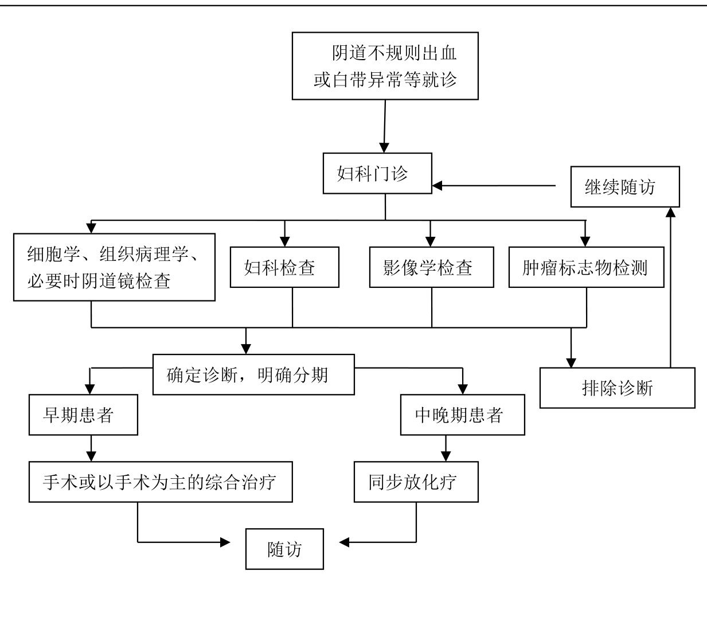

# 宫颈癌诊疗指南  

（2022 年版）  

# 一、概述  

子宫颈癌是常见的妇科恶性肿瘤之一, 发病率在我国女性恶性肿瘤中居第二位, 位于乳腺癌之后。2018 年全球新发子宫颈癌病例超过56.9 万例，死亡病例超过 31.1 万例。其中 $8 5 \%$ 的病例发生于发展中国家。我国 2015 年约有新发病例 11.1 万，死亡病例3.4 万。我国子宫颈癌死亡分布情况总体上农村略高于城市，中西部地区约为东部地区的两倍。我国子宫颈癌患者中位发病年龄是51 岁，但主要好发于 2 个年龄段，以 $4 0 \sim 5 0$ 岁为最多， $6 0 \sim 7 0$ 岁又有一高峰出现，20 岁以前少见。然而值得关注的是近年来子宫颈癌的平均发病年龄在逐渐降低，有年轻化趋势。因此，十分有必要在全国范围内规范宫颈癌的诊断与治疗。另一方面，宫颈癌的发生可通过对癌前病变的检查和处理得以有效控制。西方国家的经验显示，宫颈癌的发生率在密切筛查的人群中减少了$70 \% { \sim } 9 0 \%$ 。2020 年 11 月 17 日，WHO 启动了“加速消除宫颈癌”的全球战略 。  

本指南适用于宫颈鳞癌、腺癌及腺鳞癌，占所有宫颈癌的 $90 \%$ 以上。部分特殊病理类型，如小细胞癌、透明细胞癌、肉瘤等发病率低，目前国际国内尚未达成共识，故本指南不适合用于这些少见病理类型的宫颈癌。本指南借鉴了国际上公认的宫颈癌诊疗指南，如美国国家综合癌症网络（national comprehensive cancernetwork，NCCN）指南、国际妇产科联盟（international federationof gynecology and obstetrics，FIGO）指南等，并结合我国以往指南进行修订。在临床实践中，宫颈癌注重规范化综合治疗理念，同时也注重个体化治疗，需结合医院的设备、技术条件以及患者的病情进行治疗。对于病情复杂的宫颈癌患者，本指南未涵盖的，建议参加临床试验。  

# 二、病因学  

目前已经明确高危型人乳头瘤病毒（human papilloma virus，HPV）持续感染是宫颈癌及癌前病变发生的必要因素，即宫颈发生癌变的过程中，HPV 感染是最为关键的环节。在妇女一生中，感染高危型HPV 的概率达 $70 \%$ 以上，但只有不到 $10 \%$ 的妇女发展成宫颈癌或宫颈上皮内瘤变（cervical intraepithelial neoplasia，CIN），主要原因是 $80 \%$ 的妇女的 HPV 感染为一过性。除持续性高危型HPV 感染的作用外，还需要其他内源性和外源性因子的共同参与和作用，才能造成宫颈癌的发生。所以可以将引发子宫颈癌的危险因素分为两类：一是生物学因素，即高危型 HPV 持续感染；二是外源性的行为性危险因素。  

# （一）HPV 感染。  

目前已发现和鉴定出 200 多个亚型的 HPV，大约有 54 种可以感染生殖道黏膜。依据各型HPV 与子宫颈癌发生的危险性不同分为高危型和低危型。高危型（如 HPV16、18、31、33、35、39、45、51、52、56、58、59、68 型）与子宫颈癌的发生相关，尤其是HPV16 型和 18 型和子宫颈癌关系最为密切。低危型 HPV（如  

6、11、42、43、44 型）感染则可能引起生殖器及肛周湿疣。目前人乳头瘤病毒疫苗已在国内上市，可以按照适宜的年龄进行推广接种，以预防宫颈癌前病变及宫颈癌。  

# （二）行为性危险因素。  

1.由于 HPV 主要是通过性传播，所以一些可能增加HPV 感染的因素如初次性生活开始年龄小、多个性伴侣或性伴侣有多个性伙伴、性卫生不良或者有性传播疾病病史会增加 HPV 感染风险，从而增加宫颈癌的发生风险。  

2.月经及孕产因素：早婚、早育，多孕多产、经期、产褥期卫生不良。  

3.吸烟。  

4.口服避孕药。  

5.自身免疫性疾病或者长期免疫抑制（如肾移植患者需要长期口服免疫抑制药物）。  

6.营养状况不良，营养失调：如 $\beta$ 胡萝卜素、叶酸、维生素A、 维生素C 缺乏、微量元素的失衡等。  

# 三、临床表现  

# （一）症状。  

宫颈癌前病变和宫颈癌早期可以没有任何症状，随着病变严重程度的增加，会出现接触性阴道出血，异常白带如血性白带、白带增多, 不规则阴道出血或绝经后阴道出血。晚期宫颈癌还可出现阴道大量出血，可合并有水样甚至米汤样白带，另外可能出现由于肿瘤侵犯其他器官所导致的相应症状，如侵犯膀胱可出现血尿，侵犯直肠可出现血便，肿瘤侵透膀胱、直肠可出现瘘，侵犯宫旁压迫输尿管导致肾盂积水可能出现腰疼，肺转移可能导致咳嗽、咯血等相关症状；肿瘤合并感染可出现发热症状；也可有肾功能衰竭及恶病质情况。  

# （二）体征。  

宫颈早期浸润癌（ⅠA1 期和ⅠA2 期）可能没有任何相关异常体征，宫颈浸润癌（ⅠB1 期以上）通过妇科检查可发现宫颈肿物，大体上可分为菜花型、结节型、溃疡型以及颈管型，颈管型有时候表现为宫颈表面光滑，仅宫颈管明显增粗，质地变硬。如果阴道受侵可发现阴道穹窿或阴道壁肿瘤。宫旁受累患者妇科检查三合诊可发现宫旁增厚，如ⅢB 期患者肿瘤一直延伸到盆壁；晚期患者可能在腹股沟或锁骨上区域扪及肿大淋巴结。  

# 四、诊断检查  

# （一）宫颈/阴道细胞学涂片检查及HPV 检测。  

宫颈/阴道细胞学涂片检查及 HPV 检测是现阶段发现早期宫颈癌及癌前病变（CIN）的初筛手段，特别是对临床体征不明显的早期病变的诊断。取材应在宫颈上皮的移行带处，即新旧鳞-柱上皮交界间的区域。目前主要采用宫颈液基薄层细胞学检查（thin-prep cytology test，TCT）。HPV 检测可以作为 TCT 的有效补充，二者联合有利于提高筛查效率。对于 HPV16 及 18 型阳性的患者建议直接转诊阴道镜，进行组织学活检。  

# （二）阴道镜检查。  

阴道镜检查对发现子宫颈癌前病变、早期子宫颈癌、确定病变部位有重要作用，可提高活检的阳性率。在不具备阴道镜的医疗单位，也可以应用 $3 \%$ 或 $5 \%$ 醋酸后或碘溶液涂抹宫颈后肉眼观察，在有醋白上皮或碘不着色处取活检，送病理检查。阴道镜活检的同时应注意宫颈管刮术的重要性，特别是当阴道镜检查发现鳞状上皮内病变自转化区延伸至宫颈管内、细胞学筛查提示有非典型腺细胞及阴道镜下未见鳞-柱转化区等情况时。只有专业的阴道镜医师才能决定可以省略宫颈管刮术，否则所有接受阴道镜活检的患者均要做颈管刮术。  

# （三）妇科检查。  

妇科检查是临床分期最重要手段，临床分期需要 2 名副高以上职称妇科医生决定，分期一旦确定, 治疗后不能改变分期。  

# 1.视诊  

应在充足照明条件下进行，直接观察外阴和通过阴道窥器观察阴道及宫颈。除一般观察外应注意癌浸润范围，宫颈肿瘤的位置、范围、形状、体积及与周围组织的关系。  

# 2.触诊  

肿瘤的质地、浸润范围及其与周围的关系等必须通过触诊来确定。有些黏膜下及颈管内浸润，触诊比视诊更准确。三合诊检查可了解阴道旁、宫颈旁及子宫旁有无浸润，肿瘤与盆壁关系，子宫骶骨韧带、子宫直肠陷凹、直肠本身及周围情况等。  

# （四）病理诊断。  

阴道镜或直视下的宫颈组织学活检病理检查是最终确诊的金标准。对于少见或疑难病理类型（如腺癌或小细胞癌等），应行免疫组化检查协助鉴别和诊断。对于多次咬取活检仍不能确诊者，需进一步采取较深部组织时可用切取法。当宫颈表面活检阴性、阴道细胞学涂片检查阳性或影像检查不能排除宫颈管癌时，可行宫颈锥形切除送病理检查。由于宫颈活检组织较小，无法完全确定宫颈病变的浸润深度和范围，故对于ⅠA1 期和ⅠA2 期的宫颈早期浸润癌的确诊，必须通过宫颈锥切术的术后病理才能最终确诊宫颈病变范围是否为早期浸润癌。  

# （五）影像学检查。  

由于解剖部位表浅，绝大多数子宫颈癌经妇科检查及细胞病理学检查即可被确诊。在子宫颈癌诊断中影像学检查的价值主要是对肿瘤转移、侵犯范围和程度的了解（包括评价肿瘤局部侵犯的范围，淋巴结转移及远处器官转移等），以指导临床决策并用于疗效评价。用于子宫颈癌的影像检查方法包括：  

# 1. 腹盆腔超声  

主要用于宫颈局部病变的观察，同时可以观察盆腔及腹膜后区淋巴结转移情况，以及腹盆腔其他脏器的转移情况，另外可发现浅表淋巴结的转移情况。由于分辨率的限制，目前对于宫颈局部病变以及全身转移情况的评估主要还是依靠核磁和 CT 检查。  

# 2. 盆腔 MRI  

无辐射，多序列、多参数成像，具有优异的软组织分辨力，是子宫颈癌最佳影像学检查方法，有助于病变的检出和大小、位置的判断，尤其对活检为 CIN3 患者可用于除外内生性病变；明确病变侵犯范围，提供治疗前分期的重要依据，可显示病变侵犯宫颈基质的深度，判断病变局限于宫颈、侵犯宫旁或是否侵犯盆壁，能够显示阴道内病变的范围，但有时对病变突入阴道腔内贴邻阴道壁与直接侵犯阴道壁难以鉴别；能够提示膀胱、直肠壁的侵犯，但需结合镜检。同时检出盆腔、腹膜后区及腹股沟区的淋巴结转移。对于非手术治疗的患者，可用于放疗靶区勾画、治疗中疗效监测、治疗末疗效评估及治疗后随诊。  

# 3. 腹盆腔 CT：  

CT 软组织分辨力低，平扫病变与正常子宫颈密度相近，尤其对局限于宫颈的早期子宫颈癌观察效果差；增强 CT 扫描对比度优于平扫，但仍有近1/2 的病变呈等密度而难以明确范围。CT 的优势主要在于显示中晚期病变方面，评价宫颈病变与周围结构（如膀胱、直肠等）的关系，淋巴结转移情况，以及大范围扫描腹盆腔其他器官是否存在转移。对于有核磁禁忌证的患者可选择 CT检查。  

# 4. 胸部射线摄影及胸部CT 检查  

主要目的是为了排除肺转移和纵隔淋巴结转移，胸片只能除外明显肺转移，无法评估纵隔淋巴结，所以有条件的医院还是应该行胸部CT 检查。  

# 5. 核医学影像检查  

不推荐使用正电子发射计算机体层成像（positron emissiontomography-computed tomography，PET-CT）评价宫颈癌的局部浸润情况，但对于下列情况，推荐有条件者使用 PET-CT：（1）FIGO分期为ⅠB1 期及以上的初诊患者疗前分期（包括ⅠB1 期有保留生育功能需求的患者）；（2）因其他原因行单纯子宫切除术意外发现宫颈癌拟全身评估者；（3）拟行放射治疗需影像辅助勾画靶区；（4）存在高危因素的患者治疗结束 $3 \sim 6$ 个月后随访监测；（5）随访过程中可疑出现复发转移的患者，包括出现临床症状或相关肿瘤标志物升高。核素骨扫描仅用于怀疑有骨转移的患者。  

# 6.腔镜检查  

膀胱镜、直肠镜：临床上怀疑膀胱或直肠受侵的患者应对其进行相应腔镜检查。没有条件的单位应转上级医院诊治。  

# （六）肿瘤标志物检查。  

肿瘤标志物异常升高可以协助诊断、疗效评价、病情监测和治疗后的随访监测，尤其在随访监测中具有重要作用。鳞癌相关抗原是宫颈鳞状细胞癌的重要标志物，血清鳞癌相关抗原水平超过 $1 . 5 \mathrm { n g / m l }$ 被视为异常。因宫颈癌以鳞状细胞癌最为常见，所以鳞癌相关抗原是子宫颈癌诊治过程中最常被检测的血清学肿瘤标志物。宫颈腺癌可以有癌胚抗原、糖类抗原（carbohydrate antigen，CA）125 或 CA19-9 的升高。  

# 五、子宫颈癌的分类和分期  

# （一）子宫颈癌的组织学分类。  

子宫颈癌主要包括宫颈鳞状细胞癌、腺癌、腺鳞癌及其他少见类型。其中鳞状细胞癌最常见，约占 $80 \%$ ，腺癌占 $1 5 \% \sim 2 0 \%$ 。随着子宫颈癌普查工作的开展，宫颈鳞状细胞癌的发生率及死亡率均呈下降趋势，但腺癌的发生率近 30 年来却呈上升趋势。各种病理类型中鳞癌的预后最好，宫颈腺癌和腺鳞癌的预后相对较差，这种差别在晚期患者中更为明显。目前宫颈恶性肿瘤病理类型主要参照世界卫生组织公布的病理分型（WHO，2014）（表 1）。  

表 1 宫颈肿瘤组织学分类及编码（WHO，2014）  

<html><body><table><tr><td colspan="2">肿瘤组织学分类</td><td>编码</td></tr><tr><td colspan="2">上皮肿瘤</td><td></td></tr><tr><td>鳞癌和前驱病变</td><td></td><td></td></tr><tr><td></td><td>鳞状上皮内病变</td><td></td></tr><tr><td></td><td>低级别鳞状上皮内病变</td><td>8077/0</td></tr><tr><td></td><td>高级别鳞状上皮内病变</td><td>8077/2</td></tr><tr><td></td><td>鳞状细胞癌，非特殊型（NOS）</td><td>8070/3</td></tr><tr><td></td><td>角化型癌</td><td>8071/3</td></tr><tr><td></td><td>非角化型癌</td><td>8072/3</td></tr><tr><td></td><td>乳头状鳞癌</td><td>8052/3</td></tr><tr><td></td><td>基底样癌</td><td>8083/3</td></tr><tr><td></td><td>湿疣性癌</td><td>8051/3</td></tr><tr><td></td><td>疣状癌</td><td>8051/3</td></tr><tr><td></td><td>鳞状-移行细胞癌</td><td>8120/3</td></tr><tr><td></td><td>淋巴上皮瘤样癌</td><td>8082/3</td></tr><tr><td colspan="2">良性鳞状上皮病变</td><td></td></tr><tr><td></td><td>鳞状化生</td><td></td></tr><tr><td></td><td>尖锐湿疣</td><td></td></tr><tr><td></td><td>鳞状上皮乳头状瘤</td><td>8052/0</td></tr></table></body></html>  

<html><body><table><tr><td colspan="2">移行细胞化生</td></tr><tr><td colspan="2">腺癌和前驱病变</td></tr><tr><td></td><td>原位腺癌 8140/2</td></tr><tr><td></td><td>腺癌 8140/3</td></tr><tr><td></td><td>子宫颈腺癌，普通型 8140/3</td></tr><tr><td></td><td>黏液性癌，非特殊型（NOS） 8480/3 8482/3</td></tr><tr><td></td><td>胃型 肠型 8144/3</td></tr><tr><td></td><td>印戒细胞型 8490/3</td></tr><tr><td></td><td>绒毛管状腺癌 8263/3</td></tr><tr><td></td><td>子宫内膜样癌 8380/3</td></tr><tr><td></td><td>透明细胞癌 8310/3</td></tr><tr><td></td><td>浆液性癌 8441/3 中肾管癌 9110/3</td></tr><tr><td></td><td>混合性腺癌-神经内分泌癌 8574/3</td></tr><tr><td colspan="2">良性腺上皮肿瘤和瘤样病变</td></tr><tr><td></td><td>子宫颈息肉</td></tr><tr><td></td><td>苗勒上皮乳头状瘤</td></tr><tr><td></td><td>纳氏囊肿 隧道样腺丛</td></tr><tr><td></td><td>微腺体增生</td></tr><tr><td></td><td colspan="2">小叶状子宫颈腺体增生</td></tr></table></body></html>  

<html><body><table><tr><td></td><td colspan="2">弥漫性层状子宫颈管腺体增生</td></tr><tr><td></td><td>中肾管残余和增生</td><td></td></tr><tr><td></td><td>阿-斯反应</td><td></td></tr><tr><td></td><td>子宫颈管内膜异位</td><td></td></tr><tr><td></td><td>子宫内膜异位</td><td></td></tr><tr><td></td><td>输卵管子宫内膜样化生</td><td></td></tr><tr><td></td><td>异位前列腺组织</td><td></td></tr><tr><td colspan="2">其他上皮肿瘤</td><td></td></tr><tr><td>腺鳞癌</td><td></td><td>8560/3</td></tr><tr><td></td><td>毛玻璃细胞癌 腺样基底细胞癌</td><td>8015/3 8098/3</td></tr><tr><td></td><td>腺样囊性癌</td><td>8200/3</td></tr><tr><td>未分化癌</td><td></td><td>8020/3</td></tr><tr><td colspan="2">神经内分泌肿瘤</td><td></td></tr><tr><td colspan="2"></td><td></td></tr><tr><td></td><td>低级别神经内分泌肿瘤 类癌 非典型类癌</td><td>8240/3 8249/3</td></tr><tr><td></td><td>高级别神经内分泌癌</td><td>小细胞神经内分泌癌（小细胞癌)</td><td>8041/3</td></tr><tr><td></td><td>大细胞神经内分泌癌</td><td></td><td>8013/3</td></tr><tr><td colspan="4">间叶肿瘤和瘤样病变</td></tr><tr><td colspan="4">良性</td></tr></table></body></html>  

<html><body><table><tr><td></td><td>平滑肌瘤</td><td>8890/0</td></tr><tr><td></td><td>横纹肌瘤</td><td>8905/0</td></tr><tr><td>其他</td><td></td><td></td></tr><tr><td colspan="2">恶性</td><td></td></tr><tr><td></td><td>平滑肌肉瘤</td><td>8890/3</td></tr><tr><td></td><td>横纹肌肉瘤</td><td>8910/3</td></tr><tr><td></td><td>腺泡状软组织肉瘤</td><td>9581/3</td></tr><tr><td></td><td>血管肉瘤</td><td>9120/3 9540/3</td></tr><tr><td></td><td colspan="2">恶性外周神经鞘瘤</td></tr><tr><td></td><td>其他肉瘤</td><td></td></tr><tr><td></td><td>脂肪肉瘤 未分化宫颈肉瘤</td><td>8850/3</td></tr><tr><td></td><td>尤因肉瘤</td><td>8805/3 9364/3</td></tr><tr><td>瘤样病变</td><td></td><td></td></tr><tr><td></td><td>手术后梭形细胞结节</td><td></td></tr><tr><td></td><td>淋巴瘤样病变</td><td></td></tr><tr><td colspan="3">混合性上皮-间叶肿瘤</td></tr><tr><td></td><td>腺肌瘤</td><td>8932/0</td></tr><tr><td></td><td>腺肉瘤</td><td>8933/3</td></tr><tr><td>癌肉瘤 黑色素肿瘤</td><td></td><td>8980/3</td></tr><tr><td colspan="3"></td></tr><tr><td>蓝痣</td><td></td><td>8780/0</td></tr></table></body></html>  

<html><body><table><tr><td>恶性黑色素瘤</td><td>8720/3</td></tr><tr><td colspan="2">生殖细胞肿瘤</td></tr><tr><td>卵黄囊瘤</td><td></td></tr><tr><td colspan="2">淋巴和髓系肿瘤</td></tr><tr><td>淋巴瘤</td><td></td></tr><tr><td>髓系肿瘤</td><td></td></tr><tr><td colspan="2">继发性肿瘤</td></tr></table></body></html>  

# （二）子宫颈癌的分期。  

目前采用的是FIGO 2018年会议修改的宫颈癌临床分期标准。由妇科检查确定临床分期（表 2）。本版分期标准相对于上一版进行了比较大的改动，首先是在ⅠA 期诊断中，不再考虑水平间质浸润宽度，新版标准仅根据间质浸润深度来区分ⅠA1 期和ⅠA2期，主要是考虑宽度可能会受人为因素的影响。其次是细化了ⅠB期的亚分期，由原来的 2 个亚分期增加到 3 个亚分期，这样更有利于对患者术后辅助治疗选择和预后判断。最后一个重要的变化就是将淋巴结转移纳入分期系统，将淋巴结转移定义为ⅢC 期，而且增加了淋巴结转移的证据标注（r 代表影像学发现淋巴结转移，p 代表病理学证实）。  

表 2 国际妇产科联盟宫颈癌临床分期标准（FIGO 2018）  

<html><body><table><tr><td>分期</td><td>描述</td></tr><tr><td>一</td><td>肿瘤严格局限于宫颈（扩展至宫体将被忽略)</td></tr><tr><td>IA</td><td>仅能在显微镜下诊断的浸润癌，所测量的最大浸润深度≤5.0mm</td></tr></table></body></html>  

<html><body><table><tr><td></td><td>的浸润癌</td></tr><tr><td>I A1</td><td>所测量间质浸润深度<3.0mm</td></tr><tr><td>I A2 IB</td><td>所测量间质浸润深度≥3.0mm而≤5.0mm 所测量的最大浸润深度>5.0mm 的浸润癌(病变范围超过 I A期),</td></tr><tr><td>I B1</td><td>病变局限于宫颈。 间质浸润深度>5.0mm 而最大径线≤2.0cm 的浸润癌</td></tr><tr><td>I B2</td><td>最大径线>2.0cm而≤4.0cm的浸润癌</td></tr><tr><td>I B3</td><td>最大径线>4.0cm 的浸润癌</td></tr><tr><td>Ⅱ</td><td>宫颈肿瘤侵犯超出子宫，但未达盆壁且未达阴道下1/3</td></tr><tr><td>II A</td><td>肿瘤侵犯限于阴道上2/3，无宫旁浸润。</td></tr><tr><td>II A1 II A2</td><td>最大径线≤4cm 的浸润癌 最大径线>4.0cm 的浸润癌</td></tr><tr><td>IIB IⅢ</td><td>有宫旁浸润，但未扩展至盆壁 肿瘤扩展到骨盆壁和/或累及阴道下1/3 和/或导致肾孟积水或肾</td></tr><tr><td></td><td>无功能者和/或侵犯盆腔和/或腹主动脉旁淋巴结</td></tr><tr><td>IⅢIA</td><td>肿瘤累及阴道下1/3，没有扩展到骨盆壁</td></tr><tr><td>IⅢIB IIIC</td><td>肿瘤扩展到骨盆壁和/或引起肾孟积水或肾无功能 侵犯盆腔和/或腹主动脉旁淋巴结（包括微转移)，无论肿瘤大小</td></tr><tr><td></td><td>和范围（需标注r或p，r表示影像诊断，p表示病理诊断）</td></tr><tr><td>IIIC1</td><td>仅有盆腔淋巴结转移</td></tr><tr><td>IIIC2</td><td>腹主动脉旁淋巴结转移</td></tr><tr><td>IV</td><td>肿瘤侵犯膀胱或直肠黏膜（病理证实）或肿瘤播散超出真骨盆。</td></tr></table></body></html>  

<html><body><table><tr><td></td><td>泡状水肿不能分为IV期</td></tr><tr><td>IVA</td><td>肿瘤侵犯膀胱或直肠黏膜</td></tr><tr><td>IVB</td><td>肿瘤播散至远处器官</td></tr></table></body></html>  

# 六、治疗  

# （一）子宫颈癌的治疗方式。  

1.宫颈镜下浸润癌（微小浸润癌）  

即ⅠA 期，由于ⅠA 期肿瘤的判定依据显微镜下测量，咬取活检标本不能包含全部病变，无法进行病变范围的测量，故正确诊断需行锥切活检，准确地诊断ⅠA 期宫颈癌需对切缘阴性的锥切标本进行细致的病理检查。  

ⅠA1 期无生育要求者可行筋膜外全子宫切除术（I型子宫切除术）。如患者有生育要求，可行宫颈锥切术，切缘阴性则定期随访。因ⅠA1 期淋巴结转移率 $< 1 \%$ ，目前认为ⅠA1 期无需行淋巴结切除术。如淋巴脉管间隙受侵可行宫颈锥切术（切缘阴性）或改良根治性子宫切除术并实施盆腔淋巴结切除术。  

ⅠA2 期宫颈癌淋巴结转移率约为 $3 \% { \sim } 5 \%$ ，可行次广泛子宫切除术（Ⅱ型改良根治性子宫切除术）加盆腔淋巴结切除术。要求保留生育功能者，可选择宫颈锥切术（切缘阴性）或根治性宫颈切除术及盆腔淋巴结切除术（对于有生育要求的患者建议施根治性宫颈切除术）。  

# 2. 宫颈浸润癌  

（1）ⅠB1、IIB2、ⅡA1 期：采用手术或放疗，预后均良好。  

手术方式为Ⅲ型根治性子宫切除术和盆腔淋巴结切除术±腹主动脉淋巴结取样术。术后辅助治疗参见放射治疗。要求保留生育功能者，如宫颈肿瘤直径不超过 2cm，可选择根治性宫颈切除术加盆腔淋巴结切除术 $\boldsymbol { \cdot } \pm$ 腹主动脉淋巴结取样术。  

（2）ⅠB3、ⅡA2 期：可选择的治疗方法有： $\textcircled{1}$ 同步放化疗；$\textcircled{2}$ 根治性子宫切除及盆腔淋巴清扫、腹主动脉淋巴结取样、术后个体化辅助治疗； $\textcircled{3}$ 新辅助化疗后手术； $\textcircled{4}$ 同步放化疗后辅助子宫切除术。以上方法首选同步放化疗。FIGO 指南（2018 年）推荐的局部晚期宫颈癌的治疗还包括另外一种选择即新辅助化疗后行根治性子宫切除术及淋巴结切除术。目前对于新辅助化疗后再手术对于宫颈癌患者预后的影响还存在争议，故一般推荐在临床试验中或者无放疗条件的区域，对于放疗相对不敏感的病理类型（如腺癌）尤其适合。  

ⅠB 期总的5 年生存率约 $8 0 \% { \sim } 9 0 \%$ ，其中宫颈肿瘤直径大于4cm，有淋巴结转移、宫旁受侵和/或切缘阳性等高危因素者 5 年生存率仅 $4 0 \% { \sim } 7 0 \%$ 。对部分早期初治宫颈癌患者选择治疗方法时，应考虑到有高危因素的患者可能选择放化疗更为有利。目前认为局部晚期患者的标准治疗仍是同步放化疗。  

（3） $\mathrm { I I } \mathrm { B } { \sim } \mathrm { I V } \mathrm { A }$ 期：同步放化疗（具体方案见放射治疗及增敏化疗）（4）ⅣB 期：以系统治疗为主，支持治疗相辅助，部分患者可联合局部手术或个体化放疗。  

# （二）外科治疗。  

手术治疗主要应用于早期宫颈癌，即 $\mathrm { ~ I ~ A ~ } \tilde { } \tilde { } \mathrm { ~ I ~ I ~ A ~ }$ 期。手术包括子宫切除与淋巴结切除两部分。不同的分期所需要切除的范围有所不同。为了更好的描述手术切除范围有多位学者尝试提出了多种宫颈癌手术的分型系统，其中 Piver 分型和 Q-M 分型是被国内外大多数学者所接受和采用的宫颈癌手术分型系统。  

1.Piver 手术分型系统  

1974 年提出的Piver 5 型子宫切除手术分类系统至今仍广泛应用。  

Ⅰ型：筋膜外子宫切除术。［适用于ⅠA1 期不伴有淋巴血管间隙受侵（lymph-vascular space invasion，LVSI）的患者］  

Ⅱ型：改良根治性子宫切除术，切除范围还包括 1/2 骶、主韧带和上1/3 阴道。（适用于ⅠA1 伴有 LVSI 及ⅠA2 期患者）  

Ⅲ型：根治性子宫切除术，切除范围包括毗邻盆壁切除主韧带、从骶骨附着处切除骶韧带及切除上1/2 阴道。（为标准的宫颈癌根治手术，适用于ⅠB1、ⅠB2，选择性ⅠB3/ⅡA1 期患者）  

Ⅳ型：扩大根治性子宫切除术。（适用于部分复发患者）  

V 型：盆腔脏器廓清术。（适用于部分ⅣA 期及复发患者）  

# 2.Q-M 手术分型  

为了更加准确描述手术范围和更好的个体化手术方案，2008年法国专家Querleu 和Morrow 在参考和咨询了世界各国的解剖学和宫颈癌手术医生的意见后，综合完成了宫颈癌根治术的新分型，这种基于三维解剖结构的分型也称Q-M 分型。2015 年，美国NCCN指南建议采用Q-M 分型 。  

Q-M 分型包含子宫的手术分型及淋巴结清扫分级两部分。其中手术分型仅与宫旁切除范围有关，宫旁切除范围以固定解剖结构为分界。  

A 型（子宫颈旁最少切除型）子宫颈旁组织切除至输尿管内侧，但在子宫颈外侧宫骶韧带及膀胱子宫韧带基本不切除，阴道切除<1cm,不切除阴道旁组织。（适用于ⅠA1 期不伴有LVSI 的患者）  

B 型（切除子宫颈旁组织达输尿管）子宫颈旁组织切除达输尿管隧道水平，部分切除宫骶及膀胱子宫韧带，不切除子宫颈旁组织中子宫深静脉下方的骶神经丛，阴道切除至少1cm（适用于ⅠA1伴有 LVSI 及ⅠA2 期患者）  

B1 如上描述B2 如上描述并宫旁淋巴结切除  

C 型（切除子宫颈旁组织至与髂内血管系统交界处）切除膀胱子宫韧带在膀胱水平，切除距肿瘤或子宫颈下缘 $1 . 5 \sim 2 \mathrm { c m }$ 的阴道及与之相关的阴道旁组织（适用于ⅠB1、ⅠB2，选择性ⅠB3/ⅡA1期患者）  

C1 保留自主神经  

C2 不保留自主神经  

D 型（外侧扩大切除）切除子宫颈旁组织达盆壁，血管达髂内血管系统之上，暴露坐骨神经根完全游离（适用于部分ⅣA 期及复发患者）  

D1 切除子宫颈旁组织达盆壁D2 如上描述，并切除下腹下血管及附属筋膜或肌肉组织（盆  

腔内扩大切除）  

淋巴结清扫分级: 腹膜后淋巴结切除的范围，以动脉为解剖标志分为4 级。闭孔淋巴结默认为常规切除。1 级：切除髂内外动脉周围淋巴结，与 2 级分界标志为髂内、外动脉分叉处；2 级：切除髂总动脉周围淋巴结，与 3 级分界标志为腹主动脉分叉处；3 级：切除腹主动脉旁淋巴结至肠系膜下动脉水平；4 级：淋巴结切除至腹主动脉左肾静脉下水平。  

由于根治性子宫切除术对盆腔自主神经的损伤导致患者术后发生膀胱功能异常、结直肠蠕动功能异常以及性功能异常，保留神经的根治性子宫切除术（nerve-sparing radical hysterectomy，NSRH）不断得到研究和推广，NSRH 手术属于 Q-M 分型的 C1 型根治，NSRH 可通过开腹、腹腔镜及机器人腹腔镜途径完成。  

筋膜外子宫切除术（Ⅰ型或 A 型）可采取经阴道或开腹或微创（腹腔镜及机器人腹腔镜）途径入路。目前有前瞻性随机对照试验表明，微创根治性子宫切除术与开腹根治性子宫切除术相比，无病生存率和总体生存率较低。  

宫颈癌手术中淋巴结切除范围涉及盆腔淋巴结及腹主动脉淋巴结。ⅠA1（伴 LVSI）至ⅡA 期均应行盆腔淋巴结切除术 $\pm$ 腹主动脉旁淋巴结取样术。研究显示，Ⅰ期和Ⅱ期宫颈癌患者术后盆腔淋巴结转移率分别为 $0 { \sim } 1 6 . 0 \%$ 和 $2 4 . 5 \% { \sim } 3 1 . 0 \%$ ，因此，根据前哨淋巴结转移状况进行选择性淋巴结切除可降低宫颈癌患者术后并发症的发生率。前哨淋巴结检测应用的示踪剂有生物染料、放射性同位素和荧光染料，可通过肉眼识别、核素探测或红外线探测。系统性淋巴结切除术及前哨淋巴结定位切除均可通过开腹、腹腔镜及机器人腹腔镜途径完成。  

$\mathrm { \Delta I \sim I I A }$ 期宫颈鳞癌卵巢转移率低于 $1 \%$ ，对要求保留卵巢功能的未绝经患者术中可以保留外观正常的卵巢。目前认为宫颈腺癌发生隐匿性卵巢转移的概率较高，故保留卵巢应慎重。术中可将所保留的卵巢进行移位（如腹腔内或腹膜后结肠旁沟高位处），以避免术后盆腔放疗对卵巢功能的损伤。  

近年来对一些渴望生育的早期、无淋巴结转移的年轻宫颈癌患者施行保留生育功能的手术。ⅠA1 期无 LVSI 可行切缘阴性的宫颈锥切术，如病变范围广可行宫颈切除术；ⅠA1 伴 LVSI 及ⅠA2期患者可行切缘阴性（阴性切缘宽度最好达3mm）的宫颈锥切术/宫颈切除术 $+$ 经腹或腹腔镜下盆腔淋巴结切除术 $\pm$ 腹主动脉旁淋巴结取样术，或实施经腹、经阴道或腹腔镜下根治性宫颈切除术 $+$ 盆腔淋巴结切除术 $\pm$ 腹主动脉旁淋巴结取样术；ⅠB1 期（ $< 2 \mathrm { c m }$ ）采用根治性宫颈切除术 $+$ 盆腔淋巴结切除术±腹主动脉旁淋巴结取样术。对于 $\mathrm { ~ I ~ A 2 \sim \mathrm { ~ I ~ B 1 ~ } }$ 期伴 LVSI 及ⅠB2 期的患者是否可行保留生育功能的手术目前尚无统一结论，需慎重考虑。  

宫颈癌患者术后需根据复发危险因素选择辅助治疗，以降低复发率，改善预后，详见放射治疗原则部分。  

# （三）放射治疗。  

对于不具备放疗资质的医疗机构应及时转诊需要放疗的患者到有条件的医疗单位进行治疗；对未装备腔内后装近距离放疗设备的医疗单位，应建议需要腔内后装近距离放疗的宫颈癌患者在行外照射前到有相应设别的单位会诊咨询，做好双向转诊工作，以避免放疗中断。  

适用于各期宫颈癌。放疗包括体外照射和近距离放疗及二者联合应用。研究表明同步放化疗较单纯放疗提高了疗效，降低了复发风险。早期宫颈癌患者手术后早期子宫颈癌患者手术后病理学检查发现高危因素（手术切缘不净、宫旁受侵、淋巴结转移等）或中危因素（术中/后如发现肿瘤大、深部间质受侵和/或脉管间隙受侵）时需补充术后辅助放疗。  

# 1.放疗的原则  

恶性肿瘤的放疗原则与其他治疗手段一样，要最大限度地杀灭癌细胞，尽最大可能保护正常组织和重要器官，即尽量提高治疗效果，降低并发症。因此，适当的治疗工具、适宜的照射范围、足够的照射剂量、均匀的剂量分布、合理的照射体积、个别对待是放疗的基本要求。  

放疗完成的期限是获得最佳疗效的必备因素。放疗时间超过9周比少于7 周的患者有更高的盆腔控制失败率，推荐 56 天内完成所有的外照射和近距离放疗。  

行根治性放疗时，对肿瘤区域给予根治剂量照射，由于照射范围较大，照射剂量也高，因此，在治疗中要重点关注肿瘤附近的正常组织和器官，特别是一些对放射线敏感的组织和器官的防护。姑息性放疗的目的是为了减轻症状，减少患者痛苦，但不一定能延长患者的生存时间。根治性治疗与姑息性治疗是相对的，在治疗过程中可根据肿瘤及患者情况而互相转换。  

若放疗联合手术综合治疗时，要根据肿瘤情况及患者条件决定是否术后放疗。术前放疗是计划性的，其目的是通过术前放疗，降低癌细胞活力或减少种植和扩散的机率；缩小肿瘤范围，提高手术切除率；杀伤亚临床病灶，降低局部复发率。术后放疗是根据手术后病理检查结果决定，具有不良预后影响因素：如存有手术切缘不净、宫旁受侵、淋巴结转移任一高危因素，术后需辅助放化疗。术中/后如发现肿瘤大、深部间质受侵和/或脉管间隙受侵等中危因素，根据 2015 年 NCCN 指南的 Sedlis 标准（表 3），术后需辅助盆腔放疗或放化疗。如淋巴结转移、切缘阳性、宫旁浸润、深间质浸润、宫颈局部肿瘤体积大以及脉管瘤栓等，可行术后放疗，术后辅助放疗减少局部复发，提高疗效，但手术和放疗两种治疗并用也增加了治疗并发症。  

表3 宫颈癌合并中危因素者术后盆腔放疗指征  

<html><body><table><tr><td>LVSI</td><td>间质浸润深度</td><td>肿瘤直径（临床查体）</td></tr><tr><td>+</td><td>外 1/3</td><td>任何大小</td></tr><tr><td>+</td><td>中1/3</td><td>≥2cm</td></tr><tr><td></td><td>内 1/3</td><td>≥5cm</td></tr><tr><td></td><td>中1/3及外 1/3</td><td>≥4cm</td></tr></table></body></html>  

# 2.体外照射  

（1）常规放疗：即在模拟机或 CT 模拟机下定位下的放疗。  

靶区：一般应当包括子宫、宫颈、宫旁和上1/2 阴道，盆腔淋巴引流区如髂内、闭孔、髂外、髂总淋巴结。ⅢA 期患者包括全部阴道。必要时包括腹股沟区。采用四野箱式照射或等中心前后对穿照射。应用高能 $6 \sim 1 2 \mathrm { M V X }$ 射线。  

界限：上界：腹主分叉（一般在L3 下缘到L5 上缘之间）；下界：闭孔下缘（ⅢA 期患者除外），其端点与设野最宽处的连线约通过股骨内1/3；外界：在真骨盆外 $1 . 5 \sim 2 . 0 \mathrm { c m }$ ；前界：耻骨联合前缘（据不同肿瘤而定）；后界：全部骶骨在照射野内（据不同肿瘤而定）。应用多叶光栅或不规则挡铅屏蔽保护正常组织。  

剂量：采用常规分割照射，每次 $1 . 8 \sim 2 . 0 \mathrm { G y }$ ，每周 5 次。总剂量 $4 5 \sim 5 0 \mathrm { G y }$ ， $5 \sim 6$ 周。  

（2）三维适形放疗及调强适形放疗：以 CT 或 MRI 为基础的计划设计和适形遮挡技术是目前外放射治疗的标准治疗方法。对于不能手术的宫颈癌患者，正电子发射体层成像（positron emissiontomography，PET）检查有助于确定淋巴结转移的范围，也有助于术后患者是否还有残留阳性淋巴结的诊断。根据妇科检查以及影像学情况确定肿瘤靶区（gross target volume，GTV），以宫颈癌直接扩散和淋巴结转移途径确定临床靶区（clinical target volume，CTV）。外照射的治疗靶区需要包括子宫体、宫颈、宫旁、阴道（下界距离肿瘤至少 3 cm）和相应的淋巴引流区。如手术或影像学检查未发现阳性淋巴结，照射范围需包括髂外淋巴结、髂内淋巴结、闭孔淋巴结和骶前淋巴结引流区。如淋巴结转移的风险较大（如肿瘤体积≥4cm 或ⅡB 期以上或真骨盆内有可疑/确定淋巴结转移），照射范围还要包括髂总淋巴结区。如已发生髂总或腹主动脉旁淋巴结转移，则需进行盆腔延伸野及腹主动脉旁淋巴结照射，上界应达肾血管水平（或根据受累淋巴结的范围调整上界更高水平）。如病变已侵犯阴道下1/3，双侧腹股沟淋巴结也应包括在照射范围内。以 CTV 外放一定距离（ $0 . 5 { \sim } 1 . 5 \mathrm { c m } )$ 形成计划靶区（planningtarget volume，PTV）。放疗剂量： $4 5 { \sim } 5 0 \mathrm { G y } / 1 . 8 { \sim } 2 \mathrm { G y } / 5 { \sim } 6$ 周，同时评估危及器官，如直肠、乙状结肠、膀胱、小肠、骨骼等照射范围内危及器官。对于不能切除的实体肿瘤或体积局限的肉眼病灶或转移淋巴结，可以采用调强适形放疗技术对病灶进行加量放疗，追加剂量一般为 $1 0 { \sim } 2 0 \mathrm { G y } .$ 。  

# 3.近距离照射  

将密封的放射源直接放入人体的天然管腔内（如子宫腔、阴道等）为腔内照射。放射源直接放入肿瘤组织间进行照射为组织间照射，二者同属于近距离照射。宫颈癌的腔内放疗有其自然的有利条件，宫颈、宫体及阴道对放射线耐受量高、放射源距肿瘤最近、以较小的照射体积可取得较大的放疗效果。  

（1）体内照射的放射源：见表 4。  

表 4 常用近距离放射源  

<html><body><table><tr><td>放射源</td><td>镭-226</td><td>钴-60</td><td>艳-137</td><td>铱-192</td></tr><tr><td>放射比度（Ci／cm²）</td><td>2.1 最高3.8</td><td>1900</td><td>27.5</td><td>9000</td></tr><tr><td>半衰期</td><td>1590年</td><td>5.3年</td><td>33年</td><td>74天</td></tr></table></body></html>  

（2）传统的腔内照射法：斯德哥尔摩法、巴黎法、曼彻斯特法和北京法等，多使用的是镭、铯放射源，目前已较少使用。（3）后装腔内放疗及剂量计算：后装腔内放疗是先将空载的放射容器置于体腔内病变部位，然后在有防护屏蔽的条件下远距离地将放射源通过管道传输到容器内进行治疗。  

腔内放疗是宫颈癌根治性放疗中的重要治疗手段。采用宫腔管联合阴道施源器的腔内治疗方法最常用。根据患者及肿瘤的解剖特点选择不同的阴道施源器与宫腔管联合使用。当联合外放射治疗时，近距离放疗通常在放疗后期进行，这时肿瘤体积已明显缩小，使得施源器放置的部位能够达到近距离治疗的理想剂量几何形状分布。后装腔内治疗机根据其对 A 点放射剂量率的高低可分为 3 类：低剂量率（ $( 0 . 6 6 7 { \sim } 3 . 3 3 \mathrm { c G y / \ m i n } )$ 、中剂量率（3.33${ \sim } 2 0 \mathrm { c G y } / \operatorname* { m i n } )$ 、高剂量率（在20cGy／min 以上）。行根治性调强适形放疗时建议每周行锥形束CT 验证，第 3 周外照射放疗结束时行影像学评估确定是否需要修改放疗计划。  

一般情况下每周 $1 \sim 2$ 次，每周 A 点剂量在 $5 { \sim } 1 0 \mathrm { G y }$ ，A 点总剂量在 $2 0 { \sim } 4 5 \mathrm { G y }$ ，体外加腔疗总剂量不低于75Gy[2Gy 分次放射等效剂量（equivalent dose in 2Gy/f，EQD2）]，整个疗程体外加腔内放疗剂量因临床分期、肿瘤大小的不同而异，一般总剂量在$7 5 { \sim } 9 0 \mathrm { G y }$ 。直肠、膀胱 ICRU 参考点剂量限制在 A 点处方剂量的$6 0 \% \sim 7 0 \%$ 以下，最高不能超过 $80 \%$ ，超量者可考虑减少驻留点或降低处方剂量。NCCN 指南中对A 点的剂量推荐，是以传统的、经广泛验证的低剂量率和分割的近距离治疗为基础。在这个剂量系统里，体外照射采用每天 $1 . 8 { \sim } 2 \mathrm { G y }$ ，近距离放疗采用以低剂量率为 $4 0 { \sim } 7 0 ~ \mathrm { c G y / h }$ 时 A 点剂量。如果使用高剂量率进行近距离放疗，则需通过线性二次模型将 A 点高剂量率的剂量转换为具有相同生物学效应的低剂量率剂量，计算公式： $\scriptstyle \mathrm { E Q D 2 = D \times \hbar ( \ d + \alpha / \beta ) }$ $/ ( 2 + \alpha / \beta ) ,$ ，D 为实际物理总剂量， $\textrm { d }$ 为单次剂量，肿瘤组织 $\alpha / \beta { = } 1 0$ Gy，正常组织评估其晚反应时 $\alpha / \beta { = } 3 \mathrm { G y } \iota$ （直肠、膀胱、乙状结肠）。联合使用外放射治疗时，近距离放疗的剂量分割方案有多种选择，最常用的高剂量率近距离放疗是进行 4 次或 5 次宫腔和阴道施源器的置入，每次 A 点剂量为 6 或 7 Gy，A 点总剂量达到 28Gy/4次或 $3 0 \mathrm { G y } / 5$ 次，转化为低剂量率等效生物学剂量为 A 点 $4 0 \mathrm { G y }$ 。为了提高治疗效果，减少放疗并发症的危害，建议有条件医疗机构对腔内后装放疗采用图像引导的三维近距离放疗技术。  

但由于没有考虑到肿瘤的三维形状及肿瘤与正常组织结构的相互关系，A 点和 ICRU 直肠、膀胱参考点有很大局限性。已有证据表明，图像引导的近距离放疗可以提高患者的生存率并减少治疗副反应。MRI 是最佳的残留肿瘤评估的影像方法，最好在近距离治疗前行 MRI 检查。没有 MRI 设备时也可以使用 CT，但 CT对病灶范围的确定及靶区的勾画都远不如 MRI 准确。近距离放疗的剂量目标以 EQD2 计算，小肿瘤和消退迅速的肿瘤可以适当减少近距离放疗的剂量。三维后装建议采用欧洲近距离放疗学组和欧洲放射肿瘤学会推荐的三维后装治疗的 GTV、CTV 概念，应用MRI 图像勾画靶区，以T2WI 序列所示的肿瘤范围为GTV。将CTV按照肿瘤负荷和复发的危险程度分3 类：高危CTV（high risk CTV，HR-CTV）包括宫颈和肉眼可见的肿瘤侵犯的范围；中危 CTV（intermediate risk CTV，IR-CTV）表示明显的显微镜下肿瘤区，推荐包括外照射开始前的肿瘤范围；低危 CTV 指可能的显微镜下播散区，一般用手术或外照射处理。建议以 D90、D100 评估 GTV、HR-CTV 和 IR-CTV 的剂量，以 $\mathrm { V } _ { 1 5 0 } , \mathrm { V } _ { 2 0 0 }$ 评估高剂量体积；以$\mathrm { D } _ { 1 \mathrm { c m } 3 \setminus \mathrm { ~ D } _ { 2 \mathrm { c m } 3 } }$ 评估危及器官受量。A 点剂量仍需报告，作为评价靶区剂量的参考。HR-CTV 剂量达到 $8 0 \mathrm { G y }$ ，对于肿瘤体积大或退缩不佳病灶，剂量应该 ${ \geq } 8 7 ~ \mathrm { G y }$ 。根据已公布的指南，正常组织的限定剂量为：直肠 $2 \mathrm { c m } ^ { 3 } { \le } 6 5 \sim 7 5 \mathrm { G y }$ ；乙状结肠 $2 \mathrm { c m } ^ { 3 } { \le } 7 0 { \sim } 7 5 \ \mathrm { G y }$ ；膀胱 $2 \mathrm { c m } ^ { 3 } { \le } 8 0 { \sim } 9 0 \mathrm { G y }$ 。如果达不到这些参数要求，应该考虑增加组织间插植技术来提高剂量。  

4.腔内照射与体外照射的组合  

除极少数早期宫颈癌只行腔内照射外，均需腔内及体外联合照射，在宫颈癌的靶区内组成剂量分布较均匀的有效治疗。总的放疗时间尽量限制在8 周内完成。  

# 5.放疗并发症  

由于放射源种类、放射方法、照射面积、照射部位、单位剂量、总剂量、总的分割次数及总治疗时间等因素的不同，以及患者对放射线敏感性的差异，放射治疗并发症的发生概率及严重程度也各不相同。从事放射治疗的工作者一方面要了解放射治疗并发症，另一方面要熟悉腹、盆腔器官对放射线的耐受剂量，以减少放射治疗的并发症。  

（1）近期并发症：包括治疗中及治疗后不久发生的并发症，如感染、阴道炎、外阴炎、皮肤干湿性反应、骨髓抑制、胃肠反应、直肠反应、膀胱反应和机械损伤等。  

（2）远期并发症：常见的有放射性直肠炎、放射性膀胱炎、皮肤及皮下组织的改变、生殖器官的改变、放射性小肠炎等。最常见的是放射性直肠炎，多发生在放疗后 $1 \mathord { \sim } 1 . 5$ 年。主要表现为：大便次数增多、黏液便、便血，严重者可出现直肠阴道瘘，其次常见的是放射性膀胱炎，多数在 1 年半左右，主要表现为尿频、尿痛、尿血、排尿不畅，严重者可出现膀胱阴道瘘。  

6.危及器官的耐受剂量  

宫颈癌放射治疗的危及器官包括膀胱、直肠、结肠、骨髓、皮肤、小肠、输尿管等，一般用 $\mathrm { T D } _ { 5 / 5 }$ 表示最小放射耐受量，表示在治疗后5 年内，严重并发症发生率不超过 $5 \%$ 。表 5 为各个危险器官的 $\mathrm { T D } _ { 5 / 5 }$ 。  

表 5 正常组织的 $\mathrm { T D } _ { 5 / 5 }$ （Gy）  

<html><body><table><tr><td>器官</td><td>损伤 TD5/5</td><td>照射面积或长度</td></tr><tr><td>皮肤</td><td>溃疡、严重纤维化55</td><td>100cm2</td></tr><tr><td>小肠</td><td>溃疡、穿孔、出血50</td><td>100cm2</td></tr><tr><td>结肠</td><td>溃疡、狭窄 45</td><td>100cm2</td></tr><tr><td>直肠</td><td>溃疡、狭窄 60</td><td>100cm²</td></tr><tr><td>肾脏</td><td>急、慢性肾炎 20</td><td>全肾</td></tr></table></body></html>  

<html><body><table><tr><td>膀胱</td><td>挛缩</td><td>60</td><td>整个膀胱</td></tr><tr><td>输尿管</td><td>狭窄</td><td>75</td><td>5～10cm</td></tr><tr><td>卵巢</td><td>永久不育</td><td>2～3</td><td>整个卵巢</td></tr><tr><td>子宫</td><td>坏死、穿孔</td><td>>100</td><td>整个子宫</td></tr><tr><td>阴道</td><td>溃疡、瘘管</td><td>90</td><td>全部</td></tr><tr><td>成人骨骼</td><td>坏死、骨折、硬化60</td><td></td><td>整块骨或10cm2</td></tr><tr><td>脊髓</td><td>梗死、坏死</td><td>45</td><td>10cm</td></tr><tr><td>成人肌肉</td><td>纤维化</td><td>60</td><td>整块肌肉</td></tr><tr><td>骨髓</td><td>再生不良</td><td>2</td><td>全身骨髓</td></tr><tr><td></td><td></td><td>30</td><td>局部骨髓</td></tr><tr><td>淋巴结及萎缩、硬化 淋巴管</td><td></td><td>50</td><td>整个淋巴结</td></tr><tr><td>胎儿</td><td>死亡</td><td>2</td><td>整个胎儿</td></tr><tr><td>外周神经</td><td>神经炎</td><td>60</td><td>10cm2</td></tr></table></body></html>  

# （四）化学治疗。  

化疗在宫颈癌治疗中的作用越来引起重视，主要应于用放疗时单药或联合化疗进行放疗增敏，即同步放化疗。另外，还有术前的新辅助化疗以及晚期远处转移、复发患者的姑息治疗等。治  

疗宫颈癌的有效药有顺铂、紫杉醇、5-氟尿嘧啶、异环磷酰胺、吉西他滨、拓扑替康等。  

# 1. 同步放化疗  

在放疗的同时进行的化疗，也称为增敏化疗。目前 NCCN 治疗指南推荐的在放疗期间进行含铂类方案的增敏化疗，首选顺铂周疗： $3 0 \sim 4 0 \mathrm { m g } / \mathrm { m } ^ { 2 }$ ，每周 1 次。顺铂毒性不耐受可用卡铂替换。  

临床研究中还有顺铂联合方案的同步化疗方案：顺铂 $5 0 \sim$ $7 0 \mathrm { m g } / \mathrm { m } ^ { 2 }$ ，紫杉醇 $1 3 5 \sim 1 7 5 \mathrm { m g } / \mathrm { m } ^ { 2 }$ ，放疗第 1 和 29 天。顺铂 $+$ 紫杉醇周疗：顺铂 $2 5 \sim 3 0 \mathrm { m g } / \mathrm { m } ^ { 2 }$ ，紫杉醇 $6 0 \sim 8 0 \mathrm { m g } / \mathrm { m } ^ { 2 }$ ，放疗第 1、8、15、22、29 和 36 天。需根据患者放化疗的不良反应进行剂量调整，总体原则是不影响放疗正常进行。  

# 2.新辅助化疗  

新辅助化疗是指患者在手术前行 2～3 个疗程的化疗，目的在于：缩小肿瘤体积，消灭微转移灶和亚临床病灶，使原来不能手术的患者获得手术机会。一些非随机研究结果显示，新辅助化疗减少了术中播散及术后转移的概率。目前，主要用于局部肿瘤大的早期患者。新辅助化疗方案常以铂类为基础的联合方案，如顺铂 $+$ 紫杉醇方案、PVB 方案（顺铂 $+$ 长春新碱 $+$ 博来霉素）、BIP 方案（顺铂 $+$ 博来霉素 $+$ 异环磷酰胺 $+$ 美司钠）等。给药途径包括静脉全身化疗或动脉插管介入化疗。目前最常用的为紫杉醇 $+$ 顺铂。  

# 3.系统性化疗  

主要用于既不能手术也不能放疗的复发或转移性宫颈癌患者。2020 年NCCN 子宫颈癌治疗指南推荐的用于复发或转移癌的一线化疗方案有：顺铂联合紫杉醇、顺铂联合紫杉醇及贝伐珠单抗、紫杉醇联合拓朴替康及贝伐珠单抗为一类推荐方案，卡铂联合紫杉醇及贝伐珠单抗作为接受过顺铂治疗的患者首选，除此之外顺铂联合拓扑替康、拓扑替康联合紫杉醇也是备选方案。可供选择的一线单药化疗药物有：卡铂、顺铂和紫杉醇。  

2018 年起NCCN 指南在一线治疗失败后的宫颈癌二线治疗中，首先推荐帕博利珠单抗用于PD-L1 阳性或微卫星高度不稳定/错配修复功能缺陷肿瘤，研究显示其单药在二线治疗的客观缓解率为$14 . 3 \%$ ，完全缓解率为 $2 . 6 \%$ ，且有 $91 \%$ 的患者缓解时间超过半年。2021 年 Keynote-826（NCT03635567）的结果发现在一线治疗的PD-L1 阳性宫颈癌患者中，与化疗 $\dot { \bf { \varepsilon } } \pm { \bf { \varepsilon } }$ 贝伐珠单抗相比，帕博利珠单抗联合化疗 $\pm$ 贝伐珠单抗将患者死亡风险降低了 $36 \%$ ，显著延长总生存时间和无进展生存时间，基于此FDA 批准了帕博利珠单抗$+$ 化疗 $\pm$ 贝伐珠单抗在 PD-L1 阳性[综合阳性评分（combinedpositive score，CPS） $\geqslant 1 ]$ 的复发或转移性宫颈癌的一线治疗。二线化疗药物有：贝伐单抗、多西紫杉醇、白蛋白结合型紫杉醇、吉西他滨、表阿霉素、5－氟尿嘧啶、异环磷腺胺、伊立替康、丝裂霉素、培美曲塞、拓扑替康、长春新碱等。  

目前多项免疫检查点抑制剂联合靶向药物、化疗或放疗研究正在临床试验过程中，联合使用这类药物仍然需要更多的临床研究数据支持 。鼓励复发性、持续性宫颈癌参加临床试验。  

# 五、随访  

对于新发宫颈癌患者应建立完整病案和相关资料档案，治疗后定期随访监测。具体内容如下：  

治疗结束最初2 年内每3 个月1 次、第3～5 年每6 个月1 次、然后每年随诊1 次。Ⅱ期以上患者治疗后 $3 \sim 6$ 个月复查时应全身MRI 或 CT 检查评估盆腔肿瘤控制情况，必要时行PET-CT 检查。宫颈或阴道细胞学检查，根据临床症状提示行必要的实验室检查及其他影像学检查。连续随诊5 年后根据患者情况继续随诊。  

放疗后规律阴道冲洗，必要时使用阴道扩张器，尽早恢复性生活，均有利于减少阴道粘连。  

附件1：缩略语附件 2：宫颈癌诊断与治疗流程  

# 附件1  

# 缩略语  

CA：（carcinoma antigen）癌抗原125  
CEA：（carcinoembryonic antigen）癌胚抗原  
CIN：（cervical intraepithelial neoplasia）宫颈上皮内瘤变  
CTV：（clinical target volume）临床靶区  
FIGO：（International Federation of Gynecology and Obstetrics）国际妇产科联合会  
HR-CTV：（high risk clinical target volume）高危临床靶区（近距离放疗专用）  
LVSI：（Lymph-vascular space invasion）淋巴血管间隙受侵  
NCCN：（ National Comprehensive Cancer Network）美国国立综合癌症网络  
NSRH： （Nerve-sparing radical hysterectomy）保留神经的根治性子宫切除术  
PTV：（planning target volume）计划靶区  
SCC：（squamous cancinoma- associated antigen）鳞癌相关抗原  

附件2  

# 子宫颈癌诊断与治疗流程  

  

附件3  

# 宫颈癌诊疗指南（2022 年版）编写审定专家组  

（按姓氏笔画排序）  

组长：马丁  

成员：华克勤、向阳、刘从容、刘爱军、李斌、吴小华、吴令英、张福泉、陈雁、林仲秋、周琦、郎锦义、娄阁、姚书忠、袁光文、黄曼妮、董梅  