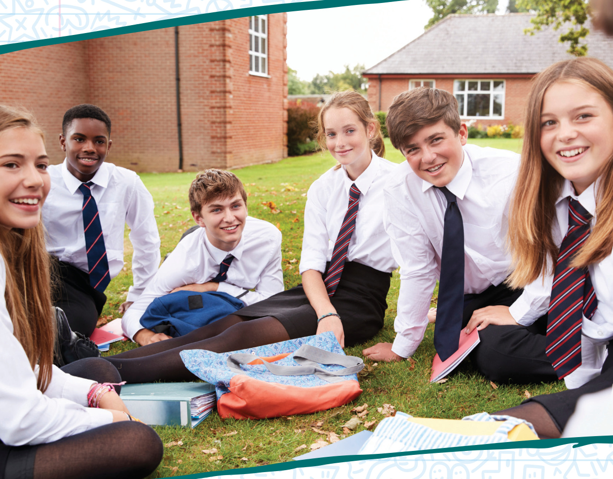
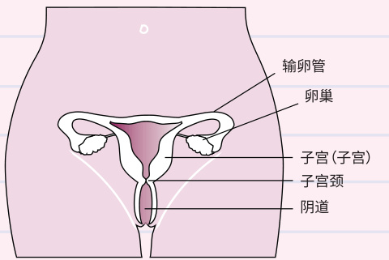

# 帮助保护自己  

对所有12至13岁青少年接种HPV疫苗的基本指南  

  

# 对所有12至13岁年轻人接种HPV疫苗的基本指南  

本传单介绍了你可以如何通过接种疫苗（打预防针）来预防与HPV相关的癌症。  

自2008年以来，HPV疫苗被提供给9年级和10学年的、所有12-13岁女孩。自2019年9月以来，该疫苗也以同样的方式提供给男孩。这是因为有证据表明HPV疫苗有助于保护所有年轻人免受HPV相关癌症的侵害。  

HPV疫苗有助于保护你免受HPV引起的癌症的侵害，例如：  

• 高达盱盨%的宫颈癌（女性）;  
• 一些口腔和喉癌;  
• 一些肛门和生殖器癌症。  

该疫苗还将保护你免受导致大多数生殖器疣病例的两种类型的HPV的侵害。 它不会保护你免受任何其他性传播感染，它也不会阻止怀孕。  

# HPV及其传播方式  

人瘤病毒（HPV）感染非常普遍，多达一半的人在一生中的某个时候会感染HPV。 你可以通过与另一个已经感染病毒的人进行亲密的性接触来感染它。  

HPV有盩盨盨多种类型，但其中只有盩盫种已知会导致癌症。 感染通常没有症状，所以许多人不会意识到他们被感染了。 大多数时候，病毒不会引起癌症，因为它会被身体的免疫系统杀死，但并非总是如此 —  一些感染会持续存在并导致癌症或生殖器疣⸺ 这就是为什么疫苗如此重要。  

# HPV疫苗  

HPV疫苗在盩盪盩个国家使用，全球已有盰盨盨盨多万人接种了该疫苗。  

该疫苗已经对英国，澳大利亚和丹麦的HPV感染产生了重大影响。 随着时间的推移，预计该疫苗每年将挽救数百人的生命。  

最好在你变得性活跃之前接种疫苗。 但是，如果你目前性活跃，接种疫苗仍然很重要。 建议你在盩盪至盩盫岁时接种疫苗，以尽早得到保护。  

  

# 接种疫苗  

前几年，年轻人需要注射两次疫苗。 然而，疫苗接种和免疫联合委员会（JCVI）已经审查了有关HPV疫苗剂量的科学证据。 现在有强有力的证据表明，一剂疫苗提供的保护与两剂疫苗相同。 从 盪盨盪盫 年 盱 月 盩 日起，北爱尔兰所有符合条件的年轻人都将获得一剂 HPV 疫苗。 已经接种了一剂疫苗的年轻人被认为已经完全接种了疫苗，不需要接种第二剂HPV疫苗。  

你当地健康和社会护理信托基金 （HSCT） 的学校护理团队将安排你在 盱年级时在学校接种疫苗。 如果你在 盱 年级错过了疫苗，学校护理团队将在下次探访学校时再次提供疫苗。 护士会在你上臂为你接种疫苗。  

如果你患有哮喘、湿疹、花粉症或其他过敏症，你仍然可以接种疫苗。 如果你对此有任何疑问，请在接种疫苗前与护士交谈。  

# 副作用  

接种疫苗的副作用非常轻微——通常只是手臂酸痛、肿胀和发红，这些症状很快就会消失。其他不太常见的副作用可能包括头痛、恶心、头晕和/或轻度发烧。  

极少数情况下，有些人在注射后不久就会有反应，比如皮疹。 护士会知道如何处理。 这不应该成为避免接种疫苗的理由。  

严重的过敏反应非常罕见，护士接受过培训，知道如何处理。 出现反应的人通过治疗通常会在几个小时内完全康复。  

该疫苗符合在英国和其他欧洲国家使用的严格安全标准。 英国和世界各地已经接种了数百万剂疫苗。 与所有疫苗一样，对副作用的报告进行密切监测和审查。  

如果你遇到任何可疑的疫苗副作用，你可以在黄卡网站上报告或致电0800 731 6789（周一至周五上午 9：00至下午 5：00）或下载黄卡应用程序。  

www.mhra.gov.uk/yellowcard  

  

# 妇女和宫颈癌筛查  

疫苗预防九种类型的HPV，包括16型和18型，是导致大多数宫颈癌病例(高达 $9 0 \%$ ）。  

宫颈癌发生在子宫颈（子宫入口 - 见下图）。宫颈癌可能非常严重，北爱尔兰每年约有20名妇女死于宫颈癌。  

疫苗不能保护你免受所有其他类型的HPV的侵害，因此女孩在受邀（25岁时）仍然需要进行宫颈筛查（涂片检查）。  

  

# 其他癌症  

目前没有针对其他HPV相关癌症的筛查计划。如果你担心任何症状，请联系全科医生。  

# 错过了预约？  

别担心，你要么会在学校再次见到医护人员，要么 HSCT 学校护理团队会联系你的父母安排另一次预约。  

# 给予同意  

你将获得一份同意书，你的父母中的一位应签署该同意书，允许你接种疫苗。请务必在疫苗接种日期前将签署的表格交还给你的学校护理团队。  

如果你的父母不确定你是否应该接种疫苗，你仍应返回表格并与你的学校护理团队或你的全科医生交谈。现在接种疫苗将降低你多年来患HPV相关癌症的风险。  

# 更多信息  

你的父母将收到一本问答小册子，其中提供了有关给予同意和本传单中涵盖的其他主题的更多详细信息。此信息也可以从以下位置下载pha.site/hpv  

要获取传单或其他语言的问答，请访问pha..siite/hpv 或者请你的学校护士为你打印一份副本。  

  

  

# Public Health HSC Agency  

Public Health Agency 12-22 Linenhall Street, Belfast BT2 8BS. Tel 035011(locarate  