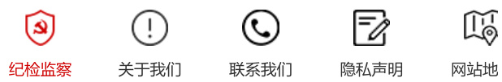

# 《加速消除宫颈癌行动计划（2023—2030年）》文件解读  

发布日期：2023-02-14 10:07:00 访问量:12 信息来源： 省卫生健康委员会 字体：[ 大 中 小 ]  

# 一、制定背景  

宫颈癌是严重威胁妇女健康的恶性肿瘤。我国政府高度重视宫颈癌防控工作，2009年，我国将农村妇女宫颈腺癌（“两癌”）检查列入重大公共卫生服务项目。2019年起，“两癌”检查纳入国家基本公共卫生服务项目，立了分工协作、上下联动的“两癌”防治体系。《中国妇女发展纲要（2021-2030年）》提出提高妇女宫颈癌人率，推进适龄妇女人乳头瘤病毒（HPV）疫苗接种等重要目标。2021年，国家卫生健康委启动了以消除宫颈癌为的健康中国行动创新模式试点工作，取得积极进展。在总结多年工作基础上，国家卫生健康委会同教育部、民政政部等十个部门联合制定、印发了《加速消除宫颈癌行动计划（2023-2030年）》（以下简称《行动计划》），立多部门联动的宫颈癌综合防控工作机制，加快推进我国宫颈癌消除进程，保护和促进广大妇女健康。  

# 二、主要内容  

《行动计划》主要包括六部分内容：第一部分是总体要求。主要包括四个原则和两个阶段性工作目标。即：筹协调、部门联动，坚持预防为主、防治结合，坚持创新发展、科技驱动，坚持公平可及，促进均衡。明确提出2030年阶段性目标。第二、三、四3部分内容分别针对一、二、三级预防措施来推动落实宫颈癌综合防治。主要及宫颈癌防治知识，促进HPV疫苗接种，降低患病风险；加强宫颈癌筛查服务，健全筛查长效工作机制，加强女颈癌筛查；规范宫颈癌诊疗服务，做好宫颈癌患者救助救治等。第五部分是完善宫颈癌综合防治体系。包括加强防治能力建设，推动宫颈癌防治信息化管理，促进新技术参与宫颈癌防治。第六部分是组织实施。包括加强组织落实经费保障，开展效果评估。  

# 三、主要特点  

（一）响应世界卫生组织（WHO）“消除宫颈癌”倡议。2018年，WHO首次提出消除宫颈癌的全球行动倡议。11月，WHO正式发布《加速消除宫颈癌全球战略》，提出推动HPV疫苗接种、宫颈癌筛查和为患者提供规范治疗管段性目标。《行动计划》积极响应WHO的倡议，将加速消除宫颈癌作为助力实现2030年可持续发展议程、保障妇的一项重点工作予以推进，结合我国宫颈癌防治实际，提出了2025年和2030年阶段性工作目标，是我国积极履行诺的实际行动。  

（二）强调多部门协作和社会参与。《行动计划》由国家卫生健康委、教育部等十个部门联合印发，明确提强卫生健康、教育、民政、财政、医保、中医药、药监、疾控、工会、妇联等多部门协同配合，各司其职、各负形成合力，共同推进各项策略措施落到实处。同时，《行动计划》强调要强化政府部门、媒体及其他社会团体的推动建立多元化的资金筹措机制，集中各方力量推进宫颈癌防治事业，动员全社会支持和参与宫颈癌消除工作。（三）积极推动HPV疫苗接种。近年来，广东、海南、福建等省份以及鄂尔多斯、济南、厦门、无锡等城市台了适龄女孩HPV疫苗免费接种政策，起到了良好示范效应。《行动计划》总结地方经验，提出促进HPV疫苗接种层面对于符合要求的国产HPV疫苗要加快审评审批；地方层面鼓励有条件的地区开展HPV疫苗接种试点，探索多种持资源不足地区适龄女孩接种。  

（四）通过效果评估推动加速消除。《行动计划》提出各地要加强对目标任务落实情况的督促指导，国家卫委也将定期对各地行动计划落实情况开展评估。通过评估，确定一批加速消除宫颈癌试点省份和城市，起到典型示范引领作用，助力加速消除宫颈癌目标实现。  

  