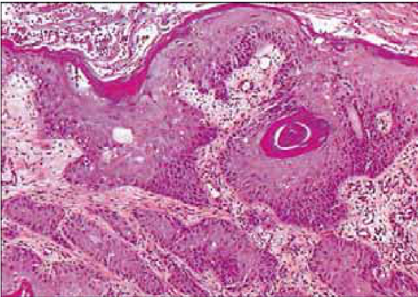

# 第三章  

# 浸润性宫颈癌简介  

<html><body><table><tr><td>临床前浸润性宫颈癌是指有很小间质浸润的早期癌，常无症状或临床体征。</td></tr><tr><td>·随着间质浸润的进展，病变的临床表现变得明显，在以阴道窥器检查时可见多种肿瘤形态。</td></tr><tr><td>·组织学上，90%~95%的浸润性宫颈癌是鳞癌；在大多数发展中国家，只有不到5%的宫颈癌是腺 癌。</td></tr><tr><td>、目前最广泛应用的浸润性宫颈癌的分期是基于肿瘤的大小及病变扩散至阴道、宫旁、膀胱、直肠及 远处器官转移的程度。</td></tr><tr><td>，目前临床分期仍是影响浸润性宫颈癌患者生存的惟一最重要的预后因素。</td></tr></table></body></html>  

本章论述浸润性宫颈癌的临床特点和诊断。浸润性宫颈癌往往在妇科检查中被发现并通过病理活检组织学检查证实。但部分宫颈癌无症状和肉眼异常所见，称为临床前浸润性宫颈癌。因此，阴道镜检查在诊断临床前早期浸润癌中起着重要作用。  

# 临床特点  

患浸润性宫颈癌的妇女常有下列症状：经期间出血、性交出血、月经量过多、白带增多、恶臭白带，反复发作的膀胱炎，尿急或小便困难，后背痛或下腹痛。晚期宫颈癌可因严重贫血出现呼吸困难及尿路阻塞、下肢水肿、血尿、肠梗阻、恶病质等症状。大多数患者在阴道检查可见溃疡型增大的肿物。  

在很早期的间质浸润阶段，宫颈癌一般无明显症状和临床体征，因此，被称为临床前宫颈浸润癌。最早期的浸润癌称之为微小浸润癌：间质浸润深度不超过 $5 \mathrm { m m }$ ，宽度不超过 $7 \mathrm { m m }$ 。早期浸润癌表现为小芽状的浸润细胞，突破基底膜并伸向间质(图3.1和图3.2)。以局部淋巴细胞聚集及浸润灶周围基质疏松为表现形式，间质对浸润的反应证据可能是明显的。  

随着间质浸润的进展，临床病变明显，在阴道检查时常见数种肿瘤形态。很早期的病变可表现为宫颈局部区域粗糙、发红、颗粒感并有接触性出血（图3.3)。癌灶呈外生型、内生型或混合型（图3.4至图3.6)。外生型肿瘤往往浅表浸润，庞大的肿瘤突向阴道，呈蘑菇状或增生状、凸出的菜花样，伴息肉状或乳头瘤状突起的肿物。内生型肿瘤可向间质广泛浸润，使宫颈变形，而宫颈表面常无明显的肿物。这些病变可扩张至宫颈管，而宫颈表层鳞状上皮完整，直至肿瘤增至 $5 { \sim } 6 \mathrm { c m }$ 直径。其结果是变成增大而不规则的桶状宫颈，伴表面粗糙，乳头瘤状或颗粒状。这种肿瘤仍可无症状很长时间。部分外生和内生型肿瘤随间质浸润加深也常表现为溃疡状。所有类型的宫颈癌中，接触性出血及局部坏死是主要临床特点。由于坏死组织合并厌氧菌感染，恶臭白带也很多见。  

随着浸润的继续进展，肿瘤可直接侵犯阴道、宫旁、盆壁、膀胱和直肠。由于晚期局部肿瘤压迫输尿管引起尿路梗阻以致肾盂积水，最终可引[起肾衰。伴随着局部浸润，区域淋巴结发生转移，腹主动脉旁的淋巴转移通过淋巴结包膜和直接浸润至脊椎和神经根。坐骨神经根分枝的直接侵犯或受压引起背部疼痛，而盆腔静脉及淋巴侵犯引起下肢水肿。血行转移至腰椎腰肌可能不发生淋巴结病变。远处转移发生在病变晚期，通常侵犯腹主动脉淋巴结、肺、肝、骨等其他组织。  

  
图3.1 组织学表现：早期间质浸润（ $\left. \times 4 0 \right.$ 1  

  
图3.2组织学表现：早期间质浸润（ $\left. \times 1 0 \right.$  

  
图3.3早期浸润宫颈癌  

  
图3.4浸润性宫颈癌  

  
图3.5浸润性宫颈癌  

  
图3.6晚期浸润性宫颈癌，溃疡型  

# 显微镜下病理学  

在发展中国家大约 $9 0 \% { \sim } 9 5 \%$ 的宫颈浸润癌为鳞癌(图3.7和图 3.8)； $2 \% \mathrm { \sim } 8 \%$ 是腺癌(图3.9)。  

在显微镜下，大部分鳞癌表现为肿瘤细胞中的间质呈条索样的网状浸润，并且表现为各种各样的肿瘤状态、细胞形态和分化程度。由索状的恶性细胞分开的宫颈间质被淋巴细胞、浆细胞浸润。这些癌细胞可再分为角化型和非角化型。肿瘤细胞可分为：高分化、中分化、低分化三种。约 $5 0 \% { \sim } 6 0 \%$ 的宫颈癌为中分化，其余高分化和低分化各占一半。  

  
图 3.7组织学—角化型、高分化浸润性鳞状细胞癌（ $\left( \times 1 0 \right)$ 1  

  
图 3.8组织学—非角化型、浸润性鳞状细胞癌（ $\cdot \times 1 0$ ）  

角化型鳞状细胞癌是由特征性的旋涡状上皮细胞包含中央角化细胞巢（角化珠）组成（图3.7)。细胞核大、染色质颗粒增粗、核深染、除透明角质性的颗粒和细胞质的角化以外，细胞间桥明显。仅可见少量核分裂象。  

非角化型鳞状细胞癌（图3.8）表现为不规则的、膨大的多边形细胞锯齿状浸润间质，可能有角化不良和细胞间桥。细胞和核的多型性明显，核分裂象多见，无角化珠。  

其他不常见的鳞状细胞癌类型有：湿疣样鳞癌(又称疣状鳞癌)；乳头状鳞状细胞癌；淋巴上皮瘤样癌、鳞状透明细胞癌。  

在许多发展中国家，腺癌在宫颈癌中的比例小于 $5 \%$ ，来源于宫颈管腺上皮。最常见的腺癌形式是宫颈管细胞类型，异型的腺体不同形状和大小伴芽状和分支（图3.9)。多数腺癌为中、高分化。腺体成分排列复杂，可见乳头从表面突人管腔，有些细胞含有中量至大量黏蛋白。其他类型腺癌包括：肠型，印戒细胞型腺癌，恶性腺瘤，绒毛腺管状乳头状腺癌，宫内膜样腺癌和乳头浆液性腺癌。宫颈腺鳞癌包括腺癌和鳞癌的成分。  

无论宫颈鳞癌还是腺癌，发现脉管瘤栓是潜在性侵袭性生长的证据，与区域淋巴结转移的危险性有关。偶尔发生的血管浸润是预后不佳的征象，与远处转移或血行转移有关。虽然浸润性宫颈癌的脱落细胞学特征已经被很好地描述，但细胞学并不是诊断浸润性病变的可靠方法。在细胞学涂片中确认病变需要丰富的经验。因为在一张宫颈涂片的碎片细胞及血细胞中仅有数个癌细胞。宫颈腺癌很难由细胞学家识别；只有在其细胞极度异型时才有可能被细胞学家发现。对个别细胞类型的认识更复杂。所以，宫颈浸润癌最终确诊总是要基于组织病理学诊断。肿瘤周围的组织标本对诊断是最好的，因为更可能包含了形态完整的肿瘤组织，而从肿瘤中心取的活检标本，可能有坏死组织，而影响组织学诊断的准确性。  

  
图3.9组织学——高分化浸润性腺癌（ $\times 2 0$ 1  

# 分期  

无论制定治疗计划还是估计预后均需详细评估病人的一般状况及确定宫颈癌的临床分期。广泛应用的宫颈癌分期是FIGO 制定的标准，见表3.1。主要根据肿瘤大小及盆腔内浸润范围制定的分期系统。通过临床及各种辅助检查评估肿瘤的扩散范围，并将其分为I\~IⅣ期（表3.1和图3.10)，I期代表了肿瘤局限于宫颈，而V期代表癌已扩散转移至远处器官。  

表3.1 FIGO分期（见图3.10）  

<html><body><table><tr><td colspan="2">衣3.1F1G0分期（见图3.10)</td></tr><tr><td colspan="2">I期 癌灶严格局限于子宫颈；扩散至宫体可不考虑。IA1和IA2 期的分期是基于切除组织的显微镜下检查诊断，</td></tr><tr><td>这些组织最好是包括全部病变在内的锥切标本。 IA期 IAi期 IA2期</td><td>浸润癌仅在显微镜下确认。间质浸润的深度不超过 5.0 mm,宽度不超过 7.0mm。 间质浸润深度不超过3.0mm，宽度不超过7.0mm。 间质浸润深度大于 3.0 mm，但不超过5 mm，宽度不超过 7 mm。</td></tr><tr><td>IB期 IBi期 IB2期 Ⅱ期</td><td>临床病灶局限于宫颈或临床前期病灶大于IA期。所有肉眼所见病灶，即使是表浅浸润，亦属于IB期。 临床病灶不大于4.0cm。 临床病灶大于4.0cm。</td></tr><tr><td colspan="2"></td></tr><tr><td></td><td>癌灶超出子宫颈，但未扩散至盆壁；癌累及阴道，但未达阴道下1/3</td></tr><tr><td>IIA期</td><td>无明显宫旁浸润，癌累及阴道上2/3。</td></tr><tr><td>Il期</td><td>有明显宫旁浸润，但未达盆壁。</td></tr><tr><td colspan="2">Ⅲ期</td></tr><tr><td>除非已知其他原因所致，均列入ⅢI期。</td><td>癌浸润达盆壁。直肠检查肿瘤与盆壁之间没有无癌间隙。肿瘤累及阴道下1/3。凡有肾盂积水或肾无功能者，</td></tr><tr><td>IIIA期 IIIB期</td><td>宫旁浸润未达盆壁，但累及阴道下1/3。 癌浸润达盆壁，或肾盂积水，或肾无功能。</td></tr><tr><td>IV期</td><td></td></tr><tr><td colspan="2">癌扩散超出真骨盆或临床已侵犯膀胱粘膜和/或直肠粘膜。</td></tr><tr><td>IVA期 癌扩散到邻近器官。 IVB期 癌扩散至远处器官。</td><td></td></tr><tr><td colspan="2"></td></tr></table></body></html>  

FIGO分期采用以下检查方法：阴道的视诊和触诊、直肠指诊、阴道镜、膀胱镜、颈管刮术、宫腔镜、静脉尿路造影、胸部及骨骼X像、淋巴造影、B超，CT、MRI和腹腔镜检查可能提供另外的信息，但这些信息不能用于FIGO临床分期，尽管这些检查可能提供对制定治疗计划有用的信息。在很多资源缺乏的医疗单位，窥阴具检查及阴道和直肠指检是决定分期的仅可施行的方法。如有可能，膀胱镜及胸部、骨骼影像学检查及静脉尿路造影可以作为辅助检查方法。无论何时当宫颈癌应常规进行分期，在病历中详细记录并用图描述，而进行分期所做的检查过程也应该详细记录  

  
图3.10子宫颈癌临床分期示意图  

# 治疗及预后  

子宫颈癌的标准治疗方法可能包括手术治疗或放疗或二者综合。早期宫颈癌（I期及ⅡA期）采用手术或放疗，一旦病变范围超出宫颈或阴道穹隆或手术无效时，应选择放疗。宫颈癌的放疗常包括体外照射（整个盆腔）和腔内照射（控制疾病中心部分)。局部晚期宫颈癌如IIB 期及Ⅲ期，腔内放疗配合体外照射较单纯体外照射会明显改善局部控制及生存。  

微小浸润性宫颈癌（IA期）的手术方法有：宫颈锥切或全宫切除或扩大全宫切除。而IB和ⅡIA期患者可采用根治性全子宫切除（Wertheim）和盆腔淋巴清扫术，或采用腔内放疗，或体外加腔内放疗。在部分瘤体较小（小于 $2 \mathrm { c m }$ ）的IB期宫颈癌可行根治性宫颈切除，联合腹腔镜下淋巴结清扫术，从而挽救病人的生育功能。对早期浸润癌（IB期和ⅡA期）而言，放疗和手术的疗效相当。ⅡB及Ⅲ期病人可给予腔内及体外的联合放疗。IⅣ期可采用姑息性体外放疗或和化疗。  

晚期宫颈癌合并顺铂化疗能改善单纯放疗的效果。随机临床试验结果已显示，在放疗同时辅以顺铂为基础的化疗，可明显改善总生存率和无瘤生存期。（Thomas，2000，Green et al.，2001）。放化疗结合对控制局部复发及远期复发均有益。联合治疗使总生存率提高 $1 6 \%$ 。放化疗同步将成为晚期宫颈癌新的标准化治疗。  

目前临床分期仍是影响长期生存的惟一最重要的指标；生存率亦随年龄而下降。其他影响生存率的因素包括健康及营养状况。贫血病人对治疗的反应差；同样HIV血清阳性者预后差。数个临床和人群研究证实I期宫颈癌的五年生存率高（ $> 7 5 \%$ ），随分期升高五年生存率快速下降（IV期 $< 1 0 \%$ >（Delgado et al.; 1990; Fagundes et al.， 1992;Kosary et al., 1994; Gatta et al., 1998; Sankara-narayanan et al.，1998;Denton et al.，2000)。—组大样本宫颈癌放疗的研究结果显示，常见的远处转移率（最常见的转移部位为腹主动脉旁淋巴结、肺、腹腔、肝、和胃肠道）随分期提高而递增，从IA期的 $3 \%$ 增加到IV期的 $7 5 \%$ (Fagundes et al.,1992)，在1 028 名接受根治性手术的患者中，生存率与肿瘤体积相关（Brughardt et al.，1992），肿瘤体积 $< 2 . 5 \mathrm { c m } ^ { 3 }$ 者的五年生存率为 $91 \%$ ，肿瘤体积$1 0 { \sim } 5 0 \mathrm { c m } ^ { 3 }$ 的五年生存率则为 $70 \%$ 。三年无瘤生存率范围为：I期的肿瘤 ${ \leqslant } 5 \mathrm { m m }$ 为 $9 4 . 6 \%$ ；而 $\geqslant 2 1 \mathrm { m m }$ 者则为 $5 9 . 5 \%$ （Delgado et al.，1990)。晚期宫颈癌常伴有脉管浸润、盆腔扩散、腹主动脉旁淋巴转移和远处转移。  

(译者 张 凯)  