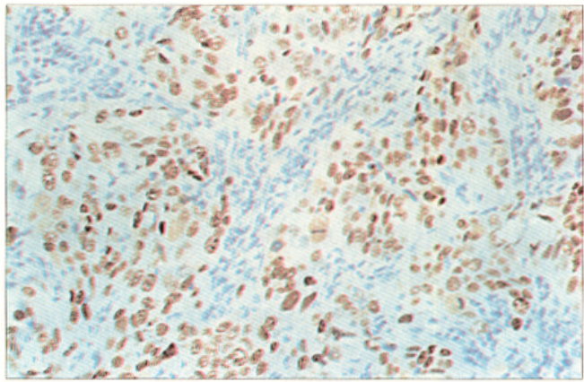

# 相关癌基因蛋白表达与宫颈鳞癌演进机制的探讨H  

石新兰 黄利鸣 黎家华 徐 弘三峡大学医学院病理教研室 "湖北省宜昌市 HHIGGI#  

摘要 目的!检测宫颈上皮内瘤!;<="和浸润性宫颈鳞癌相关癌基因蛋白表达状态#探讨宫颈鳞状上皮恶性转化及鳞癌演进机制\$方法!采用 "D 法检测 FG 例正常宫颈#HI 例 ;<=#IX 例浸润癌 D;=V%6MI%6FN%JK%DK% $\mathrm { n m } 2 3$ %4R-A4%JR;(3#/5\$&%SJTU 蛋白表达状态\$ 结果!;<=!级 JK%DK 表达下调甚至缺失#D;=V%6MI%6FN 阳性表达率明显高于 ;<="%\$级#D;=V%6MI%6FN 和 JKPDK 同时 F 种与同时 I 种以上异常表达率显著高于 ;<=%%\$级&浸润癌$\mathrm { n m } 2 3$ %4R-A4%JR;(3#/5\$& 阳性表达率明显降低#SJTU 阳性表达率明显升高\$ 结论!相关癌基因蛋白表达异常与宫颈鳞状上皮恶性转化及鳞癌演进密切相关&同时检测 D;=V%6MI%6FN 和 JKPDK 表达状态有助于准确判断 ;<= 恶变潜能\$  

关键词 癌基因蛋白 宫颈上皮内瘤 宫颈鳞癌中图分类号!KYIYCII 文献标识码!L 文章编号!NGGGRXNYZ!FGGH"GX’GHIXRGI  

# !"# \$%&’#(()\*+ \*, -#./012 3+4\*&’\*01)+( /+2 0"1 5’\*6’1(()\*+ \*, 7#’8)9:. ;<=:>\*=( 7:’9)+\*>:  

"#\$ %\$&’(& )\*(&+ ,\$-\$&+ ,\$ .\$(#\*( /0 (’ !"#\$%&’"(& )\* +,&-).)/01 &-" 2"345,. 65-)). )\* 7-%"" 8)%/"9 :(4;"%94&01 <45-,(/1 =>?"4  

?@(0’:40 A@B140)81C 12 3/0/40 5/’(0/3 2&426520/\$&7 /865/77\$2& \$& 4/59\$4(’ \$&05(/6\$0#/’\$\*- &/2& 6’(7( :;<=>(&3 \$&9(7\$9/ 7?\*(-2\*7 4(54\$&2-(@ (&3 02 70\*3A 0#/ 652+5/77\$2& 2B 4/59\$4(’ 7?\*(-2\*7 4(54\$& &2-(C D10"\*2(C <--\*&2#\$7024#/-\$4(’ "D -/0#23 E(7 \*7/3 02 3/0/40 5/’(0/3 2&426520/\$&7 /865/77\$2& \$& FG 4(7/7 2B &25-(’ 4/59\$4(’ 0\$77\*/@ HI ;<=7 (&3 I! \$&9(7\$9/ 4/59\$4(’ 7?\*-2\*7 4(54\$&2-(C -1(=.0(C <& ;<=!@ 0#/ /865/77\$2& 2B JK!DK E(7 ’2E 25 ’277@ 0#/ 627\$0\$9/ 5(0/ 2B D;=L! 6MI! 6FN E(7 7\$+&\$B\$4(&0& ’A #\$+#/5@ 0#/ 6/54/&0(+/ 0#(0 FO I 25 H 0A6/7 2B D;=L!6MI!6FN (&3 JKPDK /865/77/3 (Q&25-(’’A E(7 7\$+&\$B\$4(&0’A #\$+#/5 0#(& 0#(0 \$& ;<="!#C 1#/ 627\$0\$9/ 5(0/ 2B &-FI! 4R-A4 (&3 JR;(3#/5\$& E(7 7\$+& &\$B\$4(&0’A ’2E/5 \$& \$&9(7\$9/ 4/59\$4(’ 7?\*-2\*7 4(54\$&2-( E#\$4# 0#/ 627\$0\$9/ 5(0/ 2B SJTU E(7 #\$+#/5 0#(& 0#(0 \$& ;<=7C 7\*+4.=(()\*+(C K/’(0/3 2&426520/\$&7 (Q&25-(’ /865/77\$2& (5/ \$-6250(&0 3\*5\$&+ 4/59\$& 4(’ /6\$0#\$\*- -(’\$+&(&0 05(&7B25-(0\$2& (&3 0#/ 0\*-25 652+5/77\$2&C <0 -(A Q/ \*7/B\*’ 02 /70\$-(0/ \$07 -(’\$+& &(&0 05(&7B25-(0\$2& 6277\$Q\$’\$0A 02 3/0/40 D;=V! 6MI! 6FN (&3 JKPDK /865/77\$2& \$& 4/59\$4(’ 3A76’(7\$( /6\$0#/’\$\*-C  

E1F G\*’2( W&426520/\$&7 ;/59\$4(’ \$&05(/6\$0#/’\$(’ &/26’(7( ;/59\$4(’ 7?\*(-2\*7 4(54\$&2-(  

[<= 可演进为浸润癌%特别是 ;<=!级%演变为浸润癌的潜能远高于 ;<="!\$级%与宫颈鳞癌的发生密切相关& 准确判断 ;<= 级别%正确评估 ;<= 发展为浸润癌的潜能%有利于降低宫颈鳞癌发病率&本研究采用免疫组化方法检测 ;<= 至浸润癌各时期相关癌基因蛋白表达状态% 试图寻找引起宫颈上皮细胞恶性转化和宫颈鳞癌浸润进展的关键基因%探讨关键基因的生物学特征及临床意义&  

# \* 材料与方法  

# ,-, 标本来源  

收集三峡大学医学院附属医院病理科近 ,. 年宫颈活检标本 ,., 例" 其中!正常宫颈 /. 例!各级#\$% 0\* 例!浸润癌 \*! 例" 均为治疗前的活检标本或首选治疗为手术的术后标本! 经 $10 \%$ 甲醛固定!石蜡包埋! 病理检查确诊并依据 234 分类方法进行组织分类" 浸润癌按 ,556 年 7\$84 标准分期"  

# ,9/ 方法和试剂  

采用 :& 法检测癌基因蛋白表达状态" 免疫组化染色过程严格按照 :& 试剂盒说明书进行" ;’<显色!苏木素复染" $\mathrm { P C N A } \ \mathrm { , p 5 3 } \ \mathrm { , p 2 1 } \ \mathrm { , E R } \ \mathrm { , P R } \ \mathrm { , n m } 2 3 \$ #AB@CA#=D#EFGHIJ?#K=87 等单抗及 :& 试剂盒购自福州迈新生物技术公司"  

# L9\* 结果判断  

以核或膜或浆出现明显的棕黄色颗粒为阳性细胞" 随机抽取 6 个高倍视野!计数阳性细胞数目!以阳性细胞数 $5 5 \%$ 为阳性表达标准"  

# ,90 统计学分析  

采用 $\chi ^ { 2 }$ 检验"  

# ) 结果  

# /9, 相关癌基因蛋白的表达部位  

&#%’ $\mathrm { \nabla . p } 5 3$ 为核表达\$=>#&>#AD@CA 在正常鳞状上皮为核表达!在不典型增生上皮和癌组织!为核或浆表达\$ $_ { \mathrm { p 2 1 , n m } 2 3 }$ #K=87 为 浆 表 达 \$=D#EFGHIJ?为膜表达!见图 ,"  

# /9/ 宫颈组织相关癌基因蛋白的阳性表达率见表 ," 正常鳞状上皮少量基底细胞表达  

&#%’\$#\$% 和癌组织阳性细胞数目明显增多!&#%’阳性表达率逐渐升高!原位癌#浸润癌%N!期阳性表达率达 $100 \%$ "(6\* 阳性表达率随 #\$% 级别的升高而升高! #\$% !级和浸润癌阳性表达率明显高于正常宫颈和 #\$%"#&级组织" (/, 阳性表达率在正常宫颈和 #\$%%#&级都很低! !级则明显升高" =>#&> 核表达率从 #\$%%级N浸润癌逐级降低!#\$% !级及浸润癌明显低于正常宫颈组织" 正常宫颈组织全部表达 $\mathrm { n m } 2 3$ 蛋白! $\mathrm { n m } 2 3$ 阳性率随着浸润癌分期的升高而逐渐降低" =D#EFGHIJ? 阳性表达率也随着浸润癌分期的升高而逐渐降低!并明显低于 #\$%%N!级" 浸润癌!尤其是 $\mathbb { I } \sim \mathbb { N }$ 期浸润癌!K=87 阳性表达率明显高于正常宫颈和 #\$%%#&级组织! $P { < } 0 . 0 5$ "  

  
图, $\mathrm { p } 5 3$ 蛋白在浸润性鳞癌中的表达状态 $ { \mathrm { S P } } \times 2 0 0$  

# /9\* 各级 #\$% 组织相关癌基因蛋白R受体同时 / 种及以上异常表达情况  

见表 /"  

表 \* 相关癌基因蛋白在宫颈组织中的阳性表达 $\%$   

<html><body><table><tr><td>病理分类</td><td>例数</td><td>PCNA</td><td>p53</td><td>p21</td><td>ER</td><td>PR</td><td>nm23</td><td>C-myc</td><td>E-Cadherin</td><td>VEGF</td></tr><tr><td>正常宫颈</td><td>19</td><td>26.3</td><td>31.5</td><td>15.7</td><td>68.2</td><td>57.1</td><td>100</td><td>84.2</td><td>40.0</td><td>8.3</td></tr><tr><td>CIN I</td><td>12</td><td>41.6</td><td>16.6</td><td>16.6</td><td>42.9</td><td>14.3</td><td>87.5</td><td>91.6</td><td>92.3</td><td>12.5</td></tr><tr><td>CIN II</td><td>12</td><td>41.6</td><td>33.3</td><td>16.6</td><td>42.9</td><td>15.4</td><td>85.7</td><td>91.6</td><td>91.7</td><td>14.2</td></tr><tr><td>CIN II</td><td>18</td><td>62.5</td><td>64.7</td><td>66.6</td><td>0</td><td>0</td><td>89.4</td><td>94.1</td><td>88.2</td><td>40.0</td></tr><tr><td>浸润癌I</td><td>8</td><td>100</td><td>40.0</td><td>50.0</td><td>0</td><td>8.3</td><td>57.1</td><td>66.6</td><td>66.6</td><td>20.0</td></tr><tr><td>浸润癌IⅡ</td><td>8</td><td>100</td><td>50.0</td><td>33.3</td><td>0</td><td>8.3</td><td>40.0</td><td>33.3</td><td>50.0</td><td>66.6</td></tr><tr><td>浸润癌ⅡⅢ</td><td>10</td><td>100</td><td>40.0</td><td>40.0</td><td>0</td><td>10.0</td><td>30.0</td><td>30.0</td><td>40.0</td><td>60.0</td></tr><tr><td>浸润癌IV</td><td>12</td><td>66.0</td><td>50.0</td><td>33.3</td><td>0</td><td>16.6</td><td>33.3</td><td>33.3</td><td>41.6</td><td>60.0</td></tr></table></body></html>

&#%’%细胞核增殖抗原\$/0%雌激素受体\$’0%孕激素受体\$1/23%血管内皮生长因子  

表 ! "#\$%!&’(!&)\* 及 +,-", 在 ./\$ 组织同时出现) 种及以上异常表达 $\%$   

<html><body><table><tr><td>病理分类</td><td>例数</td><td>2种异常表达</td><td>3 种或4种异常表达</td></tr><tr><td>正常宫颈</td><td>20</td><td>40.0</td><td>0</td></tr><tr><td>CIN I</td><td>13</td><td>46.1</td><td>0</td></tr><tr><td>CIN II</td><td>12</td><td>50.0</td><td>0</td></tr><tr><td>CIN II</td><td>18</td><td>100</td><td>80.0</td></tr></table></body></html>  

# ( 讨论  

#\$% 是宫颈鳞癌的癌前病变!有恶变潜能" 不同级别的 #\$% 恶变潜能不同" #\$%!级发展为浸润癌的潜能远高于 #\$%"##级" 因此!#\$% 的级别决定其治疗方案!准确判断 #\$% 的级别非常重要"  

&#%’#()\*#(+, 等癌基因蛋白异常表达可诱导细胞恶性转化! "#\$!级和宫颈癌 %"\$& 指数显著高于正常宫颈和 "#\$""#级# %"\$& 指数有助于评估 "#\$ 细胞增殖活性" 区别 "#\$!级和 "#\$""\$级 ’()! \$\*+, -& 等’.)报道从低级别 "#\$ 到浸润癌 $\mathrm { N } -$ ,\*0 表达率不断增加! 魏欣净等’1)报道宫颈炎组织无2.( 表达#而不典型增生"原位癌和浸润癌阳性表达率逐渐升高# $\mathrm { p } 2 1$ 蛋白在宫颈肿瘤发展中起重要作用! "#\$!级和宫颈癌组织 $\mathrm { p } 5 3$ 蛋白阳性表达率也明显高于正常宫颈组织’4)! 本研究显示 "#\$!级和浸润癌 %"\$&"231 和 2.( 蛋白阳性表达率明显高于正常宫颈和 "#\$%"\$级! 另外#雌"孕激素水平降低有助于宫颈鳞癌的发生’3)#绝大多数 "#\$ 和浸润性鳞癌不表达 $\mathrm { E R } ^ { [ 6 , 7 ] }$ ! 由于正常宫颈组织和 "#\$""\$级也可表达 %"\$&"231 和 $\mathrm { p } 2 1$ 蛋白# 出现 569%6 丢失#因此#凭单一指标结果不能准确判断 "#\$ 恶变潜能! 本研究发现 "#\$!级中 $\mathrm { P C N A } \operatorname { s p } 5 3$ 和 2.( 蛋白及 569%6 表达同时出现 . 种异常的百分率为$100 \%$ #明显高于正常宫颈组织\$同时出现 1 种及以上异常的百分率为 $8 0 . 0 \%$ # 而正常宫颈组织和 "#\$""\$级无一例同时出现 1 种及以上异常的情况!因此# 对于 "#\$ 患者# 可同时检测 %"\$&"231 和 2.(蛋白及 569%6 表达状态#若同时出现 1 种及以上异常表达#则具有高度恶变潜能#应及时手术治疗!  

恶性肿瘤的演进机制还不明确! 可能多种癌基因蛋白异常表达在宫颈鳞癌的演进中起重要作用!=>> "- 等’!)报道 "#\$!级和宫颈鳞癌 $\mathrm { n m } 2 3$ 蛋白阳性表达率明显降低#而 "#\$""\$级与正常宫颈组织全部为 $\mathrm { n m } 2 3$ 蛋白中到强表达# $\mathrm { n m } 2 3$ 蛋白低表达可能与宫颈鳞癌的演进密切相关! 而细胞周期调节蛋白 A/@BA 在宫颈鳞癌的表达状态及生物学意义还有待于进一步研究!C,>??\* -D 等’E)报道宫颈鳞癌 $\mathrm { c - }$ @BA 蛋白阳性率随着 F#GH 分期的升高而升高#但随着病理学分级的升高而降低#并且 A/@BA 阳性患者 3 年生存率与 A/@BA 阴性患者无明显差异! 罗营等’(:)报道正常宫颈组织和 "#\$ $\mathbf { \boldsymbol { c } }$ /@BA 蛋白阳性表达率都很高#浸润癌则明显降低! 5/"\*IJ>,+? 表达下调使癌细胞连接松散#有利于癌细胞向深部浸润!本文显示浸润癌" $\mathbf { I } \sim \mathbf { I } \mathbf { V }$ 期 $\mathrm { n m } 2 3$ "A/@BA"5/"\*IJ>,+? 阳性表达率均明显低于正常宫颈和 "#\$ 组织# 但$\mathrm { n m } 2 3 \mathrm { \ : . c - m y c }$ 和 5/"\*IJ>,+? 的表达状态之间未见明显相关性! 可见# $\mathrm { n m } 2 3$ "A/@BA"5/"\*IJ>,+? 蛋白异常表达与宫颈鳞癌浸润进展密切相关# 但宫颈鳞癌的演进机制是多途径多方面的!  

本研究表明 "#\$!级和浸润癌# 尤其是浸润癌$\mathbb { I } \sim \mathbb { N }$ 期 L5GF 阳性表达率明显高于正常宫颈和"#\$%"\$级组织! L5GF 在肿瘤血管形成中起重要作用’(()! L5GF 参与宫颈鳞癌血管形成#为其快速生长提供条件!  

# 参考文献  

! "#\$ %& ’\$() %& \*+# ,& \$- ./0 123/45\$2.-46\$ .7-464-8 4( 7\$2647./ 4(! -2.\$94-+\$/4./ (\$39/.:4. .(; 7\$2647./ 7.274(3<. =>?@ A+4( B\$; > CD()/E& !FFFG !!HCIJK LMLNLMO   
H P.42 QR& P.42 BS& >.8.92.T.:+ 1,& \$- ./@ 2.: .(; 7U<87 3(73! 923-\$4(: ;#24() -#<32 923)2\$::43( 4( -+\$ #-\$24(\$ 7\$264V =>?@ W#! <324G !FFXG XIYOJK OXLNOXX   
L 魏欣净&王美清@子宫颈不典型增生"鳞癌 9H!"9OL 蛋白表达的临 床意义=>?@中华病理学杂志&HZZZ&HFCHJK!H[N!HM   
I 李新英&糜若然&焦书竹&等@9OL 蛋白在宫颈鳞状上皮内瘤变与宫 颈癌中的过度表达与 \1] 的关系 =>?@ 中华病理学杂志&!FFM&H[ C[JKL[ZNL[!   
O 张 蓉&王淑玉&许培箴 @I[ 例宫颈癌的临床病理特点分析=>?@中国 临床医学&HZZZ&MC!JKOINOO   
[ ^.(.4 BG Q+43_.‘. WG "4( aG \$- ./@ b<<#(3+4:-37+\$<47./ ;\$-\$7! -43( 35 :\$V :-\$234; 2\$7\$9-32:G 787/4(:G .(; 787/4(U;\$9\$(;\$(- T4(.:! \$: 4( -+\$ (32<./ .(; (\$39/.:-47 :c#.<3#: \$94-+\$/4. 35 -+\$ #-\$24(\$ 7\$264V=>?@ A.(7\$2G !FFXG XHYFJK !MZFN!M!F   
M P3(3).T4 \G ’#d44 QG ^3(4:+4 bG \$- ./@ D:-23)\$( 2\$7\$9-32 /37./4_.! -43( 4( (32<./ .(; (\$39/.:-47 \$94-+\$/4#< 35 -+\$ #-\$24(\$ 7\$264V=>?@ A.(7\$2G !FFZG [[Y!HJK H[HZNH[HM   
X a\$\$ AQG ,.; >@ (<HLU\! 923-\$4( 4<<#(32\$.7-464-8 4( 4(-2.\$9! 4-+\$/4./ (\$39/.:4. .(; 4(6.:46\$ :c#.<3#: 7\$// 7.274(3<. 35 -+\$ #! -\$24(\$ 7\$264V =>?@ 1.-+3/ b(-G !FFXG IXY!ZJK XZ[NX!!   
F S2\$((. QBG \*\$5\$24(3 aAG 14(-3 ,RG \$- ./@ 7U<87 923-\$4( \$V92\$:! :43( 4: (3- .( 4(;\$9\$(;\$(- 923)(3:-47 92\$;47-32 4( 7\$2647./ :c#.! <3#: 7\$// 7.274(3<. =>?@ S2._ > B\$; S43/ e\$:G HZZHG LOYIJK IHON ILZ   
!Z 罗 营G糜若然G岳天孚@7U<87 蛋白在宫颈癌组织中的表达水平 与临床指标的关系=>?@中国肿瘤临床G!FFFGH[YHJK!!ON!![   
!! R/4-./3T ]W@ ]D,’:G 2\$7\$9-32: .(; .()43)(\$:4: =>?@ Q\$<4( A.(7\$2 S43/G !FFFG FYHJK H!!NHHZ %"##\$%#&%’( 收稿&  

%杨红欣校对&  