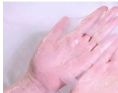

# 科学防治宫颈癌：从预防到治疗的全方位指南  

来源：光明网 2025-01-24 17:24  

提起宫颈癌相信大家并不陌生，尤其女性朋友们更是闻之色变，宫颈癌是危害女性健康和生命的主要恶性肿瘤之一，其发病率及死亡率呈逐年上升趋势，并且发病年龄越来越年轻。近年来，临床上30多岁的宫颈癌患者已不少见，甚至有20多岁的美少女，花儿一样的年龄就患上了宫颈癌，让人见了十分惋惜。那么，宫颈癌是如何发病的？怎样预防宫颈癌？接种HPV疫苗又有哪些注意事项呢？今天，我们就来好好聊一聊如何预防宫颈癌这个“冷酷的杀手”。  

# 一、宫颈癌一级预防：预防性接种HPV疫苗  

# 1、HPV是什么？  

你知道吗？宫颈癌是目前为止唯一知道病因的恶性肿瘤， $90 \%$ 以上的宫颈癌和HPV感染有关。HPV即人乳头瘤病毒，它是一个大大的病毒家族，族内成员有100多个，根据致癌风险高低，将HPV分为高危型和低危型两组，高危型中的HPV16、18感染与 $7 0 \%$ 的宫颈癌相关，低危型中的HPV6、11与 $9 0 \%$ 的湿疣相关，可见，预防宫颈癌的关键是预防HPV这个罪魁祸首。  

# 2、如何减少HPV感染？  

$\textcircled{1}$ 避免高风险性行为：HPV主要通过性接触传播，过早嘿嘿嘿、多个性伴侣及无保护措施的性行为均可增加HPV感染率，所以年轻女性应洁身自好，避免过早性行为，如无备孕需求，建议全程应用避孕套以减少HPV感染；$\textcircled{2}$ 良好的卫生习惯：每日清水清洗外阴，勤更换内衣裤，经期使用清洁的卫生用品并及时更换，公共场所注意个人卫生，避免间接接触造成感染；$\textcircled{3}$ 增强自身免疫力：HPV感染很常见， $70 \%$ 的女性一生中均感染过HPV，但得益于自身强大的免疫系统，在神不知鬼不觉的时候已经将HPV彻底清除，对于免疫系统较弱的女性，HPV才会持续感染导致宫颈病变，所以，规律作息、均衡饮食、定期锻炼身体、增强自身抵抗力、远离烟草及毒品等也可减少HPV感染；  

$\textcircled{4}$ 对适龄女性预防性接种HPV疫苗也可有效减少HPV感染。  

# 3、HPV疫苗有毒吗？  

有些姐妹会担心本来自身没有HPV感染，接种了疫苗以后，会不会反而感染了HPV？答案是否定的。因为HPV疫苗不是减毒活疫苗，它是一种预防性疫苗，是利用HPV的蛋白质外壳制成的，所以它本身是一种蛋白质，不是病毒，所以不会造成HPV感染，可以放心大胆的去接种。  

# 4、HPV疫苗有哪些？如何选择？  

目前上市的HPV疫苗包括二价、四价及九价疫苗。二价疫苗主要预防HPV16、18型。四价疫苗主要预防HPV16、18、6、11型。九价疫苗在四价的基础上又增加了对HPV31、33、45、52、58型的预防。可见，价数越高预防的HPV类型也越多，同时疫苗价格也越贵，所有疫苗均有很好的预防作用。所以，可以根据自己居住地区的HPV疫苗种类及自己的经济水平自愿选择接种。  

# 5、什么人需要接种HPV疫苗？如何接种？  

指南建议9-45岁女性有条件者均可接种HPV疫苗，其中13-15岁青少年女性在首次性行为前接种效果最佳。目前推荐的接种剂次如下表，对免疫功能低下者建议接种3剂次。  

<html><body><table><tr><td>年龄</td><td>HPV疫苗类型</td><td>剂次</td></tr><tr><td>9-14岁</td><td>二价或九价</td><td>2剂次</td></tr><tr><td>15-45岁</td><td>二价或九价</td><td>3剂次</td></tr><tr><td>9-45岁</td><td>四价</td><td>3剂次</td></tr></table></body></html>  

# 视觉焦点  

  

医务工作者将实行  

  

国家药监局：10批次用原料  

最热文章  

食用植物油标签猫腻  

北京：不换三代社保卡保系谣言  

# 6、已经感染HPV者还可以接种HPV疫苗吗？  

国内男性也能打九价H了，有必要接种吗  

健康中国 行动起来  

可以。一般来说，女性感染HPV的型别和HPV疫苗的型别不相同或不完全相同，所以还可以接种疫苗，以预防其他型别或减少同型别病毒再次感染的机会。比如，王女士感染了HPV52型，她接种HPV九价疫苗可以协助预防HPV16、18、31等型别，同时也可减少52型再次感染的机会。  

# 7、接种HPV疫苗以后还需要做宫颈癌筛查吗？  

需要。所有HPV疫苗均只能预防部分型别的HPV，不能覆盖所有高危型HPV，且部分宫颈癌发病与HPV无关，所以即使接种了HPV疫苗，仍需定期进行宫颈癌筛查。  

# 8、哪些情况不适合接种HPV疫苗？  

$\textcircled{1}$ 妊娠期不建议接种HPV疫苗，但如果接种疫苗后发现怀孕了，建议暂停接种，待生产后继续补种其余剂次，不必因为接种HPV疫苗而做流产。$\textcircled{2}$ 哺乳期不建议接种，建议哺乳期结束后再接种HPV疫苗。$\textcircled{3}$ 一般情况下建议非经期接种，因为一些姐妹会有月经期不同程度的身体不舒服，所以建议避开月经期接种。但如果已经预约好接种日期，月经来了，也没必要因此爽约，直接接种即可。  

# 二、宫颈癌二级预防：宫颈癌筛查及癌前病变治疗  

# 1、为什么要做宫颈癌筛查？  

从HPV感染发展成宫颈癌前病变，再进展到宫颈癌，需经历 $1 0 \sim 2 0$ 年甚至更长时间。所以宫颈癌预防大于治疗，如能早期发现宫颈癌前病变及时给予治疗遏制病变继续发展，可避免宫颈癌发生，所以宫颈癌筛查至关重要，即使没有任何身体不适，也建议适龄女性定期行宫颈癌筛查。  

# 2、宫颈癌筛查方案是什么？  

建议正常女性自25-30岁起每2年进行一次宫颈癌筛查，筛查方法包括高危型HPV 检测、细胞学检查，或HPV检测联合细胞学检查，如条件允许，首选联合筛查。建议适龄女性按照国家规定的两癌筛查政策，有序参加所在地的两癌筛查，或自行前往正规医疗机构定期筛查。有高危因素的女性，比如免疫缺陷者，可将筛查年龄提前，并缩短筛查间隔。  

# 3、宫颈癌筛查异常怎么办？  

宫颈癌筛查异常通常包括细胞学筛查异常或HPV检测阳性，筛查结果异常也不必惊慌，筛查结果异常并不等同于宫颈病变，建议持筛查结果到正规医疗机构进一步就诊，必要时做阴道镜检查，千万不可存侥幸心理，觉得自己没有不舒服就不就诊，等到宫颈病变发展，后悔都来不及了。  

# 三、宫颈癌三级预防：宫颈癌的治疗  

# 1、宫颈癌的危险信号？  

宫颈癌早期一般无明显不适，同房后阴道出血是最常见症状，另外，还可表现为阴道不规则流血，分泌物增多，或伴有恶臭等。晚期患者可出现下肢水肿、排尿排便障碍、下腹痛等。如果有同房后阴道出血的情况一定要重视，建议到医院做进一步检查，越早发现病变就能越早得到治疗，预后也就越好。所以姐妹们一定要重视身体发出的危险信号！  

# 2、得了宫颈癌怎么办？  

目前，宫颈癌的治疗方法包括手术、放疗、化疗、靶向治疗和免疫治疗等。根据肿瘤分期、患者的年龄、生育情况等，医生会推荐适合的、个体化的治疗方案。需要提醒大家的是，千万不要偏信所谓的“偏方”“土方”，一定要到正规医疗机构正规治疗，避免延误病情，抱憾终身。  

总之，女性是自身健康的第一责任人，我们在爱别人的同时更要学会爱自己，关于宫颈癌我们能做的远比想象的多，让我们拿起科学的武器，科学防治，保护自己，远离宫颈癌，拥抱美好生活。  

作者：首都医科大学附属北京安贞医院妇产科 房臻  

[ 责编：李然 ]  

2025/4/29 14:38  

科学防治宫颈癌：从预防到治疗的全方位指南 _光明网  

  

# 您此时的心情  

  

  

# 独家策划  

【健康情报局】别让皮肤病伤“心” 这些情绪信号家长千万别忽视  

【健康情报局】快速见效VS长期安全？儿童皮炎治疗选择的平衡之道  

【健康情痒？这些能正在伤  

【健康情报局】抽动症不是“坏习惯” 这些真相家长必须知道  

【健康情报局】抽动症会伴随孩子一生吗  

# 【健康大真探】皮肤瘙痒就是过敏了吗？你可能走进了这个误区  

嘉宾：李妍 首都医科大学附属北京友谊医院皮肤性病科副主任医师2021-04-22 17:34  

# 【健康大真探】酵素能减肥？钱包瘦了，你却没瘦  

嘉宾：王佳 首都医科大学附属北京友谊医院营养科副主任医师  

# 【健康大真探】酵素等于健康？专家提醒：这两类人不适宜服用  

# 【健康大真探】自闭症儿童都有暴力行为吗？先别急着下结论  

本期专家：贾美香 中国残疾人康复协会孤独症康复专业委员会主任委员2021-04-20 14:27  

# 【健康情报局】预防脊柱侧弯，牢记三个 $\bullet 0 ^ { \circ }$  

嘉宾：金怡 中国残疾人联合会北京按摩医院儿科副主任技师2021-04-20 14:38  

# 【健康大真探】自闭症真的无药可医吗  

本期专家：贾美香 中国残疾人康复协会孤独症康复专业委员会主任委员2021-04-20 14:27  

# 【健康大真探】幼儿“金口难开”不合群就是自闭症吗  

本期专家：贾美香 中国残疾人康复协会孤独症康复专业委员会主任委员2021-04-20 14:27  

# 【健康情报局】记牢这些注意事项 血友病患者也能参加运动  

嘉宾：杨仁池 中国医学科学院血液病医院(血液学研究所)血栓止血诊疗中心主任2021-04-14 17:22  

# 【健康情报局】血友病目前无法治愈 规范化预防治疗亟待普及  

嘉宾：杨仁池 中国医学科学院血液病医院(血液学研究所)血栓止血诊疗中心主任2021-04-14 17:18  

# 【健康情报局】血友病“重男轻女”？做这些检查可以确诊  

嘉宾：杨仁池 中国医学科学院血液病医院(血液学研究所)血栓止血诊疗中心主任https://health.gmw.cn/2025-01/24/content_37818411.htm  

# 【健康情报局】孩子身上常出现这样的淤青需警惕 治疗不及时可能致残  

嘉宾：杨仁池 中国医学科学院血液病医院(血液学研究所)血栓止血诊疗中心主任2021-04-14 17:05  

# 【健康大真探】凝血8因子缺乏就是血友病？这些疾病也会导致出血难凝固  

嘉宾：杨仁池 中国医学科学院血液病医院(血液学研究所)血栓止血诊疗中心主任2021-04-14 17:00  

# 【健康大真探】血友病和白血病是一回事吗？专家教你正确区分两种疾病  

嘉宾：杨仁池 中国医学科学院血液病医院(血液学研究所)血栓止血诊疗中心主任2021-04-14 16:47  

# 腹腔镜手术优点多 常适用这些疾病诊疗  

嘉宾：北京世纪坛医院副院长、减重中心主任张能维2020-01-22 14:17  

# 肥胖症为何常需要多学科联合诊疗  

嘉宾：北京世纪坛医院副院长、减重中心主任张能维2020-01-22 14:17  

# 减重减肥大不同 吸脂存在这些副作用你了解吗  

嘉宾：北京世纪坛医院副院长、减重中心主任张能维  

# 高血压患者长期吃药，对人体的伤害到底大不大  

嘉宾：杨莉萍 北京医院药学部副主任2020-01-20 15:08  

# 高血压患者长期服药会不会产生耐药性  

嘉宾：杨莉萍 北京医院药学部副主任2020-01-20 15:08  

# 抢救争分夺秒 开展航空急救有这些优势  

本期嘉宾：张剑锋 广西医科大学第二附属医院急诊科主任2020-01-20 14:49  

# 过节高兴但不要贪杯 急诊常见这种情况要警惕  

本期嘉宾：张剑锋 广西医科大学第二附属医院急诊科主任2020-01-20 14:48  

光明日报社概况 关于光明网 报网动态 联系我们 法律声明 光明网邮箱  