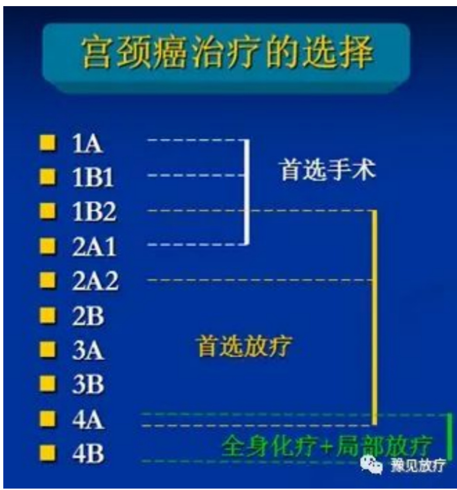
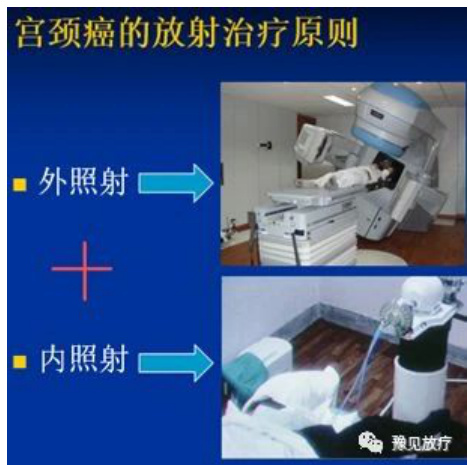
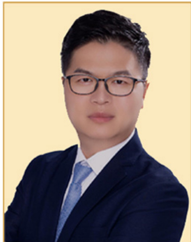
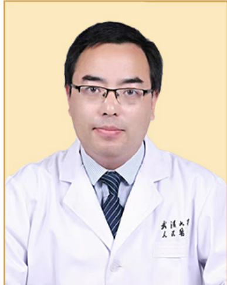
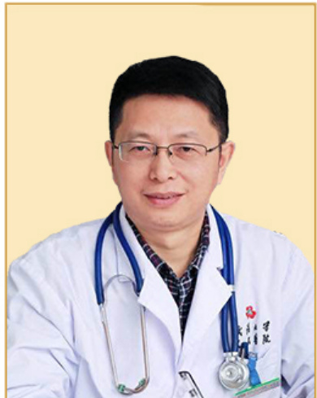
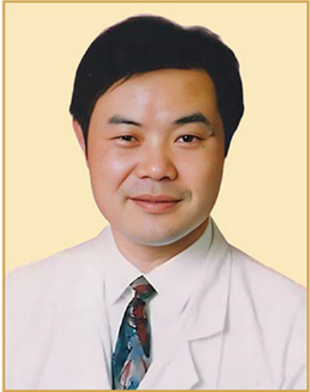

登录  

<html><body><table><tr><td>用户名</td><td rowspan="3"></td></tr><tr><td>密码</td></tr><tr><td></td></tr><tr><td>图形验证码</td><td>V </td></tr><tr><td></td><td></td></tr><tr><td></td><td></td></tr><tr><td>提交</td><td></td></tr><tr><td></td><td></td></tr></table></body></html>  

# 注册账号 |  忘记密码  

社交账号登录  

  

首页  
关于我们o 医院简介o 医院荣誉  
新闻动态。 医院动态行业资讯媒体报道  
专家团队科室专家先进设备  
治疗案例专家案例科研进展联系我们  

请输入关键词首页 > 新闻动态 > 行业资讯  

# 科普 | 宫颈癌的治疗与放疗选择  

作者：小编 更新时间：2022-12-27 点击数：2693  

近20年，我国宫颈癌的发病率呈持续上升趋势，且发病年轻化，大量的晚期患者，我们仍面临着较大的治疗压力。  

由国家卫健委发布的《宫颈癌诊疗指南》(2022年版)指出，放射治疗适用于各期宫颈癌，包括体外照射和近距离放疗及二者的联合应用。放疗完成的期限是获得最佳疗效的必备因素。放疗时间超过 9 周比少于 7 周的患者有更高的盆腔控制失败率，推荐 56 天内完成所有的外照射和近距离放疗。  

宫颈癌的治疗选择依分期而定，宫颈癌分为四期，每期又分A、B两期。各期的治疗方案如下：  

1）IA期以手术为首选，不能手术者可放疗。  
2）IB、IIA期根治性手术或根治性放疗。  
3）IIB-IVA期首选放疗，增敏化疗可提高疗效  
4）IVB期姑息治疗。  

  
▲图1/ 不同分期的宫颈癌治疗选择  

其中，Ⅰ期和Ⅱ期的患者放射治愈率在 $7 0 \sim 9 0 \%$ ，Ⅲ期的患者放射治愈率在 $4 0 \sim 6 0 \%$ ，Ⅳ期患者放射治疗后5年生存率约 $20 \%$ 。因此，那种“放疗只是辅助，是不能手术者的无奈之举”的观点，对于宫颈癌的放射治疗是错误的。  

对于肿瘤直径大于4cm的早期宫颈癌，临床研究结果亦证明，放疗联合化疗效果优于手术联合放化疗。  

现代放射治疗技术下，宫颈癌放疗效果进一步提升、副反应继续下降。在精准治愈肿瘤的同时，完美保护了膀胱、直肠、阴道的正常功能，使患者获得了更高生活质量的生命延续。  

  
$\blacktriangle$ 图2/ 宫颈癌的放射治疗选择  

对于宫颈癌的放射治疗选择，程淑霞教授表示：  

1）放射治疗是可以治愈宫颈癌的，特别对于中晚期宫颈癌，疗效优于手术；  
2）正确规范的放疗才能保障好的治疗效果；  
3）单纯化疗无法治愈宫颈癌，避免单用化疗，延误病情。  

与此同时，随着临床数据的积累，免疫药物（ICIs）在宫颈癌治疗中的推荐日渐增强。现有研究提示，免疫治疗宫颈癌的主要获益人群为 PD-L1 阳性患者。  

Papadopoulos KP, et al 的研究显示，Cemiplimab 联合低分割放疗治疗晚期肿瘤，有助在免疫疗效基础上，进一步缩短反应时间，帮助较快降低肿瘤负荷。  
Yin Z, et al 的研究显示，初诊伴内脏转移的宫颈癌患者接受系统化疗时，同步行放疗，较单纯化疗 $\pm$ 姑息性盆腔放疗，可带来生存裨益（OS：17.3 vs 10 月）。  

上述研究提示，在晚期转移性宫颈癌的治疗中，放疗 ± 免疫治疗有望提升反应率、降低初期进展风险，并带来生存获益。  

<html><body><table><tr><td colspan="4">宫颈癌系统治疗</td></tr><tr><td colspan="4">鳞癌、腺癌、腺鳞癌</td></tr><tr><td rowspan="2">放化疗</td><td colspan="3">复发/转移性疾病</td></tr><tr><td>一线联合治疗</td><td>一线单药治疗</td><td>二纟</td></tr><tr><td>推荐方案：顺铂、 卡铂（顺铂不耐 受)</td><td>推荐方案: Pembrolizumab十顺铂/紫 杉醇±BEV（PD-L1+) （1类）、Pembrolizumab 十卡铂/紫杉醇土BEV （PD-L1+）（1类）、 顺铂/紫杉醇/BEV （1类）、 卡铂/紫杉醇/BEV</td><td>推荐方案：顺铂 其他推荐方案：卡 铂、紫杉醇</td><td>推荐方案：「 L1十或MSI-F Nivolumab ( 其他推荐方 杉醇，多西1 吉西他滨，! 替康，丝裂 拓扑替康，· 特定情况下j Pembrolizum Larotrectinib 融合阳性)</td></tr></table></body></html>  

免疫治疗最初推荐二线/后线用于 MSI-H/dMMR，或 PD-L1 阳性宫颈癌患者，而在 2022.V1 NCCN 宫颈癌指南，PD-L1 表达阳性、复发/转移性宫颈癌患者，一线推荐 pembrolizumab 联合化疗治疗。  

加入收藏  
上一篇：前列腺癌放射性粒子治疗  
下一篇：什么是质子治疗、对哪些癌症疗效最好？透视质子疗法 3 大优质  
返回列表  

# 随便看看  

哪种肺癌需要通过放射治疗  
老师傅突冒1.4公分肝癌　「精准放射治疗」消灭癌肿瘤  
一文带你了解食管癌放疗，食管癌什么情况选择放疗？  
肺癌肿瘤分几期 结节大于几厘米需重视？  
肝癌肿瘤治疗新利器　成大引进新型微波消融治疗  
乳腺癌放疗后，出现皮肤痒红肿，疲累想睡觉，怎么办？  
TOMO放疗：告别‘杀敌一千，自损八百’，精准治疗新篇章！  
放疗x化疗 有何优缺点？  
华式医学研究院隆重成立了（肿瘤患者的福音）  
膀胱癌介绍：症状与放射、化疗、免疫治疗方式说明  

# 产品推荐  

# 【专家简介】  

  

武汉济和医院主任医师。从事肿瘤临床工作30多年，长期担任三甲医院科主任，对各种肿瘤的规范化诊疗，均有很深的研究。对内科常见病、多发病的诊断治疗有较丰富的经验。  

# 【专业擅长】  

对临床肿瘤内科的实用技术熟练掌握，开展各种肿瘤的术前、术后的辅助放化疗及各种肿瘤的根治性放化疗、靶向、免疫及细胞免疫等治疗，放疗技术从普通外照射、适型、调强、放射治疗外科。  

# 【坐诊时间：周一至周五】  

# 肿瘤科专家 主任医师 马玉芳  

  

# 【专家简介】  

湖北省肿瘤医院主任医师。从事肿瘤的基础和临床研究工作近20年，主要的研究方向包括肺癌脑转移转移生物标志物及信号传导、肿瘤放化疗、肿瘤抗血管生成治疗、正常组织的放射耐受及不良反应等。  

# 【专业擅长】  

擅长肺癌、食管癌、鼻咽癌、脑胶质瘤、头颈鳞癌和乳腺癌等各种常见恶性肿瘤的放化疗等综合治疗及靶向、免疫治疗。  

  

# 【专家简介】  

湖北省人民医院副主任物理师。从事肿瘤放射物理技术工作20余年，在肿瘤医学放射物理技术领域有较深造谐，特别是现代的静态/动态/容积调强适形放疗、全身肿瘤放疗、立体定向放疗。  

# 【专业擅长】  

主要擅长临床数据采集、临床数据建模、辐射测量学、临床剂量学以及各种特殊放疗技术的剂量测量、各种放疗设备质控、各种肿瘤放射治疗计划的设计、各种放疗设备的验收评审。  

# 【坐诊时间：周四上午】  

# 肿瘤科专家 副主任物理师 阮长利  

  

# 【专家简介】  

湖北省人民医院肿瘤中心主任医师，从事临床工作35年，兼任湖北省肺癌专业委员会委员，湖北省生物医学工程学会肿瘤靶向专业委员会常委，湖北省抗癌协会鼻咽癌专业委员会常委。  

# 【专业擅长】  

各种恶性肿瘤的早期诊断及综合治疗，擅长常见头颈部肿瘤、肺癌、乳腺癌、胃肠道肿瘤等恶性肿瘤放疗、化疗、生物靶向免疫综合治疗，尤其乳腺癌、鼻咽癌、肺癌、妇科肿瘤等恶性肿瘤的综合治疗。  

坐诊时间：周二下午）  

# 【专家简介】  

  

湖北省肿瘤医院主任医师。从事肿瘤放化疗工作30余年，能熟练、正确地诊治放疗科常见复杂、疑难病症及危、急、重症病例，是胃肠道肿瘤MDT、肝癌MDT、泌尿系肿瘤MDT的核心成员。  

# 【专业擅长】  

对胃肠道恶性肿瘤、泌尿系统肿瘤、肺癌、食管癌、肝胆胰恶性肿瘤、乳腺癌、淋巴瘤等恶性肿瘤有着丰富的临床经验，能熟练地进行上手肿瘤的精确放疗、化疗、靶向、免疫等综合治疗。  

# 【坐诊时间：周二上午】  

# 肿瘤科专家 主任医师 陈卫东  

# 关于我们  

o 医院简介 o 医院荣誉  

新闻动态  

o 医院动态C 行业资讯o 媒体报道  

专家团队  

科室专家o 先进设备  

治疗案例专家案例  

武汉市蔡甸区蔡甸大街216号  

18511195050  

zhongliu@whjh120.com  

关注我们  

友情链接  