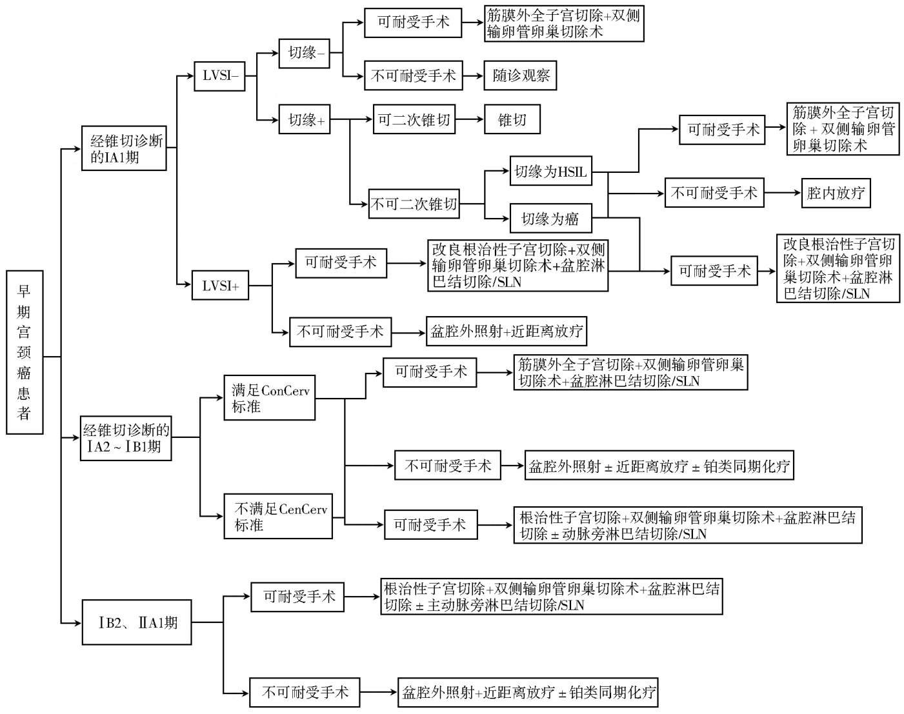

# ·指南与共识·  

# 老年宫颈癌规范化诊疗中国专家共识(2024 年版)  

中国老年医学学会妇科分会【关键词】 老年人;宫颈癌;手术;放疗;专家共识【中图分类号】 R592;R737. 33【文献标志码】 A  

【DOI】 10. 11915 / j. issn. 1671-5403. 2025. 01. 001  

宫颈癌( cervical cancer, CC) 是全球女性第四大常见癌症和癌症死亡的第四大原因[1]。 随着宫颈癌筛查技术及人乳头状瘤病毒(human papilloma-virus, HPV)疫苗的普及,许多发达国家宫颈癌的发病率正逐年下降[2]。 然而研究表明,老年人群癌症发病率较其他人群增加了11 倍[3],而随着我国人口老龄化问题日趋严重,老年宫颈癌患者人数不降反增。 2022 年我国新发宫颈癌达到 15. 07 万,年死亡接近6 万例,其中老年女性(60 岁以上) 占比高达$2 9 . 8 \%$ [4],预计到 2040 年,中国宫颈癌死亡病例将达 7. 5 万例[5]。 世界卫生组织将老年定义为 65 岁以上,我国定义为 60 岁以上[6],老年患者由于就医意愿不强,恐惧妇科检查等原因,确诊宫颈癌时往往分期更晚,且因自身体质较差,内科合并症较多,通常预后更差[7]。 本共识旨在规范老年宫颈癌患者的诊治,中国老年医学学会妇科分会组织国内专家根据现有国内外文献,参考美国国立综合癌症网络( National Comprehensive Cancer Network, NCCN )指南、中国临床肿瘤学会( Chinese society of clinicaloncology, CSCO)指南等,集体讨论并共同制定中国老年宫颈癌规范化治疗共识,为妇科肿瘤医师临床诊治老年宫颈癌提供参考。 本共识推荐级别及其代表意义见表1。  

表 1　 本共识推荐级别及其代表意义  

<html><body><table><tr><td>推荐级别</td><td>代表意义</td></tr><tr><td>1类</td><td>基于高级别临床研究证据，专家意见高度一致</td></tr><tr><td>2A类</td><td>基于高级别证据，专家意见基本一致；或基于低级别</td></tr><tr><td></td><td>临床研究证据，专家意见高度一致</td></tr><tr><td>2B类</td><td>基于低级别临床研究证据，专家意见基本一致</td></tr><tr><td>3类</td><td>不论基于何种级别临床证据，专家意见明显分歧</td></tr></table></body></html>

收稿日期: 2024-07-30; 接受日期: 2024-09-16基金项目:辽宁省重点研发项目(2024JH2 / 102500019);2022 年沈阳市科技计划(22-321-33-08);沈阳市科技局 2023 年助力中国医科大学高质量发展专项(23-506-3-01-10); 国家自然科学基金(82102711);北京市科技计划( Z221100007422087);北京市医院管理中心临床医学发展专项经费资助(ZLRK202529)通信作者: 张颐, E-mail: syzi $@$ 163. com; 吴玉梅, E-mail: $\mathrm { w y m } 5 9 7 1 1 8 @ \$ ccmu. edu. cn; 张师前, E-mail: r370112@ 126. com  

# 1　 老年宫颈癌的诊断与评估  

老年宫颈癌患者具有特殊性,需进行全面的诊断与评估,以制定适宜治疗方案。  

# 1. 1 疾病诊断  

宫颈癌的诊断主要包括临床诊断(病史及体格检查)及病理诊断。  

1. 1. 1　 临床诊断　 中国各地区宫颈癌筛查的应用并不平衡,即使在发达地区,罹患宫颈癌的老年妇女并不鲜见。 老年女性因其生殖道生理条件改变,性生活的频率低,多缺乏疾病早期的白带异常或接触性出血等典型症状,内生型宫颈癌多以白带恶臭或宫腔积液/ 积脓为首发症状。 HPV 是宫颈癌主要致病因素,而老年女性属于高危型 HPV 易感人群(感染率为 $1 6 . 7 \%$ ),虽然感染率低于总体女性人群,但绝经后雌激素水平较低,无法维持阴道微生态平衡,机体免疫力下降,感染 HPV 的自然转阴率低,多为持续感染[8-10],进而导致宫颈上皮内瘤变(cervicalintraepithelial neoplasia,CIN) 并 进 展 至 宫 颈 浸 润 癌。老年女性生殖道萎缩、粘连,妇科检查往往无法充分暴露子宫颈;宫颈鳞柱交界上移,甚至退缩至宫颈管内,即使发生病变,宫颈外观也可无异常。 建议详细询问病史,并由2 名及以上高年资医师进行双合诊与三合诊检查,如患者配合度差,必要时联合麻醉进行妇检。 同时参考“老年女性子宫颈病变筛查及异常管理的中国专家共识(2023 年版) [11] ”。  

1. 1. 2　 病理诊断　 病理学为宫颈癌诊断的金标准,主要通过宫颈活组织检查进行诊断,存在远处转移时(如腹股沟/ 颈部淋巴结),推荐进行活检或细针穿刺细胞学确诊。 当老年宫颈癌患者仅靠活检无法判断宫颈肿瘤浸润深度及微小浸润癌时,或宫颈液基细胞学检查( thinprep cytology test, TCT) 结果与阴道镜下活检病理不符时,推荐宫颈管搔刮和诊断性宫颈锥切。  

在老年宫颈癌患者中,鳞状细胞癌最为常见,约占 $7 5 \%$ ;其次是腺癌,约占 $1 8 . 4 \% ^ { [ 1 2 ] }$ 。 病理学诊断还可提供辅助诊断及治疗的生物标志物,常用的指标包括 P16、Ki67、CK7、CK20、CEA、ER、PR、MUC6、CD56 和 $\mathrm { C g A }$ 等,对于复发、转移或持续性宫颈癌,可通过检测免疫检查点抑制剂相关指标包括细胞程序性 死 亡 配 体 - 1 ( programmed death ligand-1,PD-L1)、错配修复 / 微卫星不稳定( mismatch repair /microsatellite instability, MMR / MSI) 和 肿 瘤 突 变 负荷( tumor mutational burden, TMB ), 必 要 时 进 行NTRK 基因融合检测以指导全身治疗[13]。 C  

# 1. 2 疾病评估  

1. 2. 1　 经阴道/ 直肠超声检查　 经阴道/ 直肠超声(transvaginal / transrectal ultrasound, TVS / TRS) 检查具有简单、方便、价格低廉等特点,可作为老年宫颈癌患者的首选检查。 宫颈肿瘤体积较大,TRS 是评估宫颈局部的首要选择,不仅能够减少肿瘤接触出血风险,还可清晰观察宫颈局部病灶及肿瘤血流情况,避免 TVS 因肿瘤出血、坏死和探头与肿瘤之间形成伪影的影响[14]。 不同病理类型宫颈癌的超声表现也有所不同,腺癌组织相较于周围基质通常表现为高回声或等回声, 鳞癌则通常表现为低回声[15,16] 。 因不受肠道气体的干扰,TVS / TRS 能较好地评估盆腔淋巴结是否肿大。 TVS / TRS 对宫颈癌肿瘤大小、间质浸润及宫旁浸润评估的灵敏性及准确性分别为 $78 \% / 9 5 \%$ 、 $8 8 \% \sim 9 1 \% / 9 1 \% \sim 9 3 \%$ 、$6 0 \% \sim 8 3 \% / 8 7 \% \sim 9 9 \% ^ { [ 1 7 - 2 0 ] }$ 。 鉴于超声检查受诊断医师的主观影响较大,本共识推荐由丰富经验的超声医师实施,以减少人为因素所致评估偏倚。  

1. 2. 2 　 盆腔核磁共振 　 盆腔核磁共振 ( magneticresonance imaging, MRI)具有较高的软组织分辨率,是评估宫颈癌局部病变的优选影像学检查手段。 推荐盆腔 MRI 增强扫描,在 T2 加权图像上表现为典型的中等高信号,矢状面可以评估肿瘤是否已累及子宫体或阴道,轴向斜面更适合评估宫旁浸润情况。动态增强 MRI( dynamic enhanced-MRI, DCE-MRI)能够精准显示宫颈肿瘤的界限,也可藉以鉴别病理无法区分的宫颈癌及子宫内膜癌,宫颈癌为特征性早期动脉期增强, 子宫内膜癌则表现为延迟增强[21]。 MRI 对宫颈癌肿瘤大小、间质浸润及宫旁浸润的评估的灵敏度及准确度分别为 $8 1 \% / 9 3 \%$ 、$89 \% / 8 8 \%$ 、 $. 4 0 \% \sim 7 4 \% / 7 0 \% \sim 9 7 \%$ ,对淋巴结转移评估的灵敏度为 $3 7 \% \sim 6 0 \% ^ { [ 2 2 - 2 5 ] }$ O  

1. 2. 3　 计算机断层显像　 局部晚期宫颈癌、盆腔MRI 或 TVS / TRS 有可疑淋巴结转移患者,或因无法取环行 MRI 检查时推荐进行胸腹盆计算机断层显像( computed tomography, CT) 检 查, 首 选 腹 盆增强 $\mathrm { C T }$ 。 但 CT 对于软组织分辨率低,评估宫颈局部不及 MRI,评估宫旁浸润的灵敏度及准确度为$1 4 \% \sim 5 5 \% / 7 4 \% \sim 8 2 \%$ ,盆腔淋巴结转移的灵敏度为 31% \~ 58%[22-25] 。 O  

1. 2. 4　 正电子发射断层扫描计算机断层扫描　 正电子发射断层扫描计算机断层扫描(positron emissiontomography-computed tomography, PET-CT)可同时显示肿瘤形态和组织代谢特征,诊断淋巴结转移的灵敏度为 $7 2 \% \sim 7 5 \%$ ,仅次于前哨淋巴结活检,还可检出肿瘤有无远处转移,尤其适宜于晚期、复发或转移的高危患者[25-29] 。 。  

# 1. 3　 老年宫颈癌分期  

目前宫颈癌分期仍采用 2018 年国际妇产科联合会( international federation of gynecology and obste-trics, FIGO)新分期(表 2),结合患者体格检查、影像学及病理学资料,对肿瘤大小、扩散程度进行综合评估,以诊断宫颈癌期别。  

# 【推荐意见】  

老年宫颈癌患者应进行妇科检查、病理学诊断和影像学检查以全面评估肿瘤,指导制定适宜的治疗方案。 TVS / TRS 及盆腔 MRI 能够较精准评估局部肿瘤,为局部肿瘤首选检查手段。 CT 更适用于评估有无淋巴结转移,高危患者可选择 PET-CT 以排除远处转移。 (推荐级别:2A)  

# 2　 患者整体机能评估  

年龄本身不是宫颈癌手术治疗的绝对禁忌证,但对于老年患者来说,对整体机能评估是决策过程的关键一步。 建议在制定治疗方案前应对老年患者进行个体化评估,评估内容包括:(1)根据肿瘤恶性程度和疾病进展情况评估患者预期寿命;(2) 评估患者的决策能力,即患者对自身病情的了解程度及能够合理选择治疗的能力;(3) 明确患者的治疗目标与其所能承受治疗的一致性[30]。 D  

# 2. 1 衰弱评估  

“衰弱”(frailty)是多系统生理功能退化为特征的一组老年疾病[31,32]。 衰弱评估包括三个维度,即躯体、心理和社会。 Fried 表型是最具代表性的衰弱评估量表,包括体质量减轻、手握力差、疲劳、行走迟缓 、体力活动受限五方面,评分 $\geqslant 3$ 分为重度衰弱,  

表 2　 国际妇产科联盟宫颈癌临床分期标准(FIGO 2018)  

<html><body><table><tr><td>分期</td><td>描述</td></tr><tr><td>I</td><td>肿瘤严格局限于宫颈(扩展至宫体将被忽略)</td></tr><tr><td>IA</td><td>仅能在显微镜下诊断的浸润癌，所测量的最大浸润深度≤5.0mm</td></tr><tr><td>IA1</td><td>所测量间质浸润深度≤3.0mm</td></tr><tr><td>IA2</td><td>所测量间质浸润深度>3.0mm而≤5.0mm</td></tr><tr><td>IB</td><td>所测量的最大浸润深度>5.0mm的浸润癌（病变范围超过IA期）,病变局限于宫颈</td></tr><tr><td>IB1</td><td>间质浸润深度>5.0mm而最大径线≤2.0cm的浸润癌</td></tr><tr><td>IB2</td><td>最大径线>2.0cm而≤4.0cm的浸润癌</td></tr><tr><td>IB3</td><td>最大径线>4.0cm的浸润癌</td></tr><tr><td>Ⅱ</td><td>宫颈肿瘤侵犯超出子宫，但未达盆壁，且未达阴道下1/3</td></tr><tr><td>IIA</td><td>肿瘤侵犯限于阴道上2/3,无宫旁浸润</td></tr><tr><td>IIA1</td><td>最大径线≤4.0cm的浸润癌</td></tr><tr><td>IIA2</td><td>最大径线>4.0cm的浸润癌</td></tr><tr><td>IIB</td><td>有宫旁浸润，但未扩展至盆壁</td></tr><tr><td>ⅢI</td><td>肿瘤扩展到骨盆壁和(或)累及阴道下1/3和(或)导致肾孟积水或肾无功能者和(或)侵犯盆腔和(或)腹主动脉旁淋巴结</td></tr><tr><td>ⅢIA</td><td>肿瘤累及阴道下1/3，没有扩展到骨盆壁</td></tr><tr><td>ⅢIB ⅢIC</td><td>肿瘤扩展到骨盆壁和(或)引起肾盂积水或肾无功能</td></tr><tr><td>ⅢIC1</td><td>侵犯盆腔和(或)腹主动脉旁淋巴结（包括微转移）,无论肿瘤大小和范围;需标注r或p:r表示影像诊断,p表示病理诊断</td></tr><tr><td>ⅢIC2</td><td>仅有盆腔淋巴结转移 腹主动脉旁淋巴结转移</td></tr><tr><td>IV</td><td>肿瘤侵犯膀胱或直肠黏膜(病理证实)或肿瘤播散超出真骨盆。泡状水肿不能分为IⅣ期</td></tr><tr><td>IVA</td><td>肿瘤侵犯膀胱或直肠黏膜</td></tr><tr><td>IVB</td><td></td></tr><tr><td></td><td>肿瘤播散至远处器官</td></tr></table></body></html>  

1\~2 分为中度衰弱,0 分为不衰弱[33]。 临床衰弱性量表(clinical frailty scale, CFS) 是另一种常用的衰弱性筛查工具,多用于评估住院老年患者的衰弱状况,主要从移动能力、精力、体力活动和功能四个方面将脆弱程度分为9 个等级:从非常健康到终末期,研究表明 CFS 与死亡率密切相关[34]。  

老年人群衰弱性增加意味着患者术后死亡率和并发症风险上升、住院时间延长[35-38],评估老年衰弱程度可协助规范治疗,降低治疗相关的不良事件发生率。  

# 2. 2 心肺功能  

老年患者心肺功能明显减退,罹患冠心病、高血压等心血管疾病及围手术期肺部并发症的风险增加[39] C  

修订后的心脏风险指数(revised cardiac risk index,RCRI)广泛用于心脏评估,由六个独立的预测因子构成,包括高风险手术、缺血性心脏病史、充血性心力衰竭史、脑血管手术、需要胰岛素治疗的糖尿病、以及术前血清肌酐水平 ${ > } 2 . 0 \ \mathrm { m g / d l }$ 。 并发症发生率随危险因素的增加而升高,存在 3 个以上危险因素时并发症发生率为 $9 \% ^ { [ 4 0 ] }$ ,腹部四级手术患者围术期肺部并发症发生率为 $6 0 . 8 \% ^ { [ 4 1 ] }$ ,手术方式(尤其上腹部及胸部手术)、急诊手术、衰弱、术前呼吸道感染、美国麻醉医师协会( American society of anesh-esiologists, ASA) 分级高是术后呼吸衰竭的五大关键危险因素。 ARISCAT ( assess respiratory risk insurgical patients in Catalonia) 评分根据年龄、1 个月内的呼吸道感染、血氧饱和度、贫血、手术部位、手术时间、是否急诊七个因素, 将患者分为低危( $\leqslant$ 26 分)、中危(27 \~ 44 分)、高危( $\geqslant 4 5$ 分) 三级。 宫颈癌是风险高、难度大的四级手术,ARISCAT 评分能较为精准发现可能发生肺部并发症的患者,通过降风险因素( 如术前戒烟)、优化治疗慢性阻塞性疾病、呼吸训练或物理治疗,以期降低老年宫颈癌患者围术期肺部并发症的发生率[42]  

# 2. 3 营养状态评估  

营养不良通常与切口感染、肺炎、尿路感染和切口延迟愈合有关,甚至延长住院及重症监护时间,增加术后不良事件的发生率[43,44]。 微营养评定简表(mini-nutritional assessment, MNA)是一种被广泛采用的营养状况评估工具,分数范围为 0 \~ 14 分,其中12\~14 分为正常营养状态,8 \~ 11 分表示存在营养不良风险, $\leqslant 7$ 分表示营养不良。 营养不良患者可能从严格的营养评估和康复中受益,可于术前$1 0 \sim 1 4 \mathrm { d }$ 开始口服蛋白质补充剂和富含碳水化合物的液体,改善机体营养状态[45]  

# 【推荐意见】  

年龄不是老年宫颈癌患者手术治疗的危险因素,治疗决策前对患者进行整体机能评估,包括衰弱程度、心肺功能及营养状态等,给予针对性干预以减  

少围术期不良事件的发生。 (推荐级别:2A)  

# 2. 4 多共病评估  

“共病” 系指患者患一种疾病的同时存在另一种或多种疾病[46],多共病现象在老年患者中尤为突出,影响患者的预后,导致诊疗决策制订复杂化,增加治疗风险。 针对多共病的老年患者,需要进行全面评估,采用连续、综合、个体化的诊治。  

2. 4. 1 　 Charlson 共 病 指 数 　 Charlson 共 病 指 数(Charlson comorbidity index, CCI) 是目前使用最广泛的共病指数(表 3),通常被认为是临床研究中评估合并症的金标准[47],CCI 总分由权重分总和组成,分数越高表示患者合并症越严重,死亡风险越大[48]。 此外,CCI 对患者再住院率及医疗费用具有一定的预测价值。 CCI 也演变出一些相关指数用于患者预后的预测,年龄-合并症指数(age-CCI) 在肿瘤学中最常使用,是死亡率的重要预测指标。  

表 3　 Charlson 共病指数  

<html><body><table><tr><td>事件</td><td>分配权重</td></tr><tr><td>心肌梗死</td><td>1</td></tr><tr><td>充血性心力衰竭</td><td>1</td></tr><tr><td>外周血管疾病</td><td>1</td></tr><tr><td>脑血管疾病</td><td>1</td></tr><tr><td>痴呆</td><td>1</td></tr><tr><td>肺慢性疾病</td><td>1</td></tr><tr><td>结缔组织病</td><td>1</td></tr><tr><td>溃疡</td><td>1</td></tr><tr><td>轻度肝病</td><td>1</td></tr><tr><td>糖尿病</td><td>1</td></tr><tr><td>偏瘫</td><td>2</td></tr><tr><td>中度或重度肾脏疾病</td><td></td></tr><tr><td>糖尿病引发的器官损害的终末期</td><td>2</td></tr><tr><td>无转移的任何肿瘤</td><td>2</td></tr><tr><td>白血病</td><td>2 2</td></tr><tr><td>淋巴瘤</td><td>2</td></tr><tr><td>中重度肝病</td><td>3</td></tr><tr><td>转移性实体瘤</td><td>6</td></tr><tr><td>艾滋病</td><td>6</td></tr></table></body></html>  

2. 4. 2　 疾病累积评分量表　 疾病累积评分量表( cumulative illness rating scale, CIRS)是最早依据疾病系统分类的共病指数,根据器官和系统评估合并症的重要性进行评分, 总共纳入 13 个系统相关疾病。 针对老年患者修订的 CIRS( CIRS-G),根据器官系统合并症的严重程度评为 0 \~4 分,当同一系统同时出现1 种以上疾病时,只计算该系统最严重疾病, 统计总得分[49]。 美国临床肿瘤学会推荐CIRS-G 评估老年癌症患者的合并症[50],与 CCI 相比,CIRS 包含的疾病谱更广,灵敏性更高[46],但仍缺乏有关合并症类型、数量和某特定合并症的预后价值的数据。  

# 【推荐意见】  

老年宫颈癌患者的多共病现象更加普遍,影响治疗策略制定和预后结局,推荐老年宫颈癌患者应用 CCI 及 CIRS-G 评估共病,以满足老年宫颈癌患者的个体化诊治。 (推荐级别:2A)  

# 3　 治疗原则  

# 3. 1　 早期宫颈癌患者  

手术是早期宫颈癌患者标准治疗方式。 研究表明,手术能改善早期老年宫颈癌患者预后[51,52]。 老年患者能否耐受根治性子宫切除术及盆腔淋巴结清扫术,需根据手术风险分层工具评估[53,54],重点考量患者合并症、体能状态对手术治疗的耐受性及术后相关并发症风险(图1)。  

3. 1. 1　 可耐受手术者　 对于早期可耐受手术的老年宫颈癌患者,推荐行手术治疗,此阶段患者治疗原则与年轻患者基本相同[55]。 O  

经宫颈锥切确诊的ⅠA1 期淋巴脉管间隙浸润(lymphovascular space invasion, LVSI) 阴 性 的 老 年患者:(1)切缘阴性者,推荐筋膜外子宫切除术 $+$ 双侧输卵管卵巢切除术;(2) 切缘为高级别鳞状上皮内病 变 ( high-grade squamous intraepithelial lesion,HSIL)者,推荐再次锥切,如宫颈管萎缩、无法行二次锥切者,建议直接行筋膜外全子宫切除 $^ +$ 双侧输卵管卵巢切除术;(3)切缘为癌者,推荐改良根治性子宫切除术 $^ +$ 双侧输卵管卵巢切除术 $^ +$ 盆腔淋巴结切除术/ 前哨淋巴结活检。 LVSI 阳性的老年患者:推荐改良根治性子宫切除术 $+$ 双侧输卵管卵巢切除术 $^ +$ 盆腔淋巴结切除术/ 前哨淋巴结活检。  

经宫颈锥切确诊的 $\mathrm { ~ I ~ A 2 \sim ~ I ~ B 1 ~ }$ 期满足全部ConCerv 标准[LVSI 阴性,切缘阴性,鳞癌( 任何级别)或普通类型腺癌(G1 / G2),肿瘤直径 $\leqslant 2 \mathrm { c m }$ ,浸润深度 $\leqslant 1 0 \mathrm { m m }$ ,影像学检查无其他部位转移]的老年患者,推荐行筋膜外子宫切除 $^ +$ 双侧输卵管卵巢切除术 $^ +$ 盆腔淋巴结切除/ 前哨淋巴结活检,否则推荐行根治性子宫切除术 $+$ 双侧输卵管卵巢切除术 $+$ 盆腔淋巴结切除 $\pm$ 主动脉旁淋巴结切除/ 前哨淋巴结活检。  

经宫颈锥切诊断的ⅠB2、ⅡA1 期老年患者,推荐根治性子宫切除术 $^ +$ 双侧输卵管卵巢切除术 $+$ 盆腔淋巴结切除 $\pm$ 主动脉旁淋巴结切除/ 前哨淋巴结活检[56] 。 C  

  
图 1　 早期宫颈癌患者治疗原则  
HSIL: 子宫颈高级别上皮内瘤变; LVSI: 淋巴血管间质浸润; SLN: 前哨淋巴结.  

文献报道,老年宫颈癌患者对根治性子宫切除及盆腔淋巴结切除术的耐受性良好,尽管术后住院时间及留置尿管时长有所延长,但术后并发症发生率未明显升高[57,58] 。 也有观点认为,老年患者因盆底组织萎缩,子宫脱垂或移位,手术难度增大,出现副损伤及术后并发症率增加,可适当缩小手术范围,选择单纯筋膜外子宫切除术 $^ +$ 双侧输卵管卵巢切除术 $+$ 盆腔淋巴结切除术/ 前哨淋巴结活检[59] 。 总之,老年患者如行手术治疗,需加强围手术全程管理,注意全身麻醉气管插管及肺部感染管控,加强营养支持治疗、降低和预防血栓栓塞性疾病的发生、规范静脉输液量,预防心脏并发症发生。  

早期老年宫颈癌患者,术后需根据危险因素评估是否需补充治疗。 切缘阳性、宫旁浸润及淋巴结转移是宫颈癌三大高危因素,存在 1 项及以上高危因素者,如术前全身评估不充分,必要时需进一步影像学检查以了解其他部位转移情况,后补充盆腔外照射 $+$ 含铂同期化疗 $\pm$ 近距离放疗。 中危因素包括但不限于肿瘤大小、间质浸润及 LVSI 阳性,鳞状细胞癌按照 Sedlis 标准进行评估(表 4),但中危因素不限于 Sedlis 标准。 研究表明,与鳞癌相比,腺癌患者的预后更差,术后补充放疗的获益更大[13];因此腺癌采用四因素模型:腺癌、LVSI 阳性、肿瘤 $> 3 \ \mathrm { c m }$ 和深间质浸润,若满足2 个及以上因素,术后均建议补充放疗。  

如老年宫颈癌患者在术前评估时既存在术后需补充放疗的危险因素,建议直接行根治性放疗[60],以减少非必要的联合治疗对预后的不良影响。  

表 4　 Sedlis 标准  

<html><body><table><tr><td>LVSI</td><td>间质浸润</td><td>肿瘤直径</td></tr><tr><td>+</td><td>外1/3</td><td>任何大小</td></tr><tr><td>+</td><td>中1/3</td><td>≥2 cm</td></tr><tr><td>+</td><td>内1/3</td><td>≥5 cm</td></tr><tr><td>二</td><td>中或外1/3</td><td>≥4 cm</td></tr></table></body></html>

LVSI: 淋巴血管间质浸润.  

3. 1. 2　 不可耐受手术/ 治疗意愿不强烈者　 放疗作为宫颈癌另一主要治疗方式,疗效不亚于手术,老年患者也可良好耐受[61-64],对于不耐受手术/ 治疗意愿不强烈的早期老年宫颈癌患者,能够通过放疗获得良好预后,具体治疗方式需根据疾病阶段、身体状态综合决策。  

对于仅能耐受宫颈锥切的 $\mathrm { ~ I ~ A ~ l ~ } \sim \mathrm { ~ I ~ A } 2$ 期老年宫颈癌患者,术后切缘阴性且无 LVSI 者,可随诊观察[65],余患者推荐盆腔外照射 $\dot { \bf \Phi } _ { \pm } ,$ 顺铂同期放化疗,不能耐受顺铂化疗者可更换为卡铂[66]。 ⅠB1、ⅠB2、ⅡA1 期老年患者推荐盆腔外照射 $^ +$ 近距离放疗 $\pm$ 顺铂单药同期化疗(不能耐受顺铂者更换为卡铂) [56]。  

# 【推荐意见】  

早期老年宫颈癌患者可能从手术治疗中获益(推荐级别:2B),年龄不是手术的禁忌证,可耐受手术者仍推荐行手术治疗,治疗原则基本同年轻患者,强调加强术后护理,减少术后并发症的发生(推荐级别:2A)。 术后需根据中高危因素决定是否补充治疗,如术前评估存在相关危险因素及患者治疗意愿不强烈/ 无法耐受手术者推荐直接行根治性放疗。(推荐级别:2A)。  

# 3. 2　 晚期宫颈癌患者  

晚期宫颈癌生存结局差,放疗是局部晚期宫颈癌患者的主要治疗方式。 研究证实,即使年龄 $\geqslant$ 80 岁的宫颈癌患者行根治性放疗也能获得良好的治疗效果[67],年龄并不影响放射治疗效果及耐受性,即使仅行姑息性放射治疗也可达到控制局部出血、缩小肿瘤病灶、缓解压迫症状、减轻骨转移导致疼痛的目的[68]。 C  

确诊ⅠB3、ⅡA2 \~ Ⅳa 期的局部晚期老年宫颈癌患者,推荐放疗联合以铂为基础的同步化疗为主要治疗方式,其中化疗方案推荐单药,优选顺铂;如存在顺铂禁忌证或不耐受,可更换为卡铂;如患者病理类型为鳞癌,尼妥珠单抗也作为可选方案[69]。对于体弱无法耐受联合治疗的老年患者,可仅进行盆腔外照射 $^ +$ 近距离放疗。 具体治疗方式如下。(1)影像学提示淋巴结阴性者:推荐盆腔外照射 $^ +$ 近距离放疗 $^ +$ 含铂同期化疗。 (2) 影像学提示盆腔淋巴结阳性、主动脉旁淋巴结阴性:推荐行盆腔外照射 $^ +$ 近距离放疗 $^ +$ 含铂同期化疗 $\pm$ 主动脉旁淋巴结放疗。(3)影像学提示盆腔及主动脉旁淋巴结均阳性者:推荐行延伸野放疗 $^ +$ 近距离放疗 $^ +$ 含铂同期化疗。(4)影像学提示有远处转移并经活检证实转移者,推荐行全身治疗 $\dot { \bf { \varepsilon } } \pm \mathbf { \varepsilon }$ 个体化放疗。 如远处转移的病灶部位仅局限于锁骨上淋巴结,可行根治性治疗;如果患者的原发灶已控制,其他部位存在 1 \~ 5 个转移  

灶,可考虑立体定向放疗。  

对于ⅣB 期出现远处转移的晚期老年宫颈癌患者,经评估适合局部治疗者,推荐行局部消融治疗±个体化放疗,或个体化放疗 $\pm$ 全身系统治疗;不适合局部治疗者,推荐行全身系统性治疗,也可考虑通过放疗等姑息性治疗,改善患者生活质量[56]。  

# 【推荐意见】  

放疗是晚期老年宫颈癌患者的主要治疗方式,患者通常也可良好耐受,具体治疗方案需根据患者自身疾病特点及个体条件综合考量,以改善患者生活质量、适当延长生存期为主要目标。 (推荐级别:2A)  

# 3. 3 免疫及靶向治疗  

免疫治疗、靶向治疗联合化疗可用于晚期、复发、转移宫颈癌患者。 免疫检查点抑制剂帕博利珠单抗联合化疗可提高 PD-L1 阳性( $\mathrm { C P S } \geqslant 1$ ) 患者的生存期(无进展生存期及总生存期),对于ⅢA 期以上宫颈癌患者初治时使用同步放化疗联合帕博利珠单抗可显著提高患者生存;卡度尼利单抗是一种靶向程序性死亡受体 1(programmed death-1, PD-1)和细胞毒性 T 淋巴细胞抗原-4(cytotoxic T lymphocyteantigen 4, CTLA-4)的双特异性抗体,目前在我国被批准用于既往接受过含铂化疗治疗失败的患者,无论 PD-L1 状态如何,均能从中获益[70]。 贝伐珠单抗已被我国批准用于晚期、复发、转移宫颈癌患者的一线治疗,联合化疗发挥协同作用,能有效改善患者预后;其他免疫治疗药物如西米普利单抗( PD-1抑制剂)已被临床试验证实能够为宫颈癌患者带来生存获益;多靶点小分子酪氨酸激酶抑制剂如阿帕替尼/ 安罗替尼以及抗体偶联药物如替索单抗等,也正在临床试验探索中[71] ,因尚缺乏高质量循证证据在此不做推荐。 老年宫颈癌患者应用免疫治疗时,应全面评估患者免疫基线水平,在符合指征情况下按疗程合理用药,治疗期间监测患者身体状态,积极管理免疫药物相关不良反应,避免严重并发症发生,在保证患者生活质量的同时改善患者预后。  

# 【推荐意见】  

免疫治疗、靶向治疗联合化疗能有效改善晚期、复发、转移宫颈癌患者预后,需全面评估老年患者机体状态,积极管理相关不良反应,以求更大获益。(推荐级别:2A)  

# 3. 4　 全身系统治疗  

复发和转移性宫颈癌全身系统治疗标准方案为顺铂/ 卡铂 $^ +$ 紫杉醇 $+$ 贝伐珠单抗[72,73],目前对于老年患者没有针对性的化疗方案临床研究,有部分临床研究纳入了少量老年患者,但研究结论广泛应用于老年患者缺乏说服力。 对老年患者而言,单药化疗是一种选择,推荐药物包括顺铂、卡铂、紫杉醇;二线治疗可选药物包括白蛋白结合型紫杉醇、多西他赛、吉西他滨、培美曲塞、拓扑替康、异环磷酰胺、丝裂霉素、氟尿嘧啶、长春瑞滨、伊立替康等[74]。 O  

# 4　 总　 结  

老年宫颈癌患者的治疗,除全面评估肿瘤本身外,需结合整体机能、自身意愿评估患者对于治疗方式的耐受性,选择适宜的治疗方案。 早期可耐受手术者仍应以手术治疗为主,围术期需加强管理,减少术后严重并发症的发生。 晚期及不可耐受手术者应进行个体化评估,首选放疗联合以铂为基础的同步化疗,也可按指征联合免疫及靶向治疗,但需积极管理不良反应,手术仅用于姑息性治疗,旨在控制局部肿瘤、缓解症状、延长生存时间、提高生活质量。  

本共识仅为临床诊疗提供指导性意见,但并非唯一的实践指南,不排除其他共识、意见与建议的合理性。  

# 利益冲突:无  

共识制定与讨论专家(按姓氏拼音排序):艾浩(锦州医科大学附属第三医院);崔晓楠( 大连医科大学附属第一医院);窦磊(中国医科大学附属第一医院); 董延磊( 山东大学第二医院);范江涛(广西医科大学第一附属医院);范文生(中国人民解放军总医院妇产科医学部);李斌( 中国医学科学院肿瘤医院);李芳梅(中国医科大学附属第一医院);李静(中国医科大学附属第一医院);李圃(天津市中心妇产科医院);李昭(中国医科大学附属第一医院);刘禄斌(重庆市妇幼保健院);栾正刚(中国医科大学附属第一医院);牛菊敏(沈阳市妇婴医院);潘美竹(中国医科大学附属第一医院);郄明蓉(四川大学华西第二医院);申复进(武汉大学人民医院);宋玉丽(中国医科大学附属第一医院);孙蓬明(福建省妇幼保健院);谭姝( 哈尔滨医科大学附属肿瘤医院);谭文斐(中国医科大学附属第一医院);田文(中国医科大学附属第一医院);王建东(首都医科大学附属北京妇产医院);王玮(中国医科大学附属第一医院);王新波( 山东省妇幼保健院);王雅卓(河北省人民医院);吴绪峰(湖北省妇幼保健院);许天敏(吉林大学第二医院);杨萍(石河子大学医学院第一附属医院);严妍(中国医科大学附属第一医院);于云海( 山东大学第二医院);张广美(哈尔滨医科大学附属第一医院);张师前( 山东大学齐鲁医院);张颐(中国医科大学附属第一医院);赵辉(首都医科大学附属北京妇产医院);朱维培(苏州大学附属第二医院)  

执笔作者:张颐(中国医科大学附属第一医院);严妍(中国医科大学附属第一医院); 何玥( 首都医科大学附属北京妇产医院);张师前(山东大学齐鲁医院);吴玉梅( 首都医科大学附属北京妇产医院)  

【参考文献】   
[ 1] 　 Neumeyer S, Tanaka LF, Liang LA, et al. Epidemiology of cervical cancer in elderly women: analysis of incidence, treatment, and survival using German registry data[J]. Cancer Med, 2023, 12(16): 17284-17295. DOI: 10. 1002/ cam4. 6318.   
[2] 　 Bray F, Ferlay J, Soerjomataram I, et al. Global cancer statistics 2018: GLOBOCAN estimates of incidence and mortality worldwide for 36 cancers in 185 countries[ J] . CA Cancer J Clin, 2018, 68: 394-424. DOI: 10. 3322 / caac. 21492.   
[3] 　 Vitale SG, Capriglione S, Zito G, et al. Management of endometrial, ovarian and cervical cancer in the elderly: current approach to a challenging condition[J]. Arch Gynecol Obstet, 2019, 299(2): 299-315. DOI: 10. 1007/ s00404-018-5006-z.   
[4]　 杨蜜, 张加勇, 张欣平, 等. 免疫治疗联合热疗加放疗治疗老年 中晚期宫颈癌的疗效及安全性[J]. 现代肿瘤医学, 2024, 32(1): 125-129. DOI: $1 0 . 3 9 6 9 / \mathrm { j }$ . issn. 1672-4992. 2024. 01. 022.   
[5]　 黄留叶, 赵雪莲, 赵方辉. 宫颈癌的发病与死亡变化趋势及其 预防策略进展[J]. 肿瘤综合治疗电子杂志, 2021, 7(2): 21- 25. DOI: 10. 12151 / JMCM. 2021. 02-03.   
[6]　 陈小军, 陈小祥, 申震, 等. 老年卵巢癌患者围手术期管理 专家共识(2024 年版)[J]. 中国实用妇科与产科杂志, 2024, 40(7): 729-736. DOI: 10. 19538 / j. fk2024070113.   
[7] 　 Sharma C, Deutsch I, Horowitz DP, et al. Patterns of care and treatment outcomes for elderly women with cervical cancer [ J] . Cancer, 2012, 118(14): 3618-3626. DOI: 10. 1002 / cncr. 26589.   
[8] 　 McKee KS, Carter KA, Bassis C, et al. The vaginal microbiota, high-risk human papillomavirus infection, and cervical cytology: results from a population-based study[ J] . Gynecol Pelvic Med, 2020, 3: 18. DOI: 10. 21037 / gpm-20-10.   
[9]　 伊欣, 张蕾, 陈汶, 等. 高危型人乳头瘤病毒与女性下生殖道 感染联合检测专家共识[ J]. 中国实用妇科与产科杂志, 2022, 38(5): 524-528. DOI: 10. 19538 / j. fk20220501 11.   
[10] Wright TC Jr, Behrens CM, Ranger-Moore J, et al. Triaging HPV-positive women with p16 / Ki-67 dual-stained cytology: results from a sub-study nested into the ATHENA trial[J]. Gynecol Oncol, 2017, 144(1): 51-56. DOI: 10. 1016/ j. ygyno 2016. 10. 031.   
[11] 何玥, 吴玉梅, 王建东, 等. 老年女性子宫颈病变筛查及异常 管理中国专家共识(2023 年版) [ J]. 中国实用妇科与产科杂 志, 2023, 39(5): 531-536. DOI: 10. 19538 / j. fk 2023050112.   
[12] Birge Ö, Bakır MS, Karadag C, et al. Evaluation of elderly women with uterin cervical cancer[ J] . Cancer Rep ( Hoboken) , 2022, 5(10): e1570. DOI: 10. 1002 / cnr2. 1570.   
[13] Ferrall L, Lin KY, Roden RBS, et al. Cervical cancer immunotherapy: facts and hopes[ J] . Clin Cancer Res, 2021, 27( 18) : 4953-4973. DOI: 10. 1158 / 1078-0432. CCR-2 0-2833.   
[14] Haldorsen IS, Lura N, Blaakær J, et al. What is the role of imaging at primary diagnostic work-up in uterine cervical cancer? [J]. Curr Oncol Rep, 2019, 21(9): 77. DOI: 10. 1007/ s11912-019-0824-0.   
[15] Testa AC, Di LA, De Blasis I, et al. Imaging techniques for the evaluation of cervical cancer [ J ] . Best Pract Res Clin Obstet Gynaecol, 2014, 8( 5): 741 - 768. DOI: 10. 1016 / j. bpobgyn. 2014. 04. 009.   
[16] Epstein E, Di Legge A, Masback A, et al. Sonographic characteristics of squamous cell cancer and adenocarcinoma of the uterine cervix[J]. Ultrasound Obstet Gynecol, 2010, 36(4): 512-516. DOI: 10. 1002 / uog. 7638.   
[17] Palsdottir K, Fischerova D, Franchi D, et al. Preoperative prediction of lymph node metastasis and deep stromal invasion in women with invasive cervical cancer: prospective multicenter study using 2D and 3D ultrasound[J]. Ultrasound Obstet Gynecol, 2015, 45(4): 470- 475. DOI: 10. 1002/ uog. 14643.   
[18] Fischerova D, Cibula D, Stenhova H, et al. Transrectal ultrasound and magnetic resonance imaging in staging of early cervical cancer[J]. Int J Gynecol Cancer, 2008,18(4): 766-772. DOI: 10. 1111 / j. 1525-1438. 2007. 01072. x.   
[19] Epstein E, Testa A, Gaurilcikas A, et al. Early-stage cervical cancer: tumor delineation by magnetic resonance imaging and ultrasound — a European multicenter trial [ J] . Gynecol Oncol, 2013, 128 ( 3 ): 449 - 453. DOI: 10. 1016 / j. ygyno. 2012. 09. 025.   
[20] Innocenti P, Pulli F, Savino L, et al. Staging of cervical cancer: reliability of transrectal US[ J] . Radiology, 1992,185( 1) : 201- 205. DOI: 10. 1148 / radiology. 185. 1. 1523308.   
[21] He H, Bhosale P, Wei W, et al. MRI is highly specific in determining primary cervical versus endometrial cancer when biopsy results are inconclusive[J]. Clin Radiol, 2013, 68(11): 1107- 1113. DOI: 10. 1016 / j. crad. 2013. 05. 095.   
[22] Lee SI, Catalano OA, Dehdashti F. Evaluation of gynecologic cancer with MR imaging, 18F-FDG PET / CT, and PET / MR imaging[J]. J Nucl Med, 2015, 56( 3): 436 - 443. DOI: 10. 2967 / jnumed. 114. 145011.   
[23] Bipat S, Glas AS, van der Velden J, et al. Computed tomography and magnetic resonance imaging in staging of uterine cervical carcinoma: a systematic review[J]. Gynecol Oncol, 2003, 91(1): 59-66. DOI: 10. 1016/ S0090-8258(03)00409-8.   
[ 24] Selman TJ, Mann C, Zamora J, et al. Diagnostic accuracy of tests for lymph node status in primary cervical cancer: a systematic review and meta-analysis[J]. CMAJ, 2008, 178(7): 855-862. DOI: 10. 1503 / cmaj. 071124.   
[25] Hricak H, Gatsonis C, Coakley FV, et al. Early invasive cervical cancer: CT and MR imaging in preoperative evaluation-ACRIN / GOG comparative study of diagnostic performance and interobserver variability[J]. Radiology, 2007, 245(2): 491- 498. DOI: 10. 1148 / radiol. 2452061983.   
[26] Kang S, Kim SK, Chung DC, et al. Diagnostic value of ( 18) F-FDG PET for evaluation of paraaortic nodal metastasis in patients with cervical carcinoma: a metaanalysis[ J] . J Nucl Med, 2010, 51(3): 360-367. DOI: 10. 2967 / jnumed. 109. 066217.   
[27] Grant P, Sakellis C, Jacene HA. Gynecologic oncologic imaging with PET / CT[J]. Semin Nucl Med, 2014, 44 ( 6): 461 - 478. DOI: 10. 1053 / j. semnuclmed. 2014. 0 6. 005.   
[28] Basu S, Li G, Alavi A. PET and PET-CT imaging of gynecological malignancies: present role and future promise [ J ]. Expert Rev Anticancer Ther, 2009, 9(1): 75-96. DOI: 10. 1586/ 14737140. 9. 1. 75.   
[29] Papadia A, Gasparri ML, Genoud S, et al. The combination of preoperative PET / CT and sentinel lymph node biopsy in the surgical management of early-stage cervical cancer[ J]. J Cancer Res Clin Oncol, 2017, 143(11): 2275-2281. DOI: 10. 1007 / s00432-017- 2467-6.   
[30] 舒桐, 李斌. 老年子宫颈癌的防控和诊疗策略[J]. 实用妇产科 杂志, 2019, 35 ( 8): 561 - 563. DOI: CNKI: SUN: SFCZ. 0. 2019-08-003.   
[31] Walston J. Frailty — the search for underlying causes [ J] . Sci Aging Knowledge Environ, 2004, 2004(4): pe4. DOI: 10. 1126 / sageke. 2004. 4. pe4.   
[32] Ko FC. The clinical care of frail, older adults[ J] . Clin Geriatr Med, 2011, 27(1): 89-100. DOI: 10. 1016 / j. cger. 2010. 08. 007.   
[33] Bandeen-Roche K, Xue QL, Ferrucci L, et al. Phenotype of frailty: characterization in the women′ s health and aging studies [ J ] . J Gerontol A Biol Sci Med Sci, 2006, 61( 3): 262 - 266. DOI: 10. 1093 / gerona / 61. 3. 262.   
[34] Aucoin SD, Hao M, Sohi R, et al. Accuracy and feasibility of clinically applied frailty instruments before surgery: a systematic review and meta-analysis [ J] . Anesthesiology, 2020, 133 ( 1) : 78-95. DOI: 10. 1097 / ALN. 0000000000003257.   
[ 35] Hogan DB, Maxwell CJ, Afilalo J, et al. A scoping review of frailty and acute care in middle-aged and older individuals with recommendations for future research[ J] . Can Geriatr J, 2017, 20(1) : 22-37. DOI: 10. 5770 / cgj. 20. 240.   
[36] Shem Tov L, Matot I. Frailty and anesthesia [ J ] . Curr Opin Anaesthesiol, 2017, 30(3): 409-417. DOI: 10. 1097 / ACO. 000 0000000000456.   
[37] Trundle S, Gooneratne M, Rogerson A, et al. Perioperative comprehensive geriatric assessment: what do we need to know? [J]. Br J Hosp Med ( Lond), 2019, 80 ( 5): 258 - 262. DOI: 10. 12968 / hmed. 2019. 80. 5. 258.   
[38] Darvall JN, Gregorevic KJ, Story DA, et al. Frailty indexes in perioperative and critical care: a systematic review[J]. Arch Gerontol Geriatr, 2018, 79: 88-96. DOI: 10. 1016/ j. archger. 2018. 08. 006.   
[39] Partridge JS, Harari D, Dhesi JK. Frailty in the older surgical patient: a review [ J] . Age Ageing, 2012, 41 ( 2) : 142 - 147. DOI: 10. 1093 / ageing / afr182.   
[40] Schipa C, Luca E, Ripa M, et al. Preoperative evaluation of the elderly patient[J]. Saudi J Anaesth, 2023,17 ( 4): 482 - 490. DOI: 10. 4103 / sja. sja_613_23.   
[41] 王小梅, 王思涵, 王可, 等. 两种评分系统对腹部四级手术患 者术后肺部并发症预测效果的对比研究[ J]. 科学咨询, 2023, 2023( 5): 125 - 129. DOI: 10. 3969 / j. issn. 1671-4822. 2023. 5. kxzx202305039.   
[ 42] Perilli V, Aceto P, Sacco T, et al. Anaesthesiological strategies to improve outcome in liver transplantation recipients [ J] . Eur Rev Med Pharmacol Sci, 2016, 20: 3172-177.   
[43] Gupta R, Gan TJ. Preoperative nutrition and prehabilitation[ J] . Anesthesiol Clin, 2016, 34(1): 143-153. DOI: 10. 1016/ j. anclin. 2015. 10. 012.   
[44] De Cosmo G, Congedo E, Clemente A, et al. Sedation in PACU: the role of propofol[ J] . Curr Drug Targets, 2005, 6( 7) : 741 - 744. DOI: 10. 2174 / 138945005774574425.   
[45] Weimann A, Braga M, Carli F, et al. ESPEN guideline: clinical nutrition in surgery [ J]. Clin Nutr, 2017, 36 ( 3): 623 - 650. DOI: 10. 1016 / j. clnu. 2017. 02. 013.   
[46] 陈阳希, 史兆荣, 朱小蔚, 等. 共病状态评估工具的临床应用 及研究进展[ J]. 中华老年多器官疾病杂志, 2017, 16( 2): 147-151. DOI: 10. 11915 / j. issn. 1671-5403. 2017. 02. 034.   
[47] Charlson ME, Pompei P, Ales KL, et al. A new method of classifying prognostic comorbidity in longitudinal studies: development and validation[J]. J Chronic Dis, 1987, 40(5): 373-383. DOI: 10. 1016 / 0021-9681(87)90171-8.   
[48] Charlson ME, Carrozzino D, Guidi J, et al. Charlson comorbidity index: a critical review of clinimetric properties [ J] . Psychother Psychosom, 2022, 91(1): 8-35. DOI: 10. 1159 / 000521288.   
[49] Benderra MA, Serrano AG, Paillaud E, et al. Prognostic value of comorbidities in older patients with cancer: the ELCAPA cohort study[J]. ESMO Open, 2023, 8(5): 101831. DOI: 10. 1016 / j. esmoop. 2023. 101831.   
[50] Mohile SG, Dale W, Somerfield MR, et al. Practical assessment and management of vulnerabilities in older patients receiving chemotherapy: ASCO guideline for geriatric oncology [ J ] . J Clin Oncol, 2018, 36(22): 2326- 2347. DOI: 10. 1200 / JCO. 2018. 78. 8687.   
[51] Xie S, Pan S, Zou S, et al. Characteristics and treatments of patients aged 65 years or over with cervical cancer[ J] . Clin Interv Aging,2020,15:841-851. DOI: 10. 2147 / CIA. S255305.   
[52] Gu Y, Cheng H, Cang $\textrm { W } , e t$ al. Comparison of oncological outcomes in elderly early-stage cervical cancer patients treated with radical surgery or radiotherapy: a real-world retrospective study with propensity score matching [ J ] . Front Oncol, 2023, 13: 1019254. DOI: 10. 3389 / fonc. 2023. 1019254.   
[53] Mohanty S, Rosenthal RA, Russell MM, et al. Optimal perioperative management of the geriatric patient: a best practices guideline from the American College of Surgeons NSQIP and the American Geriatrics Society[J]. J Am Coll Surg, 2016, 222(5): 930- 947. DOI: 10. 1016/ j. jamcollsurg.   
[ 54] George EM, Tergas AI, Ananth CV, et al. Safety and tolerance of radical hysterectomy for cervical cancer in the elderly[L]. Gynecol Oncol, 2014, 134(1): 36-41. DOI: 10. 1016/ j. ygyno. 2014. 04. 010.   
[55] 刘朝燕. 老年宫颈鳞状上皮内病变患者宫颈电环锥切术后 病灶残留的危险因素分析[ J]. 基层医学论坛, 2024, 28(4): 59-61,64. DOI: 10. 19435 / j. 1672-1721. 2024. 04. 019.   
[56] 周晖, 刘昀昀, 罗铭, 等. 《2023 NCCN 子宫颈癌临床实践指南 (第 1 版)》解读[J]. 中国实用妇科与产科杂志, 2023, 39(2): 189-196. DOI: 10. 19538 / j. fk2023020115.   
[ 57] Trimble EL, Harlan LC, Gius D, et al. Patterns of care for women with cervical cancer in the United States[J]. Cancer, 2008, 113(4): 743-749. DOI: 10. 1002/ cncr. 23682.   
[58] Giannice R, Susini T, Ferrandina G, et al. Systematic pelvic and aortic lymphadenectomy in elderly gynecologic oncologic patients[J]. Cancer, 2001, 92(10): 2562-2568. DOI: 10. 1002 / 1097-0142 (20011115)92:10<2562:aid-cncr 1608>3. 0. co;2-r.   
[59] 崔颖姝, 周红. 老年宫颈癌特点与手术治疗新观念体会[J]. 中 国冶金工业医学杂志, 2017, 34( 4): 441. DOI: 10. 13586 / j. cnki. yjyx1984. 2017. 04. 058.   
[60] Folkert MR, Shih KK, Abu-Rustum NR, et al. Postoperative pelvic intensity-modulated radiotherapy and concurrent chemotherapy in intermediate- and high-risk cervical cancer [ J]. Gynecol Oncol, 2013, 128(2): 288-293. DOI: 10. 1016 / j. ygyno. 2012. 11. 012.   
[61] Goodheart M, Jacobson G, Smith BJ, et al. Chemoradiation for invasive cervical cancer in elderly patients: outcomes and morbidity[J]. Int J Gynecol Cancer, 2008, 18(1): 95-103. DOI: 10. 1111 / j. 1525-1438. 2007. 00967. x.   
[62] Ikushima H, Takegawa Y, Osaki K, et al. Radiation therapy for ·9· cervical cancer in the elderly[ J]. Gynecol Oncol, 2007, 107(2): 339-343. DOI: 10. 1016/ j. ygyno. 2007. 07. 058.   
[63] Folkert MR, Shih KK, Abu-Rustum NR, et al. Postoperative pelvic intensity-modulated radiotherapy and concurrent chemotherapy in intermediate- and high-risk cervical cancer [ J]. Gynecol Oncol, 2013, 128(2): 288-293. DOI: 10. 1016 / j. ygyno. 2012. 11. 012.   
[64] Landoni F, Maneo A, Colombo A, et al. Randomised study of radical surgery versus radiotherapy for stageⅠb-Ⅱa cervical cancer[J]. Lancet, 1997, 350 ( 9077): 535 - 540. DOI: 10. 1016 / S0140- 6736(97)02250-2.   
[65] Magné N, Mancy NC, Chajon E, et al. Patterns of care and outcome in elderly cervical cancer patients: a special focus on brachytherapy[J]. Radiother Oncol, 2009, 91 (2) :197- 201. DOI: 10. 1016 / j. radonc. 2008. 08. 011.   
[66] Xiang M, Kidd EA. Benefit ofcisplatin with definitive radiotherapy in older women with cervical cancer [ J ] . J Natl Compr Canc Netw, 2019, 17(8): 969-975. DOI: 10. 6004/ jnccn. 2019. 7289.   
[ 67] Hata M. Radiation therapy for elderly patients with uterine cervical cancer: feasibility of curative treatment[ J] . Int J Gynecol Cancer, 2019, 29(3): 622-629. DOI: 10. 1136 / ijgc-2018-000077.   
[68] Lin MY, Kondalsamy-Chennakesavan S, Bernshaw D, et al. Carcinoma of the cervix in elderly patients treated with radiotherapy: patterns of care and treatment outcomes [ J]. J Gynecol Oncol, 2016, 27(6): e59. DOI: 10. 3802/ jgo. 2016. 27. e59.   
[69] Qu A, Wang JJ, Zhuo YH, et al. Nimotuzumab in combination with radiotherapy for elderly patients with locally advanced cervical squamous cell carcinoma: results from a prospective, multicenter, open-label, single-arm trial[J]. J Clin Oncol, 2024, 42(16 suppl): 5527-5527. DOI: 10. 1200/ JCO. 2024. 42. 16_suppl. 5527.   
[70] 中国抗癌协会宫颈癌专业委员会, 李晶, 林仲秋. 子宫颈癌抗 血管生成药物临床应用指南(2023 年版) [ J]. 中国实用妇科 与产科 杂 志, 2023, 39 ( 12): 1201 - 1209. DOI: 10. 19538 / j. fk2023120113.   
[71] Xing Y, Yasinjan F, Du Y, et al. Immunotherapy in cervical cancer: from the view of scientometric analysis and clinical trials[J]. Front Immunol, 2023, 14: 1094437. DOI: 10. 3389 / fimmu. 2023. 1094437.   
[72] Tewari KS, Sill MW, Penson RT, et al. Bevacizumab for advanced cervical cancer: final overall survival and adverse event analysis of a randomised, controlled, open-label, phase 3 trial ( Gynecologic Oncology Group 240)[J]. Lancet, 2017, 390(10103): 1654-1663. DOI: 10. 1016/ S0140-6736(17)31607-0.   
[73] Kitagawa R, Katsumata N, Shibata T, et al. Paclitaxel plus carboplatin versus paclitaxel plus cisplatin in metastatic or recurrent cervical cancer: the open-label randomized phase Ⅲ trial JCOG0505[J]. J Clin Oncol, 2015, 33 ( 19): 2129 - 2135. DOI: 10. 1200 / JCO. 2014. 58. 4391.   
[74] Coleman RL, Lorusso D, Gennigens C, et al. Efficacy and safety of tisotumab vedotin in previously treated recurrent or metastatic cervical cancer ( innovaTV 204 / GOG-3023 / ENGOT-cx6) : a multicentre, open-label, single-arm, phase 2 study [ J ] . Lancet Oncol, 2021, 22 ( 5): 609 - 619. DOI: 10. 1016 / S1470-2045 (21)00056-5.  

(编辑: 王雪萍)  