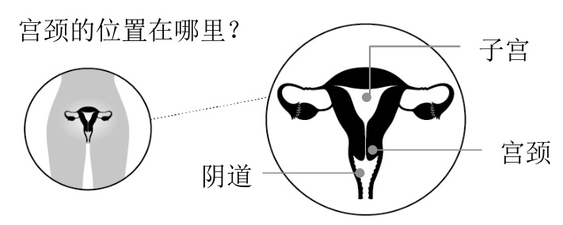

# 自助宫颈筛查：  

筛查的自主权掌握在您手中。  

几乎所有宫颈癌都是由HPV引起的。但好消息是宫颈癌几乎是完全可以预防的。  

# 什么是人乳头瘤病毒（HPV）？  

HPV是一种通过性接触传播的常见病毒。这包括亲密接触、口交、阴道性交和肛交。  
大多数人在一生中的某个时候都会感染HPV并完全不自知。通常没有任何症状。大多数HPV感染不会引起任何问题，并且会在2年内被身体清除。  

但有时，某些HPV类型不会自行清除，并可能导致子宫颈细胞异常。随着时间的推移，这些异常细胞可能会变成癌细胞。  

# 为什么宫颈筛查很重要？  

导致宫颈癌的细胞变化可能在您不知不觉的情况下发生。  

筛查可有助于：  

发现您是否存在产生异常细胞的风险。及早发现和治疗异常细胞有助于预防癌症。在早期发现癌症，在这个时期会有较多的治疗选项。  

  

在健康方面发挥主动作用。自主宫颈筛查使您可以在您感到安全和舒适的任何地方自己进行宫颈癌。  

自主宫颈筛查涉及HPV检测。HPV检测可查找导致宫颈癌的病毒。它可以检出那些有更高几率发生由HPV引起的异常细胞变化的人。  

# 哪些人应该接受自助宫颈筛查？  

任何有宫颈的人，包括女性和TTGD人士（即双灵人、跨性别人士和多元性别人士），若年龄在25至69岁之间，都应该接受期宫颈癌筛查。  

如果您的抹片检查结果一直是正常的，您可以在69岁时停止宫颈筛查。如果您过去接受过癌前细胞治疗，请咨询医护人员。  

如果有以下情况，您应该定期筛查：  

您已接种HPV疫苗。  
您曾经与任何性别的其他人发生过性接触；以及/或  
您已绝经。  

如果出现以下情况，请勿进行自助宫颈筛查：  

冈 您有症状，例如两次月经期间出血。  
冈 您怀孕了或使用子宫托。请向医护人员咨询，讨论宫颈筛查方案以及进行筛查的时间。  
冈 您已切除子宫颈（例如，做过全子宫切除术）。请咨询医护人员，了解这种情况下是否仍需要进行宫颈筛查。  

# 我为什么应该考虑自助宫颈筛查？  

自助宫颈筛查检测HPV，这种病毒会导致子宫颈细胞发生改变，从而导致宫颈癌。  
• 您不需要去见医护人员或进行窥镜检查（骨盆）。您可以在家中自行进行，或者如果您愿意，也可以在医护人员办公室进行。  
• 这项检查既简单又无痛：您可以使用Q-tip小棉签从阴道收集样本。  
• 这是免费的。  
• HPV检测非常准确。因为它非常准确，所以，如果您的检测结果显示您没有HPV，那么，您可以等5年再进行下一次筛查。  

# 我能正确操作吗？会痛吗？  

检测很简单，应该不会痛。您可以通过在阴道内转动棉签来采集样本；不必插入很深。如果您按照试剂盒中的说明进行操作，就可以正确完成操作。您采集的样本与医护人员采集的样本同样准确。  

# 如何解读筛查结果？  

• 如果未发现HPV：未来5年内您无需再次筛查。您的子宫颈上不太可能有异常细胞。  
• 如果发现HPV：您可能需要进行抹片检查或阴道镜检查（一种更仔细地观察宫颈的检查），具体取决于您的结果。这个结果并不意味着您已患上或将会患上癌症。但这确实意味着需要更多地去见医护人员。  

<html><body><table><tr><td colspan="2">宫颈癌如何形成： 并非所有HPV感染都会导致癌症。若会导致宫颈癌，通常也需要15到20年的时间。 大多数感染都会自行消失而不会引起任何问题。</td></tr><tr><td>HPV检测：查找HPV感染</td><td>抹片检查：查找异常细胞变化和/或HPV</td></tr><tr><td>·自助宫颈筛查使用HPV检测来查找阴道中的HPV。 ·HPV检测不需要宫颈采样。</td><td>·在抹片检查中，医护人员会从您的宫颈采集细胞。 ·检查其中是否有任何细胞改变和/或HPV。要检测的项目取决 于您的年龄和健康史。</td></tr></table></body></html>  

# 我应该接种HPV疫苗吗？  

一般来说，任何年满9岁的人都应该接种这种疫苗。这种疫苗可非常有效地预防导致大多数宫颈癌的HPV类型。要了解更多信息，请访问immunizebc.ca/hpv。  

# 如何进行筛查  

1. 得到自我筛查试剂盒。如果您符合资格，请在线 (screeningbc.ca/cervix) 或通过电话 (1-877-702-6566) 索取试剂盒。筛查试剂盒将用普通、无标记的包装通过邮寄方式寄送给您。  
2. 完成检测。严格遵行试剂盒里的说明即可。这项检测是无痛的且非常容易进行。您还可以要求医护人员向您解释或演示如何采集样本，或者他们也可以为您采集。  
3. 回邮试剂盒进行检测。在采集样本的当天，将完整的试剂盒投递到最近的邮政信箱。我们将会在您回邮试剂盒之后的4至6个星期将检测结果寄给您。您还可以在线查看检测结果：healthgateway.gov.bc.ca。  

如果您不想做自助筛查或有任何症状，请与医护人员预约时间进行抹片检查。请访问screeningbc.ca/cervix，查找您附近的诊所。  

# 联系我们  

需要考虑的方面  
o 如果您在性交后、两次月经之间或绝经后出现出血；阴道分泌物增多；盆腔疼痛或性交疼痛，请不要进行自助筛查。与医护人员谈谈。即使您的筛查结果正常，也应该好好检查一下这些症状，这一点非常重要。  
o HPV结果可能会引起一定程度的焦虑。这个结果并不意味着您已患上或将会患上宫颈癌。大多数人都会自行消除HPV感染，而且，并不是每个感染HPV的人都会患上癌症。  
o 筛查可能会导致不必要的压力、治疗，或对未来怀孕产生潜在的长期影响（早产或低出生体重）。  
o 没有哪项筛查检测是完美的。即使您有癌前细胞或宫颈癌，您的结果也可能表明未发现HPV。或者，即使您的宫颈细胞正常，也可能会显示有HPV。  

BC Cancer Cervix Screening 801-686 West Broadway Vancouver, BC V5Z 1G1  

电话：1-877-702-6566  
电子邮件：  
screening@bccancer.bc.ca  
网站： www.screeningbc.ca/cervix  

我们将根据《个人信息保护法》及《信息自由和隐私权保护法》（若适用）收集您的个人信息，并予以保护，以防未经授权的使用和披露。这些信息仅可根据以上法律的规定来使用和披露、用于质量保证管理、向有关医护人员披露或当法律要求时披露。对于BC省癌症中心（BC Cancer）的信息收集，如果您有任何问题，可向癌症筛查部营运总监提出。（地址：801 – 686 WestBroadway, Vancouver BC V5Z 1G1，网站：www.screeningbc.ca，或电邮：screening@bccancer.bc.ca）  