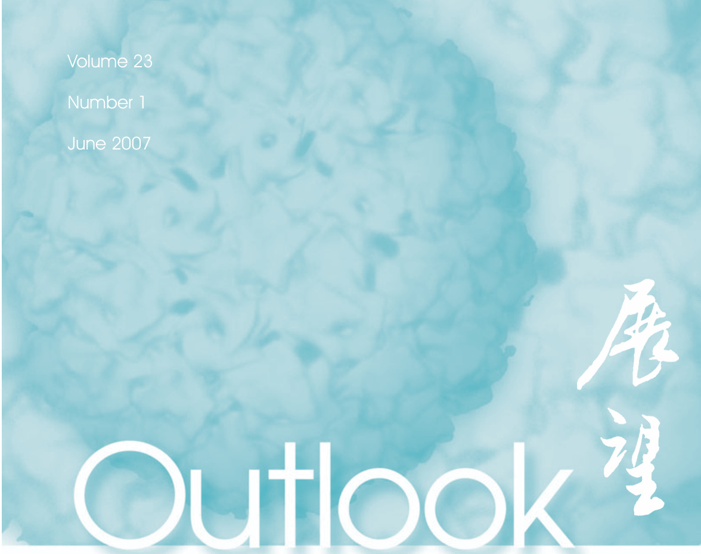
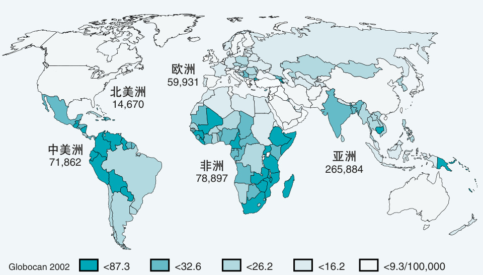
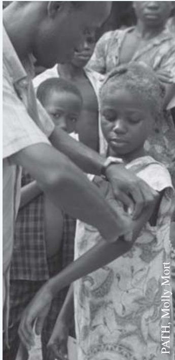
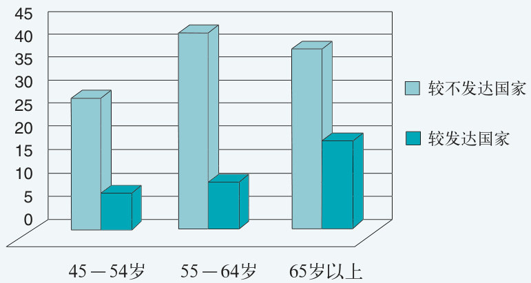

  

# 在本期内  

宫颈癌和人乳头瘤病毒（HPV）  
需要改进预防方法  
宫颈癌筛查进展  
·疫苗的现状与展望  
让最需要的那些人获得疫苗  

# 米PATH  

23 卷 第 1 期 中文出版日期 2007 年 8 月中文翻译由福特基金会北京办事处资助  

# 预防宫颈癌：改善妇女健康的前所未有的机遇  

在世界范围内，宫颈癌居女性最常见肿瘤的第二位，并且是发展中国家女性癌症死亡原因之首（见框图1），尽管这是一种不幸的不公平的疾病，但也存在激动人心的机遇。  

# 不公平  

在过去大约40年的时间，工业化国家的宫颈癌死亡率明显降低，而在发展中国家，这种疾病继续成为巨大的问题。尽管如此，既使在工业化世界，某些妇女也得不到她们需要的保健。因此，富裕妇女和贫穷妇女之间存在不公正。在适宜卫生保健方面，穷国的有钱妇女可能比富国的贫穷妇女境况好。  

第二个不平等是基于性别的：宫颈癌是一种妇科疾病，而许多国家的妇女不能平等得到它的信息或获得卫  

生保健。  

# 机遇  

如今，可以获得一种预防宫颈癌的疫苗。辅以更好的宫颈筛查，这种疫苗能够实质性地降低宫颈癌发病率。宫颈癌是一种可使妇女的家庭破碎和在她们的生命初期将其毁灭的疾病。对社会、妇女个人和她们的家庭，宫颈癌的花费是很大的，但是这一状况能够得到改变。为了实现人乳头瘤病毒（HPV）疫苗的全部潜能，要求对所有少女在她们可能接触HPV 前进行普遍接种。尽管接触这些女孩面临挑战——因为许多少女不能常规拜访卫生保健提供者，一旦建立起一个有效的系统，它将能够向大龄儿童和青少年提供许多额外必需的卫生保健。  

抗击宫颈癌这一可预防疾病的战斗，可以被看作既是健康问题，又是人权和伦理问题。目前的手段可以解决这个问题并且有助于给予更多的妇女、她们的家庭、她们的社区以一个没有宫颈癌的未来。  

# 宫颈癌和人乳头瘤病毒（HPV）  

# 疾病：一个不公平的负担  

每年有将近50 万例浸润性宫颈癌的新发病例，其中一半发病妇女未进行过筛查。全世界每年大约15万妇女死于该病。非洲的亚撒哈拉，拉丁美洲和南亚（见图1）是发病率和死亡率最高的地区。通常，发展中国家的死亡率是工业化国家的四倍； $8 0 - 8 5 \%$ 的宫颈癌死亡病例发生在发展中国家。在这些地区，宫颈癌常常影响已  

#  

为持续的HPV 感染并且因此增加发展为宫颈癌前损害的风险。如果不进行治疗，癌前损害可以发展为浸润性宫颈癌。23, 25  

  
图1. 宫颈癌病例估计数和发病率  
来源：Ferlay et al.2  

癌前病变和癌症通常发生在宫颈的“移行带”，该区域在青春期和孕期加大。通常宫颈顶层上皮的死亡和消退，伴随着新细胞的持续再生。但是，随着持续的HPV感染，这个过程被打断，细胞倾向持续繁殖，首先变为不正常（癌前），进而浸润基底组织（浸润癌）。由于从HPV 感染进展到浸润癌是缓慢的，通常需要几十年，似乎更常见于 40-50 岁的妇女。2, 6, 26-30 宫颈癌死亡率年龄见图2。  

有多个学龄儿童的妇女，她们的死亡对他们社区的社会结构产生负面影响。1-3, 5, 6, 9-12  

# 人乳头瘤病毒（HPV）  

几乎所有的宫颈癌病例与HPV相关，其为一种易传播的，高流行的，组织中含有特异DNA 的病毒。HPV 是最常见的性传播感染，没有方法治疗HPV 感染。13-15  

目前，全世界大约630 万人确信感染了HPV，其中女性多于男性。13, 16在美国，大约 $4 0 \%$ 的年轻妇女在初次性生活三年内感染HPV。全球 $5 0 \% -$ $8 0 \%$ 有性活动的妇女在她们的生命历程中至少受到一次HPV 感染。17, 18 通常妇女在青少年晚期和30 岁前接触到HPV，HPV感染高峰与女孩和年轻妇女性活动的发生相一致多在25 岁以下。最常见的是宫颈癌被发现已经太晚，通常在40岁以后，发病高峰大约是45岁。从感染到发生浸润性癌症有一个长时期的滞后。19-22  

# HPV 类型  

HPV 是一类常见的病毒种群。14 已知的HPV病毒超过100种。某些病毒对诱发癌症有高度潜在的危险（高危类型），而另外一些对诱发癌症是低危的（低危类型）。高危类型引起的几乎都是肛门与生殖器的癌症，而低危类型可引起生殖道疣，宫颈细胞学异常，周期性发作的呼吸道多发性乳头瘤或者最常见的无临床结局的无症状感染。13 至少13种类型的病毒属高危型。二种高危HPV类型与 $70 \%$ 的宫颈癌发生有关：HPV-16 和 HPV-18。HPV-45 和 HPV-31 也与宫颈癌有关，每种大约占病例的 $4 \%$ 。研究已经显示HPV的类型呈现地区性的变化，某种类型在特定地区占主导地位。22, 23  

# 从HPV 感染进展到宫颈癌  

宫颈癌始于HPV感染。大多数感染可自然消退，没有症状，但是持续感染高危类型能够导致宫颈的癌前异常和低等级宫颈的上皮内损害。所有感染高危类型HPV的妇女， $5 \% - 1 0 \%$ 发展  

# 风险因素  

就妇女而言，接触HPV感染的风险主要受到性活动的影响，尤其是受到她们的性伴或多个性伴的性行为的影响。然而，HPV感染有别于其他性传播感染，HPV感染甚至可以发生于体外的性活动（如阴道外的射精之后）。首次性交年龄过小是HPV 感染的危险因素，因为此时宫颈不发达，上皮不成熟，更容易被病毒穿透；复合因素包括第一次生育过早及感染艾滋病病毒或者其他的性传播感染（例如，疱疹病毒或沙眼衣原体）。对男性而言，HPV感染的危险因素包括有大量异性性伴、同性性伴以及未进行包皮环切。10, 13, 14, 23, 31, 32  

# 需要改进预防方法  

# 初级预防  

可以通过下述两种方法之一预防宫颈癌的发生：预防最初的感染或者检测宫颈癌的标志物，并且提供治疗。前一种方法称作初级预防，可通过避免性活动或者通过永远坚持单一性伴以完全避免接触病毒来实现，条件是双方而不是单方都坚持单一性伴而且以前未被感染。当每次都使用避孕套时，避孕套对预防HPV约提供 $70 \%$ 的保护。另一种初级预防的方式是抗HPV 疫苗。32, 33 这种新的疫苗在随后的部分讨论。  

# 二级预防：筛查，诊断和治疗筛查  

通过筛查和治疗识别的癌前损害实现二级预防。宫颈癌筛查直接面对有性活动或者以前有性活动的妇女，以确定她们是否正在增加发展为宫颈癌的风险。通过使用巴氏涂片（Pap），肉眼观察宫颈表面，或者检测HPV 的DNA 来确定。34, 35 最近预防宫颈癌联盟针对有效预防宫颈癌筛查项目做出了10 项推荐（见框图2）。  

# 框图1. 宫颈癌事实1-8  

• 估计全世界每年新增浸润性宫颈癌病人490,000例。并且每年死亡超过270,000 例。  
• 大约 $8 5 \%$ 的宫颈癌死亡妇女居住在发展中国家。仅在印度每年有75,000妇女死于宫颈癌。  
如果当前的趋势持续下去，到2050年底，每年有100万浸润性宫颈癌的新发病例。  
如果通过筛查早期识别癌前病变，并且进行治疗的话，宫颈癌是能够预防的。  
• 常规疫苗接种作为重要的潜在疾病控制预防策略，全世界大多数发展中国家的妇女不能获得宫颈癌筛查及治疗项目。  

  

# 细胞学筛查  

• 新的快速筛查方法可以使筛查更广泛可得。  
• 新的HPV 疫苗对于预防HPV 感染和已经感染的特殊类型的宫颈损伤可能是安全和有效的。  

巴氏涂片，也是众所周知的宫颈涂片，自从50年前问世以来，已经在全世界使用以识别癌前损害并用于治疗和随访。在工业化世界常规巴氏涂片筛查的结果给人留下深刻的印象，并且自60年代以来，发达国家通过该方法已经减少了 $7 0 - 8 0 \%$ 的宫颈癌发生。但是，即使在工业化国家，成功的水平可能不同。例如，在美国，大量宫颈癌发生病例全面下降，但是在贫困地区发病率仍保持较高水平。9, 39-41  

发展中国家缺乏类似的成功，大部分的原因在于资源匮乏（例如，供给、人员培训、仪器、质量控制、基层卫生保健组织、有效的随访）。5 正如前文所述，发展中国家的筛查项目不是根本没有就是不够有效。1 据估计，工业化国家上5年内 $7 5 \%$ 的妇女接受了筛查。相反，一项在印度的研究和在肯尼亚的评估发现，参与者中仅仅 $1 \%$ 曾经经历一种筛查，尽管，这些地方为促进筛查项目做出了巨大的努力。42, 43 综合起来的问题是妇女和卫生保健工作者都常常是缺乏有关宫颈癌疾病的信息及预防该病的成本效益分析方法。3, 42-48  

# 细胞学检查的局限  

单个细胞学筛查导致假阴性率高，缺乏敏感性，需要重复筛查。巴氏涂片失败可能是卫生保健提供者采样技术或者主观地处理样本千篇一律导致的结局。此外，需要重复访问医生以提供当前结果并对任何异常进行处理都可能对治疗率有负面影响。20, 35  

# 宫颈癌筛查进展  

除了巴氏涂片检查，目前有几种新型的宫颈癌筛查方法可以获得或正在研发之中。理想的情况是，最有效的筛查方法应该是价廉、无痛、易操作、能为社会和文化所接受、准确、没有副作用，并且能够立即出结果。一些有前景的新的筛查方法似乎正在浮出，它们可能使宫颈癌筛查更接近“理想状态”。40, 42, 49  

# 细胞学的发展  

最近十年对改进巴氏涂片所作的努力包括液基细胞学的进展，该方法使用少量液体保存由宫颈收集来的细胞，并且将制备涂片的过程自动化。这种  

#  

  
图2. 每100,000 名妇女中年龄特异的宫颈癌死亡率  
在发展中世界，宫颈癌的死亡率更为普遍，部分是由于缺少筛查规划。来源：Ferlay et al.2  

西，一个在阿根廷）在11,834名妇女中评估了VIA和VILI的准确性。研究的发现与过去的结果不符，但的确表明这些肉眼观察方法可以与巴氏涂片或第2 代杂交捕获® 检测方法联合使用，从而提高准确性，使之高于单独使用这些方法中的任何一个。52 但是，有关VILI 敏感性和特异性的资料仍然非常有限，并且需要有关VILI准确性的进一步研究作为依据。  

# HPV DNA 检测  

方法提高了实验室的效率，减少了很多问题，如固定差、细胞铺开的厚度不均匀，死细胞和空气干燥后产生矫作物。但是在一些国家，它增加了巴氏涂片的成本，且未显示其具有更高的准确性，并且需要额外的设备，这就意味着它可能不能更好地适用于许多资源匮乏的环境。40, 42, 49  

另外，现在正在使用计算机来确定巴氏涂片上的大多数异常区域，因此减少了评估的主观性，并增加了检测的敏感性，但这种技术非常昂贵。40  

在一次就诊的同时进行治疗，因此减少了患者的失访。VIA的另一个优点是巴氏或HPV DNA检测所不具备的，即提供者用它可以确定小部分不适合用冷冻疗法治疗的阳性病变，冷冻疗法是在资源有限的环境下非常适用的一种治疗方法。这意味着即使是用巴氏或HPV DNA 检测进行检查，也只能用VIA来决定不能用冷冻疗法进行治疗。VIA的敏感性与巴氏涂片一样好，甚至超过巴氏涂片，但与巴氏涂片类似，肉眼观察是主观性的，并且需要对肉眼观察方法的质量控制进行监督。在绝经后妇女中使用VIA可能不会获得同样好的效果，因为移行带在绝经期会退缩进宫颈管内。26, 48, 49-52新的检测方法能够从阴道或宫颈涂片中检测出高危型HPV DNA。使用一个小刷或拭子从宫颈或阴道收集细胞样本；然后将这些样本送到实验室进行处理。HPV DNA 检测的优点之一是当条件为理想状态时，它不似肉眼观察和细胞学筛查那样主观。它除了可以确定已经患有宫颈疾病的妇女还可以确定发展为宫颈病变的危险不断增加的那些妇女。53对14 项研究进行综述得出的结论是HPV DNA 检测方法对检测超过 30岁妇女的高度癌前病变特别有价值，因为30岁以下的妇女HPV的感染可能是暂时性的。18, 53-58  

# 醋酸肉眼观察（VIA）  

VIA也就是直接肉眼观察或用颈管内窥镜进行观察，它可以作为细胞学检测的一种替代方法或与巴氏筛查一起使用。VIA 是将 $3 \% { \sim } 5 \%$ 的醋酸（醋）用一个喷雾器喷洒或一个棉签涂抹在宫颈上，并在一分钟后用肉眼观察宫颈。如果看到特征性的、明确的醋酸白区域与移行带相邻，该检测被认为是阳性，具有癌前细胞改变或早期浸润癌。VIA不需要实验室或精深的人员培训。可以立即得到结果，并可以  

# 卢戈氏碘液肉眼观察（VILI）  

VILI与VIA类似，但是，是将卢戈氏碘液涂于宫颈，然后观察芥末黄色区域。VILI的结果可以即刻获得，体现了不会延误随诊保健的优点。在印度和非洲用阴道镜和活检评估了VILI检测的准确性，得到了良好的结果。42, 48, 50, 51 作为拉丁美洲筛查（LAMS）研究的一部分，四个中心（三个在巴  

# 第2 代杂交捕获® 试验（hc2）  

第2代HPV DNA杂交捕获(检测法是由Digene公司开发的，目前是美国食品药品监督管理局唯一批准用于临床的HPV 检测方法。hc2 试验能够检测13种类型的HPV，并且比肉眼观察方法和细胞学更敏感，但是价格昂贵，并且表现出与在资源匮乏的地区进行细胞学筛查同样的一些问题。例如，试验需要实验室装备，特殊的设备，以及经过培训的人员；需要6\~8 小时才能出结果；并且需要再次访问诊所以获得结果和进行治疗。42, 59, 60  

# FastHPV 检测  

正在为资源匮乏的环境特别开发FastHPV检测。该检测方法将能够检测出 14 个高危型 HPV DNA，并且 2小时到2个半小时就可以获得检测结果。期望在2007年完成研发工作，并且期望 FastHPV 检测方法在 2008 年的某个时间能够上市。如果证实它是简单、快速、准确和可以负担的，它可能成为适用于资源匮乏环境中的一种筛查方法。59, 60 FastHPV检测和hc2检测方法均涉及到的一个问题是它们通常需要分批处理，这可能会对规划如何使用它们产生影响。其他的商业化HPV检测方法正在研发中，并且可能很快被批准用于临床。  

阴道镜必须由经过培训的服务提供者操作，并且阴道镜可能是昂贵、复杂的设备。另外，活检标本一定要被送到有一名病理学者在职的组织病理学实验室，这在资源匮乏的国家常常是不切实际或不可能的。如果妇女巴氏涂片异常，但阴道镜没有看到不正常的区域，或者阴道镜检查不充分（例如整个移行带都看不到），可以采集宫颈管细胞，并送到实验室。这个过程称为宫颈管刮除术。27, 61, 62  

# 筛查－和－治疗规划  

随访策略的成本－效益最高的方法之一。64-67  

# 治疗  

# 癌前病变  

治疗浸润前病变的妇女具有将近$100 \%$ 的生存率。目前，对妇女宫颈病变的常规治疗包括阴道镜下宫颈环形电切术（LEEP）或应用冷冻疗法切除（破坏）异常上皮，两种方法都能在门诊进行（详见表1）。如果冷冻疗法仅用于小病变（例如 $\leqslant 1 9 \mathrm { { m m } }$ ），则效果几乎达 $100 \%$ 。冷冻疗法和LEEP没有过去的标准性治疗方法即冷刀锥切术，治疗彻底。尽管不再是标准方法，但它仍然用于其他方法不能治疗的癌前病变，或当可疑鳞癌或腺癌时，用于对子宫颈和宫颈管进行严格的评估。9, 27, 42, 49, 61, 68, 69  

在发展中国家，正在使用一种被称做筛查－和－治疗的新方法。肉眼或HPV DNA检测阳性的妇女不做进一步的诊断性检测；而是立即进行治疗。27 筛查－和－治疗方法在资源匮乏国家特别受欢迎，在那里存在运送、时间和其他导致再次访问诊所困难的问题。主要的益处是妇女可能很少会在治疗前失访。63 已经在泰国、南非和加纳进行了筛查－和－治疗规划的评估，得到良好的结果。资料显示通过一次或两次诊所访问，中间不进行阴道镜诊断步骤，VIA和冷冻疗法是替代传统多次  

# 诊断  

在工业化国家，无论是通过巴氏涂片还是HPV DNA 检测筛查为阳性的妇女，接着都要进行诊断性检测，例如阴道镜检查。阴道镜通常使用一种具有强光源的放大设备对阴道和宫颈进行检查，从而确定宫颈上的非正常区域，并且指导宫颈组织采样（活检）。  

# 宫颈癌的治疗  

如果早期检测出浸润性宫颈癌，也可能被成功治疗；估计患有最早期（1A期，此期癌症在宫颈内的扩散程度最小）癌症妇女的五年生存率达 $9 2 \%$ 。9对宫颈癌的治疗建议主要采用子宫切除术和放射治疗，但不应当用于治疗  

表 1. 癌前病变的治疗 20, 27, 35  

<html><body><table><tr><td>治疗方法</td><td>描述</td><td>有效性</td><td>常见副作用</td><td>注释</td></tr><tr><td>冷冻疗法</td><td>使用已经由在探针中循环 的氧化亚氮或二氧化碳气 体冷却的一个金属细胞探 针冰冻组织。</td><td>85%</td><td>轻度腹部绞痛、水样排液、 有感染的危险</td><td>可由非临床医生操作，在 单次随访中进行；设备简 单；建议仅用于受影响区 域范围小时；不需要麻醉</td></tr><tr><td>环形电切术 (LEEP)</td><td>使用加热电圈切除宫颈病 变区域；然后对样本做进 一步评估。</td><td>90%-98%</td><td>出血，即刻发生或以后发 生</td><td>快速(5-10分钟)；必须由 临床医生操作;程序复杂; 需要局麻</td></tr><tr><td>冷刀锥切术</td><td>从宫颈上切除锥形区域。</td><td>90% -94%</td><td>出血、感染、狭窄、宫颈 机能不全、可能降低生育 力</td><td>需要麻醉，住院，和非常 有经验的人员</td></tr></table></body></html>  

# 框图2. 有效的宫颈癌筛查和治疗规划的十项重要的发现和建议  

自1999 年，宫颈癌预防联盟（ACCP）的合作伙伴已经对在资源匮乏国家中的筛查和治疗方法进行了评估，同时致力于加强对宫颈癌的知晓，并改善发放系统。36-38 2007 年4 月，ACCP 对有效的宫颈癌筛查和治疗规划提出了十项重要的建议：  

1. 每名妇女都有权在她的一生中进行至少一次宫颈癌筛查。在资源匮乏的环境中，为获得最大的公共卫生效果，筛查的最佳年龄在30 到40 岁之间。  
2. 尽管在美国和其他发展中国家已经表明以细胞学为基础使用巴氏涂片的筛查规划是有效的，但高质量的细胞学规划难以维持。因此，在卫生保健资源不足的情况下，资源应当投向成本效益高的策略，这样的策略更易负担得起，并且能够确保质量。  
3. 研究已经表明在资源匮乏的环境中，最有效和最实际的宫颈癌二级预防策略是使用HPV DNA检测或VIA（肉眼观察）进行筛查，然后应用冷冻疗法（冰冻）治疗癌前病变。这在单次访问中能够最佳获得（目前可能用VIA 加上冷冻疗法），并且可由称职的临床医生和非临床医生，包括护士和助产士来完成。\*  
4. 与使用其他筛查和治疗方法相比，应用HPV DNA检测，然后进行冷冻疗法能够更大程度减少宫颈癌前病变的发生。  
5. 由称职的服务提供者进行的冷冻疗法是安全的，并且治愈率可达到 $8 5 \%$ 或更高。  
6. 研究提示对于正在感染HPV 的妇女，冷冻疗法能够避免宫颈疾病的进一步发展，从而起到保护作用。正因为如此，而且由于冷冻疗法的发病率低，对于没有确定宫颈疾病但筛查阳性的妇女偶尔进行治疗是可以接受的。  
7. 除非怀疑浸润性宫颈癌，否则在筛查和治疗中间常规使用诊断步骤（例如阴道镜）通常是无效的，并且可能削减规划的成功，并增加成本。  
8. 妇女、她们的伴侣、社区和公民团体应当与卫生部门建立合作关系，共同致力于服务的计划和实施。  
9. 为了获得最大的效果，规划需要有效的培训、监督和持续的质量改善机制。  
10. 需要进一步开发快速的、使用者舒适的、低成本的HPV 检测方法，并改进冷冻治疗的设备。  

\* 特别需要注意的是在使用HPV DNA 检测进行筛查之后，优先选择使用VIA 对于确定哪些患者不适于使用冷冻疗法仍然是必须的。  

起使用。20, 27  

# 疫苗的现状与展望  

癌前病变。对于晚期病变，放射治疗通常用于减轻症状，但是在发展中国家，这种方法不能够广泛使用或获得。放射治疗的目的是破坏癌细胞，而在可能的范围内保留正常细胞。副反应包括阴道出血和排液、腹泻和恶心。它的有效性取决于癌症的范围，也就是说，它是否扩散至宫颈外。化疗也可以和子宫切除术和放射治疗一  

附属的非医学关怀可以包括不会引起损害的传统或文化习俗（例如按摩、祈祷、咨询、情感支持）。在发展中国家，对晚期宫颈癌妇女疼痛的控制常常是不够的。其实，有很多有效和廉价的疼痛控制的选择。临床和家庭保健服务提供者应当优先实施减轻患者疼痛的关怀。20, 70  

# 当前预防性疫苗  

2006年6月，首个针对人类乳头瘤病毒（HPV）感染的疫苗—— Merck'sGardasil®——被批准和上市。2007年4 月它已在 7 0 个以上国家注册。Gardasil® 预防最常见的引起癌症的两种类型HPV的感染，即16型和18型。  

大约 $70 \%$ 的宫颈癌病例与这两种类型HPV有关。此疫苗也预防不引起癌症的两种类型HPV的感染，即6型和11型，它们引起 $90 \%$ 的生殖疣。此四价的疫苗是在6 个月时间连续3 次肌肉注射 $0 . 5 \mathrm { m l }$ 剂量，第2次注射是在第1次注射后2 个月，而第3 次注射是在第1 次注射后6 个月。71  

第 二 个 疫 苗 ， G l a x o S m i t h -Kline's CervarixTM, 也预防最常见的引起癌症的两种类型HPV 感染，即16 型和18 型，同样也是连续3 次给予 $0 . 5 \mathrm { m l }$ 的注射。在这一情况下，第2次注射是在头次注射后一个月，而第3 次是在第1 次注射后6 个月。预计此疫苗的许可证将会在2007年某个时候得到批准。71 表2 提供了两个疫苗的进一步信息。  

临床试验发现，当女孩在发生性活动之前或妇女在没有感染这些类型的HPV 之前给予这两种疫苗，至少$9 5 \%$ 可以有效地防止16 型或18 型的持续感染，并且 $100 \%$ 有效预防指定类型的宫颈病变。在几十年中，单独广泛使用这种疫苗可以减少 ${ \cdot } 5 0 \%$ 的潜在性宫颈癌引起的死亡，并且一些人估计预防率可高达 $71 \%$ 以上，这取决于接种疫苗的覆盖面。73-77 在能够这样做的国家，对青少年进行免疫，加上针对30 岁以上妇女进行筛查的规划，将是最有效的途径。73-80  

# 免疫策略  

潜在的策略包括对在校女学生（这可能会使弱势的校外女孩错过机会）和/或通过母亲-女儿计划或其他现有的社区覆盖项目。  

在美国当前建议对所有青少年在性活动开始之前常规进行接种疫苗。虽然理论上在生命早期接种疫苗不具有危险性，但是目前尚没有文章发表说明允许早期接种。有一个追踪项目（catch-up program）允许给最大 26 岁妇女进行接种。此时，不建议对已有性活动的年龄较大的妇女接种。相反，对这一人群最好的途径是进行宫颈筛查。71, 72  

对于资源匮乏国家，只有在具有实质性疫苗补贴的情况下，才可能接种当前的疫苗。虽然期待新的HPV疫苗将导致显著地降低宫颈癌的危险性和发病率，但是它们不能替代筛查；相反，利用接种疫苗合并筛查，将使效果最佳化。35, 81 对于成百万年龄在20岁或以上的妇女，如果在她们生命的某一阶段已发生性活动，她们很可能已感染HPV。新的疫苗不具有治疗性，所以它们对这些妇女没有益处。进一步，在当前可使用的疫苗中仅包括了引起癌症的两种类型HPV（即16型和18型HPV），并且目前证实仅对这两种类型的HPV有预防作用。继续进行筛查将是必要的，因为这些疫苗不能预防由非16型和18型HPV引起的癌症。  

在已具有筛查规划的国家，即使已启动接种免疫规划，也应该继续支持筛查。在不具有筛查项目的国家，政策制定者应该考虑启动筛查规划，对30 岁或30 岁以上的妇女在她们的一生中至少要进行一次或两次筛查，结合对尚未发生性关系的妇女和年龄较大的女孩进行接种免疫。20, 81-84  

# 给男孩接种疫苗  

虽然男孩不会发生宫颈癌，但是他们可以成为HPV感染者，并且发生其他HPV相关的疾病，例如阴茎、肛门和口腔癌症，以及生殖器疣。一些专家相信对男性和女性都进行接种疫苗，将有益于妇女，因为男性性伴侣会感染妇女，正在对两性都进行接种疫苗的成本－效果进行研究。然而，目前仍然没有证据表明给男性接种疫苗会减少对他们的女性性伴侣传播HPV的危险性。85, 86  

表2. 当前HPV 疫苗的特性 7, 71, 72  

<html><body><table><tr><td>Gardasil ? (Merck)</td><td>CervarixTM (GlaxoSmithKline)</td></tr><tr><td>四价(HPV6,11,16,18型）</td><td>二价（16,18型）a</td></tr><tr><td>酵母制备</td><td>Baculovirus杆状病毒制备</td></tr><tr><td>铝佐剂</td><td>ASO4(明矾和甲磷酰脂质A)佐剂</td></tr><tr><td>0-，2-，6-个月注射时间表</td><td>0-，1-，6-个月注射时间表</td></tr><tr><td>0.5ml注射剂量</td><td>0.5ml注射剂量</td></tr><tr><td>在70个以上国家注册</td><td>预期2007年注册</td></tr><tr><td>在全世界进行25,000位年龄15-26岁妇 女的临床试验</td><td>在全世界进行18,000位年龄15-25岁妇 女的临床试验</td></tr><tr><td>对预防癌症前期病变的发展的有效率几 乎达到100%b</td><td>对预防癌症前期病变的发展的有效率几 乎达到100%b</td></tr><tr><td>有效期：至少5年</td><td>有效期：至少5年</td></tr><tr><td colspan="2">a.初步证据显示CervarixTM也可以对45和31型HPV提供一些保护预防作用。通过对原始 研究，以及从第3期临床试验的第一手资料的新的分析，证实这种交叉性预防作用。 b.少数妇女发生伴随其他类型HPV的癌症前期损伤。</td></tr></table></body></html>  

# 有效期  

临床试验显示，HPV疫苗最少能够在4年半至5年期间有效（迄今为止的临床试验期），但是它们很可能在更长时期内有效。78 在过去的5 年中，没有证据显示免疫力逐渐减弱或预防感染的效率降低。同时，HPV疫苗的抗原引起类似疫苗的刺激反应，其提供长期持久的保护作用，例如B型肝炎疫苗。这些发现提示，这种有效期可能长久持续，但是只有随着时间延长才可能获得有用的资料。87  

# 交叉保护作用  

目前，尚不明确HPV疫苗将是否提供或在何种程度上提供针对为不包括在疫苗中的其他类型HPV的预防作用。已有证据发现对45和31型HPV具有交叉保护作用，正在进行的研究正在关注这一问题。7, 77, 78  

前研究项目的关注点。55, 90  

# 未来疫苗  

正在进行的工作是改进预防性疫苗，和发展消除现存HPV 感染和相关病变的治疗性疫苗。3, 7  

# 未来预防性疫苗  

改进预防性疫苗可能涉及使用不同的发展方法，例如蛋白和多肽重组活载体，细菌为基础的，植物为基础的，DNA和首次后续加强疫苗策略。关键的目标是发展更合适资源匮乏地区的疫苗，也就是疫苗生产较便宜，有较长的保存期限，仅需要单次剂量或两个剂量，赋予长时间的免疫效果而不需要后续加强注射，能够通过滴鼻或口服使用，在一定温度范围内稳定，对多种类型高危险性 HPV 有效。3, 7, 91  

使那些最需要疫苗的人们获得它们鉴于疫苗的效果和至今没有发现严重的不良反应，实施有效的疫苗规划似乎是显而易见的，但是仍然存在严重的挑战。  

# 知晓和接受性  

对于卫生保健工作者、教育者、制定政策者、父母和病人，准确的信息对于他们提高对HPV 和宫颈癌的认识是必要的。许多人没有领悟宫颈癌的病因和其所造成的负担，并且可能不能够明白HPV 疫苗对于改善目前状况的价值。没有这样的了解和强烈的倡导，个人不可能支持接种免疫。12, 54, 92  

# 不良事件  

在HPV 免疫后的已知不良反应是在注射部位的不适感、疼痛、肿胀、发红、头痛或低烧。在任何临床试验中，尚未报道严重的不良事件，甚至在5年随访之后也是如此。71, 72, 77, 88, 89  

# 未回答的问题  

有关疫苗本身的其他问题包括如下：  

• 后续疫苗加强注射是否必要，如果是，什么时间，何种频率？  
• 什么是理想的剂量方案？注射少于3 个剂量能否获得保护作用？  
• 对妊娠和哺乳妇女接种疫苗是否安全？  
• 与其他青少年疫苗一起使用是否安全和有效？上述问题以及其他问题正成为目  

# 未来治疗性疫苗  

为达到这一目标，首先有必要通过考虑如何根据社会文化实际情况，最好地“设计”宣传措施。在一些社会中，是否生殖道感染的污名可能使疫苗的接受性复杂化？是否将介绍接种疫苗主要作为妇女的问题？有效的设计能够有助于避免社会的抵制，例如来自于害怕HPV 疫苗会促进男女乱交的人群的抵制（即使研究已显示性教育有相反的作用）。12, 54, 93, 94  

希望未来的疫苗将能够使已经持续感染HPV的妇女预防癌症。目前尚没有针对HPV感染的治疗性疫苗，但是已开始着手研制这样的疫苗。这些疫苗可以单独或联合其他治疗手段一起使用。它们被设计用来终止进行性的低等级的病变发展成浸润性癌症，或预防以前已治疗的病变或癌症的复发。与当前和以前的治疗方法不同的是，治疗性疫苗将可能治疗潜在性感染。7, 86  

针对患有高等级（即晚期）病变的治疗性疫苗可能更难于合成，因为这些病变在遗传学上的不稳定，意味着HPV 基因表达在单个病人身上或从一个病人转移到另一个病人的过程中发生变异。目前尚未能确定正在研制的治疗性疫苗的有效性。7, 86  

社区的意愿和接受将有助于确保疫苗的可及性，所以社区领导应该参与接种疫苗规划的设计和实施。因为临床医生常常是父母和青少年信息的来源，教育临床医生有助于父母能了解任何疫苗的益处。12, 45  

# 成本和资金  

预计接种HPV 疫苗的成本将高于现有的婴儿免疫规划。在发展中国家对于卫生保健的资金已经捉襟见肘，所以，对于HPV疫苗规划的资金问题将需要持久的，强烈倡导努力和创新策略。95  

目前，在发展中国家这些疫苗的价格尚不清楚，可能在一段时间内仍不会清楚，引入一种新的疫苗的通常过程是首先在私人诊所提供，然后，在价格下降以后，进入公共部门。正在努力缩短这一过程时间，直至价格下降，使HPV疫苗在发展中国家广泛使用。最终价格取决于如下因素，例如购买疫苗的数量和购买协议的时间长短。7, 96  

疫苗本身的价格不是唯一的费用；也存在规划的费用。大多数青少年不像幼小儿童和婴儿那样常规参加卫生保健，因此需要发展新的战略使覆盖面延伸到青少年。在发展中国家，疫苗规划的成本－效果将受到以下因素影响：为广泛覆盖青少年，常规不被纳入疫苗规划一组人群的规划费用；疫苗所提供的保护期限；和在规划中参与的程度。92, 97-102 对于成本效果的考虑的一个重要成分是对比治疗宫颈癌和其他HPV 有关疾病能否最终节约资金。98  

在国家内部示范项目计划收集所有关于价格和发放策略的资料，也准备讨论关于确定国际财务机制，其可能资助资源匮乏地区的疫苗规划。101  

# 可及性  

在大多数发展中国家年幼青少年通常不常规接触卫生系统，因而确保可及性是一个挑战。一个有前景的建议是加强学校健康规划，特别是新近小学入学率有所增加。但由于一些地区许多女孩在很短的时间就辍学，社区规划也许能有助于弥补这一个空缺。101  

一旦这些策略发展成为一种有效地接近这些女孩的方式，它们可以被用于提供许多适用于较大儿童的不同的健康干预措施，例如破伤风、风疹、B 型肝炎、麻疹，最后是HIV免疫；除虫；疟疾间歇预防性治疗；血吸虫病、丝虫病和砂眼的治疗；铁和/ 或碘元素的补充；提供蚊帐；营养补充；和有关洗手、吸烟、毒品，身体知晓和生活选择决策方面的教育。利用同一个系统同时进行多种干预，与HPV 疫苗接种同时或在不同时间，将提高所有干预措施的成本－效果。  

# 培训和支持健康提供者  

在任何健康规划中，以清晰、现实和实际的目标，有效地培训卫生保健工作者是至关重要的。在许多发展中国家卫生保健工作者可能对HPV感染和它与宫颈癌的发生和预防不十分了解。这种形势由于宫颈癌“无声无息的性质”所加剧。需要教育卫生保健工作者，如何去帮助病人了解由筛查和接种疫苗所带来的巨大益处。45, 50, 65, 103  

在工业化和发展中国家都不清楚应由哪一类提供者（即普通医生或护士、儿科医生、助产士或妇产科医生）发放疫苗。妇产科医生传统上不管理疫苗。相反，负责免疫的团体对于宫颈癌和HPV的知识可能有限，所以可以预见，一些额外的培训对于实施HPV 免疫规划是必要的。96, 104, 105, 106记录在资源匮乏的地区HPV接种疫苗的经验  

从示范疫苗接种规划中获得的教训，将会给需要发展有效的当地规划的国家提供借鉴。通过这些信息也可以指导预测和发放策略（在学校或社区规划）。12, 95  

柏斯卫生科技项目（PATH）与印度、秘鲁、越南和乌干达4 个国家合作进行项目制定和运作研究，以测试引入HPV接种免疫的各种策略。结合这些国家的示范项目，PATH 与政策制定者、卫生保健提供者、父母和年幼青少年进行交流，以确定对有关HPV和宫颈癌的知识的了解程度，以及研究引入HPV接种疫苗的途径。此项目将着重于确保目标年龄组女孩的疫苗的覆盖面，并将收集有关成本、社会文化的接受性、资源利用、资金、供应和疫苗需要方面的资料。初步的项目制定研究的资料将在2007 年底和2008年获得，运作研究的发现将在2009 年和 2010 年获得。  

# 结论  

通过HPV疫苗接种联合改善筛查、诊断和治疗，在发展中国家宫颈癌的死亡率预计能够降低到工业化国家的低水平，或甚至更低。但没有以下条件此目标难以实现：  

• 私人和公共部门人员以及社区领导的通力协作。  
• 加强卫生系统，包括宫颈癌的常规筛查。  
• 促进循证医学的政策制定方面的资料和经验  
• 可负担得起并能满足需求的疫苗供应的可及性。  
• 社会和政治氛围的支持。  

在不同环境中需要各种不同的政策。制定策略必须充分正视当今的现实情况 包括疾病的负担和有关知识、行为和社会文化态度。确保循证医学的二级预防（筛查）策略得以继续或建立，并联合接种疫苗，这将是至关重要的。  

与有影响的宗教，医学和政治领导交流和对他们进行倡导，可以正面影响社区的信任感，并使其愿意参加宫颈癌预防规划。几个机构和组织正在着手一些研究和项目，其目的是收集旨在帮助政策制定者作出关于提高宫颈癌控制决定的信息和证据。  

由HPV 和宫颈癌提出的挑战是真实的，一些人可能说是巨大的。然而，通过改善在此叙述的和未来的筛查、诊断和预防技术，世界有机会真实改变妇女生活，并提高家庭和社区的力量和生存能力。  

（刘庆、裴开颜、贾孟春 译；李勇 审校）  

# 参考文献  

RHO 宫颈癌 www.rho.org  

世界卫生组织— 生殖系统的癌症  
www.who.int/reproductive-health/publications/cancers.html  

宫颈癌预防联盟 www.alliance-cxca.org  

PATH 宫颈癌的预防www.path.org/cervicalcancer国际癌症筛查团体研究机构www.iarc.fr/cervicalindex.php  

Alliance forCervical CancerPrevention (ACCP).TheCaseforInvestingin Cervical Cancer Prevention.Seatle:ACCP;2004. Cervical CancerPrevention Issues inDepth, FerlayJBrayFPisani ParkinDM;Int national Agency forResearch on Cancer (IARC).GLOBOCAN 2002:Cancer Incidence, MortalityandPrevalenceWorldwide.Lyon, France:IARCPress2004;CancerBaseNo.5, version 2.0. FranceschiS.The International Agency for Research on Cancer(IARC)commitment to cancer prevention:theexampleof papillomavirusandcervical cancer.Recent Results in Cancer Research.2005;166:277- 297. ParkinDM,BrayFFerlayJ,Pisani P.Global cancerstatistic2002.CA：ACancerounal for Clinicians.2005a;55(2):74-108. ParkinD,hlan,Flaytal. CancerIncidenceinFiveContinentsvolVIII. Lyon:IARCPress,2002.IARCScientifc Publication No.155.   
6. ParkinMrayhunf related cancers.Vaccine.2006;24（Suppl 3): S11-S25. PATH.Current andFuture HPVVaccines: PromiseandChallenges.Seattle:PATH;2006.   
8. StewartW,lsP.orldCancerRt. Lyon: IARCPress, 2003.   
9. GoldMACurrentervicalcanerreen guidelines and impact of prophylactic HPV vaccines.New Options inHPVPrevention. Supplement toOBGManagement July2006. Available at:www.obgmanagement.com.   
10.SankaranarayananR,Ferlay J.Worldwide burden of gynaecological cancer:the size of theproblem.BestPracticeResearchClinical Obstetrics andGynaecology2006;0(2）:207 225.   
11.Sankaranarayanan R.Overview of cervical cancerin the developing world.International Journalof GynecologyObstetrics. 2006;95(Suppl 1):S205-S210.   
12.Sherris J,Agurto I,Arrosi S,et al.Advocatingforcervical cancerprevention.International JournalofGynecologyObstetric. 2005;89(Suppl 2)S46-S54.   
13.Spitzer M.Human papillomavirus:epidemiologynaturalhistory,andclnical sequlae. New Options inHPVPrevention.Supplement toOBGManagement.Availableat: www.obgmanagement.com.Accessed July 2006.   
14.Muo,CastellsaguX,Berringn GonzaleGismannLVnto of human cancer.Vaccine.2006;24(Suppl3): S1-S10.   
15.Cox JT.Introduction.Current Opinionsin Obstetrics and Gynecology 2006;18(Suppl 1): S1-S5.   
16.Centers for Disease Control and Prevention (CDC).Genital HPV infection-—CDCFact Sh Auoilobl /std.HPV/  

欲获得更多关于HPV和宫颈癌的信息，请访问下列网站：  

STDFact-HPV.htm.AccessedMay10,2007.   
17.Koutsky L.Epidemiology of genital human papillomavirus infection.AmericanJournalof Medicine.1997;102:3-8.   
18.CrumCP,AbbottDW,QuadeB).Cervical cancer screening:from the papanicolaou smeartothevaccine era.JournalofClinical Oncology.2003;21(10S):224s-230s.   
19.MoscickiAB,chiffmanM,KjarS,Villa Updating thenatural history of HPV and anogenital cancer.Vaccine.2006;24(Suppl3）: S42-S51.   
20.Population Reference Bureau(PRB）and Alliancefor Cervical Cancer Prevention(ACCP). PreventingCervicalCancerWorldwide.2004. Washington,DC:PRB;Seattle:ACCP.   
21.Miller AB.Cervical Cancer Screening Programmes:Managerial Guidelines.Geneva, Switzerland:World HealthOrganization; 1992.   
22.CliffordG,FranceshiSDiazMMun VillaLL.HPV type-distribution inwomen withandwithout cervical neoplasticdiseases. Vaccine.2006;24(Suppl 3):S26-S34.   
23.SmithJS,LindsayL,HootsB,etal.Human papillomavirustype distributionininvasive cervical cancer and high-grade cervical lesions:ameta-analysisupdate.International Journal ofCancer.2007;Apr5.Epubaheadof print.   
24.BoschFX,LorinczA,MunozN,MeijerCJ ShahKV.The causal relation between human papillomavirus andcervical cancer.Journalof Clinical Pathology.2002;55(4):244-265.   
25.Snijders PJSteenbergen RD,Heideman DA, Meijer CJ.HPV-mediated cervical carcinogenesis:concepts and clinicalimplications. Journal of Pathology.2006;208:152.   
26.DennyL,NganHYS.Malignantmanifesta tions of HPV infection:Carcinoma of the cervix,uva,vainaanu,and pnis national JournalofGynecologyandObstetrics. 2006;94(Suppl 1):S50-S55.   
27.World Health Organization(WHO).ComprehensiveCervicalCancerControl:A Guideto EssentialPractice.Geneva:WHO,2006.   
28.ZurHausenHIfectionsCausingHuman Cancer.Weinheim:Wiley-VCH,2006.   
29.aHMngl,l minants of genital human papillomavirus infectioninyoungwomen.Journalof the NationalCancerInstitute.1991;83:997-1003   
30.VillaLL.Biology of genital human papil lomaviruses.International Journalof Gynecology  Obstetrics. 2006;94(Suppl 1):S3-S7.   
31.BoschFX,QiaoYL,CastellsagueX.The epidemiology of humanpapillomavirus infection and its association with cervical cancer.International Journalof Gynecology Obstetrics.206;94Sup1:S2.   
32.BurchellAN,WinerRL,eSanjsS, FrancoEL.Epidemiology and transmission dynamics of genital HPV infection.Vaccine. 2006;24(Suppl 3):52-61.   
33.WinerRL,Hughes JP,Feng Q,et al.Condom useand therisk of genital papillomavirus infectioninyoungwomenNewEngland JournalofMedicine.2006;354:2645-2654.   
34.Denny L,Sankaranarayanan R.Second ary prevention of cervical cancer.International JournalofGynecologyeObstetrics. 2006;94(Suppl 1)S65-S70.   
35.TsuVD,PollackAE.Preventing cervical cancerinlow-resourcesettings:howfarhave we come andwhat does the future hold? International JournalofGynecologyeObstetrics.2005;89(Suppl 2):S55-S59.   
36.ACCPproving ScreeningCoverageRate ofCervicalCancerPreventionPrograms:A Focus on Communities.Seattle:ACCP;2004. Cervical CancerPrevention Issues inDepth,   
37.ACCP.PlanningandImplementing Cervical CancerPreventionandControlPrograms. Seattle:ACCP;2004.   
38.ACCP.WomensStories,Women'sLives:ExperiencesWithCervicalCancerScreeningand Treatment.Seattle:ACCP;2004.   
39.American Cancer Society website.Cervical cancer prevention.June2006.Availableat: documents.cancer.org/115.00/115.00.pdf. Accessed May 14,2007.   
40.Kitchener HC,CastlePE,Cox JT.Achievements and limitations of cervical cytology screening.Vaccine.2006;24(Suppl3):63-70.   
41.Centers forDiseaseControl andPrevention (CDC).TheNational Breast and Cervical Cancer Early Detection Program-reducing mortality through screening.Availableat: www.cdc.gov/cancer/nbccedp.AccessedMay 10,2007.   
42.Sankaranarayanan R,Gaffkin L,JacobM, SellorsJRoblesS.A critical assessment of screeningmethodsforcervical neoplasia. International Journalof GynecologyObstetrics.2005;89(Suppl 2):S4-S12.   
43.Bingham A,Bishop A,Coffey Pet al.Factors affecting utilization of cervical cancer preventionservicesinlw-resourceeting. SaludPublica deMexico2003;45（Suppl 3)S283-S291.   
44.AmericanCancer Society.CancerFacts and Figures2006AmericanCancerSociety006.   
45.AguIrossiWhittalIli the communityincervical cancer prevention programs.International JournalofGynecologyObstetrics.2005;89(Suppl 2):S38-S45.   
46.Braa eringcervicalcancer prevention servicesin low-resourcesettings.InternationalJournal ofGynecologyObsterics.005；9Sup 2)S21-S29.   
47.Lazcano-PonceEC,Herrero R,Munoz,t al.Epidemiologyof HPVinfectionamong Mexicanwomenwith normal cervical cytology.InternationalJournalofCancer. 2001;91:412-420.   
48.Denny L,Quinn M,Sankaranarayanan R Screening forcervicalcancerindeveloping countries.Vaccine.2006;24(Suppl3)S71-S77.   
49.Sellors J,LewisKKidulaN,Muhombe K, TsuVHdmaning andana ment of precancerous lesionstoprevent cervical cancerinlow-resourcesettings   
2003;4:277-280.   
50.Blumenthal PD,LauterbachM,SellorsW, SankaranarayananR.Training for cervical cancerpreventionprogramsinlow-resource settings:focus onvisual inspection with aceticacidandcryotherapy.International JournalofGynecologyObstetrics.2005;89(Suppl   
2):S30-S37.   
51.CarrKC,SellorsJW.Cervical cancer creen inginlowresourcesettingsusingvisual inspectionwith aceticacid.JournalofMid wifery andWomen'sHealth.2004;49:329-337.   
52.Sarian LO,Derchan SF,Naud Ptal. Evaluationofvisualinspectionwithacetic acid(VIA),ugolsiodine(VILI),cervical cytologyand HPV testing ascervical cancer screening tools inLatinAmerica.This report refersto partial results from theLAMS(Latin AmericanScreening)Study.JournalofMedicalScreening2005;12(3）:142-149.   
53.VillaLL,DennyL.Methodsfordetectionof HPVinfectionanditsclinicalutility.Intena tional JournalofGynecologyandObstetrics.   
2006;94(Suppl 1):S71-S80.   
54.Cuzick JMayrand MH,Ronco G,Snijders P Wardle J.Newdimensions in cervical cancer screening.Vaccine.2006;24(Suppl 3):90-97.   
55.FrancoELBoshFXCusickal Knowledgegaps andprioritiesforresearch on prevention of HPV infection andcervical cancer.Vaccine.2006;24（Suppl3):242-249.   
56.Franco EL,HarperDM.Vaccination against humanpapillomavirus infection:a new paradigmincervical cancer control.Vaccine.   
2005;23:2388-2394.   
57.ArbynM,Sasieni P,Meijer CJLM,etal.Clinicalapplications of HPVtesting:a summary ofmeta-analyses.Vaccine.2006;24（Suppl   
3):78-89.   
58.PollackAE,Balkin MS,DennyL.Cervical cancer:a call forpolitical will.International journalofObstetricsGynecology.   
2006;94:333-342.   
59.Howard M Sellors J,Kaczorowski J. OptimizingthehybridcaptureIIhuman papillomavirustesttodetectcervicalintraepithelialneoplasia.ObstetricsGynecology.   
2002;100:982-980.   
60.SellorsJ.HPVin screening and triage towards anaffordabletestHTday.   
2005;8:4-5.   
61.Ngan HYS,Timble CL.Preinvasivelesionsof thecervix.International JournalofGynecologyand Obstetrics.2006;94(Suppl1):S45-S49.   
62.SellorsJW,SankaranarayananR.Colposcopy andTreatmentofCervicalIntraepithelialNeoplasia:ABeginnerManual.Lyon,Franc: IARCPress;2002.   
63.Cuzick J,Szarewski A.Cubie H,et al. Management of women who test positive for high-risktypesof papillomavirus:theHART study.Lancet.2003;362:1871-1876.   
64.DennyL,KuhnL,DeSouza M,PollackAE DupresrgCe-an approaches for cervical cancer prevention in ofthe MedicalAssociation.2005;294:2173-2181.   
65.GoldieSJ,KimJ,MyersE.Cost-effectiveness ofcervical cancer screening.Vaccine. 2006;24(Suppl 3):164-170.   
66.Blumenthal PD,GaffkinL,DeganusS, al.for the Ghana Cervicare Group.Cervical cancrnytbilt feasibility ofa single-visit approachinAccra, Ghana.American JournalofObstetrics and Gynecology.2007;196;407.e1-407.e9.   
67.SantsC,GalsR,lvarezM,tal. sessionmanagement ofcervicalintraepithelialnplasiaolutionforevloping countries.A prospective,randomized trial of LEEPversuslaser excisionalconization. Gynecologic Oncology.1996;61:11-15.   
68.APftivenessafetyandAcbil ityofCryotherapy:ASystematicLiterature Review.Seattle:ACCP;2003.Cervical Cancer Prevention Issues in Depth,No.1.   
69.JacobM,BroekhuizenFFCastroW,Sellors J Experienceusing cryotherapyfor treatment ofcervicalprecancerouslesionsinlowresource settings.InternationalJournalof GynecologyObstetrics.2005;89(Suppl 2): S13-S20.   
70.ACCPACCPStrategesforSupporin WomenwithCervical Cancer.Seattle,ACCP; 2004.Cervical CancerPrevention Issuesin Depth, No.2.   
71.Packaertadasilhu tion,NJ:Merck&Co.,Inc.April 2007.   
72.Crosbie EJ,Kitchener HC.Cervarix—a bivalentL1virus-likeparticlevaccinefor preventionofhumanpapillomavirustype 16-and18-associatedcervicalcanceExpert OpiniononBiologicalTherapy.2007;7:391- 396.   
73.Cox JT.ReducingHPV-relatdclinical diseasethroughvaccination.NewOptions in HPVPrevention.Supplement to OBG Management.July 2006.Available at:www. obgmanagement.com.   
74.Munoz N.Against which human papillomavirus(HPV) types shall wevaccinate and screen?Theinternationalperspective.InternationalJournalofCancer.2004; 111:278.   
75.FrazerIH.HPVvaccines.International Journalof GynecologyObstetrics.2006;94（Suppl 1)S81-88.   
76.Crum CP.The beginning of the end of cervical cancer?NewEngland Journal ofMedicine. 2002;347:1703-1705.   
77.HarerDM,FrancoEL,WhelerCM,l Efficacy ofabivalent L1virus-like particle vaccinein preventionof infectionwith human papillomavirus types 16 and18 in young women:arandomised controlled trial. Lancet.2004;364:1757-1765.   
78.HarperDM,Franco EL,Wheler CMl. Sustainedeffcacyupto4.5yearsofabivalent L1 virus-like particle vaccine against human papillomavirus types16and18:follow-up fromarandomizedcontrolled trial.Lancet. 2006;367:1247-1255. ofprinciplestudyinvestigators:acontrolled trial of a human papillomavirustype16vaccine.New EnglandJournalofMedicine.2002;347(21):1645- 1651.   
80.KoutskyAHarprDM.Currentnin from prophylactic HPV vaccine trials.Vaccine. 2006;24(Suppl 3):114-121.   
81.FrancoELCuzick JHildesheimA,eSanjos S.Issues in planning cervical cancer creening in theeraof HPVvaccination.Vaccine. 2006;24(Suppl 3):171-177.   
82.LingM,KanayamaM,RodenR,Wu. Preventive and therapeuticvaccinesfor human papillomavirus-associated cervical cancers. JournalofiomedicalScience.2000；7341-356.   
83.Markowitz E,Dunne EEaraiyaM,tl. Quadrivalent humanpapillomavirusvaccine: recommendationsoftheAdvisory Committee onImmunizationPractices(ACIP).Morbidity andMortalityWeeklyReport.March23, 2007;56(RR02):1-24.   
84.WightTCoshXFrancoELtal.H cineand screening inthepreventionof cervical cancer:conclusionsfroma 2006workshopof internatnexpa0624S 3):251-261.   
85.GoldieS.A publichealth approach tocervical cancer control: considerations of screening and vaccinationtrategies.InternationalJounalf Gynecology Obstetrics.2006；94:S95-S105.   
86.StanyMwyDR,Frazer,I.rpya HPVvaccines:underlying mechanisms.Vaccine. 2006;24(Suppl 3):106-113.   
87.KoutskyLA,GoleenMR.Vaccinating girls for HPV—anewhorizonofhopeforcancerprevention.NorthwestPublicHealth.2007;Spring/Summer:20-21.   
88.VillaLL,AultKA,GiulianoAR,et al.Immun logicresponses following administrationof a vaccine targeting human papillomavirus types6, 11,16,and18.Vaccine.006;24:5571-58.   
89.VillostRLttAlyl quadrivalent human papillomavirus (types 6, 11,16,and8virus-likeparticlvai in young woman:arandomized double-blind placebo-controlledmulticentrephaseIIefficacy trial.Lancet Oncology.2005;6:271.   
90.HilesheimA,arwitAvilMHra shiSResearcheesfollowinginitallicnsue ofvirus-likeparticleHPVvaccines.Vaccine. 2006;24(Suppl 3):S227-S232.   
91.SchillerTardelli-HaefigrDecnd ger tionHPVvaccines toprevent cervical cancer. Vaccine.2006;24(Suppl 3):147-153.   
92.Shrrisrdman,Wittt ,avi StebenMaayaM.atin,taining communication forHPVvaccines.Vaccine. 2006;24(Suppl3):210-218.   
93.Zimet GD,LiddonN,Rosenthal SL,LazcanoPonceE,AllenB.Psychosocialaspectsofvaccie acceptability.Vaccine.2006;24（Suppl3):201-209.   
94.deMelo-Martin I.The promise of the human papillomavirus vaccine doesnot confer immunityagainstethicalrflection.Oncologist. 2006;11:393-396.   
95.PollackAE,TsuVD.Preventing cervical cancer inlow-resource settings:buildingacaseforthe possible.International JournalofGynecology Obstetrics.2005;(Suppl 2)S1-S3.   
96.KaneMAherris Coursaet PAguaT Cutts FHPVvacineuse in the developing world.Vaccine.2006;24(Suppl3）:132-139   
97.ShawD.Women's right to health and the MillenniumDevelopment Goals:promoting partnerships to improve access[Editorial]. InternationalJournalofGynecologyObstetrics 2006;94(3)207-215.   
98.GoldieS,KohliM,GrimaD,tal.Projctd clinical benefits and cost-effectiveness of ahuman papillomavirus16/18vaccine.Journalof the NationalCancerInstitute.2004;96:604-615.   
99.GoldieSJ,Goldhaber-Fiebert,Garnett G.Public health policy for cervical cancer prevention: roleofeisonienceconomicevaluation and mathematical modeling.Towards a new paradigm in cervical cancer prevention.Vaccine. 2006;24(Suppl 3):S155-S186.   
100.GarnettG,KimJJFrenchK,GoldieSJ.Model ing theimpace of HPVvaccines oncervical cancer and screening programme.Vaccine. 2006;24(Suppl3):S178-S186.   
101.WHO.Preparing for theIntroductionof HPV Vaccines:Policyand Programme Guidancefor Countries.WHO/UNFPA:Geneva;2006.   
102.BatsonA,MheusF,rookeS.Innovativefnan ingmechanisms to accelerate theintroduction of HPVvaccinesin developing countries.Vaccine. 2006;24(Suppl 3):219-225.   
103.JacobMradleyaroneMA.Human papillomavirus vaccines:what does the future hold forpreventing cervical cancerinresourcepoor settings through immunization programs? SexuallyTransmittedDiseases.2005;32:635-640.   
104.BiddlecomA,BankoleA,PattersonK.Vaccine forcervical cancer:reaching adolescents in subSaharanAfrica.Lancet.2006;367:1299.   
105.Garland SM,Quinn MA.How tomanage and communicatewith patients about HPV. InternationalJournalofGynecologyObstetrics. 2006;94(Suppl 1):S106-S112.   
106.GAVIAlliancePATH.Accelerating Global Access toHPVVaccinefor thePreventionof Cervical Cancer.Background paper for:Improving Access toEssential HealthTechnologies:Focus onNeglectedDiseases,ReachingNeglect PopulationJanuary2007Bangkokhai land.  

# ISSN:0737-3732  

Outlook 是由 PATH 出版。PATH 以通过促进技术、强化系统和鼓励健康行为来改善世界各地人民的健康为己任。本刊精选一些期号出版中文、法文、印地文、葡萄牙文、俄文和西班牙文版本。Outlook 重视发展中国家读者所感兴趣的生殖健康问题的信息。本期由PATH宫颈癌项目赞助出版。其中所表示的意见不一定反映捐资者、Outlook 顾问委员会个体成员或PATH 的观点。  

# 订刊  

Outlook 免费给发展中国家读者赠刊。订刊   
请联系:   
Outlook Editor   
PATH   
1455 NW Leary Way   
Seattle, WA 98107-5136 USA   
Phone：206.285.3500 $\cdot \cdot$ Fax: 206.285.6619   
Email：outlook $@$ path.org  

# 过期期刊  

Outlook（英文版）过往期刊可从网上查询，网址为 www.path.org/publications/publica-tions-areas-series。欲获得更多有关宫颈癌的信息，请访问RHO宫颈癌网站：www.rho.org。  

# 顾问委员会  

Paul Blumenthal, MD, MPH, Johns Hopkins University, USA $\cdot$ Linan Cheng, MD, International Peace Maternity and Child Health Hospital, China $\cdot$ Lawrence Corey, MD, Fred Hutchinson Cancer Research Center, USA $\cdot$ Horacio Croxatto, MD, Chilean Institute of Reproductive Medicine, Chile • Peter J. Donaldson, PhD, Population Council, USA $\cdot$ Judith A. Fortney, PhD, Family Health International, USA • Mary Kawonga, MD, University of the Witwatersrand, South Africa $\cdot$ Atiqur Rahman Khan, MD, Technical Assistance Inc., Bangladesh $\cdot$ Roberto Rivera, MD, Family Health International, USA $\cdot$ Pramilla Senanayake, MBBS, DTPH, PhD, Global Forum for Health Research, Sri Lanka and UK • C. Johannes van Dam, MD, MS, Population Council, USA  

# 贡献者  

本期由 Diane Castilaw 和 Scott Wittet 撰写，Scott Wittet 和 Beth Balderston 编辑与制作，Dr. Paul Blumenthal, Michele Burns, Dr.Eduardo Franco, Dr. Sue Goldie, Dr. LindsayEdouard, Jane Hutchings, Jeanette Lim, Dr.Harshad Sanghvi, Dr. John Sellors, Dr.Jacqueline Sherris, and Dr. Vivien Tsu 审阅,Outlook 感谢审阅者们的意见和建议。  

版权 $\mathbb { O } 2 0 0 7 \$ , Program for Appropriate Tech-nology in Health（PATH）保留所有版权。本刊中的资料可自由引用，只要能在致谢中说明资料来源。  

本译刊由国家人口计生委科学技术研究所负责组织有关单位译编并发行。免费赠阅（只限中文版，其他文版请与PATH 联系，地址见上栏）。地址：北京海淀区大慧寺12 号邮政编码：100081 联系人：贾孟春  